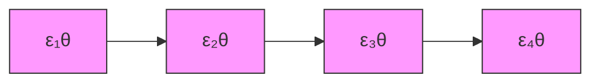

# AsyncDiff: Parallelizing Diffusion Models by Asynchronous Denoising

Zigeng Chen, Xinyin Ma, Gongfan Fang, Zhenxiong Tan, Xinchao Wang\*

National University of Singapore

zigeng99@u.nus.edu, xinchao@nus.edu.sg


<details>
<summary>natural_image</summary>

Series of nine-panel image collage showing female and male figures in various artistic poses, including a woman with a white feathered head, an astronaut playing guitar, and a floral headdress, all against a coastal landscape background.
</details>

Figure 1: We introduce a new distributed acceleration paradigm that attains a 2.8x speed-up on Stable Diffusion XL while maintaining pixel-level consistency, using four NVIDIA A5000 GPUs.

# Abstract

Diffusion models have garnered significant interest from the community for their great generative ability across various applications. However, their typical multi-step sequential-denoising nature gives rise to high cumulative latency, thereby precluding the possibilities of parallel computation. To address this, we introduce AsyncDiff, a universal and plug-and-play acceleration scheme that enables model parallelism across multiple devices. Our approach divides the cumbersome noise prediction model into multiple components, assigning each to a different device. To break the dependency chain between these components, it transforms the conventional sequential denoising into an asynchronous process by exploiting the high similarity between hidden states in consecutive diffusion steps. Consequently, each component is facilitated to compute in parallel on separate devices. The proposed strategy significantly reduces inference latency while minimally impacting the generative quality. Specifically, for the Stable Diffusion v2.1, AsyncDiff achieves a 2.7x speedup with negligible degradation and a 4.0x speedup with only a slight reduction of 0.38 in CLIP Score, on four NVIDIA A5000 GPUs. Our experiments also demonstrate AsyncDiff can be readily applied to video diffusion models with encouraging performances. Code is available at https://github.com/czg1225/AsyncDiff

# 1 Introduction

Diffusion models [10] stand out in generative modeling and have significantly advanced various fields including text-to-image [38, 36, 40, 41, 64, 70] and text-to-video generation [56, 6, 54, 17, 2], image

Traditional: Denosing Model running in Sequential   


<details>
<summary>flowchart</summary>


</details>

Ours: Denoising Model running in Parallel   


<details>
<summary>flowchart</summary>

```mermaid
graph LR
    subgraph_GPU_0["GPU 0"]
        A1["ε₁θ¹"] --> B1["ε₂θ"]
    end
    subgraph_GPU_1["GPU 1"]
        A2["ε₂θ²"] --> B2["ε₃θ³"]
    end
    subgraph_GPU_2["GPU 2"]
        A3["ε₃θ³"] --> B3["ε₄θ⁴"]
    end
    subgraph_GPU_3["GPU 3"]
        A4["ε₄θ⁴"] --> B4["ε₅θ⁴"]
    end
    A1 -.->|Communication within device| B1
    B1 -.->|Communication across devices| B2
    B2 -.->|Communication within device| B3
    B3 -.->|Communication across devices| B4
```
</details>

Figure 2: By preparing each component's input beforehand, we enable parallel computation of the denoising model, which substantially reduces latency while minimally affecting quality.

translation [44, 51, 19], audio generation[18, 11, 39], low-level vision tasks [42, 53, 35, 22, 5, 62], image editing [15, 58, 46, 69], and 3D model generation [37, 14, 32], among others. However, their widespread application is hindered by the high latency inherent in their multi-step sequential denoising process. This issue becomes more pronounced as the complexity and size of the models increase to enhance generative quality.

In response to these challenges, significant research efforts are directed toward enhancing the efficiency of diffusion models. Notably, training-free acceleration methods have garnered increasing popularity due to their low cost and convenience. Numerous studies $[30, 55, 68, 59, 48, 21, 29]$ improve inference speed by skipping redundant calculations in the denoising process. As computational resources grow rapidly, distributing computations across multiple devices has become a more promising approach. Recent advances $[47, 20]$ demonstrate that using distributed computing to parallelize inference effectively increases the acceleration ratio for diffusion models while maintaining acceptable generative quality. Though these methods succeed in parallelizing the diffusion models, they require iterative refining $[47]$ or displaced patch parallelism $[20]$ , resulting in a larger number of model evaluations or low GPU utilization correspondingly.

Thus, we wish to propose a new parallel paradigm for diffusion, akin to the model parallelism in distributed computing $[12, 33, 24, 13, 34, 57]$ , which divides the denoising model into several components to be distributed on different GPUs. The primary challenge lies in the inherent sequential denoising process of diffusion models. Each step in this process depends on the completion of its predecessor, forming a dependency chain that impedes parallelization and significantly increases inference latency. Our approach seeks to disrupt this chain, allowing for the parallel execution of the denoising model while closely approximating the results of the sequential process.

In this paper, we introduce $AsyncDiff$ , a universal, distributed acceleration paradigm that innovatively explores model parallelism in diffusion models. As shown in Fig 2, our method sequentially partitions the heavyweight denoising model $\epsilon_{\theta}$ into multiple components $\{\epsilon_{\theta}^{n}\}_{n=1}^{N}$ based on computational load, assigning each to a separate device. Our core idea lies in decoupling the dependencies between these cascaded components by leveraging the high similarity in hidden states across consecutive diffusion steps. After the initial warm-up steps, each component takes the output from the previous component's prior step as the approximation of its original input. This transforms the traditional sequential denoising into an asynchronous process, allowing components to predict noise for different time steps in parallel. Additionally, we incorporate stride denoising to skip redundant calculations and reduce the frequency of communication between devices, further enhancing efficiency.

Through extensive testing across multiple base models, our method effectively distributes the computational burden across various devices, substantially boosting inference speed while maintaining quality. Specifically, with the text-to-image model Stable Diffusion v2.1 [38], our method achieves a 1.8x speedup with only a marginal 0.01 drop in CLIP Score [8], and a 4.0x speedup with a slight 0.38 reduction in CLIP Score on two and four NVIDIA A5000 GPUs, respectively. For video diffusion models, AnimateDiff [6] and Stable Video Diffusion [2], our approach significantly reduces latency by tens of seconds, effectively preserving video quality.

In summary, we present a novel distributed acceleration method for diffusion models that significantly reduces inference latency with minimal impact on generation quality. This is achieved by replacing the sequential denoising process with an asynchronous process, allowing each component of the denoising model to run independently across different devices. Extensive experiments on both image and video diffusion models strongly demonstrate the effectiveness and versatility of our method.

# 2 Related Works

Diffusion Models. Diffusion models have attracted significant attention due to their powerful generative capabilities across various tasks. Sohl-Dickstein et al. [49] first proposed diffusion probabilistic models. Ho et al. [10] with the introduction of Denoising Diffusion Probabilistic Models (DDPM), enhancing training efficiency and generation quality. Rombach et al. [38] advanced these models by incorporating latent spaces, enabling high-resolution image generation. Despite these advancements, the high latency of the iterative denoising process remains a limitation.

Inference Acceleration. Training-based acceleration methods focus on reducing sampling steps $[43, 63, 28, 45, 61]$ or optimizing model architectures $[23, 71, 4, 65, 60]$ . However, these methods incur high training costs and complexity. Training-free methods are gaining popularity due to their ease of use. Some approaches develop fast solvers for SDE or ODE to improve sampling efficiency $[27, 1, 26, 66, 72]$ . Other works $[30, 55, 68, 59, 48, 21, 29]$ observed special characteristics of diffusion models and skipped the redundant computation within the denoising process.

Parallelism. The parallelism strategy presents a promising yet underexplored approach to accelerating diffusion models. ParaDiGMS $[47]$ implements Picard iterations for parallel sampling, yet its practical speed-up ratio is modest, and it struggles to maintain consistency with original outputs. Faster Diffusion $[21]$ introduces encoder propagation but significantly compromises quality, and its parallelization remains theoretical. Distrifusion $[20]$ adopts patch parallelism, dividing high-resolution images into sub-patches to facilitate parallel inference on each patch by reusing stale activation maps from each layer. However, this approach lacks flexibility across different data types or tasks, often encountering low resource utilization. Furthermore, its reliance on reusing per-layer activation maps greatly increases GPU memory demands thus introducing additional challenges for realistic applications. In contrast, our method uniquely implements model parallelism through asynchronous denoising, achieving substantial acceleration while maintaining a stable resource usage ratio and minimal impact on quality.

# 3 Methods

# 3.1 Preliminary

Diffusion models [10] are a dominant class of generative models that transform Gaussian noise into complex data distributions via a Markov process. The forward process is defined by:

$$
q (x _ {t} | x _ {t - 1}) = \mathcal {N} (x _ {t}; \sqrt {1 - \beta_ {t}} x _ {t - 1}, \beta_ {t} I), \tag {1}
$$

where $\{\beta_{t}\}$ progressively increases noise until the data becomes indistinguishable from noise. The reverse process, essential for data reconstruction, involves iterative denoising:

$$
p _ {\theta} (x _ {t - 1} | x _ {t}) = \mathcal {N} (x _ {t - 1}; \mu_ {\theta} (x _ {t}, t), \sigma_ {t} ^ {2} I), \tag {2}
$$

where $\mu_{\theta}(x_t,t)$ is the predicted mean and $\sigma_t^2$ is the variance. For DDIMs [50], the reverse update is deterministic:

$$
x _ {t - 1} = \sqrt {\frac {\alpha_ {t - 1}}{\alpha_ {t}}} x _ {t} + \sqrt {1 - \alpha_ {t - 1}} \left(1 - \sqrt {\frac {1 - \alpha_ {t}}{\alpha_ {t - 1}}}\right) \epsilon_ {\theta} (x _ {t}, t), \tag {3}
$$

where $\alpha_{t}$ is the cumulative product of $(1 - \beta_{t})$ . These processes are computationally intensive, influencing the quality of generated samples and necessitating efficient inference methods for practical applications.

# 3.2 Asynchronous Diffusion Model

Traditional diffusion models employ a sequential and synchronous denoising process. At each time step $t$ , the noise-prediction model $\epsilon_{\theta}$ estimates the noise $\epsilon_{t}$ based on the noisy image $x_{t}$ and the time

```mermaid
graph TD
    subgraph Time_Embedding
        direction TB
        A["×T"] --> B["T"]
        B --> C["xT-1"]
        C --> D["T-1"]
        D --> E["xT-2"]
        E --> F["T-2"]
        F --> G["xT-3"]
        G --> H["T-3"]
        H --> I["xT-4"]
        I --> J["T-4"]
        J --> K["xT-5"]
    end

    subgraph Time_Embedding_Tilde
        direction TB
        L["×T"] --> M["T"]
        M --> N["xT-1"]
        N --> O["T-1"]
        O --> P["xT-2"]
        P --> Q["T-2"]
        Q --> R["xT-3"]
        R --> S["T-3"]
        S --> T["xT-4"]
        T --> U["T-4"]
        U --> V["xT-5"]
    end

    subgraph Time_Embedding_Tilde_Tilde
        direction TB
        W["×T"] --> X["T"]
        X --> Y["xT-1"]
        Y --> Z["T-1"]
        Z --> AA["xT-2"]
        AA --> AB["T-2"]
        AB --> AC["xT-3"]
        AC --> AD["T-3"]
        AD --> AE["xT-4"]
        AE --> AF["T-4"]
        AF --> AG["xT-5"]
    end

    subgraph Time_Embedding_Tilde_Tilde_Tilde
        direction TB
        AH["×T"] --> AI["T"]
        AI --> AJ["xT-1"]
        AJ --> AK["T-1"]
        AK --> AL["xT-2"]
        AL --> AM["T-2"]
        AM --> AN["xT-3"]
        AN --> AO["T-3"]
        AO --> AP["xT-4"]
        AP --> AQ["T-4"]
        AQ --> AR["xT-5"]
    end

    subgraph Time_Embedding_Tilde_Tilde_Tilde
        direction TB
        AS["×T"] --> AT["T"]
        AT --> AU["xT-1"]
        AU --> AV["T-1"]
        AV --> AW["xT-2"]
        AW --> AX["T-2"]
        AX --> AY["xT-3"]
        AY --> AZ["T-3"]
        AZ --> BA["xT-4"]
        BA --> BB["T-4"]
        BB --> BC["xT-5"]
    end

    subgraph Time_Embedding_Tilde_Tilde_Tilde
        direction TB
        BD["×T"] --> BE["T"]
        BE --> BF["xT-1"]
        BF --> BG["T-1"]
        BG --> BH["xT-2"]
        BH --> BI["T-2"]
        BI --> BJ["xT-3"]
        BJ --> BK["T-3"]
        BK --> BL["xT-4"]
        BL --> BM["T-4"]
        BM --> BN["xT-5"]
    end

    A --> B --> C --> D --> E --> F --> G --> H --> I --> J --> K --> L --> M --> N --> O --> P --> Q --> R --> S --> T --> U --> V --> W --> X --> Y
    B --> C --> D --> E --> F --> G --> H --> I --> J --> K --> L --> M --> N --> O --> P --> Q --> R --> S --> T --> U
    C --> D --> E --> F --> G --> H
    D --> F --> G
    E --> G
    F --> H
    G --> I
    H --> J
    I --> K
    J --> L
    K --> M
    L --> N
    M --> O
    N --> P
    O --> Q
    P --> R
    Q --> S
    R --> T
    S --> U
    T --> V
    U --> W
    V --> X
    W --> Y
    X --> Z
    Y --> AA
    Z --> AB
    AA --> AC
    AC --> AD
    AD --> AE
    AE --> AF
    AF --> AG
    AG --> AH
    AH --> AI
    AI --> AJ
    AJ --> AK
    AK --> AL
    AL --> AM
    AM --> AN
    AN --> AO
    AO --> AP
    AP --> AQ
    AQ --> AR
    AR --> AS
    AS --> AT
    AT --> AU
    AU --> AV
    AV --> AW
    AW --> AX
    AX --> AY
    AY --> AZ
    AZ --> BA
    BA --> BB
    BB --> BC
    BC --> BD
```


<details>
<summary>flowchart</summary>


</details>

Figure 3: Overview of the asynchronous denoising process. The denoising model $\epsilon_{\theta}$ is divided into four components $\{\epsilon_{\theta}^{n}\}_{n=1}^{4}$ for clarity. Following the warm-up stage, each component's input is prepared in advance, breaking the dependency chain and facilitating parallel processing.

embedding $t$ . The image for the next step, $x_{t-1}$ , is then generated using a sampler function $S(x_t, \epsilon_t, t)$ . This process is iterative, where the generation of $\epsilon_t$ at each step is dependent on the completion of the previous denoising step, making the process slow, particularly when $\epsilon_\theta$ is computationally intensive.

To address the limitations of high latency in diffusion models, leveraging multiple GPUs for distributed inference is a promising solution. Existing studies primarily focus on patch parallelism $[20]$ , where the input image is divided into patches, each processed on a different GPU. While this strategy efficiently distributes computational loads, it still retains the bottleneck of sequential denoising, as each patch must undergo the complete denoising process iteratively. In contrast, our asynchronous diffusion model innovatively introduces a model parallelism strategy. By approximating the sequential denoising as an asynchronous process, this approach enables parallel inference of the noise prediction model, effectively reducing latency and breaking the constraints of sequential execution.

Asynchronous Denoising. Figure 3 illustrates our approach to the asynchronous denoising. For a denoising process consisting of T steps, the initial w steps are designated as a warm-up phase, where w is significantly smaller than T. During this phase, the denoising model $\epsilon_{\theta}$ operates using standard sequential inference. After warm-up steps, rather than splitting the input image, we partition the denoising model $\epsilon_{\theta}$ into N sequential components, expressed as $\epsilon_{\theta} = \{\epsilon_{\theta}^{1}, \epsilon_{\theta}^{2}, ..., \epsilon_{\theta}^{N}\}$ . Each component is divided to handle a comparable computational load and assigned to a distinct device. This equitable division aims to equalize the time cost of each component to approximately $l(\epsilon_{\theta})/N$ , thus minimizing the overall maximum latency. In this setup, original noise prediction for $x_{t}$ can be represented as a cascading operation through these sub-models, defined mathematically as:

$$
\epsilon_ {t} = \epsilon_ {\theta} (x _ {t}, t) = \epsilon_ {\theta} ^ {N} (\epsilon_ {\theta} ^ {N - 1} (\dots \epsilon_ {\theta} ^ {2} (\epsilon_ {\theta} ^ {1} (x _ {t}, t), t) \dots , t), t). \tag {4}
$$

Although each device can independently compute its assigned component, the dependency chain persists because the input for each component $\epsilon_{\theta,n}$ is derived from the output from its preceding component $\epsilon_{\theta,n-1}$ . Therefore, despite the distribution of model components across multiple devices, full parallelization is constrained by these sequential dependencies.

Our principal innovation is to break the dependency between cascaded components by utilizing hidden features from previous steps. Observations indicate that the hidden states of each block in the denoising model always exhibit substantial similarity across adjacent time steps. Leveraging this, each component at time step t can take the output from the preceding component at time step t - 1 as the approximation of its original input. Specifically, the n-th component $\epsilon_{\theta}^{n}(t)$ receives the output of


<details>
<summary>flowchart</summary>

```mermaid
graph LR
    subgraph_GPU_0["GPU 0(ε₁θ)"]
        t1_t_minus_1 --> t_minus_1_t_minus_1
    end
    subgraph_GPU_1["GPU 1(ε₂θ)"]
        t_minus_1_t_minus_1 --> t_minus_1_t_minus_1
    end
    subgraph_GPU_2["GPU 2(εₜ³)"]
        t_minus_1_t_minus_1 --> t_minus_1_t_minus_1
    end
    t_minus_1_t_minus_1 --> t_minus_1_t_minus_1
    t_minus_1_t_minus_1 --> t_minus_1_t_minus_1
    t_minus_1_t_minus_1 --> t_minus_1_t_minus_1
    t_minus_1_t_minus_1 --> t_minus_1_t_minus_1
    t_minus_1_t_minus_1 --> t_minus_1_t_minus_1
    t_minus_1_t_minus_1 --> t_minus_1_t_minus_1
    t_minus_t_minus_1 --> x_t_minus_1["x_{t-1}"]
    x_t --> x_t_minus_1
    x_t --> x_t_minus_2["x_{t-2}"]
    x_t --> x_t_minus_2
    x_t --> x_t_plus_3["GPU 3(εₜ³)"]
    x_t --> x_t_plus_4["GPU 0(εₜ¹)"]
    x_t --> x_t_plus_5["GPU 1(εₜ²)"]
    x_t --> x_t_plus_6["GPU 2(εₜ³)"]
    x_t --> x_t_plus_7["Parallel"]
    x_t -->|t: Time embedding| x_t_plus_3
    x_t -->|t: Time embedding| x_t_plus_4
    x_t -->|t: Time embedding| x_t_plus_5
    x_t -->|t: Time embedding| x_t_plus_6
    x_t -->|t: Time embedding| x_t_plus_7
```
</details>

Figure 4: Illustration of stride denoising. The model $\epsilon_{\theta}$ is divided into three components $\{\epsilon_{\theta}^{n}\}_{n=1}^{3}$ , with a stride S of 2 for clarity. Components $\epsilon_{\theta}^{1}$ and $\epsilon_{\theta}^{2}$ are skipped at time step t. A single parallel batch results in the completion of denoising for two steps, producing $x_{t-1}$ and $x_{t-2}$ .

$\epsilon_{\theta}^{n - 1}(\cdot ,t - 1)$ . This alteration allows the noise prediction for $x_{t}$ to be represented as follows:

$$
\epsilon_ {t} = \epsilon_ {\theta} ^ {N} (\epsilon_ {\theta} ^ {N - 1} (\dots \epsilon_ {\theta} ^ {2} (\epsilon_ {\theta} ^ {1} (x _ {t + N - 1}, t + N - 1), t + N - 2) \dots , t + 1), t). \tag {5}
$$

In this new framework, noise prediction $\epsilon_{t}$ is derived from components executed across N previous time steps. This transforms the denoising process from sequential to asynchronous, as the prediction of noise $\epsilon_{t}$ already begins before denoising at step $t+1$ is completed. At each time step, the N components are running as parts of the noise prediction model for the next N steps. Specifically, the n-th component $\epsilon_{\theta}^{n}$ , computed in parallel at time t, contributes to the noise prediction for the future time step $t-N+n$ . Figure 3 depicts this asynchronous process using a U-net model with N set to 4. The strong resemblance of hidden states between consecutive diffusion steps enables the asynchronous process to closely mimic the denoising results of the original sequential process.

Model Parallelism. By transitioning to an asynchronous denoising strategy, the dependencies among components within the same time step are eliminated. This adjustment allows each component's input for time step $t$ to be prepared in advance, enabling the $N$ split components to be processed concurrently across multiple devices. Once computed, the outputs from each component must be stored and then broadcasted to other devices to facilitate parallel processing for subsequent time steps. In contrast, in the traditional sequential denoising process, the time cost for each step accumulates as follows:

$$
C _ {s e q} (t) = C (\epsilon_ {\theta} ^ {1}) + C (\epsilon_ {\theta} ^ {2}) + \dots + C (\epsilon_ {\theta} ^ {N}). \tag {6}
$$

By adopting asynchronous denoising to enable parallel computation of each component, the cost for each time step is now given by:

$$
C _ {a s y} (t) = \max (C (\epsilon_ {\theta} ^ {1}), C (\epsilon_ {\theta} ^ {2}),..., C (\epsilon_ {\theta} ^ {N})) + C (\text { comm. }), \tag {7}
$$

where $\max()$ represents taking the maximum value, and $C(\text{comm.})$ indicates the communication cost across multiple GPUs. As the model components are equally divided by computational load, their time costs are similar, allowing us to approximate the overall cost of each time step as:

$$
C _ {a s y} (t) \approx \frac {C _ {s e q} (t)}{N} + C (\text { comm. }). \tag {8}
$$

Since the communication overhead $C(\mathrm{comm.})$ is generally much lower than the model's execution time, it leads to significant overall cost reductions. Moreover, increasing $N$ further reduces time costs but complicates the accurate approximation of the original denoising process.

Stride Denoising. While asynchronous denoising reduces latency by parallelizing the denoising model, it completes only one denoising step at a time. To enhance efficiency, we introduce stride denoising, which completes multiple denoising steps simultaneously through a single parallel computation. The diagram is illustrated in Figure 4, where we set the stride to 2 for clarity. Unlike the continuous broadcasting of hidden states at each time step, stride denoising broadcasts them every two steps. As depicted, at time step $t$ , we conduct denoising alone, and at time step $t - 1$ , we compute and broadcast the hidden states for the next parallel computation round. Consequently, the hidden states from time step $t$ are not required, allowing us to skip the calculations for $\epsilon_{\theta}^{1}$ and $\epsilon_{\theta}^{2}$ at this step. In this stride, only $\epsilon_{\theta}^{3}(\cdot ,t)$ , $\epsilon_{\theta}^{1}(\cdot ,t - 1)$ , $\epsilon_{\theta}^{2}(\cdot ,t - 1)$ , and $\epsilon_{\theta}^{3}(\cdot ,t - 1)$ need computing, all receiving the

(a) Qualitative Results on SDXL with different configurations   


<details>
<summary>text_image</summary>

Original
Ours 1.7x Speedup
2 Devices (N=2 S=1)
Ours 2.4x Speedup
3 Devices (N=3 S=1)
Ours 2.7x Speedup
4 Devices (N=4 S=1)
Ours 2.8x Speedup
3 Devices (N=2 S=2)
Ours 3.8x Speedup
4 Devices (N=3 S=2)
(b) Qualitative Results on SDXL with different warm-up steps (N=3 S=2)
Original
Ours 2.5x Speedup
4 Devices Warm-up=11
Ours 2.8x Speedup
4 Devices Warm-up=9
Ours 3.0x Speedup
4 Devices Warm-up=7
Ours 3.4x Speedup
4 Devices Warm-up=5
Ours 3.8x Speedup
4 Devices Warm-up=3
</details>

Figure 5: Qualitative Results. (a) Our method significantly accelerates the denoising process with minimal impact on generative quality. (b) Increasing warm-up steps achieves pixel-level consistency with the original output while maintaining a high speed-up ratio.

previously broadcast hidden states, enabling their parallel processing. Both $\epsilon_{\theta}^{3}(\cdot,t)$ and $\epsilon_{\theta}^{3}(\cdot,t-1)$ share the same feature from $\epsilon_{\theta}^{2}(\cdot,t+1)$ , so the stride should be kept small to maintain quality. Stride denoising effectively reduces both computational load and communication demands by decreasing the parallel computing rounds needed to complete the process. Compared to the significant improvements it brings in efficiency, the quality sacrifice is minimal and can be entirely compensated for by slightly increasing the warm-up steps. We also illustrate the full schematic of it in Appendix Figure 7.

Multi-Device Communication. Parallel inference of the model necessitates efficient communication between devices, as each component $\epsilon_{\theta}^{n}$ must access the cached hidden state from the preceding component $\epsilon_{\theta}^{n-1}$ , which resides on a different device. Post each parallel computation batch, each device stores the current hidden state needed for the next parallel batch. These states, encompassing all component outputs, are then broadcast to all participating devices before the next parallel computation batch. Although each component $\epsilon_{\theta}^{n}$ primarily uses the cached output of $\epsilon_{\theta}^{n-1}$ for its input, it may require residual features [7] from other components. Therefore, it's crucial to broadcast the stored states from every component across all devices before each round of parallel computation.

# 4 Experiments

# 4.1 Implementation Details

Base models. We validated the broad applicability of AsyncDiff through extensive testing on several diffusion models. For text-to-image tasks, we experimented with three versions of Stable Diffusion: SD 1.5, SD 2.1 [38], and Stable Diffusion XL (SDXL) [36]. Additionally, we explored the effectiveness of AsyncDiff on video diffusion models using Stable Video Diffusion (SVD) [2] and AnimateDiff [6]. All models were evaluated using 50 DDIM steps. We facilitated communication across multiple GPUs using the broadcast operation from torch.distributed, powered by the NVIDIA Collective Communication Library (NCCL) backend.

Table 1: Quantitative evaluations of $AsyncDiff$ on three text-to-image diffusion models, showcasing various configurations. 'N' indicates the number of components into which the model is divided, and 'S' represents the denoising stride. $MACs$ quantifies the computational load per device for generating a single image throughout the denoising process. 

<table><tr><td>Base Model</td><td>Configuration</td><td>Devices</td><td>MACs↓</td><td>latency↓</td><td>Speed up↑</td><td>CLIP Score↑</td><td>FID↓</td><td>LPIPS↓</td></tr><tr><td rowspan="6">SD 2.1(Text-to-Image)</td><td>Original Model</td><td>1</td><td>76T</td><td>5.51s</td><td>1.0x</td><td>31.60</td><td>27.89</td><td>-</td></tr><tr><td>+ Ours (N=2 S=1)</td><td>2</td><td>38T</td><td>3.03s</td><td>1.8x</td><td>31.59</td><td>27.79</td><td>0.2121</td></tr><tr><td>+ Ours (N=3 S=1)</td><td>3</td><td>25T</td><td>2.41s</td><td>2.3x</td><td>31.56</td><td>28.00</td><td>0.2755</td></tr><tr><td>+ Ours (N=4 S=1)</td><td>4</td><td>19T</td><td>2.10s</td><td>2.6x</td><td>31.40</td><td>28.28</td><td>0.3132</td></tr><tr><td>+ Ours (N=2 S=2)</td><td>3</td><td>19T</td><td>1.82s</td><td>3.0x</td><td>31.43</td><td>28.55</td><td>0.3458</td></tr><tr><td>+ Ours (N=3 S=2)</td><td>4</td><td>13T</td><td>1.35s</td><td>4.0x</td><td>31.22</td><td>29.41</td><td>0.3778</td></tr><tr><td rowspan="6">SD 1.5(Text-to-Image)</td><td>Original Model</td><td>1</td><td>34T</td><td>2.70s</td><td>1.0x</td><td>30.63</td><td>29.96</td><td>-</td></tr><tr><td>+ Ours (N=2 S=1)</td><td>2</td><td>17T</td><td>1.52s</td><td>1.8x</td><td>30.62</td><td>29.94</td><td>0.1988</td></tr><tr><td>+ Ours (N=3 S=1)</td><td>3</td><td>11T</td><td>1.23s</td><td>2.2x</td><td>30.58</td><td>29.87</td><td>0.2645</td></tr><tr><td>+ Ours (N=4 S=1)</td><td>4</td><td>9T</td><td>1.01</td><td>2.6x</td><td>30.52</td><td>30.10</td><td>0.3073</td></tr><tr><td>+ Ours (N=2 S=2)</td><td>3</td><td>9T</td><td>0.94s</td><td>2.9x</td><td>30.46</td><td>30.98</td><td>0.3232</td></tr><tr><td>+ Ours (N=3 S=2)</td><td>4</td><td>6T</td><td>0.72s</td><td>3.7x</td><td>30.17</td><td>30.89</td><td>0.3811</td></tr><tr><td rowspan="6">SDXL(Text-to-Image)</td><td>Original Model</td><td>1</td><td>299T</td><td>13.81s</td><td>1.0x</td><td>32.33</td><td>27.43</td><td>-</td></tr><tr><td>+ Ours (N=2 S=1)</td><td>2</td><td>150T</td><td>8.00s</td><td>1.7x</td><td>32.21</td><td>27.79</td><td>0.2509</td></tr><tr><td>+ Ours (N=3 S=1)</td><td>3</td><td>100T</td><td>5.84s</td><td>2.4x</td><td>32.05</td><td>28.03</td><td>0.2940</td></tr><tr><td>+ Ours (N=4 S=1)</td><td>4</td><td>75T</td><td>5.12s</td><td>2.7x</td><td>31.90</td><td>29.12</td><td>0.3157</td></tr><tr><td>+ Ours (N=2 S=2)</td><td>3</td><td>75T</td><td>4.91s</td><td>2.8x</td><td>31.70</td><td>28.99</td><td>0.3209</td></tr><tr><td>+ Ours (N=3 S=2)</td><td>4</td><td>49T</td><td>3.65s</td><td>3.8x</td><td>31.40</td><td>30.27</td><td>0.3556</td></tr></table>

Table 2: Quantitative evaluations of the effect of increasing warm-up steps. More warm-up steps can achieve pixel-level consistency with the original output while slightly reducing processing speed. 

<table><tr><td rowspan="2">Configuration</td><td colspan="3">SD 2.1</td><td colspan="3">SD 1.5</td><td colspan="3">SDXL</td></tr><tr><td>Speedup↑</td><td>CLIP↑</td><td>LPIPS↓</td><td>Speedup↑</td><td>CLIP↑</td><td>LPIPS↓</td><td>Speedup↑</td><td>CLIP↑</td><td>LPIPS↓</td></tr><tr><td>Original Model</td><td>1.0x</td><td>31.60</td><td>-</td><td>1.0x</td><td>30.63</td><td>-</td><td>1.0x</td><td>32.33</td><td>-</td></tr><tr><td>Warm-up = 3</td><td>3.5x</td><td>31.26</td><td>0.3289</td><td>3.3x</td><td>30.16</td><td>0.3676</td><td>3.8x</td><td>31.40</td><td>0.3556</td></tr><tr><td>Warm-up = 5</td><td>3.1x</td><td>31.27</td><td>0.2769</td><td>3.0x</td><td>30.14</td><td>0.3304</td><td>3.4x</td><td>31.60</td><td>0.2993</td></tr><tr><td>Warm-up = 7</td><td>2.9x</td><td>31.32</td><td>0.2309</td><td>2.7x</td><td>30.10</td><td>0.2839</td><td>3.0x</td><td>31.77</td><td>0.2521</td></tr><tr><td>Warm-up = 9</td><td>2.7x</td><td>31.40</td><td>0.1940</td><td>2.5x</td><td>30.17</td><td>0.2354</td><td>2.8x</td><td>31.92</td><td>0.2095</td></tr><tr><td>Warm-up = 11</td><td>2.4x</td><td>31.45</td><td>0.1628</td><td>2.4x</td><td>30.22</td><td>0.1927</td><td>2.5x</td><td>32.01</td><td>0.1740</td></tr></table>

Dataset and Evaluation Metrics. We assess the zero-shot generation capability using the MS-COCO 2017 [25] validation set, which comprises 5,000 images and captions. For image generation, quality is measured by the CLIP Score (on ViT-g/14) [8] and Fréchet Inception Distance (FID) [9], with LPIPS [67] used to check consistency with original outputs. In video generation, quality is evaluated by averaging the CLIP Score across all frames of a video. We also report MACs per device and latency to gauge efficiency comprehensively. All latency measurements were conducted on NVIDIA A5000 GPUs equipped with NVLINK Bridge.

# 4.2 Experimental Results on Image Diffusion Models

Improvements on Base Models. Table 1 displays our acceleration outcomes for three fundamental image diffusion models under various configurations. In this context, 'N' represents the number of segments into which the denoising model is divided, and 'S' denotes the stride of denoising for each parallel computation batch. Our approach, AsyncDiff, not only significantly accelerates processing but also minimally impacts generative quality. The speedup ratio is almost proportional to the number of devices used, demonstrating efficient resource utilization. Visualization results in Figure 5 (a) illustrate the high generative quality achieved even with substantially reduced latency. Although achieving pixel-level consistency with the original output is challenging at high acceleration ratios, the generated image still effectively conveys the semantic information in the prompt, which is crucial for generative results.

Pixel-level Consistency by Warm-up. In Table 2, we explore the balance between pixel-level consistency and processing speed by adjusting the warm-up steps in the diffusion models. As the initial steps of these models play a crucial role in reconstructing the global structure based on text prompts [68], a modest increase in warm-up steps can significantly enhance consistency with the

Table 3: Quantitative comparison with other parallel acceleration methods. To ensure a fair comparison with Distrifusion, we increased the warm-up steps in our method to match the speedup ratio of Distrifusion, allowing us to fairly compare generation quality and resource costs. 

<table><tr><td>Method</td><td>Speed up↑</td><td>Devices</td><td>MACs↓</td><td>Memory↓</td><td>CLIP Score↑</td><td>FID↓</td><td>LPIPS↓</td></tr><tr><td>Original Model</td><td>1.0x</td><td>1</td><td>76T</td><td>5240MB</td><td>31.60</td><td>27.87</td><td>-</td></tr><tr><td>Faster Diffusion</td><td>1.6x</td><td>1</td><td>57T</td><td>9692MB</td><td>30.84</td><td>29.95</td><td>0.3477</td></tr><tr><td>Distrifusion</td><td>1.6x</td><td>2</td><td>38T</td><td>6538MB</td><td>31.59</td><td>27.89</td><td>0.0178</td></tr><tr><td>Ours (N=2 S=1)</td><td>1.6x</td><td>2</td><td>44T</td><td>5450MB</td><td>31.59</td><td>27.79</td><td>0.0944</td></tr><tr><td>Distrifusion</td><td>2.3x</td><td>4</td><td>19T</td><td>7086MB</td><td>31.43</td><td>27.97</td><td>0.2710</td></tr><tr><td>Ours (N=2 S=2)</td><td>2.3x</td><td>3</td><td>20T</td><td>5516MB</td><td>31.49</td><td>27.71</td><td>0.2117</td></tr><tr><td>Distrifusion</td><td>2.7x</td><td>8</td><td>10T</td><td>7280MB</td><td>31.31</td><td>28.12</td><td>0.2934</td></tr><tr><td>Ours (N=3 S=2)</td><td>2.7x</td><td>4</td><td>14T</td><td>5580MB</td><td>31.40</td><td>28.03</td><td>0.1940</td></tr></table>


<details>
<summary>text_image</summary>

Original
1 Device
Ours 1.6x Speedup
2 Devices
Distrifusion 1.6x Speedup
2 Devices
Ours 2.3x Speedup
3 Devices
Distrifusion 2.3x Speedup
4 Devices
Ours 2.7x Speedup
4 Devices
Distrifusion 2.7x Speedup
8 Devices
</details>

Figure 6: Qualitative Comparison with Distrifusion on SD2.1. At the same acceleration ratio, AsyncDiff outperforms in generating higher quality and more consistent images with the original.

original images. Figure 5(b) illustrates this trend with qualitative comparisons of generative results on SDXL using gradually increasing warm-up steps. Increasing the warm-up steps to 9 achieves visual indistinguishability from the original output while maintaining an impressive 2.8x acceleration ratio.

Comparison with Acceleration Baselines. We evaluated our AsyncDiff method on SD 2.1 against two other parallel acceleration methods: Faster Diffusion [21] and Distrifusion [20]. Faster Diffusion employs encoder propagation but compromises significantly on generative quality. As its parallelism maintains theoretical and lacks a multi-device implementation, we cannot measure its realistic latency with more than one GPU. Its ideal speed-up on 2 devices is about 1.9x. Distrifusion, on the other hand, uses patch parallelism for distributed acceleration but faces potential issues with low resource utilization and high GPU memory demands.

According to Table 3, our method achieves the same operational speed using only 4 GPUs and 3 GPUs as Distrifusion does with 8 GPUs and 4 GPUs, respectively. Additionally, our method requires almost the same amount of memory as the original setup, whereas Distrifusion significantly increases memory requirements, posing extra challenges for practical applications. In terms of generative quality, AsyncDiff and Distrifusion both mirror the original diffusion model's performance at a 1.6x acceleration ratio. However, at higher speedup ratios of 2.3x and 2.7x, our method demonstrates significantly superior generative quality. Qualitative comparisons in Fig 6 further show that AsyncDiff maintains better pixel-level consistency with the original input compared to Distrifusion.

# 4.3 Experimental Results on Video Diffusion Models

As presented in Table 4, we conducted experiments with different configurations on two video diffusion models: SVD [2] (25 frames), and AnimentDiff [6] (16 frames), to demonstrate the efficacy

Table 4: Quantitative evaluations of AsyncDiff on text-to-video and image-to-video diffusion models. We present the results with various configurations. 

<table><tr><td>Base Model</td><td>Configuration</td><td>Devices</td><td>MACs↓</td><td>latency↓</td><td>Speed up↑</td><td>CLIP Score↑</td></tr><tr><td rowspan="5">AnimateDiff(Text-to-Video)</td><td>Original Model</td><td>1</td><td>786T</td><td>43.5s</td><td>1.0x</td><td>30.65</td></tr><tr><td>+ Ours (N=2 S=1)</td><td>2</td><td>393T</td><td>24.5s</td><td>1.8x</td><td>30.65</td></tr><tr><td>+ Ours (N=3 S=1)</td><td>3</td><td>262T</td><td>19.1s</td><td>2.3x</td><td>30.54</td></tr><tr><td>+ Ours (N=2 S=2)</td><td>3</td><td>197T</td><td>14.2s</td><td>3.0x</td><td>30.32</td></tr><tr><td>+ Ours (N=3 S=2)</td><td>4</td><td>131T</td><td>11.5s</td><td>3.8x</td><td>30.20</td></tr><tr><td rowspan="4">SVD(Image-to-Video)</td><td>Original Model</td><td>1</td><td>3221T</td><td>184s</td><td>1.0x</td><td>26.88</td></tr><tr><td>+ Ours (N=2 S=1)</td><td>2</td><td>1611T</td><td>101s</td><td>1.8x</td><td>26.66</td></tr><tr><td>+ Ours (N=3 S=1)</td><td>3</td><td>1074T</td><td>80s</td><td>2.3x</td><td>26.56</td></tr><tr><td>+ Ours (N=4 S=1)</td><td>4</td><td>805T</td><td>68s</td><td>2.7x</td><td>26.19</td></tr></table>

Table 5: Effect of stride denoising on SD 2.1. Stride denoising significantly lowers overall latency and the communication cost while only slightly compromising the generative quality 

<table><tr><td rowspan="2">Configuration</td><td rowspan="2">MACs↓</td><td rowspan="2">Latency↓</td><td rowspan="2">Speedup↑</td><td colspan="2">Communication</td><td rowspan="2">CLIP Score↑</td></tr><tr><td>Nums↓</td><td>Latency↓</td></tr><tr><td>AsyncDiff (3 devices) w/o stride denoising</td><td>25T</td><td>2.41s</td><td>2.3x Faster</td><td>49 times</td><td>0.23s(9.5%)</td><td>31.56</td></tr><tr><td>AsyncDiff (3 devices) w/ stride denoising</td><td>19T</td><td>1.82s</td><td>3.0x Faster</td><td>25 times</td><td>0.12s(6.6%)</td><td>31.43</td></tr><tr><td>AsyncDiff (4 devices) w/o stride denoising</td><td>19T</td><td>2.10s</td><td>2.6x Faster</td><td>49 times</td><td>0.40s(19.0%)</td><td>31.40</td></tr><tr><td>AsyncDiff (4 devices) w/ stride denoising</td><td>13T</td><td>1.35s</td><td>4.0x Faster</td><td>25 times</td><td>0.10s(7.4%)</td><td>31.22</td></tr></table>

of our method. Video generation, often constrained by exceptionally high latency and substantial computation load, greatly benefits from our approach. For a 50-step video diffusion model, AsyncDiff significantly reduces latency—by tens or even hundreds of seconds—while preserving the quality of generated content. Qualitative results shown in the Appendix. D further corroborate the effectiveness of our method. AsyncDiff achieves an impressive acceleration ratio of over three times while still producing videos that closely match the prompt descriptions, ensuring the rationality of actions and details. These findings highlight the substantial potential of AsyncDiff in accelerating the inference process of video diffusion models.

# 4.4 Effect of Stride Denoising

We introduce stride denoising to further enhance the efficiency of the asynchronous denoising process. Stride denoising completes multiple steps simultaneously through a single parallel computation, reducing the number of parallel rounds and communication frequency across devices. For a diffusion process with T steps and warm-up step W, the number of broadcasts decreases from T - W to $(T - W) // 2$ with a stride of 2. This strategy also reduces the computational load on each device by skipping unnecessary calculations. Table 5 shows the effects of stride denoising in our parallel framework with 3 and 4 devices. Stride denoising significantly lowers overall latency and the proportion of communication time, especially as the number of devices used increases. While stride denoising slightly impacts generation quality, this effect is minimal and can be mitigated by a modest increase in warm-up steps, preserving efficiency and maintaining quality.

# 5 Conclusion

In this paper, we propose a new parallel paradigm, AsyncDiff, to accelerate diffusion models by leveraging model parallelism across multiple devices. We split the denoising model into several components, each assigned to a different device. We transform the conventional sequential denoising into an asynchronous process by exploiting the high similarity of hidden states between consecutive time steps, enabling each component to compute in parallel. Our method has been comprehensively validated on three image diffusion models (SD 2.1, SD 1.5, SDXL) and two video diffusion models (SVD, AnimateDiff). Extensive experiments demonstrate that our approach significantly accelerates inference with only a marginal impact on generative quality. This work investigates the practical application of model parallelism in diffusion models, establishing a new baseline for future research in distributed diffusion models.

# References

[1] Fan Bao, Chongxuan Li, Jun Zhu, and Bo Zhang. Analytic-dpm: an analytic estimate of the optimal reverse variance in diffusion probabilistic models. arXiv preprint arXiv:2201.06503, 2022.   
[2] Andreas Blattmann, Tim Dockhorn, Sumith Kulal, Daniel Mendelevitch, Maciej Kilian, Dominik Lorenz, Yam Levi, Zion English, Vikram Voleti, Adam Letts, et al. Stable video diffusion: Scaling latent video diffusion models to large datasets. arXiv preprint arXiv:2311.15127, 2023.   
[3] Keyan Ding, Kede Ma, Shiqi Wang, and Eero P Simoncelli. Image quality assessment: Unifying structure and texture similarity. IEEE transactions on pattern analysis and machine intelligence, 44(5):2567–2581, 2020.   
[4] Gongfan Fang, Xinyin Ma, and Xinchao Wang. Structural pruning for diffusion models. Advances in neural information processing systems, 36, 2024.   
[5] Lanqing Guo, Chong Wang, Wenhan Yang, Siyu Huang, Yufei Wang, Hanspeter Pfister, and Bihan Wen. Shadowdiffusion: When degradation prior meets diffusion model for shadow removal. In Proceedings of the IEEE/CVF Conference on Computer Vision and Pattern Recognition, pages 14049–14058, 2023.   
[6] Yuwei Guo, Ceyuan Yang, Anyi Rao, Yaohui Wang, Yu Qiao, Dahua Lin, and Bo Dai. Animated iff: Animate your personalized text-to-image diffusion models without specific tuning. arXiv preprint arXiv:2307.04725, 2023.   
[7] Kaiming He, Xiangyu Zhang, Shaoqing Ren, and Jian Sun. Deep residual learning for image recognition. In Proceedings of the IEEE conference on computer vision and pattern recognition, pages 770–778, 2016.   
[8] Jack Hessel, Ari Holtzman, Maxwell Forbes, Ronan Le Bras, and Yejin Choi. Clipscore: A reference-free evaluation metric for image captioning. arXiv preprint arXiv:2104.08718, 2021.   
[9] Martin Heusel, Hubert Ramsauer, Thomas Unterthiner, Bernhard Nessler, and Sepp Hochreiter. Gans trained by a two time-scale update rule converge to a local nash equilibrium. Advances in neural information processing systems, 30, 2017.   
[10] Jonathan Ho, Ajay Jain, and Pieter Abbeel. Denoising diffusion probabilistic models. Advances in neural information processing systems, 33:6840–6851, 2020.   
[11] Rongjie Huang, Jiawei Huang, Dongchao Yang, Yi Ren, Luping Liu, Mingze Li, Zhenhui Ye, Jinglin Liu, Xiang Yin, and Zhou Zhao. Make-an-audio: Text-to-audio generation with prompt-enhanced diffusion models. In International Conference on Machine Learning, pages 13916–13932. PMLR, 2023.   
[12] Yanping Huang, Youlong Cheng, Ankur Bapna, Orhan Firat, Dehao Chen, Mia Chen, HyoukJoong Lee, Jiquan Ngiam, Quoc V Le, Yonghui Wu, et al. Gpipe: Efficient training of giant neural networks using pipeline parallelism. Advances in neural information processing systems, 32, 2019.   
[13] Zhihao Jia, Matei Zaharia, and Alex Aiken. Beyond data and model parallelism for deep neural networks. Proceedings of Machine Learning and Systems, 1:1–13, 2019.   
[14] Animesh Karnewar, Andrea Vedaldi, David Novotny, and Niloy J Mitra. Holodiffusion: Training a 3d diffusion model using 2d images. In Proceedings of the IEEE/CVF conference on computer vision and pattern recognition, pages 18423–18433, 2023.   
[15] Bahjat Kawar, Shiran Zada, Oran Lang, Omer Tov, Huiwen Chang, Tali Dekel, Inbar Mosseri, and Michal Irani. Imagic: Text-based real image editing with diffusion models. In Proceedings of the IEEE/CVF Conference on Computer Vision and Pattern Recognition, pages 6007–6017, 2023.   
[16] Junjie Ke, Qifei Wang, Yilin Wang, Peyman Milanfar, and Feng Yang. Musiq: Multi-scale image quality transformer. In Proceedings of the IEEE/CVF international conference on computer vision, pages 5148–5157, 2021.   
[17] Levon Khachatryan, Andranik Movsisyan, Vahram Tadevosyan, Roberto Henschel, Zhangyang Wang, Shant Navasardyan, and Humphrey Shi. Text2video-zero: Text-to-image diffusion models are zero-shot video generators. In Proceedings of the IEEE/CVF International Conference on Computer Vision, pages 15954–15964, 2023.   
[18] Zhifeng Kong, Wei Ping, Jiaji Huang, Kexin Zhao, and Bryan Catanzaro. Diffwave: A versatile diffusion model for audio synthesis. arXiv preprint arXiv:2009.09761, 2020.

[19] Bo Li, Kaitao Xue, Bin Liu, and Yu-Kun Lai. Bbdm: Image-to-image translation with brownian bridge diffusion models. In Proceedings of the IEEE/CVF conference on computer vision and pattern Recognition, pages 1952–1961, 2023.   
[20] Muyang Li, Tianle Cai, Jiaxin Cao, Qinsheng Zhang, Han Cai, Junjie Bai, Yangqing Jia, Ming-Yu Liu, Kai Li, and Song Han. Distrifusion: Distributed parallel inference for high-resolution diffusion models. arXiv preprint arXiv:2402.19481, 2024.   
[21] Senmao Li, Taihang Hu, Fahad Shahbaz Khan, Linxuan Li, Shiqi Yang, Yaxing Wang, Ming-Ming Cheng, and Jian Yang. Faster diffusion: Rethinking the role of unet encoder in diffusion models. arXiv preprint arXiv:2312.09608, 2023.   
[22] Xin Li, Yulin Ren, Xin Jin, Cuiling Lan, Xingrui Wang, Wenjun Zeng, Xinchao Wang, and Zhibo Chen. Diffusion models for image restoration and enhancement—a comprehensive survey. arXiv preprint arXiv:2308.09388, 2023.   
[23] Yanyu Li, Huan Wang, Qing Jin, Ju Hu, Pavlo Chemerys, Yun Fu, Yanzhi Wang, Sergey Tulyakov, and Jian Ren. Snapfusion: Text-to-image diffusion model on mobile devices within two seconds. Advances in Neural Information Processing Systems, 36, 2024.   
[24] Zhuohan Li, Lianmin Zheng, Yinmin Zhong, Vincent Liu, Ying Sheng, Xin Jin, Yanping Huang, Zhifeng Chen, Hao Zhang, Joseph E Gonzalez, et al. {AlpaServe}: Statistical multiplexing with model parallelism for deep learning serving. In 17th USENIX Symposium on Operating Systems Design and Implementation (OSDI 23), pages 663–679, 2023.   
[25] Tsung-Yi Lin, Michael Maire, Serge Belongie, James Hays, Pietro Perona, Deva Ramanan, Piotr Dollár, and C Lawrence Zitnick. Microsoft coco: Common objects in context. In Computer Vision–ECCV 2014:13th European Conference, Zurich, Switzerland, September 6-12, 2014, Proceedings, Part V 13, pages 740–755. Springer, 2014.   
[26] Luping Liu, Yi Ren, Zhijie Lin, and Zhou Zhao. Pseudo numerical methods for diffusion models on manifolds. arXiv preprint arXiv:2202.09778, 2022.   
[27] Cheng Lu, Yuhao Zhou, Fan Bao, Jianfei Chen, Chongxuan Li, and Jun Zhu. Dpm-solver: A fast ode solver for diffusion probabilistic model sampling in around 10 steps. Advances in Neural Information Processing Systems, 35:5775–5787, 2022.   
[28] Simian Luo, Yiqin Tan, Longbo Huang, Jian Li, and Hang Zhao. Latent consistency models: Synthesizing high-resolution images with few-step inference. arXiv preprint arXiv:2310.04378, 2023.   
[29] Zhaoyang Lyu, Xudong Xu, Ceyuan Yang, Dahua Lin, and Bo Dai. Accelerating diffusion models via early stop of the diffusion process. arXiv preprint arXiv:2205.12524, 2022.   
[30] Xinyin Ma, Gongfan Fang, and Xinchao Wang. Deepcache: Accelerating diffusion models for free. arXiv preprint arXiv:2312.00858, 2023.   
[31] Anish Mittal, Rajiv Soundararajan, and Alan C Bovik. Making a “completely blind” image quality analyzer. IEEE Signal processing letters, 20(3):209–212, 2012.   
[32] Norman Müller, Yawar Siddiqui, Lorenzo Porzi, Samuel Rota Bulo, Peter Kontschieder, and Matthias Nießner. Diffrf: Rendering-guided 3d radiance field diffusion. In Proceedings of the IEEE/CVF Conference on Computer Vision and Pattern Recognition, pages 4328–4338, 2023.   
[33] Deepak Narayanan, Aaron Harlap, Amar Phanishayee, Vivek Seshadri, Nikhil R Devanur, Gregory R Ganger, Phillip B Gibbons, and Matei Zaharia. Pipedream: generalized pipeline parallelism for dnn training. In Proceedings of the 27th ACM symposium on operating systems principles, pages 1–15, 2019.   
[34] Deepak Narayanan, Mohammad Shoeybi, Jared Casper, Patrick LeGresley, Mostofa Patwary, Vijay Korthikanti, Dmitri Vainbrand, Prethvi Kashinkunti, Julie Bernauer, Bryan Catanzaro, et al. Efficient large-scale language model training on gpu clusters using megatron-lm. In Proceedings of the International Conference for High Performance Computing, Networking, Storage and Analysis, pages 1–15, 2021.   
[35] Ozan Özdenizci and Robert Legenstein. Restoring vision in adverse weather conditions with patch-based denoising diffusion models. IEEE Transactions on Pattern Analysis and Machine Intelligence, 2023.   
[36] Dustin Podell, Zion English, Kyle Lacey, Andreas Blattmann, Tim Dockhorn, Jonas Müller, Joe Penna, and Robin Rombach. Sdxl: Improving latent diffusion models for high-resolution image synthesis. arXiv preprint arXiv:2307.01952, 2023.

[37] Ben Poole, Ajay Jain, Jonathan T Barron, and Ben Mildenhall. Dreamfusion: Text-to-3d using 2d diffusion. arXiv preprint arXiv:2209.14988, 2022.   
[38] Robin Rombach, Andreas Blattmann, Dominik Lorenz, Patrick Esser, and Björn Ommer. High-resolution image synthesis with latent diffusion models. In Proceedings of the IEEE/CVF conference on computer vision and pattern recognition, pages 10684–10695, 2022.   
[39] Ludan Ruan, Yiyang Ma, Huan Yang, Huiguo He, Bei Liu, Jianlong Fu, Nicholas Jing Yuan, Qin Jin, and Baining Guo. Mm-diffusion: Learning multi-modal diffusion models for joint audio and video generation. In Proceedings of the IEEE/CVF Conference on Computer Vision and Pattern Recognition, pages 10219–10228, 2023.   
[40] Nataniel Ruiz, Yuanzhen Li, Varun Jampani, Yael Pritch, Michael Rubinstein, and Kfir Aberman. Dreambooth: Fine tuning text-to-image diffusion models for subject-driven generation. In Proceedings of the IEEE/CVF Conference on Computer Vision and Pattern Recognition, pages 22500–22510, 2023.   
[41] Chitwan Saharia, William Chan, Saurabh Saxena, Lala Li, Jay Whang, Emily L Denton, Kamyar Ghasemipour, Raphael Gontijo Lopes, Burcu Karagol Ayan, Tim Salimans, et al. Photorealistic text-to-image diffusion models with deep language understanding. Advances in neural information processing systems, 35:36479–36494, 2022.   
[42] Chitwan Saharia, Jonathan Ho, William Chan, Tim Salimans, David J Fleet, and Mohammad Norouzi. Image super-resolution via iterative refinement. IEEE transactions on pattern analysis and machine intelligence, 45(4):4713–4726, 2022.   
[43] Tim Salimans and Jonathan Ho. Progressive distillation for fast sampling of diffusion models. arXiv preprint arXiv:2202.00512, 2022.   
[44] Hiroshi Sasaki, Chris G Willcocks, and Toby P Breckon. Unit-ddpm: Unpaired image translation with denoising diffusion probabilistic models. arXiv preprint arXiv:2104.05358, 2021.   
[45] Axel Sauer, Dominik Lorenz, Andreas Blattmann, and Robin Rombach. Adversarial diffusion distillation. arXiv preprint arXiv:2311.17042, 2023.   
[46] Yujun Shi, Chuhui Xue, Jiachun Pan, Wenqing Zhang, Vincent YF Tan, and Song Bai. Dragdiffusion: Harnessing diffusion models for interactive point-based image editing. arXiv preprint arXiv:2306.14435, 2023.   
[47] Andy Shih, Suneel Belkhale, Stefano Ermon, Dorsa Sadigh, and Nima Anari. Parallel sampling of diffusion models. Advances in Neural Information Processing Systems, 36, 2024.   
[48] Junhyuk So, Jungwon Lee, and Eunhyeok Park. Frdiff: Feature reuse for exquisite zero-shot acceleration of diffusion models. arXiv preprint arXiv:2312.03517, 2023.   
[49] Jascha Sohl-Dickstein, Eric Weiss, Niru Maheswaranathan, and Surya Ganguli. Deep unsupervised learning using nonequilibrium thermodynamics. In International conference on machine learning, pages 2256–2265. PMLR, 2015.   
[50] Jiaming Song, Chenlin Meng, and Stefano Ermon. Denoising diffusion implicit models. arXiv preprint arXiv:2010.02502, 2020.   
[51] Xuan Su, Jiaming Song, Chenlin Meng, and Stefano Ermon. Dual diffusion implicit bridges for image-to-image translation. arXiv preprint arXiv:2203.08382, 2022.   
[52] Jianyi Wang, Kelvin CK Chan, and Chen Change Loy. Exploring clip for assessing the look and feel of images. In Proceedings of the AAAI Conference on Artificial Intelligence, volume 37, pages 2555–2563, 2023.   
[53] Jianyi Wang, Zongsheng Yue, Shangchen Zhou, Kelvin CK Chan, and Chen Change Loy. Exploiting diffusion prior for real-world image super-resolution. arXiv preprint arXiv:2305.07015, 2023.   
[54] Jiuniu Wang, Hangjie Yuan, Dayou Chen, Yingya Zhang, Xiang Wang, and Shiwei Zhang. Modelscope text-to-video technical report. arXiv preprint arXiv:2308.06571, 2023.   
[55] Felix Wimbauer, Bichen Wu, Edgar Schoenfeld, Xiaoliang Dai, Ji Hou, Zijian He, Artsiom Sanakoyeu, Peizhao Zhang, Sam Tsai, Jonas Kohler, et al. Cache me if you can: Accelerating diffusion models through block caching. arXiv preprint arXiv:2312.03209, 2023.

[56] Jay Zhangjie Wu, Yixiao Ge, Xintao Wang, Stan Weixian Lei, Yuchao Gu, Yufei Shi, Wynne Hsu, Ying Shan, Xiaohu Qie, and Mike Zheng Shou. Tune-a-video: One-shot tuning of image diffusion models for text-to-video generation. In Proceedings of the IEEE/CVF International Conference on Computer Vision, pages 7623–7633, 2023.   
[57] Yuanzhong Xu, HyoukJoong Lee, Dehao Chen, Blake Hechtman, Yanping Huang, Rahul Joshi, Maxim Krikun, Dmitry Lepikhin, Andy Ly, Marcello Maggioni, et al. Gspmd: general and scalable parallelization for ml computation graphs. arXiv preprint arXiv:2105.04663, 2021.   
[58] Binxin Yang, Shuyang Gu, Bo Zhang, Ting Zhang, Xuejin Chen, Xiaoyan Sun, Dong Chen, and Fang Wen. Paint by example: Exemplar-based image editing with diffusion models. In Proceedings of the IEEE/CVF Conference on Computer Vision and Pattern Recognition, pages 18381–18391, 2023.   
[59] Xingyi Yang and Xinchao Wang. Hash3d: Training-free acceleration for 3d generation. arXiv preprint arXiv:2404.06091, 2024.   
[60] Xingyi Yang, Daquan Zhou, Jiashi Feng, and Xinchao Wang. Diffusion probabilistic model made slim. In Proceedings of the IEEE/CVF Conference on Computer Vision and Pattern Recognition, pages 22552-22562, 2023.   
[61] Tianwei Yin, Michaël Gharbi, Richard Zhang, Eli Shechtman, Fredo Durand, William T Freeman, and Taesung Park. One-step diffusion with distribution matching distillation. arXiv preprint arXiv:2311.18828, 2023.   
[62] Fanghua Yu, Jinjin Gu, Zheyuan Li, Jinfan Hu, Xiangtao Kong, Xintao Wang, Jingwen He, Yu Qiao, and Chao Dong. Scaling up to excellence: Practicing model scaling for photo-realistic image restoration in the wild. arXiv preprint arXiv:2401.13627, 2024.   
[63] Zongsheng Yue, Jianyi Wang, and Chen Change Loy. Resshift: Efficient diffusion model for image super-resolution by residual shifting. Advances in Neural Information Processing Systems, 36, 2024.   
[64] Chenshuang Zhang, Chaoning Zhang, Mengchun Zhang, and In So Kweon. Text-to-image diffusion model in generative ai: A survey. arXiv preprint arXiv:2303.07909, 2023.   
[65] Dingkun Zhang, Sijia Li, Chen Chen, Qingsong Xie, and Haonan Lu. Laptop-diff: Layer pruning and normalized distillation for compressing diffusion models. arXiv preprint arXiv:2404.11098, 2024.   
[66] Qinsheng Zhang and Yongxin Chen. Fast sampling of diffusion models with exponential integrator. arXiv preprint arXiv:2204.13902, 2022.   
[67] Richard Zhang, Phillip Isola, Alexei A Efros, Eli Shechtman, and Oliver Wang. The unreasonable effectiveness of deep features as a perceptual metric. In Proceedings of the IEEE conference on computer vision and pattern recognition, pages 586–595, 2018.   
[68] Wentian Zhang, Haozhe Liu, Jinheng Xie, Francesco Faccio, Mike Zheng Shou, and Jürgen Schmidhuber. Cross-attention makes inference cumbersome in text-to-image diffusion models. arXiv preprint arXiv:2404.02747, 2024.   
[69] Zhixing Zhang, Ligong Han, Arnab Ghosh, Dimitris N Metaxas, and Jian Ren. Sine: Single image editing with text-to-image diffusion models. In Proceedings of the IEEE/CVF Conference on Computer Vision and Pattern Recognition, pages 6027–6037, 2023.   
[70] Shihao Zhao, Dongdong Chen, Yen-Chun Chen, Jianmin Bao, Shaozhe Hao, Lu Yuan, and Kwan-Yee K Wong. Uni-controlnet: All-in-one control to text-to-image diffusion models. Advances in Neural Information Processing Systems, 36, 2024.   
[71] Yang Zhao, Yanwu Xu, Zhisheng Xiao, and Tingbo Hou. Mobile diffusion: Subsecond text-to-image generation on mobile devices. arXiv preprint arXiv:2311.16567, 2023.   
[72] Kaiwen Zheng, Cheng Lu, Jianfei Chen, and Jun Zhu. Dpm-solver-v3: Improved diffusion ode solver with empirical model statistics. Advances in Neural Information Processing Systems, 36, 2024.

\* In this document, we provide supplementary materials that extend beyond the scope of the main manuscript, constrained by space limitations.


<details>
<summary>flowchart</summary>

```mermaid
graph TD
    subgraph TimeEmbedding
        direction TB
        X1["x_T"] --> T1["T"]
        T1 --> X2["x_{T-1}"]
        X2 --> T3["T-1"]
        T3 --> X3["x_{T-2}"]
        X3 --> T4["T-2"]
        T4 --> X5["x_{T-3}"]
        X5 --> T6["T-3"]
        T6 --> X7["x_{T-4}"]
        X7 --> T8["T-4"]
        T8 --> X9["x_{T-5}"]
        X9 --> T10["T-5"]
        T10 --> X11["x_{T-6}"]
        X11 --> T12["T-6"]
        T12 --> X13["x_{T-7}"]
        X13 --> T14["T-7"]
        T14 --> X15["x_{T-8}"]
        X15 --> T16["T-8"]
    end
    subgraph TimeEmbedding
        direction TB
        X0["x_T"] --> T0["T"]
        T0 --> X1["T-1"]
        X1 --> T2["T-2"]
        T2 --> X3["T-3"]
        X3 --> T4["T-4"]
        T4 --> X5["T-5"]
        X5 --> T6["T-6"]
        T6 --> X7["T-7"]
        X7 --> X8["T-8"]
        X8 --> X9["T-8"]
    end
    subgraph TimeEmbedding
        direction TB
        X1 -->|Communication within device| T0
        X2 -->|Communication within device| T1
        X3 -->|Communication within device| T2
        X4 -->|Communication within device| T3
        X5 -->|Communication within device| T4
        X6 -->|Communication within device| T5
        X7 -->|Communication within device| T6
        X8 -->|Communication within device| T7
        X9 -->|Communication within device| T8
    end
    subgraph TimeEmbedding
        direction TB
        X0 -->|Communication within device| T0
        X1 -->|Communication within device| T1
        X2 -->|Communication within device| T2
        X3 -->|Communication within device| T3
        X4 -->|Communication within device| T4
        X5 -->|Communication within device| T5
        X6 -->|Communication within device| T6
        X7 -->|Communication within device| T7
        X8 -->|Communication within device| T8
    end
    subgraph TimeEmbedding
        direction TB
        X0 -->|Communication within device| T0
        X1 -->|Communication within device| T1
        X2 -->|Communication within device| T2
        X3 -->|Communication within device| T3
        X4 -->|Communication within device| T4
        X5 -->|Communication within device| T5
        X6 -->/without communication, communication across devices, communication across devices, communication across devices, communication across devices, communication across devices, communication across devices, communication across devices, communication across devices, communication across devices, communication across devices, communication across devices, communication across devices, communication across devices, communication across devices, communication across devices, communication across devices, communication across devices, communication across devices, communication across devices, communication across devices, communication across devices, communication across devices, communication across devices, communication across devices, communication across devices, communication across Devices, communication across Devices, communication across Devices, communication across Devices, communication across Devices, communication across Devices, communication across Devices, communication across Devices, communication across Devices, communication across Devices, communication across Devices, communication across Devices, communication across Devices, communication across Devices, communication across Devices, communication across Devices, communication across Devices, communication across Devices, communication across Devices, communication across Devices, communication across Devices, communication across Devices, communication across Devices, communication across Devices, communication across Devices, communication across Device, communication across Device, communication across Device, communication across Device, communication across Device, communication across Device, communication across Device, communication across Device, communication across Device, communication across Device, communication across Device, communication across Device, communication across Device, communication across Device, communication across Device, communication across Device, communication across Device, communication across Device, communication across Device, communication across Device, communication across Device, communication across Device, communication across Device, communication across Device, communication across Device, communication across Devices, communication across Devices, communication across Devices, communication across Devices, communication across Devices, communication across Devices, communication across Devices, communication across Devices, communication across Devices, communication across Devices, communication across Devices, communication across Devices, communication across Devices, communication across Devices, communication across Devices, communication across Devices, communication across Devices, communication across Devices, communication across Devices, communication across Devices, communication across Devices, communication across Devices, communication across Devices, communication across Devices, communication across Diversified Devices,
    end
```
</details>

Figure 7: Schematic of the asynchronous diffusion model with stride denoising. The model $\epsilon_{\theta}$ is divided into three components $\{\epsilon_{\theta}^{n}\}_{n=1}^{3}$ , with a stride S of 2 for clarity. A single parallel batch results in the completion of denoising for two steps

# A More Implementation Details.

Model Segmentation. In our method, we partition the cumbersome denoising model into multiple components, each assigned to a different device. After successfully parallelizing the computation of each component, the time cost for each time step now corresponds to the maximum latency among these components. To optimize parallel processing efficiency, we partition the model into segments that each carry a roughly equal computational load. This arrangement allows all modules to finish their computations nearly simultaneously, making full use of available computational resources. The segmentation strategy is sequential except for SDXL $[36]$ . For the denoising U-net within the SDXL module, we group its first and last blocks into a single segment and apply sequential splitting to the remaining blocks. This is because SDXL has specific needs for high-frequency details, and res connections typically contain abundant high-frequency information.

Time Shifting. We introduce a technique called time shifting. Following the warm-up steps, the time embedding for each step is shifted back by one step. For instance, in a 50-step asynchronous denoising process with a warm-up of 2 steps, the original sequence of time embeddings is $\{50, 49, 48, 47, ..., 3, 2, 1\}$ . With time shifting, this sequence is adjusted to $\{50, 49, 49, 48, ..., 3, 2\}$ . In certain extreme cases, asynchronous denoising might leave residual noise in the output. Time shifting addresses this by adjusting the time embeddings backward, enhancing the denoising effect. It's important to note that time shifting is not a standard component of our method but is employed optionally. The quantitative results presented in this paper are achieved without the use of time shifting.

Stride Denoising. To further enhance efficiency, we introduce stride denoising, which completes multiple denoising steps simultaneously through a single parallel computation. Figure 7 illustrates the full schematic of applying stride denoising to AsyncDiff. In this depiction, the denoising model $\epsilon_{\theta}$ is divided into three components $\epsilon_{\theta n = 1}^{n3}$ , and for clarity, the stride $S$ is set to 2. Unlike the continuous broadcasting of hidden states at each time step, stride denoising broadcasts them every two steps. As depicted, at time step $\{T - 1,T - 3,T - 5,T - 7\}$ , we conduct denoising alone, and at time step $\{T - 2,T - 4,T - 6,T - 8\}$ , we compute and broadcast the hidden states for the next parallel computation round. Consequently, the hidden states from time step $\{T - 1,T - 3,T - 5,T - 7\}$

are not required, allowing us to skip the calculations for $\epsilon_{\theta}^{1}$ and $\epsilon_{\theta}^{2}$ at these steps. Stride denoising effectively reduces both computational load and communication demands by decreasing the parallel computing rounds needed to complete the process. Compared to the significant improvements it brings in efficiency, the quality sacrifice is minimal and can be entirely compensated for by slightly increasing the warm-up steps.

# B More Analysis.

Time cost. In Table 6, we present the time costs associated with model running and inter-device communication when using AsyncDiff on SD 2.1. Generally, communication expenses constitute only a minor fraction of the total time cost, demonstrating that AsyncDiff is an effective distributed acceleration technique suitable for practical application. It is important to note that as the number of devices increases, the time needed for data broadcasting between devices also rises, thereby increasing the proportion of communication costs. However, employing stride denoising can substantially reduce these costs by decreasing the number of parallel rounds needed to complete the denoising process.

Table 6: Time cost comparisons on SD 2.1. 'Ratio' in this table represents the proportion of communication cost to overall latency. All measurements were conducted on NVIDIA A5000 GPUs equipped with NVLINK Bridge 

<table><tr><td rowspan="2">Config</td><td colspan="4">Time Cost</td></tr><tr><td>Overall</td><td>Running</td><td>Comm.</td><td>Ratio</td></tr><tr><td>N=2 S=1</td><td>3.03s</td><td>2.90s</td><td>0.13s</td><td>4.30%</td></tr><tr><td>N=3 S=1</td><td>2.41s</td><td>2.18s</td><td>0.23s</td><td>9.54%</td></tr><tr><td>N=4 S=1</td><td>2.10s</td><td>1.80s</td><td>0.30s</td><td>14.29%</td></tr><tr><td>N=2 S=2</td><td>1.82s</td><td>1.70s</td><td>0.12s</td><td>6.59%</td></tr><tr><td>N=3 S=2</td><td>1.35s</td><td>1.25s</td><td>0.10s</td><td>7.40%</td></tr></table>

Speedup Ratio. We also evaluate the acceleration ratio on SD 2.1 with varying numbers of denoising steps. As indicated in Table 7, AsyncDiff significantly enhances processing speed, even with a denoising procedure consisting of only 25 steps. When the number of steps extends to 100, our approach achieves a speedup of up to 4.3x, surpassing the ratio of devices employed.

Table 7: Acceleration ratio on SD 2.1 under different num of denoising steps 

<table><tr><td rowspan="2">Config</td><td colspan="3">Speedup↑</td></tr><tr><td>25steps</td><td>50steps</td><td>100steps</td></tr><tr><td>Origin</td><td>1.0x (2.89s)</td><td>1.0x (5.51s)</td><td>1.0x (10.96s)</td></tr><tr><td>N=2 S=1</td><td>1.7x (1.70s)</td><td>1.8x (3.03s)</td><td>1.8x (6.04s)</td></tr><tr><td>N=3 S=1</td><td>2.1x (1.35s)</td><td>2.3x (2.41s)</td><td>2.3x (4.71s)</td></tr><tr><td>N=4 S=1</td><td>2.4x (1.21s)</td><td>2.6x (2.10s)</td><td>2.7x (4.01s)</td></tr><tr><td>N=2 S=2</td><td>2.7x (1.05s)</td><td>3.0x (1.82s)</td><td>3.2x (3.39s)</td></tr><tr><td>N=3 S=2</td><td>3.4x (0.86s)</td><td>4.0x (1.35s)</td><td>4.3x (2.52s)</td></tr></table>

# C More Quantitative Results.

To thoroughly assess the quality of images produced following acceleration, we provide quantitative analyses on three base models (SD 2.1 [38], SD 1.5 [38], SDXL [36]) using four additional metrics: the full reference metric, DISTS [3], and no-reference metrics including MUSIQ [16], CLIP-IQA [52], and NIQE [31]. The experimental results in Table 8 demonstrate that our method significantly reduces inference latency while maintaining a high level of quality in diffusion model-generated images. On SD 1.5, our approach not only accelerates the inference process but also brings the image quality closer to the natural distribution.

Table 8: Quantitative evaluations of AsyncDiff on three text-to-image diffusion models using more metrics including DISTS [3], MUSIQ [16], CLIP-IQA [52], and NIQE [31]. 

<table><tr><td>Base Model</td><td>Configuration</td><td>Devices</td><td>DISTS↓</td><td>MUSIQ↑</td><td>CLIP-IQA↑</td><td>NIQE↓</td></tr><tr><td rowspan="6">SD 2.1</td><td>Original Model</td><td>1</td><td>-</td><td>69.95</td><td>0.6653</td><td>3.9675</td></tr><tr><td>+ Ours (N=2 S=1)</td><td>2</td><td>0.1041</td><td>69.55</td><td>0.6539</td><td>3.8850</td></tr><tr><td>+ Ours (N=3 S=1)</td><td>3</td><td>0.1280</td><td>69.04</td><td>0.6441</td><td>3.9438</td></tr><tr><td>+ Ours (N=4 S=1)</td><td>4</td><td>0.1419</td><td>68.58</td><td>0.6365</td><td>3.9724</td></tr><tr><td>+ Ours (N=2 S=2)</td><td>3</td><td>0.1556</td><td>68.03</td><td>0.6158</td><td>3.5761</td></tr><tr><td>+ Ours (N=3 S=2)</td><td>4</td><td>0.1689</td><td>67.13</td><td>0.5986</td><td>3.6761</td></tr><tr><td rowspan="6">SD 1.5</td><td>Original Model</td><td>1</td><td>-</td><td>71.98</td><td>0.6534</td><td>3.5517</td></tr><tr><td>+ Ours (N=2 S=1)</td><td>2</td><td>0.1169</td><td>72.21</td><td>0.6569</td><td>3.7448</td></tr><tr><td>+ Ours (N=3 S=1)</td><td>3</td><td>0.1434</td><td>71.73</td><td>0.6481</td><td>3.8023</td></tr><tr><td>+ Ours (N=4 S=1)</td><td>4</td><td>0.1599</td><td>71.51</td><td>0.6442</td><td>3.8620</td></tr><tr><td>+ Ours (N=2 S=2)</td><td>3</td><td>0.1668</td><td>71.14</td><td>0.6323</td><td>3.9613</td></tr><tr><td>+ Ours (N=3 S=2)</td><td>4</td><td>0.1905</td><td>69.42</td><td>0.6070</td><td>4.1047</td></tr><tr><td rowspan="6">SDXL</td><td>Original Model</td><td>1</td><td>-</td><td>71.58</td><td>0.6633</td><td>4.0743</td></tr><tr><td>+ Ours (N=2 S=1)</td><td>2</td><td>0.1038</td><td>70.56</td><td>0.6498</td><td>4.1139</td></tr><tr><td>+ Ours (N=3 S=1)</td><td>3</td><td>0.1211</td><td>69.88</td><td>0.6389</td><td>4.1585</td></tr><tr><td>+ Ours (N=4 S=1)</td><td>4</td><td>0.1391</td><td>67.70</td><td>0.6056</td><td>4.0927</td></tr><tr><td>+ Ours (N=2 S=2)</td><td>3</td><td>0.1329</td><td>69.56</td><td>0.6222</td><td>4.1685</td></tr><tr><td>+ Ours (N=3 S=2)</td><td>4</td><td>0.1527</td><td>68.16</td><td>0.5955</td><td>4.2745</td></tr></table>

# D More Qualitative Results.

Qualitative Results on Image Diffusion Models. As depicted in Figure 8, we present further qualitative results for SD 2.1 and SDXL under various configurations. The speedup achieved is nearly proportional to the number of devices utilized, indicating efficient resource usage by our method. Moreover, the images generated by our approach closely match the text descriptions and are of high quality.

Qualitative Results on Video Diffusion Models. We present qualitative evaluations of AsyncDiff applied to the video diffusion models. Figures 9, 10, and 11 illustrate the generated results using our method on the text-to-video model AnimateDiff [6]. Figure 12 displays results from applying our method to the image-to-video model SVD [2]. For a 50-step video diffusion model, AsyncDiff markedly decreases latency—saving tens or even hundreds of seconds—while maintaining the integrity and quality of the generated videos.

# E Limitations

As a distributed acceleration framework, AsyncDiff necessitates frequent communication between devices throughout the denoising process. Consequently, if the devices lack the capability to communicate effectively or have subpar communication infrastructure, our method may not perform optimally. Additionally, AsyncDiff operates as a plug-and-play acceleration solution that depends on pre-trained diffusion models. Therefore, if the baseline quality of the original diffusion models is unsatisfactory, achieving high-quality results with our method could be challenging.

# F Societal impacts

In this paper, we introduce a universal distributed acceleration approach for diffusion models. This method substantially speeds up the inference phase of diverse diffusion models by fully leveraging computational resources. It holds significant potential for practical applications, particularly in computationally intensive generation tasks like video and speech generation.

(a) More Qualitative Results on SD 2.1 with different configurations   


<details>
<summary>text_image</summary>

Original
Ours 1.8x Speedup
2 Devices (N=2 S=1)
Ours 2.3x Speedup
3 Devices (N=3 S=1)
Ours 2.6x Speedup
4 Devices (N=4 S=1)
Ours 3.0x Speedup
3 Devices (N=2 S=2)
Ours 4.0x Speedup
4 Devices (N=3 S=2)
</details>

(b) More Qualitative Results on SDXL with different configurations   


<details>
<summary>text_image</summary>

Original
Ours 1.7x Speedup
2 Devices (N=2 S=1)
Ours 2.4x Speedup
3 Devices (N=3 S=1)
Ours 2.7x Speedup
4 Devices (N=4 S=1)
Ours 2.8x Speedup
3 Devices (N=2 S=2)
Ours 3.8x Speedup
4 Devices (N=3 S=2)
</details>

Figure 8: Qualitative results on SD 2.1 and SDXL with different configurations. Our method maintains excellent generation quality even when achieving speedups of up to four times.

Prompt: Brilliant fireworks on the town, Van Gogh style, digital artwork, illustrative, painterly, matte painting, highly detailed, cinematic

Original 43.5s   


<details>
<summary>text_image</summary>

Ours 23.5s (2 devices)
Ours 11.5s (4 devices)
</details>

Figure 9: Qualitative results on AnimateDiff (1)

Prompt: panda playing a guitar, on a boat, in the blue ocean, high quality

Original 43.5s   


<details>
<summary>text_image</summary>

Ours 23.5s (2 devices)
Ours 11.5s (4 devices)
</details>

Figure 10: Qualitative results on AnimateDiff (2)

Prompt: comic book style, Batman is walking, colored, dynamic background, full body view, clean sharp focus

Original 43.5s   


<details>
<summary>text_image</summary>

Ours 23.5s (2 devices)
Ours 11.5s (4 devices)
</details>

Figure 11: Qualitative results on AnimateDiff (3)

  
Figure 12: Qualitative results on Stable Video Diffusion