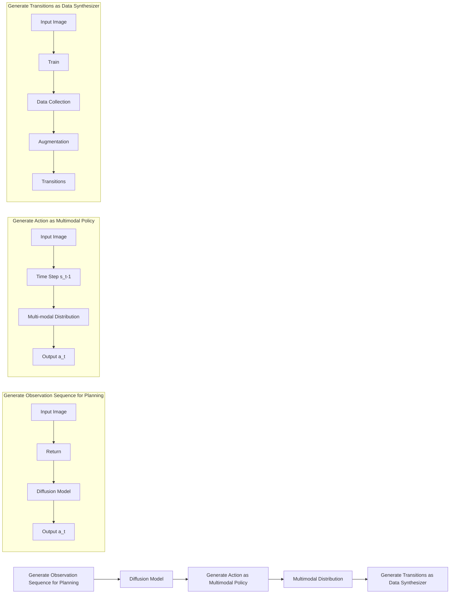
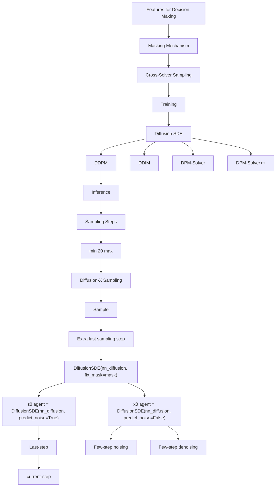
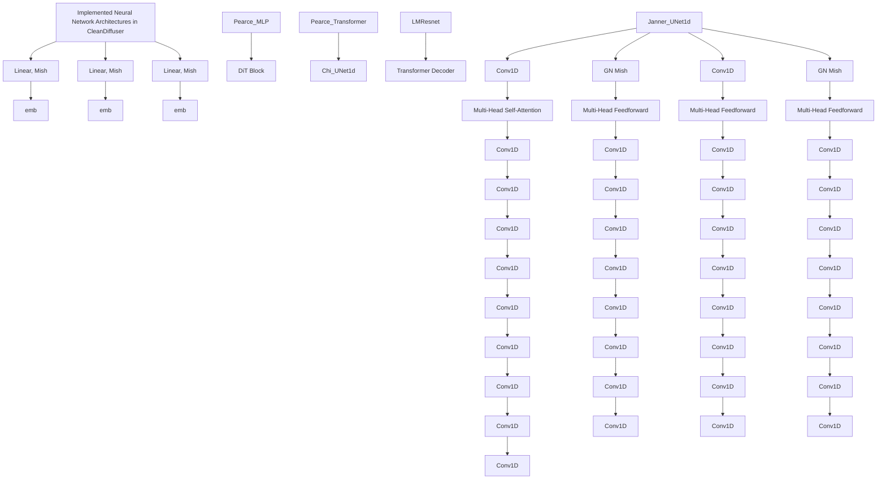
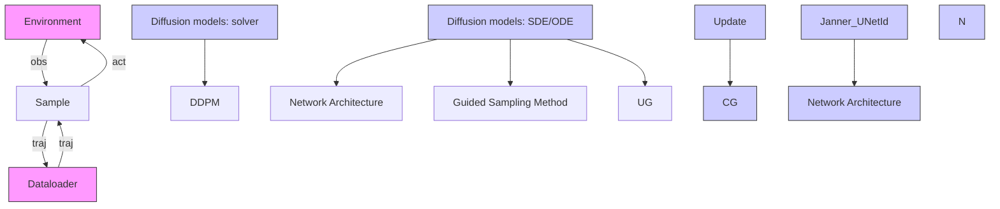

# CleanDiffuser: An Easy-to-use Modularized Library for Diffusion Models in Decision Making

Zibin Dong $^{1*}$ , Yifu Yuan $^{1*}$ , Jianye Hao $^{1\dagger}$ , Fei Ni $^{1}$ , Yi Ma $^{2}$ , Pengyi Li $^{1}$ , Yan Zheng $^{1}$

$^{1}$ College of Intelligence and Computing, Tianjin University

{zibindong, yuanyf, jianye.hao, fei\_ni, lipengyi, yanzheng@tju.edu.cn}

$^{2}$ School of Computer and Information Technology, Shanxi University, mayi@sxu.edu.cn

# Abstract

Leveraging the powerful generative capability of diffusion models (DMs) to build decision-making agents has achieved extensive success. However, there is still a demand for an easy-to-use and modularized open-source library that offers customized and efficient development for DM-based decision-making algorithms. In this work, we introduce CleanDiffuser, the first DM library specifically designed for decision-making algorithms. By revisiting the roles of DMs in the decision-making domain, we identify a set of essential sub-modules that constitute the core of CleanDiffuser, allowing for the implementation of various DM algorithms with simple and flexible building blocks. To demonstrate the reliability and flexibility of CleanDiffuser, we conduct comprehensive evaluations of various DM algorithms implemented with CleanDiffuser across an extensive range of tasks. The analytical experiments provide a wealth of valuable design choices and insights, reveal opportunities and challenges, and lay a solid groundwork for future research. CleanDiffuser will provide long-term support to the decision-making community, enhancing reproducibility and fostering the development of more robust solutions. The code and documentation of CleanDiffuser are open-sourced on the project website.

# 1 Introduction

Diffusion models (DMs) $[26, 33, 61]$ have emerged as a leading class of generative models, outperforming previous methods $[9, 34]$ in both high-quality generation and training stability $[73]$ . Their remarkable capabilities in complex distribution modeling and conditional generation demonstrate promising performance across various domains $[71, 59, 42, 33]$ , inspiring a series of works to apply DMs in decision-making tasks $[65, 67, 13, 64, 23, 4]$ . Open-source libraries can quantify progress in this emerging field, enable researchers to better understand and compare algorithm details, and promote the application of DMs. Currently, several high-quality libraries are available for DMs, such as Diffusers $[63]$ and Stable Diffusion $[58]$ , which provide exemplary designs for the computer vision and multimedia. However, support for decision-making is lacking. Although some pioneering research $[4, 30, 1]$ on DMs for decision-making has provided excellent codes, their algorithm-specific mechanisms and tightly coupled system architectures are not conducive to customized development.

In this paper, we present an easy-to-use modularized DM library tailored for decision-making named CleanDiffuser, which comprehensively integrates different types of DM algorithmic branches. We revisit various roles of DMs in decision-making tasks and identify core sub-modules: Diffusion Models, Network Architectures and Guided Sampling Methods. CleanDiffuser also

natural_image

Collection of 3D modeling and simulation scenes including robotic arms, camera, pixel grid, and checkered floor (no text or symbols)

text_image

User Interface
HYDRA Configuration
Zarr Dataloader
Logger

flowchart

text_image

```mermaid
graph TD
    A["Unified Environments Wrapper"] --> B["Diffusion Models (SDE/ODE with Solvers)"]
    B --> C["Diffusion SDE"]
    B --> D["EDM"]
    B --> E["Rectified Flow"]
    B --> F["DDPM / DDIM / DPM-Solver / DPM-Solver++"]
    B --> G["Euler / 2nd Order Heun"]
    B --> H["Euler"]
    I["Extra Features"] --> J["Masking Mechanism"]
    I --> K["Cross-Solver Sampling"]
    I --> L["Diffusion-X Sampling"]
    I --> M["Noise/Data Prediction Switching"]
    I --> N["Warm-Starting Sampling Technique"]
    O["Network Architectures"] --> P["Pearce_MLP"]
    O --> Q["Chi_UNet1d"]
    O --> R["Pearce_Transformer"]
    O --> S["LNResnet"]
    O --> T["Chi_Transformer"]
    O --> U["DQL_MLP"]
    O --> V["Janner_UNet1d"]
    O --> W["DiT1d"]
    X["Guided Sampling Methods"] --> Y["Classifier Guidance"]
    X --> Z["Classifier-free Guidance"]
    X --> AA["Low Dim Image Text ..."]
```

Pipelines
Planners
Diffuser
Decision Diffuser
AdaptDiffuser
Policies
DQL
EDP
IDQL
Diffusion Policy
DiffusionBC
Data Synthesizers
SynthER
...

Figure 1: The Architecture of CleanDiffuser. CleanDiffuser is specifically tailored for the decision-making domain, supporting a wide range of Diffusion Models, Network Architectures, and Guided Sampling Methods modules and extra useful features. By simply combining the building blocks into a pipeline, CleanDiffuser integrates 9 popular DM algorithms.

incorporates an efficient Dataloader and useful Environment Wrappers for easy usage and customized datasets extension. Specifically, to address the unique decision-making challenges, CleanDiffuser designs a series of practical features for special mechanisms. With CleanDiffuser, algorithms can be implemented by selecting building blocks and integrating them into a pipeline. Customizing an algorithm requires only about 10 lines of code, providing the highest usability and customization. The decoupled modular architecture allows developers to adapt to different tasks and facilitates the adjustment of existing methods without complex abstractions. CleanDiffuser effectively meets the diverse requirements of various decision-making algorithms.

To demonstrate the reliability and flexibility of CleanDiffuser, we conduct extensive experiments in 37 Reinforcement Learning (RL) and Imitation Learning (IL) environments for 9 algorithms and their variants, benchmarking performance for many DM algorithms and serving as valuable references for future research. Thanks to the general architecture of CleanDiffuser, we revisit the key design choices of the DMs for decision-making from a unified perspective. We conduct extensive empirical analyses on different architectures, solvers, sample steps, EMA, and model sizes, providing valuable insights and showing challenges for designing DM-based decision-making algorithms.

Our contributions are three-fold: (1) We present an easy-to-use modularized library named CleanDiffuser, the first DM library designed specifically for decision-making tasks. (2) We decouple the general DM algorithms into 3 core sub-modules and design specialized features for decision-making, ultimately integrating them into a modular pipeline. (3) Utilizing over 30,000 GPU hours of computational resources, we benchmark various popular DM-based algorithms and conduct a thorough empirical analysis, providing valuable insights and revealing opportunities and challenges.

# 2 Background

Sequential Decision-making Problem. Consider a system governed by discrete-time dynamics $(s^{t+1}, r^{t}) = d(s^{t}, a^{t})$ , in which taking action $a^{t}$ at state $s^{t}$ leads a transition to $s^{t+1}$ and yields a scalar reward $r^{t}$ . Given an interaction record dataset $\mathcal{D} = \{(s^{t}, a^{t}, r^{t}, s^{t+1})\}$ collected by a behavior policy, the offline RL [15, 17] aims to derive an optimal policy from the dataset to maximize cumulative reward and surpass the behavior policy. The offline IL [48], which assumes the behavior policy is an expert and does not require reward labels, aims to mimic the expert behaviors closely.

flowchart

Figure 2: Diffusion Models Mainly Play Three Roles in Decision-Making Scenarios. Planner [30]: Acting as planners to make better decisions from a long-term perspective. Policy [54]: Serving as policies to support complex multimodal-distribution modeling. Data Synthesizer [47]: Performing data augmentation to assist model training.

Training and Sampling of Diffusion Models. Assume a D-dimensional random variable $x_{0} \sim R^{D}$ with an unknown distribution $q_{0}(x_{0})^{3}$ . DMs gradually transform samples from a simple distribution $q_{T}(x_{T})$ into samples from $q_{0}(x_{0})$ [33, 26], which is accomplished by solving a reverse Stochastic Differential Equation (SDE) or Ordinary Differential Equation (ODE) [61]:

$$
\mathrm{d} \boldsymbol {x} _ {t} = [ f (t) \boldsymbol {x} _ {t} - g ^ {2} (t) \nabla_ {\boldsymbol {x}} \log q _ {t} (\boldsymbol {x} _ {t}) ] \mathrm{d} t + g (t) \mathrm{d} \bar {\boldsymbol {w}} _ {t}, \boldsymbol {x} _ {T} \sim q _ {T} (\boldsymbol {x} _ {T}), \tag {1}
$$

$$
\mathrm{d} \boldsymbol {x} _ {t} = [ f (t) \boldsymbol {x} _ {t} - \frac {1}{2} g ^ {2} (t) \nabla_ {\boldsymbol {x}} \log q _ {t} (\boldsymbol {x} _ {t}) ] \mathrm{d} t, \boldsymbol {x} _ {T} \sim q _ {T} (\boldsymbol {x} _ {T}), \tag {2}
$$

where $\bar{w}_{t}$ is a standard Wiener process in the reverse time, $f(t)=\frac{\mathrm{d}\log\alpha_{t}}{\mathrm{d}t}$ , $g^{2}(t)=\frac{\mathrm{d}\sigma_{t}^{2}}{\mathrm{d}t}-2\sigma_{t}^{2}\frac{\mathrm{d}\log\alpha_{t}}{\mathrm{d}t}$ , and $x_{t}=\alpha_{t}x_{0}+\sigma_{t}\epsilon$ , $\epsilon\sim\mathcal{N}(\mathbf{0},\mathbf{I})$ . The noise schedule $\alpha_{t},\sigma_{t}\in R^{+}$ are differentiable functions of t such that the signal-to-noise-ratio (SNR) $\alpha_{t}^{2}/\sigma_{t}^{2}$ is strictly decreasing w.r.t t. The training of DMs involves using a neural network parameterized by $\theta$ to estimate the unknown term within the SDE or ODE. Different DMs may incorporate varying parameterizations. For instance, diffusion SDE uses a network to estimate a scaled score function $\epsilon_{\theta}(\boldsymbol{x}_{t},t)\approx-\sigma_{t}\nabla_{\boldsymbol{x}}\log q_{t}(\boldsymbol{x}_{t})$ [26, 60, 45, 61], while EDM estimates clean data $D_{\theta}(\boldsymbol{x}_{t},t)\approx(\boldsymbol{x}_{t}-\sigma_{t}^{2}\nabla_{\boldsymbol{x}}\log q_{t}(\boldsymbol{x}_{t}))/\alpha_{t}$ [32]. The sampling process of DMs involves utilizing numerical solvers to solve the SDE or ODE. DDPM [26] and DDIM [60] solve the first-order discretization of Equation (1) and Equation (2). DPM-Solver [45, 46] leverages the semi-linearity of the reverse ODE in Equation (2) for exact solutions, eliminating errors in the linear terms, resulting in a higher sample quality. EDM [32] uses a specially designed score function preconditioning and $2^{nd}$ -order Heun's method to solve the reverse ODE, also improving the sample quality. Understanding training and sampling as separate processes enables the seamless selection of varying sampling steps and solvers during the generation process without additional training. Some other SDE/ODE-based generative models, such as Rectified Flow [43], can also be understood through this lens by using a network to estimate the unknown drift force $\boldsymbol{v}_{\theta}(\boldsymbol{x}_{t},t)\approx(\boldsymbol{x}_{0}-\boldsymbol{x}_{T})$ in a straight ODE $d\boldsymbol{x}_{t}=\boldsymbol{v}_{\theta}(\boldsymbol{x}_{t},t)dt$ and solving it by Euler solver. See Appendix A for more details.

# 3 Revisiting Diffusion Models in Decision Making Scenarios

As shown in Figure 2, current works applying DMs on decision-making mainly fall into three categories [73]: generating long-term trajectories and executing like planners, replacing the conventional Gaussian policies with multimodal diffusion policies and serving as data synthesizers to assist model training. This section briefly introduces each category, outlines the technical module-design requirements, and summarizes the challenges of designing a general framework.

Planner. Planning refers to generating trajectories x, which can be either sequence of states or state-action pairs, to maximize the cumulative reward and selecting actions to track the trajectory $[20, 22, 21]$ . DMs can simultaneously generate super-long, high-quality trajectories, preventing severe compounding errors occurred in previous planning algorithms $[30, 12]$ . Assume the trajectory starts at $t = \tau$ and ends at T, diffusion planner sample from an optimality-conditioned trajectory distribution $p(\boldsymbol{x}|\mathcal{O}^{\tau:T})$ $[30]$ or a reward-conditioned distribution $p(\boldsymbol{x}|\sum_{t=\tau}^{\mathcal{T}}r^{t})$ $[1]$ . At each inference step, diffusion planner generates a set of candidate trajectories $\{x_{0}\}$ , selects the local optimal $x_{0}^{*}$ , and

then extracts the action to execute. Typically, these algorithms freeze certain known parts of the trajectories during the diffusion process, such as history trajectories, current states, and future goals, turning the generation into an inpainting problem $[30, 1, 12, 28]$ . This feature necessitates the demand for a flexible masking mechanism to design frozen parts and freely alter the planning properties.

Policy. Policy is typically a state-conditioned action distribution $\pi_{\theta}(\boldsymbol{a}|\boldsymbol{s})$ . DMs' strong distribution modeling capability allows them to effectively replace commonly used deterministic or Gaussian policies [37, 36, 16] in both RL and IL settings. In RL settings, researchers have explored incorporating diffusion policies as actors in actor-critic frameworks [64, 31], as well as directly fitting the optimal policy derived from generalized constrained policy search (CPS) [23, 3]. These works focus on the combination of DMs and RL components, where RL may guide the generation [44], evaluate action selection [3, 23], or even influence DM training [64]. In IL settings, researchers focus more on complex network designs to support effective guided sampling [4, 54, 69, 53], which processes rich-modality agent perception, including low-dim physical quantities [54], RGB images [4], 3D point clouds [69], and even language instructions [70]. A separated guided sampling module can help researchers divide and conquer, avoiding engineering difficulties caused by coupled structures.

Data Synthesizer. Utilizing synthetic data, which can be either transitions or trajectories, from generative models to assist policy learning has been proven effective $[29, 5]$ . Introducing DMs as the generative backbone promotes synthetic quality $[47]$ , addressing the lack of fidelity in previous works. Unlike Planner or Policy, Data Synthesizer does not directly engage in decision-making and, therefore, requires a flexible and modular library compatible with different DM usage paradigms.

In summary, building a general modular DM library for decision-making should meet the following criteria: (1) Implement decoupled modules for DM backbones and network architectures to ensure compatibility with different roles. (2) Incorporate decision-making specific features into module design, e.g., masking and advanced sampling mechanisms. (3) Develop an algorithmic pipeline that seamlessly integrates the modules and mechanisms, catering to different DM usage paradigms.

# 4 CleanDiffuser

# 4.1 Overview

Based on the analysis above, we illustrate the core sub-modules in Figure 1 and summarize them as follows: (1) Diffusion Models. Existing works [4, 30] often tightly couple SDE/ODE, solvers, and algorithm-specific components in their code implementations, making it challenging for practitioners to read and modify. CleanDiffuser aims to decouple diffusion models as an external module, with internally independent core parts for SDE/ODE and solvers. This design allows users to freely change between solvers and adjust sampling steps with no cost after training. (2) Network Architectures play a crucial role in diffusion-based decision-making algorithms, influencing generative characteristics and indirectly altering algorithm mechanisms [12, 47]. Currently, there is no single architecture that has emerged as the best choice for all scenarios. Therefore, in this module, CleanDiffuser aims to implement the most commonly used architectures to date, leaving ample room for customization and exploration. (3) Guided Sampling Methods. Existing works employ a rich guided sampling design, ranging from scalar [30, 1] to complex multi-modal environment perception [4, 54]. However, their code implementations often couple guided sampling with other components, making independent guidance design challenging. CleanDiffuser aims to decouple this aspect as a separate module, providing users with ample customization space. (4) Environment Interface & Dataloader. CleanDiffuser provides a consistent environment interface and efficient dataloader for easy usage and evaluation of policy performance.

# 4.2 Modular Design

Advanced Diffusion Models Support. CleanDiffuser supports advanced diffusion models such as DDPM [26], DDIM [60], DPM-Solver [45], DPM-Solver++ [46], EDM [32], and Rectified Flow [43], which share a unified API calling, see Appendix F. Our implementation features the following:

\- Masking Mechanism. DM-based decision-making algorithms may incorporate masks to freeze certain known parts and alter the use of generated data [30, 12]. For example, as demonstrated in Figure 3 (top), during trajectory generation, one may use a history trajectory as context, retain the current state to provide instant information, and supply a goal to steer the trajectory towards it.

flowchart

Figure 3: Features of CleanDiffuser Designed for Decision-Making Introduced in Section 4.2.

The masking mechanism provides a simple interface, using a binary vector describing the freeze requirements. All additional computational processing due to masking is handled internally in the code so that users can concentrate on designing other components.

- Cross-Solver Sampling. DMs in CleanDiffuser are implemented with two core parts: SDE/ODE and solver. Training involves using neural networks to fit the parameterized terms in the SDE/ODE, e.g., the score function in diffusion SDE, and is unrelated to the solvers. This design allows one trained diffusion model to choose varying sampling steps and different solvers during generation without additional cost. For example, after training a decision-making algorithm based on diffusion SDE, one can seamlessly use varying sampling steps and switch between DDPM, DDIM, DPM-Solver, and DPM-Solver++ during inference, greatly facilitating researchers conducting ablation studies and analyses across different diffusion backbones.   
- Diffusion-X Sampling. Considering the significant negative impact of out-of-distribution (OOD) samples in decision-making tasks, the Diffusion-X sampling process is proposed to include additional repeating denoising steps at the last sampling step [54]. This approach helps concentrate the generated samples in high-likelihood regions, reducing OOD issues.   
- Noise/Data Prediction Switching. Neural networks in DMs can be utilized for predicting noise as well as clean data. In decision-making tasks, the former simplifies optimization by avoiding the direct generation of complex data samples $[1, 26, 64]$ , while the latter can introduce thresholding methods to constrain samples and prevent OOD generation $[30, 46, 31]$ . Existing methods lack a systematic exploration of the effects resulting from these two parameterization approaches. CleanDiffuser implements noise/data prediction as a switch, depicted in Figure 3, to offer researchers a flexible and convenient way to compare between the two approaches.   
- Warm-Starting Sampling Technique. Decision-making dynamics exhibit a certain consistency over time, implying that samples generated at adjacent decision-time steps have similarities. Inspired by this, the warm-starting sampling technique proposes adding a small amount of noise to the samples generated at the previous time step and then conducting a few denoising steps to generate samples of sufficient quality for the current time step. This trick can trade off a small amount of accuracy for an increase in decision frequency and can be useful in real-world applications.

Network Architectures Designed for Decision-Making. CleanDiffuser incorporates 8 popular network architectures designed for decision-making, as demonstrated in Figure 4, including:

- DQL\_MLP [64] is a simple yet efficient MLP architecture for action generation proposed in DQL.   
- LNResnet [23] is a residual MLP with Dropout and LayerNorm to enhance action quality.   
- Pearce\_MLP [54], referred to as MLPSieve in DiffusionBC paper, is a residual MLP, which concatenates original inputs to each hidden feature.   
- Janner\_UNet1d [30] inherits from the classic image-generation network architecture used in DDPM++ and NCSN++ [61], and is modified for trajectory generation. This architecture can generate variable-length trajectories [30], which enhances inference flexibility.   
- Chi\_UNet1d [4] incorporates FiLM conditioning [56] in Janner\_UNet1d to enhance the reception of sequential observation conditions, achieving excellent performance in IL tasks.

flowchart

Figure 4: Visualization of Implemented Network Architectures in CleanDiffuser.

- DiT1d [13] inherits from the transformer DM network backbone [55] and is modified for trajectory generation, showing better training stability and sample quality compared to Janner\_UNet1d.   
- Pearce\_Transformer [54] replaces the structure in Pearce\_MLP with the multi-head self-attention, which sacrifices efficiency for better action generation quality.   
- Chi\_Transformer [4] employs a transformer decoder architecture and a special cross-attention mask to enhance the reception of conditions, achieving performance similar to Chi\_UNet1d.

These network architectures have been proven effective for decision-making tasks in previous works and widely referenced or directly applied in other algorithms $[3, 12, 41, 50, 39, 25]$ . In CleanDiffuser, all these architectures inherit from the same parent class and share a standard API calling, making it easy for researchers to design new architectures based on the foundations.

Guided Sampling. Two guided sampling methods, CG $[10]$ and CFG $[27]$ , are presented in the form of Classifier and Condition Network, which are completely decoupled from the DM network architecture. Users can focus solely on processing condition information without worrying about the interaction with DMs and eventually integrate them with DMs in a switch-like manner.

Environment Interface and Efficient Dataloader: To facilitate benchmark evaluation, we encapsulate Gym-like $[2]$ API for all environments, implementing visualization, multi-step interaction, and parallel sampling through various wrappers. This makes it convenient for researchers to reuse and extend. Additionally, we implement efficient I/O based on Zarr $[8]$ library for large-scale datasets and combine it with PyTorch's DataLoader $[6]$ for batch data processing and training, which allows for flexible data access even with limited memory. CleanDiffuser also provides Wandb $[7]$ logging support and Hydra $[66]$ configuration to facilitate experiment tracking. We provide YAML configuration files for each experiment, ensuring full reproducibility without tuning hyperparameters.

# 4.3 From Decoupled Modules to Integrated Pipelines

With CleanDiffuser, developing algorithms can be much more straightforward because users only need to select the desired building blocks and assemble them into a pipeline. As shown in Figure 5, a Diffuser implementation example that uses Janner\_UNet1d as the network architecture for generating trajectories, employs a Classifier for guided sampling to maximize the cumulative reward of generated trajectories, selects Diffusion SDE as the diffusion backbone, and performs sampling using DDPM. Assembling these modules constructs a pipeline, a simple yet efficient Diffuser implementation. In this way, users can easily understand the differences and properties of algorithms and adjust them by simply replacing the building blocks. In CleanDiffuser, we implement various diffusion-based decision-making algorithms in this module-to-pipeline style, offering a diverse set of examples for practitioners to implement their applications with CleanDiffuser. The implemented algorithms include three diffusion planners: Diffuser [30], Decision Diffuser (DD) [1], and AdaptDiffuser [41]; five diffusion policies: DiffusionPolicy [4], DiffusionBC [54], DQL [64], EDP [31], and IDQL [23]; one diffusion data synthesizer: SynthER [47]. See Appendix G for details.

text_image

from cleandiffuser.diffusion import DiffusionSDE
from cleandiffuser.classifier import CumRewClassifier
from cleandiffuser.nn_diffusion import JannerUNetId
from cleandiffuser.nn_classifier import HalfJannerUNetId

# 1. Network Architecture: Janner_UNetId
nn_diffusion = JannerUNetId(in_dim=obs_dim + act_dim)
nn_classifier = HalfJannerUNetId(in_dim=obs_dim + act_dim, out_dim=1, horizon=horizon)
# 2. Guided Sampling Method: CG
classifier = CumRewClassifier(nn_classifier=nn_classifier)
# 3. Diffusion models: Diffusion SDE / DDPM
mask = torch.zeros((horizon, obs_dim + act_dim))
mask[0, :obs_dim] = 1.
diffuser = DiffusionSDE(nn_diffusion=nn_diffusion, fix_mask=mask, classifier=classifier)
# 4. Training
log = diffuser.update(torch.cat([obs, act], -1), val)
# 5. Inference
prior = torch.zeros((n_samples, horizon, obs_dim + act_dim))
prior[:, 0, :obs_dim] = obs
traj, log = diffuser.sample(prior=prior, n_samples=n_samples, sample_steps=20, w_cg=0.1, solver="ddpm")

flowchart

Figure 5: Diffuser Implementation with CleanDiffuser. The left part is a minimal code example showcasing simplicity and readability, and the right part provides a code explanation where the algorithm implementation can be entirely represented as a combination of building blocks, showing an example of various pipelines.

# 5 Experiments

Due to space limitations in the main text, we introduce details of all benchmarks and datasets used in our experiments in Appendix C, and present additional experiments in Appendix D.

# 5.1 Offline Reinforcement Learning

Table 1: Evaluation Results of Offline RL Benchmark. The performance of diffusion-based offline RL algorithms implemented by CleanDiffuser on the D4RL benchmark [15]. Results correspond to the mean and standard error over 150 episode seeds; the highest scores are emphasized in bold. 

<table><tr><td>Dataset</td><td>Environment</td><td>BC</td><td>SynthER</td><td>Diffuser</td><td>DD</td><td>AdaptDiffuser</td><td>DQL</td><td>EDP</td><td>IDQL</td></tr><tr><td rowspan="3">Medium-Expert</td><td>HalfCheetah</td><td>55.2</td><td>94.8 ± 0.0</td><td>90.3 ± 0.1</td><td>88.9 ± 1.9</td><td>90.4 ± 0.1</td><td>95.5 ± 0.1</td><td>95.8 ± 0.1</td><td>91.3 ± 0.6</td></tr><tr><td>Hopper</td><td>52.5</td><td>76.6 ± 0.4</td><td>107.2 ± 0.9</td><td>110.4 ± 0.6</td><td>109.3 ± 0.3</td><td>111.1 ± 0.4</td><td>110.8 ± 0.4</td><td>110.1 ± 0.7</td></tr><tr><td>Walker2d</td><td>107.5</td><td>110.0 ± 0.0</td><td>107.4 ± 0.1</td><td>108.4 ± 0.1</td><td>107.7 ± 0.1</td><td>111.6 ± 0.0</td><td>110.4 ± 0.0</td><td>110.6 ± 0.0</td></tr><tr><td rowspan="3">Medium</td><td>HalfCheetah</td><td>42.6</td><td>48.3 ± 0.0</td><td>43.8 ± 0.1</td><td>45.3 ± 0.3</td><td>44.3 ± 0.2</td><td>52.3 ± 0.2</td><td>50.8 ± 0.0</td><td>51.5 ± 0.1</td></tr><tr><td>Hopper</td><td>52.9</td><td>51.9 ± 0.1</td><td>89.5 ± 0.7</td><td>98.2 ± 0.1</td><td>95.5 ± 1.1</td><td>96.5 ± 1.3</td><td>72.6 ± 0.2</td><td>70.1 ± 2.0</td></tr><tr><td>Walker2d</td><td>75.3</td><td>86.6 ± 0.0</td><td>79.4 ± 1.0</td><td>79.6 ± 0.9</td><td>83.8 ± 1.1</td><td>86.8 ± 0.0</td><td>86.5 ± 0.2</td><td>88.1 ± 0.4</td></tr><tr><td rowspan="3">Medium-Replay</td><td>HalfCheetah</td><td>36.6</td><td>43.4 ± 0.0</td><td>36.0 ± 0.7</td><td>42.9 ± 0.1</td><td>36.7 ± 0.8</td><td>47.9 ± 0.0</td><td>44.9 ± 0.4</td><td>46.5 ± 0.3</td></tr><tr><td>Hopper</td><td>18.1</td><td>24.7 ± 0.1</td><td>91.8 ± 0.5</td><td>99.2 ± 0.2</td><td>91.2 ± 0.1</td><td>101.6 ± 0.0</td><td>83.0 ± 1.7</td><td>99.4 ± 0.1</td></tr><tr><td>Walker2d</td><td>26.0</td><td>88.6 ± 0.4</td><td>58.3 ± 1.8</td><td>75.6 ± 0.6</td><td>82.9 ± 1.5</td><td>98.2 ± 0.1</td><td>87.0 ± 2.6</td><td>89.1 ± 2.4</td></tr><tr><td colspan="2">Average</td><td>51.9</td><td>69.4</td><td>78.2</td><td>83.2</td><td>82.4</td><td>89.0</td><td>82.4</td><td>84.1</td></tr><tr><td rowspan="2">Mixed Partial</td><td>Kitchen</td><td>51.5</td><td>0.0 ± 0.0</td><td>52.5 ± 2.5</td><td>75.0 ± 0.0</td><td>51.8 ± 0.8</td><td>62.5 ± 1.5</td><td>50.2 ± 1.8</td><td>66.5 ± 4.1</td></tr><tr><td>Kitchen</td><td>38.0</td><td>0.0 ± 0.0</td><td>55.7 ± 1.3</td><td>56.5 ± 5.8</td><td>55.5 ± 0.4</td><td>63.5 ± 1.8</td><td>40.8 ± 1.5</td><td>66.7 ± 2.5</td></tr><tr><td colspan="2">Average</td><td>44.8</td><td>0.0</td><td>54.1</td><td>65.8</td><td>53.7</td><td>63.0</td><td>45.5</td><td>66.6</td></tr><tr><td rowspan="4">Play Diverse</td><td>Antmaze-Medium</td><td>0.0</td><td>0.0 ± 0.0</td><td>6.7 ± 5.7</td><td>8.0 ± 4.3</td><td>12.0 ± 7.5</td><td>86.0 ± 1.8</td><td>73.3 ± 6.2</td><td>67.3 ± 5.7</td></tr><tr><td>Antmaze-Large</td><td>0.0</td><td>0.0 ± 0.0</td><td>17.3 ± 1.9</td><td>0.0 ± 0.0</td><td>5.3 ± 3.4</td><td>83.3 ± 2.5</td><td>33.3 ± 1.9</td><td>48.7 ± 4.7</td></tr><tr><td>Antmaze-Medium</td><td>0.8</td><td>0.0 ± 0.0</td><td>2.0 ± 1.6</td><td>4.0 ± 2.8</td><td>6.0 ± 3.3</td><td>94.7 ± 2.5</td><td>52.7 ± 1.9</td><td>83.3 ± 5.0</td></tr><tr><td>Antmaze-Large</td><td>0.0</td><td>0.0 ± 0.0</td><td>27.3 ± 2.4</td><td>0.0 ± 0.0</td><td>8.7 ± 2.5</td><td>61.3 ± 8.4</td><td>41.3 ± 3.4</td><td>40.0 ± 11.4</td></tr><tr><td colspan="2">Average</td><td>0.2</td><td>0.0</td><td>13.3</td><td>3.0</td><td>8.0</td><td>81.3</td><td>50.2</td><td>59.8</td></tr></table>

Setup. We evaluate 7 diffusion-based offline RL algorithms with CleanDiffuser, including SynthER, Diffuser, DD, AdaptDiffuser, DQL, EDP, and IDQL, on 15 tasks in the D4RL [15], covering locomotion, manipulation, and navigation. We reuse the hyperparameters of the original paper as possible and give the full hyperparameters in Appendix E.3. The results are presented in Table 1.

Key Observation. (O1) Algorithms reproduced with CleanDiffuser have achieved, and in some cases exceeded, their official implementations. (O2) Diffusion planners demonstrate no superiority over diffusion policies, especially performing poorly in the Antmaze. Diffusion planners are sensitive to guided sampling and prone to generating OOD trajectories $[12]$ . Enhancing the dynamic legitimacy $[50]$ and introducing the conservative generation $[68]$ may unlock the potential of diffusion planners. (O3) DQL achieves outstanding performance among diffusion policies. Simply incorporating Q-maximizing loss in diffusion training shows stable and surprising performance.

# 5.2 Offline Imitation Learning

Setup. We evaluate DiffusionPolicy and DiffusionBC with different network architectures on 22 tasks across PushT [14], Relay-Kitchen [18] and Robomimic [49] benchmarks. PushT and Robomimic

Table 2: Evaluation Results of Offline IL Benchmark. The metrics show success rate for Robomimic and Relay-Kitchen, target area coverage for PushT. We report mean performance of last checkpoint denoted as LAST and max performance of the last 10 checkpoints (3 for image tasks) denoted as MAX, with each averaged over 3 seeds and 50 episodes. We show the performance of (LAST / MAX). \*The results are obtained from the [4]. 

<table><tr><td rowspan="2">Task Name</td><td rowspan="2">LSTM-GMM*</td><td rowspan="2">ACT</td><td colspan="3">DiffusionPolicy</td><td colspan="2">DiffusionBC</td></tr><tr><td>DiT1d</td><td>Chi_UNet1d</td><td>Chi_TFM</td><td>DiT1d</td><td>Pearce_MLP</td></tr><tr><td colspan="8">Low dim</td></tr><tr><td>pusht</td><td>0.59/0.70</td><td>0.99/1.00</td><td>1.00/1.00</td><td>0.99/1.00</td><td>0.94/1.00</td><td>0.99/0.99</td><td>0.99/0.99</td></tr><tr><td>pusht-keypoints</td><td>0.61/0.67</td><td>0.99/1.00</td><td>0.99/1.00</td><td>1.00/1.00</td><td>0.99/0.99</td><td>1.00/1.00</td><td>0.99/0.99</td></tr><tr><td>relay-kitchen</td><td>0.75/0.79</td><td>0.72/0.76</td><td>1.00/1.00</td><td>0.99/1.00</td><td>0.99/0.99</td><td>0.67/0.81</td><td>0.81/0.89</td></tr><tr><td>lift-ph</td><td>0.96/1.00</td><td>0.98/1.00</td><td>1.00/1.00</td><td>1.00/1.00</td><td>1.00/1.00</td><td>1.00/1.00</td><td>0.99/1.00</td></tr><tr><td>lift-mh</td><td>0.93/1.00</td><td>0.98/1.00</td><td>1.00/1.00</td><td>1.00/1.00</td><td>1.00/1.00</td><td>0.99/1.00</td><td>0.92/1.00</td></tr><tr><td>can-ph</td><td>0.91/1.00</td><td>0.92/0.98</td><td>1.00/1.00</td><td>0.99/1.00</td><td>0.99/1.00</td><td>0.99/1.00</td><td>0.91/1.00</td></tr><tr><td>can-mh</td><td>0.81/1.00</td><td>0.90/0.98</td><td>0.95/0.98</td><td>0.99/1.00</td><td>0.91/1.00</td><td>0.91/0.98</td><td>0.77/0.88</td></tr><tr><td>square-ph</td><td>0.73/0.95</td><td>0.80/0.90</td><td>0.85/0.96</td><td>0.93/0.98</td><td>0.87/0.96</td><td>0.68/0.76</td><td>0.66/0.76</td></tr><tr><td>square-mh</td><td>0.59/0.86</td><td>0.46/0.72</td><td>0.58/0.74</td><td>0.87/0.96</td><td>0.67/0.86</td><td>0.50/0.68</td><td>0.42/0.52</td></tr><tr><td>transport-ph</td><td>0.47/0.76</td><td>0.64/0.85</td><td>0.47/0.64</td><td>0.79/0.92</td><td>0.67/0.84</td><td>0.35/0.54</td><td>0.17/0.34</td></tr><tr><td>transport-mh</td><td>0.20/0.62</td><td>0.40/0.68</td><td>0.25/0.44</td><td>0.58/0.72</td><td>0.23/0.52</td><td>0.14/0.28</td><td>0.00/0.04</td></tr><tr><td>toolhang-ph</td><td>0.31/0.67</td><td>0.64/0.82</td><td>0.38/0.58</td><td>0.72/0.90</td><td>0.90/0.96</td><td>0.49/0.66</td><td>0.15/0.36</td></tr><tr><td>Average</td><td>0.66/0.84</td><td>0.79/0.89</td><td>0.79/0.86</td><td>0.90/0.96</td><td>0.85/0.93</td><td>0.73/0.81</td><td>0.65/0.73</td></tr><tr><td colspan="8">Image</td></tr><tr><td>pusht-image</td><td>0.54/0.69</td><td>0.99/1.00</td><td>0.99/1.00</td><td>1.00/1.00</td><td>0.98/0.99</td><td>0.10/0.19</td><td>0.53/0.64</td></tr><tr><td>lift-ph</td><td>0.96/1.00</td><td>1.00/1.00</td><td>1.00/1.00</td><td>1.00/1.00</td><td>1.00/1.00</td><td>1.00/1.00</td><td>0.94/0.98</td></tr><tr><td>lift-mh</td><td>0.95/1.00</td><td>1.00/1.00</td><td>1.00/1.00</td><td>1.00/1.00</td><td>0.99/1.00</td><td>0.88/1.00</td><td>0.94/0.98</td></tr><tr><td>can-ph</td><td>0.88/1.00</td><td>0.98/0.98</td><td>0.97/1.00</td><td>0.99/1.00</td><td>0.98/1.00</td><td>0.92/0.94</td><td>0.89/0.94</td></tr><tr><td>can-mh</td><td>0.90/0.98</td><td>0.94/0.94</td><td>0.90/0.92</td><td>0.96/0.98</td><td>0.89/0.94</td><td>0.73/0.86</td><td>0.76/0.84</td></tr><tr><td>square-ph</td><td>0.59/0.82</td><td>0.90/0.90</td><td>0.57/0.64</td><td>0.95/0.98</td><td>0.81/0.86</td><td>0.21/0.22</td><td>0.23/0.24</td></tr><tr><td>square-mh</td><td>0.38/0.64</td><td>0.84/0.84</td><td>0.47/0.68</td><td>0.83/0.94</td><td>0.65/0.74</td><td>0.20/0.30</td><td>0.15/0.20</td></tr><tr><td>transport-ph</td><td>0.62/0.88</td><td>0.79/0.80</td><td>0.76/0.84</td><td>0.88/0.96</td><td>0.89/0.96</td><td>0.07/0.12</td><td>0.50/0.66</td></tr><tr><td>transport-mh</td><td>0.24/0.44</td><td>0.59/0.62</td><td>0.52/0.52</td><td>0.61/0.62</td><td>0.40/0.52</td><td>0.06/0.08</td><td>0.10/0.16</td></tr><tr><td>toolhang-ph</td><td>0.49/0.68</td><td>0.69/0.76</td><td>0.59/0.72</td><td>0.59/0.66</td><td>0.39/0.44</td><td>0.06/0.14</td><td>0.06/0.10</td></tr><tr><td>Average</td><td>0.65/0.81</td><td>0.87/0.88</td><td>0.78/0.83</td><td>0.88/0.91</td><td>0.80/0.85</td><td>0.42/0.48</td><td>0.51/0.57</td></tr></table>

include both low-dim and image-based observations. To validate the imitation capabilities of the DM paradigms, we also compare the RNN-based LSTM-GMM $[49]$ and the Transformer-based ACT $[72]$ (reproduced). Each method is evaluated with its best-performing action space: position control for DiffusionPolicy and ACT, and velocity control for others. We reuse the hyperparameters of the original paper as much as possible, and key hyperparameters are given in Appendix E.3.

Key Observation. (O1) Different network architectures have a significant impact on the performance. Among them, DiffusionPolicy works better than DiffusionBC, and DiffusionPolicy with Chi\_UNet1d has the best performance and training stability (Performance gap between the best checkpoint and last checkpoint). However, Chi\_UNet1d has large model size and long inference time. We often need to trade-off between inference time and model performance in applications. (O2) Compared to popular RNN or transformer-based imitation learning algorithms, DiffusionPolicy also exhibits stronger performance, but slower inference times due to the multiple network forwards of denoise. We show detailed model size and inference time comparisons and analyses in appendix D.3.

# 5.3 Impact of Diffusion Backbones and Sampling Steps

  
DDPM DDIM SDE-DPM-Solver++ 1 ODE-DPM-Solver++ (2M) EDM Rectified Flow

Figure 6: Impact of Diffusion Backbones and Sampling Steps. Performance of IDQL and DD with various diffusion backbones and varying sampling steps. Results correspond to the mean over 150 episode seeds.

  
0.99 0.999 0.9999

Figure 7: Impact of EMA Rate and Gradient Steps. Learning curve of IDQL, DD, DiffusionBC, and DP with varying EMA rates. Results correspond to the mean and standard error over 150 episode seeds.

Although the impact of diffusion backbones and sampling steps are widely discussed in image generation, little research analyzes them in decision-making. We compare the performance of IDQL and DD, representing policies and planners, respectively, with varying diffusion backbones and sampling steps, showing results on a few tasks in Figure 6 and full results in Appendix D.2.

Key Observation. (O1) An anomaly where performance decreases as the sampling steps increase may happen in some tasks, known as sampling degradation. This anomaly has been identified in previous works $[31, 3]$ and remains an open question. Experiments reveal that sampling degradation is more likely to occur in medium-expert MuJoCo and Kitchen tasks, possibly due to narrow data distributions. Future research can investigate this issue and offer optimal choices for sampling steps. Additionally, we observe that 5 sampling steps are adequate for most tasks, suggesting that more sampling steps in previous works, e.g., 100 $[1]$ , are unnecessary. (O2) SDE solvers (DDPM, SDE-DPM-Solver++ 1) perform better in diffusion policies but suffer more from sampling degradation than ODE solvers. In diffusion planners, they perform similarly and do not show a sampling degradation tendency. While the impact of SDEs and ODEs in image generation has been extensively discussed $[52, 46]$ , it remains unexplored in decision-making, suggesting a need for future research. (O3) High-order solvers (ODE-DPM-Solver++ (2M)) show no superiority over first-order solvers.

# 5.4 Impact of EMA Rate and Gradient Steps

The exponential moving average (EMA) rate significantly impacts performance $[61]$ . However, limited research has discussed the impact of EMA rate on diffusion-based decision-making algorithms. Previous works tend to use a lower EMA rate, e.g., 0.995 $[30, 1]$ , rather than the more common 0.9999 $[61, 51, 43]$ used in image generation. We compare the learning curves of IDQL, DD, DiffusionBC, and DiffusionPolicy (DP) with varying EMA rates and present the results in Figure 7.

Key Observation. (O1) A higher EMA rate improves and stabilizes the performance during training, and also helps alleviate training degradation, in which model performance drops as the gradient steps increase.(O2) Tested algorithms can almost reach near-convergence performance with around $5 \times 10^{5}$ gradient steps even with a high EMA rate. Excessively long gradient steps may be unnecessary.

# 6 Conclusion

We present CleanDiffuser, the first open-sourced modularized DM library specifically for decision-making algorithms. CleanDiffuser implements diverse decoupled modules and practical features, supporting different types of DM algorithmic branches. Algorithmic pipelines can be easily implemented by combining sub-modules as simply as building blocks. Extensive experiments validate the library's reliability and versatility, benchmarking the performance of various DM algorithms for future research. We also conduct comprehensive experimental analyses on design choices of DMs, revealing the strengths and challenges of current DM methods. CleanDiffuser fills a critical gap in the current landscape by providing a unified library. We believe CleanDiffuser lays a solid cornerstone for applying DMs to decision-making tasks and will catalyze further rapid progress in this promising field. We indicate some limitations, challenges, and future directions in Appendix H.

# 7 Acknowledgements

This work is supported by the National Natural Science Foundation of China (Grant Nos. 62422605, 92370132).

# References

[1] Anurag Ajay, Yilun Du, Abhi Gupta, Joshua B. Tenenbaum, Tommi S. Jaakkola, and Pulkit Agrawal. Is conditional generative modeling all you need for decision making? In The Eleventh International Conference on Learning Representations, ICLR, 2023.   
[2] Greg Brockman, Vicki Cheung, Ludwig Pettersson, Jonas Schneider, John Schulman, Jie Tang, and Wojciech Zaremba. Openai gym. arXiv preprint arXiv:1606.01540, 2016.   
[3] Huayu Chen, Cheng Lu, Chengyang Ying, Hang Su, and Jun Zhu. Offline reinforcement learning via high-fidelity generative behavior modeling. In The Eleventh International Conference on Learning Representations, ICLR, 2023.   
[4] Cheng Chi, Siyuan Feng, Yilun Du, Zhenjia Xu, Eric Cousineau, Benjamin Burchfiel, and Shuran Song. Diffusion policy: Visuomotor policy learning via action diffusion. In Proceedings of Robotics: Science and Systems, RSS, 2023.   
[5] Daesol Clio, Dongseok Shim, and H. Jin Kim. S2p: state-conditioned image synthesis for data augmentation in offline reinforcement learning. In Proceedings of the 36th International Conference on Neural Information Processing Systems, NIPS, 2022.   
[6] Pytorch Contributors. pytorch. https://github.com/pytorch/pytorch, 2016.   
[7] Wandb Contributors. wandb. https://github.com/wandb/wandb, 2022.   
[8] Zarr Contributors. Zarr-python. https://github.com/zarr-developers/zarr-python, 2021.   
[9] Antonia Creswell, Tom White, Vincent Dumoulin, Kai Arulkumaran, Biswa Sengupta, and Anil A Bharath. Generative adversarial networks: An overview. IEEE signal processing magazine, 35(1):53–65, 2018.   
[10] Prafulla Dhariwal and Alexander Quinn Nichol. Diffusion models beat GANs on image synthesis. In Advances in Neural Information Processing Systems, NIPS, 2021.   
[11] Sander Dieleman, Laurent Sartran, Arman Roshannai, Nikolay Savinov, Yaroslav Ganin, Pierre H Richemond, Arnaud Doucet, Robin Strudel, Chris Dyer, Conor Durkan, et al. Continuous diffusion for categorical data. arXiv preprint arXiv:2211.15089, 2022.   
[12] Zibin Dong, Jianye Hao, Yifu Yuan, Fei Ni, Yitian Wang, Pengyi Li, and Yan Zheng. Diffuserlite: Towards real-time diffusion planning. arXiv preprint arXiv:2401.15443, 2024.   
[13] Zibin Dong, Yifu Yuan, Jianye HAO, Fei Ni, Yao Mu, YAN ZHENG, Yujing Hu, Tangjie Lv, Changjie Fan, and Zhipeng Hu. Aligndiff: Aligning diverse human preferences via behavior-customisable diffusion model. In The Twelfth International Conference on Learning Representations, ICLR, 2024.   
[14] Pete Florence, Corey Lynch, Andy Zeng, Oscar A Ramirez, Ayzaan Wahid, Laura Downs, Adrian Wong, Johnny Lee, Igor Mordatch, and Jonathan Tompson. Implicit behavioral cloning. In Conference on Robot Learning, CoRL, 2022.   
[15] Justin Fu, Aviral Kumar, Ofir Nachum, George Tucker, and Sergey Levine. D4rl: Datasets for deep data-driven reinforcement learning. arXiv preprint arXiv:2004.07219, 2020.   
[16] Scott Fujimoto and Shixiang Gu. A minimalist approach to offline reinforcement learning. In Advances in Neural Information Processing Systems, NIPS, 2021.

[17] Scott Fujimoto, Herke Hoof, and David Meger. Addressing function approximation error in actor-critic methods. In International conference on machine learning, ICML, pages 1587–1596. PMLR, 2018.   
[18] Abhishek Gupta, Vikash Kumar, Corey Lynch, Sergey Levine, and Karol Hausman. Relay policy learning: Solving long-horizon tasks via imitation and reinforcement learning. In Proceedings of the Conference on Robot Learning, CoRL, 2020.   
[19] Danijar Hafner, Timothy Lillicrap, Jimmy Ba, and Mohammad Norouzi. Dream to control: Learning behaviors by latent imagination. In International Conference on Learning Representations, ICLR, 2020.   
[20] Danijar Hafner, Timothy Lillicrap, Ian Fischer, Ruben Villegas, David Ha, Honglak Lee, and James Davidson. Learning latent dynamics for planning from pixels. In Proceedings of the 36th International Conference on Machine Learning, ICML, 2019.   
[21] Nicklas Hansen, Hao Su, and Xiaolong Wang. TD-MPC2: Scalable, robust world models for continuous control. In The Twelfth International Conference on Learning Representations, ICLR, 2024.   
[22] Nicklas A Hansen, Hao Su, and Xiaolong Wang. Temporal difference learning for model predictive control. In Proceedings of the 39th International Conference on Machine Learning, ICML, 2022.   
[23] Philippe Hansen-Estruch, Ilya Kostrikov, Michael Janner, Jakub Grudzien Kuba, and Sergey Levine. Idql: Implicit q-learning as an actor-critic method with diffusion policies. arXiv preprint arXiv:2304.10573, 2023.   
[24] Xiaotian Hao, Jianye Hao, Chenjun Xiao, Kai Li, Dong Li, and Yan Zheng. Multiagent gumbel muzero: Efficient planning in combinatorial action spaces. Proceedings of the AAAI Conference on Artificial Intelligence, AAAI, 2024.   
[25] Longxiang He, Li Shen, Linrui Zhang, Junbo Tan, and Xueqian Wang. Diffcps: Diffusion model based constrained policy search for offline reinforcement learning. arXiv preprint arXiv:2310.05333, 2024.   
[26] Jonathan Ho, Ajay Jain, and Pieter Abbeel. Denoising diffusion probabilistic models. In Advances in Neural Information Processing Systems, NIPS, 2020.   
[27] Jonathan Ho and Tim Salimans. Classifier-free diffusion guidance. In NeurIPS 2021 Workshop on Deep Generative Models and Downstream Applications, 2021.   
[28] Jifeng Hu, Yanchao Sun, Sili Huang, SiYuan Guo, Hechang Chen, Li Shen, Lichao Sun, Yi Chang, and Dacheng Tao. Instructed diffuser with temporal condition guidance for offline reinforcement learning. arXiv preprint arXiv:2306.04875, 2023.   
[29] Baris Imre. An investigation of generative replay in deep reinforcement learning, January 2021.   
[30] Michael Janner, Yilun Du, Joshua Tenenbaum, and Sergey Levine. Planning with diffusion for flexible behavior synthesis. In Proceedings of the 39th International Conference on Machine Learning, ICML, 2022.   
[31] Bingyi Kang, Xiao Ma, Chao Du, Tianyu Pang, and Shuicheng Yan. Efficient diffusion policies for offline reinforcement learning. Advances in Neural Information Processing Systems, NIPS, 36, 2024.   
[32] Tero Karras, Miika Aittala, Timo Aila, and Samuli Laine. Elucidating the design space of diffusion-based generative models. In Alice H. Oh, Alekh Agarwal, Danielle Belgrave, and Kyunghyun Cho, editors, Advances in Neural Information Processing Systems, NIPS, 2022.   
[33] Diederik P Kingma, Tim Salimans, Ben Poole, and Jonathan Ho. Variational diffusion models. In Advances in Neural Information Processing Systems, NIPS, 2021.   
[34] Diederik P. Kingma and Max Welling. Auto-encoding variational bayes. In 2nd International Conference on Learning Representations, ICLR, 2014.

[35] P.E. Kloeden and E. Platen. Numerical Solution of Stochastic Differential Equations. Stochastic Modelling and Applied Probability. Springer Berlin Heidelberg, 2011.   
[36] Ilya Kostrikov, Ashvin Nair, and Sergey Levine. Offline reinforcement learning with implicit q-learning. In International Conference on Learning Representations, ICLR, 2022.   
[37] Aviral Kumar, Aurick Zhou, George Tucker, and Sergey Levine. Conservative q-learning for offline reinforcement learning. In Advances in Neural Information Processing Systems, NIPS, 2020.   
[38] Boyan Li, Hongyao Tang, Yan Zheng, Jianye Hao, Pengyi Li, Zhen Wang, Zhaopeng Meng, and Li Wang. Hyar: Addressing discrete-continuous action reinforcement learning via hybrid action representation. arXiv preprint arXiv:2109.05490, 2021.   
[39] Wenhao Li, Xiangfeng Wang, Bo Jin, and Hongyuan Zha. Hierarchical diffusion for offline decision making. In Proceedings of the 40th International Conference on Machine Learning, ICML, 2023.   
[40] Eric Liang, Richard Liaw, Robert Nishihara, Philipp Moritz, Roy Fox, Ken Goldberg, Joseph Gonzalez, Michael Jordan, and Ion Stoica. RLlib: Abstractions for distributed reinforcement learning. In Proceedings of the 35th International Conference on Machine Learning, ICML, 2018.   
[41] Zhixuan Liang, Yao Mu, Mingyu Ding, Fei Ni, Masayoshi Tomizuka, and Ping Luo. Adaptdiffuser: Diffusion models as adaptive self-evolving planners. In International Conference on Machine Learning, ICML, 2023.   
[42] Haohe Liu, Zehua Chen, Yi Yuan, Xinhao Mei, Xubo Liu, Danilo Mandic, Wenwu Wang, and Mark D Plumbley. AudioLDM: Text-to-audio generation with latent diffusion models. In Proceedings of the 40th International Conference on Machine Learning, ICML, 2023.   
[43] Xingchao Liu, Chengyue Gong, and qiang liu. Flow straight and fast: Learning to generate and transfer data with rectified flow. In The Eleventh International Conference on Learning Representations, ICLR, 2023.   
[44] Cheng Lu, Huayu Chen, Jianfei Chen, Hang Su, Chongxuan Li, and Jun Zhu. Contrastive energy prediction for exact energy-guided diffusion sampling in offline reinforcement learning. In Proceedings of the 40th International Conference on Machine Learning, ICML, 2023.   
[45] Cheng Lu, Yuhao Zhou, Fan Bao, Jianfei Chen, Chongxuan Li, and Jun Zhu. DPM-solver: A fast ODE solver for diffusion probabilistic model sampling in around 10 steps. In Advances in Neural Information Processing Systems, NIPS, 2022.   
[46] Cheng Lu, Yuhao Zhou, Fan Bao, Jianfei Chen, Chongxuan Li, and Jun Zhu. Dpm-solver++: Fast solver for guided sampling of diffusion probabilistic models. arXiv preprint arXiv:2211.01095, 2023.   
[47] Cong Lu, Philip Ball, Yee Whye Teh, and Jack Parker-Holder. Synthetic experience replay. Advances in Neural Information Processing Systems, NIPS, 36, 2024.   
[48] Ajay Mandlekar, Danfei Xu, Roberto Martín-Martín, Silvio Savarese, and Li Fei-Fei. Learning to generalize across long-horizon tasks from human demonstrations. arXiv preprint arXiv:2003.06085, 2020.   
[49] Ajay Mandlekar, Danfei Xu, Josiah Wong, Soroush Nasiriany, Chen Wang, Rohun Kulkarni, Li Fei-Fei, Silvio Savarese, Yuke Zhu, and Roberto Martín-Martín. What matters in learning from offline human demonstrations for robot manipulation. In 5th Annual Conference on Robot Learning, CoRL, 2021.   
[50] Fei Ni, Jianye Hao, Yao Mu, Yifu Yuan, Yan Zheng, Bin Wang, and Zhixuan Liang. MetaDiffuser: Diffusion model as conditional planner for offline meta-RL. In Proceedings of the 40th International Conference on Machine Learning, ICML, 2023.

[51] Alexander Quinn Nichol and Prafulla Dhariwal. Improved denoising diffusion probabilistic models. In Proceedings of the 38th International Conference on Machine Learning, ICML, 2021.   
[52] Shen Nie, Hanzhong Allan Guo, Cheng Lu, Yuhao Zhou, Chenyu Zheng, and Chongxuan Li. The blessing of randomness: SDE beats ODE in general diffusion-based image editing. In The Twelfth International Conference on Learning Representations, ICLR, 2024.   
[53] Octo Model Team, Dibya Ghosh, Homer Walke, Karl Pertsch, Kevin Black, Oier Mees, Sudeep Dasari, Joey Hejna, Charles Xu, Jianlan Luo, Tobias Kreiman, You Liang Tan, Lawrence Yunliang Chen, Pannag Sanketi, Quan Vuong, Ted Xiao, Dorsa Sadigh, Chelsea Finn, and Sergey Levine. Octo: An open-source generalist robot policy. In Proceedings of Robotics: Science and Systems, Delft, Netherlands, 2024.   
[54] Tim Pearce, Tabish Rashid, Anssi Kanervisto, Dave Bignell, Mingfei Sun, Raluca Georgescu, Sergio Valcarcel Macua, Shan Zheng Tan, Ida Momennejad, Katja Hofmann, and Sam Devlin. Imitating human behaviour with diffusion models. In The Eleventh International Conference on Learning Representations, ICLR, 2023.   
[55] William Peebles and Saining Xie. Scalable diffusion models with transformers. In Proceedings of the IEEE/CVF International Conference on Computer Vision, ICCV, 2023.   
[56] Ethan Perez, Florian Strub, Harm De Vries, Vincent Dumoulin, and Aaron Courville. Film: Visual reasoning with a general conditioning layer. In Proceedings of the AAAI conference on artificial intelligence, AAAI, 2018.   
[57] Antonin Raffin, Ashley Hill, Adam Gleave, Anssi Kanervisto, Maximilian Ernestus, and Noah Dormann. Stable-baselines3: Reliable reinforcement learning implementations. Journal of Machine Learning Research, 2021.   
[58] Robin Rombach, Andreas Blattmann, Dominik Lorenz, Patrick Esser, and Björn Ommer. High-resolution image synthesis with latent diffusion models. In Proceedings of the IEEE/CVF Conference on Computer Vision and Pattern Recognition, CVPR, 2022.   
[59] Nataniel Ruiz, Yuanzhen Li, Varun Jampani, Yael Pritch, Michael Rubinstein, and Kfir Aberman. Dreambooth: Fine tuning text-to-image diffusion models for subject-driven generation. In Proceedings of the IEEE/CVF Conference on Computer Vision and Pattern Recognition, CVPR, 2023.   
[60] Jiaming Song, Chenlin Meng, and Stefano Ermon. Denoising diffusion implicit models. In International Conference on Learning Representations, ICLR, 2021.   
[61] Yang Song, Jascha Sohl-Dickstein, Diederik P Kingma, Abhishek Kumar, Stefano Ermon, and Ben Poole. Score-based generative modeling through stochastic differential equations. In International Conference on Learning Representations, ICLR, 2021.   
[62] Denis Tarasov, Alexander Nikulin, Dmitry Akimov, Vladislav Kurenkov, and Sergey Kolesnikov. CORL: Research-oriented deep offline reinforcement learning library. In 3rd Offline RL Workshop: Offline RL as a "Launchpad", 2022.   
[63] Patrick von Platen, Suraj Patil, Anton Lozhkov, Pedro Cuenca, Nathan Lambert, Kashif Rasul, Mishig Davaadorj, Dhruv Nair, Sayak Paul, William Berman, Yiyi Xu, Steven Liu, and Thomas Wolf. Diffusers: State-of-the-art diffusion models. https://github.com/huggingface/diffusers, 2022.   
[64] Zhendong Wang, Jonathan J Hunt, and Mingyuan Zhou. Diffusion policies as an expressive policy class for offline reinforcement learning. In The Eleventh International Conference on Learning Representations, ICLR, 2023.   
[65] Zhou Xian, Nikolaos Gkanatsios, Theophile Gervet, Tsung-Wei Ke, and Katerina Fragkiadaki. Chaineddiffuser: Unifying trajectory diffusion and keypose prediction for robotic manipulation. In 7th Annual Conference on Robot Learning, 2023.

[66] Omry Yadan. Hydra - a framework for elegantly configuring complex applications. Github, 2019.   
[67] Sherry Yang, Yilun Du, Seyed Kamyar Seyed Ghasemipour, Jonathan Tompson, Leslie Pack Kaelbling, Dale Schuurmans, and Pieter Abbeel. Learning interactive real-world simulators. In The Twelfth International Conference on Learning Representations, ICLR, 2024.   
[68] Tianhe Yu, Garrett Thomas, Lantao Yu, Stefano Ermon, James Y Zou, Sergey Levine, Chelsea Finn, and Tengyu Ma. Mopo: Model-based offline policy optimization. In Advances in Neural Information Processing Systems, NIPS, 2020.   
[69] Yanjie Ze, Gu Zhang, Kangning Zhang, Chenyuan Hu, Muhan Wang, and Huazhe Xu. 3d diffusion policy: Generalizable visuomotor policy learning via simple 3d representations. In Proceedings of Robotics: Science and Systems, RSS, 2024.   
[70] Edwin Zhang, Yujie Lu, Shinda Huang, William Yang Wang, and Amy Zhang. Language control diffusion: Efficiently scaling through space, time, and tasks. In The Twelfth International Conference on Learning Representations, ICLR, 2024.   
[71] Lvmin Zhang, Anyi Rao, and Maneesh Agrawala. Adding conditional control to text-to-image diffusion models. In Proceedings of the IEEE/CVF International Conference on Computer Vision, ICCV, 2023.   
[72] Tony Z. Zhao, Vikash Kumar, Sergey Levine, and Chelsea Finn. Learning Fine-Grained Bimanual Manipulation with Low-Cost Hardware. In Proceedings of Robotics: Science and Systems, RSS, 2023.   
[73] Zhengbang Zhu, Hanye Zhao, Haoran He, Yichao Zhong, Shenyu Zhang, Yong Yu, and Weinan Zhang. Diffusion models for reinforcement learning: A survey. arXiv preprint arXiv:2311.01223, 2023.

# A Foundation of Diffusion Models

# A.1 SDEs/ODEs and Solvers

Assume a $D$ -dimensional random variable $\boldsymbol{x}_0 \sim \mathbb{R}^D$ with an unknown distribution $q_0(\boldsymbol{x}_0)^4$ . Diffusion Models (DMs) [33, 61] define a forward process $\{\boldsymbol{x}_t\}_{t \in [0,T]}$ with $T > 0$ by the noise schedule $\{\alpha_t, \sigma_t\}_{t \in [0,T]}$ , such that $\forall t \in [0,T]$ , $\boldsymbol{x}_t$ satisfies

$$
\boldsymbol {x} _ {t} = \alpha_ {t} \boldsymbol {x} _ {0} + \sigma_ {t} \boldsymbol {\epsilon}, \boldsymbol {\epsilon} \sim \mathcal {N} (\boldsymbol {0}, \boldsymbol {I}), \tag {3}
$$

where $\alpha_{t},\sigma_{t}\in \mathbb{R}^{+}$ are differentiable functions of $t$ and the signal-to-noise-ratio (SNR) $\alpha_t^2 /\sigma_t^2$ is strictly decreasing w.r.t $t$ . The forward process in Equation (3) can also be described as a stochastic differential equation (SDE) for any $t\in [0,T]$ [33]:

$$
\mathrm{d} \boldsymbol {x} _ {t} = f (t) \boldsymbol {x} _ {t} \mathrm{d} t + g (t) \mathrm{d} \boldsymbol {w} _ {t}, \boldsymbol {x} _ {0} \sim q _ {0} (\boldsymbol {x} _ {0}), \tag {4}
$$

where $w_{t} \in R^{D}$ is the standard Wiener process, and $f(t) = \frac{\mathrm{d}\log\alpha_{t}}{\mathrm{d}t}, g^{2}(t) = \frac{\mathrm{d}\sigma_{t}^{2}}{\mathrm{d}t} - 2\sigma_{t}^{2}\frac{\mathrm{d}\log\alpha_{t}}{\mathrm{d}t}$ . The SDE forward process in Equation (4) has an equivalent reverse process from time T to 0 [61]:

$$
\mathrm{d} \boldsymbol {x} _ {t} = [ f (t) \boldsymbol {x} _ {t} - g ^ {2} (t) \nabla_ {\boldsymbol {x}} \log q _ {t} (\boldsymbol {x} _ {t}) ] \mathrm{d} t + g (t) \mathrm{d} \bar {\boldsymbol {w}} _ {t}, \boldsymbol {x} _ {T} \sim q _ {T} (\boldsymbol {x} _ {T}), \tag {5}
$$

where $\bar{w}_{t}$ is a standard Wiener process in the reverse time. One can sample $q_{0}(x_{0})$ by directly solving the SDE in Equation (1), in which the only unknown term is the score function $\nabla_{\boldsymbol{x}} \log q_{t}(\boldsymbol{x}_{t})$ . In practice, a neural network $\epsilon_{\theta}(\boldsymbol{x}_{t})$ parameterized by $\theta$ can be trained to approximate the scaled score function $-\sigma_{t} \nabla_{\boldsymbol{x}} \log q_{t}(\boldsymbol{x}_{t})$ by minimizing the score matching loss [26, 60, 61]:

$$
\mathcal {L} (\theta) := \mathbb {E} _ {t \sim \text { Uniform } (0, T), \boldsymbol {x} _ {t} \sim q _ {t} (\boldsymbol {x} _ {t})} \left[ \| \boldsymbol {\epsilon} _ {\theta} (\boldsymbol {x} _ {t}, t) + \sigma_ {t} \nabla_ {\boldsymbol {x}} \log q _ {t} (\boldsymbol {x} _ {t}) \| _ {2} ^ {2} \right] \tag {6}
$$

$$
= \mathbb {E} _ {t \sim \text { Uniform } (0, T), \boldsymbol {x} _ {0} \sim q _ {0} (\boldsymbol {x} _ {0}), \epsilon \sim \mathcal {N} (\boldsymbol {0}, \boldsymbol {I})} \left[ \| \boldsymbol {\epsilon} _ {\theta} (\boldsymbol {x} _ {t}, t) - \boldsymbol {\epsilon} \| _ {2} ^ {2} \right]. \tag {7}
$$

Since $\epsilon_{\theta}(\pmb{x}_t,t)$ can be considered as a predicted Gaussian noise added to $\pmb{x}_t$ , it is usually called the noise prediction model. With a well-trained noise prediction model, SDE in Equation (1) can be solved using numerical solvers, and DDPM [26] is one such method. However, numerical solvers require discretization from $T$ to 0, in which the randomness of the Wiener process limits the step size [35]. For faster sampling, one can solve the following probability flow ODE, which is proven to have the same marginal distribution as that of the SDE for any $t\in [0,T]$ [61]:

$$
\frac {\mathrm{d} x _ {t}}{\mathrm{d} t} = f (t) \boldsymbol {x} _ {t} - \frac {1}{2} g ^ {2} (t) \nabla_ {\boldsymbol {x}} \log q _ {t} (\boldsymbol {x} _ {t}), \boldsymbol {x} _ {T} \sim q _ {T} (\boldsymbol {x} _ {T}). \tag {8}
$$

DDIM [60] discretizes the ODE to the first order for solving, achieving almost no loss in quality with fewer sampling steps. DPM-Solver [45, 46] leverages the semi-linearity of diffusion ODEs in Equation (2) for exact solutions, eliminating errors in the linear terms, resulting in a higher sample quality. Some works also reformulate the framework. EDM [32] optimizes the design choices from a perspective of noise schedule and uses a specially designed score function preconditioning to improve the sample quality. Rectified flow [43], on the other hand, designs a straight probability flow ODE from the optimal transport (OT) perspective, which can straighten itself through reflow procedure. The straight property of Rectified flow allows high-quality generation in very few sampling steps.

# A.2 Guided Sampling Methods

Guided sampling methods aim to draw samples from $q_{0}(x_{0}|y)$ to generate outputs with the characteristics of the label y. Depending on whether an additional classifier needs to be trained, guided sampling methods are divided into two categories: classifier guidance (CG) [10] and classifier-free guidance (CFG) [27].

Classifier Guidance: For conditional sampling, the score function needs to be changed to $\nabla_{\boldsymbol{x}} \log q_{t}(\boldsymbol{x}_{t} | \boldsymbol{y})$ , which can be decomposed with the Bayes Theorem:

$$
\nabla_ {\boldsymbol {x}} \log q _ {t} (\boldsymbol {x} _ {t} | \boldsymbol {y}) = \nabla_ {\boldsymbol {x}} \log q _ {t} (\boldsymbol {x} _ {t}) + \nabla_ {\boldsymbol {x}} \log q _ {t} (\boldsymbol {y} | \boldsymbol {x} _ {t}), \tag {9}
$$

where the first term can be approximated by the noise prediction model, and the second term is a noising classifier that predicts the label $y$ of the corrupt data $x_{t}$ . In practice, an additional neural

network $\mathcal{C}_{\phi}(\pmb{x}_t,t,\pmb{y})$ is trained to approximate $\log q_t(\pmb {y}|\pmb{x}_t)$ , and its gradient is computed to guide sampling process:

$$
\bar {\epsilon} _ {\theta} (\boldsymbol {x} _ {t}, t, \boldsymbol {y}) = \epsilon_ {\theta} (\boldsymbol {x} _ {t}, t) - w \sigma_ {t} \nabla_ {\boldsymbol {x}} \mathcal {C} _ {\phi} (\boldsymbol {x} _ {t}, t, \boldsymbol {y}), \tag {10}
$$

where w stands for the guidance scale. A larger value of w sharpens the classifier, amplifying the influence of the label y.

Classifier-free Guidance: According to Equation (9), the gradient of the classifier $\nabla_{x}\log q_{t}(\boldsymbol{y}|\boldsymbol{x}_{t})$ can be written to $\nabla_{x}\log q_{t}(\boldsymbol{x}_{t}|\boldsymbol{y})-\nabla_{x}\log q_{t}(\boldsymbol{x}_{t})$ . By training a conditional noise prediction model $\epsilon_{\theta}(\boldsymbol{x}_{t},t,\boldsymbol{y})$ , the sampling process can be guided with no additional classifier:

$$
\bar {\epsilon} _ {\theta} (\boldsymbol {x} _ {t}, t, \boldsymbol {y}) = \epsilon_ {\theta} (\boldsymbol {x} _ {t}, t) - w \sigma_ {t} \nabla_ {\boldsymbol {x}} \log q _ {t} (\boldsymbol {y} | \boldsymbol {x} _ {t}) = \epsilon_ {\theta} (\boldsymbol {x} _ {t}, t) + w (\epsilon_ {\theta} (\boldsymbol {x} _ {t}, t, \boldsymbol {y}) - \epsilon_ {\theta} (\boldsymbol {x} _ {t}, t)) \tag {11}
$$

where $\epsilon_{\theta}(\boldsymbol{x}_{t},t)=\epsilon_{\theta}(\boldsymbol{x}_{t},t,\Phi)$ is approximated by the noise prediction model conditioned on a prespecified label $\Phi$ standing for non-conditioning. Although CFG can generate trajectories specific to condition y, it may cause the agent to reject higher likelihood trajectories in sequential environments, resulting in a performance drop [54]. Therefore, some methods [4, 54, 64] set the guidance weight w to 1, i.e., no guidance paradigm.

# B Related Works

In recent years, DMs have demonstrated promising performance in various domains $[71, 59, 42, 33]$ , giving rise to several high-quality DM libraries, such as Diffusers $[63]$ and Stable Diffusion $[58]$ . These open-source libraries have significantly promoted research and applications in related fields. However, unfortunately, these libraries are designed for multimedia such as image, audio, and video generation, lacking adaptation for decision-making tasks. This is likely because DMs play diverse roles in decision-making, with various usage patterns and many unique mechanism incorporations, creating a gap in the multimedia generation paradigm. A library specially designed for decision-making is currently missing, and most research codebases are inherited from a few pioneering studies $[30, 64, 4]$ . While effective, their algorithm-specific mechanisms and tightly coupled system architecture make it challenging for customized development.

CleanDiffuser aims to provide an "easy-to-hack" starter kit for research needs, offering researchers more exploration possibilities. We draw from the experience of many open-source decision-making libraries. For example, we emulate stable-baselines3 $[57]$ to carefully reproduce results to provide practitioners with reliable baselines for method comparison. However, we inject more modular design to encourage users to freely design and modify. We also follow CORL $[62]$ in designing clean and logically clear pipelines for readability, but, considering the complexity of DMs, abandon the one-file-from-scratch approach and opt for a one-file pipeline approach to offer rich examples of how to utilize CleanDiffuser building blocks to implement decision-making algorithms. Additionally, we follow Ray $[40]$ in providing ample parameter selection interfaces within modules, making it easy for users unfamiliar with the internal implementation to customize effortlessly. In summary, CleanDiffuser is not only the first open-sourced modularized DM library tailored for decision-making algorithms but also a new library that draws on the advanced experiences of many open-source decision-making libraries.

# C Details of Experimental Setup

# C.1 Offline Reinforcement Learning Environments and Datasets

  
HalfCheetah

  
Hopper

  
Walker2d

  
Franka Kitchen

natural_image

Two pixelated geometric patterns: a blue grid on a yellow square and a blue maze on a gold square (no text or symbols)

Antmaze   
Figure 8: Visualization of Offline Reinforcement Learning Environments.

We evaluate 7 diffusion-based RL algorithms implemented with CleanDiffuser on 15 offline RL tasks from 3 benchmarks, including locomotion, manipulation, and navigation. These tasks are widely recognized and extensively used in offline RL settings $[37, 16, 36, 23, 64, 31, 30, 1, 12, 39, 25]$ , enjoying significant acceptance within the research community. Visualization of these tasks is presented in Figure 8. These tasks come from the D4RL benchmark, in which the datasets are licensed under the Creative Commons Attribution 4.0 License (CC BY), and the code is licensed under the Apache 2.0 License.

Gym-MuJoCo [2] consists of three popular offline RL locomotion tasks (HalfCheetah, Hopper, Walker2d), which require controlling three Mujoco robots to achieve maximum movement speed while minimizing energy consumption under stable conditions. D4RL [15] benchmark provides three different quality levels of offline datasets: “medium” containing demonstrations of medium-level performance; “medium-replay” containing all recordings in the replay buffer observed during training until the policy reaches “medium” performance; and “medium-expert” which combines “medium” and “expert” level performance equally.

Franka Kitchen [18] requires controlling a realistic 9-DoF Franka robot arm to complete several household tasks in a kitchen environment. Algorithms are trained on “partial” and “mixed” datasets. The “partial” and “mixed” datasets consist of undirected data, where the robot performs subtasks that are not necessarily related to the goal configuration. In the “partial” dataset, a subset of the dataset is guaranteed to solve the task, meaning an imitation learning agent may learn by selectively choosing the right subsets of the data. The “mixed” dataset contains no trajectories that solve the task completely, and the RL agent must learn to assemble the relevant sub-trajectories. This dataset requires the highest degree of generalization in order to succeed.

Antmaze $[15]$ requires controlling the 8-DoF “Ant” quadruped robot to complete maze navigation tasks. In the offline dataset, the robot only receives a reward upon reaching the goal, and the dataset contains many trajectory segments that do not lead to the endpoint, making it a difficult decision task with sparse rewards and a long horizon. The success rate of reaching the endpoint is used as the evaluation score, and common offline RL algorithms often struggle to achieve good performance.

# C.2 Offline Imitation Learning Environments and Datasets

  
Lift

  
Can

  
Square

  
Transport

  
Tool Hang

  
PushT

  
Relay Kitchen   
Figure 9: Visualization of Offline Imitation Learning Environments.

We evaluate 2 diffusion-based IL algorithms implemented with CleanDiffuser on 22 imitation learning tasks from 4 benchmarks, with both state and image-based observation inputs. Among them, Relay Kitchen and Robomimic support both velocity and position control. Each algorithm is trained with its best-performing action space. We provide task summary in Table 3, visualization in Figure 9, and more details below:

PushT [14] requires pushing a T-shaped block (gray) to a fixed target (red) with a circular end-effector. The task requires exploiting complex and contact-rich object dynamics to push the T block precisely, using point contacts. In this paper, we used three variants. “PushT” env has a five-dimensional state space, including the proprioception for end-effector location (agent\_x, agent\_y) and the xy coordinates and angles of the blocks (block\_x, block\_y, block\_angle). “PushT-keypoints” env includes nine 2D key points obtained from the T-block’s ground truth attitude and proprioception for end-effector location. “Pusht-image” env observes the end-effector location and the top view of the RGB image. This benchmark is licensed under the Apache-2.0 License.

Relay Kitchen is proposed in Relay Policy Learning $[18]$ , commonly used to evaluate imitative learning ability. The environment consists of a 9 DoF position-controlled Franka robot interacting with a kitchen scene that includes an openable microwave, four turnable oven burners, an oven light switch, a freely movable kettle, two hinged cabinets, and a sliding cabinet door. The “relay”

dataset contains 566 human demonstrations, each completing four tasks in arbitrary order. The goal is to execute as many tasks as possible, regardless of order, showcasing both short-horizon and long-horizon multimodality. This benchmark is licensed under the Apache-2.0 License.

Robomimic [49] requires controlling a robot arm to complete complex manipulation tasks from a few human demonstrations. Due to the non-Markovian nature of human demonstrations and the demonstration quality variance, learning from human datasets is significantly more challenging than learning from machine-generated datasets. Proficient-Human (PH) and Multi-Human (MH) datasets are collected by humans through remote teleoperation. The PH datasets consist of 200 demonstrations collected by a single, experienced teleoperator, while the MH datasets consist of 300 demonstrations collected by 6 teleoperators of varying proficiency, each of which provided 50 demonstrations. The benchmark consists of 5 PH tasks (Lift, Can, Square, Tool\_hang, Transport) and 4 MH tasks (Lift, Can, Square, Transport). Each task has both state and image-based observation inputs. This benchmark is licensed under the MIT License.

To the best of our knowledge, the datasets and benchmarks we have used do not contain personally identifiable information or offensive content in both previous works and our works.

Table 3: Imitation Learning Task Summary. Obs Shape represents the low dimensional state space dimension; Image Shape represents the observation resolution of multi-view images (Camera views x W x H). PH: proficient-human demonstration, MH: multi-human demonstration, Steps: max episode steps. 

<table><tr><td rowspan="2">Task</td><td>Low Dim Tasks</td><td colspan="2">Image Tasks</td><td rowspan="2">Action Dim</td><td rowspan="2">PH Demonstration</td><td rowspan="2">MH Demonstration</td><td rowspan="2">Max Steps</td></tr><tr><td>Obs Shape</td><td>Obs Shape</td><td>Image Shape</td></tr><tr><td>PushT</td><td>5</td><td>N/A</td><td>N/A</td><td>2</td><td>200</td><td>N/A</td><td>300</td></tr><tr><td>PushT-Keypoint</td><td>20</td><td>N/A</td><td>N/A</td><td>2</td><td>200</td><td>N/A</td><td>300</td></tr><tr><td>PushT-Image</td><td>N/A</td><td>2</td><td>1x96x96</td><td>2</td><td>200</td><td>N/A</td><td>300</td></tr><tr><td>Relay Kitchen</td><td>60</td><td>N/A</td><td>N/A</td><td>9</td><td>656</td><td>N/A</td><td>280</td></tr><tr><td>Lift</td><td>19</td><td>9</td><td>2x84x84</td><td>7</td><td>200</td><td>300</td><td>400</td></tr><tr><td>Can</td><td>23</td><td>9</td><td>2x84x84</td><td>7</td><td>200</td><td>300</td><td>400</td></tr><tr><td>Square</td><td>23</td><td>9</td><td>2x84x84</td><td>7</td><td>200</td><td>300</td><td>500</td></tr><tr><td>Transport</td><td>59</td><td>18</td><td>4x84x84</td><td>7</td><td>200</td><td>300</td><td>700</td></tr><tr><td>Tool_hang</td><td>53</td><td>9</td><td>2x240x240</td><td>7</td><td>200</td><td>N/A</td><td>700</td></tr></table>

# D Additional Experiments

# D.1 Impact of Model Size in RL Benchmarks

Table 4: Impact of Model Size in RL Benchmarks. Performance of DD and IDQL with varying model sizes. Results correspond to the mean and standard error over 150 episode seeds. 

<table><tr><td>Environment</td><td colspan="3">DD</td><td colspan="3">IDQL</td></tr><tr><td>Model Size</td><td>4M</td><td>15M</td><td>60M</td><td>1.6M</td><td>6M</td><td>25M</td></tr><tr><td>HalfCheetah-m</td><td> $45.3 \pm 0.3$ </td><td> $44.5 \pm 0.1$ </td><td> $47.1 \pm 0.1$ </td><td> $51.5 \pm 0.1$ </td><td> $51.5 \pm 0.1$ </td><td> $51.7 \pm 0.1$ </td></tr><tr><td>Kitchen-m</td><td> $56.5 \pm 5.8$ </td><td> $80.5 \pm 4.1$ </td><td> $27.7 \pm 2.1$ </td><td> $66.5 \pm 4.1$ </td><td> $69.2 \pm 1.0$ </td><td> $67.5 \pm 1.8$ </td></tr><tr><td>Antmaze (mp for DD, lp for IDQL)</td><td> $8.0 \pm 4.3$ </td><td> $26.0 \pm 5.9$ </td><td> $22.7 \pm 6.6$ </td><td> $48.7 \pm 4.7$ </td><td> $52.0 \pm 5.7$ </td><td> $54.0 \pm 4.3$ </td></tr></table>

There is a significant disparity in network model sizes used by diffusion-based decision-making algorithms. For instance, the official implementation of DD utilizes around 60M parameters [1], while Diffuser uses 4M [30], and IDQL [23] has approximately only 1.6M parameters. These works have limited discussion on the impact of model size. Therefore, we aim to explore the approximate scale of parameter sizes required for diffusion-based decision-making algorithms to function effectively. In this experiment, we test DD and IDQL at three different model sizes, starting from the default parameter size used in the main experiments and gradually increasing the parameter size by four times. The performance of the algorithms is evaluated on three tasks including locomotion, manipulation, and navigation. Results are presented in Table 4. We find that, apart from the performance of DD on Kitchen-m and Antmaze-mp, increasing the model size does not lead to significant performance gains in other cases. However, even with the performance gains brought by model size, DD can not entirely catch up with the performance of IDQL, indicating that the dominant effect on performance is still primarily driven by the algorithm rather than the model size.

# D.2 Impact of Diffusion Backbones and Sampling Steps (Full Results)

  
DDPM DDIM SDE-DPM-Solver++ 1 ODE-DPM-Solver++ (2M) EDM Rectified Flow

Figure 10: Full D4RL Results of IDQL. Performance of IDQL with various diffusion backbones and varying sampling steps. Results correspond to the mean over 150 episode seeds.   
  
Figure 11: Full D4RL Results of DD. Performance of DD with various diffusion backbones and varying sampling steps. Results correspond to the mean over 150 episode seeds.

Due to space limitations in the main text, we present the full results of IDQL and DD on D4RL in Figure 10 and Figure 11. The algorithms are trained for $1 \times 10^{6}$ gradient steps, and the sampling steps for DD are set to 5, with other hyperparameters consistent with default settings. This experiment selects DDPM, DDIM, SDE-DPM-Solver++ 1, ODE-DPM-Solver++ (2M), EDM, and Rectified Flow as the diffusion/solver backbones. We select DDPM and DDIM because they are the first-order discretization of diffusion reverse SDE/ODE, respectively [61, 60]. We do not choose DPM-Solver because its first-order solver is equivalent to DDIM [45], and higher-order solvers may cause instability under guidance [46]. For DPM-Solver++, we select a first-order SDE solver, SDE-DPM-Solver++ 1, and a second-order ODE solver, ODE-DPM-Solver++ (2M). Since higher-order solvers can lead to instability, they are therefore not chosen. We select EDM and Rectified Flow because they have achieved excellent results in image generation but have not been widely used in the

decision-making domain, to the best of our knowledge. Thanks to CleanDiffuser's support for various solvers and varying sampling steps, the results for DDPM, DDIM, SDE-DPM-Solver++ 1, and ODE-DPM-Solver++ (2M) only require training one single model. Additionally, using different sampling steps does not require additional training. These features provide a great convenience for conducting ablation experiments. We believe these features of CleanDiffuser can also benefit future research efforts.

# D.3 Additional Analyses of DMs in IL Benchmarks

Using the low-dim lift-ph task with 50 sample steps in Robomimic as a reference, we present the number of parameters and inference time for each variant of DiffusionPolicy, DiffusionBC, and ACT in table 5. Although Chi\_UNet1d exhibits the best performance in many IL tasks, it has the largest model size and the slowest inference speed. Larger model size results in higher training costs, and in many real-world applications that require real-time inference, we need to make trade-offs between inference speed and performance. Compared to the transformer-based ACT algorithm, all structures of the diffusion policy exhibit slower sampling speeds because the denoising process requires multiple forwards for neural networks. This is also an important challenge that limits the application of DMs for decision-making. We also note that

Table 5: The Model Size and Inference Time of DiffusionPolicy and DiffusionBC in Low-Dim Lift-ph. DiffusionPolicy uses 50 sampling steps across the experiments, and DiffusionBC incorporates 8 additional Diffusion-X sampling steps. 

<table><tr><td>Algorithm</td><td>Model Size (M)</td><td>Inference Time (s)</td></tr><tr><td>DiffusionPolicy w/ Chi_UNet1d</td><td>68.91</td><td>0.405</td></tr><tr><td>DiffusionPolicy w/ Chi_TFM</td><td>9.50</td><td>0.343</td></tr><tr><td>DiffusionPolicy w/ DiT1d</td><td>16.59</td><td>0.194</td></tr><tr><td>DiffusionBC w/ DiT1d</td><td>16.59</td><td>0.217</td></tr><tr><td>DiffusionBC w/ Pearce_MLP</td><td>0.83</td><td>0.062</td></tr><tr><td>ACT</td><td>7.83</td><td>0.006</td></tr></table>

DiffusionBC is slower than DiffusionPolicy when using the same network architecture and model size, as DiffusionBC performs 8 additional steps of Diffusion-X sampling to mitigate OOD issues. Although the best-performing Chi\_UNet1d model uses a considerable model size, simply increasing the Transformer-based DMs like DiT1d can sometimes harm performance. We discuss this in detail in appendix D.1, which is also consistent with the experimental observations of the [4]. Finding the optimal model size in applications remains an open research question.

# E Experimental Details

# E.1 Computing Resources

RL experiments are conducted on a server equipped with 2 Intel(R) Xeon(R) Gold 6326 CPUs @ 2.90GHz and 8 NVIDIA GeForce RTX3090 GPUs, and a server equipped with 2 Intel(R) Xeon(R) Gold 6326 CPUs @ 2.90GHz and 8 NVIDIA GeForce RTX2080Ti GPUs. IL experiments are conducted on a server equipped with 2 Intel(R) Xeon(R) Gold 6338 CPUs @ 2.00GHz and 8 NVIDIA A800 GPUs, and a server equipped with 2 Intel(R) Xeon(R) Gold 6338 CPUs @ 2.00GHz and 4 NVIDIA GeForce RTX3090 GPUs.

# E.2 Evaluation Metircs

In the D4RL benchmark, the scores are normalized to the range between 0 and 100 with expert-normalized scores $= 100 \times \frac{\text{score} \times \text{random\_score}}{\text{expert\_score-random\_score}}$ [15]. As for IL benchmarks, we report target area coverage as scores in the PushT benchmark and success rate in the Robomimic benchmark. In the Relay Kitchen environment, since the vast majority of human demonstrations can only complete 4 subtasks, we denote the success rate of completing the $i$ -th subtask as $p_i$ and report the average success rate as score $= (p_1 + p_2 + p_3 + p_4)/4$ .

# E.3 Algorithm Hyperparameters

Unless stated otherwise, we utilize default hyperparameters from the official implementations for most algorithms and datasets. Configuration files and hyperparameters for each algorithm and environment are available in YAML format on our GitHub repository for reproducibility.

Key hyperparameters for each offline RL algorithm are presented in Table 6, and each offline IL algorithm in Table 7. We also reproduce the Transformer-based ACT [72] algorithm based on the official implementation, the key hyperparameters are in Table 50000.

Table 6: Hyperparameters for Diffusion Planners, Diffusion Policies and Diffusion Data Synthesizer for RL. 

<table><tr><td>Hyperparameter</td><td>Diffuser</td><td>DD</td><td>AdaptDiffuser</td><td>DQL</td><td>EDP</td><td>IDQL</td><td>SynthER</td></tr><tr><td>Architecture</td><td>Janner_UNet</td><td>DiT</td><td>Janner_UNet</td><td>DQL_MLP</td><td>DQL_MLP</td><td>LNResnet</td><td>LNResnet</td></tr><tr><td>Diffusion Model</td><td>DDPM</td><td>DDIM</td><td>DDPM</td><td>DDPM</td><td>DPM-Solver++ (2M)</td><td>DDPM</td><td>DDIM</td></tr><tr><td>Sampling Steps</td><td>20</td><td>20</td><td>20</td><td>5</td><td>15</td><td>5</td><td>128</td></tr><tr><td>Horizon</td><td>64 (Antmaze)</td><td>64 (Antmaze)</td><td>64 (Antmaze)</td><td>1</td><td>1</td><td>1</td><td>1</td></tr><tr><td></td><td>32 (Otherwise)</td><td>32 (Otherwise)</td><td>32 (Otherwise)</td><td></td><td></td><td></td><td></td></tr><tr><td>Temperature</td><td>0.5</td><td>0.5</td><td>0.5</td><td>0.5</td><td>0.5</td><td>0.5</td><td>1.0</td></tr><tr><td>Gradient Steps</td><td>1e6</td><td>1e6</td><td>1e6</td><td>2e6</td><td>2e6</td><td>2e6</td><td>1e5</td></tr><tr><td>Batch Size</td><td>64</td><td>64</td><td>64</td><td>256</td><td>256</td><td>256</td><td>256</td></tr><tr><td>Learning Rate</td><td>3e-4</td><td>3e-4</td><td>3e-4</td><td>3e-4</td><td>3e-4</td><td>3e-4</td><td>3e-4</td></tr><tr><td>N candidates</td><td>64</td><td>1</td><td>64</td><td>50</td><td>50</td><td>256</td><td>N/A</td></tr></table>

Table 7: Hyperparameters for DiffusionPolicy and DiffusionBC in Low-Dim and Image Tasks. 

<table><tr><td>Hyperparameters</td><td colspan="3">DiffusionPolicy</td><td colspan="2">DiffusionBC</td></tr><tr><td>Architecture</td><td>Chi_UNet1d</td><td>Chi_Transformer</td><td>DiT1d</td><td>Pearce_MLP</td><td>DiT</td></tr><tr><td>Diffusion Model</td><td>DDPM</td><td>DDPM</td><td>DDPM</td><td>DDPM</td><td>DDPM</td></tr><tr><td rowspan="2">Sampling Steps</td><td>5 (PushT)</td><td>5 (PushT)</td><td>5 (PushT)</td><td>50</td><td>50</td></tr><tr><td>50 (Otherwise)</td><td>50 (Otherwise)</td><td>50 (Otherwise)</td><td></td><td></td></tr><tr><td>Horizon</td><td>16</td><td>10</td><td>10</td><td>2</td><td>2</td></tr><tr><td>Obs Steps</td><td>2</td><td>2</td><td>2</td><td>2</td><td>2</td></tr><tr><td>Action Steps</td><td>8</td><td>8</td><td>8</td><td>1</td><td>1</td></tr><tr><td>Gradient Steps</td><td>1e6</td><td>1e6</td><td>1e6</td><td>1e6</td><td>1e6</td></tr><tr><td rowspan="2">Batch Size</td><td>256 (Low dim)</td><td>256 (Low dim)</td><td>256 (Low dim)</td><td>512 (Low dim)</td><td>512 (Low dim)</td></tr><tr><td>64 (Image)</td><td>64 (Image)</td><td>64 (Image)</td><td>64 (Image)</td><td>64 (Image)</td></tr><tr><td>Temperature</td><td>1.0</td><td>1.0</td><td>1.0</td><td>1.0</td><td>1.0</td></tr><tr><td>Learning Rate</td><td>1e-4</td><td>1e-4</td><td>1e-4</td><td>1e-3</td><td>5e-4</td></tr><tr><td>Extra Sample Steps</td><td>N/A</td><td>N/A</td><td>N/A</td><td>8</td><td>8</td></tr><tr><td>Control Mode</td><td>Pos</td><td>Pos</td><td>Pos</td><td>Vel</td><td>Vel</td></tr></table>

Table 8: Hyperparameters for ACT in Low-Dim and Image Tasks. 

<table><tr><td>Hyperparameters</td><td>Value</td></tr><tr><td>Learning Rate</td><td>1e-5</td></tr><tr><td>Batch Size</td><td>256 (Low dim) / 64 (Image)</td></tr><tr><td># Encoder Layers</td><td>4</td></tr><tr><td># Decoder Layers</td><td>7</td></tr><tr><td>Feedforward Dimension</td><td>256</td></tr><tr><td>Hidden Dimension</td><td>256</td></tr><tr><td># Heads</td><td>8</td></tr><tr><td>Chunk size</td><td>16</td></tr><tr><td>Beta</td><td>10</td></tr><tr><td>Gradient Steps</td><td>1e6</td></tr><tr><td>Control Mode</td><td>Vel (Kitchen) / Pos (Otherwise)</td></tr></table>

# F Implemented Diffusion Models

# F.1 DDPM/DDIM/DPM-Solver/DPM-Solver++

Applying Solvers with One Score Function. Due to the generation processes of DDPM [26], DDIM [60], DPM-Solver [45], and DPM-Solver++ [46] can all be expressed using the same diffusion

SDE/ODE [61], utilizing the same noise schedule, training just one noise predictor model enables the use of these four solvers for sampling. Recall that the diffusion ODE with noise prediction model is:

$$
\frac {\mathrm{d} x _ {t}}{\mathrm{d} t} = f (t) \boldsymbol {x} _ {t} + \frac {g ^ {2} (t)}{2 \sigma_ {t}} \boldsymbol {\epsilon} _ {\theta} (\boldsymbol {x} _ {t}, t). \tag {12}
$$

Substituting $f(t) = \frac{\mathrm{d}\log\alpha_t}{\mathrm{d}t}, g^2(t) = \frac{\mathrm{d}\sigma_t^2}{\mathrm{d}t} - 2\sigma_t^2\frac{\mathrm{d}\log\alpha_t}{\mathrm{d}t}$ , and conducting first-order discretization result in a recursive formula:

$$
\boldsymbol {x} _ {t} - \boldsymbol {x} _ {s} = \frac {\alpha_ {t} - \alpha_ {s}}{\alpha_ {s}} \boldsymbol {x} _ {s} + \frac {1}{2 \sigma_ {s}} \left[ 2 \sigma_ {s} (\sigma_ {t} - \sigma_ {s}) - 2 \frac {\sigma_ {s} ^ {2}}{\alpha_ {s}} (\alpha_ {t} - \alpha_ {s}) \right] \boldsymbol {\epsilon} _ {\theta} (\boldsymbol {x} _ {s}) \tag {13}
$$

$$
\boldsymbol {x} _ {t} = \frac {\alpha_ {t}}{\alpha_ {s}} \boldsymbol {x} _ {s} - \alpha_ {t} \left(\frac {\sigma_ {s}}{\alpha_ {s}} - \frac {\sigma_ {t}}{\alpha_ {t}}\right) \boldsymbol {\epsilon} _ {\theta} (\boldsymbol {x} _ {s}, s) \tag {14}
$$

$$
\boldsymbol {x} _ {t} = \alpha_ {t} \left(\frac {\boldsymbol {x} _ {t} - \sigma_ {t} \epsilon_ {\theta} (\boldsymbol {x} _ {s} , s)}{\alpha_ {s}}\right) + \sqrt {\sigma_ {s} ^ {2}} \epsilon_ {\theta} (\boldsymbol {x} _ {s}, s), \tag {15}
$$

where $t$ and $s$ are the next and current sampling steps. Equation (15) is DDIM update [60]. By introduce $\beta_{s} = (\sigma_{t} / \sigma_{s})\sqrt{1 - \alpha_{s}^{2} / \alpha_{t}^{2}}$ , the generative process of DDPM is:

$$
\boldsymbol {x} _ {t} = \alpha_ {t} \left(\frac {\boldsymbol {x} _ {t} - \sigma_ {t} \boldsymbol {\epsilon} _ {\theta} (\boldsymbol {x} _ {s} , s)}{\alpha_ {s}}\right) + \sqrt {\sigma_ {s} ^ {2} - \beta_ {s} ^ {2}} \epsilon_ {\theta} (\boldsymbol {x} _ {s}, s) + \beta_ {s} \boldsymbol {\epsilon} _ {s}, \tag {16}
$$

where $\epsilon_{s} \sim \mathcal{N}(\mathbf{0}, I)$ is standard Gaussian noise independent of $x_{s}$ . DPM-Solver leverages the semi-linearity of the diffusion ODE and formulates the exact solution by the “variation of constants” formula:

$$
\boldsymbol {x} _ {t} = e ^ {\int_ {s} ^ {t} f (\tau) \mathrm{d} \tau} \boldsymbol {x} _ {s} + \int_ {s} ^ {t} \left(e ^ {\int_ {\tau} ^ {t} f (r) \mathrm{d} r} \frac {g ^ {2} (\tau)}{2 \sigma_ {\tau}} \boldsymbol {\epsilon} _ {\theta} \left(\boldsymbol {x} _ {\tau}, \tau\right)\right) \mathrm{d} \tau \tag {17}
$$

$$
\boldsymbol {x} _ {t} = \frac {\alpha_ {t}}{\alpha_ {s}} \boldsymbol {x} _ {s} - \alpha_ {t} \int_ {s} ^ {t} \frac {\mathrm{d} \lambda_ {\tau}}{\mathrm{d} \tau} \frac {\sigma_ {\tau}}{\alpha_ {\tau}} \epsilon_ {\theta} (\boldsymbol {x} _ {\tau}, \tau) \mathrm{d} \tau , \tag {18}
$$

where $\lambda_{t} := \log(\alpha_{t}/\sigma_{t})$ is the log-signal-to-noise-ratio (log-SNR). This formulation eliminates the approximation error of the linear term since it is exactly computed, and the non-linear term can be approximated using its Talor expansion:

$$
\boldsymbol {x} _ {t} = \frac {\alpha_ {t}}{\alpha_ {s}} \boldsymbol {x} _ {s} - \alpha_ {t} \sum_ {n = 0} ^ {k - 1} \epsilon_ {\theta} ^ {(n)} (\boldsymbol {x}, s) \int_ {\lambda_ {s}} ^ {\lambda_ {t}} e ^ {- \lambda} \frac {(\lambda - \lambda_ {s}) ^ {n}}{n !} \mathrm{d} \lambda + \mathcal {O} ((\lambda_ {t} - \lambda_ {s}) ^ {k + 1}). \tag {19}
$$

In CleanDiffuser, we have implemented only DPM-Solver-1, corresponding to the k=1 scenario in Equation (19), as guided sampling tends to make high-order solvers unstable [46], leading to poor performance in decision-making tasks. DPM-Solver++ alleviates this instability issue by using a data prediction model $\boldsymbol{x}_{\theta}(\boldsymbol{x}_{t}, t)$ instead of the noise prediction model $\epsilon_{\theta}(\boldsymbol{x}_{t}, t)$ , transforming the generative process into:

$$
\boldsymbol {x} _ {t} = \frac {\sigma_ {t}}{\sigma_ {s}} \boldsymbol {x} _ {s} + \sigma_ {t} \sum_ {n = 0} ^ {k - 1} \boldsymbol {x} _ {\theta} ^ {(n)} (\boldsymbol {x}, s) \int_ {\lambda_ {s}} ^ {\lambda_ {t}} e ^ {\lambda} \frac {(\lambda - \lambda_ {s}) ^ {n}}{n !} \mathrm{d} \lambda + \mathcal {O} ((\lambda_ {t} - \lambda_ {s}) ^ {k + 1}), \tag {20}
$$

where $\boldsymbol{x}_{\theta}(\boldsymbol{x}_{t},t)$ is trained to predict the original data $x_{0}$ from the perturbed data $x_{s}$ . In CleanDiffuser, we have implemented DPM-Solver++ for $k \leq 2$ , as it already yields satisfactory results at k = 2, while higher-order solvers may still lead to instability.

Although the data prediction model can mitigate the instability issue caused by guided sampling and easily clip data to address the “train-test mismatch” problem $[46]$ , there is still no definitive evidence in practice to determine the superiority of either the data prediction model or the noise prediction model. In CleanDiffuser, we provide users with the option to choose between these two prediction models and use the approximation $\boldsymbol{x}_{t} \approx \alpha_{t} \boldsymbol{x}_{\theta}(\boldsymbol{x}_{t}, t) + \sigma \epsilon_{\theta}(\boldsymbol{x}_{t}, t)$ to seamlessly switch between the two formulations to cater to the requirements of different solvers.

Noise Schedules. CleanDiffuser provides two popular noise schedules by default: Linear Noise Schedule [26] and Cosine Noise Schedule [51]. The former defines:

$$
\alpha_ {t} = \exp \left(- \frac {\left(\beta_ {1} - \beta_ {0}\right)}{4} t ^ {2} - \frac {\beta_ {0}}{2} t\right), \tag {21}
$$

where $\beta_0 = 0.1$ , $\beta_{1} = 20$ and $\sigma_t = \sqrt{1 - \alpha_t^2}$ . The diffusion SDE/ODE is solved between $[\epsilon, T]$ , where $\epsilon = 0.001$ and $T = 1$ for numerical stability. The later schedule defines:

$$
\alpha_ {t} = \frac {\cos \left(\frac {\pi}{2} \cdot \frac {t + s}{1 + s}\right)}{\cos \left(\frac {\pi}{2} \cdot \frac {s}{1 + s}\right)} \tag {22}
$$

where s = 0.008 and $\sigma_{t} = \sqrt{1 - \alpha_{t}^{2}}$ . The diffusion SDE/ODE is solved between $[\epsilon, T]$ , where $\epsilon = 0.001$ and T = 0.9946 for numerical stability. Beyond the two schedules, CleanDiffuser allows users to fully customize new noise schedules according to the specified format to explore algorithm performance.

# F.2 EDM

EDM [32] rewrites the diffusion forward process in Equation (3) as:

$$
\boldsymbol {x} _ {t} = s _ {t} \left(\boldsymbol {x} _ {0} + \sigma_ {t} \boldsymbol {\epsilon} _ {t}\right), \tag {23}
$$

which can be interpreted as adding noise to a scaled version of the original data. By setting the scale $s_t \equiv 1$ to a constant, EDM obtains the following reverse process:

$$
\frac {\mathrm{d} \boldsymbol {x} _ {t}}{\mathrm{d} t} = - \dot {\sigma} _ {t} \sigma_ {t} \nabla_ {\boldsymbol {x}} \log p (\boldsymbol {x}; \sigma_ {t}) \mathrm{d} t, \tag {24}
$$

where $p(\boldsymbol{x};\sigma_{t}) = p_{t}(\boldsymbol{x})$ . A data prediction model $D_{\theta}(\boldsymbol{x};\sigma)$ is trained to approximate $x + \sigma^{2}\nabla_{x}\log p(\boldsymbol{x};\sigma)$ and results in a practical generative process:

$$
\boldsymbol {x} _ {t} = \boldsymbol {x} _ {s} + (t - s) \cdot \left(\frac {\dot {\sigma} _ {s}}{\sigma_ {s}} \boldsymbol {x} _ {s} - \frac {\dot {\sigma} _ {s}}{\sigma_ {s}} D _ {\theta} (\boldsymbol {x} _ {s}; \sigma_ {s})\right). \tag {25}
$$

One feature of EDM is that it applies preconditioning to $D_{\theta}$ :

$$
D _ {\theta} (\boldsymbol {x}; \sigma) = c _ {\text { skip }} (\sigma) \boldsymbol {x} + c _ {\text { out }} (\sigma) F _ {\theta} (c _ {\text { in }} (\sigma) \boldsymbol {x}; c _ {\text { noise }} (\sigma)). \tag {26}
$$

where $F_{\theta}$ is the neural network to be trained, $c_{skip}$ modulates the skip connection, $c_{in}$ and $c_{out}$ scale the input and output magnitudes, and $c_{noise}$ maps noise level $\sigma$ into a conditioning input for $F_{\theta}$ . $F_{\theta}$ is trained by minimizing the noising score matching loss:

$$
\mathcal {L} (\theta ; \sigma) = \mathbb {E} _ {\boldsymbol {y} \sim p _ {\text { data }}, \boldsymbol {n} \sim \mathcal {N} (\boldsymbol {0}, \sigma^ {2} \boldsymbol {I})} [ \lambda (\sigma) \| D _ {\theta} (\boldsymbol {y} + \boldsymbol {n}; \sigma) - \boldsymbol {y} \| _ {2} ^ {2} ], \tag {27}
$$

where $\lambda (\sigma)$ is the loss weight. These coefficients are optimized to achieve the following objectives: (1) inputs of $F_{\theta}$ have unit variance, (2) training target of $F_{\theta}$ have unit variance, (3) $c_{\mathrm{skip}}$ can minimize $c_{\mathrm{out}}$ so that the errors of $F_{\theta}$ are amplified as little as possible, and (4) the loss of $F_{\theta}$ has a uniform weight across noise levels. The optimization results give the following design choices: $c_{\mathrm{skip}} = \sigma_{\mathrm{data}}^2 /(\sigma^2 +\sigma_{\mathrm{data}}^2)$ , $c_{\mathrm{out}} = \sigma \cdot \sigma_{\mathrm{data}} / \sqrt{\sigma_{\mathrm{data}}^2 + \sigma^2}$ , $c_{\mathrm{in}} = 1 / \sqrt{\sigma_{\mathrm{data}}^2 + \sigma^2}$ , $c_{\mathrm{noise}} = \log (\sigma) / 4$ , and $\lambda (\sigma) = (\sigma_{\mathrm{data}}^2 +\sigma^2) / (\sigma_{\mathrm{data}}\cdot \sigma)^2$ .

Noise Schedule. CleanDiffuser provides only one default noise schedule, which is specially designed for EDM:

$$
\sigma_ {t} = t, t \in \left[ \sigma_ {\min}, \sigma_ {\max} \right], \tag {28}
$$

where $\sigma_{\min}=0.002$ and $\sigma_{\max}=80$ .

# F.3 Rectified Flow

Rectified flow [43] is an ODE on time $t \in [0,1]$ :

$$
\frac {\mathrm{d} \boldsymbol {x} _ {t}}{\mathrm{d} t} = \boldsymbol {v} _ {\theta} (\boldsymbol {x} _ {t}, t), \tag {29}
$$

where the drift force $v_{\theta}$ is trained to drive the flow to follow the direction $(x_{0}-x_{1})$ of the linear path pointing from $x_{1}$ to $x_{0}$ as much as possible, by solving a simple least squares regression problem:

$$
\mathcal {L} (\theta) = \mathbb {E} _ {\boldsymbol {x} _ {0} \sim p _ {0}, \boldsymbol {x} _ {1} \sim p _ {1}, t \sim \text { Uniform } (0, 1)} \left[ \| (\boldsymbol {x} _ {0} - \boldsymbol {x} _ {1}) - \boldsymbol {v} _ {\theta} (\boldsymbol {x} _ {t}, t) \| _ {2} ^ {2} \right], \tag {30}
$$

where $\boldsymbol{x}_{t}=t\boldsymbol{x}_{1}+(1-t)\boldsymbol{x}_{0}$ . It achieves the mutual transformation of samples from two distributions $p_{0}$ and $p_{1}$ , by solving Equation (28) forward or backward. Rectified flow possesses many favorable properties that allow it to continuously learn from its own sampled data to straighten the ODE flow, and this procedure is called reflow. The straighter the ODE flow, the fewer sampling steps are needed to achieve good generation quality. In an ideal scenario, if the flow becomes completely straight, then we have:

$$
\boldsymbol {x} _ {t} = t \boldsymbol {x} _ {1} + (1 - t) \boldsymbol {x} _ {0} = \boldsymbol {x} _ {1} + (1 - t) \boldsymbol {v} (\boldsymbol {x} _ {1}, 1), \forall t \in [ 0, 1 ], \tag {31}
$$

which enables one-step sampling. The Rectified Flow implemented in CleanDiffuser has full functionality to transform samples from any two arbitrary probability distributions. By default, it follows the settings in diffusion models, where $p_{0}$ is the dataset distribution and $p_{1}$ is the standard Gaussian distribution.

# G Implemented Algorithms

# G.1 Diffusion Planners

Diffuser. [30] Diffuser is the first diffusion planning algorithm, and its paradigm has been widely adopted in subsequent diffusion planning algorithms. Diffuser generates state-action pair trajectories $x = [x^{\tau}, \cdots, x^{\tau+H-1}]$ from:

$$
p (\boldsymbol {x} | \mathcal {O} ^ {\tau : \mathcal {T}}) \propto p (\boldsymbol {x}) p (\mathcal {O} ^ {\tau : \mathcal {T}} | \boldsymbol {x}) = p (\boldsymbol {x}) \prod_ {t = \tau} ^ {\mathcal {T}} \exp (r (s ^ {t}, a ^ {t})), \tag {32}
$$

where $O^{t_{1}:t_{2}}$ is a binary random variable denoting the optimality of a trajectory from $t_{1}$ to $t_{2}$ , and T is the episode terminal time step of the trajectory $^{5}$ . Therefore, it is natural to define the classifier in CG as a reward function on perturbed trajectories:

$$
\nabla_ {\boldsymbol {x}} \log p _ {t} (\boldsymbol {x} _ {t} | \mathcal {O} ^ {\tau : \mathcal {T}}) = \nabla_ {\boldsymbol {x}} \log p _ {t} (\boldsymbol {x} _ {t}) + \sum_ {k = \tau} ^ {\mathcal {T}} \nabla_ {s _ {t} ^ {k}, a _ {t} ^ {k}} r (s _ {t} ^ {k}, a _ {t} ^ {k}) = \nabla_ {\boldsymbol {x}} \log p _ {t} (\boldsymbol {x} _ {t}) + \nabla_ {\boldsymbol {x}} \mathcal {J} _ {\phi} (\boldsymbol {x} _ {t}, t), \tag {33}
$$

where $\mathcal{J}_{\phi}(\boldsymbol{x}_t,t)$ is a neural network trained to predict the episodic cumulative reward $\sum_{k = \tau}^{\mathcal{T}}r(s_t^k,a_t^k)$ of the perturbed trajectory $\boldsymbol{x}_t$ . At each inference step, given the current state $s^k$ , Diffuser sets and freezes the first state of the trajectory as $s^k$ and performs guided sampling in an inpainting manner to generate a set of trajectories $\{\boldsymbol{x}_0\}$ . Subsequently, it identifies the optimal trajectory $\boldsymbol{x}_0^* = \arg \max_{\boldsymbol{x}_0}\mathcal{J}_{\phi}(\boldsymbol{x}_0,0)$ that maximizes the episodic cumulative reward, and extracts the first action $a^k$ in $\boldsymbol{x}_0^*$ to execute.

Decision Diffuser. [1] Decision Diffuser (DD) introduces another prominent framework that utilizes a state-only trajectory formulation and implements CFG by discarding the optimality variable $\mathcal{O}^{\tau:\mathcal{T}}$ in favor of directly employing normalized episodic cumulative reward $y = \sum_{t=\tau}^{\mathcal{T}} r(\boldsymbol{x})$ as the condition. As no additional reward predictor can be used for trajectory selection, DD generates only a single trajectory at each inference step and employs an trained inverse dynamic model $\mathcal{I}_{\phi}$ to predict the action to be executed $a^{t} = \mathcal{I}_{\phi}(s^{t}, s^{t+1})$ .

AdaptDiffuser. [41] Observing that the insufficient diversity of offline RL training data may limit the sample quality of DMs, AdaptDiffuser, an extension of Diffuser, proposes to utilize self-generated diverse synthetic expert data to fine-tune itself. The pipeline of AdaptDiffuser involves initially training a Diffuser as usual, then generating a large amount of synthetic expert data and using a discriminator to filter out high-quality data. Finally, fine-tuning is done on this dataset. This self-evolving process can be repeated multiple times to optimize the model, and different directions of model self-evolution can be controlled by designing different discriminators. The inference method of AdaptDiffuser is consistent with Diffuser, and its performance for seen tasks has been enhanced while also being able to adapt to unseen tasks.

# G.2 Diffusion Polices

Diffusion Q-Learning. [64] Diffusion Q-learning (DQL) leverages the capability of DMs to model complex distributions, directly applying DDPM as the policy $\pi_{\theta}(\boldsymbol{a}_{0}|\boldsymbol{s})$ in the RL actor-critic framework. Sampling from the policy is therefore equivalent to the denoising process of the diffusion model. The Bellman operator can be used to train the Q-value function of the diffusion policy:

$$
\mathcal {L} (\phi) = \mathbb {E} _ {\left(\boldsymbol {s} ^ {k}, \boldsymbol {a} ^ {k}, r, \boldsymbol {s} ^ {k + 1}\right) \sim \mathcal {D}, \boldsymbol {a} _ {0} ^ {k + 1} \sim_ {\pi_ {\theta^ {\prime}}}} \left[ \left\| \left(r + \gamma \min _ {i = 1, 2} Q _ {\phi_ {i} ^ {\prime}} \left(\boldsymbol {s} ^ {k + 1}, \boldsymbol {a} _ {0} ^ {k + 1}\right)\right) - Q _ {\phi_ {i}} \left(\boldsymbol {s} ^ {k}, \boldsymbol {a} ^ {k}\right) \right\| _ {2} ^ {2} \right], \tag {34}
$$

where $\phi_{1}$ and $\phi_{2}$ represent the parameters of the double Q-learning trick, $\phi'$ and $\theta'$ represent the target networks. For policy optimization, DQL employs the most basic form of Offline RL optimization, which involves training the policy to maximize the Q-value while imitating behavior policies, using a weighting factor $\alpha$ to balance the influence of both aspects:

$$
\mathcal {L} (\theta) = \mathcal {L} _ {\text { score }} (\theta) - \alpha \cdot \mathbb {E} _ {\boldsymbol {s} \sim \mathcal {D}, \boldsymbol {a} _ {0} \sim \pi_ {\theta}} \left[ Q _ {\phi} (\boldsymbol {s}, \boldsymbol {a} _ {0}) \right], \tag {35}
$$

where $\mathcal{L}_{\mathrm{score}}(\theta)$ is the score matching loss used for diffusion model training. As the scale of the Q-value function varies in different offline datasets, to normalize it, DQL sets $\alpha = \frac{\eta}{\mathbb{E}_{(s,a) \sim \mathcal{D}}[|Q_{\phi}(s,a)|]}$ and tunes $\eta$ for loss term balance. The $Q_{\phi}$ in the denominator is only for normalization and not differentiated over.

Efficient Diffusion Policy. [31] Efficient Diffusion Policy (EDP) aims to address the significant computational overhead caused by iterative sampling and gradient computation during the training of the DQL. Compared to DQL, EDP proposes using DPM-Solver instead of DDPM to reduce the number of sampling steps. Then, EDP introduces an action approximation technique, where during policy optimization, one-step denoising is performed on the perturbed action $a_{t}$ to approximate $a_{0}$ . For the process using a data prediction model $x_{\theta}$ and a noise prediction model $\epsilon_{\theta}$ separately, the following two equations can express the technique:

$$
\boldsymbol {a} _ {0} \approx \boldsymbol {x} _ {\theta} (\boldsymbol {a} _ {t}, t) \tag {36}
$$

$$
\boldsymbol {a} _ {0} \approx \frac {\boldsymbol {a} _ {t} - \sigma_ {t} \boldsymbol {\epsilon} _ {\theta} (\boldsymbol {a} _ {t} , t)}{\alpha_ {t}}. \tag {37}
$$

EDP reduces the sampling steps to 15 (even though DQL has only 5 sampling steps) and performs only one-step denoising during policy optimization, significantly speeding up the model training process and achieving performance close to that of DQL.

Implicit Diffusion Q-Learning. [23] Implicit Diffusion Q-Learning (IDQL) models the policy from the perspective of general constrained policy search (CPS), in which the optimal policy is described as a weighted behavior policy:

$$
\pi^ {*} (\boldsymbol {a} | \boldsymbol {s}) = \pi_ {\theta} ^ {b} (\boldsymbol {a} | \boldsymbol {s}) w (\boldsymbol {a} | \boldsymbol {s}), s. t. \int_ {\mathcal {A}} w (\boldsymbol {a} | \boldsymbol {s}) \mathrm{d} \boldsymbol {a} = 1, \forall \boldsymbol {s}, \tag {38}
$$

where $\pi_{\theta}^{b}(\pmb{a}|\pmb{s})$ represents the behavior policy learned by the diffusion model from the dataset, and $w(\pmb{s},\pmb{a})$ is a weight function. IDQL derives its weight function from the generalized implicit Q-learning:

$$
w (\boldsymbol {a} | \boldsymbol {s}) = \frac {\left| f ^ {\prime} (Q _ {\phi} (\boldsymbol {s} , \boldsymbol {a}) - V ^ {*} (\boldsymbol {s})) \right|}{\left| Q _ {\phi} (\boldsymbol {s} , \boldsymbol {a}) - V ^ {*} (\boldsymbol {s}) \right|}, \tag {39}
$$

where $f$ can be any convex function, $f' = \frac{\partial f}{\partial V(s)}$ , and

$$
V ^ {*} (\boldsymbol {s}) = \underset {V (\boldsymbol {s})} {\arg \min} \mathbb {E} _ {\boldsymbol {a} \sim \pi_ {\theta} ^ {b} (\boldsymbol {a} | \boldsymbol {s})} \left[ f (Q _ {\phi} (\boldsymbol {s}, \boldsymbol {a}) - V (\boldsymbol {s})) \right]. \tag {40}
$$

Therefore, the training of IDQL consists of two independent processes: training the diffusion model to clone the behavior policy and training the IQL-based weight function $w(\boldsymbol{a}|\boldsymbol{s})$ . At each inference step, IDQL samples a set of candidate actions $\{a_{0}\}$ , computes the weights $\{w(\boldsymbol{s},\boldsymbol{a}_{0})\}$ , and then selects the action to be executed as a categorical from $\{w(\boldsymbol{s},\boldsymbol{a}_{0})\}$ .

DiffusionBC. [54] DiffusionBC constructs an observation-to-action diffusion model for imitating stochastic and multimodal human demonstrations. The basic version of DiffusionBC applies diffusion

generation directly as a diffusion policy $\pi(\boldsymbol{a}_{0}|\boldsymbol{s},\boldsymbol{a}_{t},t)$ with noisy action $a_{t}\in R^{|a|}$ , denoising timestep t and observation s (possibly with a history) input. To better select intra-distributional actions to mimic human behavior, DiffusionBC proposed the Diffusion-X Sampling trick, which encourages higher likelihood actions during sampling. For diffusion-X sampling, the sampling process first runs normal T denoising timesteps, and timesteps is fixed to t=1, then extra denoising iterations continue to run for M timesteps toward higher-likelihood regions.

DiffusionPolicy. [4] Similar to DiffusionBC, Diffusion Policy also uses a diffusion model to directly approximate the conditional distribution $p(\boldsymbol{a}|\boldsymbol{s})$ , but uses two key design choices: (1) Closed-loop Action-chunking Prediction: Diffusion Policy generates sequences of actions per prediction rather than single action to encourage temporal consistency and smoothness in long-term planning to better fit multimodal distributions. At time step $t$ , the policy takes the latest $T_{s}$ (the observation horizon) steps of observation data $s_t$ as input and predicts $H$ steps of actions, of which $T_{a}$ (the action prediction horizon) steps of actions are executed on the robot without re-planning. (2) Network Architecture Options: Diffusion Policy adopts the traditional 1D-Unet [30] and DiT [55] to new CNN-based Unet and time-series diffusion transformer network architectures. CNN-based Diffusion Policy conditions the action generation process on observation $s$ with Feature-wise Linear Modulation (FiLM) [56] and Transformer-based Diffusion Policy fuses state $s$ and action $a$ features via cross attention to jointly predict $\epsilon_{\theta}(o, a_k, k)$ , where $k$ is sinusoidal embedding for diffusion iteration. The Diffusion Policy has demonstrated excellent performance and high stability in multiple simulation environments and real-world tasks for imitation learning and is a widely used baseline for embodied AI.

# G.3 Diffusion Data Synthesizers.

SynthER. [47] SynthER uses the diffusion model to generate one-step transitions $(s, a, r, d, s')$ . Trained on an offline dataset, SynthER then upsamples it to a larger dataset (in D4RL, SynthER upsamples each dataset to 5M transitions), which helps other offline RL algorithms to optimize the agent policy.

# H Limitations, Challenges, and Future Directions

Limitations. Although the modular structure and pipeline design of CleanDiffuser greatly simplify the implementation difficulty for researchers deploying DMs, the inherent complexity of the principles and improvements of DMs still requires a considerable amount of time to deeply understand each type of module. We hope to alleviate this issue and better facilitate collaboration through comprehensive configuration files and documentation, as well as active maintenance and updates. Additionally, When dealing with certain specific issues, CleanDiffuser may require tailored adjustments and optimizations. For instance, the current version of CleanDiffuser does not directly support discrete or hybrid action space tasks, which may be mitigated through techniques such as action representation $[38]$ or using categorical diffusion models $[11]$ .

Based on experimental analyses of CleanDiffuser, we have identified several promising areas for further research as follows:

Unleashing the potential of diffusion planners. Analogous to the classification of RL algorithms, as diffusion planners can imaginatively generate interactive trajectories, they should be categorized under model-based RL (MBRL). In MBRL, there are various ways to utilize learned dynamic models, including planning to search for the optimal action $[20, 24]$ , optimizing policies using rollout trajectories $[19]$ , and even combining these two approaches $[22, 21]$ . Currently, diffusion planners are limited to the first paradigm, and due to their sensitivity to guidance and lack of safety constraints, they are prone to OOD plans $[12]$ , falling short in performance compared to other offline MBRL algorithms. Future research can explore new paradigms for diffusion planners, attempting diverse ways to utilize generated trajectories or integrating safety constraints to enhance the fidelity of generated trajectories, thereby unleashing the full potential of diffusion planners.

Exploring the reasons behind sampling degradation. In Section 5.3, we discuss an anomaly known as sampling degradation, where the algorithm's performance decreases as the number of sampling steps increases. This anomaly has been identified in previous works [31, 3] and remains an open question. Theoretically, more sampling steps should result in a more accurate SDE/ODE solution, ultimately producing higher-fidelity samples. This naturally prompts a trade-off exploration between

sampling steps and performance during implementation. However, in experiments, increasing sampling steps in certain tasks does not improve performance and can even lead to a decrease. Future research can systematically investigate this anomaly to provide optimal recommendations for selecting sampling steps.

Understanding the impact of SDE and ODE. In our experiments, we observe consistent differences in SDE solvers and ODE solvers on algorithm performance, tendency to sampling degradation, and sensitivity to guidance. While there is existing research on the impact of SDE and ODE in computer vision $[52, 46]$ , there is still a gap in research within the decision-making domain. Future research can fill this gap and explore the implications of SDE and ODE solvers in decision-making tasks.

Accelerating Diffusion Model Sampling. Due to the denoising process involved in iterative sampling, DMs face the issue of slow sampling speeds when used for decision-making. This poses significant challenges in scenarios such as real-time robot control or game AI. DiffuserLite $[12]$ is a diffusion planner method that addresses this issue by modeling the diffusion process through a plan refinement process for coarse-to-fine-grained trajectory generation and further accelerates the sampling speed using rectified flow. Further speeding up the sampling speed of various roles of DMs remains a promising research direction.

# I Potential Social Impact

CleanDiffuser fills a critical gap in the current landscape by providing a unified and modularized framework that empowers researchers and practitioners to explore new frontiers. This will accelerate the development and deployment of diffusion-based decision-making applications, such as various robotics research and products. However, CleanDiffuser may also be used in military weapon development.

# J License

Our codebase is released under Apache License 2.0.

# Checklist

1. For all authors...

(a) Do the main claims made in the abstract and introduction accurately reflect the paper's contributions and scope? [Yes] See the abstract and Section 1.   
(b) Did you describe the limitations of your work? [Yes] See Appendix H   
(c) Did you discuss any potential negative societal impacts of your work? [Yes] See Appendix I   
(d) Have you read the ethics review guidelines and ensured that your paper conforms to them? [Yes] We read the ethics review guidelines and ensured that our paper conforms to them.

2. If you are including theoretical results...

(a) Did you state the full set of assumptions of all theoretical results? [N/A] We are including no theoretical results.   
(b) Did you include complete proofs of all theoretical results? [N/A] We are including no theoretical results.

3. If you ran experiments (e.g. for benchmarks)...

(a) Did you include the code, data, and instructions needed to reproduce the main experimental results (either in the supplemental material or as a URL)? [Yes] We release the code and include instructions in the supplemental material and our project website.   
(b) Did you specify all the training details (e.g., data splits, hyperparameters, how they were chosen)? [Yes] See Appendix E.3.   
(c) Did you report error bars (e.g., with respect to the random seed after running experiments multiple times)? [Yes] We report the mean and standard error over 150 episode seeds in all our experiments.   
(d) Did you include the total amount of compute and the type of resources used (e.g., type of GPUs, internal cluster, or cloud provider)? [Yes] See Appendix E.1

4. If you are using existing assets (e.g., code, data, models) or curating/releasing new assets...

(a) If your work uses existing assets, did you cite the creators? [Yes] We have cited all creators and works corresponding to the assets we have used.   
(b) Did you mention the license of the assets? [Yes] We have mentioned the licenses of all the benchmarks and datasets that we have used. See Appendix C and Appendix J.   
(c) Did you include any new assets either in the supplemental material or as a URL? [Yes] We release and open-source CleanDiffuser, which includes many new assets.   
(d) Did you discuss whether and how consent was obtained from people whose data you're using/curating? [Yes] See Appendix C   
(e) Did you discuss whether the data you are using/curating contains personally identifiable information or offensive content? [Yes] See Appendix C

5. If you used crowdsourcing or conducted research with human subjects...

(a) Did you include the full text of instructions given to participants and screenshots, if applicable? [N/A] We did not use crowdsourcing or conduct research with human subjects.   
(b) Did you describe any potential participant risks, with links to Institutional Review Board (IRB) approvals, if applicable? [N/A] We did not use crowdsourcing or conduct research with human subjects.   
(c) Did you include the estimated hourly wage paid to participants and the total amount spent on participant compensation? [N/A] We did not use crowdsourcing or conduct research with human subjects.