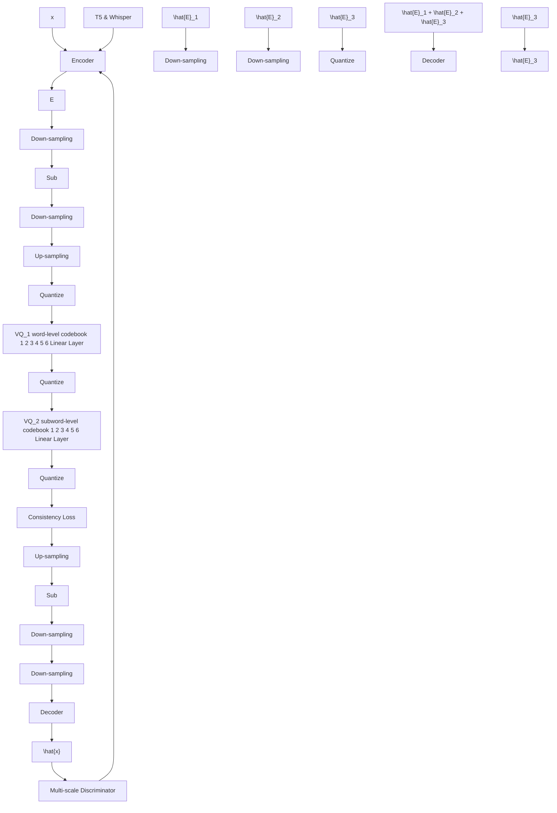

# UniAudio 1.5: Large Language Model-driven Audio Codec is A Few-shot Audio Task Learner

Dongchao Yang $^{1}$ , Haohan Guo $^{1}$ , Yuanyuan Wang $^{2}$ , Rongjie Huang $^{1}$ , Xiang Li $^{2}$ Xu Tan $^{3}$ , Xixin Wu $^{1}$ , Helen Meng $^{1}$

$^{1}$ The Chinese University of Hong Kong, $^{2}$ Tsinghua University, $^{3}$ Microsoft Research Asia dcyang@se.cuhk.edu.hk

# Abstract

The Large Language models (LLMs) have demonstrated supreme capabilities in text understanding and generation, but cannot be directly applied to cross-modal tasks without fine-tuning. This paper proposes a cross-modal in-context learning approach, empowering the frozen LLMs to achieve multiple audio tasks in a few-shot style without any parameter update. Specifically, we propose a novel and LLMs-driven audio codec model, LLM-Codec, to transfer the audio modality into the textual space, i.e. representing audio tokens with words or sub-words in the vocabulary of LLMs, while keeping high audio reconstruction quality. The key idea is to reduce the modality heterogeneity between text and audio by compressing the audio modality into a well-trained LLMs token space. Thus, the audio representation can be viewed as a new foreign language, and LLMs can learn the new foreign language with several demonstrations. In experiments, we investigate the performance of the proposed approach across multiple audio understanding and generation tasks, e.g. speech emotion classification, audio classification, text-to-speech generation, speech enhancement, etc. The experimental results demonstrate that the LLMs equipped with the proposed LLM-Codec, named as UniAudio 1.5, prompted by only a few examples, can achieve the expected functions in simple scenarios. It validates the feasibility and effectiveness of the proposed cross-modal in-context learning approach. To facilitate research on few-shot audio task learning and multi-modal LLMs, we have open-sourced the LLM-Codec model. $^{1}$

# 1 Introduction

Large language models (LLMs) (e.g. GPT4 [2], LLAMA [35]) become more versatile and effective at handling diverse and complex Natural Language Processing (NLP) tasks after scaling their model and training data. It is worth noting that the in-context learning ability of LLMs can be used to solve unseen tasks, e.g. we can provide instruction along with a few demonstrations of the new task, and then LLMs learn to solve the task. The success of LLMs inspires us to build multi-modal LLMs to solve audio-related tasks in the audio domain. A natural idea is to empower the auditory sense of the LLMs. There have been notable advancements in extending the capabilities of LLMs to tackle audio understanding tasks by combining the pre-trained audio encoder (e.g. Whisper encoder [30]) and LLMs. For example, WavLLM [15], SALMONN [34] and Qwen-audio [8] propose to train a multi-modal LLMs based on a pre-trained audio encoder, a trainable adaptor, and pre-trained LLMs. They try to align the audio and text modalities by updating the adaptor or fine-tuning the LLMs with LORA [14]. However, previous works (1) focus more on expanding LLMs to solve specific audio tasks, without considering the in-context-learning ability to unseen audio tasks; (2) do not support audio generation tasks, which limits its application scenarios; (3) align the audio and text modalities


<details>
<summary>flowchart</summary>

```mermaid
graph TD
    subgraph "(a) Speech emotion classification with in-context learning"
        A["LLAMA 2"] --> B["For each of the following input output pairs, output is one of emotion: [Sad or Happy"]]
        B --> C["LLM-Codec"]
        C --> D["x1"]
        C --> E["y1"]
        C --> F["Word Sequence"]
        F --> G["LLM-Codec"]
        G --> H["+"]
        G --> I["+"]
        G --> J["Word Sequence"]
        J --> K["LLM-Codec"]
        K --> L["x2"]
        K --> M["+"]
        K --> N["+"]
        K --> O["Word Sequence"]
        O --> P["LLM-Codec"]
        P --> Q["xq"]
        P --> R["+"]
        P --> S["+"]
        P --> T["Word Sequence"]
    end

    subgraph "(b) Text-to-speech generation with in-context learning"
        U["LLAMA 2"] --> V["Learn a foreign language for different digit, then generate corresponding number using foreign language based on instruction"]
        V --> W["An audio of 1"]
        V --> X["An audio of 2"]
        V --> Y["An audio of 1+1"]
        W --> Z["x1"]
        W --> AA["y1"]
        W --> AB["x2"]
        W --> AC["y2"]
        W --> AD["Word Sequence"]
        AD --> AE["LLM-Codec"]
        AE --> AF["+"]
        AE --> AG["+"]
        AE --> AH["Word Sequence"]
        AH --> AI["LLM-Codec"]
        AI --> AJ["+"]
        AI --> AK["Word Sequence"]
        AK --> AL["An audio of 1+1"]
        AK --> AM["xq"]
        AK --> AN["Word Sequence"]
    end

    A --> U
    U --> V
    V --> W
    W --> X
    X --> Y
    Y --> AC
    AC --> AD
    AD --> AE
    AE --> AF
    AF --> AG
    AG --> AH
    AH --> AI
    AI --> AJ
    AJ --> AK
    AK --> AL
    AL --> AM
```
</details>

Figure 1: This figure illustrates the framework of the proposed approach (UniAudio 1.5) to conduct speech emotion classification and simple text-to-speech generation tasks. The data format will be $\{x_{1}, y_{1}, x_{2}, y_{2}, ..., x_{q}\}$ , which means the previous samples $\{x_{i}, y_{i}\}$ is the demonstration of this task, the LLAMA model is asked to predict $y_{q}$ . $y_{q}$ can be the text or audio.

by collecting large-scale audio task data to train the models, which increases the efforts for the model training and data collection.

In this study, we propose a cross-modal in-context learning approach, empowering the frozen LLMs to solve any user-defined audio tasks based on a few demonstrations without any parameter update. To realize this target, we propose to learn a vector quantization audio codec model to map an audio modality to the token space of a frozen LLMs (e.g. LLAMA 2 [35]), named LLM-Codec. Our motivation is to reduce the modality heterogeneity between audio and text by compressing the audio data into a token space of LLMs. Considering that the compressed audio by LLM-Codec and text modality have a shared vocabulary, the compressed audio sequence can be viewed as a new foreign language, and LLMs can learn the new foreign language with several demonstration samples. Furthermore, LLMs are pre-trained on large-scale data and discover many patterns of combination of token sequence, which potentially improves its generalization to the foreign language. Figure 1 shows how to combine proposed LLM-Codec and LLAMA 2 models for audio tasks.

The proposed LLM-Codec tries to compress the audio data into a lexical word sequence. A desired LLM-Codec should have the following properties: (1) Completeness [12]: it should recover the compressed audio without too much loss. (2) Compactness: it should encode the audio into fewer-token sequences. (3) Semantic richness: it should encode the audio into a semantic-rich token sequence, which is easier to recognize by pre-trained LLMs. Thus, we propose a semantic-guided multi-scale residual vector quantization (RVQ) based codec. Specifically, the codec model has three residual VQ layers, the first VQ layer tries to encode the semantic information, the second VQ layer tries to encode the coarse-grained acoustic information, and the third layer tries to encode the residual acoustic information. Different from previous works [9, 48], which encode the audio data into the same granularity in each layer, we propose to encode the audio data into different granularity in each layer. Our motivation is that semantic-level information can also be preserved with few tokens. Instead, acoustic-level information needs more tokens. Such a multi-scale setting not only reduces the length of the token sequence but also provides a flexible choice for different types of tasks, e.g. for the audio understanding task, we can only use the semantic-level VQ layer. Furthermore, a novel semantic loss and consistency loss are designed to train the LLM-Codec model better.

We conduct experiments to verify the effectiveness of LLM-Codec in an in-context learning setting. We use the pre-trained LLAMA 2 7B model for all experiments without any parameter updating. We design audio understanding and generation tasks to evaluate the effectiveness of the proposed method, including speech emotion classification, audio classification, simple text-to-speech, speech denoising, and so on. The main contributions of this work are summarized as follows:

- We propose a novel LLMs-driven audio codec model, LLM-Codec, which effectively connects the text and audio modalities. To the best of our knowledge, this is the first work to quantize the audio data into the representation space of LLMs.   
- We demonstrate the feasibility and potential of using the in-context learning ability of LLMs to solve unseen audio tasks, including audio understanding and generation tasks. Extensive experiments and ablation studies further validate the effectiveness of our method.

# 2 Related works

Audio Codec Models Historical investigations into low-bitrate parametric audio codecs began with earlier studies $[21, 4]$ ; however, the quality of these codecs typically faced limitations. More recently, advancements have been made with the introduction of neural network-based audio codecs, evidenced by several promising developments $[48, 9, 45, 24, 20]$ . These systems generally involve an encoder that extracts deep features within a latent space, which are then quantized and transmitted to a decoder. Particularly relevant to our work are the FACdec $[20]$ and SpeechTokenizer $[50]$ models, which explicitly model different properties of audio in different vector quantization layers. Different from them, our proposed LLM-Codec tries to encode the audio data into a lexical word sequence.

Multimodal Large Language Models Recently, there has been tremendous progress in the area of multimodal LLMs. These models use the pre-trained LLMs as the base model and try to take various modalities as additional input, such as vision $[51, 27, 47, 52, 26, 36]$ , audio $[7, 23, 15, 49, 34, 19, 39]$ . In general, these multi-modal LLMs consist of a pre-trained LLM, a pre-trained vision/audio encoder, and a modality adaptor. They will construct a lot of multimodal datasets and use them to fine-tune the models. In the audio modality, most of the previous works try to solve speech understanding $[15]$ or general audio understanding $[34, 19]$ , and these models cannot apply to audio generation tasks. SpeechGPT supports a few audio understanding and generation tasks by fine-tuning all parameters and expanding the speech token's vocabulary based on LLAMA. However, the speech tokens in SpeechGPT only include semantic-level information, which limits its applications to more audio understanding and generation tasks. Furthermore, SpeechGPT does not explore the in-context learning ability to solve unseen tasks.

In-context Learning In-context learning represents a form of few-shot learning, where a large language model (LLM) quickly adjusts to a specific task during inference by reviewing only a handful of examples provided in the prompt $[6]$ . It has widely shown success in natural language tasks $[44]$ and visual-language tasks $[3, 47, 52, 27]$ . In the audio domain, advanced methods have been proposed that utilize in-context learning to solve unseen audio tasks. SALM $[7]$ proposes speech-augmented language models with in-context learning to solve speech recognition and speech translation tasks, they demonstrated that the SALM model can solve keyword boosting tasks. ICL-GSLM $[13]$ proposes to use warmup training and prompt tuning strategies to empower the pre-trained speech language models $[25]$ in-context learning ability for unseen tasks. However, ICL-GSLM mainly focuses on exploring the in-context learning of audio understanding tasks and ignores audio generation tasks. Dynamic-superb $[16]$ proposes to use instruction-tuning for audio understanding tasks. Similarly, $[41]$ and $[40]$ also explore the in-context learning in the speech understanding domain. Inspired by the success in NLP tasks $[44]$ and vision-language tasks $[47, 52, 27]$ , in this study, we focus on using the in-context ability from frozen LLMs to solve wide audio understanding and generation tasks.

# 3 LLM-Codec

# 3.1 Overview

Previous audio codec models $[9, 48, 45]$ adopt a VQ-VAE $[37]$ framework to encode the audio signal into a discrete latent space, then decode the discrete token sequence into audio. Due to audio codec models mapping audio signal into a discrete token sequence, many works $[17, 46, 5]$ propose to train an auto-regressive (AR) based language model to generate an audio token sequence by following the success of LLMs in natural language processing. But the discrete audio tokens produced by the codec model and text tokens in LLMs exist modal heterogeneity, e.g. the codebooks in audio codec and the vocabulary of LLMs without any connection, which increases the difficulty of expanding well-trained LLMs to audio modality. Although previous works $[49, 33]$ have demonstrated the effectiveness of expanding the vocabulary of LLMs to audio tokens and updating all of the parameters of LLMs, it will cost a lot of computing resources and forget the knowledge of the text.

In this part, we present a large language models-driven audio codec model (LLM-Codec), which effectively reduces the modal heterogeneity between audio and text. LLM-Codec is also based on the VQ-VAE framework, compared with previous work, the difference includes: (1) LLM-Codec is forced to quantize the audio signal into the token space of LLMs; (2) LLM-Codec adopts a multi-scale residual vector quantization strategy to balance the completeness and compactness of codec model; (3) LLM-Codec explicitly encodes different level information in different VQ layers. In the following, we give the details of LLM-Codec. Figure 2 provides a visual depiction of the LLM-Codec.


<details>
<summary>flowchart</summary>


</details>

Figure 2: A high-level overview of LLM-Codec. Sub denotes the feature subtraction. We assume 3 RVQ layers are used in our study. In practice, we can use different RVQ layer settings.

# 3.2 Encoder and Decoder

For any audio x, the encoder first encodes it into latent presentations $E^{T*d}$ , where T denotes the number of frames, d denotes the dimension of each vector. We set 4 down-sampling layers with S = [3, 4, 5, 8] in the encoder, which results in 480 times down-sampling for audio. Then, each frame $e \in E$ is passed through the quantizer, which assigns it to the closest entry in a codebook, resulting in the quantized embedding $\hat{e}$ . Finally, the quantized feature $\hat{E}$ inputs into the decoder to reconstruct $\hat{x}$ . Refer to Appendix B to find more model structure details.

# 3.3 Multi-scale residual vector quantization with the vocabulary of frozen LLM

We use three residual VQ layers to maintain the balance between completeness and compactness. Furthermore, we propose to set different quantization granularity in different VQ layers: we expect the first VQ layer can encode the semantic information, and such information can be saved with fewer tokens, thus an interpolation function is used to down-sample the encoder features $\pmb{E}^{T,d}$ into $\pmb{E}_1^{T / k_1,d}$ , then $\pmb{E}_1^{T / k_1,d}$ is passed through the first VQ layer to obtain $\hat{\pmb{E}}_1^{T / k_1,d}$ . For the second VQ layer, we expect it can encode coarse-grained acoustic information, thus we pass the residual of the first VQ layer into the next VQ layer. Before that, we first up-sampling $\hat{\pmb{E}}_1^{T / k_1,d}$ into $\hat{\pmb{E}}_1^{T,d}$ , then obtain the residual features by

$$
\boldsymbol {E} _ {2} ^ {T, d} = \boldsymbol {E} ^ {T, d} - \hat {\boldsymbol {E}} _ {1} ^ {T, d}. \tag {1}
$$

Similarly, we also apply a down-sampling operation to $E_{2}^{T,d}$ , we set the down-sampling step as $k_{2}$ . The features become as $E_{2}^{T/k_{2},d}$ . Then we pass it into the second VQ layer and obtain $\hat{E}_{2}^{T/k_{2},d}$ . Lastly, we expect the last VQ layer can preserve all of the residual acoustic information. We first obtain the residual features based on the quantized features of the first two VQ layers

$$
\boldsymbol {E} _ {3} ^ {T, d} = \boldsymbol {E} ^ {T, d} - \hat {\boldsymbol {E}} _ {1} ^ {T, d} - \hat {\boldsymbol {E}} _ {2} ^ {T, d}. \tag {2}
$$

Considering the residual acoustic information is more complex and diverse, we directly apply the VQ operation to each frame without any down-sampling. By using a large down-sampling step in the encoder of codec, and applying a multi-scale VQ strategy, we can effectively reduce the number of quantized audio token sequences. In our setting, 1-second audio with a 16k sampling rate will be quantized into 57 tokens. To ensure that the first VQ layers encode semantic information, we propose incorporating a semantic loss during the training process. Furthermore, to maintain the training stability, we propose a consistency loss. The details will be introduced in Section 3.4.

The initialization of VQ layers To generate lexical tokens, we utilize a pre-trained LLAMA 2 codebook to initialize the VQ layers. Considering that the first layer, the VQ layer, is designed to encode the semantic information, we do not directly use the full LLAMA codebook. Instead, we define a new codebook based on Oxford 5000 Words, these words are commonly used to make

Table 1: Performance comparison between open-sourced audio codec models, baselines, and the proposed LLM-Codec. Evaluation is conducted on the VCTK dataset [38]. 

<table><tr><td>Model</td><td>Down-sampling steps</td><td>Tokens per second</td><td>PESQ</td><td>STOI</td></tr><tr><td>Encodec_24k (3 Vanilla RVQ) [9]</td><td>320</td><td>225</td><td>2.18</td><td>0.79</td></tr><tr><td>DAC_16k (3 Vanilla RVQ) [24]</td><td>320</td><td>150</td><td>1.76</td><td>0.78</td></tr><tr><td>Baseline (3 Vanilla RVQ)</td><td>480</td><td>99</td><td>2.64</td><td>0.83</td></tr><tr><td>Baseline (2 Multi-scale RVQ)</td><td>480</td><td>41</td><td>2.22</td><td>0.79</td></tr><tr><td>Baseline (1 VQ)</td><td>480</td><td>33</td><td>2.01</td><td>0.76</td></tr><tr><td>LLM-Codec (Ours)</td><td>480</td><td>57</td><td>2.55</td><td>0.82</td></tr></table>

up any meaningful sentence. We choose these words that only consist of one or two sub-words in the LLAMA codebook. If a word includes two sub-words, we use the mean representation of two sub-words in the LLAMA codebook as the final representation. Lastly, the codebook size of the first VQ layer is 3248. We directly use the LLAMA codebook to initialize the second and third VQ layers. The codebook size is 32000. Furthermore, the LLAMA codebook embedding dimension is 4096, which is too large for codec training. Thus, we apply a linear mapping to 512. In the training process, the parameters of codebooks are fixed.

# 3.4 Training loss

Our approach is based on a GAN objective, in which we optimize both the generator(it consists of encoder, quantizer, and decoder) and the discriminators. For the generator, its training loss consists of three parts: (1) reconstruction loss term; (2) adversarial loss term (via discriminators); and (3) semantic and consistency losses. In the following, we give the details of proposed semantic loss and consistency loss. Refer to Appendix B.2 to find the details of reconstruction loss and adversarial loss.

Semantic loss To enhance the semantic representation ability in the first layer, we introduce a semantic loss for the first VQ layer. We expect it can encode semantic information, for example, if the input audio includes a sound event, the first layer should encode which semantic information of the sound event. Similarly, if the input audio is speech, the first layer should encode the content of the speech. To realize this target, we use a pre-trained T5-base model $[31]$ to extract a global representation vector g for the input audio content. We use Whisper to obtain its transcriptions if the input audio is speech. If the input audio is sound, we use its audio caption label:

$$
\mathcal {L} _ {s} = L _ {1} \left(\text { mean } \left(\hat {\boldsymbol {E}} _ {1} ^ {T, d}\right), \boldsymbol {g}\right) \tag {3}
$$

Consistency loss In our early experiments, we found the training of LLM-Codec is not stable, and the model is easy to collapse. One of the reasons is that we designed a significant down-sampling rate and the codebooks are fixed in the training, which increases the training difficulty. To solve this issue, we propose a consistency loss to maintain the training stability. Specifically, we propose using a pre-trained Whisper encoder $[30]$ to extract frame-level features w, then using these features as prior knowledge to guide the second VQ layer.

$$
\mathcal {L} _ {c} = L _ {1} \left(\hat {\boldsymbol {E}} _ {2} ^ {T / 2, d}, i n p (\boldsymbol {w})\right) \tag {4}
$$

where inp denotes the interpolation function to align the feature dimension between the quantized features and whisper features. We chose the Whisper encoder because it is trained not only on speech data but also on non-speech data. Furthermore, we do not apply this loss on the third VQ layer, because we expect the third VQ layer to encode the residual information.

# 4 UniAudio 1.5

By combining the pre-trained LLMs and the proposed LLM-Codec models, we can solve many audio tasks in a few-shot style, as Figure 1 shows. We named the system as UniAudio 1.5 for the reason that the system can be viewed as a universal audio task solver.

Table 2: Audio understanding task evaluation results. Task induction denotes the explanatory text that precedes the sequence of audio and text. It is intended to describe the task to the model in natural language, for example: Please answer the question. Accuracy (%) is used as the metric. For the Random guess, we calculate the average based 5 times evaluation. K shots refers to the number of distinct samples for each category, and Repeats refer to how many times we copy the prompt samples. 

<table><tr><td rowspan="3">Method</td><td rowspan="3"># Layers</td><td>Task Induction</td><td>X</td><td>√</td><td>√</td><td>√</td><td>√</td></tr><tr><td>K Shots</td><td>1</td><td>1</td><td>3</td><td>1</td><td>1</td></tr><tr><td>Repeats</td><td>0</td><td>0</td><td>0</td><td>2</td><td>3</td></tr><tr><td colspan="8">2-way speech emotion classification</td></tr><tr><td>Random</td><td>None</td><td></td><td></td><td></td><td>44</td><td></td><td></td></tr><tr><td>BLSP [39]</td><td>Whisper encoder</td><td></td><td>9</td><td>29</td><td>50</td><td>33</td><td>19</td></tr><tr><td>UniAudio 1.5 (ours)</td><td>semantic layer</td><td></td><td>25</td><td>53</td><td>59</td><td>53</td><td>54</td></tr><tr><td>UniAudio 1.5 (ours)</td><td>semantic + acoustic layers</td><td></td><td>45</td><td>49</td><td>53</td><td>55</td><td>54</td></tr><tr><td colspan="8">2-way sound event classification.</td></tr><tr><td>Random</td><td>None</td><td></td><td></td><td></td><td>45</td><td></td><td></td></tr><tr><td>BLSP [39]</td><td>Whisper encoder</td><td></td><td>44</td><td>47</td><td>54</td><td>15</td><td>17</td></tr><tr><td>UniAudio 1.5 (ours)</td><td>semantic layer</td><td></td><td>48</td><td>60</td><td>57</td><td>57</td><td>73</td></tr><tr><td>UniAudio 1.5 (ours)</td><td>semantic+acoustic layers</td><td></td><td>41</td><td>48</td><td>55</td><td>54</td><td>62</td></tr><tr><td colspan="8">3-way sound event classification.</td></tr><tr><td>Random</td><td>None</td><td></td><td></td><td></td><td>30</td><td></td><td></td></tr><tr><td>BLSP [39]</td><td>Whisper encoder</td><td></td><td>23</td><td>26</td><td>36</td><td>24</td><td>16</td></tr><tr><td>UniAudio 1.5 (ours)</td><td>semantic layer</td><td></td><td>38</td><td>41</td><td>39</td><td>43</td><td>42</td></tr><tr><td>UniAudio 1.5 (ours)</td><td>semantic+acoustic layers</td><td></td><td>25</td><td>37</td><td>35</td><td>44</td><td>50</td></tr></table>

# 4.1 Connection to UniAudio

UniAudio 1.5 is an advanced edition of the UniAudio Series [46]. Compared to its previous version UniAudio [46], UniAudio 1.5 has the following connections and distinctions. First, goal. While both UniAudio 1 and UniAudio 1.5 aim at building a universal audio foundation model for all audio tasks, their focuses are different. UniAudio focuses on audio generation tasks, such as text-to-speech, text-to-music, singing voice generation, and so on. UniAudio 1.5 focuses on audio understanding and generation tasks by exploring the few-shot ability based on large language models. Second, architecture. UniAudio 1.5 keeps the basic components in UniAudio, such as an audio codec used to transfer the audio modality into discrete representations, and a decoder-only transformer backbone is used. However, UniAudio 1.5 leverages 1) a pre-trained LLMs to solve the audio understanding and generation tasks by in-context learning, 2) a LLM-driven audio codec to quantize the audio data into the token space of LLMs.

Building a multi-modal audio foundation model that is capable of handling any audio task is the ultimate goal of the UniAudio series. In UniAudio 1.0, we show the possibility to build a universal model for different types of audio generation tasks, but it (1) cannot effectively solve audio understanding tasks; (2) cannot solve unseen audio tasks in the training or fine-tuning stages. UniAudio 1.5 shows the possibility to use pre-trained LLMs for both audio understanding and generation tasks. We believe the proposed LLM-Codec in UniAudio 1.5 builds a foundation for more advanced editions of the UniAudio Series in the future.

# 5 Experimental Results

# 5.1 Experimental Settings

Training data LLM-Codec is a universal audio codec model, we train it on both speech and sound datasets. For speech data, we use part of the MLS dataset $[29]$ . For sound data, we use the AudioCaps dataset $[22]$ . In total, we use 2k hours of audio data to train the LLM-Codec model.

Model setting As described in 3.2, the encoder and decoder of LLM-Codec consist of several Convolution and Transformer blocks. For the quantizer, we use three residual vector quantization layers. The down-sampling rate for the first two layers is set as $k_{1} = 4$ and $k_{2} = 2$ . We initialize

Table 3: Evaluation on dynamic-superb benchmark tasks. Accuracy (%) is used as the metric. 

<table><tr><td>Task</td><td>ImageBind-LLM [16]</td><td>Whisper-LLM [16]</td><td>ASR-ChatGPT [16]</td><td>Ours</td></tr><tr><td>Accent Classification</td><td>19</td><td>4</td><td>7</td><td>24</td></tr><tr><td>Bird Sound Detection</td><td>28</td><td>14</td><td>15</td><td>50</td></tr><tr><td>Chord Classification</td><td>44</td><td>58</td><td>3</td><td>55</td></tr><tr><td>Language Identification</td><td>26</td><td>13</td><td>96</td><td>25</td></tr></table>

the parameters of VQ layers with the help of the LLAMA2 7B model's vocabulary. Considering the latent dimension of LLAMA2 is 4096, we use a learnable linear layer to map them into 512.

Evaluation metrics To verify the reconstruction performance of the LLM-Codec, Perceptual Evaluation of Speech Quality (PESQ) and Short-Time Objective Intelligibility (STOI) are used. For audio understanding tasks, we conduct a lot of N-way-K shot classification experiments, and use accuracy as the metric. For the audio generation task, we follow commonly used metrics in each task.

Evaluation dataset We choose the commonly used test dataset for each task and construct N-way-K-shot test pairs. More details about construct evaluation samples can be found in Appendix C.1.

Baselines Given the limited number of works that focus on exploring few-shot learning for unseen audio tasks, we choose BLSP [39] as one of the baselines for audio understanding tasks. Since BLSP is fine-tuning with a continuation writing task and does not explicitly introduce audio classification tasks, thus these audio classification tasks are unseen for the BLSP model. Furthermore, we also compared with the instruction-tuning-based models in dynamic-superb [16]. For audio generation tasks, we do not find related works, thus we report the performance of state-of-the-art special models.

# 5.2 Main results

We first present the reconstruction performance comparison. Then we apply the LLM-Codec and LLAMA 2 7B model (named as UniAudio 1.5) for audio understanding and audio generation tasks, to verify the ability of the proposed method. Lastly, we give the visualization of LLM-Codec to explain why it can work. We leave more experiments on Appendix D.

Reconstruction performance We compare the audio reconstruction quality with previous works Encodec [9], DAC-Codec [24], and our baseline model. We report Perceptual Evaluation of Speech Quality (PESQ) and Short-Time Objective Intelligibility (STOI). Table 1 shows the results. Compared to previous methods, the LLM-Codec achieves better reconstruction performance while utilizing fewer tokens. More specifically, the LLM-Codec model can compress 1-second audio data into a sequence that only includes 57 tokens, which significantly reduces the sequence length. Compared to the RVQ baseline model, the LLM-Codec significantly reduces the compressed tokens, and its reconstruction performance does not significantly decline. In Section 5.3, we will show the importance of compressing audio into fewer tokens. We also conduct experiments to validate whether we can use a few VQ layers, such as 1 VQ layer or 2 VQ layer, we can see that the reconstruction performance will significantly drop. To maintain the balance between completeness and compactness, we choose a multi-scale 3 VQ layer as the default setting.

Speech Emotion Classification The speech emotion classification task [10] aims to predict the emotion label of the speech. We conduct 2-way K-shot experiments on the ESD [1] dataset. Experimental results are shown in Table 2. We have the following findings: (1) Task induction is important to maintain the stability of performance, we can see that without task induction, the classification accuracy will dramatically decline. (2) The semantic layer effectively extracts

the global semantics of audio, which can be easily understood by the LLAMA model. (3) Using more demonstration samples (e.g. 3 shots), the performance will be better. (4) Repeating the demonstration samples can also bring improvement. (5) Compared to the BLSP, our method performs better in any setting. Furthermore, we also note that the performance of BLSP will drop when repeat operation is used. One possible reason is that BLSP only learns the translation relationship between text and speech, repeating samples cannot bring new cues for LLMs to solve the new task. Instead, our LLM-Codec learns to map the audio data into the latent space of LLMs, increasing the number of demonstration samples can help LLMs to find special patterns to solve this new task.

Table 4: Text-to-speech generation performance. 

<table><tr><td>Model</td><td>ACC</td><td>DNSMOS</td></tr><tr><td>GT</td><td>-</td><td>2.91</td></tr><tr><td>FastSpeech 2</td><td>-</td><td>3.42</td></tr><tr><td>UniAudio 1.5 (Ours)</td><td>70</td><td>2.92</td></tr></table>

Sound Event Classification Sound event classification aims to recognize the sound event in the audio. In general, an audio may include multiple events. To simplify the recognition difficulty, we assume each audio only includes one event. We conduct experiments on the ESC50 dataset [28], which includes 50 different types of events. We construct 2-way-K-shot and 3-way-K-shot evaluations based on the ESC50 test set. Compared with the BLSP model, our proposed method gets better performance. Based on the experimental results from two audio understanding tasks, we can see that the semantic VQ layer is very important for understanding tasks.

Dynamic-SUPERB Benchmark We also conduct experiments on Dynamic-SUPERB Benchmark tasks $[16]$ . In $[16]$ , authors propose an instruction-tuning strategy for multi-modal LLMs. They first construct a lot of audio tasks as training data, then validate some unseen audio tasks in a zero-shot way. To make a fair comparison, we use the same test set with them, and choose the first N samples as the demonstration to construct a N-way-1-shot evaluation. As Table 3 shows 4 selected audio understanding tasks, our proposed method obtains better or compared performance than these baselines in $[16]$ . Especially, for the bird sound detection task, our proposed method obtained great improvement over previous methods. We also note that our method performs worse on language identification, the possible reason is that our codec model is only trained on English speech data. In the following, we will show that UniAudio 1.5 also can be used to conduct audio generation tasks.

Simple text-to-speech generation We conduct text-to-speech generation on the Free Spoken Digit Dataset (FSDD) dataset [11], which includes 3 speakers and 1,500 recordings. Unlike the traditional TTS model, which generates any speech content, this task generates digit speech. Our current model to generate complex speech content is still challenging. We use accuracy (ACC) to assess the content of the generated sample whether following the instructions. DNSMOS is used to assess the speech quality of generated samples. We construct 20 different query questions, including addition, subtraction, multiplication, division, and reasoning (finding more details from Appendix C.2). From Table 4, we can see that our proposed model can accurately understand the query in most cases (the accuracy is $70\%$ ) and generate good-quality speech samples. Figure 3 gives a visualization of generating speech based on the query. The frozen LLAMA model learns about 4 digits (0-3), each audio digit includes 5 samples. We add the context for each audio: "an audio of k" before inputting the audio's discrete representations into LLAMA, as Figure 1 (b) shows. After that, we let the LLAMA 2 model generate corresponding speech digits based on the instruction. We also note that the generated audio appears different from all context audio samples, demonstrating the cross-modal reasoning capability of LLMs when using the LLM-Codec as the connector for text and audio.

Simple Speech Denoising To verify whether the proposed method can conduct speech-denoising tasks, we simulate noisy speech based on the VCTK dataset and NoiseX-92 dataset, we set the SNR ranges from -20 to 20. For each clean speech, we choose 5 different noises to simulate noisy speech. The first 4 noisy and clean audio pairs are used as demonstrations, and the model learns to denoise the last noisy one. To improve in-context learning ability, we repeat the demonstration

Table 5: Speech denosing evaluation. 

<table><tr><td>Model</td><td>PESQ</td><td>STOI</td></tr><tr><td>SGMSE+ [32]</td><td>3.53</td><td>0.79</td></tr><tr><td>UniAudio 1.5 (Ours)</td><td>2.17</td><td>0.57</td></tr></table>

samples 4 times. The experimental results as Table 5 shows, we can see that the proposed method can also learn to denoise without any training. Furthermore, we also note that the performance has a large room to improve compared to special models.

Token Visualization We visualize the tokens produced by the first VQ layer of LLM-Codec for different types of sound in Figure 4. We have the following findings: (1) Although the two audios include the same sound event, the quantized sequence is not exactly the same. (2) The quantized sequence of two same types of audio has a similar pattern, e.g. their token sequences have similar repeating patterns or the same word. Such patterns may help the LLMs recognize the type of audio.

# 5.3 Ablation study

The influence of multi-scale RVQ We first conduct experiments to see the effectiveness of multi-scale RVQ. As Table 6 shows, compared with vanilla RVQ, the proposed multi-scale RVQ does not bring a significant reconstruction performance drop, which validates our assumption that semantic information does not need too much token to encode. Secondly, we find the multi-scale RVQ significantly reduces the length of the token sequence and brings benefits for downstream tasks (the audio classification accuracy is better than the baseline). One potential explanation is that LLMs can

  
Figure 3: Examples of simple text-to-speech generation using LLM-Codec and LLAMA2 model.

better identify the unique pattern in a brief sequence. Intuitively, the semantic information included in a 1-second audio is limited. It is unnecessary to use very long sequences to represent limited information.

The influence of down-sampling times We can see that using a smaller down-sampling rate (320) can improve the reconstruction performance, but it also increases the length of the token sequence. We can see that the classification accuracy will decrease when the sequence length increases.

The influence of semantic loss Without semantic loss, the performance of the audio understanding task will drop. Furthermore, we also find that adding semantic loss does not influence the reconstruction performance. In summary, the proposed semantic loss is very useful.

The influence of consistency loss We find that consistency loss is important to maintain training stability. Without it, we can see the model fails to reconstruct the audio. We conjecture that frozen codebooks and large compression rates significantly improve the difficulty of training. The consistency loss forces the second VQ layer to produce features similar to those of the Whisper encoder, which provides guidance for vector quantization and prevents the model from collapsing in the early stage.

The influence of word-level codebooks We also conduct experiments to show the effectiveness of using word-level codebooks to initialize the first VQ layer. Compared with using sub-word vocabulary for the first VQ layer, we can see that using the proposed word-level codebook can improve the reconstruction performance and classification accuracy.

The importance of frozen codebooks LLM-Codec compresses the audio data into the token space of LLMs by initializing the codebooks with the LLMs' vocabulary and fixing it during the training stage. Table 6 also presents the results of updating codebooks: it can improve the reconstruction performance, but the accuracy is a significant drop. The result is consistent with our hypothesis: updating the codebooks parameter will decrease the codec training difficulty, but the learned codebook space is different from the LLM's token space, resulting in the downstream task performance declines.

Different setting of $k_{1}$ and $k_{2}$ in multi-scale RVQ We validate a new setting for multi-scale RVQ with $k_{1} = 3$ and $k_{2} = 5$ . We can see that the reconstruction performance will decline. We think one of the reasons is that the second VQ layer should not apply a large down-sampling step, which significantly influences the reconstruction.

Codebook usage Previous works [18, 48, 24] suggest that using a large-scale codebook may result in codebook collapse ((where a fraction of the codes are unused). We calculate the codebook usage for each VQ layer in LLM-Codec. The used codes are 3246 (3248), 31911 (32000), 31941 (32000) for each VQ layer, which shows that most of codes are used.

# 6 Conclusion

In this study, we explore a cross-modal in-context learning approach to solve unseen audio tasks in a few-shot style. Specifically, we propose to train a LLMs-driven audio codec (LLM-Codec) that compresses the audio signal into the token space of LLMs. The LLM-Codec effectively reduces the modal heterogeneity between text and audio. With the help of LLM-Codec, pre-trained LLMs can be applied to audio understanding and generation tasks. We demonstrate that LLM-Codec has good reconstruction performance, and the compressed token sequence is suitable for LLMs to understand

Table 6: Ablation studies on training loss, multi-scale RVQ setting, initialization of VQ layer. The classification accuracy (%) is evaluated under the sound event classification task 2-way 1-shot setup. 

<table><tr><td>Model</td><td>Down-sampling</td><td>Tokens per second</td><td>PESQ</td><td>STOI</td><td>ACC</td></tr><tr><td>Baseline (Vanilla 3 RVQ)</td><td>480</td><td>99</td><td>2.64</td><td>0.83</td><td>55</td></tr><tr><td>LLM-Codec (Multi-scale 3 RVQ)</td><td>480</td><td>57</td><td>2.55</td><td>0.82</td><td>60</td></tr><tr><td>LLM-Codec (Multi-scale 3 RVQ)</td><td>320</td><td>87</td><td>2.60</td><td>0.83</td><td>57</td></tr><tr><td>w/o semantic loss</td><td>480</td><td>57</td><td>2.54</td><td>0.82</td><td>58</td></tr><tr><td>w/o consistency loss</td><td>480</td><td>57</td><td>1.19</td><td>0.53</td><td>48</td></tr><tr><td>w/o word-level codebook</td><td>480</td><td>57</td><td>2.46</td><td>0.81</td><td>59</td></tr><tr><td>updating codebooks</td><td>480</td><td>57</td><td>2.63</td><td>0.83</td><td>55</td></tr><tr><td>setting  $k_1 = 3$  and  $k_2 = 5$ </td><td>480</td><td>50</td><td>2.35</td><td>0.79</td><td>58</td></tr></table>


<details>
<summary>text_image</summary>

Mel
spectrogram
footsteps
footsteps
snoring
snoring
Semantic
Layer
therefore therefore nobody threaten
therefore concerning nobody nobody
disk finally
therefore therefore nobody nobody switch
threaten concerning concerning therefore
finally
yesterday yesterday yesterday
yesterday yesterday whatever
whatever newspaper Sunday finally
before before before phrase phrase
phrase after phrase alarm finally
</details>

Figure 4: The token visualization with LLM-Codec. The audio samples are from the ESC50 dataset.

and generate. Experiments show that the LLMs equipped with the proposed LLM-Codec, prompted by only a few examples, are capable of achieving the expected functions in many scenarios.

# 7 Limitations

Although we show the possibility of using the in-context learning ability of LLMs for unseen audio tasks without any parameter update, the performance of these tasks is still poorer than these special models in the audio domain. The capability to learn within an in-context framework is significantly limited for a modality that was not exposed during the training process. Due to the LLM's context length limitation, we cannot add more demonstration samples to help improve the performance. We think it is worth exploring using more demonstrations to improve its in-context learning ability. Moreover, we only explore to use LLAMA 2 7B model as the backbone, more advanced open-sourced LLMs are worth exploring. Considering we have open-sourced the LLM-Codec, readers can conduct experiments on their favorite LLMs. In the future, we will explore to train multi-modal LLMs by fine-tuning LLMs on text-audio datasets with the help of LLM-Codec.

# References

[1] Emotional voice conversion: Theory, databases and esd. Speech Communication, 137:1–18, 2022.   
[2] Josh Achiam, Steven Adler, Sandhini Agarwal, Lama Ahmad, Ilge Akkaya, Florencia Leoni Aleman, Diogo Almeida, Janko Altenschmidt, Sam Altman, Shyamal Anadkat, et al. Gpt-4 technical report. arXiv preprint arXiv:2303.08774, 2023.   
[3] Jean-Baptiste Alayrac, Jeff Donahue, Pauline Luc, Antoine Miech, Iain Barr, Yana Hasson, Karel Lenc, Arthur Mensch, Katherine Millican, Malcolm Reynolds, et al. Flamingo: a visual language model for few-shot learning. Advances in neural information processing systems, 35:23716–23736, 2022.   
[4] Bishnu S Atal and Suzanne L Hanauer. Speech analysis and synthesis by linear prediction of the speech wave. The journal of the acoustical society of America, 50(2B):637–655, 1971.

[5] Zalán Borsos, Raphaël Marinier, Damien Vincent, Eugene Kharitonov, Olivier Pietquin, Matt Sharifi, Dominik Roblek, Olivier Teboul, David Grangier, Marco Tagliasacchi, et al. Audiolm: a language modeling approach to audio generation. IEEE/ACM Transactions on Audio, Speech, and Language Processing, 2023.   
[6] Tom Brown, Benjamin Mann, Nick Ryder, Melanie Subbiah, Jared D Kaplan, Prafulla Dhariwal, Arvind Neelakantan, Pranav Shyam, Girish Sastry, Amanda Askell, et al. Language models are few-shot learners. Advances in neural information processing systems, 33:1877–1901, 2020.   
[7] Zhehuai Chen, He Huang, Andrei Andrusenko, Oleksii Hrinchuk, Krishna C Puvvada, Jason Li, Subhankar Ghosh, Jagadeesh Balam, and Boris Ginsburg. Salm: Speech-augmented language model with in-context learning for speech recognition and translation. In ICASSP 2024-2024 IEEE International Conference on Acoustics, Speech and Signal Processing (ICASSP), pages 13521–13525. IEEE, 2024.   
[8] Yunfei Chu, Jin Xu, Xiaohuan Zhou, Qian Yang, Shiliang Zhang, Zhijie Yan, Chang Zhou, and Jingren Zhou. Qwen-audio: Advancing universal audio understanding via unified large-scale audio-language models. arXiv preprint arXiv:2311.07919, 2023.   
[9] Alexandre Défossez, Jade Copet, Gabriel Synnaeve, and Yossi Adi. High fidelity neural audio compression. arXiv preprint arXiv:2210.13438, 2022.   
[10] Moataz El Ayadi, Mohamed S Kamel, and Fakhri Karray. Survey on speech emotion recognition: Features, classification schemes, and databases. Pattern recognition, 44(3):572–587, 2011.   
[11] Zohar JacksonCésar. et.all. free-spoken-digit-dataset: v1.0.8 (v1.0.8). zenodo. https://doi.org/10.5281/zenodo.1342401, 2018.   
[12] Haohan Guo, Fenglong Xie, Xixin Wu, Frank K. Soong, and Helen Meng. Msmc-tts: Multi-stage multi-codebook vq-vae based neural tts. IEEE/ACM Transactions on Audio, Speech, and Language Processing, 31:1811–1824, 2023.   
[13] Ming-Hao Hsu, Kai-Wei Chang, Shang-Wen Li, and Hung-yi Lee. An exploration of in-context learning for speech language model. arXiv preprint arXiv:2310.12477, 2023.   
[14] Edward J Hu, Yelong Shen, Phillip Wallis, Zeyuan Allen-Zhu, Yuanzhi Li, Shean Wang, Lu Wang, and Weizhu Chen. Lora: Low-rank adaptation of large language models. arXiv preprint arXiv:2106.09685, 2021.   
[15] Shujie Hu, Long Zhou, Shujie Liu, Sanyuan Chen, Hongkun Hao, Jing Pan, Xunying Liu, Jinyu Li, Sunit Sivasankaran, Linquan Liu, et al. Wavllm: Towards robust and adaptive speech large language model. arXiv preprint arXiv:2404.00656, 2024.   
[16] Chien-yu Huang, Ke-Han Lu, Shih-Heng Wang, Chi-Yuan Hsiao, Chun-Yi Kuan, Haibin Wu, Siddhant Arora, Kai-Wei Chang, Jiatong Shi, Yifan Peng, et al. Dynamic-superb: Towards a dynamic, collaborative, and comprehensive instruction-tuning benchmark for speech. In ICASSP 2024-2024 IEEE International Conference on Acoustics, Speech and Signal Processing (ICASSP), pages 12136–12140. IEEE, 2024.   
[17] Rongjie Huang, Chunlei Zhang, Yongqi Wang, Dongchao Yang, Luping Liu, Zhenhui Ye, Ziyue Jiang, Chao Weng, Zhou Zhao, and Dong Yu. Make-a-voice: Unified voice synthesis with discrete representation. arXiv preprint arXiv:2305.19269, 2023.   
[18] Minyoung Huh, Brian Cheung, Pulkit Agrawal, and Phillip Isola. Straightening out the straight-through estimator: Overcoming optimization challenges in vector quantized networks. In International Conference on Machine Learning. PMLR, 2023.   
[19] Atin Sakkeer Hussain, Shansong Liu, Chenshuo Sun, and Ying Shan. Mugen: Multi-modal music understanding and generation with the power of large language models. arXiv preprint arXiv:2311.11255, 2023.   
[20] Zeqian Ju, Yuancheng Wang, Kai Shen, Xu Tan, Detai Xin, Dongchao Yang, Yanqing Liu, Yichong Leng, Kaitao Song, Siliang Tang, et al. Naturalspeech 3: Zero-shot speech synthesis with factorized codec and diffusion models. arXiv preprint arXiv:2403.03100, 2024.

[21] Biing-Hwang Juang and A Gray. Multiple stage vector quantization for speech coding. In ICASSP'82. IEEE International Conference on Acoustics, Speech, and Signal Processing, volume 7, pages 597–600. IEEE, 1982.   
[22] Chris Dongjoo Kim, Byeongchang Kim, Hyunmin Lee, and Gunhee Kim. Audiocaps: Generating captions for audios in the wild. In Proceedings of the 2019 Conference of the North American Chapter of the Association for Computational Linguistics: Human Language Technologies, Volume 1 (Long and Short Papers), pages 119–132, 2019.   
[23] Zhifeng Kong, Arushi Goel, Rohan Badlani, Wei Ping, Rafael Valle, and Bryan Catanzaro. Audio flamingo: A novel audio language model with few-shot learning and dialogue abilities. arXiv preprint arXiv:2402.01831, 2024.   
[24] Rithesh Kumar, Prem Seetharaman, Alejandro Luebs, Ishaan Kumar, and Kundan Kumar. High-fidelity audio compression with improved rvqgan. Advances in Neural Information Processing Systems, 36, 2024.   
[25] Kushal Lakhotia, Eugene Kharitonov, Wei-Ning Hsu, Yossi Adi, Adam Polyak, Benjamin Bolte, Tu-Anh Nguyen, Jade Copet, Alexei Baevski, Abdelrahman Mohamed, et al. On generative spoken language modeling from raw audio. Transactions of the Association for Computational Linguistics, 9:1336–1354, 2021.   
[26] Junnan Li, Dongxu Li, Silvio Savarese, and Steven Hoi. Blip-2: Bootstrapping language-image pre-training with frozen image encoders and large language models. In International conference on machine learning, pages 19730–19742. PMLR, 2023.   
[27] Hao Liu, Wilson Yan, and Pieter Abbeel. Language quantized autoencoders: Towards unsupervised text-image alignment. Advances in Neural Information Processing Systems, 36, 2024.   
[28] Karol J. Piczak. ESC: Dataset for Environmental Sound Classification. In Proceedings of the 23rd Annual ACM Conference on Multimedia, pages 1015–1018. ACM Press.   
[29] Vineel Pratap, Qiantong Xu, Anuroop Sriram, Gabriel Synnaeve, and Ronan Collobert. Mls: A large-scale multilingual dataset for speech research. arXiv preprint arXiv:2012.03411, 2020.   
[30] Alec Radford, Jong Wook Kim, Tao Xu, Greg Brockman, Christine McLeavey, and Ilya Sutskever. Robust speech recognition via large-scale weak supervision. In International Conference on Machine Learning, pages 28492–28518. PMLR, 2023.   
[31] Colin Raffel, Noam Shazeer, Adam Roberts, Katherine Lee, Sharan Narang, Michael Matena, Yanqi Zhou, Wei Li, and Peter J Liu. Exploring the limits of transfer learning with a unified text-to-text transformer. Journal of machine learning research, 21(140):1–67, 2020.   
[32] Julius Richter, Simon Welker, Jean-Marie Lemercier, Bunlong Lay, and Timo Gerkmann. Speech enhancement and dereverberation with diffusion-based generative models. IEEE/ACM Transactions on Audio, Speech, and Language Processing, 31:2351–2364, 2023.   
[33] Paul K Rubenstein, Chulayuth Asawaroengchai, Duc Dung Nguyen, Ankur Bapna, Zalán Borsos, Félix de Chaumont Quitry, Peter Chen, Dalia El Badawy, Wei Han, Eugene Kharitonov, et al. Audiopalm: A large language model that can speak and listen. arXiv preprint arXiv:2306.12925, 2023.   
[34] Changli Tang, Wenyi Yu, Guangzhi Sun, Xianzhao Chen, Tian Tan, Wei Li, Lu Lu, Zejun Ma, and Chao Zhang. Salmonn: Towards generic hearing abilities for large language models. arXiv preprint arXiv:2310.13289, 2023.   
[35] Hugo Touvron, Thibaut Lavril, Gautier Izacard, Xavier Martinet, Marie-Anne Lachaux, Timothée Lacroix, Baptiste Rozière, Naman Goyal, Eric Hambro, Faisal Azhar, et al. Llama: Open and efficient foundation language models. arXiv preprint arXiv:2302.13971, 2023.   
[36] Maria Tsimpoukelli, Jacob L Menick, Serkan Cabi, SM Eslami, Oriol Vinyals, and Felix Hill. Multimodal few-shot learning with frozen language models. Advances in Neural Information Processing Systems, 34:200–212, 2021.

[37] Aaron Van Den Oord, Oriol Vinyals, et al. Neural discrete representation learning. Advances in neural information processing systems, 30, 2017.   
[38] Christophe Veaux, Junichi Yamagishi, and Kirsten MacDonald. Cstr vctk corpus: English multi-speaker corpus for cstr voice cloning toolkit. 2017.   
[39] Chen Wang, Minpeng Liao, Zhongqiang Huang, Jinliang Lu, Junhong Wu, Yuchen Liu, Chengqing Zong, and Jiajun Zhang. Blsp: Bootstrapping language-speech pre-training via behavior alignment of continuation writing. arXiv preprint arXiv:2309.00916, 2023.   
[40] Siyin Wang, Chao-Han Yang, Ji Wu, and Chao Zhang. Can whisper perform speech-based in-context learning? In ICASSP 2024-2024 IEEE International Conference on Acoustics, Speech and Signal Processing (ICASSP), pages 13421–13425. IEEE, 2024.   
[41] Siyin Wang, Chao-Han Huck Yang, Ji Wu, and Chao Zhang. Bayesian example selection improves in-context learning for speech, text, and visual modalities. arXiv preprint arXiv:2404.14716, 2024.   
[42] Yuanyuan Wang, Hangting Chen, Dongchao Yang, Jianwei Yu, Chao Weng, Zhiyong Wu, and Helen Meng. Consistent and relevant: Rethink the query embedding in general sound separation. In ICASSP 2024-2024 IEEE International Conference on Acoustics, Speech and Signal Processing (ICASSP), pages 961–965. IEEE, 2024.   
[43] Pete Warden. Speech commands: A dataset for limited-vocabulary speech recognition. arXiv preprint arXiv:1804.03209, 2018.   
[44] Jason Wei, Maarten Bosma, Vincent Y Zhao, Kelvin Guu, Adams Wei Yu, Brian Lester, Nan Du, Andrew M Dai, and Quoc V Le. Finetuned language models are zero-shot learners. arXiv preprint arXiv:2109.01652, 2021.   
[45] Dongchao Yang, Songxiang Liu, Rongjie Huang, Jinchuan Tian, Chao Weng, and Yuexian Zou. Hifi-codec: Group-residual vector quantization for high fidelity audio codec. arXiv preprint arXiv:2305.02765, 2023.   
[46] Dongchao Yang, Jinchuan Tian, Xu Tan, Rongjie Huang, Songxiang Liu, Xuankai Chang, Jiatong Shi, Sheng Zhao, Jiang Bian, Xixin Wu, et al. Uniaudio: An audio foundation model toward universal audio generation. arXiv preprint arXiv:2310.00704, 2023.   
[47] Lijun Yu, Yong Cheng, Zhiruo Wang, Vivek Kumar, Wolfgang Macherey, Yanping Huang, David Ross, Irfan Essa, Yonatan Bisk, Ming-Hsuan Yang, et al. Spae: Semantic pyramid autoencoder for multimodal generation with frozen llms. Advances in Neural Information Processing Systems, 36, 2024.   
[48] Neil Zeghidour, Alejandro Luebs, Ahmed Omran, Jan Skoglund, and Marco Tagliasacchi. Soundstream: An end-to-end neural audio codec. IEEE/ACM Transactions on Audio, Speech, and Language Processing, 30:495–507, 2021.   
[49] Dong Zhang, Shimin Li, Xin Zhang, Jun Zhan, Pengyu Wang, Yaqian Zhou, and Xipeng Qiu. Speechgpt: Empowering large language models with intrinsic cross-modal conversational abilities. arXiv preprint arXiv:2305.11000, 2023.   
[50] Xin Zhang, Dong Zhang, Shimin Li, Yaqian Zhou, and Xipeng Qiu. Speech tokenizer: Unified speech tokenizer for speech large language models. arXiv preprint arXiv:2308.16692, 2023.   
[51] Kaizhi Zheng, Xuehai He, and Xin Eric Wang. Minigpt-5: Interleaved vision-and-language generation via generative vokens. arXiv preprint arXiv:2310.02239, 2023.   
[52] Lei Zhu, Fangyun Wei, and Yanye Lu. Beyond text: Frozen large language models in visual signal comprehension. arXiv preprint arXiv:2403.07874, 2024.

# Appendices

# A Appendix Overview

These Appendices provide additional details to support our main manuscript, including (1) the training detail and model structure of LLM-Codec. (2) The details of the evaluation dataset. (3) More audio task evaluation results. (4) Limitations.

# B More details of LLM-Codec

# B.1 Model structure

Table 7 gives the details of LLM-Codec configuration, which results in 160M parameters. To facilitate research on cross-modal in-context learning and multi-modal LLMs, we have open-sourced the LLM-Codec models. 

<table><tr><td></td><td>LLM-Codec</td></tr><tr><td>Input shape</td><td>(1, 1, T)</td></tr><tr><td>Encoder (input dimension)</td><td>32</td></tr><tr><td>Down-sampling rate</td><td>[3, 4, 5, 8]</td></tr><tr><td>latent dimension</td><td>512</td></tr><tr><td>Codebook dimension</td><td>4096</td></tr><tr><td>Transformer layer dimension</td><td>512</td></tr><tr><td>Number of Transformer heads</td><td>8</td></tr><tr><td>Decoder dimension</td><td>1536</td></tr><tr><td>Up-sampling rate</td><td>[8, 5, 4, 3]</td></tr><tr><td>VQ strides</td><td>[5, 3, 1]</td></tr></table>

Table 7: LLM-Codec model backbone configurations

Encoder and Decoder Considering a single-channel audio signal $x \in R^{t \times sr}$ , where t and sr denote the audio duration and the sample rate. The overall architecture is similar to previous audio codec models, such as Encodec [9], DAC [24], and HiFi-Codec [45], which includes four main parts: encoder, quantizer, decoder, and discriminators. Figure 2 provides a visual depiction of the proposed method. For any input x, the encoder first encodes it into latent presentations $E^{T*d}$ , where T denotes the number of frames, d denotes the dimension of each vector. Due to the encoder includes some down-sampling layers, resulting in $T << t \times sr$ . Then each frame $e \in E$ is passed through the quantizer, which assigns it to the closest entry in a codebook, resulting in the quantized embedding $\hat{e}$ . Finally, the quantized feature $\hat{E}$ inputs into the decoder to reconstruct $\hat{x}$ . The encoder and decoder architecture follows previous works Encodec [9] and DAC-Codec [24], which includes several convolution layers and transformer layers. Specifically, the encoder model comprises a 1D convolution with C channels and a kernel size of 7, leading into B convolution blocks. Each block contains a residual unit followed by a down-sampling layer, which employs a convolution with a kernel size K that is twice the stride S. The residual unit itself comprises two convolutions, each with a kernel size of 3, linked by a skip connection. The transformer block is used for sequence modeling, and concludes with a final 1D convolution layer featuring a kernel size of 7. In this study, we set S = [3, 4, 5, 8], which results in 480 times down-sampling for audio. The decoder mirrors the encoder's architecture, substituting stride convolutions with transposed convolutions and reversing the stride order.

Discriminators For the discriminators, we follow previous work [46], which combines the mel-spectrogram and log-mel-spectrogram features and then input them into a network consisting of several convolutional layers. In our experiments, we use 6 different discriminators with different configurations. Specifically, we set the hidden dimension as $\{64, 128, 256, 512, 512, 512\}$ and the hop length as $\{32, 64, 128, 256, 512, 1024\}$ .

# B.2 Reconstruction loss and adversarial loss for LLM-Codec

The reconstruction loss is calculated between x and $\hat{x}$ . We design the loss from two aspects: the time domain and the frequency domain. For the time domain, we directly calculate the $L_{1}$ loss between x and $\hat{x}$ . For the frequency domain, we calculate the $L_{1}$ loss between the STFT spectrogram of x and $\hat{x}$ . Note that a sub-band split strategy [42] is used to split the spectrogram into several parts, and then we calculate the loss between these sub-bands. The adversarial loss is used to improve the perceptual quality of generated audio. A multi-scale Mel-spectrogram discriminators [46] is used. To train the discriminator, we can optimize the following objective function:

$$
\mathcal {L} _ {d} = \frac {1}{K} \sum_ {i = 1} ^ {K} \max (0, 1 - D _ {k} (\boldsymbol {x})) + \max (0, 1 + D _ {k} (\hat {\boldsymbol {x}})) \tag {5}
$$

where K denotes the number of discriminators. In the training stage, the adversarial loss for the generator is calculated as a hinge loss over the logits of these discriminators:

$$
\mathcal {L} _ {a d v} = \frac {1}{K} \sum_ {i = 1} ^ {K} \max (0, 1 - D _ {k} (\hat {\boldsymbol {x}})) \tag {6}
$$

We also compute the feature loss by taking the average absolute difference between the discriminator's internal layer outputs for the generated audio and those for the corresponding real audio.

# B.3 Training details

The AdamW optimizer is used in the training. We set the learn rate as 1e-4. We train the model with 100k steps. For the training loss, we combine all of the loss terms without a special loss design. In the training stage, we use the pre-trained T5-base model and Whisper-base model for the reason that their latent dimension is both 512. We conduct all of the experiments with 2 NVIDIA A100-80G GPUs.

# C Evaluation dataset

In this part, we show how to construct an evaluation dataset for the N-way-k-shot test.

# C.1 N-way-k-shot test samples

Speech emotion classification with LLAMA 2. We give an example of 2-way 1-shot classification tasks. Firstly, we get the emotion class set from the ESD dataset: ['Angry', 'Happy', 'Neutral', 'Sad', 'Surprise']. Then we randomly choose two emotions as targets, and get the corresponding audios. For example, assuming that we get Happy and Sad the prompt can be

```markdown
For each of the following input-output pairs, the output is one of ['Happy' or 'Sad']
### Input: <token sequence from a happy emotion of audio>
Output: happy
### Input: <token sequence from a sad emotion of audio>
Output: sad
### Input: <token sequence from the query audio>
Output: 
```

We use greedy decoding to get a maximum of 16 tokens from LLAMA 2 7B.

Sound event classification with LLAMA 2. We give an example of 3-way 1-shot classification tasks. Firstly, we get the sound event class set from the ESC50 dataset. Then we randomly choose three sound events as targets, and get the corresponding audio. For example, assuming that we get dog, speaking, and mouse click we set the prompt as

```txt
For each of the following input output pairs,
output is one of ['dog' or 'speaking' or 'mouse_click']
###
Input: <token sequence from a dog event of audio>
Output: dog
###
Input: <token sequence from a speaking event of audio>
Output: speaking
###
Input: <token sequence from a mouse click event of audio>
Output: mouse click
###
Input: <token sequence from the query audio>
Output: 
```

# C.2 Audio generation

Text-to-speech generation with LLAMA 2   
```txt
Instruction: Learn a foreign language for different digits, then generate the corresponding number using foreign language based on instruction
### Input: <an audio of 1>
Output: <token sequence of audio 1>
### Input: <an audio of 2>
Output: <token sequence of audio 2>
### Input: <an audio of 3>
Output: <token sequence of audio 3>
### Input: <an audio of 1+1>
Output: 
```

To simplify to generation process, we set each audio has the same duration.

Text-to-speech question design we designed 20 different questions for text-to-speech, which include addition, subtraction, multiplication, division, and reasoning.

```markdown
###
Input: <an audio of (1+1)>
###
Input: <an audio of (1+2)>
###
Input: <an audio of (2+2)>
###
Input: <an audio of (5-1)>
###
Input: <an audio of (5-2)>
###
Input: <an audio of (1-1)>
###
Input: <an audio of (0*2)>
###
Input: <an audio of (2*2)>
###
Input: <an audio of (1/1)>
###
Input: <an audio of (2/1)> 
```

```markdown
### 
Input: <an audio of (4/2)>
### 
Input: <an audio of (the square root of 4)>
### 
Input: <an audio of (the square root of 1)>
### 
Input: <an audio of (the last digit of 110)>
### 
Input: <an audio of (the first digit of 110)>
### 
Input: <an audio of (the sum of 1+1+1)>
### 
Input: <an audio of (the next digit of 4)>
### 
Input: <an audio of (sequence 0,1,2,3 what is next?)>
### 
Input: <an audio of (sequence 4,3,2,1 what is next?)>
### 
Input: <an audio of (how many days in a week)> 
```

# D More audio tasks evaluation experiments with the proposed method

In the following, we show the results of speech command recognition and text-to-sound generation.

# D.1 Speech Command Recognition

Table 8: Speech command recognition evaluation results on Speech Command dataset. Accuracy (%) is used as the metric. For the Random guess, we run 5 times then calculate the average. 

<table><tr><td rowspan="3">Method</td><td rowspan="3"># Layers</td><td>Task Induction</td><td>×</td><td>√</td><td>√</td><td>√</td><td>√</td></tr><tr><td>K Shots</td><td>1</td><td>1</td><td>3</td><td>1</td><td>1</td></tr><tr><td>Repeats</td><td>0</td><td>0</td><td>0</td><td>1</td><td>3</td></tr><tr><td>UniAudio 1.5</td><td>semantic layer</td><td></td><td>50</td><td>53</td><td>59</td><td>54</td><td>56</td></tr><tr><td>UniAudio 1.5</td><td>semantic+acoustic layers</td><td></td><td>25</td><td>53</td><td>58</td><td>49</td><td>52</td></tr><tr><td>BLSP [39]</td><td>Whisper encoder</td><td></td><td>29</td><td>65</td><td>84</td><td>69</td><td>59</td></tr><tr><td>Random</td><td>None</td><td></td><td></td><td></td><td>44</td><td></td><td></td></tr></table>

Speech command recognition refers to the recognition and interpretation of short phrases or keywords that are typically used to control devices or applications. In this part, we choose audio samples from the Speech Command dataset [43]. We choose four types of commands, including down, go, left, and right. For each command, we randomly choose 20 utterances, then we use these data to construct a 2-way-K-shot evaluation. Experimental results are shown in Table 8, we can see that only using the semantic VQ layer brings the best performance. Instead, if the tokens from the acoustic layer are used, the performance will decline. One possible reason is that for the speech command recognition task, it only needs to understand the content, and the content information has been saved in the semantic layer, the additional acoustic information may disturb the LLMs's prediction.

# D.2 Simple text-to-sound generation

Similarly, we can also use the same setting as text-to-speech to conduct text-to-sound generation tasks. We choose a test set from the ESC50 dataset $[28]$ , and let the model learn to generate sound events based on the text label. For example, we can set several different sound types in the prompt, and then ask the LLAMA model to generate a new audio. However, we also find that it is hard to ask LLM to generate new types of sound.

Prompt   


Query: an audio of (dog bark)   
dog   


<details>
<summary>natural_image</summary>

Pixelated abstract image with orange and purple tones, no visible text or symbols
</details>

Query: an audio of (mouse click)   
mouse\_click   


<details>
<summary>natural_image</summary>

Abstract thermal or emission pattern with vertical flame-like structures against a black background (no text or symbols)
</details>

Figure 5: Examples of simple text-to-sound generation on FSDD dataset using LLM-Codec with a frozen LLAMA2 7B model.   
  
évol Rain Cy Stanis [], Mad degree Wang aland approached usqu ß Class Number Battle erw JSON lire Come indexOf   
Bes ----Sebastian ]\$ urope dispute SW ajax samples Then Isra oses пись pole esti 波 Hist extrem Ku Pel constru вших soll fotograf mc Khan ème phy international őerved noce Future тек 丸 zawod kh Thor Estad supplied   
poste rain ocation Georges ] atype
typeof police Edmund maggior GR
OF Beck Eb esse streets occurred
subscribe Come indexOf   
turned ustr max 丸 J Global Mang met poi beeld Ill (: Although Lip Britain tok James segment nisc y nelle zom app roz ikk 野 Line нов s zo shki Football Marcus wechselte numerous Rece purch & Thor Estad supplied   
OnClickListener Lord widely =\_\_\_\_ eland Mechan onder Initial generates parameters Stanis музн ifik Alabama serving states защи rolle Theme indexOf   
preis AH issues örd [\\ domain öt CASE scher az encias links français English acion ì rak arda Integr BY kpaï vent Download T aran PRE español adém reset server p binding PL renov ✉ Thor Estad supplied   
évol Rain coll plugins Hir 更 Pse Tem Dir Kn GmbH directory geometric teo t stackexchange TLS mise Come indexOf   
dì azioni 屋ù Browser України isted long Spect Hern geordnet isches tijd ♦ difer Using Bad sera V - pecially ença dip veloc Ha Far ó ret ada ark CSV Personen boxes wicht 丸 uru kh Thor Estad supplied

Figure 6: The token visualization of three VQ layers with LLM-Codec. The audio samples are from the ESC50 dataset.

# D.3 Token visualization

Figure 6 shows the details of three VQ layers token visualization. We have the following findings: (1) The few tokens in the first layers seem to more easy to understand audio's pattern. For example, we can easily find two audios that have the same sound event can be quantized into a very similar sequence. Because we force the first VQ layer to encode the semantic level information. Instead, the second and third VQ layers aims to encode the acoustic information, but these audios have obvious difference in acoustic condition (we can observe it from its mel-spectrogram). Second, it is worth noting that all of the training data is English-related, but we can see that the encoded sequence also includes other language, such as Chinese.