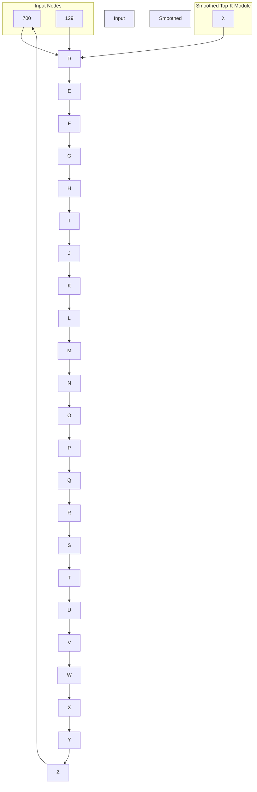

# ST $_{k}$ : A Scalable Module for Solving Top-k Problems\*

Hanchen Xia $^{\dagger,\clubsuit}$ , Weidong Liu $^{\dagger,\ddagger}$ , Xiaojun Mao $^{\dagger,\S}$

{†School of Mathematical Sciences,

$^{\ddagger}$ Ministry of Education Key Lab of Artificial Intelligence,

$^{\S}$ Ministry of Education Key Laboratory of Scientific and Engineering Computing}

Shanghai Jiao Tong University, Shanghai, China

♣RoyalFlush AI Research Institute, Hangzhou, China

{x\_hc\_2000, weidongl, maoxj}@sjtu.edu.cn

# Abstract

The cost of ranking becomes significant in the new stage of deep learning. We propose $ST_{k}$ , a fully differentiable module with a single trainable parameter, designed to solve the Top-k problem without requiring additional time or GPU memory. Due to its fully differentiable nature, $ST_{k}$ can be embedded end-to-end into neural networks and optimize the Top-k problems within a unified computational graph. We apply $ST_{k}$ to the Average Top-k Loss ( $AT_{k}$ ), which inherently faces a Top-k problem. The proposed $ST_{k}$ Loss outperforms $AT_{k}$ Loss and achieves the best average performance on multiple benchmarks, with the lowest standard deviation. With the assistance of $ST_{k}$ Loss, we surpass the state-of-the-art (SOTA) on both CIFAR-100-LT and Places-LT leaderboards.

# 1 Introduction

The ranking problem is quite common in the field of AI. For imbalanced datasets, the Average Top-k $(\mathrm{AT}_k)$ Loss is more suitable than the conventional Average Loss [Lyu et al., 2020]. In the context of ambiguous classification tasks, Top-k Learning allows the ground truth to fall within the largest $k$ probabilities, enhancing the model's generalizability [Lapin et al., 2017, Berrada et al., 2018, Petersen et al., 2022]. For language models, the Top-k sampling method helps the models select the top $k$ most probable words during text generation, producing more fluent and coherent sentences. Distributed learning systems employ Top-k sparsification with error compensation (Top-k SGD) to reduce communication traffic without noticeably impacting model accuracy [Chen et al., 2018, Lin et al., 2018, Shi et al., 2019]. However, as deep learning models continue to grow in size, the cost of the ranking process becomes increasingly significant. For example, on a single NVIDIA H800 GPU, tuning a Llama-8B model using the LoRA [Hu et al., 2022] method with a batch size of 4096 and 1000 iterations takes 990.14 seconds. In particular, performing QuickSort on the individual losses consumes 86.33 seconds.

In this work, we propose $ST_{k}$ (Smoothed Top-k), a scalable module for Top-k problems. By adding only a single trainable parameter, $ST_{k}$ is able to solve the Top-k problem in $\mathcal{O}(n+k)$ steps. Due to the fully differentiable nature of $ST_{k}$ , it can be embedded end-to-end as a layer. Experiments show that we can even add $\lambda$ to the computational graph for unified optimization using Stochastic Gradient Descent (SGD), which means that we do not need to consider the time cost of solving the Top-k problems within the computational graph. However, we can still enjoy the performance improvements that Top-k optimization provides. The contributions of this work are summarized as follows:

- We propose a uniformly convergent approximation of the ReLU function.   
- We propose an efficient and robust Smoothed Top-k module, $\mathrm{ST}_k$ .   
- We apply $\mathrm{ST}_k$ Module to smooth $\mathrm{AT}_k$ Loss, resulting in performance improvement and refreshing the state-of-the-art methods on two long-tailed learning leaderboards.   
- We design an imbalanced classification dataset with a theoretical decision boundary.

For experiments, by applying the $ST_{k}$ Module, we smooth the $AT_{k}$ Loss into $ST_{k}$ Loss. The computation time of $ST_{k}$ Loss is almost identical to that of the average aggregating method, significantly faster than the sorting-required $AT_{k}$ Loss, and it exhibits the best performance. Experiments on synthetic datasets demonstrate that models trained with $ST_{k}$ Loss most closely approximate the theoretical decision boundary. On benchmarks of imbalanced binary classification, models trained by $ST_{k}$ Loss exhibit the lowest average misclassification rate and the lowest standard deviation. On regression datasets, models trained with $ST_{k}$ Loss exhibit the lowest (RMSE). Experiments on large real-world datasets demonstrate that $ST_{k}$ Loss, as an aggregating trick for individual losses, is a scalable technique that improves accuracy on long-tailed benchmarks. With the help of $ST_{k}$ Loss, we surpass the state-of-the-art (SOTA) on both the CIFAR-100-LT and Places-LT leaderboards.

# 1.1 Related Work

In current research, although there are many studies on individual loss, the general characteristics of aggregate loss are often overlooked. In the existing machine learning literature, a related line of work is the data subset selection problem [Wei et al., 2015], which aims to select a subset from a large training dataset for model training while minimizing average loss. Curriculum learning [Bengio et al., 2009] and self-paced [Kumar et al., 2010] learning are two recent learning schemes. They organized the training process into several iterative stages, gradually including training data from easy to difficult to learn, where the difficulty level is measured by individual loss. Therefore, each training session in these methods corresponds to the average aggregate loss in the selected subset. The difficulties encountered by the Average Loss when dealing with imbalanced data, as discussed in [Shalev-Shwartz and Wexler, 2016, Huang et al., 2020], prompted the exploration of more robust aggregate losses. Among these, Lyu et al. [2020] introduced the AT $_{k}$ loss, which averages the k largest individual losses, and exhibits advanced performance on imbalanced datasets.

Many classification tasks in the real world have inherent label confusion, as mentioned in Berrada et al. [2018]. This confusion may arise from various factors, such as incorrect labels, incomplete annotations, or some fundamental ambiguities that even confuse the true labels for human experts. Therefore, some works proposed the concept of Top-k Learning in the field of image classification to address the issues of multiple semantics and semantic confusion in images [Lapin et al., 2017].

Berrada et al. [2018] proposed a method to partially smooth the Top-k Learning loss function, but did not completely solve the sorting problem in the loss function and introduced a sorting computation of $C_{n}^{k}$ . Petersen et al. [2022] proposed a Split Selection Network (SSN) based on sorting networks, which made the Top-k process differentiable and achieved the state of the art on ImageNet-1K at that time. However, the computation required by this method is cumbersome and multilayered. Sorting networks are similar to algorithms like QuickSort with time complexities of $\mathcal{O}(n \log n)$ .

# 1.2 Notational Conventions

Let $\mathbb{N}^n$ denotes the set $\{1,\dots,n\}$ and $\mathbb{I}_{\{a\}}$ denotes the indicator function (which is 1 when the proposition $a$ is true and 0 otherwise). Thus, the sign function can be defined as: $sign(x) = \mathbb{I}_{\{x > 0\}} - \mathbb{I}_{\{x < 0\}}$ . The Hinge function can be defined as: $[x]_{+} = \max \{0,x\}$ . We use $\| x\| _1,\| x\| _2$ , and $\| x\|_{\infty}$ to represent the $\ell_1,\ell_2$ , and $\ell_{\infty}$ norms of $x$ , respectively. For the set $L = \ell_1,\ell_2,\dots,\ell_n$ , $\ell_{[k]}$ denotes the $k$ -th largest element, so we have $\ell_{[1]}\geq \ell_{[2]}\geq \dots \geq \ell_{[n]}$ . In supervised learning problems, our training set typically contains an input set and a target set, the input set coming from the input domain $\mathcal{X}$ , and the target set from the target domain $\mathcal{Y}$ , and we use their joint domain $\mathcal{Z} = \mathcal{X}\times \mathcal{Y}$ to represent the range of the dataset. The training set $S = z_{1},z_{2},\ldots ,z_{n}$ is a subset of $\mathcal{Z}$ , where $z_{i} = (x_{i},y_{i})$ . Our task is to find a predictor $f:\mathcal{X}\to \mathcal{Y}$ from the function family $\mathcal{H}$ that can predict the corresponding target $y$ based on the new input $x$ . To evaluate the effect of the predictor, we need to introduce an individual loss function $\ell :\mathcal{Y}\times \mathcal{Y}\rightarrow \mathbb{R}^{+}$ , where $\ell = \ell (f(x),y)$ usually reflects some distance between the prediction $\hat{y} = f(x)$ and the true value $y$ . The training

process of the predictor can be described as using the gradient descent algorithm to optimize an objective function (usually minimizing the loss function). The objective function can generally be written as $\mathcal{L}(f,S)+\Omega(f)$ , where $\mathcal{L}(f,S)$ is the aggregated individual loss function, and $\Omega(f)$ is a regularization term ( $\ell_{1}$ or $\ell_{2}$ regularization term). The loss function $\mathcal{L}(f,S)$ is usually Average Loss, that is, $\mathcal{L}_{avg}(f,S)=\frac{1}{n}\sum_{i=1}^{n}\ell(f(x_{i}),y_{i})$ . However, recent works, have shown some drawbacks of the average loss in adapting to imbalanced data distributions [Shalev-Shwartz and Wexler, 2016], and explored choices other than the average loss for the aggregate loss formed from individual losses, e.g., the maximum (aggregate) loss, $\mathcal{L}_{max}(f,S)=\max_{i\in\mathbb{N}_{n}}\ell(f(x_{i}),y_{i})$ .

# 2 $\mathbf{ST}_k$ Architecture

flowchart

Figure 1: $ST_{k}$ Architecture. For any layer of neurons in a neural network, to solve the Top-k problem for its weights, insert an $ST_{k}$ Module. The trainable parameter $\lambda$ will gradually approximate the k-th largest element during the optimization process. And this $\lambda$ can be used to filter neurons.

Suppose we have a set of elements $\{e_{i}\}_{i=1}^{n}$ , then the Top-k problem can be describe as:

1. find the $k$ -th largest element $e_{[k]}$ ;   
2. find the sum of top-k largest elements $\sum_{i=1}^{k} e_{[k]}$ .

This process can certainly be achieved through conventional sorting and summation. However, in the worst-case scenario, the cost of solving the Top-k problem can reach $\mathcal{O}(n^{2})$ . Ogryczak and Tamir [2003] proposed an equivalent optimization form to solve the Top-k problem and proved its linear convergence.

$$
\sum_ {i = 1} ^ {k} e _ {[ k ]} = \min _ {\lambda \geq 0} \left\{\sum_ {i = 1} ^ {n} [ e _ {i} - \lambda ] _ {+} + k \lambda \right\}, \tag {1}
$$

However, this surrogate objective function suffers from a non-differentiable point at $e_{i} = \lambda$ , which makes it challenging to optimize. The key to solving this problem lies in designing a function approximating $[\cdot]_{+}$ , which can be regarded as a rectified linear unit (ReLU) function. Here, we introduce the Smoothed ReLU (SReLU).

$$
\mathrm{SReLU} (\mathrm{x}) = \frac {1}{2} \left[ x + \delta \left(\sqrt {\frac {x ^ {2}}{\delta^ {2}} + 1} - 1\right) \right], \tag {2}
$$

where $\delta$ is a hyperparameter (usually we set $\delta = 0.01$ ). It can be observed from Figure 2 that as $\delta$ decreases, SReLU increasingly approximates the ReLU function. In fact, SReLU converges uniformly to ReLU as $\delta \rightarrow 0^{+}$ ; a detailed proof of this uniform convergence is provided in Proposition 1 of Appendix A.1. With the help of SReLU, the objective function (1) can be smoothed as:

$$
\sum_ {i = 1} ^ {k} e _ {[ k ]} \approx \min _ {\lambda \geq 0} \left\{\frac {1}{2} \sum_ {i = 1} ^ {n} \left[ (e _ {i} - \lambda) + \delta \left(\sqrt {\frac {(e _ {i} - \lambda) ^ {2}}{\delta^ {2}} + 1} - 1\right) \right] + k \lambda \right\}, \tag {3}
$$

the optimal $\lambda^{*}=e_{[k]}$ which is the k-th largest element. In the following section, we will introduce an application scenario for $ST_{k}$ .

line

| x     | ReLU  | SReLU, δ=0.1 | SReLU, δ=0.05 |
|-------|-------|--------------|---------------|
| -1.00 | 0.000 | 0.000        | 0.000         |
| -0.75 | 0.000 | 0.000        | 0.000         |
| -0.50 | 0.000 | 0.000        | 0.000         |
| -0.25 | 0.000 | 0.000        | 0.000         |
| 0.00  | 0.000 | 0.000        | 0.000         |
| 0.25  | 0.250 | 0.250        | 0.250         |
| 0.50  | 0.500 | 0.500        | 0.500         |
| 0.75  | 0.750 | 0.750        | 0.750         |
| 1.00  | 1.000 | 1.000        | 1.000         |

Figure 2: ReLU and SReLU with various smoothing coefficients $\delta$ .

# 3 From AT $_{k}$ Loss to ST $_{k}$ Loss

In the training process of a neural network, we first choose a form of individual loss (e.g., logistic loss, hinge loss, mean square loss, or cross-entropy loss). Then, we aggregate all individual losses to calculate their average, which is the most common aggregate loss function: Average Loss. The Average Loss is widely used in a myriad of deep learning tasks. This widespread application stems from the robust theoretical foundations [Bartlett et al., 2006, De Vito et al., 2005]. However, Average Loss tends to overfit the training data, especially on imbalanced datasets [Shalev-Shwartz and Wexler, 2016, Huang et al., 2020]. This has inspired the motivation to find other forms of aggregate loss, such as the maximum value among individual losses (referred to as Maximum Loss). The Average Top-k $(\mathrm{AT}_k)$ Loss was introduced by Lyu et al. [2020]:

$$
\mathcal {L} _ {a t - k} = \frac {1}{k} \sum_ {i = 1} ^ {k} \ell_ {[ k ]}, \tag {4}
$$

which represents the average of the largest k individual losses. According to the derivation in [Ogryczak and Tamir, 2003], this ranking loss can be written in the following equivalent form:

$$
\mathcal {L} _ {m a t - k} = \frac {1}{n} \sum_ {i = 1} ^ {n} \left[ \ell_ {i} - \lambda \right] _ {+} + \frac {k}{n} \lambda . \tag {5}
$$

With the help of the $ST_{k}$ Module, $\mathcal{L}_{mat-k}(f,S)$ can be reconstructed as

$$
\mathcal {L} _ {s t - k} = \frac {1}{2 n} \sum_ {i = 1} ^ {n} \left[ (\ell_ {i} - \lambda) + \delta \left(\sqrt {\frac {(\ell_ {i} - \lambda) ^ {2}}{\delta^ {2}} + 1} - 1\right) \right] + \frac {k}{n} \lambda , \tag {6}
$$

where $\ell_{i} = \ell(f_{w_{\mathrm{model}}}(x_{i}), y_{i})$ is the individual loss of sample i, and $w_{model}$ represents the set of parameters of the predictor f. It is easy to verify that $\lim_{\delta \to 0^{+}} L_{st-k} = L_{mat-k}$ , given Proposition

1 in Appendix A.1.

$$
\begin{array}{l} \left[ \frac {k \lambda}{n} + \frac {1}{n} \sum_ {i = 1} ^ {n} [ \ell_ {i} - \lambda ] _ {+} \right] - \left[ \frac {k \lambda}{n} + \frac {1}{n} \sum_ {i = 1} ^ {n} \frac {1}{2} \left[ (\ell_ {i} - \lambda) + \delta \left(\sqrt {\frac {(\ell_ {i} - \lambda) ^ {2}}{\delta^ {2}} + 1} - 1\right) \right] \right] \\ = \sum_ {i = 1} ^ {n} \frac {1}{2 n} \left[ \sqrt {(\ell_ {i} - \lambda) ^ {2}} - \sqrt {(\ell_ {i} - \lambda) ^ {2} + \delta^ {2}} + \delta \right] \\ = \sum_ {i = 1} ^ {n} \frac {1}{2 n} \left[ \delta - \frac {\delta^ {2}}{\sqrt {(\ell_ {i} - \lambda) ^ {2}} + \sqrt {(\ell_ {i} - \lambda) ^ {2} + \delta^ {2}}} \right] \\ = \sum_ {i = 1} ^ {n} \frac {1}{2 n} \left[ \delta \left(1 - \frac {1}{\sqrt {\frac {(\ell_ {i} - \lambda) ^ {2}}{\delta^ {2}}} + \sqrt {\frac {(\ell_ {i} - \lambda) ^ {2}}{\delta^ {2}} + 1}}\right) \right] \\ <   \frac {\delta}{2} \\ \end{array}
$$

The approximation error between the smoothed loss function and the original loss function can be uniformly bounded by $\delta /2,\forall \ell$

When $\ell$ is convex, Equation (6) exhibits joint convexity with respect to the parameters $(w_{\mathrm{model}}, \lambda)$ , making the problem a special case of the non-linear multiple choice knapsack problem [Zemel, 1984], which has at most q = 2 roots. These roots can be found in constant time, allowing the problem to be solved in $\mathcal{O}(n \cdot \ln q) = \mathcal{O}(n)$ time when q is fixed [Megiddo, 1984]. Therefore, it can be iteratively updated using relatively simple algorithms. For example, in the case of batch learning, the block coordinate descent (BCD) method [Nocedal and Wright, 1999] can be employed, where $w_{model}$ and $\lambda$ are updated alternately after initialization.

BCD-ST $_{k}$ :

$$
\lambda^ {(t + 1)} \leftarrow \underset {\lambda} {\operatorname{argmin}} \mathcal {L} _ {s t - k};
$$

$$
w ^ {(t + 1)} \leftarrow \underset {w} {\operatorname{argmin}} \mathcal {L} _ {s t - k}. \tag {7}
$$

The convergence of the above coordinate descent algorithms can be found in Luo and Tseng [1992], Saha and Tewari [2013], Tseng [2001].

Furthermore, empirical evidence suggests that we do not need to spend extra time optimizing $\lambda$ separately, incorporating $\lambda$ into the computational graph of $w_{model}$ for unified optimization using Stochastic Gradient Descent (SGD) [Bottou and Bousquet, 2008, Shamir, 2011, Srebro and Tewari, 2010], performance improvements can still be achieved.

SGD-ST $_{k}$ :

$$
\lambda^ {(t + 1)} \leftarrow \lambda^ {(t)} - \eta \cdot \partial_ {\lambda} \mathcal {L} _ {s t - k};
$$

$$
w ^ {(t + 1)} \leftarrow w ^ {(t)} - \eta \cdot \nabla_ {w} \mathcal {L} _ {s t - k}.
$$

where $\eta_{t}$ is the size of the update step, and when $\eta_{t} \sim \frac{1}{\sqrt{t^{\prime}}}$ , the stochastic gradient descent method can ensure convergence to a local minimum of Equation (6) [Shamir, 2011, Srebro and Tewari, 2010]. By eliminating points where the gradients are discontinuous, the training process becomes more stable, and converges faster, as experimentally demonstrated by the standard deviations reported in Tables 3, 4, and 9, and the time cost reported in Table 2.

# 4 Synthetic Experiments

# 4.1 Time Cost

We first perform experiments to compare the time costs of two standard sorting algorithms, $AT_{k}$ , and $ST_{k}$ , in calculating the ranking average. The experimental setup involves finding the Top-k (k=5) sum from 10,000 standard normally distributed samples. For both $AT_{k}$ and $ST_{k}$ , we iterate until the error is less than $10^{-2}$ . For each algorithm, we run 50 experiments and record the average time taken.

<table><tr><td>Algorithm</td><td>Complexity</td><td>Average Time(s)</td></tr><tr><td>BubbleSort</td><td> $\mathcal{O}(n^{2})$ </td><td> $20.42196 \pm 3.7015$ </td></tr><tr><td>HeapSort</td><td> $\mathcal{O}(n \log(n))$ </td><td> $0.1243 \pm 0.0446$ </td></tr><tr><td>AT $_{k}$ </td><td> $\mathcal{O}(n+k)$ </td><td> $0.2167 \pm 0.1528$ </td></tr><tr><td>ST $_{k}$  (Ours)</td><td> $\mathcal{O}(n+k)$ </td><td> $\mathbf{0.0127} \pm \mathbf{0.0020}$ </td></tr></table>

Table 1: Performance comparison of different sorting algorithms and our method.

As shown in Table 1, $\mathrm{ST}_k$ indeed demonstrates linear time complexity while also exhibiting a stable optimization process.

# 4.2 Gaussian Distributed Dataset

To illustrate the capability of $\mathrm{ST}_k$ Loss in approximating the ideal decision boundary, we design a Gaussian-distributed dataset. The dataset is generated by a pre-set covariance matrix $\boldsymbol{\Sigma} \in \mathbb{R}^{d \times d}$ , and mean vectors $\boldsymbol{\mu}_1, \boldsymbol{\mu}_2 \in \mathbb{R}^d$ corresponding to two categories. We set $d = 200$ , $\boldsymbol{\Sigma}_{jk} = 0.25^{0.5 + |j - k|}$ , $\boldsymbol{\mu}_1 = \mathbf{0}_d$ and $\boldsymbol{\mu}_2 = (1, 1, ..., 1, 0, 0, ..., 0)^\top$ , which has 10 ones. For the predictor, we use a Logistic Regression (LR) model $f(\boldsymbol{x}) = \text{sigmoid}(\boldsymbol{\omega}^\top \boldsymbol{x} + b)$ . The detailed derivation process of the decision boundary can be found in the Appendix A.2. Here, we present the conclusion directly. For two normal populations with a given covariance matrix $\boldsymbol{\Sigma}$ , and means $\boldsymbol{\mu}_1$ and $\boldsymbol{\mu}_2$ , the LR model has a theoretical decision boundary:

$$
\boldsymbol {\omega} ^ {*} = \left(\boldsymbol {\mu} _ {1} - \boldsymbol {\mu} _ {0}\right) ^ {\top} \boldsymbol {\Sigma} ^ {- 1}; b ^ {*} = \frac {1}{2} \left[ \boldsymbol {\mu} _ {0} ^ {\top} \boldsymbol {\Sigma} ^ {- 1} \boldsymbol {\mu} _ {0} + \boldsymbol {\mu} _ {1} ^ {\top} \boldsymbol {\Sigma} ^ {- 1} \boldsymbol {\mu} _ {1} \right] + \ln \left[ \frac {\operatorname* {P r} (Y = 1)}{\operatorname* {P r} (Y = 0)} \right]. \tag {8}
$$

Figure 3 provide an example on 2D plane, we set $\Sigma_{(j,k)} = 0.8^{|j - k|}$ , $\pmb{\mu}_1 = [0,0]^{\top}$ , $\pmb{\mu}_2 = [2,2]^{\top}$ , thus according to our derivation above, $\omega^{*} = [1.111,1.111]^{\top}$ , $b^{*} = -0.836$ , where the black dashed line is the theoretical boundary.

We use ParaF $_{1}$ [Tian and Gu, 2017] to measure the overlap of estimated supports and true supports:

$$
\mathrm{ParaF} _ {1} = 2 \cdot \frac {\mathrm{precision} \cdot \mathrm{recall}}{\mathrm{precision} + \mathrm{recall}},
$$

where precision = $\frac{|\operatorname{support}(\hat{\omega})\cap\operatorname{support}(\boldsymbol{\omega}^{*})|}{|\operatorname{support}(\hat{\omega})|}$ , recall = $\frac{|\operatorname{support}(\hat{\omega})\cap\operatorname{support}(\boldsymbol{\omega}^{*})|}{|\operatorname{support}(\boldsymbol{\omega}^{*})|}$ , where $\hat{\omega}$ is the estimated value of the parameters obtained by the predictor, and $\omega^{*}$ is the theoretical value of the parameters mentioned above. The operator $|\cdot|$ is used to find the cardinality of the set, which is the number of elements, and support( $\cdot$ ) is the support set of the vector, which refers to the set of indices of its non-zero elements.

Other basic settings are as follows. The loss function we use is the binary cross-entropy loss. To obtain a sparse solution, we add an $\ell_{1}$ regularization term. The number of samples is 10,000 for the training set and 2,500 each for the validation set and the test set. We implement early stopping of the iteration based on the accuracy

scatter

| x    | y    | Category   |
| ---- | ---- | ---------- |
| -2.0 | 4.0  | Positive   |
| -1.5 | 3.5  | Positive   |
| -1.0 | 3.0  | Positive   |
| -0.5 | 2.5  | Positive   |
| 0.0  | 2.0  | Positive   |
| 0.5  | 1.5  | Positive   |
| 1.0  | 1.0  | Positive   |
| 1.5  | 0.5  | Positive   |
| 2.0  | 0.0  | Positive   |
| 2.5  | -0.5 | Positive   |
| 3.0  | -1.0 | Positive   |
| 3.5  | -1.5 | Positive   |
| 4.0  | -2.0 | Positive   |
| -2.0 | -3.0 | Negative   |
| -1.5 | -2.5 | Negative   |
| -1.0 | -2.0 | Negative   |
| -0.5 | -1.5 | Negative   |
| 0.0  | -1.0 | Negative   |
| 0.5  | -0.5 | Negative   |
| 1.0  | 0.0  | Negative   |
| 1.5  | 0.5  | Negative   |
| 2.0  | 1.0  | Negative   |
| 2.5  | 1.5  | Negative   |
| 3.0  | 2.0  | Negative   |
| 3.5  | 2.5  | Negative   |
| 4.0  | 3.0  | Negative   |

Figure 3: A Synthetic Example on 2D-Plain.

curve in the validation set; that is, we break when the increase in validation accuracy within 200 steps is less than $10^{-4}$ . For each meta-experiment, we repeat it 50 times and take the average. Now we conduct two groups of experiments as follows.

Aggregate Losses and ReLU Variants. In these experiments, we set the ratio of positive to negative samples at 8:2 for the training set, while the validation set and the test set remain 1:1. We also compare SReLU with other variants of ReLU. The smoothing coefficient for SReLU is set to 0.01, and the settings for the other ReLU variants remain at their defaults. We use Adam as our optimizer,

setting the batch size to 512, while keeping the other hyperparameters as default. According to Equation (8), we could compute the theoretical value of $\omega^{*}$ , which is a vector with only the first 10 elements non-zero. Sensitive Analysis. In these experiments, we only adjust the positive-negative ratio and retain the rest of the settings from the previous experiment.

<table><tr><td rowspan="2">Aggregate Loss</td><td rowspan="2">Average</td><td rowspan="2">Maximum</td><td rowspan="2"> ${\mathrm{{AT}}}_{k}$ </td><td rowspan="2"> ${\mathrm{{MAT}}}_{k}$ </td><td colspan="4"> ${\mathrm{{ST}}}_{k}$ </td></tr><tr><td>ELU</td><td>SoftPlus</td><td>Leaky-ReLU</td><td>SReLU (Ours)</td></tr><tr><td>Accuracy (%)</td><td>72.864</td><td>65.448</td><td>73.013</td><td>73.180</td><td>72.988</td><td>70.968</td><td>73.864</td><td>76.104</td></tr><tr><td>ParaF1-Score</td><td>0.1904</td><td>0.0909</td><td>0.1986</td><td>0.2063</td><td>0.1925</td><td>0.1592</td><td>0.2441</td><td>0.3446</td></tr><tr><td>Time (s)</td><td>16.525</td><td>6.145</td><td>19.271</td><td>15.774</td><td>15.572</td><td>16.233</td><td>15.525</td><td>15.436</td></tr></table>

Table 2: Accuracy and ParaF $_{1}$ -Score on the synthetic dataset.

line

| Negative Ratio | STk   | ATk   | Average |
| -------------- | ----- | ----- | ------- |
| 0.5            | 87.5  | 87.5  | 87.5    |
| 0.1            | 78.5  | 76.5  | 74.0    |
| 0.05           | 77.0  | 74.5  | 73.0    |
| 0.01           | 76.0  | 73.5  | 74.0    |
| 0.005          | 75.5  | 73.5  | 73.0    |
| 0.001          | 74.5  | 72.5  | -       |

line

| Negative Ratio | STₖ    | ATₖ    | Average |
| -------------- | ------ | ------ | ------- |
| 0.5            | 0.46   | 0.46   | 0.46    |
| 0.1            | 0.33   | 0.26   | 0.16    |
| 0.05           | 0.32   | 0.25   | 0.12    |
| 0.01           | 0.40   | 0.31   | 0.14    |
| 0.005          | 0.38   | 0.27   | 0.12    |
| 0.001          | 0.37   | 0.27   | 0.12    |

Figure 4: Accuracy and ParaF $_{1}$ -Score vs Negative Sample Ratio.

Table 2 presents the Accuracy and ParaF $_{1}$ score achieved when different aggregate loss functions are combined with the LR model and the cross-entropy loss, trained to convergence. With the help of SReLU, ST $_{k}$ Loss achieves performance that surpasses that of all other aggregate losses. Due to its property of being a real uniformly convergent approximation (not just similar in shape), SReLU outperforms other ReLU variants in this scenario. Figure 4 shows the relationship between accuracy, ParaF $_{1}$ -score, and negative sample ratio (negative ratio). ST $_{k}$ is less sensitive to the imbalance ratio,

# 5 Real World Applications

# 5.1 Binary Classification

We select binary classification datasets from the KEEL $^{2}$ and UCI $^{3}$ databases; see Table 9.

<table><tr><td>Dataset</td><td>Average</td><td>Maximum</td><td> $AT_k$ </td><td> $MAT_k$ </td><td> $ST_k$ (Ours)</td></tr><tr><td>appendicitis</td><td>13.778±6.601</td><td>32.815±11.306</td><td>13.630±6.400</td><td>14.667±7.114</td><td>13.406±5.491</td></tr><tr><td>australian</td><td>13.549±1.025</td><td>46.89±8.779</td><td>14.428±1.056</td><td>14.324±1.058</td><td>13.358±0.982</td></tr><tr><td>german</td><td>26.328±2.069</td><td>45.832±5.465</td><td>26.808±2.347</td><td>26.392±2.431</td><td>25.561±1.988</td></tr><tr><td>phoneme</td><td>20.823±2.801</td><td>45.83±10.819</td><td>21.420±2.732</td><td>17.828±2.709</td><td>16.427±2.494</td></tr><tr><td>spambase</td><td>6.972±1.519</td><td>45.777±19.418</td><td>6.955±1.535</td><td>6.687±1.577</td><td>6.610±1.333</td></tr><tr><td>titanic</td><td>22.613±1.226</td><td>48.065±11.338</td><td>22.468±1.441</td><td>22.211±1.095</td><td>21.801±0.911</td></tr><tr><td>wisconsin</td><td>3.275±0.814</td><td>34.468±9.306</td><td>3.205±0.773</td><td>3.046±0.570</td><td>2.936±0.665</td></tr></table>

Table 3: Misclassification Rate(%) and Standard Derivation of Various Aggregate Losses Combined with Individual Logistic Loss.

Next, we tested the performance of different forms of aggregate loss on binary classification benchmarks. The individual loss function can generally be chosen as Logistic or Hinge, which are defined

<table><tr><td>Dataset</td><td>Average</td><td>Maximum</td><td> $AT_k$ </td><td> $MAT_k$ </td><td> $ST_k$ (Ours)</td></tr><tr><td>appendicitis</td><td>15.852±8.082</td><td>28.000±12.443</td><td>16.148±7.436</td><td>15.481±5.577</td><td>14.667±5.736</td></tr><tr><td>wisconsin</td><td>3.240±1.014</td><td>12.000±10.760</td><td>3.158±1.085</td><td>2.936±1.212</td><td>2.889±1.069</td></tr><tr><td>australian</td><td>13.225±2.351</td><td>36.347±9.576</td><td>13.896±2.671</td><td>14.243±2.343</td><td>13.746±1.966</td></tr><tr><td>german</td><td>26.912±2.694</td><td>43.864±12.432</td><td>26.776±3.010</td><td>26.232±2.190</td><td>25.928±2.973</td></tr><tr><td>titanic</td><td>22.152±1.862</td><td>47.691±18.858</td><td>22.316±1.490</td><td>22.116±1.567</td><td>21.966±1.289</td></tr><tr><td>phoneme</td><td>21.543±1.358</td><td>44.656±16.805</td><td>20.733±1.093</td><td>17.335±1.125</td><td>17.152±0.955</td></tr><tr><td>spambase</td><td>7.463±0.742</td><td>33.986±8.955</td><td>7.197±0.695</td><td>6.645±0.677</td><td>6.342±0.589</td></tr></table>

Table 4: Misclassification Rate (%) and Standard Derivation of Various Aggregate Losses Combined with Individual Hinge Loss.

as follows:

$$
\text { Logistic }: \ell (f (x), y) = \log (1 + \exp (- y f (x)));
$$

$$
\text { Hinge }: \ell (f (x), y) = [ 1 - y f (x) ] _ {+}.
$$

The prediction model is a two-layer MLP with 10 nodes in the hidden layer, activated by the ReLU function between the two fully connected layers. To increase the stability of the training process, we added an $\ell_2$ regularization term to the loss function $\Omega(w) = \frac{1}{2C}\| w\| _2^2$ . We divided the datasets into training, validation, and test sets in a $0.5:0.25:0.25$ ratio. Nowadays, SGD is generally replaced by the mini-batch method instead of stochastic gradient descent with a single sample point, which is faster and more robust. To accommodate datasets of varying sizes in the article, we set the batch size to 16.

The hyperparameters in the experiment include $k$ in $\mathrm{MAT}_k$ and $\mathrm{AT}_k$ , the coefficient of the regularization term $C$ , the initial learning rate $\eta$ , and the smoothing coefficient $\delta$ . These hyperparameters will be selected based on their convergence accuracy performance on the validation set (for each combination of hyperparameters, we repeat the experiment fifty times and take the average of their prediction accuracy on the validation set as the basis for parameter selection). The search spaces for several hyperparameters are as follows: $k \in \{1\} \cup [0.1:0.1:1]$ ; $C \in \{10^0, 10^1, 10^2, 10^3, 10^4, 10^5\}$ ; $\eta \in \{0.1, 0.05, 0, 01, 0.005, 0.001\}$ ; $\delta \in \{0.1, 0.01, 0.001, 0.0001\}$ .

Since traditional gradient descent is too sensitive to the choice of step size, which is not conducive to our pure comparison of the convergence speed and accuracy of the loss function, we use the AdaGrad algorithm to iteratively update the learning rate. During the learning process, to avoid overfitting the model, we record the accuracy of the MLP predictor on the validation set after each iteration, and perform an early stop when the accuracy does not increase (the increase in the accuracy of the predictor on the validation set is less than $10^{-6}$ after 50 steps) and roll back the model to the checkpoint with the highest accuracy on the validation set during the entire training process; otherwise, we continue training until convergence. Tables 3 and 4, respectively, show the average probability of misclassification (%) of the models trained to convergence in 50 experiments in the test set under individual Logistic and Hinge loss (the standard deviation of the 50 experiments is listed in parentheses).

In the results shown in Tables 3 and 4. Almost all the lowest misclassification rates appear in the $ST_{k}$ trained models. Furthermore, models trained with $ST_{k}$ Loss exhibit the lowest standard deviation, which to some extent demonstrates the robustness of the training process.

# 5.2 Long-Tailed Classification

The interest in long-tailed classification tasks has increased with the advent of large vision-language models such as contrastive language-image pre-training (CLIP) Radford et al. [2021]. Long-tailed versions of recognized datasets were built by the community. Using the Pareto distribution $(\alpha = 6)$ , the ImageNet-1K and Places datasets can be sampled to create ImageNet-LT and Places-LT datasets, as described in [Liu et al., 2019]. Consider two types of imbalance [Cui et al., 2019, Buda et al., 2018], Cao et al. [2019] built CIFAR-10-LT $(\rho = 10)$ and CIFAR-100-LT $(\rho = 100)$ , where $\rho = \max_i\{n_i\} / \min_i\{n_i\}$ represents the imbalance ratio, defined as the ratio between the sample sizes of the most frequent and least frequent class. Due to varying word frequencies, machine translation, or

more generally, text generating, can inherently be considered as long-tailed classification tasks. We choose the WMT2017 $^{4}$ and IWSLT2014 $^{5}$ datasets for the experiments.

area

| Class | Number of Samples |
| :--- | :--- |
| Head Classes | 639 |
| Head Classes | 674 |
| Head Classes | 112 |
| Head Classes | 127 |
| Tail Classes | 408 |
| Tail Classes | 819 |

Figure 5: ImageNet-LT.

Settings For visual classification tasks, we use Parameter-Efficient Long-Tailed (PEL) Recognition [Shi et al., 2023], which primarily leverages information from a text encoder to adjust classification probabilities. The text encoder in PEL is derived from the pre-trained CLIP model, and the backbone is a Vision Transformer (ViT-Base) [Dosovitskiy et al., 2021] pre-trained in ImageNet-21K. We freeze the backbone and train the branch model of Parameter Efficient Fine-Tuning (PEFT) [Jia et al., 2022, Hu et al., 2022, Houlsby et al., 2019]. We simply replaced the Average aggregation of individual losses in the Logit Adjust (LA) [Menon et al., 2021] loss with $\mathrm{AT}_k$ or $\mathrm{ST}_k$ . For $k$ , we set it at $0.9 \times$ batch size, and $\delta = 0.01$ . Then we report the accuracy of the balanced test sets. Visual classification experiments can be implemented on a single L20 GPU, with varying durations ranging from 20 to 200 minutes.

For translation tasks, we use the training workflows provided by OpenNMT $^{6}$ [Klein et al., 2018] and FAIR-Seq $^{7}$ [Ott et al., 2019], which are very easy to reproduce. Models are essentially different sizes of Transformers (see the footnotes). In the training process of language models, the actual batch size, calculated as the sequence length multiplied by the number of sequences, is often dynamic. Consequently, we set k/batch size = 0.96. We simply replaced the Average aggregation of individual losses in the Cross Entropy (CE) loss with AT $_{k}$ or ST $_{k}$ . We calculate the bilingual evaluation understudy (BLEU) scores for the models. The BLEU for IWSLT2014-trained models are derived from their test set, while for the WMT2017-trained models, we evaluate their BLEU on the Newstest2016 test set. Training these Transformer-based models would take about 10 hours on a single RTX 4090.

Overall Results $ST_{k}$ Loss, as an aggregating trick for individual losses, is a scalable technique that improves accuracy on long-tailed benchmarks. The models trained by $ST_{k}$ Loss surpass SOTA on the CIFAR-100-LT and Places-LT leaderboards.

<table><tr><td></td><td>CIFAR-100-LT</td><td>ImageNet-LT</td><td>Place-LT</td><td>IWSLT2014</td><td>WMT2017</td></tr><tr><td>Average</td><td>89.1*</td><td>78.3</td><td>52.2*</td><td>35.27</td><td>35.21</td></tr><tr><td>ATk</td><td>89.3</td><td>78.1</td><td>52.3</td><td>35.45</td><td>35.05</td></tr><tr><td>STk</td><td>89.8</td><td>79.1</td><td>53.7</td><td>35.80</td><td>35.42</td></tr></table>

Table 5: Results on large long-tailed datasets are presented, where the first three columns indicate accuracy, and the last two columns show the BLEU scores. Values marked with an “\*” represent the state-of-the-art (SOTA) on the leaderboard.

# 5.3 Regression Tasks

For descriptions of the four regression datasets, see Table 9. In regression tasks, the individual loss is generally the distance ( $\ell_{1}$ or $\ell_{2}$ distance) between the predicted value and the ground truth. Next, we present the specific settings of the experiment. For the Housing, Abalone, and Cpusmall datasets, we normalize the output to between [0, 1]; for the Sinc dataset, we first randomly sample 1000 points ( $x_{i}, y_{i}$ ) from the function, where $x_{i} \in [-10, 10]$ , then we use the Radial Basis Function (RBF) kernel to map $x_{i}$ into the kernel space. We select 10 RBF kernels, resulting in a 10-dimensional input $x = [k(x, c_{1}), ..., k(x, c_{10})]$ , where $k(x, c_{j}) = \exp\left(-(x - c_{j})^{2}\right)$ . Furthermore, we add Gaussian noise $\mathcal{N}(0, 0.2^{2})$ to the target output y.

<table><tr><td rowspan="2">Datasets</td><td colspan="3">Square Individual Loss</td><td colspan="3">Absolute Individual Loss</td></tr><tr><td>Average</td><td> $MAT_{k}$ </td><td> $ST_{k}$ (Ours)</td><td>Average</td><td> $MAT_{k}$ </td><td> $ST_{k}$ (Ours)</td></tr><tr><td>Sinc</td><td>0.1603±0.0065</td><td>0.1591±0.0068</td><td>0.1446±0.0070</td><td>0.1686±0.0064</td><td>0.1560±0.0067</td><td>0.1457±0.0043</td></tr><tr><td>Housing</td><td>0.0896±0.0083</td><td>0.0816±0.0100</td><td>0.0810±0.0096</td><td>0.0781±0.0099</td><td>0.0670±0.0083</td><td>0.0626±0.0089</td></tr><tr><td>Abalone</td><td>0.0739±0.0018</td><td>0.0739±0.0018</td><td>0.0523±0.0014</td><td>0.0740±0.0018</td><td>0.0733±0.0018</td><td>0.0517±0.0021</td></tr><tr><td>Cpusmall</td><td>0.0613±0.0012</td><td>0.0313±0.0005</td><td>0.0296±0.0005</td><td>0.0613±0.0012</td><td>0.0313±0.0005</td><td>0.0244±0.0006</td></tr></table>

Table 6: Comparison of Average RMSE and Standard Deviation for Different Aggregate Losses Combined with Square and Absolute Loss.

For individual losses, we choose the absolute value loss $(\ell_{1})$ and the squared loss $(\ell_{2})$ . The prediction model is the same as above, a two-layer MLP with 10 nodes in the hidden layer, activated by the ReLU function between the two fully connected layers. As in binary classification experiments, we randomly divide the dataset into training, validation, and test sets, with hyperparameters chosen based on the performance in the validation set, repeated 50 times, and statistics on the test set are reported.

Tables 6 show the average RMSE and standard deviation of 50 experiments in regression datasets with different aggregate losses combined with absolute individual loss and squared individual loss (given the experience of the previous experiment, we no longer compare with Maximum Loss here), and $ST_{k}$ shows further performance improvement after smoothing.

# 6 Conclusion and Limitation

The proposed $ST_{k}$ Module can effectively solve the Top-k problem within neural networks, with no additional GPU memory or ranking time. Due to its fully differentiable nature, the training process are stable. By applying $ST_{k}$ Module to the Average Top-k Loss, we achieve significant improvements across numerous benchmarks.

The limitation of this study is that we have not yet evaluated the $ST_{k}$ Module for additional application scenarios. The effectiveness of the $ST_{k}$ Module is only demonstrated in smoothing $AT_{k}$ loss. We hope that future research will further explore the potential utility of the $ST_{k}$ Module.

# References

Siwei Lyu, Yanbo Fan, Yiming Ying, and Bao-Gang Hu. Average top-k aggregate loss for supervised learning. IEEE Transactions on Pattern Analysis and Machine Intelligence, 44(1):76–86, 2020.

Maksim Lapin, Matthias Hein, and Bernt Schiele. Analysis and optimization of loss functions for multiclass, top-k, and multilabel classification. IEEE Transactions on Pattern Analysis and Machine Intelligence, 40(7):1533–1554, 2017.   
Leonard Berrada, Andrew Zisserman, and M. Pawan Kumar. Smooth loss functions for deep top-k classification. In International Conference on Learning Representations, 2018.   
Felix Petersen, Hilde Kuehne, Christian Borgelt, and Oliver Deussen. Differentiable top-k classification learning. In International Conference on Machine Learning, pages 17656–17668. PMLR, 2022.   
Chia-Yu Chen, Jungwook Choi, Daniel Brand, Ankur Agrawal, Wei Zhang, and Kailash Gopalakrishnan. Adacomp: Adaptive residual gradient compression for data-parallel distributed training. In Proceedings of the AAAI conference on artificial intelligence, volume 32, 2018.   
Yujun Lin, Song Han, Huizi Mao, Yu Wang, and Bill Dally. Deep gradient compression: Reducing the communication bandwidth for distributed training. In International Conference on Learning Representations, 2018.   
Shaohuai Shi, Xiaowen Chu, Ka Chun Cheung, and Simon See. Understanding top-k sparsification in distributed deep learning. arXiv preprint arXiv:1911.08772, 2019.   
Edward J Hu, yelong shen, Phillip Wallis, Zeyuan Allen-Zhu, Yuanzhi Li, Shean Wang, Lu Wang, and Weizhu Chen. LoRA: Low-rank adaptation of large language models. In International Conference on Learning Representations, 2022.   
Kai Wei, Rishabh Iyer, and Jeff Bilmes. Submodularity in data subset selection and active learning. In International Conference on Machine Learning, pages 1954–1963. PMLR, 2015.   
Yoshua Bengio, Jérôme Louradour, Ronan Collobert, and Jason Weston. Curriculum learning. In Proceedings of the 26th annual International Conference on Machine Learning, pages 41–48, 2009.   
M Kumar, Benjamin Packer, and Daphne Koller. Self-paced learning for latent variable models. Advances in Neural Information Processing Systems, 23, 2010.   
Shai Shalev-Shwartz and Yonatan Wexler. Minimizing the maximal loss: How and why. In International Conference on Machine Learning, pages 793–801. PMLR, 2016.   
Lang Huang, Chao Zhang, and Hongyang Zhang. Self-adaptive training: beyond empirical risk minimization. Advances in Neural Information Processing Systems, 33:19365–19376, 2020.   
Wlodzimierz Ogryczak and Arie Tamir. Minimizing the sum of the k largest functions in linear time. Information Processing Letters, 85(3):117–122, 2003.   
Peter L Bartlett, Michael I Jordan, and Jon D McAuliffe. Convexity, classification, and risk bounds. Journal of the American Statistical Association, 101(473):138–156, 2006.   
Ernesto De Vito, Andrea Caponnetto, and Lorenzo Rosasco. Model selection for regularized least-squares algorithm in learning theory. Foundations of Computational Mathematics, 5:59–85, 2005.   
Eitan Zemel. An o (n) algorithm for the linear multiple choice knapsack problem and related problems. Information Processing Letters, 18(3):123–128, 1984.   
Nimrod Megiddo. Linear programming in linear time when the dimension is fixed. Journal of the ACM (JACM), 31(1):114–127, 1984.   
Jorge Nocedal and Stephen J Wright. Numerical optimization. Springer, 1999.   
Zhi-Quan Luo and Paul Tseng. On the convergence of the coordinate descent method for convex differentiable minimization. Journal of Optimization Theory and Applications, 72(1):7–35, 1992.   
Ankan Saha and Ambuj Tewari. On the nonasymptotic convergence of cyclic coordinate descent methods. SIAM Journal on Optimization, 23(1):576–601, 2013.

Paul Tseng. Convergence of a block coordinate descent method for nondifferentiable minimization. Journal of Optimization Theory and Applications, 109(3):475, 2001.   
L Bottou and O Bousquet. The tradeoffs of large scale learning, advances in neural information processing systems, 20, 2008.   
Ohad Shamir. Making gradient descent optimal for strongly convex stochastic optimization. CoRR, abs/1109.5647, 2011.   
Nathan Srebro and Ambuj Tewari. Stochastic optimization for machine learning. ICML Tutorial, 2010.   
Lu Tian and Quanquan Gu. Communication-efficient distributed sparse linear discriminant analysis. In Artificial Intelligence and Statistics, pages 1178–1187. PMLR, 2017.   
Alec Radford, Jong Wook Kim, Chris Hallacy, Aditya Ramesh, Gabriel Goh, Sandhini Agarwal, Girish Sastry, Amanda Askell, Pamela Mishkin, Jack Clark, et al. Learning transferable visual models from natural language supervision. In International Conference on Machine Learning, pages 8748–8763. PMLR, 2021.   
Ziwei Liu, Zhongqi Miao, Xiaohang Zhan, Jiayun Wang, Boqing Gong, and Stella X Yu. Large-scale long-tailed recognition in an open world. In Proceedings of the IEEE/CVF Conference on Computer Vision and Pattern Recognition, pages 2537–2546, 2019.   
Yin Cui, Menglin Jia, Tsung-Yi Lin, Yang Song, and Serge Belongie. Class-balanced loss based on effective number of samples. In Proceedings of the IEEE/CVF Conference on Computer Vision and Pattern Recognition, pages 9268–9277, 2019.   
Mateusz Buda, Atsuto Maki, and Maciej A Mazurowski. A systematic study of the class imbalance problem in convolutional neural networks. Neural networks, 106:249–259, 2018.   
Kaidi Cao, Colin Wei, Adrien Gaidon, Nikos Arechiga, and Tengyu Ma. Learning imbalanced datasets with label-distribution-aware margin loss. Advances in Neural Information Processing Systems, 32, 2019.   
Jiang-Xin Shi, Tong Wei, Zhi Zhou, Xin-Yan Han, Jie-Jing Shao, and Yu-Feng Li. Parameter-efficient long-tailed recognition. arXiv preprint arXiv:2309.10019, 2023.   
Alexey Dosovitskiy, Lucas Beyer, Alexander Kolesnikov, Dirk Weissenborn, Xiaohua Zhai, Thomas Unterthiner, Mostafa Dehghani, Matthias Minderer, Georg Heigold, Sylvain Gelly, Jakob Uszkoreit, and Neil Houlsby. An image is worth 16x16 words: Transformers for image recognition at scale. In International Conference on Learning Representations, 2021.   
Menglin Jia, Luming Tang, Bor-Chun Chen, Claire Cardie, Serge Belongie, Bharath Hariharan, and Ser-Nam Lim. Visual prompt tuning. In European Conference on Computer Vision, pages 709–727. Springer, 2022.   
Neil Houlsby, Andrei Giurgiu, Stanislaw Jastrzebski, Bruna Morrone, Quentin De Laroussilhe, Andrea Gesmundo, Mona Attariyan, and Sylvain Gelly. Parameter-efficient transfer learning for nlp. In International Conference on Machine Learning, pages 2790–2799. PMLR, 2019.   
Aditya Krishna Menon, Sadeep Jayasumana, Ankit Singh Rawat, Himanshu Jain, Andreas Veit, and Sanjiv Kumar. Long-tail learning via logit adjustment. In International Conference on Learning Representations, 2021.   
Guillaume Klein, Yoon Kim, Yuntian Deng, Vincent Nguyen, Jean Senellart, and Alexander M. Rush. Opennmt: Neural machine translation toolkit, 2018.   
Myle Ott, Sergey Edunov, Alexei Baevski, Angela Fan, Sam Gross, Nathan Ng, David Grangier, and Michael Auli. fairseq: A fast, extensible toolkit for sequence modeling. In Proceedings of NAACL-HLT 2019: Demonstrations, 2019.   
Kaiming He, Xinlei Chen, Saining Xie, Yanghao Li, Piotr Dollár, and Ross Girshick. Masked autoencoders are scalable vision learners. In Proceedings of the IEEE/CVF Conference on Computer Vision and Pattern Recognition, pages 16000–16009, 2022.

# A Appendix: Proposition Proof

# A.1 Uniform Convergence

[Proposition 1] We have that SReLU uniformly converges to ReLU as $\delta \to 0^{+}$ , that is, $\lim_{\delta \to 0^{+}} \sup_{x} |\mathrm{SReLU}_{\delta}(x) - [x]_{+}| = 0$ .

Proof.

$$
\operatorname{ReLU} (x) = [ x ] _ {+} = \frac {1}{2} (x + | x |);
$$

$$
\mathrm{SReLU} (\mathrm{x}) = \frac {1}{2} \left[ x + \delta \left(\sqrt {\frac {x ^ {2}}{\delta^ {2}} + 1} - 1\right) \right].
$$

Note that $\mathrm{D}(x) = 2(\mathrm{ReLU}(x) - \mathrm{SReLU}(x)) = |x| - \delta\left(\sqrt{\frac{x^2}{\delta^2} + 1} - 1\right)$ , we have

$$
\begin{array}{l} \mathrm{D} (x) = \sqrt {x ^ {2}} - \sqrt {x ^ {2} + \delta^ {2}} + \delta \\ = \delta - \frac {\delta^ {2}}{\sqrt {x ^ {2}} + \sqrt {x ^ {2} + \delta^ {2}}} \\ = \delta \left(1 - \frac {1}{\sqrt {\frac {x ^ {2}}{\delta^ {2}}} + \sqrt {\frac {x ^ {2}}{\delta^ {2}} + 1}}\right). \\ \end{array}
$$

For any $x$ and $\delta$ , the form $0 < 1 - \frac{1}{\sqrt{\frac{x^2}{\delta^2}} + \sqrt{\frac{x^2}{\delta^2} + 1}} < 1$ , therefore, for any $\epsilon > 0$ , if $\delta < \epsilon$ , then $\forall x$ we shall have $D(x) < \epsilon$ .

# A.2 Decision Boundary

[Proposition 2] For two normal populations with known (denote as $\Sigma$ ) and equal covariance matrices, and means $\mu_{1}$ and $\mu_{2}$ , the LR model $f(\boldsymbol{x}) = \text{sigmoid}(\boldsymbol{\omega}^{\top} \boldsymbol{x} + b)$ has a theoretical decision boundary:

$$
\begin{array}{l} \boldsymbol {\omega} ^ {*} = \left(\boldsymbol {\mu} _ {1} - \boldsymbol {\mu} _ {0}\right) ^ {\top} \boldsymbol {\Sigma} ^ {- 1}; \\ b ^ {*} = \frac {1}{2} \left[ \boldsymbol {\mu} _ {0} ^ {\top} \boldsymbol {\Sigma} ^ {- 1} \boldsymbol {\mu} _ {0} + \boldsymbol {\mu} _ {1} ^ {\top} \boldsymbol {\Sigma} ^ {- 1} \boldsymbol {\mu} _ {1} \right] + \ln \left[ \frac {\operatorname* {P r} (Y = 1)}{\operatorname* {P r} (Y = 0)} \right]. \\ \end{array}
$$

Proof. Usually, we estimate the parameters $\omega$ and $b$ by maximizing the likelihood function

$$
\frac {1}{n} \sum_ {i = 1} ^ {n} \ln [ \operatorname * {P r} (y _ {i} | x _ {i}) ].
$$

This is to estimate parameters in the “most data-fitting manner” when the distribution is unknown. Now we know that two classes are normally distributed, we even know their mean and covariance matrix.

In Logistic Regression

$$
\operatorname * {P r} (Y = 1 | \boldsymbol {x}) = \frac {1}{1 + e ^ {- (\boldsymbol {\omega} ^ {\top} \boldsymbol {x} + b)}};
$$

$$
\operatorname * {P r} (Y = 0 | \boldsymbol {x}) = \frac {e ^ {- \boldsymbol {\omega} ^ {\top} \boldsymbol {x} + b}}{1 + e ^ {- (\boldsymbol {\omega} ^ {\top} \boldsymbol {x} + b)}}.
$$

So we have

$$
\ln \left[ \frac {\operatorname* {P r} (Y = 1 | \boldsymbol {x})}{\operatorname* {P r} (Y = 0 | \boldsymbol {x})} \right] = \boldsymbol {\omega} ^ {\top} \boldsymbol {x} + b. \tag {9}
$$

And by Bayes' theorem, we can derive

$$
\ln \left[ \frac {\operatorname * {P r} (Y = 1 | \boldsymbol {x})}{\operatorname * {P r} (Y = 0 | \boldsymbol {x})} \right] = \ln \left[ \frac {\operatorname * {P r} (\boldsymbol {x} | Y = 1) \operatorname * {P r} (Y = 1)}{\operatorname * {P r} (\boldsymbol {x} | Y = 0) \operatorname * {P r} (Y = 0)} \right].
$$

Here, since we inherently know the data is normally distributed, we have

$$
\ln \left[ \frac {\operatorname * {P r} (Y = 1 | \boldsymbol {x})}{\operatorname * {P r} (Y = 0 | \boldsymbol {x})} \right] = (\boldsymbol {\mu} _ {1} - \boldsymbol {\mu} _ {0}) ^ {\top} \boldsymbol {\Sigma} ^ {- 1} \boldsymbol {x} + \frac {1}{2} \left[ \boldsymbol {\mu} _ {0} ^ {\top} \boldsymbol {\Sigma} ^ {- 1} \boldsymbol {\mu} _ {0} + \boldsymbol {\mu} _ {1} ^ {\top} \boldsymbol {\Sigma} ^ {- 1} \boldsymbol {\mu} _ {1} \right] + \ln \left[ \frac {\operatorname * {P r} (Y = 1)}{\operatorname * {P r} (Y = 0)} \right]. \tag {10}
$$

Then, comparing Equation (10) with Equation (9), we'll have the answer.

# A.3 More Experiments

We conduct an ablation study on "how $\mathrm{ST}_k$ complements other long-tailed learning algorithms." The backbone here is a Vision Transformer (ViT) pre-trained by MAE / CLIP [He et al., 2022, Radford et al., 2021]. "CS" represents cost-sensitive learning, and "PEL" refers to the method provided by [Shi et al., 2023]. The batch size was set to 2048 and the models were trained in 30,000 steps.

<table><tr><td>Pretrained By</td><td>CS</td><td>PEL</td><td> $ST_{k}$ </td><td>ImageNet-LT</td><td>CIFAR-100-LT</td></tr><tr><td>MAE</td><td>-</td><td>-</td><td>-</td><td>65.701</td><td>78.572</td></tr><tr><td>MAE</td><td>√</td><td>-</td><td>-</td><td>69.884</td><td>82.135</td></tr><tr><td>MAE</td><td>√</td><td>-</td><td>√</td><td>70.140</td><td>83.048</td></tr><tr><td>CLIP</td><td>-</td><td>√</td><td>-</td><td>78.296</td><td>89.103</td></tr><tr><td>CLIP</td><td>-</td><td>√</td><td>√</td><td>79.148</td><td>89.833</td></tr></table>

Table 7: Ablation Study on Long-Tailed Learning Algorithms.

The smoothing coefficient $\delta$ , 0.01, is a grid search determined value for all datasets in Section 5.1 (see page 7) and was adopted in all other experiments. We conducted an ablation study on the five real-world datasets with all other settings remaining unchanged, except for $\delta$ .

<table><tr><td>δ</td><td>CIFAR-100-LT</td><td>ImageNet-LT</td><td>Place-LT</td><td>IWSLT2014</td><td>WMT2017</td></tr><tr><td>0.1</td><td>88.78</td><td>76.11</td><td>51.06</td><td>33.12</td><td>32.07</td></tr><tr><td>0.05</td><td>89.44</td><td>78.96</td><td>53.80</td><td>34.82</td><td>35.28</td></tr><tr><td>0.01</td><td>89.83</td><td>79.09</td><td>53.69</td><td>35.80</td><td>35.42</td></tr><tr><td>0.005</td><td>89.80</td><td>79.16</td><td>53.75</td><td>35.67</td><td>35.25</td></tr></table>

Table 8: Sensitive Analysis of the Smoothing Coefficient $\delta$ .

# A.4 Benchmarks Detailed Information

<table><tr><td rowspan="2"></td><td colspan="4">Regression Datasets</td><td colspan="7">Binary Classification Datasets</td></tr><tr><td>Sinc</td><td>Housing</td><td>Abalone</td><td>Cpusmall</td><td>Appendicitis</td><td>Australian</td><td>German</td><td>Phoneme</td><td>Spambase</td><td>Titanic</td><td>Wisconsin</td></tr><tr><td>n</td><td>1000</td><td>506</td><td>4177</td><td>8192</td><td>106</td><td>690</td><td>1000</td><td>5404</td><td>4601</td><td>2201</td><td>683</td></tr><tr><td>d</td><td>10</td><td>13</td><td>8</td><td>12</td><td>7</td><td>14</td><td>24</td><td>5</td><td>57</td><td>3</td><td>9</td></tr><tr><td>c</td><td>-</td><td>-</td><td>-</td><td>-</td><td>2</td><td>2</td><td>2</td><td>2</td><td>2</td><td>2</td><td>2</td></tr></table>

Table 9: Statistics of Benchmarks.

In Table 9, we provide the statistical information for two benchmark sets discussed in Section 5, where c, n, d are the number of classes, samples and features, respectively. The left part provides the information of four regression datasets in Section 5.3. The “Sinc” dataset is a synthetic dataset, sampled from the sinc function $y = \sin(x)/x$ . The right part provides the information of seven binary classification datasets in Section 5.1.

# NeurIPS Paper Checklist

# 1. Claims

Question: Do the main claims made in the abstract and introduction accurately reflect the paper's contributions and scope?

Answer: [Yes]

Justification: The abstract and/or introduction clearly state the claims made.

Guidelines:

- The answer NA means that the abstract and introduction do not include the claims made in the paper.   
- The abstract and/or introduction should clearly state the claims made, including the contributions made in the paper and important assumptions and limitations. A No or NA answer to this question will not be perceived well by the reviewers.   
- The claims made should match theoretical and experimental results, and reflect how much the results can be expected to generalize to other settings.   
- It is fine to include aspirational goals as motivation as long as it is clear that these goals are not attained by the paper.

# 2. Limitations

Question: Does the paper discuss the limitations of the work performed by the authors?

Answer: [Yes]

Justification: The limitations can be found in Section 6.

Guidelines:

- The answer NA means that the paper has no limitation while the answer No means that the paper has limitations, but those are not discussed in the paper.   
- The authors are encouraged to create a separate "Limitations" section in their paper.   
- The paper should point out any strong assumptions and how robust the results are to violations of these assumptions (e.g., independence assumptions, noiseless settings, model well-specification, asymptotic approximations only holding locally). The authors should reflect on how these assumptions might be violated in practice and what the implications would be.   
- The authors should reflect on the scope of the claims made, e.g., if the approach was only tested on a few datasets or with a few runs. In general, empirical results often depend on implicit assumptions, which should be articulated.   
- The authors should reflect on the factors that influence the performance of the approach. For example, a facial recognition algorithm may perform poorly when image resolution is low or images are taken in low lighting. Or a speech-to-text system might not be used reliably to provide closed captions for online lectures because it fails to handle technical jargon.   
- The authors should discuss the computational efficiency of the proposed algorithms and how they scale with dataset size.   
- If applicable, the authors should discuss possible limitations of their approach to address problems of privacy and fairness.   
- While the authors might fear that complete honesty about limitations might be used by reviewers as grounds for rejection, a worse outcome might be that reviewers discover limitations that aren't acknowledged in the paper. The authors should use their best judgment and recognize that individual actions in favor of transparency play an important role in developing norms that preserve the integrity of the community. Reviewers will be specifically instructed to not penalize honesty concerning limitations.

# 3. Theory Assumptions and Proofs

Question: For each theoretical result, does the paper provide the full set of assumptions and a complete (and correct) proof?

Answer: [Yes]

Justification: The proof can be found in Appendix.

# Guidelines:

- The answer NA means that the paper does not include theoretical results.   
- All the theorems, formulas, and proofs in the paper should be numbered and cross-referenced.   
- All assumptions should be clearly stated or referenced in the statement of any theorems.   
- The proofs can either appear in the main paper or the supplemental material, but if they appear in the supplemental material, the authors are encouraged to provide a short proof sketch to provide intuition.   
- Inversely, any informal proof provided in the core of the paper should be complemented by formal proofs provided in appendix or supplemental material.   
- Theorems and Lemmas that the proof relies upon should be properly referenced.

# 4. Experimental Result Reproducibility

Question: Does the paper fully disclose all the information needed to reproduce the main experimental results of the paper to the extent that it affects the main claims and/or conclusions of the paper (regardless of whether the code and data are provided or not)?

Answer: [Yes]

Justification: Every experiment can be easily reproduced, and the code will be available soon.

# Guidelines:

- The answer NA means that the paper does not include experiments.   
- If the paper includes experiments, a No answer to this question will not be perceived well by the reviewers: Making the paper reproducible is important, regardless of whether the code and data are provided or not.   
- If the contribution is a dataset and/or model, the authors should describe the steps taken to make their results reproducible or verifiable.   
- Depending on the contribution, reproducibility can be accomplished in various ways. For example, if the contribution is a novel architecture, describing the architecture fully might suffice, or if the contribution is a specific model and empirical evaluation, it may be necessary to either make it possible for others to replicate the model with the same dataset, or provide access to the model. In general, releasing code and data is often one good way to accomplish this, but reproducibility can also be provided via detailed instructions for how to replicate the results, access to a hosted model (e.g., in the case of a large language model), releasing of a model checkpoint, or other means that are appropriate to the research performed.   
- While NeurIPS does not require releasing code, the conference does require all submissions to provide some reasonable avenue for reproducibility, which may depend on the nature of the contribution. For example   
(a) If the contribution is primarily a new algorithm, the paper should make it clear how to reproduce that algorithm.   
(b) If the contribution is primarily a new model architecture, the paper should describe the architecture clearly and fully.   
(c) If the contribution is a new model (e.g., a large language model), then there should either be a way to access this model for reproducing the results or a way to reproduce the model (e.g., with an open-source dataset or instructions for how to construct the dataset).   
(d) We recognize that reproducibility may be tricky in some cases, in which case authors are welcome to describe the particular way they provide for reproducibility. In the case of closed-source models, it may be that access to the model is limited in some way (e.g., to registered users), but it should be possible for other researchers to have some path to reproducing or verifying the results.

# 5. Open access to data and code

Question: Does the paper provide open access to the data and code, with sufficient instructions to faithfully reproduce the main experimental results, as described in supplemental material?

# Answer: [Yes]

Justification: Main results can be reproduced by supplementary material.

# Guidelines:

- The answer NA means that paper does not include experiments requiring code.   
- Please see the NeurIPS code and data submission guidelines (https://nips.cc/public/guides/CodeSubmissionPolicy) for more details.   
- While we encourage the release of code and data, we understand that this might not be possible, so “No” is an acceptable answer. Papers cannot be rejected simply for not including code, unless this is central to the contribution (e.g., for a new open-source benchmark).   
- The instructions should contain the exact command and environment needed to run to reproduce the results. See the NeurIPS code and data submission guidelines (https://nips.cc/public/guides/CodeSubmissionPolicy) for more details.   
- The authors should provide instructions on data access and preparation, including how to access the raw data, preprocessed data, intermediate data, and generated data, etc.   
- The authors should provide scripts to reproduce all experimental results for the new proposed method and baselines. If only a subset of experiments are reproducible, they should state which ones are omitted from the script and why.   
- At submission time, to preserve anonymity, the authors should release anonymized versions (if applicable).   
- Providing as much information as possible in supplemental material (appended to the paper) is recommended, but including URLs to data and code is permitted.

# 6. Experimental Setting/Details

Question: Does the paper specify all the training and test details (e.g., data splits, hyperparameters, how they were chosen, type of optimizer, etc.) necessary to understand the results?

# Answer: [Yes]

Justification: The paper has specified all the training and test details.

# Guidelines:

- The answer NA means that the paper does not include experiments.   
- The experimental setting should be presented in the core of the paper to a level of detail that is necessary to appreciate the results and make sense of them.   
- The full details can be provided either with the code, in appendix, or as supplemental material.

# 7. Experiment Statistical Significance

Question: Does the paper report error bars suitably and correctly defined or other appropriate information about the statistical significance of the experiments?

# Answer: [Yes]

Justification: We provide the Std of the results, where the proposed method exhibits the lowest Std and surpasses other methods in terms of mean performance.

# Guidelines:

- The answer NA means that the paper does not include experiments.   
- The authors should answer "Yes" if the results are accompanied by error bars, confidence intervals, or statistical significance tests, at least for the experiments that support the main claims of the paper.   
- The factors of variability that the error bars are capturing should be clearly stated (for example, train/test split, initialization, random drawing of some parameter, or overall run with given experimental conditions).   
- The method for calculating the error bars should be explained (closed form formula, call to a library function, bootstrap, etc.)   
- The assumptions made should be given (e.g., Normally distributed errors).

- It should be clear whether the error bar is the standard deviation or the standard error of the mean.   
- It is OK to report 1-sigma error bars, but one should state it. The authors should preferably report a 2-sigma error bar than state that they have a $96\%$ CI, if the hypothesis of Normality of errors is not verified.   
- For asymmetric distributions, the authors should be careful not to show in tables or figures symmetric error bars that would yield results that are out of range (e.g. negative error rates).   
- If error bars are reported in tables or plots, The authors should explain in the text how they were calculated and reference the corresponding figures or tables in the text.

# 8. Experiments Compute Resources

Question: For each experiment, does the paper provide sufficient information on the computer resources (type of compute workers, memory, time of execution) needed to reproduce the experiments?

Answer: [Yes]

Justification: The computational resource requirements of experiments on large real-world datasets can be found in 5.2, while the remaining experiments can be produced on CPU.

Guidelines:

- The answer NA means that the paper does not include experiments.   
- The paper should indicate the type of compute workers CPU or GPU, internal cluster, or cloud provider, including relevant memory and storage.   
- The paper should provide the amount of compute required for each of the individual experimental runs as well as estimate the total compute.   
- The paper should disclose whether the full research project required more compute than the experiments reported in the paper (e.g., preliminary or failed experiments that didn't make it into the paper).

# 9. Code Of Ethics

Question: Does the research conducted in the paper conform, in every respect, with the NeurIPS Code of Ethics https://neurips.cc/public/EthicsGuidelines?

Answer: [Yes]

Justification: Sure about that.

Guidelines:

- The answer NA means that the authors have not reviewed the NeurIPS Code of Ethics.   
- If the authors answer No, they should explain the special circumstances that require a deviation from the Code of Ethics.   
- The authors should make sure to preserve anonymity (e.g., if there is a special consideration due to laws or regulations in their jurisdiction).

# 10. Broader Impacts

Question: Does the paper discuss both potential positive societal impacts and negative societal impacts of the work performed?

Answer: [NA]

Justification:

Guidelines:

- The answer NA means that there is no societal impact of the work performed.   
- If the authors answer NA or No, they should explain why their work has no societal impact or why the paper does not address societal impact.   
- Examples of negative societal impacts include potential malicious or unintended uses (e.g., disinformation, generating fake profiles, surveillance), fairness considerations (e.g., deployment of technologies that could make decisions that unfairly impact specific groups), privacy considerations, and security considerations.

- The conference expects that many papers will be foundational research and not tied to particular applications, let alone deployments. However, if there is a direct path to any negative applications, the authors should point it out. For example, it is legitimate to point out that an improvement in the quality of generative models could be used to generate deepfakes for disinformation. On the other hand, it is not needed to point out that a generic algorithm for optimizing neural networks could enable people to train models that generate Deepfakes faster.   
- The authors should consider possible harms that could arise when the technology is being used as intended and functioning correctly, harms that could arise when the technology is being used as intended but gives incorrect results, and harms following from (intentional or unintentional) misuse of the technology.   
- If there are negative societal impacts, the authors could also discuss possible mitigation strategies (e.g., gated release of models, providing defenses in addition to attacks, mechanisms for monitoring misuse, mechanisms to monitor how a system learns from feedback over time, improving the efficiency and accessibility of ML).

# 11. Safeguards

Question: Does the paper describe safeguards that have been put in place for responsible release of data or models that have a high risk for misuse (e.g., pretrained language models, image generators, or scraped datasets)?

Answer: [NA]

Justification:

Guidelines:

- The answer NA means that the paper poses no such risks.   
- Released models that have a high risk for misuse or dual-use should be released with necessary safeguards to allow for controlled use of the model, for example by requiring that users adhere to usage guidelines or restrictions to access the model or implementing safety filters.   
- Datasets that have been scraped from the Internet could pose safety risks. The authors should describe how they avoided releasing unsafe images.   
- We recognize that providing effective safeguards is challenging, and many papers do not require this, but we encourage authors to take this into account and make a best faith effort.

# 12. Licenses for existing assets

Question: Are the creators or original owners of assets (e.g., code, data, models), used in the paper, properly credited and are the license and terms of use explicitly mentioned and properly respected?

Answer: [Yes]

Justification: We ensure that the creators or original owners of assets used in the paper are properly credited, and the license and terms of use are explicitly mentioned and properly respected.

Guidelines:

- The answer NA means that the paper does not use existing assets.   
- The authors should cite the original paper that produced the code package or dataset.   
- The authors should state which version of the asset is used and, if possible, include a URL.   
- The name of the license (e.g., CC-BY 4.0) should be included for each asset.   
- For scraped data from a particular source (e.g., website), the copyright and terms of service of that source should be provided.   
- If assets are released, the license, copyright information, and terms of use in the package should be provided. For popular datasets, paperswithcode.com/datasets has curated licenses for some datasets. Their licensing guide can help determine the license of a dataset.

- For existing datasets that are re-packaged, both the original license and the license of the derived asset (if it has changed) should be provided.   
- If this information is not available online, the authors are encouraged to reach out to the asset's creators.

# 13. New Assets

Question: Are new assets introduced in the paper well documented and is the documentation provided alongside the assets?

Answer: [NA]

Justification:

Guidelines:

- The answer NA means that the paper does not release new assets.   
- Researchers should communicate the details of the dataset/code/model as part of their submissions via structured templates. This includes details about training, license, limitations, etc.   
- The paper should discuss whether and how consent was obtained from people whose asset is used.   
- At submission time, remember to anonymize your assets (if applicable). You can either create an anonymized URL or include an anonymized zip file.

# 14. Crowdsourcing and Research with Human Subjects

Question: For crowdsourcing experiments and research with human subjects, does the paper include the full text of instructions given to participants and screenshots, if applicable, as well as details about compensation (if any)?

Answer: [NA]

Justification:

Guidelines:

- The answer NA means that the paper does not involve crowdsourcing nor research with human subjects.   
- Including this information in the supplemental material is fine, but if the main contribution of the paper involves human subjects, then as much detail as possible should be included in the main paper.   
- According to the NeurIPS Code of Ethics, workers involved in data collection, curation, or other labor should be paid at least the minimum wage in the country of the data collector.

# 15. Institutional Review Board (IRB) Approvals or Equivalent for Research with Human Subjects

Question: Does the paper describe potential risks incurred by study participants, whether such risks were disclosed to the subjects, and whether Institutional Review Board (IRB) approvals (or an equivalent approval/review based on the requirements of your country or institution) were obtained?

Answer: [NA]

Justification:

Guidelines:

- The answer NA means that the paper does not involve crowdsourcing nor research with human subjects.   
- Depending on the country in which research is conducted, IRB approval (or equivalent) may be required for any human subjects research. If you obtained IRB approval, you should clearly state this in the paper.   
- We recognize that the procedures for this may vary significantly between institutions and locations, and we expect authors to adhere to the NeurIPS Code of Ethics and the guidelines for their institution.   
- For initial submissions, do not include any information that would break anonymity (if applicable), such as the institution conducting the review.