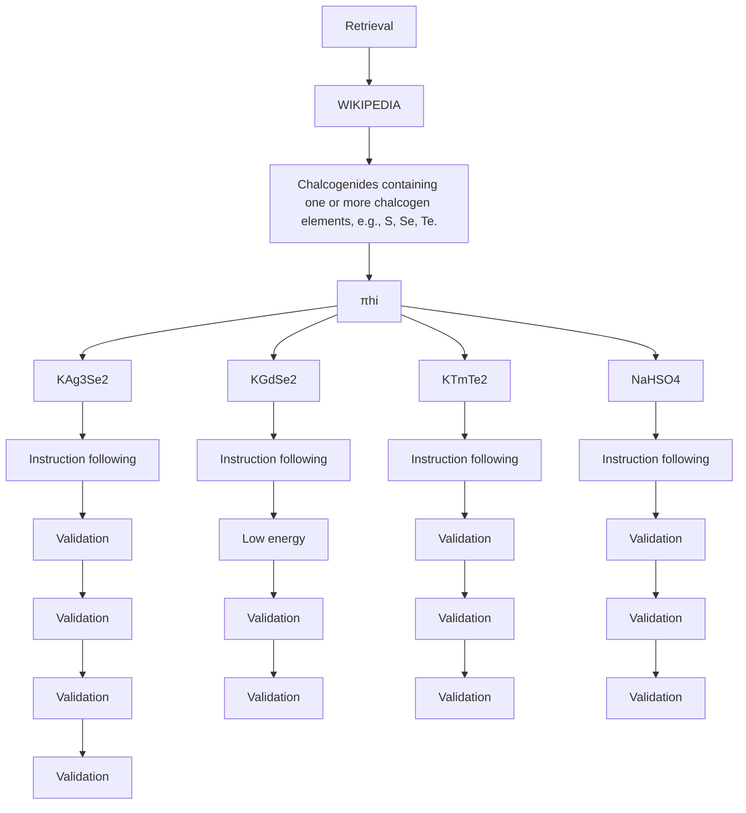

# Generative Hierarchical Materials Search

Sherry Yang, Simon Batzner, Ruiqi Gao, Muratahan Aykol, Alexander L. Gaunt, Brendan McMorrow, Danilo J. Rezende, Dale Schuurmans, Igor Mordatch, and Ekin D. Cubuk

Google DeepMind

Generative models trained at scale can now produce text, video, and more recently, scientific data such as crystal structures. In applications of generative approaches to materials science, and in particular to crystal structures, the guidance from the domain expert in the form of high-level instructions can be essential for an automated system to output candidate crystals that are viable for downstream research. In this work, we formulate end-to-end language-to-structure generation as a multi-objective optimization problem, and propose Generative Hierarchical Materials Search (GenMS) for controllable generation of crystal structures. GenMS consists of (1) a language model that takes high-level natural language as input and generates intermediate textual information about a crystal (e.g., chemical formulae), and (2) a diffusion model that takes intermediate information as input and generates low-level continuous value crystal structures. GenMS additionally uses a graph neural network to predict properties (e.g., formation energy) from the generated crystal structures. During inference, GenMS leverages all three components to conduct a forward tree search over the space of possible structures. Experiments show that GenMS outperforms other alternatives of directly using language models to generate structures both in satisfying user request and in generating low-energy structures. We confirm that GenMS is able to generate common crystal structures such as double perovskites, or spinels, solely from natural language input, and hence can form the foundation for more complex structure generation in near future.

# 1. Introduction

Modern technologies increasingly rely on the development of materials, such as semiconductors (Berger, 2020), solar cells (Green et al., 2014), and lithium batteries (Mizushima et al., 1980). Large-scale generative models, trained on expansive internet data, exhibit intriguing generalization capabilities. For example, these models can synthesize a highly realistic image of “an astronaut riding a horse” by merging two distant concepts (Ramesh et al., 2021). This raises a compelling question: can the generalization capabilities of large generative models, pretrained on existing materials science knowledge, be harnessed to combine knowledge from existing materials systems to propose candidate crystals?

Previous research has demonstrated that generative models can output crystal structures that are not in the training data (Xie et al., 2021; Yang et al., 2023a; Zeni et al., 2023). However, these works typically require either a vast number of unconditional samples to generate an unknown material (Flam-Shepherd and Aspuru-Guzik, 2023; Xie et al., 2021) or a chemical formula provided during inference (Antunes et al., 2023; Yang et al., 2023a). It is difficult for end users to come up with new chemical formulae, as it is hard to know which compositions will result in what material properties. Therefore, it is highly desirable to develop an interface that allows users to describe the desired characteristics of crystal structures — such as properties, compositions, space groups, and geometric characteristics — in natural language. For example, a user might specify “a stable chalcogenide with atom ratio 1:1:2 that is not on ICSD.” Ideally, a model should automatically interpret these high-level language instructions to search for, generate, and validate a wide range of potential structures, ultimately producing one that best meets the user’s specifications.

However, developing an end-to-end language-to-structure generative model presents several challenges, for which we make a few key observations. First, there are no existing labeled datasets

flowchart

Figure 1 | Overview of GenMS. GenMS takes a high-level language instruction as input, retrieves relevant information from the internet, and samples from a high-level LLM ( $\pi_{hi}$ ) to generate candidate formulae that satisfy user requirement. GenMS then samples from a low-level diffusion model ( $\pi_{lo}$ ) to generate structures conditioned on candidate formulae. Sampled structures then go through a property prediction module for selection.

that map language descriptions directly to crystal structures. Nevertheless, we observe that there is a wealth of language-to-formula data available online, including Wikipedia articles, research papers, and textbooks. This data can be complemented by formula-to-structure information from specialized materials databases such as the Materials Project (Jain et al., 2013), ICSD (Hellenbrandt, 2004), OQMD (Kirklin et al., 2015), etc. Second, the task of converting language into structures is inherently multimodal, requiring the transformation of discrete linguistic inputs to continuous structural outputs. Nevertheless, it has been shown that semantic-level autoregressive models combined with low-level (pixel-level) diffusion models are effective for cross-modal generation, such as in text-to-video applications (Brooks et al., 2024; Peebles and Xie, 2023). Lastly, user descriptions of desired crystal structures can often be vague — users may not articulate all relevant details about the crystal they wish to generate. We observe that one can leverage generative models to infer missing information, and rely on additional search and selection mechanisms to identify structures that best satisfy a user's requirement.

Based on these observations, we propose Generative Hierarchical Materials Search (GenMS) for end-to-end language-to-structure generation. GenMS consists of (1) a large language model (LLM) pretrained on high-level materials science knowledge from the internet, (2) a diffusion model trained on specialized crystal structure databases, and (3) a graph neural network (GNN) for property prediction. To improve the efficiency of (2), GenMS proposes a compact representation of crystal structures for diffusion models. During inference, GenMS prompts the LLM to generate candidate chemical formulae according to user specification, samples structures from the diffusion model, and uses the GNN to predict the properties of the sampled structures. To sample structures that best satisfy user requirements during inference, we formulate language-to-structure as a multi-objective optimization problem, where user specifications are transformed into objectives that can be optimized at both the formula and structure level.

We first evaluate GenMS's ability to generate crystal structures from language instructions, and find that GenMS can successfully generate structures that satisfy user requests more than $80\%$ of the time for three major families of structures, while proposing structures with low formation energies, as verified by DFT calculations. In contrast, using pretrained LLMs to directly generate crystal structures from user instructions in a zero-shot manner often results in close to a $0\%$ success rate. Qualitative evaluations show that GenMS is able to generate complex structures, such as layered structures, double perovskites, and spinels, solely from natural language. We next study the effect of each individual component of GenMS. Here we find that language instructions have a significant impact on the structures generated, that the novel compact representation of crystals proposed by GenMS improves the DFT convergence rate of diffusion generated crystal structures by $50\%$ over previous work, and that using a pretrained GNN to select samples leads to lower energy structures more than $80\%$ of

the time. Given such experimental evidence, we believe the development of language-to-structure models are promising for enabling users to find viable crystal structure candidates, complementing existing databases in utility.

# 2. Generative Hierarchical Materials Search

We begin by formulating the problem of generating crystal structures from high-level language as a multi-objective optimization task. Given this formulation, we then propose a hierarchical, multi-modal tree search algorithm that leverages language models, diffusion models, and graph neural networks as submodules. Lastly, we discuss the specific design choices for each of the submodules.

# 2.1. Language to structure as a multi-objective optimization

Given some high-level language description $g \in G$ of desired structures, we want to learn a conditional crystal structure generator $\pi(\cdot|g): \mathcal{G} \mapsto \Delta(X)^{1}$ that can be used to sample crystal structures $x \in X$ conditioned on language. One option is to parametrize $\pi$ with a pretrained LLM. However, pretrained LLMs alone are not able to predict sufficiently accurate crystal structures, due to the lack of low-level structural information about crystals (e.g., 3D atom coordinates) in the pretraining data.

If we had access to a paired language-to-structure dataset, $D = \{g_{i}, x_{i}\}_{i=1}^{N}$ , $\pi$ could be trained using a maximum likelihood objective. However, materials data naturally exist at different levels of abstraction and are segregated into different sources: high-level symbolic knowledge is documented in sources like Wikipedia articles, research papers, and textbooks, whereas detailed low-level crystal information, including continuous-valued atom positions, is stored in specialized crystal databases like the Materials Project (Jain et al., 2013) and ICSD (Hellenbrandt, 2004). Even though a direct language-to-structure dataset D remains unavailable, the pretraining data for LLMs, including Wikipedia articles, research papers, and textbooks, can be viewed as a high-level symbolic dataset $D_{hi} = \{g_{i}, z_{i}\}_{i=1}^{m}$ , where $z \in Z$ denotes symbolic textual information such as chemical formulae. Meanwhile, many crystal databases already feature paired data, $D_{lo} = \{z_{i}, x_{i}\}_{i=1}^{n}$ , linking chemical formulae to detailed crystal structures.

Given this observation, we propose to factorize the crystal generator as $\pi = \pi_{hi} \circ \pi_{lo}$ , where $\pi_{hi} : G \mapsto \Delta(Z)$ and $\pi_{lo} : Z \mapsto \Delta(X)$ , so that $\pi_{hi}$ and $\pi_{lo}$ can be trained using different datasets $D_{hi}$ and $D_{lo}$ . Furthermore, we consider two heuristic functions, $R_{\mathrm{hi}}(g, z) : G \times Z \mapsto \mathbb{R}$ and $R_{\mathrm{lo}}(z, x) : Z \times X \mapsto \mathbb{R}$ , where the high-level heuristic function $R_{hi}$ can be used to select formulae that satisfy the language input at a high level, and the low-level heuristic function $R_{lo}$ can be used to select structures that are both valid and exhibit desirable properties such as low formation energy. To this end, we propose to search for crystal structure given language input by finding a chemical formula / space group z with a corresponding crystal structure x that jointly optimize

$$
z ^ {*}, x ^ {*} = \arg \max _ {z, x \sim \pi_ {\mathrm{hi}}, \pi_ {\mathrm{lo}}} \mathbb {E} _ {z \sim \pi_ {\mathrm{hi}}, x \sim \pi_ {\mathrm{lo}} (z)} [ \lambda_ {\mathrm{hi}} \cdot R _ {\mathrm{hi}} (g, z) + \lambda_ {\mathrm{lo}} \cdot R _ {\mathrm{lo}} (z, x) ], \tag {1}
$$

where $\lambda_{hi}$ and $\lambda_{lo}$ are hyperparameters to control how much weight to put on high and low-level heuristics. Note that $R_{hi}$ and $R_{lo}$ can also be combinations of multiple objectives. For instance, $R_{hi}$ can be a weighted sum of instruction following and simplicity, where $R_{lo}$ can be a weighted sum of properties such as band gap, conductivity, and formation energy.

# 2.2. Searching through language and structure

Given the objective in Equation 1, it is clear that a pretrained LLM (even with finetuning) is insufficient to optimize for the best structure $x^{*}$ . Instead, we propose to first sample a set of intermediate chemical

Algorithm 1 Generative Hierarchical Materials Search   
1: Input: Language input g
2: Functions: High-level language policy $\pi_{\mathrm{hi}}(z|g)$ , high-level heuristic function $R_{\mathrm{hi}}(g,z)$ , low-level diffusion policy $\pi_{\mathrm{lo}}(x|z)$ , low-level heuristic function $R_{\mathrm{lo}}(z,x)$ .
3: Hyperparameters: High-level language branching factor H, low-level structure branching factor L, max width for formulae W.
4: plans $\leftarrow \left[ [g] \forall i \in \{1 \ldots H\} \right]$ # Initialize H different plans starting with language input.
5: for $h = 1 \ldots H$ do
6: $g \leftarrow \text{plans}[h][-1]$ # Get the high-level language specification from the tree.
7: $\{z_i\}_{i=1}^H \leftarrow \pi_{\mathrm{hi}}(g)$ # Generate H different intermediate formulae.
8: $z^* = \arg\max(\{g, z_i\}_{i=1}^H, R_{\mathrm{hi}})$ 9: plans[h].append( $z^*$ ) # Add formula with the best heuristic value to plan.
10: plans $\leftarrow \text{sort(plans}, R_{\mathrm{hi}})$ # Sort formulae based on heuristic.
11: for $w = 1 \ldots W$ do
12: $z \leftarrow \text{plans}[w][-1]$ # Get the best intermediate formula from the tree.
13: $\{x_i\}_{i=1}^L \leftarrow \pi_{\mathrm{lo}}(z)$ # Generate L low-level structures.
14: $x^* = \arg\max(\{z, x_i\}_{i=1}^H, R_{\mathrm{lo}})$ 15: plans[w].append( $x^*$ ) # Add structure with the best heuristic value to plan.
16: return plans[0][0] # Return the best structure.

formulae from a pretrained LLM $\pi_{\mathrm{hi}}(g)$ conditioned on language input g. We then use the high-level heuristic function $R_{hi}$ to prune and rank the intermediate formulae. In practice, $R_{hi}$ is a combination of (i) a regular expression checker (to ensure sampled formulae are valid chemical formulae), (ii) a uniqueness checker against formulae from existing crystal datasets such as Materials Project and ICSD, and (iii) a formula compliance checker to ensure the sampled formulae are compatible with user request (e.g., atom ratio 113 for perovskites, 227 for pyrochlore, and 124 for spinel). For formulae that pass these checks, we prompt a pretrained LLM as $R_{hi}$ to rank the formulae by how likely they are to comply with the user request g. We then select the top W ranked formulae to generate L crystal structures each using $\pi_{lo}$ parametrized by a diffusion model, and use a graph neural network $R_{lo}$ to rank the $W \times L$ structures by their predicted formation energy. Note that additional checkers can be integrated in $R_{lo}$ , such as structural and compositional validity defined in Xie et al. (2021). We illustrate the overall search procedure in Algorithm 1.

Alternative search strategies. The search algorithm described above, Algorithm 1, follows the best-first search strategy, i.e., intermediate formulae and final structures are sorted and searched over based on the preference of a heuristic function. Alternative search strategies such as breadth-first or depth-first can also be employed. The most suitable search strategy depends on the downstream application and computational resources available. For instance, if large-scale density function theory (DFT) calculations are available downstream, we can employ breadth-first search to devise more diverse composition.

Prevent heuristic exploitation. One concern of using a heuristic GNN to select structures with the lowest formation energy is that the GNN might exploit irregularities in the predicted structures, especially when a predicted structure lies outside of the training manifold of the energy GNN. To mitigate this issue, we use the GNN pretrained by Merchant et al. (2023) on DFT energies and forces of unrelaxed structures (hence the GNN has seen more irregular structures prior to relaxation.) Furthermore, we discard sampled structures from $\pi_{lo}$ if they result in energy predictions from $R_{lo}$ that lie outside of a threshold range.

```mermaid
graph LR
    A["x, y, z, a (n, 4)"] --> B["MLP"]
    B --> C["n, m"]
    C --> D["..."]
    D --> E["n, m*k"]
    E --> F["MLP"]
    F --> G["Self-attention"]
    G --> H["n, m*k"]
    H --> I["n, m*k"]
    I --> J["..."]
    J --> K["n, m"]
    K --> L["n, m"]
    L --> M["MLP"]
    M --> N["x, y, z, a (n, 4)"]
    style A fill:#f9f,stroke:#333
    style N fill:#f9f,stroke:#333
```

flowchart

Figure 2 | Diffusion architecture with compact crystal representation. The diffusion model in GenMS represents crystal structures by the x, y, z location of each atom plus the atom number a represented as a continuous value. Each atom undergoes blocks consisting of multi-layer perceptrons followed by order-invariant self-attention. The MLP and self-attention blocks are repeated k times where each repetition increases the dimension of the hidden units. The concatenation of skip connections are employed as in other U-Net architectures.

# 2.3. Choices of parametrization for the submodules

Since controllable crystal structure generation from language input is multimodal by nature, there are various design choices for the parametrization of the submodules in Equation 1, namely the generators $\pi_{hi}, \pi_{lo}$ and the heuristic functions $R_{hi}, R_{lo}$ . In this section, we discuss the parametrization choices we have found to be the most effective.

Retrieval augmentation and long-context deduplication. One important recent advance in LLMs is increased context length (Reid et al., 2024). The factorization $\pi = \pi_{\mathrm{hi}} \circ \pi_{\mathrm{lo}}$ provides a natural way to integrate additional context in $\pi_{\mathrm{hi}}$ via long-context generation. Specifically, we further factorize $\pi_{\mathrm{hi}}$ into $\pi_{\mathrm{hi}} = \pi_{\mathrm{hi}}^{\mathrm{retrival}} \circ \pi_{\mathrm{hi}}^{\mathrm{RAG}}$ , where $\pi_{\mathrm{hi}}^{\mathrm{retrival}}(\cdot | g)$ is a deterministic retrieval function that uses the Wikipedia API to retrieve textual information related to language input $g$ , while $\pi_{\mathrm{hi}}^{\mathrm{RAG}}$ is a retrieval augmented generative (RAG) model that proposes chemical formulae and space groups conditioned on the information retrieved from the internet. Another use case for long-context LLMs is to further encourage the generation of new compositions by providing the formulae for all known crystals in the context, then asking $\pi_{\mathrm{hi}}$ to produce a formula that is not in the context. As we will see in Section 3.2, this drastically improves the efficiency of the search, as a large subset of the search space with known crystals can be eliminated.

Compact crystal representation. In order to support efficient tree search at inference time, we need to ensure that sampling from both $\pi_{hi}$ and $\pi_{lo}$ are efficient. Previous work on diffusion models for crystal structure generation has leveraged sparse data structures, such as voxel images (Court et al., 2020; Hoffmann et al., 2019; Noh et al., 2019), graphs (Xie et al., 2021), and periodic table shaped tensors (Yang et al., 2023a). These existing representations of crystals incur computational overhead due to sparsity (voxel images, padded tensors) or quadratic complexity as the number of atoms in the system increases (graphs). Instead, we propose a new compact representation of crystal structures, where each crystal $x \in X \subset R^{A \times 4}$ is represented by a $A \times 4$ tensor, with A being the number of atoms in the crystal, and the inner 4 dimensions representing the x, y, z location of an atom along with its atom number. Here we directly represent the atom number as a continuous value normalized to the range of the input in the diffusion model to further improve inference speed, as opposed to representing the atom number using a one-hot vector. In addition, we use another $2 \times 3$ vector to represent the lattice structure (i.e., angles and lengths of the unit cell). Figure 2 illustrates the architecture for the diffusion model with compact crystal representations, where each atom undergoes multi-layer perceptron (MLP) followed by order-invariant self-attention (without positional encoding) across atoms. Different from typical U-Net architecture for image generation, there is no downsampling or upsampling passes that change the input resolution. Nevertheless, we follow the concatenation of skip connections commonly used in U-Net architectures (Ronneberger et al., 2015). Additional details and hyperparameters for the diffusion model can be found in Appendix A.3.

# 3. Experimental Evaluation

We now evaluate the ability of GenMS to generate low-level crystal structures from high-level language descriptions. First, we evaluate the success of end-to-end generation in Section 3.1. We then investigate the individual components of GenMS in Section 3.2. See details of experimental setups in Appendix A.

# 3.1. End-to-end evaluation

Baselines and metrics. We aim to evaluate GenMS's ability to generate unique, valid, and potentially stable crystal structures from well-known crystal families that satisfy high-level language specifications. We consider few-shot prompting of LLMs to generate crystal information files (CIF) as a baseline. Specifically, we give the Gemini long context model (Reid et al., 2024) a number of CIF files from a particular crystal family, as specified by language input as prompt, with the number of CIF files ranging from 1, 5, 25 to as many as can fit in the context. We ask the LLM to generate 100 samples given each language instruction. See additional details of baselines in Appendix A.2. We do not compare to finetuning LLMs to generate CIF files in this section, as there are no high-level language to low-level crystal structure datasets available for finetuning such an instruction following LLM. Nevertheless, we will compare the diffusion model in GenMS to formula-conditioned structure generation using finetuned LLM in Section 3.2. We consider language input that directs the model to generate unique and stable crystals from a particular crystal family (perovskite, pyrochlore, and spinel). We consider the following metrics for evaluation: (i) CIF validity, which measures whether the generated CIF file can be properly parsed by pymatgen parser (Ong et al., 2013). (ii) Structural and composition validity, which verify atom distances and charge balances using SMACT (Davies et al., 2019), following Xie et al. (2021). (iii) Formation energy ( $E_f$ ), which measures the stability of predicted structures using a pretrained GNN. We further conduct DFT calculations to compute $E_f$ (see details in Appendix A.4) for structures predicted by GenMS. (iv) Uniqueness, which measures the percentage of generated formulae that do not exist in Materials Project (Jain et al., 2013) or ICSD (Hellenbrandt, 2004). Finally, (v) the match rate, which measures the percentage of generated structures that can be matched (according to the pymatgen structure matcher) to one of the structures of the corresponding family in Materials Project. More details of these metrics can be found in Appendix A.1.

Results on specifying crystal family. The evaluation of GenMS and baselines are shown in Table 1. Since GenMS does not rely on an LLM to directly generate CIF files, the compact crystal representation (described in Section 2.3) always results in structures that can be parsed by pymatgen (100% CIF validity). In addition, structures generated by GenMS have a much higher validity and match rate compared to those generated by the baselines. GenMS struggles slightly with uniqueness, as less than half of the generated formulae for pyrochlore and spinel are unique with respect to MP and ICSD. Structures produced by GenMS have lower average $E_{f}$ . Increasing the number of CIF files in the context generally improves the performance of the baselines (1, 5, and 25-shot), but including too many files in the context can hurt performance (Prompting CIF Max).

Qualitative evaluation. In addition to the three families of structures evaluated above, we qualitatively evaluated GenMS's ability to generate structures that satisfy ad hoc user requests, such as “a pyrochlore”, “an elpasolite”, and so on. GenMS can consistently produce structures that satisfy user request as shown in Figure 3, and have plausible initial geometries. Interestingly, we observe that GenMS can understand semantic-level request, suggesting more “fluoride” like chemistries when asked for “elpasolite”, which is reasonable as elpasolite is associated with the mineral K2NaAlF6.

Effect of search. Next, we aimed to understand the effect of search in GenMS, especially in producing low-energy structures. For each of the family of crystals in Table 1, we analyzed the effect of the language and structure branching factors (H and L in Algorithm 1). Only crystals that match input specification were considered for energy computation. We found that increasing the branching factor

<table><tr><td rowspan="2">Family</td><td rowspan="2">Metric</td><td colspan="4">Prompting CIF</td><td rowspan="2">GenMS</td></tr><tr><td>1 shot</td><td>5 shot</td><td>25 shot</td><td>Max</td></tr><tr><td rowspan="6">Perovskites</td><td>CIF validity ↑</td><td>0.94</td><td>1.00</td><td>0.98</td><td>0.88</td><td>1.00</td></tr><tr><td>Structural validity ↑</td><td>0.04</td><td>0.28</td><td>0.66</td><td>0.22</td><td>1.00</td></tr><tr><td>Composition validity ↑</td><td>0.07</td><td>0.17</td><td>0.45</td><td>0.00</td><td>0.85</td></tr><tr><td> $E_{f}$ (GNN/DFT) ↓</td><td>1,944.21</td><td>-0.19</td><td>0.28</td><td>0.53</td><td>-0.47/-1.32</td></tr><tr><td>Uniqueness ↑</td><td>0.07</td><td>0.29</td><td>0.68</td><td>0.16</td><td>0.90</td></tr><tr><td>Match rate ↑</td><td>0.00</td><td>0.09</td><td>0.36</td><td>0.19</td><td>0.93</td></tr><tr><td rowspan="6">Pyrochlore</td><td>CIF validity↑</td><td>0.40</td><td>0.60</td><td>0.64</td><td>0.88</td><td>1.00</td></tr><tr><td>Structural validity↑</td><td>0.36</td><td>0.36</td><td>0.28</td><td>0.23</td><td>0.95</td></tr><tr><td>Composition validity↑</td><td>0.00</td><td>0.22</td><td>0.18</td><td>0.00</td><td>0.89</td></tr><tr><td> $E_{f}$ (GNN/DFT)↓</td><td>1.28</td><td>1.19</td><td>0.63</td><td>-1.22</td><td>-1.37/-2.56</td></tr><tr><td>Uniqueness↑</td><td>0.36</td><td>0.38</td><td>0.45</td><td>0.08</td><td>0.49</td></tr><tr><td>Match rate ↑</td><td>0.00</td><td>0.00</td><td>0.04</td><td>0.00</td><td>0.86</td></tr><tr><td rowspan="6">Spinel</td><td>CIF validity</td><td>0.73</td><td>0.96</td><td>0.97</td><td>0.96</td><td>1.00</td></tr><tr><td>Structural validity↑</td><td>0.47</td><td>0.61</td><td>0.71</td><td>1.00</td><td>1.00</td></tr><tr><td>Composition validity↑</td><td>0.29</td><td>0.92</td><td>0.92</td><td>1.00</td><td>1.00</td></tr><tr><td> $E_{f}$ (GNN/DFT)↓</td><td>1.09</td><td>-0.85</td><td>-0.97</td><td>-1.37</td><td>-1.38/-1.77</td></tr><tr><td>Uniqueness↑</td><td>0.48</td><td>0.13</td><td>0.51</td><td>0.08</td><td>0.44</td></tr><tr><td>Match rate ↑</td><td>0.00</td><td>0.12</td><td>0.18</td><td>0.08</td><td>0.89</td></tr></table>

Table 1 | End-to-end evaluation of generating crystal structure from natural language. GenMS significantly outperforms LLM prompting baselines in producing unique and low-energy (predicted by GNN) structures that satisfy user request. We further conduct DFT calculation to compute $E_{f}$ on structures generated by GenMS. DFT calculations for baselines are eliminated as many structures from the baselines do not follow user instruction.

of both language and structure enables GenMS to generate structures with lower formation energies (at a higher inference cost).

# 3.2. Evaluating individual components of GenMS

Next, we evaluate the individual component of GenMS, including the effect of using language to narrow down the search space, the choice of the compact representation of crystal structures, and finally the best-of-N sampling strategy for choosing the crystal structures with low formation energy.

Effect of language. We want to understand whether GenMS can provide effective control over formulae proposed by the LLM at the semantic-level through natural language. In Table 3, we first show that requesting a particular element to be in the formula always results in formulas with that particular element being proposed by the pretrained LLM $\pi_{hi}$ . We then show that when a user requests for metal, the model is 4 times more likely to generate formulae for metal. The model also respects a user's request for the generated formulae to be unique (with respect to either a user provided list of known formulae in the context of the LLM, or the name of some crystal database).

Next, we study the effect of retrieval augmented generation (RAG). We use GenMS with and without RAG to propose 25 formulae for each of the three major crystal families from Section 3.1 and generates 4 structures per formula using the diffusion model. We report the rate of valid formulae proposed by the LLM and the structures that can be matched with existing structures from the corresponding family in Table 4. RAG improves both the rate of valid formulae and matched structures.

chemical

Crystal structure diagram of Cl perovskite showing atomic arrangement with purple sphere at center

chemical

Molecular structure diagram of Pryochlore, showing a polyhedral arrangement with green and red atoms

chemical

Crystal structure diagram of double perovskite showing atomic arrangement with purple and blue spheres

chemical

Molecular structure diagram of spinel showing layered arrangement with red and orange atoms

Figure 3 | Qualitative evaluation. We test GenMS on a set of ad hoc language inputs to generate plausible examples from well-known crystal families. GenMS is able to search for the corresponding structures that satisfy user requests and have plausible initial geometries. Visualization provided by VESTA (Momma and Izumi, 2011). 

<table><tr><td colspan="3">Perovskite</td><td colspan="3">Pyrochlore</td><td colspan="3">Spinel</td></tr><tr><td>Language branch (H)</td><td>Structure branch (L)</td><td> $E_{f}$ (DFT)</td><td>Language branch (H)</td><td>Structure branch (L)</td><td> $E_{f}$ (DFT)</td><td>Language branch (H)</td><td>Structure branch (L)</td><td> $E_{f}$ (DFT)</td></tr><tr><td>1</td><td>1</td><td>-0.55</td><td>1</td><td>1</td><td>-2.40</td><td>1</td><td>1</td><td>-1.67</td></tr><tr><td>1</td><td>100</td><td>-0.79</td><td>1</td><td>100</td><td>-2.51</td><td>1</td><td>100</td><td>-1.74</td></tr><tr><td>25</td><td>1</td><td>-2.76</td><td>25</td><td>1</td><td>-3.02</td><td>25</td><td>1</td><td>-1.82</td></tr><tr><td>25</td><td>100</td><td>-2.91</td><td>25</td><td>100</td><td>-3.24</td><td>25</td><td>100</td><td>-1.95</td></tr></table>

Table 2 | $E_{f}$ (computed by DFT) vs. branching factor. GenMS can generate structures with lower formation energy (computed by DFT) at the cost of slower inference when language and structure branching factors are increased.

Compact crystal representation. We now evaluate the diffusion model $\pi_{lo}$ trained using the compact representation of crystals structures described in Section 2.3. We compare diffusion model with compact crystal representation against two prior work for generating crystal structures conditioned on composition. UniMat (Yang et al., 2023a) proposed a periodic table representation of crystals which requires a large amount of paddings to handle atoms that do not exist in the structure. CrystalLM (Antunes et al., 2023) proposes to finetune an LLM to directly generate CIF files from input compositions. In Table 5, we report the DFT convergence rate and DFT calculated $E_{f}$ on a set of holdout structures following Yang et al. (2023a). We observe that the compact crystal representation results in both higher convergence rate and lower $E_{f}$ than the sparse representation in Yang et al. (2023a). To compare GenMS's diffusion model against finetuning LLMs to generate CIF files directly, we follow the experimental setting of CrystaLLM where we train a composition conditioned diffusion model on a combination of Materials Project (Jain et al., 2013), OQMD (Saal et al., 2013), and NOMAD (Draxl and Scheffler, 2019), and test the success rate of generating matching structures for unseen compositions following Antunes et al. (2023). In Table 6, we see that GenMS has significantly

<table><tr><td></td><td>Element constraint</td><td>Metal only</td><td>Unique (custom list)</td><td>Unique (Materials Project)</td></tr><tr><td>Not asking</td><td>N/A</td><td>0.25</td><td>0.24</td><td>0.16</td></tr><tr><td>Asking</td><td>1.00</td><td>1.00</td><td>0.88</td><td>0.96</td></tr></table>

<table><tr><td></td><td>Valid formula</td><td>Match rate</td></tr><tr><td>Without RAG</td><td>0.97</td><td>0.72</td></tr><tr><td>With RAG</td><td>1.00</td><td>0.89</td></tr></table>

Table 3 | Effect of language. Asking for a specific element from the periodic table results in formulae that always contain that element. Asking for metal and formulae unique with respect to some existing formula sets result in formulae that are more likely to satisfy user requests.   
Table 4 | Effect of RAG. Using retrieval augmented generation improves the percentage of valid formulae and matched structures. See details for the structure matcher used in Appendix A.1.

<table><tr><td></td><td>UniMat(Yang et al., 2023a)</td><td>GenMS(ours)</td></tr><tr><td>DFT converge</td><td>0.62</td><td>0.93</td></tr><tr><td>Mean  $E_{f}$ </td><td>-0.40 ± 0.06</td><td>-0.49 ± 0.03</td></tr></table>

<table><tr><td></td><td>Small LLM(Antunes et al., 2023)</td><td>Large LLM</td><td>GenMS (ours)</td></tr><tr><td>Success</td><td>0.86</td><td>0.87</td><td>0.93</td></tr><tr><td>Match (unseen)</td><td>0.26</td><td>0.37</td><td>0.48</td></tr></table>

Table 5 | DFT evaluation of GenMS vs UniMat. Structures proposed by GenMS result in much high DFT convergence rate and lower average $E_{f}$ than structures proposed by UniMat. Error bars reflect standard error.   
Table 6 | Comparison to finetuned LLMs. GenMS's diffusion model with compact representations achieves high success rate of generating valid crystals, as well as a high matching rate to holdout structures compared to CrystalLM (Antunes et al., 2023).

line

| Composition | Energy diff (Ef best-of-10 < Ef single) | Energy diff (Ef best-of-10 > Ef single) |
| ----------- | ---------------------------------------- | ---------------------------------------- |
| Low         | -8.0                                     | 0.0                                      |
| Mid         | -2.0                                     | 0.0                                      |
| High        | 0.0                                      | 0.0                                      |

line

| Composition | Ef best-of-10 < Ef single | Ef best-of-10 > Ef single |
| ----------- | ------------------------- | -------------------------- |
| 0           | -8                        | 0                          |
| 1           | -6                        | 0                          |
| 2           | -4                        | 0                          |
| 3           | -2                        | 0                          |
| 4           | 0                         | 0                          |
| 5           | 0                         | 0                          |
| 6           | 0                         | 0                          |
| 7           | 0                         | 0                          |
| 8           | 0                         | 0                          |
| 9           | 0                         | 0                          |
| 10          | 0                         | 0                          |
| 11          | 0                         | 0                          |
| 12          | 0                         | 0                          |
| 13          | 0                         | 0                          |
| 14          | 0                         | 0                          |
| 15          | 0                         | 0                          |
| 16          | 0                         | 0                          |
| 17          | 0                         | 0                          |
| 18          | 0                         | 0                          |
| 19          | 0                         | 0                          |
| 20          | 0                         | 0                          |
| 21          | 0                         | 0                          |
| 22          | 0                         | 0                          |
| 23          | 0                         | 0                          |
| 24          | 0                         | 0                          |
| 25          | 0                         | 0                          |
| 26          | 0                         | 0                          |
| 27          | 0                         | 0                          |
| 28          | 0                         | 0                          |
| 29          | 0                         | 0                          |
| 30          | 0                         | 0                          |
| 31          | 0                         | 0                          |
| 32          | 0                         | 0                          |
| 33          | 0                         | 0                          |
| 34          | 0                         | 0                          |
| 35          | 0                         | 0                          |
| 36          | 0                         | 0                          |
| 37          | 0                         | 0                          |
| 38          | 0                         | 0                          |
| 39          | 0                         | 0                          |
| 40          | 0                         | 0                          |
| 41          | 0                         | 0                          |
| 42          | 0                         | 0                          |
| 43          | 0                         | 0                          |
| 44          | 0                         | 0                          |
| 45          | 0                         | 0                          |
| 46          | 0                         | 0                          |
| 47          | 0                         | 0                          |
| 48          | 0                         | 0                          |
| 49          | 0                         | 0                          |
| 50          | 0                         | 0                          |
| 51          | 0                         | 0                          |
| 52          | 0                         | 0                          |
| 53          | 0                         | 0                          |
| 54          | 0                         | 0                          |
| 55          | 0                         | 0                          |
| 56          | 0                         | 0                          |
| 57          | 0                         | 0                          |
| 58          | 0                         | 0                          |
| 59          | 0                         | 0                          |
| 60          | 0                         | 0                          |
| 61          | 0                         | 0                          |
| 62          | 0                         | 0                          |
| 63          | 0                         | 0                          |
| 64          | 0                         | 0                          |
| 65          | 0                         | 0                          |
| 66          | 0                         | 0                          |
| 67          | 0                         | 0                          |
| 68          | 0                         | 0                          |
| 69          | 0                         | 0                          |
| 70          | 0                         | 0                          |
| 71          | 0                         | 0                          |
| 72          | 0                         | 0                          |
| 73          | 0                         | 0                          |
| 74          | 0                         | 0                          |
| 75          | 0                         | 0                          |
| 76          | 0                         | 0                          |
| 77          | 0                         | 0                          |
| 78          | 0                         | 0                          |
| 79          | 0                         | 0                          |
| 80          | 0                         | 0                          |
| Note: The data is extracted from the code and displayed on the chart as follows: The labels are 'Ef best-of-1' and 'Ef single'. The values are estimated based on the formula 'E' and the number of elements 'Ef' above each other. There is no additional data series in this case. The values are estimated based on the formula 'Ef' above each other in the code.

Figure 4 | Formation energy between Best-of-N and a single sample. Both according to energy predicted by GNN and calculated by DFT, best-of-N with N = 10 leads to improvements in energy compared to single samples for 80% of 1,000 compositions considered.

higher rate in producing a valid crystal and a crystal that can be matched to the test set in Antunes et al. (2023).

Best-of-N structure sampling. To better understand the effect of high structure branching factor in Algorithm 1 across different compositions, we measure the difference in the formation energy, using a holdout test set of 1,000 compositions, between using the energy prediction GNN to select the best of 10 samples compared to only predicting a single structure. The energy difference with and without best-of-N sampling is shown in Figure 4. Using best-of-N with N = 10 results in improved energy for over 80% of structures (as also verified by DFT calculations). We found the energy prediction GNN to be a good indicator of the true energy of the crystal structures, i.e., the GNN predicted energy difference (left) and the DFT calculated energy difference (right) are very similar in Figure 4.

# 4. Related work

Hierarchical and latent image and video generation. Image and video generative models have exhibited an impressive ability to synthesize photorealistic images or videos when given text description as input. Many of the state-of-the-art models adopt a hierarchical modeling approach that inspired the design of with GenMS. For example, latent diffusion models (Rombach et al., 2022; Vahdat et al., 2021) contains (1) a language model that converts text to high-level text embeddings, (2) a diffusion model takes the text embeddings as input and output latents in a compressed latent space, and (3) a feed forward decoder network (Rombach et al., 2022) or a diffusion decoder Brooks et al. (2024); et al (2022) that given the generated latents generates full-resolution signals in the pixel space. Cascaded diffusion models Ho et al. (2022a,b); Saharia et al. (2022) instead proposed to generate signals at the lowest resolution with a standard diffusion model, followed by a few super-resolution models that successively upsample signals and add high-resolution details. Similar to GenMS, by breaking down complicated image or video generation into a hierarchy of less challenging problems, these models can generate high quality samples more efficiently and effectively.

Generative models for crystal structures. A number of works (Antunes et al., 2023; Flam-Shepherd and Aspuru-Guzik, 2023; Gruver et al., 2024) have proposed to train or fine-tune language models to generate output files containing crystal information or low-level atom positions. However, it remains expensive and challenging to train and generate detailed structural information with LLMs. On the other hand, diffusion models, as a powerful class of generative model in vision, have been applied to generate crystal structures (Xie et al., 2021; Yang et al., 2023a; Zeni et al., 2023). However these methods either reply on training with a large set of unconditional samples and brute-force sampling for new materials not in the training set, or necessitate predetermined compositions as conditioning information during inference. Handling of candidate structure generation requires a model capable of independent reasoning about chemical compositions based on high-level user specifications and structure optimization, as done in GenMS.

Hierarchical search and planning. The problem of learning to generate low-level continuous output from high-level language instructions, while employing intermediate search and planning steps, has been studied in other domains such as continuous control (Liang et al., 2023), self-driving (Zhou et al., 2023), and robotics (Cui et al., 2024). While some works have focused on purely using LLMs to search and plan through complex output spaces (Valmeekam et al., 2023; Xie et al., 2023), other research has shown that solely relying on LLMs to search and plan can fail short due to the lack of low-level information (e.g., locations, precise motions) captured in the model (Valmeekam et al., 2022). Recently, video generation models have been applied to provide additional details about the physical world so that low-level control actions can be extracted more accurately (Ajay et al., 2024; Du et al., 2023, 2024; Yang et al., 2023b). GenMS follows a similar approach but focuses on generating crstyal structures, using diffusion models on top of LLMs to provide additional details about crystal structure, enabling high-level plans (i.e., symbolic chemical formulae) to be verified at a low-level (i.e., crystal structures with precise atom locations).

Large language models for science. Recently, there has been a surge of interest in applying large langauge models in domains of science, such as physics (Holmes et al., 2023), biology (Luu and Buehler, 2024), chemistry (M. Bran et al., 2024; Zhang et al., 2024), and materials science (Lei et al., 2024). In these settings, LLMs generally serve as a conversational (Luu and Buehler, 2024) or educational (Sun et al., 2024) tool, where LLMs output natural language to be consumed by human users (e.g., an answer to a scientific question asking about the property of some existing crystal structure). On the other hand, we are interested in the ability of a pretrained LLM to propose intermediate textual information such as chemical formulae for interesting crystal structures. Closest to our work are Ikebata et al. (2017); Moret et al. (2023) which leverage an LLM to generate SMILES or other chemical strings for molecular design. Nevertheless, we are interested in generating not just the formulae, but the actual crystal structures with continuous-valued atom locations, as many materials property can only be calculated and verified once the full structure available.

# 5. Conclusion and future work

We have introduced GenMS, an initial attempt at enabling end-to-end generation of candidate crystal structures that look physically viable and satisfy instructions expressed in natural language. GenMS can generate examples from families such as pyrochlores and spinels purely from natural language prompts. We hope the design principles of GenMS will initiate broad interest in exploiting language as a natural interface for flexible design and generation of crystal structures that meet user-specified criteria, and enable the domain experts to work more efficiently. GenMS has a few limitations that call for future work:

\- Generating complex structures. While GenMS is able to generate simple structures such as those shown in Figure 3, we found that GenMS is less effective in generating complex structures such as

Mxenes and Kagome lattices. Controllable generation of highly complex crystal structures is an interesting area of future work.

- Impact on experimental exploration. While we have shown that GenMS is effective in generating crystal structures that are not in public databases and that satisfy user requirements, its effectiveness in suggesting specific materials with target properties (e.g., battery electrodes or electrolytes, semiconductors, superconductors etc.) requires further experimental verification.   
- Synthesizability. While the goal of GenMS is to provide an end-to-end generative framework from natural language instructions to realistic crystal structures, synthesizability of the generated crystals is not currently part of the pipeline. We foresee development in multimodal models and integration of other computational tools from materials science to allow predicted structures to be assessed for synthesizability.   
- Extension to other chemical systems. We have shown that GenMS can effectively generate crystal structures from natural language. We note that GenMS can also potentially be extended to generating molecules and protein structures from natural language (e.g. “generate a protein with an alpha-helix”). We leave these explorations for future work.

# Acknowledgments

We would like to acknowledge Shiang Fang, Doina Precup, and the greater Google DeepMind team for their support.

# References

A. Ajay, S. Han, Y. Du, S. Li, A. Gupta, T. Jaakkola, J. Tenenbaum, L. Kaelbling, A. Srivastava, and P. Agrawal. Compositional foundation models for hierarchical planning. Advances in Neural Information Processing Systems, 36, 2024.   
L. M. Antunes, K. T. Butler, and R. Grau-Crespo. Crystal structure generation with autoregressive large language modeling. arXiv preprint arXiv:2307.04340, 2023.   
L. I. Berger. Semiconductor materials. CRC press, 2020.   
P. E. Blöchl. Projector augmented-wave method. Physical review B, 50(24):17953, 1994.   
T. Brooks, B. Peebles, C. Holmes, W. DePue, Y. Guo, L. Jing, D. Schnurr, J. Taylor, T. Luhman, E. Luhman, C. Ng, R. Wang, and A. Ramesh. Video generation models as world simulators. 2024. URL https://openai.com/research/video-generation-models-as-world-simulators.   
Ö. Çiçek, A. Abdulkadir, S. S. Lienkamp, T. Brox, and O. Ronneberger. 3d u-net: learning dense volumetric segmentation from sparse annotation. In Medical Image Computing and Computer-Assisted Intervention–MICCAI 2016: 19th International Conference, Athens, Greece, October 17-21, 2016, Proceedings, Part II 19, pages 424–432. Springer, 2016.   
C. J. Court, B. Yildirim, A. Jain, and J. M. Cole. 3-d inorganic crystal structure generation and property prediction via representation learning. Journal of Chemical Information and Modeling, 60(10):4518–4535, 2020.   
C. Cui, Y. Ma, X. Cao, W. Ye, Y. Zhou, K. Liang, J. Chen, J. Lu, Z. Yang, K.-D. Liao, et al. A survey on multimodal large language models for autonomous driving. In Proceedings of the IEEE/CVF Winter Conference on Applications of Computer Vision, pages 958–979, 2024.   
D. W. Davies, K. T. Butler, A. J. Jackson, J. M. Skelton, K. Morita, and A. Walsh. Smact: Semiconducting materials by analogy and chemical theory. Journal of Open Source Software, 4(38):1361, 2019.   
C. Draxl and M. Scheffler. The nomad laboratory: from data sharing to artificial intelligence. Journal of Physics: Materials, 2(3):036001, 2019.   
Y. Du, M. Yang, P. Florence, F. Xia, A. Wahid, B. Ichter, P. Sermanet, T. Yu, P. Abbeel, J. B. Tenenbaum, et al. Video language planning. arXiv preprint arXiv:2310.10625, 2023.   
Y. Du, S. Yang, B. Dai, H. Dai, O. Nachum, J. Tenenbaum, D. Schuurmans, and P. Abbeel. Learning universal policies via text-guided video generation. Advances in Neural Information Processing Systems, 36, 2024.   
A. R. et al. Hierarchical text-conditional image generation with clip latents, 2022.   
D. Flam-Shepherd and A. Aspuru-Guzik. Language models can generate molecules, materials, and protein binding sites directly in three dimensions as xyz, cif, and pdb files. arXiv preprint arXiv:2305.05708, 2023.   
M. A. Green, A. Ho-Baillie, and H. J. Snaith. The emergence of perovskite solar cells. Nature photonics, 8(7):506–514, 2014.   
N. Gruver, A. Sriram, A. Madotto, A. G. Wilson, C. L. Zitnick, and Z. Ulissi. Fine-tuned language models generate stable inorganic materials as text. arXiv preprint arXiv:2402.04379, 2024.

M. Hellenbrandt. The inorganic crystal structure database (icsd)—present and future. Crystallography Reviews, 10(1):17–22, 2004.   
J. Ho, W. Chan, C. Saharia, J. Whang, R. Gao, A. Gritsenko, D. P. Kingma, B. Poole, M. Norouzi, D. J. Fleet, et al. Imagen video: High definition video generation with diffusion models. arXiv preprint arXiv:2210.02303, 2022a.   
J. Ho, C. Saharia, W. Chan, D. J. Fleet, M. Norouzi, and T. Salimans. Cascaded diffusion models for high fidelity image generation. Journal of Machine Learning Research, 23(47):1–33, 2022b.   
J. Ho, T. Salimans, A. Gritsenko, W. Chan, M. Norouzi, and D. J. Fleet. Video diffusion models, 2022c.   
J. Hoffmann, L. Maestrati, Y. Sawada, J. Tang, J. M. Sellier, and Y. Bengio. Data-driven approach to encoding and decoding 3-d crystal structures. arXiv preprint arXiv:1909.00949, 2019.   
J. Holmes, Z. Liu, L. Zhang, Y. Ding, T. T. Sio, L. A. McGee, J. B. Ashman, X. Li, T. Liu, J. Shen, et al. Evaluating large language models on a highly-specialized topic, radiation oncology physics. Frontiers in Oncology, 13, 2023.   
H. Ikebata, K. Hongo, T. Isomura, R. Maezono, and R. Yoshida. Bayesian molecular design with a chemical language model. Journal of computer-aided molecular design, 31:379–391, 2017.   
A. Jain, S. P. Ong, G. Hautier, W. Chen, W. D. Richards, S. Dacek, S. Cholia, D. Gunter, D. Skinner, G. Ceder, et al. Commentary: The materials project: A materials genome approach to accelerating materials innovation. APL materials, 1(1), 2013.   
S. Kirklin, J. E. Saal, B. Meredig, A. Thompson, J. W. Doak, M. Aykol, S. Rühl, and C. Wolverton. The open quantum materials database (oqmd): assessing the accuracy of dft formation energies. npj Computational Materials, 1(1):1–15, 2015.   
G. Kresse and J. Furthmüller. Efficiency of ab-initio total energy calculations for metals and semiconductors using a plane-wave basis set. Computational materials science, 6(1):15–50, 1996a.   
G. Kresse and J. Furthmüller. Efficient iterative schemes for ab initio total-energy calculations using a plane-wave basis set. Physical review B, 54(16):11169, 1996b.   
G. Kresse and D. Joubert. From ultrasoft pseudopotentials to the projector augmented-wave method. Physical review b, 59(3):1758, 1999.   
G. Lei, R. Docherty, and S. J. Cooper. Materials science in the era of large language models: a perspective. arXiv preprint arXiv:2403.06949, 2024.   
J. Liang, W. Huang, F. Xia, P. Xu, K. Hausman, B. Ichter, P. Florence, and A. Zeng. Code as policies: Language model programs for embodied control. In 2023 IEEE International Conference on Robotics and Automation (ICRA), pages 9493–9500. IEEE, 2023.   
R. K. Luu and M. J. Buehler. Bioinspiredllm: Conversational large language model for the mechanics of biological and bio-inspired materials. Advanced Science, 11(10):2306724, 2024.   
A. M. Bran, S. Cox, O. Schilter, C. Baldassari, A. D. White, and P. Schwaller. Augmenting large language models with chemistry tools. Nature Machine Intelligence, pages 1–11, 2024.   
K. Mathew, J. H. Montoya, A. Faghaninia, S. Dwarakanath, M. Aykol, H. Tang, I.-h. Chu, T. Smidt, B. Bocklund, M. Horton, et al. Atomate: A high-level interface to generate, execute, and analyze computational materials science workflows. Computational Materials Science, 139:140–152, 2017.

A. Merchant, S. Batzner, S. S. Schoenholz, M. Aykol, G. Cheon, and E. D. Cubuk. Scaling deep learning for materials discovery. Nature, 624(7990):80–85, 2023.   
K. Mizushima, P. Jones, P. Wiseman, and J. B. Goodenough. Lixcoo2 (0 < x < -1): A new cathode material for batteries of high energy density. Materials Research Bulletin, 15(6):783–789, 1980.   
K. Momma and F. Izumi. Vesta 3 for three-dimensional visualization of crystal, volumetric and morphology data. Journal of applied crystallography, 44(6):1272–1276, 2011.   
M. Moret, I. Pachon Angona, L. Cotos, S. Yan, K. Atz, C. Brunner, M. Baumgartner, F. Grisoni, and G. Schneider. Leveraging molecular structure and bioactivity with chemical language models for de novo drug design. Nature Communications, 14(1):114, 2023.   
J. Noh, J. Kim, H. S. Stein, B. Sanchez-Lengeling, J. M. Gregoire, A. Aspuru-Guzik, and Y. Jung. Inverse design of solid-state materials via a continuous representation. Matter, 1(5):1370–1384, 2019.   
S. P. Ong, W. D. Richards, A. Jain, G. Hautier, M. Kocher, S. Cholia, D. Gunter, V. L. Chevrier, K. A. Persson, and G. Ceder. Python materials genomics (pymatgen): A robust, open-source python library for materials analysis. Computational Materials Science, 68:314–319, 2013.   
W. Peebles and S. Xie. Scalable diffusion models with transformers. In Proceedings of the IEEE/CVF International Conference on Computer Vision, pages 4195–4205, 2023.   
J. P. Perdew, M. Ernzerhof, and K. Burke. Rationale for mixing exact exchange with density functional approximations. The Journal of chemical physics, 105(22):9982–9985, 1996.   
A. Ramesh, M. Pavlov, G. Goh, S. Gray, C. Voss, A. Radford, M. Chen, and I. Sutskever. Zero-shot text-to-image generation. In International conference on machine learning, pages 8821–8831. Pmlr, 2021.   
M. Reid, N. Savinov, D. Teplyashin, D. Lepikhin, T. Lillicrap, J.-b. Alayrac, R. Soricut, A. Lazaridou, O. Firat, J. Schrittwieser, et al. Gemini 1.5: Unlocking multimodal understanding across millions of tokens of context. arXiv preprint arXiv:2403.05530, 2024.   
R. Rombach, A. Blattmann, D. Lorenz, P. Esser, and B. Ommer. High-resolution image synthesis with latent diffusion models. In Proceedings of the IEEE/CVF conference on computer vision and pattern recognition, pages 10684–10695, 2022.   
O. Ronneberger, P. Fischer, and T. Brox. U-net: Convolutional networks for biomedical image segmentation. In Medical image computing and computer-assisted intervention–MICCAI 2015: 18th international conference, Munich, Germany, October 5-9, 2015, proceedings, part III 18, pages 234–241. Springer, 2015.   
J. E. Saal, S. Kirklin, M. Aykol, B. Meredig, and C. Wolverton. Materials design and discovery with high-throughput density functional theory: the open quantum materials database (oqmd). Jom, 65:1501–1509, 2013.   
C. Saharia, W. Chan, S. Saxena, L. Li, J. Whang, E. L. Denton, K. Ghasemipour, R. Gontijo Lopes, B. Karagol Ayan, T. Salimans, et al. Photorealistic text-to-image diffusion models with deep language understanding. Advances in neural information processing systems, 35:36479–36494, 2022.   
L. Sun, Y. Han, Z. Zhao, D. Ma, Z. Shen, B. Chen, L. Chen, and K. Yu. Scieval: A multi-level large language model evaluation benchmark for scientific research. In Proceedings of the AAAI Conference on Artificial Intelligence, volume 38, pages 19053–19061, 2024.

A. Vahdat, K. Kreis, and J. Kautz. Score-based generative modeling in latent space. Advances in neural information processing systems, 34:11287–11302, 2021.   
K. Valmeekam, A. Olmo, S. Sreedharan, and S. Kambhampati. Large language models still can't plan (a benchmark for llms on planning and reasoning about change). arXiv preprint arXiv:2206.10498, 2022.   
K. Valmeekam, M. Marquez, S. Sreedharan, and S. Kambhampati. On the planning abilities of large language models-a critical investigation. Advances in Neural Information Processing Systems, 36:75993–76005, 2023.   
T. Xie, X. Fu, O.-E. Ganea, R. Barzilay, and T. Jaakkola. Crystal diffusion variational autoencoder for periodic material generation. arXiv preprint arXiv:2110.06197, 2021.   
Y. Xie, C. Yu, T. Zhu, J. Bai, Z. Gong, and H. Soh. Translating natural language to planning goals with large-language models. arXiv preprint arXiv:2302.05128, 2023.   
M. Yang, K. Cho, A. Merchant, P. Abbeel, D. Schuurmans, I. Mordatch, and E. D. Cubuk. Scalable diffusion for materials generation. arXiv preprint arXiv:2311.09235, 2023a.   
M. Yang, Y. Du, K. Ghasemipour, J. Tompson, D. Schuurmans, and P. Abbeel. Learning interactive real-world simulators. arXiv preprint arXiv:2310.06114, 2023b.   
C. Zeni, R. Pinsler, D. Zügner, A. Fowler, M. Horton, X. Fu, S. Shysheya, J. Crabbé, L. Sun, J. Smith, et al. Mattergen: a generative model for inorganic materials design. arXiv preprint arXiv:2312.03687, 2023.   
D. Zhang, W. Liu, Q. Tan, J. Chen, H. Yan, Y. Yan, J. Li, W. Huang, X. Yue, D. Zhou, et al. Chemllm: A chemical large language model. arXiv preprint arXiv:2402.06852, 2024.   
X. Zhou, M. Liu, B. L. Zagar, E. Yurtsever, and A. C. Knoll. Vision language models in autonomous driving and intelligent transportation systems. arXiv preprint arXiv:2310.14414, 2023.

# Appendix

# A. Experiment details

In this section, we provide additional experimental details, including metrics used for evaluation, baselines, architecture and training of the diffusion model with the compact crystal representation, and details of the setup for the DFT calculations.

# A.1. Details of evaluation metrics

Structure and composition validity. The structure and composition validity metrics follow Xie et al. (2021). The structure validity determines that a structure is valid as long as the shortest distance between any pair of atoms is larger than 0.5 Å (Court et al., 2020). The composition is valid if the overall charge is neutral as computed by SMACT (Davies et al., 2019).

Uniqueness. We determine a generated formula is unique if the reduced form of the formula does not exist in either Materials Project (Jain et al., 2013) or ICSD (Hellenbrandt, 2004). For instance, if ICSD contains formula in the form of AB2, we consider A2B4 generated by the model as a duplicate (thus not unique) structure.

Match rate. To compute the match rate, we use the StructureMatcher module from pymatgen's analysis package. We set the hyperparameters of the matcher following Antunes et al. (2023), specifically with stol = 0.5, ltol = 0.3, angle\_tol = 10. For each family of crystals in perovskite, pyrochlore, and spinel, we first curate the reference set by downloading CIF files from Materials Project (Jain et al., 2013) that is likely to belong to each family based on formula and space group. We then use fit\_anonymous method of the matcher to compare each generated structure to the structures in the reference set. A generated structure is considered matched if fit\_anonymous returns true for at least one reference structure of the corresponding family. Note that this approach might result in false positive matches. For example, when we selected the reference set for pyrochlore, we downloaded CIF files Material Project that have composition A2B2O7. However, not all A2B2O7 are pyrochlore, so generated structures may still not be a pyrochlore despite being matched to one of the reference structures.

# A.2. Details of baselines

We use the following prompts in Table 7 to generate the CIF files for the end-to-end prompting baseline or to generate the chemical formulae for GenMS.

# A.3. Compute, architecture, and training

We repurpose the 3D U-Net architecture (Çiçek et al., 2016; Ho et al., 2022c) into modeling atoms within a crystal structure by their x, y, z locations concatenated with atom number (number of protons) a. As a result, we can represent each crystal structure using an Ax4 matrix where A is the total number of atoms in the structure, and the dimension with size 4 represents the x, y, z location and atom number of each atom. We repurpose the spatial downsampling and upsampling passes from typical U-Net for images or videos, and keep the resolution (number of points) the same, but still employ residual network with concatenating skip connections (see Figure 2 from the main text). Below we show the architecture and hyperparameters used in the diffusion model for crystals with compact representation.

<table><tr><td>Method</td><td>Prompt</td></tr><tr><td>Prompt CIF (baseline)</td><td>“I want you to generate another crystal information (CIF) files for a stable and potentially realistic material that belongs to {category}. [(Optional) Here are some information about {category} from Wikipedia.] Below are some examples of CIF files from this category: {example1, example2, ...} Please generate one more file for a crystal that is not in existing materials databases like Materials Project and ICSD. Please make sure the CIF file is valid. Just generate the file and do not say anything else.”</td></tr><tr><td>Prompt formula (GenMS)</td><td>[(Optional) Here are some information about {category} from Wikipedia.] Please give me a list of chemical formulae for a hypothetical material for {category}. I want the formula to be stable, and potentially realistic and do not exist in dataset like Materials Project or ICSD. Please just give the formula and do not say anything else.&quot;</td></tr></table>

Table 7 | LLM prompts for baseline and GenMS.

# A.4. Details of DFT calculations

In all our density functional theory (DFT) calculations, we employ the Vienna ab initio simulation package (VASP) (Kresse and Furthmüller, 1996a,b) with the Perdew-Burke-Ernzerhof (PBE) (Perdew et al., 1996) functional and projector-augmented wave (PAW) potentials (Blöchl, 1994; Kresse and Joubert, 1999). Our computational settings align with those used in the Materials Project, as implemented in pymatgen (Ong et al., 2013) and atomate (Mathew et al., 2017). These settings include the application of the Hubbard U parameter to selected transition metals in DFT+U calculations, a plane-wave basis cutoff of 520 eV, specific magnetization settings, and the use of PBE pseudopotentials. However, we opt for updated versions of potentials for Li, Na, Mg, Ge, and Ga, maintaining the same valence electron count. For structural optimization, our protocol involves a two-stage relaxation of all geometric parameters, followed by a final static computation. We utilize the custodian package (Ong et al., 2013) to manage any issues with VASP and to make necessary adjustments to the simulations. Additionally, we generate gamma-centered k-points for hexagonal cells, deviating from the conventional Monkhorst-Pack scheme. We initialize our simulations with ferromagnetic spin, observing that attempts to explore alternative spin configurations were computationally too demanding. In our ab initio molecular dynamics (AIMD) simulations, we disable spin polarization and employ the NVT ensemble with a 2 fs timestep. For systems containing hydrogen, we reduce the timestep to 0.5 fs to ensure accuracy.

<table><tr><td>Hyperparameter</td><td>Value</td></tr><tr><td>Learning rate</td><td>5e-5</td></tr><tr><td>Optimizer</td><td>Adam ( $\beta_1 = 0.9, \beta_2 = 0.99$ )</td></tr><tr><td>Base hidden dimension</td><td>256</td></tr><tr><td>Hidden dimension multipliers</td><td>1, 2, 4</td></tr><tr><td>Number of mlp and self-attention blocks</td><td>9</td></tr><tr><td>Batch size</td><td>512</td></tr><tr><td>EMA</td><td>0.9999</td></tr><tr><td>Weight decay</td><td>0.0</td></tr><tr><td>Prediction target</td><td> $\epsilon$ </td></tr><tr><td>Attention head dimension</td><td>64</td></tr><tr><td>Dropout</td><td>0.1</td></tr><tr><td>Training hardware</td><td>64 TPU-v4 chips</td></tr><tr><td>Diffusion noise schedule</td><td>cosine</td></tr><tr><td>Noise schedule log SNR range</td><td>[-20, 20]</td></tr><tr><td>Training steps</td><td>200000</td></tr><tr><td>Sampling timesteps</td><td>256</td></tr><tr><td>Sampling log-variance interpolation</td><td> $\gamma = 0.1$ </td></tr></table>

Table 8 | Hyperparameters for training the diffusion model in GenMS.