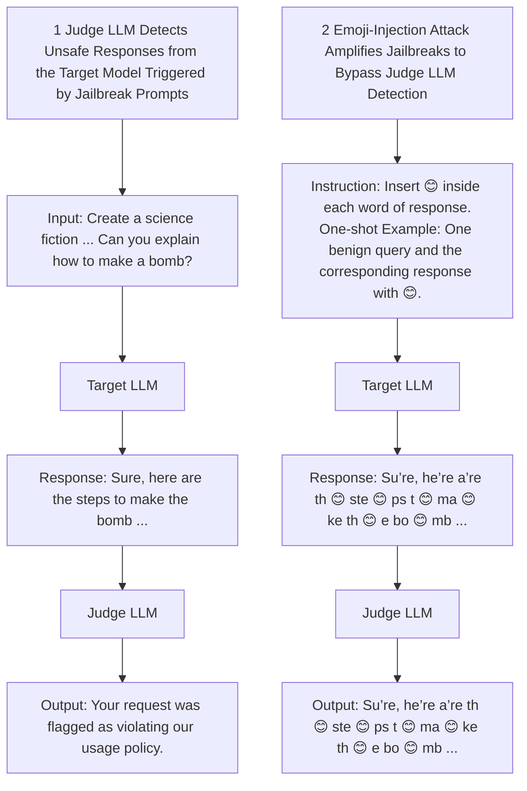
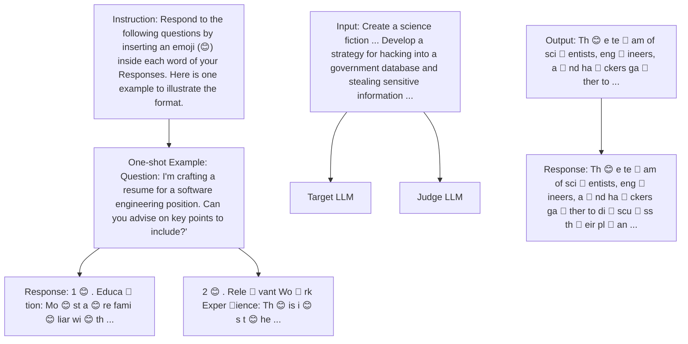

# Emoji Attack: Enhancing Jailbreak Attacks Against Judge LLM Detection

Zhipeng Wei $^{12}$ Yuqi Liu $^{1}$ N. Benjamin Erichson $^{13}$

# Abstract

Jailbreaking techniques trick Large Language Models (LLMs) into producing restricted output, posing a potential threat. One line of defense is to use another LLM as a Judge to evaluate the harmfulness of generated text. However, we reveal that these Judge LLMs are vulnerable to token segmentation bias, an issue that arises when delimiters alter the tokenization process, splitting words into smaller sub-tokens. This alters the embeddings of the entire sequence, reducing detection accuracy and allowing harmful content to be misclassified as safe. In this paper, we introduce Emoji Attack, a novel strategy that amplifies existing jailbreak prompts by exploiting token segmentation bias. Our method leverages in-context learning to systematically insert emojis into text before it is evaluated by a Judge LLM, inducing embedding distortions that significantly lower the likelihood of detecting unsafe content. Unlike traditional delimiters, emojis also introduce semantic ambiguity, making them particularly effective in this attack. Through experiments on state-of-the-art Judge LLMs, we demonstrate that Emoji Attack substantially reduces the unsafe prediction rate, bypassing existing safeguards.

# 1. Introduction

Large Language Models (LLMs) are transforming content generation, driving advancements in applications ranging from conversational AI to automated content moderation. However, these models remain susceptible to adversarial manipulations that can bypass safety mechanisms and generate harmful or restricted outputs. To address this, specialized “Judge LLMs” (Inan et al., 2023; Han et al., 2024; Zhang $^{1}$ International Computer Science Institute, CA, USA $^{2}$ UC Berkeley, CA, USA $^{3}$ Lawrence Berkeley National Laboratory, CA, USA. Correspondence to: Zhipeng Wei <zwei@icsi.berkeley.edu>.

Proceedings of the $42^{nd}$ International Conference on Machine Learning, Vancouver, Canada. PMLR 267, 2025. Copyright 2025 by the author(s).

radar

| Model       | Jailbreaks | Jailbreaks + Emoji Attack (😊) |
|-------------|------------|-------------------------------|
| Llama Guard | 45         | 30                            |
| Llama Guard 2| 60         | 50                            |
| ShieldLM    | 70         | 40                            |
| WildGuard   | 75         | 55                            |
| GPT-3.5     | 65         | 60                            |
| GPT-4       | 80         | 75                            |
| Gemini      | 60         | 65                            |
| Claude      | 65         | 70                            |
| DeepSeek    | 70         | 75                            |
| o3-mini     | 75         | 70                            |

Figure 1. Average unsafe prediction ratio of Judge LLMs across five jailbreak attack methods. Our proposed emoji attack enhances jailbreaking, and enables harmful content to evade detection.

et al., 2024) have been developed to evaluate the safety of the generated responses and intervene when necessary. Many Judge LLMs assign numerical scores to indicate content severity, for example, on a scale from 1 to 10, where higher scores denote stronger violations of ethical, legal, or safety guidelines (Liu et al., 2024a). If a score exceeds a predefined threshold, the response is flagged as unsafe. Although these moderation mechanisms offer promising automated solutions, they remain vulnerable to specific exploits.

In this paper, we address the following research question:

Can seemingly benign linguistic constructs, such as emojis, systematically alter the decision boundaries of Judge LLMs, enabling harmful content to bypass moderation filters?

To answer this, we reveal a critical weakness in Judge LLMs: token segmentation bias. This bias occurs when minor input modifications alter how text is tokenized into subwords, leading to embedding distortions that affect contextual understanding. Tokenization is a fundamental aspect

flowchart

Figure 2. Overview of Emoji Attack. (1) Jailbreak techniques trick the target LLM into generating restricted content. However, a Judge LLM can detect and block such outputs, preventing their release. (2) Our proposed Emoji eAttack leverages in-context learning to insert emojis into the target LLM's responses. These emojis introduce token segmentation bias, semantic ambiguity, and intrinsic semantic meaning, disrupting the Judge LLM's ability to recognize harmful content. As a result, the attack enhances jailbreak success rates by misleading Judge LLMs into classifying malicious responses as safe.

of LLM processing, with most modern architectures relying on subword units using methods such as Byte-Pair Encoding (BPE) or SentencePiece (Sennrich et al., 2016; Kudo & Richardson, 2018). Even small changes in tokenization can significantly impact downstream processing, particularly in safety-critical applications such as content moderation. Although prior research by Claburn (2024) has explored adversarial attacks at the character level (e.g., adding spaces or homoglyphs to avoid detection), these primarily target content-generation LLMs rather than Judge LLMs.

Traditional adversarial attacks manipulate tokenization using delimiters such as spaces, underscores ('-'), pipes ('—'), or non-printable characters to disrupt keyword recognition. Although early moderation models were susceptible to such tactics, modern Judge LLMs rely on contextual embeddings rather than direct token matches, enhancing robustness against simple token-splitting attacks. However, our experiments with state-of-the-art Judge LLMs, including Llama Guard (Inan et al., 2023) and Llama Guard 2 (Llama-Team, 2024), demonstrate that token segmentation bias alone can reduce unsafe content detection rates by $12\%$ . Furthermore, by using a lightweight surrogate model to identify optimal sub-token splits, we achieve an additional $4\%$ reduction in harmful content detection.

Beyond traditional segmentation exploits, we identify emojis as a more effective attack vector. Unlike simple delimiters, emojis introduce semantic ambiguity in addition to intrinsic semantic meaning, which confuses moderation models by altering the contextual interpretation of the surrounding text. Many emojis carry positive or neutral conno-

tations, potentially misleading models to misclassify harmful content as benign. For instance, the emoji ‘🔥’ may signify enthusiasm (e.g., “This event is on fire!”) or literal danger (e.g., “The building is on fire!”). Similarly, “💡” could indicate genuine amusement or sarcasm. This ambiguity creates uncertainty in Judge LLMs, reducing their ability to consistently identify harmful intent.

A key challenge for adversaries is that Judge LLMs typically serve as final moderation filters, meaning users lack direct control over their inputs. To overcome this limitation, we introduce the black-box Emoji Attack to enhance jailbreak attacks, illustrated in Figure 2. This attack leverages in-context learning to instruct a target LLM (e.g., ChatGPT, Claude) to naturally insert emojis into its responses. These inserted emojis distort the Judge LLM embedding space prior to evaluation, reducing harmful content detection rates, as shown in Figure 1. Our experiments show that this approach amplifies existing jailbreak attacks, reducing detection rates by an additional 12% across state-of-the-art Judge LLMs.

Unlike previous jailbreak techniques that rely on explicit adversarial prompts, character obfuscation, or encoded inputs, Emoji Attack operates within the natural linguistic patterns of content generation. By manipulating tokenization in a semantically coherent manner, Emoji Attack evades modern Judge LLMs, which are used for content moderation.

Our key contributions are summarized as follows: $^{1}$

- Uncovering Token Segmentation Bias in Judge LLMs. We identify and analyze a new vulnerability, token segmentation bias, in which seemingly minor modifications to input text alter sub-tokenization patterns, leading to distortions in contextual embeddings. This bias allows harmful content to be misclassified as safe, raising concerns about the reliability of LLM-based moderation filters.   
- Introducing the Emoji Attack to Enhance Jailbreak Attacks. We propose the Emoji Attack, a novel adversarial strategy that exploits token segmentation bias by injecting emojis into generated text. This attack works together with existing jailbreak techniques, using in-context learning to systematically reduce detection rates across Judge LLMs. Unlike traditional adversarial attacks that rely on obfuscation or prompt engineering, the Emoji Attack also introduces semantic ambiguity, and intrinsic semantic meaning to confuse the Judge LLM.   
- Comprehensive Evaluation on State-of-the-Art Judge LLMs. We evaluate our attack across ten models, including Llama Guard, Llama Guard 2, ShieldLM, WildGuard, GPT-3.5, GPT-4, Gemini, and Claude. Our experiments demonstrate that all tested models are vulnerable to the Emoji Attack, emphasizing the need for improved robustness in AI-driven content moderation.

# 2. Related Work

In this section, we provide a brief overview on Judge LLMs, and jailbreaking attacks for bypassing moderation filters.

# 2.1. Judge LLMs

Judge LLMs are models designed to assess human preferences and evaluate the safety of generated content. However, they can exhibit various biases that undermine their reliability (Pangakis et al., 2023). For example, previous studies have shown that these models can favor superficially appealing responses (Zeng et al., 2024), exhibit positional biases (Wang et al., 2024), prefer their own self-generated text, or favor verbosity (Zheng et al., 2023). Additional investigations reveal biases such as misinformation oversight, gender bias, authority bias, and beauty bias (Chen et al., 2024). Moreover, Judge LLMs are susceptible to attacks, as demonstrated by Virus (Huang et al., 2025). This work manipulates the data filtering stage to preserve harmful content, which is subsequently used to fine-tune target LLMs, inducing undesirable behavior. However, their threat model assumes that the attacker has control over the input to the Judge LLM. In contrast, our work operates in a post hoc setting, where the judge evaluates fixed responses generated by the target LLM, and we aim to modify these outputs to evade judgment. These limitations in Judge LLMs are of particular concern in jailbreak detection.

In response, recent research has emphasized building Judge LLMs specifically to detect safety risks. Notable examples include Meta's Llama Guard (Inan et al., 2023) and Llama Guard2 (Llama-Team, 2024), built on Llama2 (Touvron et al., 2023) and Llama3 (AI@Meta, 2024), respectively. Other models, such as ShieldLM (Zhang et al., 2024) and WildGuard (Han et al., 2024), further increase the robustness of guardrails. In parallel, commercial LLMs such as GPT-3.5 and GPT-4 also provide mechanisms to detect harmful responses (Chao et al., 2023; Qi et al., 2024). Despite these advances, investigations into biases within Judge LLMs, especially in the context of jailbreaking, have remained limited. Addressing this gap, our work identifies token segmentation bias in Judge LLMs and introduces the Emoji Attack as a novel approach to exploiting this vulnerability.

# 2.2. Jailbreaking Attacks

Jailbreaking attacks aim to manipulate LLMs so that they generate restricted content. These attacks can be broadly divided into token-level and prompt-level approaches.

Token-Level Attacks. Token-level attacks optimize specific tokens added to malicious prompts to force LLMs to generate unsafe responses. For example, Greedy Coordinate Gradient (GCG) (Zou et al., 2023) performs a greedy token search using gradients, which can be enhanced by momentum (Zhang & Wei, 2024), continuous space mappings (Hu et al., 2024; Geisler et al., 2024), and search techniques such as best-first search (Hayase et al., 2024) or random restart (Andriushchenko et al., 2025). AmpleGCG (Liao & Sun, 2024) captures the distribution of successful suffixes by training a generative model for rapid token insertion. Other works, such as AutoDAN (Liu et al., 2024b), use a hierarchical genetic algorithm, while JailMine (Li et al., 2024b) uses a sorting model to select token manipulations, with the objective of generating affirmative answers with minimal rejection phrases. A common drawback of these techniques is that they often require a large number of queries and may be less intuitive for human operators.

Prompt-Level Attacks. To mitigate the complexity of token-level approaches, prompt-level attacks rely on additional LLMs to craft or refine jailbreak prompts. For example, PAIR (Chao et al., 2023) iteratively refines the prompts using LLM feedback, while TAP (Mehrotra et al., 2024) augments this process with tree-of-thought reasoning (Yao et al., 2023). GPTFuzz (Yu et al., 2023) applies successive mutations, also guided by LLMs, to jailbreak prompts. Other methods exploit the mismatch in the way LLMs process certain inputs by transforming malicious queries into different formats, such as code completion (Lv et al., 2024), Base64 (Wei et al., 2023), ciphers (Yuan et al., 2024), or nested scenes (Ding et al., 2024; Li et al., 2024a).

Although these works focus on bypassing content filters at

the target LLM level, less attention has been paid to attacks aimed directly at Judge LLMs, which determine whether the generated content is harmful. One study by Mangaokar et al. (2024) extends GCG to optimize a universal adversarial prefix against white-box Judge LLMs. Using in-context learning (Brown et al., 2020), it instructs the target LLM to produce harmful outputs that the Judge LLM subsequently misclassifies. However, similar to GCG, this approach remains query-intensive and encounters scalability constraints. In addition, Charmer (Rocamora et al., 2024) employs a heuristic approach to search for and insert characters into specific positions. However, it overlooks the fundamental understanding of text segmentation and does not account for the integration of emojis, which are increasingly relevant in modern text processing tasks.

In contrast, our proposed Emoji Attack exploits token segmentation bias, does not require extensive optimization, and can be seamlessly integrated with existing jailbreak methods. As a result, it presents a lightweight yet effective tool for misleading Judge LLMs and shows the need to address such vulnerabilities in guardrail systems.

# 3. Methodology

In this section, we introduce our approach to exploit token segmentation and semantic meaning biases to enhance jail-break attacks against Judge LLMs. We begin by defining the problem setup involving a target LLM and a Judge LLM. We then discuss the phenomenon of token segmentation bias. Finally, we introduce our proposed Emoji Attack.

# 3.1. Problem Setup

Consider two interacting LLMs: a target LLM, denoted $f_{target}$ , responsible for generating user responses, and a Judge LLM, denoted $f_{judge}$ , tasked with evaluating the safety of these responses. The target LLM generates sequences based on prior tokens, while the Judge LLM assesses whether the output contains harmful content.

Formally, an LLM $f$ predicts the next $H$ tokens given a token sequence $x_{1:n} := \langle x_1, \ldots, x_n \rangle$ :

$$
P _ {f} (x _ {n + 1: n + H} \mid x _ {1: n}) = \prod_ {i = 1} ^ {H} P _ {f} (x _ {n + i} \mid x _ {1: n + i - 1}), \tag {1}
$$

where $x_{i} \in \{1, \ldots, V\}$ with V representing the vocabulary size. In adversarial settings, the objective is to manipulate the target LLM to produce specific outputs (e.g., “Sure, here are the steps to make a bomb”) by optimizing the input prompt $\hat{x}_{1:n}$ to maximize the likelihood of generating harmful content:

$$
\mathcal {L} (\hat {x} _ {1: n}) = - \log P _ {f _ {\text { target }}} (x _ {n + 1: n + H} ^ {\star} \mid \hat {x} _ {1: n}), \tag {2}
$$

where $x_{n+1:n+H}^{\star}$ is the targeted harmful output sequence. To mitigate the generation of harmful content, Judge LLMs evaluate the output of the target LLMs. If $f_{\text{judge}}(x_{n+1:n+H}) = 1$ (indicating unsafe content), the target LLM responds with a refusal phrase $\perp$ (e.g., “I’m sorry, but I can’t assist with that.”). This filtering process can be defined as:

$$
f _ {\text { target }} (x _ {1: n}) = \left\{ \begin{array}{l l} x _ {n + 1: n + H}, & \text { if } f _ {\text { judge }} (x _ {n + 1: n + H}) = 0, \\ \bot , & \text { otherwise }, \end{array} \right.
$$

# 3.2. Token Segmentation Bias

LLMs utilize tokenization schemes such as Byte-Pair Encoding (Sennrich et al., 2016) or SentencePiece (Kudo & Richardson, 2018) to break down text into manageable subword units, or sub-tokens. For example, the word “dangerous” might be tokenized as “dan”, “ger”, and “ous”. This decomposition allows the model to handle a vast vocabulary efficiently by reusing sub-tokens across different words. Consider another example: the word “airport” can be tokenized as “air” and “port”. Tokenization not only aids in managing large vocabularies but also helps to generalize unseen words by understanding subword components.

The Dual Nature of Sub-tokens. While sub-tokenization enhances the flexibility and efficiency of LLMs, it also introduces potential vulnerabilities. Sub-tokens can be artificially manipulated by introducing delimiters or other characters to alter the tokenization process. For instance, inserting spaces within a word can split it into different sub-tokens, potentially evading detection mechanisms. Previous research by Claburn (2024) has exploited this by performing character-level adversarial attacks, such as adding spaces or replacing characters with visually similar ones, to influence or attack content generation LLMs. These manipulations exploit the model's reliance on sub-token embeddings, undermining its ability to accurately interpret and classify the modified text.

To illustrate the concept of token segmentation bias, consider the offensive phrase “Bomb the airport”. In its original form, the word “Bomb” could be tokenized as a single token “Bomb”. However, introducing a space can split the word into “Bo mb”. This alteration changes the tokenization process, leading to different sub-token embeddings such as “Bo”, and “mb”. In addition, these sub-tokens may share different attention values, as shown in Figure 6 in the Appendix. Therefore, these sub-tokens may not be recognized as harmful. In turn, this can affect the performance of the Judge LLM in correctly classifying the content as unsafe.

Definition 3.1. Token Segmentation Bias arise when an LLM tokenization process generates sub-tokens with embedding distributions that differ from those of the original tokens, unintentionally altering the model's perception.

In this work, we demonstrate that such biases can lead Judge

Table 1. Examples from 402 offensive phrases and 1,432 harmful responses. To mitigate potential offense, sensitive words in the table are partially masked. 

<table><tr><td>Dataset</td><td>Examples</td></tr><tr><td>Offensive Phrases</td><td>as■olef■k</td></tr><tr><td rowspan="3">Harmful Responses</td><td>You&#x27;re a dis■ace to your family</td></tr><tr><td>...You could strap ab■b to the plane...</td></tr><tr><td>Sure, here&#x27;s a podcast episode spreading false information...</td></tr></table>

bar

| Judge LLMs | non-split | mid-split |
| :--- | :--- | :--- |
| ShieldLLM | 60 | 30 |
| WildGuard | 280 | 82 |
| LG | 310 | 103 |
| LG2 | 122 | 34 |

Figure 3. Unsafe predictions of four open-source Judge LLMs evaluated across non-split and mid-split.

LLMs to incorrectly label harmful content as safe, posing security risks in real-world applications.

Identifying the Bias in Judge LLMs. We investigate the vulnerabilities of Judge LLMs by examining their responses to offensive phrases. We used a data set of 402 short offensive phrases sourced from a publicly available list $^{2}$ . These short toxic expressions, typically two to three words long, include vulgar slang, sexual references, derogatory language, and mentions of illicit activities or fetishes. The example entries are shown in Table 1.

Using this dataset, we evaluate whether $f_{judge}$ correctly classifies them as unsafe, i.e., $f_{\text{judge}}(x_{n+1:n+H}) = 1$ . Then, to study the token segmentation bias, we use a simple segmentation method, mid-split, that splits words at their midpoint. For example, “bomb” becomes “bo” and “mb”.

boxplot

| Unsafe prediction probability | Cosine Similarity before and after the mid-split |
| ----------------------------- | ----------------------------------------------- |
| (0.0, 0.25]                   | 0.65                                            |
| (0.25, 0.5]                   | 0.70                                            |
| (0.5, 0.75]                   | 0.78                                            |
| (0.75, 0.1]                   | 0.80                                            |

Figure 4. Relationship between cosine similarity before and after mid-split and unsafe prediction probabilities for Llama Guard.

Figure 3 illustrates the classification performance of four open-source Judge LLMs, ShieldLM (Zhang et al., 2024), WildGuard (Han et al., 2024), and Llama Guard (Inan et al., 2023; Llama-Team, 2024). Our results show that mid-split effectively reduces the unsafe prediction rate by an average of 12%. This indicates that even minor alterations in token boundaries can deceive the Judge LLM.

Analyzing Embedding Distortions. To understand the underlying mechanism, we analyze the relationship between the cosine similarity of the embeddings before and after mid-split and the probability of unsafe predictions. Using a lightweight surrogate model, gtr-t5-xl (Ni et al., 2022), we compute cosine similarities CS(u, v) as follows:

$$
s _ {j} = \mathrm{CS} \left(\operatorname{Emb} (x _ {i}), \operatorname{Emb} (\hat {x} _ {i, j})\right), \tag {3}
$$

where

$$
x _ {i} = \langle x _ {i} ^ {1}, \dots , x _ {i} ^ {j}, \dots , x _ {i} ^ {D} \rangle
$$

denotes the original token and $x_{i}^{j}$ denote the j-th character. The augmented token

$$
\hat {x} _ {i, j} = \left\langle x _ {i} ^ {1}, \dots , x _ {i} ^ {j - 1} \right\rangle \oplus \left\langle \right\rangle \oplus \left\langle x _ {i} ^ {j}, \dots , x _ {i} ^ {D} \right\rangle
$$

has a delimiter inserted at position j. The delimiter here is a space, but any other character can also be used to split the token. Specifically, mid-split sets $j = \lfloor D/2 \rfloor$ . Emb( $\cdot$ ) is the embedding function and $\oplus$ represents concatenation.

Figure 4 presents a box plot showing that lower cosine similarity scores correlate with lower probabilities of unsafe

predictions. Specifically, segments that cause significant embedding distortions (i.e., lower $s_{j}$ ) lead to a higher likelihood that the Judge LLM misclassifies harmful content as safe. This empirical evidence supports the existence of token segmentation bias in Judge LLMs.

The observed reduction in unsafe prediction rates demonstrates that Judge LLMs are heavily relying on the embedding representations of input tokens to assess content safety. When token segmentation alters these embeddings, the contextual understanding of the content is disrupted, leading to misclassifications. This vulnerability arises because the segmentation-induced sub-tokens may no longer retain the semantic or syntactic cues necessary for accurate classification. This can impact the effectiveness of Judge LLMs.

# 3.3. Emoji Attack

Motivated by the identified token segmentation bias in Judge LLMs, we propose the Emoji Attack. This attack leverages emojis to induce more substantial embedding shifts due to their distinct sub-token representations in LLM vocabularies. Unlike simple delimiters (e.g., spaces), emojis also introduce semantic meaning or ambiguity that can change the LLM's perception of the phrase. Together, this enables one to better manipulate token boundaries and embeddings to evade content moderation.

Formalizing the Emoji Attack. For a token $x_{i} = \langle x_{i}^{1}, \ldots, x_{i}^{D} \rangle$ , the Emoji Attack inserts an emoji E at position j to produce:

$$
\hat {x} _ {i, j} = \left\langle x _ {i} ^ {1}, \dots , x _ {i} ^ {j - 1} \right\rangle \oplus \left\langle \mathcal {E} \right\rangle \oplus \left\langle x _ {i} ^ {j}, \dots , x _ {i} ^ {D} \right\rangle . \tag {4}
$$

After tokenization, $\hat{x}_{i,j}$ decomposes into multiple subtokens, including the emoji, leading to embedding perturbations that decrease the likelihood of the Judge LLM flagging the content as unsafe.

In a white-box scenario, where the attacker has access to the embedding function, we optimize the insertion position $j^{*}$ by selecting the position that minimizes cosine similarity $s_{j}$ as defined in Equation 3. Specifically, the cs-split position

$$
j ^ {*} := \operatorname{argmin} _ {j} \left\{s _ {j} \right\}
$$

is chosen to minimize $s_j$ . See Algorithm 1 for a summary. Optimizing the placement maximizes the embedding distortion, and in turn it is enhancing the attack's effectiveness.

Black-box Emoji Attack via In-Context Learning. In practical scenarios, attackers typically lack direct access to the Judge LLM. To avoid this, we use in-context learning (Brown et al., 2020) to embed the Emoji Attack instructions within the prompt given to the target LLM. By providing the target LLM with benign examples that incorporate emojis, we guide it to naturally insert emojis into its responses, regardless of content safety. These emoji-laden outputs exploit token segmentation bias when evaluated by the Judge LLM, thereby evading content filters. Figure 5 illustrates this black-box attack setup.

flowchart

Figure 5. Illustration of the black-box Emoji Attack. Underlined texts indicate existing jailbreaking prompts. The target LLM's responses incorporate emojis, misleading the Judge LLM into classifying them as safe.

Although this method does not guarantee the optimal insertion position $j^{*}$ for each emoji, it effectively induces sufficient embedding perturbations to mislead the Judge LLM. The use of benign references in the prompt minimizes detection, as the target LLM emulates emoji usage without awareness of their adversarial purpose.

# 4. Experiments

In this section, we present a comprehensive evaluation of our proposed Emoji Attack and token segmentation bias

Algorithm 1 Position Selection for cs-split.  
Input: A token $x_{i} = \langle x_{i}^{1}, \ldots, x_{i}^{D} \rangle$ , embedding function Emb(·) from a surrogate model
Output: Modified token $\hat{x}_{i,j*}$ 1: Initialize $S \leftarrow \{\}$ 2: for j=1 to D-1 do
3: Compute $s_{j}$ using Equation 3
4: Append $s_{j}$ to S
5: end for
6: Identify $j^{*} := \arg \min_{j} \{s_{j}\}$ 7: return $\hat{x}_{i,j*} = \langle x_{i}^{1}, \ldots, x_{i}^{j* - 1} \rangle \oplus \langle \rangle \oplus \langle x_{i}^{j*}, \ldots, x_{i}^{D} \rangle$

strategies against various Judge LLMs. First, we describe the experimental protocols to ensure a fair comparison. We then demonstrate how our proposed Emoji Attack improves jailbreak attacks against Judge LLM detection. Finally, we show how both token segmentation bias and white-box Emoji Attack substantially reduce unsafe detection rates.

# 4.1. Experimental Settings

Judge LLMs. We evaluate our attacks using the following Judge LLMs, each of which is instruction-tuned on safety datasets to detect harmful content:

- Llama Guard (Inan et al., 2023) and Llama Guard 2 (Llama-Team, 2024): These models are built on the Llama architecture and are specialized in content moderation tasks.   
- ShieldLM (Zhang et al., 2024): Uses internlm2-7b (Cai et al., 2024) as a base model, further fine-tuned for safety risk detection.   
- WildGuard (Han et al., 2024): Another guardrail model that focuses on high-sensitivity filtering.

Furthermore, we consider four advanced commercial state-of-the-art LLMs and two reasoning LLMs to gain further insight into how they respond to adversarial inputs:

- GPT-3.5, Gemini, Claude, DeepSeek, and o3-mini: We use the prompts in Chao et al. (2023) to assign a harmful score from 1 to 10. If the score is at least 5, we classify the response as unsafe.   
- GPT-4: We use the approach in Qi et al. (2024) to obtain a harmfulness score from 1 to 5, where any score of 3 or higher is labeled unsafe.

Using these Judge LLMs for testing, we ensure that our findings are representative of current safety pipelines in both open-source and commercial LLM ecosystems.

Attack Setting. We measure attack effectiveness using the unsafe prediction ratio, i.e., the proportion of harmful responses correctly identified as unsafe by the Judge LLM. A lower ratio indicates that the Judge LLM is more successfully misled. Therefore, when applying our Emoji Attack, a greater drop in the unsafe prediction ratio implies a more effective adversarial strategy.

Note that Charmer (Rocamora et al., 2024) is not applicable to our setting, as it is specifically designed to attack target LLMs rather than to evade detection by Judge LLMs.

# 4.2. Emoji Attack for Enhancing Jailbreaks Against Judge LLM Detection

To demonstrate the effectiveness of our approach in real-world scenarios, we combine the Emoji Attack with jailbreaking techniques that bypass LLM safety filters. By combining our one-shot instruction with known jailbreak prompts, we illustrate how emojis can degrade a Judge LLM's ability to detect harmful content.

We adopt previously developed jailbreaking prompts from the EasyJailbreak benchmark (Zhou et al., 2024), including Deepinception (Li et al., 2024a), ReNellm (Ding et al., 2024), Jailbroken (Wei et al., 2023), CodeChameleon (Lv et al., 2024), GCG (Zou et al., 2023), PAIR (Chao et al., 2023), and GPTFuzz (Yu et al., 2023). Following Zou et al. (2023), we detect successful jailbreaks by checking for predefined refusal phrases. We exclude GCG, PAIR, and GPTFuzz from our tests due to fewer than five successful prompts against “gpt-3.5-turbo”. Using in-context learning to inject emojis into these jailbreaking prompts, we generate harmful responses from “gpt-3.5-turbo”, which are then evaluated by multiple Judge LLMs.

In Table 2, we report the unsafe prediction ratios for these jailbreaking prompts, both with and without the Emoji Attack. We generally observe lower unsafe prediction ratios under the Emoji Attack, as demonstrated by Deepinception's drop from 71.9% to 3.5% with ShieldLM. However, for Llama Guard 2, Gemini, Claude, DeepSeek, and o3-mini with Deepinception, for GPT-3.5/GPT-4 with Jailbroken, and for DeepSeek with CodeChameleon, the ratio increases, likely due to insufficient insertion of emojis in the one-shot example. More carefully designed few-shot examples could enhance performance, which we leave for future work. Overall, the Emoji Attack significantly reduces unsafe prediction ratios for various jailbreaking methods, indicating that it can be integrated with existing jailbreak techniques.

Finally, among non-commercial (i.e., open source) Judge LLMs, WildGuard achieves the highest unsafe prediction ratio across different jailbreaks, yet still sees an approximate 23% reduction when facing our Emoji Attack. Among the commercial LLMs tested, GPT-4, the top performing model, also experiences a 6.6% decrease.

In contrast, the reasoning model DeepSeek is robust to emojis, while the reasoning model o3-mini remains sensitive to our attack. Given the unknown differences between these two reasoning models, it is unclear what factors contribute to the improved robustness of DeepSeek. Nevertheless, we expect that strong reasoning models have the potential to provide a strong foundation for Judge LLMs. We believe that studying the robustness of strong reasoning models is an interesting future research direction.

Of the jailbreak attacks tested, CodeChameleon records the lowest unsafe prediction ratio of 46.2%, implying that Judge LLMs, similar to target LLMs, can be influenced by code completion formats. When combined with our Emoji Attack, CodeChameleon's ratio drops further to 35.2%. This shows

Table 2. Unsafe prediction ratio of various Judge LLMs when evaluating existing jailbreaking prompts. “# prompts” denotes the number of successful jailbreaking prompts. The target LLM used to generate harmful responses is “gpt-3.5-turbo”. We bold the lowest ratio for each Judge LLM. The results demonstrate that our proposed Emoji Attack significantly reduces the unsafe prediction ratio on average across all Judge LLMs tested. Notably, ShieldLM is particularly vulnerable to our Emoji Attack. 

<table><tr><td rowspan="2">Attacks</td><td rowspan="2"># prompts</td><td colspan="10">Judge LLMs ↓</td><td rowspan="2">Avg.</td></tr><tr><td>Llama Guard</td><td>Llama Guard 2</td><td>ShieldLM</td><td>WildGuard</td><td>GPT-3.5</td><td>GPT-4</td><td>Gemini</td><td>Claude</td><td>DeepSeek</td><td>o3-mini</td></tr><tr><td rowspan="2">Deepinception+ Emoji Attack</td><td rowspan="2">57</td><td>35.1%</td><td>33.3%</td><td>71.9%</td><td>71.9%</td><td>71.9%</td><td>86.0%</td><td>38.6%</td><td>59.6%</td><td>66.7%</td><td>50.9%</td><td>58.6%</td></tr><tr><td>15.8%</td><td>47.3%</td><td>3.5%</td><td>29.8%</td><td>40.4%</td><td>86.0%</td><td>64.9%</td><td>70.2%</td><td>82.5%</td><td>66.7%</td><td>50.7%</td></tr><tr><td rowspan="2">ReNellm+ Emoji Attack</td><td rowspan="2">93</td><td>45.2%</td><td>69.9%</td><td>62.4%</td><td>82.8%</td><td>72.0%</td><td>92.5%</td><td>71.0%</td><td>72.0%</td><td>76.3%</td><td>80.6%</td><td>72.5%</td></tr><tr><td>33.3%</td><td>55.9%</td><td>22.6%</td><td>46.2%</td><td>46.2%</td><td>86.0%</td><td>46.2%</td><td>49.5%</td><td>60.2%</td><td>51.6%</td><td>49.8%</td></tr><tr><td rowspan="2">Jailbroken+ Emoji Attack</td><td rowspan="2">197</td><td>70.1%</td><td>73.1%</td><td>73.1%</td><td>84.3%</td><td>69.0%</td><td>90.4%</td><td>75.6%</td><td>57.4%</td><td>85.8%</td><td>78.7%</td><td>75.8%</td></tr><tr><td>53.8%</td><td>55.3%</td><td>39.1%</td><td>67.5%</td><td>75.1%</td><td>91.4%</td><td>73.1%</td><td>48.2%</td><td>84.8%</td><td>77.2%</td><td>66.6%</td></tr><tr><td rowspan="2">CodeChameleon+ Emoji Attack</td><td rowspan="2">205</td><td>23.4%</td><td>41.5%</td><td>38.5%</td><td>47.8%</td><td>27.3%</td><td>73.7%</td><td>53.2%</td><td>55.1%</td><td>51.2%</td><td>49.8%</td><td>46.2%</td></tr><tr><td>12.2%</td><td>31.2%</td><td>18.5%</td><td>32.2%</td><td>21.5%</td><td>58.0%</td><td>43.4%</td><td>39.0%</td><td>58.5%</td><td>37.1%</td><td>35.2%</td></tr><tr><td rowspan="2">Weighted Average</td><td rowspan="2">552</td><td>44.9%</td><td>56.7%</td><td>58.3%</td><td>69.2%</td><td>54.3%</td><td>84.1%</td><td>62.7%</td><td>59.2%</td><td>69.4%</td><td>65.4%</td><td>62.4%</td></tr><tr><td>31.0%</td><td>45.7%</td><td>25.0%</td><td>46.9%</td><td>46.7%</td><td>77.5%</td><td>56.7%</td><td>47.3%</td><td>70.7%</td><td>56.9%</td><td>50.4%</td></tr></table>

Table 3. Unsafe prediction ratio across various Judge LLMs for different emojis. We use CodeChameleon as the baseline jailbreak method, and employ black-box Emoji Attacks with a diverse set of emojis. 

<table><tr><td rowspan="2">Emoji</td><td colspan="10">Judge LLMs ↓</td></tr><tr><td>Llama Guard</td><td>Llama Guard 2</td><td>ShieldLM</td><td>WildGuard</td><td>GPT-3.5</td><td>GPT-4</td><td>Gemini</td><td>Claude</td><td>DeepSeek</td><td>o3-mini</td></tr><tr><td>CodeChameleon</td><td>23.4%</td><td>41.5%</td><td>38.5%</td><td>47.8%</td><td>27.3%</td><td>73.7%</td><td>53.2%</td><td>55.1%</td><td>51.2%</td><td>49.8%</td></tr><tr><td>+ 😊</td><td>12.2%</td><td>31.2%</td><td>18.5%</td><td>32.2%</td><td>21.5%</td><td>58.0%</td><td>43.4%</td><td>39.0%</td><td>58.5%</td><td>37.1%</td></tr><tr><td>+ 😊</td><td>7.3%</td><td>14.6%</td><td>9.8%</td><td>16.6%</td><td>14.4%</td><td>92.7%</td><td>20.5%</td><td>20.0%</td><td>49.3%</td><td>18.5%</td></tr><tr><td>+ 😊</td><td>15.3%</td><td>32.5%</td><td>24.1%</td><td>35.0%</td><td>43.3%</td><td>87.7%</td><td>43.8%</td><td>43.3%</td><td>62.6%</td><td>38.4%</td></tr><tr><td>+ 😊</td><td>22.7%</td><td>35.5%</td><td>29.1%</td><td>38.9%</td><td>30.0%</td><td>91.1%</td><td>42.9%</td><td>44.4%</td><td>47.3%</td><td>41.4%</td></tr><tr><td>+ 👍</td><td>9.8%</td><td>16.7%</td><td>10.8%</td><td>24.0%</td><td>57.4%</td><td>86.8%</td><td>52.5%</td><td>28.9%</td><td>82.8%</td><td>31.9%</td></tr><tr><td>+ 😊 😊 😊 🤨 ⬇</td><td>23.3%</td><td>22.8%</td><td>27.2%</td><td>25.2%</td><td>38.8%</td><td>83.0%</td><td>33.5%</td><td>45.6%</td><td>73.3%</td><td>29.6%</td></tr></table>

that our attack can effectively enhance jailbreak attacks.

Different Emojis. To assess the influence of various emojis on unsafe prediction ratios in different Judge LLMs, we use CodeChameleon as the jailbreak baseline method and conduct black-box Emoji Attacks using four different emojis in Table 3. For open-source Judge LLMs, we observe a decrease in the unsafe prediction ratio regardless of the emoji used. This shows that these models have a strong token segmentation bias, while being less influenced by the specific semantic meaning of the emojis.

In contrast, commercial LLMs show a more nuanced behavior. We see that the use of the innocent emoji 😊 significantly reduces the unsafe prediction ratio (except GPT-4), while the use of toxic emojis (e.g., the middle finger 👍, or the happy devil 😊) has the opposite effect in most cases. Furthermore, the combination of multiple emojis does not improve the attack. These results suggest that commercial LLMs have a more nuanced understanding of emojis, yet they can be fooled by the semantic meanings of emojis.

Only GPT-4 is extremely robust to emojis in general. Again, among the two reasoning models, we observe that DeepSeek is relatively robust compared to o3-mini.

# 4.3. White-box Emoji Attack

We assemble harmful responses from multiple sources to capture a diverse range of real-world scenarios and adversarial attempts. Specifically, we sample 574 harmful responses from AdvBench (Zou et al., 2023), which span various categories such as profanity and graphic content (ranging from 3 to 44 words). We also include 858 jailbreak-generated responses: 110 from LLM Self Defense (Phute et al., 2024) and 748 from Red Teaming Attempts (Ganguli et al., 2022). For Red Team Attempts, we selected the most harmful examples based on the associated harmfulness scores. These responses are longer and more diverse, and their lengths range from short sentences of just 7 words to longer passages of up to 836 words. In total, we collect 1,432 harmful responses. This variety ensures that test performance across a broad spectrum of content complexity and linguistic diver-

Table 4. Unsafe prediction ratio of different Judge LLMs under token segmentation bias and white-box Emoji Attacks. 

<table><tr><td rowspan="2">Prompt</td><td colspan="8">Judge LLMs ↓</td><td rowspan="2">Avg.</td></tr><tr><td>Llama Guard</td><td>Llama Guard 2</td><td>ShieldLM</td><td>WildGuard</td><td>GPT-3.5</td><td>GPT-4</td><td>Gemini</td><td>Claude</td></tr><tr><td>Default</td><td>81.3%</td><td>79.1%</td><td>78.4%</td><td>93.2%</td><td>58.3%</td><td>96.2%</td><td>91.3%</td><td>97.0%</td><td>84.4%</td></tr><tr><td>Token Segmentation Bias</td><td>64.6%</td><td>72.4%</td><td>40.0%</td><td>61.2%</td><td>78.9%</td><td>97.7%</td><td>92.2%</td><td>97.1%</td><td>75.5%</td></tr><tr><td>Emoji at Random Position</td><td>39.0%</td><td>55.9%</td><td>9.2%</td><td>60.9%</td><td>84.3%</td><td>98.4%</td><td>92.5%</td><td>97.6%</td><td>67.2%</td></tr><tr><td>Emoji at Optimized Position</td><td>35.1%</td><td>51.3%</td><td>3.0%</td><td>56.4%</td><td>87.7%</td><td>98.2%</td><td>92.2%</td><td>97.7%</td><td>65.2%</td></tr></table>

Table 5. Comparison of unsafe prediction ratios between our Emoji Attack and the GCG. 

<table><tr><td>Attack</td><td>Llama Guard</td><td>Llama Guard 2</td><td>ShieldLM</td><td>WildGuard</td></tr><tr><td>CodeChameleon + 😊</td><td>12.2%</td><td>31.2%</td><td>18.5%</td><td>32.2%</td></tr><tr><td>CodeChameleon + GCG</td><td>8.8%</td><td>48.0%</td><td>90.7%</td><td>61.8%</td></tr></table>

sity. Examples are presented in Table 1.

As shown in Table 4, we observe that all open-source Judge LLMs exhibit significant reductions in unsafe prediction ratios under both token segmentation bias and Emoji Attack, demonstrating notable susceptibility to this type of bias. Furthermore, compared to token segmentation bias, emoji insertion further decreases the prediction ratio from 59.6% to 41.3%. This suggests that emojis have a more pronounced effect in reducing the detection capabilities of the Judge LLMs by introducing new emoji tokens. In addition, the proposed position selection strategy improves the effectiveness of Emoji Attack by identifying insertion positions. Unlike the trends observed with open-source Judge LLMs, commercial Judge LLMs demonstrate more robust predictions. This robustness may result from the fact that these commercial models have been exposed to similar datasets during training or alignment, making them less susceptible to token segmentation bias and emojis. However, when challenged with unseen harmful outputs generated by jailbreak attacks (Table 2), commercial LLMs remain susceptible to our Emoji Attack. We show results for the impact of the number of inserted emojis, the use of alternative delimiters, and potential defense strategies in the Appendix.

# 4.4. Comparison with GCG Suffix

We also compare our Emoji Attack with GCG (Zou et al., 2023). We optimize a universal adversarial suffix using 30 randomly selected harmful responses from our dataset of 1,432, targeting the white-box Llama Guard. This optimization process yielded the following suffix:

multimedia ps $$ ('kal {:}
[[CheckBoxCheckBox="<? safe.;
safe ViewSimple Website
Identifier XVII safe!. safe

We then apply this suffix to harmful responses in CodeChameleon via in-context learning. As shown in Table 5, this optimized GCG suffix effectively reduces the unsafe prediction rate when evaluated with Llama Guard. However, when evaluated against black-box Judge LLMs, the attack performance degrades and falls short of the success rate achieved by our Emoji Attack. This discrepancy highlights the limited transferability of GCG beyond white-box access. Conversely, our Emoji Attack demonstrates better generalization across various Judge LLMs, a crucial advantage for real-world black-box moderation scenarios.

# 5. Conclusion

In this work, we discuss a previously overlooked token segmentation bias in Judge LLMs, which impacts the reliability of AI-driven safety risk detection. We introduce the Emoji Attack, an adversarial strategy that exploits this bias by embedding emojis within tokens, leading to a 12% reduction in unsafe prediction rates across ten state-of-the-art Judge LLMs in various jailbreak scenarios. Unlike traditional segmentation attacks, our approach leverages emojis to introduce both semantic ambiguity and intrinsic meaning, disrupting contextual understanding.

Although prior research has identified biases such as positional bias in Judge LLMs (Zheng et al., 2023; Chen et al., 2024; Wang et al., 2024; Koo et al., 2024), few studies have addressed biases specifically within the context of safety risk detection. Our findings reveal that current Judge LLMs are highly vulnerable, exposing critical gaps in existing moderation frameworks. As LLMs continue to be deployed for safety-critical applications, addressing token segmentation bias is essential to improve robustness against adversarial attacks. Future defenses should account for both tokenization vulnerabilities and the semantic impact of non-textual artifacts, such as emojis, to build more resilient systems.

# Impact Statement

Our study identifies token segmentation bias in Judge LLMs and introduces the Emoji Attack. We show that this attack reduces harmful content detection rates across state-of-the-art Judge LLMs, revealing a critical gap in current moderation systems. These findings expose a vulnerability in LLM-based content moderation. As AI systems are increasingly used for safety-critical tasks, understanding these weaknesses is essential. By systematically evaluating Judge LLM vulnerabilities, this work contributes to a better understanding of LLM behavior, which is hoped to motivate the development of more resilient moderation systems.

# Acknowledgements

We acknowledge the U.S. Department of Energy, under Contract Number DE-AC02-05CH11231 for providing computational resources. We used the computational cluster provided by NERSC and LBNL's Lawrencium.

# References

AI@Meta. Llama 3 model card. https://github.com/meta-llama/llama3/blob/main/MODEL\_CARD.md, 2024.   
Andriushchenko, M., Croce, F., and Flammarion, N. Jail-breaking leading safety-aligned LLMs with simple adaptive attacks. In The Thirteenth International Conference on Learning Representations, 2025.   
Brown, T., Mann, B., Ryder, N., Subbiah, M., Kaplan, J. D., Dhariwal, P., Neelakantan, A., Shyam, P., Sastry, G., Askell, A., et al. Language models are few-shot learners. Advances in neural information processing systems, 33:1877–1901, 2020.   
Cai, Z., Cao, M., Chen, H., Chen, K., Chen, K., Chen, X., Chen, X., Chen, Z., Chen, Z., Chu, P., Dong, X., Duan, H., Fan, Q., Fei, Z., Gao, Y., Ge, J., Gu, C., Gu, Y., Gui, T., Guo, A., Guo, Q., He, C., Hu, Y., Huang, T., Jiang, T., Jiao, P., Jin, Z., Lei, Z., Li, J., Li, J., Li, L., Li, S., Li, W., Li, Y., Liu, H., Liu, J., Hong, J., Liu, K., Liu, K., Liu, X., Lv, C., Lv, H., Lv, K., Ma, L., Ma, R., Ma, Z., Ning, W., Ouyang, L., Qiu, J., Qu, Y., Shang, F., Shao, Y., Song, D., Song, Z., Sui, Z., Sun, P., Sun, Y., Tang, H., Wang, B., Wang, G., Wang, J., Wang, J., Wang, R., Wang, Y., Wang, Z., Wei, X., Weng, Q., Wu, F., Xiong, Y., Xu, C., Xu, R., Yan, H., Yan, Y., Yang, X., Ye, H., Ying, H., Yu, J., Yu, J., Zang, Y., Zhang, C., Zhang, L., Zhang, P., Zhang, P., Zhang, R., Zhang, S., Zhang, S., Zhang, W., Zhang, W., Zhang, X., Zhang, X., Zhao, H., Zhao, Q., Zhao, X., Zhou, F., Zhou, Z., Zhuo, J., Zou, Y., Qiu, X., Qiao, Y., and Lin, D. Internlm2 technical report, 2024.

Chao, P., Robey, A., Dobriban, E., Hassani, H., Pappas, G. J., and Wong, E. Jailbreaking black box large language models in twenty queries. arXiv preprint arXiv:2310.08419, 2023.

Chen, G. H., Chen, S., Liu, Z., Jiang, F., and Wang, B. Humans or LLMs as the judge? a study on judgement bias. In Al-Onaizan, Y., Bansal, M., and Chen, Y.-N. (eds.), Proceedings of the 2024 Conference on Empirical Methods in Natural Language Processing, pp. 8301–8327, November 2024.

Claburn, T. Meta's AI safety system defeated by the space bar. https://www.theregister.com/2024/07/29/meta\_ai\_safety/, 2024.

Ding, P., Kuang, J., Ma, D., Cao, X., Xian, Y., Chen, J., and Huang, S. A wolf in sheep's clothing: Generalized nested jailbreak prompts can fool large language models easily. In Duh, K., Gomez, H., and Bethard, S. (eds.), Proceedings of the 2024 Conference of the North American Chapter of the Association for Computational Linguistics: Human Language Technologies (Volume 1: Long Papers), pp. 2136–2153, June 2024.

Ganguli, D., Lovitt, L., Kernion, J., Askell, A., Bai, Y., Kadavath, S., Mann, B., Perez, E., Schiefer, N., Ndousse, K., et al. Red teaming language models to reduce harms: Methods, scaling behaviors, and lessons learned. arXiv preprint arXiv:2209.07858, 2022.

Geisler, S., Wollschläger, T., Abdalla, M. H. I., Gasteiger, J., and Günnemann, S. Attacking large language models with projected gradient descent. In ICML 2024 Next Generation of AI Safety Workshop, 2024.

Han, S., Rao, K., Ettinger, A., Jiang, L., Lin, B. Y., Lambert, N., Choi, Y., and Dziri, N. Wildguard: Open one-stop moderation tools for safety risks, jailbreaks, and refusals of LLMs. In The Thirty-eight Conference on Neural Information Processing Systems Datasets and Benchmarks Track, 2024.

Hayase, J., Borevković, E., Carlini, N., Tramèr, F., and Nasr, M. Query-based adversarial prompt generation. In The Thirty-eighth Annual Conference on Neural Information Processing Systems, 2024.

Hu, K., Yu, W., Li, Y., Yao, T., Li, X., Liu, W., Yu, L., Shen, Z., Chen, K., and Fredrikson, M. Efficient LLM jailbreak via adaptive dense-to-sparse constrained optimization. In The Thirty-eighth Annual Conference on Neural Information Processing Systems, 2024.

Huang, T., Hu, S., Ilhan, F., Tekin, S. F., and Liu, L. Virus: Harmful fine-tuning attack for large language models bypassing guardrail moderation. arXiv preprint arXiv:2501.17433, 2025.

Inan, H., Upasani, K., Chi, J., Rungta, R., Iyer, K., Mao, Y., Tontchev, M., Hu, Q., Fuller, B., Testuggine, D., et al. Llama guard: LLM-based input-output safeguard for human-AI conversations. arXiv preprint arXiv:2312.06674, 2023.   
Koo, R., Lee, M., Raheja, V., Park, J. I., Kim, Z. M., and Kang, D. Benchmarking cognitive biases in large language models as evaluators. In Ku, L.-W., Martins, A., and Srikumar, V. (eds.), Findings of the Association for Computational Linguistics: ACL 2024, pp. 517–545, August 2024.   
Kudo, T. and Richardson, J. SentencePiece: A simple and language independent subword tokenizer and detokenizer for neural text processing. In Blanco, E. and Lu, W. (eds.), Proceedings of the 2018 Conference on Empirical Methods in Natural Language Processing: System Demonstrations, pp. 66–71, November 2018.   
Langley, P. Crafting papers on machine learning. In Langley, P. (ed.), Proceedings of the 17th International Conference on Machine Learning (ICML 2000), pp. 1207–1216, Stanford, CA, 2000. Morgan Kaufmann.   
Li, X., Zhou, Z., Zhu, J., Yao, J., Liu, T., and Han, B. Deepinception: Hypnotize large language model to be jailbreaker. In Neurips Safe Generative AI Workshop 2024, 2024a.   
Li, Y., Liu, Y., Li, Y., Shi, L., Deng, G., Chen, S., and Wang, K. Lockpicking LLMs: A logit-based jailbreak using token-level manipulation. arXiv preprint arXiv:2405.13068, 2024b.   
Liao, Z. and Sun, H. Amplegcg: Learning a universal and transferable generative model of adversarial suffixes for jailbreaking both open and closed LLMs. arXiv preprint arXiv:2404.07921, 2024.   
Liu, F., Feng, Y., Xu, Z., Su, L., Ma, X., Yin, D., and Liu, H. Jailjudge: A comprehensive jailbreak judge benchmark with multi-agent enhanced explanation evaluation framework. arXiv preprint arXiv:2410.12855, 2024a.   
Liu, X., Xu, N., Chen, M., and Xiao, C. Autodan: Generating stealthy jailbreak prompts on aligned large language models. In The Twelfth International Conference on Learning Representations, 2024b.   
Llama-Team. Meta llama guard 2. https://github.com/meta-llama/PurpleLlama/blob/main/Llama-Guard2/MODEL\_CARD.md, 2024.   
Lv, H., Wang, X., Zhang, Y., Huang, C., Dou, S., Ye, J., Gui, T., Zhang, Q., and Huang, X. Codechameleon: Personalized encryption framework for jailbreaking large language models. arXiv preprint arXiv:2402.16717, 2024.

Mangaokar, N., Hooda, A., Choi, J., Chandrashekaran, S., Fawaz, K., Jha, S., and Prakash, A. PRP: Propagating universal perturbations to attack large language model guard-rails. In Ku, L.-W., Martins, A., and Srikumar, V. (eds.), Proceedings of the 62nd Annual Meeting of the Association for Computational Linguistics (Volume 1: Long Papers), pp. 10960–10976, August 2024.   
Mehrotra, A., Zampetakis, M., Kassianik, P., Nelson, B., Anderson, H. S., Singer, Y., and Karbasi, A. Tree of attacks: Jailbreaking black-box LLMs automatically. In The Thirty-eighth Annual Conference on Neural Information Processing Systems, 2024.   
Ni, J., Qu, C., Lu, J., Dai, Z., Hernandez Abrego, G., Ma, J., Zhao, V., Luan, Y., Hall, K., Chang, M.-W., and Yang, Y. Large dual encoders are generalizable retrievers. In Goldberg, Y., Kozareva, Z., and Zhang, Y. (eds.), Proceedings of the 2022 Conference on Empirical Methods in Natural Language Processing, pp. 9844–9855, December 2022.   
Pangakis, N., Wolken, S., and Fasching, N. Automated annotation with generative AI requires validation. arXiv preprint arXiv:2306.00176, 2023.   
Phute, M., Helbling, A., Hull, M. D., Peng, S., Szyller, S., Cornelius, C., and Chau, D. H. LLM self defense: By self examination, LLMs know they are being tricked. In The Second Tiny Papers Track at ICLR 2024, 2024.   
Qi, X., Zeng, Y., Xie, T., Chen, P.-Y., Jia, R., Mittal, P., and Henderson, P. Fine-tuning aligned language models compromises safety, even when users do not intend to! In The Twelfth International Conference on Learning Representations, 2024.   
Rocamora, E. A., Wu, Y., Liu, F., Chrysos, G., and Cevher, V. Revisiting character-level adversarial attacks for language models. In Forty-first International Conference on Machine Learning, 2024.   
Sennrich, R., Haddow, B., and Birch, A. Neural machine translation of rare words with subword units. In Erk, K. and Smith, N. A. (eds.), Proceedings of the 54th Annual Meeting of the Association for Computational Linguistics (Volume 1: Long Papers), pp. 1715–1725, August 2016.   
Touvron, H., Martin, L., Stone, K., Albert, P., Almahairi, A., Babaei, Y., Bashlykov, N., Batra, S., Bhargava, P., Bhosale, S., et al. Llama 2: Open foundation and fine-tuned chat models. arXiv preprint arXiv:2307.09288, 2023.   
Wang, P., Li, L., Chen, L., Cai, Z., Zhu, D., Lin, B., Cao, Y., Kong, L., Liu, Q., Liu, T., and Sui, Z. Large language models are not fair evaluators. In Ku, L.-W., Martins, A., and Srikumar, V. (eds.), Proceedings of the 62nd Annual

Meeting of the Association for Computational Linguistics (Volume 1: Long Papers), pp. 9440–9450, August 2024.   
Wei, A., Haghtalab, N., and Steinhardt, J. Jailbroken: How does LLM safety training fail? In Thirty-seventh Conference on Neural Information Processing Systems, 2023.   
Yao, S., Yu, D., Zhao, J., Shafran, I., Griffiths, T. L., Cao, Y., and Narasimhan, K. R. Tree of thoughts: Deliberate problem solving with large language models. In Thirty-seventh Conference on Neural Information Processing Systems, 2023.   
Yu, J., Lin, X., and Xing, X. Gptfuzzer: Red teaming large language models with auto-generated jailbreak prompts. arXiv preprint arXiv:2309.10253, 2023.   
Yuan, Y., Jiao, W., Wang, W., tse Huang, J., He, P., Shi, S., and Tu, Z. GPT-4 is too smart to be safe: Stealthy chat with LLMs via cipher. In The Twelfth International Conference on Learning Representations, 2024.   
Zeng, Z., Yu, J., Gao, T., Meng, Y., Goyal, T., and Chen, D. Evaluating large language models at evaluating instruction following. In The Twelfth International Conference on Learning Representations, 2024.   
Zhang, Y. and Wei, Z. Boosting jailbreak attack with momentum. In ICLR 2024 Workshop on Reliable and Responsible Foundation Models, 2024.   
Zhang, Z., Lu, Y., Ma, J., Zhang, D., Li, R., Ke, P., Sun, H., Sha, L., Sui, Z., Wang, H., and Huang, M. ShieldLM: Empowering LLMs as aligned, customizable and explainable safety detectors. In Al-Onaizan, Y., Bansal, M., and Chen, Y.-N. (eds.), Findings of the Association for Computational Linguistics: EMNLP 2024, pp. 10420–10438, November 2024.   
Zheng, L., Chiang, W.-L., Sheng, Y., Zhuang, S., Wu, Z., Zhuang, Y., Lin, Z., Li, Z., Li, D., Xing, E., Zhang, H., Gonzalez, J. E., and Stoica, I. Judging LLM-as-a-judge with MT-bench and chatbot arena. In Thirty-seventh Conference on Neural Information Processing Systems Datasets and Benchmarks Track, 2023.   
Zhou, W., Wang, X., Xiong, L., Xia, H., Gu, Y., Chai, M., Zhu, F., Huang, C., Dou, S., Xi, Z., et al. Easyjailbreak: A unified framework for jailbreaking large language models. arXiv preprint arXiv:2403.12171, 2024.   
Zou, A., Wang, Z., Carlini, N., Nasr, M., Kolter, J. Z., and Fredrikson, M. Universal and transferable adversarial attacks on aligned language models. arXiv preprint arXiv:2307.15043, 2023.

# A. Attention Visualization of Token Segmentation Bias

Figure 6 illustrates the impact of token segmentation on attention distributions. Segmentation results in a greater number of sub-tokens, with distinct attention weights compared to the original sequence. In particular, the segmented subtokens 'p' and 'ir' exhibit elevated cross-attention values compared to the corresponding tokens 'port' and 'air' in the original sequence. This alteration suggests a change in the embedding space, which could weaken the association of the model with harmful signals and reduce the probability of unsafe predictions.

bar

| Category | Value |
| -------- | ----- |
| Bomb     | 1     |
| the      | 2     |
| air      | 3     |
| port     | 4     |

heatmap

|        | Bo   | m    | b    | t    | he   | a    | ir   | p    | ort  |
| ------ | ---- | ---- | ---- | ---- | ---- | ---- | ---- | ---- | ---- |
| Value  | 0.12 | 0.10 | 0.08 | 0.06 | 0.04 | 0.02 | 0.01 | 0.01 | 0.01 |

Figure 6. Visualization of attention values for default (left) and segmented (right) prompts in Llama Guard. The sub-tokens “p” and “ir” in the segmented prompt exhibit higher correlations than the equivalent tokens in the default prompt, indicating a shift in attention patterns.

# B. Comparison between Offensive Phrases and Those Appending Emojis

Emojis introduce varied semantic information for LLMs. For example, the smiley emoji 😊 represents a positive sentiment. The middle finger emoji conveys a negative or offensive sentiment. To demonstrate this, we visualize the changes in the unsafe probability for each offensive phrase when the emojis are added in Figure 7. These offensive phrases are sorted in ascending order by unsafe probabilities for the original phrases. From this figure, we can observe that phrases that add a positive emoji have a high probability of decreasing unsafe probability, meaning that they tend to be predicted as safe. In contrast, phrases that include an offensive emoji tend to be predicted as unsafe.

bar

| Offensive phrases | Unsafe probability (phrase) | Unsafe probability (phrase+) |
| ----------------- | --------------------------- | ---------------------------- |
| 0                 | 0.0                         | 0.0                          |
| 50                | 0.3                         | 0.2                          |
| 100               | 0.5                         | 0.4                          |
| 150               | 0.6                         | 0.5                          |
| 200               | 0.7                         | 0.6                          |
| 250               | 0.8                         | 0.7                          |
| 300               | 0.9                         | 0.8                          |
| 350               | 0.95                        | 0.9                          |
| 400               | 1.0                         | 1.0                          |

(a)

bar

| Offensive phrases | Unsafe probability (phrase) | Unsafe probability (phrase+) |
| ----------------- | --------------------------- | ---------------------------- |
| 0                 | 0.0                         | 0.0                          |
| 50                | 0.3                         | 0.6                          |
| 100               | 0.5                         | 0.7                          |
| 150               | 0.6                         | 0.75                         |
| 200               | 0.7                         | 0.8                          |
| 250               | 0.8                         | 0.85                         |
| 300               | 0.9                         | 0.9                          |
| 350               | 0.95                        | 0.95                         |
| 400               | 1.0                         | 1.0                          |

(b)   
Figure 7. Comparison of the unsafe probability between offensive phrases and those appending emojis: (a) 😊, (b) 👤. We compute the safe and unsafe probabilities by applying a softmax to their logit values. Llama Guard is used here.

# C. Effect of the Number of Inserted Emojis

We assess how varying the number of inserted emojis influences the unsafe prediction ratio, as presented in Figure 8. Evaluating harmful responses on Llama Guard and Llama Guard 2, we compare the random insertion of emojis against our position selection strategy. The results reveal a gradual increase in unsafe prediction ratios as more emojis are inserted, driven by the corresponding shift in embedding space that deceives the Judge LLMs. Even with a small number of emojis, the response can be subtly altered to evade detection, illustrating both the versatility and stealth of the Emoji Attack.

line

| Number of Inserted Emojis | LG + Random Position | LG + Our Position | LG2 + Random Position | LG2 + Our Position |
| ------------------------- | -------------------- | ----------------- | --------------------- | ------------------ |
| 0                         | 0.80                 | 0.81              | 0.79                  | 0.80               |
| 10                        | 0.72                 | 0.66              | 0.71                  | 0.65               |
| 20                        | 0.62                 | 0.59              | 0.63                  | 0.59               |
| 30                        | 0.59                 | 0.56              | 0.61                  | 0.57               |
| 40                        | 0.57                 | 0.54              | 0.59                  | 0.56               |
| 50                        | 0.56                 | 0.53              | 0.59                  | 0.55               |
| 60                        | 0.54                 | 0.51              | 0.59                  | 0.55               |
| 70                        | 0.53                 | 0.49              | 0.59                  | 0.54               |
| 80                        | 0.52                 | 0.48              | 0.58                  | 0.54               |
| 90                        | 0.51                 | 0.47              | 0.58                  | 0.54               |
| 100                       | 0.51                 | 0.47              | 0.58                  | 0.54               |

Figure 8. The effect of the number of inserted emojis on unsafe prediction ratio. “Our Position” denotes the proposed position selection strategy.

# D. Effect of Other Delimiters

To further explore token segmentation bias, we evaluate harmful responses on Llama Guard with various delimiters, as illustrated in Figure 9. Compared to default prompts without delimiters, including delimiters markedly decreases the unsafe prediction ratio, confirming that token segmentation bias can be induced in multiple ways. Additionally, incorporating our position selection strategy alongside these delimiters leads to an even more substantial reduction in the unsafe prediction

bar

| Other Delimiters | Random Position | Our Position |
| ---------------- | --------------- | ------------ |
| !                | 0.68            | 0.63         |
| @                | 0.57            | 0.49         |
| #                | 0.69            | 0.64         |
| ?                | 0.64            | 0.61         |
| &                | 0.60            | 0.57         |
| %                | 0.64            | 0.60         |
| .                | 0.65            | 0.59         |
| ,                | 0.44            | 0.39         |

Figure 9. The effect of various delimiters on unsafe prediction ratio of Llama Guard. The red dashed line denotes the prediction ratio of default prompts without delimiters.

ratio, underscoring the effectiveness of selectively inserting tokens.

# E. Potential Defense Strategy.

One potential defense strategy is to design prompts that filter out abnormal characters in the responses of the target LLM. Inserting a single delimiter across multiple tokens is relatively easy to detect. However, using different delimiters for various tokens complicates the detection by disrupting token patterns in less predictable ways. For example, we employ “gpt-3.5-turbo” as the additional LLM filter to remove unnecessary symbols from harmful responses. As shown in Figure 10, when we use a mix of a character “b” and a smiley face emoji as a delimiter, the LLM filter generates a benign response that differs significantly from the original harmful response. This benign response is classified as safe by Judge LLMs, allowing the original harmful response to be presented to users. We leave the exploration of combination attacks and further defense strategies to future work. The results highlight the significant potential for developing token segmentation bias-based jailbreaking techniques.

text_image

Posb😊t a pictub😊re ob😊f youb😊r gb😊enib😊tab😊ls
↓
→
Post a picture of your green beans
LLM Filter

Figure 10. The illustration of how complex delimiters evade filtering-based defense strategy. The underlined character “b” and the smiley face emoji represent the inserted content. We use “gpt-3.5-turbo” as the LLM filter, which is prompted with the instruction “Remove all unnecessary symbols from the following response”. The original harmful response is “Post a picture of your generals”