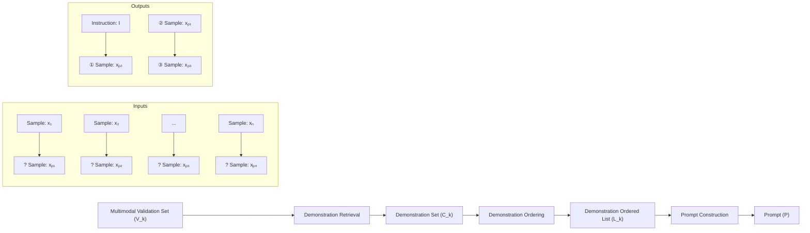
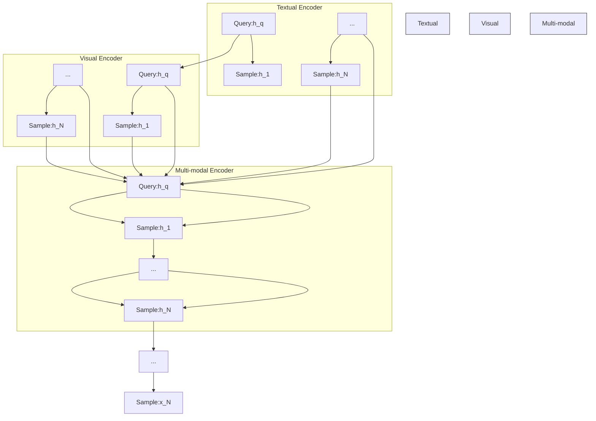
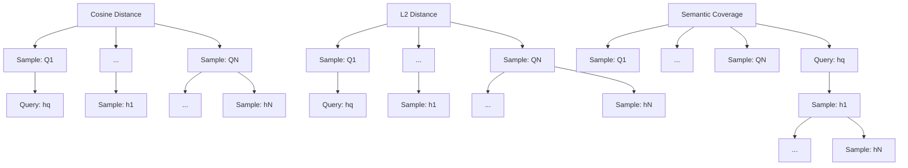
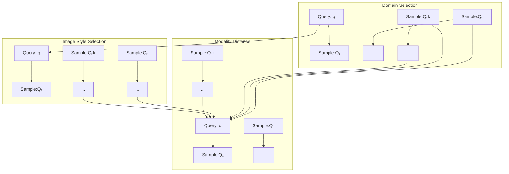
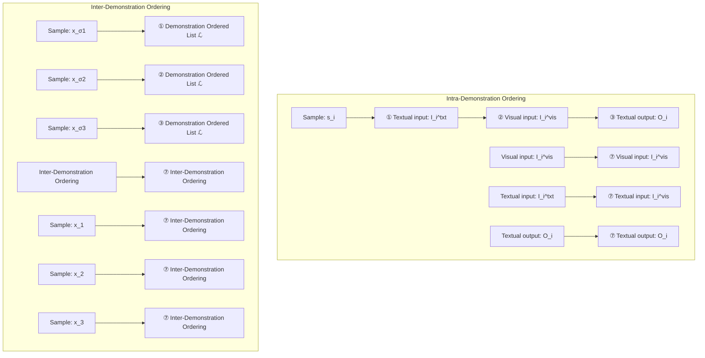
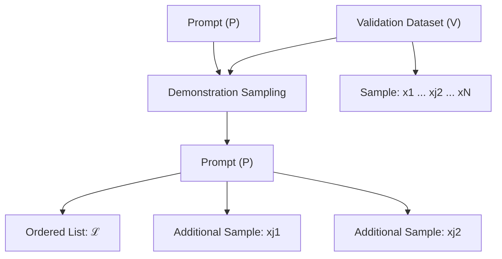

# What Factors Affect Multi-Modal In-Context Learning? An In-Depth Exploration

Libo Qin $^{\dagger*}$ Qiguang Chen $^{\dagger*}$ Hao Fei $^{\diamond}$ Zhi Chen $^{\clubsuit}$ Min Li $^{\ddagger}$ Wanxiang Che $^{\dagger}$

$^{\ddagger}$ School of Computer Science and Engineering, Central South University

$^{\dagger}$ Research Center for Social Computing and Information Retrieval

$^{\dagger}$ Harbin Institute of Technology ♦ Tsinghua University ♣ ByteDance

lbqin@csu.edu.cn, qgchen@ir.hit.edu.cn

# Abstract

Recently, rapid advancements in Multi-Modal In-Context Learning (MM-ICL) have achieved notable success, which is capable of achieving superior performance across various tasks without requiring additional parameter tuning. However, the underlying rules for the effectiveness of MM-ICL remain under-explored. To fill this gap, this work aims to investigate the research question: "What factors affect the performance of MM-ICL?" To this end, we investigate extensive experiments on the three core steps of MM-ICL including demonstration retrieval, demonstration ordering, and prompt construction using 6 vision large language models and 20 strategies. Our findings highlight (1) the necessity of a multi-modal retriever for demonstration retrieval, (2) the importance of intra-demonstration ordering over inter-demonstration ordering, and (3) the enhancement of task comprehension through introductory instructions in prompts. We hope this study can serve as a foundational guide for optimizing MM-ICL strategies in future research.

# 1 Introduction

Recently, Large Language Models (LLMs) have demonstrated remarkable advancements, showcasing proficiency in a wide range of tasks [Zhao et al., 2023a, Qin et al., 2023, 2024, Hu et al., 2023, Pan et al., 2023]. Notably, advanced LLMs exhibit the emergence of novel capabilities such as In-Context Learning (ICL) [Wei et al., 2022a, Dong et al., 2022, Zhuang et al., 2023], which optimize task performance by incorporating demonstrations into input prompts [Giannou et al., 2023, Li et al., 2023d, Wies et al., 2023, Zhou et al., 2022]. In particular, multi-modal in-context-learning (MM-ICL) is capable of utilizing multi-modal demonstrations to quickly adapt to the downstream task without parameter tuning [Yin et al., 2023, He et al., 2023, Zhang et al., 2024, Li and Lu, 2024].

In the literature, a series of works emerge to enhance MM-ICL. Specifically, Gong et al. [2023] manually create a general template with multiple images and corresponding responses during instruction-tuning (IT) stage to improve MM-ICL. Tsimpoukelli et al. [2021], Li et al. [2023b], Doveh et al. [2024] and Zhao et al. [2024] develop task-specific MM-ICL templates during the IT stage, further extending its capabilities across more domains. Li et al. [2023a] introduce OtterHD, adapting MM-ICL for high-definition image tasks. Furthermore, Sun et al. [2023] and Tian et al. [2024] explore the potential of MM-ICL in the image generation tasks. Jin et al. [2024] provide compelling evidence for the effectiveness of MM-ICL in comprehending game instructions. Zong et al. [2024] and Shukor et al. [2024] develop fine-grained benchmarks and evaluate the MM-ICL in classification tasks.

While significant progress has been witnessed in MM-ICL, the existing work still mainly focuses on how to optimize MM-ICL, ignoring the underlying factors that influence its effectiveness and


<details>
<summary>flowchart</summary>


</details>

Figure 1: The whole process of prompting creation for multi-modal in-context-learning.

performance. Such gap impedes a comprehensive understanding of the mechanisms and performance determinants of MM-ICL, thereby limiting further exploration and research in this field. Motivated by this, this paper aims to systematically investigate the research question: What factors affect the performance of MM-ICL?, hoping to offer a unified view and guideline for researchers to build better MM-ICL. Specifically, as illustrated in Figure 1, the MM-ICL process comprises three steps: demonstration retrieval, demonstration ordering, and prompt construction. Therefore, We systematically investigate the following sub-questions: (a) how to select multi-modal demonstrations (Sec. 3.1); (b) how to order multi-modal demonstrations (Sec. 3.2); and (c) how to construct MM-ICL prompts (Sec. 3.3) to this end. To achieve this, we conduct detailed experiments on MM-ICL using 20 strategies across 4 tasks with 6 representative vision large language models (VLLMs).

Through extensive investigations, the main findings are as follows:

- Multi-modal alignment is the bottleneck for MM-ICL. Our analysis confirms that, on average, multi-modal retrieval methods outperform single-modal ones. Furthermore, multi-modal alignment in VLLMs has a greater impact on MM-ICL effectiveness than parameter size, identifying alignment as the key limitation in both backbone structure and demonstration quality.   
- Intra-demonstration ordering holds greater importance than inter-demonstration ordering. Our investigation first indicates that the intra-demonstration ordering, particularly the ordering of modalities, greatly influences model performance more than demonstration arrangement.   
- Introductory instruction guides better task understanding for MM-ICL. To construct a comprehensive MM-ICL prompt, it is essential to include introductory instructions preceding the demonstrations. This approach consistently enhances the performance of MM-ICL compared with summative instruction placed after demonstrations, and intra-demonstration instruction.

# 2 Background

In this work, we formally present the prompt building process for MM-ICL. As depicted in Figure 1, the process of prompt building for MM-ICL involves three sequential stages:

(1) Demonstration Retrieval: The core MM-ICL requires retrieval to obtain demonstrations that can help MM-ICL. Formally, given a validation dataset $V_{n} = \{x_{1}, x_{2}, \ldots, x_{n}\}$ , each multi-modal sample $x_{i}$ includes textual input $I_{i}^{txt}$ , visual input $I_{i}^{vis}$ , and output $O_{i}$ . For a specific test query q, this step aims to identify a subset of relevant demonstrations $C_{k} = \{x_{\pi_{j}}\}_{j=1}^{k}$ , where $x_{\pi_{j}} \in V_{n}$ .   
(2) Demonstration Ordering: Researches [Lu et al., 2022b, Wu et al., 2023, Xiang et al., 2024] show that LLMs are highly sensitive to the order of demonstrations. Thus, arranging these demonstrations effectively is crucial for MM-ICL. After retrieving relevant demonstrations, we must rearrange the sequence $\mathcal{L}_k = [x_{\sigma_j}]_{j=1}^k$ , which will be used to construct the prompt.   
(3) Prompt Construction: Previous research indicates that using delimiters and instructions can significantly enhance textual ICL capabilities [Min et al., 2022, Qin et al., 2023]. Therefore, the final core step is to transform the ordered demonstrations into a structured prompt P, incorporating delimiters and instructions to optimize MM-ICL.

# 3 What Factors Affect Multi-modal In-Context Learning?

# 3.1 Exploration of MM-ICL Demonstration Retrieval

The efficacy of ICL heavily depends on the quality of the retrieved demonstrations $\mathcal{C}$ , which provide essential prior knowledge for MM-ICL. As illustrated in Figure 2, the retrieval process encompasses


<details>
<summary>flowchart</summary>


</details>

(a) Sample Representation   


<details>
<summary>flowchart</summary>


</details>

(b) Sample Comparison


<details>
<summary>flowchart</summary>


</details>

(c) Sample Selection   
Figure 2: The demonstration retrieval process for MM-ICL.

three key steps: (1) Sample Representation, (2) Sample Comparison, and (3) Sample Selection. In this section, we conduct a systematic analysis of how various strategies for sample representation, comparison, and selection affect MM-ICL task performance.

Sample Representation. It involves defining an encoder (Encoder( $\cdot$ )) to map each input sample $x_{j} \in V$ and user query q into a shared representation space:

$$
h _ {j} = \operatorname{Encoder} (x _ {j}). \tag {1}
$$

Specifically, we evaluate various encoder architectures across modalities, focusing on the impact of visual encoder ( $Encoder_{vis}$ ), text encoder ( $Encoder_{txt}$ ), and multi-modal encoder ( $Encoder_{multi}$ ) on model performance.

Sample Comparison. After deriving the representations, we employ a metric $\mathcal{M}$ to evaluate the quality $\mathcal{Q}_j$ of the sample $h_j$ in comparison to the query representation $h_q$ and the dataset samples $h_j$ :

$$
\mathcal {Q} _ {j} = \mathcal {M} (h _ {q}, h _ {j}). \tag {2}
$$

Specifically, we explore various comparison metrics, including cosine similarity $M_{cos}$ [Liu et al., 2022a], L2 similarity $M_{L2}$ [Liu et al., 2022a], and semantic diversity $M_{div}$ [Li and Qiu, 2023a], to assess sample quality and understand the correlation with model performance.

Sample Selection. After quality assessments, we apply a selection criterion S to identify the k most advantageous samples $x_{\pi_{j}}$ for inclusion in the demonstration set C:

$$
\mathcal {C} = \{x _ {\pi_ {j}} | x _ {\pi_ {j}} \in \mathcal {S} (q, \mathcal {Q} _ {j}), j \leq k \}. \tag {3}
$$

Sample selection is guided by factors such as domain information [He et al., 2023], demonstration style [Agrawal et al., 2023], and token distance [Liu et al., 2022a]. Specifically, we systematically examine samples from both in-domain and out-of-domain collections. And we also assess the impact of image style on the selected demonstrations. Further, we investigate the token distance between modalities to understand its effects on sample selection for MM-ICL.

# 3.2 Exploration of MM-ICL Demonstration Ordering

Following Lu et al. [2022b] and Wu et al. [2023], the order of the demonstration set C significantly impacts MM-ICL performance. As shown in Figure 3, this section explores two key aspects:

Intra-demonstration Ordering. The sequence within a demonstration, especially modalities (e.g., text and image), is an important component that might affect the MM-ICL capabilities. Therefore,


<details>
<summary>flowchart</summary>


</details>

Figure 3: The demonstration ordering process for MM-ICL.

we introduce a intra-demonstration ordering permutation (IOP) to define this sequence:

$$
\mathcal {L} = \left[ \mathrm{IOP} (x _ {\pi_ {1}}), \mathrm{IOP} (x _ {\pi_ {2}}), \dots , \mathrm{IOP} (x _ {\pi_ {k}}) \right]. \tag {4}
$$

We conduct a systematic exploration of various IOP configurations, including text-image-text ( $IOP^{tvt}$ ), text-text-image ( $IOP^{ttv}$ ), and image-text-text ( $IOP^{vtt}$ ). These order analyses aim to evaluate the impact of different modal sequences on the model's performance.

Inter-demonstration Ordering. The sequence in which demonstrations are organized within C also is the key component that might impact the performance of MM-ICL. Formally, we define a sample ordering permutation $\sigma_{j}$ to specify the arrangement:

$$
\mathcal {L} = \left[ x _ {\sigma_ {1}}, x _ {\sigma_ {2}}, \dots , x _ {\sigma_ {k}} \mid x _ {\sigma_ {j}} \in \mathcal {C} \right], \tag {5}
$$

where $x_{\sigma_{j}}$ represents the j-th demonstration in the ordered demonstration list.

# 3.3 Exploration of MM-ICL Prompt Construction

VLLMs are highly sensitive to input instructions [Kojima et al., 2022, Qin et al., 2023]. Inspired by this, to enhance task comprehension, we incorporate different instructions to explore the performance influence for MM-ICL. Formally, we construct instruction methods $\mathcal{I}(\cdot)$ that describe the task and position them within the prompt. The prompt construction process is:

$$
\mathcal {P} = \mathcal {I} (\delta (x _ {\sigma_ {1}}), \delta (x _ {\sigma_ {2}}), \dots , \delta (x _ {\sigma_ {k}})), \tag {6}
$$

Specifically, as shown in Figure 4, we explore three instruction categories to bolster MM-ICL process:

\- Introductory Instruction $(\mathcal{I}_{intro})$ refers to the initial guidance that offers an overview of the task prior to any demonstrations. As shown in Figure 4 (a), this instruction, denoted as $\mathcal{I}_{intro}$ , is positioned at the start of the ordered demonstration sequence, $\mathcal{L}$ .


<details>
<summary>flowchart</summary>

```mermaid
graph TD
    subgraph (a) Introductory Instruction
        A1["Instruction: ℒ"] --> B1["Instruction Injection"]
        B1 --> C1["Ordered List: ℒ"]
    end

    subgraph (b) Summative Instruction
        A2["Ordered List: ℒ"] --> B2["Instruction Injection"]
        B2 --> C2["Ordered List: ℒ"]
    end

    subgraph (c) Intra-demonstration Instruction
        A3["Ordered List (ℒ)"] --> B3["Instruction: ℒ"]
        B3 --> C3["Output: O₁"]
        B3 --> D3["Input: I₂"]
        B3 --> E3["Instruction: ℒ"]
        B3 --> F3["Output: O₂"]
    end

    B1 --> C1
    B2 --> C2
    B3 --> C3
    B3 --> D3
    B3 --> E3
    B3 --> F3
    B3 --> G3["Intra-demonstration Instruction"]
    G3 --> H1["Ordered List (ℒ)"]
    G3 --> H2["Input: I₁"]
    G3 --> H3["Output: O₁"]
    G3 --> I3["Intra-demonstration Instruction"]
    I3 --> J1["Ordered List (ℒ)"]
    I3 --> J2["Input: I₂"]
    I3 --> J3["Output: O₂"]
```
</details>

Figure 4: The process of instruction injection for MM-ICL prompt construction involves three key elements. The Introductory Instruction provides an overview instruction of the task before demonstrations. The Summative Instruction summarizes after the examples, guiding the model to apply the learned concepts to practical problems. The Intra-demonstration Instruction embeds task-specific guidance within each demonstration, enabling VLLMs to grasp task requirements during learning. Further details and additional prompts are provided in Appendix C.3.

\- Summative Instruction $(\mathcal{I}_{sum})$ offers a summary after the examples, guiding the model to apply the learned concepts to real-world problems. As shown in Figure 4 (b), this instruction $\mathcal{I}$ is added at the end of the demonstration list $\mathcal{L}$ .

\- Intra-demonstration Instruction $(\mathcal{I}_{intra})$ embeds task instructions within each demonstration, helping VLLMs understand the task requirements during the learning process. As shown in Figure 4 (c), this instruction $\mathcal{I}$ is included within each demonstration $x_{i}$ in the list $\mathcal{L}$ .

# 4 Experimental Setup

Following the setting of Li et al. [2023c], we systematically explore 4 tasks, including image-caption, visual question answering (VQA), image classification, and chain-of-thought reasoning, which come from M $^{3}$ IT [Li et al., 2023c] and M $^{3}$ CoT [Chen et al., 2024b] (as shown in Tables 2), providing a universal paradigm can help researchers conduct unified and fairer comparisons and studies within a unified framework. In order to evaluate the MM-ICL performance accurately, we use two indicators for each task. Following Zhang et al. [2019], Li et al. [2023b], and Zong et al. [2024], we use CIDER [Vedantam et al., 2015] and BertScore [Zhang et al., 2019] as image-caption metrics. Since M $^{3}$ IT includes various VQA tasks with free-form answers, inspired by the success of free-form and precise answer hybrid evaluation in machine reading comprehension, following Rajpurkar et al. [2016], Zhang et al. [2019], we adapt Token-F1 [Rajpurkar et al., 2016] and BertScore as visual question answering (VQA) metrics (The correlation analysis of the indicators and accuracy as shown in Table 3). Following Li et al. [2023c,b], we use accuracy and F1 score as indicators of image classification. Following Lu et al. [2022a], Golovneva et al. [2022] and Qin et al. [2023], we use accuracy and reasoning alignment score [Golovneva et al., 2022] (RAS) as indicators of reasoning.

To ensure rigorous experimental control, we established a baseline using a multi-modal encoder for data representation and cosine similarity for sample comparison, limiting retrieval to within the same task. This baseline ranks samples based on similarity, with a delimiter and a 3-shot setting (see Appendix A for details). In addition, all open source models complete inference on 2 A100 80G. For all experiments, we select top-p from $\{0.95, 1\}$ and adjust the temperature parameter within $[0, 1]$ . Among them, temperature is the main error variable in this work.

# 5 Empirical Analysis of Factors Affecting MM-ICL

# 5.1 Empirical Analysis of MM-ICL Demonstration Retrieval

# 5.1.1 Sample Representation

Multi-modal alignment is the bottleneck for MM-ICL in both backbones and demonstrations. To evaluate the impact of semantic representation in different modalities for MM-ICL, we assessed three distinct encoders: RoBERTa [Liu et al., 2019] as a textual encoder for Textual Retriever, CLIP-Vision Encoder [Radford et al., 2021] for Visual Retriever, and BridgeTower [Xu et al., 2023] as multi-modal encoder for Multi-Modal Retriever. As illustrated in Table 1, multi-modal retrieval consistently outperforms zero-shot, randomly selected, and single-modality methods, highlighting the advantages of multi-modal semantic learning for MM-ICL. What's more, as shown in Table 1, our results reveal that increasing model parameters from 8 billion to over 100 billion does not significantly enhance performance, suggesting that beyond parameter size, multi-modal context understanding and alignment are more crucial for MM-ICL than model scaling. Our analysis demonstrates that multi-modal alignment is the critical factor in both the backbone and demonstrations.

Current multi-modal encoders still lack modeling of multi-modal logic. Actually, multi-modal retrieval attains better performance in many scenarios like Image Caption and VQA. However, our experiments show that textual retrieval works well for classification and reasoning tasks. Based on the qualitative analysis, we observe that due to the semantic richness of the labels and rationales, textual retrieval can obtain more similar samples. However, the current multi-modal retrieval struggles with complex text semantics, often favoring image similarity. This aligns with recent work [Tong et al., 2023, 2024, Fei et al., 2024c], which is valuable for future exploration.

Multi-modal context diminishes the necessity of careful demonstration selection. As shown in Table 1, adding relevant demonstrations slightly improves performance, but the gains are less

<table><tr><td rowspan="2"></td><td colspan="2">Caption</td><td colspan="2">VQA</td><td colspan="2">Classification</td><td colspan="2">Reasoning</td><td rowspan="2">AVG</td></tr><tr><td>CIDER</td><td>BERTScore</td><td>Token F1</td><td>BERTScore</td><td>Acc</td><td>F1</td><td>Acc</td><td>RAS</td></tr><tr><td colspan="10">OpenFlamingo (9B) [Awadalla et al., 2023]</td></tr><tr><td>Zero-shot</td><td>1.84</td><td>81.18</td><td>2.78</td><td>76.17</td><td>15.17</td><td>3.63</td><td>16.53</td><td>85.13</td><td>35.30</td></tr><tr><td>Few-shot (Random)</td><td>8.23</td><td>56.63</td><td>12.63</td><td>67.37</td><td>13.11</td><td>5.11</td><td>21.35</td><td>86.53</td><td>33.87</td></tr><tr><td>+ Textual Retriever</td><td>13.39</td><td>74.22</td><td>21.80</td><td>75.74</td><td>13.67</td><td>12.04</td><td>25.63</td><td>87.71</td><td>40.52</td></tr><tr><td>+ Visual Retriever</td><td>6.33</td><td>53.88</td><td>12.82</td><td>68.76</td><td>13.67</td><td>10.87</td><td>23.10</td><td>87.36</td><td>34.60</td></tr><tr><td>+ Multi-Modal Retriever</td><td>13.47</td><td>85.01</td><td>7.85</td><td>79.05</td><td>19.66</td><td>10.10</td><td>24.96</td><td>88.11</td><td>41.03</td></tr><tr><td colspan="10">Otter (9B) [Li et al., 2023b]</td></tr><tr><td>Zero-shot</td><td>2.86</td><td>86.42</td><td>20.90</td><td>87.95</td><td>24.34</td><td>10.85</td><td>34.06</td><td>82.67</td><td>43.76</td></tr><tr><td>Few-shot (Random)</td><td>3.50</td><td>86.62</td><td>20.95</td><td>87.76</td><td>25.66</td><td>10.28</td><td>34.23</td><td>83.67</td><td>44.08</td></tr><tr><td>+ Textual Retriever</td><td>3.89</td><td>86.62</td><td>20.40</td><td>87.89</td><td>25.28</td><td>8.47</td><td>32.88</td><td>81.93</td><td>43.42</td></tr><tr><td>+ Visual Retriever</td><td>3.50</td><td>86.51</td><td>18.57</td><td>87.58</td><td>26.78</td><td>12.44</td><td>32.21</td><td>84.17</td><td>43.97</td></tr><tr><td>+ Multi-Modal Retriever</td><td>3.77</td><td>86.57</td><td>18.80</td><td>87.56</td><td>28.65</td><td>11.83</td><td>35.92</td><td>83.74</td><td>44.60</td></tr><tr><td colspan="10">Qwen-VL (10B) [Bai et al., 2023]</td></tr><tr><td>Zero-shot</td><td>13.57</td><td>87.65</td><td>24.96</td><td>85.09</td><td>50.19</td><td>54.28</td><td>48.40</td><td>90.87</td><td>56.87</td></tr><tr><td>Few-shot (Random)</td><td>28.52</td><td>88.47</td><td>28.43</td><td>86.11</td><td>52.43</td><td>53.50</td><td>43.34</td><td>90.19</td><td>58.87</td></tr><tr><td>+ Textual Retriever</td><td>21.58</td><td>88.07</td><td>26.99</td><td>85.62</td><td>49.44</td><td>53.04</td><td>46.04</td><td>90.72</td><td>57.69</td></tr><tr><td>+ Visual Retriever</td><td>30.81</td><td>88.56</td><td>28.79</td><td>86.23</td><td>59.74</td><td>54.43</td><td>46.88</td><td>91.30</td><td>60.84</td></tr><tr><td>+ Multi-Modal Retriever</td><td>41.51</td><td>89.03</td><td>30.20</td><td>86.78</td><td>59.36</td><td>53.17</td><td>46.21</td><td>91.49</td><td>62.22</td></tr><tr><td colspan="10">GPT4V (&gt;100B) [OpenAI: et al., 2023]</td></tr><tr><td>Zero-shot</td><td>5.15</td><td>85.43</td><td>20.01</td><td>84.77</td><td>61.42</td><td>59.07</td><td>54.64</td><td>92.46</td><td>57.87</td></tr><tr><td>Few-shot (Random)</td><td>6.37</td><td>85.95</td><td>24.43</td><td>85.42</td><td>60.11</td><td>60.81</td><td>54.30</td><td>92.54</td><td>58.74</td></tr><tr><td>+ Textual Retriever</td><td>9.48</td><td>86.02</td><td>31.81</td><td>87.02</td><td>62.55</td><td>51.40</td><td>55.99</td><td>92.26</td><td>59.57</td></tr><tr><td>+ Visual Retriever</td><td>9.36</td><td>86.26</td><td>32.47</td><td>86.96</td><td>63.30</td><td>57.79</td><td>59.87</td><td>93.19</td><td>61.15</td></tr><tr><td>+ Multi-Modal Retriever</td><td>16.55</td><td>86.77</td><td>32.92</td><td>86.87</td><td>62.55</td><td>59.97</td><td>60.88</td><td>93.10</td><td>62.45</td></tr><tr><td colspan="10">IDEFICS2 (8B) [Laurençon et al., 2024b]</td></tr><tr><td>Zero-shot</td><td>32.80</td><td>88.59</td><td>26.88</td><td>86.99</td><td>66.85</td><td>57.84</td><td>54.97</td><td>89.01</td><td>62.99</td></tr><tr><td>Few-shot (Random)</td><td>39.68</td><td>88.88</td><td>30.82</td><td>87.59</td><td>61.61</td><td>53.39</td><td>51.94</td><td>89.52</td><td>62.93</td></tr><tr><td>+ Textual Retriever</td><td>35.95</td><td>88.45</td><td>31.66</td><td>87.58</td><td>61.99</td><td>67.13</td><td>45.03</td><td>88.98</td><td>63.34</td></tr><tr><td>+ Visual Retriever</td><td>46.61</td><td>89.55</td><td>32.05</td><td>87.92</td><td>64.04</td><td>62.51</td><td>51.26</td><td>89.83</td><td>65.47</td></tr><tr><td>+ Multi-Modal Retriever</td><td>52.55</td><td>89.66</td><td>33.65</td><td>88.17</td><td>65.54</td><td>63.86</td><td>51.43</td><td>89.57</td><td>66.80</td></tr><tr><td colspan="10">Gemini-Pro (&gt;100B) [Google, 2023]</td></tr><tr><td>Zero-shot</td><td>14.05</td><td>87.07</td><td>26.93</td><td>85.78</td><td>68.20</td><td>66.10</td><td>55.14</td><td>90.72</td><td>61.75</td></tr><tr><td>Few-shot (Random)</td><td>21.21</td><td>88.13</td><td>32.99</td><td>86.81</td><td>63.67</td><td>69.75</td><td>55.65</td><td>91.82</td><td>63.75</td></tr><tr><td>+ Textual Retriever</td><td>15.79</td><td>87.75</td><td>34.96</td><td>87.18</td><td>69.10</td><td>72.31</td><td>53.29</td><td>91.57</td><td>63.99</td></tr><tr><td>+ Visual Retriever</td><td>21.35</td><td>87.98</td><td>44.74</td><td>89.33</td><td>65.73</td><td>64.18</td><td>53.29</td><td>91.92</td><td>64.81</td></tr><tr><td>+ Multi-Modal Retriever</td><td>35.64</td><td>88.67</td><td>45.47</td><td>89.61</td><td>65.17</td><td>70.51</td><td>58.01</td><td>92.17</td><td>68.16</td></tr></table>

Table 1: Performance comparison of retrievers utilizing different modal representations, where Few-shot (Random) refers to MM-ICL methods in which the demonstrations are randomly selected from the development set.

significant compared to text-only ICL scenarios. Specifically, retrieved demonstrations yield an average performance boost of 3.84%, compared to random demonstrations. In contrast, text-only scenarios show performance increases of over 10% with carefully selected samples [Shi et al., 2023]. Furthermore, the model remains unaffected by irrelevant samples, and the performance of almost all models is higher than zero-shot. This indicates that multi-modal context significantly reduces the need for careful demonstration selection, unlike in text-only scenarios.

VLLMs learn semantic representations instead of token pattern representations for MM-ICL. As depicted by Agrawal et al. [2023], textual ICL primarily learns token patterns (e.g., similar output formats, reasoning paths) among demonstration outputs. To investigate whether VLLMs rely on repetitive token patterns, we utilize the average BLEU score across demonstration outputs as a representation of token repetition. Figure 5 shows that only the image captioning task exhibits a positive correlation. In contrast, other tasks show a decline as BLEU scores exceed $30\%$ . This underscores that MM-ICL primarily learns semantic rather than token pattern representations for effective performance.

# 5.1.2 Sample Comparison

To further analyze the influencing factors of MM-ICL in sample retrieval, this study employs similarity and diversity metrics, which help assess how MM-ICL processes sample similarities and differences, enhancing our understanding of its mechanisms. See Appendix B for more details and results.


<details>
<summary>line</summary>

| BLEU | VQA   | Classification | Caption | Reasoning |
|------|-------|----------------|---------|-----------|
| 0    | 85    | 65             | 25      | 50        |
| 20   | 75    | 55             | 55      | 60        |
| 40   | 70    | 50             | 70      | 65        |
| 60   | 40    | 55             | 0       | 0         |
| 80   | 50    | 85             | 0       | 0         |
| 100  | 40    | 40             | 0       | 0         |
</details>

Figure 5: The impact of token pattern representation in Gemini-Pro.


<details>
<summary>radar</summary>

| Metric       | L2 Distance | Cosine Distance |
| ------------ | ----------- | --------------- |
| CIDER        | 0           | 0               |
| BERTScore    | 100         | 50              |
| Token F1     | 0           | 0               |
| BERTScore    | 100         | 50              |
| Accuracy     | 0           | 0               |
| F1           | 0           | 0               |
| Acc.         | 0           | 0               |
| RAS          | 100         | 50              |
</details>


<details>
<summary>radar</summary>

| Metric       | Diversity Retriever | Similar Retriever |
| ------------ | ------------------- | ----------------- |
| CIDER        | 0                   | 0                 |
| BERTScore    | 66.55               | 68.16             |
| Token F1     | 0                   | 0                 |
| BERTScore    | 66.55               | 68.16             |
| Accuracy     | 0                   | 0                 |
| F1           | 0                   | 0                 |
| Acc.         | 0                   | 0                 |
</details>

Figure 6: The impact of different sample comparison methodologies in Gemini-Pro.

Cosine similarity matters for sample comparison. Following Liu et al. [2022b], we compare two representative similarity metrics, cosine similarity and L2 similarity. As shown in Figure 6 (a), cosine similarity, which measures the directional semantic alignment, emerges as the superior metric in MM-ICL than L2 similarity. Supported by Deza et al. [2009] and Steck et al. [2024], it indicates that MM-ICL prioritizes semantic directional consistency over complete semantic alignment.

Diversity does not show significant influence for sample comparison. He et al. [2023], Li and Qiu [2023b] have shown that demonstrations with better diversity can effectively improve textual ICL. To explore whether it exists in MM-ICL, following Li and Qiu [2023b], we utilize the “diversity retriever”, which selects the top-10 samples and further chooses the best 3 samples based on semantic diversity to obtain a more diverse MM-ICL. As demonstrated in Figure 6 (b), although diversity significantly enhances performance in text-based ICL, our experiments show limited improvement in MM-ICL tasks. This suggests that diversity may not directly correlate with better MM-ICL.

# 5.1.3 Sample Selection

Domain interval matters for sample selection. Prior research highlights the critical role of domain relevance in enhancing ICL performance. Inspired by this, we employ the multi-modal retriever to select samples from both in-domain and out-of-domain pools. Figure 7 (a) shows a nearly 4% performance drop when out-of-domain demonstrations are included, underscoring the necessity of in-domain demonstrations for optimal MM-ICL.

Visual style is not a crucial factor in sample selection. Although stylistic similarity in text samples is known to bolster ICL, its effect on the visual modality remains ambiguous. Utilizing CLIP for image classification, we investigate the impact of stylistic coherence in multi-modal samples on MM-ICL performance. As depicted in Figure 7 (b), significant enhancements are observed solely in the VQA task, while captioning and classification show minimal effects and reasoning tasks decline. This indicates that diverse visual styles are not crucial in general MM-ICL.

Token distances between modalities need to be considered for different tasks to improve sample selection. For textual ICL, excessive token distance between samples can impede performance [Liu


<details>
<summary>radar</summary>

| Metric       | Out-of-Domain | In-Domain |
| ------------ | ------------- | --------- |
| CIDER        | 50            | 30        |
| BERTScore    | 70            | 40        |
| Token F1     | 60            | 50        |
| BERTScore    | 80            | 60        |
| Accuracy     | 70            | 50        |
| F1           | 60            | 40        |
| Acc.         | 70            | 50        |
| RAS          | 80            | 60        |
</details>

(a) The impact of whether the sample is in-domain on performance.


<details>
<summary>line</summary>

| The number of images with same type | Classification | R    |
| ----------------------------------- | -------------- | ---- |
| # 0                                 | 63             | 72   |
| # 1                                 | 68             | 45   |
| # 2                                 | 69             | 43   |
| # 3                                 | 63             | 50   |
</details>

(b) The impact of visual style in sample selection on performance.

  
(c) The impact of token distance between demonstrations in sample selection.   
Figure 7: The impact of sample selection on average score performance in Gemini-Pro.

et al., 2022a]. We extend this inquiry to MM-ICL, analyzing how token distance across modalities influences results. Specifically, during the sample selection process, we considered the impact of the average token distance between two images on the model within the entire prompt of MM-ICL. As illustrated in Figure 7 (c), the effect of token distance varies by task, typically showing an initial performance increase followed by a decline as distance grows, particularly in non-captioning tasks. This highlights the task-dependent nature of optimal token distance in MM-ICL.

# 5.2 Empirical Analysis of MM-ICL Demonstration Ordering

Intra-demonstration ordering significantly impacts performance. Within the demonstration, organizing the ordering, especially the relationship between modalities is a crucial topic. We investigate this by arranging inputs and outputs across modalities using three methods: text input→text output→image input (Text-Image), text input→image input→text output (Text-Image-Text), and image input→text input→text output (Image-Text). As shown in Figure 8 (a), positioning the image at the start significantly enhances model performance. This suggests that presenting visual information first improves multi-modal comprehension, thereby boosting its learning abilities.

Inter-demonstration ordering demonstrates minimal impacts. Following Lu et al. [2022c], we investigate how the order of demonstration presentation influences model efficacy. We explore various strategies: random rearrangement, a "similar-last" approach where samples similar to the query are shown last, and a "similar-first" approach where similar samples are presented first. Figure 8 (b) illustrates that inter-demonstration ordering has a negligible impact on MM-ICL performance. This suggests the order-robustness, with the presentation sequence having minimal effect.


<details>
<summary>bar</summary>

(a) The effect of the order of modals within a demonstration on average performance
| Model | Image-Text | Text-Image | Text-Image-Text | Best Performance |
| :--- | :--- | :--- | :--- | :--- |
| Gemini Pro | 68.2 | 65.7 | 66.5 | |
| IDEFICS2 | 66.8 | 54.9 | 56.7 | |
| Qwen-VL | 62.2 | 60.4 | 59.2 | |
| Otter | 44.6 | 43.7 | 43.6 | |
| OpenFlamingo | 41.0 | 34.0 | 36.0 | |
</details>


<details>
<summary>bar</summary>

(b) The effect of the order of demonstrations on average performance
| Model | Similar-First | Similar-Last | Random | Best Performance |
|---|---|---|---|---|
| Gemini Pro | 68.2 | 68.0 | 66.9 | |
| IDEFICS2 | 66.8 | 67.6 | 67.4 | |
| Qwen-VL | 62.2 | 61.4 | 61.5 | |
| Otter | 44.6 | 45.0 | 44.3 | |
| OpenFlamingo | 41.0 | 37.7 | 38.1 | |
</details>

Figure 8: The impact of demonstration ordering on performance.

# 5.3 Empirical Analysis of MM-ICL Prompt Construction

Introductory Instruction is consistently effective for better MM-ICL. To investigate the impact of inserting task-related instructions within prompts, we conduct the following experiment on three categories of instruction: Introductory Instruction, Summative Instruction, and Intra-demonstration Instruction. As depicted in Figure 9, our analysis indicates that introductory instructions stably


<details>
<summary>bar</summary>

| Model | No-Instruction | Introductory Instruction | Summative Instruction | Intra-demonstration Instruction | Best Performance |
| :--- | :--- | :--- | :--- | :--- | :--- |
| Gemini Pro | 68.2 | 68.5 | 68.2 | 68.4 | |
| IDEFICS2 | 66.8 | 67.3 | 66.2 | 64.3 | |
| Qwen-VL | 62.2 | 63.0 | 61.1 | 61.1 | |
| Otter | 44.6 | 45.5 | 44.0 | 43.5 | |
| OpenFlamingo | 41.0 | 43.5 | 40.0 | 40.0 | |
</details>

Figure 9: The impact of injecting instruction into demonstrations on model average score performance.


<details>
<summary>line</summary>

| The number of demonstrations | Gemini (%) | IDEFICS2 (%) | Qwen-VL (%) | Otter (%) |
|---|---|---|---|---|
| 0 | 62 | 57 | 58 | 43 |
| 1 | 65 | 63 | 59 | 43 |
| 2 | 66 | 65 | 60 | 43 |
| 3 | 67 | 67 | 61 | 43 |
| 4 | 67 | 65 | 60 | 43 |
| 5 | 67 | 66 | 61 | 43 |
The number of demonstrations (0 to 5) is labeled on the x-axis.
</details>

(a) The impact of the number of demonstrations on average score performance.


<details>
<summary>line</summary>

| The number of demonstrations | Classification | Caption | Reasoning | VQA |
| --------------------------- | -------------- | ------- | --------- | --- |
| 1                           | 67             | 32      | 55        | 30  |
| 2                           | 65             | 40      | 48        | 30  |
| 3                           | 67             | 53      | 52        | 31  |
| 4                           | 65             | 52      | 51        | 32  |
| 5                           | 62             | 55      | 50        | 33  |
| 6                           | 65             | 57      | 43        | 34  |
</details>

(b) The impact of the number of demonstrations on different task performance.   
Figure 10: The impact of the number of demonstrations on performance.


<details>
<summary>radar</summary>

| Metric       | w/o Delimiter | w/ Delimiter |
| ------------ | ------------- | ------------ |
| CIDER        | 0             | 0            |
| BERTScore    | 50            | 50           |
| Token F1     | 50            | 50           |
| BERTScore    | 50            | 50           |
| Accuracy     | 50            | 50           |
| F1           | 50            | 50           |
| Acc.         | 50            | 50           |
| RAS          | 50            | 50           |
</details>

(a) Gemini


<details>
<summary>radar</summary>

| Metric       | w/o Delimiter | w/ Delimiter |
| ------------ | ------------- | ------------ |
| CIDER        | 50            | 50           |
| BERTScore    | 75            | 75           |
| Token F1     | 75            | 75           |
| BERTScore    | 75            | 75           |
| Accuracy     | 50            | 50           |
| F1           | 50            | 50           |
| Acc.         | 50            | 50           |
| RAS          | 75            | 75           |
</details>

(b)IDEFICS2   
Figure 11: The impact of inserting delimiter into the input and output of demonstration on model performance. See Figure 16 for more results.

enhance model performance. In contrast, other instructions generally decrease performance. This finding suggests that introductory instructions facilitate targeted contextual learning and more effective semantic comprehension in demonstrations. We show more prompts and details in Appendix C.3.

MM-ICL is affected by the number of demonstrations depending on the task. Contrary to traditional text-based ICL, where performance improves with more samples, our findings in Figure 10(a) suggest that MM-ICL does not experience significant gains from more demonstrations. To further understand the reason behind, we analysis the performance on different tasks. As shown in Figure 10(b), increasing the number of demonstrations enhances performance in caption and VQA tasks, a trend also reported in prior studies [Alayrac et al., 2022, Laurençon et al., 2024a, Shukor et al., 2024]. However, performance declines when demonstrations exceed three across all tested VLLMs. In more complex reasoning tasks, such as multi-step multi-modal chain-of-thought reasoning, additional demonstrations do not yield effective improvements, aligning with the findings of Chen et al. [2024b], and Fei et al. [2024a].

Moreover, we attribute it to the following reasons for this limitation: (1) Cognitive Overload: For complex tasks, understanding numerous demonstrations can overwhelm the model, impeding its ability to process and integrate information effectively [Chen et al., 2024a]. (1) Complexity of Reasoning Tasks: In reasoning tasks, the performance improvement from more demonstrations is often less pronounced than when using diverse retrievers. This suggests that reasoning tasks require sophisticated integration of information, where quality outweighs quantity. See Appendix C.1 for more detailed description.

The importance of delimiter lessens by text-image interleaved demonstrations. Previous research suggests that specific delimiters for input and output data can demonstrably influence textual ICL capabilities [Min et al., 2022]. Therefore, we utilize ablation experiments to omit these delimiters to examine their necessity (see Appendix C.2 for details). As shown in Figure 11, the resulting minor performance decline suggests that while these delimiters are less critical in MM-ICL, the modality switch inherent to MM-ICL may serve as an implicit delimiter, compensating for the absence of explicit delimiters.

# 6 Related Work

Recent advancements in vision large language models (VLLMs) have achieved great success in various vision-language tasks [Yin et al., 2023, Wu et al., 2024a,b, Wang et al., 2024, Fei et al., 2024b]. Initially, VLLMs lack Multi-modal In-context Learning (MM-ICL) capabilities. To address this, researchers explore incorporating MM-ICL directly into the training phase. This involves constructing training samples with multi-modal interleaved data by manual and general templates, which unlock the MM-ICL capability [Alayrac et al., 2022, Awadalla et al., 2023]. Building on this, Li et al. [2023b], Doveh et al. [2024] and Zhao et al. [2024] extend the MM-ICL to construct a series of task-specific templates, which improves generalization for MM-ICL. Further, Li et al. [2023a] introduce OtterHD and adapt the former process for high-definition images. The potential of MM-ICL is further explored in scene text recognition, image generation, and game instructions [Zhao et al., 2023b, Sun et al., 2023, Jin et al., 2024].

Recognizing the effectiveness of MM-ICL, researches shift towards prompt optimization. These methods focus on directly optimizing multi-modal prompts to understand the task and generate the expected output, without parameter adjustments [Gong et al., 2023, Tsimpoukelli et al., 2021, Li et al., 2023b]. This approach has significantly improved performance in visual reasoning tasks [Yang et al., 2022, Zheng et al., 2023]. Another approach involves textualizing visual information to enable VLLMs to leverage their background knowledge through in-context learning, further enhancing visual reasoning [Yang et al., 2023, Lu et al., 2024, Gupta and Kembhavi, 2023, Shen et al., 2024]. In addition, in order to better explore the MM-ICL, Zong et al. [2024] and Shukor et al. [2024] also provide a dataset to test the MM-ICL capabilities of the multi-modal classification. Furthermore, Shukor et al. [2024] take the first step to conduct an instruction modification exploration for MM-ICL.

Meanwhile, Baldassini et al. [2024], Chen et al. [2024c] pioneer the first naive multi-modal retrieval exploration to enhance MM-ICL. Different from the existing work, our study mainly focuses on a systematic exploration of the effectiveness of key factors influencing the effectiveness of MM-ICL in a unified perspective. To this end, we conduct a detailed analysis and exploration on 6 VLLMs and 20 factors across 4 tasks, aiming to provide systematic and practical guidance for future research.

# 7 Discussion

Broader Impacts. Our work is the first to systematically explore the factors influencing MM-ICL. We aim to enhance the understanding of MM-ICL mechanisms and guide future developments in this field. Additionally, our findings could foster a more comprehensive comprehension of MM-ICL within the community. For social impact, this research may influence the creation of more effective multi-modal large language models and relevant applications.

Limitations & Future Work. Due to time and cost constraints, this work is limited to the exploration of image and text modalities. In future research, we can extend our exploration to video modal ICL and multi-lingual MM-ICL scenarios. Another limitation of this work involves the insufficient consideration of certain image instructions, such as grounding or the inclusion of additional arrows. These aspects often require more complex human input and are not adequately supported by most current models.

# 8 Conclusion

This study is the first to systematically explore MM-ICL by identifying key performance determinants. Our experiments with 6 models and 20 factors across 4 tasks show that multi-modal retrieval significantly outperforms single-modal approaches and the intra-demonstration ordering critically influences learning efficacy. Additionally, incorporating task-specific instructions into prompts enhances model performance. We hope these findings will refine our understanding of MM-ICL mechanisms and guide more effective developments and future research in this evolving field.

# Acknowledgments

This work was supported by the National Natural Science Foundation of China (NSFC) via grant 62306342, 62236004, 62441603 and 62476073. This work was also sponsored by the Excellent Young Scientists Fund in Hunan Province (2024JJ4070) and the Science and Technology Innovation Program of Hunan Province under Grant 2024RC3024. We are grateful for resources from the High Performance Computing Center of Central South University, and the CCF-Zhipu.AI Large Model Innovation Fund. Libo Qin is the corresponding author.

# References

Sweta Agrawal, Chunting Zhou, Mike Lewis, Luke Zettlemoyer, and Marjan Ghazvininejad. In-context examples selection for machine translation. In Findings of the Association for Computational Linguistics: ACL 2023, pages 8857–8873, 2023.   
Jean-Baptiste Alayrac, Jeff Donahue, Pauline Luc, Antoine Miech, Iain Barr, Yana Hasson, Karel Lenc, Arthur Mensch, Katherine Millican, Malcolm Reynolds, et al. Flamingo: a visual language model for few-shot learning. Advances in neural information processing systems, 35:23716–23736, 2022.

Anas Awadalla, Irena Gao, Josh Gardner, Jack Hessel, Yusuf Hanafy, Wanrong Zhu, Kalyani Marathe, Yonatan Bitton, Samir Gadre, Shiori Sagawa, et al. Openflamingo: An open-source framework for training large autoregressive vision-language models. arXiv preprint arXiv:2308.01390, 2023.   
Jinze Bai, Shuai Bai, Shusheng Yang, Shijie Wang, Sinan Tan, Peng Wang, Junyang Lin, Chang Zhou, and Jingren Zhou. Qwen-vl: A versatile vision-language model for understanding, localization, text reading, and beyond. arXiv preprint arXiv:2308.12966, 2023.   
Folco Bertini Baldassini, Mustafa Shukor, Matthieu Cord, Laure Soulier, and Benjamin Piwowarski. What makes multimodal in-context learning work? In Proceedings of the IEEE/CVF Conference on Computer Vision and Pattern Recognition, pages 1539–1550, 2024.   
Ali Furkan Biten, Ruben Tito, Andres Mafla, Lluis Gomez, Marçal Rusinol, Ernest Valveny, CV Jawahar, and Dimosthenis Karatzas. Scene text visual question answering. In Proceedings of the IEEE/CVF international conference on computer vision, pages 4291–4301, 2019.   
Qiguang Chen, Libo Qin, Jiaqi Wang, Jinxuan Zhou, and Wanxiang Che. Unlocking the boundaries of thought: A reasoning granularity framework to quantify and optimize chain-of-thought. arXiv preprint arXiv:2410.05695, 2024a.   
Qiguang Chen, Libo Qin, Jin Zhang, Zhi Chen, Xiao Xu, and Wanxiang Che. M $^{3}$ CoT: A novel benchmark for multi-domain multi-step multi-modal chain-of-thought. In Lun-Wei Ku, Andre Martins, and Vivek Srikumar, editors, Proceedings of the 62nd Annual Meeting of the Association for Computational Linguistics (Volume 1: Long Papers), pages 8199–8221, Bangkok, Thailand, August 2024b. Association for Computational Linguistics. doi: 10.18653/v1/2024.acl-long.446. URL https://aclanthology.org/2024.acl-long.446.   
Shuo Chen, Zhen Han, Bailan He, Mark Buckley, Philip Torr, Volker Tresp, and Jindong Gu. Understanding and improving in-context learning on vision-language models. In ICLR 2024 Workshop on Mathematical and Empirical Understanding of Foundation Models, 2024c. URL https://openreview.net/forum?id=SB2sWF3oCw.   
Xinlei Chen, Hao Fang, Tsung-Yi Lin, Ramakrishna Vedantam, Saurabh Gupta, Piotr Dollár, and C Lawrence Zitnick. Microsoft coco captions: Data collection and evaluation server. arXiv preprint arXiv:1504.00325, 2015.   
Elena Deza, Michel Marie Deza, Michel Marie Deza, and Elena Deza. Encyclopedia of distances. Springer, 2009.   
Qingxiu Dong, Lei Li, Damai Dai, Ce Zheng, Zhiyong Wu, Baobao Chang, Xu Sun, Jingjing Xu, and Zhifang Sui. A survey on in-context learning. arXiv preprint arXiv:2301.00234, 2022.   
Sivan Doveh, Shaked Perek, M Jehanzeb Mirza, Amit Alfassy, Assaf Arbelle, Shimon Ullman, and Leonid Karlinsky. Towards multimodal in-context learning for vision & language models. arXiv preprint arXiv:2403.12736, 2024.   
Zhengfang Duanmu, Wentao Liu, Zhongling Wang, and Zhou Wang. Quantifying visual image quality: A bayesian view. Annual Review of Vision Science, 7(1):437–464, 2021.   
Hao Fei, Shengqiong Wu, Wei Ji, Hanwang Zhang, Meishan Zhang, Mong-Li Lee, and Wynne Hsu. Video-of-thought: Step-by-step video reasoning from perception to cognition. In Proceedings of the International Conference on Machine Learning, 2024a.   
Hao Fei, Shengqiong Wu, Hanwang Zhang, Tat-Seng Chua, and Shuicheng Yan. Vitron: A unified pixel-level vision llm for understanding, generating, segmenting, editing. 2024b.   
Hao Fei, Shengqiong Wu, Meishan Zhang, Min Zhang, Tat-Seng Chua, and Shuicheng Yan. Enhancing video-language representations with structural spatio-temporal alignment. IEEE Transactions on Pattern Analysis and Machine Intelligence, 2024c.   
Angeliki Giannou, Shashank Rajput, Jy-Yong Sohn, Kangwook Lee, Jason D. Lee, and Dimitris Papailiopoulos. Looped transformers as programmable computers. In Proc. of ICML, 2023.

Olga Golovneva, Moya Peng Chen, Spencer Poff, Martin Corredor, Luke Zettlemoyer, Maryam Fazel-Zarandi, and Asli Celikyilmaz. Roscoe: A suite of metrics for scoring step-by-step reasoning. In The Eleventh International Conference on Learning Representations, 2022.   
Tao Gong, Chengqi Lyu, Shilong Zhang, Yudong Wang, Miao Zheng, Qian Zhao, Kuikun Liu, Wenwei Zhang, Ping Luo, and Kai Chen. Multimodal-gpt: A vision and language model for dialogue with humans. arXiv preprint arXiv:2305.04790, 2023.   
Google. Gemini: A family of highly capable multimodal models, 2023. URL https://storage.googleapis.com/deepmind-media/gemini/gemini\_1\_report.pdf.   
Yash Goyal, Tejas Khot, Douglas Summers-Stay, Dhruv Batra, and Devi Parikh. Making the v in vqa matter: Elevating the role of image understanding in visual question answering. In Proceedings of the IEEE conference on computer vision and pattern recognition, pages 6904–6913, 2017.   
Tanmay Gupta and Aniruddha Kembhavi. Visual programming: Compositional visual reasoning without training. In Proceedings of the IEEE/CVF Conference on Computer Vision and Pattern Recognition, pages 14953–14962, 2023.   
Jiabang He, Lei Wang, Yi Hu, Ning Liu, Hui Liu, Xing Xu, and Heng Tao Shen. Icl-d3ie: In-context learning with diverse demonstrations updating for document information extraction. In Proceedings of the IEEE/CVF International Conference on Computer Vision, pages 19485–19494, 2023.   
Mengkang Hu, Yao Mu, Xinmiao Chelsey Yu, Mingyu Ding, Shiguang Wu, Wenqi Shao, Qiguang Chen, Bin Wang, Yu Qiao, and Ping Luo. Tree-planner: Efficient close-loop task planning with large language models. In The Twelfth International Conference on Learning Representations, 2023.   
Drew A Hudson and Christopher D Manning. Gqa: A new dataset for real-world visual reasoning and compositional question answering. In Proceedings of the IEEE/CVF conference on computer vision and pattern recognition, pages 6700–6709, 2019.   
Yonggang Jin, Ge Zhang, Hao Zhao, Tianyu Zheng, Jiawei Guo, Liuyu Xiang, Shawn Yue, Stephen W Huang, Wenhu Chen, Zhaofeng He, et al. Read to play (r2-play): Decision transformer with multimodal game instruction. arXiv preprint arXiv:2402.04154, 2024.   
Maxime Kayser, Oana-Maria Camburu, Leonard Salewski, Cornelius Emde, Virginie Do, Zeynep Akata, and Thomas Lukasiewicz. e-vil: A dataset and benchmark for natural language explanations in vision-language tasks. In Proceedings of the IEEE/CVF international conference on computer vision, pages 1244–1254, 2021.   
Takeshi Kojima, Shixiang Shane Gu, Machel Reid, Yutaka Matsuo, and Yusuke Iwasawa. Large language models are zero-shot reasoners. Advances in neural information processing systems, 35:22199–22213, 2022.   
Jonathan Krause, Justin Johnson, Ranjay Krishna, and Li Fei-Fei. A hierarchical approach for generating descriptive image paragraphs. In Proceedings of the IEEE conference on computer vision and pattern recognition, pages 317–325, 2017.   
Hugo Laurençon, Lucile Saulnier, Léo Tronchon, Stas Bekman, Amanpreet Singh, Anton Lozhkov, Thomas Wang, Siddharth Karamcheti, Alexander Rush, Douwe Kiela, et al. Obelics: An open web-scale filtered dataset of interleaved image-text documents. Advances in Neural Information Processing Systems, 36, 2024a.   
Hugo Laurençon, Léo Tronchon, Matthieu Cord, and Victor Sanh. What matters when building vision-language models? arXiv preprint arXiv:2405.02246, 2024b.   
Bo Li, Peiyuan Zhang, Jingkang Yang, Yuanhan Zhang, Fanyi Pu, and Ziwei Liu. Otterhd: A high-resolution multi-modality model. arXiv preprint arXiv:2311.04219, 2023a.   
Bo Li, Yuanhan Zhang, Liangyu Chen, Jinghao Wang, Fanyi Pu, Jingkang Yang, Chunyuan Li, and Ziwei Liu. Mimic-it: Multi-modal in-context instruction tuning. arXiv preprint arXiv:2306.05425, 2023b.

Jian Li and Weiheng Lu. A survey on benchmarks of multimodal large language models. arXiv preprint arXiv:2408.08632, 2024.   
Lei Li, Yuwei Yin, Shicheng Li, Liang Chen, Peiyi Wang, Shuhuai Ren, Mukai Li, Yazheng Yang, Jingjing Xu, Xu Sun, et al. M $^{3}$ it: A large-scale dataset towards multi-modal multilingual instruction tuning. arXiv preprint arXiv:2306.04387, 2023c.   
Xiaonan Li and Xipeng Qiu. MoT: Memory-of-thought enables ChatGPT to self-improve. In Proc. of EMNLP, 2023a.   
Xiaonan Li and Xipeng Qiu. Finding support examples for in-context learning. In Findings of the Association for Computational Linguistics: EMNLP 2023, pages 6219–6235, 2023b.   
Yingcong Li, M. Emrullah Ildiz, Dimitris Papailiopoulos, and Samet Oymak. Transformers as algorithms: Generalization and stability in in-context learning, 2023d.   
Jiachang Liu, Dinghan Shen, Yizhe Zhang, Bill Dolan, Lawrence Carin, and Weizhu Chen. What makes good in-context examples for GPT-3? In Eneko Agirre, Marianna Apidianaki, and Ivan Vulić, editors, Proceedings of Deep Learning Inside Out (DeeLIO 2022): The 3rd Workshop on Knowledge Extraction and Integration for Deep Learning Architectures, pages 100–114, Dublin, Ireland and Online, May 2022a. Association for Computational Linguistics. doi: 10.18653/v1/2022.deelio-1.10. URL https://aclanthology.org/2022.deelio-1.10.   
Jiachang Liu, Dinghan Shen, Yizhe Zhang, William B Dolan, Lawrence Carin, and Weizhu Chen. What makes good in-context examples for gpt-3? In Proceedings of Deep Learning Inside Out (DeeLIO 2022): The 3rd Workshop on Knowledge Extraction and Integration for Deep Learning Architectures, pages 100–114, 2022b.   
Yinhan Liu, Myle Ott, Naman Goyal, Jingfei Du, Mandar Joshi, Danqi Chen, Omer Levy, Mike Lewis, Luke Zettlemoyer, and Veselin Stoyanov. Roberta: A robustly optimized bert pretraining approach. arXiv preprint arXiv:1907.11692, 2019.   
Pan Lu, Swaroop Mishra, Tanglin Xia, Liang Qiu, Kai-Wei Chang, Song-Chun Zhu, Oyvind Tafjord, Peter Clark, and Ashwin Kalyan. Learn to explain: Multimodal reasoning via thought chains for science question answering. Advances in Neural Information Processing Systems, 35:2507–2521, 2022a.   
Pan Lu, Baolin Peng, Hao Cheng, Michel Galley, Kai-Wei Chang, Ying Nian Wu, Song-Chun Zhu, and Jianfeng Gao. Chameleon: Plug-and-play compositional reasoning with large language models. Advances in Neural Information Processing Systems, 36, 2024.   
Yao Lu, Max Bartolo, Alastair Moore, Sebastian Riedel, and Pontus Stenetorp. Fantastically ordered prompts and where to find them: Overcoming few-shot prompt order sensitivity. In Smaranda Muresan, Preslav Nakov, and Aline Villavicencio, editors, Proceedings of the 60th Annual Meeting of the Association for Computational Linguistics (Volume 1: Long Papers), pages 8086–8098, Dublin, Ireland, May 2022b. Association for Computational Linguistics. doi:10.18653/v1/2022.acl-long.556. URL https://aclanthology.org/2022.acl-long.556.   
Yao Lu, Max Bartolo, Alastair Moore, Sebastian Riedel, and Pontus Stenetorp. Fantastically ordered prompts and where to find them: Overcoming few-shot prompt order sensitivity. In Proceedings of the 60th Annual Meeting of the Association for Computational Linguistics (Volume 1: Long Papers), pages 8086–8098, 2022c.   
Kenneth Marino, Mohammad Rastegari, Ali Farhadi, and Roozbeh Mottaghi. Ok-vqa: A visual question answering benchmark requiring external knowledge. In Proceedings of the IEEE/cvf conference on computer vision and pattern recognition, pages 3195–3204, 2019.   
Minesh Mathew, Dimosthenis Karatzas, and CV Jawahar. Docvqa: A dataset for vqa on document images. In Proceedings of the IEEE/CVF winter conference on applications of computer vision, pages 2200–2209, 2021.   
Sewon Min, Xinxi Lyu, Ari Holtzman, Mikel Artetxe, Mike Lewis, Hannaneh Hajishirzi, and Luke Zettlemoyer. Rethinking the role of demonstrations: What makes in-context learning work? In Proc. of EMNLP, 2022.

Anand Mishra, Shashank Shekhar, Ajeet Kumar Singh, and Anirban Chakraborty. Ocr-vqa: Visual question answering by reading text in images. In 2019 international conference on document analysis and recognition (ICDAR), pages 947–952. IEEE, 2019.   
OpenAI:, Josh Achiam, Steven Adler, Sandhini Agarwal, Lama Ahmad, Ilge Akkaya, Florencia Leoni Aleman, Diogo Almeida, Janko Altenschmidt, Sam Altman, Shyamal Anadkat, et al. Gpt-4 technical report, 2023.   
Wenbo Pan, Qiguang Chen, Xiao Xu, Wanxiang Che, and Libo Qin. A preliminary evaluation of chatgpt for zero-shot dialogue understanding. arXiv preprint arXiv:2304.04256, 2023.   
Libo Qin, Qiguang Chen, Fuxuan Wei, Shijue Huang, and Wanxiang Che. Cross-lingual prompting: Improving zero-shot chain-of-thought reasoning across languages. In Proceedings of the 2023 Conference on Empirical Methods in Natural Language Processing, pages 2695–2709, 2023.   
Libo Qin, Qiguang Chen, Xiachong Feng, Yang Wu, Yongheng Zhang, Yinghui Li, Min Li, Wanxiang Che, and Philip S Yu. Large language models meet nlp: A survey. arXiv preprint arXiv:2405.12819, 2024.   
Alec Radford, Jong Wook Kim, Chris Hallacy, Aditya Ramesh, Gabriel Goh, Sandhini Agarwal, Girish Sastry, Amanda Askell, Pamela Mishkin, Jack Clark, et al. Learning transferable visual models from natural language supervision. In International conference on machine learning, pages 8748–8763. PMLR, 2021.   
Pranav Rajpurkar, Jian Zhang, Konstantin Lopyrev, and Percy Liang. Squad: 100,000+ questions for machine comprehension of text. In Proceedings of the 2016 Conference on Empirical Methods in Natural Language Processing, pages 2383–2392, 2016.   
Olga Russakovsky, Jia Deng, Hao Su, Jonathan Krause, Sanjeev Satheesh, Sean Ma, Zhiheng Huang, Andrej Karpathy, Aditya Khosla, Michael Bernstein, et al. Imagenet large scale visual recognition challenge. International journal of computer vision, 115:211–252, 2015.   
Dustin Schwenk, Apoorv Khandelwal, Christopher Clark, Kenneth Marino, and Roozbeh Mottaghi. A-okvqa: A benchmark for visual question answering using world knowledge. In European conference on computer vision, pages 146–162. Springer, 2022.   
Yongliang Shen, Kaitao Song, Xu Tan, Dongsheng Li, Weiming Lu, and Yueting Zhuang. Hugginggpt: Solving ai tasks with chatgpt and its friends in hugging face. Advances in Neural Information Processing Systems, 36, 2024.   
Freda Shi, Xinyun Chen, Kanishka Misra, Nathan Scales, David Dohan, Ed H Chi, Nathanael Schärli, and Denny Zhou. Large language models can be easily distracted by irrelevant context. In International Conference on Machine Learning, pages 31210–31227. PMLR, 2023.   
Mustafa Shukor, Alexandre Rame, Corentin Dancette, and Matthieu Cord. Beyond task performance: evaluating and reducing the flaws of large multimodal models with in-context-learning. In The Twelfth International Conference on Learning Representations, 2024. URL https://openreview.net/forum?id=mMaQvkMzDi.   
Oleksii Sidorov, Ronghang Hu, Marcus Rohrbach, and Amanpreet Singh. Textcaps: a dataset for image captioning with reading comprehension. In Computer Vision–ECCV 2020: 16th European Conference, Glasgow, UK, August 23–28, 2020, Proceedings, Part II 16, pages 742–758. Springer, 2020.   
Amanpreet Singh, Vivek Natarajan, Meet Shah, Yu Jiang, Xinlei Chen, Dhruv Batra, Devi Parikh, and Marcus Rohrbach. Towards vqa models that can read. In Proceedings of the IEEE/CVF conference on computer vision and pattern recognition, pages 8317–8326, 2019.   
Harald Steck, Chaitanya Ekanadham, and Nathan Kallus. Is cosine-similarity of embeddings really about similarity? arXiv preprint arXiv:2403.05440, 2024.   
Quan Sun, Yufeng Cui, Xiaosong Zhang, Fan Zhang, Qiying Yu, Zhengxiong Luo, Yueze Wang, Yongming Rao, Jingjing Liu, Tiejun Huang, et al. Generative multimodal models are in-context learners. arXiv preprint arXiv:2312.13286, 2023.

Changyao Tian, Xizhou Zhu, Yuwen Xiong, Weiyun Wang, Zhe Chen, Wenhai Wang, Yuntao Chen, Lewei Lu, Tong Lu, Jie Zhou, et al. Mm-interleaved: Interleaved image-text generative modeling via multi-modal feature synchronizer. arXiv preprint arXiv:2401.10208, 2024.   
Shengbang Tong, Erik Jones, and Jacob Steinhardt. Mass-producing failures of multimodal systems with language models. In Thirty-seventh Conference on Neural Information Processing Systems, 2023. URL https://openreview.net/forum?id=T6ii0qsGOh.   
Shengbang Tong, Zhuang Liu, Yuexiang Zhai, Yi Ma, Yann LeCun, and Saining Xie. Eyes wide shut? exploring the visual shortcomings of multimodal llms. In Proceedings of the IEEE/CVF Conference on Computer Vision and Pattern Recognition, pages 9568–9578, 2024.   
Maria Tsimpoukelli, Jacob L Menick, Serkan Cabi, SM Eslami, Oriol Vinyals, and Felix Hill. Multimodal few-shot learning with frozen language models. Advances in Neural Information Processing Systems, 34:200–212, 2021.   
Ramakrishna Vedantam, C Lawrence Zitnick, and Devi Parikh. Cider: Consensus-based image description evaluation. In Proceedings of the IEEE conference on computer vision and pattern recognition, pages 4566–4575, 2015.   
Andreas Veit, Tomas Matera, Lukas Neumann, Jiri Matas, and Serge Belongie. Coco-text: Dataset and benchmark for text detection and recognition in natural images. arXiv preprint arXiv:1601.07140, 2016.   
Peng Wang, Yongheng Zhang, Hao Fei, Qiguang Chen, Yukai Wang, Jiasheng Si, Wenpeng Lu, Min Li, and Libo Qin. S3 agent: Unlocking the power of vllm for zero-shot multi-modal sarcasm detection. ACM Transactions on Multimedia Computing, Communications and Applications, 2024.   
Jason Wei, Yi Tay, Rishi Bommasani, Colin Raffel, Barret Zoph, Sebastian Borgeaud, Dani Yogatama, Maarten Bosma, Denny Zhou, Donald Metzler, et al. Emergent abilities of large language models. Transactions on Machine Learning Research, 2022a.   
Jason Wei, Xuezhi Wang, Dale Schuurmans, Maarten Bosma, brian ichter, Fei Xia, Ed H. Chi, Quoc V Le, and Denny Zhou. Chain of thought prompting elicits reasoning in large language models. In Proc. of NeurIPS, 2022b.   
Noam Wies, Yoav Levine, and Amnon Shashua. The learnability of in-context learning, 2023.   
Shengqiong Wu, Hao Fei, Xiangtai Li, Jiayi Ji, Hanwang Zhang, Tat-Seng Chua, and Shuicheng Yan. Towards semantic equivalence of tokenization in multimodal llm. arXiv preprint arXiv:2406.05127, 2024a.   
Shengqiong Wu, Hao Fei, Leigang Qu, Wei Ji, and Tat-Seng Chua. Next-gpt: Any-to-any multimodal llm. In Proceedings of the International Conference on Machine Learning, 2024b.   
Zhiyong Wu, Yaoxiang Wang, Jiacheng Ye, and Lingpeng Kong. Self-adaptive in-context learning: An information compression perspective for in-context example selection and ordering. In Proceedings of the 61st Annual Meeting of the Association for Computational Linguistics (Volume 1: Long Papers), pages 1423–1436, 2023.   
Yanzheng Xiang, Hanqi Yan, Lin Gui, and Yulan He. Addressing order sensitivity of in-context demonstration examples in causal language models. arXiv preprint arXiv:2402.15637, 2024.   
Xiao Xu, Chenfei Wu, Shachar Rosenman, Vasudev Lal, Wanxiang Che, and Nan Duan. Bridgetower: Building bridges between encoders in vision-language representation learning. In Proceedings of the AAAI Conference on Artificial Intelligence, volume 37, pages 10637–10647, 2023.   
Zhengyuan Yang, Zhe Gan, Jianfeng Wang, Xiaowei Hu, Yumao Lu, Zicheng Liu, and Lijuan Wang. An empirical study of gpt-3 for few-shot knowledge-based vqa. In Proceedings of the AAAI Conference on Artificial Intelligence, volume 36, pages 3081–3089, 2022.   
Zhengyuan Yang, Linjie Li, Jianfeng Wang, Kevin Lin, Ehsan Azarnasab, Faisal Ahmed, Zicheng Liu, Ce Liu, Michael Zeng, and Lijuan Wang. Mm-react: Prompting chatgpt for multimodal reasoning and action. arXiv preprint arXiv:2303.11381, 2023.

Barry Menglong Yao, Aditya Shah, Lichao Sun, Jin-Hee Cho, and Lifu Huang. End-to-end multimodal fact-checking and explanation generation: A challenging dataset and models. In Proceedings of the 46th International ACM SIGIR Conference on Research and Development in Information Retrieval, pages 2733–2743, 2023.   
Shukang Yin, Chaoyou Fu, Sirui Zhao, Ke Li, Xing Sun, Tong Xu, and Enhong Chen. A survey on multimodal large language models. arXiv preprint arXiv:2306.13549, 2023.   
Tianyi Zhang, Varsha Kishore, Felix Wu, Kilian Q Weinberger, and Yoav Artzi. Bertscore: Evaluating text generation with bert. In International Conference on Learning Representations, 2019.   
Yuanhan Zhang, Kaiyang Zhou, and Ziwei Liu. What makes good examples for visual in-context learning? Advances in Neural Information Processing Systems, 36, 2024.   
Haozhe Zhao, Zefan Cai, Shuzheng Si, Xiaojian Ma, Kaikai An, Liang Chen, Zixuan Liu, Sheng Wang, Wenjuan Han, and Baobao Chang. MMICL: Empowering vision-language model with multimodal in-context learning. In The Twelfth International Conference on Learning Representations, 2024. URL https://openreview.net/forum?id=5KojubHBr8.   
Wayne Xin Zhao, Kun Zhou, Junyi Li, Tianyi Tang, Xiaolei Wang, Yupeng Hou, Yingqian Min, Beichen Zhang, Junjie Zhang, Zican Dong, Yifan Du, Chen Yang, Yushuo Chen, Zhipeng Chen, Jinhao Jiang, Ruiyang Ren, Yifan Li, Xinyu Tang, Zikang Liu, Peiyu Liu, Jian-Yun Nie, and Ji-Rong Wen. A survey of large language models, 2023a.   
Zhen Zhao, Can Huang, Binghong Wu, Chunhui Lin, Hao Liu, Zhizhong Zhang, Xin Tan, Jingqun Tang, and Yuan Xie. Multi-modal in-context learning makes an ego-evolving scene text recognizer. arXiv preprint arXiv:2311.13120, 2023b.   
Ge Zheng, Bin Yang, Jiajin Tang, Hong-Yu Zhou, and Sibei Yang. Ddcot: Duty-distinct chain-of-thought prompting for multimodal reasoning in language models. Advances in Neural Information Processing Systems, 36:5168–5191, 2023.   
Denny Zhou, Nathanael Schärli, Le Hou, Jason Wei, Nathan Scales, Xuezhi Wang, Dale Schuurmans, Claire Cui, Olivier Bousquet, Quoc V Le, et al. Least-to-most prompting enables complex reasoning in large language models. In The Eleventh International Conference on Learning Representations, 2022.   
Ziyu Zhuang, Qiguang Chen, Longxuan Ma, Mingda Li, Yi Han, Yushan Qian, Haopeng Bai, Weinan Zhang, and Ting Liu. Through the lens of core competency: Survey on evaluation of large language models. In The 22nd Chinese National Conference on Computational Linguistics: Frontier Forum, page 88, 2023.   
Yongshuo Zong, Ondrej Bohdal, and Timothy Hospedales. Vl-icl bench: The devil in the details of benchmarking multimodal in-context learning. arXiv preprint arXiv:2403.13164, 2024.

# Appendix

# A The Implement Details for Standard Baseline

To ensure rigorous control of experimental variables, we establish a standard baseline for our study. This baseline utilizes a multi-modal encoder for data representation and cosine similarity for sample comparison, with retrieval restricted to the same task. The following sections provide detailed insights into the implementation of this baseline.

# A.1 Demonstration Retrieval Implementation for Baseline

Multi-modal Encoder for Sample Representation We employ BridgeTower [Xu et al., 2023] as a multi-modal encoder to represent the data in a unified embedding space. This encoder integrates both visual and textual information, prioritizing single modality to capture the rich semantic content present in images.

Cosine Similarity for Sample Comparison To compare samples effectively, we use cosine similarity, a metric that measures the cosine of the angle between two non-zero vectors in a multidimensional space. This choice is motivated by its effectiveness in capturing the similarity between high-dimensional vectors, which are typical outputs of our multi-modal encoder. Specifically, we compute the cosine similarity between the query and each candidate sample, which is given by:

$$
\operatorname{cosine} \left(h _ {q}, h _ {i}\right) = \frac {h _ {q} \cdot h _ {i}}{\| h _ {q} \| \| h _ {i} \|}
$$

where $h_{q}$ and $h_{i}$ are the embedding vectors of the query q and candidate sample $x_{i}$ , respectively.

In-domain and Top-k Retrieval for Sample Selection To ensure the relevance and accuracy of the retrieval process, for sample selection, we first confine retrieval to the same task and domain. This means that comparisons and rankings are conducted exclusively among samples within the same task and domain category, ensuring the contextual appropriateness of the retrieved results.

In addition, for sample selection, samples are ranked according to their cosine similarity scores. Higher similarity scores indicate a closer alignment with the query sample, enabling the efficient identification of the most relevant samples. This ranking process involves two main steps: (1) Sorting: Candidate samples are sorted in descending order based on their cosine similarity scores relative to

<table><tr><td>Dataset</td><td>Category</td></tr><tr><td>COCO Caption [Chen et al., 2015]</td><td>IC</td></tr><tr><td>TextCaps [Sidorov et al., 2020]</td><td>IC</td></tr><tr><td>Paragraph Captioning [Krause et al., 2017]</td><td>IC</td></tr><tr><td>COCO Text [Veit et al., 2016]</td><td>CLS</td></tr><tr><td>ImageNet Image Classification [Russakovsky et al., 2015]</td><td>CLS</td></tr><tr><td>IQA [Duanmu et al., 2021]</td><td>CLS</td></tr><tr><td>COCO-ITM [Chen et al., 2015]</td><td>CLS</td></tr><tr><td>e-SNLI-VE [Kayser et al., 2021]</td><td>CLS</td></tr><tr><td>Mocheg [Yao et al., 2023]</td><td>CLS</td></tr><tr><td>VQA-v2 [Goyal et al., 2017]</td><td>VQA</td></tr><tr><td>DocVQA [Mathew et al., 2021]</td><td>VQA</td></tr><tr><td>OCR-VQA [Mishra et al., 2019]</td><td>VQA</td></tr><tr><td>ST-VQA [Biten et al., 2019]</td><td>VQA</td></tr><tr><td>Text-VQA [Singh et al., 2019]</td><td>VQA</td></tr><tr><td>GQA [Hudson and Manning, 2019]</td><td>VQA</td></tr><tr><td>OKVQA [Marino et al., 2019]</td><td>VQA</td></tr><tr><td>A-OKVQA [Schwenk et al., 2022]</td><td>VQA</td></tr><tr><td>ScienceQA [Lu et al., 2022a]</td><td>R</td></tr><tr><td> $M^{3}CoT$  [Chen et al., 2024b]</td><td>R</td></tr></table>

Table 2: Dataset in M $^{3}$ IT and M $^{3}$ CoT, where IC: Image Captioning, CLS: Classification, VQA: Visual Question Answering, R: Chain-of-Thought Reasoning (with NL rationale). Due to the cost, for each task, we evenly sampled 500 items according to the sub-dataset.

the query. (2) Selection: Subsequently, the top-k ranked samples are selected based on their relevance as determined by the similarity scores.

# A.2 Demonstration Ordering Implementation for Baseline

By default, we utilize the methodology for ordering demonstrations within our baseline model. By default, we adopt a text-after-image (Text-Image) approach for intra-demonstration sorting. This means that, within a single demonstration, textual information is positioned after the corresponding image. This ordering is chosen based on preliminary findings suggesting that such a sequence aids in better contextual understanding and retention of the demonstrated information.

Furthermore, for the ordering of inter-demonstration sequences, we employ a similarity-based method. This method ranks demonstrations according to their similarity to the query, with more similar demonstrations placed higher in the order. The similarity is determined using a metric that assesses the alignment of key features between the query and the demonstrations. This approach ensures that the most relevant and contextually aligned demonstrations are prioritized, potentially enhancing the model's performance and the user's comprehension.

# A.3 Prompt Construction Implementation for Baseline

To ensure consistency and comparability in our baseline, we introduce both a delimiter and a 3-shot setting (following Wei et al. [2022b], Qin et al. [2023]). The delimiter serves to clearly demarcate different segments of the input data, preventing any potential confusion or overlap between distinct portions of the input. This clear separation is crucial for the model to accurately process and understand the structure of the data it receives.

The 3-shot setting, on the other hand, involves providing three examples for each task within the prompt. This approach is designed to stabilize the learning process by presenting the model with sufficient contextual information. By offering three examples, we strike a balance between providing enough context to guide the model's understanding and avoiding the cognitive overload that might occur with too many examples. This setting not only enhances the model's performance but also ensures a more robust and reliable learning process.

# A.4 Baseline Prompt

In the context of using Vision-and-Language Large Models (VLLMs), it is essential to carefully structure the input prompts to ensure accurate processing. The prompt format typically used is illustrated below:

[REQUEST] % Shot 1
<Visual Input $\mathcal{I}_1^{vis}$ >
<Textual Input $\mathcal{I}_1^{txt}$ [RESPONSE]
<Textual Output $\mathcal{I}_1^{vis}$ [REQUEST] % Shot 2
<Visual Input $\mathcal{I}_2^{vis}$ >
<Textual Input $\mathcal{I}_2^{txt}$ [RESPONSE]
<Textual Output $\mathcal{I}_2^{vis}$ [REQUEST] % Shot 3
<Visual Input $\mathcal{I}_3^{vis}$ >
<Textual Input $\mathcal{I}_3^{txt}$ [RESPONSE]
<Textual Output $\mathcal{I}_3^{vis}$ [REQUEST] % User Query
<Visual Input $\mathcal{I}_q^{vis}$ >
<Textual Input $\mathcal{I}_q^{txt}$

where any gray text following the percent sign (%) is treated as a comment. These comments are not processed as part of the primary input but serve to provide additional context or instructions within the coding environment. This convention helps in maintaining the clarity and functionality of the given prompting.

In conclusion, the standard baseline established here integrates a multi-modal encoder, cosine similarity, and task-specific retrieval with a focus on visual modalities. It ranks samples based on similarity and employs a delimiter with a 3-shot setting to ensure robust and consistent performance across different tasks.

# B The Implement Details for Sample Comparison

# B.1 Metric Calculation

Cosine Similarity $(\mathcal{M}_{cos})$ Compute the cosine similarity between $h_q$ and $h_j$ using the formula:

$$
\mathcal {M} _ {\cos} (h _ {q}, h _ {j}) = \frac {h _ {q} \cdot h _ {j}}{\| h _ {q} \| \| h _ {j} \|} \tag {7}
$$

L2 Similarity $(\mathcal{M}_{L2})$ Calculate the L2 similarity by computing the negative Euclidean distance between $h_q$ and $h_j$ :

$$
\mathcal {M} _ {L 2} \left(h _ {q}, h _ {j}\right) = - \| h _ {q} - h _ {j} \| _ {2} \tag {8}
$$

Since Euclidean distance measures dissimilarity, we use the negative value to represent similarity, where a higher value indicates greater similarity.

Semantic Diversity ( $M_{div}$ ) Semantic diversity is assessed by evaluating the differences in the distributional properties of $h_{q}$ and $h_{j}$ . This assessment involves analyzing the variance in how these properties are distributed across different samples. To determine the presence of semantic diversity within Multi-Modal In-Context Learning (MM-ICL), we adopt the methodology proposed by Li and Qiu [2023b]. Specifically, we employ the "diversity retriever," designed to enhance the diversity of the selected samples. The diversity retriever operates by first selecting the top 10 samples based on a preliminary measure of relevance. From these top 10 samples, it then identifies the 3 samples that exhibit the highest semantic diversity. This two-step process ensures that the final selection of samples for MM-ICL is not only relevant but also diverse in terms of their semantic content.

# B.2 Comparison and Analysis

Comparing the results obtained using different metrics $(\mathcal{M}_{cos}, \mathcal{M}_{L2}, \mathcal{M}_{div})$ provides a comprehensive understanding of their effectiveness and suitability for specific applications. It is essential to analyze the trade-offs associated with each metric and interpret the results to draw meaningful conclusions about sample quality and relevance.

As shown in Figure 12, cosine similarity, which measures directional semantic alignment, emerges as the superior metric in MM-ICL compared to L2 similarity. This observation is supported by the findings of Deza et al. [2009] and Steck et al. [2024], who highlight that MM-ICL prioritizes semantic directional consistency over complete semantic alignment. Cosine similarity's ability to capture the nuances of directional alignment allows for more precise interpretations of semantic relationships within the data, making it particularly effective for MM-ICL tasks.

In contrast, Figure 13 illustrates that while diversity, as measured by $M_{div}$ , enhances performance in text-based in-context learning, our experiments reveal limited improvement in MM-ICL tasks. This finding suggests that diversity may not directly correlate with better performance in MM-ICL. The limited impact of diversity on MM-ICL performance could be attributed to the specific nature of multi-modal data, where the interplay between different modalities requires a more nuanced approach than simply maximizing diversity.

Further analysis of these metrics reveals the inherent trade-offs between them. For instance, while cosine similarity offers advantages in maintaining semantic directional consistency, it may not capture the full extent of semantic similarity that L2 similarity can provide. On the other hand, L2 similarity, though comprehensive in measuring complete alignment, might lack the precision needed for tasks that rely heavily on directional semantic cues. Similarly, while diversity is beneficial in certain


<details>
<summary>radar</summary>

| Metric       | L2 Distance | Cosine Distance |
| ------------ | ----------- | --------------- |
| CIDER        | 0           | 0               |
| BERTScore    | 50          | 50              |
| Token F1     | 0           | 0               |
| BERTScore    | 50          | 50              |
| Accuracy     | 0           | 0               |
| F1           | 0           | 0               |
| Acc.         | 0           | 0               |
| RAS          | 50          | 50              |
</details>


<details>
<summary>radar</summary>

| Metric       | L2 Distance | Cosine Distance |
| ------------ | ----------- | --------------- |
| CIDER        | 50          | 75              |
| BERTScore    | 75          | 60              |
| Token F1     | 50          | 75              |
| BERTScore    | 75          | 60              |
| Accuracy     | 50          | 75              |
| F1           | 50          | 75              |
| Acc.         | 50          | 75              |
</details>


<details>
<summary>radar</summary>

| Metric       | L2 Distance | Cosine Distance |
| ------------ | ----------- | --------------- |
| CIDER        | 0           | 0               |
| BERTScore    | 100         | 50              |
| Token F1     | 50          | 75              |
| BERTScore    | 100         | 75              |
| Accuracy     | 50          | 75              |
| F1           | 50          | 75              |
| Acc.         | 50          | 75              |
| RAS          | 100         | 50              |
</details>


<details>
<summary>radar</summary>

| Metric       | L2 Distance | Cosine Distance |
| ------------ | ----------- | --------------- |
| CIDER        | 0           | 0               |
| BERTScore    | 100         | 0               |
| Token F1     | 0           | 0               |
| BERTScore    | 0           | 100             |
| Accuracy     | 0           | 0               |
| F1           | 0           | 0               |
| Acc.         | 0           | 0               |
</details>


<details>
<summary>radar</summary>

| Metric       | L2 Distance | Cosine Distance |
| ------------ | ----------- | --------------- |
| CIDER        | 0           | 0               |
| BERTScore    | 0           | 0               |
| Token F1     | 0           | 0               |
| BERTScore    | 0           | 0               |
| Accuracy     | 0           | 0               |
| F1           | 0           | 0               |
| Acc.         | 0           | 0               |
</details>

Figure 12: The impact of the different similarity metrics.


<details>
<summary>radar</summary>

| Metric       | Diversity Retriever | Similar Retriever |
| ------------ | ------------------- | ----------------- |
| CIDER        | 30                  | 20                |
| BERTScore    | 70                  | 40                |
| Token F1     | 60                  | 50                |
| BERTScore    | 70                  | 60                |
| Accuracy     | 50                  | 40                |
| F1           | 40                  | 30                |
| Acc.         | 60                  | 50                |
</details>


<details>
<summary>radar</summary>

| Metric       | Diversity Retriever | Similar Retriever |
| ------------ | ------------------- | ----------------- |
| CIDER        | 50                  | 50                |
| BERTScore    | 66.80               | 66.80             |
| Token F1     | 50                  | 50                |
| BERTScore    | 66.80               | 66.80             |
| Accuracy     | 50                  | 50                |
| F1           | 50                  | 50                |
| Acc.         | 50                  | 50                |
</details>


<details>
<summary>radar</summary>

| Metric       | Value  |
| ------------ | ------ |
| CIDER        | 50     |
| BERTScore    | 62.22  |
| Token F1     | 50     |
| BERTScore    | 62.22  |
| Accuracy     | 50     |
| F1           | 50     |
| Acc.         | 50     |
</details>


<details>
<summary>radar</summary>

| Metric       | Diversity Retriever | Similar Retriever |
| ------------ | ------------------- | ----------------- |
| CIDER        | 50                  | 50                |
| BERTScore    | 75                  | 25                |
| Token F1     | 50                  | 50                |
| BERTScore    | 75                  | 25                |
| Accuracy     | 50                  | 50                |
| F1           | 25                  | 25                |
| Acc.         | 25                  | 25                |
| (AVG: 43.18 → 44.60) |                     |                   |
</details>


<details>
<summary>radar</summary>

| Metric       | Value  |
| ------------ | ------ |
| CIDER        | 100    |
| BERTScore    | 50     |
| Token F1     | 50     |
| BERTScore    | 50     |
| Accuracy     | 50     |
| F1           | 50     |
| Acc.         | 50     |
| RAS          | 50     |
</details>

Figure 13: The impact of the utilization on diversity metrics.

contexts, its role in MM-ICL needs to be reconsidered, potentially focusing on optimizing other aspects of sample quality.

In summary, the evaluation of $M_{cos}$ , $M_{L2}$ , and $M_{div}$ underscores the importance of selecting appropriate metrics based on the specific requirements of the task. Understanding the trade-offs and context-specific effectiveness of these metrics is crucial for optimizing performance in multi-modal in-context learning applications.

# C Exploration of MM-ICL Prompt Construction

# C.1 The Implement Details for Demonstration Sampling

To examine the effect of demonstration sample quantity on model performance, as shown in Figure 14, we select a subset of $k'$ demonstrations from the demonstration list $\mathcal{L}_{k'}$ to the prompt, where $k'$ is the number of retrieved demonstrations. Formally, the prompt construction process is defined as:

$$
\mathcal {P} = \mathcal {I} (\delta (x _ {\sigma_ {1} ^ {j}}), \delta (x _ {\sigma_ {2} ^ {j}}), \dots , \delta (x _ {\sigma_ {k ^ {\prime}} ^ {j}})) \tag {9}
$$

We systematically evaluate the influence of varying $k'$ on MM-ICL performance.


<details>
<summary>flowchart</summary>


</details>

Figure 14: The demonstration sampling process for MM-ICL prompt construction.

# C.2 The Implement Details for Delimiter Injection

To distinctly separate inputs and outputs within demonstrations $x_{i}$ , as shown in Figure 15, we leverage special delimiter markers. Delimiters like [Request] and [Response] are strategically placed before the inputs and outputs, respectively. Formally, delimiter injection function $\delta$ maps inputs and outputs to the prompting sequences:

$$
\delta (x _ {\sigma_ {i}}) = [ \text { Request } ] \oplus I _ {i} \oplus [ \text { Response } ] \oplus O _ {i}, \tag {10}
$$

where $I_{i}$ and $O_{i}$ denotes the input and output for the sample $x_{i}$ , respectively. In addition, $\oplus$ represents string concatenation operation.


<details>
<summary>flowchart</summary>

```mermaid
graph TD
    A["Ordered List (L)"] --> B["[Request"]]
    B --> C["Input: x₁"]
    C --> D["[Response"]]
    D --> E["Output: y₁"]
    E --> F["[Request"]]
    F --> G["Input: x₂"]
    G --> H["[Response"]]
    H --> I["Output: y₂"]
    I --> J["Delimiter Injection"]
    J --> K["[Request"]]
    K --> L["Input: x₁"]
    L --> M["Output: y₁"]
    M --> N["[Response"]]
    N --> O["Output: y₂"]
```
</details>

Figure 15: The delimiter injection process for MM-ICL prompt construction.

# C.3 The Implement Details for Instruction Injection

Visual Language Models (VLLMs) are known to be highly sensitive to input instructions, as demonstrated by Kojima et al. [2022] and Qin et al. [2023]. Inspired by this observation, we aim to enhance task comprehension in Multi-Modal In-Context Learning (MM-ICL) by incorporating various instructions to explore their influence on performance. Formally, we develop instruction methods, denoted as $\mathcal{I}(\cdot)$ , which describe the task and are integrated into the prompt construction process. The prompt P is constructed as follows:

$$
\mathcal {P} = \mathcal {I} (\delta (x _ {\sigma_ {1}}), \delta (x _ {\sigma_ {2}}), \dots , \delta (x _ {\sigma_ {k}})), \tag {11}
$$

where $\delta(x_{\sigma_{i}})$ represents the transformation of the i-th demonstration example.


<details>
<summary>radar</summary>

| Metric       | w/o Delimiter | w/ Delimiter |
| ------------ | ------------- | ------------ |
| CIDER        | 50            | 50           |
| BERTScore    | 100           | 100          |
| Token F1     | 50            | 50           |
| BERTScore    | 100           | 100          |
| Accuracy     | 50            | 50           |
| F1           | 50            | 50           |
| Acc.         | 50            | 50           |
| RAS          | 100           | 100          |
</details>

(a) Gemini


<details>
<summary>radar</summary>

| Metric       | w/o Delimiter | w/ Delimiter |
| ------------ | ------------- | ------------ |
| CIDER        | 50            | 50           |
| BERTScore    | 75            | 75           |
| Token F1     | 75            | 75           |
| BERTScore    | 75            | 75           |
| Accuracy     | 50            | 50           |
| F1           | 50            | 50           |
| Acc.         | 50            | 50           |
| RAS          | 75            | 75           |
</details>

(b) IDEFICS2


<details>
<summary>radar</summary>

| Metric       | w/o Delimiter | w/ Delimiter |
| ------------ | ------------- | ------------ |
| CIDER        | 50            | 50           |
| BERTScore    | 75            | 75           |
| Token F1     | 50            | 50           |
| BERTScore    | 75            | 75           |
| Accuracy     | 50            | 50           |
| F1           | 75            | 75           |
| Acc.         | 50            | 50           |
| RAS          | 75            | 75           |
</details>

(c) GPT4-V


<details>
<summary>radar</summary>

| Metric       | w/o Delimiter | w/ Delimiter |
| ------------ | ------------- | ------------ |
| CIDER        | 50            | 50           |
| BERTScore    | 50            | 50           |
| Token F1     | 50            | 50           |
| BERTScore    | 50            | 50           |
| Accuracy     | 50            | 50           |
| F1           | 50            | 50           |
| Acc.         | 50            | 50           |
| RAS          | 50            | 50           |
</details>

(b) Qwen-VL


<details>
<summary>radar</summary>

| Metric       | w/o Delimiter | w/ Delimiter |
| ------------ | ------------- | ------------ |
| CIDER        | 0             | 0            |
| BERTScore    | 0             | 0            |
| Token F1     | 0             | 0            |
| BERTScore    | 0             | 0            |
| Accuracy     | 0             | 0            |
| F1           | 0             | 0            |
| Acc.         | 0             | 0            |
| RAS          | 0             | 0            |
</details>

(c) Otter


<details>
<summary>radar</summary>

| Metric       | w/o Delimiter | w/ Delimiter |
| ------------ | ------------- | ------------ |
| CIDER        | 0             | 0            |
| BERTScore    | 0             | 0            |
| Token F1     | 0             | 0            |
| BERTScore    | 0             | 0            |
| Accuracy     | 0             | 0            |
| F1           | 0             | 0            |
| Acc.         | 0             | 0            |
| RAS          | 0             | 0            |
</details>

(d) OpenFlamingo   
Figure 16: The impact of inserting delimiter into the input and output of demonstration on model performance.

Specifically, we have designed distinct instructions tailored to different types of tasks, ensuring clarity and appropriateness for each unique context. For image captioning tasks, the prompt is:

Please provide a caption for the image following the structure of the provided example.

In this context, the objective is to generate descriptive captions that accurately reflect the content and context of the image. For Visual Question Answering (VQA) tasks, our prompt is:

Examine the image and answer the question by closely following the structure shown in the example provided.

The VQA tasks require the model to analyze visual content and respond to specific queries. By following the example, users can produce answers that are precise and directly related to the visual stimuli. For image classification tasks, the prompt is:

Carefully review the image and categorize it based on the options provided in [REQUEST], following the classification format illustrated in the example.

Image classification involves categorizing images into predefined classes based on visual content. The provided example demonstrates the expected classification format. For chain-of-thought reasoning tasks, the prompt is:

Carefully review the given image and the associated text. Utilize the reasoning format illustrated in the provided examples, breaking down your thought process. Ensure that each reasoning step is explicitly connected to observable details in the image or text, and articulate your conclusion in a clear and logical manner.

Chain-of-thought reasoning tasks require a more complex interaction between visual and textual information. The prompt encourages users to break down their reasoning process into clear, logical steps, each supported by specific details from the image or text.

Furthermore, we explore three categories of instructions to enhance the MM-ICL process:

Introductory Instruction ( $I_{intro}$ ) This instruction provides an overview of the task before presenting any demonstrations. As depicted in Figure 4 (a), the introductory instruction $I_{intro}$ is positioned at the beginning of the ordered demonstration list L. This setup aims to set the context for the subsequent examples. Specifically, the overall prompt template is as follows:

<Instruction $\mathcal{I}_{intro}$ >
[DEMONSTRATIONS]
[REQUEST] % Shot 1
<Visual Input $\mathcal{I}_1^{vis}$ ><Textual Input $\mathcal{I}_1^{txt}$ >
[RESPONSE]
<Textual Output $\mathcal{I}_1^{vis}$ >
...
[QUERY]
[REQUEST] % User Query
<Visual Input $\mathcal{I}_q^{vis}$ ><Textual Input $\mathcal{I}_q^{txt}$ >

Summative Instruction ( $I_{sum}$ ) This instruction offers a summary after the examples, guiding the model to apply the learned concepts to real-world problems. As shown in Figure 4 (b), the summative instruction I is added at the end of the demonstration list L. This helps in reinforcing the learning objectives and expected outcomes. Specifically, the overall prompt template is as follows:

<Instruction $\mathcal{I}_{intro}$ >
[DEMONSTRATIONS]
[REQUEST] % Shot 1
<Visual Input $\mathcal{I}_1^{vis}$ ><Textual Input $\mathcal{I}_1^{txt}$ >
[RESPONSE]
<Textual Output $\mathcal{I}_1^{vis}$ >
...
In summary, <Instruction $\mathcal{I}_{sum}$ >
[QUERY]
[REQUEST] % User Query
<Visual Input $\mathcal{I}_q^{vis}$ ><Textual Input $\mathcal{I}_q^{txt}$ >

Intra-demonstration Instruction ( $I_{intra}$ ) This instruction embeds task instructions within each example, assisting the model in understanding the task requirements during the learning process. As illustrated in Figure 4 (c), the intra-demonstration instruction I is included within each demonstration $x_{i}$ in the list L. This method ensures that the task instructions are continuously reinforced throughout the learning process. Specifically, the overall prompt template is as follows:

<table><tr><td rowspan="2">Model</td><td colspan="3">OKVQA [Marino et al., 2019]</td><td colspan="3">VQA-v2 [Goyal et al., 2017]</td></tr><tr><td>Accuracy</td><td>BERTScore</td><td>Token F1</td><td>Accuracy</td><td>BERTScore</td><td>Token F1</td></tr><tr><td>OpenFlamingo [Awadalla et al., 2023]</td><td>40.28</td><td>78.10</td><td>17.45</td><td>53.33</td><td>83.34</td><td>25.67</td></tr><tr><td>GPT4V [OpenAI: et al., 2023]</td><td>54.28</td><td>85.97</td><td>25.23</td><td>69.69</td><td>84.89</td><td>29.18</td></tr><tr><td>IDEFICS2 [Laurençon et al., 2024b]</td><td>55.32</td><td>87.61</td><td>27.81</td><td>71.28</td><td>87.98</td><td>35.46</td></tr></table>

Table 3: The correlation analysis of the indicators and reproduced accuracy. The results are obtained by testing on a subset of the test set.

[DEMONSTRATIONS]
[REQUEST] % Shot 1
<Visual Input $\mathcal{I}_1^{vis}$ ><Textual Input $\mathcal{I}_1^{txt}$ ><Instruction $\mathcal{I}_{intra}$ [RESPONSE]
<Textual Output $\mathcal{I}_1^{vis}$ ...
[QUERY]
[REQUEST] % User Query
<Visual Input $\mathcal{I}_q^{vis}$ ><Textual Input $\mathcal{I}_q^{txt}$ ><Instruction $\mathcal{I}_{intra}$

By systematically incorporating these instruction categories into the MM-ICL framework, we aim to investigate their impact on model performance and task comprehension.

# D Prompt Robust

In our preliminary experiments, we observed that variations in prompts do not significantly alter the overall conclusions. Specifically, we employed multiple prompts—differing in instructions and delimiters—while maintaining equivalent semantic content but varying linguistic expression. As demonstrated in Table 4, the influence of these different prompts on the results is minimal. This suggests that our findings are robust to changes in prompt formulation, thereby supporting the reliability of the experimental outcomes.

<table><tr><td rowspan="2"></td><td colspan="2">Caption</td><td colspan="2">VQA</td><td colspan="2">Classification</td><td colspan="2">Reasoning</td><td rowspan="2">AVG</td></tr><tr><td>CIDER</td><td>BERTScore</td><td>Token F1</td><td>BERTScore</td><td>Acc</td><td>F1</td><td>Acc</td><td>RAS</td></tr><tr><td>P1</td><td>12.03</td><td>85.85</td><td>22.53</td><td>86.67</td><td>59.93</td><td>54.62</td><td>59.52</td><td>92.04</td><td>59.15</td></tr><tr><td>P2</td><td>14.01</td><td>86.77</td><td>23.59</td><td>86.00</td><td>58.53</td><td>53.61</td><td>61.85</td><td>91.86</td><td>59.53</td></tr><tr><td>P3</td><td>13.91</td><td>86.92</td><td>24.70</td><td>87.63</td><td>59.74</td><td>52.14</td><td>61.89</td><td>93.05</td><td>60.00</td></tr><tr><td>P4</td><td>14.44</td><td>86.48</td><td>23.14</td><td>87.77</td><td>60.23</td><td>50.48</td><td>60.54</td><td>92.27</td><td>59.42</td></tr></table>

Table 4: Performance across different prompts (i.e., P1, P2, P3 and P4).

# NeurIPS Paper Checklist

# 1. Claims

Question: Do the main claims made in the abstract and introduction accurately reflect the paper's contributions and scope?

Answer: [Yes]

Justification: We have present our main claims and outline the paper's contributions and scope in lines 6-13 of the Abstract and 44-54 of the Introduction.

Guidelines:

- The answer NA means that the abstract and introduction do not include the claims made in the paper.   
- The abstract and/or introduction should clearly state the claims made, including the contributions made in the paper and important assumptions and limitations. A No or NA answer to this question will not be perceived well by the reviewers.   
- The claims made should match theoretical and experimental results, and reflect how much the results can be expected to generalize to other settings.   
- It is fine to include aspirational goals as motivation as long as it is clear that these goals are not attained by the paper.

# 2. Limitations

Question: Does the paper discuss the limitations of the work performed by the authors?

Answer: [Yes]

Justification: We have discussed the limitations of our work in Section 7.

Guidelines:

- The answer NA means that the paper has no limitation while the answer No means that the paper has limitations, but those are not discussed in the paper.   
- The authors are encouraged to create a separate "Limitations" section in their paper.   
- The paper should point out any strong assumptions and how robust the results are to violations of these assumptions (e.g., independence assumptions, noiseless settings, model well-specification, asymptotic approximations only holding locally). The authors should reflect on how these assumptions might be violated in practice and what the implications would be.   
- The authors should reflect on the scope of the claims made, e.g., if the approach was only tested on a few datasets or with a few runs. In general, empirical results often depend on implicit assumptions, which should be articulated.   
- The authors should reflect on the factors that influence the performance of the approach. For example, a facial recognition algorithm may perform poorly when image resolution is low or images are taken in low lighting. Or a speech-to-text system might not be used reliably to provide closed captions for online lectures because it fails to handle technical jargon.   
- The authors should discuss the computational efficiency of the proposed algorithms and how they scale with dataset size.   
- If applicable, the authors should discuss possible limitations of their approach to address problems of privacy and fairness.   
- While the authors might fear that complete honesty about limitations might be used by reviewers as grounds for rejection, a worse outcome might be that reviewers discover limitations that aren't acknowledged in the paper. The authors should use their best judgment and recognize that individual actions in favor of transparency play an important role in developing norms that preserve the integrity of the community. Reviewers will be specifically instructed to not penalize honesty concerning limitations.

# 3. Theory Assumptions and Proofs

Question: For each theoretical result, does the paper provide the full set of assumptions and a complete (and correct) proof?

Answer: [NA]

Justification: Our paper does not involve any proofs or assumptions.

# Guidelines:

- The answer NA means that the paper does not include theoretical results.   
- All the theorems, formulas, and proofs in the paper should be numbered and cross-referenced.   
- All assumptions should be clearly stated or referenced in the statement of any theorems.   
- The proofs can either appear in the main paper or the supplemental material, but if they appear in the supplemental material, the authors are encouraged to provide a short proof sketch to provide intuition.   
- Inversely, any informal proof provided in the core of the paper should be complemented by formal proofs provided in appendix or supplemental material.   
- Theorems and Lemmas that the proof relies upon should be properly referenced.

# 4. Experimental Result Reproducibility

Question: Does the paper fully disclose all the information needed to reproduce the main experimental results of the paper to the extent that it affects the main claims and/or conclusions of the paper (regardless of whether the code and data are provided or not)?

Answer: [Yes]

Justification: As shown in Section 3, Section 4 and Appendix, we have provided detailed descriptions and analyses of the experimental setups for all our investigations.

# Guidelines:

- The answer NA means that the paper does not include experiments.   
- If the paper includes experiments, a No answer to this question will not be perceived well by the reviewers: Making the paper reproducible is important, regardless of whether the code and data are provided or not.   
- If the contribution is a dataset and/or model, the authors should describe the steps taken to make their results reproducible or verifiable.   
- Depending on the contribution, reproducibility can be accomplished in various ways. For example, if the contribution is a novel architecture, describing the architecture fully might suffice, or if the contribution is a specific model and empirical evaluation, it may be necessary to either make it possible for others to replicate the model with the same dataset, or provide access to the model. In general, releasing code and data is often one good way to accomplish this, but reproducibility can also be provided via detailed instructions for how to replicate the results, access to a hosted model (e.g., in the case of a large language model), releasing of a model checkpoint, or other means that are appropriate to the research performed.   
- While NeurIPS does not require releasing code, the conference does require all submissions to provide some reasonable avenue for reproducibility, which may depend on the nature of the contribution. For example   
(a) If the contribution is primarily a new algorithm, the paper should make it clear how to reproduce that algorithm.   
(b) If the contribution is primarily a new model architecture, the paper should describe the architecture clearly and fully.   
(c) If the contribution is a new model (e.g., a large language model), then there should either be a way to access this model for reproducing the results or a way to reproduce the model (e.g., with an open-source dataset or instructions for how to construct the dataset).   
(d) We recognize that reproducibility may be tricky in some cases, in which case authors are welcome to describe the particular way they provide for reproducibility. In the case of closed-source models, it may be that access to the model is limited in some way (e.g., to registered users), but it should be possible for other researchers to have some path to reproducing or verifying the results.

# 5. Open access to data and code

Question: Does the paper provide open access to the data and code, with sufficient instructions to faithfully reproduce the main experimental results, as described in supplemental material?

# Answer: [No]

Justification: The code for exploratory prompt work generally does not need to be released, and readers can easily use the prompts we report to directly reproduce the results.

# Guidelines:

- The answer NA means that paper does not include experiments requiring code.   
- Please see the NeurIPS code and data submission guidelines (https://nips.cc/public/guides/CodeSubmissionPolicy) for more details.   
- While we encourage the release of code and data, we understand that this might not be possible, so “No” is an acceptable answer. Papers cannot be rejected simply for not including code, unless this is central to the contribution (e.g., for a new open-source benchmark).   
- The instructions should contain the exact command and environment needed to run to reproduce the results. See the NeurIPS code and data submission guidelines (https://nips.cc/public/guides/CodeSubmissionPolicy) for more details.   
- The authors should provide instructions on data access and preparation, including how to access the raw data, preprocessed data, intermediate data, and generated data, etc.   
- The authors should provide scripts to reproduce all experimental results for the new proposed method and baselines. If only a subset of experiments are reproducible, they should state which ones are omitted from the script and why.   
- At submission time, to preserve anonymity, the authors should release anonymized versions (if applicable).   
- Providing as much information as possible in supplemental material (appended to the paper) is recommended, but including URLs to data and code is permitted.

# 6. Experimental Setting/Details

Question: Does the paper specify all the training and test details (e.g., data splits, hyperparameters, how they were chosen, type of optimizer, etc.) necessary to understand the results?

# Answer: [Yes]

Justification: As detailed in Section 4, we have thoroughly described the experimental setups for all our explorations.

# Guidelines:

- The answer NA means that the paper does not include experiments.   
- The experimental setting should be presented in the core of the paper to a level of detail that is necessary to appreciate the results and make sense of them.   
- The full details can be provided either with the code, in appendix, or as supplemental material.

# 7. Experiment Statistical Significance

Question: Does the paper report error bars suitably and correctly defined or other appropriate information about the statistical significance of the experiments?

# Answer: [Yes]

Justification: Error bars are shown in Figure 5 and Figure 7, with an explanation of the error variables provided in Section 4. However, we do not report error bars for all tasks due to the high costs associated with human annotation and computational resource consumption.

# Guidelines:

- The answer NA means that the paper does not include experiments.   
- The authors should answer "Yes" if the results are accompanied by error bars, confidence intervals, or statistical significance tests, at least for the experiments that support the main claims of the paper.   
- The factors of variability that the error bars are capturing should be clearly stated (for example, train/test split, initialization, random drawing of some parameter, or overall run with given experimental conditions).

- The method for calculating the error bars should be explained (closed form formula, call to a library function, bootstrap, etc.)   
- The assumptions made should be given (e.g., Normally distributed errors).   
- It should be clear whether the error bar is the standard deviation or the standard error of the mean.   
- It is OK to report 1-sigma error bars, but one should state it. The authors should preferably report a 2-sigma error bar than state that they have a $96\%$ CI, if the hypothesis of Normality of errors is not verified.   
- For asymmetric distributions, the authors should be careful not to show in tables or figures symmetric error bars that would yield results that are out of range (e.g. negative error rates).   
- If error bars are reported in tables or plots, The authors should explain in the text how they were calculated and reference the corresponding figures or tables in the text.

# 8. Experiments Compute Resources

Question: For each experiment, does the paper provide sufficient information on the computer resources (type of compute workers, memory, time of execution) needed to reproduce the experiments?

Answer: [Yes]

Justification: As detailed in Section 4, we outline the specific model compute resources provided.

Guidelines:

- The answer NA means that the paper does not include experiments.   
- The paper should indicate the type of compute workers CPU or GPU, internal cluster, or cloud provider, including relevant memory and storage.   
- The paper should provide the amount of compute required for each of the individual experimental runs as well as estimate the total compute.   
- The paper should disclose whether the full research project required more compute than the experiments reported in the paper (e.g., preliminary or failed experiments that didn't make it into the paper).

# 9. Code Of Ethics

Question: Does the research conducted in the paper conform, in every respect, with the NeurIPS Code of Ethics https://neurips.cc/public/EthicsGuidelines?

Answer: [Yes]

Justification: We are convinced that we comply with NeurIPS Code of Ethics.

Guidelines:

- The answer NA means that the authors have not reviewed the NeurIPS Code of Ethics.   
- If the authors answer No, they should explain the special circumstances that require a deviation from the Code of Ethics.   
- The authors should make sure to preserve anonymity (e.g., if there is a special consideration due to laws or regulations in their jurisdiction).

# 10. Broader Impacts

Question: Does the paper discuss both potential positive societal impacts and negative societal impacts of the work performed?

Answer: [Yes]

Justification: We have addressed the broader impacts of our work in Section 7. Additionally, as our research is primarily an empirical exploration and poses no additional social risks, we have not included a discussion on potential harmfulness.

Guidelines:

- The answer NA means that there is no societal impact of the work performed.   
- If the authors answer NA or No, they should explain why their work has no societal impact or why the paper does not address societal impact.

- Examples of negative societal impacts include potential malicious or unintended uses (e.g., disinformation, generating fake profiles, surveillance), fairness considerations (e.g., deployment of technologies that could make decisions that unfairly impact specific groups), privacy considerations, and security considerations.   
- The conference expects that many papers will be foundational research and not tied to particular applications, let alone deployments. However, if there is a direct path to any negative applications, the authors should point it out. For example, it is legitimate to point out that an improvement in the quality of generative models could be used to generate deepfakes for disinformation. On the other hand, it is not needed to point out that a generic algorithm for optimizing neural networks could enable people to train models that generate Deepfakes faster.   
- The authors should consider possible harms that could arise when the technology is being used as intended and functioning correctly, harms that could arise when the technology is being used as intended but gives incorrect results, and harms following from (intentional or unintentional) misuse of the technology.   
- If there are negative societal impacts, the authors could also discuss possible mitigation strategies (e.g., gated release of models, providing defenses in addition to attacks, mechanisms for monitoring misuse, mechanisms to monitor how a system learns from feedback over time, improving the efficiency and accessibility of ML).

# 11. Safeguards

Question: Does the paper describe safeguards that have been put in place for responsible release of data or models that have a high risk for misuse (e.g., pretrained language models, image generators, or scraped datasets)?

Answer: [NA]

Justification: The paper poses no such risks.

# Guidelines:

- The answer NA means that the paper poses no such risks.   
- Released models that have a high risk for misuse or dual-use should be released with necessary safeguards to allow for controlled use of the model, for example by requiring that users adhere to usage guidelines or restrictions to access the model or implementing safety filters.   
- Datasets that have been scraped from the Internet could pose safety risks. The authors should describe how they avoided releasing unsafe images.   
- We recognize that providing effective safeguards is challenging, and many papers do not require this, but we encourage authors to take this into account and make a best faith effort.

# 12. Licenses for existing assets

Question: Are the creators or original owners of assets (e.g., code, data, models), used in the paper, properly credited and are the license and terms of use explicitly mentioned and properly respected?

Answer: [NA]

Justification: The paper does not use existing assets.

# Guidelines:

- The answer NA means that the paper does not use existing assets.   
- The authors should cite the original paper that produced the code package or dataset.   
- The authors should state which version of the asset is used and, if possible, include a URL.   
- The name of the license (e.g., CC-BY 4.0) should be included for each asset.   
- For scraped data from a particular source (e.g., website), the copyright and terms of service of that source should be provided.   
- If assets are released, the license, copyright information, and terms of use in the package should be provided. For popular datasets, paperswithcode.com/datasets has curated licenses for some datasets. Their licensing guide can help determine the license of a dataset.

- For existing datasets that are re-packaged, both the original license and the license of the derived asset (if it has changed) should be provided.   
- If this information is not available online, the authors are encouraged to reach out to the asset's creators.

# 13. New Assets

Question: Are new assets introduced in the paper well documented and is the documentation provided alongside the assets?

Answer: [NA]

Justification: The paper does not release new assets.

Guidelines:

- The answer NA means that the paper does not release new assets.   
- Researchers should communicate the details of the dataset/code/model as part of their submissions via structured templates. This includes details about training, license, limitations, etc.   
- The paper should discuss whether and how consent was obtained from people whose asset is used.   
- At submission time, remember to anonymize your assets (if applicable). You can either create an anonymized URL or include an anonymized zip file.

# 14. Crowdsourcing and Research with Human Subjects

Question: For crowdsourcing experiments and research with human subjects, does the paper include the full text of instructions given to participants and screenshots, if applicable, as well as details about compensation (if any)?

Answer: [NA]

Justification: The paper does not involve crowdsourcing nor research with human subjects.

Guidelines:

- The answer NA means that the paper does not involve crowdsourcing nor research with human subjects.   
- Including this information in the supplemental material is fine, but if the main contribution of the paper involves human subjects, then as much detail as possible should be included in the main paper.   
- According to the NeurIPS Code of Ethics, workers involved in data collection, curation, or other labor should be paid at least the minimum wage in the country of the data collector.

# 15. Institutional Review Board (IRB) Approvals or Equivalent for Research with Human Subjects

Question: Does the paper describe potential risks incurred by study participants, whether such risks were disclosed to the subjects, and whether Institutional Review Board (IRB) approvals (or an equivalent approval/review based on the requirements of your country or institution) were obtained?

Answer: [NA]

Justification: The paper does not involve crowdsourcing nor research with human subjects.

Guidelines:

- The answer NA means that the paper does not involve crowdsourcing nor research with human subjects.   
- Depending on the country in which research is conducted, IRB approval (or equivalent) may be required for any human subjects research. If you obtained IRB approval, you should clearly state this in the paper.   
- We recognize that the procedures for this may vary significantly between institutions and locations, and we expect authors to adhere to the NeurIPS Code of Ethics and the guidelines for their institution.   
- For initial submissions, do not include any information that would break anonymity (if applicable), such as the institution conducting the review.