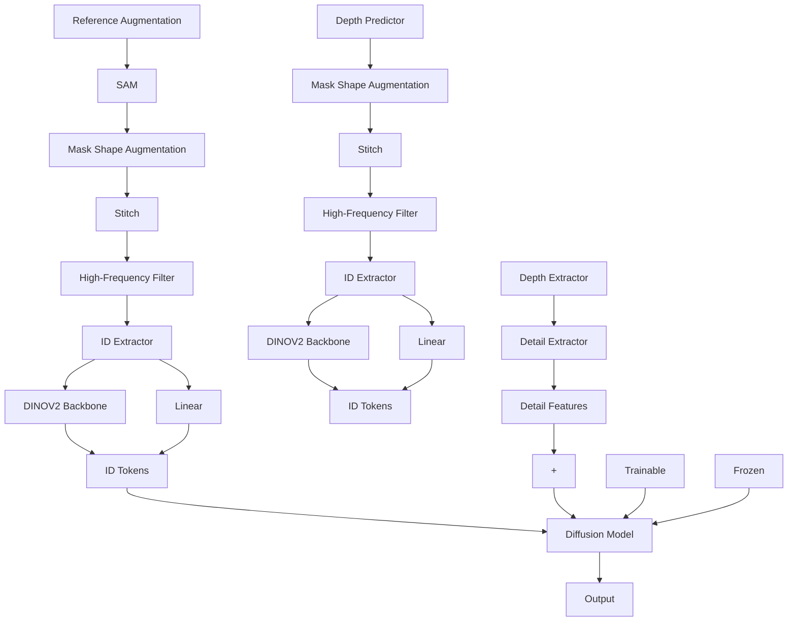

# BIFRÖST: 3D-Aware Image compositing with Language Instructions

Lingxiao Li $^{1}$ Kaixiong Gong $^{1}$ Weihong Li $^{1\dagger}$ Xili Dai $^{2}$ Tao Chen $^{3}$ Xiaojun Yuan $^{4}$ Xiangyu Yue $^{1\dagger}$

$^{1}$ MMLab, The Chinese University of Hong Kong

$^{2}$ The Hong Kong University of Science and Technology (Guangzhou)

$^{3}$ Fudan University $^{4}$ University of Electronic Science and Technology of China

https://github.com/lingxiao-li/Bifrost


  
"Place the apple behind the burger"


  
"Replace the cat with the dog"


  
“Place the backpack to the left of the vase”


  
“Place the toy behind the bucket and in front of the box”


  
Identity Preserved Inpainting


  
Identity Transfer   
Figure 1: Bifröst results on various personalized image compositing tasks. Top: Bifröst is adept at precise, arbitrary object placement and replacement in a background image with a reference object and a language instruction, and achieves 3D-aware high-fidelity harmonized compositing results; Bottom Left: Given a coarse mask, Bifröst can change the pose of the object to follow the shape of the mask; Bottom Right: Our model adapts the identity of the reference image to the target image without changing the pose.

# Abstract

This paper introduces Bifröst, a novel 3D-aware framework that is built upon diffusion models to perform instruction-based image composition. Previous methods concentrate on image compositing at the 2D level, which fall short in handling complex spatial relationships (e.g., occlusion). Bifröst addresses these issues by training MLLM as a 2.5D location predictor and integrating depth maps as an extra condition during the generation process to bridge the gap between 2D and 3D, which enhances spatial comprehension and supports sophisticated spatial inter-

actions. Our method begins by fine-tuning MLLM with a custom counterfactual dataset to predict 2.5D object locations in complex backgrounds from language instructions. Then, the image-compositing model is uniquely designed to process multiple types of input features, enabling it to perform high-fidelity image compositions that consider occlusion, depth blur, and image harmonization. Extensive qualitative and quantitative evaluations demonstrate that Bifröst significantly outperforms existing methods, providing a robust solution for generating realistically composited images in scenarios demanding intricate spatial understanding. This work not only pushes the boundaries of generative image compositing but also reduces reliance on expensive annotated datasets by effectively utilizing existing resources in innovative ways.

# 1 Introduction

Image generation has flourished alongside the advancement of diffusion models (Song et al., 2021; Ho et al., 2020; Rombach et al., 2022; Ramesh et al., 2022). Recent works (Saharia et al., 2022; Liu et al., 2023b; Brooks et al., 2023; Zhang et al., 2023b; Huang et al., 2023; Li et al., 2023; Chen et al., 2024; He et al., 2024) add conditional controls, e.g., text prompts, scribbles, skeleton maps to the diffusion models, offering significant potentials for controllable image editing. Among these methods for image editing, generative object-level image compositing (Yang et al., 2023; Song et al., 2023; Chen et al., 2024; Song et al., 2024) is a novel yet challenging task that aims to seamlessly inject an outside reference object into a given background image with a specific location, creating a cohesive and realistic image. This ability is significantly required in practical applications including E-commerce, effect-image rendering, poster-making, professional editing, etc.

Achieving arbitrary personalized object-level image compositing necessitates a deep understanding of the visual concept inherent to both the identity of the reference object and spatial relations of the background image. To date, this task has not been well addressed. Paint-by-Example (Yang et al., 2023) and Objectstitch (Song et al., 2023) use a target image as the template to edit a specific region of the background image, but they could not generate ID-consistent contents, especially for untrained categories. On the other hand, (Chen et al., 2024; Song et al., 2024) generate objects with ID (identity) preserved in the target scene, but they fall short in processing complicated 3D geometry relations (e.g., the occlusion) as they only consider 2D-level composition. To sum up, previous methods mainly either 1) fail to achieve both ID preservation and background harmony, or 2) do not explicitly take into account the geometry behind the background and fail to accurately composite objects and backgrounds in complex spatial relations.

We conclude that the root cause of aforementioned issues is that image composition is conducted at a 2D level. Ideally, the composition operation should be done in a 3D space for precise 3D geometry relationships. However, accurately modeling a 3D scene with any given image, especially with only one view, is non-trivial and time-consuming (Liu et al., 2023b). To address these challenges, we introduce Bifröst, which offers a 3D-aware framework for image composition without explicit 3D modeling. We achieve this by leveraging depth to indicate the 3D geometry relationship between the object and the background. In detail, our approach leverages a multi-modal large language model (MLLM) as a 2.5D location predictor (i.e., bounding box and depth for the object in the given background image). With the predicted bounding box and depth, our method yields a depth map for the composited image, which is fed into a diffusion model as guidance. This enables our method to achieve good ID preservation and background harmony simultaneously, as it is now aware of the spatial relations between them, and the conflict at the dimension of depth is eliminated. In addition, MLLM enables our method to composite images with text instructions, which enlarges the application scenario of Bifröst. Bifröst achieves significantly better visual results than the previous method, which in turn validates our conclusion.

We divide the training procedure into two stages. In the first stage, we finetune an MLLM (e.g., LLaVA (Liu et al., 2023a, 2024)) for 2.5D predictions of objects in complex scenes with language instructions. In the second stage, we train the image composition model. To composite images with complicated spatial relationships, we introduce depth maps as conditions for image generation. In addition, we leverage an ID extractor to generate discriminative ID tokens and a frequency-aware detail extractor to extract the high-frequency 2D shape information (detail maps) for ID preservation. We unify the depth maps, ID tokens, and detail maps to guide a pre-trained text-to-image diffusion model to generate desired image composition results. This two-stage training paradigm allows

us to utilize a number of existing 2D datasets for common visual tasks e.g., visual segmentation, and detection, avoiding collecting large-volume text-image data specially designed for arbitrary object-level image compositing.

Our main contributions can be summarized as follows: 1) We are the first to embed depth into the image composition pipeline, which improves the ID preservation and background harmony simultaneously. 2) We delicately build a counterfactual dataset and fine-tuned MLLM as a powerful tool to predict 2.5D location of the object in a given background image. Further, the fine-tuned MLLM enables our approach to understand language instructions for image composition. 3) Our approach has demonstrated exceptional performance through comprehensive qualitative assessments and quantitative analyses on image compositing and outperforms other methods, Bifröst allows us to generate images with better control of occlusion, depth blur, and image harmonization.

# 2 Related Work

# 2.1 Image compositing with Diffusion Models

Image compositing, an essential technique in image editing, seamlessly integrates a reference object into a background image, aiming for realism and high fidelity. Traditional methods, such as image harmonization (Jiang et al., 2021; Xue et al., 2022; Guerreiro et al., 2023; Ke et al., 2022) and blending (Pérez et al., 2003; Zhang et al., 2020, 2021; Wu et al., 2019) primarily ensure color and lighting consistency but inadequately address geometric discrepancies. The introduction of diffusion models (Ho et al., 2020; Sohl-Dickstein et al., 2015; Song et al., 2021; Rombach et al., 2022) has shifted focus towards comprehensive frameworks that address all facets of image compositing. Methods like (Yang et al., 2023; Song et al., 2023) often use CLIP-based adapters to utilize pretrained models, yet they compromise the object's identity preservation, focusing mainly on high-level semantic representations. More recent studies prioritize maintaining the appearance in generative object compositing. Notable developments in this field include AnyDoor (Chen et al., 2024) and ControlCom (Zhang et al., 2023a). AnyDoor integrates DINOv2 (Oquab et al., 2023) with a high-frequency filter, while ControlCom introduces a local enhancement module, both improving appearance retention. However, these approaches still face challenges in spatial correction capabilities. Most recent work IMPRINT (Song et al., 2024) trains an ID-preserving encoder that enhances the visual consistency of the object while maintaining geometry and color harmonization. However, none of the work can deal with composition with occlusion and more complex spatial relations. In contrast, our models novelly propose a 3D-aware generative model that allows more accuracy and complex image compositing while maintaining geometry and color harmonization.

# 2.2 LLM with Diffusion Models

The open-sourced LlaMA (Touvron et al., 2023; Chiang et al., 2023) substantially enhances vision tasks by leveraging Large Language Models (LLMs). Innovations such as LLaVA and MiniGPT-4 (Liu et al., 2023a; Zhu et al., 2024) have advanced image-text alignment through instruction-tuning. While many MLLM-based studies have demonstrated effectiveness in text-generation tasks like human-robot interaction, complex reasoning, and science question answering, GILL (Koh et al., 2023) acts as a conduit between MLLMs and diffusion models by enabling LLMs to process and generate coherent images from textual inputs. SEED (Ge et al., 2023b) introduces a novel image tokenizer that allows LLMs to handle and concurrently generate images and text, with SEED-2 (Ge et al., 2023a) enhancing this process by better aligning generation embeddings with image embeddings from unCLIP-SD, thus improving the preservation of visual semantics and realistic image reconstruction. Emu (Sun et al., 2024), a multimodal generalist, is trained on a next-token-prediction model. CM3Leon (Yu et al., 2023a), utilizing the CM3 multimodal architecture and adapted training methods from text-only models, excels in both text-to-image and image-to-text generations. Finally, SmartEdit (Huang et al., 2024) proposes a Bidirectional Interaction Module that enables comprehensive bidirectional information interactions between images and the MLLM output, allowing it for complex instruction-based image editing. Nevertheless, these methods require text-image pairs data to train and do not support accurate spatial location prediction and subject-driven image compositing.


<details>
<summary>flowchart</summary>

```mermaid
graph TD
    A["Instruction C_T: Place the orange to the left and behind the apple, output the bounding box and the depth value of the center point."] --> B["MLLM"]
    B --> C["BBox: [0.10, 0.32, 0.52, 0.74"], Depth: 0.507]
    D["I_bg"] --> E["Depth Predictor"]
    F["I_obj"] --> E
    E --> G["Depth Fusion"]
    G --> H["Diffusion Model"]
    H --> I["I_out"]
    style A fill:#f9f,stroke:#333
    style F fill:#f9f,stroke:#333
    style D fill:#ccf,stroke:#333
    style H fill:#cfc,stroke:#333
```
</details>

Figure 2: Overview of the inference pipeline of Bifröst. Given background image $I_{bg}$ , and text instruction $c_{T}$ that indicates the location for object compositing to the background, the MLLM first predicts the 2.5D location consists of a bounding box and the depth of the object. Then a pre-trained depth predictor is applied to estimate the given images' depth. After that, The depth of the reference object is scaled to the depth value predicted by MLLM and fused in the predicted location of the background depth. Finally, the masked background image, fused depth, and reference object image are used as the input of the compositing model and generate an output image $I_{out}$ that satisfies spatial relations in the text instruction $c_{T}$ and appears visually coherent and natural (e.g., with light and shadow that are consistent with the background image).

# 3 Method

The overall pipeline of our Bifröst is elaborated in Fig. 2. Our method consists of two stages: 1) in stage 1, given the input image of object and background, and text instruction that indicates the location for object compositing to the background, the MLLMs are finetuned on our customized dataset for predicting a 2.5D location, which provides the bounding box and a depth value of the object in the background; 2) in stage 2, our Bifröst performs 3D-aware image compositing according to the generated 2.5D location, images of object and background and their depth maps estimated by a depth predictor. As we divide the pipeline into two stages, we can adopt the existing benchmarks that have been collected for common vision problems and avoid the demand of collected new and task-specific paired data.

We detail our pipeline in the following section. In Sec. 3.1 we discuss building our customized counterfactual dataset and fine-tuning multi-modal large language models to predict 2.5D locations given a background image. Following this, in Sec. 3.2, we introduce the 3D-aware image compositing pipeline that uses the spatial location predicted by MLLM to seamlessly integrate the reference object into the background image. Finally, we discuss combining two stages in Sec. 3.3 and show more application scenarios of our proposed method.

# 3.1 Finetuning MLLM to Predict 2.5D Location

Given a background image $I_{bg}$ and text instruction $c_{T}$ , which is tokenized as $H_{T}$ , our goal is to obtain the 2.5D coordinate of the reference object we want to place in. We indicate the 2.5D coordinate as l which consists of a 2D bounding box $b = [x_{1}, y_{1}, x_{2}, y_{2}]$ and an estimated depth value $d \in [0, 1]$ . During the training stage, the majority of parameters $\theta$ in the LLM are kept frozen, and we utilize LoRA (Hu et al., 2022) to carry out efficient fine-tuning. Subsequently, for a sequence of length L, we minimize the negative log-likelihood of generated text tokens $X_{A}$ , which can be formulated as:

$$
L _ {\mathrm{LLM}} \left(\mathbf {I} _ {b g}, \boldsymbol {c} _ {T}\right) = - \sum_ {i = 1} ^ {L} \log p _ {\{\theta \}} \left(x _ {i} \mid \mathbf {I} _ {b g}, \boldsymbol {c} _ {T, <   i}, X _ {A, <   i}\right) \tag {1}
$$

Dataset Generation. However, there is a lack of dataset containing image-text data pairs to teach the MLLM to predict the reasonable location to place in the background image $I_{bg}$ following the instruction $c_{T}$ and it is crucial to create such dataset. Since the model needs to predict both a 2D bounding box and depth value in Z axis, this requires the model to be capable of understanding both the spatial relationship between objects and the size relationship between objects (e.g., the bounding box of a dog should be smaller than the car if the user wants to place a dog near the car) and the physical laws in the image (e.g., a bottle should be placed on the table rather than floating in the air).


<details>
<summary>flowchart</summary>


</details>

Figure 3: Overview of the 2.5D counterfactual dataset generation for fine-tuning MLLM. Given a scene image I, one object o was randomly selected as the object we want to predict (e.g., the laptop in this figure). The depth of the object is predicted by a pre-trained depth predictor. The selected object is then removed from the given image using the SAM (i.e. mask the object) followed by an SD-based inpainting model (i.e., inpaint the masked hole). The final data pair consists of a text instruction, a counterfactual image, and a 2.5D location of the selected object o.


Instruction: Place the person in front of the car and to the right of the person, output the bounding box and the depth value of the center point.
Answer: [0.32, 0.19, 0.56, 0.87], 0.89.

Instruction: Place the cat on top of the refrigerator, output the bounding box and the depth value of the center point.
Answer: [0.53, 0.36, 0.65, 0.70], 0.30.

Figure 4: Examples of 2.5D counterfactual dataset for fine-tuning MLLM.

Furthermore, the image should not contain the object we want to place (i.e., the MLLM should learn to predict the location). To this end, we build a novel counterfactual dataset based on MS COCO dataset (Lin et al., 2014). For a background image x and annotation a, we use a pre-trained depth predictor DPT (Ranftl et al., 2021) to estimate the depth map d. We randomly select k objects and choose one as the target $(o_{s})$ , defining spatial relations with the other k-1 objects (e.g., left of, above, in front of). GPT-3 (Brown et al., 2020) generates text descriptions D mentioning all objects and their relative positions, as shown in Fig. 3. The ground truth includes the bounding box and depth value of $o_{s}$ . Using diffusion-based inpainting (Yu et al., 2023b), we remove $o_{s}$ from $I_{bg}$ . We collect 30,080 image-instruction-answer pairs for training and 855 for testing, with examples in Fig. 4. Further details are in Appendix B.1.

# 3.2 3D-Aware Image compositing

The training pipeline of Bifröst's 3D-aware image compositing module is shown in Fig. 5. Given the reference object, background, and estimated 2.5D location, Bifröst extracts ID Token, detail map, and depth maps to generate high-fidelity, diverse object-scene compositions that respect spatial relations. Unlike previous works using only 2D backgrounds and objects, our key contribution is incorporating depth maps to account for spatial relationships. Additionally, we use large-scale data, including videos and images, to train the model to learn the appearance changes, ensuring high fidelity in generated images. Details of different components are as follows.

ID Extractor. We leverage pre-trained DINO-V2 (Oquab et al., 2023) to encode images into visual tokens to preserve more information. We use a single linear layer to bridge the embedding space of DINOV2 and the pre-trained text-to-image UNet. The final projected ID tokens can be gotten by:

$$
\boldsymbol {c} _ {\mathrm{i}} = \mathcal {E} _ {i} \left(\mathbf {I} _ {o b j}\right), \tag {2}
$$

where $E_{i}$ indicates the ID extractor.

Detail Extractor. The ID tokens inevitably lose the fine details of the reference object due to the information bottleneck. Thus, we need extra guidance for the complementary detail generation. We apply a high-frequency map to represent fine-grained details of the object. We further applied mask shape augmentation to provide more practical guidance of the pose and view of the generated object, which mimics the casual user brush used in practical editing. The results are shown at the bottom of Fig. 1. After obtaining the high-frequency map, we stitch it onto the scene image at the specified locations and pass the collage to the detail extractor:

$$
\boldsymbol {c} _ {\mathrm{h}} = \mathcal {E} _ {h} \left(\mathbf {I} _ {h}\right), \tag {3}
$$


<details>
<summary>flowchart</summary>


</details>

Figure 5: Overview of training pipeline of Bifröst on image compositing stage. A segmentation module is first adopted to get the masked image and object without background, followed by an ID extractor to obtain its identity information. The high-frequency filter is then applied to extract the detail of the object, stitch the result with the scene at the predicted location, and employ a detail extractor to complement the ID extractor with texture details. We then use a depth predictor to estimate the depth of the image and apply a depth extractor to capture the spatial information of the scene. Finally, the ID tokens, detail maps, and depth maps are integrated into a pre-trained diffusion model, enabling the target object to seamlessly blend with its surroundings while preserving complex spatial relationships.

Table 1: Statistics of the datasets used in the image compositing stage. 

<table><tr><td></td><td>YouTubeVOS</td><td>MOSE</td><td>VIPSeg</td><td>VitonHD</td><td>MSRA-10K</td><td>DUT</td><td>HFlickr</td><td>LVIS</td><td>SAM (subset)</td></tr><tr><td>Type</td><td>Video</td><td>Video</td><td>Video</td><td>Image</td><td>Image</td><td>Image</td><td>Image</td><td>Image</td><td>Image</td></tr><tr><td># Samples</td><td>4453</td><td>1507</td><td>3110</td><td>11647</td><td>10000</td><td>15572</td><td>4833</td><td>118287</td><td>178976</td></tr><tr><td>Variation</td><td>√</td><td>√</td><td>√</td><td>√</td><td>✕</td><td>✕</td><td>✕</td><td>✕</td><td>✕</td></tr></table>

where $E_{h}$ is the detail extractor and $c_{h}$ is the extracted high-frequency condition. More details can be found in Appendix B.2

Depth Extractor. As we mentioned in Sec. 1, all existing image compositing works can only insert objects as foreground. As Fig. 7 shows, the generated images look wired when the inserted object has some overlap with objects in the background. We tackle this problem by proposing a simple yet effective method by adding depth control to the model. By utilizing pre-trained depth predictor DPT (Ranftl et al., 2021), we could generate depth-image pairs without demanding extra annotation. Formally, given a target image $I_{tar}$ , we have

$$
\boldsymbol {c} _ {\mathrm{d}} = \mathcal {E} _ {d} \left(\mathrm{DPT} (\mathbf {I} _ {t a r})\right), \tag {4}
$$

where $E_{d}$ is the depth extractor and $c_{d}$ is the extracted depth condition. In our experiment, the detail and depth extractors utilize ControlNet-style UNet encoders, generating hierarchical detail maps at multiple resolutions.

Feature Injection. Given an image $z_{0}$ , image diffusion algorithms progressively add noise to the image and produce a noisy image $z_{t}$ , where t represents the number of times noise is added. Given a set of conditions including time step t, object ID condition $c_{i}$ , high-frequency detail condition $c_{h}$ , as well as a depth condition $c_{d}$ , image diffusion algorithms learn a UNet $\epsilon_{\theta}$ to predict the noise added to the noisy image $z_{t}$ with

$$
\mathcal {L} _ {\text { composite }} = \mathbb {E} _ {\boldsymbol {z} _ {0}, \boldsymbol {t}, \boldsymbol {c} _ {i}, \boldsymbol {c} _ {\mathrm{f}}, \epsilon \sim \mathcal {N} (0, 1)} \left[ \right. \| \epsilon - \epsilon_ {\theta} \left(\boldsymbol {z} _ {t}, \boldsymbol {t}, \boldsymbol {c} _ {i}, \boldsymbol {c} _ {\mathrm{f}}\right)\left. \right) \| _ {2} ^ {2} \left. \right], \tag {5}
$$

where $c_{f} = c_{h} + \lambda \cdot c_{d}$ and $\lambda$ is a hyper parameter weight between two controls. Specifically, the ID tokens are injected into each UNet layer via cross-attention. The high-frequency detail and depth maps are first added together and then concatenated with the UNet decoder features at each resolution. During training, the pre-trained UNet encoder parameters are frozen to retain priors, while the decoder is fine-tuned to adapt to the new task.

Classifier-free Guidance. To achieve the trade-off between identity preservation and image harmonization, we find that classifier-free sampling strategy (Ho and Salimans, 2022) is a powerful tool.


<details>
<summary>flowchart</summary>


</details>

Figure 6: Data preparation pipeline of leveraging videos. Given a clip, we first sample two frames, selecting an instance from one frame as the reference object and using the corresponding instance from the other frame as the training supervision.

Table 2: Quantitative evaluation results on the accuracy of the MLLM's prediction of Bifröst. Note: MiniGPTv2 and LLaVA (baseline) do not support depth prediction. 

<table><tr><td></td><td>MiniGPTv2</td><td>LLaVA (baseline)</td><td>Ours</td></tr><tr><td>BBox(MSE) (↓)</td><td>0.2694</td><td>0.0653</td><td>0.0496</td></tr><tr><td>BBox(IoU) (↑)</td><td>0.0175</td><td>0.7567</td><td>0.8515</td></tr><tr><td>Depth (MSE) (↓)</td><td> $\mathcal{X}$ </td><td> $\mathcal{X}$ </td><td>0.0658</td></tr></table>

Previous work (Tang et al., 2022) found that the classifier-free guidance is actually the combination of both prior and posterior constraints.

$$
\log p \left(\mathbf {y} _ {t} \mid \mathbf {c}\right) + (s - 1) \log p (\mathbf {c} \mid \mathbf {y} _ {t}) \propto \log p (\mathbf {y} _ {t}) + s \left(\log p \left(\mathbf {y} _ {t} \mid \mathbf {c}\right) - \log p (\mathbf {y} _ {t})\right), \tag {6}
$$

where s denotes the classifier-free guidance scale. In our experiments, we follow the settings in (Zhang et al., 2023b).

$$
\epsilon_ {\mathrm{prd}} = \epsilon_ {\mathrm{uc}} + s \left(\epsilon_ {\mathrm{c}} - \epsilon_ {\mathrm{uc}}\right), \tag {7}
$$

where $\epsilon_{\mathrm{prd}}$ , $\epsilon_{\mathrm{uc}}$ , $\epsilon_{\mathrm{c}}$ , $s$ are the model's final output, unconditional output, conditional output, and a user-specified weight respectively. In the training process, we randomly replace $50\%$ object ID condition $c_i$ with empty strings. This approach increases Bifröst's ability to directly recognize semantics in the input conditions as a replacement for the ID tokens. We further replace $30\%$ of the depth map or detail map as blank to increase the robustness of our model. (i.e., our model could generate high-quality images with only one condition, either from detail or depth control).

Dataset Generation. The ideal training data consists of image pairs capturing the same object in different scenes and poses, which existing datasets lack. Previous works (Yang et al., 2023; Song et al., 2023) use single images with augmentations like rotation and flip, which are insufficient for realistic pose and view variants. To address this, we use video datasets to capture frames of the same object as complementary following (Chen et al., 2024; Song et al., 2024). As illustrated in Fig. 6, our data preparation pipeline selects two frames from a video and extracts foreground masks. One frame is masked and cropped around the object to serve as the reference, while the other frame—with an augmented mask shape—acts as the background. The unmasked version of this second frame serves as the training ground truth. The dataset quality is another key to better identity preservation and pose variation. The full data used is listed in Tab. 1, which covers a large variety of domains such as nature scenes (SAM (Kirillov et al., 2023), LVIS (Gupta et al., 2019), HFlickr (Cong et al., 2020), DUT (Wang et al., 2017), and MSRA-10K (Borji et al., 2015)), panoptic video segmentation datasets (YoutubeVOS (Xu et al., 2018), VIPSeg (Miao et al., 2022), and MOSE (Ding et al., 2023)), and virtual try-on dataset (VitonHD (Choi et al., 2021)).

# 3.3 Inference

The overall inference pipeline is shown in Fig. 2. Given background image $I_{bg}$ , and text instruction $c_{T}$ , our fine-tuned MLLM predicts the 2.5D location of object formulated as bounding box $b = [x_{1}, y_{1}, x_{2}, y_{2}]$ and an estimated depth value $d \in [0, 1]$ . Then, we first scale the depth map of the reference image to the predicted depth and fuse it into the bounding box location of the background depth map. The background image is masked following the bounding box. Finally, one can generate the composited image following the pipeline in Fig. 2. We also support various formats of input (e.g., user-specified mask and depth), which allows more application scenarios as Fig. 1 shows. More details can be found in the Appendix B.

# 4 Experiment

# 4.1 Implementation Details

Hyperparameters. We choose LLaVA (Liu et al., 2023a, 2024) as our method to fine-tune multimodal large language models and Vicuna (Chiang et al., 2023) as the LLM. The learning rate is

Table 3: Quantitative evaluation results on the performance of image compositing. Bifröst outperforms all other methods across all metrics. 

<table><tr><td></td><td>Paint-by-Example</td><td>Object-Stitch</td><td>TF-ICON</td><td>AnyDoor</td><td>Ours</td></tr><tr><td>DINO-score (↑)</td><td>72.225</td><td>73.108</td><td>74.743</td><td>76.807</td><td>77.746</td></tr><tr><td>CLIP-score (↑)</td><td>84.584</td><td>84.836</td><td>85.627</td><td>88.735</td><td>89.722</td></tr><tr><td>FID (↓)</td><td>22.286</td><td>19.489</td><td>18.945</td><td>15.858</td><td>15.025</td></tr></table>


  
Object


  
Background


  
Fused Depth


  
Ours


  
PbE


  
ObjectStitch


  
AnyDoor   
Figure 7: Qualitative comparison with reference-based image generation methods, including Paint-by-Example (Yang et al., 2023), ObjectStitch (Song et al., 2023), and AnyDoor (Chen et al., 2024), where our Bifröst better preserves the geometry consistency. Note that all approaches do not fine-tune the model on the test samples.

set as $2e^{-5}$ and train 15 epochs. We choose Stable Diffusion V2.1 (Rombach et al., 2022) as the base generator for the image compositing model. During training, we set the image resolution to $512 \times 512$ . We choose Adam (Kingma and Ba, 2014) optimizer with an initial learning rate of $1e^{-5}$ . More details can be found in the Appendix A.

Zoom-in Strategy. During inference, given a scene image and a location box, we expand the box into a square using an amplification ratio of 2.0. The square is then cropped and resized to $512 \times 512$ for input into the diffusion model. This approach enables handling scenes with arbitrary aspect ratios and location boxes covering extremely small or large areas.

Benchmarks. To evaluate the performance of our Fine-tuned MLLM, we collect 855 image-instruction-answer pairs for testing as we mentioned in Sec. 3.1. For quantitative results of spatial aware image compositing, we follow the settings in (Chen et al., 2024) that contain 30 new concepts from DreamBooth (Ruiz et al., 2023) for the reference images. We manually pick 30 images with boxes in COCO-Val (Lin et al., 2014) for the scene image. Thus, we generate 900 images for the object-scene combinations.

Evaluation metrics. We test the IoU and MSE loss to evaluate the accuracy of the predicted bounding box and depth of our MLLM. For the image compositing model, we evaluate performance on our constructed DreamBooth dataset by following DreamBooth (Ruiz et al., 2023) to calculate the CLIP-Score and DINO-Score, which measure the similarity between the generated region and the target object. We also compute the FID (Heusel et al., 2017) to assess realism and compositing quality. Additionally, we conduct user studies with 30 annotators to rate the results based on fidelity, quality, diversity, and 3D awareness.

Table 4: User study on the comparison between our Bifröst and existing alternatives. “Quality”, “Fidelity”, “Diversity”, and “3D Awareness” measure synthesis quality, object identity preservation, object local variation (i.e., across four proposals), and spatial relation awareness (i.e., occlusion) respectively. Each metric is rated from 1 (worst) to 5 (best). 

<table><tr><td></td><td>Paint-by-Example</td><td>Object-Stitch</td><td>TF-ICON</td><td>AnyDoor</td><td>Ours (w/o depth)</td><td>Ours (w/ depth)</td></tr><tr><td>Quality (↑)</td><td>2.24</td><td>2.66</td><td>2.75</td><td>3.57</td><td>3.64</td><td>3.96</td></tr><tr><td>Fidelity (↑)</td><td>2.05</td><td>2.56</td><td>2.63</td><td>3.58</td><td>3.89</td><td>4.03</td></tr><tr><td>Diversity (↑)</td><td>3.87</td><td>2.42</td><td>2.36</td><td>3.57</td><td>3.61</td><td>3.07</td></tr><tr><td>3D Awareness (↑)</td><td>3.56</td><td>3.37</td><td>3.42</td><td>2.51</td><td>2.56</td><td>4.21</td></tr></table>

Identity Preserved
Inpainting   
Identity Transfer   


  
Object


  
Background


  
Ours


  
Object


  
Background


  
Ours

Figure 8: Results of other application scenarios of Bifröst.   
  
Object

  
Target Depth

  
Background

  
Baseline

  
+ CFG

  
+ HF Filter

  
+ Depth   
Figure 9: Qualitative ablation study on the core components of Bifröst, where the last column is the result of our full model, “HF-Filter” stands for the high-frequency filter in the detail extractor.

# 4.2 Quantitative Evaluation

MLLM Evaluation. To evaluate the effectiveness of our fine-tuned MLLM, we compare our model with two vison-language LLMs: LLaVA (Liu et al., 2023a) and miniGPTv2 (Zhu et al., 2024). However, to our knowledge, none of the MLLM support accurate depth prediction. The results are shown in Tab. 2, which indicates that our fine-tuned MLLM outperforms other models significantly on the spatial bounding box prediction task.

Spatial-Aware Image compositing Evaluation. To demonstrate the effectiveness of our model, we test our model and four existing methods (Paint-by-Example (Yang et al., 2023), ObjectStitch (Song et al., 2023), TF-ICON (Lu et al., 2023)), and AnyDoor (Chen et al., 2024) on the dreambooth (Ruiz et al., 2023) test sets. The same inputs (a mask and a reference object) are used in all models. As shown in Tab. 3, Bifröst consistently outperforms baselines across all metrics, indicating that our model generates images with both realism and fidelity.

# 4.3 Qualitative Evaluation

To better evaluate the performance of our spatial-aware image compositing model, we qualitatively compare our method against prior methods as shown in Fig. 7. PbE and ObjectStitch show natural compositing effects, but they fail to preserve the object's ID when the object has a complex texture or structure. Although AnyDoor maintains a fine-grained texture of the object, it can not handle occlusion with other objects in the scene. In contrast, our model achieves better ID preservation and demonstrates flexibility in adapting to the background even in complex scenes with occlusion(i.e., the poop emoji in the third row is seamlessly injected between the bowl and flowerpot with no artifact). We also provide more results of other application scenarios in Fig. 8.

User Study. We organize user study to compare Paint-by-Example, ObjectStitch, TF-ICON, AnyDoor, and our model. The user-study results are listed in Tab. 4. It shows that our model owns evident superiorities for fidelity, quantity, and 3D awareness, especially for 3D awareness. Without depth control, our model can generate more diverse objects adjusted for the background. Nevertheless, the quality fidelity, and 3D awareness degrade significantly if the depth control is removed. However, as (Yang et al., 2023) only keeps the semantic consistency but our methods preserve the instance identity, they naturally have larger space for the diversity. In this case, Bifröst still gets higher rates than (Song et al., 2023; Lu et al., 2023) and competitive results with (Chen et al., 2024), which verifies the effectiveness of our method. This results indicate that introducing the depth information is the key for Bifröst to achieve both high fidelity and 3D-aware image compositing. More details are in the Appendix F.


<details>
<summary>text_image</summary>

Object
Background
Depth: 0.35
Depth: 0.50
Depth: 0.65
Depth: 0.80
</details>

Figure 10: Ablation study of different depth control from deep to shallow.


<details>
<summary>text_image</summary>

Object
Background
Fused Depth
Ours
AnyDoor
Instruction: Place the backpack behind the bed.
</details>

Figure 11: Failure case from the out-of-distribution dataset and comparison with AnyDoor.

# 4.4 Ablation Study

Tab. 5 shows the effect of components in Bifröst. Performance drops significantly without video data during training, as it cannot adjust poses and views to adapt to unseen scenes with only image data. Fig. 9 visualizes results of removing different components. CFG achieves a trade-off between identity preservation and image harmonization, significantly boosting performance. Setting the collage region from the high-frequency map to an all-zero map evaluates the HF Filter's contribution, showing it effectively guides the generation of fine structural details. Adding depth control further improves the fidelity and quality of generated images, as visualized in Fig. 10, where the red vase moves from behind the table to the front of the white vase as depth increases.

Table 5: Quantitative ablation studies on the core components of the image compositing model of Bifröst. Note that: + indicates adding one component based on the previous model. 

<table><tr><td></td><td>Baseline</td><td>+Video Data</td><td>+CFG</td><td>+HF Filter</td><td>+Depth</td></tr><tr><td>DINO-score (↑)</td><td>68.693</td><td>71.573</td><td>75.578</td><td>76.372</td><td>77.746</td></tr><tr><td>CLIP-score (↑)</td><td>80.458</td><td>83.536</td><td>86.394</td><td>88.634</td><td>89.722</td></tr><tr><td>FID (↓)</td><td>20.465</td><td>17.168</td><td>15.837</td><td>15.342</td><td>15.025</td></tr></table>

# 4.5 Limitations and Future Work

Our Bifröst achieves high-quality, instruction-based image compositing but has limitations. 1) While our fine-tuned MLLM performs well on in-domain test datasets, it struggles with OOD datasets containing untrained objects and more complex scenes. A failure case is illustrated in Fig. 11, where the model intends to position the backpack behind the bed. While MLLM predicts the correct location, it overlaps with the chair in the background. Nonetheless, our approach still outperforms prior work (Chen et al., 2024), which fails to handle occlusions between the bed and chair due to insufficient understanding of spatial and depth relationships. This issue can be addressed by increasing the size of the training dataset (e.g., utilizing large-scale, OpenImages (Kuznetsova et al., 2018). 2) The use of depth maps significantly enhances our model's generation capabilities, enabling precise control over object placement and complex spatial relationships. However, this reliance on depth maps restricts the diversity of generated objects, particularly in terms of novel poses and views. Although we employ classifier-free guidance during inference to provide some flexibility, it represents a trade-off between spatial control and object diversity. This can potentially be solved by robust depth control during the training stage. We leave this for future work.

# 5 Conclusion

In conclusion, Bifröst represents a significant advancement in object-level image compositing. Leveraging the capabilities of powerful MLLM, our framework successfully addresses the limitations of existing SD-based image compositing methods, facilitating their transition from research to practical applications. Our experimental results demonstrate that Bifröst not only achieves state-of-the-art quality and fidelity in instruction-based, object-level image compositing but also provides a controllable generation process that accommodates complex spatial relationships. Future research endeavors encompass the refinement of the MLLM through the utilization of more extensive datasets and extending our framework to support 3D and video-based personalized object compositing tasks, further broadening its applicability and enhancing its performance.

Acknowledgements This work is partially supported by the National Natural Science Foundation of China (Grant No. 62306261), CUHK Direct Grants (Grant No. 4055190), and The Shun Hing Institute of Advanced Engineering (SHIAE) No. 8115074. We thank Boqing Gong (Google) for feedback on an early draft of this paper and Yuanyuan Zhang (University of Liverpool) for proposing the name Bifröst of our model.

# References

Borji, A., Cheng, M.-M., Jiang, H., and Li, J. (2015). Salient object detection: A benchmark. IEEE Trans. Image Process. 7   
Brooks, T., Holynski, A., and Efros, A. A. (2023). Instructpix2pix: Learning to follow image editing instructions. In IEEE Conf. Comput. Vis. Pattern Recog., pages 18392–18402. 2   
Brown, T., Mann, B., Ryder, N., Subbiah, M., Kaplan, J. D., Dhariwal, P., Neelakantan, A., Shyam, P., Sastry, G., Askell, A., Agarwal, S., Herbert-Voss, A., Krueger, G., Henighan, T., Child, R., Ramesh, A., Ziegler, D., Wu, J., Winter, C., Hesse, C., Chen, M., Sigler, E., Litwin, M., Gray, S., Chess, B., Clark, J., Berner, C., McCandlish, S., Radford, A., Sutskever, I., and Amodei, D. (2020). Language models are few-shot learners. In Adv. Neural Inform. Process. Syst., pages 1877–1901. 5, 17   
Casanova, A., Careil, M., Romero-Soriano, A., Pal, C. J., Verbeek, J., and Drozdzal, M. (2023). Controllable image generation via collage representations. arXiv:2304.13722. 15   
Chen, X., Huang, L., Liu, Y., Shen, Y., Zhao, D., and Zhao, H. (2024). Anydoor: Zero-shot object-level image customization. In IEEE Conf. Comput. Vis. Pattern Recog. 2, 3, 7, 8, 9, 10, 14, 15, 17, 18, 19, 20   
Chiang, W.-L., Li, Z., Lin, Z., Sheng, Y., Wu, Z., Zhang, H., Zheng, L., Zhuang, S., Zhuang, Y., Gonzalez, J. E., Stoica, I., and Xing, E. P. (2023). Vicuna: An open-source chatbot impressing gpt-4 with 90%\* chatgpt quality. 3, 7, 14   
Choi, S., Park, S., Lee, M., and Choo, J. (2021). Viton-hd: High-resolution virtual try-on via misalignment-aware normalization. In IEEE Conf. Comput. Vis. Pattern Recog. 7   
Cong, W., Zhang, J., Niu, L., Liu, L., Ling, Z., Li, W., and Zhang, L. (2020). Dovenet: Deep image harmonization via domain verification. In IEEE Conf. Comput. Vis. Pattern Recog. 7   
Ding, H., Liu, C., He, S., Jiang, X., Torr, P. H., and Bai, S. (2023). Mose: A new dataset for video object segmentation in complex scenes. arXiv:2302.01872. 7   
Ge, Y., Zhao, S., Zeng, Z., Ge, Y., Li, C., Wang, X., and Shan, Y. (2023a). Making llama see and draw with seed tokenizer. arXiv preprint arXiv:2310.01218. 3   
Ge, Y., Ge, Y., Zeng, Z., Wang, X., and Shan, Y. (2023b). Planting a seed of vision in large language model. In Int. Conf. Learn. Represent. 3   
Guerreiro, J. J. A., Nakazawa, M., and Stenger, B. (2023). Pct-net: Full resolution image harmonization using pixel-wise color transformations. In IEEE Conf. Comput. Vis. Pattern Recog., pages 5917-5926. 3   
Gupta, A., Dollar, P., and Girshick, R. (2019). Lvis: A dataset for large vocabulary instance segmentation. In IEEE Conf. Comput. Vis. Pattern Recog. 7   
He, R., Ma, K., Huang, L., Huang, S., Gao, J., Wei, X., Dai, J., Han, J., and Liu, S. (2024). Freeedit: Mask-free reference-based image editing with multi-modal instruction. 2   
Heusel, M., Ramsauer, H., Unterthiner, T., Nessler, B., and Hochreiter, S. (2017). Gans trained by a two time-scale update rule converge to a local nash equilibrium. In Adv. Neural Inform. Process. Syst. 8   
Ho, J. and Salimans, T. (2022). Classifier-free diffusion guidance. In H. Larochelle, M. Ranzato, R. Hadsell, M. Balcan, and H. Lin, editors, NIPS Workshop. 6   
Ho, J., Jain, A., and Abbeel, P. (2020). Denoising diffusion probabilistic models. In H. Larochelle, M. Ranzato, R. Hadsell, M. Balcan, and H. Lin, editors, Adv. Neural Inform. Process. Syst., volume 33, pages 6840–6851. 2, 3   
Hu, E. J., Shen, Y., Wallis, P., Allen-Zhu, Z., Li, Y., Wang, S., Wang, L., and Chen, W. (2022). LoRA: Low-rank adaptation of large language models. In Int. Conf. Learn. Represent. 4   
Huang, L., Chen, D., Liu, Y., Shen, Y., Zhao, D., and Zhou, J. (2023). Composer: creative and controllable image synthesis with composable conditions. In Int. Conf. Machine. Learning. 2

Huang, Y., Xie, L., Wang, X., Yuan, Z., Cun, X., Ge, Y., Zhou, J., Dong, C., Huang, R., Zhang, R., et al. (2024). Smartedit: Exploring complex instruction-based image editing with multimodal large language models. In IEEE Conf. Comput. Vis. Pattern Recog. 3   
Jiang, Y., Zhang, H., Zhang, J., Wang, Y., Lin, Z., Sunkavalli, K., Chen, S., Amirghodsi, S., Kong, S., and Wang, Z. (2021). Ssh: A self-supervised framework for image harmonization. In Int. Conf. Comput. Vis., pages 4832–4841. 3   
Kanopoulos, N., Vasanthavada, N., and Baker, R. L. (1988). Design of an image edge detection filter using the sobel operator. IEEE Journal of solid-state circuits. 16   
Ke, Z., Sun, C., Zhu, L., Xu, K., and Lau, R. W. (2022). Harmonizer: Learning to perform white-box image and video harmonization. In Eur. Conf. Comput. Vis., pages 690–706. Springer. 3   
Kingma, D. P. and Ba, J. (2014). Adam: A method for stochastic optimization. arXiv:1412.6980. 8, 14   
Kirillov, A., Mintun, E., Ravi, N., Mao, H., Rolland, C., Gustafson, L., Xiao, T., Whitehead, S., Berg, A. C., Lo, W.-Y., et al. (2023). Segment anything. arXiv:2304.02643. 7   
Koh, J. Y., Fried, D., and Salakhutdinov, R. (2023). Generating images with multimodal language models. In Adv. Neural Inform. Process. Syst. 3   
Kuznetsova, A., Rom, H., Alldrin, N., Uijlings, J., Krasin, I., Pont-Tuset, J., Kamali, S., Popov, S., Malloci, M., Kolesnikov, A., Duerig, T., and Ferrari, V. (2018). The open images dataset v4: Unified image classification, object detection, and visual relationship detection at scale. Int. J. Comput. Vis. 10   
Li, L., Zhang, Y., and Wang, S. (2023). The euclidean space is evil: Hyperbolic attribute editing for few-shot image generation. In Int. Conf. Comput. Vis., pages 22714–22724. 2   
Lin, T.-Y., Maire, M., Belongie, S., Hays, J., Perona, P., Ramanan, D., Dollár, P., and Zitnick, C. L. (2014). Microsoft coco: Common objects in context. In Eur. Conf. Comput. Vis., pages 740–755. 5, 8, 17   
Liu, H., Li, C., Wu, Q., and Lee, Y. J. (2023a). Visual instruction tuning. In Adv. Neural Inform. Process. Syst. 2, 3, 7, 9, 14   
Liu, H., Li, C., Li, Y., and Lee, Y. J. (2024). Improved baselines with visual instruction tuning. In IEEE Conf. Comput. Vis. Pattern Recog. 2, 7   
Liu, R., Wu, R., Van Hoorick, B., Tokmakov, P., Zakharov, S., and Vondrick, C. (2023b). Zero-1-to-3: Zero-shot one image to 3d object. In IEEE Conf. Comput. Vis. Pattern Recog., pages 9298–9309. 2   
Lu, S., Liu, Y., and Kong, A. W.-K. (2023). Tf-icon: Diffusion-based training-free cross-domain image composition. In Int. Conf. Comput. Vis., pages 2294–2305. 9, 19   
Miao, J., Wang, X., Wu, Y., Li, W., Zhang, X., Wei, Y., and Yang, Y. (2022). Large-scale video panoptic segmentation in the wild: A benchmark. In IEEE Conf. Comput. Vis. Pattern Recog., pages 21033–21043. 7   
Oquab, M., Darcet, T., Moutakanni, T., Vo, H. V., Szafraniec, M., Khalidov, V., Fernandez, P., Haziza, D., Massa, F., El-Nouby, A., Howes, R., Huang, P.-Y., Xu, H., Sharma, V., Li, S.-W., Galuba, W., Rabbat, M., Assran, M., Ballas, N., Synnaeve, G., Misra, I., Jegou, H., Mairal, J., Labatut, P., Joulin, A., and Bojanowski, P. (2023). Dinov2: Learning robust visual features without supervision. 3, 5, 14, 15   
Pérez, P., Gangnet, M., and Blake, A. (2003). Poisson image editing. In ACM SIGGRAPH, pages 313–318. 3   
Radford, A., Kim, J. W., Hallacy, C., Ramesh, A., Goh, G., Agarwal, S., Sastry, G., Askell, A., Mishkin, P., Clark, J., et al. (2021). Learning transferable visual models from natural language supervision. In Int. Conf. Machine. Learning. 14, 15   
Ramesh, A., Dhariwal, P., Nichol, A., Chu, C., and Chen, M. (2022). Hierarchical text-conditional image generation with clip latents. arXiv:2204.06125. 2   
Ranftl, R., Bochkovskiy, A., and Koltun, V. (2021). Vision transformers for dense prediction. In Int. Conf. Comput. Vis., pages 12179–12188. 5, 6   
Rombach, R., Blattmann, A., Lorenz, D., Esser, P., and Ommer, B. (2022). High-resolution image synthesis with latent diffusion models. In IEEE Conf. Comput. Vis. Pattern Recog., pages 10684–10695. 2, 3, 8, 20   
Ruiz, N., Li, Y., Jampani, V., Pritch, Y., Rubinstein, M., and Aberman, K. (2023). Dreambooth: Fine tuning text-to-image diffusion models for subject-driven generation. In IEEE Conf. Comput. Vis. Pattern Recog., pages 22500–22510. 8, 9, 18, 19, 20

Saharia, C., Chan, W., Saxena, S., Li, L., Whang, J., Denton, E. L., Ghasemipour, K., Gontijo Lopes, R., Karagol Ayan, B., Salimans, T., et al. (2022). Photorealistic text-to-image diffusion models with deep language understanding. In Adv. Neural Inform. Process. Syst. 2   
Sarukkai, V., Li, L., Ma, A., Ré, C., and Fatahalian, K. (2024). Collage diffusion. In Win. Conf. App, Comput. Vis. 15   
Sohl-Dickstein, J., Weiss, E., Maheswaranathan, N., and Ganguli, S. (2015). Deep unsupervised learning using nonequilibrium thermodynamics. In Int. Conf. Machine. Learning., pages 2256–2265. PMLR. 3   
Song, Y., Sohl-Dickstein, J., Kingma, D. P., Kumar, A., Ermon, S., and Poole, B. (2021). Score-based generative modeling through stochastic differential equations. In Int. Conf. Learn. Represent. 2, 3   
Song, Y., Zhang, Z., Lin, Z., Cohen, S., Price, B., Zhang, J., Kim, S. Y., and Aliaga, D. (2023). Objectstitch: Object compositing with diffusion model. In IEEE Conf. Comput. Vis. Pattern Recog., pages 18310–18319. 2, 3, 7, 8, 9, 15, 17, 19, 20   
Song, Y., Zhang, Z., Lin, Z., Cohen, S., Price, B., Zhang, J., Kim, S. Y., and Aliaga, D. (2024). Imprint: Generative object compositing by learning identity-preserving representation. In IEEE Conf. Comput. Vis. Pattern Recog. 2, 3, 7, 15, 18, 20   
Sun, Q., Yu, Q., Cui, Y., Zhang, F., Zhang, X., Wang, Y., Gao, H., Liu, J., Huang, T., and Wang, X. (2024). Emu: Generative pretraining in multimodality. In Int. Conf. Learn. Represent. 3   
Tang, Z., Gu, S., Bao, J., Chen, D., and Wen, F. (2022). Improved vector quantized diffusion models. arXiv:2205.16007. 7   
Touvron, H., Lavril, T., Izacard, G., Martinet, X., Lachaux, M.-A., Lacroix, T., Rozière, B., Goyal, N., Hambro, E., Azhar, F., et al. (2023). Llama: Open and efficient foundation language models. arXiv preprint arXiv:2302.13971. 3   
Wang, L., Lu, H., Wang, Y., Feng, M., Wang, D., Yin, B., and Ruan, X. (2017). Learning to detect salient objects with image-level supervision. In IEEE Conf. Comput. Vis. Pattern Recog. 7   
Wu, H., Zheng, S., Zhang, J., and Huang, K. (2019). Gp-gan: Towards realistic high-resolution image blending. In Proceedings of the 27th ACM international conference on multimedia, pages 2487–2495. 3   
Xu, N., Yang, L., Fan, Y., Yang, J., Yue, D., Liang, Y., Price, B., Cohen, S., and Huang, T. (2018). Youtube-vos: Sequence-to-sequence video object segmentation. In Eur. Conf. Comput. Vis., pages 585–601. 7   
Xue, B., Ran, S., Chen, Q., Jia, R., Zhao, B., and Tang, X. (2022). Dccf: Deep comprehensible color filter learning framework for high-resolution image harmonization. arXiv preprint arXiv:2207.04788. 3   
Yang, B., Gu, S., Zhang, B., Zhang, T., Chen, X., Sun, X., Chen, D., and Wen, F. (2023). Paint by example: Exemplar-based image editing with diffusion models. In IEEE Conf. Comput. Vis. Pattern Recog., pages 18381–18391. 2, 3, 7, 8, 9, 15, 17, 19   
Yu, L., Shi, B., Pasunuru, R., Muller, B., Golovneva, O., Wang, T., Babu, A., Tang, B., Karrer, B., Sheynin, S., et al. (2023a). Scaling autoregressive multi-modal models: Pretraining and instruction tuning. arXiv preprint arXiv:2309.02591. 3   
Yu, T., Feng, R., Feng, R., Liu, J., Jin, X., Zeng, W., and Chen, Z. (2023b). Inpaint anything: Segment anything meets image inpainting. arXiv preprint arXiv:2304.06790. 5   
Zhang, B., Duan, Y., Lan, J., Hong, Y., Zhu, H., Wang, W., and Niu, L. (2023a). Controlcom: Controllable image composition using diffusion model. arXiv preprint arXiv:2308.10040. 3   
Zhang, H., Zhang, J., Perazzi, F., Lin, Z., and Patel, V. M. (2021). Deep image compositing. In Win. Conf. App, Comput. Vis., pages 365–374. 3   
Zhang, L., Wen, T., and Shi, J. (2020). Deep image blending. In Win. Conf. App, Comput. Vis., pages 231–240. 3   
Zhang, L., Rao, A., and Agrawala, M. (2023b). Adding conditional control to text-to-image diffusion models. In IEEE Conf. Comput. Vis. Pattern Recog., pages 3813–3824. 2, 7   
Zhu, D., Chen, J., Shen, X., Li, X., and Elhoseiny, M. (2024). Minigpt-4: Enhancing vision-language understanding with advanced large language models. In Int. Conf. Learn. Represent. 3, 9

# Supplementary Material

# Overview

This appendix is organized as follows:

Appendix A gives more implementation details of Bifröst. Sec 4.1

Appendix B provides more technical details and mathematical formulae used in Sec 3.1 & Sec 3.2

Appendix C explains more details of our evaluation details in experiments. Sec 4.1

Appendix D provides more details of creating counterfactual dataset and gives more examples from the constructed dataset. Sec 3.1

Appendix E shows more visual results and comparison with prior methods. Sec 4.3

Appendix F shows more details of the user study we conducted. Sec 4.3

Appendix G discusses the ethic problems might be caused by Bifröst and potential positive societal impacts and negative societal impacts.

# A Implementation Details

For fine-tuning MLLM, following the base setting in (Liu et al., 2023a), we choose Vicuna (Chiang et al., 2023) as our LLM. We use pre-trained CLIP-ViT-large (Radford et al., 2021) as the visual encoder. The learning rate is set at $4e^{-5}$ to avoid over-fitting. The batch size is set as 16, we train 15 epochs with 4 A800 GPUs, which takes about 5 hours to finish the fine-tuning.

For 3D-aware image compositing model. We use Stable Diffusion 2.1 as the pre-trained diffusion model. The model can also be initialized from the pre-trained weights of (Chen et al., 2024) to better utilize the prior knowledge. We choose Adam (Kingma and Ba, 2014) optimizer with an initial learning rate of $1e^{-5}$ . The DINO-V2 (Oquab et al., 2023) ID extractor and the encoder of the U-net are frozen during the training. The decoder of the U-net, detail extractor, and depth extractor are fine-tuned during this process. The batch size is set as 16, we train 20k steps on 4 A800 GPUs, which takes 1 day to finish the training.

Although training our model requires considerable computing resources as mentioned in Appendix Section A, the runtime cost and resources required for the inference stage are affordable. Our model can run on a single NVIDIA RTX 4090 GPU (24GB) thanks to our two-stage training/inference since one does not need to load all models simultaneously. The total inference time for one image composition can be finished in 30 seconds on an RTX 4090 (these include predicting the depth map, running the SAM model to remove the background of the reference image, using MLLM to predict the 2.5D location, depth fusion, and image composition, the DDIM sampler is set as 50 steps).

# B Method

# B.1 MLLM Fine Tuning

Given a background image $I_{bg}$ and text instruction $c_{T}$ , which is tokenized as $H_{T}$ , our goal is to obtain the 2.5D coordinate of the reference object we want to place in, indicates l consists of a 2D bounding box $b = [x_{1}, y_{1}, x_{2}, y_{2}]$ and an estimated depth value $d \in [0, 1]$ . following the base setting in (Liu et al., 2023a), we choose Vicuna (Chiang et al., 2023) as our LLM $f_{\theta}(\cdot)$ parameterized by $\theta$ , As shown in Fig. 3. For an input background image $I_{bg}$ , we first use the pre-trained visual encoder to encode the image, which provides the visual feature $Z_{V} = g(\mathbf{I}_{bg})$ . Then, we use a simple linear layer to connect image features into the word embedding space. Specifically, we apply a trainable projection matrix W to convert $Z_{V}$ into language embedding tokens $H_{V}$ , which have the same dimensionality as the word embedding space in the language model:

$$
H _ {V} = W \cdot Z _ {V}, \text { with } Z _ {V} = g (\mathbf {I} _ {b g}) \tag {8}
$$

Thus, we have a sequence of visual tokens $H_{V}$ , which will be sent to the LLM with text tokens $H_{T}$ .

Counterfactual Dataset Generation In practice, we choose the depth value of the central points of the selected object bounding box as the target depth value for MLLM to predict. The reason we do


<details>
<summary>histogram</summary>

| Max Value - Center Value | Frequency |
| ------------------------ | --------- |
| 0.0                      | 850       |
| 0.1                      | 650       |
| 0.2                      | 350       |
| 0.3                      | 200       |
| 0.4                      | 100       |
| 0.5                      | 50        |
| 0.6                      | 20        |
| 0.7                      | 10        |
| 0.8                      | 5         |
</details>

(a)


<details>
<summary>histogram</summary>

| Mean Value - Center Value | Frequency |
| ------------------------- | --------- |
| -0.6                      | 0         |
| -0.5                      | 10        |
| -0.4                      | 30        |
| -0.3                      | 80        |
| -0.2                      | 180       |
| -0.1                      | 280       |
| 0.0                       | 420       |
| 0.1                       | 220       |
| 0.2                       | 60        |
| 0.3                       | 20        |
| 0.4                       | 5         |
| 0.5                       | 1         |
| 0.6                       | 0         |
</details>

(b)


<details>
<summary>histogram</summary>

| Median Value - Center Value | Frequency |
| --------------------------- | --------- |
| -1.0                        | 40        |
| -0.9                        | 80        |
| -0.8                        | 130       |
| -0.7                        | 120       |
| -0.6                        | 110       |
| -0.5                        | 120       |
| -0.4                        | 90        |
| -0.3                        | 80        |
| -0.2                        | 70        |
| -0.1                        | 120       |
| 0.0                         | 220       |
</details>

(c)   
Figure 12: The distribution of differences between center value and three other choices of the depth values, where (a) is the differences between the max value of depth and center depth value; (b) is the differences between the mean value of depth and center depth value; and (c) is the differences between the median value of depth and center depth value

not use the entire depth value is that the goal of predicting the depth value of the reference object is to estimate the location (in depth dimension) of the object in the background image for the final image composition. To this end, it does not have to be very accurate as long as it is in a reasonable range and a single depth value for the object is shown to be sufficient. Though it is possible to estimate the depth value for the entire object (e.g., via DPT), it is more costly and challenging to construct the dataset (pixel-wise depth annotation) and train the MLLM to predict the depth value for the entire object. We will explore more sufficient strategies for this in the future. However, there are other choices for points to represent the 2.5D location of the selected object besides the center point. There are various options for estimating the depth value, such as the depth value at the center point of the bbox, the maximum, average, and median depth value of the object within the bbox, etc. They all have their pros and cons and result in similar performance. For instance, the median value varies significantly along with the size of the object in the bounding box. The average value may be influenced by extreme values in the bounding box. Furthermore, the maximum value might also be influenced by the extreme value in the bounding box. We conducted an extra experiment in Fig. 12 to compare the differences between different choices. We calculate the differences between different choices of the depth value we want to predict on 5000 examples in the evaluation dataset. The results show that the difference between the maximum depth value and the center point value is small. Most of the differences are less than 0.2. While the differences between the average value and the center point value basically follow a Gaussian distribution with a mean value of -0.05. However, the median value is not reliable compared with other choices. In this work, as we focus on general settings where reference objects are from common categories, we use the depth value of the bbox center point, which works well in our experiments. Optimizing the location for depth value estimation may be helpful for objects from specific categories, which are rare, and we leave this in future work.

# B.2 3D-Aware Image Compositing

# ID Extractor

We employ pre-trained visual encoders to extract the target object's identity. Rather than using CLIP (Radford et al., 2021) for object embedding (Yang et al., 2023; Song et al., 2023), prior work (Chen et al., 2024; Song et al., 2024) demonstrates that DINO-V2 (Oquab et al., 2023) better captures discriminative features, projecting objects into an augmentation-invariant feature space. Thus, we use DINO-V2 to encode the image into a global token $\mathbf{Tg}^{1\times 1536}$ and patch tokens $\mathbf{Tp}^{256\times 1536}$ . These tokens are concatenated to retain more information. Following (Chen et al., 2024), a linear layer bridges the DINO-V2 and pre-trained text-to-image UNet embedding spaces, yielding final ID tokens $\mathbf{T}_{\mathrm{ID}}^{257\times 1024}$ .

Collage Representation. Unlike prior methods (Casanova et al., 2023; Sarukkai et al., 2024; Chen et al., 2024) that use full-color images or high-frequency maps as complementary information, we found that these approaches often produce objects that resemble the reference image too closely, creating a "copy-paste" effect. To address this, we remove color information from the HF-map in (Chen et al., 2024), enhancing fine-grained details and improving the visual coherence of the generated objects.

Mask Shape Augmentation. To provide greater user control, we define five levels of coarse masks, including a bounding box mask, as shown in Fig. 14. As the mask level increases (from 1 to 5), the model gains more flexibility in object generation.


<details>
<summary>flowchart</summary>

```mermaid
graph TD
    A["Trainable"] --> B["LoRA"]
    C["Frozen"] --> B
    B --> D["LLM"]
    D --> E["BBox: [0.00, 0.42, 0.39, 0.98"], Depth: 0.57]
    D --> F["Hv"]
    D --> G["Hq"]
    F --> H["Projection W"]
    G --> I["Vision Encoder"]
    H --> J["Xv"]
    I --> J
    J --> K["Xq"]
    style A fill:#f9f,stroke:#333
    style C fill:#f9f,stroke:#333
    style D fill:#ccf,stroke:#333
    style F fill:#cff,stroke:#333
    style I fill:#ffc,stroke:#333
    style J fill:#cfc,stroke:#333
    style K fill:#fcc,stroke:#333
```
</details>

Figure 13: Overview of the MLLM fine-tuning.

  
Object

  
Target

  
Mask 1

  
Mask 2

  
Mask 3

  
Mask 4

  
Mask 5   
Figure 14: Different types of mask used in the image compositing stage. The generation is constrained in the masked area, so the user-provided mask is able to modify the pose, view, and shape of the subject.

The Detail Extract process is formulated as:

$$
\mathbf {I} _ {h} = \left(\mathbf {I} _ {\text { obj }} \otimes \mathbf {K} _ {h} + \mathbf {I} _ {\text { obj }} \otimes \mathbf {K} _ {v}\right) \odot \mathbf {M} _ {\text { aug }}, \tag {9}
$$

where $K_{h}$ and $K_{v}$ are horizontal and vertical Sobel kernels (Kanopoulos et al., 1988) serving as high-pass filters. Here, $\otimes$ and $\odot$ represent convolution and Hadamard product, respectively. Given an object image $I_{obj}$ , high-frequency regions are extracted through these filters, and a shape-augmented mask $M_{aug}$ is applied to remove information near the outer contour of the object.

# B.3 Inference

As discussed in Sec. 3, Bifröst supports multiple types of inference modes. We illustrate different inference modes in Fig. 15.

ID Transfer. To transfer the identity of an object in the background, we first employ a segmentor to accurately mask the target object while maintaining the original depth of the background image. The model then generates a new image using the reference object, background depth map, and masked background.

ID Preserved Inpainting. To alter the pose or view of the reference object, we keep the background image's depth unchanged and use the reference object, background depth map, and masked background as inputs to generate a new image.

Place. To place an object into the background, we use the fine-tuned MLLM to predict the precise bounding box and depth value for the desired location. The reference object's depth map is scaled accordingly and fused into the background depth map at the specified location, with the mask shape adjusted to reflect this fusion, as shown in the third row of Fig. 15. The model then generates a new image using the reference object, background depth map, and masked background.

Replace. To replace an object in the background with a reference object, we first scale the reference object's depth map to match the depth value predicted by the MLLM and fuse the depth maps. The entire bounding box is masked, setting the value to 0 outside the object to ensure it is fully masked. The background image is also fully masked within the bounding box. The model then generates a new image using the reference object, background depth map, and masked background.


<details>
<summary>text_image</summary>

ID Transfer
ID Preserved
Inpainting
Place
Replace
Object	Background	Depth	Mask	Generated
</details>

Figure 15: Comparison of different inference modes

# C Evaluation Details

To fairly compare the quality of the generated images between different methods, we cropped the generated images to the given bounding box area and compared the similarity with the reference objects.

# D Counterfactual Dataset

In this section, we provide more details on building the counterfactual dataset using a COCO (Lin et al., 2014) dataset. We take Fig. 16 as an example. For a given image with multiple bounding boxes. We randomly select an object as the object we want to predict (i.e., bowl with grape in the red bounding box). Then we randomly select multiple objects as the objects we want to describe relative location with (i.e., carrot and spoon with green bounding boxes in this picture). Then we define the relative relations between the selected object and other objects based on their spatial relation. In Fig. 16, the grape bowl is to the left of the spoon and underneath the carrot. The relation definition process also considers the depth information; if the depth values are different between two objects, we will define the relations as “behind” or “in front of” based on the real situation. Then we prompt GPT3 (Brown et al., 2020) to generate the instruction text. However, the usage of GPT is not mandatory. The usage of GPT3 is only for sample text instructions given spatial relations and object names, which will not use the “reasoning” ability of GPT. This simple task can even be done by a naive approach by setting pre-defined instruction templates and filling the blanket with spatial relations and object names. The ground truth answer consists of the bounding box of the selected object and the depth value for the center of the object. Finally, we remove the selected object as the right image in Fig. 16 shows. We show more examples of our counterfactual dataset in Fig. 17.

# E More Qualitative Results

We show more qualitative comparison with Paint-by-Example (Yang et al., 2023), ObjectStitch (Song et al., 2023), and AnyDoor (Chen et al., 2024) in Fig. 18. PbE and ObjectStitch show natural compositing effects, but they fail to preserve the object's ID when the object as lines 2-4 show. Although AnyDoor maintains a fine-grained texture of the object, it can not handle occlusion


<details>
<summary>natural_image</summary>

Cater pack with colorful dishes including a salad, green vegetables, and toppings (no visible text or labels)
</details>


<details>
<summary>natural_image</summary>

Illustration of three rectangular objects with internal patterns, rendered in warm tones against a gradient background (no text or symbols)
</details>


<details>
<summary>natural_image</summary>

Colorful food lunch tray with side dishes including rice, vegetables, and carrots (no text or labels visible)
</details>

Instruction: Place the bowl to the left of the spoon and underneath the carrot, output the bounding box and the depth value of the center point. Answer: [0.60, 0.38, 0.93, 0.91], 0.78.

Figure 16: More examples of 2.5D counterfactual dataset building process   


<details>
<summary>natural_image</summary>

Grid of 12 thermal imaging and image processing images showing various objects like a person, food containers, and children in various settings (no text or symbols)
</details>

Instruction: Place the person in front of the chair, output the bounding box and the depth value of the center point.
Answer: [0.09, 0.06, 0.33, 0.90], 0.80.   
Instruction: Place the bowl to the left of the spoon and underneath the carrot, output the bounding box and the depth value of the center point. Answer: [0.60, 0.38, 0.93, 0.91], 0.78.   
Instruction: Place the motorcycle in front of the person, output the bounding box and the depth value of the center point.
Answer: [0.00, 0.18, 0.27, 0.94], 0.94.   
Instruction: Place the refrigerator under the cat, output the bounding box and the depth value of the center point. Answer: [0.47, 0.60, 0.92, 0.99], 0.73.   
Instruction: Place the dining table to the left of the bed, output the bounding box and the depth value of the center point.
Answer: [0.00, 0.60, 0.24, 1.00], 0.46.   
Instruction: Place the sheep in front of the person, output the bounding box and the depth value of the center point.
Answer: [0.08, 0.64, 1.00, 1.00], 0.71.

Figure 17: More examples of 2.5D counterfactual dataset for Fine-tuning MLLM.

with other objects in the scene. In contrast, our model perfectly handles occlusion in complex environments(i.e., the dogs in lines 1 and 4 behind the hydrant).

We further provide more examples of images generated by Bifröst given text instructions. The results show that it seamlessly injects the object into the backgrounds while satisfying the instructions. For instance, the lights and shallows change with the environment. It also perfectly handles the occlusion with other objects.

Following the same setup in prior works (Ruiz et al., 2023; Chen et al., 2024; Song et al., 2024), the training and testing data are exclusive for image composition. This has evaluated the OOD ability of the image composition of our method, indicating the good generalization ability of our method. As mentioned in the limitation section in our paper, the OOD ability for the MLLM in stage 1 can be affected by the number of object and scene categories in the dataset in stage 1 for predicting 2.5D location (the estimated depth may not be very accurate but still in a reasonable range for OOD objects

or scenes). However, as we only require a rough depth value for image composition, the effects of the OOD issue for image composition in stage 2 are relatively minor.

To further verify this, we report the results of OOD objects and scenes in Fig. 19, though both objects and scenes have not been seen in stage 1 (e.g., piano and church are not included in MS-COCO), the MLLM can still predict reasonable depth values for image composition.

  
Figure 18: More qualitative comparison with reference-based image generation methods, including Paint-by-Example (Yang et al., 2023), ObjectStitch (Song et al., 2023), and AnyDoor (Chen et al., 2024).

# F Human Evaluation Interface

As mentioned, we conducted an extensive user study with a fully randomized survey. Results are shown in the main text. Specifically, we compared Bifröst with four other models Paint-by-Example (Yang et al., 2023), ObjectStitch (Song et al., 2023), TF-ICON (Lu et al., 2023), Any-Door (Chen et al., 2024):

1. We chose 30 images from DreamBooth (Ruiz et al., 2023) test set, and for each image, we then generated 3 variants with different backgrounds using each model, respectively. Overall, there were 30 original images and 90 generated variants in total.   
2. For each sample of each model, we present one masked background image, a reference object, and the generated image to annotators. We then shuffled the orders for all images.   
3. We recruited 30 volunteers from diverse backgrounds and provided detailed guidelines and templates for evaluation. Annotators rated the images on a scale of 1 to 5 across four criteria: “Fidelity”, “Quality”, “Diversity”, and “3D Awareness”. “Fidelity” evaluates identity preservation, while “Quality” assesses visual harmony, independent of fidelity. “Diversity” measures variation among generated proposals to discourage “copy-paste” style

Object   


Background   


Fused Depth   


Ours   


Instruction: Place the dog to the right of the piano.


Instruction: Place the horse in front of the church.

Figure 19: Examples that both object and background are from the out-of-distribution dataset.

You are given a masked background and a reference object. We inject the reference object into the background image with the location indicated by the mask.

Your task is to rate the generated image from 1 (worst) to 5 (best) concerning

1) Fidelity: If the injected object preserves its original input identity   
2) Quality: If the injected object is harmonized in the background   
3) Diversity: If the injected object has novel views or poses   
4) 3D Awareness: If the injected object handles spatial relationships

Problem 1: Input the score for Fidelity

Problem 2: Input the score for Quality

Problem 3: Input the score for Diversity

Problem 4: Input the score for 3D Awareness

0 ∨

0 ∨

0 ×

0

0 ∨

INPUT   
  
Background

  
Object

OUTPUT   
  
Figure 20: The illustration of the user study interface.

outputs. “3D Awareness” evaluates the object’s ability to handle spatial relationships (e.g., occlusion) seamlessly.

The user-study interface is shown in Fig. 20.

# G Ethics Discussion

The advancements in image generation (Ruiz et al., 2023; Rombach et al., 2022) and compositing (Chen et al., 2024; Song et al., 2023, 2024) through our proposed method offer significant positive societal impacts. Our approach enhances practical applications in fields such as e-commerce, professional editing, and digital art creation. By enabling precise and realistic image compositing, our method can improve user experience, facilitate creative expression, and streamline workflows in various industries. Additionally, the ability to use text instructions for image compositing makes technology more accessible to non-experts, promoting inclusivity in digital content creation. However, there are potential negative societal impacts to consider. The misuse of realistic image compositing technology could lead to the creation of deceptive or harmful content, such as deepfakes or misleading advertisements. This raises ethical concerns regarding privacy, consent, and the potential for misinformation. To mitigate these risks, it is crucial to establish guidelines and ethical standards for the use of such technology. Furthermore, transparency in the development and deployment of these models is necessary to build trust and ensure responsible usage. In summary, while our method presents valuable advancements in image compositing, careful consideration and proactive measures are essential to address the ethical implications and prevent potential misuse.


  
"Replace the plant with the toy"


  
"Place the sneaker to the right of the horse"


  
"Place the telephone booth to the left of the train"


  
"Place the vase in front of the vase"


  
"Place the dog in front of the truck"


  
"Replace the bus with the bus"


  
"Place the backpack to the right of the laptop"   
Figure 21: More results generated by Bifröst with language instructions

# NeurIPS Paper Checklist

# 1. Claims

Question: Do the main claims made in the abstract and introduction accurately reflect the paper's contributions and scope?

Answer: [Yes]

Justification: This can be found in the abstract and Sec. 1

# Guidelines:

- The answer NA means that the abstract and introduction do not include the claims made in the paper.   
- The abstract and/or introduction should clearly state the claims made, including the contributions made in the paper and important assumptions and limitations. A No or NA answer to this question will not be perceived well by the reviewers.   
- The claims made should match theoretical and experimental results, and reflect how much the results can be expected to generalize to other settings.   
- It is fine to include aspirational goals as motivation as long as it is clear that these goals are not attained by the paper.

# 2. Limitations

Question: Does the paper discuss the limitations of the work performed by the authors?

Answer: [Yes]

Justification: Can be found in Sec. 4.

# Guidelines:

- The answer NA means that the paper has no limitation while the answer No means that the paper has limitations, but those are not discussed in the paper.   
- The authors are encouraged to create a separate "Limitations" section in their paper.   
- The paper should point out any strong assumptions and how robust the results are to violations of these assumptions (e.g., independence assumptions, noiseless settings, model well-specification, asymptotic approximations only holding locally). The authors should reflect on how these assumptions might be violated in practice and what the implications would be.   
- The authors should reflect on the scope of the claims made, e.g., if the approach was only tested on a few datasets or with a few runs. In general, empirical results often depend on implicit assumptions, which should be articulated.   
- The authors should reflect on the factors that influence the performance of the approach. For example, a facial recognition algorithm may perform poorly when image resolution is low or images are taken in low lighting. Or a speech-to-text system might not be used reliably to provide closed captions for online lectures because it fails to handle technical jargon.   
- The authors should discuss the computational efficiency of the proposed algorithms and how they scale with dataset size.   
- If applicable, the authors should discuss possible limitations of their approach to address problems of privacy and fairness.   
- While the authors might fear that complete honesty about limitations might be used by reviewers as grounds for rejection, a worse outcome might be that reviewers discover limitations that aren't acknowledged in the paper. The authors should use their best judgment and recognize that individual actions in favor of transparency play an important role in developing norms that preserve the integrity of the community. Reviewers will be specifically instructed to not penalize honesty concerning limitations.

# 3. Theory Assumptions and Proofs

Question: For each theoretical result, does the paper provide the full set of assumptions and a complete (and correct) proof?

Answer: [Yes]

Justification: Can be found in Sec. 3 and Appendix B

Guidelines:

- The answer NA means that the paper does not include theoretical results.   
- All the theorems, formulas, and proofs in the paper should be numbered and cross-referenced.   
- All assumptions should be clearly stated or referenced in the statement of any theorems.   
- The proofs can either appear in the main paper or the supplemental material, but if they appear in the supplemental material, the authors are encouraged to provide a short proof sketch to provide intuition.   
- Inversely, any informal proof provided in the core of the paper should be complemented by formal proofs provided in appendix or supplemental material.   
- Theorems and Lemmas that the proof relies upon should be properly referenced.

# 4. Experimental Result Reproducibility

Question: Does the paper fully disclose all the information needed to reproduce the main experimental results of the paper to the extent that it affects the main claims and/or conclusions of the paper (regardless of whether the code and data are provided or not)?

Answer: [Yes]

Justification: Can be found in Sec. 4, Appendix A, Appendix F, and Appendix C

Guidelines:

- The answer NA means that the paper does not include experiments.   
- If the paper includes experiments, a No answer to this question will not be perceived well by the reviewers: Making the paper reproducible is important, regardless of whether the code and data are provided or not.   
- If the contribution is a dataset and/or model, the authors should describe the steps taken to make their results reproducible or verifiable.   
- Depending on the contribution, reproducibility can be accomplished in various ways. For example, if the contribution is a novel architecture, describing the architecture fully might suffice, or if the contribution is a specific model and empirical evaluation, it may be necessary to either make it possible for others to replicate the model with the same dataset, or provide access to the model. In general, releasing code and data is often one good way to accomplish this, but reproducibility can also be provided via detailed instructions for how to replicate the results, access to a hosted model (e.g., in the case of a large language model), releasing of a model checkpoint, or other means that are appropriate to the research performed.   
- While NeurIPS does not require releasing code, the conference does require all submissions to provide some reasonable avenue for reproducibility, which may depend on the nature of the contribution. For example   
(a) If the contribution is primarily a new algorithm, the paper should make it clear how to reproduce that algorithm.   
(b) If the contribution is primarily a new model architecture, the paper should describe the architecture clearly and fully.   
(c) If the contribution is a new model (e.g., a large language model), then there should either be a way to access this model for reproducing the results or a way to reproduce the model (e.g., with an open-source dataset or instructions for how to construct the dataset).   
(d) We recognize that reproducibility may be tricky in some cases, in which case authors are welcome to describe the particular way they provide for reproducibility. In the case of closed-source models, it may be that access to the model is limited in some way (e.g., to registered users), but it should be possible for other researchers to have some path to reproducing or verifying the results.

# 5. Open access to data and code

Question: Does the paper provide open access to the data and code, with sufficient instructions to faithfully reproduce the main experimental results, as described in supplemental material?

Answer: [Yes]

Justification: We provide the code and dataset with instructions on GitHub.

Guidelines:

\- The answer NA means that paper does not include experiments requiring code.

- Please see the NeurIPS code and data submission guidelines (https://nips.cc/public/guides/CodeSubmissionPolicy) for more details.   
- While we encourage the release of code and data, we understand that this might not be possible, so “No” is an acceptable answer. Papers cannot be rejected simply for not including code, unless this is central to the contribution (e.g., for a new open-source benchmark).   
- The instructions should contain the exact command and environment needed to run to reproduce the results. See the NeurIPS code and data submission guidelines (https://nips.cc/public/guides/CodeSubmissionPolicy) for more details.   
- The authors should provide instructions on data access and preparation, including how to access the raw data, preprocessed data, intermediate data, and generated data, etc.   
- The authors should provide scripts to reproduce all experimental results for the new proposed method and baselines. If only a subset of experiments are reproducible, they should state which ones are omitted from the script and why.   
- At submission time, to preserve anonymity, the authors should release anonymized versions (if applicable).   
- Providing as much information as possible in supplemental material (appended to the paper) is recommended, but including URLs to data and code is permitted.

# 6. Experimental Setting/Details

Question: Does the paper specify all the training and test details (e.g., data splits, hyperparameters, how they were chosen, type of optimizer, etc.) necessary to understand the results?

Answer: [Yes]

Justification: Can be found in Sec. 4, Appendix F, Appendix A, and Appendix C

Guidelines:

- The answer NA means that the paper does not include experiments.   
- The experimental setting should be presented in the core of the paper to a level of detail that is necessary to appreciate the results and make sense of them.   
- The full details can be provided either with the code, in appendix, or as supplemental material.

# 7. Experiment Statistical Significance

Question: Does the paper report error bars suitably and correctly defined or other appropriate information about the statistical significance of the experiments?

Answer: [Yes]

Justification: Can be found in Sec. 4, Appendix F, Appendix A, and Appendix C

Guidelines:

- The answer NA means that the paper does not include experiments.   
- The authors should answer "Yes" if the results are accompanied by error bars, confidence intervals, or statistical significance tests, at least for the experiments that support the main claims of the paper.   
- The factors of variability that the error bars are capturing should be clearly stated (for example, train/test split, initialization, random drawing of some parameter, or overall run with given experimental conditions).   
- The method for calculating the error bars should be explained (closed form formula, call to a library function, bootstrap, etc.)

\- The assumptions made should be given (e.g., Normally distributed errors).

\- It should be clear whether the error bar is the standard deviation or the standard error of the mean.

\- It is OK to report 1-sigma error bars, but one should state it. The authors should preferably report a 2-sigma error bar than state that they have a $96\%$ CI, if the hypothesis of Normality of errors is not verified.

\- For asymmetric distributions, the authors should be careful not to show in tables or figures symmetric error bars that would yield results that are out of range (e.g. negative error rates).

\- If error bars are reported in tables or plots, The authors should explain in the text how they were calculated and reference the corresponding figures or tables in the text.

# 8. Experiments Compute Resources

Question: For each experiment, does the paper provide sufficient information on the computer resources (type of compute workers, memory, time of execution) needed to reproduce the experiments?

Answer: [Yes]

Justification: Can be found in Sec. 4 and Appendix A.

Guidelines:

- The answer NA means that the paper does not include experiments.   
- The paper should indicate the type of compute workers CPU or GPU, internal cluster, or cloud provider, including relevant memory and storage.   
- The paper should provide the amount of compute required for each of the individual experimental runs as well as estimate the total compute.   
- The paper should disclose whether the full research project required more compute than the experiments reported in the paper (e.g., preliminary or failed experiments that didn't make it into the paper).

# 9. Code Of Ethics

Question: Does the research conducted in the paper conform, in every respect, with the NeurIPS Code of Ethics https://neurips.cc/public/EthicsGuidelines?

Answer: [Yes],

Justification: We follows the Code of Ethics as required. Can be found in Appendix G and Sec. 4, Appendix C, and Appendix A.

Guidelines:

- The answer NA means that the authors have not reviewed the NeurIPS Code of Ethics.   
- If the authors answer No, they should explain the special circumstances that require a deviation from the Code of Ethics.   
- The authors should make sure to preserve anonymity (e.g., if there is a special consideration due to laws or regulations in their jurisdiction).

# 10. Broader Impacts

Question: Does the paper discuss both potential positive societal impacts and negative societal impacts of the work performed?

Answer: [Yes]

Justification: We discuss concerns and societal impacts in Appendix G.

Guidelines:

- The answer NA means that there is no societal impact of the work performed.   
- If the authors answer NA or No, they should explain why their work has no societal impact or why the paper does not address societal impact.   
- Examples of negative societal impacts include potential malicious or unintended uses (e.g., disinformation, generating fake profiles, surveillance), fairness considerations (e.g., deployment of technologies that could make decisions that unfairly impact specific groups), privacy considerations, and security considerations.   
- The conference expects that many papers will be foundational research and not tied to particular applications, let alone deployments. However, if there is a direct path to any negative applications, the authors should point it out. For example, it is legitimate to point out that an improvement in the quality of generative models could be used to generate deepfakes for disinformation. On the other hand, it is not needed to point out that a generic algorithm for optimizing neural networks could enable people to train models that generate Deepfakes faster.   
- The authors should consider possible harms that could arise when the technology is being used as intended and functioning correctly, harms that could arise when the technology is being used as intended but gives incorrect results, and harms following from (intentional or unintentional) misuse of the technology.

\- If there are negative societal impacts, the authors could also discuss possible mitigation strategies (e.g., gated release of models, providing defenses in addition to attacks, mechanisms for monitoring misuse, mechanisms to monitor how a system learns from feedback over time, improving the efficiency and accessibility of ML).

# 11. Safeguards

Question: Does the paper describe safeguards that have been put in place for responsible release of data or models that have a high risk for misuse (e.g., pretrained language models, image generators, or scraped datasets)?

Answer: [Yes]

Justification: Can be found in Appendix G.

Guidelines:

- The answer NA means that the paper poses no such risks.   
- Released models that have a high risk for misuse or dual-use should be released with necessary safeguards to allow for controlled use of the model, for example by requiring that users adhere to usage guidelines or restrictions to access the model or implementing safety filters.   
- Datasets that have been scraped from the Internet could pose safety risks. The authors should describe how they avoided releasing unsafe images.   
- We recognize that providing effective safeguards is challenging, and many papers do not require this, but we encourage authors to take this into account and make a best faith effort.

# 12. Licenses for existing assets

Question: Are the creators or original owners of assets (e.g., code, data, models), used in the paper, properly credited and are the license and terms of use explicitly mentioned and properly respected?

Answer: [Yes]

Justification: Yes, we follow the rules.

Guidelines:

- The answer NA means that the paper does not use existing assets.   
- The authors should cite the original paper that produced the code package or dataset.   
- The authors should state which version of the asset is used and, if possible, include a URL.   
- The name of the license (e.g., CC-BY 4.0) should be included for each asset.   
- For scraped data from a particular source (e.g., website), the copyright and terms of service of that source should be provided.   
- If assets are released, the license, copyright information, and terms of use in the package should be provided. For popular datasets, paperswithcode.com/datasets has curated licenses for some datasets. Their licensing guide can help determine the license of a dataset.   
- For existing datasets that are re-packaged, both the original license and the license of the derived asset (if it has changed) should be provided.   
- If this information is not available online, the authors are encouraged to reach out to the asset's creators.

# 13. New Assets

Question: Are new assets introduced in the paper well documented and is the documentation provided alongside the assets?

Answer: [NA]

Justification: [NA]

Guidelines:

- The answer NA means that the paper does not release new assets.   
- Researchers should communicate the details of the dataset/code/model as part of their submissions via structured templates. This includes details about training, license, limitations, etc.

- The paper should discuss whether and how consent was obtained from people whose asset is used.   
- At submission time, remember to anonymize your assets (if applicable). You can either create an anonymized URL or include an anonymized zip file.

# 14. Crowdsourcing and Research with Human Subjects

Question: For crowdsourcing experiments and research with human subjects, does the paper include the full text of instructions given to participants and screenshots, if applicable, as well as details about compensation (if any)?

Answer: [Yes]

Justification: The details and screenshots are provided in Appendix F.

Guidelines:

- The answer NA means that the paper does not involve crowdsourcing nor research with human subjects.   
- Including this information in the supplemental material is fine, but if the main contribution of the paper involves human subjects, then as much detail as possible should be included in the main paper.   
- According to the NeurIPS Code of Ethics, workers involved in data collection, curation, or other labor should be paid at least the minimum wage in the country of the data collector.

# 15. Institutional Review Board (IRB) Approvals or Equivalent for Research with Human Subjects

Question: Does the paper describe potential risks incurred by study participants, whether such risks were disclosed to the subjects, and whether Institutional Review Board (IRB) approvals (or an equivalent approval/review based on the requirements of your country or institution) were obtained?

Answer: [NA].

Justification: [NA]

Guidelines:

- The answer NA means that the paper does not involve crowdsourcing nor research with human subjects.   
- Depending on the country in which research is conducted, IRB approval (or equivalent) may be required for any human subjects research. If you obtained IRB approval, you should clearly state this in the paper.   
- We recognize that the procedures for this may vary significantly between institutions and locations, and we expect authors to adhere to the NeurIPS Code of Ethics and the guidelines for their institution.   
- For initial submissions, do not include any information that would break anonymity (if applicable), such as the institution conducting the review.