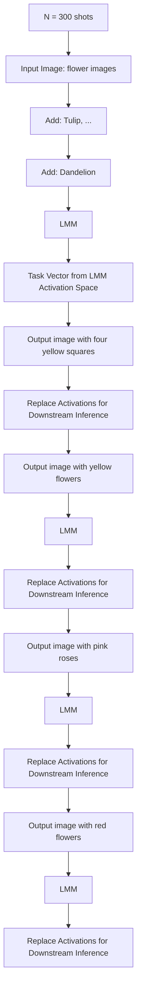
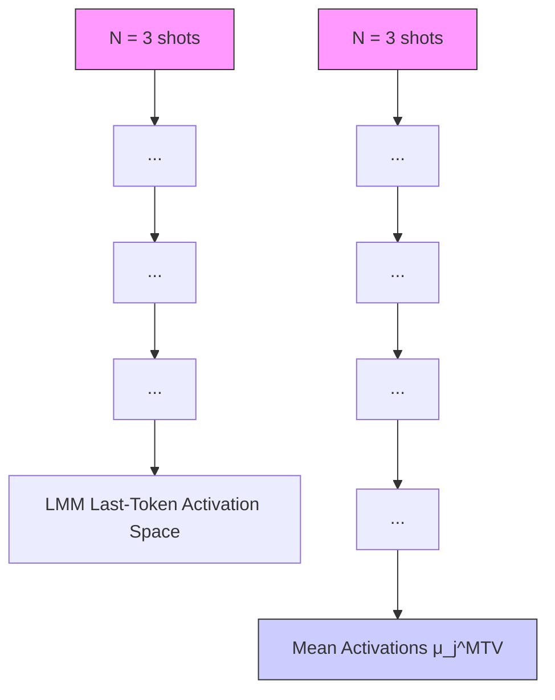
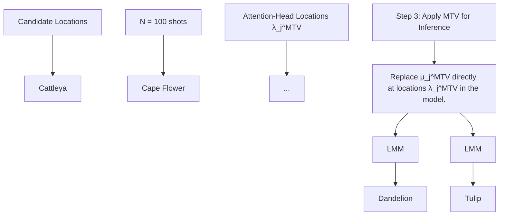

# Multimodal Task Vectors Enable Many-Shot Multimodal In-Context Learning

Brandon Huang $^{1*}$

Chancharik Mitra $^{1*}$

Assaf Arbelle $^{2}$

Leonid Karlinsky $^{3}$

Trevor Darrell $^{1}$ Roei Herzig $^{1,2}$

$^{1}$ University of California, Berkeley

$^{2}$ IBM Research

$^{3}$ MIT-IBM Watson AI Lab

# Abstract

The recent success of interleaved Large Multimodal Models (LMMs) in few-shot learning suggests that in-context learning (ICL) with many examples can be promising for learning new tasks. However, this many-shot multimodal ICL setting has one crucial problem: it is fundamentally limited by the model's context length set at pretraining. The problem is especially prominent in the multimodal domain, which processes both text and images, requiring additional tokens. This motivates the need for a multimodal method to compress many shots into fewer tokens without finetuning. In this work, we enable LMMs to perform multimodal, many-shot in-context learning by leveraging Multimodal Task Vectors (MTV)—compact implicit representations of in-context examples compressed in the model's attention heads. Specifically, we first demonstrate the existence of such MTV in LMMs and then leverage these extracted MTV to enable many-shot in-context learning for various vision-and-language tasks. Our experiments suggest that MTV can scale in performance with the number of compressed shots and generalize to similar out-of-domain tasks without additional context length for inference. Code: https://github.com/Brandon3964/MultiModal-Task-Vector

# 1 Introduction

Large Multimodal Models (LMMs) such as GPT-4V [60], LLaVA [49, 50], and the BLIP [13, 43] family of models demonstrate state-of-the-art performance on a variety of vision and language (VL) tasks due to their strong reasoning capabilities over both text and images. Recent works show that LMMs pre-trained on interleaved text-image data can do multimodal in-context learning [6, 39]. In particular, few-shot, in-context learning (ICL) in text-only LLMs has been scaled with an increasing number of examples in long-context language models—a setting called many-shot learning [1]. A natural question arises on how to perform many-shot learning in the multimodal domain.

The first issue with directly applying a many-shot learning regimen to LMMs is the intrinsic limitation of context length. This is especially true in the multimodal domain, as LMMs must encode both text and images, whose embeddings are token-expensive. Moreover, long-context language models, which LMMs leverage for reasoning, struggle to use their entire context length effectively for ICL $[45, 51]$ . Secondly, perhaps due to the misalignment of pretraining tasks with ICL, many instruction-tuned LMMs underperform on tasks in the ICL setting $[16]$ , suggesting the importance of interleaved LMMs. Finally, there is also the challenge of the increasing memory and run-time required for processing long contexts for every inference call. These challenges motivate a method for compressing multimodal in-context examples into compact, implicit representations. Therefore, in this paper, we propose


<details>
<summary>flowchart</summary>


</details>

Figure 1: Multimodal Task Vectors (MTV) Overview. We overcome an LMM's context length limitation by encoding many shots of multimodal examples as activations in the LMM's latent space. We then directly replace this encoding into the LMM's activation space during downstream inference.

Multimodal Task Vectors (MTV)—compact representations of multimodal in-context tasks—within the attention heads of LMMs to enable many-shot ICL. In particular, we show the existence of MTV in interleaved LMMs, and we use them to compress large numbers of multimodal ICL examples.

Recent research in explainability has demonstrated the existence of task vectors in both the language $[25, 81]$ and vision $[27]$ domains. These task vectors are implicit representations of in-context tasks represented by sets of activations in the model. These activations compactly summarize the information in ICL examples. In our work, we go beyond proving the existence of these task vectors in the multimodal domain by demonstrating their ability to compress examples for many-shot ICL in LMMs without the need for finetuning.

Our method can be described in three steps. First, given a set of many-shot multimodal ICL examples, we calculate the mean activations corresponding to the last token across multiple inference iterations. Second, to avoid the context length constraint, we select a set of attention heads in the model to store the mean activations of the ICL examples. However, since the downstream task may be zero-shot or use a different number of ICL examples, we select a set of examples aligned with its form. We then use these examples to find an optimal set of LMM head locations where the many-shot examples will be encoded. We refer to these mean activations and locations as MTV, which implicitly encodes the many-shot multimodal examples for use in the downstream task. Finally, for downstream inference, we replace the mean activations from Step 1 with the attention head locations found in Step 2. Since we input examples to the LMM across different iterations in Step 1, Multimodal Task Vectors can implicitly encode more examples than are allowable by the context limit. We find that utilizing many examples for extracting MTV surpasses performance on zero-shot and most standard few-shot ICL settings, suggesting the effectiveness of our method. Another key benefit of our method is that it frees up tokens for the model during downstream inference compared to standard few-shot ICL methods. An overview of our method is shown in Figure 1.

We summarize our main contributions as follows: (i) We show the existence of Multimodal Task Vectors, compact implicit representations of in-context functions in LMMs. (ii) MTV can encode more examples than allowed by an LMM's context length, enabling both runtime and memory-efficient multimodal many-shot in-context learning. (iii) MTV surpasses zero-shot and few-shot ICL settings on various VL benchmarks without finetuning. (iv) MTV can scale to larger numbers of examples and can generalize to similar out-of-domain tasks.

# 2 Related Works

Many-Shot In-Context Learning. Few-shot in-context learning (ICL) is a significant area of study in text-only LLMs $[9, 89]$ . A natural question arises about the possibility of using a larger number of shots (e.g., hundreds) to further improve performance or learn more complex tasks. Indeed, some early work in text-only many-shot, in-context learning suggests performance on different tasks can scale with a larger number of examples $[1, 7, 44, 45]$ .

However, scaling ICL in text-only LLMs is a challenge due to the intrinsic context length. One method to increase context length in these models is to apply positional interpolation methods $[10, 63]$ . However, research on these longer-context models finds that they struggle to use the entire context for ICL $[45, 51]$ . Moreover, as inference on long contexts of inputs is also time and memory-expensive, it is unclear whether simply scaling the context of models is practical for enabling multimodal many-shot ICL in open-source models. There is some early evidence of multimodal many-shot ICL being effective in closed-source models $[35]$ , so the question arises as to how to achieve something similar for open-source models. This has led to work that looks to compress explicit input tokens $[11, 20, 34, 58, 73, 77]$ . But crucially, many of these methods require finetuning and only try to preserve performance. Our work is different in that it is the first to enable multimodal models with many-shot ICL capabilities, while also improving on complex VL tasks without finetuning.

Task Vectors. Our work builds off of research in text-only and vision-only domains showing that internal representations of these models called task vectors $[25, 27, 81]$ (or function vectors) can encapsulate tasks outlined by ICL examples. Our is the first demonstration of Multimodal Task Vectors (MTV) in LMMs. Going beyond previous work, however, we show that MTV enable LMMs not only to use many-shot, multimodal ICL examples but also scale with more samples, be used alongside explicit ICL shots, and even generalize to unseen classes or similar tasks.

Model Domain Adaptation Methods. As LLM and LMM model architectures have advanced, so have methods to allow these models to generalize beyond their pretraining distributions. Methods like instruction tuning $[5, 50, 68, 88]$ have shown strong zero-shot generalization to some out-of-domain tasks, but forgetting remains an issue. One popular solution to this issue involves Parameter Efficient Fine-tuning (PEFT) $[28]$ : finetuning either a set of soft prompt input tokens $[41, 46]$ , low-rank model weights $[14, 29, 99]$ , or a separate adapter from the main model $[18, 30, 100]$ .

Prompting methods are a well-explored area for adapting models without finetuning. LLM prompting includes zero-shot methods $[36, 83, 85]$ , few-shot and ICL methods $[9, 15, 53, 56]$ , expert prompting $[93]$ , and Chain-of-Thought (CoT) $[90, 101]$ , with extensions like self-consistency $[86]$ , Tree-of-Thought (ToT) $[94]$ , and Graph-of-Thought (GoT) $[8, 40, 95]$ for more complex structures. Similar multimodal prompting methods exist for LMMs as well $[57, 84, 87, 102, 104]$ .

Large Multimodal Models (LMMs). The state-of-the-art performance of LMMs $[2, 6, 13, 17, 21, 43, 49, 50, 96, 97, 105]$ on multimodal tasks stems from combining LLMs' reasoning capabilities $[3, 12, 26, 66, 71, 78]$ with the perception abilities of vision models. LMMs' generative reasoning also makes them more applicable to complex tasks than previous contrastive methods $[42, 43, 65]$ . Such tasks include visual question-answering $[4, 23, 24, 31, 32, 54, 67]$ as well as object identification and localization $[37, 48, 59, 82]$ . Visual Programmatic Models (VPMs) are another class of multimodal methods that makes use of in-context APIs code generation $[19, 22, 52, 64, 69, 72, 74, 76, 92]$ . However, context length limits both LMMs' and VPMs' ability to use multimodal prompting methods such as ICL $[9]$ . Another key challenge is that many LMMs are pre-trained on single text-image pair data. Recently, many LMM models now pretrain on interleaved text-image data $[2, 6, 16, 33, 39, 75, 103]$ , making effective multimodal ICL possible. In our work, MTV goes beyond simple few-shot multimodal ICL and scales to many-shot multimodal ICL.

# 3 Multimodal Task Vectors

To address the challenge of performing many-shot multimodal in-context learning, we demonstrate the existence of MTV in LMMs and then leverage them for many-shot multimodal ICL. We begin by describing some background on multimodal ICL and task vectors (Section 3.1). We then introduce our three-step approach: (i) We calculate the mean activations of the attention heads from the many-shot multimodal ICL examples (Section 3.2); (ii) We then extract the set of LMM attention heads locations that best align to the downstream task using an adapted version of the REINFORCE [91] algorithm (Section 3.3); and (iii) We replace the calculated mean activation values into the LMM for a downstream task (Section 3.4). The detailed method visual is shown in Figure 1.

# 3.1 Preliminaries

In the multimodal in-context learning setting, an LMM learns a new task outlined by a set of multimodal examples. The input to the LMM would be outlined as follows:

$$
I _ {\text { few }} = \left[ (x _ {1}: y _ {1}), (x _ {2}: y _ {2}), \dots , (x _ {n}: y _ {n}), Q \right] \tag {1}
$$

Step 1: Calculate Mean Activations:   


<details>
<summary>flowchart</summary>


</details>

Step 2: Find Attention Head Locations:   


<details>
<summary>flowchart</summary>


</details>

Figure 2: Multimodal Task Vectors (MTV). In the standard multimodal in-context learning (ICL) paradigm, the number of shots is limited by an LMM's context length. We solve this issue by first finding the mean activations corresponding to the last token of the examples' input (Step 1), and then calculating a set of attention head locations (Step 2) that best align with the downstream task. These mean activations are then replaced directly in these attention head locations (Step 3), enabling many-shot multimodal ICL.

where the model is prompted to answer a query Q given a set of input-output examples (each $x_{i}$ being a multimodal input and each $y_{i}$ a text output).

We note that in-context examples are commonly passed sequentially to the LMM, necessarily restricting multimodal ICL to being small numbers of shots due to limited context length. Furthermore, the images require more tokens to embed, which means enabling many-shot ICL is even more challenging in the multimodal domain. To solve this, we utilize our method MTV—which are implicit representations in the model's attention heads that encode a many-shot multimodal ICL task.

We start with a background on task vectors for some task $j$ . Given a model $F$ , we denote the set of attention-head locations as $\lambda = \{l \mid \forall l \in F\}$ where each location $l$ is indexed as $l = (h, m)$ for the $h^{\text{th}}$ layer and $m^{\text{th}}$ attention head. Now, task vectors utilize the intermediate outputs of an LMM, called activations. For a given input sequence of written in terms of its tokens $x = \{x_1, x_2, \ldots, x_T\}$ , each attention head $(h, m)$ produces an activation $z_l \in \mathbb{R}^{\frac{d}{H}}$ for each token $x_i$ , where $d$ is the model's embedding dimension and $H$ is the number of heads. These activations are simply the output vectors of each attention head before any linear projection. While each head's activation is typically concatenated with others and projected to form the layer's output, task vectors specifically utilize the

pre-projection activations of the final token $x_{T}$ from each attention head. We thus define the task vectors as follows: (1) the task vector values $\mu_{j}$ are a subset of mean activations produced by the attention heads of $F$ given examples of a task, and (2) the task vector locations $\lambda_{j}$ , which denotes a subset of the attention head indices per task. Thus, the task vector is $(\mu_{j},\lambda_{j})$ . For inference, $\mu_{j}$ replaces the activation values of the heads in the locations given by $\lambda_{j}$ .

In prior work $[25, 27, 81]$ , the calculation of the mean activations $\mu_{j}$ and the extraction of the attention-head locations $\lambda_{j}$ are used together to extract the task vector. Interestingly, we find that these two steps should be decoupled in order to better align with the downstream task. In our work, we calculate the mean activations $\mu_{j}$ corresponding to the last token specifically to encode a dataset of many-shot multimodal ICL examples by averaging them across multiple inference calls. However, the downstream task may not always be in the same ICL format as the many-shot examples (e.g., the downstream task uses a different number of shots or is zero-shot). To solve this, we use a separate set of examples that are of the exact format of the downstream task to align the extracted attention-head locations $\lambda_{j}$ with the inference task. This separation of responsibilities, wherein $\mu_{j}$ captures the essential information from the many-shot examples and $\lambda_{j}$ identifies the specific attention head locations for the downstream task, optimizes the utilization of the encoded information at relevant locations within the model.

Our approach to finding Multimodal Task Vectors (MTV) $(\mu_{j}^{\mathrm{MTV}}, \lambda_{j}^{\mathrm{MTV}})$ allows LMMs to actually leverage many-shot multimodal ICL examples for complex vision-language tasks without being limited by context length. We proceed by first describing how to calculate the mean activations.

# 3.2 Step 1: Calculate MTV Mean Activations

The ultimate objective of many-shot multimodal ICL is to use a large number of input-output examples when solving a task j. However, it is not trivial to get the LMM to see more examples during inference time than its context length allows.

To address this issue, we pass a few-shot input $I_{t}$ for each inference call t for a total of T > 1 inference calls. Each $I_{t}$ consists of N shots (where N > 1) of multimodal in-context examples in the form of randomly-selected input-output response pairs ( $x_{t} : y_{t}$ ), and $Q_{t}$ , which is the query to be answered by the LMM in that iteration.

$$
I _ {t} = \left[ \left(x _ {1}: y _ {1}\right), \left(x _ {2}: y _ {2}\right), \dots , \left(x _ {N}: y _ {N}\right), Q _ {t} \right] \tag {2}
$$

Thus, over T LMM inference calls, we have a many-shot multimodal dataset (of $N \times T$ examples):

$$
I _ {\text { many }} = \left[ I _ {1}, I _ {2}, \dots , I _ {T} \right] \tag {3}
$$

However, this dataset is still just a disconnected set of few-shot examples. Next, we would like to connect the separate examples into one unified many-shot multimodal ICL representation.

For each inference call, the LMM is given N-shot ICL examples. We calculate the mean of the activations corresponding to the last token of the input $z_{l,j}$ for each attention head index $\forall l \in \lambda$ (Section 3.1) across T inference calls, yielding:

$$
\forall l \in \lambda : \quad \mu_ {l, j} = \frac {1}{T} \sum_ {t = 1} ^ {T} \mathbb {E} [ z _ {l, j} \mid I _ {t} ] = \frac {1}{T} \sum_ {t = 1} ^ {T} \mathbb {E} [ z _ {l, j} \mid (x _ {1}: y _ {1}), (x _ {2}: y _ {2}), \dots , (x _ {N}: y _ {N}), Q _ {t} ] \tag {4}
$$

In this step, we have found the mean activations $\mu_{l,j}$ , which encode an internal LMM representation of many shots of multimodal ICL examples. In the next subsection, we describe our methodology for selecting the set of attention heads where these mean activations will be used.

# 3.3 Step 2: Extract MTV Attention Head Locations

After Step 1, we now have mean activations for the attention heads of the last token in a given many-shot multimodal task. Yet, we still need to find which set of attention heads $\lambda_{j}^{MTV}$ should be chosen to encode our task.

To choose the set of attention heads, we first prepare a separate set of S examples specifically aligned to the format of the downstream task. For instance, if the downstream setting is a 2-way, one-shot

classification task, then the $S$ examples should conform to this paradigm. For our explanation, let's consider a downstream task that is zero-shot such that there is a single query $Q_{s}$ and corresponding response $R_{s}$ for all $s \in [1, 2, \ldots, S]$ .

From these examples, we utilize an adapted version of the REINFORCE [91] algorithm—an iterative policy optimization method that can be used to find task vector locations [27]. Given an LMM F, we first select a proposed set of attention head locations by sampling a Bernoulli distribution over the locations multiple times. Next, we directly replace the values of the selected attention heads with the corresponding mean activations $\mu_{l,j}$ . Then, after prompting the model with the query $Q_{s}$ , we use the negative cross-entropy loss between the LMM's output logits and the logits of the ground-truth response $R_{s}$ to optimize the Bernoulli distribution. By optimizing the Bernoulli distribution across S iterations, we are finding the best attention head locations $\lambda_{j}^{MTV}$ for patching in our mean activations. Finally, we can extract $\lambda_{j}^{MTV}$ , the optimized indices of attention heads, by sampling our optimized Bernoulli distribution.

$$
\lambda_ {j} ^ {\mathrm{MTV}} = \text { MTV\_EXTRACT } (F, [ Q _ {1}, Q _ {2}, \dots , Q _ {S}) ], [ R _ {1}, R _ {2}, \dots , R _ {S} ]) \tag {5}
$$

It is important to note that MTV\_EXTRACT does not require finetuning of the LMM parameters, but rather only inference calls. We describe further the underlying details of our adapted MTV\_EXTRACT algorithm in Section A.2 of the Supplementary. Having found $\lambda_{j}^{MTV}$ and $\mu_{l,j}$ , we describe in what follows, the final procedure to use MTV for inference.

# 3.4 Step 3: Multimodal Task Vector Application

After we have identified a set of attention heads $\lambda_j^{\mathrm{MTV}}$ , it is straightforward to apply MTV for inference. We denote the set of mean activations $\mu_j^{\mathrm{MTV}}$ as follows $\mu_j^{\mathrm{MTV}} = \{\mu_{l,j}|\forall l\in \lambda_j^{\mathrm{MTV}}\}$ .

To run downstream inference on a new query $Q_{new}$ with our model F, we directly replace the values of attention heads $\lambda_{j}^{MTV}$ with $\mu_{j}^{MTV}$ and produce the following response $R_{new}$ :

$$
R _ {\text { new }} = F (Q _ {\text { new }} | \lambda_ {j} ^ {\text { MTV }}, \mu_ {j} ^ {\text { MTV }}) \tag {6}
$$

$R_{new}$ is thus a response generated using many shots of multimodal examples as implicit context via MTV. The key insight of our method is the importance of N (the number of multimodal examples) and many T (the number of iterations) during the calculation of MTV. This enables an LMM to go beyond its context length to learn more nuanced properties of the task from seeing many examples. Additionally, insertion of MTV directly into the LMM also obviates the need for any context length during downstream inference, actually freeing additional context for other use (e.g., an additional prompt, more ICL examples, etc.). Finally, because we align the attention-head locations with the downstream task, MTV can be effectively applied to zero-shot and different ICL settings.

# 4 Evaluation

In order for LMMs to perform multimodal ICL, it is important for interleaved data to be included in pretraining. We apply our MTV approach to Qwen-VL [6], Idefics2-8B [38], and ViLA-1.5-8B [47] three popular interleaved LMMs. For each model, we compare our method to using few-shot ICL across different vision-and-language tasks like VQA and object identification.

# 4.1 Implementation Details

We implemented MTV using PyTorch [61]. We used each model's respective official implementation. While the compute and memory requirements differ slightly between models, all our experiments can be run on a single NVIDIA A6000 GPU. For additional information, refer to Supplementary Section B. Our model and weights will be released upon acceptance, and our code is in Supplementary.

# 4.2 Models

In this work, we apply MTV to the following interleaved LMMs as they are better-suited for multimodal ICL as shown by [16]: (1) QwenVL [6] is a LLaMA-based model that has the ability to

process high-resolution images, and its two-stage pre-training methodology, which includes multi-task finetuning and interleaved text-image data. (2) Idefics2-8B [39] is a Mistral-based model that benefits from its pre-training on the expansive OBELICS dataset, which comprises a web-scale collection of interleaved image-text documents. We utilize the base version of the model. This demonstrates multimodal in-context learning abilities. (3) LLaMA3-ViLA-1.5-8B (abbreviated as VILA-1.5-8B). ViLA-1.5-8B [47] is an architecture that leverages LLaMA-3 as the LLM backbone. As in others, a significant portion of the model's pretraining data is interleaved text-image data. (4) MANTIS-LLaMA3-8B. MANTIS-LLaMA3-8B [33] is a combination of a SigLIP [98] visual encoder and LLaMA3 [55] language model finetuned using the MANTIS dataset, a specially curated multi-image dataset that emphasizes co-reference, reasoning, comparing, temporal understanding.

We show the number of tokens per image embedding for each model in Table 1 to illustrate the especial importance of MTVs in the image-text domain:

Table 1: Per Image Embedding Token Length and Total Context Length for Models 

<table><tr><td>Model Name</td><td>Per Image Token Length</td><td>Total Context Length</td></tr><tr><td>VILA-1.5-8B</td><td>144</td><td>8192</td></tr><tr><td>Idefics2-8B</td><td>64</td><td>8192</td></tr><tr><td>QwenVL</td><td>256</td><td>8192</td></tr><tr><td>MANTIS-LLaMA3-8B</td><td>64</td><td>8192</td></tr></table>

# 4.3 Datasets

We briefly describe the tasks and datasets we evaluate our method on. More details about the datasets and their setup can be found in Section B.

VQA Datasets. We use the following commonly-evaluated datasets which emphasize different aspects of multimodal reasoning, including visual features (VizWiz) and outside knowledge (OK-VQA): (1) VizWiz [23] consists of images taken by visually impaired individuals paired with questions they pose about these images, making it crucial for developing AI systems that assist in real-world, accessibility-focused visual understanding tasks. (2) OK-VQA dataset [54] is designed to push the boundaries of Visual Question Answering (VQA) by focusing on knowledge-based questions, where answers require external knowledge beyond the image content. (3)

Object Classification. We use the following datasets, which are commonly used for object classification in multimodal ICL: (1) The Flowers dataset [59], commonly known as the Oxford 102 Flowers dataset, is a collection specifically designed for image-based flower species recognition for fine-grained classification of 102 different categories of flowers. (2) Caltech's CUB Dataset on Birds [82] is a well-known resource for evaluating algorithms on the task of object identification, specifically focused on bird species. It features 200 bird species with roughly 30 images each, annotated with key attributes and bounding boxes. Both Flowers and Birds are formatted as 2-way, 1-shot classification episodes, with model inputs being a positive and negative image for the class to be identified in the query image. The response format is a short text response.

# 5 Results

Our main results are shown in Table 2. For VQA, we show the results of MTV with 4 shots per 100 iterations to calculate the mean activations and 100 examples for task vector locations (500 examples total). The task vector is extracted using examples from the train set of the dataset and evaluated on the validation set. For object classification, we extract MTV based on a 2-way, one-shot regimen per 100 iterations for both mean activations and task vector locations (200 examples total). The task vector is extracted using a train set of $30\%$ of the object classes and evaluated on the remaining $70\%$ of unseen classes. We demonstrate how Multimodal Task Vectors outperforms zero-shot and few-shot ICL settings on three different models on VL tasks, highlighting the effectiveness of our method. Next, we describe the unique capabilities of our method, such as scaling to more samples and showing some generalizations to other tasks. More results can be found in Section A.1 of Supplementary.

Table 2: Results. (Left) MTV evaluated on VQA datasets. (Right) MTV evaluated on object classification datasets. The baselines are shown in gray.   
(a) MTV on VQA Benchmarks 

<table><tr><td>Model</td><td>VizWiz</td><td>OK-VQA</td></tr><tr><td>Flamingo 9B</td><td>28.8</td><td>44.7</td></tr><tr><td>+4-shot ICL</td><td>34.9</td><td>49.3</td></tr><tr><td>+8-shot ICL</td><td>39.4</td><td>50.0</td></tr><tr><td>Blip3</td><td>21.2</td><td>26.5</td></tr><tr><td>+4-shot ICL</td><td>38.4</td><td>49.2</td></tr><tr><td>+8-shot ICL</td><td>44.3</td><td>49.1</td></tr><tr><td>Qwen-VL-7B</td><td>35.2</td><td>58.6</td></tr><tr><td>+4-shot ICL</td><td>42.0</td><td>62.0</td></tr><tr><td>+8-shot ICL</td><td>44.3</td><td>61.5</td></tr><tr><td>+MTV</td><td>45.6</td><td>62.0</td></tr><tr><td>Idefics2</td><td>31.3</td><td>52.4</td></tr><tr><td>+4-shot ICL</td><td>40.8</td><td>51.5</td></tr><tr><td>+8-shot ICL</td><td>43.8</td><td>52.3</td></tr><tr><td>+MTV</td><td>52.5</td><td>53.0</td></tr><tr><td>VILA-1.5-8B</td><td>28.0</td><td>32.8</td></tr><tr><td>+4-shot ICL</td><td>39.3</td><td>35.6</td></tr><tr><td>+8-shot ICL</td><td>44.2</td><td>36.5</td></tr><tr><td>+MTV</td><td>55.2</td><td>40.6</td></tr><tr><td>MANTIS-LLaMA3-8B</td><td>36.3</td><td>51.7</td></tr><tr><td>+4-shot ICL</td><td>26.4</td><td>52.5</td></tr><tr><td>+8-shot ICL</td><td>27.5</td><td>52.0</td></tr><tr><td>+MTV</td><td>51.0</td><td>52.8</td></tr></table>

(b) MTV on Object Classification 

<table><tr><td>Model</td><td>Flowers</td><td>CUB</td></tr><tr><td>LLaVA-1.5-13B+ 1-shot ICL</td><td>58.60</td><td>58.24</td></tr><tr><td>LLaVA-1.6-13B+ 1-shot ICL</td><td>65.58</td><td>67.90</td></tr><tr><td>Flamingo 9B+ 1-shot ICL 9B</td><td>48.78</td><td>51.2</td></tr><tr><td>IDEFICS-9B+ 1-shot ICL</td><td>55.29</td><td>62.0</td></tr><tr><td>Emu 37B+ 1-shot ICL</td><td>52.76</td><td>53.56</td></tr><tr><td>Qwen-VL-7B+ 1-shot ICL</td><td>55.0</td><td>56.5</td></tr><tr><td>+ MTV+1-shot ICL</td><td>78.1</td><td>80.0</td></tr><tr><td>Idefics2+ 1-shot ICL</td><td>82.8</td><td>88.7</td></tr><tr><td>+ MTV+1-shot ICL</td><td>83.8</td><td>89.8</td></tr><tr><td>VILA-1.5-8B+ 1-shot ICL</td><td>87.4</td><td>88.4</td></tr><tr><td>+ MTV+1-shot ICL</td><td>89.3</td><td>89.7</td></tr><tr><td>MANTIS-LLaMA3-8B+ 1-shot ICL</td><td>87.4</td><td>84.0</td></tr><tr><td>+ MTV+1-shot ICL</td><td>89.8</td><td>89.7</td></tr></table>

# 5.1 MTV scales with more examples

We are interested in evaluating (i) the effect of different numbers of shots used per iteration to extract MTV and (ii) the effect of different numbers of iterations used. We test the impact on accuracy when increasing both of these parameters for QwenVL on the VizWiz validation set. In Figure 3, we show on the left that the optimal number of multimodal ICL shots is 16 shots per iteration. Further, we show on the right side of the figure that 1000 examples yield the best performance. These results illustrate that MTV can effectively scale by utilizing larger numbers of ICL examples per iteration and also in aggregate.

# 5.2 MTV works with explicit few-shot examples

One of the benefits of MTV over a few-shot ICL is the context length that is saved during inference. This is because the many-shot examples are encoded directly in the activation space rather than in the input token space. Thus, we ask whether the LMM can use the freed context for additional few-shot examples. For object classification, we formulate both Flowers and CUB as a 1-shot comparison between a positive and negative sample to identify the correct class (i.e., 2-way, 1-shot ICL by construction). We report results on 1-shot ICL and MTV with 1-shot classification during inference. MTV+1-shot ICL surpasses 1-shot ICL accuracy on these tasks, showing that MTV can be utilized alongside few-shot examples. Furthermore, it is vital to note that the evaluation classes are completely unseen by MTV. Thus, with just a 1-shot ICL example, MTV is able to generalize to unseen classes.

# 5.3 MTV heads generalize to other tasks

In this experiment, we further ask whether the MTV heads $\lambda_j^{\mathrm{MTV}}$ extracted on one task $j$ can generalize to a separate, but similar task $k$ . To test this, we use the attention heads extracted from


<details>
<summary>line</summary>

| No. of Shot Per Iteration | VizWiz Accuracy |
| ------------------------- | --------------- |
| 1                         | 39.0            |
| 2                         | 41.0            |
| 4                         | 46.0            |
| 8                         | 50.5            |
| 16                        | 57.0            |
</details>


<details>
<summary>line</summary>

| No. of Iterations Used | Vizwiz Accuracy |
| ---------------------- | --------------- |
| 5                      | 58.8            |
| 10                     | 60.0            |
| 50                     | 60.5            |
| 100                    | 61.4            |
</details>

Figure 3: Scaling of Qwen-MTV on VizWiz: (Left) We show the effect of varying the number of shots per iteration for a fixed 100 iterations. (Right) We also show the effect of varying numbers of iterations fixing 4 shots per iteration.

ViLA-1.5-8B on VizWiz for use on OK-VQA. Our results on the left of Table 3 demonstrate that the extracted heads from one task can improve accuracy on another similar task. This generalizability of the heads is significant because it suggests that the heads from MTV may only have to be extracted once to be applied to many other similar tasks. The only calculation necessary then would be the mean activations of the many-shot examples used for the target dataset, making the application of many-shot multimodal ICL even more efficient for similar tasks.

Table 3: Generalization & Method Comparison (Left) MTV-VizWiz evaluated on OK-VQA. (Right) MTV compared to VizWiz finetuning, function vectors [81], and task vectors [27].   
(a) Attention Head Generalization 

<table><tr><td>Model</td><td>VizWiz</td><td>OK-VQA</td></tr><tr><td>ViLA-1.5-8B</td><td>28.0</td><td>32.8</td></tr><tr><td>+ 4-shot-ICL</td><td>39.3</td><td>35.6</td></tr><tr><td>+ 8-shot-ICL</td><td>44.2</td><td>36.5</td></tr><tr><td>+ MTV-Vizwiz</td><td>55.2</td><td>38.3</td></tr></table>

(b) Comparison to Other Methods 

<table><tr><td>Model</td><td>VizWiz</td><td>OK-VQA</td></tr><tr><td>Qwen-VL-7B</td><td>35.2</td><td>58.6</td></tr><tr><td>+ VizWiz F.T.</td><td>62.0</td><td>25.1</td></tr><tr><td>+ FV</td><td>36.4</td><td>59.0</td></tr><tr><td>+ VTV</td><td>37.0</td><td>58.9</td></tr><tr><td>+ MTV</td><td>45.6</td><td>62.0</td></tr></table>

# 5.4 Finetuning as an upper bound

In Table 3b, we compare our method to finetuning. To do this, we use finetune on the same number of examples as MTV uses from the train set and evaluate not only on the validation set but also on the validation set of another similar dataset. In particular, for a ViLA-1.5-8B model finetuned on VizWiz, we report accuracy on both VizWiz and OK-VQA validation sets. It can be seen that finetuning is indeed an upper bound on the dataset the model was finetuned on. However, we show that finetuning leads to overfitting on the finetuned dataset and even forgetting the zero-shot capabilities. In contrast, we also show that MTV not only improves zero-shot capabilities but can generalize to similar tasks with only a few inference examples Table 2b and Table 3a.

# 5.5 Comparison to other methods

We compare our method to two different methods that can find task vectors: Visual Task Vectors (VTV) [27] and Function Vectors (FV) [81]. Originally, these works could not be applied as-is to support multimodal ICL, but here, we have implemented a version that follows the original exactly with only minor modifications to allow performing our evaluated multimodal tasks. More details about the methods can be found in Section A.2 in the Supplementary. In our experiments Table 3b, we find that MTV surpasses both methods on VizWiz and OK-VQA. VTV are image-only task vectors that use only one-shot image examples for fixed small T iterations, and they calculate the

mean activations and the locations together without aligning to the downstream task. FV are text-only task vectors that use Causal Mediation Analysis $[62]$ to extract task vector locations from only the output activations of the last token. The results suggest the importance of finding the task vectors by decoupling the calculation of the mean activations and locations in two separate steps to perform many-shot multimodal ICL more effectively for complex multimodal tasks.

# 5.6 Compute and runtime efficiency

<table><tr><td>Metric</td><td>0-shot</td><td>4-shot</td><td>8-shot</td><td>16-shot</td><td>MTV (400-shot)</td></tr><tr><td>Max GPU Memory (GB)</td><td>17.4</td><td>18.3</td><td>19.0</td><td>20.6</td><td>19.8</td></tr><tr><td>Runtime per 100 iterations (min)</td><td>1.1</td><td>2.7</td><td>3.1</td><td>3.3</td><td>1.9</td></tr></table>

Table 4: Efficiency: We show that even though MTV encodes 400 multimodal ICL examples in the mean activations, it still requires less runtime and memory than 8-shot and 16-shot multimodal ICL.

An important feature of our work is that multimodal ICL examples do not require explicit tokens during inference. Because of this, we are interested in the efficiency gains of our method. Intuitively, the longer MTV extraction time is amortized during downstream inference, where the runtime would be equivalent to the zero-shot case. Similarly, the memory requirements are maximal during the MTV extraction process but require the same memory as the zero-shot case afterward. In contrast, the ICL tasks have a slower runtime and larger memory requirement throughout due to running inference on N examples for every iteration. To demonstrate this, we calculate the maximum memory requirement in gigabytes (GB) for ViLA-1.5-8B on VizWiz using different ICL-shot counts and MTV with 400 examples. As shown in Table 4, MTV requires less runtime than 16-shot, 8-shot, and 4-shot ICL methods and also requires less memory than 16-shot ICL. These results demonstrate that MTV can encode many multimodal ICL examples with greater efficiency than few-shot methods.

# 6 Conclusion

In this work, we present Multimodal Task Vectors a compact, implicit representation that can efficiently encode many-shot multimodal ICL examples for use in complex vision-language tasks. We demonstrate this implicit model representation not only encodes a multimodal ICL task but can also enable many-shot multimodal ICL to surpass zero-shot and few-shot performance on a variety of VL tasks. Our method stands out from previous work in its ability to scale, use additional explicit multimodal ICL examples, and generalize to other similar VL tasks. Our work is a viable way to surpass the limit of context length of an LMM for multimodal ICL and demonstrates clearly that these additional examples aid in multimodal reasoning. Finally, we do not anticipate a specific negative impact, but, as with any Machine Learning method, we recommend exercising caution.

# 7 Limitations

While Multimodal Task Vectors offers substantial benefits for handling complex vision-language tasks compared to finetuning or few-shot ICL, it is important to recognize certain limitations that accompany our approach. MTV requires access to the internal architecture of an LMM, so while it is an effective solution for all open-source models, its application is restricted from proprietary models, such as GPT-4 [60] and Gemini [79, 80]. Furthermore, while many-shot ICL is incredibly attractive for many applications, it may not be practical for low-data scenarios where synthetic data [1] or the transfer of MTV extracted from another dataset may be required. We feel these challenges represent great opportunities for future work in the many-shot multimodal in-context learning domain.

# 8 Acknowledgements

We would like to thank Deva Ramanan, Grace Luo, and Suzanne Petryk for their insightful feedback and discussions. This project has received funding from Prof. Darrell's group in part by DoD, including PTG and/or LwLL programs, as well as BAIR's industrial alliance programs.

# References

[1] Rishabh Agarwal, Avi Singh, Lei M. Zhang, Bernd Bohnet, Stephanie Chan, Ankesh Anand, Zaheer Abbas, Azade Nova, John D. Co-Reyes, Eric Chu, Feryal M. P. Behbahani, Aleksandra Faust, and Hugo Larochelle. Many-shot in-context learning. 2024.   
[2] Jean-Baptiste Alayrac, Jeff Donahue, Pauline Luc, Antoine Miech, Iain Barr, Yana Hasson, Karel Lenc, Arthur Mensch, Katie Millican, Malcolm Reynolds, Roman Ring, Eliza Rutherford, Serkan Cabi, Tengda Han, Zhitao Gong, Sina Samangooei, Marianne Monteiro, Jacob Menick, Sebastian Borgeaud, Andy Brock, Aida Nematzadeh, Sahand Sharifzadeh, Mikolaj Binkowski, Ricardo Barreira, Oriol Vinyals, Andrew Zisserman, and Karen Simonyan. Flamingo: a visual language model for few-shot learning. ArXiv, abs/2204.14198, 2022.   
[3] Amit Alfassy, Assaf Arbelle, Oshri Halimi, Sivan Harary, Roei Herzig, Eli Schwartz, Rameswar Panda, Michele Dolfi, Christoph Auer, Peter W. J. Staar, Kate Saenko, Rogerio Feris, and Leonid Karlinsky. FETA: Towards specializing foundational models for expert task applications. In Thirty-sixth Conference on Neural Information Processing Systems Datasets and Benchmarks Track, 2022.   
[4] Stanislaw Antol, Aishwarya Agrawal, Jiasen Lu, Margaret Mitchell, Dhruv Batra, C Lawrence Zitnick, and Devi Parikh. Vqa: Visual question answering. In Proceedings of the IEEE international conference on computer vision, pages 2425–2433, 2015.   
[5] Elad Ben Avraham, Roei Herzig, Karttikeya Mangalam, Amir Bar, Anna Rohrbach, Leonid Karlinsky, Trevor Darrell, and Amir Globerson. Bringing image scene structure to video via frame-clip consistency of object tokens. In Thirty-Sixth Conference on Neural Information Processing Systems, 2022.   
[6] Jinze Bai, Shuai Bai, Shusheng Yang, Shijie Wang, Sinan Tan, Peng Wang, Junyang Lin, Chang Zhou, and Jingren Zhou. Qwen-vl: A frontier large vision-language model with versatile abilities. ArXiv, abs/2308.12966, 2023.   
[7] Amanda Bertsch, Maor Ivgi, Uri Alon, Jonathan Berant, Matthew R. Gormley, and Graham Neubig. In-context learning with long-context models: An in-depth exploration. 2024.   
[8] Maciej Besta, Nils Blach, Ales Kubicek, Robert Gerstenberger, Lukas Gianinazzi, Joanna Gajda, Tomasz Lehmann, Michal Podstawski, Hubert Niewiadomski, Piotr Nyczyk, and Torsten Hoefler. Graph of thoughts: Solving elaborate problems with large language models. ArXiv, abs/2308.09687, 2023.   
[9] Tom B. Brown, Benjamin Mann, Nick Ryder, Melanie Subbiah, Jared Kaplan, Prafulla Dhariwal, Arvind Neelakantan, Pranav Shyam, Girish Sastry, Amanda Askell, Sandhini Agarwal, Ariel Herbert-Voss, Gretchen Krueger, Tom Henighan, Rewon Child, Aditya Ramesh, Daniel M. Ziegler, Jeff Wu, Clemens Winter, Christopher Hesse, Mark Chen, Eric Sigler, Mateusz Litwin, Scott Gray, Benjamin Chess, Jack Clark, Christopher Berner, Sam McCandlish, Alec Radford, Ilya Sutskever, and Dario Amodei. Language models are few-shot learners. ArXiv, abs/2005.14165, 2020.   
[10] Shouyuan Chen, Sherman Wong, Liangjian Chen, and Yuandong Tian. Extending context window of large language models via positional interpolation. ArXiv, abs/2306.15595, 2023.   
[11] Alexis Chevalier, Alexander Wettig, Anirudh Ajith, and Danqi Chen. Adapting language models to compress contexts. ArXiv, abs/2305.14788, 2023.   
[12] Aakanksha Chowdhery, Sharan Narang, Jacob Devlin, Maarten Bosma, Gaurav Mishra, Adam Roberts, Paul Barham, Hyung Won Chung, Charles Sutton, Sebastian Gehrmann, Parker Schuh, Kensen Shi, Sasha Tsvyashchenko, Joshua Maynez, Abhishek Rao, Parker Barnes, Yi Tay, Noam M. Shazeer, Vinodkumar Prabhakaran, Emily Reif, Nan Du, Benton C. Hutchinson, Reiner Pope, James Bradbury, Jacob Austin, Michael Isard, Guy Gur-Ari, Pengcheng Yin, Toju Duke, Anselm Levskaya, Sanjay Ghemawat, Sunipa Dev, Henryk Michalewski, Xavier García, Vedant Misra, Kevin Robinson, Liam Fedus, Denny Zhou, Daphne Ippolito, David Luan, Hyeontaek Lim, Barret Zoph, Alexander Spiridonov, Ryan Sepassi, David Dohan, Shivani Agrawal, Mark Omernick, Andrew M. Dai, Thanumalayan Sankaranarayana Pillai, Marie Pellat, Aitor Lewkowycz, Erica Moreira, Rewon Child, Oleksandr Polozov, Katherine Lee, Zongwei Zhou, Xuezhi Wang, Brennan Saeta, Mark Díaz, Orhan Firat, Michele Catasta, Jason Wei, Kathleen S. Meier-Hellstern, Douglas Eck, Jeff Dean, Slav Petrov, and Noah Fiedel. Palm: Scaling language modeling with pathways. J. Mach. Learn. Res., 24:240:1–240:113, 2022.   
[13] Wenliang Dai, Junnan Li, Dongxu Li, Anthony Meng Huat Tiong, Junqi Zhao, Weisheng Wang, Boyang Li, Pascale Fung, and Steven Hoi. Instructblip: Towards general-purpose vision-language models with instruction tuning, 2023.   
[14] Tim Dettmers, Artidoro Pagnoni, Ari Holtzman, and Luke Zettlemoyer. Qlora: Efficient finetuning of quantized llms. ArXiv, abs/2305.14314, 2023.

[15] Qingxiu Dong, Lei Li, Damai Dai, Ce Zheng, Zhiyong Wu, Baobao Chang, Xu Sun, Jingjing Xu, and Zhifang Sui. A survey on in-context learning. 2022.   
[16] Sivan Doveh, Shaked Perek, Muhammad Jehanzeb Mirza, Amit Alfassy, Assaf Arbelle, Shimon Ullman, and Leonid Karlinsky. Towards multimodal in-context learning for vision & language models. ArXiv, abs/2403.12736, 2024.   
[17] Danny Driess, F. Xia, Mehdi S. M. Sajjadi, Corey Lynch, Aakanksha Chowdhery, Brian Ichter, Ayzaan Wahid, Jonathan Tompson, Quan Ho Vuong, Tianhe Yu, Wenlong Huang, Yevgen Chebotar, Pierre Sermanet, Daniel Duckworth, Sergey Levine, Vincent Vanhoucke, Karol Hausman, Marc Toussaint, Klaus Greff, Andy Zeng, Igor Mordatch, and Peter R. Florence. Palm-e: An embodied multimodal language model. In International Conference on Machine Learning, 2023.   
[18] Peng Gao, Jiaming Han, Renrui Zhang, Ziyi Lin, Shijie Geng, Aojun Zhou, W. Zhang, Pan Lu, Conghui He, Xiangyu Yue, Hongsheng Li, and Yu Jiao Qiao. Llama-adapter v2: Parameter-efficient visual instruction model. ArXiv, abs/2304.15010, 2023.   
[19] Jiaxin Ge, Sanjay Subramanian, Baifeng Shi, Roei Herzig, and Trevor Darrell. Recursive visual programming. In European Conference on Computer Vision, pages 1–18. Springer, 2025.   
[20] Tao Ge, Jing Hu, Xun Wang, Si-Qing Chen, and Furu Wei. In-context autoencoder for context compression in a large language model. ArXiv, abs/2307.06945, 2023.   
[21] Tao Gong, Chengqi Lyu, Shilong Zhang, Yudong Wang, Miao Zheng, Qianmengke Zhao, Kuikun Liu, Wenwei Zhang, Ping Luo, and Kai Chen. Multimodal-gpt: A vision and language model for dialogue with humans. ArXiv, abs/2305.04790, 2023.   
[22] Tanmay Gupta and Aniruddha Kembhavi. Visual programming: Compositional visual reasoning without training. 2023 IEEE/CVF Conference on Computer Vision and Pattern Recognition (CVPR), pages 14953–14962, 2022.   
[23] Danna Gurari, Qing Li, Abigale Stangl, Anhong Guo, Chi Lin, Kristen Grauman, Jiebo Luo, and Jeffrey P. Bigham. Vizwiz grand challenge: Answering visual questions from blind people. 2018 IEEE/CVF Conference on Computer Vision and Pattern Recognition, pages 3608–3617, 2018.   
[24] Kaiming He, Haoqi Fan, Yuxin Wu, Saining Xie, and Ross B. Girshick. Momentum contrast for unsupervised visual representation learning. 2020 IEEE/CVF Conference on Computer Vision and Pattern Recognition (CVPR), pages 9726–9735, 2019.   
[25] Roee Hendel, Mor Geva, and Amir Globerson. In-context learning creates task vectors. ArXiv, abs/2310.15916, 2023.   
[26] Roei Herzig, Alon Mendelson, Leonid Karlinsky, Assaf Arbelle, Rogerio Feris, Trevor Darrell, and Amir Globerson. Incorporating structured representations into pretrained vision \& language models using scene graphs. In The 2023 Conference on Empirical Methods in Natural Language Processing, 2023.   
[27] Alberto Hojel, Yutong Bai, Trevor Darrell, Amir Globerson, and Amir Bar. Finding visual task vectors. In European Conference on Computer Vision, pages 257–273. Springer, 2025.   
[28] Neil Houlsby, Andrei Giurgiu, Stanislaw Jastrzebski, Bruna Morrone, Quentin De Laroussilhe, Andrea Gesmundo, Mona Attariyan, and Sylvain Gelly. Parameter-efficient transfer learning for NLP. In Proceedings of the 36th International Conference on Machine Learning, pages 2790–2799, 2019.   
[29] J. Edward Hu, Yelong Shen, Phillip Wallis, Zeyuan Allen-Zhu, Yuanzhi Li, Shean Wang, and Weizhu Chen. Lora: Low-rank adaptation of large language models. ArXiv, abs/2106.09685, 2021.   
[30] Zhiqiang Hu, Yihuai Lan, Lei Wang, Wanyu Xu, Ee-Peng Lim, Roy Ka-Wei Lee, Lidong Bing, and Soujanya Poria. Llm-adapters: An adapter family for parameter-efficient fine-tuning of large language models. ArXiv, abs/2304.01933, 2023.   
[31] Drew A. Hudson and Christopher D. Manning. Gqa: A new dataset for real-world visual reasoning and compositional question answering. 2019 IEEE/CVF Conference on Computer Vision and Pattern Recognition (CVPR), pages 6693–6702, 2019.   
[32] Chao Jia, Yinfei Yang, Ye Xia, Yi-Ting Chen, Zarana Parekh, Hieu Pham, Quoc V. Le, Yun-Hsuan Sung, Zhen Li, and Tom Duerig. Scaling up visual and vision-language representation learning with noisy text supervision. In International Conference on Machine Learning, 2021.

[33] Dongfu Jiang, Xuan He, Huaye Zeng, Cong Wei, Max W.F. Ku, Qian Liu, and Wenhu Chen. Mantis: Interleaved multi-image instruction tuning. arXiv2405.01483, 2024.   
[34] Huiqiang Jiang, Qianhui Wu, Chin-Yew Lin, Yuqing Yang, and Lili Qiu. Llmlingua: Compressing prompts for accelerated inference of large language models. In Conference on Empirical Methods in Natural Language Processing, 2023.   
[35] Yixing Jiang, Jeremy Andrew Irvin, Ji Hun Wang, Muhammad Ahmed Chaudhry, Jonathan H Chen, and Andrew Y Ng. Many-shot in-context learning in multimodal foundation models. In ICML 2024 Workshop on In-Context Learning.   
[36] Takeshi Kojima, Shixiang Shane Gu, Machel Reid, Yutaka Matsuo, and Yusuke Iwasawa. Large language models are zero-shot reasoners. ArXiv, abs/2205.11916, 2022.   
[37] Ranjay Krishna, Yuke Zhu, Oliver Groth, Justin Johnson, Kenji Hata, Joshua Kravitz, Stephanie Chen, Yannis Kalantidis, Li-Jia Li, David A Shamma, et al. Visual genome: Connecting language and vision using crowdsourced dense image annotations. International Journal of Computer Vision, 123(1):32–73, 2017.   
[38] Hugo Laurencccon, Lucile Saulnier, Léo Tronchon, Stas Bekman, Amanpreet Singh, Anton Lozhkov, Thomas Wang, Siddharth Karamcheti, Alexander M. Rush, Douwe Kiela, Matthieu Cord, and Victor Sanh. Obelisc: An open web-scale filtered dataset of interleaved image-text documents. ArXiv, abs/2306.16527, 2023.   
[39] Hugo Laurencccon, Léo Tronchon, Matthieu Cord, and Victor Sanh. What matters when building vision-language models? 2024.   
[40] Bin Lei, Pei-Hung Lin, Chunhua Liao, and Caiwen Ding. Boosting logical reasoning in large language models through a new framework: The graph of thought. ArXiv, abs/2308.08614, 2023.   
[41] Brian Lester, Rami Al-Rfou, and Noah Constant. The power of scale for parameter-efficient prompt tuning. In Conference on Empirical Methods in Natural Language Processing, 2021.   
[42] Junnan Li, Dongxu Li, Caiming Xiong, and Steven Hoi. Blip: Bootstrapping language-image pre-training for unified vision-language understanding and generation. arXiv preprint arXiv:2201.12086, 2022.   
[43] Junnan Li, Dongxu Li, Silvio Savarese, and Steven Hoi. BLIP-2: bootstrapping language-image pretraining with frozen image encoders and large language models. In ICML, 2023.   
[44] Mukai Li, Shansan Gong, Jiangtao Feng, Yiheng Xu, Jinchao Zhang, Zhiyong Wu, and Lingpeng Kong. In-context learning with many demonstration examples. ArXiv, abs/2302.04931, 2023.   
[45] Tianle Li, Ge Zhang, Quy Duc Do, Xiang Yue, and Wenhu Chen. Long-context llms struggle with long in-context learning. 2024.   
[46] Xiang Lisa Li and Percy Liang. Prefix-tuning: Optimizing continuous prompts for generation. Proceedings of the 59th Annual Meeting of the Association for Computational Linguistics and the 11th International Joint Conference on Natural Language Processing (Volume 1: Long Papers), abs/2101.00190, 2021.   
[47] Ji Lin, Hongxu Yin, Wei Ping, Yao Lu, Pavlo Molchanov, Andrew Tao, Huizi Mao, Jan Kautz, Mohammad Shoeybi, and Song Han. Vila: On pre-training for visual language models, 2023.   
[48] Tsung-Yi Lin, M. Maire, Serge J. Belongie, James Hays, P. Perona, D. Ramanan, Piotr Dollár, and C. L. Zitnick. Microsoft coco: Common objects in context. In ECCV, 2014.   
[49] Haotian Liu, Chunyuan Li, Yuheng Li, and Yong Jae Lee. Improved baselines with visual instruction tuning, 2023.   
[50] Haotian Liu, Chunyuan Li, Qingyang Wu, and Yong Jae Lee. Visual instruction tuning. In NeurIPS, 2023.   
[51] Nelson F. Liu, Kevin Lin, John Hewitt, Ashwin Paranjape, Michele Bevilacqua, Fabio Petroni, and Percy Liang. Lost in the middle: How language models use long contexts. Transactions of the Association for Computational Linguistics, 12:157–173, 2023.   
[52] Pan Lu, Baolin Peng, Hao Cheng, Michel Galley, Kai-Wei Chang, Ying Nian Wu, Song-Chun Zhu, and Jianfeng Gao. Chameleon: Plug-and-play compositional reasoning with large language models. ArXiv, abs/2304.09842, 2023.

[53] Huan Ma, Changqing Zhang, Yatao Bian, Lemao Liu, Zhirui Zhang, Peilin Zhao, Shu Zhang, H. Fu, Qinghua Hu, and Bing Wu. Fairness-guided few-shot prompting for large language models. ArXiv, abs/2303.13217, 2023.   
[54] Kenneth Marino, Mohammad Rastegari, Ali Farhadi, and Roozbeh Mottaghi. Ok-vqa: A visual question answering benchmark requiring external knowledge. 2019 IEEE/CVF Conference on Computer Vision and Pattern Recognition (CVPR), pages 3190–3199, 2019.   
[55] AI Meta, Abhinav Jauhri, Abhinav Pandey, Abhishek Kadian, Ahmad Al-Dahle, Aiesha Letman, Akhil Mathur, Alan Schelten, Amy Yang, Angela Fan, et al. The llama 3 herd of models. arXiv preprint arXiv:2407.21783, 2, 2024.   
[56] Sewon Min, Xinxi Lyu, Ari Holtzman, Mikel Artetxe, Mike Lewis, Hannaneh Hajishirzi, and Luke Zettlemoyer. Rethinking the role of demonstrations: What makes in-context learning work? ArXiv, abs/2202.12837, 2022.   
[57] Chancharik Mitra, Brandon Huang, Trevor Darrell, and Roei Herzig. Compositional chain of thought prompting for large multimodal models. In Proceedings of the IEEE/CVF Conference on Computer Vision and Pattern Recognition (CVPR), 2024.   
[58] Jesse Mu, Xiang Lisa Li, and Noah D. Goodman. Learning to compress prompts with gist tokens. ArXiv, abs/2304.08467, 2023.   
[59] Maria-Elena Nilsback and Andrew Zisserman. Automated flower classification over a large number of classes. 2008 Sixth Indian Conference on Computer Vision, Graphics & Image Processing, pages 722–729, 2008.   
[60] OpenAI. Gpt-4 technical report. ArXiv, abs/2303.08774, 2023.   
[61] Adam Paszke, Sam Gross, Francisco Massa, Adam Lerer, James Bradbury, Gregory Chanan, Trevor Killeen, Zeming Lin, Natalia Gimelshein, Luca Antiga, et al. Pytorch: An imperative style, high-performance deep learning library. Advances in neural information processing systems, 32, 2019.   
[62] Judea Pearl. Direct and indirect effects. Probabilistic and Causal Inference, 2001.   
[63] Bowen Peng, Jeffrey Quesnelle, Honglu Fan, and Enrico Shippole. Yarn: Efficient context window extension of large language models. ArXiv, abs/2309.00071, 2023.   
[64] Yujia Qin, Shi Liang, Yining Ye, Kunlun Zhu, Lan Yan, Ya-Ting Lu, Yankai Lin, Xin Cong, Xiangru Tang, Bill Qian, Sihan Zhao, Runchu Tian, Ruobing Xie, Jie Zhou, Marc H. Gerstein, Dahai Li, Zhiyuan Liu, and Maosong Sun. Toolllm: Facilitating large language models to master 16000+ real-world apis. ArXiv, abs/2307.16789, 2023.   
[65] Alec Radford, Jong Wook Kim, Chris Hallacy, Aditya Ramesh, Gabriel Goh, Sandhini Agarwal, Girish Sastry, Amanda Askell, Pamela Mishkin, Jack Clark, et al. Learning transferable visual models from natural language supervision. In International Conference on Machine Learning, pages 8748–8763. PMLR, 2021.   
[66] Colin Raffel, Noam M. Shazeer, Adam Roberts, Katherine Lee, Sharan Narang, Michael Matena, Yanqi Zhou, Wei Li, and Peter J. Liu. Exploring the limits of transfer learning with a unified text-to-text transformer. J. Mach. Learn. Res., 21:140:1–140:67, 2019.   
[67] Tanik Saikh, Tirthankar Ghosal, Amish Mittal, Asif Ekbal, and Pushpak Bhattacharyya. Scienceqa: a novel resource for question answering on scholarly articles. International Journal on Digital Libraries, 23:289 – 301, 2022.   
[68] Victor Sanh, Albert Webson, Colin Raffel, Stephen Bach, Lintang Sutawika, Zaid Alyafeai, Antoine Chaffin, Arnaud Stiegler, Arun Raja, Manan Dey, M Saiful Bari, Canwen Xu, Urmish Thakker, Shanya Sharma Sharma, Eliza Szczechla, Taewoon Kim, Gunjan Chhablani, Nihal Nayak, Debajyoti Datta, Jonathan Chang, Mike Tian-Jian Jiang, Han Wang, Matteo Manica, Sheng Shen, Zheng Xin Yong, Harshit Pandey, Rachel Bawden, Thomas Wang, Trishala Neeraj, Jos Rozen, Abheesht Sharma, Andrea Santilli, Thibault Fevry, Jason Alan Fries, Ryan Teehan, Teven Le Scao, Stella Biderman, Leo Gao, Thomas Wolf, and Alexander M Rush. Multitask prompted training enables zero-shot task generalization. In International Conference on Learning Representations, 2022.   
[69] Timo Schick, Jane Dwivedi-Yu, Roberto Dessì, Roberta Raileanu, Maria Lomeli, Luke Zettlemoyer, Nicola Cancedda, and Thomas Scialom. Toolformer: Language models can teach themselves to use tools. ArXiv, abs/2302.04761, 2023.

[70] Jacob Schreiber, Jeffrey Bilmes, and William Stafford Noble. apricot: Submodular selection for data summarization in python. Journal of Machine Learning Research, 21(161):1–6, 2020.   
[71] Chuyi Shang, Amos You, Sanjay Subramanian, Trevor Darrell, and Roei Herzig. Traveler: A multi-Imm agent framework for video question-answering. ArXiv, abs/2404.01476, 2024.   
[72] Yongliang Shen, Kaitao Song, Xu Tan, Dong Sheng Li, Weiming Lu, and Yue Ting Zhuang. Hugginggpt: Solving ai tasks with chatgpt and its friends in hugging face. ArXiv, abs/2303.17580, 2023.   
[73] Charles Burton Snell, Dan Klein, and Ruiqi Zhong. Learning by distilling context. ArXiv, abs/2209.15189, 2022.   
[74] Sanjay Subramanian, Medhini G. Narasimhan, Kushal Khangaonkar, Kevin Yang, Arsha Nagrani, Cordelia Schmid, Andy Zeng, Trevor Darrell, and Dan Klein. Modular visual question answering via code generation. ArXiv, abs/2306.05392, 2023.   
[75] Quan Sun, Yufeng Cui, Xiaosong Zhang, Fan Zhang, Qiying Yu, Zhengxiong Luo, Yueze Wang, Yongming Rao, Jingjing Liu, Tiejun Huang, and Xinlong Wang. Generative multimodal models are in-context learners. ArXiv, abs/2312.13286, 2023.   
[76] D'idac Sur'is, Sachit Menon, and Carl Vondrick. Vipergpt: Visual inference via python execution for reasoning. ArXiv, abs/2303.08128, 2023.   
[77] Sijun Tan, Xiuyu Li, Shishir G. Patil, Ziyang Wu, Tianjun Zhang, Kurt Keutzer, Joseph E. Gonzalez, and Raluca A. Popa. Lloco: Learning long contexts offline. 2024.   
[78] Yi Tay, Mostafa Dehghani, Vinh Q. Tran, Xavier García, Jason Wei, Xuezhi Wang, Hyung Won Chung, Dara Bahri, Tal Schuster, Huaixiu Steven Zheng, Denny Zhou, Neil Houlsby, and Donald Metzler. Ul2: Unifying language learning paradigms. In International Conference on Learning Representations, 2022.   
[79] Gemini Team. Gemini 1.5: Unlocking multimodal understanding across millions of tokens of context. ArXiv, abs/2403.05530, 2024.   
[80] Gemini Team, Rohan Anil, Sebastian Borgeaud, Yonghui Wu, Jean-Baptiste Alayrac, Jiahui Yu, Radu Soricut, Johan Schalkwyk, Andrew M Dai, Anja Hauth, et al. Gemini: a family of highly capable multimodal models. arXiv preprint arXiv:2312.11805, 2023.   
[81] Eric Todd, Millicent Li, Arnab Sen Sharma, Aaron Mueller, Byron C. Wallace, and David Bau. Function vectors in large language models. ArXiv, abs/2310.15213, 2023.   
[82] Catherine Wah, Steve Branson, Peter Welinder, Pietro Perona, and Serge J. Belongie. The caltech-ucsd birds-200-2011 dataset. 2011.   
[83] Xingchen Wan, Ruoxi Sun, Hanjun Dai, Sercan Ö. Arik, and Tomas Pfister. Better zero-shot reasoning with self-adaptive prompting. In Annual Meeting of the Association for Computational Linguistics, 2023.   
[84] Lei Wang, Yilang Hu, Jiabang He, Xingdong Xu, Ning Liu, Hui juan Liu, and Hengtao Shen. T-sciq: Teaching multimodal chain-of-thought reasoning via large language model signals for science question answering. ArXiv, abs/2305.03453, 2023.   
[85] Lei Wang, Wanyu Xu, Yihuai Lan, Zhiqiang Hu, Yunshi Lan, Roy Ka-Wei Lee, and Ee-Peng Lim. Plan-and-solve prompting: Improving zero-shot chain-of-thought reasoning by large language models. In Annual Meeting of the Association for Computational Linguistics, 2023.   
[86] Xuezhi Wang, Jason Wei, Dale Schuurmans, Quoc Le, Ed Huai hsin Chi, and Denny Zhou. Self-consistency improves chain of thought reasoning in language models. ArXiv, abs/2203.11171, 2022.   
[87] Zhenhailong Wang, Manling Li, Ruochen Xu, Luowei Zhou, Jie Lei, Xudong Lin, Shuohang Wang, Ziyi Yang, Chenguang Zhu, Derek Hoiem, Shih-Fu Chang, Mohit Bansal, and Heng Ji. Language models with image descriptors are strong few-shot video-language learners. ArXiv, abs/2205.10747, 2022.   
[88] Jason Wei, Maarten Bosma, Vincent Zhao, Kelvin Guu, Adams Wei Yu, Brian Lester, Nan Du, Andrew M. Dai, and Quoc V. Le. Finetuned language models are zero-shot learners. ArXiv, abs/2109.01652, 2021.   
[89] Jason Wei, Yi Tay, Rishi Bommasani, Colin Raffel, Barret Zoph, Sebastian Borgeaud, Dani Yogatama, Maarten Bosma, Denny Zhou, Donald Metzler, Ed Huai hsin Chi, Tatsunori Hashimoto, Oriol Vinyals, Percy Liang, Jeff Dean, and William Fedus. Emergent abilities of large language models. Trans. Mach. Learn. Res., 2022, 2022.

[90] Jason Wei, Xuezhi Wang, Dale Schuurmans, Maarten Bosma, Ed Huai hsin Chi, F. Xia, Quoc Le, and Denny Zhou. Chain of thought prompting elicits reasoning in large language models. ArXiv, abs/2201.11903, 2022.   
[91] Ronald J. Williams. Simple statistical gradient-following algorithms for connectionist reinforcement learning. Machine Learning, 8:229–256, 2004.   
[92] Chenfei Wu, Sheng-Kai Yin, Weizhen Qi, Xiaodong Wang, Zecheng Tang, and Nan Duan. Visual chatgpt: Talking, drawing and editing with visual foundation models. ArXiv, abs/2303.04671, 2023.   
[93] Benfeng Xu, An Yang, Junyang Lin, Quang Wang, Chang Zhou, Yongdong Zhang, and Zhendong Mao. Expertprompting: Instructing large language models to be distinguished experts. ArXiv, abs/2305.14688, 2023.   
[94] Shunyu Yao, Dian Yu, Jeffrey Zhao, Izhak Shafran, Thomas L. Griffiths, Yuan Cao, and Karthik Narasimhan. Tree of thoughts: Deliberate problem solving with large language models. ArXiv, abs/2305.10601, 2023.   
[95] Yao Yao, Z. Li, and Hai Zhao. Beyond chain-of-thought, effective graph-of-thought reasoning in large language models. ArXiv, abs/2305.16582, 2023.   
[96] Qinghao Ye, Haiyang Xu, Guohai Xu, Jiabo Ye, Ming Yan, Yi Zhou, Junyan Wang, Anwen Hu, Pengcheng Shi, Yaya Shi, Chenliang Li, Yuanhong Xu, Hehong Chen, Junfeng Tian, Qiang Qi, Ji Zhang, and Feiyan Huang. mplug-owl: Modularization empowers large language models with multimodality. ArXiv, abs/2304.14178, 2023.   
[97] Qinghao Ye, Haiyang Xu, Jiabo Ye, Mingshi Yan, Anwen Hu, Haowei Liu, Qi Qian, Ji Zhang, Fei Huang, and Jingren Zhou. mplug-owl2: Revolutionizing multi-modal large language model with modality collaboration. ArXiv, abs/2311.04257, 2023.   
[98] Xiaohua Zhai, Basil Mustafa, Alexander Kolesnikov, and Lucas Beyer. Sigmoid loss for language image pre-training. In Proceedings of the IEEE/CVF International Conference on Computer Vision, pages 11975–11986, 2023.   
[99] Qingru Zhang, Minshuo Chen, Alexander W. Bukharin, Pengcheng He, Yu Cheng, Weizhu Chen, and Tuo Zhao. Adaptive budget allocation for parameter-efficient fine-tuning. ArXiv, abs/2303.10512, 2023.   
[100] Renrui Zhang, Jiaming Han, Aojun Zhou, Xiangfei Hu, Shilin Yan, Pan Lu, Hongsheng Li, Peng Gao, and Yu Jiao Qiao. Llama-adapter: Efficient fine-tuning of language models with zero-init attention. ArXiv, abs/2303.16199, 2023.   
[101] Zhuosheng Zhang, Aston Zhang, Mu Li, and Alexander J. Smola. Automatic chain of thought prompting in large language models. ArXiv, abs/2210.03493, 2022.   
[102] Zhuosheng Zhang, Aston Zhang, Mu Li, Hai Zhao, George Karypis, and Alexander J. Smola. Multimodal chain-of-thought reasoning in language models. ArXiv, abs/2302.00923, 2023.   
[103] Haozhe Zhao, Zefan Cai, Shuzheng Si, Xiaojian Ma, Kaikai An, Liang Chen, Zixuan Liu, Sheng Wang, Wenjuan Han, and Baobao Chang. Mmicl: Empowering vision-language model with multi-modal in-context learning. ArXiv, abs/2309.07915, 2023.   
[104] Ge Zheng, Bin Yang, Jiajin Tang, Hong-Yu Zhou, and Sibei Yang. Ddcot: Duty-distinct chain-of-thought prompting for multimodal reasoning in language models. ArXiv, abs/2310.16436, 2023.   
[105] Deyao Zhu, Jun Chen, Xiaoqian Shen, Xiang Li, and Mohamed Elhoseiny. Minigpt-4: Enhancing vision-language understanding with advanced large language models. arXiv preprint arXiv:2304.10592, 2023.

# Multimodal Task Vectors Enable Many-Shot Multimodal In-Context Learning

Supplementary Material

Here, we provide additional information about our experimental results, qualitative examples, implementation details, and datasets. Specifically, Section A provides more experiment results, Section A.2 provides additional method details, Section B provides additional implementation details, and Section C provides qualitative visualizations to illustrate our approach.

# A Additional Experiment Results

We present several additional experiments that further demonstrate the benefits of our MTV approach.

# A.1 Additional Experiments

Here we provide additional experiments and ablations that further illustrate different characteristics of MTV.

Motivation for encoding shots in the activation space.. We highlight our paper's motivation in addressing the context length token limitation of LMMs by encoding ICL shots in the activation space. An additional limiting factor in the token space is the physical constraints of memory and runtime, which we ablated in Section 5.6 of the paper. For example, 25-shot ICL is actually the maximum number of vanilla ICL shots that can be run on a single 48GB A6000 GPU for Qwen-VL. We demonstrate the degradation of increasing numbers of multimodal token-space ICL shots (VizWiz-QwenVL) in Table 5a.

Effect of shot quality on MTV:. We assess the connection between textual and activation-space shot quality by comparing MTV using random selection with MTV using high-quality shots selected with the Facility Location algorithm [70]. We apply MTV to QwenVL and use the Qwen GTE embedding model to obtain embeddings for the Facility Location algorithm and present the results in Table 5b. Excitingly, we find that high-quality shots do indeed lead to significant improvements in MTV performance.

MTV with noisy exemplars.. We compare the robustness of MTV compared to that of vanilla ICL. For QwenVL on VizWiz and OKVQA, we replace 1 of the 4 examples in each iteration of 4-shot ICL and 4-shot-100-iteration MTV with an example from the opposite dataset. We report both accuracy and degradation in Table 5c

Table 5: ICL Degradation, Shot-Quality Impact, and Stability (Left) Degradation of ICL with increasing number of shots. (Right) Impact of shot quality on MTV and stability of ICL vs MTV with noisy examples.   
(a) ICL Degradation with Increasing Shots 

<table><tr><td>ICL Shots</td><td>Acc.</td><td>% Acc. Increase</td></tr><tr><td>0</td><td>35.2</td><td>-</td></tr><tr><td>4</td><td>42.0</td><td>6.8</td></tr><tr><td>8</td><td>44.3</td><td>2.3</td></tr><tr><td>16</td><td>46.9</td><td>2.6</td></tr><tr><td>20</td><td>49.0</td><td>2.1</td></tr><tr><td>25</td><td>49.8</td><td>0.8</td></tr></table>

(b) MTV with High-Quality Shots 

<table><tr><td>Model</td><td>VizWiz</td></tr><tr><td>QwenVL-7B</td><td>35.2</td></tr><tr><td>+ MTV</td><td>45.6</td></tr><tr><td>+ MTV + F.L. Shots</td><td>58.1</td></tr></table>

(c) Stability of ICL vs MTV using QwenVL 

<table><tr><td></td><td>VizWiz</td><td>OK-VQA</td></tr><tr><td>4-shot ICL</td><td>41.0 (-1.0)</td><td>61.5 (-0.5)</td></tr><tr><td>MTV</td><td>43.4 (-2.2)</td><td>61.9 (-0.1)</td></tr></table>

Attention head generalization on object classification tasks Table 6a. We also test generalization for object classification tasks identical to the formulation described in Section 5.3. For clarity, MTV shows another kind of generalization when it is leveraged alongside additional explicit ICL samples. This capability is described in Section 5.2. To summarize our experiment, we calculate MTV using the Flowers dataset using 1-shot ICL example for 100 iterations for both the mean activations $\mu_j^{\mathrm{MTV}}$ and the attention head locations $\lambda_j^{\mathrm{MTV}}$ . Then, we apply MTV to the CUB task using the same set of attention head locations from Flowers. We just calculate the mean activations for the CUB dataset using a 1-shot for 100 iterations (halving our data requirement for this specific scenario). Once again, we find that the heads of MTV can indeed generalize between similar classes.

Table 6: Generalization & Direct ICL Comparison (Left) MTV-Flowers evaluated on OK-VQA. (Right) Direct comparison of MTV extracted from 4-shots, 1-iteration (MTV\_4shot\_1it) compared to 4-shot ICL   
(a) Attention Head Generalization 

<table><tr><td>Model</td><td>Flowers</td><td>CUB</td></tr><tr><td>ViLA-1.5-8B</td><td></td><td></td></tr><tr><td>+ 1-shot-ICL</td><td>87.4</td><td>88.4</td></tr><tr><td>+ MTV-Flowers+1-shot-ICL</td><td>89.3</td><td>89.9</td></tr></table>

(b) Comparison to Other Methods 

<table><tr><td>Model</td><td>VizWiz</td><td>OK-VQA</td></tr><tr><td>ViLA-1.5-8B</td><td>28.0</td><td>32.8</td></tr><tr><td>+ 4-shot-ICL</td><td>39.3</td><td>35.6</td></tr><tr><td>+ MTV_4shot_1it</td><td>57.4</td><td>40.0</td></tr></table>

MTV one-to-one comparison with ICL - Table 6b. Although not directly comparable, we consider an extreme case of MTV where we encode only 4-shots of ICL examples for 1 iteration. This matches the exact setting used in standard 4-shot ICL. Interestingly, MTV applied to both VizWiz and OK-VQA exceeds performance on the 4-shot-ICL case and even MTV formulated on 4-shots per 100 iterations for calculating the mean activations. This result suggests that there may be scope for MTV to be effective in both high and low-data regimens. More research needs to be done to explore this idea.


<details>
<summary>line</summary>

| Total No. of Examples Used | Flowers Accuracy |
| -------------------------- | ---------------- |
| 20                         | 75.5             |
| 40                         | 73.5             |
| 100                        | 78.0             |
| 500                        | 75.6             |
</details>

Figure 4: Efficiency. We show that for Flowers, MTV does scale to but only up to 100 examples in our experiments.

Scaling on Flowers Dataset. We provide additional results on the scaling property of MTV on the Flowers dataset. We again note that the examples are 2-way, one-shot examples with 2 examples (one positive and one negative) for each sample. As in the main paper, we fix 1 shot per iteration to calculate the mean activations, scaling up to 500 total examples used. Our results show that there is a saturation of MTV at 100 examples (i.e., 1 example per 100 iterations). While this still indicates some scaling as the result is an improvement over 20 examples, the results show that the task vector can reach its best accuracy with fewer shots depending on the complexity of the task. Future work to probe more deeply into the scaling nature of MTV across different tasks would be valuable.

MTV at extreme shot counts. We delve further into the scaling capabilities by evaluating the performance of MTV at the maximum number of VizWiz shots per iteration allowable by the memory constraints of a single NVIDIA RTX A6000. The experiment shown in Table 7a indicates that while MTV does continue to scale, there is also certainly a saturation point for VizWiz. The exact saturation point likely depends on the specific task.

Effect of permutation. We consider applying five random seeds to different configurations of MTV comparing its variability under permutation of example order to standard few-shot ICL. We present the mean and standard deviation for these experiments in Table 7b. Although not significant, in both 4-shot and 8-shot settings, MTV shows less variability to example permutation. This intuitively makes sense as more examples are averaged over multiple iterations, leading to more stable performance across different seeds.

Table 7: QwenVL-7B: Generalization & Variability to Permutation (Left) Evaluation of MTV on extreme shot-iteration counts. (Right) Variability to permutation across 5 seeds.   
(a) QwenVL-7B: Extreme shot-count performance 

<table><tr><td>Model</td><td>Accuracy (%)</td></tr><tr><td>QwenVL-7B</td><td></td></tr><tr><td>+ MTV_20shot_100it</td><td>54.9</td></tr><tr><td>+ MTV_20shot_200it</td><td>55.1</td></tr><tr><td>+ MTV_25shot_100it</td><td>56.4</td></tr><tr><td>+ MTV_25shot_200it</td><td>51.4</td></tr></table>

(b) Permutation Variability 

<table><tr><td>Model</td><td>Accuracy (%)</td></tr><tr><td>QwenVL-7B</td><td></td></tr><tr><td>+ MTV_4-shot_100it</td><td>45.2 (0.7)</td></tr><tr><td>+ MTV_4-shot_200it</td><td>48.3 (0.4)</td></tr><tr><td>+ MTV_8-shot_100it</td><td>50.4 (0.9)</td></tr><tr><td>+ MTV_8-shot_200it</td><td>51.8 (0.6)</td></tr><tr><td>+ 4-shot ICL</td><td>41.3 (0.8)</td></tr><tr><td>+ 8-shot ICL</td><td>42.9 (1.5)</td></tr></table>

MTV for language-only tasks. While we show the importance of MTV especially for vision-language tasks, the methodology can be a powerful way to learn tasks in the language-only domain as well. We demonstrate in Table 8a the effectiveness of MTV on two common LLM tasks using LLaMA-3-8B [55]:

Table 8: Performance on Language and Document Tasks (Left) Evaluation on English-Spanish and Antonym Generation tasks. (Right) MTV performance across different shot settings on document tasks.   
(a) Performance on Language-Only Tasks 

<table><tr><td></td><td>English-Spanish</td><td>Antonym Generation</td></tr><tr><td>10 shot</td><td>65.2</td><td>56.0</td></tr><tr><td>400 shot</td><td>68.5</td><td>57.6</td></tr><tr><td>MTV 4-100</td><td>76.7</td><td>61.7</td></tr></table>

(b) MTV Document Task Performance 

<table><tr><td></td><td>0-shot</td><td>4-shot</td><td>8-shot</td><td>MTV</td></tr><tr><td>ChartQA</td><td>19.1</td><td>25.0</td><td>26.4</td><td>34.9</td></tr><tr><td>TextVQA</td><td>42.4</td><td>45.4</td><td>47.1</td><td>51.0</td></tr></table>

MTV on additional document datasets. Multimodal documents are a form of data with complex compositions of visual and textual modalities, with interleaved language, photograph, and chart information. As such, we provide some preliminary results on the effectiveness of MTV on these types of datasets in Table 8b. These encouraging results prompt future research into the domain of leveraging task vectors for learning challenging document tasks.

Here we provide some additional method details about MTV, Visual Task Vectors (VTV) [27], and Function Vectors [81] (FV).

# A.2 MTV-EXTRACT

We describe the particulars of our MTV-EXTRACT algorithm for finding the set of attention head locations that best align with the downstream task as follows ( $Q_{s}$ and $R_{s}$ are formatted identically to the downstream task):

Algorithm 1 MTV-EXTRACT for finding task vector locations   
Require: F (LMM), S (examples), $\mu_{j}$ (mean activations), $Q_{s}$ , $R_{s}$ (queries and responses)

Ensure: $\lambda_{j}^{MTV}$ (optimized attention head locations)

1: Initialize $\theta$ randomly

2: for $s \leftarrow 1$ to S do

3: for $i \leftarrow 1$ to 32 do ▷ Sampling heads 32 times

4: Sample $\lambda_{i} \sim \text{Bernoulli}(\sigma(\theta))$ 5: Replace activations for $\lambda_{i}$ in F with $\mu_{l,j}$ 6: Compute output logits $O_{s} \leftarrow F(Q_{s})$ ▷ Pass $Q_{s}$ to LMM F

7: $L_{i} \leftarrow \text{Negative Cross-Entropy}(O_{s}, R_{s})$ 8: end for

9: $\theta \leftarrow \text{Adam}(\theta, \nabla_{\theta} \frac{1}{32} \sum_{i=1}^{32} L_{i})$ ▷ Update rule

10: end for

11: Sample final $\lambda_{j}^{MTV} \sim \text{Bernoulli}(\sigma(\theta))$ ▷ Final set of head locations

12: return $\lambda_{j}^{MTV}$

We point out a few important factors. It is important to note that none of the parameters of $F$ are being finetuned through any gradient update. We take the negative cross-entropy (negative as MTV\_EXTRACT draws inspiration from REINFORCE [91], which is a policy optimization algorithm) between the output logits $O_{s}$ and the first token of the target response $R_{s}$ for a simple update scheme. This along with the choice of 32 samples of the Bernoulli distribution are ones we encourage more experimentation with in future work.

# A.3 Visual TaskVectors (VTV) Adaptation for Multimodal ICL

Visual Task Vectors (VTV) [27] were originally designed to be applied to large vision-transformer-based models. We make as few changes as possible to apply this method for multimodal tasks. We preserve VTVs distinct factors like a the usage of 1-shot examples for both calculation of the mean activations and attention head locations regardless of the format of the downstream task. Furthermore, we fix the number of iterations for both mean activation and attention head calculation at 10. Finally, we replace the proposed MSE loss with a cross-entropy loss that is more suited for an LMM task.

# A.4 Function Vectors (FV)

Because Function Vectors describe text-only task vectors, we follow the implementation of Function Vectors $[81]$ almost exactly as LLMs and LMMs are similar. The only major change made is the use of many-shot multimodal ICL examples for mean activation calculation. We preserve the lack of an optimization method for the layer used to replace the mean activations. Rather than performing a standard grid search over the set of layers, we set the layer number to 20 as recommended for LLaMA and LLaMA-based models by the paper. The only other difference is the encoding of multimodal ICL examples. Again due the similarity between LMMs and text-only LLMs, these tests can be used as needed as long as the multimodal inputs are properly processed by the LMM.

# B Additional Implementation Details

To run all of our experiments, we use 1 NVIDIA RTX 6000 GPU. Importantly, this includes the runtime and efficiency ablations, which were evaluated on the same GPU for consistency. Please refer to the respective model's paper for their specific implementation details of the architecture. Besides the output token generation length, which varies depending on the standard setting for each task, we use the default generation parameters (e.g. temperature and no. of beams in beam search) recommended for each model. In the following sections, we describe some of the finer nuances of our MTV-EXTRACT process as well as our implementations of the Visual Task Vectors (VTV) and Function Vectors (FV) implementations.

# B.1 VizWiz

Dataset. The VizWiz dataset is designed to challenge and evaluate the capabilities of Large Multimodal Models (LMMs) in understanding and responding to real-world visual questions. This dataset is comprised of images accompanied by spoken questions, which have been transcribed and paired with answers. Each image in this dataset is sourced from visually impaired individuals seeking assistance, thereby incorporating a wide array of everyday challenges they face. This setup is inherently diverse and often requires high-level visual understanding combined with contextual reasoning, making them a robust benchmark for assessing the practical utility of LMMs in assistive technologies. The format of the dataset samples is an image paired with a text question. The LMM is required to provide a short response limited to 10 tokens or respond with “unanswerable” if the question is not answerable give the image.

For this research paper, we specifically utilize the VizWiz dataset to benchmark the performance of our proposed task vectors in multimodal in-context learning (MM-ICL) on a dataset that challenges visual scene understanding of LMMs. We extract MTV on the training set and evaluate on the evaluation set containing 4,319 validation image/question pairs.

Inference details. We use the standard VQA question-answer response format that is outlined in the QwenVL repository https://github.com/QwenLM/Qwen-VL. Put simply, the LMM is presented with an image and a corresponding text question. The response is then expected in a short text format of no more than 10 tokens (set as the "max\_tokens" parameter in the LMM). One nuance is the special answer "unanswerable". We handle this by providing MTV and all baselines with the following prompt for every question: "First carefully understand the given examples. Then use the given image and answer the question in the same way as the examples. If the question can not be answered, respond unanswerable." The official dataset can be downloaded at https://vizwiz.org/tasks-and-datasets/vqa/.

# B.2 OK-VQA

Dataset. The OK-VQA dataset, differs from traditional VQA datasets in its focus on necessitating knowledge beyond what is presented in the given images. This dataset encompasses over 14,000 questions that are not merely reliant on visual cues but require associative reasoning with external data sources, making it a unique tool for evaluating AI's capability in handling complex, knowledge-driven queries. Thus, we evaluate on this dataset to test whether MTV can be beneficial for this type of reasoning.

We once again extract MTV on the train set and evaluate on the validation set. OK-VQA is formatted as an image with a corresponding text question. However, it is important to note that the text question heavily relies on external knowledge to answer. Examples of questions can be found in Section C.

Inference details. We use the standard VQA question-answer response format that is outlined in the QwenVL repository https://github.com/QwenLM/Qwen-VL. Put simply, the LMM is presented with an image and a corresponding text question. The response is then expected in a short text format of no more than 10 tokens (set as the "max\_tokens" parameter in the LMM). We do not add any additional prompts or special tokens apart from prompt format or image tokens required by the model being evaluated. The official dataset can be downloaded at https://okvqa.allenai.org/.

# B.3 Flowers

Dataset. Flowers [59] is an object classification dataset that requires fine-grained classification of 102 different flower species. The Flowers dataset is formulated as a 2-way, 1-shot task where one example is the positive sample and the other is the negative sample. In this way, the data poses a unique challenge for MTV having to store examples with two associated images. Thus, given the 2-way examples and the query image, the LMM is tasked with selecting the correct class from the given two options. Examples can be found in Section C

Implementation Details. We use the official data released by the authors which is available at https://www.robots.ox.ac.uk/\~vgg/data/flowers/. We provide a Python code snippet below showing the Flowers data format:

def format\_flower(cur\_data):

```python
pos = cur_data["pos"]
neg = cur_data["neg"]
pos_label = cur_data["pos_label"]
neg_label = cur_data["neg_label"]
query = cur_data["query"]
rand_num = random.randint(0,1)
if rand_num == 0:
    pos_example = f"{pos}</img>What is the type of flower in the image? A.{ pos_label} B.{neg_label}\nAnswer with the option's letter from the given choice directly. Answer: A\n"

    neg_example = f"{neg}</img>What is the type of flower in the image? A.{ pos_label} B.{neg_label}\nAnswer with the option's letter from the given choice directly. Answer: B\n"

    cur_query = f"{query}</img>What is the type of flower in the image? A.{ pos_label} B.{neg_label}\nAnswer with the option's letter from the given choice directly. Answer:"
    query_label = "A"
    return pos_example + neg_example + cur_query, query_label, -1

else:
    pos_example = f"{pos}</img>What is the type of flower in the image? A.{ neg_label} B.{pos_label}\nAnswer with the option's letter from the given choice directly. Answer: B\n"

    neg_example = f"{neg}</img>What is the type of flower in the image? A.{ neg_label} B.{pos_label}\nAnswer with the option's letter from the given choice directly. Answer: A\n"

    cur_query = f"{query}</img>What is the type of flower in the image? A.{ neg_label} B.{pos_label}\nAnswer with the option's letter from the given choice directly. Answer:"
    query_label = "B"
    return neg_example + pos_example + cur_query, query_label, -1 
```

# B.4 CUB

Dataset. CUB [82] or CUB-200-2011 is an object classification dataset that tests the fine-grained classification of 200 classes of birds. Similar to the Flowers dataset, CUB is formulated as a 2-way, 1-shot task where one example is the positive sample and the other is the negative sample. In this way, the data poses a unique challenge for MTV having to store examples with two associated images. Thus, given the 2-way examples and the query image, the LMM is tasked with selecting the correct class from the given two options.

Implementation Details. We use the official data released by the authors which is available at https://www.vision.caltech.edu/datasets/cub\_200\_2011/. We provide a Python code snippet below showing the Flowers data format:

```python
def format_cub(cur_data):
    pos = cur_data["pos"]
    neg = cur_data["neg"]
    pos_label = cur_data["pos_label"]
    neg_label = cur_data["neg_label"]
    query = cur_data["query"]
    rand_num = random.randint(0,1)
    if rand_num == 0:
    pos_example = f "{pos}</img>What is the type of bird in the image? A.{pos_label} B.{neg_label}\nAnswer with the option's letter from the given choice directly. Answer: A\n"
    neg_example = f "{neg}</img>What is the type of bird in the image? A.{pos_label} B.{neg_label}\nAnswer with the option's letter from the given choice directly. Answer: B\n" 
```

```python
cur_query = f "{query}</img>What is the type of bird in the image? A.{ pos_label} B.{neg_label}\nAnswer with the option's letter from the given choice directly. Answer: "
query_label = "A"
return pos_example + neg_example + cur_query, query_label, -1
else:
    pos_example = f "{pos}</img>What is the type of bird in the image? A.{ neg_label} B.{pos_label}\nAnswer with the option's letter from the given choice directly. Answer: B\n"
    neg_example = f "{neg}</img>What is the type of bird in the image? A.{ neg_label} B.{pos_label}\nAnswer with the option's letter from the given choice directly. Answer: A\n"
    cur_query = f "{query}</img>What is the type of bird in the image? A.{ neg_label} B.{pos_label}\nAnswer with the option's letter from the given choice directly. Answer: "
query_label = "B"
return neg_example + pos_example + cur_query, query_label, -1 
```

# C Qualitative Visualizations

We present further qualitative success and failure cases of QwenVL-MTV in Figure 5 on OK-VQA and Flowers.

# D Licenses and Privacy

The license, PII, and consent details of each dataset are in the respective papers. In addition, we wish to emphasize that the datasets we use do not contain any harmful or offensive content, as many other papers in the field also use them. Thus, we do not anticipate a specific negative impact, but, as with any machine learning method, we recommend exercising caution.

# Flowers Examples:

Positive Example   
  
What is the type of flower   
in the image?   
A.ruby-lipped cattleya B.snapdragon Answer with the option's   
letter from the given choice directly.

Answer: A   
Negative Example   
  
What is the type of flower   
in the image?   
A.ruby-lipped cattleya B.snapdragon Answer with the option's   
letter from the given choice directly.

Answer: B   
Positive Example   
  
What is the type of flower   
in the image?   
A. cape flower B. bearded iris Answer with the option's   
letter from the given choice directly.

Answer: A   
Negative Example   
  
What is the type of flower   
in the image?   
A. cape flower B. bearded iris Answer with the option's   
letter from the given choice directly

Answer: B   
Query   
  
What is the type of flower   
in the image?   
A.ruby-lipped cattleya B.snapdragon   
Answer with the option'   
letter from the given choice directly.

Zero-shot: B   
MTV: A   
Query   
  
What is the type of flower   
in the image?   
A.bearded iris B.cape flower   
Answer with the option's   
letter from the given choice directly.

Zero-Shot: A   
MTV: B   
Positive Example   
  
What is the type of flower   
in the image?   
A. cape flower B. bearded iris   
Answer with the option's   
letter from the given choice directly.

Answer: A   
Negative Example   
  
What is the type of flower   
in the image?   
A. cape flower B. bearded iris   
Answer with the option's   
letter from the given choice directly.

Answer: B   
Positive Example   
  
What is the type of flower   
in the image?   
A. japanese anemone B. mexican aster   
Answer with the option's   
letter from the given choice directly.

Answer: A   
Negative Example   
  
What is the type of flower   
in the image?   
A. japanese anemone B. mexican aster   
Answer with the option's   
letter from the given choice directly.

Answer: B   
Query   
  
What is the type of flower   
in the image?   
A.bearded iris B.cape flower   
Answer with the option's   
letter from the given choice directly.

Zero-Shot: A   
MTV: B   
Query   
  
What is the type of flower   
in the image?   
A. japanese anemone B. mexican aster   
Answer with the option's   
letter from the given choice directly.

Zero-Shot: A

MTV: B

# OK-VQA Examples:

  
At what speed does this animal run?   
Zero-shot: not specified   
MTV: 30mph

  
What piece of apparel holds a tiny version of the item on the pole?   
Zero-shot: necklace   
MTV:watch

  
What does the color of this sign represent in America?   
Zero:Yellow   
MTV:Caution

  
What kind of sporting event is this?   
Zero:soccer   
MTV:horse race

Figure 5: Efficiency. We show that for Flowers, MTV does scale to but only up to 100 examples in our experiments.

# NeurIPS Paper Checklist

# 1. Claims

Question: Do the main claims made in the abstract and introduction accurately reflect the paper's contributions and scope?

Answer: [Yes]

Justification: Yes, the main claims are supported both by the main results and additional ablations and experiments in Sections 5

Guidelines:

- The answer NA means that the abstract and introduction do not include the claims made in the paper.   
- The abstract and/or introduction should clearly state the claims made, including the contributions made in the paper and important assumptions and limitations. A No or NA answer to this question will not be perceived well by the reviewers.   
- The claims made should match theoretical and experimental results, and reflect how much the results can be expected to generalize to other settings.   
- It is fine to include aspirational goals as motivation as long as it is clear that these goals are not attained by the paper.

# 2. Limitations

Question: Does the paper discuss the limitations of the work performed by the authors?

Answer: [Yes]

Justification: We discussed about limitations in Section 7.

Guidelines:

- The answer NA means that the paper has no limitation while the answer No means that the paper has limitations, but those are not discussed in the paper.   
- The authors are encouraged to create a separate "Limitations" section in their paper.   
- The paper should point out any strong assumptions and how robust the results are to violations of these assumptions (e.g., independence assumptions, noiseless settings, model well-specification, asymptotic approximations only holding locally). The authors should reflect on how these assumptions might be violated in practice and what the implications would be.   
- The authors should reflect on the scope of the claims made, e.g., if the approach was only tested on a few datasets or with a few runs. In general, empirical results often depend on implicit assumptions, which should be articulated.   
- The authors should reflect on the factors that influence the performance of the approach. For example, a facial recognition algorithm may perform poorly when image resolution is low or images are taken in low lighting. Or a speech-to-text system might not be used reliably to provide closed captions for online lectures because it fails to handle technical jargon.   
- The authors should discuss the computational efficiency of the proposed algorithms and how they scale with dataset size.   
- If applicable, the authors should discuss possible limitations of their approach to address problems of privacy and fairness.   
- While the authors might fear that complete honesty about limitations might be used by reviewers as grounds for rejection, a worse outcome might be that reviewers discover limitations that aren't acknowledged in the paper. The authors should use their best judgment and recognize that individual actions in favor of transparency play an important role in developing norms that preserve the integrity of the community. Reviewers will be specifically instructed to not penalize honesty concerning limitations.

# 3. Theory Assumptions and Proofs

Question: For each theoretical result, does the paper provide the full set of assumptions and a complete (and correct) proof?

Answer: [NA]

Justification: This point is not relevant; it is not a theory paper.

# Guidelines:

- The answer NA means that the paper does not include theoretical results.   
- All the theorems, formulas, and proofs in the paper should be numbered and cross-referenced.   
- All assumptions should be clearly stated or referenced in the statement of any theorems.   
- The proofs can either appear in the main paper or the supplemental material, but if they appear in the supplemental material, the authors are encouraged to provide a short proof sketch to provide intuition.   
- Inversely, any informal proof provided in the core of the paper should be complemented by formal proofs provided in appendix or supplemental material.   
- Theorems and Lemmas that the proof relies upon should be properly referenced.

# 4. Experimental Result Reproducibility

Question: Does the paper fully disclose all the information needed to reproduce the main experimental results of the paper to the extent that it affects the main claims and/or conclusions of the paper (regardless of whether the code and data are provided or not)?

Answer: [Yes]

Justification: Everything is reproducible. We include any necessary details in Section 4 as well as the Supplemental sections.

# Guidelines:

- The answer NA means that the paper does not include experiments.   
- If the paper includes experiments, a No answer to this question will not be perceived well by the reviewers: Making the paper reproducible is important, regardless of whether the code and data are provided or not.   
- If the contribution is a dataset and/or model, the authors should describe the steps taken to make their results reproducible or verifiable.   
- Depending on the contribution, reproducibility can be accomplished in various ways. For example, if the contribution is a novel architecture, describing the architecture fully might suffice, or if the contribution is a specific model and empirical evaluation, it may be necessary to either make it possible for others to replicate the model with the same dataset, or provide access to the model. In general, releasing code and data is often one good way to accomplish this, but reproducibility can also be provided via detailed instructions for how to replicate the results, access to a hosted model (e.g., in the case of a large language model), releasing of a model checkpoint, or other means that are appropriate to the research performed.   
- While NeurIPS does not require releasing code, the conference does require all submissions to provide some reasonable avenue for reproducibility, which may depend on the nature of the contribution. For example   
(a) If the contribution is primarily a new algorithm, the paper should make it clear how to reproduce that algorithm.   
(b) If the contribution is primarily a new model architecture, the paper should describe the architecture clearly and fully.   
(c) If the contribution is a new model (e.g., a large language model), then there should either be a way to access this model for reproducing the results or a way to reproduce the model (e.g., with an open-source dataset or instructions for how to construct the dataset).   
(d) We recognize that reproducibility may be tricky in some cases, in which case authors are welcome to describe the particular way they provide for reproducibility. In the case of closed-source models, it may be that access to the model is limited in some way (e.g., to registered users), but it should be possible for other researchers to have some path to reproducing or verifying the results.

# 5. Open access to data and code

Question: Does the paper provide open access to the data and code, with sufficient instructions to faithfully reproduce the main experimental results, as described in supplemental material?

# Answer: [Yes]

Justification: Yes, code is provided in the abstract.

# Guidelines:

- The answer NA means that paper does not include experiments requiring code.   
- Please see the NeurIPS code and data submission guidelines (https://nips.cc/public/guides/CodeSubmissionPolicy) for more details.   
- While we encourage the release of code and data, we understand that this might not be possible, so “No” is an acceptable answer. Papers cannot be rejected simply for not including code, unless this is central to the contribution (e.g., for a new open-source benchmark).   
- The instructions should contain the exact command and environment needed to run to reproduce the results. See the NeurIPS code and data submission guidelines (https://nips.cc/public/guides/CodeSubmissionPolicy) for more details.   
- The authors should provide instructions on data access and preparation, including how to access the raw data, preprocessed data, intermediate data, and generated data, etc.   
- The authors should provide scripts to reproduce all experimental results for the new proposed method and baselines. If only a subset of experiments are reproducible, they should state which ones are omitted from the script and why.   
- At submission time, to preserve anonymity, the authors should release anonymized versions (if applicable).   
- Providing as much information as possible in supplemental material (appended to the paper) is recommended, but including URLs to data and code is permitted.

# 6. Experimental Setting/Details

Question: Does the paper specify all the training and test details (e.g., data splits, hyperparameters, how they were chosen, type of optimizer, etc.) necessary to understand the results?

# Answer: [Yes]

Justification: Yes, all is included in Section 4 as well as the provided code in the abstract.

# Guidelines:

- The answer NA means that the paper does not include experiments.   
- The experimental setting should be presented in the core of the paper to a level of detail that is necessary to appreciate the results and make sense of them.   
- The full details can be provided either with the code, in appendix, or as supplemental material.

# 7. Experiment Statistical Significance

Question: Does the paper report error bars suitably and correctly defined or other appropriate information about the statistical significance of the experiments?

# Answer: [NA]

Justification: Our paper does not require error bars or statistical significance, only accuracy.

# Guidelines:

- The answer NA means that the paper does not include experiments.   
- The authors should answer "Yes" if the results are accompanied by error bars, confidence intervals, or statistical significance tests, at least for the experiments that support the main claims of the paper.   
- The factors of variability that the error bars are capturing should be clearly stated (for example, train/test split, initialization, random drawing of some parameter, or overall run with given experimental conditions).   
- The method for calculating the error bars should be explained (closed form formula, call to a library function, bootstrap, etc.)   
- The assumptions made should be given (e.g., Normally distributed errors).   
- It should be clear whether the error bar is the standard deviation or the standard error of the mean.

- It is OK to report 1-sigma error bars, but one should state it. The authors should preferably report a 2-sigma error bar than state that they have a $96\%$ CI, if the hypothesis of Normality of errors is not verified.   
- For asymmetric distributions, the authors should be careful not to show in tables or figures symmetric error bars that would yield results that are out of range (e.g. negative error rates).   
- If error bars are reported in tables or plots, The authors should explain in the text how they were calculated and reference the corresponding figures or tables in the text.

# 8. Experiments Compute Resources

Question: For each experiment, does the paper provide sufficient information on the computer resources (type of compute workers, memory, time of execution) needed to reproduce the experiments?

Answer: [Yes]

Justification: Yes, we describe required compute for our method in Section 4.

Guidelines:

- The answer NA means that the paper does not include experiments.   
- The paper should indicate the type of compute workers CPU or GPU, internal cluster, or cloud provider, including relevant memory and storage.   
- The paper should provide the amount of compute required for each of the individual experimental runs as well as estimate the total compute.   
- The paper should disclose whether the full research project required more compute than the experiments reported in the paper (e.g., preliminary or failed experiments that didn't make it into the paper).

# 9. Code Of Ethics

Question: Does the research conducted in the paper conform, in every respect, with the NeurIPS Code of Ethics https://neurips.cc/public/EthicsGuidelines?

Answer: [Yes]

Justification: We followed the NeurIPS Code of Ethics.

Guidelines:

- The answer NA means that the authors have not reviewed the NeurIPS Code of Ethics.   
- If the authors answer No, they should explain the special circumstances that require a deviation from the Code of Ethics.   
- The authors should make sure to preserve anonymity (e.g., if there is a special consideration due to laws or regulations in their jurisdiction).

# 10. Broader Impacts

Question: Does the paper discuss both potential positive societal impacts and negative societal impacts of the work performed?

Answer: [Yes]

Justification: Broader impacts are discussed in Section 6.

Guidelines:

- The answer NA means that there is no societal impact of the work performed.   
- If the authors answer NA or No, they should explain why their work has no societal impact or why the paper does not address societal impact.   
- Examples of negative societal impacts include potential malicious or unintended uses (e.g., disinformation, generating fake profiles, surveillance), fairness considerations (e.g., deployment of technologies that could make decisions that unfairly impact specific groups), privacy considerations, and security considerations.   
- The conference expects that many papers will be foundational research and not tied to particular applications, let alone deployments. However, if there is a direct path to any negative applications, the authors should point it out. For example, it is legitimate to point out that an improvement in the quality of generative models could be used to

generate deepfakes for disinformation. On the other hand, it is not needed to point out that a generic algorithm for optimizing neural networks could enable people to train models that generate Deepfakes faster.

- The authors should consider possible harms that could arise when the technology is being used as intended and functioning correctly, harms that could arise when the technology is being used as intended but gives incorrect results, and harms following from (intentional or unintentional) misuse of the technology.   
- If there are negative societal impacts, the authors could also discuss possible mitigation strategies (e.g., gated release of models, providing defenses in addition to attacks, mechanisms for monitoring misuse, mechanisms to monitor how a system learns from feedback over time, improving the efficiency and accessibility of ML).

# 11. Safeguards

Question: Does the paper describe safeguards that have been put in place for responsible release of data or models that have a high risk for misuse (e.g., pretrained language models, image generators, or scraped datasets)?

Answer: [No]

Justification: We don't have any safeguards to discuss here.

# Guidelines:

- The answer NA means that the paper poses no such risks.   
- Released models that have a high risk for misuse or dual-use should be released with necessary safeguards to allow for controlled use of the model, for example by requiring that users adhere to usage guidelines or restrictions to access the model or implementing safety filters.   
- Datasets that have been scraped from the Internet could pose safety risks. The authors should describe how they avoided releasing unsafe images.   
- We recognize that providing effective safeguards is challenging, and many papers do not require this, but we encourage authors to take this into account and make a best faith effort.

# 12. Licenses for existing assets

Question: Are the creators or original owners of assets (e.g., code, data, models), used in the paper, properly credited and are the license and terms of use explicitly mentioned and properly respected?

Answer: [NA]

Justification: All data and code are credited.

# Guidelines:

- The answer NA means that the paper does not use existing assets.   
- The authors should cite the original paper that produced the code package or dataset.   
- The authors should state which version of the asset is used and, if possible, include a URL.   
- The name of the license (e.g., CC-BY 4.0) should be included for each asset.   
- For scraped data from a particular source (e.g., website), the copyright and terms of service of that source should be provided.   
- If assets are released, the license, copyright information, and terms of use in the package should be provided. For popular datasets, paperswithcode.com/datasets has curated licenses for some datasets. Their licensing guide can help determine the license of a dataset.   
- For existing datasets that are re-packaged, both the original license and the license of the derived asset (if it has changed) should be provided.   
- If this information is not available online, the authors are encouraged to reach out to the asset's creators.

# 13. New Assets

Question: Are new assets introduced in the paper well documented and is the documentation provided alongside the assets?

Answer: [NA].

Justification: We present a method and no additional assets are introduced in the paper.

Guidelines:

- The answer NA means that the paper does not release new assets.   
- Researchers should communicate the details of the dataset/code/model as part of their submissions via structured templates. This includes details about training, license, limitations, etc.   
- The paper should discuss whether and how consent was obtained from people whose asset is used.   
- At submission time, remember to anonymize your assets (if applicable). You can either create an anonymized URL or include an anonymized zip file.

# 14. Crowdsourcing and Research with Human Subjects

Question: For crowdsourcing experiments and research with human subjects, does the paper include the full text of instructions given to participants and screenshots, if applicable, as well as details about compensation (if any)?

Answer: [No]

Justification: No human subjects or experimental data involving humans was used in this research.

Guidelines:

- The answer NA means that the paper does not involve crowdsourcing nor research with human subjects.   
- Including this information in the supplemental material is fine, but if the main contribution of the paper involves human subjects, then as much detail as possible should be included in the main paper.   
- According to the NeurIPS Code of Ethics, workers involved in data collection, curation, or other labor should be paid at least the minimum wage in the country of the data collector.

# 15. Institutional Review Board (IRB) Approvals or Equivalent for Research with Human Subjects

Question: Does the paper describe potential risks incurred by study participants, whether such risks were disclosed to the subjects, and whether Institutional Review Board (IRB) approvals (or an equivalent approval/review based on the requirements of your country or institution) were obtained?

Answer: [No]

Justification: This research does not have any experiments with human subjects.

Guidelines:

- The answer NA means that the paper does not involve crowdsourcing nor research with human subjects.   
- Depending on the country in which research is conducted, IRB approval (or equivalent) may be required for any human subjects research. If you obtained IRB approval, you should clearly state this in the paper.   
- We recognize that the procedures for this may vary significantly between institutions and locations, and we expect authors to adhere to the NeurIPS Code of Ethics and the guidelines for their institution.   
- For initial submissions, do not include any information that would break anonymity (if applicable), such as the institution conducting the review.