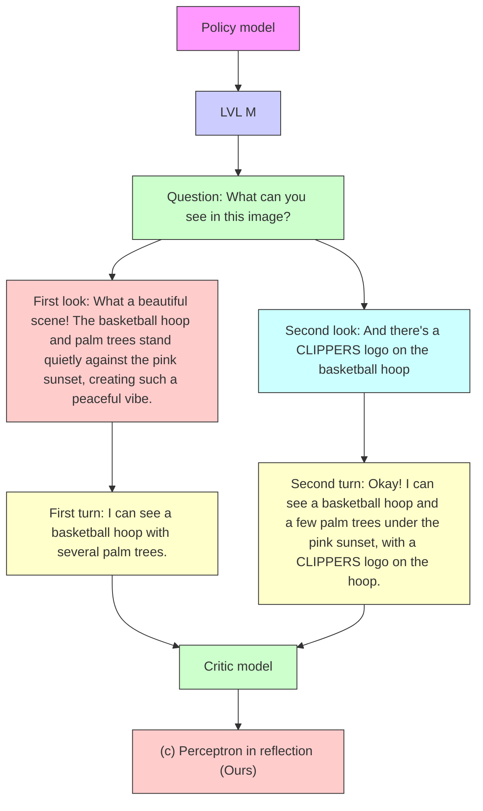
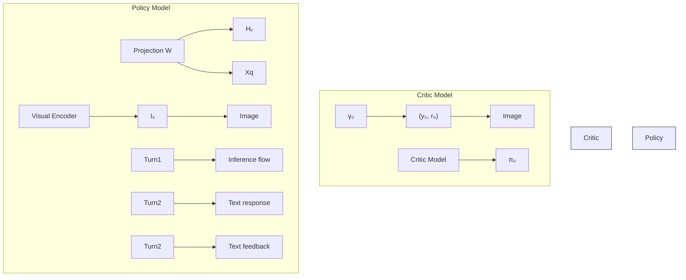

# Perception in Reflection

Yana Wei $^{*1}$ Liang Zhao $^{*2}$ Kangheng Lin $^{3}$ En Yu $^{4}$ Yuang Peng $^{5}$ Runpei Dong $^{6}$ Jianjian Sun $^{2}$ Haoran Wei $^{2}$ Zheng Ge $^{2}$ Xiangyu Zhang $^{2}$ Vishal M. Patel $^{1}$ $^{1}$ Johns Hopkins University $^{2}$ StepFun $^{3}$ BUPT $^{4}$ HUST $^{5}$ Tsinghua University $^{6}$ UIUC

# Abstract

We present a perception in reflection paradigm designed to transcend the limitations of current large vision-language models (LVLMs), which are expected yet often fail to achieve perfect perception initially. Specifically, we propose Reflective Perception (RePer), a dual-model reflection mechanism that systematically alternates between policy and critic models, enables iterative refinement of visual perception. This framework is powered by Reflective Perceptual Learning (RPL), which reinforces intrinsic reflective capabilities through a methodically constructed visual reflection dataset and reflective unlikelihood training. Comprehensive experimental evaluation demonstrates RePer's quantifiable improvements in image understanding, captioning precision, and hallucination reduction. Notably, RePer achieves strong alignment between model attention patterns and human visual focus, while RPL optimizes fine-grained and free-form preference alignment. These advancements establish perception in reflection as a robust paradigm for future multimodal agents, particularly in tasks requiring complex reasoning and multi-step manipulation.

# 1. Introduction

In advancing large vision-language models (LVLMs) (GPT-4o, 2024; Liu et al., 2024c; Bai et al., 2023), considerable attention has often been focused on enhancing the models' visual perception capabilities for image understanding. This emphasis stems from a fundamental assumption that well-trained models can achieve sufficiently accurate initial perception. Such perceptual accuracy enables the model to process visual inputs and generate appropriate responses in a single pass (Liu et al., 2024c;b; Wang et al., 2024). However, the frequent occurrence of hallucinations and misperceptions hinders their wider applicability in real-world scenarios. As shown in Figure 1, even for simple scenes, models may generate hallucinatory descriptions (e.g., as seen in (b)) or fail to capture essential details (e.g., as observed in the initial response in (c)). This raises an important consideration: Are current perception paradigms inherently limited, or might there be a more reasonable paradigm?

flowchart

Figure 1. Existing LVLMs are expected to deliver accurate perceptions initially, but humans often reflect and refine answers gradually. We introduce perception in reflection, employing policy and critic model interactions to fully harness perceptual capabilities.

Some methods (Chen et al., 2023; Liu et al., 2024d; Yu et al., 2023) attempt to mitigate this through a sort of visual chain-of-thought (CoT) (Wei et al., 2022) reasoning. They establish a paradigm that first executes fine-grained perceptual tasks (such as grounding object locations (Chen et al., 2023; Shao et al., 2024), structures (Liu et al., 2024d) or identities (Yu et al., 2023)) before engaging in broader perception. However, these approaches face a key limitation: the reliance on specialized tasks and data formats that are difficult to generalize across all vision-language tasks, e.g., box CoT can not be used in math geometry problems, making it challenging to achieve consistent visual perception across diverse scenarios. Furthermore, CoT does not

change the original single-pass manner. When perceptual errors occur, it is unable to adjust and rectify them.

Shifting the view to the real world, we can observe that humans, as shown in Figure 1, typically do not perceive in a single step, rather, they establish cognition through gradual observation. This iterative process enables humans to continually enrich, refine, and enhance their perceptual outcomes. Drawing inspiration from this, we think that a reasonable perception paradigm for LVLMs should be iterative rather than a single-pass. In other words, the ability to reflect and improve over multiple rounds is not just a desirable feature; it's a fundamental requirement for LVLMs to achieve robust and generalizable perception.

In this paper, we propose a novel perceptual mechanism, termed Reflective Perception (RePer). Its purpose is to enable LVLMs to, like humans, use a perception-feedback loop to gradually establish precise visual cognition. To achieve this, we make RePer a dual-model architecture, i.e., policy model and critic model, to enable LVLMs to conduct perception and reflection separately in terms of multi-turn dialogues between policy and critic model. In this way, LVLMs distill lessons from past experiences, gradually direct attention toward critical visual primitives, and thereby produce more accurate and refined responses.

Although LVLMs inherently possess reflective perception capabilities, this ability is instable and has not been effectively activated (Kumar et al., 2024). To this end, we further propose a Reflective Perceptual Learning (RPL) approach. Through strategic temperature sampling and a hybrid evaluation system combining model and rule-based rewarding, we construct an online, multi-turn visual reflection dataset. This dataset exhibits progressive improvements in both perception accuracy and response quality across dialogue turns. Building upon this, we propose reflective unlikelihood training, an imitation learning approach (Ross et al., 2011; Swamy et al., 2023) that calibrates the model's preferences across responses of varying quality, thereby mitigating behavioral collapse (Kumar et al., 2024) where models tend to generate suboptimal responses in early turns.

Extensive experiments demonstrate that RePer achieves superior performance across various benchmarks including image understanding, hallucination detection and detailed image caption, e.g., 54% CAPTURE on DetailCaps (Dong et al., 2024a) and 51% accuracy on HallusionBench (Guan et al., 2024). Using GPT-4o (GPT-4o, 2024) and DALLE-3 (Betker et al., 2023), we validate its enhanced perception capabilities from both discriminative and generative perspectives. Comprehensive ablation studies on data construction, training strategies, reflection rounds, and critic designs verify RePer's generalizability, establishing it as a fundamental paradigm for advancing multimodal perception.

In order to thoroughly unveil the underlying mechanisms behind perception in reflection, we further conducted a series of analytical experiments. Our comprehensive experimental analysis reveals two key findings:

- RePer can effectively migrate image attention towards human-aligned regions through iterative refinement. This implies that the perceptual pattern utilized by RePer aligns more closely with that of humans.   
- RPL can be regarded as a free-form preference optimization framework that unifies various preference learning paradigms, e.g., DPO (Rafailov et al., 2024), and LiPO (Liu et al., 2024e), while enabling fine-grained supervision through explicit feedback signals.

These two key findings underscore the crucial value of perception in reflection in enhancing multimodal understanding and reasoning capabilities. We believe it will become an essential capability for multimodal agents in the future, particularly in complex visual reasoning (Xie et al., 2024; Małkiński & Mańdziuk, 2022) and multi-step manipulation (Sampat et al., 2022; Kim et al., 2024) tasks.

# 2. Perception in Reflection

In this section, we first define our problem and formalize the objective from a reinforcement learning perspective (Section 2.1). We then elaborate on how models learn to perceive through reflection, encompassing both data construction and training strategies (Section 2.2). Finally, we present the inference algorithm for reflective perception during deployment (Section 2.3).

# 2.1. Problem Definition and Formulation

Perception in LVLMs. Perception, as a concept in the field of computer vision (He et al., 2016; Ren et al., 2016; He et al., 2017), refers to the process of interpreting and understanding sensory, ie., vision, information from the environment. In the context of LVLM, we typically define perception as the process by which the model recognizes and understands the image or video. The perception capability of the model will directly determine the accuracy of its understanding and reasoning towards real world.

Perception in Reflection. Our goal is to mimic human perception, establishing a perceive-feedback loop through LVLM's iterative attempts to enhance image comprehension and response accuracy. In pursuit of this, we model our challenge through the lens of reinforcement learning (RL), inspired by SCoRe (Kumar et al., 2024) and RISE (Qu et al., 2024). To be specific, given a dataset $\mathcal{D} = \{(I_i, x_i, y_i^*)\}_{i=1}^N$ of images $I_i$ , questions $x_i$ , and oracle responses $y_i^*$ , we aim to train an LVLM policy $\pi_\theta(\cdot \mid [I, x, \hat{y}_{1:t}, f_{1:t}])$ . This model, given an image $I$ and question $x$ , along with $t$ pre-

vious attempts $\hat{y}_{1:t}$ and feedback prompts $f_{1:t}$ , is designed to perceive the image as accurate as possible and deliver the most correct possible answer y. Formally, given a verifier $r(y, y^{*})$ to assess the correctness of model response y compared to oracle answer $y^{*}$ , we aim to derive a policy that utilizes the aforementioned information to produce the outputs with the highest correctness reward over T rounds:

$$
\max _ {\pi_ {\theta}} \sum_ {t = 1} ^ {T} \mathbb {E} _ {I, x, y ^ {*} \sim \mathcal {D}, \hat {y} _ {t} \sim \pi_ {\theta} (\cdot | [ I, x, \hat {y} _ {1: t - 1}, f _ {1: t - 1} ])} r (\hat {y} _ {t}, y ^ {*}). \tag {1}
$$

Section 2.1 resembles a multi-round Markov Decision Process (MDP) (Qu et al., 2024) or can be viewed as an RL or supervised finetune (SFT) objective. It is noteworthy that every historical attempt is synchronously optimized to maximize the ultimate reward.

# 2.2. Reflective Perceptual Learning

Despite existing LVLMs often possessing intrinsic self-reflection capabilities (Liu et al., 2024a), these abilities have been shown to be remarkably fragile (Kumar et al., 2024). In other words, they struggle to adaptively refine their responses based on given feedback (as shown in Figure 9). To address this limitation, we propose Reflective Perception Learning (RPL), a methodology that trains models to continuously enhance their previous responses through imitation learning (Ross et al., 2011; Swamy et al., 2023). We first elaborate on the data collection and training objective.

Data Construction. Naturally, we structure a multi-turn dialogue encompassing the sequence of posing questions, providing responses, receiving erroneous feedback, and subsequently re-responding and re-evaluating. This iterative process is designed to cultivate and demonstrate reflective perception capabilities within the trained models.

Practically, we expect the model to, (1) generate diverse responses based on all past answers and feedback, thereby enabling the exploration during reflection towards a perception with fewer errors; (2) gradually produce more accurate answers in multi-turn dialogues, ensuring the convergence of the reflective chain. To meet these requirements, we construct a visual reflection dataset for model imitation. Figure 2 gives an overview, with detailed steps as follows:

Step-1: Initial Candidate generation. We employ temperature sampling to generate diverse candidate answers per image-question pair. This approach ensures sufficient variation in response style, detail level, and accuracy while maintaining semantic relevance.

Step-2 VLM-Based Reward Scoring. For the generated multiple candidate responses, we employ a robust Visual-Language Model (VLM) to conduct a comprehensive and multifaceted evaluation, yielding fine-grained scores.

Step-1: Initial Caption Generation   

text_image

Model: LLaVA-1.5-13B
System Prompt: You are an expert ... answer the question based on the given image. For the question, generate several candidate answers with different temperature.
Given the question: [Can you provide a comprehensive caption for this image?]
Candidate 1: This image shows a twin bed with two side-by-side white headboards ...
Candidate 2: I can observe a twin bed with ...

Step-2: VLM-Based Reward Scoring   

text_image

Input
Model: GPT4-0 / Gemini
Rating Criteria: 1. Authenticity (4 points): The answer should ...
2. Correctness (2 points): ...
Candidate Answers: 1. In the image, we can see ...
2. I can observe a twin ...

<table><tr><td rowspan="2">Outcome</td><td>Scores: [ {Authenticity: 3, Correctness: 2, ..., Final score: 7}, {Authenticity: 4, ..., Final score: 8}, ... ]</td></tr><tr><td>Reason: [The generated answer incorrectly describes the headboards as white..., The reason is that..., ...]</td></tr></table>

Step-3: Rule-Based Reward Scoring

text_image

Model: Factual parser
Two Reference Captions (from GPT-4o and Gemini-Pro)
Candidate Answers: 1. In the image, we can see ...
2. I can observe a twin ...
Matching (WordNet, BERT)
Visual Elements (object, Attribute, Relations):
For each reference: {obj: [bed, ...], attr: [white,...], rel: [in the center, ...]}
For each candidates: {obj: [pillow, ...], attr: [red,...], rel: [on the bed, ...]}
Scores for Candidates: [0.55, 0.63, ...]

Step-4: Multi-Turn Reflective Dialogue

<table><tr><td rowspan="2">Input</td><td>Candidate Answers: 1. In the image, we can see ... 2. I can observe a twin ...</td></tr><tr><td>VLM-based Reward and Reasons: [(7, The generated answer incorrectly...), (8, The reason is that...), ...] Rule-based Reward: [0.55, 0.63, ...]</td></tr><tr><td>Filter Output</td><td>Filter the Data: Score Gap &gt; Threshold Candidate Answers Rank: Turn1 Answer -&gt; Turn2 Answer -&gt; Turn3 Answer Pre-defined Template Multi-turn Reflective Dialogue: Question: Given an image, can you provide a comprehensive caption for this image? Turn1 Answer: This image shows a twin bed with two side-by-side white ... Turn1 Feedback: A score of 7 is given to this caption. The description inaccurately mentions different pillowcases on each side; both visible pillows have red pillowcases ...</td></tr></table>

Figure 2. Data construction pipeline of visual reflection dataset.

Step-3 Rule-Based Reward Scoring. Then we design a pipeline to extract key elements, e.g., objects, attributes, and relations, from both images and responses, and establish matching rules to compute alignment scores.

Step-4 Reflective Dialogue construction. After obtaining the candidate answers and their corresponding reward scores, we select samples meeting two criteria: (a) a minimum score gap between the highest and lowest responses, and (b) at least one response scoring above the specified points. Then the filtered responses are structured into N rounds of reflective dialogue, progressing from lowest to highest scores. To this end, we curate a dataset $\tilde{\mathcal{D}} = \{\{(I_{t}^{i}, x_{t}^{i}, \tilde{y}_{t}^{i}, f_{t}^{i}, r_{t}^{i})\}_{t=1}^{T}\}_{i=1}^{N}$ , where $\tilde{y}_{t}^{i}$ is sampled from model outputs, $f_{t}^{i}$ represents specific feedback, and $r_{t}^{i}$ denotes the corresponding reward score.

Two points merit attention. First, it is crucial to reward answer of each round using a hybrid scoring mechanism.

Algorithm 1 Reflective Perception (RePer)   
1: Initialize Policy, Critic model: $\pi_{\theta}, r_{\theta}$ 2: Generate initial perception response $y_0$ using $\pi_{\theta}$ given image $I$ and language instruction $x$ 3: Generate initial evaluation $r_0, f_0$ using $r_{\theta}$ given $(I, x, y_0)$ 4: Set $t \leftarrow 0$ 5: while $t < \max$ trials do
6: Generate perception response $y_t$ using $\pi_{\theta}$ given $(I, x, y_0, r_0, f_0, ..., y_{t-1}, r_{t-1}, f_{t-1})$ 7: Generate evaluation $r_t, f_t$ using $r_{\theta}$ given $(I, x, y_0, r_0, f_0, ..., y_{t-1}, r_{t-1}, f_{t-1}, y_t)$ 8: Increment $t$ 9: end while
10: return

This approach aims to align the model with both rule-based and model-based reward systems (Mu et al., 2024), thereby maximizing its ability to generalize to complex real-world scenarios. Second, we aim to devise responses based on the self-generated outputs of the model, thereby facilitating an online optimization process. This is intended to minimize the risk of the model overfitting to non-reflective capabilities (Kumar et al., 2024; Qu et al., 2024; Tang et al., 2024).

Reflective Unlikelihood Training. Based on the constructed data, we apply imitation learning (Ross et al., 2011; Swamy et al., 2023) to simulate reflective perception. This learning process necessitates the disregard of textual patterns, focusing instead on the cultivation of capabilities.

More critically, we seek to prevent the model from overfitting to multi-turn responses and avoid the behavioral collapse (Kumar et al., 2024) where the model consistently generates suboptimal initial replies. In previous efforts, both RISE (Qu et al., 2024) and SCoRe (Kumar et al., 2024) primarily utilized SFT for imitation learning. However, RISE employed the exponent of centered rewards to mitigate this issue, while SCoRe utilized reward shaping to counteract. In this paper, we propose a method that simultaneously balances likelihood and unlikelihood (Welleck et al., 2019), formalized as follows:

$$
\max _ {\theta} \mathbb {E} _ {\circ^ {i} \sim \tilde {D}} \sum_ {t = 1} ^ {T} \sigma_ {t} ^ {i} \log \pi_ {\theta} (\tilde {y} _ {t} ^ {i} | \circ_ {t} ^ {i}) + \alpha (1 - \sigma_ {t} ^ {i}) \log (1 - \pi_ {\theta} (\tilde {y} _ {t} ^ {i} | \circ_ {t} ^ {i})), \tag {2}
$$

where $\circ$ denotes a single sampling instance from our constructed dataset $\tilde{D}$ , and $\sigma_{t}^{i}=F(r_{t}^{i})$ represents the normalization of reward $r_{t}^{i}$ . $\alpha$ is a constant term that adjusts the unlikelihood loss scale.

Essentially, we employ rewards to balance likelihood and unlikelihood. In the initial rounds where the reward is lower (smaller loss weight), there is a predisposition towards unlikelihood, promoting the penalization of the response. Conversely, in subsequent rounds where the reward is higher (larger loss weight), there is a tendency towards likelihood, encouraging rewarding of the response. We will elaborate this on Section 3.2.

flowchart

Figure 3. Inference pipeline of reflective perception.

# 2.3. Reflective Perception

As shown in Algorithm 1 and Figure 3, we define reflective perception during the inference process as a collaborative interaction between the well-trained policy and critic agents.

Initially, the policy model observes and provides its perceptual results, which are then evaluated by the critic model. The critic model assesses the policy's perception, providing both a score to gauge the quality of the perception and a rationale for the score given. Following this, the policy model reflects on its perceptual errors, informed by the critic's evaluations on self-generated responses from previous rounds, and produce a new perceptual response. The critic model then delivers updated feedback based on all previous perceptions and critiques. This iterative process continues until a predetermined limit is reached.

Through an iterative reflective perception mechanism, the model can achieve human-like visual perception patterns, as empirically validated by the experimental results demonstrated in Figure 4.

# 3. Discussion

# 3.1. RePer Progressively Aligns Human Attention.

The reflective capabilities of language models have been widely studied (Liu et al., 2024a; Kumar et al., 2024; Qu et al., 2024). It is suggested that these models inherently possess a reflective ability that, although unstable, can improve the certainty of outputs and activate deeper levels of knowledge (Liu et al., 2024a). Yet, the effectiveness of this capacity in LVLMs remains an unexplored question.

To investigate, we begin by visualizing the detailed image attention of the model for each round of the model's responses. As shown in Figure 4, as the rounds progress, the model accurately shifts its attention emphasis towards the correct image tokens, rather than over-focusing on a few insignif-

Input Image   

natural_image

Nighttime exterior view of a brightly lit castle with purple lighting and multiple spires (no visible text or signage)

Image Attention Maps   

natural_image

Pixelated abstract image with a small yellow dot on a dark purple background (no text or symbols)

(a) LLaVA-1.5

natural_image

Abstract pixelated pattern with purple background and scattered yellow squares (no text or symbols)

(b) RePer (Turn 1)

natural_image

Abstract pixelated pattern with purple background and scattered teal and yellow dots (no text or symbols)

(c) RePer (Turn 2)   
0.0 0.2 0.4 0.6 0.8 1.0   
Output Answers   
LLaVA-1.5: The image features a beautiful nighttime view of a large, illuminated castle with a clock tower. The castle is surrounded by a crowd of people, with some standing closer to the foreground and others further in the background. The people appear to be admiring the majestic structure, creating a lively atmosphere around the castle. The scene captures the essence of a popular tourist destination, with the castle serving as a stunning focal point.   
RePer (Turn 1) : The image features a large, majestic castle... The castle has a purple and white color scheme, and it appears to be a popular tourist attraction... a few people can be seen ...   
RePer (Turn 2) : The image features a large, majestic castle... The people in the image are likely tourists, admiring the beauty of this iconic structure, and the scene is set in a location that is likely a popular tourist destination. The image captures the essence of a fairy tale, and the castle is the center of attention, making it a perfect picture for a postcard or a travel brochure.

Figure 4. Comparison of image attention maps between LLaVA-1.5 and RePer, highlighting RePer's broader activation of image tokens and its ability to generate more detailed and accurate answers. While LLaVA-1.5 over-focuses on “people”, RePer correctly attends to the main subject, “castle,” progressively activating more relevant tokens for improved perception.

icant ones. Hence correspondingly, the hallucinations and erroneous perceptions initially displayed by the model gradually decrease. Essentially, this represents a progressive alignment towards ground-truth human attention.

Figure 6a provides further quantitative support, showing a log-linear increase in average image token activations over five rounds of reflection. Specifically, we calculated the average image token activations across 1,000 cases to measure how the model's attention to images varies during reflective perception. This is important because responses with fewer hallucinations are associated with higher average activations of image tokens (Huang et al., 2024). Our findings suggest that visual reflection gradually unlocks the model's inherent visual capabilities, focusing attention on salient image context and progressively mitigating hallucination.

# 3.2. RPL is a Free-Form Preference Optimization.

Revisiting the data construction in RPL, we essentially transform listwise preference data with precise feedback and scores into multi-turn dialogues grading from poor to good quality. This prompts the inquiry: is RPL fundamentally a preference optimization process?

Revisiting Equation (2), for a given sample $\circ$ and its $T$ dialogue iterations, the objective is articulated as follows:

$$
\begin{array}{l} L ^ {i} = \underbrace {\sigma_ {1} \log \pi_ {\theta} (\tilde {y} _ {1} | \circ_ {1})} _ {\text { less   likelihood }} + \underbrace {\alpha (1 - \sigma_ {1}) \log (1 - \pi_ {\theta} (\tilde {y} _ {1} | \circ_ {1}))} _ {\text { more   unlikelihood }} +... + \\ \underbrace {\sigma_ {T} \log \pi_ {\theta} (\tilde {y} _ {T} | \circ_ {T})} _ {\text { more   likelihood }} + \underbrace {\alpha (1 - \sigma_ {T}) \log (1 - \pi_ {\theta} (\tilde {y} _ {T} | \circ_ {T}))} _ {\text { less   unlikelihood }}. \tag {3} \\ \end{array}
$$

As aforementioned, to develop reflective perception capabilities, we create multi-turn data that progresses from poor to good responses, with rewards increasing linearly from rounds 1 to T. As a result, in the initial rounds, the model mainly penalizes poor samples (more unlikelihood), while in later rounds, it gradually shifts to rewarding good samples (more likelihood). This helps the model avoid overfitting to poor initial samples and, importantly, allows it to progressively learn to distinguish between good and bad samples.

From another perspective, we can view RPL as a form of reward modeling. Unlike popular LLM-based reward modeling methods such as DPO (Rafailov et al., 2024) and LiPO (Liu et al., 2024e), RPL does not propagate gradients to the remaining negative samples. Yet, back-propagation over multi-round dialogues is actually not isolated. With each response contextualizing all previous responses, as denoted by $\circ_t = [I, x, \hat{y}_{1:t-1}, f_{1:t-1}]$ , each sample implicitly establishes a partial increasing preference order.

Moreover, it is worth noting that RPL holds a significant advantage over previous reward modeling approaches: flexibility in handling diverse preference samples—pairwise or listwise, scalar or fine-grained feedback-based rewards—while maintaining stable training. Additionally, the use of detailed feedback aids error highlighting, facilitating object-level or even token-level preference that direct optimization more precisely. Our analyses in Section 4.6 further confirms this.

# 4. Experiments

# 4.1. Implemental Details

Datasets. To construct the training dataset as illustrated in Section 2.2, we begin by randomly sampling 10,000 images from the LLaVA-665K (Liu et al., 2024c) dataset. For each image, we prompt the model to generate 8 different captions sampled with temperatures ranging from 0.0 to 1.4 in increments of 0.2. To filter high-quality samples, we

Table 1. Model Performance Comparison of RePer with Baselines and State-of-the-Art Models. RePer outperforms across six benchmarks, with the best results highlighted in bold. 

<table><tr><td rowspan="2">Model</td><td colspan="2">MMHal-Bench</td><td colspan="3">HallusionBench</td><td colspan="3">Detailcaps-4870</td><td rowspan="2">LLaVABench</td><td colspan="2">GAIVE</td><td colspan="3">GAPE</td></tr><tr><td>Score ↑</td><td>Hal rate ↑</td><td>aAcc ↑</td><td>fAcc ↑</td><td>qAcc ↑</td><td>CAPTURE ↑</td><td>Precision ↑</td><td>Recall ↑</td><td>Relevancy ↑</td><td>Accuracy ↑</td><td>Authen. ↑</td><td>Correct. ↑</td><td>Total ↑</td></tr><tr><td>MiniGPT-4 7B</td><td>-</td><td>-</td><td>35.78</td><td>10.12</td><td>8.79</td><td>-</td><td>-</td><td>-</td><td>45.1</td><td>-</td><td>-</td><td>-</td><td>-</td><td>-</td></tr><tr><td>mPLUG-Owl 7B</td><td>-</td><td>-</td><td>43.93</td><td>10.40</td><td>9.45</td><td>-</td><td>-</td><td>-</td><td>-</td><td>-</td><td>-</td><td>-</td><td>-</td><td>-</td></tr><tr><td>InstructBLIP 7B</td><td>-</td><td>-</td><td>45.26</td><td>10.11</td><td>9.45</td><td>51.81</td><td>65.22</td><td>45.01</td><td>59.8</td><td>-</td><td>-</td><td>-</td><td>-</td><td>-</td></tr><tr><td>LLaVA-SFT+ 7B</td><td>1.88</td><td>0.68</td><td>33.65</td><td>8.96</td><td>5.93</td><td>51.13</td><td>64.38</td><td>44.28</td><td>44.6</td><td>6.68</td><td>4.85</td><td>27.62</td><td>12.47</td><td>70.09</td></tr><tr><td>LLaVA-RLHF 7B</td><td>1.67</td><td>0.76</td><td>31.23</td><td>14.16</td><td>7.69</td><td>52.21</td><td>63.61</td><td>45.93</td><td>44.9</td><td>4.88</td><td>4.27</td><td>27.93</td><td>12.64</td><td>70.68</td></tr><tr><td>VOLCANO 7B</td><td>2.06</td><td>0.62</td><td>26.50</td><td>10.69</td><td>6.37</td><td>50.88</td><td>66.23</td><td>43.35</td><td>54.0</td><td>7.12</td><td>5.35</td><td>31.63</td><td>14.52</td><td>78.78</td></tr><tr><td>LLaVA-SFT+ 13B</td><td>1.92</td><td>0.65</td><td>46.37</td><td>22.25</td><td>18.24</td><td>51.08</td><td>64.48</td><td>44.04</td><td>55.8</td><td>6.85</td><td>5.20</td><td>30.00</td><td>13.44</td><td>74.88</td></tr><tr><td>LLaVA-RLHF 13B</td><td>2.09</td><td>0.69</td><td>36.20</td><td>15.32</td><td>14.73</td><td>52.05</td><td>64.56</td><td>45.35</td><td>62.6</td><td>4.66</td><td>4.33</td><td>30.06</td><td>13.59</td><td>75.36</td></tr><tr><td>VOLCANO 13B</td><td>2.15</td><td>0.64</td><td>40.69</td><td>19.36</td><td>13.40</td><td>51.21</td><td>66.47</td><td>43.65</td><td>66.0</td><td>7.55</td><td>5.59</td><td>31.34</td><td>14.32</td><td>78.17</td></tr><tr><td>LLaVA-1.5 7B</td><td>2.02</td><td>0.61</td><td>35.65</td><td>17.92</td><td>11.21</td><td>51.03</td><td>67.27</td><td>42.19</td><td>60.2</td><td>6.50</td><td>5.28</td><td>30.19</td><td>13.58</td><td>75.16</td></tr><tr><td>+RePer</td><td>2.51</td><td>0.53</td><td>38.70</td><td>19.65</td><td>14.29</td><td>52.89</td><td>66.81</td><td>45.69</td><td>60.7</td><td>6.91</td><td>6.04</td><td>33.16</td><td>14.94</td><td>80.88</td></tr><tr><td>LLaVA-1.5 13B</td><td>2.35</td><td>0.58</td><td>43.85</td><td>20.81</td><td>14.95</td><td>51.23</td><td>66.26</td><td>43.77</td><td>66.95</td><td>6.65</td><td>5.49</td><td>31.27</td><td>14.12</td><td>77.37</td></tr><tr><td>+RePer</td><td>2.61</td><td>0.52</td><td>51.00</td><td>22.83</td><td>20.00</td><td>54.73</td><td>64.74</td><td>49.1</td><td>67.6</td><td>7.67</td><td>6.86</td><td>34.11</td><td>15.33</td><td>82.54</td></tr></table>

retain instances from VLM-based scoring where the highest score exceeds 9 and the score disparity (difference between the highest and lowest scores) is greater than 4. Similarly, for rule-based scoring, we retain cases with a highest score above 0.55 and a score disparity exceeding 0.2. Using the generated captions, rewards, and templates from Figure 2, we create the visual reflection dataset, containing 11,065 samples from 8,101 images. These samples are distributed as follows: 3,649 for one conversation turn, 2,621 for two turns, and 3,795 for three turns.

Models Training and Inference. Our experiments are based on the LLaVA-1.5 (Liu et al., 2024b) architecture. We directly supervised finetune the instruct model on our generated datasets. All models are trained for one epoch on 8 NVIDIA A100 GPUs with a batch size of 8 and a learning rate of 1e-6. Only the parameters of the LLM module are fine-tuned, while the rest remain frozen. In reflective unlikelihood training (Equation (2)), rewards are normalized to [0,1] by dividing with their maximum values (F), serving as likelihood weight ( $\sigma$ ). The constant term $\alpha$ is set as 10.0. During the inference stage mentioned in Section 2.3, we defaultly use LLaVA-Critic (Xiong et al., 2024) as the critic model.

# 4.2. Main Results

To evaluate the visual perception capabilities of RePer, we conducted assessments across five widely-used benchmarks, covering a range of tasks: image understanding (LLaVABench (Liu et al., 2024c)), hallucination detection (HallusionBench (Guan et al., 2024), MMHal-Bench (Sun et al., 2023b), GAIVE (Liu et al., 2023a)), and detailed image captioning (DetailCaps (Dong et al., 2024a)). As shown in Table 1, we compared RePer not only with classic state-of-the-art multimodal baselines including MiniGPT-4 (Zhu et al., 2023), mPLUG-Owl (Ye et al., 2023), InstructBLIP (Dai et al., 2024), LLaVA (Liu et al., 2024c), LLaVA-RLHF (Sun et al., 2023a), LLaVA-1.5 (Liu et al., 2024b) but also with Volcano (Lee et al., 2023), a multimodal model trained with self-feedback guided refinement. As shown in Table 1, RePer consistently outperforms baseline models across benchmarks and model scales. Its notable improvement on DetailCaps (+3.64% in 7B and +6.83% in 13B) highlights its ability to generate more accurate and detailed captions through multi-turn refinement and RPL. The increased recall rate (+8.30% in 7B and +12.17% in 13B) for visual elements demonstrates RePer's enhanced perception of details. This results in consistent improvements on general and hallucination-related benchmarks, reducing hallucinations without sacrificing image understanding.

# 4.3. GPT-4o-Assisted Perception Evaluation (GAPE)

We introduce GPT-4o-Assisted Perception Evaluation (GAPE) to simulate human-like perception assessment. Designed to complement traditional closed-set image captioning benchmarks (Chen et al., 2015; Agrawal et al., 2019), GAPE evaluates model-generated captions by leveraging human-aligned prompts with GPT-4o (Peng et al., 2024) without the need for human-annotated groundtruth answers. Specifically, given an image and a prompt, GPT-4o evaluates the generated captions across five dimensions: Authenticity, Correctness, Detail, Coherence, and Completeness. The evaluation prompts align with the “Rating Criteria” outlined in Figure 8. To better highlight differences in caption quality, these dimensions are scored on a larger scale from 0 to 100, offering a human-like and nuanced assessment of caption performance.

As shown in Table 1 and Table 5, our RePer consistently outperforms other methods, demonstrating its effectiveness in enhancing model's perceptual capabilities. Notably, we observe the most significant improvement in Authenticity, which evaluates the model's tendency to hallucinate non-existent objects. This substantial gain can be attributed to our unlikelihood training objective, which effectively penalizes misaligned visual descriptions.

# 4.4. Evaluation via Text-to-Image Reconstruction

We assess image captioning performance, a key perceptual application, using the CLIP-Image-Score metric from Vi-

Table 2. Image captioning comparison on 13B models using the CLIP-Image-Score metric and its variants with DINO/DINOv2 as Image encoders. 

<table><tr><td>Model</td><td>CLIP</td><td>DINO</td><td>DINOv2</td></tr><tr><td>LLaVA-1.5</td><td>67.43</td><td>40.56</td><td>41.02</td></tr><tr><td>+RePer</td><td>67.85</td><td>42.19</td><td>42.12</td></tr></table>

  
Figure 5. We use DALLE-3 (Betker et al., 2023) as a text-to-image model to reconstruct images using generated captions. Compared to the original image, reconstructed images from LLaVA-1.5 (Liu et al., 2024b) captions lack key objects or include extraneous ones, indicating incomplete descriptions or hallucinations.

sualFactChecker (Ge et al., 2024). This metric evaluates caption accuracy and detail by comparing the similarity between an original image and its text-to-image generated version (DALLE-3 (Betker et al., 2023)), using the caption as a prompt. By comparing the raw and reconstructed images, the metric detects hallucination-related discrepancies, providing a unique perspective on caption quality. To enhance this evaluation, we substitute the CLIP model with DINO (Caron et al., 2021) and DINOv2 (Darcet et al., 2023) for a more thorough assessment.

As shown in Table 2, our RePer consistently outperforms the baselines, underscoring the superior quality of its captions. Figure 5 presents visual examples of the reconstruction process. In the second example, LLaVA 1.5 falsely mentions, “There are several birds scattered throughout the scene,” exhibiting hallucination. In contrast, the caption from our RePer produces a reconstructed image closely resembling the original, demonstrating its superior accuracy and ability to avoid hallucinations.

# 4.5. Ablation Studies

Reflection Turns We analyze the impact of reflection turns on model performance using LLaVA-Critic and GPT-4o as the critic. As shown in Figure 6b, increasing reflection turns improves performance on the DetailCaps-4870 benchmark, reducing hallucinations and enhancing detail perception. This aligns with our attention analysis (Figure 4), suggesting that iterative reflection helps the model better focus on relevant image regions.

Table 3. Comparison of RePer and RePer without RPL under varying critics and reflection turns on Detailcaps-4870. 

<table><tr><td>Critic</td><td>Turn</td><td>RePer</td><td>RePer w.o. RPL</td></tr><tr><td rowspan="3">GPT-4o (GPT-4o, 2024)</td><td>1</td><td>54.29</td><td>51.22</td></tr><tr><td>2</td><td>55.41</td><td>52.28</td></tr><tr><td>3</td><td>55.55</td><td>53.9</td></tr><tr><td rowspan="3">LLaVA-Critic (Xiong et al., 2024)</td><td>1</td><td>54.29</td><td>51.22</td></tr><tr><td>2</td><td>54.68</td><td>52.25</td></tr><tr><td>3</td><td>54.73</td><td>53.85</td></tr></table>

Table 4. RPL vs. Preference Optimization Methods. 

<table><tr><td>Method</td><td>DetailCaps</td><td>HallusionB</td><td>GAIVE</td><td>LLaVAB</td></tr><tr><td>LLaVA-1.5-13B</td><td>51.22</td><td>24.43</td><td>5.65</td><td>66.95</td></tr><tr><td>+DPO (Rafailov et al., 2024)</td><td>50.53</td><td>25.61</td><td>5.28</td><td>66.2</td></tr><tr><td>+LiPO (Liu et al., 2024e)</td><td>52.31</td><td>25.04</td><td>6.27</td><td>69.5</td></tr><tr><td>+RPL</td><td>54.73</td><td>31.28</td><td>6.86</td><td>67.6</td></tr></table>

Scoring Disparity for Data Construction We also examine the effect of scoring thresholds in data selection (Section 2.2) on DetailCaps and HallusionBench. As shown in Figure 6c, optimal performance is achieved with samples having highest scores above 9 and score disparities of at least 4, indicating that high scoring disparity helps select challenging yet high-quality training samples.

Unlikelihood Loss We further study the influence of un-likelihood loss weight $\alpha$ (from Equation (2)) on reducing behavior collapse in initial responses using DetailCaps and HallusionBench. As shown in Figure 6d, a weight of 10.0 achieves optimal performance by effectively balancing the penalization of undesirable responses while preserving valuable content.

# 4.6. Further Analysis

Critic matters, RPL matters more. To assess RPL and different critics' impact on RePer, we compare its performance with and without RPL, using critics LLaVA-Critic (Xiong et al., 2024) and GPT-4o (GPT-4o, 2024), across multiple reflection turns on DetailCaps. As shown in Table 3, GPT-4o yields superior results due to its strong generative and discriminative abilities, while LLaVA-Critic also shows consistent improvements, indicating RePer's adaptability to different critics. Even without RPL, RePer benefits from reflection; however, RPL further amplifies this effect, leading to a stronger initial-turn performance and demonstrating the effectiveness of the imitation learning approach.

RPL is essentially fine-grained preference optimization. As detailed in Section 3.2, RPL's imitation learning in reflective dialogues can be seen as listwise preference optimization with detailed feedback and explicit rewards. We compare it to similar methods: DPO, which optimizes Bradley-

line

| Reflection Turns | LLaVA-1.5 | RePer |
| ---------------- | --------- | ----- |
| First Turn       | 3.50      | 3.50  |
| Second Turn      | 4.00      | 4.25  |
| Third Turn       | 4.30      | 5.50  |

(a) Attentive Img-Token Analysis

line

| Reflection Turns | LLaVA-Critic as Critic | GPT-4o as Critic |
| ---------------- | ---------------------- | ---------------- |
| First Turn       | 54.3                   | 54.3             |
| Second Turn      | 54.7                   | 55.4             |
| Third Turn       | 54.8                   | 55.6             |

(b) Reflection Turns

bar

| Scoring Disparity | CAPTURE Score (%) | HallusionBench aAcc (%) |
| ----------------- | ------------------ | ----------------------- |
| 1.0               | 50                 | 40                      |
| 2.0               | 50                 | 40                      |
| 3.0               | 52                 | 46                      |
| 4.0               | 54                 | 51                      |

(c) Scoring Disparity

bar

| Loss Weight α | CAPTURE Score (%) | HallusionBench aAcc (%) |
| ------------- | ------------------ | ----------------------- |
| 0.0           | 50.0               | 40.0                    |
| 2.0           | 51.0               | 50.0                    |
| 4.0           | 52.0               | 51.0                    |
| 6.0           | 53.0               | 51.0                    |
| 8.0           | 54.0               | 52.0                    |
| 10.0          | 55.0               | 52.0                    |

(d) Loss Weight of Unlikelihood   
Figure 6. (a) Increase in activated average image attention across reflection turns. (b-d) Ablation studies.

Terry (Bradley & Terry, 1952) using preference pairs with the largest score differences, and LiPO, which optimizes learning-to-rank (Liu et al., 2009) using all preference data ranked by reward. Table 4 shows RPL's clear advantages, especially in caption and hallucination metrics. We speculate this success stems from: 1) fine-grained critic feedback that facilitates effective corrections, lacking in DPO/LiPO; and 2) unlikelihood training without KL constraints, which helps counteract multimodal hallucinations.

# 5. Related Work

The remarkable scaling laws (Kaplan et al., 2020) of LLMs (Touvron et al., 2023a; Xu et al., 2024) in terms of parameters and data have driven the advancement of LVLMs. BLIP-2 (Li et al., 2023a) pioneered the use of Q-Former to bridge visual encoders with large language models, explicitly supervising the vision-language alignment while autoregressively generating vision-related text. Works like LLaVA (Liu et al., 2024c;b), MiniGPT-4 (Zhu et al., 2023), and Qwen-VL (Bai et al., 2023; Wang et al., 2024) have demonstrated the sufficiency of text autoregression for visual understanding and have progressively simplified the vision-language connector using techniques such as cross-attention (Ye et al., 2023), linear layers (Liu et al., 2024c; Zhao et al., 2023), MLPs (Liu et al., 2024b; Zhang et al., 2024; Dong et al., 2024b), and convolutions (Yu et al., 2023; Wang et al., 2024), all while maintaining consistent performance.

Despite relentless scaling of visual encoders (Tong et al., 2024a; Wei et al., 2024a), language decoders (Wang et al., 2024), and visual-textual corpora (Li et al., 2024; Wei et al., 2024b), LVLMs have yet to achieve a qualitative leap in perceptual acuity or hallucination mitigation. Some approaches attribute hallucinations to visual (Tong et al., 2024b) or linguistic biases (Li et al., 2023b), seeking to counter them through online (Liu et al., 2023b) or offline (Leng et al., 2024) corrections. Others (Yu et al., 2024; Zhu et al., 2024; 2025) take a more direct route, modulating the model's visual attention preferences by aligning with human judgment via Reinforcement Learning from Human Feedback (RLHF) (Ouyang et al., 2022). Yet, disappointingly, these efforts have failed to tackle the root issue: models still reflexively respond to perceptual challenges, regardless of their complexity.

LLMs often use step-by-step reasoning (Wei et al., 2022) to avoid giving premature answers. However, this linear process can falter with complex problems, leading to factual inaccuracies and hallucinations (Miao et al., 2023). To counter this, some approaches use external feedback to guide reasoning (Shinn et al., 2024; Yao et al., 2022), while others harness the model's reflective abilities for self-correction (Liu et al., 2024a; Miao et al., 2023; Qu et al., 2024; Kumar et al., 2024). These methods employ an iterative “answer-reflect-reanswer” loop, significantly improving performance on complex challenges.

Some LVLMs require preliminary image parsing tasks like grounding (Chen et al., 2023; Shao et al., 2024), parsing (Liu et al., 2024d; Wei et al., 2024c; Chen et al., 2024), or identification (Yu et al., 2023; 2025) before responding. While this chain-of-thought-style approach moderately improves performance, other methods (Cao et al., 2024; Wu & Xie, 2024) focus on locating relevant image regions and cropping them to assist with fine-grained perception. However, these methods often struggle with complex scenarios and may increase hallucination. Recent work explores iterative refinement using internal (Liu et al., 2024a; Lee et al., 2023) or external (Liao et al., 2024) rewards. Despite promising results, these approaches lack systematic training frameworks and do not sufficiently explore the underlying principles of their mechanisms. We address these limitations by proposing RePer and RPL, with comprehensive theoretical and empirical analysis.

# 6. Conclusion

Perception in reflection addresses a key limitation in current LVLMs: the unrealistic expectation of perfect initial responses. Instead, it provides a robust fallback mechanism, empowering the model to adjust and converge on the correct answer even when initial predictions fall short. Powered by reflective perceptual learning, we create a system that can generalize more effectively across varied and complex visual scenarios, ensuring that the model is not only accurate but also resilient and adaptive in real-world applications.

# References

Agrawal, H., Desai, K., Wang, Y., Chen, X., Jain, R., Johnson, M., Batra, D., Parikh, D., Lee, S., and Anderson, P. Nocaps: Novel object captioning at scale. In Proceedings of the IEEE/CVF international conference on computer vision, pp. 8948–8957, 2019.   
Bai, J., Bai, S., Yang, S., Wang, S., Tan, S., Wang, P., Lin, J., Zhou, C., and Zhou, J. Qwen-vl: A frontier large vision-language model with versatile abilities. arXiv preprint arXiv:2308.12966, 2023.   
Betker, J., Goh, G., Jing, L., Brooks, T., Wang, J., Li, L., Ouyang, L., Zhuang, J., Lee, J., Guo, Y., et al. Improving image generation with better captions. Computer Science. https://cdn.openai.com/papers/dall-e-3.pdf, 2(3):8, 2023.   
Bradley, R. A. and Terry, M. E. Rank analysis of incomplete block designs: I. the method of paired comparisons. Biometrika, 39:324, 1952. URL https://api.semanticscholar.org/CorpusID:125209808.   
Cao, Y., Zhang, P., Dong, X., Lin, D., and Wang, J. Dualfocus: Integrating macro and micro perspectives in multi-modal large language models. arXiv preprint arXiv:2402.14767, 2024.   
Caron, M., Touvron, H., Misra, I., Jégou, H., Mairal, J., Bojanowski, P., and Joulin, A. Emerging properties in self-supervised vision transformers. In Proceedings of the International Conference on Computer Vision (ICCV), 2021.   
Chen, J., Kong, L., Wei, H., Liu, C., Ge, Z., Zhao, L., Sun, J., Han, C., and Zhang, X. Onechart: Purify the chart structural extraction via one auxiliary token. In Proceedings of the 32nd ACM International Conference on Multimedia, pp. 147–155, 2024.   
Chen, K., Zhang, Z., Zeng, W., Zhang, R., Zhu, F., and Zhao, R. Shikra: Unleashing multimodal llm's referential dialogue magic. arXiv preprint arXiv:2306.15195, 2023.   
Chen, L., Li, J., Dong, X., Zhang, P., He, C., Wang, J., Zhao, F., and Lin, D. Sharegpt4v: Improving large multi-modal models with better captions. In European Conference on Computer Vision, pp. 370–387. Springer, 2025.   
Chen, X., Fang, H., Lin, T.-Y., Vedantam, R., Gupta, S., Dollár, P., and Zitnick, C. L. Microsoft coco captions: Data collection and evaluation server. arXiv preprint arXiv:1504.00325, 2015.   
Dai, W., Li, J., Li, D., Tiong, A. M. H., Zhao, J., Wang, W., Li, B., Fung, P. N., and Hoi, S. Instructblip: Towards

general-purpose vision-language models with instruction tuning. Advances in Neural Information Processing Systems, 36, 2024.   
Darcet, T., Oquab, M., Mairal, J., and Bojanowski, P. Vision transformers need registers, 2023.   
Devlin, J., Chang, M.-W., Lee, K., and Toutanova, K. Bert: Pre-training of deep bidirectional transformers for language understanding. arXiv preprint arXiv:1810.04805, 2018.   
Dong, H., Li, J., Wu, B., Wang, J., Zhang, Y., and Guo, H. Benchmarking and improving detail image caption. arXiv preprint arXiv:2405.19092, 2024a.   
Dong, R., Han, C., Peng, Y., Qi, Z., Ge, Z., Yang, J., Zhao, L., Sun, J., Zhou, H., Wei, H., Kong, X., Zhang, X., Ma, K., and Yi, L. DreamLLM: Synergistic multimodal comprehension and creation. In The Twelfth International Conference on Learning Representations, 2024b.   
Ge, Y., Zeng, X., Huffman, J. S., Lin, T.-Y., Liu, M.-Y., and Cui, Y. Visual fact checker: Enabling high-fidelity detailed caption generation. In Proceedings of the IEEE/CVF Conference on Computer Vision and Pattern Recognition, pp. 14033–14042, 2024.   
GPT-4o. Hello gpt-4o, 2024. URL https://openai.com/index/hello-gpt-4o/.   
Guan, T., Liu, F., Wu, X., Xian, R., Li, Z., Liu, X., Wang, X., Chen, L., Huang, F., Yacoob, Y., et al. Hallusionbench: an advanced diagnostic suite for entangled language hallucination and visual illusion in large vision-language models. In Proceedings of the IEEE/CVF Conference on Computer Vision and Pattern Recognition, pp. 14375–14385, 2024.   
He, K., Zhang, X., Ren, S., and Sun, J. Deep residual learning for image recognition. In Proceedings of the IEEE conference on computer vision and pattern recognition, pp. 770–778, 2016.   
He, K., Gkioxari, G., Dollár, P., and Girshick, R. Mask r-cnn. In Proceedings of the IEEE international conference on computer vision, pp. 2961–2969, 2017.   
Huang, Q., Dong, X., Zhang, P., Wang, B., He, C., Wang, J., Lin, D., Zhang, W., and Yu, N. Opera: Alleviating hallucination in multi-modal large language models via over-trust penalty and retrospection-allocation. In Proceedings of the IEEE/CVF Conference on Computer Vision and Pattern Recognition, pp. 13418–13427, 2024.   
Kaplan, J., McCandlish, S., Henighan, T., Brown, T. B., Chess, B., Child, R., Gray, S., Radford, A., Wu, J., and Amodei, D. Scaling laws for neural language models. arXiv preprint arXiv:2001.08361, 2020.

Kim, M. J., Pertsch, K., Karamcheti, S., Xiao, T., Balakrishna, A., Nair, S., Rafailov, R., Foster, E., Lam, G., Sanketi, P., et al. Openvla: An open-source vision-language-action model. arXiv preprint arXiv:2406.09246, 2024.   
Kumar, A., Zhuang, V., Agarwal, R., Su, Y., Co-Reyes, J. D., Singh, A., Baumli, K., Iqbal, S., Bishop, C., Roelofs, R., et al. Training language models to self-correct via reinforcement learning. arXiv preprint arXiv:2409.12917, 2024.   
Lee, S., Park, S. H., Jo, Y., and Seo, M. Volcano: mitigating multimodal hallucination through self-feedback guided revision. arXiv preprint arXiv:2311.07362, 2023.   
Leng, S., Zhang, H., Chen, G., Li, X., Lu, S., Miao, C., and Bing, L. Mitigating object hallucinations in large vision-language models through visual contrastive decoding. In Proceedings of the IEEE/CVF Conference on Computer Vision and Pattern Recognition, pp. 13872–13882, 2024.   
Li, J., Li, D., Savarese, S., and Hoi, S. Blip-2: Bootstrapping language-image pre-training with frozen image encoders and large language models. In International conference on machine learning, pp. 19730–19742. PMLR, 2023a.   
Li, Q., Chen, Z., Wang, W., Wang, W., Ye, S., Jin, Z., Chen, G., He, Y., Gao, Z., Cui, E., et al. Omnicorpus: An unified multimodal corpus of 10 billion-level images interleaved with text. arXiv preprint arXiv:2406.08418, 2024.   
Li, Y., Du, Y., Zhou, K., Wang, J., Zhao, W. X., and Wen, J.-R. Evaluating object hallucination in large vision-language models. arXiv preprint arXiv:2305.10355, 2023b.   
Li, Z., Chai, Y., Zhuo, T. Y., Qu, L., Haffari, G., Li, F., Ji, D., and Tran, Q. H. Factual: A benchmark for faithful and consistent textual scene graph parsing. arXiv preprint arXiv:2305.17497, 2023c.   
Liao, Y.-H., Mahmood, R., Fidler, S., and Acuna, D. Can feedback enhance semantic grounding in large vision-language models? arXiv preprint arXiv:2404.06510, 2024.   
Liu, F., Lin, K., Li, L., Wang, J., Yacoob, Y., and Wang, L. Aligning large multi-modal model with robust instruction tuning. arXiv preprint arXiv:2306.14565, 2023a.   
Liu, F., Lin, K., Li, L., Wang, J., Yacoob, Y., and Wang, L. Mitigating hallucination in large multi-modal models via robust instruction tuning. In The Twelfth International Conference on Learning Representations, 2023b.   
Liu, G., Mao, H., Cao, B., Xue, Z., Johnson, K., Tang, J., and Wang, R. On the intrinsic self-correction capability of llms: Uncertainty and latent concept. arXiv preprint arXiv:2406.02378, 2024a.

Liu, H., Li, C., Li, Y., and Lee, Y. J. Improved baselines with visual instruction tuning. In Proceedings of the IEEE/CVF Conference on Computer Vision and Pattern Recognition, pp. 26296–26306, 2024b.   
Liu, H., Li, C., Wu, Q., and Lee, Y. J. Visual instruction tuning. Advances in neural information processing systems, 36, 2024c.   
Liu, M., Chen, D., Li, Y., Fang, G., and Shen, Y. Chartthinker: A contextual chain-of-thought approach to optimized chart summarization. arXiv preprint arXiv:2403.11236, 2024d.   
Liu, T., Qin, Z., Wu, J., Shen, J., Khalman, M., Joshi, R., Zhao, Y., Saleh, M., Baumgartner, S., Liu, J., et al. Lipo: Listwise preference optimization through learning-to-rank. arXiv preprint arXiv:2402.01878, 2024e.   
Liu, T.-Y. et al. Learning to rank for information retrieval. Foundations and Trends® in Information Retrieval, 3(3):225–331, 2009.   
Małkiński, M. and Mańdziuk, J. Deep learning methods for abstract visual reasoning: A survey on raven's progressive matrices. ACM Computing Surveys, 2022.   
Miao, N., Teh, Y. W., and Rainforth, T. Selfcheck: Using llms to zero-shot check their own step-by-step reasoning. arXiv preprint arXiv:2308.00436, 2023.   
Miller, G. A. Wordnet: a lexical database for english. Communications of the ACM, 38(11):39–41, 1995.   
Mu, T., Helyar, A., Heidecke, J., Achiam, J., Vallone, A., Kivlichan, I., Lin, M., Beutel, A., Schulman, J., and Weng, L. Rule based rewards for language model safety. arXiv preprint arXiv:2411.01111, 2024.   
Ouyang, L., Wu, J., Jiang, X., Almeida, D., Wainwright, C., Mishkin, P., Zhang, C., Agarwal, S., Slama, K., Ray, A., et al. Training language models to follow instructions with human feedback. Advances in neural information processing systems, 35:27730–27744, 2022.   
Peng, Y., Cui, Y., Tang, H., Qi, Z., Dong, R., Bai, J., Han, C., Ge, Z., Zhang, X., and Xia, S.-T. Dreambench++: A human-aligned benchmark for personalized image generation. arXiv preprint arXiv:2406.16855, 2024.   
Qu, Y., Zhang, T., Garg, N., and Kumar, A. Recursive introspection: Teaching language model agents how to self-improve. arXiv preprint arXiv:2407.18219, 2024.   
Rafailov, R., Sharma, A., Mitchell, E., Manning, C. D., Ermon, S., and Finn, C. Direct preference optimization: Your language model is secretly a reward model. Advances in Neural Information Processing Systems, 36, 2024.

Ren, S., He, K., Girshick, R., and Sun, J. Faster r-cnn: Towards real-time object detection with region proposal networks. IEEE transactions on pattern analysis and machine intelligence, 39(6):1137–1149, 2016.   
Ross, S., Gordon, G., and Bagnell, D. A reduction of imitation learning and structured prediction to no-regret online learning. In Proceedings of the fourteenth international conference on artificial intelligence and statistics, pp. 627–635. JMLR Workshop and Conference Proceedings, 2011.   
Sampat, S. K., Patel, M., Das, S., Yang, Y., and Baral, C. Reasoning about actions over visual and linguistic modalities: A survey. arXiv preprint arXiv:2207.07568, 2022.   
Shao, H., Qian, S., Xiao, H., Song, G., Zong, Z., Wang, L., Liu, Y., and Li, H. Visual cot: Unleashing chain-of-thought reasoning in multi-modal language models. arXiv preprint arXiv:2403.16999, 2024.   
Shinn, N., Cassano, F., Gopinath, A., Narasimhan, K., and Yao, S. Reflexion: Language agents with verbal reinforcement learning. Advances in Neural Information Processing Systems, 36, 2024.   
Sun, Z., Shen, S., Cao, S., Liu, H., Li, C., Shen, Y., Gan, C., Gui, L.-Y., Wang, Y.-X., Yang, Y., Keutzer, K., and Darrell, T. Aligning large multimodal models with factually augmented rlhf. 2023a.   
Sun, Z., Shen, S., Cao, S., Liu, H., Li, C., Shen, Y., Gan, C., Gui, L.-Y., Wang, Y.-X., Yang, Y., Keutzer, K., and Darrell, T. Aligning large multimodal models with factually augmented rlhf, 2023b. URL https://arxiv.org/abs/2309.14525.   
Swamy, G., Wu, D., Choudhury, S., Bagnell, D., and Wu, S. Inverse reinforcement learning without reinforcement learning. In International Conference on Machine Learning, pp. 33299–33318. PMLR, 2023.   
Tang, Y., Guo, D. Z., Zheng, Z., Calandriello, D., Cao, Y., Tarassov, E., Munos, R., Pires, B. Á., Valko, M., Cheng, Y., et al. Understanding the performance gap between online and offline alignment algorithms. arXiv preprint arXiv:2405.08448, 2024.   
Tong, S., Brown, E., Wu, P., Woo, S., Middepogu, M., Akula, S. C., Yang, J., Yang, S., Iyer, A., Pan, X., et al. Cambrian-1: A fully open, vision-centric exploration of multimodal llms. arXiv preprint arXiv:2406.16860, 2024a.   
Tong, S., Liu, Z., Zhai, Y., Ma, Y., LeCun, Y., and Xie, S. Eyes wide shut? exploring the visual shortcomings of multimodal llms. In Proceedings of the IEEE/CVF

Conference on Computer Vision and Pattern Recognition, pp. 9568–9578, 2024b.   
Touvron, H., Lavril, T., Izacard, G., Martinet, X., Lachaux, M.-A., Lacroix, T., Rozière, B., Goyal, N., Hambro, E., Azhar, F., et al. Llama: Open and efficient foundation language models. arXiv preprint arXiv:2302.13971, 2023a.   
Touvron, H., Martin, L., Stone, K., Albert, P., Almahairi, A., Babaei, Y., Bashlykov, N., Batra, S., Bhargava, P., Bhosale, S., et al. Llama 2: Open foundation and fine-tuned chat models. arXiv preprint arXiv:2307.09288, 2023b.   
Wang, P., Bai, S., Tan, S., Wang, S., Fan, Z., Bai, J., Chen, K., Liu, X., Wang, J., Ge, W., et al. Qwen2-vl: Enhancing vision-language model's perception of the world at any resolution. arXiv preprint arXiv:2409.12191, 2024.   
Wei, H., Kong, L., Chen, J., Zhao, L., Ge, Z., Yang, J., Sun, J., Han, C., and Zhang, X. Vary: Scaling up the vision vocabulary for large vision-language model. In European Conference on Computer Vision, pp. 408–424. Springer, 2024a.   
Wei, H., Liu, C., Chen, J., Wang, J., Kong, L., Xu, Y., Ge, Z., Zhao, L., Sun, J., Peng, Y., et al. General ocr theory: Towards ocr-2.0 via a unified end-to-end model. 2024b.   
Wei, H., Yin, Y., Li, Y., Wang, J., Zhao, L., Sun, J., Ge, Z., and Zhang, X. Slow perception: Let's perceive geometric figures step-by-step. arXiv preprint arXiv:2412.20631, 2024c.   
Wei, J., Wang, X., Schuurmans, D., Bosma, M., Xia, F., Chi, E., Le, Q. V., Zhou, D., et al. Chain-of-thought prompting elicits reasoning in large language models. Advances in neural information processing systems, 35:24824–24837, 2022.   
Welleck, S., Kulikov, I., Roller, S., Dinan, E., Cho, K., and Weston, J. Neural text generation with unlikelihood training. arXiv preprint arXiv:1908.04319, 2019.   
Wu, P. and Xie, S. V?: Guided visual search as a core mechanism in multimodal llms. In Proceedings of the IEEE/CVF Conference on Computer Vision and Pattern Recognition, pp. 13084–13094, 2024.   
Xie, J., Chen, Z., Zhang, R., Wan, X., and Li, G. Large multimodal agents: A survey. arXiv preprint arXiv:2402.15116, 2024.   
Xiong, T., Wang, X., Guo, D., Ye, Q., Fan, H., Gu, Q., Huang, H., and Li, C. Llava-critic: Learning to evaluate multimodal models. arXiv preprint arXiv:2410.02712, 2024.

Xu, H., Zhao, R., Wang, J., and Chen, H. Restful-llama: Connecting user queries to restful apis. In Proceedings of the 2024 Conference on Empirical Methods in Natural Language Processing: Industry Track, pp. 1433–1443, 2024.   
Yao, S., Zhao, J., Yu, D., Du, N., Shafran, I., Narasimhan, K., and Cao, Y. React: Synergizing reasoning and acting in language models. arXiv preprint arXiv:2210.03629, 2022.   
Ye, Q., Xu, H., Xu, G., Ye, J., Yan, M., Zhou, Y., Wang, J., Hu, A., Shi, P., Shi, Y., et al. mplug-owl: Modularization empowers large language models with multimodality. arXiv preprint arXiv:2304.14178, 2023.   
Yu, E., Zhao, L., Wei, Y., Yang, J., Wu, D., Kong, L., Wei, H., Wang, T., Ge, Z., Zhang, X., et al. Merlin: Empowering multimodal llms with foresight minds. arXiv preprint arXiv:2312.00589, 2023.   
Yu, E., Lin, K., Zhao, L., Wei, Y., Zhu, Z., Wei, H., Sun, J., Ge, Z., Zhang, X., Wang, J., et al. Unhackable temporal rewarding for scalable video mllms. arXiv preprint arXiv:2502.12081, 2025.   
Yu, T., Yao, Y., Zhang, H., He, T., Han, Y., Cui, G., Hu, J., Liu, Z., Zheng, H.-T., Sun, M., et al. Rlhf-v: Towards trustworthy mllms via behavior alignment from fine-grained correctional human feedback. In Proceedings of the IEEE/CVF Conference on Computer Vision and Pattern Recognition, pp. 13807–13816, 2024.   
Zhang, Y., Li, B., Liu, h., Lee, Y. j., Gui, L., Fu, D., Feng, J., Liu, Z., and Li, C. Llava-next: A strong zero-shot video understanding model, April 2024. URL https://llava-vl.github.io/blog/2024-04-30-llava-next-video/.   
Zhao, L., Yu, E., Ge, Z., Yang, J., Wei, H., Zhou, H., Sun, J., Peng, Y., Dong, R., Han, C., et al. Chatspot: Bootstrapping multimodal llms via precise referring instruction tuning. arXiv preprint arXiv:2307.09474, 2023.   
Zhu, D., Chen, J., Shen, X., Li, X., and Elhoseiny, M. Minigpt-4: Enhancing vision-language understanding with advanced large language models, 2023.   
Zhu, K., Zhao, L., Ge, Z., and Zhang, X. Self-supervised visual preference alignment. In Proceedings of the 32nd ACM International Conference on Multimedia, pp. 291–300, 2024.   
Zhu, Z., Zhao, L., Lin, K., Yang, J., Yu, E., Liu, C., Wei, H., Sun, J., Ge, Z., and Zhang, X. Perpo: Perceptual preference optimization via discriminative rewarding. arXiv preprint arXiv:2502.04371, 2025.

# Appendix

In this appendix, we provide additional details to complement the main paper. Specifically, Appendix A elaborates on the Visual Reflection Dataset, while Appendix B presents details of the proposed GAPE benchmark along with its complete results. Finally, Appendix C showcases additional examples illustrating the strong capabilities of RePer.

# A. Construction Details of Visual Reflection Dataset

This section provides additional details on the data construction process introduced in Section 2.2 and Section 4.1.

# A.1. Step-1: Initial Candidate Generation

To generate diverse responses, we employ temperature sampling, producing eight candidate captions per image across different temperature values, ranging from 0.0 to 1.4 in increments of 0.2. Higher temperatures generally lead to lower response quality, often introducing hallucinated objects or less precise descriptions.

# A.2. Step-2: VLM-Based Reward Scoring

We define evaluation criteria for high-quality image captions, which guide the reward scoring process through carefully designed prompts (as shown in Figure 7). The reward score ranges from 0 to 10 and assesses five key aspects:

- Authenticity: Whether the caption contains hallucinated objects.   
- Correctness: Whether all described attributes and relationships are factually correct.   
- Detailness: Whether the description is sufficiently detailed, covering all relevant attributes of objects.   
- Coherence: Whether the caption is logically consistent, without contradictions.   
- Completeness: Whether the caption comprehensively covers all relevant aspects of the image, including both foreground and background elements.

# A.3. Step-3: Rule-Based Reward Scoring.

Inspired by (Dong et al., 2024a), we design rule-based rewards to quantify the alignment between image elements and textual descriptions. This evaluates visual preference through a structured pipeline:

Reference Caption Generation We prompt strong VLMs (GPT-4o and Gemini-Pro) using “Please describe this image in detail.” to generate reference captions for each image.

Element Extraction We extract objects, attributes, and relations from both reference captions and candidate answers using Factual Parser (Li et al., 2023c), while applying stop-word filtering to remove irrelevant terms. To filter irrelevant elements, a stop word list is curated for abstract nouns (e.g., “foreground”, “background”) that do not correspond to image content. LLaMA2-13B-chat (Touvron et al., 2023b) and Factual Parser are used to extract candidate nouns from ShareGPT4V-102k (Chen et al., 2025). Words recalled by Factual Parser but missing in LLaMA2-13B-chat are reviewed, and high-frequency terms are validated by human experts. This process results in the final stop word list.

Elements Matching We implement a three-stage matching strategy to evaluate visual elements:

- Exact Matching: Directly aligns identical objects, attributes, and relations.   
- Synonym Matching: Uses WordNet (Miller, 1995) to identify synonym sets and assigns a 1.0 match score for synonymous elements.   
- Soft Matching: Applies BERT (Devlin et al., 2018) to compute cosine similarity between embeddings of unmatched elements, selecting the highest similarity score per element.

# Rating Criteria

As a senior computer vision and NLP researcher, and an impartial data quality assessor, please evaluate the quality of the generated caption in relation to the given image on a scale of 0 to 10. Each aspect has an upper bound which has been marked as follows:

1. Authenticity (4 points): The answer should not describe an object or aspect that doesn't exist in the image.   
2. Correctness (2 points): Does the answer correctly identify all the objects present in the image?   
3. Detail (2 points): How well does the answer describe each object and its attributes?   
4. Coherence (1 points): Is the answer logically consistent and understandable, maintaining a steady flow throughout?   
5. Completeness (1 points): Does the answer cover all aspects in the image?

Give lower points if the answer fails in any of these aspects. A score of 10 indicates that the generated answer is accurate, detailed, coherent, complete and does not hallucinate any details not present in the image. The final score for the answer is the sum of scores in each aspect. Please also offer your reason for this score, and output the dict as the answer.

Input Image   

natural_image

Purple cartoon character with guitar playing a rock, surrounded by greenery (no text or symbols visible)

# Strong LLMs

  
GPT-4o

  
Gemini

...

# Scores and Reasons

"Authenticity": 3,   
"Correctness": 1,   
"Detail": 1,   
"Coherence": 1,   
"Completeness": 1,   
"Final Score": 7,   
"Reason": "The monster holds only one guitar, not two. It grips a small drum with one hand."

# Generated Answers

The scene takes place in someone's garden, featuring a small statue of a crunchy red monster with purple limbs standing outside. The monster's hat covers one set of its big eyes as it is a garden ornament. It uniquely appears to play a musical role, holding not one but two guitars. One guitar can be seen hanging in front of the statue on its lap or in one hand, while the other one can be picked up at its side. The overall arrangement suggests the monster might be a part of a whimsical and artistic garden setup with possibly some entertainment attached.

Figure 7. Pipeline for Generating VLM-Based Reward Scores. Given an image and a generated answer, a predefined rating criterion for high-quality captions is formulated as a prompt. A strong LLM then evaluates the response, producing a reward score along with a rationale for the assigned score.

Final Matching Score The final Rule-based reward aggregates scores from all three stages to compute precision, recall, and F1-score. The final caption quality score is a weighted sum of the three F1 scores, with default weights of Object:Attribute:Relation = 5:2:2.

# A.4. Step-4: Reflective Dialogue Construction

To construct reflective dialogues, we first apply data filtering based on the criteria outlined in Section 2.2 (Step-4) and Section 4.1 (Datasets). We then organize responses into a structured reflection-driven dialogue format, using the template illustrated in Figure 8.

For VLM-based rewards, given an image, its candidate answers, and scores with reasons from GPT-4o, we sort candidate answers from lowest to highest score. The multi-turn dialogue is constructed as follows:

- In the first turn, the model is given the initial question.   
- In subsequent turns, each reflective prompt includes the score, explanation, and a question asking the model to improve its response.   
- We construct dialogues of 1-3 turns, ensuring that the final ground-truth answer is always the highest-scoring candidate.   
- For multi-turn cases, the first-turn response is always the lowest-scoring candidate, enabling a progressive refinement process.

This answer-critic iterative refinement encourages the model to learn from mistakes, gradually correcting its responses over multiple turns. For the rule-based rewards, there is no reasoning provided, and the scoring criteria differ from those of VLM-based rewards, which leads to a different interpretation of the relative score differences. Therefore, each round's prompt is selected from a predefined prompt pool that expresses the meaning of “could you generate a better answer.”

text_image

PEPSI-COLA
COLLECTIBLES
(2013 issue)
PEPSI-OLA
BILL VEHLING
MICHAEL MUNT

Question: Please generate a detailed caption that accurately describes the image.

Response: In the image, we can see that an older Pepsi bottle or vase collectible is sitting high above other, lesser-valued objects. Additionally, a collectible Pepsi-Co bottle with a yellow back stand and satchel is on display at ground level.\n\nThe image shows a collection of antique or valuable Pepsi-Collectibles arranged, which might belong to an avid collector of Pepsi Co. memorabilia, emphasizing the historical value and distinct features of the antiques.

Critic Score and Rationale: This caption can only get the score 5. The description hallucinates objects that don't exist in the image, such as a bottle or vase and the arrangement of multiple items. The image actually is of a book titled 'Pepsi-Cola Collectibles,' showing one illustrated collectible Pepsi sign on the cover. The text about the scene with various collectibles is inaccurate. Could you generate a better one?

Response: The image features a book titled “Pepsi-Cola Collectibles” by Michael Hunt, which showcases old and rare Pepsi-Cola items collected from various sources. The book is a guide for collectors, likely providing information about the history and value of these items.\n\nThe front cover of the book features an illustration of a Pepsi-Cola display cabinet, which reflects the nostalgic atmosphere of the collection. The book is likely filled with fascinating illustrations and information about vintage Pepsi-Cola items, making it an exciting read for collectors and enthusiasts of Pepsi-Cola memorabilia.

Critic Score and Rationale: This caption qualifies for a score of 9. The generated answer accurately describes the title and general subject of the book. However, the authorship attribution is partially incorrect, as the image shows 'Bill Vehling' and 'Michael Hunt'. The description of the book's content and cover illustration is appropriate but lacks detailed specifics. Please suggest an improved one.

Response: The image features a book titled "Pepsi-Cola Collectibles" by Bill Vehling and Michael Hunt. The book is displayed on a white background, with the cover prominently visible. The book appears to be a guide or catalog for collectors of Pepsi-Cola memorabilia, showcasing various items and their values.

Figure 8. Illustration of data construction based on the designed template. The responses are structured progressively from the lowest to the highest score. Each reflective prompt consists of three components: reward score, rationale for the score, and a follow-up question requesting an improved response. This iterative refinement process guides the model towards generating more accurate and detailed captions.   
Table 5. Comparison of RePer's Performance with Baselines and State-of-the-Art Models on the GAPE Benchmark. 

<table><tr><td rowspan="2">Model</td><td colspan="6">GAPE</td></tr><tr><td>Authenticity ↑</td><td>Correctness ↑</td><td>Detail ↑</td><td>Coherence ↑</td><td>Completeness ↑</td><td>Total ↑</td></tr><tr><td>LLaVA-SFT+ 7B</td><td>27.62</td><td>12.47</td><td>12.27</td><td>9.61</td><td>8.11</td><td>70.09</td></tr><tr><td>LLaVA-RLHF 7B</td><td>27.93</td><td>12.64</td><td>12.44</td><td>9.55</td><td>8.11</td><td>70.68</td></tr><tr><td>VOLCANO 7B</td><td>31.63</td><td>14.52</td><td>13.89</td><td>9.86</td><td>8.90</td><td>78.78</td></tr><tr><td>LLaVA-SFT+ 13B</td><td>30.00</td><td>13.44</td><td>13.09</td><td>9.76</td><td>8.58</td><td>74.88</td></tr><tr><td>LLaVA-RLHF 13B</td><td>30.06</td><td>13.59</td><td>13.39</td><td>9.71</td><td>8.61</td><td>75.36</td></tr><tr><td>VOLCANO 13B</td><td>31.34</td><td>14.32</td><td>13.76</td><td>9.85</td><td>8.9</td><td>78.17</td></tr><tr><td>LLaVA-1.5 7B</td><td>30.19</td><td>13.58</td><td>13.15</td><td>9.78</td><td>8.46</td><td>75.16</td></tr><tr><td>+RePer</td><td>33.16</td><td>14.95</td><td>13.95</td><td>9.87</td><td>8.96</td><td>80.88</td></tr><tr><td>LLaVA-1.5 13B</td><td>31.27</td><td>14.12</td><td>13.48</td><td>9.81</td><td>8.69</td><td>77.37</td></tr><tr><td>+RePer</td><td>34.11</td><td>15.33</td><td>14.26</td><td>9.70</td><td>9.15</td><td>82.54</td></tr></table>

# B. Details of GAPE

As introduced in Section 4.3, GAPE employs evaluation prompts aligned with the “Rating Criteria” outlined in Figure 8. The evaluation score ranges from 0 to 100, with the following weight distribution: Authenticity (40 points), Correctness (20 points), Detail (20 points), Coherence (10 points), and Completeness (10 points).

GAPE serves as a complement to traditional image captioning benchmarks. Existing benchmarks, such as COCO Caption (Chen et al., 2015) and NoCaps (Agrawal et al., 2019), rely on language metrics like BLEU, ROUGE, and CIDEr, which are constrained by closed-set vocabularies and require human-annotated ground truth captions, making them less scalable for evaluating vision-language models (VLMs) that generate diverse descriptions. In contrast, GAPE provides a more flexible and robust evaluation pipeline, operating without human-annotated ground truth and leveraging LLM-based assessment to better align with human judgment, while accommodating the open-ended nature of caption generation.

Table 5 presents a detailed comparison of model performance on GAPE across all evaluation aspects.

natural_image

Interior view of a bathroom with a white toilet and colorful mosaic on the back (no text or symbols visible)

Human: Could you please give me a detailed description about this image?

# LLaVA 1.5:

The image features a bathroom with a toilet as the main focus. The toilet is situated in the middle of the room, and it has a colorful seat cover on it, adding a unique touch to the bathroom decor.
In addition to the toilet, there is a sink located towards the left side of the bathroom. A small trash can be seen on the right side of the room, and a cup is placed on a surface nearby. The bathroom also has a mirror on the wall, reflecting the overall layout of the space.

# Critic:

The LMM response provides a fairly accurate and detailed description of the image, capturing the main elements such as the toilet with a colorful seat cover, the sink, the trash can. However, there are a few inaccuracies and missing details. The sink is not in the middle of the room. The mirror is not clearly visible in the provided image, and the cup is not distinctly identifiable. Additionally, the description could have included more specific details about the surroundings, such as the smaller trash can. Overall, the response is mostly accurate but could be improved with more precise details and corrections.

Score: 70

# LLaVA 1.5:

The image depicts a bathroom with a toilet as the main focus. The toilet is situated on the left side of the room and has a colorful seat cover on it. A sink is located towards the left side of the bathroom, and a small trash can be seen on the right side. A cup is placed on a surface near the right side of the room. The bathroom also features a mirror on the wall, reflecting the overall layout of the space.

# Critic:

The LMM response provides a fairly accurate description of the image but contains some inaccuracies and omissions. Here are the key points:

1.Accuracy:

1. The toilet is indeed the main focus and is situated on the left side of the room.   
2. The colorful seat cover is correctly noted.   
3. The sink is not visible on the left side of the bathroom as stated.   
4. The trash can on the right side is correctly mentioned.   
5. A cup is not visible in the image, so this part of the description is incorrect.   
6. There is no mirror visible in the image; the LMM response incorrectly mentions a mirror reflecting the layout.

2.Omissions:

1. The cabinet with drawers is not mentioned.

The floor mat is not described.

3.Details:

1. The LMM response does not mention the cabinet with drawers, which is a significant part of the scene.

2. The description of the trash can and floor mat could add more detail to the scene.

Given these points, the response is partially accurate but contains several inaccuracies and omissions. Therefore, I would score it as follows:

Score: 60

Reasons:   
- The response correctly identifies the main elements like the toilet, colorful seat cover, and trash can.   
• However, it incorrectly describes the sink and mentions a mirror and cup that are not present.   
- The omission of important elements like the cabinet and floor mat reduces the overall completeness of the description.

# LLaVA 1.5:

The image features a bathroom with a toilet as the main focus. The toilet is situated on the left side of the room and has a colorful seat cover on it. A sink is located on the same side as the toilet, and a small trash can be seen on the right side of the room. The bathroom also has a cabinet with drawers and a floor mat, which are not explicitly described in the image.

# Critic:

The LMM response provides a general description of the bathroom, highlighting the main elements such as the toilet with a colorful seat cover, sink, trash can, and a cabinet with drawers. However, there are inaccuracies and omissions. The toilet is not situated on the left side of the room, and there is no floor mat visible in the image. Additionally, the description mentions a "small trash can" on the right side, which is accurate, but it fails to mention the roll of toilet paper on the wall and the carpet near the toilet. The overall description is somewhat misleading and lacks detail, leading to a lower score.

Scores: 60

Figure 9. Failure case of LLaVA-1.5 in answer refinement. Despite receiving critic feedback on the initial response, LLaVA-1.5 fails to correct the hallucinated objects (marked in red) in the second turn and further introduces the nonexistent “floor mat” in the third turn.

# C. Case Study

Figure 9 illustrates a failure case of the baseline model LLaVA-1.5 (Liu et al., 2024b) in a multi-turn conversation with a critic model (LLaVA-Critic (Xiong et al., 2024)). In this setup, LLaVA-1.5 first generates an initial response and then attempts to refine its answer based on feedback from the critic. Despite receiving detailed and accurate feedback, the model fails to correct its mistakes in the second turn, continuing to include hallucinated objects (highlighted in red) from the initial response. Furthermore, in the third turn, it introduces additional hallucinated objects, demonstrating its inability to properly leverage feedback for refinement. This failure also results in stagnant or even lower scores assigned by the critic. This underscores the necessity of equipping models with stronger feedback-driven self-correction mechanisms to improve response accuracy and mitigate hallucinations.

Figure 10 illustrates a successful refinement case of RePer. While the initial response contains hallucinated objects, RePer corrects these errors in the second turn based on feedback from the critic model. By the third turn, it further enhances the description by adding more details to an already accurate response, which had received a score of 90 from the critic. Throughout the multi-turn conversation, the feedback score steadily increases, reflecting the model's progressive improvement. This demonstrates RePer's strong ability to iteratively refine its answers based on prior responses and feedback, effectively guiding itself toward a more detailed and accurate final answer.

Figure 11 compares the initial-round outputs of the baseline model and RePer, highlighting RePer's strong ability to generate accurate and detailed descriptions. While the baseline model frequently introduces hallucinated objects, RePer consistently produces more faithful image descriptions. Additionally, we present images generated by DALLE-3 (Betker et al., 2023) as

natural_image

A cat peeking out of a window with a person's hand reaching toward it (no visible text or symbols)

Human: Please describe this image in detail.

# RePer:

The image features a cat sitting on a window sill, with a person's hand reaching out towards it. The cat appears curious and is looking at the person's hand, possibly trying to interact or play with it. The scene is set in a room, and there is a dining table and a chair in the background, and a bowl and an apple can also be spotted in this scene. The cat and the person seem to have a friendly and playful interaction, and the scene is likely taking place in a home or an indoor setting.

# Critic:

The LMM response provides a detailed description of the image, mentioning the cat on the window sill, the person's hand reaching towards the cat, and the interaction between them. However, there are some inaccuracies and missing details. The image does not clearly show a dining table, chair, bowl, or apple in the background. Instead, the image features a cat looking out of a window, a person's hand reaching towards it, and a bag of "Classic White" chips visible on the window sill. The scene is set in an indoor environment, but the specific details mentioned in the response do not entirely match the image provided. Therefore, the response is partially accurate but contains inaccuracies and omissions.

Reasons:

- Correctly identifies the cat and the interaction.   
• Incorrectly mentions a dining table, chair, bowl, and apple.   
• Lacks detail about the bag of chips.

# RePer:

The image features a cat sitting on a window sill and looking out, with a person's hand reaching out towards it. The scene is set in an indoor environment and a bag of "Classic White" chips is visible on the window sill, adding a casual and cozy atmosphere to the scene. The cat and the person seem to have a friendly and playful interaction, and the scene is likely taking place in a home or an indoor setting. The person's hand is reaching out towards the cat, and the cat appears curious and interested in the person's hand, creating a sense of connection and interaction between them. The scene is likely a moment of bonding and play between the cat and the person, and it captures a glimpse and of their everyday life, where the cat is enjoining the view and the person is trying to engage with the cat, creating a warm and cozy atmosphere.

# Critic:

The LMM response provides a detailed and accurate description of the image. It correctly identifies the main elements, such as the cat sitting on the window sill, the person's hand reaching out towards the cat, and the "Classic White" chips bag. The description captures the interaction between the cat and the person, suggesting a friendly and playful atmosphere. The setting is accurately described as an indoor environment, likely a home, which adds context to the scene.
The response also highlights the sense of connection and interaction between the cat and the person, emphasizing the warmth and coziness of the moment. Overall, the description is thorough and paints a clear picture of the scene, making it easy for someone to visualize without seeing the image.

Score: 90

Reasons:

- Accurate identification of main elements (cat, window sill, person's hand, chips bag).   
- Correctly describes the interaction and atmosphere.   
- Provides context about the setting (home or indoor environment).   
- The description is detailed and captures the essence of the moment.   
• The response is comprehensive and well-rounded.

# RePer:

The image features a cat sitting on a window sill, with a person's hand reaching out towards it. The scene is set in an indoor environment and a bag of "Classic White" chips is visible on the window sill, adding a casual and cozy atmosphere to the scene. The cat and the person seem to have a friendly and playful interaction, and the scene is likely taking place in a home or an indoor setting. The person's hand is reaching out towards the cat, and the cat appears curious and interested in the person's hand, creating a sense of connection and interaction between them. The scene is likely a moment of bonding and play between the cat and the person, and it captures a glimp and of their everyday life, where the cat is enjoining the view and the person is trying to engage with the cat, creating a warm and cozy atmosphere. The image is a beautiful representation of the bond and connection that can exist between pets and their owners, and it showcases the simple yet meaningful moments that can happen in our daily lives. The image is a reminder of the importance of spending quality time with our pets and the joy that they can bring to our lives.

# Critic:

The LMM response provides a detailed and vivid description of the image, capturing the essence of the scene and the interaction between the cat and the person. It accurately describes the cat and the person's hand reaching out to it, and it also mentions the "Classic White" chips bag on the window sill, which is a notable detail. The response effectively conveys the cozy and playful atmosphere of the scene and highlights the bond between the cat and the person. However, the description could be slightly more concise while maintaining the same level of detail.

Score: 95

Reasons:

• The response is highly detailed and captures the essence of the image, including the interaction between the cat and the person, as well as the background elements like the window and the chips bag.   
• The description effectively conveys the cozy and playful atmosphere, but it could be slightly more concise without losing important details.   
• The response does not include any inaccuracies and does a good job of painting a clear picture of the scene.

Figure 10. Successful refinement case of our RePer. Initially, RePer generates hallucinated objects but corrects them in the second turn based on critic feedback. By the third turn, it enhances the description with more details, improving a response that already scored 90. The increasing feedback scores highlight RePer's iterative refinement and progressive improvement.

part of the evaluation process in Section 4.4. The higher-quality captions from RePer lead to synthesized images that more closely resemble the original inputs, further demonstrating its effectiveness as a good captioner.

Figure 12 presents question-answering cases that assess the model's image understanding capabilities. The responses are generated in a single-turn answer format without iterative refinement.

# LLaVA-1.5:

The image features a deer standing in a grassy area near a fence. The deer is positioned in the middle of the scene, with its head turned to the left. The fence is located in the background, stretching across the entire width of the image.\n\nThere are several birds scattered throughout the scene, with some perched on the fence and others flying or resting in the grass. The birds are of various sizes and are spread out across the image, adding a sense of liveliness to the scene.

# RePer:

The scene is set in a park, with a deer standing in a grassy area, and a tree in the background. The deer is looking at the camera, and appears to be in a field, and there is a fence in the background. The scene is in a forest, and the deer is standing in front of a tree, and it seems like a peaceful and natural environment. The deer is also standing in front of a sign, and the scene is in a park, and it appears to be a peaceful and serene setting. The deer is also standing in front of a tree, and it seems like a peaceful and natural environment

# LLaVA-1.5:

The image features a large, colorful cow statue sitting on a green base. The cow statue is positioned in the center of the scene, with its head facing downwards. The statue is painted in various colors, making it visually striking.\n\nIn the background, there is a person standing near the right edge of the image. Additionally, there are two bottles placed on the ground, one closer to the left side and the other near the center of the scene.

# RePer:

The image features an old and worn black and red toy pig, which appears to be a stuffed animal, sitting on a green and red base. The pig is positioned on a cement floor, and it has a white face, giving it a unique and interesting appearance. The toy is placed in a room, and it seems to be an old and well-loved item, possibly a decoration or a cherished possession. The scene gives a sense of nostalgia and a glimpse into the past, as the toy pig has been through the test of time and still remains in good condition.

Original Image   

LLaVA-1.5   

RePer (Ours)   

# LLaVA-1.5:

The image features a brown and white dog on a leash, standing in a hallway next to a door. The dog appears to be looking at a cat, which is also on a leash and positioned nearby. The cat is looking at the dog, creating a sense of curiosity and interaction between the two animals. $^{n}$ N addition to the dog and cat, there is a third animal in the scene, a small dog located towards the right side of the image. The hallway has a wooden floor, and the door is open, allowing the animals to move around freely.

# RePer:

The image shows a living room with a wooden floor and a door. There are three pets in this room, a dog and two cats. The dog is on a leash and appears to be standing in front of a cat, and another cat is also present in the scene. The dog and the cats seem to be interacting with each other, and the scene has a cozy and friendly atmosphere. The room is well lit and the pets seem to be enjoining their time together.

Original Image   

LLaVA-1.5   

RePer (Ours)   

# LLaVA-1.5:

The image features a black and white cat sitting on a window sill, looking out the window. The cat is positioned in the middle of the scene, with its body facing the viewer. The window provides a view of the outdoors, which the cat seems to be observing.\n\nIn the background, there are several cars parked or driving by, adding to the overall atmosphere of the scene. The presence of the cat and the cars creates a sense of curiosity and interest in the image.

# RePer:

A black and white cat is sitting on a window sill, looking out the window. The cat is positioned in front of a window, and it appears to be looking at something outside, possibly a tree. The scene is set in a room, and the cat is the main focus, with its body and head clearly visible, and its tail and legs also in the frame. The room has a window, and the cat is sitting on a ledge, and it seems to be enjoining the view outside.

Figure 11. Comparison of initial-round outputed image captions between the baseline model and RePer. RePer generates more accurate and detailed descriptions, while the baseline model often introduces hallucinated objects. The corresponding DALLE-3 generated images further illustrate that RePer's captions lead to more faithful image reconstructions.   

Question: Can you spot the zebra standing behind the boys?

LLaVA-1.5 (Baseline): Yes, there is a zebra standing behind the three boys in the image.

RePer (Ours): No, there is no zebra in this image. The scene features three boys standing in front of an elephant, and they are posing for a picture.

Question: Identify any furniture near the window in the image.

LLaVA-1.5 (Baseline): There is a wooden bench near the window in the image.

RePer (Ours): In the image, there is a wooden chair and a table placed in front of a window, and a vase with a bouquet of flowers on top of it.

Question: What is the position and size of the bird's eye?

LLaVA-1.5 (Baseline): The bird's eye is open and large, which is a characteristic feature of birds of prey.

RePer (Ours): The bird has a large eye, and it is positioned on the side of its head.

Figure 12. Question-answering cases evaluating models' image understanding. Responses are generated in a single-turn format without iterative refinement.