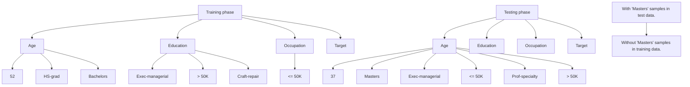
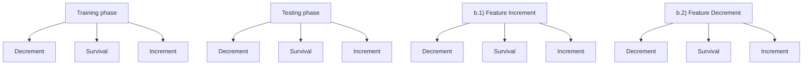
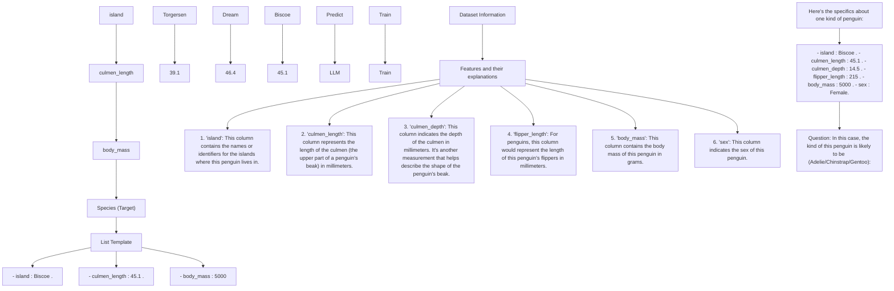

# TabFSBench: Tabular Benchmark for Feature Shifts in Open Environments

Zi-Jian Cheng $^{12}$ Zi-Yi Jia $^{12}$ Zhi Zhou $^{23}$ Yu-Feng Li $^{23}$ Lan-Zhe Guo $^{12}$

# Abstract

Tabular data is widely utilized in various machine learning tasks. Current tabular learning research predominantly focuses on closed environments, while in real-world applications, open environments are often encountered, where distribution and feature shifts occur, leading to significant degradation in model performance. Previous research has primarily concentrated on mitigating distribution shifts, whereas feature shifts, a distinctive and unexplored challenge of tabular data, have garnered limited attention. To this end, this paper conducts the first comprehensive study on feature shifts in tabular data and introduces the first tabular feature-shift benchmark (TabFSBench). TabFSBench evaluates impacts of four distinct feature-shift scenarios on four tabular model categories across various datasets and assesses the performance of large language models (LLMs) and tabular LLMs in the tabular benchmark for the first time. Our study demonstrates three main observations: (1) most tabular models have the limited applicability in feature-shift scenarios; (2) the shifted feature set importance has a linear relationship with model performance degradation; (3) model performance in closed environments correlates with feature-shift performance. Future research direction is also explored for each observation.

Benchmark: LAMDASZ-ML/TabFSBench.

# 1. Introduction

Tabular data (Altman & Krzywinski, 2017) represents a meticulously structured format of data, systematically arranged in rows and columns, where each row signifies a

$^{1}$ School of Intelligence Science and Technology, Nanjing University, China $^{2}$ National Key Laboratory for Novel Software Technology, Nanjing University, China $^{3}$ School of Artificial Intelligence, Nanjing University, China. Correspondence to: Yu-Feng Li <liyf@nju.edu.cn>, Lan-Zhe Guo <guolz@nju.edu.cn>.

Proceedings of the $42^{nd}$ International Conference on Machine Learning, Vancouver, Canada. PMLR 267, 2025. Copyright 2025 by the author(s).

record and each column corresponds to a feature (Sahakyan et al., 2021). The applications of tabular data in real-world scenarios are extensive. For instance, tabular data is utilized in financial analyses, including credit scoring (West, 2000) and stock market predictions (Zhu et al., 2021). Furthermore, tabular data forms the foundation for various applications in the medical sector, encompassing disease diagnosis (Yıldız & Kalayci, 2024) and pharmaceutical development (Meijerink et al., 2020). Existing machine learning models applicable to tabular data can be divided into four categories, containing tree-based models (Prokhorenkova et al., 2018; Ke et al., 2017), deep-learning models (Hollmann et al., 2023a; Ye et al., 2024), LLMs (Touvron et al., 2023; OpenAI, 2024), and specialized LLMs designed for tabular data (Hegselmann et al., 2023; Wang et al., 2023), namely tabular LLMs. These models have exhibited remarkable effectiveness across diverse tabular tasks.

Most tabular models of the aforementioned four categories are typically trained and tested in closed environments (Zhou, 2022), where both the distribution of data and the space of features are maintained consistently. However, real-world tabular tasks frequently occur in open environments (Parmar et al., 2023), where significant challenges such as distribution and feature shift occur. For example, in a traffic management system, alterations in traffic flow due to unforeseen incidents (e.g., extreme meteorological events) illustrate modifications in data distribution. Simultaneously, the failure or substitution of specific traffic monitoring equipment can induce feature shifts. These dynamic alterations underscore the complexity and unpredictability associated with machine learning tasks in open environments, necessitating the development of models characterized by enhanced adaptability and robustness. Therefore, recent research has progressively concentrated on the advancement of tabular models designed to acclimate effectively in open environments.

Distribution shift (Zhou et al., 2025) represents a challenge in open environments that has attracted substantial research attention. It refers to the phenomenon where tabular data processed by a model during the training and testing phases exhibit significant differences in distribution (Wang et al., 2021a). Numerous research have proposed solutions to address distribution shifts, including domain adaptation (Ajakan et al., 2014; Arjovsky et al., 2019) and domain

a) Distribution Shifts   


<details>
<summary>flowchart</summary>


</details>

b) Feature Shifts   


<details>
<summary>flowchart</summary>


</details>

Figure 1. Open environment challenges: a) Distribution Shifts. Change in data distribution between training and testing while keeping features unchanged. b) Feature Shifts. Change in the feature set between training and testing, either by addition or removal of features.

generalization (Zhou et al., 2022; Zhao et al., 2024). Various benchmarks on distribution shifts in tabular data have been established. For example, TableShift (Gardner et al., 2024b) focuses on distribution shifts in tabular classification tasks, while Wild-Tab (Kolesnikov, 2023) concentrates on distribution shifts in tabular regression tasks.

Feature shift, another prevalent and substantial challenge in open environments, denotes the phenomenon in which the set of features available to a model for the same task dynamically changes due to temporal evolution or spatial variations. For instance, in the weather forecasting task, critical sensors may cease functioning due to malfunctions or aging, or they may be replaced by new sensors due to technological upgrades, leading to significant alterations in accessible features. This shift not only disrupts the consistency of the model's input features but may also significantly degrade the model performance and robustness. However, research on feature shifts is relatively limited, and there is a lack of high-quality benchmarks for feature-shift scenarios. Therefore, comprehensively investigating the challenge of feature shifts in tabular data is important for enhancing the performance and robustness of models on feature shifts in open environments scenarios.

To this end, this paper presents the first systematic study on the challenge of feature shifts in open environments scenarios and proposes the first feature-shift benchmark for tabular data (TabFSBench). Our contributions are as follows:

\- Tabular Benchmark for Feature Shifts. We provide publicly available datasets from classification and regression tasks across various domains. We design four feature-shift scenarios: single shift, most/least-relevant

shift, and random shift, to evaluate models.

- Implementations of Various Models and APIs. We evaluate four categories of tabular models and conduct the first assessment on LLMs and tabular LLMs in the tabular benchmark. We provide callable APIs to facilitate future research on the feature-shift challenge.   
- Empirical Research and Analysis. We conduct extensive experiments on feature shifts and identify three observations alongside associated future work:

- Most models have the limited applicability in feature shifts, where tabular LLMs demonstrate potential. Future work can design multi-level fine-tuning frameworks to enhance tabular LLMs' reasoning capabilities.   
- Shifted features' importance has a linear trend with model performance degradation. Future work can propose feature importance-driven optimization algorithms to emphasize and protect strong-correlated features.   
- Model closed environment performance correlates with feature-shift performance. Solid theoretical analysis of the relationship between close and open environments performance should be studied and how to further improve the robustness of these models in open environments is also an important research direction.

# 2. Task and Notation

# 2.1. Task Setting

Formally, the goal of tabular prediction tasks is to train a machine-learning model $f : X \to Y$ , where X is the input

Table 1. Datasets in TabFSBench. #Numerical means numerical features. #Categorical means categorical features. 

<table><tr><td>Tasks</td><td>Dataset</td><td>#Samples</td><td>#Numerical</td><td>#Categorical</td><td>#Labels</td></tr><tr><td rowspan="4">Binary Classification</td><td>credit</td><td>1,000</td><td>7</td><td>13</td><td>2</td></tr><tr><td>electricity</td><td>45,312</td><td>8</td><td>0</td><td>2</td></tr><tr><td>heart</td><td>918</td><td>6</td><td>5</td><td>2</td></tr><tr><td>MiniBooNE</td><td>72,998</td><td>50</td><td>0</td><td>2</td></tr><tr><td rowspan="4">Multi-Class Classification</td><td>Iris</td><td>150</td><td>4</td><td>0</td><td>3</td></tr><tr><td>penguins</td><td>345</td><td>4</td><td>2</td><td>3</td></tr><tr><td>eye_movements</td><td>10,936</td><td>27</td><td>0</td><td>4</td></tr><tr><td>jannis</td><td>83,733</td><td>54</td><td>0</td><td>4</td></tr><tr><td rowspan="4">Regression</td><td>abalone</td><td>4,178</td><td>7</td><td>1</td><td>\</td></tr><tr><td>bike</td><td>10,886</td><td>6</td><td>3</td><td>\</td></tr><tr><td>concrete</td><td>1,031</td><td>8</td><td>0</td><td>\</td></tr><tr><td>laptop</td><td>1,275</td><td>8</td><td>14</td><td>\</td></tr></table>

space and Y is the output space. We define the set of features in X as C.

# 2.2. Feature Shifts Notation

We partition the feature set C from training and testing phases into $C^{train}$ and $C^{test}$ . In closed environments, the feature set from the training phase is identical to that from the testing phase, i.e., $C^{train} = C^{test}$ . While in open environments scenarios, although $C^{train}$ remains invariant, $C^{test}$ may encounter two challenges, namely, distribution shift and feature shift. We illustrate these challenges by using forest disease monitoring as an example, where a sensor can be regarded as a feature. Figure 1 depicts these challenges of open environments.

Distribution Shift. When certain raw sensors fail, new sensors are installed and commence monitoring. The number of features remains unchanged, i.e., $C_{train} = C_{test}$ , but the monitoring precision (data distribution) shifts. Therefore, distribution shift refers to the phenomenon where data distribution varies between training and testing phases (see Figure 1(a)). Predictions can be generated without any data processing, although model performance may deteriorate due to covariate shifts or concept shifts (Shao et al., 2024).

Feature Shift. Feature shift is another open environments challenge, wherein the feature set previously utilized as inputs is either removed partially or added by new features. It contains two scenarios:

\- Feature Increment. Additional sensors are deployed and no existing sensor fails, resulting in an expansion of the feature set (see Figure 1(b.1)), i.e., $C^{train} \subsetneq C^{test}$ . In this case, to maintain consistency in input dimensions between training and testing phases, the model typically truncates the newly added features in

$C^{test}$ and retains features from $C^{test}$ corresponding to the features in $C^{train}$ .

\- Feature Decrement. Certain existing sensors cease to function and no new sensors are added, leading to a reduction in the feature set (see Figure 1(b.2)), i.e., $C^{test} \subsetneq C^{train}$ . In this case, to maintain consistency in input dimensions between training and testing phases and allow the model to predict properly, shifted features in $C^{test}$ need to be imputed.

Given the limited research addressing feature shift and the established observation that feature increment generally does not result in model performance degradation, we conduct an empirical experimental analysis focusing on feature-decrement scenarios.

# 3. TabFSBench: A Feature-Shift Benchmark for Tabular Data

TabFSBench is a benchmark for evaluating feature shifts in tabular data, comprising twelve tabular tasks and assessing four categories of tabular models. We compare model performance across four feature-shift scenarios and closed environments. Additionally, we provide callable Python APIs $^{1}$ to facilitate future research on the feature-shift challenge in open environments.

# 3.1. Datasets

To effectively reproduce feature-shift scenarios, we select open-source and reliable datasets from OpenML and Kaggle's extensive dataset library, including three curated tasks of binary classification, multi-class classification, and regression, covering various domains such as finance, healthcare and geology. The primary attributes of the datasets used in

Table 2. Kendall's $\tau$ coefficients for four feature importance metrics consistency. 

<table><tr><td>Metric</td><td>τ</td></tr><tr><td>Pearson</td><td>0.60</td></tr><tr><td>Spearman</td><td>0.61</td></tr><tr><td>SHAP</td><td>0.49</td></tr><tr><td>Mutual Information</td><td>0.53</td></tr></table>

TabFSBench are presented in Table 1. Detailed information on the datasets can be found in Appendix D.

# 3.2. Feature-shift Scenarios

To evaluate the consistency of feature importance rankings, we compute Kendall's $\tau$ correlation coefficients among four metrics: Pearson correlation coefficient, Spearman's rank correlation, SHAP values, and mutual information. Table 2 reveals high concordance across these measures, with particularly strong agreement between PCC and Spearman ( $\tau = 0.61$ ). While both demonstrate comparable performance, we ultimately select PCC for its widespread adoption and intuitive interpretability. The marginal differences between these metrics' rankings are found to be statistically insignificant and not affect our analytical conclusions.

Hence, to effectively assess the impact of feature shifts on model performance and analyze whether there is a relationship between the importance of shifted features and model performance degradation, we employ pearson correlation $\rho$ to rank features of the given dataset, thereby indicating the importance of each feature for the task. $|\rho|$ greater than 0.7 can be considered as a moderate linear correlation(Iversen & Gergen, 2012). Details regarding experiments on four feature importance metrics and pearson correlation are provided in Appendix G.

Single Shift. To evaluate the impact of the absence of features with different importance levels on model performance, we design the single shift experiment. For a given dataset, we first compute correlations of features. Then, we sequentially remove one feature by employing a sampling-with-replacement approach in the ascending order. Finally, we compare the gap in model performance among shifted features with different correlations.

Most/Least-Relevant Shift. To evaluate how the model performance changes when the feature set with different importance is shifted, we design the most/least-relevant shift experiment. For a given dataset, we first compute correlations of features. Then, we remove features in the ascending (least relevant) or descending (most relevant) order. Finally, we compare the gap in model performance among shifted feature sets with different importance.

Random Shift. To systematically evaluate model robustness under feature shifts, we design a controlled experiment where we randomly sample feature subsets from the training feature space $C^{train}$ to create shifted test scenarios. By progressively removing features during testing (where removing one feature represents a shift ratio of 1/n, with n being the total feature count), we quantify performance degradation across different shift magnitudes. For statistical reliability, we evaluate up to $\min(10,000,\binom{N}{n})$ distinct feature combinations per shift ratio n/N and report the mean performance across all combinations.

# 3.3. Impute Strategy.

We compare the performance of various models by using their respective imputation methods, random imputation, and mean imputation. The results (see Appendix F) demonstrate that mean imputation better simulates scenarios with shifted features. Notably, benchmarks such as LAMDA-Talent (Liu et al., 2024) also adopt mean imputation for handling missing values, underscoring its widespread applicability. Hence, we opt for uniform mean-value imputation of shifted features to ensure that predictions intuitively reflect model robustness in feature-shift scenarios. Specifically, for numerical features, we employ the mean value of the feature within the training set as the imputed value. For categorical features, we utilize the value that occurs most frequently as the imputed value. We do not select zero or other arbitrary values for imputation, as this would introduce artificial shifts in the data distribution, which contradicts the objective of evaluating model robustness in the context of feature shifts.

# 3.4. TabFSBench API

To facilitate the use of TabFSBench for experimental setups in feature-shift scenarios, we have designed the TabFSBench APIs. More details are available at https://github.com/LAMDASZ-ML/TabFSBench. The APIs are divided into five parameters: dataset, model, task, degree, and export\_dataset.

The dataset parameter specifies the dataset to be used and requires the full name of the dataset. TabFSBench supports datasets from OpenML, Kaggle, and local directories.

The model parameter defines the model to be evaluated and can be selected from tree-based models, deep-learning models, LLMs, and tabular LLMs. New models can be added by following the instructions in the "How to Add New Models" section.

The task parameter determines the type of feature-shift experiment to be conducted. The available options include single, least, most, and random.

The degree parameter indicates the proportion of features


<details>
<summary>bar</summary>

| Model | Average Original Performance | Average Upper-bound Performance |
| :--- | :--- | :--- |
| LightGBM | 0.70 | 0.007 |
| XGBoost | 0.69 | 0.063 |
| CatBoost | 0.72 | 0.049 |
| TabPN | 0.78 | 0.026 |
| DANets | 0.62 | 0.011 |
| MLP | 0.78 | 0.008 |
| NODE | 0.60 | 0.014 |
| ResNet | 0.80 | 0.012 |
| SwitchTab | 0.81 | 0.011 |
| TabCaps | 0.75 | 0.034 |
| TabNet | 0.61 | 0.012 |
| TANGOS | 0.79 | -0.04 |
| AutoInt | 0.64 | 0.013 |
| DCNV2 | 0.78 | 0.01 |
| FT-Transformer | 0.67 | 0.01 |
| GrowNet | 0.58 | 0.011 |
| Sint | 0.77 | 0.008 |
| SNN | 0.72 | 0.011 |
| TabTransformerP | 0.53 | 0.013 |
| TabR | 0.81 | 0.012 |
| ModernNCA | 0.78 | 0.038 |
| Llama3-8B | 0.78 | 0.01 |
| TabLLM | 0.76 | 0.008 |
| Unpredict | 0.77 | 0.009 |
</details>

Figure 2. Upper bound and original model performance.

to be shifted. The valid range for this parameter is from 0 to 1, where 0 signifies no features are removed, and 1 signifies all features are removed.

The export\_dataset parameter controls whether the modified dataset (after removing shifted features) is exported as a CSV file for further use.

An example command for running a feature-shift experiment in TabFSBench is as follows:

# Example Command

```batch
python run_experiment.py
--dataset Adult --model LightGBM
--task random --degree 0.3
--export_dataset True
```

# 4. Experiment Setup

# 4.1. Models Benchmarked

We evaluate a suite of models designed for tabular data, drawing from four categories: tree-based models, deep-learning models, LLMs and tabular LLMs. Appendix E provides details of all models and their hyperparameters.

Tree-Based Models. Gradient Boosting Decision Tree (GBDT) is a traditional type of tree-based models that incrementally improve the model by sequentially adding decision trees, optimizes the loss function using gradient descent, and prevents overfitting through regularization and tuning parameters. GBDTs are considered to be state-of-the-art models on tabular tasks (Grinsztajn et al., 2022). Hence, we evaluate LightGBM (Ke et al., 2017), XGBoost (Chen & Guestrin, 2016) and CatBoost (Prokhorenkova et al., 2018) of GBDTs.

Deep-Learning Models. Deep-learning models we evaluate consist of MLP, FT-Transformer (Gorishniy et al., 2021), TabPFN (Hollmann et al., 2023a), and other tabular deep-learning models provided by LAMDA-TALENT $^{2}$ , including AutoInt (Song et al., 2019), TabNet (Arik & Pfister, 2021), Tabular ResNet (Gorishniy et al., 2021), DCN2 (Wang et al., 2021b), NODE (Popov et al., 2020), GrowNet (Badirli et al., 2020), DANets (Chen et al., 2022), Saint (Somepalli et al., 2021), Snn (Klambauer et al., 2017), Switchtab (Wu et al., 2024), Tabcaps (Chen et al., 2023), Tabr (Gorishniy et al., 2024), TabTransformer (Huang et al., 2020), Tangos (Jeffares et al., 2023) and modernNCA (Ye et al., 2024).

LLMs. We select Llama3-8B, a LLM released by Meta AI in April 2024, as the representative LLM for our evaluation. To construct the input text for Llama3-8B, we employ the List Template format, leveraging the demonstrated proficiency of LLMs in reading and parsing structured list-based inputs, as evidenced by prior research (Hegselmann et al., 2023). A comprehensive explanation of the List Template is provided in Appendix E.3.

Tabular LLMs. LLMs have demonstrated remarkable performance in zero-shot and few-shot tabular tasks leading to the development of tabular LLMs which are specifically designed based on LLMs for tabular tasks. We evaluate TabLLM (Hegselmann et al., 2023) and Unipredict (Wang et al., 2023). About Unipredict, we choose the light version instead of the heavy version, because we observe that Unipredict-light can achieve better performance in the original paper and our own evaluations. The rest of model settings follow the original paper.

# 4.2. Pipelines

Data Set Segmentation. We begin by partitioning the dataset into a train&validation set and a set of test sets. Appendix D shows the segmentation details of each dataset, including Pearson correlation heat maps of datasets. We uniformly use the same feature segmentation and data preprocessing methods.

Hyperparameter Optimization. We use hyperparameter optimization to help models achieve optimal performance in different datasets. In Appendix E, we provide full hyperparameter grids for each model.

Evaluation Metrics. For classification tasks, we utilize accuracy and ROC-AUC as model performance, where higher values denote superior model performance. For regression tasks, we utilize Root Mean Square Error (RMSE) as model performance, where lower values denote superior model performance. We also consider the percentage of model performance gap $\Delta$ as model robustness in feature-shift

Table 3. Average performance gap in different tasks. We attribute the different feature-shift degree for each dataset to 20%, 40%, 60%, 80% and 100%. Then compute the model's performance gap for each degree of feature shifts, task by task. '\' means this model can't handle the regression task. For classification tasks, we choose accuracy. For regression tasks, we choose RMSE. The best is in bold and second best is underlined. Model abbreviations are in Appendix E. 

<table><tr><td>Task</td><td>Shift</td><td>LGB</td><td>XGB</td><td>CATB</td><td>PFN</td><td>DAN</td><td>MLP</td><td>NODE</td><td>RES</td><td>SWI</td><td>CAP</td><td>NET</td><td>GOS</td><td>INT</td><td>DCN</td><td>FTT</td><td>GRO</td><td>SAT</td><td>SNN</td><td>TTF</td><td>TABR</td><td>NCA</td><td>LMA</td><td>TLLM</td><td>UNI</td></tr><tr><td rowspan="5">Binary Classification</td><td>20%</td><td>-0.065</td><td>-0.076</td><td>-0.035</td><td>-0.048</td><td>-0.022</td><td>-0.024</td><td>-0.009</td><td>-0.031</td><td>-0.010</td><td>-0.020</td><td>-0.015</td><td>-0.026</td><td>-0.028</td><td>-0.026</td><td>-0.028</td><td>-0.010</td><td>-0.016</td><td>-0.018</td><td>-0.016</td><td>-0.062</td><td>-0.161</td><td>-0.045</td><td>-0.022</td><td>-0.019</td></tr><tr><td>40%</td><td>-0.192</td><td>-0.218</td><td>-0.105</td><td>-0.118</td><td>-0.056</td><td>-0.062</td><td>-0.031</td><td>-0.085</td><td>-0.031</td><td>-0.051</td><td>-0.055</td><td>-0.069</td><td>-0.065</td><td>-0.070</td><td>-0.077</td><td>-0.041</td><td>-0.042</td><td>-0.048</td><td>-0.044</td><td>-0.158</td><td>-0.271</td><td>-0.118</td><td>-0.042</td><td>-0.038</td></tr><tr><td>60%</td><td>-0.249</td><td>-0.261</td><td>-0.155</td><td>-0.165</td><td>-0.090</td><td>-0.107</td><td>-0.061</td><td>-0.150</td><td>-0.063</td><td>-0.090</td><td>-0.099</td><td>-0.121</td><td>-0.115</td><td>-0.120</td><td>-0.138</td><td>-0.077</td><td>-0.072</td><td>-0.086</td><td>-0.078</td><td>-0.214</td><td>-0.301</td><td>-0.176</td><td>-0.056</td><td>-0.058</td></tr><tr><td>80%</td><td>-0.310</td><td>-0.328</td><td>-0.238</td><td>-0.235</td><td>-0.154</td><td>-0.185</td><td>-0.109</td><td>-0.233</td><td>-0.123</td><td>-0.157</td><td>-0.161</td><td>-0.203</td><td>-0.188</td><td>-0.201</td><td>-0.232</td><td>-0.138</td><td>-0.142</td><td>-0.143</td><td>-0.133</td><td>-0.263</td><td>-0.329</td><td>-0.244</td><td>-0.066</td><td>-0.074</td></tr><tr><td>100%</td><td>-0.353</td><td>-0.375</td><td>-0.332</td><td>-0.309</td><td>-0.226</td><td>-0.271</td><td>-0.179</td><td>-0.315</td><td>-0.235</td><td>-0.263</td><td>-0.210</td><td>-0.286</td><td>-0.269</td><td>-0.285</td><td>-0.305</td><td>-0.198</td><td>-0.247</td><td>-0.226</td><td>-0.203</td><td>-0.318</td><td>-0.357</td><td>-0.351</td><td>-0.080</td><td>-0.094</td></tr><tr><td rowspan="5">Multi Classification</td><td>20%</td><td>-0.047</td><td>-0.043</td><td>-0.043</td><td>-0.020</td><td>-0.015</td><td>-0.023</td><td>-0.002</td><td>-0.034</td><td>-0.019</td><td>-0.012</td><td>-0.025</td><td>-0.030</td><td>-0.015</td><td>-0.025</td><td>-0.017</td><td>-0.008</td><td>-0.031</td><td>-0.017</td><td>-0.009</td><td>-0.046</td><td>-0.087</td><td>0.056</td><td>-0.007</td><td>-0.135</td></tr><tr><td>40%</td><td>-0.144</td><td>-0.125</td><td>-0.123</td><td>-0.069</td><td>-0.052</td><td>-0.065</td><td>-0.023</td><td>-0.090</td><td>-0.049</td><td>-0.044</td><td>-0.070</td><td>-0.082</td><td>-0.071</td><td>-0.067</td><td>-0.067</td><td>-0.026</td><td>-0.095</td><td>-0.055</td><td>-0.032</td><td>-0.126</td><td>-0.206</td><td>-0.101</td><td>-0.017</td><td>-0.137</td></tr><tr><td>60%</td><td>-0.274</td><td>-0.228</td><td>-0.232</td><td>-0.132</td><td>-0.097</td><td>-0.123</td><td>-0.045</td><td>-0.171</td><td>-0.096</td><td>-0.084</td><td>-0.108</td><td>-0.150</td><td>-0.145</td><td>-0.135</td><td>-0.145</td><td>-0.045</td><td>-0.192</td><td>-0.102</td><td>-0.056</td><td>-0.221</td><td>-0.344</td><td>-0.217</td><td>-0.103</td><td>-0.123</td></tr><tr><td>80%</td><td>-0.398</td><td>-0.342</td><td>-0.374</td><td>-0.228</td><td>-0.178</td><td>-0.203</td><td>-0.084</td><td>-0.279</td><td>-0.164</td><td>-0.130</td><td>-0.165</td><td>-0.236</td><td>-0.262</td><td>-0.216</td><td>-0.272</td><td>-0.077</td><td>-0.320</td><td>-0.164</td><td>-0.086</td><td>-0.355</td><td>-0.462</td><td>-0.291</td><td>-0.314</td><td>-0.139</td></tr><tr><td>100%</td><td>-0.552</td><td>-0.496</td><td>-0.516</td><td>-0.388</td><td>-0.287</td><td>-0.360</td><td>-0.143</td><td>-0.488</td><td>-0.347</td><td>-0.232</td><td>-0.270</td><td>-0.423</td><td>-0.383</td><td>-0.362</td><td>-0.464</td><td>-0.105</td><td>-0.440</td><td>-0.275</td><td>-0.150</td><td>-0.525</td><td>-0.620</td><td>-0.429</td><td>-0.245</td><td>-0.176</td></tr><tr><td rowspan="5">Regression</td><td>20%</td><td>0.237</td><td>0.233</td><td>0.250</td><td>\</td><td>0.001</td><td>0.028</td><td>0.001</td><td>0.054</td><td>0.001</td><td>\</td><td>0.004</td><td>0.038</td><td>0.012</td><td>0.039</td><td>0.007</td><td>0.003</td><td>0.017</td><td>0.013</td><td>0.001</td><td>0.022</td><td>0.163</td><td>-0.233</td><td>\</td><td>\</td></tr><tr><td>40%</td><td>0.599</td><td>0.592</td><td>0.642</td><td>\</td><td>0.003</td><td>0.076</td><td>0.003</td><td>0.133</td><td>0.003</td><td>\</td><td>0.018</td><td>0.109</td><td>0.034</td><td>0.102</td><td>0.025</td><td>0.005</td><td>0.051</td><td>0.038</td><td>0.002</td><td>0.064</td><td>0.369</td><td>0.444</td><td>\</td><td>\</td></tr><tr><td>60%</td><td>0.793</td><td>0.840</td><td>0.916</td><td>\</td><td>0.004</td><td>0.128</td><td>0.005</td><td>0.208</td><td>0.005</td><td>\</td><td>0.140</td><td>0.196</td><td>0.063</td><td>0.180</td><td>0.049</td><td>0.009</td><td>0.087</td><td>0.050</td><td>0.002</td><td>0.119</td><td>0.559</td><td>0.595</td><td>\</td><td>\</td></tr><tr><td>80%</td><td>1.159</td><td>1.197</td><td>1.345</td><td>\</td><td>0.007</td><td>0.184</td><td>0.007</td><td>0.293</td><td>0.006</td><td>\</td><td>0.027</td><td>0.294</td><td>0.095</td><td>0.244</td><td>0.078</td><td>0.016</td><td>0.131</td><td>0.066</td><td>0.003</td><td>0.244</td><td>0.795</td><td>0.359</td><td>\</td><td>\</td></tr><tr><td>100%</td><td>1.405</td><td>1.490</td><td>1.669</td><td>\</td><td>0.011</td><td>0.250</td><td>0.009</td><td>0.380</td><td>0.013</td><td>\</td><td>0.029</td><td>0.377</td><td>0.163</td><td>0.317</td><td>0.112</td><td>0.018</td><td>0.167</td><td>0.059</td><td>0.006</td><td>0.392</td><td>1.000</td><td>0.669</td><td>\</td><td>\</td></tr></table>

scenarios,

$$
\Delta = \frac {\left(\text {metric} _ {i} - \text {metric} _ {0}\right)}{\text {metric} _ {0}} \tag {1}
$$

$metric_{i}$ denotes the model performance where i features shift. In subsequent sections, we use metric to refer to performance, and $\Delta$ to refer to robustness.

# 5. Experiment Results

By conducting four different types of experiments to compare the performance and robustness of models in feature-shift scenarios, we demonstrate three main observations and corresponding future work below, which are detailed below. Comprehensive experimental details are provided in Appendix H.7.

# Observation 1

# Most models have the limited applicability in feature-shift scenarios.

To systematically investigate model robustness under varying degrees of distributional shift, we design controlled experiments by simulating four types of feature-shift scenarios. We employ $\Delta$ as a quantitative metric to assess model performance degradation across different shift magnitudes. Our empirical analysis yields three key observations.

Feature shift impairs model robustness. To rigorously assess the theoretical performance limits of the models under feature shift conditions, we conduct an empirical evaluation by training the models directly on the shifted data distribution and subsequently evaluating their generalization capability on a held-out test set. As illustrated in Figure 2, our experimental results reveal a consistent performance gap between tabular models trained on the original dataset versus those trained on the feature-shift dataset. The comparative analysis demonstrates that while training on the original dataset offers the advantage of broader feature representation, the inherent distributional shift substantially diminishes model robustness.

Most models can't handle feature shifts well. Table 3 indicates that most models struggle to effectively handle the challenge of feature shifts. As the degree of feature shift increases, the performance gap becomes wider. Tree-based models are particularly susceptible to negative impacts from feature shifts. In the classification task, NODE and tabular LLMs have less performance degradation, while in the regression task, DANets and TabTransformer exhibit greater resilience. Although tabular LLMs are currently limited to classification tasks, they show strong adaptability to feature shifts.

No Model Consistently Outperforms. Table 4 reveals that no model can consistently outperform in feature-shift scenarios. Although tabular LLMs display notable robustness, their performance in closed environments and low-degree feature-shift scenarios is not superior. CatBoost continues to highlight its effectiveness in solving tabular tasks. Moreover, the limited performance of NODE, DANets, and TabTransformer, which demonstrate outstanding robustness in Table 3, confirm that some models' robustness is achieved at the expense of closed environment performance.

The potential of tabular LLMs suggests that future work should focus on developing multi-layered fine-tuning frameworks to enhance semantic parsing capabilities of tabular LLMs for features and improve their reasoning abilities in various feature-shift scenarios. Additionally, integrating adaptive prompting mechanisms that dynamically adjust to the presence of feature shifts could further strengthen model robustness. By embedding domain knowledge and causal reasoning into the prompting strategy, LLMs are able to achieve a deeper understanding of the implications of feature shifts, thereby generating more accurate and reliable predictions.

  
Accuracy/RMSE Relevance

Figure 3. Results for single shift experiments with correlation analysis experiments across 12 datasets. The x-axis represents features ordered in ascending correlation with the target, the left y-axis represents the average performance (accuracy or RMSE) of all models and the right y-axis shows the absolute value of correlation. Features are removed in ascending order of their correlation values to observe the impact on model performance.

Table 4. Average rank in different tasks. We attribute the different feature-shift degree for each dataset to $20\%$ , $40\%$ , $60\%$ , and $80\%$ . Then compute the model's performance rank for each degree of feature shifts, task by task. $0\%$ means the model ID performance. '\' means this model can't handle the regression task. For classification tasks, we choose accuracy. For regression tasks, we choose RMSE. The best is in bold and second best is underlined. Superior accuracy in classification tasks is in italics. Model abbreviations are in Appendix E. 

<table><tr><td>Task</td><td>Shift</td><td>LGB</td><td>XGB</td><td>CATB</td><td>PFN</td><td>DAN</td><td>MLP</td><td>NODE</td><td>RES</td><td>SWI</td><td>CAP</td><td>NET</td><td>GOS</td><td>INT</td><td>DCN</td><td>FTT</td><td>GRO</td><td>SAT</td><td>SNN</td><td>TTF</td><td>TABR</td><td>NCA</td><td>LMA</td><td>TLLM</td><td>UNI</td></tr><tr><td rowspan="6">Binary Classification</td><td>0%</td><td>5</td><td>3</td><td>2</td><td>7</td><td>19</td><td>13</td><td>22</td><td>11</td><td>14</td><td>17</td><td>21</td><td>10</td><td>18</td><td>12</td><td>16</td><td>23</td><td>8</td><td>20</td><td>24</td><td>4</td><td>1</td><td>6</td><td>9</td><td>15</td></tr><tr><td>20%</td><td>10</td><td>13</td><td>1</td><td>5</td><td>18</td><td>9</td><td>23</td><td>8</td><td>12</td><td>17</td><td>19</td><td>6</td><td>16</td><td>11</td><td>15</td><td>20</td><td>2</td><td>21</td><td>24</td><td>14</td><td>22</td><td>4</td><td>7</td><td>3</td></tr><tr><td>40%</td><td>21</td><td>23</td><td>4</td><td>13</td><td>15</td><td>7</td><td>20</td><td>9</td><td>5</td><td>11</td><td>17</td><td>6</td><td>10</td><td>8</td><td>14</td><td>19</td><td>1</td><td>18</td><td>22</td><td>16</td><td>24</td><td>12</td><td>3</td><td>2</td></tr><tr><td>60%</td><td>22</td><td>23</td><td>5</td><td>12</td><td>10</td><td>6</td><td>16</td><td>14</td><td>4</td><td>8</td><td>19</td><td>7</td><td>11</td><td>9</td><td>15</td><td>18</td><td>2</td><td>17</td><td>20</td><td>21</td><td>24</td><td>13</td><td>3</td><td>1</td></tr><tr><td>80%</td><td>22</td><td>24</td><td>5</td><td>12</td><td>7</td><td>8</td><td>14</td><td>16</td><td>4</td><td>6</td><td>21</td><td>9</td><td>10</td><td>11</td><td>18</td><td>17</td><td>3</td><td>15</td><td>20</td><td>19</td><td>23</td><td>13</td><td>1</td><td>2</td></tr><tr><td>100%</td><td>23</td><td>24</td><td>8</td><td>9</td><td>5</td><td>6</td><td>7</td><td>18</td><td>4</td><td>11</td><td>17</td><td>10</td><td>13</td><td>12</td><td>19</td><td>14</td><td>3</td><td>16</td><td>22</td><td>15</td><td>21</td><td>20</td><td>1</td><td>2</td></tr><tr><td rowspan="6">Multi Classification</td><td>0%</td><td>6</td><td>5</td><td>2</td><td>7</td><td>20</td><td>15</td><td>22</td><td>8</td><td>12</td><td>18</td><td>19</td><td>14</td><td>21</td><td>10</td><td>16</td><td>24</td><td>13</td><td>17</td><td>23</td><td>9</td><td>1</td><td>11</td><td>3</td><td>4</td></tr><tr><td>20%</td><td>10</td><td>8</td><td>4</td><td>16</td><td>20</td><td>14</td><td>23</td><td>7</td><td>13</td><td>19</td><td>21</td><td>11</td><td>18</td><td>12</td><td>15</td><td>24</td><td>6</td><td>17</td><td>22</td><td>5</td><td>1</td><td>9</td><td>3</td><td>2</td></tr><tr><td>40%</td><td>15</td><td>13</td><td>3</td><td>14</td><td>20</td><td>11</td><td>23</td><td>9</td><td>5</td><td>17</td><td>21</td><td>10</td><td>19</td><td>6</td><td>12</td><td>24</td><td>7</td><td>16</td><td>22</td><td>8</td><td>4</td><td>18</td><td>2</td><td>1</td></tr><tr><td>60%</td><td>20</td><td>15</td><td>6</td><td>10</td><td>17</td><td>7</td><td>22</td><td>8</td><td>3</td><td>14</td><td>18</td><td>5</td><td>19</td><td>4</td><td>13</td><td>24</td><td>11</td><td>9</td><td>21</td><td>12</td><td>16</td><td>23</td><td>2</td><td>1</td></tr><tr><td>80%</td><td>24</td><td>19</td><td>17</td><td>9</td><td>15</td><td>7</td><td>12</td><td>10</td><td>2</td><td>6</td><td>13</td><td>8</td><td>21</td><td>3</td><td>14</td><td>23</td><td>16</td><td>5</td><td>11</td><td>18</td><td>22</td><td>20</td><td>4</td><td>1</td></tr><tr><td>100%</td><td>24</td><td>18</td><td>17</td><td>11</td><td>13</td><td>9</td><td>5</td><td>19</td><td>6</td><td>3</td><td>10</td><td>14</td><td>20</td><td>8</td><td>22</td><td>12</td><td>15</td><td>4</td><td>7</td><td>21</td><td>23</td><td>16</td><td>2</td><td>1</td></tr><tr><td rowspan="6">Regression</td><td>0%</td><td>2</td><td>3</td><td>1</td><td>\</td><td>18</td><td>9</td><td>17</td><td>6</td><td>20</td><td>\</td><td>16</td><td>5</td><td>12</td><td>8</td><td>13</td><td>15</td><td>10</td><td>14</td><td>19</td><td>7</td><td>4</td><td>11</td><td>\</td><td>\</td></tr><tr><td>20%</td><td>3</td><td>4</td><td>1</td><td>\</td><td>18</td><td>10</td><td>16</td><td>8</td><td>19</td><td>\</td><td>20</td><td>7</td><td>11</td><td>9</td><td>13</td><td>15</td><td>12</td><td>14</td><td>17</td><td>6</td><td>5</td><td>2</td><td>\</td><td>\</td></tr><tr><td>40%</td><td>3</td><td>4</td><td>1</td><td>\</td><td>17</td><td>10</td><td>16</td><td>7</td><td>20</td><td>\</td><td>19</td><td>6</td><td>11</td><td>8</td><td>12</td><td>15</td><td>13</td><td>14</td><td>18</td><td>5</td><td>2</td><td>9</td><td>\</td><td>\</td></tr><tr><td>60%</td><td>3</td><td>6</td><td>1</td><td>\</td><td>19</td><td>10</td><td>17</td><td>8</td><td>20</td><td>\</td><td>15</td><td>7</td><td>11</td><td>9</td><td>12</td><td>16</td><td>13</td><td>14</td><td>18</td><td>5</td><td>2</td><td>4</td><td>\</td><td>\</td></tr><tr><td>80%</td><td>8</td><td>20</td><td>2</td><td>\</td><td>17</td><td>5</td><td>14</td><td>4</td><td>19</td><td>\</td><td>12</td><td>3</td><td>11</td><td>7</td><td>10</td><td>15</td><td>13</td><td>16</td><td>18</td><td>1</td><td>6</td><td>9</td><td>\</td><td>\</td></tr><tr><td>100%</td><td>15</td><td>19</td><td>6</td><td>\</td><td>11</td><td>3</td><td>10</td><td>2</td><td>14</td><td>\</td><td>8</td><td>1</td><td>18</td><td>4</td><td>7</td><td>12</td><td>17</td><td>9</td><td>13</td><td>5</td><td>16</td><td>20</td><td>\</td><td>\</td></tr><tr><td>Top 3</td><td></td><td>4</td><td>2</td><td>9</td><td>0</td><td>0</td><td>1</td><td>0</td><td>1</td><td>2</td><td>1</td><td>0</td><td>2</td><td>0</td><td>1</td><td>0</td><td>0</td><td>5</td><td>0</td><td>0</td><td>1</td><td>5</td><td>1</td><td> $\underline{9}$ </td><td>10</td></tr><tr><td>Average Rank</td><td></td><td>13.1</td><td>13.6</td><td>4.8</td><td>10.4</td><td>15.5</td><td>8.8</td><td>16.6</td><td>9.6</td><td>10.9</td><td>12.3</td><td>17.0</td><td> $\underline{7.7}$ </td><td>15.0</td><td>8.4</td><td>14.2</td><td>18.3</td><td>9.2</td><td>14.2</td><td>18.9</td><td>10.6</td><td>12.1</td><td>12.2</td><td> $\underline{3.3}$ </td><td>2.9</td></tr></table>

# Observation 2

# Shifted features' importance has a linear trend with model performance degradation.

Considering that feature shifts exert negative impacts on models from Observation 1, it is necessary to determine whether there is a relationship between the importance of shifted features and model performance degradation. To this end, we conduct single shift experiments by analyzing the average performance of all models for each dataset, and most/least-relevant shift experiments by comparing the correlation sum of shifted feature sets with model performance degradation in feature-shift scenarios. We obtain two observations from these experiments.

Single strong correlated feature shifted causes greater model performance degradation. Figure 3 illustrates that model performance decreases more significantly as the shifted single feature becomes more relevant to the target. The extent of model degradation caused by a strongly correlated feature shift is larger than that caused by a weakly correlated feature shift. We also observe that model performance may potentially improve if features that are less relevant to the target are removed, whose detailed analysis can be found in Appendix H.3.

Shifted feature set's correlations have a relationship with model performance degradation linearly. Figure 4 shows that as the correlation sum of the feature set gets larger, the model performance degradation gets larger. We observe a linear trend between the correlations of the shifted feature set and model performance degradation (see the blue line in Figure 4; $\rho = 0.74$ ).

The linear trend between the correlation sum of shifted features and model performance degradation underscores the importance of strongly correlated features. Therefore, it is essential to develop feature importance-driven optimization algorithms that incorporate adaptive mechanisms, such as dynamic feature weighting or hierarchical feature selection, to emphasize strong-correlated features. Additionally, this highlights the necessity of mitigating shifts in strong-correlated features in open environments.

# Observation 3

# Model closed environment performance correlates with feature-shift performance.

In Figure 5, a comparative analysis of model performance is presented, contrasting the outcomes in closed environments with those in feature-shift scenarios within the context of random shift experiments. The analysis reveals a notable trend: models that exhibit superior performance in closed environments tend to demonstrate relatively enhanced performance when subjected to feature-shift scenarios. This observation suggests the existence of a positive correlation between model performance in closed environments and their robustness in feature-shift scenarios. Specifically, the enhanced performance in closed environments appears to confer a degree of resilience to the models when confronted with the challenges posed by feature-shift scenarios, thereby highlighting the potential interdependence between these two distinct operational contexts.

This observation suggests that improving model performance in closed environments may serve as a foundational step to enhance their adaptability and robustness in feature-shift scenarios. A rigorous theoretical investigation into the relationship between closed environment performance and open environments adaptability is warranted, with particular emphasis on elucidating the underlying mechanisms that govern model robustness. Further exploration into method-


<details>
<summary>scatter</summary>

| Sum of Shifted Feature Set's Correlations | Model Performance Gap Δ |
| ------------------------------------------ | ------------------------ |
| 0                                          | 0.0                      |
| 1                                          | 0.1                      |
| 2                                          | 0.2                      |
| 3                                          | 0.3                      |
| 4                                          | 0.4                      |
| 5                                          | 0.5                      |
| 6                                          | 0.6                      |
</details>

Figure 4. We use $\Delta$ (described in equation 1) to measure the performance decrease. Sum of shifted feature set's correlations refers to the sum of Pearson correlation coefficients of shifted features. Notably, performance decrease and sum of shifted feature set's correlations demonstrate a strong correlation, with a Pearson correlation coefficient of $\rho = 0.7405$ .

ologies for enhancing model resilience in open environments, such as through domain adaptation, transfer learning, or robustness-aware training paradigms.

# 6. Conclusion

We introduce TabFSBench, a comprehensive and rigorously designed benchmark specifically tailored to systematically investigate feature shifts in tabular data. TabFSBench encompasses diverse tasks, enabling the evaluation of model performance and robustness, and benchmarking of tabular models in feature-shift scenarios. To enhance accessibility and ensure reproducibility, we provide intuitive and user-friendly Python APIs, facilitating seamless dataset retrieval and integration into experimental workflows. Additionally, we conduct extensive empirical evaluations across four distinct feature-shift scenarios. Our three observations not only underscore the significant challenges posed by feature shifts but also offer insights for the future development of feature-shift research.

While this paper provides comprehensive evaluation of feature shift impacts on tabular models, several limitations warrant discussion. First, the current framework focuses primarily on feature decrement scenarios, as conventional tabular models inherently require fixed input dimensions and thus automatically ignore newly added features in increment scenarios. Second, our evaluation excludes specialized architectures designed for feature-increment issues. Third, the analysis does not examine how models respond to shifted features with identical correlation structures. Additionally, while we have evaluated diverse tabular tasks, the scope remains limited by the current absence of large-scale tab-


<details>
<summary>scatter</summary>

| Model | Model Closed-Environment Performance | Model Feature-Shift Performance |
|-------|-------------------------------------|----------------------------------|
| LightGBM | 0.5 | 0.4 |
| XGBoost | 0.6 | 0.5 |
| CatBoost | 0.7 | 0.6 |
| TabPFN | 0.8 | 0.7 |
| DANets | 0.9 | 0.8 |
| MLP | 1.0 | 0.9 |
| NODE | 1.0 | 1.0 |
| ResNet | 0.7 | 0.6 |
| SwitchTab | 0.8 | 0.7 |
| TabCaps | 0.9 | 0.8 |
| TabNet | 1.0 | 0.9 |
| TabGOS | 1.0 | 1.0 |
| AutoInt | 1.0 | 1.0 |
| DCNv2 | 1.0 | 1.0 |
| FT-Transformer | 0.7 | 0.6 |
| GrowNet | 0.8 | 0.7 |
| Saint | 0.9 | 0.8 |
| SNN | 1.0 | 0.9 |
| TabTransformer | 1.0 | 1.0 |
| TabR | 1.0 | 1.0 |
| Llama3-8B | 1.0 | 1.0 |
| TabLLM | 1.0 | 1.0 |
| UniPredict | 1.0 | 1.0 |
| ModernNCA | 1.0 | 1.0 |
</details>

Figure 5. Model performance in closed environments vs. model feature-shift performance. Closed environment means that the dataset does not have any degree of feature shift. Feature-shift means average model performance in all degrees of feature shifts.

ular LLM evaluations and comparative studies with other shift types. These aspects represent important directions for future empirical validation and benchmark expansion on feature-shift challenges in open environments.

# Benchmark Availability Statement

The benchmark code for this paper is available at https://github.com/LAMDASZ-ML/TabFSBench. The project page of TabFSBench which contains the leaderboard is available at Home-TabFSBench.

# Acknowledgements

This research is supported by the National Science Foundation of China (62306133, 624B2068), and the Key Program of Jiangsu Science Foundation (BK20243012). We would like to thank reviewers for their constructive suggestions.

# Impact Statement

The paper introduces a novel contribution aimed at advancing the burgeoning field of open environments. The observations elucidated within this work possess broad and multifaceted societal implications. However, due to the limitations of this paper, a detailed elaboration of these implications is reserved for future discourse. These discussions are expected to center on best practices and the development of regulatory frameworks that can effectively harness the benefits of open environments machine learning.

# References

Ajakan, H., Germain, P., Larochelle, H., Laviolette, F., and Marchand, M. Domain-adversarial neural networks. arXiv preprint arXiv:1412.4446, 2014.   
Altman, N. and Krzywinski, M. Tabular data. Nature Methods, 14(4):329–331, 2017.   
Arik, S. Ö. and Pfister, T. Tabnet: Attentive interpretable tabular learning. In Proceedings of the 35th AAAI Conference on Artificial Intelligence, pp. 6679–6687, 2021.   
Arjovsky, M., Bottou, L., Gulrajani, I., and Lopez-Paz, D. Invariant risk minimization. arXiv preprint arXiv:1907.02893, 2019.   
Badirli, S., Liu, X., Xing, Z., Bhowmik, A., Doan, K., and Keerthi, S. K. Gradient boosting neural networks: Grownet. arXiv preprint arXiv:2002.07971, 2020.   
Bao, M., Zhou, A., Zottola, S., Brubach, B., Desmarais, S., Horowitz, A., Lum, K., and Venkatasubramanian, S. It's COMPASlicated: The Messy Relationship between RAI Datasets and Algorithmic Fairness Benchmarks. arXiv preprint arXiv:2106.05498, 2021.   
Borisov, V., Leemann, T., Seßler, K., Haug, J., Pawelczyk, M., and Kasneci, G. Deep neural networks and tabular data: A survey. IEEE Transactions on Neural Networks and Learning Systems, 35(6):7499–7519, 2022.   
Chen, J., Liao, K., Wan, Y., Chen, D. Z., and Wu, J. Danets: Deep abstract networks for tabular data classification and regression. In Proceedings of the 36th AAAI Conference on Artificial Intelligence, pp. 3930–3938, 2022.   
Chen, J., Liao, K., Fang, Y., Chen, D., and Wu, J. Tabcaps: A capsule neural network for tabular data classification with bow routing. In Proceedings of the 11th International Conference on Learning Representations, 2023.   
Chen, T. and Guestrin, C. XGBoost: A Scalable Tree Boosting System. In Proceedings of the 22nd ACM SIGKDD International Conference on Knowledge Discovery and Data Mining, pp. 785–794, 2016.   
Chizat, L., Roussillon, P., Léger, F., Vialard, F.-X., and Peyré, G. Faster Wasserstein distance estimation with the Sinkhorn divergence. Advances in Neural Information Processing Systems, pp. 2257–2269, 2020.   
Deng, J., Dong, W., Socher, R., Li, L.-J., Li, K., and Fei-Fei, L. ImageNet: A large-scale hierarchical image database. In Proceedings of the IEEE/CVF conference on Computer Vision and Pattern Recognition, pp. 248–255, 2009.

Fang, X., Xu, W., Tan, F. A., Zhang, J., Hu, Z., Qi, Y. J., Nickleach, S., Socolinsky, D., Sengamedu, S., and Faloutsos, C. Large language models on tabular data: Prediction, generation, and understanding-a survey. arXiv preprint arXiv:2402.17944, 2024.

Gardner, J., Perdomo, J. C., and Schmidt, L. Large Scale Transfer Learning for Tabular Data via Language Modeling. arXiv preprint arXiv:2406.12031, 2024a.

Gardner, J., Popovic, Z., and Schmidt, L. Benchmarking distribution shift in tabular data with tableshift. Advances in Neural Information Processing Systems, pp. 53385–53432, 2024b.

Gemmeke, J. F., Ellis, D. P., Freedman, D., Jansen, A., Lawrence, W., Moore, R. C., Plakal, M., and Ritter, M. Audio set: An ontology and human-labeled dataset for audio events. In Proceedings of the IEEE International Conference on Acoustics, Speech and Signal Processing, pp. 776–780, 2017.

Gorishniy, Y., Rubachev, I., Khrulkov, V., and Babenko, A. Revisiting deep learning models for tabular data. Advances in Neural Information Processing Systems, pp. 18932–18943, 2021.

Gorishniy, Y., Rubachev, I., Kartashev, N., Shlenskii, D., Kotelnikov, A., and Babenko, A. TabR: Tabular Deep Learning Meets Nearest Neighbors. In Proceedings of the 12th International Conference on Learning Representations, 2024.

Grinsztajn, L., Oyallon, E., and Varoquaux, G. Why do tree-based models still outperform deep learning on typical tabular data? Advances in Neural Information Processing Systems, pp. 507–520, 2022.

Guo, L.-Z., Jia, L.-H., Shao, J.-J., and Li, Y.-F. Robust semi-supervised learning in open environments. Frontiers of Computer Science, 19(8):198345, 2025.

He, H., Queen, O., Koker, T., Cuevas, C., Tsiligkaridis, T., and Zitnik, M. Domain adaptation for time series under feature and label shifts. In Proceedings of the 40th International Conference on Machine Learning, pp. 12746–12774, 2023.

Hegselmann, S., Buendia, A., Lang, H., Agrawal, M., Jiang, X., and Sontag, D. TabLLM: Few-shot Classification of Tabular Data with Large Language Models. In Proceedings of the 26th International Conference on Artificial Intelligence and Statistics, pp. 5549–5581, 2023.

Hollmann, N., Müller, S., Eggensperger, K., and Hutter, F. TabPFN: A Transformer That Solves Small Tabular Classification Problems in a Second. In Proceedings of the 11th International Conference on Learning Representations, 2023a.

Hollmann, N., Müller, S., and Hutter, F. Large language models for automated data science: Introducing caafe for context-aware automated feature engineering. Advances in Neural Information Processing Systems, pp. 44753–44775, 2023b.   
Huang, X., Khetan, A., Cvitkovic, M., and Karnin, Z. Tab-transformer: Tabular data modeling using contextual embeddings. arXiv preprint arXiv:2012.06678, 2020.   
Iversen, G. R. and Gergen, M. Statistics: The conceptual approach. Springer Science & Business Media, 2012.   
Jeffares, A., Liu, T., Crabbé, J., Imrie, F., and van der Schaar, M. TANGOS: Regularizing Tabular Neural Networks through Gradient Orthogonalization and Specialization. In Proceedings of the 11th International Conference on Learning Representations, 2023.   
Jia, L.-H., Guo, L.-Z., Zhou, Z., and Li, Y.-F. LAMDA-SSL: a comprehensive semi-supervised learning toolkit. Science China. Information Sciences, 67(1):117101, 2024a.   
Jia, L.-H., Guo, L.-Z., Zhou, Z., and Li, Y.-F. Realistic evaluation of semi-supervised learning algorithms in open environments. In Proceedings of the 12th International Conference on Learning Representations, 2024b.   
Kadra, A., Lindauer, M., Hutter, F., and Grabocka, J. Well-tuned simple nets excel on tabular datasets. Advances in Neural Information Processing Systems, pp. 23928-23941, 2021.   
Ke, G., Meng, Q., Finley, T., Wang, T., Chen, W., Ma, W., Ye, Q., and Liu, T.-Y. LightGBM: A Highly Efficient Gradient Boosting Decision Tree. Advances in Neural Information Processing Systems, pp. 3149–3157, 2017.   
Klambauer, G., Unterthiner, T., Mayr, A., and Hochreiter, S. Self-normalizing neural networks. Advances in Neural Information Processing Systems, pp. 972—981, 2017.   
Kolesnikov, S. Wild-Tab: A Benchmark For Out-Of-Distribution Generalization In Tabular Regression. arXiv preprint arXiv:2312.01792, 2023.   
Liang, J., He, R., and Tan, T. A comprehensive survey on test-time adaptation under distribution shifts. International Journal of Computer Vision, pp. 1–34, 2024.   
Liu, J., Wang, T., Cui, P., and Namkoong, H. On the need for a language describing distribution shifts: Illustrations on tabular datasets. Advances in Neural Information Processing Systems, pp. 51371–51408, 2023.   
Liu, S.-Y., Cai, H.-R., Zhou, Q.-L., and Ye, H.-J. TAL-ENT: A Tabular Analytics and Learning Toolbox. arXiv preprint arXiv:2407.04057, 2024.

Malinin, A., Band, N., Gal, Y., Gales, M., Ganshin, A., Chesnokov, G., Noskov, A., Ploskonosov, A., Prokhorenkova, L., Provilkov, I., Raina, V., Raina, V., Roginskiy, D., Shmatova, M., Tigas, P., and Yangel, B. Shifts: A Dataset of Real Distributional Shift Across Multiple Large-Scale Tasks. Advances in Neural Information Processing Systems, Datasets and Benchmarks Track, 2021.   
Malinin, A., Athanasopoulos, A., Barakovic, M., Cuadra, M. B., Gales, M. J. F., Granziera, C., Graziani, M., Kartashev, N., Kyriakopoulos, K., Lu, P.-J., Molchanova, N., Nikitakis, A., Raina, V., Rosa, F. L., Sivena, E., Tsarsitalidis, V., Tsompopoulou, E., and Volf, E. Shifts 2.0: Extending the dataset of real distributional shifts. arXiv preprint arXiv:2206.15407, 2022.   
McElfresh, D., Khandagale, S., Valverde, J., Prasad C, V., Ramakrishnan, G., Goldblum, M., and White, C. When do neural nets outperform boosted trees on tabular data? Advances in Neural Information Processing Systems, pp. 76336–76369, 2023.   
Meijerink, L., Cinà, G., and Tonutti, M. Uncertainty estimation for classification and risk prediction on medical tabular data. arXiv preprint arXiv:2004.05824, 2020.   
Miller, J., Krauth, K., Recht, B., and Schmidt, L. The effect of natural distribution shift on question answering models. In Proceedings of the 37th International Conference on Machine Learning, pp. 6905–6916, 2020.   
Nam, J., Kim, K., Oh, S., Tack, J., Kim, J., and Shin, J. Optimized Feature Generation for Tabular Data via LLMs with Decision Tree Reasoning. Advances in Neural Information Processing Systems, pp. 92352–92380, 2024.   
OpenAI. GPT-4 Technical Report. arXiv preprint arXiv:2303.08774, 2024.   
Parmar, J., Chouhan, S., Raychoudhury, V., and Rathore, S. Open-world machine learning: applications, challenges, and opportunities. ACM Computing Surveys, 55(10):1–37, 2023.   
Popov, S., Morozov, S., and Babenko, A. Neural Oblivious Decision Ensembles for Deep Learning on Tabular Data. In Proceedings of the 8th International Conference on Learning Representations, 2020.   
Prokhorenkova, L., Gusev, G., Vorobev, A., Dorogush, A. V., and Gulin, A. CatBoost: unbiased boosting with categorical features. Advances in Neural Information Processing Systems, pp. 6639—-6649, 2018.   
Ruder, S. An overview of gradient descent optimization algorithms. arXiv preprint arXiv:1609.04747, 2016.

Sahakyan, M., Aung, Z., and Rahwan, T. Explainable artificial intelligence for tabular data: A survey. IEEE access, 9:135392–135422, 2021.   
Shao, J.-J., Yang, X.-W., and Guo, L.-Z. Open-set learning under covariate shift. Machine Learning, 113(4):1643–1659, 2024.   
Shen, M., Bu, Y., and Wornell, G. W. On balancing bias and variance in unsupervised multi-source-free domain adaptation. In Proceedings of the 40th International Conference on Machine Learning, pp. 30976–30991, 2023.   
Somepalli, G., Goldblum, M., Schwarzschild, A., Bruss, C. B., and Goldstein, T. Saint: Improved neural networks for tabular data via row attention and contrastive pre-training. arXiv preprint arXiv:2106.01342, 2021.   
Song, W., Shi, C., Xiao, Z., Duan, Z., Xu, Y., Zhang, M., and Tang, J. Autoint: Automatic feature interaction learning via self-attentive neural networks. In Proceedings of the 28th ACM International Conference on Information and Knowledge Management, pp. 1161–1170, 2019.   
Touvron, H., Lavril, T., Izacard, G., Martinet, X., Lachaux, M.-A., Lacroix, T., Rozière, B., Goyal, N., Hambro, E., Azhar, F., et al. Llama: Open and efficient foundation language models. arXiv preprint arXiv:2302.13971, 2023.   
Wang, A., Singh, A., Michael, J., Hill, F., Levy, O., and Bowman, S. GLUE: A Multi-Task Benchmark and Analysis Platform for Natural Language Understanding. In Proceedings of the 2018 EMNLP Workshop BlackboxNLP: Analyzing and Interpreting Neural Networks for NLP, pp. 353—355, 2018.   
Wang, D., Shelhamer, E., Liu, S., Olshausen, B., and Darrell, T. Tent: Fully Test-Time Adaptation by Entropy Minimization. In Proceedings of the 9th International Conference on Learning Representations, 2021a.   
Wang, R., Shivanna, R., Cheng, D., Jain, S., Lin, D., Hong, L., and Chi, E. Dcn v2: Improved deep & cross network and practical lessons for web-scale learning to rank systems. In Proceedings of the Web Conference 2021, pp. 1785–1797, 2021b.   
Wang, R., Wang, Z., and Sun, J. Unipredict: Large language models are universal tabular predictors. arXiv preprint arXiv:2310.03266, 2023.   
Wang, Y., Chen, H., Fan, Y., Sun, W., Tao, R., Hou, W., Wang, R., Yang, L., Zhou, Z., Guo, L.-Z., et al. Usb: A unified semi-supervised learning benchmark for classification. Advances in Neural Information Processing Systems, pp. 3938–3961, 2022.

West, D. Neural network credit scoring models. Computers & operations research, 27(11-12):1131–1152, 2000.   
Wu, J., Chen, S., Zhao, Q., Sergazinov, R., Li, C., Liu, S., Zhao, C., Xie, T., Guo, H., and Ji, C. Switchtab: Switched autoencoders are effective tabular learners. In Proceedings of the 38th AAAI Conference on Artificial Intelligence, pp. 15924–15933, 2024.   
Ye, H.-J., Yin, H.-H., and Zhan, D.-C. Modern Neighborhood Components Analysis: A Deep Tabular Baseline Two Decades Later. arXiv preprint arXiv:2407.03257, 2024.   
Yıldız, A. Y. and Kalayci, A. Gradient Boosting Decision Trees on Medical Diagnosis over Tabular Data. arXiv preprint arXiv:2410.03705, 2024.   
Zhang, T., Zhang, Z. A., Fan, Z., Luo, H., Liu, F., Liu, Q., Cao, W., and Jian, L. OpenFE: automated feature generation with expert-level performance. In Proceedings of the 40th International Conference on Machine Learning, pp. 41880–41901, 2023.   
Zhao, C., Zio, E., and Shen, W. Domain generalization for cross-domain fault diagnosis: An application-oriented perspective and a benchmark study. Reliability Engineering & System Safety, pp. 109964, 2024.   
Zhou, K., Yang, Y., Qiao, Y., and Xiang, T. Domain Generalization with MixStyle. In Proceedings of the 9th International Conference on Learning Representations, 2021.   
Zhou, K., Liu, Z., Qiao, Y., Xiang, T., and Loy, C. C. Domain generalization: A survey. IEEE Transactions on Pattern Analysis and Machine Intelligence, 45(4):4396–4415, 2022.   
Zhou, Z., Guo, L.-Z., Jia, L.-H., Zhang, D., and Li, Y.-F. Ods: Test-time adaptation in the presence of open-world data shift. In Proceedings of the 40th International Conference on Machine Learning, pp. 42574–42588, 2023.   
Zhou, Z., Yang, Y.-K., Guo, L.-Z., and Li, Y.-F. Fully Test-time Adaptation for Tabular Data. In Proceedings of the 39th AAAI conference on Artificial Intelligence, 2025.   
Zhou, Z.-H. Open-environment machine learning. National Science Review, 9(8):nwac123, 2022.   
Zhu, F., Lei, W., Huang, Y., Wang, C., Zhang, S., Lv, J., Feng, F., and Chua, T.-S. TAT-QA: A question answering benchmark on a hybrid of tabular and textual content in finance. arXiv preprint arXiv:2105.07624, 2021.   
Zhu, X., Hu, H., Lin, S., and Dai, J. Deformable convnets v2: More deformable, better results. In Proceedings of the IEEE/CVF conference on Computer Vision and Pattern Recognition, pp. 9308–9316, 2019.

# A. Related work

# A.1. Open Environments Challenges

Traditional machine learning research predominantly assumes closed environment scenarios, where key factors in the learning process remain stable and predictable (Guo et al., 2025; Jia et al., 2024b). Although machine learning has achieved remarkable success across various applications, an increasing number of real-world tasks—particularly those situated in open environments—face dynamic changes in critical factors. These challenges have given rise to the field of open environments Machine Learning (Open ML). Zhou (2022) identified four core challenges in Open ML: the emergence of new classes, data distribution shifts, evolving learning objectives, and feature space shifts.

The emergence of new classes refers to the occurrence of previously unseen categories during the testing phase that were absent during training. Data distribution shift pertains to changes in the distribution of test data, violating the traditional assumption that data are independent and identically distributed (i.i.d.). Evolving learning objectives arise as data volume increases and model accuracy improves, prompting a shift in focus from maximizing accuracy to addressing additional priorities, such as minimizing energy consumption. Feature space shift is characterized by the introduction of new features or the removal of existing ones. Conventional machine learning models, which rely on the assumption that training and testing data share the same feature space, often struggle to adapt to such changes, leading to substantial performance degradation in open environments scenarios. To address these challenges, recent research has primarily centered on domain adaptation and domain generalization. Domain adaptation methods utilize a limited amount of labeled or unlabeled target-domain data to transfer knowledge effectively (Shen et al., 2023). In contrast, domain generalization focuses on training models with robust generalization capabilities to maintain high performance across diverse target domain distributions. For instance, the MixStyle method (Zhou et al., 2021) improves generalization by blending statistical properties, such as mean and standard deviation, from different domains. More recently, Test-Time Adaptation (TTA) has been proposed as a promising approach to address data distribution shifts. TTA enables models to adapt dynamically during inference by leveraging test data batches for continual learning (Liang et al., 2024). However, much of the research on these approaches has primarily targeted non-tabular domains, such as computer vision and natural language processing (Miller et al., 2020). Moreover, these methods often fail to surpass the performance of traditional optimization algorithms, such as Stochastic Gradient Descent (SGD) (Ruder, 2016), highlighting the need for further advancements tailored to open environments challenges in tabular data.

Although existing Heterogeneous Domain Adaptation (HeDA) methods have achieved significant progress on feature shift of images, tabular data presents a fundamentally different pattern. The inherent structure of it presents challenges when attempting to directly implement HeDA on such datasets. Moreover, our review of the literature reveals that what is often referred to as "feature shift" in many papers is essentially a form of distribution shift. For example, He et al. (2023) regards covariate shift as feature shift.

# A.2. Tabular Data in Machine Learning

Tabular data, characterized by its structured and heterogeneous features, is extensively used across various fields, including medical diagnostics, financial analysis, recommendation systems, and social sciences (Borisov et al., 2022; Kadra et al., 2021). Unlike domains such as computer vision or natural language processing, tabular data poses unique challenges to machine learning models due to its high dimensionality, heterogeneity, and the complex interdependencies among features (Fang et al., 2024). Current approaches for modeling tabular data can be broadly classified into two main categories: tree-based ensemble models and deep learning models.

Tree-based ensemble models, such as XGBoost (Chizat et al., 2020), LightGBM (Badirli et al., 2020), and CatBoost (Prokhorenkova et al., 2018), have long been regarded as the state-of-the-art for tabular data modeling. These models excel in handling irregular patterns and non-informative features within the objective function and are well-suited for addressing the non-rotation invariance of tabular data (Grinsztajn et al., 2022). Their robustness and interpretability further contribute to their widespread adoption. In contrast, the rise of deep learning has spurred the development of numerous deep learning-based models tailored for tabular data. Notable examples include DCN V2 (Wang et al., 2021b), which integrates multi-layer perceptron (MLP) modules and feature crossover modules; AutoInt (Song et al., 2019) and FT-Transformer (Gorishniy et al., 2021), both of which leverage Transformer architectures; ResNet-based tabular variants (Gorishniy et al., 2021); and differentiable tree-based heuristics, such as Neural Oblivious Decision Ensembles (NODE) (Popov et al., 2020). These models aim to exploit the complex inter-feature dependencies inherent in tabular data to improve predictive performance. In close-environment scenarios, the performance of deep learning models on tabular data has not yet surpassed

that of tree-based models. Furthermore, the generalization capabilities of both types of models in open environments, particularly when facing feature distribution shifts, have not been assessed.

# A.3. Benchmark in Tabular Data

In machine learning, establishing effective benchmarks is essential for evaluating and comparing the performance of various algorithms. An ideal benchmark provides standardized datasets and evaluation criteria to ensure the effectiveness, reliability, and robustness of algorithms in practical applications (Wang et al., 2022; Jia et al., 2024a). While benchmarks in domains such as computer vision (e.g., ImageNet (Deng et al., 2009)), natural language processing (e.g., GLUE (Wang et al., 2018)), and audio classification (e.g., AudioSet (Gemmeke et al., 2017)) are relatively mature, benchmarks for tabular data remain underdeveloped. Many existing tabular data benchmarks suffer from significant quality issues. For instance, the German Credit dataset is small in scale, and the Adult dataset contains inherent biases and data quality problems (Bao et al., 2021). These limitations constrain their utility for conducting in-depth research and hinder the development of robust machine learning methods for tabular data.

Furthermore, benchmarks capable of systematically evaluating distribution shifts are crucial for assessing the robustness and adaptability of models to real-world data variations. Distribution shifts refer to the discrepancy between the data distribution during inference and that during training, which can severely impact model performance (Zhou et al., 2023). To address this, several benchmarks have been proposed to evaluate the handling of distribution shifts in tabular data. For example, Shifts and Shifts 2.0 (Malinin et al., 2021; 2022) focus on uncertainty estimation and include tasks with temporal and spatio-temporal variations in tabular data. WhyShift (Liu et al., 2023) specializes in evaluating spatio-temporal shifts using five real-world tabular datasets. TableShift (Gardner et al., 2024b) provides a comprehensive evaluation of 19 model types across 15 binary classification tasks, with 10 tasks explicitly related to domain generalization. Similarly, Wild-Tab (Kolesnikov, 2023) emphasizes domain generalization in tabular regression tasks, comparing 10 domain generalization methods against standard Empirical Risk Minimization (ERM) applied to Multilayer Perceptrons (MLPs). However, despite these benchmarks offering comprehensive scenarios for addressing distribution shifts, their focus remains primarily on changes in data distributions, with limited attention to feature space shifts, such as the addition or removal of entire features in a dataset. Although Gardner et al. (2024a) explored feature drop experiments, their evaluation was confined to XGBoost and their proposed model, lacking comprehensiveness. The absence of benchmarks that adequately account for feature space shifts hinders researchers from effectively evaluating and optimizing algorithms to address such challenges, which remains a critical gap in the field of tabular data processing.

# B. TabFSBench Components

To promote systematic evaluation and community collaboration in the context of feature-shifted tabular data learning, we present TabFSBench, a modular benchmark framework. It features reproducible evaluation protocols, an extensible API interface, and a continuously updated public leaderboard.

# B.1. Benchmark Composition and Datasets

TabFSBench currently comprises 12 datasets selected from Grinsztajn et al. (Grinsztajn et al., 2022) and TabZilla (McElfresh et al., 2023). These datasets exhibit significant heterogeneity in terms of scale, domain, and task structure, covering a wide range of potential feature shift scenarios such as covariate shift and missing values. To comprehensively assess model robustness under real-world distributional changes, we design four distinct experimental configurations that systematically evaluate model generalization across various perturbations. All experiments are repeated with multiple random seeds to mitigate stochastic variance. We further aim to construct practically meaningful feature-shift datasets in future versions, thereby encouraging deeper investigation into robustness under feature shift.

# B.2. Public Leaderboard and Community Contribution

We have established and actively maintain a project homepage and a complete ranking system. Evaluation results of newly released models or datasets are updated regularly to ensure that the research community can access the latest benchmark performance. For instance, TabFSBench already includes evaluation results for representative models such as TabPFN v2. We encourage researchers to submit evaluation results for their custom models or datasets. In future updates, we plan to support both public and private leaderboard modes to meet a broader range of user requirements.

# B.3. API Design

To enable reproducibility and flexible evaluation, TabFSBench offers a command-line option -export\_dataset, which allows users to export dataset variants under different feature-shift settings (e.g., single-column missingness, controlled levels of missingness, and complete enumeration of missing scenarios) by setting the flag to True.

We also provide a README.md file, which describes how users can add new datasets and models. Further details on code functionality will be elaborated in the final version.

# C. Real-World Feature-Shift Challenges

# C.1. Real-World Feature-Shift Datasets

There currently exists no dataset specifically designed for feature shift, unlike Tableshift (Gardner et al., 2024b) which was developed for distribution shifts. However, we have preliminarily constructed a feature-shifted dataset based on the Heart dataset. Given that different features in the original dataset require distinct measurement instruments, we categorized the features into three groups: basic features, electrocardiogram (ECG) features, and exercise stress test features.

In the constructed feature-shifted Heart dataset, both the training set and the test set step 0 contain all features. However, patients in the test set step 1 lack ECG measurements, resulting in the absence of RestingECG and ST\_Slope features. Similarly, patients in the test set step 2 did not undergo an exercise stress test, leading to the absence of ExerciseAngina and Oldpeak. A subset of examples is provided at https://github.com/LAMDASZ-ML/TabFSBench.

Note that for meaningful evaluation of feature-shifted datasets, models must be assessed under specific partitioning schemes. Applying the four experimental settings proposed in our paper would undermine the unique characteristics and practical relevance of such datasets.

# C.2. Real-World Feature-Shift Issues

Section 2.2 of this paper employs forest disease monitoring as a case study to demonstrate how sensor degradation leads to a reduction in available features. As further evidenced by the designed heart dataset in above, incomplete medical examinations may result in missing diagnostic indicators (features) due to the absence of specific equipment.

The feature shift phenomenon also manifests prominently in financial and transportation domains:

• Finance: Stock prediction models trained on comprehensive features (e.g., financial ratios, macroeconomic indicators) may encounter missing features (e.g., market sentiment indices) during real-world deployment due to unforeseen events.   
- Transportation: Accident prediction models relying on features like road conditions and weather data may experience partial feature absence caused by sensor failures or insufficient data collection.

# D. Benchmark Datasets

This section provides background information and the sources of each dataset in TabFSBench. Pearson correlation analyses of the datasets are also provided in Figure 6.

# D.1. Binary Classification

Credit The original dataset contains 1,000 entries with 20 categorical/symbolic attributes prepared by Prof. Hofmann. In this dataset, each entry represents a person who takes a credit from a bank. Each person is classified as having good or bad credit risk according to the set of attributes. The target is to determine whether the customer's credit is good or bad. This dataset is available at https://www.openml.org/search?type=data&sort=runs&id=31&status=active.

Electricity The Electricity dataset, collected from the Australian New South Wales Electricity Market, contains 45,312 instances from May 1996 to December 1998. Each instance represents a 30-minute period and includes fields for the day, timestamp, electricity demand in New South Wales and Victoria, scheduled electricity transfer, and a class label. The target is to predict whether the price in New South Wales is up or down relative to a 24-hour moving average, based on market

demand and supply fluctuations. This dataset is available on https://www.kaggle.com/datasets/vstacknocopyright/electricity.

Heart Cardiovascular diseases (CVDs) are the leading cause of death globally, responsible for 17.9 million deaths annually. Heart failure is a common event caused by CVDs and this dataset contains 11 features that can be used to predict a possible heart disease. The target is to determine whether the patient's heart disease is present or absent. This dataset is available on https://www.kaggle.com/datasets/fedesoriano/heart-failure-prediction.

Miniboone This dataset aims to construct a predictive model using various machine learning algorithms and document the end-to-end steps using a template. The MiniBooNE Particle Identification dataset is a binary classification task where we attempt to predict one of two possible outcomes. The target is to determine whether the neutrino is an electron or a muon. This dataset is available at https://www.kaggle.com/datasets/alexanderliapatis/miniboone.

# D.2. Multi-class Classification

Iris The Iris flower dataset, introduced by Ronald Fisher in 1936, contains 150 samples from three Iris species: Iris setosa, Iris virginica, and Iris versicolor. Each sample has four features: sepal length, sepal width, petal length, and petal width, measured in centimeters. The target is to classify the Iris species as setosa, versicolor, or virginica. This dataset is available on https://www.kaggle.com/datasets/uciml/iris.

Jannis This dataset is used in the tabular benchmark from (Grinsztajn et al., 2022). It belongs to the 'classification on numerical features' benchmark. The dataset is designed to test classification performance using numerical features, and it presents challenges such as varying data distributions, class imbalances, and potential missing values. It serves as a critical evaluation tool for machine learning models in real-world scenarios, including medical diagnosis, credit rating, and object recognition tasks. This dataset is available on https://www.openml.org/search?type=data&status=active&id=45021.

Penguins Data were collected and made available by Dr. Kristen Gorman and the Palmer Station, Antarctica LTER, a member of the Long Term Ecological Research Network. The goal of the Palmer Penguins dataset is to offer a comprehensive resource for data exploration and visualization, serving as an alternative to the Iris dataset. The target is to classify the penguin species as Adelie, Chinstrap, or Gentoo. This dataset is available at https://www.kaggle.com/datasets/youssefaboelwafa/clustering-penguins-species.

Eye Movements This dataset is designed to predict the relevance of sentences in relation to a given question based on eye movement data. The target is to classify sentences as irrelevant, relevant, or correct, using 27 features, including landing position (landingPos), first fixation duration (P1stFixation), next fixation duration (nextFixDur), time spent on the predicted region (timePrtctg), and other relevant eye movement metrics. This dataset is available at https://www.kaggle.com/datasets/vinnyr12/eye-movements.

# D.3. Regression

Abalone The age of abalone is traditionally determined by cutting the shell, staining it, and counting the rings under a microscope, a process that is both tedious and time-consuming. This dataset uses easier-to-obtain physical measurements, such as length, diameter, and weight, to predict the abalone's age. The target is to predict the age, providing a more efficient approach. This dataset is available on https://www.kaggle.com/datasets/rodolfomendes/abalone-dataset.

Bike The dataset records the rental of shared bikes in the Washington area from 2011-01-01 to 2012-12-31, containing 11 features such as season, holiday, working day, and weather conditions. The goal is to predict the total count of bikes rented each hour, with the target being to forecast the number of bicycles available for rent today based on historical rental patterns and external factors like temperature, humidity, and seasonal trends. This dataset is available on https://www.kaggle.com/datasets/abdullapathan/bikesharingdemand.

Concrete Concrete is the most important material in civil engineering, and its compressive strength is influenced by a highly nonlinear relationship with its ingredients and age. The dataset contains 9 attributes, including variables such as cement, water, and age. The target is to predict the concrete compressive strength (measured in MPa) using these input variables. This dataset is available on https://www.kaggle.com/datasets/maajdl/yeh-concret-data.

Table 5. Hyperparameter Grids of Tree-based Models. 

<table><tr><td>Model</td><td>Hyperparameter</td><td>Values</td></tr><tr><td rowspan="4">LightGBM</td><td>Num Leaves</td><td>{31, 127}</td></tr><tr><td>Learning Rate</td><td>{0.01, 0.1}</td></tr><tr><td>Min Data In Leaf</td><td>{20, 50, 100}</td></tr><tr><td>Min Sum Hessian In Leaf</td><td>{1e-3, 1e-2, 1e-1}</td></tr><tr><td rowspan="6">XGBoost</td><td>Learning Rate</td><td>{0.01, 0.1}</td></tr><tr><td>Max. Depth</td><td>{1, 5, 9}</td></tr><tr><td>N Estimators</td><td>{10000, 20000, 30000}</td></tr><tr><td>Subsample</td><td>{0.5, 0.8, 1.0}</td></tr><tr><td>Colsample Bytree</td><td>{0.5, 0.8, 1.0}</td></tr><tr><td>Min Child Weight</td><td>{1, 3, 5}</td></tr><tr><td rowspan="3">CatBoost</td><td>Learning Rate</td><td>{0.01, 0.05, 0.1}</td></tr><tr><td>Depth</td><td>{4, 6, 8}</td></tr><tr><td>Iterations</td><td>{500, 1000, 2000}</td></tr></table>

Laptop The original dataset was pretty compact with a lot of details in each column. The columns mostly consisted of long strings of data, which was pretty human-readable and concise but for Machine Learning algorithms to work more efficiently it's better to separate the different details into their own columns. After doing so, 28 duplicate rows were exposed and removed with this dataset being the final result. The target is to predict the price of this laptop. This dataset is available on https://www.kaggle.com/datasets/owm4096/laptop-prices.

# E. Benchmark Models

In this section, we provide introductions to tree-based and deep learning models and hyperparameter grids in Table 5, 6. Among them, TabPFN and tabcaps are only applicable to the classification task, not to the regression task. We implement adaptive hyperparameter optimization based on the Optuna framework and following previous studies (Liu et al., 2024), fixing the batch size at 1024 and conducting 100 independent trials through train-validation splits to prevent test set leakage, with the best-performed hyperparameters fixed during the final 15 seeds. For LLMs, we provide their prompts in Figure 7.

# E.1. Tree-Based Models

LightGBM LightGBM(Badirli et al., 2020) is a machine learning model based on the Boosting algorithm. Its core algorithms are Gradient-based One-Side Sampling (GOSS) and Exclusive Feature Bundling (EFB). GOSS calculates the importance of each sample through gradients, discards unimportant samples, and selects a subset of important samples for training. EFB is used to reduce the dimensionality of the feature space."

XGBoost XGBoost(Chizat et al., 2020) is an efficient and flexible machine learning model that incrementally builds multiple decision trees by optimizing the loss function, with each tree correcting the errors of the previous one to continuously improve the model's predictive performance. XGBoost also incorporates the gradient boosting algorithm, iteratively training decision tree-based models with the goal of minimizing residuals and enhancing predictive accuracy.

CatBoost CatBoost (Prokhorenkova et al., 2018) is a powerful boosting-based model designed for efficient handling of categorical features. It uses the "Ordered Boosting" technique, which calculates gradients sequentially to prevent target leakage and maintain the independence of each training instance. At the same time, CatBoost employs "Target-based Categorical Encoding," converting categorical variables into numerical representations based on target statistics, thereby reducing the need for extensive preprocessing and improving model performance.

# E.2. Deep Learning Models

AutoInt AutoInt(Song et al., 2019) efficiently handles large-scale data by mapping numerical and categorical features into the same low-dimensional space and leveraging multi-head self-attentive neural networks to model feature interactions.

  
Figure 6. Pearson Correlation Analysis of the Datasets. Images are sorted in binary classification, multi-class classification, and regression order. The last column of each image is chosen as the input column with the target Pearson correlation coefficient.

DANets DANets(Chen et al., 2022) enhance the feature representation capacity of tabular data by introducing Abstract Layers and shortcut paths, and employ structure re-parameterization to reduce computational complexity, demonstrating effectiveness and extendibility in tabular data tasks.

DCN2 Deformable ConvNets v2 (DCN2) (Zhu et al., 2019) enhances object detection and instance segmentation by adapting to the geometric variations of objects. Its reformulation improves the network's focus on relevant image regions through advanced modeling and modulation techniques. Additionally, a feature mimicking scheme is introduced to guide network training, leading to significant performance gains on the COCO benchmark.

FT-Transformer FT-Transformer (Gorishniy et al., 2021) is a Transformer-based model specifically designed to handle tabular data. It employs separate feature tokenizers for numerical and categorical data, enabling the Transformer to effectively capture complex relationships between features. This adaptation improves performance in structured data tasks.

GrowNet GrowNet (Badirli et al., 2020) is a gradient boosting model that uses shallow neural networks as weak learners. It incorporates a fully corrective step to address the greedy function approximation issue, enhancing performance in classification, regression, and ranking tasks.

MLP A Multi-Layer Perceptron (MLP) comprises multiple layers of fully connected neurons, typically including an input layer, one or more hidden layers, and an output layer. During training, the MLP iteratively updates the connection weights between neurons using optimization techniques such as backpropagation and gradient descent, aiming to minimize the prediction error and improve model generalization.

ModernNCA ModernNCA (Ye et al., 2024) is an enhanced Neighborhood Component Analysis (NCA) model that improves tabular data processing by adjusting learning objectives, integrating deep learning architectures, and using stochastic neighbor sampling for better efficiency and accuracy.

NODE Neural Oblivious Decision Ensembles (NODE) (Popov et al., 2020) is a deep learning method that combines the Oblivious Ensembles algorithm with neural networks, enabling end-to-end gradient-based optimization and multi-layer hierarchical representation learning for tabular data tasks.

Saint Based on the Transformer architecture, SAINT (Somepalli et al., 2021) employs an enhanced embedding method to classify features better while performing attention over both rows and columns to improve the model's focus on relevant data for tabular problems.

SNN SNN (Klambauer et al., 2017) is a neural network designed to improve tabular data processing by using self-normalizing properties and the Scaled Exponential Linear Units (SELUs) activation function, enabling robust training of deep networks with layers and enhancing performance across various tasks.

SwitchTab SwitchTab(Wu et al., 2024) is a self-supervised method that uses an asymmetric encoder-decoder framework to separate mutual and salient features in tabular data, generating more representative embeddings for improved prediction and classification performance.

TabCaps TabCaps (Chen et al., 2023) is a capsule-based neural network architecture that encapsulates all feature values of a record into structured vectorial representations, thereby enabling collective feature processing and simplifying the treatment of heterogeneous and high-dimensional tabular data for enhanced classification performance.

Tabnet TabNet(Arik & Pfister, 2021) enhances tabular data modeling by using sequential attention to select salient features at each decision step, enabling efficient learning and interpretability. It utilizes sparse attention mechanisms within decision steps to prioritize the most relevant features.

TabPFN TabPFN(Hollmann et al., 2023a) is a Transformer-based model that approximates the posterior predictive distribution for tabular data, enabling fast supervised classification with no hyperparameter tuning. It performs in-context learning, making predictions with labeled sequences without further parameter updates, and can be reused for downstream tasks without retraining.

TabR TabR(Gorishniy et al., 2024) is a neural network that enhances tabular data processing by integrating a k-Nearest-Neighbors-like component. It uses an attention mechanism to efficiently retrieve neighbors and extract valuable information, boosting predictive performance.

TabTransformer TabTransformer(Huang et al., 2020) is a deep learning model that leverages Transformer layers to learn contextual embeddings for categorical features and normalize continuous features, achieving higher prediction accuracy and robust performance against noisy or missing data.

tabular ResNet Tabular ResNet(Gorishniy et al., 2021) introduces residual connections by combining the original input x with its transformed version $f(x)$ , meaning the output of each block is $x + f(x)$ , which improves gradient flow and captures complex feature interactions in tabular data.

TANGOS A regularization framework that enhances tabular data modeling by encouraging orthogonalization and specialization of neuron attributions. TANGOS(Jeffares et al., 2023) leverages gradient attributions of neurons to input features to promote focus on sparse and non-overlapping features, thereby achieving diverse and specialized latent unit allocation and improving generalization performance.

Table 6: Hyperparameter Grids of Deep Learning Models. 

<table><tr><td>Model</td><td>Hyperparameter</td><td>Values</td></tr><tr><td rowspan="6">AutoInt</td><td>N_Layers</td><td> $\text{Int}\{1,6\}$ </td></tr><tr><td>D-Token</td><td> $\{8,16,32,64,128\}$ </td></tr><tr><td>Residual Dropout</td><td> $\text{Uniform}\{0.0,0.2\}$ </td></tr><tr><td>Attention Dropout</td><td> $\text{Uniform}\{0.0,0.5\}$ </td></tr><tr><td>Learning Rate</td><td> $\text{Loguniform}\{e^{-5},0.001\}$ </td></tr><tr><td>Weight Decay</td><td> $\text{Loguniform}\{e^{-6},0.001\}$ </td></tr><tr><td rowspan="5">DANets</td><td>N_Layers</td><td> $\text{Int}\{6,32\}$ </td></tr><tr><td>Dropout</td><td> $\text{Uniform}\{0.0,0.2\}$ </td></tr><tr><td>Base Outdim</td><td> $\text{Int}\{64,128\}$ </td></tr><tr><td>Learning Rate</td><td> $\text{Loguniform}\{e^{-5},0.1\}$ </td></tr><tr><td>Weight Decay</td><td> $\text{Loguniform}\{e^{-6},0.001\}$ </td></tr><tr><td rowspan="5">FT-transformer</td><td>Num. Blocks</td><td> $\{1,2,3,4\}$ </td></tr><tr><td>Residual Dropout</td><td> $\text{Uniform}\{0.0,0.2\}$ </td></tr><tr><td>Attention Dropout</td><td> $\text{Uniform}\{0.0,0.5\}$ </td></tr><tr><td>FFN Dropout</td><td> $\text{Uniform}\{0.0,0.5\}$ </td></tr><tr><td>FFN Factor</td><td> $\{64,128,256,512\}$ </td></tr><tr><td rowspan="6">GrowNet</td><td>D_Embedding</td><td> $\text{Int}\{32,512\}$ </td></tr><tr><td>Hidden_D</td><td> $\text{Int}\{32,512\}$ </td></tr><tr><td>Learning Rate</td><td> $\text{Loguniform}\{e^{-5},0.1\}$ </td></tr><tr><td>Weight Decay</td><td> $\text{Loguniform}\{e^{-6},0.001\}$ </td></tr><tr><td>Epochs Per Stage</td><td> $\text{Int}\{1,2\}$ </td></tr><tr><td>Correct Epoch</td><td> $\text{Int}\{1,2\}$ </td></tr><tr><td rowspan="4">MLP</td><td>D_layers</td><td> $\{1,8,64,512\}$ </td></tr><tr><td>Dropout</td><td> $\text{Uniform}\{0.0,0.5\}$ </td></tr><tr><td>Learning Rate</td><td> $\text{Loguniform}\{e^{-5},0.01\}$ </td></tr><tr><td>Weight Decay</td><td> $\text{Loguniform}\{e^{-6},0.001\}$ </td></tr><tr><td rowspan="4">ModernNCA</td><td>Dropout</td><td> $\text{Uniform}\{0.0,0.5\}$ </td></tr><tr><td>D_block</td><td> $\text{Int}\{64,1024\}$ </td></tr><tr><td>N_blocks</td><td> $\text{Int}\{0,2\}$ </td></tr><tr><td>N_frequencies</td><td> $\text{Int}\{16,96\}$ </td></tr></table>

Continued on next page

Table 6: Hyperparameter Grids of Deep Learning Models. 

<table><tr><td>Model</td><td>Hyperparameter</td><td>Values</td></tr><tr><td rowspan="5"></td><td>Frequency Scale</td><td>Loguniform{0.005, 10}</td></tr><tr><td>D_embedding</td><td>Int{16, 64}</td></tr><tr><td>Sample Rate</td><td>Uniform{0.05, 0.6}</td></tr><tr><td>Learning Rate</td><td>Loguniform $\{e^{-5}, 0.1\}$ </td></tr><tr><td>Weight Decay</td><td>Loguniform $\{e^{-6}, 0.001\}$ </td></tr><tr><td rowspan="6">NODE</td><td>Num Layers</td><td>Int{1, 4}</td></tr><tr><td>Depth</td><td>Int{4, 6}</td></tr><tr><td>Tree Dim</td><td>Int{2, 3}</td></tr><tr><td>Layer Dim</td><td>{512, 1024}</td></tr><tr><td>Learning Rate</td><td>Loguniform $\{e^{-5}, 0.1\}$ </td></tr><tr><td>Weight Decay</td><td>Loguniform $\{e^{-6}, 0.001\}$ </td></tr><tr><td rowspan="8">Saint</td><td>Depth</td><td>{4, 6}</td></tr><tr><td>Heads</td><td>{4, 8}</td></tr><tr><td>Dim</td><td>{16, 32, 64}</td></tr><tr><td>Attn_Dropout</td><td>Uniform {0.0, 0.5}</td></tr><tr><td>FF_Dropout</td><td>Uniform {0.0, 0.5}</td></tr><tr><td>Attentiontype</td><td>{&quot;colrow&quot;, &quot;row&quot;, &quot;col&quot;}</td></tr><tr><td>Learning Rate</td><td>Loguniform $\{3e^{-5}, 0.001\}$ </td></tr><tr><td>Weight Decay</td><td>Loguniform $\{e^{-6}, 0.0001\}$ </td></tr><tr><td rowspan="5">SNN</td><td>D_layers</td><td>{2, 16, 1, 512}</td></tr><tr><td>Dropout</td><td>Uniform {0.0, 0.1}</td></tr><tr><td>D_embedding</td><td>Int{64, 512}</td></tr><tr><td>Learning Rate</td><td>Loguniform $\{e^{-5}, 0.01\}$ </td></tr><tr><td>Weight Decay</td><td>Loguniform $\{e^{-6}, 0.001\}$ </td></tr><tr><td rowspan="3">SwitchTab</td><td>α</td><td>Loguniform{0.01, 100}</td></tr><tr><td>Learning Rate</td><td>Loguniform $\{e^{-6}, 0.001\}$ </td></tr><tr><td>Weight Decay</td><td>Loguniform $\{e^{-6}, 0.001\}$ </td></tr><tr><td rowspan="7">TabCaps</td><td>Learning Rate</td><td>Loguniform $\{e^{-5}, 0.1\}$ </td></tr><tr><td>Weight Decay</td><td>Loguniform $\{e^{-6}, 0.001\}$ </td></tr><tr><td>Sub Class</td><td>Int{1, 5}</td></tr><tr><td>Init Dim</td><td>Int{32, 128}</td></tr><tr><td>Primary Capsule Size</td><td>Int{4, 32}</td></tr><tr><td>Digit Capsule Size</td><td>Int{4, 32}</td></tr><tr><td>Leaves</td><td>Int{16, 64}</td></tr><tr><td rowspan="6">Tabnet</td><td>Learning Rate</td><td>uniform{0.001, 0.01}</td></tr><tr><td>γ</td><td>uniform{1, 2}</td></tr><tr><td>N Steps</td><td>Int{3, 10}</td></tr><tr><td>N Independent</td><td>Int{1, 5}</td></tr><tr><td>N Shared</td><td>Int{1, 5}</td></tr><tr><td>Momentum</td><td>Uniform{0.01, 4}</td></tr><tr><td rowspan="6">TabR</td><td>D_main</td><td>Int{96, 384}</td></tr><tr><td>Context Dropout</td><td>uniform{0.0, 0.6}</td></tr><tr><td>Encoder N Blocks</td><td>Int{0, 1}</td></tr><tr><td>Predictor N Blocks</td><td>Int{1, 2}</td></tr><tr><td>Dropout0</td><td>uniform{0.0, 0.6}</td></tr><tr><td>N Frequencies</td><td>Int{16, 96}</td></tr></table>

Continued on next page

Table 6: Hyperparameter Grids of Deep Learning Models. 

<table><tr><td>Model</td><td>Hyperparameter</td><td>Values</td></tr><tr><td rowspan="4"></td><td>Frequency Scale</td><td>Loguniform{0.01, 100}</td></tr><tr><td>D Embedding</td><td>Int{16, 64}</td></tr><tr><td>Learning Rate</td><td>Loguniform $\{3e^{-5}, 0.001\}$ </td></tr><tr><td>Weight Decay</td><td>Loguniform $\{e^{-6}, 0.001\}$ </td></tr><tr><td rowspan="7">TabTransformer</td><td>Depth</td><td>{1, 2, 3, 6, 12}</td></tr><tr><td>Heads</td><td>{2, 4, 8}</td></tr><tr><td>Dim</td><td>{32, 64, 128, 256}</td></tr><tr><td>Attn_Dropout</td><td>Uniform {0.0, 0.5}</td></tr><tr><td>FF_Dropout</td><td>Uniform {0.0, 0.5}</td></tr><tr><td>Learning Rate</td><td>Loguniform $\{e^{-5}, 0.1\}$ </td></tr><tr><td>Weight Decay</td><td>Loguniform $\{e^{-6}, 0.001\}$ </td></tr><tr><td rowspan="7">tabular ResNet</td><td>N Layers</td><td>Int{1, 8}</td></tr><tr><td>D</td><td>Int{64, 512}</td></tr><tr><td>D Hidden Factor</td><td>Uniform {1.0, 4.0}</td></tr><tr><td>Hidden Dropout</td><td>Uniform {0.0, 0.5}</td></tr><tr><td>Residual Dropout</td><td>Uniform {0.0, 0.5}</td></tr><tr><td>Learning Rate</td><td>Loguniform $\{e^{-5}, 0.01\}$ </td></tr><tr><td>Weight Decay</td><td>Loguniform $\{e^{-6}, 0.001\}$ </td></tr><tr><td rowspan="7">TANGOS</td><td>D_layers</td><td>{1, 8, 64, 512}</td></tr><tr><td>Dropout</td><td>uniform{0.0, 0.5}</td></tr><tr><td> $\lambda_1$ </td><td>Loguniform{0.001, 1}</td></tr><tr><td> $\lambda_2$ </td><td>Loguniform{0.0001, 1}</td></tr><tr><td>Subsample</td><td>Int{30, 100}</td></tr><tr><td>Learning Rate</td><td>Loguniform{0.0001, 0.001}</td></tr><tr><td>Weight Decay</td><td>Loguniform $\{e^{-6}, 0.001\}$ </td></tr></table>

# E.3. Large Language Models

Llama3-8B Llama3-8B, released by Meta AI in April 2024, is a high-performance Transformer-based model. It utilizes open source datasets and multiple optimization techniques for efficient training. The model integrates reinforcement learning from human feedback to address multi-turn consistency, while dynamic position encoding overcomes the limitations of traditional positional encoding in processing long sequences. The development process ensures data legality and fairness.

We convert every row from tabular data into a List Template for input into the LLM. The List Template is a list of column names and feature values, achieving the same outstanding performance as the Text Template according to (Hegselmann et al., 2023). We fix an arbitrary ordering of the columns. Figure 7 uses the Iris Dataset as an example to show how we use the LLM to handle tabular tasks.

# E.4. Tabular LLMs

TabLLM TabLLM (Hegselmann et al., 2023) is a framework that leverages LLMs for efficient tabular data classification. It converts tabular data into natural language strings and uses a few labeled examples for fine-tuning. This approach enables high performance in both zero-shot and few-shot settings, demonstrating its ability to exploit the prior knowledge encoded in LLMs on tabular data.

UniPredict UniPredict (Wang et al., 2023) is a framework that leverages LLMs for data-efficient tabular classification. Unlike TabLLM, which uses a generic LLM directly for the task, UniPredict is the first model which is trained on multiple datasets to acquire a rich repository of prior knowledge. This approach allows UniPredict to efficiently handle diverse tabular prediction tasks, achieving strong performance in both few-shot and full-data scenarios while offering scalability


<details>
<summary>flowchart</summary>


</details>

Figure 7. LLM Prompt for the experiments. Take the Penguins dataset as an example.

across a wide range of datasets.

# F. Feature Imputation Methods

We compared the performance of various models using their own imputation methods, random imputation, and mean imputation. Table 7 provides a comparison of representative models employing these three missing-feature imputation methods. We present the average performance of several representative models under different imputation methods. Table 8 shows that the model performs best under mean imputation, and its performance declines under all three types of imputation methods, indicating that the model still faces challenges from feature shift.

# G. Feature Importance Analysis

# G.1. Importance Metrics

To evaluate the consistency of feature importance rankings, we compute Kendall's $\tau$ correlation coefficients among four metrics: Pearson correlation coefficient (PCC), Spearman's rank correlation, SHAP values, and mutual information. Figure 8 reveal high concordance across these measures, with particularly strong agreement between PCC and Spearman ( $\tau = 0.61$ ). While both demonstrate comparable performance, we ultimately select PCC for its widespread adoption and intuitive interpretability in the research community. The marginal differences between these metrics' rankings were found to be statistically insignificant and did not affect our analytical conclusions.

Notably, the feature importance derived from PCC exhibits a strong negative correlation with model performance degradation upon feature removal ( $\rho = -0.78$ , p < 0.01). This inverse relationship indicates that features assigned higher importance scores by PCC corresponded to greater performance declines when omitted, suggesting consistent feature dependencies across both closed-environment training and feature shift scenarios. This observed stability likely stems from our model's robust feature selection and dynamic weighting mechanisms.

# G.2. Pearson Correlation

To effectively evaluate the impact of feature shifts on model performance, we employ Pearson correlation to rank the features within a given dataset. The Pearson correlation explicitly provides the correlation coefficient between an input feature and the target variable. By applying Pearson correlation analysis to datasets with feature shifts, we can observe how the absence of features with varying degrees of correlation affects model performance. This analysis facilitates the identification of patterns and provides insights into feature shifts from multiple perspectives. Pearson correlation serves as an enhancement

  
Figure 8. Visual comparison of feature importance rankings across Pearson correlation, Spearman correlation, mutual information, and SHAP values on twelve datasets.

Table 7. Representative self-imputation methods. 

<table><tr><td>Method Type</td><td>Method</td><td>Representative Models</td></tr><tr><td>Has Internal Module</td><td>Treat missing-feature values as feature minimaLeft subtree splitMissing-feature values as a separate categoryNo dimension consistency requirement</td><td>CatBoostXGBoost, LightGBMTabTransformerLlam3-8B</td></tr><tr><td>No Internal Module</td><td>Imput missing features by 0</td><td>Most deep-learning models</td></tr></table>

Table 8. Methods performance comparison: model imputation methods vs. mean-value imputation vs. random-value imputation. 

<table><tr><td rowspan="2">Shift</td><td colspan="3">CatBoost</td><td colspan="3">XGBoost</td><td colspan="3">MLP</td><td colspan="3">TabPFN</td><td colspan="3">TabTransformer</td><td colspan="3">Llam3-8B</td></tr><tr><td>NAN</td><td>Mean</td><td>Random</td><td>NAN</td><td>Mean</td><td>Random</td><td>NAN</td><td>Mean</td><td>Random</td><td>NAN</td><td>Mean</td><td>Random</td><td>NAN</td><td>Mean</td><td>Random</td><td>NAN</td><td>Mean</td><td>Random</td></tr><tr><td>10%</td><td>0.845</td><td>0.851</td><td>0.818</td><td>0.823</td><td>0.825</td><td>0.800</td><td>0.747</td><td>0.843</td><td>0.724</td><td>0.858</td><td>0.859</td><td>0.829</td><td>0.497</td><td>0.513</td><td>0.487</td><td>0.765</td><td>0.772</td><td>0.517</td></tr><tr><td>20%</td><td>0.820</td><td>0.826</td><td>0.807</td><td>0.784</td><td>0.798</td><td>0.796</td><td>0.704</td><td>0.833</td><td>0.665</td><td>0.828</td><td>0.848</td><td>0.797</td><td>0.480</td><td>0.516</td><td>0.470</td><td>0.750</td><td>0.752</td><td>0.526</td></tr><tr><td>30%</td><td>0.792</td><td>0.801</td><td>0.767</td><td>0.746</td><td>0.773</td><td>0.756</td><td>0.686</td><td>0.821</td><td>0.624</td><td>0.798</td><td>0.835</td><td>0.762</td><td>0.486</td><td>0.502</td><td>0.476</td><td>0.736</td><td>0.721</td><td>0.520</td></tr><tr><td>40%</td><td>0.763</td><td>0.775</td><td>0.739</td><td>0.709</td><td>0.747</td><td>0.720</td><td>0.656</td><td>0.821</td><td>0.598</td><td>0.769</td><td>0.820</td><td>0.724</td><td>0.480</td><td>0.511</td><td>0.470</td><td>0.724</td><td>0.708</td><td>0.532</td></tr><tr><td>50%</td><td>0.733</td><td>0.747</td><td>0.702</td><td>0.673</td><td>0.720</td><td>0.681</td><td>0.639</td><td>0.803</td><td>0.585</td><td>0.741</td><td>0.803</td><td>0.698</td><td>0.469</td><td>0.513</td><td>0.459</td><td>0.720</td><td>0.677</td><td>0.502</td></tr><tr><td>60%</td><td>0.702</td><td>0.716</td><td>0.665</td><td>0.639</td><td>0.692</td><td>0.655</td><td>0.616</td><td>0.792</td><td>0.580</td><td>0.694</td><td>0.784</td><td>0.656</td><td>0.482</td><td>0.510</td><td>0.472</td><td>0.704</td><td>0.683</td><td>0.546</td></tr><tr><td>70%</td><td>0.670</td><td>0.682</td><td>0.630</td><td>0.606</td><td>0.662</td><td>0.625</td><td>0.584</td><td>0.779</td><td>0.580</td><td>0.657</td><td>0.762</td><td>0.632</td><td>0.477</td><td>0.492</td><td>0.467</td><td>0.685</td><td>0.672</td><td>0.539</td></tr><tr><td>80%</td><td>0.637</td><td>0.643</td><td>0.608</td><td>0.577</td><td>0.628</td><td>0.596</td><td>0.572</td><td>0.723</td><td>0.582</td><td>0.640</td><td>0.734</td><td>0.600</td><td>0.467</td><td>0.483</td><td>0.457</td><td>0.659</td><td>0.655</td><td>0.555</td></tr><tr><td>90%</td><td>0.600</td><td>0.596</td><td>0.574</td><td>0.559</td><td>0.589</td><td>0.571</td><td>0.546</td><td>0.718</td><td>0.578</td><td>0.593</td><td>0.695</td><td>0.575</td><td>0.467</td><td>0.494</td><td>0.455</td><td>0.625</td><td>0.651</td><td>0.529</td></tr><tr><td>100%</td><td>0.538</td><td>0.541</td><td>0.502</td><td>0.561</td><td>0.545</td><td>0.548</td><td>0.559</td><td>0.621</td><td>0.551</td><td>0.557</td><td>0.638</td><td>0.556</td><td>0.467</td><td>0.482</td><td>0.454</td><td>0.575</td><td>0.622</td><td>0.517</td></tr></table>

over both Euclidean distance and cosine similarity when handling datasets with missing dimensions. The Pearson correlation coefficient quantifies the linear relationship between two variables by computing the ratio of their covariance to the product of their standard deviations. It is defined within the range $[-1, 1]$ and is calculated as follows:

$$
\rho_ {X, Y} = \frac {\operatorname{cov} (X , Y)}{\sigma_ {X} \sigma_ {Y}} = \frac {E [ (X - \mu_ {X}) (Y - \mu_ {Y}) ]}{\sigma_ {X} \sigma_ {Y}} \tag {2}
$$

Here, X and Y represent two variables, $cov(X,Y)$ denotes their covariance, and $\sigma_{X}$ and $\sigma_{Y}$ are their respective standard deviations. If the Pearson correlation coefficient $(PCC)\rho_{X,Y}$ equals 0, it indicates no linear relationship between X and Y. A positive correlation $(0 < \rho_{X,Y} \leq 1)$ implies that as X increases, Y also increases. Conversely, a negative correlation $(-1 \leq \rho_{X,Y} < 0)$ signifies that as X increases, Y decreases. The closer $|\rho_{X,Y}|$ is to 1, the stronger the linear relationship between the two variables.

# G.3. Automated Feature Engineering Analysis

We posit that Automated Feature Engineering (AutoFE) can address feature shift scenarios through two approaches.

- Imputation: CAAFE (Hollmann et al., 2023b) and OcTree (Nam et al., 2024) generate rules for imputing specific features, while OpenFE's generated features do not match the originals (Zhang et al., 2023). We test single shifts using CAAFE and OctTree for imputation. Table 9 shows that LLM-based AutoFE can effectively generate matching features, enhancing model robustness compared to mean imputation.   
- Generation: We use AutoFE to generate new features to offset the impact of missing original features on model performance. Table 10 shows that LLM-based AutoFE has significant potential in feature shift scenarios.

As the importance of features increases, both model performance declines, further corroborating Observation 2 of TabFS-Bench.

# H. Experiment Details of Observations

# H.1. Training Details

The deep learning models, LLMs, and Tabular LLMs were trained on an NVIDIA A800 GPU. Gradient-boosted tree models, where applicable, were trained on a CPU rather than a GPU, using an AMD Ryzen 5 7500F 6-Core Processor. All experimental results are reported as the average of three different random seeds to ensure robustness.

Table 9. Results from AutoFE as an imputation strategy. We evaluate CAAFE and OcTree on the downstream model of CatBoost and TabPFN under the Single Shift experiment. 

<table><tr><td rowspan="2">Shift</td><td colspan="3">CatBoost</td><td colspan="3">TabPFN</td></tr><tr><td>Baseline</td><td>CAAFE</td><td>OcTree</td><td>Baseline</td><td>CAAFE</td><td>OcTree</td></tr><tr><td>1</td><td>0.870</td><td>0.869</td><td>0.870</td><td>0.866</td><td>0.875</td><td>0.873</td></tr><tr><td>2</td><td>0.871</td><td>0.880</td><td>0.872</td><td>0.862</td><td>0.877</td><td>0.872</td></tr><tr><td>3</td><td>0.864</td><td>0.874</td><td>0.872</td><td>0.859</td><td>0.876</td><td>0.877</td></tr><tr><td>4</td><td>0.861</td><td>0.865</td><td>0.864</td><td>0.861</td><td>0.868</td><td>0.874</td></tr><tr><td>5</td><td>0.875</td><td>0.882</td><td>0.885</td><td>0.866</td><td>0.861</td><td>0.868</td></tr><tr><td>6</td><td>0.859</td><td>0.859</td><td>0.863</td><td>0.857</td><td>0.883</td><td>0.875</td></tr><tr><td>7</td><td>0.844</td><td>0.854</td><td>0.853</td><td>0.853</td><td>0.865</td><td>0.868</td></tr><tr><td>8</td><td>0.866</td><td>0.871</td><td>0.868</td><td>0.873</td><td>0.845</td><td>0.852</td></tr><tr><td>9</td><td>0.871</td><td>0.875</td><td>0.871</td><td>0.868</td><td>0.871</td><td>0.866</td></tr><tr><td>10</td><td>0.864</td><td>0.874</td><td>0.864</td><td>0.871</td><td>0.875</td><td>0.874</td></tr><tr><td>11</td><td>0.663</td><td>0.664</td><td>0.666</td><td>0.817</td><td>0.868</td><td>0.872</td></tr><tr><td>100%</td><td>0.464</td><td>0.832</td><td>0.830</td><td>0.518</td><td>0.865</td><td>0.857</td></tr></table>

# H.2. Different Types of Feature Shift

We address the analysis that compare model performance on different types of feature shifts by clarifying two distinct analytical perspectives on feature shifts. First, regarding different types of feature shifts, we direct attention to our comprehensive robustness evaluation across multiple shift categories presented in the leaderboard analysis. Second, examining shifts by feature type, Table 11 reveals differential sensitivity patterns: model performance demonstrates greatest vulnerability to categorical feature perturbations, followed by boolean features, with numerical features exhibiting the most stable behavior. This hierarchy of susceptibility persists across all tested datasets, suggesting inherent algorithmic dependencies on feature types.

# H.3. Removing Most/Least Relevant Features

As shown in the experimental results in Figure H.3, under the least relevant feature removal setting, the model's performance remains largely unchanged when removing $0 \sim t\%$ of the least relevant columns. Interestingly, we observe that removing a certain number of the most irrelevant columns improves model performance. This observation aligns with the insight from (Grinsztajn et al., 2022) that uninformative features can negatively impact model performance.

# H.4. Detailed Explanations of Figure 4

The reason for the presence of multiple trajectories in Figure 4 is that each trajectory comprises points derived from a single dataset. During the fitting process, the results from all datasets were aggregated, leading to the emergence of distinct trajectories corresponding to individual datasets. Notably, these trajectories capture the relationship between feature importance and model performance across different datasets. Specifically, each dataset's trajectory illustrates how its particular pattern of feature importance influences the resulting model performance.

To better support our conclusions, Figure H.4 provides correlation and accuracy plots for twelve different datasets. It indicates that although levels of feature importance vary across different datasets, they all support our research conclusion, namely, that there is a significant linear correlation between feature importance and model performance. These trajectories further confirm the generality and reliability of Observation 2.

# H.5. Results on High-Dimensional Datasets

Following OcTree (Nam et al., 2024), we conducted random shift experiments on two high-dimensional datasets, madelon and nomao, and present model performance under 10%, 20%, ..., and 100% feature shift degrees. Table 12 and 13 demonstrate that as the degree of feature shift increases, the model performance decreases significantly.

Table 10. Results from AutoFE as feature generator. We evaluate OpenFE, CAAFE and OcTree on the downstream model of CatBoost and TabPFN under the Random Shift experiment. 

<table><tr><td rowspan="2">Shift</td><td colspan="4">CatBoost</td><td colspan="4">TabPFN Baseline</td></tr><tr><td>Baseline</td><td>OpenFE</td><td>CAAFE</td><td>OcTree</td><td>Baseline</td><td>OpenFE</td><td>CAAFE</td><td>OcTree</td></tr><tr><td>0</td><td>0.879</td><td>0.886</td><td>0.887</td><td>0.888</td><td>0.862</td><td>0.853</td><td>0.863</td><td>0.860</td></tr><tr><td>9%</td><td>0.851</td><td>0.859</td><td>0.861</td><td>0.859</td><td>0.859</td><td>0.871</td><td>0.874</td><td>0.876</td></tr><tr><td>18%</td><td>0.826</td><td>0.857</td><td>0.859</td><td>0.857</td><td>0.848</td><td>0.866</td><td>0.876</td><td>0.872</td></tr><tr><td>27%</td><td>0.801</td><td>0.855</td><td>0.862</td><td>0.855</td><td>0.835</td><td>0.866</td><td>0.872</td><td>0.870</td></tr><tr><td>36%</td><td>0.775</td><td>0.853</td><td>0.860</td><td>0.853</td><td>0.820</td><td>0.864</td><td>0.874</td><td>0.870</td></tr><tr><td>45%</td><td>0.747</td><td>0.841</td><td>0.849</td><td>0.841</td><td>0.803</td><td>0.868</td><td>0.878</td><td>0.862</td></tr><tr><td>54%</td><td>0.716</td><td>0.842</td><td>0.845</td><td>0.842</td><td>0.784</td><td>0.851</td><td>0.861</td><td>0.861</td></tr><tr><td>63%</td><td>0.682</td><td>0.835</td><td>0.842</td><td>0.835</td><td>0.762</td><td>0.853</td><td>0.860</td><td>0.869</td></tr><tr><td>72%</td><td>0.643</td><td>0.842</td><td>0.844</td><td>0.842</td><td>0.734</td><td>0.846</td><td>0.857</td><td>0.857</td></tr><tr><td>81%</td><td>0.596</td><td>0.850</td><td>0.853</td><td>0.850</td><td>0.695</td><td>0.857</td><td>0.860</td><td>0.867</td></tr><tr><td>90%</td><td>0.541</td><td>0.841</td><td>0.850</td><td>0.841</td><td>0.638</td><td>0.856</td><td>0.860</td><td>0.863</td></tr><tr><td>100%</td><td>0.464</td><td>0.830</td><td>0.832</td><td>0.830</td><td>0.518</td><td>0.853</td><td>0.865</td><td>0.857</td></tr></table>

Madelon The madelon dataset was originally designed for the NIPS 2003 feature selection challenge. It is an artificial binary classification task in which instances are generated from clusters positioned at the vertices of a five-dimensional hypercube. The dataset contains 500 features, including 20 informative (or redundant) features and 480 noise features, making it a prototypical benchmark for evaluating robustness and feature selection under high-dimensional settings. The dataset is available from the UCI Machine Learning Repository: https://archive.ics.uci.edu/dataset/171/madelon.

Nomao The nomao dataset originates from a real-world deduplication task involving geolocated business entries. Each sample represents a comparison between two records, described by both numerical and categorical similarity features such as name, address, and geocoordinates. The dataset includes 34,465 samples and 118 features (89 numeric and 29 categorical), with a notable proportion of missing values. Its mixed-type, noisy, and partially incomplete nature makes it a valuable resource for studying model robustness in practical high-dimensional scenarios. The dataset is publicly accessible at https://archive.ics.uci.edu/dataset/227/nomao.

# H.6. Feature-Shift Performance vs. Runtime

In Figure H.6, we plot feature-shift performance versus runtime for all models, averaged across datasets. LLMs and Tabular LLMs exhibit the longest runtime, whereas tree-based models achieve excellent performance with minimal runtime requirements. However, we observe that models such as NODE and LLMs consume significantly more memory compared to tree-based approaches.

# H.7. Dataset-Specific Experiment Details

This section provides detailed dataset-specific experimental results. For each dataset, we list all models and their corresponding performance metrics. The experiments are categorized into four scenarios: SC (single-column missing), MC-D (multi-column missing in Pearson correlation descending order), MC-A (multi-column missing in Pearson correlation ascending order), and MC-R (multi-column missing randomly). For classification tasks, we report accuracy and ROC-AUC scores, while for regression tasks, we provide RMSE results.

Table 11. Results on different types of features shifted. We divide feature types into Categorical, Numerical and Boolean. 

<table><tr><td>Model</td><td>Baseline</td><td>Categorical</td><td>Numerical</td><td>Boolean</td></tr><tr><td>LightGBM</td><td>0.833</td><td>0.786</td><td>0.83</td><td>0.821</td></tr><tr><td>XGBoost</td><td>0.855</td><td>0.804</td><td>0.84</td><td>0.81</td></tr><tr><td>CatBoost</td><td>0.879</td><td>0.792</td><td>0.868</td><td>0.861</td></tr><tr><td>TabPFN</td><td>0.862</td><td>0.845</td><td>0.865</td><td>0.864</td></tr><tr><td>DANets</td><td>0.674</td><td>0.648</td><td>0.667</td><td>0.661</td></tr><tr><td>MLP</td><td>0.848</td><td>0.837</td><td>0.848</td><td>0.838</td></tr><tr><td>NODE</td><td>0.663</td><td>0.651</td><td>0.641</td><td>0.637</td></tr><tr><td>ResNet</td><td>0.857</td><td>0.845</td><td>0.86</td><td>0.851</td></tr><tr><td>SwitchTab</td><td>0.871</td><td>0.858</td><td>0.867</td><td>0.859</td></tr><tr><td>TabCaps</td><td>0.775</td><td>0.76</td><td>0.772</td><td>0.763</td></tr><tr><td>TabNet</td><td>0.681</td><td>0.659</td><td>0.678</td><td>0.654</td></tr><tr><td>TANGOS</td><td>0.859</td><td>0.853</td><td>0.863</td><td>0.86</td></tr><tr><td>AutoInt</td><td>0.683</td><td>0.678</td><td>0.673</td><td>0.696</td></tr><tr><td>DCNv2</td><td>0.868</td><td>0.854</td><td>0.861</td><td>0.841</td></tr><tr><td>FT-Transformer</td><td>0.774</td><td>0.734</td><td>0.773</td><td>0.768</td></tr><tr><td>GrowNet</td><td>0.589</td><td>0.586</td><td>0.598</td><td>0.591</td></tr><tr><td>Saint</td><td>0.875</td><td>0.861</td><td>0.866</td><td>0.861</td></tr><tr><td>SNN</td><td>0.788</td><td>0.775</td><td>0.78</td><td>0.776</td></tr><tr><td>TabTransformer</td><td>0.522</td><td>0.504</td><td>0.523</td><td>0.508</td></tr><tr><td>TabR</td><td>0.893</td><td>0.877</td><td>0.893</td><td>0.896</td></tr><tr><td>ModernNCA</td><td>0.88</td><td>0.849</td><td>0.881</td><td>0.889</td></tr><tr><td>Llama3-8B</td><td>0.848</td><td>0.76</td><td>0.805</td><td>0.765</td></tr><tr><td>TabLLM</td><td>0.783</td><td>0.786</td><td>0.795</td><td>0.766</td></tr><tr><td>UniPredict</td><td>0.853</td><td>0.861</td><td>0.849</td><td>0.84</td></tr></table>

Table 12. Results on nomao dataset. We don't evaluate TabPFN(due to the limitation of TabPFN on high-dimension datasets which have more than 100 features), Llama3-8B and Unipredict (due to the limitations of input). 

<table><tr><td>ACC</td><td>ID</td><td>10%</td><td>20%</td><td>30%</td><td>40%</td><td>50%</td><td>60%</td><td>70%</td><td>80%</td><td>90%</td><td>100%</td></tr><tr><td>LightGBM</td><td>0.970</td><td>0.969</td><td>0.968</td><td>0.969</td><td>0.967</td><td>0.964</td><td>0.958</td><td>0.961</td><td>0.954</td><td>0.926</td><td>0.890</td></tr><tr><td>XGBoost</td><td>0.974</td><td>0.974</td><td>0.973</td><td>0.973</td><td>0.972</td><td>0.967</td><td>0.971</td><td>0.964</td><td>0.933</td><td>0.939</td><td>0.874</td></tr><tr><td>CatBoost</td><td>0.970</td><td>0.969</td><td>0.969</td><td>0.969</td><td>0.969</td><td>0.960</td><td>0.960</td><td>0.960</td><td>0.955</td><td>0.945</td><td>0.892</td></tr><tr><td>TabPFN</td><td>\</td><td>\</td><td>\</td><td>\</td><td>\</td><td>\</td><td>\</td><td>\</td><td>\</td><td>\</td><td>\</td></tr><tr><td>DANets</td><td>0.933</td><td>0.930</td><td>0.921</td><td>0.908</td><td>0.888</td><td>0.872</td><td>0.845</td><td>0.816</td><td>0.808</td><td>0.719</td><td>0.713</td></tr><tr><td>MLP</td><td>0.949</td><td>0.946</td><td>0.938</td><td>0.931</td><td>0.914</td><td>0.894</td><td>0.884</td><td>0.847</td><td>0.874</td><td>0.762</td><td>0.756</td></tr><tr><td>NODE</td><td>0.778</td><td>0.768</td><td>0.760</td><td>0.750</td><td>0.723</td><td>0.716</td><td>0.713</td><td>0.713</td><td>0.713</td><td>0.713</td><td>0.713</td></tr><tr><td>ResNet</td><td>0.953</td><td>0.946</td><td>0.936</td><td>0.929</td><td>0.882</td><td>0.852</td><td>0.815</td><td>0.777</td><td>0.824</td><td>0.719</td><td>0.714</td></tr><tr><td>SwitchTab</td><td>0.936</td><td>0.941</td><td>0.935</td><td>0.931</td><td>0.911</td><td>0.886</td><td>0.874</td><td>0.847</td><td>0.867</td><td>0.767</td><td>0.753</td></tr><tr><td>TabCaps</td><td>0.920</td><td>0.916</td><td>0.905</td><td>0.897</td><td>0.899</td><td>0.882</td><td>0.876</td><td>0.852</td><td>0.864</td><td>0.832</td><td>0.804</td></tr><tr><td>TabNet</td><td>0.921</td><td>0.899</td><td>0.907</td><td>0.900</td><td>0.822</td><td>0.878</td><td>0.875</td><td>0.806</td><td>0.876</td><td>0.715</td><td>0.756</td></tr><tr><td>TANGOS</td><td>0.955</td><td>0.950</td><td>0.937</td><td>0.930</td><td>0.904</td><td>0.874</td><td>0.869</td><td>0.816</td><td>0.881</td><td>0.760</td><td>0.736</td></tr><tr><td>AutoInt</td><td>0.939</td><td>0.934</td><td>0.912</td><td>0.901</td><td>0.862</td><td>0.823</td><td>0.759</td><td>0.757</td><td>0.771</td><td>0.718</td><td>0.714</td></tr><tr><td>DCNv2</td><td>0.949</td><td>0.946</td><td>0.938</td><td>0.930</td><td>0.916</td><td>0.903</td><td>0.899</td><td>0.859</td><td>0.881</td><td>0.772</td><td>0.806</td></tr><tr><td>FT-Transformer</td><td>0.934</td><td>0.933</td><td>0.925</td><td>0.909</td><td>0.860</td><td>0.859</td><td>0.801</td><td>0.772</td><td>0.790</td><td>0.714</td><td>0.713</td></tr><tr><td>GrowNet</td><td>0.832</td><td>0.818</td><td>0.812</td><td>0.797</td><td>0.779</td><td>0.785</td><td>0.759</td><td>0.741</td><td>0.759</td><td>0.715</td><td>0.729</td></tr><tr><td>Saint</td><td>0.952</td><td>0.943</td><td>0.928</td><td>0.915</td><td>0.852</td><td>0.842</td><td>0.801</td><td>0.762</td><td>0.792</td><td>0.718</td><td>0.713</td></tr><tr><td>SNN</td><td>0.910</td><td>0.909</td><td>0.904</td><td>0.890</td><td>0.889</td><td>0.880</td><td>0.885</td><td>0.859</td><td>0.857</td><td>0.837</td><td>0.798</td></tr><tr><td>TabTransformer</td><td>0.928</td><td>0.925</td><td>0.915</td><td>0.905</td><td>0.884</td><td>0.879</td><td>0.871</td><td>0.852</td><td>0.877</td><td>0.802</td><td>0.779</td></tr><tr><td>TabR</td><td>0.915</td><td>0.913</td><td>0.904</td><td>0.894</td><td>0.894</td><td>0.881</td><td>0.881</td><td>0.855</td><td>0.860</td><td>0.834</td><td>0.801</td></tr><tr><td>ModernNCA</td><td>0.964</td><td>0.952</td><td>0.945</td><td>0.928</td><td>0.842</td><td>0.861</td><td>0.842</td><td>0.768</td><td>0.812</td><td>0.719</td><td>0.713</td></tr><tr><td>Llama3-8B</td><td>\</td><td>\</td><td>\</td><td>\</td><td>\</td><td>\</td><td>\</td><td>\</td><td>\</td><td>\</td><td>\</td></tr><tr><td>TabLLM</td><td>0.959</td><td>0.957</td><td>0.938</td><td>0.893</td><td>0.856</td><td>0.842</td><td>0.616</td><td>0.676</td><td>0.506</td><td>0.432</td><td>0.329</td></tr><tr><td>UniPredict</td><td>\</td><td>\</td><td>\</td><td>\</td><td>\</td><td>\</td><td>\</td><td>\</td><td>\</td><td>\</td><td>\</td></tr></table>


<details>
<summary>bar</summary>

| Feature Shift Degree | Accuracy |
| --------------------- | -------- |
| 0°                    | 0.67     |
| 30°                   | 0.66     |
| 60°                   | 0.67     |
| 90°                   | 0.65     |
| 120°                  | 0.67     |
| 150°                  | 0.67     |
| 180°                  | 0.67     |
| 210°                  | 0.67     |
| 240°                  | 0.67     |
| 270°                  | 0.67     |
| 300°                  | 0.67     |
| 330°                  | 0.67     |
| 360°                  | 0.67     |
| 390°                  | 0.67     |
| 420°                  | 0.67     |
| 450°                  | 0.67     |
| 480°                  | 0.67     |
| 510°                  | 0.67     |
| 540°                  | 0.67     |
| 570°                  | 0.67     |
| 600°                  | 0.67     |
| 630°                  | 0.67     |
| 660°                  | 0.67     |
| 690°                  | 0.67     |
| 720°                  | 0.67     |
| 750°                  | 0.67     |
| 780°                  | 0.67     |
| 810°                  | 0.67     |
| 840°                  | 0.67     |
| 870°                  | 0.67     |
| 900°                  | 0.67     |
| 930°                  | 0.67     |
| 960°                  | 0.67     |
| 990°                  | 0.67     |
| 1020°                 | 0.67     |
| 1050°                 | 0.67     |
| 1080°                 | 0.67     |
| 1110°                 | 0.67     |
| 1140°                 | 0.67     |
| 1170°                 | 0.67     |
| 1200°                 | 0.67     |
| 1230°                 | 0.67     |
| 1260°                 | 0.67     |
| 1290°                 | 0.67     |
| 1320°                 | 0.67     |
| 1350°                 | 0.67     |
| 1380°                 | 0.67     |
| 1410°                 | 0.67     |
| 1440°                 | 0.67     |
| 1470°                 | 0.67     |
| 1500°                 | 0.67     |
| 1530°                 | 0.67     |
| 1560°                 | 0.67     |
| 1590°                 | 0.67     |
| 1620°                 | 0.67     |
| 1650°                 | 0.67     |
| 1680°                 | 0.67     |
| 1710°                 | 0.67     |
| 1740°                 | 0.67     |
| 1770°                 | 0.67     |
| 1800°                 | 0.67     |
| 1830°                 | 0.67     |
| 1860°                 | 0.67     |
| 1890°                 | 0.67     |
| 1920°                 | 0.67     |
| 1950°                 | 0.67     |
| 1980°                 | 0.67     |
| 2010°                 | 0.67     |
| 2040°                 | 0.67     |
| 2070°                 | 0.67     |
| 2100°                 | 0.67     |
| 2130°                 | 0.67     |
| 2160°                 | 0.67     |
| 2190°                 | 0.67     |
| 2220°                 | 0.67     |
| 2250°                 | 0.67     |
| 2280°                 | 0.67     |
| 2310°                 | 0.67     |
| 2340°                 | 0.67     |
| 2370°                 | 0.67     |
| 2400°                 | 0.67     |
| 2430°                 | 0.67     |
| 2460°                 | 0.67     |
| 2490°                 | 0.67     |
| 2520°                 | 0.67     |
| 2550°                 | 0.67     |
| 2580°                 | 0.67     |
| 2610°                 | 0.67     |
| 2640°                 | 0.67     |
| 2670°                 | 0.67     |
| 2700°                 | 0.67     |
| 2730°                 | 0.67     |
| 2760°                 | 0.67     |
| 2790°                 | 0.67     |
| 2820°                 | 0.67     |
| 2850°                 | 0.67     |
| 2880°                 | 0.67     |
| 2910°                 | 0.67     |
| 2940°                 | 0.67     |
| 2970°                 | 0.67     |
| 3000°                 | 0.67     |
| Note: The actual values may vary due to the random nature of the data generation process (e.g., data input or sampling). The provided values are just an example from the code execution.
</details>


<details>
<summary>bar</summary>

| Feature Shift Degree | Accuracy |
| --------------------- | -------- |
| 0°                    | 0.78     |
| 125°                  | 0.60     |
| 250°                  | 0.55     |
| 375°                  | 0.55     |
| 500°                  | 0.52     |
| 625°                  | 0.52     |
| 750°                  | 0.53     |
| 875°                  | 0.55     |
| 1000°                 | 0.52     |
</details>


<details>
<summary>bar</summary>

| Feature Shift Degree | Accuracy |
| --------------------- | -------- |
| 0°                    | 0.79     |
| 9°*                   | 0.74     |
| 10°                   | 0.72     |
| 11°                   | 0.78     |
| 12°                   | 0.75     |
| 13°                   | 0.68     |
| 14°                   | 0.64     |
| 15°                   | 0.60     |
| 16°                   | 0.58     |
| 17°                   | 0.56     |
| 18°                   | 0.55     |
| 19°                   | 0.54     |
| 20°                   | 0.53     |
| 21°                   | 0.53     |
| 22°                   | 0.53     |
| 23°                   | 0.53     |
| 24°                   | 0.53     |
| 25°                   | 0.53     |
| 26°                   | 0.53     |
| 27°                   | 0.53     |
| 28°                   | 0.53     |
| 29°                   | 0.53     |
| 30°                   | 0.53     |
| 31°                   | 0.53     |
| 32°                   | 0.53     |
| 33°                   | 0.53     |
| 34°                   | 0.53     |
| 35°                   | 0.53     |
| 36°                   | 0.53     |
| 37°                   | 0.53     |
| 38°                   | 0.53     |
| 39°                   | 0.53     |
| 40°                   | 0.53     |
| 41°                   | 0.53     |
| 42°                   | 0.53     |
| 43°                   | 0.53     |
| 44°                   | 0.53     |
| 45°                   | 0.53     |
| 46°                   | 0.53     |
| 47°                   | 0.53     |
| 48°                   | 0.53     |
| 49°                   | 0.53     |
| 50°                   | 0.53     |
| 51°                   | 0.53     |
| 52°                   | 0.53     |
| 53°                   | 0.53     |
| 54°                   | 0.53     |
| 55°                   | 0.53     |
| 56°                   | 0.53     |
| 57°                   | 0.53     |
| 58°                   | 0.53     |
| 59°                   | 0.53     |
| 60°                   | 0.53     |
| Note: The actual values may vary due to the random nature of the data generation. |         |
</details>


<details>
<summary>bar</summary>

| Feature Shift Degree | Accuracy |
| --------------------- | -------- |
| 1                     | 0.89     |
| 2                     | 0.88     |
| 3                     | 0.87     |
| 4                     | 0.86     |
| 5                     | 0.85     |
| 6                     | 0.84     |
| 7                     | 0.83     |
| 8                     | 0.82     |
| 9                     | 0.81     |
| 10                    | 0.80     |
| 11                    | 0.79     |
| 12                    | 0.78     |
| 13                    | 0.77     |
| 14                    | 0.76     |
| 15                    | 0.75     |
| 16                    | 0.74     |
| 17                    | 0.73     |
| 18                    | 0.72     |
| 19                    | 0.71     |
| 20                    | 0.70     |
| 21                    | 0.69     |
| 22                    | 0.68     |
| 23                    | 0.67     |
| 24                    | 0.66     |
| 25                    | 0.65     |
| 26                    | 0.64     |
| 27                    | 0.63     |
| 28                    | 0.62     |
| 29                    | 0.61     |
| 30                    | 0.60     |
| 31                    | 0.59     |
| 32                    | 0.58     |
| 33                    | 0.57     |
| 34                    | 0.56     |
| 35                    | 0.55     |
| 36                    | 0.54     |
| 37                    | 0.53     |
| 38                    | 0.52     |
| 39                    | 0.51     |
| 40                    | 0.50     |
</details>


<details>
<summary>bar</summary>

| Feature Shift Degree | Accuracy |
| --------------------- | -------- |
| 0°                    | 0.55     |
| 30°                   | 0.54     |
| 60°                   | 0.53     |
| 90°                   | 0.52     |
| 120°                  | 0.51     |
| 150°                  | 0.50     |
| 180°                  | 0.49     |
| 210°                  | 0.48     |
| 240°                  | 0.47     |
| 270°                  | 0.46     |
| 300°                  | 0.45     |
| 330°                  | 0.44     |
| 360°                  | 0.43     |
| 390°                  | 0.42     |
| 420°                  | 0.41     |
| 450°                  | 0.40     |
| 480°                  | 0.39     |
| 510°                  | 0.38     |
| 540°                  | 0.37     |
| 570°                  | 0.36     |
| 600°                  | 0.35     |
| 630°                  | 0.34     |
| 660°                  | 0.33     |
| 690°                  | 0.32     |
| 720°                  | 0.31     |
| 750°                  | 0.30     |
| 780°                  | 0.29     |
| 810°                  | 0.28     |
| 840°                  | 0.27     |
| 870°                  | 0.26     |
| 900°                  | 0.25     |
| 930°                  | 0.24     |
| 960°                  | 0.23     |
| 990°                  | 0.22     |
| 1020°                 | 0.21     |
| 1050°                 | 0.20     |
| 1080°                 | 0.19     |
| 1110°                 | 0.18     |
| 1140°                 | 0.17     |
| 1170°                 | 0.16     |
| 1200°                 | 0.15     |
| 1230°                 | 0.14     |
| 1260°                 | 0.13     |
| 1290°                 | 0.12     |
| 1320°                 | 0.11     |
| 1350°                 | 0.10     |
| 1380°                 | 0.09     |
| 1410°                 | 0.08     |
| 1440°                 | 0.07     |
| 1470°                 | 0.06     |
| 1500°                 | 0.05     |
| 1530°                 | 0.04     |
| 1560°                 | 0.03     |
| 1590°                 | 0.02     |
| 1620°                 | 0.01     |
| 1650°                 | 0.00     |
| 1680°                 | -0.01    |
| 1710°                 | -0.02    |
| 1740°                 | -0.03    |
| 1770°                 | -0.04    |
| 1800°                 | -0.05    |
| 1830°                 | -0.06    |
| 1860°                 | -0.07    |
| 1890°                 | -0.08    |
| 1920°                 | -0.09    |
| 1950°                 | -0.10    |
| 1980°                 | -0.11    |
| 2010°                 | -0.12    |
| Note: The actual values are not provided in the code image. The data is generated using a random number generator with a scale of approximately two orders of magnitude and a few orders of magnitude.
</details>


<details>
<summary>bar</summary>

Iris
| Feature Shift Degree | Series 1 | Series 2 | Series 3 |
|---|---|---|---|
| 0% | 0.82 | 0.82 | 0.82 |
| 2% | 0.71 | 0.83 | 0.74 |
| 5% | 0.50 | 0.76 | 0.66 |
| 15% | 0.43 | 0.60 | 0.54 |
| 95% | 0.38 | 0.38 | 0.38 |
</details>


<details>
<summary>bar</summary>

Penguins
| Feature Shift Degree | Model 1 | Model 2 | Model 3 |
|---|---|---|---|
| 0% | 0.78 | 0.78 | 0.78 |
| 16% | 0.78 | 0.77 | 0.75 |
| 33% | 0.76 | 0.74 | 0.72 |
| 50% | 0.69 | 0.65 | 0.66 |
| 66% | 0.51 | 0.60 | 0.61 |
| 83% | 0.40 | 0.54 | 0.51 |
| 100% | 0.41 | 0.41 | 0.41 |
</details>


<details>
<summary>bar</summary>

| Feature Shift Degree | Accuracy |
| --------------------- | -------- |
| 1                     | 0.68     |
| 2                     | 0.67     |
| 3                     | 0.66     |
| 4                     | 0.65     |
| 5                     | 0.64     |
| 6                     | 0.63     |
| 7                     | 0.62     |
| 8                     | 0.61     |
| 9                     | 0.60     |
| 10                    | 0.59     |
| 11                    | 0.58     |
| 12                    | 0.57     |
| 13                    | 0.56     |
| 14                    | 0.55     |
| 15                    | 0.54     |
| 16                    | 0.53     |
| 17                    | 0.52     |
| 18                    | 0.51     |
| 19                    | 0.50     |
| 20                    | 0.49     |
| 21                    | 0.48     |
| 22                    | 0.47     |
| 23                    | 0.46     |
| 24                    | 0.45     |
| 25                    | 0.44     |
| 26                    | 0.43     |
| 27                    | 0.42     |
| 28                    | 0.41     |
| 29                    | 0.40     |
| 30                    | 0.39     |
| 31                    | 0.38     |
| 32                    | 0.37     |
| 33                    | 0.36     |
| 34                    | 0.35     |
| 35                    | 0.34     |
| 36                    | 0.33     |
| 37                    | 0.32     |
| 38                    | 0.31     |
| 39                    | 0.30     |
| 40                    | 0.29     |
| 41                    | 0.28     |
| 42                    | 0.27     |
| 43                    | 0.26     |
| 44                    | 0.25     |
| 45                    | 0.24     |
| 46                    | 0.23     |
| 47                    | 0.22     |
| 48                    | 0.21     |
| 49                    | 0.20     |
| 50                    | 0.19     |
| Note: The actual accuracy values are not provided in the code. The actual values would be the result of the random number generation for each feature shift degree. |         |
</details>


<details>
<summary>bar</summary>

| Feature Shift Degree | RMSE (Bar 1) | RMSE (Bar 2) | RMSE (Bar 3) |
|----------------------|--------------|--------------|--------------|
| 85°                  | 2.6          | 2.6          | 2.6          |
| 125°                 | 2.9          | 2.8          | 2.7          |
| 250°                 | 3.1          | 3.2          | 2.9          |
| 375°                 | 3.3          | 3.4          | 3.0          |
| 500°                 | 3.2          | 3.1          | 2.9          |
| 625°                 | 3.8          | 3.1          | 3.2          |
| 750°                 | 3.8          | 3.1          | 3.2          |
| 875°                 | 3.3          | 3.0          | 3.2          |
| 1000°                | 3.4          | 3.4          | 3.4          |
</details>


<details>
<summary>bar</summary>

| Feature Shift Degree | RMSE (Bar) | RMSE (Line) |
| --------------------- | ---------- | ----------- |
| 0%                    | 150        | 150         |
| 175%                  | 160        | 160         |
| 375%                  | 300        | 300         |
| 55%                   | 180        | 180         |
| 775%                  | 180        | 180         |
| 100%                  | 180        | 180         |
</details>


<details>
<summary>bar</summary>

Concrete
| Feature Shift Degree | RMSE (Light Blue) | RMSE (Beige) |
| :--- | :--- | :--- |
| 4% | 14.2 | 14.3 |
| 12% | 15.3 | 14.0 |
| 25% | 16.2 | 14.7 |
| 51% | 19.4 | 15.0 |
| 50% | 18.2 | 15.6 |
| 65% | 18.4 | 15.7 |
| 75% | 21.2 | 17.3 |
| 87% | 21.4 | 17.6 |
| 100% | 19.2 | 19.3 |
</details>

  
Remove Most Revelent Remove Least Revelent Remove Random

Figure 9. Results for most/least shift experiments with correlation analysis across datasets. The x-axis represents the percentage of features removed, while the y-axis indicates the average performance (accuracy or RMSE) of all models. Three feature removal strategies are compared: Remove Most Relevant (blue), which removes k most correlated columns; Remove Least Relevant (green), which removes k least correlated columns; and Remove Random (yellow), which removes k randomly selected features.


<details>
<summary>line</summary>

| Sum of Shifted Feature Set's Correlations | Model Performance Gap Δ |
| ----------------------------------------- | ------------------------ |
| 0.0                                       | 0.0                      |
| 0.2                                       | 0.0                      |
| 0.4                                       | 0.0                      |
| 0.6                                       | 0.0                      |
| 0.8                                       | 0.0                      |
| 1.0                                       | 0.0                      |
| 1.2                                       | 0.0                      |
| 1.4                                       | 0.0                      |
| 1.6                                       | 0.0                      |
</details>


<details>
<summary>scatter</summary>

| Sum of Shifted Feature Set's Correlations | Model Performance Gap Δ |
| ----------------------------------------- | ------------------------ |
| 0.0                                       | 0.0                      |
| 0.2                                       | 0.1                      |
| 0.4                                       | 0.2                      |
| 0.6                                       | 0.3                      |
| 0.8                                       | 0.4                      |
| 1.0                                       | 0.5                      |
| 1.2                                       | 0.6                      |
| 1.4                                       | 0.7                      |
</details>


<details>
<summary>scatter</summary>

| Sum of Shifted Feature Set's Correlations | Model Performance Gap Δ |
| ------------------------------------------ | ------------------------ |
| 0.0                                        | -0.05                    |
| 0.5                                        | 0.05                     |
| 1.0                                        | 0.10                     |
| 1.5                                        | 0.15                     |
| 2.0                                        | 0.20                     |
| 2.5                                        | 0.25                     |
| 3.0                                        | 0.30                     |
| 3.5                                        | 0.35                     |
</details>


<details>
<summary>scatter</summary>

| Sum of Shifted Feature Set's Correlations | Model Performance Gap Δ |
| ----------------------------------------- | ------------------------ |
| 0.0                                       | 0.0                      |
| 0.5                                       | 0.1                      |
| 1.0                                       | 0.2                      |
| 1.5                                       | 0.3                      |
| 2.0                                       | 0.4                      |
| 2.5                                       | 0.5                      |
| 3.0                                       | 0.6                      |
</details>


<details>
<summary>scatter</summary>

| Sum of Shifted Feature Set's Correlations | Model Performance Gap Δ |
| ------------------------------------------ | ------------------------ |
| 0.0                                        | 0.0                      |
| 0.2                                        | 0.05                     |
| 0.4                                        | 0.1                      |
| 0.6                                        | 0.15                     |
| 0.8                                        | 0.2                      |
| 1.0                                        | 0.25                     |
| 1.2                                        | 0.3                      |
| 1.4                                        | 0.35                     |
| 1.6                                        | 0.4                      |
| 1.8                                        | 0.45                     |
| 2.0                                        | 0.5                      |
</details>


<details>
<summary>scatter</summary>

| Sum of Shifted Feature Set's Correlations | Model Performance Gap Δ |
| ------------------------------------------ | ------------------------ |
| 0.0                                        | -0.1                     |
| 0.5                                        | 0.0                      |
| 1.0                                        | 0.1                      |
| 1.5                                        | 0.2                      |
| 2.0                                        | 0.3                      |
| 2.5                                        | 0.4                      |
| 3.0                                        | 0.5                      |
</details>


<details>
<summary>scatter</summary>

| Sum of Shifted Feature Set's Correlations | Model Performance Gap Δ |
| ------------------------------------------ | ------------------------ |
| 0.0                                        | 0.0                      |
| 0.5                                        | 0.05                     |
| 1.0                                        | 0.1                      |
| 1.5                                        | 0.15                     |
| 2.0                                        | 0.2                      |
| 2.5                                        | 0.25                     |
| 3.0                                        | 0.3                      |
| 3.5                                        | 0.4                      |
</details>


<details>
<summary>scatter</summary>

| Sum of Shifted Feature Set's Correlations | Model Performance Gap Δ |
| ----------------------------------------- | ------------------------ |
| 0.0                                       | 0.0                      |
| 0.5                                       | 0.05                     |
| 1.0                                       | 0.1                      |
| 1.5                                       | 0.15                     |
| 2.0                                       | 0.2                      |
| 2.5                                       | 0.25                     |
| 3.0                                       | 0.3                      |
| 3.5                                       | 0.35                     |
| 4.0                                       | 0.4                      |
| 4.5                                       | 0.45                     |
| 5.0                                       | 0.5                      |
</details>


<details>
<summary>scatter</summary>

| Sum of Shifted Feature Set's Correlations | Model Performance Gap Δ |
| ----------------------------------------- | ------------------------ |
| 0.0                                       | 0.0                      |
| 0.5                                       | 0.1                      |
| 1.0                                       | 0.2                      |
| 1.5                                       | 0.25                     |
| 2.0                                       | 0.3                      |
| 2.5                                       | 0.35                     |
| 3.0                                       | 0.4                      |
| 3.5                                       | 0.45                     |
| 4.0                                       | 0.5                      |
</details>


<details>
<summary>line</summary>

| Sum of Shifted Feature Set's Correlations | Model Performance Gap Δ |
| ----------------------------------------- | ------------------------ |
| 0.0                                       | 0.0                      |
| 0.2                                       | 0.05                     |
| 0.4                                       | 0.1                      |
| 0.6                                       | 0.15                     |
| 0.8                                       | 0.2                      |
| 1.0                                       | 0.25                     |
| 1.2                                       | 0.3                      |
| 1.4                                       | 0.35                     |
| 1.6                                       | 0.4                      |
</details>


<details>
<summary>scatter</summary>

| Sum of Shifted Feature Set's Correlations | Model Performance Gap Δ |
| ----------------------------------------- | ------------------------ |
| 0.0                                       | -0.05                    |
| 0.1                                       | 0.02                     |
| 0.2                                       | 0.05                     |
| 0.3                                       | 0.08                     |
| 0.4                                       | 0.10                     |
| 0.5                                       | 0.12                     |
| 0.6                                       | 0.15                     |
| 0.7                                       | 0.18                     |
| 0.8                                       | 0.20                     |
| 0.9                                       | 0.22                     |
| 1.0                                       | 0.25                     |
| 1.1                                       | 0.28                     |
| 1.2                                       | 0.30                     |
| 1.3                                       | 0.32                     |
| 1.4                                       | 0.35                     |
| 1.5                                       | 0.38                     |
| 1.6                                       | 0.40                     |
| 1.7                                       | 0.42                     |
| 1.8                                       | 0.45                     |
| 1.9                                       | 0.48                     |
| 2.0                                       | 0.50                     |
</details>


<details>
<summary>scatter</summary>

Laptop
| Sum of Shifted Feature Set's Correlations | Model Performance Gap Δ |
| :--- | :--- |
| 0.1 | 0.01 |
| 0.3 | 0.02 |
| 0.5 | 0.03 |
| 0.7 | 0.04 |
| 0.9 | 0.05 |
| 1.1 | 0.06 |
| 1.3 | 0.07 |
| 1.5 | 0.08 |
| 1.7 | 0.09 |
| 1.9 | 0.10 |
| 2.1 | 0.11 |
| 2.3 | 0.12 |
| 2.5 | 0.13 |
| 2.7 | 0.14 |
| 2.9 | 0.15 |
| 3.1 | 0.16 |
| 3.3 | 0.17 |
| 3.5 | 0.18 |
| 3.7 | 0.19 |
| 3.9 | 0.20 |
| 4.1 | 0.21 |
| 4.3 | 0.22 |
| 4.5 | 0.23 |
| 4.7 | 0.24 |
| 4.9 | 0.25 |
| 5.1 | 0.26 |
| 5.3 | 0.27 |
| 5.5 | 0.28 |
| 5.7 | 0.29 |
| 5.9 | 0.30 |
| 6.1 | 0.31 |
| 6.3 | 0.32 |
| 6.5 | 0.33 |
| 6.7 | 0.34 |
| 6.9 | 0.35 |
| 7.1 | 0.36 |
| ρ = 0.9896 (Linear Fit) | Linear Fit (ρ = 0.9896) |
| ρ = 95% Confidence Interval (Lower) | Lower (Lower) |
| ρ = 95% Confidence Interval (Upper) | Upper (Upper) |
</details>

Figure 10. Trajectories between correlation and accuracy for each of twelve datasets.

Table 13. Results on madelon dataset. We don't evaluate TabPFN(due to the limitation of TabPFN on high-dimension datasets which have more than 100 features), Llama3-8B, TabLLM and Unipredict (due to the limitations of input). 

<table><tr><td>ACC</td><td>ID</td><td>10%</td><td>20%</td><td>30%</td><td>40%</td><td>50%</td><td>60%</td><td>70%</td><td>80%</td><td>90%</td><td>100%</td></tr><tr><td>LightGBM</td><td>0.819</td><td>0.813</td><td>0.815</td><td>0.819</td><td>0.825</td><td>0.796</td><td>0.737</td><td>0.723</td><td>0.635</td><td>0.574</td><td>0.562</td></tr><tr><td>XGBoost</td><td>0.828</td><td>0.818</td><td>0.827</td><td>0.804</td><td>0.829</td><td>0.769</td><td>0.772</td><td>0.693</td><td>0.614</td><td>0.560</td><td>0.554</td></tr><tr><td>CatBoost</td><td>0.865</td><td>0.859</td><td>0.797</td><td>0.862</td><td>0.831</td><td>0.836</td><td>0.770</td><td>0.786</td><td>0.630</td><td>0.547</td><td>0.841</td></tr><tr><td>DANets</td><td>0.523</td><td>0.523</td><td>0.524</td><td>0.514</td><td>0.513</td><td>0.510</td><td>0.509</td><td>0.502</td><td>0.503</td><td>0.496</td><td>0.495</td></tr><tr><td>MLP</td><td>0.518</td><td>0.521</td><td>0.521</td><td>0.515</td><td>0.528</td><td>0.519</td><td>0.511</td><td>0.506</td><td>0.507</td><td>0.503</td><td>0.498</td></tr><tr><td>NODE</td><td>0.507</td><td>0.512</td><td>0.515</td><td>0.500</td><td>0.526</td><td>0.510</td><td>0.505</td><td>0.494</td><td>0.501</td><td>0.499</td><td>0.495</td></tr><tr><td>ResNet</td><td>0.555</td><td>0.553</td><td>0.553</td><td>0.535</td><td>0.537</td><td>0.547</td><td>0.536</td><td>0.516</td><td>0.529</td><td>0.507</td><td>0.501</td></tr><tr><td>SwitchTab</td><td>0.483</td><td>0.483</td><td>0.483</td><td>0.483</td><td>0.483</td><td>0.483</td><td>0.483</td><td>0.483</td><td>0.483</td><td>0.483</td><td>0.479</td></tr><tr><td>TabCaps</td><td>0.516</td><td>0.509</td><td>0.515</td><td>0.508</td><td>0.516</td><td>0.514</td><td>0.490</td><td>0.504</td><td>0.503</td><td>0.502</td><td>0.498</td></tr><tr><td>TabNet</td><td>0.512</td><td>0.504</td><td>0.504</td><td>0.507</td><td>0.505</td><td>0.502</td><td>0.496</td><td>0.500</td><td>0.497</td><td>0.496</td><td>0.490</td></tr><tr><td>TANGOS</td><td>0.571</td><td>0.560</td><td>0.562</td><td>0.551</td><td>0.566</td><td>0.545</td><td>0.550</td><td>0.523</td><td>0.525</td><td>0.511</td><td>0.504</td></tr><tr><td>AutoInt</td><td>0.592</td><td>0.558</td><td>0.543</td><td>0.543</td><td>0.532</td><td>0.530</td><td>0.526</td><td>0.519</td><td>0.511</td><td>0.503</td><td>0.501</td></tr><tr><td>DCNv2</td><td>0.528</td><td>0.522</td><td>0.523</td><td>0.509</td><td>0.519</td><td>0.512</td><td>0.528</td><td>0.512</td><td>0.508</td><td>0.513</td><td>0.507</td></tr><tr><td>FT-Transformer</td><td>0.640</td><td>0.579</td><td>0.553</td><td>0.554</td><td>0.546</td><td>0.541</td><td>0.540</td><td>0.536</td><td>0.522</td><td>0.521</td><td>0.517</td></tr><tr><td>GrowNet</td><td>0.506</td><td>0.503</td><td>0.494</td><td>0.496</td><td>0.499</td><td>0.508</td><td>0.509</td><td>0.502</td><td>0.517</td><td>0.509</td><td>0.506</td></tr><tr><td>Saint</td><td>0.544</td><td>0.543</td><td>0.541</td><td>0.539</td><td>0.536</td><td>0.528</td><td>0.524</td><td>0.523</td><td>0.506</td><td>0.503</td><td>0.501</td></tr><tr><td>SNN</td><td>0.508</td><td>0.507</td><td>0.503</td><td>0.498</td><td>0.508</td><td>0.506</td><td>0.513</td><td>0.501</td><td>0.493</td><td>0.505</td><td>0.502</td></tr><tr><td>TabTransformer</td><td>0.543</td><td>0.544</td><td>0.534</td><td>0.532</td><td>0.548</td><td>0.540</td><td>0.534</td><td>0.513</td><td>0.523</td><td>0.520</td><td>0.514</td></tr><tr><td>TabR</td><td>0.640</td><td>0.620</td><td>0.556</td><td>0.538</td><td>0.534</td><td>0.525</td><td>0.520</td><td>0.511</td><td>0.505</td><td>0.506</td><td>0.503</td></tr><tr><td>ModernNCA</td><td>0.593</td><td>0.587</td><td>0.573</td><td>0.549</td><td>0.588</td><td>0.553</td><td>0.539</td><td>0.519</td><td>0.516</td><td>0.505</td><td>0.502</td></tr><tr><td>Llama3-8B</td><td>\</td><td>\</td><td>\</td><td>\</td><td>\</td><td>\</td><td>\</td><td>\</td><td>\</td><td>\</td><td>\</td></tr><tr><td>TabLLM</td><td>\</td><td>\</td><td>\</td><td>\</td><td>\</td><td>\</td><td>\</td><td>\</td><td>\</td><td>\</td><td>\</td></tr><tr><td>UniPredict</td><td>\</td><td>\</td><td>\</td><td>\</td><td>\</td><td>\</td><td>\</td><td>\</td><td>\</td><td>\</td><td>\</td></tr></table>


<details>
<summary>scatter</summary>

| Model Performance in Feature Shift | Runtime |
| ---------------------------------- | ------- |
| 0.550                              | 1.0     |
| 0.575                              | 100.0   |
| 0.600                              | 1.0     |
| 0.625                              | 10.0    |
| 0.650                              | 10.0    |
| 0.675                              | 1.0     |
| 0.700                              | 1000.0  |
| 0.725                              | 1000.0  |
| 0.750                              | 1000.0  |
</details>


<details>
<summary>text_image</summary>

LightGBM
XGBoost
CatBoost
TabPFN
DANets
MLP
NODE
ResNet
SwitchTab
TabCaps
TabNet
TANGOS
AutoInt
DCNv2
FT-Transformer
GrowNet
Saint
SNN
TabTransformer
TabR
ModernNCA
Llama3-8B
TabLLM
UniPredict
</details>

Figure 11. Average feature-shift performance vs. average runtime for each model.

Table 14. Model performance on Credit dataset.   
(a) Model performance of SC experiment under accuracy on Credit dataset. 

<table><tr><td>Column</td><td>PCC</td><td>LGB</td><td>XGB</td><td>CATB</td><td>PFN</td><td>DAN</td><td>MLP</td><td>NODE</td><td>RES</td><td>SWI</td><td>CAP</td><td>NET</td><td>GOS</td><td>INT</td><td>DCN</td><td>FTT</td><td>GRO</td><td>SAT</td><td>SNN</td><td>TTF</td><td>TABR</td><td>NCA</td><td>LMA</td><td>TLLM</td><td>UNI</td><td>AVE</td></tr><tr><td>0</td><td>\</td><td>0.757</td><td>0.750</td><td>0.775</td><td>0.762</td><td>0.695</td><td>0.693</td><td>0.693</td><td>0.680</td><td>0.695</td><td>0.668</td><td>0.525</td><td>0.695</td><td>0.688</td><td>0.685</td><td>0.695</td><td>0.608</td><td>0.695</td><td>0.537</td><td>0.528</td><td>0.687</td><td>0.717</td><td>0.750</td><td>0.630</td><td>0.620</td><td>0.676</td></tr><tr><td>1</td><td>-0.003</td><td>0.755</td><td>0.753</td><td>0.773</td><td>0.753</td><td>0.695</td><td>0.692</td><td>0.693</td><td>0.683</td><td>0.695</td><td>0.678</td><td>0.540</td><td>0.695</td><td>0.682</td><td>0.687</td><td>0.695</td><td>0.607</td><td>0.695</td><td>0.543</td><td>0.537</td><td>0.697</td><td>0.713</td><td>0.645</td><td>0.580</td><td>0.615</td><td>0.671</td></tr><tr><td>2</td><td>0.003</td><td>0.755</td><td>0.750</td><td>0.772</td><td>0.755</td><td>0.695</td><td>0.695</td><td>0.692</td><td>0.673</td><td>0.695</td><td>0.660</td><td>0.528</td><td>0.695</td><td>0.688</td><td>0.678</td><td>0.695</td><td>0.613</td><td>0.695</td><td>0.540</td><td>0.545</td><td>0.685</td><td>0.715</td><td>0.650</td><td>0.605</td><td>0.620</td><td>0.671</td></tr><tr><td>3</td><td>-0.009</td><td>0.733</td><td>0.748</td><td>0.780</td><td>0.763</td><td>0.695</td><td>0.697</td><td>0.695</td><td>0.692</td><td>0.695</td><td>0.677</td><td>0.582</td><td>0.695</td><td>0.682</td><td>0.685</td><td>0.695</td><td>0.607</td><td>0.695</td><td>0.532</td><td>0.528</td><td>0.683</td><td>0.713</td><td>0.645</td><td>0.595</td><td>0.625</td><td>0.672</td></tr><tr><td>4</td><td>-0.019</td><td>0.758</td><td>0.757</td><td>0.772</td><td>0.753</td><td>0.695</td><td>0.697</td><td>0.692</td><td>0.680</td><td>0.695</td><td>0.650</td><td>0.542</td><td>0.695</td><td>0.678</td><td>0.682</td><td>0.695</td><td>0.617</td><td>0.695</td><td>0.535</td><td>0.527</td><td>0.693</td><td>0.703</td><td>0.675</td><td>0.590</td><td>0.630</td><td>0.671</td></tr><tr><td>5</td><td>0.028</td><td>0.750</td><td>0.750</td><td>0.780</td><td>0.737</td><td>0.695</td><td>0.695</td><td>0.693</td><td>0.680</td><td>0.695</td><td>0.668</td><td>0.522</td><td>0.695</td><td>0.680</td><td>0.677</td><td>0.695</td><td>0.615</td><td>0.695</td><td>0.537</td><td>0.537</td><td>0.680</td><td>0.713</td><td>0.700</td><td>0.615</td><td>0.600</td><td>0.671</td></tr><tr><td>6</td><td>0.033</td><td>0.752</td><td>0.752</td><td>0.778</td><td>0.758</td><td>0.695</td><td>0.692</td><td>0.693</td><td>0.675</td><td>0.695</td><td>0.655</td><td>0.527</td><td>0.695</td><td>0.687</td><td>0.683</td><td>0.695</td><td>0.620</td><td>0.695</td><td>0.515</td><td>0.532</td><td>0.688</td><td>0.723</td><td>0.685</td><td>0.595</td><td>0.610</td><td>0.671</td></tr><tr><td>7</td><td>0.036</td><td>0.750</td><td>0.743</td><td>0.772</td><td>0.757</td><td>0.695</td><td>0.697</td><td>0.695</td><td>0.692</td><td>0.695</td><td>0.662</td><td>0.527</td><td>0.695</td><td>0.678</td><td>0.682</td><td>0.695</td><td>0.632</td><td>0.695</td><td>0.532</td><td>0.528</td><td>0.685</td><td>0.703</td><td>0.680</td><td>0.575</td><td>0.595</td><td>0.669</td></tr><tr><td>8</td><td>0.046</td><td>0.762</td><td>0.755</td><td>0.785</td><td>0.757</td><td>0.695</td><td>0.692</td><td>0.695</td><td>0.680</td><td>0.695</td><td>0.658</td><td>0.555</td><td>0.695</td><td>0.680</td><td>0.680</td><td>0.695</td><td>0.617</td><td>0.695</td><td>0.537</td><td>0.538</td><td>0.688</td><td>0.717</td><td>0.690</td><td>0.600</td><td>0.600</td><td>0.673</td></tr><tr><td>9</td><td>0.054</td><td>0.755</td><td>0.723</td><td>0.777</td><td>0.757</td><td>0.695</td><td>0.697</td><td>0.695</td><td>0.672</td><td>0.695</td><td>0.675</td><td>0.532</td><td>0.695</td><td>0.682</td><td>0.682</td><td>0.695</td><td>0.617</td><td>0.695</td><td>0.535</td><td>0.548</td><td>0.688</td><td>0.717</td><td>0.685</td><td>0.600</td><td>0.595</td><td>0.671</td></tr><tr><td>10</td><td>0.056</td><td>0.747</td><td>0.742</td><td>0.768</td><td>0.757</td><td>0.695</td><td>0.692</td><td>0.693</td><td>0.682</td><td>0.695</td><td>0.658</td><td>0.528</td><td>0.695</td><td>0.680</td><td>0.675</td><td>0.695</td><td>0.603</td><td>0.695</td><td>0.548</td><td>0.540</td><td>0.683</td><td>0.720</td><td>0.675</td><td>0.625</td><td>0.640</td><td>0.672</td></tr><tr><td>11</td><td>-0.072</td><td>0.752</td><td>0.765</td><td>0.790</td><td>0.732</td><td>0.695</td><td>0.693</td><td>0.693</td><td>0.663</td><td>0.695</td><td>0.647</td><td>0.532</td><td>0.695</td><td>0.680</td><td>0.685</td><td>0.695</td><td>0.613</td><td>0.695</td><td>0.532</td><td>0.525</td><td>0.680</td><td>0.715</td><td>0.675</td><td>0.610</td><td>0.620</td><td>0.670</td></tr><tr><td>12</td><td>-0.082</td><td>0.753</td><td>0.747</td><td>0.775</td><td>0.742</td><td>0.695</td><td>0.695</td><td>0.693</td><td>0.685</td><td>0.695</td><td>0.672</td><td>0.535</td><td>0.695</td><td>0.682</td><td>0.685</td><td>0.695</td><td>0.617</td><td>0.695</td><td>0.515</td><td>0.528</td><td>0.687</td><td>0.717</td><td>0.680</td><td>0.585</td><td>0.605</td><td>0.670</td></tr><tr><td>13</td><td>0.090</td><td>0.745</td><td>0.722</td><td>0.775</td><td>0.753</td><td>0.695</td><td>0.693</td><td>0.693</td><td>0.685</td><td>0.695</td><td>0.653</td><td>0.542</td><td>0.695</td><td>0.677</td><td>0.685</td><td>0.695</td><td>0.615</td><td>0.695</td><td>0.542</td><td>0.542</td><td>0.680</td><td>0.718</td><td>0.725</td><td>0.595</td><td>0.610</td><td>0.672</td></tr><tr><td>14</td><td>0.091</td><td>0.755</td><td>0.753</td><td>0.773</td><td>0.750</td><td>0.695</td><td>0.692</td><td>0.692</td><td>0.685</td><td>0.695</td><td>0.652</td><td>0.525</td><td>0.695</td><td>0.683</td><td>0.690</td><td>0.695</td><td>0.605</td><td>0.695</td><td>0.550</td><td>0.528</td><td>0.700</td><td>0.723</td><td>0.715</td><td>0.580</td><td>0.600</td><td>0.672</td></tr><tr><td>15</td><td>-0.097</td><td>0.738</td><td>0.742</td><td>0.777</td><td>0.758</td><td>0.695</td><td>0.697</td><td>0.692</td><td>0.678</td><td>0.695</td><td>0.663</td><td>0.535</td><td>0.695</td><td>0.682</td><td>0.690</td><td>0.695</td><td>0.613</td><td>0.695</td><td>0.520</td><td>0.535</td><td>0.688</td><td>0.712</td><td>0.680</td><td>0.595</td><td>0.625</td><td>0.671</td></tr><tr><td>16</td><td>0.103</td><td>0.733</td><td>0.732</td><td>0.767</td><td>0.770</td><td>0.695</td><td>0.695</td><td>0.693</td><td>0.683</td><td>0.695</td><td>0.675</td><td>0.553</td><td>0.695</td><td>0.688</td><td>0.688</td><td>0.695</td><td>0.622</td><td>0.695</td><td>0.522</td><td>0.525</td><td>0.688</td><td>0.723</td><td>0.675</td><td>0.595</td><td>0.610</td><td>0.671</td></tr><tr><td>17</td><td>0.138</td><td>0.738</td><td>0.710</td><td>0.768</td><td>0.753</td><td>0.695</td><td>0.695</td><td>0.693</td><td>0.660</td><td>0.695</td><td>0.677</td><td>0.523</td><td>0.695</td><td>0.683</td><td>0.673</td><td>0.695</td><td>0.627</td><td>0.695</td><td>0.518</td><td>0.542</td><td>0.680</td><td>0.697</td><td>0.685</td><td>0.575</td><td>0.570</td><td>0.664</td></tr><tr><td>18</td><td>-0.155</td><td>0.745</td><td>0.743</td><td>0.765</td><td>0.752</td><td>0.695</td><td>0.695</td><td>0.695</td><td>0.688</td><td>0.695</td><td>0.653</td><td>0.513</td><td>0.695</td><td>0.687</td><td>0.677</td><td>0.695</td><td>0.630</td><td>0.695</td><td>0.533</td><td>0.540</td><td>0.690</td><td>0.725</td><td>0.630</td><td>0.580</td><td>0.590</td><td>0.667</td></tr><tr><td>19</td><td>-0.215</td><td>0.755</td><td>0.738</td><td>0.753</td><td>0.733</td><td>0.695</td><td>0.697</td><td>0.692</td><td>0.662</td><td>0.695</td><td>0.672</td><td>0.542</td><td>0.695</td><td>0.683</td><td>0.685</td><td>0.695</td><td>0.628</td><td>0.695</td><td>0.538</td><td>0.547</td><td>0.678</td><td>0.732</td><td>0.595</td><td>0.640</td><td>0.600</td><td>0.669</td></tr><tr><td>20</td><td>0.302</td><td>0.727</td><td>0.645</td><td>0.735</td><td>0.728</td><td>0.695</td><td>0.693</td><td>0.693</td><td>0.678</td><td>0.695</td><td>0.675</td><td>0.552</td><td>0.695</td><td>0.683</td><td>0.685</td><td>0.695</td><td>0.627</td><td>0.695</td><td>0.503</td><td>0.532</td><td>0.668</td><td>0.693</td><td>0.695</td><td>0.605</td><td>0.615</td><td>0.663</td></tr></table>

(b) Model performance of SC experiment under ROC-AUC on Credit dataset. 

<table><tr><td>Column</td><td>PCC</td><td>LGB</td><td>XGB</td><td>CATB</td><td>PFN</td><td>DAN</td><td>MLP</td><td>NODE</td><td>RES</td><td>SWI</td><td>CAP</td><td>NET</td><td>GOS</td><td>INT</td><td>DCN</td><td>FTT</td><td>GRO</td><td>SAT</td><td>SNN</td><td>TTF</td><td>TABR</td><td>NCA</td><td>LMA</td><td>TLLM</td><td>UNI</td><td>AVE</td></tr><tr><td>0</td><td>\</td><td>0.761</td><td>0.755</td><td>0.799</td><td>0.781</td><td>0.486</td><td>0.504</td><td>0.644</td><td>0.697</td><td>0.699</td><td>0.650</td><td>0.496</td><td>0.592</td><td>0.538</td><td>0.591</td><td>0.576</td><td>0.470</td><td>0.732</td><td>0.559</td><td>0.528</td><td>0.691</td><td>0.755</td><td>0.701</td><td>0.580</td><td>0.642</td><td>0.634</td></tr><tr><td>1</td><td>-0.003</td><td>0.769</td><td>0.762</td><td>0.804</td><td>0.782</td><td>0.483</td><td>0.504</td><td>0.641</td><td>0.696</td><td>0.698</td><td>0.653</td><td>0.490</td><td>0.595</td><td>0.545</td><td>0.594</td><td>0.576</td><td>0.470</td><td>0.736</td><td>0.563</td><td>0.530</td><td>0.697</td><td>0.750</td><td>0.615</td><td>0.508</td><td>0.631</td><td>0.629</td></tr><tr><td>2</td><td>0.003</td><td>0.762</td><td>0.755</td><td>0.794</td><td>0.777</td><td>0.487</td><td>0.510</td><td>0.641</td><td>0.688</td><td>0.700</td><td>0.645</td><td>0.484</td><td>0.599</td><td>0.552</td><td>0.611</td><td>0.563</td><td>0.470</td><td>0.738</td><td>0.566</td><td>0.528</td><td>0.692</td><td>0.754</td><td>0.569</td><td>0.548</td><td>0.654</td><td>0.629</td></tr><tr><td>3</td><td>-0.009</td><td>0.754</td><td>0.746</td><td>0.805</td><td>0.784</td><td>0.471</td><td>0.493</td><td>0.645</td><td>0.692</td><td>0.703</td><td>0.659</td><td>0.555</td><td>0.588</td><td>0.532</td><td>0.587</td><td>0.578</td><td>0.478</td><td>0.733</td><td>0.564</td><td>0.527</td><td>0.691</td><td>0.757</td><td>0.536</td><td>0.527</td><td>0.607</td><td>0.625</td></tr><tr><td>4</td><td>-0.019</td><td>0.763</td><td>0.756</td><td>0.802</td><td>0.781</td><td>0.495</td><td>0.523</td><td>0.641</td><td>0.694</td><td>0.693</td><td>0.643</td><td>0.525</td><td>0.617</td><td>0.547</td><td>0.600</td><td>0.556</td><td>0.466</td><td>0.726</td><td>0.580</td><td>0.509</td><td>0.690</td><td>0.745</td><td>0.538</td><td>0.526</td><td>0.638</td><td>0.627</td></tr><tr><td>5</td><td>0.028</td><td>0.757</td><td>0.751</td><td>0.802</td><td>0.771</td><td>0.489</td><td>0.519</td><td>0.651</td><td>0.699</td><td>0.700</td><td>0.655</td><td>0.471</td><td>0.603</td><td>0.539</td><td>0.593</td><td>0.580</td><td>0.468</td><td>0.733</td><td>0.559</td><td>0.528</td><td>0.692</td><td>0.751</td><td>0.570</td><td>0.570</td><td>0.598</td><td>0.627</td></tr><tr><td>6</td><td>0.033</td><td>0.762</td><td>0.756</td><td>0.800</td><td>0.781</td><td>0.485</td><td>0.492</td><td>0.640</td><td>0.698</td><td>0.704</td><td>0.663</td><td>0.483</td><td>0.578</td><td>0.557</td><td>0.585</td><td>0.586</td><td>0.461</td><td>0.733</td><td>0.548</td><td>0.518</td><td>0.705</td><td>0.758</td><td>0.570</td><td>0.542</td><td>0.642</td><td>0.627</td></tr><tr><td>7</td><td>0.036</td><td>0.760</td><td>0.753</td><td>0.792</td><td>0.775</td><td>0.486</td><td>0.492</td><td>0.654</td><td>0.700</td><td>0.698</td><td>0.650</td><td>0.482</td><td>0.586</td><td>0.547</td><td>0.591</td><td>0.574</td><td>0.484</td><td>0.729</td><td>0.554</td><td>0.547</td><td>0.689</td><td>0.750</td><td>0.561</td><td>0.521</td><td>0.633</td><td>0.625</td></tr><tr><td>8</td><td>0.046</td><td>0.766</td><td>0.760</td><td>0.803</td><td>0.782</td><td>0.493</td><td>0.538</td><td>0.645</td><td>0.689</td><td>0.703</td><td>0.651</td><td>0.532</td><td>0.601</td><td>0.537</td><td>0.589</td><td>0.615</td><td>0.468</td><td>0.729</td><td>0.563</td><td>0.525</td><td>0.695</td><td>0.761</td><td>0.573</td><td>0.549</td><td>0.621</td><td>0.633</td></tr><tr><td>9</td><td>0.054</td><td>0.762</td><td>0.756</td><td>0.800</td><td>0.782</td><td>0.487</td><td>0.500</td><td>0.653</td><td>0.691</td><td>0.698</td><td>0.650</td><td>0.501</td><td>0.599</td><td>0.543</td><td>0.586</td><td>0.572</td><td>0.472</td><td>0.729</td><td>0.555</td><td>0.549</td><td>0.685</td><td>0.749</td><td>0.565</td><td>0.551</td><td>0.615</td><td>0.627</td></tr><tr><td>10</td><td>0.056</td><td>0.758</td><td>0.752</td><td>0.798</td><td>0.782</td><td>0.489</td><td>0.491</td><td>0.642</td><td>0.689</td><td>0.701</td><td>0.647</td><td>0.468</td><td>0.581</td><td>0.558</td><td>0.582</td><td>0.573</td><td>0.454</td><td>0.731</td><td>0.564</td><td>0.524</td><td>0.693</td><td>0.753</td><td>0.538</td><td>0.574</td><td>0.667</td><td>0.625</td></tr><tr><td>11</td><td>-0.072</td><td>0.759</td><td>0.754</td><td>0.796</td><td>0.767</td><td>0.479</td><td>0.516</td><td>0.648</td><td>0.681</td><td>0.694</td><td>0.646</td><td>0.491</td><td>0.596</td><td>0.531</td><td>0.581</td><td>0.577</td><td>0.473</td><td>0.725</td><td>0.563</td><td>0.533</td><td>0.682</td><td>0.742</td><td>0.597</td><td>0.557</td><td>0.640</td><td>0.626</td></tr><tr><td>12</td><td>-0.082</td><td>0.756</td><td>0.751</td><td>0.799</td><td>0.776</td><td>0.479</td><td>0.508</td><td>0.640</td><td>0.695</td><td>0.696</td><td>0.649</td><td>0.480</td><td>0.584</td><td>0.541</td><td>0.583</td><td>0.579</td><td>0.484</td><td>0.731</td><td>0.552</td><td>0.528</td><td>0.686</td><td>0.753</td><td>0.561</td><td>0.527</td><td>0.632</td><td>0.624</td></tr><tr><td>13</td><td>0.090</td><td>0.756</td><td>0.751</td><td>0.794</td><td>0.773</td><td>0.479</td><td>0.501</td><td>0.654</td><td>0.695</td><td>0.683</td><td>0.641</td><td>0.517</td><td>0.591</td><td>0.526</td><td>0.606</td><td>0.569</td><td>0.460</td><td>0.722</td><td>0.558</td><td>0.514</td><td>0.688</td><td>0.740</td><td>0.573</td><td>0.527</td><td>0.629</td><td>0.623</td></tr><tr><td>14</td><td>0.091</td><td>0.774</td><td>0.763</td><td>0.799</td><td>0.786</td><td>0.478</td><td>0.501</td><td>0.651</td><td>0.697</td><td>0.706</td><td>0.659</td><td>0.499</td><td>0.591</td><td>0.555</td><td>0.575</td><td>0.576</td><td>0.473</td><td>0.746</td><td>0.557</td><td>0.532</td><td>0.717</td><td>0.755</td><td>0.561</td><td>0.518</td><td>0.609</td><td>0.628</td></tr><tr><td>15</td><td>-0.097</td><td>0.739</td><td>0.734</td><td>0.784</td><td>0.769</td><td>0.487</td><td>0.498</td><td>0.647</td><td>0.690</td><td>0.707</td><td>0.641</td><td>0.497</td><td>0.587</td><td>0.543</td><td>0.574</td><td>0.586</td><td>0.479</td><td>0.730</td><td>0.554</td><td>0.538</td><td>0.698</td><td>0.762</td><td>0.556</td><td>0.547</td><td>0.663</td><td>0.626</td></tr><tr><td>16</td><td>0.103</td><td>0.748</td><td>0.740</td><td>0.790</td><td>0.781</td><td>0.483</td><td>0.502</td><td>0.648</td><td>0.701</td><td>0.698</td><td>0.652</td><td>0.528</td><td>0.591</td><td>0.523</td><td>0.585</td><td>0.578</td><td>0.478</td><td>0.732</td><td>0.557</td><td>0.521</td><td>0.697</td><td>0.760</td><td>0.553</td><td>0.537</td><td>0.642</td><td>0.626</td></tr><tr><td>17</td><td>0.138</td><td>0.749</td><td>0.744</td><td>0.792</td><td>0.755</td><td>0.470</td><td>0.482</td><td>0.627</td><td>0.677</td><td>0.679</td><td>0.633</td><td>0.477</td><td>0.559</td><td>0.554</td><td>0.578</td><td>0.565</td><td>0.496</td><td>0.709</td><td>0.528</td><td>0.548</td><td>0.682</td><td>0.730</td><td>0.560</td><td>0.509</td><td>0.630</td><td>0.614</td></tr><tr><td>18</td><td>-0.155</td><td>0.754</td><td>0.757</td><td>0.768</td><td>0.769</td><td>0.493</td><td>0.515</td><td>0.642</td><td>0.687</td><td>0.685</td><td>0.650</td><td>0.480</td><td>0.596</td><td>0.548</td><td>0.579</td><td>0.571</td><td>0.441</td><td>0.721</td><td>0.563</td><td>0.523</td><td>0.683</td><td>0.739</td><td>0.609</td><td>0.503</td><td>0.624</td><td>0.621</td></tr><tr><td>19</td><td>-0.215</td><td>0.756</td><td>0.746</td><td>0.762</td><td>0.766</td><td>0.485</td><td>0.485</td><td>0.622</td><td>0.682</td><td>0.684</td><td>0.642</td><td>0.521</td><td>0.576</td><td>0.527</td><td>0.589</td><td>0.564</td><td>0.477</td><td>0.729</td><td>0.548</td><td>0.540</td><td>0.678</td><td>0.751</td><td>0.540</td><td>0.588</td><td>0.627</td><td>0.620</td></tr><tr><td>20</td><td>0.302</td><td>0.680</td><td>0.679</td><td>0.712</td><td>0.692</td><td>0.477</td><td>0.494</td><td>0.609</td><td>0.650</td><td>0.649</td><td>0.596</td><td>0.520</td><td>0.546</td><td>0.537</td><td>0.568</td><td>0.550</td><td>0.472</td><td>0.688</td><td>0.538</td><td>0.519</td><td>0.630</td><td>0.690</td><td>0.567</td><td>0.548</td><td>0.670</td><td>0.595</td></tr></table>

(c) Model performance of MC-M experiment under accuracy on Credit dataset. 

<table><tr><td>Degree</td><td>LGB</td><td>XGB</td><td>CATB</td><td>PFN</td><td>DAN</td><td>MLP</td><td>NODE</td><td>RES</td><td>SWI</td><td>CAP</td><td>NET</td><td>GOS</td><td>INT</td><td>DCN</td><td>FTT</td><td>GRO</td><td>SAT</td><td>SNN</td><td>TTF</td><td>TABR</td><td>NCA</td><td>LMA</td><td>TLLM</td><td>UNI</td><td>AVE</td></tr><tr><td>0</td><td>0.757</td><td>0.750</td><td>0.775</td><td>0.762</td><td>0.695</td><td>0.693</td><td>0.693</td><td>0.680</td><td>0.695</td><td>0.668</td><td>0.525</td><td>0.695</td><td>0.688</td><td>0.685</td><td>0.695</td><td>0.608</td><td>0.695</td><td>0.537</td><td>0.528</td><td>0.687</td><td>0.717</td><td>0.750</td><td>0.630</td><td>0.620</td><td>0.676</td></tr><tr><td>5%</td><td>0.727</td><td>0.645</td><td>0.735</td><td>0.728</td><td>0.695</td><td>0.693</td><td>0.693</td><td>0.678</td><td>0.695</td><td>0.675</td><td>0.552</td><td>0.695</td><td>0.683</td><td>0.685</td><td>0.695</td><td>0.627</td><td>0.695</td><td>0.503</td><td>0.532</td><td>0.668</td><td>0.693</td><td>0.700</td><td>0.590</td><td>0.580</td><td>0.661</td></tr><tr><td>10%</td><td>0.712</td><td>0.600</td><td>0.700</td><td>0.723</td><td>0.695</td><td>0.697</td><td>0.692</td><td>0.675</td><td>0.695</td><td>0.653</td><td>0.562</td><td>0.695</td><td>0.685</td><td>0.685</td><td>0.695</td><td>0.645</td><td>0.695</td><td>0.507</td><td>0.543</td><td>0.677</td><td>0.702</td><td>0.645</td><td>0.585</td><td>0.600</td><td>0.657</td></tr><tr><td>15%</td><td>0.727</td><td>0.643</td><td>0.705</td><td>0.720</td><td>0.695</td><td>0.692</td><td>0.693</td><td>0.668</td><td>0.695</td><td>0.658</td><td>0.557</td><td>0.695</td><td>0.687</td><td>0.675</td><td>0.695</td><td>0.643</td><td>0.695</td><td>0.507</td><td>0.553</td><td>0.678</td><td>0.683</td><td>0.585</td><td>0.585</td><td>0.570</td><td>0.654</td></tr><tr><td>20%</td><td>0.725</td><td>0.537</td><td>0.692</td><td>0.728</td><td>0.695</td><td>0.692</td><td>0.693</td><td>0.653</td><td>0.695</td><td>0.633</td><td>0.570</td><td>0.695</td><td>0.682</td><td>0.675</td><td>0.695</td><td>0.658</td><td>0.695</td><td>0.477</td><td>0.553</td><td>0.678</td><td>0.697</td><td>0.585</td><td>0.580</td><td>0.560</td><td>0.648</td></tr><tr><td>25%</td><td>0.712</td><td>0.478</td><td>0.665</td><td>0.720</td><td>0.695</td><td>0.695</td><td>0.693</td><td>0.655</td><td>0.695</td><td>0.638</td><td>0.570</td><td>0.695</td><td>0.687</td><td>0.672</td><td>0.695</td><td>0.653</td><td>0.695</td><td>0.467</td><td>0.553</td><td>0.680</td><td>0.712</td><td>0.580</td><td>0.595</td><td>0.525</td><td>0.643</td></tr><tr><td>30%</td><td>0.703</td><td>0.448</td><td>0.660</td><td>0.713</td><td>0.695</td><td>0.695</td><td>0.693</td><td>0.638</td><td>0.695</td><td>0.618</td><td>0.578</td><td>0.695</td><td>0.682</td><td>0.683</td><td>0.695</td><td>0.660</td><td>0.695</td><td>0.463</td><td>0.547</td><td>0.677</td><td>0.698</td><td>0.560</td><td>0.585</td><td>0.550</td><td>0.639</td></tr><tr><td>35%</td><td>0.720</td><td>0.518</td><td>0.638</td><td>0.718</td><td>0.695</td><td>0.697</td><td>0.693</td><td>0.645</td><td>0.695</td><td>0.617</td><td>0.573</td><td>0.695</td><td>0.682</td><td>0.682</td><td>0.695</td><td>0.660</td><td>0.695</td><td>0.480</td><td>0.562</td><td>0.683</td><td>0.698</td><td>0.610</td><td>0.590</td><td>0.540</td><td>0.645</td></tr><tr><td>40%</td><td>0.723</td><td>0.450</td><td>0.657</td><td>0.718</td><td>0.695</td><td>0.693</td><td>0.693</td><td>0.628</td><td>0.695</td><td>0.597</td><td>0.592</td><td>0.695</td><td>0.678</td><td>0.687</td><td>0.695</td><td>0.667</td><td>0.695</td><td>0.480</td><td>0.562</td><td>0.675</td><td>0.698</td><td>0.635</td><td>0.590</td><td>0.565</td><td>0.644</td></tr><tr><td>45%</td><td>0.720</td><td>0.637</td><td>0.652</td><td>0.717</td><td>0.695</td><td>0.693</td><td>0.693</td><td>0.618</td><td>0.695</td><td>0.585</td><td>0.585</td><td>0.695</td><td>0.677</td><td>0.682</td><td>0.695</td><td>0.672</td><td>0.695</td><td>0.470</td><td>0.565</td><td>0.670</td><td>0.700</td><td>0.635</td><td>0.580</td><td>0.565</td><td>0.650</td></tr><tr><td>50%</td><td>0.725</td><td>0.648</td><td>0.653</td><td>0.722</td><td>0.695</td><td>0.695</td><td>0.693</td><td>0.620</td><td>0.695</td><td>0.562</td><td>0.588</td><td>0.695</td><td>0.685</td><td>0.690</td><td>0.695</td><td>0.668</td><td>0.695</td><td>0.490</td><td>0.568</td><td>0.675</td><td>0.695</td><td>0.595</td><td>0.585</td><td>0.580</td><td>0.651</td></tr><tr><td>55%</td><td>0.720</td><td>0.627</td><td>0.643</td><td>0.722</td><td>0.695</td><td>0.695</td><td>0.693</td><td>0.617</td><td>0.695</td><td>0.543</td><td>0.618</td><td>0.695</td><td>0.695</td><td>0.680</td><td>0.695</td><td>0.672</td><td>0.695</td><td>0.490</td><td>0.555</td><td>0.673</td><td>0.693</td><td>0.600</td><td>0.600</td><td>0.555</td><td>0.649</td></tr><tr><td>60%</td><td>0.717</td><td>0.477</td><td>0.670</td><td>0.723</td><td>0.695</td><td>0.695</td><td>0.695</td><td>0.612</td><td>0.695</td><td>0.540</td><td>0.623</td><td>0.695</td><td>0.692</td><td>0.682</td><td>0.695</td><td>0.662</td><td>0.695</td><td>0.487</td><td>0.570</td><td>0.653</td><td>0.695</td><td>0.600</td><td>0.575</td><td>0.610</td><td>0.644</td></tr><tr><td>65%</td><td>0.720</td><td>0.528</td><td>0.682</td><td>0.723</td><td>0.695</td><td>0.697</td><td>0.695</td><td>0.607</td><td>0.695</td><td>0.540</td><td>0.610</td><td>0.695</td><td>0.688</td><td>0.682</td><td>0.695</td><td>0.657</td><td>0.695</td><td>0.487</td><td>0.587</td><td>0.645</td><td>0.695</td><td>0.605</td><td>0.585</td><td>0.555</td><td>0.644</td></tr><tr><td>70%</td><td>0.722</td><td>0.492</td><td>0.675</td><td>0.723</td><td>0.695</td><td>0.695</td><td>0.695</td><td>0.593</td><td>0.695</td><td>0.523</td><td>0.605</td><td>0.695</td><td>0.690</td><td>0.672</td><td>0.695</td><td>0.693</td><td>0.695</td><td>0.475</td><td>0.522</td><td>0.668</td><td>0.695</td><td>0.605</td><td>0.570</td><td>0.550</td><td>0.639</td></tr><tr><td>75%</td><td>0.722</td><td>0.487</td><td>0.685</td><td>0.723</td><td>0.695</td><td>0.695</td><td>0.695</td><td>0.618</td><td>0.695</td><td>0.533</td><td>0.608</td><td>0.695</td><td>0.692</td><td>0.668</td><td>0.695</td><td>0.678</td><td>0.695</td><td>0.487</td><td>0.525</td><td>0.677</td><td>0.695</td><td>0.610</td><td>0.590</td><td>0.520</td><td>0.641</td></tr><tr><td>80%</td><td>0.723</td><td>0.698</td><td>0.692</td><td>0.723</td><td>0.695</td><td>0.695</td><td>0.695</td><td>0.633</td><td>0.695</td><td>0.533</td><td>0.608</td><td>0.695</td><td>0.693</td><td>0.670</td><td>0.695</td><td>0.692</td><td>0.695</td><td>0.483</td><td>0.538</td><td>0.678</td><td>0.695</td><td>0.600</td><td>0.580</td><td>0.625</td><td>0.655</td></tr><tr><td>85%</td><td>0.723</td><td>0.713</td><td>0.688</td><td>0.723</td><td>0.695</td><td>0.695</td><td>0.695</td><td>0.622</td><td>0.695</td><td>0.523</td><td>0.632</td><td>0.695</td><td>0.687</td><td>0.682</td><td>0.695</td><td>0.675</td><td>0.695</td><td>0.507</td><td>0.513</td><td>0.675</td><td>0.695</td><td>0.600</td><td>0.595</td><td>0.540</td><td>0.652</td></tr><tr><td>90%</td><td>0.723</td><td>0.723</td><td>0.717</td><td>0.723</td><td>0.695</td><td>0.695</td><td>0.695</td><td>0.617</td><td>0.695</td><td>0.512</td><td>0.695</td><td>0.695</td><td>0.695</td><td>0.647</td><td>0.695</td><td>0.677</td><td>0.695</td><td>0.487</td><td>0.527</td><td>0.647</td><td>0.695</td><td>0.565</td><td>0.585</td><td>0.500</td><td>0.650</td></tr><tr><td>95%</td><td>0.723</td><td>0.723</td><td>0.723</td><td>0.723</td><td>0.695</td><td>0.695</td><td>0.695</td><td>0.618</td><td>0.695</td><td>0.512</td><td>0.695</td><td>0.695</td><td>0.695</td><td>0.637</td><td>0.695</td><td>0.695</td><td>0.695</td><td>0.530</td><td>0.488</td><td>0.695</td><td>0.695</td><td>0.530</td><td>0.585</td><td>0.515</td><td>0.652</td></tr><tr><td>100%</td><td>0.723</td><td>0.723</td><td>0.723</td><td>0.723</td><td>0.695</td><td>0.695</td><td>0.695</td><td>0.565</td><td>0.695</td><td>0.565</td><td>0.695</td><td>0.695</td><td>0.695</td><td>0.695</td><td>0.695</td><td>0.695</td><td>0.695</td><td>0.565</td><td>0.565</td><td>0.695</td><td>0.695</td><td>0.295</td><td>0.575</td><td>0.560</td><td>0.651</td></tr></table>

(d) Model performance of MC-M experiment under ROC-AUC on Credit dataset. 

<table><tr><td>Degree</td><td>LGB</td><td>XGB</td><td>CATB</td><td>PFN</td><td>DAN</td><td>MLP</td><td>NODE</td><td>RES</td><td>SWI</td><td>CAP</td><td>NET</td><td>GOS</td><td>INT</td><td>DCN</td><td>FTT</td><td>GRO</td><td>SAT</td><td>SNN</td><td>TTF</td><td>TABR</td><td>NCA</td><td>LMA</td><td>TLLM</td><td>UNI</td><td>AVE</td></tr><tr><td>0</td><td>0.761</td><td>0.755</td><td>0.799</td><td>0.781</td><td>0.486</td><td>0.504</td><td>0.644</td><td>0.697</td><td>0.699</td><td>0.650</td><td>0.496</td><td>0.592</td><td>0.538</td><td>0.591</td><td>0.576</td><td>0.470</td><td>0.732</td><td>0.559</td><td>0.528</td><td>0.691</td><td>0.755</td><td>0.701</td><td>0.580</td><td>0.642</td><td>0.634</td></tr><tr><td>5%</td><td>0.680</td><td>0.679</td><td>0.712</td><td>0.692</td><td>0.477</td><td>0.494</td><td>0.609</td><td>0.650</td><td>0.649</td><td>0.596</td><td>0.520</td><td>0.546</td><td>0.537</td><td>0.568</td><td>0.550</td><td>0.472</td><td>0.688</td><td>0.538</td><td>0.519</td><td>0.630</td><td>0.690</td><td>0.565</td><td>0.538</td><td>0.633</td><td>0.593</td></tr><tr><td>10%</td><td>0.665</td><td>0.658</td><td>0.657</td><td>0.672</td><td>0.478</td><td>0.475</td><td>0.581</td><td>0.641</td><td>0.631</td><td>0.586</td><td>0.532</td><td>0.525</td><td>0.528</td><td>0.571</td><td>0.535</td><td>0.477</td><td>0.686</td><td>0.529</td><td>0.524</td><td>0.618</td><td>0.684</td><td>0.561</td><td>0.514</td><td>0.685</td><td>0.584</td></tr><tr><td>15%</td><td>0.662</td><td>0.668</td><td>0.641</td><td>0.642</td><td>0.486</td><td>0.494</td><td>0.579</td><td>0.621</td><td>0.602</td><td>0.587</td><td>0.522</td><td>0.522</td><td>0.540</td><td>0.556</td><td>0.527</td><td>0.453</td><td>0.651</td><td>0.524</td><td>0.515</td><td>0.601</td><td>0.655</td><td>0.558</td><td>0.510</td><td>0.650</td><td>0.574</td></tr><tr><td>20%</td><td>0.651</td><td>0.658</td><td>0.623</td><td>0.616</td><td>0.466</td><td>0.475</td><td>0.548</td><td>0.598</td><td>0.563</td><td>0.564</td><td>0.519</td><td>0.487</td><td>0.553</td><td>0.530</td><td>0.514</td><td>0.482</td><td>0.604</td><td>0.488</td><td>0.544</td><td>0.582</td><td>0.602</td><td>0.523</td><td>0.506</td><td>0.685</td><td>0.558</td></tr><tr><td>25%</td><td>0.614</td><td>0.620</td><td>0.600</td><td>0.614</td><td>0.469</td><td>0.468</td><td>0.546</td><td>0.588</td><td>0.555</td><td>0.568</td><td>0.514</td><td>0.480</td><td>0.538</td><td>0.524</td><td>0.511</td><td>0.474</td><td>0.591</td><td>0.484</td><td>0.546</td><td>0.587</td><td>0.597</td><td>0.520</td><td>0.518</td><td>0.661</td><td>0.549</td></tr><tr><td>30%</td><td>0.564</td><td>0.567</td><td>0.541</td><td>0.577</td><td>0.468</td><td>0.456</td><td>0.542</td><td>0.581</td><td>0.559</td><td>0.553</td><td>0.518</td><td>0.458</td><td>0.526</td><td>0.506</td><td>0.520</td><td>0.493</td><td>0.565</td><td>0.477</td><td>0.538</td><td>0.585</td><td>0.566</td><td>0.506</td><td>0.512</td><td>0.698</td><td>0.537</td></tr><tr><td>35%</td><td>0.589</td><td>0.585</td><td>0.564</td><td>0.562</td><td>0.457</td><td>0.454</td><td>0.548</td><td>0.569</td><td>0.561</td><td>0.559</td><td>0.493</td><td>0.449</td><td>0.535</td><td>0.487</td><td>0.518</td><td>0.493</td><td>0.586</td><td>0.475</td><td>0.556</td><td>0.605</td><td>0.592</td><td>0.497</td><td>0.516</td><td>0.702</td><td>0.540</td></tr><tr><td>40%</td><td>0.581</td><td>0.573</td><td>0.568</td><td>0.550</td><td>0.448</td><td>0.449</td><td>0.558</td><td>0.563</td><td>0.531</td><td>0.556</td><td>0.488</td><td>0.449</td><td>0.524</td><td>0.499</td><td>0.507</td><td>0.496</td><td>0.560</td><td>0.477</td><td>0.541</td><td>0.545</td><td>0.569</td><td>0.490</td><td>0.511</td><td>0.700</td><td>0.530</td></tr><tr><td>45%</td><td>0.562</td><td>0.557</td><td>0.563</td><td>0.538</td><td>0.439</td><td>0.453</td><td>0.550</td><td>0.553</td><td>0.518</td><td>0.550</td><td>0.465</td><td>0.429</td><td>0.528</td><td>0.486</td><td>0.511</td><td>0.505</td><td>0.556</td><td>0.471</td><td>0.538</td><td>0.533</td><td>0.558</td><td>0.495</td><td>0.506</td><td>0.711</td><td>0.524</td></tr><tr><td>50%</td><td>0.540</td><td>0.534</td><td>0.521</td><td>0.493</td><td>0.430</td><td>0.473</td><td>0.549</td><td>0.552</td><td>0.513</td><td>0.544</td><td>0.472</td><td>0.444</td><td>0.530</td><td>0.477</td><td>0.512</td><td>0.512</td><td>0.587</td><td>0.474</td><td>0.546</td><td>0.522</td><td>0.576</td><td>0.511</td><td>0.510</td><td>0.704</td><td>0.522</td></tr><tr><td>55%</td><td>0.519</td><td>0.511</td><td>0.522</td><td>0.490</td><td>0.439</td><td>0.455</td><td>0.553</td><td>0.543</td><td>0.514</td><td>0.531</td><td>0.485</td><td>0.423</td><td>0.539</td><td>0.461</td><td>0.505</td><td>0.493</td><td>0.572</td><td>0.475</td><td>0.535</td><td>0.526</td><td>0.565</td><td>0.495</td><td>0.522</td><td>0.697</td><td>0.515</td></tr><tr><td>60%</td><td>0.516</td><td>0.509</td><td>0.517</td><td>0.502</td><td>0.451</td><td>0.449</td><td>0.558</td><td>0.530</td><td>0.518</td><td>0.530</td><td>0.484</td><td>0.436</td><td>0.546</td><td>0.458</td><td>0.497</td><td>0.484</td><td>0.558</td><td>0.463</td><td>0.546</td><td>0.503</td><td>0.553</td><td>0.495</td><td>0.501</td><td>0.726</td><td>0.514</td></tr><tr><td>65%</td><td>0.535</td><td>0.531</td><td>0.534</td><td>0.544</td><td>0.457</td><td>0.482</td><td>0.547</td><td>0.524</td><td>0.526</td><td>0.544</td><td>0.466</td><td>0.442</td><td>0.546</td><td>0.464</td><td>0.538</td><td>0.470</td><td>0.540</td><td>0.447</td><td>0.541</td><td>0.495</td><td>0.586</td><td>0.483</td><td>0.507</td><td>0.718</td><td>0.520</td></tr><tr><td>70%</td><td>0.534</td><td>0.529</td><td>0.523</td><td>0.528</td><td>0.448</td><td>0.453</td><td>0.552</td><td>0.526</td><td>0.516</td><td>0.536</td><td>0.422</td><td>0.436</td><td>0.553</td><td>0.452</td><td>0.538</td><td>0.491</td><td>0.530</td><td>0.437</td><td>0.532</td><td>0.463</td><td>0.552</td><td>0.478</td><td>0.495</td><td>0.736</td><td>0.511</td></tr><tr><td>75%</td><td>0.544</td><td>0.540</td><td>0.530</td><td>0.550</td><td>0.448</td><td>0.404</td><td>0.545</td><td>0.527</td><td>0.528</td><td>0.515</td><td>0.420</td><td>0.391</td><td>0.566</td><td>0.438</td><td>0.560</td><td>0.484</td><td>0.522</td><td>0.438</td><td>0.540</td><td>0.482</td><td>0.579</td><td>0.487</td><td>0.516</td><td>0.706</td><td>0.511</td></tr><tr><td>80%</td><td>0.519</td><td>0.519</td><td>0.526</td><td>0.537</td><td>0.451</td><td>0.389</td><td>0.557</td><td>0.536</td><td>0.523</td><td>0.533</td><td>0.426</td><td>0.375</td><td>0.547</td><td>0.436</td><td>0.568</td><td>0.497</td><td>0.530</td><td>0.441</td><td>0.548</td><td>0.491</td><td>0.564</td><td>0.480</td><td>0.506</td><td>0.754</td><td>0.510</td></tr><tr><td>85%</td><td>0.510</td><td>0.508</td><td>0.532</td><td>0.533</td><td>0.483</td><td>0.498</td><td>0.522</td><td>0.524</td><td>0.487</td><td>0.515</td><td>0.428</td><td>0.480</td><td>0.515</td><td>0.473</td><td>0.522</td><td>0.494</td><td>0.467</td><td>0.484</td><td>0.544</td><td>0.518</td><td>0.454</td><td>0.475</td><td>0.520</td><td>0.704</td><td>0.508</td></tr><tr><td>90%</td><td>0.466</td><td>0.466</td><td>0.472</td><td>0.529</td><td>0.462</td><td>0.475</td><td>0.496</td><td>0.469</td><td>0.467</td><td>0.517</td><td>0.453</td><td>0.455</td><td>0.532</td><td>0.447</td><td>0.539</td><td>0.515</td><td>0.460</td><td>0.480</td><td>0.512</td><td>0.492</td><td>0.485</td><td>0.489</td><td>0.507</td><td>0.668</td><td>0.494</td></tr><tr><td>95%</td><td>0.462</td><td>0.462</td><td>0.474</td><td>0.526</td><td>0.496</td><td>0.487</td><td>0.482</td><td>0.469</td><td>0.500</td><td>0.493</td><td>0.489</td><td>0.490</td><td>0.490</td><td>0.474</td><td>0.512</td><td>0.496</td><td>0.470</td><td>0.508</td><td>0.499</td><td>0.496</td><td>0.480</td><td>0.504</td><td>0.507</td><td>0.611</td><td>0.495</td></tr><tr><td>100%</td><td>0.500</td><td>0.500</td><td>0.500</td><td>0.500</td><td>0.500</td><td>0.500</td><td>0.500</td><td>0.500</td><td>0.500</td><td>0.500</td><td>0.500</td><td>0.500</td><td>0.500</td><td>0.500</td><td>0.500</td><td>0.500</td><td>0.500</td><td>0. 500</td><td>0.500</td><td>0.500</td><td>0.500</td><td>0.500</td><td>0.504</td><td>0.536</td><td>0.502</td></tr></table>

(e) Model performance of MC-L experiment under accuracy on Credit dataset. 

<table><tr><td>Degree</td><td>LGB</td><td>XGB</td><td>CATB</td><td>PFN</td><td>DAN</td><td>MLP</td><td>NODE</td><td>RES</td><td>SWI</td><td>CAP</td><td>NET</td><td>GOS</td><td>INT</td><td>DCN</td><td>FTT</td><td>GRO</td><td>SAT</td><td>SNN</td><td>TTF</td><td>TABR</td><td>NCA</td><td>LMA</td><td>TLLM</td><td>UNI</td><td>AVE</td></tr><tr><td>0</td><td>0.757</td><td>0.750</td><td>0.775</td><td>0.762</td><td>0.695</td><td>0.693</td><td>0.693</td><td>0.680</td><td>0.695</td><td>0.668</td><td>0.525</td><td>0.695</td><td>0.688</td><td>0.685</td><td>0.695</td><td>0.608</td><td>0.695</td><td>0.537</td><td>0.528</td><td>0.687</td><td>0.717</td><td>0.750</td><td>0.630</td><td>0.620</td><td>0.676</td></tr><tr><td>5%</td><td>0.755</td><td>0.753</td><td>0.773</td><td>0.753</td><td>0.695</td><td>0.692</td><td>0.693</td><td>0.683</td><td>0.695</td><td>0.678</td><td>0.540</td><td>0.695</td><td>0.682</td><td>0.687</td><td>0.695</td><td>0.607</td><td>0.695</td><td>0.543</td><td>0.537</td><td>0.697</td><td>0.713</td><td>0.645</td><td>0.580</td><td>0.615</td><td>0.671</td></tr><tr><td>10%</td><td>0.755</td><td>0.753</td><td>0.775</td><td>0.748</td><td>0.695</td><td>0.692</td><td>0.690</td><td>0.668</td><td>0.695</td><td>0.678</td><td>0.537</td><td>0.695</td><td>0.682</td><td>0.678</td><td>0.695</td><td>0.615</td><td>0.695</td><td>0.553</td><td>0.538</td><td>0.695</td><td>0.710</td><td>0.630</td><td>0.580</td><td>0.615</td><td>0.670</td></tr><tr><td>15%</td><td>0.743</td><td>0.750</td><td>0.772</td><td>0.760</td><td>0.695</td><td>0.695</td><td>0.695</td><td>0.677</td><td>0.695</td><td>0.672</td><td>0.578</td><td>0.695</td><td>0.680</td><td>0.690</td><td>0.695</td><td>0.607</td><td>0.695</td><td>0.560</td><td>0.543</td><td>0.682</td><td>0.710</td><td>0.535</td><td>0.575</td><td>0.595</td><td>0.666</td></tr><tr><td>20%</td><td>0.737</td><td>0.755</td><td>0.782</td><td>0.755</td><td>0.695</td><td>0.700</td><td>0.693</td><td>0.675</td><td>0.695</td><td>0.682</td><td>0.565</td><td>0.695</td><td>0.677</td><td>0.700</td><td>0.695</td><td>0.610</td><td>0.695</td><td>0.577</td><td>0.538</td><td>0.692</td><td>0.702</td><td>0.530</td><td>0.585</td><td>0.580</td><td>0.667</td></tr><tr><td>25%</td><td>0.735</td><td>0.733</td><td>0.783</td><td>0.730</td><td>0.695</td><td>0.698</td><td>0.692</td><td>0.685</td><td>0.695</td><td>0.682</td><td>0.577</td><td>0.695</td><td>0.688</td><td>0.705</td><td>0.695</td><td>0.603</td><td>0.695</td><td>0.568</td><td>0.537</td><td>0.690</td><td>0.708</td><td>0.555</td><td>0.595</td><td>0.630</td><td>0.670</td></tr><tr><td>30%</td><td>0.735</td><td>0.732</td><td>0.790</td><td>0.735</td><td>0.695</td><td>0.697</td><td>0.693</td><td>0.695</td><td>0.695</td><td>0.653</td><td>0.568</td><td>0.695</td><td>0.688</td><td>0.698</td><td>0.695</td><td>0.605</td><td>0.695</td><td>0.565</td><td>0.535</td><td>0.703</td><td>0.708</td><td>0.545</td><td>0.600</td><td>0.625</td><td>0.669</td></tr><tr><td>35%</td><td>0.738</td><td>0.737</td><td>0.793</td><td>0.738</td><td>0.695</td><td>0.695</td><td>0.695</td><td>0.695</td><td>0.695</td><td>0.680</td><td>0.600</td><td>0.695</td><td>0.688</td><td>0.687</td><td>0.695</td><td>0.607</td><td>0.695</td><td>0.565</td><td>0.527</td><td>0.690</td><td>0.692</td><td>0.555</td><td>0.595</td><td>0.590</td><td>0.668</td></tr><tr><td>40%</td><td>0.737</td><td>0.743</td><td>0.788</td><td>0.738</td><td>0.695</td><td>0.697</td><td>0.700</td><td>0.697</td><td>0.695</td><td>0.680</td><td>0.588</td><td>0.695</td><td>0.687</td><td>0.688</td><td>0.695</td><td>0.625</td><td>0.695</td><td>0.577</td><td>0.513</td><td>0.688</td><td>0.703</td><td>0.540</td><td>0.590</td><td>0.610</td><td>0.669</td></tr><tr><td>45%</td><td>0.737</td><td>0.737</td><td>0.792</td><td>0.735</td><td>0.695</td><td>0.695</td><td>0.700</td><td>0.683</td><td>0.695</td><td>0.677</td><td>0.580</td><td>0.695</td><td>0.687</td><td>0.682</td><td>0.695</td><td>0.630</td><td>0.695</td><td>0.573</td><td>0.520</td><td>0.695</td><td>0.700</td><td>0.565</td><td>0.585</td><td>0.600</td><td>0.669</td></tr><tr><td>50%</td><td>0.742</td><td>0.742</td><td>0.770</td><td>0.733</td><td>0.695</td><td>0.700</td><td>0.698</td><td>0.680</td><td>0.695</td><td>0.668</td><td>0.618</td><td>0.695</td><td>0.688</td><td>0.682</td><td>0.695</td><td>0.620</td><td>0.695</td><td>0.568</td><td>0.510</td><td>0.682</td><td>0.698</td><td>0.550</td><td>0.600</td><td>0.615</td><td>0.668</td></tr><tr><td>55%</td><td>0.733</td><td>0.740</td><td>0.775</td><td>0.748</td><td>0.695</td><td>0.697</td><td>0.693</td><td>0.670</td><td>0.695</td><td>0.668</td><td>0.607</td><td>0.695</td><td>0.685</td><td>0.677</td><td>0.695</td><td>0.603</td><td>0.695</td><td>0.557</td><td>0.518</td><td>0.685</td><td>0.705</td><td>0.555</td><td>0.580</td><td>0.620</td><td>0.666</td></tr><tr><td>60%</td><td>0.733</td><td>0.733</td><td>0.775</td><td>0.743</td><td>0.695</td><td>0.702</td><td>0.695</td><td>0.665</td><td>0.695</td><td>0.670</td><td>0.598</td><td>0.695</td><td>0.685</td><td>0.680</td><td>0.695</td><td>0.618</td><td>0.695</td><td>0.555</td><td>0.515</td><td>0.670</td><td>0.707</td><td>0.575</td><td>0.595</td><td>0.625</td><td>0.667</td></tr><tr><td>65%</td><td>0.737</td><td>0.730</td><td>0.762</td><td>0.738</td><td>0.695</td><td>0.695</td><td>0.695</td><td>0.660</td><td>0.695</td><td>0.668</td><td>0.620</td><td>0.695</td><td>0.678</td><td>0.687</td><td>0.695</td><td>0.593</td><td>0.695</td><td>0.565</td><td>0.527</td><td>0.675</td><td>0.690</td><td>0.595</td><td>0.610</td><td>0.590</td><td>0.666</td></tr><tr><td>70%</td><td>0.747</td><td>0.738</td><td>0.770</td><td>0.733</td><td>0.695</td><td>0.695</td><td>0.695</td><td>0.668</td><td>0.695</td><td>0.677</td><td>0.627</td><td>0.695</td><td>0.680</td><td>0.690</td><td>0.695</td><td>0.587</td><td>0.695</td><td>0.590</td><td>0.523</td><td>0.682</td><td>0.700</td><td>0.665</td><td>0.590</td><td>0.600</td><td>0.672</td></tr><tr><td>75%</td><td>0.733</td><td>0.733</td><td>0.752</td><td>0.732</td><td>0.695</td><td>0.695</td><td>0.695</td><td>0.668</td><td>0.695</td><td>0.688</td><td>0.617</td><td>0.695</td><td>0.683</td><td>0.698</td><td>0.695</td><td>0.600</td><td>0.695</td><td>0.583</td><td>0.535</td><td>0.683</td><td>0.693</td><td>0.665</td><td>0.605</td><td>0.595</td><td>0.672</td></tr><tr><td>80%</td><td>0.720</td><td>0.730</td><td>0.737</td><td>0.740</td><td>0.695</td><td>0.695</td><td>0.692</td><td>0.662</td><td>0.695</td><td>0.682</td><td>0.618</td><td>0.695</td><td>0.692</td><td>0.695</td><td>0.695</td><td>0.612</td><td>0.695</td><td>0.592</td><td>0.538</td><td>0.687</td><td>0.690</td><td>0.645</td><td>0.575</td><td>0.615</td><td>0.670</td></tr><tr><td>85%</td><td>0.720</td><td>0.725</td><td>0.717</td><td>0.737</td><td>0.695</td><td>0.695</td><td>0.693</td><td>0.643</td><td>0.695</td><td>0.637</td><td>0.655</td><td>0.695</td><td>0.695</td><td>0.692</td><td>0.695</td><td>0.620</td><td>0.695</td><td>0.585</td><td>0.547</td><td>0.680</td><td>0.680</td><td>0.645</td><td>0.585</td><td>0.615</td><td>0.668</td></tr><tr><td>90%</td><td>0.715</td><td>0.728</td><td>0.690</td><td>0.735</td><td>0.695</td><td>0.695</td><td>0.695</td><td>0.660</td><td>0.695</td><td>0.613</td><td>0.645</td><td>0.695</td><td>0.695</td><td>0.680</td><td>0.695</td><td>0.645</td><td>0.695</td><td>0.517</td><td>0.528</td><td>0.673</td><td>0.685</td><td>0.450</td><td>0.585</td><td>0.595</td><td>0.654</td></tr><tr><td>95%</td><td>0.723</td><td>0.723</td><td>0.672</td><td>0.723</td><td>0.695</td><td>0.695</td><td>0.695</td><td>0.607</td><td>0.695</td><td>0.607</td><td>0.695</td><td>0.695</td><td>0.695</td><td>0.695</td><td>0.695</td><td>0.602</td><td>0.695</td><td>0.565</td><td>0.568</td><td>0.667</td><td>0.695</td><td>0.295</td><td>0.600</td><td>0.540</td><td>0.647</td></tr><tr><td>100%</td><td>0.723</td><td>0.723</td><td>0.723</td><td>0.723</td><td>0.695</td><td>0.695</td><td>0.695</td><td>0.565</td><td>0.695</td><td>0.565</td><td>0.695</td><td>0.695</td><td>0.695</td><td>0.695</td><td>0.695</td><td>0.695</td><td>0.695</td><td>0.565</td><td>0.565</td><td>0.695</td><td>0.695</td><td>0.295</td><td>0.575</td><td>0.560</td><td>0.651</td></tr></table>

(f) Model performance of MC-L experiment under ROC-AUC on Credit dataset. 

<table><tr><td>Degree</td><td>LGB</td><td>XGB</td><td>CATB</td><td>PFN</td><td>DAN</td><td>MLP</td><td>NODE</td><td>RES</td><td>SWI</td><td>CAP</td><td>NET</td><td>GOS</td><td>INT</td><td>DCN</td><td>FTT</td><td>GRO</td><td>SAT</td><td>SNN</td><td>TTF</td><td>TABR</td><td>NCA</td><td>LMA</td><td>TLLM</td><td>UNI</td><td>AVE</td></tr><tr><td>0</td><td>0.761</td><td>0.755</td><td>0.799</td><td>0.781</td><td>0.486</td><td>0.504</td><td>0.644</td><td>0.697</td><td>0.699</td><td>0.650</td><td>0.496</td><td>0.592</td><td>0.538</td><td>0.591</td><td>0.576</td><td>0.470</td><td>0.732</td><td>0.559</td><td>0.528</td><td>0.691</td><td>0.755</td><td>0.701</td><td>0.580</td><td>0.642</td><td>0.634</td></tr><tr><td>5%</td><td>0.769</td><td>0.762</td><td>0.804</td><td>0.782</td><td>0.483</td><td>0.504</td><td>0.641</td><td>0.696</td><td>0.698</td><td>0.653</td><td>0.490</td><td>0.595</td><td>0.545</td><td>0.594</td><td>0.576</td><td>0.470</td><td>0.736</td><td>0.563</td><td>0.530</td><td>0.697</td><td>0.750</td><td>0.615</td><td>0.508</td><td>0.631</td><td>0.629</td></tr><tr><td>10%</td><td>0.770</td><td>0.762</td><td>0.799</td><td>0.779</td><td>0.481</td><td>0.511</td><td>0.637</td><td>0.692</td><td>0.700</td><td>0.649</td><td>0.499</td><td>0.603</td><td>0.554</td><td>0.612</td><td>0.562</td><td>0.473</td><td>0.742</td><td>0.573</td><td>0.528</td><td>0.701</td><td>0.749</td><td>0.619</td><td>0.510</td><td>0.627</td><td>0.630</td></tr><tr><td>15%</td><td>0.762</td><td>0.754</td><td>0.809</td><td>0.782</td><td>0.476</td><td>0.497</td><td>0.639</td><td>0.693</td><td>0.704</td><td>0.657</td><td>0.541</td><td>0.600</td><td>0.542</td><td>0.615</td><td>0.563</td><td>0.487</td><td>0.742</td><td>0.579</td><td>0.520</td><td>0.695</td><td>0.750</td><td>0.586</td><td>0.501</td><td>0.612</td><td>0.629</td></tr><tr><td>20%</td><td>0.763</td><td>0.756</td><td>0.813</td><td>0.779</td><td>0.489</td><td>0.516</td><td>0.632</td><td>0.695</td><td>0.699</td><td>0.649</td><td>0.544</td><td>0.625</td><td>0.551</td><td>0.627</td><td>0.541</td><td>0.481</td><td>0.738</td><td>0.601</td><td>0.500</td><td>0.692</td><td>0.738</td><td>0.578</td><td>0.512</td><td>0.590</td><td>0.630</td></tr><tr><td>25%</td><td>0.759</td><td>0.751</td><td>0.813</td><td>0.775</td><td>0.494</td><td>0.538</td><td>0.639</td><td>0.698</td><td>0.697</td><td>0.657</td><td>0.558</td><td>0.644</td><td>0.551</td><td>0.629</td><td>0.543</td><td>0.471</td><td>0.738</td><td>0.603</td><td>0.487</td><td>0.690</td><td>0.736</td><td>0.596</td><td>0.523</td><td>0.619</td><td>0.634</td></tr><tr><td>30%</td><td>0.762</td><td>0.753</td><td>0.813</td><td>0.779</td><td>0.500</td><td>0.529</td><td>0.634</td><td>0.703</td><td>0.701</td><td>0.670</td><td>0.553</td><td>0.634</td><td>0.577</td><td>0.622</td><td>0.554</td><td>0.463</td><td>0.738</td><td>0.597</td><td>0.485</td><td>0.692</td><td>0.740</td><td>0.589</td><td>0.529</td><td>0.621</td><td>0.635</td></tr><tr><td>35%</td><td>0.760</td><td>0.750</td><td>0.810</td><td>0.774</td><td>0.501</td><td>0.527</td><td>0.649</td><td>0.714</td><td>0.707</td><td>0.666</td><td>0.565</td><td>0.629</td><td>0.583</td><td>0.619</td><td>0.554</td><td>0.473</td><td>0.734</td><td>0.603</td><td>0.495</td><td>0.689</td><td>0.736</td><td>0.606</td><td>0.523</td><td>0.615</td><td>0.637</td></tr><tr><td>40%</td><td>0.766</td><td>0.757</td><td>0.812</td><td>0.776</td><td>0.505</td><td>0.552</td><td>0.656</td><td>0.708</td><td>0.709</td><td>0.676</td><td>0.546</td><td>0.641</td><td>0.565</td><td>0.618</td><td>0.595</td><td>0.483</td><td>0.731</td><td>0.612</td><td>0.479</td><td>0.687</td><td>0.742</td><td>0.570</td><td>0.514</td><td>0.634</td><td>0.639</td></tr><tr><td>45%</td><td>0.769</td><td>0.757</td><td>0.813</td><td>0.776</td><td>0.509</td><td>0.553</td><td>0.663</td><td>0.696</td><td>0.706</td><td>0.664</td><td>0.522</td><td>0.650</td><td>0.567</td><td>0.613</td><td>0.592</td><td>0.488</td><td>0.729</td><td>0.607</td><td>0.503</td><td>0.681</td><td>0.738</td><td>0.588</td><td>0.512</td><td>0.628</td><td>0.639</td></tr><tr><td>50%</td><td>0.764</td><td>0.755</td><td>0.807</td><td>0.779</td><td>0.510</td><td>0.553</td><td>0.657</td><td>0.696</td><td>0.711</td><td>0.659</td><td>0.543</td><td>0.637</td><td>0.546</td><td>0.599</td><td>0.595</td><td>0.463</td><td>0.727</td><td>0.609</td><td>0.506</td><td>0.681</td><td>0.737</td><td>0.572</td><td>0.524</td><td>0.630</td><td>0.636</td></tr><tr><td>55%</td><td>0.761</td><td>0.752</td><td>0.808</td><td>0.768</td><td>0.511</td><td>0.549</td><td>0.660</td><td>0.684</td><td>0.706</td><td>0.662</td><td>0.527</td><td>0.638</td><td>0.525</td><td>0.594</td><td>0.595</td><td>0.454</td><td>0.721</td><td>0.610</td><td>0.513</td><td>0.675</td><td>0.732</td><td>0.581</td><td>0.508</td><td>0.652</td><td>0.633</td></tr><tr><td>60%</td><td>0.757</td><td>0.748</td><td>0.807</td><td>0.765</td><td>0.503</td><td>0.548</td><td>0.662</td><td>0.685</td><td>0.706</td><td>0.657</td><td>0.509</td><td>0.633</td><td>0.525</td><td>0.579</td><td>0.605</td><td>0.471</td><td>0.720</td><td>0.608</td><td>0.514</td><td>0.670</td><td>0.728</td><td>0.590</td><td>0.520</td><td>0.659</td><td>0.632</td></tr><tr><td>65%</td><td>0.752</td><td>0.744</td><td>0.805</td><td>0.759</td><td>0.508</td><td>0.575</td><td>0.666</td><td>0.684</td><td>0.690</td><td>0.660</td><td>0.531</td><td>0.641</td><td>0.503</td><td>0.607</td><td>0.598</td><td>0.443</td><td>0.704</td><td>0.604</td><td>0.508</td><td>0.661</td><td>0.713</td><td>0.550</td><td>0.537</td><td>0.627</td><td>0.628</td></tr><tr><td>70%</td><td>0.774</td><td>0.760</td><td>0.807</td><td>0.770</td><td>0.523</td><td>0.580</td><td>0.671</td><td>0.693</td><td>0.693</td><td>0.677</td><td>0.515</td><td>0.655</td><td>0.514</td><td>0.606</td><td>0.599</td><td>0.446</td><td>0.721</td><td>0.611</td><td>0.498</td><td>0.693</td><td>0.723</td><td>0.550</td><td>0.519</td><td>0.624</td><td>0.634</td></tr><tr><td>75%</td><td>0.751</td><td>0.736</td><td>0.800</td><td>0.764</td><td>0.537</td><td>0.592</td><td>0.678</td><td>0.705</td><td>0.707</td><td>0.679</td><td>0.516</td><td>0.652</td><td>0.505</td><td>0.584</td><td>0.627</td><td>0.435</td><td>0.719</td><td>0.601</td><td>0.488</td><td>0.707</td><td>0.741</td><td>0.536</td><td>0.533</td><td>0.672</td><td>0.636</td></tr><tr><td>80%</td><td>0.735</td><td>0.716</td><td>0.795</td><td>0.759</td><td>0.546</td><td>0.598</td><td>0.685</td><td>0.716</td><td>0.712</td><td>0.674</td><td>0.526</td><td>0.678</td><td>0.499</td><td>0.581</td><td>0.644</td><td>0.421</td><td>0.719</td><td>0.606</td><td>0.442</td><td>0.711</td><td>0.749</td><td>0.512</td><td>0.504</td><td>0.692</td><td>0.634</td></tr><tr><td>85%</td><td>0.716</td><td>0.704</td><td>0.785</td><td>0.736</td><td>0.531</td><td>0.534</td><td>0.654</td><td>0.684</td><td>0.679</td><td>0.652</td><td>0.521</td><td>0.644</td><td>0.505</td><td>0.571</td><td>0.636</td><td>0.456</td><td>0.689</td><td>0.560</td><td>0.525</td><td>0.693</td><td>0.705</td><td>0.492</td><td>0.512</td><td>0.682</td><td>0.619</td></tr><tr><td>90%</td><td>0.718</td><td>0.727</td><td>0.756</td><td>0.740</td><td>0.525</td><td>0.575</td><td>0.652</td><td>0.680</td><td>0.695</td><td>0.648</td><td>0.461</td><td>0.689</td><td>0.551</td><td>0.562</td><td>0.631</td><td>0.427</td><td>0.688</td><td>0.503</td><td>0.537</td><td>0.684</td><td>0.697</td><td>0.580</td><td>0.512</td><td>0.671</td><td>0.621</td></tr><tr><td>95%</td><td>0.714</td><td>0.714</td><td>0.714</td><td>0.699</td><td>0.565</td><td>0.615</td><td>0.629</td><td>0.629</td><td>0.697</td><td>0.627</td><td>0.525</td><td>0.694</td><td>0.478</td><td>0.461</td><td>0.627</td><td>0.392</td><td>0.629</td><td>0.434</td><td>0.586</td><td>0.629</td><td>0.652</td><td>0.500</td><td>0.524</td><td>0.689</td><td>0.601</td></tr><tr><td>100%</td><td>0.500</td><td>0.500</td><td>0.500</td><td>0.500</td><td>0.500</td><td>0.500</td><td>0.500</td><td>0.500</td><td>0.500</td><td>0.500</td><td>0.500</td><td>0.500</td><td>0.500</td><td>0.500</td><td>0.500</td><td>0.500</td><td>0.500</td><td>0.498</td><td>0.500</td><td>0.500</td><td>0.500</td><td>0.500</td><td>0.504</td><td>0.536</td><td>0.502</td></tr></table>

(g) Model performance of RD experiment under accuracy on Credit dataset. 

<table><tr><td>Degree</td><td>LGB</td><td>XGB</td><td>CATB</td><td>PFN</td><td>DAN</td><td>MLP</td><td>NODE</td><td>RES</td><td>SWI</td><td>CAP</td><td>NET</td><td>GOS</td><td>INT</td><td>DCN</td><td>FTT</td><td>GRO</td><td>SAT</td><td>SNN</td><td>TTF</td><td>TABR</td><td>NCA</td><td>LMA</td><td>TLLM</td><td>UNI</td><td>AVE</td></tr><tr><td>0</td><td>0.757</td><td>0.750</td><td>0.775</td><td>0.762</td><td>0.695</td><td>0.693</td><td>0.693</td><td>0.680</td><td>0.695</td><td>0.668</td><td>0.525</td><td>0.695</td><td>0.688</td><td>0.685</td><td>0.695</td><td>0.608</td><td>0.695</td><td>0.537</td><td>0.528</td><td>0.687</td><td>0.717</td><td>0.750</td><td>0.630</td><td>0.620</td><td>0.676</td></tr><tr><td>5%</td><td>0.748</td><td>0.740</td><td>0.770</td><td>0.750</td><td>0.695</td><td>0.695</td><td>0.693</td><td>0.681</td><td>0.695</td><td>0.662</td><td>0.531</td><td>0.695</td><td>0.683</td><td>0.685</td><td>0.695</td><td>0.620</td><td>0.695</td><td>0.531</td><td>0.533</td><td>0.686</td><td>0.716</td><td>0.732</td><td>0.597</td><td>0.606</td><td>0.672</td></tr><tr><td>10%</td><td>0.741</td><td>0.729</td><td>0.767</td><td>0.746</td><td>0.695</td><td>0.696</td><td>0.693</td><td>0.678</td><td>0.695</td><td>0.661</td><td>0.537</td><td>0.695</td><td>0.681</td><td>0.680</td><td>0.695</td><td>0.621</td><td>0.695</td><td>0.530</td><td>0.535</td><td>0.690</td><td>0.709</td><td>0.734</td><td>0.590</td><td>0.601</td><td>0.670</td></tr><tr><td>15%</td><td>0.736</td><td>0.719</td><td>0.764</td><td>0.743</td><td>0.695</td><td>0.697</td><td>0.695</td><td>0.676</td><td>0.695</td><td>0.657</td><td>0.561</td><td>0.695</td><td>0.680</td><td>0.684</td><td>0.695</td><td>0.629</td><td>0.695</td><td>0.534</td><td>0.535</td><td>0.683</td><td>0.711</td><td>0.731</td><td>0.586</td><td>0.599</td><td>0.671</td></tr><tr><td>20%</td><td>0.722</td><td>0.676</td><td>0.759</td><td>0.741</td><td>0.695</td><td>0.695</td><td>0.693</td><td>0.670</td><td>0.695</td><td>0.652</td><td>0.557</td><td>0.695</td><td>0.681</td><td>0.683</td><td>0.695</td><td>0.627</td><td>0.695</td><td>0.535</td><td>0.534</td><td>0.682</td><td>0.706</td><td>0.728</td><td>0.593</td><td>0.598</td><td>0.667</td></tr><tr><td>25%</td><td>0.731</td><td>0.687</td><td>0.753</td><td>0.738</td><td>0.695</td><td>0.697</td><td>0.694</td><td>0.667</td><td>0.695</td><td>0.650</td><td>0.562</td><td>0.695</td><td>0.682</td><td>0.681</td><td>0.695</td><td>0.637</td><td>0.695</td><td>0.531</td><td>0.540</td><td>0.682</td><td>0.704</td><td>0.722</td><td>0.585</td><td>0.587</td><td>0.667</td></tr><tr><td>30%</td><td>0.719</td><td>0.681</td><td>0.749</td><td>0.727</td><td>0.695</td><td>0.696</td><td>0.695</td><td>0.678</td><td>0.695</td><td>0.652</td><td>0.571</td><td>0.695</td><td>0.683</td><td>0.685</td><td>0.695</td><td>0.629</td><td>0.695</td><td>0.540</td><td>0.540</td><td>0.691</td><td>0.713</td><td>0.718</td><td>0.585</td><td>0.611</td><td>0.668</td></tr><tr><td>35%</td><td>0.713</td><td>0.680</td><td>0.744</td><td>0.731</td><td>0.695</td><td>0.699</td><td>0.694</td><td>0.660</td><td>0.695</td><td>0.646</td><td>0.572</td><td>0.695</td><td>0.684</td><td>0.681</td><td>0.695</td><td>0.638</td><td>0.695</td><td>0.537</td><td>0.532</td><td>0.680</td><td>0.705</td><td>0.713</td><td>0.583</td><td>0.600</td><td>0.665</td></tr><tr><td>40%</td><td>0.717</td><td>0.664</td><td>0.741</td><td>0.736</td><td>0.695</td><td>0.697</td><td>0.694</td><td>0.657</td><td>0.695</td><td>0.636</td><td>0.576</td><td>0.695</td><td>0.682</td><td>0.687</td><td>0.695</td><td>0.636</td><td>0.695</td><td>0.533</td><td>0.536</td><td>0.687</td><td>0.703</td><td>0.712</td><td>0.587</td><td>0.589</td><td>0.664</td></tr><tr><td>45%</td><td>0.728</td><td>0.701</td><td>0.735</td><td>0.734</td><td>0.695</td><td>0.695</td><td>0.695</td><td>0.655</td><td>0.695</td><td>0.636</td><td>0.573</td><td>0.695</td><td>0.688</td><td>0.680</td><td>0.695</td><td>0.647</td><td>0.695</td><td>0.528</td><td>0.535</td><td>0.687</td><td>0.703</td><td>0.717</td><td>0.586</td><td>0.570</td><td>0.665</td></tr><tr><td>50%</td><td>0.694</td><td>0.677</td><td>0.726</td><td>0.726</td><td>0.695</td><td>0.695</td><td>0.695</td><td>0.669</td><td>0.695</td><td>0.635</td><td>0.589</td><td>0.695</td><td>0.685</td><td>0.682</td><td>0.695</td><td>0.627</td><td>0.695</td><td>0.546</td><td>0.534</td><td>0.688</td><td>0.698</td><td>0.704</td><td>0.588</td><td>0.598</td><td>0.664</td></tr><tr><td>55%</td><td>0.713</td><td>0.645</td><td>0.722</td><td>0.727</td><td>0.695</td><td>0.696</td><td>0.695</td><td>0.649</td><td>0.695</td><td>0.636</td><td>0.598</td><td>0.695</td><td>0.683</td><td>0.685</td><td>0.695</td><td>0.652</td><td>0.695</td><td>0.538</td><td>0.535</td><td>0.682</td><td>0.703</td><td>0.706</td><td>0.584</td><td>0.574</td><td>0.662</td></tr><tr><td>60%</td><td>0.703</td><td>0.691</td><td>0.718</td><td>0.726</td><td>0.695</td><td>0.694</td><td>0.695</td><td>0.643</td><td>0.695</td><td>0.617</td><td>0.599</td><td>0.695</td><td>0.691</td><td>0.678</td><td>0.695</td><td>0.639</td><td>0.695</td><td>0.526</td><td>0.532</td><td>0.679</td><td>0.694</td><td>0.699</td><td>0.588</td><td>0.573</td><td>0.661</td></tr><tr><td>65%</td><td>0.700</td><td>0.663</td><td>0.722</td><td>0.724</td><td>0.695</td><td>0.695</td><td>0.694</td><td>0.656</td><td>0.695</td><td>0.619</td><td>0.616</td><td>0.695</td><td>0.683</td><td>0.685</td><td>0.695</td><td>0.649</td><td>0.695</td><td>0.536</td><td>0.535</td><td>0.676</td><td>0.696</td><td>0.711</td><td>0.590</td><td>0.581</td><td>0.663</td></tr><tr><td>70%</td><td>0.720</td><td>0.667</td><td>0.715</td><td>0.726</td><td>0.695</td><td>0.692</td><td>0.695</td><td>0.642</td><td>0.695</td><td>0.610</td><td>0.624</td><td>0.695</td><td>0.682</td><td>0.687</td><td>0.695</td><td>0.656</td><td>0.695</td><td>0.532</td><td>0.529</td><td>0.681</td><td>0.693</td><td>0.698</td><td>0.585</td><td>0.562</td><td>0.661</td></tr><tr><td>75%</td><td>0.717</td><td>0.635</td><td>0.716</td><td>0.725</td><td>0.695</td><td>0.695</td><td>0.695</td><td>0.645</td><td>0.695</td><td>0.594</td><td>0.629</td><td>0.695</td><td>0.682</td><td>0.683</td><td>0.695</td><td>0.649</td><td>0.695</td><td>0.517</td><td>0.536</td><td>0.685</td><td>0.698</td><td>0.700</td><td>0.586</td><td>0.576</td><td>0.660</td></tr><tr><td>80%</td><td>0.701</td><td>0.598</td><td>0.709</td><td>0.723</td><td>0.695</td><td>0.695</td><td>0.695</td><td>0.654</td><td>0.695</td><td>0.632</td><td>0.638</td><td>0.695</td><td>0.687</td><td>0.681</td><td>0.695</td><td>0.652</td><td>0.695</td><td>0.528</td><td>0.526</td><td>0.683</td><td>0.695</td><td>0.708</td><td>0.584</td><td>0.581</td><td>0.660</td></tr><tr><td>85%</td><td>0.722</td><td>0.610</td><td>0.710</td><td>0.724</td><td>0.695</td><td>0.694</td><td>0.695</td><td>0.645</td><td>0.695</td><td>0.613</td><td>0.665</td><td>0.695</td><td>0.683</td><td>0.689</td><td>0.695</td><td>0.668</td><td>0.695</td><td>0.519</td><td>0.523</td><td>0.684</td><td>0.694</td><td>0.701</td><td>0.587</td><td>0.608</td><td>0.663</td></tr><tr><td>90%</td><td>0.718</td><td>0.681</td><td>0.715</td><td>0.724</td><td>0.695</td><td>0.695</td><td>0.695</td><td>0.627</td><td>0.695</td><td>0.606</td><td>0.654</td><td>0.695</td><td>0.687</td><td>0.690</td><td>0.695</td><td>0.680</td><td>0.695</td><td>0.554</td><td>0.533</td><td>0.681</td><td>0.695</td><td>0.704</td><td>0.587</td><td>0.556</td><td>0.665</td></tr><tr><td>95%</td><td>0.717</td><td>0.633</td><td>0.718</td><td>0.724</td><td>0.695</td><td>0.695</td><td>0.695</td><td>0.643</td><td>0.695</td><td>0.592</td><td>0.682</td><td>0.695</td><td>0.690</td><td>0.695</td><td>0.695</td><td>0.687</td><td>0.695</td><td>0.521</td><td>0.530</td><td>0.683</td><td>0.695</td><td>0.705</td><td>0.586</td><td>0.535</td><td>0.662</td></tr><tr><td>100%</td><td>0.723</td><td>0.723</td><td>0.723</td><td>0.723</td><td>0.695</td><td>0.695</td><td>0.695</td><td>0.565</td><td>0.695</td><td>0.565</td><td>0.695</td><td>0.695</td><td>0.695</td><td>0.695</td><td>0.695</td><td>0.695</td><td>0.695</td><td>0.565</td><td>0.565</td><td>0.695</td><td>0.695</td><td>0.295</td><td>0.575</td><td>0.560</td><td>0.651</td></tr></table>

(h) Model performance of RD experiment under ROC-AUC on Credit dataset. 

<table><tr><td>Degree</td><td>LGB</td><td>XGB</td><td>CATB</td><td>PFN</td><td>DAN</td><td>MLP</td><td>NODE</td><td>RES</td><td>SWI</td><td>CAP</td><td>NET</td><td>GOS</td><td>INT</td><td>DCN</td><td>FTT</td><td>GRO</td><td>SAT</td><td>SNN</td><td>TTF</td><td>TABR</td><td>NCA</td><td>LMA</td><td>TLLM</td><td>UNI</td><td>AVE</td></tr><tr><td>0</td><td>0.761</td><td>0.755</td><td>0.799</td><td>0.781</td><td>0.486</td><td>0.504</td><td>0.644</td><td>0.697</td><td>0.699</td><td>0.650</td><td>0.496</td><td>0.592</td><td>0.538</td><td>0.591</td><td>0.576</td><td>0.470</td><td>0.732</td><td>0.559</td><td>0.528</td><td>0.691</td><td>0.755</td><td>0.701</td><td>0.580</td><td>0.642</td><td>0.634</td></tr><tr><td>5%</td><td>0.754</td><td>0.748</td><td>0.795</td><td>0.771</td><td>0.483</td><td>0.502</td><td>0.641</td><td>0.687</td><td>0.690</td><td>0.642</td><td>0.499</td><td>0.585</td><td>0.540</td><td>0.586</td><td>0.571</td><td>0.471</td><td>0.726</td><td>0.555</td><td>0.530</td><td>0.684</td><td>0.745</td><td>0.650</td><td>0.538</td><td>0.623</td><td>0.626</td></tr><tr><td>10%</td><td>0.748</td><td>0.742</td><td>0.785</td><td>0.763</td><td>0.485</td><td>0.498</td><td>0.640</td><td>0.688</td><td>0.689</td><td>0.643</td><td>0.495</td><td>0.589</td><td>0.547</td><td>0.585</td><td>0.564</td><td>0.474</td><td>0.722</td><td>0.558</td><td>0.530</td><td>0.687</td><td>0.740</td><td>0.643</td><td>0.525</td><td>0.615</td><td>0.623</td></tr><tr><td>15%</td><td>0.741</td><td>0.735</td><td>0.779</td><td>0.755</td><td>0.479</td><td>0.506</td><td>0.631</td><td>0.674</td><td>0.676</td><td>0.634</td><td>0.524</td><td>0.576</td><td>0.528</td><td>0.577</td><td>0.574</td><td>0.475</td><td>0.710</td><td>0.550</td><td>0.520</td><td>0.678</td><td>0.727</td><td>0.637</td><td>0.518</td><td>0.655</td><td>0.619</td></tr><tr><td>20%</td><td>0.722</td><td>0.718</td><td>0.771</td><td>0.733</td><td>0.483</td><td>0.508</td><td>0.624</td><td>0.667</td><td>0.674</td><td>0.622</td><td>0.512</td><td>0.574</td><td>0.552</td><td>0.565</td><td>0.558</td><td>0.471</td><td>0.705</td><td>0.555</td><td>0.519</td><td>0.668</td><td>0.724</td><td>0.612</td><td>0.525</td><td>0.623</td><td>0.612</td></tr><tr><td>25%</td><td>0.730</td><td>0.727</td><td>0.762</td><td>0.741</td><td>0.484</td><td>0.503</td><td>0.617</td><td>0.658</td><td>0.658</td><td>0.620</td><td>0.522</td><td>0.571</td><td>0.546</td><td>0.571</td><td>0.552</td><td>0.481</td><td>0.692</td><td>0.545</td><td>0.524</td><td>0.657</td><td>0.702</td><td>0.602</td><td>0.513</td><td>0.624</td><td>0.608</td></tr><tr><td>30%</td><td>0.719</td><td>0.717</td><td>0.748</td><td>0.730</td><td>0.478</td><td>0.494</td><td>0.635</td><td>0.681</td><td>0.688</td><td>0.634</td><td>0.510</td><td>0.580</td><td>0.553</td><td>0.570</td><td>0.565</td><td>0.488</td><td>0.715</td><td>0.557</td><td>0.529</td><td>0.687</td><td>0.731</td><td>0.588</td><td>0.512</td><td>0.662</td><td>0.616</td></tr><tr><td>35%</td><td>0.713</td><td>0.710</td><td>0.743</td><td>0.722</td><td>0.474</td><td>0.501</td><td>0.633</td><td>0.660</td><td>0.667</td><td>0.622</td><td>0.509</td><td>0.568</td><td>0.529</td><td>0.565</td><td>0.573</td><td>0.480</td><td>0.689</td><td>0.551</td><td>0.518</td><td>0.658</td><td>0.716</td><td>0.579</td><td>0.510</td><td>0.635</td><td>0.605</td></tr><tr><td>40%</td><td>0.705</td><td>0.704</td><td>0.749</td><td>0.728</td><td>0.489</td><td>0.520</td><td>0.611</td><td>0.651</td><td>0.660</td><td>0.614</td><td>0.510</td><td>0.577</td><td>0.551</td><td>0.565</td><td>0.564</td><td>0.485</td><td>0.682</td><td>0.555</td><td>0.510</td><td>0.660</td><td>0.694</td><td>0.585</td><td>0.513</td><td>0.647</td><td>0.605</td></tr><tr><td>45%</td><td>0.733</td><td>0.729</td><td>0.718</td><td>0.741</td><td>0.488</td><td>0.516</td><td>0.614</td><td>0.640</td><td>0.653</td><td>0.605</td><td>0.496</td><td>0.558</td><td>0.565</td><td>0.545</td><td>0.566</td><td>0.476</td><td>0.683</td><td>0.540</td><td>0.515</td><td>0.655</td><td>0.692</td><td>0.582</td><td>0.513</td><td>0.650</td><td>0.603</td></tr><tr><td>50%</td><td>0.693</td><td>0.692</td><td>0.698</td><td>0.698</td><td>0.492</td><td>0.530</td><td>0.631</td><td>0.671</td><td>0.671</td><td>0.635</td><td>0.526</td><td>0.591</td><td>0.532</td><td>0.570</td><td>0.582</td><td>0.448</td><td>0.702</td><td>0.559</td><td>0.507</td><td>0.680</td><td>0.719</td><td>0.553</td><td>0.514</td><td>0.675</td><td>0.607</td></tr><tr><td>55%</td><td>0.632</td><td>0.629</td><td>0.692</td><td>0.639</td><td>0.486</td><td>0.508</td><td>0.603</td><td>0.634</td><td>0.642</td><td>0.587</td><td>0.506</td><td>0.564</td><td>0.539</td><td>0.555</td><td>0.553</td><td>0.496</td><td>0.659</td><td>0.549</td><td>0.514</td><td>0.630</td><td>0.678</td><td>0.553</td><td>0.511</td><td>0.669</td><td>0.584</td></tr><tr><td>60%</td><td>0.674</td><td>0.668</td><td>0.677</td><td>0.689</td><td>0.482</td><td>0.491</td><td>0.610</td><td>0.624</td><td>0.632</td><td>0.588</td><td>0.494</td><td>0.541</td><td>0.541</td><td>0.529</td><td>0.548</td><td>0.473</td><td>0.651</td><td>0.523</td><td>0.525</td><td>0.630</td><td>0.664</td><td>0.528</td><td>0.513</td><td>0.663</td><td>0.582</td></tr><tr><td>65%</td><td>0.681</td><td>0.677</td><td>0.680</td><td>0.688</td><td>0.485</td><td>0.500</td><td>0.587</td><td>0.607</td><td>0.615</td><td>0.580</td><td>0.493</td><td>0.539</td><td>0.524</td><td>0.542</td><td>0.547</td><td>0.498</td><td>0.625</td><td>0.540</td><td>0.500</td><td>0.597</td><td>0.632</td><td>0.521</td><td>0.516</td><td>0.672</td><td>0.577</td></tr><tr><td>70%</td><td>0.683</td><td>0.684</td><td>0.635</td><td>0.669</td><td>0.494</td><td>0.505</td><td>0.587</td><td>0.603</td><td>0.610</td><td>0.572</td><td>0.497</td><td>0.542</td><td>0.521</td><td>0.542</td><td>0.549</td><td>0.497</td><td>0.629</td><td>0.527</td><td>0.517</td><td>0.612</td><td>0.647</td><td>0.520</td><td>0.510</td><td>0.672</td><td>0.576</td></tr><tr><td>75%</td><td>0.650</td><td>0.650</td><td>0.622</td><td>0.630</td><td>0.484</td><td>0.492</td><td>0.574</td><td>0.573</td><td>0.589</td><td>0.550</td><td>0.488</td><td>0.510</td><td>0.536</td><td>0.517</td><td>0.546</td><td>0.489</td><td>0.605</td><td>0.513</td><td>0.509</td><td>0.585</td><td>0.603</td><td>0.511</td><td>0.511</td><td>0.687</td><td>0.559</td></tr><tr><td>80%</td><td>0.577</td><td>0.582</td><td>0.607</td><td>0.568</td><td>0.477</td><td>0.502</td><td>0.578</td><td>0.584</td><td>0.589</td><td>0.562</td><td>0.484</td><td>0.534</td><td>0.529</td><td>0.533</td><td>0.537</td><td>0.491</td><td>0.606</td><td>0.528</td><td>0.517</td><td>0.581</td><td>0.599</td><td>0.513</td><td>0.509</td><td>0.704</td><td>0.554</td></tr><tr><td>85%</td><td>0.627</td><td>0.627</td><td>0.594</td><td>0.586</td><td>0.507</td><td>0.527</td><td>0.562</td><td>0.568</td><td>0.567</td><td>0.564</td><td>0.497</td><td>0.549</td><td>0.480</td><td>0.535</td><td>0.536</td><td>0.473</td><td>0.594</td><td>0.527</td><td>0.503</td><td>0.574</td><td>0.588</td><td>0.503</td><td>0.511</td><td>0.732</td><td>0.555</td></tr><tr><td>90%</td><td>0.573</td><td>0.574</td><td>0.566</td><td>0.554</td><td>0.513</td><td>0.524</td><td>0.561</td><td>0.550</td><td>0.565</td><td>0.544</td><td>0.479</td><td>0.559</td><td>0.488</td><td>0.538</td><td>0.539</td><td>0.470</td><td>0.575</td><td>0.519</td><td>0.516</td><td>0.550</td><td>0.569</td><td>0.502</td><td>0.512</td><td>0.712</td><td>0.544</td></tr><tr><td>95%</td><td>0.541</td><td>0.542</td><td>0.538</td><td>0.532</td><td>0.500</td><td>0.508</td><td>0.532</td><td>0.528</td><td>0.536</td><td>0.524</td><td>0.475</td><td>0.510</td><td>0.514</td><td>0.518</td><td>0.533</td><td>0.500</td><td>0.551</td><td>0.493</td><td>0.506</td><td>0.530</td><td>0.548</td><td>0.500</td><td>0.511</td><td>0.707</td><td>0.528</td></tr><tr><td>100%</td><td>0.500</td><td>0.500</td><td>0.500</td><td>0.500</td><td>0.500</td><td>0.500</td><td>0.500</td><td>0.500</td><td>0.500</td><td>0.500</td><td>0.500</td><td>0.500</td><td>0.500</td><td>0.500</td><td>0.500</td><td>0.500</td><td>0.500</td><td>0.499</td><td>0.500</td><td>0.500</td><td>0.500</td><td>0.500</td><td>0.504</td><td>0.536</td><td>0.502</td></tr></table>

(i) Model performance gap $\Delta$ of RD experiment under accuracy on Credit dataset. Partial model performance degradation of 0.000 as the table retains three decimal places.

<table><tr><td>Degree</td><td>LGB</td><td>XGB</td><td>CATB</td><td>PFN</td><td>DAN</td><td>MLP</td><td>NODE</td><td>RES</td><td>SWI</td><td>CAP</td><td>NET</td><td>GOS</td><td>INT</td><td>DCN</td><td>FTT</td><td>GRO</td><td>SAT</td><td>SNN</td><td>TTF</td><td>TABR</td><td>NCA</td><td>LMA</td><td>TLLM</td><td>UNI</td><td>AVE</td></tr><tr><td>5%</td><td>-0.012</td><td>-0.014</td><td>-0.006</td><td>-0.015</td><td>0.000</td><td>0.002</td><td>0.000</td><td>0.001</td><td>0.000</td><td>-0.010</td><td>0.011</td><td>0.000</td><td>-0.008</td><td>0.000</td><td>0.000</td><td>0.019</td><td>0.000</td><td>-0.011</td><td>0.009</td><td>0.000</td><td>-0.002</td><td>-0.024</td><td>-0.053</td><td>-0.023</td><td>-0.006</td></tr><tr><td>10%</td><td>-0.020</td><td>-0.028</td><td>-0.011</td><td>-0.020</td><td>0.000</td><td>0.004</td><td>0.000</td><td>-0.003</td><td>0.000</td><td>-0.011</td><td>0.022</td><td>0.000</td><td>-0.011</td><td>-0.007</td><td>0.000</td><td>0.021</td><td>0.000</td><td>-0.013</td><td>0.012</td><td>0.005</td><td>-0.010</td><td>-0.021</td><td>-0.064</td><td>-0.031</td><td>-0.008</td></tr><tr><td>15%</td><td>-0.027</td><td>-0.041</td><td>-0.015</td><td>-0.024</td><td>0.000</td><td>0.005</td><td>0.002</td><td>-0.006</td><td>0.000</td><td>-0.017</td><td>0.068</td><td>0.000</td><td>-0.012</td><td>-0.001</td><td>0.000</td><td>0.034</td><td>0.000</td><td>-0.005</td><td>0.013</td><td>-0.005</td><td>-0.008</td><td>-0.025</td><td>-0.070</td><td>-0.034</td><td>-0.008</td></tr><tr><td>20%</td><td>-0.046</td><td>-0.099</td><td>-0.020</td><td>-0.027</td><td>0.000</td><td>0.003</td><td>-0.001</td><td>-0.014</td><td>0.000</td><td>-0.025</td><td>0.062</td><td>0.000</td><td>-0.011</td><td>-0.004</td><td>0.000</td><td>0.030</td><td>0.000</td><td>-0.004</td><td>0.011</td><td>-0.006</td><td>-0.015</td><td>-0.030</td><td>-0.059</td><td>-0.036</td><td>-0.014</td></tr><tr><td>25%</td><td>-0.033</td><td>-0.084</td><td>-0.029</td><td>-0.031</td><td>0.000</td><td>0.005</td><td>0.001</td><td>-0.019</td><td>0.000</td><td>-0.027</td><td>0.071</td><td>0.000</td><td>-0.010</td><td>-0.006</td><td>0.000</td><td>0.046</td><td>0.000</td><td>-0.011</td><td>0.021</td><td>-0.007</td><td>-0.018</td><td>-0.038</td><td>-0.071</td><td>-0.053</td><td>-0.014</td></tr><tr><td>30%</td><td>-0.050</td><td>-0.092</td><td>-0.034</td><td>-0.046</td><td>0.000</td><td>0.004</td><td>0.002</td><td>-0.003</td><td>0.000</td><td>-0.024</td><td>0.087</td><td>0.000</td><td>-0.008</td><td>0.000</td><td>0.000</td><td>0.033</td><td>0.000</td><td>0.007</td><td>0.022</td><td>0.007</td><td>-0.006</td><td>-0.043</td><td>-0.072</td><td>-0.015</td><td>-0.012</td></tr><tr><td>35%</td><td>-0.057</td><td>-0.094</td><td>-0.040</td><td>-0.040</td><td>0.000</td><td>0.007</td><td>0.001</td><td>-0.029</td><td>0.000</td><td>-0.034</td><td>0.090</td><td>0.000</td><td>-0.006</td><td>-0.006</td><td>0.000</td><td>0.049</td><td>0.000</td><td>0.001</td><td>0.008</td><td>-0.009</td><td>-0.016</td><td>-0.049</td><td>-0.075</td><td>-0.033</td><td>-0.016</td></tr><tr><td>40%</td><td>-0.052</td><td>-0.115</td><td>-0.044</td><td>-0.034</td><td>0.000</td><td>0.005</td><td>0.001</td><td>-0.035</td><td>0.000</td><td>-0.049</td><td>0.098</td><td>0.000</td><td>-0.010</td><td>0.003</td><td>0.000</td><td>0.046</td><td>0.000</td><td>-0.007</td><td>0.015</td><td>0.001</td><td>-0.019</td><td>-0.051</td><td>-0.069</td><td>-0.050</td><td>-0.018</td></tr><tr><td>45%</td><td>-0.038</td><td>-0.065</td><td>-0.051</td><td>-0.036</td><td>0.000</td><td>0.002</td><td>0.002</td><td>-0.037</td><td>0.000</td><td>-0.048</td><td>0.091</td><td>0.000</td><td>-0.001</td><td>-0.007</td><td>0.000</td><td>0.064</td><td>0.000</td><td>-0.017</td><td>0.013</td><td>0.000</td><td>-0.020</td><td>-0.045</td><td>-0.070</td><td>-0.081</td><td>-0.016</td></tr><tr><td>50%</td><td>-0.083</td><td>-0.097</td><td>-0.063</td><td>-0.047</td><td>0.000</td><td>0.002</td><td>0.002</td><td>-0.017</td><td>0.000</td><td>-0.050</td><td>0.122</td><td>0.000</td><td>-0.005</td><td>-0.004</td><td>0.000</td><td>0.030</td><td>0.000</td><td>0.018</td><td>0.010</td><td>0.002</td><td>-0.026</td><td>-0.062</td><td>-0.067</td><td>-0.035</td><td>-0.018</td></tr><tr><td>55%</td><td>-0.058</td><td>-0.140</td><td>-0.068</td><td>-0.046</td><td>0.000</td><td>0.003</td><td>0.002</td><td>-0.046</td><td>0.000</td><td>-0.048</td><td>0.139</td><td>0.000</td><td>-0.008</td><td>0.000</td><td>0.000</td><td>0.071</td><td>0.000</td><td>0.003</td><td>0.012</td><td>-0.007</td><td>-0.019</td><td>-0.058</td><td>-0.073</td><td>-0.074</td><td>-0.020</td></tr><tr><td>60%</td><td>-0.071</td><td>-0.079</td><td>-0.074</td><td>-0.046</td><td>0.000</td><td>0.001</td><td>0.002</td><td>-0.054</td><td>0.000</td><td>-0.077</td><td>0.142</td><td>0.000</td><td>0.003</td><td>-0.011</td><td>0.000</td><td>0.051</td><td>0.000</td><td>-0.020</td><td>0.006</td><td>-0.012</td><td>-0.032</td><td>-0.068</td><td>-0.067</td><td>-0.076</td><td>-0.023</td></tr><tr><td>65%</td><td>-0.075</td><td>-0.116</td><td>-0.069</td><td>-0.050</td><td>0.000</td><td>0.003</td><td>0.001</td><td>-0.035</td><td>0.000</td><td>-0.073</td><td>0.173</td><td>0.000</td><td>-0.008</td><td>0.000</td><td>0.000</td><td>0.067</td><td>0.000</td><td>-0.002</td><td>0.013</td><td>-0.016</td><td>-0.029</td><td>-0.052</td><td>-0.063</td><td>-0.064</td><td>-0.020</td></tr><tr><td>70%</td><td>-0.049</td><td>-0.111</td><td>-0.077</td><td>-0.047</td><td>0.000</td><td>-0.001</td><td>0.002</td><td>-0.057</td><td>0.000</td><td>-0.088</td><td>0.189</td><td>0.000</td><td>-0.010</td><td>0.003</td><td>0.000</td><td>0.079</td><td>0.000</td><td>-0.008</td><td>0.002</td><td>-0.009</td><td>-0.033</td><td>-0.069</td><td>-0.072</td><td>-0.094</td><td>-0.022</td></tr><tr><td>75%</td><td>-0.052</td><td>-0.153</td><td>-0.076</td><td>-0.049</td><td>0.000</td><td>0.002</td><td>0.002</td><td>-0.051</td><td>0.000</td><td>-0.111</td><td>0.199</td><td>0.000</td><td>-0.010</td><td>-0.003</td><td>0.000</td><td>0.067</td><td>0.000</td><td>-0.037</td><td>0.014</td><td>-0.003</td><td>-0.026</td><td>-0.067</td><td>-0.070</td><td>-0.072</td><td>-0.024</td></tr><tr><td>80%</td><td>-0.074</td><td>-0.203</td><td>-0.085</td><td>-0.051</td><td>0.000</td><td>0.003</td><td>0.002</td><td>-0.038</td><td>0.000</td><td>-0.055</td><td>0.215</td><td>0.000</td><td>-0.001</td><td>-0.007</td><td>0.000</td><td>0.072</td><td>0.000</td><td>-0.017</td><td>-0.005</td><td>-0.005</td><td>-0.030</td><td>-0.056</td><td>-0.074</td><td>-0.063</td><td>-0.024</td></tr><tr><td>85%</td><td>-0.046</td><td>-0.186</td><td>-0.084</td><td>-0.050</td><td>0.000</td><td>0.001</td><td>0.002</td><td>-0.052</td><td>0.000</td><td>-0.082</td><td>0.266</td><td>0.000</td><td>-0.008</td><td>0.006</td><td>0.000</td><td>0.098</td><td>0.000</td><td>-0.033</td><td>-0.010</td><td>-0.004</td><td>-0.031</td><td>-0.065</td><td>-0.068</td><td>-0.020</td><td>-0.020</td></tr><tr><td>90%</td><td>-0.052</td><td>-0.093</td><td>-0.077</td><td>-0.050</td><td>0.000</td><td>0.002</td><td>0.002</td><td>-0.077</td><td>0.000</td><td>-0.093</td><td>0.246</td><td>0.000</td><td>-0.002</td><td>0.007</td><td>0.000</td><td>0.118</td><td>0.000</td><td>0.032</td><td>0.009</td><td>-0.008</td><td>-0.031</td><td>-0.062</td><td>-0.069</td><td>-0.103</td><td>-0.017</td></tr><tr><td>95%</td><td>-0.053</td><td>-0.156</td><td>-0.074</td><td>-0.050</td><td>0.000</td><td>0.002</td><td>0.002</td><td>-0.054</td><td>0.000</td><td>-0.114</td><td>0.298</td><td>0.000</td><td>0.003</td><td>0.014</td><td>0.000</td><td>0.130</td><td>0.000</td><td>-0.030</td><td>0.003</td><td>-0.005</td><td>-0.030</td><td>-0.060</td><td>-0.071</td><td>-0.137</td><td>-0.020</td></tr><tr><td>100%</td><td>-0.044</td><td>-0.036</td><td>-0.067</td><td>-0.050</td><td>0.000</td><td>0.002</td><td>0.002</td><td>-0.169</td><td>0.000</td><td>-0.155</td><td>0.324</td><td>0.000</td><td>0.010</td><td>0.015</td><td>0.000</td><td>0.142</td><td>0.000</td><td>0.053</td><td>0.069</td><td>0.012</td><td>-0.030</td><td>-0.607</td><td>-0.087</td><td>-0.097</td><td>-0.038</td></tr></table>

(j) Model performance gap $\Delta$ of RD experiment under ROC-AUC on Credit dataset.

<table><tr><td>Degree</td><td>LGB</td><td>XGB</td><td>CATB</td><td>PFN</td><td>DAN</td><td>MLP</td><td>NODE</td><td>RES</td><td>SWI</td><td>CAP</td><td>NET</td><td>GOS</td><td>INT</td><td>DCN</td><td>FTT</td><td>GRO</td><td>SAT</td><td>SNN</td><td>TTF</td><td>TABR</td><td>NCA</td><td>LMA</td><td>TLLM</td><td>UNI</td><td>AVE</td></tr><tr><td>5%</td><td>-0.008</td><td>-0.009</td><td>-0.005</td><td>-0.012</td><td>-0.007</td><td>-0.004</td><td>-0.006</td><td>-0.015</td><td>-0.012</td><td>-0.012</td><td>0.006</td><td>-0.011</td><td>0.003</td><td>-0.008</td><td>-0.009</td><td>0.004</td><td>-0.008</td><td>-0.007</td><td>0.004</td><td>-0.011</td><td>-0.014</td><td>-0.073</td><td>-0.073</td><td>-0.029</td><td>-0.014</td></tr><tr><td>10%</td><td>-0.017</td><td>-0.017</td><td>-0.018</td><td>-0.022</td><td>-0.002</td><td>-0.011</td><td>-0.007</td><td>-0.013</td><td>-0.013</td><td>-0.011</td><td>-0.002</td><td>-0.005</td><td>0.016</td><td>-0.009</td><td>-0.020</td><td>0.010</td><td>-0.013</td><td>-0.002</td><td>0.003</td><td>-0.007</td><td>-0.020</td><td>-0.083</td><td>-0.096</td><td>-0.042</td><td>-0.018</td></tr><tr><td>15%</td><td>-0.026</td><td>-0.026</td><td>-0.025</td><td>-0.032</td><td>-0.015</td><td>0.005</td><td>-0.021</td><td>-0.033</td><td>-0.032</td><td>-0.024</td><td>0.056</td><td>-0.027</td><td>-0.019</td><td>-0.022</td><td>-0.002</td><td>0.011</td><td>-0.030</td><td>-0.016</td><td>-0.015</td><td>-0.019</td><td>-0.038</td><td>-0.092</td><td>-0.108</td><td>0.020</td><td>-0.024</td></tr><tr><td>20%</td><td>-0.050</td><td>-0.049</td><td>-0.035</td><td>-0.061</td><td>-0.007</td><td>0.009</td><td>-0.032</td><td>-0.043</td><td>-0.035</td><td>-0.042</td><td>0.033</td><td>-0.030</td><td>0.027</td><td>-0.043</td><td>-0.030</td><td>0.002</td><td>-0.036</td><td>-0.007</td><td>-0.017</td><td>-0.034</td><td>-0.042</td><td>-0.127</td><td>-0.095</td><td>-0.030</td><td>-0.035</td></tr><tr><td>25%</td><td>-0.041</td><td>-0.037</td><td>-0.047</td><td>-0.051</td><td>-0.005</td><td>-0.001</td><td>-0.042</td><td>-0.056</td><td>-0.059</td><td>-0.046</td><td>0.053</td><td>-0.036</td><td>0.015</td><td>-0.033</td><td>-0.042</td><td>0.023</td><td>-0.055</td><td>-0.025</td><td>-0.008</td><td>-0.050</td><td>-0.070</td><td>-0.141</td><td>-0.116</td><td>-0.028</td><td>-0.041</td></tr><tr><td>30%</td><td>-0.055</td><td>-0.050</td><td>-0.063</td><td>-0.064</td><td>-0.016</td><td>-0.020</td><td>-0.014</td><td>-0.022</td><td>-0.016</td><td>-0.024</td><td>0.029</td><td>-0.019</td><td>0.027</td><td>-0.034</td><td>-0.019</td><td>0.040</td><td>-0.023</td><td>-0.004</td><td>0.001</td><td>-0.006</td><td>-0.033</td><td>-0.161</td><td>-0.118</td><td>0.031</td><td>-0.030</td></tr><tr><td>35%</td><td>-0.063</td><td>-0.059</td><td>-0.070</td><td>-0.075</td><td>-0.024</td><td>-0.005</td><td>-0.017</td><td>-0.053</td><td>-0.045</td><td>-0.043</td><td>0.026</td><td>-0.040</td><td>-0.016</td><td>-0.043</td><td>-0.005</td><td>0.022</td><td>-0.059</td><td>-0.014</td><td>-0.020</td><td>-0.048</td><td>-0.053</td><td>-0.175</td><td>-0.121</td><td>-0.010</td><td>-0.046</td></tr><tr><td>40%</td><td>-0.073</td><td>-0.067</td><td>-0.063</td><td>-0.067</td><td>0.006</td><td>0.033</td><td>-0.052</td><td>-0.065</td><td>-0.056</td><td>-0.056</td><td>0.029</td><td>-0.025</td><td>0.023</td><td>-0.044</td><td>-0.021</td><td>0.034</td><td>-0.068</td><td>-0.008</td><td>-0.034</td><td>-0.046</td><td>-0.082</td><td>-0.166</td><td>-0.115</td><td>0.007</td><td>-0.046</td></tr><tr><td>45%</td><td>-0.036</td><td>-0.034</td><td>-0.101</td><td>-0.051</td><td>0.003</td><td>0.025</td><td>-0.048</td><td>-0.082</td><td>-0.066</td><td>-0.068</td><td>0.000</td><td>-0.056</td><td>0.050</td><td>-0.077</td><td>-0.017</td><td>0.014</td><td>-0.066</td><td>-0.034</td><td>-0.024</td><td>-0.052</td><td>-0.084</td><td>-0.170</td><td>-0.115</td><td>0.013</td><td>-0.049</td></tr><tr><td>50%</td><td>-0.089</td><td>-0.083</td><td>-0.127</td><td>-0.106</td><td>0.012</td><td>0.052</td><td>-0.020</td><td>-0.037</td><td>-0.039</td><td>-0.022</td><td>0.061</td><td>-0.002</td><td>-0.011</td><td>-0.035</td><td>0.010</td><td>-0.045</td><td>-0.041</td><td>0.000</td><td>-0.040</td><td>-0.017</td><td>-0.049</td><td>-0.212</td><td>-0.114</td><td>0.052</td><td>-0.043</td></tr><tr><td>55%</td><td>-0.169</td><td>-0.167</td><td>-0.134</td><td>-0.182</td><td>-0.001</td><td>0.009</td><td>-0.064</td><td>-0.091</td><td>-0.081</td><td>-0.096</td><td>0.021</td><td>-0.046</td><td>0.001</td><td>-0.061</td><td>-0.040</td><td>0.055</td><td>-0.099</td><td>-0.019</td><td>-0.027</td><td>-0.088</td><td>-0.103</td><td>-0.211</td><td>-0.118</td><td>0.042</td><td>-0.079</td></tr><tr><td>60%</td><td>-0.114</td><td>-0.115</td><td>-0.153</td><td>-0.118</td><td>-0.009</td><td>-0.026</td><td>-0.053</td><td>-0.104</td><td>-0.096</td><td>-0.095</td><td>-0.005</td><td>-0.085</td><td>0.005</td><td>-0.105</td><td>-0.047</td><td>0.008</td><td>-0.110</td><td>-0.065</td><td>-0.007</td><td>-0.089</td><td>-0.121</td><td>-0.247</td><td>-0.116</td><td>0.033</td><td>-0.083</td></tr><tr><td>65%</td><td>-0.105</td><td>-0.103</td><td>-0.149</td><td>-0.118</td><td>-0.002</td><td>-0.008</td><td>-0.088</td><td>-0.129</td><td>-0.120</td><td>-0.107</td><td>-0.005</td><td>-0.088</td><td>-0.026</td><td>-0.082</td><td>-0.050</td><td>0.061</td><td>-0.146</td><td>-0.034</td><td>-0.054</td><td>-0.137</td><td>-0.163</td><td>-0.258</td><td>-0.111</td><td>0.048</td><td>-0.090</td></tr><tr><td>70%</td><td>-0.103</td><td>-0.093</td><td>-0.206</td><td>-0.143</td><td>0.017</td><td>0.002</td><td>-0.089</td><td>-0.135</td><td>-0.127</td><td>-0.120</td><td>0.002</td><td>-0.084</td><td>-0.031</td><td>-0.083</td><td>-0.045</td><td>0.059</td><td>-0.140</td><td>-0.056</td><td>-0.021</td><td>-0.115</td><td>-0.143</td><td>-0.259</td><td>-0.121</td><td>0.046</td><td>-0.092</td></tr><tr><td>75%</td><td>-0.145</td><td>-0.139</td><td>-0.222</td><td>-0.193</td><td>-0.005</td><td>-0.023</td><td>-0.108</td><td>-0.178</td><td>-0.158</td><td>-0.153</td><td>-0.015</td><td>-0.137</td><td>-0.004</td><td>-0.124</td><td>-0.052</td><td>0.041</td><td>-0.173</td><td>-0.082</td><td>-0.037</td><td>-0.154</td><td>-0.202</td><td>-0.271</td><td>-0.119</td><td>0.070</td><td>-0.118</td></tr><tr><td>80%</td><td>-0.241</td><td>-0.228</td><td>-0.241</td><td>-0.272</td><td>-0.020</td><td>-0.003</td><td>-0.102</td><td>-0.162</td><td>-0.156</td><td>-0.135</td><td>-0.024</td><td>-0.097</td><td>-0.017</td><td>-0.098</td><td>-0.067</td><td>0.045</td><td>-0.172</td><td>-0.055</td><td>-0.022</td><td>-0.160</td><td>-0.207</td><td>-0.268</td><td>-0.123</td><td>0.097</td><td>-0.127</td></tr><tr><td>85%</td><td>-0.175</td><td>-0.169</td><td>-0.256</td><td>-0.250</td><td>0.043</td><td>0.046</td><td>-0.127</td><td>-0.184</td><td>-0.188</td><td>-0.132</td><td>0.002</td><td>-0.073</td><td>-0.109</td><td>-0.095</td><td>-0.070</td><td>0.008</td><td>-0.188</td><td>-0.057</td><td>-0.047</td><td>-0.170</td><td>-0.222</td><td>-0.283</td><td>-0.119</td><td>0.141</td><td>-0.124</td></tr><tr><td>90%</td><td>-0.247</td><td>-0.239</td><td>-0.292</td><td>-0.291</td><td>0.055</td><td>0.041</td><td>-0.129</td><td>-0.211</td><td>-0.191</td><td>-0.163</td><td>-0.035</td><td>-0.055</td><td>-0.092</td><td>-0.089</td><td>-0.064</td><td>0.002</td><td>-0.215</td><td>-0.072</td><td>-0.024</td><td>-0.204</td><td>-0.247</td><td>-0.285</td><td>-0.118</td><td>0.109</td><td>-0.143</td></tr><tr><td>95%</td><td>-0.288</td><td>-0.282</td><td>-0.327</td><td>-0.319</td><td>0.028</td><td>0.008</td><td>-0.175</td><td>-0.243</td><td>-0.233</td><td>-0.193</td><td>-0.041</td><td>-0.138</td><td>-0.044</td><td>-0.124</td><td>-0.074</td><td>0.065</td><td>-0.247</td><td>-0.117</td><td>-0.043</td><td>-0.234</td><td>-0.275</td><td>-0.287</td><td>-0.120</td><td>0.102</td><td>-0.167</td></tr><tr><td>100%</td><td>-0.343</td><td>-0.338</td><td>-0.374</td><td>-0.359</td><td>0.028</td><td>-0.008</td><td>-0.224</td><td>-0.282</td><td>-0.284</td><td>-0.230</td><td>0.008</td><td>-0.155</td><td>-0.071</td><td>-0.154</td><td>-0.131</td><td>0.065</td><td>-0.317</td><td>-0.105</td><td>-0.053</td><td>-0.277</td><td>-0.338</td><td>-0.287</td><td>-0.131</td><td>-0.166</td><td>-0.209</td></tr></table>

Table 15. Model performance on Electricity dataset.   
(a) Model performance of SC experiment under accuracy on Electricity dataset. 

<table><tr><td>Column</td><td>PCC</td><td>LGB</td><td>XGB</td><td>CATB</td><td>PFN</td><td>DAN</td><td>MLP</td><td>NODE</td><td>RES</td><td>SWI</td><td>CAP</td><td>NET</td><td>GOS</td><td>INT</td><td>DCN</td><td>FTT</td><td>GRO</td><td>SAT</td><td>SNN</td><td>TTF</td><td>TABR</td><td>NCA</td><td>LMA</td><td>TLLM</td><td>UNI</td><td>AVE</td></tr><tr><td>0</td><td>\</td><td>0.913</td><td>0.913</td><td>0.953</td><td>0.861</td><td>0.847</td><td>0.863</td><td>0.729</td><td>0.873</td><td>0.829</td><td>0.843</td><td>0.857</td><td>0.871</td><td>0.861</td><td>0.862</td><td>0.863</td><td>0.794</td><td>0.878</td><td>0.834</td><td>0.720</td><td>0.940</td><td>0.985</td><td>0.804</td><td>0.921</td><td>0.858</td><td>0.861</td></tr><tr><td>1</td><td>-0.006</td><td>0.817</td><td>0.818</td><td>0.840</td><td>0.842</td><td>0.832</td><td>0.844</td><td>0.731</td><td>0.847</td><td>0.819</td><td>0.830</td><td>0.834</td><td>0.847</td><td>0.843</td><td>0.843</td><td>0.838</td><td>0.772</td><td>0.845</td><td>0.821</td><td>0.716</td><td>0.839</td><td>0.764</td><td>0.500</td><td>0.887</td><td>0.778</td><td>0.806</td></tr><tr><td>2</td><td>-0.048</td><td>0.905</td><td>0.906</td><td>0.925</td><td>0.851</td><td>0.839</td><td>0.852</td><td>0.727</td><td>0.859</td><td>0.828</td><td>0.835</td><td>0.847</td><td>0.857</td><td>0.850</td><td>0.850</td><td>0.853</td><td>0.798</td><td>0.857</td><td>0.828</td><td>0.751</td><td>0.852</td><td>0.881</td><td>0.501</td><td>0.888</td><td>0.864</td><td>0.834</td></tr><tr><td>3</td><td>0.065</td><td>0.906</td><td>0.905</td><td>0.945</td><td>0.849</td><td>0.848</td><td>0.863</td><td>0.728</td><td>0.873</td><td>0.836</td><td>0.843</td><td>0.856</td><td>0.871</td><td>0.860</td><td>0.862</td><td>0.863</td><td>0.794</td><td>0.876</td><td>0.834</td><td>0.722</td><td>0.937</td><td>0.976</td><td>0.501</td><td>0.920</td><td>0.858</td><td>0.847</td></tr><tr><td>4</td><td>-0.122</td><td>0.909</td><td>0.910</td><td>0.946</td><td>0.848</td><td>0.839</td><td>0.857</td><td>0.734</td><td>0.862</td><td>0.827</td><td>0.837</td><td>0.846</td><td>0.862</td><td>0.855</td><td>0.857</td><td>0.859</td><td>0.788</td><td>0.870</td><td>0.825</td><td>0.721</td><td>0.895</td><td>0.972</td><td>0.501</td><td>0.921</td><td>0.857</td><td>0.842</td></tr><tr><td>5</td><td>0.155</td><td>0.909</td><td>0.909</td><td>0.945</td><td>0.848</td><td>0.842</td><td>0.853</td><td>0.732</td><td>0.858</td><td>0.822</td><td>0.835</td><td>0.843</td><td>0.858</td><td>0.851</td><td>0.853</td><td>0.858</td><td>0.773</td><td>0.856</td><td>0.830</td><td>0.715</td><td>0.869</td><td>0.962</td><td>0.500</td><td>0.916</td><td>0.855</td><td>0.837</td></tr><tr><td>6</td><td>0.234</td><td>0.908</td><td>0.908</td><td>0.947</td><td>0.853</td><td>0.844</td><td>0.858</td><td>0.740</td><td>0.865</td><td>0.830</td><td>0.841</td><td>0.844</td><td>0.862</td><td>0.855</td><td>0.857</td><td>0.862</td><td>0.781</td><td>0.870</td><td>0.831</td><td>0.716</td><td>0.874</td><td>0.975</td><td>0.503</td><td>0.920</td><td>0.864</td><td>0.842</td></tr><tr><td>7</td><td>0.334</td><td>0.911</td><td>0.911</td><td>0.947</td><td>0.822</td><td>0.824</td><td>0.834</td><td>0.726</td><td>0.840</td><td>0.817</td><td>0.823</td><td>0.822</td><td>0.842</td><td>0.840</td><td>0.837</td><td>0.854</td><td>0.768</td><td>0.854</td><td>0.814</td><td>0.711</td><td>0.864</td><td>0.982</td><td>0.502</td><td>0.920</td><td>0.861</td><td>0.830</td></tr><tr><td>8</td><td>0.379</td><td>0.485</td><td>0.480</td><td>0.571</td><td>0.614</td><td>0.697</td><td>0.665</td><td>0.687</td><td>0.678</td><td>0.677</td><td>0.700</td><td>0.667</td><td>0.691</td><td>0.667</td><td>0.658</td><td>0.661</td><td>0.665</td><td>0.648</td><td>0.672</td><td>0.587</td><td>0.552</td><td>0.498</td><td>0.503</td><td>0.835</td><td>0.786</td><td>0.639</td></tr></table>

(b) Model performance of SC experiment under ROC-AUC on Electricity dataset. 

<table><tr><td>Column</td><td>PCC</td><td>LGB</td><td>XGB</td><td>CATB</td><td>PFN</td><td>DAN</td><td>MLP</td><td>NODE</td><td>RES</td><td>SWI</td><td>CAP</td><td>NET</td><td>GOS</td><td>INT</td><td>DCN</td><td>FTT</td><td>GRO</td><td>SAT</td><td>SNN</td><td>TTF</td><td>TABR</td><td>NCA</td><td>LMA</td><td>TLLM</td><td>UNI</td><td>AVE</td></tr><tr><td>0</td><td>\</td><td>0.913</td><td>0.913</td><td>0.953</td><td>0.861</td><td>0.847</td><td>0.863</td><td>0.729</td><td>0.873</td><td>0.829</td><td>0.843</td><td>0.857</td><td>0.871</td><td>0.861</td><td>0.862</td><td>0.863</td><td>0.794</td><td>0.878</td><td>0.834</td><td>0.720</td><td>0.940</td><td>0.985</td><td>0.804</td><td>0.921</td><td>0.858</td><td>0.861</td></tr><tr><td>1</td><td>-0.006</td><td>0.817</td><td>0.818</td><td>0.840</td><td>0.842</td><td>0.832</td><td>0.844</td><td>0.731</td><td>0.847</td><td>0.819</td><td>0.830</td><td>0.834</td><td>0.847</td><td>0.843</td><td>0.843</td><td>0.838</td><td>0.772</td><td>0.845</td><td>0.821</td><td>0.716</td><td>0.839</td><td>0.764</td><td>0.500</td><td>0.887</td><td>0.778</td><td>0.806</td></tr><tr><td>2</td><td>-0.048</td><td>0.905</td><td>0.906</td><td>0.925</td><td>0.851</td><td>0.839</td><td>0.852</td><td>0.727</td><td>0.859</td><td>0.828</td><td>0.835</td><td>0.847</td><td>0.857</td><td>0.850</td><td>0.850</td><td>0.853</td><td>0.798</td><td>0.857</td><td>0.828</td><td>0.751</td><td>0.852</td><td>0.881</td><td>0.501</td><td>0.888</td><td>0.864</td><td>0.834</td></tr><tr><td>3</td><td>0.065</td><td>0.906</td><td>0.905</td><td>0.945</td><td>0.849</td><td>0.848</td><td>0.863</td><td>0.728</td><td>0.873</td><td>0.836</td><td>0.843</td><td>0.856</td><td>0.871</td><td>0.860</td><td>0.862</td><td>0.863</td><td>0.794</td><td>0.876</td><td>0.834</td><td>0.722</td><td>0.937</td><td>0.976</td><td>0.501</td><td>0.920</td><td>0.858</td><td>0.847</td></tr><tr><td>4</td><td>-0.122</td><td>0.909</td><td>0.910</td><td>0.946</td><td>0.848</td><td>0.839</td><td>0.857</td><td>0.734</td><td>0.862</td><td>0.827</td><td>0.837</td><td>0.846</td><td>0.862</td><td>0.855</td><td>0.857</td><td>0.859</td><td>0.788</td><td>0.870</td><td>0.825</td><td>0.721</td><td>0.895</td><td>0.972</td><td>0.501</td><td>0.921</td><td>0.857</td><td>0.842</td></tr><tr><td>5</td><td>0.155</td><td>0.909</td><td>0.909</td><td>0.945</td><td>0.848</td><td>0.842</td><td>0.853</td><td>0.732</td><td>0.858</td><td>0.822</td><td>0.835</td><td>0.843</td><td>0.858</td><td>0.851</td><td>0.853</td><td>0.858</td><td>0.773</td><td>0.856</td><td>0.830</td><td>0.715</td><td>0.869</td><td>0.962</td><td>0.500</td><td>0.916</td><td>0.855</td><td>0.837</td></tr><tr><td>6</td><td>0.234</td><td>0.908</td><td>0.908</td><td>0.947</td><td>0.853</td><td>0.844</td><td>0.858</td><td>0.740</td><td>0.865</td><td>0.830</td><td>0.841</td><td>0.844</td><td>0.862</td><td>0.855</td><td>0.857</td><td>0.862</td><td>0.781</td><td>0.870</td><td>0.831</td><td>0.716</td><td>0.874</td><td>0.975</td><td>0.503</td><td>0.920</td><td>0.864</td><td>0.842</td></tr><tr><td>7</td><td>0.334</td><td>0.911</td><td>0.911</td><td>0.947</td><td>0.822</td><td>0.824</td><td>0.834</td><td>0.726</td><td>0.840</td><td>0.817</td><td>0.823</td><td>0.822</td><td>0.842</td><td>0.840</td><td>0.837</td><td>0.854</td><td>0.768</td><td>0.854</td><td>0.814</td><td>0.711</td><td>0.864</td><td>0.982</td><td>0.502</td><td>0.920</td><td>0.861</td><td>0.830</td></tr><tr><td>8</td><td>0.379</td><td>0.485</td><td>0.480</td><td>0.571</td><td>0.614</td><td>0.697</td><td>0.665</td><td>0.687</td><td>0.678</td><td>0.677</td><td>0.700</td><td>0.667</td><td>0.691</td><td>0.667</td><td>0.658</td><td>0.661</td><td>0.665</td><td>0.648</td><td>0.672</td><td>0.587</td><td>0.552</td><td>0.498</td><td>0.503</td><td>0.835</td><td>0.786</td><td>0.639</td></tr></table>

(c) Model performance of MC-M experiment under accuracy on Electricity dataset. 

<table><tr><td>Degree</td><td>LGB</td><td>XGB</td><td>CATB</td><td>PFN</td><td>DAN</td><td>MLP</td><td>NODE</td><td>RES</td><td>SWI</td><td>CAP</td><td>NET</td><td>GOS</td><td>INT</td><td>DCN</td><td>FTT</td><td>GRO</td><td>SAT</td><td>SNN</td><td>TTF</td><td>TABR</td><td>NCA</td><td>LMA</td><td>TLLM</td><td>UNI</td><td>AVE</td></tr><tr><td>0</td><td>0.838</td><td>0.839</td><td>0.880</td><td>0.784</td><td>0.772</td><td>0.787</td><td>0.633</td><td>0.798</td><td>0.763</td><td>0.771</td><td>0.780</td><td>0.795</td><td>0.785</td><td>0.786</td><td>0.784</td><td>0.729</td><td>0.799</td><td>0.763</td><td>0.660</td><td>0.860</td><td>0.941</td><td>0.833</td><td>0.925</td><td>0.740</td><td>0.794</td></tr><tr><td>12.5%</td><td>0.480</td><td>0.477</td><td>0.532</td><td>0.580</td><td>0.637</td><td>0.630</td><td>0.606</td><td>0.634</td><td>0.614</td><td>0.644</td><td>0.626</td><td>0.639</td><td>0.632</td><td>0.622</td><td>0.625</td><td>0.625</td><td>0.623</td><td>0.623</td><td>0.578</td><td>0.554</td><td>0.506</td><td>0.427</td><td>0.836</td><td>0.669</td><td>0.601</td></tr><tr><td>25%</td><td>0.482</td><td>0.480</td><td>0.518</td><td>0.492</td><td>0.552</td><td>0.514</td><td>0.580</td><td>0.510</td><td>0.587</td><td>0.621</td><td>0.571</td><td>0.542</td><td>0.562</td><td>0.517</td><td>0.597</td><td>0.581</td><td>0.583</td><td>0.522</td><td>0.555</td><td>0.527</td><td>0.503</td><td>0.427</td><td>0.835</td><td>0.667</td><td>0.555</td></tr><tr><td>37.5%</td><td>0.474</td><td>0.473</td><td>0.518</td><td>0.491</td><td>0.541</td><td>0.530</td><td>0.572</td><td>0.531</td><td>0.567</td><td>0.604</td><td>0.559</td><td>0.559</td><td>0.570</td><td>0.525</td><td>0.576</td><td>0.549</td><td>0.576</td><td>0.519</td><td>0.545</td><td>0.505</td><td>0.499</td><td>0.427</td><td>0.834</td><td>0.668</td><td>0.551</td></tr><tr><td>50%</td><td>0.454</td><td>0.451</td><td>0.498</td><td>0.465</td><td>0.500</td><td>0.479</td><td>0.572</td><td>0.493</td><td>0.497</td><td>0.490</td><td>0.546</td><td>0.489</td><td>0.491</td><td>0.466</td><td>0.493</td><td>0.509</td><td>0.514</td><td>0.511</td><td>0.540</td><td>0.490</td><td>0.489</td><td>0.427</td><td>0.832</td><td>0.670</td><td>0.515</td></tr><tr><td>62.5%</td><td>0.452</td><td>0.445</td><td>0.496</td><td>0.463</td><td>0.516</td><td>0.501</td><td>0.572</td><td>0.516</td><td>0.465</td><td>0.508</td><td>0.547</td><td>0.513</td><td>0.523</td><td>0.485</td><td>0.508</td><td>0.509</td><td>0.518</td><td>0.526</td><td>0.517</td><td>0.479</td><td>0.491</td><td>0.427</td><td>0.831</td><td>0.668</td><td>0.520</td></tr><tr><td>75%</td><td>0.479</td><td>0.474</td><td>0.491</td><td>0.518</td><td>0.490</td><td>0.503</td><td>0.572</td><td>0.510</td><td>0.536</td><td>0.485</td><td>0.550</td><td>0.510</td><td>0.504</td><td>0.503</td><td>0.504</td><td>0.505</td><td>0.519</td><td>0.525</td><td>0.538</td><td>0.515</td><td>0.491</td><td>0.427</td><td>0.832</td><td>0.680</td><td>0.527</td></tr><tr><td>87.5%</td><td>0.487</td><td>0.483</td><td>0.501</td><td>0.526</td><td>0.523</td><td>0.572</td><td>0.572</td><td>0.572</td><td>0.549</td><td>0.500</td><td>0.572</td><td>0.572</td><td>0.544</td><td>0.559</td><td>0.535</td><td>0.501</td><td>0.514</td><td>0.532</td><td>0.538</td><td>0.493</td><td>0.496</td><td>0.427</td><td>0.847</td><td>0.706</td><td>0.547</td></tr><tr><td>100%</td><td>0.426</td><td>0.426</td><td>0.426</td><td>0.475</td><td>0.524</td><td>0.572</td><td>0.572</td><td>0.572</td><td>0.572</td><td>0.476</td><td>0.572</td><td>0.524</td><td>0.476</td><td>0.428</td><td>0.428</td><td>0.476</td><td>0.524</td><td>0.572</td><td>0.428</td><td>0.428</td><td>0.428</td><td>0.427</td><td>0.852</td><td>0.618</td><td>0.509</td></tr></table>

(d) Model performance of MC-M experiment under ROC-AUC on Electricity dataset. 

<table><tr><td>Degree</td><td>LGB</td><td>XGB</td><td>CATB</td><td>PFN</td><td>DAN</td><td>MLP</td><td>NODE</td><td>RES</td><td>SWI</td><td>CAP</td><td>NET</td><td>GOS</td><td>INT</td><td>DCN</td><td>FTT</td><td>GRO</td><td>SAT</td><td>SNN</td><td>TTF</td><td>TABR</td><td>NCA</td><td>LMA</td><td>TLLM</td><td>UNI</td><td>AVE</td></tr><tr><td>0</td><td>0.913</td><td>0.913</td><td>0.953</td><td>0.861</td><td>0.847</td><td>0.863</td><td>0.729</td><td>0.873</td><td>0.829</td><td>0.843</td><td>0.857</td><td>0.871</td><td>0.861</td><td>0.862</td><td>0.863</td><td>0.794</td><td>0.878</td><td>0.834</td><td>0.720</td><td>0.940</td><td>0.985</td><td>0.804</td><td>0.921</td><td>0.858</td><td>0.861</td></tr><tr><td>12.5%</td><td>0.485</td><td>0.480</td><td>0.571</td><td>0.613</td><td>0.697</td><td>0.665</td><td>0.687</td><td>0.679</td><td>0.675</td><td>0.700</td><td>0.666</td><td>0.691</td><td>0.669</td><td>0.657</td><td>0.658</td><td>0.665</td><td>0.647</td><td>0.675</td><td>0.587</td><td>0.552</td><td>0.504</td><td>0.500</td><td>0.833</td><td>0.788</td><td>0.639</td></tr><tr><td>25%</td><td>0.487</td><td>0.484</td><td>0.532</td><td>0.486</td><td>0.563</td><td>0.527</td><td>0.654</td><td>0.535</td><td>0.583</td><td>0.605</td><td>0.531</td><td>0.558</td><td>0.548</td><td>0.523</td><td>0.573</td><td>0.608</td><td>0.546</td><td>0.508</td><td>0.558</td><td>0.501</td><td>0.499</td><td>0.500</td><td>0.832</td><td>0.782</td><td>0.564</td></tr><tr><td>37.5%</td><td>0.467</td><td>0.464</td><td>0.523</td><td>0.495</td><td>0.547</td><td>0.536</td><td>0.622</td><td>0.543</td><td>0.535</td><td>0.581</td><td>0.516</td><td>0.557</td><td>0.540</td><td>0.521</td><td>0.545</td><td>0.581</td><td>0.545</td><td>0.508</td><td>0.539</td><td>0.471</td><td>0.494</td><td>0.500</td><td>0.832</td><td>0.781</td><td>0.552</td></tr><tr><td>50%</td><td>0.432</td><td>0.429</td><td>0.498</td><td>0.480</td><td>0.516</td><td>0.500</td><td>0.580</td><td>0.511</td><td>0.446</td><td>0.544</td><td>0.498</td><td>0.514</td><td>0.501</td><td>0.479</td><td>0.490</td><td>0.522</td><td>0.488</td><td>0.491</td><td>0.525</td><td>0.469</td><td>0.488</td><td>0.500</td><td>0.830</td><td>0.783</td><td>0.521</td></tr><tr><td>62.5%</td><td>0.437</td><td>0.434</td><td>0.496</td><td>0.480</td><td>0.549</td><td>0.500</td><td>0.550</td><td>0.509</td><td>0.413</td><td>0.581</td><td>0.493</td><td>0.517</td><td>0.517</td><td>0.479</td><td>0.501</td><td>0.525</td><td>0.492</td><td>0.522</td><td>0.489</td><td>0.446</td><td>0.487</td><td>0.500</td><td>0.829</td><td>0.779</td><td>0.522</td></tr><tr><td>75%</td><td>0.479</td><td>0.479</td><td>0.486</td><td>0.502</td><td>0.506</td><td>0.502</td><td>0.527</td><td>0.504</td><td>0.518</td><td>0.504</td><td>0.497</td><td>0.506</td><td>0.495</td><td>0.499</td><td>0.494</td><td>0.519</td><td>0.497</td><td>0.519</td><td>0.526</td><td>0.492</td><td>0.488</td><td>0.500</td><td>0.830</td><td>0.808</td><td>0.528</td></tr><tr><td>87.5%</td><td>0.473</td><td>0.473</td><td>0.472</td><td>0.484</td><td>0.505</td><td>0.485</td><td>0.491</td><td>0.485</td><td>0.504</td><td>0.491</td><td>0.489</td><td>0.485</td><td>0.487</td><td>0.485</td><td>0.485</td><td>0.499</td><td>0.480</td><td>0.509</td><td>0.494</td><td>0.480</td><td>0.468</td><td>0.500</td><td>0.834</td><td>0.819</td><td>0.516</td></tr><tr><td>100%</td><td>0.500</td><td>0.500</td><td>0.500</td><td>0.500</td><td>0.500</td><td>0.500</td><td>0.500</td><td>0.501</td><td>0.499</td><td>0.500</td><td>0.500</td><td>0.500</td><td>0.500</td><td>0.501</td><td>0.500</td><td>0.499</td><td>0.499</td><td>0.500</td><td>0.500</td><td>0.498</td><td>0.497</td><td>0.500</td><td>0.836</td><td>0.802</td><td>0.526</td></tr></table>

(e) Model performance of MC-L experiment under accuracy on Electricity dataset. 

<table><tr><td>Degree</td><td>LGB</td><td>XGB</td><td>CATB</td><td>PFN</td><td>DAN</td><td>MLP</td><td>NODE</td><td>RES</td><td>SWI</td><td>CAP</td><td>NET</td><td>GOS</td><td>INT</td><td>DCN</td><td>FTT</td><td>GRO</td><td>SAT</td><td>SNN</td><td>TTF</td><td>TABR</td><td>NCA</td><td>LMA</td><td>TLLM</td><td>UNI</td><td>AVE</td></tr><tr><td>0</td><td>0.838</td><td>0.839</td><td>0.880</td><td>0.784</td><td>0.772</td><td>0.787</td><td>0.633</td><td>0.798</td><td>0.763</td><td>0.771</td><td>0.780</td><td>0.795</td><td>0.785</td><td>0.786</td><td>0.784</td><td>0.729</td><td>0.799</td><td>0.763</td><td>0.660</td><td>0.860</td><td>0.941</td><td>0.833</td><td>0.925</td><td>0.740</td><td>0.794</td></tr><tr><td>12.5%</td><td>0.633</td><td>0.636</td><td>0.655</td><td>0.770</td><td>0.762</td><td>0.766</td><td>0.633</td><td>0.768</td><td>0.754</td><td>0.760</td><td>0.762</td><td>0.769</td><td>0.767</td><td>0.762</td><td>0.716</td><td>0.705</td><td>0.759</td><td>0.759</td><td>0.651</td><td>0.659</td><td>0.705</td><td>0.427</td><td>0.889</td><td>0.678</td><td>0.714</td></tr><tr><td>25%</td><td>0.647</td><td>0.653</td><td>0.687</td><td>0.763</td><td>0.762</td><td>0.768</td><td>0.631</td><td>0.768</td><td>0.758</td><td>0.757</td><td>0.762</td><td>0.769</td><td>0.768</td><td>0.767</td><td>0.739</td><td>0.714</td><td>0.750</td><td>0.756</td><td>0.675</td><td>0.646</td><td>0.710</td><td>0.431</td><td>0.886</td><td>0.706</td><td>0.720</td></tr><tr><td>37.5%</td><td>0.653</td><td>0.654</td><td>0.690</td><td>0.760</td><td>0.762</td><td>0.767</td><td>0.630</td><td>0.768</td><td>0.762</td><td>0.757</td><td>0.762</td><td>0.768</td><td>0.768</td><td>0.766</td><td>0.738</td><td>0.714</td><td>0.751</td><td>0.756</td><td>0.677</td><td>0.662</td><td>0.710</td><td>0.433</td><td>0.885</td><td>0.703</td><td>0.721</td></tr><tr><td>50%</td><td>0.641</td><td>0.642</td><td>0.674</td><td>0.756</td><td>0.761</td><td>0.766</td><td>0.627</td><td>0.766</td><td>0.764</td><td>0.755</td><td>0.760</td><td>0.766</td><td>0.765</td><td>0.765</td><td>0.726</td><td>0.720</td><td>0.740</td><td>0.754</td><td>0.694</td><td>0.652</td><td>0.708</td><td>0.432</td><td>0.887</td><td>0.710</td><td>0.718</td></tr><tr><td>62.5%</td><td>0.605</td><td>0.607</td><td>0.605</td><td>0.748</td><td>0.756</td><td>0.756</td><td>0.624</td><td>0.755</td><td>0.755</td><td>0.740</td><td>0.752</td><td>0.757</td><td>0.753</td><td>0.755</td><td>0.677</td><td>0.673</td><td>0.712</td><td>0.755</td><td>0.672</td><td>0.605</td><td>0.702</td><td>0.428</td><td>0.886</td><td>0.712</td><td>0.700</td></tr><tr><td>75%</td><td>0.600</td><td>0.603</td><td>0.599</td><td>0.745</td><td>0.756</td><td>0.755</td><td>0.600</td><td>0.755</td><td>0.755</td><td>0.741</td><td>0.750</td><td>0.756</td><td>0.751</td><td>0.754</td><td>0.686</td><td>0.689</td><td>0.721</td><td>0.754</td><td>0.681</td><td>0.553</td><td>0.702</td><td>0.427</td><td>0.886</td><td>0.720</td><td>0.697</td></tr><tr><td>87.5%</td><td>0.602</td><td>0.608</td><td>0.579</td><td>0.734</td><td>0.747</td><td>0.747</td><td>0.577</td><td>0.750</td><td>0.749</td><td>0.721</td><td>0.748</td><td>0.749</td><td>0.738</td><td>0.742</td><td>0.649</td><td>0.634</td><td>0.723</td><td>0.747</td><td>0.739</td><td>0.458</td><td>0.700</td><td>0.427</td><td>0.881</td><td>0.724</td><td>0.686</td></tr><tr><td>100%</td><td>0.426</td><td>0.426</td><td>0.426</td><td>0.475</td><td>0.524</td><td>0.572</td><td>0.572</td><td>0.572</td><td>0.569</td><td>0.476</td><td>0.524</td><td>0.572</td><td>0.476</td><td>0.476</td><td>0.428</td><td>0.476</td><td>0.524</td><td>0.572</td><td>0.428</td><td>0.428</td><td>0.428</td><td>0.427</td><td>0.852</td><td>0.613</td><td>0.511</td></tr></table>

(f) Model performance of MC-L experiment under ROC-AUC on Electricity dataset. 

<table><tr><td>Degree</td><td>LGB</td><td>XGB</td><td>CATB</td><td>PFN</td><td>DAN</td><td>MLP</td><td>NODE</td><td>RES</td><td>SWI</td><td>CAP</td><td>NET</td><td>GOS</td><td>INT</td><td>DCN</td><td>FTT</td><td>GRO</td><td>SAT</td><td>SNN</td><td>TTF</td><td>TABR</td><td>NCA</td><td>LMA</td><td>TLLM</td><td>UNI</td><td>AVE</td></tr><tr><td>0</td><td>0.913</td><td>0.913</td><td>0.953</td><td>0.861</td><td>0.847</td><td>0.863</td><td>0.729</td><td>0.873</td><td>0.829</td><td>0.843</td><td>0.857</td><td>0.871</td><td>0.861</td><td>0.862</td><td>0.863</td><td>0.794</td><td>0.878</td><td>0.834</td><td>0.720</td><td>0.940</td><td>0.985</td><td>0.804</td><td>0.921</td><td>0.858</td><td>0.861</td></tr><tr><td>12.5%</td><td>0.817</td><td>0.818</td><td>0.840</td><td>0.842</td><td>0.832</td><td>0.844</td><td>0.731</td><td>0.847</td><td>0.819</td><td>0.830</td><td>0.834</td><td>0.847</td><td>0.843</td><td>0.843</td><td>0.838</td><td>0.772</td><td>0.845</td><td>0.821</td><td>0.716</td><td>0.839</td><td>0.764</td><td>0.500</td><td>0.887</td><td>0.778</td><td>0.806</td></tr><tr><td>25%</td><td>0.811</td><td>0.812</td><td>0.831</td><td>0.834</td><td>0.823</td><td>0.834</td><td>0.728</td><td>0.836</td><td>0.820</td><td>0.826</td><td>0.823</td><td>0.835</td><td>0.835</td><td>0.832</td><td>0.826</td><td>0.775</td><td>0.828</td><td>0.816</td><td>0.763</td><td>0.787</td><td>0.773</td><td>0.500</td><td>0.877</td><td>0.817</td><td>0.802</td></tr><tr><td>37.5%</td><td>0.801</td><td>0.801</td><td>0.817</td><td>0.828</td><td>0.824</td><td>0.834</td><td>0.728</td><td>0.836</td><td>0.824</td><td>0.826</td><td>0.823</td><td>0.834</td><td>0.835</td><td>0.831</td><td>0.826</td><td>0.775</td><td>0.828</td><td>0.816</td><td>0.767</td><td>0.788</td><td>0.771</td><td>0.503</td><td>0.875</td><td>0.817</td><td>0.800</td></tr><tr><td>50%</td><td>0.796</td><td>0.796</td><td>0.804</td><td>0.815</td><td>0.812</td><td>0.819</td><td>0.732</td><td>0.819</td><td>0.816</td><td>0.814</td><td>0.811</td><td>0.819</td><td>0.823</td><td>0.817</td><td>0.816</td><td>0.772</td><td>0.815</td><td>0.806</td><td>0.769</td><td>0.775</td><td>0.769</td><td>0.502</td><td>0.878</td><td>0.819</td><td>0.792</td></tr><tr><td>62.5%</td><td>0.784</td><td>0.784</td><td>0.794</td><td>0.802</td><td>0.806</td><td>0.811</td><td>0.737</td><td>0.810</td><td>0.804</td><td>0.800</td><td>0.795</td><td>0.811</td><td>0.811</td><td>0.810</td><td>0.808</td><td>0.749</td><td>0.798</td><td>0.803</td><td>0.766</td><td>0.754</td><td>0.770</td><td>0.500</td><td>0.876</td><td>0.818</td><td>0.783</td></tr><tr><td>75%</td><td>0.781</td><td>0.781</td><td>0.789</td><td>0.795</td><td>0.804</td><td>0.805</td><td>0.761</td><td>0.805</td><td>0.798</td><td>0.797</td><td>0.771</td><td>0.808</td><td>0.803</td><td>0.804</td><td>0.805</td><td>0.772</td><td>0.797</td><td>0.799</td><td>0.773</td><td>0.755</td><td>0.769</td><td>0.500</td><td>0.875</td><td>0.823</td><td>0.782</td></tr><tr><td>87.5%</td><td>0.781</td><td>0.781</td><td>0.780</td><td>0.780</td><td>0.778</td><td>0.778</td><td>0.778</td><td>0.778</td><td>0.756</td><td>0.754</td><td>0.778</td><td>0.778</td><td>0.778</td><td>0.778</td><td>0.778</td><td>0.728</td><td>0.778</td><td>0.778</td><td>0.727</td><td>0.749</td><td>0.767</td><td>0.500</td><td>0.871</td><td>0.827</td><td>0.765</td></tr><tr><td>100%</td><td>0.500</td><td>0.500</td><td>0.500</td><td>0.500</td><td>0.500</td><td>0.500</td><td>0.500</td><td>0.500</td><td>0.498</td><td>0.500</td><td>0.500</td><td>0.498</td><td>0.500</td><td>0.500</td><td>0.500</td><td>0.500</td><td>0.502</td><td>0.500</td><td>0.500</td><td>0.498</td><td>0.501</td><td>0.500</td><td>0.836</td><td>0.801</td><td>0.526</td></tr></table>

(g) Model performance of RD experiment under accuracy on Electricity dataset. 

<table><tr><td>Degree</td><td>LGB</td><td>XGB</td><td>CATB</td><td>PFN</td><td>DAN</td><td>MLP</td><td>NODE</td><td>RES</td><td>SWI</td><td>CAP</td><td>NET</td><td>GOS</td><td>INT</td><td>DCN</td><td>FTT</td><td>GRO</td><td>SAT</td><td>SNN</td><td>TTF</td><td>TABR</td><td>NCA</td><td>LMA</td><td>TLLM</td><td>UNI</td><td>AVE</td></tr><tr><td>0</td><td>0.838</td><td>0.839</td><td>0.880</td><td>0.784</td><td>0.772</td><td>0.787</td><td>0.633</td><td>0.798</td><td>0.763</td><td>0.771</td><td>0.780</td><td>0.795</td><td>0.785</td><td>0.786</td><td>0.784</td><td>0.729</td><td>0.799</td><td>0.763</td><td>0.660</td><td>0.860</td><td>0.941</td><td>0.833</td><td>0.925</td><td>0.740</td><td>0.794</td></tr><tr><td>12.5%</td><td>0.761</td><td>0.761</td><td>0.788</td><td>0.747</td><td>0.750</td><td>0.757</td><td>0.621</td><td>0.761</td><td>0.742</td><td>0.751</td><td>0.752</td><td>0.762</td><td>0.756</td><td>0.755</td><td>0.750</td><td>0.707</td><td>0.762</td><td>0.743</td><td>0.650</td><td>0.755</td><td>0.757</td><td>0.817</td><td>0.905</td><td>0.728</td><td>0.752</td></tr><tr><td>25%</td><td>0.693</td><td>0.693</td><td>0.716</td><td>0.714</td><td>0.727</td><td>0.726</td><td>0.610</td><td>0.727</td><td>0.721</td><td>0.729</td><td>0.724</td><td>0.731</td><td>0.727</td><td>0.724</td><td>0.715</td><td>0.682</td><td>0.729</td><td>0.721</td><td>0.638</td><td>0.663</td><td>0.664</td><td>0.764</td><td>0.877</td><td>0.704</td><td>0.713</td></tr><tr><td>37.5%</td><td>0.633</td><td>0.633</td><td>0.651</td><td>0.682</td><td>0.702</td><td>0.694</td><td>0.599</td><td>0.694</td><td>0.697</td><td>0.706</td><td>0.697</td><td>0.701</td><td>0.696</td><td>0.692</td><td>0.676</td><td>0.657</td><td>0.698</td><td>0.697</td><td>0.625</td><td>0.611</td><td>0.564</td><td>0.649</td><td>0.881</td><td>0.703</td><td>0.677</td></tr><tr><td>50%</td><td>0.579</td><td>0.579</td><td>0.593</td><td>0.649</td><td>0.706</td><td>0.697</td><td>0.598</td><td>0.694</td><td>0.690</td><td>0.699</td><td>0.695</td><td>0.703</td><td>0.691</td><td>0.688</td><td>0.647</td><td>0.639</td><td>0.687</td><td>0.692</td><td>0.622</td><td>0.579</td><td>0.538</td><td>0.639</td><td>0.867</td><td>0.686</td><td>0.661</td></tr><tr><td>62.5%</td><td>0.532</td><td>0.532</td><td>0.541</td><td>0.615</td><td>0.683</td><td>0.668</td><td>0.589</td><td>0.667</td><td>0.668</td><td>0.675</td><td>0.672</td><td>0.677</td><td>0.668</td><td>0.664</td><td>0.617</td><td>0.619</td><td>0.660</td><td>0.667</td><td>0.609</td><td>0.573</td><td>0.509</td><td>0.601</td><td>0.863</td><td>0.673</td><td>0.635</td></tr><tr><td>75%</td><td>0.491</td><td>0.491</td><td>0.495</td><td>0.578</td><td>0.614</td><td>0.595</td><td>0.577</td><td>0.596</td><td>0.612</td><td>0.602</td><td>0.616</td><td>0.606</td><td>0.591</td><td>0.586</td><td>0.551</td><td>0.573</td><td>0.599</td><td>0.614</td><td>0.575</td><td>0.518</td><td>0.489</td><td>0.538</td><td>0.857</td><td>0.655</td><td>0.584</td></tr><tr><td>87.5%</td><td>0.456</td><td>0.456</td><td>0.457</td><td>0.541</td><td>0.610</td><td>0.588</td><td>0.575</td><td>0.596</td><td>0.594</td><td>0.563</td><td>0.613</td><td>0.599</td><td>0.577</td><td>0.551</td><td>0.496</td><td>0.543</td><td>0.552</td><td>0.573</td><td>0.492</td><td>0.454</td><td>0.427</td><td>0.479</td><td>0.851</td><td>0.655</td><td>0.554</td></tr><tr><td>100%</td><td>0.426</td><td>0.426</td><td>0.426</td><td>0.475</td><td>0.524</td><td>0.572</td><td>0.572</td><td>0.572</td><td>0.569</td><td>0.476</td><td>0.524</td><td>0.572</td><td>0.476</td><td>0.476</td><td>0.428</td><td>0.476</td><td>0.524</td><td>0.572</td><td>0.428</td><td>0.428</td><td>0.428</td><td>0.427</td><td>0.851</td><td>0.618</td><td>0.511</td></tr></table>

(h) Model performance of RD experiment under ROC-AUC on Electricity dataset. 

<table><tr><td>Degree</td><td>LGB</td><td>XGB</td><td>CATB</td><td>PFN</td><td>DAN</td><td>MLP</td><td>NODE</td><td>RES</td><td>SWI</td><td>CAP</td><td>NET</td><td>GOS</td><td>INT</td><td>DCN</td><td>FTT</td><td>GRO</td><td>SAT</td><td>SNN</td><td>TTF</td><td>TABR</td><td>NCA</td><td>LMA</td><td>TLLM</td><td>UNI</td><td>AVE</td></tr><tr><td>0</td><td>0.913</td><td>0.913</td><td>0.953</td><td>0.861</td><td>0.847</td><td>0.863</td><td>0.729</td><td>0.873</td><td>0.829</td><td>0.843</td><td>0.857</td><td>0.871</td><td>0.861</td><td>0.862</td><td>0.863</td><td>0.794</td><td>0.878</td><td>0.834</td><td>0.720</td><td>0.940</td><td>0.985</td><td>0.804</td><td>0.921</td><td>0.858</td><td>0.861</td></tr><tr><td>12.5%</td><td>0.844</td><td>0.844</td><td>0.876</td><td>0.816</td><td>0.821</td><td>0.828</td><td>0.726</td><td>0.835</td><td>0.807</td><td>0.818</td><td>0.821</td><td>0.836</td><td>0.828</td><td>0.827</td><td>0.831</td><td>0.768</td><td>0.835</td><td>0.807</td><td>0.705</td><td>0.835</td><td>0.807</td><td>0.814</td><td>0.901</td><td>0.843</td><td>0.820</td></tr><tr><td>25%</td><td>0.780</td><td>0.779</td><td>0.814</td><td>0.774</td><td>0.791</td><td>0.791</td><td>0.721</td><td>0.795</td><td>0.781</td><td>0.790</td><td>0.782</td><td>0.799</td><td>0.791</td><td>0.789</td><td>0.796</td><td>0.739</td><td>0.793</td><td>0.777</td><td>0.688</td><td>0.720</td><td>0.711</td><td>0.761</td><td>0.873</td><td>0.827</td><td>0.777</td></tr><tr><td>37.5%</td><td>0.722</td><td>0.720</td><td>0.755</td><td>0.733</td><td>0.758</td><td>0.752</td><td>0.714</td><td>0.754</td><td>0.749</td><td>0.759</td><td>0.742</td><td>0.761</td><td>0.751</td><td>0.749</td><td>0.761</td><td>0.710</td><td>0.752</td><td>0.743</td><td>0.669</td><td>0.665</td><td>0.658</td><td>0.657</td><td>0.876</td><td>0.817</td><td>0.739</td></tr><tr><td>50%</td><td>0.670</td><td>0.667</td><td>0.699</td><td>0.692</td><td>0.754</td><td>0.748</td><td>0.713</td><td>0.744</td><td>0.736</td><td>0.752</td><td>0.740</td><td>0.753</td><td>0.744</td><td>0.740</td><td>0.762</td><td>0.698</td><td>0.750</td><td>0.733</td><td>0.667</td><td>0.653</td><td>0.636</td><td>0.647</td><td>0.858</td><td>0.813</td><td>0.724</td></tr><tr><td>62.5%</td><td>0.623</td><td>0.621</td><td>0.648</td><td>0.649</td><td>0.721</td><td>0.710</td><td>0.704</td><td>0.705</td><td>0.693</td><td>0.723</td><td>0.702</td><td>0.716</td><td>0.704</td><td>0.704</td><td>0.739</td><td>0.677</td><td>0.718</td><td>0.696</td><td>0.641</td><td>0.618</td><td>0.570</td><td>0.616</td><td>0.856</td><td>0.806</td><td>0.690</td></tr><tr><td>75%</td><td>0.582</td><td>0.579</td><td>0.599</td><td>0.603</td><td>0.639</td><td>0.619</td><td>0.657</td><td>0.617</td><td>0.609</td><td>0.649</td><td>0.611</td><td>0.630</td><td>0.609</td><td>0.610</td><td>0.649</td><td>0.616</td><td>0.630</td><td>0.624</td><td>0.581</td><td>0.605</td><td>0.530</td><td>0.569</td><td>0.847</td><td>0.810</td><td>0.628</td></tr><tr><td>87.5%</td><td>0.544</td><td>0.542</td><td>0.558</td><td>0.555</td><td>0.638</td><td>0.582</td><td>0.648</td><td>0.629</td><td>0.567</td><td>0.635</td><td>0.615</td><td>0.633</td><td>0.590</td><td>0.552</td><td>0.655</td><td>0.619</td><td>0.578</td><td>0.558</td><td>0.516</td><td>0.530</td><td>0.512</td><td>0.530</td><td>0.835</td><td>0.811</td><td>0.601</td></tr><tr><td>100%</td><td>0.500</td><td>0.500</td><td>0.500</td><td>0.500</td><td>0.500</td><td>0.500</td><td>0.500</td><td>0.500</td><td>0.498</td><td>0.500</td><td>0.500</td><td>0.498</td><td>0.500</td><td>0.500</td><td>0.500</td><td>0.500</td><td>0.502</td><td>0.500</td><td>0.500</td><td>0.498</td><td>0.501</td><td>0.500</td><td>0.835</td><td>0.803</td><td>0.527</td></tr></table>

(i) Model performance gap $\Delta$ of RD experiment under accuracy on Electricity dataset. 

<table><tr><td>Degree</td><td>LGB</td><td>XGB</td><td>CATB</td><td>PFN</td><td>DAN</td><td>MLP</td><td>NODE</td><td>RES</td><td>SWI</td><td>CAP</td><td>NET</td><td>GOS</td><td>INT</td><td>DCN</td><td>FTT</td><td>GRO</td><td>SAT</td><td>SNN</td><td>TTF</td><td>TABR</td><td>NCA</td><td>LMA</td><td>TLLM</td><td>UNI</td><td>AVE</td></tr><tr><td>12.5%</td><td>-0.092</td><td>-0.093</td><td>-0.105</td><td>-0.047</td><td>-0.028</td><td>-0.038</td><td>-0.019</td><td>-0.046</td><td>-0.027</td><td>-0.026</td><td>-0.036</td><td>-0.042</td><td>-0.036</td><td>-0.039</td><td>-0.043</td><td>-0.031</td><td>-0.046</td><td>-0.026</td><td>-0.015</td><td>-0.123</td><td>-0.195</td><td>-0.020</td><td>-0.021</td><td>-0.017</td><td>-0.053</td></tr><tr><td>25%</td><td>-0.173</td><td>-0.174</td><td>-0.187</td><td>-0.089</td><td>-0.058</td><td>-0.077</td><td>-0.037</td><td>-0.089</td><td>-0.056</td><td>-0.054</td><td>-0.073</td><td>-0.080</td><td>-0.073</td><td>-0.079</td><td>-0.088</td><td>-0.065</td><td>-0.088</td><td>-0.056</td><td>-0.034</td><td>-0.229</td><td>-0.294</td><td>-0.083</td><td>-0.052</td><td>-0.049</td><td>-0.101</td></tr><tr><td>37.5%</td><td>-0.245</td><td>-0.246</td><td>-0.261</td><td>-0.130</td><td>-0.090</td><td>-0.117</td><td>-0.053</td><td>-0.131</td><td>-0.086</td><td>-0.084</td><td>-0.108</td><td>-0.118</td><td>-0.113</td><td>-0.120</td><td>-0.137</td><td>-0.100</td><td>-0.127</td><td>-0.087</td><td>-0.053</td><td>-0.290</td><td>-0.401</td><td>-0.221</td><td>-0.047</td><td>-0.050</td><td>-0.147</td></tr><tr><td>50%</td><td>-0.309</td><td>-0.309</td><td>-0.327</td><td>-0.172</td><td>-0.085</td><td>-0.114</td><td>-0.054</td><td>-0.131</td><td>-0.096</td><td>-0.093</td><td>-0.110</td><td>-0.116</td><td>-0.119</td><td>-0.124</td><td>-0.175</td><td>-0.124</td><td>-0.141</td><td>-0.093</td><td>-0.058</td><td>-0.326</td><td>-0.428</td><td>-0.232</td><td>-0.062</td><td>-0.074</td><td>-0.167</td></tr><tr><td>62.5%</td><td>-0.366</td><td>-0.366</td><td>-0.385</td><td>-0.216</td><td>-0.115</td><td>-0.150</td><td>-0.070</td><td>-0.165</td><td>-0.125</td><td>-0.124</td><td>-0.139</td><td>-0.149</td><td>-0.148</td><td>-0.156</td><td>-0.213</td><td>-0.151</td><td>-0.173</td><td>-0.126</td><td>-0.077</td><td>-0.334</td><td>-0.459</td><td>-0.278</td><td>-0.067</td><td>-0.091</td><td>-0.200</td></tr><tr><td>75%</td><td>-0.415</td><td>-0.415</td><td>-0.437</td><td>-0.263</td><td>-0.205</td><td>-0.244</td><td>-0.087</td><td>-0.254</td><td>-0.198</td><td>-0.219</td><td>-0.210</td><td>-0.238</td><td>-0.247</td><td>-0.254</td><td>-0.297</td><td>-0.214</td><td>-0.250</td><td>-0.196</td><td>-0.128</td><td>-0.398</td><td>-0.480</td><td>-0.354</td><td>-0.073</td><td>-0.116</td><td>-0.264</td></tr><tr><td>87.5%</td><td>-0.456</td><td>-0.457</td><td>-0.480</td><td>-0.310</td><td>-0.209</td><td>-0.253</td><td>-0.092</td><td>-0.254</td><td>-0.222</td><td>-0.269</td><td>-0.215</td><td>-0.247</td><td>-0.265</td><td>-0.299</td><td>-0.367</td><td>-0.255</td><td>-0.309</td><td>-0.249</td><td>-0.254</td><td>-0.472</td><td>-0.546</td><td>-0.425</td><td>-0.080</td><td>-0.115</td><td>-0.302</td></tr><tr><td>100%</td><td>-0.492</td><td>-0.492</td><td>-0.516</td><td>-0.395</td><td>-0.321</td><td>-0.273</td><td>-0.096</td><td>-0.284</td><td>-0.255</td><td>-0.382</td><td>-0.329</td><td>-0.281</td><td>-0.393</td><td>-0.394</td><td>-0.453</td><td>-0.347</td><td>-0.344</td><td>-0.251</td><td>-0.351</td><td>-0.502</td><td>-0.545</td><td>-0.487</td><td>-0.079</td><td>-0.165</td><td>-0.356</td></tr></table>

(j) Model performance gap $\Delta$ of RD experiment under ROC-AUC on Electricity dataset. 

<table><tr><td>Degree</td><td>LGB</td><td>XGB</td><td>CATB</td><td>PFN</td><td>DAN</td><td>MLP</td><td>NODE</td><td>RES</td><td>SWI</td><td>CAP</td><td>NET</td><td>GOS</td><td>INT</td><td>DCN</td><td>FTT</td><td>GRO</td><td>SAT</td><td>SNN</td><td>TTF</td><td>TABR</td><td>NCA</td><td>LMA</td><td>TLLM</td><td>UNI</td><td>AVE</td></tr><tr><td>12.5%</td><td>-0.075</td><td>-0.076</td><td>-0.080</td><td>-0.052</td><td>-0.031</td><td>-0.041</td><td>-0.005</td><td>-0.043</td><td>-0.026</td><td>-0.029</td><td>-0.042</td><td>-0.040</td><td>-0.038</td><td>-0.041</td><td>-0.037</td><td>-0.034</td><td>-0.049</td><td>-0.032</td><td>-0.021</td><td>-0.111</td><td>-0.181</td><td>0.013</td><td>-0.022</td><td>-0.018</td><td>-0.048</td></tr><tr><td>25%</td><td>-0.145</td><td>-0.147</td><td>-0.146</td><td>-0.101</td><td>-0.066</td><td>-0.084</td><td>-0.011</td><td>-0.089</td><td>-0.058</td><td>-0.063</td><td>-0.088</td><td>-0.082</td><td>-0.082</td><td>-0.085</td><td>-0.078</td><td>-0.070</td><td>-0.097</td><td>-0.069</td><td>-0.044</td><td>-0.234</td><td>-0.278</td><td>-0.053</td><td>-0.053</td><td>-0.037</td><td>-0.097</td></tr><tr><td>37.5%</td><td>-0.209</td><td>-0.211</td><td>-0.208</td><td>-0.148</td><td>-0.105</td><td>-0.129</td><td>-0.021</td><td>-0.136</td><td>-0.097</td><td>-0.100</td><td>-0.134</td><td>-0.126</td><td>-0.128</td><td>-0.131</td><td>-0.119</td><td>-0.107</td><td>-0.143</td><td>-0.109</td><td>-0.071</td><td>-0.292</td><td>-0.332</td><td>-0.182</td><td>-0.048</td><td>-0.048</td><td>-0.142</td></tr><tr><td>50%</td><td>-0.266</td><td>-0.269</td><td>-0.266</td><td>-0.196</td><td>-0.110</td><td>-0.133</td><td>-0.023</td><td>-0.148</td><td>-0.112</td><td>-0.108</td><td>-0.136</td><td>-0.136</td><td>-0.136</td><td>-0.141</td><td>-0.117</td><td>-0.121</td><td>-0.145</td><td>-0.121</td><td>-0.073</td><td>-0.305</td><td>-0.354</td><td>-0.194</td><td>-0.068</td><td>-0.052</td><td>-0.160</td></tr><tr><td>62.5%</td><td>-0.317</td><td>-0.320</td><td>-0.320</td><td>-0.246</td><td>-0.149</td><td>-0.178</td><td>-0.034</td><td>-0.193</td><td>-0.164</td><td>-0.142</td><td>-0.181</td><td>-0.178</td><td>-0.183</td><td>-0.183</td><td>-0.144</td><td>-0.147</td><td>-0.182</td><td>-0.166</td><td>-0.110</td><td>-0.342</td><td>-0.421</td><td>-0.234</td><td>-0.071</td><td>-0.062</td><td>-0.199</td></tr><tr><td>75%</td><td>-0.362</td><td>-0.365</td><td>-0.371</td><td>-0.299</td><td>-0.245</td><td>-0.282</td><td>-0.099</td><td>-0.293</td><td>-0.265</td><td>-0.230</td><td>-0.287</td><td>-0.276</td><td>-0.292</td><td>-0.292</td><td>-0.248</td><td>-0.224</td><td>-0.283</td><td>-0.252</td><td>-0.193</td><td>-0.357</td><td>-0.461</td><td>-0.292</td><td>-0.080</td><td>-0.057</td><td>-0.271</td></tr><tr><td>87.5%</td><td>-0.404</td><td>-0.406</td><td>-0.414</td><td>-0.355</td><td>-0.246</td><td>-0.326</td><td>-0.111</td><td>-0.280</td><td>-0.317</td><td>-0.246</td><td>-0.283</td><td>-0.273</td><td>-0.315</td><td>-0.360</td><td>-0.241</td><td>-0.220</td><td>-0.342</td><td>-0.331</td><td>-0.283</td><td>-0.436</td><td>-0.480</td><td>-0.341</td><td>-0.094</td><td>-0.055</td><td>-0.302</td></tr><tr><td>100%</td><td>-0.452</td><td>-0.452</td><td>-0.475</td><td>-0.419</td><td>-0.410</td><td>-0.421</td><td>-0.314</td><td>-0.427</td><td>-0.399</td><td>-0.407</td><td>-0.417</td><td>-0.428</td><td>-0.419</td><td>-0.420</td><td>-0.421</td><td>-0.370</td><td>-0.428</td><td>-0.400</td><td>-0.305</td><td>-0.470</td><td>-0.491</td><td>-0.378</td><td>-0.093</td><td>-0.064</td><td>-0.389</td></tr></table>

Table 16. Model performance on Heart dataset.   
(a) Model performance of SC experiment under accuracy on Heart dataset. 

<table><tr><td>Column</td><td>PCC</td><td>LGB</td><td>XGB</td><td>CATB</td><td>PFN</td><td>DAN</td><td>MLP</td><td>NODE</td><td>RES</td><td>SWI</td><td>CAP</td><td>NET</td><td>GOS</td><td>INT</td><td>DCN</td><td>FTT</td><td>GRO</td><td>SAT</td><td>SNN</td><td>TTF</td><td>TABR</td><td>NCA</td><td>LMA</td><td>TLLM</td><td>UNI</td><td>AVE</td></tr><tr><td>0</td><td>\</td><td>0.833</td><td>0.855</td><td>0.879</td><td>0.862</td><td>0.674</td><td>0.848</td><td>0.663</td><td>0.857</td><td>0.871</td><td>0.775</td><td>0.681</td><td>0.859</td><td>0.683</td><td>0.868</td><td>0.774</td><td>0.589</td><td>0.875</td><td>0.788</td><td>0.522</td><td>0.893</td><td>0.880</td><td>0.848</td><td>0.783</td><td>0.853</td><td>0.792</td></tr><tr><td>1</td><td>0.057</td><td>0.837</td><td>0.859</td><td>0.870</td><td>0.866</td><td>0.683</td><td>0.857</td><td>0.667</td><td>0.861</td><td>0.871</td><td>0.788</td><td>0.687</td><td>0.864</td><td>0.685</td><td>0.870</td><td>0.777</td><td>0.594</td><td>0.880</td><td>0.788</td><td>0.522</td><td>0.889</td><td>0.882</td><td>0.853</td><td>0.788</td><td>0.870</td><td>0.796</td></tr><tr><td>2</td><td>0.108</td><td>0.839</td><td>0.855</td><td>0.871</td><td>0.862</td><td>0.659</td><td>0.855</td><td>0.645</td><td>0.866</td><td>0.879</td><td>0.779</td><td>0.705</td><td>0.866</td><td>0.701</td><td>0.868</td><td>0.784</td><td>0.603</td><td>0.880</td><td>0.784</td><td>0.529</td><td>0.895</td><td>0.879</td><td>0.851</td><td>0.804</td><td>0.853</td><td>0.796</td></tr><tr><td>3</td><td>-0.233</td><td>0.817</td><td>0.824</td><td>0.864</td><td>0.859</td><td>0.674</td><td>0.839</td><td>0.649</td><td>0.842</td><td>0.862</td><td>0.781</td><td>0.685</td><td>0.859</td><td>0.654</td><td>0.851</td><td>0.772</td><td>0.592</td><td>0.861</td><td>0.797</td><td>0.516</td><td>0.879</td><td>0.877</td><td>0.843</td><td>0.804</td><td>0.837</td><td>0.785</td></tr><tr><td>4</td><td>0.267</td><td>0.828</td><td>0.844</td><td>0.861</td><td>0.861</td><td>0.683</td><td>0.864</td><td>0.636</td><td>0.864</td><td>0.853</td><td>0.750</td><td>0.668</td><td>0.871</td><td>0.674</td><td>0.864</td><td>0.797</td><td>0.591</td><td>0.868</td><td>0.775</td><td>0.522</td><td>0.891</td><td>0.895</td><td>0.856</td><td>0.799</td><td>0.853</td><td>0.790</td></tr><tr><td>5</td><td>0.282</td><td>0.822</td><td>0.833</td><td>0.875</td><td>0.866</td><td>0.676</td><td>0.855</td><td>0.621</td><td>0.870</td><td>0.888</td><td>0.766</td><td>0.656</td><td>0.875</td><td>0.696</td><td>0.875</td><td>0.752</td><td>0.607</td><td>0.866</td><td>0.803</td><td>0.524</td><td>0.895</td><td>0.880</td><td>0.821</td><td>0.783</td><td>0.864</td><td>0.790</td></tr><tr><td>6</td><td>0.305</td><td>0.821</td><td>0.792</td><td>0.859</td><td>0.857</td><td>0.654</td><td>0.837</td><td>0.643</td><td>0.855</td><td>0.868</td><td>0.784</td><td>0.665</td><td>0.861</td><td>0.692</td><td>0.848</td><td>0.772</td><td>0.585</td><td>0.870</td><td>0.788</td><td>0.487</td><td>0.893</td><td>0.880</td><td>0.807</td><td>0.761</td><td>0.837</td><td>0.780</td></tr><tr><td>7</td><td>-0.387</td><td>0.784</td><td>0.803</td><td>0.844</td><td>0.853</td><td>0.679</td><td>0.846</td><td>0.647</td><td>0.851</td><td>0.868</td><td>0.772</td><td>0.634</td><td>0.861</td><td>0.690</td><td>0.861</td><td>0.730</td><td>0.567</td><td>0.870</td><td>0.766</td><td>0.504</td><td>0.888</td><td>0.877</td><td>0.752</td><td>0.810</td><td>0.864</td><td>0.776</td></tr><tr><td>8</td><td>-0.400</td><td>0.846</td><td>0.850</td><td>0.866</td><td>0.873</td><td>0.665</td><td>0.839</td><td>0.654</td><td>0.857</td><td>0.855</td><td>0.779</td><td>0.679</td><td>0.859</td><td>0.643</td><td>0.846</td><td>0.761</td><td>0.591</td><td>0.861</td><td>0.755</td><td>0.524</td><td>0.895</td><td>0.877</td><td>0.728</td><td>0.788</td><td>0.859</td><td>0.781</td></tr><tr><td>9</td><td>0.404</td><td>0.830</td><td>0.833</td><td>0.871</td><td>0.868</td><td>0.647</td><td>0.837</td><td>0.641</td><td>0.859</td><td>0.862</td><td>0.775</td><td>0.674</td><td>0.850</td><td>0.672</td><td>0.859</td><td>0.774</td><td>0.605</td><td>0.861</td><td>0.763</td><td>0.522</td><td>0.900</td><td>0.880</td><td>0.734</td><td>0.793</td><td>0.826</td><td>0.781</td></tr><tr><td>10</td><td>0.494</td><td>0.821</td><td>0.828</td><td>0.864</td><td>0.871</td><td>0.668</td><td>0.839</td><td>0.630</td><td>0.848</td><td>0.850</td><td>0.741</td><td>0.643</td><td>0.859</td><td>0.699</td><td>0.833</td><td>0.764</td><td>0.596</td><td>0.851</td><td>0.764</td><td>0.529</td><td>0.899</td><td>0.897</td><td>0.723</td><td>0.772</td><td>0.842</td><td>0.776</td></tr><tr><td>11</td><td>-0.559</td><td>0.736</td><td>0.750</td><td>0.663</td><td>0.817</td><td>0.582</td><td>0.808</td><td>0.639</td><td>0.824</td><td>0.835</td><td>0.721</td><td>0.656</td><td>0.835</td><td>0.659</td><td>0.832</td><td>0.694</td><td>0.596</td><td>0.832</td><td>0.770</td><td>0.487</td><td>0.853</td><td>0.788</td><td>0.674</td><td>0.761</td><td>0.848</td><td>0.736</td></tr></table>

(b) Model performance of SC experiment under ROC-AUC on Heart dataset. 

<table><tr><td>Column</td><td>PCC</td><td>LGB</td><td>XGB</td><td>CATB</td><td>PFN</td><td>DAN</td><td>MLP</td><td>NODE</td><td>RES</td><td>SWI</td><td>CAP</td><td>NET</td><td>GOS</td><td>INT</td><td>DCN</td><td>FTT</td><td>GRO</td><td>SAT</td><td>SNN</td><td>TTF</td><td>TABR</td><td>NCA</td><td>LMA</td><td>TLLM</td><td>UNI</td><td>AVE</td></tr><tr><td>0</td><td>\</td><td>0.902</td><td>0.909</td><td>0.938</td><td>0.939</td><td>0.727</td><td>0.931</td><td>0.881</td><td>0.937</td><td>0.949</td><td>0.867</td><td>0.706</td><td>0.947</td><td>0.784</td><td>0.938</td><td>0.865</td><td>0.626</td><td>0.955</td><td>0.865</td><td>0.448</td><td>0.961</td><td>0.960</td><td>0.653</td><td>0.773</td><td>0.911</td><td>0.849</td></tr><tr><td>1</td><td>0.057</td><td>0.903</td><td>0.910</td><td>0.932</td><td>0.934</td><td>0.732</td><td>0.934</td><td>0.880</td><td>0.936</td><td>0.951</td><td>0.874</td><td>0.732</td><td>0.945</td><td>0.793</td><td>0.942</td><td>0.878</td><td>0.623</td><td>0.954</td><td>0.861</td><td>0.465</td><td>0.958</td><td>0.961</td><td>0.629</td><td>0.786</td><td>0.896</td><td>0.850</td></tr><tr><td>2</td><td>0.108</td><td>0.905</td><td>0.910</td><td>0.936</td><td>0.936</td><td>0.734</td><td>0.940</td><td>0.883</td><td>0.940</td><td>0.950</td><td>0.878</td><td>0.745</td><td>0.949</td><td>0.797</td><td>0.938</td><td>0.872</td><td>0.628</td><td>0.957</td><td>0.871</td><td>0.447</td><td>0.959</td><td>0.958</td><td>0.727</td><td>0.797</td><td>0.894</td><td>0.856</td></tr><tr><td>3</td><td>-0.233</td><td>0.889</td><td>0.900</td><td>0.932</td><td>0.937</td><td>0.734</td><td>0.926</td><td>0.871</td><td>0.926</td><td>0.944</td><td>0.872</td><td>0.721</td><td>0.940</td><td>0.749</td><td>0.925</td><td>0.847</td><td>0.623</td><td>0.951</td><td>0.869</td><td>0.457</td><td>0.955</td><td>0.950</td><td>0.739</td><td>0.804</td><td>0.906</td><td>0.849</td></tr><tr><td>4</td><td>0.267</td><td>0.898</td><td>0.905</td><td>0.929</td><td>0.931</td><td>0.747</td><td>0.929</td><td>0.884</td><td>0.939</td><td>0.947</td><td>0.856</td><td>0.701</td><td>0.942</td><td>0.766</td><td>0.932</td><td>0.879</td><td>0.620</td><td>0.951</td><td>0.861</td><td>0.456</td><td>0.957</td><td>0.958</td><td>0.735</td><td>0.795</td><td>0.900</td><td>0.851</td></tr><tr><td>5</td><td>0.282</td><td>0.905</td><td>0.912</td><td>0.939</td><td>0.939</td><td>0.734</td><td>0.937</td><td>0.889</td><td>0.940</td><td>0.953</td><td>0.870</td><td>0.689</td><td>0.952</td><td>0.786</td><td>0.938</td><td>0.841</td><td>0.642</td><td>0.955</td><td>0.876</td><td>0.435</td><td>0.963</td><td>0.960</td><td>0.815</td><td>0.771</td><td>0.908</td><td>0.856</td></tr><tr><td>6</td><td>0.305</td><td>0.888</td><td>0.898</td><td>0.923</td><td>0.929</td><td>0.681</td><td>0.925</td><td>0.890</td><td>0.932</td><td>0.944</td><td>0.874</td><td>0.702</td><td>0.944</td><td>0.712</td><td>0.933</td><td>0.871</td><td>0.607</td><td>0.951</td><td>0.839</td><td>0.422</td><td>0.960</td><td>0.950</td><td>0.653</td><td>0.761</td><td>0.901</td><td>0.837</td></tr><tr><td>7</td><td>-0.387</td><td>0.868</td><td>0.876</td><td>0.920</td><td>0.919</td><td>0.735</td><td>0.913</td><td>0.859</td><td>0.922</td><td>0.929</td><td>0.846</td><td>0.670</td><td>0.928</td><td>0.756</td><td>0.932</td><td>0.814</td><td>0.591</td><td>0.936</td><td>0.841</td><td>0.413</td><td>0.939</td><td>0.938</td><td>0.584</td><td>0.796</td><td>0.904</td><td>0.826</td></tr><tr><td>8</td><td>-0.400</td><td>0.920</td><td>0.922</td><td>0.934</td><td>0.936</td><td>0.737</td><td>0.919</td><td>0.865</td><td>0.930</td><td>0.943</td><td>0.875</td><td>0.706</td><td>0.937</td><td>0.720</td><td>0.915</td><td>0.845</td><td>0.630</td><td>0.949</td><td>0.833</td><td>0.456</td><td>0.958</td><td>0.958</td><td>0.679</td><td>0.782</td><td>0.896</td><td>0.844</td></tr><tr><td>9</td><td>0.404</td><td>0.896</td><td>0.905</td><td>0.927</td><td>0.937</td><td>0.743</td><td>0.930</td><td>0.873</td><td>0.935</td><td>0.948</td><td>0.855</td><td>0.714</td><td>0.948</td><td>0.769</td><td>0.924</td><td>0.859</td><td>0.655</td><td>0.953</td><td>0.836</td><td>0.493</td><td>0.964</td><td>0.956</td><td>0.687</td><td>0.790</td><td>0.906</td><td>0.850</td></tr><tr><td>10</td><td>0.494</td><td>0.891</td><td>0.900</td><td>0.932</td><td>0.938</td><td>0.725</td><td>0.920</td><td>0.862</td><td>0.925</td><td>0.945</td><td>0.810</td><td>0.698</td><td>0.936</td><td>0.806</td><td>0.921</td><td>0.863</td><td>0.623</td><td>0.951</td><td>0.851</td><td>0.431</td><td>0.958</td><td>0.960</td><td>0.672</td><td>0.764</td><td>0.901</td><td>0.841</td></tr><tr><td>11</td><td>-0.559</td><td>0.848</td><td>0.861</td><td>0.856</td><td>0.908</td><td>0.651</td><td>0.910</td><td>0.843</td><td>0.918</td><td>0.930</td><td>0.826</td><td>0.691</td><td>0.935</td><td>0.720</td><td>0.920</td><td>0.794</td><td>0.646</td><td>0.936</td><td>0.851</td><td>0.457</td><td>0.942</td><td>0.919</td><td>0.500</td><td>0.750</td><td>0.896</td><td>0.813</td></tr></table>

(c) Model performance of MC-M experiment under accuracy on Heart dataset. 

<table><tr><td>Degree</td><td>LGB</td><td>XGB</td><td>CATB</td><td>PFN</td><td>DAN</td><td>MLP</td><td>NODE</td><td>RES</td><td>SWI</td><td>CAP</td><td>NET</td><td>GOS</td><td>INT</td><td>DCN</td><td>FTT</td><td>GRO</td><td>SAT</td><td>SNN</td><td>TTF</td><td>TABR</td><td>NCA</td><td>LMA</td><td>TLLM</td><td>UNI</td><td>AVE</td></tr><tr><td>0</td><td>0.833</td><td>0.855</td><td>0.879</td><td>0.862</td><td>0.674</td><td>0.848</td><td>0.663</td><td>0.857</td><td>0.871</td><td>0.775</td><td>0.681</td><td>0.859</td><td>0.683</td><td>0.868</td><td>0.774</td><td>0.589</td><td>0.875</td><td>0.788</td><td>0.522</td><td>0.893</td><td>0.880</td><td>0.848</td><td>0.783</td><td>0.853</td><td>0.792</td></tr><tr><td>9%</td><td>0.736</td><td>0.750</td><td>0.663</td><td>0.817</td><td>0.582</td><td>0.808</td><td>0.639</td><td>0.824</td><td>0.835</td><td>0.721</td><td>0.656</td><td>0.835</td><td>0.659</td><td>0.832</td><td>0.694</td><td>0.596</td><td>0.832</td><td>0.770</td><td>0.487</td><td>0.853</td><td>0.788</td><td>0.674</td><td>0.777</td><td>0.842</td><td>0.736</td></tr><tr><td>18%</td><td>0.665</td><td>0.737</td><td>0.663</td><td>0.797</td><td>0.571</td><td>0.783</td><td>0.616</td><td>0.781</td><td>0.821</td><td>0.665</td><td>0.618</td><td>0.793</td><td>0.665</td><td>0.797</td><td>0.681</td><td>0.596</td><td>0.792</td><td>0.732</td><td>0.509</td><td>0.842</td><td>0.739</td><td>0.685</td><td>0.783</td><td>0.859</td><td>0.716</td></tr><tr><td>27%</td><td>0.634</td><td>0.688</td><td>0.730</td><td>0.779</td><td>0.585</td><td>0.750</td><td>0.603</td><td>0.766</td><td>0.790</td><td>0.645</td><td>0.623</td><td>0.763</td><td>0.629</td><td>0.763</td><td>0.678</td><td>0.596</td><td>0.755</td><td>0.692</td><td>0.529</td><td>0.817</td><td>0.714</td><td>0.707</td><td>0.793</td><td>0.810</td><td>0.702</td></tr><tr><td>36%</td><td>0.625</td><td>0.710</td><td>0.779</td><td>0.777</td><td>0.598</td><td>0.701</td><td>0.571</td><td>0.745</td><td>0.752</td><td>0.650</td><td>0.585</td><td>0.717</td><td>0.578</td><td>0.658</td><td>0.625</td><td>0.583</td><td>0.703</td><td>0.638</td><td>0.527</td><td>0.774</td><td>0.712</td><td>0.707</td><td>0.772</td><td>0.826</td><td>0.680</td></tr><tr><td>45%</td><td>0.625</td><td>0.592</td><td>0.638</td><td>0.688</td><td>0.591</td><td>0.652</td><td>0.529</td><td>0.696</td><td>0.719</td><td>0.600</td><td>0.527</td><td>0.665</td><td>0.553</td><td>0.661</td><td>0.520</td><td>0.571</td><td>0.634</td><td>0.596</td><td>0.518</td><td>0.725</td><td>0.694</td><td>0.576</td><td>0.772</td><td>0.810</td><td>0.631</td></tr><tr><td>54%</td><td>0.562</td><td>0.603</td><td>0.621</td><td>0.676</td><td>0.498</td><td>0.607</td><td>0.543</td><td>0.630</td><td>0.692</td><td>0.641</td><td>0.558</td><td>0.652</td><td>0.505</td><td>0.587</td><td>0.538</td><td>0.522</td><td>0.596</td><td>0.527</td><td>0.491</td><td>0.612</td><td>0.607</td><td>0.560</td><td>0.772</td><td>0.821</td><td>0.601</td></tr><tr><td>63%</td><td>0.551</td><td>0.565</td><td>0.643</td><td>0.663</td><td>0.496</td><td>0.533</td><td>0.543</td><td>0.620</td><td>0.645</td><td>0.574</td><td>0.540</td><td>0.609</td><td>0.486</td><td>0.558</td><td>0.505</td><td>0.562</td><td>0.571</td><td>0.529</td><td>0.480</td><td>0.582</td><td>0.616</td><td>0.571</td><td>0.788</td><td>0.799</td><td>0.584</td></tr><tr><td>72%</td><td>0.527</td><td>0.556</td><td>0.603</td><td>0.596</td><td>0.525</td><td>0.533</td><td>0.545</td><td>0.645</td><td>0.565</td><td>0.558</td><td>0.493</td><td>0.531</td><td>0.522</td><td>0.543</td><td>0.514</td><td>0.547</td><td>0.565</td><td>0.502</td><td>0.493</td><td>0.572</td><td>0.565</td><td>0.576</td><td>0.799</td><td>0.788</td><td>0.569</td></tr><tr><td>81%</td><td>0.518</td><td>0.495</td><td>0.491</td><td>0.536</td><td>0.531</td><td>0.524</td><td>0.524</td><td>0.594</td><td>0.538</td><td>0.529</td><td>0.495</td><td>0.533</td><td>0.525</td><td>0.505</td><td>0.505</td><td>0.553</td><td>0.533</td><td>0.509</td><td>0.493</td><td>0.531</td><td>0.533</td><td>0.554</td><td>0.755</td><td>0.750</td><td>0.544</td></tr><tr><td>90%</td><td>0.536</td><td>0.482</td><td>0.464</td><td>0.554</td><td>0.524</td><td>0.533</td><td>0.502</td><td>0.547</td><td>0.520</td><td>0.538</td><td>0.480</td><td>0.533</td><td>0.507</td><td>0.471</td><td>0.502</td><td>0.560</td><td>0.493</td><td>0.524</td><td>0.486</td><td>0.511</td><td>0.511</td><td>0.582</td><td>0.739</td><td>0.723</td><td>0.534</td></tr><tr><td>100%</td><td>0.536</td><td>0.482</td><td>0.464</td><td>0.518</td><td>0.533</td><td>0.533</td><td>0.533</td><td>0.467</td><td>0.511</td><td>0.489</td><td>0.511</td><td>0.533</td><td>0.467</td><td>0.533</td><td>0.533</td><td>0.489</td><td>0.533</td><td>0.489</td><td>0.467</td><td>0.511</td><td>0.511</td><td>0.582</td><td>0.717</td><td>0.712</td><td>0.527</td></tr></table>

(d) Model performance of MC-M experiment under ROC-AUC on Heart dataset. 

<table><tr><td>Degree</td><td>LGB</td><td>XGB</td><td>CATB</td><td>PFN</td><td>DAN</td><td>MLP</td><td>NODE</td><td>RES</td><td>SWI</td><td>CAP</td><td>NET</td><td>GOS</td><td>INT</td><td>DCN</td><td>FTT</td><td>GRO</td><td>SAT</td><td>SNN</td><td>TTF</td><td>TABR</td><td>NCA</td><td>LMA</td><td>TLLM</td><td>UNI</td><td>AVE</td></tr><tr><td>0</td><td>0.902</td><td>0.909</td><td>0.938</td><td>0.939</td><td>0.727</td><td>0.931</td><td>0.881</td><td>0.937</td><td>0.949</td><td>0.867</td><td>0.706</td><td>0.947</td><td>0.784</td><td>0.938</td><td>0.865</td><td>0.626</td><td>0.955</td><td>0.865</td><td>0.448</td><td>0.961</td><td>0.960</td><td>0.653</td><td>0.773</td><td>0.911</td><td>0.849</td></tr><tr><td>9%</td><td>0.848</td><td>0.861</td><td>0.856</td><td>0.908</td><td>0.651</td><td>0.910</td><td>0.843</td><td>0.918</td><td>0.930</td><td>0.826</td><td>0.691</td><td>0.935</td><td>0.720</td><td>0.920</td><td>0.794</td><td>0.646</td><td>0.936</td><td>0.851</td><td>0.457</td><td>0.942</td><td>0.919</td><td>0.630</td><td>0.762</td><td>0.888</td><td>0.818</td></tr><tr><td>18%</td><td>0.817</td><td>0.832</td><td>0.811</td><td>0.897</td><td>0.613</td><td>0.887</td><td>0.819</td><td>0.892</td><td>0.911</td><td>0.737</td><td>0.651</td><td>0.917</td><td>0.738</td><td>0.887</td><td>0.783</td><td>0.639</td><td>0.923</td><td>0.805</td><td>0.442</td><td>0.928</td><td>0.904</td><td>0.649</td><td>0.771</td><td>0.894</td><td>0.798</td></tr><tr><td>27%</td><td>0.789</td><td>0.810</td><td>0.834</td><td>0.862</td><td>0.592</td><td>0.858</td><td>0.781</td><td>0.861</td><td>0.871</td><td>0.685</td><td>0.640</td><td>0.889</td><td>0.715</td><td>0.845</td><td>0.805</td><td>0.641</td><td>0.893</td><td>0.757</td><td>0.496</td><td>0.893</td><td>0.861</td><td>0.680</td><td>0.782</td><td>0.896</td><td>0.781</td></tr><tr><td>36%</td><td>0.832</td><td>0.836</td><td>0.841</td><td>0.856</td><td>0.588</td><td>0.826</td><td>0.747</td><td>0.841</td><td>0.839</td><td>0.706</td><td>0.639</td><td>0.860</td><td>0.677</td><td>0.771</td><td>0.766</td><td>0.615</td><td>0.870</td><td>0.711</td><td>0.510</td><td>0.875</td><td>0.862</td><td>0.691</td><td>0.762</td><td>0.895</td><td>0.767</td></tr><tr><td>45%</td><td>0.727</td><td>0.727</td><td>0.741</td><td>0.760</td><td>0.618</td><td>0.779</td><td>0.677</td><td>0.786</td><td>0.777</td><td>0.650</td><td>0.552</td><td>0.805</td><td>0.593</td><td>0.756</td><td>0.644</td><td>0.581</td><td>0.798</td><td>0.656</td><td>0.473</td><td>0.794</td><td>0.790</td><td>0.515</td><td>0.753</td><td>0.899</td><td>0.702</td></tr><tr><td>54%</td><td>0.679</td><td>0.685</td><td>0.692</td><td>0.731</td><td>0.542</td><td>0.731</td><td>0.708</td><td>0.728</td><td>0.750</td><td>0.673</td><td>0.561</td><td>0.768</td><td>0.530</td><td>0.701</td><td>0.649</td><td>0.531</td><td>0.752</td><td>0.571</td><td>0.493</td><td>0.724</td><td>0.708</td><td>0.492</td><td>0.760</td><td>0.877</td><td>0.668</td></tr><tr><td>63%</td><td>0.688</td><td>0.696</td><td>0.723</td><td>0.713</td><td>0.532</td><td>0.677</td><td>0.667</td><td>0.699</td><td>0.712</td><td>0.597</td><td>0.548</td><td>0.719</td><td>0.538</td><td>0.683</td><td>0.537</td><td>0.531</td><td>0.680</td><td>0.539</td><td>0.439</td><td>0.701</td><td>0.698</td><td>0.491</td><td>0.775</td><td>0.888</td><td>0.645</td></tr><tr><td>72%</td><td>0.657</td><td>0.665</td><td>0.671</td><td>0.615</td><td>0.548</td><td>0.663</td><td>0.662</td><td>0.696</td><td>0.622</td><td>0.552</td><td>0.477</td><td>0.710</td><td>0.558</td><td>0.635</td><td>0.562</td><td>0.528</td><td>0.645</td><td>0.497</td><td>0.478</td><td>0.696</td><td>0.648</td><td>0.501</td><td>0.791</td><td>0.878</td><td>0.623</td></tr><tr><td>81%</td><td>0.523</td><td>0.506</td><td>0.549</td><td>0.563</td><td>0.520</td><td>0.599</td><td>0.554</td><td>0.612</td><td>0.554</td><td>0.536</td><td>0.475</td><td>0.642</td><td>0.535</td><td>0.531</td><td>0.467</td><td>0.507</td><td>0.566</td><td>0.535</td><td>0.496</td><td>0.591</td><td>0.537</td><td>0.493</td><td>0.764</td><td>0.874</td><td>0.564</td></tr><tr><td>90%</td><td>0.428</td><td>0.441</td><td>0.511</td><td>0.511</td><td>0.518</td><td>0.588</td><td>0.537</td><td>0.580</td><td>0.526</td><td>0.537</td><td>0.447</td><td>0.611</td><td>0.482</td><td>0.482</td><td>0.518</td><td>0.518</td><td>0.498</td><td>0.553</td><td>0.471</td><td>0.580</td><td>0.482</td><td>0.500</td><td>0.747</td><td>0.874</td><td>0.539</td></tr><tr><td>100%</td><td>0.500</td><td>0.500</td><td>0.500</td><td>0.500</td><td>0.500</td><td>0.500</td><td>0.500</td><td>0.500</td><td>0.500</td><td>0.500</td><td>0.500</td><td>0.500</td><td>0.500</td><td>0.500</td><td>0.500</td><td>0.500</td><td>0.500</td><td>0.499</td><td>0.500</td><td>0.500</td><td>0.500</td><td>0.500</td><td>0.732</td><td>0.856</td><td>0.525</td></tr></table>

(e) Model performance of MC-L experiment under accuracy on Heart dataset. 

<table><tr><td>Degree</td><td>LGB</td><td>XGB</td><td>CATB</td><td>PFN</td><td>DAN</td><td>MLP</td><td>NODE</td><td>RES</td><td>SWI</td><td>CAP</td><td>NET</td><td>GOS</td><td>INT</td><td>DCN</td><td>FTT</td><td>GRO</td><td>SAT</td><td>SNN</td><td>TTF</td><td>TABR</td><td>NCA</td><td>LMA</td><td>TLLM</td><td>UNI</td><td>AVE</td></tr><tr><td>0</td><td>0.833</td><td>0.855</td><td>0.879</td><td>0.862</td><td>0.674</td><td>0.848</td><td>0.663</td><td>0.857</td><td>0.871</td><td>0.775</td><td>0.681</td><td>0.859</td><td>0.683</td><td>0.868</td><td>0.774</td><td>0.589</td><td>0.875</td><td>0.788</td><td>0.522</td><td>0.893</td><td>0.880</td><td>0.848</td><td>0.783</td><td>0.853</td><td>0.792</td></tr><tr><td>9%</td><td>0.837</td><td>0.859</td><td>0.870</td><td>0.866</td><td>0.683</td><td>0.857</td><td>0.667</td><td>0.861</td><td>0.871</td><td>0.788</td><td>0.687</td><td>0.864</td><td>0.685</td><td>0.870</td><td>0.777</td><td>0.594</td><td>0.880</td><td>0.788</td><td>0.522</td><td>0.889</td><td>0.882</td><td>0.853</td><td>0.788</td><td>0.870</td><td>0.796</td></tr><tr><td>18%</td><td>0.842</td><td>0.857</td><td>0.871</td><td>0.861</td><td>0.668</td><td>0.862</td><td>0.652</td><td>0.864</td><td>0.875</td><td>0.795</td><td>0.685</td><td>0.871</td><td>0.712</td><td>0.871</td><td>0.793</td><td>0.600</td><td>0.879</td><td>0.783</td><td>0.516</td><td>0.889</td><td>0.879</td><td>0.804</td><td>0.815</td><td>0.837</td><td>0.795</td></tr><tr><td>27%</td><td>0.817</td><td>0.830</td><td>0.844</td><td>0.855</td><td>0.690</td><td>0.850</td><td>0.647</td><td>0.850</td><td>0.866</td><td>0.810</td><td>0.690</td><td>0.862</td><td>0.685</td><td>0.861</td><td>0.781</td><td>0.585</td><td>0.861</td><td>0.793</td><td>0.516</td><td>0.875</td><td>0.875</td><td>0.793</td><td>0.788</td><td>0.853</td><td>0.787</td></tr><tr><td>36%</td><td>0.824</td><td>0.808</td><td>0.832</td><td>0.855</td><td>0.730</td><td>0.857</td><td>0.634</td><td>0.841</td><td>0.846</td><td>0.790</td><td>0.699</td><td>0.861</td><td>0.685</td><td>0.857</td><td>0.797</td><td>0.603</td><td>0.855</td><td>0.788</td><td>0.513</td><td>0.866</td><td>0.862</td><td>0.810</td><td>0.799</td><td>0.832</td><td>0.785</td></tr><tr><td>45%</td><td>0.813</td><td>0.788</td><td>0.830</td><td>0.853</td><td>0.732</td><td>0.871</td><td>0.611</td><td>0.850</td><td>0.861</td><td>0.783</td><td>0.659</td><td>0.862</td><td>0.685</td><td>0.870</td><td>0.779</td><td>0.658</td><td>0.855</td><td>0.793</td><td>0.525</td><td>0.862</td><td>0.866</td><td>0.766</td><td>0.761</td><td>0.859</td><td>0.783</td></tr><tr><td>54%</td><td>0.795</td><td>0.674</td><td>0.826</td><td>0.824</td><td>0.721</td><td>0.846</td><td>0.632</td><td>0.866</td><td>0.841</td><td>0.817</td><td>0.634</td><td>0.848</td><td>0.667</td><td>0.851</td><td>0.763</td><td>0.582</td><td>0.846</td><td>0.781</td><td>0.460</td><td>0.873</td><td>0.862</td><td>0.793</td><td>0.739</td><td>0.842</td><td>0.766</td></tr><tr><td>63%</td><td>0.716</td><td>0.690</td><td>0.804</td><td>0.808</td><td>0.730</td><td>0.861</td><td>0.630</td><td>0.846</td><td>0.832</td><td>0.806</td><td>0.612</td><td>0.850</td><td>0.710</td><td>0.846</td><td>0.723</td><td>0.504</td><td>0.833</td><td>0.743</td><td>0.438</td><td>0.830</td><td>0.832</td><td>0.793</td><td>0.712</td><td>0.777</td><td>0.747</td></tr><tr><td>72%</td><td>0.663</td><td>0.667</td><td>0.797</td><td>0.808</td><td>0.723</td><td>0.817</td><td>0.638</td><td>0.812</td><td>0.790</td><td>0.828</td><td>0.540</td><td>0.810</td><td>0.663</td><td>0.848</td><td>0.618</td><td>0.571</td><td>0.826</td><td>0.743</td><td>0.509</td><td>0.835</td><td>0.832</td><td>0.793</td><td>0.728</td><td>0.842</td><td>0.737</td></tr><tr><td>81%</td><td>0.763</td><td>0.663</td><td>0.721</td><td>0.799</td><td>0.746</td><td>0.853</td><td>0.638</td><td>0.793</td><td>0.853</td><td>0.853</td><td>0.457</td><td>0.853</td><td>0.679</td><td>0.853</td><td>0.638</td><td>0.596</td><td>0.826</td><td>0.560</td><td>0.496</td><td>0.848</td><td>0.821</td><td>0.788</td><td>0.723</td><td>0.788</td><td>0.734</td></tr><tr><td>90%</td><td>0.790</td><td>0.663</td><td>0.464</td><td>0.799</td><td>0.743</td><td>0.848</td><td>0.638</td><td>0.848</td><td>0.848</td><td>0.848</td><td>0.511</td><td>0.848</td><td>0.594</td><td>0.743</td><td>0.533</td><td>0.406</td><td>0.743</td><td>0.616</td><td>0.467</td><td>0.848</td><td>0.848</td><td>0.761</td><td>0.707</td><td>0.766</td><td>0.703</td></tr><tr><td>100%</td><td>0.536</td><td>0.482</td><td>0.464</td><td>0.518</td><td>0.533</td><td>0.533</td><td>0.533</td><td>0.467</td><td>0.511</td><td>0.489</td><td>0.511</td><td>0.533</td><td>0.467</td><td>0.533</td><td>0.533</td><td>0.489</td><td>0.533</td><td>0.489</td><td>0.467</td><td>0.511</td><td>0.511</td><td>0.582</td><td>0.717</td><td>0.712</td><td>0.527</td></tr></table>

(f) Model performance of MC-L experiment under ROC-AUC on Heart dataset. 

<table><tr><td>Degree</td><td>LGB</td><td>XGB</td><td>CATB</td><td>PFN</td><td>DAN</td><td>MLP</td><td>NODE</td><td>RES</td><td>SWI</td><td>CAP</td><td>NET</td><td>GOS</td><td>INT</td><td>DCN</td><td>FTT</td><td>GRO</td><td>SAT</td><td>SNN</td><td>TTF</td><td>TABR</td><td>NCA</td><td>LMA</td><td>TLLM</td><td>UNI</td><td>AVE</td></tr><tr><td>0</td><td>0.902</td><td>0.909</td><td>0.938</td><td>0.939</td><td>0.727</td><td>0.931</td><td>0.881</td><td>0.937</td><td>0.949</td><td>0.867</td><td>0.706</td><td>0.947</td><td>0.784</td><td>0.938</td><td>0.865</td><td>0.626</td><td>0.955</td><td>0.865</td><td>0.448</td><td>0.961</td><td>0.960</td><td>0.653</td><td>0.773</td><td>0.911</td><td>0.849</td></tr><tr><td>9%</td><td>0.903</td><td>0.910</td><td>0.932</td><td>0.934</td><td>0.732</td><td>0.934</td><td>0.880</td><td>0.936</td><td>0.951</td><td>0.874</td><td>0.732</td><td>0.945</td><td>0.793</td><td>0.942</td><td>0.878</td><td>0.623</td><td>0.954</td><td>0.861</td><td>0.465</td><td>0.958</td><td>0.961</td><td>0.629</td><td>0.786</td><td>0.896</td><td>0.850</td></tr><tr><td>18%</td><td>0.907</td><td>0.910</td><td>0.929</td><td>0.931</td><td>0.732</td><td>0.944</td><td>0.883</td><td>0.939</td><td>0.951</td><td>0.884</td><td>0.748</td><td>0.948</td><td>0.814</td><td>0.944</td><td>0.886</td><td>0.616</td><td>0.956</td><td>0.869</td><td>0.462</td><td>0.957</td><td>0.960</td><td>0.812</td><td>0.817</td><td>0.898</td><td>0.862</td></tr><tr><td>27%</td><td>0.899</td><td>0.905</td><td>0.924</td><td>0.930</td><td>0.742</td><td>0.937</td><td>0.876</td><td>0.928</td><td>0.946</td><td>0.889</td><td>0.757</td><td>0.940</td><td>0.777</td><td>0.938</td><td>0.872</td><td>0.613</td><td>0.952</td><td>0.873</td><td>0.461</td><td>0.951</td><td>0.954</td><td>0.804</td><td>0.794</td><td>0.914</td><td>0.857</td></tr><tr><td>36%</td><td>0.892</td><td>0.897</td><td>0.916</td><td>0.920</td><td>0.746</td><td>0.934</td><td>0.879</td><td>0.929</td><td>0.944</td><td>0.881</td><td>0.772</td><td>0.933</td><td>0.766</td><td>0.931</td><td>0.888</td><td>0.609</td><td>0.947</td><td>0.873</td><td>0.477</td><td>0.948</td><td>0.950</td><td>0.822</td><td>0.805</td><td>0.905</td><td>0.857</td></tr><tr><td>45%</td><td>0.897</td><td>0.902</td><td>0.917</td><td>0.920</td><td>0.751</td><td>0.936</td><td>0.893</td><td>0.932</td><td>0.946</td><td>0.884</td><td>0.733</td><td>0.937</td><td>0.779</td><td>0.935</td><td>0.877</td><td>0.642</td><td>0.948</td><td>0.884</td><td>0.468</td><td>0.947</td><td>0.951</td><td>0.786</td><td>0.767</td><td>0.918</td><td>0.856</td></tr><tr><td>54%</td><td>0.877</td><td>0.882</td><td>0.899</td><td>0.906</td><td>0.672</td><td>0.927</td><td>0.906</td><td>0.924</td><td>0.936</td><td>0.897</td><td>0.756</td><td>0.930</td><td>0.700</td><td>0.929</td><td>0.889</td><td>0.609</td><td>0.941</td><td>0.873</td><td>0.428</td><td>0.942</td><td>0.944</td><td>0.815</td><td>0.755</td><td>0.902</td><td>0.843</td></tr><tr><td>63%</td><td>0.820</td><td>0.827</td><td>0.875</td><td>0.880</td><td>0.689</td><td>0.910</td><td>0.891</td><td>0.911</td><td>0.909</td><td>0.874</td><td>0.711</td><td>0.909</td><td>0.691</td><td>0.926</td><td>0.858</td><td>0.502</td><td>0.919</td><td>0.841</td><td>0.318</td><td>0.915</td><td>0.914</td><td>0.795</td><td>0.724</td><td>0.888</td><td>0.812</td></tr><tr><td>72%</td><td>0.851</td><td>0.846</td><td>0.866</td><td>0.870</td><td>0.718</td><td>0.896</td><td>0.883</td><td>0.898</td><td>0.887</td><td>0.871</td><td>0.664</td><td>0.896</td><td>0.643</td><td>0.891</td><td>0.776</td><td>0.512</td><td>0.906</td><td>0.751</td><td>0.350</td><td>0.905</td><td>0.916</td><td>0.795</td><td>0.744</td><td>0.911</td><td>0.802</td></tr><tr><td>81%</td><td>0.844</td><td>0.843</td><td>0.852</td><td>0.847</td><td>0.843</td><td>0.869</td><td>0.883</td><td>0.883</td><td>0.889</td><td>0.894</td><td>0.409</td><td>0.874</td><td>0.740</td><td>0.877</td><td>0.620</td><td>0.621</td><td>0.892</td><td>0.631</td><td>0.564</td><td>0.894</td><td>0.898</td><td>0.796</td><td>0.737</td><td>0.876</td><td>0.795</td></tr><tr><td>90%</td><td>0.801</td><td>0.801</td><td>0.801</td><td>0.794</td><td>0.836</td><td>0.836</td><td>0.836</td><td>0.836</td><td>0.836</td><td>0.842</td><td>0.836</td><td>0.836</td><td>0.612</td><td>0.836</td><td>0.612</td><td>0.410</td><td>0.849</td><td>0.612</td><td>0.186</td><td>0.842</td><td>0.842</td><td>0.773</td><td>0.723</td><td>0.887</td><td>0.753</td></tr><tr><td>100%</td><td>0.500</td><td>0.500</td><td>0.500</td><td>0.500</td><td>0.500</td><td>0.500</td><td>0.500</td><td>0.500</td><td>0.500</td><td>0.500</td><td>0.500</td><td>0.500</td><td>0.500</td><td>0.500</td><td>0.500</td><td>0.500</td><td>0.500</td><td>0.450</td><td>0.500</td><td>0.500</td><td>0.500</td><td>0.500</td><td>0.732</td><td>0.856</td><td>0.525</td></tr></table>

(g) Model performance of RD experiment under accuracy on Heart dataset. 

<table><tr><td>Degree</td><td>LGB</td><td>XGB</td><td>CATB</td><td>PFN</td><td>DAN</td><td>MLP</td><td>NODE</td><td>RES</td><td>SWI</td><td>CAP</td><td>NET</td><td>GOS</td><td>INT</td><td>DCN</td><td>FTT</td><td>GRO</td><td>SAT</td><td>SNN</td><td>TTF</td><td>TABR</td><td>NCA</td><td>LMA</td><td>TLLM</td><td>UNI</td><td>AVE</td></tr><tr><td>0</td><td>0.833</td><td>0.855</td><td>0.879</td><td>0.862</td><td>0.674</td><td>0.848</td><td>0.663</td><td>0.857</td><td>0.871</td><td>0.775</td><td>0.681</td><td>0.859</td><td>0.683</td><td>0.868</td><td>0.774</td><td>0.589</td><td>0.875</td><td>0.788</td><td>0.522</td><td>0.893</td><td>0.880</td><td>0.848</td><td>0.783</td><td>0.853</td><td>0.792</td></tr><tr><td>9%</td><td>0.816</td><td>0.825</td><td>0.851</td><td>0.859</td><td>0.661</td><td>0.843</td><td>0.640</td><td>0.856</td><td>0.864</td><td>0.781</td><td>0.667</td><td>0.859</td><td>0.674</td><td>0.857</td><td>0.760</td><td>0.593</td><td>0.864</td><td>0.779</td><td>0.513</td><td>0.889</td><td>0.872</td><td>0.772</td><td>0.793</td><td>0.847</td><td>0.781</td></tr><tr><td>18%</td><td>0.794</td><td>0.798</td><td>0.826</td><td>0.848</td><td>0.649</td><td>0.833</td><td>0.622</td><td>0.849</td><td>0.858</td><td>0.772</td><td>0.661</td><td>0.853</td><td>0.656</td><td>0.846</td><td>0.742</td><td>0.599</td><td>0.849</td><td>0.767</td><td>0.516</td><td>0.886</td><td>0.850</td><td>0.752</td><td>0.793</td><td>0.835</td><td>0.769</td></tr><tr><td>27%</td><td>0.772</td><td>0.773</td><td>0.801</td><td>0.835</td><td>0.633</td><td>0.821</td><td>0.603</td><td>0.836</td><td>0.844</td><td>0.767</td><td>0.631</td><td>0.838</td><td>0.656</td><td>0.827</td><td>0.718</td><td>0.585</td><td>0.832</td><td>0.758</td><td>0.502</td><td>0.878</td><td>0.833</td><td>0.721</td><td>0.780</td><td>0.831</td><td>0.753</td></tr><tr><td>36%</td><td>0.748</td><td>0.747</td><td>0.775</td><td>0.820</td><td>0.655</td><td>0.821</td><td>0.622</td><td>0.831</td><td>0.848</td><td>0.772</td><td>0.620</td><td>0.842</td><td>0.664</td><td>0.825</td><td>0.708</td><td>0.605</td><td>0.834</td><td>0.755</td><td>0.511</td><td>0.844</td><td>0.842</td><td>0.708</td><td>0.778</td><td>0.831</td><td>0.750</td></tr><tr><td>45%</td><td>0.722</td><td>0.720</td><td>0.747</td><td>0.803</td><td>0.633</td><td>0.803</td><td>0.621</td><td>0.820</td><td>0.831</td><td>0.761</td><td>0.617</td><td>0.826</td><td>0.643</td><td>0.809</td><td>0.684</td><td>0.583</td><td>0.811</td><td>0.727</td><td>0.513</td><td>0.829</td><td>0.816</td><td>0.677</td><td>0.777</td><td>0.821</td><td>0.733</td></tr><tr><td>54%</td><td>0.693</td><td>0.692</td><td>0.716</td><td>0.784</td><td>0.617</td><td>0.792</td><td>0.603</td><td>0.815</td><td>0.823</td><td>0.758</td><td>0.611</td><td>0.814</td><td>0.629</td><td>0.783</td><td>0.667</td><td>0.572</td><td>0.796</td><td>0.717</td><td>0.510</td><td>0.810</td><td>0.787</td><td>0.683</td><td>0.777</td><td>0.827</td><td>0.720</td></tr><tr><td>63%</td><td>0.662</td><td>0.662</td><td>0.682</td><td>0.762</td><td>0.632</td><td>0.779</td><td>0.592</td><td>0.801</td><td>0.813</td><td>0.732</td><td>0.590</td><td>0.795</td><td>0.601</td><td>0.786</td><td>0.633</td><td>0.583</td><td>0.748</td><td>0.699</td><td>0.492</td><td>0.800</td><td>0.756</td><td>0.672</td><td>0.773</td><td>0.804</td><td>0.702</td></tr><tr><td>72%</td><td>0.629</td><td>0.628</td><td>0.643</td><td>0.734</td><td>0.557</td><td>0.723</td><td>0.571</td><td>0.762</td><td>0.777</td><td>0.725</td><td>0.572</td><td>0.763</td><td>0.604</td><td>0.693</td><td>0.578</td><td>0.562</td><td>0.721</td><td>0.695</td><td>0.483</td><td>0.753</td><td>0.761</td><td>0.655</td><td>0.754</td><td>0.790</td><td>0.672</td></tr><tr><td>81%</td><td>0.597</td><td>0.589</td><td>0.596</td><td>0.695</td><td>0.585</td><td>0.718</td><td>0.591</td><td>0.740</td><td>0.764</td><td>0.718</td><td>0.539</td><td>0.726</td><td>0.595</td><td>0.722</td><td>0.577</td><td>0.561</td><td>0.663</td><td>0.665</td><td>0.494</td><td>0.735</td><td>0.693</td><td>0.651</td><td>0.742</td><td>0.784</td><td>0.656</td></tr><tr><td>90%</td><td>0.568</td><td>0.545</td><td>0.541</td><td>0.638</td><td>0.552</td><td>0.621</td><td>0.529</td><td>0.653</td><td>0.674</td><td>0.640</td><td>0.531</td><td>0.627</td><td>0.564</td><td>0.617</td><td>0.540</td><td>0.535</td><td>0.584</td><td>0.617</td><td>0.482</td><td>0.637</td><td>0.596</td><td>0.622</td><td>0.724</td><td>0.782</td><td>0.601</td></tr><tr><td>100%</td><td>0.536</td><td>0.482</td><td>0.464</td><td>0.518</td><td>0.533</td><td>0.533</td><td>0.533</td><td>0.467</td><td>0.511</td><td>0.489</td><td>0.511</td><td>0.533</td><td>0.467</td><td>0.533</td><td>0.533</td><td>0.489</td><td>0.533</td><td>0.489</td><td>0.467</td><td>0.511</td><td>0.511</td><td>0.582</td><td>0.717</td><td>0.712</td><td>0.527</td></tr></table>

(h) Model performance of RD experiment under ROC-AUC on Heart dataset. 

<table><tr><td>Degree</td><td>LGB</td><td>XGB</td><td>CATB</td><td>PFN</td><td>DAN</td><td>MLP</td><td>NODE</td><td>RES</td><td>SWI</td><td>CAP</td><td>NET</td><td>GOS</td><td>INT</td><td>DCN</td><td>FTT</td><td>GRO</td><td>SAT</td><td>SNN</td><td>TTF</td><td>TABR</td><td>NCA</td><td>LMA</td><td>TLLM</td><td>UNI</td><td>AVE</td></tr><tr><td>0</td><td>0.902</td><td>0.909</td><td>0.938</td><td>0.939</td><td>0.727</td><td>0.931</td><td>0.881</td><td>0.937</td><td>0.949</td><td>0.867</td><td>0.706</td><td>0.947</td><td>0.784</td><td>0.938</td><td>0.865</td><td>0.626</td><td>0.955</td><td>0.865</td><td>0.448</td><td>0.961</td><td>0.960</td><td>0.653</td><td>0.773</td><td>0.911</td><td>0.849</td></tr><tr><td>9%</td><td>0.892</td><td>0.900</td><td>0.930</td><td>0.931</td><td>0.723</td><td>0.927</td><td>0.874</td><td>0.933</td><td>0.945</td><td>0.868</td><td>0.708</td><td>0.942</td><td>0.755</td><td>0.930</td><td>0.850</td><td>0.625</td><td>0.949</td><td>0.855</td><td>0.450</td><td>0.955</td><td>0.951</td><td>0.773</td><td>0.787</td><td>0.903</td><td>0.848</td></tr><tr><td>18%</td><td>0.881</td><td>0.889</td><td>0.917</td><td>0.922</td><td>0.712</td><td>0.921</td><td>0.872</td><td>0.926</td><td>0.939</td><td>0.858</td><td>0.706</td><td>0.937</td><td>0.728</td><td>0.918</td><td>0.837</td><td>0.633</td><td>0.944</td><td>0.837</td><td>0.456</td><td>0.947</td><td>0.943</td><td>0.753</td><td>0.792</td><td>0.897</td><td>0.840</td></tr><tr><td>27%</td><td>0.868</td><td>0.877</td><td>0.903</td><td>0.911</td><td>0.683</td><td>0.913</td><td>0.839</td><td>0.917</td><td>0.930</td><td>0.851</td><td>0.679</td><td>0.927</td><td>0.699</td><td>0.911</td><td>0.821</td><td>0.620</td><td>0.934</td><td>0.828</td><td>0.443</td><td>0.949</td><td>0.931</td><td>0.721</td><td>0.776</td><td>0.896</td><td>0.826</td></tr><tr><td>36%</td><td>0.853</td><td>0.862</td><td>0.887</td><td>0.898</td><td>0.701</td><td>0.914</td><td>0.870</td><td>0.910</td><td>0.930</td><td>0.856</td><td>0.679</td><td>0.925</td><td>0.717</td><td>0.903</td><td>0.822</td><td>0.641</td><td>0.934</td><td>0.823</td><td>0.436</td><td>0.925</td><td>0.936</td><td>0.703</td><td>0.775</td><td>0.898</td><td>0.825</td></tr><tr><td>45%</td><td>0.835</td><td>0.843</td><td>0.867</td><td>0.882</td><td>0.713</td><td>0.899</td><td>0.844</td><td>0.899</td><td>0.915</td><td>0.841</td><td>0.678</td><td>0.908</td><td>0.704</td><td>0.886</td><td>0.784</td><td>0.617</td><td>0.919</td><td>0.796</td><td>0.460</td><td>0.910</td><td>0.917</td><td>0.668</td><td>0.776</td><td>0.888</td><td>0.810</td></tr><tr><td>54%</td><td>0.814</td><td>0.820</td><td>0.844</td><td>0.862</td><td>0.664</td><td>0.890</td><td>0.832</td><td>0.888</td><td>0.901</td><td>0.835</td><td>0.676</td><td>0.899</td><td>0.667</td><td>0.856</td><td>0.789</td><td>0.617</td><td>0.908</td><td>0.774</td><td>0.478</td><td>0.889</td><td>0.906</td><td>0.667</td><td>0.772</td><td>0.892</td><td>0.798</td></tr><tr><td>63%</td><td>0.786</td><td>0.792</td><td>0.815</td><td>0.834</td><td>0.686</td><td>0.872</td><td>0.762</td><td>0.866</td><td>0.880</td><td>0.810</td><td>0.636</td><td>0.883</td><td>0.639</td><td>0.863</td><td>0.775</td><td>0.610</td><td>0.889</td><td>0.752</td><td>0.459</td><td>0.874</td><td>0.861</td><td>0.650</td><td>0.769</td><td>0.881</td><td>0.777</td></tr><tr><td>72%</td><td>0.750</td><td>0.754</td><td>0.776</td><td>0.796</td><td>0.596</td><td>0.834</td><td>0.767</td><td>0.828</td><td>0.847</td><td>0.787</td><td>0.634</td><td>0.845</td><td>0.623</td><td>0.784</td><td>0.712</td><td>0.606</td><td>0.855</td><td>0.743</td><td>0.475</td><td>0.834</td><td>0.856</td><td>0.623</td><td>0.755</td><td>0.885</td><td>0.748</td></tr><tr><td>81%</td><td>0.698</td><td>0.700</td><td>0.721</td><td>0.739</td><td>0.642</td><td>0.818</td><td>0.711</td><td>0.789</td><td>0.808</td><td>0.773</td><td>0.600</td><td>0.824</td><td>0.619</td><td>0.795</td><td>0.738</td><td>0.586</td><td>0.829</td><td>0.686</td><td>0.459</td><td>0.796</td><td>0.774</td><td>0.612</td><td>0.749</td><td>0.872</td><td>0.722</td></tr><tr><td>90%</td><td>0.618</td><td>0.620</td><td>0.638</td><td>0.651</td><td>0.537</td><td>0.708</td><td>0.603</td><td>0.686</td><td>0.682</td><td>0.678</td><td>0.577</td><td>0.704</td><td>0.540</td><td>0.663</td><td>0.618</td><td>0.559</td><td>0.695</td><td>0.622</td><td>0.458</td><td>0.695</td><td>0.680</td><td>0.565</td><td>0.734</td><td>0.879</td><td>0.642</td></tr><tr><td>100%</td><td>0.500</td><td>0.500</td><td>0.500</td><td>0.500</td><td>0.500</td><td>0.500</td><td>0.500</td><td>0.500</td><td>0.500</td><td>0.500</td><td>0.500</td><td>0.500</td><td>0.500</td><td>0.500</td><td>0.500</td><td>0.500</td><td>0.500</td><td>0.450</td><td>0.500</td><td>0.500</td><td>0.500</td><td>0.500</td><td>0.732</td><td>0.856</td><td>0.525</td></tr></table>

(i) Model performance gap $\Delta$ of RD experiment under accuracy on Heart dataset. 

<table><tr><td>Degree</td><td>LGB</td><td>XGB</td><td>CATB</td><td>PFN</td><td>DAN</td><td>MLP</td><td>NODE</td><td>RES</td><td>SWI</td><td>CAP</td><td>NET</td><td>GOS</td><td>INT</td><td>DCN</td><td>FTT</td><td>GRO</td><td>SAT</td><td>SNN</td><td>TTF</td><td>TABR</td><td>NCA</td><td>LMA</td><td>TLLM</td><td>UNI</td><td>AVE</td></tr><tr><td>9%</td><td>-0.020</td><td>-0.036</td><td>-0.032</td><td>-0.003</td><td>-0.020</td><td>-0.006</td><td>-0.034</td><td>-0.001</td><td>-0.009</td><td>0.008</td><td>-0.021</td><td>0.000</td><td>-0.013</td><td>-0.012</td><td>-0.017</td><td>0.007</td><td>-0.013</td><td>-0.012</td><td>-0.016</td><td>-0.005</td><td>-0.010</td><td>-0.090</td><td>0.014</td><td>-0.007</td><td>-0.015</td></tr><tr><td>18%</td><td>-0.047</td><td>-0.067</td><td>-0.060</td><td>-0.017</td><td>-0.037</td><td>-0.017</td><td>-0.062</td><td>-0.009</td><td>-0.015</td><td>-0.004</td><td>-0.030</td><td>-0.007</td><td>-0.040</td><td>-0.025</td><td>-0.041</td><td>0.017</td><td>-0.029</td><td>-0.026</td><td>-0.011</td><td>-0.008</td><td>-0.035</td><td>-0.113</td><td>0.014</td><td>-0.021</td><td>-0.029</td></tr><tr><td>27%</td><td>-0.074</td><td>-0.096</td><td>-0.089</td><td>-0.032</td><td>-0.061</td><td>-0.032</td><td>-0.090</td><td>-0.024</td><td>-0.031</td><td>-0.011</td><td>-0.074</td><td>-0.024</td><td>-0.040</td><td>-0.047</td><td>-0.071</td><td>-0.007</td><td>-0.049</td><td>-0.039</td><td>-0.037</td><td>-0.017</td><td>-0.053</td><td>-0.150</td><td>-0.003</td><td>-0.026</td><td>-0.049</td></tr><tr><td>36%</td><td>-0.103</td><td>-0.127</td><td>-0.118</td><td>-0.050</td><td>-0.027</td><td>-0.032</td><td>-0.062</td><td>-0.030</td><td>-0.027</td><td>-0.004</td><td>-0.089</td><td>-0.019</td><td>-0.028</td><td>-0.049</td><td>-0.085</td><td>0.027</td><td>-0.047</td><td>-0.042</td><td>-0.020</td><td>-0.055</td><td>-0.043</td><td>-0.166</td><td>-0.006</td><td>-0.026</td><td>-0.053</td></tr><tr><td>45%</td><td>-0.134</td><td>-0.158</td><td>-0.150</td><td>-0.069</td><td>-0.061</td><td>-0.053</td><td>-0.063</td><td>-0.042</td><td>-0.047</td><td>-0.018</td><td>-0.094</td><td>-0.038</td><td>-0.059</td><td>-0.068</td><td>-0.115</td><td>-0.010</td><td>-0.073</td><td>-0.077</td><td>-0.017</td><td>-0.071</td><td>-0.074</td><td>-0.201</td><td>-0.007</td><td>-0.038</td><td>-0.075</td></tr><tr><td>54%</td><td>-0.168</td><td>-0.191</td><td>-0.185</td><td>-0.090</td><td>-0.085</td><td>-0.066</td><td>-0.091</td><td>-0.049</td><td>-0.055</td><td>-0.022</td><td>-0.103</td><td>-0.052</td><td>-0.079</td><td>-0.098</td><td>-0.138</td><td>-0.029</td><td>-0.090</td><td>-0.090</td><td>-0.023</td><td>-0.093</td><td>-0.106</td><td>-0.194</td><td>-0.007</td><td>-0.031</td><td>-0.091</td></tr><tr><td>63%</td><td>-0.206</td><td>-0.226</td><td>-0.224</td><td>-0.116</td><td>-0.062</td><td>-0.082</td><td>-0.107</td><td>-0.065</td><td>-0.067</td><td>-0.056</td><td>-0.134</td><td>-0.074</td><td>-0.119</td><td>-0.095</td><td>-0.182</td><td>-0.010</td><td>-0.145</td><td>-0.114</td><td>-0.057</td><td>-0.104</td><td>-0.141</td><td>-0.207</td><td>-0.012</td><td>-0.057</td><td>-0.114</td></tr><tr><td>72%</td><td>-0.245</td><td>-0.266</td><td>-0.269</td><td>-0.148</td><td>-0.173</td><td>-0.147</td><td>-0.139</td><td>-0.110</td><td>-0.109</td><td>-0.065</td><td>-0.161</td><td>-0.112</td><td>-0.115</td><td>-0.201</td><td>-0.253</td><td>-0.046</td><td>-0.176</td><td>-0.117</td><td>-0.074</td><td>-0.157</td><td>-0.135</td><td>-0.228</td><td>-0.036</td><td>-0.075</td><td>-0.151</td></tr><tr><td>81%</td><td>-0.284</td><td>-0.311</td><td>-0.321</td><td>-0.194</td><td>-0.132</td><td>-0.154</td><td>-0.109</td><td>-0.136</td><td>-0.123</td><td>-0.074</td><td>-0.209</td><td>-0.155</td><td>-0.129</td><td>-0.168</td><td>-0.254</td><td>-0.048</td><td>-0.243</td><td>-0.156</td><td>-0.054</td><td>-0.177</td><td>-0.213</td><td>-0.233</td><td>-0.052</td><td>-0.082</td><td>-0.172</td></tr><tr><td>90%</td><td>-0.318</td><td>-0.362</td><td>-0.384</td><td>-0.260</td><td>-0.180</td><td>-0.268</td><td>-0.203</td><td>-0.238</td><td>-0.226</td><td>-0.174</td><td>-0.221</td><td>-0.270</td><td>-0.175</td><td>-0.289</td><td>-0.302</td><td>-0.091</td><td>-0.332</td><td>-0.217</td><td>-0.075</td><td>-0.287</td><td>-0.323</td><td>-0.266</td><td>-0.074</td><td>-0.083</td><td>-0.242</td></tr><tr><td>100%</td><td>-0.357</td><td>-0.436</td><td>-0.472</td><td>-0.399</td><td>-0.210</td><td>-0.372</td><td>-0.197</td><td>-0.455</td><td>-0.414</td><td>-0.369</td><td>-0.250</td><td>-0.380</td><td>-0.316</td><td>-0.386</td><td>-0.311</td><td>-0.169</td><td>-0.391</td><td>-0.379</td><td>-0.104</td><td>-0.428</td><td>-0.420</td><td>-0.314</td><td>-0.083</td><td>-0.166</td><td>-0.335</td></tr></table>

(j) Model performance gap $\Delta$ of RD experiment under ROC-AUC on Heart dataset. 

<table><tr><td>Degree</td><td>LGB</td><td>XGB</td><td>CATB</td><td>PFN</td><td>DAN</td><td>MLP</td><td>NODE</td><td>RES</td><td>SWI</td><td>CAP</td><td>NET</td><td>GOS</td><td>INT</td><td>DCN</td><td>FTT</td><td>GRO</td><td>SAT</td><td>SNN</td><td>TTF</td><td>TABR</td><td>NCA</td><td>LMA</td><td>TLLM</td><td>UNI</td><td>AVE</td></tr><tr><td>9%</td><td>-0.011</td><td>-0.010</td><td>-0.008</td><td>-0.008</td><td>-0.006</td><td>-0.005</td><td>-0.007</td><td>-0.005</td><td>-0.005</td><td>0.001</td><td>0.003</td><td>-0.005</td><td>-0.037</td><td>-0.008</td><td>-0.018</td><td>-0.001</td><td>-0.006</td><td>-0.012</td><td>0.005</td><td>-0.006</td><td>-0.009</td><td>0.184</td><td>0.019</td><td>-0.008</td><td>-0.001</td></tr><tr><td>18%</td><td>-0.023</td><td>-0.021</td><td>-0.022</td><td>-0.018</td><td>-0.021</td><td>-0.011</td><td>-0.010</td><td>-0.012</td><td>-0.011</td><td>-0.011</td><td>0.000</td><td>-0.010</td><td>-0.071</td><td>-0.021</td><td>-0.032</td><td>0.012</td><td>-0.012</td><td>-0.033</td><td>0.018</td><td>-0.015</td><td>-0.017</td><td>0.154</td><td>0.025</td><td>-0.015</td><td>-0.010</td></tr><tr><td>27%</td><td>-0.038</td><td>-0.035</td><td>-0.037</td><td>-0.030</td><td>-0.061</td><td>-0.020</td><td>-0.047</td><td>-0.021</td><td>-0.021</td><td>-0.018</td><td>-0.038</td><td>-0.021</td><td>-0.108</td><td>-0.029</td><td>-0.052</td><td>-0.010</td><td>-0.023</td><td>-0.044</td><td>-0.010</td><td>-0.013</td><td>-0.029</td><td>0.104</td><td>0.005</td><td>-0.016</td><td>-0.027</td></tr><tr><td>36%</td><td>-0.054</td><td>-0.052</td><td>-0.054</td><td>-0.044</td><td>-0.037</td><td>-0.018</td><td>-0.012</td><td>-0.029</td><td>-0.021</td><td>-0.014</td><td>-0.037</td><td>-0.023</td><td>-0.086</td><td>-0.037</td><td>-0.050</td><td>0.025</td><td>-0.023</td><td>-0.049</td><td>-0.026</td><td>-0.038</td><td>-0.025</td><td>0.076</td><td>0.002</td><td>-0.014</td><td>-0.028</td></tr><tr><td>45%</td><td>-0.074</td><td>-0.072</td><td>-0.075</td><td>-0.061</td><td>-0.020</td><td>-0.035</td><td>-0.042</td><td>-0.041</td><td>-0.036</td><td>-0.030</td><td>-0.040</td><td>-0.041</td><td>-0.102</td><td>-0.055</td><td>-0.094</td><td>-0.014</td><td>-0.039</td><td>-0.080</td><td>0.026</td><td>-0.053</td><td>-0.045</td><td>0.024</td><td>0.004</td><td>-0.024</td><td>-0.045</td></tr><tr><td>54%</td><td>-0.098</td><td>-0.097</td><td>-0.100</td><td>-0.082</td><td>-0.087</td><td>-0.044</td><td>-0.055</td><td>-0.052</td><td>-0.051</td><td>-0.037</td><td>-0.043</td><td>-0.051</td><td>-0.149</td><td>-0.087</td><td>-0.088</td><td>-0.014</td><td>-0.050</td><td>-0.105</td><td>0.067</td><td>-0.075</td><td>-0.056</td><td>0.022</td><td>-0.001</td><td>-0.021</td><td>-0.060</td></tr><tr><td>63%</td><td>-0.128</td><td>-0.129</td><td>-0.131</td><td>-0.112</td><td>-0.057</td><td>-0.064</td><td>-0.135</td><td>-0.076</td><td>-0.073</td><td>-0.066</td><td>-0.099</td><td>-0.067</td><td>-0.185</td><td>-0.080</td><td>-0.105</td><td>-0.026</td><td>-0.069</td><td>-0.130</td><td>0.025</td><td>-0.090</td><td>-0.102</td><td>-0.004</td><td>-0.004</td><td>-0.032</td><td>-0.085</td></tr><tr><td>72%</td><td>-0.169</td><td>-0.171</td><td>-0.172</td><td>-0.153</td><td>-0.181</td><td>-0.104</td><td>-0.129</td><td>-0.116</td><td>-0.108</td><td>-0.092</td><td>-0.102</td><td>-0.108</td><td>-0.206</td><td>-0.164</td><td>-0.178</td><td>-0.032</td><td>-0.105</td><td>-0.141</td><td>0.061</td><td>-0.132</td><td>-0.108</td><td>-0.045</td><td>-0.024</td><td>-0.028</td><td>-0.118</td></tr><tr><td>81%</td><td>-0.227</td><td>-0.229</td><td>-0.231</td><td>-0.213</td><td>-0.117</td><td>-0.121</td><td>-0.192</td><td>-0.158</td><td>-0.149</td><td>-0.109</td><td>-0.151</td><td>-0.130</td><td>-0.211</td><td>-0.152</td><td>-0.147</td><td>-0.063</td><td>-0.133</td><td>-0.207</td><td>0.025</td><td>-0.171</td><td>-0.194</td><td>-0.063</td><td>-0.031</td><td>-0.043</td><td>-0.149</td></tr><tr><td>90%</td><td>-0.315</td><td>-0.318</td><td>-0.320</td><td>-0.307</td><td>-0.262</td><td>-0.240</td><td>-0.316</td><td>-0.268</td><td>-0.281</td><td>-0.218</td><td>-0.182</td><td>-0.256</td><td>-0.312</td><td>-0.293</td><td>-0.286</td><td>-0.106</td><td>-0.273</td><td>-0.281</td><td>0.022</td><td>-0.277</td><td>-0.292</td><td>-0.135</td><td>-0.050</td><td>-0.035</td><td>-0.244</td></tr><tr><td>100%</td><td>-0.446</td><td>-0.450</td><td>-0.467</td><td>-0.468</td><td>-0.313</td><td>-0.463</td><td>-0.432</td><td>-0.466</td><td>-0.473</td><td>-0.424</td><td>-0.292</td><td>-0.472</td><td>-0.362</td><td>-0.467</td><td>-0.422</td><td>-0.201</td><td>-0.477</td><td>-0.422</td><td>0.116</td><td>-0.480</td><td>-0.479</td><td>-0.234</td><td>-0.052</td><td>-0.060</td><td>-0.382</td></tr></table>

Table 17. Model performance on MiniBooNE dataset.   
(a) Model performance of SC experiment under accuracy on MiniBooNE dataset. 

<table><tr><td>Column</td><td>PCC</td><td>LGB</td><td>XGB</td><td>CATB</td><td>PFN</td><td>DAN</td><td>MLP</td><td>NODE</td><td>RES</td><td>SWI</td><td>CAP</td><td>NET</td><td>GOS</td><td>INT</td><td>DCN</td><td>FTT</td><td>GRO</td><td>SAT</td><td>SNN</td><td>TTF</td><td>TABR</td><td>NCA</td><td>LMA</td><td>TLLM</td><td>UNI</td><td>AVE</td></tr><tr><td>0</td><td>\</td><td>0.925</td><td>0.925</td><td>0.943</td><td>0.917</td><td>0.873</td><td>0.893</td><td>0.772</td><td>0.907</td><td>0.858</td><td>0.870</td><td>0.870</td><td>0.902</td><td>0.904</td><td>0.888</td><td>0.888</td><td>0.832</td><td>0.914</td><td>0.824</td><td>0.862</td><td>0.920</td><td>0.940</td><td>0.922</td><td>0.914</td><td>0.946</td><td>0.892</td></tr><tr><td>1</td><td>-0.004</td><td>0.925</td><td>0.925</td><td>0.942</td><td>0.792</td><td>0.873</td><td>0.893</td><td>0.772</td><td>0.906</td><td>0.873</td><td>0.869</td><td>0.870</td><td>0.902</td><td>0.904</td><td>0.888</td><td>0.888</td><td>0.830</td><td>0.914</td><td>0.824</td><td>0.862</td><td>0.918</td><td>0.934</td><td>0.567</td><td>0.915</td><td>0.947</td><td>0.872</td></tr><tr><td>2</td><td>-0.018</td><td>0.925</td><td>0.925</td><td>0.942</td><td>0.907</td><td>0.853</td><td>0.880</td><td>0.768</td><td>0.890</td><td>0.863</td><td>0.856</td><td>0.867</td><td>0.890</td><td>0.895</td><td>0.877</td><td>0.881</td><td>0.821</td><td>0.909</td><td>0.811</td><td>0.846</td><td>0.916</td><td>0.938</td><td>0.571</td><td>0.914</td><td>0.944</td><td>0.870</td></tr><tr><td>3</td><td>0.022</td><td>0.925</td><td>0.925</td><td>0.943</td><td>0.917</td><td>0.868</td><td>0.891</td><td>0.772</td><td>0.904</td><td>0.857</td><td>0.867</td><td>0.868</td><td>0.898</td><td>0.902</td><td>0.886</td><td>0.884</td><td>0.828</td><td>0.913</td><td>0.823</td><td>0.858</td><td>0.919</td><td>0.939</td><td>0.578</td><td>0.914</td><td>0.947</td><td>0.876</td></tr><tr><td>4</td><td>0.024</td><td>0.923</td><td>0.922</td><td>0.942</td><td>0.917</td><td>0.871</td><td>0.891</td><td>0.772</td><td>0.906</td><td>0.855</td><td>0.869</td><td>0.870</td><td>0.899</td><td>0.900</td><td>0.887</td><td>0.886</td><td>0.830</td><td>0.909</td><td>0.824</td><td>0.861</td><td>0.917</td><td>0.938</td><td>0.600</td><td>0.915</td><td>0.946</td><td>0.877</td></tr><tr><td>5</td><td>0.026</td><td>0.924</td><td>0.924</td><td>0.943</td><td>0.915</td><td>0.859</td><td>0.879</td><td>0.770</td><td>0.892</td><td>0.853</td><td>0.851</td><td>0.868</td><td>0.890</td><td>0.893</td><td>0.875</td><td>0.877</td><td>0.826</td><td>0.911</td><td>0.798</td><td>0.847</td><td>0.920</td><td>0.937</td><td>0.579</td><td>0.915</td><td>0.872</td><td>0.867</td></tr><tr><td>6</td><td>0.027</td><td>0.918</td><td>0.919</td><td>0.940</td><td>0.914</td><td>0.873</td><td>0.893</td><td>0.772</td><td>0.907</td><td>0.858</td><td>0.870</td><td>0.869</td><td>0.902</td><td>0.902</td><td>0.888</td><td>0.888</td><td>0.830</td><td>0.914</td><td>0.824</td><td>0.862</td><td>0.920</td><td>0.940</td><td>0.604</td><td>0.915</td><td>0.947</td><td>0.878</td></tr><tr><td>7</td><td>0.028</td><td>0.860</td><td>0.861</td><td>0.925</td><td>0.893</td><td>0.869</td><td>0.891</td><td>0.772</td><td>0.904</td><td>0.856</td><td>0.869</td><td>0.855</td><td>0.899</td><td>0.897</td><td>0.887</td><td>0.887</td><td>0.831</td><td>0.903</td><td>0.824</td><td>0.861</td><td>0.767</td><td>0.910</td><td>0.597</td><td>0.894</td><td>0.936</td><td>0.860</td></tr><tr><td>8</td><td>0.030</td><td>0.925</td><td>0.925</td><td>0.943</td><td>0.916</td><td>0.870</td><td>0.892</td><td>0.772</td><td>0.906</td><td>0.856</td><td>0.869</td><td>0.871</td><td>0.901</td><td>0.903</td><td>0.887</td><td>0.887</td><td>0.830</td><td>0.914</td><td>0.825</td><td>0.861</td><td>0.920</td><td>0.940</td><td>0.559</td><td>0.914</td><td>0.945</td><td>0.876</td></tr><tr><td>9</td><td>0.033</td><td>0.920</td><td>0.920</td><td>0.943</td><td>0.915</td><td>0.872</td><td>0.893</td><td>0.772</td><td>0.907</td><td>0.858</td><td>0.870</td><td>0.869</td><td>0.902</td><td>0.903</td><td>0.888</td><td>0.888</td><td>0.830</td><td>0.914</td><td>0.825</td><td>0.862</td><td>0.920</td><td>0.939</td><td>0.592</td><td>0.914</td><td>0.946</td><td>0.878</td></tr><tr><td>10</td><td>-0.035</td><td>0.921</td><td>0.920</td><td>0.939</td><td>0.913</td><td>0.865</td><td>0.883</td><td>0.770</td><td>0.892</td><td>0.852</td><td>0.864</td><td>0.862</td><td>0.890</td><td>0.888</td><td>0.878</td><td>0.868</td><td>0.829</td><td>0.907</td><td>0.822</td><td>0.858</td><td>0.910</td><td>0.939</td><td>0.594</td><td>0.913</td><td>0.946</td><td>0.872</td></tr><tr><td>11</td><td>0.035</td><td>0.917</td><td>0.917</td><td>0.935</td><td>0.915</td><td>0.872</td><td>0.893</td><td>0.772</td><td>0.907</td><td>0.858</td><td>0.870</td><td>0.870</td><td>0.901</td><td>0.904</td><td>0.888</td><td>0.888</td><td>0.831</td><td>0.914</td><td>0.824</td><td>0.862</td><td>0.918</td><td>0.916</td><td>0.632</td><td>0.895</td><td>0.926</td><td>0.876</td></tr><tr><td>12</td><td>0.037</td><td>0.923</td><td>0.924</td><td>0.943</td><td>0.914</td><td>0.872</td><td>0.893</td><td>0.772</td><td>0.907</td><td>0.858</td><td>0.870</td><td>0.870</td><td>0.902</td><td>0.903</td><td>0.888</td><td>0.888</td><td>0.829</td><td>0.914</td><td>0.824</td><td>0.862</td><td>0.918</td><td>0.936</td><td>0.608</td><td>0.913</td><td>0.944</td><td>0.878</td></tr><tr><td>13</td><td>-0.037</td><td>0.924</td><td>0.923</td><td>0.941</td><td>0.909</td><td>0.852</td><td>0.874</td><td>0.775</td><td>0.890</td><td>0.859</td><td>0.863</td><td>0.866</td><td>0.887</td><td>0.891</td><td>0.876</td><td>0.881</td><td>0.820</td><td>0.903</td><td>0.820</td><td>0.850</td><td>0.910</td><td>0.937</td><td>0.637</td><td>0.913</td><td>0.945</td><td>0.873</td></tr><tr><td>14</td><td>0.040</td><td>0.910</td><td>0.910</td><td>0.936</td><td>0.895</td><td>0.872</td><td>0.893</td><td>0.772</td><td>0.907</td><td>0.858</td><td>0.870</td><td>0.870</td><td>0.902</td><td>0.902</td><td>0.888</td><td>0.888</td><td>0.830</td><td>0.914</td><td>0.824</td><td>0.862</td><td>0.914</td><td>0.840</td><td>0.564</td><td>0.913</td><td>0.945</td><td>0.870</td></tr><tr><td>15</td><td>0.041</td><td>0.919</td><td>0.919</td><td>0.941</td><td>0.904</td><td>0.872</td><td>0.893</td><td>0.772</td><td>0.907</td><td>0.858</td><td>0.870</td><td>0.870</td><td>0.902</td><td>0.902</td><td>0.888</td><td>0.888</td><td>0.830</td><td>0.914</td><td>0.824</td><td>0.862</td><td>0.914</td><td>0.617</td><td>0.573</td><td>0.914</td><td>0.947</td><td>0.862</td></tr><tr><td>16</td><td>0.041</td><td>0.906</td><td>0.906</td><td>0.938</td><td>0.913</td><td>0.873</td><td>0.893</td><td>0.772</td><td>0.906</td><td>0.857</td><td>0.869</td><td>0.869</td><td>0.902</td><td>0.902</td><td>0.888</td><td>0.888</td><td>0.830</td><td>0.914</td><td>0.824</td><td>0.862</td><td>0.919</td><td>0.939</td><td>0.582</td><td>0.914</td><td>0.944</td><td>0.875</td></tr><tr><td>17</td><td>0.042</td><td>0.919</td><td>0.913</td><td>0.941</td><td>0.906</td><td>0.872</td><td>0.893</td><td>0.772</td><td>0.906</td><td>0.858</td><td>0.870</td><td>0.869</td><td>0.902</td><td>0.904</td><td>0.888</td><td>0.888</td><td>0.830</td><td>0.914</td><td>0.824</td><td>0.862</td><td>0.920</td><td>0.834</td><td>0.569</td><td>0.913</td><td>0.945</td><td>0.871</td></tr><tr><td>18</td><td>0.042</td><td>0.913</td><td>0.914</td><td>0.935</td><td>0.859</td><td>0.873</td><td>0.893</td><td>0.772</td><td>0.906</td><td>0.858</td><td>0.870</td><td>0.870</td><td>0.902</td><td>0.903</td><td>0.888</td><td>0.888</td><td>0.830</td><td>0.914</td><td>0.824</td><td>0.862</td><td>0.910</td><td>0.596</td><td>0.577</td><td>0.910</td><td>0.945</td><td>0.859</td></tr><tr><td>19</td><td>0.042</td><td>0.885</td><td>0.884</td><td>0.941</td><td>0.896</td><td>0.873</td><td>0.893</td><td>0.772</td><td>0.906</td><td>0.857</td><td>0.870</td><td>0.869</td><td>0.901</td><td>0.903</td><td>0.888</td><td>0.888</td><td>0.830</td><td>0.914</td><td>0.824</td><td>0.862</td><td>0.920</td><td>0.643</td><td>0.583</td><td>0.914</td><td>0.949</td><td>0.861</td></tr><tr><td>20</td><td>0.042</td><td>0.879</td><td>0.878</td><td>0.938</td><td>0.906</td><td>0.873</td><td>0.893</td><td>0.772</td><td>0.907</td><td>0.857</td><td>0.870</td><td>0.869</td><td>0.902</td><td>0.903</td><td>0.888</td><td>0.888</td><td>0.830</td><td>0.914</td><td>0.824</td><td>0.862</td><td>0.920</td><td>0.522</td><td>0.595</td><td>0.913</td><td>0.946</td><td>0.856</td></tr><tr><td>21</td><td>0.042</td><td>0.922</td><td>0.920</td><td>0.943</td><td>0.911</td><td>0.873</td><td>0.893</td><td>0.772</td><td>0.906</td><td>0.858</td><td>0.870</td><td>0.870</td><td>0.902</td><td>0.903</td><td>0.888</td><td>0.888</td><td>0.831</td><td>0.914</td><td>0.824</td><td>0.862</td><td>0.920</td><td>0.885</td><td>0.578</td><td>0.914</td><td>0.944</td><td>0.875</td></tr><tr><td>22</td><td>0.042</td><td>0.925</td><td>0.925</td><td>0.943</td><td>0.910</td><td>0.873</td><td>0.893</td><td>0.772</td><td>0.907</td><td>0.857</td><td>0.870</td><td>0.869</td><td>0.902</td><td>0.905</td><td>0.888</td><td>0.888</td><td>0.830</td><td>0.914</td><td>0.824</td><td>0.862</td><td>0.920</td><td>0.846</td><td>0.593</td><td>0.915</td><td>0.944</td><td>0.874</td></tr><tr><td>23</td><td>0.042</td><td>0.924</td><td>0.924</td><td>0.943</td><td>0.904</td><td>0.873</td><td>0.893</td><td>0.772</td><td>0.906</td><td>0.857</td><td>0.870</td><td>0.869</td><td>0.902</td><td>0.903</td><td>0.888</td><td>0.888</td><td>0.830</td><td>0.914</td><td>0.824</td><td>0.862</td><td>0.920</td><td>0.892</td><td>0.576</td><td>0.914</td><td>0.947</td><td>0.875</td></tr><tr><td>24</td><td>0.043</td><td>0.921</td><td>0.920</td><td>0.942</td><td>0.905</td><td>0.873</td><td>0.893</td><td>0.772</td><td>0.907</td><td>0.858</td><td>0.869</td><td>0.869</td><td>0.902</td><td>0.904</td><td>0.888</td><td>0.888</td><td>0.831</td><td>0.914</td><td>0.824</td><td>0.862</td><td>0.920</td><td>0.501</td><td>0.597</td><td>0.912</td><td>0.942</td><td>0.859</td></tr><tr><td>25</td><td>0.043</td><td>0.847</td><td>0.913</td><td>0.941</td><td>0.900</td><td>0.873</td><td>0.893</td><td>0.772</td><td>0.906</td><td>0.857</td><td>0.870</td><td>0.870</td><td>0.902</td><td>0.904</td><td>0.889</td><td>0.888</td><td>0.830</td><td>0.914</td><td>0.824</td><td>0.862</td><td>0.920</td><td>0.497</td><td>0.584</td><td>0.911</td><td>0.943</td><td>0.855</td></tr><tr><td>26</td><td>0.043</td><td>0.925</td><td>0.925</td><td>0.942</td><td>0.900</td><td>0.873</td><td>0.893</td><td>0.772</td><td>0.906</td><td>0.857</td><td>0.870</td><td>0.869</td><td>0.902</td><td>0.903</td><td>0.888</td><td>0.888</td><td>0.829</td><td>0.914</td><td>0.824</td><td>0.862</td><td>0.920</td><td>0.737</td><td>0.571</td><td>0.913</td><td>0.945</td><td>0.868</td></tr><tr><td>27</td><td>0.043</td><td>0.922</td><td>0.921</td><td>0.943</td><td>0.902</td><td>0.873</td><td>0.893</td><td>0.772</td><td>0.906</td><td>0.857</td><td>0.870</td><td>0.870</td><td>0.902</td><td>0.904</td><td>0.889</td><td>0.888</td><td>0.830</td><td>0.914</td><td>0.824</td><td>0.862</td><td>0.920</td><td>0.730</td><td>0.576</td><td>0.913</td><td>0.942</td><td>0.868</td></tr><tr><td>28</td><td>0.043</td><td>0.924</td><td>0.924</td><td>0.942</td><td>0.901</td><td>0.873</td><td>0.893</td><td>0.772</td><td>0.907</td><td>0.857</td><td>0.870</td><td>0.870</td><td>0.902</td><td>0.904</td><td>0.888</td><td>0.888</td><td>0.830</td><td>0.914</td><td>0.824</td><td>0.862</td><td>0.919</td><td>0.822</td><td>0.618</td><td>0.915</td><td>0.947</td><td>0.874</td></tr><tr><td>29</td><td>0.043</td><td>0.922</td><td>0.921</td><td>0.942</td><td>0.907</td><td>0.873</td><td>0.893</td><td>0.772</td><td>0.906</td><td>0.857</td><td>0.870</td><td>0.870</td><td>0.902</td><td>0.904</td><td>0.888</td><td>0.888</td><td>0.830</td><td>0.914</td><td>0.824</td><td>0.862</td><td>0.920</td><td>0.736</td><td>0.581</td><td>0.915</td><td>0.946</td><td>0.868</td></tr><tr><td>30</td><td>0.043</td><td>0.925</td><td>0.924</td><td>0.942</td><td>0.904</td><td>0.873</td><td>0.893</td><td>0.772</td><td>0.906</td><td>0.857</td><td>0.870</td><td>0.869</td><td>0.902</td><td>0.904</td><td>0.888</td><td>0.888</td><td>0.830</td><td>0.914</td><td>0.824</td><td>0.862</td><td>0.920</td><td>0.844</td><td>0.575</td><td>0.914</td><td>0.947</td><td>0.873</td></tr><tr><td>31</td><td>0.043</td><td>0.925</td><td>0.925</td><td>0.942</td><td>0.888</td><td>0.873</td><td>0.893</td><td>0.772</td><td>0.906</td><td>0.857</td><td>0.870</td><td>0.870</td><td>0.902</td><td>0.904</td><td>0.888</td><td>0.888</td><td>0.831</td><td>0.914</td><td>0.824</td><td>0.861</td><td>0.920</td><td>0.737</td><td>0.575</td><td>0.913</td><td>0.945</td><td>0.868</td></tr><tr><td>32</td><td>0.043</td><td>0.909</td><td>0.905</td><td>0.943</td><td>0.888</td><td>0.873</td><td>0.893</td><td>0.772</td><td>0.906</td><td>0.858</td><td>0.870</td><td>0.870</td><td>0.902</td><td>0.905</td><td>0.888</td><td>0.888</td><td>0.831</td><td>0.914</td><td>0.824</td><td>0.862</td><td>0.920</td><td>0.557</td><td>0.586</td><td>0.912</td><td>0.941</td><td>0.859</td></tr><tr><td>33</td><td>0.043</td><td>0.881</td><td>0.846</td><td>0.943</td><td>0.904</td><td>0.873</td><td>0.893</td><td>0.772</td><td>0.907</td><td>0.858</td><td>0.870</td><td>0.869</td><td>0.902</td><td>0.903</td><td>0.888</td><td>0.888</td><td>0.831</td><td>0.914</td><td>0.824</td><td>0.862</td><td>0.920</td><td>0.778</td><td>0.579</td><td>0.915</td><td>0.947</td><td>0.865</td></tr><tr><td>34</td><td>0.044</td><td>0.923</td><td>0.923</td><td>0.940</td><td>0.904</td><td>0.873</td><td>0.893</td><td>0.772</td><td>0.906</td><td>0.857</td><td>0.870</td><td>0.870</td><td>0.902</td><td>0.903</td><td>0.888</td><td>0.887</td><td>0.828</td><td>0.914</td><td>0.824</td><td>0.862</td><td>0.920</td><td>0.789</td><td>0.582</td><td>0.912</td><td>0.944</td><td>0.870</td></tr><tr><td>35</td><td>0.044</td><td>0.877</td><td>0.875</td><td>0.896</td><td>0.854</td><td>0.870</td><td>0.892</td><td>0.772</td><td>0.905</td><td>0.857</td><td>0.869</td><td>0.870</td><td>0.901</td><td>0.895</td><td>0.888</td><td>0.887</td><td>0.831</td><td>0.897</td><td>0.824</td><td>0.861</td><td>0.678</td><td>0.805</td><td>0.581</td><td>0.908</td><td>0.939</td><td>0.851</td></tr><tr><td>36</td><td>0.045</td><td>0.919</td><td>0.918</td><td>0.942</td><td>0.906</td><td>0.873</td><td>0.893</td><td>0.772</td><td>0.906</td><td>0.857</td><td>0.870</td><td>0.870</td><td>0.902</td><td>0.904</td><td>0.888</td><td>0.887</td><td>0.830</td><td>0.914</td><td>0.824</td><td>0.862</td><td>0.919</td><td>0.930</td><td>0.590</td><td>0.914</td><td>0.946</td><td>0.877</td></tr><tr><td>37</td><td>0.046</td><td>0.922</td><td>0.923</td><td>0.943</td><td>0.903</td><td>0.873</td><td>0.893</td><td>0.772</td><td>0.906</td><td>0.856</td><td>0.870</td><td>0.871</td><td>0.902</td><td>0.903</td><td>0.888</td><td>0.887</td><td>0.830</td><td>0.913</td><td>0.824</td><td>0.862</td><td>0.831</td><td>0.899</td><td>0.579</td><td>0.914</td><td>0.947</td><td>0.871</td></tr><tr><td>38</td><td>0.046</td><td>0.862</td><td>0.864</td><td>0.939</td><td>0.904</td><td>0.873</td><td>0.893</td><td>0.772</td><td>0.906</td><td>0.857</td><td>0.869</td><td>0.869</td><td>0.902</td><td>0.903</td><td>0.888</td><td>0.887</td><td>0.830</td><td>0.914</td><td>0.824</td><td>0.862</td><td>0.903</td><td>0.929</td><td>0.576</td><td>0.912</td><td>0.944</td><td>0.870</td></tr><tr><td>39</td><td>0.046</td><td>0.919</td><td>0.919</td><td>0.936</td><td>0.859</td><td>0.873</td><td>0.892</td><td>0.772</td><td>0.905</td><td>0.857</td><td>0.870</td><td>0.869</td><td>0.902</td><td>0.901</td><td>0.888</td><td>0.887</td><td>0.831</td><td>0.914</td><td>0.824</td><td>0.862</td><td>0.725</td><td>0.738</td><td>0.569</td><td>0.913</td><td>0.945</td><td>0.857</td></tr><tr><td>40</td><td>0.048</td><td>0.915</td><td>0.912</td><td>0.942</td><td>0.915</td><td>0.873</td><td>0.893</td><td>0.772</td><td>0.907</td><td>0.857</td><td>0.869</td><td>0.870</td><td>0.901</td><td>0.901</td><td>0.888</td><td>0.887</td><td>0.830</td><td>0.914</td><td>0.824</td><td>0.861</td><td>0.916</td><td>0.929</td><td>0.550</td><td>0.913</td><td>0.945</td><td>0.874</td></tr><tr><td>41</td><td>0.048</td><td>0.776</td><td>0.724</td><td>0.930</td><td>0.911</td><td>0.873</td><td>0.893</td><td>0.772</td><td>0.906</td><td>0.8</td><td></td><td></td><td></td><td></td><td></td><td></td><td></td><td></td><td></td><td></td><td></td><td></td><td></td><td></td><td></td><td></td></tr></table>

(b) Model performance of SC experiment under ROC-AUC on MiniBooNE dataset. 

<table><tr><td>Column</td><td>PCC</td><td>LGB</td><td>XGB</td><td>CATB</td><td>PFN</td><td>DAN</td><td>MLP</td><td>NODE</td><td>RES</td><td>SWI</td><td>CAP</td><td>NET</td><td>GOS</td><td>INT</td><td>DCN</td><td>FTT</td><td>GRO</td><td>SAT</td><td>SNN</td><td>TTF</td><td>TABR</td><td>NCA</td><td>LMA</td><td>TLLM</td><td>UNI</td><td>AVE</td></tr><tr><td>0</td><td>\</td><td>0.975</td><td>0.975</td><td>0.985</td><td>0.973</td><td>0.943</td><td>0.957</td><td>0.875</td><td>0.966</td><td>0.935</td><td>0.939</td><td>0.944</td><td>0.963</td><td>0.964</td><td>0.955</td><td>0.955</td><td>0.911</td><td>0.970</td><td>0.910</td><td>0.934</td><td>0.973</td><td>0.983</td><td>0.939</td><td>0.914</td><td>0.990</td><td>0.951</td></tr><tr><td>1</td><td>-0.004</td><td>0.975</td><td>0.975</td><td>0.984</td><td>0.947</td><td>0.943</td><td>0.958</td><td>0.875</td><td>0.965</td><td>0.945</td><td>0.939</td><td>0.944</td><td>0.964</td><td>0.964</td><td>0.955</td><td>0.955</td><td>0.908</td><td>0.970</td><td>0.910</td><td>0.934</td><td>0.973</td><td>0.981</td><td>0.561</td><td>0.915</td><td>0.989</td><td>0.935</td></tr><tr><td>2</td><td>-0.018</td><td>0.974</td><td>0.974</td><td>0.984</td><td>0.967</td><td>0.930</td><td>0.949</td><td>0.871</td><td>0.957</td><td>0.937</td><td>0.930</td><td>0.943</td><td>0.956</td><td>0.959</td><td>0.947</td><td>0.952</td><td>0.902</td><td>0.967</td><td>0.899</td><td>0.923</td><td>0.971</td><td>0.981</td><td>0.567</td><td>0.914</td><td>0.989</td><td>0.931</td></tr><tr><td>3</td><td>0.022</td><td>0.975</td><td>0.975</td><td>0.985</td><td>0.972</td><td>0.942</td><td>0.956</td><td>0.875</td><td>0.965</td><td>0.934</td><td>0.937</td><td>0.942</td><td>0.962</td><td>0.964</td><td>0.954</td><td>0.954</td><td>0.909</td><td>0.969</td><td>0.908</td><td>0.933</td><td>0.972</td><td>0.983</td><td>0.574</td><td>0.914</td><td>0.990</td><td>0.935</td></tr><tr><td>4</td><td>0.024</td><td>0.975</td><td>0.975</td><td>0.984</td><td>0.973</td><td>0.942</td><td>0.957</td><td>0.875</td><td>0.965</td><td>0.933</td><td>0.938</td><td>0.944</td><td>0.963</td><td>0.963</td><td>0.955</td><td>0.955</td><td>0.910</td><td>0.967</td><td>0.909</td><td>0.934</td><td>0.972</td><td>0.982</td><td>0.596</td><td>0.915</td><td>0.989</td><td>0.936</td></tr><tr><td>5</td><td>0.026</td><td>0.975</td><td>0.975</td><td>0.985</td><td>0.972</td><td>0.933</td><td>0.951</td><td>0.870</td><td>0.959</td><td>0.932</td><td>0.928</td><td>0.942</td><td>0.957</td><td>0.960</td><td>0.947</td><td>0.949</td><td>0.908</td><td>0.969</td><td>0.893</td><td>0.924</td><td>0.973</td><td>0.981</td><td>0.576</td><td>0.915</td><td>0.969</td><td>0.931</td></tr><tr><td>6</td><td>0.027</td><td>0.975</td><td>0.975</td><td>0.984</td><td>0.972</td><td>0.943</td><td>0.957</td><td>0.875</td><td>0.966</td><td>0.935</td><td>0.938</td><td>0.943</td><td>0.963</td><td>0.964</td><td>0.955</td><td>0.955</td><td>0.908</td><td>0.970</td><td>0.910</td><td>0.934</td><td>0.973</td><td>0.983</td><td>0.600</td><td>0.915</td><td>0.990</td><td>0.937</td></tr><tr><td>7</td><td>0.028</td><td>0.971</td><td>0.971</td><td>0.982</td><td>0.971</td><td>0.942</td><td>0.957</td><td>0.875</td><td>0.965</td><td>0.934</td><td>0.938</td><td>0.937</td><td>0.963</td><td>0.963</td><td>0.955</td><td>0.955</td><td>0.910</td><td>0.964</td><td>0.909</td><td>0.934</td><td>0.959</td><td>0.979</td><td>0.594</td><td>0.895</td><td>0.985</td><td>0.934</td></tr><tr><td>8</td><td>0.030</td><td>0.975</td><td>0.975</td><td>0.985</td><td>0.972</td><td>0.943</td><td>0.957</td><td>0.875</td><td>0.966</td><td>0.934</td><td>0.938</td><td>0.944</td><td>0.963</td><td>0.964</td><td>0.955</td><td>0.955</td><td>0.909</td><td>0.970</td><td>0.909</td><td>0.934</td><td>0.973</td><td>0.983</td><td>0.555</td><td>0.914</td><td>0.990</td><td>0.935</td></tr><tr><td>9</td><td>0.033</td><td>0.975</td><td>0.975</td><td>0.985</td><td>0.972</td><td>0.943</td><td>0.957</td><td>0.875</td><td>0.966</td><td>0.935</td><td>0.938</td><td>0.943</td><td>0.963</td><td>0.964</td><td>0.955</td><td>0.955</td><td>0.908</td><td>0.970</td><td>0.910</td><td>0.934</td><td>0. 973</td><td>0.982</td><td>0.589</td><td>0.914</td><td>0.989</td><td>0.936</td></tr><tr><td>10</td><td>-0.035</td><td>0.974</td><td>0.974</td><td>0.984</td><td>0.972</td><td>0.938</td><td>0.953</td><td>0.868</td><td>0.961</td><td>0.930</td><td>0.935</td><td>0.942</td><td>0.958</td><td>0.960</td><td>0.951</td><td>0.949</td><td>0.907</td><td>0.966</td><td>0.906</td><td>0.931</td><td>0.971</td><td>0.982</td><td>0.593</td><td>0.913</td><td>0.989</td><td>0.934</td></tr><tr><td>11</td><td>0.035</td><td>0.974</td><td>0.974</td><td>0.984</td><td>0.971</td><td>0.943</td><td>0.957</td><td>0.875</td><td>0.966</td><td>0.935</td><td>0.939</td><td>0.943</td><td>0.963</td><td>0.964</td><td>0.955</td><td>0.955</td><td>0.910</td><td>0.970</td><td>0.910</td><td>0.934</td><td>0.973</td><td>0.980</td><td>0.630</td><td>0.895</td><td>0.984</td><td>0.937</td></tr><tr><td>12</td><td>0.037</td><td>0.975</td><td>0.975</td><td>0.985</td><td>0.971</td><td>0.943</td><td>0.957</td><td>0.875</td><td>0.966</td><td>0.935</td><td>0.938</td><td>0.943</td><td>0.963</td><td>0.964</td><td>0.955</td><td>0.955</td><td>0.908</td><td>0.970</td><td>0.910</td><td>0.934</td><td>0.973</td><td>0. 982</td><td>0.604</td><td>0.913</td><td>0.989</td><td>0.937</td></tr><tr><td>13</td><td>-0.037</td><td>0.975</td><td>0.975</td><td>0.984</td><td>0.969</td><td>0.930</td><td>0.943</td><td>0.873</td><td>0.959</td><td>0.936</td><td>0.934</td><td>0.941</td><td>0.955</td><td>0.957</td><td>0.946</td><td>0.952</td><td>0.904</td><td>0.965</td><td>0.905</td><td>0.927</td><td>0.968</td><td>0.982</td><td>0.640</td><td>0.913</td><td>0.989</td><td>0.934</td></tr><tr><td>14</td><td>0.040</td><td>0.974</td><td>0.974</td><td>0.984</td><td>0.967</td><td>0.943</td><td>0.957</td><td>0.875</td><td>0.966</td><td>0.935</td><td>0.938</td><td>0.944</td><td>0.963</td><td>0.964</td><td>0.955</td><td>0.955</td><td>0.908</td><td>0.970</td><td>0.910</td><td>0.934</td><td>0.973</td><td>0.921</td><td>0.561</td><td>0.914</td><td>0.989</td><td>0.932</td></tr><tr><td>15</td><td>0.041</td><td>0.974</td><td>0.974</td><td>0.984</td><td>0.967</td><td>0.943</td><td>0.957</td><td>0.875</td><td>0.966</td><td>0.935</td><td>0.938</td><td>0.944</td><td>0.963</td><td>0.964</td><td>0.954</td><td>0.955</td><td>0.909</td><td>0.970</td><td>0.910</td><td>0.934</td><td>0.973</td><td>0.932</td><td>0.570</td><td>0.914</td><td>0.989</td><td>0.933</td></tr><tr><td>16</td><td>0.041</td><td>0.975</td><td>0.975</td><td>0.983</td><td>0.971</td><td>0.943</td><td>0.957</td><td>0.875</td><td>0.966</td><td>0.935</td><td>0.939</td><td>0.943</td><td>0.963</td><td>0.964</td><td>0.955</td><td>0.955</td><td>0.908</td><td>0.970</td><td>0.910</td><td>0.934</td><td>0.973</td><td>0.983</td><td>0.585</td><td>0.914</td><td>0.989</td><td>0.936</td></tr><tr><td>17</td><td>0.042</td><td>0.974</td><td>0.974</td><td>0.984</td><td>0.966</td><td>0.943</td><td>0.957</td><td>0.875</td><td>0.966</td><td>0.935</td><td>0.938</td><td>0.942</td><td>0.963</td><td>0.964</td><td>0.955</td><td>0.955</td><td>0.909</td><td>0.970</td><td>0.910</td><td>0.934</td><td>0.973</td><td>0.919</td><td>0.566</td><td>0.913</td><td>0.989</td><td>0.932</td></tr><tr><td>18</td><td>0.042</td><td>0.973</td><td>0.973</td><td>0.983</td><td>0.967</td><td>0.943</td><td>0.957</td><td>0.875</td><td>0.965</td><td>0.935</td><td>0.939</td><td>0.944</td><td>0.963</td><td>0.964</td><td>0.955</td><td>0.955</td><td>0.909</td><td>0.970</td><td>0.910</td><td>0.934</td><td>0.972</td><td>0.872</td><td>0.574</td><td>0.910</td><td>0.989</td><td>0.930</td></tr><tr><td>19</td><td>0.042</td><td>0.974</td><td>0.974</td><td>0.984</td><td>0.967</td><td>0.943</td><td>0.957</td><td>0.875</td><td>0.965</td><td>0.935</td><td>0.938</td><td>0.943</td><td>0.963</td><td>0.964</td><td>0.955</td><td>0.955</td><td>0.909</td><td>0.970</td><td>0.910</td><td>0.934</td><td>0.973</td><td>0.942</td><td>0.580</td><td>0.914</td><td>0.990</td><td>0.934</td></tr><tr><td>20</td><td>0.042</td><td>0.974</td><td>0.974</td><td>0.984</td><td>0.967</td><td>0.943</td><td>0.957</td><td>0.875</td><td>0.966</td><td>0.935</td><td>0.939</td><td>0.943</td><td>0.963</td><td>0.964</td><td>0.955</td><td>0.955</td><td>0.908</td><td>0.970</td><td>0.910</td><td>0.934</td><td>0.973</td><td>0.816</td><td>0.595</td><td>0.913</td><td>0.989</td><td>0.929</td></tr><tr><td>21</td><td>0.042</td><td>0.975</td><td>0.975</td><td>0.985</td><td>0.968</td><td>0.943</td><td>0.957</td><td>0.875</td><td>0.965</td><td>0.935</td><td>0.939</td><td>0.943</td><td>0.963</td><td>0.964</td><td>0.955</td><td>0.955</td><td>0.909</td><td>0.970</td><td>0.910</td><td>0.934</td><td>0.973</td><td>0.961</td><td>0.580</td><td>0.914</td><td>0.989</td><td>0.935</td></tr><tr><td>22</td><td>0.042</td><td>0.975</td><td>0.975</td><td>0.985</td><td>0.968</td><td>0.943</td><td>0.957</td><td>0.875</td><td>0.966</td><td>0.935</td><td>0.939</td><td>0.943</td><td>0.963</td><td>0.964</td><td>0.955</td><td>0.955</td><td>0.910</td><td>0.970</td><td>0.910</td><td>0.934</td><td>0.973</td><td>0. 970</td><td>0.594</td><td>0.915</td><td>0.989</td><td>0.936</td></tr><tr><td>23</td><td>0.042</td><td>0.975</td><td>0.975</td><td>0.985</td><td>0.967</td><td>0.943</td><td>0.957</td><td>0.875</td><td>0.966</td><td>0.935</td><td>0.939</td><td>0.943</td><td>0.963</td><td>0.964</td><td>0.955</td><td>0.955</td><td>0.909</td><td>0.970</td><td>0.910</td><td>0.934</td><td>0.973</td><td>0.965</td><td>0.574</td><td>0.914</td><td>0.989</td><td>0.935</td></tr><tr><td>24</td><td>0.043</td><td>0.975</td><td>0.975</td><td>0.984</td><td>0.966</td><td>0.943</td><td>0.957</td><td>0.875</td><td>0.966</td><td>0.935</td><td>0.939</td><td>0.943</td><td>0.963</td><td>0.964</td><td>0.955</td><td>0.955</td><td>0.911</td><td>0.970</td><td>0.910</td><td>0.934</td><td>0.973</td><td>0.893</td><td>0.595</td><td>0.913</td><td>0.989</td><td>0.933</td></tr><tr><td>25</td><td>0.043</td><td>0.975</td><td>0.975</td><td>0.984</td><td>0.968</td><td>0.943</td><td>0.957</td><td>0.875</td><td>0.966</td><td>0.935</td><td>0.938</td><td>0.944</td><td>0.963</td><td>0.964</td><td>0.955</td><td>0.955</td><td>0.908</td><td>0.970</td><td>0.910</td><td>0.934</td><td>0.973</td><td>0.891</td><td>0.585</td><td>0.911</td><td>0.989</td><td>0.932</td></tr><tr><td>26</td><td>0.043</td><td>0.975</td><td>0.975</td><td>0.984</td><td>0.967</td><td>0.943</td><td>0.957</td><td>0.875</td><td>0.965</td><td>0.935</td><td>0.939</td><td>0.943</td><td>0.963</td><td>0.964</td><td>0.955</td><td>0.955</td><td>0.909</td><td>0.970</td><td>0.910</td><td>0.934</td><td>0.973</td><td>0.841</td><td>0.579</td><td>0.913</td><td>0.989</td><td>0.930</td></tr><tr><td>27</td><td>0.043</td><td>0.975</td><td>0.975</td><td>0.985</td><td>0.967</td><td>0.943</td><td>0.957</td><td>0.875</td><td>0.966</td><td>0.935</td><td>0.939</td><td>0.943</td><td>0.963</td><td>0.964</td><td>0.955</td><td>0.955</td><td>0.908</td><td>0.970</td><td>0.910</td><td>0.934</td><td>0. 973</td><td>0. 944</td><td>0.581</td><td>0.913</td><td>0.989</td><td>0.934</td></tr><tr><td>28</td><td>0.043</td><td>0.975</td><td>0.975</td><td>0.984</td><td>0.968</td><td>0.943</td><td>0.957</td><td>0.875</td><td>0.966</td><td>0.935</td><td>0.938</td><td>0.944</td><td>0.963</td><td>0.964</td><td>0.955</td><td>0.955</td><td>0. 909</td><td>0.970</td><td>0.910</td><td>0.934</td><td>0. 973</td><td>0. 966</td><td>0.618</td><td>0.915</td><td>0. 990</td><td>0.937</td></tr><tr><td>29</td><td>0.043</td><td>0.975</td><td>0.975</td><td>0.984</td><td>0.966</td><td>0.943</td><td>0.957</td><td>0.875</td><td>0.966</td><td>0.935</td><td>0.939</td><td>0.942</td><td>0.963</td><td>0.964</td><td>0.955</td><td>0.955</td><td>0.910</td><td>0.970</td><td>0.910</td><td>0.934</td><td>0. 973</td><td>0.895</td><td>0.583</td><td>0.915</td><td>0. 990</td><td>0.932</td></tr><tr><td>30</td><td>0.043</td><td>0.975</td><td>0.975</td><td>0.984</td><td>0.968</td><td>0.943</td><td>0.957</td><td>0.875</td><td>0.966</td><td>0.935</td><td>0.939</td><td>0.943</td><td>0.963</td><td>0.964</td><td>0.955</td><td>0.955</td><td>0. 908</td><td>0.970</td><td>0.910</td><td>0. 934</td><td>0. 973</td><td>0. 944</td><td>0.577</td><td>0.914</td><td>0. 989</td><td>0.934</td></tr><tr><td>31</td><td>0.043</td><td>0.975</td><td>0.975</td><td>0.984</td><td>0.967</td><td>0.943</td><td>0.957</td><td>0.875</td><td>0.965</td><td>0.935</td><td>0.939</td><td>0.944</td><td>0.963</td><td>0.964</td><td>0.955</td><td>0.955</td><td>0. 911</td><td>0. 970</td><td>0.910</td><td>0. 934</td><td>0. 973</td><td>0. 860</td><td>0.577</td><td>0.913</td><td>0. 989</td><td>0.931</td></tr><tr><td>32</td><td>0.043</td><td>0.975</td><td>0.975</td><td>0.985</td><td>0.966</td><td>0.943</td><td>0.957</td><td>0.875</td><td>0.966</td><td>0.935</td><td>0.939</td><td>0.944</td><td>0.963</td><td>0.964</td><td>0.955</td><td>0.955</td><td>0. 910</td><td>0. 970</td><td>0.910</td><td>0. 934</td><td>0. 973</td><td>0. 948</td><td>0.588</td><td>0.912</td><td>0. 988</td><td>0.935</td></tr><tr><td>33</td><td>0.043</td><td>0.975</td><td>0.975</td><td>0.985</td><td>0.967</td><td>0.943</td><td>0.957</td><td>0.875</td><td>0.966</td><td>0.935</td><td>0.939</td><td>0.942</td><td>0.963</td><td>0.964</td><td>0.955</td><td>0.955</td><td>0. 910</td><td>0. 970</td><td>0.910</td><td>0. 934</td><td>0. 973</td><td>0. 937</td><td>0.578</td><td>0.915</td><td>0. 990</td><td>0.934</td></tr><tr><td>34</td><td>0.044</td><td>0.975</td><td>0.975</td><td>0.984</td><td>0.966</td><td>0.943</td><td>0.957</td><td>0.875</td><td>0.965</td><td>0.935</td><td>0.939</td><td>0.943</td><td>0.963</td><td>0.964</td><td>0.955</td><td>0.955</td><td>0. 909</td><td>0. 970</td><td>0.910</td><td>0. 934</td><td>0 973</td><td>0. 881</td><td>0.584</td><td>0.912</td><td>0. 990</td><td>0.932</td></tr><tr><td>35</td><td>0.044</td><td>0.964</td><td>0.964</td><td>0.976</td><td>0.963</td><td>0.943</td><td>0.957</td><td>0.875</td><td>0.965</td><td>0.934</td><td>0.938</td><td>0.944</td><td>0.963</td><td>0.962</td><td>0. 955</td><td>0.955</td><td>0. 909</td><td>0. 960</td><td>0. 910</td><td>0. 934</td><td>0 950</td><td>0. 940</td><td>0. 579</td><td>0. 908</td><td>0 985</td><td>0 931</td></tr><tr><td>36</td><td>0.045</td><td>0.975</td><td>0.975</td><td>0.985</td><td>0.969</td><td>0.943</td><td>0.957</td><td>0.875</td><td>0.965</td><td>0.935</td><td>0.939</td><td>0.943</td><td>0.963</td><td>0.964</td><td>0. 955</td><td>0.955</td><td>0. 910</td><td>0. 970</td><td>0. 910</td><td>0. 934</td><td>0 973</td><td>0 979</td><td>0 591</td><td>0 914</td><td>0 990</td><td>0 936</td></tr><tr><td>37</td><td>0.046</td><td>0.975</td><td>0.975</td><td>0.984</td><td>0.968</td><td>0.943</td><td>0.957</td><td>0.875</td><td>0.965</td><td>0.934</td><td>0.939</td><td>0.945</td><td>0.963</td><td>0.964</td><td>0. 955</td><td>0.955</td><td>0. 911</td><td>0. 969</td><td>0. 910</td><td>0 934</td><td>0 966</td><td>0 977</td><td>0 577</td><td>0 914</td><td>0 990</td><td>0 935</td></tr><tr><td>38</td><td>0.046</td><td>0.974</td><td>0.974</td><td>0.984</td><td>0.969</td><td>0.943</td><td>0.957</td><td>0.875</td><td>0.966</td><td>0.935</td><td>0.939</td><td>0.943</td><td>0.963</td><td>0.964</td><td>0. 955</td><td>0.955</td><td>0 908</td><td>0 970</td><td>0 910</td><td>0 934</td><td>0 972</td><td>0 981</td><td>0 575</td><td>0 912</td><td>0 989</td><td>0 935</td></tr><tr><td>39</td><td>0.046</td><td>0.974</td><td>0.974</td><td>0.983</td><td>0.965</td><td>0.943</td><td>0.957</td><td>0.875</td><td>0.965</td><td>0.934</td><td>0.939</td><td>0.943</td><td>0.963</td><td>0.964</td><td>0 954</td><td>0 955</td><td>0 909</td><td>0 970</td><td>0 910</td><td>0 934</td><td>0 929</td><td>0 957</td><td>0 567</td><td>0 913</td><td>0 989</td><td>0 932</td></tr><tr><td>40</td><td>0.048</td><td>0.975</td><td>0.975</td><td>0.984</td><td>0.972</td><td>0.943</td><td>0.957</td><td>0.875</td><td>0.966</td><td>0.934</td><td>0.939</td><td>0.944</td><td>0.963</td><td>0.964</td><td>0 955</td><td>0 955</td><td>0 909</td><td>0 970</td><td>0 910</td><td>0 934</td><td>0 972</td><td>0 978</td><td>0 548</td><td>0 913</td><td>0 989</td><td>0 934</td></tr><tr><td>41</td><td></td><td></td><td></td><td></td><td></td><td></td><td></td><td></td><td></td><td></td><td></td><td></td><td></td><td></td><td></td><td></td><td></td><td></td><td></td><td></td><td></td><td></td><td></td><td></td><td></td><td></td></tr></table>

(c) Model performance of MC-M experiment under accuracy on MiniBooNE dataset. 

<table><tr><td>Degree</td><td>LGB</td><td>XGB</td><td>CATB</td><td>PFN</td><td>DAN</td><td>MLP</td><td>NODE</td><td>RES</td><td>SWI</td><td>CAP</td><td>NET</td><td>GOS</td><td>INT</td><td>DCN</td><td>FTT</td><td>GRO</td><td>SAT</td><td>SNN</td><td>TTF</td><td>TABR</td><td>NCA</td><td>LMA</td><td>TLLM</td><td>UNI</td><td>AVE</td></tr><tr><td>0%</td><td>0.925</td><td>0.925</td><td>0.943</td><td>0.917</td><td>0.873</td><td>0.893</td><td>0.772</td><td>0.907</td><td>0.858</td><td>0.870</td><td>0.870</td><td>0.902</td><td>0.904</td><td>0.888</td><td>0.888</td><td>0.832</td><td>0.914</td><td>0.824</td><td>0.862</td><td>0.920</td><td>0.940</td><td>0.922</td><td>0.914</td><td>0.946</td><td>0.892</td></tr><tr><td>2%</td><td>0.917</td><td>0.917</td><td>0.941</td><td>0.908</td><td>0.836</td><td>0.851</td><td>0.765</td><td>0.861</td><td>0.842</td><td>0.835</td><td>0.846</td><td>0.850</td><td>0.876</td><td>0.836</td><td>0.840</td><td>0.773</td><td>0.896</td><td>0.784</td><td>0.813</td><td>0.904</td><td>0.926</td><td>0.914</td><td>0.914</td><td>0.945</td><td>0.866</td></tr><tr><td>4%</td><td>0.900</td><td>0.900</td><td>0.939</td><td>0.892</td><td>0.776</td><td>0.805</td><td>0.721</td><td>0.832</td><td>0.796</td><td>0.775</td><td>0.811</td><td>0.816</td><td>0.830</td><td>0.794</td><td>0.796</td><td>0.733</td><td>0.864</td><td>0.712</td><td>0.741</td><td>0.888</td><td>0.924</td><td>0.902</td><td>0.914</td><td>0.944</td><td>0.834</td></tr><tr><td>6%</td><td>0.886</td><td>0.885</td><td>0.934</td><td>0.883</td><td>0.759</td><td>0.781</td><td>0.654</td><td>0.797</td><td>0.793</td><td>0.762</td><td>0.776</td><td>0.781</td><td>0.802</td><td>0.767</td><td>0.769</td><td>0.664</td><td>0.841</td><td>0.671</td><td>0.722</td><td>0.864</td><td>0.919</td><td>0.899</td><td>0.909</td><td>0.943</td><td>0.811</td></tr><tr><td>8%</td><td>0.887</td><td>0.887</td><td>0.933</td><td>0.878</td><td>0.738</td><td>0.763</td><td>0.568</td><td>0.779</td><td>0.778</td><td>0.735</td><td>0.773</td><td>0.763</td><td>0.790</td><td>0.749</td><td>0.748</td><td>0.590</td><td>0.838</td><td>0.589</td><td>0.682</td><td>0.866</td><td>0.916</td><td>0.902</td><td>0.908</td><td>0.942</td><td>0.792</td></tr><tr><td>10%</td><td>0.758</td><td>0.756</td><td>0.839</td><td>0.822</td><td>0.691</td><td>0.572</td><td>0.560</td><td>0.562</td><td>0.719</td><td>0.653</td><td>0.496</td><td>0.550</td><td>0.561</td><td>0.541</td><td>0.530</td><td>0.529</td><td>0.809</td><td>0.598</td><td>0.643</td><td>0.712</td><td>0.833</td><td>0.772</td><td>0.889</td><td>0.920</td><td>0.680</td></tr><tr><td>12%</td><td>0.737</td><td>0.747</td><td>0.810</td><td>0.778</td><td>0.678</td><td>0.562</td><td>0.560</td><td>0.557</td><td>0.711</td><td>0.644</td><td>0.496</td><td>0.547</td><td>0.550</td><td>0.538</td><td>0.527</td><td>0.531</td><td>0.809</td><td>0.597</td><td>0.637</td><td>0.725</td><td>0.820</td><td>0.817</td><td>0.893</td><td>0.910</td><td>0.674</td></tr><tr><td>14%</td><td>0.641</td><td>0.651</td><td>0.777</td><td>0.702</td><td>0.655</td><td>0.549</td><td>0.560</td><td>0.544</td><td>0.699</td><td>0.633</td><td>0.496</td><td>0.543</td><td>0.530</td><td>0.534</td><td>0.522</td><td>0.532</td><td>0.808</td><td>0.594</td><td>0.632</td><td>0.622</td><td>0.728</td><td>0.821</td><td>0.884</td><td>0.904</td><td>0.648</td></tr><tr><td>16%</td><td>0.761</td><td>0.776</td><td>0.766</td><td>0.632</td><td>0.652</td><td>0.550</td><td>0.560</td><td>0.542</td><td>0.690</td><td>0.632</td><td>0.496</td><td>0.543</td><td>0.533</td><td>0.533</td><td>0.521</td><td>0.532</td><td>0.808</td><td>0.593</td><td>0.627</td><td>0.645</td><td>0.658</td><td>0.840</td><td>0.891</td><td>0.899</td><td>0.653</td></tr><tr><td>18%</td><td>0.759</td><td>0.764</td><td>0.741</td><td>0.568</td><td>0.637</td><td>0.543</td><td>0.561</td><td>0.537</td><td>0.679</td><td>0.623</td><td>0.496</td><td>0.541</td><td>0.526</td><td>0.531</td><td>0.519</td><td>0.530</td><td>0.796</td><td>0.592</td><td>0.624</td><td>0.550</td><td>0.610</td><td>0.835</td><td>0.883</td><td>0.900</td><td>0.639</td></tr><tr><td>20%</td><td>0.510</td><td>0.505</td><td>0.569</td><td>0.548</td><td>0.631</td><td>0.543</td><td>0.561</td><td>0.534</td><td>0.671</td><td>0.622</td><td>0.496</td><td>0.541</td><td>0.525</td><td>0.531</td><td>0.519</td><td>0.531</td><td>0.795</td><td>0.591</td><td>0.619</td><td>0.549</td><td>0.571</td><td>0.824</td><td>0.884</td><td>0.901</td><td>0.607</td></tr><tr><td>22%</td><td>0.502</td><td>0.501</td><td>0.571</td><td>0.564</td><td>0.624</td><td>0.542</td><td>0.562</td><td>0.536</td><td>0.665</td><td>0.618</td><td>0.496</td><td>0.542</td><td>0.526</td><td>0.531</td><td>0.518</td><td>0.530</td><td>0.792</td><td>0.591</td><td>0.617</td><td>0.586</td><td>0.550</td><td>0.822</td><td>0.878</td><td>0.897</td><td>0.607</td></tr><tr><td>24%</td><td>0.501</td><td>0.500</td><td>0.526</td><td>0.509</td><td>0.000</td><td>0.609</td><td>0.538</td><td>0.562</td><td>0.532</td><td>0.655</td><td>0.611</td><td>0.496</td><td>0.541</td><td>0.523</td><td>0.530</td><td>0.517</td><td>0.789</td><td>0.527</td><td>0.589</td><td>0.612</td><td>0.502</td><td>0.825</td><td>0.871</td><td>0.896</td><td>0.573</td></tr><tr><td>26%</td><td>0.500</td><td>0.500</td><td>0.507</td><td>0.506</td><td>0.497</td><td>0.599</td><td>0.536</td><td>0.563</td><td>0.532</td><td>0.648</td><td>0.608</td><td>0.496</td><td>0.541</td><td>0.522</td><td>0.530</td><td>0.517</td><td>0.785</td><td>0.526</td><td>0.588</td><td>0.609</td><td>0.499</td><td>0.831</td><td>0.870</td><td>0.892</td><td>0.592</td></tr><tr><td>28%</td><td>0.500</td><td>0.500</td><td>0.501</td><td>0.504</td><td>0.497</td><td>0.590</td><td>0.535</td><td>0.563</td><td>0.528</td><td>0.643</td><td>0.602</td><td>0.497</td><td>0.540</td><td>0.516</td><td>0.529</td><td>0.516</td><td>0.777</td><td>0.526</td><td>0.588</td><td>0.604</td><td>0.497</td><td>0.820</td><td>0.866</td><td>0.893</td><td>0.589</td></tr><tr><td>30%</td><td>0.500</td><td>0.500</td><td>0.500</td><td>0.502</td><td>0.497</td><td>0.581</td><td>0.533</td><td>0.563</td><td>0.526</td><td>0.639</td><td>0.599</td><td>0.497</td><td>0.539</td><td>0.515</td><td>0.528</td><td>0.514</td><td>0.779</td><td>0.524</td><td>0.588</td><td>0.601</td><td>0.497</td><td>0.818</td><td>0.866</td><td>0.893</td><td>0.588</td></tr><tr><td>32%</td><td>0.502</td><td>0.501</td><td>0.655</td><td>0.523</td><td>0.497</td><td>0.596</td><td>0.538</td><td>0.564</td><td>0.532</td><td>0.644</td><td>0.605</td><td>0.496</td><td>0.541</td><td>0.531</td><td>0.530</td><td>0.515</td><td>0.818</td><td>0.526</td><td>0.588</td><td>0.604</td><td>0.567</td><td>0.806</td><td>0.885</td><td>0.911</td><td>0.603</td></tr><tr><td>34%</td><td>0.504</td><td>0.502</td><td>0.746</td><td>0.507</td><td>0.516</td><td>0.594</td><td>0.539</td><td>0.564</td><td>0.532</td><td>0.641</td><td>0.604</td><td>0.496</td><td>0.542</td><td>0.530</td><td>0.529</td><td>0.515</td><td>0.818</td><td>0.527</td><td>0.588</td><td>0.603</td><td>0.571</td><td>0.825</td><td>0.886</td><td>0.907</td><td>0.608</td></tr><tr><td>36%</td><td>0.500</td><td>0.500</td><td>0.752</td><td>0.506</td><td>0.533</td><td>0.595</td><td>0.539</td><td>0.564</td><td>0.531</td><td>0.640</td><td>0.605</td><td>0.496</td><td>0.541</td><td>0.534</td><td>0.529</td><td>0.515</td><td>0.817</td><td>0.527</td><td>0.588</td><td>0.602</td><td>0.570</td><td>0.811</td><td>0.886</td><td>0.906</td><td>0.608</td></tr><tr><td>38%</td><td>0.500</td><td>0.500</td><td>0.717</td><td>0.502</td><td>0.547</td><td>0.595</td><td>0.539</td><td>0.564</td><td>0.530</td><td>0.638</td><td>0.605</td><td>0.496</td><td>0.541</td><td>0.530</td><td>0.529</td><td>0.514</td><td>0.818</td><td>0.523</td><td>0.588</td><td>0.601</td><td>0.567</td><td>0.816</td><td>0.887</td><td>0.904</td><td>0.606</td></tr><tr><td>40%</td><td>0.500</td><td>0.500</td><td>0.714</td><td>0.501</td><td>0.497</td><td>0.595</td><td>0.539</td><td>0.564</td><td>0.529</td><td>0.637</td><td>0.606</td><td>0.496</td><td>0.541</td><td>0.531</td><td>0.528</td><td>0.514</td><td>0.818</td><td>0.522</td><td>0.587</td><td>0.599</td><td>0.566</td><td>0.782</td><td>0.887</td><td>0.907</td><td>0.603</td></tr><tr><td>42%</td><td>0.500</td><td>0.500</td><td>0.714</td><td>0.501</td><td>0.497</td><td>0.596</td><td>0.539</td><td>0.564</td><td>0.527</td><td>0.635</td><td>0.606</td><td>0.496</td><td>0.540</td><td>0.535</td><td>0.528</td><td>0.513</td><td>0.818</td><td>0.520</td><td>0.587</td><td>0.597</td><td>0.568</td><td>0.788</td><td>0.887</td><td>0.906</td><td>0.603</td></tr><tr><td>44%</td><td>0.500</td><td>0.500</td><td>0.702</td><td>0.501</td><td>0.546</td><td>0.596</td><td>0.539</td><td>0.564</td><td>0.524</td><td>0.634</td><td>0.607</td><td>0.496</td><td>0.539</td><td>0.537</td><td>0.528</td><td>0.513</td><td>0.818</td><td>0.522</td><td>0.587</td><td>0.595</td><td>0.566</td><td>0.791</td><td>0.888</td><td>0.907</td><td>0.604</td></tr><tr><td>46%</td><td>0.500</td><td>0.500</td><td>0.651</td><td>0.501</td><td>0.497</td><td>0.599</td><td>0.539</td><td>0.565</td><td>0.525</td><td>0.634</td><td>0.610</td><td>0.496</td><td>0.540</td><td>0.537</td><td>0.528</td><td>0.513</td><td>0.818</td><td>0.518</td><td>0.587</td><td>0.596</td><td>0.560</td><td>0.776</td><td>0.887</td><td>0.903</td><td>0.599</td></tr><tr><td>48%</td><td>0.500</td><td>0.500</td><td>0.645</td><td>0.501</td><td>0.497</td><td>0.600</td><td>0.541</td><td>0.565</td><td>0.524</td><td>0.633</td><td>0.609</td><td>0.496</td><td>0.540</td><td>0.538</td><td>0.528</td><td>0.512</td><td>0.818</td><td>0.517</td><td>0.587</td><td>0.598</td><td>0.561</td><td>0.802</td><td>0.887</td><td>0.903</td><td>0.600</td></tr><tr><td>50%</td><td>0.500</td><td>0.500</td><td>0.648</td><td>0.501</td><td>0.497</td><td>0.602</td><td>0.541</td><td>0.565</td><td>0.523</td><td>0.632</td><td>0.608</td><td>0.496</td><td>0.539</td><td>0.544</td><td>0.528</td><td>0.512</td><td>0.818</td><td>0.519</td><td>0.587</td><td>0.597</td><td>0.562</td><td>0.808</td><td>0.887</td><td>0.907</td><td>0.601</td></tr><tr><td>52%</td><td>0.500</td><td>0.500</td><td>0.575</td><td>0.501</td><td>0.497</td><td>0.603</td><td>0.540</td><td>0.566</td><td>0.522</td><td>0.631</td><td>0.609</td><td>0.496</td><td>0.539</td><td>0.545</td><td>0.529</td><td>0.512</td><td>0.819</td><td>0.523</td><td>0.588</td><td>0.597</td><td>0.561</td><td>0.816</td><td>0.887</td><td>0.896</td><td>0.598</td></tr><tr><td>54%</td><td>0.500</td><td>0.500</td><td>0.551</td><td>0.501</td><td>0.497</td><td>0.606</td><td>0.542</td><td>0.566</td><td>0.521</td><td>0.629</td><td>0.609</td><td>0.496</td><td>0.540</td><td>0.544</td><td>0.529</td><td>0.512</td><td>0.819</td><td>0.524</td><td>0.588</td><td>0.596</td><td>0.565</td><td>0.799</td><td>0.886</td><td>0.896</td><td>0.596</td></tr><tr><td>56%</td><td>0.500</td><td>0.500</td><td>0.543</td><td>0.501</td><td>0.497</td><td>0.608</td><td>0.542</td><td>0.566</td><td>0.523</td><td>0.628</td><td>0.609</td><td>0.496</td><td>0.540</td><td>0.554</td><td>0.529</td><td>0.511</td><td>0.819</td><td>0.525</td><td>0.588</td><td>0.598</td><td>0.566</td><td>0.790</td><td>0.886</td><td>0.895</td><td>0.596</td></tr><tr><td>58%</td><td>0.500</td><td>0.500</td><td>0.543</td><td>0.501</td><td>0.497</td><td>0.610</td><td>0.542</td><td>0.566</td><td>0.521</td><td>0.626</td><td>0.609</td><td>0.496</td><td>0.539</td><td>0.555</td><td>0.529</td><td>0.511</td><td>0.819</td><td>0.526</td><td>0.588</td><td>0.595</td><td>0.568</td><td>0.802</td><td>0.887</td><td>0.895</td><td>0.597</td></tr><tr><td>60%</td><td>0.500</td><td>0.500</td><td>0.544</td><td>0.501</td><td>0.497</td><td>0.613</td><td>0.542</td><td>0.566</td><td>0.520</td><td>0.625</td><td>0.610</td><td>0.496</td><td>0.539</td><td>0.559</td><td>0.529</td><td>0.511</td><td>0.819</td><td>0.525</td><td>0.588</td><td>0.595</td><td>0.571</td><td>0.802</td><td>0.886</td><td>0.894</td><td>0.597</td></tr><tr><td>62%</td><td>0.500</td><td>0.500</td><td>0.512</td><td>0.501</td><td>0.497</td><td>0.616</td><td>0.543</td><td>0.566</td><td>0.519</td><td>0.623</td><td>0.609</td><td>0.496</td><td>0.539</td><td>0.559</td><td>0.529</td><td>0.511</td><td>0.819</td><td>0.529</td><td>0.588</td><td>0.594</td><td>0.569</td><td>0.795</td><td>0.885</td><td>0.894</td><td>0.596</td></tr><tr><td>64%</td><td>0.500</td><td>0.500</td><td>0.506</td><td>0.501</td><td>0.497</td><td>0.620</td><td>0.544</td><td>0.567</td><td>0.518</td><td>0.623</td><td>0.611</td><td>0.496</td><td>0.539</td><td>0.562</td><td>0.529</td><td>0.511</td><td>0.819</td><td>0.530</td><td>0.587</td><td>0.593</td><td>0.570</td><td>0.781</td><td>0.886</td><td>0.895</td><td>0.595</td></tr><tr><td>66%</td><td>0.500</td><td>0.500</td><td>0.545</td><td>0.502</td><td>0.497</td><td>0.624</td><td>0.544</td><td>0.567</td><td>0.517</td><td>0.624</td><td>0.613</td><td>0.496</td><td>0.539</td><td>0.571</td><td>0.529</td><td>0.511</td><td>0.819</td><td>0.529</td><td>0.587</td><td>0.592</td><td>0.577</td><td>0.770</td><td>0.885</td><td>0.888</td><td>0.597</td></tr><tr><td>68%</td><td>0.500</td><td>0.500</td><td>0.505</td><td>0.502</td><td>0.497</td><td>0.631</td><td>0.546</td><td>0.567</td><td>0.519</td><td>0.624</td><td>0.613</td><td>0.496</td><td>0.539</td><td>0.573</td><td>0.530</td><td>0.511</td><td>0.819</td><td>0.529</td><td>0.587</td><td>0.593</td><td>0.583</td><td>0.780</td><td>0.886</td><td>0.890</td><td>0.597</td></tr><tr><td>70%</td><td>0.500</td><td>0.500</td><td>0.514</td><td>0.503</td><td>0.497</td><td>0.630</td><td>0.547</td><td>0.567</td><td>0.517</td><td>0.623</td><td>0.613</td><td>0.496</td><td>0.538</td><td>0.572</td><td>0.530</td><td>0.511</td><td>0.819</td><td>0.531</td><td>0.588</td><td>0.592</td><td>0.589</td><td>0.769</td><td>0.886</td><td>0.888</td><td>0.597</td></tr><tr><td>72%</td><td>0.500</td><td>0.500</td><td>0.504</td><td>0.503</td><td>0.497</td><td>0.637</td><td>0.549</td><td>0.566</td><td>0.517</td><td>0.624</td><td>0.614</td><td>0.496</td><td>0.538</td><td>0.570</td><td>0.529</td><td>0.511</td><td>0.818</td><td>0.529</td><td>0.587</td><td>0.592</td><td>0.616</td><td>0.771</td><td>0.885</td><td>0.888</td><td>0.597</td></tr><tr><td>74%</td><td>0.500</td><td>0.500</td><td>0.509</td><td>0.504</td><td>0.497</td><td>0.642</td><td>0.549</td><td>0.566</td><td>0.518</td><td>0.624</td><td>0.619</td><td>0.496</td><td>0.538</td><td>0.576</td><td>0.530</td><td>0.511</td><td>0.818</td><td>0.530</td><td>0.587</td><td>0.593</td><td>0.659</td><td>0.768</td><td>0.885</td><td>0.888</td><td>0.600</td></tr><tr><td>76%</td><td>0.500</td><td>0.500</td><td>0.502</td><td>0.501</td><td>0.497</td><td>0.626</td><td>0.546</td><td>0.548</td><td>0.503</td><td>0.606</td><td>0.616</td><td>0.495</td><td>0.514</td><td>0.563</td><td>0.534</td><td>0.507</td><td>0.775</td><td>0.518</td><td>0.563</td><td>0.593</td><td>0.633</td><td>0.746</td><td>0.885</td><td>0.888</td><td>0.590</td></tr><tr><td>78%</td><td>0.500</td><td>0.500</td><td>0.503</td><td>0.501</td><td>0.497</td><td>0.629</td><td>0.549</td><td>0.547</td><td>0.503</td><td>0.611</td><td>0.617</td><td>0.495</td><td>0.513</td><td>0.570</td><td>0.534</td><td>0.507</td><td>0.774</td><td>0.519</td><td>0.563</td><td>0.592</td><td>0.678</td><td>0.738</td><td>0.884</td><td>0.886</td><td>0.592</td></tr><tr><td>80%</td><td>0.500</td><td>0.500</td><td>0.517</td><td>0.501</td><td>0.497</td><td>0.630</td><td>0.551</td><td>0.547</td><td>0.503</td><td>0.611</td><td>0.617</td><td>0.495</td><td>0.514</td><td>0.575</td><td>0.535</td><td>0.507</td><td>0.767</td><td>0.520</td><td>0.564</td><td>0.590</td><td>0.712</td><td>0.612</td><td>0.846</td><td>0.856</td><td>0.586</td></tr><tr><td>82%</td><td>0.500</td><td>0.500</td><td>0.504</td><td>0.500</td><td>0.497</td><td>0.585</td><td>0.515</td><td>0.523</td><td>0.501</td><td>0.577</td><td>0.577</td><td>0.496</td><td>0.5</td><td></td><td></td><td></td><td></td><td></td><td></td><td></td><td></td><td></td><td></td><td></td><td></td></tr></table>

(d) Model performance of MC-M experiment under ROC-AUC on MiniBooNE dataset. 

<table><tr><td>Degree</td><td>LGB</td><td>XGB</td><td>CATB</td><td>PFN</td><td>DAN</td><td>MLP</td><td>NODE</td><td>RES</td><td>SWI</td><td>CAP</td><td>NET</td><td>GOS</td><td>INT</td><td>DCN</td><td>FTT</td><td>GRO</td><td>SAT</td><td>SNN</td><td>TTF</td><td>TABR</td><td>NCA</td><td>LMA</td><td>TLLM</td><td>UNI</td><td>AVE</td></tr><tr><td>0%</td><td>0.975</td><td>0.975</td><td>0.985</td><td>0.973</td><td>0.943</td><td>0.957</td><td>0.875</td><td>0.966</td><td>0.935</td><td>0.939</td><td>0.944</td><td>0.963</td><td>0.964</td><td>0.955</td><td>0.955</td><td>0.911</td><td>0.970</td><td>0.910</td><td>0.934</td><td>0.973</td><td>0.983</td><td>0.939</td><td>0.914</td><td>0.990</td><td>0.951</td></tr><tr><td>2%</td><td>0.970</td><td>0.970</td><td>0.983</td><td>0.966</td><td>0.923</td><td>0.926</td><td>0.861</td><td>0.934</td><td>0.927</td><td>0.919</td><td>0.923</td><td>0.928</td><td>0.949</td><td>0.909</td><td>0.919</td><td>0.849</td><td>0.958</td><td>0.869</td><td>0.899</td><td>0.964</td><td>0.975</td><td>0.913</td><td>0.914</td><td>0.989</td><td>0.931</td></tr><tr><td>4%</td><td>0.964</td><td>0.964</td><td>0.982</td><td>0.954</td><td>0.858</td><td>0.884</td><td>0.788</td><td>0.909</td><td>0.903</td><td>0.857</td><td>0.892</td><td>0.898</td><td>0.910</td><td>0.874</td><td>0.878</td><td>0.804</td><td>0.934</td><td>0.770</td><td>0.820</td><td>0.951</td><td>0.974</td><td>0.901</td><td>0.914</td><td>0.989</td><td>0.899</td></tr><tr><td>6%</td><td>0.959</td><td>0.959</td><td>0.980</td><td>0.949</td><td>0.833</td><td>0.851</td><td>0.739</td><td>0.878</td><td>0.891</td><td>0.844</td><td>0.866</td><td>0.862</td><td>0.883</td><td>0.842</td><td>0.855</td><td>0.718</td><td>0.918</td><td>0.732</td><td>0.793</td><td>0.935</td><td>0.970</td><td>0.898</td><td>0.909</td><td>0.988</td><td>0.877</td></tr><tr><td>8%</td><td>0.960</td><td>0.959</td><td>0.979</td><td>0.947</td><td>0.809</td><td>0.830</td><td>0.619</td><td>0.856</td><td>0.880</td><td>0.810</td><td>0.861</td><td>0.839</td><td>0.873</td><td>0.817</td><td>0.834</td><td>0.633</td><td>0.916</td><td>0.629</td><td>0.748</td><td>0.936</td><td>0.968</td><td>0.902</td><td>0.909</td><td>0.988</td><td>0.854</td></tr><tr><td>10%</td><td>0.948</td><td>0.947</td><td>0.967</td><td>0.935</td><td>0.767</td><td>0.739</td><td>0.710</td><td>0.700</td><td>0.801</td><td>0.731</td><td>0.763</td><td>0.684</td><td>0.758</td><td>0.674</td><td>0.716</td><td>0.563</td><td>0.875</td><td>0.632</td><td>0.693</td><td>0.908</td><td>0.941</td><td>0.777</td><td>0.889</td><td>0.984</td><td>0.796</td></tr><tr><td>12%</td><td>0.947</td><td>0.947</td><td>0.966</td><td>0.928</td><td>0.766</td><td>0.736</td><td>0.709</td><td>0.694</td><td>0.794</td><td>0.727</td><td>0.763</td><td>0.681</td><td>0.752</td><td>0.671</td><td>0.712</td><td>0.563</td><td>0.875</td><td>0.630</td><td>0.690</td><td>0.908</td><td>0.941</td><td>0.820</td><td>0.893</td><td>0.981</td><td>0.796</td></tr><tr><td>14%</td><td>0.945</td><td>0.945</td><td>0.964</td><td>0.925</td><td>0.760</td><td>0.729</td><td>0.707</td><td>0.683</td><td>0.785</td><td>0.722</td><td>0.766</td><td>0.677</td><td>0.736</td><td>0.667</td><td>0.710</td><td>0.563</td><td>0.873</td><td>0.625</td><td>0.687</td><td>0.899</td><td>0.932</td><td>0.825</td><td>0.884</td><td>0.977</td><td>0.791</td></tr><tr><td>16%</td><td>0.950</td><td>0.949</td><td>0.964</td><td>0.911</td><td>0.758</td><td>0.731</td><td>0.705</td><td>0.679</td><td>0.777</td><td>0.720</td><td>0.765</td><td>0.678</td><td>0.737</td><td>0.665</td><td>0.709</td><td>0.562</td><td>0.874</td><td>0.624</td><td>0.684</td><td>0.903</td><td>0.923</td><td>0.839</td><td>0.891</td><td>0.976</td><td>0.791</td></tr><tr><td>18%</td><td>0.949</td><td>0.949</td><td>0.961</td><td>0.902</td><td>0.754</td><td>0.728</td><td>0.703</td><td>0.676</td><td>0.765</td><td>0.715</td><td>0.766</td><td>0.677</td><td>0.727</td><td>0.665</td><td>0.707</td><td>0.561</td><td>0.864</td><td>0.623</td><td>0.682</td><td>0.878</td><td>0.910</td><td>0.834</td><td>0.883</td><td>0.976</td><td>0.786</td></tr><tr><td>20%</td><td>0.924</td><td>0.921</td><td>0.943</td><td>0.891</td><td>0.752</td><td>0.728</td><td>0.702</td><td>0.672</td><td>0.759</td><td>0.714</td><td>0.767</td><td>0.677</td><td>0.733</td><td>0.664</td><td>0.707</td><td>0.564</td><td>0.864</td><td>0.622</td><td>0.680</td><td>0.878</td><td>0.883</td><td>0.824</td><td>0.884</td><td>0.976</td><td>0.780</td></tr><tr><td>22%</td><td>0.919</td><td>0.915</td><td>0.942</td><td>0.888</td><td>0.752</td><td>0.729</td><td>0.700</td><td>0.671</td><td>0.756</td><td>0.712</td><td>0.763</td><td>0.677</td><td>0.723</td><td>0.664</td><td>0.706</td><td>0.563</td><td>0.863</td><td>0.621</td><td>0.679</td><td>0.892</td><td>0.865</td><td>0.821</td><td>0.877</td><td>0.971</td><td>0.778</td></tr><tr><td>24%</td><td>0.906</td><td>0.901</td><td>0.943</td><td>0.867</td><td>0.000</td><td>0.750</td><td>0.727</td><td>0.700</td><td>0.666</td><td>0.748</td><td>0.709</td><td>0.763</td><td>0.677</td><td>0.715</td><td>0.663</td><td>0.706</td><td>0.859</td><td>0.561</td><td>0.619</td><td>0.677</td><td>0.629</td><td>0.826</td><td>0.871</td><td>0.970</td><td>0.727</td></tr><tr><td>26%</td><td>0.888</td><td>0.882</td><td>0.933</td><td>0.845</td><td>0.708</td><td>0.748</td><td>0.727</td><td>0.699</td><td>0.666</td><td>0.743</td><td>0.708</td><td>0.765</td><td>0.677</td><td>0.710</td><td>0.663</td><td>0.705</td><td>0.855</td><td>0.560</td><td>0.618</td><td>0.674</td><td>0.616</td><td>0.831</td><td>0.870</td><td>0.965</td><td>0.752</td></tr><tr><td>28%</td><td>0.868</td><td>0.861</td><td>0.920</td><td>0.810</td><td>0.696</td><td>0.747</td><td>0.727</td><td>0.698</td><td>0.662</td><td>0.737</td><td>0.704</td><td>0.768</td><td>0.677</td><td>0.708</td><td>0.663</td><td>0.705</td><td>0.847</td><td>0.559</td><td>0.618</td><td>0.672</td><td>0.469</td><td>0.818</td><td>0.866</td><td>0.965</td><td>0.740</td></tr><tr><td>30%</td><td>0.873</td><td>0.867</td><td>0.920</td><td>0.811</td><td>0.611</td><td>0.748</td><td>0.727</td><td>0.698</td><td>0.662</td><td>0.735</td><td>0.704</td><td>0.768</td><td>0.676</td><td>0.709</td><td>0.662</td><td>0.705</td><td>0.848</td><td>0.560</td><td>0.619</td><td>0.671</td><td>0.462</td><td>0.816</td><td>0.866</td><td>0.965</td><td>0.737</td></tr><tr><td>32%</td><td>0.924</td><td>0.923</td><td>0.934</td><td>0.828</td><td>0.621</td><td>0.749</td><td>0.728</td><td>0.697</td><td>0.667</td><td>0.739</td><td>0.705</td><td>0.767</td><td>0.677</td><td>0.725</td><td>0.663</td><td>0.705</td><td>0.885</td><td>0.561</td><td>0.619</td><td>0.672</td><td>0.769</td><td>0.802</td><td>0.885</td><td>0.976</td><td>0.759</td></tr><tr><td>34%</td><td>0.930</td><td>0.929</td><td>0.943</td><td>0.808</td><td>0.713</td><td>0.749</td><td>0.729</td><td>0.697</td><td>0.665</td><td>0.736</td><td>0.705</td><td>0.766</td><td>0.678</td><td>0.721</td><td>0.662</td><td>0.705</td><td>0.885</td><td>0.562</td><td>0.619</td><td>0.671</td><td>0.792</td><td>0.822</td><td>0.886</td><td>0.975</td><td>0.765</td></tr><tr><td>36%</td><td>0.927</td><td>0.926</td><td>0.942</td><td>0.805</td><td>0.712</td><td>0.749</td><td>0.729</td><td>0.696</td><td>0.664</td><td>0.736</td><td>0.705</td><td>0.766</td><td>0.678</td><td>0.721</td><td>0.661</td><td>0.705</td><td>0.885</td><td>0.562</td><td>0.619</td><td>0.671</td><td>0.791</td><td>0.809</td><td>0.886</td><td>0.974</td><td>0.763</td></tr><tr><td>38%</td><td>0.924</td><td>0.923</td><td>0.941</td><td>0.787</td><td>0.687</td><td>0.750</td><td>0.729</td><td>0.696</td><td>0.666</td><td>0.735</td><td>0.704</td><td>0.765</td><td>0.678</td><td>0.718</td><td>0.661</td><td>0.705</td><td>0.884</td><td>0.561</td><td>0.618</td><td>0.671</td><td>0.777</td><td>0.817</td><td>0.887</td><td>0.974</td><td>0.761</td></tr><tr><td>40%</td><td>0.922</td><td>0.921</td><td>0.939</td><td>0.773</td><td>0.743</td><td>0.750</td><td>0.728</td><td>0.696</td><td>0.665</td><td>0.734</td><td>0.705</td><td>0.765</td><td>0.677</td><td>0.717</td><td>0.660</td><td>0.705</td><td>0.884</td><td>0.559</td><td>0.617</td><td>0.671</td><td>0.761</td><td>0.784</td><td>0.887</td><td>0.974</td><td>0.760</td></tr><tr><td>42%</td><td>0.922</td><td>0.921</td><td>0.938</td><td>0.763</td><td>0.814</td><td>0.750</td><td>0.728</td><td>0.695</td><td>0.665</td><td>0.733</td><td>0.704</td><td>0.766</td><td>0.676</td><td>0.716</td><td>0.660</td><td>0.705</td><td>0.884</td><td>0.559</td><td>0.618</td><td>0.670</td><td>0.761</td><td>0.790</td><td>0.887</td><td>0.974</td><td>0.762</td></tr><tr><td>44%</td><td>0.922</td><td>0.921</td><td>0.936</td><td>0.754</td><td>0.870</td><td>0.750</td><td>0.728</td><td>0.695</td><td>0.663</td><td>0.732</td><td>0.705</td><td>0.764</td><td>0.676</td><td>0.716</td><td>0.660</td><td>0.705</td><td>0.884</td><td>0.559</td><td>0.618</td><td>0.670</td><td>0.756</td><td>0.793</td><td>0.888</td><td>0.975</td><td>0.764</td></tr><tr><td>46%</td><td>0.922</td><td>0.921</td><td>0.938</td><td>0.749</td><td>0.803</td><td>0.750</td><td>0.729</td><td>0.695</td><td>0.663</td><td>0.730</td><td>0.706</td><td>0.764</td><td>0.676</td><td>0.717</td><td>0.661</td><td>0.705</td><td>0.884</td><td>0.557</td><td>0.617</td><td>0.670</td><td>0.745</td><td>0.778</td><td>0.887</td><td>0.974</td><td>0.760</td></tr><tr><td>48%</td><td>0.923</td><td>0.922</td><td>0.938</td><td>0.749</td><td>0.821</td><td>0.750</td><td>0.728</td><td>0.695</td><td>0.661</td><td>0.730</td><td>0.706</td><td>0.764</td><td>0.676</td><td>0.715</td><td>0.661</td><td>0.705</td><td>0.884</td><td>0.556</td><td>0.618</td><td>0.670</td><td>0.741</td><td>0.800</td><td>0.887</td><td>0.974</td><td>0.761</td></tr><tr><td>50%</td><td>0.925</td><td>0.924</td><td>0.938</td><td>0.745</td><td>0.869</td><td>0.750</td><td>0.727</td><td>0.695</td><td>0.660</td><td>0.728</td><td>0.706</td><td>0.763</td><td>0.675</td><td>0.714</td><td>0.660</td><td>0.705</td><td>0.884</td><td>0.557</td><td>0.617</td><td>0.670</td><td>0.746</td><td>0.806</td><td>0.887</td><td>0.975</td><td>0.764</td></tr><tr><td>52%</td><td>0.923</td><td>0.922</td><td>0.940</td><td>0.738</td><td>0.785</td><td>0.750</td><td>0.727</td><td>0.695</td><td>0.660</td><td>0.727</td><td>0.706</td><td>0.767</td><td>0.675</td><td>0.713</td><td>0.661</td><td>0.705</td><td>0.884</td><td>0.560</td><td>0.618</td><td>0.669</td><td>0.746</td><td>0.815</td><td>0.887</td><td>0.970</td><td>0.760</td></tr><tr><td>54%</td><td>0.923</td><td>0.922</td><td>0.938</td><td>0.730</td><td>0.889</td><td>0.750</td><td>0.728</td><td>0.695</td><td>0.658</td><td>0.726</td><td>0.706</td><td>0.766</td><td>0.675</td><td>0.708</td><td>0.660</td><td>0.705</td><td>0.884</td><td>0.559</td><td>0.618</td><td>0.669</td><td>0.752</td><td>0.798</td><td>0.886</td><td>0.970</td><td>0.763</td></tr><tr><td>56%</td><td>0.922</td><td>0.922</td><td>0.938</td><td>0.723</td><td>0.868</td><td>0.751</td><td>0.728</td><td>0.695</td><td>0.658</td><td>0.724</td><td>0.706</td><td>0.766</td><td>0.675</td><td>0.707</td><td>0.659</td><td>0.705</td><td>0.884</td><td>0.559</td><td>0.618</td><td>0.669</td><td>0.750</td><td>0.790</td><td>0.886</td><td>0.970</td><td>0.761</td></tr><tr><td>58%</td><td>0.922</td><td>0.922</td><td>0.937</td><td>0.717</td><td>0.881</td><td>0.751</td><td>0.728</td><td>0.695</td><td>0.656</td><td>0.723</td><td>0.706</td><td>0.763</td><td>0.674</td><td>0.708</td><td>0.660</td><td>0.705</td><td>0.884</td><td>0.561</td><td>0.618</td><td>0.668</td><td>0.752</td><td>0.801</td><td>0.887</td><td>0.969</td><td>0.762</td></tr><tr><td>60%</td><td>0.926</td><td>0.926</td><td>0.936</td><td>0.715</td><td>0.876</td><td>0.751</td><td>0.727</td><td>0.695</td><td>0.655</td><td>0.724</td><td>0.706</td><td>0.762</td><td>0.674</td><td>0.704</td><td>0.660</td><td>0.705</td><td>0.884</td><td>0.559</td><td>0.618</td><td>0.668</td><td>0.749</td><td>0.802</td><td>0.886</td><td>0.970</td><td>0.762</td></tr><tr><td>62%</td><td>0.922</td><td>0.920</td><td>0.936</td><td>0.710</td><td>0.882</td><td>0.751</td><td>0.726</td><td>0.695</td><td>0.653</td><td>0.723</td><td>0.706</td><td>0.764</td><td>0.673</td><td>0.704</td><td>0.660</td><td>0.705</td><td>0.884</td><td>0.561</td><td>0.618</td><td>0.668</td><td>0.748</td><td>0.794</td><td>0.886</td><td>0.970</td><td>0.761</td></tr><tr><td>64%</td><td>0.924</td><td>0.913</td><td>0.932</td><td>0.708</td><td>0.890</td><td>0.751</td><td>0.726</td><td>0.695</td><td>0.652</td><td>0.723</td><td>0.706</td><td>0.763</td><td>0.673</td><td>0.701</td><td>0.659</td><td>0.705</td><td>0.884</td><td>0.561</td><td>0.618</td><td>0.667</td><td>0.745</td><td>0.781</td><td>0.886</td><td>0.969</td><td>0.760</td></tr><tr><td>66%</td><td>0.908</td><td>0.905</td><td>0.909</td><td>0.700</td><td>0.886</td><td>0.751</td><td>0.726</td><td>0.695</td><td>0.653</td><td>0.723</td><td>0.706</td><td>0.765</td><td>0.673</td><td>0.701</td><td>0.660</td><td>0.705</td><td>0.884</td><td>0.563</td><td>0.618</td><td>0.668</td><td>0.817</td><td>0.770</td><td>0.885</td><td>0.961</td><td>0.760</td></tr><tr><td>68%</td><td>0.910</td><td>0.903</td><td>0.896</td><td>0.696</td><td>0.851</td><td>0.750</td><td>0.726</td><td>0.695</td><td>0.654</td><td>0.723</td><td>0.706</td><td>0.764</td><td>0.673</td><td>0.706</td><td>0.660</td><td>0.705</td><td>0.884</td><td>0.563</td><td>0.618</td><td>0.668</td><td>0.831</td><td>0.781</td><td>0.886</td><td>0.962</td><td>0.759</td></tr><tr><td>70%</td><td>0.908</td><td>0.906</td><td>0.896</td><td>0.693</td><td>0.856</td><td>0.751</td><td>0.725</td><td>0.695</td><td>0.652</td><td>0.722</td><td>0.706</td><td>0.762</td><td>0.672</td><td>0.702</td><td>0.659</td><td>0.706</td><td>0.884</td><td>0.564</td><td>0.618</td><td>0.668</td><td>0.837</td><td>0.770</td><td>0.886</td><td>0.963</td><td>0.758</td></tr><tr><td>72%</td><td>0.893</td><td>0.892</td><td>0.894</td><td>0.690</td><td>0.858</td><td>0.750</td><td>0.724</td><td>0.695</td><td>0.653</td><td>0.722</td><td>0.707</td><td>0.763</td><td>0.671</td><td>0.704</td><td>0.658</td><td>0.706</td><td>0.884</td><td>0.563</td><td>0.618</td><td>0.668</td><td>0.859</td><td>0.772</td><td>0.885</td><td>0.964</td><td>0.758</td></tr><tr><td>74%</td><td>0.897</td><td>0.895</td><td>0.885</td><td>0.686</td><td>0.882</td><td>0.750</td><td>0.723</td><td>0.695</td><td>0.654</td><td>0.721</td><td>0.708</td><td>0.763</td><td>0.671</td><td>0.704</td><td>0.659</td><td>0.705</td><td>0.883</td><td>0.562</td><td>0.618</td><td>0.667</td><td>0.874</td><td>0.769</td><td>0.885</td><td>0.965</td><td>0.759</td></tr><tr><td>76%</td><td>0.885</td><td>0.883</td><td>0.884</td><td>0.658</td><td>0.842</td><td>0.703</td><td>0.683</td><td>0.622</td><td>0.614</td><td>0.696</td><td>0.671</td><td>0.783</td><td>0.646</td><td>0.690</td><td>0.627</td><td>0.684</td><td>0.854</td><td>0.540</td><td>0.595</td><td>0.633</td><td>0.858</td><td>0.751</td><td>0.885</td><td>0.963</td><td>0.735</td></tr><tr><td>78%</td><td>0.873</td><td>0.870</td><td>0.885</td><td>0.654</td><td>0.835</td><td>0.700</td><td>0.681</td><td>0.621</td><td>0.613</td><td>0.697</td><td>0.671</td><td>0.781</td><td>0.646</td><td>0.689</td><td>0.626</td><td>0.684</td><td>0.853</td><td>0.539</td><td>0.595</td><td>0.631</td><td>0.864</td><td>0.744</td><td>0.884</td><td>0.963</td><td>0.733</td></tr><tr><td>80%</td><td>0.827</td><td>0.827</td><td>0.808</td><td>0.656</td><td>0.839</td><td>0.697</td><td>0.676</td><td>0.620</td><td>0.612</td><td>0.695</td><td>0.670</td><td>0.779</td><td>0.646</td><td>0.685</td><td>0.624</td><td>0.684</td><td>0.848</td><td>0.540</td><td>0.595</td><td>0.629</td><td>0.863</td><td>0.623</td><td>0.846</td><td>0.949</td><td>0.718</td></tr><tr><td>82%</td><td>0.800</td><td>0.799</td><td>0.796</td><td>0.608</td><td>0.798</td><td>0.670</td><td>0.633</td><td>0.578</td><td>0.565</td><td>0.632</td><td>0.626</td><td>0.788</td><td>0.598</td><td>0.655</td><td>0.580</td><td>0.619</td><td>0.838</td><td>0.508</td><td>0.556</td><td>0.582</td><td>0.843</td><td>0.617</td><td>0.841</td><td>0.946</td><td>0.686</td></tr><tr><td>84%</td><td>0.841</td><td>0.842</td><td>0.812</td><td>0.619</td><td>0.795</td><td>0.663</td><td>0.629</td><td>0.576</td><td>0.566</td><td>0.629</td><td>0.625</td><td>0.796</td><td>0.598</td><td>0.647</td><td>0.579</td><td>0.617</td><td>0.839</td><td>0</td><td></td><td></td><td></td><td></td><td></td><td></td><td></td></tr></table>

(e) Model performance of MC-L experiment under accuracy on MiniBooNE dataset. 

<table><tr><td>Degree</td><td>LGB</td><td>XGB</td><td>CATB</td><td>PFN</td><td>DAN</td><td>MLP</td><td>NODE</td><td>RES</td><td>SWI</td><td>CAP</td><td>NET</td><td>GOS</td><td>INT</td><td>DCN</td><td>FTT</td><td>GRO</td><td>SAT</td><td>SNN</td><td>TTF</td><td>TABR</td><td>NCA</td><td>LMA</td><td>TLLM</td><td>UNI</td><td>AVE</td></tr><tr><td>0%</td><td>0.925</td><td>0.925</td><td>0.943</td><td>0.917</td><td>0.873</td><td>0.893</td><td>0.772</td><td>0.907</td><td>0.858</td><td>0.870</td><td>0.870</td><td>0.902</td><td>0.904</td><td>0.888</td><td>0.888</td><td>0.832</td><td>0.914</td><td>0.824</td><td>0.862</td><td>0.920</td><td>0.940</td><td>0.922</td><td>0.914</td><td>0.946</td><td>0.892</td></tr><tr><td>2%</td><td>0.925</td><td>0.925</td><td>0.942</td><td>0.792</td><td>0.873</td><td>0.893</td><td>0.772</td><td>0.906</td><td>0.873</td><td>0.869</td><td>0.870</td><td>0.902</td><td>0.904</td><td>0.888</td><td>0.888</td><td>0.830</td><td>0.914</td><td>0.824</td><td>0.862</td><td>0.918</td><td>0.934</td><td>0.567</td><td>0.915</td><td>0.947</td><td>0.872</td></tr><tr><td>4%</td><td>0.924</td><td>0.924</td><td>0.941</td><td>0.740</td><td>0.853</td><td>0.881</td><td>0.768</td><td>0.888</td><td>0.880</td><td>0.856</td><td>0.867</td><td>0.890</td><td>0.895</td><td>0.877</td><td>0.881</td><td>0.820</td><td>0.909</td><td>0.811</td><td>0.847</td><td>0.914</td><td>0.927</td><td>0.909</td><td>0.914</td><td>0.947</td><td>0.878</td></tr><tr><td>6%</td><td>0.924</td><td>0.924</td><td>0.941</td><td>0.729</td><td>0.847</td><td>0.878</td><td>0.768</td><td>0.887</td><td>0.879</td><td>0.853</td><td>0.864</td><td>0.887</td><td>0.894</td><td>0.875</td><td>0.877</td><td>0.816</td><td>0.909</td><td>0.810</td><td>0.843</td><td>0.914</td><td>0.927</td><td>0.915</td><td>0.914</td><td>0.948</td><td>0.876</td></tr><tr><td>8%</td><td>0.922</td><td>0.922</td><td>0.941</td><td>0.722</td><td>0.843</td><td>0.875</td><td>0.768</td><td>0.888</td><td>0.875</td><td>0.852</td><td>0.864</td><td>0.884</td><td>0.889</td><td>0.873</td><td>0.875</td><td>0.816</td><td>0.906</td><td>0.810</td><td>0.842</td><td>0.914</td><td>0.922</td><td>0.912</td><td>0.913</td><td>0.946</td><td>0.874</td></tr><tr><td>10%</td><td>0.921</td><td>0.921</td><td>0.940</td><td>0.719</td><td>0.858</td><td>0.874</td><td>0.766</td><td>0.883</td><td>0.873</td><td>0.853</td><td>0.863</td><td>0.878</td><td>0.884</td><td>0.871</td><td>0.876</td><td>0.819</td><td>0.905</td><td>0.794</td><td>0.845</td><td>0.913</td><td>0.919</td><td>0.908</td><td>0.913</td><td>0.946</td><td>0.873</td></tr><tr><td>12%</td><td>0.905</td><td>0.905</td><td>0.938</td><td>0.719</td><td>0.857</td><td>0.873</td><td>0.766</td><td>0.883</td><td>0.871</td><td>0.854</td><td>0.863</td><td>0.878</td><td>0.880</td><td>0.872</td><td>0.876</td><td>0.819</td><td>0.905</td><td>0.794</td><td>0.845</td><td>0.913</td><td>0.914</td><td>0.914</td><td>0.913</td><td>0.946</td><td>0.871</td></tr><tr><td>14%</td><td>0.771</td><td>0.774</td><td>0.926</td><td>0.674</td><td>0.849</td><td>0.866</td><td>0.766</td><td>0.876</td><td>0.863</td><td>0.853</td><td>0.849</td><td>0.872</td><td>0.864</td><td>0.870</td><td>0.874</td><td>0.819</td><td>0.886</td><td>0.794</td><td>0.844</td><td>0.731</td><td>0.924</td><td>0.855</td><td>0.891</td><td>0.932</td><td>0.843</td></tr><tr><td>16%</td><td>0.767</td><td>0.771</td><td>0.925</td><td>0.670</td><td>0.841</td><td>0.860</td><td>0.766</td><td>0.871</td><td>0.858</td><td>0.851</td><td>0.850</td><td>0.868</td><td>0.857</td><td>0.868</td><td>0.874</td><td>0.818</td><td>0.884</td><td>0.795</td><td>0.843</td><td>0.726</td><td>0.924</td><td>0.861</td><td>0.889</td><td>0.933</td><td>0.840</td></tr><tr><td>18%</td><td>0.814</td><td>0.818</td><td>0.926</td><td>0.671</td><td>0.836</td><td>0.858</td><td>0.766</td><td>0.869</td><td>0.856</td><td>0.850</td><td>0.849</td><td>0.868</td><td>0.868</td><td>0.873</td><td>0.819</td><td>0.795</td><td>0.884</td><td>0.842</td><td>0.734</td><td>0.922</td><td>0.830</td><td>0.867</td><td>0.891</td><td>0.932</td><td>0.843</td></tr><tr><td>20%</td><td>0.832</td><td>0.835</td><td>0.927</td><td>0.652</td><td>0.861</td><td>0.764</td><td>0.874</td><td>0.856</td><td>0.839</td><td>0.845</td><td>0.871</td><td>0.860</td><td>0.861</td><td>0.854</td><td>0.816</td><td>0.791</td><td>0.870</td><td>0.832</td><td>0.755</td><td>0.923</td><td>0.828</td><td>0.861</td><td>0.894</td><td>0.933</td><td>0.843</td></tr><tr><td>22%</td><td>0.757</td><td>0.764</td><td>0.907</td><td>0.642</td><td>0.860</td><td>0.764</td><td>0.874</td><td>0.854</td><td>0.839</td><td>0.845</td><td>0.871</td><td>0.855</td><td>0.861</td><td>0.854</td><td>0.816</td><td>0.791</td><td>0.869</td><td>0.832</td><td>0.716</td><td>0.894</td><td>0.824</td><td>0.809</td><td>0.878</td><td>0.925</td><td>0.829</td></tr><tr><td>24%</td><td>0.719</td><td>0.726</td><td>0.905</td><td>0.625</td><td>0.859</td><td>0.764</td><td>0.873</td><td>0.853</td><td>0.838</td><td>0.846</td><td>0.870</td><td>0.846</td><td>0.861</td><td>0.854</td><td>0.817</td><td>0.791</td><td>0.868</td><td>0.832</td><td>0.669</td><td>0.880</td><td>0.837</td><td>0.801</td><td>0.876</td><td>0.924</td><td>0.822</td></tr><tr><td>26%</td><td>0.719</td><td>0.725</td><td>0.909</td><td>0.611</td><td>0.861</td><td>0.768</td><td>0.873</td><td>0.857</td><td>0.846</td><td>0.845</td><td>0.871</td><td>0.853</td><td>0.863</td><td>0.856</td><td>0.818</td><td>0.794</td><td>0.876</td><td>0.838</td><td>0.672</td><td>0.878</td><td>0.835</td><td>0.848</td><td>0.874</td><td>0.926</td><td>0.826</td></tr><tr><td>28%</td><td>0.609</td><td>0.616</td><td>0.852</td><td>0.568</td><td>0.861</td><td>0.768</td><td>0.873</td><td>0.856</td><td>0.846</td><td>0.845</td><td>0.871</td><td>0.848</td><td>0.862</td><td>0.856</td><td>0.818</td><td>0.794</td><td>0.875</td><td>0.838</td><td>0.620</td><td>0.700</td><td>0.832</td><td>0.839</td><td>0.876</td><td>0.918</td><td>0.802</td></tr><tr><td>30%</td><td>0.563</td><td>0.568</td><td>0.821</td><td>0.554</td><td>0.860</td><td>0.768</td><td>0.871</td><td>0.856</td><td>0.845</td><td>0.844</td><td>0.871</td><td>0.844</td><td>0.862</td><td>0.856</td><td>0.818</td><td>0.794</td><td>0.875</td><td>0.838</td><td>0.576</td><td>0.558</td><td>0.000</td><td>0.809</td><td>0.874</td><td>0.916</td><td>0.752</td></tr><tr><td>32%</td><td>0.518</td><td>0.521</td><td>0.807</td><td>0.554</td><td>0.833</td><td>0.860</td><td>0.768</td><td>0.871</td><td>0.857</td><td>0.845</td><td>0.844</td><td>0.871</td><td>0.842</td><td>0.863</td><td>0.856</td><td>0.818</td><td>0.875</td><td>0.794</td><td>0.838</td><td>0.566</td><td>0.550</td><td>0.818</td><td>0.874</td><td>0.919</td><td>0.782</td></tr><tr><td>34%</td><td>0.522</td><td>0.527</td><td>0.847</td><td>0.538</td><td>0.830</td><td>0.859</td><td>0.768</td><td>0.871</td><td>0.857</td><td>0.845</td><td>0.844</td><td>0.871</td><td>0.842</td><td>0.864</td><td>0.856</td><td>0.818</td><td>0.875</td><td>0.794</td><td>0.838</td><td>0.552</td><td>0.505</td><td>0.754</td><td>0.864</td><td>0.918</td><td>0.777</td></tr><tr><td>36%</td><td>0.503</td><td>0.504</td><td>0.731</td><td>0.520</td><td>0.828</td><td>0.859</td><td>0.768</td><td>0.872</td><td>0.857</td><td>0.844</td><td>0.843</td><td>0.871</td><td>0.837</td><td>0.864</td><td>0.856</td><td>0.817</td><td>0.875</td><td>0.794</td><td>0.838</td><td>0.533</td><td>0.506</td><td>0.833</td><td>0.854</td><td>0.915</td><td>0.772</td></tr><tr><td>38%</td><td>0.520</td><td>0.525</td><td>0.754</td><td>0.524</td><td>0.827</td><td>0.859</td><td>0.768</td><td>0.872</td><td>0.857</td><td>0.844</td><td>0.843</td><td>0.871</td><td>0.834</td><td>0.863</td><td>0.856</td><td>0.817</td><td>0.876</td><td>0.794</td><td>0.838</td><td>0.532</td><td>0.505</td><td>0.833</td><td>0.854</td><td>0.914</td><td>0.774</td></tr><tr><td>40%</td><td>0.612</td><td>0.630</td><td>0.799</td><td>0.532</td><td>0.826</td><td>0.858</td><td>0.768</td><td>0.872</td><td>0.857</td><td>0.844</td><td>0.842</td><td>0.872</td><td>0.831</td><td>0.863</td><td>0.856</td><td>0.818</td><td>0.875</td><td>0.794</td><td>0.839</td><td>0.533</td><td>0.505</td><td>0.839</td><td>0.855</td><td>0.912</td><td>0.785</td></tr><tr><td>42%</td><td>0.657</td><td>0.682</td><td>0.800</td><td>0.528</td><td>0.825</td><td>0.858</td><td>0.768</td><td>0.873</td><td>0.857</td><td>0.845</td><td>0.843</td><td>0.871</td><td>0.827</td><td>0.863</td><td>0.856</td><td>0.819</td><td>0.875</td><td>0.794</td><td>0.839</td><td>0.532</td><td>0.505</td><td>0.841</td><td>0.854</td><td>0.912</td><td>0.789</td></tr><tr><td>44%</td><td>0.654</td><td>0.680</td><td>0.796</td><td>0.529</td><td>0.824</td><td>0.859</td><td>0.768</td><td>0.874</td><td>0.857</td><td>0.844</td><td>0.843</td><td>0.871</td><td>0.830</td><td>0.863</td><td>0.856</td><td>0.818</td><td>0.875</td><td>0.794</td><td>0.839</td><td>0.531</td><td>0.505</td><td>0.838</td><td>0.855</td><td>0.912</td><td>0.788</td></tr><tr><td>46%</td><td>0.630</td><td>0.667</td><td>0.808</td><td>0.542</td><td>0.823</td><td>0.859</td><td>0.768</td><td>0.875</td><td>0.857</td><td>0.844</td><td>0.842</td><td>0.871</td><td>0.824</td><td>0.863</td><td>0.856</td><td>0.819</td><td>0.875</td><td>0.793</td><td>0.839</td><td>0.531</td><td>0.505</td><td>0.835</td><td>0.856</td><td>0.912</td><td>0.787</td></tr><tr><td>48%</td><td>0.669</td><td>0.719</td><td>0.806</td><td>0.539</td><td>0.821</td><td>0.858</td><td>0.768</td><td>0.875</td><td>0.857</td><td>0.844</td><td>0.841</td><td>0.871</td><td>0.825</td><td>0.863</td><td>0.855</td><td>0.818</td><td>0.875</td><td>0.793</td><td>0.839</td><td>0.529</td><td>0.505</td><td>0.823</td><td>0.853</td><td>0.903</td><td>0.790</td></tr><tr><td>50%</td><td>0.850</td><td>0.796</td><td>0.835</td><td>0.550</td><td>0.821</td><td>0.858</td><td>0.768</td><td>0.875</td><td>0.857</td><td>0.844</td><td>0.843</td><td>0.871</td><td>0.822</td><td>0.863</td><td>0.855</td><td>0.816</td><td>0.875</td><td>0.793</td><td>0.839</td><td>0.529</td><td>0.547</td><td>0.823</td><td>0.859</td><td>0.898</td><td>0.804</td></tr><tr><td>52%</td><td>0.851</td><td>0.802</td><td>0.822</td><td>0.547</td><td>0.820</td><td>0.859</td><td>0.768</td><td>0.875</td><td>0.858</td><td>0.844</td><td>0.842</td><td>0.871</td><td>0.816</td><td>0.863</td><td>0.855</td><td>0.816</td><td>0.875</td><td>0.793</td><td>0.839</td><td>0.528</td><td>0.508</td><td>0.823</td><td>0.866</td><td>0.896</td><td>0.802</td></tr><tr><td>54%</td><td>0.860</td><td>0.829</td><td>0.825</td><td>0.549</td><td>0.819</td><td>0.858</td><td>0.768</td><td>0.875</td><td>0.858</td><td>0.843</td><td>0.843</td><td>0.872</td><td>0.812</td><td>0.863</td><td>0.855</td><td>0.816</td><td>0.875</td><td>0.793</td><td>0.838</td><td>0.529</td><td>0.523</td><td>0.819</td><td>0.858</td><td>0.893</td><td>0.803</td></tr><tr><td>56%</td><td>0.867</td><td>0.848</td><td>0.833</td><td>0.545</td><td>0.817</td><td>0.858</td><td>0.768</td><td>0.876</td><td>0.859</td><td>0.842</td><td>0.843</td><td>0.872</td><td>0.812</td><td>0.863</td><td>0.855</td><td>0.816</td><td>0.875</td><td>0.792</td><td>0.838</td><td>0.531</td><td>0.584</td><td>0.817</td><td>0.861</td><td>0.892</td><td>0.807</td></tr><tr><td>58%</td><td>0.866</td><td>0.867</td><td>0.838</td><td>0.556</td><td>0.817</td><td>0.858</td><td>0.768</td><td>0.875</td><td>0.860</td><td>0.842</td><td>0.843</td><td>0.872</td><td>0.809</td><td>0.864</td><td>0.854</td><td>0.818</td><td>0.875</td><td>0.792</td><td>0.838</td><td>0.533</td><td>0.589</td><td>0.816</td><td>0.859</td><td>0.893</td><td>0.808</td></tr><tr><td>60%</td><td>0.874</td><td>0.868</td><td>0.834</td><td>0.565</td><td>0.816</td><td>0.858</td><td>0.768</td><td>0.875</td><td>0.860</td><td>0.841</td><td>0.842</td><td>0.872</td><td>0.804</td><td>0.864</td><td>0.854</td><td>0.817</td><td>0.875</td><td>0.792</td><td>0.838</td><td>0.532</td><td>0.589</td><td>0.797</td><td>0.857</td><td>0.891</td><td>0.808</td></tr><tr><td>62%</td><td>0.868</td><td>0.869</td><td>0.850</td><td>0.589</td><td>0.816</td><td>0.858</td><td>0.768</td><td>0.875</td><td>0.860</td><td>0.842</td><td>0.842</td><td>0.872</td><td>0.798</td><td>0.863</td><td>0.854</td><td>0.817</td><td>0.874</td><td>0.792</td><td>0.838</td><td>0.534</td><td>0.656</td><td>0.838</td><td>0.855</td><td>0.893</td><td>0.813</td></tr><tr><td>64%</td><td>0.817</td><td>0.853</td><td>0.861</td><td>0.623</td><td>0.816</td><td>0.858</td><td>0.768</td><td>0.874</td><td>0.860</td><td>0.841</td><td>0.842</td><td>0.872</td><td>0.799</td><td>0.863</td><td>0.853</td><td>0.815</td><td>0.874</td><td>0.792</td><td>0.838</td><td>0.537</td><td>0.511</td><td>0.847</td><td>0.846</td><td>0.887</td><td>0.806</td></tr><tr><td>66%</td><td>0.662</td><td>0.647</td><td>0.862</td><td>0.624</td><td>0.815</td><td>0.858</td><td>0.768</td><td>0.874</td><td>0.861</td><td>0.841</td><td>0.841</td><td>0.872</td><td>0.795</td><td>0.863</td><td>0.853</td><td>0.812</td><td>0.874</td><td>0.792</td><td>0.838</td><td>0.538</td><td>0.561</td><td>0.815</td><td>0.846</td><td>0.889</td><td>0.792</td></tr><tr><td>68%</td><td>0.709</td><td>0.671</td><td>0.852</td><td>0.644</td><td>0.816</td><td>0.858</td><td>0.768</td><td>0.874</td><td>0.861</td><td>0.841</td><td>0.840</td><td>0.872</td><td>0.799</td><td>0.863</td><td>0.853</td><td>0.812</td><td>0.874</td><td>0.792</td><td>0.838</td><td>0.533</td><td>0.684</td><td>0.843</td><td>0.846</td><td>0.889</td><td>0.801</td></tr><tr><td>70%</td><td>0.864</td><td>0.858</td><td>0.748</td><td>0.595</td><td>0.804</td><td>0.852</td><td>0.768</td><td>0.874</td><td>0.859</td><td>0.839</td><td>0.840</td><td>0.871</td><td>0.754</td><td>0.864</td><td>0.854</td><td>0.813</td><td>0.872</td><td>0.792</td><td>0.838</td><td>0.503</td><td>0.510</td><td>0.806</td><td>0.855</td><td>0.905</td><td>0.797</td></tr><tr><td>72%</td><td>0.870</td><td>0.881</td><td>0.744</td><td>0.606</td><td>0.810</td><td>0.853</td><td>0.768</td><td>0.874</td><td>0.860</td><td>0.840</td><td>0.841</td><td>0.871</td><td>0.754</td><td>0.863</td><td>0.853</td><td>0.813</td><td>0.871</td><td>0.791</td><td>0.837</td><td>0.503</td><td>0.505</td><td>0.806</td><td>0.855</td><td>0.910</td><td>0.799</td></tr><tr><td>74%</td><td>0.865</td><td>0.872</td><td>0.758</td><td>0.629</td><td>0.814</td><td>0.854</td><td>0.768</td><td>0.873</td><td>0.860</td><td>0.841</td><td>0.842</td><td>0.871</td><td>0.766</td><td>0.864</td><td>0.853</td><td>0.814</td><td>0.870</td><td>0.791</td><td>0.837</td><td>0.503</td><td>0.528</td><td>0.835</td><td>0.838</td><td>0.903</td><td>0.802</td></tr><tr><td>76%</td><td>0.754</td><td>0.742</td><td>0.793</td><td>0.649</td><td>0.818</td><td>0.855</td><td>0.767</td><td>0.873</td><td>0.860</td><td>0.842</td><td>0.841</td><td>0.871</td><td>0.770</td><td>0.863</td><td>0.852</td><td>0.813</td><td>0.870</td><td>0.791</td><td>0.837</td><td>0.503</td><td>0.564</td><td>0.818</td><td>0.838</td><td>0.905</td><td>0.795</td></tr><tr><td>78%</td><td>0.700</td><td>0.686</td><td>0.795</td><td>0.706</td><td>0.823</td><td>0.858</td><td>0.768</td><td>0.871</td><td>0.860</td><td>0.842</td><td>0.840</td><td>0.871</td><td>0.780</td><td>0.862</td><td>0.851</td><td>0.811</td><td>0.868</td><td>0.791</td><td>0.837</td><td>0.517</td><td>0.600</td><td>0.788</td><td>0.841</td><td>0.904</td><td>0.795</td></tr><tr><td>80%</td><td>0.636</td><td>0.620</td><td>0.797</td><td>0.704</td><td>0.826</td><td>0.857</td><td>0.767</td><td>0.870</td><td>0.859</td><td>0.842</td><td>0.839</td><td>0.871</td><td>0.791</td><td>0.861</td><td>0.850</td><td>0.809</td><td>0.870</td><td>0.790</td><td>0.836</td><td>0.507</td><td>0.647</td><td>0.745</td><td>0.841</td><td>0.907</td><td>0.789</td></tr><tr><td>82%</td><td>0.504</td><td>0.501</td><td>0.794</td><td>0.723</td><td>0.827</td><td>0.857</td><td>0.767</td><td>0.869</td><td>0.859</td><td>0.842</td><td>0.840</td><td>0.871</td><td>0.791</td><td>0.861</td><td>0.850</td><td>0.811</td><td>0.870</td><td>0.790</td><td>0.835</td><td>0.507</td><td>0.617</td><td>0.777</td><td>0.836</td><td>0.903</td><td>0.779</td></tr><tr><td>84%</td><td>0.504</td><td>0.501</td><td>0.788</td><td>0.740</td><td>0.831</td><td>0.858</td><td>0.767</td><td>0.865</td><td>0.856</td><td>0.843</td><td>0.839</td><td>0.871</td><td>0.799</td><td>0.860</td><td>0.848</td><td>0.810</td><td>0.866</td><td>0</td><td></td><td></td><td></td><td></td><td></td><td></td><td></td></tr></table>

(f) Model performance of MC-L experiment under ROC-AUC on MiniBooNE dataset. 

<table><tr><td>Degree</td><td>LGB</td><td>XGB</td><td>CATB</td><td>PFN</td><td>DAN</td><td>MLP</td><td>NODE</td><td>RES</td><td>SWI</td><td>CAP</td><td>NET</td><td>GOS</td><td>INT</td><td>DCN</td><td>FTT</td><td>GRO</td><td>SAT</td><td>SNN</td><td>TTF</td><td>TABR</td><td>NCA</td><td>LMA</td><td>TLLM</td><td>UNI</td><td>AVE</td></tr><tr><td>0%</td><td>0.975</td><td>0.975</td><td>0.985</td><td>0.973</td><td>0.943</td><td>0.957</td><td>0.875</td><td>0.966</td><td>0.935</td><td>0.939</td><td>0.944</td><td>0.963</td><td>0.964</td><td>0.955</td><td>0.955</td><td>0.911</td><td>0.970</td><td>0.910</td><td>0.934</td><td>0.973</td><td>0.983</td><td>0.939</td><td>0.914</td><td>0.990</td><td>0.951</td></tr><tr><td>2%</td><td>0.975</td><td>0.975</td><td>0.984</td><td>0.947</td><td>0.943</td><td>0.958</td><td>0.875</td><td>0.965</td><td>0.945</td><td>0.939</td><td>0.944</td><td>0.964</td><td>0.964</td><td>0.955</td><td>0.955</td><td>0.908</td><td>0.970</td><td>0.910</td><td>0.934</td><td>0.973</td><td>0.981</td><td>0.561</td><td>0.915</td><td>0.989</td><td>0.935</td></tr><tr><td>4%</td><td>0.974</td><td>0.974</td><td>0.984</td><td>0.938</td><td>0.930</td><td>0.950</td><td>0.871</td><td>0.956</td><td>0.947</td><td>0.930</td><td>0.943</td><td>0.956</td><td>0.959</td><td>0.947</td><td>0.952</td><td>0.901</td><td>0.967</td><td>0.899</td><td>0.924</td><td>0.971</td><td>0.978</td><td>0.909</td><td>0.914</td><td>0.990</td><td>0.944</td></tr><tr><td>6%</td><td>0.974</td><td>0.974</td><td>0.984</td><td>0.937</td><td>0.929</td><td>0.949</td><td>0.871</td><td>0.955</td><td>0.946</td><td>0.928</td><td>0.939</td><td>0.954</td><td>0.958</td><td>0.946</td><td>0.951</td><td>0.898</td><td>0.966</td><td>0.897</td><td>0.922</td><td>0.970</td><td>0.979</td><td>0.915</td><td>0.914</td><td>0.990</td><td>0.944</td></tr><tr><td>8%</td><td>0.974</td><td>0.974</td><td>0.984</td><td>0.937</td><td>0.928</td><td>0.948</td><td>0.870</td><td>0.954</td><td>0.945</td><td>0.927</td><td>0.940</td><td>0.953</td><td>0.957</td><td>0.946</td><td>0.950</td><td>0.899</td><td>0.965</td><td>0.897</td><td>0.921</td><td>0.969</td><td>0.977</td><td>0.912</td><td>0.913</td><td>0.989</td><td>0.943</td></tr><tr><td>10%</td><td>0.974</td><td>0.974</td><td>0.983</td><td>0.936</td><td>0.931</td><td>0.947</td><td>0.866</td><td>0.952</td><td>0.943</td><td>0.925</td><td>0.940</td><td>0.950</td><td>0.954</td><td>0.945</td><td>0.949</td><td>0.901</td><td>0.964</td><td>0.893</td><td>0.921</td><td>0.969</td><td>0.977</td><td>0.908</td><td>0.913</td><td>0.989</td><td>0.942</td></tr><tr><td>12%</td><td>0.974</td><td>0.974</td><td>0.983</td><td>0.936</td><td>0.931</td><td>0.947</td><td>0.866</td><td>0.952</td><td>0.942</td><td>0.925</td><td>0.939</td><td>0.950</td><td>0.953</td><td>0.945</td><td>0.948</td><td>0.899</td><td>0.964</td><td>0.893</td><td>0.921</td><td>0.969</td><td>0.976</td><td>0.914</td><td>0.913</td><td>0.989</td><td>0.942</td></tr><tr><td>14%</td><td>0.968</td><td>0.968</td><td>0.981</td><td>0.932</td><td>0.929</td><td>0.945</td><td>0.866</td><td>0.950</td><td>0.938</td><td>0.922</td><td>0.933</td><td>0.948</td><td>0.949</td><td>0.943</td><td>0.948</td><td>0.900</td><td>0.952</td><td>0.892</td><td>0.919</td><td>0.951</td><td>0.977</td><td>0.851</td><td>0.892</td><td>0.984</td><td>0.935</td></tr><tr><td>16%</td><td>0.968</td><td>0.968</td><td>0.980</td><td>0.932</td><td>0.927</td><td>0.944</td><td>0.865</td><td>0.948</td><td>0.935</td><td>0.920</td><td>0.934</td><td>0.947</td><td>0.947</td><td>0.942</td><td>0.948</td><td>0.898</td><td>0.950</td><td>0.892</td><td>0.918</td><td>0.951</td><td>0.977</td><td>0.858</td><td>0.890</td><td>0.983</td><td>0.934</td></tr><tr><td>18%</td><td>0.969</td><td>0.969</td><td>0.980</td><td>0.932</td><td>0.927</td><td>0.944</td><td>0.865</td><td>0.947</td><td>0.934</td><td>0.920</td><td>0.933</td><td>0.947</td><td>0.942</td><td>0.948</td><td>0.900</td><td>0.892</td><td>0.950</td><td>0.918</td><td>0.951</td><td>0.976</td><td>0.915</td><td>0.864</td><td>0.891</td><td>0.983</td><td>0.933</td></tr><tr><td>20%</td><td>0.968</td><td>0.968</td><td>0.978</td><td>0.924</td><td>0.938</td><td>0.857</td><td>0.947</td><td>0.933</td><td>0.914</td><td>0.930</td><td>0.944</td><td>0.943</td><td>0.936</td><td>0.938</td><td>0.898</td><td>0.884</td><td>0.941</td><td>0.913</td><td>0.948</td><td>0.975</td><td>0.915</td><td>0.858</td><td>0.894</td><td>0.984</td><td>0.930</td></tr><tr><td>22%</td><td>0.967</td><td>0.967</td><td>0.978</td><td>0.924</td><td>0.938</td><td>0.857</td><td>0.947</td><td>0.933</td><td>0.914</td><td>0.930</td><td>0.944</td><td>0.943</td><td>0.935</td><td>0.938</td><td>0.897</td><td>0.884</td><td>0.941</td><td>0.913</td><td>0.947</td><td>0.971</td><td>0.914</td><td>0.804</td><td>0.878</td><td>0.981</td><td>0.927</td></tr><tr><td>24%</td><td>0.966</td><td>0.966</td><td>0.978</td><td>0.923</td><td>0.938</td><td>0.857</td><td>0.946</td><td>0.932</td><td>0.914</td><td>0.930</td><td>0.944</td><td>0.941</td><td>0.935</td><td>0.938</td><td>0.898</td><td>0.884</td><td>0.940</td><td>0.912</td><td>0.944</td><td>0.969</td><td>0.919</td><td>0.796</td><td>0.876</td><td>0.981</td><td>0.926</td></tr><tr><td>26%</td><td>0.967</td><td>0.967</td><td>0.978</td><td>0.933</td><td>0.931</td><td>0.861</td><td>0.945</td><td>0.934</td><td>0.917</td><td>0.927</td><td>0.942</td><td>0.940</td><td>0.933</td><td>0.937</td><td>0.902</td><td>0.887</td><td>0.945</td><td>0.913</td><td>0.946</td><td>0.967</td><td>0.919</td><td>0.845</td><td>0.875</td><td>0.980</td><td>0.929</td></tr><tr><td>28%</td><td>0.958</td><td>0.959</td><td>0.975</td><td>0.931</td><td>0.931</td><td>0.861</td><td>0.945</td><td>0.933</td><td>0.916</td><td>0.928</td><td>0.942</td><td>0.939</td><td>0.932</td><td>0.937</td><td>0.900</td><td>0.887</td><td>0.945</td><td>0.913</td><td>0.943</td><td>0.903</td><td>0.919</td><td>0.836</td><td>0.876</td><td>0.977</td><td>0.924</td></tr><tr><td>30%</td><td>0.956</td><td>0.957</td><td>0.974</td><td>0.930</td><td>0.931</td><td>0.861</td><td>0.945</td><td>0.933</td><td>0.916</td><td>0.928</td><td>0.942</td><td>0.939</td><td>0.932</td><td>0.937</td><td>0.901</td><td>0.887</td><td>0.945</td><td>0.913</td><td>0.942</td><td>0.896</td><td>0.000</td><td>0.804</td><td>0.874</td><td>0.977</td><td>0.884</td></tr><tr><td>32%</td><td>0.957</td><td>0.958</td><td>0.970</td><td>0.930</td><td>0.918</td><td>0.931</td><td>0.861</td><td>0.944</td><td>0.933</td><td>0.916</td><td>0.928</td><td>0.942</td><td>0.938</td><td>0.933</td><td>0.937</td><td>0.900</td><td>0.945</td><td>0.887</td><td>0.913</td><td>0.942</td><td>0.898</td><td>0.814</td><td>0.874</td><td>0.978</td><td>0.923</td></tr><tr><td>34%</td><td>0.949</td><td>0.950</td><td>0.969</td><td>0.929</td><td>0.918</td><td>0.931</td><td>0.861</td><td>0.944</td><td>0.933</td><td>0.916</td><td>0.928</td><td>0.942</td><td>0.938</td><td>0.934</td><td>0.937</td><td>0.900</td><td>0.945</td><td>0.887</td><td>0.913</td><td>0.942</td><td>0.907</td><td>0.747</td><td>0.864</td><td>0.977</td><td>0.919</td></tr><tr><td>36%</td><td>0.939</td><td>0.941</td><td>0.969</td><td>0.927</td><td>0.918</td><td>0.931</td><td>0.861</td><td>0.944</td><td>0.933</td><td>0.915</td><td>0.927</td><td>0.942</td><td>0.938</td><td>0.934</td><td>0.937</td><td>0.900</td><td>0.945</td><td>0.887</td><td>0.913</td><td>0.941</td><td>0.846</td><td>0.829</td><td>0.854</td><td>0.976</td><td>0.919</td></tr><tr><td>38%</td><td>0.936</td><td>0.938</td><td>0.967</td><td>0.928</td><td>0.918</td><td>0.931</td><td>0.861</td><td>0.945</td><td>0.933</td><td>0.915</td><td>0.928</td><td>0.942</td><td>0.938</td><td>0.933</td><td>0.937</td><td>0.900</td><td>0.945</td><td>0.887</td><td>0.913</td><td>0.941</td><td>0.859</td><td>0.833</td><td>0.854</td><td>0.977</td><td>0.919</td></tr><tr><td>40%</td><td>0.942</td><td>0.943</td><td>0.968</td><td>0.928</td><td>0.918</td><td>0.931</td><td>0.861</td><td>0.945</td><td>0.933</td><td>0.915</td><td>0.928</td><td>0.942</td><td>0.937</td><td>0.933</td><td>0.937</td><td>0.900</td><td>0.945</td><td>0.887</td><td>0.914</td><td>0.941</td><td>0.717</td><td>0.839</td><td>0.855</td><td>0.975</td><td>0.914</td></tr><tr><td>42%</td><td>0.945</td><td>0.946</td><td>0.968</td><td>0.928</td><td>0.918</td><td>0.931</td><td>0.861</td><td>0.945</td><td>0.933</td><td>0.915</td><td>0.927</td><td>0.942</td><td>0.936</td><td>0.933</td><td>0.937</td><td>0.901</td><td>0.945</td><td>0.887</td><td>0.914</td><td>0.941</td><td>0.747</td><td>0.841</td><td>0.854</td><td>0.975</td><td>0.915</td></tr><tr><td>44%</td><td>0.944</td><td>0.946</td><td>0.967</td><td>0.928</td><td>0.918</td><td>0.931</td><td>0.861</td><td>0.945</td><td>0.933</td><td>0.915</td><td>0.927</td><td>0.942</td><td>0.936</td><td>0.933</td><td>0.937</td><td>0.900</td><td>0.945</td><td>0.887</td><td>0.914</td><td>0.941</td><td>0.801</td><td>0.837</td><td>0.856</td><td>0.975</td><td>0.917</td></tr><tr><td>46%</td><td>0.943</td><td>0.945</td><td>0.967</td><td>0.928</td><td>0.918</td><td>0.931</td><td>0.861</td><td>0.945</td><td>0.933</td><td>0.915</td><td>0.927</td><td>0.942</td><td>0.935</td><td>0.933</td><td>0.937</td><td>0.901</td><td>0.945</td><td>0.887</td><td>0.914</td><td>0.941</td><td>0.737</td><td>0.835</td><td>0.856</td><td>0.975</td><td>0.915</td></tr><tr><td>48%</td><td>0.944</td><td>0.946</td><td>0.967</td><td>0.928</td><td>0.917</td><td>0.931</td><td>0.861</td><td>0.945</td><td>0.933</td><td>0.914</td><td>0.926</td><td>0.942</td><td>0.935</td><td>0.933</td><td>0.937</td><td>0.901</td><td>0.945</td><td>0.887</td><td>0.914</td><td>0.941</td><td>0.891</td><td>0.820</td><td>0.854</td><td>0.971</td><td>0.920</td></tr><tr><td>50%</td><td>0.941</td><td>0.943</td><td>0.967</td><td>0.928</td><td>0.917</td><td>0.931</td><td>0.861</td><td>0.945</td><td>0.934</td><td>0.914</td><td>0.928</td><td>0.942</td><td>0.935</td><td>0.933</td><td>0.937</td><td>0.900</td><td>0.945</td><td>0.887</td><td>0.914</td><td>0.940</td><td>0.739</td><td>0.820</td><td>0.859</td><td>0.968</td><td>0.914</td></tr><tr><td>52%</td><td>0.940</td><td>0.943</td><td>0.967</td><td>0.928</td><td>0.917</td><td>0.931</td><td>0.861</td><td>0.945</td><td>0.934</td><td>0.914</td><td>0.928</td><td>0.942</td><td>0.934</td><td>0.933</td><td>0.937</td><td>0.901</td><td>0.945</td><td>0.887</td><td>0.914</td><td>0.940</td><td>0.814</td><td>0.820</td><td>0.866</td><td>0.967</td><td>0.917</td></tr><tr><td>54%</td><td>0.940</td><td>0.942</td><td>0.966</td><td>0.928</td><td>0.917</td><td>0.932</td><td>0.861</td><td>0.945</td><td>0.934</td><td>0.914</td><td>0.928</td><td>0.942</td><td>0.933</td><td>0.933</td><td>0.937</td><td>0.901</td><td>0.945</td><td>0.887</td><td>0.914</td><td>0.940</td><td>0.851</td><td>0.815</td><td>0.858</td><td>0.965</td><td>0.918</td></tr><tr><td>56%</td><td>0.940</td><td>0.942</td><td>0.965</td><td>0.927</td><td>0.917</td><td>0.932</td><td>0.861</td><td>0.946</td><td>0.934</td><td>0.913</td><td>0.927</td><td>0.942</td><td>0.933</td><td>0.933</td><td>0.937</td><td>0.900</td><td>0.945</td><td>0.887</td><td>0.914</td><td>0.940</td><td>0.869</td><td>0.813</td><td>0.861</td><td>0.961</td><td>0.918</td></tr><tr><td>58%</td><td>0.941</td><td>0.942</td><td>0.965</td><td>0.927</td><td>0.917</td><td>0.932</td><td>0.861</td><td>0.945</td><td>0.934</td><td>0.913</td><td>0.927</td><td>0.941</td><td>0.933</td><td>0.934</td><td>0.937</td><td>0.902</td><td>0.944</td><td>0.887</td><td>0.914</td><td>0.940</td><td>0.840</td><td>0.812</td><td>0.859</td><td>0.962</td><td>0.917</td></tr><tr><td>60%</td><td>0.943</td><td>0.945</td><td>0.965</td><td>0.927</td><td>0.916</td><td>0.932</td><td>0.861</td><td>0.945</td><td>0.934</td><td>0.913</td><td>0.927</td><td>0.941</td><td>0.932</td><td>0.934</td><td>0.937</td><td>0.903</td><td>0.944</td><td>0.887</td><td>0.914</td><td>0.940</td><td>0.839</td><td>0.793</td><td>0.858</td><td>0.963</td><td>0.916</td></tr><tr><td>62%</td><td>0.942</td><td>0.944</td><td>0.963</td><td>0.927</td><td>0.916</td><td>0.932</td><td>0.861</td><td>0.945</td><td>0.934</td><td>0.912</td><td>0.927</td><td>0.941</td><td>0.931</td><td>0.934</td><td>0.937</td><td>0.903</td><td>0.944</td><td>0.887</td><td>0.915</td><td>0.939</td><td>0.840</td><td>0.836</td><td>0.855</td><td>0.964</td><td>0.918</td></tr><tr><td>64%</td><td>0.938</td><td>0.940</td><td>0.962</td><td>0.927</td><td>0.916</td><td>0.932</td><td>0.861</td><td>0.945</td><td>0.934</td><td>0.912</td><td>0.927</td><td>0.941</td><td>0.930</td><td>0.934</td><td>0.937</td><td>0.903</td><td>0.944</td><td>0.887</td><td>0.914</td><td>0.939</td><td>0.835</td><td>0.846</td><td>0.846</td><td>0.960</td><td>0.917</td></tr><tr><td>66%</td><td>0.945</td><td>0.946</td><td>0.962</td><td>0.927</td><td>0.916</td><td>0.932</td><td>0.861</td><td>0.945</td><td>0.934</td><td>0.912</td><td>0.928</td><td>0.941</td><td>0.930</td><td>0.934</td><td>0.937</td><td>0.901</td><td>0.944</td><td>0.887</td><td>0.915</td><td>0.939</td><td>0.831</td><td>0.812</td><td>0.846</td><td>0.961</td><td>0.916</td></tr><tr><td>68%</td><td>0.948</td><td>0.949</td><td>0.957</td><td>0.927</td><td>0.916</td><td>0.932</td><td>0.861</td><td>0.945</td><td>0.934</td><td>0.912</td><td>0.928</td><td>0.941</td><td>0.930</td><td>0.934</td><td>0.937</td><td>0.902</td><td>0.944</td><td>0.887</td><td>0.915</td><td>0.939</td><td>0.878</td><td>0.842</td><td>0.846</td><td>0.960</td><td>0.919</td></tr><tr><td>70%</td><td>0.946</td><td>0.946</td><td>0.938</td><td>0.922</td><td>0.915</td><td>0.931</td><td>0.861</td><td>0.944</td><td>0.933</td><td>0.910</td><td>0.928</td><td>0.941</td><td>0.926</td><td>0.935</td><td>0.937</td><td>0.901</td><td>0.943</td><td>0.887</td><td>0.915</td><td>0.935</td><td>0.875</td><td>0.803</td><td>0.855</td><td>0.971</td><td>0.917</td></tr><tr><td>72%</td><td>0.948</td><td>0.947</td><td>0.936</td><td>0.922</td><td>0.914</td><td>0.931</td><td>0.861</td><td>0.944</td><td>0.933</td><td>0.911</td><td>0.928</td><td>0.941</td><td>0.926</td><td>0.934</td><td>0.937</td><td>0.902</td><td>0.942</td><td>0.886</td><td>0.914</td><td>0.936</td><td>0.857</td><td>0.802</td><td>0.855</td><td>0.972</td><td>0.916</td></tr><tr><td>74%</td><td>0.945</td><td>0.945</td><td>0.933</td><td>0.921</td><td>0.914</td><td>0.931</td><td>0.861</td><td>0.944</td><td>0.933</td><td>0.911</td><td>0.928</td><td>0.941</td><td>0.926</td><td>0.935</td><td>0.937</td><td>0.902</td><td>0.941</td><td>0.886</td><td>0.915</td><td>0.934</td><td>0.892</td><td>0.833</td><td>0.839</td><td>0.970</td><td>0.917</td></tr><tr><td>76%</td><td>0.946</td><td>0.946</td><td>0.932</td><td>0.921</td><td>0.914</td><td>0.931</td><td>0.861</td><td>0.944</td><td>0.933</td><td>0.911</td><td>0.928</td><td>0.941</td><td>0.926</td><td>0.935</td><td>0.937</td><td>0.901</td><td>0.941</td><td>0.886</td><td>0.915</td><td>0.931</td><td>0.889</td><td>0.814</td><td>0.838</td><td>0.970</td><td>0.916</td></tr><tr><td>78%</td><td>0.938</td><td>0.938</td><td>0.919</td><td>0.918</td><td>0.913</td><td>0.931</td><td>0.861</td><td>0.944</td><td>0.933</td><td>0.912</td><td>0.927</td><td>0.941</td><td>0.925</td><td>0.935</td><td>0.937</td><td>0.901</td><td>0.940</td><td>0.886</td><td>0.915</td><td>0.919</td><td>0.839</td><td>0.785</td><td>0.841</td><td>0.970</td><td>0.911</td></tr><tr><td>80%</td><td>0.936</td><td>0.936</td><td>0.910</td><td>0.918</td><td>0.913</td><td>0.930</td><td>0.861</td><td>0.944</td><td>0.933</td><td>0.912</td><td>0.928</td><td>0.941</td><td>0.926</td><td>0.935</td><td>0.937</td><td>0.900</td><td>0.941</td><td>0.886</td><td>0.914</td><td>0.920</td><td>0.858</td><td>0.740</td><td>0.841</td><td>0.971</td><td>0.910</td></tr><tr><td>82%</td><td>0.914</td><td>0.913</td><td>0.903</td><td>0.918</td><td>0.913</td><td>0.930</td><td>0.861</td><td>0.944</td><td>0.933</td><td>0.912</td><td>0.929</td><td>0.941</td><td>0.926</td><td>0.935</td><td>0.937</td><td>0.901</td><td>0.941</td><td>0.886</td><td>0.915</td><td>0.919</td><td>0.877</td><td>0.775</td><td>0.839</td><td>0.970</td><td>0.910</td></tr><tr><td>84%</td><td>0.914</td><td>0.912</td><td>0.908</td><td>0.916</td><td>0.911</td><td>0.930</td><td>0.861</td><td>0.943</td><td>0.932</td><td>0.912</td><td>0.928</td><td>0.941</td><td>0.924</td><td>0.933</td><td>0.936</td><td>0.900</td><td>0.937</td><td>0</td><td></td><td></td><td></td><td></td><td></td><td></td><td></td></tr></table>

(g) Model performance of RD experiment under accuracy on MiniBooNE dataset. 

<table><tr><td>Degree</td><td>LGB</td><td>XGB</td><td>CATB</td><td>PFN</td><td>DAN</td><td>MLP</td><td>NODE</td><td>RES</td><td>SWI</td><td>CAP</td><td>NET</td><td>GOS</td><td>INT</td><td>DCN</td><td>FTT</td><td>GRO</td><td>SAT</td><td>SNN</td><td>TTF</td><td>TABR</td><td>NCA</td><td>LMA</td><td>TLLM</td><td>UNI</td><td>AVE</td></tr><tr><td>0%</td><td>0.925</td><td>0.925</td><td>0.943</td><td>0.917</td><td>0.873</td><td>0.893</td><td>0.772</td><td>0.907</td><td>0.858</td><td>0.870</td><td>0.870</td><td>0.902</td><td>0.904</td><td>0.888</td><td>0.888</td><td>0.832</td><td>0.914</td><td>0.824</td><td>0.862</td><td>0.920</td><td>0.940</td><td>0.922</td><td>0.914</td><td>0.946</td><td>0.892</td></tr><tr><td>2%</td><td>0.918</td><td>0.918</td><td>0.937</td><td>0.908</td><td>0.872</td><td>0.892</td><td>0.772</td><td>0.904</td><td>0.856</td><td>0.869</td><td>0.869</td><td>0.901</td><td>0.902</td><td>0.888</td><td>0.887</td><td>0.829</td><td>0.914</td><td>0.824</td><td>0.861</td><td>0.918</td><td>0.794</td><td>0.912</td><td>0.914</td><td>0.945</td><td>0.884</td></tr><tr><td>4%</td><td>0.904</td><td>0.903</td><td>0.930</td><td>0.856</td><td>0.869</td><td>0.889</td><td>0.771</td><td>0.901</td><td>0.856</td><td>0.865</td><td>0.869</td><td>0.898</td><td>0.899</td><td>0.885</td><td>0.885</td><td>0.829</td><td>0.907</td><td>0.818</td><td>0.858</td><td>0.891</td><td>0.887</td><td>0.899</td><td>0.912</td><td>0.944</td><td>0.880</td></tr><tr><td>6%</td><td>0.890</td><td>0.901</td><td>0.928</td><td>0.829</td><td>0.863</td><td>0.882</td><td>0.770</td><td>0.892</td><td>0.853</td><td>0.859</td><td>0.863</td><td>0.888</td><td>0.894</td><td>0.875</td><td>0.875</td><td>0.817</td><td>0.908</td><td>0.811</td><td>0.849</td><td>0.914</td><td>0.771</td><td>0.904</td><td>0.907</td><td>0.937</td><td>0.870</td></tr><tr><td>8%</td><td>0.850</td><td>0.848</td><td>0.925</td><td>0.815</td><td>0.859</td><td>0.869</td><td>0.768</td><td>0.881</td><td>0.852</td><td>0.856</td><td>0.839</td><td>0.877</td><td>0.885</td><td>0.862</td><td>0.862</td><td>0.823</td><td>0.909</td><td>0.818</td><td>0.849</td><td>0.912</td><td>0.692</td><td>0.908</td><td>0.897</td><td>0.929</td><td>0.858</td></tr><tr><td>10%</td><td>0.817</td><td>0.806</td><td>0.911</td><td>0.878</td><td>0.859</td><td>0.879</td><td>0.770</td><td>0.886</td><td>0.857</td><td>0.858</td><td>0.861</td><td>0.884</td><td>0.894</td><td>0.872</td><td>0.873</td><td>0.813</td><td>0.889</td><td>0.811</td><td>0.847</td><td>0.822</td><td>0.768</td><td>0.869</td><td>0.911</td><td>0.940</td><td>0.857</td></tr><tr><td>12%</td><td>0.885</td><td>0.872</td><td>0.912</td><td>0.883</td><td>0.825</td><td>0.831</td><td>0.772</td><td>0.825</td><td>0.836</td><td>0.828</td><td>0.807</td><td>0.830</td><td>0.840</td><td>0.825</td><td>0.819</td><td>0.810</td><td>0.898</td><td>0.799</td><td>0.823</td><td>0.867</td><td>0.571</td><td>0.845</td><td>0.899</td><td>0.924</td><td>0.834</td></tr><tr><td>14%</td><td>0.848</td><td>0.835</td><td>0.904</td><td>0.869</td><td>0.847</td><td>0.870</td><td>0.772</td><td>0.877</td><td>0.850</td><td>0.850</td><td>0.852</td><td>0.876</td><td>0.877</td><td>0.870</td><td>0.871</td><td>0.810</td><td>0.897</td><td>0.805</td><td>0.844</td><td>0.630</td><td>0.651</td><td>0.875</td><td>0.899</td><td>0.927</td><td>0.842</td></tr><tr><td>16%</td><td>0.802</td><td>0.767</td><td>0.891</td><td>0.812</td><td>0.839</td><td>0.849</td><td>0.769</td><td>0.848</td><td>0.841</td><td>0.842</td><td>0.823</td><td>0.850</td><td>0.856</td><td>0.844</td><td>0.839</td><td>0.806</td><td>0.881</td><td>0.805</td><td>0.835</td><td>0.881</td><td>0.613</td><td>0.863</td><td>0.899</td><td>0.931</td><td>0.833</td></tr><tr><td>18%</td><td>0.803</td><td>0.805</td><td>0.889</td><td>0.872</td><td>0.819</td><td>0.834</td><td>0.767</td><td>0.835</td><td>0.844</td><td>0.829</td><td>0.820</td><td>0.839</td><td>0.846</td><td>0.829</td><td>0.826</td><td>0.791</td><td>0.885</td><td>0.795</td><td>0.814</td><td>0.792</td><td>0.768</td><td>0.868</td><td>0.886</td><td>0.912</td><td>0.832</td></tr><tr><td>20%</td><td>0.758</td><td>0.749</td><td>0.873</td><td>0.839</td><td>0.820</td><td>0.821</td><td>0.753</td><td>0.820</td><td>0.825</td><td>0.817</td><td>0.808</td><td>0.824</td><td>0.824</td><td>0.818</td><td>0.809</td><td>0.772</td><td>0.891</td><td>0.785</td><td>0.803</td><td>0.739</td><td>0.577</td><td>0.867</td><td>0.895</td><td>0.928</td><td>0.809</td></tr><tr><td>22%</td><td>0.672</td><td>0.690</td><td>0.856</td><td>0.766</td><td>0.820</td><td>0.818</td><td>0.761</td><td>0.796</td><td>0.835</td><td>0.826</td><td>0.769</td><td>0.808</td><td>0.830</td><td>0.799</td><td>0.795</td><td>0.776</td><td>0.889</td><td>0.789</td><td>0.813</td><td>0.772</td><td>0.500</td><td>0.867</td><td>0.904</td><td>0.934</td><td>0.795</td></tr><tr><td>24%</td><td>0.777</td><td>0.727</td><td>0.876</td><td>0.754</td><td>0.791</td><td>0.810</td><td>0.740</td><td>0.801</td><td>0.820</td><td>0.806</td><td>0.786</td><td>0.812</td><td>0.826</td><td>0.799</td><td>0.802</td><td>0.759</td><td>0.905</td><td>0.750</td><td>0.777</td><td>0.766</td><td>0.612</td><td>0.801</td><td>0.887</td><td>0.905</td><td>0.795</td></tr><tr><td>26%</td><td>0.695</td><td>0.636</td><td>0.872</td><td>0.815</td><td>0.825</td><td>0.835</td><td>0.752</td><td>0.816</td><td>0.841</td><td>0.833</td><td>0.790</td><td>0.827</td><td>0.843</td><td>0.818</td><td>0.817</td><td>0.771</td><td>0.881</td><td>0.784</td><td>0.818</td><td>0.753</td><td>0.573</td><td>0.840</td><td>0.900</td><td>0.924</td><td>0.802</td></tr><tr><td>28%</td><td>0.752</td><td>0.763</td><td>0.869</td><td>0.808</td><td>0.832</td><td>0.846</td><td>0.765</td><td>0.834</td><td>0.843</td><td>0.841</td><td>0.826</td><td>0.848</td><td>0.860</td><td>0.838</td><td>0.838</td><td>0.790</td><td>0.891</td><td>0.797</td><td>0.826</td><td>0.713</td><td>0.532</td><td>0.806</td><td>0.870</td><td>0.914</td><td>0.813</td></tr><tr><td>30%</td><td>0.624</td><td>0.622</td><td>0.824</td><td>0.780</td><td>0.829</td><td>0.843</td><td>0.766</td><td>0.836</td><td>0.849</td><td>0.836</td><td>0.829</td><td>0.844</td><td>0.851</td><td>0.834</td><td>0.836</td><td>0.803</td><td>0.869</td><td>0.793</td><td>0.823</td><td>0.736</td><td>0.588</td><td>0.815</td><td>0.896</td><td>0.924</td><td>0.802</td></tr><tr><td>32%</td><td>0.634</td><td>0.618</td><td>0.832</td><td>0.746</td><td>0.766</td><td>0.790</td><td>0.679</td><td>0.789</td><td>0.804</td><td>0.769</td><td>0.774</td><td>0.793</td><td>0.799</td><td>0.782</td><td>0.775</td><td>0.713</td><td>0.874</td><td>0.705</td><td>0.751</td><td>0.726</td><td>0.584</td><td>0.734</td><td>0.871</td><td>0.917</td><td>0.759</td></tr><tr><td>34%</td><td>0.679</td><td>0.643</td><td>0.850</td><td>0.767</td><td>0.811</td><td>0.802</td><td>0.766</td><td>0.775</td><td>0.815</td><td>0.816</td><td>0.752</td><td>0.791</td><td>0.818</td><td>0.785</td><td>0.764</td><td>0.792</td><td>0.871</td><td>0.796</td><td>0.814</td><td>0.626</td><td>0.568</td><td>0.809</td><td>0.880</td><td>0.908</td><td>0.779</td></tr><tr><td>36%</td><td>0.696</td><td>0.686</td><td>0.812</td><td>0.787</td><td>0.809</td><td>0.816</td><td>0.745</td><td>0.796</td><td>0.831</td><td>0.816</td><td>0.789</td><td>0.812</td><td>0.823</td><td>0.808</td><td>0.803</td><td>0.754</td><td>0.855</td><td>0.771</td><td>0.797</td><td>0.700</td><td>0.567</td><td>0.766</td><td>0.875</td><td>0.895</td><td>0.784</td></tr><tr><td>38%</td><td>0.629</td><td>0.605</td><td>0.794</td><td>0.700</td><td>0.784</td><td>0.810</td><td>0.749</td><td>0.796</td><td>0.826</td><td>0.811</td><td>0.776</td><td>0.813</td><td>0.813</td><td>0.805</td><td>0.801</td><td>0.764</td><td>0.880</td><td>0.765</td><td>0.790</td><td>0.748</td><td>0.541</td><td>0.809</td><td>0.862</td><td>0.892</td><td>0.773</td></tr><tr><td>40%</td><td>0.619</td><td>0.588</td><td>0.825</td><td>0.715</td><td>0.781</td><td>0.772</td><td>0.754</td><td>0.763</td><td>0.815</td><td>0.799</td><td>0.751</td><td>0.772</td><td>0.775</td><td>0.763</td><td>0.755</td><td>0.755</td><td>0.829</td><td>0.771</td><td>0.792</td><td>0.603</td><td>0.540</td><td>0.747</td><td>0.863</td><td>0.889</td><td>0.751</td></tr><tr><td>42%</td><td>0.705</td><td>0.722</td><td>0.822</td><td>0.805</td><td>0.809</td><td>0.808</td><td>0.757</td><td>0.734</td><td>0.822</td><td>0.822</td><td>0.739</td><td>0.775</td><td>0.822</td><td>0.783</td><td>0.764</td><td>0.760</td><td>0.865</td><td>0.777</td><td>0.807</td><td>0.738</td><td>0.558</td><td>0.762</td><td>0.856</td><td>0.884</td><td>0.779</td></tr><tr><td>44%</td><td>0.643</td><td>0.651</td><td>0.824</td><td>0.754</td><td>0.800</td><td>0.763</td><td>0.758</td><td>0.703</td><td>0.789</td><td>0.791</td><td>0.698</td><td>0.737</td><td>0.759</td><td>0.747</td><td>0.720</td><td>0.760</td><td>0.854</td><td>0.783</td><td>0.791</td><td>0.614</td><td>0.514</td><td>0.726</td><td>0.845</td><td>0.890</td><td>0.746</td></tr><tr><td>46%</td><td>0.565</td><td>0.564</td><td>0.794</td><td>0.654</td><td>0.817</td><td>0.817</td><td>0.769</td><td>0.785</td><td>0.829</td><td>0.825</td><td>0.784</td><td>0.809</td><td>0.824</td><td>0.809</td><td>0.802</td><td>0.798</td><td>0.856</td><td>0.791</td><td>0.818</td><td>0.663</td><td>0.558</td><td>0.723</td><td>0.863</td><td>0.881</td><td>0.767</td></tr><tr><td>48%</td><td>0.691</td><td>0.691</td><td>0.795</td><td>0.700</td><td>0.753</td><td>0.766</td><td>0.711</td><td>0.735</td><td>0.794</td><td>0.761</td><td>0.723</td><td>0.762</td><td>0.756</td><td>0.745</td><td>0.739</td><td>0.718</td><td>0.832</td><td>0.719</td><td>0.744</td><td>0.631</td><td>0.525</td><td>0.753</td><td>0.849</td><td>0.896</td><td>0.741</td></tr><tr><td>50%</td><td>0.591</td><td>0.557</td><td>0.778</td><td>0.678</td><td>0.745</td><td>0.728</td><td>0.678</td><td>0.689</td><td>0.752</td><td>0.744</td><td>0.681</td><td>0.712</td><td>0.724</td><td>0.704</td><td>0.683</td><td>0.695</td><td>0.818</td><td>0.706</td><td>0.736</td><td>0.673</td><td>0.514</td><td>0.739</td><td>0.874</td><td>0.893</td><td>0.712</td></tr><tr><td>52%</td><td>0.541</td><td>0.545</td><td>0.791</td><td>0.668</td><td>0.766</td><td>0.754</td><td>0.733</td><td>0.714</td><td>0.795</td><td>0.779</td><td>0.703</td><td>0.735</td><td>0.766</td><td>0.736</td><td>0.711</td><td>0.746</td><td>0.818</td><td>0.745</td><td>0.761</td><td>0.641</td><td>0.512</td><td>0.729</td><td>0.871</td><td>0.892</td><td>0.727</td></tr><tr><td>54%</td><td>0.574</td><td>0.565</td><td>0.761</td><td>0.734</td><td>0.756</td><td>0.775</td><td>0.711</td><td>0.742</td><td>0.796</td><td>0.781</td><td>0.741</td><td>0.763</td><td>0.779</td><td>0.765</td><td>0.748</td><td>0.723</td><td>0.815</td><td>0.724</td><td>0.762</td><td>0.676</td><td>0.505</td><td>0.750</td><td>0.859</td><td>0.895</td><td>0.738</td></tr><tr><td>56%</td><td>0.596</td><td>0.615</td><td>0.722</td><td>0.754</td><td>0.685</td><td>0.595</td><td>0.633</td><td>0.563</td><td>0.698</td><td>0.679</td><td>0.571</td><td>0.574</td><td>0.597</td><td>0.591</td><td>0.572</td><td>0.603</td><td>0.838</td><td>0.657</td><td>0.671</td><td>0.551</td><td>0.501</td><td>0.735</td><td>0.868</td><td>0.905</td><td>0.657</td></tr><tr><td>58%</td><td>0.618</td><td>0.595</td><td>0.758</td><td>0.689</td><td>0.748</td><td>0.769</td><td>0.680</td><td>0.726</td><td>0.788</td><td>0.762</td><td>0.738</td><td>0.758</td><td>0.755</td><td>0.757</td><td>0.738</td><td>0.703</td><td>0.795</td><td>0.701</td><td>0.738</td><td>0.552</td><td>0.569</td><td>0.711</td><td>0.850</td><td>0.875</td><td>0.724</td></tr><tr><td>60%</td><td>0.604</td><td>0.603</td><td>0.765</td><td>0.629</td><td>0.715</td><td>0.731</td><td>0.645</td><td>0.701</td><td>0.760</td><td>0.730</td><td>0.697</td><td>0.725</td><td>0.730</td><td>0.715</td><td>0.700</td><td>0.673</td><td>0.807</td><td>0.666</td><td>0.696</td><td>0.587</td><td>0.500</td><td>0.625</td><td>0.856</td><td>0.908</td><td>0.699</td></tr><tr><td>62%</td><td>0.520</td><td>0.513</td><td>0.726</td><td>0.591</td><td>0.734</td><td>0.682</td><td>0.712</td><td>0.613</td><td>0.749</td><td>0.744</td><td>0.609</td><td>0.641</td><td>0.702</td><td>0.652</td><td>0.623</td><td>0.669</td><td>0.765</td><td>0.721</td><td>0.743</td><td>0.530</td><td>0.491</td><td>0.633</td><td>0.849</td><td>0.889</td><td>0.671</td></tr><tr><td>64%</td><td>0.567</td><td>0.571</td><td>0.703</td><td>0.680</td><td>0.742</td><td>0.680</td><td>0.738</td><td>0.599</td><td>0.744</td><td>0.755</td><td>0.603</td><td>0.632</td><td>0.694</td><td>0.653</td><td>0.605</td><td>0.698</td><td>0.756</td><td>0.746</td><td>0.750</td><td>0.667</td><td>0.531</td><td>0.664</td><td>0.854</td><td>0.855</td><td>0.687</td></tr><tr><td>66%</td><td>0.670</td><td>0.698</td><td>0.724</td><td>0.670</td><td>0.703</td><td>0.646</td><td>0.661</td><td>0.564</td><td>0.715</td><td>0.699</td><td>0.562</td><td>0.589</td><td>0.669</td><td>0.595</td><td>0.538</td><td>0.649</td><td>0.797</td><td>0.673</td><td>0.699</td><td>0.562</td><td>0.508</td><td>0.674</td><td>0.836</td><td>0.888</td><td>0.666</td></tr><tr><td>68%</td><td>0.510</td><td>0.520</td><td>0.732</td><td>0.635</td><td>0.682</td><td>0.687</td><td>0.659</td><td>0.633</td><td>0.737</td><td>0.713</td><td>0.651</td><td>0.663</td><td>0.690</td><td>0.663</td><td>0.651</td><td>0.642</td><td>0.788</td><td>0.678</td><td>0.698</td><td>0.585</td><td>0.513</td><td>0.697</td><td>0.860</td><td>0.875</td><td>0.673</td></tr><tr><td>70%</td><td>0.520</td><td>0.533</td><td>0.706</td><td>0.545</td><td>0.678</td><td>0.693</td><td>0.676</td><td>0.653</td><td>0.721</td><td>0.704</td><td>0.661</td><td>0.674</td><td>0.682</td><td>0.677</td><td>0.644</td><td>0.675</td><td>0.735</td><td>0.681</td><td>0.695</td><td>0.535</td><td>0.515</td><td>0.649</td><td>0.846</td><td>0.861</td><td>0.665</td></tr><tr><td>72%</td><td>0.584</td><td>0.592</td><td>0.662</td><td>0.623</td><td>0.663</td><td>0.710</td><td>0.574</td><td>0.672</td><td>0.766</td><td>0.692</td><td>0.706</td><td>0.710</td><td>0.715</td><td>0.705</td><td>0.697</td><td>0.596</td><td>0.682</td><td>0.601</td><td>0.659</td><td>0.610</td><td>0.503</td><td>0.617</td><td>0.855</td><td>0.890</td><td>0.670</td></tr><tr><td>74%</td><td>0.520</td><td>0.501</td><td>0.699</td><td>0.545</td><td>0.654</td><td>0.602</td><td>0.650</td><td>0.568</td><td>0.657</td><td>0.661</td><td>0.576</td><td>0.581</td><td>0.590</td><td>0.599</td><td>0.571</td><td>0.611</td><td>0.740</td><td>0.658</td><td>0.659</td><td>0.616</td><td>0.504</td><td>0.601</td><td>0.843</td><td>0.896</td><td>0.629</td></tr><tr><td>76%</td><td>0.543</td><td>0.536</td><td>0.681</td><td>0.671</td><td>0.602</td><td>0.599</td><td>0.560</td><td>0.568</td><td>0.648</td><td>0.609</td><td>0.575</td><td>0.585</td><td>0.604</td><td>0.595</td><td>0.576</td><td>0.573</td><td>0.784</td><td>0.567</td><td>0.593</td><td>0.552</td><td>0.533</td><td>0.638</td><td>0.850</td><td>0.876</td><td>0.622</td></tr><tr><td>78%</td><td>0.499</td><td>0.499</td><td>0.645</td><td>0.593</td><td>0.625</td><td>0.560</td><td>0.585</td><td>0.522</td><td>0.661</td><td>0.623</td><td>0.533</td><td>0.541</td><td>0.587</td><td>0.543</td><td>0.521</td><td>0.564</td><td>0.738</td><td>0.599</td><td>0.614</td><td>0.554</td><td>0.497</td><td>0.619</td><td>0.841</td><td>0.901</td><td>0.603</td></tr><tr><td>80%</td><td>0.517</td><td>0.543</td><td>0.644</td><td>0.601</td><td>0.713</td><td>0.649</td><td>0.692</td><td>0.576</td><td>0.700</td><td>0.720</td><td>0.594</td><td>0.619</td><td>0.644</td><td>0.628</td><td>0.586</td><td>0.686</td><td>0.703</td><td>0.712</td><td>0.714</td><td>0.588</td><td>0.497</td><td>0.589</td><td>0.845</td><td>0.860</td><td>0.651</td></tr><tr><td>82%</td><td>0.500</td><td>0.499</td><td>0.623</td><td>0.606</td><td>0.629</td><td>0.554</td><td>0.582</td><td>0.531</td><td>0.588</td><td>0.622</td><td>0.540</td><td>0.544</td><td>0.557</td><td>0.551</td><td>0.533</td><td>0.571</td><td>0.710</td><td>0.599</td><td>0.617</td><td>0.584</td><td>0.503</td><td>0.626</td><td>0.840</td><td>0.875</td><td>0.599</td></tr><tr><td>84%</td><td>0.500</td><td>0.499</td><td>0.637</td><td>0.579</td><td>0.629</td><td>0.587</td><td>0.589</td><td>0.533</td><td>0.635</td><td>0.627</td><td>0.546</td><td>0.549</td><td>0.592</td><td>0.556</td><td>0.527</td><td>0.585</td><td>0.746</td><td>0</td><td></td><td></td><td></td><td></td><td></td><td></td><td></td></tr></table>

(h) Model performance of RD experiment under ROC-AUC on MiniBooNE dataset. 

<table><tr><td>Degree</td><td>LGB</td><td>XGB</td><td>CATB</td><td>PFN</td><td>DAN</td><td>MLP</td><td>NODE</td><td>RES</td><td>SWI</td><td>CAP</td><td>NET</td><td>GOS</td><td>INT</td><td>DCN</td><td>FTT</td><td>GRO</td><td>SAT</td><td>SNN</td><td>TTF</td><td>TABR</td><td>NCA</td><td>LMA</td><td>TLLM</td><td>UNI</td><td>AVE</td></tr><tr><td>0%</td><td>0.975</td><td>0.975</td><td>0.985</td><td>0.973</td><td>0.943</td><td>0.957</td><td>0.875</td><td>0.966</td><td>0.935</td><td>0.939</td><td>0.944</td><td>0.963</td><td>0.964</td><td>0.955</td><td>0.955</td><td>0.911</td><td>0.970</td><td>0.910</td><td>0.934</td><td>0.973</td><td>0.983</td><td>0.939</td><td>0.914</td><td>0.990</td><td>0.951</td></tr><tr><td>2%</td><td>0.974</td><td>0.973</td><td>0.983</td><td>0.969</td><td>0.943</td><td>0.957</td><td>0.876</td><td>0.964</td><td>0.935</td><td>0.938</td><td>0.943</td><td>0.963</td><td>0.964</td><td>0.955</td><td>0.955</td><td>0.908</td><td>0.970</td><td>0.909</td><td>0.934</td><td>0.973</td><td>0.952</td><td>0.912</td><td>0.914</td><td>0.989</td><td>0.948</td></tr><tr><td>4%</td><td>0.970</td><td>0.970</td><td>0.982</td><td>0.959</td><td>0.941</td><td>0.955</td><td>0.874</td><td>0.963</td><td>0.934</td><td>0.936</td><td>0.943</td><td>0.962</td><td>0.963</td><td>0.953</td><td>0.953</td><td>0.908</td><td>0.966</td><td>0.905</td><td>0.932</td><td>0.971</td><td>0.948</td><td>0.898</td><td>0.912</td><td>0.989</td><td>0.945</td></tr><tr><td>6%</td><td>0.974</td><td>0.974</td><td>0.981</td><td>0.958</td><td>0.937</td><td>0.949</td><td>0.871</td><td>0.956</td><td>0.932</td><td>0.932</td><td>0.938</td><td>0.954</td><td>0.960</td><td>0.944</td><td>0.946</td><td>0.895</td><td>0.967</td><td>0.898</td><td>0.925</td><td>0.971</td><td>0.938</td><td>0.904</td><td>0.907</td><td>0.987</td><td>0.942</td></tr><tr><td>8%</td><td>0.969</td><td>0.969</td><td>0.981</td><td>0.953</td><td>0.934</td><td>0.946</td><td>0.871</td><td>0.955</td><td>0.930</td><td>0.932</td><td>0.935</td><td>0.953</td><td>0.955</td><td>0.944</td><td>0.948</td><td>0.903</td><td>0.967</td><td>0.904</td><td>0.926</td><td>0.970</td><td>0.920</td><td>0.908</td><td>0.897</td><td>0.984</td><td>0.940</td></tr><tr><td>10%</td><td>0.968</td><td>0.968</td><td>0.978</td><td>0.961</td><td>0.934</td><td>0.946</td><td>0.874</td><td>0.953</td><td>0.935</td><td>0.931</td><td>0.937</td><td>0.951</td><td>0.958</td><td>0.941</td><td>0.945</td><td>0.891</td><td>0.954</td><td>0.895</td><td>0.923</td><td>0.953</td><td>0.940</td><td>0.867</td><td>0.911</td><td>0.988</td><td>0.938</td></tr><tr><td>12%</td><td>0.968</td><td>0.968</td><td>0.977</td><td>0.957</td><td>0.908</td><td>0.920</td><td>0.871</td><td>0.928</td><td>0.921</td><td>0.912</td><td>0.922</td><td>0.929</td><td>0.934</td><td>0.915</td><td>0.924</td><td>0.892</td><td>0.962</td><td>0.886</td><td>0.905</td><td>0.962</td><td>0.798</td><td>0.848</td><td>0.899</td><td>0.983</td><td>0.920</td></tr><tr><td>14%</td><td>0.965</td><td>0.964</td><td>0.976</td><td>0.950</td><td>0.927</td><td>0.942</td><td>0.868</td><td>0.950</td><td>0.931</td><td>0.926</td><td>0.933</td><td>0.947</td><td>0.954</td><td>0.940</td><td>0.944</td><td>0.889</td><td>0.960</td><td>0.893</td><td>0.922</td><td>0.953</td><td>0.847</td><td>0.875</td><td>0.899</td><td>0.982</td><td>0.931</td></tr><tr><td>16%</td><td>0.967</td><td>0.966</td><td>0.972</td><td>0.947</td><td>0.925</td><td>0.935</td><td>0.862</td><td>0.942</td><td>0.925</td><td>0.923</td><td>0.926</td><td>0.940</td><td>0.946</td><td>0.932</td><td>0.937</td><td>0.887</td><td>0.949</td><td>0.891</td><td>0.916</td><td>0.951</td><td>0.801</td><td>0.864</td><td>0.899</td><td>0.983</td><td>0.924</td></tr><tr><td>18%</td><td>0.961</td><td>0.961</td><td>0.972</td><td>0.949</td><td>0.907</td><td>0.918</td><td>0.848</td><td>0.927</td><td>0.928</td><td>0.911</td><td>0.920</td><td>0.926</td><td>0.936</td><td>0.913</td><td>0.921</td><td>0.869</td><td>0.952</td><td>0.876</td><td>0.898</td><td>0.932</td><td>0.921</td><td>0.868</td><td>0.887</td><td>0.974</td><td>0.920</td></tr><tr><td>20%</td><td>0.961</td><td>0.960</td><td>0.969</td><td>0.937</td><td>0.917</td><td>0.926</td><td>0.832</td><td>0.933</td><td>0.919</td><td>0.911</td><td>0.912</td><td>0.929</td><td>0.939</td><td>0.917</td><td>0.926</td><td>0.856</td><td>0.956</td><td>0.871</td><td>0.898</td><td>0.928</td><td>0.819</td><td>0.867</td><td>0.896</td><td>0.982</td><td>0.915</td></tr><tr><td>22%</td><td>0.959</td><td>0.958</td><td>0.971</td><td>0.922</td><td>0.903</td><td>0.909</td><td>0.857</td><td>0.912</td><td>0.918</td><td>0.908</td><td>0.911</td><td>0.911</td><td>0.928</td><td>0.894</td><td>0.904</td><td>0.847</td><td>0.950</td><td>0.870</td><td>0.893</td><td>0.929</td><td>0.796</td><td>0.867</td><td>0.904</td><td>0.986</td><td>0.909</td></tr><tr><td>24%</td><td>0.945</td><td>0.944</td><td>0.970</td><td>0.923</td><td>0.871</td><td>0.892</td><td>0.827</td><td>0.904</td><td>0.911</td><td>0.883</td><td>0.905</td><td>0.902</td><td>0.913</td><td>0.884</td><td>0.896</td><td>0.832</td><td>0.965</td><td>0.816</td><td>0.857</td><td>0.930</td><td>0.815</td><td>0.801</td><td>0.887</td><td>0.975</td><td>0.894</td></tr><tr><td>26%</td><td>0.964</td><td>0.963</td><td>0.966</td><td>0.938</td><td>0.907</td><td>0.918</td><td>0.842</td><td>0.925</td><td>0.923</td><td>0.914</td><td>0.918</td><td>0.919</td><td>0.933</td><td>0.905</td><td>0.916</td><td>0.848</td><td>0.946</td><td>0.871</td><td>0.901</td><td>0.948</td><td>0.852</td><td>0.840</td><td>0.900</td><td>0.982</td><td>0.914</td></tr><tr><td>28%</td><td>0.957</td><td>0.956</td><td>0.962</td><td>0.934</td><td>0.912</td><td>0.926</td><td>0.861</td><td>0.938</td><td>0.926</td><td>0.919</td><td>0.922</td><td>0.934</td><td>0.941</td><td>0.923</td><td>0.933</td><td>0.874</td><td>0.955</td><td>0.883</td><td>0.908</td><td>0.940</td><td>0.832</td><td>0.806</td><td>0.870</td><td>0.976</td><td>0.916</td></tr><tr><td>30%</td><td>0.949</td><td>0.949</td><td>0.958</td><td>0.923</td><td>0.911</td><td>0.926</td><td>0.864</td><td>0.936</td><td>0.929</td><td>0.915</td><td>0.924</td><td>0.935</td><td>0.941</td><td>0.922</td><td>0.934</td><td>0.881</td><td>0.941</td><td>0.879</td><td>0.904</td><td>0.935</td><td>0.808</td><td>0.812</td><td>0.896</td><td>0.981</td><td>0.915</td></tr><tr><td>32%</td><td>0.934</td><td>0.934</td><td>0.957</td><td>0.923</td><td>0.841</td><td>0.870</td><td>0.746</td><td>0.889</td><td>0.900</td><td>0.847</td><td>0.878</td><td>0.881</td><td>0.886</td><td>0.864</td><td>0.876</td><td>0.775</td><td>0.944</td><td>0.770</td><td>0.827</td><td>0.917</td><td>0.840</td><td>0.735</td><td>0.871</td><td>0.979</td><td>0.870</td></tr><tr><td>34%</td><td>0.954</td><td>0.953</td><td>0.962</td><td>0.917</td><td>0.902</td><td>0.904</td><td>0.866</td><td>0.909</td><td>0.905</td><td>0.907</td><td>0.899</td><td>0.909</td><td>0.919</td><td>0.901</td><td>0.908</td><td>0.868</td><td>0.941</td><td>0.877</td><td>0.898</td><td>0.893</td><td>0.819</td><td>0.810</td><td>0.881</td><td>0.975</td><td>0.903</td></tr><tr><td>36%</td><td>0.936</td><td>0.935</td><td>0.958</td><td>0.925</td><td>0.892</td><td>0.907</td><td>0.830</td><td>0.916</td><td>0.920</td><td>0.900</td><td>0.902</td><td>0.910</td><td>0.923</td><td>0.900</td><td>0.912</td><td>0.831</td><td>0.931</td><td>0.844</td><td>0.881</td><td>0.926</td><td>0.867</td><td>0.770</td><td>0.875</td><td>0.968</td><td>0.898</td></tr><tr><td>38%</td><td>0.934</td><td>0.933</td><td>0.953</td><td>0.911</td><td>0.868</td><td>0.892</td><td>0.839</td><td>0.904</td><td>0.914</td><td>0.890</td><td>0.901</td><td>0.903</td><td>0.907</td><td>0.888</td><td>0.900</td><td>0.838</td><td>0.948</td><td>0.846</td><td>0.873</td><td>0.901</td><td>0.806</td><td>0.809</td><td>0.862</td><td>0.964</td><td>0.891</td></tr><tr><td>40%</td><td>0.948</td><td>0.948</td><td>0.952</td><td>0.920</td><td>0.879</td><td>0.893</td><td>0.848</td><td>0.896</td><td>0.906</td><td>0.890</td><td>0.898</td><td>0.893</td><td>0.904</td><td>0.881</td><td>0.899</td><td>0.836</td><td>0.906</td><td>0.857</td><td>0.880</td><td>0.892</td><td>0.854</td><td>0.747</td><td>0.863</td><td>0.963</td><td>0.890</td></tr><tr><td>42%</td><td>0.928</td><td>0.929</td><td>0.943</td><td>0.906</td><td>0.895</td><td>0.904</td><td>0.845</td><td>0.900</td><td>0.911</td><td>0.905</td><td>0.902</td><td>0.902</td><td>0.920</td><td>0.892</td><td>0.903</td><td>0.833</td><td>0.937</td><td>0.856</td><td>0.890</td><td>0.935</td><td>0.787</td><td>0.763</td><td>0.856</td><td>0.967</td><td>0.892</td></tr><tr><td>44%</td><td>0.948</td><td>0.948</td><td>0.936</td><td>0.912</td><td>0.894</td><td>0.891</td><td>0.847</td><td>0.885</td><td>0.900</td><td>0.889</td><td>0.860</td><td>0.887</td><td>0.892</td><td>0.887</td><td>0.895</td><td>0.843</td><td>0.928</td><td>0.865</td><td>0.884</td><td>0.862</td><td>0.825</td><td>0.726</td><td>0.846</td><td>0.963</td><td>0.884</td></tr><tr><td>46%</td><td>0.928</td><td>0.926</td><td>0.939</td><td>0.896</td><td>0.902</td><td>0.918</td><td>0.864</td><td>0.920</td><td>0.917</td><td>0.910</td><td>0.913</td><td>0.922</td><td>0.923</td><td>0.916</td><td>0.925</td><td>0.877</td><td>0.927</td><td>0.873</td><td>0.903</td><td>0.909</td><td>0.767</td><td>0.727</td><td>0.863</td><td>0.964</td><td>0.897</td></tr><tr><td>48%</td><td>0.922</td><td>0.922</td><td>0.940</td><td>0.868</td><td>0.831</td><td>0.856</td><td>0.790</td><td>0.860</td><td>0.888</td><td>0.844</td><td>0.869</td><td>0.863</td><td>0.858</td><td>0.845</td><td>0.861</td><td>0.782</td><td>0.908</td><td>0.785</td><td>0.820</td><td>0.770</td><td>0.647</td><td>0.751</td><td>0.849</td><td>0.968</td><td>0.846</td></tr><tr><td>50%</td><td>0.911</td><td>0.910</td><td>0.932</td><td>0.832</td><td>0.828</td><td>0.827</td><td>0.767</td><td>0.818</td><td>0.837</td><td>0.830</td><td>0.819</td><td>0.821</td><td>0.834</td><td>0.822</td><td>0.836</td><td>0.754</td><td>0.893</td><td>0.773</td><td>0.806</td><td>0.804</td><td>0.813</td><td>0.739</td><td>0.874</td><td>0.964</td><td>0.835</td></tr><tr><td>52%</td><td>0.921</td><td>0.921</td><td>0.929</td><td>0.874</td><td>0.860</td><td>0.879</td><td>0.827</td><td>0.869</td><td>0.898</td><td>0.869</td><td>0.880</td><td>0.872</td><td>0.886</td><td>0.866</td><td>0.873</td><td>0.821</td><td>0.897</td><td>0.818</td><td>0.853</td><td>0.875</td><td>0.818</td><td>0.729</td><td>0.871</td><td>0.958</td><td>0.869</td></tr><tr><td>54%</td><td>0.866</td><td>0.864</td><td>0.919</td><td>0.851</td><td>0.835</td><td>0.857</td><td>0.787</td><td>0.876</td><td>0.888</td><td>0.861</td><td>0.862</td><td>0.868</td><td>0.863</td><td>0.852</td><td>0.869</td><td>0.797</td><td>0.892</td><td>0.800</td><td>0.841</td><td>0.892</td><td>0.765</td><td>0.752</td><td>0.859</td><td>0.963</td><td>0.853</td></tr><tr><td>56%</td><td>0.907</td><td>0.906</td><td>0.906</td><td>0.900</td><td>0.766</td><td>0.750</td><td>0.755</td><td>0.730</td><td>0.785</td><td>0.763</td><td>0.761</td><td>0.720</td><td>0.732</td><td>0.733</td><td>0.742</td><td>0.666</td><td>0.914</td><td>0.734</td><td>0.770</td><td>0.691</td><td>0.744</td><td>0.736</td><td>0.868</td><td>0.972</td><td>0.790</td></tr><tr><td>58%</td><td>0.894</td><td>0.892</td><td>0.888</td><td>0.862</td><td>0.820</td><td>0.849</td><td>0.742</td><td>0.856</td><td>0.879</td><td>0.835</td><td>0.851</td><td>0.860</td><td>0.844</td><td>0.845</td><td>0.855</td><td>0.770</td><td>0.871</td><td>0.763</td><td>0.821</td><td>0.800</td><td>0.822</td><td>0.714</td><td>0.851</td><td>0.957</td><td>0.839</td></tr><tr><td>60%</td><td>0.889</td><td>0.889</td><td>0.917</td><td>0.829</td><td>0.779</td><td>0.817</td><td>0.707</td><td>0.819</td><td>0.850</td><td>0.802</td><td>0.824</td><td>0.819</td><td>0.816</td><td>0.807</td><td>0.825</td><td>0.728</td><td>0.888</td><td>0.716</td><td>0.770</td><td>0.845</td><td>0.796</td><td>0.625</td><td>0.857</td><td>0.975</td><td>0.816</td></tr><tr><td>62%</td><td>0.872</td><td>0.872</td><td>0.884</td><td>0.794</td><td>0.829</td><td>0.839</td><td>0.795</td><td>0.827</td><td>0.852</td><td>0.841</td><td>0.787</td><td>0.824</td><td>0.816</td><td>0.814</td><td>0.837</td><td>0.735</td><td>0.838</td><td>0.798</td><td>0.832</td><td>0.845</td><td>0.672</td><td>0.631</td><td>0.851</td><td>0.970</td><td>0.819</td></tr><tr><td>64%</td><td>0.894</td><td>0.893</td><td>0.872</td><td>0.857</td><td>0.830</td><td>0.826</td><td>0.823</td><td>0.809</td><td>0.844</td><td>0.843</td><td>0.818</td><td>0.805</td><td>0.824</td><td>0.808</td><td>0.823</td><td>0.770</td><td>0.828</td><td>0.827</td><td>0.832</td><td>0.785</td><td>0.709</td><td>0.659</td><td>0.855</td><td>0.939</td><td>0.824</td></tr><tr><td>66%</td><td>0.859</td><td>0.862</td><td>0.901</td><td>0.800</td><td>0.781</td><td>0.788</td><td>0.770</td><td>0.767</td><td>0.790</td><td>0.793</td><td>0.801</td><td>0.773</td><td>0.792</td><td>0.765</td><td>0.774</td><td>0.702</td><td>0.870</td><td>0.756</td><td>0.784</td><td>0.858</td><td>0.738</td><td>0.677</td><td>0.836</td><td>0.964</td><td>0.800</td></tr><tr><td>68%</td><td>0.879</td><td>0.877</td><td>0.875</td><td>0.836</td><td>0.758</td><td>0.786</td><td>0.733</td><td>0.773</td><td>0.823</td><td>0.795</td><td>0.784</td><td>0.778</td><td>0.817</td><td>0.760</td><td>0.790</td><td>0.702</td><td>0.866</td><td>0.740</td><td>0.783</td><td>0.792</td><td>0.728</td><td>0.696</td><td>0.862</td><td>0.964</td><td>0.800</td></tr><tr><td>70%</td><td>0.855</td><td>0.858</td><td>0.862</td><td>0.836</td><td>0.752</td><td>0.775</td><td>0.750</td><td>0.788</td><td>0.804</td><td>0.780</td><td>0.767</td><td>0.784</td><td>0.751</td><td>0.784</td><td>0.799</td><td>0.730</td><td>0.802</td><td>0.744</td><td>0.771</td><td>0.821</td><td>0.750</td><td>0.648</td><td>0.847</td><td>0.949</td><td>0.792</td></tr><tr><td>72%</td><td>0.865</td><td>0.863</td><td>0.857</td><td>0.829</td><td>0.720</td><td>0.782</td><td>0.635</td><td>0.801</td><td>0.846</td><td>0.777</td><td>0.802</td><td>0.795</td><td>0.800</td><td>0.773</td><td>0.805</td><td>0.630</td><td>0.743</td><td>0.643</td><td>0.736</td><td>0.800</td><td>0.719</td><td>0.610</td><td>0.856</td><td>0.964</td><td>0.777</td></tr><tr><td>74%</td><td>0.806</td><td>0.802</td><td>0.843</td><td>0.749</td><td>0.747</td><td>0.734</td><td>0.781</td><td>0.739</td><td>0.757</td><td>0.766</td><td>0.699</td><td>0.725</td><td>0.680</td><td>0.741</td><td>0.759</td><td>0.673</td><td>0.828</td><td>0.765</td><td>0.767</td><td>0.725</td><td>0.635</td><td>0.598</td><td>0.846</td><td>0.969</td><td>0.755</td></tr><tr><td>76%</td><td>0.868</td><td>0.867</td><td>0.818</td><td>0.830</td><td>0.665</td><td>0.676</td><td>0.573</td><td>0.672</td><td>0.719</td><td>0.684</td><td>0.699</td><td>0.672</td><td>0.705</td><td>0.663</td><td>0.689</td><td>0.615</td><td>0.865</td><td>0.634</td><td>0.684</td><td>0.743</td><td>0.668</td><td>0.638</td><td>0.852</td><td>0.956</td><td>0.727</td></tr><tr><td>78%</td><td>0.776</td><td>0.772</td><td>0.800</td><td>0.777</td><td>0.718</td><td>0.714</td><td>0.711</td><td>0.693</td><td>0.733</td><td>0.719</td><td>0.742</td><td>0.703</td><td>0.706</td><td>0.693</td><td>0.702</td><td>0.632</td><td>0.818</td><td>0.685</td><td>0.725</td><td>0.733</td><td>0.690</td><td>0.616</td><td>0.842</td><td>0.970</td><td>0.736</td></tr><tr><td>80%</td><td>0.853</td><td>0.852</td><td>0.799</td><td>0.785</td><td>0.798</td><td>0.810</td><td>0.767</td><td>0.801</td><td>0.798</td><td>0.801</td><td>0.764</td><td>0.786</td><td>0.756</td><td>0.794</td><td>0.794</td><td>0.742</td><td>0.768</td><td>0.771</td><td>0.804</td><td>0.763</td><td>0.696</td><td>0.587</td><td>0.845</td><td>0.952</td><td>0.787</td></tr><tr><td>82%</td><td>0.767</td><td>0.763</td><td>0.765</td><td>0.706</td><td>0.756</td><td>0.756</td><td>0.732</td><td>0.733</td><td>0.709</td><td>0.750</td><td>0.671</td><td>0.720</td><td>0.718</td><td>0.735</td><td>0.729</td><td>0.624</td><td>0.784</td><td>0.730</td><td>0.757</td><td>0.778</td><td>0.708</td><td>0.622</td><td>0.841</td><td>0.957</td><td>0.742</td></tr><tr><td>84%</td><td>0.785</td><td>0.786</td><td>0.776</td><td>0.757</td><td>0.700</td><td>0.705</td><td>0.668</td><td>0.693</td><td>0.697</td><td>0.696</td><td>0.680</td><td>0.687</td><td>0.676</td><td>0.698</td><td>0.697</td><td>0.642</td><td>0.825</td><td>0</td><td></td><td></td><td></td><td></td><td></td><td></td><td></td></tr></table>

(i) Model performance gap $\Delta$ of RD experiment under accuracy on MiniBooNE dataset. 

<table><tr><td>Degree</td><td>LGB</td><td>XGB</td><td>CATB</td><td>PFN</td><td>DAN</td><td>MLP</td><td>NODE</td><td>RES</td><td>SWI</td><td>CAP</td><td>NET</td><td>GOS</td><td>INT</td><td>DCN</td><td>FTT</td><td>GRO</td><td>SAT</td><td>SNN</td><td>TTF</td><td>TABR</td><td>NCA</td><td>LMA</td><td>TLLM</td><td>UNI</td><td>AVE</td></tr><tr><td>2%</td><td>-0.008</td><td>-0.008</td><td>-0.006</td><td>-0.009</td><td>-0.001</td><td>-0.001</td><td>0.000</td><td>-0.003</td><td>-0.002</td><td>0.000</td><td>-0.001</td><td>-0.001</td><td>-0.002</td><td>0.000</td><td>-0.001</td><td>-0.004</td><td>-0.001</td><td>-0.001</td><td>-0.001</td><td>-0.003</td><td>-0.155</td><td>-0.011</td><td>0.000</td><td>-0.001</td><td>-0.010</td></tr><tr><td>4%</td><td>-0.023</td><td>-0.023</td><td>-0.014</td><td>-0.066</td><td>-0.005</td><td>-0.004</td><td>-0.001</td><td>-0.006</td><td>-0.002</td><td>-0.005</td><td>-0.002</td><td>-0.004</td><td>-0.005</td><td>-0.004</td><td>-0.003</td><td>-0.003</td><td>-0.008</td><td>-0.008</td><td>-0.005</td><td>-0.031</td><td>-0.057</td><td>-0.025</td><td>-0.003</td><td>-0.002</td><td>-0.013</td></tr><tr><td>6%</td><td>-0.038</td><td>-0.026</td><td>-0.016</td><td>-0.096</td><td>-0.011</td><td>-0.013</td><td>-0.003</td><td>-0.016</td><td>-0.006</td><td>-0.012</td><td>-0.008</td><td>-0.016</td><td>-0.010</td><td>-0.015</td><td>-0.015</td><td>-0.018</td><td>-0.007</td><td>-0.016</td><td>-0.014</td><td>-0.007</td><td>-0.180</td><td>-0.020</td><td>-0.008</td><td>-0.010</td><td>-0.025</td></tr><tr><td>8%</td><td>-0.081</td><td>-0.084</td><td>-0.019</td><td>-0.111</td><td>-0.016</td><td>-0.027</td><td>-0.006</td><td>-0.029</td><td>-0.007</td><td>-0.016</td><td>-0.036</td><td>-0.027</td><td>-0.020</td><td>-0.030</td><td>-0.029</td><td>-0.010</td><td>-0.006</td><td>-0.007</td><td>-0.014</td><td>-0.009</td><td>-0.264</td><td>-0.015</td><td>-0.019</td><td>-0.018</td><td>-0.039</td></tr><tr><td>10%</td><td>-0.117</td><td>-0.128</td><td>-0.035</td><td>-0.042</td><td>-0.016</td><td>-0.016</td><td>-0.002</td><td>-0.023</td><td>-0.001</td><td>-0.013</td><td>-0.010</td><td>-0.020</td><td>-0.011</td><td>-0.018</td><td>-0.017</td><td>-0.023</td><td>-0.028</td><td>-0.016</td><td>-0.017</td><td>-0.107</td><td>-0.183</td><td>-0.057</td><td>-0.003</td><td>-0.006</td><td>-0.039</td></tr><tr><td>12%</td><td>-0.043</td><td>-0.058</td><td>-0.033</td><td>-0.037</td><td>-0.054</td><td>-0.070</td><td>0.000</td><td>-0.090</td><td>-0.026</td><td>-0.048</td><td>-0.073</td><td>-0.079</td><td>-0.070</td><td>-0.071</td><td>-0.077</td><td>-0.026</td><td>-0.017</td><td>-0.031</td><td>-0.045</td><td>-0.058</td><td>-0.393</td><td>-0.084</td><td>-0.016</td><td>-0.023</td><td>-0.065</td></tr><tr><td>14%</td><td>-0.084</td><td>-0.098</td><td>-0.042</td><td>-0.052</td><td>-0.030</td><td>-0.026</td><td>0.001</td><td>-0.033</td><td>-0.009</td><td>-0.022</td><td>-0.021</td><td>-0.028</td><td>-0.029</td><td>-0.021</td><td>-0.018</td><td>-0.026</td><td>-0.019</td><td>-0.023</td><td>-0.021</td><td>-0.315</td><td>-0.307</td><td>-0.051</td><td>-0.017</td><td>-0.021</td><td>-0.056</td></tr><tr><td>16%</td><td>-0.133</td><td>-0.171</td><td>-0.056</td><td>-0.114</td><td>-0.038</td><td>-0.049</td><td>-0.004</td><td>-0.066</td><td>-0.020</td><td>-0.032</td><td>-0.054</td><td>-0.058</td><td>-0.052</td><td>-0.050</td><td>-0.054</td><td>-0.030</td><td>-0.037</td><td>-0.023</td><td>-0.031</td><td>-0.042</td><td>-0.348</td><td>-0.064</td><td>-0.017</td><td>-0.016</td><td>-0.066</td></tr><tr><td>18%</td><td>-0.132</td><td>-0.130</td><td>-0.058</td><td>-0.049</td><td>-0.061</td><td>-0.066</td><td>-0.006</td><td>-0.079</td><td>-0.016</td><td>-0.046</td><td>-0.058</td><td>-0.069</td><td>-0.063</td><td>-0.066</td><td>-0.070</td><td>-0.049</td><td>-0.032</td><td>-0.035</td><td>-0.055</td><td>-0.140</td><td>-0.183</td><td>-0.059</td><td>-0.031</td><td>-0.036</td><td>-0.067</td></tr><tr><td>20%</td><td>-0.180</td><td>-0.190</td><td>-0.074</td><td>-0.085</td><td>-0.060</td><td>-0.081</td><td>-0.024</td><td>-0.096</td><td>-0.038</td><td>-0.060</td><td>-0.071</td><td>-0.086</td><td>-0.088</td><td>-0.079</td><td>-0.089</td><td>-0.071</td><td>-0.026</td><td>-0.047</td><td>-0.069</td><td>-0.197</td><td>-0.387</td><td>-0.060</td><td>-0.021</td><td>-0.019</td><td>-0.093</td></tr><tr><td>22%</td><td>-0.273</td><td>-0.254</td><td>-0.092</td><td>-0.164</td><td>-0.060</td><td>-0.084</td><td>-0.015</td><td>-0.122</td><td>-0.026</td><td>-0.051</td><td>-0.116</td><td>-0.104</td><td>-0.081</td><td>-0.100</td><td>-0.105</td><td>-0.067</td><td>-0.028</td><td>-0.043</td><td>-0.056</td><td>-0.161</td><td>-0.468</td><td>-0.060</td><td>-0.011</td><td>-0.013</td><td>-0.108</td></tr><tr><td>24%</td><td>-0.160</td><td>-0.214</td><td>-0.071</td><td>-0.178</td><td>-0.093</td><td>-0.093</td><td>-0.042</td><td>-0.117</td><td>-0.044</td><td>-0.074</td><td>-0.096</td><td>-0.099</td><td>-0.086</td><td>-0.101</td><td>-0.096</td><td>-0.087</td><td>-0.010</td><td>-0.089</td><td>-0.098</td><td>-0.167</td><td>-0.349</td><td>-0.131</td><td>-0.030</td><td>-0.044</td><td>-0.108</td></tr><tr><td>26%</td><td>-0.249</td><td>-0.313</td><td>-0.076</td><td>-0.111</td><td>-0.055</td><td>-0.064</td><td>-0.026</td><td>-0.101</td><td>-0.020</td><td>-0.042</td><td>-0.092</td><td>-0.083</td><td>-0.067</td><td>-0.079</td><td>-0.080</td><td>-0.073</td><td>-0.037</td><td>-0.049</td><td>-0.051</td><td>-0.182</td><td>-0.390</td><td>-0.089</td><td>-0.015</td><td>-0.023</td><td>-0.100</td></tr><tr><td>28%</td><td>-0.187</td><td>-0.175</td><td>-0.079</td><td>-0.119</td><td>-0.046</td><td>-0.053</td><td>-0.009</td><td>-0.081</td><td>-0.018</td><td>-0.033</td><td>-0.050</td><td>-0.059</td><td>-0.048</td><td>-0.057</td><td>-0.056</td><td>-0.050</td><td>-0.026</td><td>-0.033</td><td>-0.041</td><td>-0.225</td><td>-0.434</td><td>-0.126</td><td>-0.049</td><td>-0.034</td><td>-0.089</td></tr><tr><td>30%</td><td>-0.325</td><td>-0.327</td><td>-0.126</td><td>-0.149</td><td>-0.050</td><td>-0.056</td><td>-0.008</td><td>-0.078</td><td>-0.011</td><td>-0.039</td><td>-0.048</td><td>-0.064</td><td>-0.058</td><td>-0.061</td><td>-0.058</td><td>-0.035</td><td>-0.049</td><td>-0.038</td><td>-0.044</td><td>-0.200</td><td>-0.374</td><td>-0.116</td><td>-0.020</td><td>-0.023</td><td>-0.101</td></tr><tr><td>32%</td><td>-0.315</td><td>-0.332</td><td>-0.118</td><td>-0.186</td><td>-0.123</td><td>-0.115</td><td>-0.120</td><td>-0.130</td><td>-0.063</td><td>-0.115</td><td>-0.111</td><td>-0.121</td><td>-0.116</td><td>-0.119</td><td>-0.127</td><td>-0.143</td><td>-0.044</td><td>-0.144</td><td>-0.128</td><td>-0.211</td><td>-0.379</td><td>-0.204</td><td>-0.047</td><td>-0.031</td><td>-0.149</td></tr><tr><td>34%</td><td>-0.266</td><td>-0.305</td><td>-0.099</td><td>-0.164</td><td>-0.070</td><td>-0.102</td><td>-0.007</td><td>-0.145</td><td>-0.050</td><td>-0.062</td><td>-0.136</td><td>-0.123</td><td>-0.095</td><td>-0.117</td><td>-0.139</td><td>-0.048</td><td>-0.047</td><td>-0.034</td><td>-0.056</td><td>-0.319</td><td>-0.395</td><td>-0.123</td><td>-0.037</td><td>-0.041</td><td>-0.127</td></tr><tr><td>36%</td><td>-0.248</td><td>-0.259</td><td>-0.140</td><td>-0.142</td><td>-0.074</td><td>-0.087</td><td>-0.034</td><td>-0.123</td><td>-0.032</td><td>-0.062</td><td>-0.094</td><td>-0.100</td><td>-0.089</td><td>-0.090</td><td>-0.096</td><td>-0.094</td><td>-0.065</td><td>-0.065</td><td>-0.075</td><td>-0.239</td><td>-0.397</td><td>-0.169</td><td>-0.043</td><td>-0.055</td><td>-0.122</td></tr><tr><td>38%</td><td>-0.320</td><td>-0.346</td><td>-0.158</td><td>-0.236</td><td>-0.102</td><td>-0.092</td><td>-0.030</td><td>-0.122</td><td>-0.037</td><td>-0.068</td><td>-0.108</td><td>-0.098</td><td>-0.100</td><td>-0.093</td><td>-0.098</td><td>-0.081</td><td>-0.038</td><td>-0.072</td><td>-0.083</td><td>-0.187</td><td>-0.424</td><td>-0.123</td><td>-0.058</td><td>-0.058</td><td>-0.133</td></tr><tr><td>40%</td><td>-0.330</td><td>-0.365</td><td>-0.126</td><td>-0.220</td><td>-0.105</td><td>-0.136</td><td>-0.024</td><td>-0.159</td><td>-0.050</td><td>-0.081</td><td>-0.137</td><td>-0.144</td><td>-0.143</td><td>-0.141</td><td>-0.149</td><td>-0.092</td><td>-0.093</td><td>-0.065</td><td>-0.080</td><td>-0.345</td><td>-0.425</td><td>-0.190</td><td>-0.056</td><td>-0.061</td><td>-0.158</td></tr><tr><td>42%</td><td>-0.237</td><td>-0.219</td><td>-0.129</td><td>-0.122</td><td>-0.073</td><td>-0.095</td><td>-0.020</td><td>-0.191</td><td>-0.042</td><td>-0.055</td><td>-0.151</td><td>-0.140</td><td>-0.090</td><td>-0.118</td><td>-0.139</td><td>-0.087</td><td>-0.053</td><td>-0.058</td><td>-0.064</td><td>-0.198</td><td>-0.406</td><td>-0.174</td><td>-0.064</td><td>-0.066</td><td>-0.127</td></tr><tr><td>44%</td><td>-0.305</td><td>-0.296</td><td>-0.126</td><td>-0.178</td><td>-0.084</td><td>-0.146</td><td>-0.018</td><td>-0.225</td><td>-0.080</td><td>-0.090</td><td>-0.198</td><td>-0.183</td><td>-0.160</td><td>-0.160</td><td>-0.188</td><td>-0.085</td><td>-0.066</td><td>-0.050</td><td>-0.082</td><td>-0.333</td><td>-0.453</td><td>-0.213</td><td>-0.075</td><td>-0.060</td><td>-0.163</td></tr><tr><td>46%</td><td>-0.390</td><td>-0.390</td><td>-0.159</td><td>-0.287</td><td>-0.064</td><td>-0.086</td><td>-0.004</td><td>-0.135</td><td>-0.034</td><td>-0.051</td><td>-0.099</td><td>-0.103</td><td>-0.088</td><td>-0.089</td><td>-0.097</td><td>-0.040</td><td>-0.064</td><td>-0.040</td><td>-0.051</td><td>-0.279</td><td>-0.406</td><td>-0.216</td><td>-0.056</td><td>-0.069</td><td>-0.141</td></tr><tr><td>48%</td><td>-0.254</td><td>-0.253</td><td>-0.158</td><td>-0.236</td><td>-0.137</td><td>-0.143</td><td>-0.079</td><td>-0.190</td><td>-0.074</td><td>-0.124</td><td>-0.169</td><td>-0.155</td><td>-0.163</td><td>-0.161</td><td>-0.168</td><td>-0.136</td><td>-0.089</td><td>-0.127</td><td>-0.136</td><td>-0.314</td><td>-0.442</td><td>-0.183</td><td>-0.072</td><td>-0.054</td><td>-0.169</td></tr><tr><td>50%</td><td>-0.361</td><td>-0.397</td><td>-0.175</td><td>-0.260</td><td>-0.146</td><td>-0.185</td><td>-0.122</td><td>-0.241</td><td>-0.124</td><td>-0.144</td><td>-0.217</td><td>-0.211</td><td>-0.199</td><td>-0.207</td><td>-0.231</td><td>-0.164</td><td>-0.106</td><td>-0.143</td><td>-0.146</td><td>-0.268</td><td>-0.453</td><td>-0.198</td><td>-0.044</td><td>-0.056</td><td>-0.202</td></tr><tr><td>52%</td><td>-0.416</td><td>-0.411</td><td>-0.162</td><td>-0.272</td><td>-0.122</td><td>-0.156</td><td>-0.051</td><td>-0.213</td><td>-0.074</td><td>-0.104</td><td>-0.193</td><td>-0.185</td><td>-0.152</td><td>-0.172</td><td>-0.199</td><td>-0.102</td><td>-0.105</td><td>-0.096</td><td>-0.117</td><td>-0.304</td><td>-0.455</td><td>-0.209</td><td>-0.047</td><td>-0.057</td><td>-0.185</td></tr><tr><td>54%</td><td>-0.379</td><td>-0.389</td><td>-0.193</td><td>-0.199</td><td>-0.134</td><td>-0.132</td><td>-0.079</td><td>-0.182</td><td>-0.072</td><td>-0.102</td><td>-0.148</td><td>-0.154</td><td>-0.138</td><td>-0.139</td><td>-0.157</td><td>-0.130</td><td>-0.108</td><td>-0.121</td><td>-0.116</td><td>-0.265</td><td>-0.463</td><td>-0.187</td><td>-0.061</td><td>-0.055</td><td>-0.173</td></tr><tr><td>56%</td><td>-0.355</td><td>-0.335</td><td>-0.235</td><td>-0.178</td><td>-0.215</td><td>-0.334</td><td>-0.180</td><td>-0.380</td><td>-0.186</td><td>-0.219</td><td>-0.344</td><td>-0.363</td><td>-0.340</td><td>-0.335</td><td>-0.355</td><td>-0.274</td><td>-0.084</td><td>-0.202</td><td>-0.222</td><td>-0.401</td><td>-0.467</td><td>-0.203</td><td>-0.051</td><td>-0.044</td><td>-0.263</td></tr><tr><td>58%</td><td>-0.332</td><td>-0.356</td><td>-0.196</td><td>-0.249</td><td>-0.143</td><td>-0.139</td><td>-0.120</td><td>-0.200</td><td>-0.081</td><td>-0.123</td><td>-0.152</td><td>-0.160</td><td>-0.165</td><td>-0.148</td><td>-0.168</td><td>-0.155</td><td>-0.130</td><td>-0.149</td><td>-0.144</td><td>-0.400</td><td>-0.395</td><td>-0.229</td><td>-0.071</td><td>-0.076</td><td>-0.188</td></tr><tr><td>60%</td><td>-0.348</td><td>-0.348</td><td>-0.189</td><td>-0.314</td><td>-0.181</td><td>-0.181</td><td>-0.164</td><td>-0.227</td><td>-0.114</td><td>-0.160</td><td>-0.199</td><td>-0.197</td><td>-0.192</td><td>-0.196</td><td>-0.211</td><td>-0.191</td><td>-0.118</td><td>-0.192</td><td>-0.192</td><td>-0.362</td><td>-0.468</td><td>-0.322</td><td>-0.064</td><td>-0.041</td><td>-0.217</td></tr><tr><td>62%</td><td>-0.438</td><td>-0.446</td><td>-0.230</td><td>-0.356</td><td>-0.159</td><td>-0.236</td><td>-0.077</td><td>-0.324</td><td>-0.126</td><td>-0.144</td><td>-0.300</td><td>-0.289</td><td>-0.223</td><td>-0.266</td><td>-0.298</td><td>-0.195</td><td>-0.164</td><td>-0.125</td><td>-0.137</td><td>-0.424</td><td>-0.477</td><td>-0.313</td><td>-0.071</td><td>-0.060</td><td>-0.248</td></tr><tr><td>64%</td><td>-0.387</td><td>-0.382</td><td>-0.255</td><td>-0.259</td><td>-0.150</td><td>-0.238</td><td>-0.045</td><td>-0.339</td><td>-0.133</td><td>-0.132</td><td>-0.307</td><td>-0.299</td><td>-0.232</td><td>-0.265</td><td>-0.318</td><td>-0.160</td><td>-0.173</td><td>-0.094</td><td>-0.139</td><td>-0.275</td><td>-0.435</td><td>-0.28</td><td></td><td></td><td></td></tr></table>

(j) Model performance gap $\Delta$ of RD experiment under ROC-AUC on MiniBooNE dataset. 

<table><tr><td>Degree</td><td>LGB</td><td>XGB</td><td>CATB</td><td>PFN</td><td>DAN</td><td>MLP</td><td>NODE</td><td>RES</td><td>SWI</td><td>CAP</td><td>NET</td><td>GOS</td><td>INT</td><td>DCN</td><td>FTT</td><td>GRO</td><td>SAT</td><td>SNN</td><td>TTF</td><td>TABR</td><td>NCA</td><td>LMA</td><td>TLLM</td><td>UNI</td><td>AVE</td></tr><tr><td>2%</td><td>-0.002</td><td>-0.002</td><td>-0.002</td><td>-0.004</td><td>0.000</td><td>0.000</td><td>0.001</td><td>-0.002</td><td>0.000</td><td>0.000</td><td>-0.002</td><td>-0.001</td><td>-0.001</td><td>0.000</td><td>0.000</td><td>-0.003</td><td>0.000</td><td>-0.001</td><td>-0.001</td><td>0.000</td><td>-0.031</td><td>-0.029</td><td>0.000</td><td>0.000</td><td>-0.003</td></tr><tr><td>4%</td><td>-0.005</td><td>-0.005</td><td>-0.003</td><td>-0.014</td><td>-0.003</td><td>-0.002</td><td>-0.002</td><td>-0.003</td><td>-0.001</td><td>-0.003</td><td>-0.002</td><td>-0.002</td><td>-0.002</td><td>-0.002</td><td>-0.002</td><td>-0.003</td><td>-0.004</td><td>-0.005</td><td>-0.003</td><td>-0.003</td><td>-0.036</td><td>-0.043</td><td>-0.003</td><td>-0.001</td><td>-0.006</td></tr><tr><td>6%</td><td>-0.001</td><td>-0.001</td><td>-0.004</td><td>-0.016</td><td>-0.007</td><td>-0.009</td><td>-0.005</td><td>-0.010</td><td>-0.003</td><td>-0.007</td><td>-0.006</td><td>-0.010</td><td>-0.005</td><td>-0.012</td><td>-0.009</td><td>-0.017</td><td>-0.003</td><td>-0.013</td><td>-0.010</td><td>-0.003</td><td>-0.046</td><td>-0.037</td><td>-0.008</td><td>-0.003</td><td>-0.010</td></tr><tr><td>8%</td><td>-0.006</td><td>-0.006</td><td>-0.004</td><td>-0.020</td><td>-0.010</td><td>-0.012</td><td>-0.005</td><td>-0.011</td><td>-0.005</td><td>-0.008</td><td>-0.010</td><td>-0.011</td><td>-0.009</td><td>-0.012</td><td>-0.008</td><td>-0.009</td><td>-0.003</td><td>-0.006</td><td>-0.008</td><td>-0.003</td><td>-0.064</td><td>-0.033</td><td>-0.019</td><td>-0.006</td><td>-0.012</td></tr><tr><td>10%</td><td>-0.007</td><td>-0.007</td><td>-0.007</td><td>-0.012</td><td>-0.009</td><td>-0.012</td><td>-0.002</td><td>-0.013</td><td>0.000</td><td>-0.008</td><td>-0.008</td><td>-0.013</td><td>-0.006</td><td>-0.015</td><td>-0.011</td><td>-0.022</td><td>-0.016</td><td>-0.016</td><td>-0.012</td><td>-0.021</td><td>-0.044</td><td>-0.077</td><td>-0.003</td><td>-0.002</td><td>-0.014</td></tr><tr><td>12%</td><td>-0.007</td><td>-0.007</td><td>-0.008</td><td>-0.016</td><td>-0.038</td><td>-0.039</td><td>-0.005</td><td>-0.039</td><td>-0.015</td><td>-0.029</td><td>-0.023</td><td>-0.036</td><td>-0.031</td><td>-0.042</td><td>-0.033</td><td>-0.021</td><td>-0.008</td><td>-0.026</td><td>-0.031</td><td>-0.012</td><td>-0.188</td><td>-0.097</td><td>-0.016</td><td>-0.007</td><td>-0.032</td></tr><tr><td>14%</td><td>-0.011</td><td>-0.011</td><td>-0.009</td><td>-0.023</td><td>-0.018</td><td>-0.016</td><td>-0.008</td><td>-0.017</td><td>-0.004</td><td>-0.013</td><td>-0.012</td><td>-0.017</td><td>-0.011</td><td>-0.016</td><td>-0.012</td><td>-0.024</td><td>-0.010</td><td>-0.018</td><td>-0.013</td><td>-0.021</td><td>-0.138</td><td>-0.068</td><td>-0.017</td><td>-0.007</td><td>-0.022</td></tr><tr><td>16%</td><td>-0.009</td><td>-0.009</td><td>-0.013</td><td>-0.027</td><td>-0.020</td><td>-0.023</td><td>-0.015</td><td>-0.025</td><td>-0.010</td><td>-0.016</td><td>-0.020</td><td>-0.024</td><td>-0.019</td><td>-0.024</td><td>-0.018</td><td>-0.026</td><td>-0.021</td><td>-0.021</td><td>-0.019</td><td>-0.023</td><td>-0.185</td><td>-0.080</td><td>-0.017</td><td>-0.007</td><td>-0.028</td></tr><tr><td>18%</td><td>-0.015</td><td>-0.015</td><td>-0.013</td><td>-0.025</td><td>-0.038</td><td>-0.041</td><td>-0.032</td><td>-0.040</td><td>-0.008</td><td>-0.029</td><td>-0.026</td><td>-0.039</td><td>-0.030</td><td>-0.044</td><td>-0.036</td><td>-0.046</td><td>-0.018</td><td>-0.037</td><td>-0.038</td><td>-0.042</td><td>-0.063</td><td>-0.075</td><td>-0.030</td><td>-0.015</td><td>-0.033</td></tr><tr><td>20%</td><td>-0.015</td><td>-0.015</td><td>-0.015</td><td>-0.037</td><td>-0.028</td><td>-0.032</td><td>-0.050</td><td>-0.034</td><td>-0.017</td><td>-0.030</td><td>-0.034</td><td>-0.036</td><td>-0.026</td><td>-0.040</td><td>-0.031</td><td>-0.060</td><td>-0.015</td><td>-0.043</td><td>-0.039</td><td>-0.047</td><td>-0.167</td><td>-0.077</td><td>-0.021</td><td>-0.007</td><td>-0.038</td></tr><tr><td>22%</td><td>-0.017</td><td>-0.018</td><td>-0.014</td><td>-0.052</td><td>-0.043</td><td>-0.051</td><td>-0.020</td><td>-0.057</td><td>-0.018</td><td>-0.032</td><td>-0.035</td><td>-0.054</td><td>-0.038</td><td>-0.064</td><td>-0.054</td><td>-0.070</td><td>-0.020</td><td>-0.043</td><td>-0.044</td><td>-0.045</td><td>-0.190</td><td>-0.077</td><td>-0.011</td><td>-0.004</td><td>-0.045</td></tr><tr><td>24%</td><td>-0.031</td><td>-0.032</td><td>-0.014</td><td>-0.051</td><td>-0.076</td><td>-0.068</td><td>-0.055</td><td>-0.064</td><td>-0.025</td><td>-0.059</td><td>-0.041</td><td>-0.064</td><td>-0.053</td><td>-0.074</td><td>-0.061</td><td>-0.086</td><td>-0.005</td><td>-0.103</td><td>-0.083</td><td>-0.044</td><td>-0.170</td><td>-0.147</td><td>-0.030</td><td>-0.015</td><td>-0.060</td></tr><tr><td>26%</td><td>-0.011</td><td>-0.012</td><td>-0.019</td><td>-0.035</td><td>-0.038</td><td>-0.041</td><td>-0.038</td><td>-0.043</td><td>-0.012</td><td>-0.026</td><td>-0.028</td><td>-0.046</td><td>-0.032</td><td>-0.053</td><td>-0.041</td><td>-0.069</td><td>-0.024</td><td>-0.042</td><td>-0.036</td><td>-0.026</td><td>-0.133</td><td>-0.105</td><td>-0.015</td><td>-0.007</td><td>-0.039</td></tr><tr><td>28%</td><td>-0.019</td><td>-0.019</td><td>-0.023</td><td>-0.040</td><td>-0.034</td><td>-0.033</td><td>-0.016</td><td>-0.030</td><td>-0.010</td><td>-0.021</td><td>-0.023</td><td>-0.030</td><td>-0.025</td><td>-0.033</td><td>-0.023</td><td>-0.041</td><td>-0.015</td><td>-0.030</td><td>-0.028</td><td>-0.034</td><td>-0.153</td><td>-0.141</td><td>-0.048</td><td>-0.014</td><td>-0.037</td></tr><tr><td>30%</td><td>-0.027</td><td>-0.027</td><td>-0.028</td><td>-0.051</td><td>-0.034</td><td>-0.033</td><td>-0.013</td><td>-0.031</td><td>-0.006</td><td>-0.026</td><td>-0.022</td><td>-0.030</td><td>-0.025</td><td>-0.035</td><td>-0.022</td><td>-0.033</td><td>-0.030</td><td>-0.033</td><td>-0.032</td><td>-0.040</td><td>-0.178</td><td>-0.135</td><td>-0.020</td><td>-0.009</td><td>-0.039</td></tr><tr><td>32%</td><td>-0.042</td><td>-0.042</td><td>-0.028</td><td>-0.051</td><td>-0.108</td><td>-0.092</td><td>-0.148</td><td>-0.080</td><td>-0.037</td><td>-0.098</td><td>-0.070</td><td>-0.085</td><td>-0.081</td><td>-0.095</td><td>-0.082</td><td>-0.149</td><td>-0.026</td><td>-0.153</td><td>-0.115</td><td>-0.058</td><td>-0.145</td><td>-0.217</td><td>-0.047</td><td>-0.010</td><td>-0.085</td></tr><tr><td>34%</td><td>-0.022</td><td>-0.022</td><td>-0.023</td><td>-0.057</td><td>-0.044</td><td>-0.056</td><td>-0.011</td><td>-0.059</td><td>-0.032</td><td>-0.034</td><td>-0.049</td><td>-0.057</td><td>-0.048</td><td>-0.057</td><td>-0.049</td><td>-0.048</td><td>-0.030</td><td>-0.036</td><td>-0.039</td><td>-0.082</td><td>-0.167</td><td>-0.138</td><td>-0.037</td><td>-0.015</td><td>-0.051</td></tr><tr><td>36%</td><td>-0.041</td><td>-0.041</td><td>-0.027</td><td>-0.049</td><td>-0.054</td><td>-0.053</td><td>-0.051</td><td>-0.052</td><td>-0.016</td><td>-0.042</td><td>-0.044</td><td>-0.056</td><td>-0.042</td><td>-0.057</td><td>-0.045</td><td>-0.088</td><td>-0.040</td><td>-0.073</td><td>-0.057</td><td>-0.049</td><td>-0.118</td><td>-0.180</td><td>-0.043</td><td>-0.022</td><td>-0.056</td></tr><tr><td>38%</td><td>-0.042</td><td>-0.043</td><td>-0.033</td><td>-0.064</td><td>-0.080</td><td>-0.068</td><td>-0.041</td><td>-0.064</td><td>-0.022</td><td>-0.052</td><td>-0.046</td><td>-0.063</td><td>-0.059</td><td>-0.070</td><td>-0.057</td><td>-0.080</td><td>-0.022</td><td>-0.070</td><td>-0.065</td><td>-0.075</td><td>-0.180</td><td>-0.139</td><td>-0.057</td><td>-0.026</td><td>-0.063</td></tr><tr><td>40%</td><td>-0.028</td><td>-0.028</td><td>-0.033</td><td>-0.055</td><td>-0.068</td><td>-0.067</td><td>-0.031</td><td>-0.072</td><td>-0.031</td><td>-0.051</td><td>-0.050</td><td>-0.073</td><td>-0.062</td><td>-0.077</td><td>-0.059</td><td>-0.082</td><td>-0.066</td><td>-0.058</td><td>-0.058</td><td>-0.084</td><td>-0.131</td><td>-0.205</td><td>-0.056</td><td>-0.027</td><td>-0.065</td></tr><tr><td>42%</td><td>-0.048</td><td>-0.048</td><td>-0.042</td><td>-0.069</td><td>-0.051</td><td>-0.055</td><td>-0.035</td><td>-0.068</td><td>-0.025</td><td>-0.036</td><td>-0.044</td><td>-0.064</td><td>-0.046</td><td>-0.066</td><td>-0.054</td><td>-0.086</td><td>-0.034</td><td>-0.059</td><td>-0.048</td><td>-0.039</td><td>-0.199</td><td>-0.188</td><td>-0.064</td><td>-0.023</td><td>-0.062</td></tr><tr><td>44%</td><td>-0.028</td><td>-0.028</td><td>-0.050</td><td>-0.063</td><td>-0.052</td><td>-0.069</td><td>-0.033</td><td>-0.084</td><td>-0.037</td><td>-0.052</td><td>-0.089</td><td>-0.080</td><td>-0.075</td><td>-0.072</td><td>-0.062</td><td>-0.074</td><td>-0.043</td><td>-0.049</td><td>-0.054</td><td>-0.114</td><td>-0.161</td><td>-0.227</td><td>-0.075</td><td>-0.027</td><td>-0.071</td></tr><tr><td>46%</td><td>-0.048</td><td>-0.050</td><td>-0.046</td><td>-0.079</td><td>-0.044</td><td>-0.042</td><td>-0.012</td><td>-0.048</td><td>-0.019</td><td>-0.030</td><td>-0.033</td><td>-0.044</td><td>-0.043</td><td>-0.041</td><td>-0.031</td><td>-0.037</td><td>-0.044</td><td>-0.041</td><td>-0.034</td><td>-0.067</td><td>-0.219</td><td>-0.226</td><td>-0.056</td><td>-0.026</td><td>-0.057</td></tr><tr><td>48%</td><td>-0.054</td><td>-0.055</td><td>-0.045</td><td>-0.108</td><td>-0.119</td><td>-0.106</td><td>-0.097</td><td>-0.110</td><td>-0.050</td><td>-0.101</td><td>-0.080</td><td>-0.105</td><td>-0.110</td><td>-0.116</td><td>-0.099</td><td>-0.141</td><td>-0.063</td><td>-0.137</td><td>-0.122</td><td>-0.209</td><td>-0.342</td><td>-0.200</td><td>-0.071</td><td>-0.022</td><td>-0.111</td></tr><tr><td>50%</td><td>-0.066</td><td>-0.066</td><td>-0.054</td><td>-0.145</td><td>-0.122</td><td>-0.136</td><td>-0.124</td><td>-0.154</td><td>-0.105</td><td>-0.115</td><td>-0.133</td><td>-0.148</td><td>-0.135</td><td>-0.139</td><td>-0.125</td><td>-0.173</td><td>-0.079</td><td>-0.150</td><td>-0.137</td><td>-0.174</td><td>-0.172</td><td>-0.213</td><td>-0.044</td><td>-0.025</td><td>-0.122</td></tr><tr><td>52%</td><td>-0.056</td><td>-0.055</td><td>-0.057</td><td>-0.101</td><td>-0.088</td><td>-0.082</td><td>-0.055</td><td>-0.101</td><td>-0.039</td><td>-0.075</td><td>-0.068</td><td>-0.094</td><td>-0.081</td><td>-0.093</td><td>-0.086</td><td>-0.099</td><td>-0.075</td><td>-0.101</td><td>-0.087</td><td>-0.101</td><td>-0.168</td><td>-0.224</td><td>-0.047</td><td>-0.032</td><td>-0.086</td></tr><tr><td>54%</td><td>-0.112</td><td>-0.114</td><td>-0.066</td><td>-0.125</td><td>-0.115</td><td>-0.105</td><td>-0.101</td><td>-0.094</td><td>-0.050</td><td>-0.083</td><td>-0.087</td><td>-0.099</td><td>-0.105</td><td>-0.107</td><td>-0.090</td><td>-0.126</td><td>-0.080</td><td>-0.120</td><td>-0.100</td><td>-0.084</td><td>-0.222</td><td>-0.199</td><td>-0.060</td><td>-0.026</td><td>-0.103</td></tr><tr><td>56%</td><td>-0.070</td><td>-0.071</td><td>-0.080</td><td>-0.075</td><td>-0.188</td><td>-0.216</td><td>-0.137</td><td>-0.245</td><td>-0.160</td><td>-0.187</td><td>-0.194</td><td>-0.252</td><td>-0.241</td><td>-0.233</td><td>-0.223</td><td>-0.268</td><td>-0.057</td><td>-0.193</td><td>-0.176</td><td>-0.290</td><td>-0.243</td><td>-0.216</td><td>-0.050</td><td>-0.018</td><td>-0.170</td></tr><tr><td>58%</td><td>-0.084</td><td>-0.086</td><td>-0.098</td><td>-0.114</td><td>-0.131</td><td>-0.114</td><td>-0.153</td><td>-0.114</td><td>-0.060</td><td>-0.110</td><td>-0.099</td><td>-0.108</td><td>-0.124</td><td>-0.116</td><td>-0.105</td><td>-0.154</td><td>-0.102</td><td>-0.162</td><td>-0.121</td><td>-0.178</td><td>-0.163</td><td>-0.240</td><td>-0.070</td><td>-0.033</td><td>-0.118</td></tr><tr><td>60%</td><td>-0.089</td><td>-0.089</td><td>-0.069</td><td>-0.148</td><td>-0.174</td><td>-0.147</td><td>-0.192</td><td>-0.153</td><td>-0.091</td><td>-0.146</td><td>-0.127</td><td>-0.150</td><td>-0.153</td><td>-0.155</td><td>-0.136</td><td>-0.200</td><td>-0.084</td><td>-0.213</td><td>-0.176</td><td>-0.131</td><td>-0.190</td><td>-0.334</td><td>-0.063</td><td>-0.015</td><td>-0.142</td></tr><tr><td>62%</td><td>-0.105</td><td>-0.106</td><td>-0.102</td><td>-0.183</td><td>-0.121</td><td>-0.123</td><td>-0.091</td><td>-0.144</td><td>-0.088</td><td>-0.104</td><td>-0.166</td><td>-0.145</td><td>-0.154</td><td>-0.148</td><td>-0.124</td><td>-0.193</td><td>-0.136</td><td>-0.123</td><td>-0.110</td><td>-0.131</td><td>-0.316</td><td>-0.328</td><td>-0.070</td><td>-0.020</td><td>-0.139</td></tr><tr><td>64%</td><td>-0.083</td><td>-0.084</td><td>-0.115</td><td>-0.119</td><td>-0.120</td><td>-0.137</td><td>-0.060</td><td>-0.163</td><td>-0.097</td><td>-0.102</td><td>-0.134</td><td>-0.164</td><td>-0.145</td><td>-0.154</td><td>-0.139</td><td>-0.155</td><td>-0.146</td><td>-0.091</td><td>-0.110</td><td>-0.193</td><td>-0.278</td><td>-0.298</td><td>-0.065</td><td>-0.052</td><td>-0.134</td></tr><tr><td>66%</td><td>-0.120</td><td>-0.116</td><td>-0.085</td><td>-0.178</td><td>-0.172</td><td>-0.177</td><td>-0.120</td><td>-0.206</td><td>-0.155</td><td>-0.155</td><td>-0.152</td><td>-0.198</td><td>-0.178</td><td>-0.199</td><td>-0.199</td><td>-0.229</td><td>-0.103</td><td>-0.169</td><td>-0.161</td><td>-0.119</td><td>-0.249</td><td>-0.279</td><td>-0.085</td><td>-0.025</td><td>-0.159</td></tr><tr><td>68%</td><td>-0.099</td><td>-0.100</td><td>-0.111</td><td>-0.140</td><td>-0.197</td><td>-0.179</td><td>-0.163</td><td>-0.200</td><td>-0.120</td><td>-0.153</td><td>-0.170</td><td>-0.193</td><td>-0.152</td><td>-0.204</td><td>-0.173</td><td>-0.230</td><td>-0.107</td><td>-0.186</td><td>-0.162</td><td>-0.187</td><td>-0.259</td><td>-0.259</td><td>-0.058</td><td>-0.026</td><td>-0.159</td></tr><tr><td>70%</td><td>-0.123</td><td>-0.120</td><td>-0.124</td><td>-0.140</td><td>-0.202</td><td>-0.190</td><td>-0.144</td><td>-0.184</td><td>-0.139</td><td>-0.169</td><td>-0.187</td><td>-0.186</td><td>-0.222</td><td>-0.18</td><td></td><td></td><td></td><td></td><td></td><td></td><td></td><td></td><td></td><td></td><td></td></tr></table>

Table 18. Model performance on Eyemovements dataset.   
(a) Model performance of SC experiment under accuracy on Eyemovements dataset. 

<table><tr><td>Column</td><td>PCC</td><td>LGB</td><td>XGB</td><td>CATB</td><td>PFN</td><td>DAN</td><td>MLP</td><td>NODE</td><td>RES</td><td>SWI</td><td>CAP</td><td>NET</td><td>GOS</td><td>INT</td><td>DCN</td><td>FTT</td><td>GRO</td><td>SAT</td><td>SNN</td><td>TTF</td><td>TABR</td><td>NCA</td><td>LMA</td><td>TLLM</td><td>UNI</td><td>AVE</td></tr><tr><td>0</td><td>\</td><td>0.594</td><td>0.589</td><td>0.684</td><td>0.533</td><td>0.405</td><td>0.527</td><td>0.411</td><td>0.555</td><td>0.522</td><td>0.437</td><td>0.444</td><td>0.555</td><td>0.506</td><td>0.541</td><td>0.502</td><td>0.361</td><td>0.572</td><td>0.507</td><td>0.397</td><td>0.586</td><td>0.900</td><td>0.277</td><td>0.918</td><td>0.715</td><td>0.543</td></tr><tr><td>1</td><td>-0.001</td><td>0.593</td><td>0.588</td><td>0.680</td><td>0.531</td><td>0.405</td><td>0.526</td><td>0.414</td><td>0.557</td><td>0.521</td><td>0.442</td><td>0.446</td><td>0.555</td><td>0.506</td><td>0.540</td><td>0.503</td><td>0.360</td><td>0.568</td><td>0.510</td><td>0.398</td><td>0.586</td><td>0.894</td><td>0.289</td><td>0.923</td><td>0.715</td><td>0.544</td></tr><tr><td>2</td><td>-0.001</td><td>0.591</td><td>0.587</td><td>0.666</td><td>0.533</td><td>0.405</td><td>0.526</td><td>0.411</td><td>0.557</td><td>0.522</td><td>0.440</td><td>0.445</td><td>0.555</td><td>0.505</td><td>0.546</td><td>0.502</td><td>0.363</td><td>0.572</td><td>0.506</td><td>0.395</td><td>0.585</td><td>0.901</td><td>0.279</td><td>0.916</td><td>0.709</td><td>0.542</td></tr><tr><td>3</td><td>-0.005</td><td>0.594</td><td>0.591</td><td>0.679</td><td>0.532</td><td>0.405</td><td>0.525</td><td>0.412</td><td>0.556</td><td>0.520</td><td>0.437</td><td>0.443</td><td>0.553</td><td>0.507</td><td>0.542</td><td>0.502</td><td>0.358</td><td>0.573</td><td>0.507</td><td>0.396</td><td>0.588</td><td>0.900</td><td>0.287</td><td>0.918</td><td>0.723</td><td>0.544</td></tr><tr><td>4</td><td>0.006</td><td>0.596</td><td>0.592</td><td>0.681</td><td>0.536</td><td>0.404</td><td>0.524</td><td>0.411</td><td>0.552</td><td>0.521</td><td>0.442</td><td>0.446</td><td>0.552</td><td>0.502</td><td>0.541</td><td>0.503</td><td>0.359</td><td>0.571</td><td>0.509</td><td>0.398</td><td>0.586</td><td>0.895</td><td>0.299</td><td>0.923</td><td>0.726</td><td>0.545</td></tr><tr><td>5</td><td>-0.015</td><td>0.594</td><td>0.588</td><td>0.684</td><td>0.528</td><td>0.406</td><td>0.523</td><td>0.412</td><td>0.552</td><td>0.520</td><td>0.436</td><td>0.443</td><td>0.551</td><td>0.507</td><td>0.546</td><td>0.507</td><td>0.355</td><td>0.568</td><td>0.505</td><td>0.395</td><td>0.590</td><td>0.899</td><td>0.280</td><td>0.921</td><td>0.710</td><td>0.542</td></tr><tr><td>6</td><td>0.017</td><td>0.593</td><td>0.581</td><td>0.680</td><td>0.532</td><td>0.405</td><td>0.524</td><td>0.413</td><td>0.557</td><td>0.519</td><td>0.439</td><td>0.445</td><td>0.555</td><td>0.510</td><td>0.539</td><td>0.497</td><td>0.356</td><td>0.570</td><td>0.506</td><td>0.399</td><td>0.592</td><td>0.696</td><td>0.327</td><td>0.861</td><td>0.705</td><td>0.533</td></tr><tr><td>7</td><td>0.017</td><td>0.578</td><td>0.562</td><td>0.584</td><td>0.533</td><td>0.405</td><td>0.528</td><td>0.413</td><td>0.548</td><td>0.517</td><td>0.437</td><td>0.444</td><td>0.553</td><td>0.503</td><td>0.542</td><td>0.500</td><td>0.356</td><td>0.572</td><td>0.509</td><td>0.396</td><td>0.587</td><td>0.625</td><td>0.287</td><td>0.909</td><td>0.705</td><td>0.525</td></tr><tr><td>8</td><td>0.017</td><td>0.586</td><td>0.580</td><td>0.679</td><td>0.528</td><td>0.406</td><td>0.522</td><td>0.414</td><td>0.546</td><td>0.516</td><td>0.435</td><td>0.439</td><td>0.545</td><td>0.502</td><td>0.539</td><td>0.499</td><td>0.354</td><td>0.572</td><td>0.505</td><td>0.392</td><td>0.582</td><td>0.899</td><td>0.299</td><td>0.920</td><td>0.718</td><td>0.541</td></tr><tr><td>9</td><td>-0.020</td><td>0.558</td><td>0.538</td><td>0.671</td><td>0.521</td><td>0.403</td><td>0.519</td><td>0.410</td><td>0.542</td><td>0.514</td><td>0.428</td><td>0.441</td><td>0.541</td><td>0.493</td><td>0.527</td><td>0.498</td><td>0.357</td><td>0.547</td><td>0.504</td><td>0.395</td><td>0.543</td><td>0.572</td><td>0.289</td><td>0.874</td><td>0.672</td><td>0.515</td></tr><tr><td>10</td><td>0.021</td><td>0.591</td><td>0.588</td><td>0.674</td><td>0.534</td><td>0.407</td><td>0.530</td><td>0.413</td><td>0.557</td><td>0.517</td><td>0.440</td><td>0.438</td><td>0.553</td><td>0.504</td><td>0.543</td><td>0.504</td><td>0.358</td><td>0.572</td><td>0.510</td><td>0.399</td><td>0.585</td><td>0.897</td><td>0.296</td><td>0.924</td><td>0.702</td><td>0.543</td></tr><tr><td>11</td><td>0.034</td><td>0.584</td><td>0.583</td><td>0.574</td><td>0.532</td><td>0.405</td><td>0.526</td><td>0.411</td><td>0.554</td><td>0.517</td><td>0.437</td><td>0.444</td><td>0.553</td><td>0.507</td><td>0.537</td><td>0.501</td><td>0.353</td><td>0.572</td><td>0.505</td><td>0.397</td><td>0.587</td><td>0.901</td><td>0.292</td><td>0.924</td><td>0.720</td><td>0.538</td></tr><tr><td>12</td><td>0.052</td><td>0.594</td><td>0.588</td><td>0.683</td><td>0.525</td><td>0.402</td><td>0.524</td><td>0.413</td><td>0.554</td><td>0.523</td><td>0.438</td><td>0.443</td><td>0.552</td><td>0.507</td><td>0.543</td><td>0.502</td><td>0.357</td><td>0.570</td><td>0.508</td><td>0.395</td><td>0.584</td><td>0.901</td><td>0.299</td><td>0.920</td><td>0.729</td><td>0.544</td></tr><tr><td>13</td><td>0.053</td><td>0.594</td><td>0.586</td><td>0.683</td><td>0.529</td><td>0.405</td><td>0.525</td><td>0.413</td><td>0.554</td><td>0.521</td><td>0.435</td><td>0.446</td><td>0.554</td><td>0.506</td><td>0.541</td><td>0.505</td><td>0.363</td><td>0.573</td><td>0.506</td><td>0.398</td><td>0.588</td><td>0.901</td><td>0.287</td><td>0.925</td><td>0.726</td><td>0.544</td></tr><tr><td>14</td><td>0.081</td><td>0.595</td><td>0.590</td><td>0.683</td><td>0.530</td><td>0.404</td><td>0.529</td><td>0.412</td><td>0.560</td><td>0.523</td><td>0.436</td><td>0.442</td><td>0.553</td><td>0.508</td><td>0.542</td><td>0.503</td><td>0.357</td><td>0.566</td><td>0.511</td><td>0.399</td><td>0.583</td><td>0.877</td><td>0.299</td><td>0.920</td><td>0.708</td><td>0.543</td></tr><tr><td>15</td><td>-0.083</td><td>0.580</td><td>0.573</td><td>0.672</td><td>0.528</td><td>0.406</td><td>0.518</td><td>0.412</td><td>0.545</td><td>0.507</td><td>0.437</td><td>0.441</td><td>0.541</td><td>0.505</td><td>0.538</td><td>0.495</td><td>0.352</td><td>0.560</td><td>0.502</td><td>0.389</td><td>0.575</td><td>0.900</td><td>0.296</td><td>0.920</td><td>0.719</td><td>0.538</td></tr><tr><td>16</td><td>0.086</td><td>0.594</td><td>0.588</td><td>0.683</td><td>0.534</td><td>0.404</td><td>0.528</td><td>0.416</td><td>0.554</td><td>0.521</td><td>0.437</td><td>0.445</td><td>0.552</td><td>0.508</td><td>0.544</td><td>0.506</td><td>0.355</td><td>0.567</td><td>0.510</td><td>0.397</td><td>0.583</td><td>0.892</td><td>0.297</td><td>0.925</td><td>0.713</td><td>0.544</td></tr><tr><td>17</td><td>0.087</td><td>0.588</td><td>0.585</td><td>0.672</td><td>0.533</td><td>0.406</td><td>0.524</td><td>0.408</td><td>0.554</td><td>0.520</td><td>0.434</td><td>0.443</td><td>0.554</td><td>0.504</td><td>0.541</td><td>0.503</td><td>0.363</td><td>0.570</td><td>0.509</td><td>0.396</td><td>0.587</td><td>0.873</td><td>0.268</td><td>0.919</td><td>0.713</td><td>0.540</td></tr><tr><td>18</td><td>0.088</td><td>0.578</td><td>0.566</td><td>0.676</td><td>0.518</td><td>0.404</td><td>0.518</td><td>0.419</td><td>0.537</td><td>0.513</td><td>0.440</td><td>0.444</td><td>0.538</td><td>0.500</td><td>0.532</td><td>0.498</td><td>0.354</td><td>0.552</td><td>0.495</td><td>0.394</td><td>0.568</td><td>0.898</td><td>0.308</td><td>0.919</td><td>0.702</td><td>0.536</td></tr><tr><td>19</td><td>0.092</td><td>0.567</td><td>0.565</td><td>0.684</td><td>0.528</td><td>0.404</td><td>0.524</td><td>0.415</td><td>0.548</td><td>0.525</td><td>0.437</td><td>0.440</td><td>0.553</td><td>0.507</td><td>0.537</td><td>0.507</td><td>0.361</td><td>0.568</td><td>0.509</td><td>0.397</td><td>0.579</td><td>0.899</td><td>0.299</td><td>0.913</td><td>0.704</td><td>0.540</td></tr><tr><td>20</td><td>0.103</td><td>0.576</td><td>0.566</td><td>0.680</td><td>0.509</td><td>0.402</td><td>0.509</td><td>0.400</td><td>0.528</td><td>0.501</td><td>0.427</td><td>0.437</td><td>0.526</td><td>0.493</td><td>0.514</td><td>0.493</td><td>0.360</td><td>0.540</td><td>0.499</td><td>0.399</td><td>0.539</td><td>0.501</td><td>0.312</td><td>0.842</td><td>0.686</td><td>0.510</td></tr><tr><td>21</td><td>0.122</td><td>0.578</td><td>0.574</td><td>0.675</td><td>0.528</td><td>0.403</td><td>0.523</td><td>0.412</td><td>0.551</td><td>0.514</td><td>0.436</td><td>0.445</td><td>0.547</td><td>0.498</td><td>0.536</td><td>0.500</td><td>0.357</td><td>0.565</td><td>0.504</td><td>0.395</td><td>0.579</td><td>0.890</td><td>0.277</td><td>0.923</td><td>0.718</td><td>0.539</td></tr><tr><td>22</td><td>0.125</td><td>0.580</td><td>0.577</td><td>0.679</td><td>0.530</td><td>0.404</td><td>0.526</td><td>0.411</td><td>0.554</td><td>0.523</td><td>0.438</td><td>0.437</td><td>0.550</td><td>0.506</td><td>0.542</td><td>0.505</td><td>0.354</td><td>0.566</td><td>0.511</td><td>0.397</td><td>0.587</td><td>0.802</td><td>0.293</td><td>0.922</td><td>0.709</td><td>0.538</td></tr><tr><td>23</td><td>0.155</td><td>0.587</td><td>0.589</td><td>0.678</td><td>0.527</td><td>0.406</td><td>0.518</td><td>0.411</td><td>0.547</td><td>0.518</td><td>0.444</td><td>0.446</td><td>0.546</td><td>0.506</td><td>0.528</td><td>0.506</td><td>0.346</td><td>0.567</td><td>0.504</td><td>0.400</td><td>0.583</td><td>0.896</td><td>0.280</td><td>0.920</td><td>0.720</td><td>0.541</td></tr><tr><td>24</td><td>0.168</td><td>0.551</td><td>0.550</td><td>0.680</td><td>0.512</td><td>0.401</td><td>0.503</td><td>0.410</td><td>0.528</td><td>0.510</td><td>0.433</td><td>0.437</td><td>0.526</td><td>0.495</td><td>0.525</td><td>0.493</td><td>0.361</td><td>0.540</td><td>0.486</td><td>0.395</td><td>0.552</td><td>0.620</td><td>0.264</td><td>0.921</td><td>0.715</td><td>0.517</td></tr><tr><td>25</td><td>0.213</td><td>0.592</td><td>0.588</td><td>0.678</td><td>0.528</td><td>0.404</td><td>0.514</td><td>0.414</td><td>0.544</td><td>0.522</td><td>0.440</td><td>0.435</td><td>0.540</td><td>0.500</td><td>0.530</td><td>0.507</td><td>0.355</td><td>0.569</td><td>0.507</td><td>0.393</td><td>0.584</td><td>0.899</td><td>0.275</td><td>0.920</td><td>0.719</td><td>0.540</td></tr><tr><td>26</td><td>0.215</td><td>0.525</td><td>0.523</td><td>0.641</td><td>0.504</td><td>0.403</td><td>0.513</td><td>0.411</td><td>0.545</td><td>0.502</td><td>0.426</td><td>0.424</td><td>0.529</td><td>0.498</td><td>0.528</td><td>0.494</td><td>0.360</td><td>0.531</td><td>0.495</td><td>0.392</td><td>0.555</td><td>0.854</td><td>0.263</td><td>0.894</td><td>0.691</td><td>0.521</td></tr><tr><td>27</td><td>0.228</td><td>0.569</td><td>0.583</td><td>0.620</td><td>0.525</td><td>0.406</td><td>0.517</td><td>0.409</td><td>0.545</td><td>0.512</td><td>0.427</td><td>0.437</td><td>0.539</td><td>0.493</td><td>0.532</td><td>0.497</td><td>0.357</td><td>0.565</td><td>0.494</td><td>0.394</td><td>0.581</td><td>0.898</td><td>0.257</td><td>0.914</td><td>0.706</td><td>0.532</td></tr></table>

(b) Model performance of SC experiment under ROC-AUC on Eyemovements dataset. 

<table><tr><td>Column</td><td>PCC</td><td>LGB</td><td>XGB</td><td>CATB</td><td>PFN</td><td>DAN</td><td>MLP</td><td>NODE</td><td>RES</td><td>SWI</td><td>CAP</td><td>NET</td><td>GOS</td><td>INT</td><td>DCN</td><td>FTT</td><td>GRO</td><td>SAT</td><td>SNN</td><td>TTF</td><td>TABR</td><td>NCA</td><td>LMA</td><td>TLLM</td><td>UNI</td><td>AVE</td></tr><tr><td>0</td><td>\</td><td>0.783</td><td>0.779</td><td>0.858</td><td>0.738</td><td>0.631</td><td>0.723</td><td>0.640</td><td>0.750</td><td>0.721</td><td>0.629</td><td>0.638</td><td>0.749</td><td>0.702</td><td>0.731</td><td>0.699</td><td>0.510</td><td>0.772</td><td>0.703</td><td>0.571</td><td>0.782</td><td>0.979</td><td>0.495</td><td>0.927</td><td>0.808</td><td>0.722</td></tr><tr><td>1</td><td>-0.001</td><td>0.783</td><td>0.780</td><td>0.857</td><td>0.737</td><td>0.631</td><td>0.722</td><td>0.640</td><td>0.749</td><td>0.721</td><td>0.631</td><td>0.643</td><td>0.748</td><td>0.702</td><td>0.730</td><td>0.699</td><td>0.511</td><td>0.771</td><td>0.703</td><td>0.574</td><td>0.782</td><td>0.978</td><td>0.501</td><td>0.935</td><td>0.810</td><td>0.722</td></tr><tr><td>2</td><td>-0.001</td><td>0.782</td><td>0.779</td><td>0.846</td><td>0.738</td><td>0.632</td><td>0.723</td><td>0.640</td><td>0.750</td><td>0.721</td><td>0.631</td><td>0.637</td><td>0.749</td><td>0.702</td><td>0.731</td><td>0.699</td><td>0.513</td><td>0.772</td><td>0.703</td><td>0.572</td><td>0.782</td><td>0.979</td><td>0.500</td><td>0.927</td><td>0.802</td><td>0.721</td></tr><tr><td>3</td><td>-0.005</td><td>0.784</td><td>0.780</td><td>0.856</td><td>0.738</td><td>0.631</td><td>0.723</td><td>0.641</td><td>0.750</td><td>0.721</td><td>0.628</td><td>0.638</td><td>0.749</td><td>0.701</td><td>0.731</td><td>0.699</td><td>0.508</td><td>0.772</td><td>0.703</td><td>0.571</td><td>0.782</td><td>0.979</td><td>0.507</td><td>0.927</td><td>0.818</td><td>0.722</td></tr><tr><td>4</td><td>0.006</td><td>0.783</td><td>0.780</td><td>0.856</td><td>0.737</td><td>0.632</td><td>0.722</td><td>0.642</td><td>0.748</td><td>0.721</td><td>0.630</td><td>0.640</td><td>0.747</td><td>0.701</td><td>0.730</td><td>0.699</td><td>0.506</td><td>0.770</td><td>0.703</td><td>0.572</td><td>0.782</td><td>0.978</td><td>0.507</td><td>0.933</td><td>0.804</td><td>0.722</td></tr><tr><td>5</td><td>-0.015</td><td>0.783</td><td>0.779</td><td>0.859</td><td>0.732</td><td>0.633</td><td>0.720</td><td>0.641</td><td>0.746</td><td>0.720</td><td>0.630</td><td>0.639</td><td>0.746</td><td>0.701</td><td>0.727</td><td>0.700</td><td>0.512</td><td>0.770</td><td>0.703</td><td>0.572</td><td>0.783</td><td>0.978</td><td>0.494</td><td>0.930</td><td>0.805</td><td>0.721</td></tr><tr><td>6</td><td>0.017</td><td>0.781</td><td>0.773</td><td>0.857</td><td>0.737</td><td>0.631</td><td>0.722</td><td>0.644</td><td>0.747</td><td>0.720</td><td>0.632</td><td>0.633</td><td>0.748</td><td>0.702</td><td>0.730</td><td>0.699</td><td>0.513</td><td>0.771</td><td>0.702</td><td>0.570</td><td>0.783</td><td>0.856</td><td>0.526</td><td>0.889</td><td>0.799</td><td>0.715</td></tr><tr><td>7</td><td>0.017</td><td>0.775</td><td>0.769</td><td>0.777</td><td>0.737</td><td>0.630</td><td>0.722</td><td>0.645</td><td>0.748</td><td>0.720</td><td>0.629</td><td>0.639</td><td>0.748</td><td>0.700</td><td>0.731</td><td>0.699</td><td>0.507</td><td>0.771</td><td>0.703</td><td>0.570</td><td>0.783</td><td>0.802</td><td>0.502</td><td>0.920</td><td>0.798</td><td>0.709</td></tr><tr><td>8</td><td>0.017</td><td>0.777</td><td>0.774</td><td>0.858</td><td>0.733</td><td>0.632</td><td>0.722</td><td>0.643</td><td>0.748</td><td>0.720</td><td>0.631</td><td>0.636</td><td>0.747</td><td>0.701</td><td>0.729</td><td>0.700</td><td>0.509</td><td>0.770</td><td>0.703</td><td>0.571</td><td>0.780</td><td>0.979</td><td>0.507</td><td>0.931</td><td>0.805</td><td>0.721</td></tr><tr><td>9</td><td>-0.020</td><td>0.762</td><td>0.757</td><td>0.851</td><td>0.730</td><td>0.628</td><td>0.712</td><td>0.638</td><td>0.733</td><td>0.712</td><td>0.621</td><td>0.636</td><td>0.735</td><td>0.692</td><td>0.717</td><td>0.692</td><td>0.505</td><td>0.751</td><td>0.699</td><td>0.573</td><td>0.743</td><td>0.772</td><td>0.506</td><td>0.896</td><td>0.773</td><td>0.701</td></tr><tr><td>10</td><td>0.021</td><td>0.782</td><td>0.778</td><td>0.851</td><td>0.738</td><td>0.635</td><td>0.723</td><td>0.642</td><td>0.749</td><td>0.720</td><td>0.631</td><td>0.637</td><td>0.749</td><td>0.701</td><td>0.732</td><td>0.699</td><td>0.507</td><td>0.772</td><td>0.703</td><td>0.572</td><td>0.782</td><td>0.978</td><td>0.508</td><td>0.934</td><td>0.794</td><td>0.722</td></tr><tr><td>11</td><td>0.034</td><td>0.778</td><td>0.775</td><td>0.783</td><td>0.735</td><td>0.631</td><td>0.722</td><td>0.638</td><td>0.750</td><td>0.721</td><td>0.628</td><td>0.639</td><td>0.748</td><td>0.701</td><td>0.730</td><td>0.699</td><td>0.513</td><td>0.772</td><td>0.701</td><td>0.575</td><td>0.782</td><td>0.979</td><td>0.507</td><td>0.933</td><td>0.812</td><td>0.719</td></tr><tr><td>12</td><td>0.052</td><td>0.782</td><td>0.779</td><td>0.858</td><td>0.735</td><td>0.632</td><td>0.722</td><td>0.641</td><td>0.749</td><td>0.721</td><td>0.629</td><td>0.637</td><td>0.748</td><td>0.700</td><td>0.730</td><td>0.701</td><td>0.507</td><td>0.771</td><td>0.702</td><td>0.572</td><td>0.782</td><td>0.979</td><td>0.509</td><td>0.931</td><td>0.816</td><td>0.722</td></tr><tr><td>13</td><td>0.053</td><td>0.783</td><td>0.779</td><td>0.857</td><td>0.736</td><td>0.637</td><td>0.722</td><td>0.640</td><td>0.749</td><td>0.720</td><td>0.629</td><td>0.638</td><td>0.749</td><td>0.703</td><td>0.730</td><td>0.701</td><td>0.511</td><td>0.772</td><td>0.701</td><td>0.573</td><td>0.782</td><td>0.979</td><td>0.504</td><td>0.934</td><td>0.813</td><td>0.723</td></tr><tr><td>14</td><td>0.081</td><td>0.783</td><td>0.779</td><td>0.856</td><td>0.735</td><td>0.634</td><td>0.723</td><td>0.643</td><td>0.751</td><td>0.720</td><td>0.629</td><td>0.640</td><td>0.748</td><td>0.702</td><td>0.731</td><td>0.700</td><td>0.511</td><td>0.767</td><td>0.704</td><td>0.568</td><td>0.780</td><td>0.971</td><td>0.507</td><td>0.929</td><td>0.803</td><td>0.721</td></tr><tr><td>15</td><td>-0.083</td><td>0.772</td><td>0.769</td><td>0.851</td><td>0.730</td><td>0.631</td><td>0.717</td><td>0.641</td><td>0.743</td><td>0.715</td><td>0.630</td><td>0.634</td><td>0.741</td><td>0.698</td><td>0.726</td><td>0.695</td><td>0.506</td><td>0.763</td><td>0.698</td><td>0.566</td><td>0.776</td><td>0.979</td><td>0.505</td><td>0.931</td><td>0.803</td><td>0.717</td></tr><tr><td>16</td><td>0.086</td><td>0.783</td><td>0.779</td><td>0.857</td><td>0.736</td><td>0.635</td><td>0.723</td><td>0.642</td><td>0.749</td><td>0.721</td><td>0.632</td><td>0.639</td><td>0.747</td><td>0.702</td><td>0.731</td><td>0.701</td><td>0.504</td><td>0.769</td><td>0.705</td><td>0.574</td><td>0.781</td><td>0.975</td><td>0.510</td><td>0.934</td><td>0.807</td><td>0.722</td></tr><tr><td>17</td><td>0.087</td><td>0.780</td><td>0.777</td><td>0.850</td><td>0.738</td><td>0.627</td><td>0.722</td><td>0.639</td><td>0.749</td><td>0.721</td><td>0.629</td><td>0.636</td><td>0.748</td><td>0.699</td><td>0.729</td><td>0.697</td><td>0.515</td><td>0.771</td><td>0.702</td><td>0.574</td><td>0.779</td><td>0.970</td><td>0.491</td><td>0.928</td><td>0.810</td><td>0.720</td></tr><tr><td>18</td><td>0.088</td><td>0.773</td><td>0.768</td><td>0.853</td><td>0.720</td><td>0.625</td><td>0.712</td><td>0.634</td><td>0.735</td><td>0.712</td><td>0.631</td><td>0.633</td><td>0.734</td><td>0.696</td><td>0.720</td><td>0.693</td><td>0.508</td><td>0.754</td><td>0.697</td><td>0.567</td><td>0.767</td><td>0.979</td><td>0.515</td><td>0.928</td><td>0.796</td><td>0.715</td></tr><tr><td>19</td><td>0.092</td><td>0.776</td><td>0.773</td><td>0.858</td><td>0.736</td><td>0.630</td><td>0.721</td><td>0.643</td><td>0.745</td><td>0.721</td><td>0.628</td><td>0.639</td><td>0.744</td><td>0.703</td><td>0.728</td><td>0.701</td><td>0.515</td><td>0.771</td><td>0.704</td><td>0.572</td><td>0.777</td><td>0.979</td><td>0.518</td><td>0.925</td><td>0.799</td><td>0.721</td></tr><tr><td>20</td><td>0.103</td><td>0.763</td><td>0.759</td><td>0.858</td><td>0.719</td><td>0.621</td><td>0.702</td><td>0.629</td><td>0.723</td><td>0.705</td><td>0.621</td><td>0.633</td><td>0.723</td><td>0.687</td><td>0.706</td><td>0.688</td><td>0.507</td><td>0.750</td><td>0.690</td><td>0.578</td><td>0.741</td><td>0.685</td><td>0.516</td><td>0.865</td><td>0.775</td><td>0.694</td></tr><tr><td>21</td><td>0.122</td><td>0.779</td><td>0.776</td><td>0.851</td><td>0.733</td><td>0.631</td><td>0.716</td><td>0.636</td><td>0.743</td><td>0.717</td><td>0.624</td><td>0.636</td><td>0.742</td><td>0.698</td><td>0.726</td><td>0.695</td><td>0.507</td><td>0.767</td><td>0.699</td><td>0.563</td><td>0.775</td><td>0.976</td><td>0.500</td><td>0.934</td><td>0.807</td><td>0.718</td></tr><tr><td>22</td><td>0.125</td><td>0.773</td><td>0.769</td><td>0.854</td><td>0.735</td><td>0.634</td><td>0.723</td><td>0.644</td><td>0.748</td><td>0.722</td><td>0.631</td><td>0.632</td><td>0.747</td><td>0.703</td><td>0.730</td><td>0.701</td><td>0.508</td><td>0.767</td><td>0.705</td><td>0.571</td><td>0.780</td><td>0.934</td><td>0.511</td><td>0.931</td><td>0.802</td><td>0.719</td></tr><tr><td>23</td><td>0.155</td><td>0.781</td><td>0.777</td><td>0.855</td><td>0.731</td><td>0.628</td><td>0.718</td><td>0.636</td><td>0.743</td><td>0.718</td><td>0.627</td><td>0.636</td><td>0.744</td><td>0.698</td><td>0.727</td><td>0.699</td><td>0.504</td><td>0.767</td><td>0.699</td><td>0.568</td><td>0.779</td><td>0.977</td><td>0.503</td><td>0.930</td><td>0.818</td><td>0.719</td></tr><tr><td>24</td><td>0.168</td><td>0.743</td><td>0.739</td><td>0.856</td><td>0.704</td><td>0.624</td><td>0.698</td><td>0.632</td><td>0.721</td><td>0.705</td><td>0.623</td><td>0.632</td><td>0.717</td><td>0.686</td><td>0.714</td><td>0.687</td><td>0.512</td><td>0.736</td><td>0.683</td><td>0.566</td><td>0.746</td><td>0.803</td><td>0.498</td><td>0.931</td><td>0.810</td><td>0.699</td></tr><tr><td>25</td><td>0.213</td><td>0.782</td><td>0.778</td><td>0.856</td><td>0.732</td><td>0.621</td><td>0.714</td><td>0.629</td><td>0.740</td><td>0.720</td><td>0.618</td><td>0.626</td><td>0.740</td><td>0.698</td><td>0.723</td><td>0.700</td><td>0.499</td><td>0.766</td><td>0.697</td><td>0.560</td><td>0.778</td><td>0.977</td><td>0.506</td><td>0.930</td><td>0.811</td><td>0.717</td></tr><tr><td>26</td><td>0.215</td><td>0.741</td><td>0.741</td><td>0.825</td><td>0.705</td><td>0.620</td><td>0.713</td><td>0.630</td><td>0.737</td><td>0.706</td><td>0.620</td><td>0.620</td><td>0.731</td><td>0.688</td><td>0.720</td><td>0.685</td><td>0.513</td><td>0.726</td><td>0.694</td><td>0.561</td><td>0.755</td><td>0.964</td><td>0.487</td><td>0.916</td><td>0.790</td><td>0.704</td></tr><tr><td>27</td><td>0.228</td><td>0.777</td><td>0.774</td><td>0.826</td><td>0.730</td><td>0.619</td><td>0.711</td><td>0.622</td><td>0.741</td><td>0.713</td><td>0.609</td><td>0.626</td><td>0.740</td><td>0.688</td><td>0.720</td><td>0.689</td><td>0.515</td><td>0.764</td><td>0.688</td><td>0.565</td><td>0.777</td><td>0.978</td><td>0.488</td><td>0.927</td><td>0.803</td><td>0.712</td></tr></table>

(c) Model performance of MC-M experiment under accuracy on Eyemovements dataset. 

<table><tr><td>Degree</td><td>LGB</td><td>XGB</td><td>CATB</td><td>PFN</td><td>DAN</td><td>MLP</td><td>NODE</td><td>RES</td><td>SWI</td><td>CAP</td><td>NET</td><td>GOS</td><td>INT</td><td>DCN</td><td>FTT</td><td>GRO</td><td>SAT</td><td>SNN</td><td>TTF</td><td>TABR</td><td>NCA</td><td>LMA</td><td>TLLM</td><td>UNI</td><td>AVE</td></tr><tr><td>0%</td><td>0.594</td><td>0.589</td><td>0.684</td><td>0.533</td><td>0.405</td><td>0.527</td><td>0.411</td><td>0.555</td><td>0.522</td><td>0.437</td><td>0.444</td><td>0.555</td><td>0.506</td><td>0.541</td><td>0.502</td><td>0.361</td><td>0.572</td><td>0.507</td><td>0.397</td><td>0.586</td><td>0.900</td><td>0.277</td><td>0.918</td><td>0.715</td><td>0.543</td></tr><tr><td>3.7%</td><td>0.569</td><td>0.583</td><td>0.620</td><td>0.525</td><td>0.406</td><td>0.517</td><td>0.409</td><td>0.545</td><td>0.512</td><td>0.427</td><td>0.437</td><td>0.539</td><td>0.493</td><td>0.532</td><td>0.497</td><td>0.357</td><td>0.565</td><td>0.494</td><td>0.394</td><td>0.581</td><td>0.898</td><td>0.256</td><td>0.916</td><td>0.723</td><td>0.533</td></tr><tr><td>7.41%</td><td>0.475</td><td>0.513</td><td>0.574</td><td>0.482</td><td>0.402</td><td>0.502</td><td>0.408</td><td>0.526</td><td>0.491</td><td>0.422</td><td>0.415</td><td>0.519</td><td>0.476</td><td>0.509</td><td>0.474</td><td>0.358</td><td>0.514</td><td>0.478</td><td>0.390</td><td>0.543</td><td>0.848</td><td>0.253</td><td>0.896</td><td>0.684</td><td>0.506</td></tr><tr><td>11.11%</td><td>0.474</td><td>0.510</td><td>0.583</td><td>0.465</td><td>0.401</td><td>0.492</td><td>0.410</td><td>0.516</td><td>0.490</td><td>0.421</td><td>0.410</td><td>0.502</td><td>0.466</td><td>0.499</td><td>0.462</td><td>0.349</td><td>0.504</td><td>0.473</td><td>0.389</td><td>0.533</td><td>0.828</td><td>0.265</td><td>0.894</td><td>0.678</td><td>0.501</td></tr><tr><td>14.81%</td><td>0.416</td><td>0.467</td><td>0.578</td><td>0.413</td><td>0.398</td><td>0.480</td><td>0.409</td><td>0.491</td><td>0.468</td><td>0.419</td><td>0.409</td><td>0.469</td><td>0.450</td><td>0.486</td><td>0.451</td><td>0.348</td><td>0.462</td><td>0.452</td><td>0.388</td><td>0.486</td><td>0.578</td><td>0.265</td><td>0.900</td><td>0.671</td><td>0.473</td></tr><tr><td>18.52%</td><td>0.390</td><td>0.469</td><td>0.591</td><td>0.391</td><td>0.400</td><td>0.451</td><td>0.409</td><td>0.470</td><td>0.451</td><td>0.422</td><td>0.404</td><td>0.451</td><td>0.429</td><td>0.479</td><td>0.449</td><td>0.343</td><td>0.450</td><td>0.441</td><td>0.388</td><td>0.464</td><td>0.558</td><td>0.265</td><td>0.894</td><td>0.679</td><td>0.464</td></tr><tr><td>22.22%</td><td>0.436</td><td>0.498</td><td>0.582</td><td>0.397</td><td>0.400</td><td>0.446</td><td>0.411</td><td>0.468</td><td>0.442</td><td>0.423</td><td>0.402</td><td>0.458</td><td>0.418</td><td>0.478</td><td>0.444</td><td>0.345</td><td>0.440</td><td>0.429</td><td>0.386</td><td>0.479</td><td>0.590</td><td>0.265</td><td>0.893</td><td>0.671</td><td>0.467</td></tr><tr><td>25.93%</td><td>0.392</td><td>0.484</td><td>0.575</td><td>0.386</td><td>0.400</td><td>0.439</td><td>0.412</td><td>0.451</td><td>0.429</td><td>0.417</td><td>0.402</td><td>0.438</td><td>0.398</td><td>0.469</td><td>0.438</td><td>0.345</td><td>0.456</td><td>0.422</td><td>0.387</td><td>0.461</td><td>0.580</td><td>0.265</td><td>0.891</td><td>0.660</td><td>0.458</td></tr><tr><td>29.63%</td><td>0.353</td><td>0.456</td><td>0.580</td><td>0.384</td><td>0.391</td><td>0.424</td><td>0.398</td><td>0.427</td><td>0.424</td><td>0.406</td><td>0.383</td><td>0.423</td><td>0.392</td><td>0.435</td><td>0.415</td><td>0.339</td><td>0.446</td><td>0.416</td><td>0.389</td><td>0.392</td><td>0.372</td><td>0.265</td><td>0.823</td><td>0.641</td><td>0.432</td></tr><tr><td>33.33%</td><td>0.302</td><td>0.394</td><td>0.579</td><td>0.356</td><td>0.390</td><td>0.424</td><td>0.401</td><td>0.426</td><td>0.420</td><td>0.403</td><td>0.381</td><td>0.424</td><td>0.375</td><td>0.426</td><td>0.416</td><td>0.339</td><td>0.420</td><td>0.414</td><td>0.392</td><td>0.394</td><td>0.374</td><td>0.265</td><td>0.815</td><td>0.636</td><td>0.423</td></tr><tr><td>37.04%</td><td>0.289</td><td>0.411</td><td>0.548</td><td>0.342</td><td>0.389</td><td>0.406</td><td>0.389</td><td>0.419</td><td>0.407</td><td>0.402</td><td>0.383</td><td>0.416</td><td>0.370</td><td>0.421</td><td>0.408</td><td>0.333</td><td>0.417</td><td>0.399</td><td>0.391</td><td>0.373</td><td>0.372</td><td>0.265</td><td>0.824</td><td>0.635</td><td>0.417</td></tr><tr><td>40.74%</td><td>0.292</td><td>0.408</td><td>0.531</td><td>0.353</td><td>0.389</td><td>0.408</td><td>0.391</td><td>0.418</td><td>0.406</td><td>0.403</td><td>0.379</td><td>0.415</td><td>0.358</td><td>0.420</td><td>0.407</td><td>0.338</td><td>0.398</td><td>0.397</td><td>0.393</td><td>0.369</td><td>0.367</td><td>0.265</td><td>0.812</td><td>0.633</td><td>0.415</td></tr><tr><td>44.44%</td><td>0.292</td><td>0.409</td><td>0.524</td><td>0.353</td><td>0.390</td><td>0.413</td><td>0.389</td><td>0.421</td><td>0.406</td><td>0.400</td><td>0.375</td><td>0.412</td><td>0.354</td><td>0.416</td><td>0.403</td><td>0.334</td><td>0.396</td><td>0.399</td><td>0.393</td><td>0.366</td><td>0.361</td><td>0.265</td><td>0.824</td><td>0.646</td><td>0.414</td></tr><tr><td>48.15%</td><td>0.287</td><td>0.373</td><td>0.504</td><td>0.344</td><td>0.392</td><td>0.396</td><td>0.387</td><td>0.399</td><td>0.396</td><td>0.401</td><td>0.372</td><td>0.396</td><td>0.351</td><td>0.400</td><td>0.397</td><td>0.340</td><td>0.400</td><td>0.386</td><td>0.390</td><td>0.369</td><td>0.360</td><td>0.265</td><td>0.812</td><td>0.654</td><td>0.407</td></tr><tr><td>51.85%</td><td>0.288</td><td>0.378</td><td>0.522</td><td>0.346</td><td>0.392</td><td>0.395</td><td>0.390</td><td>0.403</td><td>0.397</td><td>0.394</td><td>0.371</td><td>0.397</td><td>0.344</td><td>0.403</td><td>0.397</td><td>0.335</td><td>0.381</td><td>0.382</td><td>0.390</td><td>0.383</td><td>0.355</td><td>0.265</td><td>0.813</td><td>0.649</td><td>0.407</td></tr><tr><td>55.56%</td><td>0.284</td><td>0.374</td><td>0.520</td><td>0.345</td><td>0.394</td><td>0.394</td><td>0.390</td><td>0.396</td><td>0.399</td><td>0.400</td><td>0.374</td><td>0.397</td><td>0.344</td><td>0.402</td><td>0.397</td><td>0.338</td><td>0.395</td><td>0.387</td><td>0.386</td><td>0.377</td><td>0.355</td><td>0.265</td><td>0.811</td><td>0.652</td><td>0.407</td></tr><tr><td>59.26%</td><td>0.285</td><td>0.372</td><td>0.520</td><td>0.374</td><td>0.395</td><td>0.394</td><td>0.392</td><td>0.403</td><td>0.399</td><td>0.398</td><td>0.376</td><td>0.396</td><td>0.340</td><td>0.402</td><td>0.397</td><td>0.336</td><td>0.388</td><td>0.392</td><td>0.381</td><td>0.379</td><td>0.355</td><td>0.265</td><td>0.814</td><td>0.662</td><td>0.409</td></tr><tr><td>62.96%</td><td>0.279</td><td>0.364</td><td>0.405</td><td>0.359</td><td>0.393</td><td>0.396</td><td>0.392</td><td>0.410</td><td>0.395</td><td>0.393</td><td>0.382</td><td>0.394</td><td>0.333</td><td>0.403</td><td>0.396</td><td>0.337</td><td>0.390</td><td>0.385</td><td>0.383</td><td>0.377</td><td>0.355</td><td>0.265</td><td>0.813</td><td>0.644</td><td>0.402</td></tr><tr><td>66.67%</td><td>0.277</td><td>0.366</td><td>0.399</td><td>0.365</td><td>0.394</td><td>0.397</td><td>0.392</td><td>0.409</td><td>0.401</td><td>0.398</td><td>0.380</td><td>0.390</td><td>0.336</td><td>0.399</td><td>0.395</td><td>0.335</td><td>0.384</td><td>0.393</td><td>0.387</td><td>0.375</td><td>0.355</td><td>0.265</td><td>0.815</td><td>0.652</td><td>0.402</td></tr><tr><td>70.37%</td><td>0.262</td><td>0.365</td><td>0.392</td><td>0.354</td><td>0.395</td><td>0.401</td><td>0.393</td><td>0.396</td><td>0.396</td><td>0.387</td><td>0.382</td><td>0.393</td><td>0.317</td><td>0.401</td><td>0.395</td><td>0.326</td><td>0.383</td><td>0.377</td><td>0.383</td><td>0.342</td><td>0.365</td><td>0.265</td><td>0.830</td><td>0.607</td><td>0.396</td></tr><tr><td>74.07%</td><td>0.264</td><td>0.389</td><td>0.391</td><td>0.375</td><td>0.394</td><td>0.393</td><td>0.395</td><td>0.389</td><td>0.378</td><td>0.385</td><td>0.376</td><td>0.395</td><td>0.317</td><td>0.400</td><td>0.395</td><td>0.328</td><td>0.367</td><td>0.371</td><td>0.378</td><td>0.347</td><td>0.367</td><td>0.265</td><td>0.831</td><td>0.611</td><td>0.396</td></tr><tr><td>77.78%</td><td>0.261</td><td>0.351</td><td>0.326</td><td>0.374</td><td>0.393</td><td>0.391</td><td>0.394</td><td>0.385</td><td>0.379</td><td>0.370</td><td>0.379</td><td>0.397</td><td>0.314</td><td>0.398</td><td>0.395</td><td>0.332</td><td>0.373</td><td>0.376</td><td>0.380</td><td>0.330</td><td>0.375</td><td>0.265</td><td>0.826</td><td>0.598</td><td>0.390</td></tr><tr><td>81.48%</td><td>0.261</td><td>0.340</td><td>0.326</td><td>0.378</td><td>0.395</td><td>0.397</td><td>0.394</td><td>0.380</td><td>0.365</td><td>0.361</td><td>0.375</td><td>0.395</td><td>0.309</td><td>0.395</td><td>0.394</td><td>0.333</td><td>0.360</td><td>0.385</td><td>0.382</td><td>0.324</td><td>0.333</td><td>0.265</td><td>0.827</td><td>0.583</td><td>0.386</td></tr><tr><td>85.19%</td><td>0.261</td><td>0.351</td><td>0.322</td><td>0.388</td><td>0.394</td><td>0.391</td><td>0.394</td><td>0.370</td><td>0.342</td><td>0.379</td><td>0.374</td><td>0.394</td><td>0.302</td><td>0.398</td><td>0.394</td><td>0.341</td><td>0.355</td><td>0.387</td><td>0.378</td><td>0.314</td><td>0.336</td><td>0.265</td><td>0.826</td><td>0.591</td><td>0.385</td></tr><tr><td>88.89%</td><td>0.261</td><td>0.347</td><td>0.327</td><td>0.394</td><td>0.394</td><td>0.390</td><td>0.395</td><td>0.370</td><td>0.351</td><td>0.368</td><td>0.374</td><td>0.395</td><td>0.311</td><td>0.397</td><td>0.394</td><td>0.340</td><td>0.353</td><td>0.388</td><td>0.383</td><td>0.312</td><td>0.334</td><td>0.265</td><td>0.827</td><td>0.599</td><td>0.386</td></tr><tr><td>92.59%</td><td>0.261</td><td>0.350</td><td>0.333</td><td>0.392</td><td>0.394</td><td>0.388</td><td>0.394</td><td>0.366</td><td>0.359</td><td>0.372</td><td>0.382</td><td>0.394</td><td>0.321</td><td>0.396</td><td>0.394</td><td>0.338</td><td>0.355</td><td>0.387</td><td>0.379</td><td>0.312</td><td>0.335</td><td>0.265</td><td>0.827</td><td>0.594</td><td>0.387</td></tr><tr><td>96.3%</td><td>0.261</td><td>0.314</td><td>0.276</td><td>0.392</td><td>0.394</td><td>0.379</td><td>0.394</td><td>0.359</td><td>0.357</td><td>0.386</td><td>0.388</td><td>0.394</td><td>0.311</td><td>0.394</td><td>0.394</td><td>0.337</td><td>0.351</td><td>0.387</td><td>0.384</td><td>0.309</td><td>0.332</td><td>0.265</td><td>0.826</td><td>0.575</td><td>0.382</td></tr><tr><td>100%</td><td>0.260</td><td>0.306</td><td>0.260</td><td>0.393</td><td>0.394</td><td>0.379</td><td>0.394</td><td>0.348</td><td>0.349</td><td>0.394</td><td>0.394</td><td>0.394</td><td>0.348</td><td>0.394</td><td>0.394</td><td>0.349</td><td>0.352</td><td>0.394</td><td>0.379</td><td>0.303</td><td>0.333</td><td>0.265</td><td>0.825</td><td>0.581</td><td>0.383</td></tr></table>

(d) Model performance of MC-M experiment under ROC-AUC on Eyemovements dataset. 

<table><tr><td>Degree</td><td>LGB</td><td>XGB</td><td>CATB</td><td>PFN</td><td>DAN</td><td>MLP</td><td>NODE</td><td>RES</td><td>SWI</td><td>CAP</td><td>NET</td><td>GOS</td><td>INT</td><td>DCN</td><td>FTT</td><td>GRO</td><td>SAT</td><td>SNN</td><td>TTF</td><td>TABR</td><td>NCA</td><td>LMA</td><td>TLLM</td><td>UNI</td><td>AVE</td></tr><tr><td>0%</td><td>0.783</td><td>0.779</td><td>0.858</td><td>0.738</td><td>0.631</td><td>0.723</td><td>0.640</td><td>0.750</td><td>0.721</td><td>0.629</td><td>0.638</td><td>0.749</td><td>0.702</td><td>0.731</td><td>0.699</td><td>0.510</td><td>0.772</td><td>0.703</td><td>0.571</td><td>0.782</td><td>0.979</td><td>0.495</td><td>0.927</td><td>0.808</td><td>0.722</td></tr><tr><td>3.7%</td><td>0.777</td><td>0.774</td><td>0.826</td><td>0.730</td><td>0.619</td><td>0.711</td><td>0.622</td><td>0.741</td><td>0.713</td><td>0.609</td><td>0.626</td><td>0.740</td><td>0.688</td><td>0.720</td><td>0.689</td><td>0.515</td><td>0.764</td><td>0.688</td><td>0.565</td><td>0.777</td><td>0.978</td><td>0.488</td><td>0.931</td><td>0.809</td><td>0.712</td></tr><tr><td>7.41%</td><td>0.721</td><td>0.725</td><td>0.794</td><td>0.686</td><td>0.605</td><td>0.693</td><td>0.609</td><td>0.721</td><td>0.690</td><td>0.596</td><td>0.597</td><td>0.713</td><td>0.666</td><td>0.703</td><td>0.664</td><td>0.516</td><td>0.710</td><td>0.671</td><td>0.553</td><td>0.740</td><td>0.961</td><td>0.485</td><td>0.920</td><td>0.791</td><td>0.689</td></tr><tr><td>11.11%</td><td>0.715</td><td>0.718</td><td>0.792</td><td>0.666</td><td>0.589</td><td>0.675</td><td>0.591</td><td>0.699</td><td>0.678</td><td>0.579</td><td>0.567</td><td>0.687</td><td>0.652</td><td>0.688</td><td>0.654</td><td>0.503</td><td>0.690</td><td>0.654</td><td>0.538</td><td>0.718</td><td>0.952</td><td>0.501</td><td>0.920</td><td>0.777</td><td>0.675</td></tr><tr><td>14.81%</td><td>0.672</td><td>0.676</td><td>0.782</td><td>0.620</td><td>0.582</td><td>0.648</td><td>0.581</td><td>0.662</td><td>0.657</td><td>0.572</td><td>0.558</td><td>0.643</td><td>0.633</td><td>0.668</td><td>0.644</td><td>0.507</td><td>0.649</td><td>0.634</td><td>0.531</td><td>0.671</td><td>0.755</td><td>0.501</td><td>0.923</td><td>0.780</td><td>0.648</td></tr><tr><td>18.52%</td><td>0.659</td><td>0.666</td><td>0.793</td><td>0.596</td><td>0.571</td><td>0.621</td><td>0.565</td><td>0.632</td><td>0.632</td><td>0.570</td><td>0.541</td><td>0.615</td><td>0.609</td><td>0.643</td><td>0.626</td><td>0.506</td><td>0.636</td><td>0.613</td><td>0.525</td><td>0.647</td><td>0.743</td><td>0.501</td><td>0.918</td><td>0.784</td><td>0.634</td></tr><tr><td>22.22%</td><td>0.690</td><td>0.694</td><td>0.780</td><td>0.607</td><td>0.572</td><td>0.613</td><td>0.562</td><td>0.634</td><td>0.623</td><td>0.568</td><td>0.530</td><td>0.627</td><td>0.599</td><td>0.638</td><td>0.625</td><td>0.511</td><td>0.628</td><td>0.605</td><td>0.523</td><td>0.663</td><td>0.774</td><td>0.501</td><td>0.920</td><td>0.784</td><td>0.636</td></tr><tr><td>25.93%</td><td>0.679</td><td>0.687</td><td>0.768</td><td>0.592</td><td>0.571</td><td>0.596</td><td>0.555</td><td>0.614</td><td>0.604</td><td>0.561</td><td>0.527</td><td>0.606</td><td>0.585</td><td>0.627</td><td>0.616</td><td>0.507</td><td>0.645</td><td>0.591</td><td>0.513</td><td>0.643</td><td>0.763</td><td>0.501</td><td>0.917</td><td>0.781</td><td>0.627</td></tr><tr><td>29.63%</td><td>0.656</td><td>0.662</td><td>0.771</td><td>0.582</td><td>0.558</td><td>0.576</td><td>0.543</td><td>0.584</td><td>0.588</td><td>0.550</td><td>0.516</td><td>0.581</td><td>0.568</td><td>0.603</td><td>0.608</td><td>0.501</td><td>0.627</td><td>0.576</td><td>0.518</td><td>0.581</td><td>0.536</td><td>0.501</td><td>0.861</td><td>0.810</td><td>0.602</td></tr><tr><td>33.33%</td><td>0.629</td><td>0.638</td><td>0.771</td><td>0.568</td><td>0.553</td><td>0.576</td><td>0.543</td><td>0.584</td><td>0.583</td><td>0.544</td><td>0.512</td><td>0.583</td><td>0.557</td><td>0.597</td><td>0.603</td><td>0.499</td><td>0.606</td><td>0.574</td><td>0.519</td><td>0.585</td><td>0.536</td><td>0.501</td><td>0.853</td><td>0.783</td><td>0.596</td></tr><tr><td>37.04%</td><td>0.623</td><td>0.634</td><td>0.755</td><td>0.550</td><td>0.545</td><td>0.561</td><td>0.526</td><td>0.573</td><td>0.572</td><td>0.546</td><td>0.508</td><td>0.570</td><td>0.548</td><td>0.582</td><td>0.588</td><td>0.495</td><td>0.601</td><td>0.560</td><td>0.514</td><td>0.584</td><td>0.531</td><td>0.501</td><td>0.862</td><td>0.776</td><td>0.588</td></tr><tr><td>40.74%</td><td>0.609</td><td>0.619</td><td>0.746</td><td>0.562</td><td>0.535</td><td>0.558</td><td>0.519</td><td>0.571</td><td>0.564</td><td>0.542</td><td>0.497</td><td>0.569</td><td>0.539</td><td>0.575</td><td>0.578</td><td>0.496</td><td>0.596</td><td>0.553</td><td>0.518</td><td>0.580</td><td>0.522</td><td>0.501</td><td>0.853</td><td>0.784</td><td>0.583</td></tr><tr><td>44.44%</td><td>0.610</td><td>0.620</td><td>0.745</td><td>0.564</td><td>0.536</td><td>0.559</td><td>0.514</td><td>0.574</td><td>0.563</td><td>0.538</td><td>0.498</td><td>0.572</td><td>0.540</td><td>0.573</td><td>0.578</td><td>0.494</td><td>0.593</td><td>0.552</td><td>0.520</td><td>0.584</td><td>0.523</td><td>0.501</td><td>0.864</td><td>0.781</td><td>0.583</td></tr><tr><td>48.15%</td><td>0.565</td><td>0.580</td><td>0.713</td><td>0.534</td><td>0.531</td><td>0.543</td><td>0.507</td><td>0.554</td><td>0.541</td><td>0.536</td><td>0.493</td><td>0.553</td><td>0.530</td><td>0.561</td><td>0.561</td><td>0.496</td><td>0.596</td><td>0.533</td><td>0.509</td><td>0.564</td><td>0.520</td><td>0.501</td><td>0.856</td><td>0.777</td><td>0.569</td></tr><tr><td>51.85%</td><td>0.572</td><td>0.585</td><td>0.716</td><td>0.540</td><td>0.525</td><td>0.541</td><td>0.501</td><td>0.564</td><td>0.544</td><td>0.533</td><td>0.491</td><td>0.563</td><td>0.528</td><td>0.560</td><td>0.560</td><td>0.494</td><td>0.568</td><td>0.533</td><td>0.503</td><td>0.577</td><td>0.517</td><td>0.501</td><td>0.855</td><td>0.775</td><td>0.568</td></tr><tr><td>55.56%</td><td>0.573</td><td>0.587</td><td>0.716</td><td>0.538</td><td>0.525</td><td>0.545</td><td>0.500</td><td>0.559</td><td>0.545</td><td>0.533</td><td>0.493</td><td>0.561</td><td>0.526</td><td>0.559</td><td>0.556</td><td>0.494</td><td>0.590</td><td>0.534</td><td>0.507</td><td>0.571</td><td>0.517</td><td>0.501</td><td>0.856</td><td>0.773</td><td>0.569</td></tr><tr><td>59.26%</td><td>0.571</td><td>0.585</td><td>0.716</td><td>0.536</td><td>0.525</td><td>0.548</td><td>0.500</td><td>0.563</td><td>0.545</td><td>0.533</td><td>0.491</td><td>0.563</td><td>0.526</td><td>0.557</td><td>0.556</td><td>0.489</td><td>0.589</td><td>0.537</td><td>0.508</td><td>0.567</td><td>0.516</td><td>0.501</td><td>0.855</td><td>0.794</td><td>0.570</td></tr><tr><td>62.96%</td><td>0.561</td><td>0.573</td><td>0.599</td><td>0.525</td><td>0.522</td><td>0.542</td><td>0.496</td><td>0.560</td><td>0.539</td><td>0.531</td><td>0.493</td><td>0.556</td><td>0.519</td><td>0.552</td><td>0.553</td><td>0.491</td><td>0.589</td><td>0.529</td><td>0.513</td><td>0.565</td><td>0.515</td><td>0.501</td><td>0.854</td><td>0.789</td><td>0.561</td></tr><tr><td>66.67%</td><td>0.561</td><td>0.573</td><td>0.596</td><td>0.525</td><td>0.524</td><td>0.553</td><td>0.499</td><td>0.563</td><td>0.545</td><td>0.529</td><td>0.498</td><td>0.561</td><td>0.521</td><td>0.559</td><td>0.556</td><td>0.491</td><td>0.584</td><td>0.535</td><td>0.513</td><td>0.566</td><td>0.515</td><td>0.501</td><td>0.856</td><td>0.784</td><td>0.563</td></tr><tr><td>70.37%</td><td>0.523</td><td>0.525</td><td>0.594</td><td>0.511</td><td>0.516</td><td>0.534</td><td>0.492</td><td>0.533</td><td>0.527</td><td>0.511</td><td>0.495</td><td>0.532</td><td>0.506</td><td>0.539</td><td>0.539</td><td>0.489</td><td>0.586</td><td>0.523</td><td>0.507</td><td>0.530</td><td>0.512</td><td>0.501</td><td>0.863</td><td>0.813</td><td>0.550</td></tr><tr><td>74.07%</td><td>0.523</td><td>0.526</td><td>0.593</td><td>0.519</td><td>0.505</td><td>0.527</td><td>0.495</td><td>0.527</td><td>0.521</td><td>0.508</td><td>0.494</td><td>0.535</td><td>0.505</td><td>0.534</td><td>0.527</td><td>0.487</td><td>0.546</td><td>0.520</td><td>0.495</td><td>0.518</td><td>0.510</td><td>0.501</td><td>0.861</td><td>0.827</td><td>0.546</td></tr><tr><td>77.78%</td><td>0.513</td><td>0.517</td><td>0.540</td><td>0.519</td><td>0.497</td><td>0.521</td><td>0.500</td><td>0.537</td><td>0.518</td><td>0.505</td><td>0.489</td><td>0.538</td><td>0.504</td><td>0.535</td><td>0.525</td><td>0.488</td><td>0.535</td><td>0.514</td><td>0.498</td><td>0.523</td><td>0.508</td><td>0.501</td><td>0.854</td><td>0.843</td><td>0.543</td></tr><tr><td>81.48%</td><td>0.522</td><td>0.522</td><td>0.537</td><td>0.519</td><td>0.501</td><td>0.525</td><td>0.504</td><td>0.530</td><td>0.518</td><td>0.499</td><td>0.482</td><td>0.535</td><td>0.499</td><td>0.528</td><td>0.516</td><td>0.493</td><td>0.534</td><td>0.511</td><td>0.493</td><td>0.520</td><td>0.513</td><td>0.501</td><td>0.854</td><td>0.842</td><td>0.542</td></tr><tr><td>85.19%</td><td>0.523</td><td>0.523</td><td>0.534</td><td>0.521</td><td>0.506</td><td>0.518</td><td>0.510</td><td>0.524</td><td>0.518</td><td>0.503</td><td>0.487</td><td>0.527</td><td>0.502</td><td>0.527</td><td>0.519</td><td>0.494</td><td>0.526</td><td>0.510</td><td>0.486</td><td>0.520</td><td>0.514</td><td>0.501</td><td>0.852</td><td>0.856</td><td>0.542</td></tr><tr><td>88.89%</td><td>0.518</td><td>0.518</td><td>0.534</td><td>0.525</td><td>0.505</td><td>0.520</td><td>0.515</td><td>0.519</td><td>0.517</td><td>0.502</td><td>0.488</td><td>0.523</td><td>0.512</td><td>0.520</td><td>0.520</td><td>0.492</td><td>0.527</td><td>0.509</td><td>0.490</td><td>0.521</td><td>0.516</td><td>0.501</td><td>0.854</td><td>0.849</td><td>0.541</td></tr><tr><td>92.59%</td><td>0.521</td><td>0.520</td><td>0.533</td><td>0.515</td><td>0.502</td><td>0.512</td><td>0.514</td><td>0.514</td><td>0.511</td><td>0.499</td><td>0.489</td><td>0.515</td><td>0.502</td><td>0.519</td><td>0.512</td><td>0.488</td><td>0.519</td><td>0.504</td><td>0.488</td><td>0.513</td><td>0.514</td><td>0.501</td><td>0.854</td><td>0.838</td><td>0.537</td></tr><tr><td>96.3%</td><td>0.502</td><td>0.500</td><td>0.508</td><td>0.505</td><td>0.498</td><td>0.508</td><td>0.502</td><td>0.502</td><td>0.496</td><td>0.503</td><td>0.498</td><td>0.502</td><td>0.496</td><td>0.502</td><td>0.501</td><td>0.496</td><td>0.513</td><td>0.500</td><td>0.499</td><td>0.502</td><td>0.507</td><td>0.501</td><td>0.854</td><td>0.838</td><td>0.530</td></tr><tr><td>100%</td><td>0.500</td><td>0.500</td><td>0.500</td><td>0.500</td><td>0.500</td><td>0.501</td><td>0.500</td><td>0.500</td><td>0.497</td><td>0.500</td><td>0.500</td><td>0.501</td><td>0.499</td><td>0.500</td><td>0.500</td><td>0.499</td><td>0.502</td><td>0.500</td><td>0.500</td><td>0.497</td><td>0.503</td><td>0.501</td><td>0.852</td><td>0.830</td><td>0.528</td></tr></table>

(e) Model performance of MC-L experiment under accuracy on Eyemovements dataset. 

<table><tr><td>Degree</td><td>LGB</td><td>XGB</td><td>CATB</td><td>PFN</td><td>DAN</td><td>MLP</td><td>NODE</td><td>RES</td><td>SWI</td><td>CAP</td><td>NET</td><td>GOS</td><td>INT</td><td>DCN</td><td>FTT</td><td>GRO</td><td>SAT</td><td>SNN</td><td>TTF</td><td>TABR</td><td>NCA</td><td>LMA</td><td>TLLM</td><td>UNI</td><td>AVE</td></tr><tr><td>0%</td><td>0.594</td><td>0.589</td><td>0.684</td><td>0.533</td><td>0.405</td><td>0.527</td><td>0.411</td><td>0.555</td><td>0.522</td><td>0.437</td><td>0.444</td><td>0.555</td><td>0.506</td><td>0.541</td><td>0.502</td><td>0.361</td><td>0.572</td><td>0.507</td><td>0.397</td><td>0.586</td><td>0.900</td><td>0.277</td><td>0.918</td><td>0.715</td><td>0.543</td></tr><tr><td>3.7%</td><td>0.593</td><td>0.588</td><td>0.680</td><td>0.531</td><td>0.405</td><td>0.526</td><td>0.414</td><td>0.557</td><td>0.521</td><td>0.442</td><td>0.446</td><td>0.555</td><td>0.506</td><td>0.540</td><td>0.503</td><td>0.360</td><td>0.568</td><td>0.510</td><td>0.398</td><td>0.586</td><td>0.894</td><td>0.289</td><td>0.923</td><td>0.715</td><td>0.544</td></tr><tr><td>7.41%</td><td>0.591</td><td>0.585</td><td>0.660</td><td>0.533</td><td>0.406</td><td>0.525</td><td>0.413</td><td>0.556</td><td>0.522</td><td>0.444</td><td>0.447</td><td>0.553</td><td>0.506</td><td>0.541</td><td>0.500</td><td>0.365</td><td>0.569</td><td>0.509</td><td>0.400</td><td>0.585</td><td>0.894</td><td>0.300</td><td>0.920</td><td>0.715</td><td>0.543</td></tr><tr><td>11.11%</td><td>0.592</td><td>0.587</td><td>0.657</td><td>0.531</td><td>0.404</td><td>0.525</td><td>0.414</td><td>0.557</td><td>0.518</td><td>0.443</td><td>0.445</td><td>0.550</td><td>0.505</td><td>0.541</td><td>0.499</td><td>0.360</td><td>0.570</td><td>0.508</td><td>0.399</td><td>0.584</td><td>0.895</td><td>0.288</td><td>0.920</td><td>0.701</td><td>0.541</td></tr><tr><td>14.81%</td><td>0.593</td><td>0.588</td><td>0.654</td><td>0.532</td><td>0.404</td><td>0.524</td><td>0.414</td><td>0.549</td><td>0.518</td><td>0.445</td><td>0.447</td><td>0.545</td><td>0.502</td><td>0.539</td><td>0.500</td><td>0.363</td><td>0.569</td><td>0.507</td><td>0.399</td><td>0.582</td><td>0.890</td><td>0.282</td><td>0.920</td><td>0.723</td><td>0.541</td></tr><tr><td>18.52%</td><td>0.590</td><td>0.587</td><td>0.654</td><td>0.530</td><td>0.407</td><td>0.522</td><td>0.414</td><td>0.547</td><td>0.520</td><td>0.441</td><td>0.444</td><td>0.546</td><td>0.506</td><td>0.538</td><td>0.500</td><td>0.364</td><td>0.566</td><td>0.508</td><td>0.400</td><td>0.588</td><td>0.887</td><td>0.297</td><td>0.917</td><td>0.711</td><td>0.541</td></tr><tr><td>22.22%</td><td>0.588</td><td>0.578</td><td>0.654</td><td>0.529</td><td>0.405</td><td>0.520</td><td>0.413</td><td>0.546</td><td>0.515</td><td>0.442</td><td>0.439</td><td>0.545</td><td>0.505</td><td>0.532</td><td>0.499</td><td>0.363</td><td>0.566</td><td>0.506</td><td>0.404</td><td>0.587</td><td>0.685</td><td>0.348</td><td>0.861</td><td>0.697</td><td>0.530</td></tr><tr><td>25.93%</td><td>0.569</td><td>0.563</td><td>0.555</td><td>0.528</td><td>0.404</td><td>0.521</td><td>0.410</td><td>0.545</td><td>0.514</td><td>0.444</td><td>0.441</td><td>0.541</td><td>0.498</td><td>0.535</td><td>0.499</td><td>0.363</td><td>0.564</td><td>0.508</td><td>0.401</td><td>0.586</td><td>0.618</td><td>0.352</td><td>0.853</td><td>0.692</td><td>0.521</td></tr><tr><td>29.63%</td><td>0.575</td><td>0.564</td><td>0.553</td><td>0.521</td><td>0.405</td><td>0.520</td><td>0.416</td><td>0.543</td><td>0.508</td><td>0.448</td><td>0.439</td><td>0.538</td><td>0.493</td><td>0.533</td><td>0.498</td><td>0.364</td><td>0.565</td><td>0.505</td><td>0.396</td><td>0.581</td><td>0.615</td><td>0.315</td><td>0.854</td><td>0.691</td><td>0.518</td></tr><tr><td>33.33%</td><td>0.522</td><td>0.553</td><td>0.551</td><td>0.513</td><td>0.402</td><td>0.508</td><td>0.415</td><td>0.519</td><td>0.506</td><td>0.433</td><td>0.433</td><td>0.521</td><td>0.481</td><td>0.513</td><td>0.491</td><td>0.364</td><td>0.562</td><td>0.497</td><td>0.396</td><td>0.523</td><td>0.447</td><td>0.293</td><td>0.831</td><td>0.671</td><td>0.498</td></tr><tr><td>37.04%</td><td>0.523</td><td>0.551</td><td>0.544</td><td>0.513</td><td>0.405</td><td>0.509</td><td>0.416</td><td>0.522</td><td>0.509</td><td>0.436</td><td>0.436</td><td>0.522</td><td>0.483</td><td>0.515</td><td>0.493</td><td>0.367</td><td>0.531</td><td>0.500</td><td>0.400</td><td>0.530</td><td>0.442</td><td>0.301</td><td>0.835</td><td>0.659</td><td>0.498</td></tr><tr><td>40.74%</td><td>0.523</td><td>0.543</td><td>0.509</td><td>0.512</td><td>0.402</td><td>0.511</td><td>0.414</td><td>0.524</td><td>0.504</td><td>0.429</td><td>0.439</td><td>0.521</td><td>0.479</td><td>0.512</td><td>0.491</td><td>0.369</td><td>0.535</td><td>0.500</td><td>0.401</td><td>0.525</td><td>0.442</td><td>0.288</td><td>0.833</td><td>0.663</td><td>0.495</td></tr><tr><td>44.44%</td><td>0.523</td><td>0.543</td><td>0.509</td><td>0.510</td><td>0.400</td><td>0.511</td><td>0.418</td><td>0.521</td><td>0.505</td><td>0.431</td><td>0.434</td><td>0.523</td><td>0.484</td><td>0.514</td><td>0.491</td><td>0.362</td><td>0.533</td><td>0.500</td><td>0.399</td><td>0.528</td><td>0.442</td><td>0.351</td><td>0.837</td><td>0.654</td><td>0.497</td></tr><tr><td>48.15%</td><td>0.522</td><td>0.539</td><td>0.508</td><td>0.511</td><td>0.403</td><td>0.509</td><td>0.415</td><td>0.518</td><td>0.504</td><td>0.431</td><td>0.435</td><td>0.524</td><td>0.478</td><td>0.510</td><td>0.492</td><td>0.359</td><td>0.533</td><td>0.496</td><td>0.405</td><td>0.527</td><td>0.443</td><td>0.333</td><td>0.828</td><td>0.657</td><td>0.495</td></tr><tr><td>51.85%</td><td>0.522</td><td>0.540</td><td>0.504</td><td>0.512</td><td>0.404</td><td>0.509</td><td>0.415</td><td>0.524</td><td>0.505</td><td>0.435</td><td>0.441</td><td>0.522</td><td>0.486</td><td>0.512</td><td>0.493</td><td>0.363</td><td>0.525</td><td>0.501</td><td>0.399</td><td>0.524</td><td>0.449</td><td>0.288</td><td>0.833</td><td>0.658</td><td>0.494</td></tr><tr><td>55.56%</td><td>0.516</td><td>0.527</td><td>0.496</td><td>0.513</td><td>0.403</td><td>0.500</td><td>0.415</td><td>0.515</td><td>0.500</td><td>0.439</td><td>0.438</td><td>0.515</td><td>0.481</td><td>0.504</td><td>0.485</td><td>0.364</td><td>0.519</td><td>0.491</td><td>0.396</td><td>0.519</td><td>0.448</td><td>0.277</td><td>0.833</td><td>0.659</td><td>0.490</td></tr><tr><td>59.26%</td><td>0.515</td><td>0.528</td><td>0.493</td><td>0.502</td><td>0.399</td><td>0.498</td><td>0.416</td><td>0.516</td><td>0.499</td><td>0.438</td><td>0.433</td><td>0.514</td><td>0.482</td><td>0.505</td><td>0.489</td><td>0.352</td><td>0.519</td><td>0.492</td><td>0.401</td><td>0.518</td><td>0.451</td><td>0.296</td><td>0.838</td><td>0.662</td><td>0.490</td></tr><tr><td>62.96%</td><td>0.522</td><td>0.517</td><td>0.488</td><td>0.504</td><td>0.399</td><td>0.498</td><td>0.416</td><td>0.517</td><td>0.500</td><td>0.441</td><td>0.438</td><td>0.515</td><td>0.481</td><td>0.503</td><td>0.488</td><td>0.357</td><td>0.518</td><td>0.490</td><td>0.399</td><td>0.510</td><td>0.447</td><td>0.271</td><td>0.839</td><td>0.658</td><td>0.488</td></tr><tr><td>66.67%</td><td>0.501</td><td>0.520</td><td>0.478</td><td>0.493</td><td>0.399</td><td>0.490</td><td>0.416</td><td>0.494</td><td>0.488</td><td>0.437</td><td>0.434</td><td>0.498</td><td>0.472</td><td>0.498</td><td>0.470</td><td>0.360</td><td>0.487</td><td>0.495</td><td>0.393</td><td>0.494</td><td>0.446</td><td>0.289</td><td>0.831</td><td>0.659</td><td>0.481</td></tr><tr><td>70.37%</td><td>0.467</td><td>0.501</td><td>0.478</td><td>0.497</td><td>0.398</td><td>0.491</td><td>0.414</td><td>0.490</td><td>0.486</td><td>0.438</td><td>0.433</td><td>0.496</td><td>0.471</td><td>0.492</td><td>0.475</td><td>0.362</td><td>0.487</td><td>0.491</td><td>0.395</td><td>0.493</td><td>0.446</td><td>0.343</td><td>0.833</td><td>0.644</td><td>0.480</td></tr><tr><td>74.07%</td><td>0.434</td><td>0.464</td><td>0.478</td><td>0.476</td><td>0.396</td><td>0.470</td><td>0.394</td><td>0.471</td><td>0.470</td><td>0.424</td><td>0.441</td><td>0.476</td><td>0.443</td><td>0.467</td><td>0.465</td><td>0.363</td><td>0.472</td><td>0.467</td><td>0.403</td><td>0.468</td><td>0.427</td><td>0.326</td><td>0.826</td><td>0.652</td><td>0.466</td></tr><tr><td>77.78%</td><td>0.393</td><td>0.439</td><td>0.462</td><td>0.472</td><td>0.396</td><td>0.465</td><td>0.394</td><td>0.471</td><td>0.466</td><td>0.423</td><td>0.441</td><td>0.477</td><td>0.438</td><td>0.463</td><td>0.462</td><td>0.372</td><td>0.465</td><td>0.458</td><td>0.400</td><td>0.465</td><td>0.427</td><td>0.314</td><td>0.827</td><td>0.644</td><td>0.460</td></tr><tr><td>81.48%</td><td>0.428</td><td>0.462</td><td>0.467</td><td>0.471</td><td>0.396</td><td>0.466</td><td>0.396</td><td>0.465</td><td>0.467</td><td>0.422</td><td>0.442</td><td>0.465</td><td>0.440</td><td>0.463</td><td>0.461</td><td>0.373</td><td>0.459</td><td>0.462</td><td>0.400</td><td>0.466</td><td>0.430</td><td>0.268</td><td>0.828</td><td>0.631</td><td>0.460</td></tr><tr><td>85.19%</td><td>0.396</td><td>0.465</td><td>0.467</td><td>0.463</td><td>0.397</td><td>0.462</td><td>0.394</td><td>0.463</td><td>0.460</td><td>0.420</td><td>0.433</td><td>0.470</td><td>0.441</td><td>0.466</td><td>0.466</td><td>0.382</td><td>0.453</td><td>0.464</td><td>0.412</td><td>0.470</td><td>0.429</td><td>0.431</td><td>0.823</td><td>0.644</td><td>0.466</td></tr><tr><td>88.89%</td><td>0.318</td><td>0.444</td><td>0.458</td><td>0.442</td><td>0.395</td><td>0.434</td><td>0.394</td><td>0.440</td><td>0.435</td><td>0.425</td><td>0.433</td><td>0.457</td><td>0.423</td><td>0.445</td><td>0.456</td><td>0.382</td><td>0.443</td><td>0.435</td><td>0.415</td><td>0.447</td><td>0.410</td><td>0.293</td><td>0.826</td><td>0.632</td><td>0.445</td></tr><tr><td>92.59%</td><td>0.318</td><td>0.440</td><td>0.446</td><td>0.431</td><td>0.394</td><td>0.414</td><td>0.394</td><td>0.427</td><td>0.433</td><td>0.423</td><td>0.407</td><td>0.436</td><td>0.430</td><td>0.420</td><td>0.432</td><td>0.377</td><td>0.444</td><td>0.418</td><td>0.404</td><td>0.437</td><td>0.411</td><td>0.421</td><td>0.827</td><td>0.623</td><td>0.442</td></tr><tr><td>96.3%</td><td>0.260</td><td>0.311</td><td>0.435</td><td>0.412</td><td>0.394</td><td>0.405</td><td>0.394</td><td>0.413</td><td>0.405</td><td>0.413</td><td>0.390</td><td>0.416</td><td>0.363</td><td>0.409</td><td>0.409</td><td>0.360</td><td>0.348</td><td>0.405</td><td>0.390</td><td>0.310</td><td>0.352</td><td>0.265</td><td>0.828</td><td>0.623</td><td>0.405</td></tr><tr><td>100%</td><td>0.260</td><td>0.306</td><td>0.260</td><td>0.393</td><td>0.394</td><td>0.379</td><td>0.394</td><td>0.348</td><td>0.349</td><td>0.394</td><td>0.394</td><td>0.394</td><td>0.348</td><td>0.394</td><td>0.394</td><td>0.349</td><td>0.352</td><td>0.394</td><td>0.379</td><td>0.303</td><td>0.333</td><td>0.265</td><td>0.825</td><td>0.581</td><td>0.383</td></tr></table>

(f) Model performance of MC-L experiment under ROC-AUC on Eyemovements dataset. 

<table><tr><td>Degree</td><td>LGB</td><td>XGB</td><td>CATB</td><td>PFN</td><td>DAN</td><td>MLP</td><td>NODE</td><td>RES</td><td>SWI</td><td>CAP</td><td>NET</td><td>GOS</td><td>INT</td><td>DCN</td><td>FTT</td><td>GRO</td><td>SAT</td><td>SNN</td><td>TTF</td><td>TABR</td><td>NCA</td><td>LMA</td><td>TLLM</td><td>UNI</td><td>AVE</td></tr><tr><td>0%</td><td>0.783</td><td>0.779</td><td>0.858</td><td>0.738</td><td>0.631</td><td>0.723</td><td>0.640</td><td>0.750</td><td>0.721</td><td>0.629</td><td>0.638</td><td>0.749</td><td>0.702</td><td>0.731</td><td>0.699</td><td>0.510</td><td>0.772</td><td>0.703</td><td>0.571</td><td>0.782</td><td>0.979</td><td>0.495</td><td>0.927</td><td>0.808</td><td>0.722</td></tr><tr><td>3.7%</td><td>0.783</td><td>0.780</td><td>0.857</td><td>0.737</td><td>0.631</td><td>0.722</td><td>0.640</td><td>0.749</td><td>0.721</td><td>0.631</td><td>0.643</td><td>0.748</td><td>0.702</td><td>0.730</td><td>0.699</td><td>0.511</td><td>0.771</td><td>0.703</td><td>0.574</td><td>0.782</td><td>0.978</td><td>0.501</td><td>0.935</td><td>0.810</td><td>0.722</td></tr><tr><td>7.41%</td><td>0.783</td><td>0.779</td><td>0.844</td><td>0.737</td><td>0.632</td><td>0.722</td><td>0.640</td><td>0.749</td><td>0.721</td><td>0.632</td><td>0.644</td><td>0.748</td><td>0.702</td><td>0.730</td><td>0.699</td><td>0.515</td><td>0.771</td><td>0.703</td><td>0.575</td><td>0.781</td><td>0.978</td><td>0.514</td><td>0.930</td><td>0.804</td><td>0.722</td></tr><tr><td>11.11%</td><td>0.783</td><td>0.779</td><td>0.842</td><td>0.737</td><td>0.632</td><td>0.722</td><td>0.641</td><td>0.749</td><td>0.721</td><td>0.632</td><td>0.643</td><td>0.747</td><td>0.702</td><td>0.730</td><td>0.699</td><td>0.513</td><td>0.771</td><td>0.703</td><td>0.575</td><td>0.781</td><td>0.978</td><td>0.511</td><td>0.930</td><td>0.797</td><td>0.722</td></tr><tr><td>14.81%</td><td>0.784</td><td>0.779</td><td>0.840</td><td>0.736</td><td>0.634</td><td>0.721</td><td>0.642</td><td>0.746</td><td>0.721</td><td>0.633</td><td>0.642</td><td>0.745</td><td>0.701</td><td>0.729</td><td>0.699</td><td>0.511</td><td>0.770</td><td>0.703</td><td>0.576</td><td>0.780</td><td>0.976</td><td>0.506</td><td>0.931</td><td>0.807</td><td>0.721</td></tr><tr><td>18.52%</td><td>0.784</td><td>0.779</td><td>0.840</td><td>0.730</td><td>0.635</td><td>0.718</td><td>0.643</td><td>0.743</td><td>0.721</td><td>0.633</td><td>0.641</td><td>0.743</td><td>0.700</td><td>0.725</td><td>0.699</td><td>0.513</td><td>0.769</td><td>0.703</td><td>0.578</td><td>0.780</td><td>0.975</td><td>0.515</td><td>0.927</td><td>0.802</td><td>0.721</td></tr><tr><td>22.22%</td><td>0.782</td><td>0.773</td><td>0.839</td><td>0.731</td><td>0.635</td><td>0.718</td><td>0.647</td><td>0.740</td><td>0.720</td><td>0.634</td><td>0.634</td><td>0.742</td><td>0.698</td><td>0.724</td><td>0.699</td><td>0.514</td><td>0.767</td><td>0.701</td><td>0.575</td><td>0.781</td><td>0.850</td><td>0.545</td><td>0.885</td><td>0.788</td><td>0.713</td></tr><tr><td>25.93%</td><td>0.779</td><td>0.774</td><td>0.759</td><td>0.730</td><td>0.633</td><td>0.717</td><td>0.652</td><td>0.741</td><td>0.718</td><td>0.635</td><td>0.639</td><td>0.741</td><td>0.696</td><td>0.724</td><td>0.698</td><td>0.513</td><td>0.766</td><td>0.702</td><td>0.574</td><td>0.780</td><td>0.801</td><td>0.545</td><td>0.880</td><td>0.798</td><td>0.708</td></tr><tr><td>29.63%</td><td>0.775</td><td>0.770</td><td>0.757</td><td>0.726</td><td>0.635</td><td>0.717</td><td>0.655</td><td>0.740</td><td>0.718</td><td>0.637</td><td>0.638</td><td>0.740</td><td>0.695</td><td>0.724</td><td>0.698</td><td>0.515</td><td>0.764</td><td>0.702</td><td>0.574</td><td>0.778</td><td>0.800</td><td>0.525</td><td>0.880</td><td>0.791</td><td>0.707</td></tr><tr><td>33.33%</td><td>0.753</td><td>0.749</td><td>0.752</td><td>0.719</td><td>0.632</td><td>0.705</td><td>0.653</td><td>0.721</td><td>0.707</td><td>0.629</td><td>0.637</td><td>0.726</td><td>0.686</td><td>0.709</td><td>0.690</td><td>0.513</td><td>0.763</td><td>0.695</td><td>0.578</td><td>0.732</td><td>0.648</td><td>0.510</td><td>0.857</td><td>0.772</td><td>0.689</td></tr><tr><td>37.04%</td><td>0.752</td><td>0.748</td><td>0.745</td><td>0.721</td><td>0.636</td><td>0.705</td><td>0.654</td><td>0.721</td><td>0.707</td><td>0.633</td><td>0.638</td><td>0.726</td><td>0.684</td><td>0.710</td><td>0.689</td><td>0.511</td><td>0.740</td><td>0.696</td><td>0.583</td><td>0.736</td><td>0.646</td><td>0.518</td><td>0.866</td><td>0.761</td><td>0.689</td></tr><tr><td>40.74%</td><td>0.751</td><td>0.746</td><td>0.720</td><td>0.722</td><td>0.636</td><td>0.704</td><td>0.651</td><td>0.722</td><td>0.705</td><td>0.631</td><td>0.639</td><td>0.725</td><td>0.683</td><td>0.708</td><td>0.688</td><td>0.513</td><td>0.740</td><td>0.695</td><td>0.589</td><td>0.733</td><td>0.646</td><td>0.510</td><td>0.861</td><td>0.772</td><td>0.687</td></tr><tr><td>44.44%</td><td>0.751</td><td>0.746</td><td>0.719</td><td>0.720</td><td>0.636</td><td>0.704</td><td>0.652</td><td>0.722</td><td>0.705</td><td>0.630</td><td>0.640</td><td>0.725</td><td>0.682</td><td>0.708</td><td>0.690</td><td>0.506</td><td>0.739</td><td>0.694</td><td>0.589</td><td>0.732</td><td>0.646</td><td>0.546</td><td>0.866</td><td>0.748</td><td>0.687</td></tr><tr><td>48.15%</td><td>0.750</td><td>0.745</td><td>0.719</td><td>0.720</td><td>0.645</td><td>0.703</td><td>0.652</td><td>0.722</td><td>0.703</td><td>0.631</td><td>0.643</td><td>0.725</td><td>0.684</td><td>0.706</td><td>0.691</td><td>0.505</td><td>0.738</td><td>0.693</td><td>0.590</td><td>0.734</td><td>0.647</td><td>0.538</td><td>0.857</td><td>0.762</td><td>0.688</td></tr><tr><td>51.85%</td><td>0.751</td><td>0.746</td><td>0.714</td><td>0.719</td><td>0.649</td><td>0.704</td><td>0.655</td><td>0.723</td><td>0.703</td><td>0.632</td><td>0.645</td><td>0.725</td><td>0.686</td><td>0.707</td><td>0.692</td><td>0.503</td><td>0.735</td><td>0.694</td><td>0.589</td><td>0.733</td><td>0.650</td><td>0.510</td><td>0.861</td><td>0.770</td><td>0.687</td></tr><tr><td>55.56%</td><td>0.739</td><td>0.735</td><td>0.702</td><td>0.712</td><td>0.648</td><td>0.699</td><td>0.656</td><td>0.718</td><td>0.699</td><td>0.634</td><td>0.645</td><td>0.718</td><td>0.681</td><td>0.702</td><td>0.688</td><td>0.503</td><td>0.727</td><td>0.690</td><td>0.583</td><td>0.725</td><td>0.649</td><td>0.505</td><td>0.862</td><td>0.759</td><td>0.682</td></tr><tr><td>59.26%</td><td>0.739</td><td>0.735</td><td>0.700</td><td>0.709</td><td>0.655</td><td>0.700</td><td>0.660</td><td>0.718</td><td>0.698</td><td>0.638</td><td>0.641</td><td>0.717</td><td>0.683</td><td>0.703</td><td>0.689</td><td>0.493</td><td>0.725</td><td>0.691</td><td>0.584</td><td>0.725</td><td>0.652</td><td>0.518</td><td>0.866</td><td>0.748</td><td>0.683</td></tr><tr><td>62.96%</td><td>0.736</td><td>0.732</td><td>0.696</td><td>0.709</td><td>0.652</td><td>0.699</td><td>0.658</td><td>0.717</td><td>0.698</td><td>0.637</td><td>0.642</td><td>0.716</td><td>0.680</td><td>0.701</td><td>0.687</td><td>0.499</td><td>0.724</td><td>0.690</td><td>0.588</td><td>0.720</td><td>0.650</td><td>0.503</td><td>0.865</td><td>0.745</td><td>0.681</td></tr><tr><td>66.67%</td><td>0.728</td><td>0.723</td><td>0.694</td><td>0.698</td><td>0.648</td><td>0.697</td><td>0.657</td><td>0.711</td><td>0.693</td><td>0.642</td><td>0.639</td><td>0.710</td><td>0.679</td><td>0.697</td><td>0.685</td><td>0.494</td><td>0.706</td><td>0.692</td><td>0.583</td><td>0.706</td><td>0.649</td><td>0.511</td><td>0.862</td><td>0.755</td><td>0.677</td></tr><tr><td>70.37%</td><td>0.720</td><td>0.717</td><td>0.694</td><td>0.698</td><td>0.650</td><td>0.696</td><td>0.661</td><td>0.707</td><td>0.692</td><td>0.642</td><td>0.640</td><td>0.707</td><td>0.680</td><td>0.695</td><td>0.687</td><td>0.500</td><td>0.705</td><td>0.691</td><td>0.584</td><td>0.705</td><td>0.649</td><td>0.543</td><td>0.867</td><td>0.766</td><td>0.679</td></tr><tr><td>74.07%</td><td>0.692</td><td>0.688</td><td>0.692</td><td>0.684</td><td>0.636</td><td>0.675</td><td>0.647</td><td>0.684</td><td>0.675</td><td>0.626</td><td>0.642</td><td>0.687</td><td>0.661</td><td>0.675</td><td>0.670</td><td>0.511</td><td>0.680</td><td>0.668</td><td>0.594</td><td>0.675</td><td>0.618</td><td>0.533</td><td>0.851</td><td>0.780</td><td>0.664</td></tr><tr><td>77.78%</td><td>0.682</td><td>0.679</td><td>0.682</td><td>0.678</td><td>0.637</td><td>0.667</td><td>0.640</td><td>0.675</td><td>0.668</td><td>0.615</td><td>0.641</td><td>0.679</td><td>0.653</td><td>0.667</td><td>0.663</td><td>0.501</td><td>0.673</td><td>0.663</td><td>0.596</td><td>0.673</td><td>0.617</td><td>0.524</td><td>0.853</td><td>0.784</td><td>0.659</td></tr><tr><td>81.48%</td><td>0.672</td><td>0.669</td><td>0.680</td><td>0.672</td><td>0.640</td><td>0.667</td><td>0.645</td><td>0.672</td><td>0.668</td><td>0.620</td><td>0.640</td><td>0.672</td><td>0.656</td><td>0.668</td><td>0.663</td><td>0.510</td><td>0.663</td><td>0.667</td><td>0.599</td><td>0.668</td><td>0.614</td><td>0.502</td><td>0.855</td><td>0.775</td><td>0.656</td></tr><tr><td>85.19%</td><td>0.669</td><td>0.666</td><td>0.672</td><td>0.669</td><td>0.645</td><td>0.667</td><td>0.648</td><td>0.669</td><td>0.671</td><td>0.621</td><td>0.646</td><td>0.668</td><td>0.658</td><td>0.668</td><td>0.662</td><td>0.528</td><td>0.659</td><td>0.668</td><td>0.602</td><td>0.667</td><td>0.613</td><td>0.591</td><td>0.848</td><td>0.772</td><td>0.660</td></tr><tr><td>88.89%</td><td>0.646</td><td>0.644</td><td>0.660</td><td>0.650</td><td>0.630</td><td>0.642</td><td>0.627</td><td>0.642</td><td>0.644</td><td>0.595</td><td>0.638</td><td>0.646</td><td>0.635</td><td>0.644</td><td>0.645</td><td>0.538</td><td>0.654</td><td>0.641</td><td>0.590</td><td>0.650</td><td>0.623</td><td>0.508</td><td>0.853</td><td>0.783</td><td>0.643</td></tr><tr><td>92.59%</td><td>0.643</td><td>0.641</td><td>0.646</td><td>0.634</td><td>0.627</td><td>0.637</td><td>0.622</td><td>0.639</td><td>0.637</td><td>0.604</td><td>0.638</td><td>0.641</td><td>0.633</td><td>0.637</td><td>0.639</td><td>0.532</td><td>0.640</td><td>0.635</td><td>0.547</td><td>0.638</td><td>0.614</td><td>0.579</td><td>0.854</td><td>0.782</td><td>0.639</td></tr><tr><td>96.3%</td><td>0.566</td><td>0.566</td><td>0.626</td><td>0.566</td><td>0.551</td><td>0.569</td><td>0.560</td><td>0.568</td><td>0.565</td><td>0.552</td><td>0.564</td><td>0.570</td><td>0.569</td><td>0.567</td><td>0.568</td><td>0.477</td><td>0.553</td><td>0.568</td><td>0.539</td><td>0.565</td><td>0.540</td><td>0.501</td><td>0.855</td><td>0.838</td><td>0.582</td></tr><tr><td>100%</td><td>0.500</td><td>0.500</td><td>0.500</td><td>0.500</td><td>0.500</td><td>0.501</td><td>0.500</td><td>0.500</td><td>0.497</td><td>0.500</td><td>0.500</td><td>0.501</td><td>0.499</td><td>0.500</td><td>0.500</td><td>0.499</td><td>0.502</td><td>0.500</td><td>0.500</td><td>0.497</td><td>0.503</td><td>0.501</td><td>0.852</td><td>0.830</td><td>0.528</td></tr></table>

(g) Model performance of RD experiment under accuracy on Eyemovements dataset. 

<table><tr><td>Degree</td><td>LGB</td><td>XGB</td><td>CATB</td><td>PFN</td><td>DAN</td><td>MLP</td><td>NODE</td><td>RES</td><td>SWI</td><td>CAP</td><td>NET</td><td>GOS</td><td>INT</td><td>DCN</td><td>FTT</td><td>GRO</td><td>SAT</td><td>SNN</td><td>TTF</td><td>TABR</td><td>NCA</td><td>LMA</td><td>TLLM</td><td>UNI</td><td>AVE</td></tr><tr><td>0%</td><td>0.594</td><td>0.589</td><td>0.684</td><td>0.533</td><td>0.405</td><td>0.527</td><td>0.411</td><td>0.555</td><td>0.522</td><td>0.437</td><td>0.444</td><td>0.555</td><td>0.506</td><td>0.541</td><td>0.502</td><td>0.361</td><td>0.572</td><td>0.507</td><td>0.397</td><td>0.586</td><td>0.900</td><td>0.677</td><td>0.918</td><td>0.715</td><td>0.560</td></tr><tr><td>3.7%</td><td>0.584</td><td>0.582</td><td>0.668</td><td>0.527</td><td>0.404</td><td>0.520</td><td>0.411</td><td>0.548</td><td>0.510</td><td>0.436</td><td>0.436</td><td>0.546</td><td>0.504</td><td>0.536</td><td>0.502</td><td>0.357</td><td>0.561</td><td>0.505</td><td>0.395</td><td>0.581</td><td>0.856</td><td>0.669</td><td>0.912</td><td>0.708</td><td>0.552</td></tr><tr><td>7.41%</td><td>0.580</td><td>0.576</td><td>0.658</td><td>0.525</td><td>0.404</td><td>0.523</td><td>0.415</td><td>0.546</td><td>0.510</td><td>0.436</td><td>0.434</td><td>0.544</td><td>0.503</td><td>0.535</td><td>0.502</td><td>0.354</td><td>0.558</td><td>0.505</td><td>0.396</td><td>0.570</td><td>0.800</td><td>0.615</td><td>0.896</td><td>0.704</td><td>0.545</td></tr><tr><td>11.11%</td><td>0.556</td><td>0.556</td><td>0.643</td><td>0.513</td><td>0.403</td><td>0.511</td><td>0.410</td><td>0.536</td><td>0.506</td><td>0.431</td><td>0.428</td><td>0.531</td><td>0.496</td><td>0.523</td><td>0.497</td><td>0.357</td><td>0.550</td><td>0.495</td><td>0.396</td><td>0.560</td><td>0.735</td><td>0.579</td><td>0.895</td><td>0.697</td><td>0.533</td></tr><tr><td>14.81%</td><td>0.554</td><td>0.555</td><td>0.622</td><td>0.511</td><td>0.403</td><td>0.511</td><td>0.414</td><td>0.531</td><td>0.503</td><td>0.435</td><td>0.429</td><td>0.527</td><td>0.492</td><td>0.524</td><td>0.498</td><td>0.351</td><td>0.545</td><td>0.493</td><td>0.395</td><td>0.554</td><td>0.676</td><td>0.593</td><td>0.901</td><td>0.701</td><td>0.530</td></tr><tr><td>18.52%</td><td>0.542</td><td>0.527</td><td>0.601</td><td>0.510</td><td>0.403</td><td>0.510</td><td>0.411</td><td>0.529</td><td>0.501</td><td>0.434</td><td>0.428</td><td>0.529</td><td>0.492</td><td>0.518</td><td>0.498</td><td>0.353</td><td>0.543</td><td>0.494</td><td>0.398</td><td>0.550</td><td>0.673</td><td>0.529</td><td>0.888</td><td>0.682</td><td>0.523</td></tr><tr><td>22.22%</td><td>0.515</td><td>0.528</td><td>0.579</td><td>0.491</td><td>0.401</td><td>0.499</td><td>0.409</td><td>0.514</td><td>0.491</td><td>0.427</td><td>0.423</td><td>0.514</td><td>0.481</td><td>0.508</td><td>0.487</td><td>0.348</td><td>0.525</td><td>0.486</td><td>0.395</td><td>0.535</td><td>0.584</td><td>0.521</td><td>0.898</td><td>0.693</td><td>0.510</td></tr><tr><td>25.93%</td><td>0.515</td><td>0.513</td><td>0.571</td><td>0.493</td><td>0.401</td><td>0.499</td><td>0.409</td><td>0.517</td><td>0.493</td><td>0.427</td><td>0.426</td><td>0.516</td><td>0.479</td><td>0.511</td><td>0.486</td><td>0.353</td><td>0.531</td><td>0.484</td><td>0.394</td><td>0.538</td><td>0.602</td><td>0.508</td><td>0.868</td><td>0.685</td><td>0.509</td></tr><tr><td>29.63%</td><td>0.492</td><td>0.514</td><td>0.557</td><td>0.479</td><td>0.399</td><td>0.495</td><td>0.407</td><td>0.511</td><td>0.492</td><td>0.425</td><td>0.418</td><td>0.511</td><td>0.473</td><td>0.504</td><td>0.485</td><td>0.354</td><td>0.521</td><td>0.482</td><td>0.399</td><td>0.513</td><td>0.583</td><td>0.512</td><td>0.858</td><td>0.686</td><td>0.503</td></tr><tr><td>33.33%</td><td>0.493</td><td>0.509</td><td>0.548</td><td>0.481</td><td>0.401</td><td>0.496</td><td>0.411</td><td>0.512</td><td>0.487</td><td>0.431</td><td>0.422</td><td>0.507</td><td>0.478</td><td>0.507</td><td>0.485</td><td>0.354</td><td>0.518</td><td>0.479</td><td>0.396</td><td>0.511</td><td>0.559</td><td>0.504</td><td>0.861</td><td>0.671</td><td>0.501</td></tr><tr><td>37.04%</td><td>0.438</td><td>0.495</td><td>0.539</td><td>0.466</td><td>0.401</td><td>0.485</td><td>0.412</td><td>0.501</td><td>0.479</td><td>0.423</td><td>0.416</td><td>0.496</td><td>0.464</td><td>0.495</td><td>0.474</td><td>0.353</td><td>0.504</td><td>0.472</td><td>0.393</td><td>0.486</td><td>0.507</td><td>0.463</td><td>0.863</td><td>0.663</td><td>0.487</td></tr><tr><td>40.74%</td><td>0.430</td><td>0.488</td><td>0.535</td><td>0.476</td><td>0.396</td><td>0.471</td><td>0.407</td><td>0.478</td><td>0.465</td><td>0.412</td><td>0.405</td><td>0.475</td><td>0.444</td><td>0.477</td><td>0.459</td><td>0.348</td><td>0.474</td><td>0.459</td><td>0.390</td><td>0.496</td><td>0.497</td><td>0.433</td><td>0.868</td><td>0.666</td><td>0.477</td></tr><tr><td>44.44%</td><td>0.438</td><td>0.476</td><td>0.499</td><td>0.459</td><td>0.400</td><td>0.476</td><td>0.406</td><td>0.487</td><td>0.473</td><td>0.420</td><td>0.417</td><td>0.486</td><td>0.451</td><td>0.483</td><td>0.472</td><td>0.352</td><td>0.494</td><td>0.463</td><td>0.394</td><td>0.472</td><td>0.481</td><td>0.433</td><td>0.859</td><td>0.663</td><td>0.477</td></tr><tr><td>48.15%</td><td>0.436</td><td>0.480</td><td>0.503</td><td>0.462</td><td>0.398</td><td>0.479</td><td>0.407</td><td>0.486</td><td>0.476</td><td>0.419</td><td>0.414</td><td>0.489</td><td>0.456</td><td>0.484</td><td>0.475</td><td>0.349</td><td>0.494</td><td>0.469</td><td>0.395</td><td>0.472</td><td>0.462</td><td>0.413</td><td>0.833</td><td>0.656</td><td>0.475</td></tr><tr><td>51.85%</td><td>0.364</td><td>0.425</td><td>0.493</td><td>0.436</td><td>0.399</td><td>0.462</td><td>0.406</td><td>0.465</td><td>0.465</td><td>0.414</td><td>0.406</td><td>0.470</td><td>0.437</td><td>0.471</td><td>0.463</td><td>0.345</td><td>0.470</td><td>0.452</td><td>0.394</td><td>0.475</td><td>0.439</td><td>0.428</td><td>0.838</td><td>0.652</td><td>0.461</td></tr><tr><td>55.56%</td><td>0.371</td><td>0.456</td><td>0.474</td><td>0.441</td><td>0.396</td><td>0.460</td><td>0.402</td><td>0.467</td><td>0.459</td><td>0.412</td><td>0.406</td><td>0.468</td><td>0.433</td><td>0.467</td><td>0.454</td><td>0.348</td><td>0.468</td><td>0.452</td><td>0.392</td><td>0.457</td><td>0.427</td><td>0.398</td><td>0.829</td><td>0.645</td><td>0.457</td></tr><tr><td>59.26%</td><td>0.377</td><td>0.426</td><td>0.470</td><td>0.438</td><td>0.397</td><td>0.463</td><td>0.406</td><td>0.468</td><td>0.462</td><td>0.417</td><td>0.413</td><td>0.474</td><td>0.440</td><td>0.469</td><td>0.466</td><td>0.348</td><td>0.481</td><td>0.455</td><td>0.395</td><td>0.433</td><td>0.434</td><td>0.403</td><td>0.839</td><td>0.649</td><td>0.459</td></tr><tr><td>62.96%</td><td>0.337</td><td>0.397</td><td>0.462</td><td>0.418</td><td>0.398</td><td>0.454</td><td>0.404</td><td>0.454</td><td>0.443</td><td>0.412</td><td>0.402</td><td>0.454</td><td>0.413</td><td>0.456</td><td>0.446</td><td>0.348</td><td>0.453</td><td>0.442</td><td>0.390</td><td>0.461</td><td>0.436</td><td>0.372</td><td>0.833</td><td>0.634</td><td>0.447</td></tr><tr><td>66.67%</td><td>0.310</td><td>0.390</td><td>0.436</td><td>0.416</td><td>0.397</td><td>0.448</td><td>0.405</td><td>0.455</td><td>0.443</td><td>0.410</td><td>0.404</td><td>0.449</td><td>0.416</td><td>0.455</td><td>0.441</td><td>0.350</td><td>0.440</td><td>0.439</td><td>0.391</td><td>0.412</td><td>0.424</td><td>0.384</td><td>0.833</td><td>0.636</td><td>0.441</td></tr><tr><td>70.37%</td><td>0.332</td><td>0.412</td><td>0.433</td><td>0.432</td><td>0.392</td><td>0.433</td><td>0.394</td><td>0.434</td><td>0.434</td><td>0.402</td><td>0.401</td><td>0.432</td><td>0.405</td><td>0.436</td><td>0.428</td><td>0.352</td><td>0.422</td><td>0.428</td><td>0.391</td><td>0.407</td><td>0.384</td><td>0.361</td><td>0.823</td><td>0.633</td><td>0.433</td></tr><tr><td>74.07%</td><td>0.326</td><td>0.443</td><td>0.419</td><td>0.425</td><td>0.396</td><td>0.438</td><td>0.402</td><td>0.435</td><td>0.438</td><td>0.406</td><td>0.403</td><td>0.440</td><td>0.407</td><td>0.444</td><td>0.439</td><td>0.344</td><td>0.432</td><td>0.432</td><td>0.390</td><td>0.423</td><td>0.388</td><td>0.374</td><td>0.830</td><td>0.628</td><td>0.438</td></tr><tr><td>77.78%</td><td>0.330</td><td>0.413</td><td>0.401</td><td>0.422</td><td>0.392</td><td>0.425</td><td>0.394</td><td>0.423</td><td>0.419</td><td>0.400</td><td>0.398</td><td>0.424</td><td>0.382</td><td>0.426</td><td>0.418</td><td>0.346</td><td>0.401</td><td>0.421</td><td>0.390</td><td>0.365</td><td>0.366</td><td>0.347</td><td>0.826</td><td>0.610</td><td>0.422</td></tr><tr><td>81.48%</td><td>0.273</td><td>0.376</td><td>0.388</td><td>0.395</td><td>0.393</td><td>0.414</td><td>0.397</td><td>0.409</td><td>0.398</td><td>0.386</td><td>0.397</td><td>0.413</td><td>0.369</td><td>0.423</td><td>0.412</td><td>0.347</td><td>0.402</td><td>0.406</td><td>0.384</td><td>0.395</td><td>0.372</td><td>0.374</td><td>0.826</td><td>0.622</td><td>0.415</td></tr><tr><td>85.19%</td><td>0.266</td><td>0.354</td><td>0.379</td><td>0.393</td><td>0.395</td><td>0.405</td><td>0.396</td><td>0.394</td><td>0.394</td><td>0.386</td><td>0.396</td><td>0.402</td><td>0.364</td><td>0.412</td><td>0.411</td><td>0.346</td><td>0.386</td><td>0.392</td><td>0.387</td><td>0.370</td><td>0.361</td><td>0.341</td><td>0.826</td><td>0.607</td><td>0.407</td></tr><tr><td>88.89%</td><td>0.274</td><td>0.411</td><td>0.382</td><td>0.406</td><td>0.395</td><td>0.408</td><td>0.397</td><td>0.393</td><td>0.392</td><td>0.386</td><td>0.398</td><td>0.407</td><td>0.355</td><td>0.414</td><td>0.406</td><td>0.345</td><td>0.386</td><td>0.392</td><td>0.388</td><td>0.359</td><td>0.362</td><td>0.363</td><td>0.823</td><td>0.637</td><td>0.412</td></tr><tr><td>92.59%</td><td>0.263</td><td>0.325</td><td>0.361</td><td>0.380</td><td>0.393</td><td>0.393</td><td>0.394</td><td>0.374</td><td>0.379</td><td>0.389</td><td>0.392</td><td>0.397</td><td>0.335</td><td>0.400</td><td>0.399</td><td>0.340</td><td>0.362</td><td>0.386</td><td>0.388</td><td>0.337</td><td>0.343</td><td>0.349</td><td>0.825</td><td>0.610</td><td>0.396</td></tr><tr><td>96.3%</td><td>0.261</td><td>0.324</td><td>0.353</td><td>0.392</td><td>0.392</td><td>0.391</td><td>0.395</td><td>0.368</td><td>0.370</td><td>0.384</td><td>0.396</td><td>0.394</td><td>0.325</td><td>0.396</td><td>0.396</td><td>0.346</td><td>0.365</td><td>0.377</td><td>0.383</td><td>0.312</td><td>0.340</td><td>0.378</td><td>0.824</td><td>0.601</td><td>0.394</td></tr><tr><td>100%</td><td>0.260</td><td>0.306</td><td>0.260</td><td>0.393</td><td>0.394</td><td>0.379</td><td>0.394</td><td>0.348</td><td>0.349</td><td>0.394</td><td>0.394</td><td>0.394</td><td>0.348</td><td>0.394</td><td>0.394</td><td>0.349</td><td>0.352</td><td>0.394</td><td>0.379</td><td>0.303</td><td>0.333</td><td>0.265</td><td>0.825</td><td>0.581</td><td>0.383</td></tr></table>

(h) Model performance of RD experiment under ROC-AUC on Eyemovements dataset. 

<table><tr><td>Degree</td><td>LGB</td><td>XGB</td><td>CATB</td><td>PFN</td><td>DAN</td><td>MLP</td><td>NODE</td><td>RES</td><td>SWI</td><td>CAP</td><td>NET</td><td>GOS</td><td>INT</td><td>DCN</td><td>FTT</td><td>GRO</td><td>SAT</td><td>SNN</td><td>TTF</td><td>TABR</td><td>NCA</td><td>LMA</td><td>TLLM</td><td>UNI</td><td>AVE</td></tr><tr><td>0%</td><td>0.783</td><td>0.779</td><td>0.858</td><td>0.738</td><td>0.631</td><td>0.723</td><td>0.640</td><td>0.750</td><td>0.721</td><td>0.629</td><td>0.638</td><td>0.749</td><td>0.702</td><td>0.731</td><td>0.699</td><td>0.510</td><td>0.772</td><td>0.703</td><td>0.571</td><td>0.782</td><td>0.979</td><td>0.795</td><td>0.927</td><td>0.808</td><td>0.734</td></tr><tr><td>3.7%</td><td>0.779</td><td>0.776</td><td>0.847</td><td>0.733</td><td>0.629</td><td>0.718</td><td>0.638</td><td>0.743</td><td>0.713</td><td>0.626</td><td>0.625</td><td>0.742</td><td>0.698</td><td>0.725</td><td>0.697</td><td>0.509</td><td>0.763</td><td>0.699</td><td>0.570</td><td>0.776</td><td>0.949</td><td>0.746</td><td>0.924</td><td>0.797</td><td>0.726</td></tr><tr><td>7.41%</td><td>0.777</td><td>0.773</td><td>0.840</td><td>0.731</td><td>0.632</td><td>0.718</td><td>0.641</td><td>0.742</td><td>0.712</td><td>0.629</td><td>0.628</td><td>0.741</td><td>0.698</td><td>0.726</td><td>0.698</td><td>0.506</td><td>0.760</td><td>0.700</td><td>0.571</td><td>0.769</td><td>0.920</td><td>0.703</td><td>0.912</td><td>0.796</td><td>0.722</td></tr><tr><td>11.11%</td><td>0.760</td><td>0.757</td><td>0.830</td><td>0.718</td><td>0.622</td><td>0.705</td><td>0.628</td><td>0.728</td><td>0.705</td><td>0.615</td><td>0.614</td><td>0.727</td><td>0.688</td><td>0.714</td><td>0.691</td><td>0.510</td><td>0.749</td><td>0.688</td><td>0.566</td><td>0.759</td><td>0.872</td><td>0.676</td><td>0.912</td><td>0.792</td><td>0.709</td></tr><tr><td>14.81%</td><td>0.759</td><td>0.755</td><td>0.812</td><td>0.716</td><td>0.627</td><td>0.705</td><td>0.636</td><td>0.726</td><td>0.705</td><td>0.622</td><td>0.619</td><td>0.725</td><td>0.689</td><td>0.715</td><td>0.692</td><td>0.505</td><td>0.743</td><td>0.689</td><td>0.564</td><td>0.752</td><td>0.835</td><td>0.687</td><td>0.916</td><td>0.794</td><td>0.708</td></tr><tr><td>18.52%</td><td>0.745</td><td>0.740</td><td>0.797</td><td>0.712</td><td>0.624</td><td>0.706</td><td>0.634</td><td>0.726</td><td>0.704</td><td>0.620</td><td>0.619</td><td>0.726</td><td>0.688</td><td>0.713</td><td>0.692</td><td>0.506</td><td>0.742</td><td>0.691</td><td>0.570</td><td>0.747</td><td>0.828</td><td>0.644</td><td>0.907</td><td>0.787</td><td>0.703</td></tr><tr><td>22.22%</td><td>0.737</td><td>0.733</td><td>0.777</td><td>0.697</td><td>0.621</td><td>0.693</td><td>0.625</td><td>0.709</td><td>0.693</td><td>0.612</td><td>0.614</td><td>0.710</td><td>0.676</td><td>0.700</td><td>0.683</td><td>0.504</td><td>0.729</td><td>0.680</td><td>0.563</td><td>0.736</td><td>0.753</td><td>0.632</td><td>0.911</td><td>0.790</td><td>0.691</td></tr><tr><td>25.93%</td><td>0.733</td><td>0.729</td><td>0.776</td><td>0.698</td><td>0.621</td><td>0.692</td><td>0.627</td><td>0.711</td><td>0.695</td><td>0.614</td><td>0.614</td><td>0.711</td><td>0.676</td><td>0.700</td><td>0.684</td><td>0.509</td><td>0.732</td><td>0.678</td><td>0.567</td><td>0.734</td><td>0.766</td><td>0.625</td><td>0.890</td><td>0.783</td><td>0.690</td></tr><tr><td>29.63%</td><td>0.724</td><td>0.720</td><td>0.760</td><td>0.685</td><td>0.621</td><td>0.691</td><td>0.623</td><td>0.707</td><td>0.692</td><td>0.608</td><td>0.613</td><td>0.707</td><td>0.672</td><td>0.696</td><td>0.682</td><td>0.501</td><td>0.720</td><td>0.678</td><td>0.568</td><td>0.710</td><td>0.755</td><td>0.627</td><td>0.881</td><td>0.781</td><td>0.684</td></tr><tr><td>33.33%</td><td>0.716</td><td>0.713</td><td>0.752</td><td>0.685</td><td>0.624</td><td>0.691</td><td>0.631</td><td>0.706</td><td>0.690</td><td>0.618</td><td>0.614</td><td>0.704</td><td>0.675</td><td>0.697</td><td>0.682</td><td>0.510</td><td>0.718</td><td>0.677</td><td>0.569</td><td>0.713</td><td>0.737</td><td>0.623</td><td>0.886</td><td>0.784</td><td>0.684</td></tr><tr><td>37.04%</td><td>0.700</td><td>0.701</td><td>0.740</td><td>0.667</td><td>0.619</td><td>0.678</td><td>0.624</td><td>0.694</td><td>0.680</td><td>0.609</td><td>0.608</td><td>0.690</td><td>0.662</td><td>0.687</td><td>0.673</td><td>0.506</td><td>0.703</td><td>0.666</td><td>0.561</td><td>0.685</td><td>0.694</td><td>0.594</td><td>0.887</td><td>0.776</td><td>0.671</td></tr><tr><td>40.74%</td><td>0.707</td><td>0.705</td><td>0.742</td><td>0.673</td><td>0.600</td><td>0.655</td><td>0.604</td><td>0.665</td><td>0.659</td><td>0.588</td><td>0.589</td><td>0.661</td><td>0.639</td><td>0.664</td><td>0.651</td><td>0.505</td><td>0.664</td><td>0.647</td><td>0.550</td><td>0.698</td><td>0.669</td><td>0.576</td><td>0.891</td><td>0.788</td><td>0.658</td></tr><tr><td>44.44%</td><td>0.693</td><td>0.690</td><td>0.709</td><td>0.661</td><td>0.611</td><td>0.663</td><td>0.611</td><td>0.676</td><td>0.669</td><td>0.599</td><td>0.604</td><td>0.675</td><td>0.647</td><td>0.671</td><td>0.666</td><td>0.507</td><td>0.693</td><td>0.653</td><td>0.560</td><td>0.672</td><td>0.660</td><td>0.570</td><td>0.885</td><td>0.786</td><td>0.660</td></tr><tr><td>48.15%</td><td>0.693</td><td>0.692</td><td>0.715</td><td>0.662</td><td>0.622</td><td>0.671</td><td>0.622</td><td>0.681</td><td>0.677</td><td>0.605</td><td>0.611</td><td>0.684</td><td>0.657</td><td>0.677</td><td>0.674</td><td>0.499</td><td>0.696</td><td>0.665</td><td>0.564</td><td>0.672</td><td>0.648</td><td>0.562</td><td>0.863</td><td>0.785</td><td>0.662</td></tr><tr><td>51.85%</td><td>0.646</td><td>0.647</td><td>0.702</td><td>0.633</td><td>0.603</td><td>0.644</td><td>0.601</td><td>0.649</td><td>0.655</td><td>0.588</td><td>0.588</td><td>0.653</td><td>0.635</td><td>0.652</td><td>0.656</td><td>0.501</td><td>0.669</td><td>0.641</td><td>0.546</td><td>0.671</td><td>0.622</td><td>0.575</td><td>0.870</td><td>0.774</td><td>0.643</td></tr><tr><td>55.56%</td><td>0.667</td><td>0.666</td><td>0.683</td><td>0.635</td><td>0.602</td><td>0.647</td><td>0.606</td><td>0.655</td><td>0.652</td><td>0.591</td><td>0.592</td><td>0.654</td><td>0.632</td><td>0.653</td><td>0.654</td><td>0.500</td><td>0.662</td><td>0.641</td><td>0.555</td><td>0.655</td><td>0.605</td><td>0.552</td><td>0.863</td><td>0.790</td><td>0.642</td></tr><tr><td>59.26%</td><td>0.651</td><td>0.648</td><td>0.686</td><td>0.628</td><td>0.616</td><td>0.651</td><td>0.613</td><td>0.659</td><td>0.659</td><td>0.594</td><td>0.605</td><td>0.662</td><td>0.640</td><td>0.657</td><td>0.662</td><td>0.504</td><td>0.677</td><td>0.647</td><td>0.558</td><td>0.629</td><td>0.618</td><td>0.558</td><td>0.868</td><td>0.793</td><td>0.645</td></tr><tr><td>62.96%</td><td>0.617</td><td>0.619</td><td>0.676</td><td>0.606</td><td>0.586</td><td>0.626</td><td>0.591</td><td>0.631</td><td>0.628</td><td>0.576</td><td>0.573</td><td>0.630</td><td>0.608</td><td>0.632</td><td>0.636</td><td>0.507</td><td>0.645</td><td>0.618</td><td>0.538</td><td>0.652</td><td>0.615</td><td>0.537</td><td>0.864</td><td>0.797</td><td>0.625</td></tr><tr><td>66.67%</td><td>0.624</td><td>0.625</td><td>0.647</td><td>0.605</td><td>0.594</td><td>0.626</td><td>0.593</td><td>0.631</td><td>0.629</td><td>0.574</td><td>0.575</td><td>0.627</td><td>0.611</td><td>0.632</td><td>0.633</td><td>0.505</td><td>0.631</td><td>0.621</td><td>0.543</td><td>0.611</td><td>0.602</td><td>0.548</td><td>0.864</td><td>0.801</td><td>0.623</td></tr><tr><td>70.37%</td><td>0.632</td><td>0.630</td><td>0.643</td><td>0.625</td><td>0.583</td><td>0.615</td><td>0.584</td><td>0.618</td><td>0.619</td><td>0.571</td><td>0.574</td><td>0.616</td><td>0.603</td><td>0.620</td><td>0.621</td><td>0.502</td><td>0.621</td><td>0.611</td><td>0.542</td><td>0.599</td><td>0.557</td><td>0.535</td><td>0.855</td><td>0.790</td><td>0.615</td></tr><tr><td>74.07%</td><td>0.644</td><td>0.648</td><td>0.631</td><td>0.612</td><td>0.596</td><td>0.620</td><td>0.595</td><td>0.622</td><td>0.624</td><td>0.575</td><td>0.583</td><td>0.622</td><td>0.607</td><td>0.624</td><td>0.630</td><td>0.499</td><td>0.625</td><td>0.618</td><td>0.548</td><td>0.608</td><td>0.570</td><td>0.540</td><td>0.858</td><td>0.802</td><td>0.621</td></tr><tr><td>77.78%</td><td>0.612</td><td>0.615</td><td>0.610</td><td>0.607</td><td>0.574</td><td>0.594</td><td>0.571</td><td>0.595</td><td>0.596</td><td>0.564</td><td>0.564</td><td>0.594</td><td>0.583</td><td>0.600</td><td>0.609</td><td>0.501</td><td>0.604</td><td>0.593</td><td>0.538</td><td>0.575</td><td>0.544</td><td>0.525</td><td>0.855</td><td>0.819</td><td>0.602</td></tr><tr><td>81.48%</td><td>0.590</td><td>0.593</td><td>0.595</td><td>0.570</td><td>0.560</td><td>0.575</td><td>0.559</td><td>0.579</td><td>0.575</td><td>0.534</td><td>0.533</td><td>0.574</td><td>0.564</td><td>0.582</td><td>0.586</td><td>0.497</td><td>0.580</td><td>0.577</td><td>0.527</td><td>0.586</td><td>0.550</td><td>0.530</td><td>0.858</td><td>0.804</td><td>0.587</td></tr><tr><td>85.19%</td><td>0.573</td><td>0.575</td><td>0.584</td><td>0.565</td><td>0.558</td><td>0.562</td><td>0.551</td><td>0.556</td><td>0.564</td><td>0.540</td><td>0.539</td><td>0.555</td><td>0.555</td><td>0.566</td><td>0.577</td><td>0.504</td><td>0.561</td><td>0.566</td><td>0.522</td><td>0.565</td><td>0.545</td><td>0.516</td><td>0.855</td><td>0.824</td><td>0.578</td></tr><tr><td>88.89%</td><td>0.596</td><td>0.595</td><td>0.583</td><td>0.583</td><td>0.553</td><td>0.567</td><td>0.543</td><td>0.553</td><td>0.565</td><td>0.534</td><td>0.533</td><td>0.554</td><td>0.554</td><td>0.566</td><td>0.574</td><td>0.496</td><td>0.560</td><td>0.565</td><td>0.527</td><td>0.549</td><td>0.540</td><td>0.518</td><td>0.853</td><td>0.785</td><td>0.577</td></tr><tr><td>92.59%</td><td>0.526</td><td>0.527</td><td>0.546</td><td>0.509</td><td>0.540</td><td>0.535</td><td>0.529</td><td>0.512</td><td>0.529</td><td>0.526</td><td>0.527</td><td>0.516</td><td>0.530</td><td>0.536</td><td>0.550</td><td>0.489</td><td>0.528</td><td>0.536</td><td>0.513</td><td>0.541</td><td>0.520</td><td>0.511</td><td>0.853</td><td>0.827</td><td>0.552</td></tr><tr><td>96.3%</td><td>0.537</td><td>0.537</td><td>0.530</td><td>0.533</td><td>0.519</td><td>0.520</td><td>0.517</td><td>0.514</td><td>0.520</td><td>0.516</td><td>0.513</td><td>0.515</td><td>0.512</td><td>0.521</td><td>0.526</td><td>0.504</td><td>0.523</td><td>0.520</td><td>0.513</td><td>0.524</td><td>0.518</td><td>0.512</td><td>0.851</td><td>0.839</td><td>0.547</td></tr><tr><td>100%</td><td>0.500</td><td>0.500</td><td>0.500</td><td>0.500</td><td>0.500</td><td>0.501</td><td>0.500</td><td>0.500</td><td>0.497</td><td>0.500</td><td>0.500</td><td>0.501</td><td>0.499</td><td>0.500</td><td>0.500</td><td>0.499</td><td>0.502</td><td>0.500</td><td>0.500</td><td>0.497</td><td>0.503</td><td>0.501</td><td>0.852</td><td>0.830</td><td>0.528</td></tr></table>

(i) Model performance gap $\Delta$ of RD experiment under accuracy on Eyemovements dataset. 

<table><tr><td>Degree</td><td>LGB</td><td>XGB</td><td>CATB</td><td>PFN</td><td>DAN</td><td>MLP</td><td>NODE</td><td>RES</td><td>SWI</td><td>CAP</td><td>NET</td><td>GOS</td><td>INT</td><td>DCN</td><td>FTT</td><td>GRO</td><td>SAT</td><td>SNN</td><td>TTF</td><td>TABR</td><td>NCA</td><td>LMA</td><td>TLLM</td><td>UNI</td><td>AVE</td></tr><tr><td>3.7%</td><td>-0.018</td><td>-0.012</td><td>-0.024</td><td>-0.010</td><td>-0.002</td><td>-0.013</td><td>0.001</td><td>-0.014</td><td>-0.022</td><td>-0.003</td><td>-0.019</td><td>-0.017</td><td>-0.005</td><td>-0.010</td><td>-0.001</td><td>-0.010</td><td>-0.018</td><td>-0.005</td><td>-0.003</td><td>-0.008</td><td>-0.049</td><td>-0.012</td><td>-0.006</td><td>-0.010</td><td>-0.013</td></tr><tr><td>7.41%</td><td>-0.024</td><td>-0.022</td><td>-0.038</td><td>-0.015</td><td>-0.003</td><td>-0.008</td><td>0.009</td><td>-0.016</td><td>-0.022</td><td>0.000</td><td>-0.022</td><td>-0.021</td><td>-0.006</td><td>-0.011</td><td>-0.001</td><td>-0.019</td><td>-0.023</td><td>-0.006</td><td>-0.001</td><td>-0.027</td><td>-0.110</td><td>-0.091</td><td>-0.024</td><td>-0.016</td><td>-0.026</td></tr><tr><td>11.11%</td><td>-0.064</td><td>-0.055</td><td>-0.060</td><td>-0.036</td><td>-0.005</td><td>-0.030</td><td>-0.003</td><td>-0.035</td><td>-0.031</td><td>-0.012</td><td>-0.036</td><td>-0.044</td><td>-0.021</td><td>-0.034</td><td>-0.011</td><td>-0.011</td><td>-0.038</td><td>-0.025</td><td>-0.002</td><td>-0.045</td><td>-0.183</td><td>-0.144</td><td>-0.025</td><td>-0.026</td><td>-0.047</td></tr><tr><td>14.81%</td><td>-0.069</td><td>-0.058</td><td>-0.091</td><td>-0.040</td><td>-0.006</td><td>-0.030</td><td>0.008</td><td>-0.043</td><td>-0.036</td><td>-0.003</td><td>-0.034</td><td>-0.051</td><td>-0.028</td><td>-0.032</td><td>-0.009</td><td>-0.028</td><td>-0.046</td><td>-0.029</td><td>-0.005</td><td>-0.055</td><td>-0.249</td><td>-0.124</td><td>-0.019</td><td>-0.020</td><td>-0.054</td></tr><tr><td>18.52%</td><td>-0.089</td><td>-0.105</td><td>-0.122</td><td>-0.042</td><td>-0.005</td><td>-0.031</td><td>0.000</td><td>-0.047</td><td>-0.040</td><td>-0.007</td><td>-0.037</td><td>-0.047</td><td>-0.028</td><td>-0.043</td><td>-0.009</td><td>-0.023</td><td>-0.050</td><td>-0.027</td><td>0.003</td><td>-0.061</td><td>-0.252</td><td>-0.219</td><td>-0.033</td><td>-0.046</td><td>-0.067</td></tr><tr><td>22.22%</td><td>-0.134</td><td>-0.104</td><td>-0.153</td><td>-0.078</td><td>-0.011</td><td>-0.053</td><td>-0.004</td><td>-0.075</td><td>-0.060</td><td>-0.023</td><td>-0.048</td><td>-0.073</td><td>-0.050</td><td>-0.062</td><td>-0.031</td><td>-0.036</td><td>-0.082</td><td>-0.042</td><td>-0.005</td><td>-0.086</td><td>-0.351</td><td>-0.230</td><td>-0.022</td><td>-0.031</td><td>-0.088</td></tr><tr><td>25.93%</td><td>-0.134</td><td>-0.129</td><td>-0.166</td><td>-0.075</td><td>-0.010</td><td>-0.053</td><td>-0.005</td><td>-0.068</td><td>-0.056</td><td>-0.022</td><td>-0.042</td><td>-0.071</td><td>-0.054</td><td>-0.057</td><td>-0.033</td><td>-0.023</td><td>-0.072</td><td>-0.046</td><td>-0.006</td><td>-0.082</td><td>-0.331</td><td>-0.249</td><td>-0.055</td><td>-0.042</td><td>-0.091</td></tr><tr><td>29.63%</td><td>-0.172</td><td>-0.128</td><td>-0.186</td><td>-0.101</td><td>-0.013</td><td>-0.060</td><td>-0.008</td><td>-0.080</td><td>-0.058</td><td>-0.026</td><td>-0.058</td><td>-0.079</td><td>-0.066</td><td>-0.069</td><td>-0.035</td><td>-0.021</td><td>-0.089</td><td>-0.051</td><td>0.005</td><td>-0.126</td><td>-0.353</td><td>-0.243</td><td>-0.066</td><td>-0.041</td><td>-0.102</td></tr><tr><td>33.33%</td><td>-0.170</td><td>-0.136</td><td>-0.199</td><td>-0.096</td><td>-0.011</td><td>-0.059</td><td>0.001</td><td>-0.079</td><td>-0.067</td><td>-0.012</td><td>-0.050</td><td>-0.086</td><td>-0.055</td><td>-0.063</td><td>-0.034</td><td>-0.019</td><td>-0.094</td><td>-0.056</td><td>-0.002</td><td>-0.127</td><td>-0.378</td><td>-0.256</td><td>-0.062</td><td>-0.061</td><td>-0.105</td></tr><tr><td>37.04%</td><td>-0.264</td><td>-0.159</td><td>-0.212</td><td>-0.124</td><td>-0.011</td><td>-0.080</td><td>0.004</td><td>-0.097</td><td>-0.083</td><td>-0.031</td><td>-0.065</td><td>-0.107</td><td>-0.084</td><td>-0.085</td><td>-0.057</td><td>-0.023</td><td>-0.119</td><td>-0.070</td><td>-0.009</td><td>-0.171</td><td>-0.436</td><td>-0.316</td><td>-0.060</td><td>-0.073</td><td>-0.130</td></tr><tr><td>40.74%</td><td>-0.276</td><td>-0.171</td><td>-0.217</td><td>-0.106</td><td>-0.021</td><td>-0.106</td><td>-0.011</td><td>-0.139</td><td>-0.110</td><td>-0.057</td><td>-0.089</td><td>-0.144</td><td>-0.122</td><td>-0.119</td><td>-0.085</td><td>-0.037</td><td>-0.171</td><td>-0.095</td><td>-0.016</td><td>-0.153</td><td>-0.448</td><td>-0.360</td><td>-0.054</td><td>-0.069</td><td>-0.148</td></tr><tr><td>44.44%</td><td>-0.264</td><td>-0.191</td><td>-0.270</td><td>-0.139</td><td>-0.012</td><td>-0.096</td><td>-0.013</td><td>-0.122</td><td>-0.094</td><td>-0.037</td><td>-0.062</td><td>-0.125</td><td>-0.108</td><td>-0.107</td><td>-0.061</td><td>-0.025</td><td>-0.135</td><td>-0.088</td><td>-0.005</td><td>-0.195</td><td>-0.465</td><td>-0.360</td><td>-0.064</td><td>-0.074</td><td>-0.148</td></tr><tr><td>48.15%</td><td>-0.267</td><td>-0.185</td><td>-0.264</td><td>-0.133</td><td>-0.018</td><td>-0.091</td><td>-0.009</td><td>-0.125</td><td>-0.088</td><td>-0.040</td><td>-0.068</td><td>-0.119</td><td>-0.099</td><td>-0.107</td><td>-0.055</td><td>-0.032</td><td>-0.135</td><td>-0.076</td><td>-0.005</td><td>-0.195</td><td>-0.487</td><td>-0.390</td><td>-0.093</td><td>-0.083</td><td>-0.151</td></tr><tr><td>51.85%</td><td>-0.388</td><td>-0.278</td><td>-0.280</td><td>-0.182</td><td>-0.015</td><td>-0.123</td><td>-0.013</td><td>-0.163</td><td>-0.109</td><td>-0.053</td><td>-0.086</td><td>-0.154</td><td>-0.136</td><td>-0.130</td><td>-0.079</td><td>-0.044</td><td>-0.178</td><td>-0.110</td><td>-0.005</td><td>-0.189</td><td>-0.512</td><td>-0.367</td><td>-0.087</td><td>-0.089</td><td>-0.176</td></tr><tr><td>55.56%</td><td>-0.377</td><td>-0.226</td><td>-0.308</td><td>-0.172</td><td>-0.023</td><td>-0.126</td><td>-0.022</td><td>-0.160</td><td>-0.121</td><td>-0.056</td><td>-0.085</td><td>-0.158</td><td>-0.145</td><td>-0.138</td><td>-0.097</td><td>-0.035</td><td>-0.182</td><td>-0.110</td><td>-0.011</td><td>-0.220</td><td>-0.526</td><td>-0.411</td><td>-0.096</td><td>-0.099</td><td>-0.183</td></tr><tr><td>59.26%</td><td>-0.366</td><td>-0.277</td><td>-0.313</td><td>-0.178</td><td>-0.019</td><td>-0.121</td><td>-0.013</td><td>-0.157</td><td>-0.115</td><td>-0.044</td><td>-0.071</td><td>-0.146</td><td>-0.131</td><td>-0.134</td><td>-0.072</td><td>-0.037</td><td>-0.159</td><td>-0.103</td><td>-0.005</td><td>-0.262</td><td>-0.517</td><td>-0.404</td><td>-0.086</td><td>-0.092</td><td>-0.180</td></tr><tr><td>62.96%</td><td>-0.434</td><td>-0.326</td><td>-0.325</td><td>-0.214</td><td>-0.017</td><td>-0.137</td><td>-0.016</td><td>-0.183</td><td>-0.151</td><td>-0.055</td><td>-0.096</td><td>-0.183</td><td>-0.184</td><td>-0.158</td><td>-0.111</td><td>-0.037</td><td>-0.208</td><td>-0.130</td><td>-0.017</td><td>-0.214</td><td>-0.515</td><td>-0.451</td><td>-0.092</td><td>-0.114</td><td>-0.202</td></tr><tr><td>66.67%</td><td>-0.478</td><td>-0.337</td><td>-0.363</td><td>-0.219</td><td>-0.021</td><td>-0.149</td><td>-0.014</td><td>-0.181</td><td>-0.151</td><td>-0.061</td><td>-0.090</td><td>-0.190</td><td>-0.178</td><td>-0.159</td><td>-0.122</td><td>-0.032</td><td>-0.230</td><td>-0.136</td><td>-0.014</td><td>-0.298</td><td>-0.528</td><td>-0.433</td><td>-0.092</td><td>-0.111</td><td>-0.212</td></tr><tr><td>70.37%</td><td>-0.441</td><td>-0.301</td><td>-0.367</td><td>-0.189</td><td>-0.031</td><td>-0.177</td><td>-0.040</td><td>-0.219</td><td>-0.169</td><td>-0.080</td><td>-0.097</td><td>-0.222</td><td>-0.200</td><td>-0.195</td><td>-0.147</td><td>-0.025</td><td>-0.261</td><td>-0.156</td><td>-0.014</td><td>-0.306</td><td>-0.573</td><td>-0.466</td><td>-0.103</td><td>-0.115</td><td>-0.226</td></tr><tr><td>74.07%</td><td>-0.451</td><td>-0.249</td><td>-0.388</td><td>-0.203</td><td>-0.023</td><td>-0.168</td><td>-0.022</td><td>-0.216</td><td>-0.161</td><td>-0.070</td><td>-0.094</td><td>-0.208</td><td>-0.195</td><td>-0.180</td><td>-0.126</td><td>-0.049</td><td>-0.245</td><td>-0.148</td><td>-0.016</td><td>-0.279</td><td>-0.569</td><td>-0.447</td><td>-0.095</td><td>-0.122</td><td>-0.219</td></tr><tr><td>77.78%</td><td>-0.445</td><td>-0.299</td><td>-0.414</td><td>-0.207</td><td>-0.032</td><td>-0.194</td><td>-0.041</td><td>-0.239</td><td>-0.198</td><td>-0.084</td><td>-0.105</td><td>-0.236</td><td>-0.244</td><td>-0.213</td><td>-0.167</td><td>-0.041</td><td>-0.299</td><td>-0.170</td><td>-0.017</td><td>-0.377</td><td>-0.593</td><td>-0.487</td><td>-0.100</td><td>-0.148</td><td>-0.246</td></tr><tr><td>81.48%</td><td>-0.540</td><td>-0.362</td><td>-0.433</td><td>-0.259</td><td>-0.029</td><td>-0.214</td><td>-0.033</td><td>-0.264</td><td>-0.238</td><td>-0.116</td><td>-0.105</td><td>-0.256</td><td>-0.271</td><td>-0.219</td><td>-0.180</td><td>-0.040</td><td>-0.297</td><td>-0.200</td><td>-0.031</td><td>-0.326</td><td>-0.587</td><td>-0.447</td><td>-0.100</td><td>-0.130</td><td>-0.258</td></tr><tr><td>85.19%</td><td>-0.552</td><td>-0.399</td><td>-0.447</td><td>-0.262</td><td>-0.025</td><td>-0.230</td><td>-0.036</td><td>-0.291</td><td>-0.245</td><td>-0.116</td><td>-0.109</td><td>-0.276</td><td>-0.282</td><td>-0.238</td><td>-0.182</td><td>-0.042</td><td>-0.326</td><td>-0.227</td><td>-0.023</td><td>-0.368</td><td>-0.599</td><td>-0.496</td><td>-0.100</td><td>-0.152</td><td>-0.274</td></tr><tr><td>88.89%</td><td>-0.539</td><td>-0.302</td><td>-0.442</td><td>-0.238</td><td>-0.024</td><td>-0.226</td><td>-0.034</td><td>-0.291</td><td>-0.249</td><td>-0.117</td><td>-0.105</td><td>-0.267</td><td>-0.299</td><td>-0.236</td><td>-0.193</td><td>-0.044</td><td>-0.325</td><td>-0.228</td><td>-0.021</td><td>-0.388</td><td>-0.598</td><td>-0.463</td><td>-0.104</td><td>-0.109</td><td>-0.265</td></tr><tr><td>92.59%</td><td>-0.558</td><td>-0.448</td><td>-0.472</td><td>-0.287</td><td>-0.030</td><td>-0.253</td><td>-0.041</td><td>-0.326</td><td>-0.275</td><td>-0.108</td><td>-0.117</td><td>-0.284</td><td>-0.338</td><td>-0.262</td><td>-0.206</td><td>-0.059</td><td>-0.367</td><td>-0.239</td><td>-0.021</td><td>-0.425</td><td>-0.619</td><td>-0.485</td><td>-0.101</td><td>-0.147</td><td>-0.292</td></tr><tr><td>96.3%</td><td>-0.560</td><td>-0.450</td><td>-0.484</td><td>-0.264</td><td>-0.031</td><td>-0.257</td><td>-0.040</td><td>-0.337</td><td>-0.291</td><td>-0.120</td><td>-0.109</td><td>-0.290</td><td>-0.358</td><td>-0.269</td><td>-0.211</td><td>-0.043</td><td>-0.362</td><td>-0.257</td><td>-0.034</td><td>-0.468</td><td>-0.622</td><td>-0.442</td><td>-0.102</td><td>-0.159</td><td>-0.296</td></tr><tr><td>100%</td><td>-0.562</td><td>-0.480</td><td>-0.619</td><td>-0.263</td><td>-0.027</td><td>-0.280</td><td>-0.041</td><td>-0.373</td><td>-0.331</td><td>-0.098</td><td>-0.113</td><td>-0.290</td><td>-0.312</td><td>-0.272</td><td>-0.216</td><td>-0.033</td><td>-0.384</td><td>-0.224</td><td>-0.044</td><td>-0.484</td><td>-0.630</td><td>-0.608</td><td>-0.101</td><td>-0.188</td><td>-0.317</td></tr></table>

(j) Model performance gap $\Delta$ of RD experiment under ROC-AUC on Eyemovements dataset. 

<table><tr><td>Degree</td><td>LGB</td><td>XGB</td><td>CATB</td><td>PFN</td><td>DAN</td><td>MLP</td><td>NODE</td><td>RES</td><td>SWI</td><td>CAP</td><td>NET</td><td>GOS</td><td>INT</td><td>DCN</td><td>FTT</td><td>GRO</td><td>SAT</td><td>SNN</td><td>TTF</td><td>TABR</td><td>NCA</td><td>LMA</td><td>TLLM</td><td>UNI</td><td>AVE</td></tr><tr><td>3.7%</td><td>-0.005</td><td>-0.005</td><td>-0.013</td><td>-0.006</td><td>-0.004</td><td>-0.007</td><td>-0.004</td><td>-0.010</td><td>-0.011</td><td>-0.005</td><td>-0.021</td><td>-0.010</td><td>-0.005</td><td>-0.007</td><td>-0.003</td><td>-0.002</td><td>-0.011</td><td>-0.005</td><td>-0.002</td><td>-0.007</td><td>-0.031</td><td>-0.062</td><td>-0.003</td><td>-0.014</td><td>-0.011</td></tr><tr><td>7.41%</td><td>-0.007</td><td>-0.008</td><td>-0.021</td><td>-0.008</td><td>0.002</td><td>-0.006</td><td>0.001</td><td>-0.010</td><td>-0.012</td><td>0.000</td><td>-0.016</td><td>-0.011</td><td>-0.005</td><td>-0.007</td><td>-0.002</td><td>-0.008</td><td>-0.016</td><td>-0.004</td><td>-0.001</td><td>-0.017</td><td>-0.060</td><td>-0.116</td><td>-0.017</td><td>-0.014</td><td>-0.017</td></tr><tr><td>11.11%</td><td>-0.029</td><td>-0.029</td><td>-0.033</td><td>-0.027</td><td>-0.014</td><td>-0.025</td><td>-0.020</td><td>-0.030</td><td>-0.021</td><td>-0.022</td><td>-0.037</td><td>-0.029</td><td>-0.020</td><td>-0.023</td><td>-0.012</td><td>0.000</td><td>-0.030</td><td>-0.022</td><td>-0.009</td><td>-0.030</td><td>-0.109</td><td>-0.150</td><td>-0.016</td><td>-0.019</td><td>-0.034</td></tr><tr><td>14.81%</td><td>-0.031</td><td>-0.031</td><td>-0.055</td><td>-0.029</td><td>-0.007</td><td>-0.025</td><td>-0.008</td><td>-0.032</td><td>-0.022</td><td>-0.011</td><td>-0.030</td><td>-0.033</td><td>-0.019</td><td>-0.021</td><td>-0.011</td><td>-0.009</td><td>-0.037</td><td>-0.020</td><td>-0.011</td><td>-0.039</td><td>-0.147</td><td>-0.137</td><td>-0.011</td><td>-0.017</td><td>-0.036</td></tr><tr><td>18.52%</td><td>-0.048</td><td>-0.050</td><td>-0.071</td><td>-0.034</td><td>-0.011</td><td>-0.024</td><td>-0.010</td><td>-0.032</td><td>-0.023</td><td>-0.015</td><td>-0.030</td><td>-0.031</td><td>-0.020</td><td>-0.025</td><td>-0.011</td><td>-0.007</td><td>-0.039</td><td>-0.017</td><td>-0.002</td><td>-0.044</td><td>-0.154</td><td>-0.190</td><td>-0.021</td><td>-0.026</td><td>-0.043</td></tr><tr><td>22.22%</td><td>-0.059</td><td>-0.059</td><td>-0.095</td><td>-0.055</td><td>-0.016</td><td>-0.042</td><td>-0.024</td><td>-0.055</td><td>-0.038</td><td>-0.028</td><td>-0.038</td><td>-0.052</td><td>-0.037</td><td>-0.042</td><td>-0.023</td><td>-0.012</td><td>-0.056</td><td>-0.033</td><td>-0.014</td><td>-0.059</td><td>-0.231</td><td>-0.206</td><td>-0.017</td><td>-0.022</td><td>-0.059</td></tr><tr><td>25.93%</td><td>-0.064</td><td>-0.065</td><td>-0.096</td><td>-0.054</td><td>-0.015</td><td>-0.043</td><td>-0.021</td><td>-0.052</td><td>-0.036</td><td>-0.024</td><td>-0.037</td><td>-0.051</td><td>-0.037</td><td>-0.042</td><td>-0.022</td><td>-0.002</td><td>-0.052</td><td>-0.036</td><td>-0.006</td><td>-0.062</td><td>-0.217</td><td>-0.214</td><td>-0.040</td><td>-0.031</td><td>-0.060</td></tr><tr><td>29.63%</td><td>-0.076</td><td>-0.077</td><td>-0.114</td><td>-0.072</td><td>-0.016</td><td>-0.044</td><td>-0.027</td><td>-0.057</td><td>-0.040</td><td>-0.033</td><td>-0.039</td><td>-0.056</td><td>-0.042</td><td>-0.048</td><td>-0.025</td><td>-0.017</td><td>-0.067</td><td>-0.035</td><td>-0.005</td><td>-0.092</td><td>-0.229</td><td>-0.212</td><td>-0.050</td><td>-0.034</td><td>-0.068</td></tr><tr><td>33.33%</td><td>-0.085</td><td>-0.085</td><td>-0.124</td><td>-0.072</td><td>-0.012</td><td>-0.045</td><td>-0.015</td><td>-0.058</td><td>-0.042</td><td>-0.018</td><td>-0.038</td><td>-0.061</td><td>-0.038</td><td>-0.046</td><td>-0.025</td><td>-0.001</td><td>-0.070</td><td>-0.037</td><td>-0.003</td><td>-0.088</td><td>-0.247</td><td>-0.216</td><td>-0.044</td><td>-0.029</td><td>-0.068</td></tr><tr><td>37.04%</td><td>-0.105</td><td>-0.100</td><td>-0.137</td><td>-0.096</td><td>-0.019</td><td>-0.062</td><td>-0.025</td><td>-0.075</td><td>-0.057</td><td>-0.032</td><td>-0.048</td><td>-0.079</td><td>-0.057</td><td>-0.059</td><td>-0.038</td><td>-0.007</td><td>-0.089</td><td>-0.052</td><td>-0.018</td><td>-0.124</td><td>-0.291</td><td>-0.253</td><td>-0.043</td><td>-0.039</td><td>-0.086</td></tr><tr><td>40.74%</td><td>-0.097</td><td>-0.096</td><td>-0.136</td><td>-0.087</td><td>-0.049</td><td>-0.094</td><td>-0.056</td><td>-0.114</td><td>-0.086</td><td>-0.065</td><td>-0.077</td><td>-0.118</td><td>-0.089</td><td>-0.091</td><td>-0.069</td><td>-0.009</td><td>-0.140</td><td>-0.080</td><td>-0.036</td><td>-0.108</td><td>-0.317</td><td>-0.276</td><td>-0.039</td><td>-0.025</td><td>-0.104</td></tr><tr><td>44.44%</td><td>-0.114</td><td>-0.115</td><td>-0.174</td><td>-0.103</td><td>-0.032</td><td>-0.083</td><td>-0.046</td><td>-0.099</td><td>-0.071</td><td>-0.048</td><td>-0.053</td><td>-0.099</td><td>-0.078</td><td>-0.082</td><td>-0.047</td><td>-0.006</td><td>-0.102</td><td>-0.071</td><td>-0.020</td><td>-0.140</td><td>-0.326</td><td>-0.284</td><td>-0.045</td><td>-0.028</td><td>-0.101</td></tr><tr><td>48.15%</td><td>-0.115</td><td>-0.113</td><td>-0.167</td><td>-0.102</td><td>-0.014</td><td>-0.072</td><td>-0.028</td><td>-0.093</td><td>-0.061</td><td>-0.039</td><td>-0.042</td><td>-0.086</td><td>-0.063</td><td>-0.074</td><td>-0.036</td><td>-0.021</td><td>-0.098</td><td>-0.055</td><td>-0.012</td><td>-0.141</td><td>-0.339</td><td>-0.294</td><td>-0.069</td><td>-0.029</td><td>-0.098</td></tr><tr><td>51.85%</td><td>-0.175</td><td>-0.169</td><td>-0.182</td><td>-0.142</td><td>-0.045</td><td>-0.109</td><td>-0.062</td><td>-0.134</td><td>-0.092</td><td>-0.066</td><td>-0.078</td><td>-0.129</td><td>-0.095</td><td>-0.107</td><td>-0.062</td><td>-0.017</td><td>-0.133</td><td>-0.088</td><td>-0.043</td><td>-0.143</td><td>-0.365</td><td>-0.277</td><td>-0.061</td><td>-0.041</td><td>-0.125</td></tr><tr><td>55.56%</td><td>-0.148</td><td>-0.145</td><td>-0.204</td><td>-0.139</td><td>-0.046</td><td>-0.105</td><td>-0.054</td><td>-0.127</td><td>-0.095</td><td>-0.060</td><td>-0.072</td><td>-0.127</td><td>-0.099</td><td>-0.106</td><td>-0.066</td><td>-0.020</td><td>-0.142</td><td>-0.088</td><td>-0.029</td><td>-0.163</td><td>-0.382</td><td>-0.307</td><td>-0.069</td><td>-0.023</td><td>-0.125</td></tr><tr><td>59.26%</td><td>-0.168</td><td>-0.168</td><td>-0.201</td><td>-0.149</td><td>-0.024</td><td>-0.099</td><td>-0.042</td><td>-0.122</td><td>-0.086</td><td>-0.056</td><td>-0.051</td><td>-0.117</td><td>-0.088</td><td>-0.101</td><td>-0.054</td><td>-0.012</td><td>-0.123</td><td>-0.080</td><td>-0.023</td><td>-0.196</td><td>-0.368</td><td>-0.299</td><td>-0.064</td><td>-0.019</td><td>-0.121</td></tr><tr><td>62.96%</td><td>-0.211</td><td>-0.206</td><td>-0.213</td><td>-0.179</td><td>-0.071</td><td>-0.134</td><td>-0.078</td><td>-0.158</td><td>-0.129</td><td>-0.084</td><td>-0.102</td><td>-0.158</td><td>-0.133</td><td>-0.136</td><td>-0.091</td><td>-0.005</td><td>-0.165</td><td>-0.121</td><td>-0.058</td><td>-0.167</td><td>-0.371</td><td>-0.325</td><td>-0.068</td><td>-0.014</td><td>-0.148</td></tr><tr><td>66.67%</td><td>-0.203</td><td>-0.198</td><td>-0.247</td><td>-0.180</td><td>-0.058</td><td>-0.134</td><td>-0.074</td><td>-0.159</td><td>-0.127</td><td>-0.089</td><td>-0.098</td><td>-0.162</td><td>-0.129</td><td>-0.135</td><td>-0.095</td><td>-0.011</td><td>-0.182</td><td>-0.117</td><td>-0.049</td><td>-0.218</td><td>-0.385</td><td>-0.312</td><td>-0.068</td><td>-0.009</td><td>-0.151</td></tr><tr><td>70.37%</td><td>-0.193</td><td>-0.192</td><td>-0.251</td><td>-0.153</td><td>-0.076</td><td>-0.150</td><td>-0.087</td><td>-0.176</td><td>-0.141</td><td>-0.093</td><td>-0.100</td><td>-0.178</td><td>-0.140</td><td>-0.152</td><td>-0.112</td><td>-0.015</td><td>-0.195</td><td>-0.132</td><td>-0.051</td><td>-0.234</td><td>-0.431</td><td>-0.327</td><td>-0.077</td><td>-0.022</td><td>-0.162</td></tr><tr><td>74.07%</td><td>-0.177</td><td>-0.168</td><td>-0.265</td><td>-0.170</td><td>-0.055</td><td>-0.142</td><td>-0.071</td><td>-0.171</td><td>-0.135</td><td>-0.086</td><td>-0.086</td><td>-0.170</td><td>-0.136</td><td>-0.145</td><td>-0.099</td><td>-0.022</td><td>-0.190</td><td>-0.121</td><td>-0.040</td><td>-0.222</td><td>-0.418</td><td>-0.321</td><td>-0.074</td><td>-0.008</td><td>-0.154</td></tr><tr><td>77.78%</td><td>-0.218</td><td>-0.210</td><td>-0.289</td><td>-0.177</td><td>-0.090</td><td>-0.179</td><td>-0.108</td><td>-0.207</td><td>-0.173</td><td>-0.104</td><td>-0.115</td><td>-0.206</td><td>-0.169</td><td>-0.179</td><td>-0.130</td><td>-0.018</td><td>-0.218</td><td>-0.157</td><td>-0.058</td><td>-0.265</td><td>-0.445</td><td>-0.340</td><td>-0.077</td><td>0.014</td><td>-0.180</td></tr><tr><td>81.48%</td><td>-0.246</td><td>-0.239</td><td>-0.307</td><td>-0.227</td><td>-0.112</td><td>-0.204</td><td>-0.128</td><td>-0.229</td><td>-0.202</td><td>-0.152</td><td>-0.165</td><td>-0.233</td><td>-0.197</td><td>-0.204</td><td>-0.162</td><td>-0.026</td><td>-0.248</td><td>-0.179</td><td>-0.077</td><td>-0.251</td><td>-0.439</td><td>-0.333</td><td>-0.075</td><td>-0.005</td><td>-0.201</td></tr><tr><td>85.19%</td><td>-0.268</td><td>-0.263</td><td>-0.319</td><td>-0.234</td><td>-0.116</td><td>-0.222</td><td>-0.140</td><td>-0.259</td><td>-0.217</td><td>-0.142</td><td>-0.155</td><td>-0.259</td><td>-0.209</td><td>-0.225</td><td>-0.176</td><td>-0.012</td><td>-0.273</td><td>-0.196</td><td>-0.086</td><td>-0.277</td><td>-0.443</td><td>-0.352</td><td>-0.078</td><td>0.020</td><td>-0.212</td></tr><tr><td>88.89%</td><td>-0.239</td><td>-0.237</td><td>-0.321</td><td>-0.210</td><td>-0.123</td><td>-0.216</td><td>-0.152</td><td>-0.263</td><td>-0.216</td><td>-0.151</td><td>-0.165</td><td>-0.260</td><td>-0.211</td><td>-0.225</td><td>-0.179</td><td>-0.027</td><td>-0.274</td><td>-0.196</td><td>-0.076</td><td>-0.298</td><td>-0.449</td><td>-0.348</td><td>-0.079</td><td>-0.028</td><td>-0.214</td></tr><tr><td>92.59%</td><td>-0.328</td><td>-0.323</td><td>-0.364</td><td>-0.310</td><td>-0.144</td><td>-0.260</td><td>-0.174</td><td>-0.318</td><td>-0.267</td><td>-0.164</td><td>-0.173</td><td>-0.311</td><td>-0.245</td><td>-0.266</td><td>-0.214</td><td>-0.040</td><td>-0.316</td><td>-0.238</td><td>-0.102</td><td>-0.309</td><td>-0.469</td><td>-0.358</td><td>-0.080</td><td>0.024</td><td>-0.248</td></tr><tr><td>96.3%</td><td>-0.314</td><td>-0.311</td><td>-0.383</td><td>-0.278</td><td>-0.178</td><td>-0.280</td><td>-0.193</td><td>-0.315</td><td>-0.278</td><td>-0.180</td><td>-0.197</td><td>-0.312</td><td>-0.271</td><td>-0.287</td><td>-0.248</td><td>-0.011</td><td>-0.323</td><td>-0.260</td><td>-0.101</td><td>-0.330</td><td>-0.471</td><td>-0.357</td><td>-0.082</td><td>0.039</td><td>-0.255</td></tr><tr><td>100%</td><td>-0.361</td><td>-0.359</td><td>-0.418</td><td>-0.322</td><td>-0.208</td><td>-0.307</td><td>-0.219</td><td>-0.333</td><td>-0.311</td><td>-0.205</td><td>-0.216</td><td>-0.332</td><td>-0.288</td><td>-0.315</td><td>-0.285</td><td>-0.021</td><td>-0.350</td><td>-0.289</td><td>-0.124</td><td>-0.364</td><td>-0.486</td><td>-0.371</td><td>-0.081</td><td>0.027</td><td>-0.280</td></tr></table>

Table 19. Model performance on Iris dataset.   
(a) Model performance of SC experiment under accuracy on Iris dataset. 

<table><tr><td>Column</td><td>PCC</td><td>LGB</td><td>XGB</td><td>CATB</td><td>PFN</td><td>DAN</td><td>MLP</td><td>NODE</td><td>RES</td><td>SWI</td><td>CAP</td><td>NET</td><td>GOS</td><td>INT</td><td>DCN</td><td>FTT</td><td>GRO</td><td>SAT</td><td>SNN</td><td>TTF</td><td>TABR</td><td>NCA</td><td>LMA</td><td>TLLM</td><td>UNI</td><td>AVE</td></tr><tr><td>0</td><td>\</td><td>0.944</td><td>0.967</td><td>0.989</td><td>0.989</td><td>0.600</td><td>0.811</td><td>0.522</td><td>0.844</td><td>0.822</td><td>0.911</td><td>0.633</td><td>0.889</td><td>0.622</td><td>0.856</td><td>0.878</td><td>0.478</td><td>0.944</td><td>0.800</td><td>0.333</td><td>0.867</td><td>1.000</td><td>0.933</td><td>1.000</td><td>0.767</td><td>0.808</td></tr><tr><td>1</td><td>-0.427</td><td>0.978</td><td>0.989</td><td>0.989</td><td>0.989</td><td>0.556</td><td>0.822</td><td>0.456</td><td>0.867</td><td>0.867</td><td>0.956</td><td>0.567</td><td>0.967</td><td>0.533</td><td>0.878</td><td>0.878</td><td>0.489</td><td>0.989</td><td>0.778</td><td>0.344</td><td>0.911</td><td>1.000</td><td>0.933</td><td>1.000</td><td>0.933</td><td>0.819</td></tr><tr><td>2</td><td>0.783</td><td>0.956</td><td>0.978</td><td>0.989</td><td>0.978</td><td>0.556</td><td>0.833</td><td>0.500</td><td>0.833</td><td>0.744</td><td>0.811</td><td>0.644</td><td>0.833</td><td>0.500</td><td>0.856</td><td>0.744</td><td>0.400</td><td>0.856</td><td>0.722</td><td>0.144</td><td>0.856</td><td>0.811</td><td>0.967</td><td>0.967</td><td>0.733</td><td>0.759</td></tr><tr><td>3</td><td>0.949</td><td>0.600</td><td>0.433</td><td>0.911</td><td>0.767</td><td>0.511</td><td>0.822</td><td>0.511</td><td>0.856</td><td>0.822</td><td>0.844</td><td>0.511</td><td>0.867</td><td>0.589</td><td>0.889</td><td>0.844</td><td>0.422</td><td>0.911</td><td>0.778</td><td>0.367</td><td>0.867</td><td>0.978</td><td>0.900</td><td>1.000</td><td>0.800</td><td>0.742</td></tr><tr><td>4</td><td>0.957</td><td>0.789</td><td>0.789</td><td>0.967</td><td>0.756</td><td>0.611</td><td>0.800</td><td>0.344</td><td>0.856</td><td>0.856</td><td>0.856</td><td>0.556</td><td>0.878</td><td>0.556</td><td>0.856</td><td>0.867</td><td>0.489</td><td>0.867</td><td>0.822</td><td>0.333</td><td>0.878</td><td>0.967</td><td>0.733</td><td>0.900</td><td>0.800</td><td>0.755</td></tr></table>

(b) Model performance of SC experiment under ROC-AUC on Iris dataset. 

<table><tr><td>Column</td><td>PCC</td><td>LGB</td><td>XGB</td><td>CATB</td><td>PFN</td><td>DAN</td><td>MLP</td><td>NODE</td><td>RES</td><td>SWI</td><td>CAP</td><td>NET</td><td>GOS</td><td>INT</td><td>DCN</td><td>FTT</td><td>GRO</td><td>SAT</td><td>SNN</td><td>TTF</td><td>TABR</td><td>NCA</td><td>LMA</td><td>TLLM</td><td>UNI</td><td>AVE</td></tr><tr><td>0</td><td>\</td><td>0.992</td><td>0.997</td><td>1.000</td><td>1.000</td><td>0.948</td><td>0.994</td><td>0.856</td><td>0.997</td><td>0.953</td><td>0.986</td><td>0.899</td><td>0.988</td><td>0.821</td><td>0.997</td><td>0.959</td><td>0.616</td><td>0.996</td><td>0.937</td><td>0.483</td><td>0.994</td><td>1.000</td><td>0.954</td><td>1.000</td><td>0.907</td><td>0.928</td></tr><tr><td>1</td><td>-0.427</td><td>0.997</td><td>0.998</td><td>1.000</td><td>0.999</td><td>0.914</td><td>0.995</td><td>0.859</td><td>0.998</td><td>0.956</td><td>0.988</td><td>0.766</td><td>0.996</td><td>0.831</td><td>1.000</td><td>0.958</td><td>0.594</td><td>0.998</td><td>0.918</td><td>0.537</td><td>0.998</td><td>1.000</td><td>0.954</td><td>1.000</td><td>0.938</td><td>0.925</td></tr><tr><td>2</td><td>0.783</td><td>0.984</td><td>0.986</td><td>1.000</td><td>1.000</td><td>0.873</td><td>0.973</td><td>0.823</td><td>0.972</td><td>0.907</td><td>0.963</td><td>0.883</td><td>0.950</td><td>0.776</td><td>0.978</td><td>0.921</td><td>0.555</td><td>0.971</td><td>0.879</td><td>0.334</td><td>0.972</td><td>0.999</td><td>0.977</td><td>1.000</td><td>0.932</td><td>0.900</td></tr><tr><td>3</td><td>0.949</td><td>0.827</td><td>0.892</td><td>0.994</td><td>0.997</td><td>0.900</td><td>0.990</td><td>0.823</td><td>0.995</td><td>0.949</td><td>0.972</td><td>0.813</td><td>0.974</td><td>0.774</td><td>0.993</td><td>0.929</td><td>0.542</td><td>0.994</td><td>0.924</td><td>0.514</td><td>0.993</td><td>1.000</td><td>0.931</td><td>0.978</td><td>0.925</td><td>0.901</td></tr><tr><td>4</td><td>0.957</td><td>0.956</td><td>0.977</td><td>0.995</td><td>0.996</td><td>0.939</td><td>0.987</td><td>0.717</td><td>0.979</td><td>0.944</td><td>0.971</td><td>0.841</td><td>0.974</td><td>0.780</td><td>0.992</td><td>0.989</td><td>0.706</td><td>0.986</td><td>0.928</td><td>0.478</td><td>0.990</td><td>1.000</td><td>0.811</td><td>0.957</td><td>0.891</td><td>0.908</td></tr></table>

(c) Model performance of MC-M experiment under accuracy on Iris dataset. 

<table><tr><td>Degree</td><td>LGB</td><td>XGB</td><td>CATB</td><td>PFN</td><td>DAN</td><td>MLP</td><td>NODE</td><td>RES</td><td>SWI</td><td>CAP</td><td>NET</td><td>GOS</td><td>INT</td><td>DCN</td><td>FTT</td><td>GRO</td><td>SAT</td><td>SNN</td><td>TTF</td><td>TABR</td><td>NCA</td><td>LMA</td><td>TLLM</td><td>UNI</td><td>AVE</td></tr><tr><td>0%</td><td>0.944</td><td>0.967</td><td>0.989</td><td>0.989</td><td>0.600</td><td>0.811</td><td>0.522</td><td>0.844</td><td>0.822</td><td>0.911</td><td>0.633</td><td>0.889</td><td>0.622</td><td>0.856</td><td>0.878</td><td>0.478</td><td>0.944</td><td>0.800</td><td>0.333</td><td>0.867</td><td>1.000</td><td>0.933</td><td>1.000</td><td>0.767</td><td>0.808</td></tr><tr><td>25%</td><td>0.789</td><td>0.789</td><td>0.967</td><td>0.756</td><td>0.400</td><td>0.789</td><td>0.333</td><td>0.811</td><td>0.822</td><td>0.556</td><td>0.522</td><td>0.822</td><td>0.478</td><td>0.789</td><td>0.878</td><td>0.433</td><td>0.678</td><td>0.811</td><td>0.356</td><td>0.844</td><td>0.556</td><td>0.733</td><td>0.900</td><td>0.867</td><td>0.695</td></tr><tr><td>50%</td><td>0.344</td><td>0.344</td><td>0.356</td><td>0.400</td><td>0.344</td><td>0.678</td><td>0.333</td><td>0.567</td><td>0.767</td><td>0.456</td><td>0.544</td><td>0.678</td><td>0.467</td><td>0.522</td><td>0.611</td><td>0.356</td><td>0.456</td><td>0.667</td><td>0.267</td><td>0.556</td><td>0.333</td><td>0.267</td><td>0.800</td><td>0.800</td><td>0.496</td></tr><tr><td>75%</td><td>0.344</td><td>0.344</td><td>0.344</td><td>0.367</td><td>0.389</td><td>0.411</td><td>0.344</td><td>0.533</td><td>0.544</td><td>0.456</td><td>0.333</td><td>0.389</td><td>0.322</td><td>0.400</td><td>0.456</td><td>0.400</td><td>0.333</td><td>0.489</td><td>0.333</td><td>0.367</td><td>0.333</td><td>0.400</td><td>0.800</td><td>0.733</td><td>0.424</td></tr><tr><td>100%</td><td>0.344</td><td>0.344</td><td>0.344</td><td>0.344</td><td>0.333</td><td>0.333</td><td>0.333</td><td>0.333</td><td>0.333</td><td>0.333</td><td>0.333</td><td>0.333</td><td>0.333</td><td>0.333</td><td>0.333</td><td>0.333</td><td>0.333</td><td>0.333</td><td>0.333</td><td>0.333</td><td>0.333</td><td>0.267</td><td>0.800</td><td>0.667</td><td>0.370</td></tr></table>

(d) Model performance of MC-M experiment under ROC-AUC on Iris dataset. 

<table><tr><td>Degree</td><td>LGB</td><td>XGB</td><td>CATB</td><td>PFN</td><td>DAN</td><td>MLP</td><td>NODE</td><td>RES</td><td>SWI</td><td>CAP</td><td>NET</td><td>GOS</td><td>INT</td><td>DCN</td><td>FTT</td><td>GRO</td><td>SAT</td><td>SNN</td><td>TTF</td><td>TABR</td><td>NCA</td><td>LMA</td><td>TLLM</td><td>UNI</td><td>AVE</td></tr><tr><td>0%</td><td>0.944</td><td>0.967</td><td>0.989</td><td>0.989</td><td>0.600</td><td>0.811</td><td>0.522</td><td>0.844</td><td>0.822</td><td>0.911</td><td>0.633</td><td>0.889</td><td>0.622</td><td>0.856</td><td>0.878</td><td>0.478</td><td>0.944</td><td>0.800</td><td>0.333</td><td>0.867</td><td>1.000</td><td>0.933</td><td>1.000</td><td>0.767</td><td>0.808</td></tr><tr><td>25%</td><td>0.789</td><td>0.789</td><td>0.967</td><td>0.756</td><td>0.400</td><td>0.789</td><td>0.333</td><td>0.811</td><td>0.822</td><td>0.556</td><td>0.522</td><td>0.822</td><td>0.478</td><td>0.789</td><td>0.878</td><td>0.433</td><td>0.678</td><td>0.811</td><td>0.356</td><td>0.844</td><td>0.556</td><td>0.733</td><td>0.900</td><td>0.867</td><td>0.695</td></tr><tr><td>50%</td><td>0.344</td><td>0.344</td><td>0.356</td><td>0.400</td><td>0.344</td><td>0.678</td><td>0.333</td><td>0.567</td><td>0.767</td><td>0.456</td><td>0.544</td><td>0.678</td><td>0.467</td><td>0.522</td><td>0.611</td><td>0.356</td><td>0.456</td><td>0.667</td><td>0.267</td><td>0.556</td><td>0.333</td><td>0.267</td><td>0.800</td><td>0.800</td><td>0.496</td></tr><tr><td>75%</td><td>0.344</td><td>0.344</td><td>0.344</td><td>0.367</td><td>0.389</td><td>0.411</td><td>0.344</td><td>0.533</td><td>0.544</td><td>0.456</td><td>0.333</td><td>0.389</td><td>0.322</td><td>0.400</td><td>0.456</td><td>0.400</td><td>0.333</td><td>0.489</td><td>0.333</td><td>0.367</td><td>0.333</td><td>0.400</td><td>0.800</td><td>0.733</td><td>0.424</td></tr><tr><td>100%</td><td>0.344</td><td>0.344</td><td>0.344</td><td>0.344</td><td>0.333</td><td>0.333</td><td>0.333</td><td>0.333</td><td>0.333</td><td>0.333</td><td>0.333</td><td>0.333</td><td>0.333</td><td>0.333</td><td>0.333</td><td>0.333</td><td>0.333</td><td>0.333</td><td>0.333</td><td>0.333</td><td>0.333</td><td>0.267</td><td>0.800</td><td>0.667</td><td>0.370</td></tr></table>

(e) Model performance of MC-L experiment under accuracy on Iris dataset. 

<table><tr><td>Degree</td><td>LGB</td><td>XGB</td><td>CATB</td><td>PFN</td><td>DAN</td><td>MLP</td><td>NODE</td><td>RES</td><td>SWI</td><td>CAP</td><td>NET</td><td>GOS</td><td>INT</td><td>DCN</td><td>FTT</td><td>GRO</td><td>SAT</td><td>SNN</td><td>TTF</td><td>TABR</td><td>NCA</td><td>LMA</td><td>TLLM</td><td>UNI</td><td>AVE</td></tr><tr><td>0%</td><td>0.944</td><td>0.967</td><td>0.989</td><td>0.989</td><td>0.600</td><td>0.811</td><td>0.522</td><td>0.844</td><td>0.822</td><td>0.911</td><td>0.633</td><td>0.889</td><td>0.622</td><td>0.856</td><td>0.878</td><td>0.478</td><td>0.944</td><td>0.800</td><td>0.333</td><td>0.867</td><td>1.000</td><td>0.933</td><td>1.000</td><td>0.767</td><td>0.808</td></tr><tr><td>25%</td><td>0.978</td><td>0.989</td><td>0.989</td><td>0.989</td><td>0.556</td><td>0.822</td><td>0.456</td><td>0.867</td><td>0.867</td><td>0.956</td><td>0.567</td><td>0.967</td><td>0.533</td><td>0.878</td><td>0.878</td><td>0.489</td><td>0.989</td><td>0.778</td><td>0.344</td><td>0.911</td><td>1.000</td><td>0.933</td><td>1.000</td><td>0.933</td><td>0.819</td></tr><tr><td>50%</td><td>0.956</td><td>0.978</td><td>0.989</td><td>0.989</td><td>0.533</td><td>0.689</td><td>0.444</td><td>0.744</td><td>0.656</td><td>0.822</td><td>0.567</td><td>0.889</td><td>0.522</td><td>0.844</td><td>0.811</td><td>0.367</td><td>0.856</td><td>0.633</td><td>0.244</td><td>0.900</td><td>0.800</td><td>1.000</td><td>0.967</td><td>0.767</td><td>0.749</td></tr><tr><td>75%</td><td>0.444</td><td>0.344</td><td>0.756</td><td>0.778</td><td>0.522</td><td>0.700</td><td>0.444</td><td>0.744</td><td>0.711</td><td>0.800</td><td>0.456</td><td>0.733</td><td>0.456</td><td>0.767</td><td>0.644</td><td>0.233</td><td>0.444</td><td>0.622</td><td>0.333</td><td>0.733</td><td>0.333</td><td>0.567</td><td>0.967</td><td>0.767</td><td>0.596</td></tr><tr><td>100%</td><td>0.344</td><td>0.344</td><td>0.344</td><td>0.344</td><td>0.333</td><td>0.333</td><td>0.333</td><td>0.333</td><td>0.333</td><td>0.333</td><td>0.333</td><td>0.333</td><td>0.333</td><td>0.333</td><td>0.333</td><td>0.333</td><td>0.333</td><td>0.333</td><td>0.333</td><td>0.333</td><td>0.333</td><td>0. 367</td><td>0.800</td><td>0.667</td><td>0.370</td></tr></table>

(f) Model performance of MC-L experiment under ROC-AUC on Iris dataset. 

<table><tr><td>Degree</td><td>LGB</td><td>XGB</td><td>CATB</td><td>PFN</td><td>DAN</td><td>MLP</td><td>NODE</td><td>RES</td><td>SWI</td><td>CAP</td><td>NET</td><td>GOS</td><td>INT</td><td>DCN</td><td>FTT</td><td>GRO</td><td>SAT</td><td>SNN</td><td>TTF</td><td>TABR</td><td>NCA</td><td>LMA</td><td>TLLM</td><td>UNI</td><td>AVE</td></tr><tr><td>0%</td><td>0.992</td><td>0.997</td><td>1.000</td><td>1.000</td><td>0.948</td><td>0.994</td><td>0.856</td><td>0.997</td><td>0.953</td><td>0.986</td><td>0.899</td><td>0.988</td><td>0.821</td><td>0.997</td><td>0.959</td><td>0.616</td><td>0.996</td><td>0.937</td><td>0.483</td><td>0.994</td><td>1.000</td><td>0.954</td><td>1.000</td><td>0.907</td><td>0.928</td></tr><tr><td>25%</td><td>0.997</td><td>0.998</td><td>1.000</td><td>0.999</td><td>0.914</td><td>0.995</td><td>0.859</td><td>0.998</td><td>0.956</td><td>0.988</td><td>0.766</td><td>0.996</td><td>0.831</td><td>1.000</td><td>0.958</td><td>0.594</td><td>0.998</td><td>0.918</td><td>0.537</td><td>0.998</td><td>1.000</td><td>0.954</td><td>1.000</td><td>0.938</td><td>0.925</td></tr><tr><td>50%</td><td>0.988</td><td>0.993</td><td>1.000</td><td>1.000</td><td>0.889</td><td>0.987</td><td>0.857</td><td>0.996</td><td>0.844</td><td>0.957</td><td>0.751</td><td>0.944</td><td>0.853</td><td>0.993</td><td>0.939</td><td>0.586</td><td>0.986</td><td>0.816</td><td>0.431</td><td>0.994</td><td>1.000</td><td>1.000</td><td>0.978</td><td>0.966</td><td>0.906</td></tr><tr><td>75%</td><td>0.894</td><td>0.630</td><td>0.990</td><td>0.997</td><td>0.740</td><td>0.941</td><td>0.848</td><td>0.911</td><td>0.808</td><td>0.931</td><td>0.587</td><td>0.825</td><td>0.882</td><td>0.927</td><td>0.873</td><td>0.324</td><td>0.979</td><td>0.789</td><td>0.419</td><td>0.980</td><td>0.989</td><td>0.667</td><td>0.978</td><td>0.944</td><td>0.827</td></tr><tr><td>100%</td><td>0.500</td><td>0.500</td><td>0.500</td><td>0.500</td><td>0.500</td><td>0.500</td><td>0.500</td><td>0.500</td><td>0.500</td><td>0.500</td><td>0.500</td><td>0.500</td><td>0.500</td><td>0.500</td><td>0.500</td><td>0.500</td><td>0.500</td><td>0.419</td><td>0.500</td><td>0.500</td><td>0.500</td><td>0.500</td><td>0.870</td><td>0.938</td><td>0.534</td></tr></table>

(g) Model performance of RD experiment under accuracy on Iris dataset. 

<table><tr><td>Degree</td><td>LGB</td><td>XGB</td><td>CATB</td><td>PFN</td><td>DAN</td><td>MLP</td><td>NODE</td><td>RES</td><td>SWI</td><td>CAP</td><td>NET</td><td>GOS</td><td>INT</td><td>DCN</td><td>FTT</td><td>GRO</td><td>SAT</td><td>SNN</td><td>TTF</td><td>TABR</td><td>NCA</td><td>LMA</td><td>TLLM</td><td>UNI</td><td>AVE</td></tr><tr><td>0%</td><td>0.944</td><td>0.967</td><td>0.989</td><td>0.989</td><td>0.600</td><td>0.811</td><td>0.522</td><td>0.844</td><td>0.822</td><td>0.911</td><td>0.633</td><td>0.889</td><td>0.622</td><td>0.856</td><td>0.878</td><td>0.478</td><td>0.944</td><td>0.800</td><td>0.333</td><td>0.867</td><td>1.000</td><td>0.933</td><td>1.000</td><td>0.767</td><td>0.808</td></tr><tr><td>25%</td><td>0.831</td><td>0.797</td><td>0.969</td><td>0.881</td><td>0.521</td><td>0.787</td><td>0.426</td><td>0.783</td><td>0.768</td><td>0.792</td><td>0.543</td><td>0.844</td><td>0.534</td><td>0.847</td><td>0.809</td><td>0.446</td><td>0.827</td><td>0.719</td><td>0.299</td><td>0.859</td><td>0.772</td><td>0.908</td><td>0.940</td><td>0.823</td><td>0.739</td></tr><tr><td>50%</td><td>0.644</td><td>0.609</td><td>0.828</td><td>0.750</td><td>0.476</td><td>0.732</td><td>0.378</td><td>0.703</td><td>0.728</td><td>0.693</td><td>0.533</td><td>0.806</td><td>0.516</td><td>0.760</td><td>0.719</td><td>0.420</td><td>0.680</td><td>0.640</td><td>0.300</td><td>0.777</td><td>0.543</td><td>0.833</td><td>0.887</td><td>0.813</td><td>0.657</td></tr><tr><td>75%</td><td>0.486</td><td>0.450</td><td>0.556</td><td>0.572</td><td>0.431</td><td>0.576</td><td>0.347</td><td>0.593</td><td>0.629</td><td>0.611</td><td>0.507</td><td>0.651</td><td>0.402</td><td>0.591</td><td>0.511</td><td>0.362</td><td>0.373</td><td>0.551</td><td>0.327</td><td>0.580</td><td>0.356</td><td>0.583</td><td>0.853</td><td>0.773</td><td>0.528</td></tr><tr><td>100%</td><td>0.344</td><td>0.344</td><td>0.344</td><td>0.344</td><td>0.333</td><td>0.333</td><td>0.333</td><td>0.333</td><td>0.333</td><td>0.333</td><td>0.333</td><td>0.333</td><td>0.333</td><td>0.333</td><td>0.333</td><td>0.333</td><td>0.333</td><td>0.333</td><td>0.333</td><td>0.333</td><td>0.333</td><td>0.67</td><td>0.800</td><td>0.667</td><td>0.370</td></tr></table>

(h) Model performance of RD experiment under ROC-AUC on Iris dataset. 

<table><tr><td>Degree</td><td>LGB</td><td>XGB</td><td>CATB</td><td>PFN</td><td>DAN</td><td>MLP</td><td>NODE</td><td>RES</td><td>SWI</td><td>CAP</td><td>NET</td><td>GOS</td><td>INT</td><td>DCN</td><td>FTT</td><td>GRO</td><td>SAT</td><td>SNN</td><td>TTF</td><td>TABR</td><td>NCA</td><td>LMA</td><td>TLLM</td><td>UNI</td><td>AVE</td></tr><tr><td>0%</td><td>0.992</td><td>0.997</td><td>1.000</td><td>1.000</td><td>0.948</td><td>0.994</td><td>0.856</td><td>0.997</td><td>0.953</td><td>0.986</td><td>0.899</td><td>0.988</td><td>0.821</td><td>0.997</td><td>0.959</td><td>0.616</td><td>0.996</td><td>0.937</td><td>0.483</td><td>0.994</td><td>1.000</td><td>0.954</td><td>1.000</td><td>0.907</td><td>0.928</td></tr><tr><td>25%</td><td>0.941</td><td>0.963</td><td>0.996</td><td>0.998</td><td>0.878</td><td>0.979</td><td>0.778</td><td>0.974</td><td>0.889</td><td>0.948</td><td>0.781</td><td>0.957</td><td>0.789</td><td>0.974</td><td>0.932</td><td>0.597</td><td>0.977</td><td>0.886</td><td>0.473</td><td>0.979</td><td>0.998</td><td>0.932</td><td>0.970</td><td>0.945</td><td>0.897</td></tr><tr><td>50%</td><td>0.872</td><td>0.870</td><td>0.951</td><td>0.955</td><td>0.828</td><td>0.946</td><td>0.728</td><td>0.934</td><td>0.844</td><td>0.907</td><td>0.733</td><td>0.922</td><td>0.769</td><td>0.926</td><td>0.905</td><td>0.578</td><td>0.959</td><td>0.828</td><td>0.466</td><td>0.966</td><td>0.967</td><td>0.874</td><td>0.937</td><td>0.945</td><td>0.859</td></tr><tr><td>75%</td><td>0.764</td><td>0.710</td><td>0.832</td><td>0.819</td><td>0.758</td><td>0.846</td><td>0.674</td><td>0.831</td><td>0.778</td><td>0.826</td><td>0.708</td><td>0.851</td><td>0.729</td><td>0.814</td><td>0.834</td><td>0.538</td><td>0.892</td><td>0.719</td><td>0.454</td><td>0.913</td><td>0.878</td><td>0.702</td><td>0.909</td><td>0.927</td><td>0.779</td></tr><tr><td>100%</td><td>0.500</td><td>0.500</td><td>0.500</td><td>0.500</td><td>0.500</td><td>0.500</td><td>0.500</td><td>0.500</td><td>0.500</td><td>0.500</td><td>0.500</td><td>0.500</td><td>0.500</td><td>0.500</td><td>0.500</td><td>0.500</td><td>0.500</td><td>0.450</td><td>0.500</td><td>0.500</td><td>0.500</td><td>0.500</td><td>0.870</td><td>0.938</td><td>0.534</td></tr></table>

(i) Model performance gap $\Delta$ of RD experiment under accuracy on Iris dataset. 

<table><tr><td>Degree</td><td>LGB</td><td>XGB</td><td>CATB</td><td>PFN</td><td>DAN</td><td>MLP</td><td>NODE</td><td>RES</td><td>SWI</td><td>CAP</td><td>NET</td><td>GOS</td><td>INT</td><td>DCN</td><td>FTT</td><td>GRO</td><td>SAT</td><td>SNN</td><td>TTF</td><td>TABR</td><td>NCA</td><td>LMA</td><td>TLLM</td><td>UNI</td><td>AVE</td></tr><tr><td>25%</td><td>-0.121</td><td>-0.175</td><td>-0.020</td><td>-0.110</td><td>-0.131</td><td>-0.030</td><td>-0.185</td><td>-0.072</td><td>-0.066</td><td>-0.130</td><td>-0.142</td><td>-0.050</td><td>-0.141</td><td>-0.010</td><td>-0.078</td><td>-0.067</td><td>-0.125</td><td>-0.101</td><td>-0.103</td><td>-0.009</td><td>-0.228</td><td>-0.027</td><td>-0.060</td><td>0.074</td><td>-0.086</td></tr><tr><td>50%</td><td>-0.318</td><td>-0.370</td><td>-0.163</td><td>-0.242</td><td>-0.207</td><td>-0.097</td><td>-0.277</td><td>-0.167</td><td>-0.115</td><td>-0.239</td><td>-0.158</td><td>-0.094</td><td>-0.171</td><td>-0.112</td><td>-0.181</td><td>-0.121</td><td>-0.280</td><td>-0.200</td><td>-0.100</td><td>-0.104</td><td>-0.457</td><td>-0.107</td><td>-0.113</td><td>0.061</td><td>-0.187</td></tr><tr><td>75%</td><td>-0.485</td><td>-0.534</td><td>-0.438</td><td>-0.421</td><td>-0.281</td><td>-0.290</td><td>-0.336</td><td>-0.297</td><td>-0.235</td><td>-0.329</td><td>-0.200</td><td>-0.268</td><td>-0.354</td><td>-0.309</td><td>-0.418</td><td>-0.242</td><td>-0.605</td><td>-0.311</td><td>-0.020</td><td>-0.331</td><td>-0.644</td><td>-0.375</td><td>-0.147</td><td>0.009</td><td>-0.347</td></tr><tr><td>100%</td><td>-0.635</td><td>-0.644</td><td>-0.652</td><td>-0.652</td><td>-0.444</td><td>-0.589</td><td>-0.362</td><td>-0.605</td><td>-0.595</td><td>-0.634</td><td>-0.474</td><td>-0.625</td><td>-0.464</td><td>-0.610</td><td>-0.620</td><td>-0.302</td><td>-0.647</td><td>-0.583</td><td>0.000</td><td>-0.615</td><td>-0.667</td><td>-0.607</td><td>-0.200</td><td>-0.130</td><td>-0.542</td></tr></table>

(j) Model performance gap $\Delta$ of RD experiment under ROC-AUC on Iris dataset. 

<table><tr><td>Degree</td><td>LGB</td><td>XGB</td><td>CATB</td><td>PFN</td><td>DAN</td><td>MLP</td><td>NODE</td><td>RES</td><td>SWI</td><td>CAP</td><td>NET</td><td>GOS</td><td>INT</td><td>DCN</td><td>FTT</td><td>GRO</td><td>SAT</td><td>SNN</td><td>TTF</td><td>TABR</td><td>NCA</td><td>LMA</td><td>TLLM</td><td>UNI</td><td>AVE</td></tr><tr><td>25%</td><td>-0.052</td><td>-0.034</td><td>-0.004</td><td>-0.002</td><td>-0.074</td><td>-0.016</td><td>-0.091</td><td>-0.024</td><td>-0.067</td><td>-0.039</td><td>-0.131</td><td>-0.031</td><td>-0.039</td><td>-0.023</td><td>-0.028</td><td>-0.031</td><td>-0.018</td><td>-0.054</td><td>-0.020</td><td>-0.016</td><td>-0.002</td><td>-0.023</td><td>-0.030</td><td>0.042</td><td>-0.033</td></tr><tr><td>50%</td><td>-0.121</td><td>-0.128</td><td>-0.049</td><td>-0.045</td><td>-0.126</td><td>-0.049</td><td>-0.150</td><td>-0.064</td><td>-0.115</td><td>-0.079</td><td>-0.184</td><td>-0.067</td><td>-0.063</td><td>-0.071</td><td>-0.056</td><td>-0.062</td><td>-0.037</td><td>-0.116</td><td>-0.035</td><td>-0.029</td><td>-0.033</td><td>-0.084</td><td>-0.063</td><td>0.042</td><td>-0.075</td></tr><tr><td>75%</td><td>-0.230</td><td>-0.288</td><td>-0.168</td><td>-0.181</td><td>-0.200</td><td>-0.150</td><td>-0.212</td><td>-0.167</td><td>-0.183</td><td>-0.162</td><td>-0.212</td><td>-0.139</td><td>-0.113</td><td>-0.184</td><td>-0.130</td><td>-0.128</td><td>-0.104</td><td>-0.233</td><td>-0.060</td><td>-0.082</td><td>-0.122</td><td>-0.264</td><td>-0.091</td><td>0.022</td><td>-0.160</td></tr><tr><td>100%</td><td>-0.496</td><td>-0.499</td><td>-0.500</td><td>-0.500</td><td>-0.473</td><td>-0.497</td><td>-0.416</td><td>-0.499</td><td>-0.475</td><td>-0.493</td><td>-0.444</td><td>-0.494</td><td>-0.391</td><td>-0.499</td><td>-0.479</td><td>-0.188</td><td>-0.498</td><td>-0.466</td><td>0.036</td><td>-0.497</td><td>-0.500</td><td>-0.476</td><td>-0.130</td><td>0.034</td><td>-0.425</td></tr></table>

Table 20. Model performance on Jannis dataset.   
(a) Model performance of SC experiment under accuracy on Jannis dataset. 

<table><tr><td>Column</td><td>PCC</td><td>LGB</td><td>XGB</td><td>CATB</td><td>PFN</td><td>DAN</td><td>MLP</td><td>NODE</td><td>RES</td><td>SWI</td><td>CAP</td><td>NET</td><td>GOS</td><td>INT</td><td>DCN</td><td>FTT</td><td>GRO</td><td>SAT</td><td>SNN</td><td>TTF</td><td>TABR</td><td>NCA</td><td>LMA</td><td>TLLM</td><td>UNI</td><td>AVE</td><td></td></tr><tr><td>0</td><td>\</td><td>0.680</td><td>0.682</td><td>0.715</td><td>0.629</td><td>0.657</td><td>0.669</td><td>0.560</td><td>0.693</td><td>0.666</td><td>0.633</td><td>0.626</td><td>0.694</td><td>0.661</td><td>0.678</td><td>0.685</td><td>0.530</td><td>0.705</td><td>0.638</td><td>0.636</td><td>0.731</td><td>0.725</td><td>0.560</td><td>0.582</td><td>0.850</td><td>0.662</td><td></td></tr><tr><td>1</td><td>0.000</td><td>0.681</td><td>0.681</td><td>0.715</td><td>0.629</td><td>0.657</td><td>0.669</td><td>0.560</td><td>0.694</td><td>0.666</td><td>0.633</td><td>0.627</td><td>0.695</td><td>0.661</td><td>0.679</td><td>0.685</td><td>0.529</td><td>0.706</td><td>0.638</td><td>0.636</td><td>0.730</td><td>0.725</td><td>0.550</td><td>0.578</td><td>0.851</td><td>0.661</td><td></td></tr><tr><td>2</td><td>0.000</td><td>0.681</td><td>0.682</td><td>0.715</td><td>0.629</td><td>0.657</td><td>0.669</td><td>0.561</td><td>0.693</td><td>0.666</td><td>0.633</td><td>0.626</td><td>0.694</td><td>0.662</td><td>0.679</td><td>0.685</td><td>0.531</td><td>0.705</td><td>0.638</td><td>0.637</td><td>0.731</td><td>0.725</td><td>0.530</td><td>0.581</td><td>0.849</td><td>0.661</td><td></td></tr><tr><td>3</td><td>0.000</td><td>0.681</td><td>0.682</td><td>0.715</td><td>0.629</td><td>0.657</td><td>0.670</td><td>0.560</td><td>0.693</td><td>0.666</td><td>0.633</td><td>0.626</td><td>0.694</td><td>0.661</td><td>0.679</td><td>0.684</td><td>0.530</td><td>0.705</td><td>0.638</td><td>0.636</td><td>0.730</td><td>0.725</td><td>0.610</td><td>0.579</td><td>0.848</td><td>0.664</td><td></td></tr><tr><td>4</td><td>0.000</td><td>0.680</td><td>0.681</td><td>0.715</td><td>0.630</td><td>0.657</td><td>0.669</td><td>0.560</td><td>0.693</td><td>0.666</td><td>0.632</td><td>0.627</td><td>0.695</td><td>0.660</td><td>0.678</td><td>0.685</td><td>0.531</td><td>0.707</td><td>0.638</td><td>0.636</td><td>0.731</td><td>0.725</td><td>0.450</td><td>0.584</td><td>0.848</td><td>0.657</td><td></td></tr><tr><td>5</td><td>-0.001</td><td>0.669</td><td>0.670</td><td>0.712</td><td>0.629</td><td>0.656</td><td>0.668</td><td>0.560</td><td>0.687</td><td>0.665</td><td>0.631</td><td>0.626</td><td>0.690</td><td>0.655</td><td>0.676</td><td>0.678</td><td>0.531</td><td>0.696</td><td>0.637</td><td>0.636</td><td>0.719</td><td>0.714</td><td>0.610</td><td>0.583</td><td>0.845</td><td>0.660</td><td></td></tr><tr><td>6</td><td>-0.001</td><td>0.680</td><td>0.681</td><td>0.715</td><td>0.630</td><td>0.657</td><td>0.669</td><td>0.560</td><td>0.693</td><td>0.666</td><td>0.633</td><td>0.626</td><td>0.694</td><td>0.661</td><td>0.679</td><td>0.685</td><td>0.528</td><td>0.706</td><td>0.638</td><td>0.636</td><td>0.730</td><td>0.725</td><td>0.570</td><td>0.580</td><td>0.850</td><td>0.662</td><td></td></tr><tr><td>7</td><td>0.001</td><td>0.680</td><td>0.681</td><td>0.715</td><td>0.630</td><td>0.657</td><td>0.669</td><td>0.560</td><td>0.693</td><td>0.666</td><td>0.633</td><td>0.626</td><td>0.694</td><td>0.662</td><td>0.679</td><td>0.684</td><td>0.531</td><td>0.706</td><td>0.637</td><td>0.635</td><td>0.731</td><td>0.725</td><td>0.590</td><td>0.585</td><td>0.850</td><td>0.663</td><td></td></tr><tr><td>8</td><td>0.001</td><td>0.680</td><td>0.681</td><td>0.715</td><td>0.630</td><td>0.658</td><td>0.669</td><td>0.560</td><td>0.693</td><td>0.666</td><td>0.633</td><td>0.627</td><td>0.693</td><td>0.662</td><td>0.679</td><td>0.685</td><td>0.530</td><td>0.706</td><td>0.638</td><td>0.636</td><td>0.731</td><td>0.725</td><td>0.600</td><td>0.584</td><td>0.849</td><td>0.664</td><td></td></tr><tr><td>9</td><td>0.001</td><td>0.681</td><td>0.681</td><td>0.715</td><td>0.630</td><td>0.658</td><td>0.669</td><td>0.560</td><td>0.692</td><td>0.666</td><td>0.633</td><td>0.626</td><td>0.694</td><td>0.661</td><td>0.678</td><td>0.684</td><td>0.530</td><td>0.706</td><td>0.638</td><td>0.636</td><td>0.730</td><td>0.725</td><td>0.520</td><td>0.582</td><td>0.847</td><td>0.660</td><td></td></tr><tr><td>10</td><td>-0.001</td><td>0.681</td><td>0.682</td><td>0.715</td><td>0.630</td><td>0.658</td><td>0.670</td><td>0.560</td><td>0.693</td><td>0.666</td><td>0.633</td><td>0.627</td><td>0.694</td><td>0.662</td><td>0.679</td><td>0.685</td><td>0.532</td><td>0.707</td><td>0.637</td><td>0.637</td><td>0.731</td><td>0.725</td><td>0.510</td><td>0.584</td><td>0.852</td><td>0.660</td><td></td></tr><tr><td>11</td><td>-0.001</td><td>0.680</td><td>0.682</td><td>0.715</td><td>0.631</td><td>0.657</td><td>0.669</td><td>0.560</td><td>0.693</td><td>0.666</td><td>0.633</td><td>0.626</td><td>0.695</td><td>0.661</td><td>0.678</td><td>0.685</td><td>0.531</td><td>0.706</td><td>0.638</td><td>0.637</td><td>0.731</td><td>0.725</td><td>0.530</td><td>0.576</td><td>0.850</td><td>0.661</td><td></td></tr><tr><td>12</td><td>-0.002</td><td>0.680</td><td>0.682</td><td>0.715</td><td>0.630</td><td>0.805</td><td>0.669</td><td>0.560</td><td>0.693</td><td>0.666</td><td>0.633</td><td>0.626</td><td>0.694</td><td>0.661</td><td>0.678</td><td>0.684</td><td>0.529</td><td>0.706</td><td>0.637</td><td>0.636</td><td>0.731</td><td>0.725</td><td>0.510</td><td>0.584</td><td>0.850</td><td>0.666</td><td></td></tr><tr><td>13</td><td>-0.002</td><td>0.681</td><td>0.681</td><td>0.715</td><td>0.630</td><td>0.657</td><td>0.669</td><td>0.560</td><td>0.693</td><td>0.666</td><td>0.633</td><td>0.626</td><td>0.694</td><td>0.662</td><td>0.678</td><td>0.685</td><td>0.531</td><td>0.705</td><td>0.638</td><td>0.636</td><td>0.731</td><td>0.725</td><td>0.710</td><td>0.586</td><td>0.847</td><td>0.668</td><td></td></tr><tr><td>14</td><td>0.003</td><td>0.681</td><td>0.682</td><td>0.715</td><td>0.630</td><td>0.657</td><td>0.669</td><td>0.560</td><td>0.693</td><td>0.666</td><td>0.633</td><td>0.627</td><td>0.694</td><td>0.661</td><td>0.679</td><td>0.684</td><td>0.531</td><td>0.706</td><td>0.637</td><td>0.636</td><td>0.730</td><td>0.725</td><td>0.650</td><td>0.583</td><td>0.846</td><td>0.666</td><td></td></tr><tr><td>15</td><td>0.003</td><td>0.681</td><td>0.681</td><td>0.715</td><td>0.630</td><td>0.658</td><td>0.669</td><td>0.560</td><td>0.693</td><td>0.666</td><td>0.632</td><td>0.626</td><td>0.694</td><td>0.661</td><td>0.678</td><td>0.684</td><td>0.530</td><td>0.705</td><td>0.637</td><td>0.636</td><td>0.731</td><td>0.725</td><td>0.740</td><td>0.582</td><td>0.846</td><td>0.669</td><td></td></tr><tr><td>16</td><td>0.003</td><td>0.681</td><td>0.682</td><td>0.715</td><td>0.630</td><td>0.657</td><td>0.669</td><td>0.560</td><td>0.692</td><td>0.666</td><td>0.634</td><td>0.626</td><td>0.694</td><td>0.660</td><td>0.678</td><td>0.685</td><td>0.531</td><td>0.707</td><td>0.638</td><td>0.635</td><td>0.730</td><td>0.725</td><td>0.640</td><td>0.588</td><td>0.849</td><td>0.666</td><td></td></tr><tr><td>17</td><td>-0.003</td><td>0.680</td><td>0.682</td><td>0.715</td><td>0.631</td><td>0.657</td><td>0.669</td><td>0.560</td><td>0.692</td><td>0.666</td><td>0.633</td><td>0.625</td><td>0.693</td><td>0.661</td><td>0.678</td><td>0.684</td><td>0.530</td><td>0.705</td><td>0.637</td><td>0.636</td><td>0.730</td><td>0.726</td><td>0.580</td><td>0.590</td><td>0.846</td><td>0.663</td><td></td></tr><tr><td>18</td><td>0.004</td><td>0.681</td><td>0.682</td><td>0.715</td><td>0.630</td><td>0.658</td><td>0.670</td><td>0.560</td><td>0.694</td><td>0.666</td><td>0.633</td><td>0.627</td><td>0.694</td><td>0.661</td><td>0.678</td><td>0.685</td><td>0.531</td><td>0.706</td><td>0.638</td><td>0.637</td><td>0.731</td><td>0.725</td><td>0.660</td><td>0.587</td><td>0.848</td><td>0.666</td><td></td></tr><tr><td>19</td><td>-0.004</td><td>0.680</td><td>0.681</td><td>0.715</td><td>0.630</td><td>0.657</td><td>0.669</td><td>0.560</td><td>0.693</td><td>0.666</td><td>0.633</td><td>0.626</td><td>0.694</td><td>0.661</td><td>0.678</td><td>0.685</td><td>0.530</td><td>0.707</td><td>0.637</td><td>0.636</td><td>0.730</td><td>0.725</td><td>0.590</td><td>0.583</td><td>0.848</td><td>0.663</td><td></td></tr><tr><td>20</td><td>-0.004</td><td>0.680</td><td>0.681</td><td>0.715</td><td>0.629</td><td>0.657</td><td>0.670</td><td>0.560</td><td>0.693</td><td>0.666</td><td>0.633</td><td>0.626</td><td>0.694</td><td>0.661</td><td>0.679</td><td>0.685</td><td>0.531</td><td>0.706</td><td>0.639</td><td>0.636</td><td>0.730</td><td>0.725</td><td>0.660</td><td>0.586</td><td>0.847</td><td>0.666</td><td></td></tr><tr><td>21</td><td>-0.004</td><td>0.680</td><td>0.682</td><td>0.715</td><td>0.630</td><td>0.657</td><td>0.670</td><td>0.560</td><td>0.693</td><td>0.666</td><td>0.633</td><td>0.626</td><td>0.693</td><td>0.660</td><td>0.678</td><td>0.684</td><td>0.531</td><td>0.706</td><td>0.638</td><td>0.636</td><td>0.730</td><td>0.725</td><td>0.600</td><td>0.583</td><td>0.851</td><td>0.664</td><td></td></tr><tr><td>22</td><td>-0.005</td><td>0.680</td><td>0.681</td><td>0.715</td><td>0.631</td><td>0.657</td><td>0.669</td><td>0.560</td><td>0.693</td><td>0.666</td><td>0.633</td><td>0.628</td><td>0.694</td><td>0.662</td><td>0.678</td><td>0.685</td><td>0.532</td><td>0.707</td><td>0.638</td><td>0.636</td><td>0.730</td><td>0.725</td><td>0.610</td><td>0.581</td><td>0.850</td><td>0.664</td><td></td></tr><tr><td>23</td><td>-0.005</td><td>0.680</td><td>0.681</td><td>0.715</td><td>0.630</td><td>0.657</td><td>0.668</td><td>0.560</td><td>0.693</td><td>0.667</td><td>0.634</td><td>0.627</td><td>0.694</td><td>0.661</td><td>0.679</td><td>0.684</td><td>0.530</td><td>0.706</td><td>0.638</td><td>0.636</td><td>0.731</td><td>0.725</td><td>0.580</td><td>0.582</td><td>0.847</td><td>0.663</td><td></td></tr><tr><td>24</td><td>-0.005</td><td>0.681</td><td>0.681</td><td>0.715</td><td>0.630</td><td>0.657</td><td>0.670</td><td>0.560</td><td>0.693</td><td>0.666</td><td>0.633</td><td>0.626</td><td>0.695</td><td>0.661</td><td>0.679</td><td>0.685</td><td>0.529</td><td>0.706</td><td>0.637</td><td>0.637</td><td>0.731</td><td>0.725</td><td>0.630</td><td>0.584</td><td>0.849</td><td>0.665</td><td></td></tr><tr><td>25</td><td>-0.005</td><td>0.681</td><td>0.682</td><td>0.715</td><td>0.629</td><td>0.658</td><td>0.669</td><td>0.560</td><td>0.693</td><td>0.666</td><td>0.633</td><td>0.626</td><td>0.694</td><td>0.661</td><td>0.678</td><td>0.685</td><td>0.530</td><td>0.705</td><td>0.637</td><td>0.636</td><td>0.731</td><td>0.726</td><td>0.550</td><td>0.579</td><td>0.846</td><td>0.661</td><td></td></tr><tr><td>26</td><td>-0.006</td><td>0.681</td><td>0.681</td><td>0.715</td><td>0.630</td><td>0.657</td><td>0.669</td><td>0.560</td><td>0.693</td><td>0.666</td><td>0.632</td><td>0.626</td><td>0.695</td><td>0.661</td><td>0.679</td><td>0.685</td><td>0.531</td><td>0.708</td><td>0.638</td><td>0.637</td><td>0.731</td><td>0.726</td><td>0.520</td><td>0.586</td><td>0.847</td><td>0.661</td><td></td></tr><tr><td>27</td><td>-0.007</td><td>0.681</td><td>0.681</td><td>0.715</td><td>0.630</td><td>0.657</td><td>0.669</td><td>0.560</td><td>0.693</td><td>0.666</td><td>0.633</td><td>0.626</td><td>0.694</td><td>0.661</td><td>0.679</td><td>0.685</td><td>0.530</td><td>0.705</td><td>0.638</td><td>0.636</td><td>0.731</td><td>0.725</td><td>0.650</td><td>0.581</td><td>0.849</td><td>0.666</td><td></td></tr><tr><td>28</td><td>-0.008</td><td>0.681</td><td>0.681</td><td>0.715</td><td>0.630</td><td>0.657</td><td>0.669</td><td>0.560</td><td>0.693</td><td>0.666</td><td>0.633</td><td>0.627</td><td>0.694</td><td>0.661</td><td>0.679</td><td>0.685</td><td>0.530</td><td>0.706</td><td>0.638</td><td>0.636</td><td>0.731</td><td>0.725</td><td>0.640</td><td>0.587</td><td>0.849</td><td>0.666</td><td></td></tr><tr><td>29</td><td>-0.009</td><td>0.672</td><td>0.672</td><td>0.705</td><td>0.627</td><td>0.654</td><td>0.661</td><td>0.560</td><td>0.683</td><td>0.662</td><td>0.628</td><td>0.625</td><td>0.688</td><td>0.653</td><td>0.673</td><td>0.678</td><td>0.531</td><td>0.697</td><td>0.634</td><td>0.633</td><td>0.719</td><td>0.713</td><td>0.590</td><td>0.583</td><td>0.846</td><td>0.658</td><td></td></tr><tr><td>30</td><td>-0.046</td><td>0.677</td><td>0.677</td><td>0.710</td><td>0.629</td><td>0.658</td><td>0.667</td><td>0.560</td><td>0.691</td><td>0.665</td><td>0.632</td><td>0.626</td><td>0.692</td><td>0.660</td><td>0.676</td><td>0.683</td><td>0.529</td><td>0.702</td><td>0.638</td><td>0.636</td><td>0.726</td><td>0.719</td><td>0.610</td><td>0.580</td><td>0.846</td><td>0.662</td><td></td></tr><tr><td>31</td><td>0.046</td><td>0.675</td><td>0.677</td><td>0.710</td><td>0.625</td><td>0.647</td><td>0.661</td><td>0.560</td><td>0.682</td><td>0.665</td><td>0.627</td><td>0.620</td><td>0.681</td><td>0.652</td><td>0.668</td><td>0.680</td><td>0.523</td><td>0.695</td><td>0.633</td><td>0.628</td><td>0.717</td><td>0.715</td><td>0.620</td><td>0.583</td><td>0.847</td><td>0.658</td><td></td></tr><tr><td>32</td><td>0.048</td><td>0.674</td><td>0.676</td><td>0.711</td><td>0.625</td><td>0.655</td><td>0.668</td><td>0.560</td><td>0.689</td><td>0.666</td><td>0.629</td><td>0.620</td><td>0.691</td><td>0.660</td><td>0.675</td><td>0.684</td><td>0.527</td><td>0.696</td><td>0.638</td><td>0.631</td><td>0.725</td><td>0.717</td><td>0.600</td><td>0.585</td><td>0.847</td><td>0.660</td><td></td></tr><tr><td>33</td><td>-0.083</td><td>0.677</td><td>0.678</td><td>0.713</td><td>0.629</td><td>0.656</td><td>0.668</td><td>0.560</td><td>0.691</td><td>0.665</td><td>0.632</td><td>0.626</td><td>0.694</td><td>0.658</td><td>0.677</td><td>0.684</td><td>0.529</td><td>0.701</td><td>0.636</td><td>0.635</td><td>0.727</td><td>0.716</td><td>0.620</td><td>0.582</td><td>0.847</td><td>0.663</td><td></td></tr><tr><td>34</td><td>-0.108</td><td>0.664</td><td>0.665</td><td>0.693</td><td>0.618</td><td>0.644</td><td>0.655</td><td>0.561</td><td>0.672</td><td>0.657</td><td>0.626</td><td>0.626</td><td>0.672</td><td>0.644</td><td>0.665</td><td>0.666</td><td>0.527</td><td>0.676</td><td>0.628</td><td>0.626</td><td>0.697</td><td>0.689</td><td>0.570</td><td>0.580</td><td>0.839</td><td>0.648</td><td></td></tr><tr><td>35</td><td>-0.108</td><td>0.676</td><td>0.677</td><td>0.711</td><td>0.624</td><td>0.654</td><td>0.664</td><td>0.559</td><td>0.689</td><td>0.662</td><td>0.629</td><td>0.625</td><td>0.690</td><td>0.657</td><td>0.675</td><td>0.683</td><td>0.527</td><td>0.696</td><td>0.635</td><td>0.631</td><td>0.725</td><td>0.719</td><td>0.600</td><td>0.579</td><td>0.849</td><td>0.660</td><td></td></tr><tr><td>36</td><td>-0.116</td><td>0.678</td><td>0.678</td><td>0.715</td><td>0.629</td><td>0.657</td><td>0.667</td><td>0.560</td><td>0.691</td><td>0.666</td><td>0.632</td><td>0.627</td><td>0.693</td><td>0.660</td><td>0.678</td><td>0.685</td><td>0.530</td><td>0.701</td><td>0.638</td><td>0.635</td><td>0.729</td><td>0.722</td><td>0.570</td><td>0.581</td><td>0.849</td><td>0.661</td><td></td></tr><tr><td>37</td><td>-0.116</td><td>0.674</td><td>0.676</td><td>0.714</td><td>-   299  299  299  299  299  299  299  299  299  299  299  299  299  299  299  299  299  299  299  299  29</td><td></td><td></td><td></td><td></td><td></td><td></td><td></td><td></td><td></td><td></td><td></td><td></td><td></td><td></td><td></td><td></td><td></td><td></td><td></td><td></td><td></td><td></td></tr></table>

(b) Model performance of SC experiment under ROC-AUC on Jannis dataset. 

<table><tr><td>Column</td><td>PCC</td><td>LGB</td><td>XGB</td><td>CATB</td><td>PFN</td><td>DAN</td><td>MLP</td><td>NODE</td><td>RES</td><td>SWI</td><td>CAP</td><td>NET</td><td>GOS</td><td>INT</td><td>DCN</td><td>FTT</td><td>GRO</td><td>SAT</td><td>SNN</td><td>TTF</td><td>TABR</td><td>NCA</td><td>LMA</td><td>TLLM</td><td>UNI</td><td>AVE</td></tr><tr><td>0</td><td>\</td><td>0.849</td><td>0.849</td><td>0.877</td><td>0.791</td><td>0.817</td><td>0.833</td><td>0.747</td><td>0.854</td><td>0.835</td><td>0.766</td><td>0.792</td><td>0.855</td><td>0.829</td><td>0.839</td><td>0.854</td><td>0.674</td><td>0.864</td><td>0.781</td><td>0.791</td><td>0.887</td><td>0.883</td><td>0.504</td><td>0.595</td><td>0.929</td><td>0.804</td></tr><tr><td>1</td><td>0.000</td><td>0.849</td><td>0.849</td><td>0.877</td><td>0.791</td><td>0.817</td><td>0.833</td><td>0.747</td><td>0.854</td><td>0.835</td><td>0.766</td><td>0.792</td><td>0.855</td><td>0.829</td><td>0.839</td><td>0.854</td><td>0.675</td><td>0.865</td><td>0.781</td><td>0.791</td><td>0.887</td><td>0.883</td><td>0.488</td><td>0.590</td><td>0.931</td><td>0.803</td></tr><tr><td>2</td><td>0.000</td><td>0.849</td><td>0.849</td><td>0.877</td><td>0.791</td><td>0.817</td><td>0.833</td><td>0.747</td><td>0.854</td><td>0.835</td><td>0.766</td><td>0.793</td><td>0.855</td><td>0.829</td><td>0.839</td><td>0.854</td><td>0.674</td><td>0.864</td><td>0.781</td><td>0.791</td><td>0.886</td><td>0.883</td><td>0.496</td><td>0.594</td><td>0.930</td><td>0.804</td></tr><tr><td>3</td><td>0.000</td><td>0.849</td><td>0.849</td><td>0.877</td><td>0.791</td><td>0.817</td><td>0.833</td><td>0.747</td><td>0.854</td><td>0.835</td><td>0.766</td><td>0.792</td><td>0.855</td><td>0.830</td><td>0.839</td><td>0.854</td><td>0.676</td><td>0.864</td><td>0.781</td><td>0.791</td><td>0.886</td><td>0.883</td><td>0.504</td><td>0.592</td><td>0.928</td><td>0.804</td></tr><tr><td>4</td><td>0.000</td><td>0.849</td><td>0.849</td><td>0.877</td><td>0.791</td><td>0.817</td><td>0.833</td><td>0.747</td><td>0.854</td><td>0.835</td><td>0.766</td><td>0.793</td><td>0.855</td><td>0.829</td><td>0.839</td><td>0.854</td><td>0.574</td><td>0.864</td><td>0.781</td><td>0.791</td><td>0.887</td><td>0.883</td><td>0.501</td><td>0.595</td><td>0.929</td><td>0.804</td></tr><tr><td>5</td><td>-0.001</td><td>0.842</td><td>0.843</td><td>0.873</td><td>0.790</td><td>0.816</td><td>0.831</td><td>0.747</td><td>0.850</td><td>0.834</td><td>0.766</td><td>0.793</td><td>0.851</td><td>0.826</td><td>0.836</td><td>0.848</td><td>0.674</td><td>0.858</td><td>0.781</td><td>0.791</td><td>0.880</td><td>0.877</td><td>0.508</td><td>0.595</td><td>0.928</td><td>0.802</td></tr><tr><td>6</td><td>-0.001</td><td>0.849</td><td>0.849</td><td>0.877</td><td>0.791</td><td>0.817</td><td>0.833</td><td>0.747</td><td>0.854</td><td>0.835</td><td>0.766</td><td>0.793</td><td>0.855</td><td>0.829</td><td>0.839</td><td>0.854</td><td>0.675</td><td>0.864</td><td>0.781</td><td>0.792</td><td>0.887</td><td>0.883</td><td>0.505</td><td>0.590</td><td>0.929</td><td>0.804</td></tr><tr><td>7</td><td>0.001</td><td>0.849</td><td>0.849</td><td>0.877</td><td>0.791</td><td>0.817</td><td>0.832</td><td>0.747</td><td>0.854</td><td>0.835</td><td>0.766</td><td>0.793</td><td>0.855</td><td>0.829</td><td>0.839</td><td>0.854</td><td>0.675</td><td>0.864</td><td>0.781</td><td>0.791</td><td>0.887</td><td>0.883</td><td>0.502</td><td>0.598</td><td>0.929</td><td>0.804</td></tr><tr><td>8</td><td>0.001</td><td>0.849</td><td>0.849</td><td>0.877</td><td>0.792</td><td>0.817</td><td>0.833</td><td>0.747</td><td>0.854</td><td>0.835</td><td>0.766</td><td>0.793</td><td>0.855</td><td>0.830</td><td>0.839</td><td>0.854</td><td>0.674</td><td>0.864</td><td>0.781</td><td>0.790</td><td>0.887</td><td>0.883</td><td>0.508</td><td>0.599</td><td>0.929</td><td>0.804</td></tr><tr><td>9</td><td>0.001</td><td>0.849</td><td>0.849</td><td>0.877</td><td>0.792</td><td>0.817</td><td>0.833</td><td>0.747</td><td>0.854</td><td>0.835</td><td>0.766</td><td>0.792</td><td>0.855</td><td>0.829</td><td>0.839</td><td>0.854</td><td>0.676</td><td>0.865</td><td>0.782</td><td>0.791</td><td>0.887</td><td>0.883</td><td>0.502</td><td>0.593</td><td>0.929</td><td>0.804</td></tr><tr><td>10</td><td>-0.001</td><td>0.849</td><td>0.849</td><td>0.877</td><td>0.791</td><td>0.817</td><td>0.833</td><td>0.747</td><td>0.854</td><td>0.835</td><td>0.766</td><td>0.793</td><td>0.855</td><td>0.829</td><td>0.839</td><td>0.854</td><td>0,674</td><td>0.865</td><td>0.781</td><td>0.791</td><td>0.887</td><td>0.883</td><td>0.501</td><td>0.594</td><td>0.931</td><td>0.804</td></tr><tr><td>11</td><td>-0.001</td><td>0.849</td><td>0.849</td><td>0.877</td><td>0.792</td><td>0.817</td><td>0.833</td><td>0.747</td><td>0.854</td><td>0.835</td><td>0.766</td><td>0.792</td><td>0.855</td><td>0.829</td><td>0.839</td><td>0.854</td><td>0.664</td><td>0.864</td><td>0.781</td><td>0.791</td><td>0.887</td><td>0.883</td><td>0.501</td><td>0.591</td><td>0.929</td><td>0.804</td></tr><tr><td>12</td><td>-0.002</td><td>0.849</td><td>0.849</td><td>0.877</td><td>0.792</td><td>0.968</td><td>0.833</td><td>0.747</td><td>0.854</td><td>0.835</td><td>0.766</td><td>0.793</td><td>0.855</td><td>0.830</td><td>0.839</td><td>0.853</td><td>0.674</td><td>0.864</td><td>0.781</td><td>0.791</td><td>0.887</td><td>0.883</td><td>0.500</td><td>0.595</td><td>0.930</td><td>0.810</td></tr><tr><td>13</td><td>-0.002</td><td>0.849</td><td>0.849</td><td>0.877</td><td>0.791</td><td>0.817</td><td>0.833</td><td>0.747</td><td>0.854</td><td>0.835</td><td>0.766</td><td>0.793</td><td>0.855</td><td>0.829</td><td>0.839</td><td>0.854</td><td>0.674</td><td>0. 865</td><td>0.781</td><td>0.791</td><td>0.887</td><td>0.883</td><td>0.516</td><td>0.597</td><td>0.929</td><td>0.805</td></tr><tr><td>14</td><td>0.003</td><td>0.849</td><td>0.849</td><td>0.877</td><td>0.791</td><td>0.817</td><td>0.833</td><td>0.747</td><td>0.854</td><td>0.835</td><td>0.765</td><td>0.793</td><td>0.855</td><td>0.829</td><td>0.839</td><td>0.854</td><td>0.674</td><td>0.865</td><td>0.781</td><td>0.791</td><td>0.887</td><td>0.883</td><td>0.512</td><td>0.595</td><td>0.928</td><td>0.804</td></tr><tr><td>15</td><td>0.003</td><td>0.849</td><td>0.849</td><td>0.877</td><td>0.792</td><td>0.817</td><td>0.833</td><td>0.747</td><td>0.854</td><td>0.835</td><td>0.766</td><td>0.793</td><td>0.855</td><td>0.829</td><td>0.839</td><td>0.854</td><td>0.675</td><td>0.864</td><td>0.781</td><td>0.791</td><td>0.887</td><td>0.883</td><td>0.519</td><td>0.594</td><td>0.926</td><td>0.805</td></tr><tr><td>16</td><td>0.003</td><td>0.849</td><td>0.849</td><td>0.877</td><td>0.791</td><td>0.817</td><td>0.833</td><td>0.747</td><td>0.854</td><td>0.835</td><td>0.766</td><td>0.793</td><td>0.855</td><td>0.830</td><td>0.839</td><td>0.854</td><td>0.673</td><td>0.864</td><td>0.781</td><td>0.791</td><td>0.887</td><td>0.883</td><td>0.511</td><td>0.499</td><td>0.929</td><td>0.800</td></tr><tr><td>17</td><td>-0.003</td><td>0.849</td><td>0.849</td><td>0.877</td><td>0.792</td><td>0.817</td><td>0.833</td><td>0.747</td><td>0.854</td><td>0.835</td><td>0.766</td><td>0.793</td><td>0.855</td><td>0.829</td><td>0.839</td><td>0.854</td><td>0.665</td><td>0.864</td><td>0.781</td><td>0.791</td><td>0.886</td><td>0.883</td><td>0.511</td><td>0.501</td><td>0.929</td><td>0.800</td></tr><tr><td>18</td><td>0.004</td><td>0.849</td><td>0.849</td><td>0.877</td><td>0.791</td><td>0.817</td><td>0.833</td><td>0.747</td><td>0.854</td><td>0.835</td><td>0.766</td><td>0.792</td><td>0.855</td><td>0.830</td><td>0.839</td><td>0.854</td><td>0.674</td><td>0.864</td><td>0.781</td><td>0.791</td><td>0.887</td><td>0.883</td><td>0.512</td><td>0.600</td><td>0.928</td><td>0.805</td></tr><tr><td>19</td><td>-0.004</td><td>0.849</td><td>0.849</td><td>0.877</td><td>0.791</td><td>0.817</td><td>0.833</td><td>0.747</td><td>0.854</td><td>0.835</td><td>0.766</td><td>0.793</td><td>0.855</td><td>0.830</td><td>0.839</td><td>0.854</td><td>0.676</td><td>0.865</td><td>0.781</td><td>0.791</td><td>0.887</td><td>0.883</td><td>0.512</td><td>0.595</td><td>0.928</td><td>0.804</td></tr><tr><td>20</td><td>-0.004</td><td>0.849</td><td>0.849</td><td>0.877</td><td>0.791</td><td>0.817</td><td>0.833</td><td>0.747</td><td>0.854</td><td>0.835</td><td>0.766</td><td>0.792</td><td>0.855</td><td>0.829</td><td>0.839</td><td>0.854</td><td>0.675</td><td>0. 865</td><td>0.781</td><td>0.791</td><td>0.887</td><td>0.883</td><td>0.512</td><td>0.598</td><td>0.929</td><td>0.805</td></tr><tr><td>21</td><td>-0.004</td><td>0.849</td><td>0.849</td><td>0.877</td><td>0.791</td><td>0.817</td><td>0.833</td><td>0.747</td><td>0.854</td><td>0.835</td><td>0.766</td><td>0.792</td><td>0.855</td><td>0.830</td><td>0.839</td><td>0.854</td><td>0.664</td><td>0.865</td><td>0.781</td><td>0.791</td><td>0.886</td><td>0.883</td><td>0.507</td><td>0.597</td><td>0.928</td><td>0.804</td></tr><tr><td>22</td><td>-0.005</td><td>0.849</td><td>0.849</td><td>0.877</td><td>0.791</td><td>0.817</td><td>0.833</td><td>0.747</td><td>0.854</td><td>0.835</td><td>0.766</td><td>0.793</td><td>0.855</td><td>0.830</td><td>0.839</td><td>0.854</td><td>0.673</td><td>0. 864</td><td>0.781</td><td>0.791</td><td>0.887</td><td>0.883</td><td>0.509</td><td>0.595</td><td>0.929</td><td>0.804</td></tr><tr><td>23</td><td>-0.005</td><td>0.849</td><td>0.849</td><td>0.877</td><td>0.791</td><td>0.817</td><td>0.833</td><td>0.747</td><td>0.854</td><td>0.835</td><td>0.766</td><td>0.793</td><td>0.855</td><td>0.830</td><td>0.839</td><td>0.854</td><td>0 .674</td><td>0 .864</td><td>0 .781</td><td>0 .791</td><td>0.887</td><td>0.883</td><td>0.501</td><td>0.594</td><td>0 .927</td><td>0 .804</td></tr><tr><td>24</td><td>-0.005</td><td>0.849</td><td>0.849</td><td>0.877</td><td>0.791</td><td>0.817</td><td>0.833</td><td>0.747</td><td>0.854</td><td>0.835</td><td>0 .766</td><td>0 .793</td><td>0 .855</td><td>0 .829</td><td>0 .839</td><td>0 .854</td><td>0 .674</td><td>0 .864</td><td>0 .781</td><td>0 .791</td><td>0 .886</td><td>0 .883</td><td>0 .509</td><td>0 .597</td><td>0 .929</td><td>0 .804</td></tr><tr><td>25</td><td>-0.005</td><td>0.849</td><td>0.849</td><td>0.877</td><td>0.791</td><td>0.817</td><td>0.833</td><td>0 .747</td><td>0 .854</td><td>0 .835</td><td>0 .766</td><td>0 .793</td><td>0 .855</td><td>0 .829</td><td>0 .840</td><td>0 .854</td><td>0 .674</td><td>0 .864</td><td>0 .781</td><td>0 .791</td><td>0 .887</td><td>0 .883</td><td>0 .504</td><td>0 .592</td><td>0 .929</td><td>0 .804</td></tr><tr><td>26</td><td>-0.006</td><td>0.849</td><td>0.849</td><td>0.877</td><td>0 .791</td><td>0 .817</td><td>0 .833</td><td>0 .748</td><td>0 .854</td><td>0 .835</td><td>0 .766</td><td>0 .792</td><td>0 .855</td><td>0 .830</td><td>0 .839</td><td>0 .854</td><td>0 .675</td><td>0 .865</td><td>0 .781</td><td>0 .791</td><td>0 .886</td><td>0 .883</td><td>0 .501</td><td>0 .601</td><td>0 .928</td><td>0 .804</td></tr><tr><td>27</td><td>-0.007</td><td>0.849</td><td>0.849</td><td>0 .877</td><td>0 .791</td><td>0 .817</td><td>0 .833</td><td>0 .748</td><td>0 .854</td><td>0 .835</td><td>0 .766</td><td>0 .792</td><td>0 .855</td><td>0 .829</td><td>0 .839</td><td>0 .854</td><td>0 .674</td><td>0 .864</td><td>0 .781</td><td>0 .791</td><td>0 .887</td><td>0 .883</td><td>0 .496</td><td>0 .594</td><td>0 .929</td><td>0 .804</td></tr><tr><td>28</td><td>-0.008</td><td>0.849</td><td>0 .849</td><td>0 .877</td><td>0 .791</td><td>0 .817</td><td>0 .833</td><td>0 .747</td><td>0 .854</td><td>0 .835</td><td>0 .766</td><td>0 .793</td><td>0 .855</td><td>0 .829</td><td>0 .839</td><td>0 .854</td><td>0 .674</td><td>0 .865</td><td>0 .781</td><td>0 .791</td><td>0 .887</td><td>0 .883</td><td>0 .516</td><td>0 .598</td><td>0 .929</td><td>0 .805</td></tr><tr><td>29</td><td>-0.009</td><td>0.840</td><td>0 .841</td><td>0 .869</td><td>0 .784</td><td>0 .807</td><td>0 .822</td><td>0 .744</td><td>0 .842</td><td>0 .824</td><td>0 .762</td><td>0 .789</td><td>0 .845</td><td>0 .820</td><td>0 .829</td><td>0 .844</td><td>0 .673</td><td>0 .854</td><td>0 .772</td><td>0 .782</td><td>0 .875</td><td>0 .872</td><td>0 .507</td><td>0 .594</td><td>0 .926</td><td>0 .797</td></tr><tr><td>30</td><td>-0.046</td><td>0.848</td><td>0 .848</td><td>0 .875</td><td>0 .790</td><td>0 .816</td><td>0 .831</td><td>0 .747</td><td>0 .853</td><td>0 .834</td><td>0 .765</td><td>0 .793</td><td>0 .854</td><td>0 .828</td><td>0 .838</td><td>0 .853</td><td>0 .674</td><td>0 .862</td><td>0 .780</td><td>0 .790</td><td>0 .884</td><td>0 .880</td><td>0 .509</td><td>0 .590</td><td>0 .929</td><td>0 .803</td></tr><tr><td>31</td><td>0.046</td><td>0.845</td><td>0 .846</td><td>0 .874</td><td>0 .787</td><td>0 .812</td><td>0 .827</td><td>0 .746</td><td>0 .846</td><td>0 .835</td><td>0 .763</td><td>0 .790</td><td>0 .848</td><td>0 .824</td><td>0 .832</td><td>0 .850</td><td>0 .672</td><td>0 .858</td><td>0 .777</td><td>0 .788</td><td>0 .878</td><td>0 .878</td><td>0 .509</td><td>0 .597</td><td>0 .928</td><td>0 .801</td></tr><tr><td>32</td><td>0.048</td><td>0.844</td><td>0 .845</td><td>0 .874</td><td>0 .788</td><td>0 .816</td><td>0 .831</td><td>0 .747</td><td>0 .850</td><td>0 .834</td><td>0 .764</td><td>0 .789</td><td>0 .853</td><td>0 .828</td><td>0 .837</td><td>0 .853</td><td>0 .672</td><td>0 .860</td><td>0 .781</td><td>0 .789</td><td>0 .883</td><td>0 .877</td><td>0 .508</td><td>0 .600</td><td>0 .928</td><td>0 .802</td></tr><tr><td>33</td><td>-0.083</td><td>0.843</td><td>0 .844</td><td>0 .875</td><td>0 .790</td><td>0 .816</td><td>0 .831</td><td>0 .747</td><td>0 .852</td><td>0 .835</td><td>0 .765</td><td>0 .792</td><td>0 .854</td><td>0 .827</td><td>0 .838</td><td>0 .852</td><td>0 .673</td><td>0 .858</td><td>0 .780</td><td>0 .789</td><td>0 .883</td><td>0 .878</td><td>0 .504</td><td>0 .593</td><td>0 .929</td><td>0 .802</td></tr><tr><td>34</td><td>-0.108</td><td>0 .840</td><td>0 .841</td><td>0 .864</td><td>0 .784</td><td>0 .809</td><td>0 .824</td><td>0 .747</td><td>0 .839</td><td>0 .829</td><td>0 .762</td><td>0 .790</td><td>0 .842</td><td>0 .819</td><td>0 .829</td><td>0 .840</td><td>0 .672</td><td>0 .846</td><td>0 .777</td><td>0 .785</td><td>0 .867</td><td>0 .859</td><td>0 .500</td><td>0 .591</td><td>0 .923</td><td>0 .795</td></tr><tr><td>35</td><td>-0.108</td><td>0 .846</td><td>0 .846</td><td>0 .874</td><td>0 .788</td><td>0 .815</td><td>0 .830</td><td>0 .746</td><td>0 .851</td><td>0 .833</td><td>0 .764</td><td>0 .790</td><td>0 .852</td><td>0 .826</td><td>0 .836</td><td>0 .851</td><td>0 .673</td><td>0 .858</td><td>0 .777</td><td>0 .787</td><td>0 .882</td><td>0 .877</td><td>0 .508</td><td>0 .591</td><td>0 .929</td><td>0 .801</td></tr><tr><td>36</td><td>-0.116</td><td>0 .847</td><td>0 .848</td><td>0 .876</td><td>0 .790</td><td>0 .817</td><td>0 .832</td><td>0 .748</td><td>0 .853</td><td>0 .835</td><td>0 .766</td><td>0 .793</td><td>0 .854</td><td>0 .828</td><td>0 .838</td><td>0 .853</td><td>0 .675</td><td>0 .862</td><td>0 .782</td><td>0 .790</td><td>0 .886</td><td>0 .881</td><td>0 .505</td><td>0 .594</td><td>0 .929</td><td>0 .803</td></tr><tr><td>37</td><td>-0.116</td><td>- 0.845</td><td>- 0.847</td><td>- 0.876</td><td>- 0.790</td><td>- 0.814</td><td>- 0.830</td><td>- 0.748</td><td>- 0.850</td><td>- 0.834</td><td>- 0.764</td><td>- 0.793</td><td>- 0.854</td><td>- 0.827</td><td>- 0.837</td><td>- 0.853</td><td>- 0.673</td><td>- 0.862</td><td>- 0 .778</td><td>- 0 .789</td><td>- 0 .883</td><td>- 0 .882</td><td>- 0 .509</td><td>- 0 .596</td><td>- 0 .927</td><td>- 0 .803</td></tr><tr><td>38</td><td>- 0.131</td><td>- 0.848</td><td>- 0.849</td><td>- 0.877</td><td>- 0.791</td><td>- 0.817</td><td>- 0.832</td><td>- 0.747</td><td>- 0.854</td><td>- 0.835</td><td>- 0.766</td><td>- 0.792</td><td>- 0.855</td><td>- 0.829</td><td>- 0.838</td><td>- 0.853</td><td>- 0</td><td></td><td></td><td></td><td></td><td></td><td></td><td></td><td></td><td></td></tr></table>

(c) Model performance of MC-M experiment under accuracy on Jannis dataset. 

<table><tr><td>Degree</td><td>LGB</td><td>XGB</td><td>CATB</td><td>PFN</td><td>DAN</td><td>MLP</td><td>NODE</td><td>RES</td><td>SWI</td><td>CAP</td><td>NET</td><td>GOS</td><td>INT</td><td>DCN</td><td>FTT</td><td>GRO</td><td>SAT</td><td>SNN</td><td>TTF</td><td>TABR</td><td>NCA</td><td>LMA</td><td>TLLM</td><td>UNI</td><td>AVE</td></tr><tr><td>0%</td><td>0.680</td><td>0.682</td><td>0.715</td><td>0.629</td><td>0.657</td><td>0.669</td><td>0.560</td><td>0.693</td><td>0.666</td><td>0.633</td><td>0.626</td><td>0.694</td><td>0.661</td><td>0.678</td><td>0.685</td><td>0.530</td><td>0.705</td><td>0.638</td><td>0.636</td><td>0.731</td><td>0.725</td><td>0.560</td><td>0.582</td><td>0.850</td><td>0.662</td></tr><tr><td>1.85%</td><td>0.622</td><td>0.637</td><td>0.703</td><td>0.624</td><td>0.653</td><td>0.663</td><td>0.555</td><td>0.687</td><td>0.662</td><td>0.628</td><td>0.620</td><td>0.688</td><td>0.655</td><td>0.674</td><td>0.678</td><td>0.519</td><td>0.685</td><td>0.633</td><td>0.631</td><td>0.717</td><td>0.716</td><td>0.610</td><td>0.583</td><td>0.680</td><td>0.647</td></tr><tr><td>3.7%</td><td>0.635</td><td>0.636</td><td>0.675</td><td>0.607</td><td>0.637</td><td>0.644</td><td>0.550</td><td>0.659</td><td>0.649</td><td>0.615</td><td>0.606</td><td>0.655</td><td>0.645</td><td>0.647</td><td>0.652</td><td>0.514</td><td>0.657</td><td>0.620</td><td>0.620</td><td>0.686</td><td>0.686</td><td>0.580</td><td>0.598</td><td>0.677</td><td>0.631</td></tr><tr><td>5.56%</td><td>0.634</td><td>0.633</td><td>0.671</td><td>0.606</td><td>0.636</td><td>0.645</td><td>0.552</td><td>0.657</td><td>0.650</td><td>0.617</td><td>0.594</td><td>0.654</td><td>0.644</td><td>0.646</td><td>0.652</td><td>0.510</td><td>0.652</td><td>0.620</td><td>0.620</td><td>0.683</td><td>0.681</td><td>0.640</td><td>0.584</td><td>0.679</td><td>0.632</td></tr><tr><td>7.41%</td><td>0.622</td><td>0.620</td><td>0.662</td><td>0.603</td><td>0.635</td><td>0.641</td><td>0.548</td><td>0.647</td><td>0.649</td><td>0.613</td><td>0.586</td><td>0.646</td><td>0.642</td><td>0.639</td><td>0.652</td><td>0.502</td><td>0.626</td><td>0.618</td><td>0.615</td><td>0.660</td><td>0.655</td><td>0.700</td><td>0.582</td><td>0.678</td><td>0.627</td></tr><tr><td>9.26%</td><td>0.606</td><td>0.608</td><td>0.656</td><td>0.597</td><td>0.633</td><td>0.636</td><td>0.539</td><td>0.634</td><td>0.644</td><td>0.605</td><td>0.580</td><td>0.634</td><td>0.637</td><td>0.630</td><td>0.649</td><td>0.490</td><td>0.616</td><td>0.615</td><td>0.605</td><td>0.636</td><td>0.649</td><td>0.690</td><td>0.589</td><td>0.678</td><td>0.619</td></tr><tr><td>11.11%</td><td>0.617</td><td>0.617</td><td>0.644</td><td>0.583</td><td>0.617</td><td>0.622</td><td>0.529</td><td>0.630</td><td>0.630</td><td>0.590</td><td>0.569</td><td>0.627</td><td>0.631</td><td>0.621</td><td>0.642</td><td>0.476</td><td>0.607</td><td>0.607</td><td>0.587</td><td>0.649</td><td>0.659</td><td>0.750</td><td>0.587</td><td>0.678</td><td>0.615</td></tr><tr><td>12.96%</td><td>0.574</td><td>0.576</td><td>0.600</td><td>0.536</td><td>0.593</td><td>0.596</td><td>0.503</td><td>0.604</td><td>0.605</td><td>0.566</td><td>0.457</td><td>0.593</td><td>0.603</td><td>0.590</td><td>0.613</td><td>0.464</td><td>0.571</td><td>0.581</td><td>0.559</td><td>0.602</td><td>0.616</td><td>0.760</td><td>0.584</td><td>0.680</td><td>0.584</td></tr><tr><td>14.81%</td><td>0.489</td><td>0.497</td><td>0.578</td><td>0.533</td><td>0.590</td><td>0.579</td><td>0.506</td><td>0.543</td><td>0.594</td><td>0.567</td><td>0.456</td><td>0.545</td><td>0.577</td><td>0.555</td><td>0.591</td><td>0.453</td><td>0.541</td><td>0.587</td><td>0.555</td><td>0.588</td><td>0.590</td><td>0.850</td><td>0.585</td><td>0.677</td><td>0.568</td></tr><tr><td>16.67%</td><td>0.548</td><td>0.547</td><td>0.574</td><td>0.526</td><td>0.568</td><td>0.564</td><td>0.506</td><td>0.537</td><td>0.586</td><td>0.563</td><td>0.455</td><td>0.543</td><td>0.558</td><td>0.550</td><td>0.570</td><td>0.438</td><td>0.534</td><td>0.579</td><td>0.536</td><td>0.589</td><td>0.589</td><td>0.800</td><td>0.581</td><td>0.677</td><td>0.563</td></tr><tr><td>18.52%</td><td>0.424</td><td>0.430</td><td>0.449</td><td>0.454</td><td>0.464</td><td>0.483</td><td>0.496</td><td>0.474</td><td>0.533</td><td>0.530</td><td>0.393</td><td>0.476</td><td>0.473</td><td>0.472</td><td>0.458</td><td>0.426</td><td>0.449</td><td>0.520</td><td>0.491</td><td>0.488</td><td>0.467</td><td>0.810</td><td>0.579</td><td>0.682</td><td>0.497</td></tr><tr><td>20.37%</td><td>0.435</td><td>0.436</td><td>0.448</td><td>0.434</td><td>0.445</td><td>0.479</td><td>0.490</td><td>0.466</td><td>0.523</td><td>0.524</td><td>0.390</td><td>0.479</td><td>0.457</td><td>0.462</td><td>0.455</td><td>0.432</td><td>0.439</td><td>0.478</td><td>0.469</td><td>0.478</td><td>0.465</td><td>0.800</td><td>0.584</td><td>0.677</td><td>0.489</td></tr><tr><td>22.22%</td><td>0.432</td><td>0.433</td><td>0.448</td><td>0.423</td><td>0.438</td><td>0.456</td><td>0.479</td><td>0.458</td><td>0.508</td><td>0.513</td><td>0.390</td><td>0.466</td><td>0.439</td><td>0.452</td><td>0.445</td><td>0.423</td><td>0.436</td><td>0.451</td><td>0.450</td><td>0.468</td><td>0.457</td><td>0.760</td><td>0.578</td><td>0.679</td><td>0.478</td></tr><tr><td>24.07%</td><td>0.451</td><td>0.451</td><td>0.458</td><td>0.421</td><td>0.430</td><td>0.461</td><td>0.474</td><td>0.447</td><td>0.496</td><td>0.498</td><td>0.388</td><td>0.461</td><td>0.437</td><td>0.451</td><td>0.451</td><td>0.419</td><td>0.438</td><td>0.466</td><td>0.456</td><td>0.457</td><td>0.453</td><td>0.770</td><td>0.585</td><td>0.679</td><td>0.479</td></tr><tr><td>25.93%</td><td>0.439</td><td>0.437</td><td>0.425</td><td>0.397</td><td>0.408</td><td>0.440</td><td>0.473</td><td>0.417</td><td>0.476</td><td>0.489</td><td>0.384</td><td>0.438</td><td>0.424</td><td>0.427</td><td>0.428</td><td>0.413</td><td>0.416</td><td>0.436</td><td>0.430</td><td>0.417</td><td>0.415</td><td>0.760</td><td>0.582</td><td>0.677</td><td>0.460</td></tr><tr><td>27.78%</td><td>0.423</td><td>0.425</td><td>0.424</td><td>0.392</td><td>0.398</td><td>0.431</td><td>0.467</td><td>0.410</td><td>0.465</td><td>0.468</td><td>0.383</td><td>0.431</td><td>0.417</td><td>0.416</td><td>0.428</td><td>0.406</td><td>0.418</td><td>0.420</td><td>0.419</td><td>0.422</td><td>0.402</td><td>0.730</td><td>0.580</td><td>0.678</td><td>0.452</td></tr><tr><td>29.63%</td><td>0.396</td><td>0.399</td><td>0.416</td><td>0.387</td><td>0.389</td><td>0.412</td><td>0.467</td><td>0.404</td><td>0.457</td><td>0.461</td><td>0.385</td><td>0.413</td><td>0.403</td><td>0.411</td><td>0.414</td><td>0.400</td><td>0.408</td><td>0.409</td><td>0.408</td><td>0.407</td><td>0.397</td><td>0.660</td><td>0.581</td><td>0.679</td><td>0.440</td></tr><tr><td>31.48%</td><td>0.410</td><td>0.411</td><td>0.416</td><td>0.384</td><td>0.387</td><td>0.405</td><td>0.467</td><td>0.397</td><td>0.451</td><td>0.455</td><td>0.382</td><td>0.410</td><td>0.393</td><td>0.407</td><td>0.413</td><td>0.398</td><td>0.405</td><td>0.407</td><td>0.406</td><td>0.405</td><td>0.397</td><td>0.640</td><td>0.582</td><td>0.678</td><td>0.438</td></tr><tr><td>33.33%</td><td>0.405</td><td>0.409</td><td>0.413</td><td>0.387</td><td>0.394</td><td>0.412</td><td>0.467</td><td>0.412</td><td>0.449</td><td>0.463</td><td>0.381</td><td>0.417</td><td>0.400</td><td>0.412</td><td>0.414</td><td>0.395</td><td>0.403</td><td>0.431</td><td>0.425</td><td>0.400</td><td>0.396</td><td>0.630</td><td>0.579</td><td>0.679</td><td>0.441</td></tr><tr><td>35.19%</td><td>0.391</td><td>0.396</td><td>0.405</td><td>0.386</td><td>0.393</td><td>0.416</td><td>0.467</td><td>0.411</td><td>0.446</td><td>0.462</td><td>0.381</td><td>0.419</td><td>0.401</td><td>0.411</td><td>0.411</td><td>0.398</td><td>0.396</td><td>0.434</td><td>0.427</td><td>0.394</td><td>0.391</td><td>0.690</td><td>0.582</td><td>0.675</td><td>0.441</td></tr><tr><td>37.04%</td><td>0.358</td><td>0.362</td><td>0.383</td><td>0.361</td><td>0.371</td><td>0.391</td><td>0.467</td><td>0.387</td><td>0.420</td><td>0.435</td><td>0.363</td><td>0.398</td><td>0.376</td><td>0.388</td><td>0.381</td><td>0.394</td><td>0.380</td><td>0.402</td><td>0.392</td><td>0.375</td><td>0.378</td><td>0.760</td><td>0.574</td><td>0.679</td><td>0.424</td></tr><tr><td>38.89%</td><td>0.335</td><td>0.337</td><td>0.361</td><td>0.362</td><td>0.355</td><td>0.385</td><td>0.467</td><td>0.369</td><td>0.398</td><td>0.425</td><td>0.358</td><td>0.373</td><td>0.356</td><td>0.381</td><td>0.357</td><td>0.396</td><td>0.363</td><td>0.407</td><td>0.404</td><td>0.347</td><td>0.342</td><td>0.570</td><td>0.583</td><td>0.676</td><td>0.404</td></tr><tr><td>40.74%</td><td>0.355</td><td>0.357</td><td>0.361</td><td>0.361</td><td>0.353</td><td>0.387</td><td>0.467</td><td>0.375</td><td>0.400</td><td>0.430</td><td>0.358</td><td>0.377</td><td>0.361</td><td>0.386</td><td>0.352</td><td>0.397</td><td>0.362</td><td>0.418</td><td>0.410</td><td>0.358</td><td>0.347</td><td>0.680</td><td>0.580</td><td>0.679</td><td>0.413</td></tr><tr><td>42.59%</td><td>0.347</td><td>0.349</td><td>0.354</td><td>0.359</td><td>0.352</td><td>0.384</td><td>0.467</td><td>0.378</td><td>0.402</td><td>0.433</td><td>0.360</td><td>0.378</td><td>0.359</td><td>0.383</td><td>0.349</td><td>0.397</td><td>0.358</td><td>0.415</td><td>0.410</td><td>0.355</td><td>0.341</td><td>0.630</td><td>0.588</td><td>0.676</td><td>0.409</td></tr><tr><td>44.44%</td><td>0.342</td><td>0.342</td><td>0.343</td><td>0.360</td><td>0.349</td><td>0.385</td><td>0.467</td><td>0.361</td><td>0.399</td><td>0.436</td><td>0.360</td><td>0.365</td><td>0.338</td><td>0.383</td><td>0.322</td><td>0.396</td><td>0.353</td><td>0.428</td><td>0.411</td><td>0.336</td><td>0.317</td><td>0.650</td><td>0.578</td><td>0.678</td><td>0.404</td></tr><tr><td>46.3%</td><td>0.337</td><td>0.336</td><td>0.343</td><td>0.359</td><td>0.348</td><td>0.383</td><td>0.467</td><td>0.355</td><td>0.398</td><td>0.431</td><td>0.358</td><td>0.365</td><td>0.330</td><td>0.383</td><td>0.309</td><td>0.396</td><td>0.349</td><td>0.423</td><td>0.409</td><td>0.322</td><td>0.299</td><td>0.570</td><td>0.578</td><td>0.682</td><td>0.397</td></tr><tr><td>48.15%</td><td>0.322</td><td>0.319</td><td>0.342</td><td>0.355</td><td>0.337</td><td>0.361</td><td>0.467</td><td>0.321</td><td>0.385</td><td>0.439</td><td>0.349</td><td>0.344</td><td>0.288</td><td>0.360</td><td>0.246</td><td>0.394</td><td>0.344</td><td>0.435</td><td>0.409</td><td>0.294</td><td>0.260</td><td>0.420</td><td>0.584</td><td>0.680</td><td>0.377</td></tr><tr><td>50%</td><td>0.315</td><td>0.314</td><td>0.343</td><td>0.355</td><td>0.337</td><td>0.360</td><td>0.467</td><td>0.323</td><td>0.385</td><td>0.439</td><td>0.349</td><td>0.344</td><td>0.286</td><td>0.360</td><td>0.246</td><td>0.395</td><td>0.343</td><td>0.436</td><td>0.409</td><td>0.295</td><td>0.261</td><td>0.490</td><td>0.579</td><td>0.678</td><td>0.379</td></tr><tr><td>51.85%</td><td>0.314</td><td>0.314</td><td>0.343</td><td>0.354</td><td>0.337</td><td>0.359</td><td>0.467</td><td>0.321</td><td>0.384</td><td>0.439</td><td>0.348</td><td>0.343</td><td>0.285</td><td>0.359</td><td>0.246</td><td>0.395</td><td>0.343</td><td>0.437</td><td>0.409</td><td>0.295</td><td>0.260</td><td>0.520</td><td>0.580</td><td>0.681</td><td>0.381</td></tr><tr><td>53.7%</td><td>0.317</td><td>0.314</td><td>0.343</td><td>0.353</td><td>0.337</td><td>0.358</td><td>0.467</td><td>0.321</td><td>0.383</td><td>0.440</td><td>0.347</td><td>0.343</td><td>0.283</td><td>0.358</td><td>0.247</td><td>0.397</td><td>0.343</td><td>0.438</td><td>0.411</td><td>0.294</td><td>0.261</td><td>0.340</td><td>0.582</td><td>0.680</td><td>0.373</td></tr><tr><td>55.56%</td><td>0.317</td><td>0.314</td><td>0.343</td><td>0.353</td><td>0.337</td><td>0.358</td><td>0.467</td><td>0.319</td><td>0.383</td><td>0.443</td><td>0.347</td><td>0.344</td><td>0.284</td><td>0.360</td><td>0.247</td><td>0.399</td><td>0.343</td><td>0.438</td><td>0.413</td><td>0.294</td><td>0.261</td><td>0.410</td><td>0.582</td><td>0.680</td><td>0.376</td></tr><tr><td>57.41%</td><td>0.315</td><td>0.314</td><td>0.343</td><td>0.350</td><td>0.337</td><td>0.357</td><td>0.467</td><td>0.316</td><td>0.381</td><td>0.442</td><td>0.346</td><td>0.343</td><td>0.286</td><td>0.357</td><td>0.247</td><td>0.399</td><td>0.342</td><td>0.437</td><td>0.411</td><td>0.294</td><td>0.260</td><td>0.340</td><td>0.577</td><td>0.677</td><td>0.372</td></tr><tr><td>59.26%</td><td>0.315</td><td>0.313</td><td>0.343</td><td>0.349</td><td>0.337</td><td>0.357</td><td>0.467</td><td>0.317</td><td>0.381</td><td>0.442</td><td>0.345</td><td>0.344</td><td>0.290</td><td>0.358</td><td>0.247</td><td>0.398</td><td>0.342</td><td>0.437</td><td>0.410</td><td>0.295</td><td>0.259</td><td>0.330</td><td>0.582</td><td>0.680</td><td>0.372</td></tr><tr><td>61.11%</td><td>0.316</td><td>0.313</td><td>0.343</td><td>0.349</td><td>0.337</td><td>0.358</td><td>0.467</td><td>0.313</td><td>0.381</td><td>0.443</td><td>0.344</td><td>0.344</td><td>0.287</td><td>0.358</td><td>0.246</td><td>0.398</td><td>0.344</td><td>0.438</td><td>0.410</td><td>0.293</td><td>0.262</td><td>0.290</td><td>0.585</td><td>0.680</td><td>0.371</td></tr><tr><td>62.96%</td><td>0.319</td><td>0.315</td><td>0.343</td><td>0.347</td><td>0.337</td><td>0.359</td><td>0.467</td><td>0.311</td><td>0.380</td><td>0.444</td><td>0.345</td><td>0.344</td><td>0.295</td><td>0.357</td><td>0.246</td><td>0.398</td><td>0.343</td><td>0.438</td><td>0.411</td><td>0.293</td><td>0.262</td><td>0.350</td><td>0.583</td><td>0.676</td><td>0.374</td></tr><tr><td>64.81%</td><td>0.322</td><td>0.317</td><td>0.343</td><td>0.347</td><td>0.337</td><td>0.360</td><td>0.467</td><td>0.307</td><td>0.381</td><td>0.444</td><td>0.344</td><td>0.345</td><td>0.298</td><td>0.358</td><td>0.246</td><td>0.399</td><td>0.344</td><td>0.440</td><td>0.410</td><td>0.293</td><td>0.261</td><td>0.350</td><td>0.579</td><td>0.677</td><td>0.374</td></tr><tr><td>66.67%</td><td>0.321</td><td>0.315</td><td>0.343</td><td>0.347</td><td>0.337</td><td>0.358</td><td>0.467</td><td>0.305</td><td>0.379</td><td>0.445</td><td>0.344</td><td>0.342</td><td>0.296</td><td>0.355</td><td>0.245</td><td>0.399</td><td>0.345</td><td>0.441</td><td>0.412</td><td>0.291</td><td>0.261</td><td>0.280</td><td>0.581</td><td>0.680</td><td>0.370</td></tr><tr><td>68.52%</td><td>0.320</td><td>0.315</td><td>0.343</td><td>0.346</td><td>0.337</td><td>0.358</td><td>0.467</td><td>0.305</td><td>0.379</td><td>0.445</td><td>0.344</td><td>0.343</td><td>0.294</td><td>0.357</td><td>0.245</td><td>0.397</td><td>0.344</td><td>0.443</td><td>0.412</td><td>0.291</td><td>0.262</td><td>0.310</td><td>0.580</td><td>0.677</td><td>0.371</td></tr><tr><td>70.37%</td><td>0.318</td><td>0.313</td><td>0.343</td><td>0.345</td><td>0.337</td><td>0.360</td><td>0.467</td><td>0.304</td><td>0.379</td><td>0.445</td><td>0.344</td><td>0.342</td><td>0.288</td><td>0.357</td><td>0.244</td><td>0.399</td><td>0.344</td><td>0.443</td><td>0.417</td><td>0.292</td><td>0.263</td><td>0.320</td><td>0.578</td><td>0.678</td><td>0.372</td></tr><tr><td>72.22%</td><td>0.317</td><td>0.312</td><td>0.343</td><td>0.345</td><td>0.337</td><td>0.360</td><td>0.467</td><td>0.302</td><td>0.377</td><td>0.452</td><td>0.343</td><td>0.342</td><td>0.288</td><td>0.356</td><td>0.244</td><td>0.398</td><td>0.345</td><td>0.446</td><td>0.415</td><td>0.291</td><td>0.263</td><td>0.520</td><td>0.590</td><td>0.680</td><td>0.380</td></tr><tr><td>74.07%</td><td>0.321</td><td>0.315</td><td>0.</td><td></td><td></td><td></td><td></td><td></td><td></td><td></td><td></td><td></td><td></td><td></td><td></td><td></td><td></td><td></td><td></td><td></td><td></td><td></td><td></td><td></td><td></td></tr></table>

(d) Model performance of MC-M experiment under ROC-AUC on Jannis dataset. 

<table><tr><td>Degree</td><td>LGB</td><td>XGB</td><td>CATB</td><td>PFN</td><td>DAN</td><td>MLP</td><td>NODE</td><td>RES</td><td>SWI</td><td>CAP</td><td>NET</td><td>GOS</td><td>INT</td><td>DCN</td><td>FTT</td><td>GRO</td><td>SAT</td><td>SNN</td><td>TTF</td><td>TABR</td><td>NCA</td><td>LMA</td><td>TLLM</td><td>UNI</td><td>AVE</td></tr><tr><td>0%</td><td>0.849</td><td>0.849</td><td>0.877</td><td>0.791</td><td>0.817</td><td>0.833</td><td>0.747</td><td>0.854</td><td>0.835</td><td>0.766</td><td>0.792</td><td>0.855</td><td>0.829</td><td>0.839</td><td>0.854</td><td>0.674</td><td>0.864</td><td>0.781</td><td>0.791</td><td>0.887</td><td>0.883</td><td>0.504</td><td>0.595</td><td>0.929</td><td>0.804</td></tr><tr><td>1.85%</td><td>0.818</td><td>0.828</td><td>0.869</td><td>0.786</td><td>0.813</td><td>0.828</td><td>0.744</td><td>0.849</td><td>0.831</td><td>0.764</td><td>0.787</td><td>0.850</td><td>0.823</td><td>0.834</td><td>0.849</td><td>0.663</td><td>0.848</td><td>0.776</td><td>0.788</td><td>0.875</td><td>0.876</td><td>0.504</td><td>0.593</td><td>0.937</td><td>0.797</td></tr><tr><td>3.7%</td><td>0.811</td><td>0.812</td><td>0.846</td><td>0.769</td><td>0.797</td><td>0.809</td><td>0.735</td><td>0.826</td><td>0.817</td><td>0.749</td><td>0.770</td><td>0.826</td><td>0.811</td><td>0.813</td><td>0.827</td><td>0.653</td><td>0.815</td><td>0.761</td><td>0.774</td><td>0.850</td><td>0.852</td><td>0.506</td><td>0.590</td><td>0.934</td><td>0.781</td></tr><tr><td>5.56%</td><td>0.809</td><td>0.810</td><td>0.841</td><td>0.768</td><td>0.797</td><td>0.808</td><td>0.737</td><td>0.823</td><td>0.819</td><td>0.749</td><td>0.751</td><td>0.825</td><td>0.809</td><td>0.811</td><td>0.826</td><td>0.645</td><td>0.810</td><td>0.761</td><td>0.774</td><td>0.845</td><td>0.847</td><td>0.511</td><td>0.502</td><td>0.935</td><td>0.776</td></tr><tr><td>7.41%</td><td>0.802</td><td>0.802</td><td>0.832</td><td>0.763</td><td>0.796</td><td>0.804</td><td>0.733</td><td>0.814</td><td>0.818</td><td>0.746</td><td>0.740</td><td>0.817</td><td>0.806</td><td>0.803</td><td>0.823</td><td>0.635</td><td>0.787</td><td>0.764</td><td>0.770</td><td>0.826</td><td>0.824</td><td>0.515</td><td>0.595</td><td>0.935</td><td>0.773</td></tr><tr><td>9.26%</td><td>0.789</td><td>0.790</td><td>0.828</td><td>0.757</td><td>0.793</td><td>0.798</td><td>0.722</td><td>0.803</td><td>0.813</td><td>0.741</td><td>0.733</td><td>0.807</td><td>0.799</td><td>0.794</td><td>0.820</td><td>0.624</td><td>0.780</td><td>0.756</td><td>0.761</td><td>0.808</td><td>0.819</td><td>0.509</td><td>0.602</td><td>0.936</td><td>0.766</td></tr><tr><td>11.11%</td><td>0.791</td><td>0.792</td><td>0.821</td><td>0.741</td><td>0.781</td><td>0.788</td><td>0.702</td><td>0.799</td><td>0.799</td><td>0.724</td><td>0.723</td><td>0.802</td><td>0.789</td><td>0.788</td><td>0.812</td><td>0.605</td><td>0.778</td><td>0.737</td><td>0.741</td><td>0.820</td><td>0.824</td><td>0.514</td><td>0.600</td><td>0.937</td><td>0.759</td></tr><tr><td>12.96%</td><td>0.762</td><td>0.764</td><td>0.795</td><td>0.704</td><td>0.762</td><td>0.769</td><td>0.677</td><td>0.779</td><td>0.781</td><td>0.696</td><td>0.636</td><td>0.780</td><td>0.769</td><td>0.765</td><td>0.791</td><td>0.592</td><td>0.754</td><td>0.699</td><td>0.712</td><td>0.790</td><td>0.789</td><td>0.499</td><td>0.595</td><td>0.936</td><td>0.733</td></tr><tr><td>14.81%</td><td>0.717</td><td>0.724</td><td>0.784</td><td>0.699</td><td>0.755</td><td>0.752</td><td>0.679</td><td>0.742</td><td>0.774</td><td>0.693</td><td>0.635</td><td>0.752</td><td>0.753</td><td>0.743</td><td>0.777</td><td>0.578</td><td>0.732</td><td>0.697</td><td>0.703</td><td>0.781</td><td>0.771</td><td>0.511</td><td>0.598</td><td>0.935</td><td>0.720</td></tr><tr><td>16.67%</td><td>0.739</td><td>0.744</td><td>0.782</td><td>0.687</td><td>0.735</td><td>0.734</td><td>0.682</td><td>0.734</td><td>0.769</td><td>0.687</td><td>0.634</td><td>0.746</td><td>0.739</td><td>0.735</td><td>0.766</td><td>0.564</td><td>0.725</td><td>0.683</td><td>0.681</td><td>0.780</td><td>0.770</td><td>0.482</td><td>0.597</td><td>0.935</td><td>0.714</td></tr><tr><td>18.52%</td><td>0.665</td><td>0.671</td><td>0.701</td><td>0.624</td><td>0.673</td><td>0.662</td><td>0.669</td><td>0.671</td><td>0.736</td><td>0.662</td><td>0.574</td><td>0.680</td><td>0.678</td><td>0.673</td><td>0.678</td><td>0.547</td><td>0.656</td><td>0.619</td><td>0.641</td><td>0.712</td><td>0.682</td><td>0.477</td><td>0.592</td><td>0.937</td><td>0.662</td></tr><tr><td>20.37%</td><td>0.670</td><td>0.672</td><td>0.699</td><td>0.603</td><td>0.650</td><td>0.657</td><td>0.664</td><td>0.660</td><td>0.725</td><td>0.647</td><td>0.570</td><td>0.681</td><td>0.664</td><td>0.660</td><td>0.673</td><td>0.550</td><td>0.645</td><td>0.579</td><td>0.622</td><td>0.703</td><td>0.678</td><td>0.466</td><td>0.598</td><td>0.937</td><td>0.653</td></tr><tr><td>22.22%</td><td>0.662</td><td>0.664</td><td>0.698</td><td>0.580</td><td>0.626</td><td>0.635</td><td>0.650</td><td>0.648</td><td>0.702</td><td>0.626</td><td>0.570</td><td>0.664</td><td>0.640</td><td>0.649</td><td>0.655</td><td>0.545</td><td>0.637</td><td>0.564</td><td>0.594</td><td>0.693</td><td>0.669</td><td>0.473</td><td>0.589</td><td>0.937</td><td>0.640</td></tr><tr><td>24.07%</td><td>0.666</td><td>0.668</td><td>0.694</td><td>0.573</td><td>0.617</td><td>0.629</td><td>0.626</td><td>0.635</td><td>0.684</td><td>0.603</td><td>0.569</td><td>0.652</td><td>0.635</td><td>0.638</td><td>0.656</td><td>0.539</td><td>0.636</td><td>0.569</td><td>0.592</td><td>0.679</td><td>0.656</td><td>0.469</td><td>0.600</td><td>0.936</td><td>0.634</td></tr><tr><td>25.93%</td><td>0.645</td><td>0.646</td><td>0.646</td><td>0.546</td><td>0.592</td><td>0.602</td><td>0.619</td><td>0.601</td><td>0.650</td><td>0.578</td><td>0.568</td><td>0.610</td><td>0.621</td><td>0.606</td><td>0.628</td><td>0.532</td><td>0.610</td><td>0.551</td><td>0.571</td><td>0.644</td><td>0.619</td><td>0.489</td><td>0.595</td><td>0.935</td><td>0.613</td></tr><tr><td>27.78%</td><td>0.648</td><td>0.651</td><td>0.647</td><td>0.538</td><td>0.575</td><td>0.589</td><td>0.604</td><td>0.592</td><td>0.642</td><td>0.555</td><td>0.570</td><td>0.597</td><td>0.612</td><td>0.593</td><td>0.628</td><td>0.528</td><td>0.612</td><td>0.539</td><td>0.559</td><td>0.652</td><td>0.619</td><td>0.492</td><td>0.595</td><td>0.935</td><td>0.607</td></tr><tr><td>29.63%</td><td>0.627</td><td>0.629</td><td>0.645</td><td>0.534</td><td>0.561</td><td>0.575</td><td>0.603</td><td>0.587</td><td>0.633</td><td>0.546</td><td>0.569</td><td>0.586</td><td>0.599</td><td>0.587</td><td>0.615</td><td>0.524</td><td>0.602</td><td>0.534</td><td>0.551</td><td>0.636</td><td>0.613</td><td>0.491</td><td>0.593</td><td>0.935</td><td>0.599</td></tr><tr><td>31.48%</td><td>0.630</td><td>0.632</td><td>0.644</td><td>0.532</td><td>0.558</td><td>0.569</td><td>0.602</td><td>0.581</td><td>0.626</td><td>0.540</td><td>0.565</td><td>0.584</td><td>0.589</td><td>0.582</td><td>0.615</td><td>0.523</td><td>0.597</td><td>0.537</td><td>0.551</td><td>0.634</td><td>0.613</td><td>0.484</td><td>0.595</td><td>0.935</td><td>0.597</td></tr><tr><td>33.33%</td><td>0.623</td><td>0.627</td><td>0.637</td><td>0.538</td><td>0.573</td><td>0.582</td><td>0.588</td><td>0.592</td><td>0.623</td><td>0.549</td><td>0.562</td><td>0.590</td><td>0.596</td><td>0.590</td><td>0.617</td><td>0.520</td><td>0.594</td><td>0.550</td><td>0.558</td><td>0.629</td><td>0.611</td><td>0.478</td><td>0.594</td><td>0.936</td><td>0.598</td></tr><tr><td>35.19%</td><td>0.623</td><td>0.628</td><td>0.635</td><td>0.540</td><td>0.580</td><td>0.587</td><td>0.587</td><td>0.593</td><td>0.615</td><td>0.547</td><td>0.563</td><td>0.592</td><td>0.596</td><td>0.593</td><td>0.617</td><td>0.519</td><td>0.585</td><td>0.557</td><td>0.560</td><td>0.622</td><td>0.607</td><td>0.488</td><td>0.598</td><td>0.934</td><td>0.599</td></tr><tr><td>37.04%</td><td>0.599</td><td>0.603</td><td>0.608</td><td>0.512</td><td>0.555</td><td>0.560</td><td>0.562</td><td>0.569</td><td>0.587</td><td>0.508</td><td>0.532</td><td>0.568</td><td>0.573</td><td>0.565</td><td>0.596</td><td>0.515</td><td>0.566</td><td>0.531</td><td>0.529</td><td>0.601</td><td>0.590</td><td>0.493</td><td>0.584</td><td>0.935</td><td>0.577</td></tr><tr><td>38.89%</td><td>0.579</td><td>0.582</td><td>0.597</td><td>0.515</td><td>0.553</td><td>0.554</td><td>0.551</td><td>0.557</td><td>0.554</td><td>0.504</td><td>0.529</td><td>0.548</td><td>0.568</td><td>0.559</td><td>0.587</td><td>0.515</td><td>0.553</td><td>0.541</td><td>0.534</td><td>0.583</td><td>0.582</td><td>0.484</td><td>0.593</td><td>0.934</td><td>0.569</td></tr><tr><td>40.74%</td><td>0.587</td><td>0.589</td><td>0.595</td><td>0.520</td><td>0.566</td><td>0.566</td><td>0.552</td><td>0.566</td><td>0.560</td><td>0.514</td><td>0.528</td><td>0.554</td><td>0.572</td><td>0.567</td><td>0.591</td><td>0.515</td><td>0.550</td><td>0.560</td><td>0.544</td><td>0.587</td><td>0.583</td><td>0.472</td><td>0.592</td><td>0.935</td><td>0.574</td></tr><tr><td>42.59%</td><td>0.578</td><td>0.580</td><td>0.591</td><td>0.516</td><td>0.565</td><td>0.570</td><td>0.553</td><td>0.573</td><td>0.559</td><td>0.509</td><td>0.526</td><td>0.568</td><td>0.567</td><td>0.568</td><td>0.590</td><td>0.513</td><td>0.548</td><td>0.554</td><td>0.539</td><td>0.583</td><td>0.579</td><td>0.490</td><td>0.601</td><td>0.934</td><td>0.573</td></tr><tr><td>44.44%</td><td>0.563</td><td>0.564</td><td>0.570</td><td>0.509</td><td>0.548</td><td>0.553</td><td>0.522</td><td>0.561</td><td>0.553</td><td>0.496</td><td>0.517</td><td>0.558</td><td>0.545</td><td>0.556</td><td>0.570</td><td>0.504</td><td>0.541</td><td>0.533</td><td>0.518</td><td>0.566</td><td>0.557</td><td>0.506</td><td>0.589</td><td>0.935</td><td>0.560</td></tr><tr><td>46.3%</td><td>0.557</td><td>0.557</td><td>0.563</td><td>0.508</td><td>0.544</td><td>0.545</td><td>0.516</td><td>0.554</td><td>0.547</td><td>0.493</td><td>0.515</td><td>0.551</td><td>0.536</td><td>0.550</td><td>0.565</td><td>0.504</td><td>0.536</td><td>0.525</td><td>0.515</td><td>0.553</td><td>0.547</td><td>0.495</td><td>0.592</td><td>0.937</td><td>0.554</td></tr><tr><td>48.15%</td><td>0.504</td><td>0.504</td><td>0.505</td><td>0.497</td><td>0.499</td><td>0.501</td><td>0.497</td><td>0.502</td><td>0.494</td><td>0.498</td><td>0.500</td><td>0.499</td><td>0.500</td><td>0.498</td><td>0.511</td><td>0.501</td><td>0.500</td><td>0.497</td><td>0.496</td><td>0.510</td><td>0.507</td><td>0.494</td><td>0.594</td><td>0.935</td><td>0.523</td></tr><tr><td>50%</td><td>0.504</td><td>0.505</td><td>0.505</td><td>0.496</td><td>0.498</td><td>0.499</td><td>0.496</td><td>0.501</td><td>0.494</td><td>0.498</td><td>0.502</td><td>0.497</td><td>0.499</td><td>0.497</td><td>0.511</td><td>0.503</td><td>0.499</td><td>0.497</td><td>0.497</td><td>0.510</td><td>0.507</td><td>0.500</td><td>0.589</td><td>0.936</td><td>0.523</td></tr><tr><td>51.85%</td><td>0.504</td><td>0.504</td><td>0.505</td><td>0.497</td><td>0.498</td><td>0.498</td><td>0.498</td><td>0.500</td><td>0.494</td><td>0.498</td><td>0.502</td><td>0.497</td><td>0.499</td><td>0.496</td><td>0.511</td><td>0.502</td><td>0.499</td><td>0.496</td><td>0.498</td><td>0.510</td><td>0.507</td><td>0.486</td><td>0.595</td><td>0.936</td><td>0.522</td></tr><tr><td>53.7%</td><td>0.503</td><td>0.504</td><td>0.505</td><td>0.496</td><td>0.497</td><td>0.497</td><td>0.498</td><td>0.501</td><td>0.493</td><td>0.498</td><td>0.503</td><td>0.497</td><td>0.498</td><td>0.495</td><td>0.511</td><td>0.502</td><td>0.499</td><td>0.497</td><td>0.498</td><td>0.509</td><td>0.507</td><td>0.493</td><td>0.594</td><td>0.936</td><td>0.522</td></tr><tr><td>55.56%</td><td>0.504</td><td>0.505</td><td>0.505</td><td>0.497</td><td>0.497</td><td>0.496</td><td>0.498</td><td>0.501</td><td>0.493</td><td>0.498</td><td>0.503</td><td>0.496</td><td>0.499</td><td>0.495</td><td>0.511</td><td>0.502</td><td>0.500</td><td>0.497</td><td>0.498</td><td>0.509</td><td>0.507</td><td>0.503</td><td>0.597</td><td>0.935</td><td>0.523</td></tr><tr><td>57.41%</td><td>0.504</td><td>0.505</td><td>0.504</td><td>0.495</td><td>0.496</td><td>0.497</td><td>0.497</td><td>0.500</td><td>0.492</td><td>0.498</td><td>0.504</td><td>0.496</td><td>0.500</td><td>0.495</td><td>0.511</td><td>0.502</td><td>0.499</td><td>0.497</td><td>0.498</td><td>0.508</td><td>0.507</td><td>0.493</td><td>0.589</td><td>0.933</td><td>0.522</td></tr><tr><td>59.26%</td><td>0.503</td><td>0.504</td><td>0.504</td><td>0.496</td><td>0.496</td><td>0.497</td><td>0.497</td><td>0.499</td><td>0.491</td><td>0.498</td><td>0.505</td><td>0.497</td><td>0.500</td><td>0.495</td><td>0.511</td><td>0.502</td><td>0.499</td><td>0.497</td><td>0.497</td><td>0.508</td><td>0.507</td><td>0.493</td><td>0.593</td><td>0.936</td><td>0.522</td></tr><tr><td>61.11%</td><td>0.503</td><td>0.503</td><td>0.504</td><td>0.496</td><td>0.497</td><td>0.499</td><td>0.497</td><td>0.501</td><td>0.492</td><td>0.498</td><td>0.504</td><td>0.498</td><td>0.501</td><td>0.497</td><td>0.511</td><td>0.502</td><td>0.498</td><td>0.497</td><td>0.496</td><td>0.508</td><td>0.507</td><td>0.500</td><td>0.598</td><td>0.935</td><td>0.523</td></tr><tr><td>62.96%</td><td>0.502</td><td>0.503</td><td>0.504</td><td>0.496</td><td>0.497</td><td>0.500</td><td>0.498</td><td>0.501</td><td>0.491</td><td>0.498</td><td>0.503</td><td>0.497</td><td>0.502</td><td>0.497</td><td>0.510</td><td>0.500</td><td>0.498</td><td>0.497</td><td>0.496</td><td>0.508</td><td>0.507</td><td>0.499</td><td>0.594</td><td>0.934</td><td>0.522</td></tr><tr><td>64.81%</td><td>0.503</td><td>0.504</td><td>0.504</td><td>0.496</td><td>0.496</td><td>0.498</td><td>0.499</td><td>0.500</td><td>0.491</td><td>0.498</td><td>0.502</td><td>0.496</td><td>0.502</td><td>0.495</td><td>0.511</td><td>0.500</td><td>0.497</td><td>0.499</td><td>0.496</td><td>0.508</td><td>0.507</td><td>0.494</td><td>0.590</td><td>0.934</td><td>0.522</td></tr><tr><td>66.67%</td><td>0.504</td><td>0.505</td><td>0.504</td><td>0.495</td><td>0.496</td><td>0.499</td><td>0.500</td><td>0.500</td><td>0.491</td><td>0.498</td><td>0.502</td><td>0.495</td><td>0.501</td><td>0.495</td><td>0.512</td><td>0.500</td><td>0.496</td><td>0.498</td><td>0.497</td><td>0.508</td><td>0.507</td><td>0.494</td><td>0.593</td><td>0.937</td><td>0.522</td></tr><tr><td>68.52%</td><td>0.504</td><td>0.505</td><td>0.504</td><td>0.494</td><td>0.495</td><td>0.499</td><td>0.500</td><td>0.498</td><td>0.490</td><td>0.499</td><td>0.501</td><td>0.494</td><td>0.499</td><td>0.493</td><td>0.511</td><td>0.498</td><td>0.493</td><td>0.499</td><td>0.497</td><td>0.509</td><td>0.508</td><td>0.501</td><td>0.590</td><td>0.936</td><td>0.522</td></tr><tr><td>70.37%</td><td>0.505</td><td>0.506</td><td>0.504</td><td>0.494</td><td>0.494</td><td>0.500</td><td>0.501</td><td>0.499</td><td>0.490</td><td>0.498</td><td>0.500</td><td>0.494</td><td>0.500</td><td>0.493</td><td>0.511</td><td>0.500</td><td>0.493</td><td>0.497</td><td>0.497</td><td>0.508</td><td>0.508</td><td>0.502</td><td>0.594</td><td>0.934</td><td>0.522</td></tr><tr><td>72.22%</td><td>0.505</td><td>0.506</td><td>0.504</td><td>0.494</td><td>0.495</td><td>0.500</td><td>0.500</td><td>0.499</td><td>0.498</td><td>0.497</td><td>0.504</td><td>0.495</td><td>0.499</td><td>0.494</td><td>0.512</td><td>0.500</td><td>0.492</td><td>0.497</td><td>0.496</td><td>0.508</td><td>0.508</td><td>0.508</td><td>0.602</td><td>0.934</td><td>0.522</td></tr><tr><td>74.07%</td><td>0.505</td><td>0.506</td><td>0.</td><td></td><td></td><td></td><td></td><td></td><td></td><td></td><td></td><td></td><td></td><td></td><td></td><td></td><td></td><td></td><td></td><td></td><td></td><td></td><td></td><td></td><td></td></tr></table>

(e) Model performance of MC-L experiment under accuracy on Jannis dataset. 

<table><tr><td>Degree</td><td>LGB</td><td>XGB</td><td>CATB</td><td>PFN</td><td>DAN</td><td>MLP</td><td>NODE</td><td>RES</td><td>SWI</td><td>CAP</td><td>NET</td><td>GOS</td><td>INT</td><td>DCN</td><td>FTT</td><td>GRO</td><td>SAT</td><td>SNN</td><td>TTF</td><td>TABR</td><td>NCA</td><td>LMA</td><td>TLLM</td><td>UNI</td><td>AVE</td></tr><tr><td>0%</td><td>0.680</td><td>0.682</td><td>0.715</td><td>0.629</td><td>0.657</td><td>0.669</td><td>0.560</td><td>0.693</td><td>0.666</td><td>0.633</td><td>0.626</td><td>0.694</td><td>0.661</td><td>0.678</td><td>0.685</td><td>0.530</td><td>0.705</td><td>0.638</td><td>0.636</td><td>0.731</td><td>0.725</td><td>0.560</td><td>0.582</td><td>0.850</td><td>0.662</td></tr><tr><td>1.85%</td><td>0.681</td><td>0.681</td><td>0.715</td><td>0.629</td><td>0.657</td><td>0.669</td><td>0.560</td><td>0.694</td><td>0.666</td><td>0.633</td><td>0.627</td><td>0.695</td><td>0.661</td><td>0.679</td><td>0.685</td><td>0.529</td><td>0.706</td><td>0.638</td><td>0.636</td><td>0.730</td><td>0.725</td><td>0.550</td><td>0.578</td><td>0.851</td><td>0.661</td></tr><tr><td>3.7%</td><td>0.681</td><td>0.682</td><td>0.715</td><td>0.631</td><td>0.657</td><td>0.670</td><td>0.561</td><td>0.694</td><td>0.666</td><td>0.633</td><td>0.627</td><td>0.695</td><td>0.660</td><td>0.679</td><td>0.685</td><td>0.532</td><td>0.706</td><td>0.639</td><td>0.637</td><td>0.730</td><td>0.724</td><td>0.530</td><td>0.586</td><td>0.678</td><td>0.654</td></tr><tr><td>5.56%</td><td>0.681</td><td>0.682</td><td>0.715</td><td>0.631</td><td>0.657</td><td>0.671</td><td>0.561</td><td>0.694</td><td>0.666</td><td>0.634</td><td>0.627</td><td>0.695</td><td>0.660</td><td>0.680</td><td>0.684</td><td>0.532</td><td>0.707</td><td>0.638</td><td>0.637</td><td>0.730</td><td>0.724</td><td>0.510</td><td>0.581</td><td>0.682</td><td>0.653</td></tr><tr><td>7.41%</td><td>0.681</td><td>0.682</td><td>0.715</td><td>0.632</td><td>0.657</td><td>0.672</td><td>0.561</td><td>0.694</td><td>0.666</td><td>0.634</td><td>0.628</td><td>0.695</td><td>0.659</td><td>0.680</td><td>0.684</td><td>0.533</td><td>0.708</td><td>0.638</td><td>0.637</td><td>0.731</td><td>0.724</td><td>0.440</td><td>0.584</td><td>0.679</td><td>0.651</td></tr><tr><td>9.26%</td><td>0.669</td><td>0.669</td><td>0.712</td><td>0.631</td><td>0.656</td><td>0.670</td><td>0.561</td><td>0.687</td><td>0.665</td><td>0.632</td><td>0.627</td><td>0.690</td><td>0.652</td><td>0.677</td><td>0.678</td><td>0.535</td><td>0.700</td><td>0.638</td><td>0.637</td><td>0.720</td><td>0.714</td><td>0.510</td><td>0.580</td><td>0.678</td><td>0.649</td></tr><tr><td>11.11%</td><td>0.669</td><td>0.669</td><td>0.712</td><td>0.632</td><td>0.656</td><td>0.670</td><td>0.561</td><td>0.687</td><td>0.665</td><td>0.632</td><td>0.627</td><td>0.690</td><td>0.651</td><td>0.678</td><td>0.678</td><td>0.536</td><td>0.701</td><td>0.637</td><td>0.636</td><td>0.720</td><td>0.714</td><td>0.510</td><td>0.579</td><td>0.678</td><td>0.650</td></tr><tr><td>12.96%</td><td>0.670</td><td>0.671</td><td>0.711</td><td>0.632</td><td>0.656</td><td>0.670</td><td>0.561</td><td>0.688</td><td>0.665</td><td>0.633</td><td>0.627</td><td>0.690</td><td>0.652</td><td>0.678</td><td>0.678</td><td>0.538</td><td>0.701</td><td>0.637</td><td>0.636</td><td>0.720</td><td>0.714</td><td>0.490</td><td>0.577</td><td>0.679</td><td>0.649</td></tr><tr><td>14.81%</td><td>0.670</td><td>0.671</td><td>0.712</td><td>0.632</td><td>0.656</td><td>0.671</td><td>0.561</td><td>0.687</td><td>0.665</td><td>0.633</td><td>0.627</td><td>0.690</td><td>0.652</td><td>0.678</td><td>0.678</td><td>0.537</td><td>0.701</td><td>0.637</td><td>0.636</td><td>0.720</td><td>0.715</td><td>0.480</td><td>0.580</td><td>0.680</td><td>0.649</td></tr><tr><td>16.67%</td><td>0.671</td><td>0.672</td><td>0.712</td><td>0.633</td><td>0.655</td><td>0.671</td><td>0.560</td><td>0.687</td><td>0.666</td><td>0.634</td><td>0.628</td><td>0.690</td><td>0.653</td><td>0.678</td><td>0.678</td><td>0.539</td><td>0.701</td><td>0.636</td><td>0.636</td><td>0.720</td><td>0.715</td><td>0.370</td><td>0.577</td><td>0.679</td><td>0.644</td></tr><tr><td>18.52%</td><td>0.672</td><td>0.672</td><td>0.712</td><td>0.633</td><td>0.656</td><td>0.671</td><td>0.561</td><td>0.686</td><td>0.665</td><td>0.634</td><td>0.628</td><td>0.690</td><td>0.653</td><td>0.679</td><td>0.678</td><td>0.542</td><td>0.701</td><td>0.636</td><td>0.636</td><td>0.720</td><td>0.715</td><td>0.350</td><td>0.582</td><td>0.678</td><td>0.644</td></tr><tr><td>20.37%</td><td>0.671</td><td>0.671</td><td>0.711</td><td>0.635</td><td>0.656</td><td>0.671</td><td>0.560</td><td>0.687</td><td>0.666</td><td>0.633</td><td>0.627</td><td>0.690</td><td>0.654</td><td>0.679</td><td>0.678</td><td>0.543</td><td>0.701</td><td>0.636</td><td>0.636</td><td>0.720</td><td>0.714</td><td>0.360</td><td>0.584</td><td>0.677</td><td>0.644</td></tr><tr><td>22.22%</td><td>0.672</td><td>0.671</td><td>0.712</td><td>0.635</td><td>0.655</td><td>0.671</td><td>0.560</td><td>0.687</td><td>0.666</td><td>0.634</td><td>0.627</td><td>0.690</td><td>0.652</td><td>0.678</td><td>0.678</td><td>0.543</td><td>0.701</td><td>0.637</td><td>0.637</td><td>0.721</td><td>0.715</td><td>0.390</td><td>0.583</td><td>0.679</td><td>0.646</td></tr><tr><td>24.07%</td><td>0.672</td><td>0.672</td><td>0.712</td><td>0.634</td><td>0.655</td><td>0.671</td><td>0.561</td><td>0.688</td><td>0.666</td><td>0.634</td><td>0.627</td><td>0.690</td><td>0.653</td><td>0.678</td><td>0.678</td><td>0.545</td><td>0.701</td><td>0.637</td><td>0.637</td><td>0.721</td><td>0.715</td><td>0.290</td><td>0.585</td><td>0.679</td><td>0.642</td></tr><tr><td>25.93%</td><td>0.671</td><td>0.671</td><td>0.712</td><td>0.635</td><td>0.655</td><td>0.672</td><td>0.560</td><td>0.689</td><td>0.666</td><td>0.634</td><td>0.628</td><td>0.692</td><td>0.653</td><td>0.679</td><td>0.678</td><td>0.547</td><td>0.702</td><td>0.637</td><td>0.636</td><td>0.721</td><td>0.715</td><td>0.310</td><td>0.582</td><td>0.674</td><td>0.642</td></tr><tr><td>27.78%</td><td>0.672</td><td>0.671</td><td>0.712</td><td>0.636</td><td>0.655</td><td>0.672</td><td>0.560</td><td>0.688</td><td>0.666</td><td>0.633</td><td>0.628</td><td>0.692</td><td>0.651</td><td>0.678</td><td>0.678</td><td>0.548</td><td>0.702</td><td>0.636</td><td>0.636</td><td>0.722</td><td>0.715</td><td>0.340</td><td>0.580</td><td>0.679</td><td>0.644</td></tr><tr><td>29.63%</td><td>0.672</td><td>0.671</td><td>0.712</td><td>0.636</td><td>0.655</td><td>0.672</td><td>0.560</td><td>0.688</td><td>0.666</td><td>0.634</td><td>0.628</td><td>0.692</td><td>0.651</td><td>0.678</td><td>0.678</td><td>0.549</td><td>0.703</td><td>0.637</td><td>0.636</td><td>0.721</td><td>0.715</td><td>0.420</td><td>0.585</td><td>0.678</td><td>0.647</td></tr><tr><td>31.48%</td><td>0.671</td><td>0.671</td><td>0.712</td><td>0.637</td><td>0.655</td><td>0.671</td><td>0.560</td><td>0.688</td><td>0.665</td><td>0.634</td><td>0.627</td><td>0.692</td><td>0.650</td><td>0.679</td><td>0.678</td><td>0.550</td><td>0.703</td><td>0.637</td><td>0.636</td><td>0.722</td><td>0.715</td><td>0.490</td><td>0.582</td><td>0.677</td><td>0.650</td></tr><tr><td>33.33%</td><td>0.670</td><td>0.670</td><td>0.711</td><td>0.637</td><td>0.655</td><td>0.671</td><td>0.561</td><td>0.689</td><td>0.666</td><td>0.634</td><td>0.628</td><td>0.693</td><td>0.649</td><td>0.679</td><td>0.678</td><td>0.552</td><td>0.705</td><td>0.637</td><td>0.636</td><td>0.721</td><td>0.715</td><td>0.490</td><td>0.581</td><td>0.676</td><td>0.650</td></tr><tr><td>35.19%</td><td>0.670</td><td>0.670</td><td>0.712</td><td>0.638</td><td>0.655</td><td>0.672</td><td>0.561</td><td>0.689</td><td>0.666</td><td>0.634</td><td>0.628</td><td>0.692</td><td>0.648</td><td>0.680</td><td>0.679</td><td>0.553</td><td>0.706</td><td>0.637</td><td>0.638</td><td>0.720</td><td>0.716</td><td>0.520</td><td>0.581</td><td>0.682</td><td>0.652</td></tr><tr><td>37.04%</td><td>0.671</td><td>0.671</td><td>0.712</td><td>0.637</td><td>0.656</td><td>0.672</td><td>0.561</td><td>0.689</td><td>0.666</td><td>0.635</td><td>0.628</td><td>0.693</td><td>0.648</td><td>0.680</td><td>0.679</td><td>0.554</td><td>0.707</td><td>0.637</td><td>0.637</td><td>0.720</td><td>0.715</td><td>0.790</td><td>0.584</td><td>0.679</td><td>0.663</td></tr><tr><td>38.89%</td><td>0.671</td><td>0.671</td><td>0.712</td><td>0.638</td><td>0.656</td><td>0.673</td><td>0.561</td><td>0.689</td><td>0.666</td><td>0.636</td><td>0.628</td><td>0.693</td><td>0.647</td><td>0.681</td><td>0.679</td><td>0.555</td><td>0.707</td><td>0.637</td><td>0.637</td><td>0.720</td><td>0.716</td><td>0.500</td><td>0.580</td><td>0.677</td><td>0.651</td></tr><tr><td>40.74%</td><td>0.671</td><td>0.671</td><td>0.712</td><td>0.638</td><td>0.655</td><td>0.674</td><td>0.561</td><td>0.688</td><td>0.666</td><td>0.636</td><td>0.629</td><td>0.693</td><td>0.646</td><td>0.681</td><td>0.679</td><td>0.556</td><td>0.707</td><td>0.636</td><td>0.636</td><td>0.720</td><td>0.716</td><td>0.530</td><td>0.580</td><td>0.681</td><td>0.653</td></tr><tr><td>42.59%</td><td>0.671</td><td>0.671</td><td>0.712</td><td>0.638</td><td>0.655</td><td>0.673</td><td>0.561</td><td>0.689</td><td>0.666</td><td>0.636</td><td>0.628</td><td>0.695</td><td>0.646</td><td>0.682</td><td>0.679</td><td>0.558</td><td>0.708</td><td>0.636</td><td>0.636</td><td>0.721</td><td>0.715</td><td>0.290</td><td>0.580</td><td>0.680</td><td>0.643</td></tr><tr><td>44.44%</td><td>0.671</td><td>0.670</td><td>0.712</td><td>0.637</td><td>0.655</td><td>0.674</td><td>0.561</td><td>0.689</td><td>0.666</td><td>0.636</td><td>0.629</td><td>0.695</td><td>0.647</td><td>0.681</td><td>0.679</td><td>0.558</td><td>0.708</td><td>0.636</td><td>0.636</td><td>0.721</td><td>0.715</td><td>0.400</td><td>0.571</td><td>0.679</td><td>0.647</td></tr><tr><td>46.3%</td><td>0.671</td><td>0.671</td><td>0.712</td><td>0.638</td><td>0.655</td><td>0.674</td><td>0.561</td><td>0.689</td><td>0.666</td><td>0.635</td><td>0.629</td><td>0.695</td><td>0.647</td><td>0.681</td><td>0.679</td><td>0.559</td><td>0.707</td><td>0.635</td><td>0.635</td><td>0.721</td><td>0.716</td><td>0.420</td><td>0.573</td><td>0.679</td><td>0.648</td></tr><tr><td>48.15%</td><td>0.671</td><td>0.671</td><td>0.711</td><td>0.637</td><td>0.656</td><td>0.674</td><td>0.561</td><td>0.689</td><td>0.666</td><td>0.636</td><td>0.630</td><td>0.695</td><td>0.646</td><td>0.683</td><td>0.679</td><td>0.562</td><td>0.709</td><td>0.634</td><td>0.635</td><td>0.721</td><td>0.715</td><td>0.580</td><td>0.568</td><td>0.677</td><td>0.654</td></tr><tr><td>50%</td><td>0.672</td><td>0.671</td><td>0.711</td><td>0.637</td><td>0.656</td><td>0.674</td><td>0.561</td><td>0.690</td><td>0.666</td><td>0.637</td><td>0.629</td><td>0.695</td><td>0.644</td><td>0.683</td><td>0.679</td><td>0.562</td><td>0.710</td><td>0.634</td><td>0.635</td><td>0.721</td><td>0.715</td><td>0.740</td><td>0.571</td><td>0.680</td><td>0.661</td></tr><tr><td>51.85%</td><td>0.670</td><td>0.669</td><td>0.711</td><td>0.638</td><td>0.655</td><td>0.674</td><td>0.561</td><td>0.690</td><td>0.666</td><td>0.637</td><td>0.629</td><td>0.696</td><td>0.643</td><td>0.682</td><td>0.679</td><td>0.563</td><td>0.710</td><td>0.633</td><td>0.634</td><td>0.721</td><td>0.715</td><td>0.920</td><td>0.573</td><td>0.678</td><td>0.669</td></tr><tr><td>53.7%</td><td>0.656</td><td>0.656</td><td>0.702</td><td>0.635</td><td>0.652</td><td>0.665</td><td>0.560</td><td>0.675</td><td>0.661</td><td>0.632</td><td>0.627</td><td>0.689</td><td>0.631</td><td>0.673</td><td>0.671</td><td>0.562</td><td>0.700</td><td>0.630</td><td>0.630</td><td>0.710</td><td>0.700</td><td>0.880</td><td>0.574</td><td>0.678</td><td>0.660</td></tr><tr><td>55.56%</td><td>0.650</td><td>0.650</td><td>0.698</td><td>0.635</td><td>0.650</td><td>0.664</td><td>0.560</td><td>0.672</td><td>0.661</td><td>0.632</td><td>0.627</td><td>0.687</td><td>0.627</td><td>0.671</td><td>0.668</td><td>0.563</td><td>0.698</td><td>0.630</td><td>0.629</td><td>0.705</td><td>0.693</td><td>0.700</td><td>0.578</td><td>0.677</td><td>0.651</td></tr><tr><td>57.41%</td><td>0.654</td><td>0.653</td><td>0.689</td><td>0.627</td><td>0.643</td><td>0.655</td><td>0.559</td><td>0.653</td><td>0.661</td><td>0.628</td><td>0.623</td><td>0.673</td><td>0.617</td><td>0.657</td><td>0.660</td><td>0.551</td><td>0.687</td><td>0.627</td><td>0.625</td><td>0.687</td><td>0.679</td><td>0.470</td><td>0.579</td><td>0.678</td><td>0.635</td></tr><tr><td>59.26%</td><td>0.644</td><td>0.643</td><td>0.676</td><td>0.617</td><td>0.634</td><td>0.648</td><td>0.559</td><td>0.646</td><td>0.653</td><td>0.616</td><td>0.616</td><td>0.666</td><td>0.610</td><td>0.649</td><td>0.648</td><td>0.549</td><td>0.666</td><td>0.621</td><td>0.618</td><td>0.671</td><td>0.660</td><td>0.610</td><td>0.570</td><td>0.678</td><td>0.632</td></tr><tr><td>61.11%</td><td>0.641</td><td>0.641</td><td>0.673</td><td>0.615</td><td>0.633</td><td>0.646</td><td>0.558</td><td>0.643</td><td>0.652</td><td>0.614</td><td>0.616</td><td>0.663</td><td>0.607</td><td>0.647</td><td>0.645</td><td>0.550</td><td>0.662</td><td>0.618</td><td>0.614</td><td>0.664</td><td>0.647</td><td>0.340</td><td>0.572</td><td>0.678</td><td>0.618</td></tr><tr><td>62.96%</td><td>0.619</td><td>0.620</td><td>0.641</td><td>0.597</td><td>0.615</td><td>0.628</td><td>0.559</td><td>0.608</td><td>0.640</td><td>0.604</td><td>0.614</td><td>0.627</td><td>0.585</td><td>0.626</td><td>0.614</td><td>0.542</td><td>0.639</td><td>0.609</td><td>0.603</td><td>0.624</td><td>0.604</td><td>0.300</td><td>0.573</td><td>0.679</td><td>0.599</td></tr><tr><td>64.81%</td><td>0.606</td><td>0.609</td><td>0.630</td><td>0.592</td><td>0.610</td><td>0.622</td><td>0.557</td><td>0.599</td><td>0.636</td><td>0.599</td><td>0.612</td><td>0.616</td><td>0.574</td><td>0.621</td><td>0.601</td><td>0.538</td><td>0.624</td><td>0.605</td><td>0.599</td><td>0.613</td><td>0.594</td><td>0.440</td><td>0.574</td><td>0.678</td><td>0.598</td></tr><tr><td>66.67%</td><td>0.607</td><td>0.610</td><td>0.625</td><td>0.591</td><td>0.608</td><td>0.620</td><td>0.558</td><td>0.595</td><td>0.634</td><td>0.598</td><td>0.613</td><td>0.615</td><td>0.572</td><td>0.618</td><td>0.599</td><td>0.539</td><td>0.616</td><td>0.604</td><td>0.598</td><td>0.610</td><td>0.596</td><td>0.177</td><td>0.580</td><td>0.678</td><td>0.586</td></tr><tr><td>68.52%</td><td>0.604</td><td>0.609</td><td>0.622</td><td>0.587</td><td>0.601</td><td>0.614</td><td>0.559</td><td>0.584</td><td>0.633</td><td>0.593</td><td>0.613</td><td>0.608</td><td>0.565</td><td>0.613</td><td>0.597</td><td>0.536</td><td>0.612</td><td>0.600</td><td>0.594</td><td>0.596</td><td>0.592</td><td>0.400</td><td>0.583</td><td>0.675</td><td>0.591</td></tr><tr><td>70.37%</td><td>0.602</td><td>0.605</td><td>0.622</td><td>0.587</td><td>0.601</td><td>0.614</td><td>0.559</td><td>0.583</td><td>0.634</td><td>0.594</td><td>0.613</td><td>0.606</td><td>0.567</td><td>0.612</td><td>0.595</td><td>0.532</td><td>0.612</td><td>0.597</td><td>0.593</td><td>0.592</td><td>0.591</td><td>0.130</td><td>0.574</td><td>0.579</td><td>0.579</td></tr><tr><td>72.22%</td><td>0.612</td><td>0.615</td><td>0.617</td><td>0.584</td><td>0.602</td><td>0.613</td><td>0.560</td><td>0.582</td><td>0.634</td><td>0.594</td><td>0.613</td><td>0.605</td><td>0.569</td><td>0.613</td><td>0.595</td><td>0.533</td><td>0.604</td><td>0.595</td><td>0.593</td><td>0.584</td><td>0.589</td><td>0.166</td><td>0.578</td><td>0.579</td><td>0.580</td></tr><tr><td>74.07%</td><td>0.601</td><td>0.606</td><td>0.</td><td></td><td></td><td></td><td></td><td></td><td></td><td></td><td></td><td></td><td></td><td></td><td></td><td></td><td></td><td></td><td></td><td></td><td></td><td></td><td></td><td></td><td></td></tr></table>

(f) Model performance of MC-L experiment under ROC-AUC on Jannis dataset. 

<table><tr><td>Degree</td><td>LGB</td><td>XGB</td><td>CATB</td><td>PFN</td><td>DAN</td><td>MLP</td><td>NODE</td><td>RES</td><td>SWI</td><td>CAP</td><td>NET</td><td>GOS</td><td>INT</td><td>DCN</td><td>FTT</td><td>GRO</td><td>SAT</td><td>SNN</td><td>TTF</td><td>TABR</td><td>NCA</td><td>LMA</td><td>TLLM</td><td>UNI</td><td>AVE</td></tr><tr><td>0%</td><td>0.849</td><td>0.849</td><td>0.877</td><td>0.791</td><td>0.817</td><td>0.833</td><td>0.747</td><td>0.854</td><td>0.835</td><td>0.766</td><td>0.792</td><td>0.855</td><td>0.829</td><td>0.839</td><td>0.854</td><td>0.674</td><td>0.864</td><td>0.781</td><td>0.791</td><td>0.887</td><td>0.883</td><td>0.504</td><td>0.595</td><td>0.929</td><td>0.804</td></tr><tr><td>1.85%</td><td>0.849</td><td>0.849</td><td>0.877</td><td>0.791</td><td>0.817</td><td>0.833</td><td>0.747</td><td>0.854</td><td>0.835</td><td>0.766</td><td>0.792</td><td>0.855</td><td>0.829</td><td>0.839</td><td>0.854</td><td>0.675</td><td>0.865</td><td>0.781</td><td>0.791</td><td>0.887</td><td>0.883</td><td>0.488</td><td>0.590</td><td>0.931</td><td>0.803</td></tr><tr><td>3.7%</td><td>0.849</td><td>0.849</td><td>0.877</td><td>0.792</td><td>0.817</td><td>0.833</td><td>0.747</td><td>0.854</td><td>0.835</td><td>0.766</td><td>0.793</td><td>0.856</td><td>0.829</td><td>0.840</td><td>0.854</td><td>0.675</td><td>0.865</td><td>0.781</td><td>0.791</td><td>0.887</td><td>0.883</td><td>0.501</td><td>0.598</td><td>0.936</td><td>0.805</td></tr><tr><td>5.56%</td><td>0.849</td><td>0.849</td><td>0.877</td><td>0.792</td><td>0.817</td><td>0.834</td><td>0.747</td><td>0.854</td><td>0.835</td><td>0.766</td><td>0.793</td><td>0.856</td><td>0.830</td><td>0.840</td><td>0.854</td><td>0.677</td><td>0.866</td><td>0.781</td><td>0.792</td><td>0.886</td><td>0.883</td><td>0.496</td><td>0.594</td><td>0.935</td><td>0.804</td></tr><tr><td>7.41%</td><td>0.849</td><td>0.849</td><td>0.877</td><td>0.793</td><td>0.817</td><td>0.834</td><td>0.747</td><td>0.854</td><td>0.835</td><td>0.766</td><td>0.793</td><td>0.856</td><td>0.829</td><td>0.840</td><td>0.853</td><td>0.678</td><td>0.866</td><td>0.781</td><td>0.792</td><td>0.887</td><td>0.884</td><td>0.506</td><td>0.597</td><td>0.938</td><td>0.805</td></tr><tr><td>9.26%</td><td>0.843</td><td>0.843</td><td>0.873</td><td>0.792</td><td>0.816</td><td>0.832</td><td>0.747</td><td>0.850</td><td>0.834</td><td>0.767</td><td>0.793</td><td>0.852</td><td>0.826</td><td>0.837</td><td>0.848</td><td>0.679</td><td>0.860</td><td>0.781</td><td>0.792</td><td>0.880</td><td>0.877</td><td>0.511</td><td>0.595</td><td>0.936</td><td>0.803</td></tr><tr><td>11.11%</td><td>0.843</td><td>0.843</td><td>0.873</td><td>0.793</td><td>0.816</td><td>0.832</td><td>0.748</td><td>0.851</td><td>0.835</td><td>0.767</td><td>0.794</td><td>0.853</td><td>0.825</td><td>0.838</td><td>0.848</td><td>0.681</td><td>0.860</td><td>0.781</td><td>0.793</td><td>0.880</td><td>0.877</td><td>0.511</td><td>0.588</td><td>0.937</td><td>0.803</td></tr><tr><td>12.96%</td><td>0.843</td><td>0.844</td><td>0.873</td><td>0.794</td><td>0.816</td><td>0.832</td><td>0.748</td><td>0.851</td><td>0.835</td><td>0.767</td><td>0.795</td><td>0.853</td><td>0.825</td><td>0.838</td><td>0.848</td><td>0.682</td><td>0.860</td><td>0.781</td><td>0.794</td><td>0.881</td><td>0.878</td><td>0.500</td><td>0.590</td><td>0.935</td><td>0.802</td></tr><tr><td>14.81%</td><td>0.844</td><td>0.844</td><td>0.873</td><td>0.795</td><td>0.816</td><td>0.832</td><td>0.747</td><td>0.851</td><td>0.835</td><td>0.767</td><td>0.794</td><td>0.853</td><td>0.825</td><td>0.838</td><td>0.848</td><td>0.681</td><td>0.860</td><td>0.782</td><td>0.793</td><td>0.881</td><td>0.878</td><td>0.504</td><td>0.591</td><td>0.935</td><td>0.803</td></tr><tr><td>16.67%</td><td>0.844</td><td>0.844</td><td>0.873</td><td>0.795</td><td>0.816</td><td>0.832</td><td>0.747</td><td>0.851</td><td>0.835</td><td>0.767</td><td>0.795</td><td>0.853</td><td>0.825</td><td>0.838</td><td>0.848</td><td>0.684</td><td>0.860</td><td>0.782</td><td>0.794</td><td>0.881</td><td>0.878</td><td>0.496</td><td>0.590</td><td>0.935</td><td>0.803</td></tr><tr><td>18.52%</td><td>0.844</td><td>0.844</td><td>0.873</td><td>0.796</td><td>0.816</td><td>0.833</td><td>0.747</td><td>0.851</td><td>0.835</td><td>0.767</td><td>0.795</td><td>0.853</td><td>0.825</td><td>0.839</td><td>0.848</td><td>0.685</td><td>0.861</td><td>0.782</td><td>0.794</td><td>0.881</td><td>0.878</td><td>0.484</td><td>0.594</td><td>0.935</td><td>0.802</td></tr><tr><td>20.37%</td><td>0.844</td><td>0.844</td><td>0.873</td><td>0.797</td><td>0.816</td><td>0.833</td><td>0.747</td><td>0.851</td><td>0.835</td><td>0.768</td><td>0.794</td><td>0.853</td><td>0.825</td><td>0.839</td><td>0.848</td><td>0.686</td><td>0.862</td><td>0.782</td><td>0.794</td><td>0.881</td><td>0.878</td><td>0.495</td><td>0.595</td><td>0.934</td><td>0.803</td></tr><tr><td>22.22%</td><td>0.844</td><td>0.844</td><td>0.873</td><td>0.798</td><td>0.816</td><td>0.833</td><td>0.748</td><td>0.851</td><td>0.835</td><td>0.768</td><td>0.795</td><td>0.854</td><td>0.825</td><td>0.839</td><td>0.848</td><td>0.686</td><td>0.862</td><td>0.783</td><td>0.794</td><td>0.881</td><td>0.878</td><td>0.502</td><td>0.593</td><td>0.933</td><td>0.803</td></tr><tr><td>24.07%</td><td>0.845</td><td>0.845</td><td>0.873</td><td>0.798</td><td>0.816</td><td>0.833</td><td>0.747</td><td>0.851</td><td>0.835</td><td>0.768</td><td>0.795</td><td>0.854</td><td>0.825</td><td>0.839</td><td>0.848</td><td>0.686</td><td>0.862</td><td>0.783</td><td>0.795</td><td>0.881</td><td>0.878</td><td>0.489</td><td>0.597</td><td>0.935</td><td>0.803</td></tr><tr><td>25.93%</td><td>0.845</td><td>0.845</td><td>0.873</td><td>0.799</td><td>0.816</td><td>0.834</td><td>0.748</td><td>0.852</td><td>0.835</td><td>0.768</td><td>0.796</td><td>0.854</td><td>0.825</td><td>0.840</td><td>0.848</td><td>0.687</td><td>0.863</td><td>0.783</td><td>0.795</td><td>0.881</td><td>0.878</td><td>0.491</td><td>0.593</td><td>0.935</td><td>0.803</td></tr><tr><td>27.78%</td><td>0.845</td><td>0.845</td><td>0.873</td><td>0.800</td><td>0.816</td><td>0.834</td><td>0.747</td><td>0.852</td><td>0.835</td><td>0.768</td><td>0.796</td><td>0.855</td><td>0.824</td><td>0.840</td><td>0.848</td><td>0.689</td><td>0.863</td><td>0.783</td><td>0.796</td><td>0.881</td><td>0.878</td><td>0.493</td><td>0.593</td><td>0.936</td><td>0.804</td></tr><tr><td>29.63%</td><td>0.845</td><td>0.845</td><td>0.873</td><td>0.800</td><td>0.816</td><td>0.834</td><td>0.748</td><td>0.852</td><td>0.836</td><td>0.768</td><td>0.797</td><td>0.855</td><td>0.824</td><td>0.840</td><td>0.848</td><td>0.689</td><td>0.864</td><td>0.783</td><td>0.796</td><td>0.881</td><td>0.878</td><td>0.499</td><td>0.594</td><td>0.935</td><td>0.804</td></tr><tr><td>31.48%</td><td>0.845</td><td>0.845</td><td>0.873</td><td>0.800</td><td>0.817</td><td>0.835</td><td>0.748</td><td>0.852</td><td>0.836</td><td>0.768</td><td>0.797</td><td>0.855</td><td>0.824</td><td>0.840</td><td>0.848</td><td>0.690</td><td>0.864</td><td>0.783</td><td>0.797</td><td>0.881</td><td>0.878</td><td>0.504</td><td>0.593</td><td>0.935</td><td>0.804</td></tr><tr><td>33.33%</td><td>0.845</td><td>0.845</td><td>0.873</td><td>0.801</td><td>0.817</td><td>0.835</td><td>0.748</td><td>0.852</td><td>0.836</td><td>0.769</td><td>0.797</td><td>0.855</td><td>0.824</td><td>0.841</td><td>0.848</td><td>0.690</td><td>0.865</td><td>0.783</td><td>0.797</td><td>0.881</td><td>0.878</td><td>0.499</td><td>0.595</td><td>0.934</td><td>0.805</td></tr><tr><td>35.19%</td><td>0.845</td><td>0.845</td><td>0.873</td><td>0.802</td><td>0.817</td><td>0.835</td><td>0.748</td><td>0.852</td><td>0.836</td><td>0.770</td><td>0.797</td><td>0.855</td><td>0.824</td><td>0.841</td><td>0.848</td><td>0.692</td><td>0.866</td><td>0.784</td><td>0.797</td><td>0.881</td><td>0.878</td><td>0.491</td><td>0.595</td><td>0.937</td><td>0.805</td></tr><tr><td>37.04%</td><td>0.846</td><td>0.845</td><td>0.873</td><td>0.803</td><td>0.817</td><td>0.835</td><td>0.748</td><td>0.853</td><td>0.836</td><td>0.770</td><td>0.797</td><td>0.856</td><td>0.823</td><td>0.841</td><td>0.848</td><td>0.692</td><td>0.866</td><td>0.784</td><td>0.798</td><td>0.881</td><td>0.878</td><td>0.506</td><td>0.595</td><td>0.936</td><td>0.805</td></tr><tr><td>38.89%</td><td>0.846</td><td>0.845</td><td>0.873</td><td>0.803</td><td>0.817</td><td>0.835</td><td>0.748</td><td>0.853</td><td>0.836</td><td>0.770</td><td>0.797</td><td>0.856</td><td>0.823</td><td>0.841</td><td>0.848</td><td>0.693</td><td>0.867</td><td>0.784</td><td>0.797</td><td>0.881</td><td>0.878</td><td>0.468</td><td>0.593</td><td>0.935</td><td>0.804</td></tr><tr><td>40.74%</td><td>0.846</td><td>0.845</td><td>0.873</td><td>0.804</td><td>0.817</td><td>0.836</td><td>0.748</td><td>0.853</td><td>0.836</td><td>0.771</td><td>0.798</td><td>0.856</td><td>0.823</td><td>0.842</td><td>0.848</td><td>0.693</td><td>0.867</td><td>0.784</td><td>0.797</td><td>0.881</td><td>0.878</td><td>0.502</td><td>0.592</td><td>0.938</td><td>0.805</td></tr><tr><td>42.59%</td><td>0.846</td><td>0.846</td><td>0.873</td><td>0.804</td><td>0.817</td><td>0.836</td><td>0.748</td><td>0.853</td><td>0.836</td><td>0.771</td><td>0.798</td><td>0.856</td><td>0.823</td><td>0.842</td><td>0.848</td><td>0.695</td><td>0.867</td><td>0.784</td><td>0.798</td><td>0.881</td><td>0.878</td><td>0.499</td><td>0.591</td><td>0.935</td><td>0.805</td></tr><tr><td>44.44%</td><td>0.846</td><td>0.846</td><td>0.873</td><td>0.804</td><td>0.817</td><td>0.836</td><td>0.748</td><td>0.853</td><td>0.836</td><td>0.772</td><td>0.798</td><td>0.857</td><td>0.823</td><td>0.842</td><td>0.848</td><td>0.696</td><td>0.866</td><td>0.784</td><td>0.797</td><td>0.881</td><td>0.878</td><td>0.492</td><td>0.614</td><td>0.935</td><td>0.806</td></tr><tr><td>46.3%</td><td>0.846</td><td>0.846</td><td>0.873</td><td>0.805</td><td>0.818</td><td>0.837</td><td>0.748</td><td>0.853</td><td>0.836</td><td>0.771</td><td>0.798</td><td>0.857</td><td>0.823</td><td>0.843</td><td>0.848</td><td>0.698</td><td>0.866</td><td>0.784</td><td>0.798</td><td>0.881</td><td>0.878</td><td>0.493</td><td>0.617</td><td>0.935</td><td>0.806</td></tr><tr><td>48.15%</td><td>0.846</td><td>0.846</td><td>0.873</td><td>0.805</td><td>0.818</td><td>0.837</td><td>0.748</td><td>0.854</td><td>0.836</td><td>0.771</td><td>0.798</td><td>0.857</td><td>0.823</td><td>0.843</td><td>0.848</td><td>0.700</td><td>0.867</td><td>0.785</td><td>0.798</td><td>0.881</td><td>0.878</td><td>0.505</td><td>0.610</td><td>0.934</td><td>0.807</td></tr><tr><td>50%</td><td>0.846</td><td>0.846</td><td>0.873</td><td>0.806</td><td>0.818</td><td>0.837</td><td>0.749</td><td>0.854</td><td>0.836</td><td>0.772</td><td>0.798</td><td>0.857</td><td>0.823</td><td>0.843</td><td>0.848</td><td>0.700</td><td>0.867</td><td>0.785</td><td>0.798</td><td>0.881</td><td>0.878</td><td>0.498</td><td>0.615</td><td>0.935</td><td>0.807</td></tr><tr><td>51.85%</td><td>0.846</td><td>0.846</td><td>0.873</td><td>0.806</td><td>0.818</td><td>0.837</td><td>0.749</td><td>0.854</td><td>0.836</td><td>0.772</td><td>0.798</td><td>0.857</td><td>0.823</td><td>0.843</td><td>0.848</td><td>0.699</td><td>0.868</td><td>0.785</td><td>0.799</td><td>0.881</td><td>0.878</td><td>0.484</td><td>0.614</td><td>0.936</td><td>0.806</td></tr><tr><td>53.7%</td><td>0.836</td><td>0.837</td><td>0.864</td><td>0.798</td><td>0.807</td><td>0.827</td><td>0.745</td><td>0.840</td><td>0.824</td><td>0.766</td><td>0.794</td><td>0.848</td><td>0.811</td><td>0.833</td><td>0.837</td><td>0.697</td><td>0.857</td><td>0.776</td><td>0.788</td><td>0.867</td><td>0.865</td><td>0.481</td><td>0.616</td><td>0.935</td><td>0.798</td></tr><tr><td>55.56%</td><td>0.835</td><td>0.835</td><td>0.863</td><td>0.797</td><td>0.806</td><td>0.825</td><td>0.745</td><td>0.839</td><td>0.823</td><td>0.765</td><td>0.794</td><td>0.846</td><td>0.809</td><td>0.831</td><td>0.836</td><td>0.697</td><td>0.855</td><td>0.775</td><td>0.787</td><td>0.863</td><td>0.861</td><td>0.499</td><td>0.590</td><td>0.934</td><td>0.796</td></tr><tr><td>57.41%</td><td>0.832</td><td>0.833</td><td>0.860</td><td>0.793</td><td>0.802</td><td>0.821</td><td>0.744</td><td>0.831</td><td>0.822</td><td>0.764</td><td>0.793</td><td>0.840</td><td>0.803</td><td>0.825</td><td>0.833</td><td>0.697</td><td>0.848</td><td>0.771</td><td>0.785</td><td>0.855</td><td>0.855</td><td>0.470</td><td>0.590</td><td>0.937</td><td>0.792</td></tr><tr><td>59.26%</td><td>0.828</td><td>0.829</td><td>0.852</td><td>0.786</td><td>0.797</td><td>0.817</td><td>0.742</td><td>0.825</td><td>0.816</td><td>0.758</td><td>0.787</td><td>0.834</td><td>0.799</td><td>0.820</td><td>0.828</td><td>0.695</td><td>0.835</td><td>0.767</td><td>0.781</td><td>0.844</td><td>0.841</td><td>0.502</td><td>0.611</td><td>0.935</td><td>0.789</td></tr><tr><td>61.11%</td><td>0.819</td><td>0.821</td><td>0.850</td><td>0.784</td><td>0.796</td><td>0.816</td><td>0.742</td><td>0.822</td><td>0.816</td><td>0.757</td><td>0.787</td><td>0.833</td><td>0.794</td><td>0.819</td><td>0.825</td><td>0.694</td><td>0.827</td><td>0.766</td><td>0.778</td><td>0.838</td><td>0.831</td><td>0.499</td><td>0.614</td><td>0.936</td><td>0.786</td></tr><tr><td>62.96%</td><td>0.807</td><td>0.808</td><td>0.828</td><td>0.773</td><td>0.786</td><td>0.805</td><td>0.742</td><td>0.798</td><td>0.809</td><td>0.753</td><td>0.784</td><td>0.814</td><td>0.778</td><td>0.806</td><td>0.803</td><td>0.687</td><td>0.808</td><td>0.761</td><td>0.770</td><td>0.810</td><td>0.800</td><td>0.505</td><td>0.616</td><td>0.935</td><td>0.774</td></tr><tr><td>64.81%</td><td>0.800</td><td>0.801</td><td>0.820</td><td>0.769</td><td>0.782</td><td>0.802</td><td>0.740</td><td>0.791</td><td>0.805</td><td>0.752</td><td>0.781</td><td>0.808</td><td>0.772</td><td>0.801</td><td>0.796</td><td>0.685</td><td>0.794</td><td>0.755</td><td>0.764</td><td>0.801</td><td>0.792</td><td>0.493</td><td>0.616</td><td>0.935</td><td>0.769</td></tr><tr><td>66.67%</td><td>0.800</td><td>0.802</td><td>0.817</td><td>0.767</td><td>0.781</td><td>0.799</td><td>0.740</td><td>0.790</td><td>0.804</td><td>0.751</td><td>0.781</td><td>0.807</td><td>0.768</td><td>0.800</td><td>0.794</td><td>0.687</td><td>0.792</td><td>0.755</td><td>0.763</td><td>0.799</td><td>0.791</td><td>0.520</td><td>0.594</td><td>0.935</td><td>0.768</td></tr><tr><td>68.52%</td><td>0.800</td><td>0.803</td><td>0.816</td><td>0.765</td><td>0.776</td><td>0.796</td><td>0.740</td><td>0.785</td><td>0.803</td><td>0.749</td><td>0.782</td><td>0.804</td><td>0.764</td><td>0.796</td><td>0.793</td><td>0.685</td><td>0.787</td><td>0.752</td><td>0.760</td><td>0.792</td><td>0.787</td><td>0.485</td><td>0.596</td><td>0.935</td><td>0.765</td></tr><tr><td>70.37%</td><td>0.799</td><td>0.801</td><td>0.814</td><td>0.765</td><td>0.776</td><td>0.796</td><td>0.740</td><td>0.784</td><td>0.803</td><td>0.750</td><td>0.782</td><td>0.803</td><td>0.763</td><td>0.796</td><td>0.792</td><td>0.685</td><td>0.786</td><td>0.753</td><td>0.760</td><td>0.788</td><td>0.787</td><td>0.499</td><td>0.615</td><td>0.935</td><td>0.766</td></tr><tr><td>72.22%</td><td>0.801</td><td>0.803</td><td>0.811</td><td>0.764</td><td>0.776</td><td>0.796</td><td>0.740</td><td>0.784</td><td>0.802</td><td>0.750</td><td>0.782</td><td>0.802</td><td>0.761</td><td>0.796</td><td>0.791</td><td>0.684</td><td>0.776</td><td>0.753</td><td>0.761</td><td>0.782</td><td>0.784</td><td>0.500</td><td>0.590</td><td>0.934</td><td>0.763</td></tr><tr><td>74.07%</td><td>0.801</td><td>0.802</td><td>0.</td><td></td><td></td><td></td><td></td><td></td><td></td><td></td><td></td><td></td><td></td><td></td><td></td><td></td><td></td><td></td><td></td><td></td><td></td><td></td><td></td><td></td><td></td></tr></table>

(g) Model performance of RD experiment under accuracy on Jannis dataset. 

<table><tr><td>Degree</td><td>LGB</td><td>XGB</td><td>CATB</td><td>PFN</td><td>DAN</td><td>MLP</td><td>NODE</td><td>RES</td><td>SWI</td><td>CAP</td><td>NET</td><td>GOS</td><td>INT</td><td>DCN</td><td>FTT</td><td>GRO</td><td>SAT</td><td>SNN</td><td>TTF</td><td>TABR</td><td>NCA</td><td>LMA</td><td>TLLM</td><td>UNI</td><td>AVE</td></tr><tr><td>0%</td><td>0.680</td><td>0.682</td><td>0.715</td><td>0.629</td><td>0.657</td><td>0.669</td><td>0.560</td><td>0.693</td><td>0.666</td><td>0.633</td><td>0.626</td><td>0.694</td><td>0.661</td><td>0.678</td><td>0.685</td><td>0.530</td><td>0.705</td><td>0.638</td><td>0.636</td><td>0.731</td><td>0.725</td><td>0.560</td><td>0.582</td><td>0.850</td><td>0.662</td></tr><tr><td>1.85%</td><td>0.680</td><td>0.681</td><td>0.682</td><td>0.630</td><td>0.655</td><td>0.667</td><td>0.560</td><td>0.691</td><td>0.666</td><td>0.631</td><td>0.624</td><td>0.692</td><td>0.660</td><td>0.676</td><td>0.683</td><td>0.528</td><td>0.704</td><td>0.637</td><td>0.634</td><td>0.729</td><td>0.722</td><td>0.688</td><td>0.581</td><td>0.678</td><td>0.657</td></tr><tr><td>3.7%</td><td>0.675</td><td>0.676</td><td>0.707</td><td>0.630</td><td>0.655</td><td>0.665</td><td>0.560</td><td>0.687</td><td>0.666</td><td>0.631</td><td>0.623</td><td>0.688</td><td>0.657</td><td>0.674</td><td>0.681</td><td>0.526</td><td>0.702</td><td>0.636</td><td>0.634</td><td>0.716</td><td>0.713</td><td>0.668</td><td>0.583</td><td>0.679</td><td>0.656</td></tr><tr><td>5.56%</td><td>0.651</td><td>0.656</td><td>0.707</td><td>0.620</td><td>0.652</td><td>0.661</td><td>0.560</td><td>0.679</td><td>0.663</td><td>0.629</td><td>0.620</td><td>0.682</td><td>0.654</td><td>0.670</td><td>0.678</td><td>0.526</td><td>0.698</td><td>0.632</td><td>0.631</td><td>0.714</td><td>0.703</td><td>0.674</td><td>0.579</td><td>0.678</td><td>0.651</td></tr><tr><td>7.41%</td><td>0.657</td><td>0.659</td><td>0.702</td><td>0.623</td><td>0.643</td><td>0.655</td><td>0.556</td><td>0.674</td><td>0.659</td><td>0.623</td><td>0.609</td><td>0.675</td><td>0.648</td><td>0.663</td><td>0.670</td><td>0.521</td><td>0.686</td><td>0.625</td><td>0.625</td><td>0.711</td><td>0.697</td><td>0.630</td><td>0.581</td><td>0.679</td><td>0.645</td></tr><tr><td>9.26%</td><td>0.663</td><td>0.665</td><td>0.699</td><td>0.622</td><td>0.652</td><td>0.663</td><td>0.561</td><td>0.680</td><td>0.664</td><td>0.630</td><td>0.617</td><td>0.684</td><td>0.647</td><td>0.670</td><td>0.678</td><td>0.525</td><td>0.682</td><td>0.633</td><td>0.632</td><td>0.703</td><td>0.689</td><td>0.628</td><td>0.583</td><td>0.678</td><td>0.648</td></tr><tr><td>11.11%</td><td>0.647</td><td>0.652</td><td>0.692</td><td>0.620</td><td>0.647</td><td>0.656</td><td>0.560</td><td>0.674</td><td>0.660</td><td>0.627</td><td>0.619</td><td>0.676</td><td>0.643</td><td>0.665</td><td>0.671</td><td>0.525</td><td>0.681</td><td>0.630</td><td>0.630</td><td>0.705</td><td>0.682</td><td>0.651</td><td>0.584</td><td>0.678</td><td>0.645</td></tr><tr><td>12.96%</td><td>0.635</td><td>0.642</td><td>0.695</td><td>0.622</td><td>0.640</td><td>0.649</td><td>0.556</td><td>0.665</td><td>0.655</td><td>0.621</td><td>0.607</td><td>0.667</td><td>0.642</td><td>0.656</td><td>0.664</td><td>0.520</td><td>0.677</td><td>0.622</td><td>0.623</td><td>0.682</td><td>0.691</td><td>0.656</td><td>0.582</td><td>0.679</td><td>0.640</td></tr><tr><td>14.81%</td><td>0.628</td><td>0.634</td><td>0.678</td><td>0.604</td><td>0.644</td><td>0.650</td><td>0.558</td><td>0.666</td><td>0.658</td><td>0.622</td><td>0.613</td><td>0.667</td><td>0.639</td><td>0.659</td><td>0.668</td><td>0.517</td><td>0.685</td><td>0.626</td><td>0.625</td><td>0.693</td><td>0.688</td><td>0.584</td><td>0.580</td><td>0.680</td><td>0.636</td></tr><tr><td>16.67%</td><td>0.656</td><td>0.658</td><td>0.683</td><td>0.622</td><td>0.629</td><td>0.637</td><td>0.555</td><td>0.636</td><td>0.646</td><td>0.616</td><td>0.600</td><td>0.641</td><td>0.617</td><td>0.640</td><td>0.637</td><td>0.511</td><td>0.654</td><td>0.619</td><td>0.620</td><td>0.637</td><td>0.640</td><td>0.605</td><td>0.583</td><td>0.678</td><td>0.626</td></tr><tr><td>18.52%</td><td>0.626</td><td>0.634</td><td>0.674</td><td>0.618</td><td>0.639</td><td>0.648</td><td>0.558</td><td>0.656</td><td>0.655</td><td>0.619</td><td>0.610</td><td>0.658</td><td>0.629</td><td>0.652</td><td>0.653</td><td>0.519</td><td>0.662</td><td>0.627</td><td>0.625</td><td>0.645</td><td>0.662</td><td>0.586</td><td>0.582</td><td>0.679</td><td>0.630</td></tr><tr><td>20.37%</td><td>0.623</td><td>0.628</td><td>0.672</td><td>0.607</td><td>0.625</td><td>0.634</td><td>0.553</td><td>0.648</td><td>0.648</td><td>0.613</td><td>0.595</td><td>0.649</td><td>0.617</td><td>0.641</td><td>0.641</td><td>0.513</td><td>0.664</td><td>0.612</td><td>0.614</td><td>0.656</td><td>0.642</td><td>0.574</td><td>0.582</td><td>0.679</td><td>0.622</td></tr><tr><td>22.22%</td><td>0.632</td><td>0.636</td><td>0.657</td><td>0.611</td><td>0.626</td><td>0.636</td><td>0.556</td><td>0.646</td><td>0.649</td><td>0.613</td><td>0.596</td><td>0.647</td><td>0.616</td><td>0.643</td><td>0.648</td><td>0.514</td><td>0.645</td><td>0.614</td><td>0.614</td><td>0.668</td><td>0.651</td><td>0.559</td><td>0.584</td><td>0.679</td><td>0.623</td></tr><tr><td>24.07%</td><td>0.602</td><td>0.609</td><td>0.657</td><td>0.602</td><td>0.627</td><td>0.631</td><td>0.550</td><td>0.631</td><td>0.644</td><td>0.610</td><td>0.593</td><td>0.635</td><td>0.618</td><td>0.634</td><td>0.633</td><td>0.509</td><td>0.662</td><td>0.611</td><td>0.615</td><td>0.666</td><td>0.639</td><td>0.542</td><td>0.582</td><td>0.679</td><td>0.616</td></tr><tr><td>25.93%</td><td>0.581</td><td>0.591</td><td>0.642</td><td>0.587</td><td>0.613</td><td>0.614</td><td>0.547</td><td>0.626</td><td>0.636</td><td>0.602</td><td>0.579</td><td>0.621</td><td>0.603</td><td>0.619</td><td>0.628</td><td>0.510</td><td>0.623</td><td>0.602</td><td>0.604</td><td>0.659</td><td>0.625</td><td>0.512</td><td>0.583</td><td>0.679</td><td>0.604</td></tr><tr><td>27.78%</td><td>0.593</td><td>0.602</td><td>0.648</td><td>0.608</td><td>0.630</td><td>0.639</td><td>0.556</td><td>0.647</td><td>0.644</td><td>0.616</td><td>0.599</td><td>0.650</td><td>0.618</td><td>0.644</td><td>0.646</td><td>0.521</td><td>0.624</td><td>0.614</td><td>0.618</td><td>0.579</td><td>0.647</td><td>0.539</td><td>0.580</td><td>0.678</td><td>0.614</td></tr><tr><td>29.63%</td><td>0.604</td><td>0.609</td><td>0.638</td><td>0.602</td><td>0.627</td><td>0.634</td><td>0.556</td><td>0.636</td><td>0.648</td><td>0.610</td><td>0.589</td><td>0.645</td><td>0.607</td><td>0.636</td><td>0.646</td><td>0.510</td><td>0.641</td><td>0.610</td><td>0.610</td><td>0.597</td><td>0.648</td><td>0.516</td><td>0.579</td><td>0.678</td><td>0.612</td></tr><tr><td>31.48%</td><td>0.582</td><td>0.591</td><td>0.640</td><td>0.593</td><td>0.628</td><td>0.633</td><td>0.556</td><td>0.629</td><td>0.650</td><td>0.614</td><td>0.590</td><td>0.636</td><td>0.611</td><td>0.634</td><td>0.645</td><td>0.516</td><td>0.638</td><td>0.612</td><td>0.617</td><td>0.650</td><td>0.645</td><td>0.541</td><td>0.582</td><td>0.679</td><td>0.613</td></tr><tr><td>33.33%</td><td>0.594</td><td>0.602</td><td>0.631</td><td>0.589</td><td>0.611</td><td>0.618</td><td>0.554</td><td>0.622</td><td>0.635</td><td>0.604</td><td>0.575</td><td>0.630</td><td>0.590</td><td>0.624</td><td>0.620</td><td>0.513</td><td>0.632</td><td>0.598</td><td>0.603</td><td>0.585</td><td>0.604</td><td>0.541</td><td>0.583</td><td>0.678</td><td>0.601</td></tr><tr><td>35.19%</td><td>0.584</td><td>0.594</td><td>0.617</td><td>0.590</td><td>0.611</td><td>0.619</td><td>0.551</td><td>0.610</td><td>0.639</td><td>0.602</td><td>0.580</td><td>0.623</td><td>0.596</td><td>0.621</td><td>0.631</td><td>0.508</td><td>0.601</td><td>0.603</td><td>0.605</td><td>0.597</td><td>0.627</td><td>0.526</td><td>0.581</td><td>0.680</td><td>0.600</td></tr><tr><td>37.04%</td><td>0.563</td><td>0.571</td><td>0.625</td><td>0.594</td><td>0.605</td><td>0.612</td><td>0.553</td><td>0.598</td><td>0.637</td><td>0.600</td><td>0.592</td><td>0.603</td><td>0.573</td><td>0.614</td><td>0.589</td><td>0.502</td><td>0.641</td><td>0.601</td><td>0.602</td><td>0.612</td><td>0.575</td><td>0.528</td><td>0.582</td><td>0.679</td><td>0.594</td></tr><tr><td>38.89%</td><td>0.561</td><td>0.567</td><td>0.606</td><td>0.585</td><td>0.591</td><td>0.596</td><td>0.534</td><td>0.596</td><td>0.620</td><td>0.587</td><td>0.537</td><td>0.599</td><td>0.547</td><td>0.605</td><td>0.580</td><td>0.489</td><td>0.608</td><td>0.583</td><td>0.585</td><td>0.563</td><td>0.552</td><td>0.474</td><td>0.582</td><td>0.679</td><td>0.576</td></tr><tr><td>40.74%</td><td>0.557</td><td>0.566</td><td>0.602</td><td>0.585</td><td>0.610</td><td>0.616</td><td>0.544</td><td>0.613</td><td>0.629</td><td>0.595</td><td>0.573</td><td>0.614</td><td>0.593</td><td>0.614</td><td>0.618</td><td>0.498</td><td>0.601</td><td>0.597</td><td>0.600</td><td>0.608</td><td>0.612</td><td>0.498</td><td>0.580</td><td>0.678</td><td>0.592</td></tr><tr><td>42.59%</td><td>0.519</td><td>0.525</td><td>0.588</td><td>0.563</td><td>0.608</td><td>0.614</td><td>0.550</td><td>0.612</td><td>0.632</td><td>0.600</td><td>0.576</td><td>0.620</td><td>0.572</td><td>0.619</td><td>0.608</td><td>0.499</td><td>0.565</td><td>0.602</td><td>0.603</td><td>0.606</td><td>0.598</td><td>0.519</td><td>0.581</td><td>0.679</td><td>0.586</td></tr><tr><td>44.44%</td><td>0.549</td><td>0.559</td><td>0.569</td><td>0.584</td><td>0.569</td><td>0.579</td><td>0.535</td><td>0.573</td><td>0.607</td><td>0.578</td><td>0.554</td><td>0.573</td><td>0.542</td><td>0.585</td><td>0.573</td><td>0.480</td><td>0.581</td><td>0.575</td><td>0.581</td><td>0.544</td><td>0.547</td><td>0.454</td><td>0.582</td><td>0.679</td><td>0.565</td></tr><tr><td>46.3%</td><td>0.515</td><td>0.527</td><td>0.590</td><td>0.573</td><td>0.584</td><td>0.596</td><td>0.542</td><td>0.578</td><td>0.617</td><td>0.589</td><td>0.558</td><td>0.589</td><td>0.554</td><td>0.592</td><td>0.574</td><td>0.493</td><td>0.567</td><td>0.585</td><td>0.588</td><td>0.562</td><td>0.543</td><td>0.473</td><td>0.583</td><td>0.679</td><td>0.569</td></tr><tr><td>48.15%</td><td>0.560</td><td>0.569</td><td>0.599</td><td>0.577</td><td>0.579</td><td>0.595</td><td>0.545</td><td>0.568</td><td>0.609</td><td>0.586</td><td>0.560</td><td>0.582</td><td>0.540</td><td>0.596</td><td>0.546</td><td>0.492</td><td>0.557</td><td>0.590</td><td>0.587</td><td>0.556</td><td>0.499</td><td>0.496</td><td>0.582</td><td>0.678</td><td>0.569</td></tr><tr><td>50%</td><td>0.501</td><td>0.509</td><td>0.543</td><td>0.543</td><td>0.579</td><td>0.592</td><td>0.548</td><td>0.585</td><td>0.627</td><td>0.594</td><td>0.571</td><td>0.595</td><td>0.549</td><td>0.593</td><td>0.592</td><td>0.490</td><td>0.567</td><td>0.587</td><td>0.591</td><td>0.565</td><td>0.582</td><td>0.498</td><td>0.582</td><td>0.677</td><td>0.569</td></tr><tr><td>51.85%</td><td>0.546</td><td>0.553</td><td>0.564</td><td>0.561</td><td>0.543</td><td>0.548</td><td>0.528</td><td>0.529</td><td>0.576</td><td>0.554</td><td>0.522</td><td>0.539</td><td>0.507</td><td>0.544</td><td>0.525</td><td>0.482</td><td>0.599</td><td>0.551</td><td>0.558</td><td>0.515</td><td>0.496</td><td>0.489</td><td>0.582</td><td>0.679</td><td>0.545</td></tr><tr><td>53.7%</td><td>0.505</td><td>0.518</td><td>0.530</td><td>0.573</td><td>0.575</td><td>0.591</td><td>0.543</td><td>0.541</td><td>0.620</td><td>0.597</td><td>0.556</td><td>0.569</td><td>0.518</td><td>0.580</td><td>0.532</td><td>0.489</td><td>0.502</td><td>0.582</td><td>0.599</td><td>0.516</td><td>0.492</td><td>0.447</td><td>0.583</td><td>0.678</td><td>0.552</td></tr><tr><td>55.56%</td><td>0.446</td><td>0.456</td><td>0.527</td><td>0.536</td><td>0.555</td><td>0.568</td><td>0.534</td><td>0.527</td><td>0.606</td><td>0.584</td><td>0.519</td><td>0.544</td><td>0.511</td><td>0.548</td><td>0.507</td><td>0.486</td><td>0.553</td><td>0.571</td><td>0.580</td><td>0.519</td><td>0.487</td><td>0.505</td><td>0.315</td><td>0.680</td><td>0.528</td></tr><tr><td>57.41%</td><td>0.506</td><td>0.516</td><td>0.540</td><td>0.549</td><td>0.571</td><td>0.572</td><td>0.549</td><td>0.547</td><td>0.604</td><td>0.581</td><td>0.560</td><td>0.558</td><td>0.513</td><td>0.569</td><td>0.543</td><td>0.496</td><td>0.503</td><td>0.575</td><td>0.582</td><td>0.542</td><td>0.508</td><td>0.470</td><td>0.316</td><td>0.850</td><td>0.547</td></tr><tr><td>59.26%</td><td>0.512</td><td>0.519</td><td>0.533</td><td>0.534</td><td>0.549</td><td>0.569</td><td>0.532</td><td>0.533</td><td>0.591</td><td>0.569</td><td>0.535</td><td>0.548</td><td>0.505</td><td>0.562</td><td>0.506</td><td>0.485</td><td>0.507</td><td>0.563</td><td>0.570</td><td>0.476</td><td>0.473</td><td>0.482</td><td>0.315</td><td>0.848</td><td>0.534</td></tr><tr><td>61.11%</td><td>0.492</td><td>0.500</td><td>0.509</td><td>0.539</td><td>0.544</td><td>0.561</td><td>0.529</td><td>0.540</td><td>0.587</td><td>0.568</td><td>0.518</td><td>0.553</td><td>0.495</td><td>0.562</td><td>0.506</td><td>0.463</td><td>0.493</td><td>0.570</td><td>0.573</td><td>0.491</td><td>0.441</td><td>0.450</td><td>0.315</td><td>0.849</td><td>0.527</td></tr><tr><td>62.96%</td><td>0.459</td><td>0.470</td><td>0.495</td><td>0.534</td><td>0.557</td><td>0.569</td><td>0.540</td><td>0.542</td><td>0.603</td><td>0.577</td><td>0.546</td><td>0.558</td><td>0.518</td><td>0.572</td><td>0.522</td><td>0.473</td><td>0.467</td><td>0.572</td><td>0.578</td><td>0.477</td><td>0.499</td><td>0.474</td><td>0.315</td><td>0.849</td><td>0.532</td></tr><tr><td>64.81%</td><td>0.453</td><td>0.461</td><td>0.481</td><td>0.507</td><td>0.516</td><td>0.542</td><td>0.537</td><td>0.494</td><td>0.588</td><td>0.557</td><td>0.502</td><td>0.528</td><td>0.456</td><td>0.537</td><td>0.486</td><td>0.470</td><td>0.502</td><td>0.544</td><td>0.557</td><td>0.443</td><td>0.440</td><td>0.448</td><td>0.315</td><td>0.679</td><td>0.502</td></tr><tr><td>66.67%</td><td>0.470</td><td>0.483</td><td>0.463</td><td>0.540</td><td>0.541</td><td>0.548</td><td>0.512</td><td>0.521</td><td>0.584</td><td>0.564</td><td>0.529</td><td>0.531</td><td>0.466</td><td>0.549</td><td>0.488</td><td>0.474</td><td>0.504</td><td>0.556</td><td>0.569</td><td>0.443</td><td>0.458</td><td>0.475</td><td>0.316</td><td>0.679</td><td>0.511</td></tr><tr><td>68.52%</td><td>0.436</td><td>0.443</td><td>0.462</td><td>0.504</td><td>0.474</td><td>0.517</td><td>0.529</td><td>0.442</td><td>0.554</td><td>0.548</td><td>0.479</td><td>0.482</td><td>0.411</td><td>0.499</td><td>0.411</td><td>0.456</td><td>0.499</td><td>0.545</td><td>0.547</td><td>0.455</td><td>0.386</td><td>0.428</td><td>0.315</td><td>0.681</td><td>0.479</td></tr><tr><td>70.37%</td><td>0.397</td><td>0.404</td><td>0.422</td><td>0.466</td><td>0.511</td><td>0.538</td><td>0.522</td><td>0.487</td><td>0.572</td><td>0.566</td><td>0.524</td><td>0.514</td><td>0.458</td><td>0.531</td><td>0.481</td><td>0.470</td><td>0.490</td><td>0.550</td><td>0.559</td><td>0.471</td><td>0.464</td><td>0.415</td><td>0.315</td><td>0.678</td><td>0.492</td></tr><tr><td>72.22%</td><td>0.463</td><td>0.468</td><td>0.449</td><td>0.498</td><td>0.495</td><td>0.531</td><td>0.517</td><td>0.461</td><td>0.573</td><td>0.558</td><td>0.499</td><td>0.506</td><td>0.441</td><td>0.533</td><td>0.452</td><td>0.456</td><td>0.462</td><td>0.540</td><td>0.559</td><td>0.441</td><td>0.414</td><td>0.454</td><td>0.315</td><td>0.680</td><td>0.490</td></tr><tr><td>74.07%</td><td>0.429</td><td>0.434</td><td>0.</td><td></td><td></td><td></td><td></td><td></td><td></td><td></td><td></td><td></td><td></td><td></td><td></td><td></td><td></td><td></td><td></td><td></td><td></td><td></td><td></td><td></td><td></td></tr></table>

(h) Model performance of RD experiment under ROC-AUC on Jannis dataset. 

<table><tr><td>Degree</td><td>LGB</td><td>XGB</td><td>CATB</td><td>PFN</td><td>DAN</td><td>MLP</td><td>NODE</td><td>RES</td><td>SWI</td><td>CAP</td><td>NET</td><td>GOS</td><td>INT</td><td>DCN</td><td>FTT</td><td>GRO</td><td>SAT</td><td>SNN</td><td>TTF</td><td>TABR</td><td>NCA</td><td>LMA</td><td>TLLM</td><td>UNI</td><td>AVE</td></tr><tr><td>0%</td><td>0.849</td><td>0.849</td><td>0.877</td><td>0.791</td><td>0.817</td><td>0.833</td><td>0.747</td><td>0.854</td><td>0.835</td><td>0.766</td><td>0.792</td><td>0.855</td><td>0.829</td><td>0.839</td><td>0.854</td><td>0.674</td><td>0.864</td><td>0.781</td><td>0.791</td><td>0.887</td><td>0.883</td><td>0.504</td><td>0.595</td><td>0.929</td><td>0.804</td></tr><tr><td>1.85%</td><td>0.849</td><td>0.849</td><td>0.874</td><td>0.791</td><td>0.816</td><td>0.831</td><td>0.747</td><td>0.852</td><td>0.835</td><td>0.765</td><td>0.791</td><td>0.853</td><td>0.829</td><td>0.838</td><td>0.853</td><td>0.673</td><td>0.863</td><td>0.780</td><td>0.790</td><td>0.885</td><td>0.883</td><td>0.688</td><td>0.592</td><td>0.936</td><td>0.811</td></tr><tr><td>3.7%</td><td>0.846</td><td>0.847</td><td>0.872</td><td>0.791</td><td>0.816</td><td>0.830</td><td>0.748</td><td>0.850</td><td>0.835</td><td>0.765</td><td>0.790</td><td>0.852</td><td>0.827</td><td>0.836</td><td>0.851</td><td>0.669</td><td>0.863</td><td>0.779</td><td>0.789</td><td>0.878</td><td>0.876</td><td>0.668</td><td>0.595</td><td>0.935</td><td>0.809</td></tr><tr><td>5.56%</td><td>0.828</td><td>0.832</td><td>0.872</td><td>0.782</td><td>0.812</td><td>0.825</td><td>0.746</td><td>0.843</td><td>0.831</td><td>0.763</td><td>0.786</td><td>0.846</td><td>0.824</td><td>0.831</td><td>0.847</td><td>0.668</td><td>0.859</td><td>0.776</td><td>0.786</td><td>0.877</td><td>0.870</td><td>0.674</td><td>0.589</td><td>0.935</td><td>0.804</td></tr><tr><td>7.41%</td><td>0.835</td><td>0.837</td><td>0.869</td><td>0.786</td><td>0.809</td><td>0.823</td><td>0.745</td><td>0.841</td><td>0.829</td><td>0.760</td><td>0.781</td><td>0.843</td><td>0.821</td><td>0.829</td><td>0.844</td><td>0.665</td><td>0.848</td><td>0.773</td><td>0.784</td><td>0.873</td><td>0.866</td><td>0.630</td><td>0.594</td><td>0.936</td><td>0.801</td></tr><tr><td>9.26%</td><td>0.837</td><td>0.839</td><td>0.867</td><td>0.785</td><td>0.813</td><td>0.827</td><td>0.749</td><td>0.845</td><td>0.833</td><td>0.763</td><td>0.784</td><td>0.848</td><td>0.819</td><td>0.833</td><td>0.848</td><td>0.665</td><td>0.846</td><td>0.779</td><td>0.788</td><td>0.866</td><td>0.861</td><td>0.628</td><td>0.596</td><td>0.935</td><td>0.802</td></tr><tr><td>11.11%</td><td>0.821</td><td>0.826</td><td>0.862</td><td>0.783</td><td>0.809</td><td>0.822</td><td>0.746</td><td>0.838</td><td>0.827</td><td>0.762</td><td>0.786</td><td>0.841</td><td>0.817</td><td>0.828</td><td>0.841</td><td>0.668</td><td>0.845</td><td>0.774</td><td>0.784</td><td>0.873</td><td>0.855</td><td>0.651</td><td>0.595</td><td>0.935</td><td>0.799</td></tr><tr><td>12.96%</td><td>0.817</td><td>0.822</td><td>0.864</td><td>0.786</td><td>0.805</td><td>0.818</td><td>0.744</td><td>0.835</td><td>0.826</td><td>0.757</td><td>0.777</td><td>0.837</td><td>0.818</td><td>0.823</td><td>0.839</td><td>0.661</td><td>0.845</td><td>0.769</td><td>0.781</td><td>0.853</td><td>0.861</td><td>0.656</td><td>0.595</td><td>0.935</td><td>0.797</td></tr><tr><td>14.81%</td><td>0.810</td><td>0.816</td><td>0.856</td><td>0.772</td><td>0.806</td><td>0.817</td><td>0.745</td><td>0.833</td><td>0.826</td><td>0.759</td><td>0.780</td><td>0.836</td><td>0.815</td><td>0.823</td><td>0.839</td><td>0.658</td><td>0.845</td><td>0.770</td><td>0.781</td><td>0.859</td><td>0.859</td><td>0.584</td><td>0.592</td><td>0.935</td><td>0.792</td></tr><tr><td>16.67%</td><td>0.835</td><td>0.836</td><td>0.857</td><td>0.787</td><td>0.796</td><td>0.804</td><td>0.741</td><td>0.808</td><td>0.817</td><td>0.753</td><td>0.766</td><td>0.814</td><td>0.796</td><td>0.807</td><td>0.814</td><td>0.646</td><td>0.828</td><td>0.761</td><td>0.775</td><td>0.826</td><td>0.818</td><td>0.605</td><td>0.596</td><td>0.935</td><td>0.784</td></tr><tr><td>18.52%</td><td>0.811</td><td>0.818</td><td>0.851</td><td>0.783</td><td>0.804</td><td>0.817</td><td>0.744</td><td>0.828</td><td>0.825</td><td>0.757</td><td>0.779</td><td>0.832</td><td>0.807</td><td>0.822</td><td>0.832</td><td>0.658</td><td>0.833</td><td>0.771</td><td>0.783</td><td>0.832</td><td>0.842</td><td>0.586</td><td>0.593</td><td>0.934</td><td>0.789</td></tr><tr><td>20.37%</td><td>0.807</td><td>0.813</td><td>0.849</td><td>0.774</td><td>0.794</td><td>0.805</td><td>0.741</td><td>0.819</td><td>0.818</td><td>0.751</td><td>0.766</td><td>0.823</td><td>0.797</td><td>0.812</td><td>0.821</td><td>0.653</td><td>0.829</td><td>0.753</td><td>0.775</td><td>0.835</td><td>0.826</td><td>0.574</td><td>0.596</td><td>0.936</td><td>0.782</td></tr><tr><td>22.22%</td><td>0.819</td><td>0.821</td><td>0.841</td><td>0.777</td><td>0.799</td><td>0.812</td><td>0.744</td><td>0.824</td><td>0.823</td><td>0.753</td><td>0.768</td><td>0.829</td><td>0.801</td><td>0.817</td><td>0.830</td><td>0.656</td><td>0.816</td><td>0.767</td><td>0.778</td><td>0.847</td><td>0.834</td><td>0.559</td><td>0.596</td><td>0.935</td><td>0.785</td></tr><tr><td>24.07%</td><td>0.795</td><td>0.801</td><td>0.841</td><td>0.770</td><td>0.787</td><td>0.796</td><td>0.737</td><td>0.802</td><td>0.811</td><td>0.747</td><td>0.758</td><td>0.808</td><td>0.788</td><td>0.800</td><td>0.809</td><td>0.642</td><td>0.831</td><td>0.754</td><td>0.768</td><td>0.840</td><td>0.814</td><td>0.542</td><td>0.594</td><td>0.935</td><td>0.774</td></tr><tr><td>25.93%</td><td>0.785</td><td>0.793</td><td>0.830</td><td>0.759</td><td>0.784</td><td>0.792</td><td>0.737</td><td>0.801</td><td>0.811</td><td>0.743</td><td>0.753</td><td>0.805</td><td>0.784</td><td>0.796</td><td>0.809</td><td>0.644</td><td>0.800</td><td>0.745</td><td>0.768</td><td>0.832</td><td>0.808</td><td>0.512</td><td>0.594</td><td>0.935</td><td>0.768</td></tr><tr><td>27.78%</td><td>0.788</td><td>0.795</td><td>0.835</td><td>0.774</td><td>0.797</td><td>0.806</td><td>0.741</td><td>0.816</td><td>0.814</td><td>0.753</td><td>0.768</td><td>0.818</td><td>0.795</td><td>0.810</td><td>0.820</td><td>0.657</td><td>0.795</td><td>0.761</td><td>0.775</td><td>0.781</td><td>0.825</td><td>0.539</td><td>0.591</td><td>0.935</td><td>0.775</td></tr><tr><td>29.63%</td><td>0.794</td><td>0.800</td><td>0.830</td><td>0.770</td><td>0.797</td><td>0.805</td><td>0.744</td><td>0.814</td><td>0.819</td><td>0.750</td><td>0.762</td><td>0.821</td><td>0.791</td><td>0.808</td><td>0.826</td><td>0.645</td><td>0.811</td><td>0.763</td><td>0.773</td><td>0.793</td><td>0.825</td><td>0.516</td><td>0.592</td><td>0.936</td><td>0.774</td></tr><tr><td>31.48%</td><td>0.781</td><td>0.788</td><td>0.830</td><td>0.766</td><td>0.797</td><td>0.804</td><td>0.742</td><td>0.810</td><td>0.822</td><td>0.752</td><td>0.762</td><td>0.818</td><td>0.791</td><td>0.806</td><td>0.824</td><td>0.650</td><td>0.809</td><td>0.764</td><td>0.775</td><td>0.829</td><td>0.824</td><td>0.541</td><td>0.595</td><td>0.935</td><td>0.776</td></tr><tr><td>33.33%</td><td>0.791</td><td>0.797</td><td>0.826</td><td>0.762</td><td>0.787</td><td>0.796</td><td>0.742</td><td>0.802</td><td>0.810</td><td>0.746</td><td>0.751</td><td>0.811</td><td>0.782</td><td>0.799</td><td>0.809</td><td>0.646</td><td>0.804</td><td>0.747</td><td>0.769</td><td>0.784</td><td>0.796</td><td>0.541</td><td>0.594</td><td>0.936</td><td>0.768</td></tr><tr><td>35.19%</td><td>0.780</td><td>0.789</td><td>0.818</td><td>0.765</td><td>0.784</td><td>0.791</td><td>0.738</td><td>0.793</td><td>0.811</td><td>0.742</td><td>0.753</td><td>0.802</td><td>0.781</td><td>0.794</td><td>0.813</td><td>0.643</td><td>0.776</td><td>0.748</td><td>0.766</td><td>0.802</td><td>0.807</td><td>0.526</td><td>0.594</td><td>0.936</td><td>0.765</td></tr><tr><td>37.04%</td><td>0.769</td><td>0.776</td><td>0.821</td><td>0.763</td><td>0.781</td><td>0.785</td><td>0.741</td><td>0.781</td><td>0.808</td><td>0.745</td><td>0.761</td><td>0.790</td><td>0.767</td><td>0.788</td><td>0.793</td><td>0.637</td><td>0.810</td><td>0.751</td><td>0.766</td><td>0.802</td><td>0.778</td><td>0.528</td><td>0.594</td><td>0.935</td><td>0.761</td></tr><tr><td>38.89%</td><td>0.761</td><td>0.766</td><td>0.810</td><td>0.753</td><td>0.770</td><td>0.773</td><td>0.722</td><td>0.777</td><td>0.793</td><td>0.732</td><td>0.718</td><td>0.785</td><td>0.745</td><td>0.780</td><td>0.783</td><td>0.619</td><td>0.782</td><td>0.732</td><td>0.746</td><td>0.750</td><td>0.762</td><td>0.474</td><td>0.595</td><td>0.936</td><td>0.744</td></tr><tr><td>40.74%</td><td>0.763</td><td>0.771</td><td>0.807</td><td>0.758</td><td>0.780</td><td>0.786</td><td>0.730</td><td>0.787</td><td>0.802</td><td>0.738</td><td>0.747</td><td>0.794</td><td>0.768</td><td>0.785</td><td>0.797</td><td>0.630</td><td>0.767</td><td>0.746</td><td>0.759</td><td>0.795</td><td>0.790</td><td>0.498</td><td>0.592</td><td>0.934</td><td>0.755</td></tr><tr><td>42.59%</td><td>0.738</td><td>0.745</td><td>0.797</td><td>0.740</td><td>0.783</td><td>0.788</td><td>0.739</td><td>0.789</td><td>0.805</td><td>0.744</td><td>0.749</td><td>0.798</td><td>0.759</td><td>0.792</td><td>0.794</td><td>0.630</td><td>0.751</td><td>0.748</td><td>0.765</td><td>0.803</td><td>0.787</td><td>0.519</td><td>0.592</td><td>0.936</td><td>0.754</td></tr><tr><td>44.44%</td><td>0.751</td><td>0.759</td><td>0.790</td><td>0.758</td><td>0.752</td><td>0.757</td><td>0.724</td><td>0.757</td><td>0.788</td><td>0.725</td><td>0.727</td><td>0.766</td><td>0.736</td><td>0.765</td><td>0.766</td><td>0.615</td><td>0.768</td><td>0.728</td><td>0.742</td><td>0.762</td><td>0.753</td><td>0.454</td><td>0.593</td><td>0.935</td><td>0.736</td></tr><tr><td>46.3%</td><td>0.735</td><td>0.747</td><td>0.800</td><td>0.747</td><td>0.766</td><td>0.770</td><td>0.728</td><td>0.768</td><td>0.790</td><td>0.731</td><td>0.732</td><td>0.773</td><td>0.747</td><td>0.771</td><td>0.773</td><td>0.623</td><td>0.744</td><td>0.727</td><td>0.751</td><td>0.758</td><td>0.755</td><td>0.473</td><td>0.595</td><td>0.935</td><td>0.739</td></tr><tr><td>48.15%</td><td>0.751</td><td>0.760</td><td>0.799</td><td>0.754</td><td>0.769</td><td>0.770</td><td>0.729</td><td>0.758</td><td>0.783</td><td>0.729</td><td>0.731</td><td>0.770</td><td>0.735</td><td>0.772</td><td>0.763</td><td>0.617</td><td>0.741</td><td>0.727</td><td>0.748</td><td>0.758</td><td>0.727</td><td>0.496</td><td>0.595</td><td>0.935</td><td>0.738</td></tr><tr><td>50%</td><td>0.716</td><td>0.722</td><td>0.773</td><td>0.726</td><td>0.760</td><td>0.762</td><td>0.735</td><td>0.760</td><td>0.798</td><td>0.734</td><td>0.740</td><td>0.773</td><td>0.736</td><td>0.766</td><td>0.778</td><td>0.614</td><td>0.759</td><td>0.720</td><td>0.753</td><td>0.768</td><td>0.765</td><td>0.498</td><td>0.594</td><td>0.935</td><td>0.737</td></tr><tr><td>51.85%</td><td>0.752</td><td>0.760</td><td>0.784</td><td>0.748</td><td>0.730</td><td>0.728</td><td>0.710</td><td>0.723</td><td>0.760</td><td>0.705</td><td>0.703</td><td>0.735</td><td>0.704</td><td>0.731</td><td>0.734</td><td>0.611</td><td>0.768</td><td>0.692</td><td>0.724</td><td>0.736</td><td>0.708</td><td>0.489</td><td>0.594</td><td>0.936</td><td>0.719</td></tr><tr><td>53.7%</td><td>0.721</td><td>0.734</td><td>0.767</td><td>0.751</td><td>0.761</td><td>0.759</td><td>0.736</td><td>0.734</td><td>0.788</td><td>0.739</td><td>0.729</td><td>0.752</td><td>0.723</td><td>0.752</td><td>0.744</td><td>0.616</td><td>0.709</td><td>0.721</td><td>0.755</td><td>0.747</td><td>0.714</td><td>0.447</td><td>0.595</td><td>0.935</td><td>0.726</td></tr><tr><td>55.56%</td><td>0.700</td><td>0.708</td><td>0.768</td><td>0.730</td><td>0.752</td><td>0.751</td><td>0.728</td><td>0.734</td><td>0.786</td><td>0.725</td><td>0.697</td><td>0.751</td><td>0.711</td><td>0.743</td><td>0.741</td><td>0.607</td><td>0.739</td><td>0.712</td><td>0.743</td><td>0.757</td><td>0.709</td><td>0.505</td><td>0.496</td><td>0.935</td><td>0.718</td></tr><tr><td>57.41%</td><td>0.725</td><td>0.732</td><td>0.771</td><td>0.735</td><td>0.758</td><td>0.752</td><td>0.735</td><td>0.743</td><td>0.779</td><td>0.729</td><td>0.735</td><td>0.751</td><td>0.720</td><td>0.755</td><td>0.758</td><td>0.623</td><td>0.684</td><td>0.733</td><td>0.748</td><td>0.750</td><td>0.734</td><td>0.470</td><td>0.497</td><td>0.930</td><td>0.723</td></tr><tr><td>59.26%</td><td>0.714</td><td>0.722</td><td>0.767</td><td>0.728</td><td>0.744</td><td>0.747</td><td>0.717</td><td>0.737</td><td>0.767</td><td>0.717</td><td>0.713</td><td>0.754</td><td>0.706</td><td>0.745</td><td>0.737</td><td>0.610</td><td>0.720</td><td>0.697</td><td>0.731</td><td>0.718</td><td>0.717</td><td>0.482</td><td>0.496</td><td>0.928</td><td>0.713</td></tr><tr><td>61.11%</td><td>0.709</td><td>0.717</td><td>0.747</td><td>0.728</td><td>0.751</td><td>0.741</td><td>0.724</td><td>0.734</td><td>0.765</td><td>0.716</td><td>0.700</td><td>0.738</td><td>0.699</td><td>0.740</td><td>0.729</td><td>0.592</td><td>0.701</td><td>0.718</td><td>0.737</td><td>0.726</td><td>0.685</td><td>0.450</td><td>0.496</td><td>0.930</td><td>0.707</td></tr><tr><td>62.96%</td><td>0.697</td><td>0.707</td><td>0.741</td><td>0.727</td><td>0.738</td><td>0.739</td><td>0.730</td><td>0.713</td><td>0.766</td><td>0.720</td><td>0.722</td><td>0.736</td><td>0.699</td><td>0.741</td><td>0.722</td><td>0.595</td><td>0.666</td><td>0.720</td><td>0.732</td><td>0.706</td><td>0.707</td><td>0.474</td><td>0.496</td><td>0.929</td><td>0.705</td></tr><tr><td>64.81%</td><td>0.694</td><td>0.702</td><td>0.736</td><td>0.707</td><td>0.718</td><td>0.715</td><td>0.733</td><td>0.699</td><td>0.764</td><td>0.706</td><td>0.687</td><td>0.722</td><td>0.669</td><td>0.719</td><td>0.713</td><td>0.595</td><td>0.706</td><td>0.683</td><td>0.717</td><td>0.695</td><td>0.677</td><td>0.448</td><td>0.496</td><td>0.936</td><td>0.693</td></tr><tr><td>66.67%</td><td>0.701</td><td>0.712</td><td>0.717</td><td>0.730</td><td>0.733</td><td>0.723</td><td>0.705</td><td>0.707</td><td>0.752</td><td>0.713</td><td>0.697</td><td>0.720</td><td>0.684</td><td>0.727</td><td>0.716</td><td>0.600</td><td>0.675</td><td>0.704</td><td>0.729</td><td>0.686</td><td>0.690</td><td>0.475</td><td>0.496</td><td>0.935</td><td>0.697</td></tr><tr><td>68.52%</td><td>0.682</td><td>0.690</td><td>0.723</td><td>0.714</td><td>0.705</td><td>0.694</td><td>0.704</td><td>0.670</td><td>0.734</td><td>0.692</td><td>0.656</td><td>0.688</td><td>0.641</td><td>0.688</td><td>0.680</td><td>0.573</td><td>0.684</td><td>0.679</td><td>0.712</td><td>0.688</td><td>0.648</td><td>0.428</td><td>0.496</td><td>0.936</td><td>0.675</td></tr><tr><td>70.37%</td><td>0.651</td><td>0.660</td><td>0.705</td><td>0.675</td><td>0.732</td><td>0.714</td><td>0.713</td><td>0.693</td><td>0.751</td><td>0.711</td><td>0.697</td><td>0.706</td><td>0.676</td><td>0.711</td><td>0.715</td><td>0.586</td><td>0.695</td><td>0.690</td><td>0.727</td><td>0.694</td><td>0.684</td><td>0.415</td><td>0.496</td><td>0.935</td><td>0.685</td></tr><tr><td>72.22%</td><td>0.691</td><td>0.694</td><td>0.708</td><td>0.693</td><td>0.714</td><td>0.696</td><td>0.718</td><td>0.667</td><td>0.744</td><td>0.701</td><td>0.685</td><td>0.690</td><td>0.666</td><td>0.698</td><td>0.696</td><td>0.580</td><td>0.655</td><td>0.693</td><td>0.715</td><td>0.694</td><td>0.650</td><td></td><td></td><td></td><td></td></tr></table>

(i) Model performance gap $\Delta$ of RD experiment under accuracy on Jannis dataset. 

<table><tr><td>Degree</td><td>LGB</td><td>XGB</td><td>CATB</td><td>PFN</td><td>DAN</td><td>MLP</td><td>NODE</td><td>RES</td><td>SWI</td><td>CAP</td><td>NET</td><td>GOS</td><td>INT</td><td>DCN</td><td>FTT</td><td>GRO</td><td>SAT</td><td>SNN</td><td>TTF</td><td>TABR</td><td>NCA</td><td>LMA</td><td>TLLM</td><td>UNI</td><td>AVE</td></tr><tr><td>1.85%</td><td>0.000</td><td>0.000</td><td>-0.047</td><td>0.002</td><td>-0.003</td><td>-0.002</td><td>-0.001</td><td>-0.003</td><td>0.000</td><td>-0.002</td><td>-0.003</td><td>-0.004</td><td>-0.001</td><td>-0.003</td><td>-0.002</td><td>-0.004</td><td>-0.001</td><td>-0.002</td><td>-0.003</td><td>-0.003</td><td>-0.005</td><td>0.229</td><td>-0.002</td><td>-0.202</td><td>-0.007</td></tr><tr><td>3.7%</td><td>-0.008</td><td>-0.008</td><td>-0.011</td><td>0.001</td><td>-0.004</td><td>-0.005</td><td>0.000</td><td>-0.008</td><td>-0.001</td><td>-0.002</td><td>-0.005</td><td>-0.008</td><td>-0.006</td><td>-0.006</td><td>-0.005</td><td>-0.006</td><td>-0.005</td><td>-0.003</td><td>-0.003</td><td>-0.020</td><td>-0.017</td><td>0.193</td><td>0.001</td><td>-0.201</td><td>-0.009</td></tr><tr><td>5.56%</td><td>-0.042</td><td>-0.038</td><td>-0.011</td><td>-0.015</td><td>-0.008</td><td>-0.012</td><td>-0.001</td><td>-0.020</td><td>-0.005</td><td>-0.006</td><td>-0.010</td><td>-0.017</td><td>-0.011</td><td>-0.013</td><td>-0.010</td><td>-0.007</td><td>-0.011</td><td>-0.009</td><td>-0.008</td><td>-0.023</td><td>-0.031</td><td>0.204</td><td>-0.006</td><td>-0.202</td><td>-0.017</td></tr><tr><td>7.41%</td><td>-0.034</td><td>-0.033</td><td>-0.018</td><td>-0.010</td><td>-0.021</td><td>-0.020</td><td>-0.008</td><td>-0.026</td><td>-0.011</td><td>-0.015</td><td>-0.027</td><td>-0.027</td><td>-0.020</td><td>-0.022</td><td>-0.021</td><td>-0.016</td><td>-0.028</td><td>-0.020</td><td>-0.018</td><td>-0.028</td><td>-0.038</td><td>0.125</td><td>-0.002</td><td>-0.201</td><td>-0.026</td></tr><tr><td>9.26%</td><td>-0.026</td><td>-0.025</td><td>-0.023</td><td>-0.011</td><td>-0.008</td><td>-0.009</td><td>0.002</td><td>-0.017</td><td>-0.003</td><td>-0.004</td><td>-0.014</td><td>-0.015</td><td>-0.022</td><td>-0.012</td><td>-0.010</td><td>-0.008</td><td>-0.033</td><td>-0.007</td><td>-0.006</td><td>-0.038</td><td>-0.050</td><td>0.121</td><td>0.002</td><td>-0.202</td><td>-0.021</td></tr><tr><td>11.11%</td><td>-0.048</td><td>-0.043</td><td>-0.032</td><td>-0.014</td><td>-0.015</td><td>-0.019</td><td>-0.001</td><td>-0.026</td><td>-0.009</td><td>-0.008</td><td>-0.012</td><td>-0.025</td><td>-0.028</td><td>-0.019</td><td>-0.020</td><td>-0.008</td><td>-0.035</td><td>-0.012</td><td>-0.010</td><td>-0.036</td><td>-0.059</td><td>0.163</td><td>0.004</td><td>-0.202</td><td>-0.026</td></tr><tr><td>12.96%</td><td>-0.067</td><td>-0.058</td><td>-0.028</td><td>-0.012</td><td>-0.026</td><td>-0.030</td><td>-0.007</td><td>-0.039</td><td>-0.017</td><td>-0.019</td><td>-0.032</td><td>-0.039</td><td>-0.028</td><td>-0.033</td><td>-0.029</td><td>-0.017</td><td>-0.040</td><td>-0.024</td><td>-0.021</td><td>-0.067</td><td>-0.047</td><td>0.171</td><td>-0.001</td><td>-0.201</td><td>-0.034</td></tr><tr><td>14.81%</td><td>-0.076</td><td>-0.070</td><td>-0.051</td><td>-0.040</td><td>-0.021</td><td>-0.027</td><td>-0.005</td><td>-0.038</td><td>-0.013</td><td>-0.016</td><td>-0.021</td><td>-0.038</td><td>-0.034</td><td>-0.028</td><td>-0.024</td><td>-0.023</td><td>-0.028</td><td>-0.018</td><td>-0.018</td><td>-0.052</td><td>-0.051</td><td>0.043</td><td>-0.004</td><td>-0.200</td><td>-0.039</td></tr><tr><td>16.67%</td><td>-0.036</td><td>-0.035</td><td>-0.045</td><td>-0.011</td><td>-0.043</td><td>-0.048</td><td>-0.008</td><td>-0.081</td><td>-0.031</td><td>-0.026</td><td>-0.042</td><td>-0.076</td><td>-0.067</td><td>-0.056</td><td>-0.070</td><td>-0.035</td><td>-0.073</td><td>-0.030</td><td>-0.025</td><td>-0.128</td><td>-0.118</td><td>0.080</td><td>0.001</td><td>-0.202</td><td>-0.054</td></tr><tr><td>18.52%</td><td>-0.080</td><td>-0.070</td><td>-0.058</td><td>-0.017</td><td>-0.028</td><td>-0.031</td><td>-0.005</td><td>-0.052</td><td>-0.016</td><td>-0.022</td><td>-0.027</td><td>-0.052</td><td>-0.049</td><td>-0.038</td><td>-0.046</td><td>-0.021</td><td>-0.061</td><td>-0.017</td><td>-0.018</td><td>-0.118</td><td>-0.087</td><td>0.046</td><td>-0.001</td><td>-0.200</td><td>-0.048</td></tr><tr><td>20.37%</td><td>-0.084</td><td>-0.079</td><td>-0.060</td><td>-0.035</td><td>-0.050</td><td>-0.051</td><td>-0.012</td><td>-0.065</td><td>-0.027</td><td>-0.031</td><td>-0.051</td><td>-0.066</td><td>-0.067</td><td>-0.055</td><td>-0.064</td><td>-0.031</td><td>-0.059</td><td>-0.040</td><td>-0.034</td><td>-0.102</td><td>-0.114</td><td>0.025</td><td>0.000</td><td>-0.201</td><td>-0.060</td></tr><tr><td>22.22%</td><td>-0.071</td><td>-0.066</td><td>-0.081</td><td>-0.029</td><td>-0.047</td><td>-0.049</td><td>-0.008</td><td>-0.068</td><td>-0.026</td><td>-0.030</td><td>-0.048</td><td>-0.067</td><td>-0.068</td><td>-0.052</td><td>-0.054</td><td>-0.029</td><td>-0.086</td><td>-0.037</td><td>-0.035</td><td>-0.086</td><td>-0.103</td><td>-0.002</td><td>0.004</td><td>-0.200</td><td>-0.059</td></tr><tr><td>24.07%</td><td>-0.115</td><td>-0.106</td><td>-0.082</td><td>-0.043</td><td>-0.046</td><td>-0.056</td><td>-0.018</td><td>-0.089</td><td>-0.034</td><td>-0.035</td><td>-0.053</td><td>-0.086</td><td>-0.064</td><td>-0.066</td><td>-0.076</td><td>-0.040</td><td>-0.062</td><td>-0.042</td><td>-0.033</td><td>-0.089</td><td>-0.119</td><td>-0.032</td><td>0.000</td><td>-0.201</td><td>-0.070</td></tr><tr><td>25.93%</td><td>-0.146</td><td>-0.133</td><td>-0.102</td><td>-0.066</td><td>-0.068</td><td>-0.081</td><td>-0.024</td><td>-0.096</td><td>-0.046</td><td>-0.049</td><td>-0.076</td><td>-0.105</td><td>-0.088</td><td>-0.088</td><td>-0.082</td><td>-0.038</td><td>-0.116</td><td>-0.056</td><td>-0.050</td><td>-0.098</td><td>-0.138</td><td>-0.086</td><td>0.001</td><td>-0.201</td><td>-0.088</td></tr><tr><td>27.78%</td><td>-0.128</td><td>-0.116</td><td>-0.094</td><td>-0.033</td><td>-0.041</td><td>-0.045</td><td>-0.008</td><td>-0.066</td><td>-0.034</td><td>-0.027</td><td>-0.043</td><td>-0.064</td><td>-0.066</td><td>-0.051</td><td>-0.056</td><td>-0.017</td><td>-0.116</td><td>-0.037</td><td>-0.028</td><td>-0.207</td><td>-0.107</td><td>-0.038</td><td>-0.004</td><td>-0.202</td><td>-0.072</td></tr><tr><td>29.63%</td><td>-0.113</td><td>-0.106</td><td>-0.108</td><td>-0.042</td><td>-0.046</td><td>-0.052</td><td>-0.008</td><td>-0.082</td><td>-0.027</td><td>-0.035</td><td>-0.060</td><td>-0.070</td><td>-0.082</td><td>-0.062</td><td>-0.056</td><td>-0.036</td><td>-0.091</td><td>-0.043</td><td>-0.041</td><td>-0.183</td><td>-0.107</td><td>-0.079</td><td>-0.006</td><td>-0.202</td><td>-0.076</td></tr><tr><td>31.48%</td><td>-0.144</td><td>-0.132</td><td>-0.104</td><td>-0.057</td><td>-0.044</td><td>-0.053</td><td>-0.008</td><td>-0.092</td><td>-0.023</td><td>-0.029</td><td>-0.059</td><td>-0.083</td><td>-0.076</td><td>-0.066</td><td>-0.057</td><td>-0.025</td><td>-0.095</td><td>-0.040</td><td>-0.030</td><td>-0.111</td><td>-0.111</td><td>-0.034</td><td>0.000</td><td>-0.201</td><td>-0.074</td></tr><tr><td>33.33%</td><td>-0.127</td><td>-0.117</td><td>-0.117</td><td>-0.064</td><td>-0.071</td><td>-0.076</td><td>-0.012</td><td>-0.102</td><td>-0.047</td><td>-0.045</td><td>-0.083</td><td>-0.092</td><td>-0.107</td><td>-0.081</td><td>-0.094</td><td>-0.031</td><td>-0.103</td><td>-0.062</td><td>-0.053</td><td>-0.199</td><td>-0.168</td><td>-0.034</td><td>0.001</td><td>-0.202</td><td>-0.091</td></tr><tr><td>35.19%</td><td>-0.141</td><td>-0.128</td><td>-0.137</td><td>-0.061</td><td>-0.070</td><td>-0.075</td><td>-0.016</td><td>-0.119</td><td>-0.040</td><td>-0.048</td><td>-0.073</td><td>-0.103</td><td>-0.098</td><td>-0.085</td><td>-0.078</td><td>-0.041</td><td>-0.148</td><td>-0.054</td><td>-0.049</td><td>-0.182</td><td>-0.135</td><td>-0.061</td><td>-0.002</td><td>-0.199</td><td>-0.094</td></tr><tr><td>37.04%</td><td>-0.172</td><td>-0.163</td><td>-0.126</td><td>-0.055</td><td>-0.080</td><td>-0.085</td><td>-0.014</td><td>-0.137</td><td>-0.043</td><td>-0.052</td><td>-0.055</td><td>-0.131</td><td>-0.134</td><td>-0.094</td><td>-0.139</td><td>-0.051</td><td>-0.091</td><td>-0.057</td><td>-0.053</td><td>-0.162</td><td>-0.207</td><td>-0.057</td><td>-0.001</td><td>-0.201</td><td>-0.103</td></tr><tr><td>38.89%</td><td>-0.175</td><td>-0.169</td><td>-0.153</td><td>-0.070</td><td>-0.102</td><td>-0.108</td><td>-0.046</td><td>-0.140</td><td>-0.070</td><td>-0.072</td><td>-0.142</td><td>-0.137</td><td>-0.173</td><td>-0.108</td><td>-0.152</td><td>-0.077</td><td>-0.138</td><td>-0.086</td><td>-0.080</td><td>-0.229</td><td>-0.239</td><td>-0.154</td><td>-0.001</td><td>-0.201</td><td>-0.130</td></tr><tr><td>40.74%</td><td>-0.182</td><td>-0.169</td><td>-0.158</td><td>-0.070</td><td>-0.072</td><td>-0.079</td><td>-0.029</td><td>-0.115</td><td>-0.056</td><td>-0.060</td><td>-0.085</td><td>-0.115</td><td>-0.104</td><td>-0.095</td><td>-0.097</td><td>-0.060</td><td>-0.148</td><td>-0.064</td><td>-0.057</td><td>-0.169</td><td>-0.156</td><td>-0.111</td><td>-0.004</td><td>-0.202</td><td>-0.106</td></tr><tr><td>42.59%</td><td>-0.238</td><td>-0.229</td><td>-0.177</td><td>-0.104</td><td>-0.075</td><td>-0.082</td><td>-0.018</td><td>-0.116</td><td>-0.050</td><td>-0.052</td><td>-0.080</td><td>-0.106</td><td>-0.134</td><td>-0.088</td><td>-0.111</td><td>-0.058</td><td>-0.199</td><td>-0.056</td><td>-0.053</td><td>-0.170</td><td>-0.175</td><td>-0.073</td><td>-0.003</td><td>-0.201</td><td>-0.115</td></tr><tr><td>44.44%</td><td>-0.194</td><td>-0.180</td><td>-0.204</td><td>-0.071</td><td>-0.134</td><td>-0.133</td><td>-0.046</td><td>-0.173</td><td>-0.088</td><td>-0.086</td><td>-0.116</td><td>-0.174</td><td>-0.180</td><td>-0.138</td><td>-0.163</td><td>-0.094</td><td>-0.177</td><td>-0.099</td><td>-0.087</td><td>-0.255</td><td>-0.246</td><td>-0.189</td><td>-0.001</td><td>-0.201</td><td>-0.147</td></tr><tr><td>46.3%</td><td>-0.243</td><td>-0.227</td><td>-0.174</td><td>-0.089</td><td>-0.111</td><td>-0.108</td><td>-0.033</td><td>-0.165</td><td>-0.073</td><td>-0.069</td><td>-0.109</td><td>-0.152</td><td>-0.161</td><td>-0.128</td><td>-0.162</td><td>-0.070</td><td>-0.197</td><td>-0.082</td><td>-0.075</td><td>-0.231</td><td>-0.252</td><td>-0.155</td><td>0.001</td><td>-0.201</td><td>-0.141</td></tr><tr><td>48.15%</td><td>-0.177</td><td>-0.165</td><td>-0.163</td><td>-0.082</td><td>-0.119</td><td>-0.110</td><td>-0.027</td><td>-0.179</td><td>-0.086</td><td>-0.074</td><td>-0.106</td><td>-0.162</td><td>-0.184</td><td>-0.122</td><td>-0.202</td><td>-0.070</td><td>-0.210</td><td>-0.074</td><td>-0.077</td><td>-0.239</td><td>-0.311</td><td>-0.114</td><td>-0.001</td><td>-0.202</td><td>-0.141</td></tr><tr><td>50%</td><td>-0.263</td><td>-0.254</td><td>-0.241</td><td>-0.137</td><td>-0.120</td><td>-0.114</td><td>-0.023</td><td>-0.156</td><td>-0.058</td><td>-0.061</td><td>-0.089</td><td>-0.143</td><td>-0.170</td><td>-0.125</td><td>-0.135</td><td>-0.074</td><td>-0.196</td><td>-0.080</td><td>-0.071</td><td>-0.227</td><td>-0.198</td><td>-0.111</td><td>-0.001</td><td>-0.203</td><td>-0.140</td></tr><tr><td>51.85%</td><td>-0.197</td><td>-0.189</td><td>-0.212</td><td>-0.107</td><td>-0.174</td><td>-0.181</td><td>-0.058</td><td>-0.236</td><td>-0.135</td><td>-0.125</td><td>-0.167</td><td>-0.223</td><td>-0.233</td><td>-0.198</td><td>-0.233</td><td>-0.090</td><td>-0.151</td><td>-0.136</td><td>-0.123</td><td>-0.295</td><td>-0.316</td><td>-0.127</td><td>0.000</td><td>-0.201</td><td>-0.176</td></tr><tr><td>53.7%</td><td>-0.258</td><td>-0.239</td><td>-0.258</td><td>-0.089</td><td>-0.125</td><td>-0.117</td><td>-0.030</td><td>-0.219</td><td>-0.070</td><td>-0.056</td><td>-0.113</td><td>-0.180</td><td>-0.217</td><td>-0.145</td><td>-0.222</td><td>-0.077</td><td>-0.288</td><td>-0.087</td><td>-0.058</td><td>-0.294</td><td>-0.321</td><td>-0.202</td><td>0.001</td><td>-0.202</td><td>-0.167</td></tr><tr><td>55.56%</td><td>-0.345</td><td>-0.330</td><td>-0.263</td><td>-0.148</td><td>-0.156</td><td>-0.150</td><td>-0.046</td><td>-0.240</td><td>-0.090</td><td>-0.077</td><td>-0.171</td><td>-0.217</td><td>-0.227</td><td>-0.192</td><td>-0.259</td><td>-0.082</td><td>-0.216</td><td>-0.104</td><td>-0.087</td><td>-0.290</td><td>-0.329</td><td>-0.298</td><td>-0.458</td><td>-0.200</td><td>-0.203</td></tr><tr><td>57.41%</td><td>-0.256</td><td>-0.243</td><td>-0.244</td><td>-0.127</td><td>-0.131</td><td>-0.144</td><td>-0.020</td><td>-0.210</td><td>-0.093</td><td>-0.081</td><td>-0.106</td><td>-0.196</td><td>-0.224</td><td>-0.161</td><td>-0.207</td><td>-0.064</td><td>-0.286</td><td>-0.097</td><td>-0.084</td><td>-0.258</td><td>-0.300</td><td>-0.161</td><td>-0.458</td><td>0.000</td><td>-0.174</td></tr><tr><td>59.26%</td><td>-0.248</td><td>-0.239</td><td>-0.255</td><td>-0.150</td><td>-0.165</td><td>-0.149</td><td>-0.050</td><td>-0.231</td><td>-0.112</td><td>-0.101</td><td>-0.146</td><td>-0.210</td><td>-0.236</td><td>-0.172</td><td>-0.261</td><td>-0.084</td><td>-0.281</td><td>-0.117</td><td>-0.103</td><td>-0.348</td><td>-0.348</td><td>-0.139</td><td>-0.459</td><td>-0.092</td><td>-0.193</td></tr><tr><td>61.11%</td><td>-0.276</td><td>-0.266</td><td>-0.289</td><td>-0.143</td><td>-0.173</td><td>-0.161</td><td>-0.055</td><td>-0.220</td><td>-0.119</td><td>-0.122</td><td>-0.173</td><td>-0.233</td><td>-0.251</td><td>-1.171</td><td>-2.261</td><td>-1.125</td><td>-3.342</td><td>-1.136</td><td>-1.136</td><td>-3.348</td><td>-3.348</td><td>-1.196</td><td>-4.459</td><td>-4.459</td><td>-4.459</td></tr><tr><td>62.96%</td><td>-0.326</td><td>-0.311</td><td>-0.348</td><td>-0.158</td><td>-0.153</td><td>-0.148</td><td>-0.136</td><td>-2.218</td><td>-2.198</td><td>-2.188</td><td>-2.198</td><td>-2.197</td><td>-2.216</td><td>-1.157</td><td>-2.238</td><td>-1.147</td><td>-3.348</td><td>-1.136</td><td>-1.136</td><td>-3.348</td><td>-3.348</td><td>-1.154</td><td>-4.459</td><td>-4.459</td><td>-4.459</td></tr><tr><td>64.81%</td><td>-0.335</td><td>-0.323</td><td>-0.327</td><td>-1.195</td><td>-2.216</td><td>-2.189</td><td>-2.141</td><td>-2.287</td><td>-2.118</td><td>-2.119</td><td>-2.198</td><td>-2.239</td><td>-2.316</td><td>-2.299</td><td>-2.299</td><td>-1.143</td><td>-3.349</td><td>-1.148</td><td>-1.143</td><td>-3.349</td><td>-3.349</td><td></td><td></td><td></td><td></td></tr></table>

(j) Model performance gap $\Delta$ of RD experiment under ROC-AUC on Jannis dataset. 

<table><tr><td>Degree</td><td>LGB</td><td>XGB</td><td>CATB</td><td>PFN</td><td>DAN</td><td>MLP</td><td>NODE</td><td>RES</td><td>SWI</td><td>CAP</td><td>NET</td><td>GOS</td><td>INT</td><td>DCN</td><td>FTT</td><td>GRO</td><td>SAT</td><td>SNN</td><td>TTF</td><td>TABR</td><td>NCA</td><td>LMA</td><td>TLLM</td><td>UNI</td><td>AVE</td></tr><tr><td>1.85%</td><td>0.000</td><td>0.000</td><td>-0.003</td><td>0.001</td><td>-0.001</td><td>-0.001</td><td>-0.001</td><td>-0.002</td><td>-0.001</td><td>-0.001</td><td>-0.001</td><td>-0.002</td><td>-0.001</td><td>-0.002</td><td>-0.001</td><td>-0.002</td><td>-0.001</td><td>-0.001</td><td>-0.001</td><td>-0.001</td><td>-0.001</td><td>0.364</td><td>-0.004</td><td>0.007</td><td>0.009</td></tr><tr><td>3.7%</td><td>-0.004</td><td>-0.003</td><td>-0.005</td><td>0.001</td><td>-0.002</td><td>-0.003</td><td>0.000</td><td>-0.004</td><td>0.000</td><td>-0.001</td><td>-0.003</td><td>-0.004</td><td>-0.003</td><td>-0.003</td><td>-0.003</td><td>-0.007</td><td>-0.002</td><td>-0.002</td><td>-0.002</td><td>-0.010</td><td>-0.008</td><td>0.325</td><td>0.001</td><td>0.006</td><td>0.006</td></tr><tr><td>5.56%</td><td>-0.025</td><td>-0.020</td><td>-0.006</td><td>-0.011</td><td>-0.006</td><td>-0.009</td><td>-0.001</td><td>-0.012</td><td>-0.005</td><td>-0.004</td><td>-0.008</td><td>-0.010</td><td>-0.006</td><td>-0.009</td><td>-0.007</td><td>-0.009</td><td>-0.006</td><td>-0.006</td><td>-0.006</td><td>-0.011</td><td>-0.015</td><td>0.337</td><td>-0.010</td><td>0.007</td><td>0.001</td></tr><tr><td>7.41%</td><td>-0.016</td><td>-0.015</td><td>-0.008</td><td>-0.006</td><td>-0.010</td><td>-0.011</td><td>-0.004</td><td>-0.015</td><td>-0.007</td><td>-0.008</td><td>-0.014</td><td>-0.014</td><td>-0.010</td><td>-0.012</td><td>-0.011</td><td>-0.013</td><td>-0.018</td><td>-0.010</td><td>-0.009</td><td>-0.015</td><td>-0.020</td><td>0.249</td><td>-0.001</td><td>0.007</td><td>-0.004</td></tr><tr><td>9.26%</td><td>-0.014</td><td>-0.012</td><td>-0.011</td><td>-0.007</td><td>-0.004</td><td>-0.006</td><td>0.002</td><td>-0.010</td><td>-0.002</td><td>-0.004</td><td>-0.011</td><td>-0.008</td><td>-0.012</td><td>-0.007</td><td>-0.007</td><td>-0.013</td><td>-0.021</td><td>-0.003</td><td>-0.003</td><td>-0.023</td><td>-0.026</td><td>0.245</td><td>0.001</td><td>0.007</td><td>-0.002</td></tr><tr><td>11.11%</td><td>-0.033</td><td>-0.028</td><td>-0.016</td><td>-0.010</td><td>-0.010</td><td>-0.013</td><td>-0.002</td><td>-0.019</td><td>-0.009</td><td>-0.005</td><td>-0.008</td><td>-0.016</td><td>-0.015</td><td>-0.013</td><td>-0.014</td><td>-0.009</td><td>-0.022</td><td>-0.009</td><td>-0.008</td><td>-0.015</td><td>-0.032</td><td>0.291</td><td>0.001</td><td>0.006</td><td>-0.006</td></tr><tr><td>12.96%</td><td>-0.037</td><td>-0.032</td><td>-0.015</td><td>-0.006</td><td>-0.014</td><td>-0.018</td><td>-0.004</td><td>-0.022</td><td>-0.011</td><td>-0.011</td><td>-0.020</td><td>-0.021</td><td>-0.014</td><td>-0.018</td><td>-0.017</td><td>-0.019</td><td>-0.022</td><td>-0.015</td><td>-0.012</td><td>-0.038</td><td>-0.025</td><td>0.301</td><td>0.000</td><td>0.007</td><td>-0.009</td></tr><tr><td>14.81%</td><td>-0.045</td><td>-0.040</td><td>-0.024</td><td>-0.023</td><td>-0.013</td><td>-0.019</td><td>-0.004</td><td>-0.025</td><td>-0.011</td><td>-0.009</td><td>-0.015</td><td>-0.023</td><td>-0.018</td><td>-0.019</td><td>-0.017</td><td>-0.024</td><td>-0.022</td><td>-0.014</td><td>-0.012</td><td>-0.031</td><td>-0.027</td><td>0.158</td><td>-0.005</td><td>0.006</td><td>-0.014</td></tr><tr><td>16.67%</td><td>-0.017</td><td>-0.015</td><td>-0.022</td><td>-0.005</td><td>-0.026</td><td>-0.034</td><td>-0.008</td><td>-0.054</td><td>-0.022</td><td>-0.017</td><td>-0.033</td><td>-0.048</td><td>-0.040</td><td>-0.038</td><td>-0.046</td><td>-0.041</td><td>-0.041</td><td>-0.025</td><td>-0.020</td><td>-0.068</td><td>-0.074</td><td>0.200</td><td>0.001</td><td>0.006</td><td>-0.024</td></tr><tr><td>18.52%</td><td>-0.044</td><td>-0.037</td><td>-0.029</td><td>-0.010</td><td>-0.015</td><td>-0.019</td><td>-0.004</td><td>-0.030</td><td>-0.012</td><td>-0.011</td><td>-0.017</td><td>-0.026</td><td>-0.026</td><td>-0.020</td><td>-0.026</td><td>-0.024</td><td>-0.036</td><td>-0.013</td><td>-0.010</td><td>-0.061</td><td>-0.046</td><td>0.162</td><td>-0.003</td><td>0.005</td><td>-0.018</td></tr><tr><td>20.37%</td><td>-0.049</td><td>-0.043</td><td>-0.031</td><td>-0.021</td><td>-0.028</td><td>-0.033</td><td>-0.009</td><td>-0.041</td><td>-0.020</td><td>-0.019</td><td>-0.034</td><td>-0.037</td><td>-0.039</td><td>-0.032</td><td>-0.038</td><td>-0.031</td><td>-0.041</td><td>-0.036</td><td>-0.019</td><td>-0.059</td><td>-0.065</td><td>0.138</td><td>0.001</td><td>0.007</td><td>-0.027</td></tr><tr><td>22.22%</td><td>-0.036</td><td>-0.033</td><td>-0.041</td><td>-0.017</td><td>-0.021</td><td>-0.025</td><td>-0.005</td><td>-0.035</td><td>-0.014</td><td>-0.016</td><td>-0.031</td><td>-0.031</td><td>-0.034</td><td>-0.026</td><td>-0.028</td><td>-0.026</td><td>-0.055</td><td>-0.018</td><td>-0.015</td><td>-0.045</td><td>-0.056</td><td>0.109</td><td>0.002</td><td>0.006</td><td>-0.023</td></tr><tr><td>24.07%</td><td>-0.064</td><td>-0.057</td><td>-0.041</td><td>-0.026</td><td>-0.037</td><td>-0.044</td><td>-0.014</td><td>-0.061</td><td>-0.028</td><td>-0.025</td><td>-0.043</td><td>-0.054</td><td>-0.049</td><td>-0.047</td><td>-0.052</td><td>-0.047</td><td>-0.038</td><td>-0.035</td><td>-0.029</td><td>-0.053</td><td>-0.078</td><td>0.075</td><td>-0.001</td><td>0.006</td><td>-0.038</td></tr><tr><td>25.93%</td><td>-0.075</td><td>-0.067</td><td>-0.053</td><td>-0.040</td><td>-0.040</td><td>-0.049</td><td>-0.014</td><td>-0.062</td><td>-0.029</td><td>-0.029</td><td>-0.050</td><td>-0.059</td><td>-0.055</td><td>-0.051</td><td>-0.052</td><td>-0.044</td><td>-0.074</td><td>-0.046</td><td>-0.028</td><td>-0.062</td><td>-0.085</td><td>0.015</td><td>-0.001</td><td>0.007</td><td>-0.045</td></tr><tr><td>27.78%</td><td>-0.071</td><td>-0.063</td><td>-0.048</td><td>-0.021</td><td>-0.024</td><td>-0.032</td><td>-0.008</td><td>-0.044</td><td>-0.026</td><td>-0.017</td><td>-0.030</td><td>-0.043</td><td>-0.041</td><td>-0.034</td><td>-0.039</td><td>-0.024</td><td>-0.080</td><td>-0.025</td><td>-0.020</td><td>-0.120</td><td>-0.066</td><td>0.069</td><td>-0.007</td><td>0.006</td><td>-0.037</td></tr><tr><td>29.63%</td><td>-0.065</td><td>-0.058</td><td>-0.054</td><td>-0.026</td><td>-0.024</td><td>-0.033</td><td>-0.004</td><td>-0.047</td><td>-0.019</td><td>-0.020</td><td>-0.039</td><td>-0.039</td><td>-0.046</td><td>-0.037</td><td>-0.033</td><td>-0.042</td><td>-0.062</td><td>-0.023</td><td>-0.022</td><td>-0.106</td><td>-0.066</td><td>0.023</td><td>-0.005</td><td>0.007</td><td>-0.037</td></tr><tr><td>31.48%</td><td>-0.080</td><td>-0.072</td><td>-0.053</td><td>-0.031</td><td>-0.025</td><td>-0.034</td><td>-0.007</td><td>-0.052</td><td>-0.015</td><td>-0.018</td><td>-0.038</td><td>-0.043</td><td>-0.047</td><td>-0.039</td><td>-0.035</td><td>-0.035</td><td>-0.064</td><td>-0.022</td><td>-0.020</td><td>-0.065</td><td>-0.067</td><td>0.073</td><td>0.000</td><td>0.007</td><td>-0.035</td></tr><tr><td>33.33%</td><td>-0.068</td><td>-0.062</td><td>-0.057</td><td>-0.036</td><td>-0.037</td><td>-0.044</td><td>-0.007</td><td>-0.060</td><td>-0.030</td><td>-0.026</td><td>-0.052</td><td>-0.052</td><td>-0.058</td><td>-0.047</td><td>-0.052</td><td>-0.041</td><td>-0.069</td><td>-0.043</td><td>-0.028</td><td>-0.115</td><td>-0.098</td><td>0.073</td><td>-0.001</td><td>0.008</td><td>-0.045</td></tr><tr><td>35.19%</td><td>-0.081</td><td>-0.071</td><td>-0.068</td><td>-0.032</td><td>-0.040</td><td>-0.050</td><td>-0.013</td><td>-0.071</td><td>-0.029</td><td>-0.031</td><td>-0.050</td><td>-0.061</td><td>-0.059</td><td>-0.054</td><td>-0.048</td><td>-0.046</td><td>-0.102</td><td>-0.042</td><td>-0.032</td><td>-0.095</td><td>-0.086</td><td>0.043</td><td>-0.002</td><td>0.008</td><td>-0.049</td></tr><tr><td>37.04%</td><td>-0.094</td><td>-0.087</td><td>-0.064</td><td>-0.036</td><td>-0.044</td><td>-0.057</td><td>-0.008</td><td>-0.085</td><td>-0.032</td><td>-0.027</td><td>-0.039</td><td>-0.076</td><td>-0.076</td><td>-0.061</td><td>-0.071</td><td>-0.054</td><td>-0.062</td><td>-0.038</td><td>-0.031</td><td>-0.096</td><td>-0.119</td><td>0.047</td><td>-0.001</td><td>0.006</td><td>-0.053</td></tr><tr><td>38.89%</td><td>-0.104</td><td>-0.098</td><td>-0.077</td><td>-0.047</td><td>-0.058</td><td>-0.072</td><td>-0.034</td><td>-0.090</td><td>-0.051</td><td>-0.045</td><td>-0.094</td><td>-0.082</td><td>-0.101</td><td>-0.071</td><td>-0.083</td><td>-0.081</td><td>-0.095</td><td>-0.063</td><td>-0.056</td><td>-0.154</td><td>-0.137</td><td>-0.060</td><td>0.000</td><td>0.007</td><td>-0.074</td></tr><tr><td>40.74%</td><td>-0.101</td><td>-0.092</td><td>-0.080</td><td>-0.042</td><td>-0.045</td><td>-0.056</td><td>-0.024</td><td>-0.078</td><td>-0.039</td><td>-0.036</td><td>-0.057</td><td>-0.072</td><td>-0.075</td><td>-0.064</td><td>-0.066</td><td>-0.065</td><td>-0.112</td><td>-0.044</td><td>-0.040</td><td>-0.103</td><td>-0.105</td><td>-0.012</td><td>-0.005</td><td>0.005</td><td>-0.061</td></tr><tr><td>42.59%</td><td>-0.130</td><td>-0.123</td><td>-0.091</td><td>-0.064</td><td>-0.042</td><td>-0.053</td><td>-0.011</td><td>-0.076</td><td>-0.036</td><td>-0.028</td><td>-0.054</td><td>-0.067</td><td>-0.084</td><td>-0.056</td><td>-0.070</td><td>-0.065</td><td>-0.131</td><td>-0.042</td><td>-0.032</td><td>-0.094</td><td>-0.108</td><td>0.029</td><td>-0.005</td><td>0.008</td><td>-0.062</td></tr><tr><td>44.44%</td><td>-0.116</td><td>-0.106</td><td>-0.099</td><td>-0.041</td><td>-0.080</td><td>-0.090</td><td>-0.031</td><td>-0.113</td><td>-0.056</td><td>-0.053</td><td>-0.082</td><td>-0.105</td><td>-0.112</td><td>-0.088</td><td>-0.102</td><td>-0.087</td><td>-0.111</td><td>-0.068</td><td>-0.061</td><td>-0.140</td><td>-0.147</td><td>-0.100</td><td>-0.003</td><td>0.006</td><td>-0.084</td></tr><tr><td>46.3%</td><td>-0.134</td><td>-0.121</td><td>-0.087</td><td>-0.055</td><td>-0.063</td><td>-0.075</td><td>-0.026</td><td>-0.101</td><td>-0.054</td><td>-0.045</td><td>-0.076</td><td>-0.096</td><td>-0.099</td><td>-0.081</td><td>-0.095</td><td>-0.075</td><td>-0.139</td><td>-0.069</td><td>-0.050</td><td>-0.146</td><td>-0.145</td><td>-0.062</td><td>-0.001</td><td>0.006</td><td>-0.081</td></tr><tr><td>48.15%</td><td>-0.116</td><td>-0.105</td><td>-0.089</td><td>-0.047</td><td>-0.059</td><td>-0.075</td><td>-0.025</td><td>-0.113</td><td>-0.062</td><td>-0.049</td><td>-0.077</td><td>-0.099</td><td>-0.114</td><td>-0.080</td><td>-0.106</td><td>-0.084</td><td>-0.143</td><td>-0.070</td><td>-0.053</td><td>-0.145</td><td>-0.176</td><td>-0.016</td><td>0.000</td><td>0.007</td><td>-0.082</td></tr><tr><td>50%</td><td>-0.156</td><td>-0.150</td><td>-0.118</td><td>-0.082</td><td>-0.070</td><td>-0.084</td><td>-0.016</td><td>-0.110</td><td>-0.044</td><td>-0.042</td><td>-0.066</td><td>-0.096</td><td>-0.112</td><td>-0.087</td><td>-0.089</td><td>-0.122</td><td>-0.122</td><td>-0.078</td><td>-0.048</td><td>-0.133</td><td>-0.134</td><td>-0.012</td><td>-0.001</td><td>0.006</td><td>-0.083</td></tr><tr><td>51.85%</td><td>-0.114</td><td>-0.105</td><td>-0.106</td><td>-0.054</td><td>-0.106</td><td>-0.125</td><td>-0.051</td><td>-0.153</td><td>-0.090</td><td>-0.079</td><td>-0.113</td><td>-0.141</td><td>-0.151</td><td>-0.129</td><td>-0.140</td><td>-0.093</td><td>-0.111</td><td>-0.113</td><td>-0.084</td><td>-0.169</td><td>-0.199</td><td>-0.030</td><td>-0.001</td><td>0.007</td><td>-0.105</td></tr><tr><td>53.7%</td><td>-0.151</td><td>-0.136</td><td>-0.125</td><td>-0.050</td><td>-0.068</td><td>-0.088</td><td>-0.015</td><td>-0.141</td><td>-0.056</td><td>-0.035</td><td>-0.080</td><td>-0.121</td><td>-0.128</td><td>-0.104</td><td>-0.128</td><td>-0.085</td><td>-0.179</td><td>-0.076</td><td>-0.044</td><td>-0.157</td><td>-0.192</td><td>-0.113</td><td>0.000</td><td>0.006</td><td>-0.097</td></tr><tr><td>55.56%</td><td>-0.176</td><td>-0.166</td><td>-0.124</td><td>-0.076</td><td>-0.080</td><td>-0.098</td><td>-0.026</td><td>-0.140</td><td>-0.059</td><td>-0.054</td><td>-0.121</td><td>-0.121</td><td>-0.143</td><td>-0.114</td><td>-0.131</td><td>-0.099</td><td>-0.144</td><td>-0.089</td><td>-0.060</td><td>-0.146</td><td>-0.198</td><td>0.002</td><td>-0.166</td><td>0.007</td><td>-0.107</td></tr><tr><td>57.41%</td><td>-0.146</td><td>-0.138</td><td>-0.120</td><td>-0.070</td><td>-0.073</td><td>-0.096</td><td>-0.017</td><td>-0.130</td><td>-0.068</td><td>-0.048</td><td>-0.072</td><td>-0.121</td><td>-0.132</td><td>-0.099</td><td>-0.112</td><td>-0.075</td><td>-0.209</td><td>-0.061</td><td>-0.054</td><td>-0.154</td><td>-0.169</td><td>-0.068</td><td>-0.165</td><td>0.00</td><td></td></tr></table>

Table 21. Model performance on Penguins dataset.   
(a) Model performance of SC experiment under accuracy on Penguins dataset. 

<table><tr><td>Column</td><td>PCC</td><td>LGB</td><td>XGB</td><td>CATB</td><td>PFN</td><td>DAN</td><td>MLP</td><td>NODE</td><td>RES</td><td>SWI</td><td>CAP</td><td>NET</td><td>GOS</td><td>INT</td><td>DCN</td><td>FTT</td><td>GRO</td><td>SAT</td><td>SNN</td><td>TTF</td><td>TABR</td><td>NCA</td><td>LMA</td><td>TLLM</td><td>UNI</td><td>AVE</td></tr><tr><td>0</td><td>\</td><td>0.981</td><td>0.971</td><td>0.961</td><td>0.990</td><td>0.478</td><td>0.884</td><td>0.614</td><td>0.966</td><td>0.976</td><td>0.792</td><td>0.541</td><td>0.754</td><td>0.319</td><td>0.928</td><td>0.749</td><td>0.246</td><td>0.754</td><td>0.841</td><td>0.256</td><td>0.860</td><td>1.000</td><td>0.826</td><td>0.826</td><td>0.986</td><td>0.771</td></tr><tr><td>1</td><td>0.015</td><td>0.971</td><td>0.966</td><td>0.966</td><td>0.986</td><td>0.473</td><td>0.821</td><td>0.609</td><td>0.952</td><td>0.981</td><td>0.797</td><td>0.444</td><td>0.754</td><td>0.377</td><td>0.942</td><td>0.749</td><td>0.256</td><td>0.754</td><td>0.841</td><td>0.261</td><td>0.860</td><td>1.000</td><td>0.855</td><td>0.826</td><td>0.986</td><td>0.768</td></tr><tr><td>2</td><td>-0.636</td><td>0.865</td><td>0.957</td><td>0.952</td><td>0.986</td><td>0.483</td><td>0.865</td><td>0.628</td><td>0.961</td><td>0.976</td><td>0.773</td><td>0.556</td><td>0.754</td><td>0.353</td><td>0.937</td><td>0.739</td><td>0.246</td><td>0.754</td><td>0.850</td><td>0.242</td><td>0.855</td><td>0.986</td><td>0.754</td><td>0.826</td><td>0.855</td><td>0.756</td></tr><tr><td>3</td><td>0.731</td><td>0.715</td><td>0.715</td><td>0.758</td><td>0.734</td><td>0.483</td><td>0.754</td><td>0.609</td><td>0.710</td><td>0.715</td><td>0.681</td><td>0.512</td><td>0.754</td><td>0.300</td><td>0.720</td><td>0.739</td><td>0.304</td><td>0.749</td><td>0.696</td><td>0.256</td><td>0.749</td><td>0.734</td><td>0.725</td><td>0.841</td><td>0.957</td><td>0.663</td></tr><tr><td>4</td><td>-0.744</td><td>0.971</td><td>0.952</td><td>0.947</td><td>0.981</td><td>0.430</td><td>0.826</td><td>0.604</td><td>0.928</td><td>0.961</td><td>0.768</td><td>0.517</td><td>0.734</td><td>0.357</td><td>0.903</td><td>0.725</td><td>0.251</td><td>0.739</td><td>0.831</td><td>0.271</td><td>0.845</td><td>0.971</td><td>0.826</td><td>0.841</td><td>0.971</td><td>0.756</td></tr><tr><td>5</td><td>0.750</td><td>0.961</td><td>0.957</td><td>0.966</td><td>0.961</td><td>0.430</td><td>0.874</td><td>0.585</td><td>0.889</td><td>0.952</td><td>0.739</td><td>0.473</td><td>0.758</td><td>0.406</td><td>0.932</td><td>0.744</td><td>0.271</td><td>0.754</td><td>0.826</td><td>0.275</td><td>0.870</td><td>1.000</td><td>0.841</td><td>0.812</td><td>0.986</td><td>0.761</td></tr><tr><td>6</td><td>0.854</td><td>0.976</td><td>0.966</td><td>0.961</td><td>0.990</td><td>0.430</td><td>0.884</td><td>0.618</td><td>0.957</td><td>0.981</td><td>0.807</td><td>0.527</td><td>0.754</td><td>0.348</td><td>0.928</td><td>0.744</td><td>0.304</td><td>0.749</td><td>0.816</td><td>0.213</td><td>0.874</td><td>0.995</td><td>0.797</td><td>0.841</td><td>0.986</td><td>0.769</td></tr></table>

(b) Model performance of SC experiment under ROC-AUC on Penguins dataset. 

<table><tr><td>Column</td><td>PCC</td><td>LGB</td><td>XGB</td><td>CATB</td><td>PFN</td><td>DAN</td><td>MLP</td><td>NODE</td><td>RES</td><td>SWI</td><td>CAP</td><td>NET</td><td>GOS</td><td>INT</td><td>DCN</td><td>FTT</td><td>GRO</td><td>SAT</td><td>SNN</td><td>TTF</td><td>TABR</td><td>NCA</td><td>LMA</td><td>TLLM</td><td>UNI</td><td>AVE</td></tr><tr><td>0</td><td>\</td><td>0.990</td><td>0.990</td><td>0.997</td><td>1.000</td><td>0.856</td><td>0.989</td><td>0.911</td><td>0.997</td><td>0.999</td><td>0.919</td><td>0.690</td><td>0.998</td><td>0.546</td><td>0.999</td><td>0.991</td><td>0.228</td><td>0.992</td><td>0.947</td><td>0.498</td><td>0.999</td><td>1.000</td><td>0.823</td><td>0.857</td><td>0.986</td><td>0.883</td></tr><tr><td>1</td><td>0.015</td><td>0.989</td><td>0.989</td><td>0.997</td><td>1.000</td><td>0.859</td><td>0.995</td><td>0.925</td><td>0.997</td><td>0.999</td><td>0.911</td><td>0.621</td><td>0.998</td><td>0.530</td><td>0.999</td><td>0.994</td><td>0.219</td><td>0.993</td><td>0.950</td><td>0.508</td><td>1.000</td><td>1.000</td><td>0.856</td><td>0.843</td><td>0.986</td><td>0.882</td></tr><tr><td>2</td><td>-0.636</td><td>0.979</td><td>0.987</td><td>0.983</td><td>1.000</td><td>0.869</td><td>0.987</td><td>0.892</td><td>0.998</td><td>0.999</td><td>0.925</td><td>0.775</td><td>0.996</td><td>0.541</td><td>0.999</td><td>0.995</td><td>0.230</td><td>0.993</td><td>0.944</td><td>0.492</td><td>0.996</td><td>1.000</td><td>0.759</td><td>0.874</td><td>0.894</td><td>0.879</td></tr><tr><td>3</td><td>0.731</td><td>0.879</td><td>0.883</td><td>0.906</td><td>0.889</td><td>0.838</td><td>0.919</td><td>0.864</td><td>0.914</td><td>0.817</td><td>0.700</td><td>0.617</td><td>0.956</td><td>0.528</td><td>0.877</td><td>0.860</td><td>0.346</td><td>0.923</td><td>0.824</td><td>0.374</td><td>0.944</td><td>0.898</td><td>0.726</td><td>0.861</td><td>0.984</td><td>0.805</td></tr><tr><td>4</td><td>-0.744</td><td>0.991</td><td>0.992</td><td>0.987</td><td>1.000</td><td>0.868</td><td>0.970</td><td>0.910</td><td>0.993</td><td>0.992</td><td>0.886</td><td>0.667</td><td>0.993</td><td>0.522</td><td>0.995</td><td>0.988</td><td>0.319</td><td>0.989</td><td>0.924</td><td>0.492</td><td>0.994</td><td>1.000</td><td>0.823</td><td>0.871</td><td>0.971</td><td>0.881</td></tr><tr><td>5</td><td>0.750</td><td>0.989</td><td>0.988</td><td>0.997</td><td>1.000</td><td>0.829</td><td>0.994</td><td>0.877</td><td>0.989</td><td>0.997</td><td>0.890</td><td>0.624</td><td>0.999</td><td>0.558</td><td>0.999</td><td>0.981</td><td>0.246</td><td>0.990</td><td>0.960</td><td>0.505</td><td>0.998</td><td>1.000</td><td>0.841</td><td>0.857</td><td>0.986</td><td>0.879</td></tr><tr><td>6</td><td>0.854</td><td>0.991</td><td>0.989</td><td>0.994</td><td>1.000</td><td>0.705</td><td>0.977</td><td>0.886</td><td>0.996</td><td>0.996</td><td>0.890</td><td>0.762</td><td>0.998</td><td>0.601</td><td>0.999</td><td>0.991</td><td>0.297</td><td>0.986</td><td>0.935</td><td>0.366</td><td>1.000</td><td>1.000</td><td>0.799</td><td>0.871</td><td>0.986</td><td>0.876</td></tr></table>

(c) Model performance of MC-M experiment under accuracy on Penguins dataset. 

<table><tr><td>Degree</td><td>LGB</td><td>XGB</td><td>CATB</td><td>PFN</td><td>DAN</td><td>MLP</td><td>NODE</td><td>RES</td><td>SWI</td><td>CAP</td><td>NET</td><td>GOS</td><td>INT</td><td>DCN</td><td>FTT</td><td>GRO</td><td>SAT</td><td>SNN</td><td>TTF</td><td>TABR</td><td>NCA</td><td>LMA</td><td>TLLM</td><td>UNI</td><td>AVE</td></tr><tr><td>0%</td><td>0.981</td><td>0.971</td><td>0.961</td><td>0.990</td><td>0.478</td><td>0.884</td><td>0.614</td><td>0.966</td><td>0.976</td><td>0.792</td><td>0.541</td><td>0.754</td><td>0.319</td><td>0.928</td><td>0.749</td><td>0.246</td><td>0.754</td><td>0.841</td><td>0.256</td><td>0.860</td><td>1.000</td><td>0.826</td><td>0.826</td><td>0.986</td><td>0.771</td></tr><tr><td>16.67%</td><td>0.976</td><td>0.966</td><td>0.961</td><td>0.990</td><td>0.430</td><td>0.884</td><td>0.618</td><td>0.957</td><td>0.981</td><td>0.807</td><td>0.527</td><td>0.754</td><td>0.348</td><td>0.928</td><td>0.744</td><td>0.304</td><td>0.749</td><td>0.816</td><td>0.213</td><td>0.874</td><td>0.995</td><td>0.797</td><td>0.841</td><td>0.986</td><td>0.769</td></tr><tr><td>33.33%</td><td>0.957</td><td>0.952</td><td>0.961</td><td>0.961</td><td>0.382</td><td>0.860</td><td>0.546</td><td>0.870</td><td>0.932</td><td>0.618</td><td>0.604</td><td>0.754</td><td>0.420</td><td>0.884</td><td>0.729</td><td>0.338</td><td>0.734</td><td>0.826</td><td>0.232</td><td>0.870</td><td>1.000</td><td>0.812</td><td>0.841</td><td>0.986</td><td>0.753</td></tr><tr><td>50%</td><td>0.686</td><td>0.860</td><td>0.763</td><td>0.845</td><td>0.382</td><td>0.671</td><td>0.478</td><td>0.855</td><td>0.928</td><td>0.517</td><td>0.536</td><td>0.715</td><td>0.435</td><td>0.749</td><td>0.633</td><td>0.382</td><td>0.671</td><td>0.768</td><td>0.256</td><td>0.783</td><td>0.826</td><td>0.899</td><td>0.841</td><td>0.971</td><td>0.685</td></tr><tr><td>66.67%</td><td>0.382</td><td>0.493</td><td>0.483</td><td>0.488</td><td>0.382</td><td>0.367</td><td>0.473</td><td>0.512</td><td>0.556</td><td>0.319</td><td>0.444</td><td>0.527</td><td>0.401</td><td>0.512</td><td>0.483</td><td>0.343</td><td>0.430</td><td>0.643</td><td>0.227</td><td>0.517</td><td>0.556</td><td>0.551</td><td>0.841</td><td>0.957</td><td>0.495</td></tr><tr><td>83.33%</td><td>0.329</td><td>0.353</td><td>0.314</td><td>0.309</td><td>0.382</td><td>0.391</td><td>0.367</td><td>0.362</td><td>0.353</td><td>0.362</td><td>0.377</td><td>0.377</td><td>0.372</td><td>0.372</td><td>0.372</td><td>0.348</td><td>0.391</td><td>0.314</td><td>0.246</td><td>0.329</td><td>0.246</td><td>0.449</td><td>0.841</td><td>0.797</td><td>0.390</td></tr><tr><td>100%</td><td>0.271</td><td>0.357</td><td>0.271</td><td>0.232</td><td>0.382</td><td>0.391</td><td>0.382</td><td>0.362</td><td>0.382</td><td>0.391</td><td>0.382</td><td>0.382</td><td>0.391</td><td>0.382</td><td>0.391</td><td>0.391</td><td>0.391</td><td>0.391</td><td>0.246</td><td>0.391</td><td>0.246</td><td>0.493</td><td>0.841</td><td>0.797</td><td>0.397</td></tr></table>

(d) Model performance of MC-M experiment under ROC-AUC on Penguins dataset. 

<table><tr><td>Degree</td><td>LGB</td><td>XGB</td><td>CATB</td><td>PFN</td><td>DAN</td><td>MLP</td><td>NODE</td><td>RES</td><td>SWI</td><td>CAP</td><td>NET</td><td>GOS</td><td>INT</td><td>DCN</td><td>FTT</td><td>GRO</td><td>SAT</td><td>SNN</td><td>TTF</td><td>TABR</td><td>NCA</td><td>LMA</td><td>TLLM</td><td>UNI</td><td>AVE</td></tr><tr><td>0%</td><td>0.990</td><td>0.990</td><td>0.997</td><td>1.000</td><td>0.856</td><td>0.989</td><td>0.911</td><td>0.997</td><td>0.999</td><td>0.919</td><td>0.690</td><td>0.998</td><td>0.546</td><td>0.999</td><td>0.991</td><td>0.228</td><td>0.992</td><td>0.947</td><td>0.498</td><td>0.999</td><td>1.000</td><td>0.823</td><td>0.857</td><td>0.986</td><td>0.883</td></tr><tr><td>16.67%</td><td>0.991</td><td>0.989</td><td>0.994</td><td>1.000</td><td>0.705</td><td>0.977</td><td>0.886</td><td>0.996</td><td>0.996</td><td>0.890</td><td>0.762</td><td>0.998</td><td>0.601</td><td>0.999</td><td>0.991</td><td>0.297</td><td>0.986</td><td>0.935</td><td>0.366</td><td>1.000</td><td>1.000</td><td>0.799</td><td>0.857</td><td>0.986</td><td>0.875</td></tr><tr><td>33.33%</td><td>0.991</td><td>0.979</td><td>0.988</td><td>1.000</td><td>0.667</td><td>0.981</td><td>0.832</td><td>0.987</td><td>0.990</td><td>0.816</td><td>0.725</td><td>0.998</td><td>0.626</td><td>0.989</td><td>0.972</td><td>0.328</td><td>0.981</td><td>0.948</td><td>0.432</td><td>0.994</td><td>1.000</td><td>0.823</td><td>0.857</td><td>0.986</td><td>0.870</td></tr><tr><td>50%</td><td>0.985</td><td>0.974</td><td>0.981</td><td>0.993</td><td>0.675</td><td>0.957</td><td>0.803</td><td>0.962</td><td>0.985</td><td>0.766</td><td>0.712</td><td>0.994</td><td>0.587</td><td>0.963</td><td>0.962</td><td>0.449</td><td>0.979</td><td>0.885</td><td>0.473</td><td>0.991</td><td>0.999</td><td>0.908</td><td>0.885</td><td>0.986</td><td>0.869</td></tr><tr><td>66.67%</td><td>0.735</td><td>0.801</td><td>0.811</td><td>0.780</td><td>0.648</td><td>0.790</td><td>0.699</td><td>0.749</td><td>0.725</td><td>0.515</td><td>0.631</td><td>0.832</td><td>0.494</td><td>0.789</td><td>0.773</td><td>0.584</td><td>0.821</td><td>0.706</td><td>0.440</td><td>0.834</td><td>0.845</td><td>0.613</td><td>0.847</td><td>0.984</td><td>0.727</td></tr><tr><td>83.33%</td><td>0.492</td><td>0.486</td><td>0.498</td><td>0.491</td><td>0.489</td><td>0.492</td><td>0.501</td><td>0.510</td><td>0.470</td><td>0.464</td><td>0.508</td><td>0.478</td><td>0.499</td><td>0.494</td><td>0.492</td><td>0.493</td><td>0.504</td><td>0.496</td><td>0.500</td><td>0.463</td><td>0.455</td><td>0.498</td><td>0.847</td><td>0.987</td><td>0.525</td></tr><tr><td>100%</td><td>0.500</td><td>0.500</td><td>0.500</td><td>0.500</td><td>0.500</td><td>0.500</td><td>0.500</td><td>0.500</td><td>0.500</td><td>0.500</td><td>0.500</td><td>0.500</td><td>0.500</td><td>0.500</td><td>0.500</td><td>0.500</td><td>0.500</td><td>0.496</td><td>0.500</td><td>0.500</td><td>0.500</td><td>0.527</td><td>0.847</td><td>0.987</td><td>0.536</td></tr></table>

(e) Model performance of MC-L experiment under accuracy on Penguins dataset. 

<table><tr><td>Degree</td><td>LGB</td><td>XGB</td><td>CATB</td><td>PFN</td><td>DAN</td><td>MLP</td><td>NODE</td><td>RES</td><td>SWI</td><td>CAP</td><td>NET</td><td>GOS</td><td>INT</td><td>DCN</td><td>FTT</td><td>GRO</td><td>SAT</td><td>SNN</td><td>TTF</td><td>TABR</td><td>NCA</td><td>LMA</td><td>TLLM</td><td>UNI</td><td>AVE</td></tr><tr><td>0%</td><td>0.981</td><td>0.971</td><td>0.961</td><td>0.990</td><td>0.478</td><td>0.884</td><td>0.614</td><td>0.966</td><td>0.976</td><td>0.792</td><td>0.541</td><td>0.754</td><td>0.319</td><td>0.928</td><td>0.749</td><td>0.246</td><td>0.754</td><td>0.841</td><td>0.256</td><td>0.860</td><td>1.000</td><td>0.826</td><td>0.826</td><td>0.986</td><td>0.771</td></tr><tr><td>16.67%</td><td>0.971</td><td>0.966</td><td>0.966</td><td>0.986</td><td>0.473</td><td>0.821</td><td>0.609</td><td>0.952</td><td>0.981</td><td>0.797</td><td>0.444</td><td>0.754</td><td>0.377</td><td>0.942</td><td>0.749</td><td>0.256</td><td>0.754</td><td>0.841</td><td>0.261</td><td>0.860</td><td>1.000</td><td>0.855</td><td>0.826</td><td>0.986</td><td>0.768</td></tr><tr><td>33.33%</td><td>0.792</td><td>0.952</td><td>0.957</td><td>0.976</td><td>0.483</td><td>0.812</td><td>0.609</td><td>0.942</td><td>0.966</td><td>0.768</td><td>0.488</td><td>0.758</td><td>0.401</td><td>0.952</td><td>0.749</td><td>0.295</td><td>0.754</td><td>0.831</td><td>0.280</td><td>0.860</td><td>0.986</td><td>0.739</td><td>0.855</td><td>0.870</td><td>0.753</td></tr><tr><td>50%</td><td>0.609</td><td>0.691</td><td>0.686</td><td>0.686</td><td>0.483</td><td>0.720</td><td>0.609</td><td>0.744</td><td>0.744</td><td>0.638</td><td>0.464</td><td>0.754</td><td>0.391</td><td>0.725</td><td>0.754</td><td>0.396</td><td>0.754</td><td>0.667</td><td>0.285</td><td>0.778</td><td>0.633</td><td>0.652</td><td>0.841</td><td>0.855</td><td>0.648</td></tr><tr><td>66.67%</td><td>0.357</td><td>0.585</td><td>0.444</td><td>0.560</td><td>0.411</td><td>0.671</td><td>0.585</td><td>0.628</td><td>0.715</td><td>0.618</td><td>0.512</td><td>0.734</td><td>0.420</td><td>0.671</td><td>0.671</td><td>0.391</td><td>0.700</td><td>0.647</td><td>0.295</td><td>0.744</td><td>0.522</td><td>0.667</td><td>0.826</td><td>0.884</td><td>0.594</td></tr><tr><td>83.33%</td><td>0.377</td><td>0.585</td><td>0.271</td><td>0.469</td><td>0.391</td><td>0.473</td><td>0.396</td><td>0.531</td><td>0.744</td><td>0.575</td><td>0.406</td><td>0.720</td><td>0.459</td><td>0.575</td><td>0.633</td><td>0.382</td><td>0.449</td><td>0.454</td><td>0.246</td><td>0.715</td><td>0.382</td><td>0.667</td><td>0.841</td><td>0.841</td><td>0.524</td></tr><tr><td>100%</td><td>0.271</td><td>0.357</td><td>0.271</td><td>0.232</td><td>0.382</td><td>0.391</td><td>0.382</td><td>0.362</td><td>0.382</td><td>0.391</td><td>0.382</td><td>0.382</td><td>0.391</td><td>0.382</td><td>0.391</td><td>0.391</td><td>0.391</td><td>0.391</td><td>0.246</td><td>0.391</td><td>0.246</td><td>0.493</td><td>0.841</td><td>0.797</td><td>0.397</td></tr></table>

(f) Model performance of MC-L experiment under ROC-AUC on Penguins dataset. 

<table><tr><td>Degree</td><td>LGB</td><td>XGB</td><td>CATB</td><td>PFN</td><td>DAN</td><td>MLP</td><td>NODE</td><td>RES</td><td>SWI</td><td>CAP</td><td>NET</td><td>GOS</td><td>INT</td><td>DCN</td><td>FTT</td><td>GRO</td><td>SAT</td><td>SNN</td><td>TTF</td><td>TABR</td><td>NCA</td><td>LMA</td><td>TLLM</td><td>UNI</td><td>AVE</td></tr><tr><td>0%</td><td>0.990</td><td>0.990</td><td>0.997</td><td>1.000</td><td>0.856</td><td>0.989</td><td>0.911</td><td>0.997</td><td>0.999</td><td>0.919</td><td>0.690</td><td>0.998</td><td>0.546</td><td>0.999</td><td>0.991</td><td>0.228</td><td>0.992</td><td>0.947</td><td>0.498</td><td>0.999</td><td>1.000</td><td>0.823</td><td>0.857</td><td>0.986</td><td>0.883</td></tr><tr><td>16.67%</td><td>0.989</td><td>0.989</td><td>0.997</td><td>1.000</td><td>0.859</td><td>0.995</td><td>0.925</td><td>0.997</td><td>0.999</td><td>0.911</td><td>0.621</td><td>0.998</td><td>0.530</td><td>0.999</td><td>0.994</td><td>0.219</td><td>0.993</td><td>0.950</td><td>0.508</td><td>1.000</td><td>1.000</td><td>0.856</td><td>0.843</td><td>0.986</td><td>0.882</td></tr><tr><td>33.33%</td><td>0.972</td><td>0.985</td><td>0.981</td><td>0.999</td><td>0.887</td><td>0.992</td><td>0.907</td><td>0.997</td><td>1.000</td><td>0.928</td><td>0.686</td><td>0.994</td><td>0.522</td><td>0.999</td><td>0.996</td><td>0.206</td><td>0.994</td><td>0.933</td><td>0.525</td><td>0.997</td><td>1.000</td><td>0.743</td><td>0.875</td><td>0.897</td><td>0.876</td></tr><tr><td>50%</td><td>0.804</td><td>0.849</td><td>0.797</td><td>0.837</td><td>0.854</td><td>0.884</td><td>0.834</td><td>0.875</td><td>0.818</td><td>0.762</td><td>0.599</td><td>0.908</td><td>0.480</td><td>0.832</td><td>0.838</td><td>0.387</td><td>0.882</td><td>0.791</td><td>0.384</td><td>0.918</td><td>0.826</td><td>0.668</td><td>0.847</td><td>0.987</td><td>0.778</td></tr><tr><td>66.67%</td><td>0.743</td><td>0.843</td><td>0.683</td><td>0.714</td><td>0.864</td><td>0.829</td><td>0.810</td><td>0.892</td><td>0.857</td><td>0.708</td><td>0.679</td><td>0.904</td><td>0.625</td><td>0.846</td><td>0.848</td><td>0.492</td><td>0.881</td><td>0.747</td><td>0.421</td><td>0.907</td><td>0.785</td><td>0.681</td><td>0.832</td><td>0.985</td><td>0.774</td></tr><tr><td>83.33%</td><td>0.820</td><td>0.866</td><td>0.617</td><td>0.781</td><td>0.854</td><td>0.832</td><td>0.606</td><td>0.807</td><td>0.791</td><td>0.667</td><td>0.508</td><td>0.898</td><td>0.415</td><td>0.773</td><td>0.802</td><td>0.482</td><td>0.885</td><td>0.655</td><td>0.484</td><td>0.888</td><td>0.837</td><td>0.687</td><td>0.847</td><td>0.987</td><td>0.741</td></tr><tr><td>100%</td><td>0.500</td><td>0.500</td><td>0.500</td><td>0.500</td><td>0.500</td><td>0.500</td><td>0.500</td><td>0.500</td><td>0.500</td><td>0.500</td><td>0.500</td><td>0.500</td><td>0.500</td><td>0.500</td><td>0.500</td><td>0.500</td><td>0.500</td><td>0.482</td><td>0.500</td><td>0.500</td><td>0.500</td><td>0.527</td><td>0.847</td><td>0.987</td><td>0.536</td></tr></table>

(g) Model performance of RD experiment under accuracy on Penguins dataset. 

<table><tr><td>Degree</td><td>LGB</td><td>XGB</td><td>CATB</td><td>PFN</td><td>DAN</td><td>MLP</td><td>NODE</td><td>RES</td><td>SWI</td><td>CAP</td><td>NET</td><td>GOS</td><td>INT</td><td>DCN</td><td>FTT</td><td>GRO</td><td>SAT</td><td>SNN</td><td>TTF</td><td>TABR</td><td>NCA</td><td>LMA</td><td>TLLM</td><td>UNI</td><td>AVE</td></tr><tr><td>0%</td><td>0.981</td><td>0.971</td><td>0.961</td><td>0.990</td><td>0.478</td><td>0.884</td><td>0.614</td><td>0.966</td><td>0.976</td><td>0.792</td><td>0.541</td><td>0.754</td><td>0.319</td><td>0.928</td><td>0.749</td><td>0.246</td><td>0.754</td><td>0.841</td><td>0.256</td><td>0.860</td><td>1.000</td><td>0.826</td><td>0.826</td><td>0.986</td><td>0.771</td></tr><tr><td>16.67%</td><td>0.910</td><td>0.919</td><td>0.926</td><td>0.940</td><td>0.455</td><td>0.837</td><td>0.609</td><td>0.899</td><td>0.929</td><td>0.761</td><td>0.507</td><td>0.751</td><td>0.357</td><td>0.894</td><td>0.740</td><td>0.272</td><td>0.750</td><td>0.810</td><td>0.253</td><td>0.842</td><td>0.948</td><td>0.913</td><td>0.831</td><td>0.959</td><td>0.750</td></tr><tr><td>33.33%</td><td>0.797</td><td>0.867</td><td>0.851</td><td>0.891</td><td>0.435</td><td>0.793</td><td>0.592</td><td>0.871</td><td>0.907</td><td>0.718</td><td>0.476</td><td>0.748</td><td>0.380</td><td>0.874</td><td>0.724</td><td>0.280</td><td>0.741</td><td>0.778</td><td>0.262</td><td>0.840</td><td>0.916</td><td>0.870</td><td>0.841</td><td>0.914</td><td>0.724</td></tr><tr><td>50%</td><td>0.642</td><td>0.798</td><td>0.731</td><td>0.817</td><td>0.409</td><td>0.705</td><td>0.541</td><td>0.796</td><td>0.815</td><td>0.619</td><td>0.464</td><td>0.726</td><td>0.388</td><td>0.778</td><td>0.688</td><td>0.320</td><td>0.706</td><td>0.713</td><td>0.246</td><td>0.763</td><td>0.824</td><td>0.623</td><td>0.843</td><td>0.901</td><td>0.661</td></tr><tr><td>66.67%</td><td>0.494</td><td>0.691</td><td>0.569</td><td>0.676</td><td>0.391</td><td>0.617</td><td>0.514</td><td>0.678</td><td>0.715</td><td>0.586</td><td>0.469</td><td>0.709</td><td>0.386</td><td>0.691</td><td>0.631</td><td>0.360</td><td>0.621</td><td>0.644</td><td>0.262</td><td>0.711</td><td>0.627</td><td>0.594</td><td>0.839</td><td>0.893</td><td>0.599</td></tr><tr><td>83.33%</td><td>0.362</td><td>0.554</td><td>0.389</td><td>0.481</td><td>0.383</td><td>0.473</td><td>0.447</td><td>0.532</td><td>0.577</td><td>0.491</td><td>0.419</td><td>0.608</td><td>0.392</td><td>0.559</td><td>0.544</td><td>0.382</td><td>0.433</td><td>0.533</td><td>0.256</td><td>0.591</td><td>0.436</td><td>0.391</td><td>0.838</td><td>0.867</td><td>0.497</td></tr><tr><td>100%</td><td>0.271</td><td>0.357</td><td>0.271</td><td>0.232</td><td>0.382</td><td>0.391</td><td>0.382</td><td>0.362</td><td>0.382</td><td>0.391</td><td>0.382</td><td>0.382</td><td>0.391</td><td>0.382</td><td>0.391</td><td>0.391</td><td>0.391</td><td>0.391</td><td>0.246</td><td>0.391</td><td>0.246</td><td>0.493</td><td>0.841</td><td>0.797</td><td>0.397</td></tr></table>

(h) Model performance of RD experiment under ROC-AUC on Penguins dataset. 

<table><tr><td>Degree</td><td>LGB</td><td>XGB</td><td>CATB</td><td>PFN</td><td>DAN</td><td>MLP</td><td>NODE</td><td>RES</td><td>SWI</td><td>CAP</td><td>NET</td><td>GOS</td><td>INT</td><td>DCN</td><td>FTT</td><td>GRO</td><td>SAT</td><td>SNN</td><td>TTF</td><td>TABR</td><td>NCA</td><td>LMA</td><td>TLLM</td><td>UNI</td><td>AVE</td></tr><tr><td>0%</td><td>0.990</td><td>0.990</td><td>0.997</td><td>1.000</td><td>0.856</td><td>0.989</td><td>0.911</td><td>0.997</td><td>0.999</td><td>0.919</td><td>0.690</td><td>0.998</td><td>0.546</td><td>0.999</td><td>0.991</td><td>0.228</td><td>0.992</td><td>0.947</td><td>0.498</td><td>0.999</td><td>1.000</td><td>0.823</td><td>0.857</td><td>0.986</td><td>0.883</td></tr><tr><td>16.67%</td><td>0.970</td><td>0.971</td><td>0.978</td><td>0.981</td><td>0.828</td><td>0.974</td><td>0.892</td><td>0.981</td><td>0.967</td><td>0.867</td><td>0.679</td><td>0.990</td><td>0.547</td><td>0.978</td><td>0.968</td><td>0.276</td><td>0.979</td><td>0.923</td><td>0.456</td><td>0.989</td><td>0.983</td><td>0.932</td><td>0.861</td><td>0.969</td><td>0.872</td></tr><tr><td>33.33%</td><td>0.936</td><td>0.946</td><td>0.951</td><td>0.955</td><td>0.832</td><td>0.963</td><td>0.878</td><td>0.970</td><td>0.960</td><td>0.853</td><td>0.682</td><td>0.982</td><td>0.539</td><td>0.969</td><td>0.960</td><td>0.300</td><td>0.973</td><td>0.908</td><td>0.471</td><td>0.990</td><td>0.973</td><td>0.862</td><td>0.866</td><td>0.947</td><td>0.861</td></tr><tr><td>50%</td><td>0.888</td><td>0.917</td><td>0.911</td><td>0.922</td><td>0.744</td><td>0.925</td><td>0.832</td><td>0.918</td><td>0.900</td><td>0.741</td><td>0.671</td><td>0.958</td><td>0.559</td><td>0.921</td><td>0.911</td><td>0.375</td><td>0.940</td><td>0.851</td><td>0.425</td><td>0.940</td><td>0.944</td><td>0.712</td><td>0.861</td><td>0.970</td><td>0.822</td></tr><tr><td>66.67%</td><td>0.817</td><td>0.865</td><td>0.836</td><td>0.854</td><td>0.757</td><td>0.870</td><td>0.768</td><td>0.856</td><td>0.836</td><td>0.711</td><td>0.645</td><td>0.903</td><td>0.534</td><td>0.860</td><td>0.855</td><td>0.410</td><td>0.893</td><td>0.792</td><td>0.432</td><td>0.908</td><td>0.845</td><td>0.685</td><td>0.848</td><td>0.967</td><td>0.781</td></tr><tr><td>83.33%</td><td>0.720</td><td>0.754</td><td>0.705</td><td>0.729</td><td>0.694</td><td>0.759</td><td>0.690</td><td>0.755</td><td>0.734</td><td>0.623</td><td>0.572</td><td>0.787</td><td>0.531</td><td>0.741</td><td>0.759</td><td>0.435</td><td>0.793</td><td>0.691</td><td>0.499</td><td>0.776</td><td>0.727</td><td>0.530</td><td>0.846</td><td>0.983</td><td>0.701</td></tr><tr><td>100%</td><td>0.500</td><td>0.500</td><td>0.500</td><td>0.500</td><td>0.500</td><td>0.500</td><td>0.500</td><td>0.500</td><td>0.500</td><td>0.500</td><td>0.500</td><td>0.500</td><td>0.500</td><td>0.500</td><td>0.500</td><td>0.500</td><td>0.500</td><td>0.499</td><td>0.500</td><td>0.500</td><td>0.500</td><td>0.527</td><td>0.847</td><td>0.987</td><td>0.536</td></tr></table>

(i) Model performance gap $\Delta$ of RD experiment under accuracy on Penguins dataset. 

<table><tr><td>Degree</td><td>LGB</td><td>XGB</td><td>CATB</td><td>PFN</td><td>DAN</td><td>MLP</td><td>NODE</td><td>RES</td><td>SWI</td><td>CAP</td><td>NET</td><td>GOS</td><td>INT</td><td>DCN</td><td>FTT</td><td>GRO</td><td>SAT</td><td>SNN</td><td>TTF</td><td>TABR</td><td>NCA</td><td>LMA</td><td>TLLM</td><td>UNI</td><td>AVE</td></tr><tr><td>16.67%</td><td>-0.072</td><td>-0.054</td><td>-0.037</td><td>-0.051</td><td>-0.049</td><td>-0.053</td><td>-0.008</td><td>-0.069</td><td>-0.048</td><td>-0.040</td><td>-0.063</td><td>-0.003</td><td>0.119</td><td>-0.036</td><td>-0.012</td><td>0.105</td><td>-0.005</td><td>-0.036</td><td>-0.013</td><td>-0.021</td><td>-0.052</td><td>0.105</td><td>0.006</td><td>-0.027</td><td>-0.026</td></tr><tr><td>33.33%</td><td>-0.188</td><td>-0.107</td><td>-0.115</td><td>-0.100</td><td>-0.090</td><td>-0.103</td><td>-0.035</td><td>-0.098</td><td>-0.070</td><td>-0.093</td><td>-0.120</td><td>-0.008</td><td>0.191</td><td>-0.057</td><td>-0.033</td><td>0.137</td><td>-0.017</td><td>-0.075</td><td>0.025</td><td>-0.023</td><td>-0.084</td><td>0.053</td><td>0.018</td><td>-0.072</td><td>-0.061</td></tr><tr><td>50%</td><td>-0.346</td><td>-0.178</td><td>-0.240</td><td>-0.175</td><td>-0.145</td><td>-0.203</td><td>-0.119</td><td>-0.177</td><td>-0.164</td><td>-0.218</td><td>-0.142</td><td>-0.037</td><td>0.217</td><td>-0.161</td><td>-0.081</td><td>0.298</td><td>-0.063</td><td>-0.152</td><td>-0.038</td><td>-0.113</td><td>-0.176</td><td>-0.246</td><td>0.021</td><td>-0.085</td><td>-0.143</td></tr><tr><td>66.67%</td><td>-0.496</td><td>-0.288</td><td>-0.408</td><td>-0.318</td><td>-0.183</td><td>-0.302</td><td>-0.163</td><td>-0.299</td><td>-0.267</td><td>-0.260</td><td>-0.134</td><td>-0.060</td><td>0.211</td><td>-0.255</td><td>-0.157</td><td>0.461</td><td>-0.176</td><td>-0.233</td><td>0.023</td><td>-0.174</td><td>-0.373</td><td>-0.281</td><td>0.016</td><td>-0.094</td><td>-0.223</td></tr><tr><td>83.33%</td><td>-0.631</td><td>-0.430</td><td>-0.595</td><td>-0.514</td><td>-0.199</td><td>-0.465</td><td>-0.272</td><td>-0.449</td><td>-0.408</td><td>-0.380</td><td>-0.226</td><td>-0.193</td><td>0.230</td><td>-0.398</td><td>-0.273</td><td>0.552</td><td>-0.425</td><td>-0.366</td><td>0.000</td><td>-0.313</td><td>-0.564</td><td>-0.526</td><td>0.015</td><td>-0.120</td><td>-0.355</td></tr><tr><td>100%</td><td>-0.724</td><td>-0.632</td><td>-0.719</td><td>-0.766</td><td>-0.202</td><td>-0.557</td><td>-0.378</td><td>-0.625</td><td>-0.609</td><td>-0.506</td><td>-0.295</td><td>-0.494</td><td>0.227</td><td>-0.589</td><td>-0.477</td><td>0.588</td><td>-0.481</td><td>-0.534</td><td>-0.038</td><td>-0.545</td><td>-0.754</td><td>-0.404</td><td>0.018</td><td>-0.191</td><td>-0.484</td></tr></table>

(j) Model performance gap $\Delta$ of RD experiment under ROC-AUC on Penguins dataset. 

<table><tr><td>Degree</td><td>LGB</td><td>XGB</td><td>CATB</td><td>PFN</td><td>DAN</td><td>MLP</td><td>NODE</td><td>RES</td><td>SWI</td><td>CAP</td><td>NET</td><td>GOS</td><td>INT</td><td>DCN</td><td>FTT</td><td>GRO</td><td>SAT</td><td>SNN</td><td>TTF</td><td>TABR</td><td>NCA</td><td>LMA</td><td>TLLM</td><td>UNI</td><td>AVE</td></tr><tr><td>16.67%</td><td>-0.020</td><td>-0.018</td><td>-0.020</td><td>-0.018</td><td>-0.033</td><td>-0.015</td><td>-0.021</td><td>-0.016</td><td>-0.032</td><td>-0.057</td><td>-0.017</td><td>-0.008</td><td>0.001</td><td>-0.021</td><td>-0.023</td><td>0.213</td><td>-0.013</td><td>-0.026</td><td>-0.085</td><td>-0.010</td><td>-0.017</td><td>0.132</td><td>0.004</td><td>-0.017</td><td>-0.012</td></tr><tr><td>33.33%</td><td>-0.054</td><td>-0.044</td><td>-0.046</td><td>-0.045</td><td>-0.029</td><td>-0.026</td><td>-0.037</td><td>-0.027</td><td>-0.039</td><td>-0.072</td><td>-0.013</td><td>-0.016</td><td>-0.013</td><td>-0.031</td><td>-0.032</td><td>0.315</td><td>-0.019</td><td>-0.041</td><td>-0.055</td><td>-0.009</td><td>-0.027</td><td>0.047</td><td>0.010</td><td>-0.039</td><td>-0.025</td></tr><tr><td>50%</td><td>-0.103</td><td>-0.073</td><td>-0.086</td><td>-0.078</td><td>-0.131</td><td>-0.064</td><td>-0.087</td><td>-0.079</td><td>-0.098</td><td>-0.194</td><td>-0.029</td><td>-0.040</td><td>0.023</td><td>-0.078</td><td>-0.081</td><td>0.647</td><td>-0.053</td><td>-0.102</td><td>-0.147</td><td>-0.059</td><td>-0.056</td><td>-0.135</td><td>0.005</td><td>-0.016</td><td>-0.069</td></tr><tr><td>66.67%</td><td>-0.175</td><td>-0.126</td><td>-0.162</td><td>-0.145</td><td>-0.116</td><td>-0.120</td><td>-0.157</td><td>-0.141</td><td>-0.163</td><td>-0.226</td><td>-0.065</td><td>-0.095</td><td>-0.021</td><td>-0.140</td><td>-0.137</td><td>0.797</td><td>-0.099</td><td>-0.163</td><td>-0.132</td><td>-0.091</td><td>-0.155</td><td>-0.168</td><td>-0.011</td><td>-0.019</td><td>-0.116</td></tr><tr><td>83.33%</td><td>-0.273</td><td>-0.238</td><td>-0.292</td><td>-0.271</td><td>-0.190</td><td>-0.233</td><td>-0.243</td><td>-0.242</td><td>-0.265</td><td>-0.322</td><td>-0.172</td><td>-0.211</td><td>-0.027</td><td>-0.259</td><td>-0.234</td><td>0.911</td><td>-0.201</td><td>-0.270</td><td>0.003</td><td>-0.223</td><td>-0.273</td><td>-0.356</td><td>-0.013</td><td>-0.003</td><td>-0.206</td></tr><tr><td>100%</td><td>-0.495</td><td>-0.495</td><td>-0.499</td><td>-0.500</td><td>-0.416</td><td>-0.494</td><td>-0.451</td><td>-0.498</td><td>-0.499</td><td>-0.456</td><td>-0.276</td><td>-0.499</td><td>-0.084</td><td>-0.500</td><td>-0.495</td><td>1.194</td><td>-0.496</td><td>-0.472</td><td>0.004</td><td>-0.499</td><td>-0.500</td><td>-0.360</td><td>-0.012</td><td>0.002</td><td>-0.393</td></tr></table>

Table 22. Model performance on Abalone dataset.   
(a) Model performance of SC experiment under RMSE on Abalone dataset. 

<table><tr><td>Column</td><td>PCC</td><td>LGB</td><td>XGB</td><td>CATB</td><td>DAN</td><td>MLP</td><td>NODE</td><td>RES</td><td>SWI</td><td>NET</td><td>GOS</td><td>INT</td><td>DCN</td><td>FTT</td><td>GRO</td><td>SAT</td><td>SNN</td><td>TTF</td><td>TABR</td><td>NCA</td><td>LMA</td><td>AVE</td></tr><tr><td>0</td><td>\</td><td>2.184</td><td>2.183</td><td>2.122</td><td>3.103</td><td>2.367</td><td>3.076</td><td>2.233</td><td>3.124</td><td>2.639</td><td>2.237</td><td>2.674</td><td>2.509</td><td>2.606</td><td>3.048</td><td>2.487</td><td>3.003</td><td>3.172</td><td>2.174</td><td>2.194</td><td>2.922</td><td>2.603</td></tr><tr><td>1</td><td>-0.035</td><td>2.233</td><td>2.227</td><td>2.169</td><td>3.102</td><td>2.391</td><td>3.076</td><td>2.318</td><td>3.123</td><td>2.731</td><td>2.274</td><td>2.831</td><td>2.616</td><td>3.065</td><td>3.009</td><td>2.510</td><td>2.957</td><td>3.185</td><td>2.357</td><td>2.238</td><td>6.674</td><td>2.854</td></tr><tr><td>2</td><td>0.421</td><td>4.806</td><td>4.846</td><td>3.640</td><td>3.099</td><td>2.534</td><td>3.078</td><td>2.659</td><td>3.119</td><td>2.701</td><td>2.931</td><td>2.704</td><td>2.595</td><td>2.959</td><td>3.015</td><td>2.526</td><td>3.968</td><td>3.204</td><td>2.782</td><td>3.377</td><td>4.411</td><td>3.248</td></tr><tr><td>3</td><td>0.504</td><td>2.411</td><td>2.429</td><td>2.265</td><td>3.103</td><td>2.374</td><td>3.081</td><td>2.241</td><td>3.116</td><td>2.755</td><td>2.257</td><td>2.706</td><td>2.574</td><td>3.065</td><td>3.023</td><td>2.487</td><td>3.069</td><td>3.175</td><td>2.201</td><td>2.202</td><td>4.199</td><td>2.737</td></tr><tr><td>4</td><td>0.540</td><td>4.931</td><td>4.996</td><td>2.536</td><td>3.104</td><td>2.377</td><td>3.082</td><td>2.415</td><td>3.123</td><td>2.783</td><td>2.246</td><td>2.639</td><td>2.562</td><td>3.109</td><td>3.026</td><td>2.492</td><td>2.715</td><td>3.151</td><td>2.215</td><td>2.244</td><td>5.988</td><td>3.087</td></tr><tr><td>5</td><td>0.557</td><td>2.260</td><td>2.267</td><td>2.188</td><td>3.110</td><td>2.388</td><td>3.085</td><td>2.239</td><td>3.123</td><td>2.621</td><td>2.254</td><td>2.661</td><td>2.574</td><td>3.062</td><td>3.026</td><td>2.497</td><td>2.995</td><td>3.148</td><td>2.236</td><td>2.217</td><td>9.585</td><td>2.977</td></tr><tr><td>6</td><td>0.557</td><td>2.245</td><td>2.239</td><td>2.231</td><td>3.103</td><td>2.443</td><td>3.082</td><td>2.320</td><td>3.123</td><td>2.824</td><td>2.310</td><td>2.675</td><td>2.602</td><td>3.046</td><td>3.026</td><td>2.537</td><td>2.891</td><td>3.152</td><td>2.240</td><td>2.270</td><td>5.466</td><td>2.791</td></tr><tr><td>7</td><td>0.575</td><td>2.277</td><td>2.287</td><td>2.198</td><td>3.107</td><td>2.416</td><td>3.084</td><td>2.326</td><td>3.124</td><td>2.805</td><td>2.251</td><td>2.668</td><td>2.577</td><td>3.114</td><td>3.024</td><td>2.497</td><td>2.949</td><td>3.206</td><td>2.207</td><td>2.210</td><td>7.703</td><td>2.901</td></tr><tr><td>8</td><td>0.628</td><td>3.107</td><td>3.079</td><td>2.827</td><td>3.106</td><td>2.578</td><td>3.084</td><td>2.844</td><td>3.125</td><td>2.807</td><td>2.871</td><td>2.695</td><td>2.615</td><td>3.037</td><td>3.031</td><td>2.622</td><td>2.833</td><td>3.177</td><td>2.620</td><td>2.917</td><td>8.728</td><td>3.185</td></tr></table>

(b) Model performance of MC-M experiment under RMSE on Abalone dataset. 

<table><tr><td>Degree</td><td>LGB</td><td>XGB</td><td>CATB</td><td>DAN</td><td>MLP</td><td>NODE</td><td>RES</td><td>SWI</td><td>NET</td><td>GOS</td><td>INT</td><td>DCN</td><td>FTT</td><td>GRO</td><td>SAT</td><td>SNN</td><td>TTF</td><td>TABR</td><td>NCA</td><td>LMA</td><td>AVE</td></tr><tr><td>0%</td><td>2.184</td><td>2.183</td><td>2.122</td><td>3.103</td><td>2.367</td><td>3.076</td><td>2.233</td><td>3.124</td><td>2.639</td><td>2.237</td><td>2.674</td><td>2.509</td><td>2.606</td><td>3.048</td><td>2.487</td><td>3.003</td><td>3.172</td><td>2.174</td><td>2.194</td><td>2.922</td><td>2.603</td></tr><tr><td>12.5%</td><td>3.107</td><td>3.079</td><td>2.169</td><td>3.106</td><td>2.580</td><td>3.085</td><td>2.836</td><td>3.126</td><td>2.789</td><td>2.871</td><td>2.691</td><td>2.616</td><td>2.616</td><td>3.038</td><td>2.617</td><td>2.836</td><td>3.176</td><td>2.620</td><td>2.903</td><td>4.730</td><td>2.930</td></tr><tr><td>25%</td><td>3.452</td><td>3.431</td><td>3.647</td><td>3.110</td><td>2.743</td><td>3.092</td><td>3.138</td><td>3.126</td><td>3.136</td><td>3.126</td><td>2.727</td><td>2.859</td><td>2.644</td><td>3.078</td><td>2.712</td><td>2.912</td><td>3.198</td><td>2.795</td><td>3.007</td><td>4.315</td><td>3.112</td></tr><tr><td>37.5%</td><td>3.868</td><td>3.846</td><td>4.099</td><td>3.112</td><td>3.024</td><td>3.097</td><td>3.477</td><td>3.130</td><td>3.045</td><td>3.590</td><td>2.806</td><td>2.895</td><td>2.754</td><td>3.027</td><td>2.914</td><td>3.162</td><td>3.170</td><td>3.144</td><td>3.332</td><td>3.819</td><td>3.266</td></tr><tr><td>50%</td><td>3.461</td><td>3.415</td><td>2.809</td><td>3.120</td><td>3.151</td><td>3.105</td><td>3.326</td><td>3.129</td><td>2.906</td><td>3.732</td><td>2.888</td><td>3.039</td><td>2.865</td><td>3.015</td><td>3.000</td><td>3.661</td><td>3.121</td><td>3.237</td><td>3.615</td><td>4.014</td><td>3.230</td></tr><tr><td>62.5%</td><td>6.941</td><td>6.997</td><td>2.879</td><td>3.121</td><td>3.267</td><td>3.110</td><td>3.750</td><td>3.131</td><td>2.988</td><td>3.956</td><td>3.137</td><td>3.153</td><td>3.006</td><td>3.089</td><td>3.119</td><td>3.994</td><td>3.119</td><td>3.523</td><td>4.297</td><td>5.614</td><td>3.810</td></tr><tr><td>75%</td><td>6.303</td><td>6.344</td><td>2.783</td><td>3.123</td><td>3.353</td><td>3.115</td><td>3.869</td><td>3.125</td><td>3.086</td><td>4.021</td><td>3.068</td><td>3.190</td><td>3.083</td><td>3.135</td><td>3.180</td><td>4.237</td><td>3.136</td><td>3.579</td><td>4.516</td><td>5.955</td><td>3.810</td></tr><tr><td>87.5%</td><td>3.309</td><td>3.309</td><td>2.825</td><td>3.119</td><td>3.087</td><td>3.116</td><td>3.025</td><td>3.125</td><td>3.097</td><td>3.098</td><td>3.259</td><td>3.075</td><td>3.110</td><td>3.079</td><td>3.111</td><td>3.332</td><td>3.192</td><td>3.047</td><td>3.025</td><td>5.989</td><td>3.266</td></tr><tr><td>100%</td><td>3.314</td><td>3.315</td><td>3.277</td><td>3.118</td><td>3.121</td><td>3.116</td><td>3.123</td><td>3.125</td><td>3.128</td><td>3.124</td><td>3.809</td><td>3.136</td><td>3.118</td><td>3.118</td><td>3.142</td><td>3.123</td><td>3.197</td><td>3.134</td><td>3.123</td><td>6.292</td><td>3.348</td></tr></table>

(c) Model performance of MC-L experiment under RMSE on Abalone dataset. 

<table><tr><td>Degree</td><td>LGB</td><td>XGB</td><td>CATB</td><td>DAN</td><td>MLP</td><td>NODE</td><td>RES</td><td>SWI</td><td>NET</td><td>GOS</td><td>INT</td><td>DCN</td><td>FTT</td><td>GRO</td><td>SAT</td><td>SNN</td><td>TTF</td><td>TABR</td><td>NCA</td><td>LMA</td><td>AVE</td></tr><tr><td>0%</td><td>2.184</td><td>2.183</td><td>2.122</td><td>3.103</td><td>2.367</td><td>3.076</td><td>2.233</td><td>3.124</td><td>2.639</td><td>2.237</td><td>2.674</td><td>2.509</td><td>2.606</td><td>3.048</td><td>2.487</td><td>3.003</td><td>3.172</td><td>2.174</td><td>2.194</td><td>2.922</td><td>2.603</td></tr><tr><td>12.5%</td><td>2.233</td><td>2.227</td><td>2.169</td><td>3.102</td><td>2.391</td><td>3.076</td><td>2.318</td><td>3.123</td><td>2.731</td><td>2.274</td><td>2.831</td><td>2.616</td><td>3.065</td><td>3.009</td><td>2.510</td><td>2.957</td><td>3.185</td><td>2.357</td><td>2.238</td><td>6.674</td><td>2.854</td></tr><tr><td>25%</td><td>4.709</td><td>4.755</td><td>3.110</td><td>3.098</td><td>2.541</td><td>3.078</td><td>2.725</td><td>3.119</td><td>2.749</td><td>2.938</td><td>2.822</td><td>2.604</td><td>2.981</td><td>3.016</td><td>2.548</td><td>4.019</td><td>3.213</td><td>2.894</td><td>3.344</td><td>4.561</td><td>3.241</td></tr><tr><td>37.5%</td><td>5.394</td><td>5.455</td><td>3.726</td><td>3.099</td><td>2.521</td><td>3.083</td><td>2.714</td><td>3.116</td><td>2.789</td><td>2.983</td><td>2.833</td><td>2.578</td><td>2.987</td><td>3.029</td><td>2.553</td><td>3.802</td><td>3.233</td><td>2.962</td><td>3.523</td><td>4.644</td><td>3.351</td></tr><tr><td>50%</td><td>2.545</td><td>2.535</td><td>3.843</td><td>3.101</td><td>2.498</td><td>3.089</td><td>2.502</td><td>3.117</td><td>2.680</td><td>2.794</td><td>2.722</td><td>2.564</td><td>3.088</td><td>3.048</td><td>2.595</td><td>3.182</td><td>3.196</td><td>2.789</td><td>3.044</td><td>4.086</td><td>2.951</td></tr><tr><td>62.5%</td><td>2.713</td><td>2.702</td><td>5.306</td><td>3.108</td><td>2.514</td><td>3.097</td><td>2.585</td><td>3.118</td><td>2.683</td><td>2.821</td><td>2.724</td><td>2.608</td><td>3.160</td><td>3.064</td><td>2.658</td><td>2.906</td><td>3.146</td><td>2.852</td><td>3.269</td><td>4.283</td><td>3.066</td></tr><tr><td>75%</td><td>2.568</td><td>2.559</td><td>5.316</td><td>3.110</td><td>2.607</td><td>3.102</td><td>2.586</td><td>3.120</td><td>2.635</td><td>2.732</td><td>2.853</td><td>2.722</td><td>3.189</td><td>3.081</td><td>2.797</td><td>2.797</td><td>3.126</td><td>2.733</td><td>3.174</td><td>5.461</td><td>3.113</td></tr><tr><td>87.5%</td><td>2.501</td><td>2.503</td><td>3.245</td><td>3.116</td><td>2.709</td><td>3.108</td><td>2.612</td><td>3.120</td><td>2.654</td><td>2.708</td><td>3.054</td><td>2.829</td><td>3.196</td><td>3.094</td><td>2.878</td><td>2.628</td><td>3.147</td><td>2.804</td><td>3.328</td><td>5.550</td><td>3.039</td></tr><tr><td>100%</td><td>3.314</td><td>3.315</td><td>3.277</td><td>3.118</td><td>3.121</td><td>3.116</td><td>3.123</td><td>3.125</td><td>3.128</td><td>3.124</td><td>3.809</td><td>3.136</td><td>3.118</td><td>3.118</td><td>3.142</td><td>3.123</td><td>3.197</td><td>3.134</td><td>3.123</td><td>6.292</td><td>3.348</td></tr></table>

(d) Model performance of RD experiment under RMSE on Abalone dataset. 

<table><tr><td>Degree</td><td>LGB</td><td>XGB</td><td>CATB</td><td>DAN</td><td>MLP</td><td>NODE</td><td>RES</td><td>SWI</td><td>NET</td><td>GOS</td><td>INT</td><td>DCN</td><td>FTT</td><td>GRO</td><td>SAT</td><td>SNN</td><td>TTF</td><td>TABR</td><td>NCA</td><td>LMA</td><td>AVE</td></tr><tr><td>0%</td><td>2.184</td><td>2.183</td><td>2.122</td><td>3.103</td><td>2.367</td><td>3.076</td><td>2.233</td><td>3.124</td><td>2.639</td><td>2.237</td><td>2.674</td><td>2.509</td><td>2.606</td><td>3.048</td><td>2.487</td><td>3.003</td><td>3.172</td><td>2.174</td><td>2.194</td><td>2.922</td><td>2.603</td></tr><tr><td>12.5%</td><td>3.034</td><td>3.046</td><td>2.510</td><td>3.104</td><td>2.438</td><td>3.081</td><td>2.419</td><td>3.122</td><td>2.692</td><td>2.424</td><td>2.700</td><td>2.564</td><td>2.590</td><td>3.057</td><td>2.520</td><td>3.048</td><td>3.175</td><td>2.357</td><td>2.469</td><td>3.030</td><td>2.769</td></tr><tr><td>25%</td><td>3.603</td><td>3.624</td><td>2.868</td><td>3.106</td><td>2.517</td><td>3.087</td><td>2.584</td><td>3.122</td><td>2.789</td><td>2.495</td><td>2.733</td><td>2.631</td><td>2.598</td><td>3.069</td><td>2.587</td><td>3.100</td><td>3.176</td><td>2.463</td><td>2.713</td><td>3.189</td><td>2.903</td></tr><tr><td>37.5%</td><td>3.955</td><td>3.979</td><td>3.166</td><td>3.109</td><td>2.602</td><td>3.092</td><td>2.725</td><td>3.123</td><td>2.844</td><td>2.755</td><td>2.777</td><td>2.705</td><td>2.629</td><td>3.077</td><td>2.678</td><td>3.158</td><td>3.175</td><td>2.651</td><td>2.931</td><td>3.394</td><td>3.026</td></tr><tr><td>50%</td><td>4.124</td><td>4.150</td><td>3.384</td><td>3.111</td><td>2.692</td><td>3.097</td><td>2.843</td><td>3.123</td><td>2.888</td><td>2.825</td><td>2.829</td><td>2.783</td><td>2.684</td><td>3.086</td><td>2.777</td><td>3.199</td><td>3.173</td><td>2.759</td><td>3.110</td><td>3.569</td><td>3.110</td></tr><tr><td>62.5%</td><td>4.132</td><td>4.157</td><td>3.508</td><td>3.112</td><td>2.788</td><td>3.102</td><td>2.940</td><td>3.124</td><td>2.925</td><td>3.310</td><td>2.890</td><td>2.864</td><td>2.763</td><td>3.096</td><td>2.877</td><td>3.233</td><td>3.171</td><td>2.873</td><td>3.238</td><td>3.761</td><td>3.193</td></tr><tr><td>75%</td><td>3.993</td><td>4.015</td><td>3.532</td><td>3.114</td><td>2.886</td><td>3.107</td><td>3.019</td><td>3.124</td><td>2.954</td><td>3.015</td><td>2.958</td><td>2.950</td><td>2.859</td><td>3.107</td><td>2.964</td><td>3.240</td><td>3.167</td><td>2.912</td><td>3.315</td><td>3.466</td><td>3.185</td></tr><tr><td>87.5%</td><td>3.718</td><td>3.732</td><td>3.458</td><td>3.116</td><td>2.996</td><td>3.112</td><td>3.079</td><td>3.127</td><td>3.029</td><td>3.084</td><td>3.089</td><td>3.031</td><td>2.988</td><td>3.108</td><td>3.056</td><td>3.216</td><td>3.167</td><td>3.022</td><td>3.272</td><td>3.469</td><td>3.194</td></tr><tr><td>100%</td><td>3.314</td><td>3.315</td><td>3.277</td><td>3.118</td><td>3.121</td><td>3.116</td><td>3.123</td><td>3.125</td><td>3.128</td><td>3.124</td><td>3.809</td><td>3.136</td><td>3.118</td><td>3.118</td><td>3.142</td><td>3.123</td><td>3.197</td><td>3.134</td><td>3.123</td><td>6.292</td><td>3.348</td></tr></table>

(e) Model performance gap $\Delta$ of RD experiment under RMSE on Abalone dataset. 

<table><tr><td>Degree</td><td>LGB</td><td>XGB</td><td>CATB</td><td>DAN</td><td>MLP</td><td>NODE</td><td>RES</td><td>SWI</td><td>NET</td><td>GOS</td><td>INT</td><td>DCN</td><td>FTT</td><td>GRO</td><td>SAT</td><td>SNN</td><td>TTF</td><td>TABR</td><td>NCA</td><td>LMA</td><td>AVE</td></tr><tr><td>12.5%</td><td>0.389</td><td>0.396</td><td>0.183</td><td>0.001</td><td>0.030</td><td>0.002</td><td>0.083</td><td>0.000</td><td>0.020</td><td>0.084</td><td>0.010</td><td>0.022</td><td>-0.006</td><td>0.003</td><td>0.013</td><td>0.015</td><td>0.001</td><td>0.084</td><td>0.126</td><td>0.037</td><td>0.064</td></tr><tr><td>25%</td><td>0.650</td><td>0.660</td><td>0.351</td><td>0.001</td><td>0.063</td><td>0.003</td><td>0.157</td><td>0.000</td><td>0.057</td><td>0.116</td><td>0.022</td><td>0.048</td><td>-0.003</td><td>0.007</td><td>0.040</td><td>0.032</td><td>0.001</td><td>0.133</td><td>0.237</td><td>0.092</td><td>0.115</td></tr><tr><td>37.5%</td><td>0.810</td><td>0.823</td><td>0.492</td><td>0.002</td><td>0.099</td><td>0.005</td><td>0.220</td><td>0.000</td><td>0.078</td><td>0.232</td><td>0.038</td><td>0.078</td><td>0.009</td><td>0.010</td><td>0.077</td><td>0.051</td><td>0.001</td><td>0.219</td><td>0.336</td><td>0.161</td><td>0.163</td></tr><tr><td>50%</td><td>0.888</td><td>0.901</td><td>0.595</td><td>0.003</td><td>0.137</td><td>0.007</td><td>0.273</td><td>0.000</td><td>0.094</td><td>0.263</td><td>0.058</td><td>0.109</td><td>0.030</td><td>0.012</td><td>0.117</td><td>0.065</td><td>0.000</td><td>0.269</td><td>0.418</td><td>0.221</td><td>0.195</td></tr><tr><td>62.5%</td><td>0.891</td><td>0.904</td><td>0.653</td><td>0.003</td><td>0.178</td><td>0.008</td><td>0.316</td><td>0.000</td><td>0.108</td><td>0.480</td><td>0.081</td><td>0.141</td><td>0.060</td><td>0.016</td><td>0.157</td><td>0.076</td><td>0.000</td><td>0.321</td><td>0.476</td><td>0.287</td><td>0.227</td></tr><tr><td>75%</td><td>0.828</td><td>0.839</td><td>0.665</td><td>0.004</td><td>0.219</td><td>0.010</td><td>0.352</td><td>0.000</td><td>0.119</td><td>0.348</td><td>0.106</td><td>0.176</td><td>0.097</td><td>0.019</td><td>0.192</td><td>0.079</td><td>-0.002</td><td>0.339</td><td>0.511</td><td>0.186</td><td>0.224</td></tr><tr><td>87.5%</td><td>0.702</td><td>0.710</td><td>0.630</td><td>0.004</td><td>0.265</td><td>0.012</td><td>0.379</td><td>0.001</td><td>0.148</td><td>0.379</td><td>0.155</td><td>0.208</td><td>0.147</td><td>0.020</td><td>0.229</td><td>0.071</td><td>-0.002</td><td>0.390</td><td>0.492</td><td>0.187</td><td>0.227</td></tr><tr><td>100%</td><td>0.517</td><td>0.519</td><td>0.544</td><td>0.005</td><td>0.318</td><td>0.013</td><td>0.398</td><td>0.001</td><td>0.185</td><td>0.397</td><td>0.424</td><td>0.250</td><td>0.196</td><td>0.023</td><td>0.263</td><td>0.040</td><td>0.008</td><td>0.441</td><td>0.424</td><td>1.153</td><td>0.286</td></tr></table>

Table 23. Model performance on Bike dataset.   
(a) Model performance of SC experiment under RMSE on Bike dataset. 

<table><tr><td>Column</td><td>PCC</td><td>LGB</td><td>XGB</td><td>CATB</td><td>DAN</td><td>MLP</td><td>NODE</td><td>RES</td><td>SWI</td><td>NET</td><td>GOS</td><td>INT</td><td>DCN</td><td>FTT</td><td>GRO</td><td>SAT</td><td>SNN</td><td>TTF</td><td>TABR</td><td>NCA</td><td>LMA</td><td>AVE</td></tr><tr><td>0</td><td>\</td><td>144.013</td><td>143.939</td><td>135.000</td><td>179.892</td><td>145.766</td><td>175.822</td><td>144.337</td><td>180.375</td><td>151.729</td><td>145.031</td><td>148.959</td><td>144.767</td><td>148.750</td><td>177.111</td><td>145.135</td><td>179.243</td><td>180.104</td><td>142.964</td><td>130.901</td><td>111.751</td><td>152.779</td></tr><tr><td>1</td><td>-0.005</td><td>148.964</td><td>149.001</td><td>140.776</td><td>179.902</td><td>150.693</td><td>175.880</td><td>150.353</td><td>180.385</td><td>155.370</td><td>150.630</td><td>152.540</td><td>150.503</td><td>153.774</td><td>177.833</td><td>151.771</td><td>193.594</td><td>179.962</td><td>149.755</td><td>160.489</td><td>113.245</td><td>158.271</td></tr><tr><td>2</td><td>-0.005</td><td>144.180</td><td>143.941</td><td>135.075</td><td>179.882</td><td>145.753</td><td>175.828</td><td>144.359</td><td>180.381</td><td>151.171</td><td>145.039</td><td>149.078</td><td>144.650</td><td>148.708</td><td>177.324</td><td>145.186</td><td>179.480</td><td>180.149</td><td>142.888</td><td>131.347</td><td>135.208</td><td>153.981</td></tr><tr><td>3</td><td>0.012</td><td>144.015</td><td>143.941</td><td>138.264</td><td>179.890</td><td>146.791</td><td>175.856</td><td>145.937</td><td>180.413</td><td>153.449</td><td>146.276</td><td>150.427</td><td>145.938</td><td>148.822</td><td>176.601</td><td>146.332</td><td>181.988</td><td>180.030</td><td>144.048</td><td>144.339</td><td>147.834</td><td>156.060</td></tr><tr><td>4</td><td>-0.088</td><td>144.049</td><td>143.964</td><td>136.685</td><td>179.903</td><td>146.308</td><td>175.878</td><td>145.083</td><td>180.359</td><td>155.157</td><td>145.889</td><td>150.207</td><td>145.609</td><td>149.005</td><td>176.953</td><td>146.239</td><td>183.238</td><td>179.976</td><td>143.777</td><td>134.750</td><td>148.900</td><td>155.596</td></tr><tr><td>5</td><td>0.101</td><td>144.332</td><td>144.238</td><td>136.368</td><td>179.873</td><td>146.203</td><td>175.978</td><td>144.672</td><td>180.386</td><td>152.004</td><td>145.402</td><td>149.735</td><td>145.198</td><td>148.950</td><td>176.923</td><td>145.485</td><td>180.919</td><td>179.815</td><td>143.947</td><td>133.936</td><td>157.922</td><td>155.614</td></tr><tr><td>6</td><td>0.311</td><td>157.476</td><td>157.323</td><td>149.682</td><td>179.897</td><td>152.234</td><td>176.732</td><td>154.015</td><td>180.318</td><td>157.863</td><td>152.284</td><td>154.775</td><td>152.378</td><td>154.071</td><td>177.097</td><td>152.476</td><td>175.218</td><td>180.148</td><td>152.523</td><td>160.483</td><td>203.215</td><td>164.010</td></tr><tr><td>7</td><td>-0.317</td><td>153.510</td><td>153.440</td><td>152.533</td><td>179.957</td><td>156.511</td><td>176.351</td><td>156.419</td><td>180.353</td><td>161.478</td><td>155.400</td><td>157.483</td><td>156.460</td><td>157.827</td><td>179.132</td><td>156.135</td><td>175.000</td><td>180.260</td><td>153.860</td><td>152.418</td><td>188.628</td><td>164.158</td></tr><tr><td>8</td><td>0.390</td><td>149.394</td><td>149.416</td><td>143.541</td><td>180.114</td><td>150.822</td><td>177.142</td><td>149.121</td><td>180.367</td><td>161.971</td><td>149.869</td><td>154.565</td><td>148.653</td><td>154.070</td><td>181.465</td><td>152.763</td><td>175.270</td><td>180.446</td><td>150.715</td><td>135.680</td><td>188.731</td><td>160.706</td></tr><tr><td>9</td><td>0.394</td><td>164.242</td><td>164.828</td><td>150.317</td><td>179.716</td><td>150.002</td><td>177.113</td><td>151.897</td><td>180.355</td><td>158.381</td><td>150.132</td><td>154.216</td><td>151.194</td><td>153.906</td><td>175.954</td><td>151.951</td><td>175.835</td><td>180.194</td><td>150.017</td><td>170.393</td><td>188.774</td><td>163.971</td></tr></table>

(b) Model performance of MC-M experiment under RMSE on Bike dataset. 

<table><tr><td>Degree</td><td>LGB</td><td>XGB</td><td>CATB</td><td>DAN</td><td>MLP</td><td>NODE</td><td>RES</td><td>SWI</td><td>NET</td><td>GOS</td><td>INT</td><td>DCN</td><td>FTT</td><td>GRO</td><td>SAT</td><td>SNN</td><td>TTF</td><td>TABR</td><td>NCA</td><td>LMA</td><td>AVE</td></tr><tr><td>0%</td><td>144.013</td><td>143.939</td><td>135.000</td><td>179.892</td><td>145.766</td><td>175.822</td><td>144.337</td><td>180.375</td><td>151.729</td><td>145.031</td><td>148.959</td><td>144.767</td><td>148.750</td><td>177.111</td><td>145.135</td><td>179.243</td><td>180.104</td><td>142.964</td><td>130.901</td><td>111.751</td><td>152.779</td></tr><tr><td>11%</td><td>164.242</td><td>164.828</td><td>140.776</td><td>179.716</td><td>150.002</td><td>177.113</td><td>151.897</td><td>180.355</td><td>158.381</td><td>150.132</td><td>154.216</td><td>151.194</td><td>153.906</td><td>175.954</td><td>151.951</td><td>175.835</td><td>180.194</td><td>150.017</td><td>170.393</td><td>125.146</td><td>160.312</td></tr><tr><td>22%</td><td>182.556</td><td>184.250</td><td>140.775</td><td>179.956</td><td>163.089</td><td>178.474</td><td>162.467</td><td>180.366</td><td>166.727</td><td>164.787</td><td>167.489</td><td>162.138</td><td>165.598</td><td>180.110</td><td>167.434</td><td>183.833</td><td>180.743</td><td>166.408</td><td>172.426</td><td>120.337</td><td>168.498</td></tr><tr><td>33%</td><td>191.637</td><td>193.101</td><td>143.928</td><td>180.048</td><td>173.435</td><td>178.943</td><td>174.119</td><td>180.331</td><td>175.796</td><td>175.973</td><td>174.629</td><td>173.515</td><td>174.072</td><td>181.638</td><td>178.186</td><td>180.593</td><td>181.214</td><td>180.678</td><td>189.662</td><td>117.097</td><td>174.930</td></tr><tr><td>44%</td><td>184.897</td><td>184.919</td><td>145.306</td><td>180.002</td><td>184.204</td><td>179.860</td><td>184.529</td><td>180.307</td><td>181.610</td><td>186.473</td><td>184.915</td><td>182.692</td><td>183.407</td><td>182.199</td><td>184.849</td><td>195.386</td><td>181.362</td><td>191.660</td><td>188.502</td><td>209.086</td><td>183.808</td></tr><tr><td>55%</td><td>186.125</td><td>185.723</td><td>146.084</td><td>180.006</td><td>184.696</td><td>180.002</td><td>185.613</td><td>180.308</td><td>183.222</td><td>187.805</td><td>188.132</td><td>183.234</td><td>184.400</td><td>182.868</td><td>185.901</td><td>196.748</td><td>181.031</td><td>193.716</td><td>188.982</td><td>197.294</td><td>184.094</td></tr><tr><td>66%</td><td>185.806</td><td>185.590</td><td>157.219</td><td>180.023</td><td>184.194</td><td>180.044</td><td>186.658</td><td>180.201</td><td>181.477</td><td>187.596</td><td>189.043</td><td>182.983</td><td>184.543</td><td>182.937</td><td>186.273</td><td>198.902</td><td>180.588</td><td>195.903</td><td>189.614</td><td>193.764</td><td>184.668</td></tr><tr><td>77%</td><td>185.773</td><td>185.577</td><td>169.450</td><td>180.020</td><td>184.017</td><td>180.050</td><td>188.346</td><td>180.144</td><td>179.526</td><td>187.628</td><td>191.601</td><td>182.591</td><td>184.533</td><td>183.522</td><td>186.466</td><td>200.974</td><td>180.796</td><td>197.340</td><td>191.479</td><td>189.001</td><td>185.442</td></tr><tr><td>88%</td><td>185.615</td><td>185.566</td><td>169.532</td><td>180.022</td><td>183.988</td><td>180.050</td><td>188.304</td><td>180.128</td><td>179.214</td><td>187.659</td><td>191.322</td><td>182.708</td><td>184.445</td><td>183.604</td><td>186.574</td><td>200.988</td><td>180.992</td><td>197.969</td><td>191.216</td><td>188.823</td><td>185.436</td></tr><tr><td>100%</td><td>182.151</td><td>183.123</td><td>182.720</td><td>180.029</td><td>180.234</td><td>180.045</td><td>181.909</td><td>180.175</td><td>181.311</td><td>180.534</td><td>190.541</td><td>180.153</td><td>181.940</td><td>181.619</td><td>186.534</td><td>180.036</td><td>180.638</td><td>188.483</td><td>181.918</td><td>188.774</td><td>182.643</td></tr></table>

(c) Model performance of MC-L experiment under RMSE on Bike dataset. 

<table><tr><td>Degree</td><td>LGB</td><td>XGB</td><td>CATB</td><td>DAN</td><td>MLP</td><td>NODE</td><td>RES</td><td>SWI</td><td>NET</td><td>GOS</td><td>INT</td><td>DCN</td><td>FTT</td><td>GRO</td><td>SAT</td><td>SNN</td><td>TTF</td><td>TABR</td><td>NCA</td><td>LMA</td><td>AVE</td></tr><tr><td>0%</td><td>144.013</td><td>143.939</td><td>135.000</td><td>179.892</td><td>145.766</td><td>175.822</td><td>144.337</td><td>180.375</td><td>151.729</td><td>145.031</td><td>148.959</td><td>144.767</td><td>148.750</td><td>177.111</td><td>145.135</td><td>179.243</td><td>180.104</td><td>142.964</td><td>130.901</td><td>111.751</td><td>152.779</td></tr><tr><td>11%</td><td>148.964</td><td>149.001</td><td>140.776</td><td>179.902</td><td>150.693</td><td>175.880</td><td>150.353</td><td>180.385</td><td>155.370</td><td>150.630</td><td>152.540</td><td>150.503</td><td>153.774</td><td>177.833</td><td>151.771</td><td>193.594</td><td>179.962</td><td>149.755</td><td>160.489</td><td>113.245</td><td>158.271</td></tr><tr><td>22%</td><td>149.291</td><td>148.973</td><td>172.668</td><td>179.893</td><td>150.578</td><td>175.885</td><td>150.417</td><td>180.393</td><td>154.688</td><td>150.465</td><td>152.820</td><td>150.083</td><td>153.742</td><td>178.262</td><td>151.757</td><td>193.788</td><td>179.991</td><td>154.350</td><td>160.457</td><td>135.208</td><td>161.185</td></tr><tr><td>33%</td><td>149.330</td><td>148.897</td><td>191.500</td><td>179.890</td><td>151.530</td><td>175.921</td><td>151.848</td><td>180.444</td><td>155.529</td><td>151.573</td><td>154.444</td><td>150.739</td><td>153.807</td><td>178.056</td><td>153.191</td><td>196.496</td><td>179.879</td><td>154.233</td><td>159.176</td><td>147.834</td><td>163.216</td></tr><tr><td>44%</td><td>149.635</td><td>149.145</td><td>185.565</td><td>179.905</td><td>151.967</td><td>175.979</td><td>153.167</td><td>180.423</td><td>159.271</td><td>152.086</td><td>156.401</td><td>151.712</td><td>154.249</td><td>177.843</td><td>154.937</td><td>200.971</td><td>179.724</td><td>156.412</td><td>159.096</td><td>148.900</td><td>163.869</td></tr><tr><td>55%</td><td>149.108</td><td>148.707</td><td>187.372</td><td>179.873</td><td>152.590</td><td>176.133</td><td>153.811</td><td>180.447</td><td>158.606</td><td>152.692</td><td>158.295</td><td>152.342</td><td>154.411</td><td>177.282</td><td>154.836</td><td>204.829</td><td>179.289</td><td>156.206</td><td>159.105</td><td>157.922</td><td>164.693</td></tr><tr><td>66%</td><td>163.929</td><td>163.682</td><td>185.912</td><td>179.867</td><td>154.977</td><td>177.024</td><td>157.874</td><td>180.406</td><td>160.141</td><td>155.577</td><td>164.890</td><td>156.244</td><td>156.733</td><td>177.214</td><td>159.075</td><td>188.292</td><td>179.186</td><td>162.207</td><td>167.468</td><td>203.215</td><td>169.696</td></tr><tr><td>77%</td><td>172.150</td><td>171.878</td><td>185.944</td><td>179.900</td><td>164.923</td><td>177.540</td><td>166.636</td><td>180.370</td><td>170.063</td><td>164.812</td><td>176.441</td><td>165.584</td><td>165.954</td><td>179.936</td><td>169.737</td><td>179.700</td><td>179.398</td><td>175.476</td><td>173.204</td><td>188.628</td><td>174.414</td></tr><tr><td>88%</td><td>168.620</td><td>168.633</td><td>185.947</td><td>180.132</td><td>170.632</td><td>178.798</td><td>169.028</td><td>180.250</td><td>176.424</td><td>168.054</td><td>168.823</td><td>168.517</td><td>170.979</td><td>185.170</td><td>177.866</td><td>173.676</td><td>180.634</td><td>186.744</td><td>174.927</td><td>188.731</td><td>176.129</td></tr><tr><td>100%</td><td>182.151</td><td>183.123</td><td>182.720</td><td>180.029</td><td>180.234</td><td>180.045</td><td>181.909</td><td>180.175</td><td>181.311</td><td>180.534</td><td>190.541</td><td>180.153</td><td>181.940</td><td>181.619</td><td>186.534</td><td>180.036</td><td>180.638</td><td>188.483</td><td>181.918</td><td>188.774</td><td>182.643</td></tr></table>

(d) Model performance of RD experiment under RMSE on Bike dataset. 

<table><tr><td>Degree</td><td>LGB</td><td>XGB</td><td>CATB</td><td>DAN</td><td>MLP</td><td>NODE</td><td>RES</td><td>SWI</td><td>NET</td><td>GOS</td><td>INT</td><td>DCN</td><td>FTT</td><td>GRO</td><td>SAT</td><td>SNN</td><td>TTF</td><td>TABR</td><td>NCA</td><td>LMA</td><td>AVE</td></tr><tr><td>0%</td><td>144.013</td><td>143.939</td><td>135.000</td><td>179.892</td><td>145.766</td><td>175.822</td><td>144.337</td><td>180.375</td><td>151.729</td><td>145.031</td><td>148.959</td><td>144.767</td><td>148.750</td><td>177.111</td><td>145.135</td><td>179.243</td><td>180.104</td><td>142.964</td><td>130.901</td><td>111.751</td><td>152.779</td></tr><tr><td>11%</td><td>150.018</td><td>150.010</td><td>142.774</td><td>179.896</td><td>149.432</td><td>176.306</td><td>148.900</td><td>180.172</td><td>155.760</td><td>148.941</td><td>152.568</td><td>148.872</td><td>150.963</td><td>177.671</td><td>149.787</td><td>180.075</td><td>180.111</td><td>149.755</td><td>147.859</td><td>103.179</td><td>156.152</td></tr><tr><td>22%</td><td>155.489</td><td>155.560</td><td>149.959</td><td>179.909</td><td>153.223</td><td>176.787</td><td>153.568</td><td>180.163</td><td>160.109</td><td>153.092</td><td>156.292</td><td>153.134</td><td>154.611</td><td>177.441</td><td>154.577</td><td>180.879</td><td>180.117</td><td>149.795</td><td>158.542</td><td>2887.015</td><td>298.513</td></tr><tr><td>33%</td><td>160.478</td><td>160.639</td><td>156.533</td><td>179.922</td><td>157.091</td><td>177.280</td><td>158.079</td><td>180.154</td><td>164.168</td><td>157.249</td><td>160.147</td><td>157.311</td><td>158.318</td><td>178.481</td><td>159.440</td><td>181.680</td><td>180.127</td><td>151.248</td><td>166.317</td><td>148.840</td><td>164.675</td></tr><tr><td>44%</td><td>165.026</td><td>165.289</td><td>162.466</td><td>179.922</td><td>161.168</td><td>177.747</td><td>162.869</td><td>180.144</td><td>165.471</td><td>161.589</td><td>164.123</td><td>161.563</td><td>162.152</td><td>177.859</td><td>164.065</td><td>183.464</td><td>180.114</td><td>151.949</td><td>174.111</td><td>328.242</td><td>176.467</td></tr><tr><td>55%</td><td>169.169</td><td>169.546</td><td>167.761</td><td>180.024</td><td>165.307</td><td>177.780</td><td>166.367</td><td>180.121</td><td>170.418</td><td>165.731</td><td>168.748</td><td>165.189</td><td>166.218</td><td>179.184</td><td>170.040</td><td>184.350</td><td>180.248</td><td>152.884</td><td>175.937</td><td>332.180</td><td>179.360</td></tr><tr><td>66%</td><td>172.933</td><td>173.437</td><td>172.446</td><td>179.974</td><td>170.057</td><td>177.870</td><td>172.402</td><td>180.105</td><td>177.134</td><td>171.069</td><td>174.675</td><td>170.519</td><td>170.614</td><td>182.367</td><td>174.703</td><td>185.948</td><td>180.164</td><td>156.651</td><td>179.816</td><td>177.804</td><td>175.034</td></tr><tr><td>77%</td><td>176.342</td><td>176.986</td><td>176.558</td><td>179.965</td><td>172.076</td><td>179.153</td><td>173.813</td><td>180.111</td><td>178.031</td><td>172.563</td><td>176.668</td><td>172.292</td><td>172.750</td><td>181.876</td><td>177.320</td><td>183.319</td><td>180.179</td><td>166.993</td><td>180.838</td><td>188.871</td><td>177.335</td></tr><tr><td>88%</td><td>179.410</td><td>180.210</td><td>180.138</td><td>179.995</td><td>176.493</td><td>179.541</td><td>178.411</td><td>180.078</td><td>178.211</td><td>176.933</td><td>181.663</td><td>176.664</td><td>177.376</td><td>181.105</td><td>182.427</td><td>182.328</td><td>180.476</td><td>171.219</td><td>182.729</td><td>195.883</td><td>180.064</td></tr><tr><td>100%</td><td>182.151</td><td>183.123</td><td>182.720</td><td>180.029</td><td>180.234</td><td>180.045</td><td>181.909</td><td>180.175</td><td>181.311</td><td>180.534</td><td>190.541</td><td>180.153</td><td>181.940</td><td>181.619</td><td>186.534</td><td>180.036</td><td>180.638</td><td>188.483</td><td>181.918</td><td>188.774</td><td>182.643</td></tr></table>

(e) Model performance gap $\Delta$ of RD experiment under RMSE on Bike dataset. 

<table><tr><td>Degree</td><td>LGB</td><td>XGB</td><td>CATB</td><td>DAN</td><td>MLP</td><td>NODE</td><td>RES</td><td>SWI</td><td>NET</td><td>GOS</td><td>INT</td><td>DCN</td><td>FTT</td><td>GRO</td><td>SAT</td><td>SNN</td><td>TTF</td><td>TABR</td><td>NCA</td><td>LMA</td><td>AVE</td></tr><tr><td>11%</td><td>0.042</td><td>0.042</td><td>0.058</td><td>0.000</td><td>0.025</td><td>0.003</td><td>0.032</td><td>-0.001</td><td>0.027</td><td>0.027</td><td>0.024</td><td>0.028</td><td>0.015</td><td>0.003</td><td>0.032</td><td>0.005</td><td>0.000</td><td>0.048</td><td>0.130</td><td>-0.077</td><td>0.022</td></tr><tr><td>22%</td><td>0.080</td><td>0.081</td><td>0.111</td><td>0.000</td><td>0.051</td><td>0.005</td><td>0.064</td><td>-0.001</td><td>0.055</td><td>0.056</td><td>0.049</td><td>0.058</td><td>0.039</td><td>0.002</td><td>0.065</td><td>0.009</td><td>0.000</td><td>0.048</td><td>0.211</td><td>24.834</td><td>0.954</td></tr><tr><td>33%</td><td>0.114</td><td>0.116</td><td>0.160</td><td>0.000</td><td>0.078</td><td>0.008</td><td>0.095</td><td>-0.001</td><td>0.082</td><td>0.084</td><td>0.075</td><td>0.087</td><td>0.064</td><td>0.008</td><td>0.099</td><td>0.014</td><td>0.000</td><td>0.058</td><td>0.271</td><td>0.332</td><td>0.078</td></tr><tr><td>44%</td><td>0.146</td><td>0.148</td><td>0.203</td><td>0.000</td><td>0.106</td><td>0.011</td><td>0.128</td><td>-0.001</td><td>0.091</td><td>0.114</td><td>0.102</td><td>0.116</td><td>0.090</td><td>0.004</td><td>0.130</td><td>0.024</td><td>0.000</td><td>0.063</td><td>0.330</td><td>1.937</td><td>0.155</td></tr><tr><td>55%</td><td>0.175</td><td>0.178</td><td>0.243</td><td>0.001</td><td>0.134</td><td>0.011</td><td>0.153</td><td>-0.001</td><td>0.123</td><td>0.143</td><td>0.133</td><td>0.141</td><td>0.117</td><td>0.012</td><td>0.172</td><td>0.028</td><td>0.001</td><td>0.069</td><td>0.344</td><td>1.973</td><td>0.174</td></tr><tr><td>66%</td><td>0.201</td><td>0.205</td><td>0.277</td><td>0.000</td><td>0.167</td><td>0.012</td><td>0.194</td><td>-0.001</td><td>0.167</td><td>0.180</td><td>0.173</td><td>0.178</td><td>0.147</td><td>0.030</td><td>0.204</td><td>0.037</td><td>0.000</td><td>0.096</td><td>0.374</td><td>0.591</td><td>0.146</td></tr><tr><td>77%</td><td>0.224</td><td>0.230</td><td>0.308</td><td>0.000</td><td>0.180</td><td>0.019</td><td>0.204</td><td>-0.001</td><td>0.173</td><td>0.190</td><td>0.186</td><td>0.190</td><td>0.161</td><td>0.027</td><td>0.222</td><td>0.023</td><td>0.000</td><td>0.168</td><td>0.381</td><td>0.690</td><td>0.161</td></tr><tr><td>88%</td><td>0.246</td><td>0.252</td><td>0.334</td><td>0.001</td><td>0.211</td><td>0.021</td><td>0.236</td><td>-0.002</td><td>0.175</td><td>0.220</td><td>0.220</td><td>0.220</td><td>0.192</td><td>0.023</td><td>0.257</td><td>0.017</td><td>0.002</td><td>0.198</td><td>0.396</td><td>0.753</td><td>0.179</td></tr><tr><td>100%</td><td>0.265</td><td>0.272</td><td>0.353</td><td>0.001</td><td>0.236</td><td>0.024</td><td>0.260</td><td>-0.001</td><td>0.195</td><td>0.245</td><td>0.279</td><td>0.244</td><td>0.223</td><td>0.025</td><td>0.285</td><td>0.004</td><td>0.003</td><td>0.318</td><td>0.390</td><td>0.689</td><td>0.195</td></tr></table>

Table 24. Model performance on Concrete dataset.   
(a) Model performance of SC experiment under RMSE on Concrete dataset. 

<table><tr><td>Column</td><td>PCC</td><td>LGB</td><td>XGB</td><td>CATB</td><td>DAN</td><td>MLP</td><td>NODE</td><td>RES</td><td>SWI</td><td>NET</td><td>GOS</td><td>INT</td><td>DCN</td><td>FTT</td><td>GRO</td><td>SAT</td><td>SNN</td><td>TTF</td><td>TABR</td><td>NCA</td><td>LMA</td><td>AVE</td></tr><tr><td>0</td><td>\</td><td>5.003</td><td>5.033</td><td>3.936</td><td>17.102</td><td>14.138</td><td>17.054</td><td>12.976</td><td>17.138</td><td>18.134</td><td>12.597</td><td>16.126</td><td>12.814</td><td>15.955</td><td>17.150</td><td>15.210</td><td>16.088</td><td>17.699</td><td>12.451</td><td>7.374</td><td>33.711</td><td>14.385</td></tr><tr><td>1</td><td>-0.106</td><td>5.294</td><td>5.157</td><td>4.092</td><td>17.103</td><td>14.189</td><td>17.058</td><td>13.120</td><td>17.132</td><td>17.508</td><td>12.696</td><td>16.352</td><td>12.902</td><td>15.966</td><td>17.113</td><td>15.233</td><td>16.511</td><td>17.744</td><td>12.366</td><td>7.517</td><td>30.438</td><td>14.274</td></tr><tr><td>2</td><td>0.135</td><td>7.600</td><td>7.520</td><td>6.101</td><td>17.108</td><td>14.313</td><td>17.061</td><td>13.291</td><td>17.140</td><td>19.277</td><td>12.816</td><td>16.419</td><td>13.101</td><td>16.012</td><td>17.169</td><td>15.272</td><td>16.765</td><td>17.715</td><td>12.574</td><td>8.773</td><td>123.950</td><td>19.499</td></tr><tr><td>3</td><td>-0.165</td><td>5.426</td><td>5.384</td><td>4.480</td><td>17.106</td><td>14.280</td><td>17.056</td><td>13.170</td><td>17.146</td><td>18.068</td><td>12.815</td><td>16.011</td><td>12.990</td><td>16.040</td><td>17.154</td><td>15.318</td><td>16.291</td><td>17.635</td><td>12.253</td><td>7.558</td><td>25.855</td><td>14.102</td></tr><tr><td>4</td><td>-0.167</td><td>5.512</td><td>5.562</td><td>4.853</td><td>17.094</td><td>14.268</td><td>17.054</td><td>13.173</td><td>17.128</td><td>17.516</td><td>12.743</td><td>16.242</td><td>12.804</td><td>16.013</td><td>17.135</td><td>15.268</td><td>16.766</td><td>17.666</td><td>12.658</td><td>7.793</td><td>19.141</td><td>13.820</td></tr><tr><td>5</td><td>-0.290</td><td>7.743</td><td>8.026</td><td>6.562</td><td>17.090</td><td>14.565</td><td>17.059</td><td>13.489</td><td>17.136</td><td>19.418</td><td>13.096</td><td>16.294</td><td>13.183</td><td>16.105</td><td>17.155</td><td>15.468</td><td>17.053</td><td>17.680</td><td>13.119</td><td>9.359</td><td>24.401</td><td>14.700</td></tr><tr><td>6</td><td>0.329</td><td>14.759</td><td>12.448</td><td>14.823</td><td>17.116</td><td>14.834</td><td>17.068</td><td>14.017</td><td>17.155</td><td>18.899</td><td>13.879</td><td>16.367</td><td>14.046</td><td>16.264</td><td>17.164</td><td>15.633</td><td>17.230</td><td>17.709</td><td>14.356</td><td>14.359</td><td>22.994</td><td>16.056</td></tr><tr><td>7</td><td>0.366</td><td>5.749</td><td>5.993</td><td>4.870</td><td>17.111</td><td>14.866</td><td>17.078</td><td>13.888</td><td>17.136</td><td>17.796</td><td>13.446</td><td>16.533</td><td>13.206</td><td>16.357</td><td>17.199</td><td>15.655</td><td>16.144</td><td>17.658</td><td>12.101</td><td>8.700</td><td>35.539</td><td>14.851</td></tr><tr><td>8</td><td>0.498</td><td>11.116</td><td>10.919</td><td>9.723</td><td>17.100</td><td>14.878</td><td>17.080</td><td>14.287</td><td>17.113</td><td>18.778</td><td>13.414</td><td>15.983</td><td>13.602</td><td>16.293</td><td>17.224</td><td>15.672</td><td>15.980</td><td>17.728</td><td>13.090</td><td>11.080</td><td>19.313</td><td>15.019</td></tr></table>

(b) Model performance of MC-M experiment under RMSE on Concrete dataset. 

<table><tr><td>Degree</td><td>LGB</td><td>XGB</td><td>CATB</td><td>DAN</td><td>MLP</td><td>NODE</td><td>RES</td><td>SWI</td><td>NET</td><td>GOS</td><td>INT</td><td>DCN</td><td>FTT</td><td>GRO</td><td>SAT</td><td>SNN</td><td>TTF</td><td>TABR</td><td>NCA</td><td>LMA</td><td>AVE</td></tr><tr><td>0%</td><td>5.003</td><td>5.033</td><td>3.936</td><td>17.102</td><td>14.138</td><td>17.054</td><td>12.976</td><td>17.138</td><td>18.134</td><td>12.597</td><td>16.126</td><td>12.814</td><td>15.955</td><td>17.150</td><td>15.210</td><td>16.088</td><td>17.699</td><td>12.451</td><td>7.374</td><td>33.711</td><td>14.385</td></tr><tr><td>12.5%</td><td>11.116</td><td>10.919</td><td>4.092</td><td>17.100</td><td>14.878</td><td>17.080</td><td>14.287</td><td>17.113</td><td>18.778</td><td>13.414</td><td>15.983</td><td>13.602</td><td>16.293</td><td>17.224</td><td>15.672</td><td>15.980</td><td>17.728</td><td>13.090</td><td>11.080</td><td>30.439</td><td>15.293</td></tr><tr><td>25%</td><td>11.441</td><td>11.157</td><td>6.279</td><td>17.109</td><td>15.685</td><td>17.105</td><td>15.343</td><td>17.120</td><td>19.424</td><td>14.526</td><td>16.651</td><td>14.620</td><td>16.703</td><td>17.255</td><td>16.145</td><td>16.136</td><td>17.700</td><td>13.049</td><td>11.643</td><td>38.483</td><td>16.179</td></tr><tr><td>37.5%</td><td>20.014</td><td>16.971</td><td>6.686</td><td>17.121</td><td>16.263</td><td>17.118</td><td>16.188</td><td>17.142</td><td>19.998</td><td>15.736</td><td>17.030</td><td>15.610</td><td>16.993</td><td>17.264</td><td>16.571</td><td>17.382</td><td>17.717</td><td>16.044</td><td>17.057</td><td>72.247</td><td>19.358</td></tr><tr><td>50%</td><td>20.181</td><td>17.742</td><td>7.655</td><td>17.106</td><td>16.770</td><td>17.120</td><td>16.774</td><td>17.132</td><td>20.136</td><td>16.574</td><td>17.245</td><td>16.596</td><td>17.153</td><td>17.221</td><td>16.887</td><td>19.937</td><td>17.688</td><td>18.390</td><td>18.043</td><td>36.586</td><td>18.147</td></tr><tr><td>62.5%</td><td>20.812</td><td>18.127</td><td>8.404</td><td>17.103</td><td>16.874</td><td>17.118</td><td>16.952</td><td>17.127</td><td>19.227</td><td>16.794</td><td>17.452</td><td>16.800</td><td>17.218</td><td>17.215</td><td>16.952</td><td>19.828</td><td>17.651</td><td>18.873</td><td>18.105</td><td>38.918</td><td>18.378</td></tr><tr><td>75%</td><td>20.358</td><td>18.010</td><td>16.465</td><td>17.112</td><td>17.019</td><td>17.117</td><td>17.109</td><td>17.124</td><td>17.382</td><td>17.002</td><td>17.306</td><td>17.000</td><td>17.317</td><td>17.213</td><td>17.081</td><td>19.855</td><td>17.576</td><td>18.449</td><td>18.100</td><td>93.046</td><td>21.382</td></tr><tr><td>87.5%</td><td>21.494</td><td>18.665</td><td>18.084</td><td>17.118</td><td>17.116</td><td>17.124</td><td>17.231</td><td>17.115</td><td>17.404</td><td>17.146</td><td>17.553</td><td>17.172</td><td>17.392</td><td>17.228</td><td>17.154</td><td>19.949</td><td>17.569</td><td>18.079</td><td>18.735</td><td>91.190</td><td>21.526</td></tr><tr><td>100%</td><td>20.876</td><td>18.556</td><td>20.782</td><td>17.117</td><td>17.124</td><td>17.125</td><td>17.131</td><td>17.112</td><td>17.277</td><td>17.124</td><td>17.414</td><td>17.117</td><td>17.399</td><td>17.204</td><td>17.151</td><td>17.325</td><td>17.538</td><td>17.476</td><td>19.085</td><td>46.866</td><td>19.240</td></tr></table>

(c) Model performance of MC-L experiment under RMSE on Concrete dataset. 

<table><tr><td>Degree</td><td>LGB</td><td>XGB</td><td>CATB</td><td>DAN</td><td>MLP</td><td>NODE</td><td>RES</td><td>SWI</td><td>NET</td><td>GOS</td><td>INT</td><td>DCN</td><td>FTT</td><td>GRO</td><td>SAT</td><td>SNN</td><td>TTF</td><td>TABR</td><td>NCA</td><td>LMA</td><td>AVE</td></tr><tr><td>0%</td><td>5.003</td><td>5.033</td><td>3.936</td><td>17.102</td><td>14.138</td><td>17.054</td><td>12.976</td><td>17.138</td><td>18.134</td><td>12.597</td><td>16.126</td><td>12.814</td><td>15.955</td><td>17.150</td><td>15.210</td><td>16.088</td><td>17.699</td><td>12.451</td><td>7.374</td><td>33.711</td><td>14.385</td></tr><tr><td>12.5%</td><td>5.294</td><td>5.157</td><td>4.092</td><td>17.103</td><td>14.189</td><td>17.058</td><td>13.120</td><td>17.132</td><td>17.508</td><td>12.696</td><td>16.352</td><td>12.902</td><td>15.966</td><td>17.113</td><td>15.233</td><td>16.511</td><td>17.744</td><td>12.366</td><td>7.517</td><td>30.438</td><td>14.274</td></tr><tr><td>25%</td><td>7.316</td><td>7.314</td><td>10.455</td><td>17.112</td><td>14.376</td><td>17.064</td><td>13.416</td><td>17.129</td><td>17.794</td><td>12.949</td><td>16.543</td><td>13.192</td><td>16.023</td><td>17.126</td><td>15.301</td><td>16.505</td><td>17.763</td><td>12.325</td><td>8.895</td><td>21.149</td><td>14.487</td></tr><tr><td>37.5%</td><td>7.586</td><td>7.454</td><td>18.683</td><td>17.120</td><td>14.529</td><td>17.067</td><td>13.608</td><td>17.133</td><td>17.231</td><td>13.176</td><td>16.365</td><td>13.422</td><td>16.114</td><td>17.137</td><td>15.405</td><td>16.158</td><td>17.684</td><td>12.102</td><td>9.107</td><td>25.217</td><td>15.115</td></tr><tr><td>50%</td><td>7.949</td><td>7.977</td><td>19.251</td><td>17.106</td><td>14.641</td><td>17.066</td><td>13.804</td><td>17.124</td><td>17.041</td><td>13.356</td><td>16.350</td><td>13.531</td><td>16.174</td><td>17.097</td><td>15.469</td><td>16.585</td><td>17.659</td><td>12.288</td><td>9.517</td><td>25.540</td><td>15.276</td></tr><tr><td>62.5%</td><td>9.245</td><td>9.277</td><td>19.952</td><td>17.093</td><td>14.998</td><td>17.069</td><td>14.171</td><td>17.123</td><td>18.825</td><td>13.672</td><td>16.716</td><td>14.056</td><td>16.330</td><td>17.143</td><td>15.714</td><td>15.154</td><td>17.764</td><td>11.568</td><td>10.435</td><td>24.127</td><td>15.522</td></tr><tr><td>75%</td><td>16.159</td><td>14.542</td><td>19.809</td><td>17.098</td><td>15.589</td><td>17.083</td><td>15.069</td><td>17.168</td><td>18.549</td><td>14.751</td><td>16.397</td><td>14.903</td><td>16.641</td><td>17.179</td><td>16.141</td><td>15.981</td><td>17.726</td><td>14.605</td><td>15.575</td><td>26.126</td><td>16.855</td></tr><tr><td>87.5%</td><td>17.935</td><td>15.825</td><td>20.698</td><td>17.104</td><td>16.309</td><td>17.100</td><td>15.824</td><td>17.159</td><td>17.548</td><td>15.704</td><td>17.192</td><td>15.726</td><td>17.042</td><td>17.198</td><td>16.627</td><td>17.338</td><td>17.626</td><td>16.036</td><td>17.265</td><td>24.189</td><td>17.372</td></tr><tr><td>100%</td><td>20.876</td><td>18.556</td><td>20.782</td><td>17.117</td><td>17.124</td><td>17.125</td><td>17.131</td><td>17.112</td><td>17.277</td><td>17.124</td><td>17.414</td><td>17.117</td><td>17.399</td><td>17.204</td><td>17.151</td><td>17.325</td><td>17.538</td><td>17.476</td><td>19.085</td><td>46.866</td><td>19.240</td></tr></table>

(d) Model performance of RD experiment under RMSE on Concrete dataset. 

<table><tr><td>Degree</td><td>LGB</td><td>XGB</td><td>CATB</td><td>DAN</td><td>MLP</td><td>NODE</td><td>RES</td><td>SWI</td><td>NET</td><td>GOS</td><td>INT</td><td>DCN</td><td>FTT</td><td>GRO</td><td>SAT</td><td>SNN</td><td>TTF</td><td>TABR</td><td>NCA</td><td>LMA</td><td>AVE</td></tr><tr><td>0%</td><td>5.003</td><td>5.033</td><td>3.936</td><td>17.102</td><td>14.138</td><td>17.054</td><td>12.976</td><td>17.138</td><td>18.134</td><td>12.597</td><td>16.126</td><td>12.814</td><td>15.955</td><td>17.150</td><td>15.210</td><td>16.088</td><td>17.699</td><td>12.451</td><td>7.374</td><td>33.711</td><td>14.385</td></tr><tr><td>12.5%</td><td>7.900</td><td>7.626</td><td>6.931</td><td>17.103</td><td>14.527</td><td>17.065</td><td>13.571</td><td>17.139</td><td>18.406</td><td>13.113</td><td>16.268</td><td>13.226</td><td>16.130</td><td>17.162</td><td>15.441</td><td>16.663</td><td>17.690</td><td>12.815</td><td>9.437</td><td>9.514</td><td>13.886</td></tr><tr><td>25%</td><td>10.317</td><td>9.764</td><td>9.484</td><td>17.103</td><td>14.944</td><td>17.078</td><td>14.268</td><td>17.132</td><td>18.365</td><td>13.771</td><td>16.393</td><td>13.857</td><td>16.308</td><td>17.172</td><td>15.677</td><td>16.968</td><td>17.681</td><td>12.905</td><td>11.340</td><td>16.413</td><td>14.847</td></tr><tr><td>37.5%</td><td>12.435</td><td>11.604</td><td>11.722</td><td>17.105</td><td>15.294</td><td>17.083</td><td>14.701</td><td>17.128</td><td>18.433</td><td>13.924</td><td>16.586</td><td>14.356</td><td>16.477</td><td>17.178</td><td>15.918</td><td>17.405</td><td>17.670</td><td>13.979</td><td>12.788</td><td>13.210</td><td>15.250</td></tr><tr><td>50%</td><td>14.345</td><td>13.234</td><td>13.729</td><td>17.107</td><td>15.673</td><td>17.093</td><td>15.238</td><td>17.124</td><td>18.407</td><td>14.685</td><td>16.763</td><td>14.959</td><td>16.653</td><td>17.183</td><td>16.163</td><td>17.671</td><td>17.659</td><td>14.882</td><td>14.250</td><td>15.029</td><td>15.892</td></tr><tr><td>62.5%</td><td>16.110</td><td>14.712</td><td>15.560</td><td>17.109</td><td>16.053</td><td>17.101</td><td>15.759</td><td>17.120</td><td>18.266</td><td>15.336</td><td>16.959</td><td>15.552</td><td>16.831</td><td>17.187</td><td>16.409</td><td>17.834</td><td>17.645</td><td>15.251</td><td>15.620</td><td>16.683</td><td>16.455</td></tr><tr><td>75%</td><td>17.770</td><td>16.077</td><td>17.249</td><td>17.112</td><td>16.415</td><td>17.109</td><td>16.251</td><td>17.115</td><td>17.969</td><td>16.080</td><td>17.173</td><td>16.118</td><td>17.009</td><td>17.194</td><td>16.655</td><td>17.864</td><td>17.621</td><td>16.156</td><td>16.928</td><td>25.465</td><td>17.367</td></tr><tr><td>87.5%</td><td>19.353</td><td>17.352</td><td>18.814</td><td>17.114</td><td>16.771</td><td>17.117</td><td>16.718</td><td>17.113</td><td>17.662</td><td>16.520</td><td>17.540</td><td>16.644</td><td>17.190</td><td>17.202</td><td>16.900</td><td>17.687</td><td>17.577</td><td>17.191</td><td>18.222</td><td>19.219</td><td>17.495</td></tr><tr><td>100%</td><td>20.876</td><td>18.556</td><td>20.782</td><td>17.117</td><td>17.124</td><td>17.125</td><td>17.131</td><td>17.112</td><td>17.277</td><td>17.124</td><td>17.414</td><td>17.117</td><td>17.399</td><td>17.204</td><td>17.151</td><td>17.325</td><td>17.538</td><td>17.476</td><td>19.085</td><td>46.866</td><td>19.240</td></tr></table>

(e) Model performance gap $\Delta$ of RD experiment under RMSE on Concrete dataset. 

<table><tr><td>Degree</td><td>LGB</td><td>XGB</td><td>CATB</td><td>DAN</td><td>MLP</td><td>NODE</td><td>RES</td><td>SWI</td><td>NET</td><td>GOS</td><td>INT</td><td>DCN</td><td>FTT</td><td>GRO</td><td>SAT</td><td>SNN</td><td>TTF</td><td>TABR</td><td>NCA</td><td>LMA</td><td>AVE</td></tr><tr><td>12.5%</td><td>0.579</td><td>0.515</td><td>0.761</td><td>0.000</td><td>0.027</td><td>0.001</td><td>0.046</td><td>0.000</td><td>0.015</td><td>0.041</td><td>0.009</td><td>0.032</td><td>0.011</td><td>0.001</td><td>0.015</td><td>0.036</td><td>-0.001</td><td>0.029</td><td>0.280</td><td>-0.718</td><td>-0.035</td></tr><tr><td>25%</td><td>1.062</td><td>0.940</td><td>1.409</td><td>0.000</td><td>0.057</td><td>0.001</td><td>0.100</td><td>0.000</td><td>0.013</td><td>0.093</td><td>0.017</td><td>0.081</td><td>0.022</td><td>0.001</td><td>0.031</td><td>0.055</td><td>-0.001</td><td>0.036</td><td>0.538</td><td>-0.513</td><td>0.032</td></tr><tr><td>37.5%</td><td>1.485</td><td>1.306</td><td>1.978</td><td>0.000</td><td>0.082</td><td>0.002</td><td>0.133</td><td>-0.001</td><td>0.017</td><td>0.105</td><td>0.029</td><td>0.120</td><td>0.033</td><td>0.002</td><td>0.047</td><td>0.082</td><td>-0.002</td><td>0.123</td><td>0.734</td><td>-0.608</td><td>0.060</td></tr><tr><td>50%</td><td>1.867</td><td>1.630</td><td>2.488</td><td>0.000</td><td>0.109</td><td>0.002</td><td>0.174</td><td>-0.001</td><td>0.015</td><td>0.166</td><td>0.040</td><td>0.167</td><td>0.044</td><td>0.002</td><td>0.063</td><td>0.098</td><td>-0.002</td><td>0.195</td><td>0.932</td><td>-0.554</td><td>0.105</td></tr><tr><td>62.5%</td><td>2.220</td><td>1.923</td><td>2.953</td><td>0.000</td><td>0.135</td><td>0.003</td><td>0.215</td><td>-0.001</td><td>0.007</td><td>0.217</td><td>0.052</td><td>0.214</td><td>0.055</td><td>0.002</td><td>0.079</td><td>0.109</td><td>-0.003</td><td>0.225</td><td>1.118</td><td>-0.505</td><td>0.144</td></tr><tr><td>75%</td><td>2.552</td><td>2.194</td><td>3.382</td><td>0.001</td><td>0.161</td><td>0.003</td><td>0.252</td><td>-0.001</td><td>-0.009</td><td>0.277</td><td>0.065</td><td>0.258</td><td>0.066</td><td>0.003</td><td>0.095</td><td>0.110</td><td>-0.004</td><td>0.298</td><td>1.295</td><td>-0.245</td><td>0.207</td></tr><tr><td>87.5%</td><td>2.868</td><td>2.448</td><td>3.779</td><td>0.001</td><td>0.186</td><td>0.004</td><td>0.288</td><td>-0.001</td><td>-0.026</td><td>0.311</td><td>0.088</td><td>0.299</td><td>0.077</td><td>0.003</td><td>0.111</td><td>0.099</td><td>-0.007</td><td>0.381</td><td>1.471</td><td>-0.430</td><td>0.216</td></tr><tr><td>100%</td><td>3.172</td><td>2.687</td><td>4.279</td><td>0.001</td><td>0.211</td><td>0.004</td><td>0.320</td><td>-0.002</td><td>-0.047</td><td>0.359</td><td>0.080</td><td>0.336</td><td>0.090</td><td>0.003</td><td>0.128</td><td>0.077</td><td>-0.009</td><td>0.404</td><td>1.588</td><td>0.390</td><td>0.338</td></tr></table>

Table 25. Model performance on Laptop dataset.   
(a) Model performance of SC experiment under RMSE on Laptop dataset. 

<table><tr><td>Column</td><td>PCC</td><td>LGB</td><td>XGB</td><td>CATB</td><td>DAN</td><td>MLP</td><td>NODE</td><td>RES</td><td>SWI</td><td>NET</td><td>GOS</td><td>INT</td><td>DCN</td><td>FTT</td><td>GRO</td><td>SAT</td><td>SNN</td><td>TTF</td><td>TABR</td><td>NCA</td><td>LMA</td><td>AVE</td></tr><tr><td>0</td><td>\</td><td>271.935</td><td>278.929</td><td>255.116</td><td>719.433</td><td>554.012</td><td>714.388</td><td>475.469</td><td>726.168</td><td>764.760</td><td>478.342</td><td>656.838</td><td>507.616</td><td>677.269</td><td>705.867</td><td>671.807</td><td>665.836</td><td>709.988</td><td>494.823</td><td>325.431</td><td>368.688</td><td>551.136</td></tr><tr><td>1</td><td>0.067</td><td>281.552</td><td>288.477</td><td>263.324</td><td>719.364</td><td>555.705</td><td>714.412</td><td>477.871</td><td>725.889</td><td>837.923</td><td>480.571</td><td>657.637</td><td>515.006</td><td>677.744</td><td>707.521</td><td>673.616</td><td>665.121</td><td>710.146</td><td>487.019</td><td>335.495</td><td>370.561</td><td>557.248</td></tr><tr><td>2</td><td>0.087</td><td>285.064</td><td>278.829</td><td>255.109</td><td>719.194</td><td>554.739</td><td>714.373</td><td>477.734</td><td>726.086</td><td>746.466</td><td>481.354</td><td>654.238</td><td>509.706</td><td>676.493</td><td>706.643</td><td>671.884</td><td>674.010</td><td>710.019</td><td>499.864</td><td>325.009</td><td>355.379</td><td>551.110</td></tr><tr><td>3</td><td>-0.125</td><td>300.896</td><td>301.055</td><td>264.208</td><td>719.484</td><td>553.686</td><td>714.446</td><td>475.840</td><td>726.131</td><td>752.968</td><td>479.137</td><td>656.171</td><td>510.054</td><td>677.522</td><td>705.809</td><td>672.508</td><td>649.796</td><td>710.351</td><td>496.776</td><td>326.861</td><td>384.295</td><td>553.900</td></tr><tr><td>4</td><td>-0.126</td><td>300.087</td><td>307.616</td><td>276.128</td><td>719.311</td><td>553.885</td><td>714.400</td><td>473.727</td><td>726.015</td><td>769.002</td><td>479.056</td><td>660.375</td><td>507.391</td><td>677.704</td><td>707.161</td><td>675.299</td><td>659.820</td><td>709.192</td><td>491.430</td><td>340.898</td><td>347.930</td><td>554.821</td></tr><tr><td>5</td><td>0.137</td><td>289.799</td><td>297.917</td><td>267.554</td><td>719.391</td><td>555.841</td><td>714.459</td><td>476.297</td><td>726.094</td><td>755.516</td><td>482.298</td><td>656.155</td><td>504.844</td><td>678.034</td><td>705.927</td><td>673.120</td><td>650.069</td><td>711.146</td><td>496.102</td><td>333.625</td><td>451.650</td><td>557.292</td></tr><tr><td>6</td><td>-0.142</td><td>294.557</td><td>299.855</td><td>279.177</td><td>719.349</td><td>554.075</td><td>714.401</td><td>478.592</td><td>726.329</td><td>756.299</td><td>477.172</td><td>658.370</td><td>507.794</td><td>677.222</td><td>705.463</td><td>673.711</td><td>668.897</td><td>711.450</td><td>493.818</td><td>339.167</td><td>343.535</td><td>553.962</td></tr><tr><td>7</td><td>0.143</td><td>322.949</td><td>324.296</td><td>291.568</td><td>719.430</td><td>555.165</td><td>714.439</td><td>474.303</td><td>726.198</td><td>787.555</td><td>479.137</td><td>660.976</td><td>509.914</td><td>677.411</td><td>704.954</td><td>674.029</td><td>648.234</td><td>710.528</td><td>495.998</td><td>327.259</td><td>477.235</td><td>564.079</td></tr><tr><td>8</td><td>0.178</td><td>272.432</td><td>282.140</td><td>255.613</td><td>719.431</td><td>556.105</td><td>714.490</td><td>476.895</td><td>726.286</td><td>759.677</td><td>479.306</td><td>655.589</td><td>510.947</td><td>678.351</td><td>707.974</td><td>672.237</td><td>650.135</td><td>709.795</td><td>494.822</td><td>326.604</td><td>356.739</td><td>550.278</td></tr><tr><td>9</td><td>0.189</td><td>271.937</td><td>278.622</td><td>257.275</td><td>719.403</td><td>558.474</td><td>714.452</td><td>477.755</td><td>726.499</td><td>808.723</td><td>482.064</td><td>651.960</td><td>516.953</td><td>677.845</td><td>705.811</td><td>670.735</td><td>673.934</td><td>710.568</td><td>495.193</td><td>328.577</td><td>435.839</td><td>558.131</td></tr><tr><td>10</td><td>0.212</td><td>300.526</td><td>304.860</td><td>285.336</td><td>719.197</td><td>558.594</td><td>714.651</td><td>485.024</td><td>726.232</td><td>804.611</td><td>482.982</td><td>650.883</td><td>535.150</td><td>678.409</td><td>704.453</td><td>676.727</td><td>673.313</td><td>711.034</td><td>492.846</td><td>379.397</td><td>401.760</td><td>564.299</td></tr><tr><td>11</td><td>0.251</td><td>273.798</td><td>278.490</td><td>267.971</td><td>719.614</td><td>556.829</td><td>714.520</td><td>475.991</td><td>725.611</td><td>794.972</td><td>480.674</td><td>662.760</td><td>511.378</td><td>678.711</td><td>708.518</td><td>672.047</td><td>665.019</td><td>710.170</td><td>502.434</td><td>322.522</td><td>365.862</td><td>554.395</td></tr><tr><td>12</td><td>0.290</td><td>279.238</td><td>310.642</td><td>264.253</td><td>719.621</td><td>561.423</td><td>714.471</td><td>488.167</td><td>727.266</td><td>816.289</td><td>488.264</td><td>661.079</td><td>511.195</td><td>677.997</td><td>707.370</td><td>673.511</td><td>675.150</td><td>709.899</td><td>500.685</td><td>344.459</td><td>380.568</td><td>560.577</td></tr><tr><td>13</td><td>0.291</td><td>271.428</td><td>278.741</td><td>256.662</td><td>719.623</td><td>557.942</td><td>714.671</td><td>480.068</td><td>726.015</td><td>780.365</td><td>477.043</td><td>669.050</td><td>510.299</td><td>677.266</td><td>705.774</td><td>673.669</td><td>659.950</td><td>708.378</td><td>473.214</td><td>333.448</td><td>413.873</td><td>554.374</td></tr><tr><td>14</td><td>-0.297</td><td>271.935</td><td>278.929</td><td>255.878</td><td>719.400</td><td>558.659</td><td>714.503</td><td>476.815</td><td>725.721</td><td>815.280</td><td>476.203</td><td>658.002</td><td>511.194</td><td>678.306</td><td>707.410</td><td>674.514</td><td>654.427</td><td>710.856</td><td>472.314</td><td>330.378</td><td>356.723</td><td>552.372</td></tr><tr><td>15</td><td>0.324</td><td>276.861</td><td>286.951</td><td>260.650</td><td>719.285</td><td>558.387</td><td>714.515</td><td>485.352</td><td>725.745</td><td>774.346</td><td>481.000</td><td>658.050</td><td>512.045</td><td>679.771</td><td>703.562</td><td>673.653</td><td>659.957</td><td>710.853</td><td>495.679</td><td>329.540</td><td>372.637</td><td>553.942</td></tr><tr><td>16</td><td>-0.404</td><td>276.722</td><td>282.887</td><td>257.749</td><td>719.256</td><td>563.763</td><td>714.477</td><td>488.456</td><td>726.668</td><td>731.100</td><td>485.548</td><td>661.605</td><td>511.329</td><td>679.647</td><td>704.363</td><td>677.622</td><td>669.184</td><td>707.974</td><td>489.480</td><td>328.053</td><td>395.729</td><td>553.581</td></tr><tr><td>17</td><td>0.429</td><td>299.028</td><td>309.114</td><td>315.451</td><td>719.445</td><td>563.025</td><td>714.775</td><td>490.969</td><td>727.341</td><td>808.399</td><td>489.992</td><td>657.007</td><td>516.428</td><td>682.567</td><td>704.803</td><td>679.589</td><td>679.484</td><td>713.888</td><td>512.082</td><td>371.029</td><td>376.503</td><td>566.546</td></tr><tr><td>18</td><td>0.474</td><td>298.308</td><td>308.380</td><td>281.084</td><td>719.188</td><td>564.519</td><td>714.806</td><td>493.363</td><td>727.311</td><td>782.013</td><td>493.595</td><td>673.669</td><td>519.268</td><td>681.233</td><td>707.396</td><td>681.149</td><td>677.908</td><td>710.288</td><td>509.480</td><td>361.037</td><td>354.327</td><td>562.916</td></tr><tr><td>19</td><td>0.504</td><td>319.404</td><td>324.919</td><td>274.305</td><td>719.111</td><td>564.530</td><td>714.778</td><td>487.918</td><td>726.742</td><td>782.433</td><td>488.281</td><td>669.113</td><td>519.726</td><td>683.714</td><td>707.422</td><td>682.337</td><td>668.736</td><td>710.410</td><td>483.400</td><td>348.089</td><td>385.282</td><td>563.033</td></tr><tr><td>20</td><td>0.549</td><td>278.134</td><td>284.193</td><td>260.409</td><td>719.300</td><td>576.400</td><td>714.886</td><td>495.240</td><td>725.407</td><td>718.447</td><td>500.469</td><td>656.635</td><td>534.307</td><td>681.134</td><td>709.948</td><td>676.656</td><td>674.365</td><td>712.842</td><td>500.177</td><td>344.916</td><td>392.021</td><td>557.794</td></tr><tr><td>21</td><td>0.552</td><td>272.797</td><td>281.972</td><td>264.028</td><td>719.650</td><td>568.816</td><td>714.909</td><td>498.668</td><td>725.552</td><td>758.988</td><td>493.812</td><td>668.550</td><td>539.395</td><td>683.476</td><td>705.639</td><td>677.494</td><td>705.684</td><td>708.052</td><td>505.721</td><td>345.780</td><td>428.978</td><td>563.398</td></tr><tr><td>22</td><td>0.740</td><td>319.404</td><td>322.546</td><td>343.236</td><td>719.486</td><td>575.909</td><td>714.787</td><td>525.524</td><td>726.231</td><td>804.326</td><td>509.039</td><td>662.112</td><td>532.376</td><td>682.721</td><td>712.587</td><td>684.983</td><td>691.624</td><td>709.901</td><td>507.367</td><td>410.556</td><td>396.972</td><td>577.584</td></tr></table>

(b) Model performance of MC-M experiment under RMSE on Laptop dataset. 

<table><tr><td>Degree</td><td>LGB</td><td>XGB</td><td>CATB</td><td>DAN</td><td>MLP</td><td>NODE</td><td>RES</td><td>SWI</td><td>NET</td><td>GOS</td><td>INT</td><td>DCN</td><td>FTT</td><td>GRO</td><td>SAT</td><td>SNN</td><td>TTF</td><td>TABR</td><td>NCA</td><td>LMA</td><td>AVE</td></tr><tr><td>0%</td><td>271.935</td><td>278.929</td><td>255.116</td><td>719.433</td><td>554.012</td><td>714.388</td><td>475.469</td><td>726.168</td><td>764.760</td><td>478.342</td><td>656.838</td><td>507.616</td><td>677.269</td><td>705.867</td><td>671.807</td><td>665.836</td><td>709.988</td><td>494.823</td><td>325.431</td><td>368.688</td><td>551.136</td></tr><tr><td>4.55%</td><td>319.404</td><td>322.546</td><td>263.324</td><td>719.486</td><td>575.909</td><td>714.787</td><td>525.524</td><td>726.231</td><td>804.326</td><td>509.039</td><td>662.112</td><td>532.376</td><td>682.721</td><td>712.587</td><td>684.983</td><td>691.624</td><td>709.901</td><td>487.019</td><td>410.556</td><td>370.561</td><td>571.251</td></tr><tr><td>9.09%</td><td>319.676</td><td>329.158</td><td>263.336</td><td>719.716</td><td>591.657</td><td>715.307</td><td>550.479</td><td>725.581</td><td>754.828</td><td>526.691</td><td>674.530</td><td>571.388</td><td>688.921</td><td>712.888</td><td>690.830</td><td>733.420</td><td>708.078</td><td>491.465</td><td>419.023</td><td>341.896</td><td>576.443</td></tr><tr><td>13.64%</td><td>333.898</td><td>344.029</td><td>274.307</td><td>719.470</td><td>616.716</td><td>715.732</td><td>571.491</td><td>724.722</td><td>734.300</td><td>560.176</td><td>675.212</td><td>589.480</td><td>692.908</td><td>714.905</td><td>696.026</td><td>699.660</td><td>711.235</td><td>492.045</td><td>451.527</td><td>392.705</td><td>585.527</td></tr><tr><td>18.18%</td><td>397.074</td><td>419.643</td><td>289.909</td><td>719.233</td><td>628.667</td><td>716.119</td><td>586.742</td><td>725.424</td><td>718.378</td><td>576.966</td><td>689.054</td><td>602.111</td><td>699.579</td><td>716.842</td><td>706.592</td><td>697.107</td><td>712.574</td><td>486.280</td><td>503.114</td><td>409.548</td><td>600.048</td></tr><tr><td>22.73%</td><td>431.738</td><td>444.690</td><td>305.397</td><td>718.958</td><td>640.332</td><td>716.516</td><td>607.902</td><td>726.456</td><td>760.851</td><td>597.525</td><td>707.219</td><td>614.776</td><td>703.655</td><td>718.629</td><td>716.206</td><td>721.777</td><td>712.478</td><td>489.434</td><td>560.574</td><td>406.532</td><td>615.082</td></tr><tr><td>27.27%</td><td>491.612</td><td>511.922</td><td>332.357</td><td>719.041</td><td>649.528</td><td>716.902</td><td>624.291</td><td>727.797</td><td>730.560</td><td>613.555</td><td>710.797</td><td>623.201</td><td>708.998</td><td>717.711</td><td>723.594</td><td>748.693</td><td>717.231</td><td>482.734</td><td>632.260</td><td>449.663</td><td>631.622</td></tr><tr><td>31.82%</td><td>504.537</td><td>523.888</td><td>371.339</td><td>718.811</td><td>663.654</td><td>716.999</td><td>646.573</td><td>728.671</td><td>720.367</td><td>634.787</td><td>714.385</td><td>618.558</td><td>711.584</td><td>716.990</td><td>730.220</td><td>771.224</td><td>716.105</td><td>484.729</td><td>637.564</td><td>604.302</td><td>646.764</td></tr><tr><td>36.36%</td><td>527.398</td><td>555.978</td><td>372.700</td><td>718.677</td><td>668.681</td><td>717.114</td><td>658.016</td><td>728.095</td><td>722.770</td><td>640.714</td><td>714.558</td><td>627.799</td><td>714.342</td><td>713.489</td><td>732.074</td><td>788.372</td><td>716.213</td><td>484.226</td><td>650.860</td><td>589.668</td><td>652.087</td></tr><tr><td>40.91%</td><td>527.398</td><td>555.978</td><td>373.571</td><td>718.694</td><td>678.330</td><td>717.217</td><td>668.489</td><td>727.812</td><td>737.256</td><td>652.680</td><td>718.995</td><td>639.449</td><td>715.491</td><td>716.498</td><td>735.669</td><td>784.393</td><td>717.478</td><td>489.635</td><td>659.233</td><td>595.908</td><td>656.509</td></tr><tr><td>45.45%</td><td>533.312</td><td>567.539</td><td>413.065</td><td>718.792</td><td>685.747</td><td>717.443</td><td>673.459</td><td>727.548</td><td>711.255</td><td>667.649</td><td>722.756</td><td>648.654</td><td>715.503</td><td>715.103</td><td>737.402</td><td>786.732</td><td>713.337</td><td>498.400</td><td>652.545</td><td>593.791</td><td>660.002</td></tr><tr><td>50.00%</td><td>543.082</td><td>636.054</td><td>410.997</td><td>718.982</td><td>693.128</td><td>717.530</td><td>686.698</td><td>728.909</td><td>700.121</td><td>680.888</td><td>724.278</td><td>656.413</td><td>716.157</td><td>716.044</td><td>739.098</td><td>800.885</td><td>713.389</td><td>508.136</td><td>678.667</td><td>602.131</td><td>668.579</td></tr><tr><td>54.55%</td><td>547.979</td><td>626.149</td><td>427.599</td><td>719.225</td><td>698.159</td><td>717.646</td><td>687.798</td><td>728.220</td><td>699.073</td><td>685.196</td><td>732.227</td><td>659.453</td><td>717.721</td><td>718.428</td><td>740.132</td><td>800.087</td><td>714.213</td><td>522.695</td><td>672.839</td><td>574.954</td><td>669.490</td></tr><tr><td>59.09%</td><td>603.883</td><td>687.382</td><td>430.430</td><td>718.979</td><td>704.715</td><td>717.843</td><td>708.048</td><td>728.770</td><td>724.861</td><td>696.474</td><td>734.566</td><td>692.759</td><td>719.142</td><td>720.497</td><td>743.756</td><td>792.505</td><td>715.967</td><td>510.204</td><td>731.900</td><td>534.945</td><td>680.881</td></tr><tr><td>63.64%</td><td>596.079</td><td>690.895</td><td>429.967</td><td>718.811</td><td>707.881</td><td>717.891</td><td>708.889</td><td>729.098</td><td>721.282</td><td>700.136</td><td>736.263</td><td>698.529</td><td>719.802</td><td>718.867</td><td>742.721</td><td>796.503</td><td>715.162</td><td>518.675</td><td>732.633</td><td>550.451</td><td>682.527</td></tr><tr><td>68.18%</td><td>597.114</td><td>705.233</td><td>440.790</td><td>718.802</td><td>710.078</td><td>717.959</td><td>710.621</td><td>729.146</td><td>721.371</td><td>703.159</td><td>739.283</td><td>702.630</td><td>721.065</td><td>720.706</td><td>743.102</td><td>798.236</td><td>713.456</td><td>521.688</td><td>736.571</td><td>517.097</td><td>683.405</td></tr><tr><td>72.73%</td><td>669.291</td><td>776.873</td><td>444.402</td><td>718.811</td><td>710.977</td><td>717.997</td><td>712.333</td><td>728.951</td><td>716.511</td><td>704.237</td><td>738.580</td><td>704.862</td><td>721.358</td><td>718.966</td><td>744.837</td><td>787.781</td><td>713.712</td><td>522.375</td><td>738.670</td><td>518.366</td><td>690.495</td></tr><tr><td>77.27%</td><td>715.773</td><td>819.872</td><td>509.337</td><td>718.831</td><td>710.883</td><td>717.993</td><td>708.518</td><td>729.383</td><td>715.837</td><td>708.426</td><td>732.300</td><td>704.212</td><td>721.153</td><td>719.331</td><td>745.757</td><td>777.937</td><td>715.986</td><td>552.544</td><td>732.652</td><td>571.508</td><td>701.412</td></tr><tr><td>81.82%</td><td>703.683</td><td>789.937</td><td>544.215</td><td>718.748</td><td>712.976</td><td>718.054</td><td>707.746</td><td>729.428</td><td>717.873</td><td>713.631</td><td>735.520</td><td>703.136</td><td>721.977</td><td>719.718</td><td>746.995</td><td>771.316</td><td>719.520</td><td>584.620</td><td>736.162</td><td>756.124</td><td>712.569</td></tr><tr><td>86.36%</td><td>767.117</td><td>858.172</td><td>583.770</td><td>718.552</td><td>714.865</td><td>718.065</td><td>711.493</td><td>729.043</td><td>725.264</td><td>716.561</td><td>741.795</td><td>708.596</td><td>722.674</td><td>720.843</td><td>751.003</td><td>757.948</td><td>720.103</td><td>597.872</td><td>757.965</td><td>760.142</td><td>724.092</td></tr><tr><td>90.91%</td><td>738.792</td><td>872.669</td><td>595.987</td><td>718.615</td><td>716.513</td><td>718.072</td><td>713.692</td><td>728.751</td><td>719.048</td><td>715.910</td><td>750.231</td><td>711.545</td><td>723.113</td><td>721.514</td><td>751.778</td><td>759.543</td><td>722.752</td><td>644.949</td><td>755.782</td><td>798.258</td><td>728.876</td></tr><tr><td>95.45%</td><td>721.130</td><td>873.542</td><td>622.766</td><td>718.444</td><td>717.448</td><td>718.074</td><td>715.686</td><td>728.779</td><td>718.361</td><td>719.144</td><td>754.040</td><td>716.148</td><td>722.459</td><td>721.969</td><td>751.669</td><td>758.832</td><td>725.791</td><td>672.271</td><td>762.982</td><td>860.628</td><td>735.008</td></tr><tr><td>100%</td><td>733.084</td><td>865.660</td><td>729.423</td><td>718.364</td><td>717.024</td><td>718.069</td><td>718.618</td><td>729.607</td><td>720.568</td><td>718.535</td><td>737.503</td><td>716.832</td><td>722.873</td><td>720.970</td><td>753.144</td><td>720.979</td><td>723.708</td><td>745.945</td><td>784.034</td><td>849.592</td><td>742.227</td></tr></table>

(c) Model performance of MC-L experiment under RMSE on Laptop dataset. 

<table><tr><td>Degree</td><td>LGB</td><td>XGB</td><td>CATB</td><td>DAN</td><td>MLP</td><td>NODE</td><td>RES</td><td>SWI</td><td>NET</td><td>GOS</td><td>INT</td><td>DCN</td><td>FTT</td><td>GRO</td><td>SAT</td><td>SNN</td><td>TTF</td><td>TABR</td><td>NCA</td><td>LMA</td><td>AVE</td></tr><tr><td>0%</td><td>271.935</td><td>278.929</td><td>255.116</td><td>719.433</td><td>554.012</td><td>714.388</td><td>475.469</td><td>726.168</td><td>764.760</td><td>478.342</td><td>656.838</td><td>507.616</td><td>677.269</td><td>705.867</td><td>671.807</td><td>665.836</td><td>709.988</td><td>494.823</td><td>325.431</td><td>368.688</td><td>551.136</td></tr><tr><td>4.55%</td><td>281.552</td><td>288.477</td><td>263.324</td><td>719.364</td><td>555.705</td><td>714.412</td><td>477.871</td><td>725.889</td><td>837.923</td><td>480.571</td><td>657.637</td><td>515.006</td><td>677.744</td><td>707.521</td><td>673.616</td><td>665.121</td><td>710.146</td><td>487.019</td><td>335.495</td><td>370.561</td><td>557.248</td></tr><tr><td>9.09%</td><td>305.314</td><td>287.935</td><td>361.772</td><td>719.123</td><td>556.647</td><td>714.397</td><td>480.264</td><td>725.810</td><td>746.672</td><td>483.981</td><td>654.201</td><td>515.292</td><td>676.962</td><td>708.103</td><td>673.656</td><td>673.668</td><td>710.126</td><td>521.949</td><td>334.427</td><td>385.977</td><td>561.814</td></tr><tr><td>13.64%</td><td>364.303</td><td>310.210</td><td>373.953</td><td>719.173</td><td>556.180</td><td>714.447</td><td>480.706</td><td>725.755</td><td>717.559</td><td>484.264</td><td>652.370</td><td>517.377</td><td>677.208</td><td>708.179</td><td>674.296</td><td>660.817</td><td>710.171</td><td>532.843</td><td>333.534</td><td>366.501</td><td>563.992</td></tr><tr><td>18.18%</td><td>356.501</td><td>331.404</td><td>403.788</td><td>719.012</td><td>556.366</td><td>714.453</td><td>480.635</td><td>725.657</td><td>725.013</td><td>484.997</td><td>656.016</td><td>519.823</td><td>677.683</td><td>710.735</td><td>677.786</td><td>653.097</td><td>709.110</td><td>527.027</td><td>355.716</td><td>384.221</td><td>568.452</td></tr><tr><td>22.73%</td><td>395.752</td><td>341.703</td><td>452.400</td><td>718.954</td><td>558.298</td><td>714.514</td><td>480.727</td><td>725.631</td><td>721.388</td><td>487.982</td><td>655.956</td><td>517.220</td><td>678.456</td><td>710.259</td><td>679.408</td><td>639.222</td><td>710.474</td><td>544.044</td><td>359.790</td><td>402.804</td><td>574.749</td></tr><tr><td>27.27%</td><td>408.885</td><td>368.007</td><td>529.694</td><td>718.951</td><td>558.858</td><td>714.534</td><td>483.095</td><td>725.743</td><td>707.399</td><td>487.834</td><td>654.172</td><td>519.867</td><td>678.533</td><td>708.979</td><td>681.158</td><td>650.862</td><td>712.372</td><td>571.153</td><td>374.190</td><td>431.372</td><td>584.283</td></tr><tr><td>31.82%</td><td>416.139</td><td>396.976</td><td>537.211</td><td>718.949</td><td>559.601</td><td>714.591</td><td>482.790</td><td>725.705</td><td>713.362</td><td>489.180</td><td>655.576</td><td>521.679</td><td>678.680</td><td>708.760</td><td>683.173</td><td>620.822</td><td>712.520</td><td>586.359</td><td>377.450</td><td>425.132</td><td>586.233</td></tr><tr><td>36.36%</td><td>417.843</td><td>401.032</td><td>544.265</td><td>718.953</td><td>561.577</td><td>714.696</td><td>484.521</td><td>725.855</td><td>703.689</td><td>490.547</td><td>652.483</td><td>528.024</td><td>679.792</td><td>711.316</td><td>683.603</td><td>603.576</td><td>712.973</td><td>592.705</td><td>378.172</td><td>425.219</td><td>586.542</td></tr><tr><td>40.91%</td><td>425.947</td><td>402.420</td><td>546.516</td><td>718.840</td><td>566.102</td><td>714.755</td><td>486.575</td><td>726.124</td><td>702.610</td><td>494.338</td><td>650.248</td><td>536.557</td><td>680.404</td><td>713.000</td><td>682.418</td><td>598.341</td><td>714.058</td><td>587.266</td><td>378.580</td><td>431.492</td><td>587.830</td></tr><tr><td>45.45%</td><td>447.380</td><td>450.738</td><td>550.955</td><td>718.605</td><td>569.808</td><td>714.949</td><td>495.451</td><td>725.764</td><td>704.040</td><td>499.149</td><td>647.056</td><td>565.989</td><td>681.516</td><td>711.427</td><td>686.823</td><td>615.812</td><td>713.784</td><td>648.605</td><td>424.811</td><td>419.450</td><td>599.606</td></tr><tr><td>50.00%</td><td>440.090</td><td>444.300</td><td>563.921</td><td>718.838</td><td>573.273</td><td>715.088</td><td>496.056</td><td>724.657</td><td>701.605</td><td>502.130</td><td>648.643</td><td>571.543</td><td>682.946</td><td>714.431</td><td>687.505</td><td>615.846</td><td>714.134</td><td>665.873</td><td>419.491</td><td>437.362</td><td>601.887</td></tr><tr><td>54.55%</td><td>457.993</td><td>499.148</td><td>578.424</td><td>719.036</td><td>580.293</td><td>715.197</td><td>508.824</td><td>726.062</td><td>694.308</td><td>513.161</td><td>649.983</td><td>576.241</td><td>683.628</td><td>715.689</td><td>689.049</td><td>629.239</td><td>714.693</td><td>684.432</td><td>451.584</td><td>431.868</td><td>610.943</td></tr><tr><td>59.09%</td><td>462.278</td><td>504.061</td><td>619.884</td><td>719.202</td><td>582.524</td><td>715.394</td><td>511.506</td><td>725.519</td><td>675.095</td><td>515.347</td><td>674.497</td><td>589.292</td><td>683.547</td><td>716.560</td><td>690.847</td><td>632.714</td><td>714.819</td><td>701.307</td><td>445.467</td><td>427.511</td><td>615.369</td></tr><tr><td>63.64%</td><td>462.278</td><td>504.061</td><td>622.461</td><td>719.254</td><td>589.010</td><td>715.478</td><td>514.267</td><td>724.645</td><td>671.881</td><td>519.417</td><td>669.896</td><td>601.444</td><td>684.461</td><td>716.292</td><td>692.910</td><td>566.915</td><td>714.334</td><td>709.741</td><td>443.954</td><td>442.514</td><td>614.261</td></tr><tr><td>68.18%</td><td>462.920</td><td>524.860</td><td>623.435</td><td>719.107</td><td>593.947</td><td>715.586</td><td>521.160</td><td>723.721</td><td>675.823</td><td>524.600</td><td>669.974</td><td>608.763</td><td>687.021</td><td>712.529</td><td>694.750</td><td>559.421</td><td>716.710</td><td>711.854</td><td>448.716</td><td>447.013</td><td>617.095</td></tr><tr><td>72.73%</td><td>468.726</td><td>535.044</td><td>651.540</td><td>718.993</td><td>605.571</td><td>715.665</td><td>538.270</td><td>724.321</td><td>690.654</td><td>535.801</td><td>665.102</td><td>607.093</td><td>689.546</td><td>709.979</td><td>701.195</td><td>567.206</td><td>716.327</td><td>714.518</td><td>454.383</td><td>555.886</td><td>628.291</td></tr><tr><td>77.27%</td><td>508.036</td><td>606.168</td><td>666.173</td><td>719.017</td><td>616.965</td><td>716.034</td><td>558.745</td><td>726.161</td><td>696.295</td><td>553.803</td><td>671.700</td><td>614.081</td><td>695.019</td><td>707.606</td><td>708.310</td><td>591.356</td><td>723.801</td><td>728.421</td><td>515.724</td><td>569.823</td><td>644.662</td></tr><tr><td>81.82%</td><td>566.058</td><td>625.084</td><td>666.652</td><td>718.732</td><td>629.135</td><td>716.439</td><td>580.352</td><td>729.083</td><td>694.190</td><td>577.323</td><td>688.388</td><td>631.974</td><td>699.294</td><td>708.288</td><td>717.819</td><td>637.420</td><td>720.460</td><td>732.975</td><td>564.484</td><td>642.917</td><td>662.353</td></tr><tr><td>86.36%</td><td>597.169</td><td>717.468</td><td>719.329</td><td>718.267</td><td>643.964</td><td>716.807</td><td>600.324</td><td>731.241</td><td>700.238</td><td>599.542</td><td>703.551</td><td>646.433</td><td>706.211</td><td>708.927</td><td>728.940</td><td>641.012</td><td>721.224</td><td>754.103</td><td>617.210</td><td>752.556</td><td>686.226</td></tr><tr><td>90.91%</td><td>620.045</td><td>749.928</td><td>723.150</td><td>718.251</td><td>666.422</td><td>717.277</td><td>623.659</td><td>729.750</td><td>703.233</td><td>629.686</td><td>713.541</td><td>672.881</td><td>710.390</td><td>708.863</td><td>733.672</td><td>659.551</td><td>726.512</td><td>761.955</td><td>625.244</td><td>757.463</td><td>697.574</td></tr><tr><td>95.45%</td><td>620.872</td><td>764.271</td><td>723.157</td><td>718.278</td><td>686.094</td><td>717.702</td><td>654.355</td><td>728.327</td><td>702.228</td><td>663.033</td><td>733.921</td><td>691.897</td><td>716.898</td><td>707.550</td><td>739.619</td><td>658.381</td><td>724.987</td><td>764.109</td><td>679.871</td><td>760.146</td><td>707.785</td></tr><tr><td>100%</td><td>733.084</td><td>865.660</td><td>729.423</td><td>718.364</td><td>717.024</td><td>718.069</td><td>718.618</td><td>729.607</td><td>720.568</td><td>718.535</td><td>737.503</td><td>716.832</td><td>722.873</td><td>720.970</td><td>753.144</td><td>720.979</td><td>723.708</td><td>745.945</td><td>784.034</td><td>849.592</td><td>742.227</td></tr></table>

(d) Model performance of RD experiment under RMSE on Laptop dataset. 

<table><tr><td>Degree</td><td>LGB</td><td>XGB</td><td>CATB</td><td>DAN</td><td>MLP</td><td>NODE</td><td>RES</td><td>SWI</td><td>NET</td><td>GOS</td><td>INT</td><td>DCN</td><td>FTT</td><td>GRO</td><td>SAT</td><td>SNN</td><td>TTF</td><td>TABR</td><td>NCA</td><td>LMA</td><td>AVE</td></tr><tr><td>0%</td><td>271.935</td><td>278.929</td><td>255.116</td><td>719.433</td><td>554.012</td><td>714.388</td><td>475.469</td><td>726.168</td><td>764.760</td><td>478.342</td><td>656.838</td><td>507.616</td><td>677.269</td><td>705.867</td><td>671.807</td><td>665.836</td><td>709.988</td><td>494.823</td><td>325.431</td><td>368.688</td><td>551.136</td></tr><tr><td>4.55%</td><td>281.552</td><td>288.477</td><td>263.324</td><td>719.364</td><td>555.705</td><td>714.412</td><td>477.871</td><td>725.889</td><td>837.923</td><td>480.571</td><td>657.637</td><td>515.006</td><td>677.744</td><td>707.521</td><td>673.616</td><td>665.121</td><td>710.146</td><td>487.019</td><td>335.495</td><td>370.561</td><td>557.248</td></tr><tr><td>9.09%</td><td>305.314</td><td>287.935</td><td>361.772</td><td>719.123</td><td>556.647</td><td>714.397</td><td>480.264</td><td>725.810</td><td>746.672</td><td>483.981</td><td>654.201</td><td>515.292</td><td>676.962</td><td>708.103</td><td>673.656</td><td>673.668</td><td>710.126</td><td>521.949</td><td>334.427</td><td>385.977</td><td>561.814</td></tr><tr><td>13.64%</td><td>364.303</td><td>310.210</td><td>373.953</td><td>719.173</td><td>556.180</td><td>714.447</td><td>480.706</td><td>725.755</td><td>717.559</td><td>484.264</td><td>652.370</td><td>517.377</td><td>677.208</td><td>708.179</td><td>674.296</td><td>660.817</td><td>710.171</td><td>532.843</td><td>333.534</td><td>366.501</td><td>563.992</td></tr><tr><td>18.18%</td><td>356.501</td><td>331.404</td><td>403.788</td><td>719.012</td><td>556.366</td><td>714.453</td><td>480.635</td><td>725.657</td><td>725.013</td><td>484.997</td><td>656.016</td><td>519.823</td><td>677.683</td><td>710.735</td><td>677.786</td><td>653.097</td><td>709.110</td><td>527.027</td><td>355.716</td><td>384.221</td><td>568.452</td></tr><tr><td>22.73%</td><td>395.752</td><td>341.703</td><td>452.400</td><td>718.954</td><td>558.298</td><td>714.514</td><td>480.727</td><td>725.631</td><td>721.388</td><td>487.982</td><td>655.956</td><td>517.220</td><td>678.456</td><td>710.259</td><td>679.408</td><td>639.222</td><td>710.474</td><td>544.044</td><td>359.790</td><td>402.804</td><td>574.749</td></tr><tr><td>27.27%</td><td>408.885</td><td>368.007</td><td>529.694</td><td>718.951</td><td>558.858</td><td>714.534</td><td>483.095</td><td>725.743</td><td>707.399</td><td>487.834</td><td>654.172</td><td>519.867</td><td>678.533</td><td>708.979</td><td>681.158</td><td>650.862</td><td>712.372</td><td>571.153</td><td>374.190</td><td>431.372</td><td>584.283</td></tr><tr><td>31.82%</td><td>416.139</td><td>396.976</td><td>537.211</td><td>718.949</td><td>559.601</td><td>714.591</td><td>482.790</td><td>725.705</td><td>713.362</td><td>489.180</td><td>655.576</td><td>521.679</td><td>678.680</td><td>708.760</td><td>683.173</td><td>620.822</td><td>712.520</td><td>586.359</td><td>377.450</td><td>425.132</td><td>586.233</td></tr><tr><td>36.36%</td><td>417.843</td><td>401.032</td><td>544.265</td><td>718.953</td><td>561.577</td><td>714.696</td><td>484.521</td><td>725.855</td><td>703.689</td><td>490.547</td><td>652.483</td><td>528.024</td><td>679.792</td><td>711.316</td><td>683.603</td><td>603.576</td><td>712.973</td><td>592.705</td><td>378.172</td><td>425.219</td><td>586.542</td></tr><tr><td>40.91%</td><td>425.947</td><td>402.420</td><td>546.516</td><td>718.840</td><td>566.102</td><td>714.755</td><td>486.575</td><td>726.124</td><td>702.610</td><td>494.338</td><td>650.248</td><td>536.557</td><td>680.404</td><td>713.000</td><td>682.418</td><td>598.341</td><td>714.058</td><td>587.266</td><td>378.580</td><td>431.492</td><td>587.830</td></tr><tr><td>45.45%</td><td>447.380</td><td>450.738</td><td>550.955</td><td>718.605</td><td>569.808</td><td>714.949</td><td>495.451</td><td>725.764</td><td>704.040</td><td>499.149</td><td>647.056</td><td>565.989</td><td>681.516</td><td>711.427</td><td>686.823</td><td>615.812</td><td>713.784</td><td>648.605</td><td>424.811</td><td>419.450</td><td>599.606</td></tr><tr><td>50.00%</td><td>440.090</td><td>444.300</td><td>563.921</td><td>718.838</td><td>573.273</td><td>715.088</td><td>496.056</td><td>724.657</td><td>701.605</td><td>502.130</td><td>648.643</td><td>571.543</td><td>682.946</td><td>714.431</td><td>687.505</td><td>615.846</td><td>714.134</td><td>665.873</td><td>419.491</td><td>437.362</td><td>601.887</td></tr><tr><td>54.55%</td><td>457.993</td><td>499.148</td><td>578.424</td><td>719.036</td><td>580.293</td><td>715.197</td><td>508.824</td><td>726.062</td><td>694.308</td><td>513.161</td><td>649.983</td><td>576.241</td><td>683.628</td><td>715.689</td><td>689.049</td><td>629.239</td><td>714.693</td><td>684.432</td><td>451.584</td><td>431.868</td><td>610.943</td></tr><tr><td>59.09%</td><td>462.278</td><td>504.061</td><td>619.884</td><td>719.202</td><td>582.524</td><td>715.394</td><td>511.506</td><td>725.519</td><td>675.095</td><td>515.347</td><td>674.497</td><td>589.292</td><td>683.547</td><td>716.560</td><td>690.847</td><td>632.714</td><td>714.819</td><td>701.307</td><td>445.467</td><td>427.511</td><td>615.369</td></tr><tr><td>63.64%</td><td>462.278</td><td>504.061</td><td>622.461</td><td>719.254</td><td>589.010</td><td>715.478</td><td>514.267</td><td>724.645</td><td>671.881</td><td>519.417</td><td>669.896</td><td>601.444</td><td>684.461</td><td>716.292</td><td>692.910</td><td>566.915</td><td>714.334</td><td>709.741</td><td>443.954</td><td>442.514</td><td>614.261</td></tr><tr><td>68.18%</td><td>462.920</td><td>524.860</td><td>623.435</td><td>719.107</td><td>593.947</td><td>715.586</td><td>521.160</td><td>723.721</td><td>675.823</td><td>524.600</td><td>669.974</td><td>608.763</td><td>687.021</td><td>712.529</td><td>694.750</td><td>559.421</td><td>716.710</td><td>711.854</td><td>448.716</td><td>447.013</td><td>617.095</td></tr><tr><td>72.73%</td><td>468.726</td><td>535.044</td><td>651.540</td><td>718.993</td><td>605.571</td><td>715.665</td><td>538.270</td><td>724.321</td><td>690.654</td><td>535.801</td><td>665.102</td><td>607.093</td><td>689.546</td><td>709.979</td><td>701.195</td><td>567.206</td><td>716.327</td><td>714.518</td><td>454.383</td><td>555.886</td><td>628.291</td></tr><tr><td>77.27%</td><td>508.036</td><td>606.168</td><td>666.173</td><td>719.017</td><td>616.965</td><td>716.034</td><td>558.745</td><td>726.161</td><td>696.295</td><td>553.803</td><td>671.700</td><td>614.081</td><td>695.019</td><td>707.606</td><td>708.310</td><td>591.356</td><td>723.801</td><td>728.421</td><td>515.724</td><td>569.823</td><td>644.662</td></tr><tr><td>81.82%</td><td>566.058</td><td>625.084</td><td>666.652</td><td>718.732</td><td>629.135</td><td>716.439</td><td>580.352</td><td>729.083</td><td>694.190</td><td>577.323</td><td>688.388</td><td>631.974</td><td>699.294</td><td>708.288</td><td>717.819</td><td>637.420</td><td>720.460</td><td>732.975</td><td>564.484</td><td>642.917</td><td>662.353</td></tr><tr><td>86.36%</td><td>597.169</td><td>717.468</td><td>719.329</td><td>718.267</td><td>643.964</td><td>716.807</td><td>600.324</td><td>731.241</td><td>700.238</td><td>599.542</td><td>703.551</td><td>646.433</td><td>706.211</td><td>708.927</td><td>728.940</td><td>641.012</td><td>721.224</td><td>754.103</td><td>617.210</td><td>752.556</td><td>686.226</td></tr><tr><td>90.91%</td><td>620.045</td><td>749.928</td><td>723.150</td><td>718.251</td><td>666.422</td><td>717.277</td><td>623.659</td><td>729.750</td><td>703.233</td><td>629.686</td><td>713.541</td><td>672.881</td><td>710.390</td><td>708.863</td><td>733.672</td><td>659.551</td><td>726.512</td><td>761.955</td><td>625.244</td><td>757.463</td><td>697.574</td></tr><tr><td>95.45%</td><td>620.872</td><td>764.271</td><td>723.157</td><td>718.278</td><td>686.094</td><td>717.702</td><td>654.355</td><td>728.327</td><td>702.228</td><td>663.033</td><td>733.921</td><td>691.897</td><td>716.898</td><td>707.550</td><td>739.619</td><td>658.381</td><td>724.987</td><td>764.109</td><td>679.871</td><td>760.146</td><td>707.785</td></tr><tr><td>100%</td><td>733.084</td><td>865.660</td><td>729.423</td><td>718.364</td><td>717.024</td><td>718.069</td><td>718.618</td><td>729.607</td><td>720.568</td><td>718.535</td><td>737.503</td><td>716.832</td><td>722.873</td><td>720.970</td><td>753.144</td><td>720.979</td><td>723.708</td><td>745.945</td><td>784.034</td><td>849.592</td><td>742.227</td></tr></table>

(e) Model performance gap $\Delta$ of RD experiment under RMSE on Laptop dataset. 

<table><tr><td>Degree</td><td>LGB</td><td>XGB</td><td>CATB</td><td>DAN</td><td>MLP</td><td>NODE</td><td>RES</td><td>SWI</td><td>NET</td><td>GOS</td><td>INT</td><td>DCN</td><td>FTT</td><td>GRO</td><td>SAT</td><td>SNN</td><td>TTF</td><td>TABR</td><td>NCA</td><td>LMA</td><td>AVE</td></tr><tr><td>4.55%</td><td>0.063</td><td>0.061</td><td>0.073</td><td>0.000</td><td>0.011</td><td>0.000</td><td>0.019</td><td>0.000</td><td>0.003</td><td>0.009</td><td>0.004</td><td>0.017</td><td>0.003</td><td>0.001</td><td>0.006</td><td>0.004</td><td>0.001</td><td>0.000</td><td>0.053</td><td>-0.342</td><td>-0.001</td></tr><tr><td>9.09%</td><td>0.128</td><td>0.129</td><td>0.139</td><td>0.000</td><td>0.024</td><td>0.001</td><td>0.049</td><td>0.000</td><td>0.003</td><td>0.025</td><td>0.011</td><td>0.043</td><td>0.007</td><td>0.004</td><td>0.013</td><td>0.016</td><td>0.001</td><td>-0.007</td><td>0.137</td><td>-0.300</td><td>0.013</td></tr><tr><td>13.64%</td><td>0.195</td><td>0.204</td><td>0.221</td><td>0.000</td><td>0.024</td><td>0.001</td><td>0.039</td><td>0.000</td><td>-0.026</td><td>0.016</td><td>0.005</td><td>0.045</td><td>0.006</td><td>0.002</td><td>0.013</td><td>-0.002</td><td>0.002</td><td>0.010</td><td>0.111</td><td>-0.194</td><td>0.018</td></tr><tr><td>18.18%</td><td>0.264</td><td>0.283</td><td>0.314</td><td>0.000</td><td>0.057</td><td>0.001</td><td>0.112</td><td>0.001</td><td>-0.013</td><td>0.061</td><td>0.018</td><td>0.087</td><td>0.015</td><td>0.006</td><td>0.029</td><td>0.021</td><td>0.004</td><td>-0.011</td><td>0.305</td><td>-0.039</td><td>0.047</td></tr><tr><td>22.73%</td><td>0.338</td><td>0.350</td><td>0.399</td><td>-0.001</td><td>0.056</td><td>0.001</td><td>0.097</td><td>0.001</td><td>-0.017</td><td>0.071</td><td>0.022</td><td>0.092</td><td>0.016</td><td>0.004</td><td>0.031</td><td>0.033</td><td>0.003</td><td>-0.013</td><td>0.287</td><td>-0.084</td><td>0.051</td></tr><tr><td>27.27%</td><td>0.422</td><td>0.468</td><td>0.425</td><td>0.000</td><td>0.076</td><td>0.002</td><td>0.146</td><td>0.001</td><td>-0.030</td><td>0.086</td><td>0.029</td><td>0.123</td><td>0.021</td><td>0.005</td><td>0.037</td><td>0.050</td><td>0.003</td><td>0.026</td><td>0.328</td><td>-0.006</td><td>0.069</td></tr><tr><td>31.82%</td><td>0.483</td><td>0.533</td><td>0.517</td><td>0.000</td><td>0.078</td><td>0.002</td><td>0.142</td><td>0.000</td><td>-0.028</td><td>0.115</td><td>0.024</td><td>0.150</td><td>0.020</td><td>0.005</td><td>0.035</td><td>0.036</td><td>0.004</td><td>-0.001</td><td>0.338</td><td>0.002</td><td>0.075</td></tr><tr><td>36.36%</td><td>0.544</td><td>0.641</td><td>0.580</td><td>-0.001</td><td>0.116</td><td>0.002</td><td>0.178</td><td>0.000</td><td>-0.049</td><td>0.133</td><td>0.035</td><td>0.180</td><td>0.028</td><td>0.009</td><td>0.050</td><td>0.022</td><td>0.007</td><td>0.012</td><td>0.415</td><td>0.230</td><td>0.097</td></tr><tr><td>40.91%</td><td>0.653</td><td>0.725</td><td>0.753</td><td>-0.001</td><td>0.124</td><td>0.002</td><td>0.223</td><td>0.002</td><td>-0.054</td><td>0.164</td><td>0.047</td><td>0.181</td><td>0.029</td><td>0.013</td><td>0.056</td><td>0.061</td><td>0.003</td><td>0.027</td><td>0.540</td><td>0.196</td><td>0.116</td></tr><tr><td>45.45%</td><td>0.722</td><td>0.830</td><td>0.879</td><td>-0.001</td><td>0.106</td><td>0.002</td><td>0.175</td><td>0.001</td><td>-0.076</td><td>0.198</td><td>0.037</td><td>0.167</td><td>0.026</td><td>0.007</td><td>0.050</td><td>0.012</td><td>0.005</td><td>0.079</td><td>0.475</td><td>0.298</td><td>0.119</td></tr><tr><td>50.00%</td><td>0.835</td><td>0.985</td><td>0.951</td><td>-0.001</td><td>0.134</td><td>0.003</td><td>0.237</td><td>0.003</td><td>-0.074</td><td>0.208</td><td>0.056</td><td>0.225</td><td>0.034</td><td>0.010</td><td>0.064</td><td>0.071</td><td>0.004</td><td>0.114</td><td>0.642</td><td>0.337</td><td>0.149</td></tr><tr><td>54.55%</td><td>0.930</td><td>1.087</td><td>1.014</td><td>-0.001</td><td>0.139</td><td>0.003</td><td>0.231</td><td>0.001</td><td>-0.064</td><td>0.247</td><td>0.046</td><td>0.238</td><td>0.032</td><td>0.010</td><td>0.062</td><td>0.021</td><td>0.005</td><td>0.132</td><td>0.587</td><td>0.398</td><td>0.156</td></tr><tr><td>59.09%</td><td>0.922</td><td>1.078</td><td>1.119</td><td>-0.001</td><td>0.161</td><td>0.003</td><td>0.280</td><td>0.002</td><td>-0.068</td><td>0.262</td><td>0.049</td><td>0.272</td><td>0.038</td><td>0.011</td><td>0.070</td><td>0.067</td><td>0.006</td><td>0.119</td><td>0.762</td><td>0.545</td><td>0.176</td></tr><tr><td>63.64%</td><td>1.032</td><td>1.265</td><td>1.177</td><td>-0.001</td><td>0.187</td><td>0.004</td><td>0.312</td><td>0.002</td><td>-0.079</td><td>0.264</td><td>0.070</td><td>0.283</td><td>0.045</td><td>0.014</td><td>0.083</td><td>0.030</td><td>0.010</td><td>0.161</td><td>0.815</td><td>0.543</td><td>0.192</td></tr><tr><td>68.18%</td><td>1.128</td><td>1.384</td><td>1.235</td><td>-0.001</td><td>0.187</td><td>0.004</td><td>0.324</td><td>0.002</td><td>-0.075</td><td>0.255</td><td>0.068</td><td>0.307</td><td>0.044</td><td>0.017</td><td>0.084</td><td>0.046</td><td>0.009</td><td>0.262</td><td>0.878</td><td>0.666</td><td>0.211</td></tr><tr><td>72.73%</td><td>1.178</td><td>1.389</td><td>1.416</td><td>-0.001</td><td>0.207</td><td>0.004</td><td>0.363</td><td>0.001</td><td>-0.075</td><td>0.338</td><td>0.074</td><td>0.346</td><td>0.049</td><td>0.016</td><td>0.092</td><td>0.047</td><td>0.010</td><td>0.292</td><td>1.029</td><td>0.674</td><td>0.232</td></tr><tr><td>77.27%</td><td>1.335</td><td>1.632</td><td>1.384</td><td>-0.001</td><td>0.223</td><td>0.004</td><td>0.394</td><td>0.003</td><td>-0.066</td><td>0.390</td><td>0.079</td><td>0.345</td><td>0.054</td><td>0.018</td><td>0.099</td><td>0.099</td><td>0.006</td><td>0.276</td><td>1.071</td><td>0.702</td><td>0.252</td></tr><tr><td>81.82%</td><td>1.362</td><td>1.675</td><td>1.506</td><td>-0.001</td><td>0.239</td><td>0.004</td><td>0.415</td><td>0.001</td><td>-0.068</td><td>0.392</td><td>0.098</td><td>0.356</td><td>0.056</td><td>0.018</td><td>0.105</td><td>0.079</td><td>0.009</td><td>0.338</td><td>1.115</td><td>0.706</td><td>0.264</td></tr><tr><td>86.36%</td><td>1.453</td><td>1.779</td><td>1.586</td><td>-0.001</td><td>0.243</td><td>0.004</td><td>0.427</td><td>0.001</td><td>-0.064</td><td>0.422</td><td>0.085</td><td>0.365</td><td>0.058</td><td>0.019</td><td>0.105</td><td>0.052</td><td>0.013</td><td>0.434</td><td>1.125</td><td>0.839</td><td>0.280</td></tr><tr><td>90.91%</td><td>1.560</td><td>1.950</td><td>1.699</td><td>-0.001</td><td>0.265</td><td>0.005</td><td>0.453</td><td>0.003</td><td>-0.065</td><td>0.442</td><td>0.108</td><td>0.391</td><td>0.062</td><td>0.019</td><td>0.113</td><td>0.055</td><td>0.016</td><td>0.424</td><td>1.263</td><td>0.879</td><td>0.302</td></tr><tr><td>95.45%</td><td>1.611</td><td>1.994</td><td>1.784</td><td>-0.001</td><td>0.280</td><td>0.005</td><td>0.487</td><td>0.003</td><td>-0.060</td><td>0.477</td><td>0.135</td><td>0.401</td><td>0.065</td><td>0.021</td><td>0.119</td><td>0.075</td><td>0.013</td><td>0.474</td><td>1.330</td><td>0.889</td><td>0.318</td></tr><tr><td>100%</td><td>1.696</td><td>2.104</td><td>1.859</td><td>-0.001</td><td>0.294</td><td>0.005</td><td>0.511</td><td>0.005</td><td>-0.058</td><td>0.502</td><td>0.123</td><td>0.412</td><td>0.067</td><td>0.021</td><td>0.121</td><td>0.083</td><td>0.019</td><td>0.507</td><td>1.409</td><td>1.304</td><td>0.347</td></tr></table>