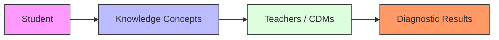
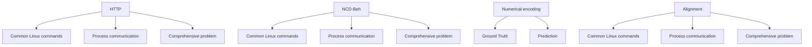

# Knowledge is Power: Harnessing Large Language Models for Enhanced Cognitive Diagnosis

Zhiang Dong, Jingyuan Chen\*, Fei Wu \*

Zhejiang University
{dongza,jingyuanchen,wufei}@zju.edu.cn

# Abstract

Cognitive Diagnosis Models (CDMs) are designed to assess students' cognitive states by analyzing their performance across a series of exercises. However, existing CDMs often struggle with diagnosing infrequent students and exercises due to a lack of rich prior knowledge. With the advancement in large language models (LLMs), which possess extensive domain knowledge, their integration into cognitive diagnosis presents a promising opportunity. Despite this potential, integrating LLMs with CDMs poses significant challenges. LLMs are not well-suited for capturing the fine-grained collaborative interactions between students and exercises, and the disparity between the semantic space of LLMs and the behavioral space of CDMs hinders effective integration. To address these issues, we propose a novel Knowledge-enhanced Cognitive Diagnosis (KCD) framework, which is a model-agnostic framework utilizing LLMs to enhance CDMs and compatible with various CDM architectures. The KCD framework operates in two stages: LLM Diagnosis and Cognitive Level Alignment. In the LLM Diagnosis stage, both students and exercises are diagnosed to achieve comprehensive and detailed modeling. In the Cognitive Level Alignment stage, we bridge the gap between the CDMs' behavioral space and the LLMs' semantic space using contrastive learning and mask-reconstruction approaches. Experiments on several real-world datasets demonstrate the effectiveness of our proposed framework.

# Introduction

Cognitive diagnosis evaluates a student's learning proficiency through his responses to a series of exercises, as shown in Figure 1 (a), which plays a fundamental role in intelligent education systems. The outcomes of cognitive diagnosis are crucial for various educational applications, such as educational recommendation (Huang et al. 2019) and computerized adaptive testing (Bi et al. 2020; Zhuang et al. 2022). Consequently, the accuracy and reliability of cognitive diagnosis are essential for enhancing the effectiveness of these educational technologies.

Traditional cognitive diagnosis models (CDMs) are primarily grounded in psychometric theories, employing manually designed interaction functions inspired by principles from both psychometrics and educational theory. Examples include DINA (De La Torre 2009) and MIRT (Reckase 2009) models. Recent advancements in deep learning have enabled the development of innovative CDMs that leverage neural networks to model complex collaborative information (i.e., student-exercise interactions), thereby improving diagnostic accuracy and adaptability (Wang et al. 2020; Gao et al. 2021). However, these existing CDMs face significant challenges in diagnosing infrequent students and exercises, commonly referred to as the cold-start problem. This limitation arises primarily from the lack of prior knowledge within these models, which impairs their adaptability to unfamiliar students and exercises. As depicted in Figure 1(b), experiments conducted on the PTADisc dataset (Hu et al. 2023) indicate that existing CDMs exhibit poor performance in cold scenarios, thereby undermining overall diagnostic accuracy.


<details>
<summary>flowchart</summary>


</details>


<details>
<summary>bar</summary>

(b) Cold-Start Problem
| Dataset | Metric | Value |
| :--- | :--- | :--- |
| NCD on cold & warm exercise set | AUC | 0.655 |
| NCD on cold & warm exercise set | ACC | 0.662 |
| NCD on cold & warm student set | AUC | 0.748 |
| NCD on cold & warm student set | ACC | 0.768 |
| NCD on cold & warm student set | ACC | 0.771 |
The values for the bars are estimated based on the y-axis scale. The x-axis labels are 'NCD on cold & warm exercise set' and 'NCD on cold & warm student set'.
</details>

Figure 1: (a) An illustration of cognitive diagnosis. (b) Performance of warm and cold scenarios of NCD on PTADisc, exhibiting the limitations in cold scenario.

Large language models (LLMs) have seen rapid advancements, showcasing remarkable capabilities in logical reasoning and text comprehension. Their success across various domains highlights the feasibility of this approach (Wang et al. 2024a; Xu, Zhang, and Qin 2024; Abbasiantaeb et al. 2024; Zhu, Huang, and Sang 2024; Zhang et al. 2024). The

extensive prior knowledge embedded in LLMs presents a promising solution for addressing the limitations of existing CDMs. Specifically, LLMs can leverage their understanding of concepts and relationships between different knowledge domains to provide insights into student learning behaviors and exercise characteristics. By incorporating this extensive prior knowledge, LLMs can simulate the reasoning of experienced human teachers, offering more accurate diagnoses in cold scenarios. Therefore, our objective is to effectively integrate LLMs with CDMs to enhance diagnostic performance.

However, this integration is non-trivial due to several key factors. Firstly, LLMs are limited in their ability to model the fine-grained collaborative information crucial for understanding student-exercise interactions, as their input length constraints limit the inclusion of detailed textual information about relationships between exercises, knowledge concepts, and students. Furthermore, LLMs and CDMs operate in distinct representation spaces: LLMs process text-based data within a semantic space, whereas CDMs analyze student behavior within a behavioral space derived from interactions. Successful integration necessitates bridging the gap between these semantic and behavioral spaces.

To address these challenges, we propose a novel Knowledge-enhanced Cognitive Diagnosis (KCD) framework that seamlessly integrates LLMs to enhance existing CDMs, aligning the semantic space of LLMs with the behavioral space of CDMs. The proposed KCD comprises two primary modules: LLM diagnosis and cognitive level alignment. The LLM diagnosis module leverages the capabilities of LLMs to simulate experienced human educators in diagnosing students' learning status and the attributes of exercises, thereby enriching the prior knowledge of conventional CDMs. Specifically, during LLM diagnosis, collaborative information regarding students and exercises is gathered via LLMs, followed by an analysis of students' response logs from both educational and psychological perspectives to generate textual diagnoses of students and exercises, revealing their cognitive status and attributes. Subsequently, the cognitive level alignment module aligns these textual diagnoses from the semantic space of LLMs with the behavioral representations of CDMs, resulting in more accurate cognitive representations of students.

The contributions of this work are summarized as:

- We propose the KCD framework, which is model-agnostic and leverages the combined strengths of LLMs and CDMs to achieve optimal diagnostic results.   
- We introduce the LLM diagnosis module that combines collaborative information and response logs to generate textual diagnoses of students and exercises.   
- We introduce the cognitive level alignment module, aligning the textual diagnoses from LLMs with behavioral representations from CDMs.   
- Experiments on several public datasets with different CDMs demonstrate the effectiveness of our framework. Our code and datasets are available at https://github.com/PlayerDza/KCD.

# Related Work

# Cognitive Diagnosis

Cognitive diagnosis, which originated from educational psychology, is a fundamental task in the field of intelligent education. It characterizes students' learning status and knowledge proficiency based on their responses to various questions (Liu 2021). Existing cognitive diagnosis methods are mainly divided into two main categories: psychometric theory-based methods (Lord 1952; De La Torre 2009; Reckase 2009) and neural network-based methods (Wang et al. 2020; Gao et al. 2021; Bi et al. 2023; Liu et al. 2024a; Wang et al. 2023). Psychometric theory-based methods, such as Item Response Theory (IRT) (Lord 1952), Multidimensional IRT (MIRT) (Reckase 2009), and Deterministic Inputs, Noisy And gate model (DINA) (De La Torre 2009), are designed to evaluate students' proficiency through latent factors utilizing psychological theories. Neural network-based methods use deep neural networks to profile students' learning status. NCD (Wang et al. 2020) first incorporates neural networks into cognitive diagnosis to effectively capture the fine-grained student-exercise relationships. RCD (Gao et al. 2021) and RDGT (Yu et al. 2024) employ graph architectures to explore the relationships among exercises, knowledge concepts, and students. Recently, BETA-CD (Bi et al. 2023) developed a reliable and rapidly adaptable cognitive diagnosis framework for new students through meta-learning. ACD (Wang et al. 2024b) considered the connection between students' affective states and cognitive states in learning. However, few existing cognitive diagnosis methods take into account prior knowledge, which makes it challenging for them to generate accurate diagnoses.

# Large Language Models

With the rise of Transformer (Vaswani et al. 2017), large language models (LLMs) with extensive parameters and vast training data have gradually become mainstream. LLMs usually follow a pre-training and fine-tuning approach to accommodate various downstream tasks. They have significantly improved performance in numerous NLP applications, including text summarization (Laskar, Hoque, and Huang 2022; Zhang, Liu, and Zhang 2023), sentiment analysis (Hoang, Bihorac, and Rouces 2019; Deng et al. 2023), translation (Zhang, Haddow, and Birch 2023; Moslem, Haque, and Way 2023), and multimodal understanding (Wu et al. 2024; Huang et al. 2024).

The advanced comprehension and reasoning capabilities, along with the extensive knowledge repository of LLMs, naturally lead to potential applications in the realm of education. LLMs can provide researchers with new perspectives by simulating the roles of teachers or students (Wang et al. 2024a; Li et al. 2023; Xu, Zhang, and Qin 2024; Liu et al. 2024b; Lin et al. 2024c), or generating educational resources (Lin et al. 2024b,a; Dai et al. 2024). However, less exploration has been made to utilize LLMs for cognitive diagnosis. The demonstrated success of LLMs in text summarization tasks and educational contexts indicates LLMs' capability to undertake cognitive diagnostic tasks.


<details>
<summary>flowchart</summary>

```mermaid
graph TD
    A["Response Logs"] --> B["Exercise Profile: [exercise"], related concept: [concept], study history: {answer}]
    A --> C["Student Profile: History: [exercise content, related concept, answer: {answer}"]]
    B --> D["Student Coll. Generation: You will serve as an experienced teacher to determine the students' learning status... [Study history"]]
    C --> E["Exercise Coll. Generation: You will serve as an experienced teacher to summarize the traits of the exercise... [Basic info"] [Study history]]
    D --> F["Collaborative Info Collection"]
    E --> F
    F --> G["Overall Description (Coll. Info) [Student"]: The_student_has_shown_a_good_understanding_of["concept"] ...]
    F --> H["Overall Description (Coll. Info) [Exercise"]: This_exercise_involves_the_knowledge_of["concept"] ...]
    F --> I["Student Diagnosis: You will serve as an experienced teacher to determine the students' learning status based on the collaborative info. [Study history & coll. info"]]
    F --> J["Exercise Diagnosis: You will serve as an experienced teacher to help me summarize the traits of the exercise based on the collaborative info. [Basic info & coll. info"]. [Study history & coll. Info]]
    F --> K["Diagnosis Generation"]
    K --> L["Student Cognitive Status: The student demonstrates proficiency in [concept"], [concept] and["concept"], answering most exercises correctly in these areas.]
    K --> M["Exercise Attributes: The exercise focuses on knowledge of [concept"], which helps students to ...]
    
    N["i.e. Neural Cognitive Diagnosis"] --> O["CDMs"]
    O --> P["Positive Full Connection"]
    P --> Q["Qe: Student Proficiency h^s, h^diff, h^disc, Exercise Difficulty, Exercise Discrimination"]
    Q --> R["Student Embeddings c"]
    Q --> S["Exercise Embeddings"]
    
    T["(a) LLM Diagnosis"] --> U["(b) Cognitive Level Alignment"]
    U --> V["Semantic Representation"]
    U --> W["Behavioral Space Alignment"]
    
    X["Local Contrast"] --> Y["Contrastive Alignment"]
    Y --> Z["Global Contrast"]
    
    AA["Dynamic Masking"] --> AB["Behavioral Representation"]
    
    AC["Mask & Reconstruction"] --> AD["Semantic Representation"]
    AD --> AE["Behavioral Space Alignment"]
```
</details>

Figure 2: Framework overview. (a) LLM Diagnosis generates diagnoses for students and exercises using LLMs. (b) Cognitive Level Alignment integrates LLMs and CDMs to model students and exercises in both semantic space and behavioral space.

# Methodology

In this section, we first present the task definition and the general framework. Then, we show the detailed strategies employed within our framework.

# Task Definition

Formally, suppose $S = \{s_{1}, \cdots, s_{|\mathcal{S}|}\}$ , $E = \{e_{1}, \cdots, e_{|\mathcal{E}|}\}$ and $K = \{k_{1}, \cdots, k_{|\mathcal{K}|}\}$ be the sets of students, exercises and knowledge concepts. The response logs R of students are represented as triplets $(s_{i}, e_{j}, \mathcal{K}_{j}, r_{ij}) \in \mathcal{R}$ , where $r_{ij}$ indicates whether student $s_{i}$ correctly answered the exercise $e_{j}$ and $K_{j}$ denotes the knowledge concepts related to $e_{j}$ . In some datasets, exercise e also includes the text content t as its attributes. The goal of cognitive diagnosis is to evaluate students' proficiency levels across various knowledge concepts by predicting their performance based on the response logs R.

# Framework Overview

The proposed Knowledge-enhanced Cognitive Diagnosis (KCD) framework consists of two main modules: LLM diagnosis and cognitive level alignment, as illustrated in Figure 2. This framework is designed to integrate collaborative information while leveraging the rich prior knowledge of LLMs. Additionally, it aligns the semantic space of LLMs with the behavioral space of CDMs, thereby combining the strengths of both to optimize diagnostic performance.

The LLM Diagnosis module operates in two stages: collaborative information collection and diagnosis generation. In the first stage, collaborative information is gathered from the response logs. In the second stage, this information, together with the response logs, is utilized to assess students' cognitive statuses and the attributes of exercises. The Cognitive Level Alignment module then introduces these LLM-generated diagnoses into conventional CDMs, enhancing the cognitive-level representation of students and exercises. This module utilizes two alignment methods, behavioral space alignment and semantic space alignment, to align the textual diagnoses from the semantic space of LLMs and the behavioral space of CDMs. The framework is model-agnostic, offering flexibility in selecting appropriate CDMs tailored to various educational scenarios, ultimately achieving optimal diagnostic results.

# LLM Diagnosis

LLMs can be guided more effectively through carefully crafted natural language instructions, resulting in higher-quality outputs. In this section, we distinguish between two types of input instructions for LLMs: system prompts M and input prompts P. The system prompt M defines the tasks that LLMs need to perform and specifies the input and

output formats, while the input prompt P consists of specific input data (i.e., students' response logs).

Collaborative Information Collection. Experienced teachers enhance their diagnoses by utilizing information from other students and exercises. To mimic this capability, we introduce a collaborative information collection stage. This stage aims to extract student collaborative information from a student's performance across all completed exercises and exercise collaborative information from all participating students for a given exercise.

Specifically, we employ different instruction strategies to diagnose students and exercises. For students, the system prompt $M_{s}$ defines the input prompt $P_{s}$ format and guides LLMs in generating textual collaborative information. The input prompt $P_{s}$ contains the problem content t, related knowledge concepts k, and the student's response r for all participated exercises e. The input of LLMs is formatted as:

\- System Prompt: You will serve as an experienced teacher to help me determine the student's learning status. I will provide you with information about exercises that the student has finished, described as STUDY HISTORY, as well as his or her answer of those exercises...

\- Input Prompt:
STUDY HISTORY:
{content: t, concept: k, answer: r}; ...

Similarly, the input of LLMs for exercises is formatted in the same pattern, where $P_{e}$ contains the exercise content t, related knowledge concepts k, and student responses r for all participating students s. In this way, we can get the collaborative information I through I = LLMs (M, P).

Diagnosis Generation. Once the collaborative information I for students and exercises has been gathered, the next step is to generate diagnoses of students' cognitive statuses and exercise attributes. Firstly, we combine the collaborative information I obtained for each student and exercise with the corresponding response logs to provide more detailed information, formulating input prompt $P'$ . Then, we adjust the content of system prompt $M'$ to define the new format of $P'$ and guide LLMs to generate the corresponding students' cognitive status and exercise attributes. We can get the diagnoses T through $T = \text{LLMs}(\mathcal{M}', \mathcal{P}')$ .

# Cognitive Level Alignment

By leveraging LLMs, we can generate textual diagnoses of students' cognitive status and exercises' attributes. However, LLMs cannot fully comprehend response logs due to constraints on input length, which restrict the inclusion of student-exercise interactions. Therefore, it is necessary to align these LLM-generated diagnoses with those produced by CDMs at the cognitive level. Since LLMs operate within a semantic space while CDMs work within a behavioral space, both need to be mapped to a common space for effective alignment. To achieve this, we propose two alignment methods: behavioral space alignment (KCD-Beh) and semantic space alignment (KCD-Sem).

Before implementing the alignment approach, we obtain the semantic representation of LLMs by encoding their textual diagnoses. Specifically, we utilize the text embedding model (Su et al. 2023), which has demonstrated significant strength in textual representation, to encode the diagnoses as follows: $\mathbf{L} = \mathbf{E}(\mathcal{T})$ , where $\mathbf{E}(\cdot)$ denotes the text embedding models and $l \in L$ denotes the modeling of students and exercises generated by LLMs in semantic space. Meanwhile, we denote the representation embeddings of students and exercises by CDMs as $c \in C$ in behavioral space, such as Neural Cognitive Diagnosis (NCD) (Wang et al. 2020), as described in Figure 2.

Behavioral Space Alignment. Behavioral space alignment involves mapping the LLM-generated models of students and exercises to the behavioral space of CDMs. We employ contrastive learning, a widely-used technique for bidirectionally aligning different views (Khosla et al. 2020; Cui et al. 2023), to align the representations of LLMs and CDMs within the behavioral space. The intuition behind using contrastive learning is that $c_{i}$ and $l_{i}$ are most similar to each other within L since they represent the same student or exercise. We apply a multi-layer perceptron (MLP) to map 1 from the LLMs' semantic space to the CDMs' behavioral space, denoted as $1' = \text{MLP}(1)$ .

Specifically, we conduct contrastive learning from both global and local perspectives. Global contrast involves using the entire set L, while local contrast selects a subset $L' \subset L$ , composed of the k most similar students and exercises for each student and exercise. This subset is obtained by calculating the cosine similarity between each student and exercise with others and selecting the top k most similar instances (k = 20 in our experiments). Global contrast captures general features, while local contrast captures fine-grained differences between similar students and exercises.

During training, we use the InfoNCE (Oord, Li, and Vinyals 2018) loss function to calculate both global and local contrast loss values, aiming to maximize the mutual information between c and l within the behavioral space, denoted as:

$$
f = - \frac {1}{N} \sum_ {i = 1} ^ {N} \log \left(\frac {\exp \left(\frac {x _ {i} \cdot y _ {i +}}{\tau}\right)}{\sum_ {j = 1} ^ {N} \exp \left(\frac {x _ {i} \cdot y _ {j -}}{\tau}\right)}\right), \tag {1}
$$

where $x_{i}$ and $y_{i+}$ are positive samples, $y_{j-}$ represents the negative sample, $\tau$ denotes the temperature parameter, N denotes the number of samples. For CDMs, the loss function is denoted as $L_{cdm}$ . For example, the loss function of NCD is cross entropy between output y and ground truth r:

$$
\mathcal {L} _ {c d m} = - \sum_ {i} \left(r _ {i} \log y _ {i} + (1 - r _ {i}) \log (1 - y _ {i})\right). \tag {2}
$$

The complete loss function is formulated as:

$$
\left\{ \begin{array}{c} \mathcal {L} _ {\text { global }} = f (\mathbf {c} _ {i}, \mathbf {l} _ {i} ^ {\prime}, \mathbf {L} ^ {\prime}), \\ \mathcal {L} _ {\text { local }} = f (\mathbf {c} _ {i}, \mathbf {l} _ {i} ^ {\prime}, \mathbf {L} _ {k} ^ {\prime}), \\ \mathcal {L} = \mathcal {L} _ {\text { cdm }} + \alpha \mathcal {L} _ {\text { global }} + \beta \mathcal {L} _ {\text { local }}, \end{array} \right. \tag {3}
$$

where $f(x_{i}, x_{j}, X_{k})$ denotes the InfoNCE loss function, $x_{i}$ and $x_{j}$ are positive samples, $X_{k}$ represents the set of negative samples. The term $L_{cdm}$ denotes the loss function of

<table><tr><td></td><td>Python</td><td>Linux</td><td>Database</td><td>Literature</td></tr><tr><td>#Students</td><td>22,953</td><td>1,253</td><td>11,891</td><td>2,264</td></tr><tr><td>#Exercises</td><td>11,807</td><td>1,335</td><td>3,106</td><td>885</td></tr><tr><td>#Concepts</td><td>713</td><td>221</td><td>313</td><td>31</td></tr><tr><td>#Response Logs</td><td>170,844</td><td>34,758</td><td>122,642</td><td>30,273</td></tr><tr><td>#Logs per Student</td><td>7.44</td><td>27.74</td><td>10.38</td><td>13.37</td></tr><tr><td>#Sparsity (%)</td><td>0.063</td><td>2.078</td><td>0.334</td><td>1.511</td></tr></table>

Table 1: Statistics of datasets.

CDMs. $L_{global}$ and $L_{local}$ denote the global contrast loss function and local contrast loss function of behavioral space alignment. $\alpha$ and $\beta$ are hyper-parameters. By optimizing this loss function L, the CDMs can effectively incorporate the modeling information of students and exercises derived from LLMs, aligning them within the CDMs' behavioral space.

Semantic Space Alignment. In addition to aligning within the behavioral space of CDMs, we also perform alignment in the semantic space of LLMs. Since the semantic space encapsulates rich features of students and exercises, inspired by masked autoencoders (MAE) (He et al. 2022), we utilize a mask-reconstruction strategy to align the representations of the two models. Initially, a multi-layer perceptron (MLP) maps c from the CDMs' behavioral space to the LLMs' semantic space, denoted as $\mathbf{c}' = \text{MLP}(\mathbf{c})$ . We then apply a dynamic masking strategy that varies the mask ratio based on the frequency of occurrence of students and exercises. For frequently occurring instances, we increase the mask ratio to extract more semantic information from LLMs, while for less frequent instances, we reduce the mask ratio to minimize the introduction of noise. This process is represented as:

$$
\widehat {\mathbf {c}} _ {i} = \operatorname{MASK} \left(\mathbf {c} _ {i}, \text { ratio } _ {i}\right), \tag {4}
$$

where $\widehat{c}_{i}$ represents the masked embeddings of student i, and $ratio_{i}$ denotes the mask ratio applied.

During training, the InfoNCE loss function is employed again to calculate the reconstruction loss $L_{recon}$ , which maximizes mutual information between c and l, thereby aiding the accurate reconstruction of c. The overall loss function is defined as:

$$
\left\{ \begin{array}{l} \mathcal {L} _ {\text { recon }} = f (\widehat {\mathbf {c}} _ {i} ^ {\prime}, \mathbf {l}, \mathbf {L}), \\ \mathcal {L} = \mathcal {L} _ {c d m} + \lambda \mathcal {L} _ {\text { recon }}, \end{array} \right. \tag {5}
$$

The hyperparameter $\lambda$ controls the influence of the reconstruction loss on the overall optimization. By optimizing this combined loss function L, the model can produce more accurate and robust representations by reconstructing the masked inputs, thereby aligning the representations from both CDMs and LLMs within the semantic space. This alignment enhances the ability of CDMs to incorporate the rich semantic information provided by LLMs, leading to improved diagnostic accuracy and robustness.

# Experiments

In this section, we conduct experiments to answer the following research questions:

- RQ1: Can the proposed model effectively improve the performance of the original CDMs?   
- RQ2: What is the impact of each component within the proposed method?   
- RQ3: How does the proposed model perform on cold-start scenarios?   
- RQ4: How effective is the alignment of semantic and behavioral space embeddings during the cognitive level alignment process?

# Experimental Settings

Datasets In our experiments, we utilize four courses, Python Programming (Python), Linux System (Linux), Database Technology and Application (Database), and Literature and History (Literature), from a publicly available dataset PTADisc (Hu et al. 2023), which comes from real-world students' responses in the educational website PTA $^{1}$ and contains textual information of exercises and knowledge concepts. The statistics of the datasets are presented in Table 1. The datasets are divided into training, validation, and testing sets, with a ratio of 8:1:1.

Evaluation Metrics Following previous works, we evaluate the students' cognitive status by predicting the performance of students on the testing set, as the cognitive status can not be directly observed. We adopt commonly used metrics, namely the Area Under a ROC Curve (AUC), the Prediction Accuracy (ACC), and the Root Mean Square Error (RMSE), to validate the effectiveness of the CDMs. For all the metrics, $\uparrow$ represents that a greater value is better, while $\downarrow$ represents the opposite.

Baseline Methods To validate the effectiveness of the proposed method, we conduct experiments on several representative CDMs, including IRT (Lord 1952), MIRT (Reckase 2009), DINA (De La Torre 2009), NCD (Wang et al. 2020), RCD (Gao et al. 2021), SCD (Wang et al. 2023) and ACD (Wang et al. 2024b).

Implementation Details We utilize PyTorch to implement both the baseline methods and our proposed KCD framework. For the baseline models, We use the default hyper-parameters as stated in their papers and for KCD, we use the same hyper-parameter settings, such as training epoch, learning rate, and batch size. We employ ChatGPT to represent LLMs (specifically, gpt-3.5-turbo-16k) and text-embedding-ada002 as the text embedding model. All the experiments are conducted on a GeForce RTX 3090 GPU. We train the model on train set and at the end of each epoch, we evaluate the model on the validation set. The hyperparameter $\alpha$ , $\beta$ , and $\lambda$ was set to 0.04, 0.015, and 0.2. Since our dataset does not include affect labels, we utilize the unsupervised contrastive ACD model and employ NCD as the basic cognitive diagnosis module. The behavioral space alignment approach is denoted as '-Beh' and the semantic space alignment approach is denoted as '-Sem'.

<table><tr><td rowspan="2">Methods</td><td colspan="3">Python</td><td colspan="3">Linux</td><td colspan="3">Database</td><td colspan="3">Literature</td></tr><tr><td>AUC ↑</td><td>ACC ↑</td><td>RMSE ↓</td><td>AUC ↑</td><td>ACC ↑</td><td>RMSE ↓</td><td>AUC ↑</td><td>ACC ↑</td><td>RMSE ↓</td><td>AUC ↑</td><td>ACC ↑</td><td>RMSE ↓</td></tr><tr><td>IRT</td><td>0.6338</td><td>0.7749</td><td>0.4031</td><td>0.8146</td><td>0.7874</td><td>0.3943</td><td>0.7312</td><td>0.7989</td><td>0.3948</td><td>0.8086</td><td>0.7818</td><td>0.3866</td></tr><tr><td>IRT-Beh</td><td>0.6567</td><td>0.7966</td><td>0.3914</td><td>0.8325</td><td>0.8048</td><td>0.3758</td><td>0.7522</td><td>0.8022</td><td>0.3752</td><td>0.8221</td><td>0.8006</td><td>0.3659</td></tr><tr><td>IRT-Sem</td><td>0.6621</td><td>0.7935</td><td>0.3851</td><td>0.8286</td><td>0.7983</td><td>0.3786</td><td>0.7435</td><td>0.8098</td><td>0.3807</td><td>0.8197</td><td>0.7924</td><td>0.3686</td></tr><tr><td>MIRT</td><td>0.6434</td><td>0.7693</td><td>0.4415</td><td>0.8183</td><td>0.7899</td><td>0.4056</td><td>0.7220</td><td>0.7973</td><td>0.4217</td><td>0.8289</td><td>0.8002</td><td>0.4083</td></tr><tr><td>MIRT-Beh</td><td>0.6873</td><td>0.8049</td><td>0.4081</td><td>0.8329</td><td>0.8067</td><td>0.3841</td><td>0.7616</td><td>0.8178</td><td>0.4073</td><td>0.8583</td><td>0.8225</td><td>0.3679</td></tr><tr><td>MIRT-Sem</td><td>0.6647</td><td>0.7875</td><td>0.4186</td><td>0.8315</td><td>0.8011</td><td>0.3874</td><td>0.7443</td><td>0.8092</td><td>0.4065</td><td>0.8465</td><td>0.8175</td><td>0.3822</td></tr><tr><td>DINA</td><td>0.6001</td><td>0.5521</td><td>0.4962</td><td>0.6791</td><td>0.5469</td><td>0.4964</td><td>0.6581</td><td>0.5981</td><td>0.4716</td><td>0.7021</td><td>0.6162</td><td>0.4735</td></tr><tr><td>DINA-Beh</td><td>0.6476</td><td>0.6213</td><td>0.4355</td><td>0.7239</td><td>0.6094</td><td>0.4437</td><td>0.6927</td><td>0.6713</td><td>0.4291</td><td>0.7449</td><td>0.6992</td><td>0.4361</td></tr><tr><td>DINA-Sem</td><td>0.6354</td><td>0.6086</td><td>0.4487</td><td>0.7032</td><td>0.6164</td><td>0.4563</td><td>0.6792</td><td>0.6596</td><td>0.4378</td><td>0.7263</td><td>0.6697</td><td>0.4574</td></tr><tr><td>NCD</td><td>0.6522</td><td>0.7758</td><td>0.4027</td><td>0.8256</td><td>0.7759</td><td>0.3926</td><td>0.7375</td><td>0.7932</td><td>0.3953</td><td>0.8449</td><td>0.7805</td><td>0.3896</td></tr><tr><td>NCD-Beh</td><td>0.6804</td><td>0.8007</td><td>0.3866</td><td>0.8422</td><td>0.7928</td><td>0.3781</td><td>0.7552</td><td>0.8205</td><td>0.3715</td><td>0.8691</td><td>0.8183</td><td>0.3645</td></tr><tr><td>NCD-Sem</td><td>0.6687</td><td>0.7940</td><td>0.3892</td><td>0.8460</td><td>0.7963</td><td>0.3764</td><td>0.7509</td><td>0.8170</td><td>0.3776</td><td>0.8615</td><td>0.8076</td><td>0.3674</td></tr><tr><td>RCD</td><td>0.6781</td><td>0.7767</td><td>0.3901</td><td>0.8557</td><td>0.8086</td><td>0.3865</td><td>0.7583</td><td>0.7948</td><td>0.3897</td><td>0.8494</td><td>0.7879</td><td>0.3809</td></tr><tr><td>RCD-Beh</td><td>0.6980</td><td>0.7945</td><td>0.3776</td><td>0.8736</td><td>0.8292</td><td>0.3625</td><td>0.7872</td><td>0.8194</td><td>0.3737</td><td>0.8640</td><td>0.8151</td><td>0.3667</td></tr><tr><td>RCD-Sem</td><td>0.6904</td><td>0.7902</td><td>0.3802</td><td>0.8715</td><td>0.8271</td><td>0.3643</td><td>0.7849</td><td>0.8132</td><td>0.3743</td><td>0.8598</td><td>0.8132</td><td>0.3671</td></tr><tr><td>SCD</td><td>0.6815</td><td>0.7792</td><td>0.3882</td><td>0.8594</td><td>0.8113</td><td>0.3806</td><td>0.7598</td><td>0.7973</td><td>0.3824</td><td>0.8537</td><td>0.7902</td><td>0.3781</td></tr><tr><td>SCD-Beh</td><td>0.7023</td><td>0.7982</td><td>0.3746</td><td>0.8751</td><td>0.8319</td><td>0.3584</td><td>0.7934</td><td>0.8229</td><td>0.3683</td><td>0.8695</td><td>0.8213</td><td>0.3609</td></tr><tr><td>SCD-Sem</td><td>0.6957</td><td>0.7945</td><td>0.3779</td><td>0.8721</td><td>0.8296</td><td>0.3608</td><td>0.7890</td><td>0.8203</td><td>0.3697</td><td>0.8681</td><td>0.8196</td><td>0.3624</td></tr><tr><td>ACD</td><td>0.6738</td><td>0.7932</td><td>0.4007</td><td>0.8374</td><td>0.7573</td><td>0.4079</td><td>0.7578</td><td>0.8137</td><td>0.3786</td><td>0.8517</td><td>0.7924</td><td>0.3765</td></tr><tr><td>ACD-Beh</td><td>0.7056</td><td>0.8053</td><td>0.3839</td><td>0.8551</td><td>0.8003</td><td>0.3734</td><td>0.7731</td><td>0.8324</td><td>0.3626</td><td>0.8725</td><td>0.8119</td><td>0.3602</td></tr><tr><td>ACD-Sem</td><td>0.7035</td><td>0.8004</td><td>0.3782</td><td>0.8513</td><td>0.7737</td><td>0.3856</td><td>0.7774</td><td>0.8253</td><td>0.3678</td><td>0.8674</td><td>0.8092</td><td>0.3629</td></tr></table>

Table 2: Performance comparison with baseline methods. The improvements are statistically significant where p < 0.05.

  
Figure 3: Performance comparison in cold (blue) and warm (red) scenarios on Python dataset.

# Performance Comparison (RQ1)

To demonstrate the effectiveness of our proposed method in improving cognitive diagnosis, we implement the framework on seven cognitive diagnosis models, and the results are shown in Table 2. Additionally, we compared the performance of NCD in warm and cold scenarios, with the results illustrated in Figure 3. Here we define the cold scenario as less than 3 interactions in the training set for exercises and define the warm scenario as more than 10 interactions in the training set for exercises. Following this definition, we divide the testing set into cold and warm subsets. We have the following observations from the results:

1) Both KCD-Beh and KCD-Sem achieve significant improvements compared to the basic CDMs. This indicates that our proposed framework is widely applicable to various CDMs, and both alignment methods can effectively align the behavioral space of CDMs and the semantic space of LLMs. In most models, the behavioral space alignment approach performs better, indicating that aligning in the behavioral space of CDMs can better align in-

<table><tr><td>Condition</td><td>Method</td><td>AUC</td><td>ACC</td><td>RMSE</td></tr><tr><td rowspan="3"></td><td>NCD</td><td>0.6522</td><td>0.7758</td><td>0.4027</td></tr><tr><td>NCD-Beh</td><td>0.6804</td><td>0.8007</td><td>0.3866</td></tr><tr><td>NCD-Sem</td><td>0.6687</td><td>0.7940</td><td>0.3892</td></tr><tr><td rowspan="2">w/o Coll. Info</td><td>NCD-Beh</td><td>0.6765</td><td>0.7967</td><td>0.3895</td></tr><tr><td>NCD-Sem</td><td>0.6637</td><td>0.7884</td><td>0.3926</td></tr><tr><td>w/o Local Con.</td><td>NCD-Beh</td><td>0.6726</td><td>0.7872</td><td>0.3901</td></tr><tr><td>w/o Global Con.</td><td>NCD-Beh</td><td>0.6748</td><td>0.7885</td><td>0.3938</td></tr><tr><td>w/o Dym. Mask</td><td>NCD-Sem</td><td>0.6619</td><td>0.7876</td><td>0.3941</td></tr></table>

Table 3: Ablation study on Python dataset. ‘Coll. Info’ denotes collaborative information, while ‘Local Con.’ and ‘Global Con.’ represent local contrast and global contrast. ‘Dym. Mask’ denotes the dynamic masking strategy.

formation from the semantic space of LLMs.

2) Compared to basic CDMs, our proposed methods demonstrate improvements in both cold and warm scenarios, especially in cold scenarios. This indicates that our approach of introducing LLMs as knowledge enhancement effectively alleviates the cold-start issue.

# Ablation Study (RQ2)

To validate the effectiveness of different components of our proposed method, we conduct ablation experiments to verify several components utilized in LLM Diagnosis and Cognitive Level alignment, including the usage of collaborative information (denoted as 'Coll. Info'), the local contrast and global contrast (denoted as 'Local Con.' and 'Global Con.'), and the dynamic masking strategy (denoted as 'Dym. Mask').


Figure 4: Performance on different dropout ratios.   


<details>
<summary>scatter</summary>

| Category           | Behavioral Space | Semantic Space |
| ------------------ | ---------------- | -------------- |
| NCD (w/o Alignment) | Green dots       | Blue dots      |
| NCD-Beh            | Green dots       | Blue dots      |
| NCD-Sem            | Green dots       | Blue dots      |
</details>

Figure 5: The t-SNE visualization of student embeddings on Literature dataset.

Table 3 demonstrates the results of the ablation study on Python dataset, comparing the model performance after removing specific components (denoted as ‘w/o’). ‘w/o Coll. Info’ represents replacing collaborative information in the process of diagnosis generation and ‘w/o Dym. Mask’ represents replacing dynamic masking strategy with a constant mask ratio. Experimental results show that removing these components individually leads to a decline in the model’s performance. This indicates that these components are crucial for the model’s performance.

# Performance on Cold-Start Scenarios (RQ3)

we conduct additional experiments on sub-datasets with varying degrees of sparsity. Specifically, we apply random dropout to the training sets of the Python and Linux datasets at ratios of 10%, 20%, 30%, 40%, and 50%.

Figure 4 shows the results of the experiments on different dropout ratios. It is obvious that as the dropout ratio increases, both AUC and ACC decrease. This is because the training set becomes more sparse, approaching a cold-start scenario. Additionally, compared to ACC, AUC experiences a greater decline, which might be due to the different calculation methods of the two metrics.

# Visualization of Semantic and Behavioral Embeddings (RQ4)

To validate the effectiveness of the two alignment processes, we utilize t-SNE (Van der Maaten and Hinton 2008) to visualize the distribution of features in LLMs semantic space and CDMs behavioral space. We randomly select 200 example students and map their behavioral embeddings and semantic

Part of The Student's Response Logs 

<table><tr><td>exercise</td><td>concept</td><td>answer</td></tr><tr><td>#1</td><td>TCP Protocols</td><td>✕</td></tr><tr><td>#2</td><td>Numerical Encoding</td><td>√</td></tr><tr><td>#3</td><td>Process Status</td><td>√</td></tr><tr><td>#4</td><td>Shell and Command Line</td><td>✕</td></tr></table>

# LLM Diagnosis

The student has demonstrated a moderate understanding of some computer science concepts but struggles significantly with key topics ... have shown notable strengths in IP addressing and some aspects of process communication ..., which indicates that foundational knowledge exists in certain networking concepts. The student's incorrect responses suggest gaps in their understanding and application of these concepts, particularly in networking protocols and operating systems...


<details>
<summary>flowchart</summary>


</details>

Figure 6: The case study of a student on multiple knowledge concepts on Linux dataset.

embeddings to 2-dimensional space. NCD (w/o Alignment) represents the original CDMs without alignment.

Figure 5 demonstrates the integration of semantic and behavioral embeddings of NCD-Beh and NCD-Sem, with their distributions closely merged compared to original CDMs. This proves the effectiveness of the two alignment methods we proposed.

# Case Study

To more intuitively demonstrate the improvements our proposed methods bring to CDMs, we selected a diagnosis for a specific student in the Linux dataset and compared the prediction results of NCD with the diagnosis results of NCD-Beh. As illustrated in Figure 6, we randomly choose a student, and list his mastery of some knowledge concepts predicted by NCD and our proposed NCD-Beh. This student correctly answered the exercises related to ‘numerical encoding’ and ‘process communication’, showing mastery of these concepts. He answered other exercises incorrectly, indicating a lack of familiarity with the remaining knowledge concepts. From the LLM’s diagnostic results, it can be observed that the LLM captured similar question-answer information from the training set and made corresponding inferences. This played an important role in NCD-Beh’s more accurate prediction of the student’s mastery level.

# Conclusion

In this work, we propose a model-agnostic framework KCD that can efficiently employ LLMs to enhance the knowledge of conventional CDMs. By utilizing LLM diagnosis and cognitive level alignment, the framework can leverage the rich knowledge of LLMs and align the semantic space of LLMs and the behavioral space of CDMs to achieve optimal diagnostic results. Several experiments on four real-world datasets for cognitive diagnosis demonstrate the superiority of our proposed framework, surpassing all the baseline CDMs.

# Acknowledgments

This research was partially supported by grants from the National Natural Science Foundation of China (No.62037001, No.62307032), Shanghai Rising-Star Program (23QA1409000), the Starry Night Science Fund at Shanghai Institute for Advanced Study (SN-ZJU-SIAS-0010), and the "Pioneer" and "Leading Goose" R&D Program of Zhejiang under Grant No. 2025C02022.

# References

Abbasiantaeb, Z.; Yuan, Y.; Kanoulas, E.; and Aliannejadi, M. 2024. Let the llms talk: Simulating human-to-human conversational qa via zero-shot llm-to-llm interactions. In Proceedings of the 17th ACM International Conference on Web Search and Data Mining, 8–17.   
Bi, H.; Chen, E.; He, W.; Wu, H.; Zhao, W.; Wang, S.; and Wu, J. 2023. BETA-CD: A Bayesian meta-learned cognitive diagnosis framework for personalized learning. In Proceedings of the AAAI Conference on Artificial Intelligence, volume 37, 5018–5026.   
Bi, H.; Ma, H.; Huang, Z.; Yin, Y.; Liu, Q.; Chen, E.; Su, Y.; and Wang, S. 2020. Quality meets diversity: A model-agnostic framework for computerized adaptive testing. In 2020 IEEE International Conference on Data Mining (ICDM), 42–51. IEEE.   
Cui, J.; Zhong, Z.; Tian, Z.; Liu, S.; Yu, B.; and Jia, J. 2023. Generalized parametric contrastive learning. IEEE Transactions on Pattern Analysis and Machine Intelligence.   
Dai, Z.; Yao, C.; Han, W.; Yuanying, Y.; Gao, Z.; and Chen, J. 2024. MPCoder: Multi-user Personalized Code Generator with Explicit and Implicit Style Representation Learning. In Proceedings of the 62nd Annual Meeting of the Association for Computational Linguistics (Volume 1: Long Papers), 3765–3780.   
De La Torre, J. 2009. DINA model and parameter estimation: A didactic. Journal of educational and behavioral statistics, 34(1): 115–130.   
Deng, X.; Bashlovkina, V.; Han, F.; Baumgartner, S.; and Bendersky, M. 2023. LLMs to the Moon? Reddit Market Sentiment Analysis with Large Language Models. In Companion Proceedings of the ACM Web Conference 2023, 1014–1019.   
Gao, W.; Liu, Q.; Huang, Z.; Yin, Y.; Bi, H.; Wang, M.-C.; Ma, J.; Wang, S.; and Su, Y. 2021. RCD: Relation map driven cognitive diagnosis for intelligent education systems. In Proceedings of the 44th international ACM SIGIR conference on research and development in information retrieval, 501–510.   
He, K.; Chen, X.; Xie, S.; Li, Y.; Dollár, P.; and Girshick, R. 2022. Masked autoencoders are scalable vision learners. In Proceedings of the IEEE/CVF conference on computer vision and pattern recognition, 16000–16009.   
Hoang, M.; Bihorac, O. A.; and Rouces, J. 2019. Aspect-based sentiment analysis using bert. In Proceedings of the 22nd nordic conference on computational linguistics, 187–196.

Hu, L.; Dong, Z.; Chen, J.; Wang, G.; Wang, Z.; Zhao, Z.; and Wu, F. 2023. PTADisc: a cross-course dataset supporting personalized learning in cold-start scenarios. Advances in Neural Information Processing Systems, 36:44976–44996.   
Huang, Z.; Liu, Q.; Zhai, C.; Yin, Y.; Chen, E.; Gao, W.; and Hu, G. 2019. Exploring multi-objective exercise recommendations in online education systems. In Proceedings of the 28th ACM International Conference on Information and Knowledge Management, 1261–1270.   
Huang, Z.; Wu, T.; Lin, W.; Zhang, S.; Chen, J.; and Wu, F. 2024. AutoGeo: Automating Geometric Image Dataset Creation for Enhanced Geometry Understanding. arXiv preprint arXiv:2409.09039.   
Khosla, P.; Teterwak, P.; Wang, C.; Sarna, A.; Tian, Y.; Isola, P.; Maschinot, A.; Liu, C.; and Krishnan, D. 2020. Supervised contrastive learning. Advances in neural information processing systems, 33: 18661–18673.   
Laskar, M. T. R.; Hoque, E.; and Huang, J. X. 2022. Domain adaptation with pre-trained transformers for query-focused abstractive text summarization. Computational Linguistics, 48(2): 279–320.   
Li, Q.; Fu, L.; Zhang, W.; Chen, X.; Yu, J.; Xia, W.; Zhang, W.; Tang, R.; and Yu, Y. 2023. Adapting Large Language Models for Education: Foundational Capabilities, Potentials, and Challenges. arXiv preprint arXiv:2401.08664.   
Lin, W.; Chen, J.; Shi, J.; Guo, Z.; Zhu, Y.; Wang, Z.; Jin, T.; Zhao, Z.; Wu, F.; Shuicheng, Y.; et al. 2024a. Action Imitation in Common Action Space for Customized Action Image Synthesis. In The Thirty-eighth Annual Conference on Neural Information Processing Systems.   
Lin, W.; Chen, J.; Shi, J.; Zhu, Y.; Liang, C.; Miao, J.; Jin, T.; Zhao, Z.; Wu, F.; Yan, S.; et al. 2024b. Non-confusing Generation of Customized Concepts in Diffusion Models. arXiv preprint arXiv:2405.06914.   
Lin, W.; Feng, Y.; Han, W.; Jin, T.; Zhao, Z.; Wu, F.; Yao, C.; and Chen, J. 2024c. $E^{3}$ : Exploring Embodied Emotion Through A Large-Scale Egocentric Video Dataset. In The Thirty-eight Conference on Neural Information Processing Systems Datasets and Benchmarks Track.   
Liu, Q. 2021. Towards a New Generation of Cognitive Diagnosis. In IJCAI, 4961–4964.   
Liu, S.; Shen, J.; Qian, H.; and Zhou, A. 2024a. Inductive Cognitive Diagnosis for Fast Student Learning in Web-Based Intelligent Education Systems. In Proceedings of the ACM on Web Conference 2024, 4260–4271.   
Liu, Z.; Yin, S. X.; Lin, G.; and Chen, N. F. 2024b. Personality-aware Student Simulation for Conversational Intelligent Tutoring Systems. arXiv preprint arXiv:2404.06762.   
Lord, F. 1952. A theory of test scores. Psychometric monographs.   
Moslem, Y.; Haque, R.; and Way, A. 2023. Adaptive machine translation with large language models. arXiv preprint arXiv:2301.13294.

Oord, A. v. d.; Li, Y.; and Vinyals, O. 2018. Representation learning with contrastive predictive coding. arXiv preprint arXiv:1807.03748.   
Reckase, M. D. 2009. Multidimensional Item Response Theory, 79–112.   
Su, H.; Shi, W.; Kasai, J.; Wang, Y.; Hu, Y.; Ostendorf, M.; Yih, W.-t.; Smith, N. A.; Zettlemoyer, L.; and Yu, T. 2023. One Embedder, Any Task: Instruction-Finetuned Text Embeddings. In Findings of the Association for Computational Linguistics: ACL 2023, 1102–1121.   
Van der Maaten, L.; and Hinton, G. 2008. Visualizing data using t-SNE. Journal of machine learning research, 9(11).   
Vaswani, A.; Shazeer, N.; Parmar, N.; Uszkoreit, J.; Jones, L.; Gomez, A. N.; Kaiser, Ł.; and Polosukhin, I. 2017. Attention is all you need. Advances in neural information processing systems, 30.   
Wang, F.; Liu, Q.; Chen, E.; Huang, Z.; Chen, Y.; Yin, Y.; Huang, Z.; and Wang, S. 2020. Neural cognitive diagnosis for intelligent education systems. In Proceedings of the AAAI conference on artificial intelligence, volume 34, 6153–6161.   
Wang, L.; Zhang, J.; Yang, H.; Chen, Z.; Tang, J.; Zhang, Z.; Chen, X.; Lin, Y.; Song, R.; Zhao, W. X.; et al. 2024a. User behavior simulation with large language model based agents. arXiv preprint arXiv:2306.02552.   
Wang, S.; Zeng, Z.; Yang, X.; Xu, K.; and Zhang, X. 2024b. Boosting neural cognitive diagnosis with student's affective state modeling. In Proceedings of the AAAI Conference on Artificial Intelligence, volume 38, 620–627.   
Wang, S.; Zeng, Z.; Yang, X.; and Zhang, X. 2023. Self-supervised graph learning for long-tailed cognitive diagnosis. In Proceedings of the AAAI Conference on Artificial Intelligence, volume 37, 110–118.   
Wu, T.; Li, M.; Chen, J.; Ji, W.; Lin, W.; Gao, J.; Kuang, K.; Zhao, Z.; and Wu, F. 2024. Semantic Alignment for Multimodal Large Language Models. In Proceedings of the 32nd ACM International Conference on Multimedia, 3489–3498.   
Xu, S.; Zhang, X.; and Qin, L. 2024. EduAgent: Generative Student Agents in Learning. arXiv preprint arXiv:2404.07963.   
Yu, X.; Qin, C.; Shen, D.; Ma, H.; Zhang, L.; Zhang, X.; Zhu, H.; and Xiong, H. 2024. RDGT: Enhancing Group Cognitive Diagnosis with Relation-Guided Dual-Side Graph Transformer. IEEE Transactions on Knowledge and Data Engineering.   
Zhang, B.; Haddow, B.; and Birch, A. 2023. Prompting large language model for machine translation: A case study. arXiv preprint arXiv:2301.07069.   
Zhang, H.; Liu, X.; and Zhang, J. 2023. SummIt: Iterative Text Summarization via ChatGPT. arXiv preprint arXiv:2305.14835.   
Zhang, J.; Hou, Y.; Xie, R.; Sun, W.; McAuley, J.; Zhao, W. X.; Lin, L.; and Wen, J.-R. 2024. Agentcf: Collaborative learning with autonomous language agents for recommender systems. In Proceedings of the ACM on Web Conference 2024, 3679–3689.

Zhu, L.; Huang, X.; and Sang, J. 2024. How Reliable is Your Simulator? Analysis on the Limitations of Current LLM-based User Simulators for Conversational Recommendation. In Companion Proceedings of the ACM on Web Conference 2024, 1726–1732.

Zhuang, Y.; Liu, Q.; Huang, Z.; Li, Z.; Jin, B.; Bi, H.; Chen, E.; and Wang, S. 2022. A Robust Computerized Adaptive Testing Approach in Educational Question Retrieval. In Proceedings of the 45th International ACM SIGIR Conference on Research and Development in Information Retrieval, 416–426.