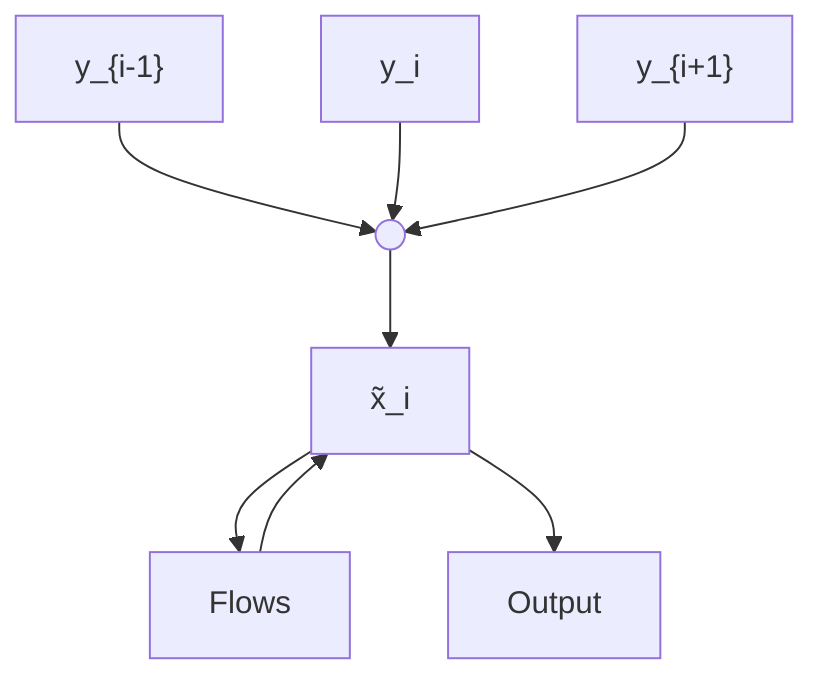
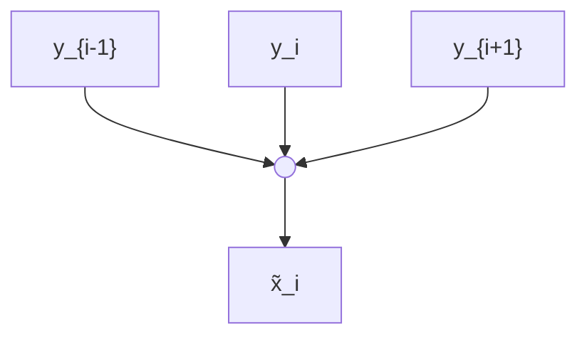
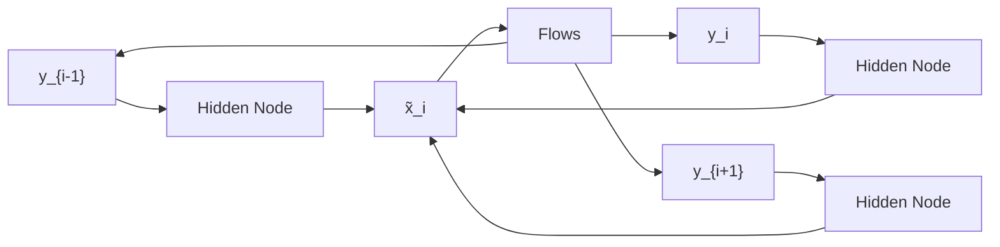
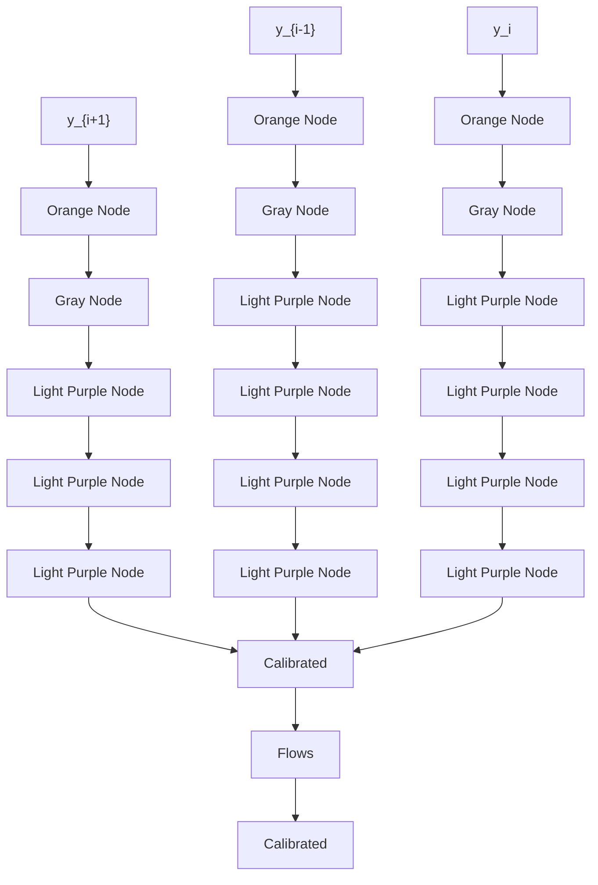
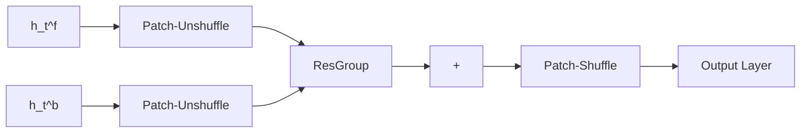

# Spatiotemporal Blind-Spot Network with Calibrated Flow Alignment for Self-Supervised Video Denoising

Zikang Chen, Tao Jiang, Xiaowan Hu, Wang Zhang, Huaqiu Li, Haoqian Wang\*

Shenzhen International Graduate School, Tsinghua University

{czk23,jiang-t23,hu-xw19,zhangwan23,lihq23}@mails.tsinghua.edu.cn, wanghaoqian@tsinghua.edu.cn

# Abstract

Self-supervised video denoising aims to remove noise from videos without relying on ground truth data, leveraging the video itself to recover clean frames. Existing methods often rely on simplistic feature stacking or apply optical flow without thorough analysis. This results in suboptimal utilization of both inter-frame and intra-frame information, and it also neglects the potential of optical flow alignment under self-supervised conditions, leading to biased and insufficient denoising outcomes. To this end, we first explore the practicality of optical flow in the self-supervised setting and introduce a SpatioTemporal Blind-spot Network (STBN) for global frame feature utilization. In the temporal domain, we utilize bidirectional blind-spot feature propagation through the proposed blind-spot alignment block to ensure accurate temporal alignment and effectively capture long-range dependencies. In the spatial domain, we introduce the spatial receptive field expansion module, which enhances the receptive field and improves global perception capabilities. Additionally, to reduce the sensitivity of optical flow estimation to noise, we propose an unsupervised optical flow distillation mechanism that refines fine-grained inter-frame interactions during optical flow alignment. Our method demonstrates superior performance across both synthetic and real-world video denoising datasets. The source code is publicly available at https://github.com/ZKCCZ/STBN.

# Introduction

Images captured under challenging environmental conditions, such as low lighting and slow shutter speeds, are often susceptible to various forms of noise and corruption. This issue is exacerbated in videos due to the typically higher shutter speeds, which not only degrades the overall quality of the video but also adversely affects subsequent computer vision tasks (Shen et al. 2020; Deng et al. 2022).

Given its critical role in computer vision, video denoising has witnessed significant advancements, largely driven by the application of deep learning techniques. Supervised video denoising methods, including Convolutional Neural Networks (CNNs) (Tassano, Delon, and Veit 2019, 2020), Recurrent Neural Networks (RNNs) (Chan et al. 2021; Li et al. 2022), and Transformer-based models (Liang et al. 2022, 2024), have made significant advancements. However, supervised video denoising methods rely heavily on labeled data, which is difficult and time-consuming to obtain. For example, obtaining the ground truth data of microscope videos and dynamic scenes is often impractical. This limitation restricts the applicability of supervised approaches in these contexts. Therefore, self-supervised methods have gained increasing attention as they eliminate the need for labeled training data. Grounded in the Noise2Noise assumption (Lehtinen et al. 2018), frame-based approaches (Ehret et al. 2019; Dewil et al. 2021) warp consecutive frames to create noise pairs for self-supervised training, as illustrated in Figure 1a. These methods heavily rely on precise optical flow estimation, which becomes particularly challenging in high-noise scenarios. The dependency can lead to severe artifacts in the warped images and an inefficient utilization of inter-frame redundancy. Additionally, CNN-based models (Sheth et al. 2021), depicted in Figure 1b,


<details>
<summary>flowchart</summary>


</details>

(a) Frame-based Models


<details>
<summary>flowchart</summary>


</details>

(b) CNN-based Models


<details>
<summary>flowchart</summary>


</details>

(c) Per-frame Models


<details>
<summary>flowchart</summary>


</details>

(d) Ours   
Figure 1: Illustrative comparison of frame sequence utilization strategies in self-supervised video denoising methods.

stack adjacent frames and employ blind-spot networks for self-supervised training. Per-frame models, as shown in Figure 1c, attempt to leverage all other aligned frames for each frame. However, this results in a computational complexity of $O(T^2)$ . One possible approach is to align only a few adjacent frames (Zheng, Pang, and Ji 2023), yet this still compromises long-term information. These models are limited by their frame window size, restricting their ability to capture global temporal information.

Apart from the limited receptive field in both spatial and temporal domains, another significant issue lies in the efficiency and accuracy of optical flow utilization. The aforementioned methods that rely on frame-by-frame optical flow matching encounter a high computational complexity. Methods like RDRF (Wang et al. 2023) tackle these challenges by recurrently leveraging optical flow to capture long-term dependencies. However, as noted in their approach, their model is prone to overfitting, especially when dealing with real-world noisy data. Moreover, the reliance on unverified optical flow can introduce potential biases and errors, which need to be carefully examined within a self-supervised framework. Additionally, current methods are restricted to only access corrupted input video sequences for optical flow estimation, leading to suboptimal results due to the noise sensitivity of optical flow estimation.

To address the aforementioned challenges, we introduce a Spatiotemporal Blind-spot Network (STBN) to robustly handle both synthetic and real-world noise, as shown in Figure 1d. Our approach leverages inter-frame information through bidirectional alignment and propagation with the Blind-Spot Alignment (BSA) block for global temporal awareness. To integrate aligned temporal information and intra-frame features, we propose the Spatial Receptive Field Expansion (SRFE) module, which significantly enlarges the receptive field and further utilizes bidirectional spatial information. In the self-supervised setting, we discuss and calibrate feature alignment methods to ensure the consistency of noise distribution and independence, preserving the integrity of our self-supervised assumptions and avoiding potential biases. Moreover, considering the sensitivity of optical flow estimation to noise, we perform optical flow refinement using initially restored frames as pseudo-ground truth for knowledge distillation, enhancing noise robustness and improving spatiotemporal feature alignment and utilization. We summarize our contributions as follows:

- We propose a Spatiotemporal Blind-spot Network that effectively leverages inter-frame and intra-frame information through blind-spot temporal propagation and spatial fusion for self-supervised denoising for both synthetic and real noise.   
- To ensure accurate utilization of temporal information in our self-supervised framework, we calibrate the multi-frame alignment paradigm to maintain global consistency of noise priors to prevent bias during training.   
- The proposed knowledge distillation strategy in an unsupervised setting mitigates the sensitivity of optical flow to noise, thereby enhancing the precision of spatiotemporal feature utilization.

\- Experimental results show that our method surpasses existing state-of-the-art self-supervised methods on various synthetic and real video noise datasets, demonstrating its superiority in video denoising tasks.

# Related Work

# Supervised Video Denoising

To leverage temporal redundancy to exploit inter-frame information, methods such as PaCNet (Ko, Lee, and Kim 2018) and VNLNet (Davy et al. 2019) utilize block matching combined with CNNs based on spatiotemporal neighborhoods, leading to high computational complexity. Alternatively, sliding window approaches like FastDVDnet (Tassano, Delon, and Veit 2020), an extension of DVDnet (Tassano, Delon, and Veit 2019), enhance efficiency by processing fixed-size consecutive frames through a two-level U-Net. Some methods incorporate optical flow for motion compensation, such as FloRNN (Li et al. 2022), which extends BasicVSR (Chan et al. 2021) by integrating future frame alignment for online denoising. VRT (Liang et al. 2024) processes video sequences in 2-frame clips with attention modules and optical flow for cross-clip interactions. RVRT (Liang et al. 2022) further enhances this by processing frames in parallel within a global recurrent framework.

# Unsupervised Video Denoising

Traditional methods, such as VBM4D (Maggioni et al. 2012) based on BM3D (Dabov et al. 2007), use video filtering algorithms to find similar blocks for denoising. Recent deep learning-based approaches can be broadly categorized into noise-paired methods and blind-spot network methods. Frame2Frame (F2F) (Ehret et al. 2019) and Multi-Frame2Frame (MF2F) (Dewil et al. 2021), based on the Noise2Noise (N2N) (Lehtinen et al. 2018) assumption, align consecutive frames as noise pairs for denoising. ER2R (Zheng, Pang, and Ji 2023) extends the R2R (Pang et al. 2021) assumption, training by creating noise pairs through adding and subtracting noise from the original noisy videos when the specific noise distribution is known. It aligns each frame with others using a sliding window to reduce complexity, which leads to a significant loss of temporal information. Another approach extends blind-spot networks (Krull, Buchholz, and Jug 2019; Laine et al. 2019) to the video denoising domain. UDVD (Sheth et al. 2021) directly stacks a fixed length of adjacent frames into a blind-spot CNN. Although this method implicitly achieves feature alignment through a two-stage U-Net, it restricts the ability to utilize long-term temporal patterns by considering only frames within a limited window size. RDRF (Wang et al. 2023) employs 3D networks and a recurrent network based on blind spatial modulation to integrate features from near and far. However, this method is prone to overfitting, especially when dealing with raw video data.

# Frame Alignment in Video Restoration

In video restoration, aligning highly correlated but temporally unsynchronized frames is crucial (Nah, Son, and Lee


<details>
<summary>flowchart</summary>

```mermaid
graph TD
    A["{y_t}^{n}_{t=1}"] --> B["PWC-Net"]
    B --> C{O_t^{f/b}^{N-1}_{t=1}]
    C --> D["PWC-Net"]
    D --> E["SRFE"]
    D --> F["SRFE"]
    D --> G["SRFE"]
    D --> H["SRFE"]
    E --> I["Output Image"]
    F --> J["Output Image"]
    G --> K["Output Image"]
    H --> L["Output Image"]
    C --> M["F_b"]
    C --> N["F_b"]
    C --> O["F_b"]
    C --> P["F_b"]
    C --> Q["F_b"]
    M --> R["Output Image"]
    N --> S["Output Image"]
    O --> T["Output Image"]
    P --> U["Output Image"]
    Q --> V["Output Image"]
    R --> W["Final Output Image"]
    S --> X["Final Output Image"]
    T --> Y["Final Output Image"]
    U --> Z["Final Output Image"]
```
</details>

(a) Overall Architecture


<details>
<summary>flowchart</summary>

```mermaid
graph TD
    subgraph Bidirectional Blind-Spot Propagation
        A["BSA"] -->|h_t^b| B["3×3 D-Conv RELU 1×1 Conv"]
        C["Warp"] -->|h̃_{t+1}^b| B
        D["BSA"] -->|h_t^f| E["3×3 D-Conv RELU 1×1 Conv"]
        F["SRFE"] --> G["Spatial Receptive Field Expansion"]
    end

    H["Trainable"] --> I["Blind-Spot Convolution"]
    J["Frozen"] --> K["Bidirectional Propagation"]
    L["BSA"] --> M["Blind-Spot Alignment Block"]
    N["SRFE"] --> O["Spatial Receptive Field Expansion"]
    style H fill:#f9f,stroke:#333
    style J fill:#f9f,stroke:#333
    style L fill:#f9f,stroke:#333
    style N fill:#f9f,stroke:#333
    style O fill:#f9f,stroke:#333
```
</details>


<details>
<summary>flowchart</summary>


</details>

(c) Spatial Receptive Field Expansion (SRFE) Module   
Figure 2: Illustration of the proposed method: (a) Overall architecture of STBN, including spatiotemporal feature aggregation and optical flow refinement. (b) The Bidirectional Blind-Spot Propagation utilizes the BSA block for global temporal awareness in both forward and backward propagation. (c) Detailed process of the Spatial Receptive Field Expansion module, which sequentially incorporates patch-shuffle, residual blocks, and patch-unshuffle to effectively enhance the spatial receptive field.

2019; Chan et al. 2021). Many methods use optical flow for frame alignment. BasicVSR (Chan et al. 2021) employs optical flow for recurrent feature propagation, and BasicVSR++ (Chan et al. 2022) uses it to guide offset learning. Task-specific optical flow is fine-tuned using models like SpyNet (Ranjan and Black 2017) and PWC-Net (Sun et al. 2018) for specific restoration tasks (Xue et al. 2019). Despite its efficiency in video restoration (Chan et al. 2021, 2022), the use of optical flow in self-supervised denoising has been less explored. UDVD (Sheth et al. 2021) achieves implicit alignment with a two-stage U-Net, while some methods (Yu et al. 2020) use trainable estimators for improved alignment. The applicability and effectiveness of optical flow alignment in self-supervised denoising remain to be explored.

# Methodology

Let $y \in R^{T \times H \times W \times C}$ represent the noisy input frame sequence and $x \in R^{T \times H \times W \times C}$ denote the potentially clean target frame sequence, where T, H, W, and C are the video length, height, width, and channel, respectively. The overall framework of STBN is illustrated in Figure 2a. Initially, optical flow is predicted from the noisy video sequence and fed into the bidirectional blind-spot propagation module, where features are aligned within the Blind-Spot Alignment (BSA) block. The temporal information is then passed to the Spatial Receptive Field Expansion (SRFE) module, significantly expanding the receptive field of the blind-spots. The fused features are used to generate the final output and serve as pseudo-ground truth for further optical flow refinement.

# Calibration of Frame Alignment

To achieve global temporal feature utilization, we employ optical flow for bidirectional feature warping. In this sec-


<details>
<summary>text_image</summary>

h̃_{t-1}^f → y_t ← h̃_{t+1}^b
(a)
h_t^f / h_t^b
(b)
</details>

Figure 3: Visualization of (a) BSA block for temporal processing and (b) SRFE for spatial receptive field expansion.

tion, we examine the applicability of optical flow alignment methods within the self-supervised learning framework.

First, we propose the blind-spot network assumption for video sequences, where noise is pixel-independent both temporally and spatially, and pixel information can be inferred from the spatiotemporal context in the video. We assume that at the t-th frame $y_{t}$ , the receptive field for the i-th pixel $\boldsymbol{y}_{(t,i)}$ , which acts as the blind-spot in our model, is denoted as $\boldsymbol{y}_{t,RF(i)}$ . We define our model as the function as follows:

$$
f \left(\boldsymbol {y} _ {t, R F (i)}, \operatorname{warp} \left(\boldsymbol {y} _ {k}, \boldsymbol {O} _ {k}\right); \boldsymbol {\theta}\right) = \boldsymbol {y} _ {(t, i)},
$$

$$
k \in \{1, 2,..., T \} \setminus \{t \}, \tag {1}
$$

where $\theta$ denotes the vector of model parameters we aim to train, $O_{k}$ represents the estimated optical flow between two frames, and warp represents the alignment operation. The


<details>
<summary>area</summary>

| Noise Value | Probability Density (Noise (Bilinear)) | Probability Density (Noise (Nearest)) |
|-------------|------------------------------------------|----------------------------------------|
| -100        | 0.000                                    | 0.000                                  |
| -50         | 0.005                                    | 0.002                                  |
| 0           | 0.020                                    | 0.015                                  |
| 50          | 0.005                                    | 0.002                                  |
| 100         | 0.000                                    | 0.000                                  |
</details>


<details>
<summary>bar</summary>

| Correlation | Value |
| ----------- | ----- |
| Top         | 10^0  |
| Middle      | 10^0  |
| Bottom      | 0     |
</details>


<details>
<summary>bar</summary>

| X    | Y    | Correlation |
| ---- | ---- | ----------- |
| -2   | 0    | 0.0         |
| 0    | 0    | 0.0         |
| 2    | 0    | 1.0         |
| 2    | 2    | 0.0         |
| 2    | 4    | 0.0         |
| 2    | 6    | 0.0         |
| 2    | 8    | 0.0         |
| 2    | 10   | 0.0         |
| 2    | 12   | 0.0         |
| 2    | 14   | 0.0         |
| 2    | 16   | 0.0         |
| 2    | 18   | 0.0         |
| 2    | 20   | 0.0         |
| 2    | 22   | 0.0         |
| 2    | 24   | 0.0         |
| 2    | 26   | 0.0         |
| 2    | 28   | 0.0         |
| 2    | 30   | 0.0         |
| 2    | 32   | 0.0         |
| 2    | 34   | 0.0         |
| 2    | 36   | 0.0         |
| 2    | 38   | 0.0         |
| 2    | 40   | 0.0         |
| 2    | 42   | 0.0         |
| 2    | 44   | 0.0         |
| 2    | 46   | 0.0         |
| 2    | 48   | 0.0         |
| 2    | 50   | 0.0         |
| 2    | 52   | 0.0         |
| 2    | 54   | 0.0         |
| 2    | 56   | 0.0         |
| 2    | 58   | 0.0         |
| 2    | 60   | 0.0         |
| 2    | 62   | 0.0         |
| 2    | 64   | 0.0         |
| 2    | 66   | 0.0         |
| 2    | 68   | 0.0         |
| 2    | 70   | 0.0         |
| 2    | 72   | 0.0         |
| 2    | 74   | 0.0         |
| 2    | 76   | 0.0         |
| 2    | 78   | 0.0         |
| 2    | 80   | 0.0         |
| 2    | 82   | 0.0         |
| 2    | 84   | 0.0         |
| 2    | 86   | 0.0         |
| 2    | 88   | 0.0         |
| 2    | 90   | 0.0         |
| 2    | 92   | 0.0         |
| 2    | 94   | 0.0         |
| 2    | 96   | 0.0         |
| 2    | 98   | 0.0         |
| 2    | 100  | 1.0         |
The image displays a color-coded bar chart with a color scale ranging from -1 to +1 and a legend indicating 'Nearest-neighbor Interpolation'.
</details>

Figure 4: Visualization of noise distribution and correlation for two interpolation methods. Bilinear interpolation introduces spatial correlation and distorts the noise distribution, while nearest-neighbor interpolation preserves it.

model is trained by minimizing the empirical risk below:

$$
\underset {\theta} {\arg \min} \sum_ {t, i} L \left(f \left(\boldsymbol {y} _ {(t, R F (i))}, \operatorname{warp} \left(\boldsymbol {y} _ {k}, \boldsymbol {O} _ {k}\right); \boldsymbol {\theta}\right), \boldsymbol {y} _ {(t, i)}\right). \tag {2}
$$

The above formulation can be considered equivalent to the supervised training process. The detailed proof is provided in the supplementary material.

As shown in the above derivation, the inputs to f necessitate that both $y_{t}$ and $\text{warp}(y_{k}, O_{k})$ , i.e., the noise from the current frame and the aligned frames, must remain pixel-independent both temporally and spatially. In optical flow alignment, bilinear and nearest-neighbor interpolation are two commonly employed methods. We use these as examples to illustrate the impact of alignment on noise characteristics and correlation. As shown in Figure 4, we performed forward warping on frames using these two methods, respectively. The same operation is applied on the ground truth data to calculate the noise distribution after interpolation. It can be observed that bilinear interpolation not only disrupts the distribution of noise but also introduces spatial correlations. This occurs because bilinear interpolation uses surrounding pixel information, performing a filtering-like operation on the image, which violates our self-supervised assumptions and leads to method failure. In contrast, nearest-neighbor interpolation preserves the original pixel values, maintaining the noise distribution and its independence. This is further demonstrated in our experiments.

# Spatiotemporal Blind-Spot Feature Aggregation

To better utilize video frame sequences in both spatial and temporal domains, we design two distinct modules: the temporal module, which performs bidirectional alignment and propagation of features, and the spatial module, which significantly expands the receptive field to more effectively leverage the aligned frames. Together, these modules enable the model to achieve global awareness and enhance spatiotemporal feature integration.

Bidirectional Blind-Spot Propagation. To perform temporal feature alignment and propagation, we design a feature propagation and alignment module using blind-spot convolutions and dilated convolutions, as illustrated in Figure 2b. The input $y_{t}$ from the t-th frame, along with the bidirectionally propagated features $h_{t-1}^{f}$ or $h_{t+1}^{b}$ , which are warped to the current frame using optical flow, are then fed into the Blind-Spot Alignment (BSA) block for motion compensation. The entire process is as follows:

$$
\boldsymbol {h} _ {t} ^ {f} = F _ {f} \left(\boldsymbol {y} _ {t}, \operatorname{warp} \left(\boldsymbol {h} _ {t - 1} ^ {f}, \boldsymbol {O} _ {t} ^ {f}\right)\right), \tag {3}
$$

$$
\boldsymbol {h} _ {t} ^ {b} = F _ {b} \left(\boldsymbol {y} _ {t}, w a r p (\boldsymbol {h} _ {t + 1} ^ {b}, \boldsymbol {O} _ {t} ^ {b})\right),
$$

where $F_{f}$ , $F_{b}$ denote forward and backward propagation, $O_{t}^{f}$ , $O_{t}^{b}$ represent the bidirectional estimated optical flow.

During the alignment process, the BSA block is designed to maximally leverage the features from both forward and backward propagation. First, $y_{t}$ and h are concatenated and then passed through a blind-spot convolution. The output is subsequently processed by modules that consist of a dilated convolution, an activation layer, and a $1 \times 1$ convolution. Although the features are well-aligned at this stage, they are not fully utilized. Therefore, we further concatenate the output with feature h and pass it through the blind-spot convolution block. Figure 3a shows the dependency between input and output pixels, with white pixels indicating regions independent of the central pixel and gray pixels representing convolution weights. This demonstrates that the BSA block effectively utilizes all temporal redundancy.

Spatial Receptive Field Expansion. Once the bidirectional features are aligned to $y_{t}$ , they inherently capture the temporal features of the entire sequence. To further leverage the aligned frames, we expand the receptive field under the blind-spot framework to utilize spatial domain information for enhanced image recovery. Inspired by (Jang et al. 2024; Li, Zhang, and Zuo 2024), we propose the Spatial Receptive Field Expansion (SRFE) Module, as illustrated in Figure 2c.

In the SRFE module, the forward features $h^{f}$ and backward features $h^{b}$ are first processed through a patch-unshuffle operation, and then stacked together to pass through several residual blocks, which ensure thorough feature fusion and enhance the model's ability to capture contextual information. Finally, the features are restored to their original size through a patch-shuffle operation, producing the output. The process can be represented as follows:

$$
\tilde {\boldsymbol {x}} _ {t} = \mathbf {S R F E} (\boldsymbol {h} _ {t} ^ {b}, \boldsymbol {h} _ {t} ^ {f}), t = 1, 2,... T \tag {4}
$$

As shown in Figure 3b, our strategy leads to a substantial increase in the receptive field, effectively integrating spatial information. This expansion enhances the model's capability to capture and utilize detailed spatial features.


<details>
<summary>text_image</summary>

Gobet Vostoyon
</details>

00039, tractor, DAVIS   
PSNR/SSIM

  
Noisy (σ=30)

17.22/0.2092   
  
FloRNN   
31.23/0.8605

  
VBM4D

27.22/0.6583   
  
UDVD   
29.59/0.8071

  
DVDnet

30.03/0.8157   
  
Ours   
31.44/0.8654

  
FastDVDnet

29.45/0.8009   
  
GT   
Inf/1.0000

Figure 5: Visual comparisons of different methods on synthetic noise data. 

<table><tr><td rowspan="2">Dataset</td><td rowspan="2">σ</td><td rowspan="2">Traditional VBM4D</td><td colspan="3">Supervised</td><td colspan="4">Unsupervised</td></tr><tr><td>DVDnet</td><td>FastDVDnet</td><td>FloRNN</td><td>UDVD</td><td>RDRF</td><td>ER2Rs</td><td>STBN (Ours)</td></tr><tr><td rowspan="6">Set8</td><td>10</td><td>36.05/-</td><td>36.08/0.9510</td><td>36.44/0.9540</td><td>37.57/0.9639</td><td>36.36/0.9510</td><td>36.67/0.9547</td><td>37.55/-</td><td>37.24/0.9594</td></tr><tr><td>20</td><td>32.19/-</td><td>33.49/0.9182</td><td>33.43/0.9196</td><td>34.67/0.9379</td><td>33.53/0.9167</td><td>34.00/0.9251</td><td>34.34/-</td><td>34.41/0.9322</td></tr><tr><td>30</td><td>30.00/-</td><td>31.68/0.8862</td><td>31.68/0.8889</td><td>32.97/0.9138</td><td>31.88/0.8865</td><td>32.39/0.8978</td><td>32.45/-</td><td>32.76/0.9072</td></tr><tr><td>40</td><td>28.48/-</td><td>30.46/0.8564</td><td>30.46/0.8608</td><td>31.75/0.8911</td><td>30.72/0.8595</td><td>31.23/0.8725</td><td>31.09/-</td><td>31.57/0.8837</td></tr><tr><td>50</td><td>27.33/-</td><td>29.53/0.8289</td><td>29.53/0.8351</td><td>30.80/0.8696</td><td>29.81/0.8349</td><td>30.31/0.8490</td><td>30.05/-</td><td>30.62/0.8608</td></tr><tr><td>avg</td><td>30.81/-</td><td>32.29/0.8881</td><td>32.31/0.8917</td><td>33.55/0.9153</td><td>32.46/0.8897</td><td>32.92/0.8998</td><td>33.10/-</td><td>33.32/0.9087</td></tr><tr><td rowspan="6">DAVIS</td><td>10</td><td>37.58/-</td><td>38.13/0.9657</td><td>38.71/0.9672</td><td>40.16/0.9755</td><td>39.17/0.9700</td><td>39.54/0.9717</td><td>39.52/-</td><td>40.35/0.9613</td></tr><tr><td>20</td><td>33.88/-</td><td>35.70/0.9422</td><td>35.77/0.9405</td><td>37.52/0.9564</td><td>35.94/0.9428</td><td>36.40/0.9473</td><td>36.49/-</td><td>37.67/0.9606</td></tr><tr><td>30</td><td>31.65/-</td><td>34.08/0.9188</td><td>34.04/0.9167</td><td>35.89/0.9440</td><td>34.09/0.9178</td><td>34.55/0.9245</td><td>34.60/-</td><td>36.00/0.9454</td></tr><tr><td>40</td><td>30.05/-</td><td>32.86/0.8962</td><td>32.82/0.8949</td><td>34.66/0.9286</td><td>32.79/0.8949</td><td>33.23/0.9032</td><td>33.29/-</td><td>34.73/0.9296</td></tr><tr><td>50</td><td>28.80/-</td><td>31.85/0.8745</td><td>31.86/0.8747</td><td>33.67/0.9131</td><td>31.80/0.8739</td><td>32.20/0.8832</td><td>32.25/-</td><td>33.70/0.9138</td></tr><tr><td>avg</td><td>32.39/-</td><td>34.52/0.9195</td><td>34.64/0.9188</td><td>36.38/0.9435</td><td>34.76/0.9199</td><td>35.18/0.9260</td><td>35.23/-</td><td>36.49/0.9451</td></tr></table>

Table 1: Quantitative comparison of PSNR/SSIM for Gaussian denoising on the Set8 and DAVIS datasets. The best results for unsupervised methods are in bold. Note that ER2R $_{s}$ utilizes the same video sequence for both training and testing.

# Flow Refinement in Noise

Optical flow estimation, which is also sensitive to noise, significantly impacts the accuracy of temporal alignment. To address the issue of imprecise optical flow estimation caused by corrupted input images, we introduce a knowledge distillation approach that uses pseudo-ground truth for optical flow refinement.

We define the method of optical flow estimator as $\mathcal{E}(\cdot)$ . Once the training achieves preliminary effectiveness, we generate clean video sequences $\tilde{x}$ using a frozen-parameter $\mathcal{E}_{\mathrm{fix}}(\cdot)$ to serve as pseudo-ground truth. These sequences and the original video frame y are used for optical flow estimation respectively as follows:

$$
\tilde {\boldsymbol {O}} _ {t} ^ {f} = s g \left(\mathcal {E} _ {\text { fix }} \left(\tilde {\boldsymbol {x}} _ {t}, \tilde {\boldsymbol {x}} _ {t + 1}\right)\right), \boldsymbol {O} _ {t} ^ {f} = \mathcal {E} \left(\boldsymbol {y} _ {t}, \boldsymbol {y} _ {t + 1}\right), \tag {5}
$$

where $sg(\cdot)$ is the stop gradient operation. This accurate optical flow $\tilde{O}_{t}^{f}$ treated as pseudo-ground truth is then to guide the refinement of the optical flow estimation in noisy video sequences. We optimize the original optical flow estimator using the following loss function:

$$
\mathcal {L} _ {d i s} = \sum_ {t} \left\| \tilde {\boldsymbol {O}} _ {t} ^ {f} - \boldsymbol {O} _ {t} ^ {f} \right\| _ {1}. \tag {6}
$$

The distillation loss, scaled by a small coefficient $\alpha$ as a constraint, is jointly trained with our model. This distillation approach enhances the performance of the optical flow estimator in the presence of noise, thereby improving overall temporal alignment and benefiting the entire model.

# Experiments

# Implementation Details

We conduct experiments on both synthetic and real raw noise. For synthetic noise, following (Sheth et al. 2021; Wang et al. 2023), we train our model with negative log-likelihood loss $L_{log}$ and test them with posterior inference (Laine et al. 2019). For real raw noise, we use $L_{2}$ loss for self-supervised training. For the optical flow estimator, we use the pre-trained PWC-Net (Sun et al. 2018) as our initial optical flow extractor. The distillation loss is introduced with $\alpha = 5 \times 10^{-4}$ . Training sequences are spatially cropped to a size of $96 \times 96$ and temporally to a length of T = 10 for synthetic data and T = 7 for real data. All experiments are carried out using the Adam optimizer with an initial learning rate of $1 \times 10^{-4}$ on a single RTX 3090 GPU. We used Peak Signal-to-Noise Ratio (PSNR) and Structural Similarity (SSIM) as evaluation metrics.


<details>
<summary>natural_image</summary>

Collage of fruit and vegetable images including grapes, apples, and a blue truck with number 1 (no text or symbols)
</details>

Clean   
PSNR/SSIM


<details>
<summary>natural_image</summary>

Composite image showing fresh fruits and a blue food cart with a number 1, no visible text or symbols
</details>

Nosiy   
25.94/0.5710


<details>
<summary>natural_image</summary>

Composite image showing a blue toy train labeled '1' and fruit imagery including grapes, apples, and bread (no text or symbols)
</details>

MaskDnGAN   
34.53/0.9541


<details>
<summary>natural_image</summary>

Collage of fresh fruits including grapes, apples, and burlap on a blue background (no text or symbols)
</details>

FloRNN   
35.64/0.9670


<details>
<summary>natural_image</summary>

Collage of fresh fruits including grapes, tomatoes, and leafy greens, with a blue toy box labeled '1' in the corner (no readable text or symbols)
</details>

UDVD   
36.10/0.9659


<details>
<summary>natural_image</summary>

Collage of fresh fruits including grapes, apples, and bread (no text or symbols visible)
</details>

Ours   
37.72/0.9743


<details>
<summary>natural_image</summary>

Close-up of a soccer ball with colorful logos and surrounding urban background (no readable text or symbols)
</details>

Clean   
PSNR/SSIM


<details>
<summary>natural_image</summary>

Collage of colorful cartoon-style icons on a globe, including a rocket, airplane, and soccer ball (no text or symbols visible)
</details>

Nosiy   
25.41/0.5481


<details>
<summary>natural_image</summary>

Close-up of a soccer ball with colorful logos and surrounding urban background (no readable text or symbols)
</details>

MaskDnGAN   
34.88/0.9666


<details>
<summary>natural_image</summary>

Collage of colorful cartoon-style icons on a soccer ball, set against a blurred cityscape background (no text or symbols visible)
</details>

FloRNN   
35.09/0.9710


<details>
<summary>natural_image</summary>

Collage of colorful cartoon-style icons and a soccer ball with geometric patterns, set against a blurred cityscape background (no readable text or symbols)
</details>

UDVD   
35.36/0.9715


<details>
<summary>natural_image</summary>

Collage of colorful icons on a soccer ball, including heart-shaped and globe-like designs, set against a blurred cityscape background (no readable text or symbols)
</details>

Ours   
36.29/0.9742

Figure 6: Visual comparisons on CRVD dataset. The results have been converted to the sRGB domain for visualization. 

<table><tr><td rowspan="2">ISO</td><td colspan="4">Supervised</td><td colspan="4">Unsupervised</td></tr><tr><td>FastDVDnet</td><td>RViDeNet</td><td>MaskDnGAN</td><td>FloRNN</td><td>UDVD</td><td>RDRF</td><td>ER2Rp</td><td>STBN (Ours)</td></tr><tr><td>1600</td><td>43.43/0.9866</td><td>47.74/0.9938</td><td>47.52/0.9941</td><td>48.81/0.9956</td><td>48.02/0.9982</td><td>48.38/0.9983</td><td>49.14/-</td><td>49.27/0.9988</td></tr><tr><td>3200</td><td>42.91/0.9844</td><td>45.91/0.9911</td><td>45.88/0.9914</td><td>47.05/0.9933</td><td>46.44/0.9980</td><td>46.86/0.9981</td><td>47.51/-</td><td>47.58/0.9985</td></tr><tr><td>6400</td><td>40.29/0.9793</td><td>43.85/0.9880</td><td>44.14/0.9886</td><td>45.09/0.9910</td><td>44.74/0.9972</td><td>45.24/0.9975</td><td>45.61/-</td><td>45.75/0.9980</td></tr><tr><td>12800</td><td>36.05/0.9613</td><td>41.20/0.9819</td><td>41.48/0.9834</td><td>42.63/0.9866</td><td>42.21/0.9966</td><td>42.72/0.9969</td><td>43.03/-</td><td>43.36/0.9976</td></tr><tr><td>25600</td><td>36.50/0.9400</td><td>41.17/0.9821</td><td>40.79/0.9819</td><td>42.19/0.9872</td><td>42.13/0.9951</td><td>42.25/0.9948</td><td>42.91/-</td><td>42.91/0.9972</td></tr><tr><td>avg</td><td>39.84/0.9703</td><td>43.97/0.9874</td><td>43.96/0.9880</td><td>45.15/0.9907</td><td>44.71/0.9970</td><td>45.09/0.9971</td><td>45.64/-</td><td>45.77/0.9980</td></tr></table>

Table 2: Quantitative comparison of PSNR/SSIM on the CRVD dataset. The best results for unsupervised methods are in bold. Note that ER2R $_{p}$ utilizes extra noise distribution priors to generate noise pairs during the training process.

# Experiments on Synthetic Noise

In our experiments on synthetic noise, we utilize DAVIS dataset (Pont-Tuset et al. 2017) and Set8 (Tassano, Delon, and Veit 2019) dataset. To generate noisy video sequences, additive white Gaussian noise (AWGN) with a standard deviation $\sigma \in [5,55]$ is introduced to the training dataset. We compare our method with a range of benchmarks, including the non-learning method VBM4D (Maggioni et al. 2012), supervised approaches such as FastDVDnet (Tassano, Delon, and Veit 2020), PaCNet (Vaksman, Elad, and Milanfar 2021), and FloRNN (Li et al. 2022), as well as unsupervised methods like UDVD (Sheth et al. 2021), RDRF (Wang et al. 2023), and ER2R (Zheng, Pang, and Ji 2023).

Quantitative Comparison. Table 1 reports the PSNR and SSIM of different methods on the DAVIS testing set and Set8 datasets under different noise levels. Note that ER2R utilizes the same video sequence for both training and testing. Our model outperforms RDRF by an average PSNR of 1.31 dB and 0.4 dB on two different datasets and is highly comparable to the supervised method FloRNN. The results demonstrate the effectiveness of our global spatiotemporal

perception and refined optical flow alignment, highlighting the advantages of our self-supervised method. Figure 5 illustrates our qualitative results, showing that our method restores corrupted text more accurately compared to existing approaches, which demonstrates the effectiveness of our approach in preserving fine details.

# Experiments on Real Raw Noise

We evaluate our method using the CRVD dataset (Yue et al. 2020), a real-world video denoising dataset captured in the raw domain, to assess our performance on real-world noise. This dataset comprises 6 indoor scenes for training and 5 indoor scenes for testing, with each scene consisting of 7 frames with 10 different noise realizations captured at five different ISO levels. We compare our method against several approaches, including supervised methods FastDVD-net (Tassano, Delon, and Veit 2020), RViDeNet (Yue et al. 2020), MaskDnGAN (Paliwal, Zeng, and Kalantari 2021), and FloRNN (Li et al. 2022), as well as unsupervised methods such as UDVD (Sheth et al. 2021), RDRF (Wang et al. 2023), and ER2R (Zheng, Pang, and Ji 2023). For a fair comparison, both training and testing are performed on the test


Figure 7: Visualizations of experimental results during training with different warping methods.   


<details>
<summary>natural_image</summary>

Scenic view of a wooden boardwalk over turquoise water with thatched bungalows and distant mountains under a cloudy sky (no text or symbols visible)
</details>

00006, hypersmooth


<details>
<summary>natural_image</summary>

Abstract watercolor gradient background with soft pastel tones (no text or symbols)
</details>

$\sigma = 30$ ,PWC-Net


<details>
<summary>natural_image</summary>

Abstract gradient background with soft pastel colors (no text or symbols)
</details>

$\sigma = 50$ ,PWC-Net


<details>
<summary>natural_image</summary>

Abstract watercolor illustration with green, blue, and pink hues (no text or symbols)
</details>

Clean, PWC-Net


<details>
<summary>natural_image</summary>

Abstract gradient background with soft pastel colors (no text or symbols)
</details>

$\sigma = 30$ ,Ours


<details>
<summary>natural_image</summary>

Abstract gradient background with soft pastel colors (no text or symbols)
</details>

$\sigma = 50$ ,Ours   
Figure 8: Visualization of optical flow for the initial estimator compared to our refined results.

sequences as employed in previous unsupervised methods.

Quantitative Comparison. Table 2 reports our results on the CRVD dataset. Note that ER2R utilizes prior noise information by creating noise pairs during training, whereas ours rely solely on noisy images. Our model demonstrates superior performance, surpassing RDRF by 0.68 dB under identical settings. While RDRF requires meticulous tuning to prevent overfitting with limited samples, our method leverages well-calibrated optical flow alignment and a robust spatiotemporal blind-spot network, which enables precise global information aggregation to improve denoising results. Our approach exceeds ER2R by an average of 0.13 dB even though we have very limited data. Under the above training setting, we outperform the supervised method FloRNN by an average of 0.62 dB. Given the challenges of obtaining ground truth in real noise scenarios, our unsupervised approach demonstrates greater practical utility. As illustrated in Figure 9, our method better preserves high-frequency details that others often lose during the denoising process.

<table><tr><td>Component</td><td colspan="4">Methods</td></tr><tr><td>Propagation</td><td>√</td><td>√</td><td>√</td><td>√</td></tr><tr><td>BSA Block</td><td></td><td>√</td><td>√</td><td>√</td></tr><tr><td>SRFE Module</td><td></td><td></td><td>√</td><td>√</td></tr><tr><td>Optical Refinement</td><td></td><td></td><td></td><td>√</td></tr><tr><td>PSNR</td><td>32.14</td><td>32.49</td><td>32.68</td><td>32.76</td></tr><tr><td>SSIM</td><td>0.8942</td><td>0.9037</td><td>0.9068</td><td>0.9072</td></tr></table>

Table 3: Ablation study of model components.

# Analysis of the Proposed Method

Ablation study. We perform ablation studies on the Set8 dataset with Gaussian noise level $\sigma=30$ , as detailed in Table 3. Starting with temporal feature propagation alone, incorporating the BSA block enhances temporal feature utilization, improving PSNR by 0.35 dB. Adding the SRFE module further leverages spatial information, resulting in an additional 0.19 dB increase in PSNR. Finally, introducing optical flow refinement provides a further improvement of 0.08 dB in PSNR. These results demonstrate that gradually utilizing temporal and spatial features and refining alignment incrementally enhances model performance.

Feature Alignment Strategy. Figure 7 presents the results of experiments conducted on two samples from the Set8 dataset using bilinear interpolation and nearest-neighbor interpolation. The former led to a decrease in PSNR during training, which aligns with our conclusions that bilinear interpolation disrupts the noise structure, thereby violating our blind-spot assumption. Consequently, bilinear interpolation produced poor visual results.

Optical Flow Refinement. We visualize the refined optical flow produced by our proposed method for noise levels $\sigma = 30$ and $\sigma = 50$ as shown in Figure 10. The optical flow estimator benefits from knowledge distillation guided by generated pseudo-ground truths in the training process, leading to more accurate optical flow predictions under noisy conditions. Consequently, our alignment module achieves improved matching accuracy, which in turn contributes to the superior performance of our denoising model.

# Conclusion

In this paper, we introduce STBN for self-supervised video denoising. We validate and calibrate the multi-frame alignment paradigm within a self-supervised framework to ensure the global consistency of the noise prior, thereby mitigating training bias. Our proposed spatiotemporal blind-spot feature aggregation preserves long-range temporal dependencies and enhances spatial receptive fields for comprehensive global perception. Additionally, our unsupervised optical flow refinement reduces sensitivity to noise, improving the precision of spatiotemporal feature utilization. Experimental results demonstrate that our method surpasses existing unsupervised approaches and shows strong comparability to supervised methods, demonstrating great potential.

# Acknowledgments

This work is supported by the Shenzhen Science and Technology Project under Grant (JCYJ20220818101001004).

# References

Chan, K. C.; Wang, X.; Yu, K.; Dong, C.; and Loy, C. C. 2021. Basicvsr: The search for essential components in video super-resolution and beyond. In Proceedings of the IEEE/CVF conference on computer vision and pattern recognition, 4947–4956.   
Chan, K. C.; Zhou, S.; Xu, X.; and Loy, C. C. 2022. Basicvsr++: Improving video super-resolution with enhanced propagation and alignment. In Proceedings of the IEEE/CVF conference on computer vision and pattern recognition, 5972–5981.   
Dabov, K.; Foi, A.; Katkovnik, V.; and Egiazarian, K. 2007. Color image denoising via sparse 3D collaborative filtering with grouping constraint in luminance-chrominance space. In 2007 IEEE international conference on image processing, volume 1, I–313. IEEE.   
Davy, A.; Ehret, T.; Morel, J.-M.; Arias, P.; and Facciolo, G. 2019. A non-local CNN for video denoising. In 2019 IEEE international conference on image processing (ICIP), 2409–2413. IEEE.   
Deng, X.; Wang, P.; Lian, X.; and Newsam, S. 2022. Night-Lab: A dual-level architecture with hardness detection for segmentation at night. In Proceedings of the IEEE/CVF Conference on Computer Vision and Pattern Recognition, 16938–16948.   
Dewil, V.; Anger, J.; Davy, A.; Ehret, T.; Facciolo, G.; and Arias, P. 2021. Self-supervised training for blind multi-frame video denoising. In Proceedings of the IEEE/CVF winter conference on applications of computer vision, 2724–2734.   
Ehret, T.; Davy, A.; Morel, J.-M.; Facciolo, G.; and Arias, P. 2019. Model-blind video denoising via frame-to-frame training. In Proceedings of the IEEE/CVF conference on computer vision and pattern recognition, 11369–11378.   
Jang, H.; Park, J.; Jung, D.; Lew, J.; Bae, H.; and Yoon, S. 2024. PUCA: patch-unshuffle and channel attention for enhanced self-supervised image denoising. Advances in Neural Information Processing Systems, 36.   
Ko, K.; Lee, J.-T.; and Kim, C.-S. 2018. PAC-Net: pairwise aesthetic comparison network for image aesthetic assessment. In 2018 25th IEEE International Conference on Image Processing (ICIP), 2491–2495. IEEE.   
Kroeger, T.; Timofte, R.; Dai, D.; and Van Gool, L. 2016. Fast optical flow using dense inverse search. In Computer Vision–ECCV 2016: 14th European Conference, Amsterdam, The Netherlands, October 11–14, 2016, Proceedings, Part IV 14, 471–488. Springer.   
Krull, A.; Buchholz, T.-O.; and Jug, F. 2019. Noise2void-learning denoising from single noisy images. In Proceedings of the IEEE/CVF conference on computer vision and pattern recognition, 2129–2137.

Laine, S.; Karras, T.; Lehtinen, J.; and Aila, T. 2019. High-quality self-supervised deep image denoising. Advances in Neural Information Processing Systems, 32.   
Lehtinen, J.; Munkberg, J.; Hasselgren, J.; Laine, S.; Karras, T.; Aittala, M.; and Aila, T. 2018. Noise2Noise: Learning image restoration without clean data. arXiv preprint arXiv:1803.04189.   
Li, J.; Wu, X.; Niu, Z.; and Zuo, W. 2022. Unidirectional video denoising by mimicking backward recurrent modules with look-ahead forward ones. In European Conference on Computer Vision, 592–609. Springer.   
Li, J.; Zhang, Z.; and Zuo, W. 2024. TBSN: Transformer-Based Blind-Spot Network for Self-Supervised Image Denoising. arXiv preprint arXiv:2404.07846.   
Liang, J.; Cao, J.; Fan, Y.; Zhang, K.; Ranjan, R.; Li, Y.; Timofte, R.; and Van Gool, L. 2024. Vrt: A video restoration transformer. IEEE Transactions on Image Processing.   
Liang, J.; Fan, Y.; Xiang, X.; Ranjan, R.; Ilg, E.; Green, S.; Cao, J.; Zhang, K.; Timofte, R.; and Gool, L. V. 2022. Recurrent video restoration transformer with guided deformable attention. Advances in Neural Information Processing Systems, 35: 378–393.   
Maggioni, M.; Boracchi, G.; Foi, A.; and Egiazarian, K. 2012. Video denoising, deblocking, and enhancement through separable 4-D nonlocal spatiotemporal transforms. IEEE Transactions on image processing, 21(9): 3952–3966.   
Nah, S.; Son, S.; and Lee, K. M. 2019. Recurrent neural networks with intra-frame iterations for video deblurring. In Proceedings of the IEEE/CVF conference on computer vision and pattern recognition, 8102–8111.   
Paliwal, A.; Zeng, L.; and Kalantari, N. K. 2021. Multi-stage raw video denoising with adversarial loss and gradient mask. In 2021 IEEE International Conference on Computational Photography (ICCP), 1–10. IEEE.   
Pang, T.; Zheng, H.; Quan, Y.; and Ji, H. 2021. Recorrupted-to-recorrupted: Unsupervised deep learning for image denoising. In Proceedings of the IEEE/CVF conference on computer vision and pattern recognition, 2043–2052.   
Pont-Tuset, J.; Perazzi, F.; Caelles, S.; Arbeláez, P.; Sorkine-Hornung, A.; and Van Gool, L. 2017. The 2017 davis challenge on video object segmentation. arXiv preprint arXiv:1704.00675.   
Ranjan, A.; and Black, M. J. 2017. Optical flow estimation using a spatial pyramid network. In Proceedings of the IEEE conference on computer vision and pattern recognition, 4161–4170.   
Shen, Y.; Ji, R.; Chen, Z.; Hong, X.; Zheng, F.; Liu, J.; Xu, M.; and Tian, Q. 2020. Noise-aware fully webly supervised object detection. In Proceedings of the IEEE/CVF conference on computer vision and pattern recognition, 11326–11335.   
Sheth, D. Y.; Mohan, S.; Vincent, J. L.; Manzorro, R.; Crozier, P. A.; Khapra, M. M.; Simoncelli, E. P.; and Fernandez-Granda, C. 2021. Unsupervised deep video denoising. In Proceedings of the IEEE/CVF international conference on computer vision, 1759–1768.

Sun, D.; Yang, X.; Liu, M.-Y.; and Kautz, J. 2018. Pwc-net: Cnns for optical flow using pyramid, warping, and cost volume. In Proceedings of the IEEE conference on computer vision and pattern recognition, 8934–8943.   
Tassano, M.; Delon, J.; and Veit, T. 2019. Dvdnet: A fast network for deep video denoising. In 2019 IEEE International Conference on Image Processing (ICIP), 1805–1809. IEEE.   
Tassano, M.; Delon, J.; and Veit, T. 2020. Fastdvdnet: Towards real-time deep video denoising without flow estimation. In Proceedings of the IEEE/CVF conference on computer vision and pattern recognition, 1354–1363.   
Vaksman, G.; Elad, M.; and Milanfar, P. 2021. Patch craft: Video denoising by deep modeling and patch matching. In Proceedings of the IEEE/CVF International Conference on Computer Vision, 2157–2166.   
Wang, Z.; Zhang, Y.; Zhang, D.; and Fu, Y. 2023. Recurrent self-supervised video denoising with denser receptive field. In Proceedings of the 31st ACM International Conference on Multimedia, 7363–7372.   
Xue, T.; Chen, B.; Wu, J.; Wei, D.; and Freeman, W. T. 2019. Video enhancement with task-oriented flow. International Journal of Computer Vision, 127: 1106–1125.   
Yu, S.; Park, B.; Park, J.; and Jeong, J. 2020. Joint learning of blind video denoising and optical flow estimation. In Proceedings of the IEEE/CVF conference on computer vision and pattern recognition workshops, 500–501.   
Yue, H.; Cao, C.; Liao, L.; Chu, R.; and Yang, J. 2020. Supervised raw video denoising with a benchmark dataset on dynamic scenes. In Proceedings of the IEEE/CVF conference on computer vision and pattern recognition, 2301–2310.   
Zheng, H.; Pang, T.; and Ji, H. 2023. Unsupervised deep video denoising with untrained network. In Proceedings of the AAAI Conference on Artificial Intelligence, volume 37, 3651–3659.

# Supplementary Material

# Proof of Blind-Spot Assumption in Videos

# Model Definition

We assume that at the t-th frame $y_{t}$ , the receptive field for the i-th pixel $\boldsymbol{y}_{(t,i)}$ , which acts as the blind-spot in our model, is denoted as $\boldsymbol{y}_{t,RF(i)}$ . We define our model as the function as follows:

$$
\begin{array}{l} f \big (\boldsymbol {y} _ {t, R F (i)}, w a r p (\boldsymbol {y} _ {k}, \boldsymbol {O} _ {k}); \boldsymbol {\theta} \big) = \boldsymbol {y} _ {(t, i)}, \\ k \in \{1, 2, \dots , T \} \setminus \{t \}. \tag {7} \\ \end{array}
$$

In this formulation:

- $\theta$ represents the vector of model parameters to be optimized.   
- $O_{k}$ denotes the estimated optical flow between frames.   
- warp denotes the alignment operation applied to the frames.

# Training Objective

The model is trained by minimizing the following empirical risk:

$$
\underset {\boldsymbol {\theta}} {\arg \min} \sum_ {t, i} \boldsymbol {L} \left(f \left(\boldsymbol {y} _ {t, R F (i)}, \operatorname{warp} \left(\boldsymbol {y} _ {k}, \boldsymbol {O} _ {k}\right); \boldsymbol {\theta}\right), \boldsymbol {y} _ {(t, i)}\right). \tag {8}
$$

We use the $\mathcal{L}_2$ loss as an example. The empirical risk can be expressed as:

$$
\mathcal {L} (\boldsymbol {\theta}) = \sum_ {t, i} \left\| f \left(\boldsymbol {y} _ {t, R F (i)}, \operatorname{warp} \left(\boldsymbol {y} _ {k}, \boldsymbol {O} _ {k}\right); \boldsymbol {\theta}\right) - \boldsymbol {y} _ {(t, i)} \right\| _ {2}. \tag {9}
$$

In this formulation, $\mathcal{L}(\theta)$ measures the squared difference between the predicted values from the receptive field and the blind-spot values.

# Proof of Equivalence to Supervised Training

First, we introduce the assumption of blind spot networks in the image domain (Krull, Buchholz, and Jug 2019; ?):

$$
\underset {\boldsymbol {\theta}} {\arg \min} \sum_ {i} L \left(f (\boldsymbol {y} _ {R F (i)}; \boldsymbol {\theta}), \boldsymbol {y} _ {i}\right), \tag {10}
$$

which is equal to the supervised loss:

$$
\underset {\boldsymbol {\theta}} {\arg \min} \sum_ {i} L \left(f (\boldsymbol {y} _ {R F (i)}; \boldsymbol {\theta}), \boldsymbol {x} _ {i}\right) + c, \tag {11}
$$

where $c$ is a constant.

According to the above assumption, the training process can be expressed using the $\mathcal{L}_2$ loss as:

$$
\begin{array}{l} \sum_ {i} \left\| f \left(\boldsymbol {y} _ {(R F (i))}; \boldsymbol {\theta}\right) - \boldsymbol {y} _ {i} \right\| _ {2} \\ = \sum_ {i} ^ {i} \left\| f \left(\boldsymbol {y} _ {(R F (i))}; \boldsymbol {\theta}\right) - \boldsymbol {x} _ {i} \right\| _ {2} + c. \tag {12} \\ \end{array}
$$

Further, we generalize the equation to the video blind-spot assumption. According to the blind-spot network assumption, the receptive field $RF(i)$ of blind-spot is related to the underlying ground truth but independent of the noise values. Note that the warp term $\text{warp}(\mathbf{y}_{k}, \mathbf{O}_{k})$ as aligned frames, satisfies both characteristics (aligned without compromising the noise independence). Therefore, we incorporate $\text{warp}(\mathbf{y}_{k}, \mathbf{O}_{k})$ as part of the $RF(i)$ as follows:

$$
\begin{array}{l} \underset {\boldsymbol {\theta}} {\arg \min} \sum_ {t, i} \boldsymbol {L} \left(f \left(\boldsymbol {y} _ {t, R F (i)}, \operatorname{warp} (\boldsymbol {y} _ {k}, \boldsymbol {O} _ {k}); \boldsymbol {\theta}\right), \boldsymbol {y} _ {(t, i)}\right) \\ = \arg \min _ {\boldsymbol {\theta}} \sum_ {t, i} \boldsymbol {L} \left(f \left(\boldsymbol {y} _ {t, R F (i)}; \boldsymbol {\theta}\right), \boldsymbol {y} _ {(t, i)}\right) \\ = \underset {\boldsymbol {\theta}} {\arg \min} \sum_ {t} \sum_ {i} \boldsymbol {L} \left(f \left(\boldsymbol {y} _ {t, R F (i)}; \boldsymbol {\theta}\right), \boldsymbol {y} _ {(t, i)}\right). \tag {13} \\ \end{array}
$$

Each term $t$ satisfies the equivalence condition of the blind-spot assumption. Therefore, we have:

$$
\begin{array}{l} \arg \min _ {\boldsymbol {\theta}} \sum_ {t} \sum_ {i} \boldsymbol {L} \left(f \left(\boldsymbol {y} _ {t, R F (i)}; \boldsymbol {\theta}\right), \boldsymbol {y} _ {(t, i)}\right) \\ = \arg \min _ {\boldsymbol {\theta}} \sum_ {t} \sum_ {i} \boldsymbol {L} \left(f \left(\boldsymbol {y} _ {t, R F (i)}; \boldsymbol {\theta}\right), \boldsymbol {x} _ {(t, i)}\right) + c \\ = \underset {\boldsymbol {\theta}} {\arg \min} \sum_ {t, i} \boldsymbol {L} \left(f \left(\boldsymbol {y} _ {t, R F (i)}, \operatorname{warp} \left(\boldsymbol {y} _ {k}, \boldsymbol {O} _ {k}\right); \boldsymbol {\theta}\right), \boldsymbol {x} _ {(t, i)}\right) + c. \tag {14} \\ \end{array}
$$

This shows that our training process is conceptually similar to the supervised training process, where the empirical risk is minimized. The above equivalence further emphasizes the need for a detailed discussion on the use of optical flow alignment strategies, as highlighted in the main text.

# Additional Model Analysis

# Fully Self-Supervised on Test Set

Self-supervised methods enable model optimization without the need for ground truth data. Several approaches (?Zheng, Pang, and Ji 2023) have demonstrated training and evaluation on test datasets to assess their models' performance under fully self-supervised conditions. Following these works (Zheng, Pang, and Ji 2023), we conduct training and testing on the Set8 dataset.

Implementation Details To generate noisy video sequences on Set8 dataset, additive white Gaussian noise (AWGN) with a standard deviation $\sigma\in[5,55]$ is introduced to the dataset. We compare our method with a range of benchmarks, including the non-learning method VBM4D (Maggioni et al. 2012), supervised approaches such as FastDVDnet (Tassano, Delon, and Veit 2020), PaC-Net (Vaksman, Elad, and Milanfar 2021), FloRNN (Li et al. 2022), RVRT (Liang et al. 2022), VRT (Liang et al. 2024) as well as unsupervised methods like UDVD (Sheth et al. 2021), RDRF (Wang et al. 2023), and ER2R (Zheng, Pang, and Ji 2023).

Quantitative Comparison. Table 4 reports the PSNR and SSIM of different methods on the Set8 datasets under different noise levels. Under the conditions described above, our experiments achieve outstanding results, surpassing all existing SOTA methods in traditional, unsupervised and self-supervised categories. Specifically, under the same setting,

<table><tr><td>Category</td><td>Method</td><td> $\sigma = 10$ </td><td> $\sigma = 20$ </td><td> $\sigma = 30$ </td><td> $\sigma = 40$ </td><td> $\sigma = 50$ </td><td>avg</td></tr><tr><td>Traditional</td><td>VBM4D</td><td>36.05/-</td><td>32.19/-</td><td>30.00/-</td><td>28.48/-</td><td>27.33/-</td><td>30.81/-</td></tr><tr><td rowspan="5">Supervised</td><td>DVDnet</td><td>36.08/0.9510</td><td>33.49/0.9182</td><td>31.68/0.8862</td><td>30.46/0.8564</td><td>29.53/0.8289</td><td>32.29/0.8881</td></tr><tr><td>FastDVDnet</td><td>36.44/0.9540</td><td>33.43/0.9196</td><td>31.68/0.8889</td><td>30.46/0.8608</td><td>29.53/0.8351</td><td>32.31/0.8917</td></tr><tr><td>FloRNN</td><td>37.57/0.9639</td><td>34.67/0.9379</td><td>32.97/0.9138</td><td>31.75/0.8911</td><td>30.80/0.8696</td><td>33.55/0.9153</td></tr><tr><td>VRT</td><td>37.88/0.9630</td><td>35.02/0.9373</td><td>33.35/0.9141</td><td>32.15/0.8928</td><td>31.22/0.8733</td><td>33.92/0.9161</td></tr><tr><td>RVRT</td><td>37.53/0.9626</td><td>34.83/0.9383</td><td>33.30/0.9173</td><td>32.21/0.8981</td><td>31.33/0.8800</td><td>33.84/0.9192</td></tr><tr><td rowspan="5">Unsupervised</td><td>UDVD</td><td>36.36/0.9510</td><td>33.53/0.9167</td><td>31.88/0.8865</td><td>30.72/0.8595</td><td>29.81/0.8349</td><td>32.46/0.8897</td></tr><tr><td>RDRF</td><td>36.67/0.9547</td><td>34.00/0.9251</td><td>32.39/0.8978</td><td>31.23/0.8725</td><td>30.31/0.8490</td><td>32.92/0.8998</td></tr><tr><td>ER2Rs</td><td>37.55/-</td><td>34.34/-</td><td>32.45/-</td><td>31.09/-</td><td>30.05/-</td><td>33.10/-</td></tr><tr><td>Ours</td><td>37.24/0.9594</td><td>34.41/0.9322</td><td>32.76/0.9072</td><td>31.57/0.8837</td><td>30.62/0.8608</td><td>33.32/0.9087</td></tr><tr><td>Ourss</td><td>38.38/0.9670</td><td>35.48/0.9432</td><td>33.77/0.9212</td><td>32.54/0.9005</td><td>31.56/0.8803</td><td>34.35/0.9224</td></tr></table>

Table 4: Quantitative comparison of PSNR/SSIM on the Set8 dataset for Gaussian denoising. The best results for all the compared methods are in bold, while second is underlined. e represents self-supervised training on each single video on the Set8 dataset.

  
Figure 9: Visual comparisons on Set8 dataset. s represents self-supervised training on each single video on the Set8 dataset.

our approach outperforms ER2R $_{s}$ by an average of 1.34 dB. This improvement is attributed to our bidirectional temporal propagation module, which leverages information from both forward and backward frames. Unlike ER2R, which only utilizes adjacent frames, lacks global perceptual capabilities. Additionally, we surpass the supervised SOTA method VRT by 0.43 dB. As a self-supervised method, our approach can be directly trained and applied to noisy video data, significantly enhancing practical utility and achieving notable performance gains.

# Hyperparameter of Modules

We refine the optical flow estimation using the following loss function:

$$
\mathcal {L} _ {d i s} = \sum_ {t} \left\| \tilde {\boldsymbol {O}} _ {t} ^ {f} - \boldsymbol {O} _ {t} ^ {f} \right\| _ {1}. \tag {15}
$$

<table><tr><td>Methods</td><td>PSNR (dB)</td></tr><tr><td>DIS (Kroeger et al. 2016)</td><td>32.28</td></tr><tr><td>SPyNet (Ranjan and Black 2017)</td><td>32.41</td></tr><tr><td>PWC-Net (Sun et al. 2018)</td><td>32.68</td></tr></table>

Table 5: Ablation studies on Different Optical Flow Models.

This distillation loss, scaled by a small coefficient $\alpha$ , is incorporated into the overall training process as a regularization term. Specifically, the refined optical flow $\tilde{O}_{t}^{f}$ is obtained as follows:

$$
\tilde {\boldsymbol {O}} _ {t} ^ {f} = s g (\mathcal {E} _ {\mathrm{fix}} (\tilde {\boldsymbol {x}} _ {t}, \tilde {\boldsymbol {x}} _ {t + 1})), \boldsymbol {O} _ {t} ^ {f} = \mathcal {E} (\boldsymbol {y} _ {t}, \boldsymbol {y} _ {t + 1}), \tag {16}
$$

where $sg(\cdot)$ denotes the stop gradient operation. The refined flow $\tilde{O}_{t}^{f}$ , treated as a pseudo-ground truth, is then

used to guide the optical flow estimation process, enhancing accuracy in noisy video sequences. In practice, we follow by (Sun et al. 2018) to use the L2 norm to regularize parameters of the model:

$$
\mathcal {L} _ {d i s} = \sum_ {t} \left\| \tilde {\boldsymbol {O}} _ {t} ^ {f} - \boldsymbol {O} _ {t} ^ {f} \right\| _ {1} + \gamma | \Theta | _ {2}. \tag {17}
$$

The distillation loss is introduced after the first 1,000 iterations of training with $\alpha = 5 \times 10^{-4}$ .

As illustrated in Figure 10, we conduct ablation studies on the video hypersmooth of Set8 dataset to determine the optimal selection of hyperparameters. Our ablation studies reveal a distinct trend in the PSNR metric as the hyperparameter value increases. Specifically, the PSNR metric exhibits a trend where it initially increases and then decreases, reaching its peak at a magnitude of $5 \times 10^{-4}$ . This indicates that at this parameter setting, the optical flow refinement module aligns most effectively with our denoising model. The superior performance at this value suggests that the refined optical flow prediction, achieved under these conditions, enhances the spatial alignment, leading to a significant improvement in denoising performance. This result demonstrates the critical role of well-tuned hyperparameters in optimizing the synergy between optical flow refinement and denoising processes.

# Different Optical Flow Models

Various optical flow models exhibit differing capabilities in capturing and predicting motion within sequences, a key factor that influences the effectiveness of video processing tasks such as denoising. These models differ significantly in their architectural designs, computational efficiency, and accuracy, each bringing distinct strengths and weaknesses to the table. By evaluating the characteristics of different optical flow models, we can better understand their potential impact on the denoising process and make informed decisions to enhance both the quality and efficiency of our approach.

To identify the most suitable optical flow model for our self-supervised video denoising method, we conduct a comparative analysis of three distinct optical flow estimation methods: the traditional approach, DIS (Kroeger et al. 2016), and learning-based methods, SPyNet (Ranjan and Black 2017) and PWC-Net (Sun et al. 2018). Each of these methods offers unique characteristics that influence their integration with our denoising framework. The traditional approach, while established, may lack the adaptability and precision of more modern techniques. DIS, known for its speed, provides a rapid yet reasonably accurate estimation of optical flow, making it a potential candidate for scenarios where computational resources are limited. On the other hand, learning-based methods like SPyNet and PWC-Net leverage deep learning to enhance flow estimation accuracy, albeit with varying degrees of computational demand. By assessing how well each of these methods integrates with our denoising framework, we aim to optimize the balance between denoising quality and computational feasibility, ultimately improving the overall performance of our approach.


<details>
<summary>line</summary>

| e-4 LR | PSNR   |
| ------ | ------ |
| 0      | 33.24  |
| 0.1    | 33.26  |
| 0.5    | 33.26  |
| 1      | 33.27  |
| 5      | 33.28  |
| 10     | 33.28  |
| 50     | 33.27  |
| 100    | 33.22  |
| 500    | 33.10  |
</details>

Figure 10: Visualization of the impact of hyperparameters of optical flow refinement.

# Additional Visual Results

Additional visual results are provided to further illustrate the effectiveness of our approach in Figure 11. These results highlight the qualitative improvements achieved by our method, showcasing its ability to preserve finer details and reduce noise more effectively compared to existing techniques. By presenting these visual comparisons, we aim to offer a more comprehensive evaluation of our model's performance across various challenging scenarios.


<details>
<summary>text_image</summary>

ewz
De Energie
</details>


<details>
<summary>text_image</summary>

ewz
Die Energie
</details>


<details>
<summary>text_image</summary>

ewz
De Energie
</details>


<details>
<summary>text_image</summary>

ewz
Die Energie
</details>


<details>
<summary>text_image</summary>

ewz
De Energie
</details>


<details>
<summary>natural_image</summary>

Person in life vest and blue helmet using a raft, splashing water (no visible text or symbols)
</details>


<details>
<summary>natural_image</summary>

Person in red and blue gear rafting a river with water splashing (no visible text or symbols)
</details>


<details>
<summary>natural_image</summary>

Person in red and blue life vest and helmet using a raft, splashing water (no visible text or symbols)
</details>


<details>
<summary>natural_image</summary>

Person in life vest and blue helmet standing on raft with water splashing (no visible text or symbols)
</details>


<details>
<summary>natural_image</summary>

Person in life vest and helmet using a raft with water splashing (no visible text or symbols)
</details>


<details>
<summary>natural_image</summary>

Close-up of a honeycomb structure with golden-brown and black pixels (no text or symbols visible)
</details>


<details>
<summary>natural_image</summary>

Close-up of a textured surface with scattered bright spots, possibly biological or geological sample (no text or symbols visible)
</details>


<details>
<summary>natural_image</summary>

Close-up of a honeycomb structure with golden-brown pixels and a small insect-like form visible (no text or symbols)
</details>


<details>
<summary>natural_image</summary>

Close-up of a honeycomb structure with golden-brown hexagonal cells (no text or symbols visible)
</details>


<details>
<summary>natural_image</summary>

Close-up of a honeycomb structure with golden-brown cells and a small insect, no visible text or symbols
</details>


<details>
<summary>natural_image</summary>

Close-up of a person wearing a helmet and goggles, with trees in the background (no visible text or symbols)
</details>


<details>
<summary>natural_image</summary>

Person wearing a hooded jacket with orange highlights, standing in a forested area (no visible text or symbols)
</details>


<details>
<summary>natural_image</summary>

Person wearing a helmet and goggles in a forest setting (no visible text or symbols)
</details>


<details>
<summary>natural_image</summary>

Person wearing a yellow helmet and black racing suit, standing in a forested area with trees (no visible text or symbols)
</details>


<details>
<summary>natural_image</summary>

Person wearing a helmet and goggles in a forest setting (no visible text or symbols)
</details>


<details>
<summary>natural_image</summary>

Person skiing on a snowy slope with a red flag, no visible text or symbols
</details>


<details>
<summary>natural_image</summary>

Person standing on a snowy slope next to a red flag (no visible text or symbols)
</details>


<details>
<summary>natural_image</summary>

Person skiing on a snowy slope with a red flag, no visible text or symbols
</details>


<details>
<summary>natural_image</summary>

Skier in red uniform and blue helmet standing on snowy slope with red flag (no visible text or symbols)
</details>


<details>
<summary>natural_image</summary>

Person skiing on a snowy slope with a red flag, no visible text or symbols
</details>


<details>
<summary>natural_image</summary>

Scenic view of thatched-roof huts under a dramatic sunset sky with clouds, no visible text or symbols
</details>


<details>
<summary>natural_image</summary>

Exterior view of a traditional thatched-roof building under a dramatic cloudy sky (no signage or text visible)
</details>


<details>
<summary>natural_image</summary>

Exterior view of a traditional thatched-roof building under a dramatic sunset sky (no signage or text visible)
</details>


<details>
<summary>natural_image</summary>

Scenic view of thatched-roof huts under a dramatic sunset sky with clouds, no visible text or symbols
</details>


<details>
<summary>natural_image</summary>

Exterior view of traditional thatched-roof buildings under a dramatic sunset sky (no signage or text visible)
</details>


<details>
<summary>natural_image</summary>

Outdoor playground scene with a turquoise pole, chains, and colorful objects on the ground (no visible text or symbols)
</details>

GT


<details>
<summary>natural_image</summary>

Outdoor scene with a large blue car and scattered items on a paved path, next to a tall green pole (no visible text or symbols)
</details>

Noisy


<details>
<summary>natural_image</summary>

Outdoor playground scene with a blue and red object on a swing, surrounded by chains and greenery (no visible text or symbols)
</details>

UDVD


<details>
<summary>natural_image</summary>

Outdoor playground scene with colorful swings and a blue car on the ground (no visible text or symbols)
</details>

VRT


<details>
<summary>natural_image</summary>

Outdoor playground scene with a blue and yellow toy car, a green swing, and colorful blocks on the ground (no visible text or symbols)
</details>

Ours   
Figure 11: Visual comparisons of additional visual results.