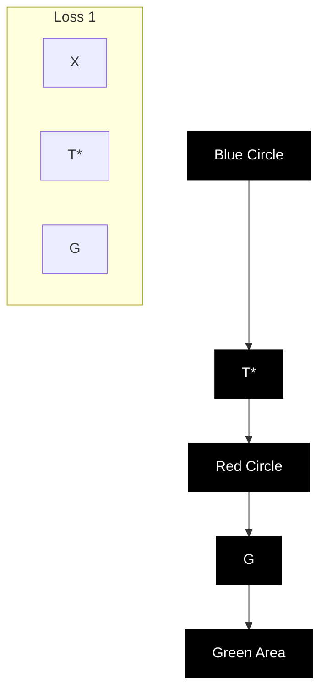
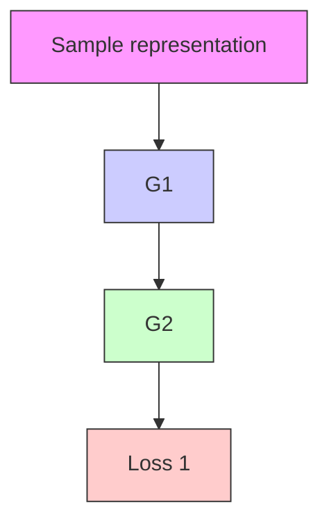

# GarFast: Realistic and Fast Garment Transfer with a Simplified Parser-Free Approach

Chenghu Du $^{1}$ , Junyin Wang $^{1}$ , Yi Rong $^{1,2*}$ , Feng Yu $^{5}$ , Shengwu Xiong $^{3,4*}$

$^{1}$ School of Computer Science and Artificial Intelligence, Wuhan University of Technology, Wuhan, 430070

$^{2}$ Sanya Science and Education Innovation Park, Wuhan University of Technology, Sanya, 572000

$^{3}$ Shanghai Artificial Intelligence Laboratory, Shanghai, 200232

$^{4}$ Interdisciplinary Artificial Intelligence Research Institute, Wuhan College, Wuhan, 430212

$^{5}$ School of Computer Science and Artificial Intelligence, Wuhan Textile University, Wuhan, 430200

{duch, wjy199708, yrong, xiongsw}@whut.edu.cn, yufeng@wtu.edu.cn

# Abstract

A good garment try-on model should learn the transfer between different types of garments while satisfying: 1) high fidelity and 2) low inference speed. Existing methods address either of these two issues, limited processing speed or low generation quality. We directly use a lightweight encoder-decoder, ensuring faster speeds. To tackle the problem of lower image quality typically generated by lighter models, we present GarFast, a simplified, parser-free framework that optimizes the same lightweight network through a two-stage transformation of real data roles (from input to supervision), thereby greatly promoting model convergence. Specifically, first, we propose a correction strategy to prevent the difficulty of convergence caused by the lack of ground truth in the first stage. Second, we propose a fine-grained domain consistency to ensure that the results generated in the unsupervised first stage are highly realistic clothed human images. Finally, we propose a skin-variant refinement loss and a skinMix regularization to amplify texture differences and enhance the realism of skin-variant regions, thereby improving the quality of the generated skin. Extensive experiments thoroughly demonstrate that our method achieves high resolution, near real-time performance, and superior reconstruction quality compared to state-of-the-art approaches, with processing times of less than 0.03 seconds on an Nvidia A100.

# Introduction

Garment transfer tasks aim to realistically put garment items from in-store garment images onto the person in user photos. The widespread demand for online garment try-ons within the apparel industry has garnered significant attention, underscoring its immense potential commercial value. Given a target garment image and an image of a person wearing that garment, this task requires learning to transfer any garment using only these two images. To address this, parser-based methods are proposed, which pre-train a human parser to segment (remove) the garment region from the person's image, and then inpaint (reconstruct) this region with the target garment for the rest of the person's image through self-supervised training (Yang et al. 2020; Ge et al. 2021a; Yang, Yu, and Liu 2022; Xie et al. 2023).

flowchart

(a) Knowledge Distillation

scatter

| Model           | FID  |
| --------------- | ---- |
| Paint-by-Example | 12   |
| LaDI-VTON       | 11   |
| StableVTON      | 10   |
| DCI-VTON        | 9    |
| GarFast (Ours)  | 9    |

Runtime (seconds)

flowchart

(b) Cycle-Consistency

```mermaid
graph TD
    A["Blue Circle"] --> B["Blue Circle"]
    C["Red Circle"] --> D["Blue Circle"]
    E["Green Area"] --> F["Blue Area"]
    G["Blue Area"] --> H["Blue Area"]
    I["Blue Area"] --> J["Blue Area"]
    K["Blue Area"] --> L["Blue Area"]
    M["Blue Area"] --> N["Blue Area"]
    O["Blue Area"] --> P["Blue Area"]
    Q["Blue Area"] --> R["Blue Area"]
    S["Blue Area"] --> T["Blue Area"]
    U["Blue Area"] --> V["Blue Area"]
    W["Blue Area"] --> X["Blue Area"]
    Y["Blue Area"] --> Z["Blue Area"]
    AA["Blue Area"] --> AB["Blue Area"]
    AC["Blue Area"] --> AD["Blue Area"]
    AE["Blue Area"] --> AF["Blue Area"]
    AG["Blue Area"] --> AH["Blue Area"]
    AI["Blue Area"] --> AJ["Blue Area"]
    AK["Blue Area"] --> AL["Blue Area"]
    AM["Blue Area"] --> AN["Blue Area"]
    AO["Blue Area"] --> AP["Blue Area"]
    AQ["Blue Area"] --> AR["Blue Area"]
    AS["Blue Area"] --> AT["Blue Area"]
    AU["Blue Area"] --> AV["Blue Area"]
    AW["Blue Area"] --> AX["Blue Area"]
```

flowchart

(c) GarFast (ours)   
Figure 1: Comparison of prevalent garment transfer approaches. Within the same person domain X, given a garment and an original (real) person wearing this garment: (a) Knowledge distillation first trains a teacher network $T^{*}$ to translate a person's representation (e.g. human paring) into a fake person wearing any garment. Then, a student network G is trained to reverse this translation back to the original person. (b) Vanilla cycle consistency uses two networks, $G_{1}$ and $G_{2}$ , to translate the person's representation into the fake person sequentially and then from the fake person's representation back to the original person. (c) Our proposed method is a faster, simplified pipeline that translates the real person to the fake person and back using only one network, G. The top right plot is another comparison demonstrating that our approach can achieve excellent image realism in near real-time. Loss 1 and Loss 2 are different consistency losses.

However, it has been demonstrated that even slightly inaccurate segmentation (e.g., human parsing) can lead to highly unrealistic garment transfer outcomes (Issenhuth, Mary, and Calauzenes 2020; Ge et al. 2021b). Therefore, using pseudo-labels (fake garment transfer results with arbitrary garments generated by the classic work (Yang et al. 2020; Bai et al. 2022; Yang, Yu, and Liu 2022; Li, Zhang, and Forsyth 2023)) with minimal errors as a substitute for human parsing has become a more effective method. To this end, a parser-free pipeline, knowledge distillation (Issenhuth, Mary, and Calauzenes 2020; Ge et al. 2021b; He, Song, and Xiang 2022), is proposed (see Figure 1 (a)), which involves pre-training a teacher network to provide a student

network with the required prior knowledge (pseudo-labels) for fully supervised learning. However, since the teacher network is pre-trained based on human parsing representations, the pseudo-labels it provides for the student network inevitably contain some irresponsible knowledge (Ge et al. 2021b), which indirectly limits the student network's performance by constraining it to the teacher's knowledge.

Recently, another pipeline for garment transfer based on cycle consistency (Zhu et al. 2017) was proposed (Ge et al. 2021a) (Figure 1 (b)). This pipeline consists of two networks: Network 1 provides pseudo-labels to Network 2, while Network 2 reconstructs the input of Network 1 to maintain consistency. However, to ensure convergence, this method still relies on the parser and uses additional, potentially unreliable, consistency loss to supervise the first network. Although an upgraded version (Du et al. 2024) removes the parser at the input stage, it introduces pseudo-labels as ground truth at the supervision stage. As expected, using flawed pseudo-labels for supervision leads to inaccurate training guidance for garment transfer. Additionally, this dual-network architecture slows down both training and inference speeds (see Table 2).

To tackle the aforementioned issues, we present a new parser-free method with only one model, GarFast (see Figure 1 (c)), which operates at high resolution and delivers superior quality compared to current state-of-the-art optimization methods. GarFast is well-suited for interactive applications due to its use of a single lightweight encoder-decoder during both training and inference, ensuring faster processing speeds. However, there is a common trade-off: the lighter the network, the poorer the quality of the results tends to be. To counteract this, GarFast optimizes the same weight-shared lightweight network through a two-stage transformation involving real data roles, shifting from input in the first stage to supervision in the second stage. In essence, by collaboratively optimizing the same network across two stages, we can significantly enhance the effective convergence of the model.

Specifically, to prevent the difficulty of convergence caused by the lack of ground truth in the first stage, we propose a correction strategy in the early stage of training, which guides the network towards high-quality identity consistency by distinguishing and then mixing identity-invariant and variant regions during garment transfer. To ensure that the results generated in the unsupervised first stage are highly realistic human images (see Figure 8 (D)), we propose a fine-grained domain consistency, which narrows the domain (distribution) gap between each pixel of the generated results in the first stage and that of real images through pixel-level supervision. To improve the quality of generated skin, we propose a skin-variant refinement loss. Specifically, since the target garments in the two stages are different, the textures of the regions where the shapes of the two garments differ must also be different. For example, if this region has a skin texture in the first stage, it must have a garment texture in the second stage, and vice versa (see Figure 3). Therefore, we introduce this loss to amplify the texture difference in this region between the two stages. In addition, we propose a skinMix regularization to emphasize the optimization of skin-variant regions by utilizing a weight-shared discriminator. This technique increases the discriminator's sensitivity to skin by mixing the skin regions of generated images with other regions of real images.

In general, the contributions of this work are as follows:

- We introduce a novel two-stage, parser-free framework for garment transfer named GarFast, which quickly generates realistic try-on results, offering a new perspective.   
- We propose a correction strategy to prevent the difficulty of convergence caused by the lack of ground truth in the first stage.   
- We propose a fine-grained domain consistency to ensure that the results generated in the unsupervised first stage are highly realistic human images.   
- We propose a skin-variant refinement loss to amplify the texture difference of skin-variant regions, thereby improving the quality of the generated skin.   
- We propose a skinMix regularization to emphasize the optimization of skin-variant regions towards realism by utilizing a weight-shared discriminator.

# Proposed Approach

Problem Formulation. Given a specific person image $p \in R^{H \times W \times 3}$ and a target garment image $g_{un} \in R^{H \times W \times 3}$ , the garment transfer aims to make the person p put on the garment $g_{un}$ . In other words, it involves generating the desired virtual garment try-on outcome $t_{un} \in R^{H \times W \times 3}$ , where p is wearing $g_{un}$ . H, W, and 3 denote the height, width, and number of channels of the image, respectively.

Let $D_{train} = \{(g^i, p^i)\}_{i=1}^K$ be a training dataset, where $K$ indicates the total quantity of sample sets. The characteristic of $D_{train}$ is that $g^k$ and $p^k$ are paired, meaning $p^k$ is wearing $g^k$ ; furthermore, $D_{train}$ does not include $p^k$ wearing any other garment due to collecting them is labor-intensive. However, during the actual inference stage, the target garment image $g_{un}$ given for $p^k$ is random, that is, they are unpaired. Therefore, learning garment transfer through paired $(g, p)$ samples is challenging.

To address this issue, previous works proposed two approaches: 1) Knowledge distillation pipeline (Issenhuth, Mary, and Calauzenes 2020; Ge et al. 2021b; He, Song, and Xiang 2022), which constructs a new dataset with triplets $\{(g, t_{un}), p\}$ to training the student network to reconstruct $p$ from $(g, t_{un})$ . $t_{un}$ represents $p$ wearing arbitrary garment $g_{un}$ , which is generated by the teacher model based on other ready-made works. 2) Cycle consistency pipeline, its process is essentially similar to knowledge distillation, with the difference being that its $t_{un}$ is synchronously generated during the training of the main network. Although both methods are easy to implement, $t_{un}$ has become their bottleneck due to some irresponsible prior knowledge in the teacher network and the lack of effective supervision for $t_{un}$ . In this paper, we will show that we can train a high-performance garment transfer network with only triplets $\{g, g_{un}, p\}$ , where $p$ serves both as input and ground truth.

```mermaid
graph TD
    A["Real Person p"] --> B[" Fake Person tun"]
    C["Real Person p"] --> D[" Fake Person t"]
    E["Farper Garment gun"] --> F[" Fake Garment g"]
    G["Farper Garment gun"] --> H[" Fake Garment gun"]
    I["Farper Garment g"] --> J[" Fake Garment g"]
    K["Farper Garment g"] --> L[" Fake Garment g"]
    M["Farper Garment g"] --> N[" Fake Garment g"]
    O["Farper Garment g"] --> P[" Fake Garment g"]
    Q["Farper Garment g"] --> R[" Fake Garment g"]
    S["Farper Garment g"] --> T[" Fake Garment g"]
    U["Farper Garment g"] --> V[" Fake Garment g"]
    W["Farper Garment g"] --> X[" Fake Garment g"]
    Y["Farper Garment g"] --> Z[" Fake Garment g"]
    AA["Farper Garment g"] --> AB[" Fake Garment g"]
    AC["Farper Garment g"] --> AD[" Fake Garment g"]
    AE["Farper Garment g"] --> AF[" Fake Garment g"]
    AG["Farper Garment g"] --> AH[" Fake Garment g"]
    AI["Farper Garment g"] --> AJ[" Fake Garment g"]
    AK["Farper Garment g"] --> AL[" Fake Garment g"]
    AM["Farper Garment g"] --> AN[" Fake Garment g"]
    AO["Farper Garment g"] --> AP[" Fake Garment g"]
    AQ["Farper Garment g"] --> AR[" Fake Garment g"]
    AS["Farper Garment g"] --> AT[" Fake Garment g"]
    AU["Farper Garment g"] --> AV[" Fake Garment g"]
    AW["Farper Garment g"] --> AX[" Fake Garment g"]
    AY["Supervision"] --> AZ["Fake Person t"]
    BA["Fake Person t"] --> BB["Fake Person tun"]
    BC["Fake Person t"] --> BD["Fake Person tun"]
    BE["Fake Person t"] --> BF["Fake Person tun"]
    BG["Fake Person t"] --> BH["Fake Person tun"]
    BI["Fake Person t"] --> BJ["Fake Person tun"]
    BK["Fake Person t"] --> BL["Fake Person tun"]
    BM["Fake Person t"] --> BN["Fake Person tun"]
    BO["Fake Person t"] --> BP["Fake Person tun"]
    BQ["Fskin-variant Refinement"] --> BR["Mix p & t w/ Mvar"]
    BS["Mix p & t w/ 1-Mvar"] --> BT["Mix p & t w/ 1-Mvar"]
    BU["Mix p & t w/ Dpixel"] --> BV["Mix p & t w/ Dpixel"]
    BW["Mix p & t w/ Dpixel"] --> BX["Mix p & t w/ Dpixel"]
    BY["Mix p & t w/ Mvar"] --> BZ["Mix p & t w/ Mvar"]
    CA["Mix p & t w/ Dpixel"] --> CB["Mix p & t w/ Mvar"]
    CC["Mix p & t w/ Dpixel"] --> CD["Mix p & t w/ Mvar"]
    BEQ["Mix p & t w/ Mvar"] --> BRQ["Mix p & t w/ Mvar"]
    BQ --> BRQ
    BCQ["Mix p & t w/ Mvar"] --> BZ
    CAQ["Mix p & t w/ Mvar"] --> BZ
    BQ --> BZ
    CCQ["Mix p & t w/ Mvar"] --> BZ
    BQ --> CCQ
    CCQ --> CCQ
    DQ["Discriminator"] --> AE["G Synthesis Network"]
    AE --> AF["Correction Strategy"]
    AF --> AG["Training"]
    AG --> AH["Inference"]
    AH --> AI["Data Flow"]
    AI --> AJ["Supervision"]
    AK["Discriminator"] --> AK["G Synthesis Network"]
    AK --> AL["Correction Strategy"]
    AL --> AM["Training"]
    AM --> AN["Inference"]
    AN --> AO["Data Flow"]
    AO --> AP["Supervision"]
```

flowchart

Figure 2: Overview architecture of our GarFast, containing a generator G and two ResUnet-discriminators $D_{fine}$ and $D_{pixel}$ . On the far right is the inference process of the generator G.

# Pre-processing

Garment Warping. The target garment $g/g_{un}$ needs to be warped naturally to visually align with the corresponding regions of the reference person p. We directly adopt off-the-shelf warping network W (He, Song, and Xiang 2022; Xie et al. 2023) to generate the warped garment $\hat{g}/\hat{g}_{un}$ :

$$
\mathbf {f} / \mathbf {f} _ {\mathbf {u n}} = \mathcal {W} (p, g / g _ {u n}), \quad \hat {g} / \hat {g} _ {u n} = \mathcal {B} (g / g _ {u n}, \mathbf {f} / \mathbf {f} _ {\mathbf {u n}}), \tag {1}
$$

where $\mathcal{B}(\cdot,\cdot)$ denotes the bi-linear interpolation based on generated deformation field $f/f_{un}\in\mathbb{R}^{H\times W\times2}$ .

Mask Generation. We utilize the deformation field $f/f_{un}$ to warp the garment mask $\{\mu_{un}, \mu\}$ :

$$
\hat {\mu} = \mathcal {B} (\mu , \mathbf {f}), \hat {\mu} _ {u n} = \mathcal {B} (\mu_ {u n}, \mathbf {f} _ {\mathbf {u n}}). \tag {2}
$$

# Proposed Fast Framework

As illustrated in Figure 2, our framework consists of a weight-shared generator G, a weight-shared discriminator $D_{pixel}$ , and another discriminator $D_{fine}$ .

Generator. Given the pair $(p, \hat{g})$ , and assuming an any garment try-on result $t_{un}$ of the person image p, our generator G synthesizes the try-on result $t = \mathcal{G}(t_{un}, \hat{g})$ , where t is the reconstruction result for p, minimizing the difference between t and p can optimize generator G. However, it poses a problem: how to obtain $t_{un}$ ?

Discriminator. Our discriminators $D_{pixel}$ and $D_{fine}$ consists of ResUnet (Diakogiannis et al. 2020). Each discriminator outputs a $W \times H \times 1$ dimensional prediction probability, encoding whether a pixel is from a real or generated data distribution.

# Garment Transfer Result Synthesis

In this section, based on the previous cycle structure (Ge et al. 2021a; Du et al. 2024), we propose a novel concept: "provide for oneself what one needs." Specifically, we abandon all auxiliary networks that may introduce irresponsible knowledge and incorrect training guidance. Instead, we rely solely on ourselves to provide everything we need.

Improved Two-stage Constraints. To obtain G through fully supervised learning, the cycle structure is divided into two stages. Thus, $t = \mathcal{G}(t_{un}, \hat{g})$ is transformed into:

$$
\underbrace {t _ {u n} = \mathcal {G} (p , \hat {g} _ {u n})} _ {\text { first   stage }}, \underbrace {t = \mathcal {G} (t _ {u n} , \hat {g})} _ {\text { second   stage }}, \tag {3}
$$

unlike the method (Du et al. 2024), where $t_{un} := \operatorname{sg}[t_{un}]$ (stop-gradient operation) to prevent that G is free to ignore the garment condition $\hat{g}_{un}$ by finding a solution satisfying:

$$
P _ {\mathcal {G}} (p | \hat {g} _ {u n}) = P _ {\mathcal {G}} (p), \tag {4}
$$

where $P_{\mathcal{G}}(x)$ is generator distribution. There should be high mutual information between $\hat{g}_{un}$ and the generator distribution $\mathcal{G}(p, \hat{g}_{un})$ . Thus $I(\hat{g}_{un}; \mathcal{G}(p, \hat{g}_{un}))$ should be high (Chen et al. 2016). In other words, ignoring $\hat{g}_{un}$ can wrongly merge the two stages into one, as the input is p and the output needs to reconstruct p. Therefore, if this combination is not disrupted using $s g[\cdot]$ , $\hat{g}_{un}$ will be disregarded by G, causing the correlation between $\hat{g}_{un}$ and $t_{un}$ to disappear.

However, the first stage of G lacks supervision during the early training stages, leading to low-quality inputs for the second stage. This can result in inefficient convergence or even cause G to get stuck in local optima.

Correction Strategy. To facilitate high-efficiency convergence while preserving identity-invariant information (e.g., head, hands) of p as much as possible, we introduce a correction strategy for G during the early training stage to prevent falling into local optima. Thus, $t_{un}$ in Equation (3) is transformed into:

$$
t _ {u n} = \left\{ \begin{array}{l l} \operatorname{sg} [ t _ {u n} ] & , \text {   if   } k > E _ {h}, \\ S _ {i d} \odot p + (1 - S _ {i d}) \odot \operatorname{sg} [ t _ {u n} ], & \text { otherwise }, \end{array} \right. \tag {5}
$$

where k is the current number of training epochs. $E_{h}$ denotes early training iterations. $\odot$ denotes element-wise multiplication, $S_{id} \in \{0, 1\}^{H \times W \times 1}$ is the identity-invariant semantic map (a semantic layer combination that includes areas such as the head, legs, etc.) of p, which is from an off-the-shelf semantic segmentation model (Gong et al. 2018).

# Training Objectives

Given the triplet $\{\hat{g},\hat{g}_{un},p\}$ , we train our framework using the following objectives.

text_image

tun
Mvar
t/p
Real Image
t
Fake Image
Mask
SkinMix

Figure 3: A randomized case of variable skin area $M_{var}$ between t/p and $t_{un}$ .

Adversarial Objective. To make the generated image indistinguishable from the real one, we propose two pixel-level adversarial losses to optimize G.

\- Fine-grained Domain Consistency. Since the first stage lacks ground truth, we employ a ResUNet discriminator $\mathcal{D}_{fine}$ (Sushko et al. 2022), which outputs a $W \times H \times 1$ dimensional prediction probability for input pair $(t_{un}, p)$ . This encourages the per-pixel distribution of the output images $t_{un}$ to align with that of real images $p$ .

$$
\begin{array}{l} \mathcal {L} _ {D f i n e} = \mathbb {E} _ {p} \left[ \sum_ {i} ^ {H} \sum_ {j} ^ {W} \log \mathcal {D} _ {f i n e} (p) _ {i, j, 1} \right] \tag {6} \\ + \mathbb {E} _ {t _ {u n}} \Big [ \sum_ {i} ^ {H} \sum_ {j} ^ {W} \log \Big (1 - \mathcal {D} _ {f i n e} (t _ {u n}) \Big) _ {i, j, 1} \Big ]. \\ \end{array}
$$

This objective can forcefully ensure that the output domain of G belongs to the real image. However, this is limited for the second stage, $L_{Dfine}$ can only ensure that the output $t_{un}$ is a “person”, but the specific appearance (content and structure) of the $t_{un}$ cannot be supervised.

\- Pixel-level SkinMix Regularization. To address this, we employ another weight-shared ResUnet discriminator $\mathcal{D}_{pixel}$ to regularize $\mathcal{G}$ . Given a pair $(t,p)$ , $\mathcal{D}_{pixel}$ also outputs a $W\times H\times 1$ dimensional tensor. The difference is that this encourages the per-pixel class of the output images $t$ to align with that of $p$ . As shown in Figure 3, as the garment changes, the color and texture in the variant area $M_{var}$ of $t$ and $t_{un}$ are different; however, using $t_{un}$ as input to generate $t$ will result in similar appearance in the region $M_{var}$ because it is more beneficial for convergence.

To encourage $D_{pixel}$ to sensitively focus on this difference, we propose a SkinMix regularization. First, the warped garment mask $\{\hat{\mu}_{un}, \hat{\mu}\}$ are used to locate variant skin area

$$
M _ {v a r} = \hat {\mu} _ {u n} \odot (1 - \hat {\mu}), \tag {7}
$$

where $M_{var} \in \{0,1\}^{H \times W \times 1}$ is a binary mask. $\odot$ denotes element-wise multiplication. Then, $M_{var}$ is used to mix the pair $(t,p)$ : $\text{SkinMix}(p,t,M_{var}) = M_{var} \odot p + (1 - M_{var}) \odot t$ . Afterwards, we further train $D_{pixel}$ to be equivariant under the SkinMix operation, which is achieved by

$$
\begin{array}{l} \mathcal {L} _ {D p i x e l} = \left\| \mathcal {D} _ {p i x e l} \left(\operatorname{SkinMix} (p, t, M _ {v a r})\right) \right. \\ \left. - \operatorname{SkinMix} \left(\mathcal {D} _ {\text { pixel }} (p), \mathcal {D} _ {\text { pixel }} (t), M _ {\text { var }}\right) \right\| _ {2} \\ + \left\| \mathcal {D} _ {\text { pixel }} \left(\text { SkinMix } (t, p, M _ {\text { var }})\right) \right. \tag {8} \\ \left. - \operatorname{SkinMix} \left(\mathcal {D} _ {\text { pixel }} (t), \mathcal {D} _ {\text { pixel }} (p), M _ {\text { var }}\right) \right\| _ {2}. \\ \end{array}
$$

where $\|\|_{2}$ denotes $\ell_{2}$ norm. This objective is more sensitive to changes in skin areas using two mixing approaches.

Perceptual-level Skin-variant Refinement. To further enable G to distinguish and amplify the differences in color and texture within the region $M_{var}$ , we propose a perceptual-level skin-variant refinement loss to explicitly regularize G to refine skin area $M_{var}$ of t:

$$
\mathcal {L} _ {s v r} = \mathbb {E} _ {t, p, \hat {g} _ {u n}} \left[ \left\| M _ {v a r} (t - \operatorname{sg} [ \mathcal {G} (p, \hat {g} _ {u n}) ]) \right\| _ {p e r} \right], \tag {9}
$$

where $sg[\cdot]$ is the stop-gradient operation. $\|\|_{per}$ denotes perceptual loss (Johnson, Alahi, and Fei-Fei 2016). Maximizing this term forces G to amplify the appearance differences between t and $t_{un}$ in area $M_{var}$ .

Retaining Source Appearances. To guarantee that the transfer result $\mathcal{G}(p,\hat{g}_{un})$ effectively retains the identity-invariant characteristics (e.g., head, hands) of the input image p, we employ the cycle consistency loss (Zhu et al. 2017)

$$
\mathcal {L} _ {c y c} = \mathbb {E} _ {p, \hat {g} _ {u n}, \hat {g}} \left[ \left\| p - \mathcal {G} \big (\mathcal {G} (p, \hat {g} _ {u n}), \hat {g} \big) \right\| _ {1 / p e r} \right], \tag {10}
$$

where $\|\|_{1/per}$ denotes $\ell_{1}$ norm and perceptual loss. By encouraging G to reconstruct p with the warped garment $\hat{g}$ , G learns to retain the original characteristics of p while accurately changing its garment faithfully.

Full Objective. The full objective functions to optimize $\mathcal{G}$ , $\mathcal{D}_{pixel}$ , and $\mathcal{D}_{fine}$ as:

$$
\begin{array}{l} \min _ {\mathcal {G}} \max _ {\mathcal {D} _ {p i x e l}, \mathcal {D} _ {f i n e}} \lambda_ {1} \mathcal {L} _ {D f i n e} + \lambda_ {2} \mathcal {L} _ {D p i x e l} + \lambda_ {3} \mathcal {L} _ {c y c} \tag {11} \\ - \lambda_ {4} \mathcal {L} _ {s v r}, \\ \end{array}
$$

where $\lambda_{1},\lambda_{2},\lambda_{3}$ , and $\lambda_{4}$ are hyper-parameters controlling relative importance between different losses.

# Experiments

Datasets. Our experiments use VITON (Han et al. 2018), VITON-HD (Choi et al. 2021), and DressCode (Morelli et al. 2022), which are three challenging datasets in virtual garment try-on. VITON consists of 16,253 image groups with a resolution of $256 \times 192$ . Each group includes a frontal-view woman image, a top garment image, a semantic map, and a pose heatmap. VITON is split into a training set with 14,221 groups and a testing set with 2,032 groups. VITON-HD is a high-resolution dataset with a resolution of $512 \times 384$ . It comprises 13,679 image groups and is split into a training set with 11,647 groups and a testing set with 2,032 groups. DressCode is another high-resolution dataset with a resolution of $512 \times 384$ . It comprises 15,363 image groups and is split into a training set with 12,863 groups and a testing set with 2,500 groups.

Implementation Details. All experiments are performed on a single NVIDIA V100 GPU through PyTorch. By default, we set the batch size to 32 for training over 200 epochs. We utilize the AdamW optimizer (Loshchilov and Hutter 2017) with parameters $\beta_{1}=0.5$ and $\beta_{2}=0.999$ . The initial learning rate is set to $1e^{-4}$ and linearly decays to 0 after 100 epochs. The hyper-parameters are set as: $E_{h}=100$ ; in the loss function, $\lambda_{1}=0.5$ , $\lambda_{2}=0.5$ , $\lambda_{3}=5$ , and $\lambda_{4}=1$ .

text_image

Person Garment CP-VTON CP-VTON++
DCTON RT-VTON USC-PFN LDM-based Ours Input DCTON Ours Input USC-PFN Ours
NIKE

Figure 4: Qualitative results with different baseline methods on the VITON dataset. Red boxes represent defects.

<table><tr><td>Methods</td><td>Publication</td><td>Parser-free</td><td>SSIM ↑</td><td>FID ↓</td></tr><tr><td>VITON</td><td>CVPR&#x27;18</td><td>✕</td><td>0.74</td><td>55.71</td></tr><tr><td>CP-VTON</td><td>ECCV&#x27;18</td><td>✕</td><td>0.72</td><td>24.45</td></tr><tr><td>VTNFP</td><td>ICCV&#x27;19</td><td>✕</td><td>0.80</td><td>n/a</td></tr><tr><td>Cloth-flow</td><td>CVPR&#x27;19</td><td>✕</td><td>0.84</td><td>14.43</td></tr><tr><td>CP-VTON+</td><td>CVPRW&#x27;20</td><td>✕</td><td>0.75</td><td>21.04</td></tr><tr><td>SieveNet</td><td>WACV&#x27;20</td><td>✕</td><td>0.77</td><td>n/a</td></tr><tr><td>ACGPN</td><td>CVPR&#x27;20</td><td>✕</td><td>0.84</td><td>16.64</td></tr><tr><td>LM-VTON</td><td>AAAI&#x27;21</td><td>✕</td><td>0.85</td><td>17.18</td></tr><tr><td>DCTON</td><td>CVPR&#x27;21</td><td>✕</td><td>0.83</td><td>14.82</td></tr><tr><td>ZFlow</td><td>ICCV&#x27;21</td><td>✕</td><td>0.88</td><td>15.17</td></tr><tr><td>OVNet</td><td>CVPR&#x27;21</td><td>✕</td><td>0.85</td><td>15.78</td></tr><tr><td>PF-AFN</td><td>CVPR&#x27;21</td><td>✕</td><td>0.89</td><td>10.21</td></tr><tr><td>RT-VTON</td><td>CVPR&#x27;22</td><td>✕</td><td>n/a</td><td>11.66</td></tr><tr><td>DAFlow</td><td>ECCV&#x27;22</td><td>✕</td><td>0.88</td><td>12.05</td></tr><tr><td>Dress Code</td><td>CVPR&#x27;22</td><td>✕</td><td>0.89</td><td>13.71</td></tr><tr><td>CIT</td><td>TMM&#x27;23</td><td>✕</td><td>0.83</td><td>13.97</td></tr><tr><td>PL-VTON</td><td>TMM&#x27;23</td><td>✕</td><td>0.87</td><td>10.96</td></tr><tr><td>POVNet</td><td>TPAMI&#x27;23</td><td>✕</td><td>0.89</td><td>13.37</td></tr><tr><td>USC-PFN</td><td>NeurIPS&#x27;23</td><td>✕</td><td>0.91</td><td>10.47</td></tr><tr><td>LDM-based</td><td>This Work</td><td>✕</td><td>0.90</td><td>9.93</td></tr><tr><td>GarFast (Ours)</td><td>This Work</td><td>✕</td><td>0.93</td><td>9.39</td></tr></table>

Table 1: Quantitative comparisons on the VITON dataset. "Parser-free" denotes whether the parser is used during inference. Bold denotes the best result.

Quantitative Evaluation Metrics To facilitate quantitative evaluation, we set up evaluation metrics as follows.

- Structural Similarity. We take paired $(p, g)$ in the testing set as inputs, then we employ Structure Similarity (SSIM) (Seshadrinathan and Bovik 2008) and Learned Perceptual Image Patch Similarity (LPIPS) (Zhang et al. 2018) to evaluate the structural and perceptual similarity between real and generated images in terms of brightness, contrast, and structure.   
- Distribution Discrepancy. We take unpaired $(p, g_{un})$ in the testing set as inputs, then we use Fréchet Inception Distance (FID) (Heusel et al. 2017) and Kernel Inception Distance (KID) (Bińkowski et al. 2018) to measure distribution discrepancy between real and generated images.

Baseline Methods. To conduct qualitative experiments, we employ 29 state-of-the-art methods, including VITON

<table><tr><td>Methods</td><td>Parser</td><td>#Params</td><td>FLOPs</td><td>FPS</td></tr><tr><td>DCI-VTON</td><td>✓</td><td></td><td></td><td></td></tr><tr><td>Anydoor</td><td>✓</td><td> $\gg 900M$ </td><td> $\gg 800G$ </td><td>&lt; 0.4</td></tr><tr><td>StableVTON</td><td>✓</td><td></td><td></td><td></td></tr><tr><td>DCTON</td><td>✓</td><td>153.0M</td><td>194.0G</td><td>78</td></tr><tr><td>PF-AFN</td><td>✗</td><td>43.90M</td><td>87.80G</td><td>126</td></tr><tr><td>Style-Flow</td><td>✗</td><td>43.90M</td><td>87.80G</td><td>126</td></tr><tr><td>USC-PFN</td><td>✗</td><td>69.86M</td><td>92.19G</td><td>122</td></tr><tr><td>GarFast (Ours)</td><td>✗</td><td>10.98M</td><td>22.27G</td><td>147</td></tr></table>

Table 2: Computational complexity analysis on VITON.

(Han et al. 2018), CP-VTON (Wang et al. 2018), Cloth-flow (Han et al. 2019), CP-VTON+ (Minar et al. 2020), SieveNet (Jandial et al. 2020), VTNFP (Yu, Wang, and Xie 2019), ACGPN (Yang et al. 2020), DCTON (Ge et al. 2021a), PF-AFN (Ge et al. 2021b), ZFlow (Chopra et al. 2021), OVNet (Li et al. 2021), LM-VTON (Liu et al. 2021), DAFlow (Bai et al. 2022), Style-Flow (He, Song, and Xiang 2022), RT-VTON (Yang, Yu, and Liu 2022), Dress Code (Morelli et al. 2022), VITON-HD (Choi et al. 2021), HR-VITON (Lee et al. 2022), CIT (Ren et al. 2023), PL-VTON (Zhang et al. 2023), POVNet (Li, Zhang, and Forsyth 2023), GP-VTON (Xie et al. 2023), USC-PFN (Du et al. 2024), and diffusion models LaDI-VTON (Morelli et al. 2023), PbE (Yang et al. 2023), DCI-VTON (Gou et al. 2023), StableVITON (Kim et al. 2024), OOTDiffusion (Xu et al. 2024), and Anydoor (Chen et al. 2024), as baseline methods for quantitative evaluation and select several publicly available methods for qualitative evaluation.

# Comparison with SOTA Methods

Qualitative Results. The qualitative comparison with GAN-based methods, diffusion-based methods, and ours is shown in Figures 4 and 5. It can be observed that after completing the garment transfer, all methods exhibit errors to varying degrees in the skin and garment regions. Among them, GAN-based methods such as GP-VTON (Xie et al. 2023) may produce incorrect garment appearance fusion and unnatural skin generation, which is due to their lack of pixel-level distribution supervision for the garment try-on results. Diffusion-based methods can generate realistic human figures, but they struggle to faithfully reconstruct the shape

<table><tr><td rowspan="2">Train / Test Methods</td><td rowspan="2">Publication</td><td colspan="4">VITON-HD</td><td colspan="4">DressCode Upper</td><td rowspan="2">Time (s) ↓</td></tr><tr><td>SSIM ↑</td><td>LPIPS ↓</td><td>FID ↓</td><td>KID ↓</td><td>SSIM ↑</td><td>LPIPS ↓</td><td>FID ↓</td><td>KID ↓</td></tr><tr><td>VITON-HD (Choi et al. 2021)</td><td>CVPR&#x27;21</td><td>0.862</td><td>0.117</td><td>12.117</td><td>3.23</td><td>n/a</td><td>n/a</td><td>n/a</td><td>n/a</td><td>0.17</td></tr><tr><td>HR-VITON (Lee et al. 2022)</td><td>ECCV&#x27;22</td><td>0.878</td><td>0.105</td><td>11.265</td><td>2.73</td><td>0.936</td><td>0.065</td><td>13.82</td><td>2.71</td><td>0.13</td></tr><tr><td>GP-VTON (Xie et al. 2023)</td><td>CVPR&#x27;23</td><td>0.884</td><td>0.081</td><td>9.701</td><td>1.26</td><td>0.769</td><td>0.270</td><td>20.11</td><td>8.17</td><td>0.05</td></tr><tr><td>LaDI-VTON (Morelli et al. 2023)</td><td>MM&#x27;23</td><td>0.864</td><td>0.096</td><td>9.480</td><td>1.99</td><td>0.915</td><td>0.063</td><td>14.26</td><td>3.33</td><td>11.31</td></tr><tr><td>PbE (Yang et al. 2023)</td><td>CVPR&#x27;23</td><td>0.802</td><td>0.143</td><td>11.939</td><td>3.85</td><td>0.897</td><td>0.078</td><td>15.33</td><td>4.64</td><td>6.13</td></tr><tr><td>DCI-VTON (Gou et al. 2023)</td><td>MM&#x27;23</td><td>0.880</td><td>0.080</td><td>8.754</td><td>1.10</td><td>0.937</td><td>0.042</td><td>11.92</td><td>1.89</td><td>5.90</td></tr><tr><td>StableVITON (Kim et al. 2024)</td><td>CVPR&#x27;24</td><td>0.864</td><td>0.084</td><td>9.465</td><td>1.40</td><td>0.911</td><td>0.050</td><td>11.27</td><td>0.72</td><td>14.17</td></tr><tr><td>Anydoor (Chen et al. 2024)</td><td>CVPR&#x27;24</td><td>0.821</td><td>0.099</td><td>10.850</td><td>2.46</td><td>0.899</td><td>0.119</td><td>14.83</td><td>3.05</td><td>n/a</td></tr><tr><td>GarFast (Ours)</td><td>This Work</td><td>0.908</td><td>0.070</td><td>9.640</td><td>1.21</td><td>0.949</td><td>0.036</td><td>12.01</td><td>1.13</td><td>≈ 0.02</td></tr></table>

Table 3: Quantitative comparisons on the VITON-HD and DressCode datasets. For LPIPS, FID, and KID, the lower the better. For SSIM, the higher the better. Underline represents second best.

Figure 5: Qualitative results with different baseline methods on the VITON-HD dataset. 

<table><tr><td>Methods</td><td>SSIM ↑</td><td>FID ↓</td></tr><tr><td>(A) Baseline</td><td>0.47</td><td>106.79</td></tr><tr><td>(B) + Correction Strategy</td><td>0.89</td><td>10.78</td></tr><tr><td>(C) + Skin-variant Refinement</td><td>0.90</td><td>10.26</td></tr><tr><td>(D) + Fine-grained Domain Consistency</td><td>0.92</td><td>9.66</td></tr><tr><td>(E) + SkinMix Regularization</td><td>0.93</td><td>9.39</td></tr></table>

Table 4: Ablation results. Performance of various configurations on VITON. Baseline is only a two-stage architecture.

and detailed features of the garment. For example, StableV-TON (Kim et al. 2024), which relies solely on empirical and coarse-grained garment information for guidance, often results in generated outcomes that do not match the appearance of the target garment. In contrast, our method can preserve identity information well and generate more realistic skin and garment areas. This is because the correction strategy, fine-grained domain consistency, and the two-stage structure can preserve and generate details as much as possible during the early stages of training. Additionally, due to the proposed skin-variant refinement and the skinMix regu

larization, our method handles the skin parts well in complex poses. These results indicate that our method produces more realistic results compared to the baseline method.

Quantitative Results. We conduct quantitative experiments on the VITON, VITON-HD, and DressCode datasets, comparing our method with GAN-based methods and diffusion-based methods. As shown in Tables 1 and 3, it can be observed that our model performs the best on these datasets, outperforming the state-of-the-art GAN-based method, GP-VTON (Xie et al. 2023) and USC-PFN (Du et al. 2024), and the state-of-the-art diffusion-based method PbE (Yang et al. 2023) and Anydoor (Chen et al. 2024). However, in terms of FID and KID metrics, our performance is slightly inferior to DCI-VTON (Gou et al. 2023) and StableVTON (Kim et al. 2024). This is due to the inherently powerful image generation capabilities of diffusion models, which can guarantee extremely low FID and KID scores. Nevertheless, our method outperforms all other GAN-based methods in terms of SSIM and LPIPS, thanks to its robust ability to preserve identity information.

Furthermore, to compare the preservation capabilities of identity information and skin-invariant regions, we sepa-

line

| Training (Epochs) | w/o Correction Strategy | w/ Correction Strategy |
| ----------------- | ------------------------ | ----------------------- |
| 0                 | 100                      | 35                      |
| 10                | 98                       | 20                      |
| 20                | 99                       | 18                      |
| 30                | 99                       | 17                      |
| 40                | 100                      | 16                      |

Figure 6: Ablation studies of correction strategy.

rately calculated the SSIM, LPIPS, and single-image inference speed for paired and unpaired images between DCIVTON and StableVTON. The results are shown in Figure 7. The results demonstrate that compared to SOTA diffusion-based methods, our approach can preserve human identity information and skin-invariant regions to the greatest extent, while achieving the fastest speed close to real-time.

Computational Complexity Analysis. To validate that our approach can maintain high performance while keeping computational complexity low, we compare parameters (#Params), floating-point operations (FLOPs), and FPS (same configuration) with state-of-the-art three diffusion-based methods (Gou et al. 2023; Chen et al. 2024; Kim et al. 2024) and four GAN-based methods based on knowledge distillation (Ge et al. 2021b; He, Song, and Xiang 2022) and cycle consistency (Ge et al. 2021a; Du et al. 2024). Table 2 shows that our model has lower complexity and higher inference speed compared to them because we employ a lightweight ResUnet (Diakogiannis et al. 2020) as the backbone. Furthermore, our network achieves higher quality with lower complexity due to the use of our proposed two-stage architecture and optimization strategies.

# Ablation Studies

Effectiveness of Correction Strategy. Figure 6 illustrates the need that using the correction strategy can help the two-stage framework converge efficiently in the training period. When the correction strategy is removed, the FID represented by the blue line barely changes from start to end. However, with the addition of it, the network can reduce the FID to about 32 initially and then gradually optimize the model effectively through training iterations. Table 4, entries (A) and (B), confirm its positive contribution.

Effectiveness of Skin-variant Refinement. Figure 8 and Table 4 (C) show that the proposed skin-variant refinement can improve the quality of the generated skin and amplify the texture difference of skin-variant regions. The improved skin quality around the neck in Figure 8 (C) highlights the enhancement brought about by this component.

Effectiveness of Fine-grained Domain Consistency. Figure 8 and Table 4 (D) show that the fine-grained domain consistency can bring the distribution of each pixel in the results generated in the first stage closer to that of real images. Therefore, the arms in the figure are disturbed by the original garment after removing this component, resulting in the generation of very fake and redundant skin areas.

bar

Evaluation of Unpaired Images / 10
| Evaluation of Unpaired Images | DCI-VTON | StableVTON | GarFast (ours) |
|---|---|---|---|
| SSIM↑ | 0.85 | 0.82 | 0.87 |
| LPIPS↓ | 0.90 | 0.95 | 0.83 |
| Times(s)↓ | 0.60 | 1.40 | 0.00 |

| Evaluation of Paired Images | DSIM↑ | DSIM↓ | DSIM(×10)↓ |
|---|---|---|---|
| DSIM↑ | 0.88 | 0.87 | 0.89 |
| LPIPS(×10)↓ | 0.81 | 0.84 | 0.71 |

Figure 7: Performance comparisons on the VITON-HD.

text_image

(C)
w/o SR
w/ SR
(D)
w/o FDC
w/ FDC
(E)
w/o SR
w/ SR

Figure 8: Ablation studies of the proposed component.

Effectiveness of SkinMix Regularization. Figure 8 and Table 4 (E) show that directly applying the skinMix regularization helps the optimization of skin-variant regions. It can be observed that when this component is removed, although the skin of the arms resembles skin in texture, its black color differs from that of the hands, which is a result of the influence of the original clothing. The score (E) in Table 4 highlights the improvements brought by this term.

# Conclusion and Limitations

In this work, we introduce a new GarFast for garment transfer. Unlike previous approaches, we were able to achieve high quality and high resolution that outperforms other generative network-based methods but still work in near real-time. We propose a correction strategy to prevent the difficulty of convergence caused by the lack of supervision in two-stage structures. Second, we propose a fine-grained domain consistency to ensure that the results generated in the unsupervised first stage are highly realistic clothed human images. Finally, we propose a skin-variant refinement loss and a skinMix regularization to amplify the texture difference and improve the realism of skin-variant regions, thereby improving the quality of the generated skin.

However, there is still an unavoidable limitation present in datasets. The most significant issue arises from the fact that the existing datasets are acquired from the same website and are limited in quantity. In the real world, users often come from various regions, with diverse skin tones, but collecting this is labor-intensive. Therefore, effectively improving network performance from limited samples is a challenge.

# Acknowledgments

This work was in part supported by the National Key Research and Development Program of China (Grant No. 2022ZD0160604) and NSFC (Grant No. 62176194), and the Key Research and Development Program of Hubei Province (Grant No. 2023BAB083), the Project of Sanya Yazhou

Bay Science and Technology City (Grant No. SCKJ-JYRC-2022-76, SKJC-2022-PTDX-031), the Project of Sanya Science and Education Innovation Park of Wuhan University of Technology (Grant No. 2021KF0031), the Huawei Kunpeng-Ascend Innovation Incentive Programme.

# References

Bai, S.; Zhou, H.; Li, Z.; Zhou, C.; and Yang, H. 2022. Single stage virtual try-on via deformable attention flows. In Computer Vision–ECCV 2022: 17th European Conference, Tel Aviv, Israel, October 23–27, 2022, Proceedings, Part XV, 409–425. Springer.

Bińkowski, M.; Sutherland, D. J.; Arbel, M.; and Gretton, A. 2018. Demystifying mmd gans. arXiv preprint arXiv:1801.01401.

Chen, X.; Duan, Y.; Houthooft, R.; Schulman, J.; Sutskever, I.; and Abbeel, P. 2016. Infogan: Interpretable representation learning by information maximizing generative adversarial nets. Advances in neural information processing systems, 29.

Chen, X.; Huang, L.; Liu, Y.; Shen, Y.; Zhao, D.; and Zhao, H. 2024. Anydoor: Zero-shot object-level image customization. In Proceedings of the IEEE/CVF Conference on Computer Vision and Pattern Recognition, 6593–6602.

Choi, S.; Park, S.; Lee, M.; and Choo, J. 2021. Viton-hd: High-resolution virtual try-on via misalignment-aware normalization. In Proceedings of the IEEE/CVF conference on computer vision and pattern recognition, 14131–14140.

Chopra, A.; Jain, R.; Hemani, M.; and Krishnamurthy, B. 2021. Zflow: Gated appearance flow-based virtual try-on with 3d priors. In Proceedings of the IEEE/CVF International Conference on Computer Vision, 5433–5442.

Diakogiannis, F. I.; Waldner, F.; Caccetta, P.; and Wu, C. 2020. ResUNet-a: A deep learning framework for semantic segmentation of remotely sensed data. ISPRS Journal of Photogrammetry and Remote Sensing, 162: 94–114.

Du, C.; Liu, S.; Xiong, S.; et al. 2024. Greatness in Simplicity: Unified Self-Cycle Consistency for Parser-Free Virtual Try-On. Advances in Neural Information Processing Systems, 36.

Ge, C.; Song, Y.; Ge, Y.; Yang, H.; Liu, W.; and Luo, P. 2021a. Disentangled cycle consistency for highly-realistic virtual try-on. In Proceedings of the IEEE/CVF conference on computer vision and pattern recognition, 16928–16937.

Ge, Y.; Song, Y.; Zhang, R.; Ge, C.; Liu, W.; and Luo, P. 2021b. Parser-free virtual try-on via distilling appearance flows. In Proceedings of the IEEE/CVF conference on computer vision and pattern recognition, 8485–8493.

Gong, K.; Liang, X.; Li, Y.; Chen, Y.; Yang, M.; and Lin, L. 2018. Instance-level human parsing via part grouping network. In Proceedings of the European conference on computer vision (ECCV), 770–785.

Gou, J.; Sun, S.; Zhang, J.; Si, J.; Qian, C.; and Zhang, L. 2023. Taming the Power of Diffusion Models for High-Quality Virtual Try-On with Appearance Flow. In Proceedings of the 31st ACM International Conference on Multimedia, 7599–7607.

Han, X.; Hu, X.; Huang, W.; and Scott, M. R. 2019. Clothflow: A flow-based model for clothed person generation. In Proceedings of the IEEE/CVF international conference on computer vision, 10471–10480.

Han, X.; Wu, Z.; Wu, Z.; Yu, R.; and Davis, L. S. 2018. Viton: An image-based virtual try-on network. In Proceedings of the IEEE conference on computer vision and pattern recognition, 7543–7552.

He, S.; Song, Y.-Z.; and Xiang, T. 2022. Style-based global appearance flow for virtual try-on. In Proceedings of the IEEE/CVF Conference on Computer Vision and Pattern Recognition, 3470–3479.

Heusel, M.; Ramsauer, H.; Unterthiner, T.; Nessler, B.; and Hochreiter, S. 2017. Gans trained by a two time-scale update rule converge to a local nash equilibrium. Advances in neural information processing systems, 30.

Issenhuth, T.; Mary, J.; and Calauzenes, C. 2020. Do not mask what you do not need to mask: a parser-free virtual try-on. In Computer Vision–ECCV 2020: 16th European Conference, Glasgow, UK, August 23–28, 2020, Proceedings, Part XX 16, 619–635. Springer.

Jandial, S.; Chopra, A.; Ayush, K.; Hemani, M.; Krishnamurthy, B.; and Halwai, A. 2020. Sievenet: A unified framework for robust image-based virtual try-on. In Proceedings of the IEEE/CVF winter conference on applications of computer vision, 2182–2190.

Johnson, J.; Alahi, A.; and Fei-Fei, L. 2016. Perceptual losses for real-time style transfer and super-resolution. In Computer Vision–ECCV 2016: 14th European Conference, Amsterdam, The Netherlands, October 11-14, 2016, Proceedings, Part II 14, 694–711. Springer.

Kim, J.; Gu, G.; Park, M.; Park, S.; and Choo, J. 2024. StableVITON: Learning Semantic Correspondence with Latent Diffusion Model for Virtual Try-On. In Proceedings of the IEEE/CVF conference on computer vision and pattern recognition, 1–10.

Lee, S.; Gu, G.; Park, S.; Choi, S.; and Choo, J. 2022. High-Resolution Virtual Try-On with Misalignment and Occlusion-Handled Conditions. In Computer Vision–ECCV 2022: 17th European Conference, Tel Aviv, Israel, October 23–27, 2022, Proceedings, Part XVII, 204–219. Springer.

Li, K.; Chong, M. J.; Zhang, J.; and Liu, J. 2021. Toward accurate and realistic outfits visualization with attention to details. In Proceedings of the IEEE/CVF conference on computer vision and pattern recognition, 15546–15555.

Li, K.; Zhang, J.; and Forsyth, D. 2023. POVNet: Image-Based Virtual Try-On Through Accurate Warping and Residual. IEEE Transactions on Pattern Analysis and Machine Intelligence, 45(10): 12222–12235.

Liu, G.; Song, D.; Tong, R.; and Tang, M. 2021. Toward realistic virtual try-on through landmark guided shape matching. In Proceedings of the AAAI Conference on Artificial Intelligence, volume 35, 2118–2126.

Loshchilov, I.; and Hutter, F. 2017. Decoupled weight decay regularization. arXiv preprint arXiv:1711.05101.

Minar, M. R.; Tuan, T. T.; Ahn, H.; Rosin, P.; and Lai, Y.-K. 2020. Cp-vton+: Clothing shape and texture preserving image-based virtual try-on. In CVPR Workshops, volume 3, 10–14.   
Morelli, D.; Baldrati, A.; Cartella, G.; Cornia, M.; Bertini, M.; and Cucchiara, R. 2023. Ladi-vton: Latent diffusion textual-inversion enhanced virtual try-on. In Proceedings of the 31st ACM International Conference on Multimedia, 8580–8589.   
Morelli, D.; Fincato, M.; Cornia, M.; Landi, F.; Cesari, F.; and Cucchiara, R. 2022. Dress Code: High-Resolution Multi-Category Virtual Try-On. In Proceedings of the IEEE/CVF Conference on Computer Vision and Pattern Recognition, 2231–2235.   
Ren, B.; Tang, H.; Meng, F.; Runwei, D.; Torr, P. H.; and Sebe, N. 2023. Cloth interactive transformer for virtual try-on. ACM Transactions on Multimedia Computing, Communications and Applications, 20(4): 1–20.   
Seshadrinathan, K.; and Bovik, A. C. 2008. Unifying analysis of full reference image quality assessment. In 2008 15th IEEE International Conference on Image Processing, 1200–1203. IEEE.   
Sushko, V.; Schönfeld, E.; Zhang, D.; Gall, J.; Schiele, B.; and Khoreva, A. 2022. OASIS: only adversarial supervision for semantic image synthesis. International Journal of Computer Vision, 130(12): 2903–2923.   
Wang, B.; Zheng, H.; Liang, X.; Chen, Y.; Lin, L.; and Yang, M. 2018. Toward characteristic-preserving image-based virtual try-on network. In Proceedings of the European conference on computer vision (ECCV), 589–604.   
Xie, Z.; Huang, Z.; Dong, X.; Zhao, F.; Dong, H.; Zhang, X.; Zhu, F.; and Liang, X. 2023. GP-VTON: Towards General Purpose Virtual Try-On via Collaborative Local-Flow Global-Parsing Learning. In Proceedings of the IEEE/CVF Conference on Computer Vision and Pattern Recognition (CVPR), 23550–23559.   
Xu, Y.; Gu, T.; Chen, W.; and Chen, C. 2024. Ootdiffusion: Outfitting fusion based latent diffusion for controllable virtual try-on. arXiv preprint arXiv:2403.01779.   
Yang, B.; Gu, S.; Zhang, B.; Zhang, T.; Chen, X.; Sun, X.; Chen, D.; and Wen, F. 2023. Paint by example: Exemplar-based image editing with diffusion models. In Proceedings of the IEEE/CVF Conference on Computer Vision and Pattern Recognition, 18381–18391.   
Yang, H.; Yu, X.; and Liu, Z. 2022. Full-range virtual try-on with recurrent tri-level transform. In Proceedings of the IEEE/CVF Conference on Computer Vision and Pattern Recognition, 3460–3469.   
Yang, H.; Zhang, R.; Guo, X.; Liu, W.; Zuo, W.; and Luo, P. 2020. Towards photo-realistic virtual try-on by adaptively generating-preserving image content. In Proceedings of the IEEE/CVF conference on computer vision and pattern recognition, 7850–7859.   
Yu, R.; Wang, X.; and Xie, X. 2019. Vtnfp: An image-based virtual try-on network with body and clothing feature preservation. In Proceedings of the IEEE/CVF international conference on computer vision, 10511–10520.

Zhang, R.; Isola, P.; Efros, A. A.; Shechtman, E.; and Wang, O. 2018. The unreasonable effectiveness of deep features as a perceptual metric. In Proceedings of the IEEE conference on computer vision and pattern recognition, 586–595.

Zhang, S.; Han, X.; Zhang, W.; Lan, X.; Yao, H.; and Huang, Q. 2023. Limb-Aware Virtual Try-On Network with Progressive Clothing Warping. IEEE Transactions on Multimedia, 1–16.

Zhu, J.-Y.; Park, T.; Isola, P.; and Efros, A. A. 2017. Unpaired image-to-image translation using cycle-consistent adversarial networks. In Proceedings of the IEEE international conference on computer vision, 2223–2232.