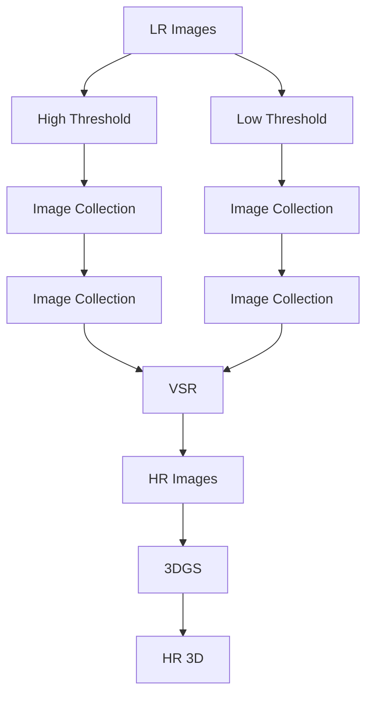

# Sequence Matters: Harnessing Video Models in 3D Super-Resolution

# Hyun-kyu Ko $^{1*}$ , Dongheok Park $^{2*}$ , Youngin Park $^{3}$ , Byeonghyeon Lee $^{1}$ , Juhee Han $^{1}$ , Eunbyung Park $^{1,2\dagger}$

$^{1}$ Department of Electrical and Computer Engineering, Sungkyunkwan University $^{2}$ Department of Artificial Intelligence, Sungkyunkwan University $^{3}$ Visual Display Division, Samsung Electorics

# Abstract

3D super-resolution aims to reconstruct high-fidelity 3D models from low-resolution (LR) multi-view images. Early studies primarily focused on single-image super-resolution (SISR) models to upsample LR images into high-resolution images. However, these methods often lack view consistency because they operate independently on each image. Although various post-processing techniques have been extensively explored to mitigate these inconsistencies, they have yet to fully resolve the issues. In this paper, we perform a comprehensive study of 3D super-resolution by leveraging video super-resolution (VSR) models. By utilizing VSR models, we ensure a higher degree of spatial consistency and can reference surrounding spatial information, leading to more accurate and detailed reconstructions. Our findings reveal that VSR models can perform remarkably well even on sequences that lack precise spatial alignment. Given this observation, we propose a simple yet practical approach to align LR images without involving fine-tuning or generating 'smooth' trajectory from the trained 3D models over LR images. The experimental results show that the surprisingly simple algorithms can achieve the state-of-the-art results of 3D super-resolution tasks on standard benchmark datasets, such as the NeRF-synthetic and MipNeRF-360 datasets.

Project Page: https://ko-lani.github.io/Sequence-Matters

# 1 Introduction

Recent advancements in 3D reconstruction from multi-view images, e.g., Neural Radiance Fields (NeRF) and 3D Gaussian Splatting (3DGS), have demonstrated outstanding performance across various tasks, such as novel view synthesis (Mildenhall et al. 2021; Müller et al. 2022; Chen et al. 2022; Fridovich-Keil et al. 2022; Kerbl et al. 2023) and surface reconstruction (Wang et al. 2021; Yariv et al. 2021, 2023; Guédon and Lepetit 2024; Huang et al. 2024; Fan et al. 2024). In addition, these techniques have proved highly effective in creating 3D scenes and assets when combined with the generative model approaches (Poole et al. 2022; Liu et al. 2023). The versatility of these methods and their ability to generate accurate and detailed 3D models have broadened their applicability to various tasks (Wang et al. 2024; Yu et al. 2024b).

Utilizing high-quality or high-resolution multi-view input images is crucial for obtaining high-fidelity 3D models from these techniques. However, meeting this requirement in real-world settings is often infeasible due to various constraints, e.g., equipment limitations or adverse environmental conditions. To overcome these challenges, several recent studies have investigated the 3D super-resolution task, which aims to generate high-fidelity 3D models from low-resolution multi-view images (Wang et al. 2022; Han et al. 2023; Yoon and Yoon 2023; Lin et al. 2024; Feng et al. 2024a; Lee, Li, and Lee 2024; Wu et al. 2024; Feng et al. 2024b; Shen et al. 2024; Yu et al. 2024a). The early approaches have utilized single-image super-resolution (SISR) models. They first upscale low-resolution (LR) input images to high-resolution (HR) images and then apply NeRF or 3DGS techniques to represent the 3D models. However, they face a critical limitation; the generated HR images usually lack 3D consistency since the input view images are processed individually. Although numerous works have improved 3D consistency using refinement stages, these solutions introduced additional computational complexity and could not fully resolve the problems.

A recent work (Shen et al. 2024) has explored the use of Video Super-Resolution (VSR) models (Xu et al. 2024b) to improve the 3D consistency. Inspired by the latest studies showing video generative models can achieve highly accurate 3D spatial consistency across the generated video frames (Voleti et al. 2024; Zuo et al. 2024), it repurposes VSR models to upsample LR multi-view images. This approach first constructs a low-resolution 3D representation using 3DGS from LR input images and then generates an LR video (a sequence of multi-view LR images) rendered from a 'smooth' camera trajectory. This VSR-friendly 'smooth' LR video serves as the input for the VSR model, and it is upscaled to an HR video (a sequence of multi-view HR images) from which the HR 3D model is subsequently produced.

While promising, the empirical evaluation has revealed certain limitations of this approach. The distribution shift between the training data (natural LR videos) and the testing data (the rendered LR videos from 3D models, e.g., 3DGS) negatively impacted the pre-trained VSR models. The rendered images from 3DGS frequently introduce stripy or blob-like artifacts, degrading the VSR models' performance. Although fine-tuning the VSR models on the rendered im-

ages from 3DGS could mitigate the distribution mismatch issue, posed multi-view image data is not abundant compared to natural videos, which limits the generalization performance. In addition, it is time-consuming and computationally heavy since it requires training 3DGS to obtain 3D representations for rendering input images. Consequently, the up-to-date 3D super-resolution techniques utilizing the VSR models have yet to demonstrate superior results over those leveraging SISR models (Lim et al. 2017; Wang et al. 2018; Liang et al. 2021).

In this work, we propose a method that ensures the VSR models receive their desired input without fine-tuning them. We have made two critical observations regarding VSR models: 1. The artifacts introduced by the rendered images substantially comprise the performance, and 2. The VSR models maintain strong performance even when input videos do not adhere to ‘smooth’ camera trajectories. Given these critical observations, we propose surprisingly simple yet effective algorithms to order training datasets into structured ’video-like’ sequences. These ’video-like’ sequences lead to improved VSR results, while eliminating the need for fine-tuning VSR models as they are composed of ground truth LR images, ensuring freedom from stripy or blob-like artifacts. The experimental results have shown that our proposed algorithms achieved state-of-the-art results on the NeRF synthetic and Mip-NeRF 360 datasets, underscoring their efficacy and robustness. Our key contributions are summarized below.

- We propose a novel method that leverages VSR models to bridge the gap between low-resolution and high-resolution images. By generating input video sequences that are sufficiently ‘smooth’ and exhibit minimal artifacts, we optimize their suitability for VSR models.   
- We propose surprisingly simple yet effective ordering algorithms, demonstrating superior performance compared to the existing prior arts.   
- Our method achieves state-of-the-art performance on both object-level and scene-level datasets, including the NeRF Synthetic and Mip-NeRF 360 datasets, highlighting the robustness and effectiveness of our approach in both object and scene datasets.

# 2 Related Work

Novel View Synthesis Novel view synthesis (NVS) is the task of synthesizing images from novel viewpoints given multi-view images. With the rise of deep learning, Neural Radiance Fields (NeRF) (Mildenhall et al. 2021) achieved remarkable results by learning a continuous function of the scene with MLP and can render the novel views with a volumetric renderer. In contrast to NeRF and its variants (Mildenhall et al. 2021; Barron et al. 2021, 2022; Müller et al. 2022; Chen et al. 2022; Fridovich-Keil et al. 2022), which learns the implicit 3D representation of the scene, 3D Gaussian Splatting (3DGS) (Kerbl et al. 2023) learns the point cloud-based explicit 3D representation. Since 3DGS employs explicit representation and renders images through rasterization, it achieves real-time rendering without compromising the quality of rendered images. However, to learn high-fidelity 3D representation, these neural fields require high-resolution images, which is not always guaranteed in real-world environments. In this work, we study 3D super-resolution task, where we build 3D representations given the only LR images.

3D Super-resolution Despite the great success of 3D neural fields in various applications, it is challenging to reconstruct high-resolution (HR) radiance fields using low-resolution datasets. Recently, several studies (Wang et al. 2022; Feng et al. 2024a) have attempted to achieve 3D super-resolution using super-sampling techniques without the guidance of off-the-shelf models, such as image restoration or generative models. In contrast, another line of research (Han et al. 2023; Yoon and Yoon 2023; Lin et al. 2024; Lee, Li, and Lee 2024; Feng et al. 2024b; Yu et al. 2024a; Xie et al. 2024) has focused on improving the resolution of 3D representations with the aid of these established models. They utilize SISR models to upsample low-resolution images and incorporate additional modules or techniques to enhance multi-view consistency across the upsampled images. Recent works in this line (Han et al. 2023; Yoon and Yoon 2023; Feng et al. 2024b) utilize SISR models to upsample training datasets. On the other hand, another work (Lin et al. 2024) upsamples rendered images for fast inference speed. Additionally, other studies (Lee, Li, and Lee 2024; Yu et al. 2024a) employ a latent diffusion model (LDM) (Rombach et al. 2022) and score distillation sampling (SDS) loss (Poole et al. 2022) to achieve 3D super-resolution.

A recent work (Shen et al. 2024), closely related to ours, leverages a VSR model as an upsampler for the LR dataset. Unlike SISR models, which often do not consider other frames during super-resolution, VSR models reference adjacent frames, thereby enhancing multi-view consistency. Specifically, this work starts by training the 3DGS with LR images and renders LR video frames from the trained LR 3DGS. Subsequently, with the LR video rendered from the LR 3DGS, the VSR model generates the training dataset of HR 3DGS. However, the distribution of the LR dataset differs from that of the rendered LR video, thereby introducing stripy or blob-like artifacts in the upsampled video. Finetuning the VSR model with rendered LR videos can mitigate this distribution shift, but it is a time-consuming process, as it involves extensive training and rendering of LR 3DGS to generate the fine-tuning dataset (LR rendered videos). In this work, we propose a method that does not involve additional finetuning or training 3DGS on LR images to render 'smooth' video.

Video Super-resolution Video super-resolution (VSR) has evolved from advancements in image super-resolution (Wang et al. 2018; Liang et al. 2021; Zhang et al. 2021; Chen et al. 2023; Tian et al. 2024), generating high-resolution video frames by utilizing information from adjacent frames to enhance the current frame's resolution. BasicVSR (Chan et al. 2021) introduced a bidirectional propagation approach to achieve balanced references from both directions and compute optical flow from features rather than images for more accurate alignment.

natural_image

Comparison of VSR-Render and VSR-GT robotic models showing front, side, and top views of a drum and wheel assembly (no text or symbols on diagrams)

Figure 1: Illustration of stripy or blob-like artifacts generated in VSR outputs of LR videos rendered from 3DGS. ‘VSR-Render’ shows the VSR outputs of the LR rendered videos, while ‘VSR-GT’ displays the VSR outputs of the ground truth (GT) LR videos.

BasicVSR++ (Chan et al. 2022) built on this by using second-order grid propagation, which extracts features through multiple stages and incorporates information from non-adjacent frames, enhancing robustness to occlusion. VRT (Liang et al. 2024) advanced VSR by combining recurrent model-based approaches with transformer structures and PSRT (Shi et al. 2022) proposed patch alignment, which aligns image patches rather than individual pixels, utilizing self-attention to enhance alignment and performance. Additionally, IART (Xu et al. 2024a) introduced a neural network-based resampling strategy, employing sinusoidal positional encoding and a transformer-based coordinate network to preserve high-frequency details and reduce spatial distortions. In this work, we harness the recent VSR models' capability to improve the multi-view 3D super-resolution tasks.

# 3 Method

# 3.1 Rendering Artifacts

In most multi-view datasets and image acquisition scenarios, images are hardly spatially ordered (except for a few cases, e.g., a monocular camera captures a sequence of images and records the time they are taken), which are unfavored for VSR models. A straightforward approach to obtaining the spatially ordered images from LR multi-view images would involve obtaining 3D representations with LR images, such as 3DGS, and rendering a smooth video from them (Shen et al. 2024). However, this approach introduces a significant problem due to the mismatch between the rendered images from the 3DGS trained on LR multi-view images and images from LR video datasets on which the VSR model was trained, e.g., bicubic downsampled from HR videos. This mismatch often results in blob-like or stripy artifacts from 3DGS, which degrades the performance of VSR models. Shen et al. (2024) partially addressed this issue by finetuning the VSR models on the images rendered from 3DGS. While

Algorithm 1: A Simple Greedy Algorithm   
Input: A set of unordered images, $I = \{I_j\}_{j=1}^N$ Output: An ordered sequence of images, S

1: $S_1 = I_1$ , $I \leftarrow I \setminus \{I_1\}$ 2: for $j \leftarrow 1$ to N - 1 do

3: $S_{j+1} = \underset{I_k \in I}{\text{argmin}} \text{sim}(S_j, I_k)$ 4: $I \leftarrow I \setminus \{S_{j+1}\}$ 5: end for

6: return S

effective, it demands training 3DGS for each training instance, which increases significant computational complexity. Furthermore, the multi-view image dataset is less abundant than natural videos, limiting the generalization performance of finetuned VSR models.

We have investigated these blob-like, stripy artifacts of the rendered images from the 3DGS models trained on LR multi-view images. These are primarily observed in the regions where high-fidelity information from HR images is lost in the LR images. The VSR models take the damaged images as inputs and upsample them, preserving or often magnifying the artifacts, which significantly degrades the output quality. As shown in Fig. 1, the regions with lost details in the LR images become severe artifacts in the upsampled images.

# 3.2 A Simple Greedy Algorithm

In Sec. 3.1, we demonstrated the limitations of training 3DGS with low-resolution (LR) images to obtain a ‘smooth’ video. This section explores alternative approaches that exploit the raw unordered LR multi-view images to create a video-like sequence.

Determining the most desirable order for generating video-like sequences from unordered LR datasets is challenging due to the absence of clear criteria, such as ‘how video-like’ a sequence should be or what makes a sequence a ‘good video’ for VSR models. Our objective is to arrange a sequence of images to maximize the quality of the high-resolution (HR) images produced by VSR models. However, the absence of ground-truth HR images, as defined by the problem, makes it infeasible to establish a clear objective function. We consider a rather simple approach: a ‘good’ video is a sequence in which each frame is ‘similar’ to its adjacent frames, ensuring a smooth visual flow.

Although these criteria were well-defined, finding the optimal sequence remains NP-hard due to the combinatorial nature of the problem. Our investigation, however, demonstrated that VSR models are sufficiently robust to non-optimal sequences, effectively utilizing distant multi-view references for upsampling. Given the observation, we propose a simple yet practical greedy algorithm (Alg. 1). Starting from an initial image $S_{1}$ , it repeatedly finds the next image by using the nearest neighbor based on the similarity score $\text{sim}(\cdot,\cdot)$ .

We explore two similarity measures, camera poses and visual features. By utilizing camera poses, we can spatially

Algorithm 2: Adaptive-length Subsequencing   
Input: A set of unordered images, $I = \{I_j\}_{j=1}^N$ Output: Multiple ordered sequences, $\{S^{(j)}\}_{j=1}^N$ 1: for $i \leftarrow 1$ to N do

2: $S_1^{(i)} = I_i$ , $I \leftarrow \{I_j\}_{j=1}^N \setminus \{I_i\}$ 3: for $j \leftarrow 1$ to N - 1 do

4: $S_{j+1}^{(i)} = \underset{I_k \in I}{\text{argmin}} \text{sim}(S_j^{(i)}, I_k)$ 5: if $\text{sim}(S_j^{(i)}, S_{j+1}^{(i)}) < \epsilon$ then

6: $S^{(i)} = S_{1:j}^{(i)} \quad //$ The length of $S^{(i)}$ becomes j

7: break

8: end if

9: $I \leftarrow I \setminus \{S_{j+1}^{(i)}\}$ 10: end for

11: end for

12: return $\{S^{(j)}\}_{j=1}^N$

connect images that are close to each other to form a video. Although this approach is conceptually sound, it may lack generalizability across diverse datasets, such as Mip-NeRF 360 dataset, which is not object-centric (i.e., the images are not all focused on the same object). As an alternative, we explore the visual feature-based similarity. We evaluated multiple feature extractors (Lowe 2004) (Rosten and Drummond 2006) (Bay, Tuytelaars, and Van Gool 2006) (Calonder et al. 2010) and found that ORB (Oriented FAST and Rotated BRIEF) feature (Rublee et al. 2011) offers a balance of computational efficiency and robustness in feature matching.

# 3.3 Adaptive-Length Subsequence

While promising, the proposed simple greedy algorithm faces two challenges when connecting all images into a single video sequence. First, the resulting sequence often exhibits abrupt transition due to the inherent weaknesses of greedy algorithms (illustrated in Fig. 3-(b)). For instance, the nearest neighbor of $S_{k}$ may have already been included in the processed list $(S_{1},\dots,S_{k - 1})$ , forcing the selection of a far-distant image.

Second, the results are highly influenced by the choice of the initial image $S_{1}$ . To address these challenges, we improve the algorithm by 1. stopping building sequence when the similarity score does not meet a certain threshold and 2. creating multiple subsequences starting from each image in the dataset.

Alg. 2 describes the detailed algorithm, and each subsequence $S^{(j)}$ is an ordered sequence starting from the initial image $I_j$ , and each subsequence has different lengths. Finally, we apply VSR models to upsample the subsequence and aggregate the outputs to generate the final upsampled sequence $\hat{I} = \{\hat{I}_j\}_{j=1}^N$ as follows,

$$
\hat {S} ^ {(j)} = \operatorname{VSR} (S ^ {(j)}), \quad \hat {I} = \operatorname{agg} (\{\hat {S} ^ {(j)} \} _ {j = 1} ^ {N}), \tag {1}
$$

where agg is an aggregate operator that takes multiple upsampled sequences as input and produces the final upsampled sequence. During aggregation, it removes redundant images, retaining only the image from the earliest subsequence ( $|I| = |\hat{I}| = N$ ).

Each similarity measure has its own limitations. Pose similarity suffers from the different orientations of cameras. The proximity in camera position does not account for the fact that the cameras may be facing in different directions, leading to connections between unrelated images. On the other hand, feature similarity can lead to incorrect alignments (significantly different image pairs often have a high similarity score). We observed that when dividing sequences into subsequences, pose and feature can complement each other. For example, we can use feature similarity for sim in line 4 and pose similarity for sim in line 5 of Alg. 2.

Multi-threshold Subsequence Generation We generate subsequences from each multi-view image in the dataset based on a uniform threshold.

However, applying a uniform threshold across all sequences can lead to inefficiencies. Setting a high threshold imposes strict constraints, ensuring that only very closely related images are connected, which results in smoother sequences but shorter sequences. On the other hand, a lower threshold ensures longer sequences, which often compromises the smoothness of the resulting sequences.

To leverage both advantages, we introduce a multi-threshold generation approach as illustrated in Fig. 2. Initially, we apply a high threshold for creating the subsequences, prioritizing the smoothest subsequences. These subsequences are then processed through the VSR model for upsampling. However, since not all images can be processed by a high-threshold approach (note that VSR models require a certain number of frames), we then lower the threshold in the next iteration, creating more relaxed and less smooth subsequences to include the remaining images. Please refer to more detailed algorithms in the Appendix.

# 3.4 Training Objective

We use a VSR model to upsample LR images to enhance multi-view consistency. However, generated high-frequency details are not always consistent across different views, which leads to degrade the quality of 3D reconstruction. Following (Wang et al. 2022; Feng et al. 2024b), we use subpixel constraints to regularize inconsistent high-frequency details. In practice, since bicubic interpolation is used to generate the low-resolution (LR) dataset, we also utilize bicubic interpolation when downsampling the sub-pixels. The sub-pixel loss $L_{sp}$ is LR 3DGS loss calculated between LR images and downsampled rendered images. Then, the final loss of our framework is expressed as below:

$$
\mathcal {L} = \lambda_ {\text { ren }} \mathcal {L} _ {\text { ren }} + (1 - \lambda_ {\text { ren }}) \mathcal {L} _ {\text { sp }}, \tag {2}
$$

where $L_{ren}$ HR 3DGS loss. Please see Appendix. F for more details.

# 4 Experiment

# 4.1 Setup

Datasets We use the NeRF Synthetic Blender dataset (Mildenhall et al. 2021) and the Mip-NeRF

flowchart

Figure 2: Overview of the proposed method. Given LR multi-view images, we generate subsequences (Sec. 3.3) starting from each image using a simple greedy algorithm (Sec. 3.2) and these subsequences are bounded by multiple thresholds (Sec. 3.3). Finally, we train a 3DGS model for 3D reconstruction using the upsampled HR images.

natural_image

Three-panel image showing 3D mechanical components with various views and mounting points, labeled (a), (b), and (c) — no text or symbols present.

Figure 3: Illustration of subsequence generation. (a) is an unordered multi-view image dataset. (b) is the result of using a simple greedy algorithm, Alg. 1. (c) highlights misalignments incurred by the algorithm, and we propose to split it into subsequences based on a pose difference threshold (red dotted line) between consecutive frames.

360 dataset (Barron et al. 2022). The Blender dataset consists of 8 synthetic object-centric scenes, with each scene with a resolution of $800 \times 800$ . For our experiments, we downsampled the images with bicubic interpolation by a factor of 4 to create a low-resolution (LR) dataset ( $200 \times 200$ ). The Mip-NeRF 360 dataset contains 9 real-world scenes. The resolutions vary across the scenes, but each scene has a higher resolution compared to the Blender dataset. We downsampled the dataset with bicubic interpolation by a factor of 8 to create the LR dataset.

Metrics Following the previous works, we evaluate the quantitative results using PSNR, SSIM, and LPIPS. Some previous works (Han et al. 2023; Lee, Li, and Lee 2024; Wu et al. 2024; Shen et al. 2024) emphasize the importance of perceptual metrics such as NIQE and LPIPS rather than fidelity metrics like PSNR. However, we prioritize the PSNR metric, as we regard the super-resolution task as a subset of reconstruction tasks, where accurate reconstruction of the original image is crucial.

Background Impact on Metrics When measuring metrics on the Blender dataset, we follow DiSR-NeRF and RaFE by using a black background where the alpha channel value is 0, unlike NeRF-SR, which used a white background. We observed that compositing with a white back-

ground introduces black artifacts around the edges of the images, making it difficult to obtain accurate measurements. In our experiments, the artifacts from compositing with a white background significantly degraded the output quality (empirically, by about 0.3 to 0.4 on PSNR). Since most of the previous works have not released their code and do not mention the background issue, we are unable to determine which background they used for their metrics.

Baseline Models As a baseline, we examined NeRF-SR (Wang et al. 2022), ZS-SRT (Feng et al. 2024a), CROP (Yoon and Yoon 2023), FastSR-NeRF (Lin et al. 2024), DiSR-NeRF (Lee, Li, and Lee 2024), SRGS (Feng et al. 2024b), GaussianSR, and SuperGaussian, following the metrics used by these models. Unfortunately, only two models, NeRF-SR and DiSR-NeRF, have provided their codes publicly. We have added three additional baseline methods: Bicubic, SwinIR, and Render-SR. For Bicubic and SwinIR, we upsampled LR images using bicubic interpolation and the SwinIR model, respectively. For Render-SR, we trained 3DGS with LR images in a SuperGaussian manner and upsampled the rendered smooth video using PSRT (Shi et al. 2022). After the upsampling process, we used 3DGS for the 3D reconstruction of these models. For NeRF-SR, DiSR-NeRF, and the three additional baselines, rendering is conducted with a white background by default. Note that our model and SuperGaussian are based on video super-resolution models, whereas GaussianSR, NeRF-SR, ZS-SRT, CROP, and SRGS are all based on single-image super-resolution models. Additionally, NeRF-SR, ZS-SRT, FastSR-NeRF, CROP, and DiSR-NeRF are NeRF-based models, while SRGS, GaussianSR, SuperGaussian, and our model are based on 3DGS.

Implementation Details We implement our method using the open-source 3D Gaussian Splatting code base. Following the 3DGS protocol, we train both coarse and fine 3DGS models for 30,000 iterations. To create the low-resolution (LR) dataset, we downsample the high-resolution (HR) dataset using bicubic interpolation with a downscale factor of 4. As a VSR backbone of our model, we employed PSRT (Shi et al. 2022). Please refer to the Appendix for further details.

natural_image

Grid of 20 identical 3D model photos showing various mechanical components, no text or symbols present

Figure 4: An example result from the simple greedy algorithm applied to the NeRF-synthetic dataset (Lego). Two neighboring images highlighted in red demonstrate abrupt transitions caused by misalignments.

# 4.2 Results

The Effect of The Proposed Algorithms Fig. 4 shows a resulting sequence of the proposed simple greedy algorithm (Lego, training images from the NeRF-synthetic dataset). We used the visual feature for similarity measure in this example, and two neighboring images with red color highlight the abrupt transition between two subsequent images due to the misalignment of the algorithm. We upsampled the ordered sequence using the VSR model and calculated the PSNR of the upsampled images highlighted in Fig. 4 with the ground-truth HR images. Tab. 2 shows the comparison between the simple greedy algorithm (S) and the adaptive-length subsequence algorithm (ALS). Since ASL offers smoother transitions and is more VSR-friendly, it allows the VSR model to reference more information from neighboring images. This significantly enhances the quality of the upsampled images, demonstrating the effectiveness of the approach. The Tab. 2 further shows the consistent improvement of ALS over the simple greedy algorithm. First we ran the simple greedy algorithm to order the sequence and find the image pairs that their angles are more than 45 degrees. For those non-smooth image pairs, we compared the performance of the proposed ordering algorithms.

3D Super-Resolution Results We provide the 3D super-resolution results, where we measure the metrics on test-view images rendered from the trained 3DGS models. The quantitative comparison with baseline models on Nerf-

Table 1: The quantitative results of the proposed ordering algorithms. S: the simple greedy algorithm, ALS: the adaptive-length subsequence. L and R denote the PSNR of the left and right image in two image pairs from Fig. 4.

<table><tr><td rowspan="2">Index</td><td colspan="2">L</td><td colspan="2">R</td></tr><tr><td>S</td><td>ALS</td><td>S</td><td>ALS</td></tr><tr><td>1</td><td>34.06</td><td>37.18</td><td>34.53</td><td>35.52</td></tr><tr><td>2</td><td>33.12</td><td>34.33</td><td>34.67</td><td>36.63</td></tr><tr><td>3</td><td>32.90</td><td>33.37</td><td>31.62</td><td>34.26</td></tr><tr><td>4</td><td>33.47</td><td>34.41</td><td>33.68</td><td>34.29</td></tr><tr><td>5</td><td>34.07</td><td>35.68</td><td>32.77</td><td>35.31</td></tr><tr><td>6</td><td>32.65</td><td>34.41</td><td>32.05</td><td>32.77</td></tr><tr><td>7</td><td>32.71</td><td>33.43</td><td>32.68</td><td>34.66</td></tr></table>

Table 2: The comparison of the proposed ordering algorithms in the NeRF-synthetic dataset. 

<table><tr><td></td><td>S</td><td>ALS</td></tr><tr><td>Chair</td><td>32.11</td><td>32.74</td></tr><tr><td>Drums</td><td>29.74</td><td>30.26</td></tr><tr><td>Ficus</td><td>35.31</td><td>35.96</td></tr><tr><td>Hotdog</td><td>37.85</td><td>38.32</td></tr><tr><td>Lego</td><td>33.30</td><td>34.73</td></tr><tr><td>Materials</td><td>35.24</td><td>35.85</td></tr><tr><td>Mic</td><td>31.38</td><td>31.62</td></tr><tr><td>Ship</td><td>30.03</td><td>30.48</td></tr></table>

synthetic in Tab. 3. Due to the space constraints, we provided the quantitative results on the Mip-NeRF 360 dataset in the Appendix. The 3DGS-HR is the result of 3DGS trained on ground-truth HR images, which is considered as the upper bound. The values with $\dagger$ were taken from the original papers as their codes are not publicly available. In all baseline comparisons, the best performance is highlighted in bold.

Our methods (Ours-ALS) consistently outperformed other baseline models across all metrics. The Comparison against Render-SR and SuperGaussian, clearly highlights that the proposed methods do not suffer from stripy or blob-like artifacts.

Qualitative Results While we showed improvements in various aspects, super-resolution tasks are notoriously challenging to improve quantitative metrics, such as PSNR. This is due to the most improvement comes from small parts of the images or high-frequency details, which conventional metrics do not accurately capture. We provide a few qualitative results to demonstrate the effectiveness of the proposed algorithms (Fig. 5 and Fig. 6). We compared ours to the baseline models whose codes are available, such as NeRF-SR and DiSR-NeRF. On the NeRF-synthetic dataset, we compared our model against Bicubic, SwinIR, Render-SR, NeRF-SR, and DiSR-NeRF. For the Mip-NeRF 360 dataset, we compared ours with Bicubic and SwinIR, as the NeRF models for NeRF-SR and DiSR-NeRF do not perform well on the Mip-NeRF 360 dataset. In both datasets, our model retains more high-frequency details and best reconstructs the ground truth.

Figure 5: Qualitative results on the NeRF-synthetic dataset. The PSNR values against GT are embedded in each image patch. Ours have shown superior results than the existing baselines, especially for high-frequency details.   
  
Figure 6: Qualitative results on Mip-NeRF 360 dataset. The PSNR values against GT are embedded in each image patch. Ours have shown superior results than the existing baselines, especially for high-frequency details.

# 5 Conclusion

In this paper, we introduce simple yet practical algorithms to leverage the existing VSR models to improve the 3D super-resolution task. We proposed a simple greedy algorithm to efficiently generate a desirable sequence for the VSR models. We further improved the resulting sequence with the adaptive-length sequence technique. Using the proposed algorithms, we addressed the issue of stripy or blob-like artifacts caused by the trained 3D models on LR im-

Table 3: Comparison of different methods for 3D super-resolution ( $\times4 \rightarrow \times1$ ) in Blender Dataset. The numbers marked with $\dagger$ are sourced from their respective paper, as the code is not available at this time. 

<table><tr><td></td><td>PSNR↑</td><td>SSIM↑</td><td>LPIPS↓</td></tr><tr><td>Bicubic</td><td>27.56</td><td>0.9150</td><td>0.1040</td></tr><tr><td>SwinIR</td><td>30.77</td><td>0.9501</td><td>0.0550</td></tr><tr><td>Render-SR</td><td>28.90</td><td>0.9346</td><td>0.0683</td></tr><tr><td>NeRF-SR</td><td>28.46</td><td>0.9210</td><td>0.0760</td></tr><tr><td> $ZS-SRT^†$ </td><td>29.69</td><td>0.9290</td><td>0.0690</td></tr><tr><td> $CROP^†$ </td><td>30.71</td><td>0.9459</td><td>0.0671</td></tr><tr><td> $FastSR-NeRF^†$ </td><td>30.47</td><td>0.9440</td><td>0.0750</td></tr><tr><td>DiSR-NeRF</td><td>26.00</td><td>0.8898</td><td>0.1226</td></tr><tr><td> $SRGS^†$ </td><td>30.83</td><td>0.9480</td><td>0.0560</td></tr><tr><td> $GaussianSR^†$ </td><td>28.37</td><td>0.9240</td><td>0.0870</td></tr><tr><td> $SuperGaussian^†$ </td><td>28.44</td><td>0.9459</td><td>0.0670</td></tr><tr><td>Ours-ALS</td><td>31.41</td><td>0.9520</td><td>0.0540</td></tr><tr><td>3DGS-HR</td><td>33.31</td><td>0.9695</td><td>0.0303</td></tr></table>

ages and achieved promising performance without involving fine-tuning the VSR models. The experimental results demonstrated the effectiveness of the proposed algorithms, showing the state-of-the-art results on standard benchmark datasets. We believe this work paves the way for more robust and efficient 3D super-resolution techniques by rethinking how to leverage VSR models, offering valuable insights for future research and development in this field.

# Acknowledgements

This work was supported by Institute of Information & communications Technology Planning & Evaluation(IITP) grant funded by the Korea government(MSIT) (RS-2019-II190421, Artificial Intelligence Graduate School Program(Sungkyunkwan University)) and the National Research Foundation (NRF) grant (RS-2024-00337548). This work was also supported by the Culture, Sports, and Tourism R&D Program through the Korea Creative Content Agency grant funded by the Ministry of Culture, Sports and Tourism in 2024 (Project Name: Research on neural watermark technology for copyright protection of generative AI 3D content, RS-2024-00348469), and Samsung Research Funding & Incubation Center of Samsung Electronics under Project Number SRFC-IT2401-01.

# References

Barron, J. T.; Mildenhall, B.; Tancik, M.; Hedman, P.; Martin-Brualla, R.; and Srinivasan, P. P. 2021. Mip-nerf: A multiscale representation for anti-aliasing neural radiance fields. In Proceedings of the IEEE/CVF international conference on computer vision, 5855–5864.   
Barron, J. T.; Mildenhall, B.; Verbin, D.; Srinivasan, P. P.; and Hedman, P. 2022. Mip-nerf 360: Unbounded anti-aliased neural radiance fields. In Proceedings of the IEEE/CVF conference on computer vision and pattern recognition, 5470–5479.   
Bay, H.; Tuytelaars, T.; and Van Gool, L. 2006. Surf: Speeded up robust features. In Computer Vision–ECCV 2006: 9th European Conference on Computer Vision, Graz, Austria, May 7-13, 2006. Proceedings, Part I 9, 404–417. Springer.   
Calonder, M.; Lepetit, V.; Strecha, C.; and Fua, P. 2010. Brief: Binary robust independent elementary features. In Computer Vision–ECCV 2010: 11th European Conference on Computer Vision, Heraklion, Crete, Greece, September 5-11, 2010, Proceedings, Part IV 11, 778–792. Springer.   
Chan, K. C.; Wang, X.; Yu, K.; Dong, C.; and Loy, C. C. 2021. Basicvsr: The search for essential components in video super-resolution and beyond. In Proceedings of the IEEE/CVF conference on computer vision and pattern recognition, 4947–4956.   
Chan, K. C.; Zhou, S.; Xu, X.; and Loy, C. C. 2022. Basicvsr++: Improving video super-resolution with enhanced propagation and alignment. In Proceedings of the IEEE/CVF conference on computer vision and pattern recognition, 5972–5981.   
Chen, A.; Xu, Z.; Geiger, A.; Yu, J.; and Su, H. 2022. Tensorf: Tensorial radiance fields. In European conference on computer vision, 333–350. Springer.   
Chen, X.; Wang, X.; Zhou, J.; Qiao, Y.; and Dong, C. 2023. Activating more pixels in image super-resolution transformer. In Proceedings of the IEEE/CVF conference on computer vision and pattern recognition, 22367–22377.   
Fan, L.; Yang, Y.; Li, M.; Li, H.; and Zhang, Z. 2024. Trim 3D Gaussian Splatting for Accurate Geometry Representation. arXiv preprint arXiv:2406.07499.

Feng, X.; He, Y.; Wang, Y.; Wang, C.; Kuang, Z.; Ding, J.; Qin, F.; Yu, J.; and Fan, J. 2024a. ZS-SRT: An efficient zero-shot super-resolution training method for Neural Radiance Fields. Neurocomputing, 590: 127714.

Feng, X.; He, Y.; Wang, Y.; Yang, Y.; Kuang, Z.; Jun, Y.; Fan, J.; et al. 2024b. SRGS: Super-Resolution 3D Gaussian Splatting. arXiv preprint arXiv:2404.10318.

Fridovich-Keil, S.; Yu, A.; Tancik, M.; Chen, Q.; Recht, B.; and Kanazawa, A. 2022. Plenoxels: Radiance fields without neural networks. In Proceedings of the IEEE/CVF conference on computer vision and pattern recognition, 5501–5510.

Guédon, A.; and Lepetit, V. 2024. Sugar: Surface-aligned gaussian splatting for efficient 3d mesh reconstruction and high-quality mesh rendering. In Proceedings of the IEEE/CVF Conference on Computer Vision and Pattern Recognition, 5354–5363.

Han, Y.; Yu, T.; Yu, X.; Wang, Y.; and Dai, Q. 2023. SuperNeRF: View-consistent Detail Generation for NeRF super-resolution. arXiv preprint arXiv:2304.13518.

Huang, B.; Yu, Z.; Chen, A.; Geiger, A.; and Gao, S. 2024. 2d gaussian splatting for geometrically accurate radiance fields. In ACM SIGGRAPH 2024 Conference Papers, 1–11.

Kerbl, B.; Kopanas, G.; Leimkühler, T.; and Drettakis, G. 2023. 3D Gaussian Splatting for Real-Time Radiance Field Rendering. ACM Trans. Graph., 42(4): 139–1.

Lee, J. L.; Li, C.; and Lee, G. H. 2024. DiSR-NeRF: Diffusion-Guided View-Consistent Super-Resolution NeRF. In Proceedings of the IEEE/CVF Conference on Computer Vision and Pattern Recognition, 20561–20570.

Liang, J.; Cao, J.; Fan, Y.; Zhang, K.; Ranjan, R.; Li, Y.; Timofte, R.; and Van Gool, L. 2024. Vrt: A video restoration transformer. IEEE Transactions on Image Processing.

Liang, J.; Cao, J.; Sun, G.; Zhang, K.; Van Gool, L.; and Timofte, R. 2021. Swinir: Image restoration using swin transformer. In Proceedings of the IEEE/CVF international conference on computer vision, 1833–1844.

Lim, B.; Son, S.; Kim, H.; Nah, S.; and Mu Lee, K. 2017. Enhanced deep residual networks for single image super-resolution. In Proceedings of the IEEE conference on computer vision and pattern recognition workshops, 136–144.

Lin, C.-Y.; Fu, Q.; Merth, T.; Yang, K.; and Ranjan, A. 2024. Fastsr-nerf: Improving nerf efficiency on consumer devices with a simple super-resolution pipeline. In Proceedings of the IEEE/CVF Winter Conference on Applications of Computer Vision, 6036–6045.

Liu, R.; Wu, R.; Van Hoorick, B.; Tokmakov, P.; Zakharov, S.; and Vondrick, C. 2023. Zero-1-to-3: Zero-shot one image to 3d object. In Proceedings of the IEEE/CVF international conference on computer vision, 9298–9309.

Lowe, D. G. 2004. Distinctive image features from scale-invariant keypoints. International journal of computer vision, 60: 91–110.

Mildenhall, B.; Srinivasan, P. P.; Tancik, M.; Barron, J. T.; Ramamoorthi, R.; and Ng, R. 2021. Nerf: Representing scenes as neural radiance fields for view synthesis. Communications of the ACM, 65(1): 99–106.

Müller, T.; Evans, A.; Schied, C.; and Keller, A. 2022. Instant neural graphics primitives with a multiresolution hash encoding. ACM transactions on graphics (TOG), 41(4): 1–15.   
Poole, B.; Jain, A.; Barron, J. T.; and Mildenhall, B. 2022. Dreamfusion: Text-to-3d using 2d diffusion. arXiv preprint arXiv:2209.14988.   
Rombach, R.; Blattmann, A.; Lorenz, D.; Esser, P.; and Ommer, B. 2022. High-resolution image synthesis with latent diffusion models. In Proceedings of the IEEE/CVF conference on computer vision and pattern recognition, 10684–10695.   
Rosten, E.; and Drummond, T. 2006. Machine learning for high-speed corner detection. In Computer Vision–ECCV 2006: 9th European Conference on Computer Vision, Graz, Austria, May 7-13, 2006. Proceedings, Part I 9, 430–443. Springer.   
Rublee, E.; Rabaud, V.; Konolige, K.; and Bradski, G. 2011. ORB: An efficient alternative to SIFT or SURF. In Proceedings of the IEEE International Conference on Computer Vision, 2564–2571. IEEE.   
Shen, Y.; Ceylan, D.; Guerrero, P.; Xu, Z.; Mitra, N. J.; Wang, S.; and Früstück, A. 2024. SuperGaussian: Repurposing Video Models for 3D Super Resolution. arXiv preprint arXiv:2406.00609.   
Shi, S.; Gu, J.; Xie, L.; Wang, X.; Yang, Y.; and Dong, C. 2022. Rethinking alignment in video super-resolution transformers. Advances in Neural Information Processing Systems, 35: 36081–36093.   
Tian, Y.; Chen, H.; Xu, C.; and Wang, Y. 2024. Image Processing GNN: Breaking Rigidity in Super-Resolution. In Proceedings of the IEEE/CVF Conference on Computer Vision and Pattern Recognition, 24108–24117.   
Voleti, V.; Yao, C.-H.; Boss, M.; Letts, A.; Pankratz, D.; Tochilkin, D.; Laforte, C.; Rombach, R.; and Jampani, V. 2024. Sv3d: Novel multi-view synthesis and 3d generation from a single image using latent video diffusion. arXiv preprint arXiv:2403.12008.   
Wang, C.; Wu, X.; Guo, Y.-C.; Zhang, S.-H.; Tai, Y.-W.; and Hu, S.-M. 2022. Nerf-sr: High quality neural radiance fields using supersampling. In Proceedings of the 30th ACM International Conference on Multimedia, 6445–6454.   
Wang, P.; Liu, L.; Liu, Y.; Theobalt, C.; Komura, T.; and Wang, W. 2021. Neus: Learning neural implicit surfaces by volume rendering for multi-view reconstruction. arXiv preprint arXiv:2106.10689.   
Wang, S.; Leroy, V.; Cabon, Y.; Chidlovskii, B.; and Revaud, J. 2024. Dust3r: Geometric 3d vision made easy. In Proceedings of the IEEE/CVF Conference on Computer Vision and Pattern Recognition, 20697–20709.   
Wang, X.; Yu, K.; Wu, S.; Gu, J.; Liu, Y.; Dong, C.; Qiao, Y.; and Change Loy, C. 2018. Esrgan: Enhanced super-resolution generative adversarial networks. In Proceedings of the European Conference on Computer Vision (ECCV) Workshops, 0–0.

Wu, Z.; Wan, Z.; Zhang, J.; Liao, J.; and Xu, D. 2024. RAFE: Generative Radiance Fields Restoration. arXiv preprint arXiv:2404.03654.   
Xie, S.; Wang, Z.; Zhu, Y.; and Pan, C. 2024. SuperGS: Super-Resolution 3D Gaussian Splatting via Latent Feature Field and Gradient-guided Splitting. arXiv preprint arXiv:2410.02571.   
Xu, K.; Yu, Z.; Wang, X.; Mi, M. B.; and Yao, A. 2024a. Enhancing Video Super-Resolution via Implicit Resampling-based Alignment. In Proceedings of the IEEE/CVF Conference on Computer Vision and Pattern Recognition, 2546–2555.   
Xu, Y.; Park, T.; Zhang, R.; Zhou, Y.; Shechtman, E.; Liu, F.; Huang, J.-B.; and Liu, D. 2024b. VideoGigaGAN: Towards Detail-rich Video Super-Resolution. arXiv preprint arXiv:2404.12388.   
Yariv, L.; Gu, J.; Kasten, Y.; and Lipman, Y. 2021. Volume rendering of neural implicit surfaces. Advances in Neural Information Processing Systems, 34: 4805–4815.   
Yariv, L.; Hedman, P.; Reiser, C.; Verbin, D.; Srinivasan, P. P.; Szeliski, R.; Barron, J. T.; and Mildenhall, B. 2023. Bakedsdf: Meshing neural sdfs for real-time view synthesis. In ACM SIGGRAPH 2023 Conference Proceedings, 1–9.   
Yoon, Y.; and Yoon, K.-J. 2023. Cross-guided optimization of radiance fields with multi-view image super-resolution for high-resolution novel view synthesis. In Proceedings of the IEEE/CVF Conference on Computer Vision and Pattern Recognition, 12428–12438.   
Yu, X.; Zhu, H.; He, T.; and Chen, Z. 2024a. GaussianSR: 3D Gaussian Super-Resolution with 2D Diffusion Priors. arXiv preprint arXiv:2406.10111.   
Yu, Z.; Chen, A.; Huang, B.; Sattler, T.; and Geiger, A. 2024b. Mip-splatting: Alias-free 3d gaussian splatting. In Proceedings of the IEEE/CVF Conference on Computer Vision and Pattern Recognition, 19447–19456.   
Zhang, K.; Liang, J.; Van Gool, L.; and Timofte, R. 2021. Designing a practical degradation model for deep blind image super-resolution. In Proceedings of the IEEE/CVF International Conference on Computer Vision, 4791–4800.   
Zuo, Q.; Gu, X.; Qiu, L.; Dong, Y.; Zhao, Z.; Yuan, W.; Peng, R.; Zhu, S.; Dong, Z.; Bo, L.; et al. 2024. Videomv: Consistent multi-view generation based on large video generative model. arXiv preprint arXiv:2403.12010.

# Appendix

# A Flexibility with VSR Baseline Models

One of the key advantages of our model is its ability to utilize any pre-trained VSR model as a backbone, unlike SuperGaussian, which necessitates extensive and costly training to align the pre-trained data distribution with that of Gaussian splats. We demonstrate the robustness of our approach by integrating various pre-trained VSR models. Specifically, we evaluated three VSR models—VRT, PSRT, and IART—alongside ablation studies on the simple greedy algorithm (S) and adaptive-length subsequence generation (ALS), comparing these with the original unordered sequence and SISR (where the VSR model processes each image individually without reference frames). Tab. 4 demonstrate that our method is flexible with the choice of VSR models.

# B Implementation Details

We implement our method using the open-source 3D Gaussian Splatting code base. Following the 3DGS protocol, we train the 3DGS model for 30,000 iterations. To create the low-resolution (LR) dataset, we downsample the high-resolution (HR) dataset using bicubic interpolation with a downscale factor of 4.

To evaluate the generalization capabilities of Video Super-Resolution (VSR) models within our framework, we conduct ablation experiments on three VSR models: VRT, IART, and PSRT. By default, these models are pre-trained on the LR Vimeo-90K dataset, which is downsampled using bicubic interpolation.

For the synthetic Blender dataset, we utilize nearest neighbor ordering based on ORB features and apply thresholds based on pose similarity. In contrast, for the Mip-NeRF 360 dataset, we employ nearest neighbor matching based on pose and apply thresholds using ORB features. This approach is justified by the object-centric nature of the Blender dataset and the non-object-centric characteristics of the Mip-NeRF 360 dataset.

For the Adaptive-length Sequences, we set the three thresholds (angle between two camera positions) to $15^{\circ}$ , $30^{\circ}$ , $45^{\circ}$ on both Blender dataset. We set two thresholds (the number of candidates by distances) to 30 and 50.

# C Misalignment Error

Misalignment errors (Fig. 9) occur due to inaccuracies in aligning frames, particularly when ORB features are used to link them. As the number of frames in a sequence increases, the probability of connecting unrelated features—especially from temporally distant frames—also rises, as images that have been connected once cannot be reconnected. This misalignment may cause the model to rely on incorrect or irrelevant frame information during upsampling, thereby compromising the quality of the output.

Our analysis reveals that misalignment errors escalate as the sequence length increases, since longer sequences provide more opportunities for feature mismatches. To quantify this, we first extract the camera's center position and direction (z-axis of the camera coordinates) in world coordinates from the transformation matrix. We classify a frame as misaligned if the consecutive images exhibit an angular difference greater than $45^{\circ}$ , when measured between the vectors drawn from the camera positions to the origin.

scatter

| Method       | PSNR  | LPIPS  |
| ------------ | ----- | ------ |
| Ours         | 31.4  | 0.055  |
| SRGS         | 30.8  | 0.056  |
| CROP         | 30.7  | 0.067  |
| ZS-SRT       | 29.8  | 0.069  |
| FastSR-NeRF  | 30.5  | 0.075  |
| SuperGaussian| 28.4  | 0.066  |
| NeRF-SR      | 28.5  | 0.076  |

Figure 7: Comparison with baselines.

line

Misalignment Distribution Trends Across All Objects
| Sequence Position | chair | drums | ficus | hotdog | lego | materials | mic | ship | Average |
|---|---|---|---|---|---|---|---|---|---|
| 0-25% | 1.0 | 0.0 | 5.0 | 1.0 | 0.0 | 3.0 | 1.0 | 2.0 | 1.5 |
| 25-50% | 2.0 | 1.0 | 11.0 | 2.0 | 1.0 | 0.0 | 3.0 | 2.0 | 2.0 |
| 50-75% | 1.0 | 3.0 | 6.0 | 1.0 | 2.0 | 1.0 | 1.0 | 1.0 | 2.0 |
| 75-100% | 5.0 | 7.0 | 15.0 | 4.0 | 4.0 | 1.0 | 1.0 | 3.0 | 5.0 |

Figure 8: Misalignment trends within a sequence.   

text_image

well-aligned frames
misaligned frames

Figure 9: Misalignment Error.

To demonstrate the impact of misalignments, we conducted a toy experiment. As illustrated in Fig. 8, misalignments tend to increase towards the end of the sequence, where unconnected images are forcefully connected, which significantly degrades the performance of our simple greedy algorithm. To quantify this degradation, we focus on the last 25% of the sequence generated by the greedy algorithm. To construct a complete sequence, we apply our greedy algorithm starting from each image, collecting the last 25% of each sequence. These segments are then combined to form

Table 4: Ablation comparison of Blender dataset ( $\times4 \rightarrow \times1$ ) on various VSR models. SISR refers to Single-Image SuperResolution (single image VSR), S refers to ordering by simple greedy algorithm (order: feature), and ALS refers to using adaptive-length subsequence (order: feature) with multi-threshold (threshold: pose). 

<table><tr><td></td><td colspan="3">VRT</td><td colspan="3">IART</td><td colspan="3">PSRT</td></tr><tr><td></td><td>PSNR↑</td><td>SSIM↑</td><td>LPIPS↓</td><td>PSNR↑</td><td>SSIM↑</td><td>LPIPS↓</td><td>PSNR↑</td><td>SSIM↑</td><td>LPIPS↓</td></tr><tr><td>SISR</td><td>31.20</td><td>0.9497</td><td>0.0567</td><td>31.10</td><td>0.9484</td><td>0.0590</td><td>31.10</td><td>0.9516</td><td>0.0543</td></tr><tr><td>S</td><td>31.25</td><td>0.9505</td><td>0.0557</td><td>31.32</td><td>0.9513</td><td>0.0550</td><td>31.35</td><td>0.9513</td><td>0.0548</td></tr><tr><td>ALS</td><td>31.37</td><td>0.9516</td><td>0.0544</td><td>31.35</td><td>0.9514</td><td>0.0548</td><td>31.41</td><td>0.9520</td><td>0.0540</td></tr></table>

Table 5: Impact of misalignment on 3D super-resolution. 

<table><tr><td></td><td>PSNR↑</td><td>SSIM↑</td><td>LPIPS↓</td></tr><tr><td>S (last 25%)</td><td>31.32</td><td>0.9511</td><td>0.0552</td></tr><tr><td>ALS</td><td>31.41</td><td>0.9520</td><td>0.0540</td></tr></table>

the final sequence, which is expected to exhibit a high degree of misalignment. For any images that could not be included in the final sequence using this method, we directly use the upsampled images generated by the ALS (adaptive-length subsequence). This approach allows us to highlight the misalignment issues inherent in the greedy algorithm, in comparison to ALS (adaptive-length subsequence). The results are shown in Tab. 5.

# D Per-object and Per-scene Quantitative Results

We present per-object (synthetic Blender) and per-scene (Mip-NeRF 360) PSNR comparisons with different baseline models. Our method uses PSRT as our VSR backbone using adaptive-length subsequence (ALS) with multi-threshold. Note that value marked with $\dagger$ is taken from the respective paper, as the code for the model is not available. The results can be found in Tab. 6 and Tab. 9.

# E Multi-threshold Subsequence

In the main paper, we introduced the concept of multi-threshold subsequence generation. To summarize briefly, applying a uniform threshold across all sequences can be inefficient due to varying image densities. A strict threshold ensures that only closely situated images are connected, resulting in a smoother trajectory. However, in sparsely populated regions, images are rarely connected with a strict threshold, leading to a loss of reference when upsampling. Conversely, a loose threshold connects images even over greater distances, ensuring that most images are connected, but potentially sacrificing smoothness in densely populated regions. To address this, we propose a multi-threshold subsequence generation method. We first upsample images using a strict threshold to benefit from smoother trajectories in dense regions. Then, we gradually loosen the threshold to generate less smooth trajectories; this way, we can ensure that most images achieve the smoothest trajectory possible.

# F Sub-pixel Loss and Final Loss

In this section, we will provide a detailed explanation of sub-pixel loss and final loss through equations. Let $\hat{I}, \tilde{I}, I \in R^{H \times W \times 3}$ denotes a rendered image from 3DGS, the upsampled image via VSR models, and the ground-truth image, respectively. H, W refers to the height and width of the HR images (we omitted the image index for brevity). According to 3DGS, the objective is written as below,

$$
\mathcal {L} _ {\text { ren }} = (1 - \lambda_ {1}) \mathcal {L} _ {1} (\hat {I}, \tilde {I}) + \lambda_ {1} \mathcal {L} _ {\mathrm{D-SSIM}} (\hat {I}, \tilde {I}). \tag {3}
$$

We use $\lambda_{1}=0.2$ in all our experiments. $\mathcal{L}_{1}(\cdot,\cdot)$ is L1 loss and $\mathcal{L}_{\mathrm{D}-\mathrm{SSIM}}(\cdot,\cdot)$ is defined as $1-\mathrm{SSIM}(\cdot,\cdot)$ .

$$
\mathcal {L} _ {s p} = (1 - \lambda_ {1}) \mathcal {L} _ {1} (\downarrow (\hat {I}), \downarrow (I)) + \lambda_ {1} \mathcal {L} _ {\mathrm{D-SSIM}} (\downarrow (\hat {I}), \downarrow (I)), \tag {4}
$$

where $\downarrow(\cdot)$ is bicubic downsampling. And the final loss is defined as,

$$
\mathcal {L} = \lambda_ {\text { ren }} \mathcal {L} _ {\text { ren }} + (1 - \lambda_ {\text { ren }}) \mathcal {L} _ {s p}. \tag {5}
$$

We use $\lambda_{ren} = 0.6$ for Blender dataset and $\lambda_{ren} = 0.4$ for Mip-NeRF 360 dataset.

# G ORB Feature Matching

In the main paper, we discussed how ORB features are suitable for ordering unordered multi-view images into video sequences. In this section, we provide a detailed explanation of computing similarity scores using the ORB feature.

The similarity score $\text{sim}(\cdot, \cdot)$ between two images $I_{i}$ and $I_{j}$ is computed as follows,

$$
S (I _ {i}, I _ {j}) = \frac {1}{| M (I _ {i} , I _ {j}) |} \sum_ {(k, l) \in M (I _ {i}, I _ {j})} \operatorname{dist} \left(f _ {i, k}, f _ {j, l}\right),
$$

where $M(I_{i}, I_{j})$ is a set of indices for matched descriptors between $I_{i}$ and $I_{j}$ , $f_{i}$ is the ORB feature extracted from the image $I_{i}$ , and $f_{i,k} \in \{0,1\}^{P}$ is a binary feature vector for k-th keypoint in the image $I_{i}$ , and P = 256. The Hamming distance $\text{dist}(\cdot, \cdot)$ between two binary descriptors $f_{i,k}$ and $f_{j,l}$ is calculated as follows,

$$
\operatorname{dist} \left(f _ {i, k}, f _ {j, l}\right) = \sum_ {b = 1} ^ {P} \left(f _ {i, k, b} \oplus f _ {j, l, b}\right),
$$

where $f_{i,k,b} \in \{0,1\}$ denotes $b$ -th bits of descriptors $f_{i,k}$ , and $\oplus$ is XOR operator.

Descriptors between images $I_{i}$ and $I_{j}$ are then matched using a bidirectional matching approach, also known as

Table 6: Per-object PSNR comparison on the synthetic Blender dataset ( $\times4 \rightarrow \times1$ ). Ours-ALS refers to our method using adaptive-length subsequencing (ALS). 

<table><tr><td></td><td>chair</td><td>drums</td><td>ficus</td><td>hotdog</td><td>lego</td><td>materials</td><td>mic</td><td>ship</td><td>average</td></tr><tr><td>Bicubic</td><td>29.02</td><td>23.75</td><td>28.24</td><td>31.86</td><td>27.46</td><td>26.47</td><td>27.97</td><td>25.71</td><td>27.56</td></tr><tr><td>PSRT (SISR)</td><td>30.94</td><td>25.56</td><td>33.49</td><td>35.82</td><td>32.20</td><td>30.06</td><td>31.75</td><td>28.96</td><td>31.10</td></tr><tr><td>SwinIR+3DGS</td><td>31.02</td><td>25.48</td><td>32.49</td><td>35.60</td><td>32.05</td><td>29.58</td><td>31.75</td><td>28.20</td><td>30.77</td></tr><tr><td>Render-SR</td><td>30.23</td><td>24.04</td><td>28.63</td><td>33.78</td><td>29.23</td><td>27.34</td><td>30.53</td><td>27.35</td><td>28.90</td></tr><tr><td>NeRF-SR</td><td>30.16</td><td>23.46</td><td>26.64</td><td>34.40</td><td>29.13</td><td>28.02</td><td>27.25</td><td>26.61</td><td>28.21</td></tr><tr><td>DiSR-NeRF</td><td>27.55</td><td>22.63</td><td>25.64</td><td>30.07</td><td>26.43</td><td>24.71</td><td>26.49</td><td>24.47</td><td>26.00</td></tr><tr><td> $CROP^†$ </td><td>31.53</td><td>24.99</td><td>31.50</td><td>35.62</td><td>32.88</td><td>29.16</td><td>31.76</td><td>28.23</td><td>30.71</td></tr><tr><td>Ours-S</td><td>31.33</td><td>25.58</td><td>33.71</td><td>35.95</td><td>32.98</td><td>30.09</td><td>31.91</td><td>29.26</td><td>31.35</td></tr><tr><td>Ours-ALS</td><td>31.36</td><td>25.65</td><td>33.69</td><td>36.18</td><td>33.03</td><td>30.17</td><td>31.93</td><td>29.26</td><td>31.41</td></tr><tr><td>HR-3DGS</td><td>35.79</td><td>26.14</td><td>34.84</td><td>37.72</td><td>35.77</td><td>29.97</td><td>35.36</td><td>30.89</td><td>33.31</td></tr></table>

Table 7: Per-object SSIM comparison on the synthetic Blender dataset ( $\times4 \rightarrow \times1$ ). Ours-ALS refers to our method using adaptive-length subsequencing (ALS). 

<table><tr><td></td><td>chair</td><td>drums</td><td>ficus</td><td>hotdog</td><td>lego</td><td>materials</td><td>mic</td><td>ship</td><td>average</td></tr><tr><td>Bicubic</td><td>0.9194</td><td>0.9003</td><td>0.9430</td><td>0.9526</td><td>0.9059</td><td>0.9220</td><td>0.9481</td><td>0.8291</td><td>0.9150</td></tr><tr><td>PSRT (SISR)</td><td>0.9475</td><td>0.9386</td><td>0.9762</td><td>0.9721</td><td>0.9572</td><td>0.9544</td><td>0.9732</td><td>0.8688</td><td>0.9516</td></tr><tr><td>SwinIR+3DGS</td><td>0.9469</td><td>0.9412</td><td>0.9760</td><td>0.9728</td><td>0.9601</td><td>0.9558</td><td>0.9747</td><td>0.8731</td><td>0.9501</td></tr><tr><td>Render-SR</td><td>0.9432</td><td>0.9163</td><td>0.9539</td><td>0.9677</td><td>0.9379</td><td>0.9322</td><td>0.9671</td><td>0.8582</td><td>0.9346</td></tr><tr><td>NeRF-SR</td><td>0.9366</td><td>0.9019</td><td>0.9026</td><td>0.9629</td><td>0.9292</td><td>0.9319</td><td>0.9432</td><td>0.8357</td><td>0.9180</td></tr><tr><td>DiSR-NeRF</td><td>0.9035</td><td>0.8618</td><td>0.9117</td><td>0.9332</td><td>0.8875</td><td>0.8816</td><td>0.9335</td><td>0.8053</td><td>0.8898</td></tr><tr><td> $CROP^†$ </td><td>0.9513</td><td>0.9236</td><td>0.9709</td><td>0.9725</td><td>0.9641</td><td>0.9468</td><td>0.9740</td><td>0.8637</td><td>0.9459</td></tr><tr><td>Ours-S</td><td>0.9538</td><td>0.9391</td><td>0.9779</td><td>0.9738</td><td>0.9646</td><td>0.9541</td><td>0.9747</td><td>0.8724</td><td>0.9513</td></tr><tr><td>Ours-ALS</td><td>0.9539</td><td>0.9405</td><td>0.9777</td><td>0.9744</td><td>0.9649</td><td>0.9555</td><td>0.9750</td><td>0.8741</td><td>0.9520</td></tr><tr><td>HR-3DGS</td><td>0.9874</td><td>0.9544</td><td>0.9872</td><td>0.9853</td><td>0.9828</td><td>0.9603</td><td>0.9914</td><td>0.9067</td><td>0.9694</td></tr></table>

Table 8: Per-object LPIPS comparison on the synthetic Blender dataset ( $\times4 \rightarrow \times1$ ). Ours-ALS refers to our method using adaptive-length subsequencing (ALS). 

<table><tr><td></td><td>chair</td><td>drums</td><td>ficus</td><td>hotdog</td><td>lego</td><td>materials</td><td>mic</td><td>ship</td><td>average</td></tr><tr><td>Bicubic</td><td>0.0899</td><td>0.1106</td><td>0.0619</td><td>0.0768</td><td>0.1272</td><td>0.0892</td><td>0.0626</td><td>0.2136</td><td>0.1040</td></tr><tr><td>PSRT (SISR)</td><td>0.0553</td><td>0.0609</td><td>0.0237</td><td>0.0421</td><td>0.0595</td><td>0.0480</td><td>0.0254</td><td>0.1567</td><td>0.0544</td></tr><tr><td>SwinIR+3DGS</td><td>0.0577</td><td>0.0565</td><td>0.0221</td><td>0.0401</td><td>0.0498</td><td>0.0420</td><td>0.0203</td><td>0.1511</td><td>0.0550</td></tr><tr><td>Render-SR</td><td>0.0563</td><td>0.0743</td><td>0.0396</td><td>0.0462</td><td>0.0691</td><td>0.0597</td><td>0.0312</td><td>0.1698</td><td>0.0683</td></tr><tr><td>NeRF-SR</td><td>0.0687</td><td>0.1091</td><td>0.1014</td><td>0.0591</td><td>0.0976</td><td>0.0770</td><td>0.0805</td><td>0.1984</td><td>0.0990</td></tr><tr><td>DiSR-NeRF</td><td>0.0943</td><td>0.1429</td><td>0.0905</td><td>0.1001</td><td>0.1378</td><td>0.1293</td><td>0.0751</td><td>0.2106</td><td>0.1226</td></tr><tr><td> $CROP^†$ </td><td>0.0567</td><td>0.0856</td><td>0.0317</td><td>0.0481</td><td>0.0496</td><td>0.0622</td><td>0.0251</td><td>0.1776</td><td>0.0671</td></tr><tr><td>Ours-S</td><td>0.0478</td><td>0.0585</td><td>0.0216</td><td>0.0395</td><td>0.0470</td><td>0.0488</td><td>0.0240</td><td>0.1509</td><td>0.0547</td></tr><tr><td>Ours-ALS</td><td>0.0478</td><td>0.0576</td><td>0.0216</td><td>0.0388</td><td>0.0465</td><td>0.0464</td><td>0.0233</td><td>0.1501</td><td>0.0540</td></tr><tr><td>HR-3DGS</td><td>0.0117</td><td>0.0371</td><td>0.0116</td><td>0.0199</td><td>0.0154</td><td>0.0341</td><td>0.0060</td><td>0.1063</td><td>0.0303</td></tr></table>

cross-checking. This process ensures robust matching by retaining only mutual best matches. Specifically, for each descriptor $f_{i,k}$ in image $I_{i}$ , the descriptor $f_{j,l}$ in image $I_{j}$ with the smallest Hamming distance is identified, and vice versa. Only pairs $(f_{i,k}, f_{j,l})$ that are mutual best matches are retained. The set of indices of these matched descriptor pairs is denoted as $M(I_{i}, I_{j})$ .

# H Temporal Consistency

Temporal consistency is crucial for our task, as VSR models rely on the coherence of neighboring frames to achieve better performance. By leveraging this temporal relationship,

our method ensures 3D spatial consistency improving the 3D reconstruction quality. To evaluate temporal coherence, we use the Fréchet Video Distance (FVD) metric on the Blender dataset, where smooth video trajectories from the test split serve as ground truth. As shown in Tab. 13, our method (Ours-S and Ours-ALS) achieves the lowest FVD scores among all compared methods, demonstrating superior temporal consistency in video metrics. This improvement is attributed to the structured 'video-like' sequences generated by our ordering algorithms, which enhance both frame-to-frame coherence and spatial reconstruction accuracy.

Table 9: Per-scene PSNR comparison on the Mip-NeRF 360 dataset ( $\times8\rightarrow\times2$ ). Ours-ALS refers to our method using adaptive-length subsequencing (ALS). 

<table><tr><td></td><td>bicycle</td><td>flowers</td><td>garden</td><td>stump</td><td>treehill</td><td>room</td><td>counter</td><td>kitchen</td><td>bonsai</td><td>average</td></tr><tr><td>Bicubic</td><td>24.02</td><td>21.24</td><td>25.14</td><td>26.30</td><td>22.25</td><td>30.47</td><td>28.15</td><td>28.23</td><td>30.21</td><td>26.22</td></tr><tr><td>SwinIR + 3DGS</td><td>24.54</td><td>21.18</td><td>25.81</td><td>26.38</td><td>22.16</td><td>31.30</td><td>28.71</td><td>29.82</td><td>31.26</td><td>26.80</td></tr><tr><td>Ours-S</td><td>24.42</td><td>21.13</td><td>26.04</td><td>26.40</td><td>22.26</td><td>31.47</td><td>28.96</td><td>30.79</td><td>31.69</td><td>27.02</td></tr><tr><td>Ours-ALS</td><td>24.50</td><td>21.17</td><td>25.99</td><td>26.46</td><td>22.26</td><td>31.52</td><td>28.90</td><td>30.73</td><td>31.68</td><td>27.02</td></tr><tr><td>HR-3DGS</td><td>24.41</td><td>20.59</td><td>26.58</td><td>26.28</td><td>22.27</td><td>31.52</td><td>29.12</td><td>31.57</td><td>32.36</td><td>27.19</td></tr></table>

Table 10: Per-scene SSIM comparison on the Mip-NeRF 360 dataset ( $\times8\rightarrow\times2$ ). Ours-ALS refers to our method using adaptive-length subsequencing (ALS). 

<table><tr><td></td><td>bicycle</td><td>flowers</td><td>garden</td><td>stump</td><td>treehill</td><td>room</td><td>counter</td><td>kitchen</td><td>bonsai</td><td>average</td></tr><tr><td>Bicubic</td><td>0.6401</td><td>0.5321</td><td>0.6648</td><td>0.7324</td><td>0.5880</td><td>0.8877</td><td>0.8573</td><td>0.8128</td><td>0.8980</td><td>0.7348</td></tr><tr><td>SwinIR + 3DGS</td><td>0.6810</td><td>0.5498</td><td>0.7259</td><td>0.7468</td><td>0.6020</td><td>0.9063</td><td>0.8837</td><td>0.8724</td><td>0.9235</td><td>0.7657</td></tr><tr><td>Ours-S</td><td>0.6752</td><td>0.5512</td><td>0.7476</td><td>0.7481</td><td>0.6048</td><td>0.9123</td><td>0.8936</td><td>0.9071</td><td>0.9328</td><td>0.7747</td></tr><tr><td>Ours-ALS</td><td>0.6783</td><td>0.5503</td><td>0.7462</td><td>0.7467</td><td>0.6028</td><td>0.9123</td><td>0.8918</td><td>0.9062</td><td>0.9323</td><td>0.7741</td></tr><tr><td>HR-3DGS</td><td>0.7007</td><td>0.5445</td><td>0.8173</td><td>0.7571</td><td>0.6269</td><td>0.9263</td><td>0.9144</td><td>0.9325</td><td>0.9465</td><td>0.7962</td></tr></table>

Table 11: Per-scene LPIPS comparison on the Mip-NeRF 360 dataset ( $\times8\rightarrow\times2$ ). Ours-ALS refers to our method using adaptive-length subsequencing (ALS). 

<table><tr><td></td><td>bicycle</td><td>flowers</td><td>garden</td><td>stump</td><td>treehill</td><td>room</td><td>counter</td><td>kitchen</td><td>bonsai</td><td>average</td></tr><tr><td>Bicubic</td><td>0.3688</td><td>0.4315</td><td>0.3469</td><td>0.3334</td><td>0.4391</td><td>0.2750</td><td>0.2671</td><td>0.2598</td><td>0.2392</td><td>0.3290</td></tr><tr><td>SwinIR + 3DGS</td><td>0.3220</td><td>0.4065</td><td>0.2784</td><td>0.3098</td><td>0.4116</td><td>0.2354</td><td>0.2216</td><td>0.1973</td><td>0.2035</td><td>0.2873</td></tr><tr><td>Ours-S</td><td>0.3344</td><td>0.4091</td><td>0.2613</td><td>0.3142</td><td>0.4162</td><td>0.2218</td><td>0.2074</td><td>0.1536</td><td>0.1927</td><td>0.2790</td></tr><tr><td>Ours-ALS</td><td>0.3261</td><td>0.4062</td><td>0.2607</td><td>0.3117</td><td>0.4134</td><td>0.2218</td><td>0.2104</td><td>0.1542</td><td>0.1925</td><td>0.2774</td></tr><tr><td>HR-3DGS</td><td>0.3230</td><td>0.4188</td><td>0.1777</td><td>0.3130</td><td>0.3997</td><td>0.1931</td><td>0.1800</td><td>0.1136</td><td>0.1758</td><td>0.2550</td></tr></table>

Table 12: Comparison with baseline models in Mip-NeRF 360 dataset ( $\times8\rightarrow\times2$ ). 

<table><tr><td></td><td>PSNR↑</td><td>SSIM↑</td><td>LPIPS↓</td></tr><tr><td>Bicubic</td><td>26.22</td><td>0.7349</td><td>0.3290</td></tr><tr><td>SwinIR</td><td>26.80</td><td>0.7657</td><td>0.2873</td></tr><tr><td>SRGS†</td><td>26.88</td><td>0.7670</td><td>0.2860</td></tr><tr><td>Ours</td><td>27.02</td><td>0.7747</td><td>0.2790</td></tr><tr><td>3DGS-HR</td><td>27.19</td><td>0.7710</td><td>0.2802</td></tr></table>

Table 13: Temporal Consistency and Spatial Quality Metrics on Blender Dataset. 

<table><tr><td>Method</td><td>FVD↓</td><td>PSNR↑</td></tr><tr><td>Bicubic</td><td>195</td><td>27.56</td></tr><tr><td>SwinIR</td><td>113</td><td>30.77</td></tr><tr><td>Render-SR</td><td>134</td><td>28.90</td></tr><tr><td>NeRF-SR</td><td>169</td><td>28.21</td></tr><tr><td>DiSR-NeRF</td><td>304</td><td>26.00</td></tr><tr><td>Ours-S</td><td>110</td><td>31.35</td></tr><tr><td>Ours-ALS</td><td>109</td><td>31.41</td></tr></table>

  
Figure 10: Qualitative results on the NeRF-synthetic dataset. The PSNR values against GT are embedded in each image patch. Ours have shown superior results than the existing baselines, especially for high-frequency details.