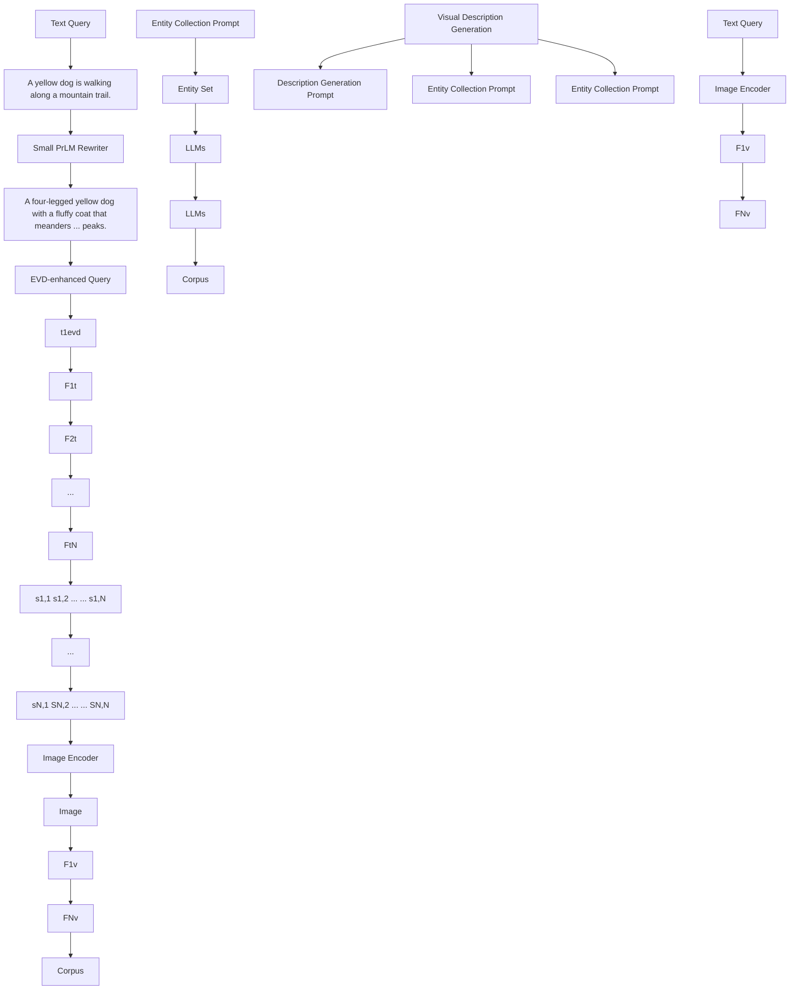

# EvdCLIP: Improving Vision-Language Retrieval with Entity Visual Descriptions from Large Language Models

GuangHao Meng $^{1,2}$ , Sunan He $^{6}$ , Jinpeng Wang $^{1}$ , Tao Dai $^{4}$ , Letian Zhang $^{1}$ , Jieming Zhu $^{5*}$ , Qing Li $^{2}$ , Gang Wang $^{5}$ , Rui Zhang $^{3✉}$ , Yong Jiang $^{1,2✉†}$

$^{1}$ Tsinghua Shenzhen International Graduate School, Tsinghua University

$^{2}$ Peng Cheng Laboratory

$^{3}$ School of Computer Science & Tech, Huazhong University of Science and Technology

$^{4}$ College of Computer Science and Software Engineering, Shenzhen University

$^{5}$ Huawei Noah's Ark Lab; $^{6}$ Hong Kong University of Science and Technology

{menggh22, wjp20, zlt23}@mails.tsinghua.edu.cn, daitao.edu@gmail.com, liq@pcl.ac.cn

jiemingzhu@ieee.org, 3rayteam@yeah.net, jiangy@sz.tsinghua.edu.cn

# Abstract

Vision-language retrieval (VLR) has attracted significant attention in both academia and industry, which involves using text (or images) as queries to retrieve corresponding images (or text). However, existing methods often neglect the rich visual semantics knowledge of entities, thus leading to incorrect retrieval results. To address this problem, we propose the Entity Visual Description enhanced CLIP (EvdCLIP), designed to leverage the visual knowledge of entities to enrich queries. Specifically, since humans recognize entities through visual cues, we employ a large language model (LLM) to generate Entity Visual Descriptions (EVDs) as alignment cues to complement textual data. These EVDs are then integrated into raw queries to create visually-rich, EVD-enhanced queries. Furthermore, recognizing that EVD-enhanced queries may introduce noise or low-quality expansions, we develop a novel, trainable EVD-aware Rewriter (EaRW) for vision-language retrieval tasks. EaRW utilizes EVD knowledge and the generative capabilities of the language model to effectively rewrite queries. With our specialized training strategy, EaRW can generate high-quality and low-noise EVD-enhanced queries. Extensive quantitative and qualitative experiments on image-text retrieval benchmarks validate the superiority of EvdCLIP on vision-language retrieval tasks.

# Introduction

Vision-language retrieval (VLR) has attracted extensive research and industrial interest due to its significant research and practical value. It usually takes descriptive texts as queries and retrieves corresponding images, or vice versa.

Existing methods heavily rely on the alignment between visual and textual representations. As shown in Figure 1, CLIP (Radford et al. 2021) successfully differentiates between “beach” and “camp of tents” but confuses “camp of tents” with “village”, leading to incorrect retrievals. Even with descriptions from WordNet (Kilgarriff 2000), it struggles to distinguish these concepts. We argue that the lack of

Image   

text_image

CLIP
Pos : A boy in ... from a camp of tents.
Neg1 : A woman in a blue ... in a village.
Neg2 : A woman in a blue ... in a beach.

WordNetCLIP
Pos
Neg1 +
Neg2
camp of tents: A form of outdoor recreation in which people ...
village: A community of people...

EvdCLIP
Pos
Neg1 +
Neg2
Prompt: What are useful features for distinguishing ... in a photo?
camp of tents: a rainfall or tarp...
village: small, clustered house ...

Text

Pos : 0.1508

Neg1: 0.1543

Neg2: 0.0964

Pos : 0.1439

Neg1: 0.1470

Neg2: 0.0933

Pos : 0.1633

Neg1: 0.1542

Neg2: 0.1014

  
Score   
Figure 1: Illustration of entity visual descriptions (EVD) enhanced framework. The CLIP and WordNetCLIP which introduces the concept of entities struggle to distinguish between “camping of tents” and “village”, leading to incorrect retrieval results. Our EvdCLIP leverages the EVD generated by LLMs to improve cross-modal retrieval performance.

visual information in these descriptions and that visual descriptions are crucial to distinguish visually similar entities.

Let's start by analyzing how humans recognize entities in an image. Humans are able to easily describe the visual features of entities using language and leverage these visual descriptions to enhance perception, even for unfamiliar entities. Our key insights are: (1) Visual descriptions offer textual additional cues that improve image-text alignment. (2) Descriptions highlight critical details and discriminative information, aiding in entity recognition. (3) They encompass generic features, boosting the model's transferability.

However, existing methods struggle to obtain EVD to offer useful cues in multi-modal retrieval. Manually creating these descriptions is costly and impractical given the vast number of concepts in our world. Recently, with the advance in Large Language Models (LLMs), several works utilize the LLMs to generate training samples or auxiliary information for specific tasks (Touvron et al. 2023; Zhu et al. 2023; Liu et al. 2023). The large-scale corpus used to train these LLMs

Query: A child in a brown hat napping in his stroller.

- four wheels 😊   
- a seat for a child 😊   
- a canopy for shading 😊   
- a storage basket underneath 😊   
- a footrest for the kid 😊

(a) Noise Issue of EVD

Query: People pose with helmets and goggles on while riding snowmobiles.

EVD-enhanced Query (Paralleled Description Formulation):

People pose with... helmets and goggles which has two lenses that are connected by a bridge on ... riding snowmobiles which has the environment of snowfields or forested paths that are covered by snow.

(b) Low-quality Issue of Integrating EVD

Figure 2: Challenges of EVD integration to VLR. (a) Noise issue. Certain descriptions (e.g., “four wheels”) may not be presented in the “stroller” in the image and query helps to reveal the entity’s preferences. (b) Low-quality issue. Using templates “which has/is” to concatenate entities and descriptions can compromise fluency and introduce ambiguity

contains a substantial amount of semantic knowledge, making them into rich visual knowledge bases.

Based on these insights, we propose Entity Visual Descriptions enhanced CLIP (EvdCLIP), which leverages LLMs to generate valuable visual descriptions as auxiliary cues to guide VLR. Specifically, we first employ LLMs to create an Entity Visual Descriptions (EVD) knowledge base from the image-text dataset. Subsequently, EVD knowledge base is then used to enhance queries with visual descriptions, enabling cross-modal alignment between text and images.

Although some research (Yao et al. 2022; Menon and Vondrick 2022; Maniparambil et al. 2023; Yang et al. 2023; Pratt et al. 2023; An et al. 2023) has applied descriptions to image classification and object detection, considering that queries in VLR are complex sentences containing multiple entities, applying EVDs to VLR presents two challenges: noise and low-quality issue. The noise issue arises because EVDs exhibit over-diversity due to the lack of constraints specific to the image, leading to inconsistencies in some EVDs. As shown in Fig 2 (a), we should consider query content for EVD's denoising. As illustrated in Fig 2 (b), the low-quality issue occurs when existing parallel description paradigm's combining query and description leads to awkward and unsmooth queries.

To address these challenges, we introduce an EVD-aware rewriter (EaRw) that dynamically selects EVDs based on the query, generating high-quality VLR queries. To bridge the gap between knowledge-enhanced tasks and pre-trained rewriters, we create a trainable scheme. Using LLM's ability and CLIP's feedback, we generate a high-quality corpus that captures context preferences and dataset preferences (Dunlap et al. 2024). EaRw then learns to effectively select and integrate EVDs based on query, mitigating noise and low-quality issues, and enhancing VLR performance.

The contributions of our work are three-fold: (1) We propose EvdCLIP, utilizing LLM-based visual descriptions to improve visual-linguistic alignment in VLR. To our knowledge, this is the pioneering effort to use LLMs' visual knowledge for guiding VLR. (2) We develop a novel EVD-aware Rewriter (EaRW) using the compact, trainable T5 (Raffel et al. 2020) to generate precise and fluent EVD-enhanced queries, effectively mitigating noise of EVD and enhancing query quality. (3) We conduct extensive experiments to validate the effectiveness of our method on the public benchmark and Huawei business data.

# Related Work

# Vision-Language Retrieval

Previous VLR models fall into three categories: single-stream, double-stream, and dual-encoder. Single-stream models (Kim, Son, and Kim 2021) use self-attention for fine-grained multi-modal alignment. Double-stream models (Li et al. 2021, 2022; Yang et al. 2022) process intra-modality features with a shared fusion encoder, decoupling intramodal and cross-modal modeling. Due to the need for efficient inference in visual language retrieval, dual-encoder architectures (Radford et al. 2021; Wang et al. 2022b; Zhao et al. 2023; Wang et al. 2024) have been proposed, using contrastive learning to align visual and text embeddings in the same semantic space. To enhance image-text alignment, we introduce the EvdCLIP framework, which integrates entity visual descriptions as alignment cues.

# Knowledge Acquisition for VLR

Related work falls into two categories: internal knowledge mining and external knowledge incorporation. Internal Knowledge Mining: OA-Trans (Wang et al. 2022c) and structureCLIP (Huang et al. 2024) use objects in images for cross-modal learning, while Coder (Wang et al. 2022a) and ViSTA (Cheng et al. 2022) leverage common knowledge and scene text for image-text retrieval. External Knowledge Incorporation: Knowledge-CLIP (Pan et al. 2022) and ACP (Pan et al. 2022) use multi-modal knowledge graphs to improve concept-level semantics. EI-CLIP (Ma et al. 2022) extends entity semantics through e-commerce knowledge for better e-commerce retrieval. LLMs can be considered as vast knowledge bases (Zeng et al. 2022; Menon and Vondrick 2022). For example, (Shen et al. 2024; Zhu et al. 2024; Wang et al. 2023) leverage the knowledge in LLMs to understand and extract user preferences from multimodal inputs, optimizing multimodal recommendation and personalized multimodal content generation. In this work, we explore the use of the rich knowledge in LLMs to enhance image-text alignment, improving MMR performance.

# Description Enhancement for CLIP

Recent work has focused on enhancing CLIP using category descriptions in image classification and object detection. For instance, (Menon and Vondrick 2022) and (Pratt et al. 2023) generate descriptions with LLMs, while (Yao et al. 2022) improves object detection through parallel training with an object concept dictionary. As noise in description has gained

Step1 : EVD Offline Generation via LLMS   

flowchart

Step2 : EVD-enhanced Vison-Language Retrieval  
Figure 3: The overall architecture of EvdCLIP comprises two components: EVD offline generation via LLMs and EVD-enhanced vision-language retrieval. First, EVD knowledge is generated offline using LLMs. Then, an EVD-aware query rewriter integrates the query with EVD to produce an EVD-enhanced query for retrieval.

attention, filtering methods have emerged. (Yang et al. 2023) designs a scoring function to select representative descriptions and uses a learnable weight matrix for personalized attention. (An et al. 2023) uses a manually designed scoring function to reflect annotators' linguistic preferences, focusing on relevant features. (Maniparambil et al. 2023) addresses interfering information with a self-attention adapter.

# Methodology

The framework of EvdCLIP is illustrated in Figure 3. We first review the dual-encoder framework, and then detail EVD offline generation via LLMs. Finally, we illustrate how we utilize EVD to enhance multimodal retrieval.

# Dual-encoder Framework

In this work, we select the simple yet effective dual-encoder CLIP as our backbone. As shown in Figure 3, images and texts are encoded by an image encoder and a text encoder respectively, then projected into the same semantic space for effective retrieval. Formally, assuming we have N samples in a batch, $B = \{(v_i, t_i)\}_{i=1}^N$ denotes the training dataset, where $(v_i, t_i)$ is the i-th image-text pair. The matched image-text pairs are considered positive samples, while other pairwise combinations serve as negative samples. We define the image-to-text contrastive loss as:

$$
\begin{array}{l} L _ {i 2 t} = - \frac {1}{N} \sum_ {(v _ {i}, t _ {i}) \in B} y \cdot \log p (v _ {i}, t _ {i}) \\ = - \frac {1}{N} \sum_ {\left(v _ {i}, t _ {i}\right) \in B} \log \frac {\exp \left(F _ {i} ^ {v} \cdot F _ {i} ^ {t} / \tau\right)}{\sum_ {j = 0} ^ {N} \exp \left(F _ {i} ^ {v} \cdot F _ {j} ^ {t} / \tau\right)}, \tag {1} \\ \end{array}
$$

where $F_{i}^{v}$ and $F_{i}^{t}$ are the normalized embedding of $v_{i}$ and $t_{i}$ . $\tau$ is the temperature hyper-parameter. Similarly, we can define the text-to-image contrastive loss as:

$$
L _ {t 2 i} = - \frac {1}{N} \sum_ {(v _ {i}, t _ {i}) \in B} \log \frac {\exp \left(F _ {i} ^ {v} \cdot F _ {i} ^ {t} / \tau\right)}{\sum_ {j = 0} ^ {N} \exp \left(F _ {j} ^ {v} \cdot F _ {i} ^ {t} / \tau\right)}. \tag {2}
$$

The final contrastive loss can be denoted as:

$$
L = L _ {i 2 t} + L _ {t 2 i}. \tag {3}
$$

The dual-encoder framework t lacks fine-grained cues for precise vision-language alignment. To address this, we use EVD as additional cues, enhancing retrieval performance.

# EVD Offline Generation via LLMs

Entity Collection To build the EVD knowledge base, we first create a predefined entity set. In VLR, visual items with rich visual information are more critical than non-visual terms. For example, non-visual terms like “New York” contribute little to image-text retrieval due to the difficulty in concisely describing its visual characteristics. In contrast, visual terms like “whale” and “school bus” offer distinct visual cues that enhance cross-modal retrieval. We collect visual items from the training datasets of Flickr30k (Plummer et al. 2015) and MSCOCO (Lin et al. 2014). Since current methods struggle to differentiate between visual and non-visual entities, we use LLMs with carefully designed prompts to extract visual entities. Specifically, the prompts clarify the distinction between visual and non-visual entities, allowing LLMs to accurately extract visual entities from the text. To ensure precise and standardized extraction, we include two

QA examples in the prompt. The final entity set can be denoted as $E = \{e_{n}\}_{n=1}^{M}$ , where M indicates the number of entities and $e_{n}$ represents the n-the-entity name.

Visual Description Generation Given the entity set, we use a large language model to generate visual descriptions focused on distinguishable features like shape and color, facilitating fine-grained cross-modal alignment. This approach generates a list of visual descriptions for each entity, focusing on characteristics like color, shape, parts, and quantity to enhance visual distinction. The EVD knowledge base $O = \{e_i : evd_i\}_{i=1}^M$ maps each entity $e_i$ to its corresponding visual descriptions $evd_i$ , covering around 10,000 entities in this paper. Here $evd_i$ represents a list of multiple visual descriptions of entity $e_i$ . Once the EVD knowledge base is constructed offline, there is no need to generate EVD during either training or inference.

# EVD-aware Rewriter

Given the query $t_{i}$ , we first retrieve the entities $e_{i}$ and obtain their descriptions $evd_{i}$ from the EVD knowledge. The EVD-enhanced query is then formed as $t_{i}^{evd} = agg(t_{i}, evd_{i})$ , where $agg(\cdot)$ represents the integration strategy. As shown in Figure 2, existing methods face noise and low-quality issues. To overcome these challenges, we develop the EVD-aware Rewriter (EaRW), which uses a pre-trained language model to expand queries with EVD knowledge.

EVD-enhanced Query Rewriting Dataset However, the multimodal knowledge-enhanced rewriting introduces gaps with T5's pre-training, causing EaRW to sometimes struggle with the rewriting task, limiting its performance. To better filter EVD noise and improve integration quality, we propose a specialized training scheme for the T5 model. First, we construct an EVD-enhanced query rewriting dataset $D_{EQR}$ . Inspired by recent distillation methods (Ma et al. 2023), we use LLMs to rewrite queries and collect EVD-enhanced queries with positive feedback from CLIP as pseudo-labels in the training dataset $D_{EQR}$ . We generate multiple EVD-enhanced queries for each query, and the final $D_{EQR}$ is composed of tuples $(x : \{y_i, s_i\}_{i=1}^k)$ , where x is the original query, $y_i$ is the i-th EVD-enhanced query label for x, $s_i$ is the corresponding score, and k is the number of pseudo-labels for each x. In summary, we leverage ChatGPT's contextual reasoning ability and CLIP's feedback to generate a high-quality corpus that effectively captures context preferences and dataset preferences (Dunlap et al. 2024) of EVD.

Rewriter Warm-up We initiate the EaRW with a pre-trained T5-large model. The rewriter is first trained on rewriting dataset $D_{EQR}$ to warm up. In this step, we use the dataset $D_{EQR}$ to train an initial rewriter via a supervised fine-tuning method. This process as a text-to-text task and the rewriter is finetuned on $D_{EQR}$ with the standard log-likelihood as the training objective, denoted as:

$$
L _ {\mathrm{SFT}} = - \mathbb {E} _ {(x, y) \sim D} \sum_ {t} \log \pi (\hat {y} _ {t} | \hat {y} _ {<   t}, x; \theta), \tag {4}
$$

where x refers to the original query and $\tilde{y}$ refers to the corresponding EVD-enhanced query label with the highest score. $D, \pi(\cdot)$ and $\theta$ denote rewriting dataset $D_{EQR}$ , query rewriter and its parameters. The performance of EaRw after warm-up may be sub-optimal. To better align the EaRw with the retriever, we further employ preference optimization (Peng et al. 2024) to fine-tune the EaRw to fit the retriever.

Preference Alignment This process requires the construction of a specialized preference dataset. We generate multiple EVD-enhanced queries and obtain image-text similarity scores from the retrieval system, which serve as rewards for preference learning. These scores allow us to rank the EVD-enhanced queries from highest to lowest preference. To minimize bias from the reward model and enhance fine-grained preference comparisons from a global perspective, we introduce Preference Rank Optimization (PRO) based on the Bradley-Terry model(Song et al. 2024). This method helps the model learn the ranking of rewrites based on feedback from the retriever, with preference probabilities defined as proportional to the reward for a given order relation $y_1 \succ y_2$ , expressed as:

$$
P _ {B T} = \frac {\exp (r (y _ {1} , x))}{\exp (r (y _ {1} , x)) + \exp (r (y _ {2} , x))}, \tag {5}
$$

where $r(\cdot)$ is the reward function, which is defined as the normalized log probability of the rewrite generated in PRO. PRO extends pairwise partial order into general listwise partial order. The PRO loss is expressed by the equation:

$$
L _ {\mathrm{PRO}} = - \mathbb {E} _ {(\mathbf {x}, \mathbf {y}) \sim D} \sum_ {j = 1} ^ {k - 1} \log \frac {\exp \left(\frac {\pi (y _ {j} | x ; \theta)}{\tau_ {j} ^ {\prime}}\right)}{\sum_ {i = j} ^ {k} \exp \left(\frac {\pi (y _ {i} | x ; \theta)}{\tau_ {j} ^ {i}}\right)}, \tag {6}
$$

where $\tau_{j}^{i}=\frac{1}{r(y_{j})-r(y_{i})}$ and $\tau_{j}^{\prime}=\min_{i>j}(\tau_{j}^{i})$ are used to measure ranking difference. k denotes the number of candidate Evd-enhanced query label, $\pi_{PRO}$ and $\theta$ refer to the policy model and its parameters. Additionally, an SFT loss is applied to the PRO loss with weight $\beta$ to preserve the model's ability to generate standard outputs.

$$
L _ {\text { ALIGN }} = L _ {\text { PRO }} + \beta L _ {\text { SFT }}. \tag {7}
$$

EaRW not only learns to recognize and integrate relevant visual descriptions based on entity preferences but also harnesses LLM's ability to generate fluent, high-quality queries.

We integrate the optimized EaRW into the CLIP framework, fine-tuning CLIP using Eq. (3) while keeping EaRW's parameters frozen. To handle queries with varying descriptive granularities, we randomly apply query rewriting with probability $p$ during training. For inference, we average the EVD-enhanced query score with the original query score to determine the final score.

# Experiments

# Experimental Setup

Datasets This paper utilizes three types of datasets: benchmark datasets, Huawei business datasets, and EVD-enhanced query rewriting dataset. We use the benchmark and Huawei business datasets for model fine-tuning

<table><tr><td rowspan="3">Methods</td><td rowspan="3">V-Encoder</td><td colspan="6">Flickr30K(1K)</td><td colspan="6">MSCOCO(5K)</td></tr><tr><td colspan="3">I2T Retrieval</td><td colspan="3">T2I Retrieval</td><td colspan="3">I2T Retrieval</td><td colspan="3">T2I Retrieval</td></tr><tr><td>R1</td><td>R5</td><td>R10</td><td>R1</td><td>R5</td><td>R10</td><td>R1</td><td>R5</td><td>R10</td><td>R1</td><td>R5</td><td>R10</td></tr><tr><td>CLIP (Radford et al. 2021)</td><td>ViT-B/32</td><td>64.8</td><td>85.7</td><td>92.5</td><td>49.2</td><td>79.3</td><td>86.8</td><td>43.7</td><td>73.5</td><td>82.6</td><td>32.7</td><td>63.3</td><td>75.0</td></tr><tr><td>DetCLIP (Yao et al. 2022)</td><td>ViT-B/32</td><td>65.2</td><td>86.3</td><td>93.5</td><td>50.7</td><td>79.2</td><td>86.8</td><td>45.2</td><td>73.7</td><td>83.4</td><td>33.4</td><td>63.5</td><td>75.0</td></tr><tr><td>DesCLIP (Menon and Vondrick 2022)</td><td>ViT-B/32</td><td>65.8</td><td>87.7</td><td>93.6</td><td>51.2</td><td>79.8</td><td>87.1</td><td>45.7</td><td>73.9</td><td>83.8</td><td>34.2</td><td>63.8</td><td>75.2</td></tr><tr><td>CLIP-GPT (Maniparambil et al. 2023)</td><td>ViT-B/32</td><td>66.5</td><td>88.1</td><td>93.6</td><td>51.2</td><td>80.1</td><td>87.8</td><td>46.1</td><td>74.0</td><td>83.7</td><td>34.1</td><td>63.7</td><td>75.3</td></tr><tr><td>LaBo (Yang et al. 2023)</td><td>ViT-B/32</td><td>66.1</td><td>87.5</td><td>93.5</td><td>51.2</td><td>79.8</td><td>87.5</td><td>46.4</td><td>74.1</td><td>83.8</td><td>34.3</td><td>63.7</td><td>75.1</td></tr><tr><td>EvdCLIP</td><td>ViT-B/32</td><td>66.9</td><td>88.6</td><td>94.2</td><td>52.0</td><td>80.5</td><td>87.6</td><td>46.8</td><td>74.4</td><td>84.2</td><td>35.2</td><td>64.5</td><td>75.7</td></tr><tr><td>CLIP (Radford et al. 2021)</td><td>ViT-B/32</td><td>89.1</td><td>97.8</td><td>98.9</td><td>74.1</td><td>92.6</td><td>95.9</td><td>65.3</td><td>85.9</td><td>91.9</td><td>48.1</td><td>75.0</td><td>83.7</td></tr><tr><td>DetCLIP (Yao et al. 2022)</td><td>ViT-B/32</td><td>89.2</td><td>97.8</td><td>99.1</td><td>74.6</td><td>92.8</td><td>96.0</td><td>65.5</td><td>85.9</td><td>92.1</td><td>48.3</td><td>75.1</td><td>83.7</td></tr><tr><td>DesCLIP (Menon and Vondrick 2022)</td><td>ViT-B/32</td><td>89.6</td><td>98.6</td><td>99.3</td><td>75.1</td><td>93.0</td><td>95.9</td><td>66.1</td><td>86.1</td><td>92.4</td><td>48.8</td><td>75.3</td><td>84.1</td></tr><tr><td>CLIP-GPT (Maniparambil et al. 2023)</td><td>ViT-B/32</td><td>89.7</td><td>98.7</td><td>99.2</td><td>75.2</td><td>93.1</td><td>96.1</td><td>66.2</td><td>86.2</td><td>92.3</td><td>48.8</td><td>75.3</td><td>84.3</td></tr><tr><td>LaBo (Yang et al. 2023)</td><td>ViT-B/32</td><td>89.7</td><td>98.5</td><td>99.2</td><td>74.8</td><td>93.1</td><td>96.0</td><td>66.3</td><td>86.1</td><td>92.6</td><td>49.0</td><td>75.2</td><td>84.2</td></tr><tr><td>EvdCLIP</td><td>ViT-B/32</td><td>90.7</td><td>99.1</td><td>99.5</td><td>75.6</td><td>93.5</td><td>96.5</td><td>66.8</td><td>86.8</td><td>92.6</td><td>49.5</td><td>75.8</td><td>84.5</td></tr><tr><td>CoCa (Yu et al. 2022)</td><td>ViT-B/32</td><td>85.5</td><td>96.5</td><td>98.7</td><td>72.0</td><td>91.2</td><td>95.4</td><td>63.9</td><td>85.6</td><td>91.0</td><td>45.6</td><td>72.1</td><td>82.2</td></tr><tr><td>DetCoCa (Yao et al. 2022)</td><td>ViT-B/32</td><td>85.6</td><td>96.5</td><td>98.7</td><td>72.2</td><td>91.2</td><td>95.4</td><td>63.8</td><td>85.5</td><td>91.0</td><td>45.8</td><td>72.1</td><td>82.1</td></tr><tr><td>DesCoCa (Menon and Vondrick 2022)</td><td>ViT-B/32</td><td>86.2</td><td>96.8</td><td>98.9</td><td>72.3</td><td>91.4</td><td>95.4</td><td>64.2</td><td>85.7</td><td>91.2</td><td>46.0</td><td>72.3</td><td>82.2</td></tr><tr><td>CoCa-GPT (Maniparambil et al. 2023)</td><td>ViT-B/32</td><td>86.2</td><td>97.0</td><td>98.8</td><td>72.2</td><td>91.6</td><td>95.3</td><td>64.3</td><td>85.7</td><td>91.0</td><td>46.0</td><td>72.2</td><td>82.3</td></tr><tr><td>LaBo (Yang et al. 2023)</td><td>ViT-B/32</td><td>86.1</td><td>96.8</td><td>98.8</td><td>72.1</td><td>91.5</td><td>95.5</td><td>64.3</td><td>85.6</td><td>91.1</td><td>46.1</td><td>72.1</td><td>82.3</td></tr><tr><td>EvdCoCa</td><td>ViT-B/32</td><td>86.6</td><td>97.2</td><td>98.9</td><td>72.6</td><td>91.5</td><td>95.7</td><td>64.8</td><td>85.7</td><td>91.5</td><td>46.4</td><td>72.6</td><td>82.5</td></tr><tr><td>EVA-02-CLIP (Sun et al. 2023)</td><td>ViT-B/16</td><td>90.8</td><td>98.7</td><td>99.2</td><td>78.9</td><td>94.7</td><td>97.0</td><td>69.1</td><td>89.2</td><td>94.0</td><td>52.6</td><td>78.5</td><td>86.8</td></tr><tr><td>DetEVA-02-CLIP (Yao et al. 2022)</td><td>ViT-B/16</td><td>90.9</td><td>98.6</td><td>99.1</td><td>79.1</td><td>94.6</td><td>97.0</td><td>69.3</td><td>89.2</td><td>94.0</td><td>52.7</td><td>78.5</td><td>86.7</td></tr><tr><td>DesEVA-02-CLIP (Menon and Vondrick 2022)</td><td>ViT-B/16</td><td>91.1</td><td>98.7</td><td>99.2</td><td>79.3</td><td>94.7</td><td>97.1</td><td>69.5</td><td>89.3</td><td>94.3</td><td>52.6</td><td>78.6</td><td>86.8</td></tr><tr><td>EVA-02-CLIP-GPT (Maniparambil et al. 2023)</td><td>ViT-B/16</td><td>91.1</td><td>98.7</td><td>99.2</td><td>79.3</td><td>94.7</td><td>97.1</td><td>69.4</td><td>89.3</td><td>94.3</td><td>52.6</td><td>78.6</td><td>86.8</td></tr><tr><td>LaBo (Yang et al. 2023)</td><td>ViT-B/16</td><td>91.0</td><td>98.6</td><td>99.3</td><td>79.3</td><td>94.8</td><td>97.0</td><td>69.4</td><td>89.2</td><td>94.1</td><td>52.8</td><td>78.5</td><td>86.8</td></tr><tr><td>EvdEVA-02-CLIP</td><td>ViT-B/16</td><td>91.4</td><td>98.6</td><td>99.5</td><td>79.7</td><td>94.8</td><td>97.2</td><td>69.9</td><td>89.7</td><td>94.5</td><td>53.4</td><td>78.9</td><td>87.1</td></tr></table>

Table 1: Fine-tuning results for image-text retrieval on the Flickr30K (1K) test set and MSCOCO (5K) test set. Notations: V-Encoder: vision encoder; # PT Data: the pre-training datasets.

<table><tr><td rowspan="2">Methods</td><td colspan="3">CLIP</td><td colspan="3">EvdCLIP</td></tr><tr><td>R5</td><td>R50</td><td>R100</td><td>R5</td><td>R50</td><td>R100</td></tr><tr><td>Theme</td><td>50.32</td><td>64.22</td><td>67.68</td><td>50.47</td><td>67.30</td><td>71.85</td></tr><tr><td>Wallpaper</td><td>22.30</td><td>52.01</td><td>62.41</td><td>25.22</td><td>58.71</td><td>69.13</td></tr><tr><td>Lock-Screen</td><td>83.51</td><td>92.46</td><td>94.31</td><td>84.73</td><td>94.50</td><td>95.93</td></tr><tr><td>Icons</td><td>73.97</td><td>86.84</td><td>89.71</td><td>74.03</td><td>87.38</td><td>90.41</td></tr></table>

Table 2: Fine-tuning T2I retrieval results on HuaWei Business Datasets. The vision encoder is ViT-B/32.

and performance evaluation. Benchmark Datasets: (1) Flickr30K (Plummer et al. 2015) contains 31,000 images, each annotated with 5 captions. Following (Li et al. 2021), which split into 29K/1k/1k images for training, validation and testing. (2) MSCOCO (Lin et al. 2014) comprises 123,287 images, each annotated with 5 captions. We split it into 114K/5K/5K for training, validation, and testing. (3) MSR-VTT (Xu et al. 2016) includes 10K videos, each with 200K text. We employ 9K videos for training and evaluation on the 1K test set. (4) SBU30k (Ordonez, Kulkarni, and Berg 2011) consists of 36k image-text pairs, randomly sampled from SBU Captions and split into 30K/3K/3K for training, validation, and testing. Similarly, we obtain (6) CC30K and (7) YFCC30K by randomly sampling from CC12M and YFCC15M. Huawei Business Datasets: sourced from Huawei Mobile Scene Search Service, contains a large number of Chinese image-text pairs. It is categorized into four types: Theme, Wallpaper, Lock-Screen, and Icon.

Baseline We will validate our approach on advanced dual-encoder retrieval models: (1) CLIP (Radford et al. 2021), a powerful dual-encoder model pre-trained with contrast learning. (2) CoCa (Yu et al. 2022), a framework that integrates various pre-training paradigms, using its image encoder and unimodal text decoder for retrieval. (3) EVA-02-CLIP (Sun et al. 2023), which incorporates novel techniques for representation learning, enhancing CLIP's performance.

We also compare EvdCLIP with description-enhanced CLIP methods: (1) DetCLIP(Yao et al. 2022) generates object concepts via WordNet. (2) DesCLIP (Menon and Vondrick 2022) uses LLMs to generate descriptions and inputs them into CLIP in parallel. (3) CLIP-GPT (Maniparambil et al. 2023) creates visual descriptions with LLMs and denoising with a self-attention adapter. (4) LaBo (Yang et al. 2023) selects descriptions with designed functions and a learnable weighting matrix.

Large Language Models We used several LLMs, including GPT-3 (Brown et al. 2020) ("text-davinci-003"), ChatGPT (OpenAI 2022) ("GPT-3.5-turbo"), Llama (Touvron et al. 2023) ("Llama-2-13B-chat"), Vicuna (Chiang et al. 2023) ("vicuna-13B-v1.5"), and PanGu (Zeng et al. 2021), a Chinese LLM developed by Huawei.

Implementation Details In the construction of the EVD, we utilize ChatGPT to gather entities from the training sets of the Flickr30k and MSCOCO datasets. After collecting entities, we filter out low-frequency entities to ensure the relevance and robustness of the dataset. This process result in the collection of approximately 10k entities (M = 10237). Subsequently, we employ ChatGPT to generate visual descriptions for these entities. In the Huawei business dataset, we use the PanGu large language model instead of ChatGPT for our experiments. EaRW is initialized using the pre-trained T5-large model (770M parameters), making it more feasible

for real-world deployment. We conduct the warm-up phase of EaRW with a learning rate of 3e-5, a batch size of 8, and over 20 epochs. For the Rank Preference Optimisation (RPO) model, we set the learning rate to 5e-7, with a batch size of 16, across 5 epochs, and used a rank length of 5. The weight of the SFT loss $\beta$ is set to 0.2, and the probability of random rewriting during CLIP fine-tuning p is set to 0.6.

We build EvdCLIP based on fine-tuning on pre-trained CLIP model (Radford et al. 2021). For the hyper-parameters used for fine-tuning CLIP, we employ the Adam optimizer (Kingma and Ba 2014) with weight decay of 1e-3 and batch size is set to 256. The total number of fine-tuning epochs is set to 20. The initial learning rate is set to 1e-6 and a cosine learning rate decay scheduler is applied. We apply a warm-up strategy for the initial 2k steps. Following previous work (Radford et al. 2021), we use recall R@h(h = 1, 5, 10) as the evaluation metrics.

# Main Results

We evaluate our approach on a state-of-the-art dual-encoder framework for VLR using two benchmarks: Flickr30K and MSCOCO. As shown in Table 1, EvdCLIP consistently outperforms CLIP across all metrics on both datasets, demonstrating that incorporating EVD enhances the alignment of images and text. Notably, EvdCLIP shows a significant improvement on R@1. When pre-trained on Laion400M, EvdCLIP achieves R@1 increases of 1.6%, 1.5%, 1.5%, and 1.4% on I2T and T2I for Flickr30K and MSCOCO, respectively, indicating that EVD captures fine-grained entity differences, leading to more precise identification.

We test EvdCLIP on other CLIP-style models. As shown in Table 1, both CoCa and EVA-02-CLIP, with our approach, achieve superior performance across most metrics, demonstrating its compatibility and effectiveness. Although EVA-02-CLIP already significantly improves CLIP's performance through optimization strategies, our method further enhances its performance. Compared to existing description enhancement methods, EvdCLIP is tailored for VLR, leading to more significant improvements in retrieval performance. Detailed analysis is provided in ablation studies.

# Results on Huawei Business Dataset

We also evaluate our method on Huawei business dataset and the results are consistent with those from public datasets. Using the Pangu Chinese LLM to generate entity visual descriptions, EvdCLIP consistently outperforms CLIP in various text-to-image retrieval tasks, as shown in Table 2. Notably, we observe that our method achieves the most significant performance gains in the wallpaper task, with recall rates improving by 2.92%, 6.70%, and 6.72% at R@5, R@50, and R@100. We speculate that user queries for the wallpaper are often short, vague, and entity-rich, making EVDs particularly crucial for this task. These results further demonstrate the effectiveness of our EVDs in large-scale Chinese vision-language retrieval.

# Ablation Studies

Description Types Entity descriptions in our paper are of two types: conceptual descriptions from sources like Word-

<table><tr><td rowspan="2">Methods</td><td rowspan="2">Des. Source</td><td colspan="3">I2T Retrieval</td><td colspan="3">T2I Retrieval</td></tr><tr><td>R1</td><td>R5</td><td>R10</td><td>R1</td><td>R5</td><td>R10</td></tr><tr><td>CLIP</td><td>NA</td><td>89.1</td><td>97.8</td><td>98.9</td><td>74.1</td><td>92.6</td><td>95.9</td></tr><tr><td>WordNetCLIP</td><td>WordNet</td><td>89.2</td><td>97.8</td><td>99.2</td><td>74.6</td><td>92.8</td><td>96.0</td></tr><tr><td rowspan="4">EvdCLIP</td><td>GPT-3</td><td>90.6</td><td>99.0</td><td>99.4</td><td>75.6</td><td>93.4</td><td>96.4</td></tr><tr><td>ChatGPT</td><td>90.7</td><td>99.1</td><td>99.5</td><td>75.6</td><td>93.5</td><td>96.5</td></tr><tr><td>Llama-13B</td><td>90.4</td><td>98.8</td><td>99.4</td><td>75.3</td><td>93.3</td><td>96.2</td></tr><tr><td>Vicuna-13B</td><td>90.2</td><td>98.8</td><td>99.2</td><td>75.4</td><td>93.2</td><td>96.3</td></tr></table>

Table 3: Ablation studies on description sources. The vision encoder is ViT-B/32, Fine-tuning dataset is Flickr30k and Pre-Training dataset is Laion400M.

<table><tr><td>Query Image</td><td colspan="2">EvdCLIP&#x27;s Text map with Image</td><td colspan="2">CLIP&#x27;s Text map with Image</td></tr><tr><td rowspan="3">(a)</td><td>A ... its tongue hanging out, displaying ... a U-shaped underside.</td><td>A ... Frisbee in its mouth, characterized by its circular shape ...</td><td>A brown dog ... tongue hanging out</td><td>A brown dog ... Frisbee in its mouth</td></tr><tr><td></td><td></td><td></td><td></td></tr><tr><td colspan="2">Retrieve Results: A brown dog walks ... tongue hanging out √</td><td colspan="2">Retrieve Results: A ... Frisbee in its mouth ✗</td></tr><tr><td rowspan="2"></td><td>A DJ ... mixing board, featuring a flat surface buttons ...</td><td>A DJ ... turntable, wears headphones with two earpieces ....</td><td>A DJ ..., adjusting levels on his mixing board</td><td>A DJ with one hand ... on his turntable.</td></tr><tr><td></td><td></td><td></td><td></td></tr><tr><td>(b)</td><td colspan="2">Retrieve Results: A DJ in a club, ... on his mixing board √</td><td colspan="2">Retrieve Results: A DJ with one ... on his turntable ✗</td></tr></table>

Figure 4: Visualization examples of retrieval. We present image queries (the first column) along with four heatmaps.

Net (Kilgarriff 2000) and visual descriptions generated by our method. Table 3 compares the results of WordNetCLIP and EvdCLIP. WordNet provides only slight improvements in image-text retrieval, because its definitions are less relevant to visual understanding. In contrast, EvdCLIP's visual descriptions better capture image content, leading to superior performance in cross-modal tasks.

Large Language Models We test EvdCLIP with various LLMs, including ChatGPT, GPT-3, Llama-13B, and Vicuna-13B. As shown in Table 3, experimental results reveal that EvdCLIP, equipped with any LLMs, can generate visually helpful descriptions for the model. Different LLMs show slight variations in performance improvement. GPT-3 and ChatGPT outperform others.

EVD-enhanced Query Methods We analyze the impact of different description enhancement methods. As shown in Table 1, DetCLIP adds concept descriptions for entities, resulting in only slight enhancement. DesCLIP adds visual descriptions, offering better performance than DetCLIP, but it suffers from noise and low-quality integration issues. CLIP-GPT and LaBo are designed for image classification denoising, but they fail to dynamically adjust for query content, limiting their performance. EvdCLIP outperforms all these methods. With EaRW and our training strategy, EvdCLIP

other

| Category | Item | Value |
| :--- | :--- | :--- |
| EvdCLIP | Ground Truth Text | A man in an orange t-shirt ... a keeper behind trying to catch the ball. The keeper wears a uniform, a hat and protective gloves. |
| EvdCLIP | Image | (a) |
| DesCLIP | Ground Truth Text | A man dressed in ... a keeper (which has carrying a whistle) behind ... ball. A man dressed in ... a keeper (which has carrying a clipboard) behind ... ball. |
| EvdCLIP | Image | (b) |
| DesCLIP | Ground Truth Text | A black man ... garbage can, either cylindrical or rectangular, is made of metal or plastic and has a lid as well as the sign features words ... and directional indicators. |
| DesCLIP | Image | (c) |
| EvdCLIP | Ground Truth Text | A busy square somewhere in Asia, featuring a large, open area bordered by significant buildings with trees, shrubs and groups of people walking. |
| DesCLIP | Image | (c) |
| DesCLIP | Ground Truth Text | A busy square (which has four right angles) somewhere in asia. A busy square (which has four corners) somewhere in asia. |

Figure 5: Comparison Between EvdCLIP and DesCLIP. The first column shows the similar scores between Ground Truth and the image. The text in red annotates the errors.

efficiently filters and utilizes EVD based on the query, generating high-quality EVD-enhanced queries.

# Qualitative Analysis

Superiority of EVD We use the Integrated Gradients algorithm (Qi, Khorram, and Li 2019) to demonstrate how EVD helps the model focus on relevant image regions. In Figure 4 (a), CLIP struggles to distinguish between “frisbee” and “tongue” in the dog’s mouth, leading to inaccurate results. EVD enables EvdCLIP to differentiate these entities by emphasizing features like the “U-shaped underside” of a “tongue” versus the “circular shape” of a “frisbee”. In Figure 4 (b), CLIP struggles with the few-shot entity “mixing board”, while EvdCLIP, guided by the visual description “a flat surface with knobs, buttons, and sliders,” achieves better alignment. In summary, EVD helps EvdCLIP focus on semantically relevant regions, improving retrieval accuracy.

Superiority of EaRW We then qualitatively analyze the advantages of EaRW. Due to LLM-induced hallucinations, some entities may be misinterpreted. For example, in Figure 5(a), “carrying a whistle” and “carrying a clipboard” are incorrect descriptions for the entity “keeper”, resulting in inaccurate retrievals. EaRW, trained on the dataset $D_{EQR}$ , identifies these intrusive descriptions and filters them out during query rewriting. Beyond hallucinations, EaRW also reduces noise. In Figure 5(b), the description “handles on the side” does not match the “garbage can” in the image. EaRW learns the appearance preferences of high-frequency entities and selectively incorporates relevant descriptions into the query. EaRW also effectively resolves entity ambiguity. As

text_image

Query
山东舰 (Shandong Ship)
EVD Knowledge
- 大型海军军舰 (Large naval warship)
- 航空母舰 (Aircraft carrier)
- 甲板上有多架飞机 (With several aircraft on deck)
(a)
CLIP
18:16
08:08
08:08
EvdCLIP
Query
婚礼壁纸 (Wedding Wallpaper)
EVD Knowledge
- 穿着西服的新郎 (Groom in a suit)
- 穿着白色婚纱的新娘 (Bride in a white wedding dress)
- 红色装饰表好运 (Red decorations, symbolising good luck)
(b)
CLIP
12:09
12:09
EvdCLIP

Figure 6: Examples of Huawei Wallpaper Retrieval. The left is query and the right displays top-4 retrieval results. (a) Images highlighted in green are user-satisfied; (b) Results highlighted in red depict Western weddings, while those in blue represent traditional Chinese weddings.

shown in Figure 5(c), the term “square” can refer to either plaza features or geometric shapes. Geometric descriptions may reduce matching accuracy. EaRW adapts by choosing “plaza”-related descriptions based on the query’s context.

# Methodological Editability

Novel Knowledge Injection: CLIP is limited to understanding concepts that existed before its training. In contrast, EvdCLIP enables the model to grasp novel concepts by integrating visual descriptions. For instance, in Huawei Wallpaper Retrieval, as shown in Figure 6 (a), when the query “Shandong ship” is used, the CLIP model produces poor retrieval results. By constructing appropriate descriptors, EvdCLIP can recognize that “Shandong ship” refers to an aircraft carrier and retrieve images that satisfy the user’s intent.

Entity Bias Correction: EVD allow for manual bias correction in recognition systems. Since EvdCLIP's decision relies on EVD, altering descriptions will impact outcomes. Figure 6 (b) shows how editing EVD can address bias. For instance, when querying “Wedding Wallpaper”, CLIP may favor Western weddings due to biased training data. By incorporating EVDs of traditional Chinese weddings, we guide the model to explore a more diverse range of concepts.

# Conclusion

In this paper, we propose EvdCLIP, which employs entity visual descriptions generated by LLMs as auxiliary information to guide visual-textual alignment. To address the noise and low-quality issue of EVD integration, we develop an EVD-aware Rewriter, which utilizes EVD knowledge and the generative capabilities of pretrained language models to rewrite query elegantly. Extensive visual-language retrieval benchmark experiments have demonstrated that our proposed EvdCLIP can effectively improve VLR performance.

# References

An, B.; Zhu, S.; Panaitescu-Liess, M.-A.; Mummadi, C. K.; and Huang, F. 2023. More context, less distraction: Improving zero-shot inference of clip by inferring and describing spurious features. In Workshop on Efficient Systems for Foundation Models@ ICML2023.   
Brown, T.; Mann, B.; Ryder, N.; Subbiah, M.; Kaplan, J. D.; Dhariwal, P.; Neelakantan, A.; Shyam, P.; Sastry, G.; Askell, A.; et al. 2020. Language models are few-shot learners. Advances in neural information processing systems, 33: 1877–1901.   
Cheng, M.; Sun, Y.; Wang, L.; Zhu, X.; Yao, K.; Chen, J.; Song, G.; Han, J.; Liu, J.; Ding, E.; et al. 2022. ViSTA: vision and scene text aggregation for cross-modal retrieval. In Proceedings of the IEEE/CVF Conference on Computer Vision and Pattern Recognition, 5184–5193.   
Chiang, W.-L.; Li, Z.; Lin, Z.; Sheng, Y.; Wu, Z.; Zhang, H.; Zheng, L.; Zhuang, S.; Zhuang, Y.; Gonzalez, J. E.; et al. 2023. Vicuna: An open-source chatbot impressing gpt-4 with 90%\* chatgpt quality. See https://vicuna.lmsys.org (accessed 14 April 2023).   
Dunlap, L.; Zhang, Y.; Wang, X.; Zhong, R.; Darrell, T.; Steinhardt, J.; Gonzalez, J. E.; and Yeung-Levy, S. 2024. Describing differences in image sets with natural language. In Proceedings of the IEEE/CVF Conference on Computer Vision and Pattern Recognition, 24199–24208.   
Huang, Y.; Tang, J.; Chen, Z.; Zhang, R.; Zhang, X.; Chen, W.; Zhao, Z.; Zhao, Z.; Lv, T.; Hu, Z.; et al. 2024. Structure-CLIP: Towards Scene Graph Knowledge to Enhance Multi-Modal Structured Representations. In Proceedings of the AAAI Conference on Artificial Intelligence, volume 38, 2417–2425.   
Kilgarriff, A. 2000. Wordnet: An electronic lexical database. Kim, W.; Son, B.; and Kim, I. 2021. Vilt: Vision-and-language transformer without convolution or region supervision. In International Conference on Machine Learning, 5583–5594. PMLR.   
Kingma, D. P.; and Ba, J. 2014. Adam: A method for stochastic optimization. arXiv preprint arXiv:1412.6980.   
Li, J.; Li, D.; Xiong, C.; and Hoi, S. 2022. Blip: Bootstrapping language-image pre-training for unified vision-language understanding and generation. In International Conference on Machine Learning, 12888–12900. PMLR.   
Li, J.; Selvaraju, R.; Gotmare, A.; Joty, S.; Xiong, C.; and Hoi, S. C. H. 2021. Align before fuse: Vision and language representation learning with momentum distillation. Advances in neural information processing systems, 34: 9694–9705.   
Lin, T.-Y.; Maire, M.; Belongie, S.; Hays, J.; Perona, P.; Ramanan, D.; Dollár, P.; and Zitnick, C. L. 2014. Microsoft coco: Common objects in context. In Computer Vision–ECCV 2014: 13th European Conference, Zurich, Switzerland, September 6-12, 2014, Proceedings, Part V 13, 740–755. Springer.   
Liu, H.; Li, C.; Wu, Q.; and Lee, Y. J. 2023. Visual Instruction Tuning.

Ma, H.; Zhao, H.; Lin, Z.; Kale, A.; Wang, Z.; Yu, T.; Gu, J.; Choudhary, S.; and Xie, X. 2022. Ei-clip: Entity-aware interventional contrastive learning for e-commerce cross-modal retrieval. In Proceedings of the IEEE/CVF Conference on Computer Vision and Pattern Recognition, 18051–18061.   
Ma, X.; Gong, Y.; He, P.; Zhao, H.; and Duan, N. 2023. Query rewriting for retrieval-augmented large language models. arXiv preprint arXiv:2305.14283.   
Maniparambil, M.; Vorster, C.; Molloy, D.; Murphy, N.; McGuinness, K.; and O'Connor, N. E. 2023. Enhancing clip with gpt-4: Harnessing visual descriptions as prompts. In Proceedings of the IEEE/CVF International Conference on Computer Vision, 262–271.   
Menon, S.; and Vondrick, C. 2022. Visual Classification via Description from Large Language Models. arXiv preprint arXiv:2210.07183.   
OpenAI, T. 2022. Chatgpt: Optimizing language models for dialogue. OpenAI.   
Ordonez, V.; Kulkarni, G.; and Berg, T. 2011. Im2text: Describing images using 1 million captioned photographs. Advances in neural information processing systems, 24.   
Pan, X.; Ye, T.; Han, D.; Song, S.; and Huang, G. 2022. Contrastive Language-Image Pre-Training with Knowledge Graphs. arXiv preprint arXiv:2210.08901.   
Peng, W.; Li, G.; Jiang, Y.; Wang, Z.; Ou, D.; Zeng, X.; Xu, D.; Xu, T.; and Chen, E. 2024. Large language model based long-tail query rewriting in taobao search. In Companion Proceedings of the ACM on Web Conference 2024, 20–28.   
Plummer, B. A.; Wang, L.; Cervantes, C. M.; Caicedo, J. C.; Hockenmaier, J.; and Lazebnik, S. 2015. Flickr30k entities: Collecting region-to-phrase correspondences for richer image-to-sentence models. In Proceedings of the IEEE international conference on computer vision, 2641–2649.   
Pratt, S.; Covert, I.; Liu, R.; and Farhadi, A. 2023. What does a platypus look like? generating customized prompts for zero-shot image classification. In Proceedings of the IEEE/CVF International Conference on Computer Vision, 15691–15701.   
Qi, Z.; Khorram, S.; and Li, F. 2019. Visualizing Deep Networks by Optimizing with Integrated Gradients. In CVPR Workshops, volume 2, 1–4.   
Radford, A.; Kim, J. W.; Hallacy, C.; Ramesh, A.; Goh, G.; Agarwal, S.; Sastry, G.; Askell, A.; Mishkin, P.; Clark, J.; et al. 2021. Learning transferable visual models from natural language supervision. In International conference on machine learning, 8748–8763. PMLR.   
Raffel, C.; Shazeer, N.; Roberts, A.; Lee, K.; Narang, S.; Matena, M.; Zhou, Y.; Li, W.; and Liu, P. J. 2020. Exploring the limits of transfer learning with a unified text-to-text transformer. Journal of machine learning research, 21(140):1–67.   
Shen, X.; Zhang, R.; Zhao, X.; Zhu, J.; and Xiao, X. 2024. PMG: Personalized Multimodal Generation with Large Language Models. In Proceedings of the ACM on Web Conference 2024, 3833–3843.

Song, F.; Yu, B.; Li, M.; Yu, H.; Huang, F.; Li, Y.; and Wang, H. 2024. Preference ranking optimization for human alignment. In Proceedings of the AAAI Conference on Artificial Intelligence, volume 38, 18990–18998.   
Sun, Q.; Fang, Y.; Wu, L.; Wang, X.; and Cao, Y. 2023. Evaclip: Improved training techniques for clip at scale. arXiv preprint arXiv:2303.15389.   
Touvron, H.; Martin, L.; Stone, K.; Albert, P.; Almahairi, A.; Babaei, Y.; Bashlykov, N.; Batra, S.; Bhargava, P.; Bhosale, S.; et al. 2023. Llama 2: Open foundation and fine-tuned chat models. arXiv preprint arXiv:2307.09288.   
Wang, H.; He, D.; Wu, W.; Xia, B.; Yang, M.; Li, F.; Yu, Y.; Ji, Z.; Ding, E.; and Wang, J. 2022a. Coder: Coupled diversity-sensitive momentum contrastive learning for image-text retrieval. In Computer Vision–ECCV 2022:17th European Conference, Tel Aviv, Israel, October 23–27, 2022, Proceedings, Part XXXVI, 700–716. Springer.   
Wang, J.; Chen, B.; Liao, D.; Zeng, Z.; Li, G.; Xia, S.-T.; and Xu, J. 2022b. Hybrid contrastive quantization for efficient cross-view video retrieval. In Proceedings of the ACM Web Conference 2022, 3020–3030.   
Wang, J.; Ge, Y.; Cai, G.; Yan, R.; Lin, X.; Shan, Y.; Qie, X.; and Shou, M. Z. 2022c. Object-aware video-language pre-training for retrieval. In Proceedings of the IEEE/CVF Conference on Computer Vision and Pattern Recognition, 3313–3322.   
Wang, J.; Zeng, Z.; Chen, B.; Wang, Y.; Liao, D.; Li, G.; Wang, Y.; and Xia, S.-T. 2024. Hugs Bring Double Benefits: Unsupervised Cross-Modal Hashing with Multi-granularity Aligned Transformers. International Journal of Computer Vision, 1–33.   
Wang, J.; Zeng, Z.; Wang, Y.; Wang, Y.; Lu, X.; Li, T.; Yuan, J.; Zhang, R.; Zheng, H.-T.; and Xia, S.-T. 2023. MISSRec: Pre-training and transferring multi-modal interest-aware sequence representation for recommendation. In Proceedings of the 31st ACM International Conference on Multimedia, 6548–6557.   
Xu, J.; Mei, T.; Yao, T.; and Rui, Y. 2016. Msr-vtt: A large video description dataset for bridging video and language. In Proceedings of the IEEE conference on computer vision and pattern recognition, 5288–5296.   
Yang, J.; Duan, J.; Tran, S.; Xu, Y.; Chanda, S.; Chen, L.; Zeng, B.; Chilimbi, T.; and Huang, J. 2022. Vision-language pre-training with triple contrastive learning. In Proceedings of the IEEE/CVF Conference on Computer Vision and Pattern Recognition, 15671–15680.   
Yang, Y.; Panagopoulou, A.; Zhou, S.; Jin, D.; Callison-Burch, C.; and Yatskar, M. 2023. Language in a bottle: Language model guided concept bottlenecks for interpretable image classification. In Proceedings of the IEEE/CVF Conference on Computer Vision and Pattern Recognition, 19187–19197.   
Yao, L.; Han, J.; Wen, Y.; Liang, X.; Xu, D.; Zhang, W.; Li, Z.; Xu, C.; and Xu, H. 2022. Detclip: Dictionary-enriched visual-concept paralleled pre-training for open-world detection. arXiv preprint arXiv:2209.09407.

Yu, J.; Wang, Z.; Vasudevan, V.; Yeung, L.; Seyedhosseini, M.; and Wu, Y. 2022. Coca: Contrastive captioners are image-text foundation models. arXiv preprint arXiv:2205.01917.   
Zeng, A.; Liu, X.; Du, Z.; Wang, Z.; Lai, H.; Ding, M.; Yang, Z.; Xu, Y.; Zheng, W.; Xia, X.; et al. 2022. Glm-130b: An open bilingual pre-trained model. arXiv preprint arXiv:2210.02414.   
Zeng, W.; Ren, X.; Su, T.; Wang, H.; Liao, Y.; Wang, Z.; Jiang, X.; Yang, Z.; Wang, K.; Zhang, X.; et al. 2021. Pangu- $\alpha$ : Large-scale autoregressive pretrained Chinese language models with auto-parallel computation. arXiv preprint arXiv:2104.12369.   
Zhao, M.; Wang, J.; Liao, D.; Wang, Y.; Duan, H.; and Zhou, S. 2023. Keyword-Based Diverse Image Retrieval by Semantics-aware Contrastive Learning and Transformer. In Proceedings of the 46th International ACM SIGIR Conference on Research and Development in Information Retrieval, 1262–1272.   
Zhu, D.; Chen, J.; Shen, X.; Li, X.; and Elhoseiny, M. 2023. MiniGPT-4: Enhancing Vision-Language Understanding with Advanced Large Language Models. arXiv preprint arXiv:2304.10592.   
Zhu, J.; Zhou, X.; Wu, C.; Zhang, R.; and Dong, Z. 2024. Multimodal Pretraining and Generation for Recommendation: A Tutorial. In Companion Proceedings of the ACM on Web Conference 2024, 1272–1275.