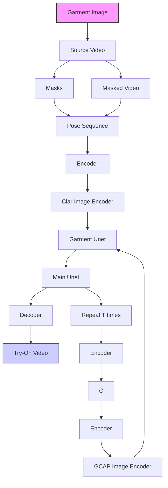
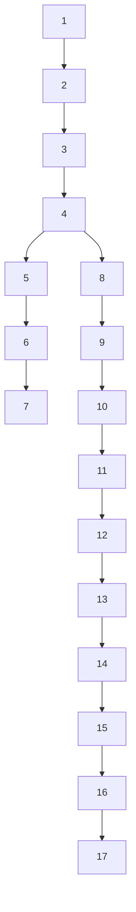

# SwiftTry: Fast and Consistent Video Virtual Try-On with Diffusion Models

Hung Nguyen\*, Quang Qui-Vinh Nguyen\*, Khoi Nguyen, Rang Nguyen

VinAI Research, Vietnam

{v.hungnm66, v.quangnqv, v.khoindm, v.rangnhm}@vinai.io

# Abstract

Given an input video of a person and a new garment, the objective of this paper is to synthesize a new video where the person is wearing the specified garment while maintaining spatiotemporal consistency. Although significant advances have been made in image-based virtual try-on, extending these successes to video often leads to frame-to-frame inconsistencies. Some approaches have attempted to address this by increasing the overlap of frames across multiple video chunks, but this comes at a steep computational cost due to the repeated processing of the same frames, especially for long video sequences. To tackle these challenges, we reconceptualize video virtual try-on as a conditional video inpainting task, with garments serving as input conditions. Specifically, our approach enhances image diffusion models by incorporating temporal attention layers to improve temporal coherence. To reduce computational overhead, we propose ShiftCaching, a novel technique that maintains temporal consistency while minimizing redundant computations. Furthermore, we introduce the TikTokDress dataset, a new video try-on dataset featuring more complex backgrounds, challenging movements, and higher resolution compared to existing public datasets. Extensive experiments demonstrate that our approach outperforms current baselines, particularly in terms of video consistency and inference speed. The project page is available at https://swift-try.github.io/.

# Introduction

Video virtual try-on is an emerging research area (Chen et al. 2021; Rogge et al. 2014; Pumarola et al. 2019; Dong et al. 2019b; Kuppa et al. 2021; Zhong et al. 2021; Jiang et al. 2022; He et al. 2024; Xu et al. 2024b; Fang et al. 2024; Zheng et al. 2024) with significant potential in fashion and e-commerce. The ability to realistically visualize how a garment appears on a person in a video could transform online shopping. However, despite recent advances in image-based virtual try-on (He, Song, and Xiang 2022; Choi et al. 2021; Lee et al. 2022; Xie et al. 2023; Zhu et al. 2023; Kim et al. 2023), extending these capabilities to video remains challenging due to the need for spatiotemporal consistency and the high computational costs of processing long sequences.

  
Figure 1: Results of our SwiftTry compared to those of ViViD (Fang et al. 2024), a previous method for video try-on. Our method preserves garment texture detail and consistency while achieving over 60% faster runtime.

A significant challenge in video virtual try-on is balancing the need for temporal coherence with the computational demands of processing long video sequences. Previous methods (Xu et al. 2024b; He et al. 2024; Fang et al. 2024) often struggle with temporal inconsistencies, resulting in visual artifacts and flickering between frames, which undermines the realism of the virtual try-on experience. Additionally, the high computational cost of rendering high-quality results over extended sequences limits the practicality of these approaches in real-world applications.

Another challenge is the lack of an adequate evaluation dataset. The first public video try-on dataset, VVT (Dong et al. 2019b), only includes basic pattern garments, form-fitting T-shirts, uniform backgrounds, static camera angles, and repetitive human motions. More recently, ViViD (Fang et al. 2024) introduced the first practical dataset for video virtual try-on. However, it struggles to handle in-the-wild scenarios, such as complex movements and diverse backgrounds, making it difficult to meet the demands of real-world applications. Moreover, the poor quality of video try-on results can often be attributed to the inaccurate masks extracted using human parsing segmentation (Li et al. 2020), which are applied to each frame of the video.

In this paper, we address these challenges with two key

contributions. First, we introduce a new high-quality dataset, named TikTokDress, consisting of 817 videos specifically designed for training and evaluating video virtual try-on models. This dataset features realistic scenes, diverse garment types, and complex movements, providing a robust foundation for advancing research in this field. Second, we propose a novel video virtual try-on framework named SwiftTry, as illustrated in Fig. 1, which significantly reduces the computational cost of processing long video sequences while maintaining temporal consistency.

Our framework is inspired by state-of-the-art diffusion-based image virtual try-on methods (Kim et al. 2023; Xu et al. 2024a; Choi et al. 2024) and incorporates temporal attention within the UNet architecture to train on video try-on data. During inference, we introduce a new technique called ShiftCaching, which ensures temporal coherence and smooth transitions between video chunks while minimizing redundant computation compared to previous methods. Extensive experimental results demonstrate that our proposed SwiftTry framework, leveraging these techniques, significantly outperforms existing video virtual try-on methods in both accuracy and efficiency.

In summary, the contributions of our work are as follows:

- We propose a new technique for video inference named ShiftCaching, which can ensure temporal smoothness between video chunks and reduce redundant computation.   
- We introduce and curate a new video virtual try-on dataset, TikTokDress, which encompasses a wide range of backgrounds and complex movements and features high-resolution videos, filling a gap that exists in previous video virtual try-on datasets.

# Related Work

Image Virtual Try-On. Traditional image virtual try-on methods (Han et al. 2018; Wang et al. 2018a; Dong et al. 2019a; Yang et al. 2020; Ge et al. 2021; He, Song, and Xiang 2022; Choi et al. 2021; Lee et al. 2022; Xie et al. 2023) commonly employ a two-stage pipeline based on GANs (Goodfellow et al. 2014). In this approach, the target clothing is first warped and then fused with the person image to create the try-on effect. Various techniques have been utilized for clothing warping, including thin-plate spline (TPS) warping (Han et al. 2018), spatial transformer networks (STN) (Li et al. 2021), and flow estimation (Xie et al. 2023). Despite these advances, such methods often face limitations in generalization, resulting in significant performance degradation when applied to person images with complex backgrounds.

Recently, diffusion models have markedly enhanced the realism of images in generative tasks, leading to their increasing adoption in virtual try-on research. For instance, TryOnDiffusion (Zhu et al. 2023) presents a virtual try-on method utilizing two U-Nets, but it requires a large dataset of image pairs of the same person in different poses, which can be difficult to acquire. StableVITON (Kim et al. 2023) conditions the garment in a ControlNet (Zhang, Rao, and Agrawala 2023)-style using a zero cross-attention block, while IDM-VTON (Choi et al. 2024) proposes GarmentNet to encode low-level features combined with high-level semantic features extracted via IP-Adapter (Ye et al. 2023). Despite these advancements, extending these existing image virtual try-on methods for video often results in significant inter-frame inconsistency and flickering, which adversely affects the overall quality of the generated results.

Video Virtual Try-On. Several efforts have been made to develop virtual try-on systems for videos. FW-GAN (Dong et al. 2019b) incorporates an optical flow prediction module from Video2Video (Wang et al. 2018b) to warp preceding frames to the current frame, enabling the synthesis of temporally coherent subsequent frames. MV-TON (Zhong et al. 2021) introduces a memory refinement module that retains and refines features from previous frames. Cloth-Former (Jiang et al. 2022) employs a vision transformer in its try-on generator to minimize blurriness and temporal artifacts. It also features an innovative warping module that combines TPS-based and appearance-based methods to address challenges such as incorrect warping caused by occlusions. Among diffusion-based methods, Tunnel Try-On (Xu et al. 2024b) is the first to apply diffusion models for video virtual try-on, effectively handling camera movement and maintaining consistency. However, its demo videos are limited to only a few seconds in length. ViViD (Fang et al. 2024) introduced a large-scale video try-on dataset with multiple categories, but it remains limited by simple backgrounds and movements, which constrain its ability to ensure long-term consistency and coherence. In this paper, we propose a novel approach that establishes temporal smoothness and coherence across video chunks. Additionally, we integrate a caching technique (Ma, Fang, and Wang 2024) to reduce redundant computations during long video inference, significantly improving efficiency.

# Methods

Problem Statement: Given a source video $V = \{I_1, I_2, \ldots, I_N\} \in \mathbb{R}^{N \times 3 \times H \times W}$ of a person and a garment image $g \in \mathbb{R}^{3 \times H \times W}$ , where $N, H$ , and $W$ represent the video length, frame height, and frame width, respectively, our goal is to synthesize a target video $\hat{V} = \{\hat{I}_1, \hat{I}_2, \ldots, \hat{I}_N\} \in \mathbb{R}^{N \times 3 \times H \times W}$ of the person wearing the garment, while preserving the motion of the person, the background in $V$ , and the color and texture of $g$ .

It is important to note that collecting both source and target videos of the same person with identical motions and gestures, differing only in the garment, is extremely challenging. As a result, most video try-on approaches adopt a self-supervised training method, where only a single video is used, and the garment regions are masked. The model is then trained to inpaint the masked regions using guidance from the garment image.

In the next section, we first describe our overall video try-on architecture and then discuss in detail the ShiftCaching technique – one of our main contributions.

# Overall Architecture

Our approach comprises two stages: first, training a diffusion-based image try-on model, and second, extending


<details>
<summary>flowchart</summary>


</details>

Figure 2: Overview of Stage 2 of our SwiftTry framework (Note that stage 1 is similar, except the input is a single image frame, and it does not include temporal attention layers). Given an input video and a garment image, our method first extracts the masked video, corresponding masks, and pose sequence. The masked video is encoded into the latent space by the VAE Encoder, which is then concatenated with noise, masks, and pose features before being processed by the Main U-Net. To inpaint the garment during the denoising process, we use a Garment U-Net and a CLIP encoder to extract both low- and high-level garment features. These features are integrated into the Main U-Net through spatial and cross-attention mechanisms.


<details>
<summary>text_image</summary>

Frame n
t + 2
t + 1
t
Timestep
Partially Computed
Fully Computed
Cache Copy
</details>

Figure 3: Illustration of fully and partially computed frames with a chunk size of N = 8 and a shift of $\Delta = 4$ . In the partially computed chunk, one half uses cached features from $t + 2$ , while the other half uses features from $t + 1$ .

it to work with video data by incorporating temporal attention into every block of the Main UNet.

In the first stage, inspired by StableVITON (Kim et al. 2023), we design a diffusion-based image try-on model with two submodules: the Garment UNet and the Main UNet, as illustrated in Fig. 2. The Main UNet is a modified inpainting model initialized with pretrained weights from Stable Diffusion (Rombach et al. 2022). It takes as input four channels of latent noise, four channels of latent representations of the masked image (i.e., the person image with the clothing region masked), and one channel for the binary mask representing the inpainting region. To further enhance generation quality, we add the pose skeleton as an additional control, represented by a pose map rendered from DW-Pose (Yang et al. 2023). This results in a 13-channel input, which is fed into the Main UNet to predict the cleaned

<table><tr><td>Overlapping size</td><td> $\text{VFID}_{\text{I3D}} \downarrow$ </td><td>FPS ↑</td></tr><tr><td>S=0</td><td>9.040</td><td>1.544</td></tr><tr><td>S=4</td><td>8.822</td><td>1.176</td></tr><tr><td>S=8</td><td>8.947</td><td>0.801</td></tr><tr><td>S=15</td><td>8.675</td><td>0.104</td></tr></table>

Table 1: Trade-off between speed (FPS) and consistency (VFID $_{I3D}$ ) with different overlap sizes of previous methods.

latent over T timesteps. Finally, the cleaned latent is passed through a decoder to produce the output image.

The Garment UNet has a similar architecture to the Main UNet but only takes the garment image as its input, rather than the multiple channels used in the Main UNet. This module is designed to extract both detailed and high-level features from the garment, guiding the Main UNet to accurately replicate the garment's appearance through Reference Attention. Specifically, we follow the Reference Attention mechanism from AnimateAnyone (Hu et al. 2023), replicating the Garment UNet's feature maps along the temporal dimension and concatenating them with the Main UNet's feature maps along the spatial dimension before applying the UNet's self-attention. We use the VITON-HD dataset (Choi et al. 2021) to train our network during this stage.

In the second stage, we modify the Main UNet from the image try-on model to ensure temporal consistency across video frames. This adaptation involves converting its 2D layers into pseudo-3D layers (Guo et al. 2023; Wu et al. 2023; Zhou et al. 2022) and adding a temporal attention layer after


<details>
<summary>flowchart</summary>

```mermaid
graph TD
    subgraph_Fully_Computed["Fully Computed"]
        D1["D1"] --> U1["U1"]
        D2["D2"] --> U2["U2"]
        D3["D3"] --> U2
        M["M"] --> U2
    end

    subgraph_Partially_Computed["Partially Computed"]
        D1 --> U1
        D2 --> U2
        D3 --> U2
        M --> U2
    end

    D1 --> U1
    D2 --> U2
    D3 --> U2
    M --> U2

    style Fully_Computed fill:#f9f,stroke:#333
    style Partially_Computed fill:#bbf,stroke:#333

    note bottom
        Masked_Temporal_Attention
        softmax( QK^T + MASK / √dk )V
    end

    note right of Fully_Computed: z_{t+1}
    note right of Partially_Computed: z_t
    note bottom of Partially_Computed: Spatial Attn Cross Attn
    note bottom of Partially_Computed: Masked_Temporal Attn
    note bottom of Partially_Computed: Temporal Attn
```
</details>

Figure 4: Comparison between a fully computed frame and a partially computed frame. The partially computed frame employs Masked Temporal Attention instead of standard Temporal Attention to resolve mismatches in cached features.

the Spatial and Cross-Attention layers to capture temporal correlations between frames. The architecture of the modified UNet blocks is illustrated in Fig. 2. In the temporal attention layer, the features are reshaped into the shape of $(H \times W) \times N \times C$ , where C is the number of feature channels and $H \times W$ is the batch-size dimension, to compute self-attention along the temporal dimension. This allows a location in the latent space of frame t to interact with the same location in other frames within a chunk of N frames. This design is highly efficient as it avoids the expense of full 3D attention by factorizing it into two consecutive steps: spatial attention (2D) and temporal attention (1D). This approach allows a location in one frame to exchange information with every location in all other frames. Additionally, we incorporate sinusoidal positional encoding to help the model recognize the position of each frame in the video, following (Guo et al. 2023). In this stage, we train only the temporal attention layer while keeping the other layers unchanged, using a video dataset.

# ShiftCaching Technique

Due to memory constraints, current video diffusion-based virtual try-on methods can only generate video chunks of 16 frames at a time. Previous approaches (Fang et al. 2024; He et al. 2024; Xu et al. 2024b) use a temporal aggregation technique (Tseng, Castellon, and Liu 2023; Xu et al. 2023) to stitch overlapping video chunks into longer sequences. In this process, the long video is divided into overlapping chunks with an overlap size S, typically set to N/2 or N/4. At each denoising timestep t, the overlapping noise predictions are merged using a simple averaging technique. However, this method involves a trade-off: a smaller overlap size, such as S = 4, can cause temporal flickering and texture artifacts, while a larger overlap size, such as S = 15, improves consistency but greatly slows down the process as shown in Tab. 1.

To achieve good temporal coherence and smoothness without recomputing the overlapped regions, we propose a shifting mechanism during inference. Specifically, we divide the long video into non-overlapping chunks $S = 0$ . At each DDIM sampling timestep t, we shift these chunks by a predefined value $\Delta$ between two consecutive frames, allowing the model to process different compositions of noisy chunks at each step. An example of a fixed $\Delta = 4$ applied to a chunk with length N = 8 is illustrated in Fig. 3.


<details>
<summary>natural_image</summary>

Grid of fashion and apparel product photos showing various clothing designs, images, and facial recognition overlays (no text or symbols)
</details>

Figure 5: Example videos from the TikTokDress dataset highlighting diversity in skin tones, genders, camera angles, and clothing types.

To further accelerate the inference process, we can skip a random chunk to reduce redundant computation during denoising. However, naively dropping chunks without adjustment can lead to abrupt changes in noise levels in the final results. Following (Ma, Fang, and Wang 2024), which notes that adjacent denoising steps share significant similarities in high-level features, we instead perform partial computations on the Main U-Net. Specifically, we use a cache to copy the latest features from the fully computed timestep $z_{t+1}$ (Red frame) and use these features to partially compute the current latent $z_{t}$ (White frame), bypassing the deeper blocks of the UNet, as illustrated in Fig. 4.

When performing partial computations on a chunk, the cached features typically include the first half from timestep $t+2$ and the second half from timestep $t+1$ , which can lead to mismatches between the two halves. To address this, we introduce a Masked Temporal Attention mechanism. This mechanism applies a special mask of size $N \times N$ during the softmax attention calculation to set specific values in the attention matrix to 0. This prevents the transfer of information from less accurate features (timestep $t+2$ ) to more accurate features (timestep $t+1$ ), while allowing transfer from good features to bad features. This approach ensures both smoothness and high quality in the partially computed cells.

# TikTokDress Dataset

Public datasets for single-image virtual try-ons, such as VITON-HD and DressCode, often suffer from simple backgrounds and limited human poses, despite offering high-quality images. These datasets are also restricted to single-

<table><tr><td rowspan="2">Label</td><td colspan="2">Gender</td><td colspan="3">Skin tone</td><td colspan="3">Camera position</td><td colspan="2">Distance</td><td colspan="2">Action</td><td colspan="2">Background</td></tr><tr><td>Male</td><td>Female</td><td>White</td><td>Asian</td><td>Black</td><td>Bottom</td><td>Top</td><td>Center</td><td>Near</td><td>Far</td><td>Move</td><td>Stay</td><td>Dynamic</td><td>Static</td></tr><tr><td>Counting</td><td>267</td><td>550</td><td>541</td><td>124</td><td>152</td><td>576</td><td>7</td><td>231</td><td>570</td><td>247</td><td>275</td><td>542</td><td>94</td><td>724</td></tr></table>

Table 2: Data statistics highlighting the diversity and complexity of our dataset. The table provides a breakdown of attributes such as gender, skin tone, camera positions, distances (Near/Far), and actions (Move/Stay), indicating whether the actor is moving or stationary


<details>
<summary>natural_image</summary>

Five fashion photos showing a woman in green and orange attire with face masks, standing on a city street with palm trees and buildings in the background (no visible text or symbols)
</details>

Figure 6: SAM 2 failures due to its sensitivity to prompts (green for positive, red for negative), requiring manual corrections for challenging areas (green rectangles).

image scenarios. Similarly, the VVT dataset, a standard for video virtual try-on, has notable drawbacks, including uniform movements, white backgrounds, and low resolution (256 × 192), making it unsuitable for real-world applications, particularly in the short-video industry where higher resolution is crucial. Since real-world videos are typically recorded on mobile phones, which introduce variations in background, camera position, and lighting, there is a pressing need for a more robust dataset. To address these shortcomings, we introduce TikTokDress, a high-resolution video virtual try-on dataset that includes complex backgrounds, diverse movements, and balanced gender representation. Each video is paired with its corresponding garment and annotated with detailed human poses and precise binary cloth masks, enhancing its utility for real-world applications.

First, the quality of garment masks in our dataset is crucial for enhancing try-on results, as shown in the Supplementary Material. While existing datasets like VITON-HD (Choi et al. 2021), DressCode (Morelli et al. 2022), and VVT (Dong et al. 2019b) use a standard segmenter (Li et al. 2020), it struggles with complex videos, resulting in sub-par performance. In contrast, TikTokDress offers manually corrected, highly accurate garment masks, leading to significantly improved video try-on quality.

Second, our TikTokDress dataset captures a broad range of human poses and dynamic movements, such as dancing, common in short-form videos. As shown in Fig. 5, it includes variations in camera distance and diverse backgrounds, from indoor to outdoor settings with complex lighting. Additionally, it features a variety of clothing types, from casual T-shirts to structured garments like sweaters and challenging attire such as chainmail tops, addressing real-world challenges in video virtual try-on.

# Video collection and annotation.

Our dataset consists of short TikTok clips (10–30 seconds) showcasing various dance routines, as illustrated in Fig. 5. We expanded the TikTok Dataset (Jafarian and Park 2021) by adding videos to enhance diversity in backgrounds, skin tones, and clothing styles, resulting in 817 video-garment pairs. Videos with excessive motion blur or low-quality garments were excluded. To ensure accurate garment matching, we manually curated high-quality matches from fashion retail websites. The dataset includes over 270,000 RGB frames extracted at 30 frames per second. Additionally, we computed 2D keypoints and dense pose information using DWPose (Yang et al. 2023) and DensePose (Güler, Neverova, and Kokkinos 2018). Dataset statistics, summarized in Tab. 2, highlight its diversity in gender, skin tone, and camera positions.

Creating high-quality garment masks for each video posed a significant challenge due to the need for precise segmentation in every frame. We used SAM 2 (Ravi et al. 2024) to extract masks for both clothing and arms. However, its sensitivity to prompt points and specific frames (see Fig. 6-(a)) necessitated an additional solution. To improve efficiency, we developed an algorithm (detailed in the Supplemental Material) for optimal frame and prompt selection. Complex garments still required manual refinement, as shown in the Supplementary Material. This meticulous process was essential for ensuring the dataset's high quality and reliability.

# Experiments

Datasets: We evaluate our approach on the VVT dataset (Dong et al. 2019b) and our new TikTokDress dataset. The VVT dataset, a standard benchmark for video virtual try-on, includes 791 paired videos of individuals and clothing images, with 661 for training and 130 for testing, all at $256 \times 192$ resolution. The videos feature simple movements against plain backgrounds. In contrast, the TikTok-Dress dataset offers a more complex challenge, with varied backgrounds, dynamic movements, and diverse body poses. It comprises 693 training videos and 124 testing videos at $540 \times 720$ resolution, totaling 232,843 frames for training and 39,705 frames for testing.

Metrics: We evaluate our approach using image-based and video-based metrics in both paired and unpaired settings, as outlined in (Jiang et al. 2022). In paired settings, we use SSIM (Wang et al. 2004) and LPIPS (Zhang et al. 2018) to assess reconstruction quality. In unpaired settings, we measure visual quality and temporal consistency with Video Fréchet Inception Distance (VFID) (Dong et al. 2019b). Additionally, we measure inference speed in frames per second (FPS) to demonstrate speed improvements.

Implementation details: The training process is divided

<table><tr><td rowspan="2">Method</td><td colspan="5">VVT</td></tr><tr><td>LPIPS ↓</td><td>SSIM ↑</td><td> $VFID_{I3D}$  ↓</td><td> $VFID_{RN}$  ↓</td><td>FPS ↑</td></tr><tr><td>CP-VTON</td><td>0.535</td><td>0.459</td><td>6.361</td><td>12.100</td><td>N/A</td></tr><tr><td>FBAFN</td><td>0.157</td><td>0.870</td><td>4.516</td><td>8.690</td><td>N/A</td></tr><tr><td>StableVITON</td><td>0.184</td><td>0.760</td><td>17.068</td><td>11.254</td><td>0.241</td></tr><tr><td>StableVITON+AA</td><td>0.270</td><td>0.683</td><td>12.597</td><td>3.336</td><td>1.165</td></tr><tr><td>FWGAN</td><td>0.283</td><td>0.675</td><td>8.019</td><td>12.150</td><td>N/A</td></tr><tr><td>MVTON</td><td>0.068</td><td>0.853</td><td>8.367</td><td>9.702</td><td>N/A</td></tr><tr><td>ClothFormer</td><td>0.081</td><td>0.921</td><td>3.967</td><td>5.048</td><td>N/A</td></tr><tr><td>Tunnel Try-On</td><td>0.054</td><td>0.913</td><td>3.345</td><td>4.614</td><td>N/A</td></tr><tr><td>ViViD†</td><td>0.119</td><td>0.829</td><td>6.788</td><td>0.853</td><td>1.409</td></tr><tr><td>WildVidFit</td><td>N/A</td><td>N/A</td><td>4.202</td><td>N/A</td><td>N/A</td></tr><tr><td>SwiftTry (ours)</td><td>0.066</td><td>0.887</td><td>3.589</td><td>0.534</td><td>2.270</td></tr></table>

Table 3: Comparisons on the VVT dataset (Dong et al. 2019b). † means our re-evaluation from the provided code.

<table><tr><td rowspan="2">Method</td><td colspan="4">TikTokDress</td></tr><tr><td>LPIPS ↓</td><td>SSIM ↑</td><td> $VFID_{I3D}$  ↓</td><td>FPS ↑</td></tr><tr><td>ViViD†</td><td>0.129</td><td>0.824</td><td>5.638</td><td>1.409</td></tr><tr><td>SwiftTry w/o ShiftCaching</td><td>0.075</td><td>0.891</td><td>3.865</td><td>1.177</td></tr><tr><td>SwiftTry (ours)</td><td>0.074</td><td>0.888</td><td>4.231</td><td>2.270</td></tr></table>

Table 4: Comparisons on the TikTokDress dataset.

into two stages. In the first stage, we focus on inpainting and preserving detailed garment textures using the VITON-HD dataset (Choi et al. 2021). We fine-tune the Garment UNet, Pose Encoder, and Main UNet decoder, initializing the Main UNet and Garment UNet with pretrained weights from SD 1.5, while keeping the VAE Encoder, Decoder, and CLIP image encoder weights unchanged. In the second stage, we incorporate temporal attention layers into the previously trained model, initializing these new modules with pretrained weights from AnimateDiff (Guo et al. 2023).

# Comparisons with Prior Approaches

We compare our approach with other video virtual try-on methods using the VVT and TikTokDress datasets. As most methods are closed-source, we rely on reported results and available generated videos for comparison. For GAN-based methods, we evaluate against FW-GAN (Dong et al. 2019b), MV-TON (Zhong et al. 2021), and ClothFormer (Jiang et al. 2022). For diffusion-based methods, we compare with Tunnel Try-On (Xu et al. 2024b), ViViD (Fang et al. 2024), and WildVidFit (He et al. 2024). We re-evaluate ViViD (Fang et al. 2024) on the VVT dataset, as it is the only method with available inference code and pre-trained weights. Additionally, we compare our model with the image-based virtual try-on method StableVITON (Kim et al. 2023), finetuned on the VVT dataset, in a frame-by-frame manner. We also evaluate a baseline combining StableVITON and AnimateAnyone (Hu et al. 2023), where StableVITON performs the try-on for individual frames, and AnimateAnyone generates a video based on the source motion.

<table><tr><td>Variant</td><td>LPIPS↓</td><td>SSIM↑</td><td> $VFID_{I3D}$ ↓</td><td> $VFID_{RN}$ ↓</td><td>FPS↑</td></tr><tr><td>FS</td><td>0.061</td><td>0.882</td><td>8.971</td><td>0.864</td><td>1.544</td></tr><tr><td>RS</td><td>0.060</td><td>0.883</td><td>8.878</td><td>0.853</td><td>1.544</td></tr><tr><td>FS, P 50%</td><td>0.060</td><td>0.883</td><td>8.932</td><td>0.887</td><td>2.270</td></tr><tr><td>RS, P 50%</td><td>0.060</td><td>0.883</td><td>8.938</td><td>0.888</td><td>2.270</td></tr></table>

Table 5: Study of our Temporal layers with ShiftCaching.
FS: Fixed Shift, RS: Random Shift, P: Partially Computed.

<table><tr><td>Variant</td><td>LPIPS↓</td><td>SSIM↑</td><td> $VFID_{I3D}$ ↓</td><td> $VFID_{RN}$ ↓</td></tr><tr><td>FA</td><td>0.060</td><td>0.883</td><td>8.932</td><td>0.887</td></tr><tr><td>HA</td><td>0.059</td><td>0.886</td><td>8.679</td><td>0.796</td></tr><tr><td>QA</td><td>0.061</td><td>0.882</td><td>8.990</td><td>0.909</td></tr><tr><td>CA</td><td>0.086</td><td>0.854</td><td>13.520</td><td>5.501</td></tr></table>

Table 6: Ablation study of our Temporal layers with Shift-Caching. FA: Full Attention, HA: Half Attention, QA: Quarter Attention, CA: Causal Attention.

<table><tr><td>Variant</td><td>LPIPS↓</td><td>SSIM↑</td><td> $VFID_{I3D}$ ↓</td><td> $VFID_{RN}$ ↓</td><td>FPS↑</td></tr><tr><td>8</td><td>0.062</td><td>0.880</td><td>9.312</td><td>1.027</td><td>0.914</td></tr><tr><td>16</td><td>0.061</td><td>0.881</td><td>8.822</td><td>0.851</td><td>1.176</td></tr><tr><td>24</td><td>0.163</td><td>0.821</td><td>8.724</td><td>0.800</td><td>1.723</td></tr></table>

Table 7: Ablation study of testing with 8, 16, and 24 frames, with the default training set to 16 frames.

Quantitative results: Tab. 3 presents the comparison on the VVT dataset. Our approach excels in the VFID metric, indicating superior visual quality and consistency, and also performs competitively in SSIM and LPIPS scores. While ClothFormer achieves a high SSIM score, its VFID is lower due to the limitations of its GAN-based method. Our Shift-Caching technique enhances performance, increasing the frame rate to 2.27 FPS – over 1.5 times faster. We also evaluated our method on the TikTokDress dataset, as detailed in Tab. 4. Our analysis shows that while these methods produce accurate individual frames, they often struggle with flickering and inconsistencies due to poor temporal coherence and motion handling across frames.

Qualitative results: As shown in Fig. 8 and Fig. 7, the textures on the garment vary between frames. Additionally, there are significant jitters between adjacent frames with these methods, which can be observed more intuitively in videos provided in our Supplementary Material.

# Ablation Study

We conducted ablation studies on the VVT dataset to investigate various factors affecting the performance of SwiftTry.

Study on the ShiftCaching Technique is shown in Tab. 5. The results indicate that using random shifts provides the best consistency. When combined with partial computation of 50% of the frames, this approach accelerates inference by 1.5 times while maintaining comparable quantitative metrics to other methods.


<details>
<summary>text_image</summary>

Source video
Garment
Try-on
Source video
Garment
Try-on
</details>

Figure 7: Qualitative results of our method on the TikTokDress dataset.


<details>
<summary>text_image</summary>

Source video
Garment
ViVid
Ours
</details>

Figure 8: Qualitative comparison with prior method on the VVT dataset.

Study on Different Types of Masks in Masked Temporal Attention is shown in Tab. 6. The results reveal that Half Attention yields the best performance. This suggests that allowing only the bad features (from timestep $t + 2$ ) to access the good features (from timestep $t + 1$ ) and allowing only the good features to interact with each other, produces the optimal results. Detailed explanations of different masking attention are described in our Supplementary Material.

Impact of Inference Video Chunk Length is examined in Tab. 7. The study reveals that matching the training and inference video chunk lengths - both set to $N = 16$ - yields the best results.

# Conclusion

In conclusion, we have proposed a novel technique, Shift-Caching, which ensures temporal smoothness across video chunks while effectively reducing redundant computations during video inference. This advancement enhances the efficiency and quality of video virtual try-on, making it more practical for real-world applications. Additionally, we have introduced a new dataset, TikTokDress, designed specifically for video virtual try-on. This dataset stands out for its diverse range of backgrounds, complex movements, and high-resolution videos, addressing the limitations of existing datasets and providing a valuable resource for future research in this area.

# References

Chen, C.-Y.; Lo, L.; Huang, P.-J.; Shuai, H.-H.; and Cheng, W.-H. 2021. Fashionmirror: Co-attention feature-remapping virtual try-on with sequential template poses. In Proceedings of the IEEE/CVF International Conference on Computer Vision, 13809–13818.

Choi, S.; Park, S.; Lee, M.; and Choo, J. 2021. Viton-hd: High-resolution virtual try-on via misalignment-aware normalization. In Proceedings of the IEEE/CVF conference on computer vision and pattern recognition, 14131–14140.

Choi, Y.; Kwak, S.; Lee, K.; Choi, H.; and Shin, J. 2024. Improving Diffusion Models for Virtual Try-on. arXiv preprint arXiv:2403.05139.

Dong, H.; Liang, X.; Shen, X.; Wang, B.; Lai, H.; Zhu, J.; Hu, Z.; and Yin, J. 2019a. Towards Multi-Pose Guided Virtual Try-On Network. In Proceedings of the IEEE/CVF International Conference on Computer Vision (ICCV).

Dong, H.; Liang, X.; Shen, X.; Wu, B.; Chen, B.-C.; and Yin, J. 2019b. Fw-gan: Flow-navigated warping gan for video virtual try-on. In Proceedings of the IEEE/CVF international conference on computer vision, 1161–1170.

Fang, Z.; Zhai, W.; Su, A.; Song, H.; Zhu, K.; Wang, M.; Chen, Y.; Liu, Z.; Cao, Y.; and Zha, Z.-J. 2024. ViViD: Video Virtual Try-on using Diffusion Models. arXiv preprint arXiv:2405.11794.

Ge, Y.; Song, Y.; Zhang, R.; Ge, C.; Liu, W.; and Luo, P. 2021. Parser-free virtual try-on via distilling appearance flows. In Proceedings of the IEEE/CVF conference on computer vision and pattern recognition, 8485–8493.

Goodfellow, I. J.; Pouget-Abadie, J.; Mirza, M.; Xu, B.; Warde-Farley, D.; Ozair, S.; Courville, A.; and Bengio, Y. 2014. Generative Adversarial Networks. arXiv:1406.2661.

Güler, R. A.; Neverova, N.; and Kokkinos, I. 2018. Densepose: Dense human pose estimation in the wild. In Proceedings of the IEEE conference on computer vision and pattern recognition, 7297–7306.

Guo, Y.; Yang, C.; Rao, A.; Wang, Y.; Qiao, Y.; Lin, D.; and Dai, B. 2023. Animatediff: Animate your personalized text-to-image diffusion models without specific tuning. arXiv preprint arXiv:2307.04725.

Han, X.; Wu, Z.; Wu, Z.; Yu, R.; and Davis, L. S. 2018. Viton: An image-based virtual try-on network. In Proceedings of the IEEE conference on computer vision and pattern recognition, 7543–7552.

Hang, T.; Gu, S.; Li, C.; Bao, J.; Chen, D.; Hu, H.; Geng, X.; and Guo, B. 2023. Efficient diffusion training via min-snr weighting strategy. In Proceedings of the IEEE/CVF International Conference on Computer Vision, 7441–7451.

He, S.; Song, Y.-Z.; and Xiang, T. 2022. Style-based global appearance flow for virtual try-on. In Proceedings of the IEEE/CVF Conference on Computer Vision and Pattern Recognition, 3470–3479.

He, Z.; Chen, P.; Wang, G.; Li, G.; Torr, P. H.; and Lin, L. 2024. WildVidFit: Video Virtual Try-On in the Wild via Image-Based Controlled Diffusion Models. arXiv preprint arXiv:2407.10625.

Hu, L.; Gao, X.; Zhang, P.; Sun, K.; Zhang, B.; and Bo, L. 2023. Animate Anyone: Consistent and Controllable Image-to-Video Synthesis for Character Animation. arXiv preprint arXiv:2311.17117.

Jafarian, Y.; and Park, H. S. 2021. Learning High Fidelity Depths of Dressed Humans by Watching Social Media Dance Videos. In Proceedings of the IEEE/CVF Conference on Computer Vision and Pattern Recognition (CVPR), 12753–12762.

Jiang, J.; Wang, T.; Yan, H.; and Liu, J. 2022. Clothformer: Taming video virtual try-on in all module. In Proceedings of the IEEE/CVF Conference on Computer Vision and Pattern Recognition, 10799–10808.

Kim, J.; Gu, G.; Park, M.; Park, S.; and Choo, J. 2023. StableVITON: Learning Semantic Correspondence with Latent Diffusion Model for Virtual Try-On. arXiv preprint arXiv:2312.01725.

Kingma, D. P.; and Ba, J. 2014. Adam: A method for stochastic optimization. arXiv preprint arXiv:1412.6980.

Kuppa, G.; Jong, A.; Liu, X.; Liu, Z.; and Moh, T.-S. 2021. ShineOn: Illuminating design choices for practical video-based virtual clothing try-on. In Proceedings of the IEEE/CVF Winter Conference on Applications of Computer Vision, 191–200.

Lee, S.; Gu, G.; Park, S.; Choi, S.; and Choo, J. 2022. High-Resolution Virtual Try-On with Misalignment and Occlusion-Handled Conditions. arXiv preprint arXiv:2206.14180.

Li, K.; Chong, M. J.; Zhang, J.; and Liu, J. 2021. Toward accurate and realistic outfits visualization with attention to details. In Proceedings of the IEEE/CVF conference on computer vision and pattern recognition, 15546–15555.

Li, P.; Xu, Y.; Wei, Y.; and Yang, Y. 2020. Self-correction for human parsing. IEEE Transactions on Pattern Analysis and Machine Intelligence, 44(6): 3260–3271.

Ma, X.; Fang, G.; and Wang, X. 2024. Deepcache: Accelerating diffusion models for free. In Proceedings of the IEEE/CVF Conference on Computer Vision and Pattern Recognition, 15762–15772.

Morelli, D.; Fincato, M.; Cornia, M.; Landi, F.; Cesari, F.; and Cucchiara, R. 2022. Dress code: high-resolution multi-category virtual try-on. In Proceedings of the IEEE/CVF Conference on Computer Vision and Pattern Recognition, 2231–2235.

Pumarola, A.; Goswami, V.; Vicente, F.; De la Torre, F.; and Moreno-Noguer, F. 2019. Unsupervised image-to-video clothing transfer. In Proceedings of the IEEE/CVF International Conference on Computer Vision Workshops, 0–0.

Ravi, N.; Gabeur, V.; Hu, Y.-T.; Hu, R.; Ryali, C.; Ma, T.; Khedr, H.; Rädle, R.; Rolland, C.; Gustafson, L.; Mintun, E.; Pan, J.; Alwala, K. V.; Carion, N.; Wu, C.-Y.; Girshick, R.; Dollár, P.; and Feichtenhofer, C. 2024. SAM 2: Segment Anything in Images and Videos. arXiv preprint arXiv:2408.00714.

Rogge, L.; Klose, F.; Stengel, M.; Eisemann, M.; and Magnor, M. 2014. Garment replacement in monocular video

sequences. ACM Transactions on Graphics (TOG), 34(1): 1–10.   
Rombach, R.; Blattmann, A.; Lorenz, D.; Esser, P.; and Ommer, B. 2022. High-resolution image synthesis with latent diffusion models. In Proceedings of the IEEE/CVF conference on computer vision and pattern recognition, 10684–10695.   
Tseng, J.; Castellon, R.; and Liu, K. 2023. Edge: Editable dance generation from music. In Proceedings of the IEEE/CVF Conference on Computer Vision and Pattern Recognition, 448–458.   
von Platen, P.; Patil, S.; Lozhkov, A.; Cuenca, P.; Lambert, N.; Rasul, K.; Davaadorj, M.; Nair, D.; Paul, S.; Berman, W.; Xu, Y.; Liu, S.; and Wolf, T. 2022. Diffusers: State-of-the-art diffusion models. https://github.com/huggingface/diffusers.   
Wang, B.; Zheng, H.; Liang, X.; Chen, Y.; Lin, L.; and Yang, M. 2018a. Toward characteristic-preserving image-based virtual try-on network. In Proceedings of the European conference on computer vision (ECCV), 589–604.   
Wang, T.-C.; Liu, M.-Y.; Zhu, J.-Y.; Liu, G.; Tao, A.; Kautz, J.; and Catanzaro, B. 2018b. Video-to-video synthesis. arXiv preprint arXiv:1808.06601.   
Wang, Z.; Bovik, A. C.; Sheikh, H. R.; and Simoncelli, E. P. 2004. Image quality assessment: from error visibility to structural similarity. IEEE transactions on image processing, 13(4): 600–612.   
Wu, J. Z.; Ge, Y.; Wang, X.; Lei, S. W.; Gu, Y.; Shi, Y.; Hsu, W.; Shan, Y.; Qie, X.; and Shou, M. Z. 2023. Tune-a-video: One-shot tuning of image diffusion models for text-to-video generation. In Proceedings of the IEEE/CVF International Conference on Computer Vision, 7623–7633.   
Xie, Z.; Huang, Z.; Dong, X.; Zhao, F.; Dong, H.; Zhang, X.; Zhu, F.; and Liang, X. 2023. GP-VTON: Towards General Purpose Virtual Try-on via Collaborative Local-Flow Global-Parsing Learning. In Proceedings of the IEEE/CVF Conference on Computer Vision and Pattern Recognition, 23550–23559.   
Xu, Y.; Gu, T.; Chen, W.; and Chen, C. 2024a. OOTDiffusion: Outfitting Fusion based Latent Diffusion for Controllable Virtual Try-on. arXiv e-prints, arXiv–2403.   
Xu, Z.; Chen, M.; Wang, Z.; Xing, L.; Zhai, Z.; Sang, N.; Lan, J.; Xiao, S.; and Gao, C. 2024b. Tunnel Try-on: Excavating Spatial-temporal Tunnels for High-quality Virtual Try-on in Videos. arXiv preprint arXiv:2404.17571.   
Xu, Z.; Zhang, J.; Liew, J. H.; Yan, H.; Liu, J.-W.; Zhang, C.; Feng, J.; and Shou, M. Z. 2023. Magicanimate: Temporally consistent human image animation using diffusion model. arXiv preprint arXiv:2311.16498.   
Yang, H.; Zhang, R.; Guo, X.; Liu, W.; Zuo, W.; and Luo, P. 2020. Towards Photo-Realistic Virtual Try-On by Adaptively Generating-Preserving Image Content. In Proceedings of the IEEE/CVF Conference on Computer Vision and Pattern Recognition (CVPR).   
Yang, Z.; Zeng, A.; Yuan, C.; and Li, Y. 2023. Effective whole-body pose estimation with two-stages distillation. In Proceedings of the IEEE/CVF International Conference on Computer Vision, 4210–4220.

Ye, H.; Zhang, J.; Liu, S.; Han, X.; and Yang, W. 2023. Ip-adapter: Text compatible image prompt adapter for text-to-image diffusion models. arXiv preprint arXiv:2308.06721.   
Zhang, L.; Rao, A.; and Agrawala, M. 2023. Adding conditional control to text-to-image diffusion models. In Proceedings of the IEEE/CVF International Conference on Computer Vision, 3836–3847.   
Zhang, R.; Isola, P.; Efros, A. A.; Shechtman, E.; and Wang, O. 2018. The unreasonable effectiveness of deep features as a perceptual metric. In Proceedings of the IEEE conference on computer vision and pattern recognition, 586–595.   
Zheng, J.; Zhao, F.; Xu, Y.; Dong, X.; and Liang, X. 2024. VITON-DiT: Learning In-the-Wild Video Try-On from Human Dance Videos via Diffusion Transformers. arXiv preprint arXiv:2405.18326.   
Zhong, X.; Wu, Z.; Tan, T.; Lin, G.; and Wu, Q. 2021. Mvton: Memory-based video virtual try-on network. In Proceedings of the 29th ACM International Conference on Multimedia, 908–916.   
Zhou, D.; Wang, W.; Yan, H.; Lv, W.; Zhu, Y.; and Feng, J. 2022. Magicvideo: Efficient video generation with latent diffusion models. arXiv preprint arXiv:2211.11018.   
Zhu, L.; Yang, D.; Zhu, T.; Reda, F.; Chan, W.; Saharia, C.; Norouzi, M.; and Kemelmacher-Shlizerman, I. 2023. TryOnDiffusion: A Tale of Two UNets. In Proceedings of the IEEE/CVF Conference on Computer Vision and Pattern Recognition, 4606–4615.

# SwiftTry: Fast and Consistent Video Virtual Try-On with Diffusion Models

# Supplementary Material

In this supplementary material, we present additional experimental results and details that could not be included in the main paper due to space constraints. First, we provide a comprehensive overview of the training process for our proposed method. Next, we elaborate on the various masking strategies employed in the attention module. We also include detailed information about the creation of our TikTokDress dataset. Finally, we showcase additional qualitative results of our method on both the VVT and TikTokDress datasets.

# Training Detail

Optimization. We use the Adam (Kingma and Ba 2014) optimizer with $\beta_{1}=0.9$ and $\beta_{2}=0.999$ , and a fixed learning rate of 1e-5 for both the image pretraining stage and stage 2. We also adopt the Min-SNR Weighting Strategy (Hang et al. 2023) with $\gamma=5.0$ . All training is conducted in mixed-precision FP16.

Hardware. The code is implemented in PyTorch using the Diffusers (von Platen et al. 2022) framework, and training is performed on a single A100 GPU with 40GB memory for both stages. The training for stage 1 on VITON-HD (Choi et al. 2021) takes approximately 3 days, while stage 2 on both the VVT and TikTokDress datasets takes around 30 hours. The FPS benchmarks reported in the paper were also measured using the A100 GPU.

Training. In the first stage, we optimize the Main UNet decoder, Garment UNet, and Pose Encoder on VITON-HD (Choi et al. 2021), keeping all other modules fixed. The training resolution for this stage is maintained at $1024 \times 768$ , consistent with the original dataset resolution. In the second stage, we sample a clip of 16 frames with a resolution of $512 \times 384$ from each video as input. At this stage, we optimize only the motion-related modules.

# Different Masking Attention Mechanisms

Fig. 9 illustrates the different attention masking strategies in our ShiftCaching method. In the Full Attention configuration (a), the attention mask is filled with 0.0, allowing each frame to attend to all others. However, this setup can result in less accurate features (e.g., $t + 2$ , shown in white) influencing more accurate ones (e.g., $t + 1$ , shown in red). In the Half Attention setup (b), the query frame always attends to the accurate features ( $t + 1$ ), enabling the transfer of high-quality features to less accurate ones. The Quarter Attention setup (c) allows frames with less accurate features to attend to all others while ensuring that accurate features do not attend to less accurate ones, thereby preserving their quality. Finally, the Causal Attention setup (d) ensures that each frame's computation depends only on succeeding frames (less noise frames). Our experiments reveal that Half Attention (b) yields the best performance.


<details>
<summary>text_image</summary>

0 1 2 3 4 5 6 7
0
1
2
3
4
5
6
7
</details>

Full Attention


<details>
<summary>text_image</summary>

0 1 2 3 4 5 6 7
0
1
2
3
4
5
6
7
</details>

Half Attention


<details>
<summary>text_image</summary>

0 1 2 3 4 5 6 7
0
1
2
3
4
5
6
7
</details>

Quarter Attention


<details>
<summary>text_image</summary>

0 1 2 3 4 5 6 7
0
1
2
3
4
5
6
7
</details>

Causal Attention   
Figure 9: The attention mask used in different masked temporal attention mechanisms in ShiftCaching. White cells in the matrix represent a value of 0, while gray cells indicate a value of $-\infty$ .

# TikTokDress Dataset

Fig. 12 showcases examples from our dataset, highlighting its diversity in backgrounds (ranging from indoor to outdoor settings), camera positions (including top and bottom angles), person distances (ranging from far to close to the camera), skin tones (spanning Black, Asian, and White), and garment types (such as T-shirts, sweaters, crop tops, long-sleeve T-shirts, and dresses). This diversity makes our dataset more representative of real-life scenarios for virtual try-on applications.

Agnostic masks are essential for achieving accurate try-on results. For instance, in Fig. 10, an incorrect agnostic mask (highlighted by the red circle) prompts the model to hallucinate a garment to fit the mask, resulting in a try-on outcome where the garment appears as a tank top (highlighted by the blue rectangle in the first row). Conversely, using a correct garment mask produces a satisfactory try-on result (highlighted by the green rectangle in the first row). Similarly, in the second row, a garment that is not fully masked causes the model to hallucinate additional red stripes in the middle of the red garment (highlighted by the blue rectangle in the second row). Once again, a correct garment mask leads to an accurate try-on result (highlighted by the green rectangle in the second row).

To obtain accurate agnostic masks, we use SAM2 (Ravi et al. 2024) for both garment and arm segmentation. From a video with multiple frames showing diverse poses, we select the frame that displays the most visible body parts and has


Figure 10: Impact of Mask Quality on Try-On Results. The first row displays the target clothing images. The second row illustrates the effects of an inaccurate mask, resulting in flawed try-on outputs shown in the third row. The fourth row demonstrates how a precise mask significantly enhances the quality and accuracy of the results. Accurate masks are essential for achieving high-quality try-on outcomes.   


<details>
<summary>flowchart</summary>


</details>

Figure 11: Examples of T-pose

the highest clarity, as illustrated in Fig. 11. We apply the algorithm described in Algorithm 1 to facilitate this frame selection.

The agnostic masks are created by combining the garment mask and the arm mask. For garment masks, we select positive points during the prompting process, specifically the body center, right shoulder, and left shoulder. The body center is defined as the midpoint between the neck, right hip, and left hip (refer to points 1, 8, and 11 in Fig. 11). Negative points include noise, the left eye, and the right eye. For arm masks, the positive points selected are the left elbow, right elbow, left wrist, and right wrist, while negative points include the right knee, nose, and left knee. After generating the garment and arm masks, we combine them and apply dilation three to seven times to ensure the mask fully conceals the original garment's shape.

Garment Image. To extract garment images from videos, we use the Google Lens engine to find the best match at the highest possible resolution. If Google Lens does not provide

a satisfactory result, we manually search on Google using keywords related to the garment type, color, and brand, selecting the most suitable match. If no appropriate garment image can be found, we exclude the video from our dataset. After obtaining the garment image, we occasionally horizontally flip it to align with the video.

Algorithm 1: Selecting the Optimal Frame for SAM2 Prompting   
1: Define:
2:    kps ← keypoints
3:    p_joints ← pre_define_joints
4:    v_p ← visible_part
5: Initialize:
6:    pre_define_joints ← {"left_shoulder": [1, 2, 3], "right_shoulder": [1, 5, 6], ...}
7:    body_angle ← {"left_shoulder": 180, "right_shoulder": 180, ...}
8:    frame_kps_scores ← []
9: Function perfect_pose_score (keypoints):
10:    score ← 0
11:    visible_part ← 0
12:    for each key in p_joints do:
13:    j_A, j_B, j_C ← p_joints[key]
14:    angle ← calculate_angle(kps[j_A], kps[j_B], kps[j_C])
15:    score ← score + abs(angle - body_angle[key])
16:    v_p ← v_p + 1
17:    return score, v_p
18: Iterate through frames:
19:    for frame_idx, kps in frames do:
20:    score, v_p ← perfect_pose_score(kps)
21:    frame_kps_scores.append((score, frame_idx, v_p))
22: Sort frames by visible parts and score:
23:    frame_kps_scores.sort(key=lambda x: (-x[2], x[0]))
24: Select the frame with the highest visible parts and perfect body pose score.

# More Visualization Results

Qualitative results on the VVT dataset In the video try-on task, we compare our method on the VVT dataset (Dong et al. 2019b) with ViViD (Fang et al. 2024), as shown in Fig. 13. In video b.mp4 (see Supplemental Videos), our method consistently preserves garment textures throughout the video, outperforming ViViD in maintaining texture stability over time. Similarly, in video d.mp4 (see Supplemental Videos), the "GAP" letters on the garment produced by ViViD exhibit noticeable flickering due to its temporal averaging technique. In contrast, our method, which incorporates the ShiftCaching technique, significantly reduces flickering, ensuring smoother and more stable visual results. We recommend viewing the supplementary videos for a detailed comparison.


<details>
<summary>natural_image</summary>

Collage of 12 photos showing a person in various outfits and clothing, including dresses, shirts, and casual wear, with no visible text or symbols.
</details>

Figure 12: Examples from our dataset, which feature diverse poses and high-quality garments.   


<details>
<summary>text_image</summary>

Source video
Garment
ViViD
Ours
</details>

Figure 13: Qualitative comparison between our method and ViViD. Our model achieves robust results over long videos, producing a coherent video sequence.

Qualitative results on the TikTokDress dataset. Fig. 14 showcases additional results of our video virtual try-on method on the TikTokDress dataset. By leveraging SAM 2 (Ravi et al. 2024) and manually refining masks in our dataset, combined with the SAM 2 frame selection algorithm (Algorithm 1), our try-on results demonstrate superior performance compared to those trained on the VVT dataset. Our method ensures consistent garment texture quality and, when paired with ShiftCaching, effectively generates continuous and smooth long videos. More details can be found in the supplementary videos).

Source video   


<details>
<summary>natural_image</summary>

Full-body portrait of a young woman in a blue polo shirt and black shorts, posing against an orange background (no text or symbols visible)
</details>

Garment   


<details>
<summary>natural_image</summary>

White sports bra, no visible text or symbols
</details>

Try-on   


<details>
<summary>text_image</summary>

AMABAJA
</details>


<details>
<summary>natural_image</summary>

Two-panel photo of a hoodie with a small cartoon character on the left (no visible text or symbols)
</details>


  
Figure 14: Additional examples of our video try-on results on the TikTokDress dataset. The first row illustrates how effectively our method performs across various backgrounds, while the second row highlights its ability to preserve texture consistency over time.