# PhysDiff: Physiology-based Dynamicity Disentangled Diffusion Model for Remote Physiological Measurement

Wei Qian $^{1*}$ , Gaoji Su $^{1*}$ , Dan Guo $^{1,2\dagger}$ ,

Jinxing Zhou $^{1}$ , Xiaobai Li $^{3}$ , Bin Hu $^{4}$ , Shengeng Tang $^{1}$ , Meng Wang $^{1,2}$

$^{1}$ School of Computer Science and Information Engineering, Hefei University of Technology

$^{2}$ Institute of Artificial Intelligence, Hefei Comprehensive National Science Center

$^{3}$ School of Cyber Science and Technology, Zhejiang University

$^{4}$ School of Information Science and Engineering, Lanzhou University

qianwei.hfut@gmail.com, sugaojix@gmail.com, guodan@hfut.edu.cn

# Abstract

Recent works on remote PhotoPlethysmoGraphy (rPPG) estimation typically use techniques like CNNs and Transformers to encode implicit features from facial videos for prediction. These methods learn to directly map facial videos to the static values of rPPG signals, overlooking the inherent dynamic characteristics of rPPG sequence. Moreover, the rPPG signal is extremely weak and highly susceptible to interference from various sources of noise, including illumination conditions, head movements, and variations in skin tone. To address these limitations, we propose a Physiology-based dynamicity disentangled diffusion (PhysDiff) model particularly designed for robust rPPG estimation. PhysDiff leverages the diffusion model to learn the distribution of quasi-periodic rPPG signal and uses a dynamicity disentanglement strategy to capture two dynamic characteristics in temporal rPPG signal, i.e., trend and amplitude. This disentanglement is motivated by the underlying dynamic physiological processes of vasodilation and vasoconstriction, ensuring a more precise representation of the rPPG signal. The disentangled components are then used as pivotal conditions in the proposed spatial-temporal hybrid denoiser for rPPG reconstruction. Besides, we introduce a periodicity-based multi-hypothesis selection strategy in model inference, which compares the natural periodicity of multiple generated rPPG hypotheses and selects the most favorable one as the final prediction. Extensive experiments on four datasets demonstrate that our PhysDiff significantly outperforms prior methods on both intra-dataset and cross-dataset testing.

Code — https://github.com/VUT-HFUT/PhysDiff

# Introduction

Remote photoplethysmography (rPPG) has emerged as a promising technique for estimating physiological signals, such as heart rate (HR), heart rate variability (HRV), and respiration frequency (RF) (Li et al. 2018). Unlike traditional contact-based methods, rPPG offers a non-invasive solution by capturing subtle variations in skin color caused

text_image

Epidermis
Dermis
Hypodermis
Blood Vessels
diastolic
systolic
rPPG signal y ∈ ℝᴺ
systolic
diastolic

(a) Skin reflection model and physiology dynamicity of rPPG

text_image

rPPG signal y ∈ ℝᴺ
Pulse signal disentanglement
trend ζⁿ
amplitude ηⁿ
trend ζ ∈ ℝᴺ
amplitude η ∈ ℝᴺ

(b) Physiology-based dynamicity disentanglement   
Figure 1: (a) Illustration of the skin reflection model and the physiological dynamics of the rPPG signal. The blood vessels in the facial skin absorb some light and reflect the rest, which is captured by a camera. As the heartbeat pumps blood, the contraction and relaxation of blood vessels alter the amount of light absorbed, generating variations in the rPPG signal. (b) Our physiology-based dynamicity disentangled strategy. We disentangle the static rPPG signal into two dynamic components: trend, indicating the direction of blood volume change, and amplitude, representing the magnitude of these changes.

by changes in blood volume in the capillaries, which are synchronized with the heartbeat (Verkruysse 2008; Li et al. 2014). Due to its convenience and non-intrusion nature, rPPG-based physiological measurement has garnered increasing attention in the fields of driver monitoring (Huang, Wu, and Wu 2020), atrial fibrillation screening (Liu et al. 2022), and face anti-spoofing (Yu et al. 2021a).

Early studies primarily analyze the subtle skin color changes with traditional signal processing algorithms, such as blind source separation (Lam and Kuno 2015; Poh, McDuff, and Picard 2010) and color space transformation (De Haan and Jeanne 2013; Wang et al. 2016). Recently, with the success of deep learning (Li, Guo, and Wang 2023; Zhou, Guo, and Wang 2023; Guo et al. 2024; Wang et al. 2024a) for its strong model ability, several deep learning-based methods (Niu et al. 2020; Lu, Han, and Zhou 2021; Yu

et al. 2022) have been developed. Some methods try to separate the physiological information with non-physiological features from the raw facial video for robust physiological measurement (Niu et al. 2020; Lu, Han, and Zhou 2021). Furthermore, diverse attention mechanisms are proposed to focus on high-quality facial regions to facilitate rPPG estimation (Liu et al. 2020; Yu et al. 2021b). Benefiting from the long-range modeling capability, recent Transformer-based methods (Yu et al. 2022; Liu et al. 2023) outperform CNN-based approaches in terms of capturing the spatiotemporal contexts of rPPG.

However, these methods typically only focus on the mapping learning from facial videos to the static value of rPPG signals, while ignoring the inherent dynamic characteristics of rPPG. Specifically, the rPPG signal is inherently dynamic, reflecting the physiological processes of vasodilation and vasoconstriction within the skin's capillaries (Guyton 2006; Huang et al. 2023). As shown in Fig. 1 (a), as the heart pumps, the blood volume in these capillaries fluctuates, leading to subtle but measurable changes in skin color. These variations are synchronized with the cardiac cycle—when the heart contracts, the capillaries expand, increasing blood volume; when the heart relaxes, the capillaries contract, reducing blood volume. This cyclical systolic and diastolic correspond directly to the dynamic rise and fall in the rPPG signal. Analyzing and modeling the rPPG signal's dynamic nature is crucial for improving the accuracy and robustness of rPPG estimation, as they represent the true underlying physiological activity. To this end, we consider the physiological dynamicity disentanglement, which decomposes the rPPG signal into two key components: trend and amplitude. As shown in Fig. 1 (b), the trend captures the direction of signal change, indicating whether the capillaries are diastolic or systolic, while the amplitude quantifies the instantaneous magnitude of these changes. This disentanglement aligns with the natural physiological processes and allows us to model the rPPG signal more effectively, providing a more accurate representation better suited to the underlying biological reality. Based on this, we propose a novel physiology-based dynamicity disentangled diffusion model, dubbed PhysDiff, designed to enhance the accuracy and robustness of rPPG estimation.

As a diffusion model, our PhysDiff also follows the conventional paradigm, which contains a forward process and a reverse/denoising process. In the forward process, the ground truth rPPG signal is gradually perturbed with Gaussian noise, generating the noisy rPPG sequence. We highlight our innovations in the reverse process. First, a facial video is transformed into multi-scale spatial-temporal maps using a Facial ROI-wise Condition Extractor to provide video-dependent clues. Then, a novel contribution is that we further propose a Dynamicity Disentanglement module to disentangle the noisy rPPG signal into trend and amplitude components, which provide extra prior knowledge about the temporal dynamicity of noisy rPPG signals, serving as rPPG-dependent clues. These clues along with the noisy rPPG signal provide rich spatial-temporal information, used as inputs for rPPG denoising. We also propose a Spatial-Temporal Hybrid Denoiser which is implemented in a transformer-like architecture and relies on a core spatial-temporal hybrid attention module, which simultaneously captures the spatiotemporal relation among various clues.

In addition, we present some improvements for model training and inference. Prior works typically supervise the model training by measuring the correlation (Yu et al. 2022) between the predicted rPPG and ground truth. We further regularize the consistency of their disentangled components. For the inference phase, we introduce a Periodicity-based Multiple Hypotheses Selection strategy. Multiple sampled Gaussian noises are sent to the trained model to generate corresponding hypotheses. We then assess the natural periodicity of each hypothesis by measuring power spectrum density between adjacent rPPG segments, ultimately selecting the best hypothesis. The contributions of this work are as follows:

- Motivated by the nature of physiological activity, we propose a novel physiology-based dynamicity disentangled diffusion model (PhysDiff) for robust rPPG estimation. To our knowledge, we are also the first to consider the disentanglement of the rPPG signal.   
- We introduce unique designs in our PhysDiff model. In particular, a dynamicity disentanglement module is used to decompose the rPPG into trend and amplitude components, facilitating the denoising process. A spatial-temporal hybrid denoiser is proposed to better utilize the spatiotemporal dependencies from facial rPPG clues.   
- We present a periodicity-based multi-hypothesis selection strategy, which leverages inherent rPPG periodicity prior to selecting the best hypothesis from multiple candidates. This will benefit all diffusion-based models in future works.

# Related Work

Deep learning-based rPPG Measurement. Deep learning-based rPPG methods can be divided into two categories: one that directly regresses the rPPG signal from facial video (Špetlík, Franc, and Matas 2018; Yu et al. 2019; Liu et al. 2020), and another that first obtains 2D Multiscale Spatial-Temporal map (MSTmap) from facial video by hand-crafted transformation and then performs rPPG signal mapping learning (Niu et al. 2020; Lu, Han, and Zhou 2021; Lu et al. 2023). The former approach requires a high computational cost and overlooks the interference caused by skin differences and non-skin regions. In contrast, the MSTmap can provide reliable physiological prior. Recent works utilize the MSTmap by designing various spatial-temporal Transformers (Lu et al. 2023; Qian et al. 2024a,b). While these methods perform well in stable laboratory scenarios, they often suffer degraded performance in complex or unseen scenarios. In contrast, our model mainly focuses on disentangling the rPPG representation in a physiology-based dynamicity disentangled diffusion model to improve the robustness and generalization.

Diffusion Models. Diffusion models (DM), also known as denoising diffusion probabilistic model (DDPM), are a family of deep generative models. DM recovers the originally

```mermaid
graph TD
    A["Training"] --> B["Condition Extractor"]
    B --> C["MSTmap x"]
    C --> D["Dynamic Disentanglement"]
    D --> E["Noisy trend ζt"]
    E --> F["Noisy amplitude ηt"]
    F --> G["Concat"]
    G --> H["Input Embedding"]
    H --> I["Position embedding"]
    I --> J["Timestep embedding"]
    J --> K["Layer Norm"]
    K --> L["Spatial Temporal Hybrid Attention"]
    L --> M["Layer Norm"]
    M --> N["MLP"]
    N --> O["rPPG Regression"]
    O --> P["Optimizer"]
    P --> Q["Denoised rPPG ŷ₀|t"]
    Q --> R["SoftMax"]
    R --> S["SoftMax"]
    S --> T["SoftMax"]
    T --> U["SoftMax"]
    U --> V["SoftMax"]
    V --> W["SoftMax"]
    W --> X["SoftMax"]
    X --> Y["SoftMax"]
    Y --> Z["SoftMax"]
    Z --> AA["SoftMax"]
    AA --> AB["SoftMax"]
    AB --> AC["SoftMax"]
    AC --> AD["SoftMax"]
    AD --> AE["SoftMax"]
    AE --> AF["SoftMax"]
    AF --> AG["SoftMax"]
    AG --> AH["SoftMax"]
    AH --> AI["SoftMax"]
    AI --> AJ["SoftMax"]
    AJ --> AK["SoftMax"]
    AK --> AL["SoftMax"]
    AL --> AM["SoftMax"]
    AM --> AN["SoftMax"]
    AN --> AO["SoftMax"]
    AO --> AP["SoftMax"]
    AP --> AQ["SoftMax"]
    AQ --> AR["SoftMax"]
    AR --> AS["SoftMax"]
    AS --> AT["SoftMax"]
    AT --> AU["SoftMax"]
    AU --> AV["SoftMax"]
    AV --> AW["SoftMax"]
    AW --> AX["SoftMax"]
    AX --> AY["SoftMax"]
    AY --> AZ["SoftMax"]
    AZ --> BA["SoftMax"]
    BA --> BB["SoftMax"]
    BB --> BC["SoftMax"]
    BC --> BD["SoftMax"]
    BD --> BE["SoftMax"]
    BE --> BF["SoftMax"]
    BF --> BG["SoftMax"]
    BG --> BH["SoftMax"]
    BH --> BI["SoftMax"]
    BI --> BJ["SoftMax"]
    BJ --> BK["SoftMax"]
    BK --> BL["SoftMax"]
    BL --> BM["SoftMax"]
    BM --> BN["SoftMax"]
    BN --> BO["SoftMax"]
    BO --> BP["SoftMax"]
    BP --> BQ["SoftMax"]
    BQ --> BR["SoftMax"]
    BR --> BS["SoftMax"]
    BS --> BT["SoftMax"]
    BT --> BU["SoftMax"]
    BU --> BV["SoftMax"]
    BV --> BW["SoftMax"]
    BW --> BX["SoftMax"]
    BX --> BY["SoftMax"]
    BY --> BZ["SoftMax"]
    BZ --> CA["SoftMax"]
    CA --> CB["SoftMax"]
    CB --> CC["SoftMax"]
    CC --> CD["SoftMax"]
    CD --> CE["SoftMax"]
    CE --> CF["SoftMax"]
    CF --> CG["SoftMax"]
    CG --> CH["SoftMax"]
    CH --> CI["SoftMax"]
    CI --> CJ["SoftMax"]
    CJ --> CK["SoftMax"]
    CK --> CR["SoftMax"]
    CR --> CS["SoftMax"]
    CS --> CT["SoftMax"]
    CT --> CU["SoftMax"]
    CU --> CV["SoftMax"]
    CV --> CW["SoftMax"]
    CW --> CX["SoftMax"]
    CX --> CY["SoftMax"]
    CY --> CZ["SoftMax"]
```

flowchart

Figure 2: Overview of the proposed PhysDiff. Training process: t-step Gaussian noise is added to the ground truth rPPG signal $y_{0}$ , resulting in the noisy rPPG $y_{t}$ . Then, the rPPG dynamicity representation $\zeta_{t}$ and $\eta_{t}$ is obtained by using dynamicity disentanglement. The combination of three representations and the conditions combined by the MSTmap x and timestep t are input Spatial-Temporal Hybrid Denoiser $\mathfrak{D}_{\theta}$ to yield the final prediction $\widetilde{\boldsymbol{y}}_{(0|t)}$ . Inference process: H samples are drawn from a Gaussian distribution to initialize rPPG signal $y_{0:H,T}$ , which are utilized to yield the noiseless rPPG hypotheses $\widetilde{y}_{0:H,0|t}$ . Besides, we can iterate the above reverse process K times to refine the final results by sending DDIM-generated rPPG $y_{0:H,T}$ with different levels of noise to the denoiser. Finally, a single accurate and robust rPPG signal is obtained by the Periodicity-based Multi-Hypothesis Selection module.

observed data distribution from the perturbed data distribution with gradually injected noise by recurrent denoising the noise of each perturbation step. Recently, they have seen remarkable success in a variety of computer vision tasks, such as object detection (Chen et al. 2022), video editing (Ceylan, Huang, and Mitra 2023; Chai et al. 2023), and pose estimation (Shan et al. 2023). The rPPG signal has a significant periodic dynamic distribution, making probabilistic generation methods suitable for this task. Therefore, we consider utilizing the diffusion models to facilitate this task. Instead of sending vanilla rPPG signals to diffusion models, we propose to better capture the dynamic information of rPPG by disentangling rPPG into trend and amplitude dynamicity components, facilitating the rPPG denoising.

# Our Diffusion Model PhysDiff

As shown in Fig. 2, our PhysDiff model consists of a Forward Process and a Reverse Process. In the forward process, the ground truth rPPG signal $y_{0} \in R^{N}$ (N represents the video frame length) is gradually corrupted by adding Gaussian noise, yielding the noisy rPPG $y_{t}$ at t-th timestep. Then, the model learns to reconstruct the ground truth in reverse process. To facilitate this process, we attempt to leverage prior knowledge from known facial videos, which serve as conditions for denoising. Specifically, the input facial video v is sent into Facial ROI-wise Condition Extractor to extract the MSTmap x. Then, we consider the Dynamicity Disentanglement of rPPG, transforming the noisy rPPG $y_{t} \in R^{N}$ into two dynamicity representations, namely the trend $\zeta_{t} \in R^{N}$ and amplitude $\eta_{t} \in R^{N}$ . With these clues, we design a Spatial-Temporal Hybrid Denoiser to generate a denoised rPPG signal. The objective of the training phase is to align the denoised rPPG and noised ground truth rPPG, including the consistency of two disentangled representations between them. For the inference phase, we propose a Periodicity-based Multi-Hypothesis Selection strategy. Multiple Gaussian noises are passed through the denoiser to generate plausible rPPG hypotheses. We then assess their temporal periodicity to identify the most accurate rPPG signal as the final prediction.

# Facial ROI-wise Condition Extractor

Due to the quasi-periodic nature of pulse signals originating from subtle light reflections in subcutaneous blood vessels, non-skin pixels, and facial geometric features can be considered as noise unrelated to rPPG. To suppress these unrelated noises while preserving most of the physiological information, we convert the original facial video into an MSTmap, a common practice in rPPG measurement (Qian et al. 2024a,b). Specifically, MSTmap divides the facial region into J ROI blocks, where the pixels in each block are averaged across C color channels. All frames are then concatenated along the temporal dimension, generating a spatiotemporal map $x \in R^{N \times J \times C}$ , where C = 6 represents the $\{R, G, B, Y, U, V\}$ channels. Each row of the MSTmap corresponds to the temporal chrominance dynamics of a specific facial region.

# Dynamicity Disentanglement of rPPG

Existing methods primarily focus on regressing a static rPPG sequence from facial video frames, overlooking the intrinsic temporal dynamics of the rPPG signal. This can make them vulnerable to dynamic noise, such as motion artifacts and illumination changes. We introduce a physiologically inspired strategy to disentangle the rPPG signal into its

dynamic representations: trend and amplitude. This is motivated by the fact that rPPG reflects the rhythmic systolic and diastolic blood vessels, which can be naturally disentangled into these two dynamic representations.

Take the ground-truth rPPG signal $\pmb{y}_0\in \mathbb{R}^N$ for example, we can disentangle it into trend $\zeta_0\in \mathbb{R}^N$ and amplitude $\pmb{\eta}_0\in \mathbb{R}^N$ . Specifically, for the $n$ -th frame, the trend of rPPG signal $\zeta_0^n$ is defined as:

$$
\zeta_ {0} ^ {n} = \vec {y} _ {0} ^ {n} = \frac {y _ {0} ^ {n + 1} - y _ {0} ^ {n}}{\sqrt {(y _ {0} ^ {n + 1} - y _ {0} ^ {n}) ^ {2} + (n + 1 - n) ^ {2}}}. \tag {1}
$$

The trend captures the directionality of the rPPG signal—whether it is rising or falling—corresponding to the physiological state of blood vessel dilation or constriction. As for the amplitude $\eta_{0}^{n}$ , it can be defined as:

$$
\eta_ {0} ^ {n} = \Delta y _ {0} ^ {n} = \left| \left| y _ {0} ^ {n + 1} - y _ {0} ^ {n} \right| \right|. \tag {2}
$$

The amplitude captures the absolute magnitude of instantaneous change between consecutive rPPG values, reflecting the intensity of blood volume changes. Afterward, we combine the rPPG signal with the disentangled dynamicity representation to obtain final rPPG clues $\{y_{0},\zeta_{0},\eta_{0}\}\in\mathbb{R}^{3\times N}$ . Notably, the disentanglement operation can be applied to both ground truth rPPG and noisy rPPG signals. The disentangled components from ground truth can serve as temporal constraints for model training (Eq. 9).

# Spatial-Temporal Hybrid Denoiser

Due to the promising information interaction and global aggregation capabilities of Transformers (Li et al. 2023; Zhou et al. 2024a; Wang et al. 2024b; Zhou et al. 2024b), we implement the denoiser $\mathfrak{D}_{\theta}$ using a Transformer-like architecture. Previous methods tend to model spatial and temporal correlations alternately in sequence (Qian et al. 2024b) or execute them separately in parallel (Qian et al. 2024a). However, facial rPPG clues can coexist as a unified state, and this separation may lead to insufficient learning of the rPPG's dynamic patterns. Therefore, we employ a spatial-temporal hybrid attention mechanism in denoiser to capture spatial and temporal contexts simultaneously. Specifically, the MSTmap $x \in \mathbb{R}^{N \times J \times C}$ and the disentangled noisy rPPG representation $\{\pmb{y}_t, \pmb{\zeta}_t, \pmb{\eta}_t\}$ are concatenated into one matrix (repeat for alignment in $J$ dimension). Then, we project the obtained matrix into high-dimensional embedding $X \in \mathbb{R}^{N \times J \times D}$ by a facial ROI-based embedding layer. Furthermore, the embedding $X$ is mapped to queries $Q \in \mathbb{R}^{N \times J \times D}$ , keys $K \in \mathbb{R}^{N \times J \times D}$ , and values $V \in \mathbb{R}^{N \times J \times D}$ through different linear layers, which are then split into spatial group $\{Q_S, K_S, V_S\} \in \mathbb{R}^{N \times J \times D/2}$ and temporal group $\{Q_T, K_T, V_T\} \in \mathbb{R}^{N \times J \times D/2}$ along channel dimension.

To model the spatial correlation between facial ROIs of each video frame, we apply spatial attention formulated as:

$$
\boldsymbol {Z} _ {S} = M S A _ {S} (\boldsymbol {Q} _ {S}, \boldsymbol {K} _ {S}, \boldsymbol {V} _ {S}), \tag {3}
$$

where $MSA_{S}$ is spatial-wise multi-head self-attention. Complementarily, we utilize temporal attention to model temporal dependence between different video frames of each facial ROI, written as:

$$
\boldsymbol {Z} _ {T} = M S A _ {T} (\boldsymbol {Q} _ {T}, \boldsymbol {K} _ {T}, \boldsymbol {V} _ {T}), \tag {4}
$$

where $MSA_{T}$ denotes temporal-wise multi-head self-attention. The above two modules are processed synchronously to capture the spatial-temporal hybrid contextual information of rPPG clues, and their outputs are concatenated along the channel dimension as:

$$
\mathbf {Z} = \operatorname{concat} \left(\mathbf {Z} _ {S}, \mathbf {Z} _ {T}\right) \in \mathbb {R} ^ {N \times J \times D}. \tag {5}
$$

Finally, after the L layer of the denoiser loop, a linear regression head is built to estimate the rPPG signal $y \in R^{N}$ .

# Training Process

As shown in Fig. 2 (top), PhysDiff commences a diffusion process to corrupt the ground truth rPPG distribution $q(\boldsymbol{y}_{0})$ to a noisy distribution $q(\boldsymbol{y}_{t}|\boldsymbol{y}_{0})$ by gradually adding Gaussian noise $\epsilon \sim \mathcal{N}(0, I)$ , where t is uniformly sampled from the predefined total time steps T. Through continuous iterations, the diffusion process gradually amplifies the noise level and simulates different degrees of perturbation. Following DDPMs (Ho, Jain, and Abbeel 2020), this process is formally defined as:

$$
q (\boldsymbol {y} _ {t} \mid \boldsymbol {y} _ {0}) := := \sqrt {\bar {\alpha} _ {t}} \boldsymbol {y} _ {0} + \epsilon \sqrt {1 - \bar {\alpha} _ {t}}, \tag {6}
$$

where $\bar{\alpha}_{t} := := \prod_{s=0}^{t} \alpha_{s}$ and $\alpha_{t} := := 1 - \beta_{t}$ . $\beta_{t} \in (0,1)$ is the variance of the cosine noise, which is controlled by a linear variance schedule at each time step. When T is large enough, the distribution of $q(\boldsymbol{y}_{T})$ approximates an isotropic Gaussian distribution.

Next, we begin by subjecting $y_{t}$ to dynamicity disentanglement, yielding noisy trend $\zeta_{t}$ and noisy amplitude $\eta_{t}$ . Subsequently, they are supplied to the proposed denoiser $D_{\theta}$ conditioned on MSTmap x and timestep t to recover the clean rPPG distribution $\widetilde{y}_{0|t}$ :

$$
\widetilde {\boldsymbol {y}} _ {0} = \mathfrak {D} _ {\theta} \left(\boldsymbol {y} _ {t}, \boldsymbol {\zeta} _ {t}, \boldsymbol {\eta} _ {t}, \boldsymbol {x}, t\right), \tag {7}
$$

where $\theta$ represents the learnable parameters. To train the de-noiser, the learning of $\widetilde{y}_{0|t}$ is supervised by the target $y_{0}$ , using our rPPG loss optimization strategy, i.e., the standard Negative Pearson Correlation loss:

$$
\mathcal {L} _ {r P P G} = 1 - \frac {\operatorname{Cov} \left(\widetilde {\boldsymbol {y}} _ {0 \mid t} , \boldsymbol {y} _ {0}\right)}{\sqrt {\operatorname{Cov} \left(\widetilde {\boldsymbol {y}} _ {0 \mid t} , \widetilde {\boldsymbol {y}} _ {0 \mid t}\right)} \sqrt {\operatorname{Cov} \left(\boldsymbol {y} _ {0} , \boldsymbol {y} _ {0}\right)}}, \tag {8}
$$

where $Cov(x, y)$ denotes the covariance of variables $x$ and $y$ . Moreover, to enrich the model's grasp of the intricate dynamic nature inherent in rPPG representations, we introduce a physiology-based dynamicity disentanglement loss:

$$
\mathcal {L} _ {d i s} = \underset {t \sim [ 1, T ]} {\mathbb {E}} \left[ \left| \left| \boldsymbol {\zeta} _ {0} - \widetilde {\boldsymbol {\zeta}} _ {0 | t} \right| \right| ^ {2} + \left| \left| \boldsymbol {\eta} _ {0} - \widetilde {\boldsymbol {\eta}} _ {0 | t} \right| \right| ^ {2} \right] \tag {9}
$$

where $\widetilde{\zeta}_{0|t}$ and $\widetilde{\eta}_{0|t}$ are disentangled from $\widetilde{y}_{0|t}$ . The overall loss can be formulated as:

$$
\mathcal {L} _ {\text { total }} = \mathcal {L} _ {r P P G} + \lambda \mathcal {L} _ {\text { dis }}, \tag {10}
$$

where $\lambda$ is the weight to balance two losses.

# Inference Process

During inference, a reverse process is pursued by iteratively applying the denoiser, to recover the uncontaminated

<table><tr><td rowspan="2">Method</td><td rowspan="2">Venue</td><td colspan="3">UBFC-rPPG</td><td colspan="3">PURE</td><td colspan="3">VIPL-HR</td></tr><tr><td>MAE↓</td><td>RMSE↓</td><td>r↑</td><td>MAE↓</td><td>RMSE↓</td><td>r↑</td><td>MAE↓</td><td>RMSE↓</td><td>r↑</td></tr><tr><td>DeepPhys (Chen and McDuff 2018)</td><td>ECCV&#x27;18</td><td>2.90</td><td>3.63</td><td>-</td><td>0.83</td><td>1.54</td><td>0.99</td><td>11.0</td><td>13.8</td><td>0.72</td></tr><tr><td>PhysNet (Yu, Li, and Zhao 2019)</td><td>BMVC&#x27;19</td><td>2.95</td><td>3.67</td><td>-</td><td>1.90</td><td>3.44</td><td>0.98</td><td>10.8</td><td>14.8</td><td>0.20</td></tr><tr><td>RhythmNet (Niu et al. 2019)</td><td>TIP&#x27;19</td><td>-</td><td>-</td><td>-</td><td>-</td><td>-</td><td>-</td><td>5.30</td><td>8.14</td><td>0.76</td></tr><tr><td>CVD (Niu et al. 2020)</td><td>ECCV&#x27;20</td><td>-</td><td>-</td><td>-</td><td>-</td><td>-</td><td>-</td><td>5.02</td><td>7.97</td><td>0.79</td></tr><tr><td>Siamese-rPPG (Tsou et al. 2020)</td><td>SAC&#x27;20</td><td>0.48</td><td>0.97</td><td>-</td><td>0.51</td><td>1.56</td><td>0.83</td><td>-</td><td>-</td><td>-</td></tr><tr><td>PulseGAN (Song et al. 2021)</td><td>JBHI&#x27;21</td><td>1.19</td><td>2.10</td><td>0.98</td><td>-</td><td>-</td><td>-</td><td>-</td><td>-</td><td>-</td></tr><tr><td>Gideon et al. (Gideon and Stent 2021)</td><td>ICCV&#x27;21</td><td>1.85</td><td>4.28</td><td>0.93</td><td>2.30</td><td>2.90</td><td>0.99</td><td>9.01</td><td>14.02</td><td>0.58</td></tr><tr><td>Dual-GAN (Lu, Han, and Zhou 2021)</td><td>CVPR&#x27;21</td><td>0.44</td><td>0.67</td><td>0.99</td><td>0.82</td><td>1.31</td><td>0.99</td><td>4.93</td><td>7.68</td><td>0.81</td></tr><tr><td>PhysFormer (Yu et al. 2022)</td><td>CVPR&#x27;22</td><td>-</td><td>-</td><td>-</td><td>-</td><td>-</td><td>-</td><td>4.97</td><td>7.79</td><td>0.78</td></tr><tr><td>Contrast-Phys (Sun and Li 2022)</td><td>ECCV&#x27;22</td><td>0.64</td><td>1.00</td><td>0.99</td><td>1.00</td><td>1.40</td><td>0.99</td><td>32.1</td><td>36.1</td><td>0.04</td></tr><tr><td>TFA-PFE (Li, Yu, and Shi 2023)</td><td>AAAI&#x27;23</td><td>0.76</td><td>1.62</td><td>-</td><td>1.44</td><td>2.50</td><td>-</td><td>-</td><td>-</td><td>-</td></tr><tr><td>SiNC (Speth et al. 2023)</td><td>CVPR&#x27;23</td><td>0.59</td><td>1.83</td><td>0.99</td><td>0.61</td><td>1.84</td><td>1.00</td><td>-</td><td>-</td><td>-</td></tr><tr><td>NEST (Lu et al. 2023)</td><td>CVPR&#x27;23</td><td>-</td><td>-</td><td>-</td><td>-</td><td>-</td><td>-</td><td>4.76</td><td>7.51</td><td>0.84</td></tr><tr><td>Li et al. (Li and Yin 2023)</td><td>ICCV&#x27;23</td><td>0.48</td><td>0.64</td><td>1.00</td><td>0.64</td><td>1.16</td><td>0.99</td><td>4.97</td><td>7.79</td><td>0.78</td></tr><tr><td>PhysFormer++ (Yu et al. 2023)</td><td>IJCV&#x27;23</td><td>-</td><td>-</td><td>-</td><td>-</td><td>-</td><td>-</td><td>4.88</td><td>7.62</td><td>0.80</td></tr><tr><td>Yue et al. (Yue, Shi, and Ding 2023)</td><td>TPAMI&#x27;23</td><td>0.58</td><td>0.94</td><td>0.99</td><td>1.23</td><td>2.01</td><td>0.99</td><td>-</td><td>-</td><td>-</td></tr><tr><td>Contrast-Phys+(Sun and Li 2024)</td><td>TPAMI&#x27;24</td><td>0.21</td><td>0.80</td><td>0.99</td><td>0.48</td><td>0.98</td><td>0.99</td><td>-</td><td>-</td><td>-</td></tr><tr><td>PhysDiff (Ours)</td><td>-</td><td>0.33</td><td>0.57</td><td>1.00</td><td>0.29</td><td>0.54</td><td>1.00</td><td>3.92</td><td>6.65</td><td>0.85</td></tr></table>

Table 1: Intra-dataset HR estimation results on the UBFC-rPPG, PURE, and VIPL-HR datasets. The best results are highlighted in bold, and the second-best results are in underlined.

rPPG distribution. Specifically, we generate multiple diverse hypotheses for the reverse process, which leverages DM's probabilistic nature to achieve improved accuracy. As shown in Fig. 2 (bottom), we sample $H$ initial rPPG hypotheses $y_{0:H,t}$ from a unit Gaussian distribution.

Afterward, H rPPG hypotheses are individually passed to the proposed denoiser $D_{\theta}$ to approximate H uncontaminated rPPG distribution $\widetilde{y}_{0:H,0|t}$ . To obtain the noisy input for the subsequent denoising step t-1, we exploit a noiser that adds noise to the denoised distribution by DDIM (Song, Meng, and Ermon 2021):

$$
\boldsymbol {y} _ {0: H, t ^ {\prime}}
$$

$$
= \sqrt {\bar {\alpha} _ {t ^ {\prime}}} \cdot \widetilde {\boldsymbol {y}} _ {0: H, 0 | t} + \sqrt {1 - \bar {\alpha} _ {t ^ {\prime}} - \sigma_ {t} ^ {2}} \cdot \epsilon_ {t} + \sigma_ {t} \epsilon , \tag {11}
$$

where $t, t'$ is the current and next timestep, respectively. The initial $t = T$ . $\epsilon_t = (\mathbf{y}_{0:H,t} - \sqrt{\bar{\alpha}_t} \cdot \widetilde{\mathbf{y}}_{0:H,0}) / \sqrt{1 - \bar{\alpha}_t}$ is the predicted noise at timestep $t$ (derived from Eq. 6) and $\sigma_t = \sqrt{(1 - \bar{\alpha}_{t'}) / (1 - \bar{\alpha}_t)} \cdot \sqrt{1 - \bar{\alpha}_t / \bar{\alpha}_{t'}}$ controls how stochastic the diffusion process is. This procedure will be iterated $K$ times starting from $T$ . The timestep of each iteration is computed as $t = T \cdot (1 - k / K), k \in [0, K)$ . In this way, our PhysDiff allows for a customizable number of hypotheses $H$ by repeatedly sampling from the Gaussian distribution. Additionally, the denoiser is trained only once but can be used multiple times during inference to iteratively refine the final prediction. This refinement process introduces an adjustable parameter $K$ , which controls the diversity and quality of the generated hypotheses. In the final iteration, the optimal hypothesis is selected as the ultimate uncontaminated rPPG signal based on the natural periodicity of rPPG. Consequently, during inference, any values for $H$ and $K$ can be specified (both set to 1 during training), enabling us to balance performance and efficiency.

Periodicity-based Multi-Hypothesis Selection. To ensure that the final rPPG signal prediction aligns with the natural periodicity of cardiovascular activity, we introduce a Periodicity-based Multi-Hypothesis Selection mechanism (PMHS), which synthesizes multiple plausible rPPG estimations from a probabilistic perspective and selects the one most likely to represent the target video. As illustrated in Fig. 2, during inference, multiple hypotheses are generated by repeatedly sampling noise from a standard Gaussian distribution, with the number of hypotheses denoted as H. This balance between accuracy and computational efficiency allows for increased coverage of the hypothesis space and diversity of rPPG signals as H grows. Moreover, the inherent temporal periodicity of rPPG signals—where the periodicity remains relatively constant over short intervals (Gideon and Stent 2021; Sun and Li 2024)—serves as a prior to guiding the model in selecting the most probable rPPG signal as the final prediction. Specifically, given the multiple rPPG hypotheses $\widetilde{y}_{0:H,0|t}$ , each is non-overlappingly segmented into S clips, and the sum of the differences in PSD values between adjacent segments is calculated as the score for each hypothesis, which can be formulated as:

$$
\operatorname{score} _ {h} = 1 - \sum_ {j = 1} ^ {S - 1} \left| \left| P S D \left(\widetilde {\boldsymbol {y}} _ {h, 0 | t} ^ {(j + 1)}\right) - P S D \left(\widetilde {\boldsymbol {y}} _ {h, 0 | t} ^ {(j)}\right) \right| \right| ^ {2}, \tag {12}
$$

where $h \in [0, H]$ and S is set to 3. PSD is the power spectral density, which converts the signal into the frequency domain to represent periodicity. The hypothesis with the highest score is ultimately selected.

# Experiments

# Experimental Setup

Datasets. PURE (Stricker, Müller, and Gross 2014) recorded a total of 60 videos featuring 10 subjects across six different scenarios. UBFC-rPPG (Bobbia et al. 2019) contains 42 videos recorded in a stable laboratory scenario. VIPL-HR (Niu et al. 2019) is a challenging dataset for remote physiological measurement, which records 2,378 facial videos from 107 subjects under 9 complicated and di-

<table><tr><td rowspan="2">Method</td><td rowspan="2">Venue</td><td colspan="3">PURE → UBFC-rPPG</td><td colspan="3">UBFC-rPPG → PURE</td><td colspan="3">UBFC-rPPG → MMSE-HR</td></tr><tr><td>MAE↓</td><td>RMSE↓</td><td>r↑</td><td>MAE↓</td><td>RMSE↓</td><td>r↑</td><td>MAE↓</td><td>RMSE↓</td><td>r↑</td></tr><tr><td>DeepPhys (Chen and McDuff 2018)</td><td>ECCV&#x27;18</td><td>1.21</td><td>2.90</td><td>0.99</td><td>5.54</td><td>18.51</td><td>0.66</td><td>-</td><td>-</td><td>-</td></tr><tr><td>PhysNet (Yu, Li, and Zhao 2019)</td><td>BMVC&#x27;19</td><td>1.63</td><td>3.79</td><td>0.98</td><td>9.36</td><td>20.63</td><td>0.62</td><td>-</td><td>13.25</td><td>0.44</td></tr><tr><td>RhythmNet (Niu et al. 2019)</td><td>TIP&#x27;19</td><td>-</td><td>-</td><td>-</td><td>-</td><td>-</td><td>-</td><td>-</td><td>7.33</td><td>0.78</td></tr><tr><td>CVD (Niu et al. 2020)</td><td>ECCV&#x27;20</td><td>-</td><td>-</td><td>-</td><td>-</td><td>-</td><td>-</td><td>-</td><td>6.04</td><td>0.84</td></tr><tr><td>TS-CAN (Liu et al. 2020)</td><td>NeurIPS&#x27;20</td><td>1.30</td><td>2.87</td><td>0.99</td><td>3.69</td><td>13.80</td><td>0.82</td><td>3.41</td><td>9.29</td><td>0.76</td></tr><tr><td>Dual-GAN (Lu, Han, and Zhou 2021)</td><td>CVPR&#x27;21</td><td>0.74</td><td>1.02</td><td>0.99</td><td>-</td><td>-</td><td>-</td><td>-</td><td>-</td><td>-</td></tr><tr><td>Contrast-Phys (Sun and Li 2022)</td><td>ECCV&#x27;22</td><td>10.22</td><td>-</td><td>0.45</td><td>19.61</td><td>-</td><td>0.33</td><td>2.43</td><td>7.34</td><td>0.86</td></tr><tr><td>PhysFormer (Yu et al. 2022)</td><td>CVPR&#x27;22</td><td>-</td><td>-</td><td>-</td><td>-</td><td>-</td><td>-</td><td>2.68</td><td>7.01</td><td>0.86</td></tr><tr><td>EfficientPhys-C (Liu et al. 2023)</td><td>WACV&#x27;23</td><td>2.13</td><td>3.00</td><td>0.99</td><td>5.47</td><td>17.04</td><td>0.71</td><td>2.91</td><td>5.43</td><td>0.92</td></tr><tr><td>EfficientPhys-T1 (Liu et al. 2023)</td><td>WACV&#x27;23</td><td>3.83</td><td>5.62</td><td>0.87</td><td>-</td><td>-</td><td>-</td><td>3.48</td><td>7.21</td><td>0.86</td></tr><tr><td>SiNC (Speth et al. 2023)</td><td>CVPR&#x27;23</td><td>6.64</td><td>-</td><td>0.59</td><td>4.02</td><td>-</td><td>0.86</td><td>-</td><td>-</td><td>-</td></tr><tr><td>CPE (Li and Yin 2023)</td><td>ICCV&#x27;23</td><td>0.71</td><td>1.45</td><td>0.99</td><td>-</td><td>-</td><td>-</td><td>-</td><td>-</td><td>-</td></tr><tr><td>Contrast-Phys+(Sun and Li 2024)</td><td>TPAMI&#x27;24</td><td>-</td><td>-</td><td>-</td><td>-</td><td>-</td><td>-</td><td>1.76</td><td>5.34</td><td>0.92</td></tr><tr><td>PhysDiff (Ours)</td><td>-</td><td>0.52</td><td>0.84</td><td>1.00</td><td>3.30</td><td>6.89</td><td>0.96</td><td>1.55</td><td>3.45</td><td>0.97</td></tr></table>

Table 2: Cross-dataset HR estimation results on PURE → UBFC-rPPG, UBFC-rPPG→PURE, and UBFC-rPPG→MMSE-HR.

<table><tr><td>Diffusion</td><td>Dis.</td><td> $\mathcal{L}_{dis}$ </td><td>PMHS</td><td>RMSE↓</td></tr><tr><td>-</td><td>-</td><td>-</td><td>-</td><td>6.83</td></tr><tr><td>√</td><td>-</td><td>-</td><td>-</td><td>6.37</td></tr><tr><td>-</td><td>-</td><td>√</td><td>-</td><td>6.80</td></tr><tr><td>√</td><td>√</td><td>-</td><td>-</td><td>6.30</td></tr><tr><td>√</td><td>√</td><td>√</td><td>-</td><td>6.23</td></tr><tr><td>√</td><td>√</td><td>√</td><td>√</td><td>6.15</td></tr></table>

(a) Ablation study of components. Dis. indicates the disentanglement.

<table><tr><td>Trend</td><td>Amplitude</td><td>RMSE↓</td></tr><tr><td>-</td><td>-</td><td>6.31</td></tr><tr><td>√</td><td>-</td><td>6.26</td></tr><tr><td>-</td><td>√</td><td>6.30</td></tr><tr><td>√</td><td>√</td><td>6.15</td></tr></table>

(b) Ablation studies of dynamicity disentanglement.

<table><tr><td>Method</td><td>RMSE↓</td></tr><tr><td>Stacked</td><td>7.01</td></tr><tr><td>Parallel</td><td>6.78</td></tr><tr><td>Hybrid (Ours)</td><td>6.15</td></tr></table>

(c) Ablation studies of denoiser backbone.

<table><tr><td>Method</td><td>RMSE↓</td></tr><tr><td>-</td><td>6.23</td></tr><tr><td>Average</td><td>6.19</td></tr><tr><td>PMHS (Ours)</td><td>6.15</td></tr></table>

(d) Multi-hypothesis selection strategy.

Table 3: Ablation results of PhysDiff. The experiments are conducted on the VIPL-HR dataset.

verse scenarios, such as different head motions and illumination conditions. MMSE-HR (Tulyakov et al. 2016) consists of 102 videos recorded by 40 subjects from 40 subjects of different races with diverse facial expressions.

Implementation Details. The proposed PhysDiff is implemented in PyTorch using the Adam optimizer. The learning rate is set to 1e-3. We train our model for 50 epochs on each dataset. During the training stage, the number of hypotheses and iterations H, K is set to 1,1, respectively. During the inference stage, they are set to 10 and 5. The maximum diffusion steps T is set to 1000. The loss weight $\lambda$ in Eq. 10 is set to 0.1. The depth of denoiser is set to 6.

# Intra-dataset Evaluation

As shown in Tab. 1, on UBFC-rPPG, our method improves RMSE by 10.93% and MAE by 31.23% compared to the SOTA method CPE (Li and Yin 2023). On PURE, which involves head movement and rotation, our PhysDiff outperforms Contrast-Phys+(Sun and Li 2024), achieving improvements of 39.58% in MAE and 44.89% in RMSE. On the challenging VIPL-HR dataset, which includes large head movements and illumination variation, PhysDiff improves MAE by 17.64% and RMSE by 11.45% over NEST(Lu et al. 2023). These results demonstrate the robustness and effectiveness of PhysDiff across diverse scenarios.

# Cross-dataset Evaluation

As shown in Tab. 2, we conduct cross-dataset evaluations to assess the generalization in unseen scenarios. On the PURE→UBFC-rPPG transfer, where PURE is more complex than UBFC-rPPG, our method outperforms SOTA

Dual-GAN (Lu, Han, and Zhou 2021), achieving an RMSE below 1 bpm, indicating strong adaptation to simpler datasets. For the UBFC-rPPG→PURE transfer, all methods perform poorly with RMSE exceeding 10 bpm. However, PhysDiff still achieves an RMSE below 10 bpm and a Pearson r close to 1, showing its robustness in handling head movement scenarios. On the UBFC-rPPG→MMSE-HR transfer, which involves different skin tones and facial expressions, PhysDiff achieves the lowest RMSE (3.45 bpm). These results demonstrate the effectiveness and generalization of PhysDiff in adapting to unseen domains.

# Ablation Studies

To present a thorough analysis of the proposed method, we conduct detailed ablation studies on fold-1 of the VIPL-HR dataset as the protocol in (Yu et al. 2023; Qian et al. 2024b).

Impact of Each Component. Tab. 3 (a) shows that the diffusion model improves performance, reducing RMSE from 6.83 to 6.37. Applying the disentanglement strategy further improves RMSE to 6.30, and adding the disentangled loss reduces it to 6.23. Finally, using multi-hypothesis selection reduces RMSE to 6.15, demonstrating the effectiveness of our approach in filtering better rPPG signals.

Impact of Disentanglement Strategy. As shown in Tab. 3(b), without disentangling the rPPG signal, the RMSE is 6.31. Disentangling into either the trend or amplitude representation improves performance slightly (RMSE of 6.26 and 6.30, respectively). Using both representations together leads to a significant improvement, reducing RMSE to 6.15.

Impact of Denoiser Backbone. Tab.3 (c) shows the effect of different denoiser backbones in our diffusion frame-

Figure 3: Visualization of dynamicity disentanglement under different iterations.   
  
Figure 4: Visualization of robust HR estimation under different complex scenarios.

work. The Stacked(Qian et al. 2024b) and Parallel (Qian et al. 2024a) methods refer to stacked and parallel spatial-temporal Transformers, respectively. Our proposed spatial-temporal hybrid denoiser outperforms both, achieving the best performance with a $12.26\%$ RMSE improvement (from 7.01 to 6.15) compared to the Stacked method. It stresses that learning the spatial-temporal context simultaneously is effective and important for rPPG estimation.

Multi-hypothesis Selection Strategy. We compare another multi-hypothesis selection method in Tab. 3 (d), i.e., averaging over all hypotheses (“Average”). The results show that performance obtained using this manner is behind the best result obtained using our “PMHS”. This indicates the superiority of our periodicity-based selection strategy.

# Qualitative Results

# Dynamicity Disentanglement under Different Iterations.

From Fig. 3, we can observe that during the inference phase of our model, the data gradually transitions from a random Gaussian distribution to the rPPG signal distribution. This demonstrates that, during the training phase, the denoiser successfully learns the data distribution of the rPPG signals with the help of the decomposed representations: trend and amplitude. Consequently, during the inference phase, under the guidance of MSTmap, the model progressively reconstructs the rPPG signal.

Robust HR Estimation under Different Scenarios. We visualize four complex scenarios in Fig. 4 to verify the robustness of our PhysDiff. From case (a)-(c), we can obviously observe that not only on rPPG periodicity but also on the continuity and smoothness of the rPPG signal, our PhysDiff performs much better than PhysFormer (Yu et al. 2022). It indicates our method's good robustness and accuracy. Moreover, we show an extremely complex scenario with both head movement and occlusion noises in Fig. 4(d). In contrast to PhysFormer which is severely perturbed, our method still performs well.

# Conclusion

In this paper, we propose PhysDiff, a novel diffusion-based method with physiology-based dynamicity disentanglement, for remote physiological measurement. PhysDiff uses a dynamic disentanglement strategy to fully explore the physiological dynamic characteristics of rPPG signals and combines it with a diffusion model to gradually generate robust rPPG signals. Experimental results show that compared with other methods, PhysDiff not only maintains high prediction accuracy in noisy environments but also effectively adapts to unknown scenarios, significantly improving the model's robustness and generalization capabilities.

# Acknowledgments

This work was supported by the National Natural Science Foundation of China (62272144,72188101, and 62020106007), the Major Project of Anhui Province (2408085J040 and 202203a05020011), and the Fundamental Research Funds for the Central Universities (JZ2024HGTG0309, JZ2024AHST0337, and JZ2023YQTD0072).

# References

Bobbia, S.; Macwan, R.; Benezeth, Y.; Mansouri, A.; and Dubois, J. 2019. Unsupervised skin tissue segmentation for remote photoplethysmography. Pattern Recognition Letters, 124: 82–90.   
Ceylan, D.; Huang, C.-H. P.; and Mitra, N. J. 2023. Pix2video: Video editing using image diffusion. In Proceedings of the IEEE/CVF International Conference on Computer Vision, 23206–23217.   
Chai, W.; Guo, X.; Wang, G.; and Lu, Y. 2023. Stablevideo: Text-driven consistency-aware diffusion video editing. In Proceedings of the IEEE/CVF International Conference on Computer Vision, 23040–23050.   
Chen, S.; Sun, P.; Song, Y.; and Luo, P. 2022. Diffusion-det: Diffusion model for object detection. arXiv preprint arXiv:2211.09788.   
Chen, W.; and McDuff, D. 2018. Deepphys: Video-based physiological measurement using convolutional attention networks. In Proceedings of the European Conference on Computer Vision, 349–365.   
De Haan, G.; and Jeanne, V. 2013. Robust pulse rate from chrominance-based rPPG. IEEE Transactions on Biomedical Engineering, 60(10): 2878–2886.   
Gideon, J.; and Stent, S. 2021. The way to my heart is through contrastive learning: Remote photoplethysmography from unlabelled video. In Proceedings of the IEEE/CVF International Conference on Computer Vision, 3995–4004.   
Guo, D.; Li, K.; Hu, B.; Zhang, Y.; and Wang, M. 2024. Benchmarking Micro-action Recognition: Dataset, Methods, and Applications. IEEE Transactions on Circuits and Systems for Video Technology, 34(7): 6238–6252.   
Guyton, A. C. 2006. Text book of medical physiology. China. Ho, J.; Jain, A.; and Abbeel, P. 2020. Denoising diffusion probabilistic models. Advances in neural information processing systems, 33: 6840–6851.   
Huang, B.; Hu, S.; Liu, Z.; Lin, C.-L.; Su, J.; Zhao, C.; Wang, L.; and Wang, W. 2023. Challenges and prospects of visual contactless physiological monitoring in clinical study. NPJ Digital Medicine, 6(1): 231.   
Huang, P.-W.; Wu, B.-J.; and Wu, B.-F. 2020. A heart rate monitoring framework for real-world drivers using remote photoplethysmography. IEEE Journal of Biomedical and Health Informatics, 25(5): 1397–1408.   
Lam, A.; and Kuno, Y. 2015. Robust heart rate measurement from video using select random patches. In Proceedings of the IEEE/CVF International Conference on Computer Vision, 3640–3648.

Li, J.; Yu, Z.; and Shi, J. 2023. Learning Motion-Robust Remote Photoplethysmography through Arbitrary Resolution Videos. In Proceedings of the AAAI Conference on Artificial Intelligence, 1–11.   
Li, K.; Guo, D.; and Wang, M. 2023. ViGT: proposal-free video grounding with a learnable token in the transformer. Science China Information Sciences, 66(10): 202102.   
Li, K.; Li, J.; Guo, D.; Yang, X.; and Wang, M. 2023. Transformer-based Visual Grounding with Cross-modality Interaction. ACM Transactions on Multimedia Computing, Communications and Applications, 19(6): 1–19.   
Li, X.; Alikhani, I.; Shi, J.; Seppanen, T.; Juntila, J.; Majamaa-Voltti, K.; Tulppo, M.; and Zhao, G. 2018. The OBF database: A large face video database for remote physiological signal measurement and atrial fibrillation detection. In 2018 13th IEEE International Conference on Automatic Face & Gesture Recognition, 242–249.   
Li, X.; Chen, J.; Zhao, G.; and Pietikainen, M. 2014. Remote heart rate measurement from face videos under realistic situations. In Proceedings of the IEEE/CVF Conference on Computer Vision and Pattern Recognition, 4264–4271.   
Li, Z.; and Yin, L. 2023. Contactless Pulse Estimation Leveraging Pseudo Labels and Self-Supervision. In Proceedings of the IEEE/CVF International Conference on Computer Vision, 20588–20597.   
Liu, X.; Fromm, J.; Patel, S.; and McDuff, D. 2020. Multitask temporal shift attention networks for on-device contactless vitals measurement. In Advances in Neural Information Processing Systems, volume 33, 19400–19411.   
Liu, X.; Hill, B.; Jiang, Z.; Patel, S.; and McDuff, D. 2023. EfficientPhys: Enabling Simple, Fast and Accurate Camera-Based Cardiac Measurement. In Proceedings of the IEEE/CVF Winter Conference on Applications of Computer Vision, 5008–5017.   
Liu, X.; Yang, X.; Wang, D.; Wong, A.; Ma, L.; and Li, L. 2022. VidAF: A Motion-Robust Model for Atrial Fibrillation Screening From Facial Videos. IEEE Journal of Biomedical and Health Informatics, 26(4): 1672–1683.   
Lu, H.; Han, H.; and Zhou, S. K. 2021. Dual-gan: Joint bvp and noise modeling for remote physiological measurement. In Proceedings of the IEEE/CVF Conference on Computer Vision and Pattern Recognition, 12404–12413.   
Lu, H.; Yu, Z.; Niu, X.; and Chen, Y.-C. 2023. Neuron Structure Modeling for Generalizable Remote Physiological Measurement. In Proceedings of the IEEE/CVF Conference on Computer Vision and Pattern Recognition, 18589–18599.   
Niu, X.; Shan, S.; Han, H.; and Chen, X. 2019. Rhythmnet: End-to-end heart rate estimation from face via spatial-temporal representation. IEEE Transactions on Image Processing, 29: 2409–2423.   
Niu, X.; Yu, Z.; Han, H.; Li, X.; Shan, S.; and Zhao, G. 2020. Video-based remote physiological measurement via cross-verified feature disentangling. In Proceedings of the European Conference on Computer Vision, 295–310.   
Poh, M.-Z.; McDuff, D. J.; and Picard, R. W. 2010. Advancements in noncontact, multiparameter physiological

measurements using a webcam. IEEE Transactions on Biomedical Engineering, 58(1): 7–11.   
Qian, W.; Guo, D.; Li, K.; Zhang, X.; Tian, X.; Yang, X.; and Wang, M. 2024a. Dual-path tokenlearner for remote photoplethysmography-based physiological measurement with facial videos. IEEE Transactions on Computational Social Systems.   
Qian, W.; Li, K.; Guo, D.; Hu, B.; and Wang, M. 2024b. Cluster-Phys: Facial Clues Clustering Towards Efficient Remote Physiological Measurement. In Proceedings of the 32nd ACM International Conference on Multimedia, 330–339.   
Shan, W.; Liu, Z.; Zhang, X.; Wang, Z.; Han, K.; Wang, S.; Ma, S.; and Gao, W. 2023. Diffusion-based 3d human pose estimation with multi-hypothesis aggregation. In Proceedings of the IEEE/CVF International Conference on Computer Vision, 14761–14771.   
Song, J.; Meng, C.; and Ermon, S. 2021. Denoising Diffusion Implicit Models. In International Conference on Learning Representations, 1–20.   
Song, R.; Chen, H.; Cheng, J.; Li, C.; Liu, Y.; and Chen, X. 2021. PulseGAN: Learning to generate realistic pulse waveforms in remote photoplethysmography. IEEE Journal of Biomedical and Health Informatics, 25(5): 1373–1384.   
Speth, J.; Vance, N.; Flynn, P.; and Czajka, A. 2023. Non-contrastive unsupervised learning of physiological signals from video. In Proceedings of the IEEE/CVF Conference on Computer Vision and Pattern Recognition, 14464–14474.   
Špetlík, R.; Franc, V.; and Matas, J. 2018. Visual heart rate estimation with convolutional neural network. In Proceedings of the British Machine Vision Conference, 3–6.   
Stricker, R.; Müller, S.; and Gross, H.-M. 2014. Non-contact video-based pulse rate measurement on a mobile service robot. In Proc. IISRHIC, 1056–1062.   
Sun, Z.; and Li, X. 2022. Contrast-Phys: Unsupervised Video-based Remote Physiological Measurement via Spatiotemporal Contrast. In Proceedings of the European Conference on Computer Vision, 492–510.   
Sun, Z.; and Li, X. 2024. Contrast-Phys+: Unsupervised and Weakly-supervised Video-based Remote Physiological Measurement via Spatiotemporal Contrast. IEEE Transactions on Pattern Analysis and Machine Intelligence.   
Tsou, Y.-Y.; Lee, Y.-A.; Hsu, C.-T.; and Chang, S.-H. 2020. Siamese-rPPG network: Remote photoplethysmography signal estimation from face videos. In Proceedings of the 35th Annual ACM Symposium on Applied Computing, 2066–2073.   
Tulyakov, S.; Alameda-Pineda, X.; Ricci, E.; Yin, L.; Cohn, J. F.; and Sebe, N. 2016. Self-adaptive matrix completion for heart rate estimation from face videos under realistic conditions. In Proceedings of the IEEE/CVF Conference on Computer Vision and Pattern Recognition, 2396–2404.   
Verkruysse, W. e. a. 2008. Remote plethysmographic imaging using ambient light. Optics Express, 16(26): 21434–21445.

Wang, F.; Guo, D.; Li, K.; and Wang, M. 2024a. Euler-mormer: Robust eulerian motion magnification via dynamic filtering within transformer. In Proceedings of the AAAI Conference on Artificial Intelligence, volume 38, 5345–5353.   
Wang, F.; Guo, D.; Li, K.; Zhong, Z.; and Wang, M. 2024b. Frequency decoupling for motion magnification via multi-level isomorphic architecture. In Proceedings of the IEEE/CVF Conference on Computer Vision and Pattern Recognition, 18984–18994.   
Wang, W.; Den Brinker, A. C.; Stuijk, S.; and De Haan, G. 2016. Algorithmic principles of remote PPG. IEEE Transactions on Biomedical Engineering, 64: 1479–1491.   
Yu, Z.; Li, X.; Wang, P.; and Zhao, G. 2021a. Transrppg: Remote photoplethysmography transformer for 3d mask face presentation attack detection. IEEE Signal Processing Letters, 28: 1290–1294.   
Yu, Z.; Li, X.; and Zhao, G. 2019. Remote photoplethysmograph signal measurement from facial videos using spatiotemporal networks. In Proceedings of the British Machine Vision Conference, 1–12.   
Yu, Z.; Peng, W.; Li, X.; Hong, X.; and Zhao, G. 2019. Remote heart rate measurement from highly compressed facial videos: an end-to-end deep learning solution with video enhancement. In Proceedings of the IEEE/CVF International Conference on Computer Vision, 151–160.   
Yu, Z.; Qin, Y.; Li, X.; Zhao, C.; Lei, Z.; and Zhao, G. 2021b. Deep learning for face anti-spoofing: A survey. arXiv:2106.14948.   
Yu, Z.; Shen, Y.; Shi, J.; Zhao, H.; Cui, Y.; Zhang, J.; Torr, P.; and Zhao, G. 2023. Physformer++: Facial video-based physiological measurement with slowfast temporal difference transformer. International Journal of Computer Vision, 131(6): 1307–1330.   
Yu, Z.; Shen, Y.; Shi, J.; Zhao, H.; Torr, P.; and Zhao, G. 2022. PhysFormer: Facial Video-based Physiological Measurement with Temporal Difference Transformer. In Proceedings of the IEEE/CVF Conference on Computer Vision and Pattern Recognition, 4186–4196.   
Yue, Z.; Shi, M.; and Ding, S. 2023. Facial video-based remote physiological measurement via self-supervised learning. IEEE Transactions on Pattern Analysis and Machine Intelligence, 45(11): 13844–13859.   
Zhou, J.; Guo, D.; and Wang, M. 2023. Contrastive positive sample propagation along the audio-visual event line. IEEE Transactions on Pattern Analysis and Machine Intelligence (TPAMI).   
Zhou, J.; Guo, D.; Zhong, Y.; and Wang, M. 2024a. Advancing Weakly-Supervised Audio-Visual Video Parsing via Segment-wise Pseudo Labeling. International Journal of Computer Vision (IJCV), 1-22.   
Zhou, J.; Shen, X.; Wang, J.; Zhang, J.; Sun, W.; Zhang, J.; Birchfield, S.; Guo, D.; Kong, L.; Wang, M.; and Zhong, Y. 2024b. Audio-visual segmentation with semantics. International Journal of Computer Vision (IJCV), 1–21.