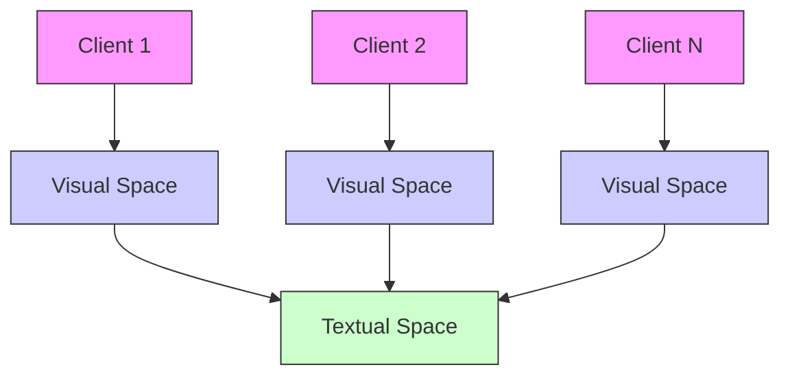
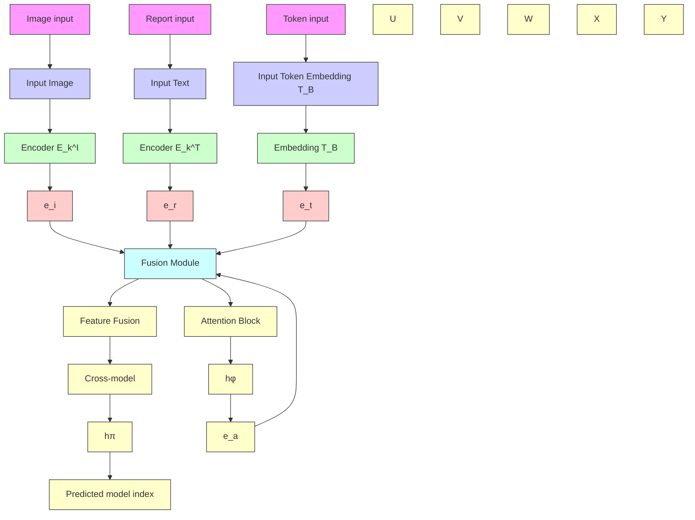

# Overcoming Heterogeneous Data in Federated Medical Vision-Language Pre-training: A Triple-Embedding Model Selector Approach

Aowen Wang $^{1,2*}$ , Zhiwang Zhang $^{2*}$ , Dongang Wang $^{3}$ , Fanyi Wang $^{1}$ , Haotian Hu $^{4}$ , Jinyang Guo $^{5}$ , Yipeng Zhou $^{6}$ , Chaoyi Pang $^{2}$ , Shiting Wen $^{2\dagger}$

$^{1}$ College of Computer Science and Technology, Zhejiang University

$^{2}$ School of Computing and Data Engineering, NingboTech University

$^{3}$ Brain and Mind Centre, The University of Sydney

$^{4}$ Zhejiang Leapmotor Technology Co., Ltd

$^{5}$ Institute of Artificial Intelligence, Beihang University

$^{6}$ School of Computing, Macquarie University

{waw,11730038}@zju.edu.cn, {zhiwang.zhang,chaoyi.pang, wensht}@nbt.edu.cn, dongang.wang@sydney.edu.au,

hu\_haotian@leapmotor.com, jinyangguo@buaa.edu.cn, yipeng.zhou@mq.edu.au

# Abstract

The scarcity of data in the medical field brings challenges to collaborative training in medical vision-language pre-training (VLP) across different clients. Thus, collaborative training in medical VLP faces two significant challenges: First, the medical data requires privacy and therefore cannot be directly shared across different clients. Second, medical data distribution across institutes is typically heterogeneous, hindering local model alignment and representation capabilities. To simultaneously overcome these two challenges, we propose a framework called personalized model selector with fused multimodal information (PMS-FM). The contribution of PMS-FM is two-fold: 1) PMS-FM uses embeddings to represent information in different formats, allowing for the fusion of multimodal data. 2) PMS-FM adapts to personalized data distributions by training multiple models. A model selector then identifies and selects the best-performing model for each individual client. Extensive experiments with multiple real-world medical datasets demonstrate the superb performance of PMS-FM over existing federated learning methods on different zero-shot classification tasks.

# Introduction

Due to the rapid advancement of vision-language models (Vaswani et al. 2017; Devlin et al. 2018), the self-supervised pre-training of large models has made significant strides in improving the representation of medical images and texts. Not only has this development enhanced the accuracy and efficiency of models in handling complex medical data, but it has also propelled advancements in areas such as medical text comprehension (Zhang et al. 2024). By integrating information from both image and text modalities, these models are better equipped to capture subtle details in medical images and understand the specialized terminology and complex contexts found in medical texts, thereby

Copyright © 2025, Association for the Advancement of Artificial Intelligence (www.aaai.org). All rights reserved.

$^{1}$ \*Equal Contribution.   
$^{2}$ †Corresponding Author.   
$^{3}$ Code is available at https://github.com/NBT-AILAB/PMS-FM

flowchart

Figure 1: The challenges of collaborative training in medical vision-language pre-training: 1) Due to the privacy of medical data, training samples cannot be directly shared across different clients. 2) The different specifications of examination equipments and biases from radiologists across clients have resulted in varying representations and distributions of medical images and reports, leading to data heterogeneity across different clients. To deal with these two challenges, we proposed personalized model selector with fused multimodal information (PMS-FM) based on personalized federated learning scheme.

playing an vital role in medical research and clinical applications (Dalmaz, Yurt, and Çukur 2022; Braman et al. 2021).

In the medical field, the scarcity of data often presents significant challenges for developing robust pre-training models (Panayides et al. 2020). To address this issue, collaborative training across different medical institutes has become essential (Mammen 2021). This (Chang et al. 2018) approach involves training models across heterogeneous clients, where each medical institute possesses non-identically distributed data (Mammen 2021; Zhang et al.

2021). By leveraging diverse data from multiple sources, this collaborative scheme enhances the generalization and performance of pre-training models, allowing them to better adapt to varying patient populations and clinical environments. However, this collaborative training approach faces two primary challenges: 1) Due to the privacy concerns surrounding medical data, training samples cannot be directly shared among different clients. 2) The use of varying examination equipment and the involvement of different radiologists across clients have led to differing representations and distributions of medical images and reports, resulting in data heterogeneity among clients. To solve these issues, we introduce the personalized federated learning scheme for medical VLP, as personalized federated learning can achieve privacy through local training and federated aggregation while addressing heterogeneous data by using a model selector.

There has been considerable progress in the field of personalized federated learning. For instance, (Zhang et al. 2023b) introduced FedALA, a method that adaptively aggregates global and local models to enhance client-specific performance. Similarly, (Xu et al. 2022) proposed FedSM, which integrates a global model, personalized models, and a model selector to better align unseen data with the most appropriate model. In another advancement, (Lee et al. 2024) presented FedL2P, which enables each participating node to locally fine-tune the model, adapting it to its unique data distribution without sharing data. However, these personalized federated learning methods are primarily designed for vision-only tasks, and may not effectively address the challenges of vision-language alignment. This limitation can lead to poor model selector performance and thus result in global model performance degradation.

In this work, we propose Personalized Model Selector with Fused Multimodal information (PMS-FM) framework designed to mitigate the impact of data heterogeneity in federated learning. In PMS-FM framework, we proposed a Triple-Embedding Model Selector that integrates three types of embedding from text and image, including image-level vision embedding, paragraph-level text embedding and word-level text embedding, addressing the multimodal deficiencies present in traditional model selectors. By integrating various levels of fusion modules represented by these embeddings, we aim to resolve the issue of multimodal alignment in the model selection process. Additionally, to enhance the precision of text representation, we propose a text fusion module that integrates different levels of text representations, enabling more effective alignment with the visual module. Our approach aims to bridge the generalization gap between centralized training and federated learning by enhancing feature integration across different modalities through feature fusion and embedding-based methods. Instead of developing a universal model to accommodate the diverse data distributions of all clients, we focus on creating tailored models that align closely with individual data distributions.

Experiments demonstrate that PMS-FM framework exhibits superior performance and advantages over existing federated learning methods on different zero-shot classification tasks, such as Chexpert (Irvin et al. 2019), MIMIC (Johnson et al. 2019), NIH Chest X-Ray (Wang et al. 2017), candid-ptx (Feng et al. 2021), RSNA (Shih et al. 2019) and COVID (Rahman et al. 2021).

Our contributions are summarized as follows:

- We propose a multimodal personalized federated learning framework named PMS-FM, which effectively addresses the multimodal alignment and data heterogeneity in federated vision-language pre-training.   
- We proposed a triple-embedding model selector designed to enhance the representation of multimodal data. By integrating multi-level embeddings, diverse data representations could be better aligned and processed.   
- To validate the effectiveness of our PMS-FM framework, we conducted ablation studies and compared our approach with different federated learning methods on multiple datasets, demonstrating its superiority in vision-language pre-training.

# Related Works

# Medical Vision Language Pre-training

In recent years, visual-language pre-training (VLP) has shown immense potential in medical image analysis. By leveraging supervision from radiology reports, VLP effectively learns visual representations, thereby enhancing the analysis and interpretation of complex image data. UniCLAM (Liu, Zhan, and Wu 2021) adopted a unified dual-stream pre-training structure with a gradually soft-parameter sharing strategy, this method helps to align image-text representations in the same space, enhancing the model's ability to interpret and answer medical questions based on radiology images. UniMedI (He et al. 2023) effectively integrated different modalities of medical images within a common semantic space, significantly enhancing the performance of downstream tasks by leveraging diagnostic reports as a bridge. KoBo (Chen et al. 2023) successfully integrated clinical knowledge into medical contrastive vision-language pre-training, addressing semantic overlap and shifting challenges. IMITATE (Liu et al. 2023) addressed alignment challenges in medical vision-language pre-training through hierarchical alignment and clinical-informed contrastive loss. KAD (Zhang et al. 2023c) introduced a knowledge-enhanced vision-language pre-training approach, it first trains a knowledge encoder based on a medical knowledge graph, embedding definitions and relationships between medical concepts.

Compared to previous methods, our approach introduces a personalized federated learning framework and enables joint pre-training with medical data from different medical institutes while ensuring privacy protection.

# Personalized Federated Learning

Federated Learning(FL) is a decentralized machine learning approach where multiple clients collaboratively train a shared model while keeping their data localized. The seminal work (McMahan et al. 2017) introduced the concept of FedAvg, which aggregates locally trained models into a global model without direct data exchange.

Unlike traditional FL approaches that assume that a single global model can reflect the distilled knowledge from all clients, personalization in FL addresses the heterogeneity of data and labels across clients. PFLM (Marfoq et al. 2022) presented a novel approach to personalized federated learning that leverages local memorization to improve model performance in heterogeneous data environments. Similarly, FedPC (Silva, Tambwekar, and Gombolay 2022) addressed this issue by incorporating both personal and context embeddings, termed “preference embeddings”, which allowed models to personalize outputs effectively without backpropagation. Gpfl (Zhang et al. 2023a) proposed a federated learning framework that achieves the dual goals of collaborative learning and personalization by incorporating both global and personalized feature information.

Previous Personalized Federated Learning methods typically address single-modal data problems, such as datasets containing only image data like CIFAR-10 (Krizhevsky, Hinton et al. 2009) and MNIST (LeCun et al. 1998). To tackle the challenge of multi-modal data alignment, we introduce a triple-embedding model selector to fully leverage multi-modal data to achieve personalized model selection.

# Preliminaries

# Medical Vision-Language Pre-training

Specifically for medical applications of Vision-Language Pre-training (VLP), MedCLIP (Wang et al. 2022b) was introduced to utilize unpaired image-text data from chest radiology. MedCLIP incorporates a label extraction technique, the ChexPert labeler, to assign unique labels to each image-report pair. These labels are then used in contrastive learning to calculate similarity, allowing theoretically any mismatched image and text to be included in the training process. We selected MedCLIP as the backbone network for medical vision-language pretraining, as it can make the most out of the limited images and reports in medical datasets, allowing the pretraining model to be more comprehensively trained.

MedCLIP consists of several key components: a knowledge extraction module for constructing the semantic similarity matrix, vision and text encoders for generating embeddings, and a semantic matching loss function for training the entire model. Initially, MedCLIP generates semantic embeddings, denoted as $e_{img}$ and $e_{txt}$ , where $e_{img}$ represents the embeddings for all images in the training batch, and $e_{txt}$ corresponds to the text embeddings. Rather than defining positive pairs by searching for equivalent embeddings, MedCLIP introduces a new equation, Eq. (1), to capture the medical semantic similarity.

$$
s = \frac {\mathbf {e} _ {\mathrm{img}} ^ {\top} \cdot \mathbf {e} _ {\mathrm{txt}}}{\| \mathbf {e} _ {\mathrm{img}} \| \cdot \| \mathbf {e} _ {\mathrm{txt}} \|} \tag {1}
$$

The semantic similarity is then integrated into contrastive training, with the contrastive loss defined in Eq. (2). Specifically, the i-th image is encoded into an image embedding $v_{i}$ , and the j-th report into a text embedding $t_{j}$ . The function sim represents the cosine similarity between the two vectors, and $\tau$ is the temperature parameter.

$$
\hat {y} _ {i j} = - \log \left(\frac {\exp (\text { sim } (v _ {i} , t _ {j}) / \tau)}{\sum_ {k = 1} ^ {N} \exp (\text { sim } (v _ {i} , t _ {k}) / \tau)}\right) \tag {2}
$$

Consequently the semantic matching loss is hence the cross entropy between the logits and soft labels as

$$
\mathcal {L} _ {\text { MedCLIP }} = - \frac {1}{N} \sum_ {i = 1} ^ {N} \sum_ {j = 1} ^ {N} y _ {i j} \log \hat {y} _ {i j} \tag {3}
$$

# SoftPull in Federated Learning

Traditional federated learning typically utilizes the FedAvg algorithm, which trains a global model, denoted as $w_{g}$ , on the server through a weighted averaging approach. Given clients 1, 2, 3, ..., k, with corresponding local models $w_{1}$ , $w_{2}$ , $w_{3}$ , ..., $w_{k}$ , the weighted aggregation formula used in each iteration is defined by Eq. (4).

$$
w _ {g} = \sum_ {k = 1} ^ {K} \frac {n _ {k}}{N} w _ {k} \tag {4}
$$

In tackling the novel personalized federated learning optimization problem, the study (Xu et al. 2022) presents an innovative technique termed SoftPull. The desired personalized optimum $w_{p,k}$ is an interpolation between the local optimum of the client k and other clients' personalized optima. This technique streamlines the issue by replacing the globally optimal local model $w_{k}^{*}$ with the model trained locally in Eq. (5), with the parameter $\lambda$ ranging from 0 to 1:

$$
w _ {p, k} \leftarrow \lambda w _ {p, k} + (1 - \lambda) \frac {1}{K - 1} \sum_ {\substack {k ^ {\prime} = 1 \\ k ^ {\prime} \neq k}} ^ {K} w _ {p, k ^ {\prime}} \tag{5}
$$

# Method

# PMS-FM Framework

As shown in Figure 2, our proposed personalized model selector with fused multimodal information (PMS-FM) framework can be divided into 5 steps. The training stage of Medical VLP is involved in the first three steps while the inference stage includes step 4 and step 5.

Step 1 Initialization and Send: Following the standard federated learning operation, the parameters are initialized in the server. For our Medical VLP task, the global image encoder $E_{g}^{I}$ , global text encoder $E_{g}^{T}$ , global triple-embedding model selector $S_{g}^{MS}$ , and global text fusion module $M_{g}^{TF}$ are initialized in the server, and sent to the selected clients for local training.

Step 2 Local Training: In client k, image pairs and report pairs are used to train local image encoder $E_{k}^{I}$ and local text encoder $E_{k}^{T}$ respectively, to obtain the local image embeddings $e_{i}$ and report embeddings $e_{r}$ . Following Eq. (1), Eq. (2) and Eq. (3), the loss of Medical Contrastive Learning $L_{MedCLIP}$ is calculated using image embeddings $e_{i}$ and report embeddings $e_{r}$ .

The image pairs, report pairs and the tokens (disease labels) are processed through the local triple-embedding

```mermaid
graph TD
    subgraph Server
        A["Step 1: Initialization and Send E_g^I"] --> B["Step 2: Local Training Image Embeddings"]
        C["Step 3: Aggregation and Resend E_1^I"] --> D["Step 2: Local Training Image Embeddings"]
        E["Step 3: Aggregation and Resend S_1^MS"] --> F["Step 2: Local Training Image Embeddings"]
        G["Step 3: Aggregation and Resend M_1^TF"] --> H["Step 2: Local Training Image Embeddings"]
        I["Step 3: Aggregation and Resend E_g^T"] --> J["Step 2: Local Training Image Embeddings"]
    end

    subgraph Training Phase
        K["Step 4: Client Selection Report Input"] --> L["Step 5: Similarity Computation"]
    end

    subgraph Inference Phase
        M["Step 4: Client Selection Image Input"] --> N["Step 5: Similarity Computation"]
    end

    subgraph Similarity Computation
        O["Step 5: Similarity Computation Report Input"] --> P["Step 5: Similarity Computation Image Embeddings"]
        Q["Step 5: Similarity Computation Template Input"] --> R["Step 5: Similarity Computation Image Embeddings"]
        S["Step 5: Similarity Computation Text Input"] --> T["Step 5: Similarity Computation Image Embeddings"]
        U["Step 5: Similarity Computation Text Embeddings"] --> V["Step 5: Similarity Computation Image Embeddings"]
    end

    subgraph Inference Phase
        W["Model pools E_1^I"] --> X["Model Pool E_1^T"] --> Y["Model Pool M_1^TF"]
    end

    subgraph Training Phase
        Z["Training Phase Step2"] --> AA["Training Phase Step3"]
    end

    subgraph Similarity Computation
        AB["Similarity Computation Table"] --> AC["Similarity Computation Table"]
    end

    subgraph Inference Phase
        AD["Inference Phase Step4"] --> AE["Inference Phase Step5"]
    end

    subgraph Training Phase
        AF["Training Phase Step2"] --> AG["Training Phase Step3"]
    end

    subgraph Training Phase
        AH["Training Phase Step3"]
    end

    subgraph Similarity Computation
        AI["Similarity Computation Table"] --> AJ["Similarity Computation Table"]
    end

    subgraph Inference Phase
        AK["Inference Phase Step4"]
    end

    subgraph Training Phase
        AL["Training Phase Step2"] --> AM["Training Phase Step3"]
    end

    subgraph Training Phase
        AN["Training Phase Step3"]
    end

    subgraph Training Phase
        AO["Training Phase Step4"]
    end

    subgraph Similarity Computation
        AP["Similarity Computation Table"] --> AQ["Similarity Computation Table"]
    end

    subgraph Inference Phase
        AR["Inference Phase Step5"]
    end

    subgraph Training Phase
        AS["Training Phase Step2"] --> AT["Training Phase Step3"]
    end

    subgraph Training Phase
        AU["Training Phase Step3"]
    end

    subgraph Similarity Computation
        AV["Training Phase Step4"]
    end

    subgraph Inference Phase
        AW["Inference Phase Step5"]
    end

    subgraph Training Phase
        AX["Training Phase Step3"]
    end

    subgraph Training Phase
        AY["Training Phase Step4"]
    end

    subgraph Similarity Computation
        AZ["Training Phase Step5"]
    end

    subgraph Inference Phase
        BA["Inference Phase Step4"]
    end

    subgraph Training Phase
        BB["Training Phase Step3"]
    end

    subgraph Training Phase
        BC["Training Phase Step4"]
    end

    subgraph Similarity Computation
        BD["Training Phase Step5"]
    end

    subgraph Inference Phase
        BE["Inference Phase Step4"]
    end

    subgraph Training Phase
        BF["Training Phase Step3"]
    end

    subgraph Training Phase
        BG["Training Phase Step4"]
    end

    subgraph Similarity Computation
        BH["Inference Phase Step5"]
    end
```

flowchart

Figure 2: Pipeline of Triple-Embedding Personalized Federated Learning Framework. During the training phase, the server and clients respectively train to obtain the global model and local models. Steps 1 to 3 represent the training process of personalized federated learning, while Steps 4 to 5 illustrate the inference process for downstream tasks using a model selector.

model selector $S_{k}^{MS}$ (details are in the next subsection), to obtain the predicted model index $y_{c}$ . The cross-entropy loss $L_{CS}$ is calculated using predict model index $y_{c}$ and ground-truth client index k. The loss function is as follows:

$$
\mathcal {L} _ {C S} = - \frac {1}{N} \sum_ {i = 1} ^ {N} y _ {i} \log (\hat {y} _ {i}) + \mathcal {L} _ {e m b} \tag {6}
$$

where $\mathcal{L}_{emb}$ is the embedding loss defined in Eq. 10.

During the local training, the local image encoder $E_{k}^{I}$ and local text encoder $E_{k}^{T}$ are fully fine-tuned and the model selector is partially fine-tuned.

Step 3 Aggregation and Resend: The updated local image encoder, local text encoder, local model selector and local text fusion module are sent back to the server. The global parameters are updated using SoftPull resending strategy (see Eq. (5)). These parameters are resent to the selected clients in the next round. Step 2 and Step 3 are repeated for T rounds.

Step 4 Client Selection: Before starting the inference, the image, manually-designed template and the tokens

are passed through the aggregated global triple-embedding model selector $S_g^{MS}$ to generate the confidence distribution of different models $\mathbf{d}_c$ .

If the element with highest confidence $d_{c}[t]$ is higher than the predefined threshold $\pi_{ms}$ , local modules (i.e. $E_{k}^{I}$ , $E_{k}^{T}$ , and $M_{k}^{TF}$ ) are selected from candidate pool. Otherwise, global modules are selected for Step 5.

Step 5 Similarity Calculation: The image, template, and tokens are processed through their respective encoders to obtain image, template, and token embeddings. The text fusion module then combines the template and token embeddings into a fused text embedding. The final similarity score is calculated using the image embedding $e_{i}$ and fused text embedding $e_{f}$ . The similarity formula expressed as

$$
\operatorname{CosSim} = \frac {\mathbf {e} _ {i} \cdot \mathbf {e} _ {f}}{\| \mathbf {e} _ {i} \| \| \mathbf {e} _ {f} \|} \tag {7}
$$

# Triple-Embedding Model Selector

As depicted in Figure 3, the Triple-Embedding Model Selector has three inputs: image input, report input and token in-

flowchart

Figure 3: Overview of Triple-Embedding Model Selector. Given both image input, report input and token input, the model select can predict the model index, which is finally used in step 4 in the inference phase.

put. Through frozen image encoder, frozen text encoder and frozen language embedding, corresponding embeddings image embedding $e_{i}$ , report embedding $e_{r}$ , token embedding $e_{t}$ are extracted from these three inputs.

To obtain better textual representations, token embedding $e_{t}$ and the report embedding $e_{r}$ passed through the text fusion module $M_{k}^{TF}$ to generate the fusion embedding $e_{f}$ . As shown in Figure 3, the text fusion module $M_{k}^{TF}$ is consist of an Attention block and then a fully connected layer $h\phi$ and the Fusion Module.

In text fusion module $M_{k}^{TF}$ , the attention module is defined as:

$$
\text { Attention } (Q, K, V) = \text { softmax } \left(\frac {Q K ^ {\top}}{\sqrt {d _ {k}}}\right) V \tag {8}
$$

Where the query $Q$ , key $K$ and value $V$ are obtained by projecting the $e_t$ using their respective projection matrices.

To fully utilize the information represented by the two embeddings, The fused text embedding $e_{f}$ after the fusion module is defined as:

$$
\mathbf {e} _ {f} = \lambda_ {a} \cdot \mathbf {e} _ {r} + \lambda_ {b} \cdot \mathbf {e} _ {a} \tag {9}
$$

where $\lambda_{a}$ and $\lambda_{b}$ are pre-defined parameters. $e_{r}$ is the report embedding and $e_{a}$ is the augmented token embedding after attention block and fully connected layer $h\phi$ .

In addition, to better map the token embedding and report embedding in text fusion module, we proposed the embedding loss $L_{emb}$ defined as:

$$
\mathcal {L} _ {e m b} = \frac {1}{N} \sum_ {i = 1} ^ {n} \left(\mathbf {e} _ {\text { target }} - \mathbf {e} _ {a}\right) ^ {2} \tag {10}
$$

where $\mathbf{e}_{target}$ represents the fused text embedding $\mathbf{e}_f$ and $\mathbf{e}_a$ represents augment token embedding.

Next, image embedding $e_{i}$ and fused text embedding $e_{f}$ are the inputs of Cross-modal Feature Fusion Model. The Cross-modal Feature Fusion Model is implemented in 2 ways: 1) MLP and 2) Cross Attention (see Eq. 8). In the MLP method, we concatenate both the fused text embedding $e_{f}$ and image embedding $e_{i}$ and pass through several fully connected layers. In the cross-attention method, the query Q is obtained by projecting the text features $e_{f}$ using a projection matrix, and the key K and value V are obtained by projecting the image embedding $e_{i}$ using their respective projection matrices.

Finally, the output features of the Cross-modal Feature Fusion Model passed through the fully connected layer $h\pi$ and a softmax layer to obtain the classification probabilities of the selected model index.

# Experiments

# Dataset

CheXpert (Irvin et al. 2019) is a large dataset of chest X-rays created by Stanford University, featuring 224,316 images from 65,240 patients. It includes labels for 14 common thoracic diseases, which were automatically extracted from radiology reports. The dataset is widely used for developing and evaluating machine learning models in medical imaging.

MIMIC-CXR (Johnson et al. 2019) is a large publicly available dataset of chest X-rays and radiology reports. It includes over 377,000 images from more than 227,000 imaging studies conducted on over 65,000 patients at the Beth Israel Deaconess Medical Center. The dataset is valuable for developing and evaluating machine learning models in medical imaging and natural language processing, as it provides both the images and corresponding free-text reports.

NIH Chest X-Ray (Wang et al. 2017) is comprised of 112,120 X-ray images with disease labels from 30,805 unique patients. To create these labels, the authors used Natural Language Processing to text-mine disease classifications from the associated radiological reports. The labels are expected to be more than 0.9 accurate and suitable for weakly-supervised learning.

CANDID-PTX (Feng et al. 2021) is a dataset of 19,237 anonymized adult chest X-rays from Dunedin Hospital, New Zealand, collected between 2010 and 2020. The images, in $1024 \times 1024$ pixel DICOM format, come with free-text reports and were manually annotated for pneumothorax, acute rib fractures, and chest tubes by RANZCR radiology trainees and radiologists. Segmentation annotations are provided in run-length-encoded format, with metadata including patient indices and acquisition dates to preserve temporal relationships.

The RSNA Pneumonia (Shih et al. 2019) contains over 30,000 chest X-rays, annotated by radiologists for pneumonia, lung opacity, and other abnormalities. It includes bounding boxes around areas of interest and was released for a competition by the Radiological Society of North America (RSNA) to advance machine learning in medical imaging.

COVIDx (Rahman et al. 2021) is a chest X-ray dataset designed for developing AI models to detect COVID-19. It in-

<table><tr><td>Method</td><td>Backbone</td><td>Chexpert</td><td>MIMIC</td><td>NIH</td><td>Candid</td><td>Mean</td></tr><tr><td>Centralized</td><td>MedClip</td><td>0.630(0.022)</td><td>0.541(0.014)</td><td>0.572(0.033)</td><td>0.525(0.042)</td><td>0.567(0.028)</td></tr><tr><td>FedAvg (McMahan et al. 2017)</td><td>MedClip</td><td>0.524(0.013)</td><td>0.525(0.045)</td><td>0.539(0.033)</td><td>0.491(0.042)</td><td>0.520(0.032)</td></tr><tr><td>FedProx (Li et al. 2020)</td><td>MedClip</td><td>0.401(0.033)</td><td>0.408(0.045)</td><td>0.396(0.056)</td><td>0.279(0.043)</td><td>0.371(0.047)</td></tr><tr><td>FedMOON (Li, He, and Song 2021)</td><td>MedClip</td><td>0.583(0.024)</td><td>0.506(0.038)</td><td>0.568(0.026)</td><td>0.505(0.051)</td><td>0.541(0.035)</td></tr><tr><td>FedSM (Xu et al. 2022)</td><td>MedClip</td><td>0.596(0.015)</td><td>0.517(0.026)</td><td>0.541(0.028)</td><td>0.497(0.072)</td><td>0.538(0.036)</td></tr><tr><td>FedFed (Yang et al. 2024)</td><td>MedClip</td><td>0.615(0.022)</td><td>0.520(0.032)</td><td>0.547(0.057)</td><td>0.502(0.043)</td><td>0.546(0.041)</td></tr><tr><td>PMS-FM (Our)</td><td>MedClip</td><td>0.667(0.022)</td><td>0.532(0.037)</td><td>0.575(0.035)</td><td>0.512(0.033)</td><td>0.571(0.031)</td></tr><tr><td>FedAvg (McMahan et al. 2017)</td><td>MGCA</td><td>0.602(0.031)</td><td>0.519(0.072)</td><td>0.535(0.052)</td><td>0.484(0.083)</td><td>0.535(0.061)</td></tr><tr><td>PMS-FM (Our)</td><td>MGCA</td><td>0.658(0.051)</td><td>0.539(0.063)</td><td>0.569(0.032)</td><td>0.516(0.053)</td><td>0.570(0.049)</td></tr></table>

Table 1: Results of zero-shot image classification tasks on local datasets. We take an additional prompt ensemble version of each method. We take the mean and standard deviation (STD) of accuracy (ACC) in different federated learning frameworks across various datasets. Best scores across a dataset are in bold. 

<table><tr><td>Method</td><td>Backbone</td><td>RSNA</td><td>COVID</td><td>Mean</td></tr><tr><td>Centralized</td><td>MedClip</td><td>0.815(0.031)</td><td>0.821(0.054)</td><td>0.818(0.043)</td></tr><tr><td>FedAvg (McMahan et al. 2017)</td><td>MedClip</td><td>0.805(0.051)</td><td>0.794(0.056)</td><td>0.800(0.054)</td></tr><tr><td>FedProx (Li et al. 2020)</td><td>MedClip</td><td>0.642(0.064)</td><td>0.587(0.043)</td><td>0.615(0.054)</td></tr><tr><td>FedMOON (Li, He, and Song 2021)</td><td>MedClip</td><td>0.812(0.046)</td><td>0.802(0.062)</td><td>0.807(0.054)</td></tr><tr><td>FedSM (Xu et al. 2022)</td><td>MedClip</td><td>0.803(0.036)</td><td>0.805(0.037)</td><td>0.804(0.037)</td></tr><tr><td>FedFed (Yang et al. 2024)</td><td>MedClip</td><td>0.807(0.061)</td><td>0.804(0.057)</td><td>0.806(0.059)</td></tr><tr><td>PMS-FM (Our)</td><td>MedClip</td><td>0.822(0.033)</td><td>0.811(0.025)</td><td>0.817(0.029)</td></tr><tr><td>FedAvg (McMahan et al. 2017)</td><td>MGCA</td><td>0.803(0.053)</td><td>0.813(0.024)</td><td>0.808(0.039)</td></tr><tr><td>PMS-FM (Our)</td><td>MGCA</td><td>0.809(0.022)</td><td>0.820(0.051)</td><td>0.815(0.037)</td></tr></table>

Table 2: Results of zero-shot image classification tasks on external datasets. We take an additional prompt ensemble version of each method. We take the mean and standard deviation (STD) of accuracy (ACC) in different federated learning frameworks across various datasets. Best scores across a dataset are in bold.

<table><tr><td>Method</td><td>C 1</td><td>C 2</td><td>C 3</td><td>C 4</td><td>Mean</td></tr><tr><td>Global Model</td><td>0.553</td><td>0.531</td><td>0.572</td><td>0.514</td><td>0.543</td></tr><tr><td>C 1 Local</td><td>0.685</td><td>0.514</td><td>0.564</td><td>0.484</td><td>0.562</td></tr><tr><td>C 2 Local</td><td>0.381</td><td>0.535</td><td>0.482</td><td>0.271</td><td>0.417</td></tr><tr><td>C 3 Local</td><td>0.578</td><td>0.525</td><td>0.569</td><td>0.392</td><td>0.516</td></tr><tr><td>C 4 Local</td><td>0.549</td><td>0.491</td><td>0.480</td><td>0.471</td><td>0.498</td></tr><tr><td>PMS-FM(Our)</td><td>0.645</td><td>0.545</td><td>0.586</td><td>0.542</td><td>0.579</td></tr></table>

Table 3: The results of the personalized models and the global model on medical image classification are as follows: "C k Local" refers to the personalized model trained on the data of client k, while the "Global Model" represents the model obtained through FedAvg. "C k" indicates the testing on the dataset of client k.

cludes labeled images for COVID-19, viral pneumonia, and normal cases, compiled from various sources to support research in improving diagnostic accuracy.

# Experimental Setup

We use MedCLIP(Wang et al. 2022b) as the backbone of our model, with BioClinicalBERT (Lee et al. 2020) serving as the text encoder and Swin Transformer as the image encoder. Both encoders are based on the Transformer architecture.

We use the MIMIC-CXR (Johnson et al. 2019), CheX-

pert (Irvin et al. 2019), NIH Chest X-Ray (Wang et al. 2017), and CANDID-PTX (Feng et al. 2021) datasets for pretraining. Since CheXpert and NIH Chest X-Ray datasets do not include text reports, we address the lack of textual data by employing methods such as label-based report retrieval and medical LLM (Lee et al. 2023) report generation. We held 2000 samples out for evaluation from these datasets. All images are padded to a square shape and then scaled to $224 \times 224$ . To avoid excessively long medical reports, we enforce a token length limit of 77. This helps eliminate unnecessary or redundant semantics within the tokens, allowing us to better align the embeddings of the text and images. We set up four clients, each maintaining independent data. The sizes of the training datasets are 223,415, 270,791, 47,209, and 16,564 image-text pairs, respectively. We use AdamW (Loshchilov and Hutter 2017) as the optimizer with a weight decay of 1e-4. The initial learning rate is set to 2e-5, and the model interpolation parameter $\lambda$ is set to 0.65 following a cosine learning rate schedule. In the fusion model of the model selector, we experimented with multiple sets of values for $\lambda_{a}$ and $\lambda_{b}$ ranging from 0 to 1, ultimately selecting the set that produced the best results. The model is trained for 100 epochs with a batch size of 48. The training was conducted on two 4060Ti GPUs, with a minimum required GPU memory of 16GB.

# Performance Comparison

Table 1 and Table 2 presents the performance of different federated learning methods on zero-shot image classification tasks across six datasets after pretraining with medical vision-language models. To demonstrate the superiority of our method, we compared it with various traditional federated learning methods such as FedProx (Li et al. 2020), FedMoon (Li, He, and Song 2021), and FedSM (Xu et al. 2022). As shown in Table 1 and Table 2, our method generally achieves better results in zero-shot image classification across different datasets.

To validate our approach's generalization, we used multimodal backbones like MGCA (Wang et al. 2022a) and FedAvg as a baseline. Integrating our method improved VLP models across all datasets by enabling personalized models tailored to specific datasets. Through model selection, we addressed data heterogeneity, enhancing robustness and generalization.

Table 3 presents the zero-shot performance of both the global and personalized models across different client datasets. Upon comparison, it is evident that the personalized models achieve higher accuracy on local data for each client. This indicates that the personalized models, trained using model interpolation, are better suited to the local data distribution, resulting in superior performance. While personalized models often underperform on non-local data, our federated learning method outperforms the global model across all datasets and even surpasses personalized models in some cases. This is due to the multi-embeddings enhancing multimodal alignment and the model selector ensuring optimal model choice.

Ablation Study 

<table><tr><td>E</td><td>T</td><td>Fusion Strategy</td><td>Mean</td></tr><tr><td>√</td><td></td><td>SA</td><td>0.614</td></tr><tr><td></td><td>√</td><td>SA</td><td>0.622</td></tr><tr><td>√</td><td>√</td><td>CA</td><td>0.626</td></tr><tr><td>√</td><td></td><td>MLP</td><td>0.608</td></tr><tr><td></td><td>√</td><td>MLP</td><td>0.625</td></tr><tr><td>√</td><td>√</td><td>MLP</td><td>0.635</td></tr></table>

Table 4: Ablation Study of cross-level text fusion module in the inference stage. MLP, SA and CA denote Multilayer Perceptron, Self-Attention and Cross-Attention. E and T respectively represent whether enhanced embeddings are used during the inference phase and in the model selector.

To evaluate the impact of different modules on the downstream task performance in Multimodal Personalized Federated Learning, we conducted ablation studies, as shown in Table 4. In the table, E indicates whether enhanced embedding is added during the inference phase, T denotes whether the model selector incorporates the generated embedding based on the token and Fusion Strategy refers to the strategy employed by the model selector during multimodal fusion. We tested the average accuracy of zero-shot medical image classification across four datasets under different module configurations. The experiments demonstrate that each module contributes to some improvement in performance. Notably, the combination of both the E and T modules under the strategy Multilayer Perceptron (MLP) yielded the best results for the task.

<table><tr><td colspan="3">Embedding</td><td colspan="2">Fusion</td><td colspan="2">Accuracy</td></tr><tr><td>I</td><td>P</td><td>W</td><td>MLP</td><td>CA</td><td>MS</td><td>Mean</td></tr><tr><td>√</td><td></td><td></td><td></td><td></td><td>0.543</td><td>0.601</td></tr><tr><td>√</td><td>√</td><td></td><td></td><td>√</td><td>0.725</td><td>0.621</td></tr><tr><td>√</td><td>√</td><td></td><td>√</td><td></td><td>0.815</td><td>0.629</td></tr><tr><td>√</td><td>√</td><td>√</td><td></td><td>√</td><td>0.743</td><td>0.627</td></tr><tr><td>√</td><td>√</td><td>√</td><td>√</td><td></td><td>0.835</td><td>0.635</td></tr></table>

Table 5: Ablation Study on different embedding and fusion methods on Triple-Embedding model selector. I, P and W represent image-level vision embedding, paragraph-level text embedding and word-level text embedding, respectively. MS means the accuracy of the Triple-Embedding model selector.

As shown in Table 5, we also conducted ablation experiments to validate the capabilities of the model selector. To demonstrate the necessity of multimodal fusion, we performed experiments under both multimodal feature fusion and single-modal settings. Additionally, to assess the impact of the triple embedding on the model selector's performance, we included this variable in our tests. Overall, we measured the accuracy of the model selector in choosing the optimal model under different module conditions. I, P and W represent the image-level vision embedding, paragraph-level text embedding and word-level text embedding while MLP and CA denote different fusion strategies. The results show that the highest accuracy was achieved with triple embedding and MLP multimodal fusion, while single-modal input (Medical Image) was far less effective than multimodal inputs.

# Conclusion

In this paper, we present a novel Multimodal Personalized Federated Learning Framework designed to address the challenges of data heterogeneity and multimodal alignment. Our approach introduces a method for personalized federated learning specifically tailored for medical language-vision pre-training models. By employing model interpolation, we train local models on the client side and a global model on the server side, which effectively mitigates client drift when handling diverse data distributions. During the zero-shot inference phase, we further enhance model selection by introducing a triple-embedding model selector. This component identifies the most suitable local model based on the input image and text. The model selector generates three distinct types of embeddings, each tailored to different diseases, and ensures multimodal data alignment by integrating these embeddings through a multimodal fusion block. We validated our framework through ablation studies and comparisons with other federated learning methods, showing its superior generalization and accuracy.

# Acknowledgments

This research was supported by Zhejiang Provincial Natural Science Foundation of China under Grant No. LY24F020021, and the Ningbo Science and Technology Special Projects under Grant No. 2024Z263, and 2023Z129

# References

Braman, N.; Gordon, J. W.; Goossens, E. T.; Willis, C.; Stumpe, M. C.; and Venkataraman, J. 2021. Deep orthogonal fusion: multimodal prognostic biomarker discovery integrating radiology, pathology, genomic, and clinical data. In Medical Image Computing and Computer Assisted Intervention–MICCAI 2021: 24th International Conference, Strasbourg, France, September 27–October 1, 2021, Proceedings, Part V 24, 667–677. Springer.

Chang, K.; Balachandar, N.; Lam, C.; Yi, D.; Brown, J.; Beers, A.; Rosen, B.; Rubin, D. L.; and Kalpathy-Cramer, J. 2018. Distributed deep learning networks among institutions for medical imaging. Journal of the American Medical Informatics Association, 25(8): 945–954.

Chen, X.; He, Y.; Xue, C.; Ge, R.; Li, S.; and Yang, G. 2023. Knowledge boosting: Rethinking medical contrastive vision-language pre-training. In International Conference on Medical Image Computing and Computer-Assisted Intervention, 405–415. Springer.

Dalmaz, O.; Yurt, M.; and Çukur, T. 2022. ResViT: residual vision transformers for multimodal medical image synthesis. IEEE Transactions on Medical Imaging, 41(10): 2598–2614.

Devlin, J.; Chang, M.-W.; Lee, K.; and Toutanova, K. 2018. Bert: Pre-training of deep bidirectional transformers for language understanding. arXiv preprint arXiv:1810.04805.

Feng, S.; Azzollini, D.; Kim, J. S.; Jin, C.-K.; Gordon, S. P.; Yeoh, J.; Kim, E.; Han, M.; Lee, A.; Patel, A.; et al. 2021. Curation of the candid-ptx dataset with free-text reports. Radiology: Artificial Intelligence, 3(6): e210136.

He, X.; Yang, Y.; Jiang, X.; Luo, X.; Hu, H.; Zhao, S.; Li, D.; Yang, Y.; and Qiu, L. 2023. Unified Medical Image Pre-training in Language-Guided Common Semantic Space. arXiv preprint arXiv:2311.14851.

Irvin, J.; Rajpurkar, P.; Ko, M.; Yu, Y.; Ciurea-Ilcus, S.; Chute, C.; Marklund, H.; Haghgoo, B.; Ball, R.; Shpan-skaya, K.; et al. 2019. Chexpert: A large chest radiograph dataset with uncertainty labels and expert comparison. In Proceedings of the AAAI conference on artificial intelligence, volume 33, 590–597.

Johnson, A. E.; Pollard, T. J.; Berkowitz, S. J.; Greenbaum, N. R.; Lungren, M. P.; Deng, C.-y.; Mark, R. G.; and Horng, S. 2019. MIMIC-CXR, a de-identified publicly available database of chest radiographs with free-text reports. Scientific data, 6(1): 317.

Krizhevsky, A.; Hinton, G.; et al. 2009. Learning multiple layers of features from tiny images.

LeCun, Y.; Bottou, L.; Bengio, Y.; and Haffner, P. 1998. Gradient-based learning applied to document recognition. Proceedings of the IEEE, 86(11): 2278–2324.

Lee, J.; Yoon, W.; Kim, S.; Kim, D.; Kim, S.; So, C. H.; and Kang, J. 2020. BioBERT: a pre-trained biomedical language representation model for biomedical text mining. Bioinformatics, 36(4): 1234–1240.

Lee, R.; Kim, M.; Li, D.; Qiu, X.; Hospedales, T.; Huszár, F.; and Lane, N. 2024. Fedl2p: Federated learning to personalize. Advances in Neural Information Processing Systems, 36.

Lee, S.; Youn, J.; Kim, M.; and Yoon, S. H. 2023. Cxr-llava: Multimodal large language model for interpreting chest x-ray images. arXiv preprint arXiv:2310.18341.

Li, Q.; He, B.; and Song, D. 2021. Model-contrastive federated learning. In Proceedings of the IEEE/CVF conference on computer vision and pattern recognition, 10713–10722.

Li, T.; Sahu, A. K.; Zaheer, M.; Sanjabi, M.; Talwalkar, A.; and Smith, V. 2020. Federated optimization in heterogeneous networks. Proceedings of Machine learning and systems, 2: 429–450.

Liu, B.; Zhan, L.-M.; and Wu, X.-M. 2021. Contrastive pre-training and representation distillation for medical visual question answering based on radiology images. In Medical Image Computing and Computer Assisted Intervention–MICCAI 2021: 24th International Conference, Strasbourg, France, September 27–October 1, 2021, Proceedings, Part II 24, 210–220. Springer.

Liu, C.; Cheng, S.; Shi, M.; Shah, A.; Bai, W.; and Arcucci, R. 2023. Imitate: Clinical prior guided hierarchical vision-language pre-training. arXiv preprint arXiv:2310.07355.

Loshchilov, I.; and Hutter, F. 2017. Decoupled weight decay regularization. arXiv preprint arXiv:1711.05101.

Mammen, P. M. 2021. Federated learning: Opportunities and challenges. arXiv preprint arXiv:2101.05428.

Marfoq, O.; Neglia, G.; Vidal, R.; and Kameni, L. 2022. Personalized federated learning through local memorization. In International Conference on Machine Learning, 15070–15092. PMLR.

McMahan, B.; Moore, E.; Ramage, D.; Hampson, S.; and y Arcas, B. A. 2017. Communication-efficient learning of deep networks from decentralized data. In Artificial intelligence and statistics, 1273–1282. PMLR.

Panayides, A. S.; Amini, A.; Filipovic, N. D.; Sharma, A.; Tsaftaris, S. A.; Young, A.; Foran, D.; Do, N.; Golemati, S.; Kurc, T.; et al. 2020. AI in medical imaging informatics: current challenges and future directions. IEEE journal of biomedical and health informatics, 24(7): 1837–1857.

Rahman, T.; Khandakar, A.; Qiblawey, Y.; Tahir, A.; Kiranyaz, S.; Kashem, S. B. A.; Islam, M. T.; Al Maadeed, S.; Zughaier, S. M.; Khan, M. S.; et al. 2021. Exploring the effect of image enhancement techniques on COVID-19 detection using chest X-ray images. Computers in biology and medicine, 132: 104319.

Shih, G.; Wu, C. C.; Halabi, S. S.; Kohli, M. D.; Prevedello, L. M.; Cook, T. S.; Sharma, A.; Amorosa, J. K.; Arteaga, V.; Galperin-Aizenberg, M.; et al. 2019. Augmenting the national institutes of health chest radiograph dataset with expert annotations of possible pneumonia. Radiology: Artificial Intelligence, 1(1): e180041.

Silva, A.; Tambwekar, P.; and Gombolay, M. 2022. FedPC: Federated Learning for Language Generation with Personal and Context Preference Embeddings. arXiv preprint arXiv:2210.03766.   
Vaswani, A.; Shazeer, N.; Parmar, N.; Uszkoreit, J.; Jones, L.; Gomez, A. N.; Kaiser, Ł.; and Polosukhin, I. 2017. Attention is all you need. Advances in neural information processing systems, 30.   
Wang, F.; Zhou, Y.; Wang, S.; Vardhanabhuti, V.; and Yu, L. 2022a. Multi-granularity cross-modal alignment for generalized medical visual representation learning. Advances in Neural Information Processing Systems, 35: 33536–33549.   
Wang, X.; Peng, Y.; Lu, L.; Lu, Z.; Bagheri, M.; and Summers, R. M. 2017. Chestx-ray8: Hospital-scale chest x-ray database and benchmarks on weakly-supervised classification and localization of common thorax diseases. In Proceedings of the IEEE conference on computer vision and pattern recognition, 2097–2106.   
Wang, Z.; Wu, Z.; Agarwal, D.; and Sun, J. 2022b. Medclip: Contrastive learning from unpaired medical images and text. arXiv preprint arXiv:2210.10163.   
Xu, A.; Li, W.; Guo, P.; Yang, D.; Roth, H. R.; Hatamizadeh, A.; Zhao, C.; Xu, D.; Huang, H.; and Xu, Z. 2022. Closing the generalization gap of cross-silo federated medical image segmentation. In Proceedings of the IEEE/CVF Conference on Computer Vision and Pattern Recognition, 20866–20875.   
Yang, Z.; Zhang, Y.; Zheng, Y.; Tian, X.; Peng, H.; Liu, T.; and Han, B. 2024. FedFed: Feature distillation against data heterogeneity in federated learning. Advances in Neural Information Processing Systems, 36.   
Zhang, C.; Xie, Y.; Bai, H.; Yu, B.; Li, W.; and Gao, Y. 2021. A survey on federated learning. Knowledge-Based Systems, 216: 106775.   
Zhang, J.; Hua, Y.; Wang, H.; Song, T.; Xue, Z.; Ma, R.; Cao, J.; and Guan, H. 2023a. Gpfl: Simultaneously learning global and personalized feature information for personalized federated learning. In Proceedings of the IEEE/CVF International Conference on Computer Vision, 5041–5051.   
Zhang, J.; Hua, Y.; Wang, H.; Song, T.; Xue, Z.; Ma, R.; and Guan, H. 2023b. Fedala: Adaptive local aggregation for personalized federated learning. In Proceedings of the AAAI Conference on Artificial Intelligence, volume 37, 11237–11244.   
Zhang, J.; Huang, J.; Jin, S.; and Lu, S. 2024. Vision-language models for vision tasks: A survey. IEEE Transactions on Pattern Analysis and Machine Intelligence.   
Zhang, X.; Wu, C.; Zhang, Y.; Xie, W.; and Wang, Y. 2023c. Knowledge-enhanced visual-language pre-training on chest radiology images. Nature Communications, 14(1): 4542.