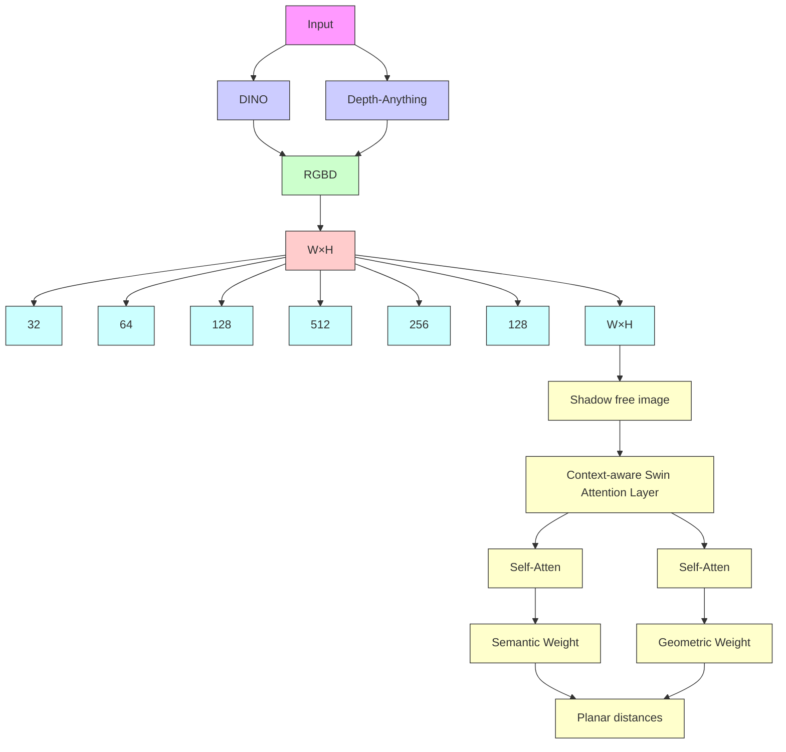

# OmniSR: Shadow Removal Under Direct and Indirect Lighting

Jiamin Xu $^{1}$ , Zelong Li $^{1}$ , Yuxin Zheng $^{1}$ , Chenyu Huang $^{1}$ , Renshu Gu $^{1}$ , Weiwei Xu $^{2}$ , Gang Xu $^{1*}$

$^{1}$ Hangzhou Dianzi University

$^{2}$ Zhejiang University

superxjm@yeah.net, {jokerli,yuxin6,shamet,renshugu}@hdu.edu.cn,xww@cad.zju.edu.cn,gxu@hdu.edu.cn

# Abstract

Shadows can originate from occlusions in both direct and indirect illumination. Although most current shadow removal research focuses on shadows caused by direct illumination, shadows from indirect illumination are often just as pervasive, particularly in indoor scenes. A significant challenge in removing shadows from indirect illumination is obtaining shadow-free images to train the shadow removal network. To overcome this challenge, we propose a novel rendering pipeline for generating shadowed and shadow-free images under direct and indirect illumination, and create a comprehensive synthetic dataset that contains over 30,000 image pairs, covering various object types and lighting conditions. We also propose an innovative shadow removal network that explicitly integrates semantic and geometric priors through concatenation and attention mechanisms. The experiments show that our method outperforms state-of-the-art shadow removal techniques and can effectively generalize to indoor and outdoor scenes under various lighting conditions, enhancing the overall effectiveness and applicability of shadow removal methods.

Code — https://blackjoke76.github.io/Projects/OmniSR/

# Introduction

Shadows are omnipresent phenomena that emerge due to occlusions within a scene's global illumination. Removing shadows is crucial, as it can enhance the performance of various computer vision tasks, such as object segmentation and tracking (He et al. 2017; Sanin, Sanderson, and Lovell 2010), intrinsic decomposition (Li and Snavely 2018; Li et al. 2022; Nestmeyer et al. 2020; Ye et al. 2023), and 3D reconstruction (Ling, Wang, and Xu 2023).

Recent shadow removal techniques predominantly adopt deep learning-based approaches, leveraging publicly available datasets containing pairs of shadowed and shadow-free images (Wang, Li, and Yang 2018; Le and Samaras 2019; Qu et al. 2017) or shadow masks (Vicente et al. 2016; Sun et al. 2023). These datasets, derived from real-world captures, often suffer from limitations in both quantity and quality. To

  
Real captured image

  
ShadowFormer (ISTD+ dataset)

  
DMTN (ISTD+ dataset)

  
Our results (our dataset)

  
ShadowFormer (our dataset)

  
DMTN (our dataset)

  
Direct shadow

  
Indirect shadow

  
Shadow-free image   
Figure 1: Top: Removing shadows from intricate indoor scenes with indirect illumination poses a challenge for current methods such as ShadowFormer (Guo et al. 2023a) and DMTN (Liu et al. 2023a), especially when trained on existing datasets focusing on direct illumination, like ISTD+ (Le and Samaras 2019). In contrast, our shadow removal network, along with a newly introduced INdirect Shadow (INS) dataset, demonstrates a superior ability to remove shadows accurately. Bottom: The rendering results reveal the prominence and prevalence of both direct and indirect shadows in indoor scenes.

overcome these limitations, many researchers employ techniques such as data augmentation (Le et al. 2018; Cun, Pun, and Shi 2020), self-training (Yang et al. 2023), and unsupervised learning (Jiang et al. 2023; Hu et al. 2019b; Jin, Sharma, and Tan 2021). On the other hand, due to the visual similarity between certain shadowed and non-shadowed regions, many studies focus on enhancing the discriminative power of shadow removal networks. This can be achieved by incorporating semantic information (Zheng et al. 2019; Hu et al. 2019a; Liu et al. 2023b), employing binary shadow masks (Li et al. 2023; Guo et al. 2023a), or adopting progressive shadow removal methods (Zhu et al. 2022b; Guo et al. 2023b; Ding et al. 2019). Despite these advancements, existing methods still face challenges in removing shadows

in complex indoor scenes (Fig. 1).

Indoor scene shadow removal is particularly challenging due to the complex nature of global illumination, which encompasses direct lighting $^{1}$ and indirect lighting. The indirect lighting, involving rays bouncing off surfaces multiple times before being captured, leads to a substantial proportion of shadows that appear soft and subtle, as depicted in Fig. 1. We distinguish shadows originating from direct lighting as “Direct Shadows” and those produced by indirect lighting as “Indirect Shadows”. Despite the prevalence of indirect shadows in indoor scenes, existing research and datasets have largely neglected them. This bias can be attributed to three primary reasons: 1. It is difficult to define indirect shadows precisely; 2. It is not feasible to remove all occluders in complex indoor scenes, making it impossible to capture images completely free of both direct and indirect shadows; 3. Indirect shadows can be overlooked in most outdoor scenes. Unlike existing methods, our approach considers both direct and indirect shadows. To address the challenges above, we define and render shadow and shadow-free images within the framework of path tracing (Akenine-Mller, Haines, and Hoffman 2018). While shadow images are naturally generated in the path tracing pipeline, producing shadow-free images requires the separate definition of each shadow type and the design of distinct rendering procedures.

To effectively remove both direct and indirect shadows from a single image, we propose a shadow removal network that integrates semantic and geometric information. Specifically, inspired by screen-space ambient occlusion (Miller 1994), we use depth information to guide the removal of indirect shadows, which commonly occur near depth discontinuities. Meanwhile, the incorporation of semantic information helps identify direct shadows, which typically appear darker than the surrounding areas with the same semantic content. Consequently, our network takes RGB-Depth (RGBD) as input, concatenates semantic features to the bottleneck layer, and reweights features in local attention blocks based on local semantic and geometric similarities. Unlike the shadow-interaction attention employed in ShadowFormer (Guo et al. 2023a), which exploits contextual correlations between binary shadowed and non-shadow regions, our network incorporates geometric information and semantic features and does not rely on shadow detection as auxiliary information.

In summary, the main contributions of this work are threefold:

- We propose a novel rendering pipeline for shadows that considers direct and indirect illumination and construct the first INdirect Shadow (INS) dataset consisting of 30,000+ synthetic image pairs with diverse scene types.   
- We introduce a novel shadow removal network that efficiently removes both direct and indirect shadows. The network leverages semantic and geometric priors through RGBD input, incorporating semantic features, and semantic and geometry-aware attention mechanisms.

\- The extensive experimental results on our INS dataset and several other datasets demonstrate that our method has achieved a new state-of-the-art performance, particularly in handling shadows under both direct and indirect illumination.

# Related Work

Single-image shadow removal aims to restore the shadow-free texture in shadowed regions while maintaining the appearance of non-shadowed areas. Traditional model-based approaches depend on the physical models of shadow images, but their reliance on prior knowledge often limits their effectiveness in real-world scenes (Finlayson, Drew, and Lu 2009; Khan et al. 2015; Zhang, Zhang, and Xiao 2015).

In recent years, deep learning-based methods have shown remarkable performance in shadow removal thanks to their end-to-end capabilities. However, a key challenge for these methods lies in ensuring generalizability given the limitations in data quantity and quality, as well as resolving shadow ambiguity in real scenes. To address these challenges, researchers have explored various strategies, including the integration of multi-context features (Qu et al. 2017; Hu et al. 2019a; Chen et al. 2021) and the use of generative adversarial networks (Wang, Li, and Yang 2018; Cun, Pun, and Shi 2020; Hu et al. 2019b), to enhance generalizability and improve the effectiveness of available datasets. Other works, such as Fu et al. (2021c) and Zhu et al. (2022a), treated shadow removal as an exposure fusion problem or developed a bijective mapping that combines the learning processes of shadow removal and generation.

More recently, Guo et al. (2023a) introduced ShadowFormer, a single-stage shadow removal network that utilizes multi-scale attention to exploit contextual correlations between shadowed and non-shadowed regions. Although lightweight, this network relies on the shadow mask as input, making its performance heavily dependent on high-precision shadow detection results. DMTN (Liu et al. 2023a), introduced a decoupled multi-task network that learns decomposed features for shadow removal. Other methods, such as ShadowDiffusion (Guo et al. 2023b) and DeS3 (Jin et al. 2024) utilized diffusion models to remove shadows by treating the shadowed image as a condition. While diffusion-based methods have demonstrated efficacy in producing realistic shadow-free results, they suffer from high variance and are time-consuming during diffusion inference. ShadowRefiner (Dong et al. 2024) introduce a novel mask-free model that integrates spatial and frequency domain representations for image shadow removal, which achieves the champion in the Perceptual Track on NTIRE 2024 Image Shadow Removal Challenge (Vasluianu et al. 2024).

Existing deep learning-based methods face two main challenges. Firstly, they are primarily trained on datasets with little or no indirect illumination. As a result, their performance significantly degrades when dealing with complex and subtle shadows caused by indirect illumination. Secondly, few methods incorporate geometric information into shadow removal tasks. This may because most current datasets position shadow-casting objects outside the field of

view to capture shadow-free images. However, we believe that geometric information is crucial for identifying shadows, as indirect shadows are often associated with depth discontinuities. In this work, we present a novel dataset for shadow removal under complex illumination. Additionally, we introduce a semantic and geometric-aware network that can effectively remove both direct and indirect shadows.

# Proposed Method

# Direct and Indirect Shadows

Following the rendering equation (Akenine-Mller, Haines, and Hoffman 2018), each rendered image $I_{s}$ can be viewed as the sum of an image with only direct illumination and an image with only indirect illumination. As both of these images inherently contain shadows, we refer to them as direct shadow image $I_{s}^{dr}$ and indirect shadow image $I_{s}^{idr}$ , respectively. As is widely known, the direct shadows in $I_{s}^{dr}$ arise from occlusions between shading points and light sources. Therefore, for each direct shadow image $I_{s}^{dr}$ , we can generate its corresponding image free of direct shadows, labelled as $I_{f}^{dr}$ , by removing any occlusions along the path of direct lighting.

On the contrary, precisely defining indirect shadows is challenging because, in $I_{s}^{idr}$ , the intensity of each shading point is influenced by “secondary light sources” from all directions. In some cases, the nearby objects can occlude the distant “secondary light sources”, resulting in indirect shadows. For instance, in Fig. 2, the light incident on the point x from the background walls is blocked by the table, casting a shadow on the ground beneath the table. However, the bottom of the table also serves as a “secondary light source” capable of illuminating x. In cases where the bottom of the table is brighter than the wall, e.g., there are light sources near the floor, we do not consider shading point x to contain shadows. As a result, we define indirect shadows as a darker shading result caused by occlusions from nearby objects compared to scenarios without such occlusion.

This definition of indirect shadows is based on the principles of global illumination. In global illumination, Ambient Occlusion (AO) (Miller 1994) is commonly used to approximate indirect shadows. AO ignores the varying intensity of indirect illumination in each direction and estimates shadows by counting nearby occlusions. We extend the concept of AO by incorporating the intensity of each secondary light sources and treating nearby occlusions as transparent, thereby achieving images free of indirect shadows.

With the aforementioned definition, we utilize a modified path tracing pipeline to render $I_{s}^{dr}$ , $I_{s}^{idr}$ , $I_{f}^{dr}$ , and $I_{f}^{idr}$ respectively. Specifically, we generate $I_{s}^{dr}$ by considering only the light directly originating from a light source or undergoing a single bounce (reflection or refraction) from a light source, as depicted in Fig. 2. For $I_{s}^{idr}$ , we take into account light paths excluding the single bounce direct lighting from light sources. To generate the direct shadow-free image $I_{f}^{dr}$ , our approach eliminates occlusions along the first bounce's ray in $I_{s}^{dr}$ to remove all direct shadows. Regarding the indirect shadow-free image, we first render $I_{f}^{idr}$ by eliminating occlusions along the first bounce's ray within a radius of r. We empirically found that r = 1 meter works well for our scenes (see supp. for rendering results with different r). We then compare the intensity of each pixel in $I_{f}^{idr}$ with its corresponding pixel in $I_{s}^{idr}$ and select the brighter intensity as the final indirect shadow-free image $I_{f}^{idr}$ . Note that the first intersection at the first bounce from a point will be preserved if it is the last intersected object, even when its distance is within 1 meter, such as walls or ceilings.

  
Direct illumination
w/ shadow

  
Direct illumination
w/o shadow

  
Figure 2: Rendering of shadow and shadow-free images. Left: The rendered image with shadow is a combination of a direct illumination image and an indirect illumination image. Right: The final shadow-free image is a composite of a direct shadow-free image, and an indirect shadow-free image.

By incorporating indirect illumination and employing a novel approach to render indirect shadow-free images, our overall shadow-free image rendering demonstrates enhanced realism compared to the sole rendering of direct shadow-free images, as illustrated in Fig. 2.

# Our INS Dataset

Based on the definition provided above, we implemented the corresponding direct/indirect shadow and shadow-free rendering pipeline using Blender Cycles engine (Community 2018), with the help of Open Shading Language (OSL). The resulting collection of shadow and shadow-free images is referred to as the “INS dataset”. The dataset includes 30,000 training and 2,000 testing images, all with a resolution of $512 \times 512$ . The training and testing images are generated from distinct scenes with different objects and materials.

The proposed INS dataset comprises realistic rendering results from various scenes featuring diverse object types, appearances, and intricate direct and indirect shadows. As illustrated in Fig. 3, the dataset is composed of two parts. The first part includes renderings from 3DFront scenes, where the rendering assets are sourced from the 3DFront dataset (Fu et al. 2021a,b), which comprises 6813 synthetic indoor scenes. Drawing inspiration from (Paschalidou et al. 2021), we filter out nearly empty or overly crowded scenes, resulting in 6225 scenes. To further enhance the diversity of our dataset, we generate additional “object composition scenes” by randomly arranging objects from the

  
Shadow/Shadow-free/Probability   
Shadow/Shadow-free/Probability   
Figure 3: Examples of our proposed dataset. The rendered shadow and shadow-free image pairs and the generated shadow mask.

ABO (Collins et al. 2022) and Objaverse (Deitke et al. 2023) datasets within an empty environment. In each scene, we place 3 to 5 objects within a fixed cubic space, ensuring no intersections, and illuminate them using both point and area lights. The cube is textured with six different materials from ambientCG (ambientCG 2023), as illustrated in the second row of Fig. 3. Our training data includes 20,000 image pairs from the 3DFront scenes and 10,000 image pairs from the “object composition scenes”. While these “object composition scenes” do not match the realism of 3DFront scenes, they are effective in enhancing the quality of shadow removal in complex indoor environments, as demonstrated in the ablation study. See supp. for details on data preparation and scene generation.

During the rendering process, the efficient selection of materials, camera angles, and light sources is crucial. For rendering with the 3DFront dataset, we employ the default materials provided by 3DFront, selecting associated textures randomly from a predefined set. Camera poses are determined based on observed objects in the viewport and the shadow probability map. Once the camera poses are obtained, we select suitable light sources. Given the complex geometries of light sources in the 3DFront dataset, we focus on activating them based on the camera poses. To enhance our dataset, we also introduce extra point lights. The procedure for rendering “object composition scenes” is similar. Refer to the supp. for further information.

Remark: In comparison to existing shadow removal datasets (e.g., ISTD (Wang, Li, and Yang 2018), ISTD+ (Le and Samaras 2019), SRD (Qu et al. 2017), and WRSD+ (Vasluianu, Seizinger, and Timofte 2023)), our INS dataset presents four distinct advantages: 1. It encompasses a substantially larger number of shadow and shadow-free image pairs; 2. It integrates intricate and subtle indirect shadows into the dataset; 3. In our dataset, objects casting shadows can exist within the viewport, allowing for improved modelling of contextual information; 4. It provides precise shadow-free images, yielding ideal and noise-free shadow probability maps that facilitate the training of shadow detection.

The WRSD+ (Vasluianu, Seizinger, and Timofte 2023) dataset, which uses both spotlight and diffuse flash lighting, also includes indirect shadows. However, these shadows are much simpler than those in our dataset, as they result from only few objects and a simple supporting plane. Additionally, since the shadow-free images in WRSD+ are captured with diffuse lighting, they are not entirely shadow-free and still contain some indirect shadows.

# Shadow Removal Network

We propose a shadow removal network, as illustrated in Fig. 4. For each input image $I_{s}$ , the network will output an estimated shadow-free image $\hat{I}_{f}$ . Our key observation is that shadows are inherently tied to geometry and semantics, resulting in darker shading than the surrounding non-shadow regions with similar semantics and materials. Hence, we propose the integration of geometric and semantic attention modules into the network. These modules are based on the pre-trained Depth-Anything-V2 network (Yang et al. 2024) and DINO V2 network (Oquab et al. 2023). For each input image $I_{s}$ , our process first extracts its corresponding depth map D using Depth-Anything-V2 network and calculates its corresponding normal map N, then retrieving its DINO feature map F. The DINO features are trained on a large dataset in a self-supervised manner, capturing both materialistic and semantic implications (Sharma et al. 2023).

Network Architecture. As depicted in Fig. 4, the main component of our approach is a U-Net architecture (Ronneberger, Fischer, and Brox 2015) consisting of a series of Swin Attention Blocks (Liu et al. 2021; Wang et al. 2022), designed to extract and aggregate local and global context information. Specifically, the network comprises seven Context-aware Swin Attention (CSA) Layers, including a window attention and a shifted window attention. We concatenate the extracted DINO features in the bottleneck layer (the fifth layer). This addition of DINO features proves beneficial in mitigating ambiguity in identifying and removing shadows in complex indoor scenes.

In each CSA layer, the window attention is a window-based multi-head self-attention with relative position bias. Given the 2D feature maps $\mathbf{X} \in \mathbb{R}^{C \times HW}$ , we split $\mathbf{X}$ into non-overlapping windows $\mathbf{X} = \{\mathbf{X}^1, ..., \mathbf{X}^{HW/M^2}\}$ of size $M \times M$ , with a shifted size of $M/2 \times M/2$ . To reduce the memory footprint, similar to ShadowFormer (Guo et al. 2023a), we substitute window attention with channel attention (CA) for the first two layers and the last two layers.

To enhance contextual perception in each CSA layer, we introduce semantic attention $W^{s}$ and geometric attention $W^{g}$ into the self-attention:

$$
\operatorname{Atten} (\mathbf {Q}, \mathbf {K}, \mathbf {V}) = \operatorname{softmax} \left(\frac {\mathbf {Q K} ^ {\top}}{\sqrt {d _ {k}}} \mathbf {W} + \mathbf {B}\right) \mathbf {V}, \tag {1}
$$

$$
\mathbf {W} = \mathbf {W} ^ {s} \mathbf {W} ^ {g},
$$

where Q, K, V represent queries, keys, and values; B is the learnable relative position bias.

Semantic and Geometric Attention. For each non-overlapping windows $X^{i} \in R^{C \times M^{2}}$ , we calculate the attention weights $W^{s}, W^{g} \in R^{M^{2} \times M^{2}}$ , for every two pixels

flowchart

Figure 4: Our proposed network. For each input RGB image, we first extract its DINO features, depth, and normal map. Then, the RGB and depth images are inputted into the shadow removal network. The network includes several Context-aware Swin Attention (CSA) layers, each comprising two Swin self-attention blocks. Unlike traditional self-attention, our block explicitly involves semantic-aware and geometry-aware attention weights.

inside the window. The semantic attention weights are calculated based on the correlation of DINO features:

$$
\mathbf {W} ^ {s} = \left[ \operatorname{dot} \left(\mathbf {F} _ {i}, \mathbf {F} _ {j}\right) \right] _ {i, j \in [ 1, M ^ {2} ] \times [ 1, M ^ {2} ]}, \tag {2}
$$

where i and j represent two pixels in the window, the features are obtained using bilinear interpolation.

The geometric attention is calculated based on the planar distance between two pixels:

$$
\mathbf {W} ^ {g} = \left[ \operatorname{pdist} \left(\mathbf {D} _ {i}, \mathbf {N} _ {i}, \mathbf {D} _ {j}, \mathbf {N} _ {j}\right) \right] _ {i, j}, \tag {3}
$$

$$
\operatorname{pdist} (\cdot) = \frac {1}{2} \left| \mathbf {N} _ {i} ^ {\top} \left(\pi (\mathbf {D} _ {i}) - \pi (\mathbf {D} _ {j})\right) \right|
$$

$$
+ \frac {1}{2} \left| \mathbf {N} _ {j} ^ {\top} \left(\pi \left(\mathbf {D} _ {i}\right) - \pi \left(\mathbf {D} _ {j}\right)\right) \right|,
$$

where $D_{i}$ and $N_{i}$ represent the depth and normal at pixel i, and $\pi(\cdot)$ is the back-projection function that transforms the depth into 3D points based on the pre-defined camera intrinsics. We opt for planar distances rather than Euclidean distances, as the latter tends to restrict feature aggregation to nearby regions. In contrast, planar distances incorporate the normal direction, considering points along planes or near-planar surfaces with short distances. This metric proves more stable in distinguishing foreground from background.

Loss. During training, we employ Charbonnier loss (Zamir et al. 2020) for shadow removal supervision:

$$
\mathcal {L} = \sqrt {\left\| \mathbf {I} _ {f} - \hat {\mathbf {I}} _ {f} \right\| ^ {2} + \epsilon^ {2}}, \tag {4}
$$

where $I_{f}$ represents the ground-truth shadow-free image, $\hat{I}_{f}$ is the estimated shadow-free image, and $\epsilon = 10^{-3}$ is a constant in all the experiments.

Training Details. Our model is trained on a GPU server with four GeForce RTX 4090 GPUs using PyTorch 2.0.1 (Paszke et al. 2017) with CUDA 11.7. We employ the Adam optimizer (Kingma and Ba 2015) for training. The initial learning rate is set to $2 \times 10^{-4}$ and adjusted using a cosine annealing scheduler (Loshchilov and Hutter 2016). Additional details can be found in the supplementary.

# Experiments

Datasets and Evaluation Metrics. We conducted our experiments on ISTD (Wang, Li, and Yang 2018), ISTD+ (Le and Samaras 2019), SRD (Qu et al. 2017), WRSD+ (Vasluianu, Seizinger, and Timofte 2023)), and the proposed INS dataset. We also evaluated the generalizability of our method in real indoor settings. As illustrated in Fig. 6, we captured pairs of images (shadow and shadow-free) and manually annotated some shadow regions, which can be shadow-free in the counterpart image.

We evaluated images with a resolution of $256 \times 256$ , following previous methods (Fu et al. 2021c; Le and Samaras 2020; Guo et al. 2023a). We report results using the Peak Signal-to-Noise Ratio (PSNR) and the Structure Similarity Index Measure (SSIM) (Wang et al. 2004), adopting the MATLAB evaluation codes as provided by Zhu et al. (Zhu et al. 2022b). For the WRSD+ (Vasluianu, Seizinger, and Timofte 2023) dataset, since it does not provide testing data, we used its evaluation data and the evaluation code provided by the NTIRE 2024 Image Shadow Removal Challenge (Vasluianu et al. 2024) for comparison.

# Comparisons

We compare our method with nine state-of-the-arts shadow removal methods, including the DSC (Hu et al. 2019a), DHAN (Cun, Pun, and Shi 2020), Fu et al. (Fu et al. 2021c), Zhu et al. (Zhu et al. 2022b), BMNet (Zhu et al. 2022a), ShadowFormer(Guo et al. 2023a), DMTN (Liu et al. 2023a), ShadowDiffusion (Guo et al. 2023b), and ShadowRefiner (Dong et al. 2024) both quantitatively (Table 1 and 2) and qualitatively (Fig. 5 and 6). All comparisons use the results reported in the original papers or the original authors' implementations and hyperparameters.

Note that Fu et al. (Fu et al. 2021c), Zhu et al. (Zhu et al. 2022b), BMNet (Zhu et al. 2022a), ShadowFormer (Guo et al. 2023a), DMTN (Liu et al. 2023a), and ShadowDiffusion (Guo et al. 2023b) make use of explicit shadow masks as input, treating them as auxiliary information. Typ

<table><tr><td rowspan="2">Method</td><td rowspan="2">Year</td><td colspan="2">ISTD Dataset</td><td colspan="2">ISTD+ Dataset</td><td colspan="2">SRD Dataset</td><td colspan="2">WSRD+ Dataset</td></tr><tr><td>PSNR↑</td><td>SSIM↑</td><td>PSNR↑</td><td>SSIM↑</td><td>PSNR↑</td><td>SSIM↑</td><td>PSNR↑</td><td>SSIM↑</td></tr><tr><td>DSC (Hu et al. 2019a)</td><td>2019</td><td>29.00</td><td>0.944</td><td>25.66</td><td>0.956</td><td>29.05</td><td>0.940</td><td>—</td><td>—</td></tr><tr><td>DHAN (Cun, Pun, and Shi 2020)</td><td>2020</td><td>29.11</td><td>0.954</td><td>25.66</td><td>0.956</td><td>30.74</td><td>0.958</td><td>22.39</td><td>0.796</td></tr><tr><td>Fu et al. (Fu et al. 2021c)</td><td>2021</td><td>26.30</td><td>0.835</td><td>28.40</td><td>0.846</td><td>28.52</td><td>0.932</td><td>21.66</td><td>0.752</td></tr><tr><td>BMNet (Zhu et al. 2022a)</td><td>2022</td><td>28.53</td><td>0.952</td><td>32.22</td><td>0.965</td><td>28.34</td><td>0.943</td><td>24.75</td><td>0.816</td></tr><tr><td>TBRNet (Liu et al. 2023b)</td><td>2023</td><td>28.77</td><td>0.928</td><td>31.91</td><td>0.964</td><td>31.83</td><td>0.953</td><td>—</td><td>—</td></tr><tr><td>ShadowFormer (Guo et al. 2023a)</td><td>2023</td><td>29.90</td><td>0.960</td><td>31.39</td><td>0.946</td><td>30.58</td><td>0.958</td><td>25.44</td><td>0.820</td></tr><tr><td>DMTN (Liu et al. 2023a)</td><td>2023</td><td>29.05</td><td>0.956</td><td>31.72</td><td>0.963</td><td>32.45</td><td>0.964</td><td>—</td><td>—</td></tr><tr><td>ShadowDiffusion (Guo et al. 2023b)</td><td>2023</td><td>30.09</td><td>0.918</td><td>31.08</td><td>0.950</td><td>31.91</td><td>0.968</td><td>—</td><td>—</td></tr><tr><td>ShadowRefiner (Dong et al. 2024)</td><td>2024</td><td>—</td><td>—</td><td>—</td><td>—</td><td>—</td><td>—</td><td>26.04</td><td>0.827</td></tr><tr><td>Ours</td><td>—</td><td>30.45</td><td>0.964</td><td>33.34</td><td>0.970</td><td>32.87</td><td>0.969</td><td>26.07</td><td>0.835</td></tr><tr><td>Fu et al. (Fu et al. 2021c) + GM</td><td>2021</td><td>27.19</td><td>0.945</td><td>29.45</td><td>0.861</td><td>29.24</td><td>0.938</td><td>—</td><td>—</td></tr><tr><td>Zhu et al. (Zhu et al. 2022b) + GM</td><td>2022</td><td>29.85</td><td>0.960</td><td>—</td><td>—</td><td>32.05</td><td>0.965</td><td>—</td><td>—</td></tr><tr><td>BMNet (Zhu et al. 2022a) + GM</td><td>2022</td><td>30.28</td><td>0.959</td><td>33.98</td><td>0.972</td><td>31.97</td><td>0.965</td><td>—</td><td>—</td></tr><tr><td>ShadowFormer (Guo et al. 2023a) + GM</td><td>2023</td><td>32.21</td><td>0.968</td><td>35.46</td><td>0.971</td><td>32.90</td><td>0.958</td><td>—</td><td>—</td></tr><tr><td>DMTN (Liu et al. 2023a) + GM</td><td>2023</td><td>30.42</td><td>0.965</td><td>33.68</td><td>0.971</td><td>33.77</td><td>0.968</td><td>—</td><td>—</td></tr><tr><td>ShadowDiffusion (Guo et al. 2023b) + GM</td><td>2023</td><td>32.33</td><td>0.969</td><td>35.72</td><td>0.969</td><td>34.73</td><td>0.970</td><td>—</td><td>—</td></tr><tr><td>Ours + GM</td><td>—</td><td>31.56</td><td>0.965</td><td>34.20</td><td>0.973</td><td>34.56</td><td>0.977</td><td>—</td><td>—</td></tr></table>

Table 1: Quantitative comparisons on ISTD, ISTD+, SRD, and WSRD+ datasets. Best results are highlighted as 1st, 2nd and 3rd. +GM: using ground-truth shadow masks.

text_image

ISTD Testing
INS Testing
Real captured
Input
Ours
DMTN
ShadowFormer
ShadowDiffusion
BMNet
Fu et al.

Figure 5: Comparisons with SOTA shadow removal methods show improved quality of our method. Comparisons with DMTN (Liu et al. 2023a), ShadowFormer (Guo et al. 2023a), ShadowDiffusion (Guo et al. 2023b), BMNet (Zhu et al. 2022a) and Fu et al. (Fu et al. 2021c) on both outdoor and indoor scenes. Our method demonstrates more comprehensive shadow removal, even in complex scenes.

ically, these methods present their results using ground-truth shadow masks provided by the dataset as the default input, which is not available in real-life scenarios. In our approach, alongside reporting the shadow removal performance using ground-truth masks, denoted as “+ GM”, we also evaluate their performance using imperfectly detected shadow masks from (Zhu et al. 2021).

As shown in Table 1, our method achieves the highest PSNR and SSIM scores on ISTD, ISTD+, SRD, and INS datasets without ground-truth shadow masks. Even when

compared with other methods utilizing ground-truth shadow masks, our approach, which does not rely on such masks, achieves the third-best results on the ISTD dataset, surpassed only by “ShadowDiffusion (Guo et al. 2023b) + GM” and “ShadowFormer (Guo et al. 2023a) + GM”. When concatenated with ground-truth shadow masks as input, our method also demonstrates a significant improvement in PSNR performance on the ISTD, ISTD+, and SRD datasets.

As demonstrated in Fig. 5, our method excels in removing direct shadows in the ISTD dataset and both direct and indi-

<table><tr><td colspan="3">INS Dataset</td></tr><tr><td rowspan="2">Method</td><td>INS testing</td><td>Real testing</td></tr><tr><td>PSNR↑/SSIM↑</td><td>PSNR↑/SSIM↑</td></tr><tr><td>DHAN (2020)</td><td>27.84/0.963</td><td>35.05/0.993</td></tr><tr><td>Fu et al. (2021c)</td><td>27.91/0.957</td><td>36.64/0.994</td></tr><tr><td>BMNet (2022a)</td><td>27.90/0.958</td><td>36.65/0.994</td></tr><tr><td>ShadowFormer (2023a)</td><td>28.62/0.963</td><td>36.99/0.994</td></tr><tr><td>DMTN (2023a)</td><td>28.83/0.969</td><td>35.83/0.993</td></tr><tr><td>ShadowDiffusion (2023b)</td><td>29.12/0.966</td><td>36.91/0.994</td></tr><tr><td>Ours</td><td>30.38/0.973</td><td>38.34/0.995</td></tr></table>

Table 2: Quantitative comparisons on our INS dataset and real captured images. Best results are highlighted as 1st, 2nd and 3rd.

  
Figure 6: Real data comparisons. For the real captured testing data, our method excels in thoroughly removing complex indirect shadows. The annotated masks are highlighted in red, and the corresponding quantitative comparisons are presented in Table 2.

rect shadows in synthetic testing data (INS testing) and real captured images. For the WRSD+ dataset, our method also outperforms others, including ShadowRefiner (Dong et al. 2024). The relatively low PSNR scores for all methods on the WRSD+ dataset can be attributed to exposure differences between the input and ground-truth images. As shown in Fig 5, although our synthetic dataset significantly enhances the performance of DMTN, ShadowFormer, and ShadowDiffusion in reducing complex shadows in indoor scenes, they still struggle to eliminate shadows in these areas completely. This limitation may be attributed to these methods lacking explicit and high-quality semantic and geometric perception. We provide additional results in the supplementary material.

To evaluate the generalizability of our method, we performed additional assessments using a collection of 100 captured pairs of shadow and “shadow-free” images, each at a resolution of $640 \times 480$ . Notably, our network is trained on the synthetic INS dataset. The quantitative comparisons are detailed in the third column of Table 2, where our method significantly outperforms alternative approaches. As depicted in Fig. 6, our method outperforms competing methods in scenarios involving shadows with multiple light sources

<table><tr><td></td><td>Ours</td><td>DMTN</td><td>ShadowFormer</td><td>ShadowDiffusion</td></tr><tr><td>Time</td><td>120.1</td><td>82.6</td><td>43.7</td><td>506.9</td></tr></table>

Table 3: Runtime comparisons (in milliseconds).

<table><tr><td>Dataset</td><td>INS Testing PSNR/SSIM</td><td>Real captured PSNR/SSIM</td><td>WRSD+ PSNR/SSIM</td></tr><tr><td>Full</td><td>30.38/0.973</td><td>38.34/0.995</td><td>26.07/0.835</td></tr><tr><td>W/o depth</td><td>29.95/0.973</td><td>38.03/0.995</td><td>25.73/0.828</td></tr><tr><td>W/o DINO</td><td>29.31/0.966</td><td>37.06/0.994</td><td>23.31/0.797</td></tr><tr><td> $W/o \mathbf{W}^s$ </td><td>30.01/0.972</td><td>38.18/0.995</td><td>25.96/0.834</td></tr><tr><td> $W/o \mathbf{W}^g$ </td><td>30.22/0.972</td><td>37.82/0.995</td><td>25.77/0.832</td></tr><tr><td>W/o obj scenes</td><td>29.32/0.967</td><td>37.75/0.995</td><td>—</td></tr></table>

Table 4: Ablation studies. W/o depth: only RGB input. W/o DINO: without DINO concatenation.

and indirect illumination.

Runtime comparison. In Table 3, we present a comparison of inference time (for a $640 \times 480$ image). Due to the involvement of the Depth-Anything-V2 network (Yang et al. 2024) and the DINO V2 network (Oquab et al. 2023), our method exhibits higher computational complexity compared to lightweight methods like ShadowFormer (Guo et al. 2023a). However, our method is faster than diffusion-based methods such as ShadowDiffusion (Guo et al. 2023b).

# Ablation Study

To validate our model designs, we conducted ablation studies on the proposed semantic and geometric attention weights, depth concatenation, and DINO feature concatenation. The “INS testing” and “real captured” are trained on our synthetic training data. The “WRSD+” are trained and evaluated using the WRSD+ dataset. The performance is reported in Table 4. The semantic and geometric attention mechanisms enhance PSNR/SSIM, and the DINO concatenation is a critical component as PSNR/SSIM drop severely when it is removed. We think this is due to its ability to provide semantic and materialistic information, which are crucial for effectively identifying shadows and mitigating ambiguities between shadow and non-shadow areas with similar appearances. Furthermore, as detailed in Table 4, the concatenation of monocular depth is also crucial for our shadow removal approach. Including monocular depth provides meaningful geometric cues for precise shadow removal. We also evaluate the impact of our additional “object composition scenes”. As indicated in the last row of Table 4, the PSNR drops significantly without “object composition scenes” (w/o obj scenes). Please refer to the supp. for qualitative results related to the ablation study.

# Conclusion

This paper introduces a novel neural approach for effectively eliminating both direct shadows and subtle, soft indirect shadows. Extensive experiments show that our approach surpasses state-of-the-art shadow removal methods.

Limitation: Our method may fail to eliminate vast shadow regions, such as those covering entire surfaces or objects.

# Acknowledgments

We thank the anonymous reviewers for their professional and constructive comments. Jiamin Xu is partially supported by the National Key R&D Program of China under Grant No. 2023YFB3309100, NSFC grant No. 62302134, Zhejiang Provincial Natural Science Foundation under Grant No. LQ24F020031, the Fundamental Research Funds for the Provincial Universities of Zhejiang under Grant No. GK249909299001-021. Renshu Gu is partially supported by NSFC grant No. 62202130 and U22A2033. Weiwei Xu is partially supported by NSFC grant No. 61732016.

# References

Akenine-Mller, T.; Haines, E.; and Hoffman, N. 2018. Real-Time Rendering, Fourth Edition. USA: A. K. Peters, Ltd., 4th edition. ISBN 0134997832.   
ambientCG. 2023. ambientCG. https://ambientcg.com/. Accessed April 13, 2024.   
Chen, Z.; Long, C.; Zhang, L.; and Xiao, C. 2021. Canet: A context-aware network for shadow removal. In ICCV, 4743–4752.   
Collins, J.; Goel, S.; Deng, K.; Luthra, A.; Xu, L.; Gundogdu, E.; Zhang, X.; Vicente, T. F. Y.; Dideriksen, T.; Arora, H.; et al. 2022. Abo: Dataset and benchmarks for real-world 3d object understanding. In CVPR, 21126–21136.   
Community, B. O. 2018. Blender - a 3D modelling and rendering package. http://www.blender.org.   
Cun, X.; Pun, C.-M.; and Shi, C. 2020. Towards ghost-free shadow removal via dual hierarchical aggregation network and shadow matting gan. In AAAI, volume 34, 10680–10687.   
Deitke, M.; Schwenk, D.; Salvador, J.; Weihs, L.; Michel, O.; VanderBilt, E.; Schmidt, L.; Ehsani, K.; Kembhavi, A.; and Farhadi, A. 2023. Objaverse: A universe of annotated 3d objects. In CVPR, 13142–13153.   
Ding, B.; Long, C.; Zhang, L.; and Xiao, C. 2019. Argan: Attentive recurrent generative adversarial network for shadow detection and removal. In ICCV, 10213–10222.   
Dong, W.; Zhou, H.; Tian, Y.; Sun, J.; Liu, X.; Zhai, G.; and Chen, J. 2024. ShadowRefiner: Towards mask-free shadow removal via fast fourier transformer. arXiv preprint arXiv:2406.02559.   
Finlayson, G. D.; Drew, M. S.; and Lu, C. 2009. Entropy minimization for shadow removal. IJCV, 85(1): 35–57.   
Fu, H.; Cai, B.; Gao, L.; Zhang, L.-X.; Wang, J.; Li, C.; Zeng, Q.; Sun, C.; Jia, R.; Zhao, B.; et al. 2021a. 3d-front: 3d furnished rooms with layouts and semantics. In ICCV, 10933–10942.   
Fu, H.; Jia, R.; Gao, L.; Gong, M.; Zhao, B.; Maybank, S.; and Tao, D. 2021b. 3d-future: 3d furniture shape with texture. IJCV, 1–25.   
Fu, L.; Zhou, C.; Guo, Q.; Juefei-Xu, F.; Yu, H.; Feng, W.; Liu, Y.; and Wang, S. 2021c. Auto-exposure fusion for single-image shadow removal. In CVPR, 10571–10580.

Guo, L.; Huang, S.; Liu, D.; Cheng, H.; and Wen, B. 2023a. Shadowformer: Global context helps image shadow removal. arXiv preprint arXiv:2302.01650.   
Guo, L.; Wang, C.; Yang, W.; Huang, S.; Wang, Y.; Pfister, H.; and Wen, B. 2023b. Shadowdiffusion: When degradation prior meets diffusion model for shadow removal. In CVPR, 14049–14058.   
He, K.; Gkioxari, G.; Dollár, P.; and Girshick, R. 2017. Mask r-cnn. In ICCV, 2961–2969.   
Hu, X.; Fu, C.-W.; Zhu, L.; Qin, J.; and Heng, P.-A. 2019a. Direction-aware spatial context features for shadow detection and removal. IEEE TPAMI, 42(11): 2795–2808.   
Hu, X.; Jiang, Y.; Fu, C.-W.; and Heng, P.-A. 2019b. Mask-shadowgan: Learning to remove shadows from unpaired data. In ICCV, 2472–2481.   
Jiang, H.; Zhang, Q.; Nie, Y.; Zhu, L.; and Zheng, W.-S. 2023. Learning to Remove Shadows from a Single Image. IJCV, 1–18.   
Jin, Y.; Sharma, A.; and Tan, R. T. 2021. Dc-shadownet: Single-image hard and soft shadow removal using unsupervised domain-classifier guided network. In ICCV, 5027–5036.   
Jin, Y.; Ye, W.; Yang, W.; Yuan, Y.; and Tan, R. T. 2024. DeS3: Adaptive Attention-Driven Self and Soft Shadow Removal Using ViT Similarity. In AAAI, volume 38, 2634–2642.   
Khan, S. H.; Bennamoun, M.; Sohel, F.; and Togneri, R. 2015. Automatic shadow detection and removal from a single image. IEEE TPAMI, 38(3): 431–446.   
Kingma, D.; and Ba, J. 2015. Adam: A Method for Stochastic Optimization. CoRR, abs/1412.6980.   
Le, H.; and Samaras, D. 2019. Shadow removal via shadow image decomposition. In ICCV, 8578–8587.   
Le, H.; and Samaras, D. 2020. From shadow segmentation to shadow removal. In ECCV, 264–281. Springer.   
Le, H.; Vicente, T. F. Y.; Nguyen, V.; Hoai, M.; and Samaras, D. 2018. A+ D Net: Training a shadow detector with adversarial shadow attenuation. In ECCV, 662–678.   
Li, X.; Guo, Q.; Abdelfattah, R.; Lin, D.; Feng, W.; Tsang, I.; and Wang, S. 2023. Leveraging Inpainting for Single-Image Shadow Removal. arXiv preprint arXiv:2302.05361.   
Li, Z.; Shi, J.; Bi, S.; Zhu, R.; Sunkavalli, K.; Hašan, M.; Xu, Z.; Ramamoorthi, R.; and Chandraker, M. 2022. Physically-based editing of indoor scene lighting from a single image. In ECCV, 555–572. Springer.   
Li, Z.; and Snavely, N. 2018. Learning intrinsic image decomposition from watching the world. In CVPR, 9039–9048.   
Ling, J.; Wang, Z.; and Xu, F. 2023. Shadowneus: Neural sdf reconstruction by shadow ray supervision. In CVPR, 175–185.   
Liu, J.; Wang, Q.; Fan, H.; Li, W.; Qu, L.; and Tang, Y. 2023a. A Decoupled Multi-Task Network for Shadow Removal. IEEE Transactions on Multimedia.

Liu, J.; Wang, Q.; Fan, H.; Tian, J.; and Tang, Y. 2023b. A Shadow Imaging Bilinear Model and Three-Branch Residual Network for Shadow Removal. IEEE Transactions on Neural Networks and Learning Systems.   
Liu, Z.; Lin, Y.; Cao, Y.; Hu, H.; Wei, Y.; Zhang, Z.; Lin, S.; and Guo, B. 2021. Swin transformer: Hierarchical vision transformer using shifted windows. In ICCV, 10012–10022.   
Loshchilov, I.; and Hutter, F. 2016. Sgdr: Stochastic gradient descent with warm restarts. arXiv preprint arXiv:1608.03983.   
Miller, G. 1994. Efficient algorithms for local and global accessibility shading. In SIGGRAPH, 319–326.   
Nestmeyer, T.; Lalonde, J.-F.; Matthews, I.; and Lehrmann, A. 2020. Learning physics-guided face relighting under directional light. In CVPR, 5124–5133.   
Oquab, M.; Darcet, T.; Moutakanni, T.; Vo, H.; Szafraniec, M.; Khalidov, V.; Fernandez, P.; Haziza, D.; Massa, F.; El-Nouby, A.; et al. 2023. Dinov2: Learning robust visual features without supervision. arXiv preprint arXiv:2304.07193.   
Paschalidou, D.; Kar, A.; Shugrina, M.; Kreis, K.; Geiger, A.; and Fidler, S. 2021. Atiss: Autoregressive transformers for indoor scene synthesis. Advances in Neural Information Processing Systems, 34: 12013–12026.   
Paszke, A.; Gross, S.; Chintala, S.; Chanan, G.; Yang, E.; DeVito, Z.; Lin, Z.; Desmaison, A.; Antiga, L.; and Lerer, A. 2017. Automatic differentiation in pytorch.   
Qu, L.; Tian, J.; He, S.; Tang, Y.; and Lau, R. W. 2017. Deshadownet: A multi-context embedding deep network for shadow removal. In CVPR, 4067–4075.   
Ronneberger, O.; Fischer, P.; and Brox, T. 2015. U-net: Convolutional networks for biomedical image segmentation. In MICCAI, 234–241. Springer.   
Sanin, A.; Sanderson, C.; and Lovell, B. C. 2010. Improved shadow removal for robust person tracking in surveillance scenarios. In International Conference on Pattern Recognition, 141–144. IEEE.   
Sharma, P.; Philip, J.; Gharbi, M.; Freeman, B.; Durand, F.; and Deschaintre, V. 2023. Materialistic: Selecting Similar Materials in Images. ACM Transactions on Graphics (TOG), 42(4): 1–14.   
Sun, J.; Xu, K.; Pang, Y.; Zhang, L.; Lu, H.; Hancke, G.; and Lau, R. 2023. Adaptive Illumination Mapping for Shadow Detection in Raw Images. In ICCV, 12709–12718.   
Vasluianu, F.-A.; Seizinger, T.; and Timofte, R. 2023. Wsrd: A novel benchmark for high resolution image shadow removal. In CVPR, 1826–1835.   
Vasluianu, F.-A.; Seizinger, T.; Zhou, Z.; Wu, Z.; Chen, C.; Timofte, R.; Dong, W.; Zhou, H.; Tian, Y.; Chen, J.; et al. 2024. NTIRE 2024 image shadow removal challenge report. In CVPR, 6547–6570.   
Vicente, T. F. Y.; Hou, L.; Yu, C.-P.; Hoai, M.; and Samaras, D. 2016. Large-scale training of shadow detectors with noisily-annotated shadow examples. In Computer Vision–ECCV 2016: 14th European Conference, Amsterdam, The Netherlands, October 11-14, 2016, Proceedings, Part VI 14, 816–832. Springer.

Wang, J.; Li, X.; and Yang, J. 2018. Stacked conditional generative adversarial networks for jointly learning shadow detection and shadow removal. In CVPR, 1788–1797.   
Wang, Z.; Bovik, A. C.; Sheikh, H. R.; and Simoncelli, E. P. 2004. Image quality assessment: from error visibility to structural similarity. IEEE TIP, 13(4): 600–612.   
Wang, Z.; Cun, X.; Bao, J.; Zhou, W.; Liu, J.; and Li, H. 2022. Uformer: A general u-shaped transformer for image restoration. In CVPR, 17683–17693.   
Yang, H.; Wang, T.; Hu, X.; and Fu, C.-W. 2023. SILT: Shadow-aware Iterative Label Tuning for Learning to Detect Shadows from Noisy Labels. In ICCV, 12687–12698.   
Yang, L.; Kang, B.; Huang, Z.; Zhao, Z.; Xu, X.; Feng, J.; and Zhao, H. 2024. Depth Anything V2. arXiv preprint arXiv:2406.09414.   
Ye, W.; Chen, S.; Bao, C.; Bao, H.; Pollefeys, M.; Cui, Z.; and Zhang, G. 2023. Intrinsicnerf: Learning intrinsic neural radiance fields for editable novel view synthesis. In ICCV, 339–351.   
Zamir, S. W.; Arora, A.; Khan, S.; Hayat, M.; Khan, F. S.; Yang, M.-H.; and Shao, L. 2020. Learning enriched features for real image restoration and enhancement. In ECCV, 492–511. Springer.   
Zhang, L.; Zhang, Q.; and Xiao, C. 2015. Shadow remover: Image shadow removal based on illumination recovering optimization. IEEE TIP, 24(11): 4623–4636.   
Zheng, Q.; Qiao, X.; Cao, Y.; and Lau, R. W. 2019. Distraction-aware shadow detection. In CVPR, 5167–5176.   
Zhu, L.; Xu, K.; Ke, Z.; and Lau, R. W. 2021. Mitigating intensity bias in shadow detection via feature decomposition and reweighting. In ICCV, 4702–4711.   
Zhu, Y.; Huang, J.; Fu, X.; Zhao, F.; Sun, Q.; and Zha, Z.-J. 2022a. Bijective mapping network for shadow removal. In CVPR, 5627–5636.   
Zhu, Y.; Xiao, Z.; Fang, Y.; Fu, X.; Xiong, Z.; and Zha, Z.-J. 2022b. Efficient model-driven network for shadow removal. In AAAI, volume 36, 3635–3643.