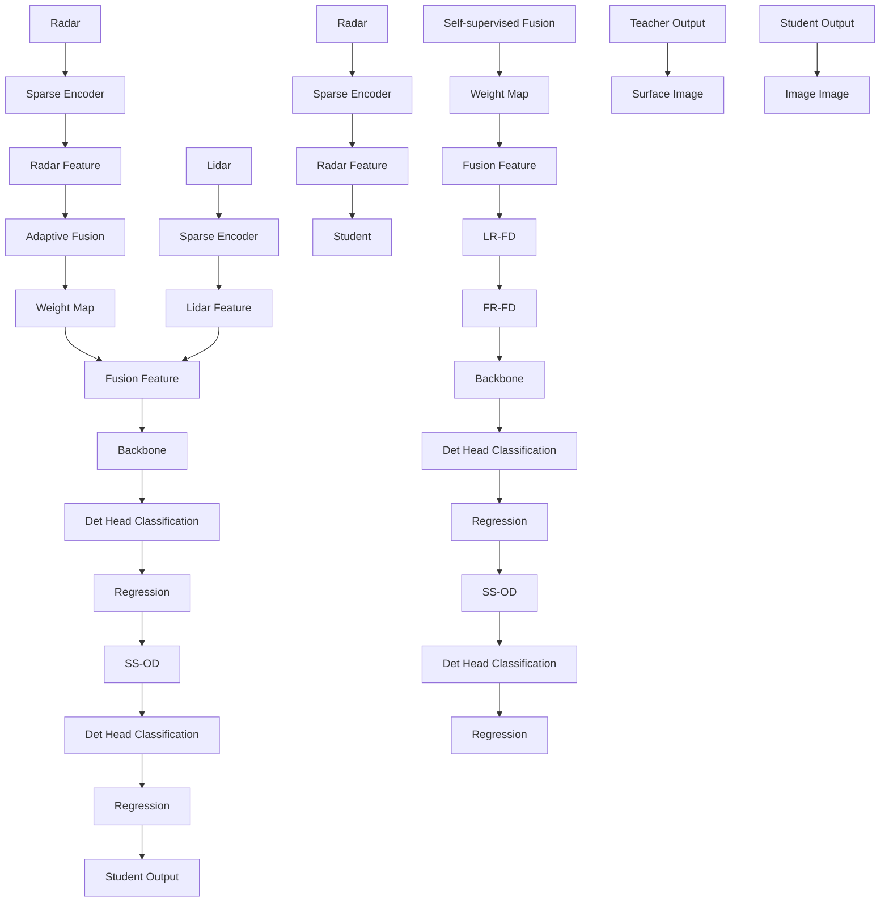
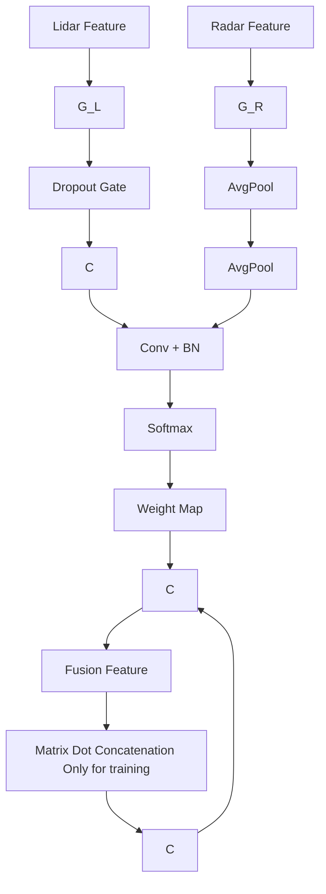

# SCKD: Semi-Supervised Cross-Modality Knowledge Distillation for 4D Radar Object Detection

Ruoyu Xu $^{1}$ , Zhiyu Xiang $^{1,2*}$ , Chenwei Zhang $^{1}$ , Hanzhi Zhong $^{1}$ , Xijun Zhao $^{3}$ , Ruina Dang $^{3}$ , Peng Xu $^{1}$ , Tianyu Pu $^{1}$ , Eryun Liu $^{1}$

$^{1}$ Zhejiang University, China

$^{2}$ Zhejiang Provincial Key Laboratory of Multi-Modal Communication Networks and Intelligent Information Processing

$^{3}$ China North Artificial Intelligence & Innovation Research Institute

{xuruoyu, xiangzy, zhangchenwei, zhonghanzhi, xxxupeng, 3190105835, eryunliu}@zju.edu.cn

{heejunzhao, ruinadang}@163.com

# Abstract

3D object detection is one of the fundamental perception tasks for autonomous vehicles. Fulfilling such a task with a 4D millimeter-wave radar is very attractive since the sensor is able to acquire 3D point clouds similar to Lidar while maintaining robust measurements under adverse weather. However, due to the high sparsity and noise associated with the radar point clouds, the performance of the existing methods is still much lower than expected. In this paper, we propose a novel Semi-supervised Cross-modality Knowledge Distillation (SCKD) method for 4D radar-based 3D object detection. It characterizes the capability of learning the feature from a Lidar-radar-fused teacher network with semi-supervised distillation. We first propose an adaptive fusion module in the teacher network to boost its performance. Then, two feature distillation modules are designed to facilitate the cross-modality knowledge transfer. Finally, a semi-supervised output distillation is proposed to increase the effectiveness and flexibility of the distillation framework. With the same network structure, our radar-only student trained by SCKD boosts the mAP by $10.38\%$ over the baseline and outperforms the state-of-the-art works on the VoD dataset. The experiment on ZJUODset also shows $5.12\%$ mAP improvements on the moderate difficulty level over the baseline when extra unlabeled data are available. Code is available at https://github.com/Ruoyu-Xu/SCKD.

# Introduction

3D object detection is an essential perception task for autonomous vehicles operating in real traffic scenes. Thanks to the dense point clouds acquired and the development of deep learning technology, Lidar-based 3D object detection methods(Yang et al. 2020; Yan, Mao, and Li 2018; Lang et al. 2019; Yin, Zhou, and Krahenbuhl 2021) have made remarkable progress in recent years. However, constrained by its short wavelength, Lidar performs poorly in adverse weather conditions such as rain and fog(Sheeny et al. 2021). In contrast, millimeter-wave radar has gained widespread attention due to its resistance to adverse weather and long measurement distance. Traditional 3D millimeter-wave radar could merely provide two-dimensional point clouds and Doppler velocity, which makes it difficult for 3D object detection. In recent years, with the development of high-resolution 4D millimeter-wave radar, exploring the 4D radar point clouds for scene understanding task becomes very attractive.


<details>
<summary>flowchart</summary>

```mermaid
graph TD
    subgraph (a)
        A1["Teacher Mod Input"] --> B1["Teacher Feature"]
        B1 --> C1["Teacher Output"]
        D1["Student Mod Input"] --> E1["Student Feature"]
        E1 --> F1["Student Output"]
        G1["Teacher Mod Input"] --> H1["Teacher Feature"]
        H1 --> I1["Teacher Response"]
        I1 --> J1["Teacher Output"]
        K1["Student Mod Input"] --> L1["Student Feature"]
        L1 --> M1["Student Response"]
        M1 --> N1["Student Output"]
        O1["Teacher Mod Input"] --> P1["Teacher Feature"]
        P1 --> Q1["Teacher Response"]
        Q1 --> R1["Teacher Output"]
        S1["Student Mod Input"] --> T1["Student Feature"]
        T1 --> U1["Student Response"]
        U1 --> V1["Student Output"]
        W1["Teacher Mod Input"] --> X1["Teacher Feature"]
        X1 --> Y1["Teacher Response"]
        Y1 --> Z1["Teacher Output"]
        AA["Student Mod Input"] --> AB["Student Feature"]
        AB --> AC["Fusion Feature"]
        AC --> AD["Fusion Output"]
        AE["Student Mod Input"] --> AF["Student Feature"]
        AF --> AG["Fusion Feature"]
        AG --> AH["Fusion Output"]
        AI["Student Mod Input"] --> AJ["Student Feature"]
        AJ --> AK["Fusion Feature"]
        AK --> AL["Fusion Output"]
    end

    subgraph (b)
        B2["Teacher Mod Input"] --> C2["Teacher Feature"]
        C2 --> D2["Teacher Response"]
        D2 --> E2["Teacher Output"]
        F2["Student Mod Input"] --> G2["Student Feature"]
        G2 --> H2["Student Response"]
        H2 --> I2["Student Output"]
        J2["Teacher Mod Input"] --> K2["Teacher Feature"]
        K2 --> L2["Teacher Response"]
        L2 --> M2["Teacher Output"]
        N2["Student Mod Input"] --> O2["Student Feature"]
        O2 --> P2["Student Response"]
        P2 --> Q2["Student Output"]
        R2["Teacher Mod Input"] --> S2["Teacher Feature"]
        S2 --> T2["Teacher Response"]
        T2 --> U2["Student Output"]
        V2["Student Mod Input"] --> W2["Student Feature"]
        W2 --> X2["Student Response"]
        X2 --> Y2["Student Output"]
        Z2["Teacher Mod Input"] --> AA2["Teacher Feature"]
        AA2 --> AB2["Teacher Response"]
        AB2 --> AC2["Student Output"]
        AD2["Student Mod Input"] --> AE2["Student Feature"]
        AE2 --> AF2["Student Output"]
    end

    subgraph (c)
        B3["Teacher Mod Input"] --> C3["Teacher Feature"]
        C3 --> D3["Fusion Feature"]
        D3 --> AE3["Fusion Output"]
        AE3 --> AF3["Student Mod Input"]
        AF3 --> AG3["Student Feature"]
        AG3 --> AH3["Student Output"]
    end

    A1 <--> B2
    C2 <--> D2
    E2 <--> F2
    G2 <--> H2
    J2 <--> K2
    K2 <--> L2
    L2 <--> M2
    M2 <--> N2
    N2 <--> O2
    O2 <--> P2
    P2 <--> Q2
    R2 <--> S2
    S2 <--> T2
    U2 <--> V2
    V2 <--> W2
    X2 <--> Y2
    Z2 <--> AA2
    AA2 <--> AB2
    AB2 <--> AC2
    AD2 <--> AE3
    AE3 <--> AF3
    AF3 <--> AG3
    AG3 <--> AH3
    AH3 <--> AI3
```
</details>

Figure 1: Comparison of the current mainstream cross-modality knowledge distillation approaches (a): BEVDistill(2022c), MonoDistill(2022) and (b): DistillBEV(2023), UniDistill(2023), RadarDistill(2024) with our SCKD (c).

Despite promising prospects, point clouds of 4D radar still suffer from the issues of high sparsity and flickering noise. The point density of existing 4D radar is only less than one-tenth of that of Lidar, and the “ghost point” caused by the multi-path effect also largely degrades its range measurements. Existing approaches based on pure radar(Xu et al. 2021; Yan and Wang 2023; Zheng et al. 2023; Liu et al. 2023) typically employ classical backbones that are originally designed for Lidar. Without special consideration of the nature of sensors, the performance of these approaches still leaves much to be desired. Multi-modality fusion based methods(Nabati and Qi 2021; Kim et al. 2023a,b; Xiong et al. 2023; Lin et al. 2024; Wang et al. 2022b) usually behave better, but the introduction of more modalities such as

camera and Lidar increases the cost of the system and decreases real-time performance.

In this paper we propose SCKD, a Semi-supervised Cross-modality Knowledge Distillation method to aggregate the merits of multi-modal fusion and real-time of radar-only based methods. The main differences between our method and the existing mainstream cross-modality distillation frameworks(Chen et al. 2022c; Chong et al. 2022; Bang et al. 2024; Wang et al. 2023; Zhou et al. 2023) are shown in Figure 1. As shown in Figure 1(a) and (b), most of the existing cross-modality distillation methods equip the teacher with another modality different from the student's, emphasizing the idea of the knowledge transfer from a strong-input teacher to a weak-input student. However, the different characteristics of the input and the de facto feature gap between the teacher and the student are largely ignored, leading to low effectiveness in knowledge distillation. Meanwhile, they all keep the ground truth as a necessary supervision for the student. In contrast, as shown in Figure 1(c), our method employs a multi-modality fusion based teacher which contains the same modality as the student. Besides improving the performance of the teacher, this manner also narrows the differences of the feature spaces, making the knowledge transfer easier. Moreover, our method no longer needs the ground truth supervision for the student, which converts the distillation into a semi-supervision manner and opens the potential for utilizing large quantities of unlabeled data.

Specifically, we design an adaptive fusion module in the teacher network to effectively fuse the feature of the Lidar and radar. Two different ways of feature distillation, namely, Lidar to Radar Feature Distillation(LRFD) and Fusion to Radar Feature Distillation(FRFD), are then proposed. Together with the Semi-Supervised Output Distillation(SSOD), the pipeline effectively fulfills the knowledge transfer between the teacher and the student. Extensive experimental results show that our SCKD outperforms the state-of-the-art methods, especially when large unlabeled data are available.

In summary, our main contributions are as follows:

- We propose a novel semi-supervised cross-modality distillation framework for radar-based 3D object detection. Learning the knowledge from the teacher, simple student network can boost its performance while maintaining the real-time efficiency;   
- A Lidar and radar bi-modality teacher network embedded with adaptive fusion module is proposed to boost the performance of the teacher and reduce the difficulty of knowledge transfer;   
- LRFD and FRFD module are designed to facilitate and enhance the feature distillation;   
- Semi-supervised output distillation is proposed, which improves the performance and flexibility of the method;   
- Extensive experiments on the VoD and ZJUODset datasets are carried out for evaluation. The results show that our radar-only student network is able to boost the performance of the baseline method by a large margin and outperforms the state-of-the-art methods.

# Related Work

# Lidar-based 3D object detection

Given 3D Lidar point clouds, Lidar-based 3D object detection can roughly be divided into point-based, pillar or voxel-based, and multi-view based methods. Approaches like PointNet(Qi et al. 2017), PointRCNN(Shi, Wang, and Li 2019), and 3D-SSD(Yang et al. 2020) directly extract feature from point clouds, while methods such as VoxelNet(Zhou and Tuzel 2018), Second(Yan, Mao, and Li 2018), PointPillars(Lang et al. 2019), and Centerpoint(Yin, Zhou, and Krahenbuhl 2021) divide irregular point clouds into pillars or voxels for feature extraction. The multi-view based methods fuse the features from different representations to achieve better performance. To mitigate the shortage of semantic information in Lidar point clouds, Lidar-image fusion based methods, e.g., PointPainting(Vora et al. 2020), PointAugmenting(Wang et al. 2021), MSFDFusion(Jiao et al. 2023), and LogoNet(Li et al. 2023) fuse the spatial and semantic features at different scales, resulting in improved 3D object detection performance.

# Radar-based 3D object detection

Due to the absence of height information, 3D object detection is seldom carried out on traditional 3D radar. Most of the radar-only based detection works take the 4D radar point clouds as input. RPFA-Net(Xu et al. 2021) utilizes a self-attention mechanism to enhance radar feature extraction. MVFAN(Yan and Wang 2023) exploits valuable information of RCS and Doppler velocity and constructs a multiview feature assisted detection network. Based on PointPillars, RadarPillarNet(Zheng et al. 2023) designs modules specifically tailored to radar characteristics and improves the performance. SMURF(Liu et al. 2023) introduces a novel network branch for kernel density estimation to better fuse radar feature at different levels. Due to the high sparsity of radar point clouds, more studies have focused on fusing radar with other sensors. CenterFusion(Nabati and Qi 2021), CRAFT(Kim et al. 2023a), and CRN(Kim et al. 2023b) primarily focus on exploring the fusion of 3D radar and images. Recently, many studies have begun to investigate the fusion of 4D radar with other sensors. RCFusion(Zheng et al. 2023), LXL(Xiong et al. 2023), and RCBEVDet(Lin et al. 2024) probe the fusion of 4D radar and images, while InterFusion(Wang et al. 2022b) and $M^2$ -Fusion(Wang et al. 2022a) have ventured into the fusion of 4D radar and Lidar. Although these fusion-based methods can obtain better detection performance, they still suffer from higher sensor and computing cost, resulting in a much lower real-time performance than the radar-only methods.

# Knowledge Distillation for object detection

Knowledge distillation is popularly known as a model compression method, which is first applied in image classification and 2D object detection tasks(Yang et al. 2022c; Chen et al. 2022b; Yang et al. 2022b; Zheng et al. 2022b; Chen et al. 2022a). Recently, many knowledge distillation works have been proposed for 3D object detection. Depending on whether the same sensor modality is employed for the


<details>
<summary>flowchart</summary>


</details>

Figure 2: Overview of our SCKD Framework. The solid and dashed lines represent the data flow and calculation of the distillation loss respectively. In the inference stage, only the student network is involved.

teacher and the student, they can be divided into common distillation(Zheng et al. 2021; Du et al. 2020; Yang et al. 2022a) and cross-modality distillation (Chong et al. 2022; Chen et al. 2022c; Wang et al. 2023; Zhou et al. 2023; Bang et al. 2024) methods. In the first category, SE-SSD(Zheng et al. 2021) and Associate-3D(Du et al. 2020) design different data augmentation methods for the teacher network to increase the diversity of training samples. SparseKD(Yang et al. 2022a) explores the impact of distillation location on the accuracy and training time of the student and finds a trade-off among them. As a cross-modality distillation method, MonoDistill(Chong et al. 2022) projects Lidar point clouds into images and performs feature and output distillation in the front-view. BEVDistill(Chen et al. 2022c) and DistillBEV(Wang et al. 2023) project image feature into BEV and train the image-based student with feature and instance distillation from a Lidar-based teacher. Building upon BEV, UniDistill(Zhou et al. 2023) proposes a universal cross-modality knowledge distillation framework, which transfers the knowledge at feature, relation and response levels, to improve the performance of camera-based or Lidar-based student detectors. The works above all need the ground truth for distillation. RadarDistill(Bang et al. 2024) is the very few radar-only 3D object detection network trained with a Lidar-based distiller, which has limited performance due to the lack of height information of the 3D radar. Moreover, similar to most of the existing works, it is fully supervised, which requires expensive annotated data for training.

# SCKD: Semi-Supervised Cross-modality Knowledge Distillation

In this chapter, we elaborate our proposed SCKD framework in detail. As shown in Figure 2, the teacher is a Lidar-Radar bi-modality fusion network, while the student is a radar-only network. By the effective knowledge distillation of the teacher, the student can learn to extract sophisticated feature


<details>
<summary>flowchart</summary>


</details>

Figure 3: The structure of the Adaptive Fusion module.

from the radar input and boost its detection performance. We first introduce the design of the teacher network. Then, the distillation methods along with the loss function of the network are described.

# Teacher Network

The teacher shares similar backbone with the SECOND(Yan, Mao, and Li 2018), except for the bi-modality input and an adaptive fusion module. The structure of the teacher is shown in Figure 2. Compared to RadarDistill(Bang et al. 2024), our teacher network integrates features from two modalities, containing much richer semantic information that is helpful for knowledge distillation. Lidar point clouds $P_{L}$ and 4D radar point clouds $P_{R}$ are first encoded by voxelization and sparse 3D convolution to acquire corresponding features $F_{L}^{T}$ and $F_{R}^{T}$ , respectively. The process is as follows:

$$
F _ {L} ^ {T} = \text { Spconv3D } (\text { Voxelization } (P _ {L})) \tag {1}
$$

$$
F _ {R} ^ {T} = \text { Spconv3D } (\text { Voxelization } (P _ {R})) \tag {2}
$$

Considering the different nature of the Lidar and radar points, it is unwise to directly concatenate them and feed them to the consequent 2D multi-scale CNN block of the SECOND backbone. To better explore the feature of the two modalities, we propose an Adaptive Fusion (AF) module to adaptively weight and aggregate the two feature maps. As

shown in Figure 3, the AF module is composed of a dropout gate and an adaptive weighting mechanism. The dropout gate is only effective during training and responsible for strengthening the learning of radar feature, which will be explained later. Within the adaptive fusion module, the Lidar and radar features are separately fed through average pooling, followed by convolution, batch normalization and softmax operation, resulting in adaptive weights for the corresponding input features. The final output features $F_{fusion}^{T}$ are then obtained by:

$$
F _ {f u s i o n} ^ {T} = \text { Concat } [ W _ {L} * F _ {L} ^ {T}, W _ {R} * F _ {R} ^ {T} ] \tag {3}
$$

where

$$
[ W _ {L}, W _ {R} ] = \text { Softmax } (B N (\text { Conv } (F _ {m i x})) \tag {4}
$$

with

$$
F _ {m i x} = \operatorname{Concat} \left(\operatorname{AvgPool} \left(F _ {L} ^ {T}\right), \operatorname{AvgPool} \left(F _ {R} ^ {T}\right)\right) \tag {5}
$$

In order to further enhance the feature of each modality and promote the performance of the teacher, we introduce random dropout mechanism in the adaptive fusion module. The principle behind is that randomly discarding features of one modality allows the network to learn stronger feature extraction of another modality(Hwang et al. 2022). In this case, we set a small probability $P_{drop}$ for the dropout of one modality during training. If the dropout is triggered, we set another probability $P_{L}$ to decide whether the Lidar or radar modality should be dropped. The process is shown as:

$$
G _ {L} = \mathbb {1} (p _ {1} > P _ {\text { drop }} \| p _ {2} > P _ {L}) \tag {6}
$$

$$
G _ {R} = \mathbb {1} (p _ {1} > P _ {d r o p} \| p _ {2} \leq P _ {L}) \tag {7}
$$

where the random numbers $p_{1}$ and $p_{2}$ are generated with a uniform probability distribution, 1 is the index function. Considering the dominant role of the Lidar feature in the teacher network, the general dropout probability $P_{drop}$ and dropout probability of Lidar $P_{L}$ are both set to 0.2 in the experiment. It means the probability of modality dropout is 0.2, and the entire dropout probability of Lidar and radar features are 0.04 and 0.16, respectively.

The parameters of the teacher network are pre-trained and remain frozen during the training process of the student network.

# Feature Distillation

We choose SECOND as our student model. The goal of distillation is to transfer the feature extraction capability to the student as much as possible. We propose two types of distillation, termed LRFD and FRFD, to accomplish this task.

LRFD: Lidar to Radar Feature Distillation The feature map from Lidar contains abundant object information which can provide many hints to the extraction of student's radar feature. Given current student feature $F_R^S$ , the LRFD takes the teacher's Lidar feature $F_L^T$ as supervision for learning. However, directly enforcing similarities between the two types of features via a loss function tends to adversely affect the overall network performance(Chen et al. 2022b). Therefore, we feed the student's radar feature through an Adapter $^{L}$ , which is a simple convolution layer, to simulate the Lidar feature before computing the MSE loss as:

$$
L _ {L R F D} = M S E (F _ {R \rightarrow L} ^ {S}, F _ {L} ^ {T}) \tag {8}
$$

where

$$
F _ {R \rightarrow L} ^ {S} = \text { Adapter } ^ {L} (F _ {R} ^ {S}) \tag {9}
$$

FRFD: Fusion to Radar Feature Distillation The fusion feature in the teacher network contains weighted Lidar and Radar feature, which is more effective for the object detection task. Comparing with the LRFD, distillation from the fused feature map has two advantages. Firstly, it contains more valuable information than the pure Lidar feature for the detection task. Secondly, the learning difficulty is lower since the fused feature itself also contains radar information. One problem is that the channel number between the fused and the radar is different and has to be aligned before distillation. Existing works(Chen et al. 2022b,c; Wang et al. 2023; Bang et al. 2024) fulfill the channel alignment through a simple convolutional upscaling operation. However, this operation will change the original fused feature and damage the effect of distillation. We propose two separate adapters to accomplish this task. As shown in Eq. (10) (11), two convolution-layer-based adapters, i.e., Adapter $^{L'}$ and Adapter $^{R'}$ are responsible to separately map the student's radar feature space to the teacher's weighted Lidar and radar feature space, as:

$$
F _ {R \rightarrow L} ^ {S ^ {\prime}} = A d a p t e r ^ {L ^ {\prime}} (F _ {R} ^ {S}) \tag {10}
$$

$$
F _ {R \rightarrow R} ^ {S ^ {\prime}} = A d a p t e r ^ {R ^ {\prime}} (F _ {R} ^ {S}) \tag {11}
$$

After that, we employ the MSE loss to calculate FRFD loss $L_{FRFD}$ as:

$$
L _ {F R F D} = M S E (C o n c a t [ F _ {R \rightarrow L} ^ {S ^ {\prime}}, F _ {R \rightarrow R} ^ {S ^ {\prime}} ], F _ {f u s i o n} ^ {T}) (1 2)
$$

# SSOD: Semi-Supervised Output Distillation

Most of existing distillation-based detection methods, e.g., RadarDistill(Bang et al. 2024), rely on ground truth labels as the main supervision. However, ground truth labels are generally obtained through manual annotation, which can be expensive. Moreover, the existence of some difficult samples such as largely occluded objects means that directly using the ground truth labels as supervision may not bring necessary benefits to the training. To mitigate these problems, we propose to use the predictions of the teacher network as supervisions for the student network. This semi-supervised training method has two advantages. Firstly, trained by the small quantity of the labeled data, the predictions (including some false positive targets) of the teacher network are likely to provide more valuable information for the student network. Secondly, we can train the student network with much more extra unlabeled data, which can possibly improve the task performance at low costs.

Specifically, we select the detection targets $D^{T}$ of the teacher network based on a confidence threshold. The targets with confidence above this threshold will be regarded as pseudo-labels for the student network, as:

$$
\hat {D} ^ {T} = \mathbb {1} (c o n f (D ^ {T}) > \sigma) * D ^ {T} \tag {13}
$$

where $\sigma$ is a predefined confidence threshold.

We then employ regular Focal loss and SmoothL1 loss to supervise the classification and regression output of the student network $D^{S}$ , as:

$$
L _ {S S O D} = L _ {c l s} (\hat {D ^ {T}}, D ^ {S}) + L _ {d e t} (\hat {D ^ {T}}, D ^ {S}) \tag {14}
$$

# Overall Distillation Loss

Considering that we have eliminated the supervision from the ground truth, the student network is trained entirely by the supervision of the teacher network. The overall distillation loss is as follows:

$$
L _ {t o t a l} = \alpha L _ {L R F D} + \beta L _ {F R F D} + L _ {S S O D} \tag {15}
$$

where $\alpha$ and $\beta$ are hyper-parameters to balance the losses.

# Experiments

# Dataset and evaluation Metrics

We conduct experiments on the popular VoD and ZJUOD-set datasets with accessible 4D radar and Lidar data. NuScenes(Caesar et al. 2020) and TJ4DRadset(Zheng et al. 2022a) datasets are not chosen because the former only contains 3D radar, and the latter's LiDAR data are not available now.

VoD Dataset(Palffy et al. 2022) The VoD dataset is currently the most popular 4D radar object detection dataset which includes Lidar, Radar, and Camera data. Following the official partitioning, we divide the training and validation set into 5139 and 1296 frames, respectively. In addition to evaluating in the entire annotated area, the dataset also requires evaluation on the driving corridor, which is a narrow region that is more likely to impact driving. To keep with previous works, we employ the AP11 evaluation metrics, and set the IOU thresholds for car, pedestrian, and cyclist to 0.5, 0.25, and 0.25, respectively.

ZJUODset(Xu et al. 2023) The ZJUODset is a dataset for long-distance 3D object detection, with the farthest detection distance reaching up to 150 meters. It also contains the data of 4D radar, Lidar and camera. Within the labeled data, we allocate 2660 frames for training and the subsequent 1140 frames for validation. We also use the rest 10640 unlabeled raw frames for semi-supervised distillation. Due to the limited samples of 'pedestrian', we only evaluate on the 'car' and 'cyclist' categories in this dataset. The metrics utilized for evaluation are AP40, with the IOU thresholds for car and cyclist set to 0.5 and 0.25, respectively.

# Implementation Details

For the VoD dataset, the detecting range of the network is set to $[0, 51.2m]$ on the x-axis, $[-25.6m, 25.6m]$ on the y-axis, and $[-3m, 2m]$ on the z-axis. The voxel size is set to $0.05m \times 0.05m \times 0.1m$ . For the ZJUODset, the detection region is defined as $[0, 158.4m]$ , $[-39.6m, 39.6m]$ and $[-5m, 3m]$ on the x, y and z axis, respectively. A voxel size of $0.075m \times 0.075m \times 0.2m$ is employed for both the teacher and the student network.

We implement our SCKD based on OpenPCDet(Team 2020) and mmdetection3d(Contributors 2020) framework. For data augmentation, we use the random flipping along the x-axis and random global scaling with the scaling factor within 0.95 and 1.05. We employ AdamW optimizer for parameter update with an initial learning rate 0.001 and a weight decay factor 0.01. The learning rate is updated with a cyclical decay method, with maximum 0.01 and minimum $10^{-7}$ . The retention threshold $\sigma$ for the output distillation is set at 0.1, and the hyper-parameters $\alpha$ and $\beta$ for the loss function are both set to $3 * 10^{-4}$ . Two NVIDIA RTX 4090 GPUs are employed during the training and distillation, with the batch size set to 8.

# Main Results

Results on the VoD dataset. The experimental results on the VoD dataset are shown in Table 1. In addition to radar-only methods, we also list the methods based on the fusion of Radar and Camera for reference.

Compared with the existing radar-only methods(Yan, Mao, and Li 2018; Yan and Wang 2023; Zheng et al. 2023; Liu et al. 2023; Deng et al. 2023), our approach achieves state-of-the-art performance. In contrast to the baseline method SECOND, which owns the same network structure as ours but is trained with ground truth labels instead of distillation, our approach greatly improves the mAP by 10.38% and 6.21% in the entire annotated area and the driving corridor, respectively. In comparison with the previously top-performing radar-based method SMURF, our SCKD also achieves an increase of 1.11% and 2.08% in mAP over the entire annotated area and driving corridor, respectively. The qualitative results are shown in Figure 5.

The radar-image fusion based methods usually perform better than the radar-only ones. However, they have to sacrifice the real-time performance due to the large computing costs of the fusion of image feature. It is worth mentioning that apart from the currently best-performing method LXL(Xiong et al. 2023), our radar-only based method surpasses the rest of those radar-image fusion methods(Zheng et al. 2023; Lin et al. 2024; Chen et al. 2023; Liang et al. 2022). Compared with LXL, we have a significant advantage in real-time performance, with more than 6 times faster than LXL in inference speed.

Results on the ZJUODset. We also conduct experiments on the ZJUODSet dataset. As shown in Table 2, our SCKD outperforms its competitors at all difficulty levels. Since our model is semi-supervised, we further train our model with 4 times more unlabeled raw data provided in the dataset. As expected, the performance can further be improved by up to 4.04% mAP on the moderate level, which shows the great potential of our semi-supervised distillation mechanism.

# Ablation Study

The ablation results are carried out on the VoD dataset, and the results are shown in Table 3 and Table 4.

Effects of SSOD. Comparing (b) with (a) in Table 3, it can be seen that the SSOD is more effective than GT in supervising the student model. Integrating both GT and SSOD can

<table><tr><td rowspan="2">Method</td><td rowspan="2">Ref</td><td rowspan="2">Mod</td><td colspan="4">Entire annotated area</td><td colspan="4">In driving corridor</td><td rowspan="2">FPS</td></tr><tr><td>Car</td><td>Ped</td><td>Cyc</td><td>mAP</td><td>Car</td><td>Ped</td><td>Cyc</td><td>mAP</td></tr><tr><td>FUTR3D(2023)</td><td>CVPR 2023</td><td>R+C</td><td>46.01</td><td>35.11</td><td>65.98</td><td>49.03</td><td>78.66</td><td>43.10</td><td>86.19</td><td>69.32</td><td>7.3</td></tr><tr><td>BEVFusion(2022)</td><td>ICRA 2023</td><td>R+C</td><td>37.85</td><td>40.96</td><td>68.95</td><td>49.25</td><td>70.21</td><td>45.86</td><td>89.48</td><td>68.52</td><td>7.1</td></tr><tr><td>RCFusion(2023)</td><td>TIM 2023</td><td>R+C</td><td>41.70</td><td>38.95</td><td>68.31</td><td>49.65</td><td>71.87</td><td>47.50</td><td>88.33</td><td>69.23</td><td>\</td></tr><tr><td>RCBEVdet(2024)</td><td>CVPR 2024</td><td>R+C</td><td>40.63</td><td>38.86</td><td>70.48</td><td>49.99</td><td>72.48</td><td>49.89</td><td>87.01</td><td>69.80</td><td>\</td></tr><tr><td>LXL(2023)</td><td>TIV 2023</td><td>R+C</td><td>42.33</td><td>49.48</td><td>77.12</td><td>56.31</td><td>72.18</td><td>58.30</td><td>88.31</td><td>72.93</td><td>6.1</td></tr><tr><td>SECOND(2018)</td><td>Sensors 2018</td><td>R</td><td>37.46</td><td>31.93</td><td>55.70</td><td>41.70</td><td>72.04</td><td>42.92</td><td>81.82</td><td>65.59</td><td>39.3</td></tr><tr><td>MVFAN(2023)</td><td>ICONIP 2023</td><td>R</td><td>34.05</td><td>27.27</td><td>57.14</td><td>39.42</td><td>69.81</td><td>38.65</td><td>84.87</td><td>64.38</td><td>45.1</td></tr><tr><td>RadarPillarNet(2023)</td><td>TIM 2023</td><td>R</td><td>39.30</td><td>35.10</td><td>63.63</td><td>46.01</td><td>71.65</td><td>42.80</td><td>83.14</td><td>65.86</td><td>\</td></tr><tr><td>LXL-R(2023)</td><td>TIV 2023</td><td>R</td><td>32.75</td><td>39.65</td><td>68.13</td><td>46.84</td><td>70.26</td><td>47.34</td><td>87.93</td><td>68.51</td><td>44.7</td></tr><tr><td>SMURF(2023)</td><td>TIV 2023</td><td>R</td><td>42.31</td><td>39.09</td><td>71.50</td><td>50.97</td><td>71.74</td><td>50.54</td><td>86.87</td><td>69.72</td><td>\</td></tr><tr><td>SBS(2023)</td><td>ICRA 2024</td><td>R</td><td>32.20</td><td>40.42</td><td>68.87</td><td>47.03</td><td>\</td><td>\</td><td>\</td><td>\</td><td>\</td></tr><tr><td>Ours</td><td></td><td>R</td><td>41.89</td><td>43.51</td><td>70.83</td><td>52.08</td><td>77.54</td><td>51.06</td><td>86.89</td><td>71.80</td><td>39.3</td></tr></table>

Table 1: 3D detection results on the VoD dataset. ‘R’ and ‘C’ stand for radar and camera, respectively. The bold and the underlined separately represent the best and the second-best results among the radar-based methods.

<table><tr><td rowspan="2">Method</td><td rowspan="2">Mod</td><td colspan="3">Easy AP40@0.5/0.25</td><td colspan="3">Moderate AP40@0.5/0.25</td><td colspan="3">Hard AP40@0.5/0.25</td></tr><tr><td>Car</td><td>Cyclist</td><td>mAP</td><td>Car</td><td>Cyclist</td><td>mAP</td><td>Car</td><td>Cyclist</td><td>mAP</td></tr><tr><td>PointPillars(2019)</td><td>R</td><td>47.99</td><td>28.30</td><td>38.14</td><td>31.24</td><td>12.89</td><td>22.06</td><td>16.96</td><td>8.30</td><td>12.63</td></tr><tr><td>SECOND(2018)</td><td>R</td><td>56.51</td><td>36.08</td><td>46.30</td><td>35.14</td><td>17.98</td><td>26.56</td><td>19.15</td><td>11.93</td><td>15.54</td></tr><tr><td>SCKD</td><td>R</td><td>58.50</td><td>38.62</td><td>48.56</td><td>36.70</td><td>18.57</td><td>27.64</td><td>19.76</td><td>12.63</td><td>16.20</td></tr><tr><td>SCKD+</td><td>R</td><td>66.70</td><td>39.07</td><td>52.88</td><td>41.72</td><td>21.64</td><td>31.68</td><td>22.83</td><td>14.29</td><td>18.56</td></tr></table>

Table 2: 3D detection results on the ZJUODset. Easy, Moderate and Hard levels evaluate the detection performance within 30 meters, 50 meters and 80 meters, respectively. ‘+’ means we train the our student model on more unlabeled data.

<table><tr><td rowspan="2"></td><td colspan="5">Method</td><td colspan="4">Entire annotated area</td><td colspan="4">In driving corridor</td></tr><tr><td>GT</td><td>SSOD</td><td>FRFD*</td><td>FRFD</td><td>LRFD</td><td>Car</td><td>Ped</td><td>Cyc</td><td>mAP</td><td>Car</td><td>Ped</td><td>Cyc</td><td>mAP</td></tr><tr><td>(a)</td><td>✓</td><td></td><td></td><td></td><td></td><td>37.46</td><td>31.93</td><td>55.70</td><td>41.70</td><td>72.04</td><td>42.92</td><td>81.82</td><td>65.59</td></tr><tr><td>(b)</td><td></td><td>✓</td><td></td><td></td><td></td><td>40.48</td><td>34.52</td><td>56.10</td><td>43.70</td><td>72.32</td><td>45.04</td><td>83.28</td><td>66.88</td></tr><tr><td>(c)</td><td>✓</td><td>✓</td><td></td><td></td><td></td><td>40.57</td><td>35.75</td><td>61.15</td><td>45.82</td><td>72.24</td><td>46.02</td><td>85.21</td><td>67.82</td></tr><tr><td>(d)</td><td>✓</td><td>✓</td><td>✓</td><td></td><td></td><td>41.28</td><td>38.05</td><td>66.55</td><td>48.63</td><td>72.09</td><td>46.89</td><td>85.51</td><td>68.16</td></tr><tr><td>(e)</td><td></td><td>✓</td><td>✓</td><td></td><td></td><td>41.29</td><td>39.88</td><td>69.87</td><td>50.35</td><td>72.46</td><td>47.66</td><td>85.66</td><td>68.59</td></tr><tr><td>(f)</td><td></td><td>✓</td><td></td><td>✓</td><td></td><td>41.92</td><td>39.91</td><td>70.11</td><td>50.65</td><td>72.53</td><td>49.86</td><td>85.61</td><td>69.33</td></tr><tr><td>(g)</td><td></td><td>✓</td><td></td><td></td><td>✓</td><td>41.61</td><td>42.80</td><td>69.79</td><td>51.40</td><td>72.51</td><td>50.38</td><td>85.76</td><td>69.55</td></tr><tr><td>(h)</td><td>✓</td><td>✓</td><td></td><td>✓</td><td>✓</td><td>41.47</td><td>40.09</td><td>69.88</td><td>50.48</td><td>72.46</td><td>48.96</td><td>85.53</td><td>68.98</td></tr><tr><td>(i)</td><td></td><td>✓</td><td></td><td>✓</td><td>✓</td><td>41.89</td><td>43.51</td><td>70.83</td><td>52.08</td><td>77.54</td><td>51.06</td><td>86.89</td><td>71.80</td></tr></table>

Table 3: The ablation results on the VoD dataset. GT and SSOD represent training the student with ground truth and semi-supervised output distillation, respectively. LRFD, FRFD\* and FRFD denote the Lidar to radar feature distillation, fusion to radar distillation with one adapter and two adapters, respectively.

further improve the performance, as shown in (c). However, when other distillation techniques such as FRFD are introduced, leaving only the SSOD as supervision becomes more effective than using both the SSOD and GT. As shown in (e) and (d), removing GT from the student supervision leads to 1.72% and 0.43% mAP improvement in the entire area and the driving corridor region, respectively. More results in Table 4 show that our SCKD+ trained with full unlabeled data can drastically boost the performance by about 20% mAP, which demonstrates the great benefits brought by the SSOD.

Effects of LRFD and FRFD. Comparing (f) with (e) in Table 3, it can be seen that using two separate adapters in the

FRFD is better than using only one. Introducing LRFD can further improve the performance, as shown in (g). Finally, integrating all SSOD, FRFD and LRFD modules can achieve the best results, with a total improvement of 10.38% and 6.21% mAP over the common baseline (a).

# More Discussion

The role of the bi-modality-fusion based teacher. The experimental results of SCKD distilled from different configurations of teacher are shown in Table 5. Compared to the Lidar-only teacher, the final Lidar-Radar-fusion teacher can improve mAP of student network by 3.84% and 3.01% in the

<table><tr><td rowspan="2">Method</td><td rowspan="2">Teacher Trainset</td><td rowspan="2">Student Trainset</td><td colspan="4">Entire annotated area</td><td colspan="4">In driving corridor</td></tr><tr><td>Car</td><td>Ped</td><td>Cyc</td><td>mAP</td><td>Car</td><td>Ped</td><td>Cyc</td><td>mAP</td></tr><tr><td>SECOND</td><td>\</td><td>1/4 labeled</td><td>10.70</td><td>19.98</td><td>11.73</td><td>14.14</td><td>31.49</td><td>29.10</td><td>25.69</td><td>28.76</td></tr><tr><td>SCKD</td><td>1/4 labeled</td><td>1/4 unlabeled</td><td>10.20</td><td>19.15</td><td>12.60</td><td>13.98</td><td>28.56</td><td>30.61</td><td>24.47</td><td>27.88</td></tr><tr><td>SCKD+</td><td>1/4 labeled</td><td>Full unlabeled</td><td>32.17</td><td>21.23</td><td>47.73</td><td>33.71</td><td>69.73</td><td>31.98</td><td>76.28</td><td>59.33</td></tr></table>

Table 4: Performance of models trained by different amount of data on the VoD dataset.

<table><tr><td rowspan="2">Teacher Modality</td><td rowspan="2">AF</td><td rowspan="2">RD</td><td rowspan="2">Student Modality</td><td colspan="4">Entire annotated area</td><td colspan="4">In driving corridor</td></tr><tr><td>Car</td><td>Ped</td><td>Cyc</td><td>mAP</td><td>Car</td><td>Ped</td><td>Cyc</td><td>mAP</td></tr><tr><td>L</td><td>\</td><td>\</td><td>R</td><td>40.06</td><td>40.48</td><td>64.19</td><td>48.24</td><td>72.33</td><td>50.38</td><td>83.67</td><td>68.79</td></tr><tr><td>L+R</td><td></td><td></td><td>R</td><td>40.27</td><td>39.01</td><td>66.63</td><td>48.64</td><td>72.35</td><td>49.80</td><td>85.08</td><td>69.08</td></tr><tr><td>L+R</td><td>√</td><td></td><td>R</td><td>41.38</td><td>39.56</td><td>67.12</td><td>49.35</td><td>72.44</td><td>50.06</td><td>85.97</td><td>69.49</td></tr><tr><td>L+R</td><td></td><td>√</td><td>R</td><td>41.29</td><td>40.31</td><td>70.66</td><td>50.75</td><td>72.53</td><td>50.40</td><td>86.72</td><td>69.88</td></tr><tr><td>L+R</td><td>√</td><td>√</td><td>R</td><td>41.89</td><td>43.51</td><td>70.83</td><td>52.08</td><td>77.54</td><td>51.06</td><td>86.89</td><td>71.80</td></tr></table>

Table 5: 3D detection results of different teacher network on the VoD dataset. ‘L’ means Lidar and ‘R’ means radar. ‘AF’ and ‘RD’ refer to Adaptive Fusion and Random Dropout in the teacher network, respectively.

entire area and driving corridor, respectively. It should thank to the richer semantic feature and narrower feature gaps of our bi-modality teacher than that of single-modality teacher. Ablation experiments on the adaptive fusion module and the random dropout modules also validate the effectiveness of our design.

The visual comparison of the feature maps before and after distillation As shown in Figure 4, compared to the baseline method that only uses ground truth for training, our distillation method can drastically increase the contrast of the background and foreground in the feature heatmaps and give more attention to the foreground objects, which is vital for the final performance improvement.

  
Figure 4: Comparison of the feature maps. Column (a) shows the input radar point clouds of two scenes annotated with ground truth, while (b) and (c) show the corresponding heatmaps obtained by SECOND and our method, respectively. The grey and red ellipses separately mark out the backgrounds and foregrounds for comparison.

# Conclusion

In this paper, we propose a semi-supervised cross-modality distillation method for 3D object detection based on 4D radar-only. We design a bi-modality fusion based teacher

  
Figure 5: Qualitative results on the VoD dataset. (a) shows the scene image, while (b) and (c) show the detection results of radar-based SECOND and our method SCKD, respectively. Lidar and radar points are marked with orange and green, while the predicted and ground truth bounding boxes are colored with red and blue, respectively.

network, which is strengthened with adaptive fusion and random dropout upon the backbone. We then design three distillation components, namely LRFD, FRFD, and SSOD, at the feature and output levels of distillation. Without introducing any computational overhead in the inference phase, our distilled student model significantly improves the object detection performance over the baseline method, surpassing all state-of-the-art radar-based methods and even most of the radar-camera fused methods. Experimental results on both the VoD and ZJUODset datasets demonstrate the effectiveness of our method.

# Acknowledgments

This work was supported by The Key Research & Development Plan of Zhejiang Province under Grant No.2024C01017, 2024C01010.

# References

Bang, G.; Choi, K.; Kim, J.; Kum, D.; and Choi, J. W. 2024. RadarDistill: Boosting Radar-based Object Detection Performance via Knowledge Distillation from LiDAR Features. In Proceedings of the IEEE/CVF Conference on Computer Vision and Pattern Recognition, 15491–15500.   
Caesar, H.; Bankiti, V.; Lang, A. H.; Vora, S.; Liong, V. E.; Xu, Q.; Krishnan, A.; Pan, Y.; Baldan, G.; and Beijbom, O. 2020. nuscenes: A multimodal dataset for autonomous driving. In Proceedings of the IEEE/CVF conference on computer vision and pattern recognition, 11621–11631.   
Chen, X.; Cao, Q.; Zhong, Y.; Zhang, J.; Gao, S.; and Tao, D. 2022a. Dearkd: Data-efficient early knowledge distillation for vision transformers. In Proceedings of the IEEE/CVF Conference on Computer Vision and Pattern Recognition, 12052–12062.   
Chen, X.; Zhang, T.; Wang, Y.; Wang, Y.; and Zhao, H. 2023. Futr3d: A unified sensor fusion framework for 3d detection. In proceedings of the IEEE/CVF conference on computer vision and pattern recognition, 172–181.   
Chen, Y.; Wang, S.; Liu, J.; Xu, X.; de Hoog, F.; and Huang, Z. 2022b. Improved feature distillation via projector ensemble. Advances in Neural Information Processing Systems, 35: 12084–12095.   
Chen, Z.; Li, Z.; Zhang, S.; Fang, L.; Jiang, Q.; and Zhao, F. 2022c. Bevdistill: Cross-modal bev distillation for multiview 3d object detection. arXiv preprint arXiv:2211.09386.   
Chong, Z.; Ma, X.; Zhang, H.; Yue, Y.; Li, H.; Wang, Z.; and Ouyang, W. 2022. Monodistill: Learning spatial features for monocular 3d object detection. arXiv preprint arXiv:2201.10830.   
Contributors, M. 2020. MMDetection3D: OpenMMLab next-generation platform for general 3D object detection. https://github.com/open-mmlab/mmdetection3d.   
Deng, J.; Chan, G.; Zhong, H.; and Lu, C. X. 2023. See Beyond Seeing: Robust 3D Object Detection from Point Clouds via Cross-Modal Hallucination. arXiv preprint arXiv:2309.17336.   
Du, L.; Ye, X.; Tan, X.; Feng, J.; Xu, Z.; Ding, E.; and Wen, S. 2020. Associate-3Ddet: Perceptual-to-conceptual association for 3D point cloud object detection. In Proceedings of the IEEE/CVF conference on computer vision and pattern recognition, 13329–13338.   
Hwang, J.-J.; Kretzschmar, H.; Manela, J.; Rafferty, S.; Armstrong-Crews, N.; Chen, T.; and Anguelov, D. 2022. Cramnet: Camera-radar fusion with ray-constrained cross-attention for robust 3d object detection. In European conference on computer vision, 388–405. Springer.   
Jiao, Y.; Jie, Z.; Chen, S.; Chen, J.; Ma, L.; and Jiang, Y.-G. 2023. Msmdfusion: Fusing lidar and camera at multiple scales with multi-depth seeds for 3d object detection. In

Proceedings of the IEEE/CVF conference on computer vision and pattern recognition, 21643-21652.   
Kim, Y.; Kim, S.; Choi, J. W.; and Kum, D. 2023a. Craft: Camera-radar 3d object detection with spatio-contextual fusion transformer. In Proceedings of the AAAI Conference on Artificial Intelligence, volume 37, 1160–1168.   
Kim, Y.; Shin, J.; Kim, S.; Lee, I.-J.; Choi, J. W.; and Kum, D. 2023b. Crn: Camera radar net for accurate, robust, efficient 3d perception. In Proceedings of the IEEE/CVF International Conference on Computer Vision, 17615–17626.   
Lang, A. H.; Vora, S.; Caesar, H.; Zhou, L.; Yang, J.; and Beijbom, O. 2019. Pointpillars: Fast encoders for object detection from point clouds. In Proceedings of the IEEE/CVF conference on computer vision and pattern recognition, 12697–12705.   
Li, X.; Ma, T.; Hou, Y.; Shi, B.; Yang, Y.; Liu, Y.; Wu, X.; Chen, Q.; Li, Y.; Qiao, Y.; et al. 2023. Logonet: Towards accurate 3d object detection with local-to-global cross-modal fusion. In Proceedings of the IEEE/CVF Conference on Computer Vision and Pattern Recognition, 17524–17534.   
Liang, T.; Xie, H.; Yu, K.; Xia, Z.; Lin, Z.; Wang, Y.; Tang, T.; Wang, B.; and Tang, Z. 2022. Bevfusion: A simple and robust lidar-camera fusion framework. Advances in Neural Information Processing Systems, 35: 10421–10434.   
Lin, Z.; Liu, Z.; Xia, Z.; Wang, X.; Wang, Y.; Qi, S.; Dong, Y.; Dong, N.; Zhang, L.; and Zhu, C. 2024. RCBEVDet: Radar-camera Fusion in Bird's Eye View for 3D Object Detection. arXiv preprint arXiv:2403.16440.   
Liu, J.; Zhao, Q.; Xiong, W.; Huang, T.; Han, Q.-L.; and Zhu, B. 2023. SMURF: Spatial multi-representation fusion for 3D object detection with 4D imaging radar. IEEE Transactions on Intelligent Vehicles.   
Nabati, R.; and Qi, H. 2021. Centerfusion: Center-based radar and camera fusion for 3d object detection. In Proceedings of the IEEE/CVF Winter Conference on Applications of Computer Vision, 1527–1536.   
Palffy, A.; Pool, E.; Baratam, S.; Kooij, J. F.; and Gavrila, D. M. 2022. Multi-class road user detection with 3+ 1D radar in the View-of-Delft dataset. IEEE Robotics and Automation Letters, 7(2): 4961–4968.   
Qi, C. R.; Su, H.; Mo, K.; and Guibas, L. J. 2017. Pointnet: Deep learning on point sets for 3d classification and segmentation. In Proceedings of the IEEE conference on computer vision and pattern recognition, 652–660.   
Sheeny, M.; De Pellegrin, E.; Mukherjee, S.; Ahrabian, A.; Wang, S.; and Wallace, A. 2021. Radiate: A radar dataset for automotive perception in bad weather. In 2021 IEEE International Conference on Robotics and Automation (ICRA), 1–7. IEEE.   
Shi, S.; Wang, X.; and Li, H. 2019. Pointrcnn: 3d object proposal generation and detection from point cloud. In Proceedings of the IEEE/CVF conference on computer vision and pattern recognition, 770–779.   
Team, O. D. 2020. OpenPCDet: An Open-source Toolbox for 3D Object Detection from Point Clouds. https://github.com/open-mmlab/OpenPCDet.

Vora, S.; Lang, A. H.; Helou, B.; and Beijbom, O. 2020. Pointpainting: Sequential fusion for 3d object detection. In Proceedings of the IEEE/CVF conference on computer vision and pattern recognition, 4604–4612.   
Wang, C.; Ma, C.; Zhu, M.; and Yang, X. 2021. Pointaugmenting: Cross-modal augmentation for 3d object detection. In Proceedings of the IEEE/CVF Conference on Computer Vision and Pattern Recognition, 11794–11803.   
Wang, L.; Zhang, X.; Li, J.; Xv, B.; Fu, R.; Chen, H.; Yang, L.; Jin, D.; and Zhao, L. 2022a. Multi-modal and multiscale fusion 3D object detection of 4D radar and LiDAR for autonomous driving. IEEE Transactions on Vehicular Technology.   
Wang, L.; Zhang, X.; Xv, B.; Zhang, J.; Fu, R.; Wang, X.; Zhu, L.; Ren, H.; Lu, P.; Li, J.; et al. 2022b. InterFusion: Interaction-based 4D radar and LiDAR fusion for 3D object detection. In 2022 IEEE/RSJ International Conference on Intelligent Robots and Systems (IROS), 12247–12253. IEEE.   
Wang, Z.; Li, D.; Luo, C.; Xie, C.; and Yang, X. 2023. Distillbev: Boosting multi-camera 3d object detection with cross-modal knowledge distillation. In Proceedings of the IEEE/CVF International Conference on Computer Vision, 8637–8646.   
Xiong, W.; Liu, J.; Huang, T.; Han, Q.-L.; Xia, Y.; and Zhu, B. 2023. LXL: LiDAR excluded lean 3D object detection with 4D imaging radar and camera fusion. IEEE Transactions on Intelligent Vehicles.   
Xu, B.; Zhang, X.; Wang, L.; Hu, X.; Li, Z.; Pan, S.; Li, J.; and Deng, Y. 2021. RPFA-Net: A 4D radar pillar feature attention network for 3D object detection. In 2021 IEEE International Intelligent Transportation Systems Conference (ITSC), 3061–3066. IEEE.   
Xu, R.; Xiang, Z.; Zhao, J.; Dang, R.; and Wu, Z. 2023. ZJUODset: a long range 3D object detection dataset with 4D radar.   
Yan, Q.; and Wang, Y. 2023. Mvfan: Multi-view feature assisted network for 4d radar object detection. In International Conference on Neural Information Processing, 493–511. Springer.   
Yan, Y.; Mao, Y.; and Li, B. 2018. Second: Sparsely embedded convolutional detection. Sensors, 18(10): 3337.   
Yang, J.; Shi, S.; Ding, R.; Wang, Z.; and Qi, X. 2022a. Towards efficient 3d object detection with knowledge distillation. Advances in Neural Information Processing Systems, 35: 21300–21313.   
Yang, Z.; Li, Z.; Jiang, X.; Gong, Y.; Yuan, Z.; Zhao, D.; and Yuan, C. 2022b. Focal and global knowledge distillation for detectors. In Proceedings of the IEEE/CVF Conference on Computer Vision and Pattern Recognition, 4643–4652.   
Yang, Z.; Li, Z.; Shao, M.; Shi, D.; Yuan, Z.; and Yuan, C. 2022c. Masked generative distillation. In European Conference on Computer Vision, 53–69. Springer.   
Yang, Z.; Sun, Y.; Liu, S.; and Jia, J. 2020. 3dssd: Point-based 3d single stage object detector. In Proceedings of the IEEE/CVF conference on computer vision and pattern recognition, 11040–11048.

Yin, T.; Zhou, X.; and Krahenbuhl, P. 2021. Center-based 3d object detection and tracking. In Proceedings of the IEEE/CVF conference on computer vision and pattern recognition, 11784–11793.

Zheng, L.; Li, S.; Tan, B.; Yang, L.; Chen, S.; Huang, L.; Bai, J.; Zhu, X.; and Ma, Z. 2023. Rcfusion: Fusing 4d radar and camera with bird's-eye view features for 3d object detection. IEEE Transactions on Instrumentation and Measurement.

Zheng, L.; Ma, Z.; Zhu, X.; Tan, B.; Li, S.; Long, K.; Sun, W.; Chen, S.; Zhang, L.; Wan, M.; et al. 2022a. TJ4DRadSet: A 4D radar dataset for autonomous driving. In 2022 IEEE 25th International Conference on Intelligent Transportation Systems (ITSC), 493–498. IEEE.

Zheng, W.; Tang, W.; Jiang, L.; and Fu, C.-W. 2021. SE-SSD: Self-ensembling single-stage object detector from point cloud. In Proceedings of the IEEE/CVF conference on computer vision and pattern recognition, 14494–14503.

Zheng, Z.; Ye, R.; Wang, P.; Ren, D.; Zuo, W.; Hou, Q.; and Cheng, M.-M. 2022b. Localization distillation for dense object detection. In Proceedings of the IEEE/CVF Conference on Computer Vision and Pattern Recognition, 9407–9416.

Zhou, S.; Liu, W.; Hu, C.; Zhou, S.; and Ma, C. 2023. Uni-Distill: A Universal Cross-Modality Knowledge Distillation Framework for 3D Object Detection in Bird's-Eye View. In Proceedings of the IEEE/CVF Conference on Computer Vision and Pattern Recognition, 5116–5125.

Zhou, Y.; and Tuzel, O. 2018. Voxelnet: End-to-end learning for point cloud based 3d object detection. In Proceedings of the IEEE conference on computer vision and pattern recognition, 4490–4499.