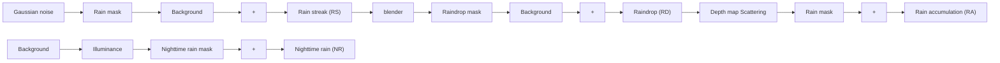

# Towards Universal Rainy Image Restoration: Benchmark and Baseline

Hujie Yan

California Institute of Technology

1200 E California Blvd, Pasadena

California, 91125 USA

hyan3@caltech.edu

# Abstract

Despite significant progress has been made in image deraining, most existing methods are limited to handling only a single type of rain degradation or a specific pattern of rain. However, real-world rain scenarios tend to contain diverse rainy patterns due to variations in the rainfall process and lighting conditions. To address this dilemma and advance this field, we introduce a new task: Universal Rainy Image Restoration (URIR), which aims to handle multiple types of rain degradation on a single model. To benchmark this task, we construct a high-quality dataset called URIR-8K, which contains four patterns: rain streak, raindrop, rain accumulation and nighttime rain. Building upon this dataset, we present a comprehensive study on existing approaches by evaluating their universal deraining capabilities and their effect on downstream object detection task. In addition, we design a multi-scale vision Mamba as a baseline model, leveraging the benefits of multi-scale learning for its robustness to diverse rain appearances. Unlike existing methods that use fixed-scale scanning for feature extraction, we employ a multi-scale 2D scanning technique to better help image restoration in the richer scale space. Extensive experimental analysis shows the potential of our proposed task and the effectiveness of our model.

# Introduction

Rainy image restoration aims to enhance the quality of images captured in rainy conditions, thereby improving their visual clarity and the accuracy of perception systems (Chen et al. 2021). To solve this problem, recent years have witnessed the emergence of diverse datasets and the proposal of numerous deep learning-based methods. As this field has developed, researchers have focused addressing different rain degradation patterns, such as rain streaks, raindrops, rain accumulation, and so on. These well-defined settings enable researchers to design specific models tailored to the unique characteristics of each rainy scenario (Chen et al. 2023b).

However, these models designed to focus solely on specific rain patterns, often suffer from significant performance declines when applied to other types of rain. In real complex rainy scenarios, multiple types of rain degradation frequently change throughout the rainfall process. For instance, autonomous vehicles may simultaneously experience interference from both rain streaks and raindrops. In addition, the Copyright © 2025, Association for the Advancement of Artificial Intelligence (www.aaai.org). All rights reserved.

<table><tr><td rowspan="2">Datasets</td><td rowspan="2">Year</td><td colspan="4">Rain Categories</td><td rowspan="2">Annotation</td></tr><tr><td>RS</td><td>RD</td><td>RA</td><td>NR</td></tr><tr><td>Rain200L/H</td><td>2017</td><td>√</td><td>×</td><td>×</td><td>×</td><td>×</td></tr><tr><td>RainDrop</td><td>2018</td><td>×</td><td>√</td><td>×</td><td>×</td><td>×</td></tr><tr><td>RID/RIS</td><td>2019</td><td>√</td><td>√</td><td>×</td><td>×</td><td>√</td></tr><tr><td>SPA-Data</td><td>2019</td><td>√</td><td>×</td><td>×</td><td>×</td><td>×</td></tr><tr><td>RainCityscapes</td><td>2019</td><td>√</td><td>×</td><td>√</td><td>×</td><td>√</td></tr><tr><td>Rain13k</td><td>2020</td><td>√</td><td>×</td><td>×</td><td>×</td><td>×</td></tr><tr><td>RainDS</td><td>2021</td><td>√</td><td>√</td><td>×</td><td>×</td><td>×</td></tr><tr><td>GTAV-NightRain</td><td>2022</td><td>×</td><td>×</td><td>×</td><td>√</td><td>×</td></tr><tr><td>URIR-8K (Ours)</td><td>2024</td><td>√</td><td>√</td><td>√</td><td>√</td><td>√</td></tr></table>

Table 1: Overview of recent datasets for rain removal tasks. The abbreviations “RS”, “RD”, “RA” and “NR” stand for rain streak, raindrop, rain accumulation, and nighttime rain, respectively. The inclusion of annotations indicates that the dataset contains labels for object detection tasks.

characteristics of rain can shift from day to night. As a result, intelligent systems would have to adapt to and switch between different rain degradation types. In other words, using separate models for different types of rain may lead to inefficiencies in deployment and maintenance. Besides practical limitations, focusing solely on single-degradation rain models is still constrained by their task-specific nature, hindering the field's progress from specialization toward more general intelligence (Li et al. 2022). To advance this field, we introduce a new task: Universal Rainy Image Restoration (URIR). The goal of this new task is to handle multiple types of rain degradation using a single universal model. To better achieve this goal, we need to consider two main factors related to the URIR problem: benchmark and baseline.

To build a dataset for the URIR task, the most straightforward approach is to simply combine existing datasets of different specific types of rain, as shown in Table 1. However, significant differences exist among these datasets in terms of background quality, resolution, and synthesis methods. For instance, Rain200L/H (Yang et al. 2017) consists of regular rain streaks synthesized using Photoshop software, RainCityscapes (Hu et al. 2019) is designed for driving scenarios by incorporating scene depth, and GTAV-NightRain (Zhang et al. 2023) utilizes a game engine to render nighttime rain degradation. Directly combining these datasets could introduce distribution inconsistencies, potentially confusing the

models and reducing their performance and generalization capabilities. Thus, it is necessary to build a unified benchmark to comprehensively evaluate the URIR capability.

One more thing, how to develop a robust deep model for the URID task is worth exploring. In fact, multi-scale learning has been demonstrated to be an effective strategy in rainy image restoration because it naturally captures rain appearances of various sizes (Fu et al. 2019; Chen, Pan, and Dong 2024; Jiang et al. 2020; Chen et al. 2024). Despite the numerous multi-scale CNN-based and Transformer-based approaches that have been proposed, with the recent popularity of state space models (SSMs), multi-scale representations in SSMs to facilitate the rain removal are still unexplored. This motivates us to design a multi-scale Mamba to explore richer scale-space information for better image deraining.

In this paper, we first construct a new benchmark dataset URIR-8K for the URIR task. To facilitate real-world applications, the proposed URIR-8K is designed for autonomous driving scenarios, with each image containing corresponding object detection labels. Note that we provide a unified pipeline for synthesizing datasets of four common rain patterns, including rain streak, raindrop, rain accumulation, and nighttime rain. We would open-source this pipeline's code, offering researchers a convenient reference for URIR data generation in other scenarios. Inspired by the recent popularity of SSMs, we develop an effective multi-scale Mamba as a new baseline, incorporating a multi-scale 2D scanning mechanism to better help image restoration. Figure 1 shows that our model achieves state-of-the-art performance in various rainy image restoration and object detection tasks compared to existing approaches, which implies the potential of our method to become a pentagonal warrior.

This paper makes the following contributions to the field:

- We introduce a new task setting for universal rainy image restoration, which aims to address different types of rain degradation using a single model.   
- We propose a new benchmark dataset for the URIR task to pave the way for future research in this field. We conduct benchmark experiments on existing methods to report their comprehensive deraining capabilities.   
- We design an effective multi-scale Mamba to remove rain effects while maintaining a low model complexity. Extensive experiments show that our baseline performs favorable performance against state-of-the-art ones.

# Related Work

In this section, we briefly review the progress in image deraining, universal image restoration and state space models.

Rainy Image Restoration. Upon revisiting the field of image deraining, it is evident that numerous deraining methods and datasets have been introduced in recent years, achieving notable success (Chen et al. 2023b). Most existing methods and datasets focus on removing rain streaks, taking into account variations in streak length, density, and direction (Yang et al. 2017; Zhang and Patel 2018). To address the problem of raindrop removal, Qian et al. (Qian et al. 2018) create the first dataset specifically for raindrop removal. Hu


<details>
<summary>radar</summary>

| Metric       | mAP50  | PSNR_RS | PSNR_RD | PSNR_RA | PSNR_NR |
| ------------ | ------ | ------- | ------- | ------- | ------- |
| Restormer    | 0.391  | 0.416   | 0.356   | 0.247   | 0.377   |
| DRSformer    | 0.398  | 0.424   | 0.362   | 0.259   | 0.46    |
| PromptIR     | 0.391  | 0.432   | 0.368   | 0.271   | 0.46    |
| MambaIR      | 0.391  | 0.432   | 0.368   | 0.271   | 0.46    |
| Ours         | 0.405  | 0.44    | 0.38    | 0.283   | 0.47    |
</details>

Figure 1: A five-dimensional radar chart compares the comprehensive capacity of state-of-the-art models on the URIR-8K dataset. The dimensions include PSNR across four types of rainy image restoration and mAP50 for object detection.

et al. (Hu et al. 2019) observe that heavy rain is often accompanied by rain fog effects and proposed a new dataset specifically for rain fog. Recently, nighttime deraining has begun to attract researchers' attention (Zhang et al. 2023), as it exhibits distinct differences from daytime rain patterns. Although various datasets and solutions for different types of rain have been proposed, they often overlook the fact that in real-world applications, there is a preference for a single model capable of addressing all types of rain degradation. To fill the gap in this research, we explore universal rainy image restoration to facilitate real-world applications.

Universal Image Restoration. Universal image restoration refers to the comprehensive process of improving the quality of images by addressing various types of degradations. In recent year, several pioneers have conducted studies on universal image restoration models and have made significant progress. For example, Li et al. (Li et al. 2022) present a unified approach for dehazing, deraining and denoising, utilizing an image encoder trained via contrastive learning to effectively model latent representations of degradations. Potlapalli et al. (Potlapalli et al. 2023) introduce PromptIR, a prompt-based learning approach that implicitly generates degradation-conditioned prompts to direct the restoration of input images with unknown degradations. Inspired by these popular trends, our goal is to explore universal rainy image restoration to establish a robust foundation model for image deraining. In addition, we explore utilizing the recent Mamba architecture to achieve universal image restoration.

Visual State Space Models. Recently, state space models (SSMs) (Gu et al. 2020, 2021; Gu, Goel, and Ré 2021) have interested researchers due to their linearly scalable computational complexity and global awareness capabilities. A recent advancement in this field is Mamba (Gu and Dao 2023), a novel architecture based on SSMs. Mamba uses adaptable


<details>
<summary>flowchart</summary>


</details>

Figure 2: Illustration of the URIR-8K dataset generation pipeline (rain streak, raindrop, rain accumulation, and nighttime rain).

parameters to capture non-local dependencies and hardware-level techniques to balance memory efficiency with performance. Its selective scanning mechanism focuses on extracting essential semantics from long sequences, reducing semantic redundancy. Mamba has been demonstrated to perform well on large-scale datasets. For example, ViM (Zhu et al. 2024) employs multiple scanning directions to handle the non-causal nature of image data, achieving competitive results. Motivated by their success, numerous Mamba-based studies have emerged in low-level vision tasks (Zhou et al. 2024; Guo et al. 2024), obtaining further advancements compared to CNNs and ViTs. However, these methods are limited to exploring feature representations at a fixed image scale. In this work, we investigate multi-scale representations in SSMs for better boosting image restoration.

# Dataset Construction

To evaluate the performance of existing approaches for universal rainy image restoration, we first create a high-quality benchmark dataset named URIR-8K. We note that existing image deraining datasets often focus on particular types of rain, lacking the diversity needed for a comprehensive evaluation. Simply combining these existing datasets may result in background inconsistencies and unknown gaps, failing to represent the wide range of rainy conditions adequately. To this end, we propose a new pipeline for synthesizing data of different rain types, which will be described below.

Background Collection and Object Detection Labels. To facilitate the real-world application of universal rainy image restoration, we collect numerous rain-free backgrounds from the BDD100K dataset (Seita 2018). Our ground-truth data includes a diverse range of typical daytime and nighttime first-person driving scenes in urban environments. Specifically, these scenes are characterized by elements such as buildings, streets, and the sky. It is worth noting that current rain datasets focus solely on rain synthesis, overlooking the downstream task integration. Our dataset also contains object detection labels, which are equally crucial for investigating the effect of image deraining for downstream vision-based tasks, such as object detection. Here, we emphasize traffic-relevant objects, including cars, buses, pedestrians, bicycles, trucks, motorcycles, and traffic lights. These objects are labeled in an accompanying file for each image.

Rain Streak Generation. Diversity and fidelity are the two main considerations in rain streak generation. For diversity, factors such as rain density, thickness, length, and direction play crucial roles. To control these factors, we apply a motion blur process (Garg and Nayar 2007; Wang et al. 2020b) to generate the rain layer, transforming Gaussian noise into directed streaks with specific thickness by tuning the motion blur kernels. To enhance fidelity, we use an alpha blending technique (Porter and Duff 1984) to organically mix the rain layer with the background layer. This produces the desired visual effect, where rain streaks are less visible in lighter areas (such as the sky), which is common in driving scenarios.

Raindrop Generation. To synthesize raindrops with realistic morphology, we employ open-source computer graphics software, Blender $^{1}$ , to simulate the process of rain hitting a window, and capture raindrop morphology. This software engine is capable of rendering random raindrops with a physical model, facilitated by the Rain Generator plugin in Blender. A random cropping approach with image augmentation is applied to ensure each raindrop mask is unique. For better realism, we tune the transparency of raindrop masks and blend them with background images in the alpha channel to produce the occluded effect (Qian et al. 2018).

Rain Accumulation Generation. In the case of heavy rain, the rain streaks and water particles in the atmosphere create a rain veiling effect similar to fog, which blurs background objects (Yang et al. 2017). This phenomenon is known as rain accumulation. As a result, objects at different distances have varying levels of visibility: distant objects are blurred more, while closer objects are less blurred. To authentically model this effect, we adopt an atmospheric scattering model (McCartney 1976) where object visibility decays exponentially with depth and the resulting background is superimposed onto a white fog blurring mask. To better obtain the depth of the objects, we use Depth Anything (Yang et al. 2024) to generate a depth mask. We randomly sample a coefficient A to represent the intensity of rain accumulation and a coefficient $\beta$ to determine the intensity of atmospheric scattering.

Nighttime Rain Generation. During the day, illumination comes from the sun reflection, which can be considered uniform, making rain streaks clearly visible. At nighttime, light


<details>
<summary>flowchart</summary>

```mermaid
graph TD
    A["Rainy input"] --> B["3×3"]
    C["1/2 Scale"] --> D["3×3"]
    E["1/4 Scale"] --> F["3×3"]
    B --> G["FGCM"]
    D --> H["FGCM"]
    F --> I["FGCM"]
    G --> J["MSSM"]
    H --> K["MSSM"]
    I --> L["MSSM"]
    J --> M["×N₁"]
    K --> N["×N₂"]
    L --> O["×N₃"]
    M --> P["MGFM"]
    N --> Q["MGFM"]
    O --> R["MGFM"]
    P --> S["×N₁"]
    Q --> T["×N₂"]
    R --> U["×N₃"]
    S --> V["×N₃"]
    T --> W["×N₃"]
    U --> X["Derained output"]
    V --> X
    W --> X
    X --> Y["Convolution 1×1 3×3 Convolution"]
    
    subgraph Residuals
        Z["Real FFT 2d"] --> AA["1×1"]
        AB["3×3 DwConv"] --> AC["ReLU"]
        AD["ReLU"] --> AE["1×1"]
        AF["3×3 DwConv"] --> AG["Inv Real FFT 2d"]
        AH["1×1"] --> AI["+"]
    end
    
    subgraph Marginal Layers
        AJ["R"] --> AK["1×1"]
        AL["R"] --> AM["1×1"]
        AN["1×1"] --> AO["3×3"]
        AP["S"] --> AQ["•"]
        AR["S"] --> AS["•"]
        AT["•"] --> AU["•"]
        AV["•"] --> AW["•"]
        AX["•"] --> AY["•"]
        AZ["•"] --> BA["•"]
        BB["•"] --> BC["•"]
        BD["•"] --> BE["•"]
        BF["•"] --> BG["•"]
        BH["•"] --> BI["•"]
        BJ["•"] --> BK["•"]
        BL["•"] --> BM["•"]
        BN["•"] --> BO["•"]
        BP["•"] --> BQ["•"]
        BR["•"] --> BS["•"]
    end
    
    subgraph Feature Surveys
        BT["VSSB"] --> BU["LN"]
        BV["VSSB"] --> BW["LN"]
        BX["VSSB"] --> BY["LN"]
        BZ["VSSB"] --> CA["LN"]
        CB["VSSB"] --> CC["LN"]
        DB["VSSB"] --> DC["LN"]
        BEV["VSSB"] --> DD["LN"]
        DBV["VSSB"] --> DP["LN"]
        BQV["VSSB"] --> DPV["LN"]
        BQV --> DPV
        BQV --> DPV
        BQV --> DPV
        BQV --> DPV
        BQV --> DPV
        BQV --> DPV
        BQV --> DPV
        BQV --> DPV
        BQV --> DPV
    end
    
    subgraph Full Scales
        DS["D1"] --> DS1["D1 1 2 3 4 ... 8 9"]
        DS1 --> DS2["D1 1 2 3 4 ... 8 9"]
        DS2 --> DS3["D1 1 2 3 4 ... 8 9"]
        DS3 --> DS4["D1 1 2 3 4 ... 8 9"]
        DS4 --> DS5["D1 1 2 3 4 ... 8 9"]
        DS5 --> DS6["D1 1 2 3 4 ... 8 9"]
        DS6 --> DS7["D1 1 2 3 4 ... 8 9"]
        DS7 --> DS8["D1 1 2 3 4 ... 8 9"]
        DS8 --> DS9["D1 1 2 3 4 ... 8 9"]
        DS9 --> DS10["D1 1 2 3 4 ... 8 9"]
        DS10 --> DS11["D1 1 2 3 4 ... 8 9"]
        DS11 --> DS12["D1 1 2 3 4 ... 8 9"]
        DS12 --> DS13["D1 1 2 3 4 ... 8 9"]
        DS13 --> DS14["D1 1 2 3 4 ... 8 9"]
        DS14 --> DS15["D1 1 2 3 4 ... 8 9"]
        DS15 --> DS16["D1 1 2 3 4 ... 8 9"]
        DS16 --> DS17["D1 1 2 3 4 ... 8 9"]
        DS17 --> DS18["D1 1 2 3 4 ... 8 9"]
        DS18 --> DS19["D1 1 2 3 4 ... 8 9"]
        DS19 --> DS20["D1 1 2 3 4 ... 8 9"]
        DS20 --> DS21["D1 1 2 3 4 ... 8 9"]
        DS21 --> DS22["D1 1 2 3 4 ... 8 9"]
        DS22 --> DS23["D1 1 2 3 4 ... 8 9"]
        DS23 --> DS24["D1 1 2 3 4 ... 8 9"]
        DS24 --> DS25["D1 1 2 3 4 ... 8 9"]
        DS25 --> DS26["D1 1 2 3 4 ... 8 9"]
        DS26 --> DS27["D1 1 2 3 4 ... 8 9"]
        DS27 --> DS28["D1 1 2.5...5...5...5...5...5...5...5...5...5...5...5...5...5...5...5...5...5...5...5...5...5...5...5...5...5...5...5...5...5...5...5...5...5...5...5...5...5...5...5...5...5...5...5...5...5...5...5...5...5...5...<br>    end<br>    <br>    subgraph Convolutional Outputs<br>        O[C@Concatenation ⊕ Elementwise Addition"] & O["R@Reshape ⊗ Matrix Multiplication"] & O["S⊗Tanh Activation ⊙ Elementwise Multiplication"] & O["Pu: Upsample, Downsample, Convolution"] & O["Pu: Convolution, Convolution"] & O["Pu: Convolution, Convolution"] & O["Pu: Convolution, Convolution"] & O["Pu: Convolution, Convolution"] & O["Pu: Convolution, Convolution"] & O["Pu: Convolution, Convolution"] & O["Pu: Convolution, Convolution"] & O["Pu: Convolution, Convolution"] & O["Pu: Convolution, Convolution"] & O["Pu: Convolution"] & O["Pu: Convolution, Convolution"] & O["Pu: Convolution, Convolution"] & O["Pu: Convolution, Convolution"] & O["Pu: Convolution, Convolution"] & O["Pu: Convolution, Convolution"] & O["Pu: Convolution, Convolution"] & O["Pu: Convolution, Convolution"] & O["Pu: Convolution, Convolution"] & O["Pu: Convolution,Convolution"] & O["Pu: Convolution, Convolution"] & O["Pu: Convolution, Convolution"] & O["Pu: Convolution, Convolution"] & O["Pu: Convolution, Convolution"] & O["Pu: Convolution, Convolution"] & O["Pu: Convolution, Convolution"] & O["Pu: Convolution, Convolution"] & O["Pu: Convolution, Convolution"] & O["Pu: Convolution, Convulation"] & O["Pu: Convolution, Convolution"] & O["Pu: Convolution, Convolution"] & O["Pu: Convolution, Convolution"] & O["Pu: Convolution, Convolution"] & O["Pu: Convolution, Convolution"] & O["Pu: Convolution, Convolution"] & O["Pu: Convolution, Convolution"] & O["Pu: Convolution, Convolution"] & O["Pu: Convolution, Convolution"]
```
</details>

Figure 3: Overall architecture of the proposed multi-scale Mamba (MSDM) for rainy image restoration.

mainly comes from some artificial light sources, such as traffic lights and vehicle headlights, resulting in uneven illumination. As the results, rain streaks are not visible in areas with low illumination (Cheng et al. 2023). In addition, areas with extremely high illumination (such as the center of a headlight) also obscure the visibility of rain streaks. To authentically depict nighttime rain, we transform the background image from RGB to HSV format, where the V channel reflects the distribution of image brightness. We use the normalized V channel to create a visibility mask: areas with V values either below 0.1 or above 0.8 are set to low values, while other areas retain their original V values. Then, we convolute the visibility mask with the rain streak mask generated from Gaussian motion blur. Finally, we use an alpha blending technique to mix the rain mask with the background images to generate rain streaks in visible areas.

Benchmark Statistics. Figure 2 presents the overall data synthesis pipeline. In total, our URIR-8K dataset contains 7,200 training pairs and 800 test images, which is divided into four subsets: rain streaks (RS), raindrops (RD), rain accumulation (RA), and nighttime rain (NR). These scenes and data for the training and test sets are completely separate, ensuring no overlap. The average resolution is $1280 \times 720$ .

# Baseline Method

In this section, we first summarize the overall pipeline of our method, followed by an analysis of the main components.

# Overall Framework

The overall framework of our proposed multi-scale deraining Mamba (MSDM) is illustrated in Figure 3. Given an input rainy image $I \in \mathbb{R}^{H \times W \times 3}$ , our method down-samples it into two coarser scales, i.e. $I_{mid} = \frac{1}{2}, I_{min} = \frac{1}{4}$ . The network uses pyramid rainy images as multiple inputs and employs $3 \times 3$ convolutional layers to extract shallow features. To better enhance the locality of the network in the frequency domain, we introduce the frequency-guided convolutional module (FGCM) (Mao et al. 2023), leveraging the initial features from each image scale. Then, we develop the multi-scale state-space module (MSSM) to model deep global information with linear complexity. Finally, we leverage the multi-scale gated fusion module (MGFM) to aggregate scale-specific representations, which are then fed into the network decoder to reconstruct high-quality outputs. The detailed description of these components is provided below.

To supervise the network training procedure, we employ a weighted sum of three loss functions, defined as follows:

$$
L _ {t o t a l} = \lambda_ {1} L _ {c} + \lambda_ {2} L _ {f} + \lambda_ {3} L _ {e},
$$

where $L_{c}$ is the Charbonnier loss (Charbonnier et al. 1994), $L_{f}$ is the frequency reconstruction loss (Cho et al. 2021), $L_{e}$ is the edge loss (Zamir et al. 2021). Each component loss is calculated across all image scales. The empirical values for $\lambda_{1}$ , $\lambda_{2}$ , and $\lambda_{3}$ are set to 1, 0.01, and 0.05, respectively.

# Multi-scale State Space Module

Preliminaries. The SSM serves as a fundamental mathemat-

ical framework, drawing inspiration from continuous linear time-invariant (LTI) systems. These models transform one-dimensional functions or sequences $x_{t} \in R$ into outputs $y_{t} \in R$ through implicit latent states $h_{t} \in R^{N}$ . Mathematically, SSMs are typically represented by a set of first-order differential equations. In the context of deep learning, these continuous equations are discretized using the zero-order hold (ZOH) method, resulting in the discrete-time equations:

$$
h _ {t} = A h _ {t - 1} + B x _ {t}, y _ {t} = C h _ {t} + D x _ {t},
$$

where $A, B, C$ , and $D$ denote learnable weight matrices.

A recent advancement in the application of SSMs is the Mamba architecture (Gu and Dao 2023), which leverages a selective scanning mechanism. This mechanism allows the weights to dynamically adapt to changes in the input while maintaining the advantage of linear complexity. The way to apply the scanning mechanism becomes a key factor in the performance of Mamba-based image restoration tasks.

Multi-scale 2D Scanning Block. For recent Mamba-based method, a variety of image scanning strategies flourish. For example, Vim (Zhu et al. 2024) and VMamba (Liu et al. 2024) have demonstrated that utilizing different scanning orders, including both row-wise and column-wise scans in multiple directions, can effectively enhance model performance. However, these approaches primarily focus on feature representations of a fixed image scale, neglecting potentially useful information from other scales. Therefore, exploring multi-scale scanning to boost image deraining performance is crucial. Based on the above multi-scale architecture using a multi-input encoder and a multi-output decoder, the most straightforward approach is to apply the existing multi-directional scanning mechanism to each image scale. In fact, the effect of rain degradation varies across different image scales (Chen, Pan, and Dong 2024). In other words, the information contained at larger scales differs from that at smaller scales. As a result, applying the same scanning operation to different scales may result in information redundancy and additional computational burden. To this end, we develop an efficient multi-scale 2D scanning block that achieves data scanning by applying different numbers of geometric transformations at each scale. Compared to smaller scales, we adopt a greater number of scans at larger scales to comprehensively model the information. Mathematically, this step is represented as a piecewise function:

$$
\hat {\boldsymbol {B}} = \left\{ \begin{array}{l l} \boldsymbol {B} & \text {if k = 1} \\ \boldsymbol {B} \oplus \boldsymbol {B} ^ {F} & \text {if k = 2} \\ \boldsymbol {B} \oplus \boldsymbol {B} ^ {F} \oplus \boldsymbol {B} ^ {T} \oplus (\boldsymbol {B} ^ {T}) ^ {F} & \text {if k = 4} \end{array} \right.
$$

where $k$ represents the number of 2D scanning operations. Here, $k = 1$ is used for the small scale, $k = 2$ for the medium scale, and $k = 4$ for the large scale. The transpose operation $(B^T)$ swaps the image's horizontal and vertical axes, and the flip operation $(B^F)$ reverses pixel arrangement along both axes. The direct sum symbol $\bigoplus$ represents the stacking operation on the images. We will show the effectiveness of these design choices in the experimental section.

# Multi-scale Gated Fusion Module

As is well known, multi-scale feature fusion integrates features extracted from different scales of an image, allowing the network to capture both global context and fine details. Different from simply concatenating outputs from different scales of the MSSM (Mao et al. 2023), we employ a dual-input gating unit that dynamically adapts to inputs of varying scales. The formula for this gating unit can be expressed as:

$$
\operatorname{Gate} (\mathbf {X}, \mathbf {Y}) = F _ {3 \times 3} (F _ {1 \times 1} (\mathbf {X})) \odot \sigma (F _ {3 \times 3} (F _ {1 \times 1} (\mathbf {Y}))),
$$

where $F_{3\times3}$ represents $3 \times 3$ convolution layer, $\sigma$ represents the tanh activation function, and $\odot$ denotes element-wise multiplication. This dynamic gating unit can be used for pairwise integration of different scales. To integrate features from three different scales, we combine the gating units into the MGFM, which can be mathematically expressed as:

$$
F _ {G F M} = F _ {1 \times 1} (\mathbf {G a t e} (F _ {1 \times 1} (\mathbf {G a t e} (\mathbf {B} _ {S}, \mathbf {B} _ {M})), \mathbf {B} _ {L})),
$$

where $\mathbf{B}_L, \mathbf{B}_M, \mathbf{B}_S$ denotes three different image scales.

# Experiments

In this section, we conduct extensive experiments on the proposed URIR-8K dataset and several public benchmarks.

# Experimental Setup

Datasets and Metrics. We conduct benchmark experiments on the proposed URIR-8K dataset. We compare it with both classical and recent methods, including four CNN-based approaches: LPNet (Fu et al. 2019), JORDER-E (Yang et al. 2019), RCDNet (Wang et al. 2020a), and SPDNet (Yi et al. 2021); four Transformer-based networks: IDT (Xiao et al. 2022), Restormer (Zamir et al. 2022), DRSformer (Chen et al. 2023a), and PrompIR (Potlapalli et al. 2023); and one Mamba-based architecture, MambaIR (Guo et al. 2024).

Furthermore, we evaluate the effectiveness of our method on existing benchmarks, including two rain streak datasets, Rain200L (Yang et al. 2017) and Rain200H (Yang et al. 2017); a raindrop dataset, UAV-Rain1K (Chang et al. 2024); and a real-world rain dataset, SPA-Data (Wang et al. 2019). To assess the quality of the restored images, we employ two metrics: PSNR (Huynh-Thu and Ghanbari 2008) and SSIM (Wang et al. 2004). To evaluate the performance in object detection tasks, we employ the mAP50 metric (Redmon et al. 2016) to measure accuracy in traffic scenes.

Implementation Details. In our network, the stack size of MSSMs is set to 6. The models are trained using the PyTorch framework with the Adam optimizer. The initial learning rate is $1 \times 10^{-4}$ , which is gradually decreased to $1 \times 10^{-6}$ following a cosine annealing strategy (Loshchilov and Hutter 2016). An exception is made for the training on Rain200H, where the initial learning rate is set to $2 \times 10^{-4}$ . The models are trained on the URIR-8K, Rain200L, Rain200H, and UAV-Rain1K datasets for 300 epochs, and on SPA-Data for 5 epochs. To enhance the training procedure, images in these datasets are randomly flipped for data augmentation. All experiments are conducted with a batch size of 1 and a patch size of 256, utilizing one NVIDIA GeForce RTX 4090 GPU.

<table><tr><td rowspan="2">Model</td><td rowspan="2">Venue</td><td colspan="2">RS</td><td colspan="2">RD</td><td colspan="2">RA</td><td colspan="2">NR</td><td colspan="3">Average</td></tr><tr><td>PSNR</td><td>SSIM</td><td>PSNR</td><td>SSIM</td><td>PSNR</td><td>SSIM</td><td>PSNR</td><td>SSIM</td><td>PSNR</td><td>SSIM</td><td>mAP50</td></tr><tr><td>LPNet</td><td>TNNLS&#x27;2019</td><td>16.09</td><td>0.7254</td><td>16.64</td><td>0.6688</td><td>17.76</td><td>0.8027</td><td>21.38</td><td>0.7630</td><td>17.97</td><td>0.7400</td><td>0.200</td></tr><tr><td>JORDER-E</td><td>TPAMI&#x27;2019</td><td>36.72</td><td>0.9674</td><td>32.11</td><td>0.9549</td><td>23.76</td><td>0.8985</td><td>42.80</td><td>0.9929</td><td>33.85</td><td>0.9534</td><td>0.366</td></tr><tr><td>RCDNet</td><td>CVPR&#x27;2020</td><td>32.00</td><td>0.9317</td><td>27.01</td><td>0.8973</td><td>21.47</td><td>0.8610</td><td>38.52</td><td>0.9847</td><td>29.75</td><td>0.9187</td><td>0.343</td></tr><tr><td>SPDNet</td><td>ICCV&#x27;2021</td><td>32.52</td><td>0.9399</td><td>27.97</td><td>0.9064</td><td>23.55</td><td>0.8737</td><td>39.17</td><td>0.9861</td><td>30.80</td><td>0.9265</td><td>0.341</td></tr><tr><td>IDT</td><td>TPAMI&#x27;2022</td><td>40.89</td><td>0.9889</td><td>35.48</td><td>0.9802</td><td>29.34</td><td>0.9711</td><td>46.11</td><td>0.9964</td><td>37.96</td><td>0.9842</td><td>0.401</td></tr><tr><td>Restormer</td><td>CVPR&#x27;2022</td><td>41.46</td><td>0.9864</td><td>35.42</td><td>0.9671</td><td>23.84</td><td>0.9140</td><td>45.66</td><td>0.9955</td><td>36.59</td><td>0.9657</td><td>0.390</td></tr><tr><td>DRSformer</td><td>CVPR&#x27;2023</td><td>41.70</td><td>0.9874</td><td>36.45</td><td>0.9752</td><td>26.32</td><td>0.9491</td><td>47.12</td><td>0.9966</td><td>37.90</td><td>0.9771</td><td>0.398</td></tr><tr><td>PromptIR</td><td>NeurIPS&#x27;2023</td><td>41.15</td><td>0.9864</td><td>36.53</td><td>0.9758</td><td>26.85</td><td>0.9467</td><td>45.84</td><td>0.9956</td><td>37.59</td><td>0.9761</td><td>0.399</td></tr><tr><td>MambaIR</td><td>ECCV&#x27;2024</td><td>39.85</td><td>0.9825</td><td>35.06</td><td>0.9681</td><td>25.18</td><td>0.9187</td><td>45.23</td><td>0.9953</td><td>36.33</td><td>0.9661</td><td>0.377</td></tr><tr><td>Ours</td><td>-</td><td>43.63</td><td>0.9918</td><td>37.58</td><td>0.9811</td><td>29.04</td><td>0.9679</td><td>47.17</td><td>0.9967</td><td>39.35</td><td>0.9844</td><td>0.402</td></tr></table>

Table 2: Quantitative comparison on the URIR-8K dataset. Bold and underline highlights the best and second-best results. RS, RD, RA, and NR refer to rain streak, raindrop, rain accumulation, and nighttime rain, respectively.

  
Figure 4: Visual deraining results on the URIR-8K dataset. Best zoom in the figures for better visual comparison.

# Experimental Results

Evaluations on the proposed URIR-8K dataset. Table 2 presents the quantitative results of different approaches on the URIR-8K dataset. It is evident that our proposed baseline achieves the highest average PSNR and SSIM values. Notably, our method surpasses the second-highest performing model IDT, by 1.4dB in PSNR. In Figure 4, we further show the visual recovery results of different methods under various rain degradations. Although DRSformer is competitive in removing rain streaks, it still has limitations in restoring rain accumulation. Compared to the recent MambaIR, our method introduces multi-scale scanning to better capture rain degradations of varying scales. In contrast, our method produces clearer restoration results with better detail repair.

Evaluations on public benchmarks. We validate the effectiveness of our method on public benchmark datasets with specific rain degradations. The quantitative results in Table 4 show that our method still achieves the best performance, indicating that our multi-scale architecture has good gener-

<table><tr><td>Model</td><td>Restormer</td><td>DRSformer</td><td>PromptIR</td><td>MambaIR</td><td>Ours</td></tr><tr><td>#FLOPs</td><td>174.7</td><td>242.9</td><td>172.7</td><td>172.4</td><td>99.2</td></tr><tr><td>#Params</td><td>26.1</td><td>33.7</td><td>35.6</td><td>30.8</td><td>11.8</td></tr></table>

Table 3: Comparison of model complexity for $256 \times 256$ pixel images. “#FLOPs” and “#Params” represent FLOPs (in G) and the number of trainable parameters (in M).

alization capabilities for different types of rain degradation.

Evaluations on model complexity. We evaluate the complexity of our model and recent methods using FLOPs and model parameters. As shown in Table 3, our model offers a lower FLOPs count and fewer parameters, yet it maintains excellent performance as evidenced in Table 2.

Evaluations on downstream tasks. To evaluate the impact of the image deraining process on downstream vision-based applications such as object detection, we utilize mainstream object detection pre-trained models, specifically YOLOv5,

<table><tr><td>Model</td><td colspan="2">RCDNet</td><td colspan="2">SPDNet</td><td colspan="2">Uformer</td><td colspan="2">Restormer</td><td colspan="2">IDT</td><td colspan="2">DRSformer</td><td colspan="2">Ours</td></tr><tr><td>Metrics</td><td>PSNR</td><td>SSIM</td><td>PSNR</td><td>SSIM</td><td>PSNR</td><td>SSIM</td><td>PSNR</td><td>SSIM</td><td>PSNR</td><td>SSIM</td><td>PSNR</td><td>SSIM</td><td>PSNR</td><td>SSIM</td></tr><tr><td>Rain200L</td><td>39.17</td><td>0.9885</td><td>40.50</td><td>0.9875</td><td>40.20</td><td>0.9860</td><td>40.99</td><td>0.9890</td><td>40.74</td><td>0.9884</td><td>41.23</td><td>0.9894</td><td>41.47</td><td>0.9899</td></tr><tr><td>Rain200H</td><td>30.24</td><td>0.9048</td><td>31.28</td><td>0.9207</td><td>30.80</td><td>0.9105</td><td>32.00</td><td>0.9329</td><td>32.10</td><td>0.9344</td><td>32.17</td><td>0.9326</td><td>32.32</td><td>0.9361</td></tr><tr><td>UAV-Rain1K</td><td>22.48</td><td>0.8753</td><td>22.54</td><td>0.8594</td><td>-</td><td>-</td><td>24.78</td><td>0.9054</td><td>22.47</td><td>0.8957</td><td>24.93</td><td>0.9155</td><td>25.04</td><td>0.9174</td></tr><tr><td>SPA-Data</td><td>43.36</td><td>0.9831</td><td>43.20</td><td>0.9871</td><td>46.13</td><td>0.9913</td><td>47.98</td><td>0.9921</td><td>47.35</td><td>0.9930</td><td>48.54</td><td>0.9924</td><td>48.95</td><td>0.9931</td></tr></table>

Table 4: Quantitative comparison on public benchmark datasets. Bold and underline highlights the best and second-best results.


<details>
<summary>text_image</summary>

traffic sign 0.85
cor 0.94
car 0.84
car 0.92
</details>

(a) Input


<details>
<summary>text_image</summary>

traffic sign 0.82
cor 0.95
cor 0.71
cor 0.92
cor 0.71
</details>

(b) RCDNet


<details>
<summary>text_image</summary>

traffic sign 0.68
cor 0.94
cor 0.81
cor 0.92
cor 0.72
cor 0.71
</details>

(c) SPDNet


<details>
<summary>text_image</summary>

car 0.95
car 0.93
car 0.92
car 0.74
</details>

(d) DRSformer


<details>
<summary>text_image</summary>

traffic sign 0.62
car 0.95
car 0.64
car 0.74
car 0.93
</details>

(e) MambaIR


<details>
<summary>text_image</summary>

car 0.95
cor 0.62
traffic light 0.56
car 0.93
cor 0.74
</details>

(f) Ours

Figure 5: Comparison results of traffic object detection on images degraded by rain and restored using different methods. 

<table><tr><td>Models</td><td>(a)</td><td>(b)</td><td>(c)</td><td>(d)</td><td>(e)</td><td>(f)</td><td>(g)</td></tr><tr><td> $S_1$ </td><td>×</td><td>×</td><td>√</td><td>√</td><td>√</td><td>√</td><td>√</td></tr><tr><td> $S_2$ </td><td>×</td><td>√</td><td>√</td><td>√</td><td>√</td><td>√</td><td>√</td></tr><tr><td> $S_3$ </td><td>√</td><td>√</td><td>√</td><td>√</td><td>√</td><td>√</td><td>√</td></tr><tr><td>2DSB</td><td>√</td><td>√</td><td>×</td><td>×</td><td>×</td><td>×</td><td>×</td></tr><tr><td>MS-2DSB</td><td>×</td><td>×</td><td>√</td><td>√</td><td>√</td><td>√</td><td>√</td></tr><tr><td>FGCM</td><td>√</td><td>√</td><td>×</td><td>√</td><td>√</td><td>√</td><td>√</td></tr><tr><td>MGFM</td><td>×</td><td>√</td><td>√</td><td>×</td><td>√</td><td>√</td><td>√</td></tr><tr><td> $L_c$ </td><td>√</td><td>√</td><td>√</td><td>√</td><td>√</td><td>√</td><td>√</td></tr><tr><td> $L_f$ </td><td>√</td><td>√</td><td>√</td><td>√</td><td>×</td><td>√</td><td>√</td></tr><tr><td> $L_e$ </td><td>√</td><td>√</td><td>√</td><td>√</td><td>×</td><td>×</td><td>√</td></tr><tr><td>PSNR</td><td>39.85</td><td>39.99</td><td>40.68</td><td>41.16</td><td>41.09</td><td>41.27</td><td>41.37</td></tr></table>

Table 5: Ablation studies on different variants of our method. Here, $S_{1}$ , $S_{2}$ , and $S_{3}$ represent 1/4, 1/2 and full image scale. The term 2DSB denotes the 2D scanning block, while MS-2DSB refers to the multi-scale 2D scanning block.

to evaluate the outcomes. As illustrated in Figure 5, our approach not only reconstructs clear images but also enhances target recognition accuracy, particularly in correctly identifying the “traffic light” category and reducing misidentification of building surface as “traffic sign”.

# Ablation Studies

Effectiveness of main components. We first analyze the effectiveness of each component in the proposed framework, including the multi-scale configuration, MS-2DSB, FGCM, MGFM, and loss functions. Here, we train these models using the same number of epochs for fairness. Table 5 presents the quantitative results of different variants. Compared to the fixed-scale 2DSB, our proposed MS-2DSB achieves superior results. This advantage is due to our model, where exploring multi-scale representations facilitates rain removal. The comparison results of other variants reveals that each component of MSDM contributes to the final performance.

Effect of the scanning operation in the MS-2DSB. We further analyze the impact of the scanning operation in the MS-2DSB. Table 6 presents the quantitative results of applying different scanning operations across various scales.

<table><tr><td rowspan="2">Models</td><td colspan="3">(a)</td><td colspan="3">(b)</td><td colspan="3">(c)</td><td colspan="3">(d, Ours)</td></tr><tr><td>S1</td><td>S2</td><td>S3</td><td>S1</td><td>S2</td><td>S3</td><td>S1</td><td>S2</td><td>S3</td><td>S1</td><td>S2</td><td>S3</td></tr><tr><td>D1</td><td>√</td><td>√</td><td>√</td><td>√</td><td>√</td><td>√</td><td>√</td><td>√</td><td>√</td><td>√</td><td>√</td><td>√</td></tr><tr><td>D2</td><td>×</td><td>×</td><td>×</td><td>√</td><td>√</td><td>√</td><td>√</td><td>√</td><td>√</td><td>×</td><td>√</td><td>√</td></tr><tr><td>D3</td><td>×</td><td>×</td><td>×</td><td>×</td><td>×</td><td>×</td><td>√</td><td>√</td><td>√</td><td>×</td><td>×</td><td>√</td></tr><tr><td>D4</td><td>×</td><td>×</td><td>×</td><td>×</td><td>×</td><td>×</td><td>√</td><td>√</td><td>√</td><td>×</td><td>×</td><td>√</td></tr><tr><td>PSNR</td><td colspan="3">40.58</td><td colspan="3">40.59</td><td colspan="3">40.89</td><td colspan="3">40.86</td></tr><tr><td>#Params</td><td colspan="3">11.7</td><td colspan="3">11.8</td><td colspan="3">12.1</td><td colspan="3">11.8</td></tr><tr><td>#FLOPs</td><td colspan="3">96.9</td><td colspan="3">98.3</td><td colspan="3">100.9</td><td colspan="3">99.2</td></tr></table>

Table 6: Ablation studies on the MS-2DSB. $D_{1}$ , $D_{2}$ , $D_{3}$ , and $D_{4}$ denotes different scanning directions in Figure 3.

Compared to model (c), which uses four-directional scanning at each scale, our MS-2DSB achieves comparable performance with unequal scanning operations across different scales, thus reducing the model's computational complexity. This finding offers new insights into efficient data scanning techniques for multi-scale Mamba-based methods.

# Concluding Remarks

This paper explores the task of universal rainy image restoration (URIR) for the first time and introduces a high-quality dataset URIR-8K that contains four distinct rain degradation patterns. Based on this benchmark, we conduct extensive experiments to evaluate the comprehensive capabilities of different approaches in the URIR task. Furthermore, we also propose an effective Mamba-based baseline model that utilizes multi-scale 2D scanning mechanisms to jointly model rain distribution. Experimental results demonstrate the effectiveness of our framework, surpassing existing models on both our URIR-8K dataset and several public benchmarks.

# References

Chang, W.; Chen, H.; He, X.; Chen, X.; and Shen, L. 2024. UAV-Rain1k: A Benchmark for Raindrop Removal from UAV Aerial Imagery. In CVPR Workshops, 15–22.

Charbonnier, P.; Blanc-Feraud, L.; Aubert, G.; and Barlaud, M. 1994. Two deterministic half-quadratic regularization

algorithms for computed imaging. In ICIP, volume 2, 168-172.   
Chen, H.; Chen, X.; Lu, J.; and Li, Y. 2024. Rethinking Multi-Scale Representations in Deep Deraining Transformer. In AAAI, volume 38, 1046–1053.   
Chen, H.; Wang, Y.; Guo, T.; Xu, C.; Deng, Y.; Liu, Z.; Ma, S.; Xu, C.; Xu, C.; and Gao, W. 2021. Pre-trained image processing transformer. In CVPR, 12299–12310.   
Chen, X.; Li, H.; Li, M.; and Pan, J. 2023a. Learning a sparse transformer network for effective image deraining. In CVPR, 5896–5905.   
Chen, X.; Pan, J.; and Dong, J. 2024. Bidirectional multiscale implicit neural representations for image deraining. In CVPR, 25627–25636.   
Chen, X.; Pan, J.; Dong, J.; and Tang, J. 2023b. Towards unified deep image deraining: A survey and a new benchmark. arXiv preprint arXiv:2310.03535.   
Cheng, Y.; Wu, Z.; Li, J.; and Xu, J. 2023. Retinex Meets Transformer: Bridging Illumination and Reflectance Maps for Low-Light Image Enhancement. In International Conference on Neural Information Processing, 388–402.   
Cho, S.-J.; Ji, S.-W.; Hong, J.-P.; Jung, S.-W.; and Ko, S.-J. 2021. Rethinking coarse-to-fine approach in single image deblurring. In ICCV, 4641–4650.   
Fu, X.; Liang, B.; Huang, Y.; Ding, X.; and Paisley, J. 2019. Lightweight pyramid networks for image deraining. IEEE TNNLS, 31(6): 1794–1807.   
Garg, K.; and Nayar, S. K. 2007. Vision and rain. IJCV, 75:3–27.   
Gu, A.; and Dao, T. 2023. Mamba: Linear-time sequence modeling with selective state spaces. arXiv preprint arXiv:2312.00752.   
Gu, A.; Dao, T.; Ermon, S.; Rudra, A.; and Ré, C. 2020. Hippo: Recurrent memory with optimal polynomial projections. NeurIPS, 33: 1474–1487.   
Gu, A.; Goel, K.; and Ré, C. 2021. Efficiently modeling long sequences with structured state spaces. arXiv preprint arXiv:2111.00396.   
Gu, A.; Johnson, I.; Goel, K.; Saab, K.; Dao, T.; Rudra, A.; and Ré, C. 2021. Combining recurrent, convolutional, and continuous-time models with linear state space layers. NeurIPS, 34: 572–585.   
Guo, H.; Li, J.; Dai, T.; Ouyang, Z.; Ren, X.; and Xia, S.-T. 2024. Mambair: A simple baseline for image restoration with state-space model. In ECCV.   
Hu, X.; Fu, C.-W.; Zhu, L.; and Heng, P.-A. 2019. Depth-attentional features for single-image rain removal. In CVPR, 8022–8031.   
Huynh-Thu, Q.; and Ghanbari, M. 2008. Scope of validity of PSNR in image/video quality assessment. Electronics letters, 44(13): 800–801.   
Jiang, K.; Wang, Z.; Yi, P.; Chen, C.; Huang, B.; Luo, Y.; Ma, J.; and Jiang, J. 2020. Multi-scale progressive fusion network for single image deraining. In CVPR, 8346–8355.

Li, B.; Liu, X.; Hu, P.; Wu, Z.; Lv, J.; and Peng, X. 2022. All-in-one image restoration for unknown corruption. In CVPR, 17452–17462.   
Liu, Y.; Tian, Y.; Zhao, Y.; Yu, H.; Xie, L.; Wang, Y.; Ye, Q.; and Liu, Y. 2024. VMamba: Visual State Space Model. arXiv:2401.10166.   
Loshchilov, I.; and Hutter, F. 2016. Sgdr: Stochastic gradient descent with warm restarts. arXiv preprint arXiv:1608.03983.   
Mao, X.; Liu, Y.; Liu, F.; Li, Q.; Shen, W.; and Wang, Y. 2023. Intriguing findings of frequency selection for image deblurring. In AAAI, volume 37, 1905–1913.   
McCartney, E. J. 1976. Optics of the atmosphere: scattering by molecules and particles. New York.   
Porter, T.; and Duff, T. 1984. Compositing digital images. In Proceedings of the 11th annual conference on Computer graphics and interactive techniques, 253–259.   
Potlapalli, V.; Zamir, S. W.; Khan, S. H.; and Shahbaz Khan, F. 2023. Promptir: Prompting for all-in-one image restoration. NeurIPS, 36.   
Qian, R.; Tan, R. T.; Yang, W.; Su, J.; and Liu, J. 2018. Attentive generative adversarial network for raindrop removal from a single image. In CVPR, 2482–2491.   
Redmon, J.; Divvala, S.; Girshick, R.; and Farhadi, A. 2016. You only look once: Unified, real-time object detection. In CVPR, 779–788.   
Seita, D. 2018. BDD100k: A large-scale diverse driving video database. The Berkeley Artificial Intelligence Research Blog. Version, 511: 41.   
Wang, H.; Xie, Q.; Zhao, Q.; and Meng, D. 2020a. A model-driven deep neural network for single image rain removal. In CVPR, 3103–3112.   
Wang, T.; Yang, X.; Xu, K.; Chen, S.; Zhang, Q.; and Lau, R. W. 2019. Spatial attentive single-image deraining with a high quality real rain dataset. In CVPR, 12270–12279.   
Wang, Y.-T.; Zhao, X.-L.; Jiang, T.-X.; Deng, L.-J.; Chang, Y.; and Huang, T.-Z. 2020b. Rain streaks removal for single image via kernel-guided convolutional neural network. IEEE TNNLS, 32(8): 3664–3676.   
Wang, Z.; Bovik, A. C.; Sheikh, H. R.; and Simoncelli, E. P. 2004. Image quality assessment: from error visibility to structural similarity. IEEE TIP, 13(4): 600–612.   
Xiao, J.; Fu, X.; Liu, A.; Wu, F.; and Zha, Z.-J. 2022. Image de-raining transformer. IEEE TPAMI, 45(11): 12978–12995.   
Yang, L.; Kang, B.; Huang, Z.; Xu, X.; Feng, J.; and Zhao, H. 2024. Depth anything: Unleashing the power of large-scale unlabeled data. In CVPR, 10371–10381.   
Yang, W.; Tan, R. T.; Feng, J.; Guo, Z.; Yan, S.; and Liu, J. 2019. Joint rain detection and removal from a single image with contextualized deep networks. IEEE TPAMI, 42(6):1377–1393.   
Yang, W.; Tan, R. T.; Feng, J.; Liu, J.; Guo, Z.; and Yan, S. 2017. Deep joint rain detection and removal from a single image. In CVPR, 1357–1366.

Yi, Q.; Li, J.; Dai, Q.; Fang, F.; Zhang, G.; and Zeng, T. 2021. Structure-preserving deraining with residue channel prior guidance. In ICCV, 4238–4247.   
Zamir, S. W.; Arora, A.; Khan, S.; Hayat, M.; Khan, F. S.; and Yang, M.-H. 2022. Restormer: Efficient transformer for high-resolution image restoration. In CVPR, 5728–5739.   
Zamir, S. W.; Arora, A.; Khan, S.; Hayat, M.; Khan, F. S.; Yang, M.-H.; and Shao, L. 2021. Multi-stage progressive image restoration. In CVPR, 14821–14831.   
Zhang, F.; You, S.; Li, Y.; and Fu, Y. 2023. Learning rain location prior for nighttime deraining. In ICCV, 13148–13157.   
Zhang, H.; and Patel, V. M. 2018. Density-aware single image de-raining using a multi-stream dense network. In CVPR, 695–704.   
Zhou, H.; Wu, X.; Chen, H.; Chen, X.; and He, X. 2024. RS-Dehamba: Lightweight Vision Mamba for Remote Sensing Satellite Image Dehazing. arXiv preprint arXiv:2405.10030.   
Zhu, L.; Liao, B.; Zhang, Q.; Wang, X.; Liu, W.; and Wang, X. 2024. Vision mamba: Efficient visual representation learning with bidirectional state space model. arXiv preprint arXiv:2401.09417.