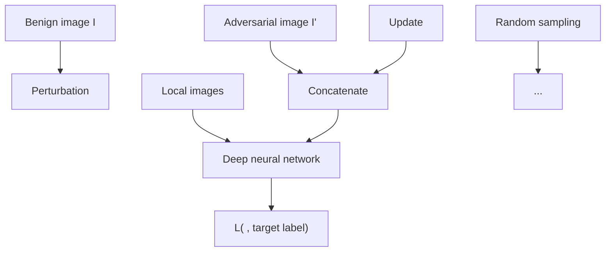

# Everywhere Attack: Attacking Locally and Globally to Boost Targeted Transferability

Hui Zeng $^{1,2*}$ , Sanshuai Cui $^{3*}$ , Biwei Chen $^{4\dagger}$ , Anjie Peng $^{1}$

$^{1}$ Southwest university of science and technology, Mianyang, China $^{2}$ Guangan institute of technology, Guangan, China $^{3}$ City University of Macau, Macau, China $^{4}$ Beijing normal university, Zhuhai, China  
zengh5@mail2.sysu.edu.cn, sanshuaicui@cityu.edu.mo,  
bchen@bnu.edu.cn, penganjie200012@163.com,

# Abstract

Adversarial examples' (AE) transferability refers to the phenomenon that AEs crafted with one surrogate model can also fool other models. Notwithstanding remarkable progress in untargeted transferability, its targeted counterpart remains challenging. This paper proposes an everywhere scheme to boost targeted transferability. Our idea is to attack a victim image both globally and locally. We aim to optimize 'an army of targets' in every local image region instead of the previous works that optimize a high-confidence target in the image. Specifically, we split a victim image into non-overlap blocks and jointly mount a targeted attack on each block. Such a strategy mitigates transfer failures caused by attention inconsistency between surrogate and victim models and thus results in stronger transferability. Our approach is method-agnostic, which means it can be easily combined with existing transferable attacks for even higher transferability. Extensive experiments on ImageNet demonstrate that the proposed approach universally improves the state-of-the-art targeted attacks by a clear margin, e.g., the transferability of the widely adopted Logit attack can be improved by 28.8%\~300%. We also evaluate the crafted AEs on a real-world platform: Google Cloud Vision. Results further support the superiority of the proposed method.

Code — https://github.com/zengh5/Everywhere\_Attack

# Introduction

Adversarial example (AE) (Szegedy et al. 2014) is a powerful tool for uncovering potential vulnerability of deep neural networks (DNN) before their deployment in security-sensitive applications (Madry et al. 2018). An exciting property of the AE is that AEs crafted against one model have a non-negligible chance to fool unseen victim models, a.k.a., transferability. Numerous transferable attacks have emerged recently, e.g., stabilizing the optimization direction (Dong et al. 2018; Lin et al. 2020; Wan, Ye, and Huang 2021) or diversifying inputs and surrogates (Xie et al. 2019; Dong et al. 2019; Wang et al. 2021; Li et al. 2020b; Fan et al. 2023).

Despite extensive studies constantly refreshing transferability under the untargeted mode, targeted transferability

text_image

Attack

Figure 1: Illustration of the proposed everywhere attack. We attempt to synthesize an army of Wukongs (target, the monkey) into every local region of Bajie (victim, the pig).

is much more daunting since it requires unknown models outputting a specific label (Liu et al. 2017). To bridge the gulf, tailored schemes for improving the transferability of targeted attacks have been proposed. For instance, resource-intensive attacks seek extra, target-specific classifiers (Inkawhich et al. 2020) or generators (Naseer et al. 2021; Yang et al. 2022) to optimize adversarial perturbations. Other researchers find that integrating novel loss functions with conventional simple iterative attacks can also enhance targeted transferability (Li et al. 2020a; Zhao, Liu, and Larson 2021; Zeng et al. 2023; Weng et al. 2023).

Despite the recent progress of targeted attacks, the reported transferability is still unsatisfactory. Unlike the attention regions (to the ground truth class) that are critical to untargeted attacks, which tend to overlap among diverse models (Wu et al. 2020), the target class-related attention regions vary significantly across different models (refer to Figure 2), resulting in limited targeted transferability. This paper proposes an everywhere scheme to alleviate the attention mismatch dilemma for targeted attacks. Our idea is illustrated in Figure 1: Bajie (the pig) is expected to be attacked as Wu-Kong (the monkey) $^{1}$ . In contrast to conventional attacks that try to plant a high-confidence Wukong into the victim image, the proposed everywhere attack simultaneously plants an army of Wukong in every local region of the victim image, with the hope that at least one Wukong falls into the

attention area of the victim model. Our contributions can be summarized as follows.

- We note that a common cause of targeted transfer failure is the attention mismatch between the surrogate and victim models.   
- With this challenge in mind, we propose an everywhere attack that tries to cover as much as possible the attention areas of various victim models. To our knowledge, this is the first attempt to enhance transferability by increasing the number of target objects, as opposed to previous works that aim to increase the confidence of the target class object.   
- Extensive experiments demonstrate that the proposed method possesses good extensibility and can improve almost all state-of-the-art targeted attacks by a clear margin.

# Related Work

An adversarial attack typically has two modes: targeted and untargeted. A targeted attack misguides a classification model to produce an adversary-desired label, whereas an untargeted attack only fools it for misclassification. Targeted attacks are strictly more difficult yet pose a more severe threat to the classification model. In this section, we briefly review conventional tricks to improve untargeted transferability and then discuss tailored schemes for targeted transferability.

# Transferable Untargeted Attacks

A plethora of transferable attacks is built up on the well-known iterative fast gradient sign method (IFGSM) (Kurakin, Goodfellow, and Bengio 2016), which can be formulated as:

$$
\boldsymbol {I} _ {n + 1} ^ {\prime} = \operatorname{Clip} _ {\boldsymbol {I}, \epsilon} \left(\boldsymbol {I} _ {n} ^ {\prime} + \alpha \operatorname{sign} \left(\nabla_ {\boldsymbol {I} _ {n} ^ {\prime}} J \left(\boldsymbol {I} _ {n} ^ {\prime}, y _ {o}\right)\right)\right) \tag {1}
$$

where $I_{0}^{\prime}=I,\nabla_{I_{n}^{\prime}}J()$ denotes the gradient of the loss function $J()$ with respect to $I_{n}^{\prime}, y_{o}$ is the original label, and $\epsilon$ is the perturbation budget. Researchers have proposed a variety of improved algorithms over IFGSM, e.g., the momentum iterative method (MI) (Dong et al. 2018) integrates a momentum term into the iterative process. Diverse inputs method (DI) (Xie et al. 2019) and translation-invariant method (TI) (Dong et al. 2019) leverage data augmentation to prevent attacks from overfitting a specific source model. Moreover, these enhanced schemes can be integrated for better transferability, e.g., Translation Invariant Momentum Diverse Inputs IFGSM (TMDI).

# Transferable Targeted Attacks

In addition to the difficulties untargeted attacks face, targeted attacks have their own challenges, such as gradient vanishing (Li et al. 2020a; Zhao, Liu, and Larson 2021) and the restoring effect (Li et al. 2020a; Zeng et al. 2023). Hence, tailored considerations are necessary for transferable targeted attacks. Existing efforts to boost targeted transferability can be divided into two families: resource-intensive methods and simple-gradient methods.

Resource-intensive attacks require training auxiliary target-class-specific classifiers or generators on additional data. In the feature distribution attack (Inkawhich et al. 2020), a light-weight, one-versus-all classifier is trained for each target class $y_{t}$ at each specific layer to predict the probability that a feature map is from $y_{t}$ . Transferable targeted perturbation (TTP) (Naseer et al. 2021) trains an input-adaptive generator to synthesize targeted perturbation and achieves state-of-the-art transferability. However, a dedicated generator must be learned for every (source model, target class) pair in TTP. Such a limitation is partially addressed by training a conditional generator (Mirza and Osindero 2014) to target multi-class simultaneously (C-GSP, LFAA) (Yang et al. 2022; Wang, Shi, and Wang 2023). However, the number of targeted labels a single generator can cover is limited due to its limited representative capacity. As a consequence, when the number of targeted classes is enormous, e.g., ImageNet, the required training time and storage are still prohibitive.

On the other hand, simple-gradient methods only iteratively optimize a victim image and thus have received more attention. Po+Trip attack (Li et al. 2020a) replaces traditional cross-entropy (CE) loss with the Poincare distance loss to address the decreasing gradient problem and introduces a triplet loss to push the attacked image away from $y_{o}$ . Logit attack (Zhao, Liu, and Larson 2021) uses the Logit loss in the attack and reports better transferability than the CE loss.

$$
L _ {L o g i t} = - l _ {t} (\boldsymbol {I} ^ {\prime}) \tag {2}
$$

where $l_{t}(\cdot)$ denotes the logit output with respect to $y_{t}$ . Moreover, Zhao, Liu and Larson (2021) point out that targeted attacks need significantly more iterations to converge than untargeted ones do. Similarly, Weng et al. (2023) (Margin) point out that the vanishing of the logit margin between the targeted and untargeted classes limits targeted transferability. Thus, they downscale the logits with a temperature factor to address the saturation issue and achieve improved transferability. The object-based diverse input method (ODI) (Byun et al. 2022) proposes diversifying the input image in a 3D object manner to avoid overfitting the source model and achieve improved targeted transferability. The high-confidence label suppressing method (SupHigh) (Zeng et al. 2023) argues that not only the original label $y_{o}$ , but other high-confidence labels should also be suppressed for better transferability. Such an idea can be realized by updating AEs according to the following direction:

$$
\nabla (l _ {t} (\boldsymbol {I} ^ {\prime}) - \beta_ {1} l _ {o} (\boldsymbol {I} ^ {\prime})) - \beta_ {2} \nabla (\Sigma_ {i = 0} ^ {N _ {h}} l _ {h i g h - c o n f, i} (\boldsymbol {I} ^ {\prime})) \perp \tag {3}
$$

where $\perp$ denotes retaining only the component perpendicular to the first item. Here, the first term is used to enhance the confidence of $y_{t}$ and suppress $y_{o}$ simultaneously, the second term suppresses other high-confidence labels. Based on the observation that highly universal adversarial perturbations tend to be more transferable, the self-universality method (SU) (Wei et al. 2023) introduces a feature similarity loss to encourage the adversarial perturbation to be self-universal. The clean feature mixup method (CFM) (Byun et al. 2023) borrowed the idea from Admix (Wang et al. 2021) to intentionally introduce competitor noises during optimization,

natural_image

Close-up of a red-flowered plant with green leaves in a green vase, against a blurred background (no text or symbols visible)

(a)

natural_image

Thermal imaging of a flower with visible internal heat distribution (no text or symbols)

(b)

natural_image

Abstract digital artwork featuring a stylized tree and glowing elements against a blue-to-green gradient background (no text or symbols)

(c)

natural_image

Illustration of a purple flower in a vase with a glowing orange-yellow heat map overlay (no text or symbols)

(d)

natural_image

Abstract digital artwork featuring a purple tree with glowing orange and yellow light effects against a blue background (no text or symbols)

(e)

natural_image

Close-up of a purple flower with green leaves in a green vase, against a blurred window background (no text or symbols visible)

(f)

natural_image

Thermal image of a dried plant with yellow and red flowers, no text or symbols visible

(g)

natural_image

Abstract illustration of a plant with purple leaves and a gradient color bar (no text or symbols)

(h)

natural_image

Thermal imaging view of a tree with a highlighted heat source, showing thermal distribution (no text or symbols)

(i)

natural_image

Abstract painting of a vase with vibrant red, orange, and yellow flowers against a blue-toned gradient background (no text or symbols)

(j)   
Figure 2: Attentional maps of the target label ('marmoset') on different models. The top row depicts the results of the vanilla CE attack, and the bottom that of the proposed CE+everywhere attack. (a, f) Crafted AEs, (b, g) VGG16 (surrogate), (c, h) Inceptionv3 (Inc-v3) (Szegedy et al. 2016), (d, i) Res50, (e, j) Dense121.

which is achieved by mixing up features from other images in the same batch. Strictly speaking, CFM does not belong to simple-gradient methods since additional images are involved in the optimization. Nevertheless, it exhibits outstanding attack ability according to our experiments.

# The Proposed Method

This section revisits a common cause for targeted transfer failure and details the proposed everywhere attack, which can effectively alleviate the attention mismatch issue.

# Motivation

In a targeted attack, the adversary attempts to plant a quasi-imperceptible target object (or objects) into a clean image. Due to the attentional mechanism of DNNs, such a planting often focuses on specific image regions. To achieve transferable attacks across victim models, one may expect victim models to center on regions similar to the surrogate model in identifying the target object (or objects). In fact, this assumption is difficult to satisfy in a targeted attack. To illustrate this dilemma, we examine the attentional maps of an AE on different models. The attentional maps are computed with GradCAM (Selvaraju et al. 2017). The AE shown in Figure 2(a) is crafted with the vanilla CE attack, the surrogate model is VGG16bn (VGG16) (Simonyan and Zisserman 2015), and the target label is 'marmoset'. As can be observed from Figure 2(b), the attack focuses on the lower area of the flower crown. One can imagine that the adversary has planted a 'marmoset' in this region. However, victim models pay attention to strikingly different regions in recognizing a 'marmoset'. For example, ResNet50 (Res50) (He et al. 2016) tries to find a 'marmoset' from the lower right area of the image (Figure 2(d)). As a result, such a transfer attack fails on all three victim models.

One possible way to address the abovementioned challenge is to draw the victim model's attention to the attacked region. However, this is not easy because the adversary in the transfer attack setting cannot access the victim model. Another solution is to craft a target in the victim model's attentional region. Since the victim model's attention is unknown in advance, an intuitive strategy is to craft a bunch of targets in every region that the victim model may pay attention to. Such a conceptually simple idea motivates the proposed everywhere attack.

# Everywhere Attack

Figure 3 gives an overview of the proposed everywhere attack. To synthesize targets in multiple regions of the image, we split a victim image into $M \times M$ non-overlap blocks. Then, we randomly sample N blocks from the image. For each sampled block, we pad the remaining area with the mean value of the dataset (which will be normalized to zero) and get a 'local' image. Concatenating these 'local' images with the global image delivers $N+1$ images to attack. Finally, we simultaneously mount a targeted attack on these $N+1$ images toward the same target (e.g., 'marmoset'). In this manner, we expect every block of the obtained AE independently possesses attack capability. The parameter N can be used to balance the attack power and the computational efficiency. Note that the everywhere attack degenerates to a baseline attack when N = 0. Algorithm 1 summarizes the procedure of integrating the proposed everywhere scheme with the CE attack, where DI, TI, and MI are conventional transferability-enhanced methods.

The bottom row of Figure 2 shows an AE crafted with the

flowchart

Figure 3: Overview of the proposed everywhere attack.

proposed everywhere scheme and its attentional maps on different models. The attentional map computed on the surrogate model (Figure 2(g)) presents multiple focal areas. Conceptually, this is similar to the adversary implanting multiple marmosets in the image. One of the marmosets (the one at the bottom right) is located in the region of interest of Res50 (Figure 2(i)), and another one (the one at the top left) in the region of interest of DenseNet121 (Den121) (Huang et al. 2017) (Figure 2(j)). As a result, our attack successfully transfers to these two victim models.

To conclude this section, we conduct a quantitative experiment on the ImageNet-compatible dataset $^{2}$ . We introduce a coverage metric C to represent the extent of a victim model' attention ( $Att_{v}$ ) being covered by that of the surrogate ( $Att_{s}$ ).

$$
C = \frac {\left| A t t _ {v} \bigcap A t t _ {s} \right|}{\left| A t t _ {v} \right|} \tag {4}
$$

where $Att$ is the normalized ([0, 1]) and binarized (threshold=2/3) attention map. Table 1 reports the averaged coverage metric over 200 images. Obviously, with the everywhere scheme, the victim model's attention is more likely to overlap with the surrogate's, i.e., the attention mismatch issue has, in essence, been addressed.

<table><tr><td></td><td>Res50</td><td>Den121</td><td>Inc-v3</td></tr><tr><td>CE</td><td>0.378</td><td>0.383</td><td>0.251</td></tr><tr><td>CE+everywhere</td><td>0.645</td><td>0.638</td><td>0.504</td></tr></table>

Table 1: Averaged coverage metric of different victims. Surrogate: VGG16.

# Experimental Results

In this section, we show the efficiency of the proposed everywhere attack scheme by integrating it into six iterative

Algorithm 1: Everywhere + CE attack   
Input: A benign image I; target label $y_{t}$ ; a surrogate model f with loss function J
Parameter: number of partitions for each dimension M, samples N, iterations T
Output: Adversarial Image I'
1: Initialize $\delta_{0}$ and $g_{0}$ 2: for t=0 to T-1 do
3:    DI: $I_{t}^{\prime}=DI(I+\delta_{t})$ .
4:    Split $I_{t}^{\prime}$ into $M\times M$ non-overlap blocks.
5:    Randomly sample N blocks and obtain local images $L_{0}^{\prime},L_{1}^{\prime},\cdots,L_{N-1}^{\prime}$ by padding.
6:    Concatenate: $I_{t}^{\prime}=[I_{t}^{\prime},L_{0}^{\prime},L_{1}^{\prime},\cdots,L_{N-1}^{\prime}]$ .
7:    Input $I_{t}^{\prime}$ to f and obtain gradient $g_{t+1}=\nabla_{\delta}J(I_{t}^{\prime},y_{t})$ 8:    TI and MI: $g_{t+1}=g_{t}+TI(g_{t+1})$ 9:    Update and clip $\delta_{t+1}$ 10: end for
11: return $I^{\prime}=I+\delta_{T}$

attacks: CE, Logit (Zhao, Liu, and Larson 2021), Margin (Weng et al. 2023), SupHigh (Zeng et al. 2023), SU (Wei et al. 2023), CFM (Byun et al. 2023) on various transfer scenarios. Since more recent targeted attacks have dominated the Po+Trip attack (Li et al. 2020a), we omit its results for brevity. All the iterative schemes start with the TMDI attack. Then, we contrast everywhere attack with two generative attacks: TTP (Naseer et al. 2021) and C-GSP (Yang et al. 2022). Next, the proposed method is used for crafting Datafree Targeted Universal Adversarial Perturbation (DTUAP) (Moosavi-Dezfooli et al. 2017; Zhao, Liu, and Larson 2021), from which our philosophy can be further illustrated. Finally, the crafted AEs are further evaluated using a real-world image recognition system: Google Cloud Vision. The supplementary material provides the ablation study on our key hyper-parameters.

<table><tr><td></td><td colspan="5">Source Model: Res50</td><td colspan="5">Source Model: Dense121</td></tr><tr><td>Attack</td><td>→Inc-v3</td><td>→Den121</td><td>→VGG16</td><td>→Swin</td><td>AVG</td><td>→Inc-v3</td><td>→Res50</td><td>→VGG16</td><td>→Swin</td><td>AVG</td></tr><tr><td>CE</td><td>3.9/14.1</td><td>44.9/62.3</td><td>30.5/52.2</td><td>5.2/19.0</td><td>21.1/36.8</td><td>2.8/10.3</td><td>19.0/41.7</td><td>11.3/50.6</td><td>1.8/19.2</td><td>8.7/30.5</td></tr><tr><td>Logit</td><td>9.1/22.3</td><td>70.0/78.5</td><td>61.9/69.3</td><td>13.4/28.8</td><td>38.6/49.7</td><td>7.4/17.6</td><td>42.6/58.5</td><td>36.3/54.2</td><td>10.5/23.8</td><td>24.2/38.5</td></tr><tr><td>Margin</td><td>10.9/21.7</td><td>70.8/80.8</td><td>61.2/69.4</td><td>16.5/33.1</td><td>39.9/51.3</td><td>7.6/19.8</td><td>44.7/58.9</td><td>33.4/56.4</td><td>11.7/24.6</td><td>24.4/39.9</td></tr><tr><td>SupHigh</td><td>9.9/17.8</td><td>74.2/82.7</td><td>62.5/78.2</td><td>17.1/37.3</td><td>40.9/54.0</td><td>8.7/12.9</td><td>47.4/64.3</td><td>40.5/64.1</td><td>9.3/23.6</td><td>26.6/41.2</td></tr><tr><td>SU</td><td>11.1/21.9</td><td>72.5/79.2</td><td>63.9/67.4</td><td>21.3/34.2</td><td>42.2/50.7</td><td>10.0/17.2</td><td>49.2/63.4</td><td>42.3/55.5</td><td>13.5/23.1</td><td>28.8/39.8</td></tr><tr><td>CFM</td><td>41.4/55.3</td><td>83.3/87.7</td><td>77.2/81.9</td><td>41.5/54.2</td><td>60.9/69.8</td><td>35.2/43.6</td><td>77.3/84.8</td><td>66.6/73.9</td><td>27.1/43.4</td><td>51.6/61.4</td></tr><tr><td></td><td colspan="5">Source Model: VGG16</td><td colspan="5">Source Model: Inc-v3</td></tr><tr><td>Attack</td><td>→Inc-v3</td><td>→Res50</td><td>→Den121</td><td>→Swin</td><td>AVG</td><td>→Res50</td><td>→Den121</td><td>→VGG16</td><td>→Swin</td><td>AVG</td></tr><tr><td>CE</td><td>0.0/1.8</td><td>0.3/16.4</td><td>0.5/15.1</td><td>0.1/7.6</td><td>0.2/10.2</td><td>1.8/6.1</td><td>2.5/9.6</td><td>1.5/7.3</td><td>0.2/0.9</td><td>1.5/6.0</td></tr><tr><td>Logit</td><td>0.8/3.4</td><td>10.6/21.8</td><td>12.8/22.3</td><td>6.5/13.1</td><td>7.7/15.2</td><td>2.4/6.8</td><td>3.6/14.3</td><td>2.2/8.9</td><td>0.2/3.4</td><td>2.1/8.4</td></tr><tr><td>Margin</td><td>0.7/3.2</td><td>7.9/21.1</td><td>12.3/18.5</td><td>6.4/10.9</td><td>6.8/13.4</td><td>2.1/8.4</td><td>3.2/14.6</td><td>1.9/9.3</td><td>0.9/3.0</td><td>2.0/8.8</td></tr><tr><td>SupHigh</td><td>1.1/2.6</td><td>11.2/18.0</td><td>13.6/22.3</td><td>7.0/13.7</td><td>8.2/14.2</td><td>2.3/7.0</td><td>4.5/11.5</td><td>2.2/9.2</td><td>0.3/2.3</td><td>2.3/7.5</td></tr><tr><td>SU</td><td>0.9/2.2</td><td>13.7/25.2</td><td>15.7/24.6</td><td>8.1/11.8</td><td>9.6/16.0</td><td>3.0/7.4</td><td>4.6/11.9</td><td>3.5/8.6</td><td>0.9/2.8</td><td>3.0/7.8</td></tr><tr><td>CFM</td><td>3.8/9.3</td><td>26.1/34.7</td><td>28.3/39.5</td><td>12.4/20.8</td><td>17.7/26.1</td><td>12.3/29.8</td><td>20.9/40.3</td><td>13.4/25.6</td><td>4.0/11.4</td><td>12.7/26.8</td></tr></table>

Table 2: Targeted transfer success rate (%) without/with the proposed everywhere scheme, in the random-target scenario. The AVG column is averaged over victims. Best results are in bold.

# Experimental Settings

Dataset. Following recent work on targeted attacks, our experiments are conducted on the ImageNet-compatible dataset comprised of 1000 images. All these images are with the size of $299 \times 299$ pixels and are stored in PNG format.

Networks. Since transferring across different architectures is more demanding, we choose four pretrained models of diverse architectures: Inc-v3, Res50, Den121, and VGG16 as the surrogates. These surrogates and a transformer-based model, Swin (Liu et al. 2021), evaluate AEs' transferability.

Parameters. For all attacks, the perturbations are restricted by $L_{\infty}$ norm with $\epsilon = 16$ (The results under lower budgets are provided in the supplementary material), and the step size is set to 2. The total iteration number T is set to 200 to balance speed and convergence. The number of partitions for each dimension M is set to 4, and the number of samples N is set to 9.

# Normal surrogates

Table 2 reports the targeted transferability (random-target) across different models. The proposed everywhere scheme boosts all the baseline attacks by a clear margin. Taking the popular Logit attack as a baseline, the average success rate has been improved by 28.8% (49.7% vs. 38.6%) \~ 300% (8.4% vs. 2.1%). Further analysis can provide more insights into the proposed method. First, the weaker the baseline, the more significant the improvement. Hence, the upturn is particularly salient for the CE attack. For example, when VGG16 was the surrogate model, the average success rate of the CE attack increases from 0.2% to 10.2%. Second, the more challenging the transfer scenario is, the more significant the improvement brought by the proposed everywhere scheme. For example, the introduced improvement in the ‘Res50→Swin’ scenario is much more salient than that in the ‘Res50→Dense121’, which makes the proposed method even more promising with the popularity of transformer-based networks.

As done in previous works (Zhao, Liu, and Larson 2021; Zeng et al. 2023), we also conduct a worst-case transfer experiment in which the target labels are always the least likely ones. Table 3 compares different attacks: the improvement from the proposed everywhere scheme is even more remarkable than the random-target scenario. Taking the Logit attack as the baseline again, the average success rate increases by 39.9% (36.1% vs. 25.8%) when Res50 is the surrogate, and it more than doubles for other surrogates.

# Robust surrogates

Leveraging a slightly robust (adversarially trained) surrogate is accepted as an efficient way to craft transferable targeted AEs (Springer, Mitchell, and Kenyon 2021). We are interested in how the proposed everywhere scheme can improve the baselines when robust models are used as surrogates. Specifically, AEs are crafted with adversarially trained models Res18adv and Res50adv and transferred to the same victims used in the last section except Res50. Both models are trained with AEs under $L_{2} = 0.01$ budget. Note that there is no architectural overlap between the source and target models. Table 4 presents the targeted transferability in this case. Even though AEs crafted by robust models have shown significantly stronger transferability than those crafted with normal surrogates, the proposed everywhere scheme is still helpful, especially when the transformer-based model Swin is the victim. Taking the Logit attack for example, the targeted success rate is doubled in the ‘Res18adv→Swin’ scenario (25.7% vs. 13.1%) and improved by more than a half in the ‘Res50adv→Swin’ scenario (41.6% vs. 23.2%).

# Iterative vs. generative attacks

Next, we compare the proposed everywhere attack with the state-of-the-art generative attacks, TTP and C-GSP. As mentioned before, TTP entails training a generator for each target label and each source model. That means $4 \times 1000$ generators are required to perform the random or most difficult-target attack, which is computationally prohibitive. Alternatively, we follow the ‘10-Targets (all source)’ setting of (Naseer et al. 2021) and use ten author-released generators (Res50 being the discriminator during training) to generate

<table><tr><td></td><td colspan="5">Source Model: Res50</td><td colspan="5">Source Model: Dense121</td></tr><tr><td>Attack</td><td>→Inc-v3</td><td>→Den121</td><td>→VGG16</td><td>→Swin</td><td>AVG</td><td>→Inc-v3</td><td>→Res50</td><td>→VGG16</td><td>→Swin</td><td>AVG</td></tr><tr><td>CE</td><td>1.3/8.8</td><td>25.8/52.1</td><td>15.0/42.3</td><td>3.2/19.9</td><td>11.3/30.8</td><td>1.2/6.1</td><td>6.5/32.7</td><td>3.6/36.2</td><td>0.6/12.6</td><td>3.0/21.9</td></tr><tr><td>Logit</td><td>3.6/9.2</td><td>51.6/64.7</td><td>38.6/47.1</td><td>9.2/23.2</td><td>25.8/36.1</td><td>3.5/10.2</td><td>22.7/46.1</td><td>18.3/34.9</td><td>4.7/14.3</td><td>12.3/26.4</td></tr><tr><td>Margin</td><td>4.1/12.1</td><td>52.3/65.8</td><td>38.9/47.5</td><td>10.2/22.4</td><td>26.5/37.0</td><td>3.9/9.5</td><td>24.4/44.2</td><td>18.2/41.3</td><td>5.1/15.6</td><td>12.9/27.7</td></tr><tr><td>SupHigh</td><td>4.0/8.8</td><td>53.5/68.6</td><td>41.6/60.1</td><td>8.1/24.8</td><td>26.8/40.6</td><td>3.8/7.2</td><td>24.5/51.1</td><td>21.2/42.5</td><td>5.2/15.7</td><td>13.7/29.1</td></tr><tr><td>SU</td><td>5.3/11.2</td><td>54.2/66.7</td><td>44.1/48.6</td><td>13.2/22.3</td><td>29.2/37.2</td><td>4.4/11.3</td><td>27.4/44.7</td><td>24.3/39.9</td><td>9.0/16.8</td><td>16.3/28.2</td></tr><tr><td>CFM</td><td>28.2/37.3</td><td>76.9/84.8</td><td>61.8/70.1</td><td>24.5/44.2</td><td>47.9/59.1</td><td>27.3/36.2</td><td>66.1/72.6</td><td>51.8/61.7</td><td>21.8/36.0</td><td>41.8/51.6</td></tr><tr><td></td><td colspan="5">Source Model: VGG16</td><td colspan="5">Source Model: Inc-v3</td></tr><tr><td>Attack</td><td>→Inc-v3</td><td>→Res50</td><td>→Den121</td><td>→Swin</td><td>AVG</td><td>→Res50</td><td>→Den121</td><td>→VGG16</td><td>→Swin</td><td>AVG</td></tr><tr><td>CE</td><td>0.0/1.1</td><td>0.0/3.6</td><td>0.0/6.4</td><td>0.0/4.8</td><td>0.0/4.0</td><td>2.4/7.8</td><td>3.8/9.1</td><td>2.3/5.7</td><td>0.6/2.6</td><td>2.3/6.3</td></tr><tr><td>Logit</td><td>0.3/0.7</td><td>3.3/10.9</td><td>6.8/12.1</td><td>5.0/11.9</td><td>3.9/8.9</td><td>3.8/10.9</td><td>4.5/10.6</td><td>3.2/8.3</td><td>0.5/2.7</td><td>3.0/8.1</td></tr><tr><td>Margin</td><td>0.0/0.4</td><td>4.4/6.8</td><td>6.3/9.9</td><td>6.4/8.1</td><td>4.3/6.3</td><td>2.5/13.2</td><td>4.3/13.8</td><td>2.0/10.9</td><td>0.2/2.6</td><td>2.3/10.1</td></tr><tr><td>SupHigh</td><td>0.1/0.3</td><td>3.9/7.1</td><td>6.8/8.7</td><td>3.1/10.2</td><td>3.5/6.6</td><td>3.5/10.8</td><td>4.9/16.7</td><td>3.4/11.3</td><td>0.4/3.9</td><td>3.1/10.7</td></tr><tr><td>SU</td><td>0.3/0.7</td><td>5.7/9.8</td><td>7.4/16.8</td><td>4.5/11.1</td><td>4.5/9.6</td><td>4.3/10.2</td><td>6.7/13.2</td><td>3.9/8.1</td><td>0.8/2.1</td><td>3.9/8.4</td></tr><tr><td>CFM</td><td>2.7/4.2</td><td>13.1/21.8</td><td>17.3/28.5</td><td>8.6/14.9</td><td>10.4/17.4</td><td>16.7/35.3</td><td>22.2/42.1</td><td>10.2/25.8</td><td>4.6/17.4</td><td>13.4/30.2</td></tr></table>

Table 3: Targeted transfer success rate (%) without/with the proposed everywhere scheme, in the most difficult-target scenario. 

<table><tr><td></td><td colspan="5">Source Model: Res18adv</td><td colspan="5">Source Model: Res50adv</td></tr><tr><td>Attack</td><td>→Inc-v3</td><td>→Den121</td><td>→VGG16</td><td>→Swin</td><td>AVG</td><td>→Inc-v3</td><td>→Den121</td><td>→VGG16</td><td>→Swin</td><td>AVG</td></tr><tr><td>CE</td><td>6.7/13.2</td><td>29.4/44.6</td><td>13.2/35.9</td><td>2.4/16.3</td><td>12.9/27.5</td><td>14.4/16.9</td><td>59.0/64.4</td><td>24.8/53.1</td><td>6.6/28.8</td><td>26.2/40.8</td></tr><tr><td>Logit</td><td>21.8/27.0</td><td>60.3/68.2</td><td>46.2/50.7</td><td>13.1/25.7</td><td>35.4/42.9</td><td>26.1/30.8</td><td>78.6/83.9</td><td>55.9/67.4</td><td>23.2/41.6</td><td>46.0/55.9</td></tr><tr><td>Margin</td><td>20.4/22.4</td><td>62.5/65.1</td><td>43.6/51.2</td><td>14.2/21.1</td><td>35.2/39.9</td><td>26.8/29.3</td><td>82.3/83.6</td><td>55.6/67.5</td><td>25.3/38.0</td><td>47.5/54.6</td></tr><tr><td>SupHigh</td><td>21.0/29.4</td><td>68.6/75.6</td><td>56.1/65.4</td><td>20.2/32.3</td><td>41.5/50.7</td><td>21.4/27.5</td><td>80.7/87.0</td><td>67.8/76.9</td><td>29.1/48.2</td><td>49.7/59.9</td></tr><tr><td>SU</td><td>23.4/30.3</td><td>65.8/70.3</td><td>45.3/51.8</td><td>15.9/25.9</td><td>37.4/49.6</td><td>27.6/29.5</td><td>79.9/81.3</td><td>56.8/64.2</td><td>24.5/41.4</td><td>47.2/54.2</td></tr><tr><td>CFM</td><td>36.1/41.2</td><td>75.6/80.4</td><td>56.7/64.6</td><td>27.8/38.1</td><td>49.1/56.2</td><td>51.8/58.3</td><td>85.6/86.9</td><td>74.7/79.1</td><td>47.5/60.2</td><td>64.9/71.2</td></tr></table>

Table 4: Targeted transfer success rate (%) without/with the everywhere scheme. The AEs are crafted against robust models.

<table><tr><td>Attack</td><td>Inc-v3</td><td>Den121</td><td>VGG16</td><td>Swin</td><td>AVG</td></tr><tr><td>CE</td><td>15.1</td><td>63.3</td><td>58.8</td><td>23.6</td><td>40.2</td></tr><tr><td>Logit</td><td>22.8</td><td>83.1</td><td>74.0</td><td>35.8</td><td>53.9</td></tr><tr><td>Margin</td><td>23.4</td><td>83.3</td><td>75.4</td><td>38.3</td><td>55.1</td></tr><tr><td>SupHigh</td><td>19.0</td><td>87.5</td><td>85.5</td><td>39.4</td><td>57.9</td></tr><tr><td>SU</td><td>24.7</td><td>83.1</td><td>74.0</td><td>36.7</td><td>54.6</td></tr><tr><td>CFM</td><td>59.0</td><td>93.7</td><td>90.0</td><td>59.3</td><td>75.5</td></tr><tr><td>TTP</td><td>39.8</td><td>79.5</td><td>75.4</td><td>44.6</td><td>59.8</td></tr><tr><td>C-GSP</td><td>30.1</td><td>67.5</td><td>57.0</td><td>34.4</td><td>47.3</td></tr></table>

Table 5: Iterative attacks vs. generative attacks, The transfer success rates (%) are averaged over 10 target classes. The upper part of the table presents the results of six iterative attacks, while the lower part shows the results of two generative attacks. Iterative attacks are integrated with the proposed everywhere scheme, and the source model is Res50.

AEs. For C-GSP, we train a 10-target conditional generator with Res50 being the discriminator on the ImageNet 'train' dataset (Russakovsky et al. 2015).

As shown in Table 5, between two generative methods, the attack ability of the multi-class generator is inevitably inferior to that of the single-class generator. Nevertheless, with the proposed everywhere scheme, iterative attacks may yield comparable or even better (CFM + everywhere) transferability than generative methods. Such results demonstrate the potential of iterative attacks in the face of generative ones. However, we must admit the intrinsic advantage of the generative attacks: Once the generators are trained, they can craft AEs with much higher computational efficiency than

iterative attacks.

<table><tr><td></td><td>Res50</td><td>Den121</td><td>VGG16</td><td>Inc-v3</td></tr><tr><td>CE</td><td>8.1/19.4</td><td>8.0/28.3</td><td>19.2/61.5</td><td>1.9/4.8</td></tr><tr><td>Logit</td><td>20.7/25.1</td><td>17.5/27.3</td><td>64.9/70.5</td><td>3.6/5.0</td></tr></table>

Table 6: Success rates (%) of the data-free UAPs with $\epsilon = 16$ , without/with the proposed everywhere scheme.

# Data-free Targeted UAP

DTUAP is optimized from a random image and can drive multiple clean images into a given class $y_{t}$ . Due to its data-free nature, DTUAP is a powerful tool for uncovering the intrinsic features of the model of interest. Following (Zhao, Liu, and Larson 2021), we use a mean image (all entrances of which equal 0.5) as the starting point and mount a targeted attack to obtain a DTUAP with CE and Logit attacks ( $\epsilon=16$ ). Then, the obtained DTUAP is applied to all 1000 images in our dataset. Table 6 reports the success rates averaged over 100 classes ( $y_{t}=0:99$ ). It is observed that the proposed everywhere scheme yields more transferable UAPs across input images compared with baselines. For example, with the Logit+everywhere scheme, the DTUAPs crafted on the VGG16 model can successfully drive seventy percent of the images into a specified class.

To provide a more intuitive explanation of the proposed everywhere scheme, we depict several DTUAP samples in Figure 4. Since features learned by the robust models are more semantically aligned, here we use Res50adv to craft

natural_image

Colorful abstract illustration of a bird perched on branches with vibrant brushstrokes (no text or symbols)

(a)

natural_image

Colorful abstract illustration of butterflies and butterflies with geometric patterns (no text or symbols)

(b)

natural_image

Colorful abstract illustration of peacocks and birds in natural setting (no text or symbols)

(c)

natural_image

Colorful abstract pattern with intertwined bird-like shapes and no visible text or symbols

(d)

natural_image

Colorful bird illustration with vibrant yellow and black plumage (no text or symbols)

(e)

natural_image

Colorful abstract illustration of birds and plants with no visible text or symbols

(f)

natural_image

Abstract digital artwork featuring stylized insect-like figures with vibrant colors and green background (no text or symbols)

(g)

natural_image

Colorful abstract illustration of birds and foliage with vibrant green, blue, and purple hues (no text or symbols)

(h)

natural_image

Colorful illustration of colorful peacocks and birds in a vibrant, forested landscape (no text or symbols)

(i)

natural_image

Colorful bird perched on a branch with vibrant green and red patterns (no text or symbols)

(j)   
Figure 4: Data-free UAPs of different target classes using Logit (top) and Logit+everywhere (bottom). (a, f) ‘chickadee’, (b, g) ‘wolf spider’, (c, h) ‘peacock’, (d, i) ‘macaw’, (e, j) ‘toucan’. The UAPs have been scaled to [0, 1] for better visualization.

DTUAPs. Compared to the baseline attack, the everywhere attack tends to plant more target objects with smaller sizes into the obtained UAP. Such a distinction is apparent in the case of 'chickadee'. Only one big chickadee can be observed in the DTUAP crafted by the vanilla Logit attack (Figure 4(a)). In contrast, at least four baby chickadees can be found in the DTUAP crafted by Logit+everywhere attack (Figure 4(f)).

<table><tr><td>Logit</td><td>Logit+everywhere</td><td>CFM</td><td>CFM+everywhere</td></tr><tr><td>6</td><td>11</td><td>26</td><td>47</td></tr></table>

Table 7: Success rates (%) of different attacks on Google Cloud Vision. Surrogate: Res50adv.

# Fooling Google Cloud Vision

Finally, we evaluate the crafted AEs on the Google Cloud Vision API. Specifically, targeted AEs are generated with Res50adv, and the API returns a list of semantic labels for each probe image. As (Zhao, Liu, and Larson 2021), the attack is deemed a success once the target appears in the returned list. Note that we regard semantically similar classes as the same since the semantic label set of the API does not precisely match the ImageNet classes.

Table 7 reports the targeted success rate averaged over 100 images. Google Cloud Vision API is much more difficult to transfer than previously studied models. Nevertheless, the proposed everywhere scheme effectively improves the transferability of baselines. Due to page limitations, we provide the sample images and the API outputs in the supplementary material.

# Conclusion

The discriminative regions of a target class on victim models are dramatically different from that on the surrogate, which severely constrains the targeted transferability of AEs. To address this challenge, we propose the everywhere attack, which optimizes an army of target objects in every local image region that victim models may pay attention to and thus reduces the transfer failures caused by attention mismatch. Extensive experiments demonstrate that the proposed method can universally boost the transferability of existing targeted attacks. It is our hope that the idea of increasing the target quantity opens a new door to boosting targeted transferability for the community.

# Acknowledgments

This work was supported by the Opening Project of Guangdong Province Key Laboratory of Information Security Technology (no. 2023B1212060026) and the Start-up Scientific Research Project for Introducing Talents of Beijing Normal University at Zhuhai (no. 312200502504).

Salute to Mr. Nai'an, the author of the novel Journey to the West, for his 520th anniversary of birth.

# References

Byun, J.; Cho, S.; Kwon, M.; and et al. 2022. Improving the transferability of targeted adversarial examples through object-based diverse input. In IEEE/CVF Conf. on Computer Vision and Pattern Recognition (CVPR-2022), 15244–15253.

Byun, J.; Kwon, M.; Cho, S.; and et al. 2023. Introducing competition to boost the transferability of targeted adversarial examples through clean feature mixup. In IEEE/CVF

Conf. on Computer Vision and Pattern Recognition, 24648-24657.   
Dong, Y.; Liao, F.; Pang, T.; and et al. 2018. Boosting adversarial attacks with momentum. In IEEE/CVF Conf. on Computer Vision and Pattern Recognition, 9185–9193.   
Dong, Y.; Pang, T.; Su, H.; and et al. 2019. Evading defenses to transferable adversarial examples by translation-invariant attacks. In IEEE/CVF Conf. on Computer Vision and Pattern Recognition, 4307–4316.   
Fan, M.; Guo, W.; Ying, Z.; and et al. 2023. Enhance transferability of adversarial examples with model architecture. In IEEE International Conference on Acoustics, Speech and Signal Processing, 1–5.   
He, K.; Zhang, X.; Ren, S.; and et al. 2016. Deep residual learning for image recognition. In IEEE/CVF Conf. on Computer Vision and Pattern Recognition, 770–778.   
Huang, G.; Liu, Z.; Laurens, V.; and et al. 2017. Densely connected convolutional networks. In IEEE/CVF Conf. on Computer Vision and Pattern Recognition, 2261–2269.   
Inkawhich, N.; Liang, K.; Carin, L.; and et al. 2020. Transferable perturbations of deep feature distributions. In International Conf. on Learning Representations.   
Kurakin, A.; Goodfellow, I.; and Bengio, S. . 2016. Adversarial examples in the physical world. In International Conf. on Learning Representations.   
Li, M.; Deng, C.; Li, T.; and et al. 2020a. Towards transferable targeted attack. In IEEE/CVF Conf. on Computer Vision and Pattern Recognition, 638–646.   
Li, Y.; Bai, S.; Zhou, Y.; and et al. 2020b. Learning transferable adversarial examples via ghost networks. In the 34th AAAI Conf. on Artificial Intelligence, 11458–11465.   
Liu, Y.; Chen, X.; Liu, C.; and et al. 2017. Delving into transferable adversarial examples and black-box attacks. In International Conf. on Learning Representations.   
Liu, Z.; Lin, Y.; Gao, Y.; and et al. 2021. Swin transformer: Hierarchical vision transformer using shifted windows. In IEEE/CVF international conf. on computer vision (ICCV-2021), 10012–10022.   
Madry, A.; Makelov, A.; Schmidt, L.; and et al. 2018. Towards deep learning models resistant to adversarial attacks. In International Conf. on Learning Representations.   
Mirza, M.; and Osindero, S. 2014. Conditional generative adversarial nets. arXiv:1411.1784.   
Moosavi-Dezfooli, S. M.; Fawzi, A.; Fawzi, O.; and et al. 2017. Universal adversarial perturbations. In IEEE/CVF Conf. on Computer Vision and Pattern Recognition.   
Naseer, M.; Khan, S.; Hayat, M.; and et al. 2021. On generating transferable targeted perturbations. In IEEE/CVF international conf. on computer vision, 7688–7697.   
Russakovsky, O.; Deng, J.; Su, H.; and et al. 2015. ImageNet large scale visual recognition challenge. International journal of computer vision, 115: 211–252.   
Selvaraju, R. R.; Cogswell, M.; Das, A.; and et al. 2017. Grad-CAM: Visual explanations from deep networks via gradient-based localization. In IEEE/CVF international conf. on computer vision, 618–626.

Simonyan, K.; and Zisserman, A. 2015. Very deep convolutional networks for large-scale image recognition. In International Conf. on Learning Representations.   
Springer, J.; Mitchell, M.; and Kenyon, G. T. 2021. A little robustness goes a long way: Leveraging robust features for targeted transfer attacks. In the 35th Conf. on Neural Information Processing Systems.   
Szegedy, C.; Vanhoucke, V.; Ioffe, S.; and et al. 2016. Rethinking the inception architecture for computer vision. In IEEE/CVF Conf. on Computer Vision and Pattern Recognition, 2818–2826.   
Szegedy, C.; Zaremba, W.; Sutskever, I.; and et al. 2014. Intriguing properties of neural networks. In International Conf. on Learning Representations.   
Wang, K.; Shi, J.; and Wang, W. 2023. LFAA: crafting transferable targeted adversarial examples with low-frequency perturbations. In the 26th European Conf. on Artificial Intelligence, 2483–2490.   
Wang, X.; He, X.; Wang, J.; and et al. 2021. Admix: Enhancing the transferability of adversarial attacks. In IEEE/CVF international conf. on computer vision, 16518–16167.   
Wei, Z.; Chen, J.; Wu, Z.; and et al. 2023. Enhancing the self-universality for transferable targeted attacks. In IEEE/CVF Conf. on Computer Vision and Pattern Recognition, 12281–12290.   
Weng, J.; Luo, Z.; Zhong, Z.; and et al. 2023. Logit margin matters: Improving transferable targeted adversarial attack by logit calibration. IEEE Trans. on Information Forensics and Security, 18: 3561–3574.   
Wu, W.; Su, Y.; Chen, X.; and et al. 2020. Boosting the transferability of adversarial samples via attention. In IEEE/CVF Conf. on Computer Vision and Pattern Recognition, 1161–1170.   
Xie, C.; Zhang, Z.; Zhou, Y.; and et al. 2019. Improving transferability of adversarial examples with input diversity. In IEEE/CVF Conf. on Computer Vision and Pattern Recognition, 2725–2734.   
Yang, X.; Dong, Y.; Pang, T.; and et al. 2022. Boosting transferability of targeted adversarial examples via hierarchical generative network. In European Conf. on Computer Vision, 725–742.   
Zeng, H.; Zhang, T.; Chen, B.; and et al. 2023. Enhancing targeted transferability via suppressing high-confidence labels. In International Conf. on Image Processing, 3309–3313.   
Zhao, Z.; Liu, Z.; and Larson, M. 2021. On success and simplicity: a second look at transferable targeted attacks. In Advances in Neural Information Processing Systems, 6115–6128.

# Supplementary Material

The supplementary document consists of four parts of content: A) Ablation studies on M and N; B) Attacking transformer-based models; C) A theoretical analysis of the everywhere scheme; and D) Adversarial examples (AE) on Google Cloud Vision.

# Ablation study

1) Influence of the number of samples N. N indicates how many local blocks are sampled (out of $M^{2}$ ) to attack in each iteration. A small N may cause an underattack in each iteration and need more iterations to converge, whereas a large N consumes more memory. Baseline+everywhere attack reduces to the baseline attack when N = 0.

We study the influence of N of the proposed Logit+everywhere attack in the random-target scenario. The reported attack success rates are averaged over four victims, e.g., Res50, Dense121, VGG16, and Swin when the surrogate is Inc-v3. The number of partitions M for each dimension is fixed as 4; thus, N varies from 0 to 16. As can be observed from Figure 1(a), the average success rates grow steadily at the beginning and tend to saturate after $N \geq 10$ . In our study, we set N = 9 to balance memory consumption and attack ability.

2) Influence of the number of partitions M for each dimension. Next, we fix N = 9 and let M vary from 3 to 6 (Note $M^{2} \geq N$ ). Smaller M indicates larger size of the local images (before padding) and M = 1 means attacking the global image only. On the other hand, larger M indicates smaller local images and more attack iterations may be required to converge. To avoid the study overwhelming, we set the number of iterations T = 200 in all cases.

Figure 1(b) shows the average success rates of different surrogates as functions of M. It can be observed that the attack ability of the proposed method is insensitive to M. The only exception is M = 3, in which the lack of randomness leads to inferior transferability. In our study, we set M = 4 for all attacks and in all scenarios for simplicity.

# Attacking transformers

Table 1 reports the targeted transferability against three transformer-based models, vit\_b\_16 (Dosovitskiy et al. 2021), pit\_b\_24 (Heo et al. 2021), and visformer (Chen et al. 2021), in the random-target scenario. Compared to the results on CNNs (Table 2 of the paper), the improvement introduced by everywhere attack is more remarkable when the victim is a transformer. Taking the Logit attack as a baseline, the average success rate has been improved by 66.7% (1.0% vs. 0.6%) \~ 175% (7.7% vs. 2.8%). We speculate that this is because the blockwise attack strategy in our method is more consistent with the way the transformer understands the image.

An interesting observation is that vit\_b\_16 and pit\_b\_24 are much more resilient under attack than visformer, which deserves future study.

Dosovitskiy, A.; Beyer, L.; Kolesnikov, A.; et al. 2021. An image is worth 16x16 words: Transformers for image recognition at scale. In ICLR.

Heo, B.; Yun, S.; Han, D.; et al. 2021. Rethinking spatial dimensions of vision transformers. In ICCV, pp. 11916–11925.

Chen, Z.; Xie, L.; Niu, J.; et al. 2021. Visformer: The vision-friendly transformer. In ICCV, pp. 569–578.

# How can everywhere improve transferability?

Besides the experimental evidence of the power of the proposed everywhere attack, a theoretical analysis of it is provided in the following.

1) Everywhere attack optimizes an army of targets in different regions of the victim image, which can mitigate potential failures caused by the attention mismatch between surrogate and target models.

2) Traditional methods synthesize image-level target-related features in crafting AEs. To a great extent, their attack ability relies on complicated, large-scale interactions between different image regions, which have been proven to be negatively correlated to adversarial transferability (Wang et al. 2021). In contrast, the proposed everywhere attack focuses on local features and ignores those fragile large-scale interactions. Thus, stronger transferability is expected.

Wang, X.; Ren, J.; Lin, S.; et al. 2021. A unified approach to interpreting and boosting adversarial transferability. In ICLR.

# Adversarial examples on Google Cloud Vision

Here, we provide a few examples for the paper's ‘Fooling Google Cloud Vision’ section. The left column of Figure 2 shows AEs crafted with the CFM attack, which only succeeds in the second case (‘strawberry’→‘tench’). The results of the proposed CFM+everywhere attack are shown in the right column, where all AEs are predicted as the adversary-desired classes with high confidence by the Google Cloud Vision API. For example, in the first case, the API predicts our crafted image as ‘American lobster’ with a confidence of 0.89.

line

| N  | Inc-v3 | Res50 | Dense121 | VGG16 |
|----|--------|-------|----------|-------|
| 0  | 0.02   | 0.38  | 0.24     | 0.08  |
| 2  | 0.04   | 0.42  | 0.29     | 0.12  |
| 4  | 0.05   | 0.45  | 0.34     | 0.14  |
| 6  | 0.07   | 0.47  | 0.37     | 0.15  |
| 8  | 0.08   | 0.49  | 0.38     | 0.16  |
| 10 | 0.09   | 0.50  | 0.39     | 0.16  |
| 12 | 0.09   | 0.51  | 0.40     | 0.17  |
| 14 | 0.08   | 0.52  | 0.41     | 0.17  |
| 16 | 0.07   | 0.53  | 0.41     | 0.16  |

(a)

line

| M | Inc-v3 | Res50 | Dense121 | VGG16 |
| --- | --- | --- | --- | --- |
| 3 | 0.07 | 0.48 | 0.35 | 0.13 |
| 4 | 0.08 | 0.51 | 0.38 | 0.15 |
| 5 | 0.08 | 0.51 | 0.39 | 0.15 |
| 6 | 0.08 | 0.50 | 0.39 | 0.15 |

(b)   
Figure 1: Ablation study on our newly introduced hyperparameters. Effect of the number of samples N (a), and the number of partitions M (b) on AEs' transferability. The baseline attack is Logit, and each line corresponds to a different surrogate.

<table><tr><td></td><td colspan="4">Source Model: Res50</td><td colspan="4">Source Model: Dense121</td></tr><tr><td>Attack</td><td>→vit_b_16</td><td>→pit_b_24</td><td>→visformer</td><td>AVG</td><td>→vit_b_16</td><td>→pit_b_24</td><td>→visformer</td><td>AVG</td></tr><tr><td>CE</td><td>0.6/3.7</td><td>2.0/3.5</td><td>4.8/15.3</td><td>2.5/7.5</td><td>1.2/3.1</td><td>1.2/2.7</td><td>6.2/22.4</td><td>2.9/9.4</td></tr><tr><td>Logit</td><td>2.7/9.2</td><td>6.0/13.4</td><td>16.0/32.2</td><td>8.2/18.3</td><td>2.5/6.2</td><td>4.7/8.9</td><td>23.5/37.4</td><td>10.2/17.5</td></tr><tr><td>Margin</td><td>4.8/6.4</td><td>7.6/9.3</td><td>19.5/28.4</td><td>10.6/14.7</td><td>3.6/7.2</td><td>5.2/7.4</td><td>20.8/31.8</td><td>9.9/15.5</td></tr><tr><td>SH</td><td>3.7/6.6</td><td>7.3/18.8</td><td>20.1/36.1</td><td>10.4/20.5</td><td>2.9/7.9</td><td>4.0/12.6</td><td>25.2/38.9</td><td>10.7/19.8</td></tr><tr><td>SU</td><td>5.0/5.3</td><td>4.8/12.9</td><td>20.0/29.6</td><td>9.9/15.9</td><td>4.4/5.8</td><td>4.4/4.9</td><td>23.9/29.0</td><td>10.9/13.2</td></tr><tr><td></td><td colspan="4">Source Model: VGG16</td><td colspan="4">Source Model: Inc-v3</td></tr><tr><td>Attack</td><td>→vit_b_16</td><td>→pit_b_24</td><td>→visformer</td><td>AVG</td><td>→vit_b_16</td><td>→pit_b_24</td><td>→visformer</td><td>AVG</td></tr><tr><td>CE</td><td>0.0/0.6</td><td>0.0/0.5</td><td>0.6/7.3</td><td>0.2/2.8</td><td>0.2/0.4</td><td>0.2/0.5</td><td>0.7/1.3</td><td>0.4/0.7</td></tr><tr><td>Logit</td><td>0.2/1.2</td><td>1.4/4.4</td><td>6.7/17.6</td><td>2.8/7.7</td><td>0.3/0.8</td><td>0.6/0.7</td><td>1.0/1.5</td><td>0.6/1.0</td></tr><tr><td>Margin</td><td>0.1/0.8</td><td>1.8/3.3</td><td>4.2/9.2</td><td>2.0/4.4</td><td>0.4/0.6</td><td>0.4/1.2</td><td>0.9/1.6</td><td>0.6/1.1</td></tr><tr><td>SH</td><td>0.4/0.9</td><td>2.0/5.9</td><td>9.4/15.3</td><td>3.9/7.4</td><td>0.2/1.6</td><td>0.7/0.8</td><td>0.8/2.2</td><td>0.6/1.5</td></tr><tr><td>SU</td><td>0.8/1.3</td><td>2.2/6.2</td><td>12.7/14.2</td><td>5.2/7.2</td><td>0.2/0.7</td><td>0.2/0.9</td><td>1.0/1.5</td><td>0.5/1.9</td></tr></table>

Table 1: Targeted transfer success rate (\%) w.o./w. the everywhere scheme against transformers, in the random-target scenario. The images are down-sampled to the size of $224 \times 224$ pixels from the original $299 \times 299$ pixels.

natural_image

Outdoor scene showing a large armored dog with a person standing nearby, surrounded by greenery (no visible text or symbols)

<table><tr><td>Organism</td><td>85%</td></tr><tr><td>Grass</td><td>78%</td></tr><tr><td>Recreation</td><td>74%</td></tr><tr><td>Shorts</td><td>74%</td></tr><tr><td>Boot</td><td>66%</td></tr><tr><td>Event</td><td>64%</td></tr></table>

(c)

natural_image

Outdoor scene showing a person interacting with a large crocodile, surrounded by grass and debris (no visible text or symbols)

<table><tr><td>American Lobster</td><td>89%</td></tr><tr><td>Organism</td><td>87%</td></tr><tr><td>Homarus</td><td>83%</td></tr><tr><td>Arthropod</td><td>83%</td></tr><tr><td>Decapoda</td><td>78%</td></tr><tr><td>Terrestrial Plant</td><td>77%</td></tr></table>

(d)

natural_image

Close-up of several red and orange fish on a textured surface, with green bounding boxes highlighting specific shapes (no text or symbols)

<table><tr><td>Fish</td><td>53%</td></tr><tr><td>Fish</td><td>53%</td></tr><tr><td>Fish</td><td>52%</td></tr><tr><td>Fish</td><td>52%</td></tr><tr><td>Fish</td><td>51%</td></tr></table>

(e)

natural_image

Close-up of various fish and fish specimens on a textured surface, with some highlighted in green boxes (no text or symbols visible)

<table><tr><td>Fish</td><td>70%</td></tr><tr><td>Fish</td><td>59%</td></tr><tr><td>Fish</td><td>59%</td></tr><tr><td>Fish</td><td>58%</td></tr><tr><td>Fish</td><td>58%</td></tr></table>

(f)

natural_image

Close-up of a decorative box with floral patterns and accessories (no visible text or symbols)

<table><tr><td>Tableware</td><td>54%</td></tr></table>

(g)

natural_image

Close-up of a red fabric bag with decorative elements, no visible text or symbols

<table><tr><td>Tableware</td><td>63%</td></tr><tr><td>Tableware</td><td>61%</td></tr><tr><td>Guacamole</td><td>53%</td></tr></table>

(h)

text_image

2011 Commendement
Mara Gourne
2011.11.15
Dassart
Kirkel Dettler, Cinn
Wolfe-Sanislava
Vigna Chalovski
Oncarbe Macin, J.
2010.11.15 Raggio Dm Sale

<table><tr><td>Terrestrial Plant</td><td>86%</td></tr><tr><td>Organism</td><td>85%</td></tr><tr><td>Tree</td><td>81%</td></tr><tr><td>Grass</td><td>81%</td></tr><tr><td>Trunk</td><td>80%</td></tr><tr><td>Grass Family</td><td>76%</td></tr></table>

(i)

text_image

2013
Mai Caste
Davon
Roggo
Desert
Kurale
Golino
Wang
Apple
Chocolate
2010/L Raggio De 5

<table><tr><td>Plant</td><td>90%</td></tr><tr><td>Bird</td><td>89%</td></tr><tr><td>Wood</td><td>89%</td></tr><tr><td>Organism</td><td>86%</td></tr><tr><td>Mammal</td><td>85%</td></tr><tr><td>Twig</td><td>85%</td></tr></table>

(j)

natural_image

Close-up of a spiderweb patterned with green and brown web tiles, no text or symbols visible

<table><tr><td>Plant</td><td>90%</td></tr><tr><td>Arthropod</td><td>88%</td></tr><tr><td>Insect</td><td>88%</td></tr><tr><td>Terrestrial Plant</td><td>86%</td></tr><tr><td>Organism</td><td>85%</td></tr><tr><td>Grass</td><td>79%</td></tr></table>

(k)

natural_image

Close-up of spiderweb with visible mesh and magnified inset (no text or symbols)

<table><tr><td>Spider</td><td>68%</td></tr></table>

(1)   
Figure 2: AEs and the outputs from Google Cloud Vision API. The AEs are crafted against Res50adv with CFM (left) and the proposed CFM+everywhere (right). From top to bottom, the target classes are ‘American lobster’, ‘tench’, ‘guacamole’, ‘jay’, and ‘black and gold garden spider’ respectively.