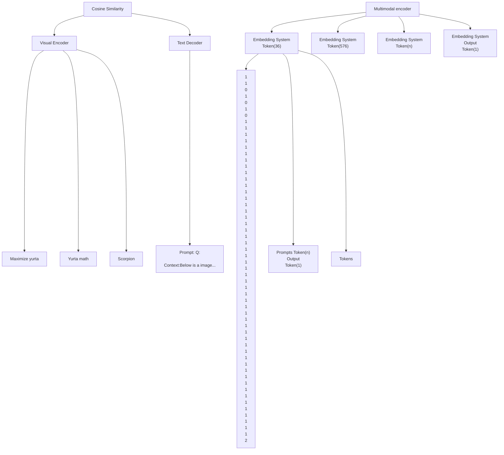
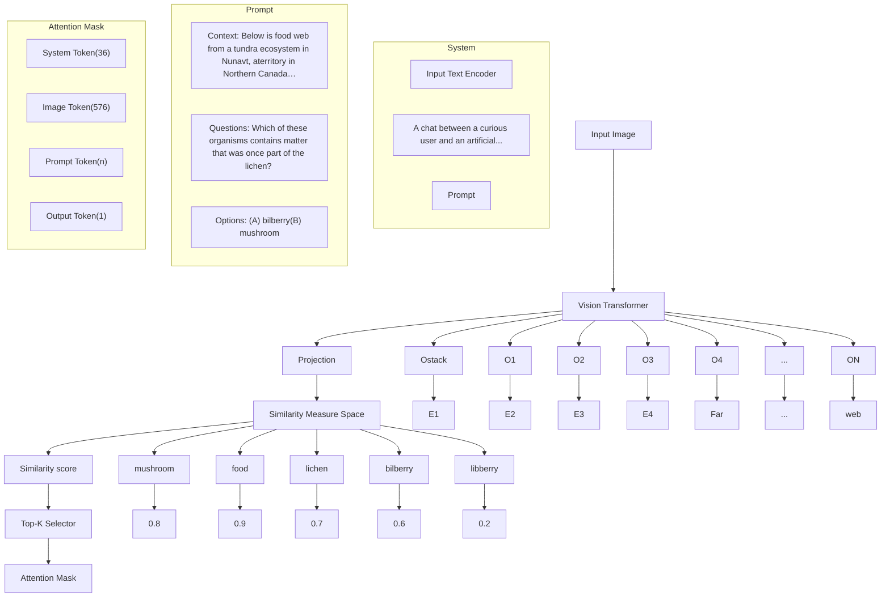

# Enhancing Multimodal Large Language Models Complex Reason via Similarity Computation

Xiaofeng Zhang $^{*}$ †,1, Fanshuo Zeng $^{*}$ ,2, Yihao Quan $^{3}$ , Zheng Hui $^{4}$ , Jiawei Yao $^{5}$

$^{1}$ Shanghai Jiaotong University

$^{2}$ Institute of Automation, Chinese Academy of Sciences

$^{3}$ Beijing Jiaotong University

$^{4}$ Columbia University

$^{5}$ University of Washington

framebreak@sjtu.edu.cn

# Abstract

Multimodal large language models have experienced rapid growth, and numerous different models have emerged. The interpretability of LVLMs remains an under-explored area. Especially when faced with more complex tasks such as chain-of-thought reasoning, its internal mechanisms still resemble a black box that is difficult to decipher. By studying the interaction and information flow between images and text, we noticed that in models such as LLaVA1.5, image tokens that are semantically related to text are more likely to have information flow convergence in the LLM decoding layer, and these image tokens receive higher attention scores. However, those image tokens that are less relevant to the text do not have information flow convergence, and they only get very small attention scores. To efficiently utilize the image information, we propose a new image token reduction method, Simignore, which aims to improve the complex reasoning ability of LVLMs by computing the similarity between image and text embeddings and ignoring image tokens that are irrelevant and unimportant to the text. Through extensive experiments, we demonstrate the effectiveness of our method for complex reasoning tasks.

Code — https://github.com/FanshuoZeng/Simignore

# Introduction

Large Vision Language Models (LVLMs) have rapidly developed in recent years and become a research hotspot in the field of computer vision as well as natural language processing. Multimodal large language models (LLMs) have shown impressive performance on complex reasoning by leveraging chain-of-thought (CoT) prompting to generate intermediate reasoning chains as the rationale to infer the answer. LVLMs utilizes a visual encoder such as CLIP to process picture patches to get visual tokens, which are used as the context of visual information to accomplish visual-textual reasoning tasks. The visual coder processes these image patches into hundreds of tokens, e.g., 576 for CLIP (Radford et al. 2021) and 729 for siglip (Zhai et al. 2023). These

flowchart

Figure 1: The simplified structure of our method.

extra image tokens lead to an increase in computation, and some studies (Chu et al. 2023a; Yuan, Li, and Sun 2023) have reduced the inference cost by using smaller LLMs with fewer parameters, however, these approaches also lead to a decrease in the inference power of LLMs (Chu et al. 2024). Therefore, a better approach is to reduce the computational cost by decreasing the length of input tokens. At the same time, studies (Shang et al. 2024; Chen et al. 2024) have shown that not all image tokens are important for model inference and that a proper reduction of image tokens can improve the inference ability of LLMs, leading to a significant increase in the accuracy of LLMs on visual complex reasoning tasks.

There are some works on reducing image tokens, FastV (Chen et al. 2024) visualized the attention scores of system tokens, image tokens, and user tokens during the LLM inference process and found that the weight of image tokens was very small after the second layer, so he chose to discard half of the image tokens with lower scores at the second layer based on the ordering of their attention scores. LLaVA-PruMerge (Shang et al. 2024) utilized the self-attention mechanism between category tokens and visual tokens to observe the distribution of attention between

them and found that most of the visual tokens had attention values close to zero with the category tokens, indicating that these tokens are not critical in the image representation. Therefore he selects appropriate image tokens based on the spatial similarity between visual tokens and CLS tokens, then clusters the pruned tokens and maintains the completeness and richness of the visual information by merging the clustered tokens with the unpruned ones.

Regarding the above two methods of reducing image tokens, although the two methods of image markup approximation have achieved good results, there are limitations to their methods: (1) the above two methods of reducing image tokens do not take into account the interaction with textual prompt, and it is quite easy to filter out the tokens related to the “semantics” of the text. (2) At present, the interaction between image tokens and text tokens is still unclear, and how LLM utilizes image tokens for answering is still unknown and needs further exploration.

We employ information flow to explore the interaction between image tokens and text prompts. We define information flow as the process by which image tokens gradually converge on the semantics associated with text during processing in the attention mechanism of image tokens. Specifically, we visualize the attention score of the image token in the LLM decoder and superimpose it on the image patch. We find a convergence of information flow on the image patch related to the text. As shown in Fig. 2, we can observe that the image patches related to the text options, such as mushroom and bilberry, converge information flow in the network, and they get higher attention scores. In other cases, when answering a question does not require a reference image, the network does not pay much attention to the image and the information flow does not converge.

text_image

Context: Below is food web from a tundra ecosystem in Nunavt, a territory in Northern Canada. A food web models how the matter eaten by organisms moves through an ecosystem.
Question: Which of these organisms contains matter that was once part of the lichen?
Options: A:bilberry B:mushroom
Mushroom
Context: Below is food web from little rock lake, a freshwater lake ecosystem in Wisconsin. A food web models how the matter eaten by organisms moves through an ecosystem.
Question: Which of the following organisms is the primary consumer in the food web?
Options: A:copepod B:black crappie C:bacteria
copepod

Figure 2: We find that the information flow converges in regions related to the option of prompt, such as mushroom and copepod.

Therefore, we design the image-text token filtering algorithm named Simignore to keep irrelevant tokens from causing interference. Specifically, as shown in Fig. 1, we map the embeddings of image tokens and prompt tokens to the same similarity metric space, in which all tokens are points on a two-dimensional plane. Then, we compute the similarity value between the image token and text token using the similarity algorithm, we select the K image tokens with the highest similarity and record their subscripts. Finally, we keep the selected image tokens, and for the unselected tokens, we set their corresponding attention mask to 0 to ignore them.

In summary, the contribution of this work is as follows:

- We found through information flow that in the LLM decoder, images that are semantically related to textual markups are more likely to have a convergence of information flow.   
- We propose a new method, Simignore, which aims to retain the image tokens that interact with the text and ignore the irrelevant and unimportant image tokens to improve the ability of LVLMs in complex reasoning tasks.   
- Through extensive experiments, we demonstrate the effectiveness of our method for complex reasoning in visual reasoning tasks with different LVLMs.

# Related Work

# Multimodal Large Language Models

Multimodal large language models can process and understand data from many different modalities, such as text, and images, and thus demonstrate excellent performance in a variety of tasks.CLIP (Radford et al. 2021) and BLIP (Li et al. 2022) use a pre-training approach that maps images and text into the same feature space, enabling the model to correlate images and text by comparing feature vectors. LLaVA (Liu et al. 2023), MiniGPT-4 (Zhu et al. 2023), Qwen-VL (Bai et al. 2023), CogVLM (Wang et al. 2023b) and other methods (Sun et al. 2024, 2023; Zhou et al. 2024; Sun et al. 2025; Zhao et al. 2024a,b; Wang et al. 2025; Tang et al. 2024b,a; Wang et al. 2022; Xu et al. 2024; Hu et al. 2025, 2024) use pre-trained ViT to process information from images. EAH (Zhang et al. 2024b; Wei and Zhang 2024; Yuan et al. 2024; Zhang et al. 2024a) firstly explained the VLM in a black box through the Angle of information flow, and then found that the information flow was negatively correlated with the hallucination, so the attentional head enhancement method was proposed to alleviate the hallucination. Recent studies have demonstrated the potential of multi-modal learning in applications such as document restoration (Li et al. 2024; Wang et al. 2024, 2023a), medical image translation (Chen, Pun, and Wang 2024), missing modality prediction (Huo et al. 2024), emotion recognition (Dong et al. 2025) and multimodal generation (Shen and Tang 2024; Shen et al. 2024a; Shen et al., 2024b).

# Image-Text Multimodal Similarity

Image-text similarity research is a key area in multimodal learning for assessing the consistency between images and text, and the accuracy of cross-modal retrieval has been significantly improved in recent years by a variety of methods. These methods include the joint embedding technique (Frome et al. 2013; Kiros, Salakhutdinov, and Zemel 2014; Faghri et al. 2017), the SGRAF network proposed by Diao (Diao et al. 2021). the instance comparison embedding method by Zeng (Zeng et al. 2024). the unified comparison learning method by Yang (Yang et al. 2022). and the image feature and class semantic embedding in cosine metric space

by Liu (Liu et al. 2021). In particular, cosine similarity is used to recognize image tokens with strong relevance to textual information due to its advantages in reducing intra-class variance and improving recognition ability.

# Method

To present a visualization of the information flow, we employ the Attention Score techniques to gain a comprehensive understanding of the information flow. The Attention Score reveals the forward processing of the model, showing the contribution of different input elements to the final output.

# Influence Rate of Image Token on Output Token

For the output token of the complex reasoning task such as the ScienceQA dataset (Lu et al. 2022), in the n-th layer, we define G as the indices set of all tokens and G can be divided into three parts that represent the indices set of system, image, and user tokens:

$$
\mathcal {G} = \mathcal {S} + \mathcal {I} + \mathcal {U}, \tag {1}
$$

where $S = \{1, \ldots, N_{sys}\}$ represents the index of system token, $N_{sys}$ represents the length of system token, $I = \{N_{sys} + 1, \ldots, N_{sys} + N_{img}\}$ represents the index of image token, $N_{img}$ represents the length of image token, and $U = \{N_{sys} + N_{img} + 1, \ldots, N_{sys} + N_{img} + N_{user}\}$ represents the index of user token, $N_{user}$ represents the length of user token. $A_{i,j}$ is defined as the total attention score of the output token's attention on different types of tokens. For the i-th query token, the attentions from system, image, and user tokens are summed as 1:

$$
\sum_ {j \in \mathcal {S}} A _ {i, j} + \sum_ {j \in \mathcal {I}} A _ {i, j} + \sum_ {j \in \mathcal {U}} A _ {i, j} = 1, \tag {2}
$$

To ensure that the sum of attention scores for each token is 1, it is necessary to normalize the above summation results to calculate the total attention score for the image token:

$$
\lambda_ {\mathrm{img}} ^ {j} = \sum_ {j \in \mathcal {I}} A _ {i, j}. \tag {3}
$$

There are 576 image tokens in LLaVA1.5. The shape of the attention mask matrix is $(B, H, N_{img}, N_{img})$ , we first perform unsequenced to change the attention matrix to $(H, N_{img}, N_{img})$ , the attention matrix is shown in the Fig. 2 and Fig. 4, the horizontal coordinate stands for Q, the vertical coordinate stands for K, and the first row of the vertical coordinate stands for System token, image token, and the influence rate of user token on output token, taking the image token i.e. id from 35-611, we can get the value of $1 \times 576$ dimensions, which is the attention score corresponding to 576 tokens, and then we can change the attentions-score reshaped into a $14 \times 14$ patch superimposed on the original graph, i.e., the heat map of the influence rate.

Through the influence-score heat map, we can find that the image will have obvious convergence on the options appearing in the prompt, so a way to remove redundancy and keep effective image information is to do the similarity between the image and text token.

# Compute Similarity between Image and Text Embeddings

In this section, we will detail our approach to focus on image information related to text. First of all, it is necessary to introduce image embedding and text embedding, and the specific flow is shown in the left part of Fig. 3.

In the inference process, the input image is $X \in R^{C \times H \times W}$ , where C denotes the number of channels and $H \times W$ denotes the size of the image. It is then input to the Visual and Language Pre-training model (VLP) for processing:

$$
\mathbb {F}: \mathbb {R} ^ {C \times H \times W} \rightarrow \mathbb {R} ^ {C ^ {\prime} \times H ^ {\prime} \times W ^ {\prime}} \tag {4}
$$

where F is the convolution operation, $C'$ is the new number of channels, $H'$ and $W'$ are the new spatial dimensions. Next, the convolved feature mapping is downscaled to a specific size $N_{img} \times I$ using adaptive pooling, function adaptive-pooling AP is defined:

$$
\mathbb {A} \mathbb {P}: \mathbb {R} ^ {C ^ {\prime} \times H ^ {\prime} \times W ^ {\prime}} \rightarrow \mathbb {R} ^ {N _ {i m g} \times I} \tag {5}
$$

The whole process is:

$$
X ^ {\prime} = \mathbb {A P} (\mathbb {F} (X)) \tag {6}
$$

where $X' \in R^{N_{img} \times I}$ represents the features of the image.

The dimension of the text after embedding is $TextEmb \in \mathbb{R}^{N_{usr} \times T}$ . We removed the system tokens from the text and kept only the context, question, and option tokens. $N_{usr}$ denotes the length of the text token and $T$ denotes the dimension of the text embedding. To fuse image information with text information, it is also necessary to embed image and text into the same feature space. So We usually need to align the dimensions of the image features $N_{img} \times I$ with the dimensions of the text features $N_{img} \times T$ , function feature-alignment $\mathbb{F}\supset$ is defined:

$$
\mathbb {F} \supset : \mathbb {R} ^ {N _ {i m g} \times I} \rightarrow \mathbb {R} ^ {N _ {i m g} \times T} \tag {7}
$$

$$
I m g E m b = \mathbb {F} \mathfrak {D} (X ^ {\prime}) \tag {8}
$$

where $ImgEmb \in R^{Nimg \times T}$ with the same feature dimensions as text. At this point, we already have image token and text token embeddings, and next, we describe our approach in detail, as shown in the right part of Fig. 3. To compute the correlation between image embedding and text embedding, we first normalize ImgEmb and TextEmb:

$$
\operatorname{ImgEmb} _ {\text { norm }} (i,:) = \frac {\operatorname{ImgEmb} (i , :)}{\| \operatorname{ImgEmb} (i , :) \|} \tag {9}
$$

$$
\text { TextEmb } _ {\text { norm }} (j,:) = \frac {\text { TextEmb } (j , :)}{\| \text { TextEmb } (j , :) \|} \tag {10}
$$

We then compute the cosine similarity matrix:

$$
S (i, j) = \operatorname{ImgEmb} _ {\text { norm }} (i,:) \cdot \operatorname{TextEmb} _ {\text { norm }} (j,:) ^ {T} \tag {11}
$$

Where $S \in R^{N_{img} \times N_{usr}}$ , and $S(i, j)$ denotes the similarity between the i-th image token and the j-th text token. Then, we find the K image tokens with the highest similarity to the text tokens and record their indexes. Specifically,

flowchart

Figure 3: The holistic framework for an approach to enhance complex reasoning in multimodal large language models through similarity computation between image and text embeddings. We map the embeddings of image token and prompt token to the same similarity metric space, a process that involves operations such as regularization. Here we compute their similarity values. Then we select the K image tokens with the highest similarity and consider them important. For unselected tokens, we ignore them by setting their attention mask to 0.

we first need to expand the similarity matrix S into a one-dimensional array $S_{flat}$ with dimension $N_{img} \times N_{usr}$ :

$$
S _ {f l a t} = \text { flatten } (S) \tag {12}
$$

Where the dimension of $S_{flat}$ is $1 \times P$ , $P = N_{img} \times N_{usr}$ . The expanded one-dimensional array $S_{flat}$ is then sorted and the K subscripts with the highest similarity are obtained:

$$
\text { Indices } = \operatorname{argsort} (S _ {\text { flat }}) [ - K: ] \tag {13}
$$

Using these one-dimensional subscripts, we can determine the subscripts of the corresponding image token. Since each subscript i corresponds to a 2D coordinate $\left(\left\lfloor i/N_{usr}\right\rfloor, i\%N_{usr}\right)$ , we only need the $i//N_{usr}$ part to represent the subscript of the image token:

$$
I n d i m g _ {i} = \left\lfloor I n d i c e s _ {i} / N _ {u s r} \right\rfloor \tag {14}
$$

Then, we set the attention mask of the tokens that do not belong to Indimg to 0:

$$
\mathbf {M} _ {i} ^ {I} = \left\{ \begin{array}{l l} 1 & \text { if } i \in I n d i m g \\ 0 & \text { else } \end{array} \right. \tag {15}
$$

Finally, we splice the attention masks of the system token, image token, and user token:

$$
\mathbf {M} = \mathbf {M} ^ {S} + \mathbf {M} ^ {I} + \mathbf {M} ^ {U} \tag {16}
$$

Where $\mathbf{M}^S = ones\in \mathbb{R}^{1\times N_{sys}}$ , and $\mathbf{M}^U = ones\in$ $\mathbb{R}^{1\times N_{usr}}$

text_image

S
Image
U
O
(S)
Image
U
O
(1,576)
Mean
(B,H,576)

Figure 4: Influence rate of attention score about image tokens.

# Experiment

# Dataset and Implementation Detail

The ScienceQA (Lu et al. 2022) dataset is currently the only dataset available for complex reasoning and contains 21,208 Q&A multiple-choice questions from elementary and middle school science curricula. A typical question contains multimodal context, correct options, generalized background knowledge, and specific explanations. Our experiments were performed on a single 4090D GPU.

# Attention Convergence

When solving visual complex reasoning questions, humans tend to look for information in images that are related to the text. This behavior can efficiently obtain the key information of the image. To explore the degree of attention to

<table><tr><td>Method</td><td>Learning</td><td>LLM backbone</td><td>Res</td><td>SQA(IMG)%</td></tr><tr><td>Instruct-BLIP (Dai et al. 2024)</td><td>Zero-shot</td><td>Vicuna-7B</td><td>224</td><td>60.50</td></tr><tr><td>Instruct-BLIP (Dai et al. 2024)</td><td>Zero-shot</td><td>Vicuna-13B</td><td>224</td><td>63.10</td></tr><tr><td>BLIP-2 (Li et al. 2023a)</td><td>Zero-shot</td><td>Vicuna-13B</td><td>224</td><td>61.03</td></tr><tr><td>Shikra (Chen et al. 2023)</td><td>Zero-shot</td><td>Vicuna-13B</td><td>224</td><td>45.80</td></tr><tr><td>DDCoT(GPT3.5) (Zheng et al. 2023)</td><td>Zero-shot</td><td>175B</td><td>-</td><td>72.53</td></tr><tr><td>DDCoT(MiniGPT-4) (Zheng et al. 2023)</td><td>Zero-shot</td><td>Vicuna-13B</td><td>-</td><td>56.72</td></tr><tr><td>Ying-VLM (Li et al. 2023b)</td><td>Zero-shot</td><td>-</td><td>-</td><td>55.70</td></tr><tr><td>Otter (Zhao et al. 2023)</td><td>Zero-shot</td><td>-</td><td>-</td><td>66.30</td></tr><tr><td>MiniGPT-4 (Zhu et al. 2023)</td><td>Zero-shot</td><td>Vicuna-13B</td><td>336</td><td>42.34</td></tr><tr><td>Qwen-VL-Chat (Bai et al. 2023)</td><td>Zero-shot</td><td>Qwen-7B</td><td>448</td><td>68.21</td></tr><tr><td>MobileVLM (Chu et al. 2023b)</td><td>Zero-shot</td><td>MobileLLaMA</td><td>336</td><td>61.00</td></tr><tr><td>Qwen-VL (Bai et al. 2023)</td><td>Zero-shot</td><td>Qwen-7B</td><td>448</td><td>67.12</td></tr><tr><td>Mipha-3B (Liu et al. 2023)</td><td>Zero-shot</td><td>Phi-2-2.7B</td><td>384</td><td>70.40</td></tr><tr><td>Mipha-3B+ours</td><td>Zero-shot</td><td>Phi-2-2.7B</td><td>384</td><td>70.85</td></tr><tr><td>LLaVA1.5 (Liu et al. 2023)</td><td>Zero-shot</td><td>Vicuna-7B</td><td>336</td><td>65.15</td></tr><tr><td>LLaVA1.5+ours</td><td>Zero-shot</td><td>Vicuna-7B</td><td>336</td><td>68.02</td></tr><tr><td>LLaVA1.5 (Liu et al. 2023)</td><td>Zero-shot</td><td>Vicuna-13B</td><td>336</td><td>72.09</td></tr><tr><td>LLaVA1.5+ours</td><td>Zero-shot</td><td>Vicuna-13B</td><td>336</td><td>73.23</td></tr></table>

Table 1: Comparison among different LVLMs on ScienceQA benchmarks, “Res” represents the input image resolution.

image information during multimodal large model reasoning, as shown in Fig. 2, we obtained the attention scores of image tokens and superimposed them on the original image. Images will have a significant tendency to the options appearing in the cue, specifically, LLM will pay special attention to the word or object in the image that is closely related to the text information. This indicates that image interacts with text in the reasoning process, and LVLMs is more inclined to pay attention to the image tokens that are related to the text.

scatter

| Point Type         | X Range     | Y Range    |
| ------------------ | ----------- | ---------- |
| Prompt token points | -1.0 to 1.0 | -1.0 to 1.0 |
| Image Token points  | -1.0 to 1.0 | -1.0 to 1.0 |

Figure 5: Distribution of image token and prompt token in cosine metric space.

# Image-text Dimilarity

We explored the relationship between image tokens and text tokens. We map embedding to the same cosine metric space, as shown in Fig. 5, and we find that there is a similarity between the image token and text token in the cosine metric space. Specifically, we find that the distribution of image tokens is similar to that of text tokens, and both of them are concentrated in the metric space of X < 0. In the blue rectangle, image tokens and text tokens are densely distributed and have strong similarities. Based on the attention convergence phenomenon and the similarity between image and text in the cosine metric space, we design a method for selecting image tokens with strong relevance to text so that LVLMs obtains useful image tokens and avoids the influence of irrelevant tokens on LVLMs reasoning.

We use different LVLMs for evaluation on the ScienceQA dataset, including the 7b and 13b models of LLaVA-v1.5, and the Mipha-3B model. As shown in Table 1, we show the results for the different baseline models as well as for the models to which our method is applied. As can be seen in Table 1, the models after applying our method have a great improvement compared to the baseline model, especially the LLaVA1.5-7B model improves the accuracy by 2.87%. In the experiments with ScienceQA (Image) as the dataset, our method is optimal in both Zero-shot Learning methods with Vicuna-7B or Vicuna-13B as the backbone.

# Ablation Study

Ignore Varying Amounts of Image Tokens To explore the effect of ignoring different numbers of image tokens on LLM's complex reasoning task, we set up ten sets of comparison experiments. As shown in Table 2, we obtained the accuracy as well as the running time of LLM on the ScienceQA (Image) dataset with different numbers of image

<table><tr><td>Ignored number</td><td>Accuracy(%)</td><td>Running time(/s)</td></tr><tr><td>72 /576</td><td>67.23</td><td>292</td></tr><tr><td>124 /576</td><td>68.02</td><td>279</td></tr><tr><td>144 /576</td><td>67.67</td><td>277</td></tr><tr><td>216 /576</td><td>67.28</td><td>265</td></tr><tr><td>288 /576</td><td>66.48</td><td>260</td></tr><tr><td>360 /576</td><td>66.04</td><td>255</td></tr><tr><td>432 /576</td><td>65.54</td><td>252</td></tr><tr><td>504 /576</td><td>63.96</td><td>246</td></tr><tr><td>576 /576</td><td>53.35</td><td>244</td></tr><tr><td>Baseline</td><td>65.15</td><td>303</td></tr></table>

Table 2: Accuracy and runtime of LLM when ignoring different numbers of image tokens(baseline: LLaVA1.5-7B).

tokens. Note that the LLM we use is LLaVA1.5-7B. We find that the time for LLM to perform a run is also reduced when some image tokens are ignored. The more image tokens are ignored, the less time is consumed. This indicates that when we ignore some unimportant image tokens, the original dense attention matrix becomes diluted, which greatly reduces the computation. As the number of ignored tokens increases, the attention matrix becomes more sparse and less computationally intensive. Interestingly, when we ignore all the image tokens, the accuracy of LLM still has 53.35%. However, since it is unlikely that all data have the same image, it is crucial to adaptively choose the appropriate number of image tokens to ignore, which will be our next research work.

In this section, we investigate the effects of ignoring different numbers of image tokens, ignoring image tokens with different levels of importance, and different similarity algorithms on the experimental results. In addition, we also present experiments ignoring text tags.

The impact of image tokens of different importance on the inference ability To investigate the importance of image tokens in improving the model's complex reasoning ability, we conducted an ablation study. As shown in Table 3, we conducted four sets of experiments, namely, ignoring unimportant image tokens (Experiment 1), ignoring image tokens of intermediate importance (Experiment 2), ignoring important image tokens (Experiment 3), and randomly ignoring image tokens (Experiment 4). In particular, the importance of an image token is calculated based on its similarity to text. In Experiment 2, we conducted ten sets of experiments and took the average as the final result. The results show that the best results were obtained in Experiment 1 and poor results were obtained in Experiment 3, indicating that important image tokens play a positive role in the complex reasoning task of LLM, while unimportant image tokens play a negative role in the complex reasoning task of LLM. The results of Experiment 2 are located between Experiment 1 and Experiment 3, indicating that the accuracy of LLM's complex reasoning task shows a positive correlation with the importance of image tokens. The results of Experiment 4 contain both higher and lower scores than Baseline. I believe that lower scores are obtained when some important image tokens are randomly ignored, and higher scores

<table><tr><td>Ignored</td><td>Model</td><td>Ignored number</td><td>Accuracy(%)</td></tr><tr><td>Unimportant</td><td>LLaVA1.5-7B</td><td>124 /576</td><td>68.02</td></tr><tr><td>Intermediate</td><td>LLaVA1.5-7B</td><td>124 /576</td><td>64.55</td></tr><tr><td>Important</td><td>LLaVA1.5-7B</td><td>124 /576</td><td>61.73</td></tr><tr><td>Random</td><td>LLaVA1.5-7B</td><td>124 /576</td><td>65.12</td></tr><tr><td>Baseline</td><td>LLaVA1.5-7B</td><td>0 /576</td><td>65.15</td></tr></table>

Table 3: The effect of image tokens of varying importance on a complex reasoning task.

are obtained when some unimportant image tokens are randomly ignored. We provide detailed results of Experiment 4 in supplementary material.

text_image

Prompt
Context: Trade happens when people agree to exchange goods and services ***
Question: What can Reid and Daniel trade to each get what they want?
Options: (A) Reid can trade his tomatoes for Daniel's carrots.
(B) Daniel can trade his broccoli for Reid's oranges.
(C) Reid can trade his tomatoes for Daniel's broccoli.
(D) Daniel can trade his almonds for Reid's tomatoes.

<table><tr><td>Items Reid wants</td><td>Items Daniel wants</td></tr><tr><td>a sandwich oranges broccoli water</td><td>a hot dog tomatoes almonds water</td></tr></table>

Figure 6: This is a question closely related to the information in the picture and the correct answer to this question is 'C'.

Different similarity algorithms To investigate the effect of different similarity algorithms on the experimental results, we conducted three different sets of experiments. We conducted experiments using cosine similarity, Euclidean distance similarity, and Manhattan distance similarity, and obtained the accuracy of the LLM when using different schemes. As shown in Table 4, we found the best improvement using the cosine similarity algorithm, and the other two algorithms also achieved a small improvement. This is because cosine similarity performs better in embedding similarity calculation tasks by measuring the angle between vectors instead of the absolute distance, which ignores scale differences and can better capture the semantic correlation between image and text embedding. In high-dimensional spaces, the distance between vectors tends to be uniform, and Euclidean and Manhattan distances cannot measure this similarity equally effectively because they are affected by the size and scale of the vectors.

<table><tr><td>Model</td><td>Algorithm</td><td>Number of ignored</td><td>Accuracy</td></tr><tr><td>LLaVA1.5-7B</td><td>Cosine Similarity</td><td>124</td><td>68.02</td></tr><tr><td>LLaVA1.5-7B</td><td>Euclidean Distance</td><td>124</td><td>66.73</td></tr><tr><td>LLaVA1.5-7B</td><td>Manhattan Distance</td><td>124</td><td>66.88</td></tr><tr><td>Baseline</td><td></td><td>0</td><td>65.15</td></tr></table>

Table 4: The effect of different algorithms for computing similarity on the accuracy of LLM complex reasoning.

# Using cluster analysis on image token embedding

To further explore how our work improves LLM answer accuracy, we performed some analysis on image data. Take the

K-means Clustering of Image Token Embeddings   

scatter

| Cluster | Points |
| ------- | ------ |
| Cluster 0 | 258 |
| Cluster 1 | 2 |
| Cluster 2 | 235 |
| Cluster 3 | 2 |
| Cluster 4 | 79 |
| Ignored | - |

(a)

K-means Clustering of Image Token Embeddings   

scatter

| Cluster | Points |
| ------- | ------ |
| Cluster 0 | 258 |
| Cluster 1 | 2 |
| Cluster 2 | 235 |
| Cluster 3 | 2 |
| Cluster 4 | 79 |
| Ignored | - |

(b)   
Figure 7: Fig.(a) represents the distribution of image tokens. Where the red dots indicate the distribution position of tokens which are ignored according to the similarity, Fig.(b) is a localized zoomed-in view of Fig.(a).

question with id 1879 in the ScienceQA dataset as an example. Fig. 6 shows the prompt of the question with the image. In the baseline method, LLM gave the wrong answer. After using our proposed method, LLM successfully answered the correct answer. To investigate why LLM can correctly infer the answer after ignoring some image tokens, we use k-means clustering for image embedding, where the embedding tensor of each image token is mapped as a point in the 2D plane. Fig. 7 shows the embedding of the 576 image markers mapped to points on the 2D plane after clustering. The red points indicate the mapped points of the image tokens that we ignore. We notice that the image tokens ignored by our method are concentrated in cluster0, so we ignore all 258 image tokens in cluster0 and still get the correct answer. In addition, we also did a comparison experiment, as shown in Table 5. By analyzing the above experiments, we propose some conjectures: there are some 'spy' tokens in cluster0, which affect LLM's understanding of the image and cause answering errors. Cluster2 and cluster4 contain some important tokens, which will also affect LLM's understanding of the image if ignored.

To verify our conjecture, we found a critical value: 86. We find that ignoring any number less than 86 causes LVLMs to answer incorrectly while ignoring a number not less than 86 causes LVLMs to answer correctly, and these 86 tokens are all located in cluster0, which suggests that the 86 tokens located in cluster0 will not improve LVLMs's comprehension of the image, but rather play a negative role in the accuracy of LVLMs's answer. We analyzed more data and came to similar conclusions.

# Discussion and Limitations

Although Simignore has achieved significant results in improving the inference capabilities of LVLMs, there are still

<table><tr><td>cluster0</td><td>cluster1</td><td>cluster2</td><td>cluster3</td><td>cluster4</td><td>Result</td></tr><tr><td>X</td><td>X</td><td>X</td><td>X</td><td>X</td><td>F</td></tr><tr><td>√</td><td>√</td><td>X</td><td>X</td><td>X</td><td>T</td></tr><tr><td>√</td><td>X</td><td>√</td><td>X</td><td>X</td><td>T</td></tr><tr><td>√</td><td>X</td><td>X</td><td>√</td><td>X</td><td>T</td></tr><tr><td>√</td><td>X</td><td>X</td><td>X</td><td>√</td><td>T</td></tr><tr><td>X</td><td>√</td><td>X</td><td>X</td><td>X</td><td>F</td></tr><tr><td>X</td><td>X</td><td>√</td><td>X</td><td>X</td><td>F</td></tr><tr><td>X</td><td>X</td><td>X</td><td>√</td><td>X</td><td>F</td></tr><tr><td>X</td><td>X</td><td>X</td><td>X</td><td>√</td><td>F</td></tr><tr><td>X</td><td>X</td><td>√</td><td>X</td><td>√</td><td>T</td></tr></table>

Table 5: The answer to the LLM response is obtained by ignoring the image tokens in different clusters. √ means ignored, ✗ means do not ignored.

some limitations. Future work will explore strategies for adaptively choosing the number of image tokens to ignore, as well as investigate the internal mechanisms of the model to more fully understand how image and textual information work together to facilitate complex reasoning.

# Conclusion

This study proposes an innovative method to enhance the performance of LVLMs in complex reasoning tasks by computing the similarity between image and text embeddings. We find that in the LLM decoder, image tokens semantically related to text are more likely to converge information flows. Based on this finding, we designed the Simignore algorithm, which improves the similarity between computed images and text embeddings and filters out irrelevant image information, demonstrating that Simignore improves complex reasoning for different LVLMs.

# References

Bai, J.; Bai, S.; Yang, S.; Wang, S.; Tan, S.; Wang, P.; Lin, J.; Zhou, C.; and Zhou, J. 2023. Qwen-vl: A versatile vision-language model for understanding, localization, text reading, and beyond.

Chen, K.; Zhang, Z.; Zeng, W.; Zhang, R.; Zhu, F.; and Zhao, R. 2023. Shikra: Unleashing Multimodal LLM's Referential Dialogue Magic. arXiv preprint arXiv:2306.15195.

Chen, L.; Zhao, H.; Liu, T.; Bai, S.; Lin, J.; Zhou, C.; and Chang, B. 2024. An image is worth 1/2 tokens after layer 2: Plug-and-play inference acceleration for large vision-language models. arXiv preprint arXiv:2403.06764.

Chen, X.; Pun, C.-M.; and Wang, S. 2024. Medprompt: Cross-modal prompting for multi-task medical image translation. In PRCV, 61–75.

Chu, X.; Qiao, L.; Lin, X.; Xu, S.; Yang, Y.; Hu, Y.; Wei, F.; Zhang, X.; Zhang, B.; Wei, X.; et al. 2023a. Mobilevlm: A fast, reproducible and strong vision language assistant for mobile devices. arXiv preprint arXiv:2312.16886.

Chu, X.; Qiao, L.; Lin, X.; Xu, S.; Yang, Y.; Hu, Y.; Wei, F.; Zhang, X.; Zhang, B.; Wei, X.; et al. 2023b. Mobilevlm: A fast, reproducible and strong vision language assistant for mobile devices. arXiv preprint arXiv:2312.16886.

Chu, X.; Qiao, L.; Zhang, X.; Xu, S.; Wei, F.; Yang, Y.; Sun, X.; Hu, Y.; Lin, X.; Zhang, B.; et al. 2024. MobileVLM V2: Faster and Stronger Baseline for Vision Language Model. arXiv preprint arXiv:2402.03766.

Dai, W.; Li, J.; Li, D.; Tiong, A. M. H.; Zhao, J.; Wang, W.; Li, B.; Fung, P. N.; and Hoi, S. 2024. Instructblip: Towards general-purpose vision-language models with instruction tuning. Advances in Neural Information Processing Systems, 36.

Diao, H.; Zhang, Y.; Ma, L.; and Lu, H. 2021. Similarity reasoning and filtration for image-text matching. In Proceedings of the AAAI conference on artificial intelligence, volume 35, 1218–1226.

Dong, Y.; Chen, X.; Shen, Y.; Ng, M. K.-p.; Qian, T.; and Wang, S. 2025. Multi-modal Mood Reader: Pre-trained Model Empowers Cross-Subject Emotion Recognition. In NCAA, 178–192.

Faghri, F.; Fleet, D. J.; Kiros, J. R.; and Fidler, S. 2017. Vse++: Improving visual-semantic embeddings with hard negatives. arXiv preprint arXiv:1707.05612.

Frome, A.; Corrado, G. S.; Shlens, J.; Bengio, S.; Dean, J.; Ranzato, M.; and Mikolov, T. 2013. Devise: A deep visual-semantic embedding model. Advances in neural information processing systems, 26.

Hu, M.; Xia, P.; Wang, L.; Yan, S.; Tang, F.; Xu, Z.; Luo, Y.; Song, K.; Leitner, J.; Cheng, X.; et al. 2025. Ophnet: A large-scale video benchmark for ophthalmic surgical workflow understanding. In ECCV.

Hu, M.; Yuan, K.; Shen, Y.; Tang, F.; Xu, X.; Zhou, L.; Li, W.; Chen, Y.; Xu, Z.; Peng, Z.; et al. 2024. OphCLIP: Hierarchical Retrieval-Augmented Learning for Ophthalmic Surgical Video-Language Pretraining. arXiv preprint arXiv:2411.15421.

Huo, Y.; Huang, G.; Cheng, L.; He, J.; Chen, X.; Yuan, X.; Zhong, G.; and Pun, C.-M. 2024. IMAN: An Adaptive Network for Robust NPC Mortality Prediction with Missing Modalities. In BIBM.

Kiros, R.; Salakhutdinov, R.; and Zemel, R. S. 2014. Unifying visual-semantic embeddings with multimodal neural language models. arXiv preprint arXiv:1411.2539.

Li, J.; Li, D.; Savarese, S.; and Hoi, S. 2023a. Blip-2: Bootstrapping language-image pre-training with frozen image encoders and large language models. In International conference on machine learning, 19730–19742. PMLR.

Li, J.; Li, D.; Xiong, C.; and Hoi, S. 2022. Blip: Bootstrapping language-image pre-training for unified vision-language understanding and generation. In International conference on machine learning, 12888–12900. PMLR.

Li, L.; Yin, Y.; Li, S.; Chen, L.; Wang, P.; Ren, S.; Li, M.; Yang, Y.; Xu, J.; Sun, X.; et al. 2023b. A Large-Scale Dataset towards Multi-Modal Multilingual Instruction Tuning. arXiv preprint arXiv:2306.04387.

Li, M.; Sun, H.; Lei, Y.; Zhang, X.; Dong, Y.; Zhou, Y.; Li, Z.; and Chen, X. 2024. High-Fidelity Document Stain Removal via A Large-Scale Real-World Dataset and A Memory-Augmented Transformer. In WACV.

Liu, H.; Li, C.; Li, Y.; and Lee, Y. J. 2023. Improved baselines with visual instruction tuning. arXiv preprint arXiv:2310.03744.

Liu, Y.; Zhou, L.; Bai, X.; Huang, Y.; Gu, L.; Zhou, J.; and Harada, T. 2021. Goal-oriented gaze estimation for zero-shot learning. In Proceedings of the IEEE/CVF conference on computer vision and pattern recognition, 3794–3803.

Lu, P.; Mishra, S.; Xia, T.; Qiu, L.; Chang, K.-W.; Zhu, S.-C.; Tafjord, O.; Clark, P.; and Kalyan, A. 2022. Learn to explain: Multimodal reasoning via thought chains for science question answering. Advances in Neural Information Processing Systems, 35: 2507–2521.

Radford, A.; Kim, J. W.; Hallacy, C.; Ramesh, A.; Goh, G.; Agarwal, S.; Sastry, G.; Askell, A.; Mishkin, P.; Clark, J.; et al. 2021. Learning transferable visual models from natural language supervision. In International conference on machine learning, 8748–8763. PMLR.

Shang, Y.; Cai, M.; Xu, B.; Lee, Y. J.; and Yan, Y. 2024. LLaVA-PruMerge: Adaptive Token Reduction for Efficient Large Multimodal Models. arXiv preprint arXiv:2403.15388.

Shen, F.; Jiang, X.; He, X.; Ye, H.; Wang, C.; Du, X.; Li, Z.; and Tang, J. 2024a. Imagdressing-v1: Customizable virtual dressing. arXiv preprint arXiv:2407.12705.

Shen, F.; and Tang, J. 2024. IMAGPose: A Unified Conditional Framework for Pose-Guided Person Generation. In The Thirty-eighth Annual Conference on Neural Information Processing Systems.

Shen, F.; Ye, H.; Liu, S.; Zhang, J.; Wang, C.; Han, X.; and Yang, W. 2024b. Boosting consistency in story visualization with rich-contextual conditional diffusion models. arXiv preprint arXiv:2407.02482.

Shen, F.; Ye, H.; Zhang, J.; Wang, C.; Han, X.; and Wei, Y. ???? Advancing Pose-Guided Image Synthesis with Progressive Conditional Diffusion Models. In The Twelfth International Conference on Learning Representations.   
Sun, H.-L.; Zhou, D.-W.; Li, Y.; Lu, S.; Yi, C.; Chen, Q.-G.; Xu, Z.; Luo, W.; Zhang, K.; Zhan, D.-C.; et al. 2024. Parrot: Multilingual Visual Instruction Tuning. arXiv preprint arXiv:2406.02539.   
Sun, H.-L.; Zhou, D.-W.; Ye, H.-J.; and Zhan, D.-C. 2023. Pilot: A pre-trained model-based continual learning toolbox. arXiv preprint arXiv:2309.07117.   
Sun, H.-L.; Zhou, D.-W.; Zhao, H.; Gan, L.; Zhan, D.-C.; and Ye, H.-J. 2025. MOS: Model Surgery for Pre-Trained Model-Based Class-Incremental Learning. In AAAI.   
Tang, J.; Lin, C.; Zhao, Z.; Wei, S.; Wu, B.; Liu, Q.; Feng, H.; Li, Y.; Wang, S.; Liao, L.; et al. 2024a. TextSquare: Scaling up Text-Centric Visual Instruction Tuning. arXiv preprint arXiv:2404.12803.   
Tang, J.; Liu, Q.; Ye, Y.; Lu, J.; Wei, S.; Lin, C.; Li, W.; Mahmood, M. F. F. B.; Feng, H.; Zhao, Z.; Wang, Y.; Liu, Y.; Liu, H.; Bai, X.; and Huang, C. 2024b. MTVQA: Benchmarking Multilingual Text-Centric Visual Question Answering. arXiv:2405.11985.   
Wang, A.-L.; Shan, B.; Shi, W.; Lin, K.-Y.; Fei, X.; Tang, G.; Liao, L.; Tang, J.; Huang, C.; and Zheng, W.-S. 2025. ParGo: Bridging Vision-Language with Partial and Global Views.   
Wang, C.; Pan, J.; Lin, W.; Dong, J.; Wang, W.; and Wu, X.-M. 2024. Selfpromer: Self-prompt dehazing transformers with depth-consistency. In AAAI, volume 38, 5327–5335.   
Wang, C.; Pan, J.; Wang, W.; Dong, J.; Wang, M.; Ju, Y.; and Chen, J. 2023a. PromptRestorer: A Prompting Image Restoration Method with Degradation Perception. In NeurIPS.   
Wang, J.; Huang, Q.; Tang, F.; Meng, J.; Su, J.; and Song, S. 2022. Stepwise feature fusion: Local guides global. In MICCAI. Springer.   
Wang, W.; Lv, Q.; Yu, W.; Hong, W.; Qi, J.; Wang, Y.; Ji, J.; Yang, Z.; Zhao, L.; Song, X.; et al. 2023b. Cogvlm: Visual expert for pretrained language models. arXiv preprint arXiv:2311.03079.   
Wei, J.; and Zhang, X. 2024. Dopra: Decoding over-accumulation penalization and re-allocation in specific weighting layer. In Proceedings of the 32nd ACM International Conference on Multimedia, 7065–7074.   
Xu, Z.; Tang, F.; Chen, Z.; Zhou, Z.; Wu, W.; Yang, Y.; Liang, Y.; Jiang, J.; Cai, X.; and Su, J. 2024. Polyp-Mamba: Polyp Segmentation with Visual Mamba. In MIC-CAI. Springer.   
Yang, J.; Li, C.; Zhang, P.; Xiao, B.; Liu, C.; Yuan, L.; and Gao, J. 2022. Unified contrastive learning in image-text-label space. In Proceedings of the IEEE/CVF Conference on Computer Vision and Pattern Recognition, 19163–19173.   
Yuan, X.; Shen, C.; Yan, S.; Zhang, X.; Xie, L.; Wang, W.; Guan, R.; Wang, Y.; and Ye, J. 2024. Instance-adaptive Zero-shot Chain-of-Thought Prompting. arXiv preprint arXiv:2409.20441.

Yuan, Z.; Li, Z.; and Sun, L. 2023. Tinygpt-v: Efficient multimodal large language model via small backbones. arXiv preprint arXiv:2312.16862.   
Zeng, R.; Ma, W.; Wu, X.; Liu, W.; and Liu, J. 2024. Image-Text Cross-Modal Retrieval with Instance Contrastive Embedding. Electronics, 13(2): 300.   
Zhai, X.; Mustafa, B.; Kolesnikov, A.; and Beyer, L. 2023. Sigmoid loss for language image pre-training. In Proceedings of the IEEE/CVF International Conference on Computer Vision, 11975–11986.   
Zhang, X.; Quan, Y.; Gu, C.; Shen, C.; Yuan, X.; Yan, S.; Cheng, H.; Wu, K.; and Ye, J. 2024a. Seeing Clearly by Layer Two: Enhancing Attention Heads to Alleviate Hallucination in LVLMs. arXiv preprint arXiv:2411.09968.   
Zhang, X.; Shen, C.; Yuan, X.; Yan, S.; Xie, L.; Wang, W.; Gu, C.; Tang, H.; and Ye, J. 2024b. From Redundancy to Relevance: Enhancing Explainability in Multimodal Large Language Models. arXiv preprint arXiv:2406.06579.   
Zhao, H.; Cai, Z.; Si, S.; Ma, X.; An, K.; Chen, L.; Liu, Z.; Wang, S.; Han, W.; and Chang, B. 2023. Mmicl: Empowering vision-language model with multi-modal in-context learning. arXiv preprint arXiv:2309.07915.   
Zhao, Z.; Tang, J.; Lin, C.; Wu, B.; Huang, C.; Liu, H.; Tan, X.; Zhang, Z.; and Xie, Y. 2024a. Multi-modal In-Context Learning Makes an Ego-evolving Scene Text Recognizer. In Proceedings of the IEEE/CVF Conference on Computer Vision and Pattern Recognition, 15567–15576.   
Zhao, Z.; Tang, J.; Wu, B.; Lin, C.; Wei, S.; Liu, H.; Tan, X.; Zhang, Z.; Huang, C.; and Xie, Y. 2024b. Harmonizing Visual Text Comprehension and Generation.   
Zheng, G.; Yang, B.; Tang, J.; Zhou, H.-Y.; and Yang, S. 2023. Ddcot: Duty-distinct chain-of-thought prompting for multimodal reasoning in language models. Advances in Neural Information Processing Systems, 36: 5168–5191.   
Zhou, D.-W.; Sun, H.-L.; Ye, H.-J.; and Zhan, D.-C. 2024. Expandable subspace ensemble for pre-trained model-based class-incremental learning. In Proceedings of the IEEE/CVF Conference on Computer Vision and Pattern Recognition, 23554–23564.   
Zhu, D.; Chen, J.; Shen, X.; Li, X.; and Elhoseiny, M. 2023. Minigpt-4: Enhancing vision-language understanding with advanced large language models. arXiv preprint arXiv:2304.10592.