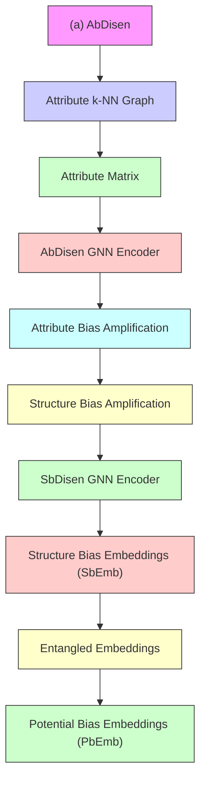
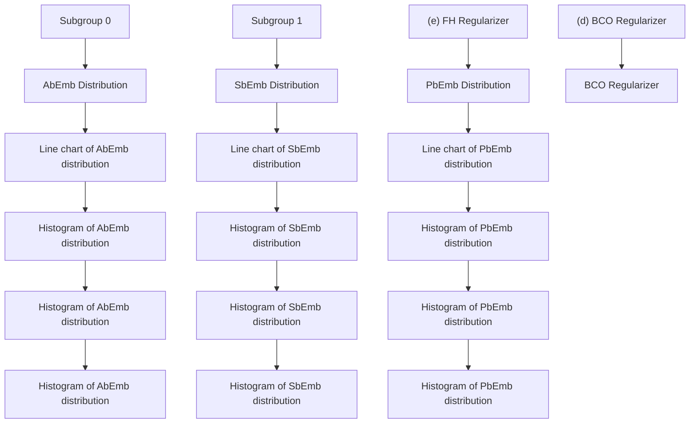

# Disentangling, Amplifying, and Debiasing: Learning Disentangled Representations for Fair Graph Neural Networks

Yeon-Chang Lee $^{1}$ , Hojung Shin $^{2}$ , Sang-Wook Kim $^{2*}$

$^{1}$ Ulsan National Institute of Science and Technology (UNIST)

$^{2}$ Hanyang University

yeonchang@unist.ac.kr, {hojungshin, wook}@hanyang.ac.kr

# Abstract

Graph Neural Networks (GNNs) have become essential tools for graph representation learning in various domains, such as social media and healthcare. However, they often suffer from fairness issues due to inherent biases in node attributes and graph structure, leading to unfair predictions. To address these challenges, we propose a novel GNN framework, DAB-GNN, that Disentangles, Amplifies, and deBiases attribute, structure, and potential biases in the GNN mechanism. DAB-GNN employs a disentanglement and amplification module that isolates and amplifies each type of bias through specialized disentanglers, followed by a debiasing module that minimizes the distance between subgroup distributions. Extensive experiments on five datasets demonstrate that DAB-GNN significantly outperforms ten state-of-the-art competitors in terms of achieving an optimal balance between accuracy and fairness.

Code — https://github.com/Bigdasgit/DAB-GNN

# 1 Introduction

Background. In the real world, data from various domains such as social media, healthcare, and finance can be represented as graph data (Rozemberczki et al. 2022; Tang and Liu 2009; Yoo et al. 2023; Kim et al. 2024). In these graphs, entities (e.g., users) are depicted as nodes, and pairwise relationships between these entities (e.g., friendship) are depicted as edges. This structural representation enables the effective analysis of complex relationships within the graph data.

Recent advancements in graph representation learning have utilized Graph Neural Networks (GNNs) to map nodes into low-dimensional embedding space (Kipf and Welling 2017; Kim, Lee, and Kim 2023; Sharma et al. 2024). Using a message-passing framework, GNNs iteratively aggregate information from a node and its neighbors to produce the final embedding of the node that effectively captures both node attributes and the graph's structure (Hamilton, Ying, and Leskovec 2017; Kipf and Welling 2017). Consequently, GNNs have demonstrated superior performance in a variety of tasks like node classification and link prediction (Sun et al. 2024; Chamberlain et al. 2023; Kim, Lee, and Kim 2024). Motivation. However, predictions based on node embeddings learned by GNNs can be unfair due to the biases inherent in the input graph data, such as node attributes and graph structure, as well as the biases introduced by the message-passing mechanism of GNNs (Dai and Wang 2021; Wang et al. 2022; Ling et al. 2023; Li et al. 2024; Jiang et al. 2024; Neo et al. 2024). Specifically, node attributes may exhibit different distributions across subgroups (e.g., male and female) defined by sensitive attributes (e.g., gender), referred to as attribute bias (Dong et al. 2022). For instance, in job application data, the average income of employees may differ across genders. Additionally, the graph structure itself can be biased, as nodes with similar sensitive attributes tend to form connections, known as structure bias (Dong et al. 2022). For example, on social network platforms, users predominantly form friendships within same sensitive attributes (Rahman et al. 2019; Dai and Wang 2021).

Moreover, the message-passing mechanism in GNNs can introduce what we call potential bias by combining existing attribute and structure biases. When node attributes and graph structure interact, new biases may emerge that were not evident in either aspect alone. As one instance of potential bias, Wang et al. (2022) observed that biases related to sensitive attributes can unintentionally spread to non-sensitive attributes during the GNN process. This type of bias is distinct as it arises from the interplay between node attributes and graph structure. $^{1}$ As a result, a GNN method may inadvertently encode these biases in the final embeddings, leading to unfair predictions correlated with sensitive attributes.

Challenges. To mitigate these issues, various fairness-aware GNN (FGNN) methods, such as FairGNN (Dai and Wang 2021), EDITS (Dong et al. 2022), and FairVGNN (Wang et al. 2022), have been proposed (Dong et al. 2023a), which will be discussed in detail in Section 2. They are generally classified into three categories: pre-processing, in-processing, and post-processing (Chen et al. 2024). The pre-processing approach aims to eliminate biases before model training, while the in-processing approach modifies the objective function or model architecture aiming to learn bias-free node embeddings during training. The post-processing approach aims to adjust

the final embeddings or predictions after training.

However, existing methods often overlook a critical aspect in removing sensitive information from the final node embeddings: "Not All Biases Are the Same." Attribute bias, structure bias, and potential bias each causes sensitive attributes to affect the model: (i) attribute bias affects how node attributes are distributed across subgroups; (ii) structure bias stems from connections between nodes with similar sensitive attributes; (iii) potential bias arises when the interplay between node attributes and graph structure makes neutral attributes strongly correlated with sensitive attributes. Recently, some methods have attempted to identify and address specific biases (e.g., attribute and structure biases for EDITS (Dong et al. 2022)). However, all FGNN methods, including EDITS, still try to tackle all biases at once by using a single, entangled embedding for each node. This one-size-fits-all strategy may fail to address the unique nature of each bias, leading to inadequate debiasing and persistent unfairness. Consequently, effectively disentangling these biases within node embeddings remains a significant challenge.

Our Work. To address the challenge, we propose a novel method named DAB-GNN, which Disentangles, Amplifies, and deBiases the attribute, structure, and potential biases through a GNN framework. DAB-GNN operates with two key modules: disentanglement and amplification, and debiasing.

The disentanglement and amplification module uses three disentanglers, each dedicated to isolating a specific type of bias–attribute, structure, or potential–from the input graph, and encoding them into three disentangled embeddings for each node. In this module, we deliberately amplify these biases by leveraging the message-passing mechanism of GNN. This amplification preserves the distinct property of each bias, significantly enhancing the effectiveness of the subsequent debiasing process. The debiasing module employs two regularizers: the bias contrast optimizer (BCO) and the fairness harmonizer (FH). The BCO ensures that different bias embeddings remain clearly distinct, while the FH reduces the impact of sensitive attributes by aligning subgroup distributions within each bias-specific embedding.

Once the disentangled embeddings have been created, they are concatenated and used to train model parameters for various downstream tasks like node classification and link prediction. Extensive experiments demonstrate that DAB-GNN successfully captures different biases from the input graph, and its strategies for disentangling, amplifying, and debiasing these biases are highly effective in mitigating unfairness.

Contributions. Our contributions are as follows:

- Observation: We identify and address the critical limitations of learning entangled embeddings in GNNs, highlighting their impact on fairness.   
- Novel Framework: We introduce DAB-GNN, a framework that learns disentangled embeddings for fair GNNs.   
- We design a three-disentangler architecture that effectively isolates and amplifies attribute, structure, and potential biases in the embedding space.   
- We devise a multi-objective loss function that further separates these disentangled biases while minimizing

the influence of sensitive attributes in the embeddings.

\- Experimental Validation: We validate DAB-GNN by comparing it with ten state-of-the-art competitors across five real-world datasets, achieving a superior trade-off between accuracy and fairness metrics.

# 2 Preliminaries

# Related Work

Fairness in graph mining, particularly in the context of GNNs, is a crucial area of research. Commonly studied notions in FGNN include group fairness and individual fairness (Du et al. 2021). Group fairness ensures that an algorithm does not produce biased outcomes against minority groups defined by sensitive attributes On the other hand, individual fairness ensures that an algorithm gives similar outcomes to similar nodes. We focus on group fairness, the most widely studied concept in FGNN research, and review recent studies proposed to ensure group fairness in GNNs.

FairGNN (Dai and Wang 2021) uses an adversarial network to remove sensitive information from embeddings and designs a sensitive attribute estimator when such information is limited. EDITS (Dong et al. 2022) modifies graph data to reduce the Wasserstein distance between subgroups before training, while FairVGNN (Wang et al. 2022) minimizes sensitive attribute leakage through adversarial networks. PFR-AX (Merchant and Castillo 2023) uses Pairwise Fair Representation (PFR) technique (Lahoti, Gummadi, and Weikum 2019) to decrease subgroup separability, and Post-Process (Merchant and Castillo 2023) adjusts outcomes to close the prediction gaps for minorities. BIND (Dong et al. 2023b) introduces Probabilistic Distribution Disparity (PDD) to measure and remove bias-contributing nodes.

In contrast, methods like NIFTY, CAF, and GEAR leverage counterfactuals to ensure group fairness. NIFTY (Agarwal, Lakkaraju, and Zitnik 2021) enhances fairness and stability by utilizing edge drops, attribute noise, and counterfactuals that flip sensitive attributes. CAF (Guo et al. 2023) generates counterfactuals by finding similar nodes from other subgroups to minimize discrepancies. GEAR (Ma et al. 2022) uses GraphVAE (Kipf and Welling 2016) to generate counterfactuals when sensitive attributes are altered, reducing the gap between the original and counterfactual embeddings.

# Fairness Analysis on Real-World Datasets

We begin by reviewing the fairness metrics commonly used in FGNN research, followed by an analysis of real-world graph datasets based on these metrics.

Embedding-Level Fairness Metrics. A key measure of bias in GNNs is the distribution difference of node attributes or learned embeddings between subgroups (Dong et al. 2022). A greater distribution difference can lead to more-biased outcomes by making it easier for GNNs to infer a node's sensitive attribute (Buyl and Bie 2020; Chen et al. 2024). To assess this, we use two metrics related to distribution difference, which are proposed by Dong et al. (2022):

\- Attribute Bias (AttrBias) measures the distribution difference in the attribute matrix between subgroups.

<table><tr><td>Datasets</td><td>Nodes</td><td>Edges</td><td>Intra-Group Edges</td><td>Inter-Group Edges</td></tr><tr><td>NBA</td><td>403</td><td>10,822</td><td>7,887</td><td>2,935</td></tr><tr><td>Recidivism</td><td>18,876</td><td>321,308</td><td>172,259</td><td>149,049</td></tr><tr><td>Credit</td><td>30,000</td><td>1,436,858</td><td>1,379,322</td><td>57,536</td></tr><tr><td>Pokec_n</td><td>66,569</td><td>550,331</td><td>526,038</td><td>24,293</td></tr><tr><td>Pokec_z</td><td>67,797</td><td>651,856</td><td>621,337</td><td>30,519</td></tr></table>

Table 1: Dataset statistics.

\- Structure Bias (StruBias) measures the distribution difference of node embeddings between subgroups after applying a GNN method.

Neighborhood-Level Fairness Metrics. In GNNs, the aggregation of neighborhood information heavily influences node embeddings (Wu et al. 2021). When intra-subgroup connections dominate and inter-subgroup connections are sparse, GNNs tend to learn embeddings that are similar within subgroups and distinct across subgroups (Chen et al. 2024; Wang et al. 2022; Dai and Wang 2021). We measure this effect by using two neighborhood-level metrics:

- Homophily Ratio (HomoRatio) measures the proportion of intra-subgroup edges to all edges in a graph dataset.   
- Neighborhood Fairness (NbhdFair) captures the average entropy of each node's neighbors in a graph dataset.

Detailed equations for calculating each of these metrics can be found in the online appendix at https://github.com/Bigdasgit/DAB-GNN.

Using the metrics discussed above, we analyzed the inherent biases in various real-world graph datasets (Dai and Wang 2021; Takac and Zabovsky 2012; Agarwal, Lakkaraju, and Zitnik 2021), including NBA, Recidivism, Credit, Pokec\_z, and Pokec\_n, detailed in Table 1.

- NBA: This dataset includes NBA player demographics and Twitter friendships. The sensitive attribute is nationality (American or not), and the task is to predict whether a player earns above the median salary.   
- Recidivism: This dataset contains defendants released on bail, with relationships based on crime records and demographics. The sensitive attribute is race, and the task is to predict bail eligibility.   
- Credit: This dataset includes credit card users, with relationships based on payment similarity. The sensitive attribute is age, and the task is to predict credit card default.   
- Pokec\_n and Pokec\_z: These datasets are from the Slovak social network Pokec, divided by region, with friendships forming the relationships. The sensitive attribute is region, and the task is to predict the user's working field.

Table 2 presents the results of the fairness metrics. Higher values for attribute bias and structure bias, along with a homophily ratio closer to 1 and neighborhood fairness closer to 0, indicate a higher degree of inherent bias in each dataset. The analysis reveals that biases vary across datasets, with each exhibiting different dominant biases. For example, the NBA dataset shows significant attribute and structure biases, high homophily, and moderate neighborhood fairness, while the Pokec datasets show low attribute and structure biases but high homophily and low neighborhood fairness. These findings support our claim in Section 1, emphasizing the importance of addressing each bias according to its unique characteristics, as biases manifest differently and do not always follow consistent patterns in different datasets.

<table><tr><td>Datasets</td><td>AttrBias (↑)</td><td>StruBias (↑)</td><td>HomoRatio (↑)</td><td>NbhdFair (↓)</td></tr><tr><td>NBA</td><td>4.148</td><td>5.898</td><td>0.729</td><td>0.499</td></tr><tr><td>Recidivism</td><td>0.953</td><td>1.098</td><td>0.536</td><td>0.657</td></tr><tr><td>Credit</td><td>2.463</td><td>4.451</td><td>0.960</td><td>0.158</td></tr><tr><td>Pokec_n</td><td>0.142</td><td>0.248</td><td>0.956</td><td>0.114</td></tr><tr><td>Pokec_z</td><td>0.009</td><td>0.179</td><td>0.953</td><td>0.132</td></tr></table>

Table 2: Fairness analysis for graph datasets. (↑) and (↓) indicate that higher and lower values correspond to greater inherent bias for the corresponding metric, respectively.

# 3 The Proposed Framework: DAB-GNN Problem Definition

Given an attributed graph $\mathcal{G} = (\mathcal{V},\mathcal{E},\mathbf{X})$ , where $\mathcal{V}$ and $\mathcal{E}$ denote the sets of $n$ nodes and $m$ edges, respectively, and $\mathbf{X} \in \mathbb{R}^{n \times d}$ represents the node attribute matrix with $d$ attributes, GNNs aim to learn $p$ -dimensional node embeddings $\mathbf{H} \in \mathbb{R}^{n \times p}$ that capture the graph's structure and attribute information. However, the presence of a sensitive attribute (e.g., gender) in the nodes can introduce biases that lead to unfair predictions. This attribute, which can be represented as $\mathbf{S} \in \{0,1\}^n$ if it is binary, may cause the embeddings to inadvertently encode discriminatory patterns against certain subgroups. Thus, the goal of FGNN methods is to learn node embeddings that are both fair and accurate, i.e., removing biases related to the sensitive attribute while maintaining the accuracy of downstream tasks.

# Overview

Figure 1 provides an overview of DAB-GNN, and Table 3 lists the notations used in this paper. DAB-GNN consists of two key modules: (M1) Disentanglement and Amplification Module, and (M2) Debiasing Module. In (M1), DAB-GNN disentangles node embeddings into three components: attribute bias, structure bias, and potential bias. Each component is handled by a specialized disentangler that identifies and amplifies the corresponding bias. These disentangled embeddings are then concatenated into a comprehensive representation, which is used for training in various downstream tasks like node classification or link prediction. In (M2), DAB-GNN refines the disentangled embeddings to ensure they are distinct and fair. This is achieved through two key regularizers: the bias contrast optimizer (BCO), which enforces clear separation between different bias embeddings, and the fairness harmonizer (FH), which reduces the impact of sensitive attributes by minimizing the distance between subgroup distributions.

# Key Modules

(M1) Disentanglement and Amplification Module. The goal of this module is to disentangle the node embeddings into three distinct components, each addressing a specific

flowchart

flowchart

Figure 1: Overview of DAB-GNN, which consists of (M1) disentanglement and amplification module, and (M2) debiasing module. 

<table><tr><td>Notation</td><td>Description</td></tr><tr><td> $\mathcal{G} = (\mathcal{V}, \mathcal{E}, \mathbf{X})$ </td><td>Attributed graph with node set  $\mathcal{V}$ , edge set  $\mathcal{E}$ , and node feature matrix  $\mathbf{X}$ </td></tr><tr><td> $\mathbf{S} \in \{0, 1\}^{n}$  $\mathbf{A}_{\text{attr}}, \mathbf{A}_{\text{stru}}$ </td><td>Sensitive attribute that may introduce biasAdjacency matrices of the  $k$ -NN graph based on attribute similarity and the input graph.</td></tr><tr><td> $\mathbf{H}_{\text{attr}}, \mathbf{H}_{\text{stru}}, \mathbf{H}_{\text{pot}}$ </td><td>Disentangled node embeddings for attribute, structure, and potential biases</td></tr><tr><td> $\mathcal{L}_{\text{primary}}, \mathcal{L}_{\text{bco}}, \mathcal{L}_{\text{fh}}$ </td><td>Losses for the primary downstream task, the bias contrast optimizer, and the fairness harmonizer</td></tr><tr><td> $\mathcal{L}_{\text{total}}$  $\alpha, \beta$ </td><td>Final loss function combining  $\mathcal{L}_{\text{primary}}, \mathcal{L}_{\text{bco}}$ , and  $\mathcal{L}_{\text{fh}}$ Weights for  $\mathcal{L}_{\text{fh}}$  and  $\mathcal{L}_{\text{bco}}$ </td></tr></table>

Table 3: Notations used in this paper.

type of bias: attribute bias, structure bias, and potential bias. As discussed in Section 1, biases in graph data can originate from various sources, including the node attributes, the graph structure, or the interactions between these two elements. By separating these biases, DAB-GNN can independently address each one, making it more effective in identifying and mitigating their effects.

- Attribute Bias Disentangler (AbDisen): This component leverages a specialized GNN to effectively capture the attribute bias. The process begins with the attribute matrix $\mathbf{X}_{\mathrm{attr}} \in \mathbb{R}^{n \times d}$ , which represents the node attributes of the input graph. Using $\mathbf{X}_{\mathrm{attr}}$ , we construct a $k$ -Nearest Neighbors ( $k$ -NN) graph based on the Euclidean distance between node attributes. The distance between two nodes   
i and j is quantified as $\mathbb{D}_{e}(i,j)=\sqrt{\sum_{r=1}^{d}(x_{ir}-x_{jr})^{2}}$ , where $x_{i}$ and $x_{j}$ represent the attribute vectors for nodes i and j in $X_{attr}$ , respectively. Based on $\mathbb{D}_{e}(i,\cdot)$ , the k nearest neighbors for each node i are identified. The k-NN graph is then represented by the adjacency matrix $A_{attr} \in R^{n \times n}$ :

$$
\mathbf {A} _ {\text { attr }} (i, j) = \left\{ \begin{array}{l l} 1 & \text { if   } j \text {   is   the   } k \text {   nearest   neighbors   of   } i, \\ 0 & \text { otherwise. } \end{array} \right. \tag {1}
$$

Next, the AbDisen performs message passing by using the adjacency matrix $A_{attr}$ and node attributes $X_{attr}$ , generating the attribute bias embeddings (AbEmb). This process inherently amplifies the attribute bias, as the message-passing mechanism propagates and aggregates only the information related to node attributes in $X_{attr}$ and $A_{attr}$ .

The $AbEmb$ matrix $\mathbf{H}_{\mathrm{attr}}^{(l + 1)}\in \mathbb{R}^{n\times p}$ at layer $(l + 1)$ is computed as follows:

$$
\mathbf {H} _ {\mathrm{attr}} ^ {(l + 1)} = \sigma \left(\mathbf {A} _ {\mathrm{attr}} \cdot \mathbf {H} _ {\mathrm{attr}} ^ {(l)} \cdot \mathbf {W} _ {\mathrm{attr}} ^ {(l)} + \mathbf {b}\right), \tag {2}
$$

where $\mathbf{H}_{\mathrm{attr}}^{(0)} = \mathbf{X}_{\mathrm{attr}}$ , $\mathbf{W}_{\mathrm{attr}}^{(l)}$ indicates the learnable weight matrix at layer l. $\sigma(\cdot)$ and $b \in R^{p}$ denote an activation function and a bias vector, respectively. The final AbEmb $H_{attr}$ is obtained after L layers of AbDisen GNN.

\- Structure Bias Disentangler (SbDisen): This component leverages another specialized GNN to capture the structure bias, where the message-passing mechanism updates node embeddings based solely on the graph's structure. The process begins with the adjacency matrix $\mathbf{A}_{\mathrm{stru}} \in \mathbb{R}^{n \times n}$ , which represents the input graph's connectivity, and (randomly initialized) learnable node features $\mathbf{X}_{\mathrm{stru}} \in \mathbb{R}^{n \times d}$ . By using these (random) features instead of actual node attributes, the SbDisen ensures that only the structure bias is amplified.

The matrix of structure bias embeddings (SbEmb) $\mathbf{H}_{\mathrm{stru}}^{(l + 1)}\in \mathbb{R}^{n\times p}$ at layer $(l + 1)$ is computed as follows:

$$
\mathbf {H} _ {\mathrm{stru}} ^ {(l + 1)} = \sigma \left(\mathbf {A} _ {\mathrm{stru}} \cdot \mathbf {H} _ {\mathrm{stru}} ^ {(l)} \cdot \mathbf {W} _ {\mathrm{stru}} ^ {(l)} + \mathbf {b}\right), \tag {3}
$$

where $\mathbf{H}_{\mathrm{stru}}^{(0)} = \mathbf{X}_{\mathrm{stru}}$ , and $\mathbf{W}_{\mathrm{stru}}^{(l)}$ indicates the learnable weight matrix at layer l. The final SbEmb $H_{stru}$ is obtained after L layers of SbDisen GNN.

Note that the two GNNs used in the AbDisen and the SbDisen have independent architectures and do not share their parameters (e.g., $W_{attr}$ and $W_{stru}$ ). This design allows the attribute and structure biases to be captured and amplified separately, minimizing any cross-contamination between these two distinct types of biases.

\- Potential Bias Disentangler (PbDisen): This component addresses the potential bias that arises from the interaction

between attribute and structure biases. The process begins by creating an entangled embedding matrix $H_{ent}$ , which is generated by concatenating AbEmb and SbEmb and passing them through a multi-layer perceptron (MLP):

$$
\mathbf {H} _ {\text {ent}} = \mathrm{MLP} \left(\left[ \mathbf {H} _ {\text {attr}} \mid \mathbf {H} _ {\text {stru}} \right]\right), \tag {4}
$$

where $[\cdot|\cdot]$ represents the concatenation of two matrices. The entangled embeddings preserve correlations between the two types of biases that might not be apparent individually. To produce the matrix of potential bias embeddings (PbEmb) $H_{pot} \in R^{n \times d}$ , the PbDisen subtracts AbEmb and SbEmb from the entangled embeddings $H_{ent}$ :

$$
\mathbf {H} _ {\text { pot }} = \mathbf {H} _ {\text { ent }} - \mathbf {H} _ {\text { attr }} - \mathbf {H} _ {\text { stru }}. \tag {5}
$$

This subtraction effectively eliminates the individual impact of attribute and structure biases, revealing the more nuanced bias that emerges from their interaction.

After disentangling and amplifying each bias, the final step is to concatenate the disentangled embeddings into a comprehensive representation for each node, i.e., $H_{final} = [H_{attr}|H_{stru}|H_{pot}]$ . This concatenated embedding is then used to train the model for various downstream tasks. For instance, in a node classification task, the loss function is typically the Negative Log-Likelihood (NLL) loss (Bishop 2007):

$$
\mathcal {L} _ {\text { primary }} = - \sum_ {i = 1} ^ {n} [ \mathbf {y} _ {i} \log (\hat {\mathbf {y}} _ {i}) + (1 - \mathbf {y} _ {i}) \log (1 - \hat {\mathbf {y}} _ {i}) ], \tag {6}
$$

where $y_{i}$ and $\hat{y}_{i}$ indicate the true label of node i and the predicted probability for the label of node i, respectively. For other tasks, the appropriate loss function should be applied.

(M2) Debiasing Module. The goal of this module is to refine the disentangled embeddings to ensure that predictions are free from biases related to sensitive attributes. Despite the initial disentanglement, the embeddings for different bias types may still overlap in the embedding space due to residual similarities or interdependencies. Thus, it is crucial to achieve a clear separation of each bias in the embedding space and most importantly, to eliminate any sensitive information from the corresponding embeddings. To do this, this module leverages two regularizers: the bias contrast optimizer (BCO) and the fairness harmonizer (FH).

\- Bias Contrast Optimizer (BCO): This component ensures that the three types of disentangled embeddings–attribute, structure, and potential biases–remain distinct and clearly represent their respective bias. The regularizer $\mathcal{L}_{\mathrm{bco}}$ for this process is formally defined as:

$$
\mathcal {L} _ {\mathrm{bco}} = - \sum_ {q \neq r} \mathbb {D} _ {f} \left(\mathbf {H} _ {q}, \mathbf {H} _ {r}\right), \tag {7}
$$

where $q, r \in \{attr, stru, pot\}$ . The distance function $\mathbb{D}_{f}(\cdot, \cdot)$ is defined by using the Frobenius norm (Golub and Van Loan 2013) as follows:

$$
\mathbb {D} _ {f} \left(\mathbf {H} _ {q}, \mathbf {H} _ {r}\right) = | \mathbf {H} _ {q} - \mathbf {H} _ {r} | _ {F}. \tag {8}
$$

This regularizer enforces a strong separation between embeddings from different bias components.

\- Fairness Harmonizer (FH): This component reduces sensitive information in the disentangled embeddings by minimizing the Wasserstein-1 distance (Villani 2003) between subgroup distributions for each bias type $q$ . The regularizer $\mathcal{L}_{\mathrm{fh}}$ is formally defined as follows:

$$
\mathcal {L} _ {\mathrm{fh}} = \sum_ {q \in \{\text { attr }, \text { stru }, \text { pot } \}} \mathbb {W} \left(\mathcal {P} (\mathbf {H} _ {q} (0)), \mathcal {P} (\mathbf {H} _ {q} (1))\right), \tag {9}
$$

where $\mathbb{W}(\cdot,\cdot)$ denotes the Wasserstein distance between two probability distributions $\mathcal{P}(\mathbf{H}_{q}(0))$ and $\mathcal{P}(\mathbf{H}_{q}(1))$ , representing the distributions of disentangled embeddings for the bias type q in subgroups 0 and 1, respectively. The Wasserstein distance $\mathbb{W}(\mathcal{P},\mathcal{Q})$ is calculated as follows:

$$
\mathbb {W} (\mathcal {P}, \mathcal {Q}) = \inf _ {\gamma \in \Gamma (\mathcal {P}, \mathcal {Q})} \mathbb {E} _ {(x, y) \sim \gamma} [ \| x - y \| _ {1} ], \tag {10}
$$

where $\Gamma(\mathcal{P},\mathcal{Q})$ denotes the set of all joint distributions $\gamma(x,y)$ whose marginals are P and Q. However, since directly calculating the Wasserstein distance is intractable, we adopted an approximation from Dong et al. (2022) to enable end-to-end gradient optimization.

It should be noted that $L_{bco}$ operates across different types of bias embeddings—AbEmb, SbEmb, and PbEmb, while $L_{fh}$ refines the embeddings within each bias type.

# Training

For each node i in the input graph G, its disentangled embeddings and associated parameters (e.g., $W_{attr}$ and $W_{stru}$ ) are learned by optimizing the following loss function:

$$
\mathcal {L} _ {\text { total }} = \mathcal {L} _ {\text { primary }} + \alpha \cdot \mathcal {L} _ {\mathrm{fh}} + \beta \cdot \mathcal {L} _ {\mathrm{bco}}, \tag {11}
$$

where $\alpha$ and $\beta$ denote hyperparameters that balance the contributions of the FH and BCO regularizers, respectively. By employing this training approach, DAB-GNN ensures that the learned embeddings not only achieve high accuracy for the primary downstream task but also maintain fairness, leading to more equitable and reliable predictions.

# 4 Evaluation

We designed our experiments, aiming at answering the following key evaluation questions (EQs):

- (EQ1) Does DAB-GNN outperform competitors in balancing accuracy and fairness?   
- (EQ2) What is the impact of bias disentangling, amplifying, and debiasing strategies on model performance?   
- (EQ3) How well are the different biases isolated in the embedding space?   
- (EQ4) How sensitive is the performance of DAB-GNN to the hyperparameters $\alpha$ and $\beta$ ?

We also showed that DAB-GNN requires a reasonable computational cost, with training time increasing approximately linearly as the number of nodes grows. Detailed experimental results are available in the online appendix at https://github.com/Bigdasgit/DAB-GNN.

<table><tr><td></td><td>Metrics</td><td>L1-Vanilla</td><td>L3-Vanilla</td><td>FairGNN</td><td>NIFTY</td><td>EDITS</td><td>FairVGNN</td><td>CAF</td><td>GEAR</td><td>BIND</td><td>PFR-AX</td><td>PostProcess</td><td>FairSIN</td><td>DAB-GNN</td></tr><tr><td rowspan="5">NBA</td><td>ACC (↑)</td><td>57.97</td><td>58.73</td><td>60.76</td><td>63.29</td><td>69.11</td><td>65.57</td><td>60.51</td><td>57.98</td><td>60.76</td><td> $\underline{70.63}$ </td><td>58.73</td><td>66.58</td><td>71.39</td></tr><tr><td>AUC (↑)</td><td>63.75</td><td>63.33</td><td>74.91</td><td>70.75</td><td>71.82</td><td> $\underline{79.96}$ </td><td>67.06</td><td>60.04</td><td>79.33</td><td>73.26</td><td>63.33</td><td>71.72</td><td>80.56</td></tr><tr><td>F1 (↑)</td><td>61.55</td><td>62.00</td><td>70.69</td><td>66.86</td><td>74.99</td><td>72.93</td><td>68.81</td><td>65.08</td><td>70.50</td><td>74.06</td><td>62.00</td><td> $\underline{74.21}$ </td><td>73.51</td></tr><tr><td>SP (↓)</td><td>32.94</td><td>32.83</td><td>6.39</td><td>9.82</td><td>8.98</td><td>7.82</td><td>0.00</td><td>20.53</td><td>4.55</td><td>4.03</td><td>32.83</td><td>12.96</td><td> $\underline{1.12}$ </td></tr><tr><td>EO (↓)</td><td>33.68</td><td>35.95</td><td>10.14</td><td>8.60</td><td>4.39</td><td>13.28</td><td>0.00</td><td>21.94</td><td>1.77</td><td>13.56</td><td>35.95</td><td>2.34</td><td> $\underline{0.80}$ </td></tr><tr><td rowspan="5">Recidivism</td><td>ACC (↑)</td><td>84.18</td><td>83.73</td><td>84.50</td><td>79.94</td><td>78.18</td><td>83.64</td><td> $\underline{86.79}$ </td><td>78.32</td><td>84.49</td><td>85.41</td><td>81.28</td><td>86.59</td><td>89.99</td></tr><tr><td>AUC (↑)</td><td>86.90</td><td>86.84</td><td>89.05</td><td>81.23</td><td>83.62</td><td>84.38</td><td>87.07</td><td>81.30</td><td>89.13</td><td> $\underline{89.48}$ </td><td>83.23</td><td>89.08</td><td>93.41</td></tr><tr><td>F1 (↑)</td><td>78.65</td><td>78.10</td><td>79.77</td><td>69.77</td><td>73.16</td><td>76.89</td><td>80.63</td><td>71.18</td><td>79.82</td><td>79.48</td><td>75.91</td><td> $\underline{80.87}$ </td><td>86.31</td></tr><tr><td>SP (↓)</td><td>7.79</td><td>8.13</td><td>6.64</td><td>3.69</td><td>10.89</td><td>5.42</td><td>5.73</td><td>5.81</td><td>9.24</td><td>6.13</td><td> $\underline{1.43}$ </td><td>5.65</td><td>0.73</td></tr><tr><td>EO (↓)</td><td>5.23</td><td>5.65</td><td>3.16</td><td>2.97</td><td>7.62</td><td>3.92</td><td>3.41</td><td>4.11</td><td>4.61</td><td>4.14</td><td> $\underline{2.92}$ </td><td>3.59</td><td>0.90</td></tr><tr><td rowspan="5">Credit</td><td>ACC (↑)</td><td>73.57</td><td>73.92</td><td>73.99</td><td>73.43</td><td>74.77</td><td> $\underline{77.92}$ </td><td>76.00</td><td>o.o.m</td><td>74.60</td><td>63.96</td><td>73.21</td><td>77.60</td><td>78.19</td></tr><tr><td>AUC (↑)</td><td> $\underline{73.48}$ </td><td> $\underline{73.40}$ </td><td>64.19</td><td>72.14</td><td>72.30</td><td>68.67</td><td>65.72</td><td>o.o.m</td><td>71.91</td><td>66.90</td><td>70.10</td><td>71.57</td><td>71.41</td></tr><tr><td>F1 (↑)</td><td>81.87</td><td>82.16</td><td>83.08</td><td>81.70</td><td>82.99</td><td>87.48</td><td>85.15</td><td>o.o.m</td><td>82.76</td><td>73.95</td><td>82.03</td><td>87.23</td><td> $\underline{87.39}$ </td></tr><tr><td>SP (↓)</td><td>13.88</td><td>12.18</td><td>3.17</td><td>11.60</td><td>7.98</td><td>0.40</td><td>11.70</td><td>o.o.m</td><td>11.76</td><td>19.19</td><td>1.39</td><td>0.69</td><td> $\underline{0.44}$ </td></tr><tr><td>EO (↓)</td><td>11.68</td><td>10.04</td><td>1.73</td><td>9.30</td><td>6.09</td><td>0.16</td><td>8.51</td><td>o.o.m</td><td>9.15</td><td>22.66</td><td>1.83</td><td>0.66</td><td> $\underline{0.45}$ </td></tr><tr><td rowspan="5">Pokec_n</td><td>ACC (↑)</td><td>66.97</td><td>65.27</td><td>63.56</td><td> $\underline{67.86}$ </td><td>o.o.m</td><td>69.51</td><td>o.o.m</td><td>o.o.m</td><td>55.69</td><td>o.o.m</td><td>66.54</td><td>65.69</td><td>67.18</td></tr><tr><td>AUC (↑)</td><td>72.73</td><td>70.74</td><td>67.10</td><td> $\underline{73.92}$ </td><td>o.o.m</td><td>73.99</td><td>o.o.m</td><td>o.o.m</td><td>58.99</td><td>o.o.m</td><td>71.76</td><td>72.89</td><td>73.68</td></tr><tr><td>F1 (↑)</td><td>65.70</td><td>64.91</td><td>59.79</td><td> $\underline{66.25}$ </td><td>o.o.m</td><td>66.01</td><td>o.o.m</td><td>o.o.m</td><td>52.36</td><td>o.o.m</td><td>65.91</td><td>67.44</td><td>62.34</td></tr><tr><td>SP (↓)</td><td>7.90</td><td>17.19</td><td>3.28</td><td> $\underline{1.20}$ </td><td>o.o.m</td><td>2.77</td><td>o.o.m</td><td>o.o.m</td><td>6.78</td><td>o.o.m</td><td>14.97</td><td>2.40</td><td>0.71</td></tr><tr><td>EO (↓)</td><td>7.09</td><td>14.88</td><td>5.05</td><td> $\underline{1.23}$ </td><td>o.o.m</td><td>3.38</td><td>o.o.m</td><td>o.o.m</td><td>5.96</td><td>o.o.m</td><td>11.38</td><td>1.64</td><td>1.09</td></tr><tr><td rowspan="5">Pokec_z</td><td>ACC (↑)</td><td>64.92</td><td>65.40</td><td>62.97</td><td> $\underline{65.71}$ </td><td>o.o.m</td><td>63.38</td><td>o.o.m</td><td>o.o.m</td><td>58.38</td><td>o.o.m</td><td>64.39</td><td>62.21</td><td>68.56</td></tr><tr><td>AUC (↑)</td><td>70.03</td><td>69.84</td><td>65.81</td><td> $\underline{70.57}$ </td><td>o.o.m</td><td>68.99</td><td>o.o.m</td><td>o.o.m</td><td>61.20</td><td>o.o.m</td><td>69.08</td><td>68.81</td><td>74.85</td></tr><tr><td>F1 (↑)</td><td>65.48</td><td>65.08</td><td>64.47</td><td>65.00</td><td>o.o.m</td><td>67.31</td><td>o.o.m</td><td>o.o.m</td><td>58.13</td><td>o.o.m</td><td>65.45</td><td>65.37</td><td>67.94</td></tr><tr><td>SP (↓)</td><td>7.27</td><td>10.91</td><td>4.79</td><td>5.03</td><td>o.o.m</td><td>5.04</td><td>o.o.m</td><td>o.o.m</td><td>6.13</td><td>o.o.m</td><td>12.18</td><td> $\underline{0.96}$ </td><td>0.67</td></tr><tr><td>EO (↓)</td><td>4.05</td><td>7.88</td><td>3.65</td><td> $\underline{1.24}$ </td><td>o.o.m</td><td>3.06</td><td>o.o.m</td><td>o.o.m</td><td>4.96</td><td>o.o.m</td><td>7.14</td><td>1.64</td><td>0.73</td></tr></table>

Table 4: Accuracy and fairness results of DAB-GNN and competitors across five real-world datasets. (↑) and (↓) mean higher and lower values are better, respectively; ‘o.o.m’ denotes ‘out of memory.’

# Experimental Setup

Datasets. We used 5 real-world graph datasets for our experiments: NBA, Recidivism, Credit, Pokec\_n, and Pokec\_z, which are all publicly available. Table 1 provides key statistics for these datasets (more details in Section 2).

Competitors. We compared DAB-GNN against two baselines—Vanilla GCN with one layer (L1-Vanilla) and three layers (L3-Vanilla)—as well as ten state-of-the-art FGNN methods: FairGNN (Dai and Wang 2021), NIFTY (Agarwal, Lakkaraju, and Zitnik 2021), EDITS (Dong et al. 2022), FairVGNN (Wang et al. 2022), CAF (Guo et al. 2023), GEAR (Ma et al. 2022), BIND (Dong et al. 2023b), PFRAX (Merchant and Castillo 2023), PostProcess (Merchant and Castillo 2023), and FairSIN (Yang et al. 2024). We used the source codes provided by the authors.

Evaluation Tasks. Following previous studies (Agarwal, Lakkaraju, and Zitnik 2021; Dai and Wang 2021; Dong et al. 2022; Wang et al. 2022), we assessed the methods by using a node classification task, splitting the nodes into training (50%), validation (25%), and test (25%) sets. We measured accuracy with three metrics: Accuracy (ACC), Area Under the Curve (AUC), and F1-Score. In addition, we evaluate fairness by using Statistical Parity (SP) (Dwork et al. 2012) and Equality of Opportunity (EO) (Hardt, Price, and Srebro 2016), where lower values indicate better model fairness. Detailed equations for calculating SP and EO are provided in the online appendix.

Implementation Details. We used Vanilla GCN as the backbone for both the competitors and DAB-GNN, carefully tuning their hyperparameters via grid search. For DAB-GNN, we used a 3-layer GCN with a hidden layer of size 16, a gradient penalty (Gulrajani et al. 2017) of 10, 1,000 epochs, the embedding dimensionality of 48, and a weight decay of 0.00001. The hyperparameters k for k-NN graph construction and $\alpha$ for $L_{fh}$ were tuned within the range of $\{1, 100\}$ , while $\beta$ for $L_{bco}$ was tuned within $\{0.00001, 0.1\}$ . All experiments were conducted by using five different seed settings, and we report the average accuracy. For complete implementation details, please refer to the online appendix.

# Results

(EQ 1) Comparison with 12 Competitors. To evaluate how well DAB-GNN balances accuracy and fairness, we compared it against two baselines and ten state-of-the-art FGNN methods. In Table 4, boldface and underlined values indicate the best and 2nd-best performance in each row, respectively. Higher ACC, AUC, and F1-score values indicate better accuracy, while lower SP and EO values indicate better fairness.

DAB-GNN shows substantial improvements over the baselines in almost all cases. For example, on the Recidivism dataset, DAB-GNN improves AUC by about 7.57% and reduces SP by around 91.02% compared to L3-Vanilla. This demonstrates that DAB-GNN not only addresses fairness effectively but also enhances accuracy, which is typically challenging under fairness constraints. Compared to state-of-the-art FGNN methods, DAB-GNN consistently achieves the best bal-

<table><tr><td rowspan="2"></td><td rowspan="2">Metrics</td><td colspan="3">(a) Disen. and Amp. Module</td><td colspan="2">(b) Debiasing Module</td><td rowspan="2">DAB-GNN</td></tr><tr><td>w/o AbDisen</td><td>w/o SbDisen</td><td>w/o PbDisen</td><td>w/o  $\mathcal{L}_{\text{fh}}$ </td><td>w/o  $\mathcal{L}_{\text{bco}}$ </td></tr><tr><td rowspan="5">NBA</td><td>ACC (↑)</td><td>70.38</td><td>70.89</td><td>71.65</td><td>69.11</td><td>69.37</td><td>71.39</td></tr><tr><td>AUC (↑)</td><td>79.51</td><td>81.13</td><td>81.86</td><td>77.68</td><td>81.14</td><td>80.56</td></tr><tr><td>F1 (↑)</td><td>73.14</td><td>74.07</td><td>73.36</td><td>70.48</td><td>72.05</td><td>73.51</td></tr><tr><td>SP (↓)</td><td>6.08</td><td>5.97</td><td>6.52</td><td>9.50</td><td>6.76</td><td>1.12</td></tr><tr><td>EO (↓)</td><td>8.66</td><td>8.26</td><td>12.25</td><td>12.65</td><td>8.03</td><td>0.80</td></tr><tr><td rowspan="5">Recidivism</td><td>ACC (↑)</td><td>88.82</td><td>91.59</td><td>91.25</td><td>91.63</td><td>91.01</td><td>89.99</td></tr><tr><td>AUC (↑)</td><td>92.38</td><td>94.13</td><td>94.07</td><td>94.24</td><td>94.04</td><td>93.41</td></tr><tr><td>F1 (↑)</td><td>84.20</td><td>88.17</td><td>87.72</td><td>87.73</td><td>87.53</td><td>86.31</td></tr><tr><td>SP (↓)</td><td>1.13</td><td>1.21</td><td>1.03</td><td>3.30</td><td>0.86</td><td>0.73</td></tr><tr><td>EO (↓)</td><td>0.77</td><td>2.18</td><td>1.45</td><td>2.26</td><td>1.61</td><td>0.90</td></tr><tr><td rowspan="5">Credit</td><td>ACC (↑)</td><td>74.22</td><td>75.06</td><td>75.75</td><td>76.47</td><td>74.10</td><td>78.19</td></tr><tr><td>AUC (↑)</td><td>72.86</td><td>68.45</td><td>72.05</td><td>64.08</td><td>69.66</td><td>71.41</td></tr><tr><td>F1 (↑)</td><td>82.84</td><td>84.04</td><td>84.80</td><td>85.93</td><td>83.16</td><td>87.39</td></tr><tr><td>SP (↓)</td><td>6.89</td><td>5.68</td><td>4.73</td><td>2.59</td><td>5.98</td><td>0.44</td></tr><tr><td>EO (↓)</td><td>5.67</td><td>4.90</td><td>3.76</td><td>2.30</td><td>5.12</td><td>0.45</td></tr><tr><td rowspan="5">Pokec_n</td><td>ACC (↑)</td><td>61.18</td><td>67.33</td><td>66.50</td><td>66.79</td><td>67.75</td><td>67.18</td></tr><tr><td>AUC (↑)</td><td>67.87</td><td>72.89</td><td>72.96</td><td>73.62</td><td>72.82</td><td>73.68</td></tr><tr><td>F1 (↑)</td><td>58.22</td><td>61.48</td><td>63.85</td><td>64.54</td><td>62.78</td><td>62.34</td></tr><tr><td>SP (↓)</td><td>2.03</td><td>2.21</td><td>2.04</td><td>4.05</td><td>1.38</td><td>0.71</td></tr><tr><td>EO (↓)</td><td>2.57</td><td>3.30</td><td>2.64</td><td>5.40</td><td>3.61</td><td>1.09</td></tr><tr><td rowspan="5">Pokec_z</td><td>ACC (↑)</td><td>67.32</td><td>68.92</td><td>68.82</td><td>69.02</td><td>67.99</td><td>68.56</td></tr><tr><td>AUC (↑)</td><td>73.70</td><td>75.14</td><td>74.49</td><td>75.39</td><td>75.05</td><td>74.85</td></tr><tr><td>F1 (↑)</td><td>65.89</td><td>67.60</td><td>67.16</td><td>68.30</td><td>69.17</td><td>67.94</td></tr><tr><td>SP (↓)</td><td>3.55</td><td>1.88</td><td>4.82</td><td>4.59</td><td>2.43</td><td>0.67</td></tr><tr><td>EO (↓)</td><td>3.70</td><td>1.94</td><td>3.97</td><td>3.61</td><td>2.51</td><td>0.73</td></tr></table>

Table 5: The ablation studies for DAB-GNN.

ance between accuracy and fairness. Although there are a few cases where DAB-GNN may have slightly lower accuracy or higher fairness values than certain competitors, these competitors often sacrifice significantly one metric for the other. For instance, CAF on the NBA dataset achieves perfect fairness metrics (SP and EO of 0), but this comes at the cost of a significant drop in accuracy. This trade-off underscores the difficulty in balancing accuracy and fairness.

(EQ 2) Ablation Studies. We performed ablation studies to evaluate the impact of excluding specific components from the key modules in DAB-GNN. The variants include: (a) Disentanglement and Amplification–w/o AbDisen, w/o SbDisen, and w/o PbDisen; and (b) Debiasing–w/o $L_{fh}$ and w/o $L_{bco}$ .

In terms of accuracy, removing a specific component from the key modules can slightly improve accuracy in some cases. However, DAB-GNN generally maintains accuracy comparable to the best-performing variants. Additionally, the most impactful disentangler or regularizer for accuracy varies across datasets, highlighting DAB-GNN's ability to achieve generalized accuracy across diverse datasets by addressing all biases comprehensively. In terms of fairness, DAB-GNN achieves the best results across all variants (except for 2nd best in EO on Recidivism), underscoring the crucial role of disentangling, amplifying, and debiasing biases to achieve fair outcomes. This analysis highlights the importance of each module in DAB-GNN for balancing accuracy and fairness.

(EQ 3) Disentangled Embeddings Analysis. As shown in Figure 2, we visualized the final disentangled embeddings using t-SNE (van der Maaten and Hinton 2008). Different colors indicate different types of bias embeddings: purple for AbEmb, red for SbEmb, and yellow for PbEmb. The visualizations clearly show that the attribute, structure, and potential bias embeddings are well-separated into distinct clusters,

scatter

| Category    | X Range     | Y Range     |
|-------------|-------------|-------------|
| attribute   | -60 to 60   | 0 to 60     |
| structure   | -60 to 60   | -60 to 0    |
| potential   | -60 to 60   | 0 to 60     |

(a) Recidivism

  
(b) Credit

Figure 2: Visualization of disentangled node embeddings by using t-SNE: AbEmb, SbEmb, and PbEmb.   

(i) AUC   

surface_3d

| α    | β      | Value |
|------|--------|-------|
| 0    | 10^-2  | 0.76  |
| 0    | 10^-3  | 0.71  |
| 0    | 10^-4  | 0.66  |
| 0    | 10^-5  | 0.61  |
| 20   | 10^-2  | 0.76  |
| 20   | 10^-3  | 0.71  |
| 20   | 10^-4  | 0.66  |
| 20   | 10^-5  | 0.61  |
| 40   | 10^-2  | 0.76  |
| 40   | 10^-3  | 0.71  |
| 40   | 10^-4  | 0.66  |
| 40   | 10^-5  | 0.61  |
| 60   | 10^-2  | 0.76  |
| 60   | 10^-3  | 0.71  |
| 60   | 10^-4  | 0.66  |
| 60   | 10^-5  | 0.61  |
| 80   | 10^-2  | 0.76  |
| 80   | 10^-3  | 0.71  |
| 80   | 10^-4  | 0.66  |
| 80   | 10^-5  | 0.61  |
| 100  | 10^-2  | 0.76  |
| 100  | 10^-3  | 0.71  |
| 100  | 10^-4  | 0.66  |
| 100  | 10^-5  | 0.61  |
| 20   | 10^-2  | 0.76  |
| 20   | 10^-3  | 0.71  |
| 20   | 10^-4  | 0.66  |
| 20   | 10^-5  | 0.61  |
| Note: The actual values for 'β' and 'α' are not provided in the code. The chart displays a single data series with values ranging from approximately -1 to +2. The color scale indicates the value of each point on the curve. There is no label for the data series.

  
(ii) EO

surface_3d

| α    | β      | γ     |
|------|--------|-------|
| 0    | 10⁻³   | 0.09  |
| 20   | 10⁻⁴   | 0.06  |
| 40   | 10⁻⁵   | 0.03  |
| 60   | 10⁻⁶   | 0.00  |
| 80   | 10⁻⁷   | 0.03  |
| 100  | 10⁻⁸   | 0.06  |
| 120  | 10⁻⁹   | 0.09  |
| 140  | 10⁻¹⁰  | 0.06  |
| 160  | 10⁻¹¹  | 0.03  |
| 180  | 10⁻¹²  | 0.00  |
| 200  | 10⁻¹³  | 0.03  |
| 220  | 10⁻¹⁴  | 0.06  |
| 240  | 10⁻¹⁵  | 0.09  |
| 260  | 10⁻¹⁶  | 0.06  |
| 280  | 10⁻¹⁷  | 0.03  |
| 300  | 10⁻¹⁸  | 0.00  |
| 320  | 10⁻¹⁹  | 0.03  |
| 340  | 10⁻²⁰  | 0.06  |
| 360  | 10⁻²¹  | 0.09  |
| 380  | 10⁻²²  | 0.06  |
| 400  | 10⁻²³  | 0.03  |
| 420  | 10⁻²⁴  | 0.00  |
| 440  | 10⁻²⁵  | 0.03  |
| 460  | 10⁻²⁶  | 0.06  |
| 480  | 10⁻²⁷  | 0.09  |
| 500  | 10⁻²⁸  | 0.06  |
| Note: The y-axis values are estimated based on the provided code format. The x-axis label 'α' is not explicitly shown in the image. The y-axis label 'β' is not explicitly shown in the image but corresponds to the label 'α'. The z-axis label 'γ' is not explicitly shown in the image but corresponds to the label 'α'. The color legend is not present in the image.

(b) Credit   
Figure 3: The effects of $\alpha$ and $\beta$ on AUC ( $\uparrow$ ) and EO ( $\downarrow$ ).

demonstrating that our disentanglement process successfully isolates the various biases present in the graph data.

(EQ 4) Hyperparameters Analysis. To evaluate the sensitivity of the performance with DAB-GNN to the hyperparameters $\alpha$ (for $L_{fh}$ ) and $\beta$ (for $L_{bco}$ ), we analyzed their impact on AUC for accuracy and EO for fairness on the Recidivism and Credit datasets (see Figure 3). In both datasets, high values for $\alpha$ and $\beta$ generally provide the best balance between accuracy and fairness, highlighting the importance of both regularizers. The optimal ranges are approximately greater than 60 for $\alpha$ and 0.001 for $\beta$ .

# 5 Conclusion

In this work, we identified a significant challenge inherent to existing fairness-aware GNN methods: the entanglement of different bias types in the final node embeddings leads to difficulty in their comprehensive debiasing. To address this challenge, we introduced DAB-GNN, a novel GNN framework that disentangles, amplifies, and debiases the attribute, structure, and potential biases within node embeddings. Extensive experiments on five real-world graph datasets show that DAB-GNN outperforms ten state-of-the-art competitors in balancing accuracy and fairness, while validating the effectiveness of our design choices.

# Acknowledgments

The work of Sang-Wook Kim was supported by the Institute of Information & communications Technology Planning & Evaluation (IITP) grant funded by the Korea government(MSIT) (No.2022-0-00352, No.RS-2022-00155586; A High-Performance Big-Hypergraph Mining Platform for Real-World Downstream Tasks). Yeon-Chang Lee's work was supported by the Institute of Information & communications Technology Planning & Evaluation (IITP) grant, funded by the Korea government (MSIT) (No. RS-2020-II201336, Artificial Intelligence Graduate School Program (UNIST)).

# References

Agarwal, C.; Lakkaraju, H.; and Zitnik, M. 2021. Towards a unified framework for fair and stable graph representation learning. In Proceedings of the Conference on Uncertainty in Artificial Intelligence (UAI), 2114–2124.   
Bishop, C. M. 2007. Pattern Recognition and Machine Learning (Information Science and Statistics). ISBN 0387310738. Buyl, M.; and Bie, T. D. 2020. DeBayes: a Bayesian Method for Debiasing Network Embeddings. In Proceedings of the International Conference on Machine Learning (ICML), 1220–1229.   
Chamberlain, B. P.; Shirobokov, S.; Rossi, E.; Frasca, F.; Markovich, T.; Hammerla, N. Y.; Bronstein, M. M.; and Hansmire, M. 2023. Graph Neural Networks for Link Prediction with Subgraph Sketching. In Proceedings of International Conference on Learning Representations (ICLR).   
Chen, A.; Rossi, R. A.; Park, N.; Trivedi, P.; Wang, Y.; Yu, T.; Kim, S.; Dernoncourt, F.; and Ahmed, N. K. 2024. Fairness-Aware Graph Neural Networks: A Survey. ACM Trans. Knowl. Discov. Data, 138:1–138:23.   
Dai, E.; and Wang, S. 2021. Say No to the Discrimination: Learning Fair Graph Neural Networks with Limited Sensitive Attribute Information. In Proceedings of the ACM International Conference on Web Search and Data Mining (WSDM), 680–688.   
Dong, Y.; Liu, N.; Jalaian, B.; and Li, J. 2022. EDITS: Modeling and Mitigating Data Bias for Graph Neural Networks. In Proceedings of The ACM Web Conference (WWW), 1259–1269.   
Dong, Y.; Ma, J.; Wang, S.; Chen, C.; and Li, J. 2023a. Fairness in Graph Mining: A Survey. IEEE Trans. Knowl. Data Eng., 35(10): 10583–10602.   
Dong, Y.; Wang, S.; Ma, J.; Liu, N.; and Li, J. 2023b. Interpreting Unfairness in Graph Neural Networks via Training Node Attribution. In Proceedings of AAAI Conference on Artificial Intelligence (AAAI), 7441–7449. AAAI Press.   
Du, M.; Yang, F.; Zou, N.; and Hu, X. 2021. Fairness in Deep Learning: A Computational Perspective. IEEE Intell. Syst., 25–34.   
Dwork, C.; Hardt, M.; Pitassi, T.; Reingold, O.; and Zemel, R. S. 2012. Fairness through awareness. In Innovations in Theoretical Computer Science, 214–226.   
Golub, G.; and Van Loan, C. 2013. Matrix Computations. ISBN 9781421407944.

Gulrajani, I.; Ahmed, F.; Arjovsky, M.; Dumoulin, V.; and Courville, A. C. 2017. Improved Training of Wasserstein GANs. CoRR.   
Guo, Z.; Li, J.; Xiao, T.; Ma, Y.; and Wang, S. 2023. Towards Fair Graph Neural Networks via Graph Counterfactual. In Proceedings of ACM International Conference on Information and Knowledge Management (CIKM), 669–678.   
Hamilton, W. L.; Ying, Z.; and Leskovec, J. 2017. Inductive Representation Learning on Large Graphs. In Advances in Neural Information Processing Systems (NeurIPS), 1024–1034.   
Hardt, M.; Price, E.; and Srebro, N. 2016. Equality of Opportunity in Supervised Learning. In Advances in Neural Information Processing Systems (NeurIPS), 3315–3323.   
Jiang, Z.; Han, X.; Fan, C.; Liu, Z.; Zou, N.; Mostafavi, A.; and Hu, X. 2024. Chasing Fairness in Graphs: A GNN Architecture Perspective. In Proceedings of AAAI Conference on Artificial Intelligence (AAAI), 21214–21222.   
Kim, M.; Lee, Y.; and Kim, S. 2023. TrustSGCN: Learning Trustworthiness on Edge Signs for Effective Signed Graph Convolutional Networks. In Proceedings of the International ACM SIGIR Conference on Research and Development in Information Retrieval (SIGIR), 2451–2455.   
Kim, M.; Lee, Y.; and Kim, S. 2024. PolarDSN: An Inductive Approach to Learning the Evolution of Network Polarization in Dynamic Signed Networks. In Proceedings of the 33rd ACM International Conference on Information and Knowledge Management, CIKM 2024, Boise, ID, USA, October 21-25, 2024, 1099–1109.   
Kim, T.; Heo, J.; Kim, H.; Shin, K.; and Kim, S. 2024. VITA: 'Carefully Chosen and Weighted Less' Is Better in Medication Recommendation. In Thirty-Eighth AAAI Conference on Artificial Intelligence, AAAI 2024, Thirty-Sixth Conference on Innovative Applications of Artificial Intelligence, IAAI 2024, Fourteenth Symposium on Educational Advances in Artificial Intelligence, EAAI 2014, February 20-27, 2024, Vancouver, Canada, 8600–8607.   
Kipf, T. N.; and Welling, M. 2016. Variational Graph Auto-Encoders. CoRR, abs/1611.07308.   
Kipf, T. N.; and Welling, M. 2017. Semi-Supervised Classification with Graph Convolutional Networks. In Proceedings of International Conference on Learning Representations (ICLR).   
Lahoti, P.; Gummadi, K. P.; and Weikum, G. 2019. Operationalizing Individual Fairness with Pairwise Fair Representations. Proc. VLDB Endow., 13(4): 506–518.   
Li, Y.; Wang, X.; Xing, Y.; Fan, S.; Wang, R.; Liu, Y.; and Shi, C. 2024. Graph Fairness Learning under Distribution Shifts. In Proceedings of The ACM Web Conference (WWW), 676–684.   
Ling, H.; Jiang, Z.; Luo, Y.; Ji, S.; and Zou, N. 2023. Learning Fair Graph Representations via Automated Data Augmentations. In Proceedings of International Conference on Learning Representations (ICLR).   
Ma, J.; Guo, R.; Wan, M.; Yang, L.; Zhang, A.; and Li, J. 2022. Learning Fair Node Representations with Graph Counterfactual Fairness. In Proceedings of the ACM International

Conference on Web Search and Data Mining (WSDM), 695-703.   
Merchant, A.; and Castillo, C. 2023. Disparity, Inequality, and Accuracy Tradeoffs in Graph Neural Networks for Node Classification. In Proceedings of ACM International Conference on Information and Knowledge Management (CIKM), 1818–1827.   
Neo, N. K. N.; Lee, Y.; Jin, Y.; Kim, S.; and Kumar, S. 2024. Towards Fair Graph Anomaly Detection: Problem, Benchmark Datasets, and Evaluation. In Proceedings of the 33rd ACM International Conference on Information and Knowledge Management, CIKM 2024, Boise, ID, USA, October 21-25, 2024, 1752–1762.   
Rahman, T. A.; Surma, B.; Backes, M.; and Zhang, Y. 2019. Fairwalk: Towards Fair Graph Embedding. In Proceedings of the International Joint Conference on Artificial Intelligence (IJCAI), 3289–3295.   
Rozemberczki, B.; Hoyt, C. T.; Gogleva, A.; Grabowski, P.; Karis, K.; Lamov, A.; Nikolov, A.; Nilsson, S.; Ughetto, M.; Wang, Y.; Derr, T.; and Gyori, B. M. 2022. ChemicalX: A Deep Learning Library for Drug Pair Scoring. In Proceedings of ACM SIGKDD Conference on Knowledge Discovery and Data Mining (KDD), 3819–3828.   
Sharma, K.; Lee, Y.; Nambi, S.; Salian, A.; Shah, S.; Kim, S.; and Kumar, S. 2024. A Survey of Graph Neural Networks for Social Recommender Systems. ACM Comput. Surv., 265.   
Sun, H.; Li, X.; Wu, Z.; Su, D.; Li, R.; and Wang, G. 2024. Breaking the Entanglement of Homophily and Heterophily in Semi-supervised Node Classification. In Proceedings of the IEEE International Conference on Data Engineering (ICDE), 2379–2392.   
Takac, L.; and Zabovsky, M. 2012. Data analysis in public social networks. In International Scientific Conference and International Workshop Present Day Trends of Innovations, volume 1.   
Tang, L.; and Liu, H. 2009. Relational learning via latent social dimensions. In Proceedings of ACM SIGKDD Conference on Knowledge Discovery and Data Mining (KDD), 817–826.   
van der Maaten, L.; and Hinton, G. 2008. Visualizing Data using t-SNE. Journal of Machine Learning Research, 2579–2605.   
Villani, C. 2003. Topics in Optimal Transportation. American Mathematical Society. ISBN 9780821833124.   
Wang, Y.; Zhao, Y.; Dong, Y.; Chen, H.; Li, J.; and Derr, T. 2022. Improving Fairness in Graph Neural Networks via Mitigating Sensitive Attribute Leakage. In Proceedings of ACM SIGKDD Conference on Knowledge Discovery and Data Mining (KDD), 1938–1948.   
Wu, Z.; Pan, S.; Chen, F.; Long, G.; Zhang, C.; and Yu, P. S. 2021. A Comprehensive Survey on Graph Neural Networks. IEEE Trans. Neural Networks Learn. Syst., 4–24.   
Yang, C.; Liu, J.; Yan, Y.; and Shi, C. 2024. FairSIN: Achieving Fairness in Graph Neural Networks through Sensitive Information Neutralization. In Proceedings of AAAI Conference on Artificial Intelligence (AAAI), 9241–9249.

Yoo, H.; Lee, Y.; Shin, K.; and Kim, S. 2023. Disentangling Degree-related Biases and Interest for Out-of-Distribution Generalized Directed Network Embedding. In Proceedings of The ACM Web Conference (WWW), 231–239.