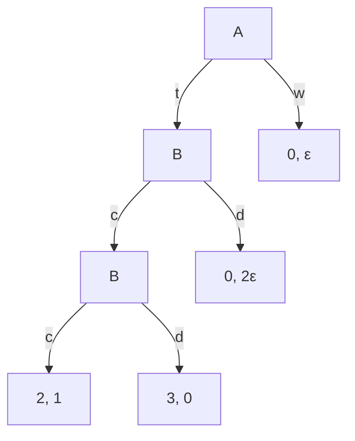
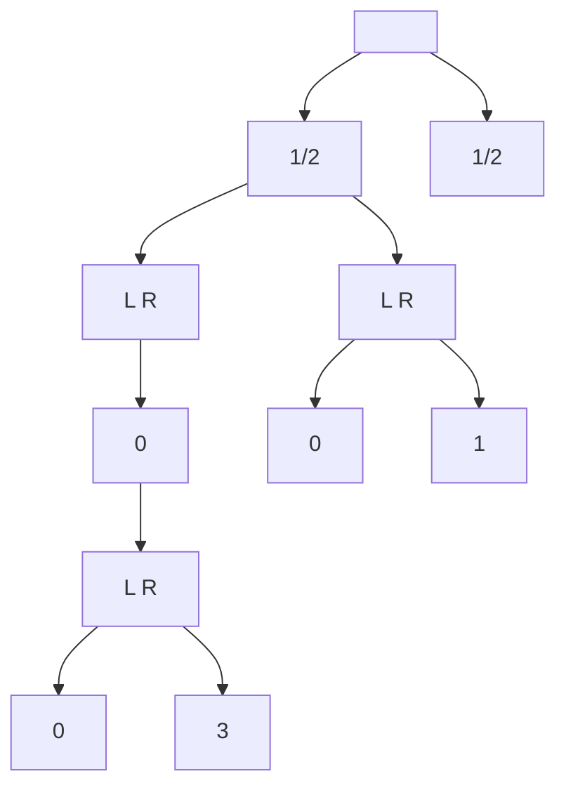
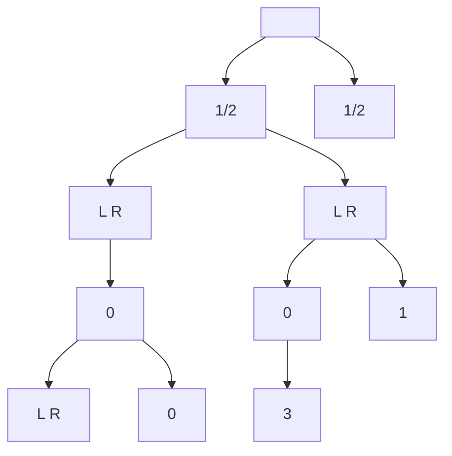
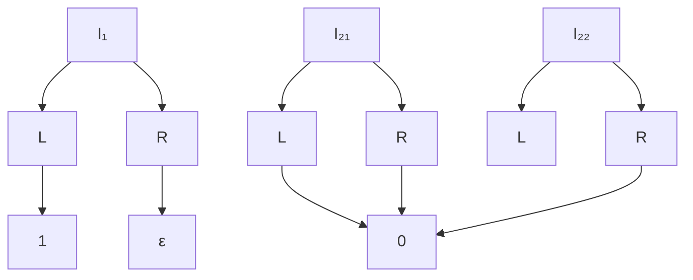
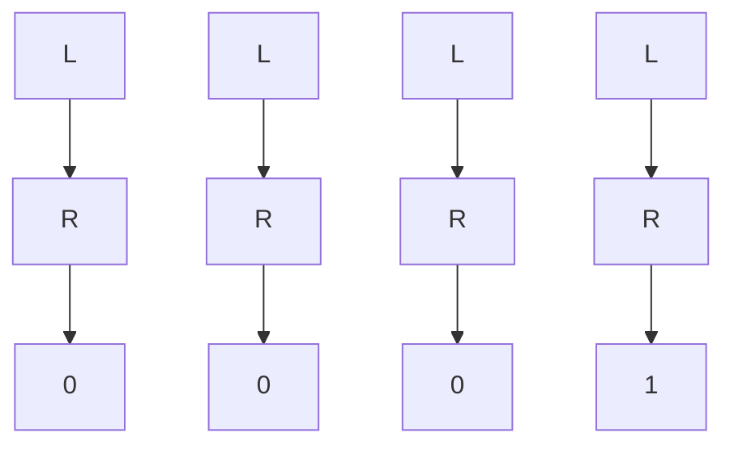
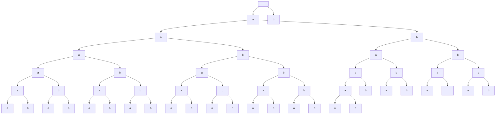
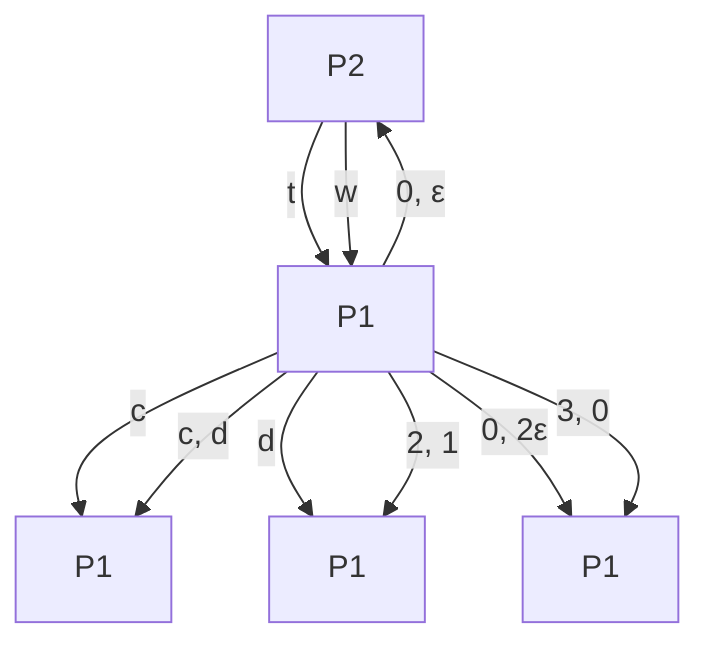

# The Value of Recall in Extensive-Form Games

Ratip Emin Berker $^{1,2}$ , Emanuel Tewolde $^{1,2}$ , Ioannis Anagnostides $^{1}$ , Tuomas Sandholm $^{1,4}$ , and Vincent Conitzer $^{1,2,3}$

$^{1}$ Carnegie Mellon University

$^{2}$ Foundations of Cooperative AI Lab (FOCAL)

$^{3}$ University of Oxford

$^{4}$ Strategic Machine, Inc.

$^{5}$ Strategy Robot, Inc.

$^{6}$ Optimized Markets, Inc.

{rberker, etewolde, ianagnos, sandholm, conitzer}@cs.cmu.edu

December 30, 2024

# Abstract

Imperfect-recall games—in which players may forget previously acquired information—have found many practical applications, ranging from game abstractions to team games and testing AI agents. In this paper, we quantify the utility gain by endowing a player with perfect recall, which we call the value of recall (VoR). While VoR can be unbounded in general, we parameterize it in terms of various game properties, namely the structure of chance nodes and the degree of absentmindedness (the number of successive times a player enters the same information set). Further, we identify several pathologies that arise with VoR, and show how to circumvent them. We also study the complexity of computing VoR, and how to optimally apportion partial recall. Finally, we connect VoR to other previously studied concepts in game theory, including the price of anarchy. We use that connection in conjunction with the celebrated smoothness framework to characterize VoR in a broad class of games.

# 1 Introduction

Game theory offers a principled framework for reasoning about complex interactions that involve multiple strategic players. It continues to propel landmark results in long-standing challenges in artificial intelligence (AI), ranging from poker [Brown and Sandholm, 2018, Bowling et al., 2015, Moravčík et al., 2017] to diplomacy [Bakhtin et al., 2022]. A common premise in game-theoretic modeling is perfect recall—players never forget information once acquired. The perfect-recall assumption is often called into question for games involving human players; however, it is difficult to come up with a faithful model in such cases due to the unpredictability of when and what human players will forget. In contrast, AI agents can be specifically designed to relinquish certain information, thereby making the imperfect-recall framework directly applicable. But why should one consider AI agents with imperfect recall?

An early, influential application of imperfect-recall games revolves around abstraction: games encountered in practice are typically too large to represent exactly, and so one resorts to abstraction


<details>
<summary>flowchart</summary>


</details>

Figure 1: A game with imperfect recall. Giving Bobble (■) perfect recall hurts both players. Terminals show utilities for Bobble and Alice (●). Infosets are joined by dotted lines.

to compress its description. In particular, one way of doing so consists of allowing players to carefully forget less important aspects of previously held information. Indeed, imperfect-recall abstractions have been a crucial component of state-of-the-art algorithms in poker solving [Brown et al., 2015, Johanson et al., 2013, Waugh et al., 2009b, Ganzfried and Sandholm, 2014, Čermák et al., 2017]. Imperfect recall also naturally arises in so-called adversarial team games [Celli and Gatti, 2018, Zhang et al., 2023, 2022, Emmons et al., 2022, von Stengel and Koller, 1997], wherein a team of players—which can be construed as a single player with imperfect recall—faces an adversary. The benefit of reinforcing the communication capacity of the team in such settings—corresponding to boosting recall—is an active area of research, prominently featured in a recent NeurIPS competition [Meisheri and Khadilkar, 2020, Resnick et al., 2020]. Relatedly, natural notions of correlated equilibria can be modeled via an imperfect-recall mediator, endowed with the ability to provide recommendations [Zhang and Sandholm, 2022]; in that context, imperfect recall can serve to safeguard players' private information, a consideration that also arises in other settings [Conitzer, 2019]. Finally, another possible application revolves around simulating and testing AI agents before their deployment in the real world [Kovarík et al., 2023, 2024, Chen et al., 2024]. As a result, it is becoming increasingly pressing to expand our scope beyond the assumption of perfect recall.

In this paper, we examine a question at the heart of this research agenda: how does perfect recall affect players' utilities under various natural solution concepts? More specifically, we contrast the utilities obtained by a player in an initial imperfect-recall game (in extensive form) to those in a perfect recall refinement thereof; we refer to the corresponding ratio as the value of recall (VoR). Here, our main contribution is to provide a broad characterization of VoR for different solution concepts in terms of natural game properties.

Many strategic interactions demonstrate that perfect recall offers a significant advantage. In the popular card game blackjack, the house is expected to prevail in the long run against a player with poor recall, but certain memorization strategies tip—at least under the earlier rules followed by casinos—the balance in the player’s favor [Thorp, 2016], as pop-culture has hyperbolically portrayed. The role of memory is even more pronounced in other card games such as solitaire [Kirkpatrick, 1954, Foerster and Wattenhofer, 2013], where remembering the previously dealt cards drastically increases the odds of winning. We are interested in quantifying how much players benefit from perfect recall.

# 1.1 A plot twist: perfect recall can hurt

The previous examples notwithstanding, surprisingly, endowing a player with perfect recall can end up diminishing every player's utility! Consider Figure 1: Alice has a small amount of money $(\varepsilon > 0)$ and interacts with an investment bot Bobble, starting from a free trial to see if the bot is defective

(i.e., Bobble plays d, in which case the game is over and Alice receives a small compensation of $\varepsilon$ ). If Bobble cooperates (c), the game continues and it gains access to Alice's money, which it multiplies through investments. If Bobble defects (d) now, it gets to run away with all the money. However, if it has imperfect recall (cannot remember if the free trial is over), then it has the incentive to cooperate (c) with Alice on both counts, as attempting d has a greater chance of causing it to get caught during the free trial. Knowing this, Alice is incentivized to trust (t) Bobble, leading to the cooperative outcome. On the other hand, if Bobble is given perfect recall, it has every incentive to cooperate in the free trial and then defect after getting the money; anticipating this, Alice walks out (w) without interacting with Bobble (Proposition 13 formalizes this example).

Intuitively, this demonstrates that a player gaining perfect recall can result in the other players trusting it less, eliminating a cooperative outcome that is arbitrarily better for everyone. This is in line with prior work showing that the ability of a player to be simulated by others can benefit everyone in trust-based games [Kovarík et al., 2023, 2025, Conitzer and Oesterheld, 2023].

In spirit, this phenomenon is similar to the famous Braess paradox [Braess, 1968], which predicts that augmenting a network with more links can result in worse equilibria. We formalize this type of hurtful recall in later sections, and also provide necessary conditions under which it does not arise.

# 1.2 Overview of our results

We formally introduce the value of recall (Definition 12) in (imperfect-recall) extensive-form games for a broad set of solution concepts. In particular, building on prior work, our definition is based on the coarsest information refinement of a game that attains perfect recall (Definition 9). In the remainder of the paper, we investigate a number of questions relating to the value of recall.

We first formalize the observation made earlier regarding hurtful recall (Figure 1) by showing the existence of games in which a single player getting perfect recall can arbitrarily hurt all players, including themselves, for all the solution concepts considered in this paper (Proposition 13). Even more surprisingly, this type of behavior can also arise in single-player games under certain solution concepts (Example 15); we argue that this is a pathology as the single player can always choose to ignore information. We show that this issue can be circumvented by replacing each of these solution concepts with an appropriate refinement thereof, one of which is a novel definition (Definition 17).

Next, we turn our attention to the computational aspects of the value of recall. We show that VoR is NP-hard to compute, and to approximate, for all solution concepts considered in this paper, even in single-player games (Theorem 1). While this mostly follows from existing hardness results for solving imperfect-recall games [Tewolde et al., 2023], we prove new hardness results for some solution concepts, which even rule out any multiplicative approximation factor.

Those hardness results notwithstanding, we characterize VoR under optimal play in single-player games based on certain natural properties of the game tree. In particular, we show in Proposition 21 that value degradation due to imperfect recall can be fully explained by two sources: absentmindedness (an infoset being entered multiple times in a path of play) and external stochasticity. In Propositions 23 and 26, we provide tight upper bounds for VoR for each of these sources separately. Finally, as our main characterization result, we show that those two bounds compose for games that exhibit both absentmindedness and external stochasticity (Theorem 2).

The aforementioned characterization applies only to optimal play. To extend it to more permissive solution concepts, we make a connection with the price of anarchy literature. Namely, inspired by the homonymous class of games introduced by Roughgarden [2015], we introduce the notion of a smooth (imperfect-recall) single-player game (Definition 29), and show VoR can be bounded in terms of the smoothness parameters of the game, in conjunction with our previous bound concerning optimal strategies. Besides this connection with the price of anarchy, we further observe that VoR

captures some previously studied concepts, such as the price of uncorrelation in adversarial team games [Celli and Gatti, 2018] and the price of miscoordination in security games [Jiang et al., 2013], which enables interpreting their results as bounds on VoR in those games.

Finally, we examine the value of recall with respect to partial recall—instead of perfect recall—refinements. In particular, we focus on the natural problem of refining an imperfect-recall game so as to maximize the utility gain, subject to constraining the amount of new recall. We show that, even with oracle access to optimal strategies, that problem is NP-hard even in single-player games (Theorem 3). We conclude with a number of interesting future directions stemming from our work.

# 2 Preliminaries

Before we proceed, we provide some necessary background on imperfect-recall games and solution concepts for them.

# 2.1 Games with imperfect recall

We start by introducing extensive-form games. We will be following the formalism introduced by Fudenberg and Tirole [1991].

# Definition 1. An extensive-form game $\Gamma$ specifies

1. A rooted tree with node set H and edges that represent actions. The game starts at the root, and actions are taken to traverse down the tree, until the game finishes at a leaf node, called terminal node. The set of terminal nodes is denoted by $Z \subset H$ , and the set of actions available at any nonterminal node $h \in H \setminus Z$ is denoted by $A_{h}$ .   
2. A finite set $N \cup \{c\}$ of $N + 1$ players where $N \geq 1$ . Set N contains the strategic players, and c stands for a chance “player” that models exogenous stochasticity. Each nonterminal node h is assigned to a particular player $i \in N \cup \{c\}$ , who chooses an action to take from $A_{h}$ . Set $H_{i}$ denotes all nodes assigned to Player i.   
3. For each chance node $h \in \mathcal{H}_c$ , a probability distribution $\mathbb{P}_c(\cdot \mid h)$ on $A_h$ with which chance elects an action at $h$ .   
4. For each strategic player $i \in N$ , a (without loss of generality) nonnegative utility (payoff) function $u_{i} : Z \to R_{\geq 0}$ which returns what i receives when the game finishes at a terminal node. Player i aims to maximize that utility. $^{1}$   
5. For each strategic player $i \in N$ , a partition $H_{i} = \sqcup_{I \in I_{i}} I$ of the nodes of i into information sets (infosets). Nodes of the same infoset are considered indistinguishable to the player at that infoset. For that, we also require $A_{h} = A_{h'}$ for $h, h' \in I$ . This also makes action set $A_{I}$ well-defined.

The game tree of $\Gamma$ refers to $\mathcal{H}$ , $\{A_h\}_{h\in \mathcal{H}\setminus \mathcal{Z}}$ , and $\{\mathbb{P}_c(\cdot \mid h)\}_{h\in \mathcal{H}_c}$ (but not its infoset partitioning or utilities). We now formalize games where players may forget previously available information.

Definition 2 ((Im)perfect recall). For a decision node h of a game $\Gamma$ , let $\text{hist}(h) = (h_k)_{k=0}^{\text{depth}(h)-1}$ be the ordered sequence of nodes from the root node $h_0$ to h (excluding h) and let $\text{seq}(h) = (i_k, I_k, a_k)_{k=0}^{\text{depth}(h)-1}$ be the corresponding sequence of tuples showing which player $i_k$ acts at $h_k$ , the

infoset $I_{k}$ of node $h_{k}$ , and what action $a_{k}$ was taken at $h_{k}$ . For a player $i \in N$ , let $\text{seq}_{i}(h)$ be the ordered subsequence of tuples from $\text{seq}(h)$ for which $i_{k} = i$ . We say player i has perfect recall in $\Gamma$ if for all of i's infosets $I \in I_{i}$ , and all pairs of nodes $h, h' \in I$ , we have $\text{seq}_{i}(h) = \text{seq}_{i}(h')$ . Otherwise, we say Player i has imperfect recall. We say that $\Gamma$ is a perfect-recall game if all players $i \in N$ have perfect recall in $\Gamma$ . Otherwise, we say $\Gamma$ is an imperfect-recall game.

Strategies and utilities Players can select a probability distribution—a randomized action—over the actions at an infoset. A (behavioral) strategy $\pi_{i}$ of a player $i \in N$ specifies a randomized action $\pi_{i}(\cdot \mid I) \in \Delta(A_{I})$ at each infoset $I \in I_{i}$ . We say $\pi_{i}$ is pure if it assigns probability 1 to a single action for each infoset. A (strategy) profile $\pi = (\pi_{i})_{i \in N}$ specifies a strategy for each player. We use the common notation $\pi_{-i} = (\pi_{1}, \ldots, \pi_{i-1}, \pi_{i+1}, \ldots, \pi_{n})$ . We denote the strategy set of Player i with $S_{i}$ , and $S = X_{i \in N} S_{i}$ .

We denote the reach probability of a node $h'$ from another node $h$ under a profile $\pi$ as $\mathbb{P}(h' \mid \pi, h)$ . It evaluates to 0 if $h \notin \mathrm{hist}(h')$ , and otherwise to the product of probabilities with which the actions on the path from $h$ to $h'$ are taken under $\pi$ and chance. We denote with $u_i(\pi \mid h) := \sum_{z \in \mathcal{Z}} \mathbb{P}(z \mid \pi, h) \cdot u_i(z)$ the expected utility of Player $i$ given that the game is at node $h$ and the players are following profile $\pi$ . We overload notation for the special case the game starts at root node $h_0$ by defining $\mathbb{P}(h \mid \pi) := \mathbb{P}(h \mid \pi, h_0)$ and $u_i(\pi) := u_i(\pi \mid h_0)$ . Finally, let $I^{1\text{st}}$ refer to the nodes $h \in I$ for which $I$ does not appear in seq(h). Then the reach probability of $I$ (from $h_0$ ) is $\mathbb{P}(I \mid \pi) := \sum_{h \in I^{1\text{st}}} \mathbb{P}(h \mid \pi)$ .

# 2.2 Solution concepts

The value of recall, which we introduce in the next section, does not only depend on the underlying game, but also on our assumptions on what reasoning capabilities each player has. These are formally captured by solution concepts.

Nash equilibrium This is the most classic solution concept in game theory [Nash, 1950].

Definition 3. A profile $\pi\in S$ is a Nash equilibrium of a game $\Gamma$ if for each player $i\in N$ ,

$$
\pi_ {i} \in \underset {\pi_ {i} ^ {\prime} \in S _ {i}} {\operatorname{argmax}} u _ {i} (\pi_ {i} ^ {\prime}, \pi_ {- i}). \tag {1}
$$

In the special case that $\Gamma$ is a single-player game, we use the term optimal strategy instead of Nash equilibrium.

Unfortunately, a Nash equilibrium is hard to compute, even in a single-player game with imperfect recall [Koller and Megiddo, 1992, Gimbert et al., 2020, Tewolde et al., 2024]. To make matters worse, it may not even exist [Wichardt, 2008]. This motivates considering two relaxations based on the multiselves approach [Kuhn, 1953].

Multiselves equilibria The multiselves approach interprets a player with imperfect recall as a team of multiple instantiations of the player (referred to as agents to distinguish from the original player) who independently act at distinct infosets on behalf of the original imperfect-recall player.

For strategy $\pi_{i}\in S_{i}$ of Player i, infoset $I\in I_{i}$ , and randomized action $\sigma\in\Delta(A_{I})$ , we denote by $\pi_{i}^{I\mapsto\sigma}$ the strategy that plays according to $\pi_{i}$ except at I, where it plays $\sigma$ .

Definition 4. A profile $\pi \in S$ is an EDT equilibrium of a game $\Gamma$ if for each player $i \in \mathcal{N}$ and each of its infosets $I \in \mathcal{I}_i$ , the randomized action $\pi_i(\cdot \mid I)$ satisfies $\pi_i(\cdot \mid I) \in \operatorname{argmax}_{\sigma \in \Delta(A_I)} u_i(\pi_i^{I \mapsto \sigma}, \pi_{-i})$ .

EDT abbreviates evidential decision theory; we refer to Piccione and Rubinstein [1997], Briggs [2010], Oesterheld and Conitzer [2024] for a detailed treatment and motivation. A third equilibrium concept that arose from the aforementioned literature is based on causal decision theory (CDT). It differentiates from EDT only in games with absentmindedness, which is when a single infoset I appears multiple times in seq(h) for some $h \in H$ (Figure 2, left). Its original definition is not central to this work and deferred to the appendix. Instead, below we give an equivalent characterization of it [Tewolde et al., 2024] using Karush-Kuhn-Tucker (KKT) points [Boyd and Vandenberghe, 2004], which generalize the concept of a stationary point of a function over an unconstrained domain.

Definition 5. A profile $\pi \in S$ is a CDT equilibrium of a game $\Gamma$ if for each player $i \in N$ , strategy $\pi_{i}$ is a KKT point of the utility maximization problem (1).

These solution concepts form a strict inclusion hierarchy.

Lemma 6 (Oesterheld and Conitzer, 2024). Nash equilibria are EDT equilibria, which in turn are CDT equilibria.

In particular, Nash equilibria are the hardest to compute, but they coincide in the following special cases.

Remark 7. EDT and CDT equilibria coincide in games without absentmindedness. Nash and EDT equilibria coincide in games with only one infoset per player.

# 3 Value of Recall

To introduce the novel concept of the value of recall, we first formalize an ordering among infoset partitionings:

Definition 8 (Game refinements/coarsenings). Given two extensive-form games $\Gamma$ and $\Gamma'$ with the same game tree and utilities but potentially different infosets $\{\mathcal{I}_i\}_{i\in \mathcal{N}}$ and $\{\mathcal{I}_i'\}_{i\in \mathcal{N}}$ , and a player $i\in \mathcal{N}$ , we denote $\Gamma\succeq_i\Gamma'$ if for each $I' \in \mathcal{I}_i'$ , there exists $\mathcal{J}_i \subseteq \mathcal{I}_i$ such that $I' = \bigsqcup_{I \in \mathcal{J}_i} I$ . That is, the infosets in $\mathcal{I}'$ are (disjointly) partitioned by the infosets in $\mathcal{I}$ . In this case, we say $\Gamma$ (resp. $\Gamma'$ ) is a refinement (coarsening) of $\Gamma'$ ( $\Gamma$ ) with respect to player $i$ . We denote $\Gamma\succeq \Gamma'$ if $\Gamma\succeq_i\Gamma'$ for all $i\in \mathcal{N}$ and say $\Gamma$ (resp. $\Gamma'$ ) is an all-player refinement (coarsening) of $\Gamma'$ ( $\Gamma$ ).

We are now ready to define the perfect recall refinement of an imperfect-recall game.

Definition 9 (Perfect recall refinements). Given imperfect-recall game $\Gamma$ , for all nodes $h \in \mathcal{H}$ and players $i \in \mathcal{N}$ , define $\mathrm{seq}_i(h)$ as in Definition 2. For infoset $I \in \mathcal{I}_i$ and nodes $h, h' \in I$ , define the equivalence relation $h \sim h'$ if $\mathrm{seq}_i(h) = \mathrm{seq}_i(h')$ . We say that the (coarsest) perfect recall refinement of $\Gamma$ with respect to player $i \in \mathcal{N}$ is an extensive-form game $\mathcal{R}_i(\Gamma)$ with the same game tree and utilities as $\Gamma$ , but an infoset partition where each $I \in \mathcal{I}_i$ is partitioned into infosets defined by the equivalence relation $\sim$ , and the infosets of all other players are unchanged. The all-player (coarsest) perfect recall refinement of $\Gamma$ is an extensive-form game $\mathcal{R}(\Gamma)$ with the same game tree as $\Gamma$ , where the infosets of all players are partitioned as above.

An equivalent definition to $\mathcal{R}(\Gamma)$ was introduced by Čermák et al. [2018]. Both $\mathcal{R}_{i}(\Gamma)$ and $\mathcal{R}(\Gamma)$ are well-defined, easy to compute, with $\mathcal{R}_{i}(\Gamma)\succeq_{i}\Gamma$ and $\mathcal{R}(\Gamma)\succeq\Gamma$ . As claimed, $\mathcal{R}_{i}(\Gamma)$ is the coarsest refinement of $\Gamma$ with respect to i that gives i perfect recall. We formalize this below:


<details>
<summary>flowchart</summary>


</details>


<details>
<summary>flowchart</summary>


</details>


<details>
<summary>flowchart</summary>


</details>

Figure 2: (Left) An imperfect-recall game $\Gamma$ . Boxes indicate chance nodes. (Middle) $\mathcal{R}_1(\Gamma)$ , the perfect recall refinement of $\Gamma$ with respect to $\blacktriangle$ . (Right) $\Gamma$ with perfect information.

Proposition 10. Given imperfect-recall game $\Gamma$ and another game $\Gamma'$ that has the same game tree as $\Gamma$ but potentially different infosets, if $\Gamma' \succeq_i \Gamma$ and $i$ has perfect recall in $\Gamma'$ , then $\Gamma' \succeq_i \mathcal{R}_i(\Gamma)$ . Moreover, $i$ has perfect recall in $\mathcal{R}_i(\Gamma)$ . $^2$

(Most proofs are in the appendix due to space constraints.)

Corollary 11. If $\Gamma' \succeq \Gamma$ and $\Gamma'$ is a perfect-recall game, then $\Gamma' \succeq \mathcal{R}(\Gamma)$ . Moreover, $\mathcal{R}(\Gamma)$ is a perfect-recall game.

By using the coarsest refinement, we seek to isolate the impact of recall on the utility, while filtering out other factors. For instance, the optimal strategy for P1 (▲) in game Γ in Figure 2(left) is to play L with probability 1/3, bringing an expected utility of 2/3. If we give the player perfect information, and hence perfect recall in the process, the player can achieve a utility of 2 (Figure 2, right). However, we argue this refinement misrepresents the “value of recall” of this game, since P1 now learns the outcome of the chance node, unlike in Γ. Instead, using the coarsest perfect recall refinement, R(Γ) per Definition 9, leads to utility 3/2 (Figure 2, middle) and properly captures what P1 can gain if its only advantage is to remember everything it once knew.

The previous example notwithstanding, we should caution that distinguishing perfect recall and perfect information can become blurry: any imperfect information game can be turned into a strategically-equivalent one with only imperfect recall by adding dummy nodes, as we demonstrate in the appendix.

Now, given an imperfect-recall game $\Gamma$ , a player of interest (always labelled Player 1), and a solution concept SC, let $u_{1}(\mathsf{SC}(\Gamma))$ be the utility that Player 1 receives under that solution concept in game $\Gamma$ , assuming it exists. In order to ensure that the utility under SC is uniquely defined (since, for example, there might be multiple Nash equilibria of $\Gamma$ with different utilities for Player 1), we also require SC to specify whether it is the best or worst possible outcome of that solution concept from Player 1's perspective; this is similar to the definition of solution concepts in the value of commitment [Letchford et al., 2014]. In particular, $\overline{\mathrm{Nash}}, \overline{\mathrm{EDT}}, \overline{\mathrm{CDT}}$ (resp. $\underline{\mathrm{Nash}}, \underline{\mathrm{EDT}}, \underline{\mathrm{CDT}}$ ) refer to the best (worst) possible outcome for Player 1 under the corresponding solution concept.

Definition 12. Given solution concept SC and $\Gamma$ , the value of recall (VoR) in $\Gamma$ under SC is

$$
\mathrm{VoR} ^ {\mathsf {S C}} (\Gamma) = \frac {u _ {1} (\mathsf {S C} (\mathcal {R} _ {1} (\Gamma)))}{u _ {1} (\mathsf {S C} (\Gamma))}.
$$

If we are instead given a game class $\mathcal{C}$ , we say that the value of recall (VoR) in $\mathcal{C}$ under $SC$ is

$$
\mathrm{VoR} ^ {\mathcal {S C}} (\mathcal {C}) = \sup _ {\Gamma \in \mathcal {C}} \frac {u _ {1} (\mathcal {S C} (\mathcal {R} _ {1} (\Gamma)))}{u _ {1} (\mathcal {S C} (\Gamma))}.
$$

We can now formalize the situation that arises in Figure 1 and was discussed earlier in the introduction. To do so, we note that strategies $\pi$ and $\pi'$ are realization-equivalent if they induce the same reach probability $\mathbb{P}(h\mid \pi) = \mathbb{P}(h\mid \pi')$ for all $h\in \mathcal{H}$ (thus achieving the same utility).

Proposition 13. For any $\varepsilon > 0$ , there exists a two-player game $\Gamma$ such that $\frac{u_i(SC(\mathcal{R}_1(\Gamma)))}{u_i(SC(\Gamma))} \leq \varepsilon$ for all $i \in \mathcal{N}$ , where $SC$ is the only $CDT$ equilibrium of $\Gamma$ , up to realization equivalence. In particular, $\mathrm{VoR}^{SC}(\Gamma) = 0$ for $SC \in \{\underline{\mathrm{CDT}}, \overline{\mathrm{CDT}}, \underline{\mathrm{EDT}}, \overline{\mathrm{EDT}}, \underline{\mathrm{Nash}}, \overline{\mathrm{Nash}}\}$ .

# 3.1 Computational complexity of value of recall

We now show that computing the value of recall is hard. For this theorem alone, we assume (WLOG) for all $z \in Z$ that $u_{1}(z) \geq \eta$ for some $\eta > 0$ , to ensure VoR is bounded.

Theorem 1. Given a game $\Gamma$ , computing $\mathrm{VOR}^{SC}(\Gamma)$ is NP-hard for $SC \in \{\underline{\mathrm{CDT}}, \overline{\mathrm{CDT}}, \underline{\mathrm{EDT}}, \overline{\mathrm{EDT}}, \underline{\mathrm{Nash}}, \overline{\mathrm{Nash}}\}$ . Moreover,

1. Unless NP = ZPP, none of them admits an FPTAS. In particular, if $SC \in \{\underline{CDT}, \underline{EDT}\}$ , then approximation to any multiplicative factor is NP-hard.   
2. NP-hardness and conditional inapproximabiltiy hold even if $\Gamma$ is a single-player game.

A fully polynomial-time approximation scheme (FPTAS) takes as input a game $\Gamma$ , a solution concept SC, and an $\varepsilon > 0$ and outputs a number in the interval $(1 \pm \varepsilon)\mathrm{VoR}^{\mathrm{SC}}(\Gamma)$ . Further, ZPP contains the class of problems solvable by randomized algorithms that always return the correct answer, and whose expected running time is polynomial [Gill, 1977].

Most of the proof of Theorem 1 relies on existing hardness results for equilibrium computation in (single-player) imperfect-recall games [Koller and Megiddo, 1992, Tewolde et al., 2023, Gimbert et al., 2020]. The results for CDT and EDT are new, further establishing stronger in-approximability; both proofs proceed by reducing from 3SAT, as we elaborate in the appendix.

# 3.2 VoR pathologies and how to fix them

While Proposition 13 shows that getting recall can hurt in general, one would expect this to not be the case in single-player games. Indeed, without any opponents, we would expect giving recall to only benefit the player, since it can always ignore the information it can now recall. This is the case if SC represents the optimal strategy (Opt), as getting perfect recall expands the strategy set of a player. Further, since the optimal strategy of a game is also its best CDT and EDT equilibrium (Lemma 6), we have the following:

Proposition 14. For any single-player game $\Gamma$ ,

$$
\mathrm{VoR} ^ {\mathrm{Opt}} (\Gamma) = \mathrm{VoR} ^ {\overline {{\mathrm{EDT}}}} (\Gamma) = \mathrm{VoR} ^ {\overline {{\mathrm{CDT}}}} (\Gamma) \geq 1.
$$

Surprisingly, it turns out that this result in fact does not hold for worst EDT and CDT equilibria of the game:


<details>
<summary>flowchart</summary>

```mermaid
graph TD
    I1["I₁"] --> L1["L"]
    I1 --> R1["R"]
    L1 --> I2["I₂"]
    R1 -.-> I2
    I2 --> L2["L"]
    I2 --> R2["R"]
    L2 --> I1
    L1 -.-> I2
    style I1 fill:#4CAF50,stroke:#333
    style I2 fill:#4CAF50,stroke:#333
    note right of I2: L1,L2,L1,L2,L2,L2,L2,L2,L2,L2,L2,L2,L2,L2,L2,L2,L2,L2,L2,L2,L2,L2,L2,L2,L2,L2,L2,L2,L2,L2,L2,L2,L2,L2,L2,L2,L2,L2,L2,L2,L2,L2,L2,L2,L2,L2,L2,L2,L2,L2,L2,L2,L2,L7
```
</details>

(a) A game $\Gamma$


<details>
<summary>flowchart</summary>


</details>

(b) $\mathcal{R}_1(\Gamma)$   
Figure 3: Perfect recall can lead to worse CDT/EDT eq.

Example 15. Consider the game $\Gamma$ in Figure 3a. The only CDT/EDT equilibrium of $\Gamma$ is the optimal strategy: always play $\mathsf{L}$ , bringing a utility of 1. In $\mathcal{R}_1(\Gamma)$ , however, while the same is still the optimal strategy (and hence a CDT and EDT equilibrium), there is now a second CDT and EDT equilibrium: always play $\mathsf{R}$ on $I_1$ and $I_{21}$ , and always play $\mathsf{L}$ on $I_{22}$ , bringing a utility of $\varepsilon$ . Hence, $\mathrm{VoR}^{\underline{\mathrm{EDT}}}_{\Gamma}(\Gamma) = \mathrm{VoR}^{\underline{\mathrm{CDT}}}_{\Gamma}(\Gamma) = \varepsilon$ , which can be arbitrarily close to 0.

The issue in Example 15 is that of the chicken or the egg: the unreasonable strategy of playing R at $I_{21}$ cannot violate CDT/EDT conditions if the player never visits $I_{21}$ , while if the strategy in $I_{21}$ is unreasonable enough then the decision to not visit $I_{21}$ also does not violate them. This shows that CDT/EDT conditions (which, again, are relaxations of Nash equilibrium) are perhaps too permissive, accepting strategies that are not reasonable under perfect recall. To rule out such equilibria, we now introduce equilibrium refinements for both solution concepts. (It is important to differentiate between equilibrium refinements—which narrows the definition of a solution concept—and information refinements, per Definition 8—which introduces a new game where players have finer infosets.) The refinements of CDT/EDT that we introduce will force the player to consider its behavior in all infosets it could have reached, hence preventing pathologies such as Example 15.

The appropriate equilibrium refinement for CDT has been introduced by Lambert et al. [2019], which we will refer to as $CDT-Nash$ . Due to space constraints, we defer its definition to the appendix. Below, we introduce an analogous, novel refinement called $EDT-Nash$ . The relevant properties of both refinements are in Propositions 18 and 19.

Definition 16. A strategy $\pi$ in a single-player game $\Gamma$ is EDT-limit-rational if there is a sequence $(\pi^{(k)},\varepsilon^{(k)})_{k\in \mathbb{N}}$ s.t.

1. each $\pi^{(k)}$ is a strategy in $\Gamma$ such that $\pi^{(k)}(a\mid I) > 0$ for all $I$ and $a$ , and $(\pi^{(k)})_{k\in \mathbb{N}}$ converges to $\pi$ ;   
2. each $\varepsilon^{(k)} > 0$ and $(\varepsilon^{(k)})_{k\in \mathbb{N}}$ converge to 0; and   
3. for each $k$ , for all $I$ with $\mathbb{P}(I \mid \pi^{(k)}) > 0$ and $\sigma \in \Delta(A_I)$ ,

$$
\frac {1}{\mathbb {P} (I \mid \pi^ {(k)})} \cdot \left(u _ {1} (\pi^ {(k), I \mapsto \sigma}) - u _ {1} (\pi^ {(k)})\right) \leq \varepsilon^ {(k)}.
$$

Intuitively, the sequence of fully mixed strategies prevents the player from ignoring any infosets it could have reached.

Definition 17. A profile $\pi$ is an EDT-Nash equilibrium of $\Gamma$ if it is an EDT equilibrium and if for all $i \in N$ , and in the single-player perspective of $\Gamma$ (where every other player plays fixed $\pi_{-i}$ ), the strategy $\pi_{i}$ is realization-equivalent to an EDT-limit-rational strategy $\pi$ .

The key property of our refinement is that it agrees with the optimal strategy under perfect recall.

Proposition 18. EDT-Nash equilibria are EDT equilibria. Without absentmindedness, a strategy profile is an EDT-Nash equilibrium iff it is a CDT-Nash equilibrium. Under perfect recall, a strategy profile is an EDT-Nash equilibrium iff it is a Nash equilibrium.

An analogous result was shown by Lambert et al. [2019] for CDT-Nash equilibria:

Proposition 19 (Lambert et al., 2019). CDT-Nash equilibria are CDT equilibria, and they always exist. Under perfect recall, a strategy profile is a CDT-Nash equilibrium iff it is a Nash equilibrium of $\Gamma$ .

The above propositions imply that in a single-player game with perfect recall, the only CDT-Nash and EDT-Nash equilibrium is the optimal strategy. Combined with Proposition 14, this shows that the refinements successfully resolve the pathologies that arose with CDT/EDT.

Corollary 20. Given single-player game $\Gamma$ , $\mathrm{VoR}^{SC}(\Gamma) \geq 1$ for $SC \in \{\underline{\mathrm{CDT - Nash}}, \overline{\mathrm{CDT - Nash}}, \underline{\mathrm{EDT - Nash}}, \overline{\mathrm{EDT - Nash}}\}$ .

# 4 Bounding the Value of Recall

In this section, we first focus on bounding $Vor^{Opt}$ for single-player games, and show that while it can be arbitrarily large in general, we can still parameterize it using properties of the game tree and the utility functions. Later on, we show how $Vor^{SC}$ for other solution concepts can be bounded in conjunction with these parametrizations.

A key observation is that in single-player games, there are exactly two factors that can lead to a change in the optimal utility when perfect recall is introduced: (1) absentmindedness, and (2) chance nodes. Indeed, if neither is present, the optimal utility remains unchanged.

Proposition 21. For a single-player game $\Gamma$ with no chance nodes and with no absentmindedness, $\mathrm{VoR}^{\mathrm{Opt}}(\Gamma) = 1$ . Further, for both $\Gamma$ and $\mathcal{R}_1(\Gamma)$ , there is a pure optimal strategy.

As we will show, either absentmindedness or chance nodes is sufficient to have a game with $\mathrm{VoR}^{\mathrm{Opt}}(\Gamma) > 1$ . We first deal with each of these cases separately, before moving on to games that exhibit both.

VoR due to absentmindedness To bound the impact of absentmindedness, we first parameterize the number of times an infoset is visited and an action is taken on the way to a leaf node. Given a single-player game $\Gamma$ , for any $z \in Z$ with $\text{seq}(z) = (i_k, I_k, a_k)_{k=0}^{\text{depth}(z)-1}$ , for each $I \in I_1$ and $a \in A_I$ let $n_z(I) = |\{k : I_k = I\}|$ , $n_z(a) = |\{k : a_k = a\}|$ , and $p_z(a) = \frac{n_z(a)}{n_z(I)}$ . Then, we define

$$
\alpha (z) = \prod_{\substack{I\in \mathcal{I}_{1}:n_{z}(I) > 1\\ a\in A_{I}:n_{z}(a) > 0}}p_{z}(a)^{n_{z}(a)}\quad \in (0,1]
$$

to be the absentmindedness coefficient of z. Intuitively, it describes how easy it is to reach z under absentmindedness:

Lemma 22. Given single-player game $\Gamma$ with no chance nodes, for all $z \in \mathcal{Z}$ , there exists a strategy $\pi_z$ that reaches $z$ with probability $\alpha(z)$ , achieving $u_1(\pi_z) \geq \alpha(z) u_1(z)$ .


<details>
<summary>flowchart</summary>


</details>


<details>
<summary>flowchart</summary>


</details>

Figure 4: (Left) Example 24, n = 4. (Right) Ex. 28, n = 2

We are now ready to introduce our upper bounds for VoR in terms of the absentmindedness coefficients:

Proposition 23. In a single-player game $\Gamma$ without chance nodes, we have

$$
\mathrm{VoR} ^ {\mathrm{Opt}} (\Gamma) \leq \frac {\max _ {z \in \mathcal {Z}} u _ {1} (z)}{\max _ {z \in \mathcal {Z}} \alpha (z) u _ {1} (z)} \leq \frac {1}{\alpha (z ^ {*})}
$$

where $z^{*} = \mathrm{argmax}_{z\in \mathcal{Z}}u_{1}(z)$ .

As we see next, the inequalities in Proposition 23 are tight.

Example 24. Consider a single-player game $\Gamma$ where Lenny needs to pick between the action L and the action R for n consecutive rounds for some even n. He gets utility 1 if he first plays L exactly n/2 times followed by R the remaining n/2 times. If he does anything else, the game is over and he gets 0 utility. Moreover, his memory is reset each time.

The game tree of $\Gamma$ has $n$ nodes, $n + 1$ leaves, and a single infoset $I$ . Figure 4(Left) depicts this for $n = 4$ . Let $z^{*}$ be the single leaf node with $u_{1}(z^{*}) = 1$ . The optimal strategy in $\mathcal{R}_1(\Gamma)$ (where each node is its own infoset) is to arrive at $z^{*}$ , guaranteeing a utility of 1. In $\Gamma$ , however, Lenny cannot do anything better than playing uniformly at random, achieving an expected utility of $2^{-n}$ . Moreover, $\alpha(z^{*}) = 2^{-n}$ . Hence, for $\Gamma$ , all of the inequalities in Proposition 23 are tight.

Example 24 is the worst-case scenario with regard to absentmindedness: only one leaf node brings positive utility, and reaching it requires playing each action equally often.

Importantly, $\alpha(z)$ is independent of the utilities of $\Gamma$ . This allows us to interpret Proposition 23 in two parts: a tighter bound on $\Gamma$ using its utilities, and another bound that applies to all games that differ from $\Gamma$ only by their utility functions.

Corollary 25. Given a single-player game $\Gamma$ without chance nodes, say $\mathcal{C}$ is the class of games that share the same game tree and infoset partition as $\Gamma$ . Then

$$
\mathrm{VoR} ^ {\mathrm{Opt}} (\mathcal {C}) = \max _ {z \in \mathcal {Z}} \frac {1}{\alpha (z)}.
$$

VoR due to chance nodes We now do a similar analysis for chance nodes. Given a single-player game $\Gamma$ , for any $z \in Z$ with $\text{seq}(z) = (i_k, I_k, a_k)_{k=0}^{\text{depth}(z)-1}$ , say $k_1, k_2, \ldots, k_\ell$ are steps that correspond

to chance nodes, i.e., $i_{k_{j}} = c$ for all $j \in [\ell]$ . Then, the chance coefficient of leaf node z is

$$
\chi (z) = \prod_ {j = 1} ^ {\ell} \mathbb {P} _ {c} (a _ {k _ {j}} | h _ {k _ {j}})
$$

if $\ell > 0$ and $\chi(z) = 1$ otherwise. $\chi(z)$ is the probability of reaching z in $\mathcal{R}_{1}(\Gamma)$ (i.e., under perfect recall), given that the player is trying to reach it. For each chance node $h \in H_{c}$ , and each $a \in A_{h}$ , say $H_{ha} \subset H_{c}$ are the chance nodes in the subtree rooted at ha (the node reached when chance plays a at h). Then the branching factor of h is $\beta(h) = \sum_{a \in A_{h}} b_{h}(a)$ , where

$$
b _ {h} (a) = \left\{ \begin{array}{l l} 1 & \text {if |H_{ha}| = 0} \\ \max _ {h \in H _ {h a}} \beta (h) & \text {otherwise} \end{array} \right..
$$

One can compute $\beta(h)$ for each $h \in H_{c}$ recursively, starting from the bottom of the tree (that is, the leaf nodes). We now have all the tools we need for characterizing the impact of chance nodes on VoR.

Proposition 26. In a single-player game $\Gamma$ without absentmindedness, we have $^{3}$

$$
\mathrm{VoR} ^ {\mathrm{Opt}} (\Gamma) \leq \frac {u _ {1} (\mathrm{Opt} (\mathcal {R} _ {1} (\Gamma)))}{\max _ {z \in \mathcal {Z}} \chi (z) u _ {1} (z)} \leq \max _ {h \in \mathcal {H} _ {c}} \beta (h).
$$

Corollary 27. Given a single-player game $\Gamma$ without absentmindedness, say C is the class of games that share the same game tree and infoset partition as $\Gamma$ . Then

$$
\mathrm{VoR} ^ {\mathrm{Opt}} (\mathcal {C}) \leq \max _ {h \in \mathcal {H} _ {c}} \beta (h).
$$

The reason we have an inequality for the game class, unlike in Corollary 25, is that while absentmindedness does imply imperfect recall, chance nodes alone do not tell us anything about the information structure of the game. We now show that the bounds in Proposition 26 are also tight.

Example 28. Consider a game $\Gamma$ that starts with a single chance node $h_c$ with $|A_{h_c}| = n$ , each played with equal probability. Under each outcome, Dory needs to act twice, using the same action set as chance $A_{h_c}$ , and gets utility 1 only if she replicates the action of the chance node both times, and 0 otherwise. Each of Dory's nodes immediately following the chance node is in its own information set of size 1, and every other node is in a single information set. Figure 4(Right) shows the game tree for $n = 2$ .

In $\mathcal{R}_{1}(\Gamma)$ , Dory has perfect information and can guarantee utility 1. However, with imperfect recall, the best she can do is select the correct action the first time she acts, and then any strategy she will follow on the large information set will bring her expected utility 1/n. Moreover, $\beta(h_{c}) = n$ and $\max_{z \in \mathcal{Z}} \chi(z) u_{1}(z) = 1/n$ , showing that for $\Gamma$ all the inequalities in Proposition 26 are tight.

We end this section by showing that our results from Propositions 23 and 26 do in fact compose, hence giving a parameterization of $Vor^{Opt}$ for any single-player game.

Theorem 2. For a single-player game $\Gamma$ , say $\mathcal{C}$ is the class of games that share the same game tree and infosets. Then

$$
\mathrm{VoR} ^ {\mathrm{Opt}} (\mathcal {C}) \leq \max _ {z \in \mathcal {Z}, h \in \mathcal {H} _ {c}} \frac {\beta (h)}{\alpha (z)}.
$$

# 4.1 Smooth imperfect-recall games

Remaining on single-player games, here we bound the value of recall for a broader set of equilibria. Our approach is driven by a connection with the price of anarchy (PoA). In particular, we introduce the notion of a smooth (single-player) imperfect-recall game, which is based on the homonymous class of (multi-player) games by Roughgarden [2015]. Below, we denote by $(\pi_{I})_{I\in\mathcal{I}_{1}}\in S$ the player's strategy, and use the notation $\pi_{-I}:=(\pi_{I'})_{I'\in\mathcal{I}_{1}\setminus\{I\}}$ .

Definition 29. A single-player game $\Gamma$ is $(\lambda, \mu)$ -smooth if there exists $\pi^{*} \in S$ such that for any $\pi \in S$ ,

$$
\frac {1}{| \mathcal {I} _ {1} |} \sum_ {I \in \mathcal {I} _ {1}} u _ {1} (\pi_ {I} ^ {*}, \pi_ {- I}) \geq \lambda u _ {1} (\mathrm{Opt} (\Gamma)) - \mu u _ {1} (\pi). \tag {2}
$$

The rationale behind this definition is that it enables disentangling the left-hand side of (2) via a suitable strategy $\pi^{*}$ , with the property that if followed by each infoset separately, a non-trivial fraction of the optimal utility can be secured no matter the strategy in the rest of the infosets. While this may appear like an overly restrictive property, it manifests itself in many important applications [Roughgarden et al., 2017]. In Definition 29, infosets play the role of strategic players in Roughgarden's formalism; we provide a concrete example of a smooth imperfect-recall game in the appendix.

Now, by definition, an EDT equilibrium $\pi$ satisfies $u_{1}(\pi) \geq \frac{1}{|\mathcal{I}_{1}|} \sum_{I \in \mathcal{I}_{1}} u_{1}(\pi_{I}^{*}, \pi_{-I})$ (by applying Definition 4 successively for each infoset). Combining with (2), we immediately arrive at the following conclusion.

Proposition 30. Let $\Gamma$ be a $(\lambda,\mu)$ -smooth, single-player game. For any EDT equilibrium $\pi\in S$ ,

$$
u _ {1} (\pi) \geq \frac {\lambda}{1 + \mu} u _ {1} (\mathrm{Opt} (\Gamma)).
$$

In words, $\rho := \lambda/(1 + \mu)$ measures the degradation incurred in an EDT equilibrium, which is referred to as the robust price of anarchy in the parlance of Roughgarden [2015]. In light of Proposition 30, bounding $\mathrm{VoR}^{\mathrm{EDT}}(\Gamma)$ reduces to relating $u_{1}(\mathrm{Opt}(\Gamma))$ in terms of $u_{1}(\mathrm{Opt}(\mathcal{R}(\Gamma)))$ , which was accomplished earlier in Theorem 2.

Corollary 31. Let $\Gamma$ be a $(\lambda,\mu)$ -smooth, single-player game. Then

$$
\mathrm{VoR} ^ {\underline {{\mathrm{EDT}}}} (\Gamma) \leq \frac {1 + \mu}{\lambda} \max _ {z \in \mathcal {Z}, h \in \mathcal {H} _ {c}} \frac {\beta (h)}{\alpha (z)}.
$$

This also applies to EDT-Nash always and (by Remark 7) to CDT and CDT-Nash when $\Gamma$ has no absentmindedness.

# 4.2 Further connections

In addition, we note that the value of recall (Definition 12) encompasses several notions from prior literature. First, the price of uncorrelation in adversarial team games [Celli and Gatti, 2018], which measures how much of a team of players facing a single adversary can gain from communicating, corresponds to $\mathrm{VOR}^{\overline{\mathrm{Nash}}}(\mathcal{C}^{2p0s})$ , where $\mathcal{C}^{2p0s}$ is the class of two-player zero-sum games (based on their construction, one of the players—corresponding to the adversary—has perfect recall).

Second, the price of miscoordination in security games [Jiang et al., 2013], which measures the utility loss due to having multiple defenders rather than a single one, corresponds to the VoR in this game class; here, SC corresponds to Stackelberg equilibria, which involves Player 1 committing to a strategy and its opponent best responding. We expand on the above connections in the appendix.

  
(a) A game $\Gamma$

  
(b) A partial recall refinement of $\Gamma$   
Figure 5: Partial recall gives a worse EDT-Nash equilibrium: In (a), the only EDT-Nash equilibrium is playing L; in (b), playing R in both infosets is also an EDT-Nash equilibrium.

# 5 Partial Recall Refinements

So far, we have defined the value of recall based on the (coarsest) perfect-recall refinement. It is also natural to consider the change in utility due to obtaining partial recall.

Definition 32 (Partial recall refinements). Given games $\Gamma$ and $\Gamma'$ with the same game tree but possibly different info sets, $\Gamma'$ is a partial recall refinement of $\Gamma$ with respect to a player $i \in \mathcal{N}$ if $\mathcal{R}_i(\Gamma) \succeq_i \Gamma' \succeq_i \Gamma$ . Further, $\Gamma'$ is an all-player partial recall refinement of $\Gamma$ if $\mathcal{R}(\Gamma) \succeq \Gamma' \succeq \Gamma$ .

Partial recall refinements introduces further interesting properties. For example, Figure 5 shows that partial recall can lead to a worse EDT-Nash equilibrium in a single-player game; this stands in contrast to perfect recall refinements (Corollary 20).

In what follows, we study the complexity of perhaps the most natural problem arising from Definition 32: how should one refine an imperfect-recall game so as to maximize the utility gain, subject to constraining the amount of new recall. This problem is well-motivated from the literature on abstraction (e.g., Kroer and Sandholm 2016), but to our knowledge, it has not been studied in this form. To formalize constraints on recall, we first introduce the following notation: consider games $\Gamma, \Gamma'$ that differ solely on infosets for $i \in \mathcal{N}$ ( $\mathcal{I}_i$ and $\mathcal{I}_i'$ , respectively). We write $\Gamma' \vdash_i \Gamma$ if there is $I \in \mathcal{I}_i$ such that $\mathcal{I}_i' = \mathcal{I}_i \setminus \{I\} \cup \{I_1, I_2\}$ , where $I = I_1 \sqcup I_2$ ; i.e., $\Gamma'$ results from splitting a single infoset of $i$ in $\Gamma$ .

Definition 33. Fix a player $i \in N$ . We say $\Gamma$ is its own 0-partial recall refinement. $\Gamma'$ is a k-partial recall refinement of $\Gamma$ if it is a partial recall refinement of $\Gamma$ and $\Gamma' \vdash_{i} \Gamma''$ , where $\Gamma''$ is some $(k - 1)$ -partial recall refinement of $\Gamma$ .

This restriction is motivated by the fact that many practical algorithms scale with the number of infosets, and so one naturally strives to minimize that when abstracting a game [Kroer and Sandholm, 2014, 2016].

Then, the computational problem $k$ -BESTPARTIAL( $\Gamma$ ) asks: given a parameter $k \in \mathbb{N}$ and a single-player game $\Gamma$ , compute its $k$ -partial recall refinement $\Gamma'$ that maximizes $u_1(\text{Opt}(\Gamma'))$ . For this task, we assume to be given access to an oracle $\mathcal{O}$ that outputs the optimal utility of any single-player game; even though such an oracle can only make the problem easier, we show the following hardness result.

Theorem 3. k-BESTPARTIAL(Γ) is NP-hard.

Our proof relies on a reduction from exact cover by 3-sets Garey and Johnson [1979], which asks to exactly cover a set of items using a given family of subsets of size three. Our construction consists of a chance node with an action per item, followed by player nodes with an action per subset.

# 6 Further Related Work

Starting from the seminal work of Koller and Megiddo [1992], there has been much interest in characterizing the computational complexity of natural equilibrium concepts in single- and multiplayer imperfect-recall games [Tewolde et al., 2023, 2024, Gimbert et al., 2020, Lambert et al., 2019]; this undertaking is driven by several key applications, many of which were discussed in the prequel. In particular, for many problems of interest, perfect recall is known to be necessary for efficient computation, although that is no longer the case for more structured classes of games [Lanctot et al., 2012]. Such hardness results pertaining to imperfect-recall games translate to intractability for computing the value of recall in our context (Theorem 1).

Game abstraction The main theme of our work, which revolves around quantifying the value of recall, bears resemblance to certain considerations in the line of work on abstraction; as we explained earlier, imperfect-recall abstractions arise naturally when attempting to compress the description of the game by way of merging information sets. This is very much related to “computational games,” in which agents are charged for computation [Halpern and Pass, 2013, Sandholm, 2000, Larson and Sandholm, 2001a,b]; in such settings, choosing to forget information may indeed be rational. For the theoretical foundation of abstraction techniques based on imperfect recall, we refer to Kroer and Sandholm [2018, 2016, 2014]. Those papers examine the problem of computing different solution concepts in imperfect-recall games, and then mapping back to the perfect-recall refinement. In particular, Kroer and Sandholm [2016] consider a certain class of imperfect-recall games, which they refer to as chance-relaxed skew well-formed (CRSWF) games—extending an earlier work by Lanctot et al. [2012]. This is a particular, somewhat benign class of imperfect-recall games in which there exists an information-set refinement (akin to Definition 8) that satisfies certain natural properties. We should mention that Theorem 3, which concerns identifying a partial recall refinement maximizing the utility gain, relates to a hardness result of Kroer et al. [2016, Theorem 4.1] for computing a CRSWF abstraction (starting from a perfect-recall game) with minimal error bounds; their proof proceeds by a reduction from clustering in the plane. A class of games related to CRSWF is defined through A-loss recall, which requires that each loss of a player’s memory can be traced back to loss of memory of his own action [Kaneko and Kline, 1995, Kline, 2002, Čermák et al., 2018]. Instead, here we treat general extensive-form games with imperfect recall.

Related concepts to VoR Quantifying the value of recall is conceptually related to the price of anarchy [Roughgarden, 2015, Koutsoupias and Papadimitriou, 1999, Roughgarden and Tardos, 2000], another influential line of work in algorithmic game theory. The price of anarchy measures the welfare loss caused by players confined to a worst-case (Nash) equilibrium compared to the welfare-optimal state—the related notion of the price of stability [Anshelevich et al., 2008] instead deals with the best-case equilibrium. Our work makes a connection with that line of work by leveraging the so-called smoothness framework of Roughgarden [2015].

Similar but distinct notions studied in the literature include the price of malice [Babaioff et al., 2009, Moscibroda et al., 2006], which incorporates in price of anarchy a small number of Byzantine agents; the mediation value [Ashlagi et al., 2008], which quantifies the improvement in welfare when expanding the set of outcomes from Nash equilibria to the more permissive set of correlated equilibria; the defender miscoordination in security games [Jiang et al., 2013], which captures the loss incurred by miscoordination on the defenders' part; the closely related price of uncorrelation in adversarial team games [Celli and Gatti, 2018]; the value of commitment [Letchford et al., 2014], which measures a player's benefit derived from the power to commit; and the value of information, a concept with a long history in economics—known to be potentially hurtful in the presence of multi-

ple players [Bassan et al., 2003, Hirshleifer, 1971]—cf. Proposition 13. The connection between the value of recall and some of the above concepts was made explicit in our paper.

Those similarities notwithstanding, the value of recall presents several differences compared to the mediation value (MV) and the price of anarchy (PoA). Both of those latter concepts study the change in social welfare (the sum over all players' utilities), with MV enriching the set of outcomes from Nash to correlated equilibria, and PoA positing a benevolent central authority that imposes the welfare-maximizing state. In our setting, on the other hand, Player 1 is selfishly trying to maximize its own own utility (just like all other players), and VoR measures that player's benefit—or, indeed, the cost (Proposition 13)—under perfect recall. In this sense, VoR is perhaps more similar to the value of commitment (VoC) [Letchford et al., 2014], which quantifies the impact of another strategic device—namely, commitments—again on the utility of a selfish player. Furthermore, Proposition 13 marks another distinction of VoR from PoA and MV, as the latter two must always be at least 1 (by definition). VoC must also be at least 1 if mixed commitments are allowed, but can be smaller than 1 if the player is constrained to pure commitments—for instance, in rock-paper-scissors.

Before we proceed, it is also worth connecting the value of recall to situational awareness, a concept that has engendered a significant body of work [Endsley and Garland, 2000, Stanton et al., 2001]. In particular, recall constitutes an important component shaping the situational awareness of an agent, albeit not the only one.

Nonmonotonicities We highlighted earlier the counterintuitive fact that perfect recall can hurt players' utilities (Figure 1). This type of nonmonotonicity is not without precedent; besides Braess paradox, which was cited earlier, we should mention two other similar phenomena: Waugh et al. [2009a] showed that a more fine-grained abstraction of a game can result in worse equilibria for zero-sum games, while Jagadeesan et al. [2023] observed that improving Bayes risk can decrease the overall predictive accuracy across users for a marketplace consisting of competing model-providers.

POMDPs and repeated games Finally, while our main focus here is on extensive-form games, the role of memory in policy optimization is also central in the context of partially observable Markov decision processes (POMDPs) [Åström, 1965, Kaelbling et al., 1998, Bonet, 2009]. This undertaking often manifests itself in characterizing the gap between non-Markovian and Markovian policies; for example, we refer to Mutti et al. [2022], and references therein. Relatedly, that discrepancy has been the subject of much work in the theory of repeated games in economics [Barlo et al., 2009, Aumann and Sorin, 1989, Bhaskar and Vega-Redondo, 2002, Cole and Kocherlakota, 2005, Foster and Hart, 2018, Papadimitriou and Yannakakis, 1994]. An interesting direction for future work is whether such results can be cast in the language of VoR introduced in our paper.

# 7 Conclusions and Future Research

We introduced the value of recall, which measures the utility gain by granting a player perfect recall. Our work opens many interesting avenues for future research. First, the value of recall could be used to guide abstraction techniques. We also observed the interesting phenomenon that perfect recall can be hurtful to all players. It would be interesting to provide a broader characterization of games where this is so—a natural candidate being simulation games [Kovarik et al., 2024], and quantify the price of recall therein. Furthermore, we have focused on the value of recall from the perspective of a single player, but understanding the impact on social welfare is a natural next step.

# Acknowledgments

We are grateful to the anonymous AAAI reviewers for many helpful comments that improved the exposition of this paper. We also thank Brian Hu Zhang for many discussions. Ratip Emin Berker, Emanuel Tewolde, and Vincent Conitzer thank the Cooperative AI Foundation, Polaris Ventures (formerly the Center for Emerging Risk Research) and Jaan Tallinn's donor-advised fund at Founders Pledge for financial support. Tuomas Sandholm is supported by the Vannevar Bush Faculty Fellowship ONR N00014-23-1-2876, National Science Foundation grants RI-2312342 and RI-1901403, ARO award W911NF2210266, and NIH award A240108S001.

# References

Elliot Anshelevich, Anirban Dasgupta, Jon M. Kleinberg, Éva Tardos, Tom Wexler, and Tim Roughgarden. The price of stability for network design with fair cost allocation. SIAM Journal on Computing, 38(4):1602–1623, 2008.   
Itai Ashlagi, Dov Monderer, and Moshe Tennenholtz. On the value of correlation. Journal of Artificial Intelligence Research, 33:575–613, 2008.   
Robert J Aumann and Sylvain Sorin. Cooperation and bounded recall. Games and Economic Behavior, 1(1):5–39, 1989.   
Moshe Babaioff, Robert Kleinberg, and Christos H. Papadimitriou. Congestion games with malicious players. Games and Economic Behavior, 67(1):22–35, 2009.   
Anton Bakhtin, Noam Brown, Emily Dinan, Gabriele Farina, Colin Flaherty, Daniel Fried, Andrew Goff, Jonathan Gray, Hengyuan Hu, Athul Paul Jacob, Mojtaba Komeili, Karthik Konath, Minae Kwon, Adam Lerer, Mike Lewis, Alexander H. Miller, Sasha Mitts, Adithya Renduchintala, Stephen Roller, Dirk Rowe, Weiyan Shi, Joe Spisak, Alexander Wei, David Wu, Hugh Zhang, and Markus Zijlstra. Human-level play in the game of diplomacy by combining language models with strategic reasoning. Science, 378(6624):1067–1074, 2022.   
Mehmet Barlo, Guilherme Carmona, and Hamid Sabourian. Repeated games with one-memory. Journal of Economic Theory, 144(1):312–336, 2009.   
Nicola Basilico, Andrea Celli, Giuseppe De Nittis, and Nicola Gatti. Team-maxmin equilibrium: Efficiency bounds and algorithms. In Conference on Artificial Intelligence (AAAI), 2017.   
Bruno Bassan, Olivier Gossner, Marco Scarsini, and Shmuel Zamir. Positive value of information in games. International Journal of Game Theory, 32(1):17–31, 2003.   
Venkataraman Bhaskar and Fernando Vega-Redondo. Asynchronous choice and markov equilibria. Journal of Economic Theory, 103(2):334–350, 2002.   
Blai Bonet. Deterministic pomdps revisited. In Proceedings of the Conference on Uncertainty in Artificial Intelligence (UAI), pages 59–66, 2009.   
Michael Bowling, Neil Burch, Michael Johanson, and Oskari Tammelin. Heads-up limit hold'em poker is solved. Science, 347(6218):145–149, 2015.   
Stephen Boyd and Lieven Vandenberghe. Convex Optimization. Cambridge University Press, 2004.

Dietrich Braess. Über ein paradoxon aus der Verkehrsplanung. Unternehmensforschung, 12:258–268, 1968.   
Rachael Briggs. Putting a value on beauty. In Oxford Studies in Epistemology: Volume 3, pages 3–34. Oxford University Press, 2010.   
Noam Brown and Tuomas Sandholm. Superhuman AI for heads-up no-limit poker: Libratus beats top professionals. Science, 359(6374):418–424, 2018.   
Noam Brown, Sam Ganzfried, and Tuomas Sandholm. Hierarchical abstraction, distributed equilibrium computation, and post-processing, with application to a champion no-limit Texas Hold'em agent. In International Conference on Autonomous Agents and Multi-Agent Systems (AAMAS), 2015.   
Andrea Celli and Nicola Gatti. Computational results for extensive-form adversarial team games. In Conference on Artificial Intelligence (AAAI), 2018.   
Jiří Čermák, Branislav Bosanský, and Viliam Lisý. An algorithm for constructing and solving imperfect recall abstractions of large extensive-form games. In Proceedings of the International Joint Conference on Artificial Intelligence (IJCAI), 2017.   
Jiří Čermák, Branislav Bošanský, Karel Horák, Viliam Lisý, and Michal Pěchouček. Approximating maxmin strategies in imperfect recall games using a-loss recall property. International Journal of Approximate Reasoning, 93:290–326, 2018.   
Nicolo Cesa-Bianchi and Gábor Lugosi. Prediction, learning, and games. Cambridge university press, 2006.   
Eric O. Chen, Alexis Ghersengorin, and Sami Petersen. Imperfect recall and AI delegation, 2024.   
Harold L. Cole and Narayana R. Kocherlakota. Finite memory and imperfect monitoring. Games and Economic Behavior, 53(1):59–72, 2005.   
Vincent Conitzer. Designing preferences, beliefs, and identities for artificial intelligence. In Conference on Artificial Intelligence (AAAI), 2019.   
Vincent Conitzer and Caspar Oesterheld. Foundations of cooperative AI. In Conference on Artificial Intelligence (AAAI), 2023.   
Scott Emmons, Caspar Oesterheld, Andrew Critch, Vincent Conitzer, and Stuart Russell. For learning in symmetric teams, local optima are global nash equilibria. In International Conference on Machine Learning (ICML), 2022.   
Mica R Endsley and Daniel J Garland. Theoretical underpinnings of situation awareness: A critical review. Situation awareness analysis and measurement, 1(1):3–21, 2000.   
Klaus-Tycho Foerster and Roger Wattenhofer. The solitaire memory game. Technical report, ETH Zurich, 2013.   
Dean P. Foster and Sergiu Hart. Smooth calibration, leaky forecasts, finite recall, and nash dynamics. Games and Economic Behavior, 109:271–293, 2018.   
Drew Fudenberg and Jean Tirole. Game Theory. MIT Press, October 1991.

Sam Ganzfried and Tuomas Sandholm. Potential-aware imperfect-recall abstraction with earth mover's distance in imperfect-information games. In Conference on Artificial Intelligence (AAAI), 2014.   
Michael Garey and David Johnson. Computers and Intractability. W. H. Freeman and Company, 1979.   
John Gill. Computational complexity of probabilistic turing machines. SIAM Journal on Computing, 6(4):675–695, 1977.   
Hugo Gimbert, Soumyajit Paul, and B. Srivathsan. A bridge between polynomial optimization and games with imperfect recall. In Autonomous Agents and Multi-Agent Systems, 2020.   
Michel X. Goemans, Li (Erran) Li, Vahab S. Mirrokni, and Marina Thottan. Market sharing games applied to content distribution in ad-hoc networks. In International Symposium on Mobile Ad Hoc Networking and Computing, 2004.   
Joseph Y. Halpern and Rafael Pass. Sequential equilibrium in computational games. In Proceedings of the Twenty-Third international joint conference on Artificial Intelligence, pages 171–176. AAAI Press, 2013.   
Jack Hirshleifer. The private and social value of information and the reward to inventive activity. The American Economic Review, 61(4):561–574, 1971.   
Meena Jagadeesan, Michael I. Jordan, Jacob Steinhardt, and Nika Haghtalab. Improved bayes risk can yield reduced social welfare under competition. In Proceedings of the Annual Conference on Neural Information Processing Systems (NeurIPS), 2023.   
Albert Jiang and Kevin Leyton-Brown. Polynomial-time computation of exact correlated equilibrium in compact games. In Proceedings of the ACM Conference on Electronic Commerce (EC), 2011.   
Albert Xin Jiang, Ariel D. Procaccia, Yundi Qian, Nisarg Shah, and Milind Tambe. Defender (mis)coordination in security games. In Proceedings of the International Joint Conference on Artificial Intelligence (IJCAI), 2013.   
Michael Johanson, Neil Burch, Richard Valenzano, and Michael Bowling. Evaluating state-space abstractions in extensive-form games. In International Conference on Autonomous Agents and Multi-Agent Systems (AAMAS), 2013.   
Leslie Pack Kaelbling, Michael L. Littman, and Anthony R. Cassandra. Planning and acting in partially observable stochastic domains. Artificial Intelligence, 101(1-2):99–134, 1998.   
Mamoru Kaneko and J Jude Kline. Behavior strategies, mixed strategies and perfect recall. International Journal of Game Theory, 24:127–145, 1995.   
Paul Kirkpatrick. Probability theory of a simple card game. The Mathematics Teacher, 47(4):245-248, 1954.   
J Jude Kline. Minimum memory for equivalence between ex ante optimality and time-consistency. Games and Economic Behavior, 38(2):278–305, 2002.   
Daphne Koller and Nimrod Megiddo. The complexity of two-person zero-sum games in extensive form. Games and Economic Behavior, 4(4):528–552, October 1992.

Dmytro Korzhyk, Zhengyu Yin, Christopher Kiekintveld, Vincent Conitzer, and Milind Tambe. Stackelberg vs. nash in security games: An extended investigation of interchangeability, equivalence, and uniqueness. Journal of Artificial Intelligence Research, 41:297–327, 2011.   
Elias Koutsoupias and Christos Papadimitriou. Worst-case equilibria. In Symposium on Theoretical Aspects in Computer Science, 1999.   
Vojtech Kovarík, Caspar Oesterheld, and Vincent Conitzer. Game theory with simulation of other players. In Proceedings of the International Joint Conference on Artificial Intelligence (IJCAI), 2023.   
Vojtech Kovarík, Caspar Oesterheld, and Vincent Conitzer. Recursive joint simulation in games, 2024.   
Vojtech Kovarik, Nathaniel Sauerberg, Lewis Hammond, and Vincent Conitzer. Game theory with simulation in the presence of unpredictable randomisation. In International Conference on Autonomous Agents and Multi-Agent Systems (AAMAS), 2025.   
David M. Kreps and Robert Wilson. Sequential equilibria. Econometrica, 50(4):863–894, 1982.   
Christian Kroer and Tuomas Sandholm. Extensive-form game abstraction with bounds. In Proceedings of the ACM Conference on Economics and Computation (EC), 2014.   
Christian Kroer and Tuomas Sandholm. Imperfect-recall abstractions with bounds in games. In Proceedings of the ACM Conference on Economics and Computation (EC), 2016.   
Christian Kroer and Tuomas Sandholm. A unified framework for extensive-form game abstraction with bounds. In Proceedings of the Annual Conference on Neural Information Processing Systems (NeurIPS), 2018.   
Christian Kroer, Miroslav Dudík, Sébastien Lahaie, and Sivaraman Balakrishnan. Arbitrage-free combinatorial market making via integer programming. In Proceedings of the 2016 ACM Conference on Economics and Computation, EC '16, Maastricht, The Netherlands, July 24-28, 2016, pages 161–178, 2016.   
H. W. Kuhn. Extensive games and the problem of information. In Contributions to the Theory of Games, volume 2 of Annals of Mathematics Studies, 28, pages 193–216. Princeton University Press, 1953.   
Nicolas S Lambert, Adrian Marple, and Yoav Shoham. On equilibria in games with imperfect recall. Games and Economic Behavior, 113:164–185, 2019.   
Marc Lanctot, Richard Gibson, Neil Burch, Martin Zinkevich, and Michael Bowling. No-regret learning in extensive-form games with imperfect recall. In International Conference on Machine Learning (ICML), 2012.   
Kate Larson and Tuomas Sandholm. Bargaining with limited computation: Deliberation equilibrium. Artificial Intelligence, 132(2):183–217, 2001a.   
Kate Larson and Tuomas Sandholm. Costly valuation computation in auctions. In Theoretical Aspects of Rationality and Knowledge (TARK VIII), 2001b.   
Joshua Letchford, Dmytro Korzhyk, and Vincent Conitzer. On the value of commitment. Autonomous Agents and Multi-Agent Systems, 28:986–1016, 2014.

Hardik Meisheri and Harshad Khadilkar. Sample efficient training in multi-agent adversarial games with limited teammate communication, 2020.   
Matej Moravčík, Martin Schmid, Neil Burch, Viliam Lisý, Dustin Morrill, Nolan Bard, Trevor Davis, Kevin Waugh, Michael Johanson, and Michael Bowling. Deepstack: Expert-level artificial intelligence in heads-up no-limit poker. Science, 356(6337):508–513, 2017.   
Thomas Moscibroda, Stefan Schmid, and Roger Wattenhofer. When selfish meets evil: byzantine players in a virus inoculation game. In Proceedings of the ACM Symposium on Principles of Distributed Computing, 2006.   
Mirco Mutti, Riccardo De Santi, and Marcello Restelli. The importance of non-markovianity in maximum state entropy exploration. In International Conference on Machine Learning (ICML), 2022.   
John Nash. Non-cooperative games. PhD thesis, Priceton University, 1950.   
Caspar Oesterheld and Vincent Conitzer. Can de se choice be ex ante reasonable in games of imperfect recall? a complete analysis, 2024.   
Christos H. Papadimitriou and Tim Roughgarden. Computing correlated equilibria in multi-player games. Journal of the ACM, 55(3):14:1–14:29, 2008.   
Christos H. Papadimitriou and Mihalis Yannakakis. On complexity as bounded rationality (extended abstract). In Proceedings of the Annual Symposium on Theory of Computing (STOC), 1994.   
Michele Piccione and Ariel Rubinstein. On the interpretation of decision problems with imperfect recall. Games and Economic Behavior, 20:3–24, 1997.   
Cinjon Resnick, Chao Gao, Görög Márton, Takayuki Osogami, Liang Pang, and Toshihiro Takahashi. Pommerman & NeurIPS 2018. In The NeurIPS '18 Competition, pages 11–36. Springer International Publishing, 2020.   
Tim Roughgarden. Intrinsic robustness of the price of anarchy. Journal of the ACM, 62(5):32:1-32:42, 2015.   
Tim Roughgarden and Éva Tardos. How bad is selfish routing? In Proceedings of the Annual Symposium on Foundations of Computer Science (FOCS), November 2000.   
Tim Roughgarden, Vasilis Syrgkanis, and Éva Tardos. The price of anarchy in auctions. Journal of Artificial Intelligence Research, 59:59–101, 2017.   
Tuomas Sandholm. Issues in computational Vickrey auctions. International Journal of Electronic Commerce, 4(3):107–129, 2000. Early version in ICMAS-96.   
N.A Stanton, P.R.G Chambers, and J Piggott. Situational awareness and safety. Safety Science, 39(3):189–204, 2001.   
Emanuel Tewolde, Caspar Oesterheld, Vincent Conitzer, and Paul W. Goldberg. The computational complexity of single-player imperfect-recall games. In Proceedings of the International Joint Conference on Artificial Intelligence (IJCAI), 2023.

Emanuel Tewolde, Brian Hu Zhang, Caspar Oesterheld, Manolis Zampetakis, Tuomas Sandholm, Paul W. Goldberg, and Vincent Conitzer. Imperfect-recall games: Equilibrium concepts and their complexity. In Proceedings of the International Joint Conference on Artificial Intelligence (IJCAI), 2024.   
Edward O Thorp. Beat the dealer: A winning strategy for the game of twenty-one. Vintage, 2016.   
Adrian Vetta. Nash equilibria in competitive societies, with applications to facility location, traffic routing and auctions. In Proceedings of the Annual Symposium on Foundations of Computer Science (FOCS), 2002.   
Bernhard von Stengel. Efficient computation of behavior strategies. Games and Economic Behavior, 14(2):220–246, 1996.   
Bernhard von Stengel and Daphne Koller. Team-maxmin equilibria. Games and Economic Behavior, 21(1):309–321, 1997.   
Kevin Waugh, David Schnizlein, Michael Bowling, and Duane Szafron. Abstraction pathologies in extensive games. In International Conference on Autonomous Agents and Multi-Agent Systems (AAMAS), 2009a.   
Kevin Waugh, Martin Zinkevich, Michael Johanson, Morgan Kan, David Schnizlein, and Michael Bowling. A practical use of imperfect recall. In Symposium on Abstraction, Reformulation and Approximation (SARA), 2009b.   
Philipp C. Wichardt. Existence of nash equilibria in finite extensive form games with imperfect recall: A counterexample. Games and Economic Behavior, 63(1):366–369, 2008.   
Brian Hu Zhang and Tuomas Sandholm. Polynomial-time optimal equilibria with a mediator in extensive-form games. In Proceedings of the Annual Conference on Neural Information Processing Systems (NeurIPS), 2022.   
Brian Hu Zhang, Gabriele Farina, and Tuomas Sandholm. Team belief DAG: generalizing the sequence form to team games for fast computation of correlated team max-min equilibria via regret minimization. In International Conference on Machine Learning (ICML), 2023.   
Youzhi Zhang, Bo An, and V. S. Subrahmanian. Correlation-based algorithm for team-maxmin equilibrium in multiplayer extensive-form games. In Proceedings of the International Joint Conference on Artificial Intelligence (IJCAI), 2022.   
Karl Johan Åström. Optimal Control of Markov Processes with Incomplete State Information I. Journal of Mathematical Analysis and Applications, 10:174–205, 1965.

# A Omitted Proofs

We dedicate this section to the proofs omitted from the main body.

# A.1 Proof of Proposition 10

We first prove that $\mathcal{R}_i(\Gamma)$ in fact corresponds the coarsest perfect recall refinement of $\Gamma$ from player $i$ 's perspective.

Proposition 10. Given imperfect-recall game $\Gamma$ and another game $\Gamma'$ that has the same game tree as $\Gamma$ but potentially different infosets, if $\Gamma' \succeq_i \Gamma$ and $i$ has perfect recall in $\Gamma'$ , then $\Gamma' \succeq_i \mathcal{R}_i(\Gamma)$ . Moreover, $i$ has perfect recall in $\mathcal{R}_i(\Gamma)$ . $^4$

Proof. We first prove that $i$ has perfect recall in $\mathcal{R}_i(\Gamma)$ . Say that $\mathcal{I}_i$ and $\mathcal{I}_i^*$ are the infosets of player $i$ in $\Gamma$ and $\mathcal{R}_i(\Gamma)$ , respectively. For any node $h \in \mathcal{H}$ , say $\mathrm{seq}_i(h)$ and $\mathrm{seq}_i^*(h)$ are as defined in Definition 2 for $\Gamma$ and $\mathcal{R}_i(\Gamma)$ , respectively. Take any $I \in \mathcal{I}_i^*$ and $h^{(1)}, h^{(2)} \in I$ with $\mathrm{hist}_i(h^{(1)}) = (h_k^{(1)})_{k=1}^{\ell(1)}$ and $\mathrm{hist}_i(h^{(2)}) = (h_k^{(2)})_{k=1}^{\ell(2)}$ (hist $_i$ is the same for $\Gamma$ and $\mathcal{R}_i(\Gamma)$ as they share the same game tree). We would like to show that $\mathrm{seq}_i^*(h^{(1)}) = \mathrm{seq}_i^*(h^{(2)})$ . By the infoset partition defined in Definition 9, $h^{(1)}, h^{(2)} \in I$ implies $\mathrm{seq}_i(h^{(1)}) = \mathrm{seq}_i(h^{(2)}) \equiv (i, I_k, a_k)_{k=1}^\ell$ ; thus, we must have $\ell^{(1)} = \ell^{(2)} = \ell$ . Fix any $k \in [\ell]$ and consider $h_k^{(1)} \in \mathrm{hist}_i(h^{(1)})$ and $h_k^{(2)} \in \mathrm{hist}_i(h^{(2)})$ . Since $\mathrm{seq}_i(h^{(1)}) = \mathrm{seq}_i(h^{(2)})$ , we must have $h_k^{(1)}, h_k^{(2)} \in I_k$ in $\Gamma$ . Moreover, $\mathrm{seq}_i(h_k^{(1)}) = \mathrm{seq}_i(h_k^{(2)})$ since these are subsequences of $\mathrm{seq}_i(h^{(1)})$ and $\mathrm{seq}_i(h^{(2)})$ , respectively, which are equal. Hence, by Definition 9, $h_k^{(1)} \sim h_k^{(2)}$ and they must be in the same infoset in $\mathcal{R}_i(\Gamma)$ . Since this is true for all $k \in [\ell]$ , this implies $\mathrm{seq}_i^*(h^{(1)}) = \mathrm{seq}_i^*(h^{(2)})$ , as desired. This proves $i$ has perfect recall in $\mathcal{R}_i(\Gamma)$

Next, take any game $\Gamma'$ such that $\Gamma' \succeq_i \Gamma$ and $i$ has perfect recall in $\Gamma'$ . We would like to show that $\Gamma' \succeq_i \mathcal{R}_i(\Gamma)$ . For $\Gamma$ , $\Gamma'$ , $\mathcal{R}_i(\Gamma)$ , say $\mathcal{I}_i, \mathcal{I}_i'$ , and $\mathcal{I}_i^*$ are the infosets of $i$ , respectively, and $\text{seq}_i(h), \text{seq}_i'(h)$ , and $\text{seq}_i^*(h)$ are as defined in Definition 2, respectively. Take any $I^* \in \mathcal{I}_i^*$ . By Definition 9, there exists a $I \in \mathcal{I}_i$ and a $h \in I$ such that $I^* = \{h^* \in I : \text{seq}_i(h^*) = \text{seq}_i(h)\}$ . Since $\Gamma' \succeq_i \Gamma$ , by Definition 8, there exists a $\mathcal{J}_i' \subseteq \mathcal{I}_i'$ such that $I = \bigsqcup_{I' \in \mathcal{J}_i'} I'$ . In particular, given any $h^* \in I^*$ , there is a $I' \in \mathcal{J}_i'$ such that $h^* \in I'$ . Since $i$ has perfect recall in $\Gamma'$ , for any $h' \in I'$ , we must have $\text{seq}_i'(h') = \text{seq}_i'(h')$ , moreover, since infosets in $\mathcal{I}_i'$ partition those in $\mathcal{I}_i$ , this implies $\text{seq}_i(h') = \text{seq}_i(h')$ , and hence $h' \in I^*$ . This implies $I' \subseteq I^*$ . Since $I' \in \mathcal{J}_i'$ was chosen as the infoset containing an arbitrary element $h^* \in I^*$ , this implies there exists a $\mathcal{K}_i' \subseteq \mathcal{J}_i'$ such that $I^* = \bigsqcup_{I' \in \mathcal{K}_i} I'$ , hence proving that $\Gamma' \succeq_i \mathcal{R}_i(\Gamma)$ .

# A.2 On the relationship between imperfect recall and imperfect information

In the main body of the paper, we stated that any imperfect information game can be turned into a strategically-equivalent one with only imperfect recall by adding dummy nodes. Here, we formalize this:

Proposition 34. Given any game $\Gamma$ and a player $i \in N$ , there exists an imperfect-recall game $\Gamma'$ such that $u_1(SC(\Gamma)) = u_1(SC(\Gamma'))$ for $SC \in \{\underline{\text{CDT}}, \overline{\text{CDT}}, \underline{\text{CDT-Nash}}, \overline{\text{CDT-Nash}}, \underline{\text{EDT}}, \overline{\text{EDT}}, \underline{\text{EDT-Nash}}, \overline{\text{EDT-Nash}}, \underline{\text{Nash}}, \overline{\text{Nash}}\}$ , and $i$ has perfect information in $\mathcal{R}_i(\Gamma')$ (i.e., each node is in a infoset of size 1).

Proof. Given $\Gamma$ with nodes $\mathcal{H}$ , we define a new game $\Gamma'$ with nodes $\mathcal{H}' = \mathcal{H} \cup \mathcal{D}_i$ where $\mathcal{D}_i = \{d_h\}_{h \in \mathcal{H}_i}$ is a set of new internal nodes, each belonging to player $i$ (i.e., $\mathcal{H}_i' = \mathcal{H}_i \cup \mathcal{D}_i$ and $\mathcal{H}_j' = \mathcal{H}_j$ for all $j \neq i$ ), with $|A_{d_h}| = 1$ for each $d_h \in \mathcal{D}_i$ . The utilities and game tree for $\Gamma'$ is identical to that of $\Gamma$ ,


<details>
<summary>flowchart</summary>


</details>

Figure 6: A game with imperfect recall. Giving Player 1 (■) perfect recall hurts both players. Terminals show utilities for Player 1 and Player 2 (●). Infosets are joined by dotted lines (repeated from Figure 1).

except each $h \in H_{i}$ is preceded by $d_{h} \in D$ , which has a single action leading to h. The infosets of all (original) nodes in $\Gamma'$ are the same as their infosets in $\Gamma$ , and each node $d_{h} \in D_{i}$ is in a infoset of size 1, say $I_{d_{h}}'$ . Since i has no choice in the nodes in $D_{i}$ , and since each player (including i) has the same information in both games in each of its decision nodes (with $|A_{h}| > 1$ ), it is clear that $u_{1}(\mathsf{SC}(\Gamma)) = u_{1}(\mathsf{SC}(\Gamma'))$ for any SC listed in the proposition statement. Moreover, for any distinct $h, h' \in H$ , $\operatorname{hist}_{i}'(h) \neq \operatorname{hist}'(h')$ in $\Gamma'$ , since one contains $I_{d_{h}}$ and the other contains $I_{d_{h'}}$ . Therefore, each $h \in H_{i}'$ will be placed in a different infoset in $\mathcal{R}_{i}(\Gamma')$ , giving i perfect information. □

# A.3 Proof of Proposition 13

We now prove that one player getting perfect recall can arbitrarily hurt every player.

Proposition 13. For any $\varepsilon > 0$ , there exists a two-player game $\Gamma$ such that $\frac{u_i(SC(\mathcal{R}_1(\Gamma)))}{u_i(SC(\Gamma))} \leq \varepsilon$ for all $i \in \mathcal{N}$ , where $SC$ is the only $CDT$ equilibrium of $\Gamma$ , up to realization equivalence. In particular, $\mathrm{VoR}^{SC}(\Gamma) = 0$ for $SC \in \{\underline{\mathrm{CDT}}, \overline{\mathrm{CDT}}, \underline{\mathrm{EDT}}, \overline{\mathrm{EDT}}, \underline{\mathrm{Nash}}, \overline{\mathrm{Nash}}\}$ .

Proof. Say $\Gamma$ is the two-player game from Figure 1 (repeated as Figure 6) with $\varepsilon \in (0,1)$ . Since Player 2 has a single decision node (and thereby a single infoset), the CDT/EDT/Nash equilibria of the single-player game from its perspective (for any fixed strategy of Player 1) coincide. Say $\pi$ is a CDT equilibrium of $\Gamma$ with $\pi_1(\mathbf{c} \mid I_1) = p$ . Then playing $\mathbf{t}$ would bring P2 a utility of $p^2 + (1 - p)2\varepsilon$ , whereas playing $\mathbf{w}$ bring a utility of $\varepsilon$ . Since $p^2 + (1 - p)2\varepsilon > \varepsilon$ for all $p \in [0,1]$ and $\varepsilon \in (0,1)$ , in order for $\pi$ to be a KKT point, we must have $\pi_2(\mathbf{t} \mid I_2) = 1$ . Then, $u_1(\pi) = 2p^2 + 3p(1 - p)$ . The only KKT point of this is $p = 1$ . Hence, the only CDT equilibrium of $\Gamma$ is for P1 and P2 to always play $\mathbf{c}$ and $\mathbf{t}$ , bringing them utility 2 and 1, respectively.

Now consider $\mathcal{R}_{1}(\Gamma)$ , and say $\pi^{*}$ is a CDT equilibrium. Assume for the sake of contradiction that $\pi_{2}^{*}(\mathbf{t} \mid I_{2}) = q > 0$ . In that case, $u_{1}(\pi^{*}) = q(2p_{1}p_{2} + 3p_{1}(1 - p_{2}))$ where $p_{1}, p_{2}$ are the probabilities that $\pi_{1}^{*}$ places to c in the first and second decision node of P1, respectively. For any q > 0, the only KKT point of this is $p_{1} = 1$ and $p_{2} = 0$ . However, this implies $u_{2}(\pi^{*}) = (1 - q)\varepsilon$ , the only KKT point of which is q = 0, which is a contradiction. Hence, we must have $\pi_{2}^{*}(\mathbf{t} \mid I_{2}) = 0$ . This implies that the only CDT equilibrium of $\mathcal{R}_{1}(\Gamma)$ (up to realization equivalence) is P2 always playing w, bringing P1 and P2 utilities 0 and $\varepsilon$ , respectively.

By Lemma 6, this shows that $\mathrm{VoR}^{\mathcal{SC}}(\Gamma) = \frac{u_1(\mathsf{SC}(\mathcal{R}_1(\Gamma)))}{u_1(\mathsf{SC}(\Gamma))} = \frac{0}{2} = 0$ and $\frac{u_2(\mathsf{SC}(\mathcal{R}_1(\Gamma)))}{u_2(\mathsf{SC}(\Gamma))} = \frac{\varepsilon}{1} = \varepsilon$ for any $\mathsf{SC} \in \{\underline{\mathsf{CDT}}, \overline{\mathsf{CDT}}, \underline{\mathsf{EDT}}, \overline{\mathsf{EDT}}, \underline{\mathsf{Nash}}, \overline{\mathsf{Nash}}\}$ . In particular, since $\varepsilon$ can be arbitrarily close to 0, this proves the proposition.

# A.4 Proof of Theorem 1

We now prove that VoR is hard to compute. As stated in the main body of the paper, for this section alone, we assume that $u_{i}(z) \geq \eta$ for all $i \in N$ and $z \in Z$ for some $\eta > 0$ , to ensure VoR is bounded.

Theorem 1. Given a game $\Gamma$ , computing $\mathrm{VOR}^{SC}(\Gamma)$ is NP-hard for $SC \in \{\underline{\mathrm{CDT}}, \overline{\mathrm{CDT}}, \underline{\mathrm{EDT}}, \overline{\mathrm{EDT}}, \underline{\mathrm{Nash}}, \overline{\mathrm{Nash}}\}$ . Moreover,

1. Unless NP = ZPP, none of them admits an FPTAS. In particular, if $SC \in \{\underline{CDT}, \underline{EDT}\}$ , then approximation to any multiplicative factor is NP-hard.   
2. NP-hardness and conditional inapproximabiltiy hold even if $\Gamma$ is a single-player game.

The proof of the theorem mostly relies on existing hardness results for computing some of these solution concepts in single-player imperfect-recall games. We fill first prove a novel hardness result for computing CDT and EDT. For CDT, even NP-hardness is novel; for EDT, while NP-hardness was known [Tewolde et al., 2023], we prove a stronger inapproximability result.

Lemma 35. For a single-player game $\Gamma$ , both $u_1(\underline{\mathrm{CDT}}(\Gamma))$ and $u_1(\underline{\mathrm{EDT}}(\Gamma))$ are NP-hard to compute and NP-hard to approximate to any multiplicative factor.

Proof. Fix any $M \geq 1$ . We will prove that the worst CDT and EDT equilibria utilities of a single-player game is NP-hard to approximate to a multiplicative factor of M. We will be reducing from 3SAT. Let $x_{1}, \ldots, x_{\ell}$ be the variables of a 3CNF formula $\phi$ with n clauses. We construct a game instance $\Gamma$ as follows. Each variable $x_{i}$ has a corresponding info set $I_{i}$ with $A_{I_{i}} = \{T, F\}$ (two actions for each info set). The root of the tree is a player node $h_{0} \in H_{1}$ , which is in an infoset of size 1 (say $I_{0} := \{h_{0}\}$ ) and $A_{h_{0}} = \{Y, N\}$ . Playing N at $h_{0}$ leads to a leaf node that brings utility $\eta$ . Playing Y at $h_{0}$ , on the other hand, leads to chance node that uniformly at random selects one of n subtrees, each corresponding a clause C in $\phi$ . The subtree associated with clause C starts at a node $h_{C}$ with $|A_{h_{C}}| = 1$ and $\{h_{C}\} \in I_{1}$ (i.e., $h_{C}$ is in its own infoset). The single action at $h_{C}$ leads to a binary tree of depth 3. Say the clause C contains variables $x_{i}, x_{j}, x_{k}$ ; then, the nodes in the first, second, and third layer of the binary tree belong to infosets $I_{i}, I_{j}$ , and $I_{k}$ , respectively. Accordingly, each leaf follows a sequence of 3 actions that can be interpreted as a truth assignment to $x_{i}, x_{j}, x_{k}$ . If this assignment satisfies the clause C, then the leaf node brings utility $\eta$ . Otherwise, the leaf node brings utility $M' + \eta$ , where $M' = 8 \cdot M \cdot \eta \cdot n$ . Since $\Gamma$ has no absentmindedness (no infoset is entered multiple times on the path to a leaf), its CDT and EDT equilibria coincide (Remark 7).

First, we argue that if $\phi$ is satisfiable, then the worst EDT equilibrium of $\Gamma$ yields utility $\eta$ . Assume $\phi$ is satisfiable for truth assignments $\{x_i^*\}_{i\in [\ell]}$ . Consider the strategy $\pi$ that at infoset $I_{i}$ plays the action $x_{i}^{*}$ with probability 1 for each $i\in [\ell]$ , and plays $N$ with probability 1 at $h_0$ (all other nodes have a single action and hence a single strategy), bringing utility $\eta$ . To show that this is an EDT equilibrium, we must show that the player cannot increase its utility by deviating from $\pi$ at a single infoset. Notice that since each $I\in \mathcal{I}_1\setminus \{I_0\}$ is not on the path of play (i.e., is visited with probability 0), any deviation at $I$ cannot possibly increase the expected utility. A deviation at $I_0$ cannot increase the utility either: since all clauses are satisfied, $\pi$ achieves $\eta$ on each subtree under the chance node, so playing $Y$ at $h_0$ (or any mix between $Y$ and $N$ ) would also bring utility $\eta$ . Since $\eta$ is the smallest utility in the game, $\pi$ is also a worst EDT equilibrium.

We next claim that if $\phi$ is not satisfiable, then for any strategy $\pi\in S_{1}$ , we have $u_{1}(\pi\mid h_{c})\geq(1+M)\eta$ , where $h_{c}$ is the chance node in $\Gamma$ . Fix any strategy $\pi$ . If $\pi$ is pure, then it corresponds to a truth assignment for the variables of $\phi$ . Since $\phi$ is not satisfiable, at least one clause needs to be not satisfied, and hence the corresponding subtree has expected utility $M'+\eta$ . Starting from $h_{c}$ , this tree is entered $\frac{1}{n}$ of the time, so $u_{1}(\pi\mid h_{c})\geq\eta+\frac{M'}{n}>(1+M)\eta$ . Otherwise, say $\pi$ is mixed. Consider the pure strategy profile $\pi'$ constructed by rounding the probabilities in $\pi$ , i.e., at an info set $I_{i}$ , $\pi'$ always plays T if $\pi$ plays T with probability $\geq0.5$ , otherwise $\pi'$ always plays F. Since $\pi'$ is pure, it corresponds to a truth assignment, which needs to leave at least one clause C unsatisfied. Say $x_{i},x_{j},x_{k}$ are the variables in C and say $\pi$ plays the action $\pi'$ plays at $I_{\alpha}$ with $1/2+\varepsilon_{\alpha}$ probability ( $\varepsilon_{\alpha}\geq0$ ) for $\alpha\in\{i,j,k\}$ . If h is the root of the subtree corresponding to C,

$$
u _ {1} (\pi \mid h) = \eta + M ^ {\prime} \cdot \mathbb {P} [ \pi \text { plays   an   assignment   not   satisfying } C ]
$$

$$
\geq \eta + M ^ {\prime} \cdot \mathbb {P} [ \pi \text { plays   the   outcome   of } \pi^ {\prime} ]
$$

$$
= \eta + M ^ {\prime} \cdot \left(\frac {1}{2} + \varepsilon_ {i}\right) \cdot \left(\frac {1}{2} + \varepsilon_ {j}\right) \cdot \left(\frac {1}{2} + \varepsilon_ {k}\right) \geq \eta + \frac {M ^ {\prime}}{8}.
$$

Starting from $h_{c}$ , since the subtree corresponding to C is entered with probability $\frac{1}{n}$ and since all leaves bring you at least $\eta$ utility, $u_{1}(\pi \mid h_{c}) \geq \eta + \frac{M'}{8n} = (1 + M)\eta > \eta$ . This implies that for $\pi$ to be an EDT equilibrium, it must play Y with probability 1 at $I_{0}$ , otherwise the player can increase its utility by deviating to always playing Y. Since $\pi$ was arbitrarily chosen, this implies that the worst EDT equilibrium utility is at least $(1 + M)\eta$ .

Since the ratio between $u_{1}(\underline{\mathrm{EDT}}(\Gamma))$ when $\phi$ is satisfiable and when it is not satisfiable is at least $\frac{(1+M)\eta}{\eta}=1+M$ , approximating $u_{1}(\underline{\mathrm{EDT}}(\Gamma))$ to a multiplicative factor of M would allow distinguishing between these two cases, and hence determining whether $\phi$ is satisfiable, solving the 3SAT instance. Since 3SAT is NP-hard and M was arbitrarily chosen, this proves that it is NP-hard to approximate $u_{1}(\underline{\mathrm{EDT}}(\Gamma))$ to any multiplicative factor. Since EDT and CDT of $\Gamma$ coincide, the same is true for $u_{1}(\underline{\mathrm{CDT}}(\Gamma))$ . Naturally, this also proves $u_{1}(\underline{\mathrm{EDT}}(\Gamma))$ and $u_{1}(\underline{\mathrm{CDT}}(\Gamma))$ are NP-hard to compute exactly.

We now present the proof of the theorem.

Proof of Theorem 1. Consider a single-player game $\Gamma$ . Recall that $\mathrm{Vor}^{\mathrm{SC}}(\Gamma) = \frac{u_1(\mathrm{SC}(\mathcal{R}_1(\Gamma)))}{u_1(\mathrm{SC}(\Gamma))}$ . We will argue that the nominator is easy to compute for each SC in the theorem statement. For $\mathsf{SC} \in \{\overline{\mathsf{CDT}}, \overline{\mathsf{EDT}}, \underline{\mathsf{Nash}}, \overline{\mathsf{Nash}}\}$ , this is true since each of these solution concepts corresponds to the optimal play in a single-player perfect-recall game, which can be computed in polynomial time [von Stengel, 1996]. For $\mathsf{SC} \in \{\underline{\mathsf{CDT}}, \underline{\mathsf{EDT}}\}$ , we have to be more careful, since these do not necessarily coincide with the optimal strategy, even with perfect recall, as seen in Example 15. To sidestep this issue, we observe that in the class of games described in Lemma 35, it is straightforward to compute $u_1(\mathcal{R}_1(\mathsf{SC}(\Gamma)))$ for $\mathsf{SC} \in \{\underline{\mathsf{CDT}}, \underline{\mathsf{EDT}}\}$ . Indeed, say $\Gamma$ is the game from the construction of the proof of Lemma 35. Because of the dummy nodes $h_C$ that observe the outcome of the chance node in $\Gamma$ , in $\mathcal{R}_1(\Gamma)$ the player will have separate information sets for each subtree under the chance node $h_c$ . Consider then the strategy $\pi$ that at each subtree acts specifically to satisfy the clause associated with that subtree, obtaining $u_1(\pi \mid h_c) = \eta$ . Moreover, say $\pi(N \mid I_0) = 1$ , so the player never reaches the chance node. Since no infoset $I \in \mathcal{I}_1 \setminus \{I_0\}$ is on the path of play, the player cannot increase its expected utility by deviating at $I$ . Similarly, deviating at $I_0$ cannot bring positive utility, as both actions bring $\eta$ utility in expectation. Also, there is no absentmindedness, so CDT and EDT equilibria coincide. Hence, $u_1(\underline{\mathrm{EDT}}(\Gamma)) = u_1(\underline{\mathrm{CDT}}(\Gamma)) = \eta$ for this class of games.

Moreover, Tewolde et al. [2023] show that $u_{1}(\mathsf{SC}(\Gamma))$ is NP-hard to compute for single-player imperfect-recall games for $SC \in \{\overline{\mathrm{CDT}}, \overline{\mathrm{EDT}}, \underline{\mathrm{Nash}}, \overline{\mathrm{Nash}}\}$ , and that the problem admits no FPTAS unless NP=ZPP. Since $u_{1}(\mathsf{SC}(\Gamma))$ can be computed by first computing $u_{1}(\mathsf{SC}(\mathcal{R}_{1}(\Gamma)))$ and $\mathrm{VoR}^{\mathsf{SC}}(\Gamma)$ (both of which are bounded and nonzero by the assumption on utilities) and getting their ratio, these same hardness results translate to $\mathrm{VoR}^{\mathsf{SC}}(\Gamma)$ . Similar reasoning yields the claimed hardness results with respect to $SC \in \{\underline{\mathrm{CDT}}, \underline{\mathrm{EDT}}\}$ by Lemma 35. In these cases, the inapproximability results are stronger: it is NP-hard to approximate $\mathrm{VoR}^{\mathsf{SC}}(\Gamma)$ to any multiplicative factor.

# A.5 Proof of Proposition 14

We show that recall can only help in single-player games in terms of optimal strategies and equivalent solution concepts.

Proposition 14. For any single-player game $\Gamma$ ,

$$
\mathrm{VoR} ^ {\mathrm{Opt}} (\Gamma) = \mathrm{VoR} ^ {\overline {{\mathrm{EDT}}}} (\Gamma) = \mathrm{VoR} ^ {\overline {{\mathrm{CDT}}}} (\Gamma) \geq 1.
$$

Proof. Take any single-player game $\Gamma$ and say $\pi$ is an optimal strategy, i.e. $u_{1}(\pi) = u_{1}(\text{Opt}(\Gamma))$ . By Definition 9, any infoset $I \in I_{1}$ of $\Gamma$ is partitioned into (possibly multiple) infosets $J_{I}$ in $\mathcal{R}_{1}(\Gamma)$ . Consider a strategy $\pi'$ in $\mathcal{R}_{1}(\Gamma)$ such for each $I \in I_{1}$ and each $I' \in J_{I}$ , we have $\pi'(\cdot \mid I') = \pi(\cdot \mid I)$ , i.e., $\pi'$ acts at each $I' \in J_{I}$ as $\pi$ acts in I. Clearly, $\pi'$ achieves the same utility as $\pi$ , implying $u_{1}(\text{Opt}(\mathcal{R}_{1}(\Gamma))) \geq u_{1}(\text{Opt}(\Gamma))$ . Since optimal strategies coincide with the best CDT and best EDT equilibria of single-player games (see Lemma 6), this proves the proposition statement. □

# A.6 Proof of Proposition 21

We next proceed with the proof of Proposition 21. (The proof of Proposition 18 is deferred to Appendix B, where we introduce some further background on CDT-Nash equilibria.)

Proposition 21. For a single-player game $\Gamma$ with no chance nodes and with no absentmindedness, $\mathrm{VoR}^{\mathrm{Opt}}(\Gamma) = 1$ . Further, for both $\Gamma$ and $\mathcal{R}_1(\Gamma)$ , there is a pure optimal strategy.

Proof. For any $z \in Z$ , $\text{hist}(z)$ only contains nodes where the player acts, and each $I \in I_{1}$ appears at most once in $\text{seq}(z)$ . Playing $a_{k}$ with probability 1 in each $I_{k}$ guarantees reaching z with probability 1. Therefore, the player can achieve utility $\max_{z \in Z} u_{1}(z)$ with a pure strategy, which is the max possible utility in both $\Gamma$ and $\mathcal{R}_{1}(\Gamma)$ , hence an optimal strategy. □

# A.7 Proof of Lemma 22

We now prove a connection between the absentmindedness coefficient of a leaf and the probability of reaching that leaf in $\Gamma$ .

Lemma 22. Given single-player game $\Gamma$ with no chance nodes, for all $z \in \mathcal{Z}$ , there exists a strategy $\pi_z$ that reaches $z$ with probability $\alpha(z)$ , achieving $u_1(\pi_z) \geq \alpha(z) u_1(z)$ .

Proof. Given $\mathrm{seq}(z) = (i_k, I_k, a_k)_{k=0}^{\mathrm{depth}(z)-1}$ , for each $I \in \mathcal{I}_1$ and $a \in I$ , define $\pi_z(a \mid I) = p_z(a)$ if $\exists k$ such that $I_k = I$ , and pick an arbitrary mixed action for all other $I$ . Since $\sum_{a \in A_I} n_z(a) = n_z(I)$

and hence $\sum_{a\in A_I}p_z(a) = 1$ , this is a valid strategy. Since there are no chance nodes, we have

$$
\begin{array}{l} \mathbb {P} (z \mid \pi_ {z}) = \prod_ {k = 0} ^ {\mathrm{depth} (z) - 1} \pi_ {z} (a _ {k} \mid I _ {k}) = \prod_ {k = 0} ^ {\mathrm{depth} (z) - 1} p _ {z} (a _ {k}) \\ = \prod_{\substack{I\in \mathcal{I}_{1}:n_{z}(I) > 1\\ a\in A_{I}:n_{z}(a) > 0}}p_{z}(a)^{n_{z}(a)} = \alpha (z). \\ \end{array}
$$

$u_{1}(\pi_{z})\geq \alpha (z)u(z)$ follows since the utilities are nonnegative.


# A.8 Proof of Proposition 23 and bounding $\alpha(z)$

We prove the bound on single-player games with absentmindedness but no chance nodes.

Proposition 23. In a single-player game $\Gamma$ without chance nodes, we have

$$
\mathrm{VoR} ^ {\mathrm{Opt}} (\Gamma) \leq \frac {\max _ {z \in \mathcal {Z}} u _ {1} (z)}{\max _ {z \in \mathcal {Z}} \alpha (z) u _ {1} (z)} \leq \frac {1}{\alpha (z ^ {*})}
$$

where $z^{*}=\operatorname{argmax}_{z\in\mathcal{Z}}u_{1}(z)$ .

Proof. By Proposition 21, there exists a pure optimal strategy in $\mathcal{R}_1(\Gamma)$ . Since there are no chance nodes in $\Gamma$ , P1 is able to reach any $z \in \mathcal{Z}$ in $\mathcal{R}(\Gamma)$ , so $u_1(\mathrm{Opt}(\mathcal{R}(\Gamma))) = \max_{z \in \mathcal{Z}} u_1(z) = u_1(z^*)$ . For $\Gamma$ , by Lemma 22, we have $u_1(\mathrm{Opt}(\Gamma)) \geq \max_{z \in \mathcal{Z}} u_1(\pi_z) \geq \max_{z \in \mathcal{Z}} \alpha(z)u_1(z) \geq \alpha(z^*)u(z^*)$ . Plugging these into the definition for $\mathrm{VoR}^{\mathrm{Opt}}(\Gamma)$ gives us the first and second inequalities from the proposition statement.

To give intuition on how small $\alpha(z)$ can get, we prove a separate proposition that formalizes the worst-case scenario in terms of absentmindedness: only one leaf node brings positive utility, and reaching it requires playing each action equally often.

Proposition 36. For each $z \in \mathcal{Z}$ , we have

$$
\frac {1}{\alpha (z)} \leq \prod_ {I \in \mathcal {I} _ {1}: n _ {z} (I) > 1} \min (n _ {z} (I), | A _ {I} |) ^ {n _ {z} (I)}
$$

Proof. For any $z \in \mathcal{Z}$ , we have

$$
\log \alpha (z) = \sum_{\substack{I\in \mathcal{I}_{1}:n_{z}(I) > 1\\ a\in A_{I}:n_{z}(a) > 0}}n_{z}(I)p_{z}(a)\log (p_{z}(a)) = \sum_{I\in \mathcal{I}_{1}:n_{z}(I) > 1} - n_{z}(I)H(\pi_{z}(\cdot \mid I))
$$

where $H(\pi_{z}(\cdot \mid I))$ is the Shannon entropy of $\pi_{z}(\cdot \mid I)$ . By construction, the size of the support of $\pi_{z}$ is bound by $\min(n_{z}(I), |A_{I}|)$ . Since the entropy-maximizing (discrete) distribution is the uniform distribution, we have $H(\pi_{z}(\cdot \mid I)) \leq \log(\min(n_{z}(I), |A_{I}|))$ and hence

$$
\begin{array}{l} \log \alpha (z) \geq \sum_ {I \in \mathcal {I} _ {1}: n _ {z} (I) > 1} - n _ {z} (I) \log (\min (n _ {z} (I), | A _ {I} |)) \\ = \log \left(\prod_ {I \in \mathcal {I} _ {1}: n _ {z ^ {*}} (I) > 1} \min (n _ {z ^ {*}} (I), | A _ {I} |) ^ {- n _ {z ^ {*}} (I)}\right) \\ \Rightarrow \alpha (z) \geq \left(\prod_ {I \in \mathcal {I} _ {1}: n _ {z ^ {*}} (I) > 1} \min (n _ {z ^ {*}} (I), | A _ {I} |) ^ {n _ {z ^ {*}} (I)}\right) ^ {- 1}, \\ \end{array}
$$

giving us the inequality of the lemma.


The game from Example 24 meets this upper bound, since $\frac{1}{\alpha(z^{*})}=2^{n}=|A|^{n_{z^{*}}(I)}$ , showing that it is indeed tight.

# A.9 Proof of Corollary 25

In the main paper of the body, we gave a corollary of Proposition 23 that relates to game classes.

Corollary 25. Given a single-player game $\Gamma$ without chance nodes, say $\mathcal{C}$ is the class of games that share the same game tree and infoset partition as $\Gamma$ . Then

$$
\mathrm{VoR} ^ {\mathrm{Opt}} (\mathcal {C}) = \max _ {z \in \mathcal {Z}} \frac {1}{\alpha (z)}.
$$

Proof. $\mathrm{VOR}^{\mathrm{Opt}}(\mathcal{C}) \leq \max_{z \in \mathcal{Z}} \frac{1}{\alpha(z)}$ follows from Proposition 23. To prove the lower bound, consider a game $\Gamma'$ that has the same game tree and infoset partition as $\Gamma$ , but with different utilities: $u_1(z^*) = 1$ for some $z^* \in \operatorname{argmin}_{z \in \mathcal{Z}} \alpha(z)$ , and $u_1(z) = 0$ for all $z \in \mathcal{Z} \setminus \{z^*\}$ . We indeed have $\mathrm{VOR}^{\mathrm{Opt}}(\Gamma') = \frac{1}{\alpha(z^*)}$ . Since $\Gamma' \in \mathcal{C}$ , this proves that $\mathrm{VOR}^{\mathrm{Opt}}(\mathcal{C}) \geq \max_{z \in \mathcal{Z}} \frac{1}{\alpha(z)}$ .

# A.10 Proof of Proposition 26

Before proving Proposition 26, we first present an existing result about games without absentmindedness.

Lemma 37 (Koller and Megiddo, 1992). For a single-player game without absentmindedness, there exists a pure optimal strategy.

We also prove two additional preliminary lemmas:

Lemma 38. Given a single-player game $\Gamma$ and a pure strategy $\pi$ , say $\{z_1, z_2, \ldots, z_\ell\} \subseteq \mathcal{Z}$ are the leaves that the player reaches with nonzero probability under $\pi$ . Then $u_1(\pi) = \sum_{i=1}^{\ell} \chi(z_i) u_1(z_i)$ and $\sum_{i=1}^{\ell} \chi(z_i) = 1$ .

Proof. Fix any $i \in [\ell]$ and consider $\text{seq}(z_i) = (i_k, I_k, a_k)_{k=0}^{\text{depth}(z_i)-1}$ . Since $\pi$ is pure, for all k such that $i_k = 1$ , we must have $\pi(a_k \mid I_k) = 1$ , otherwise $z_i$ would have 0 reach probability. Hence, if $k_1, k_2, \ldots, k_m$ are the steps that correspond to chance nodes, i.e., $i_{k_j} = c$ for all $j \in [m]$ , we have

$$
\mathbb {P} (z _ {i} | \pi) = \prod_ {j = 1} ^ {m} \mathbb {P} _ {c} (a _ {k _ {j}} | h _ {k _ {j}}) = \chi (z _ {i}).
$$

Hence, $u_{1}(\pi) = \sum_{i=1}^{\ell}\mathbb{P}(z_{i}|\pi)u_{1}(z_{\ell}) = \sum_{i=1}^{\ell}\chi(z_{i})u_{1}(z_{\ell})$ and $\sum_{i=1}^{\ell}\chi(z_{i}) = \sum_{i=1}^{\ell}\mathbb{P}(z_{i}|\pi) = 1.$

Lemma 39. Given a single-player game $\Gamma$ and a pure strategy $\pi$ , pick any chance node $h \in \mathcal{H}_c$ . If $\mathbb{P}(h|\pi) > 0$ , then $|\{z \in \mathcal{Z} : h \in \mathrm{hist}(z), \mathbb{P}(z|\pi) > 0\}| \leq \beta(h)$ . In words, the number leaf nodes in the subtree rooted at $h$ with nonzero reach probability is at most $\beta(h)$ .

Proof. Recall that $\beta(h) = \sum_{a \in A_h} b_h(a)$ , where

$$
b _ {h} (a) = \left\{ \begin{array}{l l} 1 & \text {if |H_{ha}| = 0} \\ \max _ {h \in H _ {h a}} \beta (h) & \text {otherwise} \end{array} \right.,
$$

where $H_{ha} \subset H_{c}$ are the chance nodes in the subtree rooted at ha. We prove the lemma by induction on the number of chance nodes under h. For the base case, assume that the subtree rooted at h contains no chance nodes. Then for each $a \in A_{h}$ such that $\mathbb{P}_{c}(a \mid h) > 0$ , the subtree rooted at ha will have exactly one leaf node with nonzero reach probability, since $\pi$ is pure. As such, the number of such leaf nodes in the subtree rooted at h is at most $|A_{h}|$ (which is achieved if it puts nonzero probability in all of its actions), which is exactly $\beta(h)$ since $b_{h}(a) = 1$ for all $a \in A_{h}$ . For the inductive step, assume that the lemma statement is true for all chance nodes that contain at most k - 1 chance nodes in their subtree. Say $h \in H_{c}$ contains k chance nodes in its subtree. Fix any $a \in A_{h}$ . Notice that since $\pi$ is pure, there can be at most one chance node in $h' \in H_{ha}$ such that $\mathbb{P}(h' \mid \pi) > 0$ and h is the latest chance node in hist( $h'$ ). If there is no such node, then there can be at most one leaf in the subtree of ha with nonzero reach probability. If there exists such a $h'$ , all of the leaves under ha with nonzero reach probability needs to be in the subtree rooted at $h'$ (if there exists a z with nonzero reach probability under ha but not $h'$ , this would imply $\pi$ played a mixed strategy at the earliest split between hist( $z$ ) and hist( $h'$ ), which is a contradiction). Since $h'$ has at most k - 1 chance nodes under it, by the inductive hypothesis this implies that there are at most $\beta(h') \leq \max_{h'' \in H_{ha}} \beta(h'')$ leaves under ha. Summing over all $a \in A_{h}$ , this implies that the total number of leaves under h with nonzero reach probability is upper bounded by $\sum_{a \in A_{h}} \max(1, \max_{h' \in H_{ha}} \beta(h')) = \beta(h)$ , as desired.

We now turn to proving the proposition.

Proposition 26. In a single-player game $\Gamma$ without absentmindedness, we have $^{5}$

$$
\mathrm{VoR} ^ {\mathrm{Opt}} (\Gamma) \leq \frac {u _ {1} (\mathrm{Opt} (\mathcal {R} _ {1} (\Gamma)))}{\max _ {z \in \mathcal {Z}} \chi (z) u _ {1} (z)} \leq \max _ {h \in \mathcal {H} _ {c}} \beta (h).
$$

Proof. For any $z \in Z$ with $\text{seq}(z) = (i_k, I_k, a_k)_{k=0}^{\text{depth}(z)-1}$ , the strategy $\pi_z$ , which plays $a_k$ with probability 1 for each non-chance node, achieves an expected utility of at least $\chi(z)u_1(z)$ since the utilities are nonnegative; hence $u_1(\text{Opt}(\Gamma)) \geq \max_{z \in \mathcal{Z}} \chi(z)u_1(z)$ , giving the first inequality. For the second inequality, say $\pi^*$ is a pure optimal strategy in $\mathcal{R}_1(\Gamma)$ , which exists by Lemma 37. Say $\{z_1, z_2, \ldots, z_\ell\} \subseteq Z$ are the leaves that the player reaches with nonzero probability under $\pi^*$ . By Lemma 38, we have $u_1(\pi^*) = \sum_{i=1}^\ell \chi(z_i)u_1(z_i)$ and $\sum_{i=1}^\ell \chi(z_i) = 1$ . With imperfect recall, the player can follow $\pi_{z^\dagger}$ for $z^\dagger \in \arg\max_{j \in [\ell]} \chi(z_j)u_1(z_j)$ . By an averaging argument, this quantity is at least $\frac{u_1(\pi^*)}{\ell}$ , ensuring $\text{VoR}(\Gamma) \leq \ell$ . Say $h \in H^c$ is the first chance node that $\pi^*$ enters (otherwise, $\ell = 1$ , so $\text{VoR}^{\text{Opt}}(\Gamma) = 1$ since $z_1$ can be reached under imperfect recall too). By Lemma 39, we have $\ell \leq \beta(h) \leq \max_{h' \in H^c} \beta(h)'$ , completing the proof of the proposition.

# A.11 Proof of Theorem 2

We now show that our two bounds from Proposition 23 and Proposition 26 compose in games that have both absentmindedness and chance nodes.

Theorem 2. For a single-player game $\Gamma$ , say $\mathcal{C}$ is the class of games that share the same game tree and infosets. Then

$$
\mathrm{VoR} ^ {\mathrm{Opt}} (\mathcal {C}) \leq \max _ {z \in \mathcal {Z}, h \in \mathcal {H} _ {c}} \frac {\beta (h)}{\alpha (z)}.
$$

Proof. Given $\Gamma$ , say $\pi$ is a pure optimal strategy of $\mathcal{R}_1(\Gamma)$ , which exists by Lemma 37. Say $z_1, \ldots z_\ell$ are the leaves in $\Gamma$ with nonzero reach probability under $\pi$ . By Lemma 38, we have $u_1(\mathrm{Opt}(\Gamma)) = u_1(\pi) = \sum_{i=1}^{\ell} \chi(z_i) u_1(z_i)$ and $\sum_{i=1}^{\ell} \chi(z_i) = 1$ . Moreover, for any $z \in \mathcal{Z}$ with $\mathrm{seq}(z) = (i_k, I_k, a_k)_{k=0}^{\mathrm{depth}(z)-1}$ , the strategy $\pi_z$ (as defined in the proof of Lemma 22) has $\mathbb{P}(z \mid \pi_z) = \alpha(z) \chi(z)$ and achieves an expected utility of at least $\alpha(z) \chi(z) u_1(z)$ since the utilities are nonnegative; hence $u_1(\mathrm{Opt}(\Gamma)) \geq \max_{z \in \mathcal{Z}} \alpha(z) \chi(z) u_1(z)$ . This implies

$$
\begin{array}{l} \mathrm{VoR} ^ {\mathrm{Opt}} (\Gamma) \leq \frac {\sum_ {i = 1} ^ {\ell} \chi (z _ {i}) u _ {1} (z _ {i})}{\max _ {z \in \mathcal {Z}} \alpha (z) \chi (z) u _ {1} (z)} = \sum_ {i = 1} ^ {\ell} \frac {\chi (z _ {i}) u _ {1} (z _ {i})}{\max _ {z \in \mathcal {Z}} \alpha (z) \chi (z) u _ {1} (z)} \\ \leq \sum_ {i = 1} ^ {\ell} \frac {1}{\alpha (z _ {i})} \leq \max _ {z \in \mathcal {Z}} \frac {\ell}{\alpha (z)} \leq \max _ {z \in \mathcal {Z}, h \in \mathcal {H} _ {c}} \frac {\beta (h)}{\alpha (z)}, \\ \end{array}
$$

where the last inequality follows from Lemma 39. Since $\beta(h)$ and $\alpha(z)$ are both independent of utilities, this bound applies for all $\Gamma'$ that has the same game tree and infosets as $\Gamma$ . Hence, if $\mathcal{C}$ is the class of games that share the same game tree and infosets as $\Gamma$ , then

$$
\mathrm{VoR} ^ {\mathrm{Opt}} (\mathcal {C}) \leq \max _ {z \in \mathcal {Z}, h \in \mathcal {H} _ {c}} \frac {\beta (h)}{\alpha (z)}.
$$


# A.12 An example of a smooth game

Next, we provide an example of a smooth game. In what follows, it will be convenient to work with the following extension of Definition 29.

Definition 40 (Extension of Definition 29). Suppose that there exist functions $\Pi_I: S \to \mathbb{R}$ and $\Pi_I': S_{-I} \to \mathbb{R}$ such that $\sum_{I \in \mathcal{I}_1} \Pi_I(\pi) \leq u_1(\pi)$ and $\Pi_I(\pi) \propto u_1(\pi) + \Pi_I'(\pi_{-I})$ for every $I \in \mathcal{I}_1$ and $\pi \in S$ . A single-player game $\Gamma$ is $(\lambda, \mu)$ -smooth if there exists $\pi^* \in S$ such that for any $\pi \in S$ ,

$$
\sum_ {I \in \mathcal {I} _ {1}} \Pi_ {I} (\pi_ {I} ^ {*}, \pi_ {- I}) \geq \lambda u _ {1} (\mathrm{Opt} (\Gamma)) - \mu u _ {1} (\pi).
$$

In particular, compared to Definition 29, above we replaced the left-hand side of (2) with $\sum_{I\in \mathcal{I}_1}\Pi_I(\pi_I^*,\pi_{-I})$ ; this is a relaxation as one can simply take $\Pi_I(\pi)\coloneqq u_1(\pi) / |\mathcal{I}_1|$ and $\Pi_I'(\pi)\coloneqq 0$ . It is easy to see that all implications of smoothness we saw earlier in the main body, and in particular Proposition 30, extend under Definition 40. We are now ready to present an example of a smooth (imperfect-recall) game.

Example 41. This example is based on valid utility games [Vetta, 2002]. Suppose that there is a ground set E and a nonnegative, nondecreasing, submodular function $^{6}$ V defined on subets of E. We construct a single-player, imperfect-recall game $\Gamma$ as follows. At every infoset $I \in I_{1}$ , the player selects an action $a_{I} \in A_{I} \subseteq 2^{E}$ , whereupon the player forgets taking that action. The resulting utility is $V(U(a))$ , where we use the notation $U(a) := \bigcup_{I \in I_{1}} a_{I}$ . Less abstractly, such games capture facility location problems orchestrated by profit-maximizing monopolies [Vetta, 2002]. Further applications are discussed by Goemans et al. [2004].

We will show that $\Gamma$ is (1,1)-smooth per Definition 40. Let $a, a^{*} \in \times_{I \in \mathcal{I}_{1}} A_{I}$ be two action profiles. By the properties of $V$ ,

$$
\sum_ {I \in \mathcal {I} _ {1}} [ V (U (a _ {I} ^ {*}, a _ {- I})) - V (U (\emptyset , a _ {- I})) ] \geq V (U (a ^ {*})) - V (U (a)); \tag {3}
$$

this derivation is similar to [Roughgarden, 2015, Example 2.6]. Now, we define $\Pi_I(a) := V(U(a)) - V(U(\emptyset, a_{-I}))$ for each $I \in \mathcal{I}_1$ . For convenience, we let $\mathcal{I}_1 := \{I_1, \ldots, I_n\}$ and $M_i(a) := \bigcup_{j=i}^n a_{I_j}$ . Then, we have

$$
\begin{array}{l} \sum_ {k = 1} ^ {n} V (U (\emptyset , a _ {- I _ {k}})) = V (U (\emptyset , a _ {- I _ {1}})) + V (U (\emptyset , a _ {- I _ {2}})) + \sum_ {k = 3} ^ {n} V (U (a _ {- I _ {k}})) \\ \geq V (U (a)) + V \left(M _ {3} (a)\right) + \sum_ {k = 3} ^ {n} V \left(U \left(a - I _ {k}\right)\right) \\ = V (U (a)) + V \left(M _ {3} (a)\right) + V \left(U \left(a _ {- I _ {3}}\right)\right) + \sum_ {k = 4} ^ {n} V \left(U \left(a _ {- I _ {k}}\right)\right) \\ \geq 2 V (U (a)) + V \left(M _ {4} (a)\right) + \sum_ {k = 4} ^ {n} V \left(U \left(a _ {- I _ {k}}\right)\right) \\ \geq \dots \\ \geq (n - 2) V (U (a)) + V \left(M _ {n} (a)\right) + V \left(U \left(a _ {- I _ {n}}\right)\right) \\ \geq (n - 1) V (U (a)), \\ \end{array}
$$

where we used the submodularity of $V$ . In turn, this implies that

$$
\sum_ {I \in \mathcal {I} _ {1}} \Pi_ {I} (a) = n V (U (a)) - \sum_ {k = 1} ^ {n} V (U (\emptyset , a _ {- I _ {k}})) \leq V (U (a)).
$$

As a result, the functions $\{\Pi_{I}\}_{I\in\mathcal{I}_{1}}$ satisfy the preconditions of Definition 40. Finally, considering $a^{*}$ to be a welfare-maximizing action profile and taking expectations in (3) yields the smoothness property with $\lambda=1$ and $\mu=1$ , as claimed.

Correlated solution concepts It is worth noting that the primary motivation behind Roughgarden's smoothness was to provide PoA bounds not just for Nash equilibria, but also for more permissive equilibrium concepts that are computationally tractable; namely, (coarse) correlated equilibria. This feature of smoothness is readily inherited by Definition 29. More precisely, let us assume that the underlying game has no absendmindness. EDT equilibria can then be phrased as the Nash equilibria of a certain multi-player (normal-form) game (per Definition 4), and it can be shown that they are hard to compute [Tewolde et al., 2024]. On the other hand, one can define a relaxation thereof, say correlated EDT equilibrium, as a correlated equilibrium of the corresponding game, which can be instead computed in polynomial time [Papadimitriou and Roughgarden, 2008, Jiang and Leyton-Brown, 2011]. A further compelling aspect of that equilibrium is that it arises when each infoset (separately) is consistent with the no-regret property, which is satisfied by many natural learning algorithms [Cesa-Bianchi and Lugosi, 2006]. Proposition 30 applies even for that broader set of equilibria.

# A.13 Further connections

Here, we discuss in more detail some previously introduced concepts that relate to the value of recall.

Price of uncorrelation in adversarial team games The price of uncorrelation in adversarial team games was introduced by Celli and Gatti [2018] (see also Basilico et al., 2017). In particular, in their setting, it is assumed that a team of players with identical interests competes against a single adversary—whose utility is opposite from the utility of the team. Among others, Celli and Gatti [2018] compare the utility of the team in a team maxmin equilibrium (TME)—the Nash equilibrium that maximizes the team's expected utility—to that in a team maxmin equilibrium with communication device (TMECom)—in which players are able to interact and transmit information to a mediator. We observe that their result can be translated in terms of $\mathrm{VoR}^{\overline{\mathrm{Nash}}}\left(\mathcal{C}^{2p0s}\right)$ , where $\mathcal{C}^{2p0s}$ is the class of two-player zero-sum games (based on their construction, one of the players—corresponding to the adversary—has perfect recall). In particular, we have the following.

Corollary 42 (Consequence of Celli and Gatti, 2018). Let $C^{2p0s}$ be the class of two-player zero-sum games with $|Z|$ terminal nodes. Then, $\mathrm{VoR}^{\overline{\mathrm{Nash}}}(\mathcal{C}^{2p0s}) \geq |\mathcal{Z}|/2$ .

Price of miscoordination in security games The price of miscoordination in multi-defender security games was introduced by Jiang et al. [2013]. A (single-defender) security game involves two players (a defender and an attacker), a set of targets T, and a set of resources R, each of which has a set of feasible subsets of T to which it can be assigned. The strategies of the defender is to pick these assignments. The strategies of the attacker is to pick a target to attack. The utilities to both players depend on the target that was attacked, and whether it was covered by one of the resources assigned by the defender. Importantly, the attacker picks a target after observing the (possibly mixed) strategy that the defender commits to. As such, the attacker will always respond to a commitment with the strategy that maximizes its utility (i.e., best response to the defender), and hence the defender will commit to the mixed strategy that maximizes its own gain given that the attacker will be best responding. The associated solution concept to this arrangement is a Stackelberg equilibrium—for a formal definition, see Korzhyk et al. [2011].

Jiang et al. [2013] expand this setting to games with multiple defenders with identical interests, where different resources might be controlled by different defenders, who cannot correlate their strategies. Alternatively, their expansion can be seen as giving the defender imperfect recall (in the extensive form game where it assigns each resource one by one). Hence, their results on the price of miscoordination translate to value of recall bounds for (single-defender) security games, where the defender may have imperfect recall. In particular, while the value of recall can be unbounded in this class, we have the following bounds for the subclass of games with identical targets (in terms of the covered/uncovered utilities for the defenders and the attackers):

Corollary 43 (Consequence of Jiang et al., 2013). Let $C^{it}$ be the class of security games with identical targets, where the defender may have imperfect recall. Then, $4/3 \leq \mathrm{VOR}^{Stack}(\mathcal{C}^{it}) \leq \frac{e}{e-1}$ .

# A.14 Proof of Theorem 3

We next proceed with the proof of Theorem 3. It is based on a reduction from exact cover by 3-sets (X3S). Here, we are given as input a universe $U := \{1,2,\ldots,n\}$ and a collection of sets $\mathcal{F} := \{F_1,\ldots,F_m\}$ such that $F_i \subseteq U$ and $|F_i| = 3$ for all $i \in [m]$ . The goal is to determine whether there is a subset $\mathcal{F}' \subseteq \mathcal{F}$ such that

- $F \cap F' = \emptyset$ for all $F, F' \in \mathcal{F}'$ , and   
• $\bigcup_{F\in\mathcal{F}^{\prime}}F=U.$

We assume that $n = 3m$ . In the following proof, we will make use the fact that X3S is NP-hard [Garey and Johnson, 1979].

# Theorem 3. k-BESTPARTIAL(Γ) is NP-hard.

Proof. Given as input an instance P to the X3S problem, we construct a single-player (imperfect-recall) extensive-form game $\Gamma = \Gamma(\mathcal{P})$ as follows. Chance selects an element in the universe $U = \{1, \ldots, n\}$ uniformly at random, which is subsequently observed by the player. Next, in each of the resulting infosets (each containing a single node), the player has a single (“dummy”) action, which now leads to the same infoset $I = \{h_u\}_{u \in U}$ . That is, the player forgets the observation indicating which element of the universe was selected initially by the chance node. At each node $h_u \in I$ , the player acts by selecting one of $|F|$ actions, each corresponding to a set in F, whereupon the game terminates. The utilities are then defined as follows. If the element $u \in U$ was originally drawn and the player selected the action corresponding to $F_j \in F$ , the utility is 1 if $u \in F_j$ and 0 otherwise. To complete this polynomial-time reduction, we let k := m - 1.

We first show that if $\mathrm{X3S}(\mathcal{P}) = 1$ , then there is a k-partial recall refinement of $\Gamma$ , with k = m - 1, such that the utility of the player under an optimal strategy is 1. Indeed, let $F'$ correspond to a partition that solves $\mathrm{X3S}(\mathcal{P})$ . We then consider the partial recall refinement of $\Gamma$ in which for every $F \in F'$ , all nodes in $\{h_u\}_{u \in F}$ belong to a single infoset (say $I_F$ ) of their own; by the assumed property of $F'$ , it follows that there is such a k-partial recall refinement with k = m - 1. We then consider the strategy in that k-partial recall refinement in which for every infoset $I_F$ , corresponding to some set $F \subseteq U$ , the player selects $F \in F$ . By construction, it follows that this strategy secures a utility of 1, as claimed.

Finally, we argue that if $\mathrm{X3S}(\mathcal{P}) = 0$ , then every strategy in any possible k-partial recall refinement of $\Gamma$ attains a utility (strictly) below 1. Indeed, by construction of $\Gamma$ , a player can secure a utility of 1 iff only terminal nodes with utility 1 have positive reach probability under its strategy. Consider a partition of U corresponding to a k-partial recall refinement of $\Gamma$ . Then, for any node $h_{u}$ for $u \in U$ , it must be the case that the player assigns positive probability only to a subset $F \in F$ such that $u \in F$ . Since F only contains subsets with exactly 3 elements, it follows that any k-partial recall refinement of $\Gamma$ with an optimal strategy securing utility 1 must consist of infosets with exactly 3 nodes. Further, it must also be the case that any such nodes form a set belonging to F, and that the corresponding action is selected in an optimal strategy. This is only possible if $\mathrm{X3S}(\mathcal{P}) = 1$ . ☐

# B Discussion on CDT and CDT-Nash

Finally, this section provides further background on CDT and CDT-Nash equilibria, which was omitted from the main body due to space constraints. As we pointed out earlier (Remark 7), CDT differs from EDT only in games with absentmindedness. To illustrate the difference, recall that player i receives expected utility $u_{i}(\pi)$ from strategy profile $\pi$ . EDT reasons that if player i deviates from $\pi$ at an infoset I to a randomized action $\sigma \in \Delta(A_{I})$ , player i can expect to receive the utility $u_{i}(\pi_{i}^{I \mapsto \sigma}, \pi_{-i})$ instead. CDT, on the other hand, argues that the player should instead expect the utility

$$
u _ {i} ^ {\mathrm{CDT}} (\sigma \mid \pi , I) := u _ {i} (\pi) + \sum_ {a \in A _ {I}} (\sigma (a) - \pi (a \mid I)) \cdot \nabla_ {I, a} u _ {i} (\pi), \tag {4}
$$

where $\nabla_{I,a} u_{i}(\pi)$ denotes the partial derivative of $u_{i}$ with respect to action a and infoset I at point $\pi$ . In particular, CDT utilities are first-order approximations of the nonlinear utility function $u_{i}$ . As such, and as we saw earlier in the main body, the CDT equilibrium conditions are characterized by admitting no first-order improvements compared to the utility currently achieved—formalized through the notion of a Karush-Kuhn-Tucker (KKT) point [Boyd and Vandenberghe, 2004].

Let us next turn to equilibrium refinements. In the main body, we introduced the new notion of a EDT-Nash equilibrium; the definition of CDT-Nash equilibria, introduced by Lambert et al. [2019], has been deferred until now; it is worth noting its resemblance with sequential equilibria [Kreps and Wilson, 1982]. We define $\mathrm{Fr}(I \mid \pi) := \sum_{h \in I} \mathbb{P}(h \mid \pi)$ to be the frequency with which an infoset I is visited under strategy $\pi$ in game $\Gamma$ .

Definition 44. A strategy $\pi$ in a single-player game $\Gamma$ is called $CDT$ -limit-rational if there is a sequence $(\pi^{(k)}, \epsilon^{(k)})_{k \in \mathbb{N}}$ such that

1. each $\pi^{(k)}$ is a strategy in $\Gamma$ such that $\pi^{(k)}(a\mid I) > 0$ for all $I$ and $a$ , and $(\pi^{(k)})_{k\in \mathbb{N}}$ converges to $\pi$ ;   
2. each $\epsilon^{(k)} > 0$ and $(\epsilon^{(k)})_{k\in \mathbb{N}}$ converge to 0; and   
3. for each $k$ , for all $I$ with $\operatorname{Fr}(I \mid \pi^{(k)}) > 0$ and $\sigma \in \Delta(A_I)$ ,

$$
\frac {1}{\mathrm{Fr} (I \mid \pi^ {(k)})} \cdot \left(u _ {1} ^ {\mathrm{CDT}} (\sigma \mid \pi^ {(k)}, I) - u _ {1} (\pi^ {(k)})\right) \leq \epsilon^ {(k)}.
$$

We are now ready to introduce the definition of CDT-Nash, which mirrors the definition of EDT-Nash defined earlier in the main body.

Definition 45 (Lambert et al. 2019). A profile $\pi$ is an CDT-Nash equilibrium of $\Gamma$ if it is a CDT equilibrium and if for all $i \in N$ , and in the single-player perspective of $\Gamma$ (where every other player plays fixed $\pi_{-i}$ ), the strategy $\pi_{i}$ is realization-equivalent to a CDT-limit-rational strategy $\pi$ .

In the context of our paper, a key property of CDT-Nash is that, under perfect recall, it agrees with Nash equilibrium [Lambert et al., 2019]; this was stated in the main body as Proposition 19.

# B.1 Proof of Proposition 18

We next proceed with the proof of Proposition 18, the statement of which is recalled below.

Proposition 18. EDT-Nash equilibria are EDT equilibria. Without absentmindedness, a strategy profile is an EDT-Nash equilibrium iff it is a CDT-Nash equilibrium. Under perfect recall, a strategy profile is an EDT-Nash equilibrium iff it is a Nash equilibrium.

Proof. The first part of the claim is clear by definition. For the remaining statements, we will use [Tewolde et al., 2023][Lemma 13; Appendix E]. To do so, we note that for a single-player game $\Gamma$ , strategy $\pi$ , infoset $I$ , and deviation $\sigma \in \Delta(A_I)$ ,

(a) $\frac{1}{\mathbb{P}(I|\pi)}\cdot\left(u_{1}(\pi^{I\mapsto\sigma})-u_{1}(\pi)\right)$ in our notation translates to

$$
\mathrm{EU} _ {\mathrm{EDT}, \mathrm{GDH}} (\sigma | \pi , I) - \mathrm{EU} _ {\mathrm{EDT}, \mathrm{GDH}} \bigl (\pi (\cdot | I) | \pi , I \bigr)
$$

in their notation; this holds because $u_{1}(\pi^{I\mapsto \sigma}) - u_{1}(\pi)$ simplifies to

$$
\sum_ {z \in \mathcal {Z} \text {with} I \in \operatorname{seq} (z)} \mathbb {P} (z \mid \pi) \cdot u _ {1} (z) - \sum_ {z \in \mathcal {Z} \text {with} I \in \operatorname{seq} (z)} \mathbb {P} (z \mid \pi^ {I \mapsto \sigma}) \cdot u _ {1} (z).
$$

(b) Further, $\frac{1}{\mathrm{Fr}(I|\pi)}\cdot \left(u_1^{\mathrm{CDT}}(\sigma |\pi ,I) - u_1(\pi)\right)$ in the notation of Definition 44 translates to $\mathrm{EU}_{\mathrm{CDT},\mathrm{GT}}(\sigma |\pi ,I) - \mathrm{EU}_{\mathrm{CDT},\mathrm{GT}}\bigl (\pi (\cdot |I)|\pi ,I\bigr)$ in their notation; this is a consequence of (4) together with Tewolde et al. [2023][Lemma 14 and (6)].

As a result, it follows that for multi-player games without absentmindedness Definition 17 and Definition 44 coincide (where we used that $\mathbb{P}(I \mid \pi) = \operatorname{Fr}(I \mid \pi)$ under that assumption); in turn, this implies that EDT-Nash and CDT-Nash coincide. Therefore, we can use Proposition 19 to conclude that in the special case of perfect recall, EDT-Nash coincides with Nash. This completes the proof.