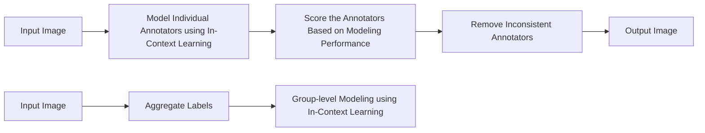

# ARTICLE: ANNOTATOR RELIABILITY THROUGH IN-CONTEXT LEARNING

# Sujan Dutta

Rochester Institute of Technology
sd2516@rit.edu

# Deepak Pandita

Rochester Institute of Technology
deepak@mail.rit.edu

# Tharindu Cyril Weerasooriya

Rochester Institute of Technology
cyril@mail.rit.edu

# Marcos Zampieri

George Mason University
mzampier@gmu.edu

# Christopher M Homan

Rochester Institute of Technology
cmhvcs@rit.edu

# Ashiqur R. KhudaBukhsh\*

Rochester Institute of Technology
axkvse@rit.edu

# ABSTRACT

This paper discusses and contains content that is offensive or disturbing.

Ensuring annotator quality in training and evaluation data is a key piece of machine learning in NLP. Tasks such as sentiment analysis and offensive speech detection are intrinsically subjective, creating a challenging scenario for traditional quality assessment approaches because it is hard to distinguish disagreement due to poor work from that due to differences of opinions between sincere annotators. With the goal of increasing diverse perspectives in annotation while ensuring consistency, we propose ARTICLE, an in-context learning (ICL) framework to estimate annotation quality through self-consistency. We evaluate this framework on two offensive speech datasets using multiple LLMs and compare its performance with traditional methods. Our findings indicate that ARTICLE can be used as a robust method for identifying reliable annotators, hence improving data quality.

Keywords Human Annotation · Crowd Sourcing · Humans and AI · Annotator Reliability

# 1 Introduction

From classical supervised systems $[3]$ to the RLHF framework $[4]$ , human input plays a central role in human value-aligned AI and NLP systems. Crowdsourcing is a well-studied, affordable, and distributed framework that allows data collection from broad and diverse annotator pools within a short period $[15, 21, 34]$ . The benefits of crowdsourcing notwithstanding, enforcing quality control and estimating annotation quality remain a long-standing challenge $[23, 18]$ .

Conventional approaches to distinguish high from poor quality annotators are typically based on outlier detection, where the divergence from aggregate opinions is considered a signal of poor quality annotation $[11, 24, 7, 33]$ . However, for subjective tasks $[28, 29, 32, 26, 20, 9]$ , such outlier-based approaches can potentially muffle minority or unique perspectives, leading to annotation echo chambers. Consider a war corpus where annotators hail from countries A and B. Even simple questions like who is winning the war could have drastically different responses depending on which country the annotator belongs to. If a pool has an overwhelming presence of A, any perspective that annotators from B could contribute to will be eliminated since their responses will be visibly different from the majority view.

This paper introduces an alternative path to estimate annotator quality through the lens of self-consistency. Prior work in this domain explored to address it through the lens of annotation patterns of individual annotators $[8, 17, 33]$ , without taking into account what is being annotated (context) and information of the annotator. Suppose we are interested in collecting a dataset of offensive speech. If we observe that a given annotator has marked one instance that attacks an ethnic group as highly offensive while marking another instance with an even sharper attack on the same group as not offensive, we immediately know that the annotator's responses are not self-consistent. Incorporating self-consistency into the annotation quality estimation process has the following benefits. First, it bypasses the requirement of having annotations from multiple other annotators to compute divergence from aggregate opinion, thus promising to be more

flowchart

Figure 1: Schematic Diagram of ARTICLE.

resource-efficient. Second, this approach preserves unique but self-consistent perspectives, which outlier-based methods might eliminate.

While the notion of self-consistency has been applied to diverse settings (see, e.g., Wang et al. [35], Cooper et al. [5]), to our knowledge, this paper first applies self-consistency for rater quality estimation on subjective annotation tasks. The introduction of large language models (LLM) with larger context lengths for language understanding has also led to research on utilizing LLMs [14, 16] as human annotators. However, prior research has focused on using the LLM [16] to replace the majority opinion of data annotation but not the intricate annotator-level labels.

Contributions. Our contributions are the following:

1. We introduce ARTICLE, a novel framework to estimate annotator quality through self-consistency;   
2. We evaluate this framework on two well-known English offensive speech datasets, (1) Toxicity Ratings [22] henceforth $D_{TR}$ and (2) VOICED [36] henceforth $D_{VOICED}$ and we contrast our approach with CrowdTruth (CT) [11].

# 2 Related Work

Crowdsourcing platforms such as Amazon Mechanical Turk, Toloka, and Prolific have played a critical role over the years for collecting annotations for training models $[21]$ . However, just as with any task with human annotators in the loop, prior research has identified instances when annotators have been inconsistent with providing information $[18, 1]$ . Röttger et al. $[30]$ demonstrated the impact of the paradigm (subjective or prescriptive) used during the survey on the (dis)agreement level of the annotations. These characteristics have led to research for modeling annotators and rating them for reliability.

Dawid and Skene [8] presented the initial two-stage generative model for inferring ground truth from unreliable annotators. The model assumes each annotator has a concealed error rate and utilizes expectation maximization to iteratively estimate these error rates along with the most probable ground truth labels based on the current error rate estimates. Hovy et al. [17] extended this model with a bipartite annotator model that distinguishes between spammers and non-spammers. CrowdTruth [12] is another method for measuring reliability of the annotators and the entire dataset as a whole based on their overall agree-ability with other annotators.

However, a limitation of prior work is not taking into consideration the content of the data item that is being annotated for scoring the performance of the annotators and how consistent the annotator is in-terms of annotating $[6]$ . In our research we explore how to utilize the capabilities of the LLM for understanding and identifying inconsistencies of the annotators utilizing context of the annotation task.

# 3 Methodology

We propose ARTICLE (Annotator Reliability Through In-Context Learning) – a two-step framework (Figure 1) to identify reliable annotators and model the perception of offense for different political groups. In the fist step, we identify the annotators who exhibit inconsistency in labeling and remove them from the dataset. In the second step, based on the aggregated responses of the consistent annotators, we model the group-level perception of offense.

line

| k    | F1 score |
| ---- | -------- |
| 0    | 0.67     |
| 0.35 | 0.68     |
| 0.45 | 0.70     |
| 0.5  | 0.71     |
| 0.6  | 0.71     |

line

| k    | F1 score |
| ---- | -------- |
| 0    | 0.66     |
| 0.35 | 0.66     |
| 0.45 | 0.70     |
| 0.5  | 0.68     |
| 0.6  | 0.68     |

line

| k    | F1 score |
| ---- | -------- |
| 0    | 0.64     |
| 0.35 | 0.635    |
| 0.45 | 0.67     |
| 0.5  | 0.68     |
| 0.6  | 0.70     |

Figure 2: Group-level model performance at different k values in $D_{TR}$ . The error bars indicate 95% confidence interval.

line

| k    | F1 score |
| ---- | -------- |
| 0    | 0.55     |
| 0.35 | 0.59     |
| 0.45 | 0.62     |
| 0.5  | 0.61     |
| 0.6  | 0.64     |

line

| k    | F1 score |
| ---- | -------- |
| 0    | 0.55     |
| 0.35 | 0.55     |
| 0.45 | 0.55     |
| 0.5  | 0.67     |
| 0.6  | 0.62     |

line

| k    | F1 score |
| ---- | -------- |
| 0    | 0.57     |
| 0.35 | 0.57     |
| 0.45 | 0.60     |
| 0.5  | 0.60     |
| 0.6  | 0.59     |

Figure 3: Group-level model performance at different k values in $D_{VOICED}$ . The error bars indicate 95% confidence interval.

# 3.1 Step 1: Identifying Inconsistent Annotators

We hypothesize that annotators who show inconsistent annotation patterns are difficult to model. We individually model each annotator using a state-of-the-art LLM, Mistral-7B-instruct [19], and utilize the model's performance (ease of modeling) as a proxy for the annotator's consistency. For each annotator, we randomly split their annotations into two sets – the first set (training set) contains 10 data points, and the second (test set) contains the rest. Using the training set as in-context learning (ICL) [10, 25] examples, we prompt Mistral-7B-instruct to predict the labels for the test set. The detailed prompt can be found in Figure 4. Then, we compute the F1-score to evaluate the model's performance. A high F1 score indicates the annotator is easy to model and, hence, consistent, and a low score indicates the opposite.

text_image

You are an expert in guessing my response against
a social media comment. Your task is to analyze and
predict my response against the comment after <<<<<>
into one of the following pre-defined categories:

offensive
non-offensive

###
Here are some examples:

Comment: {comment text}
Response: {response} (offensive/non-offensive)
...
(10 few-shot examples)
...
<<
Comment: {test comment text}
>>>

Figure 4: Prompt designed for ARTICLE.

We define a hyperparameter $(k)$ that acts as a threshold. If, for a given annotator, the F1-score is less than $k$ , we mark them as inconsistent and remove them from the dataset.

# 3.2 Step 2: Modeling Group-level Perception

After removing the inconsistent annotators from all political groups, we recompute the aggregate labels for each group. We again use ICL to model the group-level perception of offense. For each group, we construct a training set using 70% of the data. The rest is used for testing. For each test instance, we randomly sample 15 examples from the training set and use them as in-context examples. The same Mistral-7B-instruct model is used in this step.

# 4 Experimental Setup

# 4.1 Datasets

<table><tr><td>Political Leaning</td><td> $\mathcal{D}_{\text{TR}}$ </td><td> $\mathcal{D}_{\text{VOICED}}$ </td></tr><tr><td>Democrat</td><td>43%</td><td>34%</td></tr><tr><td>Republican</td><td>28%</td><td>36%</td></tr><tr><td>Independent</td><td>29%</td><td>30%</td></tr></table>

Table 1: Distribution of political leanings of the annotators in $D_{TR}$ and $D_{VOICED}$ .

We consider two datasets on web toxicity: $D_{TR}$ and $D_{VOICED}$ . $D_{TR}$ contains 107,620 comments from multiple social web platforms (Twitter, Reddit, and 4chan) collectively annotated by 17,280 annotators. We sample 20,000 comments from $D_{TR}$ for our experiments ensuring that each set of 20 comments is annotated by the same five annotators, thereby retaining the structure of the original dataset. $D_{VOICED}$ includes 2,338 YouTube comments annotated by 726 annotators. Both datasets include annotators from diverse political backgrounds with at least 28% (Table 1) representation from each major political affiliation – Democrats, Republicans, and Independents. In both datasets, comments are rated on a five-point scale of toxicity. To avoid rare classes, we convert these categories into binary labels. The lowest two toxic categories are mapped to non-offensive class, and the rest are mapped to offensive class.

# 4.2 Models

We primarily use Mistra-7B-instruct for the proposed framework; however, we have conducted experiments with Llama3-8B-instruct [31] and GPT-3.5-turbo [27] to ensure the stability of the method.

# 4.3 Computing Environment

We run all our experiments in a Google Colab (pro+) environment with a single A100 GPU (40 GB) and 52 GB RAM.

# 5 Inconsistent Annotation Examples

Before we discuss our results and findings, we make a short detour to highlight why consistency matters through a few illustrative examples. We present annotations from a few inconsistent annotators as identified by ARTICLE. For instance, in the first example, both the comments express that the government should not control abortion; however, the annotator labeled them differently. In the second example, the annotator labeled a seemingly harmless comment offensive; however, assigned a non-offensive label to a comment containing a racial slur.

# EXAMPLE ANNOTATOR #1

Comment: Abortion should be between the woman and God. I do agree the government should not control it. I'm not saying I agree with Abortion what so ever but the rioting and stuff is just ridiculous.

Label: offensive

Comment: The ‘state’ has no business deciding what women can or cannot do to their bodies. The fact that so many in the USA feel that abortion should be banned speaks more to a

moronic pandering to the right wing religious fringe crazies who want to impose THEIR beliefs on everyone.

Label: non-offensive

# EXAMPLE ANNOTATOR #2

Comment: Amazing to see some of our ex students still continuing on their passion for the arts

Label: offensive

Comment: yea lil ass went Mia that boy a hog. niggir finna average 3 assists a game a piece

Label: non-offensive

# EXAMPLE ANNOTATOR #3

Comment: If I Was A Cruddy niggir Like I USED To Be And I Knew A Girl With An OnlyFans Account. I'd Cyber Pimp That Hoe

Label: non-offensive

Comment: Omfg is it like engagement season or something??? Like everyone is getting engaged right now. Wtf

Label: offensive

# EXAMPLE ANNOTATOR #4

Comment: Oh you wanna be part of my business venture? You can help fill the twinkies with c-m

Label: non-offensive

Comment: Can't wait to see you guys

Label: offensive

# 6 Evaluation

# 6.1 Modeling Performance

We evaluate the proposed framework on $D_{TR}$ and $D_{VOICED}$ . In each dataset, we model the perception of offense for each political group: Democrat, Republican, and Independent. As mentioned earlier, our framework requires setting a value for the hyperparameter k. To study the impact of k, we run experiments for the following values of $k : \{0, 0.35, 0.45, 0.5, 0.6\}$ . The case k = 0 serves as the baseline where we do not remove any annotators from the dataset. Figures 2 and 3 illustrate the performance (F1-score on the test set) at various values of k for $D_{TR}$ and $D_{VOICED}$ , respectively. In general, in both the datasets, across all political groups, we observe an upward trend in the F1-score as the value of k increases with noticeable fluctuations for Independents. In almost all instances, the F1-score achieved with k = 0.45 surpassed the baseline performance, suggesting the effectiveness of the proposed method. We also note for most cases with k > 0.5, the performance either plateaus or declines slightly. It suggests that while increasing k generally improves model performance up to a point, there may be a threshold beyond which further increase in k does not yield additional benefits and might even be detrimental.

# 6.2 Data Loss

While increasing k improves modeling performance, the annotations lost in this process merit investigation. We first compute the percentage of the annotators remaining at various values of k. From Figures 5a and 5b, we note that $D_{VOICED}$ undergoes a sharper decline in annotators compared to $D_{TR}$ . However, at k = 0.45, we still retain the majority ( $\sim 70\%$ in $D_{TR}$ and $\sim 55\%$ in $D_{VOICED}$ ) of the annotators in both datasets, with Democrats generally showing the highest retention rates.

Next, we focus on the number of comments remaining as we increase k. We again compute this at group level for $D_{TR}$ (Figure 5c) and $D_{VOICEED}$ (Figure 5d). ARTICLE at k = 0.45, retains more than 80% of the comments in both datasets.

line

| k    | Democrat | Republican | Independent |
| ---- | -------- | ---------- | ----------- |
| 0    | 100      | 100        | 100         |
| 0.35 | 92       | 88         | 92          |
| 0.45 | 72       | 66         | 72          |
| 0.5  | 60       | 54         | 56          |
| 0.6  | 46       | 42         | 46          |

(a) $\mathcal{D}_{\mathrm{TR}}$

line

| k    | Democrat | Republican | Independent |
| ---- | -------- | ---------- | ----------- |
| 0    | 100      | 100        | 100         |
| 0.35 | 85       | 90         | 90          |
| 0.45 | 55       | 48         | 52          |
| 0.5  | 45       | 35         | 38          |
| 0.6  | 25       | 18         | 22          |

(b) $\mathcal{D}_{\mathrm{VOICED}}$

line

| k    | Democrat | Republican | Independent |
| ---- | -------- | ---------- | ----------- |
| 0    | 100      | 100        | 100         |
| 0.35 | 98       | 95         | 98          |
| 0.45 | 88       | 80         | 85          |
| 0.5  | 82       | 71         | 75          |
| 0.6  | 70       | 57         | 60          |

(c) $\mathcal{D}_{\mathrm{TR}}$

line

| k    | Democrat | Republican | Independent |
| ---- | -------- | ---------- | ----------- |
| 0    | 100      | 100        | 100         |
| 0.35 | 99       | 97         | 98          |
| 0.45 | 94       | 89         | 86          |
| 0.5  | 82       | 87         | 76          |
| 0.6  | 55       | 68         | 63          |

(d) $D_{VOICED}$   
Figure 5: Percentage of annotators and comments remaining at various value of k in $D_{TR}$ and $D_{VOICED}$ .

# 6.3 Comparison with CT

<table><tr><td>Political Leaning</td><td>CT (WQS ≥ 0.6)</td><td>ARTICLE (k ≥ 0.45)</td></tr><tr><td>Democrat</td><td>0.669 ± 0.016</td><td>0.696 ± 0.015</td></tr><tr><td>Republican</td><td>0.642 ± 0.018</td><td>0.671 ± 0.017</td></tr><tr><td>Independent</td><td>0.665 ± 0.018</td><td>0.696 ± 0.017</td></tr></table>

Table 2: Group-level modeling performance (F1-score on test set) comparison between ARTICLE and CT in $D_{TR}$ . The results are computed over five runs with different random seeds.

<table><tr><td>Political Leaning</td><td>CT (WQS ≥ 0.7)</td><td>ARTICLE (k ≥ 0.45)</td></tr><tr><td>Democrat</td><td>0.449 ± 0.036</td><td>0.616 ± 0.041</td></tr><tr><td>Republican</td><td>0.435 ± 0.032</td><td>0.605 ± 0.042</td></tr><tr><td>Independent</td><td>0.453 ± 0.036</td><td>0.557 ± 0.042</td></tr></table>

Table 3: Group-level modeling performance (F1-score on test set) comparison between ARTICLE and CT in $D_{VOICED}$ . The results are computed over five runs with different random seeds.

We compare our framework with CT, a well-known method of estimating the quality of annotations $[11]$ . CT computes multiple metrics on the annotated dataset, among which WQS measures the quality of the annotators. The value of WQS ranges between $[0, 1]$ . We consider annotators who score more than (or equal to) a specific WQS value and model their aggregated annotations following the second step of ARTICLE. Using $D_{TR}$ , we choose WQS = 0.6, as in this

setting, CT retains a similar percentage ( $\sim 70\%$ ) of annotators to ARTICLE (k = 0.45). Table 2 shows that ARTICLE outperforms CT across all groups. The results for $D_{VOICED}$ are presented in Table 3. Here, too, we notice a significant performance improvement with ARTICLE over CT.

other

| Group | Count |
|---|---|
| CrowdTruth only | 666 |
| Article only | 841 |
| All Annotators Groups (TR) | 458 |

pie

Democrat Leaning Annotators (TR)
| Category | Count |
| :--- | :--- |
| CrowdTruth only | 272 |
| Article only | 366 |
| Shared overlap | 168 |

other

| Category       | Count |
| -------------- | ----- |
| CrowdTruth     | 222   |
| ARTICLE        | 236   |
| Both           | 192   |

pie

Independent Leaning Annotators (TR)
| Category | Count |
| :--- | :--- |
| CrowdTruth only | 200 |
| Article only | 273 |
| Intersection | 114 |

Figure 6: Annotators that are identified as unreliable based on CT and ARTICLE scores for $D_{TR}$ . The last three Figures show the same inconsistent annotators broken down by their political leaning. For $D_{TR}$ , CT (WQS ≥ 0.6) and ARTICLE ( $k \geq 0.45$ ).

other

| Group       | Count |
| ----------- | ----- |
| CrowdTruth  | 237   |
| ARTICLE     | 258   |
| All Annotators Groups (VOICED) | 104   |

pie

Dem. Leaning Annotators (VOICED)
| Category | Count |
| :--- | :--- |
| CrowdTruth only | 98 |
| Article only | 73 |
| Overlap | 38 |

other

| Category | Count |
|---|---|
| Rep. Annotators (VOICED) only | 77 |
| Rep. Annotators (VOICED) and CrowdTruth | 45 |
| Article only | 97 |

pie

| Category | Count |
|---|---|
| CrowdTruth only | 62 |
| Article only | 88 |
| Intersection | 21 |
Ind. Annotators (VOICED) Total: 100 |
Ind. Annotators (VOICED) Only: 100

Figure 7: Annotators that are identified as unreliable based on CT and ARTICLE scores for $D_{VOICED}$ . The last three Figures show the same inconsistent annotators broken down by their political leaning. For $D_{VOICED}$ , CT ( $WQS \geq 0.86$ ) and ARTICLE ( $k \geq 0.46$ ).

We further investigate the overlap between ARTICLE and CT. Figures 6 and 7 show the venn diagram between the low-quality annotators identified by the two methods in $D_{TR}$ and $D_{VOICED}$ . We observe that while there is a substantial overlap between the two methods, there are annotators who are flagged as low-quality by one but not by the other. This suggests that these methods measure slightly different aspects of the annotation quality, and future work should explore ways to combine them in a single pipeline.

# 6.4 Stability across LLMs

<table><tr><td></td><td>Mistral</td><td>Llama3</td><td>CT</td></tr><tr><td>Mistral</td><td>-</td><td>0.60</td><td>0.35</td></tr><tr><td>Llama3</td><td>0.60</td><td>-</td><td>0.40</td></tr><tr><td>CT</td><td>0.35</td><td>0.40</td><td>-</td></tr></table>

Table 4: Jaccard similarities between inconsistent annotators identified by ARTICLE using different LLMs in $D_{TR}$ . It also includes similarities between each LLM and CT. Due to resource limitations, GPT was not used for this dataset.

Beyond Mistral-7B-instruct, we study the robustness of the ARTICLE framework across multiple LLMs. We consider two additional models: Llama3-8B-instruct [31] (open-sourced) and GPT-3.5-turbo [27] (v. 0125, proprietary). To study the stability of our framework, we look at the overlap between the inconsistent annotators found by different LLMs. More precisely, we compute the Jaccard similarity between the sets of inconsistent annotators identified using a pair of LLMs. To ensure a fair evaluation, for each LLM, we consider the annotators who score less than the median as the inconsistent annotators. Table 4 and 5 present the Jaccard similarities among the LLMs pairs in $\mathcal{D}_{\mathrm{TR}}$ and $\mathcal{D}_{\mathrm{VOICEED}}$ , respectively. We find a substantial ( $\geq 0.60$ ) similarity between every pair of LLM in both datasets, suggesting the stability of the framework. We also report the similarity between the annotators found by different LLMs with CT. The similarities between each LLM and CT are much lower ( $\leq 0.40$ ) than between any two LLMs. This result indicates that CT does not identify many inconsistent annotators as poor-quality annotators. On the other hand, ARTICLE does not remove many of the annotators deemed unreliable by CT.

<table><tr><td></td><td>Mistral</td><td>Llama3</td><td>GPT</td><td>CT</td></tr><tr><td>Mistral</td><td>-</td><td>0.68</td><td>0.65</td><td>0.18</td></tr><tr><td>Llama3</td><td>0.68</td><td>-</td><td>0.65</td><td>0.16</td></tr><tr><td>GPT</td><td>0.65</td><td>0.65</td><td>-</td><td>0.20</td></tr><tr><td>CT</td><td>0.18</td><td>0.16</td><td>0.20</td><td>-</td></tr></table>

Table 5: Jaccard similarities between inconsistent annotators identified by ARTICLE using different LLMs in $D_{VOICED}$ . It also includes similarities between each LLM and CT.

# 7 Conclusion

We introduce ARTICLE, a novel framework for estimating annotator quality through self-consistency. Our approach marks a significant shift from traditional outlier-based methods. Evaluations across two offensive speech datasets demonstrate that ARTICLE effectively identifies reliable annotators while preserving unique, self-consistent viewpoints that might be overlooked. Furthermore, the consistent performance of ARTICLE across multiple language models highlights its robustness. Focusing on self-consistency reduces the dependence on larger annotator pools, potentially lowering costs and increasing the feasibility of deploying quality control mechanisms in annotation tasks. The ongoing development of ARTICLE aims to enhance our understanding and management of the subjective nature of annotation, paving the way for more reliable and inclusive data collection methods.

# Limitations

While ARTICLE introduces a promising approach to annotator quality assessment, several limitations warrant further investigation:

# 7.1 Model Bias

Reliance on LLMs for evaluating self-consistency could introduce biases inherent to these models [2, 13]. These biases may affect the framework's ability to accurately estimate the quality of annotations, especially in contexts involving linguistic or cultural nuances that LLMs might not fully capture.

# 7.2 Handling Justified Disagreement:

ARTICLE currently lacks a robust mechanism to distinguish between justified disagreements and genuine inconsistencies in annotations which merits deeper exploration.

# 7.3 Generalizability Across Domains:

While tested on datasets involving offensive speech, the generalizability of the framework to other types of annotation tasks, such as medical image annotation or legal document analysis, remains unverified. Different domains may present unique challenges that require adaptations of the framework.

# 7.4 Dependency on Annotation Volume:

The effectiveness of ARTICLE is constrained by the volume of data available for each annotator. In scenarios where annotators contribute a low number of annotations, the assessment of self-consistency could be less reliable.

# Ethics Statement

ARTICLE's approach to annotation quality assessment through self-consistent intends to help mitigate potential biases towards minor perspectives in NLP systems. In this work, we used two publicly available datasets referenced in the paper. No new data collection has been carried out as part of this work. The datasets used do not reveal any identifiable information about the annotators.

# References

[1] Gavin Abercrombie, Dirk Hovy, and Vinodkumar Prabhakaran. Temporal and second language influence on intra-annotator agreement and stability in hate speech labelling. In 17th Linguistic Annotation Workshop 2023, pages 96–103. Association for Computational Linguistics, 2023.   
[2] Rishi Bommasani, Kathleen A Creel, Ananya Kumar, Dan Jurafsky, and Percy S Liang. Picking on the same person: Does algorithmic monoculture lead to outcome homogenization? Advances in Neural Information Processing Systems, 35:3663–3678, 2022.   
[3] Jaime G Carbonell, Ryszard S Michalski, and Tom M Mitchell. An overview of machine learning. Machine learning, pages 3–23, 1983.   
[4] Paul F Christiano, Jan Leike, Tom Brown, Miljan Martic, Shane Legg, and Dario Amodei. Deep reinforcement learning from human preferences. Advances in neural information processing systems, 30, 2017.   
[5] A Feder Cooper, Katherine Lee, Madiha Zahrah Choksi, Solon Barocas, Christopher De Sa, James Grimmelmann, Jon Kleinberg, Siddhartha Sen, and Baobao Zhang. Arbitrariness and social prediction: The confounding role of variance in fair classification. In Proceedings of the AAAI Conference on Artificial Intelligence, pages 22004-22012, 2024.   
[6] A. Feder Cooper, Katherine Lee, Madiha Zahrah Choksi, Solon Barocas, Christopher De Sa, James Grimmelmann, Jon Kleinberg, Siddhartha Sen, and Baobao Zhang. Arbitrariness and Social Prediction: The Confounding Role of Variance in Fair Classification, March 2024. URL http://arxiv.org/abs/2301.11562. arXiv:2301.11562 [cs, stat].   
[7] Aida Mostafazadeh Davani, Mark Díaz, and Vinodkumar Prabhakaran. Dealing with Disagreements: Looking Beyond the Majority Vote in Subjective Annotations. Transactions of the Association for Computational Linguistics, 10:92–110, January 2022. ISSN 2307-387X. doi: 10.1162/tacl\_a\_00449. URL https://direct.mit.edu/tacl/article/doi/10.1162/tacl\_a\_00449/109286/Dealing-with-Disagreements-Looking-Beyond-the.   
[8] A. P. Dawid and A. M. Skene. Maximum Likelihood Estimation of Observer Error-Rates Using the EM Algorithm. Applied Statistics, 28(1):20, 1979. ISSN 00359254. doi: 10.2307/2346806. URL http://www.jstor.org/stable/2346806.   
[9] Naihao Deng, Xinliang Zhang, Siyang Liu, Winston Wu, Lu Wang, and Rada Mihalcea. You are what you annotate: Towards better models through annotator representations. In Findings of the Association for Computational Linguistics: EMNLP 2023, pages 12475–12498. Association for Computational Linguistics, 2023.   
[10] Qingxiu Dong, Lei Li, Damai Dai, Ce Zheng, Zhiyong Wu, Baobao Chang, Xu Sun, Jingjing Xu, and Zhifang Sui. A survey on in-context learning. arXiv preprint arXiv:2301.00234, 2022.   
[11] Anca Dumitrache, Oana Inel, Lora Aroyo, Benjamin Timmermans, and Chris Welty. Crowdtruth 2.0: Quality metrics for crowdsourcing with disagreement. arXiv preprint arXiv:1808.06080, 2018.   
[12] Anca Dumitrache, Oana Inel, Lora Aroyo, Benjamin Timmermans, and Chris Welty. CrowdTruth 2.0: Quality Metrics for Crowdsourcing with Disagreement, August 2018. URL http://arxiv.org/abs/1808.06080.arXiv:1808.06080 [cs].   
[13] Arka Dutta, Adel Khorramrouz, Sujan Dutta, and Ashiqur R. KhudaBukhsh. Down the toxicity rabbit hole: A framework to bias audit large language models with key emphasis on racism, antisemitism, and misogyny. In Proceedings of the Thirty-Third International Joint Conference on Artificial Intelligence, IJCAI 2024, page To appear. ijcai.org, 2024.   
[14] Fabrizio Gilardi, Meysam Alizadeh, and Maël Kubli. ChatGPT Outperforms Crowd-Workers for Text-Annotation Tasks, March 2023. URL http://arxiv.org/abs/2303.15056. arXiv:2303.15056 [cs].   
[15] Mary L. Gray and Siddharth Suri. Ghost work: how to stop Silicon Valley from building a new global underclass. Houghton Mifflin Harcourt, Boston, 2019. ISBN 978-1-328-56628-7.   
[16] Zeyu He, Chieh-Yang Huang, Chien-Kuang Cornelia Ding, Shaurya Rohatgi, and Ting-Hao 'Kenneth' Huang. If in a Crowdsourced Data Annotation Pipeline, a GPT-4, February 2024. URL https://arxiv.org/abs/2402.16795v1.   
[17] Dirk Hovy, Taylor Berg-Kirkpatrick, Ashish Vaswani, and Eduard Hovy. Learning Whom to Trust with MACE. In Proceedings of the 2nd Workshop on Computational Linguistics for Literature, CLfL 2013 at the 2013 Conference of the North American Chapter of the Association for Computational Linguistics: Human Language Technologies, NAACL-HLT 2013, pages 1120–1130, Atlanta, Georgia, June 2013. Association for Computational Linguistics. ISBN 978-1-937284-47-3. URL https://www.aclweb.org/anthology/N13-1132.

[18] Olivia Huang, Eve Fleisig, and Dan Klein. Incorporating Worker Perspectives into MTurk Annotation Practices for NLP, November 2023. URL http://arxiv.org/abs/2311.02802. arXiv:2311.02802 [cs].   
[19] Albert Q Jiang, Alexandre Sablayrolles, Arthur Mensch, Chris Bamford, Devendra Singh Chaplot, Diego de las Casas, Florian Bressand, Gianna Lengyel, Guillaume Lample, Lucile Saulnier, et al. Mistral 7b. arXiv preprint arXiv:2310.06825, 2023.   
[20] Nan-Jiang Jiang and Marie-Catherine de Marneffe. Investigating reasons for disagreement in natural language inference. TACL, 10:1357–1374, 2022.   
[21] Daniel Kahneman, Olivier Sibony, and Cass R. Sunstein. Noise: a flaw in human judgment. Little, Brown Spark, New York, first edition edition, 2021. ISBN 978-0-316-45140-6 978-0-316-26665-9. OCLC: on1249942231.   
[22] Deepak Kumar, Patrick Gage Kelley, Sunny Consolvo, Joshua Mason, Elie Bursztein, Zakir Durumeric, Kurt Thomas, and Michael Bailey. Designing toxic content classification for a diversity of perspectives. In Seventeenth Symposium on Usable Privacy and Security (SOUPS 2021), pages 299–318, 2021.   
[23] Matthew Lease. On quality control and machine learning in crowdsourcing. In Workshops at the twenty-fifth AAAI conference on artificial intelligence, 2011.   
[24] Elisa Leonardelli, Stefano Menini, Alessio Palmero Aprosio, Marco Guerini, and Sara Tonelli. Agreeing to Disagree: Annotating Offensive Language Datasets with Annotators' Disagreement. In Proceedings of the 2021 Conference on Empirical Methods in Natural Language Processing, pages 10528–10539, 2021. doi:10.18653/v1/2021.emnlp-main.822. URL http://arxiv.org/abs/2109.13563. arXiv:2109.13563 [cs].   
[25] Sewon Min, Xinxi Lyu, Ari Holtzman, Mikel Artetxe, Mike Lewis, Hannaneh Hajishirzi, and Luke Zettlemoyer. Rethinking the role of demonstrations: What makes in-context learning work? arXiv preprint arXiv:2202.12837, 2022.   
[26] Yixin Nie, Xiang Zhou, and Mohit Bansal. What can we learn from collective human opinions on natural language inference data? In EMNLP, pages 9131–9143, 2020.   
[27] OpenAI. ChatGPT (Jun 14). https://chat.openai.com, 2022. gpt-3.5-turbo-0125.   
[28] Rebecca J Passonneau, Vikas Bhardwaj, Ansaf Salleb-Aouissi, and Nancy Ide. Multiplicity and word sense: evaluating and learning from multiply labeled word sense annotations. Language Resources and Evaluation, 46:219–252, 2012.   
[29] Ellie Pavlick and Tom Kwiatkowski. Inherent disagreements in human textual inferences. TACL, 7:677–694, 2019.   
[30] Paul Röttger, Bertie Vidgen, Dirk Hovy, and Janet B Pierrehumbert. Two contrasting data annotation paradigms for subjective nlp tasks. arXiv preprint arXiv:2112.07475, 2021.   
[31] Hugo Touvron, Louis Martin, Kevin Stone, Peter Albert, Amjad Almahairi, Yasmine Babaei, Nikolay Bashlykov, Soumya Batra, Prajjwal Bhargava, Shruti Bhosale, et al. Llama 2: Open foundation and fine-tuned chat models. arXiv preprint arXiv:2307.09288, 2023.   
[32] Alexandra N. Uma, Tommaso Fornaciari, Dirk Hovy, Silviu Paun, Barbara Plank, and Massimo Poesio. Learning from Disagreement: A Survey. Journal of Artificial Intelligence Research, 72:1385–1470, December 2021. ISSN 1076-9757. doi: 10.1613/jair.1.12752. URL https://jair.org/index.php/jair/article/view/12752.   
[33] Dmitry Ustalov, Nikita Pavlichenko, and Boris Tseitlin. Learning from Crowds with Crowd-Kit. Journal of Open Source Software, 9(96):6227, April 2024. ISSN 2475-9066. doi: 10.21105/joss.06227. URL https://joss.theoj.org/papers/10.21105/joss.06227.   
[34] Aobo Wang, Cong Duy Vu Hoang, and Min-Yen Kan. Perspectives on crowdsourcing annotations for natural language processing. Language resources and evaluation, 47:9–31, 2013.   
[35] Xuezhi Wang, Jason Wei, Dale Schuurmans, Quoc V. Le, Ed H. Chi, Sharan Narang, Aakanksha Chowdhery, and Denny Zhou. Self-consistency improves chain of thought reasoning in language models. In The Eleventh International Conference on Learning Representations, ICLR 2023, Kigali, Rwanda, May 1-5, 2023. OpenReview.net, 2023. URL https://openreview.net/pdf?id=1PL1NIMMrw.   
[36] Tharindu Weerasooriya, Sujan Dutta, Tharindu Ranasinghe, Marcos Zampieri, Christopher Homan, and Ashiqur KhudaBukhsh. Vicarious offense and noise audit of offensive speech classifiers: Unifying human and machine disagreement on what is offensive. In Houda Bouamor, Juan Pino, and Kalika Bali, editors, Proceedings of the 2023 Conference on Empirical Methods in Natural Language Processing, pages 11648–11668, Singapore, December 2023. Association for Computational Linguistics. doi: 10.18653/v1/2023.emnlp-main.713. URL https://aclanthology.org/2023.emnlp-main.713.