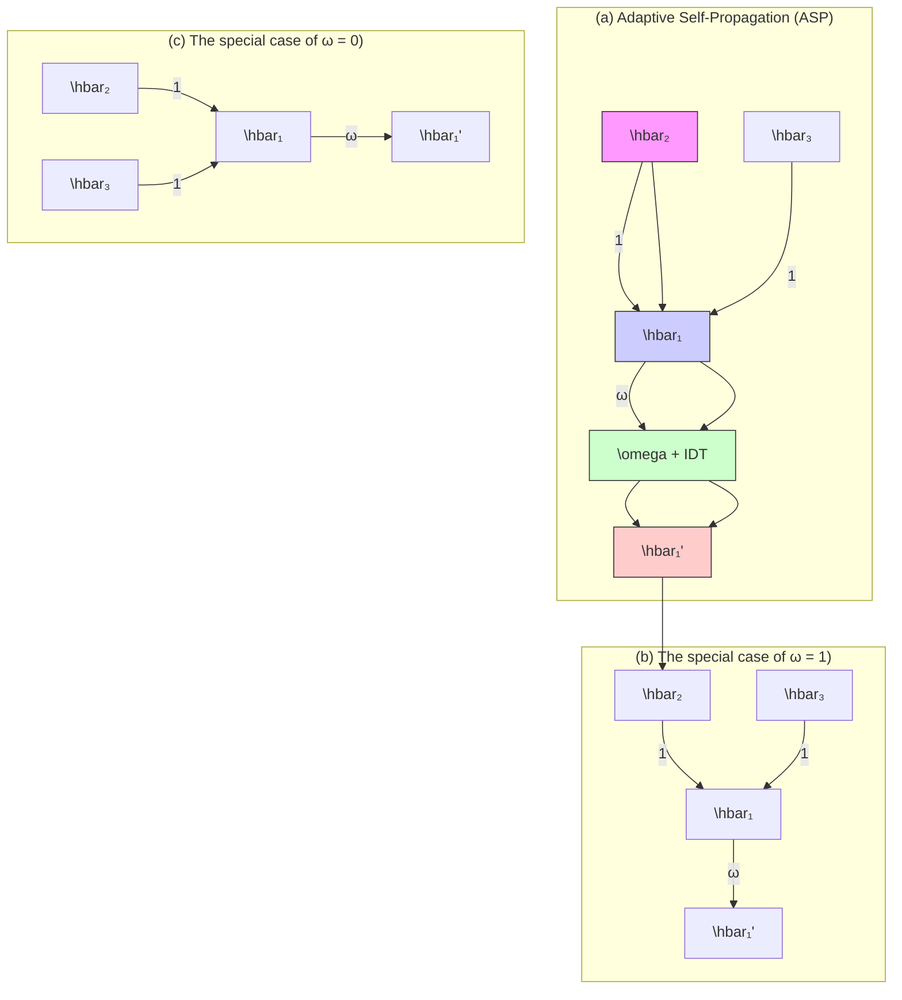

# Beyond Homophily: Graph Contrastive Learning with Macro-Micro Message Passing

Yiyuan Chen, Donghai Guan $^{*}$ , Weiwei Yuan, Tianzi Zang

College of Computer Science and Technology, Nanjing University of Aeronautics and Astronautics

{yy.chen, dhguan, yuanweiwei, zangtianzi}@nuaa.edu.cn

# Abstract

Graph contrastive learning (GCL) has drawn much research attention for its ability to learn node representations in a self-supervised manner. However, the homophily assumption inherent in GNN encoders limits the direction (macro-level) and the process (micro-level) of message passing in current GCL frameworks, impairing the expressive power of GCL in non-homophilous graphs. This paper presents a novel framework that employs Macro and Micro Message Passing in GCL (M³P-GCL) to overcome these limitations and advance performance in both homophilous and non-homophilous graphs. Specifically, at the macro-level, we integrate structural and attribute views to enhance the direction of message passing, and employ an Aligned Priority-Supporting View Encoding (APS-VE) strategy to facilitate contrastive training; at the micro-level, we propose an Adaptive Self-Propagation (ASP) strategy based on role segmentation of self-loops to diversify the process of message passing in the encoder. These enhancements effectively address the limitations imposed by the homophily assumption. Experiments demonstrate that M³P-GCL outperforms both supervised and unsupervised baselines in the node classification task on various datasets with different levels of homophily.

# Introduction

Graph contrastive learning (GCL) has garnered considerable attention for its effectiveness in reducing reliance on costly and labor-intensive annotated graph data (Ju et al. 2024). By maximizing the similarity between positive sample pairs and dissimilarity between negative sample pairs, the GCL paradigm has achieved promising results on many graph-based tasks (Xiong et al. 2023; Li et al. 2022a). To boost GCL performance, efforts often involve developing new data or model augmentation strategies (Wu et al. 2023; Gong, Yang, and Shi 2023) and refining effective contrastive objectives (Li, Jing, and Tong 2022; Chen et al. 2023).

Despite the successes of GCL, its ability to handle non-homophilous graphs is limited due to the homophily assumption in GNN encoders (Chen and Kou 2023). Homophily in a graph indicates that nodes with similar labels are likely to be closely connected, whereas heterophily represents the opposite. For instance, social graphs often exhibit homophily, with individuals connecting based on shared interests or backgrounds. In contrast, protein structures demonstrate heterophily, as different types of amino acids tend to connect. We maintain that such assumption, while beneficial for homophilous graphs, restricts both the direction (macro-level) and process (micro-level) of message passing, thereby weakening GCL's effectiveness in non-homophilous graphs.

From a macroscopic perspective, the neighborhood preference, which controls the direction of message passing, varies in graphs with varying levels of homophily. Our exploratory study reveals that homophilous graphs predominantly utilize structural neighborhood, whereas non-homophilous graphs rely on attribute neighborhood, which is defined by neighbors based on node attribute similarity. This explains why traditional GNNs struggle to handle non-homophilous graphs using structural neighborhood, and existing GCL methods based on GNN encoders inherit this issue. From a microscopic perspective, the role preference of self-loops in the process of message passing also varies across different graphs. To preserve the node intrinsic information, traditional GNNs incorporate self-loops as additional neighbors to normalize the adjacency matrix during feature propagation. The equivalent treatment of node itself and its neighbors may not fully accommodate graphs with low homophily, where nodes often exhibit significant differences from their neighbors. Some works (Zhu et al. 2020; Jin et al. 2021) have attempted to bridge this gap by diversifying the aggregation of higher-order neighbors, which not only increases algorithmic complexity but may also degrade performance on homophilous graphs. So far, few studies have specifically explored the perspective of self-loops' role preference across different graphs.

To address the aforementioned limitations, we integrate Macro and Micro Message Passing in GCL to propose the M $^{3}$ P-GCL framework. It comprehensively captures both structural and attribute information of graph, and adapts the self-propagation mode to learn expressive node representations for diverse graphs beyond homophily in a self-supervised manner. In response to the macro-level neighborhood preference, we leverage two views defined by distinct edge types—the structural view and the attribute view—and further define the priority view and supporting view to high-

light the dominant and secondary roles of these views in homophilous and non-homophilous graphs. For homophilous graphs, the structural view serves as the priority view, the attribute view is the supporting view. Conversely, for non-homophilous graphs, the roles of view swap. Typically, these two views contain distinct information and therefore exhibit substantial distribution differences in the embedding space, so directly comparing them may not fully reveal their intrinsic connections (Tian et al. 2020). To fix it, we align the supporting view's embedding by adding in the global embedding of the priority view, preparing it for further contrasting. This macro-level propagation overcomes the limitations of structural links, alleviating the lack of interaction between long-range nodes.

On the other hand, concerning the micro-level role preference of self-loops, we extend traditional propagation process by decomposing the self-propagation into two parts: neighbor-like aggregation and self-individual transformation. The neighbor-like aggregation remains treating self-loops as neighbors for feature propagation; whereas self-individual transformation treats self-loops as independent entities for propagation, directly employing an identity function for its straightforward efficiency. The summation of these two outputs yields the feature representation of the anchor node after one round of propagation. This micro-level propagation allows for a more flexible and adaptable message-passing process by accommodating the independent propagation style of each node's inherent feature.

By integrating the macroscopic and microscopic propagation previously discussed, our model shows an exceptional adaptability in handling graphs with varying levels of homophily. Our contributions are as follows:

- We assert that graphs with varying homophily level exhibit distinct neighborhood preference. Utilizing both structural and attribute neighborhood enhances the superiority and generalizability of GCL.   
- We introduce an Aligned Priority-Supporting View Encoding (APS-VE) strategy to combine structural and attribute views for macro message passing, enabling diverse feature extraction from different directions.   
- We propose an Adaptive Self-Propagation (ASP) strategy to adjust the role of self-loops for micro message passing, enhancing the flexibility of self-propagation.   
- Extensive experiments demonstrate the superior performance of our method over representative supervised and unsupervised baselines in the node classification task.

# Related Works

Graph Neural Networks (GNNs) are pivotal for graph data analysis, with foundational models like GCN (Kipf and Welling 2016), GAT (Veličković et al. 2017) and Graph-SAGE (Hamilton, Ying, and Leskovec 2017) performing well in homophilous networks but facing limitations in non-homophilous ones. To enhance inclusivity, Geom-GCN (Pei et al. 2020) innovatively redefines neighbors in the latent space. While some architectures (Zhu et al. 2020; Abu-El-Haija et al. 2019; Jin et al. 2021) explore higher-order structural neighbors to capture interactions among both adjacent and distant nodes. Meanwhile, GBK-GNN (Du et al. 2022), GloGNN (Li et al. 2022b), and CPGNN (Zhu et al. 2021) consider the homophily level of each edge to adjust aggregation weights of neighboring features and FAGCN (Bo et al. 2021) adaptively integrate low-frequency and high-frequency signals from node features using a self-gating mechanism. These methods, while beneficial, lack a profound comprehension of the preference in propagation direction across graphs with different levels of homophily, a significant yet often overlooked factor, thereby limiting their potential for performance improvement.

Graph Contrastive Learning (GCL) learns node and graph representations without relying on labels, focusing on innovative data or model augmentation techniques and refined contrastive strategies. For example, AD-GCL (Suresh et al. 2021) and GACN (Wu et al. 2023) employ adversarial training for enhanced view augmentation. NCLA (Shen et al. 2023) enhances view augmentation though a multi-head attention mechanism and expands the role of neighbor nodes as positive samples. HomoGCL (Li et al. 2023), on the other hand, enriches neighbor positive pairs through soft clustering to estimate same-class likelihood for neighboring nodes. HSCAN (Liu et al. 2023a) adjusts contrastive weights for node pairs based on clustering confidence to boost discrimination. gCooL (Li, Jing, and Tong 2022) incorporates community-level contrasts, and CSGCL (Chen et al. 2023) leverages community strength to enhance view augmentation and refine contrastive strategy. S³CL (Ding et al. 2023) captures graph patterns through structural and semantic dual-contrast. However, these methods overlook graph heterophily and thus reduce model generalizability. Responding to this, GREET (Liu et al. 2023b) contrasts homophilous and non-homophilous edge views by applying low-frequency and high-frequency filters. ASP (Chen and Kou 2023) preserves structural and attribute information via performing joint contrastive optimization across structural, attribute, and global views to handle graphs beyond homophily. Yet, it fails to perceive the synergistic optimization potential of structural and attribute views, resulting in suboptimal performance and increased computational cost.

# Preliminaries

# Notations

Consider an undirected attributed graph $\mathcal{G} = (\mathcal{V},\mathcal{E},\mathbf{X})$ , where $\mathcal{V} = \{v_1,v_2,\ldots ,v_N\}$ is the node set comprising $N$ nodes, $\mathcal{E}\subseteq \mathcal{V}\times \mathcal{V}$ is the edge set that defines the relationships among nodes, and $\mathbf{X} = [x_1,x_2,\dots ,x_N]^T\in \mathbb{R}^{N\times F}$ is the attribute matrix of the nodes with $F$ attributes per node. In a node classification scenario, each node $v_{i}$ has a corresponding label $y_{i}\in \mathcal{Y}$ . The adjacency matrix is represented by $\mathbf{A}\in \{0,1\}^{N\times N}$ , and $\hat{\mathbf{A}}\in \{0,1\}^{N\times N}$ denotes the adjacency matrix with self-loops included. The diagonal degree matrices associated with $\mathbf{A}$ and $\hat{\mathbf{A}}$ are $\mathbf{D}\in \mathbb{R}^{N\times N}$ and $\hat{\mathbf{D}}\in \mathbb{R}^{N\times N}$ , respectively. For simplicity, the attributed graph can also be denoted as $\mathcal{G} = (\mathbf{A},\mathbf{X})$ .

# Homophily and Heterophily

This paper employs the edge homophily ratio (Zhu et al. 2020) to quantify the tendency of nodes to be connected based on identical labels. This ratio is defined as the proportion of edges linking nodes with the same labels and is denoted as $h_{edge}$ :

$$
h _ {\text { edge }} = \frac {| \{(v _ {i} , v _ {j}) : (v _ {i} , v _ {j}) \in \mathcal {E} \land y _ {i} = y _ {j} \} |}{| \mathcal {E} |}, \tag {1}
$$

here a high $h_{edge}$ close to 1 indicates strong homophily, where most edges connect nodes within the same class. Conversely, a low $h_{edge}$ close to 0 suggests strong heterophily, with edges predominantly linking nodes from different classes (Zhu et al. 2020). A graph is classified as homophilous if its edge homophily ratio exceeds 0.5, and nonhomophilous if it is below this threshold (Chen and Kou 2023).

# Graph Contrastive Learning

The traditional GCL framework involves three key modules: view augmentation, view encoding, and contrastive training. Initially, view augmentation introduces diversity into the graph $\mathcal{G}$ by applying various permutations, resulting in two distinct views denoted as $\mathbf{v}_1$ and $\mathbf{v}_2$ . Techniques such as node feature masking and edge dropout are used for this purpose. Next, in the view encoding step, the augmented views are processed using two separate encoders $f_1$ and $f_2$ (or a shared encoder $f$ ). This produces the node representations $\mathbf{h}^{(1)} = f_1(\mathbf{v}_1)$ and $\mathbf{h}^{(2)} = f_2(\mathbf{v}_2)$ , translating the diverse views into a latent space where graph information is captured as node embeddings. Finally, contrastive training utilizes a contrastive loss function, such as the InfoNCE loss (Gutmann and Hyvärinen 2010), to maximize the mutual information $\mathcal{MI}(\mathbf{h}_i^{(1)}, \mathbf{h}_i^{(2)})$ between the two views of the same node instance $v_i$ .

Proposed Method   


<details>
<summary>bar</summary>

| Dataset | Homophilous datasets | Non-homophilous datasets |
| :--- | :--- | :--- |
| Cora | 83.4 | 38.4 |
| CiteSeer | 70.5 | 65.7 |
| PubMed | 80.3 | 74.0 |
| Texas | 65.7 | 77.2 |
| Wisconsin | 51.3 | 79.6 |
| Actor | 28.8 | 31.3 |
</details>

Figure 1: Comparative analysis of structural views and attribute views in GCL for node classification performance across homophilous and non-homophilous datasets.

As an exploratory study, we utilize either structural views or attribute views in GCL to perform parallel experiments on homophilous and non-homophilous datasets. Figure 1 visualizes the average accuracy of node classification. We discover that structural views are superior for homophilous graphs, whereas attribute views prevail in non-homophilous graphs. Motivated by this view preference, we advocate for a dual-scale view strategy to expand the direction of message passing at the macro level, and then perform Aligned Priority-Supporting View Encoding that fuses two essential insights to handle both homophilous and non-homophilous graphs. Additionally, we incorporated an Adaptive Self-Propagation (ASP) on the SGC (Wu et al. 2019) encoder to enrich the process of message passing at the micro level, forming the complete M $^{3}$ P-GCL framework. The details are provided in this section and illustrated in Figure 2.

# View Generation and Role-Definition

The direction of feature propagation controlled by view determines the information captured by node representations, thereby critically influencing contrastive learning. Most GCL methods generate views from the original graph $\mathcal{G}$ by perturbing structural edges, with each view maintaining a uniform structural scale. Here, "scale" refers to the types of node connections: structural edges represent one scale, while attribute edges based on node attribute similarity represent another. These types of edges create two views at different scales, each defining a distinct neighborhood for the same anchor node. We argue that the single-scale structural views contrast is inadequate for learning diverse graph node representations and hampers model generalization, particularly given the differing neighborhood preferences in homophilous and non-homophilous graphs. Hence, to surpass homophily, we combine both the structural view $\mathbf{v}^{str}$ and the attribute view $\mathbf{v}^{att}$ in our work. Recognizing their distinct contributions in graphs with varying homophily levels, we further define the priority view $\mathbf{v}^p$ and the supporting view $\mathbf{v}^s$ to reflect their roles.

Structural View and Attribute View. Given the original graph G, we aim to capture both structural interactions and attribute similarities among nodes. To achieve this, we first construct a k-nearest-neighbor (kNN) graph $\mathcal{G}_{\mathbf{A}} = (\mathbf{A}^{F}, \mathbf{X})$ based on node attribute similarity by calculating the cosine distance between node features X, defined as:

$$
d _ {\cos} (v _ {i}, v _ {j}) = 1 - \frac {x _ {i} \cdot x _ {j}}{\| x _ {i} \| _ {2} \| x _ {j} \| _ {2}}, \tag {2}
$$

where $x_{i}$ and $x_{j}$ are the feature vectors of nodes $v_{i}$ and $v_{j}$ , respectively. An attribute edge is added between nodes $v_{i}$ and $v_{j}$ if $v_{j}$ is among the k nearest neighbors of $v_{i}$ based on this distance. This kNN graph $G_{A}$ captures attribute-based relationships between nodes that are similar in their features but not necessarily connected in the original graph G.

Once we have the original graph G and the kNN graph $G_{A}$ , we apply random edge dropout on both graphs to generate the structural view $v^{str}$ and the attribute view $v^{att}$ . These two views, each at different scale, determine separate propagation scheme involving anchor nodes, overcoming the local interactions confined to structural edges and capturing comprehensive graph information for GCL.

Priority View and Supporting View. Given the structural view $v^{str}$ and attribute view $v^{att}$ , we utilize both to learn node representations in homophilous and non-homophilous


<details>
<summary>flowchart</summary>

```mermaid
graph LR
    A["View Generation and Role-Definition"] --> B["Macro-Micro View Encoding"]
    B --> C["Contrastive Training"]

    subgraph_A["View Generation and Role-Definition"]
        D["original graph G"] --> E["structural view v^str"]
        F["kNN graph G_A"] --> G leurative graph kNN
    end

    subgraph_B["Macro-Micro View Encoding"]
        H["ASP-SGC Encoder"] --> I["Theta_p"]
        J["ASP-SGC Encoder"] --> K["Theta_s"]
        L["ASP-SGC Encoder"] --> M["H^p"]
        N["ASP-SGC Encoder"] --> O["H^sa"]
    end

    subgraph_C["Contrastive Training"]
        P["InfoNCE loss"] --> Q["InfoNCE loss"]
        R["Infra-negative node pairs"] --> S["Intra-negative node pairs"]
    end

    D -->|edge dropout| F
    F --> G
    G --> H
    H --> I
    I --> J
    J --> K
    K --> L
    L --> M
    M --> O
    O --> P
    style A fill:#f9f,stroke:#333
    style B fill:#ccf,stroke:#333
    style C fill:#cfc,stroke:#333
    style D fill:#fcc,stroke:#333
    style E fill:#cff,stroke:#333
    style F fill:#ffc,stroke:#333
    style G fill:#cfc,stroke:#333
    style H fill:#fcc,stroke:#333
    style I fill:#ffc,stroke:#333
    style J fill:#fcc,stroke:#333
    style K fill:#cfc,stroke:#333
    style L fill:#fcc,stroke:#333
    style M fill:#cfc,stroke:#333
```
</details>

Figure 2: The overview of M³P-GCL framework. We apply edge dropout on the original and kNN graphs to create structural and attribute views. In homophilous graphs, the structural view is designated as the priority view and the attribute view as the supporting view; in non-homophilous graphs, these roles swap. Next, the views are fed into two ASP-SGC encoders. After aligning the supporting embeddings we train the model using the InfoNCE contrastive loss.

graphs. Recognizing their differing effectiveness in these contexts, we delineate the roles of these views by introducing priority view $v^{p}$ and supporting view $v^{s}$ . This role distinction helps to clarify how each view uniquely contributes to the understanding of graph information. To be specific, the priority view $v^{p}$ is the predominant perspective for extracting robust node representations, exerting a central influence on the graph learning process. The supporting view $v^{s}$ is less proficient in feature extraction, yet it complements the GCL by providing unique information beyond the priority view. For homophilous graphs, the priority view is the structural view while the supporting view is the attribute view. In non-homophilous graphs, the priority view is the attribute view, and the supporting view is the structural view.

# Macro-Micro View Encoding

In this subsection, we first introduce the ASP-SGC encoder, which handles micro message passing regardless of view type. Then we use it to encode the priority and supporting views with alignment, enabling effective macro message passing.

Adaptive Self-Propagation (ASP). The efficacy of GNNs is fundamentally rooted in the message-passing process, encompassing the iterative aggregation of features from neighbors and the node itself. Typically, GNNs treat self-loops as neighbors for feature aggregation, effective in homophilous graphs but limited in non-homophilous contexts. The essence lies in the varying homophily of these graphs: in homophilous graphs, the inherent homophily endorses the self-loop's role as a neighbor in propagation. Yet, in non-homophilous graphs, the significant divergence between node and its neighbors compromises the effectiveness of this role equivalence. To adaptively harmonize this preference across diverse graphs, we advance the traditional propaganda


<details>
<summary>flowchart</summary>


</details>

Figure 3: (a) The Adaptive Self-Propagation (ASP) strategy. $\omega$ is a role weighting factor that determines the proportion of each role in the self-loop. (b) The self-loop fully acts as a neighbor. (c) The self-loop fully acts as an individual.

tion process by balancing the independence and assimilation of node self-propagation. Specifically, we segment self-propagation into two parts: neighbor-like aggregation and self-individual transformation, adjusted by a weighting factor $\omega$ . Neighbor-like aggregation uses the assimilated feature part $\omega h_{i}$ to adhere to the standard neighbor feature propagation; self-individual transformation employs the independent feature part $(1 - \omega)h_{i}$ to perform the identity transformation. The total of these outputs produces the anchor node's intermediate representations after one round of feature propagation. By applying this strategy to the SGC (Wu et al. 2019), we obtain the final encoder—ASP-SGC. The formula for one iteration of feature propagation is:

$$
\mathbf {H} ^ {(k + 1)} = \underbrace {(1 - \omega) \mathbf {H} ^ {(k)}} _ {\text { self   -   individual }} + \underbrace {\tilde {\mathbf {A}} \mathbf {H} ^ {(k)} \Theta} _ {\text { neighbor   -   like }}, \tag {3}
$$

where $\tilde{A}$ is the normalized adjacency matrix defined as $\tilde{A} = \hat{D}^{-1/2} \hat{A} \hat{D}^{-1/2}$ , with $\hat{A} = A + \omega I$ and $\hat{D} = D + \omega I$ . $\Theta$ is a trainable weight matrix. Two special cases arise with different values of $\omega$ : setting $\omega = 1$ allows self-loops to fully act as a neighbor during feature propagation, whereas $\omega = 0$ detaches self-loops from the role of neighbors for independent self-propagation. The formulas are:

$$
\begin{array}{l} \mathbf {H} ^ {(k + 1)} \stackrel {\omega = 1} {=} \tilde {\mathbf {A}} \mathbf {H} ^ {(k)} \Theta \\ = (\mathbf {D} + \mathbf {I}) ^ {- \frac {1}{2}} (\mathbf {A} + \mathbf {I}) (\mathbf {D} + \mathbf {I}) ^ {- \frac {1}{2}} \mathbf {H} ^ {(k)} \Theta , \tag {4} \\ \end{array}
$$

$$
\mathbf {H} ^ {(k + 1)} \stackrel {\omega = 0} {=} \mathbf {H} ^ {(k)} + \tilde {\mathbf {A}} \mathbf {H} ^ {(k)} \Theta
$$

$$
= \mathbf {H} ^ {(k)} + \mathbf {D} ^ {- \frac {1}{2}} \mathbf {A D} ^ {- \frac {1}{2}} \mathbf {H} ^ {(k)} \Theta . \tag {5}
$$

Aligned Priority-Supporting View Encoding (APS-VE). Traditional contrastive training in GCL relies on directly comparing embeddings from different views at the same scale, face a limitation in multi-scale scenarios. While embeddings from the same scale show a consistent distribution, those drawn from different scales frequently exhibit significant variance, indicating a poor match. This mismatch makes the multi-scale views incompatible for effective contrastive learning. To fix this, we introduce an Aligned Priority-Supporting View Encoding (APS-VE) strategy to keep the node representations aligned across scales.

Given the priority and supporting views, we feed them into two separate ASP-SGC encoders, to extract their distinctive information, respectively. For the priority view $v^{p}$ , the encoding process generates priority node embeddings $H^{p}$ . For the supporting view $v^{s}$ , once we initially obtain its node embeddings $H^{s}$ , we reuse the same encoder to encode the priority view from a global perspective. Due to direct edges in the supporting view that may be indirect in the priority view, the global hop g is defined as the number of hops required for anchor nodes in the priority view to reach all the neighborhood nodes appearing in the supporting view, i.e., the supplementary global structure of the priority view must fully contain these neighborhood nodes. The resulting embeddings are integrated with $H^{s}$ , yielding the aligned final node embeddings $H^{sa}$ for the supporting view $v_{s}$ . Formally, we have

$$
\left\{ \begin{array}{l} \mathbf {H} ^ {p} = \operatorname{ASP-SGC} _ {p} \left(\mathbf {v} ^ {p}, l; \Theta_ {p}\right), \\ \mathbf {H} ^ {s a} = \operatorname{ASP-SGC} _ {s} \left(\mathbf {v} ^ {s}, l ^ {\prime}; \Theta_ {s}\right) + \operatorname{ASP-SGC} _ {s} \left(\mathbf {v} ^ {p}, g; \Theta_ {s}\right), \end{array} \right. \tag {6}
$$

where $\mathrm{ASP-SGC}_{p}(\cdot)$ encodes the priority view and $\mathrm{ASP-SGC}_{s}(\cdot)$ encodes the supporting view, with $\Theta_{p}$ and $\Theta_{s}$ as their respective weight parameters. l and $l'$ represent local hops, while g denotes the global hop.

# Contrastive Training

Given node embeddings $H^{p}$ and $H^{sa}$ from different views, we construct an InfoNCE (Gutmann and Hyvärinen 2010) contrastive loss to train the model parameters. Specifically, for the anchor node $v_{i}$ , the learned node embeddings $h_{i}^{p}$ and $h_{i}^{sa}$ form the positive sample pair, and node embeddings other than these are naturally regarded as negative sample pairs. With the defined positive and negative sample pairs, the InfoNCE loss function for our framework is:

$$
\begin{array}{l} \mathcal {L} (v _ {i}) = \\ - \log \frac {e ^ {\mathcal {S} \left(\mathbf {h} _ {i} ^ {p} , \mathbf {h} _ {i} ^ {s a}\right) / \tau}}{\sum_ {j = 1} ^ {N} e ^ {\mathcal {S} \left(\mathbf {h} _ {i} ^ {p} , \mathbf {h} _ {j} ^ {s a}\right) / \tau} + \sum_ {u \in \{p, s a \}} \sum_ {\substack {j = 1 \\ j \neq i}} ^ {N} e ^ {\mathcal {S} \left(\mathbf {h} _ {i} ^ {u}, \mathbf {h} _ {j} ^ {u}\right) / \tau}}, \tag{7} \\ \end{array}
$$

$$
\mathcal {L} = \frac {1}{N} \sum_ {i = 1} ^ {N} \mathcal {L} (v _ {i}), \tag {8}
$$

where $\tau$ denotes the temperature parameter, and $S(\cdot)$ is the cosine similarity used to measure the agreement score between two vectors.

# Experimental Results

In this section, we conduct extensive experiments to validate the proposed M $^{3}$ P-GCL. We begin by outlining the experimental settings and then present and analyze the results.

Experimental Setup 

<table><tr><td>Datasets</td><td>#Nodes</td><td>#Edges</td><td>#Features</td><td>#Classes</td><td> $h_{\text{edge}}$ </td><td>Type</td></tr><tr><td>Cora</td><td>2708</td><td>10556</td><td>1433</td><td>7</td><td>0.81</td><td></td></tr><tr><td>CiteSeer</td><td>3327</td><td>9104</td><td>3703</td><td>6</td><td>0.74</td><td>Homophily</td></tr><tr><td>PubMed</td><td>19717</td><td>88648</td><td>500</td><td>3</td><td>0.80</td><td></td></tr><tr><td>Cornell</td><td>183</td><td>298</td><td>1703</td><td>5</td><td>0.31</td><td></td></tr><tr><td>Texas</td><td>183</td><td>325</td><td>1703</td><td>5</td><td>0.11</td><td rowspan="2">Heterophily</td></tr><tr><td>Wisconsin</td><td>251</td><td>515</td><td>1703</td><td>5</td><td>0.20</td></tr><tr><td>Actor</td><td>7600</td><td>30019</td><td>932</td><td>5</td><td>0.22</td><td></td></tr></table>

Table 1: Datasets Statistics.

Datasets. To evaluate the performance of different methods, we use seven public real-world datasets with varying levels of homophily: homophilous datasets Cora, CiteSeer, and PubMed (Yang, Cohen, and Salakhudinov 2016), and non-homophilous datasets Cornell, Texas, Wisconsin, and Actor (Pei et al. 2020). Homophilous datasets represent documents and citation links. Non-homophilous datasets include web page hyperlink networks for Cornell, Texas, and Wisconsin, and an actor co-occurrence network for Actor. Their respective node attributes are bag-of-words representations. We use the fixed splits for the three homophilous datasets as established by Yang, Cohen, and Salakhutdinov (2016), and for the four non-homophilous datasets, we adhere to the splits defined by Pei et al. (2020). Statistics are summarized in Table 1.

Baselines. We evaluate M $^{3}$ P-GCL against supervised baselines—MLP, GCN (Kipf and Welling 2016), SGC (Wu et al. 2019), H $_{2}$ GCN (Zhu et al. 2020), UGCN (Jin et al. 2021) and FAGCN (Bo et al. 2021), and self-supervised contrastive methods—CSGCL (Chen et al. 2023), NCLA (Shen et al. 2023), HSAN (Liu et al. 2023a), HomoGCL (Li et al. 2023), ASP (Chen and Kou 2023) and GREET (Liu et al.

<table><tr><td rowspan="2">Methods</td><td rowspan="2">B.H.</td><td colspan="2">Cornell</td><td colspan="2">Texas</td><td colspan="2">Wisconsin</td><td colspan="2">Actor</td></tr><tr><td>ACC</td><td>F1</td><td>ACC</td><td>F1</td><td>ACC</td><td>F1</td><td>ACC</td><td>F1</td></tr><tr><td colspan="10">SUPERVISED ALGORITHMS</td></tr><tr><td>MLP</td><td></td><td> $71.35_{\pm 3.24}$ </td><td> $46.36_{\pm 2.89}$ </td><td> $72.43_{\pm 2.65}$ </td><td> $44.33_{\pm 8.64}$ </td><td> $76.08_{\pm 1.47}$ </td><td> $50.80_{\pm 4.69}$ </td><td> $35.09_{\pm 0.91}$ </td><td> $29.26_{\pm 2.38}$ </td></tr><tr><td>GCN</td><td></td><td> $53.33_{\pm 2.60}$ </td><td> $11.69_{\pm 1.15}$ </td><td> $67.80_{\pm 0.53}$ </td><td> $21.54_{\pm 0.00}$ </td><td> $64.32_{\pm 1.08}$ </td><td> $23.33_{\pm 0.80}$ </td><td> $28.34_{\pm 0.41}$ </td><td> $18.71_{\pm 1.21}$ </td></tr><tr><td>SGC</td><td></td><td> $40.54_{\pm 0.00}$ </td><td> $11.54_{\pm 0.00}$ </td><td> $64.86_{\pm 0.00}$ </td><td> $19.67_{\pm 0.00}$ </td><td> $58.04_{\pm 2.00}$ </td><td> $23.73_{\pm 1.13}$ </td><td> $26.29_{\pm 0.84}$ </td><td> $15.00_{\pm 0.59}$ </td></tr><tr><td>H2GCN</td><td>√</td><td> $45.95_{\pm 0.00}$ </td><td> $20.17_{\pm 0.00}$ </td><td> $68.54_{\pm 0.45}$ </td><td> $23.73_{\pm 1.13}$ </td><td> $71.37_{\pm 2.93}$ </td><td> $41.14_{\pm 7.39}$ </td><td> $34.50_{\pm 0.48}$ </td><td> $25.95_{\pm 0.96}$ </td></tr><tr><td>UGCN</td><td>√</td><td> $63.24_{\pm 6.51}$ </td><td> $37.76_{\pm 7.55}$ </td><td> $71.35_{\pm 5.57}$ </td><td> $35.30_{\pm 4.17}$ </td><td> $64.31_{\pm 8.26}$ </td><td> $27.53_{\pm 6.14}$ </td><td> $34.43_{\pm 0.41}$ </td><td> $28.78_{\pm 0.56}$ </td></tr><tr><td>FAGCN</td><td>√</td><td> $68.11_{\pm 4.32}$ </td><td> $45.02_{\pm 3.66}$ </td><td> $72.97_{\pm 2.96}$ </td><td> $44.22_{\pm 8.40}$ </td><td> $77.65_{\pm 2.00}$ </td><td> $49.41_{\pm 5.41}$ </td><td> $35.67_{\pm 0.51}$ </td><td> $30.08_{\pm 0.99}$ </td></tr><tr><td colspan="10">SELF-SUPERVISED ALGORITHMS</td></tr><tr><td>NCLA</td><td></td><td> $49.69_{\pm 3.18}$ </td><td> $38.65_{\pm 2.02}$ </td><td> $67.48_{\pm 0.17}$ </td><td> $33.40_{\pm 2.09}$ </td><td> $55.19_{\pm 1.51}$ </td><td> $29.62_{\pm 1.21}$ </td><td> $30.64_{\pm 0.69}$ </td><td> $25.70_{\pm 0.81}$ </td></tr><tr><td>HSAN</td><td></td><td> $57.51_{\pm 2.41}$ </td><td> $31.73_{\pm 5.27}$ </td><td> $61.62_{\pm 1.28}$ </td><td> $22.65_{\pm 2.88}$ </td><td> $52.16_{\pm 0.97}$ </td><td> $29.94_{\pm 0.94}$ </td><td> $30.10_{\pm 0.70}$ </td><td> $26.21_{\pm 0.86}$ </td></tr><tr><td>CSGCL</td><td></td><td> $43.01_{\pm 2.57}$ </td><td> $16.28_{\pm 4.23}$ </td><td> $69.84_{\pm 3.27}$ </td><td> $32.77_{\pm 6.88}$ </td><td> $54.66_{\pm 1.64}$ </td><td> $21.20_{\pm 1.58}$ </td><td> $28.74_{\pm 0.63}$ </td><td> $17.84_{\pm 0.57}$ </td></tr><tr><td>HomoGCL</td><td></td><td> $41.84_{\pm 2.22}$ </td><td> $31.48_{\pm 2.45}$ </td><td> $39.62_{\pm 1.58}$ </td><td> $27.01_{\pm 4.34}$ </td><td> $33.10_{\pm 2.30}$ </td><td> $22.63_{\pm 1.89}$ </td><td> $28.48_{\pm 0.86}$ </td><td> $20.70_{\pm 0.77}$ </td></tr><tr><td>GREET</td><td>√</td><td> $71.95_{\pm 2.12}$ </td><td> $46.87_{\pm 2.23}$ </td><td> $76.86_{\pm 3.80}$ </td><td> $47.51_{\pm 8.62}$ </td><td> $76.12_{\pm 2.29}$ </td><td> $41.32_{\pm 5.77}$ </td><td> $34.67_{\pm 0.18}$ </td><td> $27.42_{\pm 0.62}$ </td></tr><tr><td>ASP</td><td>√</td><td> $69.08_{\pm 0.88}$ </td><td> $56.83_{\pm 5.38}$ </td><td> $72.43_{\pm 1.08}$ </td><td> $48.85_{\pm 0.97}$ </td><td> $66.35_{\pm 1.40}$ </td><td> $45.62_{\pm 2.65}$ </td><td> $32.09_{\pm 0.94}$ </td><td> $27.67_{\pm 0.77}$ </td></tr><tr><td>M3P-GCL</td><td>√</td><td> $85.03_{\pm 1.23}$ </td><td> $76.33_{\pm 3.46}$ </td><td> $81.08_{\pm 0.00}$ </td><td> $58.14_{\pm 0.00}$ </td><td> $82.35_{\pm 0.00}$ </td><td> $57.10_{\pm 0.16}$ </td><td> $35.48_{\pm 0.82}$ </td><td> $32.55_{\pm 0.86}$ </td></tr></table>

Table 2: Node classification accuracy(%) results on non-homophilous graphs. The best performance is in bold, and the second-best is underlined. “B.H.” means “Beyond Homophily”, representing algorithms that handle both homophily and heterophily.

<table><tr><td rowspan="2">Methods</td><td colspan="2">Cora</td><td colspan="2">CiteSeer</td><td colspan="2">PubMed</td></tr><tr><td>ACC</td><td>F1</td><td>ACC</td><td>F1</td><td>ACC</td><td>F1</td></tr><tr><td colspan="7">SUPERVISED ALGORITHMS</td></tr><tr><td>MLP</td><td>55.52</td><td>54.32</td><td>52.78</td><td>50.75</td><td>70.44</td><td>70.34</td></tr><tr><td>GCN</td><td>81.68</td><td>80.02</td><td>69.86</td><td>65.92</td><td>75.16</td><td>75.03</td></tr><tr><td>SGC</td><td>77.80</td><td>76.96</td><td>68.54</td><td>64.39</td><td>73.80</td><td>73.94</td></tr><tr><td> $H_{2}GCN$ </td><td>80.76</td><td>79.61</td><td>62.04</td><td>59.23</td><td>72.62</td><td>72.67</td></tr><tr><td>UGCN</td><td>67.58</td><td>67.33</td><td>65.88</td><td>62.93</td><td>70.00</td><td>69.83</td></tr><tr><td>FAGCN</td><td>79.16</td><td>78.35</td><td>68.76</td><td>65.43</td><td>75.02</td><td>74.77</td></tr><tr><td colspan="7">SELF-SUPERVISED ALGORITHMS</td></tr><tr><td>NCLA</td><td>80.47</td><td>79.17</td><td>70.09</td><td>65.17</td><td>73.08</td><td>73.08</td></tr><tr><td>HSAN</td><td>81.78</td><td>80.94</td><td>70.93</td><td>67.50</td><td>OOM</td><td>OOM</td></tr><tr><td>CSGCL</td><td>78.23</td><td>75.91</td><td>66.15</td><td>62.72</td><td>78.48</td><td>77.04</td></tr><tr><td>HomoGCL</td><td>82.51</td><td>81.29</td><td>58.69</td><td>48.26</td><td>80.63</td><td>79.63</td></tr><tr><td>GREET</td><td>79.81</td><td>76.53</td><td>70.75</td><td>65.40</td><td>79.64</td><td>76.67</td></tr><tr><td>ASP</td><td>84.17</td><td>82.50</td><td>72.20</td><td>68.64</td><td>79.81</td><td>79.11</td></tr><tr><td> $M^{3}P-GCL$ </td><td>85.62</td><td>84.35</td><td>73.14</td><td>69.36</td><td>80.44</td><td>80.27</td></tr></table>

Table 3: Node classification accuracy(%) results on homophilous graphs. OOM indicates Out-Of-Memory on a 24GB GPU.

2023b). The algorithms that address homophily and heterophily are marked with checkmarks in Table 2. To ensure fairness and comparability in the experimental results, we establish identical conditions for all benchmark algorithms. This encompasses the same dataset partitions, an identical training scheme, a consistent classifier, and uniform performance evaluation metrics. We systematically fine-tune the parameters to identify the optimal hyperparameters for benchmark algorithms in our comparisons.

<table><tr><td>Variants</td><td>Cora</td><td>CiteSeer</td><td>Cornell</td><td>Wisconsin</td><td>Actor</td></tr><tr><td> $M^{3}P-GCL$ </td><td>85.62</td><td>73.14</td><td>85.03</td><td>82.35</td><td>35.48</td></tr><tr><td>w/o  $v^{att}$ </td><td>83.32</td><td>71.19</td><td>49.78</td><td>63.73</td><td>31.19</td></tr><tr><td>w/o  $v^{str}$ </td><td>63.08</td><td>68.48</td><td>76.76</td><td>72.97</td><td>33.62</td></tr><tr><td>w/o APS-VE</td><td>79.50</td><td>71.23</td><td>64.65</td><td>67.89</td><td>34.25</td></tr><tr><td>w/o ASP</td><td>84.21</td><td>72.58</td><td>58.38</td><td>81.08</td><td>33.15</td></tr></table>

Table 4: Ablation study on M $^{3}$ P-GCL.

Evaluation Protocol. We assess the representations learned by $M^{3}P-GCL$ through the node classification task (Chen and Kou 2023). Initially, we train the model using graph data (A, X) without annotated labels. Subsequently, the generated embeddings are utilized to train and evaluate a $l_{2}$ regularized logistic regression classifier. We conduct 5 experimental runs for model training and evaluation, presenting the mean classification accuracy and F1 score along with their standard deviations as performance metrics.

Implementation Details. We implement our proposed framework and baselines using PyTorch (Ansel et al. 2024) and PyTorch Geometric (Fey and Lenssen 2019) with an Adam optimizer (Kingma and Ba 2014). The hyperparameters we tune include: (1) learning rate $l_{r} \in \{1e^{-2}, 1e^{-3}, 1e^{-4}\}$ , (2) number of attribute nearest neighbors $k \in \{5, 10, 30, 50, 70\}$ , (3) the role weighting factor of self-loops $\omega \in \{0.0, 0.2, 0.4, 0.6, 0.8, 1.0\}$ , (4) global hop $g \in \{1, 3, 5, 10, 20, 30\}$ for priority view, and (5) temperature parameter $\tau \in \{0.2, 0.5, 0.8, 1.0, 1.6, 2.0, 6.0\}$ . We set a patience of 20 epochs and a maximum of 500 epochs for early stopping.

# Performance Comparison

The relevant node classification results of different methods are reported in Table 2 and 3. We observe that M $^{3}$ P-GCL demonstrates exceptional performance across various graph types, particularly excelling in challenging non-homophilous settings.

Table 2 demonstrates that M $^{3}$ P-GCL achieves exceptional performance on non-homophilous graphs, showing notable improvements in both accuracy and F1 scores. For instance, the model improves accuracy and F1 score by 13.08% and 19.50% on the Cornell dataset, 4.22% and 9.29% on the Texas dataset, and 4.70% and 6.30% on the Wisconsin dataset. Additionally, our framework performs well on the Actor dataset.

On homophilous graphs, as shown in Table 3, M $^{3}$ P-GCL continues to perform strongly. Notably, it achieves an accuracy increase of 1.45% and an F1 score improvement of 1.85% on the Cora dataset. It also slightly outperforms the best baseline on CiteSeer and shows comparable performance on PubMed, with a higher F1 score. Compared with the competitive method ASP, which also considers the attribute view, M $^{3}$ P-GCL consistently surpasses it through the APS-VE strategy for contrastive training.

# Ablation Study

To clarify the contributions of the main components in M³P-GCL, we conduct ablation experiments with the same hyperparameters and training scheme, selectively disabling different components. The specific ablations include: (1) removal of attribute view (w/o $v^{att}$ ), (2) removal of structural view (w/o $v^{str}$ ), (3) removal of APS-VE strategy (w/o APS-VE) and (4) removal of ASP strategy (w/o ASP).

As shown in Table 4, the full model consistently achieves the highest accuracy, particularly notable in datasets like Cornell and Wisconsin. Removing the attribute view (w/o $v^{att}$ ) results in significant performance drops on non-homophilous graphs. Excluding the structural view (w/o $v^{str}$ ) leads to a considerable performance decrease in homophilous graphs, indicating its critical role. Without APS-VE and ASP also show notable performance declines, underscoring their importance. Overall, the results demonstrate the necessity of each component for achieving the optimal model performance.

# Parameter Sensitivity

We conduct parameter sensitivity analyses to elucidate the subtle impacts of four key hyperparameters on model performance across both homophilous and non-homophilous datasets. For the number of nearest neighbor k, the results indicate that for large-scale datasets, k often shows robustness. Specifically, in homophilous graphs, larger values of k tend to enhance accuracy. Conversely, in small-scale non-homophilous datasets, k is highly sensitive and requires careful tuning based on the unique properties of the data.

For the global hop $g$ parameter, homophilous graphs typically need a higher number of hops due to the structural view's sparsity, which is essential for capturing long-range dependencies between nodes. Conversely, in non-homophilous graphs, the dense attribute view allows for a lower global hop value while still effectively capturing the complex interactions between nodes.

  
Figure 4: Sensitivity analysis of M $^{3}$ P-GCL performance in node classification across homophilous and non-homophilous datasets with varying parameter settings.

The effect of the temperature parameter $\tau$ on model performance is dataset-dependent and varies significantly across different datasets. This variation may be influenced by factors such as the dataset's scale or its homophily levels, necessitating fine-tuning to achieve optimal model performance.

The optimal value of the role weighting factor $\omega$ tends towards either maximum or minimum values across different datasets. Homophilous graphs favor the maximum $\omega$ value to enhance model performance, while non-homophilous graphs prefer the minimum $\omega$ value. Notably, in non-homophilous graphs, even minor adjustments to the $\omega$ parameter can degrade performance and cause instability. This suggests that the self-propagation role of a node is highly polarized, and combining dual roles could undermine the model's efficacy.

# Conclusion

In this paper, we propose $M^{3}P$ -GCL to address the limitations of homophily assumption in current GCL frameworks by introducing an Aligned Priority-Supporting View Encoding (APS-VE) strategy for structural and attribute views at the macro-level, and an Adaptive Self-Propagation (ASP) strategy for self-loops at the micro-level. These innovations diversify the message passing mechanism, enabling $M^{3}P$ -GCL to improve performance in homophilous and non-homophilous graphs. Experimental results show that our method achieves superior node representations and outperforms existing supervised and unsupervised baselines in node classification, demonstrating its effectiveness and robustness in homophilous and non-homophilous datasets.

# Acknowledgments

This work was supported by the National Natural Science Foundation of China (No. 62472220, 62402215), and China Postdoctoral Science Foundation (No. 2023M741685). We thank the reviewers for their constructive comments.

# References

Abu-El-Haija, S.; Perozzi, B.; Kapoor, A.; Alipourfard, N.; Lerman, K.; Harutyunyan, H.; Ver Steeg, G.; and Galstyan, A. 2019. Mixhop: Higher-order graph convolutional architectures via sparsified neighborhood mixing. In international conference on machine learning, 21–29. PMLR.   
Ansel, J.; Yang, E.; He, H.; Gimelshein, N.; Jain, A.; Voznesensky, M.; Bao, B.; Bell, P.; Berard, D.; Burovski, E.; Chauhan, G.; Chourdia, A.; Constable, W.; Desmaison, A.; DeVito, Z.; Ellison, E.; Feng, W.; Gong, J.; Gschwind, M.; Hirsh, B.; Huang, S.; Kalambarkar, K.; Kirsch, L.; Lazos, M.; Lezcano, M.; Liang, Y.; Liang, J.; Lu, Y.; Luk, C.; Maher, B.; Pan, Y.; Puhrsch, C.; Reso, M.; Saroufim, M.; Siraiichi, M. Y.; Suk, H.; Suo, M.; Tillet, P.; Wang, E.; Wang, X.; Wen, W.; Zhang, S.; Zhao, X.; Zhou, K.; Zou, R.; Mathews, A.; Chanan, G.; Wu, P.; and Chintala, S. 2024. PyTorch 2: Faster Machine Learning Through Dynamic Python Bytecode Transformation and Graph Compilation. In 29th ACM International Conference on Architectural Support for Programming Languages and Operating Systems, Volume 2 (ASPLOS '24). ACM.   
Bo, D.; Wang, X.; Shi, C.; and Shen, H. 2021. Beyond low-frequency information in graph convolutional networks. In Proceedings of the AAAI conference on artificial intelligence, volume 35, 3950–3957.   
Chen, H.; Zhao, Z.; Li, Y.; Zou, Y.; Li, R.; and Zhang, R. 2023. CSGCL: community-strength-enhanced graph contrastive learning. arXiv preprint arXiv:2305.04658.   
Chen, J.; and Kou, G. 2023. Attribute and structure preserving graph contrastive learning. In Proceedings of the AAAI conference on artificial intelligence, volume 37, 7024–7032.   
Ding, K.; Wang, Y.; Yang, Y.; and Liu, H. 2023. Eliciting structural and semantic global knowledge in unsupervised graph contrastive learning. In Proceedings of the AAAI Conference on Artificial Intelligence, volume 37, 7378–7386.   
Du, L.; Shi, X.; Fu, Q.; Ma, X.; Liu, H.; Han, S.; and Zhang, D. 2022. Gbk-gnn: Gated bi-kernel graph neural networks for modeling both homophily and heterophily. In Proceedings of the ACM Web Conference 2022, 1550–1558.   
Fey, M.; and Lenssen, J. E. 2019. Fast Graph Representation Learning with PyTorch Geometric.   
Gong, X.; Yang, C.; and Shi, C. 2023. Ma-gcl: Model augmentation tricks for graph contrastive learning. In Proceedings of the AAAI Conference on Artificial Intelligence, volume 37, 4284–4292.   
Gutmann, M.; and Hyvärinen, A. 2010. Noise-contrastive estimation: A new estimation principle for unnormalized statistical models. In Proceedings of the thirteenth international conference on artificial intelligence and statistics, 297–304. JMLR Workshop and Conference Proceedings.

Hamilton, W.; Ying, Z.; and Leskovec, J. 2017. Inductive representation learning on large graphs. Advances in neural information processing systems, 30.   
Jin, D.; Yu, Z.; Huo, C.; Wang, R.; Wang, X.; He, D.; and Han, J. 2021. Universal graph convolutional networks. Advances in Neural Information Processing Systems, 34:10654–10664.   
Ju, W.; Wang, Y.; Qin, Y.; Mao, Z.; Xiao, Z.; Luo, J.; Yang, J.; Gu, Y.; Wang, D.; Long, Q.; et al. 2024. Towards Graph Contrastive Learning: A Survey and Beyond. arXiv preprint arXiv:2405.11868.   
Kingma, D. P.; and Ba, J. 2014. Adam: A method for stochastic optimization. arXiv preprint arXiv:1412.6980.   
Kipf, T. N.; and Welling, M. 2016. Semi-supervised classification with graph convolutional networks. arXiv preprint arXiv:1609.02907.   
Li, B.; Jing, B.; and Tong, H. 2022. Graph communal contrastive learning. In Proceedings of the ACM web conference 2022, 1203–1213.   
Li, S.; Zhou, J.; Xu, T.; Dou, D.; and Xiong, H. 2022a. Geomgl: Geometric graph contrastive learning for molecular property prediction. In Proceedings of the AAAI conference on artificial intelligence, volume 36, 4541–4549.   
Li, W.-Z.; Wang, C.-D.; Xiong, H.; and Lai, J.-H. 2023. Homogcl: Rethinking homophily in graph contrastive learning. In Proceedings of the 29th ACM SIGKDD Conference on Knowledge Discovery and Data Mining, 1341–1352.   
Li, X.; Zhu, R.; Cheng, Y.; Shan, C.; Luo, S.; Li, D.; and Qian, W. 2022b. Finding global homophily in graph neural networks when meeting heterophily. In International Conference on Machine Learning, 13242–13256. PMLR.   
Liu, Y.; Yang, X.; Zhou, S.; Liu, X.; Wang, Z.; Liang, K.; Tu, W.; Li, L.; Duan, J.; and Chen, C. 2023a. Hard sample aware network for contrastive deep graph clustering. In Proceedings of the AAAI conference on artificial intelligence, volume 37, 8914–8922.   
Liu, Y.; Zheng, Y.; Zhang, D.; Lee, V. C.; and Pan, S. 2023b. Beyond smoothing: Unsupervised graph representation learning with edge heterophily discriminating. In Proceedings of the AAAI conference on artificial intelligence, volume 37, 4516–4524.   
Pei, H.; Wei, B.; Chang, K. C.-C.; Lei, Y.; and Yang, B. 2020. Geom-gcn: Geometric graph convolutional networks. arXiv preprint arXiv:2002.05287.   
Shen, X.; Sun, D.; Pan, S.; Zhou, X.; and Yang, L. T. 2023. Neighbor contrastive learning on learnable graph augmentation. In Proceedings of the AAAI conference on artificial intelligence, volume 37, 9782–9791.   
Suresh, S.; Li, P.; Hao, C.; and Neville, J. 2021. Adversarial graph augmentation to improve graph contrastive learning. Advances in Neural Information Processing Systems, 34: 15920–15933.   
Tian, Y.; Sun, C.; Poole, B.; Krishnan, D.; Schmid, C.; and Isola, P. 2020. What makes for good views for contrastive learning? Advances in neural information processing systems, 33: 6827–6839.

Veličković, P.; Cucurull, G.; Casanova, A.; Romero, A.; Lio, P.; and Bengio, Y. 2017. Graph attention networks. arXiv preprint arXiv:1710.10903.   
Wu, C.; Wang, C.; Xu, J.; Liu, Z.; Zheng, K.; Wang, X.; Song, Y.; and Gai, K. 2023. Graph contrastive learning with generative adversarial network. In Proceedings of the 29th ACM SIGKDD Conference on Knowledge Discovery and Data Mining, 2721–2730.   
Wu, F.; Souza, A.; Zhang, T.; Fifty, C.; Yu, T.; and Weinberger, K. 2019. Simplifying graph convolutional networks. In International conference on machine learning, 6861–6871. PMLR.   
Xiong, Z.; Liu, S.; Huang, F.; Wang, Z.; Liu, X.; Zhang, Z.; and Zhang, W. 2023. Multi-relational contrastive learning graph neural network for drug-drug interaction event prediction. In Proceedings of the AAAI Conference on Artificial Intelligence, volume 37, 5339–5347.   
Yang, Z.; Cohen, W.; and Salakhudinov, R. 2016. Revisiting semi-supervised learning with graph embeddings. In International conference on machine learning, 40–48. PMLR.   
Zhu, J.; Rossi, R. A.; Rao, A.; Mai, T.; Lipka, N.; Ahmed, N. K.; and Koutra, D. 2021. Graph neural networks with heterophily. In Proceedings of the AAAI conference on artificial intelligence, volume 35, 11168–11176.   
Zhu, J.; Yan, Y.; Zhao, L.; Heimann, M.; Akoglu, L.; and Koutra, D. 2020. Beyond homophily in graph neural networks: Current limitations and effective designs. Advances in neural information processing systems, 33: 7793–7804.