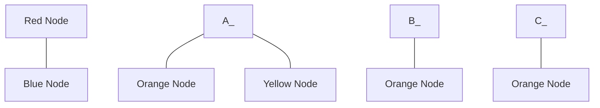
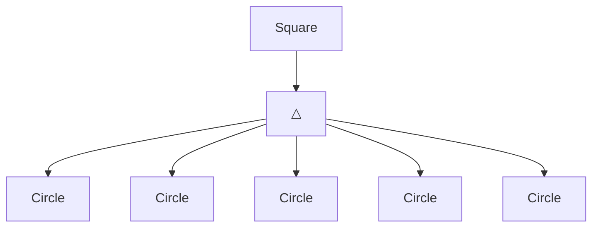
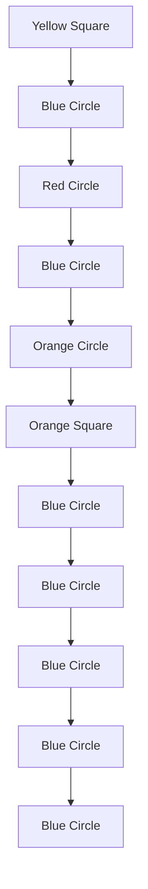

# Bootstrapping Heterogeneous Graph Representation Learning via Large Language Models: A Generalized Approach

Hang Gao $^{*1}$ Chenhao Zhang $^{*1,2}$ , Fengge Wu $^{1,2\dagger}$ , Changwen Zheng $^{1,2}$ , Junsuo Zhao $^{1,2}$ , Huaping Liu $^{3}$

$^{1}$ National Key Laboratory of Space Integrated Information System, Institute of Software, Chinese Academy of Sciences.

$^{2}$ University of Chinese Academy of Sciences.

$^{3}$ Tsinghua University.

{gaohang, zhangchenhao2024, fengge, changwen, junsuo}@iscas.ac.cn,

hpliu@tsinghua.edu.cn

# Abstract

Graph representation learning methods are highly effective in handling complex non-Euclidean data by capturing intricate relationships and features within graph structures. However, traditional methods face challenges when dealing with heterogeneous graphs that contain various types of nodes and edges due to the diverse sources and complex nature of the data. Existing Heterogeneous Graph Neural Networks (HGNNs) have shown promising results but require prior knowledge of node and edge types and unified node feature formats, which limits their applicability. Recent advancements in graph representation learning using Large Language Models (LLMs) offer new solutions by integrating LLMs' data processing capabilities, enabling the alignment of various graph representations. Nevertheless, these methods often overlook heterogeneous graph data and require extensive preprocessing. To address these limitations, we propose a novel method which leverages the strengths of both LLM and GNN, allowing for the processing of graph data with any format and type of nodes and edges without the need for type information or special preprocessing. Our method employs LLM to automatically summarize and classify different data formats and types, aligns node features, and uses a specialized GNN for targeted learning, thus obtaining effective graph representations for downstream tasks. Theoretical analysis and experimental validation have demonstrated the effectiveness of our method.

# Code, Datasets and Appendix —

https://github.com/zch65458525/GHGRL/tree/main

# Introduction

Graph representation learning methods are highly effective for processing complex non-Euclidean data, as they can model intricate relationships within graph structures. However, real-world scenarios often involve heterogeneous graph data, which consists of various types of nodes and edges due to the diverse sources and complexity of the data (Wang et al. 2023b). Examples include social network analysis (Qiu et al. 2018; Li and Goldwasser 2019), recommendation systems (Fan et al. 2019b; Yang et al. 2015), and traffic prediction (Guo et al. 2019). General graph representation learning methods often struggle to handle this heterogeneity. Therefore, developing methods that can effectively process and learn from graphs with diverse node and edge types is essential to broaden the applicability of graph representation learning and enhance its capability to manage complex data.

To overcome these difficulties, Heterogeneous Graph Neural Networks (HGNNs) have been developed and shown promising results (Hong et al. 2020; Dong, Chawla, and Swami 2017; Yang et al. 2022). HGNNs are designed to process graphs with varying node and edge types using specialized techniques, including both metapath-based (Wang et al. 2019; Fu et al. 2020) and metapath-free approaches (Fan et al. 2019a). These works leverage meta-path-based aggregation, attention mechanisms, and embedding techniques to effectively manage the diversity of nodes and edges, enabling the processing of heterogeneous graph data. However, HGNNs have limitations that restrict their applicability in scenarios where prior knowledge of node and edge types or consistent node feature formats is unavailable. For example, in open-source intelligence analysis, IoT log analysis, or monitoring malicious internet activities, the unpredictable, diverse, and dynamic nature of the data poses significant challenges in identifying and labeling node types.

Recently, the emergence of graph representation learning methods based on LLMs (Devlin et al. 2019; Brown et al. 2020) has provided new solutions to the aforementioned problems. These methods integrate the background knowledge and data processing capabilities of LLMs into graph representation learning, allowing for the alignment of various types of graph representations based on LLMs (Chen et al. 2023; Huang et al. 2023). These approaches can handle diverse graph data, achieving significant results in the field of graph representation learning and providing directions for building foundational models in this area. However, these methods primarily focus on handling different types of homogeneous graph representation learning tasks and overlook the importance of processing heterogeneous graph data. Nevertheless, an effective method capable of

# Heterogeneous Graph Neural Networks

flowchart

Handle Heterogeneous Graph √

Handle Different Formats of Data ✗

Extra Type Information is Not Needed ✗

(a) The left side of the figure shows the form of input graph data for HGNN, where nodes of different colors represent different types of heterogeneous nodes. The labels for node type and edge type in the graph indicate the required type information for the input data. The right side outlines its characteristics.

# LLM-based Graph Representation Learning

flowchart

Handle Heterogeneous Graph ✗

Handle Different Formats of Data √

Extra Type Information is Not Needed √

(b) Similar to the above figure, the left side of the figure shows the form of input graph data for LLM-based graph representation learning, where nodes of different shapes represent different forms of node attributes.

# Our Proposed Method

flowchart

Handle Heterogeneous Graph √

Handle Different Formats of Data √

Extra Type Information is Not Needed √

(c) Demonstration and summary of our method, following the same demonstration format as the two figures above.

Figure 1: Demonstration of different methods.

processing such data without the need for additional data cleaning and annotation is highly necessary. At the same time, these methods often require a certain degree of preprocessing of the graph data, which limits their practical application. Figure 1(a) and 1(b) provide a practical illustration of these methods.

To address these challenges, we propose a novel Generalized Heterogeneous Graph Representation Learning (GHGRL) method. GHGRL integrates the strengths of both LLMs and GNNs to process graph data in a more generalized manner. As demonstrated in Figure 1(c), GHGRL can handle graph data with nodes and edges of any format and type, without requiring explicit type information or special pre-processing of the data. Specifically, GHGRL utilizes LLMs to process the training data by automatically summarizing and classifying the various data formats and types present in the graph. Subsequently, LLMs are used to align node features across different formats, generating representation vectors for node attributes. Next, we employ our specially designed GNN to perform targeted learning on the graph data based on the types and estimations derived from the LLM, thereby obtaining graph representations suitable for downstream tasks.

# Contributions:

• We propose a novel method that combines LLM and

GNN to process heterogeneous graph data without requiring node and edge type information. Additionally, this method can handle scenarios where node attributes are not uniform.

- We present the specific implementation of the aforementioned method and conduct theoretical analysis and validation of its performance.   
- We developed more challenging datasets to rigorously test the proposed method. Additionally, we validated our approach using widely adopted heterogeneous graph datasets to ensure robustness and reliability.

# Related Works

Heterogeneous Graph Representation Learning. Heterogeneous graph representation learning methods are categorized into metapath-based and metapath-free approaches. Metapath-based methods use heterogeneous graph neural networks to aggregate and integrate semantic features (Yun et al. 2019; Zhang et al. 2019; Wang et al. 2019; Fu et al. 2020; Bing et al. 2023; Yang et al. 2023). HetGNN (Zhang et al. 2019) uses random walks and node type aggregation. HAN (Wang et al. 2019) and MAGNN (Fu et al. 2020) use metapaths for semantic differentiation and propagation. SeHGNN (Yang et al. 2023) extends receptive fields with long metapaths and transformer-based modules. Metapath-free methods embed semantic information using attention mechanisms (Zhu et al. 2019; Fan et al. 2019a; Hong et al. 2020; Lv et al. 2021; Zhou et al. 2023; He et al. 2024a). HGB (Lv et al. 2021) uses a multi-layer GAT network for node distinction. PSHGCN (He et al. 2024a) uses positive spectral heterogeneous graph convolution to learn valid heterogeneous graph filters. These methods all require prior knowledge of node and edge types and are typically used on datasets where these types are known. However, this limitation restricts the application of these methods in the broader field of data mining.

LLMs for Graphs. With the emergence of various LLM methods, the use of LLMs for graph representation learning is becoming a research hotspot. Relevant studies can be classified into two types. One type enriches node representation based on prompt learning and processes graph data tasks using GNN (Fatemi, Halcrow, and Perozzi 2023; Chen et al. 2023; Huang et al. 2023, 2024; Liu et al. 2024; Tang et al. 2024). The other type converts graph data into text for LLM processing (Ai et al. 2023; Wang et al. 2023a; Guo, Du, and Liu 2023; Sun et al. 2023; Luo et al. 2024; Tan et al. 2024). These methods handle homogeneous data and require pre-standardized representation of node information, limiting their application in data mining. To address this, our proposed method is designed to integrate LLMs to handle heterogeneous graph attributes of any format and type without prior knowledge, expanding the application scope in data mining. Please refer to Appendix A for an extended related work.

# Methodology

Our proposed GHGRL framework aims to enhance learning on heterogeneous graphs using LLMs, thereby making

```mermaid
graph TD
    A["Type Generation"] --> B["Node Attribute Data (Sampled)"]
    B --> C["Data: <Data>"]
    C --> D["Questions: Format Type Generation Question"]
    C --> E["Content Type Generation Question"]
    D --> F["LLM"]
    E --> F
    F --> G["Answers: <Generated Format Types Set Φ^fmt>"]
    F --> H["<Generated Content Types Set Φ^cont>"]
    
    I["LLM Processing"] --> J["Node Attribute Data"]
    J --> K["Data: <Data>"]
    K --> L["Questions: Node Feature Generation Question"]
    K --> M["Format Type Distinguish Question <Generated Format Types Set Φ^fmt>"]
    K --> N["Content Type Distinguish Question <Generated Content Types Set Φ^cont>"]
    L --> O["LLM"]
    M --> O
    N --> O
    
    P["Learning with GNN"] --> Q["Node Features"]
    Q --> R["Graph Structural Data"]
    
    S["PAGNN Layer"] --> T["Format alignment block"]
    T --> U["Format Types"]
    T --> V["Certainty Scores of Format Types"]
    T --> W["Parameter Selection"]
    T --> X["H"]
    T --> Y["W^fmt"]
    T --> Z["Certainty Deduction"]
    
    S --> AA["Content processing block"]
    AA --> AB["Content Types"]
    AA --> AC["Certainty Score of Content Types"]
    AA --> AD["Parameter Selection"]
    AD --> AE["H^F"]
    AD --> AF["W^cont"]
    
    S --> AG["Regular learning block"]
    AG --> AH["Message Passing with W^cont"]
    AG --> AI["\tilde{H}^C"]
    AG --> AJ["W^rgn"]
    
    AK["Predictions"] --> AL["Conventional Message Passing"]
    
    style S fill:#f9f,stroke:#333
    style T fill:#ccf,stroke:#333
    style AA fill:#cfc,stroke:#333
    style AG fill:#fcc,stroke:#333
```

flowchart

Figure 2: The framework of the proposed method. The snowflake symbol represents the fixed model parameters, while the flame represents the model parameters involved in training.

the processing capabilities more generalized. Specifically, for a heterogeneous graph $G = \{V, E\}$ , G contains various types of nodes with different representation formats. Additionally, the edges between adjacent nodes may also possess different types. Moreover, the types of nodes and edges are unknown to us. Our goal is to construct a model that can effectively handle G and accomplish graph representation learning tasks. To achieve this, GHGRL is divided into the following three modules: 1) Type Generation, which identifies all possible node types based on node attributes; 2) LLM Processing, which estimates the specific type of each node and generates node representation vectors using LLMs; and 3) Learning with GNN, which leverages the acquired node types and representations for graph learning with a specially designed GNN. During the GNN learning process, different types of edges are distinguished, and message passing is executed accordingly. Figure 2 demonstrates the framework of GHGRL.

# Type Generation

First, since we do not have access to the number of node types in the dataset or detailed information about them, we opt to generate these types directly. We create two categories of node type set: the format-based set $\Phi^{fmt}$ and the content-based set $\Phi^{cont}$ . Specifically, we randomly select a subset of node attribute samples, denoted as $\tilde{X} = \{x_i\}_{i=1}^{|\tilde{X}|}$ , from the training set and input them into the LLM, allowing it to analyze and identify the node types present in the dataset. We use Llama 3 (Dubey et al. 2024) as our backbone LLM. The number of selected samples, $|\widetilde{X}|$ , is determined by the maximum input sequence length of the LLM.

As a result, we obtain the generated format types set

$\Phi^{fmt} = \{s_{j}^{fmt}\}_{j=1}^{m^{fmt}}$ , where each $s_{j}^{fmt}$ represents a generated string-formatted node format type name, represented in text format, such as “noun” or “detail description”. Similarly, the generated content types set is $\Phi^{cont} = \{s_{j}^{cont}\}_{j=1}^{m^{cont}}$ , where each $s_{j}^{cont}$ denotes a generated string-formatted node content type name, also represented in text format, such as “paper concerning deep learning” or “paper concerning biology”. The parameters $m^{fmt}$ and $m^{cont}$ are hyperparameters controlling the size of $\Phi^{fmt}$ and $\Phi^{cont}$ , respectively. Formally, we have:

$$
\left\{\Phi^ {\mathrm{fmt}}, \Phi^ {\mathrm{cont}} \right\} = L L M \left(\tilde {\boldsymbol {X}}, m ^ {\mathrm{fmt}}, m ^ {\mathrm{cont}}, P ^ {G}\right), \tag {1}
$$

where $P^{G}$ denotes the type generation prompt. Please refer to Appendix C for details.

# LLM Processing

Subsequently, we process the data with the LLM to acquire node features, estimating the format type and content type of each node's attribute features. Based on $\Phi^{\mathrm{fmt}}$ and $\Phi^{\mathrm{cont}}$ , we conduct analysis upon each node $v$ 's feature $\boldsymbol{x}_v$ . We obtain five different outputs: description text $h_v^{\mathrm{desc}}$ of node $v$ , format type estimation result $\phi^{\mathrm{fmt}}(v)$ , format type estimation confidence score $c^{\mathrm{fmt}}(v)$ , content type estimation result $\phi^{\mathrm{cont}}(v)$ , content type estimation confidence score $c^{\mathrm{cont}}(v)$ , description text $h_v^{\mathrm{reas}}$ of the estimation reasons. $\phi^{\mathrm{fmt}}(v)$ denotes the index of the estimated format type of node $v$ within $\Phi^{\mathrm{fmt}}$ , while $\phi^{\mathrm{cont}}(v)$ denotes the index of the estimated content type of node $v$ within $\Phi^{\mathrm{cont}}$ . Formally, we have:

$$
\begin{array}{l} \left\{\boldsymbol {h} _ {v} ^ {\text { desc }}, \phi^ {\text { fmt }} (v), c ^ {\text { fmt }} (v), \phi^ {\text { cont }} (v), c ^ {\text { cont }} (v), \boldsymbol {h} _ {v} ^ {\text { reas }} \right\} = \\ L L M \left(\boldsymbol {x} _ {v}, \Phi^ {\mathrm{fmt}}, \Phi^ {\mathrm{cont}}, P ^ {P}\right). \tag {2} \\ \end{array}
$$

We ensure that the LLM outputs as much information about the node attributes as possible by modifying the prompts. Please refer to Appendix C for details. In addition to node descriptions, we also require the model to provide a reasoning description for its estimation of the node types. This approach allows the model to refine and optimize the modeling of heterogeneous graphs.

Subsequently, we adopt a language model sentence transformer (Reimers and Gurevych 2019) to generate fixed-length node representation based on both $h_{v}^{desc}$ and $h_{v}^{reas}$ , formally, we have:

$$
\boldsymbol {h} _ {v} = s (\boldsymbol {h} _ {v} ^ {\text { desc }}, \boldsymbol {h} _ {v} ^ {\text { reas }}), \tag {3}
$$

where $s(\cdot)$ denotes the sentence transformer model. $h_{v}$ will be utilized as the node feature in the subsequent modules.

# Learning with GNN

To integrate LLM estimates into graph representation learning, we specifically designed a novel Parameter Adaptive GNN (PAGNN) to maximize the utilization of LLM outputs for graph data processing. Part of the PAGNN structure is determined by the LLM outputs. Specifically, each layer of PAGNN includes three components: a format alignment block based on format type, a heterogeneous processing block based on content type, and a regular learning block. These components will be introduced in detail below.

Format alignment block. The purpose of this block is to align node features represented in different forms. This block utilizes matrix $W^{fmt} \in R^{|\Phi^{fmt}| \times d^{in} \times d^{fmt}}$ and $B^{fmt} \in R^{|\Phi^{fmt}| \times d^{fmt}}$ as the network parameters, where $d^{in}$ and $d^{fmt}$ denote the input and output feature width of this block, $|\Phi^{fmt}|$ is the number of format types. Subsequently, with the input node representation matrix H, where $H \in R^{|\mathcal{V}| \times x^{fmt}}$ , $|V|$ is the number of nodes, for all $v \in \{1, 2, ..., |V|\}$ the block performs the following calculation:

$$
H ^ {\mathrm{fmt} [ v ]} = \delta \left(H ^ {[ v ]} W ^ {\mathrm{fmt} [ \phi^ {\mathrm{fmt}} (v) ]} + B ^ {\mathrm{fmt} [ \phi^ {\mathrm{fmt}} (v) ]}\right), \tag {4}
$$

where $W^{\mathrm{fmt}}\left[\phi^{\mathrm{fmt}}(v)\right]$ and $B^{\mathrm{fmt}}\left[\phi^{\mathrm{fmt}}(v)\right]$ denote the $\phi^{\mathrm{fmt}}(v)$ -th elements of $W^{fmt}$ and $B^{fmt}$ along the first dimension, respectively. $H^{fmt}\left[v\right]$ denotes the v-th vector within $H^{fmt}$ . This design ensures that all nodes with the same type utilize the same set of parameters, while nodes with different types utilize different sets of parameters. Due to the potential inaccuracy and possible misjudgment of node type estimation by LLM, we further introduce the generated confidence score $c^{\mathrm{fmt}}(v)$ and adjust the blocks based on this score. We optimize Equation 4 to generate a formal representation of the block with the added confidence score as follows:

$$
\begin{array}{l} H ^ {\mathrm{fmt} [ v ]} = \delta \left(c ^ {\mathrm{fmt}} (v) \left(H ^ {[ v ]} W ^ {\mathrm{fmt} [ \phi^ {\mathrm{fmt}} (v) ]} + B ^ {\mathrm{fmt} [ \phi^ {\mathrm{fmt}} (v) ]}\right) + \right. \\ \left(1 - c ^ {\mathrm{fmt}} (v)\right) H ^ {[ v ]}\left. \right), \tag {5} \\ \end{array}
$$

where $c^{\mathrm{fmt}}(v)$ is the aforementioned format type confidence score of v. $\delta(\cdot)$ denotes the activate function. This design ensures that the effect of $W^{\mathrm{fmt}}[\phi^{\mathrm{fmt}}(v)]$ decreases as the confidence score decreases.

Content processing block. This block trails the format alignment block. It processes node features of different generated node content types and then conducts message passing between them. The pattern of information transmission between different nodes may vary. Conventional heterogeneous graph representation learning methods often use meta paths or predefined edge types to address this issue (Wang et al. 2019; Fu et al. 2020; Yang et al. 2023). However, since we cannot obtain this information, we can only differentiate information transmission based on the node content type generated by the LLM. Specifically, the content processing block first conducts the following calculation:

$$
\begin{array}{l} H ^ {\text { cont } [ v ]} = \delta \left(c ^ {\text { cont }} (v) \left(H ^ {\text { fmt } [ v ]} W ^ {\text { cont } [ \phi^ {\text { cont }} (v) ]} \right. \right. \\ \left. + \left. B ^ {\text { cont }} \left[ \phi^ {\text { cont }} (v) \right]\right)\right), \tag {6} \\ \end{array}
$$

where $c^{\mathrm{cont}}(v)$ is the aforementioned content type confidence score of v, $W^{cont} \in R^{|\Phi^{\mathrm{cont}}| \times d^{\mathrm{fmt}} \times d^{\mathrm{cont}}}$ and $B^{cont} \in R^{|\Phi^{\mathrm{cont}}| \times d^{\mathrm{cont}}}$ are parameter matrices. $d^{cont}$ denotes the feature width of each representation vector within $H^{cont}[v]$ . The content processing block then conducts message passing with $H^{cont}$ :

$$
\widetilde {H} ^ {\text { cont } [ v ]} = \alpha H ^ {\text { cont } [ v ]} +
$$

$$
A G G \left(H ^ {\text { cont } [ u ]} \widetilde {W} ^ {\text { cont } [ \phi (v) ]}, u \in \mathcal {N} (v)\right), \tag {7}
$$

where $\alpha$ be a hyperparameter to control the proportion of original node features, parameter matrix $\widetilde{W}^{cont} \in R^{|\Phi^{cont}| \times d^{cont} \times d^{cont}}$ . $AGG(\cdot)$ aggregates the features from neighbors. We adopt $d^{cont}$ again as the output feature width of content processing block. Equation 6 and 7 actually ensure that during the aggregation operation, the node representations are multiplied by the corresponding parameter matrices according to the content type of the source and target nodes of the edges. This, in turn, ensures that the entire data aggregation process maximally distinguishes between different node types and edge types.

Regular learning block. This block follows the first two blocks and can be formally represented as follows.

$$
H ^ {\mathrm{rgn} [ v ]} = \delta \left(\widetilde {H} ^ {\text { cont } [ v ]} W ^ {\mathrm{rgn}} + \right.
$$

$$
A G G \left(\widetilde {H} ^ {\text { cont } [ u ]} W ^ {\text { rgn }}, u \in \mathcal {N} (v)\right), \tag {8}
$$

which is similar to a regular GCN layer, adopting the same method for data propagation to learn the common features present in the data. $W^{rgn} \in R^{d_{cont}} \times d^{rgn}$ is the parameter matrix. $d^{rgn}$ denotes the output feature width of this block.

The aforementioned blocks form a PAGNN layer. Our model is composed of multiple PAGNN layers, and we remove the format alignment block and the content processing block after the $l^{fmt}$ layer and $l^{cont}$ layer respectively, as the heterogeneity of node features is sufficiently represented by that point. $l^{fmt} \leq l^{cont} \leq L$ , where L is the total number of network layers. Please refer to Appendix D for details.

# Analysis

In this section, we further analyze the proposed method by examining how GHGRL effectively learns various types of semantics. This capability helps to mitigate semantic confusion, which can arise from the over-smoothing common in conventional graph representation learning methods. Such over-smoothing can be problematic when dealing with complex heterogeneous graph data (Zhou et al. 2023). We adopt a simplified graph convolution model $g(\cdot)$ (Kipf and Welling 2017) for this type of analysis, the layer structure of which can be represented as follows:

$$
\boldsymbol {h} _ {v} ^ {(l + 1)} = \boldsymbol {h} _ {v} ^ {(l)} + A G G \left(\boldsymbol {h} _ {u} ^ {(l)} W ^ {(l)}, u \in \mathcal {N} (v)\right), \tag {9}
$$

where $\boldsymbol{h}_{v}^{(l+1)}$ and $\boldsymbol{h}_{v}^{(l)}$ denote the output representation of node v of layer l and $l+1$ respectively. Several related works (Zhou et al. 2023; Li, Han, and Wu 2018) have demonstrated that this model can effectively represent the properties of different types of graph neural networks, making it widely applicable in the analysis of the over-smoothing characteristics of graph neural networks. Furthermore, it bears significant similarity to our model's architecture.

GNN models generally suffer from over-smoothing (Chen et al. 2020; Geerts and Reutter 2022). Specifically, for graph convolution model $g(\cdot)$ with L layers and graph $G = \{V, E\}$ , we can represent the limitation of g when $L \to +\infty$ :

$$
\lim _ {L \rightarrow + \infty} g (\mathcal {V}, \mathcal {E}) = \left[\begin{array}{c c c c}\boldsymbol {h} _ {1} ^ {(L)}&\boldsymbol {h} _ {2} ^ {(L)}&\dots&\boldsymbol {h} _ {| \mathcal {V} |} ^ {(L)}\end{array}\right] ^ {\top}, \tag {10}
$$

where $\boldsymbol{h}_{v}^{(L)}$ denotes the L-th layer output representation of node v. For any node i and j within G, $\boldsymbol{h}_{i}^{(L)}$ and $\boldsymbol{h}_{j}^{(L)}$ are linearly dependent. Yet, our proposed GHGRL could avoid such over-smoothing. To prove this, we construct a simplified model $\widetilde{g}(\cdot)$ of GHGRL, l-th layer of $\widetilde{g}(\cdot)$ possesses the following form:

$$
\boldsymbol {h} _ {v} ^ {(l + 1)} = \boldsymbol {h} _ {v} ^ {(l)} +
$$

$$
A G G \left(\boldsymbol {h} _ {u} ^ {(l)} W ^ {[ \phi (v) ]} + B ^ {[ \phi (v) ]}, u \in \mathcal {N} (v)\right). \tag {11}
$$

The input of $\widetilde{g} (\cdot)$ are node features extracted from LLM $f(\cdot)$ . Subsequently, we propose the following theorem.

Theorem 1. Given a connected graph $G = \{\mathcal{V}, \mathcal{E}\}$ with node features $\{\pmb{x}_i\}_{i=1}^{|\mathcal{V}|}$ and LLM $f(\cdot)$ , $\widetilde{g}(\cdot)$ can avoid the over-smoothing described in Equation 10 for the node features, i.e., we have:

$$
\lim _ {L \rightarrow + \infty} \widetilde {g} (\{f (\boldsymbol {x} _ {j}) \} _ {j = 1} ^ {| \mathcal {V} |}, \mathcal {E}) = \left[\begin{array}{c c c c}\tilde {\boldsymbol {h}} _ {1} ^ {(L)}&\tilde {\boldsymbol {h}} _ {2} ^ {(L)}&\dots&\tilde {\boldsymbol {h}} _ {| \mathcal {V} |} ^ {(L)}\end{array}\right] ^ {\top}, \tag {12}
$$

where for node $i$ and $j$ that satisfying $\phi(i) \neq \phi(j)$ , $\tilde{\pmb{h}}_i$ and $\tilde{\pmb{h}}_j$ are linearly independent.

The proof can be found in Appendix B.1. Theorem 1 demonstrates through the model in Equation 11 that our method effectively prevents over-smoothing among different types of nodes. This ensures that the model preserves the distinctive features between various node types. Moreover, this differentiation is automatically derived based on the judgments produced by an LLM, ensuring that our model can leverage the knowledge of the LLM for type estimation. Consequently, this facilitates relation learning training based on the structure of the GHGRL.

Corollary 2. Given the conditions in Theorem 1, if node i and j satisfied $\phi(i)=\phi(j)$ , i and j do not share same set of neighbors, then $\tilde{\boldsymbol{h}}_{i}^{(L)}$ and $\tilde{\boldsymbol{h}}_{j}^{(L)}$ are not necessarily linear dependent for $L\to+\infty$ .

The proof can be found in Appendix B.2. Corollary 2 further demonstrates that our proposed method not only prevents over-smoothing between different types of heterogeneous nodes, but also ensures that over-smoothing does not necessarily occur between nodes of the same type. In such cases, whether over-smoothing occurs depends on the types of adjacent nodes and network parameters. This means the network can adaptively make node features similar or different based on specific circumstances, rather than causing all node features to converge to the same value due to over-smoothing. As shown in (Li, Han, and Wu 2018), a 3-layer GCN can already experience over-smoothing on certain datasets. With two aggregations per layer, our 3-layer PAGNN is equivalent to a 6-layer GCN (Please refer to Section Experiments for details), heightening the risk of over-smoothing. We analyzed inter-type node similarity across layers and compared our method to GHGRL without PAGNN (GHGRL w/o P). The results below confirm that over-smoothing occurs, and our method effectively prevents it.

Table 1: Mean cosine similarity between each type's average feature vector and the overall mean, indicating the degree of over-smoothing on the IMDB dataset. 

<table><tr><td>Method</td><td>Layer 1</td><td>Layer 2</td><td>Layer 3</td><td>Layer 4</td></tr><tr><td>GHGRL w/o P</td><td>-0.151</td><td>0.327</td><td>0.702</td><td>0.882</td></tr><tr><td>GHGRL</td><td>-0.133</td><td>0.174</td><td>0.311</td><td>0.395</td></tr></table>

# Experiments

# Comparison with State of the Art Methods

Baselines. For baseline methods, we compared our approach with three categories of baselines: 1) general GNN backbone networks, including GCN (Kipf and Welling 2017) and GAT (Velickovic et al. 2018), 2) HGNN methods, including HAN (Wang et al. 2019), MAGNN (Fu et al. 2020), SeHGNN (Yang et al. 2023) and PSHGCN (He et al. 2024a) and 3) more generalized graph representation learning methods that combines GNN and LLM, including TAPE (He et al. 2024b), OFA (Liu et al. 2024), and GOFA (Kong et al. 2024).

Datasets. We utilized existing commonly used heterogeneous and homogeneous graph representation learning datasets, as well as more challenging heterogeneous graph datasets that we newly constructed. Specifically, we employed the IMDB, DBLP, ACM (Zhang et al. 2019) and Wiki-CS (Mernyei and Cangea 2020) datasets, and we reported the test accuracy under varying amounts of training data. Additionally, we constructed two new datasets,

Table 2: Comparative experiment results for heterogeneous graph datasets. Bold denotes the best performance, underline denotes the second best. “-w” denotes results of HGNN method without type information. 

<table><tr><td>Datasets</td><td colspan="2">IMDB (10% Training)</td><td colspan="2">IMDB (40% Training)</td><td colspan="2">DBLP (10% Training)</td><td colspan="2">DBLP (40% Training)</td><td colspan="2">ACM (10% Training)</td><td colspan="2">ACM (40% Training)</td></tr><tr><td>Metrics</td><td>Macro-F1</td><td>Micro-F1</td><td>Macro-F1</td><td>Micro-F1</td><td>Macro-F1</td><td>Micro-F1</td><td>Macro-F1</td><td>Micro-F1</td><td>Macro-F1</td><td>Micro-F1</td><td>Macro-F1</td><td>Micro-F1</td></tr><tr><td>GCN</td><td> $57.47 \pm 0.72$ </td><td> $58.43 \pm 1.15$ </td><td> $60.13 \pm 0.76$ </td><td> $60.38 \pm 1.19$ </td><td> $89.09 \pm 0.32$ </td><td> $89.8 \pm 0.34$ </td><td> $88.94 \pm 0.38$ </td><td> $89.61 \pm 0.40$ </td><td> $89.47 \pm 0.23$ </td><td> $90.23 \pm 0.24$ </td><td> $89.19 \pm 0.28$ </td><td> $89.95 \pm 0.27$ </td></tr><tr><td>GAT</td><td> $60.12 \pm 0.79$ </td><td> $60.79 \pm 1.26$ </td><td> $62.85 \pm 1.28$ </td><td> $63.1 \pm 0.83$ </td><td> $89.66 \pm 0.26$ </td><td> $90.93 \pm 0.23$ </td><td> $91.40 \pm 0.19$ </td><td> $91.79 \pm 0.21$ </td><td> $92.23 \pm 0.96$ </td><td> $92.27 \pm 0.95$ </td><td> $92.26 \pm 0.86$ </td><td> $92.38 \pm 0.81$ </td></tr><tr><td>HAN</td><td> $61.28 \pm 0.12$ </td><td> $61.26 \pm 0.15$ </td><td> $62.78 \pm 0.38$ </td><td> $62.15 \pm 0.26$ </td><td> $91.23 \pm 0.51$ </td><td> $92.10 \pm 0.62$ </td><td> $91.92 \pm 0.48$ </td><td> $92.52 \pm 0.59$ </td><td> $90.58 \pm 0.40$ </td><td> $90.56 \pm 0.39$ </td><td> $92.70 \pm 0.45$ </td><td> $92.75 \pm 0.42$ </td></tr><tr><td>MAGNN</td><td> $57.78 \pm 2.85$ </td><td> $57.97 \pm 1.82$ </td><td> $59.92 \pm 1.24$ </td><td> $60.07 \pm 0.89$ </td><td> $92.24 \pm 0.49$ </td><td> $92.70 \pm 0.51$ </td><td> $93.21 \pm 0.42$ </td><td> $93.68 \pm 0.43$ </td><td> $89.46 \pm 0.64$ </td><td> $89.71 \pm 0.53$ </td><td> $91.25 \pm 0.24$ </td><td> $91.33 \pm 0.35$ </td></tr><tr><td>SeHGNN</td><td> $61.23 \pm 0.46$ </td><td> $\underline{62.74 \pm 0.37}$ </td><td> $62.62 \pm 0.35$ </td><td> $65.34 \pm 0.30$ </td><td> $\underline{93.74 \pm 0.28}$ </td><td> $\underline{94.19 \pm 0.24}$ </td><td> $\underline{94.48 \pm 0.12}$ </td><td> $\underline{94.85 \pm 0.15}$ </td><td> $\underline{92.06 \pm 0.32}$ </td><td> $\underline{92.10 \pm 0.32}$ </td><td> $93.38 \pm 0.30$ </td><td> $93.44 \pm 0.36$ </td></tr><tr><td>PSHGCN</td><td> $61.35 \pm 0.79$ </td><td> $\underline{62.25 \pm 0.42}$ </td><td> $67.21 \pm 0.66$ </td><td> $67.55 \pm 0.56$ </td><td> $92.89 \pm 0.09$ </td><td> $93.46 \pm 0.07$ </td><td> $93.98 \pm 0.12$ </td><td> $94.29 \pm 0.10$ </td><td> $91.07 \pm 0.26$ </td><td> $91.00 \pm 0.24$ </td><td> $93.78 \pm 0.23$ </td><td> $93.77 \pm 0.19$ </td></tr><tr><td>HAN-w</td><td> $58.31 \pm 0.32$ </td><td> $58.26 \pm 0.31$ </td><td> $59.83 \pm 0.33$ </td><td> $59.02 \pm 0.35$ </td><td> $87.54 \pm 0.78$ </td><td> $87.93 \pm 0.58$ </td><td> $88.16 \pm 0.68$ </td><td> $88.64 \pm 0.69$ </td><td> $90.08 \pm 0.34$ </td><td> $90.02 \pm 0.32$ </td><td> $91.98 \pm 0.38$ </td><td> $91.86 \pm 0.37$ </td></tr><tr><td>MAGNN-w</td><td> $57.02 \pm 1.23$ </td><td> $57.36 \pm 0.86$ </td><td> $59.44 \pm 1.06$ </td><td> $59.76 \pm 0.93$ </td><td> $90.24 \pm 0.49$ </td><td> $90.65 \pm 0.63$ </td><td> $90.32 \pm 0.77$ </td><td> $91.32 \pm 0.82$ </td><td> $88.95 \pm 0.18$ </td><td> $89.26 \pm 0.20$ </td><td> $91.23 \pm 0.16$ </td><td> $91.33 \pm 0.25$ </td></tr><tr><td>SHEGNN-w</td><td> $59.56 \pm 0.78$ </td><td> $61.30 \pm 1.34$ </td><td> $61.76 \pm 0.62$ </td><td> $65.24 \pm 0.73$ </td><td> $89.32 \pm 0.28$ </td><td> $89.96 \pm 0.24$ </td><td> $91.57 \pm 0.21$ </td><td> $91.71 \pm 0.22$ </td><td> $91.87 \pm 0.48$ </td><td> $91.81 \pm 0.36$ </td><td> $92.45 \pm 0.42$ </td><td> $92.50 \pm 0.44$ </td></tr><tr><td>PSHGCN-w</td><td> $59.68 \pm 0.55$ </td><td> $61.04 \pm 0.36$ </td><td> $65.52 \pm 0.52$ </td><td> $66.03 \pm 0.44$ </td><td> $89.78 \pm 0.23$ </td><td> $90.46 \pm 0.25$ </td><td> $91.58 \pm 0.12$ </td><td> $91.93 \pm 0.10$ </td><td> $91.01 \pm 0.26$ </td><td> $90.97 \pm 0.24$ </td><td> $92.97 \pm 0.23$ </td><td> $93.02 \pm 0.19$ </td></tr><tr><td>TAPE</td><td> $50.69 \pm 0.30$ </td><td> $51.06 \pm 0.53$ </td><td> $53.36 \pm 0.16$ </td><td> $53.32 \pm 0.35$ </td><td> $70.56 \pm 0.45$ </td><td> $70.27 \pm 0.58$ </td><td> $75.01 \pm 0.44$ </td><td> $76.15 \pm 0.32$ </td><td> $78.26 \pm 0.95$ </td><td> $78.63 \pm 0.97$ </td><td> $88.91 \pm 0.76$ </td><td> $88.81 \pm 0.62$ </td></tr><tr><td>OFA</td><td> $21.50 \pm 0.05$ </td><td> $21.13 \pm 0.05$ </td><td> $22.73 \pm 0.05$ </td><td> $22.6 \pm 0.05$ </td><td> $20.80 \pm 0.10$ </td><td> $20.79 \pm 0.12$ </td><td> $30.52 \pm 0.08$ </td><td> $29.89 \pm 0.12$ </td><td> $72.63 \pm 0.23$ </td><td> $72.34 \pm 0.16$ </td><td> $80.32 \pm 0.24$ </td><td> $80.65 \pm 0.28$ </td></tr><tr><td>GOFA</td><td> $32.12 \pm 0.20$ </td><td> $32.29 \pm 0.16$ </td><td> $33.75 \pm 0.51$ </td><td> $33.82 \pm 0.26$ </td><td> $35.90 \pm 0.36$ </td><td> $35.43 \pm 0.38$ </td><td> $44.03 \pm 0.50$ </td><td> $44.52 \pm 0.41$ </td><td> $78.91 \pm 0.56$ </td><td> $78.92 \pm 0.73$ </td><td> $84.28 \pm 0.33$ </td><td> $84.21 \pm 0.79$ </td></tr><tr><td>GHGRL</td><td> $69.73 \pm 0.53$ </td><td> $70.11 \pm 0.57$ </td><td> $72.13 \pm 0.64$ </td><td> $72.46 \pm 0.62$ </td><td> $89.85 \pm 0.23$ </td><td> $90.48 \pm 0.18$ </td><td> $91.67 \pm 0.34$ </td><td> $92.17 \pm 0.32$ </td><td> $92.71 \pm 0.36$ </td><td> $92.69 \pm 0.30$ </td><td> $94.21 \pm 0.44$ </td><td> $94.63 \pm 0.42$ </td></tr></table>

Table 3: Comparative experiment results for heterogeneous graph datasets with extra diversity. Bold denotes the best performance, underline denotes the second best. 

<table><tr><td>Datasets</td><td colspan="2">IMDB-RIR (r=20%)</td><td colspan="2">IMDB-RIR (r=60%)</td><td colspan="2">IMDB-RIR (r=100%)</td><td colspan="2">DBLP-RID (r=20%)</td><td colspan="2">DBLP-RID (r=60%)</td><td colspan="2">DBLP-RID (r=100%)</td></tr><tr><td>Metrics</td><td>Macro-F1</td><td>Micro-F1</td><td>Macro-F1</td><td>Micro-F1</td><td>Macro-F1</td><td>Micro-F1</td><td>Macro-F1</td><td>Micro-F1</td><td>Macro-F1</td><td>Micro-F1</td><td>Macro-F1</td><td>Micro-F1</td></tr><tr><td>Llama3</td><td> $40.25 \pm 0.95$ </td><td> $39.35 \pm 0.90$ </td><td> $39.52 \pm 0.38$ </td><td> $39.67 \pm 0.68$ </td><td> $39.51 \pm 0.81$ </td><td> $39.77 \pm 0.51$ </td><td> $36.56 \pm 1.15$ </td><td> $46.16 \pm 0.95$ </td><td> $44.01 \pm 0.85$ </td><td> $44.89 \pm 0.92$ </td><td> $43.51 \pm 1.39$ </td><td> $43.73 \pm 0.56$ </td></tr><tr><td>TAPE</td><td> $48.59 \pm 1.10$ </td><td> $48.71 \pm 0.61$ </td><td> $45.29 \pm 0.59$ </td><td> $45.01 \pm 0.79$ </td><td> $40.88 \pm 0.74$ </td><td> $40.57 \pm 0.62$ </td><td> $54.87 \pm 0.84$ </td><td> $54.71 \pm 1.11$ </td><td> $52.84 \pm 0.50$ </td><td> $52.14 \pm 0.85$ </td><td> $50.24 \pm 0.51$ </td><td> $50.65 \pm 0.66$ </td></tr><tr><td>OFA</td><td> $20.44 \pm 0.12$ </td><td> $20.78 \pm 0.26$ </td><td> $20.84 \pm 0.08$ </td><td> $20.88 \pm 0.23$ </td><td> $21.13 \pm 0.12$ </td><td> $21.21 \pm 0.12$ </td><td> $31.35 \pm 0.08$ </td><td> $31.83 \pm 0.17$ </td><td> $30.33 \pm 0.32$ </td><td> $30.58 \pm 0.34$ </td><td> $30.52 \pm 0.25$ </td><td> $30.23 \pm 0.27$ </td></tr><tr><td>GOFA</td><td> $33.18 \pm 0.62$ </td><td> $33.91 \pm 0.81$ </td><td> $31.57 \pm 1.17$ </td><td> $31.75 \pm 0.84$ </td><td> $29.16 \pm 0.79$ </td><td> $29.09 \pm 0.67$ </td><td> $40.75 \pm 0.58$ </td><td> $40.28 \pm 0.89$ </td><td> $38.54 \pm 0.82$ </td><td> $38.65 \pm 1.00$ </td><td> $37.11 \pm 0.87$ </td><td> $37.32 \pm 0.78$ </td></tr><tr><td>GHGRL</td><td> $75.15 \pm 0.43$ </td><td> $75.35 \pm 0.77$ </td><td> $74.72 \pm 0.45$ </td><td> $75.00 \pm 0.42$ </td><td> $74.53 \pm 0.56$ </td><td> $74.83 \pm 0.52$ </td><td> $93.47 \pm 0.21$ </td><td> $93.72 \pm 0.25$ </td><td> $92.24 \pm 0.36$ </td><td> $92.78 \pm 0.32$ </td><td> $91.20 \pm 0.78$ </td><td> $91.83 \pm 0.92$ </td></tr></table>

the Random Information Replacement on IMDB (IMDB-RIR) and the Random Information Deletion on DBLP (DBLP-RID): We utilized both commonly used heterogeneous graph representation learning datasets and more challenging datasets that we newly constructed. Specifically, we employed the IMDB, DBLP, and ACM datasets (Zhang et al. 2019), and reported the test accuracy with varying amounts of training data. Additionally, we constructed two new datasets: IMDB dataset with Random Information Replacement (IMDB-RIR) and DBLP dataset with Random Information Deletion (DBLP-RID).

- IMDB-RIR. Based on the IMDB dataset, we performed searches on Google using the textual information of the nodes in the IMDB dataset. We then saved the top 10 search results for each node. Subsequently, we randomly selected results from these top 10 and used them to replace the node attributes in the IMDB dataset. As a result, the constructed dataset contains information in various uncertain formats, thereby increasing the complexity of the tasks.   
- DBLP-RID. Based on the DBLP dataset, we randomly deleted portions of the node textual information, creating a new graph dataset with partially missing node information.

These datasets introduce further diversity into heterogeneous datasets and are utilized for extra comparison. Further details can be found in Appendix D.1.

Settings. We followed the basic settings outlined in OFA (Liu et al. 2024) and used Llama 3 (Dubey et al. 2024) as the LLM for both our method and the baseline methods to ensure a fair comparison. Additionally, we adjusted the proportion of training data in the datasets to compare test results under different conditions. For all experimental results, we conducted five independent runs and reported the mean $\pm$ standard deviation. The specific experimental setup, including hyperparameters and the environment used, is detailed in Appendix D.

Results on heterogeneous graph datasets. Table 2 demonstrates the results of experiments on IMDB, DBLP, and ACM. Since our approach does not use the node type or edge type information included in the heterogeneous graph datasets as input, for better analysis, we compared our method with HGNN baselines that both use and do not use this information. We mark the methods that do not utilize this information with “-w”. In the results, we can see that our method achieves either the best performance or performance comparable to methods that use additional type information on all datasets, demonstrating the capability of GHGRL.

Results on heterogeneous graph datasets with extra diversity. Table 4 demonstrates the results of experiments on IMDB-RIR and DBLP-RID. We denote r as the proportion of newly constructed data used in the dataset, e.g., 20% denotes we utilize 20% of the total amount of newly constructed data. Since within IMDB-RIR and DBLP-RID, the node features have been modified by the additional information we introduced, they no longer adhere to a standard format. Consequently, GNN and HGNN-based methods can no longer process this information without additional help, so we did not include comparisons with these methods. Additionally, we used our LLM, Llama 3, to directly classify the nodes. Here, we can see that while LLM-based methods can somewhat handle our newly constructed dataset, GHGRL still achieved the best performance, significantly surpassing other baseline methods and demonstrating its capability.

Furthermore, in Table 3, we also integrated the LLM processing module we used into other HGNN methods to output unified features for further comparison on the IMDB-RIR dataset. As shown in the results, even under these conditions, GHGRL still achieved the best performance, significantly

Table 4: Comparative experiment results for HGNNs attached with LLM modules (marked with “+ LLM”). Bold denotes the best performance, underline denotes the second best. 

<table><tr><td rowspan="2">DatasetsMetrics</td><td colspan="2">IMDB-RIR (r=20%)</td><td colspan="2">IMDB-RIR (r=40%)</td><td colspan="2">IMDB-RIR (r=60%)</td><td colspan="2">IMDB-RIR (r=80%)</td><td colspan="2">IMDB-RIR (r=100%)</td></tr><tr><td>Macro-F1</td><td>Micro-F1</td><td>Macro-F1</td><td>Micro-F1</td><td>Macro-F1</td><td>Micro-F1</td><td>Macro-F1</td><td>Micro-F1</td><td>Macro-F1</td><td>Micro-F1</td></tr><tr><td>GCN + LLM</td><td> $64.26 \pm 0.14$ </td><td> $64.16 \pm 0.29$ </td><td> $62.20 \pm 0.18$ </td><td> $62.86 \pm 0.33$ </td><td> $59.18 \pm 0.63$ </td><td> $60.98 \pm 0.71$ </td><td> $60.05 \pm 0.41$ </td><td> $60.60 \pm 0.15$ </td><td> $58.41 \pm 0.35$ </td><td> $58.59 \pm 0.71$ </td></tr><tr><td>GAT + LLM</td><td> $65.28 \pm 0.60$ </td><td> $65.30 \pm 0.70$ </td><td> $65.78 \pm 0.37$ </td><td> $65.65 \pm 0.48$ </td><td> $65.84 \pm 0.76$ </td><td> $65.77 \pm 0.81$ </td><td> $65.45 \pm 0.35$ </td><td> $65.54 \pm 0.75$ </td><td> $65.25 \pm 0.57$ </td><td> $65.42 \pm 0.28$ </td></tr><tr><td>HAN + LLM</td><td> $64.89 \pm 0.83$ </td><td> $65.07 \pm 0.23$ </td><td> $64.40 \pm 0.83$ </td><td> $64.49 \pm 0.22$ </td><td> $64.59 \pm 0.63$ </td><td> $64.60 \pm 0.55$ </td><td> $64.00 \pm 0.94$ </td><td> $64.02 \pm 0.71$ </td><td> $63.81 \pm 0.46$ </td><td> $63.90 \pm 0.30$ </td></tr><tr><td>MAGNN + LLM</td><td> $61.88 \pm 0.56$ </td><td> $61.92 \pm 0.47$ </td><td> $61.25 \pm 0.32$ </td><td> $61.34 \pm 0.18$ </td><td> $61.42 \pm 0.46$ </td><td> $61.36 \pm 0.87$ </td><td> $61.41 \pm 0.35$ </td><td> $61.39 \pm 0.24$ </td><td> $61.34 \pm 0.19$ </td><td> $61.32 \pm 0.52$ </td></tr><tr><td>SeHGNN + LLM</td><td> $68.35 \pm 0.50$ </td><td> $68.82 \pm 0.34$ </td><td> $68.74 \pm 0.61$ </td><td> $68.52 \pm 0.47$ </td><td> $68.21 \pm 0.81$ </td><td> $68.62 \pm 0.64$ </td><td> $67.98 \pm 0.30$ </td><td> $68.24 \pm 0.39$ </td><td> $67.76 \pm 0.44$ </td><td> $68.06 \pm 0.33$ </td></tr><tr><td>PSHGCN + LLM</td><td> $71.83 \pm 0.23$ </td><td> $72.18 \pm 0.47$ </td><td> $72.30 \pm 0.91$ </td><td> $72.18 \pm 0.61$ </td><td> $72.36 \pm 0.78$ </td><td> $72.77 \pm 0.91$ </td><td> $72.50 \pm 0.21$ </td><td> $72.88 \pm 0.73$ </td><td> $72.28 \pm 0.60$ </td><td> $72.65 \pm 0.14$ </td></tr><tr><td>HAN-w + LLM</td><td> $63.41 \pm 0.90$ </td><td> $63.52 \pm 0.38$ </td><td> $63.28 \pm 0.28$ </td><td> $63.56 \pm 0.55$ </td><td> $63.29 \pm 0.89$ </td><td> $63.30 \pm 0.08$ </td><td> $63.26 \pm 0.59$ </td><td> $63.45 \pm 0.57$ </td><td> $63.88 \pm 0.63$ </td><td> $63.01 \pm 0.24$ </td></tr><tr><td>MAGNN-w + LLM</td><td> $61.84 \pm 0.32$ </td><td> $61.87 \pm 0.16$ </td><td> $61.16 \pm 0.72$ </td><td> $61.24 \pm 0.41$ </td><td> $60.58 \pm 0.51$ </td><td> $60.71 \pm 0.86$ </td><td> $60.94 \pm 0.38$ </td><td> $61.12 \pm 0.19$ </td><td> $61.24 \pm 0.11$ </td><td> $61.33 \pm 0.68$ </td></tr><tr><td>SeHGNN-w + LLM</td><td> $66.24 \pm 0.57$ </td><td> $66.33 \pm 0.37$ </td><td> $66.12 \pm 0.58$ </td><td> $66.18 \pm 0.55$ </td><td> $66.02 \pm 0.26$ </td><td> $66.09 \pm 0.35$ </td><td> $65.82 \pm 0.88$ </td><td> $65.96 \pm 0.96$ </td><td> $65.79 \pm 0.39$ </td><td> $65.92 \pm 0.71$ </td></tr><tr><td>PSHGCN-w + LLM</td><td> $71.43 \pm 0.32$ </td><td> $71.53 \pm 1.12$ </td><td> $71.06 \pm 0.63$ </td><td> $71.32 \pm 0.66$ </td><td> $70.89 \pm 0.38$ </td><td> $71.07 \pm 0.21$ </td><td> $70.55 \pm 0.25$ </td><td> $70.86 \pm 0.22$ </td><td> $70.21 \pm 1.06$ </td><td> $70.43 \pm 0.83$ </td></tr><tr><td>GHGRL</td><td> $75.15 \pm 0.43$ </td><td> $75.35 \pm 0.77$ </td><td> $74.48 \pm 0.51$ </td><td> $74.90 \pm 0.63$ </td><td> $74.72 \pm 0.45$ </td><td> $75.00 \pm 0.42$ </td><td> $74.53 \pm 0.56$ </td><td> $74.83 \pm 0.52$ </td><td> $74.93 \pm 0.46$ </td><td> $75.15 \pm 0.51$ </td></tr></table>

Table 5: Comparative experimental results for the homogeneous dataset. Bold indicates the best performance, while underline indicates the second best. 

<table><tr><td rowspan="2">Dataset Metrics</td><td colspan="2">Wiki-CS</td></tr><tr><td>Macro-F1</td><td>Micro-F1</td></tr><tr><td>GCN</td><td>69.78±0.53</td><td>75.10±0.58</td></tr><tr><td>GAT</td><td>70.88±0.50</td><td>78.04±0.63</td></tr><tr><td>TAPE</td><td>77.30±0.59</td><td>77.24±0.67</td></tr><tr><td>OFA</td><td>77.69±0.12</td><td>78.32±0.15</td></tr><tr><td>GOFA</td><td>78.65±0.68</td><td>78.74±0.95</td></tr><tr><td>GHGRL</td><td>80.69±0.60</td><td>81.39±0.27</td></tr></table>

outperforming other methods. This demonstrates the strong compatibility between our PAGNN and the LLM module.

Results on homogeneous graph dataset. We also conducted method comparisons on homogeneous graph datasets. The results show that GHGRL can achieve better performance on homogeneous graphs as well, indicating that its mechanism positively enhances graph representation learning even on standard homogeneous graph data. Further experimental results can be found in Appendix E.

In-Depth Analysis   
  
(a) Input.

  
(b) LLM Processed.

  
(c) Output.

Figure 3: Data representations at different stages of the model after dimensionality reduction using the t-SNE method. Different colors represent distinct types of nodes.   
  
(a) Input.

  
(b) LLM Processed.

  
(c) Output.   
Figure 4: Data representations at different stages of the model after dimensionality reduction using the t-SNE method. Different colors represent distinct classes of nodes.

bar

| Category | Percentage (%) |
| :--- | :--- |
| Director | 85 |
| Actor | 92 |
| Movie | 98 |

(a) IMDB.

bar

| Category | Percentage (%) |
| :--- | :--- |
| Conference | 100 |
| Term | 90 |
| Paper | 65 |
| Author | 100 |

(b) DBLP.   

bar

| Category | Percentage (%) |
| :--- | :--- |
| Term | 95 |
| Subject | 30 |
| Author | 98 |
| Paper | 75 |

(c) ACM.   
Figure 5: Demonstration of different methods.

Feature visualization. We visualized the node features of the model at different stages on the ACM dataset using the t-SNE method, as shown in Figures 3 and 4. From these figures, it is evident that at the input stage, the node features are highly mixed. However, after being processed by the LLM, these features display multiple dispersed clusters. This indicates that the LLM has leveraged its knowledge to perform a more detailed grouping of the samples. However, this grouping does not align with the desired three-class categorization of the nodes, as some node features remain intermixed. Finally, after processing by PAGNN, our model successfully categorizes the nodes into three distinct groups according to their classes, demonstrating that PAGNN has further refined the information extracted from the LLM's output, ultimately leading to a more optimal result.

LLM processing analysis. Here, we report the statistics on the match between the node types estimated by the model and the actual node types in the IMDB, DBLP, and ACM datasets. The proportion of correctly classified types for each category is summarized in Figure 5. It is evident that our model does not accurately estimate all types. This reveals an interesting phenomenon: our LLM Processing module classifies nodes in the dataset based on its own internal knowledge. Moreover, the results of the aforementioned comparative experiments demonstrate that our model outperforms other models, indicating that GHGRL effectively leverages

PAGNN to adapt to the estimations made by the LLM Processing module. As a result, even when there is a discrepancy between the classification and the actual dataset, our model can still achieve satisfactory performance.

# Conclusion

In this paper, we propose an innovative approach called GH-GRL, which integrates LLM and GNN using an adaptive parameter selection method. This approach enhances the generalization capability for handling heterogeneous graph data, offering a new perspective for processing more complex and irregularly structured graph data.

# Acknowledgment

We would like to express our sincere gratitude to the reviewers of this paper, as well as the Program Committee and Area Chairs, for their valuable comments and suggestions. This work is supported by the CAS Project for Young Scientists in Basic Research, Grant No. YSBR-040.

# References

Ai, Q.; Zhou, J.; Jiang, H.; Liu, L.; and Shi, S. 2023. When Graph Data Meets Multimodal: A New Paradigm for Graph Understanding and Reasoning. CoRR, abs/2312.10372.   
Bing, R.; Yuan, G.; Zhu, M.; Meng, F.; Ma, H.; and Qiao, S. 2023. Heterogeneous graph neural networks analysis: a survey of techniques, evaluations and applications. Artif. Intell. Rev., 56(8): 8003–8042.   
Brown, T. B.; Mann, B.; Ryder, N.; Subbiah, M.; Kaplan, J.; Dhariwal, P.; Neelakantan, A.; Shyam, P.; Sastry, G.; Askell, A.; Agarwal, S.; Herbert-Voss, A.; Krueger, G.; Henighan, T.; Child, R.; Ramesh, A.; Ziegler, D. M.; Wu, J.; Winter, C.; Hesse, C.; Chen, M.; Sigler, E.; Litwin, M.; Gray, S.; Chess, B.; Clark, J.; Berner, C.; McCandlish, S.; Radford, A.; Sutskever, I.; and Amodei, D. 2020. Language Models are Few-Shot Learners. CoRR, abs/2005.14165.   
Chen, M.; Wei, Z.; Huang, Z.; Ding, B.; and Li, Y. 2020. Simple and Deep Graph Convolutional Networks. In Proceedings of the 37th International Conference on Machine Learning, ICML 2020, 13-18 July 2020, Virtual Event, volume 119 of Proceedings of Machine Learning Research, 1725–1735. PMLR.   
Chen, Z.; Mao, H.; Li, H.; Jin, W.; Wen, H.; Wei, X.; Wang, S.; Yin, D.; Fan, W.; Liu, H.; and Tang, J. 2023. Exploring the Potential of Large Language Models (LLMs) in Learning on Graphs. SIGKDD Explor., 25(2): 42–61.   
Chung, F. R. 1997. Spectral graph theory, volume 92. American Mathematical Soc.   
Devlin, J.; Chang, M.; Lee, K.; and Toutanova, K. 2019. BERT: Pre-training of Deep Bidirectional Transformers for Language Understanding. In Burstein, J.; Doran, C.; and Solorio, T., eds., Proceedings of the 2019 Conference of the North American Chapter of the Association for Computational Linguistics: Human Language Technologies, NAACL-HLT 2019, Minneapolis, MN, USA, June 2-7, 2019, Volume 1 (Long and Short Papers), 4171–4186. Association for Computational Linguistics.

Dong, Y.; Chawla, N. V.; and Swami, A. 2017. metapath2vec: Scalable Representation Learning for Heterogeneous Networks. In Proceedings of the 23rd ACM SIGKDD International Conference on Knowledge Discovery and Data Mining, Halifax, NS, Canada, August 13 - 17, 2017, 135–144. ACM.

Dubey, A.; Jauhri, A.; Pandey, A.; Kadian, A.; Al-Dahle, A.; Letman, A.; Mathur, A.; Schelten, A.; Yang, A.; Fan, A.; Goyal, A.; Hartshorn, A.; Yang, A.; Mitra, A.; Sravankumar, A.; Korenev, A.; Hinsvark, A.; Rao, A.; Zhang, A.; Rodriguez, A.; Gregerson, A.; Spataru, A.; Roziere, B.; Biron, B.; Tang, B.; Chern, B.; Caucheteux, C.; Nayak, C.; Bi, C.; Marra, C.; McConnell, C.; Keller, C.; Touret, C.; Wu, C.; Wong, C.; Ferrer, C. C.; Nikolaidis, C.; Allonsius, D.; Song, D.; Pintz, D.; Livshits, D.; Esiobu, D.; Choudhary, D.; Mahajan, D.; Garcia-Olano, D.; Perino, D.; Hupkes, D.; Lakomkin, E.; AlBadawy, E.; Lobanova, E.; Dinan, E.; Smith, E. M.; Radenovic, F.; Zhang, F.; Synnaeve, G.; Lee, G.; Anderson, G. L.; Nail, G.; Mialon, G.; Pang, G.; Cucurell, G.; Nguyen, H.; Korevaar, H.; Xu, H.; Touvron, H.; Zarov, I.; Ibarra, I. A.; Kloumann, I.; Misra, I.; Evtimov, I.; Copet, J.; Lee, J.; Geffert, J.; Vranes, J.; Park, J.; Mahadeokar, J.; Shah, J.; van der Linde, J.; Billock, J.; Hong, J.; Lee, J.; Fu, J.; Chi, J.; Huang, J.; Liu, J.; Wang, J.; Yu, J.; Bitton, J.; Spisak, J.; Park, J.; Rocca, J.; Johnstun, J.; Saxe, J.; Jia, J.; Alwala, K. V.; Upasani, K.; Plawiak, K.; Li, K.; Heafield, K.; Stone, K.; El-Arini, K.; Iyer, K.; Malik, K.; Chiu, K.; Bhalla, K.; Rantala-Yeary, L.; van der Maaten, L.; Chen, L.; Tan, L.; Jenkins, L.; Martin, L.; Madaan, L.; Malo, L.; Blecher, L.; Landzaat, L.; de Oliveira, L.; Muzzi, M.; Pasupuleti, M.; Singh, M.; Paluri, M.; Kardas, M.; Oldham, M.; Rita, M.; Pavlova, M.; Kambadur, M.; Lewis, M.; Si, M.; Singh, M. K.; Hassan, M.; Goyal, N.; Torabi, N.; Bashlykov, N.; Bogoychev, N.; Chatterji, N.; Duchenne, O.; Çelebi, O.; Alrassy, P.; Zhang, P.; Li, P.; Vasic, P.; Weng, P.; Bhargava, P.; Dubal, P.; Krishnan, P.; Koura, P. S.; Xu, P.; He, Q.; Dong, Q.; Srinivasan, R.; Ganapathy, R.; Calderer, R.; Cabral, R. S.; Stojnic, R.; Raileanu, R.; Girdhar, R.; Patel, R.; Sauvestre, R.; Polidoro, R.; Sumbaly, R.; Taylor, R.; Silva, R.; Hou, R.; Wang, R.; Hosseini, S.; Chennabasappa, S.; Singh, S.; Bell, S.; Kim, S. S.; Edunov, S.; Nie, S.; Narang, S.; Raparthy, S.; Shen, S.; Wan, S.; Bhosale, S.; Zhang, S.; Vandenhende, S.; Batra, S.; Whitman, S.; Sootla, S.; Collot, S.; Gururangan, S.; Borodinsky, S.; Herman, T.; Fowler, T.; Sheasha, T.; Georgiou, T.; Scialom, T.; Speckbacher, T.; Mihaylov, T.; Xiao, T.; Karn, U.; Goswami, V.; Gupta, V.; Ramanathan, V.; Kerkez, V.; Gonguet, V.; Do, V.; Vogeti, V.; Petrovic, V.; Chu, W.; Xiong, W.; Fu, W.; Meers, W.; Martinet, X.; Wang, X.; Tan, X. E.; Xie, X.; Jia, X.; Wang, X.; Goldschlag, Y.; Gaur, Y.; Babaei, Y.; Wen, Y.; Song, Y; Zhang, Y; Li, Y; Mao, Y; Coudert, Z. D; Yan, Z; Chen, Z; Papakipos, Z; Singh, A; Grattafiori, A; Jain, A; Kelsey, A; Shajnfeld, A; Gangidi, A; Victoria, A; Goldstand, A; Menon, A; Sharma, A; Boesenberg, A; Vaughan, A; Baevski, A; Feinstein, A; Kallet, A; Sangani, A; Yunus, A; Lupu, A; Alvarado, A; Caples, A; Gu, A; Ho, A; Poulton, A; Ryan, A; Ramchandani, A; Franco, A; Saraf, A; Chowdhury, A; Gabriel, A; Bharambe, A; Eisenman, A; Yazdan, A; James, B; Maurer, B; Leon-

hardi, B.; Huang, B.; Loyd, B.; Paola, B. D.; Paranjape, B.; Liu, B.; Wu, B.; Ni, B.; Hancock, B.; Wasti, B.; Spence, B.; Stojkovic, B.; Gamido, B.; Montalvo, B.; Parker, C.; Burton, C.; Mejia, C.; Wang, C.; Kim, C.; Zhou, C.; Hu, C.; Chu, C.-H.; Cai, C.; Tindal, C.; Feichtenhofer, C.; Civin, D.; Beaty, D.; Kreymer, D.; Li, D.; Wyatt, D.; Adkins, D.; Xu, D.; Testuggine, D.; David, D.; Parikh, D.; Liskovich, D.; Foss, D.; Wang, D.; Le, D.; Holland, D.; Dowling, E.; Jamil, E.; Montgomery, E.; Presani, E.; Hahn, E.; Wood, E.; Brinkman, E.; Arcaute, E.; Dunbar, E.; Smothers, E.; Sun, F.; Kreuk, F.; Tian, F.; Ozgenel, F.; Caggioni, F.; Guzmán, F.; Kanayet, F.; Seide, F.; Florez, G. M.; Schwarz, G.; Badeer, G.; Swee, G.; Halpern, G.; Thattai, G.; Herman, G.; Sizov, G.; Guangyi; Zhang; Lakshminarayanan, G.; Shojanazeri, H.; Zou, H.; Wang, H.; Zha, H.; Habeeb, H.; Rudolph, H.; Suk, H.; Aspegren, H.; Goldman, H.; Molybog, I.; Tufanov, I.; Veliche, I.-E.; Gat, I.; Weissman, J.; Geboski, J.; Kohli, J.; Asher, J.; Gaya, J.-B.; Marcus, J.; Tang, J.; Chan, J.; Zhen, J.; Reizenstein, J.; Teboul, J.; Zhong, J.; Jin, J.; Yang, J.; Cummings, J.; Carvill, J.; Shepard, J.; McPhie, J.; Torres, J.; Ginsburg, J.; Wang, J.; Wu, K.; U., K. H.; Saxena, K.; Prasad, K.; Khandelwal, K.; Zand, K.; Matosich, K.; Veeraraghavan, K.; Michelena, K.; Li, K.; Huang, K.; Chawla, K.; Lakhotia, K.; Huang, K.; Chen, L.; Garg, L.; A., L.; Silva, L.; Bell, L.; Zhang, L.; Guo, L.; Yu, L.; Moshkovich, L.; Wehrstedt, L.; Khabsa, M.; Avalani, M.; Bhatt, M.; Tsimpoukelli, M.; Mankus, M.; Hasson, M.; Lennie, M.; Reso, M.; Groshev, M.; Naumov, M.; Lathi, M.; Keneally, M.; Seltzer, M. L.; Valko, M.; Restrepo, M.; Patel, M.; Vyatskov, M.; Samvelyan, M.; Clark, M.; Macey, M.; Wang, M.; Hermoso, M. J.; Metanat, M.; Rastegari, M.; Bansal, M.; Santhanam, N.; Parks, N.; White, N.; Bawa, N.; Singhal, N.; Egebo, N.; Usunier, N.; Laptev, N. P.; Dong, N.; Zhang, N.; Cheng, N.; Chernoguz, O.; Hart, O.; Salpekar, O.; Kalinli, O.; Kent, P.; Parekh, P.; Saab, P.; Balaji, P.; Rittner, P.; Bontrager, P.; Roux, P.; Dollar, P.; Zvyagina, P; Ratanchandani, P.; Yuvraj, P.; Liang, Q.; Alao, R.; Rodriguez, R.; Ayub, R.; Murthy, R.; Nayani, R.; Mitra, R.; Li, R.; Hogan, R.; Battey, R.; Wang, R.; Maheswari, R.; Howes, R.; Rinott, R.; Bondu, S. J.; Datta, S.; Chugh, S.; Hunt, S.; Dhillon, S. Sidorovs., PanS., VermaS., YamamotoS., RamaswamyS., LindsayS., LindsayS., FengS., LinS., ZhaS.C., ShankarS., ZhangS., ZhangS., WangS., AgarwalS., SajuyigbeS., ChintalaS., MaxS., ChenS., KehoeS., SatterfieldS., GovindaprasadS., GuptaS., ChoS., VirkS., SubramanianS., ChoudhuryS., GoldmanS., RemezT., GlaserT., BestT., KohlerT., RobinsonT., LiT., ZhangT., MatthewsT., ChouT., ShakedT., VontimittaV., AjayiV., MontanezV., MohanV., KumarV.S.S.ManglaV., IonescuV., PoenaruV., MihailescuV.T.IvanovV., LiW.WangW.JiangW.BouazizW.ConstableW.TangX.WangX.WuX.WangX.XiaX.WuX.GaoX.ChenY.HuY.JiaY.QiY.LiY.ZhangY.ZhangY.AdiY.NamY.YuWangHaoY.QianY.HeY.RaitZ.DeVitoZ.RosnbrickZ.WenZ.YangZ.and ZhaoZ.2024.The Llama 3 Herd of Models. arXiv:2407.21783.FanS.ZhuJ.HanX.ShiC.HuL.MaB.and LiY.2019a.Metapath-guided Heterogeneous Graph Neural Network for Intent Recommendation. In TeredesaiA.Kumar V.; Li, Y.; Rosales, R.; Terzi, E.; and Karypis, G., eds., Proceedings of the 25th ACM SIGKDD International Conference on Knowledge Discovery & Data Mining, KDD 2019, Anchorage, AK, USA, August 4-8, 2019, 2478–2486. ACM.

Fan, W.; Ma, Y.; Li, Q.; He, Y.; Zhao, Y. E.; Tang, J.; and Yin, D. 2019b. Graph Neural Networks for Social Recommendation. In Liu, L.; White, R. W.; Mantrach, A.; Silvestri, F.; McAuley, J. J.; Baeza-Yates, R.; and Zia, L., eds., The World Wide Web Conference, WWW 2019, San Francisco, CA, USA, May 13-17, 2019, 417–426. ACM.

Fatemi, B.; Halcrow, J.; and Perozzi, B. 2023. Talk like a Graph: Encoding Graphs for Large Language Models. CoRR, abs/2310.04560.

Fu, X.; Zhang, J.; Meng, Z.; and King, I. 2020. MAGNN: Metapath Aggregated Graph Neural Network for Heterogeneous Graph Embedding. In Huang, Y.; King, I.; Liu, T.; and van Steen, M., eds., WWW '20: The Web Conference 2020, Taipei, Taiwan, April 20-24, 2020, 2331–2341. ACM / IW3C2.

Geerts, F.; and Reutter, J. L. 2022. Expressiveness and Approximation Properties of Graph Neural Networks. In The Tenth International Conference on Learning Representations, ICLR 2022, Virtual Event, April 25-29, 2022. OpenReview.net.

Guo, J.; Du, L.; and Liu, H. 2023. GPT4Graph: Can Large Language Models Understand Graph Structured Data? An Empirical Evaluation and Benchmarking. CoRR, abs/2305.15066.

Guo, S.; Lin, Y.; Feng, N.; Song, C.; and Wan, H. 2019. Attention Based Spatial-Temporal Graph Convolutional Networks for Traffic Flow Forecasting. In The Thirty-Third AAAI Conference on Artificial Intelligence, AAAI 2019, The Thirty-First Innovative Applications of Artificial Intelligence Conference, IAAI 2019, The Ninth AAAI Symposium on Educational Advances in Artificial Intelligence, EAAI 2019, Honolulu, Hawaii, USA, January 27 - February 1, 2019, 922–929. AAAI Press.

He, M.; Wei, Z.; Feng, S.; Huang, Z.; Li, W.; Sun, Y.; and Yu, D. 2024a. Spectral Heterogeneous Graph Convolutions via Positive Noncommutative Polynomials. In Chua, T.; Ngo, C.; Kumar, R.; Lauw, H. W.; and Lee, R. K., eds., Proceedings of the ACM on Web Conference 2024, WWW 2024, Singapore, May 13-17, 2024, 685–696. ACM.

He, X.; Bresson, X.; Laurent, T.; Perold, A.; LeCun, Y.; and Hooi, B. 2024b. Harnessing Explanations: LLM-to-LM Interpreter for Enhanced Text-Attributed Graph Representation Learning. In The Twelfth International Conference on Learning Representations, ICLR 2024, Vienna, Austria, May 7-11, 2024. OpenReview.net.

Hong, H.; Guo, H.; Lin, Y.; Yang, X.; Li, Z.; and Ye, J. 2020. An Attention-Based Graph Neural Network for Heterogeneous Structural Learning. In The Thirty-Fourth AAAI Conference on Artificial Intelligence, AAAI 2020, The Thirty-Second Innovative Applications of Artificial Intelligence Conference, IAAI 2020, The Tenth AAAI Symposium on Educational Advances in Artificial Intelligence, EAAI

2020, New York, NY, USA, February 7-12, 2020, 4132–4139. AAAI Press.   
Huang, C.; Ren, X.; Tang, J.; Yin, D.; and Chawla, N. V. 2024. Large Language Models for Graphs: Progresses and Directions. In Chua, T.; Ngo, C.; Lee, R. K.; Kumar, R.; and Lauw, H. W., eds., Companion Proceedings of the ACM on Web Conference 2024, WWW 2024, Singapore, Singapore, May 13-17, 2024, 1284–1287. ACM.   
Huang, Q.; Ren, H.; Chen, P.; Krzmanc, G.; Zeng, D.; Liang, P.; and Leskovec, J. 2023. PRODIGY: Enabling In-context Learning Over Graphs. In Oh, A.; Naumann, T.; Globerson, A.; Saenko, K.; Hardt, M.; and Levine, S., eds., Advances in Neural Information Processing Systems 36: Annual Conference on Neural Information Processing Systems 2023, NeurIPS 2023, New Orleans, LA, USA, December 10 - 16, 2023.   
Kipf, T. N.; and Welling, M. 2017. Semi-Supervised Classification with Graph Convolutional Networks. In 5th International Conference on Learning Representations, ICLR 2017, Toulon, France, April 24-26, 2017, Conference Track Proceedings. OpenReview.net.   
Kong, L.; Feng, J.; Liu, H.; Huang, C.; Huang, J.; Chen, Y.; and Zhang, M. 2024. GOFA: A Generative One-For-All Model for Joint Graph Language Modeling. arXiv:2407.09709.   
Li, C.; and Goldwasser, D. 2019. Encoding Social Information with Graph Convolutional Networks for Political Perspective Detection in News Media. In Korhonen, A.; Traum, D.; and Márquez, L., eds., Proceedings of the 57th Annual Meeting of the Association for Computational Linguistics, 2594–2604. Florence, Italy: Association for Computational Linguistics.   
Li, Q.; Han, Z.; and Wu, X. 2018. Deeper Insights Into Graph Convolutional Networks for Semi-Supervised Learning. In McIlraith, S. A.; and Weinberger, K. Q., eds., Proceedings of the Thirty-Second AAAI Conference on Artificial Intelligence, (AAAI-18), the 30th innovative Applications of Artificial Intelligence (IAAI-18), and the 8th AAAI Symposium on Educational Advances in Artificial Intelligence (EAAI-18), New Orleans, Louisiana, USA, February 2-7, 2018, 3538–3545. AAAI Press.   
Liu, H.; Feng, J.; Kong, L.; Liang, N.; Tao, D.; Chen, Y.; and Zhang, M. 2024. One For All: Towards Training One Graph Model For All Classification Tasks. In The Twelfth International Conference on Learning Representations.   
Luo, Z.; Song, X.; Huang, H.; Lian, J.; Zhang, C.; Jiang, J.; Xie, X.; and Jin, H. 2024. GraphInstruct: Empowering Large Language Models with Graph Understanding and Reasoning Capability. CoRR, abs/2403.04483.   
Lv, Q.; Ding, M.; Liu, Q.; Chen, Y.; Feng, W.; He, S.; Zhou, C.; Jiang, J.; Dong, Y.; and Tang, J. 2021. Are we really making much progress?: Revisiting, benchmarking and refining heterogeneous graph neural networks. In Zhu, F.; Ooi, B. C.; and Miao, C., eds., KDD '21: The 27th ACM SIGKDD Conference on Knowledge Discovery and Data Mining, Virtual Event, Singapore, August 14-18, 2021, 1150–1160. ACM.

Mernyei, P.; and Cangea, C. 2020. Wiki-CS: A Wikipedia-Based Benchmark for Graph Neural Networks. CoRR, abs/2007.02901.

Qiu, J.; Tang, J.; Ma, H.; Dong, Y.; Wang, K.; and Tang, J. 2018. DeepInf: Social Influence Prediction with Deep Learning. In Guo, Y.; and Farooq, F., eds., Proceedings of the 24th ACM SIGKDD International Conference on Knowledge Discovery & Data Mining, KDD 2018, London, UK, August 19-23, 2018, 2110–2119. ACM.

Reimers, N.; and Gurevych, I. 2019. Sentence-BERT: Sentence Embeddings using Siamese BERT-Networks. In Inui, K.; Jiang, J.; Ng, V.; and Wan, X., eds., Proceedings of the 2019 Conference on Empirical Methods in Natural Language Processing and the 9th International Joint Conference on Natural Language Processing, EMNLP-IJCNLP 2019, Hong Kong, China, November 3-7, 2019, 3980–3990. Association for Computational Linguistics.

Sun, X.; Cheng, H.; Li, J.; Liu, B.; and Guan, J. 2023. All in One: Multi-Task Prompting for Graph Neural Networks. In Singh, A. K.; Sun, Y.; Akoglu, L.; Gunopulos, D.; Yan, X.; Kumar, R.; Ozcan, F.; and Ye, J., eds., Proceedings of the 29th ACM SIGKDD Conference on Knowledge Discovery and Data Mining, KDD 2023, Long Beach, CA, USA, August 6-10, 2023, 2120–2131. ACM.

Tan, Y.; Lv, H.; Huang, X.; Zhang, J.; Wang, S.; and Yang, C. 2024. MuseGraph: Graph-oriented Instruction Tuning of Large Language Models for Generic Graph Mining. CoRR, abs/2403.04780.

Tang, J.; Yang, Y.; Wei, W.; Shi, L.; Su, L.; Cheng, S.; Yin, D.; and Huang, C. 2024. GraphGPT: Graph Instruction Tuning for Large Language Models. In Yang, G. H.; Wang, H.; Han, S.; Hauff, C.; Zuccon, G.; and Zhang, Y., eds., Proceedings of the 47th International ACM SIGIR Conference on Research and Development in Information Retrieval, SIGIR 2024, Washington DC, USA, July 14-18, 2024, 491–500. ACM.

Velickovic, P.; Cucurull, G.; Casanova, A.; Romero, A.; Liò, P.; and Bengio, Y. 2018. Graph Attention Networks. In 6th International Conference on Learning Representations, ICLR 2018, Vancouver, BC, Canada, April 30 - May 3, 2018, Conference Track Proceedings. OpenReview.net.

Wang, H.; Feng, S.; He, T.; Tan, Z.; Han, X.; and Tsvetkov, Y. 2023a. Can Language Models Solve Graph Problems in Natural Language? In Oh, A.; Naumann, T.; Globerson, A.; Saenko, K.; Hardt, M.; and Levine, S., eds., Advances in Neural Information Processing Systems 36: Annual Conference on Neural Information Processing Systems 2023, NeurIPS 2023, New Orleans, LA, USA, December 10 - 16, 2023.

Wang, X.; Bo, D.; Shi, C.; Fan, S.; Ye, Y.; and Yu, P. S. 2023b. A Survey on Heterogeneous Graph Embedding: Methods, Techniques, Applications and Sources. IEEE Trans. Big Data, 9(2): 415–436.

Wang, X.; Ji, H.; Shi, C.; Wang, B.; Ye, Y.; Cui, P.; and Yu, P. S. 2019. Heterogeneous Graph Attention Network. In Liu, L.; White, R. W.; Mantrach, A.; Silvestri, F.; McAuley, J. J.; Baeza-Yates, R.; and Zia, L., eds., The World Wide Web

Conference, WWW 2019, San Francisco, CA, USA, May 13-17, 2019, 2022–2032. ACM.   
Yang, B.; Yih, W.; He, X.; Gao, J.; and Deng, L. 2015. Embedding Entities and Relations for Learning and Inference in Knowledge Bases. In Bengio, Y.; and LeCun, Y., eds., 3rd International Conference on Learning Representations, ICLR 2015, San Diego, CA, USA, May 7-9, 2015, Conference Track Proceedings.   
Yang, C.; Xiao, Y.; Zhang, Y.; Sun, Y.; and Han, J. 2022. Heterogeneous Network Representation Learning: A Unified Framework With Survey and Benchmark. IEEE Trans. Knowl. Data Eng., 34(10): 4854–4873.   
Yang, X.; Yan, M.; Pan, S.; Ye, X.; and Fan, D. 2023. Simple and efficient heterogeneous graph neural network. In Proceedings of the AAAI conference on artificial intelligence, volume 37, 10816–10824.   
Yun, S.; Jeong, M.; Kim, R.; Kang, J.; and Kim, H. J. 2019. Graph Transformer Networks. In Wallach, H. M.; Larochelle, H.; Beygelzimer, A.; d'Alché-Buc, F.; Fox, E. B.; and Garnett, R., eds., Advances in Neural Information Processing Systems 32: Annual Conference on Neural Information Processing Systems 2019, NeurIPS 2019, December 8-14, 2019, Vancouver, BC, Canada, 11960–11970.   
Zhang, C.; Song, D.; Huang, C.; Swami, A.; and Chawla, N. V. 2019. Heterogeneous graph neural network. In Proceedings of the 25th ACM SIGKDD international conference on knowledge discovery & data mining, 793–803.   
Zhou, Z.; Shi, J.; Yang, R.; Zou, Y.; and Li, Q. 2023. SlotGAT: Slot-based Message Passing for Heterogeneous Graphs. In Krause, A.; Brunskill, E.; Cho, K.; Engelhardt, B.; Sabato, S.; and Scarlett, J., eds., International Conference on Machine Learning, ICML 2023, 23-29 July 2023, Honolulu, Hawaii, USA, volume 202 of Proceedings of Machine Learning Research, 42644–42657. PMLR.   
Zhu, S.; Zhou, C.; Pan, S.; Zhu, X.; and Wang, B. 2019. Relation structure-aware heterogeneous graph neural network. In 2019 IEEE international conference on data mining (ICDM), 1534–1539. IEEE.

# A. Extended Related Works

# A.1. Heterogenous Graph Representation Learning.

The methods for heterogeneous graph representation learning can be categorized into metapath-based and metapath-free approaches. Among them, metapath-based methods leverage heterogeneous graph neural networks to first aggregate features of neighbors with the same semantics and then integrate different semantics (Bing et al. 2023; Yun et al. 2019; Zhang et al. 2019; Wang et al. 2019; Fu et al. 2020; Yang et al. 2023). HetGNN (Zhang et al. 2019) uses random walks to integrate neighbors at various distances and aggregates data based on node types. HAN (Wang et al. 2019) differentiates between different semantics using metapaths and propagates data accordingly. MAGNN (Fu et al. 2020) incorporates all nodes in the metapath during data propagation, rather than solely utilizing endpoints. SeHGNN (Yang et al. 2023) uses a single-layer structure with long metapaths to extend the receptive field and a transformer-based module to fuse features from different metapaths. Metapath-free methods embed semantic information into propagated messages using attention mechanisms and other techniques (Zhu et al. 2019; Hong et al. 2020; Fan et al. 2019a; Lv et al. 2021; Zhou et al. 2023; He et al. 2024a). RSHN (Fan et al. 2019a) obtains global embeddings for different edge types and uses a combination of neighbor features and edge type embeddings for feature aggregation at each layer. HGB (Lv et al. 2021) uses a multi-layer GAT network to distinguish heterogeneous nodes and uses both node features and learnable edge-type embeddings to generate attention values. PSHGCN (He et al. 2024a) uses positive spectral heterogeneous graph convolution to learn valid heterogeneous graph filters. These methods all require prior knowledge of node types and are typically used on datasets where node types are known. However, this limitation restricts the application of these methods in the broader field of data mining.

# A.2. LLMs for Graphs.

With the emergence of various LLM methods, the use of LLMs for graph representation learning is gradually becoming a research hotspot. Relevant studies can be classified into two types. One type enriches node representation based on prompt learning and then completes subsequent graph data processing tasks based on GNN (Huang et al. 2024; Fatemi, Halcrow, and Perozzi 2023; Chen et al. 2023; Huang et al. 2023; Liu et al. 2024; Tang et al. 2024). Among these works, TAPE (He et al. 2024b) prompts an LLM for zero-shot classification, extracts its explanations, and uses an interpreter to convert these into features for downstream GNNs. OFA (Liu et al. 2024) unifies different graph data by describing nodes and edges in natural language and uses a language model to encode text attributes, converting them into feature vectors in the same embedding space. It also introduces the concept of attention nodes and a new graph prompt paradigm to solve different tasks without fine-tuning. GOFA (Kong et al. 2024) optimizes OFA by interleaving randomly initialized GNN layers with frozen pre-trained language model LLM, organically combining semantic and structural modeling capabilities. The other type directly converts graph data into text to input into the LLM for processing and directly obtains the answer (Luo et al. 2024; Tan et al. 2024; Ai et al. 2023; Wang et al. 2023a; Guo, Du, and Liu 2023; Sun et al. 2023). NLGraph (Wang et al. 2023a) proposes two processing methods: Build-a-Graph Prompting and Algorithmic Prompting. GPT4Graph (Guo, Du, and Liu 2023) focuses on the LLMs' capabilities in graph understanding. All in One (Sun et al. 2023) introduces meta-learning to effectively learn better initialization of multi-task prompts for graphs, making the prompt framework more reliable and generalizable for different tasks. However, all the aforementioned methods deal with homogeneous data and cannot effectively handle heterogeneous data. They also require some preprocessing of the input graph data itself, which limits the application of these methods in data mining. In fact, the potential of graph representation learning methods that integrate LLMs should far exceed this. Therefore, we have designed a method to integrate LLM to handle heterogeneous graph attribute information of any format and type, with these formats and attributes not needing to be known in advance. This greatly expands the application scope of graph representation learning methods in data mining.

# B. Proofs

# B.1. Proof of Theorem 1

Theorem 1. Given a connected graph $G = \{\mathcal{V}, \mathcal{E}\}$ with node features $\{\pmb{x}_i\}_{i=1}^{|\mathcal{V}|}$ and LLM $f(\cdot)$ , $\widetilde{g}(\cdot)$ can avoid the oversmoothing described in Equation 10 for the node features, i.e., we have:

$$
\lim _ {L \rightarrow + \infty} \widetilde {g} (\{f (\boldsymbol {x} _ {j}) \} _ {j = 1} ^ {| \mathcal {V} |}, \mathcal {E}) = \left[\begin{array}{c c c c}\tilde {\boldsymbol {h}} _ {1} ^ {(L)}&\tilde {\boldsymbol {h}} _ {2} ^ {(L)}&\dots&\tilde {\boldsymbol {h}} _ {| \mathcal {V} |} ^ {(L)}\end{array}\right] ^ {\top}, \tag {13}
$$

where for node i and j that satisfied $\phi(i) \neq \phi(j)$ , $\tilde{h}_{i}$ and $\tilde{h}_{j}$ are linearly independent.

Proof. According to the theorem, we have the output feature H with $g(\cdot)$ as follows:

$$
H = g \left(\left\{f \left(\boldsymbol {x} _ {j}\right) \right\} _ {j = 1} ^ {| \mathcal {V} |}, \mathcal {E}\right) = S G C ^ {(L)} \circ S G C ^ {(L - 1)} \circ \dots \circ S G C ^ {(1)} \left(\left\{f \left(\boldsymbol {x} _ {j}\right) \right\} _ {j = 1} ^ {| \mathcal {V} |}, \mathcal {E}\right), \tag {14}
$$

where $SGC^{(l)}(\cdot)$ denotes the l-th spectral graph convolution computation. We can also denote the l-th computation as follows:

$$
H ^ {(l + 1)} = S G C ^ {(l)} \Big (H ^ {(l)}, \mathcal {E} \Big), \tag {15}
$$

where $H^{(l+1)}$ denote the output node features of the l-th layer and $H^{(l)}$ denotes the inputs. Based on the properties of spectral graph convolution (Kipf and Welling 2017), we can expand Equation 15 as follows:

$$
\begin{array}{l} H ^ {(l + 1)} = S G C ^ {(l)} \left(H ^ {(l)}, \mathcal {E}\right) \\ = \left(I + D ^ {- \frac {1}{2}} A D ^ {- \frac {1}{2}}\right) \left[ \begin{array}{c c c c} \boldsymbol {h} _ {1} ^ {(l)} & \boldsymbol {h} _ {2} ^ {(l)} & \dots & \boldsymbol {h} _ {| \mathcal {V} |} ^ {(l)} \end{array} \right] ^ {\top} W ^ {(l)}, \tag {16} \\ \end{array}
$$

where $\boldsymbol{h}_{j}^{(l)}$ denotes the j-th node representation of l-th layer, $W^{l}$ is the l-th parameter matrix. Next, we can obtain the final output H calculated with L layers of graph convolution as follows:

$$
\begin{array}{l} H = \left(I + D ^ {- \frac {1}{2}} A D ^ {- \frac {1}{2}}\right) \left(\left(I + D ^ {- \frac {1}{2}} A D ^ {- \frac {1}{2}}\right) \dots \right. \\ \Big ((I + D ^ {- \frac {1}{2}} A D ^ {- \frac {1}{2}}) \left[ \begin{array}{c c c c} \boldsymbol {h} _ {1} ^ {(1)} & \boldsymbol {h} _ {2} ^ {(1)} & \dots & \boldsymbol {h} _ {| \mathcal {V} |} ^ {(1)} \end{array} \right] ^ {\top} W ^ {(1)} \Big)   \dots   W ^ {(L - 1)} \Big) W ^ {(L)}. \\ = \left(\widetilde {D} ^ {- \frac {1}{2}} \widetilde {A} \widetilde {D} ^ {- \frac {1}{2}}\right) ^ {L} \left[ \begin{array}{l l l l} \boldsymbol {h} _ {1} ^ {(1)} & \boldsymbol {h} _ {2} ^ {(1)} & \dots & \boldsymbol {h} _ {| \mathcal {V} |} ^ {(1)} \end{array} \right] ^ {\top} W ^ {\text {sum}}, \tag {17} \\ \end{array}
$$

where $\widetilde{D}$ and $\widetilde{A}$ are the degree matrix and adjacency matrix containing self-loops. Due to the associative property of matrix multiplication, $W^{sum}$ represents the precomputed product of all parameter matrices. Within Equation 17, $\left[h_{1}^{(1)}\quad h_{2}^{(1)}\quad\cdots\quad h_{|\mathcal{V}|}^{(1)}\right]$ denotes the init input of the spectral graph convolution, i.e.:

$$
\left[ \begin{array}{c c c c} \boldsymbol {h} _ {1} ^ {(1)} & \boldsymbol {h} _ {2} ^ {(1)} & \dots & \boldsymbol {h} _ {| \mathcal {V} |} ^ {(1)} \end{array} \right] = \left[ \begin{array}{c c c c} f (\boldsymbol {x} _ {1}) & f (\boldsymbol {x} _ {2}) & \dots & f (\boldsymbol {x} _ {| \mathcal {V} |}) \end{array} \right]. \tag {18}
$$

As $\widetilde{D}^{-\frac{1}{2}}\widetilde{A}\widetilde{D}^{-\frac{1}{2}}$ is a real symmetric matrix, real symmetric matrices can always be orthogonally diagonalized, and therefore can always undergo standard orthogonal decomposition. Therefore we have:

$$
H = (P \Lambda P ^ {\top}) ^ {L} \left[ \begin{array}{c c c c} \boldsymbol {h} _ {1} ^ {(1)} & \boldsymbol {h} _ {2} ^ {(1)} & \dots & \boldsymbol {h} _ {| \mathcal {V} |} ^ {(1)} \end{array} \right] ^ {\top} W ^ {\text {sum}}, \tag {19}
$$

where $\Lambda$ is the eigenvalue matrix, and P is the orthonormal eigenvector matrix. Then we have:

$$
H = P \Lambda^ {L} P ^ {\top} \left[ \begin{array}{c c c c} \boldsymbol {h} _ {1} ^ {(1)} & \boldsymbol {h} _ {2} ^ {(1)} & \dots & \boldsymbol {h} _ {| \mathcal {V} |} ^ {(1)} \end{array} \right] ^ {\top} W ^ {\text { sum }}. \tag {20}
$$

According to (Chung 1997), the values of $\Lambda^{L}$ will fall into $(-1,1]$ . Therefore, after repeatedly multiplying $P^{\top}\left[\boldsymbol{h}_{1}^{(1)}\quad\boldsymbol{h}_{2}^{(1)}\quad\cdots\quad\boldsymbol{h}_{|\mathcal{V}|}^{(1)}\right]$ with $\Lambda$ from the left, the result will be an eigenvalue matrix with values of 0 or 1. Based on (Li, Han, and Wu 2018), and given that $G$ is a connected graph, the eigenvectors corresponding to the eigenvalues in $\Lambda^{L}$ are all unit vectors. Then, when $L\to+\infty$ , we have:

$$
H = \left[ \begin{array}{l l l l} \theta_ {1} \bar {\boldsymbol {h}} ^ {\prime} & \theta_ {2} \bar {\boldsymbol {h}} ^ {\prime} & \dots & \theta_ {| \mathcal {V} |} \bar {\boldsymbol {h}} ^ {\prime} \end{array} \right] ^ {\top} W ^ {\text { sum }}, \tag {21}
$$

where $\bar{\pmb{h}}' \in \mathbb{R}^D$ . It can be deviate from Equation 21 that:

$$
H = \left[ \begin{array}{l l l l} \theta_ {1} \bar {\boldsymbol {h}} & \theta_ {2} \bar {\boldsymbol {h}} & \dots & \theta_ {| \mathcal {V} |} \bar {\boldsymbol {h}} \end{array} \right] ^ {\top}, \tag {22}
$$

where $\bar{h}$ is certain vector and $\bar{h} \in R^{D}$ . According to the theorem, $\widetilde{g}(\cdot)$ attaches the simplified GHGRL module, therefore, we have the new output feature $\widetilde{H}$ as:

$$
\begin{array}{l} \widetilde {H} = \widetilde {g} (\{f (\boldsymbol {x} _ {j}) \} _ {j = 1} ^ {| \mathcal {V} |}, \mathcal {E}), \\ = \underbrace {(P \Lambda P ^ {\top}) \text {Selection} \Big ((P \Lambda P ^ {\top}) \text {Selection} \Big (\cdots (P \Lambda P ^ {\top}) \text {Selection} \Big)} _ {L \text {times}} \\ \left[ \begin{array}{c c c c} \widetilde {\boldsymbol {h}} _ {1} ^ {(1)} & \widetilde {\boldsymbol {h}} _ {2} ^ {(1)} & \dots & \widetilde {\boldsymbol {h}} _ {| \mathcal {V} |} ^ {(1)} \end{array} \right] ^ {\top} \underbrace {\left. \begin{array}{l} \cdots \\ L \text {   times } \end{array} \right)} _ {}, \tag {23} \\ \end{array}
$$

where $\text{Selection}(\cdot)$ denotes the parameter selection operation of $\widetilde{g}(\cdot)$ , which no longer satisfies the associative property. Furthermore, we have:

$$
\begin{array}{l} \widetilde {H} ^ {(l + 1)} = (P \Lambda P ^ {\top}) \text {Selection} \left(\left[ \begin{array}{c c c c} \widetilde {\boldsymbol {h}} _ {1} ^ {(l)} & \widetilde {\boldsymbol {h}} _ {2} ^ {(l)} & \dots & \widetilde {\boldsymbol {h}} _ {| \mathcal {V} |} ^ {(l)} \end{array} \right] ^ {\top}\right) \\ = (P \Lambda P ^ {\top}) \left(\left[ \widetilde {\boldsymbol {h}} _ {1} ^ {(l)} W _ {1} ^ {(l)} + \boldsymbol {b} _ {1} ^ {(l)} \quad \widetilde {\boldsymbol {h}} _ {2} ^ {(l)} W _ {2} ^ {(l)} + \boldsymbol {b} _ {2} ^ {(l)} \quad \dots \quad \widetilde {\boldsymbol {h}} _ {| \mathcal {V} |} ^ {(l)} W _ {| \mathcal {V} |} ^ {(l)} + \boldsymbol {b} _ {| \mathcal {V} |} ^ {(l)} \right] ^ {\top}\right), \tag {24} \\ \end{array}
$$

where $W_{i}^{(l)} = W_{j}^{(l)}$ and $\boldsymbol{b}_{i}^{(l)} = \boldsymbol{b}_{j}^{(l)}$ for node i and j that belongs to the same type, while $W_{i}^{(l)} \neq W_{j}^{(l)}$ and $\boldsymbol{b}_{i}^{(l)} \neq \boldsymbol{b}_{j}^{(l)}$ for otherwise. If $\boldsymbol{h}_{i}^{(l)} = \theta \boldsymbol{h}_{j}^{(l)}$ and node i and j that belongs to different type, we still have $\boldsymbol{h}_{i}^{(l)} W_{i}^{(l)} + \boldsymbol{b}_{i}^{(l)} \neq \theta \boldsymbol{h}_{j}^{(l)} W_{j}^{(l)} + \boldsymbol{b}_{j}^{(l)}, \forall \theta \in R$ . Therefore, we can conclude that after infinite layers, Equation 13 still holds, and the theorem is proved.

# B.2. Proof of Corollary 2

Corollary 2. For conditions given in Theorem 1, if node i and j satisfied $\phi(i) = \phi(j)$ , if i and j do not share same set of neighbours, then $\tilde{\boldsymbol{h}}_{i}^{(L)}$ and $\tilde{\boldsymbol{h}}_{j}^{(L)}$ are not necessarily linear dependent.

Proof. We demonstrate corollary 2 through expanding Equation 11. Formally, we have:

$$
\begin{array}{l} \boldsymbol {h} _ {v} ^ {(l + 1)} = \boldsymbol {h} _ {v} ^ {(l)} + A G G \left(\boldsymbol {h} _ {v} ^ {(l)} W ^ {[ \phi (v) ]} + B ^ {[ \phi (v) ]}, u \in \mathcal {N} (v)\right) \\ = \boldsymbol {h} _ {v} ^ {(l)} + \left(\left(\boldsymbol {h} _ {u _ {1}} ^ {(l)} W ^ {[ \phi (u _ {1}) ]} + B ^ {[ \phi (u _ {1}) ]}\right) + \left(\boldsymbol {h} _ {u _ {2}} ^ {(l)} W ^ {[ \phi (u _ {2}) ]} + B ^ {[ \phi (u _ {2}) ]}\right) + \dots + \right. \\ \left. \left(\boldsymbol {h} _ {u _ {| \mathcal {N} (v) |}} ^ {(l)} W ^ {[ \phi (u _ {| \mathcal {N} (v) |}) ]} + B ^ {[ \phi (u _ {| \mathcal {N} (v) |}) ]}\right)\right). \tag {25} \\ \end{array}
$$

Then, for node $i$ and $j$ that satisfied $\phi(i) = \phi(j)$ , we have:

$$
\boldsymbol {h} _ {i} ^ {(l + 1)} = \boldsymbol {h} _ {i} ^ {(l)} + \sum_ {u} ^ {| \mathcal {N} (i) |} \left(\boldsymbol {h} _ {u} ^ {(l)} W ^ {[ \phi (u) ]} + B ^ {[ \phi (u) ]}\right), u \in \mathcal {N} (i), \tag {26}
$$

and:

$$
\boldsymbol {h} _ {j} ^ {(l + 1)} = \boldsymbol {h} _ {j} ^ {(l)} + \sum_ {u} ^ {| \mathcal {N} (j) |} \left(\boldsymbol {h} _ {u} ^ {(l)} W ^ {[ \phi (u) ]} + B ^ {[ \phi (u) ]}\right), u \in \mathcal {N} (v), \tag {27}
$$

where even when $\boldsymbol{h}_{j}^{(l)}$ and $\boldsymbol{h}_{i}^{(l)}$ is linearly dependent if the adjacent nodes of these two nodes are not all linearly dependent, there exist a set of parameters that let $\boldsymbol{h}_{j}^{(l+1)}$ and $\boldsymbol{h}_{i}^{(l+1)}$ be linearly independent. The corollary is proved.

# C. Implementation Details

In this section, we provide a further introduction and practical demonstration of the prompts used. Specifically, we adopt the following prompt for type generation.

# Type Generation Prompt

# Given data:

The following contents are the descriptions of nodes within a graph: <node attribute 1>; <node attribute 2>; <node attribute 3>; .....; <node attribute n>.

# Answer the following questions:

1. Which <format type number> types can these nodes be divided according to their format? Provide the names of these types and separate them with semicolons.   
2. Which <content type number> types can these nodes be divided according to their content? Provide the names of these types and separate them with semicolons.

Please only provide answers and separators strictly in the given order.

<node attribute i> denotes the content of the i-th node attribute, <format type number> and <content type number> denotes the numbers of how many types to be generated. This prompt guides the model to output possible node types in a fixed format, which will be used to inform subsequent experiments based on those types.

Furthermore, we conduct analysis upon each node $v$ 's feature $x_v$ with the following prompt.

Table 6: Summary of datasets. 

<table><tr><td>Name</td><td>#Nodes</td><td>#Node Types</td><td>#Edges</td><td>#Edge Types</td><td>Target</td><td>#Classes</td></tr><tr><td>IMDB</td><td>11616</td><td>3</td><td>34212</td><td>6</td><td>movie</td><td>3</td></tr><tr><td>DBLP</td><td>26128</td><td>4</td><td>239566</td><td>6</td><td>author</td><td>4</td></tr><tr><td>ACM</td><td>10942</td><td>4</td><td>547872</td><td>8</td><td>paper</td><td>3</td></tr></table>

Table 7: Summary of the hyperparameters used in each dataset. The zero value of $l^{fmt}$ indicates that since the node representations in the IMDB, DBLP, and ACM datasets are consistent, we did not apply any format adjustments in the alignment block. 

<table><tr><td>Name</td><td>Size of δ (MLP)</td><td>Size of W</td><td>Size of g (GNN)</td><td> $l^{\text{fmt}}$ </td><td> $l^{\text{cont}}$ </td><td>L</td><td>α</td></tr><tr><td>IMDB</td><td>[768,256,3]</td><td>[(3,768,256),(3,256,256)]</td><td>[768,256,32]</td><td>0</td><td>2</td><td>2</td><td>0.7</td></tr><tr><td>DBLP</td><td>[768,256,4]</td><td>[(4,768,256),(4,324,256),(4,128,256)]</td><td>[768,324,128,32]</td><td>0</td><td>3</td><td>3</td><td>0.7</td></tr><tr><td>ACM</td><td>[768,256,4]</td><td>[(4,768,512),(4,256,512)]</td><td>[768,256,32]</td><td>0</td><td>3</td><td>3</td><td>0.75</td></tr><tr><td>IMDB-RIR</td><td>[768,256,3],[768,256,2]</td><td>[(3,768,256),(3,256,256)],[(2,768,64)]</td><td>[768,256,32]</td><td>1</td><td>2</td><td>2</td><td>0.7</td></tr><tr><td>DBLP-RID</td><td>[768,256,4],[768,256,2]</td><td>[(4,768,256),(4,324,256),(4,128,256)],[(2,768,64)]</td><td>[768,324,128,32]</td><td>1</td><td>3</td><td>3</td><td>0.7</td></tr></table>

# LLM Processing Prompt

# Given data:

The following content is the descriptions of a node within a graph: <node attribute>.

# Answer the following questions:

1. Provide a description of <node attribute>. The description should be as comprehensive and detailed as possible.   
2. Which format type within <format type set> does the node belong to? Provide the name of the type.   
3. Provide the reason for the answer of Question 2.   
4. Regarding Question 2, how certain are you of your answer? Provide a confidence score between 0 and 1.   
5. Which content type within <content type set> does the node belong to? Provide the name of the type.   
6. Regarding Question 4, how certain are you of your answer? Provide a confidence score between 0 and 1.

Please only provide answers and separators strictly in the given order.

Within the prompt, <node attribute> denotes the node attribute information, <format type set> denotes set $\Phi^{fmt}$ , <content type set> denotes set $\Phi^{cont}$ .

# D. Experimental Details

# D.1. Datasets

In this section, we introduce the datasets used in our study, starting with the specific parameters of the IMDB, DBLP, and ACM datasets. The parameters of the aforementioned datasets are described in Table 6. IMDB, DBLP, and ACM are commonly used heterogeneous graph datasets in the field of graph representation learning. These datasets each contain multiple types of nodes and edges, representing complex entity relationship networks. The IMDB dataset primarily involves relationships between movies, actors, and directors, and is applied in scenarios such as movie recommendation and character relationship analysis. The DBLP dataset focuses on academic publications, including node types such as papers, authors, conferences, and keywords, and is used for academic network analysis and recommendation system research. The ACM dataset is similar to DBLP but is centered on the field of computer science, involving node types like papers, authors, and research topics, and is utilized for studying academic influence, topic evolution, and collaboration across fields.

We further constructed two datasets, IMDB-RIR and DBLP-RID, based on the IMDB and DBLP datasets. IMDB-RIR was created by utilizing the node information from IMDB and conducting searches using the Google search engine. We collected a total of 3,043 node features, each comprising the top 10 search results from Google. These features were then used to replace the original data in the IMDB dataset, resulting in a more challenging heterogeneous dataset that closely resembles raw information from the internet. On the other hand, the DBLP-RID dataset was created by randomly deleting words from the existing node text data in DBLP, generating a noisier and more difficult-to-process dataset.

# D.2. Hyperparameters and Environments

We have summarized the hyperparameters used for each of the different datasets in Table 7. All our experiments were conducted on a workstation with eight Quadro RTX 5000 GPU (16 GB), one Intel Xeon E5-1650 CPU, 128GB RAM, and a Unbuntu 20.04 operating system.

# E. Further Experiments

# E.1. Feature Visualization

  
(a) Input.

  
(b) Output of LLM Processing.

  
of (c) Output of the g. whole model.

  
(d) Input.

  
(e) Output of LLM Processing.

  
(f) Output of the whole model.   
Figure 6: The IMDB data representations at each stage of the model, after dimensionality reduction using the t-SNE method. Different colors represent different type((a),(b),(c)) or class((d),(e),(f)) of nodes.

Table 8: Ground-truth type experiment results. 

<table><tr><td>Datasets</td><td colspan="2">IMDB</td><td colspan="2">DBLP</td><td colspan="2">ACM</td></tr><tr><td>Metrics</td><td>Macro-F1</td><td>Micro-F1</td><td>Macro-F1</td><td>Micro-F1</td><td>Macro-F1</td><td>Micro-F1</td></tr><tr><td>GHGRL</td><td> $70.34 \pm 0.60$ </td><td> $70.61 \pm 0.26$ </td><td> $90.85 \pm 0.50$ </td><td> $91.44 \pm 0.76$ </td><td> $92.85 \pm 0.22$ </td><td> $92.78 \pm 0.59$ </td></tr><tr><td>GHGRL with Ground-truth type</td><td> $70.42 \pm 0.34$ </td><td> $70.82 \pm 0.80$ </td><td> $90.91 \pm 0.30$ </td><td> $91.53 \pm 0.71$ </td><td> $92.94 \pm 0.22$ </td><td> $92.93 \pm 0.56$ J</td></tr></table>

Table 9: Ablation experiment results. 

<table><tr><td>Datasets</td><td colspan="2">IMDB (20% Training)</td><td colspan="2">IMDB (40% Training)</td><td colspan="2">IMDB (80% Training)</td></tr><tr><td>Metrics</td><td>Macro-F1</td><td>Micro-F1</td><td>Macro-F1</td><td>Micro-F1</td><td>Macro-F1</td><td>Micro-F1</td></tr><tr><td>GCN</td><td> $59.53 \pm 0.56$ </td><td> $59.81 \pm 0.13$ </td><td> $60.13 \pm 0.76$ </td><td> $60.38 \pm 1.19$ </td><td> $62.14 \pm 0.16$ </td><td> $61.80 \pm 0.32$ </td></tr><tr><td>GHGRL without confidence score</td><td> $69.44 \pm 0.23$ </td><td> $69.73 \pm 0.53$ </td><td> $70.41 \pm 0.40$ </td><td> $70.59 \pm 0.43$ </td><td> $72.51 \pm 0.23$ </td><td> $72.66 \pm 0.18$ </td></tr><tr><td>GHGRL without  $h_{v}^{\text{reas}}$ </td><td> $69.68 \pm 0.85$ </td><td> $70.03 \pm 0.63$ </td><td> $71.24 \pm 0.43$ </td><td> $71.52 \pm 0.40$ </td><td> $73.03 \pm 0.22$ </td><td> $73.36 \pm 0.36$ </td></tr><tr><td>GHGRL</td><td> $70.34 \pm 0.60$ </td><td> $70.61 \pm 0.26$ </td><td> $72.13 \pm 0.64$ </td><td> $72.46 \pm 0.62$ </td><td> $76.38 \pm 0.51$ </td><td> $76.64 \pm 0.47$ </td></tr></table>

We also utilized the t-SNE method to visualize the node features of our model at different stages using the IMDB dataset, as illustrated in Figure 6. This process mirrors the observations made with the ACM dataset. Initially, at the input stage, nodes of different types and classes are disordered and lack a clear structure. However, after processing by the LLM, these features begin to differentiate, with different types of nodes becoming highly intertwined, forming several distinct clusters. Despite this, the different classes of paper nodes remain intermingled and challenging to distinguish. Ultimately, after the data is processed by PAGNN, our model successfully organizes the nodes into three clearly separated groups based on their types, with the paper nodes distinctly categorized into three classes. This outcome indicates that PAGNN further enhances the information produced by the LLM, resulting in a more refined and accurate classification.

<table><tr><td>Node Feature</td><td>Description  $h^{\text{desc}}$ </td><td>Estimated Type Name</td><td>Reason  $h^{\text{reas}}$ </td><td>Confidence Score</td></tr><tr><td>Avatar</td><td>&quot;Avatar&quot; is a 2009 science fiction film directed by James Cameron, set in the future on the planet Pandora, where a paraplegic marine named Jake Sully becomes an avatar of a native Na&#x27;vi warrior, leading to a clash between the human corporation and the native tribe over the mining of a valuable mineral.</td><td>movie</td><td>The result in question 1 can have a significant impact on the result in question 2, as it provides a set of keywords that can be used to identify the plot and themes of the movie, which can inform the selection of movie directors or actors.</td><td>0.8</td></tr><tr><td>Óscar Jaenada</td><td>Óscar Jaenada is a Spanish actor known for his roles in films such as &quot;Life&quot; (2017), &quot;The Shallows&quot; (2016), and &quot;Instructions Not Included&quot; (2013), as well as his work in Spanish television and theater.</td><td>movie actors</td><td>The result of this description can have an impact on the result of this being classified as a &quot;movie actor&quot; by providing more information about the actor&#x27;s career and abilities.</td><td>0.9</td></tr><tr><td>Agnieszka Holland</td><td>A description of the given content is that it is the name of a person, specifically a film director, Agnieszka Holland.</td><td>movie directors</td><td>Knowing the name of a film director can have an impact on the result of identifying the movies they have directed, as it provides a specific individual to research and associate with a particular film or genre.</td><td>0.9</td></tr><tr><td>Takeo Kanade</td><td>Takeo Kanade is a renowned computer scientist and robotics engineer who has made significant contributions to the fields of computer vision, robotics, and artificial intelligence. He is known for his work on facial recognition, object recognition, and human-computer interaction, among other areas.</td><td>Authors</td><td>The result of identifying the author&#x27;s name can have an impact on the credibility and authority of the research paper or publication, as it provides information about the expertise and qualifications of the researcher.</td><td>0.8</td></tr><tr><td>AAAI</td><td>The content refers to the Association for the Advancement of Artificial Intelligence, a prominent organization in the field of artificial intelligence that hosts conferences and publishes papers.</td><td>Feature: conferences</td><td>The result of describing the content can have an impact on the identification of the conference type, as knowing the name of the conference can help to categorize it as a specific type of conference, such as a machine learning or natural language processing conference.</td><td>0.8</td></tr><tr><td>automatic</td><td>The given content is a term used to describe a computer system that can perform tasks without human intervention, such as processing and analyzing data, making decisions, and taking actions, all without the need for human oversight or control.</td><td>Feature: Keywords</td><td>The result of describing the content as &quot;automatic&quot; can have a significant impact on the feature &quot;keywords&quot; as it can help identify relevant and important terms that are related to the concept of automation in computer science.</td><td>1.0</td></tr></table>

Table 10: Demonstration of the correct answers of the LLM.

<table><tr><td>Node Feature</td><td>Description  $h^{desc}$ </td><td>Estimated Type Name</td><td>Reason  $h^{reas}$ </td><td>Confidence Score</td></tr><tr><td>Wagner Truppel</td><td>Wagner Truppel is a type of paper format or layout used in academic publishing, particularly in computer science and related fields. It is a specific way of organizing and presenting the content of a research paper, including the title, authors, abstract, introduction, methodology, results, discussion, and conclusion.</td><td>papers title</td><td>The impact of using the Wagner Truppel format can be that it helps to improve the clarity and readability of the paper, making it easier for readers to follow the author’s argument and understand the research findings. This, in turn, can increase the paper’s chances of being accepted for publication and cited by other researchers.</td><td>0.8</td></tr></table>

Table 11: Demonstration of the wrong answers of the LLM.

# E.2. Ground-Truth Type Experiment

We evaluated the performance of using ground-truth types versus estimated types generated by the LLM, as shown in Table 8. The results indicate that the method using ground-truth types slightly outperforms the method using estimated types. However, given the proportion of correctly estimated nodes discussed earlier, we can conclude that the estimated types generated by the LLM are sufficiently accurate. Additionally, the confidence module helps mitigate the impact of classification errors in the types produced by the LLM. Overall, the quality of node features, rather than the accuracy of estimated types, is the key factor influencing the results.

# E.3. Ablation Study

We conducted comprehensive ablation studies by removing two modules separately: (1) Removing the confidence module, where parameters were selected solely based on estimated types generated by the LLM, without using confidence levels to assign different proportions of parameters; (2) Removing $h_{v}^{reas}$ from the LLM-generated answers. $h_{v}^{reas}$ is concatenated with the estimated types generated by the LLM to enhance this content. Results are shown in Table 9. These results demonstrate the utilization of these two modules.

We conducted comprehensive ablation studies by removing two modules separately: (1) the confidence module, where parameters were selected solely based on the estimated types generated by the LLM, without using confidence levels to assign different proportions of parameters; and (2) the removal of $h^{reas}v$ from the LLM-generated outputs. $h^{reas}v$ is typically concatenated with the estimated types generated by the LLM to enhance the content. The results, presented in Table 9, demonstrate the importance of these two modules in the overall model performance.

# E.3. Illustration of the LLM Answers

In Tables 10 and 11, we present examples of correct and incorrect responses from the LLM, respectively, to facilitate a more thorough analysis of the model. It can be observed that, regardless of the type of response, the LLM is capable of providing additional background knowledge for the nodes based on its inherent capabilities. Our approach specifically encourages this by modifying the prompt.