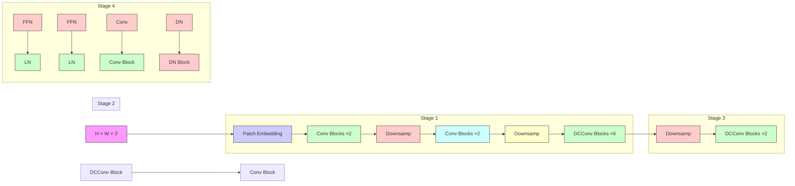

# Dynamic Clustering Convolutional Neural Network

Tanzhe Li $^{1,2}$ , Baochang Zhang $^{3,4}$ , Jiayi Lyu $^{5}$ , Xiawu Zheng $^{1,2}$ , Guodong Guo $^{6}$ , Taisong Jin $^{1,2,7\dagger}$

$^{1}$ Key Laboratory of Multimedia Trusted Perception and Efficient Computing, Ministry of Education of China, Xiamen University, China.

$^{2}$ School of Informatics, Xiamen University, China.

$^{3}$ Hangzhou Research Institute, School of Artificial Intelligence, Beihang University, China.

$^{4}$ Nanchang Institute of Technology, China.

$^{5}$ School of Engineering Science, University of Chinese Academy of Sciences, China.

$^{6}$ Ningbo Institute of Digital Twin, Eastern Institute of Technology, Ningbo, China.

$^{7}$ Key Laboratory of Oracle Bone Inscriptions Information Processing, Ministry of Education of China, Anyang Normal University, China.

litanzhe@stu.xmu.edu.cn, {jintaisong,zhengxiawu}@xmu.edu.cn, bczhang@buaa.edu.cn

# Abstract

Convolutional neural networks (CNNs) have been playing a dominant role in computer vision. However, the existing approaches of using local window modeling in popular CNNs lack flexibility and hinder their ability to capture long-range dependencies of objects in an image. To overcome these limitations, we propose a novel CNN architecture, termed Dynamic Clustering Convolutional Neural Network (DCCNeXt). The proposed DCCNeXt takes a unique approach by employing global clustering to group image patches with similar semantics into clusters that are then convolved using the shared convolution kernels. To address the high computational complexity of global clustering, the feature vectors from each patch's subspace are extracted for efficient clustering, which makes the proposed model widely compatible with the downstream vision tasks. The extensive experiments of image classification, object detection, instance segmentation, and semantic segmentation on the benchmark datasets demonstrate that the proposed DCCNeXt outperforms the mainstream Convolutional Neural Networks (CNNs), Vision Transformers (ViTs), Vision Multi-layer Perceptrons (MLPs), Vision Graph Neural Networks (GNNs), and Vision Mambas (ViMs). We anticipate that this study will provide a new perspective and a promising avenue for the design of convolutional neural networks.

Code — https://github.com/ltzovo/DCCNeXt

# Introduction

Convolutional neural networks (CNNs) (LeCun et al. 1998) have been proposed for handwritten digit recognition in 1998. However, due to limitations in computational power and available data, it was not until AlexNet (Krizhevsky, Sutskever, and Hinton 2012) won the 2012 ImageNet challenge that CNNs gained widespread attention and sparked the deep learning revolution. For a considerable period of time, CNNs (Simonyan and Zisserman 2014; He et al. 2016; Huang et al. 2017; Tan and Le 2019; Howard et al. 2017) architectures commonly utilize $3 \times 3$ convolution kernels as main building blocks due to the superior performance over larger convolution kernels with equivalent parameters and computational cost. Recently, Vision Transformers (Dosovitskiy et al. 2021; Touvron et al. 2021a; Wang et al. 2021; Liu et al. 2021; Touvron et al. 2021b) have achieved remarkable success in computer vision by leveraging global or large local receptive field of attention (Vaswani et al. 2017), which has resulted in a period where CNNs have been overshadowed by the success of Vision Transformers.

It is time for CNNs to fight back. Inspired by the success of Vision Transformers, some recent studies (Trockman and Kolter 2022; Liu et al. 2022; Woo et al. 2023; Ding et al. 2022; Liu et al. 2023) have revisited the use of large convolution kernels, such as the famous ConvNeXt (Liu et al. 2022), which utilizes $7 \times 7$ deep separable convolution (Howard et al. 2017; Chollet 2017) to increase receptive field and incorporates a series of improvements that enable CNNs to achieve competitive performance against ViTs. More recently, some studies (Smith et al. 2023; Woo et al. 2023) have demonstrated that CNNs achieve performance comparable to or even better than Vision Transformers in large-scale supervised pre-training and unsupervised pre-training vision tasks. This challenges researchers' previous perception that CNNs are not as effective as Vision Transformers in handling large-scale data.

Although the modern CNNs have greatly improved by leveraging larger receptive fields of $7 \times 7$ convolution kernels, ConvNeXt (Liu et al. 2022) shows that larger $9 \times 9$ and $11 \times 11$ convolution kernels can result in performance saturation and decline, which indicates that convolution kernels that are too dense are not conducive to feature extraction. Despite the subsequent RepLKNet (Ding et al. 2022) and SLaK (Liu et al. 2023) expanding the kernel to an astonishing $31 \times 31$ and $51 \times 51$ through reparameterization (Ding et al. 2021) and sparse decomposition, this super-sized kernel only brings a minor performance enhancement while the computational cost is difficult to accept. Thus, the $7 \times 7$ convolution kernel is still the norm for CNN-based backbones. However, the basic modeling scheme of $7 \times 7$ convolution still operates within a fixed-size local window, which limits the global receptive field of CNNs and is not flexible for cap-

turing the long-range dependencies of objects in an image.

To efficiently address the aforementioned limitations of the standard convolution, we propose a novel global modeling tool, termed Dynamic Clustering Convolution (DCConv). As shown in Figure 1, for the $H \times W$ image patches, we treat each patch as a clustering center, after calculating the $\ell_2$ -norm distance between each clustering center and other patches, the $K - 1$ patches with the shortest distance is chosen to join the cluster, resulting in $H \times W$ clusters of size $K$ . Furthermore, the convolution operation is performed on each cluster using a shared set of convolution kernels, resulting in the output of new feature maps. Considering that the clustering operation is based on the entire image and computation of the $\ell_2$ -norm distance has the quadratic computational complexity, the proposed DCConv extracts a subset of feature vectors for patch clustering, which significantly reduces the computational cost for high-resolution downstream vision tasks.

Our proposed dynamic clustering convolution differs greatly from standard convolution: (1) Standard convolution operates on locally adjacent image regions, which makes it difficult to capture long-range dependencies of the objects. In contrast, the proposed dynamic clustering convolution performs clustering globally, providing a larger global receptive field that can capture dependencies among objects that are farther apart. (2) The proposed convolution operation is sparsely distributed over globally important image patches, which has good sparsity property. (3) Cluster is a widespread data structure, which makes that our proposed DCConv not constrained by the structure or modality of the data and can flexibly perform global modeling like Transformer (Vaswani et al. 2017). This offers many possibilities for the adaptation of convolutional neural networks to the complex learning tasks in real-world applications.

Based on the proposed DCConv, we develop a series of vision backbones, namely DCCNeXt. To validate the efficacy of our method, we conduct extensive experiments on benchmark datasets to evaluate the efficacy of the proposed DCCNeXt in various vision tasks, including image classification, object detection, instance segmentation, and semantic segmentation. The experimental results demonstrate the effectiveness of the proposed method. For instance, DCCNeXt-B2 achieves a top-1 accuracy of 82.8% on the ImageNet classification task, outperforming the representative CNNs (ConvNeXt V2-T (Woo et al. 2023) 82.5%) with fewer parameters and FLOPs, in downstream tasks such as object detection, instance segmentation, and semantic segmentation, which rely on global modeling, our DCCNeXt-B2 demonstrated improvements of 2.1 AP $^{b}$ , 1.8 AP $^{m}$ , and 0.8 mIOU, respectively, compared to ConvNeXt V2-T. Meanwhile, our model consistently outperforms various types of backbones (Vision Transformers, Vision MLPs, Vision GNNs, and Vision Mambas) in a series of vision tasks.

# Related Work

# Convolutional Neural Networks

After AlexNet (Krizhevsky, Sutskever, and Hinton 2012) won the ImageNet image classification challenge in 2012, the potential of CNNs was the first widely acknowledged by researchers. Since then, different extensions and variants of CNNs have been proposed to employ various vision tasks. For instance, VGG (Simonyan and Zisserman 2014) proposed repeatedly using simple building blocks, which provides the basic rules to guide the subsequent architecture design. GoogleNet (Szegedy et al. 2015) and ResNeXt (Xie et al. 2017) demonstrate the efficacy of multi-branching in the building blocks. ResNet (He et al. 2016) is a significant advance in CNN architectures by utilizing residual connections to address the challenge of deep neural networks. Furthermore, CNNs are designed for lighter and faster architectures, including but not limited to MobileNet (Howard et al. 2017), ShuffleNet (Zhang et al. 2018), and EfficientNet (Tan and Le 2019). Recently, ConvNeXt (Liu et al. 2022; Woo et al. 2023) has shown impressive performance and competitive results with Vision Transformers, RepLKNet (Ding et al. 2022) and SLaK (Liu et al. 2023) have enlarged the convolutional neural network's kernel to an astonishing $31 \times 31$ and $51 \times 51$ . The aforementioned studies demonstrate the importance of CNNs as a vision architecture for the vision community. In contrast to these works, our objective is not to use larger convolution kernels, but rather to sparsely distribute convolution kernels among globally important patches. Thus, we employ global clustering to dynamically represent the image as clusters, followed by performing convolution on these clusters to capture long-range dependencies.

# Vision Transformers

With the impressive achievements of Transformer (Vaswani et al. 2017) in the domain of natural language processing (NLP), the computer vision community seeks to harness the capabilities of this potential model. However, the dissimilarities between the structure of images and sentences result in the incorporation of only the attention mechanism module from the Transformer into the convolutional neural network (Hu, Shen, and Sun 2018; Woo et al. 2018; Wang et al. 2020; Hou, Zhou, and Feng 2021). The subsequent emergence of ViT (Dosovitskiy et al. 2021) has demonstrated that Transformer (Vaswani et al. 2017) architectures can be highly effective in computer vision tasks. Despite its successes, ViT (Dosovitskiy et al. 2021) suffers from the following limitations including the absence of inductive bias, dependence on large quantities of data, and difficulties in applying it to high-resolution images due to the computational complexity of self-attention (Vaswani et al. 2017). To address the aforementioned limitations of ViT (Dosovitskiy et al. 2021), DeiT (Touvron et al. 2021a) leverages knowledge distillation (Hinton, Vinyals, and Dean 2015) and multiple training strategies to enable effective training on ImageNet-1K (Russakovsky et al. 2015), Swin Transformer (Liu et al. 2021) and PVT (Wang et al. 2021) utilize the pyramid architectures and reduce the computational complexity of self-attention to tackle the challenges with high-resolution images. Furthermore, some research works like Poolformer (Yu et al. 2022c,d) and MLP-Mixer (Tolstikhin et al. 2021) adopt a different approach by replacing the self-attention in Transformer with a pooling layer


<details>
<summary>flowchart</summary>

```mermaid
graph TD
    A["Image Patches"] --> B["Flatten"]
    B --> C["IndexSelect"]
    C --> D["Convolutional Kernel"]
    D --> E["Flatten"]
    E --> F["Convolutional Kernel"]
    F --> G["Output"]
    
    subgraph Image_Patches
        H["W"]
        I["H × W"]
        J["C/d"]
        K["L2 Distance"]
        L["H × W"]
        M["TopkIndex"]
        N["Field"]
    end
    
    subgraph IndexSelect
        O["Cluster 1"]
        P["Cluster 2"]
        Q["Cluster 3"]
        R["Cluster N"]
    end
    
    subgraph Convolutional_Kernel
        S["C"]
        T["K"]
        U["C"]
        V["C"]
        W["K"]
        X["C"]
    end
    
    H --> B
    I --> B
    J --> B
    K --> B
    L --> B
    M --> B
    N --> B
    O --> B
    P --> B
    Q --> B
    R --> B
    S --> E
    T --> E
    U --> E
    V --> E
    W --> E
    X --> E
    Y --> E
    Z --> E
    end
    
    style Image_Patches fill:#f9f,stroke:#333
    style IndexSelect fill:#bbf,stroke:#333
```
</details>

Figure 1: Illustration of dynamic clustering convolution. H: height of the feature map, W: width of the feature map, C: feature dimension, d: Downsampling interval, K: convolution kernel size of dynamic clustering convolution, Flatten: flattening the feature vectors along the spatial dimensions. Downsamp: extracting a set of sub-vectors for each patch. TopkIndex: obtaining the index of clusters using the Top-K algorithm. IndexSelect: selecting feature vectors using the index of clusters.

or MLP layer can still achieve remarkable results. These research efforts indicate that the success of Transformer in computer vision is attributed to its architecture, rather than the self-attention.

# Clustering in Computer Vision

Clustering algorithms (Jampani et al. 2018; Huang and Li 2020) have been widely applied in computer vision, especially in image segmentation (Ren and Malik 2003; Li and Chen 2015; Yu et al. 2022b; Ma et al. 2022; Yu et al. 2022a), but their utilization in general vision backbones is quite constrained. Recently, Context-Cluster (Ma et al. 2023) introduced clustering algorithm into vision backbones, achieving remarkable results. However, due to computational complexity, Context-Cluster restricts clustering regions to local windows, similar to the Swin Transformer (Liu et al. 2021), hindering the model's ability to capture global dependencies. Furthermore, each image patch can only be assigned to one cluster center, which results in multiple image patches within the same cluster receiving the same semantic information, thereby limiting the model's expressive capacity. Compared to Context-Cluster, our clustering approach is more aggressive, where each patch is treated as a clustering center, and each patch can be assigned to multiple cluster centers, enabling each image patch to obtain distinct semantic information. At the same time, our proposed subvector downsampling allows clustering to operate globally, greatly enhancing the model's ability to capture long-range dependencies. The aforementioned innovations enable our DCC-NeXt to achieve significantly better performance in image classification compared to Context-Cluster.

# Methodology

# Network Architecture

The network architecture of the proposed method is illustrated in Figure 2. Taking the DCCNeXt-B1 version as an example, it first divides the input RGB image into patches using a $7 \times 7$ convolution with a stride of 4. Each patch is considered as a cluster center and has a feature dimension of 48. Our model consists of four stages in total. In the first two stages, the $7 \times 7$ depthwise separable convolution (Howard et al. 2017; Chollet 2017) is used to extract local features, while the latter two stages utilize dynamic clustering convolution to extract crucial global features. As the stages progress, adjacent patches are merged into a new patch using the downsamp layer, reducing the feature map to one-fourth of its original size and increasing the feature dimension of the patches. Following the design principles of previous pyramid structures, we mainly stack the blocks on the third stage, with each block consisting of a $7 \times 7$ depthwise separable convolution or dynamic clustering convolution and an FFN, respectively used for feature extraction and transformation. More details of our DCCNeXt series are shown in Table 1.

<table><tr><td>Models</td><td>Channels</td><td>Blocks</td><td>Params (M)</td><td>FLOPs (G)</td></tr><tr><td>DCCNeXt-B0</td><td>[32, 64, 160, 256]</td><td>[3, 3, 5, 2]</td><td>5.5</td><td>0.8</td></tr><tr><td>DCCNeXt-B1</td><td>[48, 96, 240, 384]</td><td>[2, 2, 6, 2]</td><td>11.4</td><td>1.6</td></tr><tr><td>DCCNeXt-B2</td><td>[64, 128, 320, 512]</td><td>[3, 3, 9, 3]</td><td>26.7</td><td>4.0</td></tr><tr><td>DCCNeXt-B3</td><td>[96, 192, 384, 576]</td><td>[3, 12, 18, 3]</td><td>56.8</td><td>13.0</td></tr><tr><td>DCCNeXt-B4</td><td>[96, 192, 384, 768]</td><td>[5, 12, 20, 5]</td><td>86.7</td><td>15.7</td></tr></table>

Table 1: Detailed settings of DCCNeXt series.

# Dynamic Clustering Convolution

Converting Image to Patches: For the popular architectures, whether CNNs, Vision Transformers, Vision MLPs, or Vision GNNs, the input images are generally converted into patches before subsequent processing. Following the aforementioned strategy, the proposed method converts the original image into different patches first. For an image with input size $H \times W \times 3$ , the image is divided into different patches. Each patch is considered as a cluster center in the clustering operation, resulting in a set of cluster centers $C = \{c_{1}, c_{2}, ..., c_{n}\}$ . By applying learnable parameters W, the original patch features are transformed into vectors, resulting in a set of cluster center features $X = \{x_{1}, x_{2}, ..., x_{n}\}$ , where $x_{i} \in R^{D}$ , D is the feature dimension and $i = 1, 2, \cdots, n$ .


<details>
<summary>flowchart</summary>


</details>

Figure 2: The framework of the DCCNeXt (DCCNeXt-B1). Patch Embedding: network layer that makes patch embedding from the original image. H: height of the feature map. W: width of the feature map. D: feature dimension, FFN: feed-forward neural network (Vaswani et al. 2017). LN: layer normalization (Ba, Kiros, and Hinton 2016). DCConv: dynamic clustering convolution. Conv: $7 \times 7$ depthwise separable convolution (Howard et al. 2017; Chollet 2017).

Dynamic Clustering: For each cluster center, we calculate the $\ell_{2}$ -norm distance between each cluster center and other patches. The $\ell_{2}$ -norm distance is defined as follows:

$$
\operatorname{distance} (\mathbf {x}, \mathbf {y}) = (\mathbf {x} - \mathbf {y}) ^ {2}, \tag {1}
$$

where x is the cluster center, y is a patch other than the cluster center, $x \in R^{D}$ , $y \in R^{D}$ .

After calculating the $\ell_{2}$ -norm distances between each cluster center and the other patches, we obtain a distance matrix $M \in R^{n \times n}$ for each cluster center and other patches. Next, based on this matrix M, we use a Top-K algorithm to select the K - 1 patches that are closest in distance to each cluster center. Consequently, we obtain the index of patches within each cluster. This process can be represented as follows:

$$
i d x = \text { TopkIndex } (\mathbf {M}), \tag {2}
$$

where $idx$ is the index of patches within clusters and $idx \in \mathbb{R}^{n \times k}$ .

Based on the obtained index $idx$ , we select the feature vectors of clusters from patch features, resulting in a feature vector matrix $\mathbf{X} \in \mathbb{R}^{n \times k \times d}$ that is convenient for subsequent convolution. Within this feature vector matrix $\mathbf{X}$ , patches belonging to the same cluster are arranged in ascending order based on their distances from the cluster center. The above process can be represented as follows:

$$
\mathbf {X} ^ {\prime} = \text { IndexSelect } (i d x, \mathbf {X}), \tag {3}
$$

where X is the patch feature, idx is index of patches within clusters.

Efficient Dynamic Clustering: Our clustering operation involves computing the $\ell_{2}$ -norm distance between each cluster center and other patches, resulting in a quadratic complexity:

$$
\Omega (\mathrm{DC}) = h ^ {2} w ^ {2} C + 2 h w C, \tag {4}
$$

where h and w respectively are the height and width of the feature map, C is the feature dimension, and DC is the Dynamic Clustering.

The above computation complexity is intractable for high-resolution images. Considering that the feature vectors in the latter two stages are typically long and contain redundancy when calculating $\ell_{2}$ -norm distance, we use sub-vectors $V_{sub} = \{a_{1}, a_{1+d}, a_{1+2d}, ..., a_{c}\}$ of the feature vector $V = \{a_{1}, a_{2}, a_{3}, ..., a_{c}\}$ to compute $\ell_{2}$ -norm distance, where $V_{sub} \in R^{C//d}$ and $V \in R^{C}$ . Thus, it can result in a significant reduction in computational cost when processing high-resolution images:

$$
\Omega (\mathrm{EDC}) = \frac {h ^ {2} w ^ {2}}{d} C + \frac {2 h w}{d} C, \tag {5}
$$

where $h$ and $w$ respectively are the height and width of the feature map, $C$ is the feature dimension, and EDC is the efficient dynamic clustering, $d$ represents the sampling interval for sub-vectors and is set to 8 in our model.

Performing Convolution on Clusters: After obtaining n clusters, we perform convolution using a set of shared convolution kernels. To reduce the number of parameters, depthwise separable convolution (Howard et al. 2017; Chollet 2017) is commonly used in CNNs. Following this approach, the proposed dynamic clustering convolution model performs grouped convolution along the channels for improving computational efficiency. The proposed dynamic clustering convolution is defined as follows:

$$
\mathbf {Y} _ {i, j, c} = \sum_ {k = 0} ^ {K - 1} \mathbf {X} _ {i * w + j, k, c} ^ {\prime} \cdot \mathbf {W} _ {k, c} + \mathbf {b} _ {c}, \tag {6}
$$

where Y is the output feature, $X'$ is the feature of patches within the cluster, W is the weight of the convolution kernels, b is the bias of the convolution kernels, K is the size of the cluster, i is the row coordinate of the patch in the image, j is the column coordinate of the patch in the image, w is the width of the feature map, k is the coordinate of the patch within the cluster, and c is the coordinate of the channel.

Convolution FFN: To enhance the expressive capability of local information, inspired by the work (Chu et al. 2023; Islam, Jia, and Bruce 2020; Li et al. 2021; Wang et al. 2022), we insert $3 \times 3$ depthwise separable convolution (DW-Conv) (Howard et al. 2017; Chollet 2017) into the model's FFN to improve the model's ability for local modeling:

$$
Y = D W C o n v (\text { Linear } ^ {C \to 4 C} (Y)), \tag {7}
$$

$$
Y = \operatorname{Linear} ^ {4 C \rightarrow C} \{G E L U (Y) \}, \tag {8}
$$

where Linear $^{4C\rightarrow C}$ means linear layer with input channels of $4\times C$ and output channels of C, GELU denotes GELU (Hendrycks and Gimpel 2016) activation function.

# Experiments

# Image Classification

Experimental settings: We use ImageNet-1K (Russakovsky et al. 2015) to conduct the image classification experiments. ImageNet-1K (Russakovsky et al. 2015) is also called the ISLVRC 2012 dataset, with 1K classes containing 1.28M training images and 50K validation images. We implement the proposed method by using PyTorch (Paszke et al. 2019) and Timm (Wightman et al. 2019). For a fair comparison, we follow the experimental parameter settings that are widely used in DeiT (Touvron et al. 2021a) and train the proposed model on a $224^{2}$ -resolution image with 300 epochs. We employ the AdamW (Loshchilov and Hutter 2017) optimizer using a cosine decay learning rate scheduler with 20 epochs of linear warm-up. Data augmentation and regularization techniques include RandAugmentation (Cubuk et al. 2020), Mixup (Zhang et al. 2017), CutMix (Yun et al. 2019), Random Erasing (Zhong et al. 2020), Weight Decay, Label Smoothing (Szegedy et al. 2016), and Stochastic Depth (Huang et al. 2016). We do not use Exponential Moving Average(EMA) (Polyak and Juditsky 1992), which does not improve the final performance of the model.

Results: Table 2 lists the comparison results of the proposed DCCNeXt with the representative backbones of different types on ImageNet-1K (Russakovsky et al. 2015). DCC-NeXt outperforms common CNNs (ConvNeXt (Liu et al. 2022), ConvNeXt V2 (Woo et al. 2023) and SLaK (Liu et al. 2023)), Vision Transformers (FLatten-Swin (Han et al. 2023a) and Slide-PVT (Pan et al. 2023)), Vision MLPs (CycleMLP (Chen et al. 2022)), Vision GNN (ViHGNN (Han et al. 2023b)), and Vision SSM (VMamba (Liu et al. 2024)) with similar parameters and FLOPs. Furthermore, we observe that our approach far surpasses the state-of-the-art clustering-based vision architecture FEC-Small (Chen et al. 2024), even surpassing it by up to 3.1 points at a model size of around 5M (75.8% vs. 72.7%). When the model scales up to around 50M and 90M, our DCCNeXt-B3 and DCCNeXt-B4 achieves top-1 accuracies of 84.3% and 84.5% respectively, surpassing various models of different types, indicating the strong scalability of our model. The above results highlight the excellence of our DCCNeXt architecture.

# Object Detection and Instance Segmentation

Settings: We conduct the object detection and instance segmentation experiments on COCO 2017 (Lin et al. 2014), which contains 118K training images, 5K validation images, and 41K test images. We use MMDetection (Chen et al. 2019) to implement object detection and instance segmentation. For a fair comparison, we use the model pre-trained on ImageNet-1K (Russakovsky et al. 2015) as the backbone, and the object detection and instance segmentation frameworks are RetinaNet (Lin et al. 2017) and Mask R-CNN (He et al. 2017), respectively.

<table><tr><td>Model</td><td>Type</td><td>Params (M)</td><td>FLOPs (G)</td><td>Top-1 (%)</td></tr><tr><td>PVTv2-B0 (Wang et al. 2022)</td><td>ViTs</td><td>3.4</td><td>0.6</td><td>70.5</td></tr><tr><td>TNT-Ti (Han et al. 2021)</td><td>ViTs</td><td>6.1</td><td>1.4</td><td>73.9</td></tr><tr><td>Context-Cluster-Ti (Ma et al. 2023)</td><td>Clustering</td><td>5.3</td><td>1.0</td><td>71.8</td></tr><tr><td>FEC-Small (Chen et al. 2024)</td><td>Clustering</td><td>5.5</td><td>1.4</td><td>72.7</td></tr><tr><td>DCCNeXt-B0 (ours)</td><td>CNNs</td><td>5.5</td><td>0.8</td><td>75.8</td></tr><tr><td>PVTv2-B1 (Wang et al. 2022)</td><td>ViTs</td><td>13.1</td><td>2.1</td><td>78.7</td></tr><tr><td>CycleMLP-B1 (Chen et al. 2022)</td><td>MLPs</td><td>15.0</td><td>2.1</td><td>78.9</td></tr><tr><td>ViHGNN-Ti (Han et al. 2023b)</td><td>GNNs</td><td>12.3</td><td>2.3</td><td>78.9</td></tr><tr><td>Context-Cluster-Small (Ma et al. 2023)</td><td>Clustering</td><td>14.0</td><td>2.6</td><td>77.5</td></tr><tr><td>FEC-Base (Chen et al. 2024)</td><td>Clustering</td><td>14.4</td><td>3.4</td><td>78.1</td></tr><tr><td>ResNet-18 (He et al. 2016)</td><td>CNNs</td><td>12.0</td><td>1.8</td><td>70.6</td></tr><tr><td>DCCNeXt-B1 (ours)</td><td>CNNs</td><td>11.4</td><td>1.6</td><td>79.7</td></tr><tr><td>Swin-T (Liu et al. 2021)</td><td>ViTs</td><td>29</td><td>4.5</td><td>81.3</td></tr><tr><td>FLatten-Swin-T (Han et al. 2023a)</td><td>ViTs</td><td>29</td><td>4.5</td><td>82.1</td></tr><tr><td>Slide-PVT-S (Pan et al. 2023)</td><td>ViTs</td><td>22.7</td><td>4.0</td><td>81.7</td></tr><tr><td>PVTv2-B2 (Wang et al. 2022)</td><td>ViTs</td><td>25.4</td><td>4.0</td><td>82.0</td></tr><tr><td> $QFormer_{h}-T$  (Zhang et al. 2024)</td><td>ViTs</td><td>29</td><td>4.6</td><td>82.5</td></tr><tr><td>CycleMLP-B2 (Chen et al. 2022)</td><td>MLPs</td><td>27</td><td>3.9</td><td>81.6</td></tr><tr><td>ViHGNN-S (Han et al. 2023b)</td><td>GNNs</td><td>28.5</td><td>6.3</td><td>82.5</td></tr><tr><td>Context-Cluster-Medium (Ma et al. 2023)</td><td>Clustering</td><td>27.9</td><td>5.5</td><td>81.0</td></tr><tr><td>FEC-Large (Chen et al. 2024)</td><td>Clustering</td><td>28.3</td><td>6.5</td><td>81.2</td></tr><tr><td>VMamba-T (Liu et al. 2024)</td><td>SSMs</td><td>22</td><td>5.6</td><td>82.2</td></tr><tr><td>ResNet-50 (He et al. 2016)</td><td>CNNs</td><td>25.6</td><td>4.1</td><td>79.8</td></tr><tr><td>SLaK-T (Liu et al. 2023)</td><td>CNNs</td><td>30</td><td>5.0</td><td>82.5</td></tr><tr><td>ConvNeXt-T (Liu et al. 2022)</td><td>CNNs</td><td>28.6</td><td>4.5</td><td>82.1</td></tr><tr><td>InceptionNeXt-T (Yu et al. 2024)</td><td>CNNs</td><td>28</td><td>4.2</td><td>82.3</td></tr><tr><td>ConvNeXt V2-T (Woo et al. 2023)</td><td>CNNs</td><td>28.6</td><td>4.5</td><td>82.5</td></tr><tr><td>DCCNeXt-B2 (ours)</td><td>CNNs</td><td>26.7</td><td>4.0</td><td>82.8</td></tr><tr><td>Swin-S (Liu et al. 2021)</td><td>ViTs</td><td>50</td><td>8.7</td><td>83.0</td></tr><tr><td>FLatten-Swin-S (Han et al. 2023a)</td><td>ViTs</td><td>51</td><td>8.7</td><td>83.5</td></tr><tr><td>PVTv2-B3 (Wang et al. 2022)</td><td>ViTs</td><td>45.2</td><td>6.9</td><td>83.2</td></tr><tr><td> $QFormer_{h}-S$  (Zhang et al. 2024)</td><td>ViTs</td><td>51</td><td>8.9</td><td>84.0</td></tr><tr><td>CycleMLP-B4 (Chen et al. 2022)</td><td>MLPs</td><td>52</td><td>10.1</td><td>83.0</td></tr><tr><td>ViHGNN-M (Han et al. 2023b)</td><td>GNNs</td><td>52.4</td><td>10.7</td><td>83.4</td></tr><tr><td>VMamba-S (Liu et al. 2024)</td><td>SSMs</td><td>44</td><td>11.2</td><td>83.5</td></tr><tr><td>ResNet-152 (He et al. 2016)</td><td>CNNs</td><td>60.2</td><td>11.5</td><td>81.8</td></tr><tr><td>SLaK-S (Liu et al. 2023)</td><td>CNNs</td><td>55</td><td>9.8</td><td>83.8</td></tr><tr><td>ConvNeXt-S (Liu et al. 2022)</td><td>CNNs</td><td>50</td><td>8.7</td><td>83.1</td></tr><tr><td>InceptionNeXt-S (Yu et al. 2024)</td><td>CNNs</td><td>49</td><td>8.4</td><td>83.5</td></tr><tr><td>DCCNet-B3 (ours)</td><td>CNNs</td><td>56.8</td><td>13.0</td><td>84.3</td></tr><tr><td>Swin-B (Liu et al. 2021)</td><td>ViTs</td><td>88</td><td>15.4</td><td>83.5</td></tr><tr><td>FLatten-Swin-B (Han et al. 2023a)</td><td>ViTs</td><td>89</td><td>15.4</td><td>83.8</td></tr><tr><td>PVTv2-B5 (Wang et al. 2022)</td><td>ViTs</td><td>82</td><td>11.8</td><td>83.8</td></tr><tr><td> $QFormer_{h}-B$  (Zhang et al. 2024)</td><td>ViTs</td><td>90</td><td>15.7</td><td>84.1</td></tr><tr><td>CycleMLP-B5 (Chen et al. 2022)</td><td>MLPs</td><td>76</td><td>12.3</td><td>83.2</td></tr><tr><td>ViHGNN-B (Han et al. 2023b)</td><td>GNNs</td><td>94.4</td><td>18.1</td><td>83.9</td></tr><tr><td>VMamba-B (Liu et al. 2024)</td><td>SSMs</td><td>75</td><td>18.0</td><td>83.7</td></tr><tr><td>SLaK-B (Liu et al. 2023)</td><td>CNNs</td><td>95</td><td>17.1</td><td>84.0</td></tr><tr><td>ConvNeXt-B (Liu et al. 2022)</td><td>CNNs</td><td>89</td><td>15.4</td><td>83.8</td></tr><tr><td>InceptionNeXt-B (Yu et al. 2024)</td><td>CNNs</td><td>87</td><td>14.9</td><td>84.0</td></tr><tr><td>ConvNeXt V2-B (Woo et al. 2023)</td><td>CNNs</td><td>89</td><td>15.4</td><td>84.3</td></tr><tr><td>DCCNet-B4 (ours)</td><td>CNNs</td><td>86.7</td><td>15.7</td><td>84.5</td></tr></table>

Table 2: Results of DCCNeXt and other backbones on ImageNet-1K (Russakovsky et al. 2015).

Results: We list the results in Table 3. For RetinaNet (Lin et al. 2017) based object detection, we report the Average Precision (AP) at different IOU thresholds (50%, 75%) and three different object sizes (small, medium, and large). From the results, we observe that the proposed DCCNeXt consistently outperforms other models in AP at different thresholds, especially excelling in the detection of medium and large objects. Even in small object detection, the model

<table><tr><td rowspan="2">Backbone</td><td colspan="7">RetinaNet 1×</td></tr><tr><td>Param (M)</td><td>FLOPs (G)</td><td>AP</td><td> $AP_{50}$ </td><td> $AP_{75}$ </td><td> $AP_S$ </td><td> $AP_M$ </td></tr><tr><td>ResNet-50</td><td>37.7</td><td>239.3</td><td>36.3</td><td>55.3</td><td>38.6</td><td>19.3</td><td>40.0</td></tr><tr><td>PVT-Small</td><td>34.2</td><td>226.5</td><td>40.4</td><td>61.3</td><td>44.2</td><td>25.0</td><td>42.9</td></tr><tr><td>CycleMLP-B2</td><td>36.5</td><td>230.9</td><td>40.6</td><td>61.4</td><td>43.2</td><td>22.9</td><td>44.4</td></tr><tr><td>Swin-T</td><td>38.5</td><td>244.8</td><td>41.5</td><td>62.1</td><td>44.2</td><td>25.1</td><td>44.9</td></tr><tr><td>ConvNeXt V2-T</td><td>38.8</td><td>243.2</td><td>41.7</td><td>62.5</td><td>44.6</td><td>25.2</td><td>45.2</td></tr><tr><td>DCCNeXt-B2 (ours)</td><td>33.8</td><td>247.1</td><td>43.0</td><td>63.8</td><td>46.1</td><td>25.6</td><td>47.4</td></tr><tr><td rowspan="2">Backbone</td><td colspan="7">Mask R-CNN 1×</td></tr><tr><td>Param (M)</td><td>FLOPs (G)</td><td> $AP^b$ </td><td> $AP_{50}^b$ </td><td> $AP_{75}^b$ </td><td> $AP^m$ </td><td> $AP_{50}^m$ </td></tr><tr><td>ResNet-50</td><td>44.2</td><td>260.1</td><td>38.0</td><td>58.6</td><td>41.4</td><td>34.4</td><td>55.1</td></tr><tr><td>FEC-Large</td><td>47.1</td><td>-</td><td>39.9</td><td>62.5</td><td>43.2</td><td>37.3</td><td>59.5</td></tr><tr><td>PVT-Small</td><td>44.1</td><td>245.1</td><td>40.4</td><td>62.9</td><td>43.8</td><td>37.8</td><td>60.1</td></tr><tr><td>Slide-PVT-S</td><td>42.0</td><td>269.0</td><td>42.8</td><td>65.9</td><td>46.7</td><td>40.1</td><td>63.1</td></tr><tr><td>CycleMLP-B2</td><td>46.5</td><td>249.5</td><td>42.1</td><td>64.0</td><td>45.7</td><td>38.9</td><td>61.2</td></tr><tr><td>Swin-T</td><td>47.8</td><td>264.0</td><td>42.2</td><td>64.6</td><td>46.2</td><td>39.1</td><td>61.6</td></tr><tr><td>ConvNeXt V2-T</td><td>48.1</td><td>262.1</td><td>42.5</td><td>63.5</td><td>46.5</td><td>38.8</td><td>60.7</td></tr><tr><td>DCCNeXt-B2 (ours)</td><td>43.7</td><td>281.1</td><td>44.6</td><td>66.1</td><td>49.0</td><td>40.6</td><td>63.4</td></tr></table>

Table 3: Object detection and instance segmentation results on COCO val2017 (Lin et al. 2014). The proposed DC-CNeXt is compared with the other backbones using RetinaNet (Lin et al. 2017) and Mask R-CNN (He et al. 2017) frameworks. We calculate FLOPs with $1280 \times 800$ input size.

demonstrates strong performance. This indicates that our model possesses good local modeling capabilities alongside its powerful long-range modeling capabilities. For Mask R-CNN (He et al. 2017) based object detection and instance segmentation, we report bounding box and mask Average Precision (AP $^{b}$ and AP $^{m}$ ) at different IOU thresholds (50%, 75%). Our approach demonstrates a clear advantage across all metrics, highlighting its outstanding performance in both object detection and instance segmentation tasks.

# Semantic Segmentation

Settings: We choose ADE20K (Zhou et al. 2017) to conduct the semantic segmentation. The ADE20K includes 20K training images, 2K validation images, and 3K test images covering 150 semantic categories. We use MMSEG (Contributors 2020) as the framework and Semantic FPN (Kirillov et al. 2019) as the segmentation head. In the training phase, the backbone is initialized with the weights pretrained on ImageNet-1K (Russakovsky et al. 2015), and the newly added layers are initialized with Xavier (Glorot and Bengio 2010). We use AdamW (Loshchilov and Hutter 2017) to optimize our model with an initial learning rate of 1e-4. Following the common practices (Kirillov et al. 2019; Chen et al. 2017), we train our models for 40k iterations with a batch size of 32. The learning rate is decayed following the polynomial decay schedule with a power of 0.9. In the training phase, we randomly resize and crop the image to $512 \times 512$ . In the testing phase, we rescale the image with a shorter side of 512 pixels.

Results: As shown in Table 4, we observe that the proposed DCCNeXt outperforms the representative backbones of different types in semantic segmentation, including ConvNeXt V2 (Woo et al. 2023) (CNN), Swin Transformer (Liu et al. 2021) and Slide-PVT (Pan et al. 2023) (Vision Transformer), CycleMLP (Chen et al. 2022) (Vision MLP). Due to the absence of relevant data, we do not compare the semantic segmentation results with Vision GNN. In general, DCCNeXt performs competently in semantic segmentation and outperforms various backbones.

<table><tr><td>Backbone</td><td>Param (M)</td><td>FLOPs (G)</td><td>mIOU (%)</td></tr><tr><td>CycleMLP-B2 (Chen et al. 2022)</td><td>30.6</td><td>-</td><td>42.4</td></tr><tr><td>PVT-Small (Wang et al. 2021)</td><td>28.2</td><td>44.5</td><td>39.8</td></tr><tr><td>Slide-PVT-S (Pan et al. 2023)</td><td>26.0</td><td>-</td><td>42.5</td></tr><tr><td>Swin-T (Liu et al. 2021)</td><td>31.9</td><td>-</td><td>41.5</td></tr><tr><td>PoolFormer-S36 (Yu et al. 2022c)</td><td>35.0</td><td>48.0</td><td>42.0</td></tr><tr><td>FEC-Large (Chen et al. 2024)</td><td>31.9</td><td>-</td><td>40.5</td></tr><tr><td>ResNet-50 (He et al. 2016)</td><td>28.5</td><td>45.6</td><td>36.7</td></tr><tr><td>InceptionNeXt-T (Yu et al. 2024)</td><td>28.0</td><td>44.0</td><td>43.1</td></tr><tr><td>ConvNeXt V2-T (Woo et al. 2023)</td><td>32.2</td><td>45.2</td><td>43.7</td></tr><tr><td>DCCNeXt-B2 (ours)</td><td>27.8</td><td>43.3</td><td>44.5</td></tr></table>

Table 4: Results of semantic segmentation on ADE20K validation set, '-' represents no relevant data. We calculate FLOPs with input size $512 \times 512$ for Semantic FPN (Kirillov et al. 2019).

# Ablation Studies

The convolution kernel size. The size of the convolution kernel is a crucial factor affecting the performance of dynamic clustering convolution. A convolution kernel that is too small may result in an insufficient receptive field, whereas a convolution kernel that is too large with inadequate sparsity may result in performance saturation and degradation. We tune kernel size K from 4 to 18 and show the experimental results in Table 5. From Table 5, it is evident that the optimal performance is obtained when the convolution kernel size is set to 12 and 18.

<table><tr><td>K</td><td>4</td><td>8</td><td>12</td><td>16</td><td>12 and 18</td></tr><tr><td>Top-1(%)</td><td>78.1</td><td>78.5</td><td>78.6</td><td>78.5</td><td>78.7</td></tr></table>

Table 5: ImageNet-1K results of different sizes of the convolution kernel. The basic architecture is DCCNeXt-B1 and the number of training epochs is set to 150. 12 and 18 denote that the convolutional kernel sizes used in the third and fourth stages are 12 and 18, respectively.

The effects of modules in DCCNeXt. As shown in Table 6, we conduct the ablation experiments on three key modules, namely dynamic clustering convolution, Convolution FFN, and subvector sampling. It can be seen that without dynamic clustering convolution for global feature extraction, the performance is significantly worse (77.4% vs. 75.3%). For DCCNeXt, the performance of the model with ConvFFN is improved by 1.3%, which indicates that local information is crucial for DCCNeXt. When the model is processing high-resolution images (object detection is generally tested on a resolution of $1280 \times 800$ to calculate FLOPs), subvector sampling can greatly reduce 50% computational cost (39.2 G vs. 79.5 G) on the resolution of $1280 \times 800$ while ensuring the performance.

<table><tr><td>Method</td><td>Params</td><td>FLOPs (224 × 224)</td><td>FLOPs (1280 × 800)</td><td>ImageNet top-1 acc.</td></tr><tr><td>DCConv→None</td><td>11.2 M</td><td>1.52 G</td><td>31.0 G</td><td>75.3%</td></tr><tr><td>+DCConv</td><td>11.3 M</td><td>1.65 G</td><td>78.9 G</td><td>77.4%</td></tr><tr><td>++ConvFFN</td><td>11.4 M</td><td>1.67 G</td><td>79.5 G</td><td>78.7%</td></tr><tr><td>+++Subvector Sampling</td><td>11.4 M</td><td>1.58 G</td><td>39.2 G</td><td>78.7%</td></tr></table>

Table 6: The effects of modules in DCCNeXt on ImageNet-1K. The basic architecture is DCCNeXt-B1 and the number of training epochs is set to 150.


Figure 3: An example of the cluster distribution after dynamic clustering for different blocks, where the red patches are the cluster centers and the orange patches are the other patches in the cluster.   
  
Figure 4: Heat map visualization of dynamic clustering convolution kernel weights for different blocks. The horizontal coordinate represents the subscript of the convolution kernel weights, while the vertical coordinate represents the weight value. To better reflect the general trend of the weights of the convolution kernels at different positions, where the weights are first taken absolutely and then averaged over the channels.

# Visualization

To better comprehend the working principles of the proposed dynamic clustering convolution, we visualize the clusters in DCCNeXt-B2. As shown in Figure 3, we present clusters at different depths (the 7th and 16th blocks). Our observation is that the proposed model clusters image patches with similar semantics globally into the same cluster.

Furthermore, we visualize the convolution kernels of dynamic clustering convolution in DCCNeXt-B2. Figure 4 shows the weights of convolution kernels in different layers (the 7th and 16th blocks). From Figure 4, we observe that the convolution weights of patches closer to the cluster center in the same cluster are larger. These results indicate that the proposed dynamic clustering convolution can assign different weights to the patches in the cluster based on the patches' contributions to the cluster.

# Conclusion

In this paper, we have proposed a novel convolutional neural network, termed Dynamic Clustering Convolutional Neural Network (DCCNeXt). Different from the prevalent scheme of modeling local windows using standard convolutions, the proposed method dynamically clusters image patches globally into multiple clusters and then convolves each cluster with a shared set of convolution kernels. Thus, the proposed method has a more expressive capability to capture long-range dependencies of objects, which are lacking in standard convolutions. Furthermore, the subspaces of feature vectors are extracted to perform clustering, which significantly reduces the computational cost of the model on high-resolution images. Thus, the proposed method can be applied to various downstream tasks involving images with high resolutions. The extensive experiments on image classification, object detection, instance segmentation, and semantic segmentation have demonstrated the superiority of the proposed method. We hope this proposed novel flexible vision architecture can offer a promising avenue for convolutional neural networks to be widely adapted to various real-world vision tasks.

# Acknowledgements

The work was supported by the National Key Research and Development Program of China (No. 2023YFC3306401) and the National Natural Science Foundation of China (Nos. 62072386, 62076016). This research was also supported by Zhejiang Provincial Natural Science Foundation of China (No. LD24F020007), Beijing Natural Science Foundation of China (Nos. L223024 and L244043), “One Thousand Plan” projects in Jiangxi Province (No. Jxsq2023102268), supported by Yunnan Provincial Major Science and Technology Special Plan Project (No. 202402AD080001), supported by Henan Province key research and development project (No. 231111212000), supported by the Open Foundation of Henan Key Laboratory of General Aviation Technology of China (No. ZHKF-230212) and the Open Foundation the Key Laboratory of Oracle Information Processing of Ministry of Education of China (No. OIP2024E002).

# References

Ba, J.; Kiros, J.; and Hinton, G. 2016. Layer Normalization. Chen, G.; Li, X.; Yang, Y.; and Wang, W. 2024. Neural clustering based visual representation learning. In CVPR, 5714–5725.

Chen, K.; Wang, J.; Pang, J.; Cao, Y.; Xiong, Y.; Li, X.; Sun, S.; Feng, W.; Liu, Z.; Xu, J.; et al. 2019. MMDetection: Open mmlab detection toolbox and benchmark. arXiv preprint arXiv:1906.07155.

Chen, L.-C.; Papandreou, G.; Kokkinos, I.; Murphy, K.; and Yuille, A. L. 2017. Deeplab: Semantic image segmentation with deep convolutional nets, atrous convolution, and fully connected crfs. IEEE PAMI, 40(4): 834–848.

Chen, S.; Xie, E.; Ge, C.; Liang, D.; and Luo, P. 2022. Cyclemlp: A mlp-like architecture for dense prediction. In ICLR.

Chollet, F. 2017. Xception: Deep learning with depthwise separable convolutions. In CVPR, 1251–1258.

Chu, X.; Tian, Z.; Zhang, B.; Wang, X.; and Shen, C. 2023. Conditional Positional Encodings for Vision Transformers. In ICLR.

Contributors, M. 2020. MMSegmentation: Openmmlab semantic segmentation toolbox and benchmark.

Cubuk, E. D.; Zoph, B.; Shlens, J.; and Le, Q. V. 2020. Randaugment: Practical automated data augmentation with a reduced search space. In CVPRW, 702–703.

Ding, X.; Zhang, X.; Han, J.; and Ding, G. 2022. Scaling up your kernels to 31x31: Revisiting large kernel design in cnns. In CVPR, 11963–11975.

Ding, X.; Zhang, X.; Ma, N.; Han, J.; Ding, G.; and Sun, J. 2021. Repvgg: Making vgg-style convnets great again. In CVPR, 13733–13742.

Dosovitskiy, A.; Beyer, L.; Kolesnikov, A.; Weissenborn, D.; Zhai, X.; Unterthiner, T.; Dehghani, M.; Minderer, M.; Heigold, G.; Gelly, S.; et al. 2021. An image is worth 16x16 words: Transformers for image recognition at scale. In ICLR.

Glorot, X.; and Bengio, Y. 2010. Understanding the difficulty of training deep feedforward neural networks. In Proceedings of the Thirteenth International Conference on Artificial Intelligence and Statistics, 249–256. JMLR.

Han, D.; Pan, X.; Han, Y.; Song, S.; and Huang, G. 2023a. Flatten transformer: Vision transformer using focused linear attention. In ICCV, 5961–5971.

Han, K.; Xiao, A.; Wu, E.; Guo, J.; Xu, C.; and Wang, Y. 2021. Transformer in transformer. NeurIPS, 34: 15908–15919.

Han, Y.; Wang, P.; Kundu, S.; Ding, Y.; and Wang, Z. 2023b. Vision HGNN: An Image is More than a Graph of Nodes. In ICCV, 19878–19888.

He, K.; Gkioxari, G.; Dollár, P.; and Girshick, R. 2017. Mask r-cnn. In ICCV, 2961–2969.

He, K.; Zhang, X.; Ren, S.; and Sun, J. 2016. Deep residual learning for image recognition. In CVPR, 770–778.

Hendrycks, D.; and Gimpel, K. 2016. Gaussian error linear units (gelus). arXiv preprint arXiv:1606.08415.

Hinton, G.; Vinyals, O.; and Dean, J. 2015. Distilling the knowledge in a neural network. arXiv preprint arXiv:1503.02531.

Hou, Q.; Zhou, D.; and Feng, J. 2021. Coordinate attention for efficient mobile network design. In CVPR, 13713–13722.

Howard, A. G.; Zhu, M.; Chen, B.; Kalenichenko, D.; Wang, W.; Weyand, T.; Andreetto, M.; and Adam, H. 2017. Mobilenets: Efficient convolutional neural networks for mobile vision applications. arXiv preprint arXiv:1704.04861.

Hu, J.; Shen, L.; and Sun, G. 2018. Squeeze-and-excitation networks. In CVPR, 7132–7141.

Huang, G.; Liu, Z.; Van Der Maaten, L.; and Weinberger, K. Q. 2017. Densely connected convolutional networks. In CVPR, 4700–4708.

Huang, G.; Sun, Y.; Liu, Z.; Sedra, D.; and Weinberger, K. Q. 2016. Deep networks with stochastic depth. In ECCV, 646–661. Springer.

Huang, Z.; and Li, Y. 2020. Interpretable and accurate fine-grained recognition via region grouping. In CVPR, 8662–8672.

Islam, A.; Jia, S.; and Bruce, N. D. B. 2020. How Much Position Information Do Convolutional Neural Networks Encode. arXiv preprint arXiv:2001.08248.

Jampani, V.; Sun, D.; Liu, M.-Y.; Yang, M.-H.; and Kautz, J. 2018. Superpixel sampling networks. In ECCV, 352–368.

Kirillov, A.; Girshick, R.; He, K.; and Dollár, P. 2019. Panoptic feature pyramid networks. In CVPR, 6399–6408.

Krizhevsky, A.; Sutskever, I.; and Hinton, G. E. 2012. Imagenet classification with deep convolutional neural networks. In NeurIPS, 1097–1105.

LeCun, Y.; Bottou, L.; Bengio, Y.; and Haffner, P. 1998. Gradient-based learning applied to document recognition. Proceedings of the IEEE, 86(11): 2278–2324.

Li, Y.; Zhang, K.; Cao, J.; Timofte, R.; and Gool, L. V. 2021. LocalViT: Bringing Locality to Vision Transformers. arXiv preprint arXiv:2104.05707.

Li, Z.; and Chen, J. 2015. Superpixel segmentation using linear spectral clustering. In CVPR, 1356–1363.

Lin, T.-Y.; Goyal, P.; Girshick, R.; He, K.; and Dollár, P. 2017. Focal loss for dense object detection. In ICCV, 2980–2988.

Lin, T.-Y.; Maire, M.; Belongie, S.; Hays, J.; Perona, P.; Ramanan, D.; Dollár, P.; and Zitnick, C. L. 2014. Microsoft coco: Common objects in context. In ECCV, 740–755. Springer.

Liu, S.; Chen, T.; Chen, X.; Chen, X.; Xiao, Q.; Wu, B.; Kärkkainen, T.; Pechenizkiy, M.; Mocanu, D. C.; and Wang, Z. 2023. More ConvNets in the 2020s: Scaling up Kernels Beyond 51x51 using Sparsity. In ICLR.

Liu, Y.; Tian, Y.; Zhao, Y.; Yu, H.; Xie, L.; Wang, Y.; Ye, Q.; and Liu, Y. 2024. Vmamba: Visual state space model. arXiv preprint arXiv:2401.10166.

Liu, Z.; Lin, Y.; Cao, Y.; Hu, H.; Wei, Y.; Zhang, Z.; Lin, S.; and Guo, B. 2021. Swin transformer: Hierarchical vision transformer using shifted windows. In ICCV, 10012–10022.
Liu, Z.; Mao, H.; Wu, C.-Y.; Feichtenhofer, C.; Darrell, T.; and Xie, S. 2022. A convnet for the 2020s. In CVPR, 11976–11986.   
Loshchilov, I.; and Hutter, F. 2017. Decoupled weight decay regularization. arXiv preprint arXiv:1711.05101.   
Ma, X.; Qin, C.; You, H.; Ran, H.; and Fu, Y. 2022. Rethinking network design and local geometry in point cloud: A simple residual MLP framework. arXiv preprint arXiv:2202.07123.   
Ma, X.; Zhou, Y.; Wang, H.; Qin, C.; Sun, B.; Liu, C.; and Fu, Y. 2023. Image as Set of Points. ICLR.   
Pan, X.; Ye, T.; Xia, Z.; Song, S.; and Huang, G. 2023. Slide-Transformer: Hierarchical Vision Transformer with Local Self-Attention. In CVPR, 2082–2091.   
Paszke, A.; Gross, S.; Massa, F.; Lerer, A.; Bradbury, J.; Chanan, G.; Killeen, T.; Lin, Z.; Gimelshein, N.; Antiga, L.; et al. 2019. Pytorch: An imperative style, high-performance deep learning library. NeurIPS, 32.   
Polyak, B. T.; and Juditsky, A. B. 1992. Acceleration of stochastic approximation by averaging. SIAM Journal on Control and Optimization, 30(4): 838–855.   
Ren; and Malik. 2003. Learning a classification model for segmentation. In ICCV, 10–17. IEEE.   
Russakovsky, O.; Deng, J.; Su, H.; Krause, J.; Satheesh, S.; Ma, S.; Huang, Z.; Karpathy, A.; Khosla, A.; Bernstein, M.; et al. 2015. Imagenet large scale visual recognition challenge. IJCV, 115: 211–252.   
Simonyan, K.; and Zisserman, A. 2014. Very deep convolutional networks for large-scale image recognition. arXiv preprint arXiv:1409.1556.   
Smith, S. L.; Brock, A.; Berrada, L.; and De, S. 2023. ConvNets Match Vision Transformers at Scale. arXiv preprint arXiv:2310.16764.   
Szegedy, C.; Liu, W.; Jia, Y.; Sermanet, P.; Reed, S.; Anguelov, D.; Erhan, D.; Vanhoucke, V.; and Rabinovich, A. 2015. Going deeper with convolutions. In CVPR, 1–9.   
Szegedy, C.; Vanhoucke, V.; Ioffe, S.; Shlens, J.; and Wojna, Z. 2016. Rethinking the inception architecture for computer vision. In CVPR, 2818–2826.   
Tan, M.; and Le, Q. 2019. Efficientnet: Rethinking model scaling for convolutional neural networks. In ICML, 6105–6114. PMLR.   
Tolstikhin, I. O.; Houlsby, N.; Kolesnikov, A.; Beyer, L.; Zhai, X.; Unterthiner, T.; Yung, J.; Steiner, A.; Keysers, D.; Uszkoreit, J.; et al. 2021. Mlp-mixer: An all-mlp architecture for vision. NeurIPS, 34: 24261–24272.   
Touvron, H.; Cord, M.; Douze, M.; Massa, F.; Sablayrolles, A.; and Jégou, H. 2021a. Training data-efficient image transformers & distillation through attention. In ICML, 10347–10357. PMLR.   
Touvron, H.; Cord, M.; Sablayrolles, A.; Synnaeve, G.; and Jégou, H. 2021b. Going deeper with image transformers. In ICCV, 32–42.

Trockman, A.; and Kolter, J. Z. 2022. Patches are all you need? arXiv preprint arXiv:2201.09792.   
Vaswani, A.; Shazeer, N.; Parmar, N.; Uszkoreit, J.; Jones, L.; Gomez, A. N.; Kaiser, Ł.; and Polosukhin, I. 2017. Attention is all you need. NeurIPS, 30.   
Wang, Q.; Wu, B.; Zhu, P.; Li, P.; Zuo, W.; and Hu, Q. 2020. ECA-Net: Efficient channel attention for deep convolutional neural networks. In CVPR, 11534–11542.   
Wang, W.; Xie, E.; Li, X.; Fan, D.-P.; Song, K.; Liang, D.; Lu, T.; Luo, P.; and Shao, L. 2021. Pyramid vision transformer: A versatile backbone for dense prediction without convolutions. In ICCV, 568–578.   
Wang, W.; Xie, E.; Li, X.; Fan, D.-P.; Song, K.; Liang, D.; Lu, T.; Luo, P.; and Shao, L. 2022. Pvt v2: Improved baselines with pyramid vision transformer. CVM, 8(3): 415–424. Wightman, R.; et al. 2019. Pytorch image models.   
Woo, S.; Debnath, S.; Hu, R.; Chen, X.; Liu, Z.; Kweon, I. S.; and Xie, S. 2023. Convnext v2: Co-designing and scaling convnets with masked autoencoders. In CVPR, 16133–16142.   
Woo, S.; Park, J.; Lee, J.-Y.; and Kweon, I. S. 2018. Cbam: Convolutional block attention module. In ECCV, 3–19.   
Xie, S.; Girshick, R.; Dollár, P.; Tu, Z.; and He, K. 2017. Aggregated residual transformations for deep neural networks. In CVPR, 1492–1500.   
Yu, Q.; Wang, H.; Kim, D.; Qiao, S.; Collins, M.; Zhu, Y.; Adam, H.; Yuille, A.; and Chen, L.-C. 2022a. Cmt-deeplab: Clustering mask transformers for panoptic segmentation. In CVPR, 2560–2570.   
Yu, Q.; Wang, H.; Qiao, S.; Collins, M.; Zhu, Y.; Adam, H.; Yuille, A.; and Chen, L.-C. 2022b. k-means Mask Transformer. In ECCV, 288–307. Springer.   
Yu, W.; Luo, M.; Zhou, P.; Si, C.; Zhou, Y.; Wang, X.; Feng, J.; and Yan, S. 2022c. Metaformer is actually what you need for vision. In CVPR, 10819–10829.   
Yu, W.; Si, C.; Zhou, P.; Luo, M.; Zhou, Y.; Feng, J.; Yan, S.; and Wang, X. 2022d. Metaformer baselines for vision. arXiv preprint arXiv:2210.13452.   
Yu, W.; Zhou, P.; Yan, S.; and Wang, X. 2024. Inceptionnext: When inception meets convnext. In CVPR, 5672–5683.   
Yun, S.; Han, D.; Oh, S. J.; Chun, S.; Choe, J.; and Yoo, Y. 2019. Cutmix: Regularization strategy to train strong classifiers with localizable features. In ICCV, 6023–6032.   
Zhang, H.; Cisse, M.; Dauphin, Y. N.; and Lopez-Paz, D. 2017. mixup: Beyond empirical risk minimization. arXiv preprint arXiv:1710.09412.   
Zhang, Q.; Zhang, J.; Xu, Y.; and Tao, D. 2024. Vision transformer with quadrangle attention. TPAMI.   
Zhang, X.; Zhou, X.; Lin, M.; and Sun, J. 2018. Shufflenet: An extremely efficient convolutional neural network for mobile devices. In CVPR, 6848–6856.   
Zhong, Z.; Zheng, L.; Kang, G.; Li, S.; and Yang, Y. 2020. Random erasing data augmentation. In AAAI, 13001–13008.   
Zhou, B.; Zhao, H.; Puig, X.; Fidler, S.; Barriuso, A.; and Torralba, A. 2017. Scene parsing through ade20k dataset. In CVPR, 633–641.