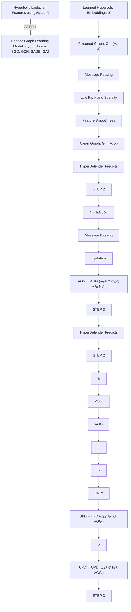

# HyperDefender: A Robust Framework for Hyperbolic GNNs

Nikita Malik $^{1}$ , Rahul Gupta $^{2}$ , Sandeep Kumar $^{1,3,4}$

$^{1}$ Bharti School of Telecommunication Technology and Management, Indian Institute of Technology, Delhi, India

$^{2}$ Department of Mathematics and Computing, Indian Institute of Technology, Delhi, India

$^{3}$ Department of Electrical Engineering, Indian Institute of Technology, Delhi, India

$^{4}$ Yardi School of Artificial Intelligence, Indian Institute of Technology, Delhi, India

bsz218185@iitd.ac.in, mt1200619@iitd.ac.in, ksandeep@iitd.ac.in

# Abstract

Graph neural networks for hyperbolic space has emerged as a powerful tool for embedding datasets exhibiting a highly non-Euclidean latent anatomy e.g., graphs with hierarchical structures. While several Hyperbolic Graph Neural Networks (Hy-GNNs) have been developed to enhance the representation of hierarchical datasets, they remain susceptible to noise and adversarial attacks, posing serious risks in critical applications. The absence of robust Hy-GNN frameworks underscores a pressing problem. This research addresses this challenge by introducing HyperDefender—a robust and flexible approach designed to fortify Hy-GNNs against adversarial attacks and noises. HyperDefender aims to secure the reliability of applications that depend on the integrity of hierarchical graph-structured data in real-world scenarios. Experimental results demonstrate that HyperDefender significantly improves node classification accuracy across various attacks, effectively mitigating the performance degradation typically observed in Hy-GNNs when the hierarchy in original datasets is compromised.

Code — https://github.com/nikimal99/HyperDefender.git

# 1 Introduction

Graph Neural Networks (GNNs) extend traditional neural networks to graph-structured data (Xu et al. 2018; Velickovic et al. 2017; Kipf and Welling 2016). Despite the remarkable breakthroughs, the existing GNN models are still limited by the representation ability of Euclidean geometry, especially for datasets with hierarchical structures and highly non-Euclidean latent anatomy (Yang et al. 2022; Zitnik et al. 2019; Clauset, Moore, and Newman 2008). Numerous real-world datasets, such as disease propagation trees, flight networks (Chami et al. 2019), recommendation systems (Wang et al. 2021a), knowledge graphs (Wang et al. 2021b), drug molecules (Qu and Zou 2022), stock graph relations (Sawhney et al. 2021), medical ontology matching networks (Hao et al. 2021), and Human PPI networks (Li et al. 2023) have hierarchical structure.

Recently, hyperbolic spaces due to their exponential growth properties have emerged as a better alternative, allowing for high-fidelity embedding of hierarchical structured data. Copyright © 2025, Association for the Advancement of Artificial Intelligence (www.aaai.org). All rights reserved.

Due to this several Hyperbolic Graph Neural Networks (HyGNNs) architectures have been developed to enhance the representation of hierarchical datasets. The theoretical and empirical superiority of hyperbolic space, characterized by constant negative curvature, is evident in capturing implicit hierarchies and outperforming Euclidean baselines. Motivated by these advantages, ongoing research focuses on developing machine learning models in hyperbolic space. HyGNN (Chami et al. 2019; Liu, Nickel, and Kiela 2019; Shimizu, Mukuta, and Harada 2020; Gulcehre et al. 2018), including HyLa-SGC (Yu and De Sa 2022), have demonstrated strong empirical results in tasks like node classification and link prediction, highlighting the efficacy of hyperbolic geometry in graph-based learning.

In summary, while Hy-GNNs have demonstrated remarkable performance in hierarchical graph representation learning (Peng et al. 2021; Yang et al. 2022), their reliability remains an open question. At this juncture, it is crucial to address the following question:

Are existing Hy-GNN models inherently robust against adversarial attacks and noise in the input data? If not, how can we enhance their robustness to ensure their effectiveness in practical scenarios?

To address these questions, we evaluate the vulnerability of Hy-GNNs (including HGAT (Zhang et al. 2021), HGCN (Chami et al. 2019), and HyLa-SGC) and GCNs under adversarial attacks, as illustrated in Figures 1a, 1b and 1c. The performance plots demonstrate a consistent decline for Hy-GNNs when exposed to adversaries, indicating that these models, similar to GNNs, lack inherent robustness against adversarial attacks. Moreover, adversarial attacks can compromise the inbuilt hierarchies (measured by Gromov $\delta$ -hyperbolicity, details in section 2) of such networks, as shown in Figure 1d.

This raises concerns about the utility of Hy-GNNs, as their performance degrade significantly under subtle perturbations in graphs. Such a lack of robustness poses severe consequences for critical applications (Hao et al. 2021; Sawhney et al. 2021) which must be considered to prevent vulnerabilities exploited by attackers. These hierarchical networks can be corrupted for discrediting information, gaining a competitive advantage, extortion, or financial gain. In practical scenarios, data like the disease networks depicting infection propagation are prone to human errors during

line

| Perturbation Rate(%) | GCN  | HGCN | HGAT | HYLA |
| --------------------- | ---- | ---- | ---- | ---- |
| 0                     | 80   | 90   | 80   | 95   |
| 5                     | 65   | 75   | 70   | 85   |
| 10                    | 60   | 65   | 60   | 75   |
| 15                    | 55   | 60   | 55   | 70   |
| 20                    | 55   | 55   | 55   | 65   |
| 25                    | 55   | 50   | 50   | 60   |

(a)

line

| Perturbation Rate(%) | GCN  | HGCN | HYLA |
| --------------------- | ---- | ---- | ---- |
| 0                     | 73   | 79   | 81   |
| 5                     | 62   | 77   | 81   |
| 10                    | 61   | 75   | 80   |
| 15                    | 58   | 64   | 77   |
| 20                    | 54   | 63   | 68   |
| 25                    | 51   | 62   | 66   |

(b)

line

| Perturbation Rate(%) | GCN  | HGCN | HGAT | HYLA |
| --------------------- | ---- | ---- | ---- | ---- |
| 0                     | 80   | 80   | 80   | 80   |
| 5                     | 75   | 75   | 75   | 75   |
| 10                    | 65   | 60   | 70   | 65   |
| 15                    | 50   | 40   | 60   | 50   |
| 20                    | 35   | 30   | 40   | 35   |
| 25                    | 20   | 25   | 35   | 15   |

(c)

line

| Perturbation Rate (%) | Mettack | Rnd | Random |
| --------------------- | ------- | --- | ------ |
| 0                     | 0       | 0   | 0      |
| 5                     | 3.5     | 3.0 | 4.0    |
| 10                    | 3.5     | 3.0 | 3.5    |
| 15                    | 4.0     | 2.5 | 3.0    |
| 20                    | 4.0     | 2.5 | 3.0    |
| 25                    | 3.5     | 2.5 | 3.0    |

(d)   
Figure 1: Node classification performance under Mettack for (a) Airport, (b) Disease, and (c) Cora datasets. (d) depicts the hyperbolicity analysis of the disease network under various adversarial attacks with increasing perturbation rates, highlighting the disruption of hierarchical structure in the graph.

data collection and can face severe consequences if the data is corrupted. Additionally, random failures and malicious attacks on complex tree-like networks, in the form of node and edge-manipulations (Xu et al. 2020), necessitate strong robustness for practical networked systems.

Despite the significant advancements in adversarial attacks and defenses for GNNs, the robustness of Hy-GNNs remains largely unexplored. This study aims to bridge this gap, offering the following key contributions:

- We assess the susceptibility of existing GNNs and Hy-GNNs to various poisoning and evasion attacks, revealing that neither the standalone Hy-GNN architectures nor traditional Euclidean defense methods are sufficient to mitigate adversarial attacks and noise in hierarchical datasets.   
- We perform a Gromov $\delta$ -hyperbolicity analysis on hierarchical graph networks, examining how different adversarial attacks compromise the hierarchical integrity of the data.   
- We introduce HyperDefender, the first flexible and practical framework that leverages the strengths of various Euclidean defenses to create robust hyperbolic methods. This innovative approach not only withstands adversarial attacks but also restores the lost hierarchy in compromised datasets.   
- We rigorously test the HyperDefender's performance under adversarial conditions, benchmarking it against existing Euclidean defense models in node classification tasks to provide deep insights into its effectiveness.

Outline: This paper is structured as follows: Section 2 presents the problem formulation and background. Our proposed framework is elaborated in Section 3, and experimental results on adversarial attacks, along with comparative analysis with existing methods, are discussed in Section 4.

# 2 Problem Formulation and Background

Let $\mathcal{G} = (\mathbf{A},\mathbf{X},\delta)$ be a hierarchical graph, where $\mathbf{X} = \{\mathbf{x}_1,\dots ,\mathbf{x}_n\}$ is the set of $M$ -dimensional node features, and $\delta$ denotes Gromov-hyperbolicity (Väisälä 2005). The adjacency matrix $\pmb {A}\in \mathbb{R}^{N\times N}$ has elements $A_{uv}\in \{0,1\}$ indicating the presence of edge $e_{uv}$ between nodes $u$ and $v$ . We consider the node classification task, where a Hy-GNN $f_{h}$ classifies nodes into $C$ categories. The goal is to learn a function $f_{h,\theta}: V_{L} \to Y_{L}$ that predicts labels $Y_{L}$ for unlabeled nodes $V_{L}$ . The objective function is formulated as:

$$
\min _ {\theta} \mathcal {L} (\theta , A, X, Y _ {L}) = \sum_ {v _ {i} \in V _ {L}} \ell \left(f _ {\theta} (X, A) _ {i}, y _ {i}\right), \tag {1}
$$

where $\theta$ represents the parameters of $f_{h,\theta}$ , $f_{h,\theta}(X,A)_{i}$ is the prediction for node $v_{i}$ , and $\ell(\cdot,\cdot)$ measures the difference between the prediction and the true label, such as cross-entropy. In an adversarial scenario, the graph G is perturbed, resulting in $G'$ . Training Hy-GNNs with noisy graph information may not yield a reliable predictor function $f_{h,\theta}$ . Moreover, the unique properties of hyperbolic space pose challenges for Hy-GNN models (Yu and De Sa 2022), which often rely on mappings between tangent space and the hyperbolic manifold. Unlike Euclidean space, hyperbolic space lacks certain vector space properties, complicating fundamental operations such as addition and multiplication. Consequently, optimizing Hy-GNN architectures within hyperbolic space present significant difficulties for developing defense mechanisms.

Problem statement. Formally, considering a hierarchical graph structure $\mathcal{G}^{\prime} = (A_{n}, X, \delta_{n})$ targeted by adversaries, where $A_{n}$ denotes the perturbed adjacency matrix $A_{n} \in R^{N \times N}$ , and $\delta_{n}$ is the Gromov-hyperbolicity value of the attacked graph, our objective is: to learn the embeddings in hyperbolic space that optimize the node classification performance of Hy-GNN against adversarial attacks.

Goal. The goal is to develop a range of flexible and practical robust Hy-GNNS methods. To achieve this, we envision a two-stage solution: (i) learning hyperbolic embeddings to approximate euclidean features, and (ii) applying a euclidean defense mechanism. A schematic outline of the proposed framework is presented in Figure 2 and detailed in Section 3. Before delving into the framework, we first provide background on adversarial attacks and hyperbolicity.

Adversarial attacks and defense mechanisms. Adversarial attacks (Dai et al. 2018) can be categorized into poisoning attacks and evasion attacks. In poisoning attacks (Zügner, Akbarnejad, and Günnemann 2018), the attacker perturbs the training graph, while in evasion attacks, the attacker perturbs the graph during testing. According to the attacker's goal, these attacks can be further divided into (1) Targeted attacks: where the attacker misclassifies spe-

flowchart

Figure 2: The figure showcases the HyperDefender framework, which consists of three steps: Step 1 involves learning hyperbolic embeddings $(Z)$ of the perturbed data $\mathcal{G}^{\prime} = (A_{n}, X)$ and estimating HyLa features using Z. In Step 2, a Euclidean defense method is applied to $\mathcal{G}^{\prime} = (A_{n}, \overline{X})$ . Finally, in Step 3, the framework either retrieves the clean graph or achieves high performance on the perturbed graph through various defense methods.

cific nodes, (2) Non-targeted attacks: where the attacker degrades the model's overall performance on all test data, and (3) Random attacks: where the attacker randomly injects fake edges into the graph. Adversarial attacks present a significant threat to deep learning models, GNNs (Bojchevski and Günnemann 2019; Dai et al. 2018; Jin et al. 2021) as well as Hy-GNNs. Many recent efforts have concentrated on enhancing GNN robustness (Zhao et al. 2023; Ennadir et al. 2024; Jin et al. 2020; Zhang and Zitnik 2020; Runwal, Vivek, and Kumar 2022; Wu et al. 2019) but none of them considers how to defend hierarchical graphs. These methods doesn't work well for hierarchical graphs as shown in Section 4.

Hyperbolicity of graphs. Real-world networks are rarely exact trees (Abu-Ata and Dragan 2016), which is why a measure of tree-likeness, such as Gromov's $\delta$ -hyperbolicity (Väisälä 2005), is useful. A lower $\delta$ signifies a more hierarchical graph dataset, with $\delta = 0$ indicating a tree structure.

Definition 1: Let G be a graph with node set V, and let $\ell(u,v)$ be the shortest path distance between nodes u and v. G is $\delta$ -hyperbolic if, for any nodes w, x, y, $z \in V$ , ordered such that $\ell(w,x) + \ell(y,z) \geq \ell(w,y) + \ell(x,z) \geq \ell(w,z) + \ell(x,y)$ , the following condition holds:

$$
(\ell (w, x) + \ell (y, z)) - (\ell (w, y) + \ell (x, z)) \leq 2 \delta
$$

A detailed explanation is provided in Appendix A.2. Gromov's $\delta$ -hyperbolicity remains consistent across graphs exhibiting hyperbolic geometry, regardless of their size, making it a valuable metric for evaluating real-world graphs. In this study, we examined how increasing levels of perturbation through various adversarial attacks affect the hyperbol icity value as shown in Fig 1d. Consequently, changes in empirical $\delta$ -hyperbolicity can indicate whether a graph has been perturbed, often making it less hierarchical. A key objective of defense mechanism is to relearn the structure and restore true $\delta$ -hyperbolicity. Thus, if $\delta$ represents the hyperbolicity of the original graph, $\delta_{n}$ that of the noisy graph, and $\delta_{clean}$ that of the restored graph, the defense model aims to achieve $\delta_{clean} \approx \delta$ .

# 3 Proposed Hyperdefender Framework

The proposed framework HyperDefender consists of the following two main components:

1. Estimation of hyperbolic embeddings to estimate the Euclidean features (or HyLa features) $\overline{X}$ ;   
2. Using the estimated $\overline{X}$ and $A_{n}$ as an input to any euclidean defense mechanism E to get H i.e., hyperbolic defense method.

The first component being an essential part of a robust Hy-GNN architecture that helps to understand the hierarchical graph better. While the latter is designed to provide defense against attacks.

Stage 1: Euclidean features from hyperbolic embeddings. We first discuss the estimation of $\overline{X}$ . It is a feature-extracted architecture proposed in (Yu and De Sa 2022) which we utilise to embed the graph nodes or features into hyperbolic space. It maps the hyperbolic embeddings to Euclidean features $\overline{\mathbf{X}}$ via the kernel transformation. Concretely, to map from hyperbolic space $\mathbb{H}_n$ to euclidean space $\mathbb{R}^D$ , we perform the following steps:

1. Draw $D$ independent samples $\lambda_1, \ldots, \lambda_D$ from $\rho$ where $\rho$ is gaussian,   
2. $D$ independent samples $\omega_{1},\ldots ,\omega_{D}$ uniform from $\partial \mathcal{B}^n$ (the boundary of the ball $\mathcal{B}^n$ ) and,   
3. $D$ independent samples $b_{1},\ldots ,b_{D}$ uniform from $[0,2\pi ]$ and,   
4. Then output a feature map $\phi$ , the $k$ th coordinate of which is $\phi_k(\boldsymbol{x}) = \frac{1}{\sqrt{D}}\mathrm{HyLa}_{\lambda_k,b_k,\omega_k}(\boldsymbol{x})$ ,   
5. It is easy to see that this will yield feature vectors with $\mathbb{E}[\langle \phi (\pmb {x}),\phi (\pmb {y})\rangle ] = k(\pmb {x},\pmb {y})$

where, the kernel $k(\pmb {x},\pmb{y})$ is defined as:

$$
\begin{array}{l} k (\boldsymbol {x}, \boldsymbol {y}) = \frac {1}{2} \int_ {- \infty} ^ {\infty} _ {2} F _ {1} \left(\frac {n - 1}{2} + i \lambda , \frac {n - 1}{2} - i \lambda ; \frac {n}{2}; \right. \tag {2} \\ \left. \right. \frac {1}{2} \left(1 - \cosh \left(d _ {\mathbb {H}} (\boldsymbol {x}, \boldsymbol {y}))\right)\right) \cdot \rho (\lambda) d \lambda . \\ \end{array}
$$

which is selected at random from some distribution $\rho(\lambda)$ . The resulting kernel is an isometry invariant kernel that depends on the distribution of $\lambda$ (Yu and De Sa 2022; Rahimi and Recht 2007).

This approach only manipulates the input of the graph-based learning model and hence, this architecture can be used with any standard Euclidean defense model, E. Here, the model parameters and the hyperbolic embeddings are learned simultaneously with the backpropagation.

Algorithm 1: HyperDefender Framework   
1: Input: $G' = (A_n, X, Y, \delta_n)$ , E
2: Output: $H_\theta$ (parameters of H)
3: Stage 1: Estimate HyLa features $\overline{X}$ 4: Stage 2: Apply $E \to (\overline{X}, A_n)$ 5: Return $H_\theta$

Stage 2: Applying defense measures. The defense operates through two primary strategies: (i) The first strategy simultaneously learns a clean graph structure $A^{*}$ constrained to $A = \{0,1\}^{N \times N}$ and learns the model parameters $H_{\theta}$ (refer, Equation 1), formalized as:

$$
\arg \min _ {\boldsymbol {\mathcal {H}} _ {\theta}} L \left(\boldsymbol {\mathcal {H}} _ {\theta}, A ^ {*}, \overline {{X}}, y _ {i}\right), \tag {3}
$$

$$
\text { and } A ^ {*} = \arg \min _ {A} L _ {n r} (A _ {n}, \overline {{{X}}}, A) \tag {4}
$$

where the model is trained on a clean graph adjacency $A^{*}$ , obtained by simultaneously minimizing a noise removal objective function $L_{nr}\left(A_{n},\overline{X},A\right)$ . This strategy is employed in both the Pro-HyLa and RWL-HyLa defense methods. For training these models we used joint learning strategy where we are simulatneously learning the clean structure of graph, the hyla features and the model parameters.

(ii) The second strategy involves determining the prediction $\hat{y}_{h,u}^{\prime}$ on the attacked graph $G^{\prime}$ that minimizes the difference:

$$
\ddot {y} _ {\mathrm{h}, u} ^ {\prime} = \arg \min _ {\ddot {y} _ {\mathrm{h}, u} ^ {\prime}} \left(f _ {\mathrm{h}, u} ^ {\prime} \left(\mathcal {G} ^ {\prime}\right) - f _ {\mathrm{h}, u} (\mathcal {G})\right) \tag {5}
$$

Here, $f_{\mathrm{h},u}^{\prime}\left(\mathcal{G}^{\prime}\right)$ represents the prediction of Hy-GNN trained on $G^{\prime}$ . In this case, $f_{\mathrm{h}}^{\prime}\left(\mathcal{G}^{\prime}\right)=\mathcal{H}$ . Here, $f_{\mathrm{h}}\left(\mathcal{G}\right)$ denotes a hypothetical prediction that the Hy-GNN would make if it had access to clean graph G. This strategy forms the basis of the HyLa-Guard approach. Here we are jointly learning the hyla features and model parameters for this model.

Next, we present the hyperbolic defense strategies (H), which we developed using these two essential components. Here we give a thorough formulation for Pro-HyLa.

Pro-HyLa. The final objective function of Pro-HyLa is given as follows:

$$
\arg \min _ {s. t., A = A ^ {T}; A \in \mathcal {A}, \boldsymbol {\mathcal {H}} _ {\theta}} L _ {\text {total}} = L _ {n r} (A _ {n}, \overline {{X}}, A) + \gamma L \tag {6}
$$

where L is the loss function defined in Equation 1 for node classification, controlled by a predefined parameter $\gamma$ . Overall, $L_{total}$ constitutes the loss of Pro-HyLa with learnable parameters $H_{\theta}$ and clean adjacency A. Finally, the noise removal objective function is defined as:

$$
L _ {n r} (A _ {n}, X, A) = \| A _ {n} - A \| _ {F} ^ {2} + \alpha \| A \| _ {1} + \beta \| A \| _ {*} + \lambda t r (\overline {{{X}}} ^ {T} \widehat {L} \overline {{{X}}}) \tag {7}
$$

It is remarked that adversarial attacks focus on introducing

Algorithm 2: Pro-HyLa   
1: Input: $A_{n}$ , X, $Y_{L}$ , Hyper-parameters $\alpha$ , $\beta$ , $\gamma$ , $\lambda$ , $\tau$ , Learning rate $\eta$ , $\eta'$ , HyLa feature dimension $d_{1}$ 2: Output: A, $H_{\theta}$ 3: Initialize $A \leftarrow A_{n}$ and randomly initialize $H_{\theta}$ 4: Initialize $Z \in R^{n \times d_{0}}$ {hyperbolic embeddings}
5: while Stopping condition not met do
6: $A \leftarrow \text{PS(prox}_{\eta\alpha}(\text{prox}_{\eta\beta}(A - \eta\nabla_{A}\Phi)))$ 7:    for i = 1 to $\tau$ do
8:    compute $\overline{X}$ HyLa features
9:    Update $H_{\theta}$ parameter using L:
10: $\delta \leftarrow \frac{\partial\mathcal{L}(\mathcal{H}_{\theta}, A, \overline{X}, Y_{L})}{\partial\mathcal{H}_{\theta}}$ 11: $H_{\theta} \leftarrow H_{\theta} - \eta' \delta$ 12:    end for
13: end while
14: Return A, $H_{\theta}$

unnoticeable perturbations and connecting two nodes with dissimilar features (McPherson, Smith-Lovin, and Cook 2001). The formulation in Equation 7 is a potential solution for providing robustness against such types of attacks. More concretely, the term $\|A_{n}-A\|_{F}^{2}$ tries to maintain the structure of the learned graph by ensuring that the learned Adjacency matrix does not deviate too far from the original input matrix.

Next, by minimizing $tr(\overline{X}^{T}\hat{L}\overline{X})=\frac{1}{2}\sum_{i,j=1}^{N}A_{i,j}(x_{i}-x_{j})^{2}$ , we aim to ensure that the edges introduced between two nodes with dissimilar features should be removed or down-weighted. $\lambda$ is a predefined parameter to control the contribution from feature smoothness. $\alpha$ and $\beta$ are predefined parameters that control the contributions of the properties of sparsity and low rank, respectively. The added advantage of this formulation (7) lies in its ability to utilize

<table><tr><td>Data</td><td>δ</td><td>Size</td><td>Density</td><td>Edges</td><td>Classes</td></tr><tr><td>Cora</td><td>3</td><td>(2485, 1433)</td><td>16.42</td><td>5069</td><td>7</td></tr><tr><td>Disease</td><td>0</td><td>(1044, 1000)</td><td>7.5</td><td>1043</td><td>2</td></tr><tr><td>Airport</td><td>1.5</td><td>(3188, 11)</td><td>36.7</td><td>18630</td><td>4</td></tr></table>

Table 1: Dataset Specifications

information from $L$ to steer the graph learning process, serving as a defense mechanism against adversarial attacks. This is particularly effective since graph adversarial attacks aim to maximize $L$ .

The strength of the proposed Pro-HyLa framework lies in its seamless integration of HyLa model training with graph reconstruction, functioning as an iterative process that jointly refines both the estimated graph A and the model parameters $H_{\theta}$ . The workflow, detailed in Algorithm 2, unfolds as follows: In line 3, the estimated graph A is initialized as the perturbed graph $A_{n}$ , and the model parameters $H_{\theta}$ are randomly initialized. Line 4 initializes the hyperbolic embeddings Z. From lines 5 to 13, A and $H_{\theta}$ are updated iteratively, alternating between updates on the clean structure. In line 6, the objective function is defined as $\phi = \|A_{n} - A\|_{F}^{2} + \gamma L + \lambda tr(\overline{X}^{T}\widehat{L}\overline{X})$ . In line 8, Hyla features $\overline{X}$ are estimated using the steps explained in Stage 1. Moreover, we used the original authors' implementation of HyLa (Yu and De Sa 2022), together with the SGC model, i.e., $f(A,\overline{X}) = \text{softmax}(A^{K}\overline{X}W)$ .

Essentially, we learn the HyLa features $\overline{X}$ and use SGC as the graph learning model while ensuring other graph properties, such as feature smoothness, sparsity, and low-rank structure, are maintained as we learn a clean adjacency matrix A. Specifically, the model parameters are trained in each iteration, while the graph reconstruction model is updated every $\tau$ iterations.

# 4 Experiments

In this section, we evaluate the effectiveness of HyperDefender.

Task and Datasets. We comprehensively compare the node classification performance of HyperDefender methods with existing euclidean-based defense mechanisms as baselines: NoisyGNN (Zhao et al. 2023), HANG (Ennadir et al. 2024), Pro-GNN (Jin et al. 2020), GNNGUARD (Zhang and Zitnik 2020), RWL-GNN (Runwal, Vivek, and Kumar 2022), and Jaccard-GNN (Wu et al. 2019) and also a Hy-GNN model, i.e., HyLa-SGC. In addition, we analyze the impact of attacks on the hyperbolicity of graphs.

We evaluate our proposed approach on three diverse datasets: Cora (Sen et al. 2008), Disease (Anderson and May 1991) and Airport (Zhang and Chen 2018). Dataset statistics are summarized in Table 1. The hyperbolicity values correspond to our modified versions of the datasets.

Experiment Setup. We evaluate the node classification performance of HyperDefender against three types of attacks, i.e., non-targeted attacks, targeted attacks, and random attacks. We apply these attack methods to perturb the graph, followed by training HyperDefender and baseline models on the perturbed graph.

Performance analysis. In Table 2 and Figure 3, detailed performance results for each model are shown. Observations include:

\- HyperDefender defense methods consistently outperform Euclidean-based defenses and also HyLa-SGC (HyGNN) model across various perturbation rates. Taking the airport data as an example, our models exhibit significant improvements over HyLa-SGC. At a 100% perturbation rate in random attack scenarios (Figure 3 first row), nearly all our HyperDefender models surpass HyLa-SGC by over 50%, and exceed 10% at 25% perturbation in Mettack. Also, Hyperbolic-based defenses demonstrate considerable superiority over Euclidean-based defenses on the Airport dataset in all the attacks.

\- For the disease dataset, Pro-HyLa outperforms HyLa-SGC, Pro-GNN, and other Euclidean-based defense methods by a wider margin, even under substantial perturbations. In the Cora dataset, our method surpasses HyLa-SGC and Pro-GNN by over 58% and 6%, respectively, at a 25% perturbation rate. But in some scenarios, our defense methods show comparable performance to standard Euclidean-based methods, in the case of the Cora dataset.

While Pro-HyLa emerges as a superior performer in cases of disease and airport datasets, RWL-HyLa shows good performance in cases of RND attack (Table 2) on Cora and disease. The results suggest that the more hierarchical the graph is, the more improvements will be gained with hyperbolic based defense methods. The average performance depicted in Figure 5 illustrates Pro-HyLa's superiority over the other three (GCN, Pro-GCN, and HyLa-SGC) models. Notably, Pro-HyLa stands out as the most effective among them, demonstrating superior performance compared to its counterparts.

Visualization. In Figure 4, we visualize the HyperDefender learned HyLa node features $(\overline{X})$ on both the original and perturbed airport dataset with t-SNE. This visualization demonstrates that HyperDefender methods achieve excellent label-class separation, as indicated by the different colors, whereas Euclidean-based defense methods fail to achieve this separation. All four HyperDefender methods: Pro-HyLa, HyLa-Guard, RWL-HyLa, and Jaccard-HyLa consistently achieve strong label-class separation, even on the original unperturbed dataset.

Since it is uncertain whether an input hierarchical graph has been attacked, a successful Hy-GNN defender must handle poisoned graphs without compromising performance on clean datasets. Table 2, also shows the classification accuracy of HyperDefender methods on clean graphs (at Ptb $\% = 0$ ), confirming that HyperDefender methods maintain performance comparable to HyLa-SGC when there is no

<table><tr><td rowspan="2">Data</td><td rowspan="2">Ptb (%)</td><td colspan="6">Baselines Standard Defense Models (E)</td><td colspan="4">Proposed Hyperbolic Defense Models (H)</td></tr><tr><td>Pro-GNN</td><td>GNN-Guard</td><td>RWL-GNN</td><td>GCN-Jaccard</td><td>NoisyGNN</td><td>HANG</td><td>Pro-HyLa</td><td>HyLa-Guard</td><td>RWL-HyLa</td><td>HyLa-Jaccard</td></tr><tr><td rowspan="6">Airport</td><td>0</td><td>83.05</td><td>81.75</td><td>70.34</td><td>76.71</td><td>66.79</td><td>78.46</td><td>94.94</td><td>96.06</td><td>94.47</td><td>95.03</td></tr><tr><td>2</td><td>81.67</td><td>79.46</td><td>68.09</td><td>75.38</td><td>66.79</td><td>76.48</td><td>94.38</td><td>94.35</td><td>90.03</td><td>93.89</td></tr><tr><td>4</td><td>75.57</td><td>76.75</td><td>66.25</td><td>70.61</td><td>63.16</td><td>76.28</td><td>93.82</td><td>93.01</td><td>87.74</td><td>91.03</td></tr><tr><td>6</td><td>73.47</td><td>75.03</td><td>64.65</td><td>70.41</td><td>63.35</td><td>76.09</td><td>93.25</td><td>88.35</td><td>84.50</td><td>86.83</td></tr><tr><td>8</td><td>72.90</td><td>73.47</td><td>64.46</td><td>68.51</td><td>62.97</td><td>73.32</td><td>92.69</td><td>87.90</td><td>83.24</td><td>83.77</td></tr><tr><td>10</td><td>68.89</td><td>68.53</td><td>63.50</td><td>68.70</td><td>60.30</td><td>72.53</td><td>93.25</td><td>86.03</td><td>83.05</td><td>82.44</td></tr><tr><td rowspan="6">Disease</td><td>0</td><td>68.50</td><td>69.44</td><td>67.71</td><td>79.52</td><td>79.92</td><td>71.65</td><td>80.31</td><td>78.74</td><td>78.72</td><td>80.31</td></tr><tr><td>2</td><td>66.92</td><td>57.79</td><td>63.07</td><td>65.35</td><td>64.17</td><td>63.39</td><td>67.32</td><td>65.74</td><td>71.26</td><td>67.71</td></tr><tr><td>4</td><td>61.41</td><td>53.46</td><td>58.74</td><td>59.05</td><td>56.69</td><td>55.91</td><td>61.41</td><td>55.90</td><td>64.57</td><td>53.93</td></tr><tr><td>6</td><td>67.71</td><td>52.04</td><td>58.03</td><td>52.75</td><td>55.51</td><td>48.43</td><td>58.26</td><td>57.48</td><td>57.87</td><td>53.54</td></tr><tr><td>8</td><td>59.05</td><td>50.07</td><td>52.20</td><td>53.14</td><td>53.93</td><td>41.34</td><td>67.32</td><td>51.96</td><td>62.20</td><td>52.75</td></tr><tr><td>10</td><td>59.84</td><td>48.42</td><td>54.88</td><td>51.57</td><td>50.03</td><td>38.98</td><td>62.59</td><td>53.15</td><td>56.26</td><td>54.72</td></tr><tr><td rowspan="6">Cora</td><td>0</td><td>81.34</td><td>76.59</td><td>78.17</td><td>80.63</td><td>81.84</td><td>80.73</td><td>84.20</td><td>81.99</td><td>79.33</td><td>80.63</td></tr><tr><td>2</td><td>77.62</td><td>73.29</td><td>68.56</td><td>70.87</td><td>73.03</td><td>71.93</td><td>80.93</td><td>75.28</td><td>75.15</td><td>76.65</td></tr><tr><td>4</td><td>71.93</td><td>68.64</td><td>65.79</td><td>64.28</td><td>63.78</td><td>58.65</td><td>72.28</td><td>70.85</td><td>73.79</td><td>72.53</td></tr><tr><td>6</td><td>67.76</td><td>66.47</td><td>62.78</td><td>56.99</td><td>54.22</td><td>46.28</td><td>67.60</td><td>61.82</td><td>71.13</td><td>68.20</td></tr><tr><td>8</td><td>65.24</td><td>59.95</td><td>58.00</td><td>47.83</td><td>44.76</td><td>29.02</td><td>66.19</td><td>47.07</td><td>68.41</td><td>66.09</td></tr><tr><td>10</td><td>61.62</td><td>56.63</td><td>57.19</td><td>43.76</td><td>42.90</td><td>23.19</td><td>61.56</td><td>45.40</td><td>68.00</td><td>63.98</td></tr></table>

Table 2: Node classification accuracy under targeted RND attacks. The best performance is highlighted in bold.

  
Figure 3: First row: Results of different models under random attack, Second row: Results of different models under mettack

attack. This indicates that HyperDefender does not weaken the learning ability of Hy-GNNs on clean datasets.

Analysis of Hyperbolicity. Gromov's $\delta$ -hyperbolicity, was employed to assess our model's performance. For each attack, the hierarchy of the dataset was compromised. We calculated the hyperbolicity values after attacking the graph

dataset and compared them with the hyperbolicity values of the learned clean adjacency matrix. We present this data in Table 3, showcasing the average hyperbolicity values for each dataset against various attacks. Here, $\Delta$ avg represents the mean of $\delta$ -hyperbolicity values for six different perturbations for each attack. Similar calculations were performed for the clean adjacency matrix learned using Pro-

text_image

Non-
Perturbed
Data
HyLa-SGC
(a)
Time
(b)
Perturbed
Data
HyLA-SGC
(c)
Time
(d)
Non-Perturbed
Data
(1) HYLA-GUARD
(2) PRO-HYLA
Perturbed
Data
(3) GNN-GUARD
(4) HYLA-GUARD
Perturbed
Data
Pro-GNN
(5) RWL-GCN
(6) RWL-HYLA

Figure 4: Evolution of latent space representations over time: Visualizing the transformation of HyLa features and node embeddings on the Airport dataset. Nodes of distinct classes are color-coded for clarity. On the left, (a) and (b) showcase HyLa-SGC's learned Hyla features for both unperturbed and perturbed data, while (c) and (d) present Pro-GNN and Pro-HyLa learned embeddings and HyLa features for perturbed data. On the right, (1) and (2) illustrate Hyla-Guard and Pro-HyLa learned node embeddings and HyLa features for the original data, while (3) and (4) compare embeddings and HyLa features of GNN-Guard and Hyla-Guard for perturbed data respectively. Similarly, (5) and (6) provide a comparison between RWL-GCN and RWL-HyLa, respectively.

<table><tr><td>Dataset</td><td>Attacks</td><td>After-attack</td><td>Pro-Hyla</td><td>RWL-Hyla</td><td>Jac-Hyla</td></tr><tr><td rowspan="3">Airport</td><td>Mettack</td><td>1.92</td><td>1.75</td><td>1.17</td><td>1.91</td></tr><tr><td>RND</td><td>1.83</td><td>1.25</td><td>1.50</td><td>2.91</td></tr><tr><td>Random</td><td>1.92</td><td>1.08</td><td>1.08</td><td>1.66</td></tr><tr><td rowspan="3">Disease</td><td>Mettack</td><td>3.08</td><td>0.83</td><td>2.83</td><td>2.83</td></tr><tr><td>RND</td><td>2.25</td><td>1.25</td><td>2.17</td><td>2.16</td></tr><tr><td>Random</td><td>2.75</td><td>1.92</td><td>2.58</td><td>2.66</td></tr><tr><td rowspan="3">Cora</td><td>Mettack</td><td>2.67</td><td>1.50</td><td>3.25</td><td>2.83</td></tr><tr><td>RND</td><td>2.25</td><td>1.50</td><td>4.42</td><td>2.25</td></tr><tr><td>Random</td><td>2.50</td><td>2.00</td><td>2.58</td><td>2.58</td></tr></table>

Table 3: $\Delta$ avg values (closer to the original is better)

HyLa, RWL-HyLa and Jaccard-HyLa. Observations indicate a restoration in the $\Delta$ avg values for the clean adjacency matrix, suggesting that our framework, HyperDefender, is capable of partially recovering the hierarchy of hierarchical networks. Among all hyperbolic defense methods, Pro-HyLa emerges as the most effective in restoring the hierarchical structure of networks, showcasing superiority not only over Euclidean-based methods but also among other hyperbolic defense methods.

# 5 Conclusion

We introduce HyperDefender, a flexible and effective framework for enhancing the robustness of Hy-GNNs. Our ex-

boxplot

| Model   | Mettack | Rnd Attack | Random Attack |
|---------|---------|------------|---------------|
| Prohyla | 85      | 92         | 88            |
| Hyla    | 72      | 88         | 58            |
| GCN     | 65      | 75         | 60            |
| ProGCN  | 68      | 78         | 65            |

Figure 5: The figure illustrates the average performance of ProHyla's superiority over HyLa, GCN, and ProGCN.

periments show that HyperDefender significantly outperforms HyLa-SGC and Euclidean-based defense methods. The analysis highlights Hy-GNNs' vulnerability to attacks and the critical need for HyperDefender in hierarchical networks. Notably, HyperDefender partially restores hierarchical structures in graphs. On datasets with minimal hierarchy, like Cora, HyperDefender achieves performance comparable to Euclidean defenses.

# References

Abu-Ata, M.; and Dragan, F. F. 2016. Metric tree-like structures in real-world networks: an empirical study. Networks, 67(1): 49–68.   
Anderson, R. M.; and May, R. M. 1991. Infectious diseases of humans: dynamics and control. Oxford university press.   
Bojchevski, A.; and Günnemann, S. 2019. Adversarial attacks on node embeddings via graph poisoning. In International Conference on Machine Learning, 695–704. PMLR.   
Chami, I.; Ying, Z.; Ré, C.; and Leskovec, J. 2019. Hyperbolic graph convolutional neural networks. Advances in neural information processing systems, 32.   
Clauset, A.; Moore, C.; and Newman, M. E. 2008. Hierarchical structure and the prediction of missing links in networks. Nature, 453(7191): 98–101.   
Dai, H.; Li, H.; Tian, T.; Huang, X.; Wang, L.; Zhu, J.; and Song, L. 2018. Adversarial attack on graph structured data. In International conference on machine learning, 1115–1124. PMLR.   
Ennadir, S.; Abbahaddou, Y.; Lutzeyer, J. F.; Vazirgiannis, M.; and Boström, H. 2024. A Simple and Yet Fairly Effective Defense for Graph Neural Networks. arXiv:2402.13987.   
Gulcehre, C.; Denil, M.; Malinowski, M.; Razavi, A.; Pascanu, R.; Hermann, K. M.; Battaglia, P.; Bapst, V.; Raposo, D.; Santoro, A.; et al. 2018. Hyperbolic attention networks. arXiv preprint arXiv:1805.09786.   
Hao, J.; Lei, C.; Efthymiou, V.; Quamar, A.; Özcan, F.; Sun, Y.; and Wang, W. 2021. Medto: Medical data to ontology matching using hybrid graph neural networks. In Proceedings of the 27th ACM SIGKDD Conference on Knowledge Discovery & Data Mining, 2946–2954.   
Jin, W.; Li, Y.; Xu, H.; Wang, Y.; Ji, S.; Aggarwal, C.; and Tang, J. 2021. Adversarial attacks and defenses on graphs. ACM SIGKDD Explorations Newsletter, 22(2): 19–34.   
Jin, W.; Ma, Y.; Liu, X.; Tang, X.; Wang, S.; and Tang, J. 2020. Graph structure learning for robust graph neural networks. In Proceedings of the 26th ACM SIGKDD international conference on knowledge discovery & data mining, 66–74.   
Kipf, T. N.; and Welling, M. 2016. Semi-supervised classification with graph convolutional networks. arXiv preprint arXiv:1609.02907.   
Li, N.; Yang, Z.; Yang, Y.; Wang, J.; and Lin, H. 2023. Hyperbolic hierarchical knowledge graph embeddings for biological entities. Journal of Biomedical Informatics, 147: 104503.   
Liu, Q.; Nickel, M.; and Kiela, D. 2019. Hyperbolic graph neural networks. Advances in neural information processing systems, 32.   
McPherson, M.; Smith-Lovin, L.; and Cook, J. M. 2001. Birds of a feather: Homophily in social networks. Annual review of sociology, 27(1): 415–444.   
Peng, W.; Varanka, T.; Mostafa, A.; Shi, H.; and Zhao, G. 2021. Hyperbolic deep neural networks: A survey. IEEE

Transactions on pattern analysis and machine intelligence, 44(12): 10023–10044.   
Qu, E.; and Zou, D. 2022. Hyperbolic neural networks for molecular generation. arXiv preprint arXiv:2201.12825.   
Rahimi, A.; and Recht, B. 2007. Random features for large-scale kernel machines. Advances in neural information processing systems, 20.   
Runwal, B.; Vivek; and Kumar, S. 2022. Robust Graph Neural Networks using Weighted Graph Laplacian. arXiv:2208.01853.   
Sawhney, R.; Agarwal, S.; Wadhwa, A.; and Shah, R. 2021. Exploring the scale-free nature of stock markets: Hyperbolic graph learning for algorithmic trading. In Proceedings of the Web Conference 2021, 11–22.   
Sen, P.; Namata, G.; Bilgic, M.; Getoor, L.; Galligher, B.; and Eliassi-Rad, T. 2008. Collective classification in network data. AI magazine, 29(3): 93–93.   
Shimizu, R.; Mukuta, Y.; and Harada, T. 2020. Hyperbolic neural networks++. arXiv preprint arXiv:2006.08210.   
Väisälä, J. 2005. Gromov hyperbolic spaces. Expositiones Mathematicae, 23(3): 187–231.   
Velickovic, P.; Cucurull, G.; Casanova, A.; Romero, A.; Lio, P.; Bengio, Y.; et al. 2017. Graph attention networks. stat, 1050(20): 10–48550.   
Wang, H.; Lian, D.; Tong, H.; Liu, Q.; Huang, Z.; and Chen, E. 2021a. Hypersorec: Exploiting hyperbolic user and item representations with multiple aspects for social-aware recommendation. ACM Transactions on Information Systems (TOIS), 40(2): 1–28.   
Wang, S.; Wei, X.; Dos Santos, C. N.; Wang, Z.; Nallapati, R.; Arnold, A.; and Philip, S. Y. 2021b. Knowledge graph representation via hierarchical hyperbolic neural graph embedding. In 2021 IEEE International Conference on Big Data (Big Data), 540–549. IEEE.   
Wu, H.; Wang, C.; Tyshetskiy, Y.; Docherty, A.; Lu, K.; and Zhu, L. 2019. Adversarial examples on graph data: Deep insights into attack and defense. arXiv preprint arXiv:1903.01610.   
Xu, H.; Ma, Y.; Liu, H.-C.; Deb, D.; Liu, H.; Tang, J.-L.; and Jain, A. K. 2020. Adversarial attacks and defenses in images, graphs and text: A review. International Journal of Automation and Computing, 17: 151–178.   
Xu, K.; Hu, W.; Leskovec, J.; and Jegelka, S. 2018. How powerful are graph neural networks? arXiv preprint arXiv:1810.00826.   
Yang, M.; Zhou, M.; Li, Z.; Liu, J.; Pan, L.; Xiong, H.; and King, I. 2022. Hyperbolic graph neural networks: a review of methods and applications. arXiv preprint arXiv:2202.13852.   
Yu, T.; and De Sa, C. 2022. Random Laplacian Features for Learning with Hyperbolic Space. arXiv preprint arXiv:2202.06854.   
Zhang, M.; and Chen, Y. 2018. Link prediction based on graph neural networks. Advances in neural information processing systems, 31.

Zhang, X.; and Zitnik, M. 2020. Gnnguard: Defending graph neural networks against adversarial attacks. Advances in neural information processing systems, 33: 9263–9275.   
Zhang, Y.; Wang, X.; Shi, C.; Jiang, X.; and Ye, Y. 2021. Hyperbolic graph attention network. IEEE Transactions on Big Data, 8(6): 1690–1701.   
Zhao, K.; Kang, Q.; Song, Y.; She, R.; Wang, S.; and Tay, W. P. 2023. Adversarial Robustness in Graph Neural Networks: A Hamiltonian Approach. arXiv:2310.06396.   
Zitnik, M.; Sosič, R.; Feldman, M. W.; and Leskovec, J. 2019. Evolution of resilience in protein interactomes across the tree of life. Proceedings of the National Academy of Sciences, 116(10): 4426–4433.   
Zügner, D.; Akbarnejad, A.; and Günnemann, S. 2018. Adversarial attacks on neural networks for graph data. In Proceedings of the 24th ACM SIGKDD international conference on knowledge discovery & data mining, 2847–2856.