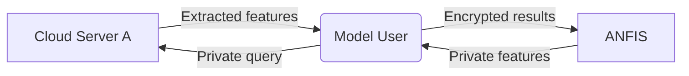

# PrivDNFIS: Privacy-preserving and Efficient Deep Neuro-Fuzzy Inference System

Hao Ren $^{123}$ , Xiao Lan $^{123}$ , Rui Tang $^{123*}$ , Xingshu Chen $^{123†}$

$^{1}$ School of Cyber Science and Engineering, Sichuan University, Chengdu 610065, China.

$^{2}$ Key Laboratory of Data Protection and Intelligent Management (Sichuan University), Ministry of Education, China.

$^{3}$ Cyber Science Research Institute, Sichuan University, Chengdu, China.

hao.ren, lanxiao, tangrscu, chenxsh@scu.edu.cn

# Abstract

Deep Neuro-Fuzzy Inference Systems (DNFIS) seamlessly fuse neural networks with the fuzzy inference system enabling intricate decision-making and knowledge representation, while upholding a commendable degree of adaptability and interpretability. However, the challenge of privacy-preserving inference (PI) over DNFIS has remained largely uncharted, with no prior research addressing this critical issue. In this paper, we embark on an exploration of this issue. We introduce an efficient and secure PI framework for DNFIS, named PrivDNFIS, which leverages the post-quantum lattice-based homomorphic encryption to implement secure computation protocols for PI over DNFIS. Our work incorporates several non-trivial performance enhancements. Firstly, it consolidates multiple elements of input feature vectors into a single message, reducing encryption/decryption overhead. Secondly, building upon this novel encoding approach, PrivDNFIS can perform ciphertext aggregation and vector-vector inner production without necessitating time-consuming ciphertext rotation operations. Thirdly, we replace the softmax function in the DNFIS layer with a quadratic function to further enhance inference efficiency, without compromising the inference accuracy. Under the given threat model, we provide formal security proof for PrivDNFIS. In comprehensive experimental results, PrivDNFIS demonstrates an approximately 1.9 to 4.4 times reduction in end-to-end time cost compared to the benchmark.

# Introduction

Background Deep Neural Networks (DNNs) (LeCun, Bengio, and Hinton 2015; He et al. 2016) excelling in areas like image recognition, natural language processing (NLP), and medical diagnosis (Jin et al. 2024). However, their complexity, involving billions of connection weights, introduces challenges in understanding and trust. This necessitates explainable AI (Talpur et al. 2023; Yeganejou, Dick, and Miller 2019) to provide human-friendly explanations and build trust. A promising solution is deep neuro-fuzzy inference systems (DNFIS) (Yeganejou, Dick, and Miller 2019; Yeganejou et al. 2023), which combine deep learning's pattern recognition with fuzzy logic's interpretability.

This integration enables precise and transparent decision-making, especially in healthcare and legal contexts (Talpur et al. 2023). DNFIS leverages rule-based representations and intuitive linguistic variables for clarity, with proven high performance in fusing a DNN for feature extraction with a fuzzy system for classification (Yeganejou et al. 2023).

Despite the benefits of DNFIS, privacy concerns pose significant obstacles to its development. When users send inference requests to third-party model owners, they must share their original input, risking their privacy. In the case of DNFIS, input privacy is critical in scenarios like medical diagnosis. Users may upload sensitive health data to leverage the system's capability for handling uncertainty and imprecision in decision-making. A breach in such cases could reveal private health records, leading to severe personal data leakage. Therefore, safeguarding input privacy for model inference services like DNFIS is critical and urgently needed, as mandated by regulations like GDPR (Lu et al. 2021).

Related Work Preserving input privacy in DNN model inference services has been extensively studied by both AI and security communities (Liu et al. 2021). The main objective of a privacy-preserving inference (PI) scheme is to compute inference results without accessing the original input. A promising approach involves using advanced cryptographic tools like fully homomorphic encryption (FHE) (Fan and Vercauteren 2012; Viand, Jattke, and Hithnawi 2021) and secure multiparty computation (MPC) (Hastings et al. 2019; Rathee et al. 2020). These methods allow the server to evaluate inference functions on the encrypted input. FHE supports arbitrary computation on ciphertexts without decryption or interaction (Viand, Jattke, and Hithnawi 2021), but its processing of non-linear functions is computationally intensive. Therefore, state-of-the-art (SOTA) PI schemes (Rathee et al. 2020; Huang et al. 2022; Lu et al. 2025) often use FHE for linear function evaluations and MPC for non-linear functions, such as ReLU and softmax. While MPC has lower computational overhead than FHE, it incurs higher communication costs and requires multiple interaction rounds (Hastings et al. 2019). Due to the complexity of DNNs and cryptographic techniques, the existing PI scheme (Huang et al. 2022) takes over two minutes to process a single query, indicating room for efficiency improvements.

To our knowledge, PI for DNFIS has not been explored in existing work. This paper seeks to initiate this topic and en-

courage future research. Our proposed scheme, PrivDNFIS, involves a co-design of the DNFIS network architecture (Yeganejou et al. 2023) and cryptographic primitives (Viand, Jattke, and Hithnawi 2021) to achieve PI for DNFIS, incorporating several non-trivial performance optimizations.

Technical Challenges It is non-trivial to build a PI scheme that accommodates DNFIS (Yeganejou et al. 2023) with provable security and high efficiency.

- Functionality. The main challenge is scrutinizing the DNFIS network architecture and the internal structure of its neurons to specify the computational tasks. Moreover, there is no existing secure computation protocol capable of accommodating fuzzy membership functions as indicated in (Yeganejou et al. 2023). This necessitates an investigation of both DNFIS and cryptographic techniques.   
- Security. The preservation of user input privacy necessitates a theoretical guarantee. Particularly, formally establishing its semantic security under the given threat model is a non-trivial task.   
- Efficiency. Excising PI schemes are often criticized for their inefficiency. However, cost reduction becomes difficult when complex inference functions and provable security are essential requirements.

Our Contributions We sum the contribution of PrivDNFIS as follows.

- PrivDNFIS initializes the research on designing a PI scheme for DNFIS. A secure and efficient PI system is presented using somewhat homomorphic encryption (SHE) (Fan and Vercauteren 2012) and ciphertext extraction technique (Chen et al. 2021). PrivDNFIS is expected to motivate future efforts on this pivotal issue.   
- We give a formal security proof for PrivDNFIS under the widely applied semi-honest threat model (Hastings et al. 2019). The analysis is sound and succinct.   
- PrivDNFIS proposes several optimizations for secure aggregation and vector-vector inner production protocols. Specifically, the heavy ciphertext rotation operation is eliminated. Besides, we carefully tailor the last layer (softmax) of the existing DNFIS model (Yeganejou et al. 2023) to further boost the overall performance without undermining the accuracy. Compared to the benchmark, PrivDNFIS delivers roughly $1.9 \sim 4.4 \times$ end-to-end time cost reduction as evidenced by the experimental results.

# Preliminaries

Deep Neuro-fuzzy Inference Systems The classical Adaptive Neuro-Fuzzy Inference System (ANFIS) (Jang 1993) alters the network architecture to mimic the fuzzy inference system (Jang, Sun, and Mizutani 1997). ANFIS consists of the following five layers. ① Input layer. It receives the input features from the user. Input nodes pass the input to the next layer. ② Fuzzification layer. It fuzzifies the inputs, mapping input values to fuzzy sets. Each input node is linked to fuzzy set (i.e., membership) functions, typically triangular or Gaussian, for fuzzifying input values and yielding membership degrees that signify the input values' association with each fuzzy set. ③ Rule layer. It calculates

```mermaid
graph LR
    A["Input Data"] --> B["Feature extraction"]
    B --> C["CNNs"]
    C --> D["Fuzzy inference"]
    D --> E["ANFIS"]
    E --> F["Output Data"]
    subgraph Feature extraction
        G1["●"] --> H1["●"]
        G2["●"] --> H2["●"]
        G3["●"] --> H3["●"]
        G4["●"] --> H4["●"]
        G5["●"] --> H5["●"]
        G6["●"] --> H6["●"]
        G7["●"] --> H7["●"]
        G8["●"] --> H8["●"]
        G9["●"] --> H9["●"]
        G10["●"] --> H10["●"]
        G11["●"] --> H11["●"]
        G12["●"] --> H12["●"]
        G13["●"] --> H13["●"]
        G14["●"] --> H14["●"]
        G15["●"] --> H15["●"]
        G16["●"] --> H16["●"]
        G17["●"] --> H17["●"]
        G18["●"] --> H18["●"]
        G19["●"] --> H19["●"]
        G20["●"] --> H20["●"]
        G21["●"] --> H21["●"]
        G22["●"] --> H22["●"]
        G23["●"] --> H23["●"]
        G24["●"] --> H24["●"]
        G25["●"] --> H25["●"]
        G26["●"] --> H26["●"]
        G27["●"] --> H27["●"]
        G28["●"] --> H28["●"]
        G29["●"] --> H29["●"]
        G30["●"] --> H30["●"]
        G31["●"] --> H31["●"]
        G32["●"] --> H32["●"]
        G33["●"] --> H33["●"]
        G34["●"] --> H34["●"]
        G35["●"] --> H35["●"]
        G36["●"] --> H36["●"]
        G37["●"] --> H37["●"]
        G38["●"] --> H38["●"]
        G39["●"] --> H39["●"]
        G40["●"] --> H40["●"]
        G41["●"] --> H41["●"]
        G42["●"] --> H42["●"]
        G43["●"] --> H43["●"]
        G44["●"] --> H44["●"]
        G45["●"] --> H45["●"]
        G46["●"] --> H46["●"]
        G47["●"] --> H47["●"]
        G48["●"] --> H48["●"]
        G49["●"] --> H49["●"]
        G50["●"] --> H50["●"]
        G51["●"] --> H51["●"]
        G52["●"] --> H52["●"]
        G53["●"] --> H53["●"]
        G54["●"] --> H54["●"]
        G55["●"] --> H55["●"]
        G56["●"] --> H56["●"]
        G57["●"] --> H57["●"]
        G58["●"] --> H58["●"]
        G59["●"] --> H59["●"]
        G60["●"] --> H60["●"]
        G61["●"] --> H61["●"]
        G62["●"] --> H62["●"]
        G63["●"] --> H63["●"]
        G64["●"] --> H64["●"]
        G65["●"] --> H65["●"]
        G66["●"] --> H66["●"]
        G67["●"] --> H67["●"]
        G68["●"] --> H68["●"]
        G69["●"] --> H69["●"]
        G70["●"] --> H70["●"]
        G71["●"] --> H71["●"]
        G72["●"] --> H72["●"]
        G73["●"] --> H73["●"]
        G74["●"] --> H74["●"]
        G75["●"] --> H75["●"]
        G76["●"] --> H76["●"]
        G77["●"] --> H77["●"]
        G78["●"] --> H78["●"]
        G79["●"] --> H79["●"]
        G80["●"] --> H80["●"]
    end
```

flowchart

Figure 1: Diagram of Deep Neuro-Fuzzy Inference System.

the “firing strength” for each fuzzy rule, typically obtained as the product of all antecedent membership functions. ④ Hidden layer. It computes the output for each rule, and its output results from multiplying the rule’s activation by the fuzzification layer’s output. The output values will be aggregated using node weights (trainable parameters), typically through a linear combination. ⑤ Output layer. This layer computes and outputs the class probabilities. As shown in Fig. 1, DNFIS uses CNNs for feature extraction that produce the inputs for ANFIS. This framework follows the paradigm of the sequential deep neuro-fuzzy system (DNFS) (Talpur et al. 2023). It enjoys the benefits provided by both CNNs and ANFIS and is easy to deploy in practice.

Somewhat Homomorphic Encryption (SHE) SHE (Viand, Jattke, and Hithnawi 2021) is rooted in the Learning With Errors (LWE) problem (Gentry, Sahai, and Waters 2013) and its ring variant (RLWE) (Fan and Vercauteren 2012). They share common public parameters denoted as HE.pp = N, p, q, σ, where p and q are integers with $q \gg p > 0$ , and σ represents the standard deviation of error sampling. In the RLWE scheme, plaintext messages are polynomials in $R_{N,p}$ . This scheme is comprised of three essential algorithms, namely R.KeyGen(HE.pp) for public/private key (pkR, skR) generation, R.Enc(pkR, $\widehat{m}$ ) for encryption of messages $\widehat{m} \in R_{N,p}$ into ciphertexts CT $\in R_{N,q}^{2}$ , and R.Dec(skR, CT) for recovering message $\widehat{m}$ . In contrast, the LWE scheme operates with plaintexts in $Z_{p}$ and ciphertexts in $Z_{q}^{N+1}$ . Its structure mirrors that of the RLWE scheme, encapsulated in L.KeyGen(·), L.Enc(·), L.Dec(·). SHE shall support the following homomorphic evaluations.

- CtPtAdd(CT $_{\widehat{u}}$ , $\widehat{v}$ ) $\rightarrow$ CT. It takes the ciphertext CT $_{\widehat{u}}$ of the plaintext message $\widehat{u}$ and another plaintext message $\widehat{v}$ as the inputs. It returns CT, that is a ciphertext of $\widehat{u} + \widehat{v}$ .   
- CtCtAdd(CT $_{\widehat{u}}$ , CT $_{\widehat{v}}$ ) → CT. It takes the ciphertext CT $_{\widehat{u}}$ , CT $_{\widehat{v}}$ of the plaintext messages $\widehat{u}$ , $\widehat{v}$ , respectively as the inputs. It returns CT, that is a ciphertext of $\widehat{u} + \widehat{v}$ .   
- CtPtMul(CT $_{\widehat{u}}$ , $\widehat{v}$ ) → CT. It takes the ciphertext CT $_{\widehat{u}}$ of the plaintext message $\widehat{u}$ and another plaintext message $\widehat{v}$ as the inputs. It returns CT i.e. a ciphertext of $\widehat{u} \times \widehat{v}$ .   
- CtCtMul(CT $_{\widehat{u}}$ , CT $_{\widehat{v}}$ ) $\rightarrow$ CT. It takes the ciphertext CT $_{\widehat{u}}$ of $\widehat{u}$ and another ciphertext of $\widehat{v}$ as the inputs. It returns CT i.e. a ciphertext of $\widehat{u} \times \widehat{v}$ .   
- Extract(CT, i). For a given message $\widehat{m}$ and its RLWE ciphertext CT, this function can extract the $i$ -th coefficient of $\widehat{m}$ from CT, and transfer it to a LWE format ciphertext. The decryption key can be computed by a key switch algorithm (Chen et al. 2021).

flowchart

Figure 2: System model of PrivDNFIS.

# Problem Statement

System Model As shown in Fig. 2, the system of PrivDNFIS consists of three entities, that are the cloud server A ( $CS_{A}$ ), cloud server B ( $CS_{B}$ ), and model user (MU). In the following, we elaborate on the role of each entity.

- $\mathcal{CS}_A$ . It receives the private query request from the $\mathcal{MU}$ to extract the features using the CNN model. This task is considered as the prelude of PrivDNFIS.   
- $\mathcal{MU}$ . It could be any individual or organization in practice, that needs to issue inference service requests in a privacy-preserving manner. It first obtains the encrypted extracted features from $\mathcal{CS}_A$ and interacts with $\mathcal{CS}_B$ to acquire the encrypted results over ANFIS.   
- $\mathcal{CS}_B$ . It receives the private encrypted features from $\mathcal{MU}$ and computes the inference over the ciphertext domain. At last, it returns the final results to $\mathcal{MU}$ . In PrivDNFIS, we put main efforts into designing secure computing protocols for $\mathcal{CS}_B$ over the modified ANFIS model.

Threat Model MU is considered to be fully trusted. It will strictly follow the designed secure protocols. In practice, MU has no motivation to manipulate the queries at the price of receiving inaccurate inference results. Cloud service providers follow pre-defined secure protocols and return the correct results for economic rewards. However, the cloud service providers may be interested in the content of the received data and peek at the users' privacy (Lu et al. 2021) for economic interests. This threat model is practical and prevalently applied by existing schemes (Lu et al. 2021). Prior works dubbed it as "semi-honest" (Lindell 2017). Under this model, $CS_{A}$ and $CS_{B}$ will faithfully execute the given private computing protocols but attempt to peek into user data. We acknowledge that it is vital to develop malicious user detection mechanisms. Due to space limitations, we will study this issue in future work.

# Proposed Scheme

We now present PrivDNFIS layer by layer, detailing how the secure computation tasks are evaluated. We commit to co-design on ANFIS (Jang 1993) and SHE acceleration to boost the efficiency with mild accuracy loss.

# Input Layer

The input layer takes the encrypted input from MU and feeds it to the next layer. However, this is non-trivial to generate the inputs that meet the following requirements. First, the original content of the features should be strictly concealed from the server $CS_{B}$ with semantic security. Second, the private input should support the processing of the consecutive layers. Third, the message packing method needs to be compatible with the homomorphic evaluation functions. It is non-trivial to achieve these three goals simultaneously because they demand strong privacy preservation, rich functionality, and high efficiency in one scheme, that is the design goal of PrivDNFIS.

Instead of using traditional Chinese Remainder Theorem (CRT) packing methods like SV (Smart and Vercauteren 2014), PrivDNFIS directly packs messages into the coefficients of the plaintext polynomial. For example, given a feature vector $\mathbf{v} = [1,2,3,4]$ , the vector is encoded as the polynomial $\widehat{v} = 1x^0 + 2x^1 + 3x^2 + 4x^3$ . Each element of $\mathbf{v}$ is mapped into the polynomial coefficients, with unused coefficients set to 0. This method can also support Single Instruction Multiple Data (SIMD) (Viand, Jattke, and Hithnawi 2021) homomorphic evaluations. Let $\widehat{u}, \widehat{v} \in R_{N,p}$ , then we have the addition $\widehat{a} = \widehat{u} + \widehat{v}$ over $R_{N,p}$ is defined as $\widehat{a}[i] = \widehat{u}[i] + \widehat{v}[i]$ . The product $\widehat{p}[i] = \widehat{u} \times \widehat{v}$ is calculated as the following equation.

$$
\begin{array}{l} \widehat {p} [ i ] = \sum_ {0 \leq j \leq i} \widehat {u} [ j ] \widehat {v} [ i - j ] - \tag {1} \\ \sum_ {i <   j <   N} \widehat {u} [ j ] \widehat {v} [ N + j - i ] \bmod p. \\ \end{array}
$$

The correctness of Equation 1 is based on the property $x^{N} \equiv -1 \mod x^{N} + 1$ . Given RLWE ciphertexts $\mathsf{CT}_{\widehat{u}}$ and $\mathsf{CT}_{\widehat{v}}$ , invoking $\mathrm{CtPtAdd}(\mathsf{CT}_{\widehat{u}}, \widehat{v})$ or $\mathrm{CtCtAdd}(\mathsf{CT}_{\widehat{u}}, \mathsf{CT}_{\widehat{v}})$ returns a ciphertext of $\widehat{u} + \widehat{v}$ , supporting element-wise addition homomorphically (SIMD). Note that, invoking $\mathrm{CtPtMul}(\mathsf{CT}_{\widehat{u}}, \widehat{v})$ results in a ciphertext of $\widehat{p}$ , not element-wise multiplication, meaning SIMD isn't supported.

Let \(\mathbf{d}\) be the feature vector, \(\mathcal{MU}\) first maps the elements into a polynomial using the above method. We write the polynomial as \(\widehat{d} \in R\_{N,p}\). Then \(\mathcal{MU}\) obtains the ciphertext of \(\widehat{d}\) as \(\mathrm{CT}\_{\widehat{d}} \leftarrow \mathrm{R.Enc}(\mathrm{pk}\_{\mathrm{R}}, \widehat{d}) \in R\_{N,q}^2\). In practice, the time cost of ciphertext-ciphertext multiplication homomorphic evaluation can be \(100\times\) than \(\mathrm{CtCtAdd}(\cdot)\), \(\mathrm{CtPtAdd}(\cdot)\), and \(\mathrm{CtPtMul}(\cdot)\) (Mughees and Ren 2023). Thus, if we can refrain from this operation, the entire performance will be significantly improved. To achieve this, \(\mathcal{MU}\) calculates \(\mathbf{d}^\*[i] = (\mathbf{d}[i])^2\), \(i \in [| \mathbf{d}|\)\). Then it is encoded as a polynomial \(\widehat{d}^\*\). At last, \(\mathcal{MU}\) encrypts \(\widehat{d}^\*\) as \(\mathrm{CT}\_{\widehat{d}^\*} \leftarrow \mathrm{R.Enc}(\mathrm{pk}\_{\mathrm{R}}, \widehat{d}^\*)\). Thus far, \(\mathcal{MU}\) has finished the preparation of the private input, that is a pair of RLWE SHE ciphertexts \(\{\mathrm{CT}\_{\widehat{d}}, \mathrm{CT}\_{\widehat{d}^\*}\}\). It will be uploaded to \(\mathcal{CS}\_B\) as the output of the input layer.

# Fuzzification Layer

The fuzzification layer converts input data into fuzzy linguistic variables. It does this by linking each input variable to fuzzy sets (rules) defined by membership functions, which determine how strongly an input value corresponds to linguistic terms like "low," "medium," or "high." For a feature vector with $n$ dimensions and $l$ fuzzy rules, $n \cdot l$ membership functions are needed. In PrivDNFIS, Gaussian membership functions, commonly used in fuzzy systems (Bai et al. 2021; Zhang et al. 2021), are employed for each input and rule. These functions have two trainable parameters: the mean and the standard deviation.

For each input value $d[i], i \in [n]$ , all $j \in [l]$ , then the Gaussian membership functions can be computed as:

$$
\omega_ {i, j} \leftarrow \mathsf {M} _ {i, j} (\mathbf {d} [ i ]) = \exp (- \frac {(\mathbf {d} [ i ] - \mu_ {i , j}) ^ {2}}{2 \sigma_ {i , j} ^ {2}}). \tag {2}
$$

The parameter $\mu_{i,j}$ is the mean and $\sigma_{i,j}$ is the standard deviation. A straightforward method to evaluate Equation 2 over ciphertexts $\{CT_{\widehat{d}}, CT_{\widehat{d}^{*}}\}$ is using a polynomial to simulate the Gaussian function. However, this method will not only compromise accuracy but also place a substantial computational burden on $CS_{B}$ . Thus, we compute the natural logarithm instead of the Gaussian function (Yeganejou et al. 2023). Then we are relieved from handling exponential computation over ciphertext. In addition, the logarithm offers better numerical stability in the tails. As shown in the Equation 3, the problem is transformed into computing a quadratic polynomial.

$$
\log \omega_ {i, j} = - \frac {1}{2 \sigma_ {i , j} ^ {2}} (\mathbf {d} [ i ]) ^ {2} - \frac {1}{2} \left(\frac {\mu_ {i , j}}{\sigma_ {i , j}}\right) ^ {2} + \frac {\mu_ {i , j}}{\sigma_ {i , j}} \mathbf {d} [ i ]. \tag {3}
$$

Then $CS_{B}$ maps all the constant terms into polynomials. Note that, all the input values are packed and encrypted as one ciphertext. Thus, for any j-th rule, all the n parameters (e.g., $-1/2\sigma_{i,j}^{2}$ , $\mu_{i,j}/\sigma_{i,j}$ ) should be packed using the same method. For simplicity, we omit it as a default operation. ① Then the first term can be computed as $CT_{\cdot,j}^{1} \leftarrow CtPtMul(CT_{\widehat{d^{*}}}, -1/2\sigma_{\cdot,j}^{2})$ . ② The computation of the second term is trivial as it involves no homomorphic evaluation. ③ The third term can be computed as $CT_{\cdot,j}^{3} \leftarrow CtPtMul(CT_{\widehat{d}}, \mu_{\cdot,j}/\sigma_{\cdot,j})$ . ④ Then, $CS_{B}$ merge the three terms one by one. It calculates $CT_{\cdot,j}^{1,2} \leftarrow CtPtAdd(CT_{\cdot,j}^{1}, -\mu_{\cdot,j}^{2}/2\sigma_{\cdot,j}^{2})$ . ⑤ At last, $CS_{B}$ obtains a ciphertext of $\log\omega_{\cdot,j}$ by $CT_{\log\omega_{\cdot,j}} \leftarrow CtCtAdd(CT_{\cdot,j}^{1}, CT_{\cdot,j}^{1,2})$ . For all rules $j \in [l]$ , $CS_{B}$ repeats the above calculations and passes $CT_{\log\omega_{\cdot,j}}$ to the rule layer.

# Rule Layer

This layer is committed to evaluating the firing strength (Talpur et al. 2023; Bai et al. 2021) for each fuzzy rule. The existing schemes usually compute the product of all antecedent membership functions like $\omega_{\cdot,j}^{\times} = \prod_{i=1}^{n}\omega_{i,j}$ . This needs ciphertext-ciphertext multiplication evaluation over the $n$ ciphertext slots within the same packed and encrypted input vector. Unfortunately, it seems out of reach to achieve this using SHE schemes (Viand, Jattke, and Hithnawi 2021). To conquer this problem, PrivDNFIS turns to compute the summation of the logarithm of the memberships. In specific, we have $\omega_{\cdot,j}^{+} = \sum_{i=1}^{n}\log\omega_{i,j}$ .

Before introducing our solution, we first show off an interesting observation as follows. Assume that we have two polynomials $\widehat{p}_1 = 1 + 2x + 3x^2 +4x^3$ , $\widehat{p}_2 = 1 + x + x^2 +x^3$ . According to the Equation 1, $\widehat{p}_1\times \widehat{p}_2$ equals: $1 + (2 + 1)x+$ $(3 + 2 + 1)x^{2} + (4 + 3 + 2)x^{3} + (4 + 3 + 2)x^{4} + (4+$ $3)x^{5} + 4x^{6}$ . We can find that the coefficient of the fourth term $(x^{3})$ equals the summation of all the coefficients of $\widehat{p}_1$ . By extension, if we can extract the ciphertext of a certain coefficient over the ciphertext domain, we can compute the sum of the coefficients of any polynomial. In PrivDNFIS, $CS_{B}$ generates a polynomial $\widehat{e}=1+x+x^{2}+,\ldots,+x^{n-1}$ and then invokes $CT'_{\cdot,j}\leftarrow CtPtMul(CT_{\log\omega_{\cdot,j}},\widehat{e})$ for all $j\in[l]$ . At last, $CS_{B}$ extracts LWE ciphertexts of n-th coefficient of $CT'_{\cdot,j}$ . This can be achieved using an existing ciphertext extraction function (Chen et al. 2021). In specific, $CS_{B}$ generates LWE ciphertexts for all $j\in[l]$ as $LCT_{\omega_{\cdot,j}^{+}}\leftarrow Extract(CT'_{\cdot,j},n)$ and $LCT_{\omega_{\cdot,j}^{+}}$ are then feed to the hidden layer.

# Hidden Layer

In the hidden layer, activation is computed by taking a linear combination of input values d and multiplying it by the normalized firing strength of the corresponding rule. To simplify this, it is adjusted to use the sum of the logarithm of the firing strength and the linear combination of inputs, without applying the logarithm to the inputs themselves. This approach creates fuzzy regions (clusters) while keeping the deep convolutional backend fully trainable, avoiding gradient explosion issues. Let the $n \times l$ matrix M represent activation weights, and b be the bias vector for all rules. The activation for the j-th rule is then computed as follows.

$$
\rho_ {j} = \omega_ {\cdot , j} ^ {+} + (\sum_ {i = 1} ^ {n} \mathbf {M} [ i ] [ j ] \mathbf {d} [ i ] + \mathbf {b} [ j ]). \tag {4}
$$

The task of $CS_{B}$ is to evaluate the above equation privately. Intuitively, the main challenge of computing Equation 4 is designing a privacy-preserving vector inner protocol for $\sum_{i=1}^{n}\mathbf{M}[i][j]\cdot\mathbf{d}[i]$ . Specifically, the problem is computing the ciphertext-plaintext vector inner product in a privacy-preserving manner. A widely applied method is packing vectors using CRT based scheme (Smart and Vercauteren 2014), and then evaluating the element-wise multiplication by simply invoking $\mathrm{CtPtMul}(\cdot)$ . For instance, given two vectors $v_{1}=[a_{1},a_{2},a_{3},a_{4}],v_{2}=[b_{1},b_{2},b_{3},b_{4}]$ , one can obtain the ciphertext of the vector $v_{0}^{\prime}=[a_{1}b_{1},a_{2}b_{2},a_{3}b_{3},a_{4}b_{4}]$ using the above method. Afterward, one needs to rotate the ciphertext of $v^{\prime}$ for one slot to acquire the ciphertext of vector $v_{1}^{\prime}=[a_{2}b_{2},a_{3}b_{3},a_{4}b_{4},a_{1}b_{1}]$ . By evaluating the homomorphic addition of $v_{0}^{\prime}$ and $v_{1}^{\prime}$ , we can have the ciphertext of vector $v_{2}^{\prime}=[a_{1}b_{1}+a_{2}b_{2},a_{2}b_{2}+a_{3}b_{3},a_{3}b_{3}+a_{4}b_{4},a_{4}b_{4}+a_{1}b_{1}]$ . Then it rotates the vector $v_{2}^{\prime}$ for two ciphertext slots and obtain a ciphertext of vector $v_{3}^{\prime}=[a_{3}b_{3}+a_{4}b_{4},a_{4}b_{4}+a_{1}b_{1},a_{1}b_{1}+a_{2}b_{2},a_{2}b_{2}+a_{3}b_{3}]$ . Lastly, one-time addition homomorphic evaluation on ciphertexts of $v_{2}^{\prime},v_{3}^{\prime}$ will output a ciphertext of vector $v_{4}^{\prime}=[a_{1}b_{1}+a_{2}b_{2}+a_{3}b_{3}+a_{4}b_{4},...]$ . Apparently, the first element of $v_{4}^{\prime}$ is the inner product of $v_{1}$ and $v_{2}$ . This method introduces prohibitive computational costs. The ciphertext rotation operation is extremely time-consuming, costing roughly $30\times$ more than modular exponentiation (Huang et al. 2022; Ren et al. 2024).

PrivDNFIS proposes to use a novel vector encoding method to compute the inner product without rotation. Here we give a toy example. Given two integer vectors $v_{1} = [a_{1}, a_{2}, a_{3}, a_{4}]$ , $v_{2} = [b_{1}, b_{2}, b_{3}, b_{4}]$ , the $v_{1}$ is encoded in reverse order onto the coefficients of a polynomial $\widehat{v}_{1} = a_{4} + a_{3}x + a_{2}x^{2} + a_{1}x^{3}$ , and $v_{2}$ is encoded in order onto the

coefficients of a polynomial $\widehat{v}_2 = b_1 + b_2x + b_3x^2 +b_4x^3$ . $\widehat{v}_1\times \widehat{v}_2$ is computed as follows.

$$
\begin{array}{l} \widehat {v} _ {1} \times \widehat {v} _ {2} = a _ {4} b _ {1} + (a _ {4} b _ {2} + a _ {3} b _ {1}) x \\ + (a _ {4} b _ {3} + a _ {3} b _ {2} + a _ {2} b _ {1}) x ^ {2} \\ + (a _ {4} b _ {4} + a _ {3} b _ {3} + a _ {2} b _ {2} + a _ {1} b _ {1}) x ^ {3} \tag {5} \\ + (a _ {3} b _ {4} + a _ {2} b _ {3} + a _ {1} b _ {2}) x ^ {4} \\ + (a _ {2} b _ {4} + a _ {1} b _ {3}) x ^ {5} + a _ {1} b _ {4} x ^ {6}. \\ \end{array}
$$

The coefficient of the term (marked blue) equals the inner product. By leveraging this finding and the coefficient extraction function $\text{Extract}(\cdot)$ , $CS_{B}$ can privately compute the vector inner product efficiently without any decryption or rotation operation (Viand, Jattke, and Hithnawi 2021).

Algorithm 1: Privately compute the hidden layer on $\mathcal{CS}_B$   
1: Input: The LWE ciphertexts $LCT_{\omega_{:,j}^{+}}$ , the private input values $CT_{\widehat{d}}$ . The weight matrix M and the bias vector b.
2: Output: The LWE ciphertexts $LCT_{\rho_{j}}$ of $\rho_{j}$ for all $j \in [l]$ .
3: for $j \in [l]$ do
4:    for $i \in [n]$ do
5: $m[i] \leftarrow M[i][j]$ .
6:    end for
7: $\widehat{m} \leftarrow \pi(\mathbf{m})$ ; $CT_{\alpha} \leftarrow CtPtMul(CT_{\widehat{d}}, \widehat{m})$ .
8: $LCT_{\alpha} \leftarrow Extract(CT_{\alpha}, n)$ .
9: $LCT_{\beta} \leftarrow CtPtAdd(LCT_{\alpha}, b[j])$ .
10: $LCT_{\rho_{j}} \leftarrow CtCtAdd(LCT_{\beta}, LCT_{\omega_{:,j}^{+}})$ .
11: end for
12: return a set of ciphertexts $\{LCT_{\rho_{j}}\}, j \in [l]$ .

Let $\pi(\cdot)$ denote the inverse mapping function that takes an integer vector as the input and outputs a polynomial. We give the detailed technical design for private evaluation for the hidden layer (i.e., Equation 4) in Algorithm 1.

# Output Layer

The output layer normalizes the computed scores of all the classes into the range of $[0,1]$ . The most used function is softmax (LeCun, Bengio, and Hinton 2015; Yeganejou et al. 2023). Given the score vector $[\rho_{1},\rho_{2},\ldots,\rho_{l}]$ , the softmax for each rule $j\in[l]$ is computed as follows:

$$
P _ {j} \leftarrow \operatorname{softmax} (\rho_ {j}) = \exp (\rho_ {j}) / \sum_ {i = 1} ^ {l} \exp (\rho_ {i}). \tag {6}
$$

The evaluation of softmax is challenging as it needs to compute non-linear function exp intensively. Most existing schemes (Mohassel and Zhang 2017; Li et al. 2023; Dong et al. 2023) intend to investigate approximations to softmax, which is very expensive. Thus, in this paper, we propose to use an aggressive approximation using a quadratic function:

$$
P _ {j} \leftarrow \text { softmax } (\rho_ {j}) = (\rho_ {j} + c) ^ {2} / \sum_ {i = 1} ^ {l} (\rho_ {i} + c) ^ {2}. \tag {7}
$$

$c$ is a small random constant.

The processing of reciprocals and ciphertext-ciphertext multiplications continues to be time-consuming. PrivDNFIS optimizes the straightforward method as follows. $CS_{B}$ first extends $(\rho_{j} + c)^{2}$ to a quadratic polynomial $\rho_{j}^{2} + c^{2} + 2c\rho_{j}$ . Given $LCT_{\rho_{j}}$ , for all $j \in [l]$ it conducts the following evaluations. ① $LCT_{1} \leftarrow CtCtMul(LCT_{\rho_{j}}, LCT_{\rho_{j}})$ . ② $LCT_{2} \leftarrow CtPtMul(LCT_{\rho_{j}}, 2c)$ . ③ $LCT_{j}^{*} \leftarrow CtCtAdd(LCT_{1}, CtPtAdd(LCT_{2}, c^{2}))$ . Apparently, $LCT_{j}^{*}$ is a ciphertext of $\rho_{j}^{2} + c^{2} + 2c\rho_{j}$ . ④ Then $CS_{B}$ can repeatedly invokes $O(\log(l))$ times function $CtCtAdd(\cdot)$ to obtain a ciphertext of $\sum_{i=1}^{l} (\rho_{i} + c)^{2}$ denoted as $LCT_{\rho}^{*}$ . Intuitively, in the next step, $CS_{B}$ should compute the reciprocal of $\sum_{i=1}^{l} (\rho_{i} + c)^{2}$ over the ciphertext domain. To reduce the computational cost, PrivDNFIS let $CS_{B}$ send the ciphertext back to MU for decryption. Then the extra cost is merely one LWE ciphertext transmission (roughly 100KB in practice). In exchange, the overall time costs are substantially reduced as k times reciprocal processing is moved to the MU. And it is computed over the plaintext domain. Here, the k is number of the returned ciphertexts $LCT_{j}^{*}, j \in [l]$ and k < n.

At last, the service provider $CS_{B}$ needs to send the top-k $P_{j}, j \in [l]$ to user MU. In PrivDNFIS, it returns the top-k $(\rho_{j} + c)^{2}$ , i.e., their ciphertexts $LCT_{j}^{*}$ . For the implementation of homomorphic sorting, we adopt the existing scheme (Hong et al. 2021; Viand, Jattke, and Hithnawi 2021). After receiving the k LWE ciphertexts, MU simply decrypts them and divides the plaintexts by $\sum_{i=1}^{l}(\rho_{i} + c)^{2}$ .

# Security Analysis

We prove the security of PrivDNFIS formally following the simulation paradigm (Lindell 2017). Specifically, we need to prove that there exists a probabilistic polynomial time (PPT) simulator that interacts with a PPT adversary, and the adversary can not distinguish the view generated by the simulator from the real protocol execution. Any PPT adversary can not distinguish the view produced by the simulator from the real protocol execution. The simulator can observe the input/output of the adversary. According to the theory of provable security (Lindell 2017), if we can construct such a simulator, then PrivDNFIS is semantic secure (i.e., provable secure). PrivDNFIS is secure against the semi-honest PPT A, which is formalized as following theorem.

Theorem 1 (Security of PrivDNFIS). If the applied RLWE/LWE SHE schemes used in PrivDNFIS are semantically secure against the semi-honest PPT adversaries, then the proposed protocol PrivDNFIS is secure against the semi-honest PPT A.

Proof sketch. As the user MU is fully trusted, the main task to prove Theorem 1 is to prove the security of PrivDNFIS against the semi-honest $\mathcal{A}\left(\mathcal{CS}_{B}\right)$ . To achieve this, we should construct a simulator $Sim_{0}$ that makes the simulated view indistinguishable from the real execution of PrivDNFIS. Due to the space limitation, the concrete hybrid arguments in $Sim_{0}$ will be provided in the full version of this paper. The existence of $Sim_{0}$ confirms that PrivDNFIS provides semantic security under the given threat model.

Encryption Time vs. Number of Feature Vectors   

bar

| The number of feature vectors | n = 1024 (s) | n = 2048 (s) |
| :--- | :--- | :--- |
| 10 | 2 | 5 |
| 20 | 5 | 9 |
| 50 | 12 | 23 |
| 100 | 23 | 45 |
| 200 | 45 | 88 |

Figure 3: Encryption time cost on MU.

Communication Cost vs. Number of Feature Vectors   

bar

| The number of feature vectors | n = 1024 (MB) | n = 2048 (MB) |
| :--- | :--- | :--- |
| 10 | 50 | 75 |
| 50 | 150 | 300 |
| 250 | 700 | 1400 |
| 500 | 1400 | 2800 |
| 1000 | 2800 | 5600 |

Figure 4: Communication cost on MU.

# Performance Evaluation

Implementation settings. Experiments are conducted on a computing machine with Intel (R) Xeon (R) CPU E5-26800 @ 2.70GHz processor with 8 cores, 4 GB RAM storage, and Ubuntu 20.04 operation system. This server is used to simulate $CS_{B}$ and we fully utilize the server's computing power. When simulating the end user MU, we use two cores to run the encryption/decryption algorithms. The network delay is set to 60ms (simulate the WAN environment.) and the network bandwidth is set to 2Gbps when simulating the end-to-end time costs. In PrivDNFIS we use the classic RLWE-based HE scheme BFV (Fan and Vercauteren 2012) to encrypt the private input and the homomorphic evaluations are naturally operated over the BFV ciphertexts. The ciphertext extraction function Extract( $\cdot$ ) is implemented by (Chen et al. 2021; Huang et al. 2022), we use their open-sourced code. To implement BFV, the RLWE/LWE FHE library SEAL (Laine, K.; Cruz, R.; Boemer, F.; Angelou, N.; and et al 2015) is applied with the parameters that guarantee 128-bit security. The results presented are the average of 10 trials.

# Performance evaluation of MU

MU first needs to encode and encrypt the private input and generate a pair of RLWE ciphertexts. Compared to encryp-

End-to-End Time Cost vs. Number of Feature Vectors   

bar

| The number of feature vectors | PrivDNFIS on CIFAR-10 | PrivDNFIS on CIFAR-100 | Benchmark on CIFAR-10 | Benchmark on CIFAR-100 |
| ----------------------------- | --------------------- | ---------------------- | --------------------- | ---------------------- |
| 10                            | ~50                   | ~100                   | ~50                   | ~250                   |
| 20                            | ~100                  | ~200                   | ~100                  | ~500                   |
| 50                            | ~200                  | ~300                   | ~300                  | ~1300                  |
| 100                           | ~150                  | ~600                   | ~250                  | ~2700                  |
| 200                           | ~250                  | ~1200                  | ~450                  | ~5300                  |

Figure 5: End-to-end running time comparison.

tion, the cost of mapping the plaintext messages onto the coefficients of a polynomial is negligible. As shown in Fig. 3, the cost of encryption increases linearly as the number of input vectors grows. Note that, the length of the input feature vector n and the number of the ciphertext slots N should satisfy $n^{2} < N$ . Here we set N = 4096, then $n \leq 64$ . Thus in the real implementation, we need to segment the large feature vector into small vectors with 64 elements. Let $T_{E}$ be the amortized RLWE SHE encryption time, then the time cost for one feature vector encryption is roughly $2\left\lceil\frac{n}{64}\right\rceil \cdot T_{E}$ . We report the concrete running times for encryption in Fig. 3 by varying the number and length of feature vectors. Specifically, for n = 2048, the total time cost for encrypting 100 feature vectors is roughly 44.15s.

The second part is the communication overhead. Assume that the size of one RLWE SHE ciphertext is $S_{R}$ , then the total communication overhead for uploading a pair of ciphertexts is $2\left\lceil\frac{n}{64}\right\rceil\cdot S_{R}$ . As shown in Fig. 4, the total communication load increases linearly with the number of issued queries. When the amount of queries reaches $10^{3}$ , and n=2048, the total communication cost is around 5.4GB.

<table><tr><td>Number of ciphertexts (k)</td><td>2</td><td>5</td><td>10</td><td>15</td><td>20</td></tr><tr><td>Decryption time (ms)</td><td>19</td><td>21</td><td>30</td><td>45</td><td>55</td></tr></table>

Table 1: Decryption time cost on MU.

The third part is decrypting the LWE ciphertext of $\sum_{i=1}^{l}(\rho_{i}+c)^{2}$ . k LWE ciphertexts also need to be decrypted. Let $T_{D}$ be the amortized LWE ciphertext decryption time, then the total decryption time is around $(k+1)\cdot T_{D}$ . We report the concrete running time with different k in Table 1. When examining the total time expenditure, this cost is considered trivial.

# Performance evaluation of $CS_{B}$

For the fuzzification layer, the main task is evaluating the Equation 3. Let $T_{\alpha}, T_{\beta}, T_{\gamma}, T_{\delta}, T_{\varepsilon}$ be the amortized time cost on one-time evaluation of function CtPtAdd(·), CtCtAdd(·), CtPtMul(·), CtCtMul(·), and Extract(·); respectively. Given an encrypted feature vector

with $n$ elements, the asymptotic time cost of the fuzzification layer is $O(l\left\lceil \frac{n}{64}\right\rceil (T_{\alpha} + T_{\beta} + 2T_{\gamma}))$ . In the rule layer, the main task is to compute the aggregation of the polynomial coefficients over the received ciphertexts. Specifically, it invokes one time CtPtMul( $\cdot$ ) and Extract( $\cdot$ ) function for each ciphertext received from the previous layer. Note that when $n > 64$ , we can aggregate the extracted LWE ciphertext by simply invoking $l \cdot \log (\left\lceil \frac{n}{64}\right\rceil)$ times of function CtCtAdd( $\cdot$ ). In sum, the asymptotic time cost of rule layer is $O(l\left(\left\lceil \frac{n}{64}\right\rceil (T_{\gamma} + T_{\varepsilon}) + \log (\left\lceil \frac{n}{64}\right\rceil)T_{\beta})$ ).

For Hidden layer, $\mathcal{CS}_B$ needs to evaluate Equation 4. If $n > 64$ , for all $\left\lceil \frac{n}{64} \right\rceil$ segmented encrypted feature vectors, $\mathcal{CS}_B$ repeats the same evaluation protocol and conducts addition aggregation over the output of the Algorithm 1. Theoretically, for all $l$ rules, the asymptotic time cost of hidden layer is $O(l(T_{\alpha} + (\log(\left\lceil \frac{n}{64} \right\rceil) + 1)T_{\beta} + \left\lceil \frac{n}{64} \right\rceil (T_{\gamma} + T_{\varepsilon})))$ .

In the last layer, $CS_{B}$ evaluates the Equation 7. Specifically, to reduce the overall computational cost, $CS_{B}$ returns a LWE ciphertext of $\sum_{i=1}^{l}(\rho_{i}+c)^{2}$ instead of computing its reciprocal. PrivDNFIS adopts the SOTA homomorphic sorting method (Hong et al. 2021) to obtain the top-k classification scores. Any advanced scheme can be plugged into our scheme. We use $T_{S}$ to denote its time cost and we omit the technical details for simplicity. In theory, the asymptotic time cost of output layer is $O((\log(l)+l)T_{\beta}+l(T_{\alpha}+T_{\gamma}+T_{\delta})+T_{S})$ . We have the total computational complexity Compx as shown in Equation 8, where $n'=\left\lceil\frac{n}{64}\right\rceil$ .

$$
\begin{array}{l} \operatorname{Compx} \cong O ((2 + n ^ {\prime}) l \cdot T _ {\alpha} \\ \begin{array}{l} + (2 l + l n ^ {\prime} + (l + 1) \log n ^ {\prime} + \log l) \cdot T _ {\beta} \\ + (4 l - 1 + l) - T _ {n} + l - T _ {n} \end{array} \tag {8} \\ + (4 l n ^ {\prime} + l) \cdot T _ {\gamma} + l \cdot T _ {\delta} \\ + (l + 1) n ^ {\prime} \cdot T _ {\varepsilon} + T _ {S}). \\ \end{array}
$$

<table><tr><td>Parameter and dataset</td><td>Running time (ms)</td></tr><tr><td>n = 1024, Dataset: CIFAR-10</td><td>$ 431.47 + T_{S} $</td></tr><tr><td>n = 2048, Dataset: CIFAR-10</td><td>$ 711.16 + T_{S} $</td></tr><tr><td>n = 1024, Dataset: CIFAR-100</td><td>$ 3850.90 + T_{S} $</td></tr><tr><td>n = 2048, Dataset: CIFAR-100</td><td>$ 7003.87 + T_{S} $</td></tr></table>

Table 2: Running time on $\mathcal{CS}_B$ .

In Table. 2, we report the concrete running time on $CS_{B}$ . We use $T_{S}$ to represent the cost of the sorting operation rather than give the concrete cost. When we process classification with a few categories like 10, simply downloading all 10 ranking scores may only introduce a few milliseconds that are negligible. In this case, it is unnecessary to run a secure sorting protocol. For reference, it takes roughly two minutes to find the top five among 100 HE ciphertexts (Hong et al. 2021). However, it only needs a few seconds ( $\approx 3s$ ) to download the 100 HE ciphertexts. Furthermore, any latest secure sorting protocol can be seamlessly plugged into PrivDNFIS if we have to manage large-scale datasets.

The communication load on $CS_{B}$ depends on k chosen by MU. Totally, $CS_{B}$ needs to return $k + 1$ LWE ciphertexts back to MU. It roughly takes 64ms to download 11 (k = 10) HE ciphertexts under our network setting that are negligible.

# End-to-end time cost

The total running time includes the local query encryption, the server-side evaluation, and the upload & download communication overhead. Fig. 5 shows the total end-to-end time costs by varying the amount of queries. When processing 200 queries on CIFAR-100 (Krizhevsky, A.; Nair, V.; and Hinton, G 2013), PrivDNFIS takes 1194.62s in total. On average, it merely needs roughly 6s to process one query. To demonstrate the high efficiency of PrivDNFIS, we also simulate the performance of a previously proposed scheme CryptFlow (Rathee et al. 2020) as the benchmark that uses rotation to evaluate the vector inner product (Viand, Jattke, and Hithnawi 2021; Rathee et al. 2020). As shown in Fig. 5, compared with the benchmark scheme (Rathee et al. 2020) PrivDNFIS has compressed roughly $1.9 \times$ , $4.4 \times$ running time on CIFAR-10 and CIFAR-100 (Krizhevsky, A.; Nair, V.; and Hinton, G 2013), respectively.

# Inference accuracy

In PrivDNFIS, the network architecture of the fuzzy classifier is similar to the latest work (Yeganejou et al. 2023) except for the last layer. Recall that we replace the last layer (i.e., softmax) with a quadratic function for efficiency improvement. Fortunately, it seems that we have a free lunch for such an approximation, and the classification results are the same as the original results. PrivDNFIS only changes the last layer, and the score ranking is not changed which leads to the same inference accuracy. For two testing datasets CIFAR-10 and CIFAR-100, the accuracy of the non-private scheme DCNFIS (Yeganejou et al. 2023) and PrivDNFIS are the same. Specifically, they are $93.02\%$ on CIFAR-10 and $74.52\%$ on CIFAR-100, respectively.

In the future, We plan to develop more efficient schemes tailored to DNFIS, drawing on the latest advancements in schemes (Bian et al. 2024; Lu et al. 2025; Zeng et al. 2023).

# Conclusion

This paper initiates the investigation into the unexplored territory of PI over DNFIS, introducing PrivDNFIS, a scheme that melds DNFIS network architecture with advanced cryptographic primitive lattice-based SHE. PrivDNFIS offers formal security guarantees and efficiency improvements by investigating several concrete optimizations, addressing several pressing technical challenges. It presents a foundation for future research in the critical domain of PI over DNFIS.

# Acknowledgments

This work was supported by the National Natural Science Foundation of China (NSFC Grant No. 62402331, and No. 62202320), the Fundamental Research Funds for the Central Universities (Grant No. YJ202429), the Fundamental Research Funds for the Central Universities (No. SCU2024D012), the Science and Engineering Connotation Development Project of Sichuan University (No. 2020SCUNG129), the Natural Science Foundation of Sichuan Province (Grant No. 2024NSFSC1450).

# References

Bai, K.; Zhu, X.; Wen, S.; Zhang, R.; and Zhang, W. 2021. Broad learning based dynamic fuzzy inference system with adaptive structure and interpretable fuzzy rules. IEEE Transactions on Fuzzy Systems, 30(8): 3270–3283.

Bian, S.; Zhao, Z.; Zhang, Z.; Mao, R.; Suenaga, K.; Jin, Y.; Guan, Z.; and Liu, J. 2024. HEIR: A Unified Representation for Cross-Scheme Compilation of Fully Homomorphic Computation. In Proceedings of the Network and Distributed System Security Symposium (NDSS). Internet Society.

Chen, H.; Dai, W.; Kim, M.; and Song, Y. 2021. Efficient homomorphic conversion between (ring) LWE ciphertexts. In Proceedings of the International Conference on Applied Cryptography and Network Security (ACNS), 460–479. Springer.

Dong, Y.; Lu, W.-j.; Zheng, Y.; Wu, H.; Zhao, D.; Tan, J.; Huang, Z.; Hong, C.; Wei, T.; and Chen, W. 2023. Puma: Secure inference of llama-7b in five minutes. arXiv preprint arXiv:2307.12533.

Fan, J.; and Vercauteren, F. 2012. Somewhat practical fully homomorphic encryption. Cryptology ePrint Archive.

Gentry, C.; Sahai, A.; and Waters, B. 2013. Homomorphic encryption from learning with errors: Conceptually-simpler, asymptotically-faster, attribute-based. In Proceedings of the Annual Cryptology Conference (CRYPTO), 75–92. Springer.

Hastings, M.; Hemenway, B.; Noble, D.; and Zdancewic, S. 2019. Sok: General purpose compilers for secure multi-party computation. In Proceedings of the IEEE Symposium on Security and Privacy (SP), 1220–1237. IEEE.

He, K.; Zhang, X.; Ren, S.; and Sun, J. 2016. Deep residual learning for image recognition. In Proceedings of the IEEE Conference on Computer Vision and Pattern Recognition (CVPR), 770–778.

Hong, S.; Kim, S.; Choi, J.; Lee, Y.; and Cheon, J. H. 2021. Efficient sorting of homomorphic encrypted data with k-way sorting network. IEEE Transactions on Information Forensics and Security, 16: 4389–4404.

Huang, Z.; Lu, W.-j.; Hong, C.; and Ding, J. 2022. Cheetah: Lean and fast secure {Two-Party} deep neural network inference. In Proceedings of the USENIX Security Symposium, 809–826.

Jang, J.-S. 1993. ANFIS: adaptive-network-based fuzzy inference system. IEEE Transactions on Systems, Man, and Cybernetics, 23(3): 665–685.

Jang, J.-S. R.; Sun, C.-T.; and Mizutani, E. 1997. Neurofuzzy and soft computing-a computational approach to learning and machine intelligence [Book Review]. IEEE Transactions on Automatic Control, 42(10): 1482–1484.

Jin, H.; Che, H.; Lin, Y.; and Chen, H. 2024. Promptmrg: Diagnosis-driven prompts for medical report generation. In Proceedings of the AAAI Conference on Artificial Intelligence, volume 38, 2607–2615.

Krizhevsky, A.; Nair, V.; and Hinton, G. 2013. CIFAR-10 and CIFAR-100 datasets. https://www.cs.toronto.edu/kriz/cifar.html. Accessed:2024-07-06.

Laine, K.; Cruz, R.; Boemer, F.; Angelou, N.; and et al. 2015. SEAL library. https://github.com/Microsoft/SEAL. Accessed:2024-06-17.   
LeCun, Y.; Bengio, Y.; and Hinton, G. 2015. Deep learning. nature, 521(7553): 436–444.   
Li, D.; Shao, R.; Wang, H.; Guo, H.; Xing, E. P.; and Zhang, H. 2023. Mpcformer: fast, performant and private transformer inference with mpc. Proceedings of the International Conference on Learning Representations (ICLR).   
Lindell, Y. 2017. How to simulate it—a tutorial on the simulation proof technique. Tutorials on the Foundations of Cryptography: Dedicated to Oded Goldreich, 277–346.   
Liu, B.; Ding, M.; Shaham, S.; Rahayu, W.; Farokhi, F.; and Lin, Z. 2021. When machine learning meets privacy: A survey and outlook. ACM Computing Surveys (CSUR), 54(2):1–36.   
Lu, C.; Liu, B.; Zhang, Y.; Li, Z.; Zhang, F.; Duan, H.; Liu, Y.; Chen, J. Q.; Liang, J.; Zhang, Z.; et al. 2021. From WHOIS to WHOWAS: A Large-Scale Measurement Study of Domain Registration Privacy under the GDPR. In In Proceedings of the Network and Distributed System Security Symposium (NDSS).   
Lu, W.; Huang, Z.; Gu, Z.; Li, J.; Liu, J.; Hong, C.; Ren, K.; Wei, T.; and Chen, W. 2025. BumbleBee: Secure Two-party Inference Framework for Large Transformers. In Proceedings of the Network and Distributed System Security Symposium (NDSS). Internet Society.   
Mohassel, P.; and Zhang, Y. 2017. Secureml: A system for scalable privacy-preserving machine learning. In Proceedings of the IEEE symposium on security and privacy (SP), 19–38. IEEE.   
Mughees, M. H.; and Ren, L. 2023. Vectorized batch private information retrieval. In Proceedings of the IEEE Symposium on Security and Privacy (SP), 437–452. IEEE.   
Rathee, D.; Rathee, M.; Kumar, N.; Chandran, N.; Gupta, D.; Rastogi, A.; and Sharma, R. 2020. Cryptflow2: Practical 2-party secure inference. In Proceedings of the ACM SIGSAC Conference on Computer and Communications Security (CCS), 325–342.   
Ren, H.; Xu, G.; Zhang, T.; Ning, J.; Huang, X.; Li, H.; and Lu, R. 2024. Efficiency Boosting of Secure Cross-Platform Recommender Systems Over Sparse Data. IEEE Transactions on Dependable and Secure Computing. doi: 10.1109/TDSC.2024.3478786.   
Smart, N. P.; and Vercauteren, F. 2014. Fully homomorphic SIMD operations. Designs, codes and cryptography, 71: 57–81.   
Talpur, N.; Abdulkadir, S. J.; Alhussian, H.; Hasan, M. H.; Aziz, N.; and Bamhdi, A. 2023. Deep Neuro-Fuzzy System application trends, challenges, and future perspectives: A systematic survey. Artificial intelligence review, 56(2):865–913.   
Viand, A.; Jattke, P.; and Hithnawi, A. 2021. SoK: Fully homomorphic encryption compilers. In Proceedings of the IEEE Symposium on Security and Privacy (SP), 1092–1108. IEEE.

Yeganejou, M.; Dick, S.; and Miller, J. 2019. Interpretable deep convolutional fuzzy classifier. IEEE Transactions on Fuzzy Systems, 28(7): 1407–1419.   
Yeganejou, M.; Honari, K.; Kluzinski, R.; Dick, S.; Lipsett, M.; and Miller, J. 2023. DCNFIS: Deep Convolutional Neuro-Fuzzy Inference System. arXiv preprint arXiv:2308.06378.   
Zeng, W.; Li, M.; Yang, H.; jie Lu, W.; Wang, R.; and Huang, R. 2023. CoPriv: network/protocol co-optimization for communication-efficient private inference. In Proceedings of the Advances in Neural Information Processing Systems (NeurIPS).   
Zhang, W.; Deng, Z.; Zhang, T.; Choi, K.-S.; Wang, J.; and Wang, S. 2021. Incomplete multiple view fuzzy inference system with missing view imputation and cooperative learning. IEEE Transactions on Fuzzy Systems, 30(8): 3038–3051.