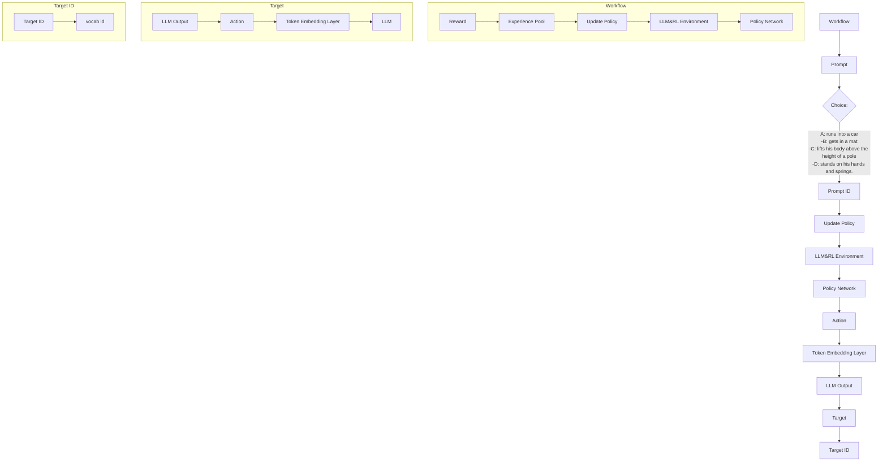

# Beyond Prompt Engineering: A Reinforced Token-Level Input Refinement for Large Language Models

Guang Huang $^{1*}$ , Yanan Xiao $^{2*}$ , Lu Jiang $^{3}$ , Minghao Yin $^{2}$ , Pengyang Wang $^{1\dagger}$

$^{1}$ Department of Computer and Information Science, SKL-IOTSC, University of Macau, China $^{2}$ School of Computer Science and Information Technology, Northeast Normal University, China $^{3}$ Department of Information Science and Technology, Dalian Maritime University, China  
{mc35324, pywang}@um.edu.mo, {xiaoyn117, ymh}@nenu.edu.cn, jiangl761@dlmu.edu.cn

# Abstract

In the rapidly developing field of automatic text generation and understanding, the quality of input data has been shown to be a key factor affecting the efficiency and accuracy of large language model (LLM) output. With the advent of advanced tools such as ChatGPT, input refinement work has mainly focused on prompt engineering. However, existing methods are often too dependent on specific contexts and are easily affected by individual expert experience and potential biases, limiting their wide applicability in diverse real-world applications. To address this problem, this study develops an Reinforced Token-Level Input Refinement, called RTLIR. We choose to optimize the input data at the fine-grained level of tokens, cleverly preserving the original text structure. Operationally, each state is defined by the token set of the current text, and each action is a binary decision process to decide whether to retain a specific token information. The agent automatically calculates and determines the selection probability of each token based on the current state, thereby optimizing the entire decision process. Through continuous exploration and learning, the agent can autonomously learn to identify the key inputs that have the greatest impact on the generation results and achieve refinement of the input data. In addition, RTLIR is a plug-and-play, LLM-agnostic module that can be used for a wide range of tasks and models. Experimental results show that RTLIR improves the performance of LLM in various input scenarios and tasks, with an average accuracy increase of 6%.

Code — https://github.com/Tom-HG/RTLIR.git.

# Introduction

In the era of big data, large language models (LLMs) have become a core technology for processing vast amounts of textual information across sectors such as finance, healthcare, and media (Lee et al. 2024; Wu et al. 2023; Huang, Wang, and Yang 2023; Yang, Liu, and Wang 2023; Nazi and Peng 2024; Hadi et al. 2023). These models excel at extracting valuable information from complex data to support decision-making and automation tasks (Zhu et al. 2023).

text_image

Scenario Summary
In a cycling race, two participants are competing. Competitor A finished in 3.11 hours ☐, while Competitor B finished in 3.8 hours ☐.
Relevant Information
1. When the integers are the same, compare the decimal parts digit by digit.
2. The shorter the riding time, the better the performance.
Question?
In the bicycle race, who has a shorter riding time: Rider A or Rider B? Who finishes faster?
Prompt engineering 1
Please remove the irrelev Ant text before answering the question.+{text}
Prompt engineering 2
Please clear away the distracting text before answering the question.+{text}
Prompt engineering 3
Please eliminate the unnecessary text before providing your answer.+{text}
RTLIR
Relevant Information
1. When the integers are the same, compare the decimal parts digit by digit.
Answer
1) 3.8 is less than 3.11 ✗
2) Competitor B faster ✗
Answer
1) 3.8 is less than 3.11 ✓
2) Competitor A faster ✗
Answer
1) 3.11 is less than 3.8 ✓
2) Competitor B faster ✗
Answer
1) 3.11 is less than 3.8 ✓
2) Competitor A faster ✓

Figure 1: Examples of input refinement methods. On the left side, we present the user's input. The central section delineates the distinctions between our method and the other three prompt engineering techniques employed to refine the input. On the right side, the outputs generated by the LLM corresponding to the four methods in the central section.

However, a frequent question these models face is the presence of irrelevant information in the input data (Narayan et al. 2022; Mining 2006). This not only consumes substantial computational resources and lowers processing efficiency but can also compromise the quality and reliability of the output (Shi et al. 2023; Chen et al. 2024). In applications aimed at automatic text generation and understanding, low-quality input can severely distort the generated content, thereby reducing the actual utility and value of the model (Shi et al. 2023). Therefore, effectively identifying and deleting irrelevant information in input, and optimizing the quality of input data, are crucial for improving the performance and practicality of LLM (Petroni et al. 2019).

Since the advent of ChatGPT (Achiam et al. 2023), its powerful reasoning capabilities have made prompt engineering the focus of input refinement (Marvin et al. 2023; Liu et al. 2023; White et al. 2023). Through carefully designed prompt text, the model can effectively refine and process various inputs (Liu et al. 2023). However, despite the success of the prompting engineering in certain situations, it has

some fundamental shortcomings (Yoran et al. 2023; Zhou et al. 2023; Kojima et al. 2022). First, prompt engineering methods are often highly targeted and difficult to adapt to a wide range of real-world information inputs (Madaan et al. 2024). This limits its wide applicability in diverse application scenarios. Secondly, these methods rely heavily on the experience of different individuals and experts, which may not only lead to biased results, but also increase the threshold for use in tasks and fields (Wang, Shen, and Lim 2023). As shown in Figure 1, for the same task, different prompt engineering methods may produce very different results. These limitations highlight an urgent research challenge: How to develop an efficient and automated method to refine large-scale text data input, thereby significantly improving the processing speed and output quality of language models? We need a new approach that not only maintains understanding of the original text structure, but also automatically refines key information in the input, thereby transcending the limitations of traditional prompt engineering.

To address this challenge, this study developed an Reinforced Token-Level Input Refinement for LLM, named RTLIR. Specifically, RTLIR chooses to decompose the input text into the most basic constituent units, tokens, and uses the decomposed token set as the state. By performing precise refinement at the token level, RTLIR is able to drive the agent to more accurately identify and enhance key information. In the decision-making process, the agent adopts a binary choice mechanism, that is, deciding whether to keep each specific token. Each decision calculates the selection probability based on the current state and the expected output quality. This approach enables the agent to precisely control the retention or discard of information and optimize the input data. The reward mechanism is determined by the relevance of the LLM output to each word of the input and the quality of the final output. In this way, the agent can learn to identify and automatically optimize unnecessary tokens in the LLM input without manual configuration and filtering. In addition, RTLIR is plug-and-play and LLM-agnostic, which can be adapted to the needs of various tasks and models, thus broadening its potential application scope.

In summary, the main contributions of this paper are:

- We propose a reinforcement learning-based automatic input refinement method called RTLIR, which can analyze and process tokens in real time, thereby improving the quality and efficiency of the model.   
- We present a plug-and-play, LLM-agnostic input refinement module that is adaptable to a variety of tasks and models, with a wide range of applications.   
- Experimental validation shows that RTLIR performs significantly better than baseline methods in handling different inputs and various tasks, demonstrating its superiority in efficiency and adaptability.

# LLM Input Processing

The input for each LLM is descriptive text T. This text undergoes several preprocessing steps, including tokenization and removal of stop words, which transform the text into a sequence of token IDs suitable for processing by the LLM. The preprocessing transformation is defined as

$$
\mathbf {I D} _ {\text { seq }} = \text { Preprocess } (\mathbf {T}), \tag {1}
$$

where $\mathbf{ID}_{\mathrm{seq}} = \{\mathrm{ID}_1,\mathrm{ID}_2,\dots ,\mathrm{ID}_i\}$ represents the sequence of token IDs derived from $\mathbf{T}$ .

These token IDs are subsequently converted into corresponding embedding vectors necessary for further processing by the LLM. This transformation is captured by the embedding function $\Phi_{embed}$ , define as

$$
\mathbf {v} _ {\text { seq }} = \Phi_ {\text { embed }} (\mathbf {I D} _ {\text { seq }}), \tag {2}
$$

Where $v_{seq} = \{v_{1}, v_{2}, \ldots, v_{i}\}$ represents the embedding vector sequence, and each $v_{i}$ is the embedding vector corresponding to $ID_{i}$ . $\Phi_{embed}$ is an embedding function that converts the token ID sequence into an embedding vector sequence. Through a conversion process $T \rightarrow ID_{seq} \rightarrow v_{seq}$ , LLM to perform tasks based on the processed input.

# Problem Formulation

In the task of automatic input refinement for LLM, our goal is to selectively remove uncritical or irrelevant tag IDs from the input sequence to enhance the relevance and quality of the model output. We formalize the task as a Markov decision process (MDP) (Puterman 2014), where the model needs to maximize the information value of the output while minimizing the influence of irrelevant tag IDs. In this work, we define the key components of the MDP as

- State $S$ : Each state $\mathbf{s} \in S$ represents relevant information about the text currently being processed.   
- Action $A$ : Each action $\mathbf{a} \in A$ includes retaining or deleting the token ID currently evaluated.   
- Transition Probability $\Gamma$ : $\Gamma(s' \mid s, a)$ represents the probability of transitioning from state $s$ to state $s'$ when taking action $a$ . This probability is estimated based on past data and reflects the potential effect of the action and the response of the environment.   
- Reward $R$ : $R(s, a, s')$ represents the reward obtained by taking action $a$ and transitioning from state $s$ to state $s'$ . The effect of the refined reward feedback input is to evaluate the effectiveness of the action.   
- Environment $E$ : It consists of the LLM and its training data, which determines the changes of state and reward. The dynamics of the environment are controlled by the transition probability $\Gamma$ and the reward $R$ .   
- Policy $\pi$ : The rule that determines which action to choose in a given state. The policy goal is to find the behavior sequence that optimizes the reward benefit.

Our goal is to develop a policy $\pi^{*}$ that finds the best sequence of actions to effectively remove noise and optimize the model output. This task can be formulated as:

$$
\pi^ {*} = \arg \max _ {\pi} \mathbb {E} \left[ \sum_ {t = 0} ^ {\infty} \gamma^ {t} R (s _ {t}, a _ {t}) \right], \tag {3}
$$

Where $\gamma$ is the discount factor, representing the present value of future rewards. $t$ represents the step size. $\mathbb{E}$ represents the expectation reward.

flowchart

Figure 2: The RTLIR workflow starts by preprocessing the input text into token IDs and embeddings, establishing the initial state for decision-making. The reinforcement learning agent then iteratively refines the input by evaluating and adjusting each token's retention, leading to an optimized and cleaned text output.

# Automatic Input Refinement Driven by Reinforcement Learning

In this section, we will explore in depth the design of RTLIR states, actions, and rewards, which is the basis for achieving efficient automatic input refinement.

# Workflow of RTLIR

As shown in Figure 2, the RTLIR framework first preprocesses the input text and converts the text into token IDs and corresponding embedding vectors. This step establishes the initial state for the subsequent decision-making process, which consists of token IDs and their embeddings. Subsequently, the reinforcement learning agent decides to keep or delete the action based on the current state by evaluating the immediate and terminal rewards of each token. The immediate reward focuses on the processing effect of a single token, while the terminal reward evaluates the input refinement result of the entire text. In this way, the agent continuously learns and updates its policy to optimize the input refinement process and improve the relevance and quality of the output text. The entire process finally outputs the cleaned text, achieving effective input refinement of the data.

# State & Action Design

In RTLIR, the state encapsulates the current context of the text being processed and is crucial for effectively applying input refinement strategies. The state s integrates the embedding of a token and its corresponding action, defined as

$$
s = \text { CONCATENATE } \left[ \begin{array}{l} \mathbf {v} _ {1}, \mathbf {v} _ {2}, \dots , \mathbf {v} _ {i} \\ a _ {1}, a _ {2}, \dots , a _ {i} \end{array} \right], \tag {4}
$$

Where $v_{i}$ is the embedding vector of the i-th token derived from the embedding layer of the LLM.

$a_{i}$ is a binary flag indicating the action decision for the i-th token, where 1 means keep and 0 means remove. At model startup, all actions are set to 1 by default, indicating that all tokens are retained by default, defined as

$$
a _ {1} = a _ {2} = \dots = a _ {i} = 1, \tag {5}
$$

Where $a_{i} = 1$ to ensure that no potentially important information is lost at the beginning of the learning process.

This design enables RTLIR to incorporate semantic and behavioral context in each decision step, thereby achieving more precise input refinement policy adjustment to adapt to the diversity of text content and task requirements.

# Reward Design

The reward function is one of the key factors that determine the learning effect in reinforcement learning. We designed two rewards: immediate reward and terminal reward to measure the impact of keeping or removing operations and guide the model to optimize the quality of input data.

Immediate reward. The immediate reward is calculated immediately after each operation. It quantifies the direct effect of a decision by calculating the cosine similarity between the embedding vector $v_{i}$ of the current token and the target embedding vector $\overline{v}$ , define as

$$
r _ {i} (s _ {i}, a _ {i}) = \mathbf {s i m} (\mathbf {v} _ {i} \mid \overline {{\mathbf {v}}}) - \beta , \tag {6}
$$

Where $\beta$ is the threshold, which is used as an adjustment to balance the impact of similarity, making the model more cautious in retaining or removing decisions. This design ensures that the model can make immediate feedback adjustments based on the current similarity with the target.

Terminal reward. The terminal reward is used to evaluate the overall effect after the entire text processing process

is completed. Unlike the immediate reward, which focuses on the direct impact of a single operation, the terminal reward considers the change in information quality before and after input refinement the entire text sequence. If the input refinement operation makes the result close to the optimal solution, even a small improvement should be given a relatively high reward to encourage the model to make subtle adjustments to approach the best performance, defined as

$$
r _ {t} (s _ {t}, a _ {t}) = \frac {\log p (\hat {\mathbf {v}} _ {\mathrm{seq}} , a _ {t}) - \log p (\mathbf {v} _ {\mathrm{seq}} , a _ {t})}{\log p (\mathbf {v} _ {\mathrm{seq}} ^ {*} , a _ {t}) - \log p (\mathbf {v} _ {\mathrm{seq}} , a _ {t}) + 1}, \tag {7}
$$

Where $v_{seq}$ , $\hat{v}_{seq}$ , $v_{seq}^{*}$ respectively represent the original, input refinement, and optimal input refinement text sequence embedding. It encourages the agent to consider the quality of the overall text when input refinement, and also the search for the processing path that is closest to the ideal state.

Special Case Discussion. When designing rewards, we considered several special cases:

- Full text removal case: If the model's operation result is $\hat{\mathbf{v}}_{\mathrm{seq}} = \phi$ , that is, all text content is removed, we retain the original text information by default. We tried many experiments, and this situation is extremely rare.   
- Original text optimal case: If the original text can be output correctly, the normal operation should not involve any intervention. In this case, we still perform input refinement operations to extract valuable learning information from each input refinement attempt and further optimize the model's adaptability to specific tasks.

This combination of immediate and terminal rewards enables the model to optimize the actions of each decision and improve the entire text processing input refinement pipeline to adapt to different input conditions and task requirements.

# LLM Input Refinement Training

In this section, we will introduce how to further optimize the input refinement ability of the RTLIR framework through policy learning to ensure that the model can make the best decisions in various text processing scenarios.

# Value Estimation for Input

In RTLIR, the optimization input refinement process is achieved by learning an effective action policy $\pi$ . The goal is to screen the token most relevant to the answer given the current input token id as the state, and select the best action that maximizes the expected total reward. We adopt a value-based Q learning method to estimate the expected utility of each possible action. In order to accurately evaluate the potential value Q value of each action, define as

$$
Q (s, a; \theta) = \mathbb {E} \left[ r _ {t} + \gamma \max _ {a ^ {\prime}} Q (s ^ {\prime}, a ^ {\prime}; \theta) \mid s, a \right], \tag {8}
$$

Where $\theta$ represents the network parameters, $r_{t}$ is the reward, and $\gamma$ is the discount factor, which represents the current value of future rewards. $a'$ represents one of the possible actions to be taken in the next state $s'$ .

In addition, in order to separate the intrinsic value of the state from the added value of a specific action, we adopt a double learning network and use value decomposition to improve the estimation of the Q function, define as

$$
Q (s, a) = V (s) + \mathcal {A} (s, a) - \frac {1}{| \mathcal {A} |} \sum_ {a ^ {\prime}} \mathcal {A} (s, a ^ {\prime}), \tag {9}
$$

Where $V(s)$ represents the best performance that can be achieved under state s without considering the specific action. $\mathcal{A}(s,a)$ represents the additional value of taking action a. This approach helps the model balance the choice between retaining key and removing noise information.

# Prioritized Experience Replay with Input Refinement Policy

When processing different task inputs, it is necessary to respond immediately to guide the model to learn the most effective input refinement policy. To this end, the RTLIR framework adopts a priority experience replay mechanism. This mechanism optimizes the storage and management process of experience data in the input refinement policy, allowing the model to learn from key experiences faster. All interaction data is stored in the form of tuples, defined as

$$
\left(s _ {t}, a _ {t}, r _ {t}, s _ {t + 1}\right), \tag {10}
$$

Where each tuple represents a complete transition process, including the starting state $s_{t}$ , the action taken $a_{t}$ , the reward obtained $r_{t}$ , and the result state $s_{t+1}$ .

In addition, in order to effectively select important experiences for accelerated learning, we adopt a priority experience replay mechanism. In this mechanism, each experience tuple is prioritized according to the absolute value of its time difference (TD) (Sutton 1988) error. TD error is a key indicator for evaluating the importance of experience, and the priority of each experience is defined as

$$
\mathbf {p} = \left| r _ {t} + \gamma \max _ {a _ {t + 1}} Q (s _ {t + 1}, a _ {t + 1}) - Q (s _ {t}, a _ {t}) \right| + \epsilon , \tag {11}
$$

where p is the priority of storing experience, and $\epsilon$ is an extremely small positive constant that ensures that each stored experience has a non-zero probability of being reviewed. This setting prevents any potentially useful experience from being ignored during the learning process.

RTLIR focuses on those experiences with the greatest expected learning value and the tokens that are most relevant to the correct output of LLM, thereby accelerating the learning process of key information and more effectively adapting to complex input refinement tasks.

# Gradient Descent

We use the gradient descent method to continuously adjust the network parameters $\theta$ according to the mean square error (MSE) (James and Stein 1992) between the predicted Q value and the target Q value, so that the model outputs the result with the maximum total reward, that is, the optimal output result can be produced after the input text is refined. The loss function is defined as

$$
L (\theta) = \mathbb {E} \left[ (y _ {t} - Q (s _ {t}, a _ {t}; \theta)) ^ {2} \right] \tag {12}
$$

$$
y _ {t} = r _ {t} + \gamma \max _ {a ^ {\prime}} Q (s _ {t + 1}, a ^ {\prime}; \theta^ {-}),
$$

<table><tr><td rowspan="2">Setting</td><td colspan="2">Qwen2-1.5B</td><td colspan="2">Gemma-2B</td><td colspan="2">Llama-2-7B</td><td colspan="2">vicuna-7B-v1.3</td><td colspan="2">Llama-3-8B</td></tr><tr><td>Origin</td><td>RTLIR</td><td>Origin</td><td>RTLIR</td><td>Origin</td><td>RTLIR</td><td>Origin</td><td>RTLIR</td><td>Origin</td><td>RTLIR</td></tr><tr><td>English</td><td>37.60% $5.15 \pm 1.09\% \uparrow$ </td><td>42.75%</td><td>35.15% $15.00 \pm 1.50\% \uparrow$ </td><td>50.15%</td><td>31.25% $14.10 \pm 1.05\% \uparrow$ </td><td>45.35%</td><td>32.25% $15.75 \pm 1.06\% \uparrow$ </td><td>48.00%</td><td>31.95% $4.85 \pm 1.06\% \uparrow$ </td><td>36.80%</td></tr><tr><td>Chinese</td><td>44.10% $7.45 \pm 1.11\% \uparrow$ </td><td>51.55%</td><td>51.55% $0.20 \pm 1.12\% \uparrow$ </td><td>51.75%</td><td>39.70% $15.60 \pm 1.09\% \uparrow$ </td><td>55.30%</td><td>49.75% $5.55 \pm 1.11\% \uparrow$ </td><td>55.30%</td><td>40.55% $9.05 \pm 1.11\% \uparrow$ </td><td>49.50%</td></tr><tr><td>Spanish</td><td>37.00% $5.75 \pm 1.10\% \uparrow$ </td><td>42.75%</td><td>40.20% $6.70 \pm 1.11\% \uparrow$ </td><td>46.90%</td><td>35.70% $9.65 \pm 1.08\% \uparrow$ </td><td>45.35%</td><td>40.75% $4.60 \pm 1.11\% \uparrow$ </td><td>45.35%</td><td>34.95% $7.60 \pm 1.09\% \uparrow$ </td><td>42.55%</td></tr><tr><td>French</td><td>52.10% $-1.30 \pm 1.11\% \downarrow$ </td><td>50.80%</td><td>48.65% $-1.65 \pm 1.12\% \downarrow$ </td><td>47.00%</td><td>47.45% $-2.30 \pm 1.12\% \downarrow$ </td><td>45.15%</td><td>47.50% $-2.40 \pm 1.11\% \downarrow$ </td><td>45.10%</td><td>42.75% $5.00 \pm 1.11\% \uparrow$ </td><td>47.75%</td></tr><tr><td>German</td><td>41.05% $1.30 \pm 1.10\% \uparrow$ </td><td>42.35%</td><td>46.30% $5.20 \pm 1.12\% \uparrow$ </td><td>51.50%</td><td>36.50% $18.75 \pm 1.08\% \uparrow$ </td><td>55.25%</td><td>42.95% $12.30 \pm 1.08\% \uparrow$ </td><td>55.25%</td><td>34.00% $10.55 \pm 1.08\% \uparrow$ </td><td>44.55%</td></tr><tr><td>Japanese</td><td>51.05% $2.65 \pm 1.11\% \uparrow$ </td><td>53.65%</td><td>49.90% $-5.15 \pm 1.11\% \downarrow$ </td><td>55.05%</td><td>42.95% $12.90 \pm 1.11\% \uparrow$ </td><td>55.85%</td><td>49.40% $6.45 \pm 1.11\% \uparrow$ </td><td>55.85%</td><td>44.95% $6.20 \pm 1.11\% \uparrow$ </td><td>51.15%</td></tr><tr><td>korean</td><td>47.15% $1.75 \pm 1.12\% \uparrow$ </td><td>48.90%</td><td>52.95% $0.15 \pm 1.12\% \uparrow$ </td><td>53.10%</td><td>46.65% $8.55 \pm 1.12\% \uparrow$ </td><td>55.20%</td><td>51.55% $3.30 \pm 1.12\% \uparrow$ </td><td>54.85%</td><td>47.55% $2.25 \pm 1.12\% \uparrow$ </td><td>49.80%</td></tr><tr><td>Average</td><td>44.29% $3.25 \pm 0.42\% \uparrow$ </td><td>47.54%</td><td>47.15% $2.51 \pm 0.42\% \uparrow$ </td><td>49.66%</td><td>40.03% $11.03 \pm 0.41\% \uparrow$ </td><td>51.06%</td><td>44.88% $6.51 \pm 0.41\% \uparrow$ </td><td>51.39%</td><td>39.53% $6.48 \pm 0.42\% \uparrow$ </td><td>46.01%</td></tr></table>

Table 1: The performance of different expressions of the same sentence (in different languages).

Where $\theta^{-}$ is the parameter of the target network, and the learned parameters are updated regularly from the main network to ensure training stability.

# Optimization

Through continuous evaluation and adjustment during training, we optimize the decision policy $\pi$ to predict the action that maximizes the Q value, define as

$$
\pi^ {*} (s) = \arg \max _ {a} Q (s, a; \theta), \tag {13}
$$

Where this process ensures that each decision $\pi$ selects the best set of token ids based on the policy.

# Experiments

To comprehensively evaluate the effectiveness of RTLIR in improving LLM performance through input refinement. We designed a series of experiments to explore its performance in various text scenarios. The main goal of the experiments is to answer the following key research questions:

Q1: How does RTLIR perform when processing different inputs of the same problem?   
Q2: How adaptable and performant is RTLIR in different types of language processing tasks?   
Q3: What is the specific impact of reward design on the performance and decision-making process of RTLIR?   
Q4: What types of token IDs does RTLIR remove in actual applications? What is the basis for its decision?

# Experimental Settings

Datasets. The experimental data comes from two parts: The first part is used to verify input diversity. The dataset used is

<table><tr><td rowspan="3">Dataset</td><td rowspan="3">Metric</td><td colspan="4">Llama-2</td></tr><tr><td colspan="2">Origin</td><td colspan="2">RTLIR</td></tr><tr><td>Value</td><td>±Std.</td><td>Value</td><td>±Std.</td></tr><tr><td>Ancient Chinese</td><td>Acc</td><td>39.52</td><td>1.51</td><td>39.71</td><td>1.51</td></tr><tr><td>Chinese Civil Service</td><td>Acc</td><td>24.37</td><td>3.40</td><td>25.62</td><td>4.12</td></tr><tr><td>Chinese Foreign Policy</td><td>Acc</td><td>28.04</td><td>4.36</td><td>28.97</td><td>2.48</td></tr><tr><td>College Actuarial Science</td><td>Acc</td><td>31.13</td><td>4.52</td><td>32.08</td><td>4.56</td></tr><tr><td>Computer Science</td><td>Acc</td><td>26.47</td><td>3.10</td><td>26.47</td><td>3.10</td></tr><tr><td>Computer Security</td><td>Acc</td><td>25.73</td><td>3.35</td><td>26.32</td><td>3.38</td></tr><tr><td>Conceptual Physics</td><td>Acc</td><td>25.85</td><td>3.62</td><td>26.53</td><td>3.65</td></tr><tr><td>Machine Learning</td><td>Acc</td><td>23.77</td><td>3.87</td><td>23.77</td><td>3.87</td></tr><tr><td>Professional Accounting</td><td>Acc</td><td>23.43</td><td>3.21</td><td>23.43</td><td>3.21</td></tr><tr><td>CoLA</td><td>mcc</td><td>-2.33</td><td>2.88</td><td>0.58</td><td>3.12</td></tr><tr><td>MRPC</td><td>F1</td><td>81.52</td><td>1.62</td><td>81.71</td><td>1.62</td></tr><tr><td>QQP</td><td>F1</td><td>53.35</td><td>0.26</td><td>53.36</td><td>0.26</td></tr><tr><td>WNLI</td><td>Acc</td><td>45.07</td><td>5.95</td><td>47.89</td><td>5.97</td></tr><tr><td>SOCIAL IQA</td><td>Acc</td><td>46.06</td><td>1.13</td><td>46.16</td><td>1.13</td></tr><tr><td>KorMedMCQA Doctor</td><td>EM</td><td>5.96</td><td>1.41</td><td>6.32</td><td>1.44</td></tr><tr><td>RACE</td><td>Acc</td><td>39.52</td><td>1.51</td><td>39.71</td><td>1.51</td></tr></table>

Table 2: The performance of RTLIR on various tasks.

PAWS-X (Zhang, Baldridge, and He 2019; Yang et al. 2019), which includes 23,659 manually translated PAWS evaluation pairs and 296,406 machine translated training pairs, covering six different types of languages: French, Spanish, German, Chinese, Japanese and Korean. It aims to test the stability and effectiveness of the model when dealing with inputs with high semantic similarity but different surface forms. The second part is used to verify task diversity. The data covers a variety of different types of tasks. These tasks are all from the Language Model Evaluation Harness (Gao et al. 2021) - the backend of Hugging Face's popular Open

line

| x     | de    | en    | es    | fr    | ja    | ko    | zh    |
|-------|-------|-------|-------|-------|-------|-------|-------|
| 0.00  | 0.42  | 0.35  | 0.38  | 0.48  | 0.42  | 0.40  | 0.42  |
| 0.01  | 0.45  | 0.32  | 0.45  | 0.45  | 0.55  | 0.52  | 0.55  |
| 0.02  | 0.48  | 0.38  | 0.48  | 0.45  | 0.55  | 0.52  | 0.55  |
| 0.03  | 0.49  | 0.45  | 0.49  | 0.45  | 0.55  | 0.52  | 0.55  |
| 0.04  | 0.50  | 0.45  | 0.50  | 0.45  | 0.55  | 0.52  | 0.55  |
| 0.05  | 0.51  | 0.45  | 0.51  | 0.45  | 0.55  | 0.52  | 0.55  |
| 0.06  | 0.51  | 0.45  | 0.51  | 0.45  | 0.55  | 0.52  | 0.55  |

(a) Llama-2

line

| x     | de    | en    | es    | fr    | ja    | ko    | zh    |
|-------|-------|-------|-------|-------|-------|-------|-------|
| 0.00  | 0.45  | 0.33  | 0.42  | 0.43  | 0.45  | 0.52  | 0.50  |
| 0.01  | 0.46  | 0.34  | 0.43  | 0.44  | 0.46  | 0.52  | 0.48  |
| 0.02  | 0.47  | 0.45  | 0.45  | 0.46  | 0.47  | 0.53  | 0.54  |
| 0.03  | 0.48  | 0.46  | 0.46  | 0.47  | 0.48  | 0.54  | 0.55  |
| 0.04  | 0.49  | 0.47  | 0.47  | 0.48  | 0.49  | 0.55  | 0.56  |
| 0.05  | 0.50  | 0.48  | 0.48  | 0.49  | 0.50  | 0.56  | 0.57  |
| 0.06  | 0.51  | 0.49  | 0.49  | 0.50  | 0.51  | 0.57  | 0.58  |

(b) Vicuna   
Figure 3: An ablation study of Immediate Rewards.

LLM Leaderboard, which has been used in hundreds of papers and is used internally by dozens of organizations such as NVIDIA, Cohere, BigCode, and Mosaic ML. It aims to evaluate the generalization ability and performance of the model when dealing with different types of tasks.

Baseline Methods. To comprehensively evaluate the performance of RTLIR, we compared its results with those of mainstream LLM models before and after input refinement. These models include Qwen2-1.5B (Yang et al. 2024), Gemma-2B (Team et al. 2024), Llama-2-7B (Touvron et al. 2023), Llama-3-8B (Dubey et al. 2024), and Vicuna-7B-v1.3 (Zheng et al. 2024). More details in Appendix.

Evaluation Metrics. To comprehensively evaluate the improvement of RTLIR on LLM performance before and after input refinement, we use accuracy (ACC), Matthews correlation coefficient (MCC), F1 score and exact match (EM) as core evaluation metrics. All evaluation results are calculated based on the lm-eval-harness library (Gao et al. 2021). These metrics intuitively demonstrate the actual improvement of input refinement on model performance by comparing the consistency between model prediction results and true labels. For details, please see the Appendix.

# The Study of Input Diversity (Q1)

Table 1 shows the performance indicators before and after the combination of RTLIR and LLM. For inputs with the same meaning in different languages, the higher accuracy indicates that the semantic quality of the model input has been significantly improved. The experimental results show that the method using RTLIR outperforms the original model in all aspects on the PAWS-X dataset. Specifically, RTLIR improves the accuracy of Qwen2, Gemma, Llama-2, Llama-3, and Vicuna by 3.25%, 2.15%, 11.03%, 6.51%, and 6.48%, respectively. Among the seven languages including English, RTLIR mostly achieves good performance except French (only llama3 can achieve good performance). The analysis found that this is due to the significant differences between French language structure and expressions and other languages. After the model has a deeper semantic understanding and perception capabilities, the effect of RTLIR is also significant. Overall, RTLIR significantly improves the quality of the processing results by effectively removing noise from the input. This not only enhances the adaptability of the model to different language variants but also improves the accuracy and reliability of information processing.

bar_stacked

| Language | RTLIR | RTLIR' |
|---|---|---|
| x | 0.12 | 0.43 |
| de | 0.18 | 0.41 |
| en | 0.15 | 0.31 |
| es | 0.07 | 0.39 |
| fr | 0.06 | 0.43 |
| ja | 0.08 | 0.46 |
| ko | 0.09 | 0.47 |
| zh | 0.11 | 0.45 |

(a) Llama-2

bar_stacked

| Category | RTLIR | RTLIR' |
|---|---|---|
| x | 0.1 | 0.45 |
| de | 0.15 | 0.43 |
| en | 0.25 | 0.32 |
| es | 0.05 | 0.41 |
| fr | 0.05 | 0.43 |
| ja | 0.1 | 0.49 |
| ko | 0.05 | 0.51 |
| zh | 0.05 | 0.51 |

(b) Vicuna   
Figure 4: An ablation study of Terminal Rewards.

# The Study of Task Diversity (Q2)

Table 2 shows the performance of different LLMs on various tasks before and after applying the RTLIR input refinement policy. We present 16 datasets with varying task types and present results using multiple evaluation metrics. More detailed indicators and results of different LLMs can be found in the appendix, and all data will be published simultaneously on Hugging Face for community sharing and verification. Experimental results show that RTLIR significantly improves multiple performance indicators of LLM and shows high stability. Especially in 14 datasets, RTLIR + Llama-2 outperforms the original model. These results further demonstrate the versatility of RTLIR in input refinement and improving model performance. It shows that it not only performs well in different task scenarios, but also significantly improves the accuracy and reliability of the model.

# The Study of Reward Design (Q3)

The Design of Immediate Rewards. Immediate rewards are evaluated based on the immediate results of a single action being performed. We tested the impact of similarity threshold $\beta$ from 0 to 0.06 on different datasets to optimize the similarity between the model output and the target. Figure 3 shows that the threshold $\beta$ has a significant impact on the model input refinement efficiency. When the threshold $\beta$ is set to 0.05, the model performs best and the accuracy increases by 10% to 20%. However, thresholds that are too high or too low can lead to performance degradation, indicating that setting the immediate reward appropriately is crucial to maintaining a balanced model performance.

The Design of Terminal Rewards. The terminal reward is used to evaluate the overall effect of the entire input refining process and is calculated based on the change in model output performance before and after input refining. We designed a variant RTLIR' that does not include terminal rewards. As shown in Figure 4, after introducing terminal rewards on different data sets, the overall quality of model output is significantly improved, and the average accuracy rate is increased by 10%. This result shows that terminal rewards can not only effectively guide the model to optimize text processing strategies, but also significantly improve the accuracy and consistency of the final output, ensuring better output results in different scenarios.

# Origin Text

# Scenario setting:

Investors rely on financial news websites for the latest market updates, which detail the many factors that cause stock market fluctuations. However, investors need to identify the most critical factors to make wise investment decisions.

# User query:

The recent sharp fluctuations in the stock market are affected by several key factors. First, the rise in global oil prices has led to fluctuations in energy stocks; second, most people believe that the tension in Sino-US trade relations has also affected market sentiment to a certain extent; in addition, the European Central Bank announced a new round of monetary policy adjustments. Economists say that although the market is sensitive to these news, investors should pay more attention to the long-term impact of monetary policy.

# Question:

Which factor is reportedly the main reason for the recent stock market fluctuations?

A: Rising global oil prices   
B: Tense Sino-US trade relations   
C: Adjustments in the European Central Bank's monetary policy   
D: Market reaction to the news

# Input Refinement

# Scenario setting:

Investors rely on financial news websites for market updates, which detail factors that cause stock market fluctuations. investors need to identify the most critical factors to make wise investment decisions.

# User query:

The recent fluctuations in the stock market are influenced by several factors. The rise in global oil prices has led to fluctuations in energy stocks; most people believe that the tension in Sino-US trade relations has also affected market sentiment; the European Central Bank announced a new round of monetary policy adjustments. Economists say that investors should pay more attention to the long-term impact of monetary policy.

# Question:

Which factor is reportedly the main reason for the recent stock market fluctuations?

A: Rising global oil prices   
B: Tense Sino-US trade relations   
C: Adjustments in the European Central Bank's monetary policy   
D: Market reaction to the news

# Output

C: Adjustments in the European Central Bank's monetary policy

Figure 5: Case studies of RTLIR.

# Case Study (Q4)

To demonstrate in detail how RTLIR can effectively refine input automatically in real applications, we show an example of a question-answering task in Figure 5. During the input refinement process, the following unnecessary text or noise was removed: (1) Redundant Descriptions: The word “sharp” and the phrase “although the market is sensitive to these news” were removed. (2) Repetitive Information: The word “latest” was removed since “market updates” inherently implies the most recent information. (3) Unnecessary Details: The word “many” was removed because “factors” already indicates a variety of influences. (4) Emojis: Emojis were removed as they add a casual tone that is not necessary in a formal text. The refinements made the text concise, retaining essential information and aiding reader comprehension. This example shows RTLIR’s capacity to boost information processing accuracy and efficiency, and its practical utility in enhancing LLM input refinement.

# Related Work

# Large Language Model Input Refinement

Large Language Model (LLM) input refinement aims to improve model performance by filtering and removing model inputs to improve input quality (Mining 2006; Zhang et al. 2023; Narayan et al. 2022). With the rise of chatbots (such as ChatGPT), people began to try to set different prompts to let the model refine the input itself (Yoran et al. 2023; Zhou et al. 2023; Kojima et al. 2022). RePrompt aims to improve the accuracy of emotional expression in AI artwork generated from text prompts (Wang, Shen, and Lim 2023). Data-Juicer build a system that can efficiently generate diverse data recipes, explore different data mixing possibilities, and evaluate their impact on model performance (Chen et al. 2024). However, these methods are often highly targeted and rely heavily on the experience of different individ uals and experts, which may not only lead to biased results but also raise the threshold for use in tasks and fields.

# Reinforcement Learning

Reinforcement learning (RL) optimizes an agent's behavior to maximize rewards (Kaelbling, Littman, and Moore 1996; Li 2017; Wiering and Van Otterlo 2012) by iterative experimentation in the environment, and its ability to adapt in dynamic environments makes it an ideal tool for dealing with complex problems (Zhang et al. 2024; François-Lavet et al. 2018). RL is able to dynamically adjust the input refinement policy based on immediate feedback from the environment, providing a more flexible and efficient solution than traditional methods (Liang, Lin, and Ma 2023; Szepesvári 2022). In contrast, traditional input refinement methods usually rely on preset input refinement rules and lack real-time feedback and adaptive adjustment mechanisms. (Zhang et al. 2021; Tong, Wang, and Niu 2023). However, there is little research on using RL to refine the LLM input, and there is currently no common method or benchmark.

# Conclusion

In this study develops RTLIR, an automatic input refinement framework based on large language models (LLM). Facing the challenge of constantly changing input patterns, we adopt a reinforcement learning paradigm to refine the input at the token-level. This approach enables RTLIR to achieve efficient automatic input refinement operations through continuous interactive learning, and finally obtain the optimal input refinement results. RTLIR can not only adapt to various models and data, but also can be used as a module, plug and play. Through comprehensive experiments, we verify the effectiveness of RTLIR and demonstrate its strong potential in the field of automatic input refinement.

# Acknowledgments

This research is funded by the Science and Technology Development Fund (FDCT), Macau SAR (file no. 0123/2023/RIA2, 001/2024/SKL).

# References

Achiam, J.; Adler, S.; Agarwal, S.; Ahmad, L.; Akkaya, I.; Aleman, F. L.; Almeida, D.; Altenschmidt, J.; Altman, S.; Anadkat, S.; et al. 2023. Gpt-4 technical report. arXiv preprint arXiv:2303.08774.   
Chen, D.; Huang, Y.; Ma, Z.; Chen, H.; Pan, X.; Ge, C.; Gao, D.; Xie, Y.; Liu, Z.; Gao, J.; et al. 2024. Data-juicer: A one-stop data processing system for large language models. In Companion of the 2024 International Conference on Management of Data, 120–134.   
Dubey, A.; Jauhri, A.; Pandey, A.; Kadian, A.; Al-Dahle, A.; Letman, A.; Mathur, A.; Schelten, A.; Yang, A.; Fan, A.; et al. 2024. The Llama 3 Herd of Models. arXiv preprint arXiv:2407.21783.   
François-Lavet, V.; Henderson, P.; Islam, R.; Bellemare, M. G.; Pineau, J.; et al. 2018. An introduction to deep reinforcement learning. Foundations and Trends® in Machine Learning, 11(3-4): 219–354.   
Gao, L.; Tow, J.; Biderman, S.; Black, S.; DiPofi, A.; Foster, C.; Golding, L.; Hsu, J.; McDonell, K.; Muennighoff, N.; et al. 2021. A framework for few-shot language model evaluation. Version v0. 0.1. Sept, 10: 8–9.   
Hadi, M. U.; Qureshi, R.; Shah, A.; Irfan, M.; Zafar, A.; Shaikh, M. B.; Akhtar, N.; Wu, J.; Mirjalili, S.; et al. 2023. A survey on large language models: Applications, challenges, limitations, and practical usage. Authorea Preprints.   
Huang, A. H.; Wang, H.; and Yang, Y. 2023. FinBERT: A large language model for extracting information from financial text. Contemporary Accounting Research, 40(2): 806–841.   
James, W.; and Stein, C. 1992. Estimation with quadratic loss. In Breakthroughs in statistics: Foundations and basic theory, 443–460. Springer.   
Kaelbling, L. P.; Littman, M. L.; and Moore, A. W. 1996. Reinforcement learning: A survey. Journal of artificial intelligence research, 4: 237–285.   
Kojima, T.; Gu, S. S.; Reid, M.; Matsuo, Y.; and Iwasawa, Y. 2022. Large language models are zero-shot reasoners. Advances in neural information processing systems, 35:22199–22213.   
Lee, J.; Stevens, N.; Han, S. C.; and Song, M. 2024. A survey of large language models in finance (finllms). arXiv preprint arXiv:2402.02315.   
Li, Y. 2017. Deep reinforcement learning: An overview. arXiv preprint arXiv:1701.07274.   
Liang, C.; Lin, H.; and Ma, H. 2023. Reinforcement learning-based denoising model for seismic random noise attenuation. IEEE Transactions on Geoscience and Remote Sensing, 61: 1–17.

Liu, P.; Yuan, W.; Fu, J.; Jiang, Z.; Hayashi, H.; and Neubig, G. 2023. Pre-train, prompt, and predict: A systematic survey of prompting methods in natural language processing. ACM Computing Surveys, 55(9): 1–35.   
Madaan, A.; Tandon, N.; Gupta, P.; Hallinan, S.; Gao, L.; Wiegreffe, S.; Alon, U.; Dziri, N.; Prabhumoye, S.; Yang, Y.; et al. 2024. Self-refine: Iterative refinement with self-feedback. Advances in Neural Information Processing Systems, 36.   
Marvin, G.; Hellen, N.; Jjingo, D.; and Nakatumba-Nabende, J. 2023. Prompt engineering in large language models. In International conference on data intelligence and cognitive informatics, 387–402. Springer.   
Mining, W. I. D. 2006. Data mining: Concepts and techniques. Morgan Kaufinann, 10(559-569): 4.   
Narayan, A.; Chami, I.; Orr, L.; Arora, S.; and Ré, C. 2022. Can foundation models wrangle your data? arXiv preprint arXiv:2205.09911.   
Nazi, Z. A.; and Peng, W. 2024. Large language models in healthcare and medical domain: A review. In Informatics, volume 11, 57. MDPI.   
Petroni, F.; Rocktäschel, T.; Lewis, P.; Bakhtin, A.; Wu, Y.; Miller, A. H.; and Riedel, S. 2019. Language models as knowledge bases? arXiv preprint arXiv:1909.01066.   
Puterman, M. L. 2014. Markov decision processes: discrete stochastic dynamic programming. John Wiley & Sons.   
Shi, F.; Chen, X.; Misra, K.; Scales, N.; Dohan, D.; Chi, E. H.; Schärli, N.; and Zhou, D. 2023. Large language models can be easily distracted by irrelevant context. In International Conference on Machine Learning, 31210–31227. PMLR.   
Sutton, R. S. 1988. Learning to predict by the methods of temporal differences. Machine learning, 3: 9–44.   
Szepesvári, C. 2022. Algorithms for reinforcement learning. Springer nature.   
Team, G.; Riviere, M.; Pathak, S.; Sessa, P. G.; Hardin, C.; Bhupatiraju, S.; Hussenot, L.; Mesnard, T.; Shahriari, B.; Ramé, A.; et al. 2024. Gemma 2: Improving open language models at a practical size. arXiv preprint arXiv:2408.00118.   
Tong, X.; Wang, P.; and Niu, S. 2023. Reinforcement learning-based denoising network for sequential recommendation. Applied Intelligence, 53(2): 1324–1335.   
Touvron, H.; Martin, L.; Stone, K.; Albert, P.; Almahairi, A.; Babaei, Y.; Bashlykov, N.; Batra, S.; Bhargava, P.; Bhosale, S.; et al. 2023. Llama 2: Open foundation and fine-tuned chat models. arXiv preprint arXiv:2307.09288.   
Wang, Y.; Shen, S.; and Lim, B. Y. 2023. Reprompt: Automatic prompt editing to refine ai-generative art towards precise expressions. In Proceedings of the 2023 CHI conference on human factors in computing systems, 1–29.   
White, J.; Fu, Q.; Hays, S.; Sandborn, M.; Olea, C.; Gilbert, H.; Elnashar, A.; Spencer-Smith, J.; and Schmidt, D. C. 2023. A prompt pattern catalog to enhance prompt engineering with chatgpt. arXiv preprint arXiv:2302.11382.

Wiering, M. A.; and Van Otterlo, M. 2012. Reinforcement learning. Adaptation, learning, and optimization, 12(3):729.   
Wu, S.; Irsoy, O.; Lu, S.; Dabravolski, V.; Dredze, M.; Gehrmann, S.; Kambadur, P.; Rosenberg, D.; and Mann, G. 2023. Bloomberggpt: A large language model for finance. arXiv preprint arXiv:2303.17564.   
Yang, A.; Yang, B.; Hui, B.; Zheng, B.; Yu, B.; Zhou, C.; Li, C.; Li, C.; Liu, D.; Huang, F.; et al. 2024. Qwen2 technical report. arXiv preprint arXiv:2407.10671.   
Yang, H.; Liu, X.-Y.; and Wang, C. D. 2023. Fingpt: Open-source financial large language models. arXiv preprint arXiv:2306.06031.   
Yang, Y.; Zhang, Y.; Tar, C.; and Baldridge, J. 2019. PAWS-X: A Cross-lingual Adversarial Dataset for Paraphrase Identification. In Proc. of EMNLP.   
Yoran, O.; Wolfson, T.; Ram, O.; and Berant, J. 2023. Making retrieval-augmented language models robust to irrelevant context. arXiv preprint arXiv:2310.01558.   
Zhang, H.; Dong, Y.; Xiao, C.; and Oyamada, M. 2023. Large language models as data preprocessors. arXiv preprint arXiv:2308.16361.   
Zhang, R.; Zhu, J.; Zha, Z.; Dauwels, J.; and Wen, B. 2021. R3l: Connecting deep reinforcement learning to recurrent neural networks for image denoising via residual recovery. In 2021 IEEE International Conference on Image Processing (ICIP), 1624–1628. IEEE.   
Zhang, Y.; Baldridge, J.; and He, L. 2019. PAWS: Paraphrase Adversaries from Word Scrambling. In Proc. of NAACL.   
Zhang, Z.; Xiao, Y.; Jiang, L.; Yang, D.; Yin, M.; and Wang, P. 2024. Spatial-Temporal Interplay in Human Mobility: A Hierarchical Reinforcement Learning Approach with Hypergraph Representation. In Proceedings of the AAAI Conference on Artificial Intelligence, volume 38, 9396–9404.   
Zheng, L.; Chiang, W.-L.; Sheng, Y.; Zhuang, S.; Wu, Z.; Zhuang, Y.; Lin, Z.; Li, Z.; Li, D.; Xing, E.; et al. 2024. Judging llm-as-a-judge with mt-bench and chatbot arena. Advances in Neural Information Processing Systems, 36.   
Zhou, W.; Zhang, S.; Poon, H.; and Chen, M. 2023. Context-faithful prompting for large language models. arXiv preprint arXiv:2303.11315.   
Zhu, Y.; Yuan, H.; Wang, S.; Liu, J.; Liu, W.; Deng, C.; Dou, Z.; and Wen, J.-R. 2023. Large language models for information retrieval: A survey. arXiv preprint arXiv:2308.07107.