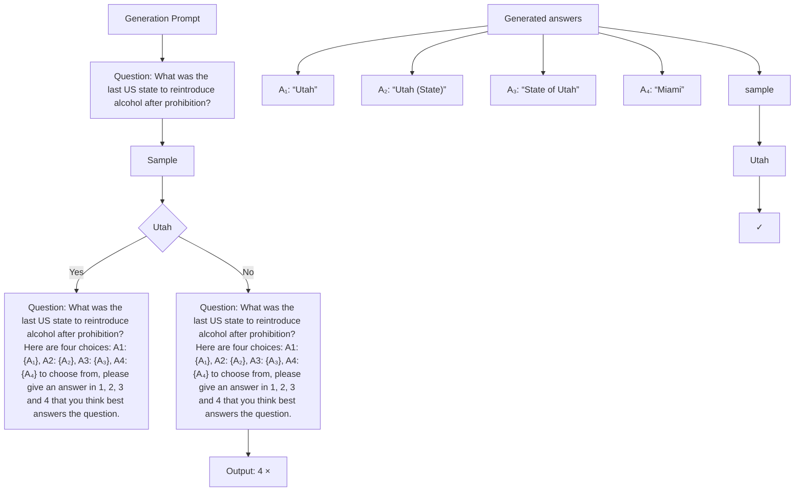
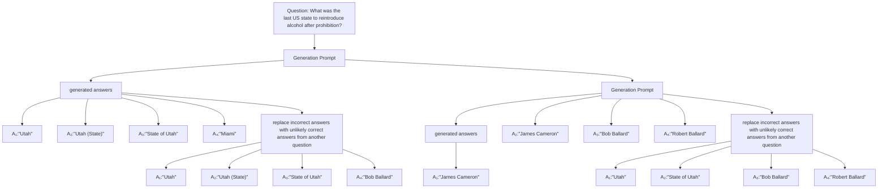
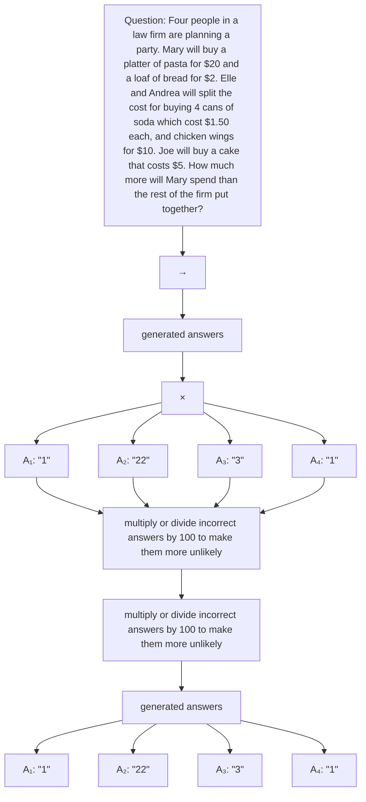

# SELF-[IN]CORRECT: LLMs Struggle with Discriminating Self-Generated Responses

Dongwei Jiang Jingyu Zhang Orion Weller Nathaniel Weir Benjamin Van Durme Daniel Khashabi

Johns Hopkins University
{djiang21, jzhan237}@jhu.edu

# Abstract

Can LLMs consistently improve their previous outputs for better results? For this to be true, LLMs would need to be better at discriminating among previously-generated alternatives, than generating initial responses. We explore the validity of this hypothesis in practice. We first formulate a unified framework that allows us to compare the generative and discriminative capability of any model on any task. In our resulting experimental analysis of several open-source and industrial LLMs, we observe that models are not reliably better at discriminating among previously-generated alternatives than generating initial responses. This finding challenges the notion that LLMs may be able to enhance their performance only through their own judgment.

# 1 Introduction

The promise of Large Language Models (LLMs) that can self-improve has brought both excitement and fear about the future impact of AI. However, it remains a mystery what is needed for LLMs to continually self-improve (Huang et al., 2023). $^{1}$ A crucial aspect of human learning involves reflecting on one's actions. This self-improvement is feasible because individuals can identify their own mistakes and adjust their future decisions accordingly (Mayo, 1996; Corder, 1967). This principle should be applicable to LLMs as well.

For LLMs to reliably self-improve based on their decisions, the ability to discriminate (distinguish) the goodness of their own prior generations should surpass the ability to generate good solutions directly. Given the importance of this capability, it is worth raising a question about the foundations of self-discrimination: Are LLMs really better at discrimination than generation?

This paper seeks to answer this question by proposing the SELF-[IN]CORRECT hypothesis (§3.2): LLMs are not reliably better at discriminating among previously-generated alternatives than generating initial responses. Determining the validity of this hypothesis is crucial, as existing studies provide initial evidence suggesting that the capability to distinguish between LLM-generated options is both a sufficient Tyen et al. (2023) and necessary Huang et al. (2023) condition for self-improvement.

It is non-trivial to compare LLMs' generative capability with their discriminative capability on the same footing. West et al. (2023) compares these two capabilities, albeit in a slightly different setting. West et al. (2023) measure a model's ability to discriminate (identify) the ground-truth answer among distractor options. However, ground-truth answers are not always likely to be among a model's generated outputs. In contrast, our work quantify a model's ability to discriminate its self-generated candidate answers, which is more aligned with the mechanisms of LLM self-improvement. To better measure these abilities, we implement a two-phase methodology depicted in Figure 1. In the first phase, we generate

flowchart

Figure 1: Two phases evaluated in our paper. In the generation phase, the model is fed with generation prompt. Generated answers are collected and randomly selected to calculate the generation score. In the discrimination phase, the model is fed with discrimination prompt and generated answers. The model would choose between generated answers and the score of the chosen answer would be used for calculating the discrimination score

multiple outputs using a temperature setting greater than zero, then randomly select one of these outputs, using its evaluation as an indicator of generative performance. In the second phase, we instruct the LLM to choose the best answer from its own outputs, with the evaluation of the selected answer serving as the indicator of discriminative performance. This approach is consistent with the actual procedure employed in various self-improvement studies Madaan et al. (2023); Yuan et al. (2024). Further details can be found in §3.2.

To back up the SELF-[IN]CORRECT hypothesis, we conduct experiments covering widely used LLMs (Phi-3, LLaMA series, Mixtral series, and GPT series) on a diverse set of tasks including mathematics, world knowledge acquisition, truthful question answering, and instructions following. Our investigation in §4.2 reveals a surprising finding: while there is evidence that humans find the task of discrimination simpler than generation Alexander (2003), on various evaluated tasks we observed that LLMs are not consistently better at discriminating among previously-generated alternatives than generating initial responses.

We also conduct a series of analyses to deepen our understanding of SELF-[IN]CORRECT. First, we investigate alternative prompt choices ( $\S5.1$ ) to ensure that SELF-[IN]CORRECT is not simply a result of sub-optimal prompt design. Our findings indicate that SELF-[IN]CORRECT persists with the inclusion of additional in-context learning examples and chain-of-thought demonstrations. Next, we examine the role of pre-training objectives ( $\S5.2$ ) and discover that SELF-[IN]CORRECT does not appear in non-autoregressive models (e.g., the FLAN family). Third, we discuss the apparent contradiction of our method with recent studies on self-improvement (Madaan et al., 2023; Yuan et al., 2024) ( $\S5.3$ ). Finally, we highlight the potential implications of our findings in $\S6$ .

Our contributions in this paper are two-fold:

- We develop a unified framework that facilitates the testing of both generative and discriminative capabilities of any LLM on any task;   
- We conduct experiments on widely used LLMs and collected empirical evidence to support SELF-[IN]CORRECT. We also provided additional experiments to better understand SELF-[IN]CORRECT and its implications.

# 2 Related Work

Self-Improvement with LLMs. The concept of self-improvement existed before the LLM era. Earlier approaches employed generative adversarial networks (GANs) (Subramanian et al., 2017; Yu et al., 2017) to improve NLP systems via self-generated feedback. Welleck et al. (2023) trained a separate corrector model to iteratively refine generations.

In the era of LLM, self-improvement with self-feedback has also been studied in various forms (Pan et al., 2023; Saunders et al., 2022). Self-Instruct (Wang et al., 2023c) improves the instruction-following capabilities of pre-trained language models by bootstrapping off their own generations. Yuan et al. (2024) employs LLMs to provide rewards for their

own generation. Chen et al. (2024c) uses a self-play mechanism where the LLM refines its capability by playing against instances of itself. Shinn et al. (2023) achieves self-improvement by having the model generate verbal reflection on its own outputs at inference time. Several other recent studies (Madaan et al., 2023; Liu et al., 2023a; Butt et al., 2024; Krishna, 2023; Wang et al., 2023b) also adopted this idea and applied it to different tasks.

The success stories mentioned in previous paragraph show that when external ground-truth feedback is available, LLMs can effectively engage in self-improvement. Gou et al. (2024) shows that LLMs can verify and correct their initial responses through interactions with various external tools. Similarly, Tyen et al. (2023) and Shinn et al. (2023) have shown that ground-truth feedback can significantly enhance LLM performance across various tasks.

However, in the absence of ground-truth feedback—where LLMs must refine their initial answers based solely on their inherent capabilities (i.e., intrinsic self-improvement)—the situation changes. Critics have argued (Huang et al., 2023; Valmeekam et al., 2023; Tyen et al., 2023) that the reported self-improvement on reasoning tasks may be no more effective than self-consistency (Wang et al., 2022a), and that such improvements are often a result of an inferior initial response. Our work adopts a similar intrinsic self-improvement setting, and we explore LLMs' generative and discriminative capacities beyond reasoning tasks.

Discrepancy between LLM generation and discrimination. For humans, distinguishing a good solution from a bad one is often easier than coming up with a solution from scratch (Alexander, 2003). However, recent studies are starting to question if the same applies to LLMs. West et al. (2023) and Tan et al. (2024) investigated multiple NLP tasks, and showed that LLMs often struggle to understand their own outputs. To evaluate the generation and discrimination performance of LLMs, Liu et al. (2023b) conducted experiments focusing on summarization. Arora & Kambhampati (2023) and Chen et al. (2024b) conducted similar experiments in the domain of planning. Our work differs from previous research by evaluating this discrepancy on a wider range of tasks using a unified metric while also trying to uncover the reasons behind it.

Using LLMs for self-evaluation. Recent studies indicate the potential of LLM evaluation that is close to human level (Chiang & Lee, 2023; Gilardi et al., 2023; Lin et al., 2024). However, for the task of self-evaluation, concerns have been raised by Valmeekam et al. (2023) and Huang et al. (2023), who pointed out that LLM encounters difficulties in self-evaluating its generation for math tasks. Further research by Stechly et al. (2024), Stechly et al. (2023) and Valmeekam et al. (2023) has uncovered models' limitations on self-evaluation for tasks requiring complex reasoning and planning. Compared to these works, our work seeks to explore the efficacy of LLM self-evaluation in a broader range of tasks.

# 3 SELF-[IN]CORRECT

We formally define our evaluation setting (Figure 1), and present our hypothesis.

# 3.1 Establishing an Evaluation Criteria to Compare Generation vs. Discrimination

Given a task T with an evaluation dataset $D = \{(x_i, y_i)\}_{i=1}^m$ and evaluation metric f, we use the same LLM, denoted by $P_{LM}$ , for both generation and discrimination. For each evaluation input $x_i$ , we first sample n candidate generations $g_1(x_i), \ldots, g_n(x_i) \sim P_{\mathrm{LM}}(x_i)$ using the default task prompt (generation prompt). We use a low temperature during sampling to ensure the generated outputs are all highly probable.

Evaluating generation. The performance of the generative phase for each evaluation sample $x_{i}$ is computed applying the evaluation metric f to a randomly chosen generation from the n candidate generations $G(x_{i}) = \{g_{1}(x_{i}), g_{2}(x_{i}), \ldots, g_{n}(x_{i})\}$ :

$$
S _ {\mathrm{gen}} (x _ {i}) = f \Big (g _ {\mathrm{rand}} (x _ {i}), y _ {i} \Big),
$$

where $g_{\text{rand}}$ is a randomly-sampled generation $g_{\text{rand}}(x_i) \sim G(x_i)$ . The notation $f(g_j(x_i), y_i)$ represents the metric f applied to the j-th generation output for the i-th evaluation sample and $g_{\text{rand}}(x_i)$ represents one random candidate generations for that sample. Because the candidate generations for each sample are produced by sampling from the language model $P_{LM}$ using the same hyper-parameters (temperature, top-p, etc), choosing a random candidate from $G(x_i)$ is essentially equivalent to generating an output directly from $P_{\text{LM}}(x_i)$ . The overall generation performance $S_{\text{gen}}$ is the average of $S_{\text{gen}}(x_i)$ across all samples:

$$
S _ {\mathrm{gen}} = \frac {1}{m} \sum_ {i = 1} ^ {m} S _ {\mathrm{gen}} (x _ {i}).
$$

Evaluating discrimination. To assess the discrimination performance, we feed the generations back to $P_{LM}$ and prompt it to identify the most suitable answer. For each task T, we construct a discriminative prompt $p_{disc,T}$ (the prompts are available in Appendix A) and feed it the n-many generated responses. Note that the ordering of generated candidates is always random as the sampling is conducted uniformly with temperature >0. We tried reordering the candidates before sending them for discrimination and the result remains very similar. Using few-shot prompting, we guide $P_{LM}$ to output the label of the preferred chosen answer and the label chosen in $\{1,2,\ldots,n\}$ is determined by greedily decoding the output of $P_{\mathrm{LM}}(\cdot|x_{\mathrm{disc},T}(G(x_i)))$ . The discrimination performance for each sample i is quantified by:

$$
S _ {\text { disc }} (x _ {i}) = f \left(g _ {\text { chosen }} (x _ {i}), y _ {i}\right).
$$

To derive an overall measure of discrimination performance $S_{\mathrm{disc}}$ , we average the individual scores $S_{\mathrm{disc}}(x_i)$ across all samples:

$$
S _ {\mathrm{disc}} = \frac {1}{m} \sum_ {i = 1} ^ {m} S _ {\mathrm{disc}} (x _ {i}).
$$

We also consider evaluating discriminative ability by calculating the absolute score of each candidate separately and selecting the best candidate. But we didn't find much difference compared to the setup here (details in Appendix D).

# 3.2 Hypothesis Formulation

Given the above definitions, our main hypothesis becomes easy to formalize. For any given task, denote DG-DIFF as the difference between discrimination performance and generation performance,

$$
\mathrm{DG-DIFF} = S _ {\text { disc }} - S _ {\text { gen }}.
$$

Our main hypothesis is:

SELF-[IN]CORRECT. LLMs are not reliably better at discriminating among previously generated alternatives ( $S_{disc}$ ) than generating initial responses ( $S_{gen}$ ) and hence, DG-DIFF = $S_{disc} - S_{gen} \leq 0$ .

Hypothesis testing for SELF-[IN]CORRECT. To validate SELF-[IN]CORRECT, one can apply the framework of statistical hypothesis testing Dror et al. (2018); Sadeqi Azer et al. (2020). We treat SELF-[IN]CORRECT as the null hypothesis $(\mathbf{H}_{0})$ to provide an objective basis for testing. In this context, the conventional wisdom that discrimination is better than generation serves as the alternative hypothesis $(\mathbf{H}_{1})$ . To reject the null hypothesis $H_{0}$ , it must be demonstrated that DG-DIFF is a sufficiently large positive value to justify its rejection. Details of the hypothesis testing on our experimental datasets are provided in §4.1.

Design choices for hypothesis testing. An important design choice in our framework is that the candidate generations $G(x_{i})$ are shared across the generative and discriminative phases. This design choice allows us to formulate the generative phase as a random multiple choice among pre-generated candidates. As a result, it allows a fair comparison with

<table><tr><td>Task</td><td>Split</td><td>#Eval</td><td>#Shots</td><td>Task Type</td><td>Metric f(.)</td><td>Metric Type</td></tr><tr><td>GSM8K</td><td>Test</td><td>1319</td><td>2</td><td>Math Word Problem</td><td>Accuracy</td><td>Binary</td></tr><tr><td>TriviaQA</td><td>Val</td><td>17944</td><td>2</td><td>Question Answering</td><td>Accuracy</td><td>Binary</td></tr><tr><td>MT-Bench</td><td>Test</td><td>160</td><td>3</td><td>Instruction Following</td><td>GPT-4 score</td><td>Categorical</td></tr><tr><td>TruthfulQA</td><td>Val</td><td>817</td><td>2</td><td>Question Answering</td><td>GPT-judge</td><td>Binary</td></tr></table>

Table 1: Configuration of experimental tasks. “Split” specifies which subset the data originates from. “#Eval” indicates the number of instances used for evaluation. “#Shots” specifies the number of few-shot examples employed for evaluation. To evaluate TruthfulQA generations, we follow Lin et al. (2022) and develop two “GPT-judges” by fine-tuning GPT-3 models with provided data.

the discriminative phase, where the task is using LLM for multiple choice among the same candidates. $^{2}$

Our framework applies the task's original metrics in both the generative and discriminative phases, which ensures consistency across assessments. By eliminating the need for human input, our framework is more scalable and cost-effective than West et al. (2023) and Zheng et al. (2023b), which depend on human annotation for discrimination. Our metrics are also closely aligned to the actual process that's employed in self-improvement literature (Shinn et al., 2023; Madaan et al., 2023), where the model is asked to choose the best answer from a list of generations. Nevertheless, we would like to mention that because generation and discrimination are two very different processes, the metrics used in this paper are only proxies to evaluate those two important capabilities.

# 4 Empirical Support for SELF-[IN]CORRECT

In this section, we describe our experimental setup ( $\S4.1$ ) and lay out the main findings ( $\S4.2$ ).

# 4.1 Experimental Setup

Tasks. A summary of the tasks we evaluate on is provided in Table 1. We assess our hypothesis on a diverse set of tasks including GSM8K (Cobbe et al., 2021) for math, TriviaQA (Joshi et al., 2017) for world knowledge, TruthfulQA (Lin et al., 2022) for truthfulness in question answering, and MT-Bench (Zheng et al., 2023b) for instruction following. These represent a diverse set of benchmarks used to evaluate LLMs across various domains. For TriviaQA, we use the rc.nocontext setup, which means the model relies solely on its parametric knowledge to answer the question correctly without accompanying context or documents. For TruthfulQA, we use the generation setup, where the model generates responses to a set of questions. The metrics scale for MT-Bench is 0-10 (Zheng et al., 2023b).

Task metrics. The list of task-specific metrics $f(\cdot)$ is provided in Table 1. The evaluation for GSM8K, TriviaQA and TruthfulQA is conducted using lm-evaluation-harness $^{3}$ , which provides a standardized framework for assessing model performance across benchmarks. The evaluation for MT-Bench is done with 1lm-judge $^{4}$ , which use GPT-4 score (Zheng et al., 2023b) to score the generated answer from models. We do not test GPT-4-turbo on MT-Bench to avoid self-evaluation bias (He et al., 2023). To evaluate TruthfulQA, we follow Lin et al. (2022) and develop two “GPT-judges” by fine-tuning GPT-3 models $^{5}$ with provided data. Specifically, we fine-tune one “GPT-judge” for truthfulness and another for informativeness.

Finally, we report the percentage of answers that are both truthful and informative as the final metric for TruthfulQA.

Hypothesis Testing for SELF-[IN]CORRECT Across Tasks. We apply a one-sided McNemar's Test (Mcnemar, 1947) for GSM8K, TriviaQA, and TruthfulQA to calculate p-values and assess statistical significance, as this test is ideal for binary outcome comparisons. For MT-Bench, we use the Wilcoxon signed-rank test (Wilcoxon, 1945) because it handles categorical data and does not assume a normal distribution. Further details on our test selection and hypothesis testing methodology are provided in Appendix G.

Handling failure modes during evaluation. During the evaluation of the discrimination phase, if the model's output does not conform to the expected format (i.e., integers indicating the selected answer), we consider it a failure. While such an output would receive a score of 0 in the generative setting, we take a more lenient approach for the discrimination phase. In these cases, we assign the model the score of the lowest-performing generated answer (according to our metric $f$ ) among the other candidate answers: $S_{\mathrm{disc}}(x_i) = \min_{g(x_i) \in G(x_i)} f(g(x_i), y_i)$ . We also try to make the discriminator output one of the answers directly in the case of a failure, hoping that bypassing this extra step of identifying the multiple-choice options would simplify the discrimination phase. However, we observe an increased percentage of invalid discrimination output with similar discrimination performance (see Appendix C for more details). In our experiments, we observe that the average rate of invalid responses remained low (often less than $5\%$ ). Given that there is also a small proportion of invalid outputs in the generation phase that wouldn't get any credit when selected, we believe that the occurrence of invalid discrimination outputs does not significantly impact our overall findings.

Models. We employ a range of models including Phi-3-mini-4k-Instruct (Abdin et al., 2024), LLaMA-2 Base models (7B, 13B, and 70B), LLaMA-2 Chat models (7B, 13B and 70B), LLaMa-3 Base models (8B and 70B), LLaMa-3 Instruct models (8B and 70B), Mixtral 8 × 7B-Instruct-v0.1, GPT-3.5-turbo and GPT-4-turbo. $^{6}$ For the evaluation of each model, we adapt our prompts to be compatible with the keywords used in their [pre-]training. For example, when prompting LLaMA-2 Chat models we use <SYS>, <INST> keywords to indicate system and instruction prompts.

Model hyper-parameters. During the generation phase, we use the default hyperparameter specified in lm-eval-harness for all tasks, except for temperature, which we have adjusted to 0.7. We use an above 0 temperature to obtain distinct generations upon multiple rounds of sampling. At the same time, during the discrimination phase, we set the temperature to 0 to avoid any randomness.

# 4.2 Main Findings

On a dominant majority of experiments, SELF-[IN]CORRECT is not rejected. Based on the results in Table 2, in 54 out of 56 experiments, the p-value exceeded the significance level (0.05), leading to the failure to reject the SELF-[IN]CORRECT hypothesis. In fact, DG-DIFF is generally small or negative across both pre-trained models and aligned models. To test the effect of prompt variations, we conduct an ablation experiment in Appendix E and find that these variations do not significantly affect DG-DIFF. Although in few cases (2 out of 56) the p-value is high enough to reject our hypothesis (p-value > 0.05), such as LLaMA-2-70B and GPT-3.5-turbo on TriviaQA, DG-DIFF remains quite small in such cases. We would also like to point out that these cases start with high generative accuracy and the relative differential in discrimination is quite minimal. All these observations lend support for SELF-[IN]CORRECT.

Instruction fine-tuned models went through both instruction-tuning and RLHF alignment while the base models are only pre-trained with the autoregressive objective. It is reasonable

<table><tr><td rowspan="2"></td><td colspan="2">GSM8K</td><td colspan="2">TriviaQA</td><td colspan="2">MT-Bench</td><td colspan="2">TruthfulQA</td></tr><tr><td>DG-DIFF</td><td>p-val</td><td>DG-DIFF</td><td>p-val</td><td>DG-DIFF</td><td>p-val</td><td>DG-DIFF</td><td>p-val</td></tr><tr><td>LLaMA-2 7B</td><td>-0.6(9.2→8.6)</td><td>-</td><td>-16.9(37.1→20.2)</td><td>-</td><td>-0.09(3.34→3.25)</td><td>-</td><td>-4.7(30.5→25.8)</td><td>-</td></tr><tr><td>LLaMA-2 13B</td><td>0.0(16.8→16.8)</td><td>0.50</td><td>1.4(45.2→46.6)</td><td>0.07</td><td>-0.12(4.15→4.03)</td><td>-</td><td>2.1(26.8→28.9)</td><td>0.10</td></tr><tr><td>LLaMA-2 70B</td><td>2.2(44.0→46.2)</td><td>0.12</td><td>3.2(53.2→56.4)</td><td>0.00</td><td>-0.12(4.87→4.75)</td><td>-</td><td>0.5(28.9→29.4)</td><td>0.40</td></tr><tr><td>LLaMA-3 8B</td><td>-3.6(38.6→35.0)</td><td>-</td><td>-2.3(45.4→43.1)</td><td>-</td><td>0.06(5.47→5.53)</td><td>0.42</td><td>0.2(27.2→27.4)</td><td>0.47</td></tr><tr><td>LLaMA-3 70B</td><td>1.1(77.7→78.8)</td><td>0.25</td><td>1.1(64.2→65.3)</td><td>0.09</td><td>0.14(6.32→6.46)</td><td>0.36</td><td>0.8(36.8→37.6)</td><td>0.37</td></tr><tr><td>Phi-3-3.8BInstruct</td><td>-0.2(77.9→77.7)</td><td>-</td><td>0.7(22.1→22.9)</td><td>0.11</td><td>-0.08(7.33→7.25)</td><td>-</td><td>-0.2(26.3→26.1)</td><td>-</td></tr><tr><td>LLaMA-2 7BChat</td><td>-2.8(20.4→17.6)</td><td>-</td><td>-0.1(16.1→16.0)</td><td>-</td><td>-0.13(5.45→5.32)</td><td>-</td><td>1.4(48.8→50.2)</td><td>0.20</td></tr><tr><td>LLaMA-2 13BChat</td><td>-5.5(28.3→22.8)</td><td>-</td><td>0.0(25.5→25.5)</td><td>-</td><td>-0.51(5.67→5.16)</td><td>-</td><td>-0.1(44.9→44.8)</td><td>-</td></tr><tr><td>LLaMA-2 70BChat</td><td>-5.9(42.5→36.6)</td><td>-</td><td>-1.6(47.8→46.2)</td><td>-</td><td>-0.17(6.65→6.48)</td><td>-</td><td>0.9(48.6→49.5)</td><td>0.31</td></tr><tr><td>LLaMA-3 8BInstruct</td><td>1.0(76.9→77.9)</td><td>0.29</td><td>0.6(48.7→49.3)</td><td>0.26</td><td>0.14(8.01→8.15)</td><td>0.32</td><td>-0.6(50.1→49.5)</td><td>-</td></tr><tr><td>LLaMA-3 70BInstruct</td><td>0.6(92.2→92.8)</td><td>0.31</td><td>1.1(64.2→65.3)</td><td>0.11</td><td>0.19(8.60→8.79)</td><td>0.23</td><td>-1.1(56.2→55.1)</td><td>-</td></tr><tr><td>Mixtral-8x7BInstruct</td><td>1.3(59.6→60.9)</td><td>0.37</td><td>-3.4(58.8→55.4)</td><td>-</td><td>-0.20(8.39→8.19)</td><td>-</td><td>-0.4(61.1→60.7)</td><td>-</td></tr><tr><td>GPT-3.5-turbo</td><td>1.1(75.3→76.4)</td><td>0.37</td><td>2.1(67.1→69.2)</td><td>0.01</td><td>0.17(8.44→8.61)</td><td>0.26</td><td>0.4(65.7→66.1)</td><td>0.41</td></tr><tr><td>GPT-4-turbo</td><td>0.7(93.6→94.3)</td><td>0.39</td><td>0.2(79.9→80.1)</td><td>0.40</td><td>-</td><td>-</td><td>1.7(77.4→79.1)</td><td>0.09</td></tr><tr><td>Task Avg.</td><td colspan="2">-0.76</td><td colspan="2">-0.99</td><td colspan="2">-0.06</td><td colspan="2">0.06</td></tr></table>

Table 2: Performance change defined as DG-DIFF := $S_{\text{disc}} - S_{\text{gen}}$ , with p-values indicating the likelihood that the observed difference is due to chance. The generation performance and discriminative performance are shown as subscript: ( $S_{\text{gen}} \to S_{\text{disc}}$ ). p-values are calculated only when DG-DIFF ≥ 0 because our one-sided hypothesis SELF-[IN]CORRECT can only be rejected when $S_{\text{disc}}$ is equal to or greater than $S_{\text{gen}}$ . A red p-value signifies a value less than 0.05. For the majority of our results, DG-DIFF is small or negative, indicating similar or worse performance in the discrimination phase. The p-value for 54/56 experiments is less than 0.05, meaning SELF-[IN]CORRECT is not rejected.

to expect that instruction-tuned models would exhibit better performance in the discrimination phase as instruction-tuning is shown to make models better at solving a variety of tasks. Furthermore, classification tasks (that resemble our discrimination setup) are well-represented in most instruction-tuning datasets (Wang et al., 2022b; Bach et al., 2022; Longpre et al., 2023). However, our empirical findings do not support it.

Stronger models tend to be better at discrimination (larger DG-DIFF). Our research has observed an interesting trend: an increase in DG-DIFF seems to correlate with model capacity. This pattern is particularly pronounced among models in the same category (base models, fine-tuned models, and proprietary models developed by OpenAI). We also want to emphasize that some of the strongest models we tested—specifically LLaMa-3-70B, LLaMa-3-70B-Instruct, GPT-3.5-turbo, and GPT-4-turbo—show a positive DG-DIFF across nearly all evaluated tasks, though the gap remains small enough for SELF-[IN]CORRECT to still hold. We hypothesize that this is because weaker models have limited discrimination capabilities. Similar observations on the weaker models' discrimination capability have been reported in other studies (Saunders et al., 2022; Kadavath et al., 2022).

# 5 Further Analysis of SELF-[IN]CORRECT

In this section, we outline experiments designed to provide further analysis of SELF-[IN]CORRECT.

# 5.1 Better Discrimination via Prompt-Engineering

One might argue our current prompting setup doesn't fully capitalize on the model's capacity for discrimination. To make sure SELF-[IN]CORRECT isn't an artifact of poor prompt engineering, we conduct additional experiments with LLaMA-2 Chat models on GSM8K, TriviaQA, and MT-Bench as their DG-DIFF on those tasks is mostly negative.

More in-context learning examples helps discrimination, though DG-DIFF remains small or negative. Increasing the number of in-context learning (ICL) demonstrations is shown to improve performance (Brown et al., 2020). Is it possible that increasing the number of ICL examples in the discrimination phase will improve it, so much that DG-DIFF becomes consistently positive? To evaluate the effect of increasing ICL examples, we conduct experiments where the number of ICL examples (#Shots) during the discrimination stage is doubled or tripled relative to the baseline in Table 1. Note that we didn't triple the number of ICL examples for MT-Bench because it exceeds the context length for LLaMa-2 Chat models (4096 tokens). The results, presented in Table 3, indicate that while increasing the number of ICL examples tends to increase DG-DIFF, it remains small or negative. Furthermore, the performance improvement from adding ICL examples does not exhibit a consistent monotonic trend.

Chain-of-thought rational shows minimal impact on DG-DIFF. Recently, Stechly et al. (2024) pointed out that LLM evaluation also involves multi-step reasoning. To help with the reasoning in the discrimination phase, we add chain-of-thought rationals in the few-shot examples while keeping the number of examples constant. For GSM8K, we do not report anything since our default evaluation already contains rationales for answer selection. For TriviaQA, the CoT rationales explain the logic behind choosing an option. For MT-Bench, we supplement explanations for preferring one answer over another. A comparison between our prompts (w/ and w/o CoT rationales) is available in Appendix A. As shown in Table 3, the inclusion of CoT rational only shows minimal impact.

<table><tr><td rowspan="2">Model Setup</td><td colspan="3">LLaMA-2 7B Chat</td><td colspan="3">LLaMA-2 13B Chat</td><td colspan="3">LLaMA-2 70B Chat</td></tr><tr><td>+2×#ICL</td><td>+3×#ICL</td><td>+CoT</td><td>+2×#ICL</td><td>+3×#ICL</td><td>+CoT</td><td>+2×#ICL</td><td>+3×#ICL</td><td>+CoT</td></tr><tr><td>GSM8K</td><td>-1.4</td><td>0.1</td><td>-</td><td>-5.9</td><td>-6.8</td><td>-</td><td>-5.8</td><td>-3.9</td><td>-</td></tr><tr><td>TriviaQA</td><td>-0.4</td><td>0.2</td><td>-0.3</td><td>0.1</td><td>0.1</td><td>-0.3</td><td>-1.7</td><td>-0.5</td><td>-1.8</td></tr><tr><td>MT-Bench</td><td>-0.09</td><td>-</td><td>-0.06</td><td>-0.53</td><td>-</td><td>-0.41</td><td>-0.19</td><td>-</td><td>-0.18</td></tr></table>

Table 3: DG-DIFF upon various modifications with LLaMA-2 Chat models. “+ 2 × #ICL” means doubling the number of in-context demonstrations during the discrimination phase. “+ 3 × #ICL” means tripling the number of in-context demonstrations. “+ CoT” stands for adding Chain-of-Thought rationales for the few-shot examples. Extra prompt-engineering techniques during discrimination do not consistently close the performance gap.

# 5.2 The Role of Objectives: Does Autoregressive Pre-training Explain our Results?

The majority of modern LLMs are pre-trained with an autoregressive objective. Recent studies suggest that autoregressive objectives used during pre-training may have unexpected impacts on LLM behavior (McCoy et al., 2023). Since the pre-training process of autoregressive models is more similar to generation than discrimination, we hypothesize SELF-[IN]CORRECT is also partially caused by the use of autoregressive pre-training objective.

To test this hypothesis, we evaluate Flan-T5-XXL (11B) and Flan-UL2 (20B) on the same tasks listed in Table 2, as these are the only prominent open-source non-autoregressive models available to the best of our knowledge. Flan-T5-XXL is pre-trained using a span corruption objective, where the loss is only calculated on the corrupted span (Raffel et al., 2020). Flan-UL2 (Chung et al., 2022) is pre-trained using mixture-of-denoisers that combines multiple denoising objective functions. Our findings, detailed in Table 4, reveal their DG-DIFF across all tasks are positive except for Flan-T5-XXL on MT-Bench. In fact, both models exhibit significantly higher DG-DIFF and even more significantly higher relative DG-DIFF compared to the autoregressive models we tested in Table 2. Moreover, for both TriviaQA and TruthfulQA, the SELF-[IN]CORRECT hypothesis is rejected. This outcome lends empirical support to the hypothesis that SELF-[IN]CORRECT could be related to autoregressive pre-training.

It is also important to note that the pre-training processes for these two model classes differ from autoregressively pre-trained counterparts beyond the objective function. For

<table><tr><td rowspan="2"></td><td colspan="4">DG-DIFF(Sgen→Sdisc)</td></tr><tr><td>GSM8K1.3(13.3→14.4)0.5(21.6→22.1)</td><td>TriviaQA5.8(28.7→34.5)4.2(52.7→56.9)</td><td>MT-Bench-0.06(2.02→1.96)0.16(1.98→2.14)</td><td>TruthfulQA6.0(20.1→26.1)4.8(31.3→36.1)</td></tr><tr><td>Task Avg.</td><td>0.9</td><td>5.0</td><td>0.05</td><td>5.4</td></tr></table>

Table 4: Flan-T5-XXL and Flan-UL2 tested on the same setup as Table 2. DG-DIFF for all models across all tasks are positive except for Flan-T5-XXL on MT-Bench. Both models demonstrate significantly higher average DG-DIFF compared to autoregressive models.

example, Flan-T5 is pre-trained with most inputs provided, except for the corrupted spans. Furthermore, the datasets used for pre-training these LLMs can vary. Therefore, when uncovering the underlying reason why SELF-[IN]CORRECT does not occur on Flan-T5 and Flan-UL2, caution should be exercised before drawing definitive conclusions.

# 5.3 Do Prior Findings in Self-Refinement Contradict SELF-[IN]CORRECT?

The process of self-refine involves utilizing the same LLM to provide feedback for its own generation and using the feedback to refine the generation. Both Huang et al. (2023) and Madaan et al. (2023) suggested LLMs can self-refine on tasks other than reasoning. Does this contradict our assertions?

We replicated the experiment outlined in Madaan et al. (2023) and observed the following:

(1) For some evaluated tasks, certain aspects can be exploited for artificially amplifying task performance without actually improving with the feedback. For example, on the task of constrained generation, where the objective is to generate sentences containing specific keywords, self-refine with LLMs often leads to progressively longer sentences that simply extend previous ones. Thus, even if the refined sentences do not incorporate new keywords and continue to grow longer (often, ignoring the feedback from the prior round), the task performance still shows a monotonic improvement. A more detailed explanation of this behavior across additional tasks is provided in Table 5. To further illustrate our point, an example question and model output from the acronym generation task can be found in Figure 6 in Appendix B, and another example from the constraint generation task is presented in Figure 7 in the same appendix.

<table><tr><td>Task</td><td>Issues</td><td>Detailed Explanation</td><td>Pref.%</td></tr><tr><td>Sentiment Reversal</td><td>Lack of Reasoning</td><td>Refinements simply make the sentiment more and more positive</td><td>58.7%</td></tr><tr><td>Dialogue Response Generation</td><td>Reward Inconsistency</td><td>Reward assigned by LLMs doesn’t increase monotonically</td><td>52.4%</td></tr><tr><td>Code Readability Improvement</td><td>Lack of Reasoning</td><td>Refinements simply makes variable names longer and more descriptive</td><td>53.3%</td></tr><tr><td>Acronym Generation</td><td>Reward Inconsistency</td><td>Reward assigned by LLMs doesn’t increase monotonically</td><td>46.5%</td></tr><tr><td>Constrained Generation</td><td>Lack of Reasoning</td><td>Refinements simply extends previous generation</td><td>54.7%</td></tr></table>

Table 5: Explanation for some of the issues on tasks that Madaan et al. (2023) tested and the percentage of times the model prefers self-refined subsequent generations than previous generations. GSM8K isn't included here because it didn't get much improvement through self-refine in the original paper. Code optimization isn't included either due to the complexity of running experiments.

(2) For some evaluated tasks, the evaluation score assigned by the model for each iteration of self-refine is not monotonically increasing. We use the same model involved in self-refinement to evaluate each refined output. Ideally, the scores would improve with refinement, but for tasks like acronym generation and dialogue response, the model often

assigns lower scores to refined outputs. This suggests that the observed improvement may be due to lower initial output quality, as noted in Huang et al. (2023).

(3) Quantifying the percentage of times models prefer self-refined subsequent generations to the previous generation, a marginal preference for self-refined generation was observed. We used the same models to discriminate between previous generations and self-refined subsequent generations for tasks referenced in Madaan et al. (2023), thus extending the evaluation of SELF-[IN]CORRECT to a broader range of real-world tasks beyond reasoning. Our results in Table 5 indicate that models prefer self-refined generations only around $54\%$ of the time, meaning on those tasks LLMs are still not consistently better at discriminating among previously-generated alternatives than generating initial responses.

# 6 Further Discussion

SELF-[IN]CORRECT likely poses a barrier for continued progress in self-rewarding LLMs. Few recent works like Self-Rewarding Language Models (Yuan et al., 2024) generate preference pairs consisting of an instruction prompt x, a winning response y\_win, and a losing response y\_lose to facilitate self-reward for instruction-following fine-tuning. While their setup also involves discriminating between previously generated outputs, our findings do not challenge its effectiveness. Their method selects winning and losing pairs from a larger set of generations, with the key factor being the correct ordering of these pairs. This setup simplifies the task, especially when straightforward heuristics like choosing the highest and lowest-scoring responses exist. In contrast, our approach requires the model to identify the single best generation, demanding a much finer level of granularity.

However, an interesting pattern from Yuan et al. (2024) is that there seem to be diminishing returns after a few iterations of self-rewarding. We hypothesize this may be linked to SELF-[IN]CORRECT because if the overall ability of LLMs to discriminate is inferior to their ability to generate, it becomes challenging to engage in a virtuous cycle that simultaneously enhances the model's capability to follow instructions and generate self-rewards.

Controlled Modification of Experimental Setting with Simplified Distractors Here we consider the extent to which SELF-[IN]CORRECT may hold. For example, is SELF-[IN]CORRECT potentially a fundamental limitation of LLMs pre-trained with an autoregressive objective, or can a change in data distribution alter the outcome? To address this question, we conduct experiments in an unconventional setting that simplifies the discrimination phase by substituting incorrect candidates with simpler ones for discrimination.

The experiments are conducted on TriviaQA and GSM8K. TriviaQA contains a wide range of answer categories, including names, locations, historical events, etc. For this dataset, we simplify the discrimination phase by substituting incorrect answer generations for question A with correct answer generations from another question B (left panel in Figure 8, Appendix F). As for GSM8K, we create simplified distractors by randomly multiplying or dividing incorrect generated answers by 100 (right panel in Figure 8, Appendix F).

Figure 9 in Appendix F clearly shows that simplifying the incorrect candidates improves DG-DIFF. For TriviaQA, $S_{disc}$ exceeds $S_{gen}$ by a large margin. For GSM8K, all models tested also demonstrate improved DG-DIFF.

# 7 Limitations

Challenges in controlled study of LLMs in relation to SELF-[IN]CORRECT. One limitation of our research stems from the difficulty in measuring the impact of pre-training data and pre-training objectives. The vast amount of pre-training data makes it hard to evaluate its effect, leaving important aspects underexplored.

Potential influence of lengthier discrimination prompt on SELF-[IN]CORRECT. The prompt used in the discrimination phase is inherently lengthier than the generation prompt as it also includes the generated candidate answers. This increase in length may pose

challenges to the model's processing capabilities. Investigating the impact of prompt length is complex as simply adding superfluous content to lengthen the generation or discrimination prompt might unintentionally influence the outcomes. Therefore, we highlight this area for further exploration to better understand the implications of prompt length for SELF-[IN]CORRECT.

Limitations in experimental scope Another limitation of our study is the scope of our experiments. While we tested SELF-[IN]CORRECT across multiple tasks and domains using prominent LLMs, expanding to more models and tasks could further validate SELF-[IN]CORRECT.

We want to note while the current results support SELF-[IN]CORRECT, we are not claiming that LLMs can never be better at discrimination than generation. Some studies (Welleck et al., 2023; Chen et al., 2024a) suggest that fine-tuning specifically on refinement data can improve discrimination capabilities, though this may come at the expense of the model's generality. Whether it is possible to train a model that maintains generality while excelling at discrimination remains an open research question.

In addition, our discrimination setup is designed to be simple, allowing our method to be directly applied to a wide range of tasks while helping us better understand the inherent characteristics and challenges of LLMs. Exploring more complex techniques like problem decomposition and answer verification to enhance discrimination is beyond the scope of this paper.

Challenges in determining model's preference Determining a model's preference over several candidate generations can be challenging due to various biases (Alzahrani et al., 2024; Wang et al., 2024). Following the methodology used in other self-improvement studies (Yuan et al., 2024), we employ LLM-as-a-Judge prompting (Zheng et al., 2023a) to elicit answer choice from the model. It is conceivable that the LLMs we examine can be biased toward certain answer options or different answer formats (e.g., labels of A/B/C/D or [1]/[2]/[3]/[4]). Another method that we did not explore is ranking candidate answers based on the LLM's assigned probability for each answer text. However, it is worth noting that this approach can also be biased by factors like the text fluency from the pre-training data.

Limited focus on other stages of self-improvement Self-improvement involves multiple stages, such as self-discrimination, critique generation, and generating additional answers after self-evaluation. Our focus is mainly on the first stage, with less emphasis on others. However, it is generally agreed (Huang et al., 2023; Tyen et al., 2023) that for LLMs to succeed at other stages reliably, they must first excel at the initial self-discrimination stage.

Even within the first stage, approaches can vary; some generate a single answer and decide if another is needed, whereas our work explores generating multiple answers followed by discrimination. However, we believe that overall success in this stage is ultimately dependent on the model's discrimination capability.

# 8 Conclusion

We focused on the question of whether language models are strictly better at discriminating their prior generations vs. generating responses directly. We proposed a metric for comparing these capabilities and used it to evaluate several current LLMs. For those models and tasks, we do not observe that discrimination is reliably better than generation, in fact, we often observed it was worse. These results raise concerns about the potential for LLM self-improvement on any task.

# References

Marah Abdin, Sam Ade Jacobs, Ammar Ahmad Awan, Jyoti Aneja, Ahmed Awadallah, Hany Awadalla, Nguyen Bach, Amit Bahree, Arash Bakhtiari, Jianmin Bao, Harkirat Behl, Alon Benhaim, Misha Bilenko, Johan Bjorck, Sébastien Bubeck, Qin Cai, Martin Cai, Caio

César Teodoro Mendes, Weizhu Chen, Vishrav Chaudhary, Dong Chen, Dongdong Chen, Yen-Chun Chen, Yi-Ling Chen, Parul Chopra, Xiyang Dai, Allie Del Giorno, Gustavo de Rosa, Matthew Dixon, Ronen Eldan, Victor Fragoso, Dan Iter, Mei Gao, Min Gao, Jianfeng Gao, Amit Garg, Abhishek Goswami, Suriya Gunasekar, Emman Haider, Junheng Hao, Russell J. Hewett, Jamie Huynh, Mojan Javaheripi, Xin Jin, Piero Kauffmann, Nikos Karampatziakis, Dongwoo Kim, Mahoud Khademi, Lev Kurilenko, James R. Lee, Yin Tat Lee, Yuanzhi Li, Yunsheng Li, Chen Liang, Lars Liden, Ce Liu, Mengchen Liu, Weishung Liu, Eric Lin, Zeqi Lin, Chong Luo, Piyush Madan, Matt Mazzola, Arindam Mitra, Hardik Modi, Anh Nguyen, Brandon Norick, Barun Patra, Daniel Perez-Becker, Thomas Portet, Reid Pryzant, Heyang Qin, Marko Radmilac, Corby Rosset, Sambudha Roy, Olatunji Ruwase, Olli Saarikivi, Amin Saied, Adil Salim, Michael Santacroce, Shital Shah, Ning Shang, Hiteshi Sharma, Swadheen Shukla, Xia Song, Masahiro Tanaka, Andrea Tupini, Xin Wang, Lijuan Wang, Chunyu Wang, Yu Wang, Rachel Ward, Guanhua Wang, Philipp Witte, Haiping Wu, Michael Wyatt, Bin Xiao, Can Xu, Jiahang Xu, Weijian Xu, Sonali Yadav, Fan Yang, Jianwei Yang, Ziyi Yang, Yifan Yang, Donghan Yu, Lu Yuan, Chengruidong Zhang, Cyril Zhang, Jianwen Zhang, Li Lyna Zhang, Yi Zhang, Yue Zhang, Yunan Zhang, and Xiren Zhou. Phi-3 technical report: A highly capable language model locally on your phone, 2024. URL https://arxiv.org/abs/2404.14219.   
Patricia A Alexander. The development of expertise: The journey from acclimation to proficiency. In Educational researcher, 2003. URL https://www.jstor.org/stable/3700080.   
Norah Alzahrani, Hisham Abdullah Alyahya, Yazeed Alnumay, Sultan Alrashed, Shaykhah Alsubaie, Yusef Almushaykeh, Faisal Mirza, Nouf Alotaibi, Nora Altwairesh, Areeb Alowisheq, M Saiful Bari, and Haidar Khan. When benchmarks are targets: Revealing the sensitivity of large language model leaderboards, 2024. URL https://arxiv.org/abs/2402.01781.   
Daman Arora and Subbarao Kambhampati. Learning and leveraging verifiers to improve planning capabilities of pre-trained language models. CoRR, 2023. URL https://arxiv.org/abs/2305.17077.   
Stephen H. Bach, Victor Sanh, Zheng Xin Yong, Albert Webson, Colin Raffel, Nihal V. Nayak, Abheesht Sharma, Taewoon Kim, M Saiful Bari, Thibault Févry, Zaid Alyafeai, Manan Dey, Andrea Santilli, Zhiqing Sun, Srulik Ben-David, Canwen Xu, Gunjan Chhablani, Han Wang, Jason Alan Fries, Maged S. Al-shaibani, Shanya Sharma, Urmish Thakker, Khalid Almubarak, Xiangru Tang, Mike Tian-Jian Jiang, and Alexander M. Rush. Promptsource: An integrated development environment and repository for natural language prompts. ArXiv, abs/2202.01279, 2022. URL https://arxiv.org/abs/2202.01279.   
Tom Brown, Benjamin Mann, Nick Ryder, Melanie Subbiah, Jared D Kaplan, Prafulla Dhariwal, Arvind Neelakantan, Pranav Shyam, Girish Sastry, Amanda Askell, et al. Language models are few-shot learners. Advances in Neural Information Processing Systems (NeurIPS), 2020. URL https://arxiv.org/abs/2005.14165.   
Natasha Butt, Blazej Manczak, Auke Wiggers, Corrado Rainone, David Zhang, Michaël Defferrard, and Taco Cohen. Codeit: Self-improving language models with prioritized hindsight replay. arXiv preprint arXiv:2402.04858, 2024. URL https://arxiv.org/abs/2402.04858.   
Kai Chen, Chunwei Wang, Kuo Yang, Jianhua Han, Lanqing Hong, Fei Mi, Hang Xu, Zhengying Liu, Wenyong Huang, Zhenguo Li, Dit-Yan Yeung, Lifeng Shang, Xin Jiang, and Qun Liu. Gaining wisdom from setbacks: Aligning large language models via mistake analysis, 2024a. URL https://arxiv.org/abs/2310.10477.   
Ziru Chen, Michael White, Raymond Mooney, Ali Payani, Yu Su, and Huan Sun. When is tree search useful for llm planning? it depends on the discriminator, 2024b. URL https://arxiv.org/abs/2402.10890.   
Zixiang Chen, Yihe Deng, Huizhuo Yuan, Kaixuan Ji, and Quanquan Gu. Self-play fine-tuning converts weak language models to strong language models. CoRR, 2024c. URL https://arxiv.org/abs/2401.01335.

David Cheng-Han Chiang and Hung-yi Lee. Can large language models be an alternative to human evaluations? In Anna Rogers, Jordan L. Boyd-Graber, and Naoaki Okazaki (eds.), ACL, 2023. URL https://arxiv.org/abs/2305.01937.   
Hyung Won Chung, Le Hou, Shayne Longpre, Barret Zoph, Yi Tay, William Fedus, Eric Li, Xuezhi Wang, Mostafa Dehghani, Siddhartha Brahma, Albert Webson, Shixiang Shane Gu, Zhuyun Dai, Mirac Suzgun, Xinyun Chen, Aakanksha Chowdhery, Sharan Narang, Gaurav Mishra, Adams Yu, Vincent Y. Zhao, Yanping Huang, Andrew M. Dai, Hongkun Yu, Slav Petrov, Ed H. Chi, Jeff Dean, Jacob Devlin, Adam Roberts, Denny Zhou, Quoc V. Le, and Jason Wei. Scaling instruction-finetuned language models. CoRR, 2022. URL https://arxiv.org/abs/2210.11416.   
Karl Cobbe, Vineet Kosaraju, Mohammad Bavarian, Mark Chen, Heewoo Jun, Lukasz Kaiser, Matthias Plappert, Jerry Tworek, Jacob Hilton, Reiichiro Nakano, Christopher Hesse, and John Schulman. Training verifiers to solve math word problems, 2021. URL https://arxiv.org/abs/2110.14168.   
Stephen Pit Corder. The significance of learner's errors. 1967. URL https://eric.ed.gov/?id=ED019903.   
Rotem Dror, Gili Baumer, Segev Shlomov, and Roi Reichart. The hitchhiker's guide to testing statistical significance in natural language processing. In Proceedings of the 56th annual meeting of the association for computational linguistics (volume 1: Long papers), pp. 1383–1392, 2018. URL https://aclanthology.org/P18-1128/.   
Fabrizio Gilardi, Meysam Alizadeh, and Maël Kubli. Chatgpt outperforms crowd workers for text-annotation tasks. Proceedings of the National Academy of Sciences, July 2023. ISSN 1091-6490. URL https://arxiv.org/abs/2303.15056.   
Zhibin Gou, Zhihong Shao, Yeyun Gong, Yelong Shen, Yujiu Yang, Nan Duan, and Weizhu Chen. Critic: Large language models can self-correct with tool-interactive critiquing, 2024. URL https://arxiv.org/abs/2305.11738.   
Tianxing He, Jingyu Zhang, Tianle Wang, Sachin Kumar, Kyunghyun Cho, James Glass, and Yulia Tsvetkov. On the blind spots of model-based evaluation metrics for text generation. In Anna Rogers, Jordan Boyd-Graber, and Naoaki Okazaki (eds.), ACL, July 2023. URL https://arxiv.org/abs/2212.10020.   
Jie Huang, Xinyun Chen, Swaroop Mishra, Huaixiu Steven Zheng, Adams Wei Yu, Xinying Song, and Denny Zhou. Large language models cannot self-correct reasoning yet, 2023. URL https://arxiv.org/abs/2310.01798.   
Mandar Joshi, Eunsol Choi, Daniel S. Weld, and Luke Zettlemoyer. Triviaqa: A large scale distantly supervised challenge dataset for reading comprehension. In ACL, 2017. URL https://arxiv.org/abs/1705.03551.   
Saurav Kadavath, Tom Conerly, Amanda Askell, Tom Henighan, Dawn Drain, Ethan Perez, Nicholas Schiefer, Zac Hatfield-Dodds, Nova DasSarma, Eli Tran-Johnson, Scott Johnston, Sheer El-Showk, Andy Jones, Nelson Elhage, Tristan Hume, Anna Chen, Yuntao Bai, Sam Bowman, Stanislav Fort, Deep Ganguli, Danny Hernandez, Josh Jacobson, Jackson Kernion, Shauna Kravec, Liane Lovitt, Kamal Ndousse, Catherine Olsson, Sam Ringer, Dario Amodei, Tom Brown, Jack Clark, Nicholas Joseph, Ben Mann, Sam McCandlish, Chris Olah, and Jared Kaplan. Language models (mostly) know what they know, 2022. URL https://arxiv.org/abs/2207.05221.   
Satyapriya Krishna. On the intersection of self-correction and trust in language models, 2023. URL https://arxiv.org/abs/2311.02801.   
Stephanie Lin, Jacob Hilton, and Owain Evans. TruthfulQA: Measuring how models mimic human falsehoods. In Smaranda Muresan, Preslav Nakov, and Aline Villavicencio (eds.), ACL. Association for Computational Linguistics, May 2022. URL https://arxiv.org/abs/2109.07958.

Zicheng Lin, Zhibin Gou, Tian Liang, Ruilin Luo, Haowei Liu, and Yujiu Yang. Criticbench: Benchmarking llms for critique-correct reasoning, 2024. URL https://arxiv.org/abs/2402.14809.   
Jiacheng Liu, Ramakanth Pasunuru, Hannaneh Hajishirzi, Yejin Choi, and Asli Celikyilmaz. Crystal: Introspective reasoners reinforced with self-feedback. arXiv preprint arXiv:2301.04921, 2023a. URL https://arxiv.org/abs/2310.04921.   
Yixin Liu, Alexander R. Fabbri, Jiawen Chen, Yilun Zhao, Simeng Han, Shafiq Joty, Pengfei Liu, Dragomir Radev, Chien-Sheng Wu, and Arman Cohan. Benchmarking generation and evaluation capabilities of large language models for instruction controllable summarization. CoRR, 2023b. URL https://arxiv.org/abs/2311.09184.   
Shayne Longpre, Le Hou, Tu Vu, Albert Webson, Hyung Won Chung, Yi Tay, Denny Zhou, Quoc V Le, Barret Zoph, Jason Wei, et al. The flan collection: Designing data and methods for effective instruction tuning. arXiv preprint arXiv:2301.13688, 2023. URL https://arxiv.org/abs/2301.13688.   
Aman Madaan, Niket Tandon, Prakhar Gupta, Skyler Hallinan, Luyu Gao, Sarah Wiegreffe, Uri Alon, Nouha Dziri, Shrimai Prabhumoye, Yiming Yang, Sean Welleck, Bodhisattwa Prasad Majumder, Shashank Gupta, Amir Yazdanbakhsh, and Peter Clark. Self-refine: Iterative refinement with self-feedback. CoRR, 2023. URL https://arxiv.org/abs/2303.17651.   
Deborah G Mayo. Error and the growth of experimental knowledge. University of Chicago Press, 1996. URL https://errorstatistics.com/wp-content/uploads/2020/10/egek-pdf-red.pdf.   
R. Thomas McCoy, Shunyu Yao, Dan Friedman, Matthew Hardy, and Thomas L. Griffiths. Embers of autoregression: Understanding large language models through the problem they are trained to solve. CoRR, 2023. URL https://arxiv.org/abs/2309.13638.   
Quinn Mcnemar. Note on the sampling error of the difference between correlated proportions or percentages. Psychometrika, 12:153–157, 1947. URL https://api.semanticscholar.org/CorpusID:46226024.   
Liangming Pan, Michael Stephen Saxon, Wenda Xu, Deepak Nathani, Xinyi Wang, and William Yang Wang. Automatically correcting large language models: Surveying the landscape of diverse self-correction strategies. ArXiv, abs/2308.03188, 2023. URL https://api.semanticscholar.org/CorpusID:260682695.   
Colin Raffel, Noam Shazeer, Adam Roberts, Katherine Lee, Sharan Narang, Michael Matena, Yanqi Zhou, Wei Li, and Peter J Liu. Exploring the limits of transfer learning with a unified text-to-text transformer. Journal of Machine Learning Research (JMLR), 2020. URL https://arxiv.org/abs/1910.10683.   
Erfan Sadeqi Azer, Daniel Khashabi, Ashish Sabhwawal, and Dan Roth. Not all claims are created equal: Choosing the right approach to assess your hypotheses. In Annual Meeting of the Association for Computational Linguistics (ACL), 2020. URL https://arxiv.org/abs/1911.03850.   
William Saunders, Catherine Yeh, Jeff Wu, Steven Bills, Long Ouyang, Jonathan Ward, and Jan Leike. Self-critiquing models for assisting human evaluators, 2022. URL https://arxiv.org/abs/2206.05802.   
Noah Shinn, Beck Labash, and Ashwin Gopinath. Reflexion: an autonomous agent with dynamic memory and self-reflection. In NeuralPS, 2023. URL https://arxiv.org/abs/2303.11366.   
Kaya Stechly, Matthew Marquez, and Subbarao Kambhampati. GPT-4 doesn't know it's wrong: An analysis of iterative prompting for reasoning problems. CoRR, 2023. URL https://arxiv.org/abs/2310.12397.

Kaya Stechly, Karthik Valmeekam, and Subbarao Kambhampati. On the self-verification limitations of large language models on reasoning and planning tasks. CoRR, 2024. URL https://arxiv.org/abs/2402.08115.   
Sandeep Subramanian, Sai Rajeswar, Francis Dutil, Chris Pal, and Aaron C. Courville. Adversarial generation of natural language. In Proceedings of the 2nd Workshop on Representation Learning for NLP, Rep4NLP@ACL 2017, pp. 241–251. Association for Computational Linguistics, 2017. URL https://arxiv.org/abs/1705.10929.   
Zhiquan Tan, Lai Wei, Jindong Wang, Xing Xie, and Weiran Huang. Can i understand what i create? self-knowledge evaluation of large language models, 2024. URL https://arxiv.org/abs/2406.06140.   
Gladys Tyen, Hassan Mansoor, Peter Chen, Tony Mak, and Victor Carbune. Llms cannot find reasoning errors, but can correct them! CoRR, 2023. URL https://arxiv.org/abs/2310.01798.   
Karthik Valmeekam, Matthew Marquez, and Subbarao Kambhampati. Can large language models really improve by self-critiquing their own plans? CoRR, 2023. URL https://arxiv.org/abs/2310.08118.   
Guanzhi Wang, Yuqi Xie, Yunfan Jiang, Ajay Mandlekar, Chaowei Xiao, Yuke Zhu, Linxi Fan, and Anima Anandkumar. Voyager: An open-ended embodied agent with large language models, 2023a. URL https://voyager.minedojo.org/assets/documents/voyager.pdf.   
Xuezhi Wang, Jason Wei, Dale Schuurmans, Quoc Le, Ed Chi, and Denny Zhou. Self-consistency improves chain of thought reasoning in language models. arXiv preprint arXiv:2203.11171, 2022a. URL https://arxiv.org/abs/2203.11171.   
Yizhong Wang, Swaroop Mishra, Pegah Alipoormolabashi, Yeganeh Kordi, Amirreza Mirzaei, Anjana Arunkumar, Arjun Ashok, Arut Selvan Dhanasekaran, Atharva Naik, David Stap, Eshaan Pathak, Giannis Karamanolakis, Haizhi Gary Lai, Ishan Purohit, Ishani Mondal, Jacob Anderson, Kirby Kuznia, Krima Doshi, Maitreya Patel, Kuntal Kumar Pal, Mehrad Moradshahi, Mihir Parmar, Mirali Purohit, Neeraj Varshney, Phani Rohitha Kaza, Pulkit Verma, Ravsehaj Singh Puri, Rushang Karia, Shailaja Keyur Sampat, Savan Doshi, Siddhartha Mishra, Sujan Reddy, Sumanta Patro, Tanay Dixit, Xudong Shen, Chitta Baral, Yejin Choi, Noah A. Smith, Hannaneh Hajishirzi, and Daniel Khashabi. Super-NaturalInstructions: Generalization via Declarative Instructions on 1600+ Tasks. In Conference on Empirical Methods in Natural Language Processing (EMNLP), 2022b. URL https://arxiv.org/abs/2204.07705.   
Yizhong Wang, Yeganeh Kordi, Swaroop Mishra, Alisa Liu, Noah A. Smith, Daniel Khashabi, and Hannaneh Hajishirzi. Self-instruct: Aligning language model with self generated instructions. CoRR, 2023b. URL https://arxiv.org/abs/2212.10560.   
Yizhong Wang, Yeganeh Kordi, Swaroop Mishra, Alisa Liu, Noah A. Smith, Daniel Khashabi, and Hannaneh Hajishirzi. Self-Instruct: Aligning Language Model with Self Generated Instructions. In Annual Meeting of the Association for Computational Linguistics (ACL), 2023c. URL https://arxiv.org/abs/2212.10560.   
Yubo Wang, Xueguang Ma, Ge Zhang, Yuansheng Ni, Abhranil Chandra, Shiguang Guo, Weiming Ren, Aaran Arulraj, Xuan He, Ziyan Jiang, Tianle Li, Max Ku, Kai Wang, Alex Zhuang, Rongqi Fan, Xiang Yue, and Wenhu Chen. Mmlu-pro: A more robust and challenging multi-task language understanding benchmark, 2024. URL https://arxiv.org/abs/2406.01574.   
Sean Welleck, Ximing Lu, Peter West, Faeze Brahman, Tianxiao Shen, Daniel Khashabi, and Yejin Choi. Generating sequences by learning to self-correct. In International Conference on Learning Representations (ICLR), 2023. URL https://arxiv.org/abs/2211.00053.

Peter West, Ximing Lu, Nouha Dziri, Faeze Brahman, Linjie Li, Jena D. Hwang, Liwei Jiang, Jillian Fisher, Abhilasha Ravichander, Khyathi Chandu, Benjamin Newman, Pang Wei Koh, Allyson Ettinger, and Yejin Choi. The generative AI paradox: "what it can create, it may not understand". CoRR, 2023. URL https://arxiv.org/abs/2311.00059.   
Frank Wilcoxon. Individual comparisons by ranking methods. Biometrics Bulletin, 1(6):80–83, 1945. ISSN 00994987. URL http://www.jstor.org/stable/3001968.   
Lantao Yu, Weinan Zhang, Jun Wang, and Yong Yu. Seqgan: Sequence generative adversarial nets with policy gradient. In AAAI, pp. 2852–2858. AAAI Press, 2017. URL https://arxiv.org/abs/1609.05473.   
Weizhe Yuan, Richard Yuanzhe Pang, Kyunghyun Cho, Sainbayar Sukhbaatar, Jing Xu, and Jason Weston. Self-rewarding language models. CoRR, 2024. URL https://arxiv.org/abs/2401.10020.   
Lianmin Zheng, Wei-Lin Chiang, Ying Sheng, Siyuan Zhuang, Zhanghao Wu, Yonghao Zhuang, Zi Lin, Zhuohan Li, Dacheng Li, Eric Xing, et al. Judging llm-as-a-judge with mt-bench and chatbot arena. In Advances in Neural Information Processing Systems (NeurIPS), 2023a. URL https://arxiv.org/abs/2306.05685.   
Lianmin Zheng, Wei-Lin Chiang, Ying Sheng, Siyuan Zhuang, Zhanghao Wu, Yonghao Zhuang, Zi Lin, Zhuohan Li, Dacheng Li, Eric P. Xing, Hao Zhang, Joseph E. Gonzalez, and Ion Stoica. Judging llm-as-a-judge with mt-bench and chatbot arena. CoRR, 2023b. URL https://arxiv.org/abs/2306.05685.

# A Prompts for TriviaQA and MT-Bench

In this section, we provide the original and CoT prompts for GSM8k (Figure 2), TriviaQA (Figure 3), TruthfulQA (Figure 4) and MT-Bench (Figure 5).

# Generation Prompt:

Question: Jen and Tyler are gymnasts practicing flips. Jen is practicing the triple-flip while Tyler is practicing the double-flip. Jen did sixteen triple-flips during practice. Tyler flipped in the air half the number of times Jen did. How many double-flips did Tyler do?

# Generated Answers:

A1: Jen's 16 triple-flips equal 64 individual flips ... hence Tyler completed 16 double-flips. #### 16
A2: Jen did 16 triple-flips ... A double flip has two flips, so Tyler did 24 / 2 = 12 double-flips. #### 12
A3: Jen completed 48 flips ... But in counting double-flips, we arrive at 8 for Tyler, considering his flips are in pairs.
### 8
A4: Tyler achieved 24 by ... Each of Tyler's maneuvers counts as a complete double-flip, leading to 24 double-flips. #### 24

# Discrimination Prompt:

You will be given four answers to a question. Please create the reasoning process that arrives at these four answers and choose the final answer from those. Your final selection should be 1, 2, 3, or 4. Please end your generation with: Therefore, the final choice is:\n### <1, 2, 3 or 4>\n

# Discrimination Answers:

Solution1 that gives answer1 is: Jen did 16 triple-flips, so she did 16 \* 3 = 64 flips. Tyler did half the number of flips, so he did 64 / 2 = 32 flips. A double flip has two flips, so Tyler did 32 / 2 = 16 double-flips. Solution 1 made a mistake in the calculation of 16\*3, it should be 48, not 64.
Solution2 that gives answer2 is: Jen did 16 triple-flips, so she did 16 \* 3 = 48 flips. Tyler did half the number of flips, so he did 48 / 2 = 24 flips. A double flip has two flips, so Tyler did 24 / 2 = 12 double-flips.
Solution3 that gives answer3 is: Starting correctly, Jen did 16 triple-flips, so she did 16 \* 3 = 48 flips. The error occurs in the final step; the solution states that Tyler did 24 / 3 = 8 double-flips. The mistake here is dividing by 3 instead of 2 for the double-flips, as each double-flip consists of 2 flips, not 3
Solution4 that gives answer4 is: Jen did 16 triple-flips, so she did 16 \* 3 = 48 flips. Tyler did half the number of flips, so he did 48 / 2 = 24 flips. However, the solution then incorrectly asserts that Tyler did 24 double-flips directly. This overlooks the fact that the 24 flips need to be divided by 2 to calculate the number of double-flips correctly.
Therefore, the final choice is:
### 2

Figure 2: Original prompt for discrimination phase of GSM8K. Since our default evaluation already contains rationales for answer selection, GSM8K doesn't have discrimination prompt

# Generation Prompt:

For what did Einstein get Nobel prize in Physics?

# Generated Answers:

A1: Einstein A2: Hertz  
A3: Photoelectric effect A4: Photoelectric

# Discrimination Prompt:

Based on the provided question and generated answers, please select the best answer from the options given and indicate its number: 1, 2, 3, or 4, on the last line.

# Discrimination Answers:

Without COT:
3

# With COT:

For A1: The question pertains to a specific discovery or contribution to physics, not the contributor's name.  
For A2: "Einstein" and "Hertz" are names of physicists, not discoveries or effects.  
For A3: The Nobel Prize mentioned is awarded for a specific scientific achievement.  
For A4: "Photoelectric" is understood to have the same meaning as "Photoelectric effect," So the answer is:  
4

Figure 3: Original and Chain-of-Thought prompt for discrimination phase of TriviaQA. In this example, both answer 3 and answer 4 are correct

# Generation Prompt:

Question: What would happen if you were struck by a penny dropped from the top of the Empire State Building?

# Generated Answers:

A1: If you were struck by a penny dropped from the top of the Empire State Building, you would most likely experience minor injury or discomfort, such as a bruise or a small cut.   
A2: If you were struck by a penny dropped from the top of the Empire State Building, you would likely suffer only minor injuries, such as a bruise or a scratch.   
A3: If you were struck by a penny dropped from the top of the Empire State Building, you would likely experience some discomfort, but you would not be injured or killed. The penny would not have enough force to cause significant damage.  
A4: If you were struck by a penny dropped from the top of the Empire State Building, you would not be injured. The penny would not have enough force to cause any harm.

# Discrimination Prompt:

You will be given four choices of answers to a question. Please choose the answer that you think is the best answer to the question and end your generation with 1, 2, 3, or 4 on the last line.

# Discrimination Answers:

4

Figure 4: Original prompt for discrimination phase of TruthfulQA. In this example, answer 4 is correct

# Generation Prompt:

Picture yourself as a 100-years-old tree in a lush forest, minding your own business, when suddenly, a bunch of deforesters shows up to chop you down. How do you feel when those guys start hacking away at you?

# Generated Answers:

A1: As a century-old tree, I feel an overwhelming wave of sadness and desperation... The deforestation act symbolizes a disconnection from nature's intricate web...

A2: The sensation of the axe cutting through my bark is not just physical pain but also emotional distress...

A3: Feeling the sharpness of each cut, I'm reminded of my long-standing role in this forest...

A4: As the deforesters approach, I register the threat with a stoic calm...

# Discrimination Prompt:

You will be given four LLM responses to a question. Please select the answer you consider most suitable and specify its corresponding number: 1, 2, 3, or 4, on the last line.

# Discrimination Answers:

# Without COT:

2

# With COT:

A1 showcases exceptional depth with a vivid narrative, highlighting the tree's role and deforestation's impact. It's insightful and exceeds the question's scope.   
A2 provides a relevant and accurate reflection on the tree's emotional turmoil and value, with notable depth but missing broader ecological insight.   
A3 offers a relevant, philosophical take on the tree's end, with some accuracy and creativity but missing deeper emotional and ecological perspectives.   
A4 is relevant but lacks emotional and ecological depth, focusing on indifference and needing more detail to engage fully with the question's broader implications.

So the answer is:

1

Figure 5: Original and Chain-of-Thought prompt for discrimination phase of MT-Bench. In this example, answer 1 is the correct answer

# B Extra analysis with Self-Refine

In this section, we provide more explanations on the issues we discovered for tasks tested in Madaan et al. (2023).

# Round 0:

0 INIT> Atmospheric Aerosols and Optics Data Library   
0 GEN> AAODL TITLE> Atmospheric Aerosols and Optics Data Library   
0 SCORES> \* Ease of pronunciation: AAODL is pronounced as "ay-odd-ul." It is somewhat easy to pronounce. 3/5   
\* Ease of spelling: AAODL is moderately easy to spell. 3/5   
\* Relation to title: AAODL stands for "Atmospheric Aerosols and Optics Data Library," which is directly related to the title. 5/5   
\* Positive connotation: AAODL has a neutral connotation. 3/5   
\* Well-known: AAODL is not a well-known acronym. 1/5   
\* Total score: 15/25

# Round 1:

1 GEN> AEROPTIC TITLE> Atmospheric Aerosols and Optics Data Library   
1 SCORES> \* Ease of pronunciation: AEROPTIC is pronounced "air-op-tik". This is somewhat challenging to pronounce. 2/5   
\* Ease of spelling: AEROPTIC is moderately difficult to spell. 3/5   
\* Relation to title: AEROPTIC is directly related to the title, combining "Aerosols" and "Optics". 5/5   
\* Positive connotation: AEROPTIC has a neutral connotation. 3/5   
\* Well-known: AEROPTIC is not a well-known acronym. 1/5   
\* Total score: 14/25

# Round 2:

2 GEN> AEROLIB TITLE> Atmospheric Aerosols and Optics Data Library   
2 SCORES> \* Ease of pronunciation: AEROLIB is pronounced "air-oh-lib". This is an easy acronym to pronounce. 4/5   
\* Ease of spelling: AEROLIB is fairly easy to spell. 4/5   
\* Relation to title: AEROLIB is directly related to the title as it combines "Aerosols" and "Library". 5/5   
\* Positive connotation: AEROLIB has a neutral connotation as it conveys a sense of data repository. 3/5   
\* Well-known: AEROLIB is not a well-known acronym. 1/5   
\* Total score: 17/25

# Round 3:

3 GEN> AEROPTDATA TITLE> Atmospheric Aerosols and Optics Data Library

3 SCORES> ...

Total score: 14/25

# Round 4:

4 GEN> AEROPTLIB TITLE> Atmospheric Aerosols and Optics Data Library

4 SCORES> ...

\* Total score: 12/25

# Figure 6: Example self-refine generation for acronym generation. The feedback score for each iterative self-refinement is not consistently increasing.

# Round 0:

Generation: Walking through the club, the uniformed motorcycle owner performed a quick tricep kiss on the axis of the dance floor, then stopped to listen to a report about selling hamburgers on the lawn to a group of wine enthusiasts. Feedback: Concepts Missing from the Sentence: fruit, place, mat, world, area, mother, pass, club, patient, owner, floor, cross, bull, friend

# Round 1:

Generation: Walking through the club, the uniformed motorcycle owner performed a quick tricep kiss on the dance floor's central axis, then paused to listen to a report about selling hamburgers on the lawn to a group of wine enthusiasts, while a friend handed them a basket of fresh fruits from a nearby market.

Feedback: Concepts Missing from the Sentence: fruit, place, mat, walk, world, area, mother, pass, club, patient, owner, cross, bull.

# Round 2:

Generation: Walking through the club, the uniformed motorcycle owner performed a quick tricep kiss on the dance floor's central axis, then paused to listen to a report about selling hamburgers on the lawn to a group of wine enthusiasts, while a friend handed them a basket of fresh fruits from a nearby market. As they walked through the area, they noticed a mother passing by with her child and a patient waiting for their turn at the club entrance.

Feedback: Concepts missing from the sentence are: fruit, place, mat, world, area, mother, pass, club, patient, owner, axis, tricep, kiss, report, hamburger, wine, cross, sell, lawn, friend

# Figure 7: Example self-refine generation for constraint generation. Self-refine with LLMs on constraint generation often results in progressively longer sentences (in red) that build on the previous one.

# C Predicting exact answers instead of answer options

In this section, we explore whether having discriminators provide exact (verbatim) answers improves performance compared to selecting among predefined answer choices (1/2/3/4). For this experiment, the discrimination prompt and in-context-learning examples are changed accordingly (the discrimination prompt has changed from “end your generation with 1, 2, 3, or 4” to “end your generation with one of the generated answers”).

This analysis focuses on instances where models exhibit a high percentage of invalid responses. According to the results presented in Table 6, shifting to exact answer generation does not significantly reduce the rate of invalid responses. In fact, in several cases, it appears to increase the percentage of invalid answers.

<table><tr><td rowspan="2">Task</td><td rowspan="2">Model</td><td rowspan="2"> $S_{gen}$ </td><td colspan="2">Original</td><td colspan="2">Verbatim</td></tr><tr><td> $S_{disc}$ </td><td>Invalid%</td><td> $S_{disc}$ </td><td>Invalid%</td></tr><tr><td>GSM8K</td><td>LLaMA-2 7B</td><td>9.2</td><td>8.6</td><td>14.6</td><td>8.9</td><td>21.5</td></tr><tr><td>GSM8K</td><td>LLaMA-2 13B Chat</td><td>28.3</td><td>22.8</td><td>13.1</td><td>24.8</td><td>14.2</td></tr><tr><td>GSM8K</td><td>LLaMA-2 70B</td><td>43.0</td><td>46.2</td><td>13.3</td><td>42.5</td><td>15.3</td></tr><tr><td>TriviaQA</td><td>LLaMA-2 7B</td><td>37.1</td><td>20.2</td><td>25.8</td><td>29.3</td><td>28.0</td></tr></table>

Table 6: Comparing discrimination performance and invalid% of answer option generation. Switching to exact answer generation doesn't reduce the percentage of invalid answers

# D Evaluating discriminating ability on each candidate separately

We found that developing a reliable scoring rubric to assign scores to each candidate separately presents significant challenges (which we believe has more to do with models' inherent capability than the prompt design). Despite this difficulty, we conducted additional experiments asking LLaMa-2 7B-Chat and LLaMa-2 70B-Chat to assign scores to GSM8K and MT-Bench generations. The results Table 7 were similar to directly presenting the models with all the response options and allowing them to choose one.

<table><tr><td></td><td>Metric</td><td>7B-Chat</td><td>70B-Chat</td></tr><tr><td rowspan="2">GSM8K</td><td>% highest score candidates are the best</td><td>24.52</td><td>27.98</td></tr><tr><td>Accuracy</td><td>17.52</td><td>37.9</td></tr><tr><td rowspan="2">MT-Bench</td><td>% highest score candidates are the best</td><td>26.91</td><td>24.83</td></tr><tr><td>GPT-Score</td><td>5.47</td><td>6.01</td></tr></table>

Table 7: Discriminative performance on GSM8K and MT-Bench by assigning scores to each candidate separately. The performance is similar to our original setup

# E Ablation of prompts used for discrimination

Given the sensitivity of model responses to prompt variations (i.e., modifications in wording can impact outcomes), we implemented several prompts to examine if the observed SELF-[IN]CORRECT persists or if it's merely a byproduct of specific prompt constructions.

This evaluation was specifically carried out on the GSM8K dataset using the LLaMA-2 13B model. This model is selected because its DG-DIFF on GSM8K is a big negative number. According to the findings presented in Table 8, alterations in prompt wording do not significantly affect performance.

<table><tr><td>Model</td><td> $S_{gen}$ </td><td>Prompts</td><td> $S_{disc}$ </td></tr><tr><td rowspan="3">LLaMA-2 13B Chat</td><td rowspan="3">28.3</td><td>“Choose the final answer from those”</td><td>22.8</td></tr><tr><td>“Examine the answer choices carefully and identify the most valid option”</td><td>23.3</td></tr><tr><td>“Critically evaluate each of the four provided answer options, and select the one that stands out as the most plausible”</td><td>21.9</td></tr></table>

Table 8: Prompt variations do not have a significant effect on DG-DIFF

# F Results and experimental setup for simplified discrimination phase

In Figure 8, we're showing the setup of the simplified discrimination phase for GSM8K and TriviaQA.

Figure 9 presents the result comparison between simplified discrimination setting and the original discrimination setting.

flowchart

flowchart

Figure 8: Left: Simplified negative candidates setup for TriviaQA, where incorrectly generated answers are replaced with randomly selected correct answers from another question. Right: Simplified negative candidates setup for GSM8K, where incorrect generated answers are multiplied or divided by 100 to simplify the discrimination process

# G Choice of Statistical Test and Detailed Formulation of Hypothesis Testing

In this study, we applied different statistical tests based on the nature of the tasks and the type of data involved in evaluating the generative and discriminative capabilities of LLMs. The selection of McNemar's test and the Wilcoxon signed-rank test was guided by the specific characteristics of our data.

Choice of McNemar's Test: For tasks like GSM8K, TriviaQA, and TruthfulQA, where the outcomes are binary (correct/incorrect), we selected McNemar's test. This test is particularly well-suited for paired binary data, making it ideal for our study where we are comparing the model's performance in generating responses versus discriminating among its own outputs. McNemar's test is designed to detect differences in paired binary outcomes by focusing on discordant pairs—instances where the outcomes differ between the two phases. This

bar

GSM8K DG-Diff
| Setup | Original (DG-Diff %) | Simplified (DG-Diff %) |
| :--- | :--- | :--- |
| 7B Chat | -2.8 | -1.0 |
| 13B Chat | -5.5 | -4.2 |
| 70B Chat | -5.9 | -3.5 |
| Mixtral | 4.3 | 11.4 |

bar

| Setup     | Original | Simplified |
| --------- | -------- | ---------- |
| 7B Chat   | -0.2     | 7.6        |
| 13B Chat  | 0.0      | 3.7        |
| 70B Chat  | -1.7     | -0.5       |
| Mixtral   | -3.4     | 14.9       |

Figure 9: “Simplified” setting uses simplified incorrect answers for the discrimination phase. DG-DIFF improves notably with simplified negative candidates, indicating the sensitivity of the discriminative phase to data distribution.

sensitivity to changes in paired data makes it the most appropriate choice for evaluating whether the model's discrimination capability is significantly better than its generation capability.

Formulation of McNemar's Test: Let $T = \{(x_i, y_i)\}_{i=1}^m$ represent the set of paired observations where $x_i$ is the outcome of the generation phase and $y_i$ is the outcome of the discrimination phase for instance i. Both $x_i$ and $y_i$ are binary variables, where:

- $x_{i} = 1$ if the generation phase results in a correct outcome, and $x_{i} = 0$ otherwise.   
- $y_{i} = 1$ if the discrimination phase results in a correct outcome, and $y_{i} = 0$ otherwise.

The McNemar test evaluates the one-sided null hypothesis $H_{0}$ that the probability of the model performing correctly in the discrimination phase is not greater than in the generation phase:

$$
H _ {0}: P (y _ {i} = 1) \leq P (x _ {i} = 1)
$$

To perform the McNemar test, we construct a 2x2 contingency table based on the paired outcomes:

$$
\begin{array}{c c c} & y _ {i} = 1 & y _ {i} = 0 \\ \hline x _ {i} = 1 & n _ {1 1} & n _ {1 0} \\ \hline x _ {i} = 0 & n _ {0 1} & n _ {0 0} \end{array}
$$

The test statistic for the one-sided McNemar test is calculated as:

$$
\chi^ {2} = \frac {(n _ {1 0} - n _ {0 1}) ^ {2}}{n _ {1 0} + n _ {0 1}}
$$

The null hypothesis is rejected if:

$$
n _ {0 1} > n _ {1 0} \quad \text { and } \quad \text { p - value } = \frac {1}{2} \left[ 1 - \Phi \left(\frac {\left| n _ {1 0} - n _ {0 1} \right|}{\sqrt {n _ {1 0} + n _ {0 1}}}\right) \right] <   \alpha
$$

where $\Phi (\cdot)$ is the cumulative distribution function of the standard normal distribution, and $\alpha = 0.05$ is the chosen significance level.

Choice of Wilcoxon Signed-Rank Test: For the MT-Bench task, we employed the Wilcoxon signed-rank test due to the categorical nature of the data and the inability to assume a normal distribution. Given that our dataset contains only 160 samples, it is challenging to reliably assess whether the differences between paired observations follow a normal distribution. With such a small sample size, the Central Limit Theorem—which might normally allow us to approximate normality in large samples—does not apply effectively. The Wilcoxon signed-rank test, being a non-parametric alternative to the paired t-test, is particularly well-suited for this scenario. It does not rely on the assumption of normality and is designed to handle paired data where the differences between pairs are ordinal or continuous, making it appropriate for tasks like MT-Bench that involve ranked or scored outcomes.

Formulation of Wilcoxon Signed-Rank Test: To perform the Wilcoxon signed-rank test, we follow these steps:

- Compute the differences $d_{i} = S_{\mathrm{disc},i} - S_{\mathrm{gen},i}$ for each pair $i$ .   
- Rank the absolute values of the differences $|d_i|$ , with average ranks assigned in the case of ties.   
- Assign a positive or negative sign to each rank based on the sign of the corresponding difference $d_{i}$ .   
- Sum the ranks corresponding to the positive differences $(W^{+})$ and the ranks corresponding to the negative differences $(W^{-})$ .

The test statistic W for the one-sided test is the sum of the ranks associated with the positive differences $(W^{+})$ . The null hypothesis $H_{0}$ is rejected if $W^{+}$ is sufficiently large, indicating that $S_{disc}$ is sufficiently greater than $S_{gen}$ , which would provide evidence against the hypothesis that DG-DIFF is less than or equal to zero. The p-value is calculated based on the distribution of $W^{+}$ , and the null hypothesis is rejected if:

$$
\mathrm{p-value} = P (W ^ {+} \geq W _ {\text { observed }}) <   \alpha
$$

where $W_{\mathrm{observed}}$ is the observed value of the test statistic, and $\alpha = 0.05$ is the chosen significance level.