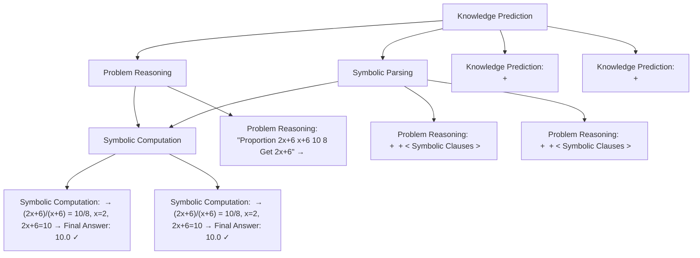

# GNS: Solving Plane Geometry Problems by Neural-Symbolic Reasoning with Multi-Modal LLMs

Maizhen Ning $^{*1,2}$ , Zihao Zhou $^{*1,2}$ , Qiufeng Wang $^{1\dagger}$ , Xiaowei Huang $^{2}$ , Kaizhu Huang $^{3}$

$^{1}$ School of Advanced Technology, Xi'an Jiaotong-Liverpool University

$^{2}$ University of Liverpool

$^{3}$ Duke Kunshan University

maizhen.ning16@student.xjtlu.edu.cn, qiufeng.wang@xjtlu.edu.cn

# Abstract

With the outstanding capabilities of Large Language Models (LLMs), solving math word problems (MWP) has greatly progressed, achieving higher performance on several benchmark datasets. However, it is more challenging to solve plane geometry problems (PGPs) due to the necessity of understanding, reasoning and computation on two modality data including both geometry diagrams and textual questions, where Multi-Modal Large Language Models (MLLMs) have not been extensively explored. Previous works simply regarded a plane geometry problem as a multi-modal QA task, which ignored the importance of explicitly parsing geometric elements from problems. To tackle this limitation, we propose to solve plane Geometry problems by Neural-Symbolic reasoning with MLLMs (GNS). We first leverage an MLLM to understand PGPs through knowledge prediction and symbolic parsing, next perform mathematical reasoning to obtain solutions, and last adopt a symbolic solver to compute answers. Correspondingly, we introduce the largest PGPs dataset GNS-260K with multiple annotations including symbolic parsing, understanding, reasoning and computation. In experiments, our Phi3-Vision-based MLLM wins first place on the PGPs solving task of MathVista benchmark, outperforming GPT-4o, Gemini Ultra and other much larger MLLMs. While LLaVA-13B-based MLLM markedly exceeded other close-source and open-source MLLMs on the MathVerse benchmark and also achieved the new SOTA on GeoQA dataset.

Project — https://github.com/ning-mz/GNS

# Introduction

Large Language Models (LLMs) have recently demonstrated impressive versatility in natural language understanding and generation (Zhao et al. 2023; Touvron et al. 2023; Chang et al. 2023). Consequently, numerous researchers have successfully explored LLMs in solving math word problems (MWP) (Zong and Krishnamachari 2023; Fu et al. 2023; Zhou et al. 2023a,b) and reached a level of expertise comparable to humans (Ahn et al. 2024; Yue et al.

bar

| Model | Original Performance | Trained with Our GNS |
| :--- | :--- | :--- |
| DeepSeek -VL-1.7B | 19.7 | 55.3 |
| MiniCPM -V2.5-8B | 43.3 | 61.1 |
| LLaVA -1.5-7B | 26.4 | 62 |
| LLaVA -1.5-13B | 29.3 | 63.9 |
| Phi3 -Vision-4.2B | 40.9 | 63.9 |

Figure 1: Performance improvements with different base MLLMs trained by our GNS framework. Experiments were conducted on MathVista-testmini plane geometry problem solving task (GPS). Our method achieves competitive and even higher performance than GPT-4o (2024-05-13).

2024). However, it is more challenging to solve plane geometry problems (PGPs) with two modality data including both geometry diagrams and textual questions. Despite significant recent progress of Multi-Modal Large Language Models (MLLMs) (Yin et al. 2023), there has been surprisingly limited exploration of MLLMs in solving plane geometry problems.

Solving PGPs usually requires mathematical reasoning and visual-textual understanding, which has gained attention for an extended period (Chou, Gao, and Zhang 1996). Many works focused on designing complicated neural networks and several researchers constructed plane geometry problem datasets (Chen et al. 2021; Lu et al. 2021; Cao and Xiao 2022) to facilitate research. With the recent progress in MLLMs (Zhu et al. 2024; Liu et al. 2023b; Achiam et al. 2023), researchers have started to evaluate the capability of MLLMs in solving PGPs (Lu et al. 2024b).

Based on the evaluation (Lu et al. 2024b; Zhang et al. 2024a; Li et al. 2024a; Zhou et al. 2024), we find that most of the current MLLMs struggle with solving PGPs, where the capabilities of MLLMs are under-explored for two main reasons. One is that lack of PGP-focused fine-tuning method (i.e., model issue), and the other one is the lack of large-scale high-quality annotated data of PGPs (i.e., data issue).

Recently, (Gao et al. 2023a) made a first effort to introduce a large-scale dataset Geo170K by utilizing data augmentation on existing datasets, and further trained G-LLaVA with the dataset. However, Geo170K simply extends the data size of existing datasets, without the extension to the characteristics of PGPs. We argue that solving PGPs involves multiple tasks including problem understanding, reasoning and computation. In addition, solving PGPs by natural language reasoning is often challenged by inaccurate arithmetic computation resulting in wrong answers (Zhou et al. 2023a; Chen et al. 2023; Gao et al. 2023b). In summary, both model and data issues have not been solved, resulting in the insufficient exploration of MLLMs in solving PGPs.

To tackle the model issue, we propose a Geometry Neural-Symbolic method (GNS), enabling MLLMs to solve plane geometry problems through knowledge prediction, symbolic parsing, problem reasoning and symbolic computation. In detail, we first leverage MLLMs to parse geometry diagrams and text into textual symbolic clauses, which efficiently describe structural geometry elements. Clauses are defined with highly syntactic structures, which naturally contain less redundant information. Therefore, clauses are particularly effective for representing fine-grained and multi-level geometry elements in plane geometry problems (Zhang, Yin, and Liu 2023). Meanwhile, we also leverage MLLMs to predict corresponding geometry knowledge related to the given PGP. Next, the MLLM model performs mathematical reasoning based on given diagrams, parsed clauses and predicted knowledge to obtain the solution. Last, we adopt a symbolic solver to compute the solution and obtain answers. Such an approach allows GNS to conduct precise mathematical computations, avoiding the LLMs' shortcomings in computation, and thereby output more accurate answers.

To handle the data issue, we construct a multi-task plane geometry problem related dataset GNS-260K, which is the largest PGPs dataset so far. To better explore the MLLM's capability, GNS-260K consists of three related sub-tasks, including geometry knowledge prediction, symbolic parsing and symbolic-based problem reasoning. All diagrams and base problems are from the existing PGP datasets including the training set of both PGPS9K (Zhang, Yin, and Liu 2023) and GeoQA+ (Cao and Xiao 2022), but we extend more data by data augmentation and more symbolic annotations. For example, we leverage GPT-4 to generate the natural language reasoning descriptions for problems that do not have such annotation (e.g., samples in the dataset PGPS9K). Figure 1 shows the performance improvements of various base MLLMs trained with our GNS framework and tested on MathVista-testmini geometry problem solving task. Compared with the model's original performance, our method significantly improves the accuracy of all MLLMs with different scales of parameters. Specifically, with LLaVA-13B based GNS model trained on the proposed GNS-260K, the model achieves a new SOTA accuracy on GeoQA dataset, and Phi3-Vision based GNS wins the first place on the PGPs solving task in MathVista, markedly outperforming GPT-4o (OpenAI 2024) and Gemini Ultra (Google 2023). Our GNS-MLLMs also markedly outperformed many other MLLMs on MathVerse (Zhang et al. 2024b) testmini set.

The contributions of this paper are summarized:

\- We propose GNS, a neural-symbolic MLLM framework for solving plane geometry problems by symbolic parsing, reasoning and computation.

\- We propose the largest plane geometry problem dataset GNS-260K, which includes multiple related sub-tasks to enhance the PGPs solving capability of MLLMs. GNS-260K also provides a unified symbolic solving system for different source problems.

\- With only 13B parameters, our method achieves leading performance on the MathVista Geometry Problem Solving task and outstanding accuracy on MathVerse. Meanwhile, our method is effective for various MLLMs.

# Related Work

Plane Geometry Problem Solving Early works in solving plane geometry problems (PGPs) focused on using manually designed rules and the proposed dataset scale is relatively small (Seo et al. 2015, 2014), which limited the generalization ability. Recent methods can broadly be categorized into two types: neural-based and symbolic-based. The neural-based methods like NGS (Chen et al. 2021) tackle PGP through a visual question-answering approach and use specialized programs to represent the solving process. However, these methods are coarse-grained at geometry diagram understanding, which directly extract visually hidden features to perform multi-modal fusion(Cao and Xiao 2022; Ning et al. 2023). Meanwhile, UniGeo further extended neural-based methods to the proving task of PGPs (Chen et al. 2022). The symbolic-based methods like Inter-GPS (Lu et al. 2021) and FormalGeo (Zhang et al. 2023b) parse the problem diagram and text into the formal language to obtain a unified problem representation, then apply complex rule-based reasoning through complicated manually predefined path search and condition matching processes (Zhang, Yin, and Liu 2023; Zhang et al. 2022). Despite the above works leading research on PGPs to a new level, their ability to process various types of PGPs is constrained due to the limited data scale and pre-defined reasoning rules. Meanwhile, previous methods are not able to generate natural language solving descriptions, making it difficult for people to follow the problem solving process (Li et al. 2024b). To expand the scale of datasets and enhance the PGPs solving capabilities of MLLMs, (Gao et al. 2023a) introduced Geo170K, by employing ChatGPT for data augmentation on existing datasets and finetuned G-LLaVA with Geo170K. However, G-LLaVA simply tackles PGPs as a general QA task, lacking the ability to explicitly comprehend the geometry elements in the diagram during problem solving. Moreover, like other MLLMs, G-LLaVA also struggles with precise mathematical computation, particularly in problems requiring complicated computations. To address these issues, we propose GNS, learning to solve the problem through knowledge prediction, symbolic parsing, reasoning and computation.

Multi-Modal Large Language Model The success of Transformer (Vaswani et al. 2017) architectures and pre-training techniques has greatly contributed to the develop-

flowchart

Figure 2: The overall framework of the proposed GNS.

ment of LLMs (Min et al. 2023; Zhang et al. 2023a; Ouyang et al. 2022; Chiang et al. 2023; Du et al. 2022), particularly evidenced by the development of ChatGPT (Achiam et al. 2023). With LLMs' powerful ability on language understanding and generation, research has expanded to explore multi-modal LLMs, aiming to further enhance LLMs application in diverse, complex tasks across various modal of information (Yin et al. 2023; Ding et al. 2021). Moreover, close source models like GPT4-V and Geimini were trained on vast datasets with extensive model parameters, and have advanced research on MLLMs to new heights (Achiam et al. 2023; Google 2023). However, MLLM models still face challenges in comprehending geometry diagrams to effectively solve plane geometry problems (Gao et al. 2023a).

# Methodology

We introduce GNS, a neural-symbolic framework for MLLMs to solve plane geometry problems. To enhance the solving capability, GNS consists of four main modules as shown in Fig. 2 including knowledge prediction, symbolic parsing, reasoning and computation. Given a plane geometry problem $P = [Q, I]$ (Q: textual question and I: geometry diagram image), we first leverage an MLLM to predict related geometry knowledge, meanwhile, we parse the problem to obtain symbolic clauses, next we utilize the MLLM to conduct problem reasoning to obtain the solution, last we rely on an external symbolic solver to compute the solution to obtain the final answer. Each stage is executed through corresponding prompts. In the following, we will describe each component of GNS in detail.

# Knowledge Prediction

When humans solve plane geometry problems, they usually first categorize problems based on their relevant geometry knowledge. For example, if a problem involves properties of circles, humans will review and apply knowledge related to circles, such as the properties of tangents or the theorem for inscribed angles. Inspired by such a mechanism, we propose to leverage MLLM to specify the related geometry knowledge of a given problem, which will be used as a part of instruction during the reasoning process, to facilitate MLLM's utilization of relevant geometry knowledge and guide the reasoning in a more structured and informed manner. In addition, such a mechanism enables the MLLM to tailor the approach for each specific category, improving the accuracy and efficiency in handling complex geometrical challenges. The knowledge prediction process can be represented as

$$
T _ {K} = M L L M ([ I \oplus P _ {K} \oplus Q ]), \tag {1}
$$

where $T_{K}$ is the predicted knowledge, $P_{K}$ is the instruction prompt of knowledge prediction, I is the problem diagram, Q is question text and $\oplus$ denotes concatenation.

# Symbolic Parsing

As most of the key information is represented in the diagram while the problem text just simply gives the solving target (e.g. "Find RT" in Fig. 2.), it is crucial to understand the information in the geometry diagram comprehensively. However, there are few geometry diagrams in the pretraining datasets of MLLMs (Liu et al. 2023b), resulting in the weak capability of diagram understanding. Therefore, we propose to make MLLM learn to parse a plane geometry problem into symbolic clauses (e.g., the result of "Symbolic Parsing" in Fig. 2). Unlike straightforward using encoded visual features, symbolic clauses naturally have syntactic structures that can explicitly describe fine-grained and multi-level geometry elements in the problem. There are two types of symbolic clauses: semantic and structural. Semantic clauses describe the semantic relations between non-geometric and geometric primitives, while structural clauses represent the connection relations among geometric primitives.

The parsing process not only helps the model to understand the geometric elements in a diagram, but also facilitates subsequent reasoning, based on those explicitly represented information. This is achieved by explicitly using the parsed symbolic clauses as the input to the model, where MLLMs are good at processing structural texts (Li et al. 2023). The problem symbolic parsing process can be formulated as

$$
T _ {P} = M L L M ([ I \oplus P _ {P} \oplus Q ]), \tag {2}
$$

where $P_{P}$ is the instruction prompt of symbolic parsing, instructing the MLLM to perform the symbolic parsing task. The parsed output $T_{P}$ is a paragraph of text that contains

the original question and a sequence of symbolic clauses describing the geometric elements in the problem.

# Problem Reasoning

With the predicted knowledge and parsed symbolic clauses, we instruct MLLM to perform reasoning on the problem. By integrating the problem diagram I, geometry knowledge $T_{K}$ and parsed symbolic clauses $T_{P}$ as the model input, we formulate the reasoning process by

$$
T _ {R} = M L L M ([ I \oplus P _ {R} \oplus T _ {K} \oplus T _ {P} ]), \tag {3}
$$

where $P_{R}$ represents the instruction prompt of problem reasoning. For the easy operation of following symbolic computation, we transform the output $T_{R}$ into the specified format $R_{S}$ : "Solution Program:xxx", which will be input to an external symbolic solver to obtain answers. It is noted that GNS can also generate natural language-based CoT solving descriptions, which helps people understand the solution.

# Symbolic Computation

Rather than relying on the MLLM to do math computation in natural language, we designed a symbolic computation module for GNS to perform precise numerical computations based on symbolic solutions. The solution consists of several deduction steps, where each step is composed of an operator and several values extracted from the problem or constant values given by the MLLM. Each operator represents a geometry theorem or axiom, where the corresponding values are organized as equations by following the theorem. As shown in Fig. 2, the model can compute step by step to obtain the final answer 10. The computation of symbolic solution can be formed as

$$
V = \operatorname{SymCal} \left(R _ {S}\right), \tag {4}
$$

where SymCal is the symbolic computation tool and V is the final numeric answer, and we use a Python library SymPy (Meurer et al. 2017) as the symbolic computation tool.

# MLLM Training

Our GNS is a general framework that various transformer-based MLLMs can be adopted as the base model. We fully finetune the base model by mixing all training data with the conventional language modeling loss function:

$$
\begin{array}{l} \mathcal {L} \left(I, T _ {\text { out }}, T _ {\text { in }}\right) = \\ - \sum_ {i = 1} ^ {L} \log p \left[ T _ {\text { out }} ^ {i} \mid \mathbf {M L L M} \left(I, t _ {\text { out }} ^ {(<   i)}, T _ {\text { in }}\right) \right], \tag {5} \\ \end{array}
$$

where I is the geometry diagram, $T_{in}$ is the input text and $T_{out}$ is the model output text and L is the length of output.

# GNS-260K

In this paper, we construct a new plane geometry problem dataset: GNS-260K. To extensively explore the PGP-solving capability of MLLMs, our proposed GNS-260K has multiple annotations for different PGP-related tasks including knowledge prediction, symbolic parsing, reasoning explanation, and symbolic solutions. Figure 3 shows examples of the multiple tasks in our dataset. We construct GNS-260K based on two existing PGP datasets: PGPS9K (Zhang, Yin, and Liu 2023) and GeoQA+ (Cao and Xiao 2022). Moreover, we leverage 88K data samples from Geo170K (Gao et al. 2023a) as the augmented base QA data of GeoQA+ training set. In addition, none of the leveraged data was directly used as we further annotated them with symbolic-related labels and only adopted the training set to make the evaluation fair. Meanwhile, GNS-260K do not add samples in Geometry3K (Lu et al. 2021) and GeoQA (Chen et al. 2021) because both are covered by PGPS9K and GeoQA+. In summary, GNS-260K based on 9,426 unique diagrams, with augmented to 18,852 knowledge prediction samples, 86,732 samples for symbolic parsing, and 154,433 for problem reasoning. Finally, our proposed GNS-260K not only explores the data size to be the largest PGP dataset so far but also provides high-quality annotations for multiple related sub-tasks.

# Knowledge Prediction

To cooperate geometry knowledge prediction process in GNS, our dataset is particularly designed knowledge prediction training data. Each problem in our dataset is accompanied by both a prediction instruction and a corresponding knowledge annotation, where a problem may relate to more than one type of knowledge. Such instruction guides the MLLM to assess the problem diagram and text comprehensively and then identifies the specific knowledge that is necessary for the reasoning process. Meanwhile, the knowledge of each problem will also be combined with the problem itself in the problem reasoning samples.

# Symbolic Parsing

Symbolic parsing is the key process of GNS, therefore we also manually annotated symbolic clauses for problems in GNS-260K. As introduced in Sec., parsed symbolic clauses consist of two types: semantic and structural. To further enhance the symbolic parsing capability of the model, we propose several sub-tasks: semantic clauses parsing, structural symbolic parsing, clauses belonging and general symbolic parsing. An example is shown in Fig. 3. To enable the model to precisely differentiate the geometry meaning of semantic and structural clauses, we have designated two sub-tasks to train the model separately to parse clauses, thereby facilitating the model's comprehensive ability on symbolic parsing. In addition, we randomly generate some clauses unrelated to the problem serving as the negative samples for the task of clauses belonging, while the original clauses are set as positive samples. Such clauses belonging task aims to further enhance the model's capability in symbolic understanding. Lastly, we design a general symbolic parsing task, enabling the model to completely parse the problem and integrate the parsed clauses with the problem question together, thereby creating a comprehensively parsed output. Each subtask contributes a more comprehensive understanding and enhances the model's symbolic parsing capability.

Chords AC, DF are equidistant from the center. If the radius of circle G is 26, find DE.

Knowledge Prediction

Structure Clause Parsing

Semantic Clause Parsing

Clause Belonging

Symbolic Parsing

Problem Reasoning

Q: What geometric theorem knowledge is needed to solve this problem?  
A: Circle Chord

Q: Parse the structure clauses in the geometry problem
A: line A B C, line A G, line B G, line D E F, line E G, line F G, circle G lies on A C D F.

Q: Parse the semantic clauses in the geometry problem
A: B G = E G = 10

Q: Does this clause belong to this diagram: line A F A: No, line A F is not belong to this diagram.

Q: Parse the following geometry problem.
A: line A B C, line A G, line B G, ...B G = E G = 10, find D E.

Q: Use the following geometry knowledge ..... Question: Chords AC and ...
A: Using the Pythagorean theorem (Gougu in the solution program) on the right triangle formed by GB, EG ..... Solution Program: Gougu V0 10 26 Get V0

Figure 3: Examples of the multiple tasks in our GNS-260K. Tasks are described at the left bottom of the figure.

# Reasoning Annotation

A detailed and coherent problem reasoning description can greatly help humans understand how to solve PGPs. Similarly, LLMs with detailed reasoning descriptions can perform more accurate reasoning on solving math problems, such as Chain-of-Thought (Wei et al. 2022). However, plane geometry problem datasets like PGPS9K do not annotate any natural language-based solving description. To overcome this issue, we leverage GPT-4 (gpt-4-1106-preview) with its significant reasoning ability to generate the solving description of problems. In particular, we utilize the parsed problem symbolic clauses with the corresponding symbolic solution as model input, instructed by a description prompt to make GPT-4 translate the solution into natural language. We also use rule-based methods to convert symbolic solution to a brief natural language description with step-wise to help GPT-4 better understand the solution process.

# Symbolic Solution

The existing PGPs datasets are annotated with specific solution programs, which require dataset-specific solution execution functions to compute results. This limitation leads to a barrier to the unification of different datasets. In addition, these programs require to convert the numeric values given from the problem into several substitute variables. For example, given a math word problem: "Calculate the area of a rectangle with sides 2.3 and 4.5". Previous solution program should be: [Multiply N0 N1 Get V0], where N0 and N1 represents 2.3 and 4.5 in the problem. This mechanism requires the complicated pre-processing of the input problem, which will lead to wrong identification and then fail to solve the problem. To address such issues, we annotate GeoQA+ and PGPS9K into a unified symbolic solution system. The above solution is re-annotated as: [Multiply 2.3 4.5 V0 Get V0]. With the symbolic computation tool, the new solution can obtain $2.3 \times 4.5 = V0$ and finally get the value of V0 is 10.35.

# Experiments

# Datasets and Settings

We select 5 different pre-trained MLLMs as the base model of our method, the scale of model parameters are dispersed from 1.3B to 13B. Specifically, we test our method with MLLMs including DeepSeek-VL-1.3B (Lu et al. 2024a), Phi3-Vision-128k-Instruct-4.2B (Abdin et al. 2024), MiniCPM-Llama3-V2.5-8B (OpenBMB 2024), LLaVA-1.5-7B and LLaVA-1.5-13B (Liu et al. 2023a). The MLLMs were trained on the proposed GNS-260K dataset. To obtain a standard performance measurement with different MLLMs rather than simply test on a single base plane geometry problem dataset, we selected two benchmarks including MathVista (Lu et al. 2024b) and MathVerse (Zhang et al. 2024b). Specifically, we evaluate the "Geometry Problem Solving" task from the test-mini set of MathVista (GPS) and the entire testmini set of MathVerse. Notably, we confirm that our training data do not have any examples that are included in the MathVista and MathVerse. Furthermore, we also evaluate the GNS-MLLMs on the test set from the base dataset GeoQA and Geometry3K (Geo3K). We fully finetune the MLLMs with learning rate $5e^{-5}$ for DeepSeek-VL-1.3B and $3e^{-5}$ for the others, 2 epochs training, batch size 8 per GPU and trained on 4 NVIDIA A800 80GB GPUs.

# Experimental Results

MathVista Benchmark. MathVista is a benchmark proposed to evaluate the mathematical reasoning ability of LLMs including multiple math-related tasks like MWP and PGP solving (Lu et al. 2024b), where the PGP solving sub-task is constructed by 4 different geometry problem datasets. The experiment results are shown in Table 1. Compared to the original performance of each base model, all the trained GNS-MLLMs have significant improvements and outperformed the human baseline. With the smallest DeepSeek-VL-1.3B, our method achieves competitive performance with GPT-4-Turbo and G-LLaVA-13B. The other GNS-MLLMs have better accuracy even higher than GPT-4o which is one of the most powerful MLLMs currently, but our models have much fewer parameters. These results also

<table><tr><td>Model</td><td>MathVista</td><td>MathVerse</td></tr><tr><td>Human</td><td>48.4</td><td>64.9</td></tr><tr><td colspan="3">CLOSE SOURCE MLLMS</td></tr><tr><td>QWen-VL-Plus</td><td>38.5</td><td>11.8</td></tr><tr><td>QWen-VL-Max</td><td>-</td><td>25.3</td></tr><tr><td>Multimodal Bard</td><td>47.1</td><td>-</td></tr><tr><td>Gemini Pro</td><td>40.4</td><td>23.5</td></tr><tr><td>Gemini Ultra</td><td>56.2</td><td>-</td></tr><tr><td>Gemini-1.5-Flash</td><td>51.8*</td><td>-</td></tr><tr><td>GPT-4V</td><td>50.5</td><td>39.4</td></tr><tr><td>GPT-4o (2024-05-13)</td><td>60.6*</td><td>-</td></tr><tr><td colspan="3">OPEN SOURCE MLLMS</td></tr><tr><td>miniGPT-v2-7B</td><td>29.2</td><td>11.0</td></tr><tr><td>LLaVA-1.5-7B</td><td>25.0*</td><td>-</td></tr><tr><td>LLaVA-1.5-13B</td><td>30.3*</td><td>7.6</td></tr><tr><td>G-LLaVA-7B</td><td>53.4</td><td>16.6</td></tr><tr><td>G-LLaVA-13B</td><td>56.7</td><td>16.9</td></tr><tr><td>DeepSeek-VL-1.3B</td><td>19.7*</td><td>4.9*</td></tr><tr><td>Phi3-V-128k-Instruct-4.2B</td><td>40.9*</td><td>12.4*</td></tr><tr><td>MiniCPM-Llama3-V2.5-8B</td><td>43.3*</td><td>15.6*</td></tr><tr><td colspan="3">OURS GNS-MLLMs</td></tr><tr><td>DeepSeek-VL-1.3B</td><td>55.3</td><td>13.5</td></tr><tr><td>MiniCPM-Llama3-V2.5-8B</td><td>61.1</td><td>23.2</td></tr><tr><td>LLaVA-1.5-7B</td><td>62.0</td><td>22.9</td></tr><tr><td>LLaVA-1.5-13B</td><td>63.9</td><td>27.1</td></tr><tr><td>Phi3-V-128k-Instruct-4.2B</td><td>63.9</td><td>21.3</td></tr></table>

Table 1: Accuracy comparison on the Geometry Problem Solving (GPS) task in MathVista testmini (Lu et al. 2024b), and all testmini problems in MathVerse (Zhang et al. 2024b). \* denotes the result is implemented by us using the official prompt setting from MathVista and MathVers, the others are from MathVista and MathVerse website on 2024-08-14. Some results are not available in MathVerse is limited by high API consumption of evaluation.

indicate that general MLLMs lack of ability to understand geometry elements, verifying the importance of symbolic parsing on plane geometry problems in our method. Surprisingly, with Phi3-Vision-128k-instruct as the base model of GNS, the accuracy reaches 63.9% which is the leading performance of the MathVista-testmini GPS task for now.

MathVerse Benchmark. MathVerse is a benchmark intended to evaluate the MLLMs on solving math problems with various types of diagrams (Zhang et al. 2024b). To be noticed, MathVerse does not specifically focus on plane geometry problems, which mix different types of problems like 'Functions' (i.e. Analytic Geometry). The testmini set in MathVerse has 3,940 samples in total and $64.7\%$ of them are plane geometry problems. Table 1 shows the experiment results of different MLLMs. Once again, all the trained GNS-MLLMs demonstrated increased performance compared to the corresponding baseline model. Compared to GPT-4V, all other models including GNS-MLLMs still has a certain gap. This is because GPT-4V has a considerable number of model parameters and is trained with an extensive amount of data samples which gains the advantage in solving other types of problems. However, compared to the rest of close-source MLLMs, our GNS-MLLMs achieved higher accuracy than Gemini Pro and QWen-VL-Max with much fewer parameters. Moreover, our GNS-MLLMs also outperformed open-source MLLMs including G-LLaVA. This is due to our method benefits from the entire symbolic-related reasoning process on both problem diagram and text, while other models still mainly rely on problem text descriptions, and our symbolic computation module is able to perform accurate calculations to output results.

<table><tr><td>Model</td><td>GeoQA</td><td>Geo3K</td></tr><tr><td>Human</td><td>92.3</td><td>56.9</td></tr><tr><td colspan="3">TRADITIONAL METHODS</td></tr><tr><td>FiLM-BART (Lewis et al. 2020)</td><td>35.3</td><td>33.0</td></tr><tr><td>DualGeoSolver (Xiao et al. 2024)</td><td>65.2</td><td>N/A</td></tr><tr><td>Inter-GPS (Lu et al. 2021)</td><td>N/A</td><td>57.5</td></tr><tr><td>G-LLaVA-7B</td><td>63.7</td><td>28.2</td></tr><tr><td>G-LLaVA-13B</td><td>67.0</td><td>29.8</td></tr><tr><td>Gemini-1.5-Flash</td><td>42.4</td><td>45.0</td></tr><tr><td>GPT-4o (2024-05-13)</td><td>58.4</td><td>49.6</td></tr><tr><td>DeepSeek-VL-1.3B</td><td>54.2</td><td>50.9</td></tr><tr><td>Phi3-V-128k-Instruct-4.2B</td><td>64.2</td><td>48.0</td></tr><tr><td>MiniCPM-V2.5</td><td>68.0</td><td>48.0</td></tr><tr><td>LLaVA-1.5-7B</td><td>65.8</td><td>51.4</td></tr><tr><td>LLaVA-1.5-13B</td><td>68.3</td><td>53.8</td></tr></table>

Table 2: Performance comparison on GeoQA (Chen et al. 2021) and Geometry3K (Lu et al. 2021) dataset with problem solving accuracy(%). 'N/A' means the method is not able to solve the dataset.

GeoQA and Geometry3K. We test GNS-MLLMs on two well-known datasets: GeoQA and Geometry3K (Geo3K), the results are shown in Table 2. Firstly, we can see that traditional Transformer-based methods like FiLM-BART make it hard to solve the problem with limited reasoning ability. Meanwhile, the generalization ability of previous PGP-specialized models, DualGeoSolver and Inter-GPS, is limited by the specific datasets they were designed for. In GeoQA, our method outperforms Gemini-1.5-Flash, despite using DeepSeek-VL-1.3B as the base model with only 1.3B parameters. The LLaVA-1.5-13B based GNS model not only surpasses both GPT-4o and PGPs-specified G-LLaVA, but also achieves new SOTA accuracy. In Geometry3K, the problem question provides very limited information and most of the geometry details are represented by diagrams, which great challenge for the models' ability to comprehend geometry diagrams. Inter-GPS manually defined complex rules with algorithm-based diagram parser to parse the problems, which enhanced the solving performance, bringing it to a level competitive with humans. Meanwhile, even the powerful GPT-4o can only reach 49.6%, and Gemini-1.5-Flash is lower. The results indicate that the problems with very little textual information are still challenging for MLLMs. By parsing the entire problem into symbolic clauses, GNS-MLLMs show higher accuracy than GPT-4o, while G-LLaVA obtains poor accuracy with only 28.1%.

As shown in the figure, DE is the perpendicular bisector of triangle ABC. Given that the area of triangle ABC is 8.0^2, then the area of triangle ADE is ()^2.

Choices:

A: 2 B: 4 C: 6 D: 8

Since DE is the perpendicular bisector of BC, therefore DE=1/2 BC. Therefore, the area of triangle ADE is equal to 1/4 ..... Solution Program: Multiple V0 2 8.0 Multiple V1 2 V0 Get V1

GNS-LLaVA-1.5-7B

The area of triangle ADE is half the area of triangle ABC. So the area of triangle ADE is $4.0^{2}$ .

\*\*Answer: B\*\*
Gemini

Gemini-1.5-Flash

Given that DE is the perpendicular bisector of triangle ABC, this means that DE divides triangle ABC into two smaller triangles, ADE and DEC. Since DE is the perpendicular bisector... area of triangle ADE is 4 square units. The correct option is: B: 4

GPT-4o

Solution: Since DE ... Therefore, the ratio of the areas of triangle ADE to triangle ABC is equal to the square of the ratio of their corresponding sides, which is equal to (DE/BC) = 4/4 = 1/2. ...Therefore, the answer is B.

Answer:B

G-LLaVA-7B

  
Figure 4: One example of different MLLMs (GPT-4o (2024-05-13), Gemini-1.5-Flash and G-LLaVA) solving a typical plane geometry problem. The problem ID in the GeoQA test is 366. The texts labeled with red are the wrong reasoning parts.

<table><tr><td>GNS-MLLMs</td><td>ROUGE-1 (%)</td></tr><tr><td>LLaVA-1.5-13B</td><td>83.1</td></tr><tr><td>MiniCPM-V2.5-8B</td><td>79.6</td></tr></table>

Table 3: ROUGE-1 performance of the problem symbolic parsing on the testmini of MathVista (GPS).

<table><tr><td></td><td>1</td><td>2</td><td>3</td><td>4</td><td>5</td></tr><tr><td>Knowledge Prediction</td><td>✕</td><td>✕</td><td>✕</td><td>√</td><td>√</td></tr><tr><td>Symbolic Parsing</td><td>✕</td><td>✕</td><td>√</td><td>√</td><td>√</td></tr><tr><td>Symbolic Computation</td><td>✕</td><td>√</td><td>√</td><td>✕</td><td>√</td></tr><tr><td>Accuracy (%)</td><td>52.4</td><td>55.8</td><td>60.6</td><td>57.2</td><td>62.0</td></tr></table>

Table 4: Component Ablation Study. With labelled as X, we remove corresponding training tasks from the dataset and remove the module from the GNS framework. We use general CoT reasoning when symbolic computation is ablated.

Problem Symbolic Parsing. We also test the problem symbolic parsing performance of our MLLMs on testmini set of MathVista (GPS). It is challenging to measure the accuracy of parsing as the parsing results are in string format (i.e. 'line AC, line BD' is equivalent to 'line DB, line CA'). Therefore, we select ROUGE-1 as the evaluation metric and manually label the parsing ground truth of these problems for testing. The results are shown in Table 3. Current results are particularly impressive that considering this is the first time to train MLLMs to parse plane geometry problems into symbolic clauses, this work also indicates a strong baseline performance for future research on MLLMs.

# Method Analysis

Component Ablation Study. As shown in Table 4, we conduct ablation studies on the testmini of MathVistat (GPS) to verify the effectiveness of different components in GNS with LLaVA-1.5-7B. Firstly, comparing settings (1, 2) and (4, 5), symbolic computation markedly improves the accuracy, indicating its effectiveness in problem solving by enhancing numeric computation capability. The comparison between (2) and (3) demonstrates symbolic parsing process

contributed to the problem solving by explicitly understanding problems. Furthermore, according to (3) and (5), knowledge prediction also facilitates the model to conduct a more accurate solving process.

Case Study. As shown in Figure 4, we select a plane geometry problem in the GeoQA test set to analyze. This problem requires to understand the relationship of points and triangles with the proportion of similar triangles. Despite the geometry diagram of the problem is not complex, GPT-4o failed to distinguish the correct similar relationship of triangle ADE and ABC, which finally led to the wrong reasoning process. G-LLaVA-7B successfully understood the similar relationship but gave the wrong proportion relationship in the further reasoning. While Gemini-1.5-Flash directly gave the wrong proportion relationship with few descriptions. Our proposed GNS with LLaVA-1.5-7B clearly described similar triangles and used correct triangle area proportion, finally output the symbolic computation program to get the correct result.

# Conclusion

In this paper, we introduce a neural-symbolic MLLM framework (GNS), which solves plane geometry problems through knowledge prediction, symbolic parsing, reasoning and computation. By parsing the problem into symbolic clauses, the model can explicitly comprehend the geometry elements in the problem, thereby facilitating the reasoning process. In addition, GNS is capable of conducting precise numerical computations with the symbolic computation module. Furthermore, we construct GNS-260K, the largest plane geometry problem dataset with multiple annotations of knowledge prediction, symbolic parsing, reasoning and computation. Extensive experiments demonstrate the effectiveness of our model, achieving the leading position in the MathVista GPS task, becoming the new SOTA method on GeoQA dataset and also achieved markedly performance improvements on MathVerse. Meanwhile, the experiment results also verified the generalization ability of GNS on different base MLLMs, and these GNS-MLLMs even outperformed much larger MLLMs like GPT-4o on three datasets.

# Acknowledgments

The work was partially supported by the following: National Natural Science Foundation of China under No. 92370119, 62436009 and 62376113, XJTLU Funding REF-22-01-002, and Suzhou Municipal Key Laboratory for Intelligent Virtual Engineering (SZS2022004).

# References

Abdin, M.; Jacobs, S. A.; Awan, A. A.; Aneja, J.; Awadallah, A.; Awadalla, H.; Bach, N.; Bahree, A.; Bakhtiari, A.; Behl, H.; et al. 2024. Phi-3 technical report: A highly capable language model locally on your phone. arXiv preprint arXiv:2404.14219.   
Achiam, J.; Adler, S.; Agarwal, S.; Ahmad, L.; Akkaya, I.; Aleman, F. L.; Almeida, D.; Altenschmidt, J.; Altman, S.; Anadkat, S.; et al. 2023. Gpt-4 technical report. arXiv preprint arXiv:2303.08774.   
Ahn, J.; Verma, R.; Lou, R.; Liu, D.; Zhang, R.; and Yin, W. 2024. Large Language Models for Mathematical Reasoning: Progresses and Challenges. In The 18th EACL, 225.   
Cao, J.; and Xiao, J. 2022. An Augmented Benchmark Dataset for Geometric Question Answering through Dual Parallel Text Encoding. In COLING, 1511–1520.   
Chang, Y.; Wang, X.; Wang, J.; Wu, Y.; Yang, L.; Zhu, K.; Chen, H.; Yi, X.; Wang, C.; Wang, Y.; et al. 2023. A survey on evaluation of large language models. ACM Transactions on Intelligent Systems and Technology.   
Chen, J.; Li, T.; Qin, J.; Lu, P.; Lin, L.; Chen, C.; and Liang, X. 2022. UniGeo: Unifying Geometry Logical Reasoning via Reformulating Mathematical Expression. In Proceedings of the 2022 Conference on Empirical Methods in Natural Language Processing, 3313–3323.   
Chen, J.; Tang, J.; Qin, J.; Liang, X.; Liu, L.; Xing, E.; and Lin, L. 2021. GeoQA: A Geometric Question Answering Benchmark Towards Multimodal Numerical Reasoning. In Findings of ACL-IJCNLP 2021, 513–523. Online.   
Chen, W.; Ma, X.; Wang, X.; and Cohen, W. W. 2023. Program of Thoughts Prompting: Disentangling Computation from Reasoning for Numerical Reasoning Tasks. Transactions on Machine Learning Research.   
Chiang, W.-L.; Li, Z.; Lin, Z.; Sheng, Y.; Wu, Z.; Zhang, H.; Zheng, L.; Zhuang, S.; Zhuang, Y.; Gonzalez, J. E.; et al. 2023. Vicuna: An open-source chatbot impressing gpt-4 with 90%\* chatgpt quality. See https://vicuna.lmsys.org (accessed 14 April 2023).   
Chou, S.-C.; Gao, X.-S.; and Zhang, J.-Z. 1996. Automated generation of readable proofs with geometric invariants. II. Theorem proving with full-angles. Journal of Automated Reasoning, 17(3): 349–370.   
Ding, M.; Yang, Z.; Hong, W.; Zheng, W.; Zhou, C.; Yin, D.; Lin, J.; Zou, X.; Shao, Z.; Yang, H.; et al. 2021. CogView: mastering text-to-image generation via transformers. In Proceedings of the 35th International Conference on Neural Information Processing Systems, 19822–19835.   
Du, Z.; Qian, Y.; Liu, X.; Ding, M.; Qiu, J.; Yang, Z.; and Tang, J. 2022. GLM: General Language Model Pretraining

with Autoregressive Blank Infilling. In Proceedings of the 60th Annual Meeting of the Association for Computational Linguistics (Volume 1: Long Papers), 320–335.   
Fu, Y.; Peng, H.; Sabharwal, A.; Clark, P.; and Khot, T. 2023. Complexity-Based Prompting for Multi-step Reasoning. In International Conference on Learning Representations.   
Gao, J.; Pi, R.; Zhang, J.; Ye, J.; Zhong, W.; Wang, Y.; Hong, L.; Han, J.; Xu, H.; Li, Z.; et al. 2023a. G-LLaVA: Solving Geometric Problem with Multi-Modal Large Language Model. arXiv preprint arXiv:2312.11370.   
Gao, L.; Madaan, A.; Zhou, S.; Alon, U.; Liu, P.; Yang, Y.; Callan, J.; and Neubig, G. 2023b. Pal: Program-aided language models. In International Conference on Machine Learning, 10764–10799. PMLR.   
Google. 2023. Gemini: A Family of Highly Capable Multimodal Models. arXiv:2312.11805.   
Lewis, M.; Liu, Y.; Goyal, N.; Ghazvininejad, M.; Mohamed, A.; Levy, O.; Stoyanov, V.; and Zettlemoyer, L. 2020. BART: Denoising Sequence-to-Sequence Pre-training for Natural Language Generation, Translation, and Comprehension. In Proceedings of the 58th Annual Meeting of the Association for Computational Linguistics, 7871–7880.   
Li, J.; Hui, B.; QU, G.; Yang, J.; Li, B.; Li, B.; Wang, B.; Qin, B.; Geng, R.; Huo, N.; Zhou, X.; Ma, C.; Li, G.; Chang, K.; Huang, F.; Cheng, R.; and Li, Y. 2023. Can LLM Already Serve as A Database Interface? A B1g Bench for Large-Scale Database Grounded Text-to-SQLs. In Thirty-seventh Conference on Neural Information Processing Systems Datasets and Benchmarks Track.   
Li, Z.-Z.; Zhang, M.-L.; Yin, F.; Ji, Z.-L.; Bai, J.-F.; Pan, Z.-R.; Zeng, F.-H.; Xu, J.; Zhang, J.-X.; and Liu, C.-L. 2024a. Cmmath: A chinese multi-modal math skill evaluation benchmark for foundation models. arXiv preprint arXiv:2407.12023.   
Li, Z.-Z.; Zhang, M.-L.; Yin, F.; and Liu, C.-L. 2024b. LANS: A Layout-Aware Neural Solver for Plane Geometry Problem. In Findings of ACL 2024, 2596–2608.   
Liu, H.; Li, C.; Li, Y.; and Lee, Y. J. 2023a. Improved Baselines with Visual Instruction Tuning. arXiv:2310.03744.   
Liu, H.; Li, C.; Wu, Q.; and Lee, Y. J. 2023b. Visual Instruction Tuning. In Thirty-seventh Conference on Neural Information Processing Systems.   
Lu, H.; Liu, W.; Zhang, B.; Wang, B.; Dong, K.; Liu, B.; Sun, J.; Ren, T.; Li, Z.; Sun, Y.; et al. 2024a. Deepseek-vl: towards real-world vision-language understanding. arXiv preprint arXiv:2403.05525.   
Lu, P.; Bansal, H.; Xia, T.; Liu, J.; Li, C.; Hajishirzi, H.; Cheng, H.; Chang, K.-W.; Galley, M.; and Gao, J. 2024b. MathVista: Evaluating Mathematical Reasoning of Foundation Models in Visual Contexts. In International Conference on Learning Representations.   
Lu, P.; Gong, R.; Jiang, S.; Qiu, L.; Huang, S.; Liang, X.; and Zhu, S.-C. 2021. Inter-GPS: Interpretable Geometry Problem Solving with Formal Language and Symbolic Reasoning. In ACL-IJCNLP 2021.

Meurer, A.; Smith, C. P.; Paprocki, M.; Čertík, O.; Kirpichev, S. B.; Rocklin, M.; Kumar, A.; Ivanov, S.; Moore, J. K.; Singh, S.; et al. 2017. SymPy: symbolic computing in Python. PeerJ Computer Science, 3: e103.   
Min, B.; Ross, H.; Sulem, E.; Veyseh, A. P. B.; Nguyen, T. H.; Sainz, O.; Agirre, E.; Heintz, I.; and Roth, D. 2023. Recent advances in natural language processing via large pre-trained language models: A survey. ACM Computing Surveys, 56(2): 1–40.   
Ning, M.; Wang, Q.-F.; Huang, K.; and Huang, X. 2023. A symbolic characters aware model for solving geometry problems. In Proceedings of the 31st ACM International Conference on Multimedia, 7767–7775.   
OpenAI. 2024. Hello GPT-4o. https://openai.com/index/hello-gpt-4o/. Accessed: 2024-06-15.   
OpenBMB. 2024. Large multi-modal models for strong performance and efficient deployment. https://github.com/OpenBMB/OmniLMM. Accessed: 2024-06-15.   
Ouyang, L.; Wu, J.; Jiang, X.; Almeida, D.; Wainwright, C.; Mishkin, P.; Zhang, C.; Agarwal, S.; Slama, K.; Ray, A.; et al. 2022. Training language models to follow instructions with human feedback. Advances in Neural Information Processing Systems, 35: 27730–27744.   
Seo, M.; Hajishirzi, H.; Farhadi, A.; Etzioni, O.; and Malcolm, C. 2015. Solving geometry problems: Combining text and diagram interpretation. In Proceedings of the 2015 Conference on Empirical Methods in Natural Language Processing, 1466–1476.   
Seo, M. J.; Hajishirzi, H.; Farhadi, A.; and Etzioni, O. 2014. Diagram understanding in geometry questions. In Proceedings of the AAAI Conference on Artificial Intelligence, volume 28.   
Touvron, H.; Lavril, T.; Izacard, G.; Martinet, X.; Lachaux, M.-A.; Lacroix, T.; Rozière, B.; Goyal, N.; Hambro, E.; Azhar, F.; et al. 2023. Llama: Open and efficient foundation language models. arXiv preprint arXiv:2302.13971.   
Vaswani, A.; Shazeer, N.; Parmar, N.; Uszkoreit, J.; Jones, L.; Gomez, A. N.; Kaiser, Ł.; and Polosukhin, I. 2017. Attention is all you need. Advances in neural information processing systems, 30.   
Wei, J.; Wang, X.; Schuurmans, D.; Bosma, M.; Xia, F.; Chi, E.; Le, Q. V.; Zhou, D.; et al. 2022. Chain-of-thought prompting elicits reasoning in large language models. Advances in Neural Information Processing Systems, 35: 24824–24837.   
Xiao, T.; Liu, J.; Huang, Z.; Wu, J.; Sha, J.; Wang, S.; and Chen, E. 2024. Learning to Solve Geometry Problems via Simulating Human Dual-Reasoning Process. In Proceedings of the Thirty-Third International Joint Conference on Artificial Intelligence, 6559–6568. International Joint Conferences on Artificial Intelligence Organization.   
Yin, S.; Fu, C.; Zhao, S.; Li, K.; Sun, X.; Xu, T.; and Chen, E. 2023. A Survey on Multimodal Large Language Models. arXiv preprint arXiv:2306.13549.   
Yue, X.; Qu, X.; Zhang, G.; Fu, Y.; Huang, W.; Sun, H.; Su, Y.; and Chen, W. 2024. MAmmoTH: Building Math

Generalist Models through Hybrid Instruction Tuning. In International Conference on Learning Representations.   
Zhang, J.; Li, Z.-Z.; Zhang, M.-L.; Yin, F.; Liu, C.-L.; and Moshfeghi, Y. 2024a. GeoEval: Benchmark for Evaluating LLMs and Multi-Modal Models on Geometry Problem-Solving. In Findings of ACL 2024, 1258–1276.   
Zhang, M.-L.; Yin, F.; Hao, Y.-H.; and Liu, C.-L. 2022. Plane Geometry Diagram Parsing. In Proceedings of the Thirty-First International Joint Conference on Artificial Intelligence, 1636–1643.   
Zhang, M.-L.; Yin, F.; and Liu, C.-L. 2023. A Multi-Modal Neural Geometric Solver with Textual Clauses Parsed from Diagram. In Proceedings of the Thirty-Second International Joint Conference on Artificial Intelligence, 3374–3382.   
Zhang, R.; Jiang, D.; Zhang, Y.; Lin, H.; Guo, Z.; Qiu, P.; Zhou, A.; Lu, P.; Chang, K.-W.; Gao, P.; et al. 2024b. Mathverse: Does your multi-modal llm truly see the diagrams in visual math problems? arXiv preprint arXiv:2403.14624.   
Zhang, S.; Dong, L.; Li, X.; Zhang, S.; Sun, X.; Wang, S.; Li, J.; Hu, R.; Zhang, T.; Wu, F.; et al. 2023a. Instruction tuning for large language models: A survey. arXiv preprint arXiv:2308.10792.   
Zhang, X.; Zhu, N.; He, Y.; Zou, J.; Huang, Q.; Jin, X.; Guo, Y.; Mao, C.; Zhu, Z.; Yue, D.; et al. 2023b. Formalgeo: The first step toward human-like imo-level geometric automated reasoning. arXiv preprint arXiv:2310.18021.   
Zhao, W. X.; Zhou, K.; Li, J.; Tang, T.; Wang, X.; Hou, Y.; Min, Y.; Zhang, B.; Zhang, J.; Dong, Z.; et al. 2023. A survey of large language models. arXiv preprint arXiv:2303.18223.   
Zhou, D.; Schärli, N.; Hou, L.; Wei, J.; Scales, N.; Wang, X.; Schuurmans, D.; Cui, C.; Bousquet, O.; Le, Q. V.; and Chi, E. H. 2023a. Least-to-Most Prompting Enables Complex Reasoning in Large Language Models. In International Conference on Learning Representations.   
Zhou, Z.; Liu, S.; Ning, M.; Liu, W.; Wang, J.; Wong, D. F.; Huang, X.; Wang, Q.; and Huang, K. 2024. Is your model really a good math reasoner? evaluating mathematical reasoning with checklist. arXiv preprint arXiv:2407.08733.   
Zhou, Z.; Ning, M.; Wang, Q.; Yao, J.; Wang, W.; Huang, X.; and Huang, K. 2023b. Learning by Analogy: Diverse Questions Generation in Math Word Problem. In Findings of ACL 2023, 11091–11104.   
Zhu, D.; Chen, J.; Shen, X.; Li, X.; and Elhoseiny, M. 2024. MiniGPT-4: Enhancing Vision-Language Understanding with Advanced Large Language Models. In International Conference on Learning Representations.   
Zong, M.; and Krishnamachari, B. 2023. Solving math word problems concerning systems of equations with gpt-3. In Proceedings of the AAAI Conference on Artificial Intelligence, volume 37, 15972–15979.