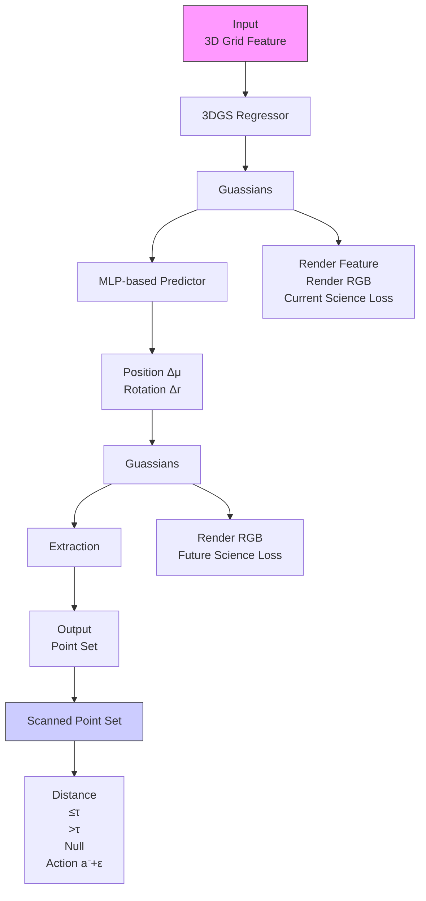
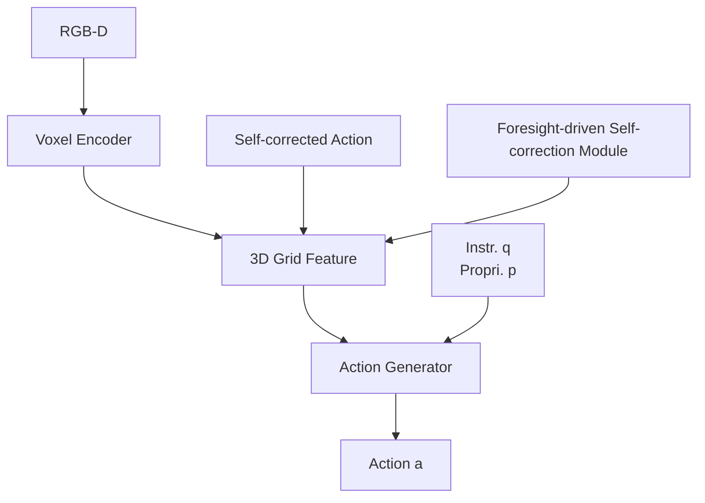

# Self-Correcting Robot Manipulation via Gaussian-Splatted Foresight

Shaohui Pan $^{1,2}$ , Yong Xu $^{1,3,4}$ , Ruotao Xu $^{2,5*}$ , Zihan Zhou $^{6}$ , Si Wu $^{1,2}$ , Zhuliang Yu $^{2,7,8}$

$^{1}$ School of Computer Science and Engineering, South China University of Technology, Guangzhou, 510006, China

$^{2}$ Institute for Super Robotics (Huangpu), Guangzhou, 510000, China

$^{3}$ Guangdong Provincial Key Laboratory of Multimodal Big Data Intelligent Analysis, Guangzhou, 510000, China

$^{4}$ Peng Cheng Laboratory of Shenzhen, Shenzhen, 518120, China

$^{5}$ Key Laboratory of Large-Model Embodied-Intelligent Humanoid Robot, 510000, China

$^{6}$ School of College of Mathematics and Informatics, South China Agricultural University, Guangzhou, 510640, China

$^{7}$ Shien-Ming Wu School of Intelligent Engineering, South China University of Technology, Guangzhou, 510006, China

$^{8}$ School of Automation Science and Engineering, South China University of Technology, Guangzhou, 510006, China csshpan@mail.scut.edu.cn, {yxu, cswusi, zlyu}@scut.edu.cn, rtxu@superobots.com, zhouzihan@scau.edu.cn

# Abstract

Language-conditioned robotic manipulation in unstructured environments presents significant challenges for intelligent robotic systems. However, due to partial observation or imprecise action prediction, failure may be unavoidable for learned policies. Moreover, operational failures can lead to the robotic arm entering an untrained state, potentially causing destructive results. Consequently, the ability to detect and self-correct failures is crucial for the development of practical robotic systems. To address this challenge, we propose a foresight-driven failure detection and self-correction module for robot manipulation. By leveraging 3D Gaussian Splatting, we represent the current scene with multiple Gaussians. Subsequently, we train a prediction network to forecast the Gaussian representation of future scenes conditioned on planned actions. Failure is detected when the predicted future significantly deviates from the real observation after action execution. In such cases, the end-effector rolls back to the previous action to avoid an untrained state. Integrating this approach with the PerAct framework, we develop a self-correcting robot manipulation policy. Evaluations on ten RL-Bench tasks with 166 variations demonstrate the superior performance of the proposed method, which outperforms state-of-the-art methods by 12.0% success rate on average.

# Introduction

The development of autonomous agents for language-conditioned manipulation tasks (Shridhar, Manuelli, and Fox 2022; Lu et al. 2025) has been a long-standing objective in the field of intelligent robotics. These tasks are becoming increasingly challenging, with growing expectations for robots to perform long-horizon tasks in dynamic and unstructured environments. Due to potential occlusions, environmental disturbances, and control inaccuracies, failures are inevitable. Exacerbating this issue is the fact that, in many cases, while the failed action itself may not be destructive, it can lead to catastrophic results if the robot continues to operate under the assumption that the previous action

  
Figure 1: Illustration of the proposed self-correcting policy.

was successful. Moreover, since existing policies are typically learned from successful expert trajectories, they may fall into an untrained state after failures, potentially leading to further undesirable outcomes. Therefore, it is crucial to develop robust methods for failure detection and recovery.

Addressing the challenge of execution-level failure detection and self-correction, in this paper, we present a foresight-driven self-correction scheme for robot manipulation. The proposed method is predicated on a concise definition of failure: a discrepancy between the robot's actions and expected outcomes. Specifically, in the context of vision-based manipulation, we define failure as an inconsistency between the post-execution observation and the predicted visual outcome. To represent and predict future observations, we adopt the Gaussian Splatting model as a representation and develop a prediction network that outputs the transformation of the Gaussian distribution conditioned on a given action to predict the Gaussian model of the future scene. The reasons for using the Gaussian Splatting model are threefold: firstly, compared to 2D representations, the 3D Gaussian model includes three-dimensional geometric information, which can better simulate actions in 3D space for prediction. Secondly, compared to implicit representations, such as NeRF, the Gaussian Splatting method uses an explicit representation,

allowing the predicted transformation to be directly applied to it. Lastly, a recent method (Lu et al. 2025) learns a dynamic Gaussian Splatting model for semantic features for robot manipulation, further demonstrating the potential of using the Gaussian Splatting model for scene prediction. Based on the predicted Gaussian-splatted foresight, a failure detection and self-correction scheme is developed: a failure is detected when an obvious inconsistency between the predicted Gaussian model and the post-execution scene is observed, and the robot then rolls back to the previous step with perturbation for self-correction. As depicted in Fig. 1, following the broom's sweeping action, if subsequent observations indicate that the trash remains unswept, shown by the red box in the second column of images, the robotic arm reverts to its initial execution position to replan its action. In summary, the main contributions of this work are as follows

1. We develop a self-correcting scheme for robot manipulation, which includes a Gaussian splatting model as the current and future scene representation, and a prediction network to transform the current Gaussian model into the future one. By incorporating the inconsistency estimation and roll-back operation, we propose a self-correction scheme that can be applied to other existing language-conditioned robot manipulation methods.   
2. By incorporating the proposed self-correction scheme with the PerAct pipeline, we develop a self-correcting policy for robot manipulation, which is capable of failure detection and recovery. An evaluation through extensive experiments involving 10 tasks with 166 variations demonstrates that our method surpasses the state-of-the-art by achieving a 12.0% higher success rate.

# Related Works

# Vision-language-action model

Conventional robot manipulation policies based on reinforcement learning mostly concentrate on a single task and a restricted set of tasks, typically within controlled environments. Recent advancements in multi-task robotic manipulation are making significant improvements in performing complex tasks and adapting to new scenarios. One of the cornerstones is the so-called Vision-Language-Action (VLAs) models, which handle multi-model inputs of vision and language and output robot actions to complete embodied tasks. The variety among the VLA models lies in the selection of the visual and language encoders, and fusion strategy. CLIPort (Shridhar, Manuelli, and Fox 2022) uses CLIP's vision encoder and the Transporter for vision encoder, where the former extracts the semantic information while the latter extracts spatial information. The CLIP language encoder also is used to encode the language instruction and guide the output action. BC-Z (Jang et al. 2022) uses the USE language encoder (Yang et al. 2020) and ResNet18 image encoder (He et al. 2016). Besides, a human demonstration video is also accepted as instruction, with ResNet18 as the image encoder. The instruction embedding and the image embedding are combined through the FiLM layer (Perez et al. 2018), culminating in the generation of actions. RT-1 (Brohan et al. 2023) shares similarities with BC-Z but uses a vision encoder based on the more efficient EfficientNet (Tan and Le 2019). Additionally, RT-1 replaces the MLP action decoder in BC-Z with a Transformer decoder, producing discretized actions. Q-Transformer (Chebotar et al. 2023) extends RT-1 (Brohan et al. 2023) by introducing autoregressive Q-functions. In contrast to RT-1, which learns expert trajectories through imitation learning, Q-Transformer adopts Q-learning method. Multi-view perception is also considered in VLA models. Hiveformer (Guhur et al. 2023a) maintains the full observation history for a language-conditioned policy. Perceiver-Actor (Shridhar, Manuelli, and Fox 2023a) feeds the input to the model comprising voxel maps reconstructed from RGB-D images, while the output corresponds to the best voxel for guiding the gripper's movement.

Large language model (LLM) is also considered for VLA models. RT-2 (Zitkovich et al. 2023) endeavors to harness the capabilities of large multi-modal models in robotics tasks, drawing inspiration from models like PaLI-X (Chen et al. 2023) and PaLM-E (Driess et al. 2023), followed by which, RT-X (Vuong et al. 2023) re-trained the VLA model using the newly introduced open-source large dataset, named Open X-Embodiment (OXE), which is orders of magnitude larger than previous datasets. RT-Trajectory (Gu et al. 2023) adopts trajectory sketches as policy conditions instead of relying on language conditions or goal conditions. RoboFlamingo (Li et al. 2023) adapts the existing VLM, Flamingo (Alayrac et al. 2022), to a robot policy by attaching an LSTM-based policy head to the VLM. VoxPoser (Huang et al. 2023) employs LLM and VLM to create two 3D voxel maps that represent affordance and constraint. LLM translates language instructions into executable code, invoking VLM to obtain object coordinates. Based on the composed affordance and constraint maps, VoxPoser employs model predictive control to generate a feasible trajectory for the robot arm's end-effector. Octo (Team et al. 2024) introduces a transformer-based diffusion policy characterized by an open-framework design, allowing for flexible connections from different task definition encoders, observation encoders, and action decoders to the Octo Transformer. Note that these methods rely on the self-collected and public dataset with a large number of trajectories. However, action after a mistake is usually not included in the collected trajectories, preventing the learned policy from acting correctly when a mistake is made.

# Visual representation for robot manipulation

The visual representation is one of the keys for vision-based manipulation. The most direct method is to capture the current view using RGB or RGB-D camera (Shridhar, Manuelli, and Fox 2022; Jang et al. 2022). However, the perception with only a single view unavoidably suffers from the occlusion problem and raises the challenge of recognizing the target. To address this problem, RVT (Goyal et al. 2023) captures multi-view images and encodes them with a view transform for visual representation. RT-1 (Brohan et al. 2023) uses a current-history video as input, which also provides multi-view information. InstructRL (Hu and Sadigh 2023) and Hiveformer (Guhur et al. 2023a) directly passed

2D visual tokens through a multi-modal transformer to decode gripper actions but struggled to handle complex manipulation tasks due to the lack of geometric understanding. However, they still struggle to handle complex manipulation tasks due to the lack of geometric understanding. To incorporate 3D information beyond images, PerAct transforms the input into voxel maps reconstructed from RGB-D images, while the output corresponds to the best voxel for guiding the gripper's movement. Similarly, ACT3D maps 2D features into 3D voxels and fed the voxel tokens into a PerceiverIO-based transformer policy, demonstrating impressive performance in a variety of manipulation tasks.

However, perceptive methods heavily rely on seamless camera overlay for comprehensive 3D understanding, which makes them less effective in unstructured environments. To address this issue, the reconstructive methods have gained attention recently. Li et al. (Li et al. 2022) combined NeRF and time contrastive learning to embed 3D geometry and learn fluid dynamics within an autoencoder framework. GN-Factor (Ze et al. 2023) optimized a generalizable NeRF with a reconstruction loss besides behavior cloning and showed effective improvement in both simulated and real scenarios. Aiming at faster reconstruction and perception, 3D Gaussian Splatting (3DGS) is also considered (Lu et al. 2025) for visual representation, which relates the semantic features with 3D Gaussian and fed them into action decoder. It is important to note that though both methods involve dynamic Gaussian Splatting, key differences exist between the proposed method and the method presented by Lu et al. Lu et al.'s method uses dynamic Gaussian Splatting to generate semantic features and feeds them into the PercevieIO module, while the proposed method uses the Gaussian model to generate a future scene for comparison and failure detection. Additionally, Lu et al.'s method is not capable of self-correction, while our proposed method includes failure detection and self-correction, which can be incorporated with other existing language-conditioned robot manipulation methods.

# Self-correction for robotic manipulation

Early investigations into self-correction techniques within the domain of robotic manipulation predominantly concentrated on robot navigation (Carsten, Ferguson, and Stentz 2006; Connell and La 2017). In scenarios where environmental changes or unforeseen obstacles arise during locomotion, it is imperative for robots to dynamically modify their pre-determined trajectories. Adaptive path generation is crucial to maintaining unimpeded progression toward their designated objectives despite potential disruptions. Recent advancements in self-correction for robotic manipulation (Li et al. 2024; Lin et al. 2024; Skreta et al. 2024; Luo 2024) have been significantly driven by the superior reasoning capabilities of multimodal large models. Skreta et al. (Skreta et al. 2024) utilizes post-action visual inputs and textual instructions processed by a multimodal large model to evaluate whether the current state aligns with the target objectives. If the goals are unmet, the system initiates a replanning process. These technologies generally necessitate little to no fine-tuning to attain effective performance, predominantly leveraging the inherent inferential capabilities of open-source large models. However, they are optimally suited for straightforward tasks or actions, potentially exhibiting reduced efficacy when applied to specialized or complex tasks. Replandiffuser (Zhou et al. 2024) introduced a probabilistic model based on diffusion models, utilizing historical sequence data to determine the probability of replanning action sequences at each time step. The training of diffusion models requires a substantial amount of expert trajectories and is limited to single-task robotic manipulation. In this paper, we propose a novel approach to ascertain the necessity of replanning by predicting the environmental structural information of future keyframes, thereby assessing the attainment of objectives for subsequent keyframes.

# Approach

To address the challenge of self-correcting robot manipulation, we propose a foresight-driven self-correction mechanism that leverages predictive modeling of the future state using a Gaussian representation. Leveraging this self-correction scheme, we develop and implement a self-correcting robot manipulation framework. This section delineates the foresight-driven self-correction approach, followed by a detailed exposition of the self-correcting robot manipulation framework architecture.

# Foresight-driven self-correction

When action execution fails, existing methods often lack the capability for self-correction to complete the task and may even enter ‘untrained states’, which poses significant destructive results. To mitigate this issue, we propose a foresight-driven self-correction scheme, where a foresight with Gaussian splatting-based representation is adopted for failure detection. See Fig. 2 for an illustration.

Current scene estimation Given the observation of the current scene, we first infer a Gaussian-splatted scene representation, so that we can predict the future scene by manipulating the Gassuain model. Let o denote the current observation and $z = f_{\mathrm{sem}}(o)$ denote its latent feature extracted by some feature extractor $\phi(\cdot)$ . We leverage a learnable regressor $f_{reg}$ to infer the Gaussian distribution of geometric and semantic features. Then, the current scene can be represented by a N estimated Gaussian primitives $\Omega = \{g_i\}_{i=1}^N$ and, $g_i = (\mu_i, \Sigma_i, c_i, \alpha_i, h_i)$ , where $\mu_i, \Sigma_i$ represent the position and variance of the Gaussian primitive, $c_i$ denotes the color, $\alpha_i$ denotes the opacity and $h_i$ denotes the corresponding semantic feature. The Gaussian representation $\Omega$ is estimated by the regression function $f_{reg}$ conditioned on the given feature as

$$
\boldsymbol {\Omega} = f _ {\text { reg }} (\boldsymbol {z}; \theta_ {\text { reg }}). \tag {1}
$$

During the training process, we acquire multi-view images $\{I_m^j\}_{m=1}^M$ from the simulation. To ensure optimal representation of the current scene, we enhance the similarity between the re-rendered view for $\Omega$ and observed view images. For each $m$ -th view, the pixel value of the $p$ th pixel is

flowchart

Figure 2: Illustration of the proposed foresight-driven self-correction module.

estimated using $\alpha$ -blending as follows:

$$
\tilde {I} _ {m} (\boldsymbol {p}) = \sum_ {i = 1} ^ {N} \omega_ {i} \boldsymbol {c} _ {i} \prod_ {j = 1} (1 - \omega_ {j}), \tag {2}
$$

where $\omega_{i} = \alpha_{i}e^{-\frac{1}{2} (\pmb {p} - \pmb{\mu}_{i,m})\pmb{\Sigma}_{i,m}^{-1}(\pmb {p} - \pmb{\mu}_{i,m})}$ ,

where $\mu_{i,m}$ and $\Sigma_{i,m}$ represent the position and variance of the i-th Gaussian projected on the m-th view, respectively. To further enhance the similarity between the re-rendered feature maps and the features of simulated views, the splatting process is also applied to semantic features as follows:

$$
\tilde {H} _ {m} (\boldsymbol {p}) = \sum_ {i = 1} ^ {N} \omega_ {i} \boldsymbol {h} _ {i} \prod_ {j = 1} (1 - \omega_ {j}), \tag {3}
$$

where $\tilde{H}_{m}(\boldsymbol{p})$ denotes the pth feature vectore of the feature map $\tilde{H}_{m}$ . Then, the loss is estimated as

$$
\ell_ {c u r} = \sum_ {m = 1} ^ {M} | | \tilde {I} _ {m} - I _ {m} | | _ {F} ^ {2} + \lambda_ {\text {sem}} \sum_ {m = 1} ^ {M} (1 - \cos (\tilde {H} _ {m}, \psi (I _ {m})), \tag {4}
$$

where the first term denotes the color loss, the second term denotes the semantic loss, with $\lambda_{sem}$ serving to balance the weights. In our implementation, we employ the feature extractor from Stable Diffusion (Rombach et al. 2022) as $\psi(\cdot)$ .

Future scene prediction In robotic manipulation, all objects are treated as rigid bodies with intrinsic properties such as color, scale, opacity, and semantic features. Consequently, the future state of a scene can be viewed as the physical transformation of the current scene. To predict the future scene, we develop a prediction network conditioned on the given action a as

$$
(\Delta \boldsymbol {r} _ {i}, \Delta \boldsymbol {\mu} _ {i}) = f _ {\text { predict }} (\boldsymbol {g} _ {i}, \boldsymbol {a}; \theta_ {\text { predict }}), \tag {5}
$$

for $i = 1, \cdots, N$ . Then, the ith new Gaussian is estimated as

$$
\boldsymbol {\mu} _ {i} ^ {+} = \boldsymbol {\mu} _ {i} + \Delta \boldsymbol {\mu} _ {i}, \text { and } \boldsymbol {r} _ {i} ^ {+} = \boldsymbol {r} _ {i} + \Delta \boldsymbol {r} _ {i}. \tag {6}
$$

Then the $i$ th Gaussian of the predicted scene is estimated as $\pmb{g}_i^+ = (\pmb{\mu}_i^+, \pmb{r}_i \circ \Sigma_i, \pmb{c}_i, \alpha_i, \pmb{f}_i)$ , where $\pmb{r} \circ \Sigma_i$ denotes the new variation after the rotation $\pmb{r}_i$ . In the implementation,

Algorithm 1: Self-correction Algorithm   
1: Initialize Previous action $a^{-}$ ,  
2: Pre-execution observation $o, p, q$ ,  
3: Feature extraction $z \leftarrow f_{\text{sem}}(o)$ ,  
4: Action generation $a \leftarrow f_{\text{action}}(z, q, p)$ 5: Action execution and Post-execution observation:  
6: Execute $a$ 7: Observe $o^{+}$ 8: Estimate point cloud from observation: $\mathcal{P}^{+} \leftarrow o^{+}$ 9: Foresight prediction  
10: Estimate current Gaussians $\Omega \leftarrow f_{cur}(o, a)$ 11: Predict future Gaussians $\Omega^{+} \leftarrow f_{pre}(\Omega, a)$ 12: Predict point cloud from Gaussians: $\tilde{\mathcal{P}} \leftarrow \Omega^{+}$ 13: Failure detection and Self-correction  
14: Estimate distance $d \leftarrow (\tilde{\mathcal{P}}, \mathcal{P}^{+})$ 15: if $d > \tau$ then  
16: execute $a^{-} + \epsilon$ 17: end if

the rotation $\pmb{r}_i$ s are represented as quaternion for estimation and transformed into a rotation matrix for operation.

Similarly, we can also capture the multi-view images $\{I_{m}^{+}\}_{m=1}^{M}$ from the simulation for the post-execution scene. Let $\Omega^{+} = \{g_{i}^{+}\}_{i=1}^{N}$ denote the predicted Gaussians, we can also calculate re-rendered image $\tilde{I}_{m}^{+}$ s by substituting $\Omega^{+}$ into (2). We define the loss on the re-rendered foresight and post-execution observation as

$$
\ell_ {p r e} = \sum_ {m = 1} ^ {M} | | \tilde {I} _ {m} ^ {+} - I _ {m} ^ {+} | | _ {F} ^ {2} + \lambda_ {p} \mathcal {D} (\{\mu_ {i} ^ {+} \} _ {i = 1} ^ {N}, \mathcal {P} _ {g t}), \tag {7}
$$

which guides the prediction network. During training, we also employ Chamfer distance with the ground-truth point cloud $P_{gt}$ to optimize the position of the Gaussians.

Failure detection and self-correction Given the predicted Gaussian representation $\Omega^{+}$ , we can detect the action failure by comparing the predicted scene and the real post-execution observation. Once the observation is not consistent with the predicted scene, it can be viewed as a failure. In implementation, we use the Chamfer distance of the Gaussian and the observed point cloud as the measure of the

flowchart

Figure 3: Illustration of the self-correcting robot manipulation framework.

consistency between the prediction and observation, which is defined as

$$
d = \mathcal {D} (\{\mu_ {i} ^ {+} \} _ {i = 1} ^ {N}, \mathcal {P}), \tag {8}
$$

where $\mu^{+}$ represents the position of the predicted Gaussians, P denotes the observed point cloud, derived from the captured depth image, and D represents the Chamfer distance. It is noteworthy that we evaluate the similarity between point clouds rather than the similarity between rendered RGB views, as the geometric structure exhibits greater stability than RGB views, which are often affected by lighting conditions. Moreover, accurate RGB view reconstruction necessitates more precise Gaussian estimates, imposing a greater challenge on the regressor and predictor.

If the distance d exceeds a predefined threshold $\tau$ , it indicates that there may be significant errors in the action execution. Let $a^{-}$ denote the previous state. Once a failure is detected, the robot is forced to roll back to the previous state, as $(a^{-} + \epsilon)$ . A small Gaussian perturbation is added to prevent the model from reverting to the same state. See also Alg. 1 for the pseudocode.

# Forsight-driven self-correcting manipulation

With the Gaussian splatting-based Self-Correction scheme, we built a self-correcting robot manipulation method upon the PerAct framework (Shridhar, Manuelli, and Fox 2023b). See Fig. 3 for an illustration. Given the current observation $o = (\boldsymbol{I}, \boldsymbol{D})$ , including the RGB image I and the depth image D, the semantic feature Z is estimated as

$$
\boldsymbol {z} = f _ {\text { sem }} (\boldsymbol {o}; \theta_ {\text { sem }}). \tag {9}
$$

In our implementation, we employ a multi-scale voxel map to facilitate feature extraction. Then, the action is predicted by a transformer conditioned on the z, the instruction q and the state of the end-effector p

$$
\boldsymbol {a} = f _ {\text { action }} (\boldsymbol {z}, \boldsymbol {q}, \boldsymbol {p}). \tag {10}
$$

For a comprehensive description of the robot manipulation backbone, including the feature extractor $f_{sem}$ and action generator $f_{action}$ , please refer to the supplementary materials. We implement a two-phase scheme for training. During the first phase, we train the robot manipulation framework excluding the self-correction module. n our implementation, the action a is defined as $(a_{\mathrm{pos}}, a_{\mathrm{angle}}, a_{\mathrm{grip}}, a_{\mathrm{coll}})$ , encompassing position, angle, gripper openness, and collision avoidance. Then, the first phase optimizes the cross-entropy loss like a classifier:

$$
\begin{array}{l} \ell_ {\text { action }} = - \mathbb {E} _ {\boldsymbol {y} _ {\text { pos }}} [ \log \sigma (\boldsymbol {a} _ {\text { pos }}) ] - \mathbb {E} _ {\boldsymbol {y} _ {\text { angle }}} [ \log \sigma (\boldsymbol {a} _ {\text { angle }}) ] \\ - \mathbb {E} _ {\boldsymbol {y} _ {\text { grip }}} [ \log \sigma (\boldsymbol {a} _ {\text { grip }}) ] - \mathbb {E} _ {\boldsymbol {y} _ {\text { coll }}} [ \log \sigma (\boldsymbol {a} _ {\text { coll }}) ], \\ \end{array}
$$

where $\sigma(\cdot)$ is the softmax function and $y_{pos}$ , $y_{angle}$ , $y_{grip}$ , $y_{coll}$ denote is the ground-truth one-host encoding. Then, in the second phase, the robot manipulation framework is trained together with the self-correction module, with a total loss as

$$
\ell_ {\text { total }} = \ell_ {\text { action }} + \lambda_ {\text { cur }} \ell_ {\text { cur }} + \lambda_ {\text { pre }} \ell_ {\text { pre }}. \tag {11}
$$

where $\ell_{cur}$ and $\ell_{pred}$ are introduced in (4) and (7) in the self-correction scheme for the learning of the regression network and prediction network. The coefficients $\lambda_{cur}$ and $\lambda_{pre}$ modulate the relative importance of these terms.

# Experiments

# Experiment setup

Data collection Following (Shridhar, Manuelli, and Fox 2023b; Ze et al. 2023; Gervet et al. 2023), we conduct our experiments on CoppeliaSim simulation environment (Rohmer, Singh, and Freese 2013) and the Bullet physics engine (Coumans 2015), maintaining consistent task scene layouts as in previous works. Following the GNFActor (Ze et al. 2023), we collected 20 episodes of demonstrations for each of 10 challenging language-conditioned manipulation tasks in the dataset collected PerAct (Shridhar, Manuelli, and Fox 2023b), including 166 variations in object properties and scene arrangements. To further validate the performance of the proposed method, we collected 20 episodes of demonstrations for each of 6 tasks from the HiveFormer (Guhur et al. 2023b) dataset, all of which are commonly encountered in real-life scenarios. For visual observation, RGB-D images were captured using a single front camera with a resolution of $128 \times 128$ . To facilitate the training of the Gaussian Splatting, we utilized additional $M = 20$ camera views to provide RGB images for supervision.

Implementation details Our experiments were conducted on the PyTorch deep learning platform utilizing two A800 GPUs. The hyper-parameters for the experiment are configured as follows: the physical workspace spans $1m^{3}$ with a voxel resolution of 100, the number of points in the scanned pointcloud is set to 16384, the number of Gaussian primitives N is set as 16384, the Gaussian noise $\epsilon$ is sampled from a normal Gaussian distribution scaled by 0.001, and the predefined threshold $\tau$ is set to 0.40. We employ SE(3) augmentation (Shridhar, Manuelli, and Fox 2023b; Ze et al. 2023; Lu et al. 2025) for expert demonstrations in the training set. All comparative methods were trained on PerAct's dataset for 300000 iterations, while the HiveFormer dataset for 100000 iterations, both with a batch size of 2. The LAMB optimizer (You et al. 2019) was used with an initial learning rate of $(5 \times 10^{-4})$ with a cosine scheduler. During training, the model is trained with 3000 iterations in the first phase, i.e. with only action loss $\ell_{action}$ , and then with the remained number of iterations in the second phase.

<table><tr><td>Method / Task</td><td>close jar</td><td>open drawer</td><td>sweep to dustpan</td><td>meat off grill</td><td>turn tap</td><td>slide block</td><td>put in drawer</td></tr><tr><td>PerAct</td><td>12.0</td><td>36.0</td><td>12.0</td><td>48.0</td><td>36.0</td><td>12.0</td><td>12.0</td></tr><tr><td>GNFactor</td><td>4.0</td><td>64.0</td><td>64.0</td><td>72.0</td><td>48.0</td><td>0.0</td><td>24.0</td></tr><tr><td>ManiGaussian</td><td>24.0</td><td>76.0</td><td>60.0</td><td>64.0</td><td>48.0</td><td>28.0</td><td>24.0</td></tr><tr><td>ACT3D</td><td>40.0</td><td>76.0</td><td>40.0</td><td>72.0</td><td>64.0</td><td>8.0</td><td>40.0</td></tr><tr><td>Ours</td><td>44.0</td><td>68.0</td><td>44.0</td><td>92.0</td><td>68.0</td><td>72.0</td><td>24.0</td></tr><tr><td>Method / Task</td><td>reach drag</td><td>push buttons</td><td>stack blocks</td><td>Average</td><td>Planning</td><td>Long</td><td>Tools</td></tr><tr><td>PerAct</td><td>32.0</td><td>20.0</td><td>4.0</td><td>22.4 (21.7±0.5)</td><td>34.0</td><td>8.0</td><td>18.7</td></tr><tr><td>GNFactor</td><td>28.0</td><td>28.0</td><td>12.0</td><td>34.4 (32.8±1.2)</td><td>50.0</td><td>18.0</td><td>30.7</td></tr><tr><td>ManiGaussian</td><td>88.0</td><td>16.0</td><td>16.0</td><td>44.4 (43.5±1.0)</td><td>40.0</td><td>20.0</td><td>58.7</td></tr><tr><td>ACT3D</td><td>60.0</td><td>8.0</td><td>8.0</td><td>41.6 (41.3±0.2)</td><td>40.0</td><td>24.0</td><td>36.0</td></tr><tr><td>Ours</td><td>96.0</td><td>36.0</td><td>20.0</td><td>56.4 (55.6±0.7)</td><td>64.0</td><td>22.0</td><td>70.7</td></tr></table>

Table 1: Success rates on Peract's dataset. Bold indicates the best results while Underline denotes the second-ranked performance. The ‘Average’ metric represents the mean success rate across all 10 tasks. Additionally, the ‘Planning,’ ‘Long,’ and ‘Tools’ represent the average success rate for different categories of tasks.

<table><tr><td>Method / Task</td><td>basketball hoop</td><td>change clock</td><td>phone on base</td><td>put rubbish</td><td>stack wine</td><td>turn oven on</td><td>Average</td></tr><tr><td>PerAct</td><td>32.0</td><td>24.0</td><td>36.0</td><td> $\underline{48.0}$ </td><td> $\underline{28.0}$ </td><td>28.0</td><td>32.7 (31.5±1.2)</td></tr><tr><td>GNFactor</td><td> $\underline{56.0}$ </td><td> $\underline{44.0}$ </td><td>56.0</td><td>44.0</td><td>12.0</td><td>28.0</td><td>40.0 (39.7±1.4)</td></tr><tr><td>ManiGaussian</td><td>36.0</td><td> $\underline{36.0}$ </td><td>68.0</td><td> $\underline{92.0}$ </td><td>8.0</td><td> $\underline{36.0}$ </td><td>46.0 (44.4±2.2)</td></tr><tr><td>Ours</td><td> $\underline{72.0}$ </td><td>28.0</td><td> $\underline{84.0}$ </td><td>92.0</td><td> $\underline{40.0}$ </td><td> $\underline{40.0}$ </td><td> $\underline{59.3}$  (56.5±2.4)</td></tr></table>

Table 2: Success rates on HiveFormer's dataset. Bold indicates the best performance, while underline denotes the second-ranked performance. The 'Average' metric represents the mean success rate across all 6 tasks.

Evaluation metrics Following the previous works, we utilize success rate as the evaluation metric. When the obtained reward is 1.0, the test episode is considered successfully completed; otherwise, it is deemed unsuccessful. To differentiate the testing focus across various tasks on PerAct dataset, we compute the average success rate for the following categories:

- The ‘Planning’ group comprises tasks with multiple sub-goals, such as meat off grill and push buttons.   
- The ‘Long’ group includes tasks that require more than 10 macro-steps to complete, such as stack blocks and put item in drawer.   
- The ‘Tools’ group is a specific subset of planning tasks where the robot must grasp an object to interact with the target object, including slide block to target, reach and drag and sweep to dustpan.   
- The ‘Motion’ group necessitates precise grasping, exemplified by the task turn tap.   
- The ‘Screw’ group involves tasks requiring screwing actions, such as close jar.   
- The ‘Occlusion’ group demands geometric reasoning, as in the task open drawer.

# Performance evaluation

Quantitative analysis In this section, we compare the proposed model with several state-of-the-art multi-task approaches on Peract's and HiveFormer's datasets. These approaches include PerAct (Shridhar, Manuelli, and Fox 2023b), GNFActor (Ze et al. 2023), ManiGaussian (Lu et al.

2025), and ACT3D (Gervet et al. 2023). We evaluate 25 episodes per task at the final checkpoint utilizing 3 random seeds across 10 challenging tasks. The mean and standard value of the success rates are reported as (mean ± std), and the highest average performance is also reported. As demonstrated in Table 1, our method surpasses existing approaches, achieving the highest success rate in 7 out of 10 tasks and ranking within the top two in 9 tasks. The average success rate across these tasks is 56.4%, exceeding the previous best model by 12.0%. Specifically, for the 'Planning' group, which involves the coordination of multiple sub-goals, our method shows a substantial improvement of 14.0%; For the 'Tools' group, which requires using tools to complete objectives, our method demonstrates a substantial improvement of 12.0%. Furthermore, our approach achieves competitive performance on long-horizon tasks within the 'Long' category. As presented in table 2, our method achieves the highest success rate in 5 out of 6 tasks and the average success rate across these tasks is 59.3%, exceeding the previous best model by 13.3%.

Qualitative analysis Figure 4 illustrates the qualitative results obtained from our method and state-of-the-art approaches for novel view synthesis on two tasks, namely stack blocks and close jar. The presented results demonstrate the superior visual observation predicted by our proposed method. In both tasks, the proposed method can retain multiple small objects on the table within the red circle in stack blocks and exhibit a clearer table edge within the red circle in close jar. Figure 5 presents the predicted point clouds of future scene structure, including target and predicted point

<table><tr><td>Category</td><td>Planning</td><td>Long</td><td>Tools</td><td>Motion</td><td>Screw</td><td>Occlusion</td><td>Average</td></tr><tr><td>w/o self-corection</td><td>32.0</td><td>20.0</td><td>58.7</td><td>52.0</td><td>12.0</td><td>36.0</td><td> $38.0 (36.0 \pm 1.8)$ </td></tr><tr><td>w/ self-corection</td><td>64.0</td><td>22.0</td><td>70.7</td><td>68.0</td><td>44.0</td><td>68.0</td><td> $56.4 (55.6 \pm 0.7)$ </td></tr></table>

Table 3: Ablation study. The comparison between the models without and with self-correction on PerAct's dataset.

Figure 4: The visualization of rendered images generated by our method, ManiGaussian, and GNFActor.   
  
Target

  
Predict

  
Target

  
Predict   
Figure 5: The visualization of the predicted point cloud.

clouds for the tasks open drawer and turn tap. The visual results reveal that the proposed method effectively predicts the spatial state information of the robotic arm at future time steps, providing a robust foundation for the implementation of the self-correcting mechanism.

# Analysis and discussion

Ablation study To evaluate the efficacy of the proposed self-correction scheme, we conducted a comparative analysis between the baseline framework, designated as ‘w/o self-correction’, and the proposed self-correcting framework, designated as ‘w/ self-correction’ across ten selected tasks in PerAct’s dataset. The self-correcting framework demonstrates an approximately 18.0% improvement over the baseline framework, demonstrating the significant benefit of incorporating the proposed self-correction mechanism.

Robustness analysis To evaluate environmental robustness, we conducted comparative experiments on the Colosseum benchmark (Pumacay et al. 2024). The evaluation protocol comprised 25 demonstration episodes for two manipulation tasks: open drawer and reach and drag. We evaluate the model against environmental variations including light color, object color, object texture, and table color. Quantitative results presented in Table 4 demonstrate the performance across these environmental perturbations. The success rates indicate that our approach exhibits enhanced ro-

<table><tr><td>Method / Perturb.</td><td>light color</td><td>object color</td><td>object texture</td><td>table color</td></tr><tr><td>PerAct_A</td><td>20.0</td><td>20.0</td><td>12.0</td><td>32.0</td></tr><tr><td>GNFactor_A</td><td>36.0</td><td>36.0</td><td>32.0</td><td>32.0</td></tr><tr><td>Ours_A</td><td>64.0</td><td>64.0</td><td>52.0</td><td>64.0</td></tr><tr><td>PerAct_B</td><td>24.0</td><td>24.0</td><td>16.0</td><td>28.0</td></tr><tr><td>GNFactor_B</td><td>16.0</td><td>16.0</td><td>8.0</td><td>20.0</td></tr><tr><td>Ours_B</td><td>96.0</td><td>92.0</td><td>92.0</td><td>84.0</td></tr></table>

Table 4: Robustness analysis on Colosseum's benchmark. The perturbation factors constitute the variable elements within the working environment. ‘A’ and ‘B’ respectively denote tasks open drawer and reach and drag.

<table><tr><td>Threshold</td><td>0.25</td><td>0.30</td><td>0.35</td><td>0.40</td><td>0.45</td><td>0.50</td></tr><tr><td>SR (%)</td><td>43.9</td><td>51.2</td><td>52.0</td><td>56.4</td><td>50.0</td><td>53.6</td></tr></table>

Table 5: Comparative analysis on the distance threshold. The success rates (SR) on the PerAct's dataset with different $\tau$ are reported.

bustness compared to other methods (GNFactor and PerAct) under all investigated perturbation conditions.

Sensitivity analysis of threshold $\tau$ To investigate the impact of the Chamfer distance threshold $\tau$ , we evaluated performance across 10 representative tasks from the Per-Act dataset. The results are detailed in Table 5, where the proposed method maintained success rates exceeding 50% across threshold values ranging from 0.3 to 0.5, suggesting a low sensitivity to the choice of the threshold.

# Conclusion

In this paper, we introduce a novel self-correcting scheme for robot manipulation that addresses the critical challenge of failure detection and recovery in language-conditioned robotic tasks. Our approach leverages 3D Gaussian Splatting for scene representation and incorporates a prediction network for forecasting future scene states. Incorporating this scheme with the PerAct pipeline, we develop a robust self-correcting policy capable of failure self-correction. Comprehensive experiments across ten tasks with 166 variations demonstrate that our method significantly outperforms state-of-the-art techniques, achieving a 12.0% higher success rate. In the future, our research would transcend execution-error detection and correction, advancing towards an exploration of the failure detection and correction during long-term planning, leveraging the advanced reasoning capabilities of LLM to augment robotic decision-making paradigms.

# Acknowledgements

The authors would like to acknowledge the partial support from National Natural Science Foundation of China under Grants 62401210, 62072189, 62072188 and 62472179, Natural Science Foundation of Guangdong Province under Grants 2022A1515011087, National Key Research and Development Program of China under Grants 2024YFE0105400, National Foreign Expert Project of the Ministry of Science and Technology of China under Grants G2023163015L, Guangzhou Science and Technology Plan Project - Key R&D Plan under Grants 2024B01W0007, Guangdong Basic and Applied Basic Research Foundation under Grants 2023A1515110646, 2024A04J01938 and 2024A1515011437, Guangzhou Basic and Applied Basic Research Project under Grants 2024A04J01938, The Technology Innovation 2030 under Grants 2022ZD0211700, TCL Science and Technology Innovation Fund under Grants 20231752.

# References

Alayrac, J.-B.; Donahue, J.; Luc, P.; Miech, A.; Barr, I.; Hasson, Y.; Lenc, K.; Mensch, A.; Millican, K.; Reynolds, M.; et al. 2022. Flamingo: a visual language model for few-shot learning. Advances in neural information processing systems, 35: 23716–23736.   
Brohan, A.; Brown, N.; Carbajal, J.; Chebotar, Y.; Dabis, J.; Finn, C.; and et al. 2023. RT-1: Robotics Transformer for Real-World Control at Scale. arXiv:2212.06817.   
Carsten, J.; Ferguson, D.; and Stentz, A. 2006. 3d field d: Improved path planning and replanning in three dimensions. In 2006 IEEE/RSJ international conference on intelligent robots and systems, 3381–3386. IEEE.   
Chebotar, Y.; Vuong, Q.; Hausman, K.; Xia, F.; Lu, Y.; Irpan, A.; and et al. 2023. Q-Transformer: Scalable Offline Reinforcement Learning via Autoregressive Q-Functions. In Proceedings of The 7th Conference on Robot Learning, 3909–3928. PMLR.   
Chen, X.; Djolonga, J.; Padlewski, P.; Mustafa, B.; Changpinyo, S.; Wu, J.; Ruiz, C. R.; Goodman, S.; Wang, X.; Tay, Y.; et al. 2023. Pali-x: On scaling up a multilingual vision and language model. arXiv preprint arXiv:2305.18565.   
Connell, D.; and La, H. M. 2017. Dynamic path planning and replanning for mobile robots using RRT. In 2017 IEEE International Conference on Systems, Man, and Cybernetics (SMC), 1429–1434. IEEE.   
Coumans, E. 2015. Bullet physics simulation. In ACM SIGGRAPH 2015 Courses, 1.   
Driess, D.; Xia, F.; Sajjadi, M. S.; Lynch, C.; Chowdhery, A.; Ichter, B.; Wahid, A.; Tompson, J.; Vuong, Q.; Yu, T.; et al. 2023. PaLM-E: an embodied multimodal language model. In Proceedings of the 40th International Conference on Machine Learning, 8469–8488.   
Gervet, T.; Xian, Z.; Gkanatsios, N.; and Fragkiadaki, K. 2023. Act3d: 3d feature field transformers for multi-task robotic manipulation. In 7th Annual Conference on Robot Learning.

Goyal, A.; Xu, J.; Guo, Y.; Blukis, V.; Chao, Y.-W.; and Fox, D. 2023. RVT: Robotic View Transformer for 3D Object Manipulation. In Proceedings of The 7th Conference on Robot Learning, 694–710. PMLR.   
Gu, J.; Kirmani, S.; Wohlfhart, P.; Lu, Y.; Arenas, M. G.; Rao, K.; and et al. 2023. RT-Trajectory: Robotic Task Generalization via Hindsight Trajectory Sketches. In Proc. IEEE Int. Conf. Learn. Representation.   
Guhur, P.-L.; Chen, S.; Pinel, R. G.; Tapaswi, M.; Laptev, I.; and Schmid, C. 2023a. Instruction-Driven History-Aware Policies for Robotic Manipulations. In Proceedings of The 6th Conference on Robot Learning, 175–187. PMLR.   
Guhur, P.-L.; Chen, S.; Pinel, R. G.; Tapaswi, M.; Laptev, I.; and Schmid, C. 2023b. Instruction-driven history-aware policies for robotic manipulations. In Conference on Robot Learning, 175–187. PMLR.   
He, K.; Zhang, X.; Ren, S.; and Sun, J. 2016. Deep residual learning for image recognition. In Proceedings of the IEEE conference on computer vision and pattern recognition, 770–778.   
Hu, H.; and Sadigh, D. 2023. Language instructed reinforcement learning for human-ai coordination. In International Conference on Machine Learning, 13584–13598. PMLR.   
Huang, W.; Wang, C.; Zhang, R.; Li, Y.; Wu, J.; and Fei-Fei, L. 2023. VoxPoser: Composable 3D Value Maps for Robotic Manipulation with Language Models. In 7th Annual Conference on Robot Learning.   
Jang, E.; Irpan, A.; Khansari, M.; Kappler, D.; Ebert, F.; Lynch, C.; Levine, S.; and Finn, C. 2022. BC-Z: Zero-Shot Task Generalization with Robotic Imitation Learning. In Proceedings of the 5th Conference on Robot Learning, 991–1002. PMLR.   
Li, X.; Liu, M.; Zhang, H.; Yu, C.; Xu, J.; Wu, H.; Cheang, C.; Jing, Y.; Zhang, W.; Liu, H.; Li, H.; and Kong, T. 2023. Vision-Language Foundation Models as Effective Robot Imitators. In Proc. IEEE Int. Conf. Learn. Representation.   
Li, X.; Zhang, M.; Geng, Y.; Geng, H.; Long, Y.; Shen, Y.; Zhang, R.; Liu, J.; and Dong, H. 2024. Manipllm: Embodied multimodal large language model for object-centric robotic manipulation. In Proceedings of the IEEE/CVF Conference on Computer Vision and Pattern Recognition, 18061–18070.   
Li, Y.; Li, S.; Sitzmann, V.; Agrawal, P.; and Torralba, A. 2022. 3d neural scene representations for visuomotor control. In Conference on Robot Learning, 112–123. PMLR.   
Lin, Y.; Li, C.; Ding, M.; Tomizuka, M.; Zhan, W.; and Althoff, M. 2024. Drplanner: Diagnosis and repair of motion planners for automated vehicles using large language models. IEEE Robotics and Automation Letters.   
Lu, G.; Zhang, S.; Wang, Z.; Liu, C.; Lu, J.; and Tang, Y. 2025. Manigaussian: Dynamic gaussian splatting for multitask robotic manipulation. In European Conference on Computer Vision, 349–366. Springer.   
Luo, F. 2024. Vision-Language Models for Robot Success Detection. Proceedings of the AAAI Conference on Artificial Intelligence, 38(21): 23750–23752.

Perez, E.; Strub, F.; de Vries, H.; Dumoulin, V.; and Courville, A. 2018. FiLM: Visual Reasoning with a General Conditioning Layer. Proceedings of the AAAI Conference on Artificial Intelligence, 32(1).   
Pumacay, W.; Singh, I.; Duan, J.; Krishna, R.; Thomason, J.; and Fox, D. 2024. The colosseum: A benchmark for evaluating generalization for robotic manipulation. arXiv preprint arXiv:2402.08191.   
Rohmer, E.; Singh, S. P.; and Freese, M. 2013. V-REP: A versatile and scalable robot simulation framework. In 2013 IEEE/RSJ international conference on intelligent robots and systems, 1321–1326. IEEE.   
Rombach, R.; Blattmann, A.; Lorenz, D.; Esser, P.; and Ommer, B. 2022. High-resolution image synthesis with latent diffusion models. In Proceedings of the IEEE/CVF conference on computer vision and pattern recognition, 10684–10695.   
Shridhar, M.; Manuelli, L.; and Fox, D. 2022. CLIPort: What and Where Pathways for Robotic Manipulation. In Proceedings of the 5th Conference on Robot Learning, 894–906. PMLR.   
Shridhar, M.; Manuelli, L.; and Fox, D. 2023a. Perceiver-Actor: A Multi-Task Transformer for Robotic Manipulation. In Proceedings of The 6th Conference on Robot Learning, 785–799. PMLR.   
Shridhar, M.; Manuelli, L.; and Fox, D. 2023b. Perceiver-actor: A multi-task transformer for robotic manipulation. In Conference on Robot Learning, 785–799. PMLR.   
Skreta, M.; Zhou, Z.; Yuan, J. L.; Darvish, K.; Aspuru-Guzik, A.; and Garg, A. 2024. Replan: Robotic replanning with perception and language models. arXiv preprint arXiv:2401.04157.   
Tan, M.; and Le, Q. 2019. Efficientnet: Rethinking model scaling for convolutional neural networks. In International conference on machine learning, 6105–6114. PMLR.   
Team, O. M.; Ghosh, D.; Walke, H.; Pertsch, K.; Black, K.; Mees, O.; and et al. 2024. Octo: An Open-Source Generalist Robot Policy. arXiv:2405.12213.   
Vuong, Q.; Levine, S.; Walke, H. R.; Pertsch, K.; Singh, A.; Doshi, R.; and et al. 2023. Open X-Embodiment: Robotic Learning Datasets and RT-X Models. In Towards Generalist Robots: Learning Paradigms for Scalable Skill Acquisition @ CoRL2023.   
Yang, Y.; Cer, D.; Ahmad, A.; Guo, M.; Law, J.; Constant, N.; Abrego, G. H.; Yuan, S.; Tar, C.; Sung, Y.-H.; et al. 2020. Multilingual Universal Sentence Encoder for Semantic Retrieval. In Proceedings of the 58th Annual Meeting of the Association for Computational Linguistics: System Demonstrations, 87–94.   
You, Y.; Li, J.; Reddi, S.; Hseu, J.; Kumar, S.; Bhojanapalli, S.; Song, X.; Demmel, J.; Keutzer, K.; and Hsieh, C.-J. 2019. Large batch optimization for deep learning: Training bert in 76 minutes. arXiv preprint arXiv:1904.00962.   
Ze, Y.; Yan, G.; Wu, Y.-H.; Macaluso, A.; Ge, Y.; Ye, J.; Hansen, N.; Li, L. E.; and Wang, X. 2023. GNFactor: Multi-Task Real Robot Learning with Generalizable Neural Fea

ture Fields. In Proceedings of The 7th Conference on Robot Learning, 284–301. PMLR.

Zhou, S.; Du, Y.; Zhang, S.; Xu, M.; Shen, Y.; Xiao, W.; Yeung, D.-Y.; and Gan, C. 2024. Adaptive online replanning with diffusion models. Advances in Neural Information Processing Systems, 36.

Zitkovich, B.; Yu, T.; Xu, S.; Xu, P.; Xiao, T.; Xia, F.; and et al. 2023. RT-2: Vision-Language-Action Models Transfer Web Knowledge to Robotic Control. In Proceedings of The 7th Conference on Robot Learning, 2165–2183. PMLR.