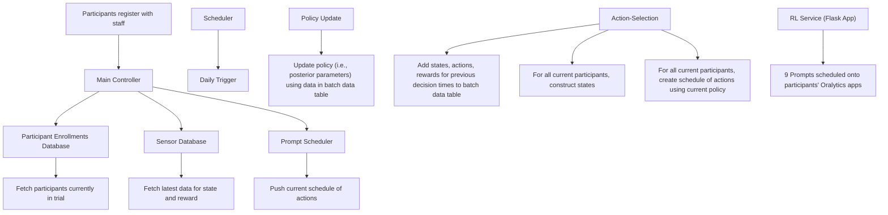

# A Deployed Online Reinforcement Learning Algorithm In An Oral Health Clinical Trial

Anna L. Trella $^{1}$ , Kelly W. Zhang $^{2}$ , Hinal Jajal $^{1}$ , Inbal Nahum-Shani $^{3}$ , Vivek Shetty $^{4}$ , Finale Doshi-Velez $^{1}$ , Susan A. Murphy $^{1}$

$^{1}$ Department of Computer Science, Harvard University

$^{2}$ Department of Mathematics, Imperial College London $^{3}$ Institute for Social Research, University of Michigan

$^{4}$ Schools of Dentistry & Engineering, University of California, Los Angeles

annatrella@g.harvard.edu, hjajal@g.harvard.edu, kelly.zhang@imperial.ac.uk, inbal@umich.edu, vshetty@ucla.edu,

finale@seas.harvard.edu, samurphy@g.harvard.edu

# Abstract

Dental disease is a prevalent chronic condition associated with substantial financial burden, personal suffering, and increased risk of systemic diseases. Despite widespread recommendations for twice-daily tooth brushing, adherence to recommended oral self-care behaviors remains sub-optimal due to factors such as forgetfulness and disengagement. To address this, we developed Oralytics, a mHealth intervention system designed to complement clinician-delivered preventative care for marginalized individuals at risk for dental disease. Oralytics incorporates an online reinforcement learning algorithm to determine optimal times to deliver intervention prompts that encourage oral self-care behaviors. We have deployed Oralytics in a registered clinical trial. The deployment required careful design to manage challenges specific to the clinical trials setting in the U.S. In this paper, we (1) highlight key design decisions of the RL algorithm that address these challenges and (2) conduct a re-sampling analysis to evaluate algorithm design decisions. A second phase (randomized control trial) of Oralytics is planned to start in spring 2025.

# 1 Introduction

Dental disease is a prevalent chronic condition in the United States with significant preventable morbidity and economic impact (Benjamin 2010). Beyond its associated pain and substantial treatment costs, dental disease is linked to systemic health complications such as diabetes, cardiovascular disease, respiratory illness, stroke, and adverse birth outcomes. To prevent dental disease, the American Dental Association recommends systematic, twice-a-day tooth brushing for two minutes (American Dental Association 2024). However, patient adherence to this simple regimen is often compromised by factors such as forgetfulness and lack of motivation (Chadwick, White, and Lader 2011; Yaacob et al. 2014).

mHealth interventions and tools can be leveraged to prompt individuals to engage in high-quality oral self-care behaviors (OSCB) between clinic visits. This work focuses on Oralytics, a mHealth intervention designed to improve OSCB for individuals at risk for dental disease. The intervention involves (i) a Bluetooth-enabled toothbrush to collect sensor data on an individual's brushing quality, and (ii) a smartphone application (app) to deliver treatments, one of which is engagement prompts to encourage individuals to remain engaged in improving their OSCB. See Figure 1 for screenshots from the Oralytics app. Oralytics includes multiple intervention components one of which is an online reinforcement learning (RL) algorithm which is used to learn, online, a policy specifying when it is most useful to deliver engagement prompts. The algorithm should avoid excessive burden and habituation by only sending prompts at times they are likely to be effective. Before integrating a mHealth intervention into broader healthcare programs, the effectiveness of the intervention is deployed and tested in a clinical trial. However, the clinical trial setting introduces unique challenges for the design and deployment of online RL algorithms as part of the intervention.

text_image

YOUR BRUSHING DATA
Day	Month.Year
April 21, 2023
DAILY AVG	09:37 AM	09:25 PM
15s
15s	16s
Time
2:02
Score
90
23s	20s
26s
SPECIAL	SDATA	PEOPLE
Do you have any gum pain today?
Yes	No
Great news. Did you know that often gum pain and bleeding is caused from brushing too hard? Be gentle with your gums when you brush.
SPECIAL	SDATA	PEOPLE

Figure 1: The Oralytics mHealth intervention facilitates high-quality oral self-care behaviors (OSCB) through engagement prompts (e.g., encouraging individuals to monitor their brushing behavior and Q&A) via the Oralytics app.

# 1.1 Design & Deployment Challenges in Clinical Trials

First, clinical trials, conducted with US National Institutes of Health (NIH) funding, must adhere to the NIH policy on

the dissemination of NIH-funded clinical trials (National Institutes of Health 2016; ClinicalTrials.gov 2024). This policy requires pre-registration of the trial in order to enhance transparency and replicability of trial results (Challenge 1). The design of the health intervention, including any online algorithms that are components of the intervention, must be pre-registered. Indeed, changing any of the intervention components, including the online algorithm, during the conduct of the trial, makes it difficult for other scientists to know exactly what intervention was implemented and to replicate any results. Thus to enhance transparency and replicability, the online algorithm should be autonomous. That is, the potential for major ad hoc changes that alter the pre-registered protocol should be minimized.

Second, while the online algorithm learns and updates the policy using incoming data throughout the trial, the algorithm has, in total, a limited amount of data to learn from. By design, each individual only receives the mHealth intervention for a limited amount of time. Therefore, the RL algorithm only has data on a limited number of decision times for an individual. This poses a challenge to the RL algorithm's ability to learn based on a small amount of data collected per individual (Challenge 2).

# 1.2 Contributions

In this paper, we discuss how we addressed these deployment challenges in the design of an online RL algorithm – a generalization of a Thompson-sampling contextual bandit (Section 3.3) - as part of the Oralytics intervention to improve OSCB for individuals at risk for dental disease. The RL algorithm (1) learns online from incoming data and (2) makes decisions for individuals in real time as part of the intervention. Recently, the Oralytics intervention was deployed in a registered clinical trial (Shetty 2022). Key contributions of our paper are:

1. We highlight key design decisions made for the Oralytics algorithm that deals with deploying an online RL algorithm as part of an intervention in a clinical trial (Section 4).   
2. We conduct a re-sampling analysis $^{1}$ using data collected during the trial to (1) re-evaluate design decisions made and (2) investigate algorithm behavior (Section 5).

Further details about the clinical trial and algorithm design decisions can be found in Nahum-Shani et al. (2024); Trella et al. (2024a).

# 2 Related Work

AI in Clinical Trials A large body of work exists that incorporates AI algorithms to conduct clinical trials. AI can improve trial execution by automating cohort selection (Glicksberg et al. 2018) and participant eligibility screening (Alexander et al. 2020; Haddad et al. 2021). Prediction algorithms can be used to assist in maintaining retention by identifying participants who are at high risk of dropping out of the trial (Pedersen et al. 2019; Teixeira et al. 2022).

<table><tr><td>Trial Start</td><td>September 2023</td></tr><tr><td>Trial End</td><td>July 2024</td></tr><tr><td>Num. Participants</td><td>79</td></tr><tr><td>Recruitment Rate</td><td>Around 5 per 2 weeks</td></tr><tr><td>Num. of Days Participant in Trial</td><td>70</td></tr><tr><td>Num. Decision Times Per Day</td><td>2</td></tr></table>

Table 1: Oralytics Clinical Trial Facts

Recently, generative models have been considered to create digital twins (Das, Wang, and Sun 2023; Chandra et al. 2024) of participants to predict participant outcomes or simulate other behaviors. Online algorithms in adaptive trial design (Van Norman 2019; Askin et al. 2023) can lead to more efficient trials (e.g., time and money saved, fewer participants required) by modifying the experiment design in real-time (e.g., abandoning treatments or redefining sample size). The above algorithms are part of the clinical trial design (experimental design) while in our setting, the RL algorithm is a component of the intervention.

Online RL Algorithms in mHealth Many online RL algorithms have been included in mHealth interventions deployed in a clinical trial. For example, online RL was used to optimize the delivery of prompts to encourage physical activity (Yom-Tov et al. 2017; Liao et al. 2019; Figueroa et al. 2021), manage weight loss (Forman et al. 2023), improve medical adherence (Lauffenburger et al. 2024), assist with pain management (Piette et al. 2022), reduce cannabis use amongst emerging adults (Ghosh et al. 2024a), and help people quit smoking (Albers, Neerincx, and Brinkman 2022). There are also deployments of online RL in mHealth settings that are not formally registered clinical trials (Zhou et al. 2018; Kumar et al. 2024). Many of these papers focus on algorithm design before deployment. Some authors (Kumar et al. 2024), compare outcomes between groups of individuals where each group is assigned a different algorithm or policy. Here we use a different analysis to inform further design decisions. Our analysis focuses on learning across time by a single online RL algorithm.

# 3 Preliminaries

# 3.1 Oralytics Clinical Trial

The Oralytics clinical trial (Table 1) enrolled participants recruited from UCLA dental clinics in Los Angeles $^{2}$ . Participants were recruited incrementally at about 5 participants every 2 weeks. All participants received an electric toothbrush with WiFi and Bluetooth connectivity and integrated sensors. Additionally, they were instructed to download the Oralytics app on their smartphones. The RL algorithm dynamically decided whether to deliver an engagement prompt for each participant twice daily, with delivery within an hour preceding self-reported morning and evening brushing

times. The clinical trial began in September 2023 and was completed in July 2024. A total of 79 participants were enrolled over approximately 20 weeks, with each participant contributing data for 70 days. However, due to an engineering issue, data for 7 out of the 79 participants was incorrectly saved and thus their data is unviable. Therefore, we restrict our analyses (in Section 5) to data from the 72 unaffected participants. For further details concerning the trial design, see Shetty (2022) and Nahum-Shani et al. (2024).

# 3.2 Online Reinforcement Learning

Here we consider a setting involving sequential decision-making for N participants, each with T decision times. Let subscript $i \in [1 : N]$ denote the participant and subscript $t \in [1 : T]$ denote the decision time. $S_{i,t}$ denotes the current state of the participant. At each decision time t, the algorithm selects action $A_{i,t}$ after observing $S_{i,t}$ , based on its policy $\pi_{\theta}(s)$ which is a function, parameterized by $\theta$ , that takes in input state s. After executing action $A_{i,t}$ , the algorithm receives a reward $R_{i,t}$ . In contrast to batch RL, where policy parameters are learned using previous batch data and fixed for all $t \in [1 : T]$ , online RL learns the policy parameters with incoming data. At each update time $\tau$ , the algorithm updates parameters $\theta$ using the entire history of state, action, and reward tuples observed thus far $H_{\tau}$ . The goal of the algorithm is to maximize the average reward across all participants and decision times, $E\left[\frac{1}{N \cdot T} \sum_{i=1}^{N} \sum_{t=1}^{T} R_{i,t}\right]$ .

# 3.3 Oralytics RL Algorithm

The Oralytics RL algorithm is a generalization of a Thompson-Sampling contextual bandit algorithm (Russo et al. 2018). The algorithm makes decisions at each of the T = 140 total decision times (2 every day over 70 days) on each participant. The algorithm state (Table 4) includes current context information about the participant collected via the toothbrush and app (e.g., participant OSCB over the past week and prior day app engagement). The RL algorithm makes decisions regarding whether or not to deliver an engagement prompt to each participant twice daily, one hour before a participant's self-reported usual morning and evening brushing times. Thus the action space is binary, with $A_{i,t} = 1$ denoting delivery of the prompt and $A_{i,t} = 0$ , otherwise.

The reward, $R_{i,t}$ , is constructed based on the proximal health outcome OSCB, $Q_{i,t}$ , and a tuned approximation to the effects of actions on future states and rewards. This reward design allows a contextual bandit algorithm to approximate an RL algorithm that models the environment as a Markov decision process. See Trella et al. (2023) for more details on the reward designed for Oralytics.

As part of the policy, contextual bandit algorithms use a model of the mean reward given state s and action a, parameterized by $\theta: r_{\theta}(s, a)$ . We refer to this as the reward model. While one could learn and use a reward model per participant i, in Oralytics, we ran a full-pooling algorithm (Section 4.3) that learns and uses a single reward model shared between all participants in the trial instead. In Oralytics, the reward model $r_{\theta}(s, a)$ is a linear regression model as in Liao et al. (2019) (See Appendix A.2). The Thompson-Sampling algorithm is Bayesian and thus the algorithm has a prior distribution $\theta \sim \mathcal{N}(\mu^{\mathrm{prior}}, \Sigma^{\mathrm{prior}})$ assigned to parameter $\theta$ . See Appendix A.3 for the prior designed for Oralytics.

The RL algorithm updates the posterior distribution for parameter $\theta$ once a week on Sunday morning using all participants' data observed up to that time; denote these weekly update times by $\tau$ . Let $n_{\tau}$ be the number of participants that have started the trial before update time $\tau$ , and $t(i,\tau)$ be a function that takes in participant i and current update time $\tau$ and outputs the last decision time for that participant. Then to update posterior parameters $\mu_{\tau}^{\mathrm{post}},\Sigma_{\tau}^{\mathrm{post}}$ , we use the history $\mathcal{H}_{\tau}:=\{(S_{i,t'},A_{i,t'},R_{i,t'})\}_{i=1,t'=1}^{n_{\tau},t(i,\tau)}$ . Thus the RL algorithm is a full-pooling algorithm that pools observed data, $H_{\tau}$ from all participants to update posterior parameters $\mu_{\tau}^{\mathrm{post}},\Sigma_{\tau}^{\mathrm{post}}$ of $\theta$ . Notice that due to incremental recruitment of trial participants, at a particular update time $\tau$ , not every participant will be on the same decision time index t and the history will not necessarily involve all N participants' data.

To select actions, the RL algorithm uses the latest reward model to model the advantage, or the difference in expected rewards, of action 1 over action 0 for a given state s. Since the reward model for Oralytics is linear, the model of the advantage is also linear:

$$
r _ {\theta} (s, a = 1) - r _ {\theta} (s, a = 0) = f (s) ^ {\top} \beta \tag {1}
$$

$f(s)$ denotes the features used in the algorithm's model for the advantage (See Table 4), and $\beta$ is the subset of parameters of $\theta$ corresponding to the advantage. For convenience, let $\tau = \tau(i,t)$ be the last update time corresponding to the current reward model used for participant $i$ at decision time $t$ . The RL algorithm micro-randomizes actions using $\mathbb{P}(f(s)^{\top}\beta >0|s = S_{i,t},\mathcal{H}_{\tau})$ and therefore forms action-selection probability $\pi_{i,t}$ :

$$
\pi_ {i, t} := \mathbb {E} _ {\beta \sim \mathcal {N} (\mu_ {\tau} ^ {\beta}, \Sigma_ {\tau} ^ {\beta})} \left[ \rho (f (s) ^ {\top} \beta) | s = S _ {i, t}, \mathcal {H} _ {\tau} \right] \tag {2}
$$

where $\mu_{\tau}^{\beta}$ and $\Sigma_{\tau}^{\beta}$ are the sub-vector and sub-matrix of $\mu_{\tau}^{post}$ and $\Sigma_{\tau}^{post}$ corresponding to advantage parameter $\beta$ . Notice that while classical posterior sampling uses an indicator function for $\rho$ , the Oralytics RL algorithm instead uses a generalized logistic function for $\rho$ to ensure that policies formed by the algorithm concentrate and enhance the replicability of the algorithm (Zhang et al. 2024).

Finally, the RL algorithm samples $A_{i,t}$ from a Bernoulli distribution with success probability $\pi_{i,t}$ :

$$
A _ {i, t} \mid \pi_ {i, t} \sim \operatorname{Bern} (\pi_ {i, t}) \tag {3}
$$

# 4 Deploying Oralytics

# 4.1 Oralytics Pipeline

Software Components Multiple software components form the Oralytics software service. These components are (1) the main controller, (2) the Oralytics app, and (3) the RL service. The main controller is the central coordinator of the Oralytics software system that handles the logic for (a) enrolling participants, (b) pulling and formatting sensor

flowchart

Figure 2: Oralytics End-to-End Pipeline.

data (i.e., brushing and app analytics data), and (c) communicating with the mobile app to schedule prompts for every participant. The Oralytics app is downloaded onto each participant's smartphone at the start of the trial. The app is responsible for (a) obtaining prompt schedules for the participant and scheduling them in the smartphone's internal notification system and (b) providing app analytics data to the main controller. The RL service is the software service supporting the RL algorithm to function properly and interact with the main controller. The RL service executes three main processes: (1) batch data update, (2) action selection, and (3) policy update.

The main controller and RL service were deployed on infrastructure hosted on Amazon Web Services (AWS). Specifically, the RL service was wrapped as an application using Flask. A daily scheduler job first triggered the batch data update procedure and then the action-selection procedure and a weekly scheduler job triggered the policy update procedure. The Oralytics app was developed for both Android and iOS smartphones.

End-to-End Pipeline Description We now describe interactions between clinical staff with components of the Oralytics software system and between software components (See Figure 2). The Oralytics clinical trial staff recruits and registers participants (Step 1). The registration process consists of the participant downloading the Oralytics app and staff verifying that the participant had at least one successful brushing session from the toothbrush. Successfully registered participants are then entered into the participant enrollment database maintained by the main controller. The main controller maintains this database to track participants entering and completing the trial (i.e., at 70 days).

Every morning, a daily scheduler job first triggers the batch data update process and then the action-selection process (Step 2). The RL service begins by fetching the list of participants currently in the trial (Step 3) and the latest sensor data (i.e., brushing and app analytics data) for current participants (Step 4) from the main controller. Notice that this data contains rewards to be associated with previous decision times as well as current state information. Rewards are matched with the correct state and action and these state, action, and reward tuples corresponding to previous decision times are added to the RL service's internal batch data table (Step 5). During the action-selection process, the RL service first uses the latest sensor data to form states for all current participants (Step 6). Then, the RL service uses these states and the current policy to create a new schedule of actions for all current participants (Step 7). These states and actions are saved to the RL internal database to be added to the batch data table during Step 5, the next morning. All new schedules of actions are pushed to the main controller and processed to be fetched (Step 8). When a participant opens their Oralytics app, the app fetches the new prompt schedule from the main controller and schedules prompts as notification messages in the smartphone's internal notification system (Step 9).

Every Sunday morning, a weekly scheduler job triggers the policy update process (Step 10). During this process, the RL system takes all data points (i.e., state, action, and reward tuples) in the batch data table and updates the policy (Step 11). Recall that the Oralytics RL algorithm is a Thompson sampling algorithm which means policy updates involve updating the posterior distribution of the reward model parameters (Section 3.3). The newly updated posterior distribution for the parameters is used to select treatments for all participants and all decision times for that week until the next update time.

Every morning, the Oralytics pipeline (Steps 6-8) produces a full 70-day schedule of treatment actions for each participant starting at the current decision time (as opposed to a single action for the current decision time). The schedule of actions is a key design decision for the Oralytics system that enhances the transparency and replicability of the trial (Challenge 1). Specifically, this design decision mitigates networking or engineering issues if: (1) a new schedule of actions fails to be constructed or (2) a participant does not obtain the most recent schedule of actions. We further see the impact of this design decision during the trial in Section 5.2.

# 4.2 Design Decisions To Enhance Autonomy and Thus Replicability

A primary challenge in our setting is the high standard for replicability and as a result the algorithm, and its components, should be autonomous (Challenge 1). However, unintended engineering or networking issues could arise during the trial. These issues could cause the intended RL system to function incorrectly compromising: (1) participant experience and (2) the quality of data for post-trial analyses.

One way Oralytics dealt with this constraint is by implementing fallback methods. Fallback methods are prespecified backup procedures, for action selection or updating, which are executed when an issue occurs. Fallback methods are part of a larger automated monitoring system (Trella et al. 2024b) that detects and addresses issues impacting or caused by the RL algorithm in real-time. Oralytics employed the following fallback methods:

(i) if any issues arose with a participant not obtaining the most recent schedule of actions, then the action for the current decision time will default to the action for that time from the last schedule pushed to the participant's app.   
(ii) if any issues arose with constructing the schedule of actions, then the RL service forms a schedule of actions where each action is selected with probability 0.5 (i.e., does not use the policy nor state to select action).   
(iii) for updating, if issues arise (e.g., data is malformed or unavailable), then the algorithm stores the data point, but does not add that data point to the batch data used to update parameters.

# 4.3 Design Decisions Dealing with Limited Decision Times Per Individual

Each participant is in the Oralytics trial for a total of 140 decision times, which results in a small amount of data collected per participant. Nonetheless, the RL algorithm needs to learn and select quality actions based on data from a limited number of decision times per participant (Challenge 2).

A design decision to deal with limited data is full-pooling. Pooling refers to clustering participants and pooling all data within a cluster to update the cluster's shared policy parameters. Full pooling refers to pooling all $N$ participants' data together to learn a single shared policy. Although participants are likely to be heterogeneous (reward functions are likely different), we chose a full-pooling algorithm like in Yom-Tov et al. (2017); Figueroa et al. (2021); Piette et al. (2022) to trade off bias and variance in the high-noise environment of Oralytics. These pooling algorithms can reduce noise and speed up learning.

We finalized the full-pooling decision after conducting experiments comparing no pooling (i.e., one policy per participant that only uses that participant's data to update) and full pooling. We expected the no-pooling algorithm to learn a more personalized policy for each participant later in the trial if there were enough decision times, but the algorithm is unlikely to perform well when there is little data for that participant. Full pooling may learn well for a participant's earlier decision times because it can take advantage of other participants' data, but may not personalize as well as a no-pooling algorithm for later decision times, especially if participants are heterogeneous. In extensive experiments, using simulation environments based on data from prior studies, we found that full-pooling algorithms achieved higher average OSCB than no-pooling algorithms across all variants of the simulation environment (See Table 5 in Trella et al. (2024a)).

# 5 Application Payoff

We conduct simulation and re-sampling analyses using data collected during the trial to evaluate design decisions made for our deployed algorithm. We focus on the following questions:

1. Was it worth it to invest in fallback methods? (Section 5.2)   
2. Was it worth it to run a full-pooling algorithm? (Section 5.3)   
3. Despite all these challenges, did the algorithm learn? (Section 5.4)

# 5.1 Simulation Environment

One way to answer questions 2 and 3 is through a simulation environment built using data collected during the Orai-lytics trial. The purpose of the simulation environment is to re-simulate the trial by generating participant states and outcomes close to the distribution of the data observed in the real trial. This way, we can (1) consider counterfactual decisions (to answer Q2) and (2) have a mechanism for resampling to assess if evidence of learning by the RL algorithm is due to random chance and thus spurious (to answer Q3).

For each of the N = 72 participants with viable data from the trial, we fit a model which is used to simulate OSCB outcomes. $Q_{i,t}$ given current state $S_{i,t}$ and an action $A_{i,t}$ . We also modeled participant app opening behavior and simulated participants starting the trial using the exact date the participant was recruited in the real trial. See Appendix B for full details on the simulation environment.

# 5.2 Was it worth it to invest in fallback methods?

During the Oralytics trial, various engineering or networking issues (Table 2) occurred that impacted the RL service's intended functionality. These issues were automatically caught

<table><tr><td>Issue ID</td><td>Date</td><td>Issue Type</td><td>Num. Participants Affected</td><td>Fallback Method</td></tr><tr><td>1</td><td>10/30/2023</td><td>Fail to read from internal database</td><td>1</td><td>2</td></tr><tr><td>2</td><td>11/16/2023</td><td>RL Service and endpoints went down</td><td>23</td><td>1</td></tr><tr><td>2</td><td>11/17/2023</td><td>RL Service and endpoints went down</td><td>23</td><td>1</td></tr><tr><td>3</td><td>11/17/2023</td><td>Fail to read from internal database</td><td>1</td><td>2</td></tr><tr><td>4</td><td>11/25/2023</td><td>Fail to get app analytics data from main controller</td><td>1</td><td>3</td></tr><tr><td>4</td><td>11/26/2023</td><td>Fail to get app analytics data from main controller</td><td>1</td><td>3</td></tr><tr><td>4</td><td>11/27/2023</td><td>Fail to get app analytics data from main controller</td><td>1</td><td>3</td></tr><tr><td>4</td><td>11/28/2024</td><td>Fail to get app analytics data from main controller</td><td>1</td><td>3</td></tr><tr><td>4</td><td>11/29/2024</td><td>Fail to get app analytics data from main controller</td><td>1</td><td>3</td></tr><tr><td>4</td><td>11/30/2024</td><td>Fail to get app analytics data from main controller</td><td>1</td><td>3</td></tr><tr><td>5</td><td>12/15/2024</td><td>Fail to get app analytics data from main controller</td><td>1</td><td>3</td></tr><tr><td>5</td><td>12/16/2024</td><td>Fail to get app analytics data from main controller</td><td>1</td><td>3</td></tr><tr><td>6</td><td>01/24/2024</td><td>RL Service and endpoints went down</td><td>24</td><td>1</td></tr><tr><td>6</td><td>01/25/2024</td><td>RL Service and endpoints went down</td><td>24</td><td>1</td></tr><tr><td>7</td><td>02/21/2024</td><td>Fail to read from internal database</td><td>5</td><td>2</td></tr></table>

Table 2: Engineering issues that impacted the RL service during the Oralytics trial.

bar

| Date       | Fallback Method (i) | Fallback Method (ii) | Fallback Method (iii) |
| ---------- | ------------------- | -------------------- | --------------------- |
| 10/30/2023 | 0                   | 1                    | 0                     |
| 11/16/2023 | 23                  | 0                    | 0                     |
| 11/17/2023 | 23                  | 0                    | 0                     |
| 11/25/2023 | 0                   | 0                    | 1                     |
| 11/26/2023 | 0                   | 0                    | 1                     |
| 11/27/2023 | 0                   | 0                    | 1                     |
| 11/28/2024 | 0                   | 0                    | 1                     |
| 11/29/2024 | 0                   | 0                    | 1                     |
| 11/30/2024 | 0                   | 0                    | 1                     |
| 12/15/2024 | 0                   | 0                    | 1                     |
| 12/16/2024 | 0                   | 0                    | 1                     |
| 01/24/2024 | 24                  | 0                    | 0                     |
| 01/25/2024 | 24                  | 0                    | 0                     |
| 02/21/2024 | 0                   | 5                    | 0                     |

Figure 3: Fallback methods executed over the Oralytics trial. All 3 fallback methods were executed at least once during the Oralytics trial to mitigate various issues such as the RL service going down or failure to obtain sensor data from the main controller to form current state information.

and the pre-specified fallback method was executed. Figure 3 shows that all 3 types of fallback methods were executed over the Oralytics trial. Notice that fallback method (i), made possible by our design decision to produce a schedule of actions instead of just a single action, was executed 4 times during the trial and mitigated issues for more participants than any other method. While defining and implementing fallback methods may take extra effort by the software engineering team, this is a worthwhile investment. Without fallback methods, the various issues that arose during the trial would have required ad hoc changes, to the RL algorithm reducing autonomy and thus replicability of the intervention.

# 5.3 Was it worth it to pool?

Due to the small number of decision points $(T = 140)$ per participant, the RL algorithm was a full-pooling algorithm (i.e., used a single reward model for all participants and updated using all participants' data). Even though be-

<table><tr><td>Pooling</td><td>Mean Value</td><td>First Quartile Value</td></tr><tr><td>Full Pooling</td><td>69.724 (0.047)</td><td>43.049 (0.091)</td></tr><tr><td>No Pooling</td><td>69.375 (0.047)</td><td>43.024 (0.088)</td></tr></table>

Table 3: Experiment results comparing a full-pooling online RL algorithm with a no-pooling one in the simulation environment. Value in each parenthesis is the standard error of the mean across 500 Monte Carlo repetitions.

fore deployment we anticipated that trial participants would be heterogeneous (i.e., have different outcomes to the intervention), we still believed that full-pooling would learn better over a no-pooling or participant-specific algorithm. Here, we re-evaluate this decision.

Experiment Setup Using the simulation environment (Section 5.1) we re-ran, with all other design decisions fixed as deployed in the Oralytics trial, an algorithm that performs full pooling with one that performs no pooling over 500 Monte Carlo repetitions. We evaluate algorithms based on:

\- average of participants' average (across time) OSCB:

$$
\frac {1}{N} \sum_ {i = 1} ^ {N} \frac {1}{T} \sum_ {t = 1} ^ {T} Q _ {i, t}
$$

\- first quartile (25th-percentile) of participants' average (across time) OSCB:

$$
\text { First   Quartile } \left(\left\{\frac {1}{T} \sum_ {t = 1} ^ {T} Q _ {i, t} \right\} _ {i = 1} ^ {N}\right)
$$

Results As seen in Table 3, the average and first quartile OSCB achieved by a full-pooling algorithm is slightly higher than the average OSCB achieved by a no-pooling algorithm. These results are congruent with the results for experiments conducted before deployment (Section 4.3). Despite the heterogeneity of trial participants, it was worth it to run a full-pooling algorithm instead of a no-pooling algorithm.

# Advantage State Features

1. Time of Day (Morning/Evening) ∈ {0, 1}

2. Exponential Average of OSCB Over Past Week $\in [-1, 1]$

3. Exponential Average of Dosage Over Past Week $\in [-1, 1]$

4. Prior Day App Engagement ∈ {0, 1}

5. Intercept Term = 1

Table 4: State features $f(s)$ used by the Oralytics RL algorithm to model the advantage in state $s$ . See Appendix A.1 for more details.   

line

| Update Time τ | Standardized Predicted Advantage |
| ------------- | --------------------------------- |
| 0             | 0.0                               |
| 1             | 0.9                               |
| 2             | 1.2                               |
| 3             | 1.3                               |
| 4             | 1.5                               |
| 5             | 1.6                               |
| 6             | 1.5                               |
| 7             | 1.4                               |
| 8             | 1.2                               |
| 9             | 1.1                               |
| 10            | 1.0                               |
| 11            | 1.3                               |
| 12            | 1.0                               |
| 13            | 0.9                               |
| 14            | 0.9                               |
| 15            | 1.2                               |
| 16            | 1.3                               |
| 17            | 1.1                               |
| 18            | 1.2                               |
| 19            | 1.3                               |
| 20            | 1.8                               |
| 21            | 1.7                               |
| 22            | 1.8                               |
| 23            | 1.9                               |
| 24            | 2.0                               |
| 25            | 2.2                               |
| 26            | 1.9                               |
| 27            | 2.3                               |
| 28            | 2.2                               |
| 29            | 2.4                               |
| 30            | 2.1                               |
| 31            | 2.0                               |
| 32            | 2.1                               |
| 33            | 2.2                               |
| 34            | 2.3                               |
| 35            | 2.3                               |
| 36            | 2.2                               |
| 37            | 2.3                               |

Figure 4: The standardized predicted advantage in state s over update times $\tau$ using posterior parameters learned during the Oralytics trial. It appears that the algorithm has learned a state where it is effective to send a prompt.

# 5.4 Did We Learn?

Lastly, we consider if the algorithm was able to learn despite the challenges of the clinical trial setting. We define learning as the RL algorithm successfully learning the advantage of action a = 1 over a = 0 (i.e., sending an engagement prompt over not sending one) in a particular state s. Recall that the Oralytics RL algorithm maintains a model of this advantage (Equation 1) to select actions via posterior sampling and updates the posterior distribution of the advantage model parameters throughout the trial. One way to determine learning is to visualize the standardized predicted advantage in state s throughout the trial (i.e., using learned posterior parameters at different update times $\tau$ ). The standardized predicted advantage in state s using the policy updated at time $\tau$ is:

$$
\text { predicted\_adv } (\tau , s) := \frac {\mu_ {\tau} ^ {\beta \top} f (s)}{\sqrt {f (s) ^ {\top} \Sigma_ {\tau} ^ {\beta} f (s)}} \tag {4}
$$

$\mu_{\tau}^{\beta}$ and $\Sigma_{\tau}^{\beta}$ are the posterior parameters of advantage parameter $\beta$ from Equation 1, and $f(s)$ denotes the features used in the algorithm's model of the advantage (Table 4).

For example, consider Figure 4. Using posterior parameters $\mu_{\tau}^{\beta}, \Sigma_{\tau}^{\beta}$ learned during the Oralytics trial, we plot the standardized predicted advantage over updates times $\tau$ in a state where it is (1) morning, (2) the participant's exponential average OSCB in the past week is about 28 seconds (poor brushing), (3) the participant received prompts $45\%$ of the times in the past week, and (4) the participant did not open the app the prior day. Since this value is trending more positive, it appears that the algorithm learned that it is effective to send an engagement prompt for participants in this particular state. In the following section, we assess whether this pattern is evidence that the RL algorithm learned or is purely accidental due to the stochasticity in action selection (i.e., posterior sampling).

Experiment Setup We use the re-sampling-based parametric method developed in Ghosh et al. (2024b) to assess if the evidence of learning could have occurred by random chance. We use the simulation environment built using the Oralytics trial data (Section 5.1). For each state of interest s, we run the following simulation. (i) We rerun the RL algorithm in a variant of the simulation environment in which there is no advantage of action 1 over action 0 in state s (See Appendix B.3) producing posterior means and variances, $\mu_{\tau}^{\beta}$ and $\Sigma_{\tau}^{\beta}$ . Using $\mu_{\tau}^{\beta}$ and $\Sigma_{\tau}^{\beta}$ , we calculate standardized predicted advantages for each update time $\tau$ . (ii) We compare the standardized predicted advantage (Equation 4) at each update time from the real trial with the standardized predicted advantage from the simulated trials in (i).

We consider a total of 16 different states of interest. To create these 16 states, we consider different combinations of possible values for algorithm advantage features $f(s)$ (Table 4). Features (1) and (4) are binary so we consider both values $\{0,1\}$ for each. Features (2) and (3) are real-valued between $[-1,1]$ , so we consider the first and third quartiles calculated from the Oralytics trial data. $^{3}$

Results Key results are in Figure 5 and additional plots are in Appendix C. Our results show that the Oralytics RL algorithm did indeed learn that sending a prompt is effective in some states and ineffective in others. This suggests that our state space design was a good choice because some state features helped the algorithm discern these states.

We highlight 3 interesting states in Figure 5:

(a) A state where the algorithm learned it is effective to send a prompt and the re-sampling indicates this evidence is real. The advantage features $f(s)$ correspond to (1) evening, (2) the participant's exponential average OSCB in the past week is about 28 seconds (poor brushing), (3) the participant received prompts $20\%$ of the time in the past week, and (4) the participant did not open the app the prior day.   
(b) A state where the algorithm learned it is ineffective to send a prompt and the re-sampling indicates this evidence is real. The advantage features $f(s)$ correspond to (1) morning, (2) the participant's exponential average OSCB in the past week is about 100 seconds (almost ideal brushing), (3) the participant received prompts $45\%$ of the time in the past week, and (4) the participant opened the app the prior day.

line

| Update Time τ | Standardized Predicted Advantage |
| ------------- | --------------------------------- |
| 0             | 0.0                               |
| 1             | 3.0                               |
| 2             | 4.0                               |
| 3             | 4.5                               |
| 4             | 4.8                               |
| 5             | 5.0                               |
| 6             | 5.2                               |
| 7             | 5.0                               |
| 8             | 5.5                               |
| 9             | 5.2                               |
| 10            | 5.0                               |
| 11            | 5.5                               |
| 12            | 5.2                               |
| 13            | 5.0                               |
| 14            | 5.2                               |
| 15            | 5.0                               |
| 16            | 5.2                               |
| 17            | 5.0                               |
| 18            | 5.2                               |
| 19            | 5.0                               |
| 20            | 5.5                               |
| 21            | 5.8                               |
| 22            | 6.0                               |
| 23            | 6.2                               |
| 24            | 6.0                               |
| 25            | 6.2                               |
| 26            | 6.0                               |
| 27            | 6.2                               |
| 28            | 6.0                               |
| 29            | 6.2                               |
| 30            | 6.0                               |
| 31            | 6.2                               |
| 32            | 6.0                               |
| 33            | 6.2                               |
| 34            | 6.0                               |
| 35            | 6.2                               |
| 36            | 6.0                               |
| 37            | 6.2                               |
| 38            | 6.0                               |

(a) Evening, Poor Brushing, Few Prompts Sent, Not Engaged

line

| Update Time τ | Standardized Predicted Advantage |
| ------------- | --------------------------------- |
| 0             | 1.0                               |
| 1             | -1.5                              |
| 2             | -2.0                              |
| 3             | -2.2                              |
| 4             | -2.1                              |
| 5             | -2.3                              |
| 6             | -2.4                              |
| 7             | -2.5                              |
| 8             | -2.6                              |
| 9             | -2.7                              |
| 10            | -2.8                              |
| 11            | -3.0                              |
| 12            | -3.2                              |
| 13            | -3.5                              |
| 14            | -3.6                              |
| 15            | -3.7                              |
| 16            | -3.8                              |
| 17            | -3.9                              |
| 18            | -4.0                              |
| 19            | -4.1                              |
| 20            | -4.2                              |
| 21            | -4.3                              |
| 22            | -4.4                              |
| 23            | -4.5                              |
| 24            | -4.6                              |
| 25            | -4.7                              |
| 26            | -4.8                              |
| 27            | -4.9                              |
| 28            | -5.0                              |
| 29            | -5.1                              |
| 30            | -5.2                              |
| 31            | -5.3                              |
| 32            | -5.4                              |
| 33            | -5.5                              |
| 34            | -5.6                              |
| 35            | -5.7                              |
| 36            | -5.8                              |

(b) Morning, Almost Ideal Brushing, Several Prompts Sent, Engaged

line

| Update Time τ | Standardized Predicted Advantage |
| ------------- | --------------------------------- |
| 0             | 0.0                               |
| 1             | 1.0                               |
| 2             | 1.5                               |
| 3             | 1.8                               |
| 4             | 1.6                               |
| 5             | 1.7                               |
| 6             | 1.5                               |
| 7             | 1.4                               |
| 8             | 1.3                               |
| 9             | 1.2                               |
| 10            | 1.1                               |
| 11            | 1.0                               |
| 12            | 0.9                               |
| 13            | 1.0                               |
| 14            | 1.1                               |
| 15            | 1.2                               |
| 16            | 1.3                               |
| 17            | 1.4                               |
| 18            | 1.5                               |
| 19            | 1.6                               |
| 20            | 1.7                               |
| 21            | 1.8                               |
| 22            | 1.9                               |
| 23            | 2.0                               |
| 24            | 2.1                               |
| 25            | 2.2                               |
| 26            | 2.3                               |
| 27            | 2.4                               |
| 28            | 2.5                               |
| 29            | 2.6                               |
| 30            | 2.7                               |
| 31            | 2.8                               |
| 32            | 2.9                               |
| 33            | 3.0                               |
| 34            | 3.1                               |
| 35            | 3.2                               |
| 36            | 3.3                               |
| 37            | 3.4                               |
| 38            | 3.5                               |
| 39            | 3.6                               |
| 40            | 3.7                               |
| 41            | 3.8                               |
| 42            | 3.9                               |
| 43            | 4.0                               |
| 44            | 4.1                               |
| 45            | 4.2                               |
| 46            | 4.3                               |
| 47            | 4.4                               |
| 48            | 4.5                               |
| 49            | 4.6                               |
| 50            | 4.7                               |

(c) Morning, Poor Brushing, Several Prompts Sent, Not Engaged   
Figure 5: We compare the standardized predicted advantages across updates to the posterior parameters from the actual Oralytics trial (dark blue) with violin plots of predictive advantages using simulated posterior parameters (light blue) in an environment where there is truly no advantage in state s. Simulated posterior parameters were re-sampled across 500 Monte Carlo repetitions. The pattern in (a) and (b) suggests states where the algorithm learned an advantage of one action over the other and the re-sampling indicates this evidence is real. The pattern in (c), however, suggests a state where re-sampling indicates the appearance of learning likely occurred by random chance.

(c) The state in Figure 4 but the re-sampling method indicates the appearance of learning likely occurred by random chance.

For (a) and (b) the re-sampling method suggests that evidence of learning is real because predicted advantages using posterior parameters updated during the actual trial are trending away from the simulated predictive advantages from re-sampled posterior parameters in an environment where there truly is no advantage in state s. For (c), however, the re-sampling method suggests that the appearance of learning likely occurred by random chance because predicted advantages using posterior parameters updated during the actual trial are extremely similar to those from re-sampled posterior parameters in an environment where there truly is no advantage in state s.

# 6 Discussion

We have deployed Oralytics, an online RL algorithm optimizing prompts to improve oral self-care behaviors. As illustrated here, much is learned from the end-to-end development, deployment, and data analysis phases. We share these insights by highlighting design decisions for the algorithm and software service and conducting a simulation and resampling analysis to re-evaluate these design decisions using data collected during the trial. Most interestingly, the resampling analysis provides evidence that the RL algorithm learned the advantage of one action over the other in certain states. We hope these key lessons can be shared with other research teams interested in real-world design and deployment of online RL algorithms. From a health science perspective, pre-specified, primary analyses (Nahum-Shani et al. 2024) will occur, which is out of scope for this paper. The re-sampling analyses presented in this paper will inform design decisions for phase 2. The re-design of the RL algorithm for phase 2 of the Oralytics clinical trial is currently under development and phase 2 is anticipated to start in spring 2025.

# Acknowledgments

This research was funded by NIH grants IUG3DE028723, P50DA054039, P41EB028242, U01CA229437, UH3DE028723, and R01MH123804. SAM holds concurrent appointments at Harvard University and as an Amazon Scholar. This paper describes work performed at Harvard University and is not associated with Amazon.

# References

Albers, N.; Neerincx, M. A.; and Brinkman, W.-P. 2022. Addressing people's current and future states in a reinforcement learning algorithm for persuading to quit smoking and to be physically active. Plos one, 17(12): e0277295.   
Alexander, M.; Solomon, B.; Ball, D. L.; Sheerin, M.; Dankwa-Mullan, I.; Preininger, A. M.; Jackson, G. P.; and Herath, D. M. 2020. Evaluation of an artificial intelligence clinical trial matching system in Australian lung cancer patients. JAMIA open, 3(2): 209–215.   
American Dental Association. 2024. Home Oral Care. https://www.ada.org/resources/ada-library/oral-health-topics/home-care.   
Askin, S.; Burkhalter, D.; Calado, G.; and El Dakrouni, S. 2023. Artificial intelligence applied to clinical trials: opportunities and challenges. Health and technology.   
Benjamin, R. M. 2010. Oral health: the silent epidemic. Public health reports, 125(2): 158–159.   
Chadwick, B.; White, D.; and Lader, D. 2011. Preventive behaviour and risks to oral health: A report from the Adult Dental Health Survey. In Preventive behaviour and risks to oral health. Adult Dental Health Survey.   
Chandra, S.; Prakash, P.; Samanta, S.; and Chilukuri, S. 2024. ClinicalGAN: powering patient monitoring in clinical trials with patient digital twins. Scientific Reports.   
ClinicalTrials.gov. 2024. Clinical Trial Reporting Requirements. https://clinicaltrials.gov/policy/reporting-requirements#nih.

Das, T.; Wang, Z.; and Sun, J. 2023. Twin: Personalized clinical trial digital twin generation. In 29th ACM SIGKDD Conference on Knowledge Discovery and Data Mining.   
Figueroa, C. A.; Aguilera, A.; Chakraborty, B.; Modiri, A.; Aggarwal, J.; Deliu, N.; Sarkar, U.; Jay Williams, J.; and Lyles, C. R. 2021. Adaptive learning algorithms to optimize mobile applications for behavioral health: guidelines for design decisions. JAMIA.   
Forman, E. M.; Berry, M. P.; Butryn, M. L.; Hagerman, C. J.; Huang, Z.; Juarascio, A. S.; LaFata, E. M.; Ontañón, S.; Tilford, J. M.; and Zhang, F. 2023. Using artificial intelligence to optimize delivery of weight loss treatment: Protocol for an efficacy and cost-effectiveness trial. Contemporary Clinical Trials, 124: 107029.   
Ghosh, S.; Guo, Y.; Hung, P.-Y.; Coughlin, L.; Bonar, E.; Nahum-Shani, I.; Walton, M.; and Murphy, S. 2024a. re-Bandit: Random Effects based Online RL algorithm for Reducing Cannabis Use. arXiv preprint arXiv:2402.17739.   
Ghosh, S.; Kim, R.; Chhabria, P.; Dwivedi, R.; Klasnja, P.; Liao, P.; Zhang, K.; and Murphy, S. 2024b. Did we personalize? assessing personalization by an online reinforcement learning algorithm using resampling. Machine Learning.   
Glicksberg, B. S.; Miotto, R.; Johnson, K. W.; Shameer, K.; Li, L.; Chen, R.; and Dudley, J. T. 2018. Automated disease cohort selection using word embeddings from Electronic Health Records. In Proceedings of the Pacific Symposium. World Scientific.   
Haddad, T.; Helgeson, J. M.; Pomerleau, K. E.; Preininger, A. M.; Roebuck, M. C.; Dankwa-Mullan, I.; Jackson, G. P.; and Goetz, M. P. 2021. Accuracy of an artificial intelligence system for cancer clinical trial eligibility screening: retrospective pilot study. JMIR Medical Informatics.   
Kumar, H.; Li, T.; Shi, J.; Musabirov, I.; Kornfield, R.; Meyerhoff, J.; Bhattacharjee, A.; Karr, C.; Nguyen, T.; Mohr, D.; et al. 2024. Using Adaptive Bandit Experiments to Increase and Investigate Engagement in Mental Health. In Proceedings of the AAAI Conference on Artificial Intelligence.   
Lauffenburger, J. C.; Yom-Tov, E.; Keller, P. A.; McDonnell, M. E.; Crum, K. L.; Bhatkhande, G.; Sears, E. S.; Hanken, K.; Bessette, L. G.; Fontanet, C. P.; et al. 2024. The impact of using reinforcement learning to personalize communication on medication adherence: findings from the REINFORCE trial. npj Digital Medicine, 7(1): 39.   
Liao, P.; Greenewald, K. H.; Klasnja, P. V.; and Murphy, S. A. 2019. Personalized HeartSteps: A Reinforcement Learning Algorithm for Optimizing Physical Activity. CoRR, abs/1909.03539.   
Nahum-Shani, I.; Greer, Z. M.; Trella, A. L.; Zhang, K. W.; Carpenter, S. M.; Ruenger, D.; Elashoff, D.; Murphy, S. A.; and Shetty, V. 2024. Optimizing an adaptive digital oral health intervention for promoting oral self-care behaviors: Micro-randomized trial protocol. Contemporary Clinical Trials, 107464.   
National Institutes of Health. 2016. NIH Policy on the Dissemination of NIH-Funded Clinical Trial Information. https://www.federalregister.gov/documents/2016/09/

21/2016-22379/nih-policy-on-the-dissemination-of-nih-funded-clinical-trial-information.

Pedersen, D. H.; Mansourvar, M.; Sortsø, C.; and Schmidt, T. 2019. Predicting dropouts from an electronic health platform for lifestyle interventions: analysis of methods and predictors. Journal of medical Internet research, 21(9): e13617.

Piette, J. D.; Newman, S.; Krein, S. L.; Marinec, N.; Chen, J.; Williams, D. A.; Edmond, S. N.; Driscoll, M.; LaChappelle, K. M.; Kerns, R. D.; et al. 2022. Patient-centered pain care using artificial intelligence and mobile health tools: a randomized comparative effectiveness trial. JAMA Internal Medicine, 182(9): 975–983.

Russo, D. J.; Van Roy, B.; Kazerouni, A.; Osband, I.; Wen, Z.; et al. 2018. A tutorial on thompson sampling. Foundations and Trends® in Machine Learning, 11(1): 1–96.

Shetty, V. 2022. Micro-randomized trial to optimize digital oral health behavior change interventions. Identifier NCT02747927. U.S. National Library of Medicine. https://clinicaltrials.gov/study/NCT05624489.

Teixeira, R.; Rodrigues, C.; Moreira, C.; Barros, H.; and Camacho, R. 2022. Machine learning methods to predict attrition in a population-based cohort of very preterm infants. Scientific reports, 12(1): 10587.

Trella, A. L.; Zhang, K. W.; Carpenter, S. M.; Elashoff, D.; Greer, Z. M.; Nahum-Shani, I.; Ruenger, D.; Shetty, V.; and Murphy, S. A. 2024a. Oralytics Reinforcement Learning Algorithm. arXiv:2406.13127.

Trella, A. L.; Zhang, K. W.; Nahum-Shani, I.; Shetty, V.; Doshi-Velez, F.; and Murphy, S. A. 2023. Reward design for an online reinforcement learning algorithm supporting oral self-care. In Proceedings of the AAAI Conference on Artificial Intelligence, volume 37, 15724–15730.

Trella, A. L.; Zhang, K. W.; Nahum-Shani, I.; Shetty, V.; Yan, I.; Doshi-Velez, F.; and Murphy, S. A. 2024b. Monitoring Fidelity of Online Reinforcement Learning Algorithms in Clinical Trials. arXiv preprint arXiv:2402.17003.

Van Norman, G. A. 2019. Phase II trials in drug development and adaptive trial design. JACC: Basic to Translational Science, 4(3): 428–437.

Yaacob, M.; Worthington, H. V.; Deacon, S. A.; Deery, C.; Walmsley, A. D.; Robinson, P. G.; and Glenny, A.-M. 2014. Powered versus manual toothbrushing for oral health. Cochrane Database of Systematic Reviews, (6).

Yom-Tov, E.; Feraru, G.; Kozdoba, M.; Mannor, S.; Tennenholtz, M.; and Hochberg, I. 2017. Encouraging physical activity in patients with diabetes: intervention using a reinforcement learning system. Journal of medical Internet research.

Zhang, K. W.; Closser, N.; Trella, A. L.; and Murphy, S. A. 2024. Replicable Bandits for Digital Health Interventions. arXiv preprint arXiv:2407.15377.

Zhou, M.; Mintz, Y.; Fukuoka, Y.; Goldberg, K.; Flowers, E.; Kaminsky, P.; Castillejo, A.; and Aswani, A. 2018. Personalizing mobile fitness apps using reinforcement learning. In CEUR workshop proceedings, volume 2068.

# A Additional Oralytics RL Algorithm Facts

# A.1 Algorithm State Space

$S_{i,t} \in \mathbb{R}^d$ represents the $i$ th participant's state at decision point $t$ , where $d$ is the number of variables describing the participant's state.

Baseline and Advantage State Features Let $f(S_{i,t}) \in \mathbb{R}^5$ denote the features used in the algorithm's model for both the baseline reward function and the advantage.

These features are:

1. Time of Day (Morning/Evening) ∈ {0, 1}   
2. $\bar{B}$ : Exponential Average of OSCB Over Past 7 Days (Normalized) $\in [-1, 1]$   
3. $\bar{A}$ : Exponential Average of Engagement Prompts Sent Over Past 7 Days (Normalized) $\in [-1, 1]$   
4. Prior Day App Engagement $\in \{0,1\}$   
5. Intercept Term = 1

Feature 1 is 0 for morning and 1 for evening. Features 2 and 3 are $\bar{B}_{i,t}=c_{\gamma}\sum_{j=1}^{14}\gamma^{j-1}Q_{i,t-j}$ and $\bar{A}_{i,t}=c_{\gamma}\sum_{j=1}^{14}\gamma^{j-1}A_{i,t-j}$ respectively, where $\gamma=13/14$ and $c_{\gamma}=\frac{1-\gamma}{1-\gamma^{14}}$ . Recall that $Q_{i,t}$ is the proximal outcome of OSCB and $A_{i,t}$ is the treatment indicator. Feature 4 is 1 if the participant has opened the app in focus (i.e., not in the background) the prior day and 0 otherwise. Feature 5 is always 1. For full details on the design of the state space, see Section 2.7 in Trella et al. (2024a).

# A.2 Reward Model

The reward model (i.e., model of the mean reward given state s and action a) used in the Oralytics trial is a Bayesian linear regression model with action centering (Liao et al. 2019):

$$
r _ {\theta} (s, a) = f (s) ^ {T} \alpha_ {0} + \pi f (s) ^ {T} \alpha_ {1} + (a - \pi) f (s) ^ {T} \beta + \epsilon \tag {5}
$$

where $\theta = [\alpha_{0}, \alpha_{1}, \beta]$ are model parameters, $\pi$ is the probability that the RL algorithm selects action a = 1 in state s and $\epsilon \sim \mathcal{N}(0, \sigma^{2})$ . We call the term $f(S_{i,t})^{T}\beta$ the advantage (i.e., advantage of selecting action 1 over action 0) and $f(S_{i,t})^{T}\alpha_{0} + \pi_{i,t}f(S_{i,t})^{T}\alpha_{1}$ the baseline. The priors are $\alpha_{0} \sim \mathcal{N}(\mu_{\alpha_{0}}, \Sigma_{\alpha_{0}}), \alpha_{1} \sim \mathcal{N}(\mu_{\beta}, \Sigma_{\beta}), \beta \sim \mathcal{N}(\mu_{\beta}, \Sigma_{\beta})$ . Prior values for $\mu_{\alpha_{0}}, \Sigma_{\alpha_{0}}, \mu_{\beta}, \Sigma_{\beta}, \sigma^{2}$ are specified in Section A.3. For full details on the design of the reward model, see Section 2.6 in Trella et al. (2024a).

# A.3 Prior

Table 5 shows the prior distribution values used by the RL algorithm in the Oralytics trial. For full details on how the prior was constructed, see Section 2.8 in Trella et al. (2024a).

<table><tr><td>Parameter</td><td>Oralytics Pilot</td></tr><tr><td> $\sigma^2$ : noise variance</td><td>3878</td></tr><tr><td> $\mu_{\alpha_0}$ : prior mean of the baseline state features</td><td> $[18, 0, 30, 0, 73]^T$ </td></tr><tr><td> $\Sigma_{\alpha_0}$ : prior variance of the baseline state features</td><td> $diag(73^2, 25^2, 95^2, 27^2, 83^2)$ </td></tr><tr><td> $\mu_\beta$ : prior mean of the advantage state features</td><td> $[0, 0, 0, 53, 0]^T$ </td></tr><tr><td> $\Sigma_\beta$ : prior variance of the advantage state features</td><td> $diag(12^2, 33^2, 35^2, 56^2, 17^2)$ </td></tr></table>

Table 5: Prior Used in Oralytics Trial. Values are rounded to the nearest integer. Recall that the ordering of the features is the same as described in Section A.1: Time of Day, Exponential Average of Brushing Over Past 7 Days (Normalized), Exponential Average of Engagement Prompts Sent Over Past 7 Days (Normalized), Prior Day App Engagement, Intercept Term.

# B Simulation Environment

We created a simulation environment using the Oralytics trial data in order to replicate the trial under different true environments. Although the trial ran with 79 participants, due to an engineering issue, data for 7 out of the 79 participants was incorrectly saved and thus their data is unviable. Therefore, the simulation environment is built off of data from the 72 unaffected participants. Replications of the trial are useful to (1) re-evaluate design decisions that were made and (2) have a mechanism for resampling to assess if evidence of learning by the RL algorithm is due to random chance. For each of the 72 participants with viable data from the Oralytics clinical trial, we use that participant's data to create a participant-environment model. We then re-simulate the Oralytics trial by generating participant states, the RL algorithm selecting actions for these 72 participants given their states, the participant-environment model generating health outcomes / rewards in response, and the RL

algorithm updating using state, action, and reward data generated during simulation. To make the environment more realistic, we also replicate each participant being recruited incrementally and entering the trial by their real start date in the Oralytics trial and simulate update times on the same dates as when the RL algorithm updated in the real trial (i.e., weekly on Sundays).

# B.1 Participant-Environment Model

In this section, we describe how we constructed the participant-environment models for each of the $N = 72$ participants in the Oralytics trial using that participant's data. Each participant-environment model has the following components:

- Outcome Generating Function (i.e., OSCB $Q_{i,t}$ in seconds given state $S_{i,t}$ and action $A_{i,t}$ )   
- App Engagement Behavior (i.e., the probability of the participant opening their app on any given day)

Environment State Features The features used in the state space for each environment are a superset of the algorithm state features $f(S_{i,t})$ (Appendix A.1). $g(S_{i,t}) \in \mathbb{R}^7$ denotes the super-set of features used in the environment model.

The features are:

1. Time of Day (Morning/Evening) ∈ {0, 1}   
2. $\bar{B}$ : Exponential Average of OSCB Over Past 7 Days (Normalized) $\in [-1, 1]$   
3. $\bar{A}$ : Exponential Average of Prompts Sent Over Past 7 Days (Normalized) $\in [-1, 1]$   
4. Prior Day App Engagement $\in \{0,1\}$   
5. Day of Week (Weekend / Weekday) $\in \{0,1\}$   
6. Days Since Participant Started the Trial (Normalized) $\in [-1, 1]$   
7. Intercept Term = 1

Feature 5 is 0 for weekdays and 1 for weekends. Feature 6 refers to how many days the participant has been in the Oralytics trial (i.e., between 1 and 70) normalized to be between -1 and 1.

Outcome Generating Function The outcome generating function is a function that generates OSCB $Q_{i,t}$ in seconds given current state $S_{i,t}$ and action $A_{i,t}$ . We use a zero-inflated Poisson to model each participant's outcome generating process because of the zero-inflated nature of OSCB found in previous data sets and data collected in the Oralytics trial. Each participant's outcome generating function is:

$$
Z \sim \text { Bernoulli } \left(1 - \operatorname{sigmoid} \left(g (S _ {i, t}) ^ {\top} w _ {i, b} - A _ {i, t} \cdot \max \left[ \Delta_ {i, B} ^ {\top} g (S _ {i, t}), 0 \right]\right)\right)
$$

$$
S \sim \text { Poisson } \left(\exp \left(g (S _ {i, t}) ^ {\top} w _ {i, p} + A _ {i, t} \cdot \max \left[ \Delta_ {i, N} ^ {\top} g (S _ {i, t}), 0 \right]\right)\right) \tag {6}
$$

$$
Q _ {i, t} = Z S
$$

where $g(S_{i,t})^{\top}w_{i,b}, g(S_{i,t})^{\top}w_{i,p}$ are called baseline (aka when $A_{i,t}=0$ ) models with $w_{i,b}, w_{i,p}$ as participant-specific baseline weight vectors, $\max\left[\Delta_{i,B}^{\top}g(S_{i,t}),0\right],\max\left[\Delta_{i,N}^{\top}g(S_{i,t}),0\right]$ are called advantage models, with $\Delta_{i,B}, \Delta_{i,N}$ as participant-specific advantage (or treatment effect) weight vectors. $g(S_{i,t})$ is described in Appendix B.1, and $\text{sigmoid}(x)=\frac{1}{1+e^{-x}}$ .

The outcome generating function can be interpreted in two components: (1) the Bernoulli outcome Z models the participant's intent to brush given state $S_{i,t}$ and action $A_{i,t}$ and (2) the Poisson outcome S models the participant's OSCB value in seconds when they intend to brush, given state $S_{i,t}$ and action $A_{i,t}$ . Notice that the models for Z and S currently require the advantage/treatment effect of OSCB $Q_{i,t}$ to be non-negative. Otherwise, sending an engagement prompt would yield a lower OSCB value (i.e., models participant brushing worse) than not sending one, which was deemed nonsensical in this mHealth setting.

Weights $w_{i,b}, w_{i,p}, \Delta_{i,B}, \Delta_{i,N}$ for each participant's outcome generating function are fit that participant's state, action, and OSCB data from the Oralytics trial. We fit the function using MAP with priors $w_{i,b}, w_{i,p}, \Delta_{i,B}, \Delta_{i,N} \sim \mathcal{N}(0, I)$ as a form of regularization because we have sparse data for each participant. Finalized weight values were chosen by running random restarts and selecting the weights with the highest log posterior density. See Appendix B.2 for metrics calculated to verify the quality of each participant's outcome generating function.

App Engagement Behavior We simulate participant app engagement behavior using that participant's app opening data from the Oralytics trial. Recall that app engagement behavior is used in the state for both the environment and the algorithm. More specifically, we define app engagement as the participant opening their app and the app is in focus and not in the background. Using this app opening data, we calculate $p_i^{\mathrm{app}}$ , the proportion of days that the participant opened the app during the Oralytics trial (i.e., number of days the participant opened the app in focus divided by 70, the total number of days a participant is in the trial for). During simulation, at the end of each day, we sample from a Bernoulli distribution with probability $p_i^{\mathrm{app}}$ for every participant $i$ currently in the simulated trial.

# B.2 Assessing the Quality of the Outcome Generating Functions

Our goal is to have the simulation environment replicate outcomes (i.e., OSCB) as close to the real Oralytics trial data as possible. To verify this, we compute various metrics (defined in the following section) comparing how close the outcome data generated by the simulation environment is to the data observed in the real trial. Table 6 shows this comparison on various outcome metrics. Table 7 shows various error values of simulated OSCB with OSCB observed in the trial. For both tables, we report the average and standard errors of the metric across the 500 Monte Carlo simulations and compare with the value of the metric for the Oralytics trial data. Figure 6 shows comparisons of outcome metrics across trial participants.

Notation $I\{\cdot\}$ denotes the indicator function. Let $\widehat{\operatorname{Var}}(\{X_{k}\}_{k=1}^{K})$ represent the empirical variance of $X_{1},...,X_{K}$ .

Metric Definitions and Formulas Recall that N = 72 is the number of participants and T = 140 is the total number of decision times that the participant produces data for in the trial. We consider the following metrics and compare the metric on the real data with data generated by the simulation environment.

1. Proportion of Decision Times with OCSB = 0:

$$
\frac {\sum_ {i = 1} ^ {N} \sum_ {t = 1} ^ {T} \mathbb {I} \{Q _ {i , t} = 0 \}}{N \times T} \tag {7}
$$

2. Average of Average Non-zero Participant OSCB:

$$
\frac {1}{N} \sum_ {i = 1} ^ {N} \bar {Q} _ {i} ^ {\text { non   -   zero }} \tag {8}
$$

where

$$
\bar {Q} _ {i} ^ {\text { non - zero }} = \frac {\sum_ {t = 1} ^ {T} Q _ {i , t} \cdot \mathbb {I} \{Q _ {i , t} > 0 \}}{\sum_ {t = 1} ^ {T} \mathbb {I} \{Q _ {i , t} > 0 \}}
$$

3. Average Non-zero OSCB in Trial:

$$
\frac {1}{\sum_ {i = 1} ^ {N} \sum_ {t = 1} ^ {T} \mathbb {I} \{Q _ {i , t} > 0 \}} \sum_ {i = 1} ^ {N} \sum_ {t = 1} ^ {T} Q _ {i, t} \cdot \mathbb {I} \{Q _ {i, t} > 0 \} \tag {9}
$$

4. Variance of Average Non-zero Participant OSCB:

$$
\widehat {\operatorname{Var}} \left(\left\{\bar {Q} _ {i} ^ {\text { non   -   zero }} \right\} _ {i = 1} ^ {N}\right) \tag {10}
$$

where

$$
\bar {Q} _ {i} ^ {\text { non - zero }} = \frac {\sum_ {t = 1} ^ {T} Q _ {i , t} \cdot \mathbb {I} \{Q _ {i , t} > 0 \}}{\sum_ {t = 1} ^ {T} \mathbb {I} \{Q _ {i , t} > 0 \}}
$$

5. Variance of Non-zero OSCB in Trial:

$$
\widehat {\operatorname{Var}} \left(\left\{Q _ {i, t}: Q _ {i, t} > 0 \right\} _ {i = 1, t = 1} ^ {N, T}\right) \tag {11}
$$

6. Variance of Average Participant OCSB:

$$
\widehat {\operatorname{Var}} \left(\left\{\bar {Q} _ {i} \right\} _ {i = 1} ^ {N}\right) \tag {12}
$$

where $\bar{Q}_i = \sum_{t=1}^{T} Q_{i,t}$ is the average OSCB for participant $i$

7. Average of Variances of Participant OSCB:

$$
\frac {1}{N} \sum_ {i = 1} ^ {N} \widehat {\operatorname{Var}} (\{Q _ {i, t} \} _ {t = 1} ^ {T}) \tag {13}
$$

We also compute the following error metrics. We use $\hat{Q}_{i,t}$ to denote the simulated OSCB and $Q_{i,t}$ to denote the corresponding OSCB value from the Oralytics trial data.

1. Mean Squared Error:

$$
\frac {1}{N \times T} \sum_ {i = 1} ^ {N} \sum_ {t = 1} ^ {T} (\hat {Q} _ {i, t} - Q _ {i, t}) ^ {2} \tag {14}
$$

# 2. Root Mean Squared Error:

$$
\sqrt {\frac {1}{N \times T} \sum_ {i = 1} ^ {N} \sum_ {t = 1} ^ {T} (\hat {Q} _ {i , t} - Q _ {i , t}) ^ {2}} \tag {15}
$$

# 3. Mean Absolute Error:

$$
\frac {1}{N \times T} \sum_ {i = 1} ^ {N} \sum_ {t = 1} ^ {T} | \hat {Q} _ {i, t} - Q _ {i, t} | \tag {16}
$$

<table><tr><td>Outcome Metric</td><td>Simulation Environment</td><td>Oralytics Trial Data</td></tr><tr><td>Proportion of Decision Times With  $\text{OSCB} = 0$  (Equation 7)</td><td>0.473 (0.0002)</td><td>0.477</td></tr><tr><td>Average Non-Zero OSCB in Trial (Equation 8)</td><td>131.196 (0.018)</td><td>131.487</td></tr><tr><td>Average of Average Non-Zero Participant OSCB (Equation 9)</td><td>126.894 (0.043)</td><td>127.104</td></tr><tr><td>Variance of Non-Zero OSCB in Trial (Equation 10)</td><td>1790.723 (3.208)</td><td>1777.210</td></tr><tr><td>Variance of Average Non-Zero Participant OSCB (Equation 11)</td><td>834.028 (7.434)</td><td>796.132</td></tr><tr><td>Variance of Average Participant OSCB (Equation 12)</td><td>69.166 (0.024)</td><td>68.827</td></tr><tr><td>Average of Variances of Participant OSCB (Equation 13)</td><td>3865.696 (2.723)</td><td>3883.210</td></tr></table>

Table 6: Outcome metrics for data from generated from the simulation environment vs. Oralytics trial data. Each outcome metric value under the “Simulation Environment” column is computed for each of the 500 Monte Carlo simulated repetitions. We report the mean (rounded to nearest 3 decimal places) and the standard errors (in parentheses) of these metrics across the repetitions.

<table><tr><td>Error Metric</td><td>Value</td></tr><tr><td>Mean Squared Error (Equation 14)</td><td>6165.169 (4.485)</td></tr><tr><td>Root Mean Squared Error (Equation 15)</td><td>78.516 (0.029)</td></tr><tr><td>Mean Absolute Error (Equation 16)</td><td>48.027 (0.023)</td></tr></table>

Table 7: Simulation Environment Error Values. Error values are computed using the simulated OSCB and the OSCB values in the Oralytics trial data. An error value is computed for each of the 500 Monte Carlo repetitions. We report the mean (rounded to nearest 3 decimal places) and the standard errors (in parentheses) across these repetitions.

  
Figure 6: Outcome metrics across trial participants comparing data generated by the simulation environment with Oralytics trial data. Error bars depict confidence intervals across 500 Monte Carlo repetitions.

# B.3 Environment Variants for Re-sampling Method

In this section, we discuss how we formed variants of the simulation environment used in the re-sampling method from Section 5.4. We create a variant for every state s of interest corresponding to algorithm advantage features $f(s)$ and environment advantage features $g(s)$ . In each variant, outcomes (i.e., OSCB $Q_{i,t}$ ) and therefore rewards, are generated so that there is no advantage of action 1 over action 0 in the particular state s.

To do this, recall that we fit an outcome generating function (Equation 6) for each of the $N = 72$ participants in the trial. Each participant $i$ 's outcome generating function has advantage weight vectors $\Delta_{i,B}, \Delta_{i,N}$ that interact with the environment advantage state features $g(s)$ . Instead of using $\Delta_{i,B}, \Delta_{i,N}$ fit using that participant's trial data, we instead use projections proj $\Delta_{i,B}$ , proj $\Delta_{i,N}$ of $\Delta_{i,B}, \Delta_{i,N}$ that have two key properties:

1. for the current state of interest $s$ , on average they generate treatment effect values that are 0 in state $s$ with algorithm state features $f(s)$ (on average across all feature values for features in $g(s)$ that are not in $f(s)$ )   
2. for other states $s' \neq s$ , they generate treatment effect values $g(s')^{\top}$ proj $\Delta_{i,B}, g(s')^{\top}$ proj $\Delta_{i,N}$ close to the treatment effect values using the original advantage weight vectors $g(s')^{\top}$ $\Delta_{i,B}, g(s')^{\top}$ $\Delta_{i,N}$

To find proj $\Delta_{i,B}$ , proj $\Delta_{i,N}$ that achieve both properties, we use the SciPy optimize $\mathrm{API}^4$ to minimize the following constrained optimization problem:

$$
\min _ {\operatorname{proj} \Delta} \frac {1}{K} \sum_ {k = 1} ^ {K} (g (s ^ {\prime}) _ {k} ^ {\top} \operatorname{proj} \Delta - g (s ^ {\prime}) _ {k} ^ {\top} \Delta) ^ {2}
$$

$$
\text { subject   to: } \tilde {g} (s) ^ {\top} \text { proj } \Delta = 0
$$

$\{g(s')_{k}\}_{k=1}^{K}$ denotes a set of states we constructed that represents a grid of values that $g(s')$ could take. $\tilde{g}(s)$ has the same state feature values as $g(s)$ except the “Day of Week” and “Days Since Participant Started the Trial (Normalized)” features are replaced with fixed mean values 2/7 and 0. The objective function is to achieve property 2 and the constraint is to achieve property 1.

We ran the constrained optimization with $\Delta = \Delta_{i,B}$ and $\Delta_{i,N}$ to get proj $\Delta_{i,B}$ , proj $\Delta_{i,N}$ , for all participants i. All participants in this variant of the simulation environment produce OSCB $Q_{i,t}$ given state $S_{i,t}$ and $A_{i,t}$ using Equation 6 with $\Delta_{i,B}$ , $\Delta_{i,N}$ replaced by proj $\Delta_{i,B}$ , proj $\Delta_{i,N}$ .

# C Additional Did We Learn? Plots

line

| Update Time τ | Standardized Predicted Advantage |
| ------------- | --------------------------------- |
| 0             | 0.0                               |
| 5             | 3.0                               |
| 10            | 4.0                               |
| 15            | 4.5                               |
| 20            | 5.0                               |
| 25            | 5.5                               |
| 30            | 5.8                               |
| 35            | 6.0                               |

(a)

line

| Update Time τ | Standardized Predicted Advantage |
| ------------- | --------------------------------- |
| 0             | 0.0                               |
| 5             | 3.0                               |
| 10            | 3.5                               |
| 15            | 3.0                               |
| 20            | 4.0                               |
| 25            | 4.5                               |
| 30            | 4.5                               |
| 35            | 4.5                               |

(b)

line

| Update Time τ | Standardized Predicted Advantage |
| ------------- | --------------------------------- |
| 0             | 0.0                               |
| 5             | 1.5                               |
| 10            | 1.0                               |
| 15            | 1.2                               |
| 20            | 1.8                               |
| 25            | 2.0                               |
| 30            | 2.2                               |
| 35            | 2.5                               |

(c)

line

| Update Time τ | Standardized Predicted Advantage |
| ------------- | --------------------------------- |
| 0             | 0.0                               |
| 5             | 0.5                               |
| 10            | 0.0                               |
| 15            | -0.5                              |
| 20            | 0.0                               |
| 25            | 0.5                               |
| 30            | 1.0                               |
| 35            | 0.5                               |

(d)

line

| Update Time τ | Standardized Predicted Advantage |
| ------------- | --------------------------------- |
| 0             | 0.0                               |
| 5             | 1.5                               |
| 10            | 1.0                               |
| 15            | 0.5                               |
| 20            | 1.0                               |
| 25            | 1.5                               |
| 30            | 1.0                               |
| 35            | 0.5                               |

(e)

line

| Update Time τ | Standardized Predicted Advantage |
| ------------- | --------------------------------- |
| 0             | 0.0                               |
| 5             | 0.5                               |
| 10            | 0.0                               |
| 15            | 0.5                               |
| 20            | 0.0                               |
| 25            | 0.5                               |
| 30            | 0.0                               |
| 35            | 0.5                               |

(f)

line

| Update Time τ | Standardized Predicted Advantage |
| ------------- | --------------------------------- |
| 0             | 0.0                               |
| 5             | -2.0                              |
| 10            | -3.0                              |
| 15            | -3.5                              |
| 20            | -3.8                              |
| 25            | -4.0                              |
| 30            | -4.2                              |
| 35            | -4.5                              |

(g)

line

| Update Time τ | Standardized Predicted Advantage |
| ------------- | --------------------------------- |
| 0             | 1.0                               |
| 5             | -2.0                              |
| 10            | -3.0                              |
| 15            | -3.5                              |
| 20            | -3.8                              |
| 25            | -4.0                              |
| 30            | -4.2                              |
| 35            | -4.5                              |

(h)

line

| Update Time τ | Standardized Predicted Advantage |
| ------------- | --------------------------------- |
| 0             | 0.0                               |
| 5             | 4.0                               |
| 10            | 5.0                               |
| 15            | 5.5                               |
| 20            | 6.0                               |
| 25            | 6.5                               |
| 30            | 7.0                               |
| 35            | 7.5                               |

(i)

line

| Update Time τ | Standardized Predicted Advantage |
| ------------- | --------------------------------- |
| 0             | 1.0                               |
| 5             | 4.5                               |
| 10            | 5.0                               |
| 15            | 4.0                               |
| 20            | 4.5                               |
| 25            | 5.0                               |
| 30            | 5.5                               |
| 35            | 5.0                               |

(j)

line

| Update Time τ | Standardized Predicted Advantage |
| ------------- | --------------------------------- |
| 0             | 0.0                               |
| 5             | 2.5                               |
| 10            | 2.0                               |
| 15            | 2.2                               |
| 20            | 2.1                               |
| 25            | 2.3                               |
| 30            | 2.4                               |
| 35            | 2.5                               |

(k)

line

| Update Time τ | Standardized Predicted Advantage |
| ------------- | --------------------------------- |
| 0             | 0.5                               |
| 5             | 2.0                               |
| 10            | 1.5                               |
| 15            | 0.8                               |
| 20            | 1.2                               |
| 25            | 1.0                               |
| 30            | 1.3                               |
| 35            | 1.1                               |

(1)

line

| Update Time τ | Standardized Predicted Advantage |
| ------------- | --------------------------------- |
| 0             | 0.0                               |
| 5             | 3.0                               |
| 10            | 2.5                               |
| 15            | 2.0                               |
| 20            | 1.8                               |
| 25            | 2.2                               |
| 30            | 2.0                               |
| 35            | 1.5                               |

(m)

line

| Update Time τ | Standardized Predicted Advantage |
| ------------- | --------------------------------- |
| 0             | 1.0                               |
| 5             | 2.5                               |
| 10            | 2.0                               |
| 15            | 1.5                               |
| 20            | 1.0                               |
| 25            | 1.5                               |
| 30            | 1.0                               |
| 35            | 0.5                               |

(n)

line

| Update Time τ | Standardized Predicted Advantage |
| ------------- | --------------------------------- |
| 0             | 0.0                               |
| 5             | -1.0                              |
| 10            | -2.0                              |
| 15            | -3.0                              |
| 20            | -4.0                              |
| 25            | -4.5                              |
| 30            | -4.8                              |
| 35            | -5.0                              |

(o)

line

| Update Time τ | Standardized Predicted Advantage |
| ------------- | --------------------------------- |
| 0             | 1.0                               |
| 5             | -2.0                              |
| 10            | -3.0                              |
| 15            | -4.0                              |
| 20            | -5.0                              |
| 25            | -6.0                              |
| 30            | -7.0                              |
| 35            | -8.0                              |

(p)   
Figure 7: “Did We Learn?” using the re-sampling based method on 16 different states of interest. We compare standardized predicted advantages across updates to the posterior parameters from the actual Oralytics trial (dark blue) with violin plots of simulated predictive advantages using posterior parameters re-sampled across 500 Monte Carlo repetitions (light blue).

In Section 5.4 we considered a total of 16 different states of interest. Results for all 16 states are in Figure 7. Recall each state is a unique combination of the following algorithm advantage feature values:

1. Time of Day: $\{0,1\}$ (Morning and Evening)   
2. Exponential Average of OSCB Over Past Week (Normalized): $\{-0.7, 0.1\}$ (first and third quartile in Oralytics trial data)   
3. Exponential Average of Prompts Sent Over Past Week (Normalized): $\{-0.6, -0.1\}$ (first and third quartile in Oralytics trial data)   
4. Prior Day App Engagement: $\{0,1\}$ (Did Not Open App and Opened App)

Notice that since features (2) and (3) are normalized, for feature (2) the quartile value of -0.7 means the participant's exponential average OSCB in the past week is about 28 seconds and similarly 0.1 means its about 100 seconds. For feature (3), the quartile value of -0.6 means the participant received prompts $20\%$ of the time in the past week and similarly -0.1 means it's $45\%$ of the time.