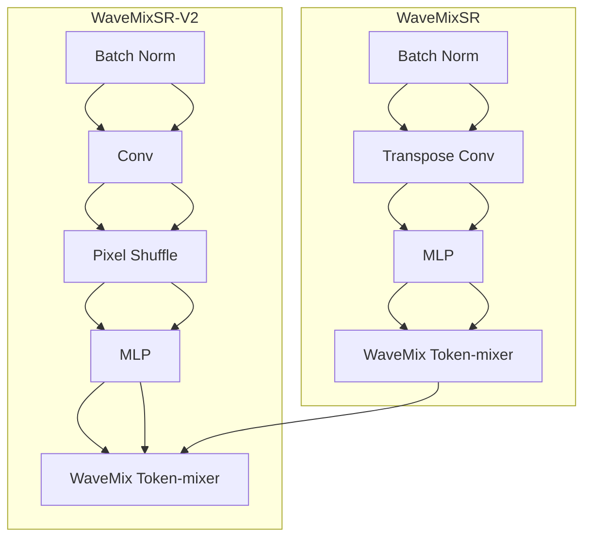
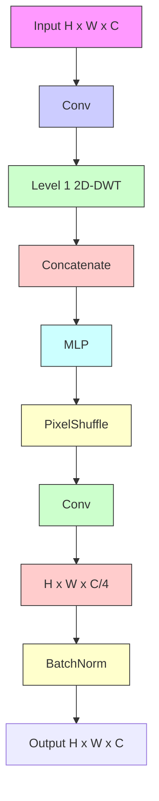

# WAVEMIXSR-V2: ENHANCING SUPER-RESOLUTION WITH HIGHER EFFICIENCY

Pranav Jeevan\* Neeraj Nixon\* Amit Sethi

Department of Electrical Engineering

Indian Institute of Technology Bombay

Mumbai, India

{pjeevan, 20d070056, asethi}@iitb.ac.in

# ABSTRACT

Recent advancements in single image super-resolution have been predominantly driven by token mixers and transformer architectures. WaveMixSR utilized the WaveMix architecture, employing a two-dimensional discrete wavelet transform for spatial token mixing, achieving superior performance in super-resolution tasks with remarkable resource efficiency. In this work, we present an enhanced version of the WaveMixSR architecture by (1) replacing the traditional transpose convolution layer with a pixel shuffle operation and (2) implementing a multistage design for higher resolution tasks $(4\times)$ . Our experiments demonstrate that our enhanced model – WaveMixSR-V2 – outperforms other architectures in multiple super-resolution tasks, achieving state-of-the-art for the BSD100 dataset, while also consuming fewer resources, exhibits higher parameter efficiency, lower latency and higher throughput. Our code is available at https://github.com/pranavphoenix/WaveMixSR

Keywords Image super-resolution · resource-efficient · architecture · wavelet transform


<details>
<summary>bar</summary>

| Model | PSNR | SSIM |
| :--- | :--- | :--- |
| SwinFIR | 32.64 | 0.9054 |
| HAT-L | 32.74 | 0.9066 |
| WaveMixSR | 33.08 | 0.9322 |
| WaveMixSR-V2 | 33.12 | 0.9326 |
</details>

Figure 1: Comparison of PSNR and SSIM for 2× SR on BSD100 dataset shows WaveMixSR-V2 surpasses the previous state-of-the-art WaveMixSR and other methods such as HAT and SwinFIR. 4× SR results in Appendix.

# 1 Introduction

Single-image super-resolution (SISR) is a key task in image reconstruction, aiming to transform low-resolution (LR) images into high-resolution (HR) by predicting and restoring missing details. This process requires capturing both local information and global context. Recent advancements in super-resolution, particularly with attention-based transformers like SwinFIR $[1]$ and hybrid attention transformer $[2]$ , have surpassed traditional CNN approaches due to

their ability to capture long-range dependencies. However, transformers face challenges with quadratic complexity in self-attention, leading to high resource demands and requiring large datasets. To overcome this, token-mixer models such as WaveMixSR $[3]$ , which uses a two-dimensional discrete wavelet transform, have shown potential for improved efficiency and even superior performance. Building on the strengths of WaveMixSR, we propose enhancements to the model by rethinking its upsampling strategy inside the WaveMix blocks and changing the single stage design. Details of architecture, more results, including those on $4\times$ SR, and ablation studies are provided in the Appendix.

# 2 Architectural Improvements

# 2.1 Multi-stage Design

We have made significant improvements to the WaveMixSR model, focusing on two key aspects. First, we addressed how the model handles SR tasks higher than $2 \times$ . In the original WaveMixSR [3], all SR tasks were performed by directly resizing the LR image to HR using a single upsampling layer. This layer relied on non-parametric upsampling techniques, such as bilinear or bicubic interpolation, which limited the model's ability to fine-tune and optimize the SR process across different scales. Our approach involved transitioning from this single-stage design to a more robust multi-stage design. In our new architecture, we introduced a series of resolution-doubling $2 \times$ SR blocks, which progressively doubles the resolution step by step. This multi-stage approach allows for better SR performance at higher scales while reducing resource consumption.


<details>
<summary>flowchart</summary>


</details>

Figure 2: Architecture of WaveMixSR-V2 showing $4 \times$ SR with two $2 \times$ SR blocks in series. Details in Appendix.

For instance, in an $4\times$ super-resolution task, instead of directly upsampling the LR image to HR using a single interpolation layer, the model now proceeds through a series of two $2\times$ SR blocks as shown in Fig. 2 By incrementally increasing the resolution (doubling in each stage), the model is better able to refine the details at each step, leading to superior super-resolution performance compared to the single upsampling operation used in the original WaveMixSR.

# 2.2 PixelShuffle

We introduce a key modification to the WaveMixSR model by replacing the transposed convolution operation in the WaveMix blocks with a PixelShuffle [4] operation followed by a convolution layer (WaveMixSR-V2 block) as shown in Fig. 5. While the original WaveMixSR used transposed convolutions, which involved numerous parameters and high computational cost, PixelShuffle upsamples the image more efficiently by rearranging pixels from feature maps. This significantly reduces the number of parameters, enhancing the model's efficiency. The subsequent convolution layer after PixelShuffle allows the model to continue learning and refining features effectively. Moreover, PixelShuffle avoids the checkerboard artifacts commonly introduced by transposed convolutions, producing smoother and more natural-looking images while maintaining high-quality super-resolution outputs.

Incorporating these improvements in the architecture has enabled WaveMixSR-V2 to achieve new state-of-the-art (SOTA) performance on the BSD100 dataset $[5]$ . Notably, it accomplishes this with less than half the number of parameters, lesser computations and lower latency compared to WaveMixSR (previous SOTA).

# References

[1] Dafeng Zhang, Feiyu Huang, Shizhuo Liu, Xiaobing Wang, and Zhezhu Jin. Swinfir: Revisiting the swinir with fast fourier convolution and improved training for image super-resolution, 2023.   
[2] Xiangyu Chen, Xintao Wang, Jiantao Zhou, Yu Qiao, and Chao Dong. Activating more pixels in image super-resolution transformer, 2023.


<details>
<summary>flowchart</summary>


</details>

Figure 3: Simplified block diagram of WaveMix block in WaveMixSR (on the left) and WaveMixSR-V2 block (on the right). Details in Appendix. 

<table><tr><td>Model</td><td>#Params.</td><td>#Multi-Adds.</td></tr><tr><td>SwinIR [6]</td><td>11.8 M</td><td>49.6 G</td></tr><tr><td>HAT [2]</td><td>20.8 M</td><td>103.7 G</td></tr><tr><td>WaveMixSR [3]</td><td>1.7 M</td><td>25.8 G</td></tr><tr><td>WaveMixSR-V2</td><td>0.7 M</td><td>25.6 G</td></tr></table>

Table 1: Model complexity comparison of WaveMixSR-V2 with other state-of-the-art methods such as WaveMixSR, SwinIR and HAT on $4 \times$ SR of $64 \times 64$ input patch.

[3] Pranav Jeevan, Akella Srinidhi, Pasunuri Prathiba, and Amit Sethi. Wavemixsr: Resource-efficient neural network for image super-resolution. In Proceedings of the IEEE/CVF Winter Conference on Applications of Computer Vision (WACV), pages 5884–5892, January 2024.   
[4] Wenzhe Shi, Jose Caballero, Ferenc Huszár, Johannes Totz, Andrew P. Aitken, Rob Bishop, Daniel Rueckert, and Zehan Wang. Real-time single image and video super-resolution using an efficient sub-pixel convolutional neural network, 2016.   
[5] David Martin, Charless Fowlkes, Doron Tal, and Jitendra Malik. A database of human segmented natural images and its application to evaluating segmentation algorithms and measuring ecological statistics. In Proceedings Eighth IEEE International Conference on Computer Vision. ICCV 2001, volume 2, pages 416–423. IEEE, 2001.   
[6] Jingyun Liang, Jiezhang Cao, Guolei Sun, Kai Zhang, Luc Van Gool, and Radu Timofte. Swinir: Image restoration using swin transformer, 2021.   
[7] Pranav Jeevan, Kavitha Viswanathan, Anandu A S, and Amit Sethi. Wavemix: A resource-efficient neural network for image analysis, 2023.   
[8] Bee Lim, Sanghyun Son, Heewon Kim, Seungjun Nah, and Kyoung Mu Lee. Enhanced deep residual networks for single image super-resolution, 2017.   
[9] Yulun Zhang, Kunpeng Li, Kai Li, Lichen Wang, Bineng Zhong, and Yun Fu. Image super-resolution using very deep residual channel attention networks, 2018.   
[10] Xiangyu Chen, Xintao Wang, Jiantao Zhou, Yu Qiao, and Chao Dong. Activating more pixels in image super-resolution transformer. In Proceedings of the IEEE/CVF Conference on Computer Vision and Pattern Recognition (CVPR), pages 22367-22377, June 2023.   
[11] Ben Niu, Weilei Wen, Wenqi Ren, Xiangde Zhang, Lianping Yang, Shuzhen Wang, Kaihao Zhang, Xiaochun Cao, and Haifeng Shen. Single image super-resolution via a holistic attention network, 2020.   
[12] Wenbo Li, Xin Lu, Shengju Qian, Jiangbo Lu, Xiangyu Zhang, and Jiaya Jia. On efficient transformer-based image pre-training for low-level vision, 2022.   
[13] Ingo Lütkebohle. PyTorch Wavelts. https://pytorch-wavelets.readthedocs.io/en/latest/readme.html, 2018. [Online; accessed 05-March-2023].

[14] I. Daubechies. The wavelet transform, time-frequency localization and signal analysis. IEEE Transactions on Information Theory, 36(5):961–1005, 1990.   
[15] Kaiming He, Xiangyu Zhang, Shaoqing Ren, and Jian Sun. Deep residual learning for image recognition, 2015.   
[16] Piotr Porwik and Agnieszka Lisowska. The haar-wavelet transform in digital image processing: Its status and achievements. Machine graphics & vision, 13:79–98, 2004.   
[17] Eirikur Agustsson and Radu Timofte. Ntire 2017 challenge on single image super-resolution: Dataset and study. In 2017 IEEE Conference on Computer Vision and Pattern Recognition Workshops (CVPRW), pages 1122-1131, 2017.   
[18] Jia Deng, Wei Dong, Richard Socher, Li-Jia Li, Kai Li, and Li Fei-Fei. Imagenet: A large-scale hierarchical image database. In 2009 IEEE Conference on Computer Vision and Pattern Recognition, pages 248–255, 2009.   
[19] D. Martin, C. Fowlkes, D. Tal, and J. Malik. A database of human segmented natural images and its application to evaluating segmentation algorithms and measuring ecological statistics. In Proceedings Eighth IEEE International Conference on Computer Vision. ICCV 2001, volume 2, pages 416–423 vol.2, 2001.   
[20] Jia-Bin Huang, Abhishek Singh, and Narendra Ahuja. Single image super-resolution from transformed self-exemplars. In 2015 IEEE Conference on Computer Vision and Pattern Recognition (CVPR), pages 5197–5206, 2015.   
[21] Marco Bevilacqua, Aline Roumy, Christine Guillemot, and Marie line Alberi Morel. Low-complexity single-image super-resolution based on nonnegative neighbor embedding. In Proceedings of the British Machine Vision Conference, pages 135.1–135.10. BMVA Press, 2012.   
[22] Roman Zeyde, Michael Elad, and Matan Protter. On single image scale-up using sparse-representations. In Proceedings of the 7th International Conference on Curves and Surfaces, page 711–730, Berlin, Heidelberg, 2010. Springer-Verlag.   
[23] Nitish Shirish Keskar and Richard Socher. Improving generalization performance by switching from adam to sgd, 2017.   
[24] Pranav Jeevan and Amit sethi. Convolutional xformers for vision, 2022.   
[25] Christian Ledig, Lucas Theis, Ferenc Huszar, Jose Caballero, Andrew Cunningham, Alejandro Acosta, Andrew Aitken, Alykhan Tejani, Johannes Totz, Zehan Wang, and Wenzhe Shi. Photo-realistic single image super-resolution using a generative adversarial network, 2017.

# A Architecture

# A.1 WaveMixSR-V2 Block

The core part of our super-resolution (SR) architecture are the WaveMixSR-V2 blocks shown in Fig. 4(c). We created these by modifying the WaveMix [7] blocks used in WaveMixSR model [3]. We replace the transposed convolution used in WaveMix block with a PixelShuffle [4] operation followed by a convolutional layer.

Denoting input and output tensors of the WaveMixSR-V2 block by $x_{in}$ and $x_{out}$ , respectively; the four wavelet filters along with their downsampling operations at each level by $w_{aa}, w_{ad}, w_{da}, w_{dd}$ (a for approximation, d for detail); convolution, multi-layer perceptron (MLP), PixelShuffle, and batch normalization operations by c, m, p, and b, respectively; and their respective trainable parameter sets by $\xi$ , $\theta$ , $\phi$ , and $\gamma$ , respectively; concatenation along the channel dimension by $\oplus$ , and point-wise addition by +, the operations inside a WaveMixSR-V2 block can be expressed using the following equations:

$$
\mathbf {x} _ {0} = c (\mathbf {x} _ {i n}, \xi); \quad \mathbf {x} _ {i n} \in \mathbb {R} ^ {H \times W \times C}, \mathbf {x} _ {0} \in \mathbb {R} ^ {H \times W \times C / 4} \tag {1}
$$

$$
\mathbf {x} = \left[ w _ {a a} (\mathbf {x} _ {0}) \oplus w _ {a d} (\mathbf {x} _ {0}) \oplus w _ {d a} (\mathbf {x} _ {0}) \oplus w _ {d d} (\mathbf {x} _ {0}) \right]; \quad \mathbf {x} \in \mathbb {R} ^ {H / 2 \times W / 2 \times 4 C / 4} \tag {2}
$$

$$
\tilde {\mathbf {x}} = b (c (p (m (\mathbf {x}, \theta), \phi), \xi), \gamma); \quad \tilde {\mathbf {x}} \in \mathbb {R} ^ {H \times W \times C} \tag {3}
$$

$$
\mathbf {x} _ {\text { out }} = \tilde {\mathbf {x}} _ {1} + \mathbf {x} _ {\text { in }}; \quad \mathbf {x} _ {\text { out }} \in \mathbb {R} ^ {H \times W \times C} \tag {4}
$$

High resolution image output   


<details>
<summary>flowchart</summary>

```mermaid
graph TD
    subgraph (a) WaveMixSR-V2
        A["RGB"] --> B["RGB to YCbCr"]
        B --> C["2x SR block"]
        C --> D["YCbCr to RGB"]
        D --> E["Output"]
    end

    subgraph (b) 2x SR block
        F["Input"] --> G["CbCr channels"]
        G --> H["2x Upsample"]
        H --> I["L x WaveMixSR-V2 Block"]
        I --> J["Conv"]
        J --> K["Concatenate"]
        K --> L["Output"]
    end

    style (a) WaveMixSR-V2 fill:#f9f,stroke:#333
    style (b) 2x SR block fill:#bbf,stroke:#333
```
</details>


<details>
<summary>flowchart</summary>


</details>

Figure 4: Architecture of WaveMixSR-V2. (a) The application of WaveMixSR-V2 for $4 \times$ SR is shown featuring two $2 \times$ SR blocks stacked in series. For higher SR tasks, more $2 \times$ SR blocks will be added. (b) The details of the $2 \times$ SR block and (c) shows the WaveMixSR-V2 block that replaces the transposed convolution with a PixelShuffle operation followed by a convolution.

The WaveMixSR-V2 block extracts learnable and space-invariant features using a convolutional layer, followed by spatial token-mixing and downsampling for scale-invariant feature extraction using 2 dimensional-discrete wavelet transform (2D-DWT) [13], followed by channel-mixing using a learnable MLP (1×1 conv) layer, followed by restoring spatial resolution of the feature map using PixelShuffle operation. The use of trainable convolutions before the wavelet transform allows the extraction of only those feature maps that are suitable for the chosen wavelet basis functions. The convolutional layer c decreases the embedding dimension C by a factor of four so that the concatenated output x after 2D-DWT has the same number of channels as the input $x_{in}$ (Eq.1 and Eq.2). That is since 2D-DWT is a lossless transform, it expands the number of channels by the same factor (using concatenation) by which it reduces the spatial resolution by computing an approximation sub-band (low-resolution approximation) and three detail sub-bands (spatial derivatives) [14] for each input channel (Eq.2). The use of this image-appropriate and lossless downsampling using 2D-DWT allows WaveMixSR-V2 to use fewer layers and parameters.

The output $\hat{x}$ is then passed to an MLP layer m, which has two $1 \times 1$ convolutional layers with an inverse bottleneck design (multiplication factor > 1) separated by a GELU non-linearity. After this, the feature map resolution is doubled using PixelShuffle operation p. Since PixelShuffle reduces the channel dimension by 4, we use another convolution layer c to increase the channel dimension back to C. This is followed by batch normalization b (Eq.3). A residual connection is used to ease the flow of the gradient [15] (Eq.4). The WaveMixSR-V2 block ensures that input and output resolution are the same.

Among the different types of mother wavelets available, we used the Haar wavelet (a special case of the Daubechies wavelet [14], also known as Db1), which is frequently used due to its simplicity and faster computation. Haar wavelet is both orthogonal and symmetric in nature and has been extensively used to extract basic structural information from

HR Image   


<details>
<summary>natural_image</summary>

Close-up of a person's eye with visible eyebrow and eyelid, wearing a traditional headscarf (no text or symbols)
</details>

LR Image   


<details>
<summary>natural_image</summary>

Close-up of a human eye with visible iris and pupil (no text or symbols)
</details>

Model Output   


<details>
<summary>natural_image</summary>

Close-up of a human eye with visible eyelashes and eyebrow (no text or symbols)
</details>

Image from BSD100 2x   


<details>
<summary>natural_image</summary>

Silhouette of a person standing on a rocky peak against a blue sky with clouds, with a small inset image of a mountain range (no text or symbols visible)
</details>

Image from BSD100 2x


<details>
<summary>natural_image</summary>

Mountain peak with a small human figure standing on top against a blue sky and clouds (no text or symbols visible)
</details>

38.96/0.9679   


<details>
<summary>natural_image</summary>

Silhouette of a person standing on a rocky peak against a blue sky with clouds (no text or symbols visible)
</details>

39.84/0.9723


<details>
<summary>natural_image</summary>

Close-up of a person's eye with a feathered head, no visible text or symbols
</details>

Image from Set14 2x


<details>
<summary>natural_image</summary>

Close-up of a person's eye with purple hair and visible eyelid (no text or symbols)
</details>

39.84/0.9723   


<details>
<summary>natural_image</summary>

Close-up of a person's eye with purple hair and feathered head (no text or symbols visible)
</details>

32.47/0.8688


<details>
<summary>natural_image</summary>

Close-up of a monarch butterfly with black and yellow stripes, surrounded by pink flowers (no text or symbols visible)
</details>

Image from Set14 2x


<details>
<summary>natural_image</summary>

Close-up of a butterfly wing with pink and yellow patterns (no text or symbols)
</details>


<details>
<summary>natural_image</summary>

Close-up of a butterfly with black and yellow stripes, partially overlaid on pink flowers (no text or symbols)
</details>

33.02/0.9600


<details>
<summary>natural_image</summary>

Abstract pattern of multicolored diagonal stripes with a small inset image showing a pixelated texture (no text or symbols)
</details>

Image from Urban100 2x


<details>
<summary>natural_image</summary>

Abstract pattern of colorful diagonal stripes on black background (no text or symbols)
</details>


<details>
<summary>natural_image</summary>

Abstract pattern of diagonal color stripes with no text or symbols
</details>

33.78/0.9645


<details>
<summary>natural_image</summary>

Abstract pattern of parallel diagonal lines with a small inset showing a striped texture (no text or symbols)
</details>

Image from Urban100 2x


<details>
<summary>natural_image</summary>

Abstract pattern of diagonal black lines on white background (no text or symbols)
</details>


<details>
<summary>natural_image</summary>

Abstract pattern of parallel diagonal lines on a textured background (no text or symbols)
</details>

19.42/0.7383   
Figure 5: Visual results of $2 \times$ SR on BSD100 dataset. Each column from the left shows a patch from the HR image (shown as a small image near the corner), the same patch extracted from the LR image, and a patch taken from the model output respectively. The filename of the image is given below the HR image and the PSNR/SSIM of the model output is reported at below the model output. The values displayed are computed for the whole image and not just the patch.

<table><tr><td rowspan="3">Model</td><td rowspan="3">Training dataset</td><td colspan="4">Testing metrics on BSD100</td></tr><tr><td colspan="2">2× SR</td><td colspan="2">4× SR</td></tr><tr><td>PSNR</td><td>SSIM</td><td>PSNR</td><td>SSIM</td></tr><tr><td>EDSR [8]</td><td>DIV2K</td><td>32.32</td><td>0.9013</td><td>27.71</td><td>0.7420</td></tr><tr><td>RCAN [9]</td><td>DIV2K</td><td>32.41</td><td>0.9027</td><td>27.77</td><td>0.7436</td></tr><tr><td>SAN [10]</td><td>DIV2K</td><td>32.42</td><td>0.9028</td><td>27.78</td><td>0.7436</td></tr><tr><td>IGNN [10]</td><td>DIV2K</td><td>32.41</td><td>0.9025</td><td>27.77</td><td>0.7434</td></tr><tr><td>HAN [11]</td><td>DIV2K</td><td>32.41</td><td>0.9027</td><td>27.80</td><td>0.7442</td></tr><tr><td>NLSN [10]</td><td>DIV2K</td><td>32.43</td><td>0.9027</td><td>27.78</td><td>0.7444</td></tr><tr><td>RCN-it [10]</td><td>DF2K</td><td>32.48</td><td>0.9034</td><td>27.87</td><td>0.7459</td></tr><tr><td>SwinIR [6]</td><td>DF2K</td><td>32.53</td><td>0.9041</td><td>27.92</td><td>0.7489</td></tr><tr><td>EDT [12]</td><td>DF2K</td><td>32.52</td><td>0.9041</td><td>27.91</td><td>0.7483</td></tr><tr><td>HAT [10]</td><td>DF2K</td><td>32.62</td><td>0.9053</td><td>28.00</td><td>0.7517</td></tr><tr><td>SwinFIR* [1]</td><td>DF2K</td><td>32.64</td><td>0.9054</td><td>28.03</td><td>0.7520</td></tr><tr><td>HAT-L* [10]</td><td>DF2K</td><td>32.74</td><td>0.9066</td><td>28.09</td><td>0.7551</td></tr><tr><td>WaveMixSR [3]</td><td>DIV2K</td><td>33.08</td><td>0.9322</td><td>27.65</td><td>0.7605</td></tr><tr><td>WaveMixSR-V2</td><td>DIV2K</td><td>33.12</td><td>0.9326</td><td>27.87</td><td>0.7640</td></tr></table>

Table 2: Quantitative comparison with previous state-of-the-art methods on the BSD100 dataset shows that WaveMixSR-V2 performs better using less training data (\* indicates models that were pre-trained on ImageNet).

<table><tr><td>Model</td><td>Training Latency ↓ (ms)</td><td>Training Throughput↑ (fps)</td><td>Inference Latency ↓ (ms)</td><td>Inference Throughput ↑ (fps)</td></tr><tr><td>WaveMixSR</td><td>22.8</td><td>43.8</td><td>18.6</td><td>53.7</td></tr><tr><td>WaveMixSR-V2</td><td>19.6</td><td>50.8</td><td>12.1</td><td>82.6</td></tr></table>

Table 3: Comparison of latency and throughput of WaveMixSR-V2 and WaveMixSR shows that WaveMixSR-V2 is significantly faster than WaveMixSR

images [16]. For even-sized images, it reduces the dimensions exactly by a factor of 2, which simplifies the designing of the subsequent layers.

# A.2 2× SR Block

As shown in Fig. 4(b), the $2 \times$ SR block has two paths - one for handling the Y channel and another for the CbCr channels of the input image. The Y channel is used for the path with learning using WaveMixSR-V2 blocks because the Y channel contains most of the image details and is less affected by color changes. It first upsamples the image to HR size using a parameter-free upsampling block using bilinear or bicubic interpolation. The output of upsampling block, is sent to a convolutional layer to increase the number of feature maps before sending it to the WaveMixSR-V2 blocks. We connected $L$ WaveMixSR-V2 blocks in series to create high-resolution feature maps. The output from the final WaveMixSR-V2 blocks is then passed through a convolutional layer which reduces the channel dimension and returns a single channel output.

<table><tr><td rowspan="2">Scale</td><td colspan="2">2×</td><td colspan="2">4×</td></tr><tr><td>PSNR</td><td>SSIM</td><td>PSNR</td><td>SSIM</td></tr><tr><td>Set5</td><td>35.85</td><td>0.9522</td><td>29.49</td><td>0.8633</td></tr><tr><td>Set14</td><td>31.20</td><td>0.9000</td><td>26.39</td><td>0.7521</td></tr><tr><td>Urban100</td><td>29.20</td><td>0.9076</td><td>23.93</td><td>0.7384</td></tr></table>

Table 4: Quantitative results of WaveMixSR-V2 on other benchmark SR datasets

<table><tr><td rowspan="2">Input Resolution</td><td rowspan="2">Pixel Loss  $\lambda_0$ </td><td rowspan="2">Content Loss  $\lambda_1$ </td><td rowspan="2">Adversarial Loss  $\lambda_2$ </td><td rowspan="2">Noise Added</td><td colspan="2">BSD100</td><td colspan="2">Set5</td><td colspan="2">Set14</td><td colspan="2">Urban100</td></tr><tr><td>PSNR</td><td>SSIM</td><td>PSNR</td><td>SSIM</td><td>PSNR</td><td>SSIM</td><td>PSNR</td><td>SSIM</td></tr><tr><td>128 × 128</td><td>1</td><td>0.01</td><td>0.001</td><td>yes</td><td>28.39</td><td>0.8816</td><td>30.16</td><td>0.8996</td><td>27.76</td><td>0.8667</td><td>25.14</td><td>0.8520</td></tr><tr><td>64 × 64</td><td>1</td><td>0.01</td><td>0.001</td><td>yes</td><td>28.62</td><td>0.8661</td><td>29.96</td><td>0.8728</td><td>27.67</td><td>0.8421</td><td>25.24</td><td>0.8368</td></tr><tr><td>128 × 128</td><td>1</td><td>0</td><td>0.01</td><td>yes</td><td>30.02</td><td>0.9065</td><td>31.01</td><td>0.9146</td><td>28.46</td><td>0.8756</td><td>25.78</td><td>0.8584</td></tr><tr><td>64 × 64</td><td>1</td><td>0</td><td>0.01</td><td>yes</td><td>30.23</td><td>0.9023</td><td>30.84</td><td>0.9121</td><td>28.41</td><td>0.8154</td><td>25.93</td><td>0.8434</td></tr><tr><td>128 × 128</td><td>1</td><td>0.01</td><td>0.001</td><td>no</td><td>29.36</td><td>0.9008</td><td>30.46</td><td>0.9064</td><td>27.58</td><td>0.8660</td><td>25.02</td><td>0.8476</td></tr><tr><td>64 × 64</td><td>1</td><td>0.01</td><td>0.001</td><td>no</td><td>28.09</td><td>0.8815</td><td>29.48</td><td>0.8918</td><td>27.34</td><td>0.8664</td><td>24.83</td><td>0.8474</td></tr><tr><td>128 × 128</td><td>1</td><td>0</td><td>0</td><td>no</td><td>31.24</td><td>0.9267</td><td>33.12</td><td>0.9398</td><td>29.44</td><td>0.8957</td><td>26.49</td><td>0.8780</td></tr><tr><td>64 × 64</td><td>1</td><td>0</td><td>0</td><td>no</td><td>31.19</td><td>0.9263</td><td>32.91</td><td>0.9378</td><td>29.38</td><td>0.8948</td><td>26.46</td><td>0.8772</td></tr></table>

Table 5: Quantitative comparison of WaveMixSR-V2 on benchmark datasets when using different combination of losses for various input resolutions.

<table><tr><td rowspan="2">Channel Dimension</td><td rowspan="2">Layer Depth</td><td colspan="2">BSD100</td><td colspan="2">Set5</td><td colspan="2">Set14</td><td colspan="2">Urban100</td></tr><tr><td>PSNR</td><td>SSIM</td><td>PSNR</td><td>SSIM</td><td>PSNR</td><td>SSIM</td><td>PSNR</td><td>SSIM</td></tr><tr><td>144</td><td>4</td><td>31.16</td><td>0.9267</td><td>33.00</td><td>0.9401</td><td>29.38</td><td>0.8964</td><td>26.45</td><td>0.8785</td></tr><tr><td>160</td><td>4</td><td>31.16</td><td>0.9267</td><td>32.97</td><td>0.9400</td><td>29.38</td><td>0.8960</td><td>26.46</td><td>0.8786</td></tr><tr><td>144</td><td>6</td><td>31.19</td><td>0.9263</td><td>32.91</td><td>0.9378</td><td>29.38</td><td>0.8948</td><td>26.46</td><td>0.8772</td></tr></table>

Table 6: Results of ablation studies showing performance when we vary the channel dimension and layers of WaveMixSR-V2 blocks.

The second parallel path takes the two CbCr channels and passes it through an upsampling layer where the resolution is doubled. This HR CbCr channel is concatenated with the Y-channel output from the first path, thereby creating the 3-channel YCbCr HR output, which is converted to RGB to obtain the doubled resolution output image.

# A.3 WaveMixSR-V2

The LR input image in RGB space is first converted to YCbCr space before sending to the model as shown Fig. 4(a). It is then passed through a series of $2 \times$ SR blocks. For $2 \times$ SR, we use just one $2 \times$ SR block. For higher SR tasks, we can modify the network by adding as many $2 \times$ SR blocks as required to achieve as much SR as needed, as adding one $2 \times$ SR block doubles the resolution. Finally, the output from $2 \times$ SR blocks are converted back to RGB space to get final output.

# B Implementation Details

We used DIV2K dataset [17] for training WaveMixSR-V2. We did not employ any pre-training on larger datasets such as DF2K [17] or ImageNet [18] to compare the performance in training data-constrained settings. The performance of WaveMixSR-V2 was tested on four benchmark datasets – BSD100 [19], Urban100 [20], Set5 [21], and Set14 [22].

All experiments were done with a single 48 GB Nvidia A6000 GPU. We used AdamW optimizer ( $\alpha = 0.001, \beta_{1} = 0.9, \beta_{2} = 0.999, \epsilon = 10^{-8}$ ) with a weight decay of 0.01 during initial epochs and then used SGD with a learning rate of 0.001 and momentum = 0.9 during the final 50 epochs [23, 24]. A dropout of 0.3 is used in our experiments. A batch size of 1 was used when the full-resolution images were passed to the model and a batch size of 432 was used when images were passed as $64 \times 64$ resolution patches.

The LR images were generated from the HR images by using bicubic down-sampling in Pytorch. We used the full-resolution HR image as the target and generated the input LR image using down-sampling for each of the SR tasks. No data augmentations were used while training the WaveMixSR-V2 models. Huber loss was used to optimize the parameters. We used automatic mixed precision in PyTorch during training. For the quantitative results, PSNR and SSIM (calculated on the Y channel) are reported.

The embedding dimension of 144 was used in WaveMixSR-V2 blocks. The convolutions layers before and after the WaveMixSR-V2 blocks which were used to vary channel dimensions employed $3 \times 3$ kernels with stride and padding set to 1 to maintain the feature resolution.

# C Results

From Table 2, it is evident that WaveMixSR-V2 has achieved state-of-the-art (SOTA) performance in $2 \times$ and $4 \times$ SR tasks on the BSD100 dataset. WaveMixSR-V2 attains this superior performance while utilizing significantly smaller DIV2K training data compared to other models, which typically rely on the much larger DF2K and ImageNet datasets. Even in the PSNR metric for $4 \times$ SR, WaveMixSR-V2 is SOTA among all models trained solely on the smaller DIV2K dataset. In contrast, all models that outperform WaveMixSR-V2 in $4 \times$ SR PSNR have been trained on the much larger DF2K data and even have leveraged ImageNet pre-training, further underscoring WaveMixSR-V2's efficiency in achieving SOTA results with fewer training data.

Table 3 provides a comparison of latency and throughput for WaveMixSR-V2 compared to its predecessor, WaveMixSR. WaveMixSR had previously set the benchmark for efficiency, known for its fast output, low GPU consumption, and parametric efficiency in SR tasks. However, WaveMixSR-V2 surpasses its predecessor with faster training and inference speeds. As shown in the Table 3, WaveMixSR-V2 exhibits a much lower latency and significantly higher throughput, both in training ( $\sim$ 15% improvement) and inference (54% improvement), cementing its status as one of the most efficient models for super-resolution.

In Table 3, we present the quantitative metrics for the results of $2\times$ and $4\times$ SR across various benchmark datasets, such as Set5, Set14, and Urban100. These datasets are widely used for evaluating super-resolution models. The results demonstrate that WaveMixSR-V2 performs competitively, delivering excellent outcomes in both $2\times$ and $4\times$ SR tasks across all datasets.

# D Ablation Studies

# D.1 WaveMixSR-V2 GAN

We conducted experiments to check the performance of the WaveMixSR-V2 architecture when trained using a Generative Adversarial Network (GAN) framework, incorporating a relativistic discriminator [?] with residual connections. We also experimented the impact of introducing Gaussian noise as an extra input channel alongside the RGB channels. The hypothesis was that this noise might enhance the HR quality by encouraging the model to incorporate higher frequency components. The experiments used images from the DIV2K dataset resized to different dimensions for training and were evaluated on benchmarks datasets.

# D.1.1 Loss

In terms of loss functions, we used a combination of pixel loss $(L_{pixel})$ , content loss $(L_{content})$ [25], and adversarial loss. The pixel loss was based on the Peak Signal-to-Noise Ratio (PSNR) to directly optimize the model for higher PSNR values. For content loss, a pre-trained VGG19 model was used as the feature extractor. Specifically, features were extracted from the 5th convolutional layer before the 4th max-pooling layer of the VGG-19 model. The adversarial loss was computed using a binary cross-entropy loss with logits on the output of the discriminator, comparing the predictions for real and generated images. The adversarial loss was to guide the generator to produce more realistic images, improving the fidelity of higher-frequency details.

The overall loss function combined pixel loss, content loss, and adversarial loss as follows:

$$
L o s s = \lambda_ {0} L _ {p i x e l} + \lambda_ {1} L _ {c o n t e n t} + \lambda_ {2} L _ {a d v e r s a r i a l}
$$

where $\lambda_0, \lambda_1$ and $\lambda_2$ are hyperparameters that control the relative importance of content loss and adversarial loss, respectively.

The variation in content loss ratios significantly influenced the model's performance. When the content loss ratio was reduced to zero, the model was able to focus more on low-frequency components, leading to an improvement in PSNR and SSIM values across the datasets. For instance, with an input resolution of $128 \times 128$ , setting the content loss ratio to zero resulted in a noticeable increase in performance, as the model could better optimize for low-frequency details. In contrast, when a content loss ratio was included, it forced the training slightly toward including more high-frequency components. However, the WaveMixSR-V2 architecture struggled to learn these components effectively, leading to sub-optimal performance compared to the scenario where content loss was not used.

# D.1.2 Gaussian Noise

Regarding the addition of Gaussian noise, the results were mixed. An improvement was observed when using an input resolution of $64 \times 64$ , where the PSNR and SSIM values increased, suggesting that the noise channel helped the

model capture finer details and potentially enhance the perceptual quality of the images. However, when we increased the input resolution to $128 \times 128$ , the inclusion of noise led to a slight decrease in performance. This indicates that the effectiveness of adding noise may depend on the input resolution and the model's ability to utilize this additional information effectively.

Interestingly, regular training of WaveMixSR-V2 using just PSNR as the pixel loss provided considerably better performance than GAN training. This could be due to the fundamental difference in how WaveMixSR-V2 and GANs handle frequency components in images. While GAN training typically forces the network to include more high-frequency details to enhance visual fidelity, WaveMixSR-V2 focuses more on low-frequency components. This divergence in focus likely led to a mismatch during training, making it challenging for the model to converge effectively under the GAN training. Consequently, the benefits of using GAN training with WaveMixSR-V2 were limited, as the architecture's emphasis on low-frequency components did not align well with the GAN's objectives.