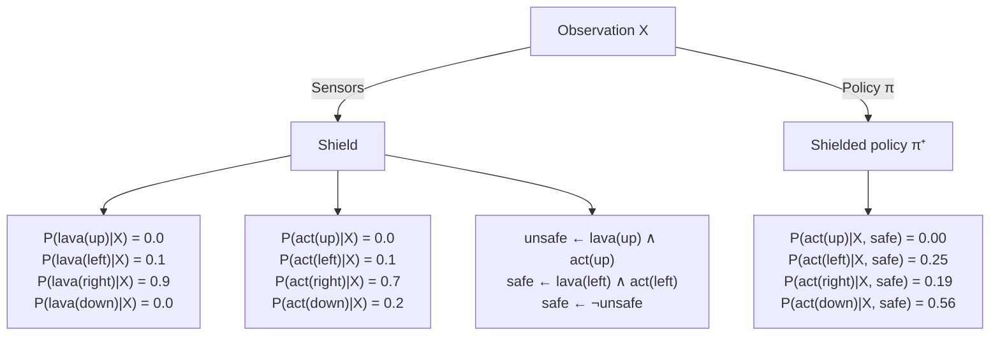

# Neurosymbolic Reinforcement Learning: Playing MiniHack With Probabilistic Logic Shields

David Debot $^{*1}$ , Gabriele Venturato $^{*1}$ , Giuseppe Marra $^{1}$ , Luc De Raedt $^{1,2}$

$^{1}$ KU Leuven, Belgium

$^{2}$ Örebro University, Sweden

firstname.lastname@kuleuven.be

# Abstract

Probabilistic logic shields integrate deep reinforcement learning (RL) with probabilistic logic reasoning to train agents that operate in uncertain environments while giving strong guarantees with respect to logical constraints, such as safety properties. In this demo paper, we introduce a codebase that streamlines the design of custom MiniHack environments where neurosymbolic RL agents leverage probabilistic logic shields to learn safe and interpretable policies with strong guarantees. Our framework allows expert users to easily define and train agents that integrate deep neural policies with probabilistic logic in arbitrarily complex games: from simple exploration to planning and interacting with enemies. Additionally, we provide a web-based platform that showcases our application, offering an interactive interface for the broader community to experiment with and explore the capabilities of neurosymbolic reinforcement learning. This lowers the barrier for researchers and developers, making it accessible for a wider audience to engage with safety-critical RL scenarios.

Code — https://github.com/ML-KULeuven/nesy-minihack

Website — https://dtai.cs.kuleuven.be/projects/nesy/

# Introduction

In recent years, deep reinforcement learning (RL) has achieved remarkable successes across a variety of domains, from mastering complex games (Schrittwieser et al. 2020) to enabling robotic control (Schulman et al. 2015) and autonomous driving (Kiran et al. 2021). While deep RL excels in finding effective policies through large-scale exploration, applying it to safety-critical environments remains a challenge. In such settings, agents must not only learn to maximise long-term rewards but also ensure compliance with given constraints, such as avoiding hazardous states or ensuring regulatory adherence.

Reward shaping (Ng, Harada, and Russell 1999) does not provide guarantees, and it is often difficult to engineer the right reward function in practice. In contrast, probabilistic logic shields (Yang et al. 2023) have emerged as a promising approach, because they rely on logical reasoning to renormalise the policy function and prevent unsafe actions.

flowchart

Figure 1: Example of Probabilistic Logic Shielding.

Although the concept of combining symbolic reasoning with deep learning is not new (Marra et al. 2024), practical implementations of safe RL through probabilistic logic shields remain limited. Most existing systems require highly specialised knowledge, which creates barriers for wider adoption. Our work builds on Yang et al. (2023), and aims to lower these barriers by providing a flexible and user-friendly codebase. We extend Yang et al. (2023) by integrating it into the popular MiniHack (Samvelyan et al. 2021) environment, a framework derived from the NetHack Learning Environment (Küttler et al. 2020), which offers rich, procedurally generated challenges ideal for testing complex RL agents.

By integrating probabilistic logic shields into MiniHack, our framework not only supports the development of safe and interpretable RL agents but also democratises the deployment of neurosymbolic RL in real-world and research settings. We believe this toolset will play a crucial role in advancing safe RL practices and fostering broader adoption of logic-augmented neural agents in safety-critical domains.

# Neurosymbolic RL MiniHack Agents

Figure 1 illustrates how the shielding technique works. As in standard deep RL, an observation from the environment is passed to a neural network to produce an initial policy $\pi$ . Additionally, sensors extract probabilistic symbolic information from the same observation, e.g. there is lava to the right of the agent with 0.9 probability. The shield is composed by a set of (probabilistic) logic rules that define what is safe and what is not. It uses the probabilities from $\pi$ , together with the sensors values, to renormalise $\pi$ and thus

natural_image

Simple diagram of a rectangular frame with a red horizontal bar and two small figures on the side (no text or symbols)

(a) Cliff

text_image

Pixelated map or layout diagram with labeled locations and icons, possibly a game or puzzle layout

(b) Key Room

natural_image

Pixelated game scene with two characters in a circular frame, one on the left and one on the right (no text or symbols)

(c) Monster Room

natural_image

Pixelated game board layout with red and black blocks on a dark grid background (no text or symbols)

(d) Lava Lake   
Figure 2: Custom MiniHack environments. The agent's objective is to reach the goal (the staircase). Challenges include avoiding a lava cliff (Cliff), obtaining a key to unlock a door (Key Room), evading a chasing monster (Monster Room), and navigating a slippery floor with randomized lava (Lava Lake).

produces a safe, shielded policy $\pi^{+}$ . This policy adheres to the safety constraints while maintaining the flexibility of the neural network's original policy. Importantly, this shielding technique is end-to-end differentiable, allowing seamless integration with neural networks and RL algorithms, such as PPO (Schulman et al. 2017). Moreover, by employing probabilistic logic, the shield helps the agent handle uncertainty about state and action safety, maximizing safety despite incomplete or noisy information. This flexibility accommodates probabilistic safety rules, noisy sensors, or both, making it suitable for real-world environments $^{1}$ .

To showcase this neurosymbolic integration, we created multiple custom MiniHack environments (see Figure 2), and we compare the shielded agent with an agent that uses reward shaping for encoding safety in these environments. Cliff (Figure 2a), firstly introduced in Sutton and Barto (2018) (Example 6.6), shows that shielding enables faster training convergence, as the shielding does not only prevent the agent from exploring dangerous states but also guides the learning process towards more productive areas of the state space. Key Room (Figure 2b), adapted from MiniHack environment zoo, is a randomised environment where the locations of every object (door, key, start, goal) change at each episode. In this environment, we show that perfect sensors can be used in probabilistic logic rules to provide a high-level policy that minimises the exhaustion of the agent by suggesting the preferred order, i.e. the key must be collected before opening the door. Monster Room (Figure 2c), is a dynamic and randomised environment where the start and goal locations are fixed, but monsters are spawned randomly, and they chase the agent. This demonstrates how we can deal with moving objects, and that the shield helps the agent reaching the goal while avoiding the monsters. Lava Lake (Figure 2d), is inspired by Frozen Lake (Brockman et al. 2016). The agent has to reach the goal while avoiding holes with lava, considering that the floor is slippery. This setting shows that we can deal with stochastic transition functions and still maximise safety in these settings.

In order to define a shield, one has just to take care of describing the unsafe behaviour. For example, in Cliff, it can be easily defined by the rule

$$
\forall a \quad u n s a f e \leftarrow l a v a (a) \land m o v e (a),
$$

where $a \in \{left, right, up, down\}$ . Then, the probability of lava being in a certain direction is given by the sensor function, and the probability of taking an action a is provided by the base policy $\pi$ , as shown in Figure 1. Finally, the neurosymbolic nature of the framework makes it resilient to test-time changes. For example, it is possible to add extra monsters, extra lava, or even change the shield, and still guarantee the safety of the agent without re-training.

# Implementation

Our implementation makes use of the Stable Baselines3 library (Raffin et al. 2021), which implements state-of-the-art RL algorithms. We use the MiniHack framework to define Gym environments (Brockman et al. 2016), which are a standard in RL research. Shields are implemented in ProbLog (De Raedt, Kimmig, and Toivonen 2007).

Extensibility and usability. The structure of the code-base makes it easy to add new environments, change the RL algorithm or add new shields. For example, a new shield can be added by creating (1) a ProbLog file that defines the safety rules and (2) a function that maps an observation to sensor values used by the shield. Then, training an agent is as simple as running the following code.

$$
\begin{array}{l} \text {shield = Shield(problog\_file, sensor\_func)} \\ \text {agent = PPO(MlpPolicy, env, shield)} \\ \text {agent.learn(total\_timesteps = 10\_000)} \end{array}
$$

We also provide a Jupyter notebook that allows users to get started with the core functionalities.

Interactive website. We have incorporated an interactive demo on our website that showcases the safety, training convergence, and generalization advantages of our approach. Users can load pretrained shielded and non-shielded agents (at multiple training checkpoints) in different environments to compare their behaviour, or manually control the agents in the environments. Additionally, the demo allows users to make small changes to the environment (e.g. add lava tiles) and test whether the pretrained agents still perform well. The user can also add a shield to an agent that was trained without one, or change the shield of a shielded agent.

# Conclusion

Our demo shows that the neurosymbolic integration of deep RL with probabilistic logic shields allows for safer training, better generalization and faster training convergence when compared to a deep RL agent with reward shaping.

# Acknowledgements

DD is a fellow of the Research Foundation-Flanders (FWO-Vlaanderen, 1185125N). This research has also received funding from the KU Leuven Research Funds (STG/22/021, CELSA/24/008, C14/24/092), from the Flemish Government under the "Onderzoeksprogramma Artificiële Intelligentie (AI) Vlaanderen" programme, from the Wallenberg AI, Autonomous Systems and Software Program (WASP) funded by the Knut and Alice Wallenberg Foundation, and from the European Research Council (ERC) under the European Union's Horizon Europe research and innovation programme (grant agreement n°101142702). Finally, we thank Tijs Bellefroid for his help in developing the website and testing our code.

# References

Brockman, G.; Cheung, V.; Pettersson, L.; Schneider, J.; Schulman, J.; Tang, J.; and Zaremba, W. 2016. OpenAI Gym. arXiv:1606.01540.   
De Raedt, L.; Kimmig, A.; and Toivonen, H. 2007. Problog: A probabilistic prolog and its application in link discovery. In IJCAI, volume 7, 2462–2467. Hyderabad.   
Kiran, B. R.; Sobh, I.; Talpaert, V.; Mannion, P.; Al Sallab, A. A.; Yogamani, S.; and Pérez, P. 2021. Deep reinforcement learning for autonomous driving: A survey. IEEE Transactions on Intelligent Transportation Systems, 23(6):4909–4926.   
Küttler, H.; Nardelli, N.; Miller, A. H.; Raileanu, R.; Selvatici, M.; Grefenstette, E.; and Rocktäschel, T. 2020. The NetHack Learning Environment. In Proceedings of the Conference on Neural Information Processing Systems (NeurIPS).   
Marra, G.; Dumančić, S.; Manhaeve, R.; and De Raedt, L. 2024. From statistical relational to neurosymbolic artificial intelligence: A survey. Artificial Intelligence, 104062.   
Ng, A. Y.; Harada, D.; and Russell, S. J. 1999. Policy Invariance Under Reward Transformations: Theory and Application to Reward Shaping. In Proceedings of the Sixteenth International Conference on Machine Learning, ICML '99, 278–287. San Francisco, CA, USA: Morgan Kaufmann Publishers Inc. ISBN 1558606122.   
Raffin, A.; Hill, A.; Gleave, A.; Kanervisto, A.; Ernestus, M.; and Dormann, N. 2021. Stable-Baselines3: Reliable Reinforcement Learning Implementations. Journal of Machine Learning Research, 22(268): 1–8.   
Samvelyan, M.; Kirk, R.; Kurin, V.; Parker-Holder, J.; Jiang, M.; Hambro, E.; Petroni, F.; Kuttler, H.; Grefenstette, E.; and Rocktäschel, T. 2021. MiniHack the Planet: A Sandbox for Open-Ended Reinforcement Learning Research. In Thirty-fifth Conference on Neural Information Processing Systems Datasets and Benchmarks Track (Round 1).   
Schrittwieser, J.; Antonoglou, I.; Hubert, T.; Simonyan, K.; Sifre, L.; Schmitt, S.; Guez, A.; Lockhart, E.; Hassabis, D.; Graepel, T.; et al. 2020. Mastering atari, go, chess and shogi by planning with a learned model. Nature, 588(7839): 604–609.

Schulman, J.; Levine, S.; Abbeel, P.; Jordan, M.; and Moritz, P. 2015. Trust Region Policy Optimization. In Bach, F.; and Blei, D., eds., Proceedings of the 32nd International Conference on Machine Learning, volume 37 of Proceedings of Machine Learning Research, 1889–1897. Lille, France: PMLR.

Schulman, J.; Wolski, F.; Dhariwal, P.; Radford, A.; and Klimov, O. 2017. Proximal policy optimization algorithms. arXiv preprint arXiv:1707.06347.

Sutton, R. S.; and Barto, A. G. 2018. Reinforcement Learning: An Introduction. Adaptive Computation and Machine Learning Series. Cambridge, MA, USA: A Bradford Book, 2 edition. ISBN 978-0-262-03924-6.

Yang, W.-C.; Marra, G.; Rens, G.; and De Raedt, L. 2023. Safe Reinforcement Learning via Probabilistic Logic Shields. In Elkind, E., ed., Proceedings of the Thirty-Second International Joint Conference on Artificial Intelligence, IJCAI-23, 5739–5749. International Joint Conferences on Artificial Intelligence Organization. Main Track.