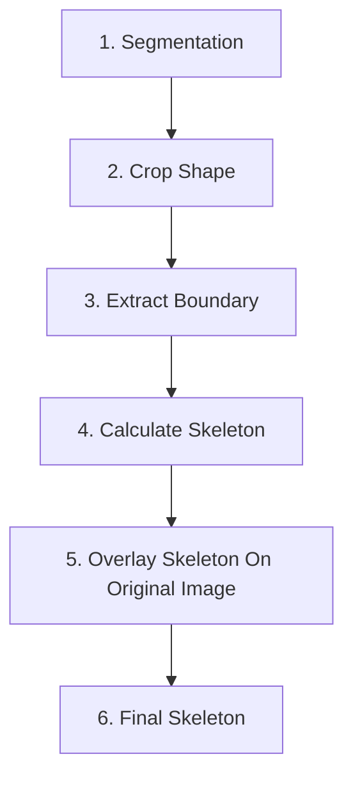
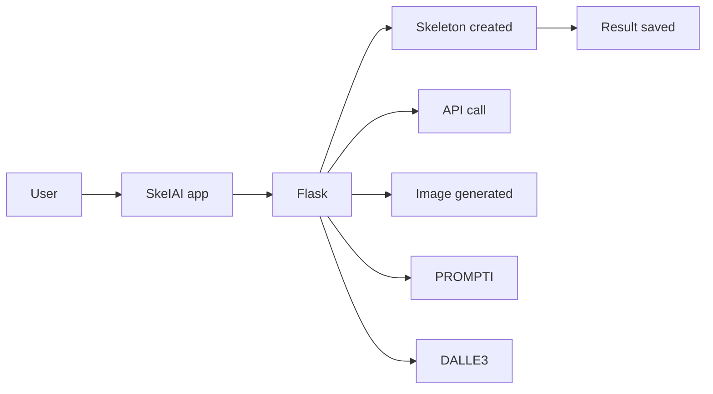

# Real-Time Object Detection and Skeletonization for Motion Prediction in Video Streaming

Gavin Wong $^{1}$ , Yulia Kumar $^{1 2}$ , J. Jenny Li $^{1}$ , Dov Kruger $^{2}$

$^{1}$ Department of Computer Science and Technology, Kean University $^{2}$ Department of Electrical and Computer Engineering, Rutgers University  
1000 Morris Ave  
Union NJ 07083 USA  
ykumar@kean.edu

# Abstract

The increasing demand for real-time analysis in video streaming has driven significant advancements in object detection and motion prediction. This paper presents SkelAI, an innovative application that combines YOLOv8, OpenCV, OpenAI API, and our own innovative algorithms to achieve real-time object detection and medial axis skeletonization tailored explicitly for live video streaming environments. In addition, SkelAI integrates AI-generated image capabilities through the DALL-E 3 model, enabling the extraction of skeletons from synthetic content that simulates streaming scenarios. The application supports exporting skeleton data in PyTorchcompatible formats, facilitating the training of sequence predicting deep learning models. Comprehensive evaluations demonstrate SkelAI's enhanced accuracy, efficiency, and versatility compared to existing tools, underscoring its potential applications in digital animation, biomechanical research and robotics, human-computer interaction, and video compression within streaming platform.

# Introduction

With the rapid advancement of Artificial Intelligence (AI), its applications in computer vision, action recognition, and motion prediction within video streaming have expanded exponentially (Toshev and Szegedy 2014) (Cao et al. 2017). Accurate object detection and skeletonization are critical for understanding and predicting object movements in real-time streaming data (Neverova et al. 2016; Fragkiadaki et al. 2015; Jain et al. 2016). This study introduces SkelAI, an application designed to perform real-time object detection and medial axis skeletonization specifically for video streaming (Siddiqi et al. 2002). By leveraging cutting-edge technologies—YOLOv8 for object detection, OpenCV for image processing, the OpenAI API to generate images and our skeletonization algorithm —SkelAI creates skeletons with high precision and noise resilience, operating efficiently in real-time streaming scenarios. By incorporating the DALL-E 3 model via API, SkelAI enables the extraction of skeletons from both authentic streaming content and synthetic scenarios. Furthermore, it supports exporting skeleton data in PyTorch-compatible formats, facilitating training

sequence-predicting deep learning models. This comprehensive integration of object detection, skeletonization, and AI-generated content opens new pathways for applications in movement prediction, dynamic scene analysis, and beyond (Leonard et al. 2016). Figure 1 features the methodology of the project and the core of SkelAI app.

flowchart

Figure 1: SkelAI Methodology at-a-Glance.

# Initial and Related Work

Extensive research has been conducted on utilizing mathematics and programming to calculate the medial axis of objects (Fontana and Cappetti 2024; Dobbs et al. 2023; Lieutier and Wintraecken 2023). The results of such studies allow individuals to easily decipher and understand the shape of objects while also allowing them to relate these shapes to similar ones. Although much research and libraries exist for dial axis skeletonization, most require a pre-masked video frame where the object is already segmented from the background to work effectively. In contrast, SkelAI involves none of this and can generate skeletons for objects regardless of the background or context of the video stream by leveraging robust convolutional neural networks for object detection. Additionally, when addressing the issue of noise within calculating the medial axis, many researchers have developed pruning algorithms to remove spurious branches (Abudalfa 2023). This work continues the previous attempt to develop

a skeletonization app, but the previous Skeleton App could only handle static images (Kumar et al. 2024).

# SkelAI Architecture

SkelAI is a full-stack application comprising a frontend built with the ReactJS JavaScript library and a backend developed using the Flask Python framework. Figure 2 illustrates a high-level view of the application's architecture. SkelAI's

flowchart

Figure 2: SkelAI Architecture

pipeline includes several integral components. Firstly, the YOLOv8 ('yolov8n-seg') model identifies objects within the video stream and generates precise segmentation masks that delineate the boundaries of each detected object. Following this, the skeletonization algorithm is applied. It starts with boundary extraction using the OpenCV Python library, where the contours of the detected objects are extracted from the segmentation masks. Next, noise reduction is achieved by applying a Gaussian filter, followed by a medial axis calculation that captures the essential geometric features of the object. The process concludes with overlay generation, where the calculated skeleton is superimposed onto the original video frame. Algorithm 1 outlines this process.

Algorithm 1: Video Stream Skeletonization   
1: Input: Original Video Frame  
2: Output: Final Video Frame with Skeleton  
3: Load YOLOv8 segmentation model  
4: Perform object detection on a video frame  
5: for each result in results do  
6: Initialize a blank white image  
7: Extract object contours  
8: Create boundary mask using image and contours  
9: Apply mask to image  
10: Process image for skeletonization  
11: Calculate skeleton  
12: Overlay skeleton on video frame  
13: end for  
14: Return Final Video Frame with Skeleton

# AI Image Generation

Leveraging the OpenAI API and DALL-E 3, SkelAI can generate synthetic images based on user-defined prompts. These AI-generated images are then skeletonized using the same pipeline. Figure 3 demonstrates that the app also allows users to fine-tune various parameters to optimize the

skeletonization output. For example, they can adjust the threshold for object detection accuracy, control the extent of noise reduction, and determine the resolution of the output.

natural_image

Skei AI robot playing soccer on a goal mat within a wireframe cage (no text or symbols)

Figure 3: AI-generated Image, Skeletonized by the App.

The average compression ratio is 39:1 (see Table 1).

<table><tr><td>ID</td><td>Orig. Img Size</td><td>Medial Axis</td><td>Comp Ratio</td></tr><tr><td>1</td><td>1454</td><td>13</td><td>114:1</td></tr><tr><td>2</td><td>280</td><td>15</td><td>19:1</td></tr><tr><td>3</td><td>77</td><td>9</td><td>9:1</td></tr><tr><td>4</td><td>918</td><td>11</td><td>81:1</td></tr><tr><td>5</td><td>143</td><td>27</td><td>5:1</td></tr><tr><td>Avg</td><td>2872</td><td>74</td><td>39:1</td></tr></table>

Table 1: Compression Results

# Conclusion and Future Work

The app has been tested across various video streaming datasets, and results indicate significant improvements in real-time object detection and skeletonization performance. SkelAI shows resilience to noise and varying backgrounds. It was noted that SkelAI can be used to analyze video and perform metrics on sports injury, which makes it possible to automatically examine all videos of all players over time and begin to extract knowledge about specific impacts that cause injury. For example, if soccer players with a particular stance later have knee surgery, perhaps it can be concluded that even though immediate damage is not apparent, they should be wearing a brace to preserve the knee.

SkelAI presents a robust framework for real-time object detection and skeletonization in video streaming, supporting AI-generated content and seamless export to deep learning models. The primary contributions of this paper are as follows: (1) the development of SkelAI, a comprehensive tool for real-time object detection and skeletonization in video streaming; (2) enhancement of existing skeletonization in accuracy and noise resistance; (3) integration of AI generated image capabilities, expanding the app's scope of skeleton extraction; (4) provision of skeleton data in formats suitable for deep learning model training. For future work, the following enhancements are proposed: extend the app to support 3D object skeletonization, train transformer models to create such skeletons, allow users to provide their feedback, and further fine-tune skeletonization parameters. The goal is for autonomous cars to predict and avoid moving objects.

# Acknowledgments

We would like to thank Dr. Kathryn Leonard of Occidental College and Dr. Linda Ness of DIMACS Rutgers University for providing the initial Matlab skeletonization code before we converted it into Python for AI models.

# References

Cao, Z.; Simon, T.; Wei, S.-E.; and Sheikh, Y. 2017. Real-time multi-person 2D pose estimation using part affinity fields. In Proceedings of the IEEE conference on computer vision and pattern recognition, 7291–7299.   
Fragkiadaki, K.; Levine, S.; Felsen, P.; and Malik, J. 2015. Recurrent network models for human dynamics. In Proceedings of the IEEE International Conference on Computer Vision, 4346–4354.   
Jain, A.; Zamir, A. R.; Savarese, S.; and Saxena, A. 2016. Structural-RNN: Deep learning on spatio-temporal graphs. In Proceedings of the IEEE conference on computer vision and pattern recognition, 5308–5317.   
Kumar, Y.; Gordon, Z.; Alabi, O.; Li, J.; Leonard, K.; Ness, L.; and Morreale, P. 2024. ChatGPT Translation of Program Code for Image Sketch Abstraction. Applied Sciences, 14(3): 992.   
Leonard, K.; Morin, G.; Hahmann, S.; and Carlier, A. 2016. A 2D shape structure for decomposition and part similarity. In 2016 23rd International Conference on Pattern Recognition (ICPR), 3216–3221. IEEE.   
Neverova, N.; Wolf, C.; Taylor, G. W.; and Nebout, F. 2016. Moddrop: Adaptive multi-modal gesture recognition. IEEE Transactions on Pattern Analysis and Machine Intelligence, 38(8): 1692–1706.   
Siddiqi, K.; Bouix, S.; Tannenbaum, A.; and Zucker, S. W. 2002. Hamilton-Jacobi skeletons. International Journal of Computer Vision, 48: 215–231.   
Toshev, A.; and Szegedy, C. 2014. Deeppose: Human pose estimation via deep neural networks. In Proceedings of the IEEE conference on computer vision and pattern recognition, 1653–1660.