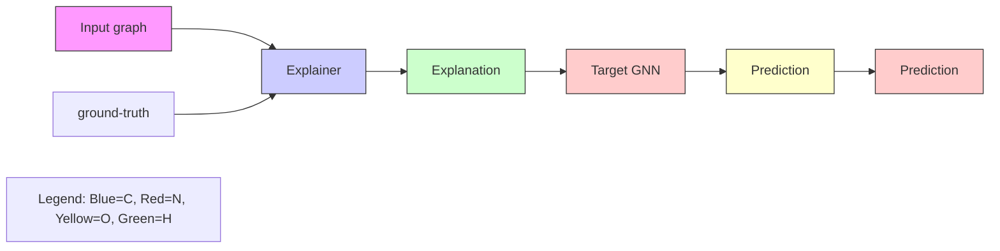
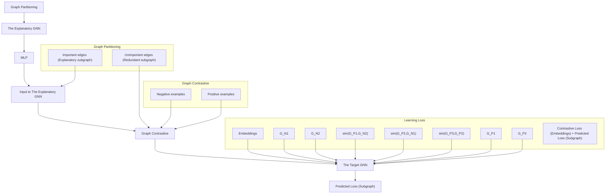
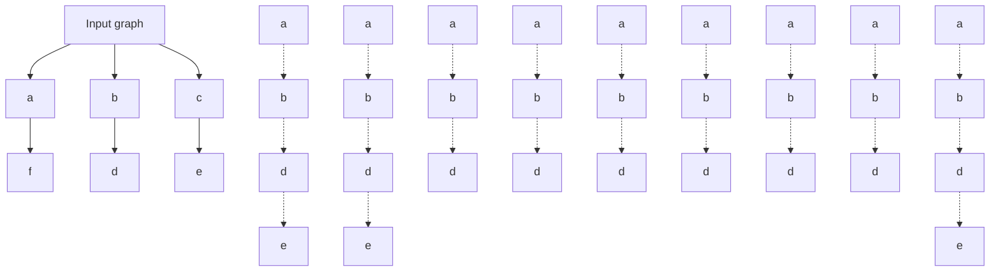

# Graph Segmentation and Contrastive Enhanced Explainer for Graph Neural Networks

Zhiqiang Wang, Jiayu Guo, Jianqing Liang $^{*}$ , Jiye Liang, Shiying Cheng, Jiarong Zhang

Key Laboratory of Computational Intelligence and Chinese Information Processing of Ministry of Education, School of Computer and Information Technology, Shanxi University, Taiyuan 030006, Shanxi, China wangzq@sxu.edu.cn, guojiayu0618@foxmail.com, {liangjq, ljy}@sxu.edu.cn, {202322404006, 202222404033}@email.sxu.edu.cn

# Abstract

Graph Neural Networks are powerful tools for modeling graph-structured data but their interpretability remains a significant challenge. Existing model-agnostic GNN explainers aim to identify critical subgraphs or node features relevant to task predictions but often rely on GNN predictions for supervision, lacking ground-truth explanations. This limitation can introduce biases, causing explanations to fail in accurately reflecting the GNN's decision-making processes. To address this, we propose a novel explainer for GNNs with graph segmentation and contrastive learning. Our model introduces a graph segmentation learning module to divide the input graph into explanatory and redundant subgraphs. Next, we implement edge perturbation to augment these subgraphs, generating multiple positive and negative pairs for contrastive learning between explanatory and redundant subgraphs. Finally, we develop a contrastive learning module to guide the learning of explanatory and redundant subgraphs by pulling positive pairs with the same explanatory subgraphs closer while pushing negative pairs with different explanatory subgraphs far away. This approach allows for a clearer distinction of critical subgraphs, enhancing the fidelity of the explanations. We conducted extensive experiments on graph classification and node classification tasks, demonstrating the effectiveness of the proposed method.

# Introduction

Graph Neural Networks (GNNs) have become indispensable tools for modeling graph-structured data, with applications spanning a diverse range of fields, including protein analysis (Li and Zhang 2023), traffic prediction (Ji, Yu, and Lei 2023) and medical diagnosis (Bessadok, Mahjoub, and Rekik 2023; Gao et al. 2024). However, similar to other deep learning models (Li et al. 2024; Wu, Lin, and Weng 2024), GNNs often lack explainability, which presents a significant barrier to their broader adoption. The opaque nature of GNN predictions makes it challenging to identify the specific structural elements that influence their decision-making processes. This lack of transparency undermines the trustworthiness and reliability of GNNs in critical applications. Consequently, enhancing the explainability of GNNs has emerged as a pivotal challenge in the field of graph machine learning (Yuan et al. 2022; Müller et al. 2024).

Current explainable GNN methods fall into two main categories: model-specific and model-agnostic approaches. Model-specific methods utilize the internal parameters or feature representations of GNNs to determine the significance of nodes, edges, or features. Techniques such as backpropagation and perturbation are employed to quantify these elements, enabling the generation of explanations. For example, PGExplainer (Luo et al. 2020) uses a parametric edge mask predictor based on node embeddings, while SA (Bal-dassarre and Azizpour 2019) computes gradients to assess feature importance. These methods often effective but are dependent on having prior knowledge of the GNN's internal configuration.

In contrast, model-agnostic methods provide explanations by analyzing the input-output relationships of GNNs without requiring access to their internal workings. This makes them applicable across various GNN architectures. Notable examples include GNNExplainer (Ying et al. 2019), which optimizes masks to identify essential subgraphs, and $\mathrm{CF}^2$ (Tan et al. 2022), which balances factual and counterfactual reasoning to isolate key subgraphs. Gem (Lin, Lan, and Li 2021) employs Granger causality to create ground-truth explanations, which are then used to train graph generation models that operate independently of the GNN's internal structure.

In practical graph learning tasks, a key challenge is the scarcity of ground-truth explanations, with standard explanatory subgraphs often being unknown. Existing model-agnostic explainers seek to uncover significant subgraphs or node features by analyzing the input-output correlations of the target model. However, these approaches typically rely on the GNN's predictions for supervision, which may not accurately represent the GNN's decision rationale due to the absence of true explanatory data. Consequently, deriving explanations that faithfully reflect predictions based solely on the graph data, without external supervision, remains a formidable challenge.

As shown in Figure 1, the training dataset for molecular type prediction often exhibits a co-occurrence of carbon rings and nitro groups. A strong correlation between carbon rings and prediction outcomes has been observed, potentially leading the explainer to overly rely on this statistical

flowchart

Figure 1: Correlation between carbon rings and nitro groups in molecular predictions.

association. This reliance might result in high predictive accuracy but could fail to identify the true explanatory factor (i.e. ground truth). Consequently, the generated explanations may superficially align with the GNN's predictions while not accurately reflecting the model's actual decision-making process. To address the problem, we introduce the concept of redundant subgraphs to design a novel data augmentation method, which emphasizes the indestructibility of explanatory subgraphs. Perturbing explanatory subgraphs alters model predictions, whereas perturbing redundant subgraphs does not. We leveraged this by developing a contrastive loss function that compares the two subgraph difference, supplying additional self-supervised signals for subgraph learning. It supplies additional supervisory signals beyond simple GNN predictions, and is expected to mitigate the challenge of lacking ground truth explanations as supervision.

Building on this foundation, we introduce a novel graph segmentation and contrastive enhanced explainer (GSCExplainer) for GNNs. Our approach begins by segmenting the input graph into explanatory and redundant subgraphs, effectively distinguishing components critical to the model's decisions from less relevant ones. We then apply edge perturbations to augment data within both subgraphs, enriching the training signals available to the model. Finally, we develop a contrastive learning module to guide the learning of explanatory and redundant subgraphs by pulling positive pairs with the same explanatory subgraphs closer while pushing negative pairs with different explanatory subgraphs far away. This method enhances the model's ability to discern key subgraph distinctions during training, thus improving the fidelity of the explanations. Furthermore, the integration of graph segmentation with contrastive learning allows the model to generalize more effectively from diverse data augmentations, mitigating overfitting risks. The main contributions are as follows:

- We propose an explainer for GNNs that integrates graph segmentation with contrastive learning, enabling more precise differentiation between important and unimportant subgraphs, and thereby improving the fidelity of explanations.   
- We develop a robust data augmentation and contrastive learning framework for GNN explainers, which involves generating positive and negative examples by perturbing

redundant and explanatory subgraphs, coupled with contrastive learning losses to effectively distinguish key differences between them.

\- We conduct comprehensive experiments on both graph classification and node classification tasks, demonstrating the efficacy of our approach through significant improvements in prediction accuracy.

# Related Work

Explaining GNN has attracted significant attention (Gui et al. 2024; Chen et al. 2024), with methods generally categorized into model-specific and model-agnostic approaches (Wang et al. 2023; Xie et al. 2022).

Model-specific methods leverage the internal parameters or structure of GNNs to assess feature significance. These include gradient-based, perturbation-based, and decomposition-based approaches. Gradient-based methods calculate the gradient of input features with respect to the target prediction to approximate feature importance. For instance, SA (Baldassarre and Azizpour 2019) computes squared gradient values as importance scores, reflecting input-output sensitivity but suffering from saturation issues. BP (Baldassarre and Azizpour 2019) improves upon SA by ignoring negative gradients. CAM (Pope et al. 2019) and Grad-CAM map feature importance to the input space, though they are mainly limited to graph classification tasks. Perturbation-based methods generate masks to represent the importance of edges or features. PGExplainer (Luo et al. 2020) trains a parametric edge mask predictor using node embeddings, optimizing the predictor by maximizing mutual information between original and modified predictions. GraphMask (Schlichtkrull, De Cao, and Titov 2021) generates edge masks for each hidden layer, providing a comprehensive understanding of GNNs. Decomposition-based methods use backpropagation to decompose layers back to the input space, deriving feature importance. LRP (Schlichtkrull, De Cao, and Titov 2021) adapts LRP for deep graph models, focusing on node importance. GNN-LRP (Schwarzenberg et al. 2019) evaluates the importance of graph walks, but this approach has high computational complexity. The model-specific methods offer credible explanations by relying on internal GNN structures but are often limited by the necessity to have prior knowledge of the GNN's internal configuration.

Model-agnostic methods explain GNN predictions based on inputs and outputs without depending on the GNN's internal workings, making them broadly applicable across different architectures. Perturbation-based methods generate masks to signify the importance of edges, nodes, or features without needing insight into the model's structure. GN-NExplainer (Ying et al. 2019) optimizes masks by maximizing mutual information between predictions on original and modified graphs. SubgraphX (Yuan et al. 2021) uses the Monte Carlo Tree Search (MCTS) algorithm to explore various subgraph structures and applies the Shapley value to assess their importance, ultimately identifying the optimal subgraph as an explanation. Surrogate-based methods, on the other hand, approximate complex GNN predic

flowchart

Figure 2: Framework of GSCExplainer. GSCExplainer consists of three components: Ggraph Segmentation, Graph Contrastive, and Learning Loss. Graph segmentation divides the original graph into explanatory subgraphs and redundant subgraphs based on the calculation of edge importance. Graph Contrastive aims to perturb the edges of the explanatory and redundant subgraphs to generate negative and positive examples. Learning loss includes contrastive loss and prediction loss. The contrastive loss is calculated by comparing the embeddings of positive and negative examples, and when combined with the subgraph prediction loss, it forms the final model loss.

tions using simpler, more interpretable models. GraphLIME (Huang et al. 2022) extends LIME (Ribeiro, Singh, and Guestrin 2016) to graphs, using HSIC Lasso (Yamada et al. 2018) to select important features. PGM-Explainer (Vu and Thai 2020) builds a probabilistic graphical model to explain GNNs, but it overlooks important topological information. Causal-based methods(Ma et al. 2022) use causal inference to explain GNNs. Gem (Lin, Lan, and Li 2021) uses Granger causality (Bressler and Seth 2011) to identify top-ranked edges, while OrphicX (Lin et al. 2022) employs causal graphs and information flow-based metrics to elucidate predictions. CF $^{2}$ (Tan et al. 2022) introduces metrics like Probability of Necessity (PN) and Probability of Sufficiency (PS) to balance factual and counterfactual reasoning. These model-agnostic methods offer flexibility and broad applicability, making them effective even when the GNN model changes.

# GSCExplainer

This section introduces the GSCExplainer, as shown in Figure 2. It comprises three key components: graph segmentation, graph contrastive, and learning loss, detailed in following subsections.

# Method Framework

This GSCExplainer is capable of fully leveraging both important and redundant information in graphs to generate explanations that are faithful to the original graph by perturbing the graph structure. Specifically, the model comprises the following three components:

\- Graph Segmentation first encodes the input graph using a three-layer GCN as a GNN encoder to obtain node

representations. Then, by concatenating node representations to generate edge representations, it inputs them into a MLP to compute the probability of each edge being part of the explanatory subgraph. Based on the computed edge probabilities, edges are ranked to partition the input graph into important subgraphs (explanatory subgraphs) and unimportant subgraphs (redundant subgraphs).

- Graph Contrastive perturbs the edges of the explanatory subgraph and the redundant subgraph separately. It generates negative examples by combining the perturbed explanatory subgraph with the unperturbed redundant subgraph and positive examples by combining the perturbed redundant subgraph with the unperturbed explanatory subgraph.   
- Learning loss includes contrastive loss computation and effectiveness loss computation. The contrastive loss computation follows the principle of pulling the representations of positive pairs closer while pushing the representations of negative pairs far away. The effectiveness loss ensures the validity of the explanatory subgraph by calculating the cross-entropy between the predicted results when the subgraph is input into the target GNN and the classification labels.

Through the collaborative work of the three components, the framework can effectively generate explanatory subgraphs that reveal the decision basis of GNNs in classification tasks.

# Graph Segmentation

From the perspective of segmentation, a graph can be divided into two disjoint subsets: the explanatory subgraph and the redundant subgraph. The explanatory subgraph con-

flowchart

Figure 3: Edge Cut (left) and Vertex Cut (right)

tains nodes and edges that contribute to a prediction task, while the redundant subgraph contains nodes and edges that are irrelevant or unnecessary.

Graph partitioning usually refers to dividing a large graph into multiple smaller graphs (Fan et al. 2022). Based on the partition method, it can be classified into edge-cut and vertex-cut. Edge-cut divides nodes into subgraphs, effectively partitioning the edges, while vertex-cut divides edges into subgraphs, effectively partitioning the nodes. To avoid breaking the integrity of the graph, this paper chooses edge-cutting, focusing on edge importance, as illustrated in Figure 3. Given a computation graph $G^{c}$ , we encode it using a three-layer GCN to obtain node representations:

$$
Z = f (G ^ {c}), \tag {1}
$$

where $G^{c}$ is the graph itself in graph classification tasks or the n-hops neighborhood subgraph (typically 2nd or 3rd order) in node classification tasks. The matrix $Z \in R^{n \times d}$ contains the node representations, with n as the number of nodes and d as the dimensionality. The function f denotes the trained GCN encoder, and each GCN layer is computed as:

$$
H ^ {(l + 1)} = \sigma (\hat {A} H ^ {(l)} W ^ {(l)}), \tag {2}
$$

where $H^{(l)}$ is the node feature matrix at layer $l$ , and $\hat{A} = \tilde{D}^{-1/2}\tilde{A}\tilde{D}^{-1/2}$ is the normalized adjacency matrix with self-loops.

Through encoding, we obtain embedded representations for each node in the computation graph. To generate edge embeddings for the explanatory subgraph, we concatenate the node representations at both ends of each edge and input this vector into an MLP to produce edge representations:

$$
Z _ {(i, j)} = \mathrm{MLP} [ Z _ {i}; Z _ {j} ], \quad P _ {(i, j)} = \sigma (Z _ {(i, j)}), \tag {3}
$$

where $Z_{i}$ and $Z_{j}$ are the representations of nodes $i$ and $j$ , respectively, and $Z_{(i,j)}$ is the resulting edge representation. The probability $P_{(i,j)}$ reflects the edge's importance. Edges are sorted by $P_{(i,j)}$ in descending order, with the top $K$ forming the explanatory subgraph $G_{\mathrm{exp}}$ and the remainder forming the redundant subgraph $G_{\mathrm{red}}$ .

$$
G = G _ {\text { exp }} \cup G _ {\text { red }},
$$

$$
\begin{array}{l} G _ {\exp} = \left(V _ {\exp}, E _ {\exp}\right), G _ {\text {red}} = \left(V _ {\text {red}}, E _ {\text {red}}\right), \\ E _ {\text {exp}} = \left[ \begin{array}{c c c c} 0 & 0 & 0 & 0 \\ 0 & 0 & 0 & 0 \end{array} \right] \end{array} \tag {4}
$$

$$
E _ {\exp} = \left\{e _ {P _ {1}}, e _ {P _ {2}}, \dots , e _ {P _ {k}} \right\},
$$

$$
E _ {\text { red }} = \left\{e _ {P _ {(k + 1)}}, e _ {P _ {(k + 2)}}, \dots , e _ {P _ {m}} \right\},
$$

where G represents the original graph (unless otherwise specified, equivalent to $G_{c}$ ). $G_{exp}$ and $G_{red}$ denote the explanatory and redundant subgraphs, respectively, after segmentation. $e_{P_{i}}$ represents the edge that is ranked i-th, $E_{exp}$ and $E_{red}$ are the edge sets within the explanatory and redundant subgraphs, and $V_{exp}$ and $V_{red}$ are the associated node sets. The parameter K controls the sparsity of the explanatory subgraph, defined as:

$$
\text { sparsity } (G _ {\text { exp }}) = \frac {| E _ {\text { exp }} |}{| E |}, \tag {5}
$$

where $|E_{exp}|$ and $|E|$ are the number of edges in the explanatory subgraph and the original graph, respectively. A small K may result in an invalid explanatory subgraph, while a large K could render the subgraph too similar to the original graph, undermining its purpose.

The graph segmentation process divides the input graph into explanatory and redundant subgraphs, isolating critical parts for decision-making and reducing noise. This helps mitigate the interference caused by redundant subgraphs, improving explanation accuracy.

# Graph Contrastive

Data augmentation is crucial in contrastive learning, providing diverse positive and negative examples to strengthen model training. Techniques (You et al. 2020) like edge perturbation (Thakoor et al. 2022), node dropping (You et al. 2021), attribute masking (Zhu et al. 2021), and subgraph generation (Sun et al. 2021) are commonly used. This paper focuses on edge perturbation, which aligns with our method of distinguishing explanatory from redundant subgraphs. Perturbing explanatory subgraphs significantly impacts semantics and representation, while changes to redundant subgraphs minimally affect GNN predictions, thereby enhancing explainability through contrastive learning.

Specifically, a certain proportion of edges are randomly removed. The comparison between positive and negative examples assists the model in capturing the distinctions between explanatory and redundant subgraphs more effectively. After passing through the graph segmentation part, the computational graph is divided into two disjoint subgraphs: $G_{exp}$ and $G_{red}$ . These subgraphs provide explanations for the model predictions of the GNN by identifying the most significant parts. In other words, if $G_{exp}$ is altered, the entire prediction result will change significantly. Based on this concept, data augmentation is applied separately to $G_{exp}$ and $G_{red}$ .

$$
\begin{array}{l} G _ {P} = \operatorname{aug} \left(G _ {\text {red}}\right) \cup G _ {\text {exp}}, \\ G _ {P} = \operatorname{aug} \left(G _ {\text {red}}\right) + G _ {\text {exp}}, \end{array} \tag {6}
$$

$$
G _ {N} = \operatorname{aug} (G _ {\exp}) \cup G _ {\text { red }},
$$

here, aug( $\cdot$ ) is the augmentation function, which randomly removes a certain proportion of edges, defined as follows:

$$
\begin{array}{l} \begin{array}{l} \operatorname{aug} (G) = \left(V, E _ {\text {aug}}\right), \\ E _ {\text {aug}} = \left\{\quad \in E + B, \quad \text {li} (\cdot) - 1 \right\}. \end{array} \tag {7} \\ E _ {\text { aug }} = \{e \in E \mid \text { Bernoulli } (\alpha) = 1 \}, \\ \end{array}
$$

where $\alpha$ is the edge perturbation ratio, and $\mathrm{Bernoulli}(\alpha)$ is a Bernoulli random variable that decides whether an edge is kept. The positive example graph $G_{P}$ is composed of the augmented redundant subgraph $\mathrm{aug}(G_{\mathrm{red}})$ combined with the explanatory subgraph $G_{\mathrm{exp}}$ , while the negative example graph $G_{N}$ consists of the augmented explanatory subgraph $\mathrm{aug}(G_{\mathrm{exp}})$ combined with the redundant subgraph $G_{\mathrm{red}}$ .

In this model, the number of positive examples is set to 2, and the number of negative examples is denoted by m. m is a hyperparameter of the model, affecting the effectiveness of contrastive learning. Detailed parameter analysis will be discussed in the subsequent experimental section.

After obtaining the augmented graphs, the node representations are first derived using a three-layer GCN, followed by an MLP to enhance these representations, producing the final graph representations (as illustrated in the augmentation part of Figure 2).

$$
\begin{array}{l} Z _ {N} = f \left(G _ {N}\right), \quad h _ {N} = \operatorname{MLP} (\text {pooling} \left(Z _ {N}\right)), \\ Z _ {N} = f \left(G _ {N}\right) \quad h _ {N} = \operatorname{MLP} (\text {pooling} \left(Z _ {N}\right)) \end{array} \tag {8}
$$

$$
Z _ {P} = f (G _ {P}), \quad h _ {P} = \operatorname{MLP} (\text { pooling } (Z _ {P})),
$$

where $f(\cdot)$ represents the GCN encoder, pooling( $\cdot$ ) denotes a pooling operation (such as mean or sum pooling), and MLP( $\cdot$ ) represents a multi-layer perceptron that processes pooled representations into a compact representation.

# Model Learning

The learning objective of our model is formulated through a composite loss function that integrates an effectiveness loss and a contrastive loss. These components work together to ensure the reliability and interpretability of the explanatory subgraph.

Effectiveness Loss. To validate the explanatory subgraph, we introduce an effectiveness loss function designed to align its classification outcomes:

$$
\min \mathcal {L} _ {\text { Eff }} = - \sum_ {o = 1} ^ {M} (y _ {G _ {C}, o} \cdot \log (G _ {\exp , o})), \tag {9}
$$

where $M$ is the number of classes in the dataset, and $o$ denotes a specific class. $y_{G^c,o} = 1$ indicates that class $o$ is the correct class for the computation graph $G^c$ , otherwise $y_{G^c,o} = 0$ . The term $G_{G_{\mathrm{exp}},O}$ denotes the probability that the explanatory subgraph $G_{\mathrm{exp}}$ of the computation graph $G^c$ is classified as class $o$ by the target GNN.

Contrastive Loss. In the model, we design a contrastive loss to effectively distinguish between relevant and irrelevant subgraph elements:

$$
\min \mathcal {L} _ {\text { Con }} = - \log \frac {\exp (\text { sim } (h _ {G _ {P} ^ {1}} , h _ {G _ {P} ^ {2}}))}{\sum_ {i = 1} ^ {m} \exp (\text { sim } (h _ {G _ {P} ^ {1}} , h _ {G _ {N} ^ {i}}))}, \tag {10}
$$

where $\mathcal{L}_{\mathrm{Con}}$ represents the contrastive loss for each computation graph, $h_{G_P^1}$ and $h_{G_P^2}$ denote the graph representations of positive examples, and $h_{G_{N}^{i}}$ represents the graph representations of negative examples. $\text{sim}(\cdot)$ indicates cosine similarity, and m represents the number of negative examples. The contrastive loss guides the model to distinguish critical from non-critical subgraphs by pulling positive pairs with same explanatory subgraphs closer and pushing negative pairs far away, enhancing explanation fidelity.

Total Loss. The total loss integrates all components, ensuring a balance between accuracy and fidelity:

$$
\min \mathcal {L} = \mathcal {L} _ {\text { Eff }} + \mathcal {L} _ {\text { Con }}. \tag {11}
$$

Through these steps, the graph neural network explanation model is anticipated to enhance its classification performance and interpretability. In the absence of ground-truth explanations as supervisory information, the explainer may overfit to the predicted results of the target GNN. By employing graph segmentation and contrastive learning, the model can learn from more diverse data augmentation, which helps prevent overfitting and improves the generalization ability of the explanations.

# Experiments

# Datasets and Experimental Setup

Datasets. In the experiments, multiple datasets were used for both graph classification and node classification tasks.

<table><tr><td>Datasets</td><td>MUTAG</td><td>NCI1</td><td>BA-Shapes</td><td>Tree-Cycles</td></tr><tr><td>#Graphs</td><td>4337</td><td>4110</td><td>1</td><td>1</td></tr><tr><td>#Nodes</td><td>29</td><td>29</td><td>700</td><td>871</td></tr><tr><td>#Edges</td><td>32</td><td>32</td><td>1020</td><td>1950</td></tr><tr><td>#Labels</td><td>2</td><td>2</td><td>4</td><td>2</td></tr></table>

Table 1: Statistics of the datasets

Note: #Graphs, #Nodes, #Edges, and #Labels represent the dataset counts. For MUTAG and NCI1, node and edge counts are averaged per graph; for BA-Shapes and Tree-Cycles, they refer to a single graph.

- Mutag. This dataset consists of 4,337 molecular graphs, where each node represents an atom and each edge represents a chemical bond between atoms (Debnath et al. 1991). These molecules are categorized based on their mutagenic effect on Salmonella typhimurium, classifying them into mutagenic and non-mutagenic categories.   
- NCI1. This dataset contains 4,110 instances, each representing a compound (Debnath et al. 1991). The classification task is based on whether the compound contributes to the growth of cancer cells.   
- BA-Shapes. This synthetic dataset, constructed using GNNExplainer (Ying et al. 2019), categorizes nodes based on their structural roles within house-structure motifs, labeling them as top nodes, middle nodes, bottom nodes, or other nodes that are not part of a house.   
- Tree-Cycles. In this dataset (Ying et al. 2019), node labels indicate whether a node belongs to a cycle within the tree structure.

Evaluation Metrics. We employ two key metrics (Pope et al. 2019) to assess the experimental results:

- Sparsity. Sparsity indicates the size of the explanation subgraph. If the explanation subgraph is too large, the explanation becomes meaningless, while if it is too small, it may miss important information and affect its effectiveness. Therefore, sparsity is a crucial indicator for evaluating the interpretability of explainers.   
- Prediction Accuracy. Explanation accuracy (acc $_{\text{exp}}$ ) measures how well the explanation subgraph retains crucial information for predictions, while being sparse. It reflects the consistency between the GNN's predictions on the original graph ( $\Phi(G)$ ) and the explanation subgraph ( $\Phi(G_{\text{exp}})$ ). The higher the acc $_{\text{exp}}$ , the better the explanation aligns with the model's initial predictions:

$$
\mathrm{acc} _ {\exp} = \frac {\operatorname{Correct} (\Phi (G) = \Phi (G _ {\exp}))}{| \text { test } |}, \tag {12}
$$

where Correct( $\cdot$ ) counts matching predictions.

Comparison methods. To validate the effectiveness of the proposed method, we employed a comparison with four of the latest interpretability approaches: OrphicX, GNNExplainer, PGExplainer, and Gem. Specifically:

- OrphicX (Lin et al. 2022). This method explains graph neural network predictions by constructing a generative model to learn potential cause-effect relationships.   
- GNNExplainer (Ying et al. 2019). A classic method in the field of GNN model interpretation, GNNExplainer generates explanations by optimizing a mask, providing an explanation for each individual instance.   
- PGExplainer (Luo et al. 2020). A model-specific approach that introduces a parameterized model to interpret GNNs, capable of explaining multiple instances.   
- Gem (Lin, Lan, and Li 2021). This method applies causal reasoning to interpret GNNs. Like GNNExplainer, Gem is model-agnostic and capable of explaining multiple instances after training.

Experimental Results 

<table><tr><td rowspan="3">Methods</td><td colspan="5">MUTAG</td><td colspan="5">NCI1</td></tr><tr><td colspan="5">Edge Ratio</td><td colspan="5">Edge Ratio</td></tr><tr><td>0.5</td><td>0.6</td><td>0.7</td><td>0.8</td><td>0.9</td><td>0.5</td><td>0.6</td><td>0.7</td><td>0.8</td><td>0.9</td></tr><tr><td>Orphicx</td><td>71.4</td><td>71.2</td><td>77.2</td><td>78.8</td><td>83.2</td><td>66.9</td><td>72.7</td><td>77.1</td><td>81.3</td><td>85.4</td></tr><tr><td>Gem</td><td>66.4</td><td>67.7</td><td>71.4</td><td>76.5</td><td>81.8</td><td>61.8</td><td>68.6</td><td>70.6</td><td>74.9</td><td>83.9</td></tr><tr><td>GNNExplainer</td><td>65.0</td><td>66.6</td><td>66.4</td><td>71.0</td><td>78.3</td><td>64.2</td><td>65.7</td><td>68.6</td><td>75.2</td><td>81.8</td></tr><tr><td>PGExplainer</td><td>59.3</td><td>58.9</td><td>65.1</td><td>70.3</td><td>74.7</td><td>57.7</td><td>60.8</td><td>65.2</td><td>69.3</td><td>71.0</td></tr><tr><td>GSCExplainer</td><td>75.1</td><td>78.4</td><td>81.1</td><td>83.8</td><td>87.2</td><td>70.6</td><td>73.5</td><td>78.1</td><td>82.1</td><td>84.5</td></tr></table>

Table 2: Performance Comparison on MUTAG and NCI1 with Varying Edge Ratios

Comparison Results. Tables 2 and 3 present the prediction accuracy of our method on graph classification and node classification datasets. On all datasets, the experimental results for five sparsity levels almost all exceed the four compared methods, demonstrating the effectiveness of our approach. Specifically, on the MUTAG dataset, our method achieves an average of over 4 percentage points higher than the best comparator method, OrphicX. On the TREE-CYCLES dataset, our method achieves a prediction accuracy of 100% across all sparsity levels, surpassing the best comparator method, OrphicX.

<table><tr><td rowspan="3">Methods</td><td colspan="5">BA-SHAPES</td><td colspan="5">TREE-CYCLES</td></tr><tr><td colspan="5"># of Edges</td><td colspan="5"># of Edges</td></tr><tr><td>5</td><td>6</td><td>7</td><td>8</td><td>9</td><td>6</td><td>7</td><td>8</td><td>9</td><td>10</td></tr><tr><td>Orphicx</td><td>82.4</td><td>97.1</td><td>97.1</td><td>97.1</td><td>100</td><td>85.7</td><td>91.4</td><td>100</td><td>100</td><td>100</td></tr><tr><td>Gem</td><td>64.7</td><td>94.1</td><td>91.2</td><td>91.2</td><td>91.2</td><td>74.3</td><td>88.6</td><td>100</td><td>100</td><td>100</td></tr><tr><td>GNNExplainer</td><td>67.6</td><td>67.6</td><td>82.4</td><td>88.2</td><td>85.3</td><td>20.0</td><td>54.3</td><td>74.3</td><td>88.6</td><td>97.1</td></tr><tr><td>PGExplainer</td><td>59.5</td><td>59.5</td><td>59.5</td><td>59.5</td><td>64.3</td><td>76.2</td><td>81.5</td><td>91.3</td><td>95.4</td><td>97.1</td></tr><tr><td>GSCExplainer</td><td>94.1</td><td>95.6</td><td>98.6</td><td>97.1</td><td>98.6</td><td>100</td><td>100</td><td>100</td><td>100</td><td>100</td></tr></table>

Table 3: Performance Comparison on BA-SHAPES and TREE-CYCLES with Varying Number of Edges

<table><tr><td rowspan="3">Methods</td><td colspan="5">MUTAG</td><td colspan="5">NCI1</td></tr><tr><td colspan="5">Edge Ratio</td><td colspan="5">Edge Ratio</td></tr><tr><td>0.5</td><td>0.6</td><td>0.7</td><td>0.8</td><td>0.9</td><td>0.5</td><td>0.6</td><td>0.7</td><td>0.8</td><td>0.9</td></tr><tr><td rowspan="2">GSCExplainer-GCL</td><td>75.1</td><td>78.4</td><td>81.1</td><td>83.8</td><td>87.2</td><td>70.6</td><td>73.5</td><td>78.1</td><td>82.1</td><td>84.5</td></tr><tr><td>68.2</td><td>72.8</td><td>73.5</td><td>76.0</td><td>82.8</td><td>65.4</td><td>63.3</td><td>65.7</td><td>74.8</td><td>73.8</td></tr></table>

Table 4: Performance Comparison on MUTAG and NCI1 with Varying Edge Ratios

<table><tr><td rowspan="3">Methods</td><td colspan="5">BA-SHAPES</td><td colspan="5">TREE-CYCLES</td></tr><tr><td colspan="5"># of edges</td><td colspan="5"># of edges</td></tr><tr><td>5</td><td>6</td><td>7</td><td>8</td><td>9</td><td>6</td><td>7</td><td>8</td><td>9</td><td>10</td></tr><tr><td>GSCExplainer</td><td>94.1</td><td>95.6</td><td>98.6</td><td>97.1</td><td>98.6</td><td>100</td><td>100</td><td>100</td><td>100</td><td>100</td></tr><tr><td>-GCL</td><td>63.2</td><td>63.2</td><td>94.1</td><td>92.7</td><td>94.1</td><td>100</td><td>100</td><td>100</td><td>100</td><td>100</td></tr></table>

Table 5: Performance Comparison on BA-SHAPES and TREE-CYCLES with Varying Number of Edges

Ablation Study. In the tables 4 and 5, “-GCL” represents the model without graph contrastive learning (GCL). Removing GCL leads to a significant decrease in the predictive accuracy of GSCExplainer, with drops of 6.4 and 9.1 percentage points on the MUTAG and NCI1 graph classification datasets, respectively. The NCI1 dataset, in particular, shows a decline exceeding 10 percentage points. Similar results were observed on the BA-SHAPES node classification dataset, especially when the number of edges in the explanatory subgraphs was 5 or 6, highlighting the positive impact of GCL on predictive accuracy. These experimental results underscore the critical role of GCL in our model. By comparing differences between explanatory subgraphs and redundant subgraphs, GCL provides self-supervised information for subgraph learning, adding a richer supervisory signal beyond simple GNN predictions. This contrastive loss guides the model in identifying more effective explanatory

subgraphs. When the explanatory subgraph sparsity is high (i.e., fewer edges in the subgraph), GCL's data-augmented positive and negative examples become even more essential, providing richer training data for accurate interpretation.

Parameter Analysis. We analyze the impact of two key parameters on graph classification datasets: the edge perturbation ratio $\alpha$ in data augmentation and the number of negative samples m in graph contrastive learning.

line

| α    | 0.3   | 0.6   | 0.7   | 0.8   | 0.9   |
|------|-------|-------|-------|-------|-------|
| 0.1  | 0.70  | 0.72  | 0.76  | 0.78  | 0.84  |
| 0.2  | 0.71  | 0.73  | 0.76  | 0.79  | 0.85  |
| 0.3  | 0.72  | 0.74  | 0.76  | 0.80  | 0.86  |
| 0.4  | 0.73  | 0.75  | 0.77  | 0.81  | 0.86  |
| 0.5  | 0.74  | 0.76  | 0.78  | 0.82  | 0.86  |
| 0.6  | 0.75  | 0.77  | 0.79  | 0.83  | 0.86  |
| 0.7  | 0.76  | 0.78  | 0.80  | 0.84  | 0.86  |
| 0.8  | 0.77  | 0.79  | 0.81  | 0.85  | 0.86  |
| 0.9  | 0.78  | 0.80  | 0.82  | 0.86  | 0.86  |

(a) MUTAG

line

| α    | 0.5   | 0.6   | 0.7   | 0.8   | 0.9   |
|------|-------|-------|-------|-------|-------|
| 0.1  | 0.68  | 0.70  | 0.70  | 0.76  | 0.80  |
| 0.2  | 0.68  | 0.70  | 0.71  | 0.76  | 0.81  |
| 0.3  | 0.68  | 0.70  | 0.71  | 0.76  | 0.82  |
| 0.4  | 0.68  | 0.71  | 0.72  | 0.76  | 0.83  |
| 0.5  | 0.68  | 0.72  | 0.73  | 0.77  | 0.84  |
| 0.6  | 0.68  | 0.72  | 0.74  | 0.78  | 0.84  |
| 0.7  | 0.68  | 0.72  | 0.75  | 0.79  | 0.84  |
| 0.8  | 0.68  | 0.71  | 0.76  | 0.80  | 0.84  |
| 0.9  | 0.68  | 0.71  | 0.77  | 0.81  | 0.84  |

(b) NCI1   
Figure 4: The impact of $\alpha$ on MUTAG and NCI1.

- Edge Perturbation Ratio. The edge perturbation ratio $\alpha$ determines the proportion of edges removed during data augmentation. As $\alpha$ increases, the task of graph contrastive learning becomes more challenging, often improving training results. However, a higher $\alpha$ can also degrade critical graph semantics, such as structural information, making it crucial to find an optimal $\alpha$ . Figure 4 shows that the model's interpretation effect varies with different $\alpha$ values, showing an optimal $\alpha$ where explanations are most effective. As sparsity increases, the optimal $\alpha$ also rises, requiring more edge removal for meaningful perturbations. If too many edges are removed, the explanation subgraph may become too small to be useful.   
- Number of Negative Samples. The number of negative samples $m$ in graph contrastive learning significantly affects model performance. As shown in Figure 5, optimal prediction accuracy is achieved when $m$ is 6 or 10, while lower or higher values lead to poorer results. Too many negative samples cause the model to overemphasize differences from negative samples, which are generated by perturbing the explanation subgraph, potentially leading to poor interpretation. Conversely, too few negative samples make it difficult for the model to distinguish between the explanation subgraph and the redundant subgraph, also reducing interpretation quality. Thus, selecting an appropriate number of negative samples is critical for improving the model's interpretability.

Case Study. Figure 6 visualizes two instances from MUTAG real-world datasets for graph classification. By observing the original graphs and the explanatory subgraphs generated by our model under different sparsity levels (composed of darker nodes and edges), it can be seen that our model effectively identifies the most important parts of the original graphs (highlighted in light blue). Furthermore, there are commonalities in the explanatory subgraphs across different sparsity levels, which is logical: the explanatory subgraphs

line

| m  | 0.5   | 0.6   | 0.7   | 0.8   | 0.9   |
|----|-------|-------|-------|-------|-------|
| 2  | 0.71  | 0.77  | 0.79  | 0.82  | 0.85  |
| 6  | 0.73  | 0.78  | 0.80  | 0.84  | 0.86  |
| 10 | 0.72  | 0.77  | 0.78  | 0.83  | 0.85  |
| 14 | 0.71  | 0.76  | 0.77  | 0.82  | 0.84  |

(a) MUTAG

line

| m  | 0.5   | 0.6   | 0.7   | 0.8   | 0.9   |
|----|-------|-------|-------|-------|-------|
| 2  | 0.68  | 0.72  | 0.76  | 0.80  | 0.84  |
| 6  | 0.70  | 0.73  | 0.78  | 0.81  | 0.84  |
| 10 | 0.69  | 0.74  | 0.77  | 0.82  | 0.84  |
| 14 | 0.68  | 0.72  | 0.76  | 0.81  | 0.83  |

(b) NCI1

Figure 5: The impact of m on MUTAG and NCI1.   

scatter

| Id | Input Graph | Sparsity |
|----|-------------|----------|
| 1  | Green dot   | 0.5      |
| 1  | Light green | 0.6      |
| 1  | Light green | 0.7      |
| 1  | Light green | 0.8      |
| 1  | Light green | 0.9      |
| 2  | Green dot   | 0.5      |
| 2  | Light green | 0.6      |
| 2  | Light green | 0.7      |
| 2  | Light green | 0.8      |
| 2  | Light green | 0.9      |

Figure 6: Visual Explanations of Graph Instances

for a given original graph at various sparsity levels should have overlapping parts rather than being mutually exclusive.

# Conclusion and Future Work

The lack of ground-truth explanations in model-agnostic explainers often leads to biases, where explanations fail to accurately reflect GNNs' decision-making processes. This paper introduces a novel explainer for GNN learning framework that integrates graph segmentation and contrastive learning. By segmenting the graph into explanatory and redundant subgraphs, the framework effectively distinguishes between subgraphs that are crucial for decision-making and those that are not. Contrastive learning is employed to minimize the distance between representations of positive pairs with same explanatory subgraphs while maximizing the distance between representations of negative pairs with different explanatory subgraphs. This approach ultimately enhances the fidelity and generalizability of the explanations. Extensive experiments on graph and node classification tasks show that the proposed method significantly improves accuracy, validating its effectiveness. Future work will explore the relationship between subgraph size and sparsity in graph segmentation and contrastive learning to further enhance the framework's explainability.

# Acknowledgments

This work is supported by the National Science and Technology Major Project (2020AAA0106102), and the National Natural Science Foundation of China (62272285, 62376142, 61906111).

# References

Baldassarre, F.; and Azizpour, H. 2019. Explainability Techniques for Graph Convolutional Networks. In International Conference on Machine Learning Workshop on Learning and Reasoning with Graph-Structured Representations.

Bessadok, A.; Mahjoub, M. A.; and Rekik, I. 2023. Graph Neural Networks in Network Neuroscience. IEEE Transactions on Pattern Analysis and Machine Intelligence, 45(5):5833–5848.

Bressler, S. L.; and Seth, A. K. 2011. Wiener–Granger Causality: A Well Established Methodology. Neuroimage, 58(2): 323–329.

Chen, Z.; Zhang, J.; Ni, J.; Li, X.; Bian, Y.; Isam, M. M.; Mondal, A.; Wei, H.; and Luo, D. 2024. Generating In-Distribution Proxy Graphs for Explaining Graph Neural Networks. In Proceedings of the 41st International Conference on Machine Learning, volume 235, 7712–7730.

Debnath, A. K.; Lopez de Compadre, R. L.; Debnath, G.; Shusterman, A. J.; and Hansch, C. 1991. Structure-activity Relationship of Mutagenic Aromatic and Heteroaromatic Nitro Compounds. Correlation With Molecular Orbital Energies and Hydrophobicity. Journal of Medicinal Chemistry, 34(2): 786–797.

Fan, W.; Xu, R.; Yin, Q.; Yu, W.; and Zhou, J. 2022. Application-driven Graph Partitioning. In Proceedings of the ACM SIGMOD International Conference on Management of Data, 1765–1779.

Gao, C.; Yin, S.; Wang, H.; Wang, Z.; Du, Z.; and Li, X. 2024. Medical-knowledge-based Graph Neural Network for Medication Combination Prediction. IEEE Transactions on Neural Networks and Learning Systems, 35(10): 13246–13257.

Gui, S.; Yuan, H.; Wang, J.; Lao, Q.; Li, K.; and Ji, S. 2024. FlowX: Towards Explainable Graph Neural Networks via Message Flows. IEEE Transactions on Pattern Analysis and Machine Intelligence, 46(07): 4567–4578.

Huang, Q.; Yamada, M.; Tian, Y.; Singh, D.; and Chang, Y. 2022. Graphlime: Local Interpretable Model Explanations for Graph Neural Networks. IEEE Transactions on Knowledge and Data Engineering, 35(7): 6968–6972.

Ji, J.; Yu, F.; and Lei, M. 2023. Self-Supervised Spatiotemporal Graph Neural Networks With Self-Distillation for Traffic Prediction. IEEE Transactions on Intelligent Transportation Systems, 24(2).

Li, A.; and Zhang, Y. J. 2023. Isogeometric Analysis-based Physics-informed Graph Neural Network for Studying Traffic Jam in Neurons. Computer Methods in Applied Mechanics and Engineering, 403: 115757.

Li, X.; Xiong, H.; Li, X.; Zhang, X.; Liu, J.; Jiang, H.; Chen, Z.; and Dou, D. 2024. G–LIME: Statistical Learning for Local Interpretations of Deep Neural Networks Using Global Priors. In Proceedings of the AAAI Conference on Artificial Intelligence, volume 38, 22705–22705.

Lin, W.; Lan, H.; and Li, B. 2021. Generative Causal Explanations for Graph Neural Networks. In Proceedings of the International Conference on Machine Learning, 6666–6679.

Lin, W.; Lan, H.; Wang, H.; and Li, B. 2022. Orphicx: A Causality-inspired Latent Variable Model for Interpreting Graph Neural Networks. In Proceedings of the IEEE/CVF Conference on Computer Vision and Pattern Recognition, 13729–13738.

Luo, D.; Cheng, W.; Xu, D.; Yu, W.; Zong, B.; Chen, H.; and Zhang, X. 2020. Parameterized Explainer for Graph Neural Network. In Proceedings of the Advances in Neural Information Processing Systems, volume 33, 19620–19631.

Ma, J.; Guo, R.; Mishra, S.; Zhang, A.; and Li, J. 2022. Clear: Generative Counterfactual Explanations on Graphs. In Proceedings of the Advances in Neural Information Processing Systems, volume 35, 25895–25907.

Müller, P.; Faber, L.; Martinkus, K.; and Wattenhofer, R. 2024. GraphChef: Decision-Tree Recipes to Explain Graph Neural Networks. In the 12th International Conference on Learning Representations.

Pope, P. E.; Kolouri, S.; Rostami, M.; Martin, C. E.; and Hoffmann, H. 2019. Explainability Methods for Graph Convolutional Neural Networks. In Proceedings of the IEEE/CVF Conference on Computer Vision and Pattern Recognition, 10772–10781.

Ribeiro, M. T.; Singh, S.; and Guestrin, C. 2016. "Why should i trust you?" Explaining the Predictions of Any Classifier. In Proceedings of the 22nd ACM SIGKDD International Conference on Knowledge Discovery and Data Mining, 1135–1144.

Schlichtkrull, M. S.; De Cao, N.; and Titov, I. 2021. Interpreting Graph Neural Networks for NLP With Differentiable Edge Masking. In the 9th International Conference on Learning Representations.

Schwarzenberg, R.; Hübner, M.; Harbecke, D.; Alt, C.; and Hennig, L. 2019. Layerwise Relevance Visualization in Convolutional Text Graph Classifiers. In Proceedings of the Thirteenth Workshop on Graph-Based Methods for Natural Language Processing (TextGraphs-13), 58–62.

Sun, M.; Xing, J.; Wang, H.; Chen, B.; and Zhou, J. 2021. MoCL: Data-driven Molecular Fingerprint via Knowledge-aware Contrastive Learning from Molecular Graph. In Proceedings of the 27th ACM SIGKDD International Conference on Knowledge Discovery and Data Mining, 3585–3594.

Tan, J.; Geng, S.; Fu, Z.; Ge, Y.; Xu, S.; Li, Y.; and Zhang, Y. 2022. Learning and Evaluating Graph Neural Network Explanations Based on Counterfactual and Factual Reasoning. In Proceedings of the ACM web conference 2022, 1018–1027.

Thakoor, S.; Tallec, C.; Azar, M. G.; Azabou, M.; Dyer, E. L.; Munos, R.; Velickovic, P.; and Valko, M. 2022. Large-Scale Representation Learning on Graphs via Bootstrapping. In the 10th International Conference on Learning Representations.

Vu, M.; and Thai, M. T. 2020. Pgm-explainer: Probabilistic Graphical Model Explanations for Graph Neural Networks. In Proceedings of the Advances in Neural Information Processing Systems, volume 33, 12225–12235.

Wang, X.; Wu, Y.; Zhang, A.; Feng, F.; He, X.; and Chua, T.-S. 2023. Reinforced Causal Explainer for Graph Neural Networks. IEEE Transactions on Pattern Analysis and Machine Intelligence, 45(02): 2297–2309.   
Wu, T.-Y.; Lin, Y.-X.; and Weng, L. 2024. AND: Audio Network Dissection for Interpreting Deep Acoustic Models. In Proceedings of the International Conference on Machine Learning, volume 235, 53656–53680.   
Xie, Y.; Katariya, S.; Tang, X.; Huang, E.; Rao, N.; Subbian, K.; and Ji, S. 2022. Task-agnostic Graph Explanations. In Proceedings of the Advances in Neural Information Processing Systems, volume 35, 12027–12039.   
Yamada, M.; Tang, J.; Lugo-Martinez, J.; Hodzic, E.; Shrestha, R.; Saha, A.; Ouyang, H.; Yin, D.; Mamitsuka, H.; Sahinalp, C.; et al. 2018. Ultra High-dimensional Nonlinear Feature Selection for Big Biological Data. IEEE Transactions on Knowledge and Data Engineering, 30(7): 1352–1365.   
Ying, Z.; Bourgeois, D.; You, J.; Zitnik, M.; and Leskovec, J. 2019. Gnnexplainer: Generating Explanations for Graph Neural Networks. In Proceedings of the Advances in Neural Information Processing Systems, volume 32, 9240.   
You, Y.; Chen, T.; Shen, Y.; and Wang, Z. 2021. Graph Contrastive Learning Automated. In Proceedings of the International Conference on Machine Learning, 12121–12132.   
You, Y.; Chen, T.; Sui, Y.; Chen, T.; Wang, Z.; and Shen, Y. 2020. Graph Contrastive Learning with Augmentations. In Proceedings of the Advances in Neural Information Processing Systems, volume 33, 5812–5823.   
Yuan, H.; Yu, H.; Gui, S.; and Ji, S. 2022. Explainability in Graph Neural Networks: A Taxonomic Survey. IEEE Transactions on Pattern Analysis and Machine Intelligence, 45(5): 5782–5799.   
Yuan, H.; Yu, H.; Wang, J.; Li, K.; and Ji, S. 2021. On Explainability of Graph Neural Networks via Subgraph Explorations. In Proceedings of the International conference on machine learning, 12241–12252.   
Zhu, Y.; Xu, Y.; Yu, F.; Liu, Q.; Wu, S.; and Wang, L. 2021. Graph Contrastive Learning with Adaptive Augmentation. In Proceedings of the Web Conference, 2069–2080.