# Noisy Label Calibration for Multi-View Classification

Shilin Xu $^{1}$ , Yuan Sun $^{1*}$ , Xingfeng Li $^{2}$ , Siyuan Duan $^{1}$ , Zhenwen Ren $^{2}$ , Zheng Liu $^{3}$ , Dezhong Peng $^{1,3*}$

$^{1}$ Sichuan University, Chengdu, China, 610044,

$^{2}$ Southwest University of Science and Technology, Mianyang, China.621010,

$^{3}$ Sichuan National Innovation New Vision UHD Video Technology Co., Ltd., Chengdu 610095, China, xushilin990@gmail.com, sunyuan\_work@163.com, lixingfeng@njust.edu.cn, siyuanduancn@gmail.com, rzw@njust.edu.cn, liuzheng@uptcsc.com, pengdz@scu.edu.cn.

# Abstract

In recent years, multi-view learning has aroused extensive research passion. Most existing multi-view learning methods often rely on well-annotations to improve decision accuracy. However, noise labels are ubiquitous in multi-view data due to imperfect annotations. To deal with this problem, we propose a novel noisy label calibration method (NLC) for multi-view classification to resist the negative impact of noisy labels. Specifically, to capture consensus information from multiple views, we employ max-margin rank loss to reduce the heterogeneous gap. Subsequently, we evaluate the confidence scores to enrich predictions associated with noise instances according to all reliable neighbors. Further, we propose Label Noise Detection (LND) to separate multi-view data into a clean or noisy subset, and propose Label Calibration Learning (LCL) to correct noisy instances. Finally, we adopt the cross-entropy loss to achieve multi-view classification. Extensive experiments on six datasets validate that our method outperforms eight state-of-the-art methods.

Code — https://github.com/sstaree/NLC

# Introduction

With the continuous development of multimedia technology, multi-view data collected and stored from various sources or feature extractors has exploded (Li et al. 2023c; Xu et al. 2022; Ren et al. 2021). In real-world scenarios, multi-view data shows a variety of heterogeneous properties (Xu et al. 2024a; Sun et al. 2024d; Tan et al. 2024). For example, a single news story can be represented in multiple formats, including video, audio, and text, and reported in various languages across different countries, such as Chinese, English, and Russian. A more comprehensive description of multi-view data can be obtained by mining the consistent and complementary information from different views, which could be used for various tasks, including clustering (Sun et al. 2024c; Jin et al. 2023; Dong et al. 2023; He et al. 2024; Li et al. 2023a, 2022b), retrieval (Sun et al. 2024a; Yan et al. 2020; Feng et al. 2023; Sun et al. 2024b), and classification (Sun et al. 2023; Liu et al. 2023a,b; Sun et al. 2022).

In recent years, a large number of multi-view learning methods (Qin, Pu, and Wu 2024; Qin and Qian 2024; Qin et al. 2024; Li et al. 2020, 2023b) have been proposed, which have achieved promising performance. For instance, TMC (Han et al. 2020) proposes a trusted multi-view classification paradigm that dynamically integrates different views by estimating the uncertainty. To capture the consistent and complementary information from different views, PDMF (Xu et al. 2023) presents a progressive multi-view comprehensive learning strategy. However, in real-world scenarios, low-quality multi-view data could contain conflictive instances in different views, which is the so-called Conflictive Multi-view Learning (CML) problem. To deal with such multi-view data, ECML (Xu et al. 2024a) presents an evidential conflictive multi-view learning framework to improve the reliability of decisions for conflictive instances. Due to unstable or damaged sensors, the collected multi-view data are usually incomplete, thereby leading to the Incomplete Multi-view Learning (IML) problem. Based on information theory, DCP (Lin et al. 2022) proposes dual contrastive learning and dual prediction to achieve consistency learning and data inference, respectively. To improve the effectiveness and trustworthiness, UIMC (Xie et al. 2023) further explores and exploits the uncertainty of missing data. Unfortunately, these methods are highly dependent on well-annotated label information. Due to time-consuming and expensive manual annotation, the collected data are often imperfect, where noisy labels are ubiquitous. Inevitably, noisy labels could mislead the model to overfit the noise, thus weakening the performance.

To address the problem, a few multi-view learning methods (Liang et al. 2023; Xu et al. 2024b) have been proposed, which achieve promising performance. Among them, LNRMC (Liang et al. 2023) proposes a multi-view least squares regression model against label noise. To mitigate the impact of low-quality features and noisy labels, TMNR (Xu et al. 2024b) proposes a trusted multi-view noise refining method to estimate both feature and model uncertainty. Although these methods provide several robust losses, they lack the ability to separate noisy labels and clean labels during the training process. As shown in Fig.1, due to the overmemorization of noisy labels, existing methods could cause the model to overfit noise, thus making the model produce unreliable label predictions. Therefore, there is an urgent need for a robust multi-view classification method to achieve noisy label calibration, thus improving the classification per-

line

| Epoch | TMNR  | DCP   | Ours  |
|-------|-------|-------|-------|
| 0     | 10.0  | 30.0  | 10.0  |
| 50    | 45.0  | 25.0  | 65.0  |
| 100   | 50.0  | 22.0  | 70.0  |
| 150   | 48.0  | 21.0  | 70.0  |
| 200   | 42.0  | 20.0  | 70.0  |

Figure 1: The classification accuracies with different epochs on the Scene15 dataset with 0.5 noise rate.

# formance.

In this paper, we propose a new Noisy Label Calibration (NLC) method for multi-view classification to eliminate the interference of noisy labels. The pipeline of our NLC is illustrated in Fig.2, which consists of Cross-view Ranking Learning (CRL), Label Noise Detection (LND), Label Calibration Learning (LCL), and multi-view classification module. Specifically, we first adopt the MixUp operation to improve generalization to unknown data. Then, CRL is proposed to reduce the heterogeneity gap and enhance cross-view consistency. In the LND stage, we consider the selected instance to be noise data when there is a low confidence evaluation score between its given label and the predicted label distributions of its neighbors. In the LCL stage, we relabel the noise instance by all reliable neighbors when there is a large confidence evaluation score between the predicted label distributions and the given label of its neighbors. Finally, we adopt the multi-view classification loss to evaluate the differences between prediction and corrected labels. The contributions of our paper are summarized as follows:

- We propose a new Noisy Label Calibration method for multiview classification with noisy labels, which utilizes the neighbors to obtain richer and unbiased predictions, thereby achieving noisy label detection and calibration. To the best of our knowledge, our NLC is the first work that leverages reliable neighbors to detect and correct noisy labels in multi-view classification tasks.   
- To reduce sharp transitions between instance features by mixing inputs and labels, we adopt the MixUp operation to mix multi-view data and further propose a cross-view ranking learning strategy to improve cross-view consistency.   
- Extensive experiments are performed on six widely used datasets, and the results show the robustness of the proposed NLC against noisy labels compared with eight state-of-the-art baselines.

# Related Work

Recently, a large number of multi-view learning methods (Zhang et al. 2018, 2024) have been proposed to utilize complementary information from multiple views, which have proven effective in various downstream tasks, such as multi-view classification. DCCAE (Wang et al. 2015) proposes correlation-based representation learning that maximizes the correlation between multi-view data to learn a unified representation. To explore common and exclusive information between multi-view data, HM3L (Zhang, Patel, and Chellappa 2017) and AE $^{2}$ Nets (Zhang et al. 2019) explicitly and implicitly learn view-specific and common representation to achieve the classification task, respectively. To enhance the credibility of predictions, TMC (Han et al. 2020) dynamically integrates different views by uncertainty estimations, thereby improving both classification reliability and robustness. However, due to sensor damage and transmission complexity, the collected multi-view data could be incomplete. To overcome this challenge, DCP (Lin et al. 2022) constructs an information theoretical framework, which proposes dual contrastive learning and dual prediction to explore information consistency and recover missing data, respectively. In addition, multi-view data could contain some conflictive instances between different views. To this end, ECML (Xu et al. 2024a) develops an evidential conflictive multi-view learning framework, which proposes a new opinion aggregation strategy to model the multi-view reliabilities. However, these methods rely heavily on the availability of high-quality ground-truth labels. Almost all of them implicitly assume that all multi-view data is labeled correctly. Due to the subjectivity or expensive cost of manual annotation, multi-view data inevitably contains noisy labels.

The problem of noisy labels (Li et al. 2022a) can generally be divided into two categories, i.e., Class-Conditional Noise (CCN) and Instance-Dependent Noise (IDN). CCN represents that the labeled errors are independent of the data features. In other words, instances from the same class are mislabeled as other classes with a certain probability. On the contrary, IDN represents that the classes of the instances are assigned incorrectly according to the data features. Since IDN is very similar to real-world noise, we pay more attention to IDN. To overcome this issue, a few multi-view methods with noisy labels have also been proposed to prevent overfitting to noisy labels. For example, TMNR (Xu et al. 2024b) refines the noise labels while estimating the uncertainty caused by noisy labels, thereby mitigating the negative impact of noisy labels. However, most multi-view learning methods cannot resist noisy labels, while the majority of methods designed to handle noisy labels do not support multi-modal data. Our method can take into account both multi-view learning and learning with noisy labels simultaneously. Different from the methods mentioned above, we rely on the labels of reliable neighbors to calibrate noisy labels, which can effectively avoid training bias caused by model prediction errors for an individual instance.

# Method

# Problem Formulation

For convenience, we denote i-th instance from a multi-view dataset as $\left\{X^{v}\in\mathbb{R}^{N\times d_{v}}\right\}_{v=1}^{V}$ , where N, V and $d_{v}$ are the number of instances, the number of views and the feature dimensionality of v-th view, respectively. And we define the

```mermaid
graph TD
    A["×ᵢˡ"] --> B["mixup"]
    C["×ᵣˡ"] --> D["×ᵢˡ"]
    E["×ᵢˡ"] --> F["encoder"]
    G["×ᵢˡ"] --> H["encoder"]
    I["×ᵢˡ"] --> J["encoder"]
    K["×ᵢˡ"] --> L["encoder"]
    M["×ᵢˡ"] --> N["encoder"]
    O["×ᵢˡ"] --> P["encoder"]
    Q["×ᵢˡ"] --> R["encoder"]
    S["×ᵢˡ"] --> T["encoder"]
    U["z̄ᵢˡ"] --> V["zᵢˡ"]
    W["z̄ᵢˡ"] --> X["zᵢˡ"]
    Y["z̄ᵢˡ"] --> Z["zᵢˡ"]
    AA["w̄ᵢ"] --> AB["wᵢ"]
    AC["wᵢ"] --> AD["classifier"]
    AE["p(w̄ᵢ)"] --> AF["p(w̄ᵢ)"]
    AG["cross-entropy"] --> AH["cross-entropy"]
    AI["ŷᵢ"] --> AJ["ŷᵢ"]
    AK["yᵢ"] --> AL["yᵢ"]
    AM["yᵣ"] --> AN["yᵣ"]
    AO["θ"] --> AP["S_det"]
    AQ["θ̂"] --> AR["S_cal"]
    AS["sample"] --> AT["sample"]
    AU["negighbors"] --> AV["negighbors selection"]
    AW["open gradient"] --> AX["stop gradient"]
    AY["mixup"] --> AZ["×ᵢˡ"]
    BA["xᵢˡ"] --> BB["mixup"]
    BC["xᵢˡ"] --> BD["mixup"]
    BE["mixup"] --> BF["mixup"]
    BG["mixup"] --> BH["mixup"]
    BI["mixup"] --> BJ["mixup"]
    BK["mixup"] --> BL["mixup"]
    BM["mixup"] --> BN["mixup"]
    BO["mixup"] --> BP["mixup"]
    BZ["positive pair"] --> CA["m̂"]
    DB["negative pair"] --> CA
    BC --> DC["m̂"]
    BE --> DC
    BF --> DC
    BG --> DC
    BH --> DC
    BI --> DC
    BJ --> DC
    CC["negighbors selection"] --> AD
    AD --> AE
    AE --> AF
    AE --> AH
    AE --> AJ
    AE --> AK
```

flowchart

Figure 2: The framework of the proposed NLC. NLC is mainly composed of four parts, i.e., Cross-view Ranking Learning (CRL), Label Noise Detection (LND), Label Calibration Learning (LCL), and multi-view classification loss. Specifically, we first adopt the MixUp operation to make the decision boundary of the model smoother. Then, we propose CRL to capture the consistency between multi-view data. Moreover, to eliminate the influence of noisy labels, we propose LND and LCL to detect and relabel noise data. Finally, we adopt the multi-view classification loss to evaluate the differences between prediction label distributions and the corrected labels.

one-hot vector $y_{i} \in \{0,1\}^{C}$ as the class label of the i-th instance, where C denotes the number of all classes. Note here that $\{y_{i}\}_{i=1}^{N}$ could have been corrupted, i.e., noisy labels. Our goal is to learn a reliable classification model from noisy sample instances, thus accurately predicting the class of the unlabeled test instance.

# Cross-view Ranking Learning

As we all know, raw data inevitably contains noise labels and redundant information, which is not conducive to learning semantic content. Inspired by (Zhang et al. 2017), to overcome the negative impact of the memorization effect of DNNs on noisy labels, we introduce the MixUp operation to construct augmented multi-view instances, thereby improving generalization to unknown data through the mixed data. Specifically, we can obtain the mixed data by the following formula,

$$
\lambda \sim B e t a (0. 5, 0. 5),
$$

$$
\lambda^ {\prime} = \max (\lambda , 1 - \lambda), \tag {1}
$$

$$
\overline {{x}} _ {i} ^ {v} = \lambda^ {\prime} x _ {i} ^ {v} + (1 - \lambda^ {\prime}) x _ {j} ^ {v},
$$

$$
\overline {{y}} _ {i} = \lambda^ {'} y _ {i} + (1 - \lambda^ {'}) y _ {j},
$$

where $\lambda^{\prime}\in(0.5,1)$ is a mixup ratio, which ensures the mixed data $(\overline{x}_{i}^{v},\overline{y}_{i}^{v})$ is more similar to $(x_{i}^{v},y_{i}^{v})$ . Overall, the MixUp operation can make the decision boundary of the model smoother and reduce sharp transitions between instance features by mixing inputs and labels, thereby reducing the predicted errors in the decision process. Afterwards, we adopt an encoder for each view to learn high-level feature representation, thereby independently mining the view-specific discriminative information. Specifically, for $v$ -th view, we can obtain $d$ -dimension high-level representation $\overline{z}_i^v = f^V (\overline{x}_i^v;\phi^v)\in \mathbb{R}^{N\times d}$ of $i$ -th instance, where $f^v (\cdot)$ and $\phi^v$ are the encoder and network parameters, respectively.

To reduce the heterogeneity gap between multi-view data with noisy labels, we propose a cross-view ranking learning scheme to encourage the similarity of positive multi-view instances to be larger than that of negative ones. Specifically, we first use cosine similarity to measure the distance of cross-view features, i.e.,

$$
\boldsymbol {S} \left(\overline {{z}} _ {i} ^ {v}, \overline {{z}} _ {j} ^ {u}\right) = \frac {\overline {{z}} _ {i} ^ {v} \left(\overline {{z}} _ {j} ^ {u}\right) ^ {\top}}{\| \overline {{z}} _ {i} ^ {v} \| \| \overline {{z}} _ {j} ^ {u} \|}. \tag {2}
$$

Then, we define the sample pair of the same instances from different views as positive pairs, and others as negative pairs. Thus, we can obtain the following cross-view max-margin ranking loss (CRL) between u view and v view,

$$
\mathcal {L} _ {r} ^ {v u} = \frac {1}{N ^ {2}} \sum_ {i = 1} ^ {N} \sum_ {j \neq i} ^ {N} \max \left(0, m + \boldsymbol {S} \left(\overline {{z}} _ {i} ^ {v}, \overline {{z}} _ {j} ^ {u}\right) - \boldsymbol {S} \left(\overline {{z}} _ {i} ^ {v}, \overline {{z}} _ {i} ^ {u}\right)\right), \tag {3}
$$

where m is the margin value. Intuitively, the ranking loss is zero if positive pairs are closer than any negative pairs by the margin m. Finally, the overall CRL is as follow:

$$
\mathcal {L} _ {r} = \sum_ {v = 1} ^ {V} \sum_ {u = v + 1} ^ {V} \mathcal {L} _ {r} ^ {v u}, \tag {4}
$$

To fully exploit the complementary information between different views to obtain fused instance representations, some existing methods consider concatenating or accumulating the view-specific representations of all views. How-

ever, multi-view data collected from different sensors or feature extractors could have different qualities. To obtain a more comprehensive and accurate data representation, we use a weighted fusion strategy to combine complementary information from different views. Mathematically, we can obtain the following fused representation $\overline{w}_{i} = \frac{1}{V} \sum_{v=1}^{V} \overline{z}_{i}^{v}$ .

# Label Noise Detection

The existing MVC methods usually suffer from training bias when dealing with the problem of noisy labels. To alleviate such bias, we propose a label noise detection scheme (LND) to divide clean multi-view data and noise ones. To accurately identify and calibrate noise instances with noisy labels, we input the unmixed data in the same way to obtain the fused representation $w_{i}$ . Afterwards, we construct a confidence evaluation function to compute the degree of consistency between the label distributions of the selected sample and its candidate neighbors. In other words, if an instance corresponding to a cat is mislabeled as a dog, but most similar instances are regarded as cats, we have some confidence that the label is wrong. Specifically, we first measure the cosine similarity between any two unmixed fused representations as follows:

$$
\boldsymbol {D} (w _ {i}, w _ {j}) = \frac {w _ {i} (w _ {j}) ^ {\top}}{\| w _ {i} \| \| w _ {j} \|}. \tag {5}
$$

Then, we perform k-nearest neighbor selection for each instance according to the obtained similarity relationships. Thus, we can obtain the following candidate subset, i.e.,

$$
\mathcal {N} (w _ {i}) = \left\{w _ {i} ^ {(k)}, y _ {i} ^ {(k)} \right\} _ {k = 1} ^ {K}, \tag {6}
$$

where $w_{i}^{(k)}$ and $y_{i}^{(k)}$ represent the fused representation and labels corresponding to k-th neighbor of i-th instance, respectively. Our goal is to determine whether the label is correct by assessing the confidence evaluation scores between the label of the selected instance and the predicted labels of its K-nearest neighbors. Thus, we define the confidence evaluation scores of the candidate subset as follows:

$$
S _ {d e t} (w _ {i}, y _ {i}) = 1 - \frac {1}{K} \sum_ {k = 1} ^ {K} J \left(p (w _ {i} ^ {(k)}), y _ {i}\right) \tag {7}
$$

where $p(w_{i}^{(k)})$ is the probabilistic distribution of K-nearest neighbor of i-th instance after inputting the classifier and softmax. J represents the Jensen-Shannon (JS) divergence (Menéndez et al. 1997), which could be formulated as

$$
\begin{array}{l} J \left(p \left(w _ {i} ^ {(k)}\right), y _ {i}\right) = \frac {1}{2} K L \left(p \left(w _ {i} ^ {(k)}\right) \| \frac {p \left(w _ {i} ^ {(k)}\right) + y _ {i}}{2}\right) \tag {8} \\ + \frac {1}{2} K L \left(y _ {i} \| \frac {p (w _ {i} ^ {(k)}) + y _ {i}}{2}\right), \\ \end{array}
$$

where $KL(\cdot\|\cdot)$ denotes the Kullback-Leibler (KL) divergence. Overall, the larger the confidence score $S_{det}(w_{i},y_{i})$ (more than the threshold $\theta$ ), the greater the probability that the i-th instance is a clean instance. On the contrary (less than the threshold $\theta$ ), it could be a noise instance. Therefore, we can obtain noise instances $\mathcal{N}_{noise}$ by the following formula:

$$
\mathcal {N} _ {\text { noise }}: \{(x _ {i}, y _ {i}), \text {   if   } S _ {\text { det }} (w _ {i}, y _ {i}) <   \theta \}. \tag {9}
$$

# Label Calibration Learning

To prevent the classification model from overfitting noisy labels, we propose label calibration learning (LCL) to relabel the noise instances $N_{noise}$ . In other words, for a noisy instance, we infer its true label through the given labels of its neighbors. Specifically, we adopt the confidence evaluation between each noise instance and its neighbors to judge label consistency. Thus, the confidence score of each instance could be represented as:

$$
h _ {i} ^ {(k)} = 1 - J \left(p (w _ {i}), y _ {i} ^ {(k)}\right). \tag {10}
$$

The average confidence score of all candidate neighbors is

$$
S _ {c a l} (w _ {i}, y _ {i}) = \frac {1}{K} \sum_ {k = 1} ^ {K} h _ {i} ^ {(k)} \tag {11}
$$

$$
= 1 - \frac {1}{K} \sum_ {k = 1} ^ {K} J \left(p (w _ {i}), y _ {i} ^ {(k)}\right).
$$

The higher the confidence score (more than the threshold $\theta^{\prime}$ ), the closer the overall label distribution given by its neighbors is to the true label distribution of the i-th instance. If $S_{cal}(w_{i}, y_{i}) > \theta^{\prime}$ , we can utilize the labels of these neighbors to relabel noise instances. Intuitively, we rely on all reliable neighbors to correct noisy labels, thus obtaining the following unbiased label evaluation, i.e.,

$$
\hat {y} _ {i} = \arg \max \sum_ {k = 1} ^ {K} (h _ {i} ^ {(k)} \cdot y _ {i} ^ {(k)}). \tag {12}
$$

Then we further transform $\hat{y}_{i}$ into one-hot label form $y_{i}$ .

# Multi-view Classification

To smooth the decision boundary of the classifier, we use the mixup features and labels to train the classification model. Once we obtain the calibrated labels of noise instances, we use Eq.1 to update the mixed labels. Then, to evaluate the difference between prediction and the mixed labels, we use the cross-entropy loss as the multi-view classification loss $l_{c}$ , i.e.,

$$
\mathcal {L} _ {c} = - \frac {1}{N} \sum_ {i = 1} ^ {N} \overline {{y}} _ {i} \log p \left(\overline {{w}} _ {i}\right), \tag {13}
$$

where $p(\overline{w}_{i})$ is the prediction probabilistic distribution of the fused representations.

To prevent the model from being overconfident in certain categories, we calculate the penalty term. The penalty term is defined as follows:

$$
\mathcal {L} _ {p} = \sum_ {j = 1} ^ {C} \frac {1}{e _ {j}} \log \left(\frac {\frac {1}{e _ {j}}}{Q _ {j}}\right) \tag {14}
$$

where $e_{j} = \frac{1}{C}$ and $Q = \frac{1}{N} \sum_{i=1}^{N} p(\overline{w}_{i})$ are the uniform prior distributions and the average predicted distributions, respectively.

# Overall Loss

By combining the above losses, we can formulate the overall loss of the proposed NLC as follows:

$$
\mathcal {L} = \mathcal {L} _ {c} + \alpha \mathcal {L} _ {p} + \beta \mathcal {L} _ {r} \tag {15}
$$

where $\alpha$ and $\beta$ are the balance parameters. Our training process consists of two stages, i.e., warm-up and fine-tuning. It is worth noting that we do not perform label noise detection and label calibration in the warm-up stage.

  
(a) UCI

line

| x  | DCCAE | TMC  | TMDLO | ETMC | DCP  | UIMC | ECML | TMNR | our RCL |
|----|-------|------|-------|------|------|------|------|------|---------|
| 0  | 75    | 75   | 75    | 75   | 75   | 75   | 75   | 75   | 80      |
| 10 | 74    | 74   | 74    | 74   | 74   | 74   | 74   | 74   | 79      |
| 20 | 73    | 73   | 73    | 73   | 73   | 73   | 73   | 73   | 78      |
| 30 | 72    | 72   | 72    | 72   | 72   | 72   | 72   | 72   | 77      |
| 40 | 71    | 71   | 71    | 71   | 71   | 71   | 71   | 71   | 76      |
| 50 | 70    | 70   | 70    | 70   | 70   | 70   | 70   | 70   | 75      |
| 60 | 69    | 69   | 69    | 69   | 69   | 69   | 69   | 69   | 74      |
| 70 | 68    | 68   | 68    | 68   | 68   | 68   | 68   | 68   | 73      |
| 80 | 67    | 67   | 67    | 67   | 67   | 67   | 67   | 67   | 72      |
| 90 | 66    | 66   | 66    | 66   | 66   | 66   | 66   | 66   | 71      |

(b) Scene15

Figure 3: The classification performance (%) on the UCI and Scene15 datasets with different noise rates.   

bar

| Epoch | False label | True label |
|-------|-------------|----------|
| 10    | 800         | 800      |
| 20    | 800         | 800      |
| 30    | 500         | 1100     |
| 40    | 250         | 1100     |
| 50    | 200         | 1100     |
| 60    | 200         | 1100     |
| 70    | 200         | 1400     |
| 80    | 200         | 1400     |
| 90    | 200         | 1400     |
| 100   | 200         | 1400     |

(a) UCI

bar

| Epoch | False label | True label |
|-------|-------------|----------|
| 10    | 1800        | 1800     |
| 20    | 1800        | 1800     |
| 30    | 1600        | 2000     |
| 40    | 1400        | 2200     |
| 50    | 1300        | 2300     |
| 60    | 1200        | 2300     |
| 70    | 1200        | 2400     |
| 80    | 1200        | 2400     |
| 90    | 1200        | 2400     |
| 100   | 1200        | 2400     |

(b) Scene15   
Figure 4: Calibration results on the UCI and Scene15 datasets with 0.5 noise rate with.

# Experiments

# Datasets

We comprehensively evaluate the classification performance of the proposed NLC on six widely used datasets, i.e., UCI, Caltech101, Leaves100, Scene15, LandUse21, and ALOI-100. Specifically, UCI consists of 2000 handwritten digits from 10 classes, which contain 3 views, i.e., the average of pixels in 240 windows, 47 Zernike moments, and 6 morphological features. Caltech101 has 8677 images belonging to 101 categories. In our experiments, we select the first 20 categories for training. Further, we extract 6 views by Gabor, Wavelet Moments, CENTRIST, HOG, GIST, and LBP. Leaves100 contains 1600 leaves of 100 plant species. We use descriptors, fine-scale edges, and texture histograms to obtain 3 views. Scene15 comprises 4485 pictures from 15 scene categories. We adopt three types of feature extractors (i.e., GIST, PHOG, and LBP) to extract features. LandUse21 includes 2100 satellite pictures with 21 classes. Each instance contains three views extracted by GIST, PHOG, and LBP. ALOI-100 is a 4-view dataset (i.e., HSB, RGB, COLORSIM, and HARALICK) from 1000 small objects, which contains 10800 images. For all datasets, we randomly split 80% of the data into the training set and 20% into the testing set. In our experiments, we follow (Xu et al. 2024b) to generate different proportions of IDN noise labels (i.e., 0, 0.1, 0.2, 0.3, 0.4, and 0.5).

# Compared Methods

In our experiments, we compare the proposed NLC with eight state-of-the-art methods, including DCCAE (Wang et al. 2015), TMC (Han et al. 2020), TMDLO (Liu et al. 2022), ETMC (Han et al. 2022), DCP (Lin et al. 2022), UIMC (Xie et al. 2023), ECML (Xu et al. 2024a), and TMNR (Xu et al. 2024b). Since DCCAE is the bi-view method, we select the highest scores of the two views for the performance comparison. For a fair comparison, all compared methods use the parameters mentioned in the original papers. If there is no relevant recommendation, we carefully tune them.

# Implementation Details

The proposed NLC is implemented on a 4080 GPU with PyTorch 2.2.2. We adopt fully connected networks with a ReLU layer to extract the view-specific representation, where the dimension of the v-th encoder is $d^{v} - 0.8d^{v} - 0.8d^{v} - d$ (d = 1500). The SGD optimizer is used for optimizing our model and the batch size is 128. In the warm-up stage, the number of epochs is set to 20. The learning rates are set to 0.001 and 0.05 on the first two datasets and the last four datasets, respectively. In the fine-tuning stage, the maximum epoch is 100. The learning rate is set to 0.001 on all datasets. In our experiments, the number of neighbors is fixed at 20. The thresholds ( $\theta$ and $\theta'$ ) are set to 0.45 and 0.6 for all datasets. Note here that we adjust $\theta$ and $\theta'$ to 0.2 for the higher noise rate (more than 0.5). According to the parameter analysis, we set $\alpha$ to 0.7 on all datasets, and fix $\beta$ to 0.01 and 0.1 on Caltech101 and other datasets, respectively. In addition, we perform 5-times experiments to record the mean accuracy and standard deviations.

# Experimental Results and Analysis

We evaluate the proposed NLC with eight advanced multiview classification methods. The experimental results on all datasets with different noise rates are reported in Tab.1. In addition, as shown in Fig.3, we plot the performance curves on the UCI and Scene15 datasets with different noise rates (from 0 to 0.9). From these results, one could observe that:

- For the clean datasets, our NLC achieves the best classification performance compared to all state-of-the-art methods. This indicates the LCL module could mitigate the negative impact on the classification model.   
- As the noise rate increases, the classification accuracies of all methods decrease. This is because more noisy labels will increase the learning difficulty and mislead the classification model, thereby leading to performance degradation. Moreover, under different noise rates, NLC achieves the best classification performance.

<table><tr><td>Dataset</td><td>Noise</td><td>DCCAE</td><td>TMC</td><td>TMDLO</td><td>ETMC</td><td>DCP</td><td>UIMC</td><td>ECML</td><td>TMNR</td><td>NLC</td></tr><tr><td>Year</td><td></td><td>ICML&#x27;15</td><td>ICLR&#x27;20</td><td>AAAI&#x27;22</td><td>TPAMI&#x27;22</td><td>TPAMI&#x27;22</td><td>CVPR&#x27;23</td><td>AAAI&#x27;24</td><td>IJCAI&#x27;24</td><td>Ours</td></tr><tr><td rowspan="6">UCI</td><td>0%</td><td>91.35±1.91</td><td>96.55±0.46</td><td>94.55±0.70</td><td>96.45±0.40</td><td>98.30±0.37</td><td>97.40±0.34</td><td>84.55±1.43</td><td>96.90±0.65</td><td>98.45±0.62</td></tr><tr><td>10%</td><td>90.70±2.02</td><td>93.50±0.57</td><td>93.25±1.10</td><td>95.15±0.51</td><td>86.50±1.06</td><td>95.95±1.13</td><td>83.30±1.51</td><td>95.95±0.37</td><td>97.60±0.83</td></tr><tr><td>20%</td><td>91.20±2.01</td><td>93.35±0.77</td><td>91.75±1.82</td><td>94.40±0.85</td><td>72.55±1.08</td><td>92.40±0.75</td><td>82.50±1.35</td><td>95.90±0.84</td><td>97.30±0.33</td></tr><tr><td>30%</td><td>90.25±2.48</td><td>88.05±1.03</td><td>89.65±0.87</td><td>90.40±0.68</td><td>58.90±1.08</td><td>85.35±0.56</td><td>77.85±1.71</td><td>94.00±1.46</td><td>96.60±0.75</td></tr><tr><td>40%</td><td>90.75±1.97</td><td>82.55±2.80</td><td>88.35±1.33</td><td>86.35±2.94</td><td>49.60±1.01</td><td>73.05±0.71</td><td>74.45±1.62</td><td>94.65±1.35</td><td>94.15±3.19</td></tr><tr><td>50%</td><td>89.00±2.51</td><td>71.00±1.47</td><td>80.35±2.82</td><td>76.65±1.25</td><td>44.75±2.07</td><td>64.00±1.06</td><td>66.50±2.79</td><td>88.90±0.49</td><td>92.15±3.67</td></tr><tr><td rowspan="6">Caltech101</td><td>0%</td><td>66.32±1.24</td><td>91.30±1.63</td><td>68.33±3.46</td><td>90.71±1.04</td><td>87.78±1.13</td><td>93.12±0.31</td><td>89.87±2.08</td><td>91.84±1.08</td><td>93.12±1.19</td></tr><tr><td>10%</td><td>64.27±1.25</td><td>90.54±1.99</td><td>66.11±2.87</td><td>89.62±1.99</td><td>76.44±1.33</td><td>89.43±0.83</td><td>87.87±1.85</td><td>91.09±0.59</td><td>92.33±1.25</td></tr><tr><td>20%</td><td>59.29±1.46</td><td>85.61±2.10</td><td>61.42±2.13</td><td>85.65±1.17</td><td>62.80±1.86</td><td>84.49±0.91</td><td>80.75±0.95</td><td>87.78±1.26</td><td>89.48±0.49</td></tr><tr><td>30%</td><td>60.54±1.58</td><td>83.51±2.15</td><td>61.88±1.87</td><td>83.72±2.29</td><td>59.92±2.96</td><td>82.47±0.43</td><td>76.19±2.72</td><td>86.82±0.83</td><td>87.42±1.32</td></tr><tr><td>40%</td><td>52.05±2.58</td><td>74.94±2.06</td><td>59.04±3.18</td><td>74.35±2.09</td><td>50.29±1.71</td><td>71.11±1.57</td><td>70.59±3.09</td><td>81.59±0.96</td><td>83.27±1.99</td></tr><tr><td>50%</td><td>43.39±2.56</td><td>63.39±2.86</td><td>54.56±3.75</td><td>65.69±2.76</td><td>45.31±1.24</td><td>57.02±1.36</td><td>58.62±1.90</td><td>72.89±1.97</td><td>75.85±2.66</td></tr><tr><td rowspan="6">Leaves100</td><td>0%</td><td>62.00±4.17</td><td>94.19±0.32</td><td>50.81±4.14</td><td>90.56±1.29</td><td>97.25±0.67</td><td>97.06±0.47</td><td>73.19±1.46</td><td>73.75±2.55</td><td>98.50±0.46</td></tr><tr><td>10%</td><td>61.31±2.50</td><td>93.25±0.61</td><td>43.50±2.61</td><td>89.25±1.20</td><td>84.56±1.50</td><td>92.06±0.51</td><td>73.00±2.15</td><td>68.88±2.17</td><td>96.69±0.61</td></tr><tr><td>20%</td><td>56.88±3.55</td><td>89.56±1.23</td><td>44.88±3.68</td><td>86.00±2.01</td><td>72.75±2.53</td><td>87.00±1.49</td><td>72.06±1.08</td><td>64.19±2.03</td><td>93.25±1.93</td></tr><tr><td>30%</td><td>55.19±2.69</td><td>85.38±1.65</td><td>42.31±5.31</td><td>81.56±2.30</td><td>59.25±3.54</td><td>80.44±1.56</td><td>67.88±1.50</td><td>60.94±2.04</td><td>87.25±1.93</td></tr><tr><td>40%</td><td>53.00±2.58</td><td>81.56±2.41</td><td>39.75±2.59</td><td>76.44±2.91</td><td>48.00±1.35</td><td>71.06±2.16</td><td>65.38±2.52</td><td>57.75±2.12</td><td>82.25±2.64</td></tr><tr><td>50%</td><td>50.19±2.18</td><td>73.81±3.61</td><td>32.81±1.03</td><td>68.50±2.47</td><td>39.75±2.14</td><td>65.50±1.02</td><td>59.25±1.46</td><td>55.63±2.91</td><td>75.19±3.23</td></tr><tr><td rowspan="6">Scene15</td><td>0%</td><td>49.50±1.54</td><td>72.11±1.14</td><td>42.76±3.49</td><td>70.30±1.31</td><td>74.52±2.41</td><td>75.25±0.33</td><td>59.49±1.39</td><td>63.84±1.40</td><td>80.13±1.20</td></tr><tr><td>10%</td><td>48.23±1.76</td><td>72.02±1.28</td><td>42.83±2.94</td><td>69.99±1.25</td><td>53.07±2.24</td><td>74.18±1.51</td><td>58.66±0.97</td><td>63.34±1.20</td><td>77.99±1.00</td></tr><tr><td>20%</td><td>48.32±1.68</td><td>72.06±1.13</td><td>42.36±3.78</td><td>69.65±0.81</td><td>42.63±1.10</td><td>71.42±1.12</td><td>60.13±0.74</td><td>62.74±1.85</td><td>76.54±1.00</td></tr><tr><td>30%</td><td>47.42±1.34</td><td>71.82±1.09</td><td>41.92±5.05</td><td>69.21±1.48</td><td>33.89±1.27</td><td>69.94±1.44</td><td>59.26±1.30</td><td>59.40±1.96</td><td>73.76±1.10</td></tr><tr><td>40%</td><td>47.76±1.32</td><td>68.83±0.38</td><td>37.64±5.59</td><td>66.47±1.29</td><td>25.71±0.53</td><td>67.89±0.82</td><td>57.64±1.16</td><td>53.13±2.07</td><td>70.77±1.87</td></tr><tr><td>50%</td><td>46.58±2.23</td><td>65.15±1.72</td><td>39.98±4.37</td><td>63.63±2.27</td><td>19.60±1.60</td><td>63.61±2.34</td><td>54.49±0.94</td><td>52.13±3.53</td><td>68.61±1.74</td></tr><tr><td rowspan="6">LandUse21</td><td>0%</td><td>32.62±1.74</td><td>49.62±3.26</td><td>26.52±0.94</td><td>45.00±3.04</td><td>71.38±2.29</td><td>68.00±1.58</td><td>37.95±1.94</td><td>41.71±2.46</td><td>75.19±1.19</td></tr><tr><td>10%</td><td>30.48±1.23</td><td>48.71±4.10</td><td>24.86±2.62</td><td>43.33±3.92</td><td>55.10±0.82</td><td>54.10±1.10</td><td>34.10±2.43</td><td>39.00±2.91</td><td>70.14±1.92</td></tr><tr><td>20%</td><td>29.33±1.53</td><td>46.48±2.49</td><td>26.00±1.75</td><td>41.33±2.75</td><td>44.67±2.39</td><td>47.24±1.27</td><td>31.52±1.92</td><td>35.95±2.27</td><td>65.52±1.75</td></tr><tr><td>30%</td><td>29.24±1.92</td><td>43.24±3.54</td><td>26.76±2.66</td><td>39.76±2.76</td><td>34.00±1.94</td><td>40.14±1.45</td><td>30.43±1.39</td><td>36.71±2.28</td><td>57.76±3.00</td></tr><tr><td>40%</td><td>26.00±1.59</td><td>40.10±1.76</td><td>24.48±1.08</td><td>37.19±2.89</td><td>27.90±1.14</td><td>28.62±1.03</td><td>26.19±1.68</td><td>33.10±1.70</td><td>52.24±2.48</td></tr><tr><td>50%</td><td>26.29±0.98</td><td>36.57±2.34</td><td>17.24±3.09</td><td>35.24±2.45</td><td>21.86±1.75</td><td>25.48±0.77</td><td>25.43±1.60</td><td>29.38±3.07</td><td>48.29±2.41</td></tr><tr><td rowspan="6">ALOI-100</td><td>0%</td><td>56.71±1.81</td><td>85.42±0.94</td><td>65.15±1.41</td><td>43.53±1.77</td><td>96.56±0.65</td><td>97.88±0.09</td><td>63.46±0.99</td><td>61.91±1.31</td><td>99.25±0.17</td></tr><tr><td>10%</td><td>55.78±1.03</td><td>85.69±0.81</td><td>60.81±1.77</td><td>40.31±1.77</td><td>84.28±1.51</td><td>95.94±0.41</td><td>60.41±1.23</td><td>59.71±1.35</td><td>97.94±0.37</td></tr><tr><td>20%</td><td>54.11±1.43</td><td>85.79±0.63</td><td>52.12±0.94</td><td>36.76±1.88</td><td>71.98±0.75</td><td>94.33±0.54</td><td>56.01±0.31</td><td>53.13±1.51</td><td>97.37±0.39</td></tr><tr><td>30%</td><td>53.59±0.85</td><td>85.49±0.96</td><td>42.48±1.10</td><td>35.08±2.18</td><td>59.74±1.02</td><td>93.32±0.54</td><td>53.25±0.22</td><td>52.56±1.46</td><td>96.83±0.73</td></tr><tr><td>40%</td><td>53.06±1.18</td><td>84.06±1.25</td><td>32.98±0.77</td><td>29.50±1.03</td><td>48.10±1.52</td><td>91.64±0.67</td><td>48.54±1.25</td><td>47.10±2.21</td><td>95.85±0.13</td></tr><tr><td>50%</td><td>48.58±1.55</td><td>81.51±1.19</td><td>23.29±0.98</td><td>23.61±0.71</td><td>33.06±1.80</td><td>88.64±0.96</td><td>41.77±1.18</td><td>41.67±1.54</td><td>94.76±0.71</td></tr></table>

Table 1: Classification accuracy (%) of our NLC and eight compared methods on all datasets with different noise rates. The best and second scores are highlighted by bold and underline, respectively.

- Under the high noise rate, NLC significantly outperforms all the compared methods. This is because the label calibration module can effectively relabel the noisy labels, thereby alleviating the negative effects of noise.   
- According to the performance curves, when the noise rate is low (less than 0.5), we have more reliable neighbors to guide the relabeling of noise instances, thus achieving very stable high accuracy. When the noise rate exceeds 0.7, the classification accuracy of almost all methods drops rapidly. In particular, when the noise rate reaches 0.9, our NLC method also performs poorly, which could be because the neighbor instances contain too much noise to effectively achieve label calibration.

# Calibration Estimation

To analyze the label calibration behavior of our NLC, we plot the density with different epochs on the UCI and Scene15 datasets with 0.5 noise rate. As shown in Fig.4, we

could observe a significant improvement in the label calibration process as the iteration epoch increases. Obviously, the density of correct labels steadily increases, while the density of incorrect labels decreases, which indicates the effectiveness of our method in accurately calibrating noisy labels. When the training of our model is finished, most of the false labeled instances have been corrected, which shows the robustness and reliability of our approach to handling noisy data.

# Parameter Analysis

Our NLC contains two parameters $\alpha$ and $\beta$ . Although NLC has shown promising performance by fixing these parameters, it is necessary to explore the parameter sensitivity to explore the potential of our method. To this end, we conduct parameter analysis experiments to evaluate the influence of $\alpha$ and $\beta$ on the UCI and Scene15 datasets with different noise rates (i.e., 0%, 20%, and 50%). As shown in Fig.5, we set the values of $\alpha$ and $\beta$ to be in the range of $\{0.1, 0.3, 0.5,$

line

| alpha | 50%  | 20%  | 0%   |
|-------|------|------|------|
| 0.1   | 88   | 94   | 100  |
| 0.3   | 86   | 96   | 100  |
| 0.5   | 90   | 97   | 100  |
| 0.7   | 92   | 97   | 100  |
| 0.9   | 93   | 97   | 100  |

(a) UCI

line

| alpha | 50%  | 20%  | 0%   |
|-------|------|------|------|
| 0.1   | 68.0 | 76.5 | 81.0 |
| 0.3   | 68.5 | 76.8 | 81.2 |
| 0.5   | 69.0 | 77.0 | 81.5 |
| 0.7   | 69.5 | 77.2 | 81.8 |
| 0.9   | 70.0 | 77.5 | 82.0 |

(b) Scene15

line

| beta   | 50%  | 20%  | 0%   |
| ------ | ---- | ---- | ---- |
| 1e-5   | 90   | 95   | 95   |
| 1e-4   | 90   | 95   | 95   |
| 1e-3   | 90   | 95   | 95   |
| 1e-2   | 90   | 95   | 95   |
| 1e-1   | 90   | 95   | 95   |
| 1      | 85   | 95   | 95   |

(c) UCI

line

| beta   | 50%  | 20%  | 0%   |
| ------ | ---- | ---- | ---- |
| 1e-5   | 67.5 | 75.0 | 80.0 |
| 1e-4   | 72.5 | 75.0 | 80.0 |
| 1e-3   | 67.5 | 75.0 | 80.0 |
| 1e-2   | 67.5 | 75.0 | 80.0 |
| 1e-1   | 67.5 | 75.0 | 80.0 |
| 1      | 62.5 | 75.0 | 77.5 |

(d) Scene15

Figure 5: Parameterer analyse for $\alpha$ and $\beta$ on the UCI and Scene15 datasets.   

scatter

| x | y | color |
| --- | --- | --- |
| 0.1 | 0.9 | green |
| 0.2 | 0.85 | yellow |
| 0.3 | 0.75 | pink |
| 0.4 | 0.65 | brown |
| 0.5 | 0.55 | purple |
| 0.6 | 0.45 | cyan |
| 0.7 | 0.35 | magenta |
| 0.8 | 0.25 | orange |
| 0.9 | 0.15 | dark green |
| 1.0 | 0.05 | light green |

(a) UIMC (0.5 noise)

chemical

Molecular structure diagram showing multiple colored atoms representing different elements or functional groups

(b) ECML (0.5 noise)

scatter

| Cluster | Count |
|---------|-------|
| Red     | 120   |
| Green   | 85    |
| Blue    | 95    |
| Purple  | 70    |
| Pink    | 60    |
| Brown   | 55    |
| Gray    | 40    |

(c) TMNR (0.5 noise)

natural_image

Colorful abstract clusters of small organic shapes on white background (no text or symbols)

(d) Ours (0.5 noise)

natural_image

Abstract cluster of colorful, irregularly shaped dots on white background (no text or symbols)

(e) Ours (0 noise)   
Figure 6: t-SNE visualization on the UCI dataset.

0.7, 0.9} and {1e-5, 1e-4, 1e-3, 1e-2, 1e-1, 1}, respectively. According to these experimental results, we can observe that NLC is not sensitive to $\alpha$ when $\alpha > 0.5$ . Moreover, we can choose a suitable value of $\beta$ (i.e., 1e-2 or 1e-1) to improve the classification performance.

# Visualization Analysis

To show the effectiveness of the representation learned by our NLC and several advanced methods (i.e., UIMC, ECML, and TMNR), we adopt t-SNE to visualize it on the UCI dataset with 0.5 noise rate. As shown in Fig.6, the class structures of UIMC and ECML are mixed since they cannot deal with the problem of noisy labels very well. However, our NLC has large inter-class scatters and small intra-class scatters, which are important for classification tasks. When the labels are completely correct, we can see that NLC obtains clearer class structures on clean data than on noisy data. This indicates that NLC can resist the effect of noisy labels, thereby improving classification performance.

<table><tr><td></td><td>UCI</td><td>Caltech101</td><td>Leaves</td><td>Scene15</td><td>LandUse21</td><td>ALOI-100</td></tr><tr><td>NLC-1</td><td>79.80</td><td>50.23</td><td>72.56</td><td>67.83</td><td>44.81</td><td>95.54</td></tr><tr><td>NLC-2</td><td>90.70</td><td>75.60</td><td>73.12</td><td>67.29</td><td>48.43</td><td>93.94</td></tr><tr><td>NLC-3</td><td>78.75</td><td>60.17</td><td>74.88</td><td>63.79</td><td>44.81</td><td>89.81</td></tr><tr><td>NLC-4</td><td>91.95</td><td>73.75</td><td>72.62</td><td>60.07</td><td>43.81</td><td>90.94</td></tr><tr><td>NLC</td><td>92.15</td><td>75.85</td><td>75.19</td><td>68.61</td><td>49.10</td><td>94.76</td></tr></table>

Table 2: Ablation study on all datasets with 0.5 noise rate, where the highest score is shown in bold.

# Ablation Study

To study the effectiveness of each component of the proposed NLC, we conduct ablation studies. Our NLC

mainly has four variants, including NLC-1, NLC-2, NLC-3, and NLC-4. Specifically, NLC-1 represents removing the penalty term $L_{p}$ . NLC-2 removes cross-view ranking learning. The variant NLC-3 removes the label calibration scheme. And NLC-4 denotes that the MixUp operation is removed. Table 2 shows the experimental results of our NLC and different variants. From the results, we can obtain the conclusion: The performance of NLC-1 has been significantly reduced, which indicates the penalty term can prevent the model from being overconfident in certain categories, thereby improving the classification accuracies. Cross-view ranking learning can mine multi-view consistency, and the introduction of the label calibration module can further alleviate the negative impact of noisy labels. In addition, the MixUp operation can enhance the generalization of multiview data with noisy labels.

# Conclusion

In this paper, we propose a novel multi-view classification approach named Noisy Label Calibration (NLC) to deal with the problem of learning from noisy labels. NLC is equipped with four parts, including Cross-view Ranking Learning (CRL), Label Noise Detection (LND), Label Calibration Learning (LCL), and the multi-view classification module. To capture the consistency between multi-view data, CRL encourages the similarity of positive multi-view instances to be larger than that of negative ones. Then, we propose LND and LCL to estimate the predictive reliability for a candidate instance, thereby accurately detecting clean instances and relabeling noisy ones, respectively. Finally, we adopt the cross-entropy loss to achieve multi-view classification. Extensive experiments on six datasets with noisy labels show the superiority and robustness of our NLC compared with existing state-of-the-art methods.

# Acknowledgments

This work is supported by the National Natural Science Foundation of China (Grant No. 62372315), the Sichuan Science and Technology Program (Grant No. 2024NSFTD0049, 2024ZDZX0004, 2024YFHZ0144, 2024YFHZ0089, MZGC20240057), and the Mianyang Science and Technology Program (Grant No. 2023ZYDF091, 2023ZYDF003).

# References

Dong, Z.; Wang, S.; Jin, J.; Liu, X.; and Zhu, E. 2023. Cross-view topology based consistent and complementary information for deep multi-view clustering. In Proceedings of the IEEE/CVF International Conference on Computer Vision, 19440–19451.   
Feng, Y.; Zhu, H.; Peng, D.; Peng, X.; and Hu, P. 2023. RONO: robust discriminative learning with noisy labels for 2D-3D cross-modal retrieval. In Proceedings of the IEEE/CVF Conference on Computer Vision and Pattern Recognition, 11610–11619.   
Han, Z.; Zhang, C.; Fu, H.; and Zhou, J. T. 2020. Trusted multi-view classification. In International Conference on Learning Representations.   
Han, Z.; Zhang, C.; Fu, H.; and Zhou, J. T. 2022. Trusted multi-view classification with dynamic evidential fusion. IEEE Transactions on Pattern Analysis and Machine Intelligence, 45(2): 2551–2566.   
He, C.; Zhu, H.; Hu, P.; and Peng, X. 2024. Robust Variational Contrastive Learning for Partially View-unaligned Clustering. In Proceedings of the 32nd ACM International Conference on Multimedia, 4167–4176.   
Jin, J.; Wang, S.; Dong, Z.; Liu, X.; and Zhu, E. 2023. Deep incomplete multi-view clustering with cross-view partial sample and prototype alignment. In Proceedings of the IEEE/CVF Conference on Computer Vision and Pattern Recognition, 11600–11609.   
Li, H.; Ren, Z.; Mukherjee, M.; Huang, Y.; Sun, Q.; Li, X.; and Chen, L. 2020. Robust energy preserving embedding for multi-view subspace clustering. Knowledge-Based Systems, 210: 106489.   
Li, J.; Li, G.; Liu, F.; and Yu, Y. 2022a. Neighborhood collective estimation for noisy label identification and correction. In European Conference on Computer Vision, 128–145. Springer.   
Li, X.; Ren, Z.; Sun, Q.; and Xu, Z. 2023a. Auto-weighted tensor schatten p-norm for robust multi-view graph clustering. Pattern Recognition, 134: 109083.   
Li, X.; Sun, Y.; Sun, Q.; Dai, J.; and Ren, Z. 2023b. Distribution Consistency based Fast Anchor Imputation for Incomplete Multi-view Clustering. In Proceedings of the 31st ACM International Conference on Multimedia, 368–376.   
Li, X.; Sun, Y.; Sun, Q.; and Ren, Z. 2022b. Consensus cluster center guided latent multi-kernel clustering. IEEE Transactions on Circuits and Systems for Video Technology, 33(6): 2864–2876.

Li, X.; Sun, Y.; Sun, Q.; Ren, Z.; and Sun, Y. 2023c. Cross-view graph matching guided anchor alignment for incomplete multi-view clustering. Information Fusion, 100:101941.   
Liang, N.; Yang, Z.; Li, L.; Li, Z.; and Xie, S. 2023. Label-noise robust classification with multi-view learning. Science China Technological Sciences, 66(6): 1841–1854.   
Lin, Y.; Gou, Y.; Liu, X.; Bai, J.; Lv, J.; and Peng, X. 2022. Dual contrastive prediction for incomplete multi-view representation learning. IEEE Transactions on Pattern Analysis and Machine Intelligence, 45(4): 4447–4461.   
Liu, C.; Wen, J.; Xu, Y.; Nie, L.; and Zhang, M. 2023a. Learning Reliable Representations for Incomplete Multi-View Partial Multi-Label Classification. arXiv preprint arXiv:2303.17117.   
Liu, W.; Chen, Y.; Yue, X.; Zhang, C.; and Xie, S. 2023b. Safe multi-view deep classification. In Proceedings of the AAAI Conference on Artificial Intelligence, volume 37, 8870–8878.   
Liu, W.; Yue, X.; Chen, Y.; and Denoeux, T. 2022. Trusted multi-view deep learning with opinion aggregation. In Proceedings of the AAAI Conference on Artificial Intelligence, volume 36, 7585–7593.   
Menéndez, M.; Pardo, J.; Pardo, L.; and Pardo, M. 1997. The jensen-shannon divergence. Journal of the Franklin Institute, 334(2): 307–318.   
Qin, Y.; Pu, N.; and Wu, H. 2024. EDMC: Efficient Multi-View Clustering via Cluster and Instance Space Learning. IEEE Transactions on Multimedia, 26: 5273–5283.   
Qin, Y.; and Qian, L. 2024. Fast Elastic-Net Multi-view Clustering: A Geometric Interpretation Perspective. In Proceedings of the 32nd ACM International Conference on Multimedia, 10164–10172.   
Qin, Y.; Qin, C.; Zhang, X.; and Feng, G. 2024. Dual Consensus Anchor Learning for Fast Multi-View Clustering. IEEE Transactions on Image Processing, 33: 5298–5311.   
Ren, Z.; Li, X.; Mukherjee, M.; Huang, Y.; Sun, Q.; and Huang, Z. 2021. Robust multi-view graph clustering in latent energy-preserving embedding space. Information Sciences, 569: 582–595.   
Sun, Y.; Dai, J.; Ren, Z.; Chen, Y.; Peng, D.; and Hu, P. 2024a. Dual Self-Paced Cross-Modal Hashing. In Proceedings of the AAAI Conference on Artificial Intelligence, volume 38, 15184–15192.   
Sun, Y.; Liu, K.; Li, Y.; Ren, Z.; Dai, J.; and Peng, D. 2024b. Distribution Consistency Guided Hashing for Cross-Modal Retrieval. In Proceedings of the 32nd ACM International Conference on Multimedia, 5623–5632.   
Sun, Y.; Peng, D.; Huang, H.; and Ren, Z. 2022. Feature and semantic views consensus hashing for image set classification. In Proceedings of the 30th ACM International conference on multimedia, 2097–2105.   
Sun, Y.; Qin, Y.; Li, Y.; Peng, D.; Peng, X.; and Hu, P. 2024c. Robust Multi-View Clustering with Noisy Correspondence. IEEE Transactions on Knowledge and Data Engineering.

Sun, Y.; Ren, Z.; Hu, P.; Peng, D.; and Wang, X. 2024d. Hierarchical Consensus Hashing for Cross-Modal Retrieval. IEEE Transactions on Multimedia, 26: 824–836.   
Sun, Y.; Wang, X.; Peng, D.; Ren, Z.; and Shen, X. 2023. Hierarchical hashing learning for image set classification. IEEE Transactions on Image Processing, 32: 1732–1744.   
Tan, X.; Zhao, C.; Liu, C.; Wen, J.; and Tang, Z. 2024. A two-stage information extraction network for incomplete multi-view multi-label classification. In Proceedings of the AAAI Conference on Artificial Intelligence, volume 38, 15249–15257.   
Wang, W.; Arora, R.; Livescu, K.; and Bilmes, J. 2015. On deep multi-view representation learning. In International Conference on Machine Learning, 1083–1092. PMLR.   
Xie, M.; Han, Z.; Zhang, C.; Bai, Y.; and Hu, Q. 2023. Exploring and exploiting uncertainty for incomplete multiview classification. In Proceedings of the IEEE/CVF Conference on Computer Vision and Pattern Recognition, 19873–19882.   
Xu, C.; Si, J.; Guan, Z.; Zhao, W.; Wu, Y.; and Gao, X. 2024a. Reliable Conflictive Multi-View Learning. ArXiv Preprint ArXiv:2402.16897.   
Xu, C.; Zhang, Y.; Guan, Z.; and Zhao, W. 2024b. Trusted Multi-view Learning with Label Noise. ArXiv Preprint ArXiv:2404.11944.   
Xu, C.; Zhao, W.; Zhao, J.; Guan, Z.; Song, X.; and Li, J. 2022. Uncertainty-aware multiview deep learning for internet of things applications. IEEE Transactions on Industrial Informatics, 19(2): 1456–1466.   
Xu, C.; Zhao, W.; Zhao, J.; Guan, Z.; Yang, Y.; Chen, L.; and Song, X. 2023. Progressive deep multi-view comprehensive representation learning. In Proceedings of the AAAI Conference on Artificial Intelligence, volume 37, 10557–10565.   
Yan, C.; Gong, B.; Wei, Y.; and Gao, Y. 2020. Deep multiview enhancement hashing for image retrieval. IEEE Transactions on Pattern Analysis and Machine Intelligence, 43(4):1445–1451.   
Zhang, C.; Han, Z.; Fu, H.; Zhou, J. T.; Hu, Q.; et al. 2019. CPM-Nets: Cross partial multi-view networks. Advances in Neural Information Processing Systems, 32.   
Zhang, C.; Yu, Z.; Hu, Q.; Zhu, P.; Liu, X.; and Wang, X. 2018. Latent semantic aware multi-view multi-label classification. In Proceedings of the AAAI conference on artificial intelligence, volume 32.   
Zhang, H.; Cisse, M.; Dauphin, Y. N.; and Lopez-Paz, D. 2017. mixup: Beyond empirical risk minimization. ArXiv Preprint ArXiv:1710.09412.   
Zhang, H.; Patel, V. M.; and Chellappa, R. 2017. Hierarchical multimodal metric learning for multimodal classification. In Proceedings of the IEEE Conference on Computer Vision and Pattern Recognition, 3057–3065.   
Zhang, L.; Jin, L.; Xu, G.; Li, X.; Xu, C.; Wei, K.; Liu, N.; and Liu, H. 2024. CAMEL: Capturing Metaphorical Alignment with Context Disentangling for Multimodal Emotion Recognition. In Proceedings of the AAAI Conference on Artificial Intelligence, volume 38, 9341–9349.