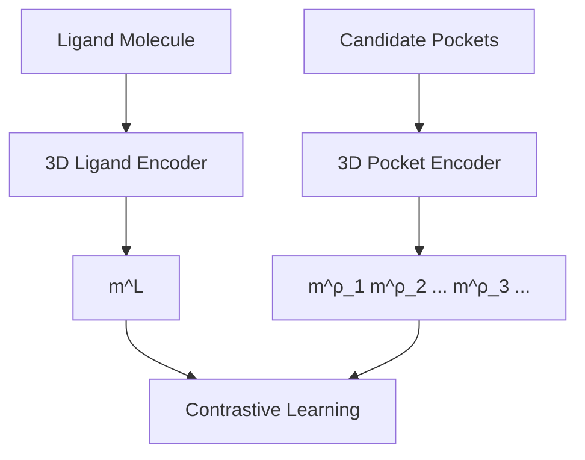
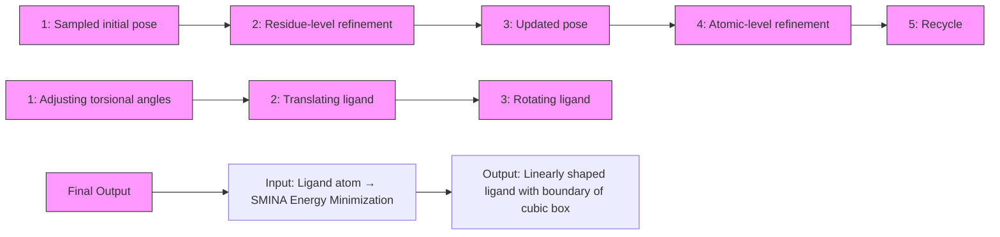

# DeltaDock: A Unified Framework for Accurate, Efficient, and Physically Reliable Molecular Docking

Jiaxian Yan $^{1}$ , Zaixi Zhang $^{1}$ , Jintao Zhu $^{2}$ , Kai Zhang $^{1}$ , Jianfeng Pei $^{2}$ , Qi Liu $^{1*}$

$^{1}$ State Key Laboratory of Cognitive Intelligence, University of Science and Technology of China

$^{2}$ Center for Quantitative Biology,

Academy for Advanced Interdisciplinary Studies, Peking University

{jiaxianyan, zaixi, sa517494}@mail.ustc.edu.cn, zhujt@stu.pku.edu.cn,

jfpei@pku.edu.cn, qiliuql@ustc.edu.cn

# Abstract

Molecular docking, a technique for predicting ligand binding poses, is crucial in structure-based drug design for understanding protein-ligand interactions. Recent advancements in docking methods, particularly those leveraging geometric deep learning (GDL), have demonstrated significant efficiency and accuracy advantages over traditional sampling methods. Despite these advancements, current methods are often tailored for specific docking settings, and limitations such as the neglect of protein side-chain structures, difficulties in handling large binding pockets, and challenges in predicting physically valid structures exist. To accommodate various docking settings and achieve accurate, efficient, and physically reliable docking, we propose a novel two-stage docking framework, DeltaDock, consisting of pocket prediction and site-specific docking. We innovatively reframe the pocket prediction task as a pocket-ligand alignment problem rather than direct prediction in the first stage. Then we follow a bi-level coarse-to-fine iterative refinement process to perform site-specific docking. Comprehensive experiments demonstrate the superior performance of DeltaDock. Notably, in the blind docking setting, DeltaDock achieves a 31% relative improvement over the docking success rate compared with the previous state-of-the-art GDL model. With the consideration of physical validity, this improvement increases to about 300%. $^{\dagger}$

# 1 Introduction

Recent advancement in geometric deep learning (GDL) $[1, 2, 3]$ presents an innovative and promising molecular docking paradigm to predict and understand the interactions between target proteins and drugs, which is of paramount importance for drug discovery $[4, 5]$ . Unlike traditional docking methods that employ optimization algorithms to sample and identify best binding poses $[6, 7]$ , GDL methods interpret molecular docking as either a regression or generation task, eliminating the need for intensive candidate sampling $[8, 9, 10]$ . Studies have demonstrated that GDL methods outperform their traditional counterparts, delivering enhancements in both the accuracy of binding pose predictions, as measured by the root-mean-square deviation (RMSD) metric, and the inference efficiency $[11, 12]$ .

According to whether a prior pocket is given, molecular docking can be divided into blind and site-specific docking $[13]$ . Traditional sampling methods adeptly navigate both scenarios, primarily differing in the scope of the search space they explore. In contrast, GDL methods typically specialize in either one. For instance, EquiBind $[8]$ , and DiffDock $[9]$ are designed for blind docking, neglecting the incorporation of binding pockets. Uni-Mol $[14]$ and DiffBind-FR $[15]$ concentrate on site-specific docking and only protein atomic level structure within a defined radius (usually 6-12 Å) of the

co-crystal is modeled. Despite some progress, these methods not only fail to handle two docking settings smoothly like traditional methods, but also confronted with certain limitations. For blind docking methods, they ignore the fine-grained protein side-chain structure. Regarding the site-specific docking methods, when dealing with pockets larger than the predetermined cutoff or when there is a requirement to model extensive pocket surrounding structures to account for long-range interactions, these methods significantly deteriorate in performance $[16]$ and the demand for computational resources can escalate significantly, as evidenced in Appendix.A.2 and Appendix.A.3.

Besides these challenges, current GDL methods face additional limitations due to the lack of inductive biases, such as penalties for steric clashes or constraints on ligand mobility, leading to the generation of unrealistic docking poses. Buttenschoen et al. [16] proposed the PoseBusters test suit to verify and highlight these problems. In addition to the RMSD between predicted and ground-truth poses, the test suite incorporates 18 checks, encompassing chemical validity and consistency, intramolecular validity, and intermolecular validity. According to the test suite, the previously highest-performing method, DiffDock, achieves a success rate of only $14\%$ . This is significantly lower than the $38\%$ success rate achieved when chemical validity is not taken into account.

To resolve these problems, we propose DeltaDock, a unified GDL framework for accurate, efficient, and physically valid docking. DeltaDock is a two-stage framework consisting of a pocket prediction stage and a site-specific docking stage. With "Delta", we mean that the optimal poses are predicted by iteratively refining the input structures in the second docking stage. The first pocket prediction stage is specialized for blind docking, where a binding pocket is identified from a set of candidates through a novel contrastive pocket-ligand alignment module CPLA. Then in the second stage, within the pockets predefined or selected by CPLA, binding structures are predicted in a bi-level coarse-to-fine iterative refinement module Bi-EGMN. This module prioritizes the residue-level structure covered by a large outer box (Fig.4) for pose positioning and coarse structure prediction. And the atom-level structure, within a relatively small radius from the coarse structure, is characterized for more refined predictions. In particular, the module incorporates (i) a GPU-accelerated pose sampling algorithm generating high-quality initial structure, (ii) a training objective imposing penalties for steric clashes and constraints on ligand mobility, and (iii) a rapid post-processing step composing torsional alignment and energy minimization for structure correction.

To accommodate two different docking settings, DeltaDock is specially designed as a two-stage framework rather than an end-to-end framework. Particularly, the pocket-ligand alignment module is inspired by the observation shown in Fig.5. Existing pocket prediction methods generally achieve a recall rate of just 70%-80%. However, when combining all possible pockets predicted by multiple methods, this recall rate reaches nearly 95%. According to this result, we shift the focus from designing increasingly powerful pocket prediction models to developing strategies for the effective selection of a candidate pocket from an ensemble of predicted pockets. The pocket prediction task is thus reframed as a pocket-ligand alignment problem innovatively. Regarding the site-specific docking stage, the key idea is to accurately predict reliable poses. Based on the proposed bi-level iterative refinement model, several components presented above are introduced additionally. Among them, the pose sampling algorithm is adopted for structure initialization, as previous works on structure prediction [17] have demonstrated the importance of a good initial structure. Other two components, namely the physics-informed training object and the fast structure correction step, are leveraged to ensure physical validity.

To demonstrate the effectiveness of DeltaDock, we performed comprehensive experiments to evaluate its predictive accuracy, efficiency, generalizability, and ability to predict physically valid binding poses. The experimental outcomes indicate that DeltaDock consistently surpasses the baseline methods in both blind docking and site-specific docking settings while maintaining remarkable computational efficiency. Notably, in the blind docking setting, DeltaDock exceeded the performance of the previous SOTA GDL method, DiffDock, by 30.8% in terms of the docking success rate, and it required only approximately 3.0 seconds per protein-ligand pair. With the consideration of physical validity, this improvement increases to approximately 300% on the PoseBusters benchmark.

flowchart

flowchart

Figure 1: The overview of DeltaDock's two modules. (a) The pocket-ligand alignment module CPLA. Contrastive learning is adopted to maximize the correspondence between target pocket and ligand embeddings for training. During inference, the pocket with the highest similarity of the ligand is selected. (b) The bi-level iterative refinement module Bi-EGMN. Initialized with a high-quality sampled pose, the module first performs a coarse-to-fine iterative refinement. This process generates progressively refined ligand poses utilizing a recycling strategy. To guarantee the physical plausibility of the predicted poses, a two-step fast structure correction is subsequently applied. This correction involves torsion angle alignment followed by energy minimization based on the SMINA.

# 2 Related Work

# 2.1 Sampling-based Docking

Traditional docking methods, epitomized by the likes of VINA $[18]$ and SMINA $[19]$ , operate on a "sampling-and-scoring" paradigm to identify the best binding pose. Optimization algorithms such as BFGS $[20]$ are used to sample optimal poses within the defined search space on CPUs. This process, which involves a significant number of steps and multiple copies, is rather computationally intensive. Recent studies have attempted to speed up the sampling process using GPUs. Notable examples are Vina-GPU $[21]$ , Uni-Dock $[22]$ , and DSDP $[23]$ , which use more copies and shorter search steps to fully leverage the parallel computational power of GPUs. This approach has demonstrated substantial efficacy, achieving a speed increase of an order of magnitude compared to prior CPU-based methods.

# 2.2 Geometric Deep Learning-based Docking

GDL introduces a new paradigm in molecular docking, where the sampling process is bypassed by interpreting molecular docking as either a regression task or a generation task $[8, 9]$ . However, recent researches have highlighted limitations of current GDL methods, such as neglect of protein side-chain structures $[15]$ , difficulties in handling large binding pockets, and challenges in predicting physically valid structures $[16]$ . Compared with physically reliable sampling-based methods, especially recent developed GPU-accelerated methods, the existing limitations hinder the practical application of GDL methods. To address these concerns, in this work, we propose DeltaDock to overcome these problems and accomplish efficient, accurate, and physical reliable docking.

# 2.3 Binding Pocket Prediction

As the foundation of structure-based drug design, binding pocket prediction has attracted expansive attention. A variety of methods have been developed for this task, encompassing traditional computational methods, such as Fpocket $[24]$ , machine learning (ML) methods, such as P2Rank $[25]$ , and GDL methods, such as PUResNet $[26]$ . These methods generally adopt ligand-free approaches and focus on predicting all potential binding sites within individual proteins. Recent blind docking methods, DSDP and FABind, apply pocket prediction for target ligands to reduce the docking search space, which is of great help to fast and accurate blind docking. In this study, our proposed model, DeltaDock, also prioritizes defining a pocket for blind docking. However, instead of improving model architecture for pocket prediction like previous methods, DeltaDock reframe the pocket prediction task as a pocket-ligand alignment problem and employ contrastive learning to select a candidate pocket from the combined pockets set.

# 3 DeltaDock Framework

# 3.1 Preliminaries

Notations. In this work, the separate structures of a protein P and a ligand L are used as inputs (Fig. 1). Both molecules are initially encoded as graphs, and we denote a molecule graph as $\mathcal{G} = (\mathcal{V}, \mathcal{E})$ , where V and E represent the node set and edge set respectively. Each node $v_i \in V$ is associated with a coordinate $x_i$ and a feature vector $h_i$ . Each edge $(i, j) \in \mathcal{E}$ is associated with an edge feature vector $e_{ij}$ . For the ligand L and ligand graph $G^{\mathcal{L}}$ , $v_i^{\mathcal{L}}$ represents the i-th atom in the ligand and $x_i^{\mathcal{L}}$ corresponds to the atom's coordinate. For the protein P, the situation is more complex, and two graphs based on the two structural levels of the protein are constructed. One is the protein atomic graph $G^P$ , and the other is the protein residue graph $G^{P*}$ . $G^P$ contains protein atomic-level information similar to ligand graph $G^{\mathcal{L}}$ , while $G^{P*}$ contains protein residue-level information and overlooks the side-chain structure information. In $G^{P*}$ , $v_i^{P*}$ represents the i-th residue in the protein and $x_i^{P*}$ corresponds to the $C_\alpha$ coordinate of this residue. Details of the graph construction can be found in Appendix.A.6.

Overview. Our goal is to train a model $f$ that excels in both site-specific docking and blind docking scenarios of rigid molecular docking, wherein the protein structure is fixed and only the ligand's flexibility is considered.

As depicted in Fig. 1, DeltaDock comprises two modules: a pocket-ligand alignment module CPLA responsible for selecting binding pocket from a pocket candidate set, and a bi-level iterative refinement module Bi-EGMN dedicated to executing site-specific docking given the binding pockets. This design allows DeltaDock to handle both blind docking and site-specific docking seamlessly. In the subsequent part of this section, we will elaborate on these two modules respectively.

# 3.2 Contrastive Pocket-ligand Alignment

CPLA treats the pocket prediction task as a pocket-ligand alignment problem. We employ a list of well-established ligand-free pocket prediction methods to generate candidate pocket sets, and then map these pockets and the target ligand into the same embedding space. The correct pocket embedding is expected to have higher similarity with ligand embedding than other pockets.

# 3.2.1 Data Preprocessing

The initial step of this module involves using RDKit [27] to generate a 3D conformer of the input ligand, as depicted in Fig. 1. Binding site prediction models including P2Rank and DSDP are adopted to extract druggable binding sites, and the binding sites predicted by these different methods are combined to form a set of candidate binding sites, denoted as $S = \{\varsigma_1, \varsigma_2, \ldots\}$ , where $\varsigma_i$ represents the geometric center of $i$ -th binding site. For CPLA, the protein pocket $\rho_i$ is defined as the residues within 15.0 Å to $\varsigma_i$ .

# 3.2.2 Ligand and Pocket Encoders

To map the ligand and pockets into the embedding space, the ligand encoder Attentive-FP (AFP) [28] and protein encoder Geometric Vector Perceptron (GVP) [29] are employed. These encoders first extract informative ligand node and protein node representations, and the feature extraction process can be formally expressed as:

$$
H ^ {\mathcal {L}} = A F P (\mathcal {G} ^ {\mathcal {L}}), H ^ {\mathcal {P} *} = G V P (\mathcal {G} ^ {\mathcal {P} *}), \tag {1}
$$

where $H^{L}$ is the ligand embedding matrix of shape $|V^{L}| \times d$ and $H^{P*}$ is the protein residue embedding matrix of shape $|V^{P*}| \times d$ . The ligand representations $m^{L}$ and pocket representations $m_{i}^{\rho}$ are then obtained by pooling ligand nodes embedding and pocket nodes embedding:

$$
m ^ {\mathcal {L}} = \operatorname{Sum} \left(H ^ {\mathcal {L}}, \mathcal {V} ^ {\mathcal {L}}\right), m _ {i} ^ {\rho} = \operatorname{Sum} \left(H ^ {\mathcal {P} *}, \mathcal {V} _ {i} ^ {\rho}\right), \tag {2}
$$

where $V_{i}^{\rho}$ is the protein node set of i-th pocket $\rho$ , and the pooling operation is sum pooling. For the pocket encoder, we input the entire protein residue graph $G^{P*}$ rather than just the protein pocket residue graph, to incorporate global protein information into the pocket representation.

# 3.2.3 Contrastive Embdding Alignment

With ligand representation $m^{\mathcal{L}}$ and pocket representation $m_i^\rho$ in hand, we calculate the cosine similarity score:

$$
s _ {i} = \frac {m ^ {\mathcal {L}} \cdot m _ {i} ^ {\rho}}{\| m ^ {\mathcal {L}} \| _ {2} \cdot \| m _ {i} ^ {\rho} \| _ {2}}. \tag {3}
$$

For the candidate pockets $S = \{\varsigma_{1}, \varsigma_{2}, \ldots\}$ , the similarity score $s_{+}$ between the target pocket and the ligand is expected to be higher than others. Thus, we propose the contrastive learning objective:

$$
L = - \frac {1}{N} \cdot \log \frac {\exp (s _ {+} / \tau)}{\sum_ {i} \exp (s _ {i} / \tau)}, \tag {4}
$$

where $\tau$ is the temperature parameter. For blind docking, the pocket with the highest similarity score with the ligand is selected for the next docking step.

# 3.3 Bi-level Iterative Refinement

With a binding site $\varsigma$ predefined by the user or selected by CPLA, we design the bi-level iterative refinement module Bi-EGMN to predict binding pose within this pocket (Fig. 1).

# 3.3.1 Initial Structure Sampling

For an iterative refinement module, an initial structure is needed as a starting point. Previous work on molecular 3D conformer generation [17] demonstrates the importance of a good initial structure. Therefore, Bi-EGMN adopts a rapid GPU-accelerated sampling method proposed by Huang et al. [23] to sample a high-quality initial $\mathcal{X}^{\mathcal{L}}$ . In this work, the search steps number and the search copy number are set to 40 and 384, respectively. Details about the search box setting can be found in the Appendix.B.3.1.

# 3.3.2 Structure Refinement

With input initial structure $X^{L}$ , we iteratively update it to improve its accuracy. As discussed in Sec.1, the modeling of an entire binding pocket structure is crucial for the success of the process. Current methods either ignore the atom-level structure or model the full-atom pocket structure directly. The latter approach can significantly elevate the computational resource demand, particularly when dealing with large pockets. To overcome these challenges and maintain high docking accuracy and efficiency, we propose a bi-level strategy in this work. In the following sections, we first present the details of the bi-level strategy. Subsequently, we discuss the Bi-EGMN layer, which is used to perform refinement, as depicted in Fig. 1.

Bi-level strategy. The first refinement level is the residue level, where the protein residues within a 40.0 Å cubic region centered at the geometric centers of ligands are considered as pocket $\rho$ . Previous work demonstrates such a range is large enough to cover the binding pocket [30]. In this context, as the full-atom structure of proteins is not considered, the pocket residue graph $\mathcal{G}^{\rho*}$ is adapted. The second level is the atomic level, where we set the ligand structures refined through $T$ rounds of residue level refinement as the reference structure. In this level, protein atoms within a 6.0 Å radius of the ligand atoms are considered to construct pocket atomic graph $\mathcal{G}^{\rho}$ for modeling the fine-grained interaction. The ligand coordinates $X^{a,\mathcal{L}}$ output by the last layer of atomic level refinement correspond to the final predicted structure $\hat{\mathcal{X}}^{\mathcal{L}}$ .

Bi-EGMN Layer. The bi-level E(3)-equivariant graph matching network (Bi-EGMN) layer is the model designed to calculate the protein-ligand interaction and refine the structures. More specifically, this layer adheres to the message-passing paradigm $[31]$ and consists of four functions: intra-message function, inter-message function, aggregate function, and update function.

The intra-message function works to extract messages $m_{i,j}$ and $\hat{m}_{i,j}$ between a node $i$ and its neighbor nodes $j$ from the same molecule graph. $m_{i,j}$ is later used for the updating of node features and $\hat{m}_{i,j}$ for the updating node coordinates. $\forall (i,j)\in \mathcal{E}_{\mathcal{P}}\cup \mathcal{E}_{\mathcal{L}}$ , this function can be formally written as:

$$
d _ {i, j} ^ {(l)} = \left\| x _ {i} ^ {(l)} - x _ {j} ^ {(l)} \right\|, m _ {i, j} = \varphi_ {m} (h _ {i} ^ {(l)}, h _ {j} ^ {(l)}, d _ {i, j} ^ {(l)},), \hat {m} _ {i, j} = (x _ {i} ^ {(l)} - x _ {j} ^ {(l)}) \cdot \varphi_ {\hat {m}} (m _ {i, j}), \tag {5}
$$

where $d_{i,j}^{(l)}$ is the relative distance between node $i$ and node $j$ , and $\varphi$ is a MLP.

The inter-message function works to extract messages $\mu_{i,j}$ and $\hat{\mu}_{i,j}$ between a node i and its neighbor nodes j from the other molecule graphs. Formally, $\forall i \in V_{P}, j \in V_{L}$ or $i \in V_{L}, j \in V_{P}$ :

$$
\mu_ {i, j} = \varphi_ {\mu} (h _ {i} ^ {(l)}, h _ {j} ^ {(l)}, d _ {i, j} ^ {(l)}), \hat {\mu} _ {i, j} = (x _ {i} ^ {(l)} - x _ {j} ^ {(l)}) \cdot \varphi_ {\hat {\mu}} (\mu_ {i, j}). \tag {6}
$$

After extracting inter-message and intra-message, the aggregation function aggregates the neighbor messages of the node $i$ . $\forall i \in \mathcal{V}_{\mathcal{P}} \cup \mathcal{V}_{\mathcal{L}}$ :

$$
m _ {i} = \sum_ {j \in \mathcal {N} (i)} m _ {i, j}, \hat {m} _ {i} = \sum_ {j \in \mathcal {N} (i)} \frac {1}{d _ {i , j} ^ {(l)} + 1} \cdot \hat {m} _ {i, j}, \tag {7}
$$

$$
\mu_ {i} = \sum_ {j \in \mathcal {N} _ {*} ^ {(l)} (i)} \varphi (\mu_ {i, j}) \cdot \mu_ {i, j}, \hat {\mu} _ {i} = \sum_ {j \in \mathcal {N} _ {*} ^ {(l)} (i)} \frac {1}{d _ {i , j} ^ {(l)} + 1} \cdot \hat {\mu} _ {i, j}, \tag {8}
$$

where $\mathcal{N}(i)$ is the neighbor of node $i$ in the same graph, and $\mathcal{N}_{*}^{(l)}(i)$ is the set of nodes associated with node $i$ in the other graph.

Finally, the update function updates the position and features of each node:

$$
x _ {i} ^ {(l + 1)} = \eta x _ {i} ^ {(0)} + (1 - \eta) x _ {i} ^ {(l)} + \hat {m} _ {i} + \hat {\mu} _ {i}, \forall i \in \mathcal {V} _ {\mathcal {P}} \cup \mathcal {V} _ {\mathcal {L}}, \tag {9}
$$

$$
h _ {i} ^ {(l + 1)} = (1 - \beta) \cdot h _ {i} ^ {(l)} + \beta \cdot \varphi (h _ {i} ^ {(l)}, m _ {i}, \mu_ {i}, h _ {i} ^ {(0)}), \forall i \in \mathcal {V} _ {\mathcal {P}} \cup \mathcal {V} _ {\mathcal {L}}, \tag {10}
$$

where $\beta$ and $\eta$ are feature skip connection weight and coordinates skip connection weight, respectively. Through such a message-passing paradigm, our Bi-EGMN layers make to update coordinates iteratively.

# 3.3.3 Fast Structure Correction

Lastly, as Bi-EGMN updates structures by modifying the coordinates rather than the torsional angles, as is done in methods like DiffDock [9] and other sampling-based methods, it is crucial to ensure the plausibility of bond lengths and bond angles of the updated structure $\hat{X}^{L}$ . Therefore, fast structure correction steps, torsion alignment, and SMINA-based energy minimization are designed.

Torsion Alignment. We employ a rapid torsion alignment for the updated structure. The target of this alignment is to align the input structure $X^{L}$ with the updated structures $\hat{X}^{L}$ by rotating its torsional bonds. Formally, let $(b_{i}, c_{i})$ denote a i-th rotatable bond, where $b_{i}$ and $c_{i}$ are the starting and ending atoms of the bond, respectively. We randomly select a neighboring atom $a_{i}$ of $b_{i}$ and a neighbor atom $d_{i}$ of $c_{i}$ to calculate the dihedral angle $\hat{\delta}_{i} = \angle(a_{i}b_{i}c_{i}, b_{i}c_{i}d_{i})$ based on updated structure coordinates $\hat{X}^{L}$ . Subsequently, we rotate the rotatable bond $(b_{i}, c_{i})$ of input structures to match its dihedral angle $\delta_{i}$ the same as $\hat{\delta}_{i}$ . This simple operation can be implemented efficiently using RDKit. After all rotatable bonds have been rotated, we align the rotated input structure to the updated structures to obtain the torsionally aligned structure $\hat{X}^{LT}$ . This process ensures the plausibility of bond lengths and bond angles in the torsionally aligned structure $\hat{X}^{LT}$ .

Energy Minimization. To further enhance the reliability of DeltaDock, we implement an energy minimization on the torsionally aligned structure $\hat{X}^{L\mathcal{T}}$ , when an inter-molecular steric clash between the protein and ligand is detected. This energy minimization is conducted using SMINA [19], as it is a highly efficient tool for this process compared with specialized energy minimization tool OpenMM [32] (details see Appendix.A.5). The output structure of this process is $\hat{X}^{L'}$ .

# 3.4 Training and Inference

# 3.4.1 CPLA

The training object L is a contrastive object defined before (Eq. 4). For a protein and its candidate pockets set $S = \{\varsigma_{1}, \varsigma_{2}, \ldots\}$ , the positive pair is the target pocket-ligand pair and the negative pairs are other pocket-ligand pairs. The pocket-ligand pairs across different proteins are not used. When training, we calculate the minimum center distance ( $DCC_{min}$ ) between all candidate pockets and the ligand. If $DCC_{min} \leq 5.0 \AA$ , we add the ligand center into S to assert the existence of positive pairs for every protein (details see Appendix.B.3.1).

Table 1: Blind docking performance on the PDBbind dataset. All methods take RDKit-generated ligand structures and holo protein structures as input, trying to predict bound complex structures. DeltaDock-SC refers to the model variant that generates structures without implementing fast structure correction. DeltaDock-Random refers to the model variant that generates structures without high-quality initial poses. The best results are bold, and the second best results are underlined. 

<table><tr><td rowspan="3">Method</td><td rowspan="3">Time averageSeconds</td><td colspan="4">Time Split (363)</td><td colspan="4">Timesplit Unseen (142)</td></tr><tr><td colspan="2">RMSD % below</td><td colspan="2">Centroid % below</td><td colspan="2">RMSD % below</td><td colspan="2">Centroid % below</td></tr><tr><td>2.0Å</td><td>5.0Å</td><td>2.0Å</td><td>5.0Å</td><td>2.0Å</td><td>5.0Å</td><td>2.0Å</td><td>5.0Å</td></tr><tr><td>QVINA-W</td><td>49*</td><td>20.9</td><td>40.2</td><td>41.0</td><td>54.6</td><td>15.3</td><td>31.9</td><td>35.4</td><td>47.9</td></tr><tr><td>GNINA</td><td>393</td><td>21.2</td><td>37.1</td><td>36.0</td><td>52.0</td><td>13.9</td><td>27.8</td><td>25.7</td><td>39.5</td></tr><tr><td>VINA</td><td>119*</td><td>10.3</td><td>36.2</td><td>32.3</td><td>55.2</td><td>7.8</td><td>25.5</td><td>24.1</td><td>41.8</td></tr><tr><td>SMINA</td><td>146*</td><td>13.5</td><td>33.9</td><td>38.0</td><td>55.9</td><td>9.0</td><td>25.7</td><td>29.9</td><td>41.7</td></tr><tr><td>GLIDE</td><td>1405*</td><td>21.8</td><td>33.6</td><td>36.1</td><td>48.7</td><td>19.6</td><td>28.7</td><td>29.4</td><td>40.6</td></tr><tr><td>DSDP</td><td>1.22</td><td>40.2</td><td>59.0</td><td>59.5</td><td>78.2</td><td>37.3</td><td>54.9</td><td>55.6</td><td>71.8</td></tr><tr><td>EquiBind</td><td>0.03</td><td>5.5</td><td>39.1</td><td>40.0</td><td>67.5</td><td>0.7</td><td>18.8</td><td>16.7</td><td>43.8</td></tr><tr><td>TANKBind</td><td>0.87</td><td>17.6</td><td>57.8</td><td>55.0</td><td>77.8</td><td>3.5</td><td>43.7</td><td>40.9</td><td>70.8</td></tr><tr><td>DiffDock</td><td>80</td><td>36.0</td><td>61.7</td><td>62.9</td><td>80.2</td><td>17.2</td><td>42.3</td><td>43.3</td><td>62.6</td></tr><tr><td>FABind</td><td>0.12</td><td>33.1</td><td>64.2</td><td>60.8</td><td>80.2</td><td>19.4</td><td>60.4</td><td>57.6</td><td>75.7</td></tr><tr><td>DeltaDock-SC</td><td>2.58</td><td>47.9</td><td>68.0</td><td>70.0</td><td>83.2</td><td>40.8</td><td>60.6</td><td>65.5</td><td>78.9</td></tr><tr><td>DeltaDock</td><td>2.97</td><td>47.4</td><td>66.9</td><td>66.7</td><td>83.2</td><td>40.8</td><td>61.3</td><td>60.6</td><td>78.9</td></tr></table>

$^{1}$ The time of consumption is denoted with \* if it only consumes CPU.   
$^{2}$ All results of baselines are taken from [11] for fair comparison.

# 3.4.2 Bi-EGMN

We design a physics-informed loss function for the Bi-EGMN module for training. The coordinates $X^{a,L}$ and $X^{r,L}$ output by the last layer of atomic level and residue level are both employed in the computation of this loss. Formally, the loss function can be expressed as follows:

$$
L = L _ {i n t e r} + \lambda_ {1} L _ {i n t r a} + \lambda_ {2} L _ {v d w} + \lambda_ {3} L _ {b o u n d}, \tag {11}
$$

where $\lambda$ are weight hyper-parameters. Among the four components, inter-distance map loss $L_{inter}$ is responsible for the RMSD accuracy. Other three items, namely intra-distance map loss $L_{intra}$ , vdw constraint loss $L_{vdw}$ , and bound matrix constraint loss $L_{bound}$ are employed for physical validity. When training and inferencing, we follow previous work [33] and employ the recycling strategy (details see Appendix.B.3.2).

# 4 Experiments

# 4.1 Settings

Dataset. We conduct experiments on PDBbind [34] v2020 and PoseBusters [16] datasets in this work. Our model is trained on the PDBbind dataset, where the training, validation, and testing set are constructed based on the time split strategy used in previous work [11]. PoseBusters, which contains 428 carefully selected data released from 1 January 2021 to 30 May 2023, is directly adopted to evaluate the ability to predict physically valid poses.

Evaluation. Root-mean-square-deviation (RMSD) and centroid distance (CD) are used to evaluate the docking accuracy of different docking methods, and the PoseBusters $[16]$ test suite is employed to evaluate the performance of predicting physically valid poses. Additionally, as pocket prediction plays an important role in our framework, the distance between the center of the predicted pocket and the center of the ground-truth ligand structure (DCC), and the volume coverage rate (VCR) are employed to evaluate the pocket prediction accuracy (details in Appendix.B).

# 4.2 Overall Performance on the PDBbind

We first assess the comprehensive performance of DeltaDock on the PDBbind dataset, encompassing both blind docking and site-specific docking settings.

  
Figure 2: Site-specific docking performance. (a) Overall Performance of different methods on the PDBbind test set. The search space was delineated by extending the minimum and maximum of the x, y, and z coordinates of the ligand by 4 Å respectively. For TANKBind, we directly supply the protein block with a radius of 20 Å centered around the ground-truth ligand center to the model. (b) Overall performance of different methods on the PoseBusters dataset. (c) A waterfall plot for illustrating the PoseBusters tests as filters for both DeltaDock and DeltaDock-SC predictions. The evaluation results for DeltaDock are denoted above the lines, while those for DeltaDock-SC are annotated below.

# 4.2.1 Blind Docking

As demonstrated in Table.1, DeltaDock outperforms all baseline methods. Specifically, DeltaDock achieves a remarkable success rate of 47.4% (where RMSD < 2.0 Å), surpassing the previous SOTA GDL method, DiffDock, which has a success rate of 36.0%. Recent GPU-accelerated docking methods have also made significant progress in blind docking. However, when compared to DSDP, which is the top-performing sampling-based method in the PDBbind test set, DeltaDock still exhibits superior performance across all metrics. Notably, as elucidated in Section 3.3, DeltaDock employs the same sampling algorithm as DSDP for generating the initial structure. Yet, our framework allows DeltaDock to significantly outperform DSDP.

Beyond accuracy, efficiency is a critical performance measure for molecular docking methods. As indicated in Table 1, DeltaDock maintains a competitive level of efficiency, despite the inclusion of an energy minimization operation to enhance accuracy and reliability. Molecular docking methods invariably face a trade-off between efficiency and accuracy. However, the data presented in Table 1 suggest that DeltaDock could serve as a viable tool for practical applications, balancing these two crucial aspects effectively.

# 4.2.2 Site-specific Docking

Most existing GDL methods, such as DiffDock and EquiBind, are primarily designed for blind docking scenarios and are not inherently suited for site-specific docking tasks. However, DeltaDock seamlessly integrates blind docking and site-specific docking settings. In this context, the pocket is directly provided, eliminating the need for pocket selection via CPLA. The performance of DeltaDock in site-specific docking is illustrated in Fig.2. When supplied with predefined binding sites, traditional sampling methods exhibit a significant improvement in results. For instance, the docking success rate of VINA escalates from 10.3% to 45.0%. Despite this enhancement, DeltaDock consistently surpasses all baselines. Previous research suggested that while GDL docking methods excel at pocket searching, traditional methods tend to outperform GDL models in site-specific docking tasks $[35]$ . However, as evidenced by the results presented in Table.1 and Fig.2, DeltaDock exhibits superior performance in both blind and site-specific docking scenarios, demonstrating its versatility and robustness in handling diverse docking settings.

# 4.3 Evaluation of Generalization Capability

Historically, GDL docking methods have demonstrated limited generalization capabilities. Here, we first examine the blind docking performance of DeltaDock and baseline methods on the unseen set of the PDBbind test, following prior work. As indicated in Table 1, the docking success rate of all methods on the unseen set from the PDBbind test is generally lower than that on the complete PDBbind test set. For example, the performance of GLIDE and QVINA-W shows a modest decline of 2.2% and 5.6%, respectively. For GDL baselines, the performance decrement is more pronounced. Notably, TANKBind and the SOTA GDL method DiffDock experience a performance drop of 14.1%

  
Figure 3: Further analysis on the (a) PDBbind and (b) PoseBusters dataset. Left: DCC cumulative curve of top-1 pockets. Middle: VCR cumulative curve of top-1 pockets. Right: Scatter plot of RMSD of initial and updated poses. All experiments are conducted in the blind docking setting.

and 18.8%. This outcome suggests that the unseen test set is more challenging than the whole test set. However, DeltaDock demonstrates competitive performance, achieving a docking success rate of 40.8%. Compared to FABind, the best-performing GDL baseline on the unseen test set, DeltaDock surpasses it by a significant 20.1% in terms of docking success rate.

# 4.4 Evaluation of Pose Validity

We further investigate DeltaDock's ability to predict physically valid structures by employing the PoseBusters test suite, as designed by Buttenschoen et al. [16]. In addition to the RMSD between predicted and ground-truth poses, the test suite incorporates 18 checks, encompassing chemical validity and consistency, intramolecular validity, and intermolecular validity. When physical validity is considered, the docking success rates of traditional sampling methods remain stable, while the performance of previous geometric deep learning methods significantly declines, especially for TANKBind, DeepDock, and Uni-Mol. The DeltaDock-SC variant, even without the application of the fast structure correction step, shows significant improvement over previous methods. These results substantiate DeltaDock's capacity to predict physically valid structures, thereby affirming its reliability for practical applications.

# 4.5 Further Analysis

# 4.5.1 Pocket-ligand Alignment and Iterative Refinement

Beyond the overall docking performance, the pocket-ligand alignment and iterative refinement results are explored (Fig. 3). As depicted in the figure, CPLA predicts significantly more accurate pockets than other methods and Bi-EGMN can diminish the discrepancy between ground-truth structures and input structures. Generally, the PDBbind test set poses a more significant challenge to Bi-EGMN than the PoseBusters dataset. And for CPLA, PoseBusters dataset is more challenging otherwise. The consistent good performance on the two datasets demonstrates the effectiveness and generalization capacity of CPLA and Bi-EGMN.

# 4.5.2 Ablation Studies

In this section, ablation studies are conducted to assess the contributions of different components. We first ablate the whole CPLA or Bi-EGMN, and then the residue-level or the atom-level in Bi-EGMN (see Appendix. B.4 for implement details). As illustrated in Table 2, it becomes clear that each component, encompassing CPLA and the bi-level strategy in Bi-EGMN, plays a significant role in enhancing the overall performance of DeltaDock. Due to the space limitation, a full ablation study can be found in Appendix. C.3.

Table 2: Results of ablation study. 

<table><tr><td rowspan="2">Method</td><td colspan="2">RMSD % below 2 Å</td></tr><tr><td>PDBbind</td><td>PoseBusters</td></tr><tr><td>DeltaDock</td><td>47.4</td><td>49.3</td></tr><tr><td>w/o CPLA</td><td>41.2</td><td>43.7</td></tr><tr><td>w/o Bi-EGMN</td><td>44.6</td><td>41.8</td></tr><tr><td>w/o Residue Level</td><td>44.6</td><td>44.4</td></tr><tr><td>w/o Atom Level</td><td>44.6</td><td>42.1</td></tr></table>

# 5 Conclusion

In this work, we proposed DeltaDock, a unified framework for accurate, efficient, and physically reliable molecular docking. DeltaDock was a two-stage docking framework, consisting of pocket prediction and site-specific docking. We innovatively reframed the pocket prediction task as a pocket-ligand alignment problem and then followed a hybrid strategy to jointly utilize both GDL and physics-informed traditional algorithms for site-specific docking. Comprehensive experiments demonstrated the superior performance of DeltaDock. Notably, in the blind docking setting, DeltaDock achieved a $31\%$ relative improvement over the docking success rate compared with the previous state-of-the-art GDL model. We hope this work will further facilitate the broad application and continued development of the molecular docking framework.

# 6 Acknowledgements

We extend our gratitude to the reviewers for their valuable and insightful feedback, which significantly improved this work. We are also grateful to Lixue Cheng from Microsoft Research Asia for her helpful suggestions and comments. This research was supported by grants from the National Natural Science Foundation of China (Grant No. 623B2095) and the Fundamental Research Funds for the Central Universities.

# References

[1] Michael M. Bronstein, Joan Bruna, Taco Cohen, and Petar Veličković. Geometric deep learning: Grids, groups, graphs, geodesics, and gauges. In ArXiv, 2021.   
[2] Zaixi Zhang, Zepu Lu, Zhongkai Hao, Marinka Zitnik, and Qi Liu. Full-atom protein pocket design via iterative refinement. In NeurIPS'23, 2023.   
[3] Zaixi Zhang and Qi Liu. Learning subpocket prototypes for generalizable structure-based drug design. In ICML'24, 2023.   
[4] Xing Du, Yi Li, Yuan-Ling Xia, Shi-Meng Ai, Jing Liang, Peng Sang, Xing lai Ji, and Shu-Qun Liu. Insights into protein–ligand interactions: Mechanisms, models, and methods. International Journal of Molecular Sciences, 17:144, 2016.   
[5] Shuangli Li, Jingbo Zhou, Tong Xu, Liang Huang, Fan Wang, Haoyi Xiong, Weili Huang, Dejing Dou, and Hui Xiong. Structure-aware interactive graph neural networks for the prediction of protein-ligand binding affinity. In KDD'21, 2021.   
[6] Jiankun Lyu, Sheng Wang, Trent E. Balius, Isha Singh, Anat Levit, Yurii S. Moroz, Matthew J. O'Meara, Tao Che, Enkhjargal Algaa, Kateryna A Tolmachova, Andrey A. Tolmachev, Brian K. Shoichet, Bryan L. Roth, and John J. Irwin. Ultra-large library docking for discovering new chemotypes. Nature, 566:224 – 229, 2019.   
[7] Brian Joseph Bender, Stefan Gahbauer, Andreas Luttens, Jiankun Lyu, Chase M Webb, Reed M. Stein, Elissa A. Fink, Trent E. Balius, Jens Carlsson, John J. Irwin, and Brian K. Shoichet. A practical guide to large-scale docking. Nature protocols, page 4799–4832, 2021.   
[8] Hannes Stärk, Octavian-Eugen Ganea, Lagnajit Pattanaik, Regina Barzilay, and T. Jaakkola. Equibind: Geometric deep learning for drug binding structure prediction. In ICML'22, 2022.   
[9] Gabriele Corso, Hannes Stärk, Bowen Jing, Regina Barzilay, and Tommi S. Jaakkola. Diffdock: Diffusion steps, twists, and turns for molecular docking. In ICLR'23, 2023.   
[10] Zaixi Zhang, Jiaxian Yan, Qi Liu, and Enhong Chen. A systematic survey in geometric deep learning for structure-based drug design. ArXiv, abs/2306.11768, 2023.   
[11] Qizhi Pei, Kaiyuan Gao, Lijun Wu, Jinhua Zhu, Yingce Xia, Shufang Xie, Tao Qin, Kun He, Tie-Yan Liu, and Rui Yan. Fabind: Fast and accurate protein-ligand binding. In NeurIPS'23, 2023.   
[12] Yangtian Zhang, Huiyu Cai, Chence Shi, and Jian Tang. E3bind: An end-to-end equivariant network for protein-ligand docking. In ICLR'23, 2023.   
[13] Nafisa Hassan, Amr Alhossary, Yuguang Mu, and C. Kwoh. Protein-ligand blind docking using quickvina-w with inter-process spatio-temporal integration. Scientific Reports, 7, 2017.   
[14] Gengmo Zhou, Zhifeng Gao, Qiankun Ding, Hang Zheng, Hongteng Xu, Zhewei Wei, Linfeng Zhang, and Guolin Ke. Uni-mol: A universal 3d molecular representation learning framework. In ICLR'23, 2023.   
[15] Jintao Zhu, Zhonghui Gu, Jianfeng Pei, and Luhua Lai. Diffbindfr: An se(3) equivariant network for flexible protein-ligand docking. In ArXiv, 2023.   
[16] Martin Buttenschoen, Garrett M. Morris, and Charlotte M. Deane. Posebusters: Ai-based docking methods fail to generate physically valid poses or generalise to novel sequences. Chemical Science, 2023.   
[17] Danny Reidenbach and Aditi S. Krishnapriyan. Coarsenconf: Equivariant coarsening with aggregated attention for molecular conformer generation. In ArXiv, 2023.   
[18] Oleg Trott and Arthur J. Olson. Autodock vina: Improving the speed and accuracy of docking with a new scoring function, efficient optimization, and multithreading. Journal of Computational Chemistry, 31:455–461, 2010.   
[19] David Ryan Koes, Matthew P. Baumgartner, and Carlos J. Camacho. Lessons learned in empirical scoring with smina from the csar 2011 benchmarking exercise. Journal of chemical information and modeling, 53 8:1893–904, 2013.   
[20] Jorge Nocedal and Stephen J. Wright. Numerical Optimization. Springer New York, NY, 2000.

[21] Ji Ding, Shi xiong Tang, Zheming Mei, Lingyue Wang, Qinqin Huang, Haifeng Hu, Ming Ling, and Jiansheng Wu. Vina-gpu 2.0: Further accelerating autodock vina and its derivatives with graphics processing units. Journal of chemical information and modeling, 63:1982–1998, 2023.   
[22] Yuejiang Yu, Chun Cai, Jiayue Wang, Zonghua Bo, Zhengdan Zhu, and Hang Zheng. Uni-dock: Gpu-accelerated docking enables ultralarge virtual screening. Journal of chemical theory and computation, 19:3336–3345, 2023.   
[23] Yupeng Huang, Hong Zhang, Siyuan Jiang, Dajiong Yue, Xiaohan Lin, Jun Zhang, and Yi Qin Gao. Dsdp: A blind docking strategy accelerated by gpus. Journal of chemical information and modeling, 63:4355–4363, 2023.   
[24] Vincent Le Guilloux, Peter Schmidtke, and Pierre Tufféry. Fpocket: An open source platform for ligand pocket detection. BMC Bioinformatics, 10:168 – 168, 2009.   
[25] Radoslav Krivák and David Hoksza. P2rank: machine learning based tool for rapid and accurate prediction of ligand binding sites from protein structure. Journal of Cheminformatics, 10:39, 2018.   
[26] Jeevan Kandel, Hilal Tayara, and Kil to Chong. Puresnet: prediction of protein-ligand binding sites using deep residual neural network. Journal of Cheminformatics, 13:65, 2021.   
[27] Greg Landrum, Paolo Tosco, Brian Kelley, Ric, sriniker, gedeck, Riccardo Vianello, Nadine Schneider, Eisuke Kawashima, Andrew Dalke, David Cosgrove, Dan N, Gareth Jones, Brian Cole, Matt Swain, Samo Turk, Alexander Savelyev, Alain Vaucher, Maciej Wójcikowski, Ichiru Take, Daniel Probst, Kazuya Ujihara, Vincent F. Scalfani, guillaume godin, Axel Pahl, Francois Berenger, JL Varjo, strets 123, JP, and Doliath Gavid. rdkit/rdkit: 2022\_03\_4 (q1 2022) release, July 2022.   
[28] Zhaoping Xiong, Dingyan Wang, Xiaohong Liu, Feisheng Zhong, Xiaozhe Wan, Xutong Li, Zhaojun Li, Xiaomin Luo, Kaixian Chen, Hualiang Jiang, and Mingyue Zheng. Pushing the boundaries of molecular representation for drug discovery with graph attention mechanism. Journal of medicinal chemistry, 63:8749–8760, 2020.   
[29] Bowen Jing, Stephan Eismann, Patricia Suriana, Raphael J. L. Townshend, and Ron O. Dror. Learning from protein structure with geometric vector perceptrons. In ICLR '21, 2020.   
[30] Wei Lu, Qifeng Wu, Jixian Zhang, Jiahua Rao, Chengtao Li, and Shuangjia Zheng. Tankbind: Trigonometry-aware neural networks for drug-protein binding structure prediction. In NeurIPS'22, 2022.   
[31] Justin Gilmer, Samuel S. Schoenholz, Patrick F. Riley, Oriol Vinyals, and George E. Dahl. Neural message passing for quantum chemistry. In ICML'17, 2017.   
[32] Peter K. Eastman, Jason M. Swails, John D. Chodera, Robert T. McGibbon, Yutong Zhao, Kyle A. Beauchamp, Lee-Ping Wang, Andrew C. Simmonett, Matthew P. Harrigan, Chaya D. Stern, Rafal P. Wiewiora, Bernard R. Brooks, and Vijay S. Pande. Openmm 7: Rapid development of high performance algorithms for molecular dynamics. PLoS Computational Biology, 13, 2016.   
[33] John M. Jumper, Richard Evans, Alexander Pritzel, Tim Green, Michael Figurnov, Olaf Ronneberger, Kathryn Tunyasuvunakool, Russ Bates, Augustin Zídek, Anna Potapenko, Alex Bridgland, Clemens Meyer, Simon A A Kohl, Andy Ballard, Andrew Cowie, Bernardino Romera-Paredes, Stanislav Nikolov, Rishub Jain, Jonas Adler, Trevor Back, Stig Petersen, David A. Reiman, Ellen Clancy, Michal Zielinski, Martin Steinegger, Michalina Pacholska, Tamas Berghammer, Sebastian Bodenstein, David Silver, Oriol Vinyals, Andrew W. Senior, Koray Kavukcuoglu, Pushmeet Kohli, and Demis Hassabis. Highly accurate protein structure prediction with alphafold. Nature, 596:583 – 589, 2021.   
[34] Zhihai Liu, Minyi Su, Li Han, Jie Liu, Qifan Yang, Yan Li, and Renxiao Wang. Forging the basis for developing protein-ligand interaction scoring functions. Accounts of chemical research, 50 2:302–309, 2017.   
[35] Yuejiang Yu, Shuqi Lu, Zhifeng Gao, Hang Zheng, and Guolin Ke. Do deep learning models really outperform traditional approaches in molecular docking? In ArXiv, 2023.   
[36] Limei Wang, Haoran Liu, Yi Liu, Jerry Kurtin, and Shuiwang Ji. Learning hierarchical protein representations via complete 3d graph networks. In ICLR'23, 2022.

[37] Tianfan Fu and Jimeng Sun. Sipf: Sampling method for inverse protein folding. In KDD'22, 2022.   
[38] David Dohan, Andreea Gane, Maxwell L. Bileschi, David Belanger, and Lucy J. Colwell. Improving protein function annotation via unsupervised pre-training: Robustness, efficiency, and insights. In KDD'21, 2021.   
[39] Joel Graef, Christiane Ehrt, and Matthias Rarey. Binding site detection remastered: Enabling fast, robust, and reliable binding site detection and descriptor calculation with dogsite3. Journal of Chemical Information and Modeling, 63(10):3128–3137, 2023.   
[40] Tom Halgren. New method for fast and accurate binding-site identification and analysis. Chemical biology & drug design, 69(2):146–148, 2007.   
[41] Thomas A Halgren. Identifying and characterizing binding sites and assessing druggability. Journal of chemical information and modeling, 49(2):377–389, 2009.   
[42] Noel M. O'Boyle, Michaela S. Banck, Craig A. James, Chris Morley, Tim Vandermeersch, and Geoffrey R. Hutchison. Open babel: An open chemical toolbox. Journal of Cheminformatics, 3:33 - 33, 2011.   
[43] Zeming Lin, Halil Akin, Roshan Rao, Brian Hie, Zhongkai Zhu, Wenting Lu, Nikita Smetanin, Allan dos Santos Costa, Maryam Fazel-Zarandi, Tom Sercu, Sal Candido, et al. Language models of protein sequences at the scale of evolution enable accurate structure prediction. bioRxiv, 2022.   
[44] Oscar Méndez-Lucio, Mazen Ahmad, Ehecatl Antonio del Rio-Chanona, and Jörg Kurt Wegner. A geometric deep learning approach to predict binding conformations of bioactive molecules. Nat. Mach. Intell., 3:1033–1039, 2021.   
[45] Rocco Meli and Philip Charles Biggin. spyrmsd: symmetry-corrected rmsd calculations in python. Journal of Cheminformatics, 12, 2020.   
[46] Diederik P. Kingma and Jimmy Ba. Adam: A method for stochastic optimization. In ICLR'15, 2015.   
[47] Bowen Gao, Bo Qiang, Haichuan Tan, Minsi Ren, Yinjun Jia, Minsi Lu, Jingjing Liu, Weiying Ma, and Yanyan Lan. Drugclip: Contrastive protein-molecule representation learning for virtual screening. In NeurIPS '23, 2023.   
[48] Greg Landrum et al. Rdkit: A software suite for cheminformatics, computational chemistry, and predictive modeling. Greg Landrum, 2013.   
[49] Josh Abramson, Jonas Adler, Jack Dunger, Richard Evans, Tim Green, Alexander Pritzel, Olaf Ronneberger, Lindsay Willmore, Andrew J Ballard, Joshua Bambrick, Sebastian W Bodenstein, David A Evans, Chia-Chun Hung, Michael O'Neill, David Reiman, Kathryn Tunyasuvunakool, Zachary Wu, Akvilé Žemgulytė, Eirini Arvaniti, Charles Beattie, Ottavia Bertolli, Alex Bridgland, Alexey Cherepanov, Miles Congreve, Alexander Imani Cowen-Rivers, Andrew Cowie, Michael Figurnov, Fabian B Fuchs, Hannah Gladman, Rishub Jain, Yousuf A Khan, Caroline M R Low, Kuba Perlin, Anna Potapenko, Pascal Savy, Sukhdeep Singh, Adrian Stecula, Ashok Thillaisundaram, Catherine Tong, Sergei Yakneen, Ellen D. Zhong, Michal Zielinski, Augustin Žídek, Vic-613 tor Bapst, Pushmeet Kohli, Max Jaderberg, Demis Hassabis, and John M. Jumper. Accurate structure prediction of biomolecular interactions with alphafold3. Nature, 2024.

# A More Detailed Descriptions

# A.1 Dataset Preprocessing

We follow the time split strategy used in previous work $[8, 30, 11]$ to split the dataset to construct the train, validation, and test set. All compounds discovered in or after 2019 are in the test and validation sets, and only those found before 2019 are in the training set. The training set, validation set, and test set have 17,299, 968, and 363 complexes, respectively. The overall performance of docking methods is evaluated on the time spit test set following previous works. In this work, we only select the protein chains within 10 Å to the ligand structure.

# A.2 Dataset Statistics

Proteins are inherently macromolecules composed of multiple chains, with each chain potentially containing hundreds or even thousands of residues $[36, 37, 38]$ . In Table.3, we statistically analyze the PDBbind time-split test set and count atom numbers in proteins. Notably, it can be observed that the number of atoms escalates substantially as the cutoff value increases.

Table 3: Statistics of the PDBbind time split test set. 

<table><tr><td rowspan="2">Data</td><td colspan="2">Average</td><td colspan="2">Maximum</td></tr><tr><td>Number of  $C_{\alpha}$ </td><td>Number of atoms</td><td>Number of  $C_{\alpha}$ </td><td>Number of atoms</td></tr><tr><td>Entire protein structure</td><td>322</td><td>2,536</td><td>1,488</td><td>11,697</td></tr><tr><td>Structure within 40.0 Å cubic box centered on the ligand</td><td>179</td><td>1,602</td><td>400</td><td>3,055</td></tr><tr><td>Structure within 15.0 Å from ligand</td><td>111</td><td>1,050</td><td>213</td><td>1,944</td></tr><tr><td>Structure within 12.0 Å from ligand</td><td>73</td><td>740</td><td>164</td><td>1,582</td></tr><tr><td>Structure within 8.0 Å from ligand</td><td>30</td><td>379</td><td>75</td><td>986</td></tr><tr><td>Structure within 6.0 Å from ligand</td><td>16</td><td>207</td><td>45</td><td>548</td></tr></table>

# A.3 Example of Large Pocket

Large pockets that consist of several sub-pockets generally exist. For example, the main protease of SARS-CoV-2 (Fig. 4).

natural_image

Two 3D molecular surface models with colored regions and protein structures, no text or labels present

Figure 4: The main protease of SARS-CoV-2 is depicted by the white surface. The ligand structures in pink, blue, and red correspond to PDB 5RGY, 7AQJ, and 7JU7, respectively. Left: The green pocket, a protein structure truncated to within 12.0 Å of the blue structure, is insufficient to encompass the pocket structure necessary for predicting the red structure. Right: The orange pocket, truncated within a 40.0 Å box utilized by DeltaDock, is ample to cover the entire pocket.

# A.4 Analysis of Existing Pocket Prediction Methods

As depicted in Fig.5, existing pocket prediction methods generally achieve a hit rate of approximately 70%-80%, where the distance between the predicted pocket center and ligand center (DCC) is less than 5.0 Å. Notably, when leveraging combined predictions from multiple methods, the hit rate significantly increases to nearly 95%. Motivated by this observation, DeltaDock begins with a ready-to-dock ligand and a candidate pocket set derived from a suite of existing pocket prediction models.

We further statistics how many pockets these methods predict in Fig. 6. We observe that Fpocket [24], and DoGSite3 [39] output much more pockets than DSDP [23], P2Rank [25], and SiteMap [40, 41].

  
Figure 5: Performance of different pocket prediction methods on the PDBbind test set. The hit rate is significantly improved by ensembling the predicted pockets from various methods.

Combining information from Fig. 6 and Fig.5, it is evident that the pockets predicted by DSDP and P2rank are highly druggable. Other methods, in contrast, tend to predict many non-druggable pockets.

violin

| Methods   | Num of pockets |
| --------- | -------------- |
| DSDP      | ~3             |
| P2Rank    | ~27            |
| Fpocket   | ~50            |
| SiteMap   | ~5             |
| DoGSite   | ~50            |

Figure 6: Pocket numbers violin plot of different methods. Pocket prediction methods generally predict a series of druggable pockets.

# A.5 Efficiency Comparison between SMINA and OpenMM

For AI-based structure prediction methods, including AlphaFold2 [33], it is common practice to employ energy minimization methods for post-processing to ensure the physical validity of the predicted structures. While specialized methods like OpenMM are available for energy minimization, we opted not to use them due to computational efficiency considerations. Specifically, we found that SMINA, which is typically known as a docking method, requires only approximately 0.4 seconds for energy minimization. This is significantly faster than methods like OpenMM, which can take several minutes to tens of minutes per protein-ligand pair, as illustrated in the Table. 4 below.

For molecular docking, efficiency is crucial, and specialized methods such as OpenMM can be excessively time-consuming. What's more, it is important to note that SMINA, although generally regarded as a docking method, is not employed for docking in our workflow but rather utilized in its minimization mode for energy minimization.

Table 4: Efficiency Comparison between SMINA and OpenMM. 

<table><tr><td>Methods</td><td>Time (per protein-ligand pair)</td></tr><tr><td>SMINA</td><td>about 0.4 seconds</td></tr><tr><td>OpenMM</td><td>several minutes to tens of minutes</td></tr></table>

# A.6 Graph Construction

Ligand Graph. The input ligand L is first represented as a ligand graph $\mathcal{G}^{\mathcal{L}} = (\mathcal{V}^{\mathcal{L}}, \mathcal{E}^{\mathcal{L}})$ , where $V^{L}$ is the node set and node i represents the i-th atom in the ligand. In this work, RdKit [27] is employed to generate a 3D initial conformer of the input ligand. Each node $v_{i}^{L}$ is also associated with an atom coordinate $x_{i}^{L}$ retrieved from the individual ligand structure P and an atom feature vector $h_{i}^{L}$ . The edge set $E^{L}$ is constructed according to the spatial distances among atoms. More formally, the edge set is defined to be:

$$
\mathcal {E} ^ {\mathcal {L}} = \left\{(i, j): | x _ {i} ^ {\mathcal {L}} - x _ {j} ^ {\mathcal {L}} | ^ {2} <   c u t ^ {\mathcal {L}}, \forall i, j \in \mathcal {V} ^ {\mathcal {L}} \right\}, \tag {12}
$$

where $cut^{\mathcal{L}}$ is a distance threshold, and each edge $(i,j)\in \mathcal{E}^{\mathcal{L}}$ is associated with an edge feature vector $e_{ij}^{\mathcal{L}}$ . The node and edge features are obtained by RDKit [27] in the CPLA. And in the Bi-EGMN, they are achieved by OpenBabel [42]

Protein Atomic Graph. The protein atomic graph $\mathcal{G}^{\mathcal{P}}$ is constructed in the same way as the ligand graph.

Protein Residue Graph. For protein residue Graph $\mathcal{G}^{\mathcal{P}*} = (\mathcal{V}^{\mathcal{P}*}, \mathcal{E}^{\mathcal{P}*})$ , $V^{P*}$ is the node set and the node i represents the i-th residue in the protein. Each node $v_{i}^{P*}$ is also associated with an $C_{\alpha}$ coordinate of the i-th residue $x_{i}^{P*}$ retrieved from the individual protein structure and a residue feature vector $h_{i}^{P*}$ . The edge set $E^{P*}$ is constructed according to the spatial distances among atoms. More formally, the edge set is defined to be:

$$
\mathcal {E} ^ {\mathcal {P} *} = \left\{(i, j): | x _ {i} ^ {\mathcal {P} *} - x _ {j} ^ {\mathcal {P} *} | ^ {2} <   c u t ^ {\mathcal {P} *}, \forall i, j \in \mathcal {V} ^ {\mathcal {P} *} \right\}, \tag {13}
$$

where $cut^{P*}$ is a distance threshold, and each edge $(i,j)\in\mathcal{E}^{\mathcal{P}*}$ is associated with an edge feature vector $e_{ij}^{P*}$ . The edge features are obtained following [9]. As for the node features, they are extracted from the protein language model ESM2-3B [43] in CPLA. While in Bi-EGMN, they are obtained following [8].

# B More Detailed Experimental Settings

# B.1 Baselines

For molecular docking, GDL methods, EquiBind [8], TANKBind [30], DiffDock [9], DeepDock [44], Uni-Mol [14], and FABind [11], and traditional sampling methods, VINA [18], SMINA [19], and DSDP [23] are used as baselines. For pocket prediction, DSDP, P2Rank [25], Fpocket [24], SiteMap [40, 41], and DoGSite3 [39] are compared.

# B.2 Evaluation Metric

For blind docking and site-specific docking, RMSD and centroid distance are used to evaluate different methods, the formal definitions of these two metrics are:

$$
R M S D = \sqrt {\frac {1}{| V |} \sum_ {i = 1} ^ {| V |} (x _ {i} ^ {\mathcal {L}} - \hat {x} _ {i} ^ {\mathcal {L} ^ {\prime}}) ^ {2}}, \tag {14}
$$

$$
\text { Centroid } = \left| \frac {1}{| V |} \sum_ {i = 1} ^ {| V |} x _ {i} ^ {\mathcal {L}} - \frac {1}{| V |} \sum_ {i = 1} ^ {| V |} \hat {x} _ {i} ^ {\mathcal {L} ^ {\prime}} \right|, \tag {15}
$$

where $x_{i}^{L}$ is the ground truth coordinate of i-th ligand atom and $\hat{x}_{i}^{L'}$ is the predicted coordinates. In alignment with previous studies [15, 9], for blind docking, the RMSD is directly computed. However, in the case of site-specific docking, the RMSD is calculated utilizing the spyrmsd [45].

For pocket prediction, the DCC metric is defined as:

$$
D C C = \left| \hat {\varsigma} - \frac {1}{| V |} \sum_ {i = 1} ^ {| V |} \hat {x} _ {i} ^ {\mathcal {L} ^ {\prime}} \right|, \tag {16}
$$

where $\hat{\varsigma}$ is the predicted pocket center. As for the VCR metric [23], we calculate the cube side length of a cube box centered on the pocket that can cover the whole ligand structure.

# B.3 Training and inference

Our models are trained using NVIDIA A100-PCIE-40GB GPUs. Training the CPLA on a single GPU takes approximately 2 hours, while the Bi-EGMN requires about 48 hours on 4 GPUs. To determine the hyperparameters, we performed a grid search, as outlined in Table 5 and Table 6.

# B.3.1 CPLA

Basic Settings. The model was trained employing the Adam optimizer $[46]$ with an initial learning rate of 0.0003 and an $L_{2}$ regularization factor of $10^{-6}$ . The learning rate was scaled down by 0.6 if no drop in training loss was observed for 10 consecutive epochs. The number of training epochs was set to 20 with an early stopping rule of 10 epochs if no improvement in the validation performance was observed.

Candidate Pockets Generation. For CPLA, we consider two methods to generate candidate pockets: DSDP, and P2Rank. These methods were selected over others, such as SiteMap. Initially, we intended to incorporate all available methods to construct the candidate pockets. However, the results were unsatisfactory. This could be attributed to the issue of hard negative samples. CPLA employs contrastive learning, where the quality of hard negative sample selection directly impacts the training performance. In this context, hard negative samples represent highly druggable pockets that are not the target pocket. As illustrated in Fig. 6 and Fig.5, the pockets predicted by DSDP and P2rank are highly druggable. In contrast, other methods tend to predict non-druggable pockets. The result in Table. 7 demonstrates that introducing FPocket impairs the training quality. Consequently, we opted to solely use DSDP and P2rank.

Pocket Augmentation. Given a candidate pockets set $S = \{S_{1}, S_{2}, \ldots\}$ , we establish a maximum pocket number, $N_{max}$ , to construct negative pockets for data augmentation. If $|S| >= N_{max}$ , we select the top- $N_{max}$ pockets in the sort of DSDP, P2Rank accordingly. If $|S| < N_{max}$ , we randomly select $(N_{max} - |S|) C_{\alpha}$ atoms that are more than 20.0 Å from the ligand geometric center to construct negative pocket centers. This data augmentation is only applied in the training phase.

Ligand Conformation Augmentation. During the CPLA training, we further considered the issue of the native binding mode. As the native binding mode (i.e., the co-crystal structure) of a given molecule is unknown in practical scenarios, we aim to train a pose-robust CPLA model. To achieve this, we adjusted the rotatable bond angles of the co-crystal molecule structure in each epoch during training. Therefore, the molecule poses in each epoch are perturbed and different.

Other Training Object. We have considered using cross-protein loss for training, where the ground truth pockets and ligands from the same protein-ligand pairs are considered positive samples, and those from different protein-ligand pairs are treated as negative samples. Although this loss has been utilized in previous work for virtual screening $[47]$ , it was found to be unsuitable for our model.

Table 5: The hyperparameter options we searched through for CPLA. The final parameters are marked in bold. 

<table><tr><td>Parameter</td><td>Search Sapce</td></tr><tr><td>Number of layers</td><td>2, 3, 4</td></tr><tr><td>Batch Size</td><td>8, 16, 32, 64, 128</td></tr><tr><td>Dropout</td><td>0.1</td></tr><tr><td>Learning rate</td><td>0.003, 0.001, 0.0003, 0.0001</td></tr><tr><td>Max pocket number for training</td><td>Null, 16, 32, 64, 128</td></tr><tr><td>Pocket used for training</td><td>[DSDP, P2Rank]</td></tr><tr><td>Training loss</td><td>Intra-protein, Cross-protein</td></tr><tr><td>ESM2-3B embedding</td><td>True, False</td></tr><tr><td>AFP hidden dimension</td><td>64, 128, 256</td></tr><tr><td>GVP node scalar hidden dimension</td><td>32, 64, 128</td></tr><tr><td>GVP node vector hidden dimension</td><td>12, 16, 32</td></tr><tr><td>GVP edge scalar hidden dimension</td><td>32, 64, 128</td></tr><tr><td>GVP edge vector hidden dimension</td><td>12, 16, 32</td></tr></table>

# B.3.2 Bi-EGMN

Basic Settings. The Adam optimizer $[46]$ , characterized by an initial learning rate of $10^{-3}$ and an $L_{2}$ regularization factor of $10^{-6}$ , is employed for training Bi-EGMN. The learning rate was scaled down by 0.6 if no drop in training loss was observed for 10 consecutive epochs. The number of training epochs was set to 1000 with an early stopping rule of 40 epochs if no improvement in the validation performance was observed.

Training Object. The loss function can be written as:

$$
L = L _ {i n t e r} + \lambda_ {1} L _ {i n t r a} + \lambda_ {2} L _ {v d w} + \lambda_ {3} L _ {b o u n d}. \tag {17}
$$

As introduced before, the inter-distance map loss $L_{inter}$ is responsible for the RMSD accuracy. Other three items, namely intra-distance map loss $L_{intra}$ , vdW constraint loss $L_{vdw}$ , and bound matrix constraint loss $L_{bound}$ are employed for physical validity.

The two distance map losses can be formally expressed as:

$$
L _ {i n t e r} = \sum_ {i \in \mathcal {V} _ {\mathcal {L}}} \sum_ {j \in \mathcal {V} _ {\mathcal {P}}} | | d _ {i j} ^ {p r e d} - d _ {i j} ^ {g t} | |, L _ {i n t r a} = \sum_ {i \in \mathcal {V} _ {\mathcal {L}}} \sum_ {j \in \mathcal {V} _ {\mathcal {L}}} | | d _ {i j} ^ {p r e d} - d _ {i j} ^ {g t} | |, \tag {18}
$$

where predicted distance $d_{ij}^{pred} = ||x_{i}^{pred} - x_{j}^{pred}||$ and ground-truth distance $d_{ij}^{gt} = ||x_{i}^{gt} - x_{j}^{gt}||$ between node i and j are calculated based on node coordinates.

The other two physics-informed losses can be formally expressed as:

$$
L _ {v d w} = \sum_ {i \in \mathcal {V} _ {\mathcal {L}}} \sum_ {j \in \mathcal {V} _ {\mathcal {P}}} \max (d _ {i j} ^ {v d w} - d _ {i j} ^ {p r e d}, 0), \tag {19}
$$

$$
L _ {\text { bound }} = \sum_ {i \in \mathcal {V} _ {\mathcal {L}}} \sum_ {j \in \mathcal {V} _ {\mathcal {L}}} \max (d _ {i j} ^ {b d, l o w} - d _ {i j} ^ {p r e d}, 0) + \max (d _ {i j} ^ {p r e d} - d _ {i j} ^ {b d, u p}, 0), \tag {20}
$$

where the vdW distance $d_{ij}^{vdw}=0.75(r_{i}^{vdw}+r_{j}^{vdw})$ is calculated based on node van der Waals radii $r^{vdw}$ . As for the lower bound distance $d_{ij}^{bd,low}$ and upper bound distance $d_{ij}^{bd,up}$ , they are determined based on the bound matrix generated by RDKit [48] following [16].

Initial Poses Augmentation. In the training phase of the Bi-EGMN, initial pose augmentation is employed. The initial poses utilized for training are sampled based on the ground truth pocket. An adaptive box is defined through a two-step process: (1) the minimum and maximum of the x, y, and z coordinates of the ligand are extended by 4 Å each; (2) if the box size is less than 22.5 Å after the first step, it is further extended to 22.5 Å. During the inference phase, however, the box size is fixed at 30.0 Å, deviating from the adaptive strategy employed during training. For each epoch during training, a pose is randomly selected. This pose augmentation strategy significantly amplifies the diversity of the input. As depicted in Fig.7, the sampled poses can nearly encompass the entire pocket cavity.

Recycling. During both training and inferencing, the recycling strategy is adopted. For training, we randomly recycle the iterative refinement process 1-3 times, and only the last cycle is used to compute the gradient. For inferencing, the recycle number is fixed to 4.

# B.4 Ablation Studies Settings

w/o CPLA: pockets predicted by DSDP are employed to perform the following predictions.

w/o Bi-EGMN: the sampled structures are directly employed as final structures to calculate metrics.

w/o Residue Level: the residue level is removed from Bi-EGMN.

w/o Atom Level: the atom level is removed from Bi-EGMN.

chemical

3D molecular structure showing green, red, blue, and white atoms in a protein-ligand binding site

(a) 5d1n

natural_image

3D molecular surface model with green, red, and blue elements (no text or labels visible)

(b) 518a   
Figure 7: Initial pose augmentation. During the initial pose augmentation phase of training the Bi-EGMN, we randomly select one pose from all sampled poses for each epoch. This selection strategy ensures that the training initial poses can comprehensively cover the entire pocket.

Table 6: The hyperparameter options we searched through for Bi-EGMN. The final parameters are marked in bold. 

<table><tr><td>Parameter</td><td>Search Sapce</td></tr><tr><td>Recycle</td><td>True, False</td></tr><tr><td>Hidden dimension</td><td>32, 64, 96, 128</td></tr><tr><td>Number of layers for each level</td><td>4, 6, 8, 10</td></tr><tr><td>Batch Size</td><td>8, 16, 32, 64</td></tr><tr><td>Dropout</td><td>0.1</td></tr><tr><td>Learning rate</td><td>0.001</td></tr><tr><td>Initial pose augmentation</td><td>True, False</td></tr><tr><td>Pose sampling box size</td><td>Adaptive, 30.0 Å</td></tr><tr><td>CPLA pockets used for sampling</td><td>Top-1, Top-2, Top-3, All</td></tr><tr><td>Protein structure level</td><td>Atom level, Residue level, Bi-level</td></tr><tr><td>ESM2-3B embedding for residue level</td><td>True, False</td></tr></table>

# C More Experimental Results

# C.1 Binding Pocket Prediction

# C.1.1 Overall Performance on PDBbind

In addition to the overall performance presented in Fig.3, we offer a more detailed analysis in Fig.8. As can be discerned from the figure, the top-1 pockets predicted by CPLA significantly outperform those predicted by other baseline methods. Furthermore, when considering the top-2 pockets, the accuracy of pocket prediction is on par with the cumulative performance of all pockets predicted by other methods.

# C.1.2 Results of Different Candidate Pockets

In the current framework, only DSDP and P2Rank are selected to generate candidate pockets. The motivation and analysis for this operation have been discussed before. To support this selection, we further present the experimental results of employing different candidate pockets to train CPLA in Table. 7. These results indicate that only selecting DSDP and P2Rank yields to best performance.

Table 7: Performance of employing different candidate pockets to train CPLA 

<table><tr><td>Pockets</td><td>% of DCC &lt; 4 Å</td></tr><tr><td>DSDP</td><td>64.46</td></tr><tr><td>P2Rank</td><td>55.37</td></tr><tr><td>DSDP + P2Rank</td><td>69.97</td></tr><tr><td>DSDP + P2Rank + Fpocket</td><td>65.84</td></tr></table>

  
Figure 8: Performance of binding pocket prediction models on PDBbind dataset. (a) Comparison between top-1 pockets predicted by CPLA and top-1 pockets predicted by other methods. (b) Comparison between top-1 pockets predicted by CPLA and best pockets among all pockets predicted by other methods. (c) Comparison between top-2 pockets predicted by CPLA and best pockets among all pockets predicted by other methods.

# C.1.3 Influence of Ligand Conformations

When training CPLA, we employ a conformation augmentation strategy to train a pose-robust CPLA model. The provided Table. 8 illustrates CPLA's performance when presented with both a co-crystal ligand structure and an RDKit-generated ligand structure, showcasing the model's resilience to ligand poses and the effectiveness of our strategy.

Table 8: Influence of ligand conformations on CPLA 

<table><tr><td>Input ligand pose</td><td>% of DCC &lt; 4 Å</td></tr><tr><td>Co-crystal</td><td>70.25</td></tr><tr><td>RDKit-generated</td><td>69.97</td></tr></table>

# C.1.4 Comparison with FABind

Previous pocket prediction methods, such as DSDP and P2RANK, are ligand-independent. Their goal is to predict all possible binding sites. However, in molecular docking, the goal is to predict targeted binding sites. There are now methods that, like CPLA, are ligand-dependent, such as FABind. To further demonstrate the effectiveness of CPLA, a comparison is conducted between FABind and CPLA as shown in Table. 9. Our model achieves a significant advantage.

Table 9: Comparison with FABind 

<table><tr><td>Methods</td><td>% of DCC &lt; 3.0 Å</td><td>% of DCC &lt; 4.0 Å</td></tr><tr><td>FABind</td><td>42.7</td><td>56.5</td></tr><tr><td>CPLA Top-1</td><td>54.8</td><td>70.0</td></tr></table>

# C.2 Blind Docking Performance on PoseBusters

Due to the space limitation, only site-specific docking performance on PoseBusters has been presented before. In Fig. 9, we provide the blind docking performance on PoseBusters. We observed that DeltaDock achieves a docking success rate of 48.8% even when considering the physical validity.

bar

| Category | DeltaDock (%) | DeltaDock-SC (%) |
| :--- | :--- | :--- |
| All predictions | 428 | 0 |
| Input cannot be loaded | 0 | -212 |
| RMSD > 2A | 0 | -218 |
| Sanitisation fails | 0 | 0 |
| Molecular formula not preserved | 0 | 0 |
| Bonds not preserved | 0 | 0 |
| Tetrahedral chirality changed | 0 | -14 |
| Double bond stereochemistry changed | 0 | 0 |
| Bond lengths out of bonds | 0 | -1 |
| Bond angles out of bonds | 0 | 0 |
| Internal steric clash | 0 | -2 |
| Deformed aromatic rings | 0 | 0 |
| Deformed double bonds | 0 | 0 |
| Minimum protein-sigand distance too small | 0 | -3 |
| Energy too high | 0 | -2 |
| Min. distance to organic cofactors too small | 0 | -35 |
| Min. distance to inorganic cofactors too small | 0 | 0 |
| Volume overlap with protein | 0 | 0 |
| Volume overlap with organic cofactors | 0 | 0 |
| Volume overlap with inorganic cofactors | 0 | 0 |
| Passing all tests | 209 | 159 |

Figure 9: Blind Docking Performance on PoseBusters.

# C.3 Detailed Ablation Studies

Comprehensive ablation experiments were performed within two distinct contexts: blind docking utilizing the PDBbind dataset to assess the impact on RMSD metrics, and site-specific docking employing the PoseBusters dataset to evaluate the influence on the physical plausibility of the predicted binding poses.

# C.3.1 Ablation Studies On PDBbind

Table.10 presents more detailed ablation studies on PDBbind, including the removal of recycling, training loss components, structure correction, and structure sampling initialization. From the table, we observe that: (1) each component contributes to the good RMSD performance of our DeltaDock. (2) The training loss items and structure correction step employed for physical validity tend to decrease the RMSD performance. (3) The structure sampling algorithm used for initialization is especially important for good RMSD performance. (4) When we train DeltaDock like previous docking methods, removing the loss items and structure correction step for physical plausibility, DeltaDock still achieves a competitive performance and outperforms all other GDL methods significantly on the test unseen set even without the using of structure sampling algorithm. These results demonstrate the effectiveness of DeltaDock.

Table 10: Blind docking performance on the PDBbind dataset. 

<table><tr><td rowspan="3">Method</td><td colspan="4">Time Split (363)</td><td colspan="4">Timesplit Unseen (142)</td></tr><tr><td colspan="2">RMSD % below</td><td colspan="2">Centroid % below</td><td colspan="2">RMSD % below</td><td colspan="2">Centroid % below</td></tr><tr><td> $2.0\AA$ </td><td> $5.0\AA$ </td><td> $2.0\AA$ </td><td> $5.0\AA$ </td><td> $2.0\AA$ </td><td> $5.0\AA$ </td><td> $2.0\AA$ </td><td> $5.0\AA$ </td></tr><tr><td>DeltaDock</td><td>47.4</td><td>66.9</td><td>66.7</td><td>83.2</td><td>40.8</td><td>61.3</td><td>60.4</td><td>78.9</td></tr><tr><td>w/o recycle</td><td>46.0</td><td>64.2</td><td>67.2</td><td>80.2</td><td>40.8</td><td>59.9</td><td>62.0</td><td>78.2</td></tr><tr><td>w/o  $L_{vdw}$ </td><td>46.8</td><td>65.3</td><td>66.4</td><td>81.3</td><td>40.8</td><td>62.7</td><td>64.8</td><td>78.2</td></tr><tr><td>w/o  $L_{intra}$ </td><td>43.5</td><td>64.7</td><td>65.0</td><td>84.8</td><td>40.1</td><td>58.5</td><td>61.3</td><td>81.7</td></tr><tr><td>w/o  $L_{bound}$ </td><td>42.4</td><td>66.4</td><td>66.9</td><td>82.1</td><td>35.9</td><td>61.3</td><td>63.4</td><td>79.6</td></tr><tr><td>w/o torsion alignment</td><td>47.9</td><td>68.0</td><td>69.1</td><td>82.9</td><td>41.5</td><td>62.0</td><td>62.7</td><td>78.9</td></tr><tr><td>w/o energy minimization</td><td>46.8</td><td>67.8</td><td>70.0</td><td>83.2</td><td>40.1</td><td>60.6</td><td>65.5</td><td>78.8</td></tr><tr><td>w/o structure sampling $^a$ </td><td>16.0</td><td>53.4</td><td>53.2</td><td>80.4</td><td>19.0</td><td>51.4</td><td>52.1</td><td>73.9</td></tr><tr><td>w/o structure sampling, and structure correction</td><td>19.8</td><td>55.6</td><td>56.2</td><td>82.4</td><td>21.1</td><td>52.8</td><td>52.1</td><td>77.5</td></tr><tr><td>w/o  $L_{bound}, L_{intra}, L_{vdw}$ , structure correction, structure sampling</td><td>30.0</td><td>63.8</td><td>65.3</td><td>82.9</td><td>28.2</td><td>53.5</td><td>57.7</td><td>78.2</td></tr></table>

$^{a}$ No structure sampling means we directly put the RDKit-generated ligand structure at the center of the protein as the initial structure.

# C.3.2 Ablation Studies On PoseBusters

Fig. 10 and Fig. 11 present ablation studies on PoseBusters to explore the effect of physics-informed training items and structure correction step. From the figures, we can see that: (1) the physics-informed training items and structure correction step contribute to the good physical validity of DeltaDock. (2) Among the physics-informed training items, $L_{intra}$ is especially important for the GDL model to predict valid structures without post-processing. These results demonstrate the effectiveness of DeltaDock.

bar

| Category | DeltaDock (%) | DeltaDock w/o torsion align (%) |
|---|---|---|
| All predictors (signs cannot be modeled) | 428 | 0 |
| BMO > 1A | 0 | -182 |
| Semiconductor tasks | 0 | -178 |
| Bonded net preferred | 0 | 0 |
| Bonded leverage changed | 0 | 0 |
| Bond length changed | 0 | -20 |
| Bond length out of bonds | 0 | -1 |
| Bond amount changes | 0 | -2 |
| Average bond issuance | 0 | -4 |
| Delivered stock bonds | 0 | 0 |
| Delivered double bonds | 0 | -1 |
| Minimum price/liquid factor no small | 0 | 0 |
| Min. distance to organic concentration data | 0 | 0 |
| Max. distance to companies data | 0 | 0 |
| Volume change with volatility | 0 | 0 |
| Volume spread with volatile collectors | 0 | 0 |
| Passivation | 241 | 225 |

bar

| Category | DeltaDock (%) | DeltaDock w/o energy minimization (%) |
|---|---|---|
| All predictions | 428 | 0 |
| input cannot be updated | -182 | 0 |
| AMISO > 2A | 0 | 0 |
| Sensitivity not preserved | 0 | 0 |
| Band not preserved | 0 | 0 |
| Temperature change | 0 | 0 |
| Double bond changes | 0 | 0 |
| Bond length changed | 0 | 0 |
| Bond out of bonds | 0 | 0 |
| Bond angles out of bonds | 0 | 0 |
| Internal static clash | 0 | -4 |
| Deflation of static clash | 0 | -8 |
| Deflation of crude bonds | 0 | 0 |
| Deflation of energy to high | 0 | -3 |
| Energy to high | 0 | -1 |
| Minimum distance to regulatory collectors too small | 0 | 0 |
| Min. distance to regulatory collectors too small | 0 | -75 |
| Min. distance to organic collectors too small | 0 | 0 |
| Volume increase with organic collectors | 0 | 0 |
| Volume increase with organic collectors | 0 | 0 |
| Volume increase with energy minimization | 0 | 241 |
| Passing assets | 0 | 153 |

Figure 10: Site-specific docking performance on the PoseBusters dataset.

bar

| Category | DeltaDock (%) | DeltaDock w/o L_vdw (%) |
|---|---|---|
| All products | 428 | 0 |
| iput (please be loaded) | 0 | -182 |
| MDDQ + JA | 0 | -186 |
| Molecular system (no protein) | 0 | 0 |
| bonds not preway | 0 | 0 |
| bonds and primary changes | 0 | 0 |
| double bond changes | 0 | 0 |
| bonds length (out of bours) | 0 | 0 |
| bond angles (out of bours) | 0 | -4 |
| lactic bone cells | 0 | -1 |
| deflavin, extrinsic rings | 0 | -3 |
| formation of large body | 0 | -1 |
| hormone protein (banded toductin) | 0 | 0 |
| skin, density to target cationin (to leaf) | 0 | 0 |
| volume overhang with proteins | 0 | 0 |
| skin, distance to mangle cationin (to leaf) | 0 | 0 |
| volume overhang with membrane cationin (to leaf) | 0 | 0 |
| volumes overhang with membrane cationin (to leaf) | 0 | 241 |
| Plaging at leaf | 0 | 237 |

bar

| Category | DeltaDock-SC | DeltaDock-SC w/o L_intra |
| -------- | ------------ | ------------------------ |
| all production | 428 | 0 |
| intra cannot be taken | -180 | 0 |
| molecular formulation is preserved | -163 | 0 |
| gains out preserved | 0 | 0 |
| gains to a comprehensive change | 0 | 0 |
| gains length out of durations | 0 | 18 |
| gains length out of durations | -55 | -4 |
| sustainable economic growth | -1 | -2 |
| definite economic growth | -1 | -1 |
| non-protoning organic products, small | -2 | -38 |
| non-protoning organic products, small | 0 | 0 |
| non-protoning organic products, small | 0 | 0 |
| non-protoning organic products, small | 0 | 0 |
| non-protoning organic products, small | 0 | 0 |
| non-protoning organic products, small | 0 | 0 |
| non-protoning organic products, small | 0 | 0 |
| non-protoning organic products, small | 0 | 0 |
| non-processed with larger economies | 0 | 0 |
| processing at birth | 186 | 54 |

bar

| Category | DeltaDock (%) | DeltaDock w/o L_intra (%) |
|---|---|---|
| All policies | 428 | 0 |
| Iqrgs must be added | -182 | 0 |
| BIBD > 2A | 0 | 0 |
| Medication formula not preserved | 0 | 0 |
| Binds not properly | 0 | 0 |
| Binds not clearly changed | 0 | 0 |
| Binds about food prices | 0 | 0 |
| Binds against our lives | 0 | 0 |
| Deferred food cash | 0 | -4 |
| Deferred food stock | 0 | 0 |
| Deferred food stocks with energy for sign | 0 | -1 |
| Binds from preterm-ligible evidence for small | 0 | 0 |
| Binds from preterm-ligible evidence for large | 0 | 0 |
| Binds from large impact on small | 0 | 0 |
| Binds from large impact on large impact on large impact on large impact on large impact on large impact on large impact on large impact on large impact on large impact on large impact on large impact on large impact on large impact on large impact on large impact on large impact on large impact on large impact on large impact on large impact on large impact on large impact on large impact on large impact on large impact on large impact on large impact on large impact on large impact on large impact on large impact on large impact on large impact on larger impact on large impact on large impact on large impact on large impact on large impact on large impact on large impact on large impact on large impact on large impact on large impact on large impact on large impact on large impact on large impact on large impact on large impact on large impact on large impact on large impact on large impact on large impact on large impact on large impact on large impact on large impact on large impact on large impact on large impact on large impact on large impact on large impact on large<nl>

bar

| Category | DeltaDock-SC | DeltaDock-SC w/o Lbound |
| -------- | ------------ | ---------------------- |
| All predictions* | 428 | 0 |
| Stated -14 | -180 | 0 |
| Molecular formula not prepared | -16 | 0 |
| Biological classification changes | 0 | 0 |
| Biological length of blood | -18 | 0 |
| Biological length of blood | -1 | -1 |
| Biological length of blood | -2 | -1 |
| Biological length of blood | -3 | 0 |
| Biological length of blood | 0 | -3 |
| Biological length of blood | -2 | -2 |
| Biological length of blood | -38 | 0 |
| Biological length of blood | -29 | 0 |
| Biological length of blood | 0 | 0 |
| Biological length of blood | 0 | -1 |
| Biological length of blood | 0 | 0 |
| Biological length of blood | 0 | 186 |
| Biological length of blood | 188 | 0 |

bar

| Category | DeltaDock | DeltaDock w/o Lbound |
| -------- | --------- | -------------------- |
| All predictions | 428 | 0 |
| Intraclustible risk | -182 | 0 |
| Molecular formula of prediction | 0 | -196 |
| Borel can be prepared | 0 | 0 |
| Dendal bound, consensus, policy change | 0 | 0 |
| Borel angle of loss | 0 | 0 |
| Intraclustible risk | 0 | -4 |
| Definite, dynamic crop | 0 | -1 |
| Minimum production to target crop, loss on land with loss | 0 | -2 |
| Minimum production to target crop, loss on land with loss | 0 | 0 |
| Minimum production to target crop, loss on land with loss | 0 | 0 |
| Minimum production to target crop, loss on land with loss | 0 | 0 |
| Passive at Texas | 241 | 299 |

Figure 11: Site-specific docking performance on the PoseBusters dataset.

# D Broader Impacts and Limitations

# D.1 Broader Impacts

The development and maintenance of computational infrastructure for AI-assisted molecular docking represent a significant allocation of resources. Inefficient allocation or underutilization of these resources can potentially result in resource wastage.

# D.2 Limitations

One disappointing limitation is the reliance on external tools, such as SMINA for post-processing and the structure sampling algorithm for structure initialization. Although DeltaDock still achieves the best performance among GDL methods on the test unseen time split set without these tools, the overall performance degrades. Indeed, due to the limited training data, it's quite difficult to accomplish accurate, efficient, and physically reliable docking without any external tools. In the future, we will try to overcome this limitation by exploring pre-training strategies on large-scale datasets generated by docking methods or recently developed AlphaFold3 [49].