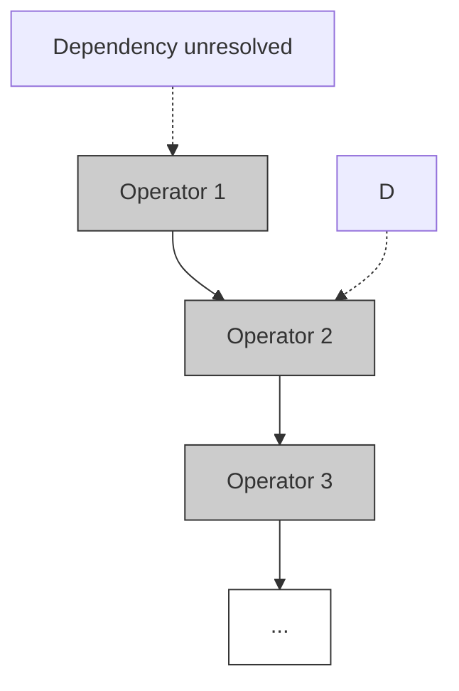
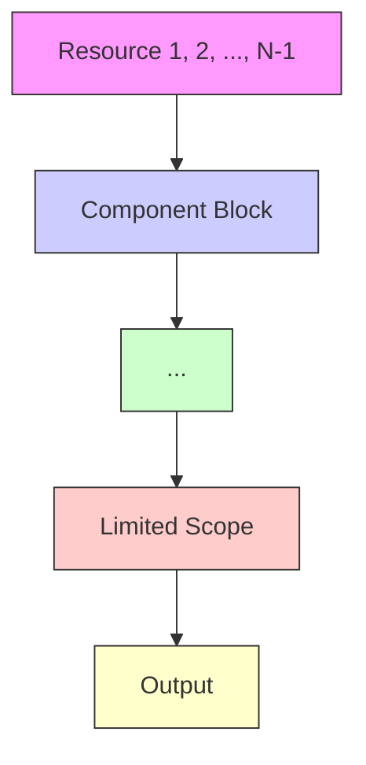
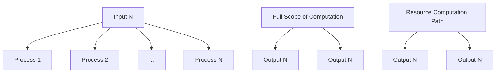
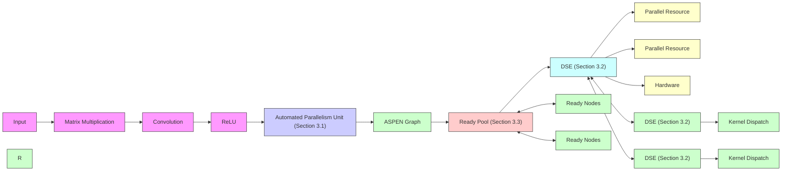
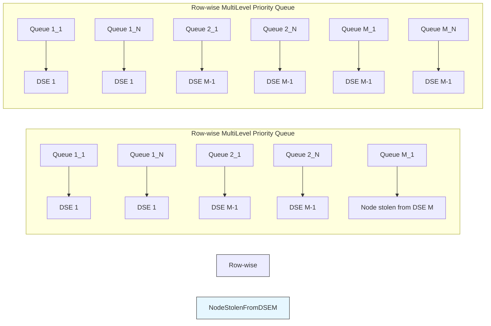

# ASPEN: Breaking Operator Barriers for Efficient Parallel Execution of Deep Neural Networks

Jongseok Park

Seoul National University cakeng@snu.ac.kr

Kyungmin Bin

Seoul National University kmbin@snu.ac.kr

Gibum Park

Seoul National University gibumpark@snu.ac.kr

Sangtae Ha

University of Colorado Boulder sangtae.ha@colorado.edu

Kyunghan Lee

Seoul National University kyunghanlee@snu.ac.kr

# Abstract

Modern Deep Neural Network (DNN) frameworks use tensor operators as the main building blocks of DNNs. However, we observe that operator-based construction of DNNs incurs significant drawbacks in parallelism in the form of synchronization barriers. Synchronization barriers of operators confine the scope of parallel computation to each operator and obscure the rich parallel computation opportunities that exist across operators. To this end, we present ASPEN, a novel parallel computation solution for DNNs that allows fine-grained dynamic execution of DNNs, which (1) removes the operator barriers and expresses DNNs in dataflow graphs of fine-grained tiles to expose the parallel computation opportunities across operators, and (2) exploits these opportunities by dynamically locating and scheduling them in runtime. This novel approach of ASPEN enables opportunistic parallelism, a new class of parallelism for DNNs that is unavailable in the existing operator-based approaches. ASPEN also achieves high resource utilization and memory reuse by letting each resource asynchronously traverse depthwise in the DNN graph to its full computing potential. We provide challenges and solutions to our approach and show that our proof-of-concept implementation of ASPEN on CPU shows exceptional performance, outperforming state-of-the-art inference systems of TorchScript and TVM by up to 3.2× and 4.3×, respectively.

# 1 Introduction

Deep Neural Networks (DNNs) are dataflow graphs of artificial neurons, each of which computes a mathematical function using the outputs of other artificial neurons as inputs. However, artificial neurons are rarely treated as individual units of computation, as their role as building blocks of neural networks has largely been replaced by tensor operators. A tensor operator, or simply an operator, refers to a large group of artificial neurons with the same functionality. These operators take inputs from the outputs of other operators, and the multi-dimensional arrays of data transferred between the operators are referred to as tensors. Modern DNN frameworks, such as TensorFlow $[1]$ , PyTorch $[35]$ , and MXNet $[5]$ , all utilize these operators as the main building blocks of DNNs, as grouping many identical artificial neurons into a single computation unit allows for easier construction, representation, and execution of DNNs that are becoming increasingly complex.

However, we find that the operator-based expression of DNNs incurs significant drawbacks in parallelism. Grouping artificial neurons into operators separates the computation of a DNN into two hierarchical layers of inter-operator and intra-operator computations[30, 51]. Inter-operator computations of a DNN are represented by a dataflow graph of operators, and frameworks such as Tensorflow or PyTorch delegate the execution of each operator to vendor-provided DNN acceleration libraries such as oneDNN [19], cuDNN [7], or ARMNN [3]. These libraries handle intra-operator

(a) Operator-based DNN Graph   


<details>
<summary>flowchart</summary>


</details>

(b) Tile-based DNN Graph   

```mermaid
graph TD
    A[" "] --> B[" "]
    B --> C["..."]
    C --> D[" "]
    D --> E[" "]
    E --> F["..."]
    F --> G[" "]
    G --> H[" "]
    H --> I["..."]
    I --> J[" "]
    J --> K[" "]
    K --> L[" "]
    L --> M["..."]
    M --> N[" "]
    N --> O[" "]
    O --> P[" "]
    P --> Q["..."]
    Q --> R[" "]
    R --> S[" "]
    S --> T[" "]
    T --> U["..."]
    U --> V[" "]
    V --> W[" "]
    W --> X[" "]
    X --> Y["..."]
    Y --> Z[" "]
    Z --> AA[" "]
    AA --> AB[" "]
    AB --> AC["..."]
    AC --> AD[" "]
    AD --> AE[" "]
    AE --> AF["..."]
    AF --> AG[" "]
    AG --> AH[" "]
    AH --> AI[" "]
    AI --> AJ["..."]
    AJ --> AK[" "]
    AK --> AL[" "]
    AL --> AM["..."]
    AM --> AN[" "]
    AN --> AO[" "]
    AO --> AP["..."]
    AP --> AQ[" "]
    AQ --> AR[" "]
    AR --> AS["..."]
    AS --> AT[" "]
    AT --> AU[" "]
    AU --> AV["..."]
    AV --> AW[" "]
    AW --> AX[" "]
```


<details>
<summary>flowchart</summary>


</details>

(c) With Operator Barriers   


<details>
<summary>flowchart</summary>


</details>

(d) Without Operator Barriers   


<details>
<summary>flowchart</summary>


</details>

Figure 1: Depiction of a DNN as (a) operator-based dataflow graph and (b) tile-based DNN dataflow graph, and its execution using N parallel computation resources, (c) with operator barriers, and (d) without operator barriers.

computations by partitioning the computations of an operator into fixed-shape computation units known as tiles [14, 28, 30, 54], that exploit key features of the hardware such as the number of registers, vector processing width, and cache sizes. For instance, oneDNN may partition single-precision matrix multiplication of $1024 \times 1024$ square matrices into $163848 \times 8$ matrix multiplication tiles, which align with the vector width of 256-bit AVX2 registers of x86 CPUs. The tiles are then scheduled to the parallel processing resources of the given hardware, and the execution of an operator is considered complete when all tiles have been computed by the parallel resources.

Unfortunately, this two-level execution of DNNs inevitably introduces a synchronization barrier between operators. As intra-level computations are treated as black boxes by DNN frameworks, synchronization barriers are necessary at the end of each operator execution to ensure that all computations within an operator are completed before scheduling the next operator that depends on its predecessor $[45]$ . These barriers make the computation flow simpler and the development of execution frameworks easier, but they also completely obscure the rich parallel computation opportunities that exist across the barriers.

For example, Figure 1 (a) illustrates a traditional operator-based dataflow graph of a DNN at the inter-operator level. However, when we apply tile-wise partitioning at the intra-operator level and express the dataflow graph with tile-based granularity as shown in Figure 1 (b), we discover the presence of multiple parallel paths of computation across the operators. Unfortunately, the traditional two-level execution of DNNs depicted in Figure 1 (c) hinders the utilization of these computation opportunities, due to the synchronization barriers that confine the scope of computation within each operator. The synchronization barrier forces the resources to remain idle until all tiles within an operator are executed before allowing the execution of new tiles, resulting in an underutilization of available resources. A more efficient parallel execution could be achieved by removing the barriers and enabling each resource to asynchronously execute new parallel computations as soon as they become ready for computation, as depicted in the parallel computation paths of Figure 1 (d).

To utilize this untapped source of parallelism over the synchronization barriers, we propose fine-grained dynamic execution of DNNs, where we (1) remove the barriers and express DNNs in dataflow graphs of fine-grained tiles to expose the parallel computation opportunities across operators, and (2) exploit these opportunities by dynamically locating and scheduling them in runtime. This fine-grained dynamic execution of DNNs enables opportunistic parallelism $[29, 26, 25]$ for DNNs, a new class of parallelism that is unavailable in the existing operator-based approaches. In opportunistic parallelism, each resource asynchronously traverses down a distinct computation path in the graph as depicted in Figure 1 (d). As there are no barriers to halt the execution of computation resources, each resource can execute its computation path to its maximal computational capabilities, leading to maximum system utilization and efficient load balancing. Also, as parallel resources are now computing down a path in the graph, data reuse is maximized as the computation output is reused as input for the next computation on each resource.

To fully leverage the potential of opportunistic parallelism in DNNs, we find three technical challenges that must be addressed. The first challenge lies in expressing the tile-wise dataflow graphs, from designing a partitioning approach that is general enough to be applicable to all DNNs, to determining the dimensions of the tiles that would allow the most efficient parallelism across the operators.

The second challenge involves developing a runtime system that can enable dynamic tracking of computation opportunities and asynchronous scheduling of many parallel resources over a complex DNN

dataflow graph. While the concept is straightforward, creating a parallel solution that achieves such asynchronous graph traversal and execution of many computation resources, without encountering race conditions or data hazards, while also maintaining high scalability and efficiency, is a formidable task. As existing operator-based frameworks can neither enable nor manage such asynchronous and dynamic execution of DNNs, a novel algorithm for DNN scheduling must be created to achieve efficient opportunistic parallelism.

The third challenge entails creating a solution that facilitates concurrent information exchange among massive numbers of asynchronous parallel resources. Even when each parallel resource executes an independent computation path, there inevitably comes a need for a resource to know the progression status of other nodes, for instance when a resource must select a new path to traverse. However, using synchronization for information exchange would halt the resources and compromise the effectiveness of opportunistic parallelism. Therefore, information exchange between resources must be performed asynchronously without impeding the progression of other resources.

To tackle these challenges, we present ASPEN, a novel DNN computation solution comprising three key components: (1) a tile-based graph partitioning unit that transforms operator-based DNN dataflow graphs into tile-based dataflow graphs unlocking rich parallel computation opportunities, (2) a distributed scheduling algorithm that enables each resource to asynchronously track and compute a distinct computation path without encountering any data hazards or race conditions, and (3) a highly concurrent data structure that facilitates asynchronous information exchange among parallel resources. These three components of ASPEN work in unison to address the aforementioned challenges and achieve efficient utilization of parallel computing opportunities across operators. Our proof-of-concept implementation of ASPEN on CPU demonstrates remarkable performance gains on various CNN and transformer-based model inference, achieving up to $3.2 \times$ and $4.3 \times$ speedup against state-of-the-art inference systems such as TorchScript [9] and TVM [6], respectively.

# 2 Background and Related Works

Limited parallelism of the current operator-based approach, particularly in the domain of DNN inference, has become a significant issue in recent years. In DNN training where an abundant number of inputs are provided, data parallelism or pipeline parallelism $[8, 18, 31, 12, 47, 34, 51, 44]$ are extensively used to leverage the inherent concurrency between inputs and achieve highly-parallel DNN computation. However, in DNN inference, the number of inputs is often limited which restricts the parallelism available from concurrent input data $[30]$ . To address this limitation, several solutions propose manipulating the operators of the DNN to expose more parallelism within the given DNN model structure.

One approach is Operator Fusion, which aims to merge computations from neighboring operators into a single, larger operator, creating a more substantial intra-operator computation space. This expanded computation space allows for greater parallelism opportunities, such as increased utilization of the vector processing hardware or batched memory accesses. Many high-performance DNN frameworks and acceleration libraries, such as TVM [6], TorchScript [9], XNNPACK [13] and oneDNN [19], have already integrated rule-based operator fusion and fused computation kernels to accelerate parallel DNN execution. Systems like TASO [22], Rammer [30], Apollo [49], and AStitch [52] introduce an advanced fusion technique which combines computation from independent operators into a single fused operator, unlike conventional fusions where only parent-child operators of a graph are fused. This technique can be understood as fusing inter-operator parallelism space into a larger, unified parallelism space, enabling much broader computation space for optimizations.

Another avenue to increase the parallelism opportunities is Model Slicing $[50, 48, 17, 53, 21]$ , which takes an opposite approach to operator fusion or stitching. Model slicing decomposes tensors and operators of CNNs into smaller ones, thus increasing inter-operator parallelism while reducing intra-operator parallelism. This approach is particularly utilized on edge clusters, where a large number of cluster nodes with limited computation capabilities synergy well with the increased number of operators and reduced per-operator computation.

Unlike existing works that focus on the manipulation of operators, ASPEN explores tile-based dynamic execution of DNNs for increased parallelism. Expressing DNNs in a tile-granularity effectively combines the separate inter- and intra-operator computation spaces into a single unified space of tile-based dataflow graph. This provides a holistic view of the DNN and enables a finer-grained


<details>
<summary>flowchart</summary>


</details>

Figure 2: The overall workflow of ASPEN. APU compiles operator-based DNNs into ASPEN graphs to expose parallel computation opportunities across operators. ASPEN runtime, composed of Ready Pool and DSEs, utilizes opportunistic parallelism to achieve efficient parallel execution of DNNs.

analysis and management of both computation and data, allowing contributions that were previously impossible with the operator-based dataflow graphs. Recent works on tile-based understanding of DNNs focus on applying tile-based analysis and optimizations on topics such as DNN schedulers $[30]$ , graph compilers $[54]$ , or reducing memory overhead $[40]$ .

In contrast, ASPEN explores the benefits of tile-based DNNs during runtime. ASPEN combines (1) tile-based expression of DNNs, with (2) dynamic parallelism and execution approaches developed for irregular programs [29, 26, 25, 24, 15, 32, 33] to enable fine-grained dynamic parallelism and execution of DNNs. Finer granularity allows more parallelism opportunities to be expressed on the dataflow graph, and dynamic execution allows these opportunities to be located and scheduled right away during runtime, enabling a novel parallelism in DNNs which we call opportunistic parallelism.

To our knowledge, ASPEN is the first to explore the benefits of tile-based DNNs during runtime using dynamic scheduling and execution approaches. While we mainly focus on parallelism in this paper, we find that the benefits of fine-grained dynamic execution of DNNs are not limited to parallelism, and extend to dynamic load-balancing, reduced memory traffic, and novel functionalities that are impossible in operator granularity or static scheduling approaches. We cover these additional benefits in detail in Section 4 and 5.

# 3 ASPEN Design

To achieve efficient utilization of opportunistic parallelism in DNNs, we design ASPEN with three key components: the Automated Parallelism Unit (APU), the Distributed Scheduling Engine (DSE), and the Ready Pool. Each component is designed to overcome the three challenges described in Section 1, namely exposing computation opportunities across operators, creating an efficient runtime to leverage these opportunities, and enabling asynchronous information exchange between parallel resources. The following subsections provide a detailed explanation of how each component tackles its respective challenge.

Figure 2 depicts an overall workflow of ASPEN. The APU takes a traditional operator-based description of a DNN and automatically generates a computation tile-wise dataflow graph, which we call the ASPEN graph. The ASPEN runtime, which consists of DSEs and a Ready Pool, initializes the computation by loading the graph and input data. DSE is a scheduler that exists separately for each parallel resource and handles the asynchronous traversal and execution of parallel paths of the designated resource. As the execution progresses, information on the path progression of the DNN by each resource is updated in the Ready Pool as ready nodes. Ready nodes are nodes that have all their parent nodes computed but have not been computed themselves, and they represent the tail ends of execution paths. The DSEs can refer to the Ready Pool whenever they need information about other paths, enabling asynchronous information exchange between parallel resources.

# 3.1 Automated Parallelism Unit

The goal of APU is to transform an operator-based DNN into a tile-wise dataflow graph that exposes finer-grained parallel computation opportunities across operators. As mentioned in Section 1, existing computation kernels partition and execute operators using computation tiles $[11, 43, 30, 54]$ , with synchronization barriers to ensure the completion of all tile execution within an operator. APU removes these barriers and expresses dependencies between individual tiles to expose more parallelism. To create a generalized method applicable to any operator, we propose partitioning the


<details>
<summary>flowchart</summary>

```mermaid
graph LR
    A["Input"] --> B["Matrix Multiplication"]
    B --> C["Convolution"]
    C --> D["ReLU"]
    
    subgraph (a) DNN description
        E["Input"] --> F["Matrix Multiplication"]
        F --> G["Convolution"]
        G --> H["ReLU"]
    
    end
    
    subgraph (b) Tile-wise Tensor Partitioning
        I["Input"] --> J["M"]
        J --> K["Width"]
        K --> L["Channels"]
        L --> M["Convolution Tiles"]
    end
    
    subgraph (c) Graph Reconstruction
        N["Input"] --> O["Matmul. Tiles"]
        O --> P["Tile-wise Node Dependency"]
    end
    
    subgraph (d) Node Merging
        Q["Input"] --> R["Graph Simplification"]
        R --> S["Graph"]
    end
    
    subgraph (e) ASPEN Graph
        T["Input"] --> U["Graph Simplification"]
        U --> V["Output"]
    end
```
</details>

Figure 3: Illustration of the three-step APU operation on an example DNN.

output tensor of each operator into fine units to maximize parallelism and then merging them into graph nodes. Merging reduces scheduling overhead and allows for increased weight data reuse and better utilization of computation resources.

We observe that many DNN computations kernels are executed using matrix multiplication. Naturally, DNN computations form a chain of matrix multiplications where the output of one multiplication serves as the input for the next. We focus on the property that in matrix multiplication $A \times B = C$ , only a single column-wise vector of matrix B is required for the computation of the column-wise vector of matrix C with the matching row index. If we fix the weight matrices as A, the chain of matrix multiplication in DNNs can be understood as a set of independent, parallel-running matrix-vector multiplication chains. Therefore, we conclude that partitioning operators into column-wise matrix tiles exposes the most parallel path within the DNN graph.

ASPEN leverages this insight by splitting output tensors into fine-grained matrix tiles aligned with the smallest hardware features such as SIMD register length or L1 cache size, and then merging them column-wise and subsequently row-wise. APU automates this process using a three-step approach illustrated in Figure 3 (b) to (d). First, (a) APU parses the given DNN and (b) partitions the output tensors into fine-grained matrix tiles. (c) It merges the tiles column-wise into graph nodes, creating a directed acyclic graph (DAG) based on the element-wise dependencies. (d) The performance of the resulting graph is evaluated, and nodes are further merged or split column-wise and then row-wise until a sufficient level of parallelism is exposed. (e) The resulting ASPEN graph now represents computation opportunities across operators as separate dataflow edges between nodes. The ASPEN graph is saved as a file and later loaded into the ASPEN runtime for execution.

# 3.2 Distributed Scheduling Engine

DSE aims to maximize the utilization of parallel resources by continuously scheduling new computation opportunities while dynamically traversing a barrier-free path in the DNN graph. Each parallel resource has its own DSE, operating in isolation to eliminate idling and loss of utilization due to synchronization. This decentralized approach distributes scheduling and graph overhead among the resources, enabling high scalability. We show our novel DNN scheduling algorithm ensures the correctness and completeness of DNN execution while operating in complete isolation.

In the ASPEN runtime, graph nodes transition between three states: executed, ready, and not-ready. An executed node is a node that has been processed by a computation backend after all of its parent nodes have been executed, or is an input (source) node of the DAG. A ready node has all its parent nodes executed but has not been processed itself. A not-ready node has one or more parents that are not executed. The state transitions always occur in the order of not-ready, ready, to executed.

DSE executes Algorithm 1. The idea of Algorithm 1 is that the DSE only needs to be aware of the ready nodes for its traversal, as ready nodes are always at the tail end of execution paths. Executing a ready node may turn one or more of its child nodes into ready nodes. If so, DSE selects one node for further traversal and stores the rest in the Ready Pool as new computation heads. If no new ready node is created, the DSE fetches a new path head from the Ready Pool. Algorithm 1 is also designed to be DNN-agnostic. That is, DSE will continuously fetch and execute new computations from the ready pool regardless of the layer or DNN graph it belongs to, to maximize resource utilization.

Figure 4 illustrates an example of DSE execution. When a DNN is loaded into the ASPEN runtime, the nodes from the first operator are always ready, as input nodes are always executed. These ready nodes are pushed into the Ready Pool to initiate execution. (a) DSEs of resources A and B fetch ready nodes as the heads of their execution paths. (b) Resource A reaches a dead end without any new ready nodes. (c) Resource A fetches a new path head from the pool, while resource B also hits a

Algorithm 1 DSE's asynchronous graph traversal and scheduling algorithm   
Require: Computation Resource C, Current ready node N, Ready Pool R
1: struct GRAPH NODE
2:    K : COMPUTATION KERNEL OF THE NODE
3:    Ac : ARRAY OF CHILD NODES
4:    Pn : NUMBER OF PARENT NODES
5:    Pe : NUMBER OF EXECUTED PARENT NODES
6: end struct
7: while True do
8:    if N is NULL then
9:    N ← pop(R)    ▷ Pop a new path head from pool. NULL returned if empty.
10:    else
11:    Execute N.K on C    ▷ Execute current node. N.X denotes the struct member X of N.
12:    ac ← N.Ac
13:    N ← NULL
14:    for nc in ac do    ▷ Iterate through all children of current node
15:    pe ← atomic_fetch_add(nc.Pe, 1)    ▷ Atomic post-increment
16:    if pe + 1 is nc.Pn then    ▷ If child is ready
17:    if N is NULL then
18:    N ← nc    ▷ Traverse to first readied child
19:    else
20:    push(R, nc)    ▷ Push remaining readied children to pool
21:    end for
22: end while


<details>
<summary>flowchart</summary>

```mermaid
graph TD
    subgraph (a)
        A0["0/0"] --> A1["1/1"]
        A2["0/0"] --> A3["1/1"]
        A4["0/0"] --> A5["1/1"]
        A6["0/0"] --> A7["1/1"]
        A8["0/0"] --> A9["1/1"]
        A10["0/2"] --> A11["0/1"]
        A12["0/2"] --> A13["0/1"]
        A14["0/2"] --> A15["0/1"]
    end

    subgraph (b)
        B0["0/0"] --> B1["1/1"]
        B2["0/0"] --> B3["1/1"]
        B4["0/0"] --> B5["1/1"]
        B6["0/0"] --> B7["1/1"]
        B8["0/0"] --> B9["1/1"]
        B10["0/2"] --> B11["0/1"]
        B12["0/2"] --> B13["0/1"]
        B14["0/2"] --> B15["0/1"]
    end

    subgraph (c)
        C0["0/0"] --> C1["1/1"]
        C2["0/0"] --> C3["1/1"]
        C4["0/0"] --> C5["1/1"]
        C6["0/0"] --> C7["1/1"]
        C8["0/0"] --> C9["1/1"]
        C10["0/2"] --> C11["0/1"]
        C12["0/2"] --> C13["0/1"]
        C14["0/2"] --> C15["0/1"]
    end

    subgraph (d)
        D0["0/0"] --> D1["1/1"]
        D2["0/0"] --> D3["1/1"]
        D4["0/0"] --> D5["1/1"]
        D6["0/0"] --> D7["1/1"]
        D8["0/0"] --> D9["1/1"]
        D10["2/2"] --> D11["1/1"]
        D12["2/2"] --> D13["2/2"]
        D14["2/2"] --> D15["2/2"]
        D16["2/2"] --> D17["2/2"]
        D18["2/2"] --> D20["2/2"]
    end

    subgraph (e)
        E0["0/0"] --> E1["1/1"]
        E2["0/0"] --> E3["1/1"]
        E4["0/0"] --> E5["1/1"]
        E6["0/0"] --> E7["1/1"]
        E8["0/0"] --> E9["1/1"]
        E9["2/2"] --> E10["1/1"]
        E11["2/2"] --> E12["2/2"]
        E13["2/2"] --> E14["2/2"]
        E15["2/2"] --> E16["2/2"]
    end

    style (a) fill:#f9f,stroke:#333
    style (b) fill:#ccf,stroke:#333
    style (c) fill:#cfc,stroke:#333
    style (d) fill:#fcc,stroke:#333
    style (e) fill:#cff,stroke:#333
```
</details>

Figure 4: Two parallel DSEs for Resource A and B executing Algorithm 1 on the example DNN from Figure 3. Resource A is assumed to be faster than B for demonstration purposes.

dead-end. (d) On its second computation path, resource A finds that both children of the executed node become ready. It proceeds with the first ready child while pushing the other child into the pool as a new computation head. (e) After all executions, the DNN computation is completed with five different computation paths taken by the resources. This novel execution enables asynchronous and continuous scheduling of new computation nodes to parallel resources, achieving highly efficient parallel execution of DNNs.

Algorithm 1 can be further optimized to certain DNNs or hardware. For instance, we find that dependency patterns in DNN graphs formed by pooling or strided layers create tiles of higher importance, and executions can be accelerated by prioritizing these tiles. Also, having a cache of child nodes on each DSE decreases the access to shared memory, which increases throughput. However, to focus on providing a general solution that first enables the novel approach of tile-based opportunistic parallelism, we leave optimizations for future work.

Correctness: We now show the correctness of the asynchronous parallel execution of ASPEN. We first show that race conditions are impossible. Let v be a ready node. From Algorithm 1, a node is considered ready when $P_{e} = P_{n}$ . Since the increment of $P_{e}$ is atomic, the DSE whose increment resulted in $P_{e} = P_{n}$ for v is uniquely determined. The said DSE can choose to either set v as its N or push v to the Ready Pool. If the former option is chosen, exclusiveness is guaranteed during the execution of v as the DSE responsible for v is unique. If the latter option is chosen, v is stored in the Ready Pool until it is eventually popped by a DSE. As the Ready Pool is a concurrent data structure, only a single DSE can pop v, ensuring exclusiveness during the execution of v. Therefore, exclusiveness is guaranteed in all node executions of ASPEN.

Furthermore, all executed nodes of ASPEN yield correct execution output as long as a correct input to the DNN is provided. From Algorithm 1, a ready node v becomes an executed node when it is


<details>
<summary>flowchart</summary>


</details>

Figure 5: Illustration of concurrent access to Ready Pool queue matrix.

executed on a computation resource R using kernel K. We assume R and K are correct, as they are externally supplied to the runtime. By the definition of a ready node, all parent nodes of v are executed nodes. Since DSEs can only execute a ready node, no other DSE can modify the parent nodes of v, or the input of v, during the execution of v. This eliminates data hazards during execution and, when combined with exclusiveness in execution, guarantees correct execution results as long as the parent nodes of v have correct execution results. Therefore, through recursion, ASPEN computes correct execution results for all nodes as long as a correct input to the DNN is provided.

Completeness: We show that all graph nodes become executed in ASPEN. Suppose there exists a node v in the DAG that is never executed. v cannot be a ready node since a ready node will be either executed as soon as it is created, or stored in the Ready Pool until it is eventually popped and executed. Therefore, v must be a not-ready node, and by definition of a not-ready node, at least one parent of v is also a node that is never executed. By recursion, there must exist a path from some source node s to v where all nodes on the path are not-ready nodes. However, this leads to a contradiction as source node s is an executed node by definition. Therefore, v cannot exist in ASPEN.

# 3.3 Ready Pool

Ready Pool is our fast, flexible, and scalable solution for managing dependencies among a large number of computation nodes and parallel resources. It acts as a barrier, separating nodes that can be computed from those that cannot, similar to existing synchronization barriers in operator-based approaches. However, Ready Pool offers a significant advantage over traditional synchronization barriers in that the dependency information exchange happens on-demand, and only between the producer and consumer of the information, without involving other resources.

Synchronization barriers inserted in compile time are unaware of which computation tile is scheduled to which resources on runtime. As a result, they must synchronize all resources to ensure the correctness of dependent computations, which limits parallelization scope and hampers the utilization of faster resources. In contrast, Ready Pool allows resources to dynamically update the satisfaction of dependencies to the pool and enables asynchronous retrieval by other resources when they require new computations, minimizing the overhead of data exchange.

However, if not properly designed, Ready Pool can be a bottleneck in the system. To ensure constant access time, flexible scheduling policies, and scalability over many parallel resources regardless of DNNs used, we design Ready Pool using a matrix of concurrently accessible FIFO queues, as shown in Figure 5. Each DSE is assigned a row of queues, and accesses from a DSE are prioritized within its assigned row to minimize conflicts between DSEs. A simple hash function determines the column index of the accessed queue during the push() operation, while a multi-level priority queue is used during the pop() operation to facilitate fast accesses and support scheduling policies.

To be specific, during push(), ready nodes from each DSE are batched to reduce overhead. The target queue's column index is determined using a user-defined hash function $H(k)$ . In our proof-of-concept code, key k is the depth of the pushed nodes, and $H(k)$ returns a smaller column index if the depth is shallow, and a larger index if the depth is deep. When combined with row-wise priority queue access of pop(), this implementation enables the scheduling policy of prioritizing nodes of shallower depth, which accelerates execution by allowing DSEs to traverse longer computation paths. During pop(), a DSE first pops nodes from its assigned row to maximize data reuse. If the assigned row is empty, the DSE searches rows of other DSEs similarly to work-stealing queues [4], to automatically load balance and improve resource utilization. When a DNN enters the ASPEN runtime, ready nodes are


<details>
<summary>bar</summary>

| Model | TensorFlow (TF) | XLA | TorchScript (TS) | TVM | ASPEN |
| --- | --- | --- | --- | --- | --- |
| VGG16 B1 | 1.77ms | 1.25ms | 1.65ms | 1.44ms | 2.34ms |
| VGG16 B32 | 4.76ms | 1.71ms | 1.720ms | 1.168ms | 1.363ms |
| Resnet-50 B1 | 5.9ms | 3.7ms | 3.9ms | 3.46ms | 4.16ms |
| Resnet-50 B28 | 2.089ms | 1.053ms | 1.207ms | 1.223ms | 5.21ms |
| YOLO-v3 B1 | 2.24ms | 2.57ms | 3.26ms | 3.04ms | 3.58ms |
| YOLO-v3 B32 | 4.834ms | 2.630ms | 2.727ms | 2.659ms | 3.23ms |
| BERT-base S128 B1 | 1.21ms | 1.09ms | 2.08ms | 1.93ms | 2.44ms |
| BERT-base S480 B8 | 2.136ms | 1.243ms | 1.942ms | 1.898ms | 3.42ms |
| BERT-large S128 B1 | 3.59ms | 3.40ms | 3.49ms | 2.26ms | 4.47ms |
| BERT-large S480 B8 | 6.080ms | 3.198ms | 3.267ms | 2.842ms | 3.747ms |
| GPT-2 S256 B1 | 1.84ms | 1.70ms | 4.00ms | 1.64ms | 2.68ms |
| GPT-2 S1024 B1 | 7.20ms | 5.71ms | 7.89ms | 7.35ms | 4.17ms |
</details>

Figure 6: Relative latency speedup and latency of ASPEN and other frameworks compared to TensorFlow [1] on Threadripper 3990X. Latency measurements are annotated on each bar. B refers to the batch size, and S on the NLP models refers to the number of input tokens.


<details>
<summary>line</summary>

| Threads | TF    | XLA   | TS    | TVM   | ASPEN |
| ------- | ----- | ----- | ----- | ----- | ----- |
| 1       | 0     | 0     | 0     | 0     | 0     |
| 16      | 50    | 100   | 20    | 30    | 150   |
| 32      | 75    | 125   | 40    | 60    | 225   |
| 48      | 100   | 150   | 60    | 90    | 250   |
| 64      | 125   | 175   | 80    | 120   | 275   |
</details>

(a) ResNet-50, B128


<details>
<summary>line</summary>

| Threads | TF    | XLA   | TS    | TVM   | ASPEN |
| ------- | ----- | ----- | ----- | ----- | ----- |
| 1       | 0     | 0     | 0     | 0     | 0     |
| 16      | 2k    | 2k    | 2k    | 2k    | 4k    |
| 32      | 2k    | 2k    | 2k    | 2k    | 8k    |
| 48      | 2k    | 2k    | 2k    | 2k    | 10k   |
| 64      | 2k    | 2k    | 2k    | 2k    | 12k   |
</details>

(b) BERT-base, S480 B8


<details>
<summary>line</summary>

| Threads | TF    | XLA   | TS    | TVM   | ASPEN |
| ------- | ----- | ----- | ----- | ----- | ----- |
| 4       | 0.95  | 0.92  | 0.90  | 0.88  | 0.98  |
| 16      | 0.94  | 0.91  | 0.89  | 0.87  | 0.97  |
| 32      | 0.93  | 0.90  | 0.88  | 0.86  | 0.96  |
| 48      | 0.92  | 0.89  | 0.87  | 0.85  | 0.95  |
| 64      | 0.91  | 0.88  | 0.86  | 0.84  | 0.94  |
</details>

(a) ResNet-50, B128


<details>
<summary>line</summary>

| Threads | TF    | XLA   | TS    | TVM   | ASPEN |
| ------- | ----- | ----- | ----- | ----- | ----- |
| 4       | 0.85  | 0.85  | 0.95  | 0.95  | 0.95  |
| 16      | 0.82  | 0.83  | 0.93  | 0.94  | 0.94  |
| 32      | 0.80  | 0.82  | 0.92  | 0.93  | 0.93  |
| 48      | 0.78  | 0.81  | 0.91  | 0.92  | 0.92  |
| 64      | 0.76  | 0.80  | 0.90  | 0.91  | 0.91  |
</details>

(b) BERT-base, S480 B8   
Figure 7: Throughput scaling of ASPEN and other frameworks over Resnet-50 and BERT-base using the full core range of Threadripper 3990X.   
Figure 8: Experimental parallel fraction $p_{e}$ over Resnet-50 and BERT-base using the full core range of Threadripper 3990X. Higher is better.

uniformly distributed among the rows. This design of Ready Pool ensures fast and concurrent access while enabling scheduling policies and automatic load balancing throughout the DNN execution.

# 4 Evaluations

Implementation Details: As no existing DNN framework supports the use of opportunistic parallelism, we implement our proof-of-concept code of ASPEN targeting CPUs with approximately 12k lines of C code from scratch. We create our own tile-wise GEMM kernels using AVX2 extensions and conv2D kernels using the GEMM kernels and im2col. The remaining operators are computed using simple C for-loops. For memory, output tensors for each operator are created in NHWC order as in the existing approaches, and each tile holds a pointer to its respective location in each tensor. Our implementation is publicly available at https://github.com/cakeng/ASPEN/tree/ASPEN\_NeurIPS/.

Experimental Setup: Our evaluations are conducted on an AMD Threadripper 3990X 64-core processor and an Intel i9-12900K 16-core processor using Ubuntu 22.04. We compare ASPEN against the popular DNN framework of TensorFlow (v2.7) [1] as well as highly-optimized inference solutions of TorchScript (v2.0.0) [9], TensorFlow XLA (v2.6.2) [39], and TVM (v0.11.0) [6], all using C/C++ API. We evaluate inference latency of various CNN and Transformer-based [46] NLP models, namely VGG-16 [42], ResNet-50 [16], Yolo-v3 (416) [38], BERT-base, BERT-large [10], and GPT-2 (124M) [37]. For the GPT-2 model, we evaluate the first model iteration, where no past attention values are provided. We measure the end-to-end latency of DNN model execution, which excludes pre- or post-processing such as image cropping or text tokenization. We average the measurements over 100 runs to obtain representative values.

# 4.1 Execution Latency

Figure 6 presents the inference latency speedup of ASPEN and other frameworks compared to TensorFlow on Threadripper 3990X for various DNN models. Overall, ASPEN demonstrates strong performance, achieving speedups up to $6.2\times$ against TensorFlow (BERT-base S480 B8) and $4.3\times$ against TVM (GPT-2 S1024 B1). We find ASPEN performs better when more layers with multiple execution paths, such as residual connections or multi-head attention layers, are contained within the model. These network designs provide multiple computation paths across operators, which synergize effectively with the opportunistic parallelism of ASPEN.

ASPEN also exhibits amplified speedup with larger batch sizes, as larger batches further facilitate the isolation of computation between DSEs. In existing operator-based solutions, dependent compu-


<details>
<summary>line</summary>

| Threads | TF   | XLA  | TS   | TVM  |
| ------- | ---- | ---- | ---- | ---- |
| 1       | 0    | 0    | 0    | 0    |
| 4       | 50   | 60   | 40   | 20   |
| 8       | 55   | 70   | 50   | 30   |
| 12      | 55   | 75   | 55   | 35   |
| 16      | 55   | 80   | 60   | 40   |
</details>

(a) ResNet-50, B128


<details>
<summary>line</summary>

| Threads | TF   | XLA  | TS   | TVM  | ASPEN |
| ------- | ---- | ---- | ---- | ---- | ----- |
| 1       | 0.5  | 0.5  | 0.5  | 0.5  | 0.5   |
| 4       | 3.0  | 3.0  | 2.0  | 1.5  | 4.0   |
| 8       | 5.0  | 5.0  | 3.0  | 2.5  | 10.0  |
| 12      | 5.5  | 5.5  | 3.5  | 3.0  | 14.0  |
| 16      | 6.0  | 6.0  | 4.0  | 3.5  | 16.0  |
</details>

(b) Yolov3, B1


<details>
<summary>line</summary>

| Threads | TF    | XLA   | TS    | TVM   | ASPEN |
| ------- | ----- | ----- | ----- | ----- | ----- |
| 1       | 0     | 0     | 0     | 0     | 0     |
| 4       | 2k    | 2k    | 0     | 0     | 2k    |
| 8       | 3k    | 3k    | 0     | 0     | 4k    |
| 12      | 3k    | 3k    | 0     | 0     | 5k    |
| 16      | 3k    | 3k    | 0     | 0     | 6k    |
</details>

(c) BERT-base, S480 B8


<details>
<summary>line</summary>

| Threads | TF    | XLA   | TS    | TVM   | ASPEN |
| ------- | ----- | ----- | ----- | ----- | ----- |
| 1       | 0     | 0     | 0     | 0     | 0     |
| 4       | 2k    | 2k    | 0     | 0     | 2k    |
| 8       | 2k    | 4k    | 0     | 0     | 4k    |
| 12      | 2k    | 2k    | 0     | 0     | 5k    |
| 16      | 2k    | 2k    | 0     | 0     | 5k    |
</details>

(d) GPT2, S256 B1   
Figure 9: Heterogeneous resource utilization of ASPEN and other frameworks over various DNNs on Intel i9-12900K. B refers to the batch size, and S on the NLP models refers to the number of input tokens. Both the performance cores and efficiency cores are utilized after 8 threads.

tations across operators are not guaranteed to be scheduled to the same resource. This necessitates scatter/gather-like data exchanges between resources causing memory overheads, and this overhead only increases with larger batch sizes and more resources used. In contrast, depth-first computation of ASPEN allows dependent tiles to be scheduled to the same resource as much as possible, achieving effects similar to operator fusion. With large enough batch sizes, each DSE is allocated paths in different batch indexes similar to data parallelism, greatly reducing the memory overhead. Also, even when there are data exchanges between resources, only a few resources are involved simultaneously, relieving the pressure on the memory system.

# 4.2 Parallel Scaling

Figure 7 presents the strong scaling throughput results of ASPEN against other frameworks on Threadripper 3990X, detailing the results of Figure 6. We observe that ASPEN exhibits superior per-resource scaling performance over other frameworks, thanks to its asynchronous design and distributed scheduling. To quantitatively evaluate the scaling performance, we introduce the experimental parallel fraction, denoted as $p_e$ , in Figure 8. $p_e$ represents the proportion of computation executed in parallel, which directly influences the scaling and upper limit of parallel speedup according to Amdahl's law [2]. We use Karp-Flatt metric [23] $p_e = 1 - \frac{1/\psi - 1/N}{1 - 1/N}$ to calculate $p_e$ , N being the number of parallel resources, and $\psi$ being the measured speedup while using N parallel resources. ASPEN achieves remarkably high $p_e$ values ranging from 0.97 to 0.99 across all cases, indicating that more than $97\%$ of ASPEN computations are performed in parallel, which allows ASPEN to exhibit exceptional scaling performance following Amdahl's law.

# 4.3 Resource Utilization

Figure 9 presents the resource utilization of ASPEN and other frameworks on Intel's i9-12900K heterogeneous processor for various DNN models. i9-12900K has 8 performance cores (P-cores) and 8 efficiency cores (E-cores) with different computing capabilities. We observe that ASPEN shows a linear summation of all utilized core performance, clearly highlighting the higher performance inclination of P-cores on 1 to 8 threads and the lower performance inclination of E-cores on 9 to 16 threads. In contrast, existing solutions exhibit sub-optimal resource utilization when using both the P-cores and E-cores, suffering from stale performance increases (TensorFlow, XLA), sharp performance drops (TorchScript, XLA), or performance bottlenecks to the slower E-cores (TorchScript, TVM). ASPEN, on the other hand, effectively utilizes all available resources to their full potential, thanks to its dynamic scheduling and automatic load-balancing capabilities provided by the ASPEN runtime.

# 4.4 Ablation Studies

Figure 10 (a) provides the execution throughput of ASPEN in FLOP/s against the number of ASPEN tiles per layer. The throughputs of other frameworks are presented in dotted horizontal lines. The throughput of ASPEN increases on 1 to 128 tiles, as increasing the number of tiles provides more parallelism. The throughput drops after 128, as there are not enough resources in the machine to utilize the increased parallelism, while the smaller tiles increase overhead and reduce computation efficiency. As such, ASPEN shows a concave performance characteristic against the number of tiles.

Figure 10 (b) to (d) provides the execution throughput scaling of ASPEN and other solutions against various DNN parameters, normalized to the throughput on the smallest parameter size. ASPEN shows


<details>
<summary>line</summary>

| x    | TF   | XLA  | TS   | TVM  | ASPEN |
| ---- | ---- | ---- | ---- | ---- | ----- |
| 1    | 0.0  | 0.0  | 0.0  | 0.0  | 0.0   |
| 2    | 0.0  | 0.0  | 0.0  | 0.0  | 0.0   |
| 8    | 0.0  | 0.0  | 0.0  | 0.0  | 0.0   |
| 32   | 0.0  | 0.0  | 0.0  | 0.0  | 1.0   |
| 128  | 0.0  | 0.0  | 0.0  | 0.0  | 3.0   |
| 512  | 0.0  | 0.0  | 0.0  | 0.0  | 1.5   |
</details>

(a) Tiles per Layer


<details>
<summary>line</summary>

| x    | TF   | XLA  | TS   | TVM  | ASPEN |
| ---- | ---- | ---- | ---- | ---- | ----- |
| 1    | 1.0  | 1.0  | 1.0  | 1.0  | 1.0   |
| 4    | 0.8  | 1.7  | 1.2  | 1.3  | 1.8   |
| 16   | 1.0  | 1.7  | 1.3  | 1.4  | 2.5   |
| 64   | 1.0  | 1.8  | 1.4  | 1.3  | 2.8   |
| 256  | 1.0  | 1.8  | 1.4  | 1.3  | 3.0   |
</details>

(b) Number of Layers


<details>
<summary>line</summary>

| x    | TF   | XLA  | TS   | TVM  | ASPEN |
| ---- | ---- | ---- | ---- | ---- | ----- |
| 32   | 1.0  | 1.0  | 1.0  | 1.0  | 1.0   |
| 64   | 3.0  | 3.0  | 2.0  | 1.5  | 2.0   |
| 128  | 5.0  | 5.0  | 3.0  | 1.5  | 2.5   |
| 256  | 6.0  | 6.0  | 4.0  | 1.5  | 3.0   |
| 512  | 5.0  | 7.0  | 4.5  | 1.5  | 3.0   |
| 1024 | 5.0  | 8.0  | 5.0  | 1.5  | 3.0   |
</details>

(c) Height and Width


<details>
<summary>line</summary>

| Speedup | TF   | XLA  | TS   | TVM  | ASPEN |
| ------- | ---- | ---- | ---- | ---- | ----- |
| 32      | 1    | 1    | 1    | 1    | 1     |
| 64      | 2    | 2    | 2    | 2    | 2     |
| 128     | 5    | 5    | 5    | 5    | 5     |
| 256     | 10   | 10   | 10   | 10   | 10    |
| 512     | 20   | 15   | 15   | 15   | 15    |
| 1024    | 30   | 20   | 20   | 20   | 20    |
</details>

(d) Channel Size   
Figure 10: Performance and scaling against differing parameter sizes, on Threadripper 3990X using 64 cores. All tests are executed with a batch size of 1, using a synthetic DNN with 32 identical convolution layers. All layers have $64 \times 64$ inputs, $3 \times 3$ filters, input and output channels of 128, padding and stride of 1, and a fixed 128 tiles per layer for ASPEN, except for the specified parameters.

a noticeable speedup with an increasing number of layers, owing to the utilization of computation opportunities and depthwise computation across the layer boundaries. Against height, width, and channel sizes, existing frameworks except TVM exhibit large performance speedup as larger tensor sizes allow more parallelism in each layer for these solutions. The performance of TVM is largely unaffected as it creates optimized kernels for each of the given parameter sizes, achieving constant performance across tensor sizes. The performance of ASPEN is also less affected by tensor sizes as ASPEN is able to source its parallelism from other sources.

# 5 Limitations and Discussions

ASPEN on GPUs: While our current proof-of-concept implementation of ASPEN targets CPUs, we expect ASPEN to be easily applicable to GPUs as well if given proper tile-level kernel support. For example, Nvidia GPUs can leverage the CUDA Streams and CUDA Events API to dispatch tile-level kernel calls asynchronously, while DSEs on the CPU perform graph traversal to identify computation opportunities. Using ASPEN on GPUs would allow for a seamless interleaving of data movement, kernel launches, and tile executions. This would greatly reduce the host-device scheduling and communication overhead, which are often reported as a limiting factor of GPU utilization $[30, 27]$ . The asynchronous nature also means that the computing resources would be at differing stages of kernel execution, which distributes memory access requests across the temporal domain and mitigates the limitations in memory bandwidth that DNN executions on GPUs often face $[51, 40]$ .

ASPEN on DNN training: ASPEN can potentially be used for DNN training as it offers a general solution for leveraging opportunistic parallelism on DNNs. However, as DNN training can exploit the abundant input data as an alternative source of parallelism, it is unlikely that ASPEN's dynamic approach would outperform static optimization solutions $[41, 36]$ due to runtime overhead. Nonetheless, ASPEN remains appealing in environments with varying capabilities, such as edge computing.

ASPEN for diverse applications: Fine-grained dynamic DNN execution of ASPEN also brings several novel functionalities to DNN execution. Since the execution of DSEs is DNN-agnostic, different DNNs can be co-executed easily for increased system utilization $[20]$ by simply placing them in the same Ready Pool. Parallel resources can be dynamically added or removed from the ASPEN system without disrupting the execution of other resources, allowing for enhanced flexibility. For DNN applications that operate on continuous input streams like videos, ASPEN's dynamic dependency tracking enables the execution of only the relevant tiles affected by the changes in the input, significantly reducing computation requirements. In computation offloading, ASPEN can interleave computation and transmission at the tile level to hide most of the networking overhead. In inference servers, inference requests can be immediately pushed into the Ready Pool and executed concurrently with other users' requests, reducing turnaround time and improving system utilization.

# 6 Conclusion

We present ASPEN, a novel parallel computation approach for DNNs that aims to (1) eliminate the synchronization barriers of tensor operators and (2) leverage opportunistic parallelism on the tile-wise dependency graph of DNNs. This allows ASPEN to dynamically locate and execute any parallel computation opportunities, resulting in high scalability and efficient utilization of parallel resources. Through evaluation, we validate that ASPEN outperforms the existing solutions and delivers exceptional parallel computing performance for DNNs.

# Acknowledgments and Disclosure of Funding

This research was supported in part by the IITP grant (2022-0-00420) and National Research Foundation of Korea (NRF) grant No. 2021R1A2C2006584 and No. 2022R1A5A1027646, funded by the Ministry of Science and ICT (MSIT) in Korea. Kyunghan Lee is the corresponding author.

# References

[1] Martín Abadi, Paul Barham, Jianmin Chen, Zhifeng Chen, Andy Davis, Jeffrey Dean, Matthieu Devin, Sanjay Ghemawat, Geoffrey Irving, Michael Isard, et al. Tensorflow: a system for large-scale machine learning. In Proceedings of the 12th USENIX Symposium on Operating Systems Design and Implementation, pages 265–283, 2016.   
[2] Gene M Amdahl. Validity of the single processor approach to achieving large scale computing capabilities. In Proceedings of the April 18-20, 1967, spring joint computer conference, pages 483–485, 1967.   
[3] ARM. Armnn : Performant machine learning (ML) inference engine for Android and Linux, accelerating ML on Arm Cortex-A CPUs and Arm Mali GPUs. https://github.com/ARM-software/armnn, last accessed on 2023-10-27, 2023.   
[4] Robert D Blumofe and Charles E Leiserson. Scheduling multithreaded computations by work stealing. Journal of the ACM (JACM), 46(5):720–748, 1999.   
[5] Tianqi Chen, Mu Li, Yutian Li, Min Lin, Naiyan Wang, Minjie Wang, Tianjun Xiao, Bing Xu, Chiyuan Zhang, and Zheng Zhang. Mxnet: A flexible and efficient machine learning library for heterogeneous distributed systems. CoRR, abs/1512.01274, 2015.   
[6] Tianqi Chen, Thierry Moreau, Ziheng Jiang, Lianmin Zheng, Eddie Yan, Haichen Shen, Meghan Cowan, Leyuan Wang, Yuwei Hu, Luis Ceze, et al. Tvm: An automated end-to-end optimizing compiler for deep learning. In Proceedings of the 13th USENIX Symposium on Operating Systems Design and Implementation, pages 578–594, 2018.   
[7] Sharan Chetlur, Cliff Woolley, Philippe Vandermersch, Jonathan Cohen, John Tran, Bryan Catanzaro, and Evan Shelhamer. cudnn: Efficient primitives for deep learning. arXiv preprint arXiv:1410.0759, 2014.   
[8] Trishul Chilimbi, Yutaka Suzue, Johnson Apacible, and Karthik Kalyanaraman. Project adam: Building an efficient and scalable deep learning training system. In Proceedings of the 11th USENIX Symposium on Operating Systems Design and Implementation, pages 571–582, 2014.   
[9] PyTorch Contributors. Torchscript: Just-in-time compiler for creating serialized and optimized models from pytorch code. https://pytorch.org/docs/stable/jit.html, last accessed on 2023-10-27, 2023.   
[10] Jacob Devlin, Ming-Wei Chang, Kenton Lee, and Kristina Toutanova. Bert: Pre-training of deep bidirectional transformers for language understanding. arXiv preprint arXiv:1810.04805, 2018.   
[11] Jack J Dongarra, Jeremy Du Croz, Sven Hammarling, and Iain S Duff. A set of level 3 basic linear algebra subprograms. ACM Transactions on Mathematical Software, 16(1):1-17, 1990.   
[12] Shiqing Fan, Yi Rong, Chen Meng, Zongyan Cao, Siyu Wang, Zhen Zheng, Chuan Wu, Guoping Long, Jun Yang, Lixue Xia, et al. Dapple: A pipelined data parallel approach for training large models. In Proceedings of the 26th ACM SIGPLAN Symposium on Principles and Practice of Parallel Programming, pages 431–445, 2021.   
[13] Google. Xnnpack: Highly optimized library of floating-point neural network inference operators for ARM, WebAssembly, and x86 platforms. https://github.com/google/XNNPACK, last accessed on 2023-10-27, 2023.   
[14] Kazushige Goto and Robert A van de Geijn. Anatomy of high-performance matrix multiplication. ACM Transactions on Mathematical Software, 34(3):1–25, 2008.

[15] Tim Harris, Yossi Lev, Victor Luchangco, Virendra J Marathe, and Mark Moir. Constrained data-driven parallelism. In 5th USENIX Workshop on Hot Topics in Parallelism, 2013.   
[16] Kaiming He, Xiangyu Zhang, Shaoqing Ren, and Jian Sun. Deep residual learning for image recognition. In Proceedings of the IEEE/CVF Conference on Computer Vision and Pattern Recognition, pages 770–778, 2016.   
[17] Xueyu Hou, Yongjie Guan, Tao Han, and Ning Zhang. Distredge: Speeding up convolutional neural network inference on distributed edge devices. In 2022 IEEE International Parallel and Distributed Processing Symposium, pages 1097–1107. IEEE, 2022.   
[18] Yanping Huang, Youlong Cheng, Ankur Bapna, Orhan Firat, Dehao Chen, Mia Chen, HyoukJoong Lee, Jiquan Ngiam, Quoc V Le, Yonghui Wu, et al. Gpipe: Efficient training of giant neural networks using pipeline parallelism. Advances in Neural Information Processing Systems, 32, 2019.   
[19] Intel. Intel oneAPI Deep Neural Network Library (oneDNN): Library of optimized implementations of deep learning building blocks. https://www.intel.com/content/www/us/en/developer/tools/oneapi/onednn.html, last accessed on 2023-10-27, 2023.   
[20] Joo Seong Jeong, Jingyu Lee, Donghyun Kim, Changmin Jeon, Changjin Jeong, Youngki Lee, and Byung-Gon Chun. Band: coordinated multi-dnn inference on heterogeneous mobile processors. In Proceedings of the 20th Annual International Conference on Mobile Systems, Applications and Services, pages 235–247, 2022.   
[21] Fucheng Jia, Deyu Zhang, Ting Cao, Shiqi Jiang, Yunxin Liu, Ju Ren, and Yaoxue Zhang. Codl: efficient cpu-gpu co-execution for deep learning inference on mobile devices. In Proceedings of the 20th Annual International Conference on Mobile Systems, Applications and Services, pages 209–221, 2022.   
[22] Zhihao Jia, Oded Padon, James Thomas, Todd Warszawski, Matei Zaharia, and Alex Aiken. Taso: optimizing deep learning computation with automatic generation of graph substitutions. In Proceedings of the 27th ACM Symposium on Operating Systems Principles, pages 47–62, 2019.   
[23] Alan H Karp and Horace P Flatt. Measuring parallel processor performance. Communications of the ACM, 33(5):539–543, 1990.   
[24] Milind Kulkarni, Martin Burtscher, Rajeshkar Inkulu, Keshav Pingali, and Calin Casçaval. How much parallelism is there in irregular applications? ACM sigplan notices, 44(4):3–14, 2009.   
[25] Milind Kulkarni, Patrick Carribault, Keshav Pingali, Ganesh Ramanarayanan, Bruce Walter, Kavita Bala, and L Paul Chew. Scheduling strategies for optimistic parallel execution of irregular programs. In Proceedings of the twentieth annual symposium on Parallelism in algorithms and architectures, pages 217–228, 2008.   
[26] Milind Kulkarni, Keshav Pingali, Bruce Walter, Ganesh Ramanarayanan, Kavita Bala, and L Paul Chew. Optimistic parallelism requires abstractions. In Proceedings of the 28th ACM SIGPLAN Conference on Programming Language Design and Implementation, pages 211–222, 2007.   
[27] Woosuk Kwon, Gyeong-In Yu, Eunji Jeong, and Byung-Gon Chun. Nimble: Lightweight and parallel gpu task scheduling for deep learning. Advances in Neural Information Processing Systems, 33:8343–8354, 2020.   
[28] Tze Meng Low, Francisco D Igual, Tyler M Smith, and Enrique S Quintana-Orti. Analytical modeling is enough for high-performance blis. ACM Transactions on Mathematical Software, 43(2):1–18, 2016.   
[29] Steven Lucco. A dynamic scheduling method for irregular parallel programs. In Proceedings of the ACM SIGPLAN 1992 conference on Programming language design and implementation, pages 200–211, 1992.

[30] Lingxiao Ma, Zhiqiang Xie, Zhi Yang, Jilong Xue, Youshan Miao, Wei Cui, Wenxiang Hu, Fan Yang, Lintao Zhang, and Lidong Zhou. Rammer: Enabling holistic deep learning compiler optimizations with rtasks. In Proceedings of the 14th USENIX Symposium on Operating Systems Design and Implementation, pages 881–897, 2020.   
[31] Deepak Narayanan, Aaron Harlap, Amar Phanishayee, Vivek Seshadri, Nikhil R Devanur, Gregory R Ganger, Phillip B Gibbons, and Matei Zaharia. Pipedream: generalized pipeline parallelism for dnn training. In Proceedings of the 27th ACM Symposium on Operating Systems Principles, pages 1–15, 2019.   
[32] Quan M Nguyen and Daniel Sanchez. Pipette: Improving core utilization on irregular applications through intra-core pipeline parallelism. In 2020 53rd Annual IEEE/ACM International Symposium on Microarchitecture, pages 596–608. IEEE, 2020.   
[33] Quan M Nguyen and Daniel Sanchez. Phloem: Automatic acceleration of irregular applications with fine-grain pipeline parallelism. In 2023 IEEE International Symposium on High-Performance Computer Architecture, pages 1262–1274. IEEE, 2023.   
[34] Hyungjun Oh, Junyeol Lee, Hyeongju Kim, and Jiwon Seo. Out-of-order backprop: an effective scheduling technique for deep learning. In Proceedings of the Seventeenth European Conference on Computer Systems, pages 435–452, 2022.   
[35] Adam Paszke, Sam Gross, Francisco Massa, Adam Lerer, James Bradbury, Gregory Chanan, Trevor Killeen, Zeming Lin, Natalia Gimelshein, Luca Antiga, Alban Desmaison, Andreas Kopf, Edward Yang, Zach DeVito, Martin Raison, Alykhan Tejani, Sasank Chilamkurthy, Benoit Steiner, Lu Fang, Junjie Bai, and Soumith Chintala. Pytorch: An imperative style, high-performance deep learning library. Advances in Neural Information Processing Systems, 32:8026–8037, 2019.   
[36] Aurick Qiao, Sang Keun Choe, Suhas Jayaram Subramanya, Willie Neiswanger, Qirong Ho, Hao Zhang, Gregory R Ganger, and Eric P Xing. Pollux: Co-adaptive cluster scheduling for goodput-optimized deep learning. In Proceedings of the 15th USENIX Symposium on Operating Systems Design and Implementation, 2021.   
[37] Alec Radford, Jeffrey Wu, Rewon Child, David Luan, Dario Amodei, Ilya Sutskever, et al. Language models are unsupervised multitask learners. OpenAI blog, 1(8):9, 2019.   
[38] Joseph Redmon and Ali Farhadi. Yolov3: An incremental improvement. arXiv preprint arXiv:1804.02767, 2018.   
[39] Amit Sabne. Xla : Compiling machine learning for peak performance, 2020.   
[40] Yining Shi, Zhi Yang, Jilong Xue, Lingxiao Ma, Yuqing Xia, Ziming Miao, Yuxiao Guo, Fan Yang, and Lidong Zhou. Welder: Scheduling deep learning memory access via tile-graph. In 17th USENIX Symposium on Operating Systems Design and Implementation, pages 701–718, 2023.   
[41] Mohammad Shoeybi, Mostofa Patwary, Raul Puri, Patrick LeGresley, Jared Casper, and Bryan Catanzaro. Megatron-lm: Training multi-billion parameter language models using model parallelism. arXiv preprint arXiv:1909.08053, 2019.   
[42] Karen Simonyan and Andrew Zisserman. Very deep convolutional networks for large-scale image recognition. arXiv preprint arXiv:1409.1556, 2014.   
[43] Tyler M Smith, Robert Van De Geijn, Mikhail Smelyanskiy, Jeff R Hammond, and Field G Van Zee. Anatomy of high-performance many-threaded matrix multiplication. In Proceedings of the IEEE International Parallel and Distributed Processing Symposium, pages 1049–1059. IEEE, 2014.   
[44] Colin Unger, Zhihao Jia, Wei Wu, Sina Lin, Mandeep Baines, Carlos Efrain Quintero Narvaez, Vinay Ramakrishnaiah, Nirmal Prajapati, Pat McCormick, Jamaludin Mohd-Yusof, et al. Unity: Accelerating dnn training through joint optimization of algebraic transformations and parallelization. In 16th USENIX Symposium on Operating Systems Design and Implementation, pages 267–284, 2022.

[45] Leslie G Valiant. A bridging model for parallel computation. Communications of the ACM, 33(8):103-111, 1990.   
[46] Ashish Vaswani, Noam Shazeer, Niki Parmar, Jakob Uszkoreit, Llion Jones, Aidan N Gomez, Łukasz Kaiser, and Illia Polosukhin. Attention is all you need. Advances in Neural Information Processing Systems, 30, 2017.   
[47] Yuanzhong Xu, HyoukJoong Lee, Dehao Chen, Blake Hechtman, Yanping Huang, Rahul Joshi, Maxim Krikun, Dmitry Lepikhin, Andy Ly, Marcello Maggioni, et al. Gspmd: general and scalable parallelization for ml computation graphs. arXiv preprint arXiv:2105.04663, 2021.   
[48] Shuai Zhang, Sheng Zhang, Zhuzhong Qian, Jie Wu, Yibo Jin, and Sanglu Lu. Deep slicing: collaborative and adaptive cnn inference with low latency. IEEE Transactions on Parallel and Distributed Systems, 32(9):2175–2187, 2021.   
[49] Jie Zhao, Xiong Gao, Ruijie Xia, Zhaochuang Zhang, Deshi Chen, Lei Chen, Renwei Zhang, Zhen Geng, Bin Cheng, and Xuefeng Jin. Apollo: Automatic partition-based operator fusion through layer by layer optimization. Proceedings of Machine Learning and Systems, 4:1–19, 2022.   
[50] Zhuoran Zhao, Kamyar Mirzazad Barijough, and Andreas Gerstlauer. Deepthings: Distributed adaptive deep learning inference on resource-constrained iot edge clusters. IEEE Transactions on Computer-Aided Design of Integrated Circuits and Systems, 37(11):2348–2359, 2018.   
[51] Lianmin Zheng, Zhuohan Li, Hao Zhang, Yonghao Zhuang, Zhifeng Chen, Yanping Huang, Yida Wang, Yuanzhong Xu, Danyang Zhuo, Eric P. Xing, Joseph E Gonzalez, and Ion Stoica. Alpa: Automating inter-and intra-operator parallelism for distributed deep learning. In Proceedings of the 16th USENIX Symposium on Operating Systems Design and Implementation, 2022.   
[52] Zhen Zheng, Xuanda Yang, Pengzhan Zhao, Guoping Long, Kai Zhu, Feiwen Zhu, Wenyi Zhao, Xiaoyong Liu, Jun Yang, Jidong Zhai, et al. Astitch: enabling a new multi-dimensional optimization space for memory-intensive ml training and inference on modern simt architectures. In Proceedings of the 27th ACM International Conference on Architectural Support for Programming Languages and Operating Systems, pages 359–373, 2022.   
[53] Huan Zhou, Mingze Li, Ning Wang, Geyong Min, and Jie Wu. Accelerating deep learning inference via model parallelism and partial computation offloading. IEEE Transactions on Parallel and Distributed Systems, 34(2):475–488, 2022.   
[54] Hongyu Zhu, Ruofan Wu, Yijia Diao, Shanbin Ke, Haoyu Li, Chen Zhang, Jilong Xue, Lingxiao Ma, Yuqing Xia, Wei Cui, et al. Roller: Fast and efficient tensor compilation for deep learning. In Proceedings of the 16th USENIX Symposium on Operating Systems Design and Implementation, pages 233–248, 2022.