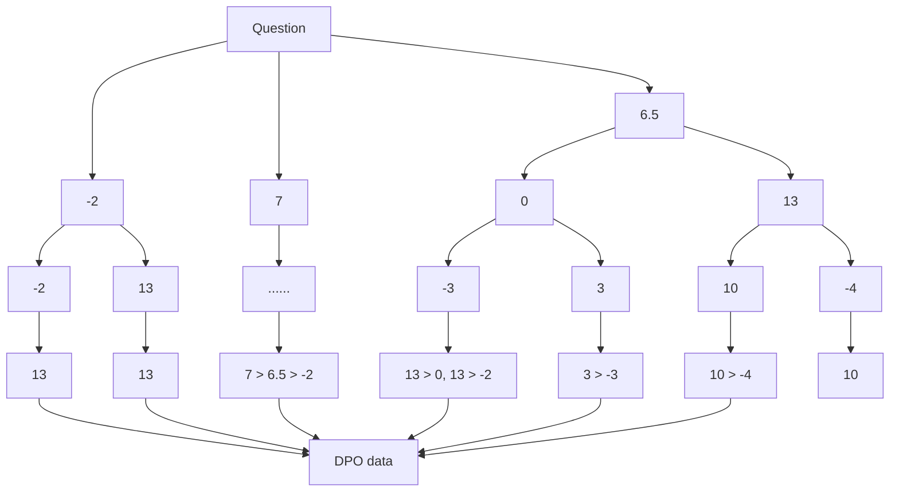

# CodeSteer: Symbolic-Augmented Language Models via Code/Text Guidance

Yongchao Chen $^{12}$ Yilun Hao $^{1}$ Yueying Liu $^{3}$ Yang Zhang $^{4}$ Chuchu Fan $^{1}$

# Abstract

Existing methods fail to effectively steer Large Language Models (LLMs) between textual reasoning and code generation, leaving symbolic computing capabilities underutilized. We introduce CodeSteer, an effective method for guiding LLM code/text generation. We construct a comprehensive benchmark SymBench comprising 37 symbolic tasks with adjustable complexity and also synthesize datasets of 12k multi-turn guidance/generation trajectories and 5.5k guidance comparison pairs. We fine-tune the Llama-3-8B model with a newly designed multi-turn supervised fine-tuning (SFT) and direct preference optimization (DPO). The resulting model, CodeSteerLLM, augmented with the proposed symbolic and self-answer checkers, effectively guides the code/text generation of larger models. Augmenting GPT-4o with CodeSteer raises its average performance score from 53.3 to 86.4, even outperforming the existing best LLM OpenAI o1 (82.7), o1-preview (74.8), and DeepSeek R1 (76.8) across all 37 tasks (28 seen, 9 unseen). Trained for GPT-4o, CodeSteer demonstrates superior generalizability, providing an average 41.8 performance boost on Claude, Mistral, and GPT-3.5. CodeSteer-guided LLMs fully harness symbolic computing to maintain strong performance on highly complex tasks. Models, Datasets, and Codes are available at https://github.com/yongchao98/CodeSteer-v1.0 and https://huggingface.co/yongchao98.

$^{1}$ Massachusetts Institute of Technology, Boston, MA, USA $^{2}$ Harvard University, Boston, MA, USA $^{3}$ University of Illinois Urbana-Champaign, Urbana, IL, USA $^{4}$ MIT-IBM Watson AI Lab, Boston, MA, USA. Correspondence to: Yongchao Chen <yongchaochen@fas.harvard.edu>, Chuchu Fan <chuchu@mit.edu>.

Proceedings of the $42^{nd}$ International Conference on Machine Learning, Vancouver, Canada. PMLR 267, 2025. Copyright 2025 by the author(s).

# 1. Introduction

While the reasoning and planning capabilities of LLMs have improved significantly (Wang et al., 2024; Chen et al., 2024c; Li et al., 2023), they still fail in ostensibly simple tasks (Zhou et al., 2024a). Crucially, many tasks in existing benchmarks—such as Blocksworld (Valmeekam et al., 2024) and Game 24 (Zhou et al., 2023b)—can be completely solved with code solutions. Text-based reasoning excels at semantic understanding and commonsense inference but is less suited for exact computation, symbolic manipulation, optimization, and algorithmic processing (Valmeekam et al., 2022). In contrast, symbolic computing via code generation is adept at handling rigorous operations and can easily leverage specialized tools (e.g., equation solvers). In many tasks, prompting LLMs to generate and execute code outperforms purely textual reasoning (Madaan et al., 2022; Liang et al., 2022; Chen et al., 2022).

A key challenge is guiding LLMs to decide when to rely on textual reasoning versus programmatic solutions, given that most input questions lack explicit cues about which approach is best. Recent OpenAI GPT models address this by providing a Code Interpreter module, allowing the model to iteratively generate and execute code, then further reason with the output (Achiam et al., 2023). Multi-agent frameworks like AutoGen (Wu et al., 2023) adopt a specialized system prompt to steer LLM for code generation when needed. However, recently Chen et al. (2025) finds that all these existing methods struggle to effectively steer between textual reasoning and code generation, failing to fully leverage symbolic computing capabilities.

Our work tries to bridge this gap by developing an assistant framework (CodeSteer) to guide the code/text generation of the LLM solving the task (TaskLLM). By fine-tuning a small model (Llama-3-8B (Dubey et al., 2024)) to be the assistant, we enable large models (GPT-4o (Achiam et al., 2023)) to fully leverage symbolic computing via code generation while preserving other capabilities. Recognizing that iterative “executing and exploring” is the most effective way to solve tasks, we build CodeSteer to generate prompts that guide the TaskLLM through multiple turns of interaction before finalizing answers.

To achieve a comprehensive evaluation, we gather and develop a benchmark with 37 symbolic tasks, referred as Sym-


<details>
<summary>bar</summary>

| Model | 28 Seen Tasks | 9 Unseen Tasks |
| :--- | :--- | :--- |
| GPT-4o | 55 | 32 |
| GPT-4o+Code Interpreter | 72 | 66 |
| GPT-4o+CodeSteer | 89 | 86 |
| O1 | 87 | 85 |
| DeepSeek R1 | 85 | 69 |
| O1-preview | 84 | 67 |
</details>


<details>
<summary>text_image</summary>

Number Multiply, (1)
Question: What is the result of -35*17?
CodeSteer Guidance 1: Acquire the final answer
with step by step textual analysis...
TaskLLM Answer 1: Let's break down th
multiplication step by step, ...<omitted ...>
The final answer is: -595
CodeSteer Guidance 2: Return Answer
</details>


<details>
<summary>text_image</summary>

Number Multiply, (2)
Question: What is the result of -5343235*143433327?
CodeSteer Guidance 1: Generate code to solve it.
TaskLLM Answer 1:
```python
# Define the numbers
num1 = -5343235
num2 = 143433327
result = num1 * num2
print("The result of -5343235 * 143433327 is:", 
result)
CodeSteer Guidance 2: Return Answer
</details>

# Game 24

Question: Use numbers and basic arithmetic operations (+ - \* /) to obtain 24. Input: 3, 4, 4, 6.

CodeSteer Guidance 1: Utilize your programming expertise to address tasks...

TaskLLM Answer 1: To solve this ...<omitted text>...
Let's try a few combinations:
- (6 \* 4) - (3 \* 4) = 24

...python

\# Given numbers
a, b, c, d = 1, 3, 4, 6

\# Calculate the result
result = (d - a) \* (c - b)

\# Print the final answer in the required format
print(f"<<<({d} - {a}) \* ({c} - {b}) = {result}>>>")

CodeSteer Guidance 2: The current approach is incorrect because... To solve the problem, consider using a more complex and systematic approach to explore all possible combinations... Implement a search algorithm that...

TaskLLM Answer 2: ...<omitted text>...

\# filename: find\_24.py
from itertools import permutations, product

def find\_24(numbers):
    ops = ['+', '-', '\*', '/']
    for num\_perm in permutations(numbers):
    for op\_perm in product(ops, repeat=3):
    # Generate all possible ways to

parenthesize the expression
    expressions = [
    f"( {num\_perm[0]} {op\_perm[0]}
{num\_perm[1]} ) {op\_perm[1]} ( {num\_perm[2]}
{op\_perm[2]}, {num\_perm[2]} )

{op\_perm[2]} {num\_perm[3]}", f"({num\_perm[0]} {op\_perm[0]} {num\_perm[1]}){op\_perm[1]} {num\_perm[2]}) {op\_perm[2]} {num\_perm[3]}", f"({num\_perm[0]} {op\_perm[0]} {num\_perm[1]} {op\_perm[1]} {num\_perm[2]}) {op\_perm[2]} {num\_perm[3]}}", f"({num\_perm[0]} {op\_perm[0]} ...<omitted code>...

CodeSteer Guidance 3: Return Answer


# BoxLift

Question: You are given a list of boxes with the following weights: [312,...,129]. And a list of lifters with the following maximum lifting capacities: [68...,109]. Your task is to assign the lifters to lift all the boxes in multiple steps, following rules...

CodeSteer Guidance 1: Suggest python code (in a python coding block) for the user to execute...

TaskLLM Answer 1: To solve this problem, we need to assign lifters to boxes, ...<omitted text>...

python

...<omitted code>...

steps = []

white boxes.
step = []
remaining\_lifters = lifters[:]
i = 0
while i < len(boxes):

box = boxes[1]
used lifters = []

used\_tifters = [] total sensitivity 0

total\_capacity = 0 for i := lifton\_in

for j, lifter in
enumerate(remaining\_lifters):
    if total\_capacity + lifter >= box:
    used\_lifters.append(j)

...<omitted code>...

CodeSteer Guidance 2: The current code runs into infinite loop. Try to use more efficient searching...

TaskLLM Answer 2: I understand,

python

...<omitted code>...


CodeSteer Guidance 3: This code still runs time out. Consider implementing a constraint satisfact...

TaskLLM Answer 3: Here is the, ...<omitted text>...
\`\`\`python
...<omitted code>...

CodeSteer Guidance 4: It seems you cannot write the correct code. Directly use textual reasoning to...

TaskLLM Answer 4: Let us analyze it step by step, ...<omitted text>...
Step 1: [(400, [3, 1, 0]), (231, [4, 5], (89, [2])]
Step 2: [(359, [4, 1, 0]), (230, [2, 5], (89, [2])]
Step 3: ...<omitted text>...

CodeSteer Guidance 5: Return Answer

Figure 1: Examples and performance of CodeSteer on guiding LLM code/text generation to integrate symbolic computing. At each interaction with TaskLLM, it reviews current and previous answers, then provides guidance for the next turn. CodeSteer returns final answers when it deems them ready. With CodeSteer, GPT-4o outperforms OpenAI Code Interpreter, o1, and o1-preview models.

Bench. On SymBench, augmenting GPT-4o with CodeSteer greatly improves its average performance score from 53.3 to 86.4, even outperforming the current leading pure-text model, OpenAI o1 (82.7) (Jaech et al., 2024) and DeepSeek R1 (76.8) (Guo et al., 2025). Although trained for GPT-4o, CodeSteer shows great generalizability, delivering an average 41.8 performance gain on Claude-3-5-Sonnet, Mistral-Large, and GPT-3.5. By fully leveraging symbolic computing, CodeSteer-guided LLMs maintain strong performance on highly complex tasks even when o1 fails in all testing cases. Our key contributions are:

1) Developing and publishing SymBench: Prior works by Chen et al. (2025) and Gui et al. (2024) gathered and developed 14 and 31 tasks, respectively, targeting challenges in computation, symbolic manipulation, logic, optimization, spatial reasoning, and constrained planning. However, neither study published the complete code for question/solution synthesis or the full datasets. From these 45 tasks, we select 37 that remain challenging for GPT-4o and redevelop their generation code to produce samples with adjustable complexity. We refer to this newly published benchmark as SymBench.

2) New methods for dataset construction and model fine-tuning of SFT and DPO: We fine-tune Llama-3-8B with the synthesized datasets of 12k multi-turn guidance/generation trajectories (SFT) and 5.5k guidance comparison pairs (DPO). Unlike standard multi-step settings, in CodeSteer's multi-turn guidance, the TaskLLM outputs a complete answer each turn rather than only at the end. Consequently, we introduce novel components to both the dataset construction and training processes for SFT and DPO, such as data synthesis of dynamic guidance adaptation, emphasis on the final two turns in SFT, comparison score design, and efficient answer sampling in DPO. These modifications result in better performance. Both the final CodeSteer model and created datasets will be released.

3) Symbolic checker and self-answer checker: Observing that TaskLLM frequently produces text-like code that hard-codes answers, neglecting efficient symbolic computation, we introduce a Symbolic Checker to help CodeSteerLLM evaluate code complexity and efficiency. Since most reasoning and planning tasks can be better verified with coding, we add a Self-answer Checker for better judgment of answer correctness of CodeSteerLLM. These two new checkers have been proven to significantly improve the efficiency of

dataset synthesis and CodeSteerLLM fine-tuning.

4) Proposed CodeSteer Outperforms Nine Baselines and o1: CodeSteer's superior performance highlights the importance of enhancing LLM reasoning and planning with symbolic computing. This also demonstrates the potential for steering large models to generate smarter code and text by leveraging specialized smaller models.

# 2. Symbolic Tasks and SymBench

Challenges in Code/Text Choices For tasks requiring computation, symbolic manipulation, logic, optimization, spatial reasoning, and constrained planning, coding-based symbolic computing is often more effective than text-based approaches. However, Chen et al. (2025) found that steering LLM code/text generation poses significant challenges, even in tasks with apparent symbolic characteristics. The main bottlenecks are: 1) Deciding whether code or text is simpler depends on task type, task complexity, and the LLM's capabilities, which is hard to judge (see Appendix Sec. A). 2) LLM-generated code often appears as text-like scripts that merely hard-code answers rather than enabling efficient symbolic computation, echoing the phenomenon described in Yang et al. (2024) (see Appendix Sec. B).

SymBench Chen et al. (2025) and Gui et al. (2024) collected 14 and 31 tasks with symbolic factors from various benchmarks such as Suzgun et al. (2022); Chen et al. (2024d); Yao et al. (2024); Cobbe et al. (2021); Hendrycks et al. (2021), but their question-generation code and complete datasets remain private. We redevelop the generation code to automatically synthesize questions with adjustable complexity. Our resulting set of 37 tasks covers reasoning, planning, and execution, testing competencies in mathematics, spatial reasoning, logic, order reasoning, optimization, and search. Details and categorization are provided in Appendix Sec. C and Table 5.

# 3. CodeSteer Framework

Fig 1 illustrates how CodeSteer guides the LLM's code/text generation. At each turn, CodeSteer reviews the TaskLLM's current answer and the guidance/answer history, then decides whether to offer new guidance or finalize the response. It performs three key functions:

1) Initial Method Selection In the first turn, it chooses whether to solve the task with code or text (e.g., use textual reasoning for small-number multiplication, and code for large-number multiplication in the task Number Multiply).   
2) Dynamic Adaptation In subsequent turns, it refines guidance or switches methods if issues arise (e.g., encouraging more sophisticated symbolic approaches in Game 24, or switching to textual reasoning after multiple incorrect code attempts in BoxLift).

# 3) Answer Finalization When Ready

The main components of CodeSteer are as follows:

CodeSteerLLM is the primary model fine-tuned and used to guide TaskLLM in code/text generation. The input prompt formats for the first and subsequent turns are presented in Appendix Sec. D. To facilitate answer evaluation, CodeSteerLLM is equipped with two checkers—Self-answer and Symbolic—whose design is inspired by the inherent features of symbolic tasks.

Self-answer Checker re-queries TaskLLM to generate and execute code for verifying its current answer, then returns the evaluation results and explanations to CodeSteerLLM. Since many symbolic tasks benefit from code-based verification, this approach often provides a more reliable perspective. The prompt format for the Self-answer Checker is provided in Appendix Sec. E.

Symbolic Checker is a rule-based script to analyze the generated code for iteration, search, numeric handling, permutations, and combinations, then returns a complexity summary and score. This helps CodeSteerLLM determine whether the code is sufficiently sophisticated for the task at hand. Since TaskLLM often produces text-like code prone to errors, the Symbolic Checker's complexity assessment aids, but does not solely dictate, CodeSteerLLM's decisions. Further details on the checking code and prompt are in Appendix Sec. F.

Beyond enhancing CodeSteerLLM's performance, the Self-answer and Symbolic Checkers also streamline dataset synthesis for SFT and DPO fine-tuning, as discussed in the following sections.

# 4. Fine-tuning the CodeSteerLLM

Among the three modules of CodeSteer, the CodeSteer-LLM needs to be fine-tuned to perform the complicated task of steering. The fine-tuning is performed on a subset of SymBench. Specifically, we randomly select 28 of the 37 SymBench tasks, using a distinct set of samples without overlap with the test samples. This setup allows us to evaluate CodeSteer on 28 seen tasks (with different test samples) and on the remaining 9 unseen tasks. The fine-tuning consists of two steps. We first fine-tune the Llama-3.1-8B model with SFT, then further optimize it using DPO. Both processes are fine-tuned with full parameter on 4\*H100 GPUs for 4-10 epochs. The detailed parameter and hardware settings for fine-tuning and inference processes are discussed in Appendix Sec. H. We synthesize 12k multi-turn guidance/generation trajectories for SFT and 5.5k guidance comparison pairs for DPO. The specific data number for each task is in Appendix Sec. G.

# 4.1. Multi-turn SFT

To generate supervision data for SFT, we prompt the GPT-4o to serve as both the guiding LLM (i.e., the CodeSteerLLM) and the TaskLLM to generate multiple guidance/generate trajectories. We then filter the trajectories keeping only those that produce correct answers. To improve success rates, CodeSteerLLM's prompt is more detailed and includes pre-set knowledge or hints. To increase dataset diversity and enable dynamic adaptation of guided thoughts, this prompt also has different versions. For example, we may let GPT-4o choose all guidance styles, or enforce transitions from code to text or text to code. We set the maximum guidance turns to be 5 and return the final answer once that limit is reached.

Multi-turn Gradient Cancellation Issue In multi-turn trajectories, the SFT process incorporates gradients from each turn. This can lead to gradient cancellation in the early turns. For example, in one task, both [code, return answer] and [text, code, return answer] produce correct results, so if both trajectories are used for fine-tuning, the SFT cannot learn that code is the better first step.

Data Augmentation To mitigate this issue, we leverage the fact that the final two turns of guidance are most influential, as the TaskLLM produces new answers each turn while earlier turns primarily provide background. Consequently, we augment the SFT dataset by doubling the weights of the final two turns.

# 4.2. Multi-turn DPO


<details>
<summary>flowchart</summary>


</details>

Figure 2: Schematic of multi-turn DPO data sampling: blue squares represent intermediate (non-final) turns, and brown ovals mark finalizing turns. Guidance responses from the same parent node in CodeSteerLLM are compared to generate the DPO data.

Because many correct trajectories in the SFT dataset are still suboptimal, we need to further fine-tune the CodeSteer-LLM on pairs of trajectories labeled with preferences. Here we use rule-based scores to assign preferences. Figure 2 illustrates our framework for sampling DPO guidance pairs in a multi-turn setting. The main challenge is sampling and selecting guidance pairs that exhibit clear performance differences across various turns while minimizing the number of samples to conserve resources. We use a tree structure where each node represents a guidance, with a branching factor of 2 or 3. To compare guidance pairs from the same parent node, we calculate their Performance Scores using the following equation:

$$
\text { Score } _ {i} = \left\{ \begin{array}{l l} 1 5 - i & \text { ending   turn / correct }, \\ - i & \text { ending   turn / incorrect }, \\ \frac {1}{| C (i) |} \sum_ {j \in C (i)} \text { Score } _ {j} & \text { otherwise }. \end{array} \right. \tag {1}
$$

Here, $Score_{i}$ represents the score for a node at turn i, where i is the current turn number, and $C(i)$ is the set of child nodes of node i. If the current turn is the final one, $Score_{i}$ is set to 15 - i for correct answers and -i for incorrect ones. This incentivizes CodeSteerLLM to achieve correct answers in the fewest turns possible. For non-final turns, $Score_{i}$ is calculated as the average of its child nodes' scores. This ensures that each non-terminal turn's score reflects the average performance of its potential subsequent actions, i.e., the expectation.

DPO data is collected from guidance pairs within the same parent node at each level that have a score difference greater than 2. To prevent reward hacking (Skalse et al., 2022)—where CodeSteerLLM might bypass exploration and return incorrect answers quickly (e.g., preferring a score of -2 over -5)—we include only pairs where at least one guidance has a positive score. To obtain diverse guidance answers, we set the inference temperature to 1.5 for the SFT fine-tuned CodeSteerLLM and use three models fine-tuned at different epochs (6, 8, and 10) to compare their guidance responses for the same parent node.

# 5. Experiments

Experimental settings We use GPT-4o as the TaskLLM to test 28 seen and 9 unseen tasks, each with 100 samples of varying complexity. The samples for the 28 seen tasks are different from those used to train CodeSteerLLM. Additionally, we evaluate other LLM types to assess CodeSteer's generalizability.

We compare CodeSteer to six training-free and three training-based baselines, with methods 1, 3–6, and 9 originally proposed in Chen et al. (2025).

Training-free Baselines 1) No extra modifications but only input the original question (Only Question); 2) Our framework in Sec. 4.1 to synthesize SFT dataset, where GPT-4o works as CodeSteerLLM with extra hints (Symbolic Agent); 3) Prompting LLMs to answer with only text with CoT (All Text + CoT); 4) Prompting LLMs to first analyze

Table 1: Experimental results on SymBench. Methods with the highest scores are highlighted blue. 

<table><tr><td>Methods</td><td colspan="3">CoT LLMs</td><td colspan="6">Training-free Methods</td><td colspan="4">Training-based Methods</td></tr><tr><td>Task success rate %</td><td>o1</td><td>DeepSeek RI</td><td>o1-preview</td><td>Only Question</td><td>Symbolic Agent</td><td>All Text + CoT</td><td>All Code + CoT</td><td>AutoGen Conca.</td><td>Code + Text + Sum.1</td><td>Code + Text + Sum.2</td><td>Code/Text Choice</td><td>Code Interpreter</td><td>GPT-4o + CodeSteer</td></tr><tr><td>Ave. Norm., Seen</td><td>83.8</td><td>79.3</td><td>77.9</td><td>59.3</td><td>77.0</td><td>56.7</td><td>71.6</td><td>73.2</td><td>66.7</td><td>65.8</td><td>79.7</td><td>73.3</td><td>88.1</td></tr><tr><td>Ave. Norm., Unseen</td><td>79.4</td><td>69.1</td><td>65.1</td><td>34.5</td><td>67.9</td><td>37.9</td><td>63.2</td><td>59.5</td><td>51.9</td><td>51.7</td><td>72.1</td><td>61.9</td><td>81.3</td></tr><tr><td>Ave. Norm., Total</td><td>82.7</td><td>76.8</td><td>74.8</td><td>53.3</td><td>74.8</td><td>52.1</td><td>69.6</td><td>69.9</td><td>63.1</td><td>62.4</td><td>77.9</td><td>70.5</td><td>86.4</td></tr><tr><td></td><td colspan="13">Seen Tasks</td></tr><tr><td>Game 24</td><td>80</td><td>65</td><td>78</td><td>17</td><td>37</td><td>23</td><td>11</td><td>88</td><td>33</td><td>43</td><td>43</td><td>18</td><td>93</td></tr><tr><td>Path Plan</td><td>74</td><td>60</td><td>56</td><td>65</td><td>43</td><td>44</td><td>76</td><td>71</td><td>66</td><td>61</td><td>73</td><td>54</td><td>75</td></tr><tr><td>BoxLift</td><td>95</td><td>92</td><td>85</td><td>69</td><td>58</td><td>56</td><td>68</td><td>20</td><td>65</td><td>60</td><td>73</td><td>49</td><td>77</td></tr><tr><td>BoxNet</td><td>45</td><td>43</td><td>54</td><td>37</td><td>30</td><td>30</td><td>1</td><td>12</td><td>23</td><td>21</td><td>23</td><td>37</td><td>29</td></tr><tr><td>Blocksworld</td><td>100</td><td>100</td><td>77</td><td>43</td><td>60</td><td>52</td><td>32</td><td>50</td><td>50</td><td>48</td><td>44</td><td>42</td><td>52</td></tr><tr><td>Date Understanding</td><td>87</td><td>88</td><td>87</td><td>90</td><td>89</td><td>88</td><td>72</td><td>65</td><td>86</td><td>84</td><td>86</td><td>76</td><td>87</td></tr><tr><td>Web of Lies</td><td>100</td><td>100</td><td>98</td><td>96</td><td>99</td><td>86</td><td>91</td><td>78</td><td>77</td><td>80</td><td>98</td><td>94</td><td>98</td></tr><tr><td>Logical Deduction</td><td>100</td><td>98</td><td>97</td><td>89</td><td>93</td><td>91</td><td>83</td><td>82</td><td>94</td><td>90</td><td>94</td><td>82</td><td>92</td></tr><tr><td>Navigation</td><td>100</td><td>100</td><td>100</td><td>98</td><td>93</td><td>95</td><td>99</td><td>91</td><td>96</td><td>94</td><td>92</td><td>98</td><td>99</td></tr><tr><td>GSM-Hard</td><td>79</td><td>77</td><td>71</td><td>78</td><td>76</td><td>80</td><td>83</td><td>81</td><td>81</td><td>78</td><td>77</td><td>79</td><td>77</td></tr><tr><td>MATH Geometry</td><td>94</td><td>91</td><td>90</td><td>76</td><td>73</td><td>73</td><td>74</td><td>73</td><td>77</td><td>76</td><td>76</td><td>73</td><td>75</td></tr><tr><td>MATH Count&amp;Probab.</td><td>96</td><td>97</td><td>95</td><td>89</td><td>88</td><td>87</td><td>88</td><td>91</td><td>86</td><td>88</td><td>84</td><td>89</td><td>93</td></tr><tr><td>Logical Equation</td><td>100</td><td>100</td><td>100</td><td>52</td><td>50</td><td>52</td><td>40</td><td>48</td><td>30</td><td>33</td><td>56</td><td>71</td><td>78</td></tr><tr><td>New Operator</td><td>44</td><td>39</td><td>25</td><td>42</td><td>39</td><td>45</td><td>39</td><td>47</td><td>56</td><td>38</td><td>48</td><td>48</td><td>40</td></tr><tr><td>Pooling</td><td>46</td><td>40</td><td>42</td><td>54</td><td>46</td><td>60</td><td>57</td><td>55</td><td>43</td><td>47</td><td>40</td><td>49</td><td>46</td></tr><tr><td>Light Puzzles</td><td>100</td><td>100</td><td>92</td><td>62</td><td>56</td><td>56</td><td>69</td><td>56</td><td>92</td><td>78</td><td>73</td><td>95</td><td>68</td></tr><tr><td>Mahjong</td><td>96</td><td>98</td><td>93</td><td>66</td><td>77</td><td>73</td><td>80</td><td>94</td><td>72</td><td>74</td><td>96</td><td>64</td><td>90</td></tr><tr><td>Statistical Counting</td><td>25</td><td>72</td><td>78</td><td>34</td><td>93</td><td>32</td><td>95</td><td>93</td><td>93</td><td>86</td><td>95</td><td>89</td><td>97</td></tr><tr><td>Matrix Transformation</td><td>87</td><td>100</td><td>98</td><td>94</td><td>96</td><td>76</td><td>97</td><td>97</td><td>96</td><td>92</td><td>97</td><td>90</td><td>98</td></tr><tr><td>Logical Puzzle</td><td>88</td><td>80</td><td>86</td><td>48</td><td>58</td><td>51</td><td>41</td><td>39</td><td>44</td><td>50</td><td>44</td><td>68</td><td>70</td></tr><tr><td>Cons. Linear Arrange.</td><td>74</td><td>62</td><td>81</td><td>82</td><td>71</td><td>84</td><td>60</td><td>79</td><td>72</td><td>71</td><td>77</td><td>72</td><td>86</td></tr><tr><td>Pattern Recognition</td><td>100</td><td>100</td><td>100</td><td>70</td><td>90</td><td>44</td><td>89</td><td>100</td><td>56</td><td>60</td><td>94</td><td>100</td><td>93</td></tr><tr><td>String Insertion</td><td>96</td><td>49</td><td>72</td><td>6</td><td>100</td><td>8</td><td>100</td><td>100</td><td>67</td><td>75</td><td>100</td><td>89</td><td>100</td></tr><tr><td>Letter Logic Diagram</td><td>50</td><td>54</td><td>28</td><td>2</td><td>30</td><td>0</td><td>12</td><td>21</td><td>8</td><td>9</td><td>31</td><td>8</td><td>45</td></tr><tr><td>String Deletion&amp;Modifi.</td><td>60</td><td>37</td><td>34</td><td>4</td><td>90</td><td>0</td><td>64</td><td>37</td><td>51</td><td>65</td><td>85</td><td>49</td><td>93</td></tr><tr><td>String Synthesis</td><td>2</td><td>0</td><td>2</td><td>0</td><td>20</td><td>0</td><td>11</td><td>0</td><td>7</td><td>5</td><td>16</td><td>12</td><td>29</td></tr><tr><td>Reversi</td><td>46</td><td>29</td><td>28</td><td>8</td><td>36</td><td>15</td><td>49</td><td>60</td><td>20</td><td>23</td><td>45</td><td>23</td><td>52</td></tr><tr><td>Standard Sudoku</td><td>0</td><td>0</td><td>0</td><td>0</td><td>98</td><td>0</td><td>100</td><td>94</td><td>12</td><td>14</td><td>100</td><td>100</td><td>100</td></tr><tr><td></td><td colspan="13">Unseen Tasks</td></tr><tr><td>Letters</td><td>61</td><td>52</td><td>49</td><td>12</td><td>91</td><td>11</td><td>100</td><td>93</td><td>84</td><td>87</td><td>89</td><td>89</td><td>96</td></tr><tr><td>Eight Queen</td><td>84</td><td>79</td><td>64</td><td>8</td><td>73</td><td>0</td><td>35</td><td>51</td><td>40</td><td>45</td><td>52</td><td>44</td><td>78</td></tr><tr><td>Number Multiply</td><td>43</td><td>46</td><td>28</td><td>11</td><td>87</td><td>8</td><td>100</td><td>100</td><td>68</td><td>65</td><td>100</td><td>75</td><td>95</td></tr><tr><td>Cryptanalysis</td><td>60</td><td>21</td><td>49</td><td>20</td><td>15</td><td>24</td><td>20</td><td>13</td><td>16</td><td>20</td><td>27</td><td>0</td><td>24</td></tr><tr><td>String Splitting</td><td>96</td><td>91</td><td>90</td><td>28</td><td>52</td><td>25</td><td>48</td><td>47</td><td>37</td><td>35</td><td>48</td><td>43</td><td>56</td></tr><tr><td>Combinatorial Calcul.</td><td>57</td><td>98</td><td>35</td><td>16</td><td>45</td><td>60</td><td>55</td><td>48</td><td>70</td><td>67</td><td>80</td><td>57</td><td>86</td></tr><tr><td>Synthesis Decompo.</td><td>57</td><td>96</td><td>53</td><td>52</td><td>53</td><td>72</td><td>71</td><td>35</td><td>44</td><td>38</td><td>69</td><td>72</td><td>66</td></tr><tr><td>2048</td><td>52</td><td>0</td><td>37</td><td>44</td><td>43</td><td>40</td><td>28</td><td>37</td><td>25</td><td>20</td><td>39</td><td>49</td><td>56</td></tr><tr><td>Permut. and Combina.</td><td>100</td><td>100</td><td>100</td><td>66</td><td>89</td><td>48</td><td>64</td><td>60</td><td>40</td><td>46</td><td>80</td><td>75</td><td>93</td></tr></table>

the question with CoT and then output the code answer (All Code + CoT); 5) Concatenating the input question with AutoGen's original system prompt in Appendix Section N (AutoGen Conca.); 6) Implement a multi-agent framework that first queries LLMs to answer the question with All Text + CoT and All Code + CoT methods, respectively. Then the final solution is obtained by combining and summarizing both versions of the answers by the same LLM but prompted differently (Code + Text + Sum.1).

Training-based Baselines 7) Fine-tune Llama-3.1-8B as a summarizer based on the Code + Text + Sum.1 method using SFT on correct summary data (Code + Text + Sum.2); 8) We fine-tune Llama-3.1-8B as a one-step evaluator to choose between text or code generation (Code/Text Choice); 9) OpenAI GPT Code Interpreter with the original input question (Code Interpreter). Method 7 and 8 are fine-tuned on the same data number and task types as CodeSteer.

Comparison with CoT LLMs We also compare with the current best models: OpenAI o1 and o1-preview (Jaech et al., 2024) and DeepSeek R1 (Guo et al., 2025). These models enhance reasoning and planning by using textual search, reflection, and exploration during answer generation. However, our analysis shows that these CoT LLMs have not yet integrated code-based symbolic computing to further improve their performance.

Evaluations Answers are evaluated using predefined rules, with GPT-4o assisting in adjusting formats as needed. Beyond the Code Interpreter method, some approaches have the LLM output code as the final answer. We extract and execute this code using predefined algorithms to obtain the final result or facilitate further reasoning. To prevent infinite loops, code execution is limited to 30 seconds. If this limit is exceeded, the task is marked as failed or returns errors for subsequent turns. We utilize success rate as the metric for each task. To compare each method, we calculate the Average Normalized Score over all the tested tasks by the following equation:

$$
\operatorname{AveNorm} _ {j} = \frac {1}{N} \sum_ {i = 1} ^ {N} \frac {s _ {i j}}{\max (s _ {i})} \tag {2}
$$

where AveNorm $_{j}$ is the Average Normalized Score for method j, $s_{ij}$ is the score of method j for task i, $\max(s_{i})$ is the maximum score for task i, N is the total number of tasks. This equation normalizes each score relative to the maximum score in the respective task, and then averages the normalized scores over all tasks. We use the normalized metric to better compare the relative performance among methods and prevent any single task from disproportionately influencing the overall evaluation. As shown in Appendix Sec I, to ensure the robustness of our conclusions against changes in the evaluation metric, we recalculate the average score without normalization. From the result in Appendix Table 7, we can observe that for both seen and unseen tasks, our method can still outperform all main baselines obviously, even more on unseen tasks.

Apart from the task performance, in later sections we also discuss the costs of token lengths and runtime for each method.

# 5.1. Overall Better Performance


<details>
<summary>bar</summary>

| Scores | O1 | GPT-4o + CodeSteer |
|---|---|---|
| 0.0 | 2 | 0 |
| 0.125 | 0 | 0 |
| 0.25 | 1 | 0 |
| 0.375 | 1 | 1 |
| 0.5 | 3 | 3 |
| 0.625 | 1 | 3 |
| 0.75 | 7 | 7 |
| 0.875 | 22 | 23 |
</details>

Figure 3: Normalized score distribution of CodeSteer+GPT-4o and o1 in 37 SymBench tasks.

Table 1 presents the full results of all methods on SymBench, including individual task scores and the Average Normalized Score. The key findings are:

1) CodeSteer maintains similar relative performance on seen and unseen tasks, indicating no overfitting.   
2) Augmenting GPT-4o with CodeSteer significantly boosts its performance, raising the Ave. Norm. Total Score from 53.3 to 86.4—outperforming all 9 baselines (best baseline: Code/Text Choice at 77.9).   
3) GPT-4o + CodeSteer surpasses o1 (82.7), R1 (76.8), and o1-preview (74.8), highlighting the importance of integrating symbolic computing into LLMs. Figure 3 compares the score distribution of GPT-4o + CodeSteer and o1, showing that CodeSteer reduces instances of extremely low scores (near 0), demonstrating its robustness to varied tasks.   
4) Compared to other training-based methods (Code + Text + Sum.2 and Code/Text Choice) with the same data number and tasks, CodeSteer's better performance validates the framework's effectiveness (further discussed in Sec. 6).

# 5.2. Scalability and Generalizability

To assess the impact of symbolic computing, Fig. 4 tracks the performance of five methods across four tasks of increasing complexity. As critical task-specific properties escalate, o1, o1-preview, and GPT-4o fail in highly complex cases, while symbolic-augmented methods (CodeSteer, Code Interpreter) sustain performance. Notably, CodeSteer proves more robust across tasks than Code Interpreter.

In our study, CodeSteerLLM is fine-tuned on synthesized datasets where TaskLLM is always GPT-4o. To assess its

Table 2: Experimental results of Claude-3-5-sonnet-20241022, Mistral-Large, and GPT-3.5 with or without augmented CodeSteer. Methods with the higher scores of the same model are highlighted blue. 

<table><tr><td>Methods</td><td>Claude</td><td>Claude + CodeSteer</td><td>Mistral</td><td>Mistral + CodeSteer</td><td>GPT-3.5</td><td>GPT-3.5 + CodeSteer</td></tr><tr><td>Combinatorial Calcu.</td><td>48</td><td>66</td><td>25</td><td>34</td><td>12</td><td>29</td></tr><tr><td>Eight Queen</td><td>4</td><td>87</td><td>60</td><td>41</td><td>0</td><td>16</td></tr><tr><td>Reversi</td><td>0</td><td>45</td><td>0</td><td>33</td><td>0</td><td>32</td></tr><tr><td>Cons. Linear Arran.</td><td>73</td><td>90</td><td>47</td><td>48</td><td>25</td><td>9</td></tr><tr><td>Standard Sudoku</td><td>0</td><td>100</td><td>0</td><td>100</td><td>0</td><td>95</td></tr><tr><td>Ave. Norm. Score</td><td>29.1</td><td>92.0</td><td>31.0</td><td>59.8</td><td>8.6</td><td>42.3</td></tr></table>


<details>
<summary>line</summary>

| (Num_numbers, Target_value) | Success Rate (%) |
| --------------------------- | ---------------- |
| (3.10)                      | 100              |
| (5.78)                      | 60               |
| (6.100)                     | 70               |
| (15.300)                    | 90               |
| (20.500)                    | 100              |
</details>


<details>
<summary>line</summary>

| (Digit_num, Digit_num) | O1   | O1-preview | GPT-4o | Code Inter. | GPT-4o+C.S. |
| ---------------------- | ---- | ---------- | ------ | ----------- | ----------- |
| (4,4)                  | 100  | 100        | 100    | 100         | 100         |
| (8,8)                  | 80   | 50         | 100    | 100         | 100         |
| (12,12)                | 0    | 0          | 100    | 100         | 100         |
| (16,16)                | 0    | 0          | 100    | 100         | 95          |
| (20,20)                | 0    | 0          | 100    | 100         | 95          |
</details>


<details>
<summary>line</summary>

| Target_value | Success Rate (%) |
| ------------ | ---------------- |
| Num_4        | 100              |
| Num_6        | 90               |
| Num_8        | 75               |
| Num_20       | 60               |
| Num_80       | 0                |
</details>


<details>
<summary>line</summary>

| Str_min_len, Str_max_len | Success Rate (%) |
| ------------------------ | ---------------- |
| (10,30)                  | 100              |
| (50,100)                 | 85               |
| (150,200)                | 65               |
| (350,700)                | 50               |
| (750,800)                | 0                |
</details>

Figure 4: Method performance across four representative tasks as task complexity increases from left to right on the x-axis controlled by value scales. C.S. and Inter. represent CodeSteer and Interpreter.

transferability and generalizability, we test it with three popular models: Claude-3-5-Sonnet, Mistral-Large, and GPT-3.5-Turbo. We evaluate them on five representative tasks based on GPT-4o's results in Table 1: two where text outperforms code and three where code is superior. CodeSteer has shown apparent effects when guiding GPT-4o on these tasks. The results in Table 2 confirm that CodeSteer generalizes well across other LLMs types. This is expected, as its core mechanisms—code/text guidance and dynamic adaptation—are essential to all general-purpose LLMs. Notably, we observe that CodeSteer is particularly effective when applied to stronger LLMs, such as Claude. This is likely because more powerful models possess superior self-reflection capabilities and can generate complex code with greater precision. Thus, they benefit more from CodeSteer's additional structured guidance, unlocking their full potential.


<details>
<summary>scatter</summary>

| Method | Token Length | Score |
|---|---|---|
| Code/Text Choice | 1400 | 69 |
| Symbolic Agent | 1400 | 69 |
| Code Interpreter | 1400 | 69 |
| Code + Text + Sum. 2 | 3000 | 62 |
| CodeSteer, 4*H100r, 1*H100 | 4500 | 85 |
| DeepSeek R1 | 6000 | 77 |
| Only Parameters | 1400 | 53 |
| All Text + CoT | 1400 | 53 |
</details>


<details>
<summary>scatter</summary>

| Method | Runtime (s) | Score |
| :--- | :--- | :--- |
| AutoGe | 10 | 70 |
| Code Interpreter | 25 | 68 |
| Cod | 35 | 62 |
| All Text + CoT | 15 | 55 |
| CodeText Choice | 40 | 85 |
| Symbolic Ag O1-preview | 45 | 85 |
| CodeSteer, 4*H100 | 50 | 87 |
| CodeSteer, 1*H100 | 60 | 85 |
| O1 | 70 | 83 |
| DeepSeek R1 | 70 | 76 |
| Code + Text + Sum. 2 | 30 | 62 |
(b)
</details>

Figure 5: Score vs. token and runtime costs for each method, highlighting CodeSteer, R1, o1, and o1-preview in red. We display CodeSteer results separately for inferences using single or four H100 GPUs. Specific values are in Table 8.

# 5.3. Cost of Tokens and Runtime

Figure 5 shows Score versus Token Length (including input and output tokens) and Score versus Runtime (covering both LLM inference and code execution) for all methods. Complete data is provided in Appendix Table 8. Token counts include only those used by TaskLLM, excluding small and open-source models fine-tuned on Llama-3.1-8B. For the o1 and o1-preview models, only runtime is plotted since their thinking chains are unavailable. While achieving superior performance, CodeSteer uses more tokens than baseline methods due to its multi-turn generations. Most of these tokens are consumed by multiple interaction turns that ultimately fail. CoT LLM R1 consumes more tokens than CodeSteer due to the inefficient textual iteration.

In terms of runtime, CodeSteer is faster than o1 and R1 while delivering better performance. Additionally, since most of CodeSteer's runtime comes from the inference of the 8B CodeSteerLLM on our workstation, hardware and system optimizations can significantly reduce it. For example, running CodeSteerLLM on four H100 GPUs instead of one decreases the average runtime from 63.8 to 45.4 seconds. CoT LLMs consume excessive runtime and tokens due to their extensive and often redundant reasoning chains. Textual iteration is inherently inefficient for search. Appendix Sec. L shows examples of text answers of R1 and GPT-4o, in which both models attempt to find the cor-

rect equation for the Game 24 task by listing all possible combinations, leading to uncontrolled iterations and endless generation. This highlights the importance of symbolic computing through code generation.

# 5.4. o1 + CodeSteer

Here we test whether CodeSteer can improve the performance of reasoning models like o1. As shown in Table 3, the performance of o1 will improve notably when augmented with CodeSteer on 5 randomly chosen unseen tasks, further verifying the effectiveness of CodeSteer.

# 5.5. Comparison with Heuristic-based Methods

To better evaluate CodeSteer and provide deeper comparisons, we include three prompt-based baselines. Few-Shot: Uses five example-based prompts to guide the TaskLLM in mimicking the 'code/text' switching reasoning process. Code-First-Rule: A rule-based approach where the TaskLLM is prompted to use code for the first three rounds (with increasing complexity) and then switch to text-based reasoning. Code-First-Agent: Employs GPT-4o as the CodeSteerLLM to guide the TaskLLM using the same code-first-then-text strategy as in Code-First-Rule. As shown in Appendix Table 9, the three prompt-based methods perform significantly worse than CodeSteer, underscoring the effectiveness of training with our synthesized data. Upon analyzing failure cases, we identify two main reasons:

1) CodeSteerLLM's guidance often includes problem-specific coding knowledge (e.g., suggesting A\* or DFS) and how to formalize the problem, which purely prompt-based methods struggle to capture.

2) Switching between code and text can be advantageous, as later code generations can build on insights from prior textual reasoning. For instance, in Path Plan, a text-generated trajectory may be partially correct; subsequent code can refine it directly, reducing the search space.

# 6. Ablation Studies

The CodeSteer framework comprises SFT and DPO dataset synthesis, CodeSteerLLM fine-tuning, a symbolic checker, and a self-answer checker. Here we do the ablation studies on these components and their related modifications. The added experimental results are shown in Table 4 with the whole result table of 37 SymBench tasks in Append Sec. M.

DPO Effects In Table 4, 1. CodeSteer outperforms 2. WO DPO, showing the effectiveness of the DPO process.

SFT Data Augmentation As discussed in Sec. 4.1, we do the data augmentation of the last two turns in each trajectory to prevent multi-turn gradient cancellation. In Table 4, 2.WO DPO achieves higher score than 3.WO DPO WO Data Augment., which means this extra attention on the last two turns does enhance the SFT process.

Symbolic and Self-answer Checkers We evaluate the effects of the Symbolic and Self-answer Checker in two parts: 1) Dataset Synthesis Efficiency: Comparing Group 6 with Groups 7 and 8 in Table 4 shows that integrating these two checkers increases the Symbolic Agent's success rates, thereby enhancing the efficiency of the dataset synthesis process. 2) CodeSteer Performance: Comparing Group 1 with Groups 4 and 5 demonstrates that augmenting with these two checkers improves CodeSteer's final performance.

Multi-turn Guidance CodeSteer uses a multi-turn interaction strategy with TaskLLM. In contrast, the Code/Text Choice method in Table 1 relies on single-step guidance and performs worse than CodeSteer. This demonstrates that the multi-turn design enhances guidance effectiveness, aligning with the common intuition that the best methods for many tasks emerge from iterative “executing and exploring” processes accompanied with dynamic adaptation.

Guide Not Summarizer CodeSteer primarily serves as the guidance generator for TaskLLM rather than directly generating answers, summarizing, or selecting among multiple answers. This design choice accounts for the limitations of the open-source LLM we use compared to the more capable closed-source LLM that supports TaskLLM. By focusing on guidance, CodeSteer reduces task complexity and data space requirements. The Code + Text + Sum.2 approach in Table 1 attempts to fine-tune an answer summarizer using the same data volume but fails, highlighting that summarization imposes a significant burden on Llama-3.1-8B due to the unique characteristics of each task.

# 7. Related Work

Code Generation and Symbolic Computing in LLM Tasks LLMs are widely used for general agent tasks, such as interacting with softwares and websites (Zhou et al., 2023c; Hao et al., 2024a;b; Xu et al., 2024), planning robot actions (Chen et al., 2024d; Ahn et al., 2022), and inferring with logic (Suzgun et al., 2022). Literally, many test tasks in previous works can be solved with direct coding (Suzgun & Kalai, 2024; Gao et al., 2023). Some recent works also further extend the applications of coding into tasks involving commonsense reasoning and semantic analysis (Li et al., 2023; Weir et al., 2024). Most of previous works mainly utilize text (Yao et al., 2024; Ahn et al., 2022; Lin et al., 2023) or code (Liang et al., 2022; Bairi et al., 2024; Zhou et al., 2023a) as the only output modality. Chen et al. (2025) highlights the importance of smartly switching between code and text generation in LLMs but notes current methods have clear drawbacks.

LLM Self-reflection and CoT Models LLM-generated

Table 3: Per-task success rate (%) for the text-only baseline (o1) versus o1 augmented with CodeSteer. For each task, the higher score is highlighted in blue. 

<table><tr><td>Task success rate %</td><td>Cryptanalysis</td><td>Synthesis Decomposition</td><td>2048</td><td>Eight Queens</td><td>Combinatorial Calculation</td></tr><tr><td>o1</td><td>60</td><td>57</td><td>52</td><td>84</td><td>57</td></tr><tr><td>o1 + CodeSteer</td><td>73</td><td>94</td><td>72</td><td>97</td><td>95</td></tr></table>

Table 4: Ablation studies on CodeSteer. WO DPO: CodeSteer with SFT but without DPO fine-tuning. WO DPO WO Data Augment: Same as WO DPO, but without data augmentation in the last two turns. Agent represents the Symbolic Agent. 

<table><tr><td>MethodsTask success rate %</td><td>1.Code Steer</td><td>2.WO DPO</td><td>3.WO DPO WO Data Augment.</td><td>4.WO Symbolic Checker</td><td>5.WO Self-answer Checker</td><td>6. Agent</td><td>7.Agent WO Symbolic Checker</td><td>8.Agent WO Self-answer Checker</td></tr><tr><td>Ave. Norm., Seen</td><td>88.1</td><td>80.0</td><td>79.7</td><td>80.1</td><td>78.5</td><td>77.0</td><td>71.9</td><td>70.1</td></tr><tr><td>Ave. Norm., Unseen</td><td>81.3</td><td>76.2</td><td>70.9</td><td>68.6</td><td>64.2</td><td>67.9</td><td>62.0</td><td>57.4</td></tr><tr><td>Ave. Norm., Total</td><td>86.4</td><td>79.1</td><td>77.6</td><td>77.3</td><td>75.0</td><td>74.8</td><td>69.5</td><td>67.0</td></tr></table>

feedback via self-evaluation can improve performance on a variety of tasks (Yang et al., 2022; Welleck et al., 2022; Madaan et al., 2023). The OpenAI o1 (Jaech et al., 2024) and DeepSeek R1 (Guo et al., 2025) models demonstrate the potential of agentic LLMs that use Chain-of-Thought (CoT) text generation to explore and self-reflect, enhancing reasoning and planning. However, they lack symbolic computing and code generation capabilities, leading to weaker performance on complex symbolic tasks and consuming substantial tokens and time (Chen et al., 2024a; Ai et al., 2025).

LLM Fine-tuning with Multi-step SFT and DPO SFT (Chen et al., 2024e) and DPO (Rafailov et al., 2024) are extensively implemented for LLM fine-tuning. To enhance LLM's capability in multi-step agent tasks, these methods are further modified with multi-step goals and rewards (Zhou et al., 2024b; Zhai et al., 2024; Zhang et al., 2024). LLM self-generated data have become increasingly important for model improvement when combined with search algorithms and rejection sampling (Zhou et al., 2023b; Guan et al., 2025).

# 8. Discussion

Our work underlines the significance of augmenting LLM reasoning and planning capabilities with symbolic computing and shows great potentials of steering large models for smarter code/text generation with specialized small models. We introduce novel modifications to dataset synthesis and fine-tuning (SFT/DPO) to support a multi-turn guidance framework, which has proven effective. Unlike CoT LLMs like OpenAI o1 and DeepSeek R1, which rely solely on textual reasoning for exploration, symbolic computing offers greater efficiency, robustness, and scalability. Since coding is a core LLM capability, generating symbolic tools via code writing preserves generalization across tasks.

Limitations We note that CodeSteer encounters failures under the following conditions, insisting the further research to overcome these bottlenecks.

1) Insufficient Capability of TaskLLM: In some cases, the capabilities of the TaskLLM—whether through coding or textual reasoning—are not sufficient to solve the given problem.   
2) Suboptimal Code Generation: The generated code may not use the most efficient method, which can lead to timeouts. For example, as shown in Fig. 4c, CodeSteer's success rate decreases when the target values increase, due to the exponential growth in search complexity.   
3) Lack of Robustness to Task Complexity: CodeSteer is not yet robust enough across tasks with varying complexity. As shown in Fig. 4a, performance drops in medium-complexity samples. In these cases, CodeSteer sometimes selects textual reasoning over coding and ends up producing incorrect answers.

# Acknowledgments

This work was supported by ONR under Award N00014-22-1-2478 and MIT-IBM Watson AI Lab. However, this article solely reflects the opinions and conclusions of its authors.

# Impact Statement

This paper aims to advance the field of Foundation Models. Steering the generation from language models has the great potential to improve safety and performance to better align with human preferences. Any such work is inherently a

double-edged sword; the same techniques used to generate samples from a harmless distribution of text could, with a single sign change, be repurposed for generating samples from a harmful distribution of text. Our method improves language model capability by integrating symbolic computing, which may also be misused for harmful purposes.

Overall, we believe the potential positive social benefits of our work in evaluation and steering language model output towards desired target distributions outweigh the potential negatives stemming primarily from misuse.

# References

Achiam, J., Adler, S., Agarwal, S., Ahmad, L., Akkaya, I., Aleman, F. L., Almeida, D., Altenschmidt, J., Altman, S., Anadkat, S., et al. Gpt-4 technical report. arXiv preprint arXiv:2303.08774, 2023.   
Ahn, M., Brohan, A., Brown, N., Chebotar, Y., Cortes, O., David, B., Finn, C., Gopalakrishnan, K., Hausman, K., Herzog, A., et al. Do as i can, not as i say: Grounding language in robotic affordances. arXiv preprint arXiv:2204.01691, 2022.   
Ai, M., Wei, T., Chen, Y., Zeng, Z., Zhao, R., Varatkar, G., Rouhani, B. D., Tang, X., Tong, H., and He, J. Resmoe: Space-efficient compression of mixture of experts llms via residual restoration. In Proceedings of the 31st ACM SIGKDD Conference on Knowledge Discovery and Data Mining V.1, KDD '25, pp. 1–12. ACM, July 2025. doi: 10.1145/3690624.3709196. URL http://dx.doi.org/10.1145/3690624.3709196.   
Bairi, R., Sonwane, A., Kanade, A., Iyer, A., Parthasarathy, S., Rajamani, S., Ashok, B., and Shet, S. Codeplan: Repository-level coding using llms and planning. Proceedings of the ACM on Software Engineering, 1(FSE):675–698, 2024.   
Chen, W., Ma, X., Wang, X., and Cohen, W. W. Program of thoughts prompting: Disentangling computation from reasoning for numerical reasoning tasks. arXiv preprint arXiv:2211.12588, 2022.   
Chen, X., Xu, J., Liang, T., He, Z., Pang, J., Yu, D., Song, L., Liu, Q., Zhou, M., Zhang, Z., et al. Do not think that much for 2+ 3=? on the overthinking of o1-like llms. arXiv preprint arXiv:2412.21187, 2024a.   
Chen, Y., Arkin, J., Dawson, C., Zhang, Y., Roy, N., and Fan, C. Autotamp: Autoregressive task and motion planning with llms as translators and checkers. In 2024 IEEE International Conference on Robotics and Automation (ICRA), pp. 6695–6702. IEEE, 2024b.

Chen, Y., Arkin, J., Hao, Y., Zhang, Y., Roy, N., and Fan, C. PRompt optimization in multi-step tasks (PROMST): Integrating human feedback and heuristic-based sampling. In Al-Onaizan, Y., Bansal, M., and Chen, Y.-N. (eds.), Proceedings of the 2024 Conference on Empirical Methods in Natural Language Processing, pp. 3859–3920, Miami, Florida, USA, November 2024c. Association for Computational Linguistics. doi: 10.18653/v1/2024.emnlp-main.226. URL https://aclanthology.org/2024.emnlp-main.226/.

Chen, Y., Arkin, J., Zhang, Y., Roy, N., and Fan, C. Scalable multi-robot collaboration with large language models: Centralized or decentralized systems? In 2024 IEEE International Conference on Robotics and Automation (ICRA), pp. 4311–4317. IEEE, 2024d.

Chen, Y., Jhamtani, H., Sharma, S., Fan, C., and Wang, C. Steering large language models between code execution and textual reasoning, 2025. URL https://arxiv.org/abs/2410.03524.

Chen, Z., Deng, Y., Yuan, H., Ji, K., and Gu, Q. Self-play fine-tuning converts weak language models to strong language models. arXiv preprint arXiv:2401.01335, 2024e.

Cobbe, K., Kosaraju, V., Bavarian, M., Chen, M., Jun, H., Kaiser, L., Plappert, M., Tworek, J., Hilton, J., Nakano, R., et al. Training verifiers to solve math word problems. arXiv preprint arXiv:2110.14168, 2021.

Dubey, A., Jauhri, A., Pandey, A., Kadian, A., Al-Dahle, A., Letman, A., Mathur, A., Schelten, A., Yang, A., Fan, A., et al. The llama 3 herd of models. arXiv preprint arXiv:2407.21783, 2024.

Gao, L., Madaan, A., Zhou, S., Alon, U., Liu, P., Yang, Y., Callan, J., and Neubig, G. Pal: Program-aided language models. In International Conference on Machine Learning, pp. 10764–10799. PMLR, 2023.

Guan, X., Zhang, L. L., Liu, Y., Shang, N., Sun, Y., Zhu, Y., Yang, F., and Yang, M. rstar-math: Small llms can master math reasoning with self-evolved deep thinking. arXiv preprint arXiv:2501.04519, 2025.

Gui, J., Liu, Y., Cheng, J., Gu, X., Liu, X., Wang, H., Dong, Y., Tang, J., and Huang, M. Logicgame: Benchmarking rule-based reasoning abilities of large language models. arXiv preprint arXiv:2408.15778, 2024.

Guo, D., Yang, D., Zhang, H., Song, J., Zhang, R., Xu, R., Zhu, Q., Ma, S., Wang, P., Bi, X., et al. Deepseek-r1: Incentivizing reasoning capability in llms via reinforcement learning. arXiv preprint arXiv:2501.12948, 2025.

Hao, Y., Chen, Y., Zhang, Y., and Fan, C. Large language models can plan your travels rigorously with formal verification tools. arXiv preprint arXiv:2404.11891, 2024a.

Hao, Y., Zhang, Y., and Fan, C. Planning anything with rigor: General-purpose zero-shot planning with llm-based formalized programming. arXiv preprint arXiv:2410.12112, 2024b.   
Hendrycks, D., Burns, C., Kadavath, S., Arora, A., Basart, S., Tang, E., Song, D., and Steinhardt, J. Measuring mathematical problem solving with the math dataset. arXiv preprint arXiv:2103.03874, 2021.   
Jaech, A., Kalai, A., Lerer, A., Richardson, A., El-Kishky, A., Low, A., Helyar, A., Madry, A., Beutel, A., Carney, A., et al. Openai o1 system card. arXiv preprint arXiv:2412.16720, 2024.   
Langley, P. Crafting papers on machine learning. In Langley, P. (ed.), Proceedings of the 17th International Conference on Machine Learning (ICML 2000), pp. 1207–1216, Stanford, CA, 2000. Morgan Kaufmann.   
Li, C., Liang, J., Zeng, A., Chen, X., Hausman, K., Sadigh, D., Levine, S., Fei-Fei, L., Xia, F., and Ichter, B. Chain of code: Reasoning with a language model-augmented code emulator. arXiv preprint arXiv:2312.04474, 2023.   
Liang, J., Huang, W., Xia, F., Xu, P., Hausman, K., Ichter, B., Florence, P., and Zeng, A. Code as policies: Language model programs for embodied control. arXiv preprint arXiv:2209.07753, 2022.   
Lin, K., Agia, C., Migimatsu, T., Pavone, M., and Bohg, J. Text2motion: From natural language instructions to feasible plans. Autonomous Robots, 47(8):1345–1365, 2023.   
Madaan, A., Zhou, S., Alon, U., Yang, Y., and Neubig, G. Language models of code are few-shot commonsense learners. arXiv preprint arXiv:2210.07128, 2022.   
Madaan, A., Tandon, N., Gupta, P., Hallinan, S., Gao, L., Wiegreffe, S., Alon, U., Dziri, N., Prabhumoye, S., Yang, Y., et al. Self-refine: Iterative refinement with self-feedback. arXiv preprint arXiv:2303.17651, 2023.   
Rafailov, R., Sharma, A., Mitchell, E., Manning, C. D., Ermon, S., and Finn, C. Direct preference optimization: Your language model is secretly a reward model. Advances in Neural Information Processing Systems, 36, 2024.   
Skalse, J., Howe, N., Krasheninnikov, D., and Krueger, D. Defining and characterizing reward gaming. Advances in Neural Information Processing Systems, 35:9460–9471, 2022.   
Suzgun, M. and Kalai, A. T. Meta-prompting: Enhancing language models with task-agnostic scaffolding. arXiv preprint arXiv:2401.12954, 2024.

Suzgun, M., Scales, N., Schärli, N., Gehrmann, S., Tay, Y., Chung, H. W., Chowdhery, A., Le, Q. V., Chi, E. H., Zhou, D., et al. Challenging big-bench tasks and whether chain-of-thought can solve them. arXiv preprint arXiv:2210.09261, 2022.   
Valmeekam, K., Olmo, A., Sreedharan, S., and Kambhampati, S. Large language models still can't plan (a benchmark for llms on planning and reasoning about change). In NeurIPS 2022 Foundation Models for Decision Making Workshop, 2022.   
Valmeekam, K., Marquez, M., Olmo, A., Sreedharan, S., and Kambhampati, S. Planbench: An extensible benchmark for evaluating large language models on planning and reasoning about change. Advances in Neural Information Processing Systems, 36, 2024.   
Wang, J., Wang, J., Athiwaratkun, B., Zhang, C., and Zou, J. Mixture-of-agents enhances large language model capabilities. arXiv preprint arXiv:2406.04692, 2024.   
Weir, N., Khalifa, M., Qiu, L., Weller, O., and Clark, P. Learning to reason via program generation, emulation, and search. arXiv preprint arXiv:2405.16337, 2024.   
Welleck, S., Lu, X., West, P., Brahman, F., Shen, T., Khashabi, D., and Choi, Y. Generating sequences by learning to self-correct. In The Eleventh International Conference on Learning Representations, 2022.   
Wu, Q., Bansal, G., Zhang, J., Wu, Y., Zhang, S., Zhu, E., Li, B., Jiang, L., Zhang, X., and Wang, C. Autogen: Enabling next-gen llm applications via multi-agent conversation framework. arXiv preprint arXiv:2308.08155, 2023.   
Xu, T., Chen, L., Wu, D.-J., Chen, Y., Zhang, Z., Yao, X., Xie, Z., Chen, Y., Liu, S., Qian, B., et al. Crab: Cross-environment agent benchmark for multimodal language model agents. arXiv preprint arXiv:2407.01511, 2024.   
Yang, K., Tian, Y., Peng, N., and Klein, D. Re3: Generating longer stories with recursive reprompting and revision. In Proceedings of the 2022 Conference on Empirical Methods in Natural Language Processing, pp. 4393–4479, 2022.   
Yang, Y., Xiong, S., Payani, A., Shareghi, E., and Fekri, F. Can llms reason in the wild with programs? arXiv preprint arXiv:2406.13764, 2024.   
Yao, S., Yu, D., Zhao, J., Shafran, I., Griffiths, T., Cao, Y., and Narasimhan, K. Tree of thoughts: Deliberate problem solving with large language models. Advances in Neural Information Processing Systems, 36, 2024.   
Zhai, Y., Bai, H., Lin, Z., Pan, J., Tong, S., Zhou, Y., Suhr, A., Xie, S., LeCun, Y., Ma, Y., et al. Fine-tuning large

vision-language models as decision-making agents via reinforcement learning. arXiv preprint arXiv:2405.10292, 2024.   
Zhang, X., Du, C., Pang, T., Liu, Q., Gao, W., and Lin, M. Chain of preference optimization: Improving chain-of-thought reasoning in llms. arXiv preprint arXiv:2406.09136, 2024.   
Zhou, A., Wang, K., Lu, Z., Shi, W., Luo, S., Qin, Z., Lu, S., Jia, A., Song, L., Zhan, M., et al. Solving challenging math word problems using gpt-4 code interpreter with code-based self-verification. arXiv preprint arXiv:2308.07921, 2023a.   
Zhou, A., Yan, K., Shlapentokh-Rothman, M., Wang, H., and Wang, Y.-X. Language agent tree search unifies reasoning acting and planning in language models. arXiv preprint arXiv:2310.04406, 2023b.   
Zhou, L., Schellaert, W., Martínez-Plumed, F., Moros-Daval, Y., Ferri, C., and Hernández-Orallo, J. Larger and more instructable language models become less reliable. Nature, pp. 1–8, 2024a.   
Zhou, S., Xu, F. F., Zhu, H., Zhou, X., Lo, R., Sridhar, A., Cheng, X., Bisk, Y., Fried, D., Alon, U., et al. Webarena: A realistic web environment for building autonomous agents. arXiv preprint arXiv:2307.13854, 2023c.   
Zhou, Y., Zanette, A., Pan, J., Levine, S., and Kumar, A. Archer: Training language model agents via hierarchical multi-turn rl. arXiv preprint arXiv:2402.19446, 2024b.

# Appendices: CodeSteer: Symbolic-Augmented Language Models via Code/Text Guidance

A. Impacts of task types, task complexities, and LLM capabilities on code/text choices .... 14   
B. Varied code versions of the same LLM ...... 16   
C. Description of SymBench tasks ...... 17   
D. Prompt for CodeSteerLLM 21   
E. Prompt for Self-answer Checker ...... 21   
F. Code for Symbolic Checker 22   
G. Synthesized dataset number of each task for SFT and DPO ....23   
H. Parameter and hardware settings of SFT/DPO fine-tuning and inference processes ..... 23   
I. Score comparison of different methods without normalization across tasks .....24   
J. Score-cost table for each method ...... 24   
K. Comparison with heuristic-based methods ...... 24   
L. Example text answer of DeepSeek R1 and GPT-4o in Game 24 ...... 25   
M. Full experimental results of ablation studies ...... 27   
N. System prompt of AutoGen 28

# A. Impacts of task types, task complexities, and LLM capabilities on code/text choices

The phenomenon and challenges of steering LLM code/text generation are first proposed by Chen et al. (2025). Here we discuss these phenomenon in details for the motivation of our work. Fig 6 presents two typical examples of the recently popular topics of '9.11' and '9.9' numerical comparison and 'r' letter count in 'strawberry', that the ChatGPT of GPT-4o makes mistakes by direct textual reasoning but easily solves the problem after prompted to use code. Meanwhile, Fig 7 displays the example that GPT-4o makes mistakes to solve the question by code generation but partially solve the question by textual reasoning. The above two examples show that whether code or text is simpler highly depends on the task types and LLM own capabilities and characteristics.

The OpenAI GPT-4o Code Interpreter is trained to steer LLM code/text generation. However, the study of Chen et al. (2025) finds many limitations of this method. In Fig 8, they observe an intriguing property of GPT Code Interpreter: its decision to use code depends on the complexity of the task, as shown in Fig 8. GPT-4o Code Interpreter chooses to handle simple Number Multiplying questions with text and complex questions with code, resulting in correct answers. However, it fails in medium-difficulty questions since it tends to be overconfident and chooses to answer the question via textual reasoning, which sometimes is wrong. Hence, whether to implement symbolic computing depends on task complexities even for the same type of the task.


<details>
<summary>text_image</summary>

(a)
9.11 is bigger than 9.9.
9.11 and 9.9, which is bigger?
Use code to answer the following question
9.11 and 9.9, which is bigger?
< 2/2 >
To determine which number is bigger, we can compare the two numbers directly in Python:
python
# Define the numbers
num1 = 9.11
num2 = 9.9
# Compare the numbers
bigger_number = max(num1, num2)
bigger_number
Let's execute this code to find out.
9.9 is bigger than 9.11. [-]
</details>


<details>
<summary>text_image</summary>

(b)
How many r's in strawberry and the positions?
The word "strawberry" contains two 'r's. Their positions are:
• 6th letter
• 9th letter

Use code to answer the following question
How many r's in strawberry and the positions?

Here is the Python code that counts the number of 'r' s in "strawberry" and identifies their
positions:

python
Copy code
word = "strawberry"
r_count = word.count('r')
r_positions = [i for i, letter in enumerate(word) if letter == 'r']
print(f"Number of 'r's: {r_count}")
print(f"Positions of 'r's: {r_positions}")

Output:
javascript
Copy code
Number of 'r's: 3
Positions of 'r's: [2, 7, 8]

Explanation:
• There are three 'r' s in "strawberry."
• Their positions are at indices 2, 7, and 8 (0-based indexing).
</details>

Figure 6: The cases that GPT-4o makes simple mistakes by direct textual reasoning but can reliably solve the problem with prompted to use code.

# BoxLift

<table><tr><td colspan="2">Partial-Correct answer from All text + CoT</td></tr><tr><td colspan="2">Step 1: [(296, [0, 1]), (288, [2, 3, 4])]</td></tr><tr><td colspan="2">Step 2: [(263, [0, 2]), (247, [1, 3])]</td></tr><tr><td colspan="2">Step 3: [(251, [0, 2]), (236, [1, 3])]</td></tr><tr><td colspan="2">Step 4: [(216, [0, 2]), (206, [1, 3])]</td></tr><tr><td colspan="2">Step 5: [(196, [0, 4]), (145, [1]), (136, [2])]</td></tr><tr><td colspan="2">Step 6: [(132, [0]), (124, [3]), (121, [2])]</td></tr><tr><td colspan="2">Step 7: [(111, [1]), (186, [2]), (91, [3])]</td></tr><tr><td colspan="2">Step 8: [(87, [2]), (58, [3]), (62, [1]), (43, [4])]</td></tr></table>

# Wrong answer from All code + CoT

To solve this problem, we need to assign lifters to boxes in such a way that we minimize the number of steps required to lift all the boxes. We will use a greedy algorithm to achieve this. The steps are as follows:

1. Sort the boxes in descending order of their weights.
2. Sort the lifters in descending order of their capacities.
3. In each step, try to lift the heaviest boxes first using the available lifters.
4. If a single lifter cannot lift a box, combine multiple lifters to lift it.
5. Repeat the process until all boxes are lifted.
Let's implement this in Python:

\`\`\`python
boxes = [62, 251, 196, 216, 247, 206, 263, 296, 288, 136, 145, 121, 111, 106, 58, 91, 132, 43, 87, 236]
lifters = [124, 144, 40, 155, 130]

\# Sort boxes and lifters in descending order
boxes.sort(reverse=True)
lifters.sort(reverse=True)

steps = []
while boxes:
    step = []
    remaining\_lifters = lifters[:]
    i = 0
    while i < len(boxes):
    box = boxes[i]
    used\_lifters = []
    total\_capacity = 0
    for j, lifter in enumerate(remaining\_lifters):
    if total\_capacity + lifter >= box:
    used\_lifters.append(j)
    total\_capacity += lifter
    if total\_capacity >= box:
    break
    if total\_capacity >= box:
    step.append((box, used\_lifters))
    for index in sorted(used\_lifters, reverse=True):
    del remaining\_lifters[index]
    boxes.pop(i)
    else:
    i += 1
steps.append(step)

Achieve a score of 0.5!

\# Print the steps
print("<<")
for step\_num, step in enumerate(steps, 1):
    print(f"Step {step\_num}: {step}")
print(">>")

Run into infinite loop!

Figure 7: Representative answers of BoxLift task. The left figure is the partially correct answer of GPT-4o with All Text + CoT method. The right figure is the wrong code answer from All Code + CoT method. The text and code parts are colored in blue and green, respectively. The All Code + CoT method generates the wrong code that runs into an infinite loop.   


<details>
<summary>text_image</summary>

Simple question
Text as answer
what is the result of 12*56?
The result of 12 × 56 is 672.
Hard question
Code as answer
what is the result of 124354536*5607425632?
The result of 124354536 × 5607425632 is 697, 308, 812, 621, 866, 752. [-]
Medium question
Text as answer
what is the result of 1243*5607?
The result of 1243 × 5607 is 6,969,801.
Analysis
python
Always show details
Copy code
# Calculate the result of 124354536 * 5607425632
result = 124354536 * 5607425632
result
Result
697388812621866752
6969501
The result of 1243 × 5607 is 6,969,801.
</details>

Figure 8: GPT-4o Code Interpreter tends to handle simple Number Multiplying tasks with text and complex tasks with code. However, it often fails with medium-difficulty questions, where it is overconfident and chooses not to use code when needed.

# B. Varied code versions of the same LLM

# Game 24

Correct code answer of GPT-4o   
```txt
To solve the problem ...<omitted text>...
Let's write a Python script to perform these steps.
```python
# filename: find_24.py
from itertools import permutations, product

def find_24(numbers):
    ops = ['+', '-', '*', '/']
    for num_perm in permutations(numbers):
    for op_perm in product(ops, repeat=3):
    # Generate all possible ways to parenthesize the expression
    expressions = [
    f"{num_perm[0]} {op_perm[0]} {num_perm[1]}) {op_perm[1]}
({num_perm[2]}) {op_perm[2]} {num_perm[3]})",
    f"{num_perm[0]} {op_perm[0]} {num_perm[1]}) {op_perm[1]}
({num_perm[2]}) {op_perm[2]} {num_perm[3]}", 
    f"{num_perm[0]} {op_perm[0]} ({num_perm[1]} {op_perm[1]}
({num_perm[2]})) {op_perm[2]} {num_perm[3]}", 
    f"{num_perm[0]} {op_perm[0]} ({num_perm[1]} {op_perm[1]}
({num_perm[2]}) {op_perm[2]} {num_perm[3]})",
    f"{num_perm[0]} {op_perm[0]} ({num_perm[1]} {op_perm[1]}
({num_perm[2]}) {op_perm[2]} {num_perm[3]})"
    ]
    for expr in expressions:
    try:
    if abs(eval(expr) - 24) < 1e-6: # Check if the result is 24
    return f"<<<<{expr} = 24>>"
    except ZeroDivisionError:
    continue
    return "No solution found."

numbers = [3, 5, 8, 13]
print(find_24(numbers))
...<omitted text>... 
```

Wrong code answer of GPT-4o   
```txt
To solve the problem of using the numbers 3, 5, 8, and 13 to obtain 24, we need to find a combination of arithmetic operations that will result in 24. Each number must be used exactly once.
Let's break down the approach: 
```

```txt
Identify possible operations: We can use addition, subtraction, multiplication, and division. 
```

```txt
Try different combinations: We need to experiment with different groupings and operations to see which combination yields 24. 
```

```txt
Ensure all numbers are used: The solution must incorporate all four numbers exactly once. 
```

```txt
After testing various combinations, we find that the following equation works: 
```

```csv
(3×8)-(13-5)=24 
```

```txt
Now, let's write the Python code to compute and display this result: 
```

```txt
# Define the numbers
a = 3
b = 5
c = 8
d = 13 
```

```python
# Calculate the result using the identified equation
result = (a * c) - (d - b) 
```

```txt
# Print the result in the required format
print("<<", result, ">>") 
```  
Figure 9: Representative code answers of Game 24 task. The left figure is the correct code of GPT-4o with extra AutoGen prompt in Appendix Sec. N for guiding code/text choices. The right figure is the wrong code after prompting GPT-4o to answer with code 'Think of an algorithm to solve the task and implement it in python'. The text and code parts are colored in blue and green, respectively. In both cases, GPT-4o is prompted to solve this task with code. The only difference is the guiding prompts. However, GPT-4o answers with different types of codes, with or without efficient symbolic computing. This phenomenon shows that LLM code generation is unstable under varied prompts, tasks, and LLM types.

# C. Description of SymBench tasks

Here we describe the 37 testing tasks. They require strong symbolic, mathematical, logical, geometrical, scientific, and commonsense reasoning capabilities. The first 14 tasks originate from Chen et al. (2025), while the last 23 are from Gui et al. (2024). Note that both these two previous works do not release the full question datasets and codes for these 37 tasks. The released question dataset in Gui et al. (2024) only contains 8 or 16 questions for each task. Hence, we develop codes to automatically synthesize the questions for each task with tunable complexities. Both our developed codes and question datasets are released.

Number Multiplying This task involves querying LLMs to compute the product among integers. It represents a classic problem that LLMs are not able to solve through pure textual reasoning.

Game 24 This task involves querying LLMs to use a given set of integers to generate an equation that evaluates to 24. This task is tested in previous work Tree-of-Thought (Yao et al., 2024).

Path Plan This task involves querying LLMs to plan the robot trajectory waypoints based on human task instructions and environments. This task originates from AutoTAMP (Chen et al., 2024b).

Letters This task involves querying LLMs to count the total number of specific letters in a long word and specify their positions. An example question can be 'How many r's in the word strawberry and what are their positions?'. This task has recently gained significant attention because current LLMs struggle to perform it effectively and accurately.

BoxLift This task involves coordinating robots of various types to lift boxes of different sizes and weights. Each robot has a specific lifting capacity and can collaborate with others to lift a single box. A box can only be lifted if the combined lifting capacity of the robots exceeds the box's weight. The objective is to lift all the boxes in the minimum number of time steps. This task originates from Scalable-Robots (Chen et al., 2024d).

BoxNet This task involves coordinating robot arms to move colored boxes (squares) into corresponding colored goal locations (circles) in the fewest time steps. Each robot arm is assigned and restricted to a cell indicated by the dotted lines. The arms have two possible actions: (1) move a box within their cell to a neighboring cell, or (2) move a box within their cell to a goal location within the same cell. The objective is to ensure all boxes are placed in their matching goal locations efficiently. This task originates from Scalable-Robots (Chen et al., 2024d).

Blocksworld In Blocksworld, the objective is to stack a set of blocks (brown) according to a specific order. The robot can perform four actions: (1) pick up a block, (2) unstack a block from the top of another block, (3) put down a block, (4) stack a block on top of another block. A robot can only pick up, unstack, or stack a block if it is clear, that is, the block has no other blocks on top and is not currently being held. This task originates from PlanBench (Valmeekam et al., 2024).

Date Understanding Given a small set of sentences referring a specific date, the task involves querying LLMs to answer a provided question based on the information in these sentences (e.g., ‘The concert was scheduled for 06/01/1943, but was delayed by one day to today. What was the date yesterday in MM/DD/YYYY?’). This task originates from BIG-Bench-Hard (Suzgun et al., 2022).

Web of Lies This task involves querying LLMs to determine the truth value of a random Boolean function presented as a natural-language word problem. This task originates from BIG-Bench-Hard (Suzgun et al., 2022).

Logical Deduction This task involves querying LLMs to deduce the order of a sequence of objects using clues and information about their spacial relationships and placements. This task originates from BIG-Bench-Hard (Suzgun et al., 2022).

Navigate This task involves querying LLMs to determine whether the agent would return to its initial starting point after following a series of navigation steps. This task originates from BIG-Bench-Hard (Suzgun et al., 2022).

GSM-Hard (Gao et al., 2023) This is the more challenging version of GSM8K (Cobbe et al., 2021) math reasoning dataset, where the numbers in the original questions of GSM8K are replaced with larger, less common values.

MATH-Geometry This is the math reasoning dataset from MATH dataset (Hendrycks et al., 2021), with specific focus on geometry questions.

MATH-Count&Probability This is the math reasoning dataset from MATH dataset (Hendrycks et al., 2021), with specific focus on counting and probability questions.

The following 23 tasks originate from LogicGame (Gui et al., 2024).

Logical Equation The task is to assign a specific numeric value to each letter from a given set, using a predefined range of numbers and a set of inequalities. Each letter corresponds to a unique number, and the relationships between the letters are defined by mathematical equations or constraints.

New Operator This task introduces custom mathematical operations involving two numbers, defined with unique formulas. The goal is to use the given definitions of these operations to compute the result of a specific expression.

Pooling This task involves applying a pooling operation on a numerical $N \times N$ grid. The pooling operation uses an $n \times n$ sliding window (n < N) that moves across the grid from left to right and top to bottom. The results from each window are then arranged based on their positions to create a new output matrix.

Light Puzzles In this task, you are given an $n \times n$ grid representing a network of lights, where a lit light is represented by "1" and an unlit light by "0". Several buttons control the state of these lights by turning them on or off in certain positions. The state of each light can be affected by multiple buttons. The task is to follow a series of button presses and determine the final state of the grid.

Mahjong Given an initial set of letter cards, in each turn, a new card is added and one card is removed. Some effects may happen when specific combinations of the cards appear after introducing the new card. A result is determined based on these specific conditions. The goal is to determine a result based on a series of turns

Statistical Counting Calculate the total score of a string by scanning it from left to right, where consecutive identical letters earn points (for example, two or more consecutive A's add 1 point, B's add 2 points, etc.). The task is to start with a score of 0 and return the final summing value.

Matrix Transformation Rotate a given matrix of characters based on given instruction (e.g., 90 degrees clockwise), preserving each character's position relative to others in the transformed output. The input matrix can be of any size and contain any character.

Logical Puzzle The task involves querying LLMs to select a specified number of different values from a grid of numbers, ensuring that certain mathematical constraints (sum or product) are satisfied for selected numbers for each row and column.

Constrained Linear Arrangement In a two-player card game, the task is to deduce your opponent's moves based on the game's rules, your played cards, and the announced results of each turn. Each card can only be used once, and the game follows specific interaction rules between different card types, where certain cards can defeat, be defeated by, or draw with others according to predefined relationships.

Pattern Recognition The task involves querying LLMs to find all squares in a character matrix where each square consists of identical characters and has a side length of at least 3.

String Insertion The task is to transform a string by scanning it from left to right and inserting specific characters after certain character patterns (e.g., each patternWXYZ requires inserting W immediately after it occurs). All operations are performed simultaneously on the original string.

Letter Logic Diagram The task is to complete an incomplete grid by selecting from a list of letters, where each row and column must contain each letter exactly once, and all cells on the minor diagonal (top-right to bottom-left) must contain the same letter. Some cells are already filled in as constraints.

String Deletion and Modification The task is to transform a string by repeatedly applying a set of ordered string manipulation rules until no more changes are possible, where each rule modifies the string based on specific patterns or conditions present in the current string state. For example, a modification rule can be “If the string ends with ‘ba’, replace it with ‘ab’.”

String Synthesis Given an initial set of blocks and a set of synthesis rules that combine different types of blocks, the task is to determine the final block(s) after repeatedly applying these rules in order until no more combinations are possible.

Reversi In this game similar to Reversi, players take turns placing pieces on an $n \times n$ grid. After placing a piece, any of the opponent's pieces located between two of the player's pieces (in the same row, column, or diagonal) will be flipped. The task is to determine the state of the board after rounds, starting from a given configuration.

Standard Sudoku Given a partially filled Sudoku grid, the task is to fill the remaining empty cells with numbers between

1 and 9, ensuring that no number repeats in the same row, column, or $3 \times 3$ subgrid.

Eight Queen Given a grid with some queens already placed, the task is to place the remaining queens such that no two queens share the same row, column, or diagonal, while avoiding positions with obstacles in the grid.

Cryptanalysis In this task, you are provided with a combination lock consisting of numbers and letters, where neither the numbers nor the letters repeat. Using a series of guesses and feedback, the goal is to deduce the correct password based on the given conditions.

String Splitting A dismantling engineer has old machines and can obtain machine parts through a set of predefined methods. By continuously cycling through these methods in a specific order, the engineer dismantles machines or combines parts to create new components, and the task is to determine the total number of parts and remaining machines after all possible cycles.

Combinatorial Calculation Given a set of integers, the goal is to use arithmetic operations (addition, subtraction, multiplication, division) and parentheses to arrange the numbers in such a way that the final result matches a specified target value. Each number must be used exactly once, and the order of the numbers cannot be changed.

Synthesis Decomposition A farmer grows various crops and can exchange them for agricultural products. Using a set of methods, he can trade specific combinations of crops for products, following a cyclic pattern until no further exchanges are possible. The goal is to determine the synthesis result for each round.

2048 Similarly to the 2048 game, in a grid, numbers representing powers of 2 can move in any direction, combining when they encounter a matching number to form the next power of 2. Given a starting position and a sequence of movements, the goal is to determine the resulting grid after executing the moves.

Permutation and Combination Given a set of objects with specific positioning constraints, the task is to determine the correct arrangement of the objects on a shelf. Each object must be placed in a position according to the rules provided, ensuring that the conditions on adjacency, order, and specific positions are met. For example, a rule about adjacency could be ‘Book A must be adjacent to book I’.

Table 5: The evaluated capabilities of all tasks, classified as Execution, Planning, and Reasoning tasks. 

<table><tr><td>Categories</td><td>Tasks</td><td>Mathematics</td><td>Spatial Reasoning</td><td>Logical Reasoning</td><td>Order Reasoning</td><td>Optimization</td><td>Search</td></tr><tr><td rowspan="15">Execution</td><td>Number Multiplying</td><td>✓</td><td>✘</td><td>✘</td><td>✘</td><td>✘</td><td>✘</td></tr><tr><td>New operator</td><td>✓</td><td>✘</td><td>✘</td><td>✘</td><td>✘</td><td>✘</td></tr><tr><td>Pooling</td><td>✓</td><td>✓</td><td>✘</td><td>✘</td><td>✘</td><td>✘</td></tr><tr><td>Light Puzzles</td><td>✘</td><td>✓</td><td>✘</td><td>✘</td><td>✘</td><td>✘</td></tr><tr><td>Mahjong</td><td>✘</td><td>✘</td><td>✘</td><td>✓</td><td>✘</td><td>✘</td></tr><tr><td>Statistical Counting</td><td>✓</td><td>✘</td><td>✘</td><td>✓</td><td>✘</td><td>✘</td></tr><tr><td>Matrix Transform.</td><td>✘</td><td>✓</td><td>✘</td><td>✘</td><td>✘</td><td>✘</td></tr><tr><td>Pattern Recognition</td><td>✘</td><td>✓</td><td>✘</td><td>✘</td><td>✘</td><td>✓</td></tr><tr><td>String Insertion</td><td>✘</td><td>✘</td><td>✓</td><td>✓</td><td>✘</td><td>✓</td></tr><tr><td>String Deletion &amp;Modi.</td><td>✘</td><td>✘</td><td>✓</td><td>✓</td><td>✘</td><td>✓</td></tr><tr><td>String Synthesis</td><td>✘</td><td>✘</td><td>✓</td><td>✓</td><td>✘</td><td>✓</td></tr><tr><td>Reversi</td><td>✘</td><td>✓</td><td>✘</td><td>✘</td><td>✘</td><td>✘</td></tr><tr><td>String Splitting</td><td>✘</td><td>✘</td><td>✓</td><td>✓</td><td>✘</td><td>✓</td></tr><tr><td>Synthesis Decomposition</td><td>✘</td><td>✘</td><td>✓</td><td>✓</td><td>✘</td><td>✓</td></tr><tr><td>2048</td><td>✓</td><td>✓</td><td>✓</td><td>✘</td><td>✘</td><td>✘</td></tr><tr><td rowspan="15">Planning</td><td>Game 24</td><td>✓</td><td>✘</td><td>✘</td><td>✓</td><td>✓</td><td>✘</td></tr><tr><td>Path Plan</td><td>✘</td><td>✓</td><td>✘</td><td>✓</td><td>✘</td><td>✓</td></tr><tr><td>Letters</td><td>✘</td><td>✓</td><td>✘</td><td>✘</td><td>✘</td><td>✓</td></tr><tr><td>BoxLift</td><td>✘</td><td>✘</td><td>✓</td><td>✘</td><td>✓</td><td>✘</td></tr><tr><td>BoxNet</td><td>✘</td><td>✘</td><td>✓</td><td>✘</td><td>✓</td><td>✘</td></tr><tr><td>Blocksworld</td><td>✘</td><td>✓</td><td>✓</td><td>✘</td><td>✓</td><td>✘</td></tr><tr><td>Logical Equation</td><td>✓</td><td>✘</td><td>✓</td><td>✘</td><td>✘</td><td>✓</td></tr><tr><td>Logic Puzzle</td><td>✓</td><td>✓</td><td>✘</td><td>✘</td><td>✘</td><td>✓</td></tr><tr><td>Const. Linear Arrange.</td><td>✘</td><td>✘</td><td>✓</td><td>✘</td><td>✘</td><td>✘</td></tr><tr><td>Letter Logic Diagram</td><td>✘</td><td>✓</td><td>✓</td><td>✘</td><td>✘</td><td>✘</td></tr><tr><td>Standard Sudoku</td><td>✓</td><td>✓</td><td>✘</td><td>✘</td><td>✘</td><td>✓</td></tr><tr><td>Eight Queen</td><td>✘</td><td>✓</td><td>✘</td><td>✘</td><td>✘</td><td>✘</td></tr><tr><td>Cryptanalysis</td><td>✘</td><td>✘</td><td>✓</td><td>✘</td><td>✘</td><td>✘</td></tr><tr><td>Combinatorial Calculation</td><td>✓</td><td>✘</td><td>✘</td><td>✘</td><td>✓</td><td>✘</td></tr><tr><td>Permutation and Combina.</td><td>✘</td><td>✓</td><td>✓</td><td>✓</td><td>✘</td><td>✘</td></tr><tr><td rowspan="7">Reasoning</td><td>Date Understanding</td><td>✘</td><td>✘</td><td>✓</td><td>✘</td><td>✘</td><td>✘</td></tr><tr><td>Web of Lies</td><td>✘</td><td>✘</td><td>✓</td><td>✘</td><td>✘</td><td>✘</td></tr><tr><td>Logical Deduction</td><td>✘</td><td>✘</td><td>✓</td><td>✘</td><td>✘</td><td>✘</td></tr><tr><td>Navigate</td><td>✘</td><td>✓</td><td>✘</td><td>✓</td><td>✘</td><td>✘</td></tr><tr><td>GSM-Hard</td><td>✓</td><td>✘</td><td>✓</td><td>✘</td><td>✘</td><td>✘</td></tr><tr><td>MATH-Geometry</td><td>✓</td><td>✓</td><td>✘</td><td>✘</td><td>✘</td><td>✘</td></tr><tr><td>MATH-Count&amp;Probability</td><td>✓</td><td>✘</td><td>✓</td><td>✘</td><td>✘</td><td>✓</td></tr></table>

# D. Prompt for CodeSteerLLM

The input prompts of CodeSteerLLM follow a multi-turn dialogue, i.e., previous turns of prompts and responses will be included as history prompts for following generation of response guidance. Since we set the maximum turns of guidance to be 5 for each task, the total addition of prompt and output lengths of CodeSteerLLM does not surpass maximum context window 8k. The formats for the first turn of prompt and following turns of prompts are as follows. Note that ‘The summary of generated code complexity is: {code\_complexity\_summary}’ is not included if the generated answer by TaskLLM does not have code.

# Turn 1 prompt to CodeSteerLLM

You are guiding another TaskLLM to solve a task. You will be presented with a task that can potentially be solved using either pure textual reasoning or coding. Your goal is to determine which method will be most effective for solving the task. Follow these steps:

\*\*Respond\*\* with the chosen approach but not the solution. You can choose between the following options:   
- If you choose coding, explain the reasons and respond the final returned guidance with the format <<<guidance prompt content>>> in the end of your response.   
- If you choose textual reasoning, explain the reasons and respond the final returned guidance with the format <<<guidance prompt content>>> in the end of your response.   
Now, here is the task:

# Following Turns of prompts to CodeSteerLLM

The response from TaskLLM is: {response}

The feedback from the checking agent is: {check\_result}

The summary of generated code complexity is: {code\_complexity\_summary}

The final returned guidance prompt should be of the format <<<guidance prompt content>>>

# E. Prompt for Self-answer Checker

# Prompt for Self-answer Checker

Given the following question and the answer from other LLMs, write a python code block to check the correctness of the answer. Try to generate the code to check the correctness of the answer. Try your best to check whether the answer satisfy all the constraints of the given question. If the answer is correct, return the text "Correct". If the answer is incorrect, return the reason why the answer is wrong, like what condition or constraint is not satisfied.

Question: {question}

Answer: {answer}

# F. Code for Symbolic Checker

The following code checks the factors of iteration, search, numeric, permutations, and combinations in the answered code by TaskLLM and returns the summary of code complexity and the complexity score. We directly return the summary of code complexity as ‘code\_complexity\_summary’ to CodeSteerLLM for further guidance. If the complexity score less than 2.0, the returned ‘code\_complexity\_summary’ concatenates with ‘The generated code may not be complex enough to carry out symbolic computing for solving the task.’

```python
def analyze_code_and_explain(code_string):
    """Analyzes Python code for computational approaches and provides explanation."""
    import ast, re
    try:
    tree = ast.parse(code_string)
    analysis = {'search': False, 'symbolic': False, 'numeric': False, 'expl': [], 'score': 0}

    # Check patterns
    for node in ast.walk(tree):
    if isinstance(node, (ast.For, ast.While)):
    analysis['search'] = True
    analysis['expl'].append("Contains loops for systematic search")
    elif isinstance(node, (ast.Import, ast.ImportFrom)) and 'itertools' in node.names[0].name:
    analysis['search'] = True
    analysis['expl'].append("Uses itertools for combinatorial search")
    elif isinstance(node, ast.BinOp):
    analysis['numeric'] = True
    analysis['expl'].append("Contains direct mathematical operations")
    analysis['score'] += 0.25

    # Check symbolic patterns
    if any(x in code_string for x in ['eval(', 'exec(', 'f'', "f'', '.format($)]):
    analysis['symbolic'] = True
    analysis['expl'].append("Uses string operations for expression handling")

    # Calculate complexity
    analysis['score'] += sum(len(re.findall(pattern, code_string))
    for pattern in ['for|while', 'if|elif|else', 'try|except'])

    # Generate explanation
    result = []
    for comp_type, detected in [('SEARCHING', analysis['search']), ('SYMBOLIC', analysis['symbolic']), ('NUMERICAL', analysis['numeric'])):
    if detected:
    result.append(f"\n{comp_type} APPROACH detected:")
    result.extend([f"- {exp}" for exp in analysis['expl']
    if any(x in exp.lower() for x in [comp_type.lower()[:6], 'operation', 'loop'])])
    return "\n".join(result + [f"\nComplexity score: {analysis['score']}]), analysis['score']

except Exception as e:
    return f"Invalid Python code: {str(e)}", 0 
```  
Figure 10: Code for checking the symbolic factors of the generated code by TaskLLM.

# G. Synthesized dataset number of each task for SFT and DPO

Table 6: Synthesized dataset number of each task for SFT and DPO fine-tuning processes. 

<table><tr><td>Dataset number</td><td>SFT success trajectory number</td><td>DPO pair number</td></tr><tr><td>Game 24</td><td>792</td><td>320</td></tr><tr><td>Path Plan</td><td>442</td><td>215</td></tr><tr><td>BoxLift</td><td>345</td><td>163</td></tr><tr><td>BoxNet</td><td>330</td><td>186</td></tr><tr><td>Blocksworld</td><td>406</td><td>248</td></tr><tr><td>Date Understanding</td><td>497</td><td>238</td></tr><tr><td>Web of Lies</td><td>492</td><td>204</td></tr><tr><td>Logical Deduction</td><td>489</td><td>241</td></tr><tr><td>Navigation</td><td>503</td><td>170</td></tr><tr><td>GSM-Hard</td><td>332</td><td>125</td></tr><tr><td>MATH Geometry</td><td>342</td><td>115</td></tr><tr><td>MATH Count&amp;Prob.</td><td>346</td><td>127</td></tr><tr><td>Logical Equation</td><td>396</td><td>213</td></tr><tr><td>New Operator</td><td>394</td><td>189</td></tr><tr><td>Pooling</td><td>404</td><td>187</td></tr><tr><td>Light Puzzles</td><td>406</td><td>259</td></tr><tr><td>Mahjong</td><td>421</td><td>230</td></tr><tr><td>Statistical Counting</td><td>402</td><td>223</td></tr><tr><td>Matrix Transform.</td><td>391</td><td>214</td></tr><tr><td>Logical Puzzle</td><td>454</td><td>148</td></tr><tr><td>Constrained Linear Arrangement</td><td>432</td><td>155</td></tr><tr><td>Pattern Recognition</td><td>414</td><td>135</td></tr><tr><td>String Insertion</td><td>409</td><td>128</td></tr><tr><td>Letter Logic Diagram</td><td>500</td><td>226</td></tr><tr><td>String deletion&amp;Modification</td><td>504</td><td>230</td></tr><tr><td>String Synthesis</td><td>397</td><td>185</td></tr><tr><td>Reversi</td><td>403</td><td>194</td></tr><tr><td>Standard Sudoku</td><td>400</td><td>212</td></tr><tr><td>Total</td><td>12043</td><td>5480</td></tr></table>

# H. Parameter and hardware settings of SFT/DPO fine-tuning and inference processes

We utilize four H100 80GB GPUs for full-parameter fine-tuning of the Llama-3.1-8B models. The model is trained for 10 epochs in the SFT stage and 6 epochs in the DPO stage. The learning rate is set to $1 \times 10^{-5}$ for SFT and $5 \times 10^{-6}$ for DPO. We use a batch size of 4 for training. In DPO, the loss function follows the standard sigmoid loss (Rafailov et al., 2024), with the hyperparameter $\beta$ set to 0.1.

In most cases, we perform the inference of CodeSteerLLM using a single H100 80GB GPU. However, to analyze the impact of hardware configurations on CodeSteer runtime, as shown in Fig. 5, we also conduct inference using four H100 GPUs for comparison.

For the generation of guidance answers in the DPO dataset creation, we utilize three different SFT fine-tuned Llama-3.1-8B models, trained for 6, 8, and 10 epochs, respectively. For each question and stage, we query all three models and compare their generated guidance answers.

# I. Score comparison of different methods without normalization across tasks

Table 7: Average (non-normalized) score (%) for each method. The best score in every row is highlighted in blue. 

<table><tr><td>Avg. Score</td><td>o1</td><td>DeepSeekR1</td><td>Symbolic Agent</td><td>Code/Text Choice</td><td>Code Interpreter</td><td>GPT-4o + Codesteer</td></tr><tr><td>Seen</td><td>73.7</td><td>70.4</td><td>67.5</td><td>70.0</td><td>64.9</td><td>76.1</td></tr><tr><td>Unseen</td><td>67.8</td><td>64.8</td><td>60.9</td><td>64.9</td><td>56.0</td><td>72.2</td></tr><tr><td>Total</td><td>72.3</td><td>69.0</td><td>65.9</td><td>68.8</td><td>62.8</td><td>75.2</td></tr></table>

# J. Score-cost table for each method

Table 8: Score-cost table for each method. 

<table><tr><td>Average Norm.</td><td>Average score (↑)</td><td>Average token length (↓)</td><td>Average runtime (s) (↓)</td></tr><tr><td colspan="4">Baseline Methods</td></tr><tr><td>Only Question</td><td>53.3</td><td>566.1</td><td>8.2</td></tr><tr><td>Symbolic Agent</td><td>74.8</td><td>1192.5</td><td>27.3</td></tr><tr><td>All Text + CoT</td><td>52.1</td><td>1110.7</td><td>15.3</td></tr><tr><td>All Code + CoT</td><td>69.6</td><td>949.8</td><td>8.9</td></tr><tr><td>AutoGen Conca.</td><td>69.9</td><td>1295.9</td><td>10.6</td></tr><tr><td>Code + Text + Sum. 1</td><td>63.1</td><td>3931.6</td><td>24.2</td></tr><tr><td>Code + Text + Sum. 2</td><td>62.4</td><td>2808.6</td><td>32.4</td></tr><tr><td>Code/Text Choice</td><td>77.9</td><td>587.4</td><td>20.1</td></tr><tr><td>Code Interpreter</td><td>70.5</td><td>1175.9</td><td>23.8</td></tr><tr><td colspan="4">CoT LLMs</td></tr><tr><td>DeepSeek R1</td><td>76.8</td><td>6396.6</td><td>68.6</td></tr><tr><td>o1</td><td>82.7</td><td>N/A</td><td>70.5</td></tr><tr><td>o1-preview</td><td>74.8</td><td>N/A</td><td>37.7</td></tr><tr><td colspan="4">Proposed Methods</td></tr><tr><td>CodeSteer, 1*H100</td><td>86.4</td><td>4693.3</td><td>63.8</td></tr><tr><td>CodeSteer, 4*H100</td><td>86.4</td><td>4693.3</td><td>45.4</td></tr></table>

# K. Comparison with heuristic-based methods

Table 9: Task success rate for CodeSteer versus three heuristic-based methods. The highest score for each task is shown in blue. 

<table><tr><td>Task Success Rate %</td><td>CodeSteer</td><td>Few-Shot</td><td>Code-First-Rule</td><td>Code-First-Agent</td></tr><tr><td>Game 24</td><td>93</td><td>28</td><td>68</td><td>76</td></tr><tr><td>Path Plan</td><td>75</td><td>54</td><td>59</td><td>57</td></tr><tr><td>Eight Queen</td><td>78</td><td>47</td><td>62</td><td>73</td></tr><tr><td>Combinatorial Calculation</td><td>86</td><td>58</td><td>47</td><td>59</td></tr><tr><td>2048</td><td>56</td><td>49</td><td>40</td><td>48</td></tr></table>

# L. Example text answer of DeepSeek R1 and GPT-4o in Game 24

```txt
Okay, let's see. I need to use the numbers 1, 3, 13, and 13 to make 24. Each number has to be used exactly once. Hmm. Let's start by listing out all the possible operations and combinations.
First the numbers are 1, 3, 13, 13. Wait, there are two 13s. Oh, but the problem says each number has to be used once. But since both 13s are the same, maybe that gives some flexibility. But I need to use both of them, right?
So let's think. Maybe I can combine the 13s in some way. Like 13 divided by 13 is 1. But then I already have a 1. Hmm. So if I do 13/13 =1, then I have 1 and 1 and 3. But then how to get 24 from 1, 1, 3. That might not help. Maybe subtract them? 13 -13 =0, which probably isn't useful here.
Alternatively, adding them: 13 +13 =26. Then I have 26, 3, 1. How to get from 26,3,1 to 24. 26 - (3 -1) =24? Let's check: 26 -2 =24. But that would require 26 - (3 -1) =24. So that would be (13+13) - (3 -1) =24. Let me verify: 13+13 is 26. 3-1 is 2. 26-2 is 24. Yes! But wait, have I used all the numbers? Let's check: 13,13,3,1. Yes. Each is used once. So the equation would be (13 +13) - (3 -1) =24. Let me write that with parentheses correctly: ((13 +13) - (3 -1)) =24. Alternatively, it's (13+13)-(3-1) =24. That works. Let me check again: 13+13=26, 3-1=2, 26-2=24. Yep. So that's a possible solution. Let me see if there are other ways.
Alternatively, maybe using multiplication. Let's see: 3 * something. For example, 3*8=24. So if I can make 8 with the remaining numbers 1,13,13. Let's see: 13 - (13/1) =0. Not helpful. 13 -1=12. 12 +13=25. Not 8. Hmm. Alternatively, 13 - (13 -1) =1. Still not 8.
What about 13 divided by 13 is 1, then 3-1=2. Then 1*2=2. No, that's not enough. Maybe 3*(1 + ...). Let me think. 3*(8) =24. So how to get 8. Let's see. Maybe 13 - (13 - (1 + ...)). Hmm. Not sure. Let's try another approach.
What if I do 13 * (something) to get close to 24. 13*2=26. 26 - 2=24. But where does 2 come from? 3-1=2. So 13*2 -2=24. Wait, but how to structure that. Let's see: 13*(3-1) - (13 - ?). Wait, maybe not. Let's see. If I use 3-1=2, then 13*2=26. Then 26 - (13 - x) where x is the remaining number. But the remaining number is already used? Wait, perhaps not. Let's re-examine. If I use 13*(3-1), that uses 13,3,1. Then subtract the other 13? So 13*(3-1) -13 =26-13=13. Not 24. Hmm.
Alternatively, 13*(something) divided by something. Let me think. 13 * (3) is 39. Then 39 - (13 +1) =25. Not 24. Close. 13*3 -13 -1 =39-14=25. Not enough. Hmm.
Wait, another idea: 13 + 13 =26. Then subtract 3 and add 1. 26-3+1=24. So that's 26-3+1=24. But how to arrange that. The expression would be (13+13) -3 +1. That uses all numbers: 13,13,3,1. Each once. So (13+13) -3 +1 =24. Let's compute: 26-3 is 23, plus 1 is 24. Yes. So that works. So another possible solution is 13+13-3+1=24. But the problem is that seems the order of operations might require parentheses. Let's check: 13+13 is 26, minus 3 is 23, plus 1 is 24. So the order is left to right, so no parentheses needed. So 13+13-3+1=24. But does that fit the required format? The previous examples used parentheses, but maybe it's allowed. Let me check the previous answers. For example, the first input's answer was (((10-9)*(1+1+1)) =24, which uses parentheses. But in another example, the answer was (2-(6-(10+18))) which simplifies to 2 -6 +28 =24. So maybe parentheses can be adjusted as needed. So in this case, 13+13-3+1=24. Let me confirm. 13+13 is 26, minus 3 is 23, plus 1 is 24. Correct. That uses all numbers once. So that's a valid solution.
But wait, maybe the problem expects some grouping. Let me see. If I write (13+13) -3 +1, but that's the same as 13+13-3+1. Alternatively, ((13 +13) - (3 -1)) which we thought of earlier. Both are correct. Which one is better? Let's see. Let's compute the second version: (13+13) - (3-1) =26 -2=24. So that uses all numbers. So either way, there are two possible solutions here.
But the problem says "each number has to be used in the equation". So as long as all four numbers are used once, either solution is okay. Let's check both.
First solution: 13 +13 -3 +1 =24. Numbers used: 13,13,3,1.Correct.
Second solution: (13+13) - (3-1) =24. Numbers used: 13,13,3,1.Correct.
So both are valid. Which one to choose? Maybe the second one uses parentheses, which is more in line with the examples given, where parentheses are used. For example, the first example was (((0-9)*(1+1+1)), so grouping operations. The second example: ((4*+l)(- (0+0)). So perhaps the answer should be written with parentheses to show the grouping. But since both are correct, either could be acceptable. However, perhaps the second one is more explicit about the order of operations, even though in the first case, left to right works. Let's verify if the first solution is correct without parentheses. Let me see: \( { \begin{array}{c} { \begin{array}{c} { \begin{array}{c} { \begin{array}{c} { \begin{array}{c} { \begin{array}{c} { \begin{array}{c} { \begin{array}{c} { \begin{array}{c} { \begin{array}{c} { \begin{array}{c} { \begin{array}{c} { \begin{array}{c} { \begin[ { \begin{array}{c} { \begin{array}{c} { \begin{array}{c} { \begin{array}{c} { \begin{array}{c} { \begin{array}{c} { \begin{array}{c} { \begin{array}{c} { \begin{array}{c} { \begin{array}{c} { \begin{array}{c} { \begin{array}{c} { \begin{\array}{c} { \begin{array}{c} { \begin{array}{c} { \begin{array}{c} { \begin{array}{c} { \begin{array}{c} { \begin{array}{c} { \begin{array}{c} { \begin{array}{c} { \begin{array}{c} { \begin{array}{c} { \begin{array}{c} { \begin{array}{c}\end{array}\end{array}\end{array}\end{array}\end{array}\end{array}\end{array}\end{array}\end{array}}\end{array}}\end{array}}\end{array}}\end{array}}\end{array}}\end{array}}\end{array}}\end{array}\)
Another approach: \( { \begin{array}{c} { \begin{array}{c} { \begin{array}{c} { \begin{array}{c} { \begin{array}{c} { \begin{array}{c} { \begin{array}{c} { \begin{array}{c} { \begin{array}{c} { \begin{array}{c} { \begin{array}{c} { \begin{array}{c} { }\\ {\mathrm{s}}\\ {\mathrm{s}}\\ {\mathrm{s}}\\ {\mathrm{s}}\\ {\mathrm{s}}\\ {\mathrm{s}}\\ {\mathrm{s}}\\ {\mathrm{s}}\\ {\mathrm{s}}\\ {\mathrm{s}}\\ {\mathrm{s}}\\ {\mathrm{s}}\\ {\mathrm{s}}\\ {\mathrm{s}}\\ {\mathrm{s}}\\ {\mathrm{s}}\\ {\mathrm{s}}\\ {\mathrm{s}}\\ {\mathrm{s}}\\ {\mathrm{s}}\\ {\mathrm{s }}\\ {\mathrm{s}}\\ {\mathrm{s}}\\ {\mathrm{s}}\\ {\mathrm{s}}\\ {\mathrm{s}}\\ {\mathrm{s}}\\ {\mathrm{s}}\\ {\mathrm{s}}\\ {\mathrm{s}}\\ {\mathrm{s}}\\ {\mathrm{s}}\\ {\mathrm{s}}\\ {\mathrm{s}}\\ {\mathrm{s}}\\ {\mathrm{s}}\\ {\mathrm{s}}\\ {\mathrm{s}}\\ {\mathrm{s}}\\ {\mathrm{s}}\\ {\mathrm{s~i~e~r~i~e~r~i~e~r~i~e~r~i~e~r~i~e~r~i~e~r~i~e~r~i~e~r~i~e~r~i~e~r~i~e~r~i~e~r~i~e~r~i~e~r~i~e~r~i~e~r~i~i~e~r~i~e~r~i~e~r~i~e~r~i~e~r~i~e~r~i~e~r~i~e~r~i~e~r~i~e~r~i~e~r~i~e~r~i~e~r~i~e~r~i ~ e ~ i ~ i ~ i ~ i ~ i ~ i ~ i ~ i ~ i ~ i ~ i ~ i ~ i ~ i ~ i ~ i ~ i ~ i ~ i ~ i ~ i ~ i ~ i ~ i ~ i ~ i ~ i ~ i ~ i ~ i ~ i ~ i ~ i ~ i ~ i ~ i ~ i ~ i ~ i ~ i ~ i ~ i ~ i ~ i ~ i ~ i ~ i ~ i ~ i ~ i ~ j
The problem says "each number has to be used in the equation". So as long as all four numbers are used once, either solution is okay.
Let's check both.
First solution: \( { \begin{array}{c} { \begin{array}{c} { \begin{array}{c} { \begin{array}{c} { \begin{array}{c} { \begin{array}{c} { \begin{array}{c} { \begin{array}{c} { \begin{array}{c} { \begin{array}{c} { \begin{array}{c} { \begin{array}{c} { :}\\ { :}\\ { :}\\ { :}\\ { :}\\ { :}\\ { :}\\ { :}\\ { :}\\ { :}\\ { :}\\ { :}\\ { :}\\ { :}\\ { :}\\ { :}\\ { :}\\ { :}\\ { :}\\ { :}\\ { :}\\ { :}\\ { :}\\ { :}\\ { :}\\ { :}\\ { :}\\ { :}\\ { :}\\ { :}\\ { :}\\ { :}\\ { :}\\ { :}\\ \\end{array}\end{array}\end{array}\end{array}\end{array}\end{array}\end{array}\end{array}\end{array}\end{array}\end{array}\end{array}\end{array}\end{array}\end{array}\end{array}\end{array}\end{array}\end{array}\end{array}\end{array}\end{array}\end{array}\end{array}\end{array}\end{array}
(7)
(7)
(7)
(7)
(7)
(7)
(7)
(7)
(7)
(7)
(7)
(7)
(7)
(7)
(7)
(7)
(7)
(7)
(7)
(7)
(7)
(7)
(7)
(7)
(7)
(7)
(7)
(7)
(7)
(7)
(7)
(7)
(7)
(7)
\( ^{* * * * * } \)<nl>
<fcel>Then \( {}^{* * }{}^{* * }{}^{* * }{}^{* * }{}^{* * }{}^{* * }{}^{* * }{}^{* * }{}^{* * }{}^{* * }{}^{* * }{}^{* * }{}^{* * }{}^{* * }{}^{* * }{}^{* * }{}^{* * }{}^{* * }{}^{* * }{}^{* * }{}^{* * }{}\textit{\sf down}: {(0-9)*}(0-9)*0.\textit{\sf down}: {(0-9)*}(0-9)*0.\textit{\sf down}: {(0-9)*}(0-9)*0.\textit{\sf down}: {(0-9)*}(0-9)*0.\textit{\sf down}: {(0-9)*}(0-9)*0.\textit{\sf down}: {(0-9)*}(0-9)*0.\textit{\sf down}: {(0-8)*}(0-8)*0.\textit{\sf down}: {(0-8)*}(0-8)*0.\textit{\sf down}: {(0-8)*}(0-8)*0.\textit{\sf down}: {(0-8)*}(0-8)*0.\textit{\sf down}: {(0-8)*}(0-8)*0.\textit{\sf down}: {(0-8)*}(0-8)*0.\textit{\sf down}: (0-8)*}(0-8)*0.\textit{\sf down}: (0-8)*}(0-8)*0.\textit{\sf down}: (0-8)*}(0-8)*0.\textit{\sf down}: (0-8)*}(0-8)*0.\textit{\sf down}: (0-8)*}(0-8)*0.\textit{\sf down}: (0-8)*}(0-8)* 
```  
Figure 11: Example text answer of R1 in the task Game 24. R1 searches possible answers with the continuous back-and-forth textual reasoning process. This search process still fails in the end.

Game 24, GPT-4o text answer 

<table><tr><td>To solve for 24 using the numbers 2, 3, 5, and 12, we can try different combinations of arithmetic operations. Let&#x27;s explore the possibilities:</td></tr><tr><td>1.  $$  12 - 2 = 10 \)</td></tr><tr><td>2.  $$  10 - 5 = 5 \)</td></tr><tr><td>3.  $$  5 \times 3 = 15 \) (This doesn&#x27;t work)</td></tr><tr><td>Let&#x27;s try another combination:</td></tr><tr><td>1.  $$  12 \div 3 = 4 \)</td></tr><tr><td>2.  $$  4 \times 5 = 20 \)</td></tr><tr><td>3.  $$  20 + 2 = 22 \) (This doesn&#x27;t work either)</td></tr><tr><td>Another attempt:</td></tr><tr><td>1.  $$  12 - 5 = 7 \)</td></tr><tr><td>2.  $$  7 \times 3 = 21 \)</td></tr><tr><td>3.  $$  21 + 2 = 23 \) (This doesn&#x27;t work)</td></tr><tr><td>Let&#x27;s try a different approach:</td></tr><tr><td>1.  $$  12 \div 2 = 6 \)</td></tr><tr><td>2.  $$  6 \times 3 = 18 \)</td></tr><tr><td>3.  $$  18 + 5 = 23 \) (This doesn&#x27;t work)</td></tr><tr><td>Another attempt:</td></tr><tr><td>1.  $$  12 - 3 = 9 \)</td></tr><tr><td>2.  $$  9 \times 2 = 18 \)</td></tr><tr><td>3.  $$  18 + 5 = 23 \) (This doesn&#x27;t work)</td></tr><tr><td>Let&#x27;s try another combination:</td></tr><tr><td>1.  $$  12 - 5 = 7 \)</td></tr><tr><td>2.  $$  7 \times 2 = 14 \)</td></tr><tr><td>3.  $$  14 + 3 = 17 \) (This doesn&#x27;t work)</td></tr><tr><td>Another attempt:</td></tr><tr><td>1.  $$  12 - 2 = 10 \)</td></tr><tr><td>2.  $$  10 \div 5 = 2 \)</td></tr><tr><td>3.  $$  2 \times 3 = 6 \) (This doesn&#x27;t work)</td></tr><tr><td>Another attempt:</td></tr><tr><td>1.  $$  12 \div 2 = 6 \)</td></tr><tr><td>2.  $$  6 \times 3 = 18 \)</td></tr><tr><td>3.  $$  18 + 5 = 23 \) (This doesn&#x27;t work)</td></tr><tr><td>Another attempt:</td></tr><tr><td>1.  $$  12 - 5 = 7 \)</td></tr><tr><td>2.  $$  7 \times 2 = 14 \)</td></tr><tr><td>3.  $$  14 + 3 = 17 \) (This doesn&#x27;t work)</td></tr><tr><td>Another attempt:</td></tr><tr><td>1.  $$  12 - 2 = 10 \)</td></tr><tr><td>2.  $$ (10 + 3 = 13 \)</td></tr><tr><td>3.  $$  13 + 5 = 18 \) (This doesn&#x27;t work)</td></tr><tr><td>Another attempt:</td></tr><tr><td>1.  $$  12 \div 3 = 4 \)</td></tr><tr><td>2.  $$  4 \times 5 = 20 \)</td></tr><tr><td>3.  $$  20 + 2 = 22 \) (This doesn&#x27;t work)</td></tr><tr><td>Another attempt:</td></tr><tr><td>1.  $$  12 - 2 = 10 \)</td></tr><tr><td>2.  $$  10 \div 5 = 2 \)</td></tr><tr><td>3.  $$  2 \times 3 = 6 \) (This doesn&#x27;t work)</td></tr><tr><td>Another attempt:</td></tr><tr><td>1.  $$  12 \div 3 = 4 \)</td></tr><tr><td>2.  $$  6 \times 3 = 18 \)</td></tr><tr><td>3.  $$  18 + 5 = 23 \) (This doesn&#x27;t work)</td></tr><tr><td>Another attempt:</td></tr><tr><td>1.  $$  12 - 5 = 7 \)</td></tr><tr><td>2.  $$  7 \times 2 = 14 \)</td></tr><tr><td>3.  $($  14 + 3 = 17 \) (This doesn&#x27;t work)</td></tr><tr><td>Another attempt:</td></tr><tr><td>1.  $$  12 - 2 = 10 \)</td></tr><tr><td>2.  $$  7 \times 2 = 14 \)</td></tr><tr><td>3.  $($  14 + 3 = 17 \) (This doesn&#x27;t work)</td></tr><tr><td>Another attempt:</td></tr><tr><td>1.  $$  12 - 2 = 10 \)</td></tr><tr><td>2.  $$  10 \div 5 = 2 \)</td></tr><tr><td>3.  $$  2 \times 3 = 6 \) (This doesn&#x27;t work)</td></tr><tr><td>Another attempt:</td></tr><tr><td> $$  12 \div 2 = 6 \)</td></tr><tr><td>2.  $$  6 \times 3 = 18 \)</td></tr><tr><td>3.  $$  18 + 5 = 23 \) (This doesn&#x27;t work)</td></tr><tr><td>Another attempt:</td></tr><tr><td>1.  $$  12 \div 3 = 4 \)</td></tr><tr><td>2.  $$  4 \times 5 = 20 \)</td></tr><tr><td>3.  $$  20 + 2 = 22 \) (This doesn&#x27;t work)</td></tr><tr><td>Another attempt:</td></tr><tr><td>1.  $$  12 - 5 = 7 \)</td></tr><tr><td>2.  $$  7 \times 2 = 14 \)</td></tr><tr><td>3.  $($  14 + 3 = 17 \) (This doesn&#x27;t work)</td></tr><tr><td>Another attempt:</td></tr><tr><td>1.  $$  12 - 2 - 10 \)</td></tr><tr><td>2.  $$  10 \div 5 = 2 \)</td></tr><tr><td>3.  $($  2 \times 3 = 6 \) (This doesn&#x27;t work)</td></tr><tr><td>Another attempt:</td></tr><tr><td>1.  $$  12 \div 2 = 6 \)</td></tr><tr><td>2.  $$  6 \times 3 = 18 \)</td></tr><tr><td>3.  $($  18 + 5 = 23 \) (This doesn&#x27;t work)</td></tr><tr><td>Another attempt:</td></tr><tr><td>1.  $$  12 - 5 = 7 \)</td></tr><tr><td>2.  $$  7 \times 2 = 14 \)</td></tr><tr><td>3.  $($  14 + 3 = 17 \) (This doesn&#x27;t work)</td></tr><tr><td>Another attempt:</td></tr><tr><td> $$  12 - 2 = 10 \)</td></tr><tr><td>2.  $$  10 + 3 = 13 \)</td></tr><tr><td>3.  $($  13 + 5 = 18 \) (This doesn&#x27;t work)</td></tr></table>

<table><tr><td>Another attempt:1.  $12 \div 3 = 4$ 2.  $4 \times 5 = 2$ 3.  $2 \times 3 = 6$  (This doesn&#x27;t work)</td></tr><tr><td>Another attempt:1.  $12 - 2 = 10$ 2.  $10 \div 5 = 2$ 3.  $2 \times 3 = 6$  (This doesn&#x27;t work)</td></tr><tr><td>Another attempt:1.  $12 - 2 = 10$ 2.  $6 \times 3 = 18$ 3.  $18 + 5 = 23$  (This doesn&#x27;t work)</td></tr><tr><td>Another attempt:1.  $12 - 5 = 7$ 2.  $7 \times 2 = 14$ 3.  $14 + 3 = 17$  (This doesn&#x27;t work)</td></tr><tr><td>Another attempt:1.  $12 - 2 = 10$ 2.  $10 + 3 = 13$ 3.  $13 + 5 = 18$  (This doesn&#x27;t work)</td></tr><tr><td>Another attempt:1.  $12 - 2 = 10$ 2.  $4 \times 5 = 20$ 3.  $20 + 2 = 22$  (This doesn&#x27;t work)</td></tr><tr><td>Another attempt:1.  $12 - 2 = 10$ 2.  $10 \div 5 = 2$ 3.  $2 \times 3 = 6$  (This doesn&#x27;t work)</td></tr><tr><td>Another attempt:1.  $12 \div 2 = 6$ 2.  $6 \times 3 = 18$ 3.  $18 + 5 = 23$  (This doesn&#x27;t work)</td></tr><tr><td>Another attempt:1.  $12 - 5 = 7$ 2.  $7 \times 2 = 14$ 3.  $14 + 3 = 17$  (This doesn&#x27;t work)</td></tr><tr><td>Another attempt;1.  $12 - 2 = 10$ 2.  $10 + 3 = 13$ 3.  $13 + 5 = 18$  (This doesn&#x27;t work)</td></tr><tr><td>Another attempt:1.  $12 \div 3 = 4$ 2.  $4 \times 5 = 20$ 3.  $20 + 2 = 22$  (This doesn&#x27;t work)</td></tr><tr><td>Another attempt:1.  $12 - 2 = 10$ 2.  $10 \div 5 = 2$ 3.  $2 \times 3 = 6$  (This doesn&#x27;t work)</td></tr><tr><td>Another attempt;1.  $12 \div 2 = 6$ 2.  $6 \times 3 = 18$ 3.  $18 + 5 = 23$  (This doesn&#x27;t work)</td></tr><tr><td>Another attempt:1.  $12 - 5 = 7$ 2.  $7 \times 2 = 14$ 3.  $14 + 3 = 17\ ) (This doesn't work)</td></tr><tr><td>Another attempt:1. \( 12 - 2 = 10$ 2.  $10 + 3 = 13$ 3.  $13 + 5 = 18$  (This doesn&#x27;t work)</td></tr><tr><td>Another attempt:1.  $12 \div 3 = 4$ 2.  $4 \times 5 = 20$ 3.  $20 + 2 = 2 2$  (This doesn&#x27;t work)</td></tr><tr><td>Another attempt:1.  $12 - 2 = 10$ 2.  $10 \div 5 = 2$ 3.  $2 \times 3 = 6$  (This doesn&#x27;t work)</td></tr><tr><td>Another attempt:1.  $12 \div 2 = 6$ 2.  $6 \times 3 = 18\ )3. \( 18 + 5 = 23$  (This doesn&#x27;t work)</td></tr><tr><td>Another attempt:1.  $12 - 5 = 7$ 2.  $7 \times 2 = 14$ 3.  $20 + 2 = 22$  (This doesn&#x27;t work)</td></tr><tr><td>Another attempt:1.  $12 - 2 = 10$ 2.  $10 \div 5 = 2$ 3.  $2 \times 3 = 6$  (This doesn&#x27;t work)</td></tr><tr><td>Another attempt:1.  $12 \div 2 = 6 \ )2. \( 6 \times 3 = 18$ 3.  $18 + 5 = 23$  (This doesn&#x27;t work)</td></tr><tr><td>Another attempt:1.  $12 - 5 = 7$ 2.  $7 \times 2 = 14$ 3.  $14 + 3 = 17$  (This doesn&#x27;t work)</td></tr><tr><td>Another attempt:1,  $12 - 2 = 10$ 2.  $10 + 3 = 13$ 3.  $13 + 5 = 18$  (This doesn&#x27;t work)</td></tr><tr><td>Another attempt:1.  $12 \div 3 = 4$ 2.  $4 \times 5 = 20$ 3.  $20 + 2 = 22$ (This doesn&#x27;t work)</td></tr><tr><td>Another attempt:1.  $12 - 2 = 10$ 2.  $10 \div 5 = 2$ 3.  $2 \times 3 = 6$  (This doesn&#x27;t work)</td></tr><tr><td>Another attempt:1.  $12 \div 2 = 6$ 2.  $6 \times 3 = 18$ 3. ( $18 + 5 = 23$ ) (This doesn&#x27;t work)</td></tr><tr><td>Another attempt:......</td></tr></table>

Figure 12: Example text answer of GPT-4o in the task Game 24. GPT-4o continues the textual reasoning process until reaching the maximum token generation length but never returns the answer.

# M. Full experimental results of ablation studies

Table 10: Full experimental results of ablation studies on the components in CodeSteer framework. 

<table><tr><td>MethodsTask success rate %</td><td>1.CodeSteer</td><td>2.WODPO</td><td>3.WO DPOWO DataAugment.</td><td>4.WOSymbolicChecker</td><td>5.WOSelf-answerChecker</td><td>6.Agent</td><td>7.Agent WOSymbolicChecker</td><td>8.Agent WOSelf-answerChecker</td></tr><tr><td>Ave. Norm., Seen</td><td>88.1</td><td>80.0</td><td>79.7</td><td>80.1</td><td>78.5</td><td>77.0</td><td>71.9</td><td>70.1</td></tr><tr><td>Ave. Norm., Unseen</td><td>81.3</td><td>76.2</td><td>70.9</td><td>68.6</td><td>64.2</td><td>67.9</td><td>62.0</td><td>57.4</td></tr><tr><td>Ave. Norm., Total</td><td>86.4</td><td>79.1</td><td>77.6</td><td>77.3</td><td>75.0</td><td>74.8</td><td>69.5</td><td>67.0</td></tr><tr><td>Game 24</td><td>93</td><td>93</td><td>46</td><td>62</td><td>57</td><td>37</td><td>41</td><td>28</td></tr><tr><td>Path Plan</td><td>75</td><td>76</td><td>74</td><td>72</td><td>74</td><td>43</td><td>41</td><td>29</td></tr><tr><td>BoxLift</td><td>77</td><td>65</td><td>76</td><td>66</td><td>72</td><td>58</td><td>47</td><td>39</td></tr><tr><td>BoxNet</td><td>29</td><td>21</td><td>31</td><td>13</td><td>17</td><td>30</td><td>24</td><td>15</td></tr><tr><td>Blocksworld</td><td>52</td><td>50</td><td>50</td><td>54</td><td>51</td><td>60</td><td>45</td><td>41</td></tr><tr><td>Date Understanding</td><td>87</td><td>83</td><td>86</td><td>80</td><td>83</td><td>89</td><td>84</td><td>92</td></tr><tr><td>Web of Lies</td><td>98</td><td>94</td><td>92</td><td>95</td><td>92</td><td>99</td><td>95</td><td>97</td></tr><tr><td>Logical Deduction</td><td>92</td><td>92</td><td>95</td><td>91</td><td>89</td><td>93</td><td>91</td><td>87</td></tr><tr><td>Navigation</td><td>99</td><td>90</td><td>95</td><td>85</td><td>80</td><td>93</td><td>94</td><td>88</td></tr><tr><td>GSM-Hard</td><td>77</td><td>74</td><td>72</td><td>79</td><td>74</td><td>76</td><td>73</td><td>70</td></tr><tr><td>MATH Geometry</td><td>75</td><td>74</td><td>70</td><td>71</td><td>69</td><td>73</td><td>68</td><td>70</td></tr><tr><td>MATH Count&amp;Prob.</td><td>93</td><td>92</td><td>86</td><td>84</td><td>81</td><td>88</td><td>85</td><td>82</td></tr><tr><td>Logical Equation</td><td>78</td><td>58</td><td>56</td><td>61</td><td>56</td><td>50</td><td>52</td><td>56</td></tr><tr><td>New Operator</td><td>40</td><td>38</td><td>40</td><td>24</td><td>52</td><td>39</td><td>28</td><td>20</td></tr><tr><td>Pooling</td><td>46</td><td>43</td><td>51</td><td>47</td><td>45</td><td>46</td><td>44</td><td>52</td></tr><tr><td>Light Puzzles</td><td>68</td><td>71</td><td>52</td><td>51</td><td>52</td><td>56</td><td>56</td><td>60</td></tr><tr><td>Mahjong</td><td>90</td><td>88</td><td>88</td><td>92</td><td>95</td><td>77</td><td>85</td><td>79</td></tr><tr><td>Statistical Counting</td><td>97</td><td>98</td><td>92</td><td>95</td><td>84</td><td>93</td><td>90</td><td>96</td></tr><tr><td>Matrix Transform.</td><td>98</td><td>100</td><td>97</td><td>96</td><td>95</td><td>96</td><td>92</td><td>96</td></tr><tr><td>Logical Puzzle</td><td>70</td><td>58</td><td>56</td><td>52</td><td>44</td><td>58</td><td>53</td><td>54</td></tr><tr><td>Const. Linear Arrange.</td><td>86</td><td>66</td><td>65</td><td>76</td><td>81</td><td>71</td><td>64</td><td>52</td></tr><tr><td>Pattern Recognition</td><td>93</td><td>96</td><td>95</td><td>95</td><td>93</td><td>90</td><td>92</td><td>100</td></tr><tr><td>String Insertion</td><td>100</td><td>100</td><td>100</td><td>100</td><td>100</td><td>100</td><td>100</td><td>100</td></tr><tr><td>Letter Logic Diagram</td><td>45</td><td>20</td><td>35</td><td>35</td><td>35</td><td>30</td><td>25</td><td>23</td></tr><tr><td>String deletion&amp;Modi.</td><td>93</td><td>88</td><td>92</td><td>90</td><td>88</td><td>90</td><td>86</td><td>76</td></tr><tr><td>String Synthesis</td><td>29</td><td>12</td><td>21</td><td>30</td><td>26</td><td>20</td><td>12</td><td>14</td></tr><tr><td>Reversi</td><td>52</td><td>49</td><td>39</td><td>52</td><td>24</td><td>36</td><td>28</td><td>36</td></tr><tr><td>Standard Sudoku</td><td>100</td><td>100</td><td>95</td><td>100</td><td>100</td><td>98</td><td>100</td><td>100</td></tr><tr><td>Letters</td><td>96</td><td>85</td><td>88</td><td>87</td><td>84</td><td>91</td><td>79</td><td>75</td></tr><tr><td>Eight Queen</td><td>78</td><td>74</td><td>72</td><td>72</td><td>52</td><td>73</td><td>64</td><td>52</td></tr><tr><td>Number Multiply</td><td>95</td><td>90</td><td>92</td><td>94</td><td>95</td><td>87</td><td>80</td><td>74</td></tr><tr><td>Cryptanalysis</td><td>24</td><td>22</td><td>15</td><td>4</td><td>12</td><td>15</td><td>12</td><td>7</td></tr><tr><td>String Splitting</td><td>56</td><td>56</td><td>31</td><td>43</td><td>41</td><td>52</td><td>42</td><td>40</td></tr><tr><td>Combinatorial Calculation</td><td>86</td><td>76</td><td>88</td><td>65</td><td>76</td><td>45</td><td>60</td><td>56</td></tr><tr><td>Synthesis Decomposition</td><td>66</td><td>62</td><td>64</td><td>44</td><td>60</td><td>53</td><td>56</td><td>44</td></tr><tr><td>2048</td><td>56</td><td>56</td><td>44</td><td>53</td><td>44</td><td>43</td><td>32</td><td>40</td></tr><tr><td>Permutation and Combina.</td><td>93</td><td>86</td><td>80</td><td>92</td><td>56</td><td>89</td><td>82</td><td>78</td></tr></table>

# N. System prompt of AutoGen

# System prompt of AutoGen (Wu et al., 2023)

You are a helpful AI assistant. Solve tasks using your coding and language skills. In the following cases, suggest python code (in a python coding block) or shell script (in a sh coding block) for the user to execute. 1. When you need to collect info, use the code to output the info you need, for example, browse or search the web, download/read a file, print the content of a webpage or a file, get the current date/time, check the operating system. After sufficient info is printed and the task is ready to be solved based on your language skill, you can solve the task by yourself. 2. When you need to perform some task with code, use the code to perform the task and output the result. Finish the task smartly. Solve the task step by step if you need to. If a plan is not provided, explain your plan first. Be clear which step uses code, and which step uses your language skill. When using code, you must indicate the script type in the code block. The user cannot provide any other feedback or perform any other action beyond executing the code you suggest. The user can't modify your code. So do not suggest incomplete code which requires users to modify. Don't use a code block if it's not intended to be executed by the user. If you want the user to save the code in a file before executing it, put # filename: filename inside the code block as the first line. Don't include multiple code blocks in one response. Do not ask users to copy and paste the result. Instead, use 'print' function for the output when relevant. Check the execution result returned by the user. If the result indicates there is an error, fix the error and output the code again. Suggest the full code instead of partial code or code changes. If the error can't be fixed or if the task is not solved even after the code is executed successfully, analyze the problem, revisit your assumption, collect additional info you need, and think of a different approach to try. When you find an answer, verify the answer carefully. Include verifiable evidence in your response if possible. Reply "TERMINATE" in the end when everything is done.