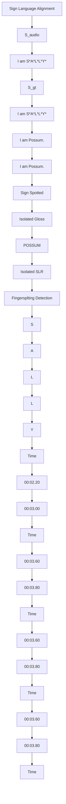

# Auslan-Daily: Australian Sign Language Translation for Daily Communication and News

Xin Shen $^{1}$ Shaozu Yuan $^{2}$ Hongwei Sheng $^{1}$ Heming Du $^{1}$ Xin Yu $^{1*}$

$^{1}$ The University of Queensland

$^{2}$ JD AI, Beijing, China

x.shen3@uqconnect.edu.au

natural_image

Four-panel illustration showing a woman in a purple dress, three people in casual clothing, and a small outdoor scene with plants and a tree (no text or symbols)

natural_image

Four-panel collage showing a child in a pink dress, two adults interacting with a large tree, two men discussing, and a colorful outdoor scene with a rainbow and garden (no visible text or symbols)

natural_image

Four-panel collage showing a person in a red shirt standing outdoors, seated at a table with food and drinks, and two people in orange shirts interacting indoors (no visible text or symbols)

natural_image

Four-panel illustration showing a woman in a kitchen setting, with food and drinks in various settings (no visible text or symbols)

Sally & Possum   
Auslan Daily Communication

text_image

Collage of video and audio content thumbnails showing people in various settings, including presentation, music, and outdoor scenes.

text_image

Cropped image showing multiple video content thumbnails with Chinese text labels, including a presenter and audience.

text_image

Screenshot of multiple video feeders on a TV studio, showing multiple screens with audio and text overlays.

natural_image

Four-panel photo collage showing a speaker in a microphone, seated at a table with plants, and three audience members in a meeting or discussion setting (no visible text or symbols)

ABC News with Auslan   
Auslan Daily News   
Figure 1: Diversity of our curated Auslan-Daily dataset. Auslan-Daily involves various topics, signers and diverse environments. In particular, there are multiple persons in a scene and signers appear in different areas of the scene.

# Abstract

Sign language translation (SLT) aims to convert a continuous sign language video clip into a spoken language. Considering different geographic regions generally have their own native sign languages, it is valuable to establish corresponding SLT datasets to support related communication and research. Auslan, as a sign language specific to Australia, still lacks a dedicated large-scale dataset for SLT. To fill this gap, we curate an Australian Sign Language translation dataset, dubbed Auslan-Daily, which is collected from the Auslan educational TV series and Auslan TV programs. The former involves daily communications among multiple signers in the wild, while the latter comprises sign language videos for up-to-date news, weather forecasts, and documentaries. In particular, Auslan-Daily has two main features: (1) the topics are diverse and signed by multiple signers, and (2) the scenes in our dataset are more complex, e.g., captured in various environments, gesture interference during multi-signers' interactions and various camera positions. With a collection of more than 45 hours of high-quality Auslan video materials, we invite Auslan experts to align different fine-grained visual and language pairs, including video $\leftrightarrow$ fingerspelling, video $\leftrightarrow$ gloss, and video $\leftrightarrow$ sentence. As a result, Auslan-Daily contains multi-grained annotations that can be utilized to accomplish various fundamental sign language tasks, such as signer detection, sign spotting, fingerspelling detection, isolated sign language recognition, sign language translation and alignment. Moreover, we benchmark results with state-of-the-art models for each task in Auslan-Daily. Experiments indicate that Auslan-Daily is a highly challenging SLT dataset, and we hope this dataset will contribute to the development of Auslan and the advancement of sign languages worldwide in a broader context. All datasets and benchmarks are available at 🌐 Auslan-Daily.

text_image

(a.) ASL ↔ American English : Hello, my names Rebecca ...

text_image

(b.) BSL↔ British English: Every spring, our planet is transformed ...

text_image

(c.) CSL ↔ Chinese : 晚上太安静了。

text_image

(d.) DGS ↔ Germany: Sonne frisch bis zehn grad suedost auch ...

text_image

(e.) Auslan ↔ Australian English : Look Possum, you can see ... 
Auslan-Daily Communication

text_image

I am Lorna Dunkley.
Auslan-Daily News

Figure 2: Comparisons of large-scale sign language translation datasets across diverse geographic regions. (a) How2Sign [1] (American), (b) BOBSL [2] (British), (c) CSL-Daily [3] (Chinese), (d) RWTH-PHOENIX-Weather 2014T [4] (Germany), (e) Our proposed Auslan-Daily (the yellow and black bounding-boxes indicate the signer and non-signer in the sign video clip).

# 1 Introduction

Sign language (SL) is the primary way for deaf or people with hearing loss to express themselves. Similar to various spoken languages, sign languages have their vocabularies and grammar $[5, 6, 7]$ . More importantly, diverse geographic regions usually have their native sign languages even though these regions share a commonly spoken language, such as America, Australia and the UK. To eliminate the communication barriers between the deaf and hearing communities, sign language translation (SLT) has been proposed to convert signs into spoken languages $[1, 2, 4, 3]$ .

With the emerging deep learning techniques and large-scale sign language datasets, SLT has achieved promising progress recently. As shown in Figure 2, researchers from various countries have constructed their sign language datasets and thus thrust SLT in their respective sign languages, such as American sign language (ASL) [1], British sign language (BSL) [2], Chinese sign language (CSL) [3] and Germany sign language (DGS) [4]. However, to the best of our knowledge, there is no publicly available large-scale Auslan dataset for continuous sign translation $^{2}$ . Meanwhile, according to the Hearing Care Industry Association $^{3}$ , as of June 2015, one in six Australians had hearing loss affecting them and this proportion is expected to increase to one in four by 2050. Due to the societal inclusion and the regional nature of sign languages, Australian sign language (Auslan) datasets are inevitably and urgently needed in order to investigate automatic translation.

Moreover, existing sign language corpora either are captured in controlled laboratory environments $[1, 3, 8, 9, 10, 11]$ or only contain a single person (the signer) at a certain position in each video clip $[2, 4, 12, 13]$ . In $[14]$ , Núñez-Marcos et al. point out that the effectiveness of sign language translation can be compromised in multi-individual situations due to the presence of non-signers. Additionally, Yin et al. $[15]$ emphasise that translating sign language in the wild is even more challenging. Thus, the existing datasets lack sufficient diversity and may not fully reflect the complexity in the wild.

In this work, we aim to construct a large-scale Auslan translation dataset in the wild which contains sufficient high-quality Auslan videos and their English transcriptions. We adopt the first Australian educational TV series for deaf children “Sally and Possum” $^{4}$ , “ABC News with Auslan” $^{5}$ and several online domain-specific Auslan corpora $^{6}$ as our data source. Firstly, “Sally and Possum” is aired to help deaf children and their parents to learn Auslan, and it covers various topics of daily life, such as drawing pictures with colourful pigments and asking for advice in diverse environments, including indoor and outdoor scenes (Figure 1, left). Secondly, “ABC News with Auslan” starts broadcasting form 2022 and provides the latest news and information from ABC News every week with Auslan interpreted (Figure 1, middle). Lastly, we aggregate additional content-specific Auslan data from

Table 1: Comparison between Auslan-Daily and existing SLT datasets. PPC.: persons per clip. 

<table><tr><td>Dataset</td><td>SL</td><td>Video</td><td>Vocab.</td><td>#Signer</td><td>Source</td><td>Background</td><td>PPC.</td><td>Signer Position</td><td>Expert Check</td></tr><tr><td>PHOENIX-2014T[4]</td><td>DGS</td><td>8K</td><td>3K</td><td>9</td><td>TV</td><td>Fixed</td><td>1</td><td>Fixed</td><td>ALL</td></tr><tr><td>SIGNUM[10]</td><td>DGS</td><td>33K</td><td>450</td><td>25</td><td>Lab</td><td>Fixed</td><td>1</td><td>Fixed</td><td>ALL</td></tr><tr><td>Content4All[12]</td><td>DSGS+VGT</td><td>15k</td><td>-</td><td>-</td><td>TV</td><td>Fixed</td><td>1</td><td>Fixed</td><td>ALL</td></tr><tr><td>KETI[9]</td><td>KSL</td><td>15K</td><td>0.5K</td><td>14</td><td>Lab</td><td>Fixed</td><td>1</td><td>Fixed</td><td>ALL</td></tr><tr><td>CSL-Daily[3]</td><td>CSL</td><td>21K</td><td>2K</td><td>10</td><td>Lab</td><td>Fixed</td><td>1</td><td>Fixed</td><td>ALL</td></tr><tr><td>How2Sign[1]</td><td>ASL</td><td>35K</td><td>16K</td><td>11</td><td>Lab</td><td>Fixed</td><td>1</td><td>Fixed</td><td>ALL</td></tr><tr><td>DGS Corpus[8]</td><td>DGS</td><td>63K</td><td>23k</td><td>327</td><td>Lab</td><td>Fixed</td><td>1</td><td>Fixed</td><td>ALL</td></tr><tr><td>OpenASL[13]</td><td>ASL</td><td>99k</td><td>33k</td><td> $\sim 200$ </td><td>Web</td><td>Diverse</td><td>1</td><td>Fixed</td><td>PARTIAL</td></tr><tr><td>BOBSL[2]</td><td>BSL</td><td>1.2M</td><td>7.8k</td><td>39</td><td>TV</td><td>Diverse</td><td>1</td><td>Fixed</td><td>PARTIAL</td></tr><tr><td>Auslan Corpus[19]</td><td>Auslan</td><td>-</td><td>-</td><td>300</td><td>Lab</td><td>Fixed</td><td>1</td><td>Fixed</td><td>ALL</td></tr><tr><td>Auslan-Daily(ours)</td><td>Auslan</td><td>25K</td><td>14K</td><td>67</td><td>TV&amp;Web</td><td>Diverse</td><td>1-10</td><td>Diverse</td><td>ALL</td></tr></table>

online Auslan corpora, including natural disaster reports and interviews (Figure 1, right). We collect these high-quality video materials, which capture various environments and include diverse daily life topics, namely Auslan-Daily.

To better translate sign videos in Auslan-Daily, we devise a two-stage data annotation labelling process, i.e., (1) aligning video clips and transcriptions and (2) detecting the signer in each aligned video clip. The rationale behind these two labelling stages is as follows: in (1), despite the original whole sign videos accompanying English subtitles, misalignments often exist between each sign video clip and its corresponding complete subtitle; In (2), explicitly labelling the signer's position helps simplify multi-person scenes and reduce translation complexity. In the first stage, we invite five Auslan experts to perform multi-gained annotations, including the temporal boundaries of fingerspellings, long-tailed isolated glosses, and sentences. In the second stage, we apply Alphapose [16, 17, 18], a tool for keypoints estimation and person tracking, to obtain each person's unique ID and pose sequences in each sign video clip. Then, for each sign clip, we manually modify the error of the Alphapose results and labelled the signer. After 300 working hours, we complete the fine-grained annotation labelling processing for our collected more than 45 hours of high-quality Auslan videos. Finally, in Auslan-Daily, there are around 2k video $\leftrightarrow$ fingerspelling, 3k video $\leftrightarrow$ gloss, and 25k video $\leftrightarrow$ sentence pairs $^{7}$ .

Based on these multi-grained annotations, we are able to investigate various sign language-related tasks in multi-person scenarios, including sign language translation, signer detection, fingerspelling detection, sign spotting, isolated sign language recognition and alignment. Specifically, we apply publicly available state-of-the-art models for each task and then report the performance with corresponding evaluation metrics. Experimental results demonstrate the challenges of Auslan-Daily due to its rich diversity and complexity. Overall, the contributions of this work are threefold:

- We construct the first large-scale Auslan dataset, dubbed Auslan-Daily, which contains multi-person sign videos on various topics in diverse environments.   
- Auslan-Daily provides multi-grained annotations, enabling researchers to investigate a variety of tasks, including signer detection, fingerspelling detection, sign spotting, isolated sign language recognition, sign language alignment, and sign language translation.   
- We establish a leaderboard and an evaluation benchmark to promote Auslan SLT research.

# 2 Related Work

# 2.1 Sign Language Translation Datasets

Since current models for sign language translation are significantly data-driven and based on deep learning, assembling extensive sign language datasets becomes a pivotal component for advancing sign language translation across various nations. Datasets constructed for SLT in recent years are shown in Table 1, where DGS, KSL, CSL, ASL, BSL, and Auslan represent German, Korean, Chinese, American, British, and Australian Sign Languages, respectively. Due to the limited lexical variety and sentence complexity within the SIGNUM [10] and KETI [9] datasets, they are unsuitable for SLT tasks. PHOENIX-2014T [4] is the first sign translation dataset used to translate German Sign Language (DGS). However, since this dataset only consists of weather forecast videos, the topic coverage is limited and may need to be increased for daily communication.

BOBSL [2, 20] and OpenASL [13] are large-scale sign language translation datasets. For these two extensive datasets, experts verification has been confined solely to the validation and test sets, whereas the training set has been annotated via a pre-trained BSL sign alignment model [21] or through “self-generated” time boundaries based on ASL News. How2Sign [1] is the largest American Sign Language (ASL) dataset captured in the lab environment. It contains a variety of annotations, including multi-view information, depth information, pose, and speech. CSL-Daily [3] and DGS Corpus [8] are the extensive datasets of Chinese Sign Language (CSL) and German Sign Language (DGS), respectively. How2Sign, CSL-Daily and DGS Corpus cover diverse topics. The datasets pertinent to Auslan are represented by Auslan Signbank [22] and Auslan Corpus [23, 19, 24]. The Auslan Signbank constitutes a dictionary with approximately 5,500 Auslan glosses, while the Auslan Corpus [23, 19, 24] is primarily confined to exploratory research by linguists and is not entirely accessible to the public. More importantly, the above datasets only consider one person (signer) in each sign video clip, and the signer appears at a controlled certain position in each sign video clip. However, in the real world, multiple people may perform sign gestures in a scene, and their positions are diverse. Detecting the actual signer and accurately translating their gestural signs within complex environments presents a novel challenge. Factors such as perspective, illumination and the presence of crowds introduce noise and complexity when translating sign language to spoken language. In contrast, we propose Auslan-Daily, the first publicly available real-world Auslan translation dataset. Meanwhile, we enrich the diversity and complexity by collecting source various data.

# 2.2 Tasks Associated with Sign Language

Currently, there are several tasks for investigating various granularities of sign language, such as fingerspelling (character), gloss (word) and sentence. All the sign language-related tasks aim to foster better sign language understanding and sign language translation development. The sign language-related task, including: (i) Sign Language Translation (SLT) [4] task is to translate a sign video clip to the corresponding spoken language. The current SLT models can be divided into three categories, Sign2Gloss2Text, Sign2(Gloss+Text), and Sign2Text [25]. The Sign2Gloss2Text [26] model is a two-stage method, Sign2Gloss and Gloss2Text, respectively. The first stage is sign language recognition, which predicts a gloss sequence from a video, and the second stage translates the predicted gloss into the target natural language. Both Sign2(Gloss+Text) [27, 3, 28, 29, 30] and Sign2Text [31, 32, 33, 34] are end-to-end models. The difference is that Sign2(Gloss+Text) jointly trains the sign language recognition and translation tasks, and uses the gloss information as auxiliary supervision to extract features from videos, thereby improving the translation results. Though Sign2(Gloss+Text) models perform well on existing datasets, obtaining large-scale sign language translation data with continuous glosses annotation is costly and time-consuming. The primary reason is that the process of annotating one hour of continuous sign language video [21] requires an expert, who is proficient in sign language, approximately ten to fifteen hours. Thus, it is hard to apply them to SL datasets that do not contain gloss annotations. For Sign2Text models, they aim to directly convert sign language performed by a single person into target natural language. Furthermore, as the existing datasets are not collected in the wild, previous models might fail to tackle complex scenarios and real-world situations with multiple people; (ii) Sign Language Alignment [21, 35] temporally aligns asynchronous subtitles in sign language videos. A proficient alignment model for sign language can mine more sign data for automated translation; (iii) Isolated Sign Language Recognition [36, 37, 20] focuses on identifying and understanding individual gestural signs, independent of any surrounding context or sequence of signs; (iv) Sign Spotting [38, 39, 40] aims to find accurate locations of the given isolated signs in continuous co-articulated sign language videos; (v) Fingerspelling Detection [41, 42, 43] finds the fingerspelling segments' intervals within the clip. Fingerspelling is an important component of Sign Language, in which words are signed letter by letter and (vi) Active Signer Detection, also known as Sign Language Detection [44, 45], is identical to the initial stage of Signer Diarisation [46]. It aims to find the signer in the sign video clip.

# 3 Auslan-Daily Dataset

In this section, we describe data collection and cleaning, detail the data labelling procedure and provide statistics of the Auslan-Daily train/test split.

Table 2: Key statistics of Auslan-Daily. Auslan-Daily Communication and Auslan-Daily News are two sub-datasets split from Auslan-Daily. OOV: out-of-vocabulary. Singleton: words that only occur once in the training dataset. 

<table><tr><td>Sub-Dataset</td><td colspan="3">Auslan-Daily Communication</td><td colspan="3">Auslan-Daily News</td><td></td></tr><tr><td>Domain/TopicVideo Resolution@FPS</td><td colspan="3">Communication1920×1080@25</td><td colspan="3">News &amp; Documentary1280×720/1920×1080@29.97</td><td></td></tr><tr><td>Split</td><td>Train</td><td>Dev</td><td>Test</td><td>Train</td><td>Dev</td><td>Test</td><td>Total</td></tr><tr><td>Segments</td><td>12,441</td><td>800</td><td>800</td><td>9,665</td><td>700</td><td>700</td><td>25,106</td></tr><tr><td>Signers</td><td>49</td><td>12</td><td>9</td><td>18</td><td>17</td><td>17</td><td>67</td></tr><tr><td>Frames</td><td>930,321</td><td>45,369</td><td>45,171</td><td>2,072,475</td><td>144,819</td><td>142,893</td><td>3,381,048</td></tr><tr><td>Vocab.</td><td>3,064</td><td>522</td><td>469</td><td>12,346</td><td>2,872</td><td>2,885</td><td>13,945</td></tr><tr><td>Tot. words</td><td>88,167</td><td>4,126</td><td>4,115</td><td>163,268</td><td>11,376</td><td>11,530</td><td>282,582</td></tr><tr><td>Tot. OOVs</td><td>-</td><td>8</td><td>10</td><td>-</td><td>326</td><td>304</td><td>-</td></tr><tr><td>Singletons</td><td>1,043</td><td>-</td><td>-</td><td>5,267</td><td>-</td><td>-</td><td>-</td></tr><tr><td>Person per clip</td><td>1-11</td><td>1-8</td><td>1-8</td><td>1-8</td><td>1-8</td><td>1-7</td><td>1-10</td></tr></table>

# 3.1 Data Collection and Cleaning

“Sally and Possum”, “ABC News with Auslan” and Auslan corpora from YouTube are public TV programs and open sources $^{8}$ . “Sally and Possum”, a premium Australian sign language show for deaf children. To facilitate children learning of Auslan, the production team designs the plots and writes the English scripts. Subsequently, Auslan experts perform sign language based on the script. This show has 6 seasons and 15 episodes per season, which is 22.5 hours long and contains around 20 topics, including daily communication, study skills, and knowledge explanation. Beginning in 2022, “ABC News with Auslan” weekly broadcasts key domestic and international events news and weather forecasts. It is an ongoing TV program, and the current dataset includes 45 news videos as of May 2023. Auslan experts execute a real-time sign language translation (simultaneous interpretation) for deaf or people with hearing loss based on currently broadcast news. However, the English subtitles may leave the following problems [21]: (i) the order of subtitles is not complying between spoken and sign languages, and (ii) the duration of a subtitle varies considerably between signing and speech due to differences in speed and grammar. To enrich the topics of our dataset, we also collect several publicly available high-quality documentaries interpreted with Auslan. These data comprise specific thematic areas, including disaster overviews, preventative measures, and interviews.

All of the original videos are recorded with standard English dubbing and subtitles. We download subtitles of each whole original video, which are arranged with the format “[Start Time] subtitle [End Time]”. The time intervals are marked based on dubbing. Upon spot check, we observe that longer subtitles might extend across multiple temporal intervals, whereas several shorter subtitles tend to appear within a time interval. To procure complete sentence-level subtitles, we conduct the data cleaning operations as follows: (1) for incomplete subtitles, e.g., ending with a comma, we connect them with the following subtitles to compose complete sentences and merge their time duration; (2) for several complete subtitles that appear within a time interval, we partition them into multiple independent sentences; (3) for a complete sentence that only contains modal particles, e.g., “Oh!” and “Ha ha ha!”, we remove them to avoid meaningless translation. As a result, we acquire approximately 29k complete subtitles that require alignment.

# 3.2 Two-Stage Data Labelling Procedure

To obtain applicable data for sign language translation, we design two stages of the data labelling procedure: (1) aligning video clips and transcriptions and (2) detecting the signer in each aligned video clip. They are imperative as original subtitles often misalign with sign videos, and the position of the signer varies. By analyzing the frequency of individual tokens across all subtitles, we notice a considerable presence of long-tailed words. Due to their sparse occurrence, these words impose challenges for the model and affect the translation results. To investigate this problem, sign language experts annotate the less commonly used glosses in “Sally and Possum”. Experts also label the temporal boundaries of significant fingerspelling instances, as fingerspelling is commonly used in the deaf community. Therefore, in the first stage, we engage Auslan experts to synchronise video $\leftrightarrow$ fingerspelling, video $\leftrightarrow$ gloss, and video $\leftrightarrow$ sentence pairs.

Next, we employ Alphapose [16, 17, 18] to track people in each aligned video clip. Then, we record trajectories and pose sequences along with their corresponding IDs. Considering Alphapose

  
Figure 3: Distributions of #frames/#words over clips (L) and the topic diversity in Auslan-Daily (R).

may suffer tracking errors sometimes $^{9}$ , we thus invite annotators to manually check and modify the tracking results by assigning correct IDs to the signers.

To guarantee the annotation quality of our dataset, we conduct a cross-check verification process during each data labelling procedure stage. Specifically, we ask each Auslan annotator as an examiner to cross-check around 5% of annotated video clips provided by another annotator. The video clips are chosen randomly. If the examiner finds more than 10% of annotated videos have obvious errors, a third annotator is invited to review and correct the annotations.

Through the collaborative efforts of five Auslan experts and five annotators, we complete all annotations with approximately 300 work hours. Overall, our Auslan-Daily dataset contains the following annotations: (1) temporal boundaries of sign video clips; (2) temporal boundaries of long-tailed glosses; (3) temporal boundaries of partial fingerspellings; (4) pose sequences of signers and non-signers; (5) bounding-boxes of signers; (6) signer identities and (7) English transcriptions. These multi-grained annotations can be further investigated for Australian sign language-related tasks.

# 3.3 Data Statistics

During the data labelling, experts discard erroneous data, such as subtitles do not have corresponding sign language. As demonstrated in Table 2, there are in total 25,106 video clips encompassing 67 unique signers, with the vocabulary size of 13,945 words. It should be noted that signers in the validation and test sets appear in the training set. As the number of persons ranges from 1 to 10 in a video clip, the distractions, such as gesture interference of multi-persons, are also involved in sign language translation, thus imposing challenges in this task. To verify the robustness of the various models, we also statistics of the sentences within the test set. As shown in Table 3 (Appendix), over 80% of video clips in the test set encompass distinct sentences. Therefore, the robustness of the models can be verified by evaluating on the test set.

After examining the domains of the three data sources, “ABC News with Auslan” and the data from online Auslan corpora are found significantly similar. Thus, we combine the data collected from these two video sources and partition the Auslan-Daily dataset into two sub-datasets: Auslan-Daily Communication and Auslan-Daily News. We randomly split the two sub-datasets data into the training, validation and test sets as shown in Table 2. Each sign video clip has 73 frames and 7.8 words on average for the Auslan-Daily Communication sub-dataset. Each sign video clip has 214 frames and 16.9 words on average for the Auslan-Daily News sub-dataset. The distributions of frames and words in different splits of the sub-datasets are shown in Figure 3 (left).

Moreover, Auslan-Daily has 3,000 (600 classes) long-tailed isolated glosses and 2,000 significant fingerspellings. For the isolated gloss, we select words appearing less than ten times after the natural language corpus post-lemmatization $^{10}$ in “Sally and Possum”. Its main purpose is to enhance translation models to recognise long-tail words through sign language recognition or spotting tasks. Furthermore, considering the pivotal role of fingerspelling in sign language translation, we thus

flowchart

Figure 4: Overview of Auslan-Daily tasks and provided annotations.

annotate Auslan fingerspelling instances. As illustrated in Figure 3 (right), there are 21 types of daily communication and more than 15 types of daily news in our Auslan-Daily dataset.

# 4 Overview of Auslan-Daily Tasks

# 4.1 Task Definition

Active Signer Detection (ASD) [44, 45, 46]: Given trajectories of $N$ people $\mathcal{P} = \{p_i\}_1^N$ in a sign video clip $\mathbb{V} = \{f_i\}_1^t$ , the goal of ASD is to find the active signer $p_i$ in the current video clip.

Sign Spotting (SS) [38, 39]: Given a sign video clip V with t frames and an isolated gloss I clip, the goal of SS is to locate the start frame $f_{m}$ and end frame $f_{n}$ of I in V.

Isolated Sign Language Recognition (ISLR) [36, 37, 20]: Given an isolated gloss $\mathbb{I}$ clip, ISLR aims to determine the gloss category $c$ of $\mathbb{I}$ , where $c$ is pre-defined by a Sign Dictionary.

Fingerspelling Detection (FD) [41]: Given a sign video clip V with t frames, the goal of FD is to locate the start frame $f_{m}$ and end frame $f_{n}$ of each fingerspelling in V.

Sign Language Alignment (SLA) [21]: Given a whole original video $V = \{f_i\}_1^T$ with T frames and its corresponding M subtitles $S = \{s_i\}_1^M$ , the goal of SLA is to align each subtitle sentence $s_i$ with the precise begin frame $f_i$ and end frame $f_j$ .

Sign Language Translation (SLT) [4]: Given a sign video clip V with t frames, the goal of SLT is to translate V to an English sentence $s_{i}$ .

# 4.2 Evaluation Metrics

BLEU and ROUGE: BLEU [47] and ROUGE [48] scores are commonly-used evaluation metrics for Sign Language Translation [4]. BLEU-n measures the n-gram overlap between the generated text and reference text, and ROUGE-L measures the F1 score based on the longest common subsequences between the generated text and reference text.

Top-K Accuracy: Top-K classification accuracy measures the number of ground-truth labels within the top k predicted labels. For Signer Detection, K = 1 is employed. For Isolated Sign Language Recognition, we adopt K values of 1, 5, and 10.

IoU: Intersection over Union (IoU) is defined as the ratio of the intersection and the union of the predicted and actual time intervals of an action within a video $[49, 50]$ . Similar to $[41]$ , we employ AP@IOU as a metric for Fingerspelling Detection. Following $[21, 39]$ , we use F@IOU to evaluate Sign Language Alignment and Sign Spotting tasks.

Table 3: Translation results of Single/Multi-Person SLT gloss-free models on Auslan-Daily. 

<table><tr><td colspan="2"></td><td colspan="5">Auslan-Daily Communication</td><td colspan="5">Auslan-Daily News</td></tr><tr><td>Single-Per. SLT</td><td>Input</td><td>R</td><td>B1</td><td>B2</td><td>B3</td><td>B4</td><td>R</td><td>B1</td><td>B2</td><td>B3</td><td>B4</td></tr><tr><td>SL-Luong [59]</td><td>Pose</td><td>37.27</td><td>30.15</td><td>16.26</td><td>11.67</td><td>9.45</td><td>20.65</td><td>19.84</td><td>7.81</td><td>4.59</td><td>2.81</td></tr><tr><td>SL-Luong [59]</td><td>RGB</td><td>13.49</td><td>13.54</td><td>7.85</td><td>5.74</td><td>4.66</td><td>16.14</td><td>16.92</td><td>7.44</td><td>4.07</td><td>2.68</td></tr><tr><td>SL-Transf [27]</td><td>Pose</td><td>35.65</td><td>31.31</td><td>16.17</td><td>11.41</td><td>9.20</td><td>20.25</td><td>21.25</td><td>6.57</td><td>3.32</td><td>2.11</td></tr><tr><td>SL-Transf [27]</td><td>RGB</td><td>14.97</td><td>15.25</td><td>9.05</td><td>6.51</td><td>5.20</td><td>14.93</td><td>17.64</td><td>7.41</td><td>3.98</td><td>2.52</td></tr><tr><td>TSPNet-Joint [31]</td><td>RGB</td><td>26.89</td><td>26.07</td><td>10.07</td><td>5.46</td><td>3.76</td><td>19.71</td><td>18.23</td><td>5.97</td><td>3.21</td><td>2.26</td></tr><tr><td>MMTLB [29]</td><td>RGB</td><td>17.64</td><td>18.35</td><td>14.27</td><td>9.76</td><td>6.11</td><td>18.90</td><td>19.64</td><td>5.30</td><td>3.26</td><td>2.31</td></tr><tr><td>GASLT [33]</td><td>Pose</td><td>35.74</td><td>28.19</td><td>16.00</td><td>11.93</td><td>9.95</td><td>18.76</td><td>15.57</td><td>6.06</td><td>3.72</td><td>2.72</td></tr><tr><td>GASLT [33]</td><td>RGB</td><td>31.46</td><td>25.05</td><td>10.18</td><td>6.25</td><td>4.73</td><td>22.01</td><td>19.54</td><td>7.45</td><td>4.41</td><td>2.56</td></tr><tr><td>Multi-Per. SLT</td><td>Input</td><td>R</td><td>B1</td><td>B2</td><td>B3</td><td>B4</td><td>R</td><td>B1</td><td>B2</td><td>B3</td><td>B4</td></tr><tr><td>SL-Luong [59]</td><td>RGB</td><td>14.21</td><td>13.58</td><td>6.63</td><td>3.83</td><td>2.45</td><td>14.04</td><td>15.53</td><td>6.11</td><td>3.27</td><td>2.05</td></tr><tr><td>SL-Transf [27]</td><td>RGB</td><td>13.53</td><td>14.45</td><td>7.58</td><td>4.48</td><td>2.86</td><td>13.68</td><td>16.58</td><td>5.86</td><td>2.72</td><td>1.55</td></tr><tr><td>TSPNet-Joint [31]</td><td>RGB</td><td>27.86</td><td>26.38</td><td>10.08</td><td>5.00</td><td>3.28</td><td>14.64</td><td>17.33</td><td>3.86</td><td>1.66</td><td>1.89</td></tr><tr><td>MMTLB [29]</td><td>RGB</td><td>20.53</td><td>16.54</td><td>11.32</td><td>6.84</td><td>4.52</td><td>17.76</td><td>16.02</td><td>4.81</td><td>2.83</td><td>1.83</td></tr><tr><td>GASLT [33]</td><td>RGB</td><td>29.33</td><td>23.62</td><td>9.44</td><td>5.69</td><td>4.23</td><td>19.73</td><td>16.99</td><td>6.25</td><td>3.44</td><td>2.26</td></tr><tr><td>SD+SLT</td><td>Pose</td><td>34.28</td><td>28.94</td><td>14.90</td><td>10.49</td><td>8.38</td><td>19.43</td><td>17.22</td><td>7.12</td><td>4.13</td><td>2.53</td></tr></table>

# 5 Auslan-Daily Benchmark

# 5.1 Video Representation

Pose-based video feature representation: Pose-based representations are robust against background clutters, lighting conditions, and occlusions, while explicitly depicting human hand and limb movements $[51, 52, 53]$ . Several recent studies exploit pose information and achieve state-of-the-art performance in sign language translation-related tasks $[9, 54, 55, 36, 56]$ . Hence, we use the key points extracted from Alphapose $[16, 17, 18]$ as video features to provide benchmark results.

RGB-based video feature representation: Several models directly extract features from sign videos, such as CNN-RNN-HMM network $[4]$ , S3D $[57]$ , and I3D $[58]$ . In the works $[20, 36, 31]$ , I3D is used for sign video representation. To better adapt to SL dataset and capture the spatio-temporal information of signs, inspired by $[31]$ , we finetune I3D on a word-level sign language recognition dataset and extract sign video features with different window widths and strides.

# 5.2 Benchmark Results

In this section, we provide benchmark results of sign language translation, alignment, active signer detection, fingerspelling detection, sign spotting and isolated sign recognition tasks on Auslan-Daily.

Sign Language Translation: In this task, we employ publicly available gloss-free SLT models, including (1) the RNN-based language translation model (SL-Luong [59]), (2) the Temporal Semantic Pyramid network (TSPNet [31]), (3) the Sign Language Translation Transformer model without glosses (SL-Transf [27]), (4) the multi-modality transfer learning based model (MMTLB [29]) and (5) transformer-based model with the gloss attention mechanism (GASLT [33]). Note that these models are designed to translate sign videos that only contain one single signer. To meet the input requirement of these SLT models, we crop the signer regions based on the ground-truth bounding-boxes of the signers. Since Auslan-Daily videos are captured in diverse scenes, RGB-based representation models may be affected by background clutter and various camera angles. In our single-person SLT experiments, GASLT performs best on the Auslan-Daily Communication subset, while SL-Luong excels on the Auslan-Daily News subset, both using pose points (hands & body) as input. In addition, to shed some light on how existing SLT models perform on Auslan-Daily with multiple persons in each video clip (without cropping acting signers), we directly feed video clips into SLT models. As indicated by Table 3, we observe significant performance degradation. This implies that existing SLT models do not have attention mechanisms to focus on active signers and non-signers can distract SLT. Therefore, we introduce a paradigm of signer detection followed by a translation model, denoted by SD+SLT, in Table 3. It is observed that SD significantly facilitates translation in multi-person scenarios.

Sign Language Alignment: We use Subtitle Aligner Transformer (SAT) [21] model to evaluate the sign language alignment task. It employs Transformer [60] to synchronise subtitles with BSL videos and provides a pre-trained model [2]. The results are shown in Table 4. Leveraging the pre-trained

Table 4: The baseline of Sign Language Alignment (SLA) on Auslan-Daily. Comm., News and Mixed refer to two sub-datasets and the total combined dataset, respectively. 

<table><tr><td>Fine-Tune</td><td>Test</td><td>F1@.10</td><td>F1@.25</td><td>F1@.50</td></tr><tr><td>News</td><td>News</td><td>80.59</td><td>72.30</td><td>50.08</td></tr><tr><td>Comm.</td><td>Comm.</td><td>87.58</td><td>77.41</td><td>66.33</td></tr><tr><td rowspan="3">Mixed</td><td>Comm.</td><td>81.28</td><td>71.81</td><td>64.27</td></tr><tr><td>News</td><td>85.13</td><td>77.00</td><td>53.05</td></tr><tr><td>Mixed</td><td>82.49</td><td>73.43</td><td>60.76</td></tr></table>

Table 5: The baseline of Signer Detection (SD) and Isolated Sign Language Recognition (ISLR) on Auslan-Daily. B and Hs represent Body and Hands keypoints, respectively. 

<table><tr><td>Task</td><td>Model + Feature</td><td>Top-1</td><td>Top-5</td><td>Top-10</td></tr><tr><td rowspan="2">SD</td><td>TGCN + B + HS</td><td>88.35</td><td>-</td><td>-</td></tr><tr><td>I3D + Video</td><td>89.01</td><td>-</td><td>-</td></tr><tr><td rowspan="2">ISLR</td><td>TGCN + B + HS</td><td>14.82</td><td>25.37</td><td>37.32</td></tr><tr><td>I3D + Video</td><td>11.87</td><td>20.10</td><td>30.33</td></tr></table>

model provided by [21] and fine-tuning the sign language alignment model on Auslan enhances alignment performance.

Active Signer Detection: Active Signal Detection can be considered a binary action recognition problem. Inflated 3D ConvNet (I3D) model [58] is employed as the baseline on the RGB-based model. In addition, Pose-based Temporal Graph Convolution Networks (Pose-TGCN) [36, 61] serve as the pose-based model baseline. As shown in Table 5, Pose-TGCN and I3D achieve similar performance.

Isolated Sign Language Recognition: Isolated Sign Recognition is a multi-class action classification task. Similar to ASD, I3D and Pose-TGCN are adopted for the RGB-based and pose-based, respectively. Table 5 illustrates that the pose-based model performs better in complex scenes.

Fingerspelling Detection: We evaluate Auslan-Daily fingerspelling detection using the publicly available state-of-the-art fingerspelling detection model $[41]$ . It is a multi-task model that combines pose estimation, recognition and detection tasks to improve the detection results jointly. The performance for the fingerspelling detector achieves 0.33/0.28/0.21 for AP@IoU(0.1/0.3/0.5). Comparing fingerspelling in Auslan-Daily Communication with Auslan-Daily News reveals more complexity and faster speed of fingerspelling in the latter.

Sign Spotting: We employ the sign spotting model $[39]$ to evaluate the sign spotting task on the Auslan-Daily sign potting task. This method fusion multi-modal features, including RGB and poses, to obtain sign clip representations. Meanwhile, it introduces an innovative top-k transferring technique during testing to reduce the domain gap between isolated signs and continuous sign language. The baseline of this task is an F1 score of 0.27.

# 6 Discussion and Limitation

Reasons for Low Performance on Auslan-Daily News Translation: (1) Table 2 indicates that the dictionary size of Auslan-Daily News is much larger than that of Auslan-Daily Communication and Auslan-Daily News is long-tailed. These impose challenges in translating Auslan from videos to English [12, 2, 13]. (2) The experts commonly use abbreviations for named entities in videos, such as person and organization names. However, the corresponding words in the subtitles are in the full form. (3) Since “ABC News with Auslan” is a real-time TV program, the experts may summarise and interpret the simultaneous broadcasting news to Auslan, which could lead to missing words. (4) Fingerspelling recognition can be significantly affected by different camera angles and signing speeds, and thus current models struggle to identify each word, especially in news.

Reasons for Low Performance on Long-Tailed Isolated Sign Language Recognition: Since we annotate isolated signs which are distributed in the long tail in the vocabulary, the average number of sign videos for each sign is much smaller than that of normal ISLR dataset $[36, 37]$ . Moreover, as our sign videos include diverse signers, environments and camera perspectives, our ISLR videos are more challenging. This scenario is also practical in SLT tasks since not every sign has a large number of corresponding videos. As a result, the ISLR accuracy in Table 5 is low than existing benchmarking results. As demonstrated in Table 5 (Appendix), we also adopt more methods to evaluate ISLR.

Coreference Resolution: Coreference occurs when two or more expressions refer to the same person or thing [62]. It is observed that translating Auslan faces the challenge of coreference resolution [15, 63]. Signers frequently employ coreference to nouns to reduce the signing complexity. Consequently, we suggest exploiting context information to address coreference resolution in sign language translation [64, 65, 66, 67].

Cross-Domain Investigation: The Auslan-Daily dataset is subdivided into Auslan-Daily Communication and Auslan-Daily News. The differences in sources and topics naturally create a domain gap. Auslan-Daily provides a practical dataset for investigating the cross-domain issue inherent in the sign language translation task $[68, 69, 70, 55]$ .

The Volume of Datasets: Our project aims at an ongoing exploration of machine sign language translation for Auslan. Unlike ASL and BSL, the high-quality data corpora of Auslan are relatively small. Therefore, we will continue incorporating content from “ABC News with Auslan” and other Auslan corpora to enrich Auslan-Daily. We intend to leverage existing Auslan data to provide additional annotations, similar to BOBSL $[2]$ . In other words, we can employ a trained Auslan alignment model for preliminary annotations $[21]$ and then conduct manual verification by experts.

# 7 Conclusion

In this work, we propose the first pubic available large-scale multi-person Auslan translation dataset with multi-grained annotation, named Auslan-Daily. Moreover, Auslan-Daily includes diverse topics and multiple signers performing in various environments. More importantly, the collected sign conversations are captured in the wild, significantly increasing the challenges of Auslan translation. Extensive experiments demonstrate the validity and challenges of our Auslan-Daily. Thanks to the multi-grained annotations, our dataset can be used for other sign language-related tasks. Furthermore, the presented benchmark results can act as strong baselines for future research. Although Auslan-Daily currently only has English transcriptions, we intend to provide gloss annotations and the benchmark on Continuous Sign Language Recognition (CSLR) in the future to further promote research on Auslan translation.

# Acknowledgement

This research is funded in part by ARC-Discovery grant (DP220100800 to XY), ARC-DECRA grant (DE230100477 to XY) and Google Research Scholar Program. We gratefully thank all the anonymous reviewers and ACs for their constructive comments.

# Broader Impact

Auslan, like many other sign languages, has its distinctive features in semantics and pragmatics. The complexity and diversity of the expressions of Auslan present a significant hurdle in designing vision-language models. In this paper, the challenges posed by Auslan-Daily help stimulate the development of the vision-language community.

Moreover, as a visual language that unfolds in a three-dimensional space, sign language poses perspective-related complexities, such as capturing signs from a side-view perspective, that differ from written and spoken languages. Incorporating sign language into deep learning networks entails addressing these specific challenges. Releasing this dataset is part of open science. This dataset can encourage and support other researchers to conduct research on Auslan. By utilising this dataset, researchers can develop and improve algorithms and applications that understand and generate Auslan. For example, real-time sign language translation systems can be developed, making it easier for deaf individuals to communicate with others and enhancing their social participation and quality of life. This will also contribute to increased awareness and understanding of the Australian deaf community and foster broader social engagement.

Apart from computer science, our dataset will provide new opportunities for interdisciplinary research. For instance, linguists can use it to study the linguistic features and variations of Auslan, social scientists can investigate the culture and social interactions of the Australian deaf community, and psychologists and neuroscientists can explore the cognitive and neural mechanisms underlying sign language processing and learning. More broaderly, the deaf community and sign language users are often overlooked in dataset and technological advancements. This oversight can lead to biases and imbalances within AI models as well. Our releasing this dataset will help bridge that gap and provide necessary data resources for creating more equitable and inclusive AI systems. In the rapidly advancing era of AI, it is of paramount importance to ensure that the needs and inclusion of the deaf community are not overlooked.

# References

[1] Amanda Cardoso Duarte, Shruti Palaskar, Lucas Ventura, Deepti Ghadiyaram, Kenneth DeHaan, Florian Metze, Jordi Torres, and Xavier Giró-i-Nieto. How2sign: A large-scale multimodal dataset for continuous american sign language. In IEEE Conference on Computer Vision and Pattern Recognition, CVPR 2021, virtual, June 19-25, 2021, pages 2735–2744. Computer Vision Foundation / IEEE, 2021.   
[2] Samuel Albanie, Gül Varol, Liliane Momeni, Hannah Bull, Triantafyllos Afouras, Himel Chowdhury, Neil Fox, Bencie Woll, Rob Cooper, Andrew McParland, and Andrew Zisserman. Bbc-oxford british sign language dataset. CoRR, abs/2111.03635, 2021.   
[3] Hao Zhou, Wengang Zhou, Weizhen Qi, Junfu Pu, and Houqiang Li. Improving sign language translation with monolingual data by sign back-translation. In IEEE Conference on Computer Vision and Pattern Recognition, CVPR 2021, virtual, June 19-25, 2021, pages 1316–1325. Computer Vision Foundation / IEEE, 2021.   
[4] Necati Cihan Camgöz, Simon Hadfield, Oscar Koller, Hermann Ney, and Richard Bowden. Neural sign language translation. In 2018 IEEE Conference on Computer Vision and Pattern Recognition, CVPR 2018, Salt Lake City, UT, USA, June 18-22, 2018, pages 7784–7793. Computer Vision Foundation / IEEE Computer Society, 2018.   
[5] Natasha Abner, Carlo Geraci, Shi Yu, Jessica Lettieri, Justine Mertz, and Anah Salgat. Getting the upper hand on sign language families: Historical analysis and annotation methods. FEAST. Formal and Experimental Advances in Sign language Theory, 3:17–29, 2020.   
[6] William C Stokoe Jr. Sign language structure: An outline of the visual communication systems of the american deaf. Journal of deaf studies and deaf education, 10(1):3–37, 2005.   
[7] William C Stokoe. Sign language structure. Annual review of anthropology, 9(1):365–390, 1980.   
[8] Thomas Hanke, Marc Schulder, Reiner Konrad, and Elena Jahn. Extending the Public DGS Corpus in size and depth. In Proceedings of the LREC2020 9th Workshop on the Representation and Processing of Sign Languages: Sign Language Resources in the Service of the Language Community, Technological Challenges and Application Perspectives, pages 75–82, Marseille, France, May 2020. European Language Resources Association (ELRA).   
[9] Sang-Ki Ko, Chang Jo Kim, Hyedong Jung, and Choong Sang Cho. Neural sign language translation based on human keypoint estimation. CoRR, abs/1811.11436, 2018.   
[10] Ulrich von Agris, Moritz Knorr, and Karl-Friedrich Kraiss. The significance of facial features for automatic sign language recognition. In 8th IEEE International Conference on Automatic Face and Gesture Recognition (FG 2008), Amsterdam, The Netherlands, 17-19 September 2008, pages 1–6. IEEE Computer Society, 2008.   
[11] Aoxiong Yin, Zhou Zhao, Weike Jin, Meng Zhang, Xingshan Zeng, and Xiaofei He. MLSLT: towards multilingual sign language translation. In IEEE/CVF Conference on Computer Vision and Pattern Recognition, CVPR 2022, New Orleans, LA, USA, June 18-24, 2022, pages 5099–5109. IEEE, 2022.   
[12] Necati Cihan Camgöz, Ben Saunders, Guillaume Rochette, Marco Giovanelli, Giacomo Inches, Robin Nachtrab-Ribback, and Richard Bowden. Content4all open research sign language translation datasets. In 16th IEEE International Conference on Automatic Face and Gesture Recognition, FG 2021, Jodhpur, India, December 15-18, 2021, pages 1–5. IEEE, 2021.   
[13] Bowen Shi, Diane Brentari, Gregory Shakhnarovich, and Karen Livescu. Open-domain sign language translation learned from online video. In Yoav Goldberg, Zornitsa Kozareva, and Yue Zhang, editors, Proceedings of the 2022 Conference on Empirical Methods in Natural Language Processing, EMNLP 2022, Abu Dhabi, United Arab Emirates, December 7-11, 2022, pages 6365–6379. Association for Computational Linguistics, 2022.   
[14] Adrián Núñez-Marcos, Olatz Perez-de-Viñaspre, and Gorka Labaka. A survey on sign language machine translation. Expert Syst. Appl., 213(Part):118993, 2023.   
[15] Kayo Yin, Amit Moryossef, Julie Hochgesang, Yoav Goldberg, and Malihe Alikhani. Including signed languages in natural language processing. In Chengqing Zong, Fei Xia, Wenjie Li, and Roberto Navigli, editors, Proceedings of the 59th Annual Meeting of the Association for Computational Linguistics and the 11th International Joint Conference on Natural Language Processing, ACL/IJCNLP 2021, (Volume 1: Long Papers), Virtual Event, August 1-6, 2021, pages 7347–7360. Association for Computational Linguistics, 2021.

[16] Hao-Shu Fang, Jiefeng Li, Hongyang Tang, Chao Xu, Haoyi Zhu, Yuliang Xiu, Yong-Lu Li, and Cewu Lu. Alphapose: Whole-body regional multi-person pose estimation and tracking in real-time. IEEE Transactions on Pattern Analysis and Machine Intelligence, 2022.   
[17] Hao-Shu Fang, Shuqin Xie, Yu-Wing Tai, and Cewu Lu. RMPE: Regional multi-person pose estimation. In ICCV, 2017.   
[18] Jiefeng Li, Can Wang, Hao Zhu, Yihuan Mao, Hao-Shu Fang, and Cewu Lu. Crowdpose: Efficient crowded scenes pose estimation and a new benchmark. In Proceedings of the IEEE/CVF conference on computer vision and pattern recognition, pages 10863–10872, 2019.   
[19] River Tae Smith, Louisa Willoughby, and Trevor Johnston. Integrating Auslan resources into the language data commons of Australia. In Proceedings of the LREC2022 10th Workshop on the Representation and Processing of Sign Languages: Multilingual Sign Language Resources, pages 181–186, Marseille, France, June 2022. European Language Resources Association.   
[20] Samuel Albanie, Gül Varol, Liliane Momeni, Triantafyllos Afouras, Joon Son Chung, Neil Fox, and Andrew Zisserman. Bsl-1k: Scaling up co-articulated sign language recognition using mouthing cues. In European conference on computer vision, pages 35–53. Springer, 2020.   
[21] Hannah Bull, Triantafyllos Afouras, Gül Varol, Samuel Albanie, Liliane Momeni, and Andrew Zisserman. Aligning subtitles in sign language videos. In 2021 IEEE/CVF International Conference on Computer Vision, ICCV 2021, Montreal, QC, Canada, October 10-17, 2021, pages 11532–11541. IEEE, 2021.   
[22] Steve Cassidy, Onno Crasborn, Henri Nieminen, Wessel Stoop, Micha Hulsbosch, Susan Even, Erwin Komen, and Trevor Johnson. Signbank: Software to support web based dictionaries of sign language. In Nicoletta Calzolari, Khalid Choukri, Christopher Cieri, Thierry Declerck, Sara Goggi, Kōiti Hasida, Hitoshi Isahara, Bente Maegaard, Joseph Mariani, Hélène Mazo, Asunción Moreno, Jan Odijk, Stelios Piperidis, and Takenobu Tokunaga, editors, Proceedings of the Eleventh International Conference on Language Resources and Evaluation, LREC 2018, Miyazaki, Japan, May 7-12, 2018. European Language Resources Association (ELRA), 2018.   
[23] Trevor Johnston. From archive to corpus: transcription and annotation in the creation of signed language corpora. In Rachel E. O. Roxas, editor, Proceedings of the 22nd Pacific Asia Conference on Language, Information and Computation, PACLIC 22, Cebu City, Philippines, November 20-22, 2008, pages 16–29. De La Salle University (DLSU), Manila, Philippines, 2008.   
[24] Trevor Johnston. From archive to corpus: Transcription and annotation in the creation of signed language corpora. International journal of corpus linguistics, 15(1):106–131, 2010.   
[25] Yutong Chen, Fangyun Wei, Xiao Sun, Zhirong Wu, and Stephen Lin. A simple multi-modality transfer learning baseline for sign language translation. CoRR, abs/2203.04287, 2022.   
[26] Kayo Yin and Jesse Read. Better sign language translation with stmc-transformer. In Proceedings of the 28th International Conference on Computational Linguistics, pages 5975–5989, 2020.   
[27] Necati Cihan Camgöz, Oscar Koller, Simon Hadfield, and Richard Bowden. Sign language transformers: Joint end-to-end sign language recognition and translation. In 2020 IEEE/CVF Conference on Computer Vision and Pattern Recognition, CVPR 2020, Seattle, WA, USA, June 13-19, 2020, pages 10020–10030. Computer Vision Foundation / IEEE, 2020.   
[28] Hao Zhou, Wengang Zhou, Yun Zhou, and Houqiang Li. Spatial-temporal multi-cue network for sign language recognition and translation. IEEE Transactions on Multimedia, 24:768–779, 2021.   
[29] Yutong Chen, Fangyun Wei, Xiao Sun, Zhirong Wu, and Stephen Lin. A simple multi-modality transfer learning baseline for sign language translation. In IEEE/CVF Conference on Computer Vision and Pattern Recognition, CVPR 2022, New Orleans, LA, USA, June 18-24, 2022, pages 5110–5120. IEEE, 2022.   
[30] Yutong Chen, Ronglai Zuo, Fangyun Wei, Yu Wu, Shujie Liu, and Brian Mak. Two-stream network for sign language recognition and translation. In NeurIPS, 2022.   
[31] Dongxu Li, Chenchen Xu, Xin Yu, Kaihao Zhang, Benjamin Swift, Hanna Suominen, and Hongdong Li. Tspnet: Hierarchical feature learning via temporal semantic pyramid for sign language translation. In Hugo Larochelle, Marc'Aurelio Ranzato, Raia Hadsell, Maria-Florina Balcan, and Hsuan-Tien Lin, editors, Advances in Neural Information Processing Systems 33: Annual Conference on Neural Information Processing Systems 2020, NeurIPS 2020, December 6-12, 2020, virtual, 2020.

[32] Jian Zhao, Weizhen Qi, Wengang Zhou, Nan Duan, Ming Zhou, and Houqiang Li. Conditional sentence generation and cross-modal reranking for sign language translation. IEEE Transactions on Multimedia, 24:2662–2672, 2021.   
[33] Aoxiong Yin, Tianyun Zhong, Li Tang, Weike Jin, Tao Jin, and Zhou Zhao. Gloss attention for gloss-free sign language translation. In Proceedings of the IEEE/CVF Conference on Computer Vision and Pattern Recognition, pages 2551–2562, 2023.   
[34] Jiangbin Zheng, Yidong Chen, Chong Wu, Xiaodong Shi, and Suhail Muhammad Kamal. Enhancing neural sign language translation by highlighting the facial expression information. Neurocomputing, 464:462–472, 2021.   
[35] Liliane Momeni, Hannah Bull, K. R. Prajwal, Samuel Albanie, Gül Varol, and Andrew Zisserman. Automatic dense annotation of large-vocabulary sign language videos. In Shai Avidan, Gabriel J. Brostow, Moustapha Cissé, Giovanni Maria Farinella, and Tal Hassner, editors, Computer Vision - ECCV 2022 - 17th European Conference, Tel Aviv, Israel, October 23-27, 2022, Proceedings, Part XXXV, volume 13695 of Lecture Notes in Computer Science, pages 671–690. Springer, 2022.   
[36] Dongxu Li, Cristian Rodriguez, Xin Yu, and Hongdong Li. Word-level deep sign language recognition from video: A new large-scale dataset and methods comparison. In The IEEE Winter Conference on Applications of Computer Vision, pages 1459–1469, 2020.   
[37] Hamid Reza Vaezi Joze and Oscar Koller. MS-ASL: A large-scale data set and benchmark for understanding american sign language. In 30th British Machine Vision Conference 2019, BMVC 2019, Cardiff, UK, September 9-12, 2019, page 100. BMVA Press, 2019.   
[38] Liliane Momeni, Gül Varol, Samuel Albanie, Triantafyllos Afouras, and Andrew Zisserman. Watch, read and lookup: Learning to spot signs from multiple supervisors. In Hiroshi Ishikawa, Cheng-Lin Liu, Tomás Pajdla, and Jianbo Shi, editors, Computer Vision - ACCV 2020 - 15th Asian Conference on Computer Vision, Kyoto, Japan, November 30 - December 4, 2020, Revised Selected Papers, Part VI, volume 12627 of Lecture Notes in Computer Science, pages 291–308. Springer, 2020.   
[39] Hongyu Fu, Chen Liu, Xingqun Qi, Beibei Lin, Lincheng Li, Li Zhang, and Xin Yu. Sign spotting via multi-modal fusion and testing time transferring. In Leonid Karlinsky, Tomer Michaeli, and Ko Nishino, editors, Computer Vision - ECCV 2022 Workshops - Tel Aviv, Israel, October 23-27, 2022, Proceedings, Part VIII, volume 13808 of Lecture Notes in Computer Science, pages 271–287. Springer, 2022.   
[40] Gül Varol, Liliane Momeni, Samuel Albanie, Triantafyllos Afouras, and Andrew Zisserman. Scaling up sign spotting through sign language dictionaries. Int. J. Comput. Vis., 130(6):1416–1439, 2022.   
[41] Bowen Shi, Diane Brentari, Greg Shakhnarovich, and Karen Livescu. Fingerspelling detection in american sign language. In IEEE Conference on Computer Vision and Pattern Recognition, CVPR 2021, virtual, June 19-25, 2021, pages 4166–4175. Computer Vision Foundation / IEEE, 2021.   
[42] K. R. Prajwal, Hannah Bull, Liliane Momeni, Samuel Albanie, Gül Varol, and Andrew Zisserman. Weakly-supervised fingerspelling recognition in british sign language videos. In 33rd British Machine Vision Conference 2022, BMVC 2022, London, UK, November 21-24, 2022, page 609. BMVA Press, 2022.   
[43] Bowen Shi, Aurora Martinez Del Rio, Jonathan Keane, Jonathan Michaux, Diane Brentari, Greg Shakhnarovich, and Karen Livescu. American sign language fingerspelling recognition in the wild. In 2018 IEEE Spoken Language Technology Workshop, SLT 2018, Athens, Greece, December 18-21, 2018, pages 145–152. IEEE, 2018.   
[44] Mark Borg and Kenneth P Camilleri. Sign language detection “in the wild” with recurrent neural networks. In ICASSP 2019-2019 IEEE International Conference on Acoustics, Speech and Signal Processing (ICASSP), pages 1637–1641. IEEE, 2019.   
[45] Amit Moryossef, Ioannis Tsochantaridis, Roee Aharoni, Sarah Ebling, and Srini Narayanan. Real-time sign language detection using human pose estimation. In European Conference on Computer Vision, pages 237–248. Springer, 2020.   
[46] Samuel Albanie, Gül Varol, Liliane Momeni, Triantafyllos Afouras, Andrew Brown, Chuhan Zhang, Ernesto Coto, Necati Cihan Camgöz, Ben Saunders, Abhishek Dutta, Neil Fox, Richard Bowden, Bencie Woll, and Andrew Zisserman. Seehear: Signer diarisation and a new dataset. In IEEE International Conference on Acoustics, Speech and Signal Processing, ICASSP 2021, Toronto, ON, Canada, June 6-11, 2021, pages 2280–2284. IEEE, 2021.

[47] Kishore Papineni, Salim Roukos, Todd Ward, and Wei-Jing Zhu. Bleu: a method for automatic evaluation of machine translation. In Proceedings of the 40th annual meeting of the Association for Computational Linguistics, pages 311–318, 2002.   
[48] Chin-Yew Lin. Rouge: A package for automatic evaluation of summaries. In Text summarization branches out, pages 74–81, 2004.   
[49] Haroon Idrees, Amir R. Zamir, Yu-Gang Jiang, Alex Gorban, Ivan Laptev, Rahul Sukthankar, and Mubarak Shah. The THUMOS challenge on action recognition for videos "in the wild". Comput. Vis. Image Underst., 155:1–23, 2017.   
[50] Fabian Caba Heilbron, Victor Escorcia, Bernard Ghanem, and Juan Carlos Niebles. Activitynet: A large-scale video benchmark for human activity understanding. In IEEE Conference on Computer Vision and Pattern Recognition, CVPR 2015, Boston, MA, USA, June 7-12, 2015, pages 961–970. IEEE Computer Society, 2015.   
[51] Philippe Weinzaepfel, Zaïd Harchaoui, and Cordelia Schmid. Learning to track for spatio-temporal action localization. In 2015 IEEE International Conference on Computer Vision, ICCV 2015, Santiago, Chile, December 7-13, 2015, pages 3164–3172. IEEE Computer Society, 2015.   
[52] Chenyang Si, Ya Jing, Wei Wang, Liang Wang, and Tieniu Tan. Skeleton-based action recognition with spatial reasoning and temporal stack learning. In Vittorio Ferrari, Martial Hebert, Cristian Sminchisescu, and Yair Weiss, editors, Computer Vision - ECCV 2018 - 15th European Conference, Munich, Germany, September 8-14, 2018, Proceedings, Part I, volume 11205 of Lecture Notes in Computer Science, pages 106–121. Springer, 2018.   
[53] Sijie Yan, Yuanjun Xiong, and Dahua Lin. Spatial temporal graph convolutional networks for skeleton-based action recognition. In Sheila A. McIlraith and Kilian Q. Weinberger, editors, Proceedings of the Thirty-Second AAAI Conference on Artificial Intelligence, (AAAI-18), the 30th innovative Applications of Artificial Intelligence (IAAI-18), and the 8th AAAI Symposium on Educational Advances in Artificial Intelligence (EAAI-18), New Orleans, Louisiana, USA, February 2-7, 2018, pages 7444–7452. AAAI Press, 2018.   
[54] Hezhen Hu, Weichao Zhao, Wengang Zhou, Yuechen Wang, and Houqiang Li. Signbert: Pre-training of hand-model-aware representation for sign language recognition. In 2021 IEEE/CVF International Conference on Computer Vision, ICCV 2021, Montreal, QC, Canada, October 10-17, 2021, pages 11067–11076. IEEE, 2021.   
[55] Gokul NC, Manideep Ladi, Sumit Negi, Prem Selvaraj, Pratyush Kumar, and Mitesh Khapra. Addressing resource scarcity across sign languages with multilingual pretraining and unified-vocabulary datasets. In NeurIPS, 2022.   
[56] Shiwei Gan, Yafeng Yin, Zhiwei Jiang, Lei Xie, and Sanglu Lu. Skeleton-aware neural sign language translation. In Heng Tao Shen, Yueting Zhuang, John R. Smith, Yang Yang, Pablo César, Florian Metze, and Balakrishnan Prabhakaran, editors, MM '21: ACM Multimedia Conference, Virtual Event, China, October 20 - 24, 2021, pages 4353–4361. ACM, 2021.   
[57] Yutong Chen, Fangyun Wei, Xiao Sun, Zhirong Wu, and Stephen Lin. A simple multi-modality transfer learning baseline for sign language translation. In IEEE/CVF Conference on Computer Vision and Pattern Recognition, CVPR 2022, New Orleans, LA, USA, June 18-24, 2022, pages 5110–5120. IEEE, 2022.   
[58] João Carreira and Andrew Zisserman. Quo vadis, action recognition? A new model and the kinetics dataset. In 2017 IEEE Conference on Computer Vision and Pattern Recognition, CVPR 2017, Honolulu, HI, USA, July 21-26, 2017, pages 4724–4733. IEEE Computer Society, 2017.   
[59] Thang Luong, Hieu Pham, and Christopher D. Manning. Effective approaches to attention-based neural machine translation. In Lluís Márquez, Chris Callison-Burch, Jian Su, Daniele Pighin, and Yuval Marton, editors, Proceedings of the 2015 Conference on Empirical Methods in Natural Language Processing, EMNLP 2015, Lisbon, Portugal, September 17-21, 2015, pages 1412–1421. The Association for Computational Linguistics, 2015.   
[60] Ashish Vaswani, Noam Shazeer, Niki Parmar, Jakob Uszkoreit, Llion Jones, Aidan N Gomez, Łukasz Kaiser, and Illia Polosukhin. Attention is all you need. Advances in neural information processing systems, 30, 2017.   
[61] Sijie Yan, Yuanjun Xiong, and Dahua Lin. Spatial temporal graph convolutional networks for skeleton-based action recognition. In Proceedings of the AAAI conference on artificial intelligence, volume 32, 2018.

[62] D. Crystal. A dictionary of linguistics and phonetics. 1997.   
[63] Gabrielle Hodge. Patterns from a signed language corpus: Clause-like units in Auslan (Australian sign language). PhD thesis, Macquarie University, 2014.   
[64] Sameen Maruf, Fahimeh Saleh, and Gholamreza Haffari. A survey on document-level neural machine translation: Methods and evaluation. ACM Comput. Surv., 54(2):45:1–45:36, 2022.   
[65] Sweta Agrawal, Chunting Zhou, Mike Lewis, Luke Zettlemoyer, and Marjan Ghazvininejad. In-context examples selection for machine translation. CoRR, abs/2212.02437, 2022.   
[66] Lei Shen, Haolan Zhan, Xin Shen, and Yang Feng. Learning to select context in a hierarchical and global perspective for open-domain dialogue generation. In IEEE International Conference on Acoustics, Speech and Signal Processing, ICASSP 2021, Toronto, ON, Canada, June 6-11, 2021, pages 7438–7442. IEEE, 2021.   
[67] Lei Shen, Haolan Zhan, Xin Shen, Yonghao Song, and Xiaofang Zhao. Text is NOT enough: Integrating visual impressions into open-domain dialogue generation. In Heng Tao Shen, Yueting Zhuang, John R. Smith, Yang Yang, Pablo César, Florian Metze, and Balakrishnan Prabhakaran, editors, MM '21: ACM Multimedia Conference, Virtual Event, China, October 20 - 24, 2021, pages 4287–4296. ACM, 2021.   
[68] Dongxu Li, Xin Yu, Chenchen Xu, Lars Petersson, and Hongdong Li. Transferring cross-domain knowledge for video sign language recognition. In 2020 IEEE/CVF Conference on Computer Vision and Pattern Recognition, CVPR 2020, Seattle, WA, USA, June 13-19, 2020, pages 6204–6213. Computer Vision Foundation / IEEE, 2020.   
[69] Roman Töngi. Application of transfer learning to sign language recognition using an inflated 3d deep convolutional neural network. CoRR, abs/2103.05111, 2021.   
[70] Md. Monirul Islam, Md. Rasel Uddin, Md. Nasim AKhtar, and K.M. Rafiqul Alam. Recognizing multiclass static sign language words for deaf and dumb people of bangladesh based on transfer learning techniques. Informatics in Medicine Unlocked, 33:101077, 2022.