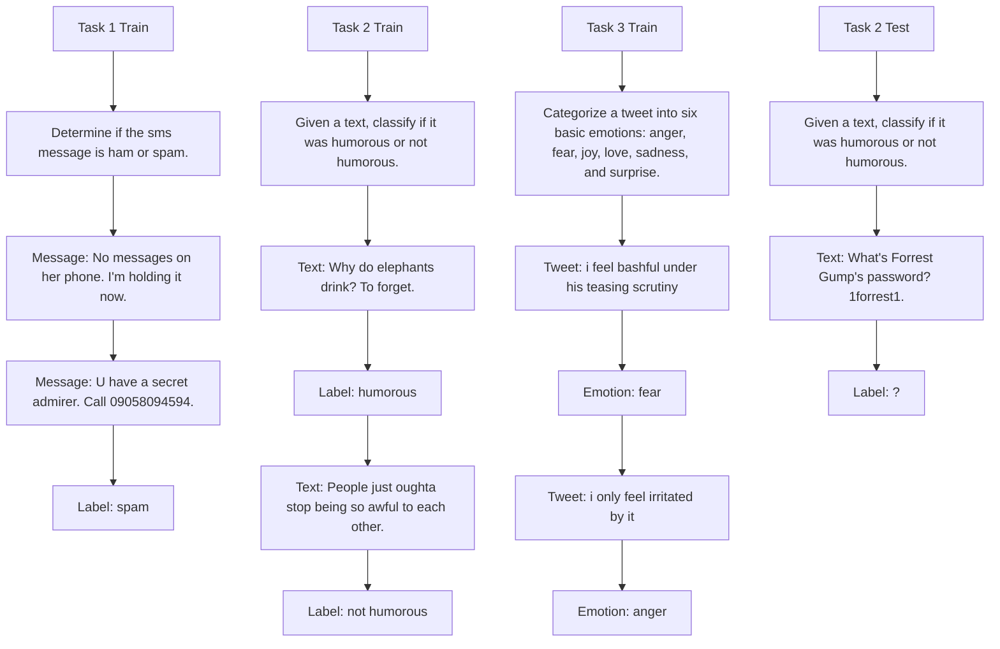
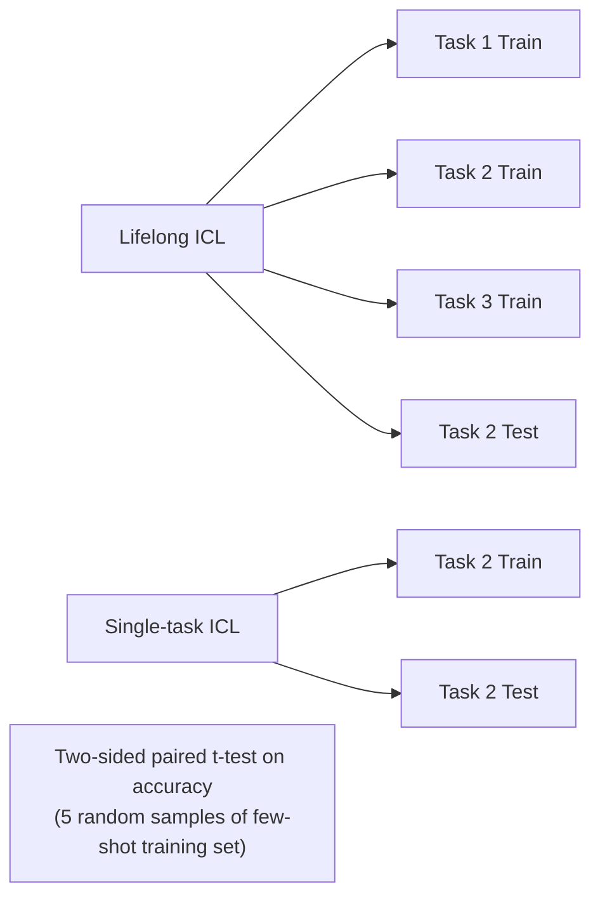

# Stress-Testing Long-Context Language Models with Lifelong ICL and Task Haystack

Xiaoyue Xu\*

Tsinghua University
xiaoyue.xu.me@gmail.com

Qinyuan Ye\*

University of Southern California
qinyuany@usc.edu

Xiang Ren

University of Southern California

xiangren@usc.edu

# Abstract

We introduce Lifelong ICL, a problem setting that challenges long-context language models (LMs) to learn a sequence of language tasks through in-context learning (ICL). We further introduce Task Haystack, an evaluation suite dedicated to assessing and diagnosing how long-context LMs utilizes contexts in Lifelong ICL. When given a task instruction and test inputs, long-context LMs are expected to leverage the relevant demonstrations in the Lifelong ICL prompt, avoid distraction and interference from other tasks, and achieve test accuracies that are not significantly worse than those of the Single-task ICL baseline.

Task Haystack draws inspiration from the widely-adopted “needle-in-a-haystack” (NIAH) evaluation, but presents distinct new challenges. It requires models (1) to utilize the contexts at a deeper level, rather than resorting to simple copying and pasting; (2) to navigate through long streams of evolving topics and tasks, proxying the complexities and dynamism of contexts in real-world scenarios. Additionally, Task Haystack inherits the controllability of NIAH, providing model developers with tools and visualizations to identify model vulnerabilities effectively.

We benchmark 14 long-context LMs using Task Haystack, finding that frontier models like GPT-4o still struggle with the setting, failing on 15% of cases on average. Most open-weight models further lack behind by a large margin, with failure rates reaching up to 61%. In our controlled analysis, we identify factors such as distraction and recency bias as contributors to these failure cases. Further, performance declines when task instructions are paraphrased at test time or when ICL demonstrations are repeated excessively, raising concerns about the robustness, instruction understanding, and true context utilization of long-context LMs. We release our code and data to encourage future research that investigates and addresses these limitations. $^{1}$

# 1 Introduction

Recent advances in model architecture [Han et al., 2024, Su et al., 2024], hardware-aware optimization [Dao et al., 2022, Liu et al., 2024b], training procedure [Tworkowski et al., 2023, Liu et al., 2024a], and data engineering [Fu et al., 2024, An et al., 2024] have enabled large language models (LLMs) to handle extended contexts, reaching up to 32 thousand tokens or even millions [Gemini Team, 2024, Anthropic, 2024]. These advancements have opened up new opportunities and potential use


<details>
<summary>flowchart</summary>


</details>

Figure 1: Lifelong ICL and Task Haystack. Lifelong ICL presents long-context LMs with a sequence of tasks, each containing a task instruction and a few demonstrations. At test time, the model is given a previously seen task instruction and then makes predictions on the test input directly. A long-context LM “passes” the Task Haystack test when its accuracies in Lifelong ICL (Task 1+2+3) are not significantly worse than accuracies of the Single-task ICL baseline (Task 2 only).

cases for LLMs. However, while long-context LM development strides forward, effective evaluation methods have not kept pace. Systematically evaluating long-context LMs' ability to leverage such long contexts remains an open challenge.

Current evaluation approaches fall into two major categories. The first involves constructing benchmarks with real-world long-context tasks [Shaham et al., 2022, 2023]. While valuable, creating these benchmarks is time-consuming and particularly challenging when scaling the input context length to millions of tokens. The second approach employs synthetic evaluations like the “needle-in-a-haystack” (NIAH) test [Kamradt, 2023] or key-value retrieval tests [Liu et al., 2024c]. For example, in the NIAH evaluation, a piece of information (“The special magic number is 12345”) is planted in a haystack of irrelevant contexts (Paul Graham essays; Graham 2024) and the model is evaluated on answering a question about the information (“What’s the special magic number?”). Although useful for initial assessment, these tests primarily measure simple copying-and-pasting capabilities and fail to capture whether models are able to utilize the context at a deeper level.

In this work, we offer new perspectives to long-context LM evaluation by introducing Lifelong ICL, a new problem setting that challenges these models to learn a sequence of tasks via in-context learning (ICL). Further, we introduce Task Haystack, an accompanying evaluation suite designed for systematic diagnosis of context utilization (Fig. 1). In Task Haystack, a long-context LM will be evaluated on a collection of tasks, with Lifelong ICL prompts and Single-task ICL prompts respectively. A model “passes” the test if its accuracies with Lifelong ICL prompts are not significantly lower than when using Single-task ICL prompts. The overall pass rate, averaged across tasks and different lifelong stream permutations, serves as the key metric of Task Haystack.

Task Haystack presents unique challenges not fully covered by existing benchmarks. Firstly, Task Haystack requires deeper understanding of the relevant context for accurate predictions. This goes beyond simple retrieval capabilities tested by NIAH-style benchmarks, which often rely on basic copying and pasting. Secondly, Task Haystack features high information density, meaning that every piece of information in the context might be crucial for successful prediction at test time. This differs from evaluation suites in which the important information (“needle”) is positioned conspicuously, allowing models to exploit shortcuts [Anthropic, 2024]. Thirdly, existing benchmarks fall short in capturing the dynamics of shifting topics within the context [Zhao et al., 2024], which can pose challenges in real-world applications of long-context models—such as a 24/7 personal assistant that must resume previous conversations amid a long, evolving stream of topics. While not fully realistic, Task Haystack serves as a useful proxy for evaluating this aspect.

We extensively evaluate 14 long-context models on Task Haystack. While all models achieve near-perfect scores on the original NIAH test, none reach satisfactory performance on our proposed evaluation. Among the compared models, GPT-4o and Gemini-1.5-Flash lead with an average pass rate of $85\%$ , significantly outperforming most open-weight models. Llama-3.1-70B, the best-performing open-weight model, follows closely with an average pass rate of $80\%$ . To understand the root causes behind these failure cases, we conduct controlled experiments that isolate factors like recency bias (models favoring information at the end of the context) and distractability (models

getting distracted by irrelevant information). The results confirm that both factors contribute to performance degradation on Task Haystack. Additionally, we find that model performance declines when instructions are paraphrased at test time and when few-shot ICL demonstrations of a single task are repeated multiple times. These observations highlight the limitations of current long-context LMs in terms of robustness, instruction understanding, and context utilization.

We hope that Lifelong ICL and Task Haystack serve as useful resources and testbeds for evaluating, diagnosing, and understanding long-context LMs. Further, we anticipate that the limitations and vulnerabilities exposed in this paper will inspire innovations in long-context LM development.

# 2 Related Work

Long-Context LM Evaluation. Early studies on long-context modeling primarily rely on perplexity-based evaluations [Beltagy et al., 2020, Press et al., 2022]. Subsequent research has indicated that such evaluation is limited in reflecting a model's effectiveness in downstream applications [Sun et al., 2021, Hu et al., 2024]. Recent efforts have led to the development of comprehensive benchmarks for evaluating long-context models, which can be divided into realistic and synthetic categories. Realistic benchmarks, exemplified by (Zero)SCROLLS [Shaham et al., 2022, 2023], comprise tasks that require processing long inputs collected from real-world scenarios. These tasks are typically sourced from established datasets and include various task types such as summarization and question answering, or developed from inherently lengthy corpus such as novel [Zhang et al., 2024], grammar books [Tanzer et al., 2024] and code repository [Jimenez et al., 2024]. In the category of synthetic benchmarks, the needle-in-a-haystack (NIAH) [Kamradt, 2023] evaluation is widely adopted for evaluating context utilization [Gemini Team, 2024, Anthropic, 2024, Liu et al., 2024a, Fu et al., 2024, Levy et al., 2024, i.a.]. Ruler [Hsieh et al., 2024] expands on the NIAH test with multi-key and multi-value retrieval, and adds two new tasks that involve multi-hop tracing and aggregation. Hybrid benchmarks is a middle-field that incorporate both realistic and synthetic elements. An example is LongBench [Bai et al., 2024], which includes synthetic tasks based on realistic text, such as counting unique passages appearing in the context. Our proposed Task Haystack can be seen as a hybrid benchmark, with a realistic touch as (1) it is built upon realistic language tasks; (2) it proximates the challenge of navigating through evolving topics and tasks.

Evaluating Long-Context LMs with Many-Shot ICL. Several recent works have explored in-context learning with long-context LMs by scaling the number of training examples (i.e., shots). Bertsch et al. [2024] conducted a systematic study of long-context ICL with up to 2,000 shots, demonstrating many-shot ICL as a competitive alternative to retrieval-based ICL and fine-tuning. Additionally, it offers the advantage of caching demonstrations at inference time, unlike instance-level retrieval methods. While Bertsch et al. [2024] focus on classification tasks, Agarwal et al. [2024] showed the effectiveness of many-shot ICL on generative and reasoning tasks, and established new state-of-the-art results on practical applications such as low-resource translation with the Gemini 1.5 Pro model. However, there are still limitations to many-shot ICL. Li et al. [2024] introduce LongICLBench, a suite of 6 classification tasks with many (20+) classes, and find that current long-context LMs still struggle with these tasks. Orthogonal to this line of work on scaling number of examples for one single task, we focus on scaling the number of tasks in our Lifelong ICL setting.

Lifelong Learning in NLP. Lifelong learning, or continual learning, refers to the problem setting where a model learns continuously from data streams [Biesialska et al., 2020, Shi et al., 2024]. Lifelong ICL is largely inspired by this line of work and challenges long-context models to learn continuously from a sequence of language tasks. However, unlike prior works that use gradient-based fine-tuning [de Masson d'Autume et al., 2019, Jin et al., 2021, Scialom et al., 2022, Mehta et al., 2023], Lifelong ICL is a new exploration that uses in-context learning as the underlying “learning” algorithm. It also stands out from Coda-Forno et al. [2023] and Ye et al. [2024] by focusing on evaluating long-context LMs and scaling the input length from 4k to up to 32k tokens. A primary challenge in lifelong learning is catastrophic forgetting, the tendency of a model to forget previously acquired tasks upon learning new tasks [Kirkpatrick et al., 2017]. Our proposed Task Haystack evaluation focuses an analogous phenomenon, as the model may struggle to recall earlier information in a lengthy context, leading to a performance decline.

# 3 Problem Setting

In the following, we establish the notations and the problem setting of Lifelong ICL in §3.1. We will begin by defining notations of in-context learning (ICL) of one single task T. We will then build upon these foundations and introduce Lifelong ICL with a collection of tasks T. In §3.2, we further introduce our Task Haystack evaluation protocol, provide the definition of the key metric named “pass rate,” and describe our strategies to account for the instabilities in ICL experiments.

# 3.1 Lifelong ICL

In-context Learning. In-context learning is a method that adapts LMs to perform a language task by providing prompts containing input-output pairs [Brown et al., 2020]. In this paper, we define a language task T as a tuple of $(D^{train}, D^{test}, d)$ , where $D^{train}$ is the training set, $D^{test}$ is the test set, d is a textual task description (i.e., instruction). We first create a task-specific prompt p by concatenating the task description and the k-shot examples in $D^{train}$ , i.e., $p = d \oplus x_{1}^{train} \oplus y_{1}^{train} \oplus \ldots \oplus x_{k}^{train} \oplus y_{k}^{train}$ . Then, to make a prediction on the test input $x^{test}$ , we concatenate the task-specific prompt and the test input (i.e., $p \oplus x^{test}$ ), and query the language model LM to generate the prediction $\hat{y}$ . We denote this process as $\hat{y} = \text{LM}(x^{test}|p)$ to highlight that the prediction is made by conditioning on the task-specific prompt p.

Task Collection and Task Permutation. The definition above introduces how ICL is performed with one single task T. In Lifelong ICL, an LM is expected to learn from a collection of n tasks, denoted as $T = \{T_{i}\}_{i=1}^{n}$ . To enable this, we first create a random permutation $a = (a_{1}, a_{2}, \ldots, a_{n})$ , thus the tasks in T will be ordered as $(T_{a_{1}}, T_{a_{2}}, \ldots, T_{a_{n}})$ . For example, when n = 3, one possible permutation a is $(3, 1, 2)$ , so that the tasks are ordered as $(T_{3}, T_{1}, T_{2})$ .

Lifelong ICL. Given a permutation $a$ , we first create the task-specific prompt $p_{a_i}$ for each task $T_{a_i}$ , and then create the Lifelong ICL prompt $p_l$ by concatenating all task-specific prompts, i.e., $p_l = p_{a_1} \oplus p_{a_2} \oplus \ldots \oplus p_{a_n}$ . At test time, for each task $T_{a_i}$ in $\mathcal{T}$ , the model will be queried to perform generate the prediction as $\hat{y} = \mathrm{LM}(x_{test}|p_l \oplus d_{a_i})$ . Note that we append the task description $d_{a_i}$ after the Lifelong ICL prompt $p_l$ at test time, to ensure the model is informed of the task at hand. See Fig. 1 for an illustrative example with 3 tasks.

# 3.2 Task Haystack

Evaluation Principle. For a test task $T_{a_{i}}$ , we anticipate that long-context LMs can effectively utilize the in-context examples of that task, i.e., $p_{a_{i}}$ , which is a substring of the Lifelong ICL prompt $p_{l} \oplus d_{a_{i}}$ . To evaluate this, we compare the model performance on task $T_{a_{i}}$ when conditioning on $p_{l} \oplus d_{a_{i}}$ and $p_{a_{i}}$ , and expect the former to be not significantly worse than the latter. In other words, the Single-task ICL prompt $p_{a_{i}}$ is the “needle” in the Lifelong ICL prompt $p_{l}$ (i.e., the “task haystack”). $^{2}$

Addressing ICL Instability with Multiple Runs. One challenge in Task Haystack evaluation is the notorious instability of ICL. To account for this, our experiments will be carried out with 5 random samples of the permutation a and 5 randomly-sampled few-shot training set $D_{train}$ for each task. This allows us to obtain a performance matrix of size $(t,p,r)$ for Lifelong ICL, where t is the task index, p is the permutation index, and r is the few-shot sample index. $^{3}$ We will also obtain a matrix of size $(t,r)$ for the Single-task ICL baseline.

Evaluation Metrics. For an overall measurement, we introduce an overall pass rate. For each permutation a and each task $T_{a_{i}}$ , we will get two groups of performance metrics, when using Single-task ICL and Lifelong ICL respectively. Each group contains 5 metrics, corresponding to the 5 randomly-sampled few-shot training set $D_{train}$ . The model passes the test (i.e., scores 1) when the

the Lifelong ICL group is not significantly worse than the Single-task ICL group, captured by a two-sided t-test with p = 0.05. The model scores 0 otherwise. The overall pass rate will be computed by averaging the scores over the different permutations and tasks. We provide more details of the definition and discuss its limitations in §A.3.

For a fine-grained analysis, our experiment results allow us to visualize the pass rates grouped by the position in the task stream, by the task, or by the task permutation. This enables straightforward visualizations as popularized by the needle-in-a-haystack test, providing an convenient tool to diagnose and uncover the vulnerabilities of long-context LMs. See Fig. 24 for an example.

# 4 Experiment Details

Task Selection. While the problem setting in §3 is generic and admits any language task, in this work we instantiate the setting with a narrower task distribution for initial exploration. Our key considerations include: $^{4}$

- We focus on classification tasks, as they allow standardized evaluation. Additionally, a large body of past work investigates ICL empirically or mechanistically using classification tasks [Halawi et al., 2023, Chang and Jia, 2023, Wang et al., 2023, Chang et al., 2024, i.a.].   
- We select classification tasks with fewer than 20 categories and input text shorter than 1000 tokens, to avoid excessively long single-task prompts that dominate the whole context window [Li et al., 2024].   
- We focus on English tasks, since most long-context LMs are not optimized for multilingual usage.

After careful manual selection, we obtain a collection of 64 classification tasks, covering a wide range of domains and label spaces. We provide a snippet of 16 tasks in Table 1 and provide detailed descriptions of all 64 tasks, including their references and license information, in Table 6.

Table 1: A Snippet of 16 tasks used in our experiments. See Table 6 for the full list of 64 tasks. The 16 tasks in this table are used for the Scale-Shot experiments in Table 2. 

<table><tr><td>emo</td><td>covid_fake_news</td><td>logical_fallacy_detection</td><td>dbpedia_14</td></tr><tr><td>amazon_massive_scenario</td><td>news_data</td><td>semeval_absa_restaurant</td><td>amazon_counterfactual_en</td></tr><tr><td>brag_action</td><td>boolq</td><td>this_is_not_a_dataset</td><td>insincere_questions</td></tr><tr><td>clickbait</td><td>yahoo_answers_topics</td><td>pun_detection</td><td>wiki_qa</td></tr></table>

Models. We evaluate eleven open-weight long-context LMs on Task Haystack: Mistral-7B (32k) [Jiang et al., 2023], FILM-7B (32k) [An et al., 2024], Llama-2-7B (32k) [TogetherAI, 2024], Llama-2-7B (80k) [Fu et al., 2024], Llama-3-8B/70B (1048k) [GradientAI, 2024a,b], Llama-3.1-70B (128k) [Dubey et al., 2024], Yi-6B/9B/34B (200k) [01.AI et al., 2024], and Command-R-35B (128k) [Cohere for AI, 2024]. These models represent various long-context modeling techniques, model size, and base pre-trained models. Additionally, we evaluate three closed models, GPT-3.5-Turbo (16k) and GPT-4o (128k) from OpenAI, and Gemini-1.5-Flash (1048k) from Google DeepMind [Gemini Team, 2024]. We provide the detailed descriptions of these models in Table 5 in §A.1.

Controlling the Context Length. We consider creating long contexts with two strategies: (1) Scale-Shot: scaling the number of in-context examples $(n_{shot})$ ; (2) Scale-Task: scaling the number of tasks $(n_{task})$ . In the first setting, we fix $n_{task} = 16$ and experiment with $n_{shot} \in \{1, 2, 3, 4, 5, 6, 7, 8\}$ . We use the 16 tasks listed in Table 1 in the main body of the paper. $^{5}$ In the second setting, we fix $n_{shot} = 2$ and experiment with $n_{task} \in \{8, 16, 24, 32, 40, 48, 56, 64\}$ . Note that to ensure the in-context examples are balanced and every class is covered, $n_{shot} = 2$ refers to using 2 examples per class for in-context learning. In both scaling settings, we are able to effectively create contexts of sizes ranging from 4k to 32k tokens. $^{6}$

We defer additional implementation and engineering details in §A.4.

Table 2: Main Results: Fixing 16 Tasks, Scaling the Number of Shots. “S-acc” stands for Single-task ICL accuracy averaged over all 16 tasks, and “L-acc” stands for Lifelong ICL accuracy. “pass” represents the “pass rate” defined in §3.2, i.e., percentage of cases that Lifelong ICL is not significantly worse than Single-task ICL among 5 random samples of few-shot training sets. L-acc is expected to be not worse than S-acc, and the pass rate is expected to be close to 100%. 

<table><tr><td rowspan="2">Model</td><td rowspan="2">0-shot S-acc</td><td colspan="3">1-shot (4k)</td><td colspan="3">2-shot (8k)</td><td colspan="3">4-shot (16k)</td><td colspan="3">8-shot (32k)</td></tr><tr><td>S-acc</td><td>L-acc</td><td>pass</td><td>S-acc</td><td>L-acc</td><td>pass</td><td>S-acc</td><td>L-acc</td><td>pass</td><td>S-acc</td><td>L-acc</td><td>pass</td></tr><tr><td>Mistral-7B (32k)</td><td>68.1</td><td>73.9</td><td>74.6</td><td>91.2</td><td>77.6</td><td>74.6</td><td>73.8</td><td>78.6</td><td>74.8</td><td>67.5</td><td>80.3</td><td>74.2</td><td>47.5</td></tr><tr><td>FILM-7B (32k)</td><td>71.1</td><td>76.7</td><td>74.7</td><td>77.5</td><td>79.1</td><td>75.1</td><td>77.5</td><td>79.6</td><td>75.4</td><td>72.5</td><td>80.8</td><td>74.9</td><td>55.0</td></tr><tr><td>Llama-2-7B (32k)</td><td>61.9</td><td>69.8</td><td>63.3</td><td>77.5</td><td>72.8</td><td>64.5</td><td>53.8</td><td>75.6</td><td>63.0</td><td>41.2</td><td>78.0</td><td>-</td><td>-</td></tr><tr><td>Llama-2-7B (80k)</td><td>38.4</td><td>47.6</td><td>60.0</td><td>100.0</td><td>49.8</td><td>60.2</td><td>100.0</td><td>56.3</td><td>62.3</td><td>96.3</td><td>59.8</td><td>61.5</td><td>76.3</td></tr><tr><td>Llama-3-8B (1048k)</td><td>51.2</td><td>65.5</td><td>68.1</td><td>78.8</td><td>70.0</td><td>69.1</td><td>76.2</td><td>71.5</td><td>70.1</td><td>71.3</td><td>73.6</td><td>70.1</td><td>57.5</td></tr><tr><td>Llama-3-70B (1048k)</td><td>60.7</td><td>79.1</td><td>72.9</td><td>68.8</td><td>79.0</td><td>74.4</td><td>50.0</td><td>80.3</td><td>75.3</td><td>57.5</td><td>81.7</td><td>75.7</td><td>51.2</td></tr><tr><td>Llama-3.1-70B (128k)</td><td>58.8</td><td>81.7</td><td>81.2</td><td>80.0</td><td>82.8</td><td>81.1</td><td>76.2</td><td>84.6</td><td>82.4</td><td>83.8</td><td>85.2</td><td>83.3</td><td>80.0</td></tr><tr><td>Cmd-R-35B (128k)</td><td>65.6</td><td>73.0</td><td>74.6</td><td>81.2</td><td>75.3</td><td>75.5</td><td>61.3</td><td>78.9</td><td>75.6</td><td>52.5</td><td>80.5</td><td>75.3</td><td>41.2</td></tr><tr><td>Yi-6B (200k)</td><td>51.3</td><td>70.1</td><td>57.9</td><td>61.3</td><td>73.0</td><td>58.6</td><td>51.2</td><td>75.0</td><td>58.4</td><td>43.8</td><td>75.5</td><td>57.7</td><td>38.8</td></tr><tr><td>Yi-9B (200k)</td><td>57.0</td><td>74.5</td><td>71.5</td><td>71.2</td><td>77.7</td><td>72.9</td><td>71.2</td><td>78.0</td><td>72.9</td><td>63.7</td><td>80.0</td><td>72.9</td><td>47.5</td></tr><tr><td>Yi-34B (200k)</td><td>63.1</td><td>74.1</td><td>71.7</td><td>62.5</td><td>74.1</td><td>72.4</td><td>60.0</td><td>76.1</td><td>72.9</td><td>63.8</td><td>78.2</td><td>72.6</td><td>53.8</td></tr><tr><td>GPT-3.5-Turbo (16k)</td><td>78.3</td><td>81.6</td><td>76.3</td><td>73.8</td><td>82.6</td><td>79.6</td><td>71.3</td><td>83.2</td><td>79.5</td><td>62.5</td><td>81.8</td><td>-</td><td>-</td></tr><tr><td>GPT-4o (128k)</td><td>70.7</td><td>85.8</td><td>87.4</td><td>86.3</td><td>87.0</td><td>87.8</td><td>81.3</td><td>87.0</td><td>88.4</td><td>83.8</td><td>87.5</td><td>89.1</td><td>88.8</td></tr><tr><td>Gemini-1.5-Flash (1048k)</td><td>63.7</td><td>78.0</td><td>79.1</td><td>87.5</td><td>77.9</td><td>79.4</td><td>87.5</td><td>79.4</td><td>80.4</td><td>85.0</td><td>77.9</td><td>81.6</td><td>80.0</td></tr></table>

  
Figure 2: Task Haystack Results with FILM-7B (32k) (N-task=16, N-shot=1,2,...,8) visualized in the needle-in-a-haystack style heatmap.


<details>
<summary>scatter</summary>

| Model           | Single-task ICL Acc (%, 16-task Avg) | Lifelong ICL Acc (%, 16-task Avg) |
| --------------- | ------------------------------------ | ---------------------------------- |
| GPT-4o          | 85                                   | 88                                 |
| Llama-3.1-70B   | 82                                   | 86                                 |
| Gemini-1.5-Flash| 80                                   | 84                                 |
| Unlabeled point | 75                                   | 65                                 |
</details>


<details>
<summary>line</summary>

| Single-task ICL Acc (%, 16-task Avg) | Lifelong ICL Pass Rate (%) |
| ------------------------------------ | -------------------------- |
| 50                                   | 100                        |
| 60                                   | 95                         |
| 70                                   | 80                         |
| 80                                   | 70                         |
| 90                                   | 60                         |
</details>


<details>
<summary>text_image</summary>

Mistral-7B (32k)
FILM-7B (32k)
Llama-2-7B (32k)
Llama-2-7B (80k)
Llama-3-8B (1048k)
Llama-3-70B (1048k)
Llama-3.1-70B (128k)
Cmd-R-34B (128k)
Yi-6B (200k)
Yi-9B (200k)
Yi-34B (200k)
GPT-3.5-Turbo (16k)
GPT-4o (128k)
Gemini-1.5-Flash (1048k)
</details>

Figure 3: Visualizing Lifelong ICL accuracy (L-acc) and pass rate as a function of single-task ICL accuracy (S-acc). Each line is constructed by varying the number of shots in $\{1,2,4,8\}$ while fixing 16 tasks. Most models fall into the undesired (light red) area. GPT-4o shows the strongest overall performance in our evaluation.

# 5 Results and Analysis

# 5.1 Main Results

Long-context LMs struggle in Task Haystack. We present the aggregated results (mean accuracy and overall pass rate) of the Scale-Shot setting in Table 2 and the results of the Scale-Task setting in Table 7. The overall pass rates fall below 90% in 50 out of 54 cases reported in Table 2 and in 41 out of 44 cases in Table 7. When scaling to 32k context with 8 shots and 16 tasks, 9 out of the 11 open-weight models achieve pass rates lower than 60%, suggesting that these models are still far from fully utilizing and flexibly conditioning on the provided context. In the most extreme case, Yi-6B (200k) achieves a pass rate of merely 38.8% in the 8-shot (32k) setting.

While model developers commonly use near-perfect needle-in-a-haystack results as evidence of successful long context utilization [01.AI et al., 2024, GradientAI, 2024b,a], our Task Haystack exposes previously unknown limitations of these models and suggest that these models are far from perfect when deeper, contextual understanding is required.

A Holistic View of Accuracies and Pass Rates. One advantage of the pass rate metric introduced in §3.2 is that it isolates the long-context modeling capabilities from models' core capabilities. However, using pass rate as the only metric may inadvertently create a shortcut where a model can achieve perfect pass rates by simply performing poorly in both Single-task ICL and Lifelong ICL.

To have a holistic view on this, we visualize the results from our Scale-Shot experiments by plotting the Lifelong ICL accuracy and pass rate as a function of Single-task ICL accuracy in Fig. 3. For

Table 3: Summary of Controlled Settings. “T1 Train” contains the task instruction and few-shot demonstrations of Task 1. “T1 Test” contains the same task instruction and one test input. For the Random setting, we use Paul Graham essays [Graham, 2024] as the random text. In Random and Repeat settings, the input context lengths are controlled to be comparable with the Recall setting. ✗ = shuffling the few-shot examples; C̅ = using a paraphrased instruction d' at test time. 

<table><tr><td rowspan="2">Setting</td><td rowspan="2" colspan="6">Input Prompt Example</td><td colspan="3">Controlled Factors</td></tr><tr><td>Long Ctx.</td><td>Distraction</td><td>Recency</td></tr><tr><td>Baseline (Single-task ICL)</td><td>T1 Train</td><td colspan="5">T1 Test</td><td>✕</td><td>✕</td><td>√</td></tr><tr><td>Random</td><td colspan="2">Random Text</td><td>T1 Train</td><td colspan="3">T1 Test</td><td>√</td><td>√</td><td>√</td></tr><tr><td>Repeat</td><td>T1 Train</td><td>T1 Train</td><td>T1 Train</td><td colspan="3">T1 Test</td><td>√</td><td>✕</td><td>√</td></tr><tr><td>Repeat+Shuffle</td><td>T1 Train</td><td colspan="2">✕ T1 Train</td><td>✕ T1 Train</td><td colspan="2">T1 Test</td><td>√</td><td>✕</td><td>√</td></tr><tr><td>Recall (Lifelong ICL)</td><td>T1 Train</td><td>T2 Train</td><td>T3 Train</td><td colspan="3">T1 Test</td><td>√</td><td>√</td><td>✕</td></tr><tr><td>Replay</td><td>T1 Train</td><td>T2 Train</td><td>T3 Train</td><td>T1 Train</td><td colspan="2">T1 Test</td><td>√</td><td>√</td><td>√</td></tr><tr><td>Remove</td><td>T2 Train</td><td>T3 Train</td><td colspan="4">T1 Test</td><td>√</td><td>√</td><td>N/A</td></tr><tr><td>Paraphrase</td><td>T1 Train</td><td>T2 Train</td><td>T3 Train</td><td colspan="3">✕ T1 Test</td><td>√</td><td>√</td><td>✕</td></tr></table>

nearly all models, pass rates decrease when the context length increases, highlighting that while these models are able to take in long context as inputs, they are not necessarily utilizing them effectively. For model-wise comparison, GPT-4o takes the lead in terms of both the ICL accuracy and the pass rate. Llama-3.1-70B stands out as the leading open-weight model, achieving an average pass rate of 80%, which is close to the 85% pass rates of GPT-4o and Gemini-1.5-Flash.

One outlier that we notice is the Llama-2-7B (80k) model [Fu et al., 2024], which achieves low ICL accuracies but high pass rates. We notice that this model is trained on language modeling objectives without further instruction tuning or RLHF, which may be the reason behind this trend. This observation also suggests that the pass rates should always be considered together with metrics representing the model's core capabilities.

Visualization and Diagnostic Tool for Task Haystack. Task Haystack supports straightforward visualization for diagnosing model vulnerabilities. In Fig. 2 we present the results of Task Haystack (Scale-Shot Setting) in a way similar to the original needle-in-a-haystack (NIAH) evaluation. While FILM-7B achieves near-perfect results in the original NIAH eval, Fig. 2 suggests that it's vulnerable when the context length exceeds 12k, particularly when the relevant information appears in the first $75\%$ of the context window. We include NIAH-style visualizations for all compared models in Fig. 9-22. In addition, we provide examples of aggregating results by permutations, by depth in the context, and by task in Fig. 25-29. We further discuss our findings in §E.2.

# 5.2 Controlled Analysis on Long-Context Utilization

Previously, we find that long-context LMs struggle in the Task Haystack evaluation. In the following section, we investigate the reasons that contribute to their failures with various controlled analyses.

We hypothesize that the model failure at Lifelong ICL may be associated with the following factors: (a) Recency Bias: the model mainly relies on recent context and performs worse when the relevant context is distant; (b) Distraction: the model may be confused by irrelevant context; (c) Long-context Inputs: the model tend to break in general when the input text is long.

Based on these hypotheses, we introduce controlled settings, such as replaying the test task at the end of the Lifelong ICL prompt, or repeating the Single-task ICL prompt multiple times. Additionally, we use paraphrases of the instructions to investigate the model's sensitivity. We summarize these controlled settings in Table 3 and conduct experiments in the 16-task 4-shot setting with Mistral-7B (32k) and FILM-7B (32k). We present the results in Fig. 4 and discuss our findings below.

(a) Recency Bias. We investigate the effect of recency bias by comparing the results of Recall and Replay. By replaying ICL demonstrations immediately before testing, model's accuracy improves by 1.6% for Mistral-7B and 2.9% for FILM-7B. Replay can be also considered as an oracle for potential mitigating strategies such as prompting the model to recall relevant information [Shi et al., 2023,


<details>
<summary>bar</summary>

| Method | Mistral-7B (32k) | FILM-7B (32k) |
| :--- | :--- | :--- |
| Zeroshot | 68.1 | 71.1 |
| Baseline (Single-task ICL) | 78.6 | 79.6 |
| Random | 76.4 | 77.7 |
| Repeat(16) | 77.3 | 76.5 |
| Repeat(16)+Shuffle | 78.6 | 77.0 |
| Recall (Lifelong ICL) | 74.8 | 75.4 |
| Replay | 76.4 | 78.3 |
| Remove | 71.5 | 71.3 |
| Paraphrase | 73.9 | 74.3 |
</details>

Figure 4: Controlled Experiments. Results suggest that long-context LMs are subject to various robustness problems. See §5.2 for discussion.


<details>
<summary>line</summary>

| # Repeat | Mistral-7B (32k) - Baseline (Single-task ICL) | Mistral-7B (32k) - Random | Mistral-7B (32k) - Repeat | Mistral-7B (32k) - Repeat+Shuffle | FILM-7B (32k) - Baseline (Single-task ICL) | FILM-7B (32k) - Random | FILM-7B (32k) - Repeat | FILM-7B (32k) - Repeat+Shuffle |
| -------- | --------------------------------------------- | -------------------------- | -------------------------- | ------------------------------------ | ------------------------------------------ | ------------------------ | ------------------------ | ---------------------------------- |
| 1        | 79.0                                          | 79.0                       | 79.0                       | 79.0                                 | 79.0                                       | 79.0                     | 79.0                     | 79.0                               |
| 2        | 79.0                                          | 79.0                       | 79.0                       | 79.0                                 | 79.0                                       | 79.0                     | 79.0                     | 79.0                               |
| 4        | 79.0                                          | 79.0                       | 79.0                       | 79.0                                 | 79.0                                       | 79.0                     | 79.0                     | 79.0                               |
| 8        | 79.0                                          | 79.0                       | 79.0                       | 79.0                                 | 79.0                                       | 79.0                     | 79.0                     | 79.0                               |
| 16       | 79.0                                          | 79.0                       | 79.0                       | 79.0                                 | 79.0                                       | 79.0                     | 79.0                     | 79.0                               |
| 32       | 79.0                                          | 79.0                       | 79.0                       | 79.0                                 | 79.0                                       | 79.0                     | 79.0                     | 79.0                               |
</details>

Figure 5: Single-Task “Multi-epoch” ICL. Model performance improves then degrades after repeating ICL examples.

Anthropic, 2024]. However, the improvements only close about half the gap between Baseline and Recall, suggesting that recency bias contributes to but does not fully explain the performance gap.

(b) Distraction. We examine the effect of irrelevant context, by contrasting Baseline with Random. The results indicate that prepending an irrelevant long text will influence the performance negatively, which corroborates with recent work investigating the robustness of language models [Levy et al., 2024]. Further, Replay can be seen as prepending a long prefix of mostly irrelevant tasks before performing Single-task ICL (Baseline), and thus the gap between Replay and Baseline may be interpreted as caused by prepending irrelevant contexts.

(c) Long-context Input. We further compare Baseline, Random, Repeat settings altogether, where Random introduces irrelevant context and Repeat includes only relevant context. Perhaps surprisingly, performance drops in the Repeat setting (-1.3% for Mistral-7B and -3.1% for FILM-7B), where both distractions and recency biases are absent. This observation raises concerns on whether longer inputs are more likely to trigger failure modes and give rise to undesired behaviors in general. While more evidence is needed to derive a conclusion, we suggest that long-context LM users be cautious about including everything in the context window, and we recommend using external filtering or retrieval models when necessary.

Dependency on Task Instructions and ICL Demonstrations. In the Remove setting, we remove the task instruction and the ICL examples of the test task from the Lifelong ICL prompt, to investigate whether the models are relying on such information. We observe a clear performance drop in the Remove setting (-3.3% for Mistral-7B and -4.1% for FILM-7B compared to Recall), suggesting that the models are able to locate and make use of the “needle” to some extent in the Recall setting, but not doing it precisely so that the performance can match with the Single-task ICL baseline.

The Paraphrase setting further allows us to explore how models make use of task instructions. We observe a decline in performance in the Paraphrase setting compared to Recall. This confirms that the models locate the “needle” by retrieving identical instructions in the context. However, the performance gap indicates that models mainly rely on pattern matching rather than deeper understanding of the instructions, which might limit their broader utility in practical applications.

Repeated ICL as “Multi-epoch” ICL. We conduct further investigation with the Random, Repeat, Repeat+Shuffle setting, by varying the size of the context and the number of repetitions. Results are reported in Fig. 5. Interestingly, model performance first increases and then dips when running in-context learning for multiple “epochs.” One direct takeaway is that repeating the ICL examples multiple times can potentially improve performance, which may have practical utilities in certain low-data high-inference-budget regimes. However, model performance starts to degrade after repeating more than 8 times. This phenomenon can be interpreted in two ways: (1) It is a known issue that repetition may lead to model degeneration [Nasr et al., 2023]; Repeat+Shuffle can possibly alleviate this issue by introducing slight variations in each repeat, which explains why Repeat+Shuffle outperforms Repeat in general. (2) It is also possible that the model “overfits” to the few-shot training data after multiple “epochs”, analogous to the common observations in gradient-based fine-tuning. We invite future work to investigate the working mechanism of ICL in this “multi-epoch” setting.

# 5.3 Additional Observations and Analysis

Tasked learned via ICL are more easily influenced. While examining Task Haystack results, we find that the passing and failing behaviors are highly task-specific. For example, in Fig. 24, Mistral-7B (32k) fails on news\_data and insincere\_questions in all permutations, meanwhile passes on more popular tasks like boolq and yahoo\_answer\_topics. We hypothesize that models may have memorized some of the tasks during pre-training or post-training, making these tasks less subjective to performance drop in Lifelong ICL. Alternatively, a task may be too challenging for the model to learn through ICL, and thus it passes the test by maintaining low performance in both Single-task ICL and Lifelong ICL settings.

To account for these situations, we split all tasks into 2 groups for each model. Tasks of which 4-shot performance is significantly better than 1-shot performance are classified as ICL-effective tasks, and the remaining tasks are considered to be ICL-ineffective. We report the pass rates for each model on these two groups in Table 4. For 10 out of 12 models, pass rates on ICL-effective tasks are lower than pass rates on ICL-ineffective tasks, suggesting that these models tend to “forget” tasks that are newly acquired, and that the overall pass rates may be an overestimate.

Table 4: Pass Rates on ICL-effective/ineffective Tasks. Results are computed in the 16-task 4-shot setting. We define ICL-effective tasks as tasks whose 4-shot performance is significantly better than its 1-shot performance. In general, ICL-effective tasks have lower pass rates. 

<table><tr><td rowspan="2">Model</td><td colspan="2">ICL-eff.</td><td colspan="2">ICL-ineff.</td><td rowspan="2">All pass</td><td rowspan="2">Model</td><td colspan="2">ICL-eff.</td><td colspan="2">ICL-ineff.</td><td rowspan="2">All pass</td></tr><tr><td>N</td><td>pass</td><td>N</td><td>pass</td><td>N</td><td>pass</td><td>N</td><td>pass</td></tr><tr><td>Mistral-7B (32k)</td><td>5</td><td>36.0</td><td>11</td><td>81.8</td><td>67.5</td><td>Cmd-R-35B (128k)</td><td>5</td><td>40.0</td><td>11</td><td>58.2</td><td>52.5</td></tr><tr><td>FILM-7B (32k)</td><td>2</td><td>40.0</td><td>14</td><td>77.1</td><td>72.5</td><td>Yi-6B (200k)</td><td>6</td><td>46.6</td><td>10</td><td>42.0</td><td>43.8</td></tr><tr><td>Llama-2-7B (32k)</td><td>6</td><td>33.3</td><td>10</td><td>46.0</td><td>41.2</td><td>Yi-9B (200k)</td><td>6</td><td>50.0</td><td>10</td><td>72.0</td><td>63.7</td></tr><tr><td>Llama-2-7B (80k)</td><td>3</td><td>80.0</td><td>13</td><td>100.0</td><td>96.3</td><td>Yi-34B (200k)</td><td>3</td><td>46.7</td><td>13</td><td>67.7</td><td>63.8</td></tr><tr><td>Llama-3-8B (1048k)</td><td>6</td><td>40.0</td><td>10</td><td>90.0</td><td>71.3</td><td>GPT-3.5-Turbo (16k)</td><td>5</td><td>44.0</td><td>11</td><td>70.9</td><td>62.5</td></tr><tr><td>Llama-3-70B (1048k)</td><td>4</td><td>35.0</td><td>12</td><td>65.0</td><td>57.5</td><td>GPT-4o (128k)</td><td>6</td><td>96.7</td><td>10</td><td>76.0</td><td>83.7</td></tr></table>

Trends of positive task transfer. While our study mainly focus on undesired performance degradation in Lifelong ICL, which is analogous to the catastrophic forgetting phenomenon in lifelong learning, we also observe trends of positive forward and backward transfers, two desired properties of lifelong learning. $^{7}$ In our pass rate design, we deliberately choose two-sided t-test to account for both performance gains and drops. We observe positive transfers in Fig. 2, represented by the blue-colored cells in the 1-shot (4k) column and the last row (94% depth). Similar observations can be made with Llama-2 (32k) in Fig. 12 and GPT-4o in Fig. 22. Additionally, Mistral-7B achieves +3.4% performance gain in the Remove setting compared to the Zero-shot baseline (Fig. 4). We consider these as initial evidence for positive transfer in Lifelong ICL, and invite more rigorous analysis to further explore the properties of Lifelong ICL.

# 6 Discussion

Intended Use. We anticipate Lifelong ICL and Task Haystack to be used for evaluating and diagnosing newly released long-context LMs. However, as our findings in Sections 5.1 and 5.3 suggest, the ICL accuracy and pass rate might be affected if the model has been trained on the tasks used in our evaluation. To ensure responsible use, we encourage users to (1) investigate and report any potential data contamination; (2) report pass rates on ICL-effective/ineffective groups respectively, as done in §5.3. Additionally, it is possible to use targeted data engineering to improve pass rates on Task Haystack. For fair comparisons, we recommend that users disclose whether their training data contains sequences in a format similar to Task Haystack evaluation.

Limitations. (1) As an initial exploration in the Lifelong ICL setting, we primarily focuses on English-only text classification tasks. This potentially limits a comprehensive assessment of model capabilities across various challenges. To get a more complete picture, the evaluation suite may be

improved by including more diverse tasks categories (e.g., question answering, conditional generation [Ye et al., 2021]), modalities (e.g., vision [Sharma et al., 2024], speech), and languages. We encourage future research to build upon our foundation and explore these more complex settings. (2) This work simplifies the lifelong learning stream by assuming a sequential order, clear task boundaries, and a fixed number of examples per class for each task. Real-world scenarios likely involve a more dynamic learning stream, without clear task boundaries or assumptions on the sequential order. In §B.6, we conduct preliminary experiments by interleaving examples of multiple tasks in the context. Future work may explore more realistic lifelong learning streams with increased complexity. (3) Finally, due to computational constraints, our evaluation utilizes 5 random permutations of tasks order and 5 different random samples of few-shot training sets. Experimenting with a larger number of samples could potentially reduce the randomness inherent in the results and increase the reliability of the findings. Additionally, we limit our evaluation to up to 32k input tokens. Stress-testing long-context models with their full context lengths may reveal further limitations of these models.

Ethics Statement. This work leverages openly available datasets that were carefully reviewed by the authors to mitigate potential data privacy and security concerns. To the best of our knowledge, the datasets we use do not contain personally identifiable information. Some datasets contain offensive content when the underlying task is offensive content (e.g., hate speech) classification. We emphasize that these datasets are used solely for evaluation purposes. As our research does not involve model training or the release of new models, the risk of amplifying biases within the data is minimal.

# 7 Conclusion

In this paper, we introduced Lifelong ICL, a novel problem setting for long-context LMs, and developed Task Haystack, a concrete evaluation suite focusing on evaluating and diagnosing long-context LMs in the Lifelong ICL setting. Our experiments with 14 long-context LMs revealed that while these models excel at needle-in-a-haystack style evaluation, their ability to utilize the context flexibly and contextually remains limited. Through our controlled analysis, we dissected and quantified factors such as recency biases and distractions that contribute to performance drops. We also identified performance degradation when repeating ICL examples or using paraphrased instructions, highlighting a fundamental vulnerability in current long-context models.

Our results demonstrate that Task Haystack still poses significant challenges for newly-released long-context models. We hope that Lifelong ICL and Task Haystack will serve as valuable tools for diagnosing and advancing the development of future long-context LMs. Additionally, we consider our work as an exploratory step towards backprop-free algorithms in lifelong learning settings.

# Acknowledgment

We thank the anonymous reviewers for their thoughtful feedback and active engagement throughout the discussion period. In addition, we thank Xisen Jin, Jun Yan, Ting-Yun Chang, Daniel Firebanks-Quevedo, Johnny Wei, Ryan Wang, Wenbo Zhang for insightful discussions. This work was supported in part by Cohere For AI Research Grant Program and OpenAI Researcher Access Program. Qinyuan Ye was supported by a USC Annenberg Fellowship.

# References

01.AI, :, Alex Young, Bei Chen, Chao Li, Chengen Huang, Ge Zhang, Guanwei Zhang, Heng Li, Jiangcheng Zhu, Jianqun Chen, Jing Chang, Kaidong Yu, Peng Liu, Qiang Liu, Shawn Yue, Senbin Yang, Shiming Yang, Tao Yu, Wen Xie, Wenhao Huang, Xiaohui Hu, Xiaoyi Ren, Xinyao Niu, Pengcheng Nie, Yuchi Xu, Yudong Liu, Yue Wang, Yuxuan Cai, Zhenyu Gu, Zhiyuan Liu, and Zonghong Dai. Yi: Open foundation models by 01.ai, 2024. URL https://arxiv.org/abs/2403.04652.   
Rishabh Agarwal, Avi Singh, Lei M Zhang, Bernd Bohnet, Luis Rosias, Stephanie C.Y. Chan, Biao Zhang, Aleksandra Faust, and Hugo Larochelle. Many-shot in-context learning. In ICML 2024 Workshop on In-Context Learning, 2024. URL https://openreview.net/forum?id=goi7DFHlqS.

Tiago A. Almeida, José María G. Hidalgo, and Akebo Yamakami. Contributions to the study of sms spam filtering: new collection and results. In Proceedings of the 11th ACM Symposium on Document Engineering, DocEng '11, page 259–262, New York, NY, USA, 2011. Association for Computing Machinery. ISBN 9781450308632. doi: 10.1145/2034691.2034742. URL https://doi.org/10.1145/2034691.2034742.   
Shengnan An, Zexiong Ma, Zeqi Lin, Nanning Zheng, and Jian-Guang Lou. Make your llm fully utilize the context. arXiv preprint arXiv:2404.16811, 2024.   
AI Anthropic. The claude 3 model family: Opus, sonnet, haiku. Claude-3 Model Card, 2024. URL https://www-cdn.anthropic.com/de8ba9b01c9ab7cbabf5c33b80b7bbc618857627/Model\_Card\_Claude\_3.pdf.   
Yushi Bai, Xin Lv, Jiajie Zhang, Hongchang Lyu, Jiankai Tang, Zhidian Huang, Zhengxiao Du, Xiao Liu, Aohan Zeng, Lei Hou, Yuxiao Dong, Jie Tang, and Juanzi Li. LongBench: A bilingual, multitask benchmark for long context understanding. In Lun-Wei Ku, Andre Martins, and Vivek Srikumar, editors, Proceedings of the 62nd Annual Meeting of the Association for Computational Linguistics (Volume 1: Long Papers), pages 3119–3137, Bangkok, Thailand, August 2024. Association for Computational Linguistics. doi: 10.18653/v1/2024.acl-long.172. URL https://aclanthology.org/2024.acl-long.172.   
Iz Beltagy, Matthew E. Peters, and Arman Cohan. Longformer: The long-document transformer, 2020. URL https://arxiv.org/abs/2004.05150.   
Amanda Bertsch, Maor Ivgi, Uri Alon, Jonathan Berant, Matthew R. Gormley, and Graham Neubig. In-context learning with long-context models: An in-depth exploration. In First Workshop on Long-Context Foundation Models @ ICML 2024, 2024. URL https://openreview.net/forum?id=4KAmc7vUbq.   
Chandra Bhagavatula, Jena D. Hwang, Doug Downey, Ronan Le Bras, Ximing Lu, Lianhui Qin, Keisuke Sakaguchi, Swabha Swayamdipta, Peter West, and Yejin Choi. I2D2: Inductive knowledge distillation with NeuroLogic and self-imitation. In Anna Rogers, Jordan Boyd-Graber, and Naoaki Okazaki, editors, Proceedings of the 61st Annual Meeting of the Association for Computational Linguistics (Volume 1: Long Papers), pages 9614–9630, Toronto, Canada, July 2023. Association for Computational Linguistics. doi: 10.18653/v1/2023.acl-long.535. URL https://aclanthology.org/2023.acl-long.535.   
Magdalena Biesialska, Katarzyna Biesialska, and Marta R. Costa-jussà. Continual lifelong learning in natural language processing: A survey. In Donia Scott, Nuria Bel, and Chengqing Zong, editors, Proceedings of the 28th International Conference on Computational Linguistics, pages 6523–6541, Barcelona, Spain (Online), December 2020. International Committee on Computational Linguistics. doi: 10.18653/v1/2020.coling-main.574. URL https://aclanthology.org/2020.coling-main.574.   
Julia Anna Bingler, Mathias Kraus, Markus Leippold, and Nicolas Webersinke. How cheap talk in climate disclosures relates to climate initiatives, corporate emissions, and reputation risk. Journal of Banking & Finance, 164:107191, 2024. ISSN 0378-4266. doi: https://doi.org/10.1016/j.jbankfin.2024.107191. URL https://www.sciencedirect.com/science/article/pii/S0378426624001080.   
Steven Bird, Robert Dale, Bonnie Dorr, Bryan Gibson, Mark Joseph, Min-Yen Kan, Dongwon Lee, Brett Powley, Dragomir Radev, and Yee Fan Tan. The ACL Anthology reference corpus: A reference dataset for bibliographic research in computational linguistics. In Nicoletta Calzolari, Khalid Choukri, Bente Maegaard, Joseph Mariani, Jan Odijk, Stelios Piperidis, and Daniel Tapias, editors, Proceedings of the Sixth International Conference on Language Resources and Evaluation (LREC'08), Marrakech, Morocco, May 2008. European Language Resources Association (ELRA). URL http://www.lrec-conf.org/proceedings/lrec2008/pdf/445\_paper.pdf.   
Mrutyunjay Biswal. Iitjee neet aiims students questions data. https://www.kaggle.com/datasets/mrutyunjaybiswal/iitjee-neet-aims-students-questions-data, 2020.

Yuri Bizzoni and Shalom Lappin. Predicting human metaphor paraphrase judgments with deep neural networks. In Beata Beigman Klebanov, Ekaterina Shutova, Patricia Lichtenstein, Smaranda Muresan, and Chee Wee, editors, Proceedings of the Workshop on Figurative Language Processing, pages 45–55, New Orleans, Louisiana, June 2018. Association for Computational Linguistics. doi:10.18653/v1/W18-0906. URL https://aclanthology.org/W18-0906.   
Tom Brown, Benjamin Mann, Nick Ryder, Melanie Subbiah, Jared D Kaplan, Prafulla Dhariwal, Arvind Neelakantan, Pranav Shyam, Girish Sastry, Amanda Askell, Sandhini Agarwal, Ariel Herbert-Voss, Gretchen Krueger, Tom Henighan, Rewon Child, Aditya Ramesh, Daniel Ziegler, Jeffrey Wu, Clemens Winter, Chris Hesse, Mark Chen, Eric Sigler, Mateusz Litwin, Scott Gray, Benjamin Chess, Jack Clark, Christopher Berner, Sam McCandlish, Alec Radford, Ilya Sutskever, and Dario Amodei. Language models are few-shot learners. In H. Larochelle, M. Ranzato, R. Hadsell, M.F. Balcan, and H. Lin, editors, Advances in Neural Information Processing Systems, volume 33, pages 1877–1901. Curran Associates, Inc., 2020. URL https://proceedings.neurips.cc/paper\_files/paper/2020/file/1457c0d6bfbcb4967418bfb8ac142f64a-Paper.pdf.   
Abhijnan Chakraborty, Bhargavi Paranjape, Sourya Kakarla, and Niloy Ganguly. Stop clickbait: Detecting and preventing clickbaits in online news media. In 2016 IEEE/ACM International Conference on Advances in Social Networks Analysis and Mining (ASONAM), pages 9–16, 2016. doi: 10.1109/ASONAM.2016.7752207.   
Ting-Yun Chang and Robin Jia. Data curation alone can stabilize in-context learning. In Anna Rogers, Jordan Boyd-Graber, and Naoaki Okazaki, editors, Proceedings of the 61st Annual Meeting of the Association for Computational Linguistics (Volume 1: Long Papers), pages 8123–8144, Toronto, Canada, July 2023. Association for Computational Linguistics. doi: 10.18653/v1/2023.acl-long.452. URL https://aclanthology.org/2023.acl-long.452.   
Ting-Yun Chang, Jesse Thomason, and Robin Jia. When parts are greater than sums: Individual LLM components can outperform full models. In Yaser Al-Onaizan, Mohit Bansal, and Yun-Nung Chen, editors, Proceedings of the 2024 Conference on Empirical Methods in Natural Language Processing, pages 10280–10299, Miami, Florida, USA, November 2024. Association for Computational Linguistics. doi: 10.18653/v1/2024.emnlp-main.574. URL https://aclanthology.org/2024.emnlp-main.574.   
Emile Chapuis, Pierre Colombo, Matteo Manica, Matthieu Labeau, and Chloé Clavel. Hierarchical pre-training for sequence labelling in spoken dialog. In Trevor Cohn, Yulan He, and Yang Liu, editors, Findings of the Association for Computational Linguistics: EMNLP 2020, pages 2636–2648, Online, November 2020. Association for Computational Linguistics. doi: 10.18653/v1/2020.findings-emnlp.239. URL https://aclanthology.org/2020.findings-emnlp.239.   
Ankush Chatterjee, Kedhar Nath Narahari, Meghana Joshi, and Puneet Agrawal. SemEval-2019 task 3: EmoContext contextual emotion detection in text. In Jonathan May, Ekaterina Shutova, Aurelie Herbelot, Xiaodan Zhu, Marianna Apidianaki, and Saif M. Mohammad, editors, Proceedings of the 13th International Workshop on Semantic Evaluation, pages 39–48, Minneapolis, Minnesota, USA, June 2019. Association for Computational Linguistics. doi: 10.18653/v1/S19-2005. URL https://aclanthology.org/S19-2005.   
Minje Choi, Jiaxin Pei, Sagar Kumar, Chang Shu, and David Jurgens. Do LLMs understand social knowledge? evaluating the sociability of large language models with SocKET benchmark. In Houda Bouamor, Juan Pino, and Kalika Bali, editors, Proceedings of the 2023 Conference on Empirical Methods in Natural Language Processing, pages 11370–11403, Singapore, December 2023. Association for Computational Linguistics. doi: 10.18653/v1/2023.emnlp-main.699. URL https://aclanthology.org/2023.emnlp-main.699.   
cjadams, Daniel Borkan, inversion, Jeffrey Sorensen, Lucas Dixon, Lucy Vasserman, and nithum. Jigsaw unintended bias in toxicity classification, 2019. URL https://kaggle.com/competitions/jigsaw-unintended-bias-in-toxicity-classification.   
Christopher Clark, Kenton Lee, Ming-Wei Chang, Tom Kwiatkowski, Michael Collins, and Kristina Toutanova. BoolQ: Exploring the surprising difficulty of natural yes/no questions. In Jill Burstein, Christy Doran, and Thamar Solorio, editors, Proceedings of the 2019 Conference

of the North American Chapter of the Association for Computational Linguistics: Human Language Technologies, Volume 1 (Long and Short Papers), pages 2924–2936, Minneapolis, Minnesota, June 2019. Association for Computational Linguistics. doi: 10.18653/v1/N19-1300. URL https://aclanthology.org/N19-1300.   
Julian Coda-Forno, Marcel Binz, Zeynep Akata, Matt Botvinick, Jane Wang, and Eric Schulz. Meta-in-context learning in large language models. In A. Oh, T. Naumann, A. Globerson, K. Saenko, M. Hardt, and S. Levine, editors, Advances in Neural Information Processing Systems, volume 36, pages 65189–65201. Curran Associates, Inc., 2023. URL https://proceedings.neurips.cc/paper\_files/paper/2023/file/cda04d7ea67ea1376bf8c6962d8541e0-Paper-Conference.pdf.   
Cohere for AI. C4ai command-r model card, 2024. URL https://huggingface.co/CohereForAI/c4ai-command-r-v01.   
Tri Dao, Dan Fu, Stefano Ermon, Atri Rudra, and Christopher Ré. Flashattention: Fast and memory-efficient exact attention with io-awareness. In S. Koyejo, S. Mohamed, A. Agarwal, D. Belgrave, K. Cho, and A. Oh, editors, Advances in Neural Information Processing Systems, volume 35, pages 16344–16359. Curran Associates, Inc., 2022. URL https://proceedings.neurips.cc/paper\_files/paper/2022/file/67d57c32e20fd0a7a302cb81d36e40d5-Paper-Conference.pdf.   
Ona de Gibert, Naiara Perez, Aitor García-Pablos, and Montse Cuadros. Hate speech dataset from a white supremacy forum. In Darja Fišer, Ruihong Huang, Vinodkumar Prabhakaran, Rob Voigt, Zeerak Waseem, and Jacqueline Wernimont, editors, Proceedings of the 2nd Workshop on Abusive Language Online (ALW2), pages 11–20, Brussels, Belgium, October 2018. Association for Computational Linguistics. doi: 10.18653/v1/W18-5102. URL https://aclanthology.org/W18-5102.   
Marie-Catherine de Marneffe, Mandy Simons, and Judith Tonhauser. The commitmentbank: Investigating projection in naturally occurring discourse. Proceedings of Sinn und Bedeutung, 23(2):107–124, Jul. 2019. doi: 10.18148/sub/2019.v23i2.601. URL https://ojs.ub.uni-konstanz.de/sub/index.php/sub/article/view/601.   
Cyprien de Masson d'Autume, Sebastian Ruder, Lingpeng Kong, and Dani Yogatama. Episodic memory in lifelong language learning. In H. Wallach, H. Larochelle, A. Beygelzimer, F. d'Alché-Buc, E. Fox, and R. Garnett, editors, Advances in Neural Information Processing Systems, volume 32. Curran Associates, Inc., 2019. URL https://proceedings.neurips.cc/paper\_files/paper/2019/file/f8d2e80c1458ea2501f98a2cafadb397-Paper.pdf.   
Franck Dernoncourt and Ji Young Lee. PubMed 200k RCT: a dataset for sequential sentence classification in medical abstracts. In Greg Kondrak and Taro Watanabe, editors, Proceedings of the Eighth International Joint Conference on Natural Language Processing (Volume 2: Short Papers), pages 308–313, Taipei, Taiwan, November 2017. Asian Federation of Natural Language Processing. URL https://aclanthology.org/I17-2052.   
Thomas Diggelmann, Jordan Boyd-Graber, Jannis Bulian, Massimiliano Ciaramita, and Markus Leippold. Climate-fever: A dataset for verification of real-world climate claims. arXiv preprint arXiv:2012.00614, 2020.   
William B. Dolan and Chris Brockett. Automatically constructing a corpus of sentential paraphrases. In Proceedings of the Third International Workshop on Paraphrasing (IWP2005), 2005. URL https://aclanthology.org/I05-5002.   
Abhimanyu Dubey, Abhinav Jauhri, Abhinav Pandey, Abhishek Kadian, Ahmad Al-Dahle, Aiesha Letman, Akhil Mathur, Alan Schelten, Amy Yang, Angela Fan, et al. The llama 3 herd of models. arXiv preprint arXiv:2407.21783, 2024.   
Alex Ellis, Julia Elliott, Paula Griffin, and William Chen. Quora insincere questions classification, 2018. URL https://kaggle.com/competitions/quora-insincere-questions-classification.

William Ferreira and Andreas Vlachos. Emergent: a novel data-set for stance classification. In Kevin Knight, Ani Nenkova, and Owen Rambow, editors, Proceedings of the 2016 Conference of the North American Chapter of the Association for Computational Linguistics: Human Language Technologies, pages 1163–1168, San Diego, California, June 2016. Association for Computational Linguistics. doi: 10.18653/v1/N16-1138. URL https://aclanthology.org/N16-1138.   
Jack FitzGerald, Christopher Hench, Charith Peris, Scott Mackie, Kay Rottmann, Ana Sanchez, Aaron Nash, Liam Urbach, Vishesh Kakarala, Richa Singh, Swetha Ranganath, Laurie Crist, Misha Britan, Wouter Leeuwis, Gokhan Tur, and Prem Natarajan. MASSIVE: A 1M-example multilingual natural language understanding dataset with 51 typologically-diverse languages. In Anna Rogers, Jordan Boyd-Graber, and Naoaki Okazaki, editors, Proceedings of the 61st Annual Meeting of the Association for Computational Linguistics (Volume 1: Long Papers), pages 4277–4302, Toronto, Canada, July 2023. Association for Computational Linguistics. doi:10.18653/v1/2023.acl-long.235. URL https://aclanthology.org/2023.acl-long.235.   
Yao Fu, Rameswar Panda, Xinyao Niu, Xiang Yue, Hannaneh Hajishirzi, Yoon Kim, and Hao Peng. Data engineering for scaling language models to 128k context. In Forty-first International Conference on Machine Learning, 2024. URL https://openreview.net/forum?id=TaAqeo7lUh.   
Iker García-Ferrero, Begoña Altuna, Javier Alvez, Itziar Gonzalez-Dios, and German Rigau. This is not a dataset: A large negation benchmark to challenge large language models. In Houda Bouamor, Juan Pino, and Kalika Bali, editors, Proceedings of the 2023 Conference on Empirical Methods in Natural Language Processing, pages 8596–8615, Singapore, December 2023. Association for Computational Linguistics. doi: 10.18653/v1/2023.emnlp-main.531. URL https://aclanthology.org/2023.emnlp-main.531.   
Gemini Team. Gemini 1.5: Unlocking multimodal understanding across millions of tokens of context. arXiv preprint arXiv:2403.05530, 2024.   
Omer Goldman, Alon Jacovi, Aviv Slobodkin, Aviya Maimon, Ido Dagan, and Reut Tsarfaty. Is it really long context if all you need is retrieval? towards genuinely difficult long context nlp, 2024. URL https://arxiv.org/abs/2407.00402.   
GradientAI. Llama-3-70b-instruct-gradient-1048k model card, 2024a. URL https://huggingface.co/gradientai/Llama-3-70B-Instruct-Gradient-1048k.   
GradientAI. Llama-3-8b-instruct-gradient-1048k model card, 2024b. URL https://huggingface.co/gradientai/Llama-3-8B-Instruct-Gradient-1048k.   
Paul Graham. Paul graham essays, 2024. URL https://www.paulgraham.com/articles.html.   
Giovanni Grano, Andrea Di Sorbo, Francesco Mercaldo, Corrado A Visaggio, Gerardo Canfora, and Sebastiano Panichella. Android apps and user feedback: A dataset for software evolution and quality improvement. In Proceedings of the 2Nd ACM SIGSOFT International Workshop on App Market Analytics, WAMA 2017, pages 8–11, New York, NY, USA, January 2017. ACM. doi:10.1145/3121264.3121266. URL https://doi.org/10.5167/uzh-139426.   
Neel Guha, Julian Nyarko, Daniel Ho, Christopher Ré, Adam Chilton, Aditya K, Alex Chohlas-Wood, Austin Peters, Brandon Waldon, Daniel Rockmore, Diego Zambrano, Dmitry Talisman, Enam Hoque, Faiz Surani, Frank Fagan, Galit Sarfaty, Gregory Dickinson, Haggai Porat, Jason Hegland, Jessica Wu, Joe Nudell, Joel Niklaus, John Nay, Jonathan Choi, Kevin Tobia, Margaret Hagan, Megan Ma, Michael Livermore, Nikon Rasumov-Rahe, Nils Holzenberger, Noam Kolt, Peter Henderson, Sean Rehaag, Sharad Goel, Shang Gao, Spencer Williams, Sunny Gandhi, Tom Zur, Varun Iyer, and Zehua Li. Legalbench: A collaboratively built benchmark for measuring legal reasoning in large language models. In A. Oh, T. Naumann, A. Globerson, K. Saenko, M. Hardt, and S. Levine, editors, Advances in Neural Information Processing Systems, volume 36, pages 44123–44279. Curran Associates, Inc., 2023. URL https://proceedings.neurips.cc/paper\_files/paper/2023/file/89e44582fd28ddfea1ea4dcb0ebbf4b0-Paper-Datasets\_and\_Benchmarks.pdf.   
Danny Halawi, Jean-Stanislas Denain, and Jacob Steinhardt. Overthinking the truth: Understanding how language models process false demonstrations. arXiv preprint arXiv:2307.09476, 2023.

Chi Han, Qifan Wang, Hao Peng, Wenhan Xiong, Yu Chen, Heng Ji, and Sinong Wang. LM-infinite: Zero-shot extreme length generalization for large language models. In Kevin Duh, Helena Gomez, and Steven Bethard, editors, Proceedings of the 2024 Conference of the North American Chapter of the Association for Computational Linguistics: Human Language Technologies (Volume 1: Long Papers), pages 3991–4008, Mexico City, Mexico, June 2024. Association for Computational Linguistics. doi: 10.18653/v1/2024.naacl-long.222. URL https://aclanthology.org/2024.naacl-long.222.   
Nils Holzenberger, Andrew Blair-Stanek, and Benjamin Van Durme. A dataset for statutory reasoning in tax law entailment and question answering. arXiv preprint arXiv:2005.05257, 2020.   
Cheng-Ping Hsieh, Simeng Sun, Samuel Kriman, Shantanu Acharya, Dima Rekesh, Fei Jia, and Boris Ginsburg. RULER: What's the real context size of your long-context language models? In First Conference on Language Modeling, 2024. URL https://openreview.net/forum?id=kIoBbc76Sy.   
Minqing Hu and Bing Liu. Mining and summarizing customer reviews. In Proceedings of the Tenth ACM SIGKDD International Conference on Knowledge Discovery and Data Mining, KDD '04, page 168–177, New York, NY, USA, 2004. Association for Computing Machinery. ISBN 1581138881. doi: 10.1145/1014052.1014073. URL https://doi.org/10.1145/1014052.1014073.   
Yutong Hu, Quzhe Huang, Mingxu Tao, Chen Zhang, and Yansong Feng. Can perplexity reflect large language model's ability in long text understanding? In The Second Tiny Papers Track at ICLR 2024, 2024. URL https://openreview.net/forum?id=Cjp6YKVeAa.   
Shankar Iyer, Nikhil Dandekar, and Kornel Csernai. First quora dataset release: Question pairs. https://quoradata.quora.com/First-Quora-Dataset-Release-Question-Pairs, 2016.   
Jiaming Ji, Mickel Liu, Josef Dai, Xuehai Pan, Chi Zhang, Ce Bian, Boyuan Chen, Ruiyang Sun, Yizhou Wang, and Yaodong Yang. Beavertails: Towards improved safety alignment of llm via a human-preference dataset. In A. Oh, T. Naumann, A. Globerson, K. Saenko, M. Hardt, and S. Levine, editors, Advances in Neural Information Processing Systems, volume 36, pages 24678–24704. Curran Associates, Inc., 2023. URL https://proceedings.neurips.cc/paper\_files/paper/2023/file/4dbb61cb68671edc4ca3712d70083b9f-Paper-Datasets\_and\_Benchmarks.pdf.   
Albert Q. Jiang, Alexandre Sablayrolles, Arthur Mensch, Chris Bamford, Devendra Singh Chaplot, Diego de las Casas, Florian Bressand, Gianna Lengyel, Guillaume Lample, Lucile Saulnier, Lélio Renard Lavaud, Marie-Anne Lachaux, Pierre Stock, Teven Le Scao, Thibaut Lavril, Thomas Wang, Timothée Lacroix, and William El Sayed. Mistral 7b, 2023. URL https://arxiv.org/abs/2310.06825.   
Carlos E Jimenez, John Yang, Alexander Wettig, Shunyu Yao, Kexin Pei, Ofir Press, and Karthik R Narasimhan. SWE-bench: Can language models resolve real-world github issues? In The Twelfth International Conference on Learning Representations, 2024. URL https://openreview.net/forum?id=VTF8yNQM66.   
Xisen Jin, Bill Yuchen Lin, Mohammad Rostami, and Xiang Ren. Learn continually, generalize rapidly: Lifelong knowledge accumulation for few-shot learning. In Marie-Francine Moens, Xuanjing Huang, Lucia Specia, and Scott Wen-tau Yih, editors, Findings of the Association for Computational Linguistics: EMNLP 2021, pages 714–729, Punta Cana, Dominican Republic, November 2021. Association for Computational Linguistics. doi: 10.18653/v1/2021.findings-emnlp.62. URL https://aclanthology.org/2021.findings-emnlp.62.   
Gregory Kamradt. Needle in a haystack - pressure testing llms. https://github.com/gkamradt/LLMTest\_NeedleInAHaystack/tree/main, 2023.   
Hyunwoo Kim, Youngjae Yu, Liwei Jiang, Ximing Lu, Daniel Khashabi, Gunhee Kim, Yejin Choi, and Maarten Sap. ProsocialDialog: A prosocial backbone for conversational agents. In Yoav Goldberg, Zornitsa Kozareva, and Yue Zhang, editors, Proceedings of the 2022 Conference on

Empirical Methods in Natural Language Processing, pages 4005–4029, Abu Dhabi, United Arab Emirates, December 2022. Association for Computational Linguistics. doi: 10.18653/v1/2022.emnlp-main.267. URL https://aclanthology.org/2022.emnlp-main.267.   
James Kirkpatrick, Razvan Pascanu, Neil Rabinowitz, Joel Veness, Guillaume Desjardins, Andrei A Rusu, Kieran Milan, John Quan, Tiago Ramalho, Agnieszka Grabska-Barwinska, et al. Overcoming catastrophic forgetting in neural networks. Proceedings of the national academy of sciences, 114(13):3521–3526, 2017.   
Vid Kocijan, Ana-Maria Cretu, Oana-Maria Camburu, Yordan Yordanov, and Thomas Lukasiewicz. A surprisingly robust trick for the Winograd schema challenge. In Anna Korhonen, David Traum, and Lluís Márquez, editors, Proceedings of the 57th Annual Meeting of the Association for Computational Linguistics, pages 4837–4842, Florence, Italy, July 2019. Association for Computational Linguistics. doi: 10.18653/v1/P19-1478. URL https://aclanthology.org/P19-1478.   
Neema Kotonya and Francesca Toni. Explainable automated fact-checking: A survey. In Donia Scott, Nuria Bel, and Chengqing Zong, editors, Proceedings of the 28th International Conference on Computational Linguistics, pages 5430–5443, Barcelona, Spain (Online), December 2020. International Committee on Computational Linguistics. doi: 10.18653/v1/2020.coling-main.474. URL https://aclanthology.org/2020.coling-main.474.   
Woosuk Kwon, Zhuohan Li, Siyuan Zhuang, Ying Sheng, Lianmin Zheng, Cody Hao Yu, Joseph Gonzalez, Hao Zhang, and Ion Stoica. Efficient memory management for large language model serving with pagedattention. In Proceedings of the 29th Symposium on Operating Systems Principles, SOSP '23, page 611–626, New York, NY, USA, 2023. Association for Computing Machinery. ISBN 9798400702297. doi: 10.1145/3600006.3613165. URL https://doi.org/10.1145/3600006.3613165.   
Jinhyuk Lee, Anthony Chen, Zhuyun Dai, Dheeru Dua, Devendra Singh Sachan, Michael Boratko, Yi Luan, Sébastien M. R. Arnold, Vincent Perot, Siddharth Dalmia, Hexiang Hu, Xudong Lin, Panupong Pasupat, Aida Amini, Jeremy R. Cole, Sebastian Riedel, Iftekhar Naim, Ming-Wei Chang, and Kelvin Guu. Can long-context language models subsume retrieval, rag, sql, and more?, 2024. URL https://arxiv.org/abs/2406.13121.   
Hector J Levesque, Ernest Davis, and Leora Morgenstern. The Winograd schema challenge. In AAAI Spring Symposium: Logical Formalizations of Commonsense Reasoning, volume 46, page 47, 2011.   
Mosh Levy, Alon Jacoby, and Yoav Goldberg. Same task, more tokens: the impact of input length on the reasoning performance of large language models. In Lun-Wei Ku, Andre Martins, and Vivek Srikumar, editors, Proceedings of the 62nd Annual Meeting of the Association for Computational Linguistics (Volume 1: Long Papers), pages 15339–15353, Bangkok, Thailand, August 2024. Association for Computational Linguistics. doi: 10.18653/v1/2024.acl-long.818. URL https://aclanthology.org/2024.acl-long.818.   
Quentin Lhoest, Albert Villanova del Moral, Yacine Jernite, Abhishek Thakur, Patrick von Platen, Suraj Patil, Julien Chaumond, Mariama Drame, Julien Plu, Lewis Tunstall, Joe Davison, Mario Šaško, Gunjan Chhablani, Bhavitvya Malik, Simon Brandeis, Teven Le Scao, Victor Sanh, Canwen Xu, Nicolas Patry, Angelina McMillan-Major, Philipp Schmid, Sylvain Gugger, Clément Delangue, Théo Matussière, Lysandre Debut, Stas Bekman, Pierric Cistac, Thibault Goehringer, Victor Mustar, François Lagunas, Alexander Rush, and Thomas Wolf. Datasets: A community library for natural language processing. In Heike Adel and Shuming Shi, editors, Proceedings of the 2021 Conference on Empirical Methods in Natural Language Processing: System Demonstrations, pages 175–184, Online and Punta Cana, Dominican Republic, November 2021. Association for Computational Linguistics. doi: 10.18653/v1/2021.emnlp-demo.21. URL https://aclanthology.org/2021.emnlp-demo.21.   
Tianle Li, Ge Zhang, Quy Duc Do, Xiang Yue, and Wenhu Chen. Long-context llms struggle with long in-context learning. CoRR, abs/2404.02060, 2024. URL https://doi.org/10.48550/arXiv.2404.02060.

Xin Li and Dan Roth. Learning question classifiers. In COLING 2002: The 19th International Conference on Computational Linguistics, 2002. URL https://aclanthology.org/C02-1150.   
Hao Liu, Wilson Yan, Matei Zaharia, and Pieter Abbeel. World model on million-length video and language with blockwise ringattention. arXiv preprint arXiv:2402.08268, 2024a.   
Hao Liu, Matei Zaharia, and Pieter Abbeel. Ringattention with blockwise transformers for near-infinite context. In The Twelfth International Conference on Learning Representations, 2024b. URL https://openreview.net/forum?id=WsRHpHH4s0.   
Haokun Liu, Derek Tam, Mohammed Muqeeth, Jay Mohta, Tenghao Huang, Mohit Bansal, and Colin A Raffel. Few-shot parameter-efficient fine-tuning is better and cheaper than in-context learning. In S. Koyejo, S. Mohamed, A. Agarwal, D. Belgrave, K. Cho, and A. Oh, editors, Advances in Neural Information Processing Systems, volume 35, pages 1950–1965. Curran Associates, Inc., 2022a. URL https://proceedings.neurips.cc/paper\_files/paper/2022/file/0cde695b83bd186c1fd456302888454c-Paper-Conference.pdf.   
Nelson F Liu, Kevin Lin, John Hewitt, Ashwin Paranjape, Michele Bevilacqua, Fabio Petroni, and Percy Liang. Lost in the middle: How language models use long contexts. Transactions of the Association for Computational Linguistics, 12:157–173, 2024c.   
Tianyu Liu, Yizhe Zhang, Chris Brockett, Yi Mao, Zhifang Sui, Weizhu Chen, and Bill Dolan. A token-level reference-free hallucination detection benchmark for free-form text generation. In Smaranda Muresan, Preslav Nakov, and Aline Villavicencio, editors, Proceedings of the 60th Annual Meeting of the Association for Computational Linguistics (Volume 1: Long Papers), pages 6723–6737, Dublin, Ireland, May 2022b. Association for Computational Linguistics. doi:10.18653/v1/2022.acl-long.464. URL https://aclanthology.org/2022.acl-long.464.   
Annie Louis, Dan Roth, and Filip Radlinski. “I’d rather just go to bed”: Understanding indirect answers. In Bonnie Webber, Trevor Cohn, Yulan He, and Yang Liu, editors, Proceedings of the 2020 Conference on Empirical Methods in Natural Language Processing (EMNLP), pages 7411–7425, Online, November 2020. Association for Computational Linguistics. doi: 10.18653/v1/2020.emnlp-main.601. URL https://aclanthology.org/2020.emnlp-main.601.   
Yi Luan, Luheng He, Mari Ostendorf, and Hannaneh Hajishirzi. Multi-task identification of entities, relations, and coreference for scientific knowledge graph construction. In Ellen Riloff, David Chiang, Julia Hockenmaier, and Jun'ichi Tsujii, editors, Proceedings of the 2018 Conference on Empirical Methods in Natural Language Processing, pages 3219–3232, Brussels, Belgium, October-November 2018. Association for Computational Linguistics. doi: 10.18653/v1/D18-1360. URL https://aclanthology.org/D18-1360.   
Andrew L. Maas, Raymond E. Daly, Peter T. Pham, Dan Huang, Andrew Y. Ng, and Christopher Potts. Learning word vectors for sentiment analysis. In Proceedings of the 49th Annual Meeting of the Association for Computational Linguistics: Human Language Technologies, pages 142–150, Portland, Oregon, USA, June 2011. Association for Computational Linguistics. URL http://www.aclweb.org/anthology/P11-1015.   
Pekka Malo, Ankur Sinha, Pyry Takala, Pekka Korhonen, and Jyrki Wallenius. Good debt or bad debt: Detecting semantic orientations in economic texts. arXiv preprint arXiv:1307.5336, 2013.   
Irene Manotas, Ngoc Phuoc An Vo, and Vadim Sheinin. LiMiT: The literal motion in text dataset. In Trevor Cohn, Yulan He, and Yang Liu, editors, Findings of the Association for Computational Linguistics: EMNLP 2020, pages 991–1000, Online, November 2020. Association for Computational Linguistics. doi: 10.18653/v1/2020.findings-emnlp.88. URL https://aclanthology.org/2020.findings-emnlp.88.   
Marco Marelli, Stefano Menini, Marco Baroni, Luisa Bentivogli, Raffaella Bernardi, and Roberto Zamparelli. A SICK cure for the evaluation of compositional distributional semantic models. In Nicoletta Calzolari, Khalid Choukri, Thierry Declerck, Hrafn Loftsson, Bente Maegaard, Joseph Mariani, Asuncion Moreno, Jan Odijk, and Stelios Piperidis, editors, Proceedings of the Ninth International Conference on Language Resources and Evaluation (LREC'14), pages 216–223, Reykjavik, Iceland, May 2014. European Language Resources Association (ELRA). URL http://www.lrec-conf.org/proceedings/lrec2014/pdf/363\_Paper.pdf.

Clara H. McCreery, Namit Katariya, Anitha Kannan, Manish Chablani, and Xavier Amatriain. Effective transfer learning for identifying similar questions: Matching user questions to covid-19 faqs. In Proceedings of the 26th ACM SIGKDD International Conference on Knowledge Discovery & Data Mining, KDD '20, page 3458–3465, New York, NY, USA, 2020. Association for Computing Machinery. ISBN 9781450379984. doi: 10.1145/3394486.3412861. URL https://doi.org/10.1145/3394486.3412861.   
J. A. Meaney, Steven Wilson, Luis Chiruzzo, Adam Lopez, and Walid Magdy. SemEval 2021 task 7: HaHackathon, detecting and rating humor and offense. In Alexis Palmer, Nathan Schneider, Natalie Schluter, Guy Emerson, Aurelie Herbelot, and Xiaodan Zhu, editors, Proceedings of the 15th International Workshop on Semantic Evaluation (SemEval-2021), pages 105–119, Online, August 2021. Association for Computational Linguistics. doi: 10.18653/v1/2021.semeval-1.9. URL https://aclanthology.org/2021.semeval-1.9.   
Sanket Vaibhav Mehta, Darshan Patil, Sarath Chandar, and Emma Strubell. An empirical investigation of the role of pre-training in lifelong learning. Journal of Machine Learning Research, 24(214):1–50, 2023. URL http://jmlr.org/papers/v24/22-0496.html.   
Tristan Miller, Christian Hempelmann, and Iryna Gurevych. SemEval-2017 task 7: Detection and interpretation of English puns. In Steven Bethard, Marine Carpuat, Marianna Apidianaki, Saif M. Mohammad, Daniel Cer, and David Jurgens, editors, Proceedings of the 11th International Workshop on Semantic Evaluation (SemEval-2017), pages 58–68, Vancouver, Canada, August 2017. Association for Computational Linguistics. doi: 10.18653/v1/S17-2005. URL https://aclanthology.org/S17-2005.   
Saif Mohammad, Svetlana Kiritchenko, Parinaz Sobhani, Xiaodan Zhu, and Colin Cherry. SemEval-2016 task 6: Detecting stance in tweets. In Steven Bethard, Marine Carpuat, Daniel Cer, David Jurgens, Preslav Nakov, and Torsten Zesch, editors, Proceedings of the 10th International Workshop on Semantic Evaluation (SemEval-2016), pages 31–41, San Diego, California, June 2016. Association for Computational Linguistics. doi: 10.18653/v1/S16-1003. URL https://aclanthology.org/S16-1003.   
Ioannis Mollas, Zoe Chrysopoulou, Stamatis Karlos, and Grigorios Tsoumakas. Ethos: a multi-label hate speech detection dataset. Complex & Intelligent Systems, 8(6):4663–4678, January 2022. ISSN 2198-6053. doi: 10.1007/s40747-021-00608-2. URL http://dx.doi.org/10.1007/s40747-021-00608-2.   
Milad Nasr, Nicholas Carlini, Jonathan Hayase, Matthew Jagielski, A. Feder Cooper, Daphne Ippolito, Christopher A. Choquette-Choo, Eric Wallace, Florian Tramèr, and Katherine Lee. Scalable extraction of training data from (production) language models. CoRR, abs/2311.17035, 2023. URL https://doi.org/10.48550/arXiv.2311.17035.   
James O'Neill, Polina Rozenshtein, Ryuichi Kiryo, Motoko Kubota, and Danushka Bollegala. I wish I would have loved this one, but I didn't – a multilingual dataset for counterfactual detection in product review. In Marie-Francine Moens, Xuanjing Huang, Lucia Specia, and Scott Wen-tau Yih, editors, Proceedings of the 2021 Conference on Empirical Methods in Natural Language Processing, pages 7092–7108, Online and Punta Cana, Dominican Republic, November 2021. Association for Computational Linguistics. doi: 10.18653/v1/2021.emnlp-main.568. URL https://aclanthology.org/2021.emnlp-main.568.   
Shereen Oraby, Vrindavan Harrison, Lena Reed, Ernesto Hernandez, Ellen Riloff, and Marilyn Walker. Creating and characterizing a diverse corpus of sarcasm in dialogue. In Raquel Fernandez, Wolfgang Minker, Giuseppe Carenini, Ryuichiro Higashinaka, Ron Artstein, and Alesia Gainer, editors, Proceedings of the 17th Annual Meeting of the Special Interest Group on Discourse and Dialogue, pages 31–41, Los Angeles, September 2016. Association for Computational Linguistics. doi: 10.18653/v1/W16-3604. URL https://aclanthology.org/W16-3604.   
Bo Pang and Lillian Lee. A sentimental education: Sentiment analysis using subjectivity summarization based on minimum cuts. In Proceedings of the 42nd Annual Meeting of the Association for Computational Linguistics (ACL-04), pages 271–278, Barcelona, Spain, July 2004. doi:10.3115/1218955.1218990. URL https://aclanthology.org/P04-1035.

Bo Pang and Lillian Lee. Seeing stars: Exploiting class relationships for sentiment categorization with respect to rating scales. In Kevin Knight, Hwee Tou Ng, and Kemal Oflazer, editors, Proceedings of the 43rd Annual Meeting of the Association for Computational Linguistics (ACL'05), pages 115–124, Ann Arbor, Michigan, June 2005. Association for Computational Linguistics. doi:10.3115/1219840.1219855. URL https://aclanthology.org/P05-1015.   
Joonsuk Park and Claire Cardie. Identifying appropriate support for propositions in online user comments. In Nancy Green, Kevin Ashley, Diane Litman, Chris Reed, and Vern Walker, editors, Proceedings of the First Workshop on Argumentation Mining, pages 29–38, Baltimore, Maryland, June 2014. Association for Computational Linguistics. doi: 10.3115/v1/W14-2105. URL https://aclanthology.org/W14-2105.   
Parth Patwa, Shivam Sharma, Srinivas Pykl, Vineeth Guptha, Gitanjali Kumari, Md Shad Akhtar, Asif Ekbal, Amitava Das, and Tanmoy Chakraborty. \*Fighting an Infodemic: COVID-19 Fake News Dataset\*, page 21–29. Springer International Publishing, 2021. ISBN 9783030736965. doi: 10.1007/978-3-030-73696-5\_3. URL http://dx.doi.org/10.1007/978-3-030-73696-5\_3.   
Mohammad Taher Pilehvar and Jose Camacho-Collados. WiC: the word-in-context dataset for evaluating context-sensitive meaning representations. In Jill Burstein, Christy Doran, and Thamar Solorio, editors, Proceedings of the 2019 Conference of the North American Chapter of the Association for Computational Linguistics: Human Language Technologies, Volume 1 (Long and Short Papers), pages 1267–1273, Minneapolis, Minnesota, June 2019. Association for Computational Linguistics. doi: 10.18653/v1/N19-1128. URL https://aclanthology.org/N19-1128.   
Maria Pontiki, Dimitris Galanis, Haris Papageorgiou, Suresh Manandhar, and Ion Androutsopoulos. SemEval-2015 task 12: Aspect based sentiment analysis. In Preslav Nakov, Torsten Zesch, Daniel Cer, and David Jurgens, editors, Proceedings of the 9th International Workshop on Semantic Evaluation (SemEval 2015), pages 486–495, Denver, Colorado, June 2015. Association for Computational Linguistics. doi: 10.18653/v1/S15-2082. URL https://aclanthology.org/S15-2082.   
Ofir Press, Noah Smith, and Mike Lewis. Train short, test long: Attention with linear biases enables input length extrapolation. In International Conference on Learning Representations, 2022. URL https://openreview.net/forum?id=R8sQPpGCv0.   
Pranav Rajpurkar, Jian Zhang, Konstantin Lopyrev, and Percy Liang. SQuAD: 100,000+ questions for machine comprehension of text. In Jian Su, Kevin Duh, and Xavier Carreras, editors, Proceedings of the 2016 Conference on Empirical Methods in Natural Language Processing, pages 2383–2392, Austin, Texas, November 2016. Association for Computational Linguistics. doi: 10.18653/v1/D16-1264. URL https://aclanthology.org/D16-1264.   
Melissa Roemmele, Cosmin Adrian Bejan, and Andrew S Gordon. Choice of plausible alternatives: An evaluation of commonsense causal reasoning. In 2011 AAAI Spring Symposium Series, 2011.   
Enrico Santus, Anna Gladkova, Stefan Evert, and Alessandro Lenci. The CogALex-V shared task on the corpus-based identification of semantic relations. In Michael Zock, Alessandro Lenci, and Stefan Evert, editors, Proceedings of the 5th Workshop on Cognitive Aspects of the Lexicon (CogALex - V), pages 69–79, Osaka, Japan, December 2016a. The COLING 2016 Organizing Committee. URL https://aclanthology.org/W16-5309.   
Enrico Santus, Alessandro Lenci, Tin-Shing Chiu, Qin Lu, and Chu-Ren Huang. Nine features in a random forest to learn taxonomical semantic relations. In Nicoletta Calzolari, Khalid Choukri, Thierry Declerck, Sara Goggi, Marko Grobelnik, Bente Maegaard, Joseph Mariani, Helene Mazo, Asuncion Moreno, Jan Odijk, and Stelios Piperidis, editors, Proceedings of the Tenth International Conference on Language Resources and Evaluation (LREC'16), pages 4557–4564, Portorož, Slovenia, May 2016b. European Language Resources Association (ELRA). URL https://aclanthology.org/L16-1722.   
Elvis Saravia, Hsien-Chi Toby Liu, Yen-Hao Huang, Junlin Wu, and Yi-Shin Chen. CARER: Contextualized affect representations for emotion recognition. In Ellen Riloff, David Chiang, Julia Hockenmaier, and Jun'ichi Tsujii, editors, Proceedings of the 2018 Conference on Empirical Methods in Natural Language Processing, pages 3687–3697, Brussels, Belgium, October-November 2018. Association for Computational Linguistics. doi: 10.18653/v1/D18-1404. URL https://aclanthology.org/D18-1404.

Tal Schuster, Adam Fisch, and Regina Barzilay. Get your vitamin C! robust fact verification with contrastive evidence. In Kristina Toutanova, Anna Rumshisky, Luke Zettlemoyer, Dilek Hakkani-Tur, Iz Beltagy, Steven Bethard, Ryan Cotterell, Tanmoy Chakraborty, and Yichao Zhou, editors, Proceedings of the 2021 Conference of the North American Chapter of the Association for Computational Linguistics: Human Language Technologies, pages 624–643, Online, June 2021. Association for Computational Linguistics. doi: 10.18653/v1/2021.naacl-main.52. URL https://aclanthology.org/2021.naacl-main.52.   
Thomas Scialom, Tuhin Chakrabarty, and Smaranda Muresan. Fine-tuned language models are continual learners. In Yoav Goldberg, Zornitsa Kozareva, and Yue Zhang, editors, Proceedings of the 2022 Conference on Empirical Methods in Natural Language Processing, pages 6107–6122, Abu Dhabi, United Arab Emirates, December 2022. Association for Computational Linguistics. doi:10.18653/v1/2022.emnlp-main.410. URL https://aclanthology.org/2022.emnlp-main.410.   
Uri Shaham, Elad Segal, Maor Ivgi, Avia Efrat, Ori Yoran, Adi Haviv, Ankit Gupta, Wenhan Xiong, Mor Geva, Jonathan Berant, and Omer Levy. SCROLLS: Standardized CompaRison over long language sequences. In Yoav Goldberg, Zornitsa Kozareva, and Yue Zhang, editors, Proceedings of the 2022 Conference on Empirical Methods in Natural Language Processing, pages 12007–12021, Abu Dhabi, United Arab Emirates, December 2022. Association for Computational Linguistics. doi:10.18653/v1/2022.emnlp-main.823. URL https://aclanthology.org/2022.emnlp-main.823.   
Uri Shaham, Maor Ivgi, Avia Efrat, Jonathan Berant, and Omer Levy. ZeroSCROLLS: A zero-shot benchmark for long text understanding. In Houda Bouamor, Juan Pino, and Kalika Bali, editors, Findings of the Association for Computational Linguistics: EMNLP 2023, pages 7977–7989, Singapore, December 2023. Association for Computational Linguistics. doi: 10.18653/v1/2023.findings-emnlp.536. URL https://aclanthology.org/2023.findings-emnlp.536.   
Aditya Sharma, Michael Saxon, and William Yang Wang. Losing visual needles in image haystacks: Vision language models are easily distracted in short and long contexts, 2024. URL https://arxiv.org/abs/2406.16851.   
Emily Sheng and David Uthus. Investigating societal biases in a poetry composition system. In Marta R. Costa-jussà, Christian Hardmeier, Will Radford, and Kellie Webster, editors, Proceedings of the Second Workshop on Gender Bias in Natural Language Processing, pages 93–106, Barcelona, Spain (Online), December 2020. Association for Computational Linguistics. URL https://aclanthology.org/2020.gebnlp-1.9.   
Freda Shi, Xinyun Chen, Kanishka Misra, Nathan Scales, David Dohan, Ed H. Chi, Nathanael Schärli, and Denny Zhou. Large language models can be easily distracted by irrelevant context. In Andreas Krause, Emma Brunskill, Kyunghyun Cho, Barbara Engelhardt, Sivan Sabato, and Jonathan Scarlett, editors, Proceedings of the 40th International Conference on Machine Learning, volume 202 of Proceedings of Machine Learning Research, pages 31210–31227. PMLR, 23–29 Jul 2023. URL https://proceedings.mlr.press/v202/shi23a.html.   
Haizhou Shi, Zihao Xu, Hengyi Wang, Weiyi Qin, Wenyuan Wang, Yibin Wang, and Hao Wang. Continual learning of large language models: A comprehensive survey. arXiv preprint arXiv:2404.16789, 2024.   
Richard Socher, Alex Perelygin, Jean Wu, Jason Chuang, Christopher D. Manning, Andrew Ng, and Christopher Potts. Recursive deep models for semantic compositionality over a sentiment treebank. In David Yarowsky, Timothy Baldwin, Anna Korhonen, Karen Livescu, and Steven Bethard, editors, Proceedings of the 2013 Conference on Empirical Methods in Natural Language Processing, pages 1631–1642, Seattle, Washington, USA, October 2013. Association for Computational Linguistics. URL https://aclanthology.org/D13-1170.   
Aarohi Srivastava, Abhinav Rastogi, Abhishek Rao, Abu Awal Md Shoeb, Abubakar Abid, Adam Fisch, Adam R. Brown, Adam Santoro, Aditya Gupta, Adrià Garriga-Alonso, Agnieszka Kluska, Aitor Lewkowycz, Akshat Agarwal, Alethea Power, Alex Ray, Alex Warstadt, Alexander W. Kocurek, Ali Safaya, Ali Tazarv, and Alice Xiang et al. Beyond the imitation game: Quantifying and extrapolating the capabilities of language models. Transactions on Machine Learning Research, 2023. ISSN 2835-8856. URL https://openreview.net/forum?id=uyTL5Bvosj.

Jianlin Su, Murtadha Ahmed, Yu Lu, Shengfeng Pan, Wen Bo, and Yunfeng Liu. Roformer: Enhanced transformer with rotary position embedding. Neurocomputing, 568:127063, 2024.   
Simeng Sun, Kalpesh Krishna, Andrew Mattarella-Micke, and Mohit Iyyer. Do long-range language models actually use long-range context? In Marie-Francine Moens, Xuanjing Huang, Lucia Specia, and Scott Wen-tau Yih, editors, Proceedings of the 2021 Conference on Empirical Methods in Natural Language Processing, pages 807–822, Online and Punta Cana, Dominican Republic, November 2021. Association for Computational Linguistics. doi: 10.18653/v1/2021.emnlp-main.62. URL https://aclanthology.org/2021.emnlp-main.62.   
Garrett Tanzer, Mirac Suzgun, Eline Visser, Dan Jurafsky, and Luke Melas-Kyriazi. A benchmark for learning to translate a new language from one grammar book. In The Twelfth International Conference on Learning Representations, 2024. URL https://openreview.net/forum?id=tbVWug9f2h.   
James Thorne, Andreas Vlachos, Christos Christodoulopoulos, and Arpit Mittal. FEVER: a large-scale dataset for fact extraction and VERification. In Marilyn Walker, Heng Ji, and Amanda Stent, editors, Proceedings of the 2018 Conference of the North American Chapter of the Association for Computational Linguistics: Human Language Technologies, Volume 1 (Long Papers), pages 809–819, New Orleans, Louisiana, June 2018. Association for Computational Linguistics. doi:10.18653/v1/N18-1074. URL https://aclanthology.org/N18-1074.   
TogetherAI. Llama-2-7b-32k model card, 2024. URL https://huggingface.co/togethercomputer/LLaMA-2-7B-32K.   
Szymon Tworkowski, Konrad Staniszewski, Mikoł aj Pacek, Yuhuai Wu, Henryk Michalewski, and Piotr Mił oś. Focused transformer: Contrastive training for context scaling. In A. Oh, T. Naumann, A. Globerson, K. Saenko, M. Hardt, and S. Levine, editors, Advances in Neural Information Processing Systems, volume 36, pages 42661–42688. Curran Associates, Inc., 2023. URL https://proceedings.neurips.cc/paper\_files/paper/2023/file/8511d06d5590f4bda24d42087802cc81-Paper-Conference.pdf.   
Alex Wang, Amanpreet Singh, Julian Michael, Felix Hill, Omer Levy, and Samuel Bowman. GLUE: A multi-task benchmark and analysis platform for natural language understanding. In Tal Linzen, Grzegorz Chrupała, and Afra Alishahi, editors, Proceedings of the 2018 EMNLP Workshop Black-boxNLP: Analyzing and Interpreting Neural Networks for NLP, pages 353–355, Brussels, Belgium, November 2018. Association for Computational Linguistics. doi: 10.18653/v1/W18-5446. URL https://aclanthology.org/W18-5446.   
Lean Wang, Lei Li, Damai Dai, Deli Chen, Hao Zhou, Fandong Meng, Jie Zhou, and Xu Sun. Label words are anchors: An information flow perspective for understanding in-context learning. In Houda Bouamor, Juan Pino, and Kalika Bali, editors, Proceedings of the 2023 Conference on Empirical Methods in Natural Language Processing, pages 9840–9855, Singapore, December 2023. Association for Computational Linguistics. doi: 10.18653/v1/2023.emnlp-main.609. URL https://aclanthology.org/2023.emnlp-main.609.   
William Yang Wang. “liar, liar pants on fire”: A new benchmark dataset for fake news detection. In Regina Barzilay and Min-Yen Kan, editors, Proceedings of the 55th Annual Meeting of the Association for Computational Linguistics (Volume 2: Short Papers), pages 422–426, Vancouver, Canada, July 2017. Association for Computational Linguistics. doi: 10.18653/v1/P17-2067. URL https://aclanthology.org/P17-2067.   
Alex Warstadt, Amanpreet Singh, and Samuel R. Bowman. Neural network acceptability judgments. Transactions of the Association for Computational Linguistics, 7:625–641, 2019. doi: 10.1162/tacl\_a\_00290. URL https://aclanthology.org/Q19-1040.   
Nicolas Webersinke, Mathias Kraus, Julia Anna Bingler, and Markus Leippold. Climatebert: A pretrained language model for climate-related text. arXiv preprint arXiv:2110.12010, 2021.   
Jason Weston, Antoine Bordes, Sumit Chopra, Alexander M Rush, Bart Van Merriënboer, Armand Joulin, and Tomas Mikolov. Towards ai-complete question answering: A set of prerequisite toy tasks. arXiv preprint arXiv:1502.05698, 2015.

Adina Williams, Nikita Nangia, and Samuel Bowman. A broad-coverage challenge corpus for sentence understanding through inference. In Marilyn Walker, Heng Ji, and Amanda Stent, editors, Proceedings of the 2018 Conference of the North American Chapter of the Association for Computational Linguistics: Human Language Technologies, Volume 1 (Long Papers), pages 1112–1122, New Orleans, Louisiana, June 2018. Association for Computational Linguistics. doi:10.18653/v1/N18-1101. URL https://aclanthology.org/N18-1101.   
Yi Yang, Wen-tau Yih, and Christopher Meek. WikiQA: A challenge dataset for open-domain question answering. In Lluís Márquez, Chris Callison-Burch, and Jian Su, editors, Proceedings of the 2015 Conference on Empirical Methods in Natural Language Processing, pages 2013–2018, Lisbon, Portugal, September 2015. Association for Computational Linguistics. doi: 10.18653/v1/D15-1237. URL https://aclanthology.org/D15-1237.   
Qinyuan Ye, Bill Yuchen Lin, and Xiang Ren. CrossFit: A few-shot learning challenge for cross-task generalization in NLP. In Marie-Francine Moens, Xuanjing Huang, Lucia Specia, and Scott Wen-tau Yih, editors, Proceedings of the 2021 Conference on Empirical Methods in Natural Language Processing, pages 7163–7189, Online and Punta Cana, Dominican Republic, November 2021. Association for Computational Linguistics. doi: 10.18653/v1/2021.emnlp-main.572. URL https://aclanthology.org/2021.emnlp-main.572.   
Seonghyeon Ye, Hyeonbin Hwang, Sohee Yang, Hyeongu Yun, Yireun Kim, and Minjoon Seo. Investigating the effectiveness of task-agnostic prefix prompt for instruction following. In Proceedings of the AAAI Conference on Artificial Intelligence, volume 38, pages 19386–19394, 2024.   
Howard Yen, Tianyu Gao, Minmin Hou, Ke Ding, Daniel Fleischer, Peter Izsak, Moshe Wasserblat, and Danqi Chen. Helmet: How to evaluate long-context language models effectively and thoroughly, 2024. URL https://arxiv.org/abs/2410.02694.   
Dun Zhang. Stella-en-1.5b-v5 model card, 2024. URL https://huggingface.co/dunzhang/stella\_en\_1.5B\_v5.   
Xiang Zhang, Junbo Zhao, and Yann LeCun. Character-level convolutional networks for text classification. In C. Cortes, N. Lawrence, D. Lee, M. Sugiyama, and R. Garnett, editors, Advances in Neural Information Processing Systems, volume 28. Curran Associates, Inc., 2015. URL https://proceedings.neurips.cc/paper\_files/paper/2015/file/250cf8b51c773f3f8dc8b4be867a9a02-Paper.pdf.   
Xinrong Zhang, Yingfa Chen, Shengding Hu, Zihang Xu, Junhao Chen, Moo Hao, Xu Han, Zhen Thai, Shuo Wang, Zhiyuan Liu, and Maosong Sun. ∞Bench: Extending long context evaluation beyond 100K tokens. In Lun-Wei Ku, Andre Martins, and Vivek Srikumar, editors, Proceedings of the 62nd Annual Meeting of the Association for Computational Linguistics (Volume 1: Long Papers), pages 15262–15277, Bangkok, Thailand, August 2024. Association for Computational Linguistics. doi:10.18653/v1/2024.acl-long.814. URL https://aclanthology.org/2024.acl-long.814.   
Wenting Zhao, Xiang Ren, Jack Hessel, Claire Cardie, Yejin Choi, and Yuntian Deng. Wildchat: 1m chatGPT interaction logs in the wild. In The Twelfth International Conference on Learning Representations, 2024. URL https://openreview.net/forum?id=Bl8u7ZR1bM.

# Checklist

1. For all authors...

(a) Do the main claims made in the abstract and introduction accurately reflect the paper's contributions and scope? [Yes]   
(b) Did you describe the limitations of your work? [Yes] See §6.   
(c) Did you discuss any potential negative societal impacts of your work? [Yes] See §6.   
(d) Have you read the ethics review guidelines and ensured that your paper conforms to them? [Yes]

2. If you are including theoretical results...

(a) Did you state the full set of assumptions of all theoretical results? [N/A]   
(b) Did you include complete proofs of all theoretical results? [N/A]

3. If you ran experiments (e.g. for benchmarks)...

(a) Did you include the code, data, and instructions needed to reproduce the main experimental results (either in the supplemental material or as a URL)? [Yes] See footnote 1.   
(b) Did you specify all the training details (e.g., data splits, hyperparameters, how they were chosen)? [Yes] See §A.4.   
(c) Did you report error bars (e.g., with respect to the random seed after running experiments multiple times)? [Yes] We did not report error bars directly, but we addressed randomness issues by sampling 5 few-shot samples and utilizing a customized pass rate metric. See §3.2.   
(d) Did you include the total amount of compute and the type of resources used (e.g., type of GPUs, internal cluster, or cloud provider)? [Yes] See §A.4

4. If you are using existing assets (e.g., code, data, models) or curating/releasing new assets...

(a) If your work uses existing assets, did you cite the creators? [Yes] See §A.2.   
(b) Did you mention the license of the assets? [Yes] See §A.2.   
(c) Did you include any new assets either in the supplemental material or as a URL? [Yes] See footnote 1.   
(d) Did you discuss whether and how consent was obtained from people whose data you're using/curating? [Yes] See §A.2.   
(e) Did you discuss whether the data you are using/curating contains personally identifiable information or offensive content? [Yes] See §6.

5. If you used crowdsourcing or conducted research with human subjects...

(a) Did you include the full text of instructions given to participants and screenshots, if applicable? [N/A]   
(b) Did you describe any potential participant risks, with links to Institutional Review Board (IRB) approvals, if applicable? [N/A]   
(c) Did you include the estimated hourly wage paid to participants and the total amount spent on participant compensation? [N/A]

# A Experiment Details

# A.1 Models

We list the details of open-weighted models evaluated in Table 5. For closed models from OpenAI, the specific model versions we evaluated are gpt-3.5-turbo-0125 and gpt-4o-2024-05-13. For Gemini 1.5 Flash, we evaluated gemini-1.5-flash-001.

Table 5: Open-weight Long-context LMs Evaluated in This Work. 

<table><tr><td>Model</td><td>Max L</td><td>Reference</td><td>Huggingface Identifier</td></tr><tr><td>Mistral-7B</td><td>32k</td><td>Jiang et al. [2023]</td><td>mistralai/Mistral-7B-Instruct-v0.2</td></tr><tr><td>FILM-7B</td><td>32k</td><td>An et al. [2024]</td><td>In2Training/FILM-7B</td></tr><tr><td>Llama-2-7B</td><td>32k</td><td>TogetherAI [2024]</td><td>togethercomputer/LLaMA-2-7B-32K</td></tr><tr><td>Llama-2-7B</td><td>80k</td><td>Fu et al. [2024]</td><td>yaofu/llama-2-7b-80k</td></tr><tr><td>Llama-3-8B</td><td>1048k</td><td>GradientAI [2024b]</td><td>gradientai/Llama-3-8B-Instruct-Gradient-1048k</td></tr><tr><td>Llama-3-70B</td><td>1048k</td><td>GradientAI [2024a]</td><td>gradientai/Llama-3-70B-Instruct-Gradient-1048k</td></tr><tr><td>Llama-3.1-70B</td><td>128k</td><td>Dubey et al. [2024]</td><td>meta-llama/Llama-3.1-70B</td></tr><tr><td>Yi-6B</td><td>200k</td><td>01.AI et al. [2024]</td><td>01-ai/Yi-6B-200K</td></tr><tr><td>Yi-9B</td><td>200k</td><td>01.AI et al. [2024]</td><td>01-ai/Yi-9B-200K</td></tr><tr><td>Yi-34B</td><td>200k</td><td>01.AI et al. [2024]</td><td>01-ai/Yi-34B-200K</td></tr><tr><td>Cmd-R-35B</td><td>128k</td><td>Cohere for AI [2024]</td><td>CohereForAI/c4ai-command-r-v01</td></tr></table>

# A.2 Tasks

We select 64 classification tasks from huggingface datasets [Lhoest et al., 2021], following the desiderata listed in §4. We provide their references and huggingface identifiers in Table 6. For further use, readers should refer to the licenses of the original datasets.

# A.3 Details on "Pass Rate"

“Pass Rate” Definition. In §3.2, we introduced “pass rate” as the core evaluation metric in Task Haystack. Here we further explain its definition and our considerations when designing this metric. As illustrated in Fig. 6, we first obtain two groups of 5 different performance metrics (e.g., accuracies), one group using Lifelong ICL prompts, and one group using Single-task ICL prompts; we then use two-sided t-test to examine whether the two groups are significantly different. More specifically, we use scipy.stats.ttest\_rel that returns the t-statistic and p-value for the test, and we consider tests with p < 0.05 as significant differences. We choose to use two-sided tests to account for potential positive transfers that may arise in the Lifelong ICL setting (§5.3).


<details>
<summary>flowchart</summary>


</details>

Figure 6: Definition of “Pass Rate” in Task Haystack. The model “passes” when the performance of Lifelong ICL is not significantly worse than the Single-task ICL baseline.

“Pass Rate” Limitations. When computing and aggregating pass rates for multiple tasks, we are effectively performing multiple t-tests in parallel, which might increase the risk of Type I errors. We acknowledge this as a limitation of our approach. Following reviewer feedback, we have tried Bonferroni Correction and Benjamini-Hochberg Correction to account for this. However, these methods lead to new challenges. The first method significantly increases the risk of Type II errors and may lead to overestimated pass rates. The second method may lead to unfair comparison across models. Given these concerns, we decide to maintain the current design of pass rates. While this may affect the quantitative results, the qualitative conclusions in the paper are not expected to change.

Table 6: Tasks included in Task Haystack. 

<table><tr><td>Name</td><td>Reference</td><td>Huggingface Identifier</td><td>License</td></tr><tr><td>acl-arc</td><td>Bird et al. [2008]</td><td>hrithikpiyush/acl-arc</td><td>Apache 2.0</td></tr><tr><td>ag-news</td><td>Zhang et al. [2015]</td><td>fancyzhx/ag_news</td><td>Unspecified</td></tr><tr><td>amazon-counterfactual-en</td><td>O’Neill et al. [2021]</td><td>SetFit/amazon_counterfactual_en</td><td>CC BY-NC 4.0</td></tr><tr><td>amazon-massive-scenario</td><td>FitzGerald et al. [2023]</td><td>SetFit/amazon_massive_scenario_en-US</td><td>Apache 2.0</td></tr><tr><td>app-reviews</td><td>Grano et al. [2017]</td><td>sealuzh/app_reviews</td><td>Unspecified</td></tr><tr><td>babi-nli</td><td>Weston et al. [2015]</td><td>tasksource/babi_nli</td><td>BSD</td></tr><tr><td>beaver-tails</td><td>Ji et al. [2023]</td><td>PKU-Alignment/BeaverTails</td><td>CC BY-NC 4.0</td></tr><tr><td>boolq</td><td>Clark et al. [2019]</td><td>google/boolq</td><td>CC BY-SA 3.0</td></tr><tr><td>brag-action</td><td>Choi et al. [2023]</td><td>Blablablab/SOCKET</td><td>CC BY 4.0</td></tr><tr><td>cb</td><td>de Marneffe et al. [2019]</td><td>aps/super_glue</td><td>Unspecified</td></tr><tr><td>circa</td><td>Louis et al. [2020]</td><td>google-research-datasets/circa</td><td>CC BY 4.0</td></tr><tr><td>clickbait</td><td>Chakraborty et al. [2016]</td><td>marksverdhei/clickbait_title_classification</td><td>MIT</td></tr><tr><td>climate-commitments-actions</td><td>Bingler et al. [2024]</td><td>climatebert/climate_commitments_actions</td><td>CC-BY-NC-SA 4.0</td></tr><tr><td>climate-fever</td><td>Diggelmann et al. [2020]</td><td>tdiggelm/climate_fever</td><td>Unspecified</td></tr><tr><td>climate-sentiment</td><td>Bingler et al. [2024]</td><td>climatebert/climate_sentiment</td><td>CC BY-NC-SA 4.0</td></tr><tr><td>cola</td><td>Warstadt et al. [2019]</td><td>nyu-mll/glue</td><td>Other</td></tr><tr><td>copa</td><td>Roemmele et al. [2011]</td><td>aps/super_glue</td><td>BSD 2-Clause</td></tr><tr><td>covid-fake-news</td><td>Patwa et al. [2021]</td><td>nanyy1025/covid_fake_news</td><td>Unspecified</td></tr><tr><td>dbpedia14</td><td>Zhang et al. [2015]</td><td>fancyzhx/dbpedia_14</td><td>CC BY-SA 3.0</td></tr><tr><td>disaster-repsonse-message</td><td></td><td>community-datasets/disaster_response_messages</td><td>Unspecified</td></tr><tr><td>emo</td><td>Chatterjee et al. [2019]</td><td>SemEvalWorkshop/emo</td><td>Unspecified</td></tr><tr><td>emotion</td><td>Saravia et al. [2018]</td><td>dair-ai/emotion</td><td>Unspecified</td></tr><tr><td>environmental-claims</td><td>Webersinke et al. [2021]</td><td>climatebert/environmental_claims</td><td>CC BY-NC-SA 4.0</td></tr><tr><td>ethos</td><td>Mollas et al. [2022]</td><td>iamollas/ethos</td><td>AGPL 3.0</td></tr><tr><td>fever</td><td>Thorne et al. [2018]</td><td>fever/fever</td><td>CC BY-SA 3.0, GPL 3.0</td></tr><tr><td>financial-phrasebank</td><td>Malo et al. [2013]</td><td>takala/financial_phrasebank</td><td>CC BY-NC-SA 3.0</td></tr><tr><td>function-of-decision-section</td><td>Guha et al. [2023]</td><td>nguha/legalbench</td><td>CC BY 4.0</td></tr><tr><td>hate-speech18</td><td>de Gibert et al. [2018]</td><td>odegiber/hate_speech18</td><td>CC BY-SA 3.0</td></tr><tr><td>health-fact</td><td>Kotonya and Toni [2020]</td><td>ImperialCollegeLondon/health_fact</td><td>MIT</td></tr><tr><td>i2d2</td><td>Bhagavatula et al. [2023]</td><td>tasksource/I2D2</td><td>Apache 2.0</td></tr><tr><td>imdb</td><td>Maas et al. [2011]</td><td>stanfordnlp/imdb</td><td>Unspecified</td></tr><tr><td>insincere-questions</td><td>Ellis et al. [2018]</td><td>SetFit/insincere-questions</td><td>Unspecified</td></tr><tr><td>is-humor</td><td>Meaney et al. [2021]</td><td>Blablablab/SOCKET</td><td>CC BY 4.0</td></tr><tr><td>jailbreak-classification</td><td></td><td>jackhhao/jailbreak-classification</td><td>Apache 2.0</td></tr><tr><td>lexical-rc-cogalexv</td><td>Santus et al. [2016a]</td><td>relbert/lexical_relation_classification</td><td>Unspecified</td></tr><tr><td>lexical-rc-root09</td><td>Santus et al. [2016b]</td><td>relbert/lexical_relation_classification</td><td>Unspecified</td></tr><tr><td>liar</td><td>Wang [2017]</td><td>ucsbnlp/liar</td><td>Unspecified</td></tr><tr><td>limit</td><td>Manotas et al. [2020]</td><td>IBM/limit</td><td>CC BY-SA 4.0</td></tr><tr><td>logical-fallacy-detection</td><td>Srivastava et al. [2023]</td><td>tasksource/bigbench</td><td>Apache 2.0</td></tr><tr><td>medical-question-pairs</td><td>McCreery et al. [2020]</td><td>curaihealth/medical_questions_pairs</td><td>Unspecified</td></tr><tr><td>metaphor-boolean</td><td>Bizzoni and Lappin [2018]</td><td>tasksource/bigbench</td><td>Apache 2.0</td></tr><tr><td>mnli</td><td>Williams et al. [2018]</td><td>nyu-mll/multi_nli</td><td>CC BY 3.0, CC BY-SA 3.0, MIT, Other</td></tr><tr><td>mrpc</td><td>Dolan and Brockett [2005]</td><td>nyu-mll/glue</td><td>Unspecified</td></tr><tr><td>news-data</td><td></td><td>okite97/news-data</td><td>AFL 3.0</td></tr><tr><td>poem-sentiment</td><td>Sheng and Uthus [2020]</td><td>google-research-datasets/poem_sentiment</td><td>CC BY 4.0</td></tr><tr><td>pragmeval-emergent</td><td>Ferreira and Vlachos [2016]</td><td>sileod/pragmeval</td><td>Unspecified</td></tr><tr><td>pragmeval-sarcasm</td><td>Oraby et al. [2016]</td><td>sileod/pragmeval</td><td>Unspecified</td></tr><tr><td>pragmeval-verifiability</td><td>Park and Cardie [2014]</td><td>sileod/pragmeval</td><td>Unspecified</td></tr><tr><td>prosocial-dialog</td><td>Kim et al. [2022]</td><td>allenai/prosocial-dialog</td><td>CC BY 4.0</td></tr><tr><td>pun-detection</td><td>Miller et al. [2017]</td><td>frostymelonade/SemEval2017-task7-pun-detection</td><td>CC BY NC</td></tr><tr><td>qnli</td><td>Rajpurkar et al. [2016]</td><td>nyu-mll/glue</td><td>CC BY-SA 4.0</td></tr><tr><td>qqp</td><td>Iyer et al. [2016]</td><td>nyu-mll/glue</td><td>Others</td></tr><tr><td>rct20k</td><td>Dernoncourt and Lee [2017]</td><td>armanc/pubmed-rect20k</td><td>Unspecified</td></tr><tr><td>rotten-tomatoes</td><td>Pang and Lee [2005]</td><td>cornell-movie-review-data/rotten_tomatoes</td><td>Unspecified</td></tr><tr><td>rte</td><td>Wang et al. [2018]</td><td>nyu-mll/glue</td><td>Unspecified</td></tr><tr><td>sara-entailment</td><td>Holzenberger et al. [2020]</td><td>nguha/legalbench</td><td>MIT</td></tr><tr><td>scierc</td><td>Luan et al. [2018]</td><td>hrithikpiyush/scierc</td><td>Unspecified</td></tr><tr><td>semeval-absa-laptop</td><td>Pontiki et al. [2015]</td><td>jakartaresearch/semeval-absa</td><td>CC BY 4.0</td></tr><tr><td>semeval-absa-restaurant</td><td>Pontiki et al. [2015]</td><td>jakartaresearch/semeval-absa</td><td>CC BY 4.0</td></tr><tr><td>senteval-cr</td><td>Hu and Liu [2004]</td><td>SetFit/SentEval-CR</td><td>BSD</td></tr><tr><td>senteval-subj</td><td>Pang and Lee [2004]</td><td>SetFit/subj</td><td>BSD</td></tr><tr><td>sick</td><td>Marelli et al. [2014]</td><td>RobZamp/sick</td><td>CC BY-NC-SA 3.0</td></tr><tr><td>silicon-dyda-da</td><td>Chapuis et al. [2020]</td><td>eusip/silicone</td><td>CC BY-SA 4.0</td></tr><tr><td>sms-spam</td><td>Almeida et al. [2011]</td><td>ucirvine/sms_spam</td><td>Unspecified</td></tr><tr><td>sst2</td><td>Socher et al. [2013]</td><td>stanfordnlp/sst2</td><td>Unspecified</td></tr><tr><td>sst5</td><td>Socher et al. [2013]</td><td>SetFit/sst5</td><td>Unspecified</td></tr><tr><td>stance-abortion</td><td>Mohammad et al. [2016]</td><td>cardiffnlp/tweet_eval</td><td>Unspecified</td></tr><tr><td>stance-feminist</td><td>Mohammad et al. [2016]</td><td>cardiffnlp/tweet_eval</td><td>Unspecified</td></tr><tr><td>student-question-categories</td><td>Biswal [2020]</td><td>SetFit/student-question-categories</td><td>CC0</td></tr><tr><td>tcfd-recommendations</td><td>Bingler et al. [2024]</td><td>climatebert/tcfd_recommendations</td><td>CC BY-NC-SA 4.0</td></tr><tr><td>this-is-not-a-dataset</td><td>García-Ferrero et al. [2023]</td><td>HiTZ/This-is-not-a-dataset</td><td>Apache 2.0</td></tr><tr><td>toxic-conversations</td><td>cjadams et al. [2019]</td><td>SetFit/toxic_conversations</td><td>CC0</td></tr><tr><td>trec</td><td>Li and Roth [2002]</td><td>CogComp/trec</td><td>Unspecified</td></tr><tr><td>vitaminc</td><td>Schuster et al. [2021]</td><td>tals/vitaminc</td><td>CC BY-SA 3.0</td></tr><tr><td>wic</td><td>Pilehvar and Camacho-Collados [2019]</td><td>aps/super_glue</td><td>CC BY-NC 4.0</td></tr><tr><td>wiki-hades</td><td>Liu et al. [2022b]</td><td>tasksource/wiki-hades</td><td>MIT</td></tr><tr><td>wiki-qa</td><td>Yang et al. [2015]</td><td>microsoft/wiki_qa</td><td>Other</td></tr><tr><td>wnli</td><td>Levesque et al. [2011]</td><td>nyu-mll/glue</td><td>Unspecified</td></tr><tr><td>wsc</td><td>Kocijan et al. [2019]</td><td>aps/super_glue</td><td>CC BY 4.0</td></tr><tr><td>yahoo-answers-topics</td><td>Zhang et al. [2015]</td><td>community-datasets/yahoo_answers_topics</td><td>Unspecified</td></tr></table>

# A.4 Implementation and Engineering Details

Data Preprocessing. For each task, the authors manually wrote two task instructions and a task template for in-context learning. In the following we provide one example for the task of ag\_news. We ensure that all options have distinct starting tokens when writing the task template, so that the inference can be done with rank classification [Liu et al., 2022a].

```json
{
    "name": "ag_news",
    "task_type": "classification",
    "options": ["World", "Sports", "Business", "Technology"],
    "instruction": "Classify the news article into World, Sports, Business or Technology.",
    "instruction_2": "Determine which category best fits the news article: Sports, Technology, Business, or World.",
    "demonstration_prompt": "Article: {text}\nAnswer: {label}",
    "inference_prompt": "Article: {text}\nAnswer:"
} 
```

To create the few-shot training sets, we randomly sampled five subsets from the original training dataset for in-context learning, each containing at least 16 examples per class. We sub-sample 100 instances from the original development set (or test set when the development set is not provided) to form our test set. Our preprocessing scripts are included in the released code 📋 INK-USC/Lifelong-ICL.

LLM Inference. We apply rank classification [Liu et al., 2022a] in all our experiments. Specifically, we query the LM with the prompt and obtain the top 100 predictions for the next token. We then cross-reference this list with the list of the first token of all possible options. We use the prefix caching technique in vLLM [Kwon et al., 2023] which significantly improves the inference speed.

We did not use model-specific prompts (e.g., chat template, special tokens, instructions optimized for a specific model). This decision reduces experiment complexity and is reasonable because (1) we expect a model optimized for chat to still be able to perform ICL as a text-token prediction task; (2) the special tokens (e.g., <|user|>, [INST]) may create tokenization inconsistencies in in-context learning (e.g., World and \_World may be two different tokens in the vocabulary); (3) Task Haystack is based on a comparative assumption, making absolute accuracies less important.

Inference Costs. Running a 64-task, 2-shot Task Haystack experiment with a 7B model on one A6000 GPU takes around 20 hours. Running a 16-task, 8-shot Task Haystack experiment with a 7B model on one A6000 GPU takes around 8 hours. For 34B and 70B models, we use four A6000 GPUs. For evaluations with OpenAI models, we use the Batched API. $^{8}$ All experiments using OpenAI models (Table 2 bottom rows; Fig 21-22) incur a total cost of about \$8,000 at the time of writing.

# B Additional Results

# B.1 Scale-Task Experiments

In Table 7, we report the results in the Scale-Task setting, where we fix the number of shots per class $n_{shot}$ to be 2, and experiment with $n_{task} \in \{8, 16, 24, 32, 40, 48, 56, 64\}$ . We noticed that the overall pass rates are higher than those in the Scale-Shot setting (Table 2), potentially due to a smaller value of $n_{shot}$ . However, long-context models still struggle in this setting: in 41 out of 44 cases in Table 7, the overall pass rates drop below $90\%$ . The three cases achieving pass rates above $90\%$ use the Llama2-7B (80k) model, an outlier model discussed in §5.1.

# B.2 Task Subset with Permissive Licenses

To ensure responsible data use, in this section we introduce a new subset of 16 tasks (Table 8), each with a permissive license. We recommend that users of Task Haystack refer to this subset for future benchmarking and analysis. We have conducted evaluations on selected models

Table 7: Main Results: Fixing 2 Shots, Scaling the Number of Tasks ( $§B.1$ ). See the caption of Table 2 for the explanations of the table headers. 

<table><tr><td rowspan="2">Model</td><td colspan="3">8 tasks (4k)</td><td colspan="3">16 tasks (8k)</td><td colspan="3">32 tasks (15k)</td><td colspan="3">64 tasks (25k)</td></tr><tr><td>S-acc</td><td>L-acc</td><td>pass</td><td>S-acc</td><td>L-acc</td><td>pass</td><td>S-acc</td><td>L-acc</td><td>pass</td><td>S-acc</td><td>L-acc</td><td>pass</td></tr><tr><td>Mistral-7B (32k)</td><td>76.4</td><td>78.9</td><td>80.0</td><td>77.6</td><td>74.6</td><td>73.8</td><td>72.7</td><td>71.1</td><td>72.5</td><td>70.6</td><td>69.3</td><td>75.6</td></tr><tr><td>FILM-7B (32k)</td><td>79.1</td><td>77.1</td><td>87.5</td><td>79.1</td><td>75.1</td><td>77.5</td><td>73.3</td><td>72.0</td><td>88.1</td><td>70.6</td><td>69.7</td><td>75.3</td></tr><tr><td>Llama-2-7B (32k)</td><td>70.1</td><td>60.7</td><td>65.0</td><td>72.8</td><td>64.5</td><td>53.8</td><td>70.6</td><td>64.5</td><td>59.4</td><td>67.1</td><td>61.2</td><td>63.1</td></tr><tr><td>Llama-2-7B (80k)</td><td>49.9</td><td>58.5</td><td>97.5</td><td>49.8</td><td>60.2</td><td>100.0</td><td>49.5</td><td>58.3</td><td>91.2</td><td>48.6</td><td>52.0</td><td>89.7</td></tr><tr><td>Llama-3-8B (1048k)</td><td>68.3</td><td>65.4</td><td>75.0</td><td>70.0</td><td>69.1</td><td>76.2</td><td>67.4</td><td>65.1</td><td>75.6</td><td>66.4</td><td>65.7</td><td>81.2</td></tr><tr><td>Llama-3-70B (1048k)</td><td>77.1</td><td>73.8</td><td>45.0</td><td>79.0</td><td>74.4</td><td>50.0</td><td>76.0</td><td>61.6</td><td>59.4</td><td>74.1</td><td>70.4</td><td>70.3</td></tr><tr><td>Llama-3.1-70B (128k)</td><td>81.5</td><td>78.2</td><td>77.5</td><td>82.8</td><td>81.1</td><td>76.2</td><td>79.2</td><td>78.0</td><td>72.5</td><td>76.9</td><td>75.6</td><td>75.3</td></tr><tr><td>Yi-6B (200k)</td><td>72.0</td><td>54.4</td><td>50.0</td><td>73.0</td><td>58.6</td><td>51.2</td><td>68.4</td><td>59.2</td><td>63.7</td><td>63.7</td><td>55.7</td><td>65.6</td></tr><tr><td>Yi-9B (200k)</td><td>78.6</td><td>73.4</td><td>62.5</td><td>77.7</td><td>72.9</td><td>71.2</td><td>75.5</td><td>70.3</td><td>61.3</td><td>70.2</td><td>66.8</td><td>61.3</td></tr><tr><td>Yi-34B (200k)</td><td>66.1</td><td>70.7</td><td>87.5</td><td>74.1</td><td>72.4</td><td>60.0</td><td>74.0</td><td>69.7</td><td>63.1</td><td>71.5</td><td>68.2</td><td>59.4</td></tr><tr><td>Cmd-R-35B (128k)</td><td>71.2</td><td>75.2</td><td>82.5</td><td>75.3</td><td>75.5</td><td>61.3</td><td>71.2</td><td>72.5</td><td>73.1</td><td>70.3</td><td>70.6</td><td>77.2</td></tr></table>

Table 8: Subset of 16 Tasks with Permissive Licenses (§B.2). 

<table><tr><td>metaphor-boolean</td><td>fever</td><td>function-of-decision-section</td><td>climate-commitments-actions</td></tr><tr><td>amazon-massive-scenario</td><td>silicone-dyda-da</td><td>brag-action</td><td>student-question-categories</td></tr><tr><td>acl-arc</td><td>wic</td><td>semeval-absa-laptop</td><td>senteval-cr</td></tr><tr><td>dbpedia14</td><td>wiki-hades</td><td>environmental-claims</td><td>babi-nli</td></tr></table>

Table 9: Additional Results on 16 Tasks with Permissive Licenses (§B.2). Fixing 16 Tasks, Scaling the Number of Shots. See caption of Table 2 for the explanations of the table headers. "-" indicates that the prompt exceeds the maximum context length. 

<table><tr><td rowspan="2">Model</td><td colspan="3">1-shot (4k)</td><td colspan="3">2-shot (8k)</td><td colspan="3">4-shot (16k)</td><td colspan="3">8-shot (32k)</td></tr><tr><td>S-acc</td><td>L-acc</td><td>pass</td><td>S-acc</td><td>L-acc</td><td>pass</td><td>S-acc</td><td>L-acc</td><td>pass</td><td>S-acc</td><td>L-acc</td><td>pass</td></tr><tr><td>Mistral-7B (32k)</td><td>67.5</td><td>68.9</td><td>95.0</td><td>70.7</td><td>69.4</td><td>70.0</td><td>72.3</td><td>69.7</td><td>52.5</td><td>-</td><td>-</td><td>-</td></tr><tr><td>FILM-7B (32k)</td><td>68.9</td><td>71.1</td><td>91.2</td><td>71.4</td><td>71.9</td><td>87.5</td><td>72.7</td><td>72.4</td><td>73.8</td><td>-</td><td>-</td><td>-</td></tr><tr><td>Llama-3.1-70B (128k)</td><td>73.8</td><td>74.2</td><td>83.8</td><td>75.0</td><td>75.1</td><td>88.7</td><td>76.6</td><td>75.7</td><td>77.5</td><td>77.5</td><td>75.6</td><td>73.8</td></tr><tr><td>Llama-3.2-1B (128k)</td><td>50.6</td><td>43.9</td><td>71.3</td><td>52.2</td><td>44.6</td><td>68.8</td><td>57.9</td><td>46.3</td><td>62.5</td><td>58.4</td><td>45.7</td><td>68.7</td></tr><tr><td>Llama-3.2-3B (128k)</td><td>59.2</td><td>62.7</td><td>93.8</td><td>60.8</td><td>63.3</td><td>62.5</td><td>64.0</td><td>64.2</td><td>68.8</td><td>63.7</td><td>64.4</td><td>66.2</td></tr><tr><td>Gemini-1.5-Flash (128k)</td><td>74.6</td><td>76.5</td><td>100.0</td><td>73.1</td><td>76.8</td><td>97.5</td><td>70.8</td><td>77.2</td><td>91.2</td><td>68.3</td><td>77.2</td><td>87.5</td></tr><tr><td>GPT-4o-mini (128k)</td><td>73.0</td><td>72.2</td><td>80.0</td><td>74.0</td><td>72.8</td><td>82.5</td><td>73.0</td><td>73.7</td><td>80.0</td><td>72.3</td><td>73.8</td><td>85.0</td></tr></table>

with this subset. We also evaluated recent models that were released after the submission date, including meta-llama/Llama-3.2-1B-Instruct, meta-llama/Llama-3.2-3B-Instruct and gpt-4o-mini-2024-07-18. The results are presented in Table 9.

# B.3 Controlled Analysis

In Fig. 7-8, we repeat the controlled experiments in Fig. 4-5, using N-task=64, N-shot=2 instead of N-task=16, N-shot=4. Our observations are generally consistent with those in Fig. 4-5. One exception is Mistral-7B (32k) experiments in Fig. 7, where the model achieves comparable accuracies in Recall, Replay and Remove. We attribute this to the usage of a smaller N-shot value compared to Fig. 4.


<details>
<summary>bar</summary>

Mistral-7B (32k)
| Method | Accuracy (%) |
| :--- | :--- |
| Zeroshot | 64.5 |
| Baseline (Single-task ICL) | 70.6 |
| Random | 68.6 |
| Repeat(64) | 67.5 |
| Repeat(64)+Shuffle | 68.0 |
| Recall (Lifelong ICL) | 69.3 |
| Replay | 69.4 |
| Remove | 69.5 |
| Paraphrase | 68.7 |
</details>


<details>
<summary>bar</summary>

FILM-7B (32k)
| Model | 64-Task 2-Shot Avg. Accuracy (%) |
|---|---|
| Model 1 | 67.0 |
| Model 2 | 70.6 |
| Model 3 | 68.3 |
| Model 4 | 64.8 |
| Model 5 | 64.5 |
| Model 6 | 69.7 |
| Model 7 | 70.0 |
| Model 8 | 68.6 |
| Model 9 | 69.6 |
</details>

Figure 7: Controlled Experiments. We repeat the experiments in Fig. 4 with N-task=64 and N-shot=2. The gaps between control settings are smaller, possibly due to a smaller value of N-shot.


<details>
<summary>line</summary>

| # Repeat | Baseline (Single-task ICL) | Random | Repeat | Repeat+Shuffle |
| -------- | -------------------------- | ------ | ------ | --------------- |
| 1        | 70.5                       | 70.5   | 70.5   | 70.5            |
| 2        | 70.5                       | 70.5   | 71.5   | 71.5            |
| 4        | 70.5                       | 70.5   | 71.5   | 71.5            |
| 8        | 70.5                       | 70.5   | 71.0   | 71.0            |
| 16       | 70.5                       | 70.5   | 70.5   | 70.5            |
| 32       | 70.5                       | 70.5   | 69.5   | 69.5            |
| 64       | 70.5                       | 70.5   | 67.5   | 67.5            |
</details>


<details>
<summary>line</summary>

| # Repeat | Series 1 | Series 2 |
| -------- | -------- | -------- |
| 1        | 0.8      | 0.8      |
| 2        | 0.9      | 0.9      |
| 4        | 0.85     | 0.85     |
| 8        | 0.8      | 0.8      |
| 16       | 0.7      | 0.7      |
| 32       | 0.6      | 0.6      |
| 64       | 0.5      | 0.5      |
</details>

Figure 8: “Multi-epoch” ICL. We repeat the experiments in Fig. 5 with N-task=64 and N-shot=2. The increase-then-decrease phenomenon is more evident in this scenario.

# B.4 Comparing Base and Instruct Models

Previously in Table 2, we experimented with the base version of Llama-3.1-70B model (i.e., meta-llama/Llama-3.1-70B), and identified it as the most capable open-weight model among those evaluated. Here in Table 10, we additionally report results using its instruct version (i.e., meta-llama/Llama-3.1-70B-Instruct). Compared to the base model, the instruct model demonstrates improvements in S-acc across all settings, with L-acc remaining comparable or slightly improved. The increased S-acc raises the reference threshold, resulting in lower overall pass rates.

One possible explanation is that instruction tuning and subsequent post-training processes, which primarily involve shorter texts and conversational data, may encourage the model to focus more on the beginning of the context. This shift could potentially compromise its ability to handle long contexts. Given this observation, we believe Lifelong ICL and Task Haystack can also serve as a tool to monitor the long-context modeling capabilities before and after post-training processes.

Table 10: Comparing Base and Instruct Versions of Llama-3.1-70B. We use the 16-task Scale-Shot setting, consistent with Table 2. 

<table><tr><td rowspan="2">Model</td><td rowspan="2">0-shotS-acc</td><td colspan="3">1-shot (4k)</td><td colspan="3">2-shot (8k)</td><td colspan="3">4-shot (16k)</td><td colspan="3">8-shot (32k)</td></tr><tr><td>S-acc</td><td>L-acc</td><td>pass</td><td>S-acc</td><td>L-acc</td><td>pass</td><td>S-acc</td><td>L-acc</td><td>pass</td><td>S-acc</td><td>L-acc</td><td>pass</td></tr><tr><td>Llama-3.1-70B (128k)</td><td>58.8</td><td>81.7</td><td>81.2</td><td>80.0</td><td>82.8</td><td>81.1</td><td>76.2</td><td>84.6</td><td>82.4</td><td>83.8</td><td>85.2</td><td>83.3</td><td>80.0</td></tr><tr><td>Llama-3.1-70B-Inst. (128k)</td><td>78.4</td><td>84.0</td><td>82.2</td><td>72.5</td><td>84.9</td><td>82.4</td><td>63.7</td><td>85.8</td><td>82.7</td><td>72.5</td><td>86.9</td><td>83.2</td><td>67.5</td></tr></table>

# B.5 Original NIAH Experiments

We experiment with the original needle-in-a-haystack evaluation [Kamradt, 2023] to provide reference. We use the question “What is the best thing to do in San Francisco?” and the needle “The best thing to do in San Francisco is eat a sandwich and sit in Dolores Park on a sunny day.” The metric is the token-level recall of the model’s response. We report the pass rates in Table 11 and visualize the results in the first column of figures in Fig. 9-18.

# B.6 Interleaving Examples from Multiple Tasks

The complexity of Lifelong ICL can be further increased by interleaving in-context learning examples from multiple tasks, analogous to a multi-needle NIAH challenge [Hsieh et al., 2024]. We conducted preliminary experiments of this setting, where each ICL example is paired with its task instruction before itself, and ICL examples of different tasks are streamed in a random order. The results are presented in Table 12. We observe that accuracies in this setting (M-acc) are generally lower than those in the non-interleaving Lifelong ICL setting (L-acc), confirming that interleaving examples adds more challenges in locating relevant context. We leave further investigation as future work.

Table 11: Results of the original NIAH evaluation (§B.5). 

<table><tr><td>Model</td><td>Pass (%)</td><td>Model</td><td>Pass (%)</td></tr><tr><td>Mistral-7B (32k)</td><td>95.3</td><td>Llama-3-8B (1048k)</td><td>100.0</td></tr><tr><td>FILM-7B (32k)</td><td>100.0</td><td>Yi-6B (200k)</td><td>100.0</td></tr><tr><td>Llama-2-7B (32k)</td><td>95.3</td><td>Yi-9B (200k)</td><td>100.0</td></tr><tr><td>Llama-2-7B (80k)</td><td>100.0</td><td>Yi-34B (200k)</td><td>100.0</td></tr></table>

Table 12: Results of Interleaving Examples Across Tasks (§B.6). Experiments done in the 16-Task, 4-shot setting. “M-acc” indicates results of interleaving examples. 

<table><tr><td>Model</td><td>S-acc</td><td>L-acc</td><td>M-acc</td></tr><tr><td>Mistral-7B (32k)</td><td>78.6</td><td>74.8</td><td>72.1</td></tr><tr><td>FILM-7B (32k)</td><td>79.6</td><td>75.4</td><td>74.7</td></tr></table>

# C Additional Discussion

Task Haystack can be solved by a RAG baseline. To examine whether Task Haystack can be addressed by retrieval-augmented generation (RAG) methods, we implemented a simple RAG baseline. We used an off-the-shelf retriever [Zhang, 2024] to select one prompt from all task-specific ICL prompts (i.e., $p_{a_1}, p_{a_2}, \ldots, p_{a_n}$ as defined in §3). The selected prompt was then prepended before the instruction of

Table 13: Results of RAG Baseline ( $\S C$ ). Experiments done with 16-Task, 4-Shot. “RAG-acc” indicates the RAG baseline results. Single-task ICL (S-acc) can be seen as an oracle setting with perfect retrieval accuracy. 

<table><tr><td>Model</td><td>S-acc</td><td>L-acc</td><td>RAG-acc</td></tr><tr><td>Mistral-7B (32k)</td><td>78.6</td><td>74.8</td><td>79.0</td></tr><tr><td>FILM-7B (32k)</td><td>79.6</td><td>75.4</td><td>80.1</td></tr></table>

the test task. We report the results in Table 13. As expected, Task Haystack, being a retrieval-style task, can be solved by this RAG baseline.

Task Haystack is still meaningful for long-context LM evaluation. Although Task Haystack can be solved by a RAG baseline, we believe Task Haystack—and retrieval-style tasks more broadly—remain valuable for evaluating long-context models. (1) One advantage of retrieval-style tasks is that it’s much more controllable for ablations. This allows us to carefully investigate whether these long-context LMs behave robustly and as expected. (2) As pointed out by Lee et al. [2024], long-context models have certain benefits over RAG methods, including having a simpler pipeline, better handling of multi-hop queries and mitigating cascading errors. HELMET [Yen et al., 2024], a recently-released long-context benchmark, also incorporates retrieval-style and retrieval-augmented generation tasks.

Task Haystack adds to the axis of contextual understanding in long-context LM evaluation. Goldman et al. [2024] introduce a taxonomy of long-context LM evaluation with two axes: (1) diffusion: how hard it is to find and extract the necessary information, and (2) scope: how long the necessary information is. In the view of this taxonomy, Task Haystack is having low diffusion (it's not hard to find relevant information) and small scope (the relevant information is short, only a few ICL examples), similar to the original NIAH. However, Task Haystack is also more challenging than the original NIAH partly due to requiring contextual understanding (or “implicit aggregations” as briefly mentioned in Goldman et al. [2024]) of the context. We believe it may be helpful to add a third axis of “contextual understanding” or “implicit aggregation” to the taxonomy, and Task Haystack can be seen as making progress in this third axis.

# D NIAH-style Visualizations

In Fig. 9-19, we present detailed Task Haystack results for ten open-weight models. In Fig. 20-22 we present results for Gemini-1.5-Flash, GPT-3.5-Turbo and GPT-4o.

Fig. 9-18 each contains three subfigures: On the left side, we illustrate the results of the original needle-in-a-haystack evaluation [Kamradt, 2023], described in §B.5. In the middle, we visualize the results of the Scale-Shot setting. On the right side, we visualize the results of the Scale-Task setting. See §4 for the details of the two scaling settings.

In each subfigure, the x-axis represents the input context length, and the y-axis represents the depth of the key information (i.e., “needle”). In figures visualizing Task Haystack results, a red cell represents that the model is failing the test (i.e., Lifelong ICL being significantly worse than Single-task ICL) and a blue cell represents that the model is excelling the test (i.e., Lifelong ICL being significantly better than Single-task ICL, potentially due to positive transfer).


<details>
<summary>heatmap</summary>

(a) Original Needle-in-a-Haystack Model: Mistral-7B (32k)
| Context Length | Depth in the Haystack (%) | Pass |
| :--- | :--- | :--- |
| 1k | 6 | Fail |
| 5k | 17 | Fail |
| 9k | 31 | Fail |
| 14k | 44 | Fail |
| 19k | 56 | Fail |
| 23k | 69 | Fail |
| 28k | 83 | Fail |
| 32k | 95 | Fail |
</details>


<details>
<summary>heatmap</summary>

(c) Task Haystack (Scale-Task)
| N_shot=2 | N_task=(8,16,18,32,40,48,56,64) | Color |
|---|---|---|
| 6 | 17 | Red |
| 6 | 31 | Light Orange |
| 6 | 44 | Light Orange |
| 6 | 56 | Blue |
| 6 | 69 | Light Orange |
| 6 | 83 | Light Orange |
| 6 | 95 | Light Orange |
Context Length: 4k to 25k
Depth in the Haystack (%): 12k to 15k
Depth in the Haystack (%): 18k to 21k
Depth in the Haystack (%): 23k to 25k
Color: Pass (Red = Fail, Light Orange = Light Orange = Dark Blue)
</details>

Figure 9: Task Haystack Results on Mistral-7B (32k).


<details>
<summary>heatmap</summary>

(a) Original Needle-in-a-Haystack Model: FILM-7B (32k)
| Context Length | Depth in the Haystack (%) | Pass |
| :--- | :--- | :--- |
| 1k | 6 | Fail |
| 5k | 17 | Fail |
| 9k | 31 | Fail |
| 14k | 44 | Fail |
| 19k | 56 | Fail |
| 23k | 69 | Fail |
| 28k | 83 | Fail |
| 32k | 95 | Fail |
</details>


  
Figure 10: Task Haystack Results on FILM-7B (32k).


<details>
<summary>heatmap</summary>

(a) Original Needle-in-a-Haystack Model: Llama-2-7B (32k)
| Depth in the Haystack (%) | 1k | 5k | 9k | 14k | 19k | 23k | 28k | 32k |
|---|---|---|---|---|---|---|---|---|
| 6 | Fail | Fail | Fail | Fail | Fail | Fail | Fail | Fail |
| 17 | Fail | Fail | Fail | Fail | Fail | Fail | Fail | Fail |
| 31 | Fail | Fail | Fail | Fail | Fail | Fail | Fail | Fail |
| 44 | Fail | Fail | Fail | Fail | Fail | Fail | Fail | Fail |
| 56 | Fail | Fail | Fail | Fail | Fail | Fail | Fail | Fail |
| 69 | Fail | Fail | Fail | Fail | Fail | Fail | Fail | Fail |
| 83 | Fail | Fail | Fail | Fail | Fail | Fail | Fail | Fail |
| 95 | Fail | Fail | Fail | Fail | Fail | Fail | Fail | Fail |
The image contains a heatmap with color intensity representing 'Pass' and 'Fail' categories. The x-axis is labeled 'Context Length', and the y-axis is labeled 'Depth in the Haystack (%)'. The color scale on the right indicates the level of 'Pass' or 'Fail'.
</details>


<details>
<summary>heatmap</summary>

(b) Task Haystack (Scale-Shot)
| Context Length | 4k | 8k | 12k | 16k | 20k | 24k | 28k | 32k |
|---|---|---|---|---|---|---|---|---|
| Depth in the Haystack (%) | 6 | 17 | 31 | 44 | 56 | 69 | 83 | 95 |
N_task=16, N_shot=(1,2,3,4,5,6,7,8)
    |
| Pass
    |   |   |   |   |   |   |   |   |
| Fail
    |   |   |   |   |   |   |   |   |
| Excel     |   |   |   |   |   |   |   |   |
| Color     |   |   |   |   |   |   |   |   |
| Blue      |   |   |   |   |   |   |   |   |
| Light Orange |   |   |   |   |   |   |   |   |
| Light Red  |   |   |   |   |   |   |   |   |
| Light Orange (Red) |   |   |   |   |   |   |   |   |
| Dark Red    |   |   |   |   |   |   |   |   |
| Dark Orange (Orange) |   |   |   |   |   |   |   |   |
| Dark Orange (Light Orange) |   |   |   |   |   |   |   |   |
| Dark Orange (Light Red) |   |   |   |   |   |   |   |   |
| Dark Orange (Light Orange) (Dark Orange) |   |   |   |   |   |   |   |   |
| Dark Orange (Light Orange) (Dark Orange) (Dark Orange) - High Speed (Dark Orange) - High Speed (High Speed) - Medium Speed (Medium Speed) - Low Speed (Low Speed) - Medium Speed (Low Speed) - High Speed (High Speed) - Medium Speed (High Speed) - Medium Speed (Medium Speed) - Medium Speed (Medium Speed) - Medium Speed (Medium Speed) - Medium Speed (Medium Speed) - Medium Speed (Medium Speed) - Medium Speed (Medium Speed) - Medium Speed (Medium Speed) - Medium Speed (Medium Speed) - Medium Speed (Medium Speed) - Medium Speed (Medium Speed) - Medium Speed (Medium Speed) - Medium Speed (Medium Speed) - Medium Speed (Medium Speed) - Medium Speed (Medium Speed) - Medium Speed (Medium Speed)(Medium Speed) - Medium Speed (Medium Speed)(Medium Speed)(Medium Speed)(Medium Speed)(Medium Speed)(Medium Speed)(Medium Speed)(Medium Speed)(Medium Speed)(Medium Speed)(Medium Speed)(Medium Speed)(Medium Speed)(Medium Speed)(Medium Speed)(Medium Speed)(Medium Speed)(Medium Speed)(Medium Speed)(Medium Speed)(Medium Speed)(Medium Speed)(Medium Speed)(Medium Speed)(Medium Speed)(Medium Speed)(Medium Speed)(Medium Speed)(Medium Speed)(Medium Speed)(Medium Speed)(Medium Speed)(Medium Speed)(Medium Speed)(Large Scale-Shot)
</details>

  
Figure 11: Task Haystack Results on Llama-2-7B (32k).


<details>
<summary>heatmap</summary>

(a) Original Needle-in-a-Haystack Model: Llama-2-7B (80k)
| Context Length | 1k | 5k | 9k | 14k | 19k | 23k | 28k | 32k |
|---|---|---|---|---|---|---|---|---|
| Depth in the Haystack (%) | 6 | 17 | 31 | 44 | 56 | 69 | 83 | 95 |
Pass
Fail
</details>


  
Figure 12: Task Haystack Results on Llama-2-7B (80k).


<details>
<summary>heatmap</summary>

(a) Original Needle-in-a-Haystack Model: Llama-3-8B (1048k)
| Depth in the Haystack (%) | 6 | 17 | 31 | 44 | 56 | 69 | 83 | 95 |
|---|---|---|---|---|---|---|---|---|
| 6 | Pass | Pass | Pass | Pass | Pass | Pass | Pass | Pass |
| 17 | Pass | Pass | Pass | Pass | Pass | Pass | Pass | Pass |
| 31 | Pass | Pass | Pass | Pass | Pass | Pass | Pass | Pass |
| 44 | Pass | Pass | Pass | Pass | Pass | Pass | Pass | Pass |
| 56 | Pass | Pass | Pass | Pass | Pass | Pass | Pass | Pass |
| 69 | Fail | Fail | Fail | Fail | Fail | Fail | Fail | Fail |
| 83 | Fail | Fail | Fail | Fail | Fail | Fail | Fail | Fail |
| 95 | Fail | Fail | Fail | Fail | Fail | Fail | Fail | Fail |
| 1k | Pass | Pass | Pass | Pass | Pass | Pass | Pass | Pass |
| 5k | Pass | Pass | Pass | Pass | Pass | Pass | Pass | Pass |
| 9k | Pass | Pass | Pass | Pass | Pass | Pass | Pass | Pass |
| 14k | Pass | Pass | Pass | Pass | Pass | Pass | Pass | Pass |
| 19k | Pass | Pass | Pass | Pass | Pass | Pass | Pass | Pass |
| 23k | Pass | Pass | Pass | Pass | Pass | Pass | Pass | Pass |
| 28k | Pass | Pass | Pass | Pass | Pass | Pass | Pass | Pass |
| 32k | Pass | Pass | Pass | Pass | Pass | Pass | Pass | Pass |
The image contains a heatmap with color intensity indicating 'Pass' or 'Fail' based on the legend. The x-axis represents Context Length (ranging from 1k to 32k), and the y-axis represents Depth in the Haystack (%). The color scale ranges from 'Pass' (light red) to 'Fail' (dark red).
</details>


  
Figure 13: Task Haystack Results on Llama-3-8B (1048k).


<details>
<summary>heatmap</summary>

(a) Original Needle-in-a-Haystack Model: Llama-3-70B (1048k)
| Context Length | 1k | 5k | 9k | 14k | 19k | 23k | 28k | 32k |
|---|---|---|---|---|---|---|---|---|
| Depth in the Haystack (%) | 6 | 17 | 31 | 44 | 56 | 69 | 83 | 95 |
| Fail | | | | | | | | | 
| Pass | | | | | | | | |
</details>


<details>
<summary>heatmap</summary>

(c) Task Haystack (Scale-Task)
| N_shot | 2 | N_task | 8,16,18,32,40,48,56,64 |
| :--- | :--- | :--- | :--- |
| 6 | 17 | 17 | 17 |
| 31 | 44 | 44 | 44 |
| 44 | 56 | 56 | 56 |
| 56 | 69 | 69 | 69 |
| 83 | 95 | 95 | 95 |
Context Length: 4k to 25k
Depth in the Haystack (%): 6, 17, 31, 44, 56, 69, 83, 95
Color scale: Red = Fail
Color scale: White = Pass
Color scale: Blue = Excel
</details>

Figure 14: Task Haystack Results on Llama-3-70B (1048k).


<details>
<summary>heatmap</summary>

(a) Original Needle-in-a-Haystack Model: Cmd-R-35B (128k)
| Depth in the Haystack (%) | 6 | 17 | 31 | 44 | 56 | 69 | 83 | 95 |
|---|---|---|---|---|---|---|---|---|
| 6 | Fail | Fail | Fail | Fail | Fail | Fail | Fail | Fail |
| 17 | Fail | Fail | Fail | Fail | Fail | Fail | Fail | Fail |
| 31 | Fail | Fail | Fail | Fail | Fail | Fail | Fail | Fail |
| 44 | Fail | Fail | Fail | Fail | Fail | Fail | Fail | Fail |
| 56 | Fail | Fail | Fail | Fail | Fail | Fail | Fail | Fail |
| 69 | Fail | Fail | Fail | Fail | Fail | Fail | Fail | Fail |
| 83 | Fail | Fail | Fail | Fail | Fail | Fail | Fail | Fail |
| 95 | Fail | Fail | Fail | Fail | Fail | Fail | Fail | Fail |
| 1k | Pass | Pass | Pass | Pass | Pass | Pass | Pass | Pass |
| 5k | Pass | Pass | Pass | Pass | Pass | Pass | Pass | Pass |
| 9k | Pass | Pass | Pass | Pass | Pass | Pass | Pass | Pass |
| 14k | Pass | Pass | Pass | Pass | Pass | Pass | Pass | Pass |
| 19k | Pass | Pass | Pass | Pass | Pass | Pass | Pass | Pass |
| 23k | Pass | Pass | Pass | Pass | Pass | Pass | Pass | Pass |
| 28k | Pass | Pass | Pass | Pass | Pass | Pass | Pass | Pass |
| 32k | Pass | Pass | Pass | Pass | Pass | Pass | Pass | Pass |
The image is a heatmap based on the original needle-in-a-haystack model. The color scale indicates the pass/fail direction for each cell. The text 'Original Needle-in-a-Haystack' appears to be a label or identifier in the chart.
</details>


  
Figure 15: Task Haystack Results on Cmd-R-35B (128k).


<details>
<summary>heatmap</summary>

(a) Original Needle-in-a-Haystack Model: Yi-6B (200k)
| Context Length | Depth in the Haystack (%) | Pass |
| :--- | :--- | :--- |
| 1k | 6 | Fail |
| 5k | 17 | Fail |
| 9k | 31 | Fail |
| 14k | 44 | Fail |
| 19k | 56 | Fail |
| 23k | 69 | Fail |
| 28k | 83 | Fail |
| 32k | 95 | Fail |
</details>


<details>
<summary>heatmap</summary>

(c) Task Haystack (Scale-Task)
| N_shot | 2 | N_task | 8,16,18,32,40,48,56,64 |
| :--- | :--- | :--- | :--- |
| 6 | 6 | 17 | 31 |
| 17 | 6 | 31 | 44 |
| 56 | 6 | 56 | 56 |
| 69 | 6 | 69 | 83 |
| 83 | 6 | 83 | 95 |
Context Length: 4k to 25k; N shot=2; N_task=(8,16,18,32,40,48,56,64) — Color scale: Blue = Pass; Red = Fail
</details>

Figure 16: Task Haystack Results on Yi-6B (200k).


<details>
<summary>heatmap</summary>

(a) Original Needle-in-a-Haystack Model: Yi-9B (200k)
| Depth in the Haystack (%) | 1k | 5k | 9k | 14k | 19k | 23k | 28k | 32k |
|---|---|---|---|---|---|---|---|---|
| 6 | Fail | Fail | Fail | Fail | Fail | Fail | Fail | Fail |
| 17 | Fail | Fail | Fail | Fail | Fail | Fail | Fail | Fail |
| 31 | Fail | Fail | Fail | Fail | Fail | Fail | Fail | Fail |
| 44 | Fail | Fail | Fail | Fail | Fail | Fail | Fail | Fail |
| 56 | Fail | Fail | Fail | Fail | Fail | Fail | Fail | Fail |
| 69 | Fail | Fail | Fail | Fail | Fail | Fail | Fail | Fail |
| 83 | Fail | Fail | Fail | Fail | Fail | Fail | Fail | Fail |
| 95 | Fail | Fail | Fail | Fail | Fail | Fail | Fail | Fail |
</details>


  
Figure 17: Task Haystack Results on Yi-9B (200k).


<details>
<summary>heatmap</summary>

(a) Original Needle-in-a-Haystack
Model: Yi-34B (200k)
| Context Length | Depth in the Haystack (%) | Pass |
| :--- | :--- | :--- |
| 1k | 6 | Fail |
| 5k | 17 | Fail |
| 9k | 31 | Fail |
| 14k | 44 | Fail |
| 19k | 56 | Fail |
| 23k | 69 | Fail |
| 28k | 83 | Fail |
| 32k | 95 | Fail |
</details>


<details>
<summary>heatmap</summary>

(b) Task Haystack (Scale-Shot)
| Depth in the Haystack (%) | 4k | 8k | 12k | 16k | 20k | 24k | 28k | 32k |
|---|---|---|---|---|---|---|---|---|
| 6 | Fail | Fail | Fail | Fail | Fail | Fail | Fail | Fail |
| 17 | Fail | Fail | Fail | Fail | Fail | Fail | Fail | Fail |
| 31 | Fail | Fail | Fail | Fail | Fail | Fail | Fail | Fail |
| 44 | Fail | Fail | Fail | Fail | Fail | Fail | Fail | Fail |
| 56 | Fail | Fail | Fail | Fail | Fail | Fail | Fail | Fail |
| 69 | Fail | Fail | Fail | Fail | Fail | Fail | Fail | Fail |
| 83 | Fail | Fail | Fail | Fail | Fail | Fail | Fail | Fail |
| 95 | Fail | Fail | Fail | Fail | Fail | Fail | Fail | Fail |
The chart displays a heatmap where rows represent 'Depth in the Haystack' and columns represent 'Context Length'. The color scale indicates 'Pass' or 'Excel' values. The legend uses a color gradient from red (Fail) to blue (Excel). The number of tasks is noted below each cell. The table on the left contains the 'N_task' values for each row and column. Values are estimated based on the grid layout and labeled numerically on the left axis.
</details>


<details>
<summary>heatmap</summary>

(c) Task Haystack (Scale-Task)
| Depth in the Haystack (%) | 4k | 8k | 12k | 15k | 18k | 21k | 23k | 25k |
|---|---|---|---|---|---|---|---|---|
| 6 | 6 | 1 | 1 | 1 | 1 | 1 | 1 | 1 |
| 17 | 1 | 1 | 1 | 1 | 1 | 1 | 1 | 1 |
| 31 | 1 | 1 | 0 | 0 | 0 | 0 | 0 | 0 |
| 44 | 0 | 0 | 0 | 0 | 0 | 0 | 0 | 0 |
| 56 | 0 | 0 | 0 | 0 | 0 | 0 | 0 | 0 |
| 69 | 0 | 0 | 0 | 0 | 0 | 0 | 0 | 0 |
| 83 | 0 | 0 | 0 | 0 | 0 | 0 | 0 | 0 |
| 95 | 0 | 0 | 0 | 0 | 0 | 0 | 0 | 0 |
</details>

Figure 18: Task Haystack Results on Yi-34B (200k).


<details>
<summary>heatmap</summary>

(b) Task Haystack (Scale-Task)
| N_shot | 2 | N_task | 8 | 16 | 32 | 40 | 48 | 56 | 64 |
|---|---|---|---|---|---|---|---|---|---|
| 6 | Pass | Pass | Pass | Pass | Pass | Pass | Pass | Pass | Pass |
| 17 | Pass | Pass | Pass | Pass | Pass | Pass | Pass | Pass | Pass |
| 31 | Pass | Pass | Pass | Pass | Pass | Pass | Pass | Pass | Pass |
| 44 | Fail | Pass | Pass | Pass | Pass | Pass | Pass | Pass | Pass |
| 56 | Pass | Pass | Pass | Pass | Pass | Pass | Pass | Pass | Pass |
| 69 | Pass | Pass | Pass | Pass | Pass | Pass | Pass | Pass | Pass |
| 83 | Pass | Pass | Pass | Pass | Pass | Pass | Pass | Pass | Pass |
| 95 | Pass | Pass | Pass | Pass | Pass | Pass | Pass | Pass | Pass |
The image contains a heatmap with color intensity representing 'Pass' and 'Fail' outcomes. The x-axis represents 'Context Length' ranging from 4k to 25k. The y-axis represents 'Depth in the Haystack (%)'. The color scale on the right indicates the level of 'Pass' or 'Fail'.
</details>


<details>
<summary>heatmap</summary>

(a) Task Haystack (Scale-Shot)
| Depth in the Haystack (%) | 4k | 8k | 12k | 16k | 20k | 24k | 28k | 32k |
|---|---|---|---|---|---|---|---|---|
| 6 | Pass | Pass | Pass | Pass | Pass | Pass | Pass | Pass |
| 17 | Pass | Pass | Pass | Pass | Pass | Pass | Pass | Pass |
| 31 | Pass | Pass | Pass | Pass | Pass | Pass | Pass | Fail |
| 44 | Pass | Pass | Pass | Pass | Pass | Pass | Pass | Pass |
| 56 | Pass | Pass | Pass | Pass | Pass | Pass | Pass | Pass |
| 69 | Pass | Pass | Pass | Pass | Pass | Pass | Pass | Fail |
| 83 | Pass | Pass | Pass | Pass | Pass | Pass | Pass | Fail |
| 95 | Pass | Pass | Pass | Pass | Pass | Pass | Pass | Fail |
</details>

Figure 19: Task Haystack Results on Llama-3.1-70B (128k).   
Figure 20: Task Haystack Results on Gemini-1.5-Flash (128k).


<details>
<summary>heatmap</summary>

Task Haystack (Scale N-Shot)
Model: GPT-3.5-Turbo
N_task=16, N_shot=(1,2,3,4)
Depth in the Haystack (%) 
| Depth in the Haystack (%) | 4k | 8k | 12k | 16k |
|---|---|---|---|---|
| 6 | Pass | Pass | Pass | Pass |
| 17 | Pass | Pass | Pass | Pass |
| 31 | Pass | Pass | Pass | Pass |
| 44 | Pass | Pass | Pass | Fail |
| 56 | Pass | Pass | Pass | Pass |
| 69 | Fail | Pass | Pass | Fail |
| 83 | Pass | Pass | Pass | Fail |
| 95 | Pass | Pass | Pass | Fail |
</details>

Figure 21: Task Haystack Results on GPT-3.5-Turbo (16k). Due to budget limits we only experiment with the Scale-Shot setting.

  
Figure 22: Task Haystack Results on GPT-4o (128k). Due to budget limits we only experiment with the Scale-Shot setting and skipped N-shot=5,6,7.

# E Fine-grained Diagnostic Reports

Task Haystack inherits the controllability benefits of the original needle-in-a-haystack test [Kamradt, 2023]. It is straight-forward to aggregate results by permutations, context depth, and task, enabling the creation of visualized reports to help identify the vulnerabilities of long-context LMs.

In the following, we provide visualizations of 6 sets of experiments discussed in the main paper and summarize our main findings. The experiment settings include:

• Fig. 24: Mistral-7B (32k), N-Task=16, N-Shot=8.   
• Fig. 25: FILM-7B (32k), N-Task=16, N-Shot=8.   
• Fig. 26: GPT-3.5-Turbo (16k), N-Task=16, N-Shot=4.   
• Fig. 27: GPT-4o (128k), N-Task=16, N-Shot=8.   
• Fig. 28: Mistral-7B (32k), N-Task=32, N-Shot=2.   
• Fig. 29: Mistral-7B (32k), N-Task=64, N-Shot=2.

# E.1 How to interpret the diagnostic report?

The main body of the diagnostic report is an $n \times n$ matrix, where n is the number of tasks used in the experiments. The x-axis represents the task index in the Lifelong ICL stream of all tasks, while the y-axis represents the task name. If the cell at (index 5, insincere questions) is colored red, it indicates that the task of insincere questions appears at index 5 in one of the five permutations, and the performance when using the Lifelong ICL prompt is significantly worse than when using the single-task ICL prompt, resulting in a test failure in Task Haystack. A white cell suggests no significant differences, and a blue cell suggests that Lifelong ICL outperforms Single-task ICL. Since we run five permutations of tasks in our experiments, the figure is only sparsely colored. A grey cell means “N/A” and indicates that the task does not appear at a specific index in the five sampled permutations.

Below the main matrix, we plot the results according to the five permutations we created. If the cell at (permutation 1, index 5) is colored red, it indicates that the task at index 5 in permutation 1 failed the Task Haystack test. We average each column and each row in the main $n \times n$ matrix to aggregate performance by task and by index, and visualize them at the right or the bottom of the report. This helps to investigate which tasks are more likely to fail (or excel) and to understand which positions in the context window are more vulnerable.

# E.2 Main Findings

Failing and excelling are highly task-dependent. In Fig. 23 we plot the histogram of failure/excel rates grouped by tasks, in the experiments with Mistral-7B (32k), N-Task=64, N-Shot=2. The category "Fail (5/5)" achieves the second-highest frequency, suggesting that these tasks are inherently more likely to be influenced (or "forgotten") in Lifelong ICL, regardless of their position in the context. Similarly, the bars for Excel 3/5, 4/5, 5/5 have higher frequencies than Excel 1/5, 2/5, indicating that certain tasks are inherently more likely to benefit from positive transfer compared to others.

Different models demonstrate different patterns. In Table 14, we list the names of tasks that always fail (i.e., fail in 5 out of the 5 task permutations) and the names of tasks that often excel (i.e., excel in more than 3 out of 5 permutations) in Lifelong ICL for various models.

Our findings show little consistency across the different models investigated. For example, the task brag\_action often excels with Mistral-7B (32k) but always fails with FILM-7B (32k) and GPT-3.5-Turbo (16k). Similarly, the task insincere\_questions also appear in both categories for different models. One hypothesis is that the compared models may have been trained on the tasks we use, thereby influencing their forgetting and transfer behavior. However, due to the lack of transparency regarding the training details of these models, we cannot further investigate this hypothesis. Another hypothesis is that the Lifelong ICL prompt may influence the model's calibration and consequently the final accuracy. We leave the investigation of this hypothesis for future work.


<details>
<summary>histogram</summary>

Histogram of Task-sepific Failure/Excel Rate
| Task-sepific Failure/Excel Rate | Frequency |
| :--- | :--- |
| Fail (5/5) | 14 |
| Fail (5/5) | 7 |
| Fail (5/5) | 3 |
| Fail (5/5) | 3 |
| Fail (5/5) | 8 |
| Pass | 19 |
| Pass | 1 |
| Pass | 1 |
| Pass | 4 |
| Excel (5/5) | 2 |
</details>

Figure 23: Histogram Failure/Excel Rate Grouped by Task. We aggregate the results of Mistral-7B (32k), N-Task=64, N-Shot=2 (Fig. 29).

Table 14: Notable Tasks By Investigating Task Haystack Results. We select tasks that always fail for a model (i.e., fail in 5 out of the 5 permutations) and tasks that often excel (i.e., excel in more than 3 out of 5 permutations). 

<table><tr><td>Model</td><td>N-Task</td><td>N-Shot</td><td>Tasks that always fail (=5/5)</td><td>Tasks that often excel (&gt;3/5)</td></tr><tr><td>Mistral-7B (32k)</td><td>16</td><td>8</td><td>insincere_questionsnews_data</td><td>brag_actionwiki_qa</td></tr><tr><td>FILM-7B (32k)</td><td>16</td><td>8</td><td>brag_actionemoinsincere_questions</td><td>pun_detection</td></tr><tr><td>GPT-3.5-Turbo (16k)</td><td>16</td><td>4</td><td>amazon_counterfactual_enbrag_actionthis_is_not_a_dataset</td><td>-</td></tr><tr><td>GPT-4o (128k)</td><td>16</td><td>8</td><td>-</td><td>covid_fake_newsinsincere_questionslogical_fallacy_detection</td></tr></table>

# E.3 Visualizations

# E.3.1 Mistral-7B, N-task=16, N-shot=8

  
Figure 24: Diagnostic Report on Mistral-7B (32k), N-task=16, N-shot=8. Grey cells indicate that the task does not appear at a given index in the 5 sampled permutations.

E.3.2 FILM-7B, N-task=16, N-shot=8   
  
Figure 25: Diagnostic Report on FILM-7B (32k), N-task=16, N-shot=8.

E.3.3 GPT-3.5-Turbo, N-task=16, N-shot=4   
  
Figure 26: Diagnostic Report on GPT-3.5-Turbo (16k), N-task=16, N-shot=4.

E.3.4 GPT-4o, N-task=16, N-shot=8   
  
Figure 27: Diagnostic Report on GPT-4o (128k), N-task=16, N-shot=8.

E.3.5 Mistral-7B, 32-task, 2-shot   
  
Figure 28: Diagnostic Report on Mistral-7B (32k), N-task=32, N-shot=2.

E.3.6 Mistral-7B, 64-task, 2-shot   
  
Figure 29: Diagnostic Report on Mistral-7B (32k), N-task=64, N-shot=2.