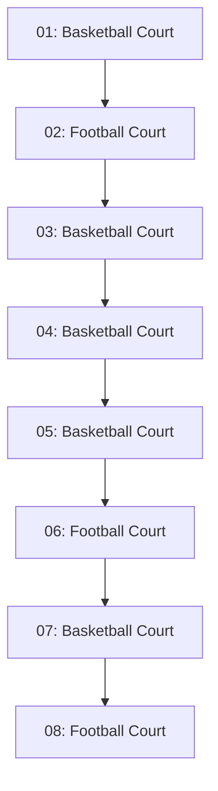

# LucidAction: A Hierarchical and Multi-model Dataset for Comprehensive Action Quality Assessment

Linfeng Dong $^{1,2}$ , Wei Wang $^{2}$ , Yu Qiao $^{2}$ , and Xiao Sun $^{2}$

$^{1}$ Zhejiang University

$^{2}$ Shanghai Artificial Intelligence Laboratory

{donglinfeng, wangwei, sunxiao}@pjlab.org.cn, yu.qiao@siat.ac.cn

# Abstract

Action Quality Assessment (AQA) research confronts formidable obstacles due to limited, mono-modal datasets sourced from one-shot competitions, which hinder the generalizability and comprehensiveness of AQA models. To address these limitations, we present LucidAction, the first systematically collected multi-view AQA dataset structured on curriculum learning principles. LucidAction features a three-tier hierarchical structure, encompassing eight diverse sports events with four curriculum levels, facilitating sequential skill mastery and supporting a wide range of athletic abilities. The dataset encompasses multi-modal data, including multi-view RGB video, 2D and 3D pose sequences, enhancing the richness of information available for analysis. Leveraging a high-precision multi-view Motion Capture (MoCap) system ensures precise capture of complex movements. Meticulously annotated data, incorporating detailed penalties from professional gymnasts, ensures the establishment of robust and comprehensive ground truth annotations. Experimental evaluations employing diverse contrastive regression baselines on LucidAction elucidate the dataset's complexities. Through ablation studies, we investigate the advantages conferred by multi-modal data and fine-grained annotations, offering insights into improving AQA performance. The data and code will be openly released to support advancements in the AI sports field.

# 1 Introduction

The comprehensive evaluation of human actions, capturing both their strengths and weaknesses as well as the quality of their execution, finds extensive applicability in various fields. This is exemplified by AI-powered fitness applications that deliver customized workout regimes $[7, 39, 12, 22, 38]$ . Notably, the 2020 Tokyo Olympics pioneered the use of AI in gymnastics scoring, enhancing both fairness and precision in evaluations $[1]$ . Additionally, motion gaming systems employ sophisticated assessments of user actions to create immersive and interactive experiences $[18, 21, 27]$ . The influence of this task spans diverse industries, including education, sports, and entertainment. As technological advancements continue, the impact of such evaluations is expected to grow significantly.

Prior research [35, 32, 31, 33, 37] has raised the task of Action Quality Assessment (AQA) in tackling the issue of human action evaluation, aiming to regress a definitive quality score for the performed action directly. Unlike action recognition [17], which assumes consistency within the same action type, AQA is inherently more challenging as it must discern subtle variations in action execution

Submitted to the 38th Conference on Neural Information Processing Systems (NeurIPS 2024) Track on Datasets and Benchmarks. Do not distribute.

quality, including swiftness, intensity, and timing, among performers. Additionally, AQA lacks clearly defined quality metrics and requires expertise for evaluation. Given these formidable challenges, the quantity, professionalism, and diversity of high-quality AQA datasets significantly lag behind those of action recognition datasets, severely impeding the advancement of AQA research.


<details>
<summary>pie</summary>

Lucid Action
| Event | Men's Floor Exercise | Women's Balance Beam | Women's Horizontal Bars | Women's Horizontal Bars | Men's Parallel Bars | Men's Parallel Bars | Women's Heeren Bars | Men's Yaul Bars | MFE5 | MFE6 | MFE4 | MFE3 | WFB5 | WBB4 | WBB5 |
|---|---|---|---|---|---|---|---|---|---|---|---|---|---|---|---|
| Events | 2171 | 5.7 | 6.7 | 5.6 | 2171 | 5.7 | 6.7 | 5.6 | 2171 | 5.7 | 6.7 | 5.6 | 2171 | 5.7 | 6.7 |
| Men's Floor Exercise Level 5 | 1938 | 5.7 | 6.7 | 5.6 | 1938 | 5.7 | 6.7 | 5.6 | 1938 | 5.7 | 6.7 | 5.6 | 1938 | 5.7 | 6.7 |
| Women's Balance Beam | 257 | 5.7 | 6.7 | 5.6 | 257 | 5.7 | 6.7 | 5.6 | 257 | 5.7 | 6.7 | 5.6 | 257 | 5.7 | 6.7 |
| Men's Horizontal Bars | 509 | 16.8 | 12.3 | 11.7 | 509 | 16.8 | 12.3 | 11.7 | 509 | 16.8 | 12.3 | 11.7 | 509 | 16.8 | 12.3 |
| Women's Horizontal Bars | 720 | 16.8 | 12.3 | 11.7 | 720 | 16.8 | 12.3 | 11.7 | 720 | 16.8 | 12.3 | 11.7 | 720 | 16.8 | 12.3 |
| Men's Parallel Bars | 447 | 16.8 | 12.3 | 11.7 | 447 | 16.8 | 12.3 | 11.7 | 447 | 16.8 | 12.3 | 11.7 | 447 | 16.8 | 12.3 |
| Men's Parallels Bars | 313 | 16.8 | 12.3 | 11.7 | 313 | 16.8 | 12.3 | 11.7 | 313 | 16.8 | 12.3 | 11.7 | 313 | 16.8 | 12.3 |
| Women's Parallels Bars (Average) | 347 | 16.8 | 12.3 | 11.7 | 347 | 16.8 | 12.3 | 11.7 | 347 | 16.8 | 12.3 | 11.7 | 347 | 16.8 | 12.3 |
| Men's Parallels Bars (Average) (Average) (Total) = (0.07 / 0.12) - Final Score: 4.1 / 5.0
PID Penalty Item Severity PS
E1 Bend arms or shoulders. Slight -0.1
E2 Bend knees and hook toes. Heavy -0.5
E3 Discontinuous handspring. Medium -0.3
/ Total / -0.9
</details>

Figure 1: An overview of the LucidAction dataset. LucidAction adopts a three-tier hierarchical structure of Sport Events, a first-introduced concept "Curriculum Levels" and Actions. It provides a diverse range of actions and detailed penalty-based score annotation to seek better comprehensibility in action quality assessment.

To facilitate this research, a few datasets $[35, 31, 33, 45, 47]$ – gathered primarily from web sources – have been introduced. These datasets predominantly consist of video footage of individual sports competitions like diving or skating, sourced from various sports television broadcasting, such as the Olympic Games, and paired with the corresponding judges' scores. Unfortunately, due to the nature of the data sources, the AQA models trained on these datasets are limited to application in a 'one-shot examination' that represents the highest level of a sport. As a result, they cannot be widely utilized by general enthusiasts and learners, significantly narrowing their scope and frequency of use. Moreover, mono-modal input of video captured by a single moving camera $[31, 33, 47]$ and the absence of a detailed scoring process for the final score severely curtail the model's adaptability and comprehensibility in diverse data settings.

Humans and animals learn much better when the examples are not randomly presented but organized in a meaningful order which illustrates gradually more concepts, and gradually more complex ones.

\- Curriculum Learning, Yoshua Bengio et.al.

To surmount the limitations of current action assessment research, we introduce LucidAction, the first AQA dataset structured according to the principles of curriculum learning. LucidAction introduces a curriculum-based approach to organize data, aligning with the natural learning progressions observed in sports training. It comprises a three-tier hierarchical structure, including eight diverse sports events and four difficulty levels for each event. This hierarchical structure facilitates sequential skill acquisition and accommodates a wide spectrum of athletic abilities. Additionally, the dataset harnesses a high-precision multi-view Motion Capture (MoCap) system to capture complex movements accurately. It integrates 2D pose estimation and multi-view triangulation to acquire precise 3D pose annotations. Furthermore, the dataset includes annotations by professional gymnasts, ensuring the provision of robust and comprehensive ground truth data for AQA models. Through rigorous experimentation, we investigate the effectiveness of multi-modal inputs and fine-grained hierarchical annotations in enhancing AQA performance, thereby offering insights into methodological advancements for the field.

# 2 Related Work

In this section, we provide a concise overview of previous AQA datasets and methodologies.

Table 1: Comparison of LucidAction and existing action quality assessment datasets. #Sport is number of the sport event in dataset, e.g. diving, figure skating, etc. In Anno.Type, S indicates coarse-grained action score, PS indicates progress-aware penalty-based score annotation. In Modality, V, T, A, P indicate video, text, audio, pose. 

<table><tr><td>Dataset</td><td>Year</td><td>#Sport</td><td>Source</td><td>Anno.Type</td><td>Modality</td><td>#Sample</td><td>#Level</td><td>#Action</td><td>#View</td></tr><tr><td>MIT Dive&amp;Skate [35]</td><td>2014</td><td>2</td><td>web</td><td>S</td><td>V</td><td>309</td><td>1</td><td>-</td><td>1</td></tr><tr><td>UNLV Dive&amp;Valut [32]</td><td>2017</td><td>2</td><td>web</td><td>S</td><td>V</td><td>546</td><td>1</td><td>-</td><td>1</td></tr><tr><td>AQA-7 [31]</td><td>2019</td><td>7</td><td>web</td><td>S</td><td>V</td><td>1189</td><td>1</td><td>-</td><td>1</td></tr><tr><td>MTL-AQA [33]</td><td>2019</td><td>1</td><td>web</td><td>S</td><td>V, T</td><td>1412</td><td>1</td><td>58</td><td>1</td></tr><tr><td>FisV [45]</td><td>2019</td><td>1</td><td>web</td><td>S</td><td>V</td><td>500</td><td>1</td><td>-</td><td>1</td></tr><tr><td>FSD-10 [24]</td><td>2020</td><td>1</td><td>web</td><td>S</td><td>V</td><td>1484</td><td>1</td><td>-</td><td>1</td></tr><tr><td>Rhythmic Gymnastics [51]</td><td>2020</td><td>4</td><td>web</td><td>S</td><td>V</td><td>1000</td><td>1</td><td>-</td><td>1</td></tr><tr><td>FR-FS [41]</td><td>2021</td><td>1</td><td>web</td><td>S</td><td>V</td><td>417</td><td>1</td><td>-</td><td>1</td></tr><tr><td>FS1000 [42]</td><td>2022</td><td>1</td><td>web</td><td>S</td><td>V, A</td><td>1604</td><td>1</td><td>-</td><td>1</td></tr><tr><td>FineDiving [47]</td><td>2022</td><td>1</td><td>web</td><td>S</td><td>V</td><td>3000</td><td>1</td><td>52</td><td>1</td></tr><tr><td>OlympicFS [11]</td><td>2023</td><td>1</td><td>web</td><td>S</td><td>V, T</td><td>200</td><td>1</td><td>-</td><td>1</td></tr><tr><td>RFSJ [25]</td><td>2023</td><td>1</td><td>web</td><td>S</td><td>V</td><td>1304</td><td>1</td><td>-</td><td>1</td></tr><tr><td>LucidAction (Ours)</td><td>2024</td><td>8</td><td>mocap</td><td>S, PS</td><td>V, P</td><td>6702</td><td>4</td><td>259</td><td>8</td></tr></table>

Action Quality Assessment Datasets. Existing AQA datasets cover various domains like diving $[35, 32, 31, 33, 47]$ , figure skating $[32, 45, 41, 25, 24, 42, 11]$ , gymnastic $[32, 51]$ and other general sports $[4, 34, 53]$ . As shown in Table 1, previous datasets typically provide RGB videos with video-level scores from multiple judges. Despite the human-centric nature of AQA, none incorporate pose data. Only a few AQA approaches $[35, 30, 29]$ consider extracting 2D pose feature from mono-view video. It is likely due to the difficulty of reliable pose estimation from fast motions in mono-view video captured by moving camera. Another key attribute of AQA datasets is the annotation of action score given by experts under guideline of sport-specific scoring rules. Earlier datasets such as AQA-7 $[31]$ contained only overall scores and sport classes, while MTL-AQA $[33]$ provide fine-grained action type and transcribed video commentary as language modality. FineDiving $[47]$ introduced a two-level annotation with action classes and fine-grained subclasses to capture action procedures, but without procedure-aware scores. FS1000 $[42]$ expanded annotations along five quality aspects. A key challenge has been the laborious collection and annotation of such fine-grained data, requiring collaboration of players, coaches, and referees. Thus, existing datasets focus on top athletes in competitions from web sources, neglecting the skill development processes from practice. In summary, current AQA datasets are limited by: (1) lacking pose modality, (2) coarse annotations without step-wise scores, (3) a focus on elite rather than progressive skill acquisition. Our proposed LucidAction dataset is the first to provide both RGB and 3D pose, with richer annotations and technical skills than previous datasets.

Action Quality Assessment. Currently, AQA approaches mainly follow three formulations: 1) Direct regression formulation supervised by score is widely used in sports AQA approach [35, 32, 43, 30, 31, 51, 29, 33, 34, 45, 37, 41, 44]. Some approaches perform segmentation [52, 26] or localization [15, 13] to generate subaction sequence and predict subscore for each subaction. Recent works incorporate auxiliary input, including music [42], language commentary [11], group formation[53] to improve their ability in AQA. 2) Pairwise ranking is adopted in daily-life AQA [9, 10, 20] or specific sport scenario [4] where precise executing score of action is not available. These approaches mainly focus on overall ranking, limiting their application when requiring quantitative action analysis. 3) Pairwise regression formulation [19, 25] is first proposed by Siamese Network [14] and CoRe [50] to learn the relative score by pair-wise comparison. TPT [3] adopt learnable queries as positional encoding to decode action sequences into a fixed number of temporal-aware part representations. TSA [47] explicitly segment action sequence into consecutive steps and apply procedure-aware cross-attention between target and exemplar corresponding steps.


<details>
<summary>flowchart</summary>


</details>

Figure 2: Camera layout and corresponding frames for event MFE, please refer to the supplementary materials for camera layouts of other events.

# 3 The LucidAction Dataset

The acquisition and refinement of specific sporting skills by individuals constitute a multifaceted process. Typically, it entails initial engagement in specialized exercises aimed at fostering fundamental abilities, which are systematically deconstructed into simpler components. Building upon this foundational framework, further progress is achieved through the adept and strategic amalgamation of these movements to accomplish more intricate objectives in sports competitions.

In order to closely mirror this natural progression of skill acquisition observed in curriculum learning, we have structured our dataset based on the official teaching curriculum outlined in the Regulations on the Movement and Scoring Standards of Chinese Gymnastics Sports Levels (Standards for brevity), as promulgated by the Chinese Gymnastics Association. The adoption of the Standards is particularly advantageous due to its widespread utilization in local sports instruction and grading examinations, facilitating the organization of proficient athletes and instructors and the subsequent collection of corresponding sports and assessment data.

As depicted in Figure 1, we introduce a three-tier hierarchical structure. Notably, for the first time, we incorporate the concept of sports "Curriculum Levels" into our dataset. (1) Sports Event. We offer the most diverse range of sports events to date - 8 in total, namely men's/women's floor exercise (MFE, WFE), vault (MVT, WVT), men's parallel bars (MPB), horizontal bars (MHB), women's uneven bar (WUB), balance beam (WBB). (2) Curriculum Level. Each sports event within our dataset encompasses four distinct levels of difficulty, ranging from easy to challenging. This pioneering inclusion of difficulty levels within an AQA dataset establishes the cornerstone of our proposed LucidAction benchmark. In educational contexts, learners typically progress through these levels sequentially, demonstrating mastery and passing assessments at each stage before advancing. This methodology not only furnishes a rich, multi-tiered dataset conducive to AQA model training but also accommodates a diverse spectrum of athletic abilities. (3) Actions. Within each curriculum level, a collection of representative actions is delineated, with each action type constituting a movement routine lasting an average of 8.6 seconds, serving as the finest-grained unit of analysis. On average, each curriculum level comprises 65 representative actions, culminating in a total of 259 actions across all levels and events.

# 3.1 Multi-View Motion Capture and Multimodality

We deploy a high-precision Motion Capture (MoCap) system. The cameras used in this system are DJI Osmo Action 3 and work in the mode of $4096 \times 4096$ (4K) resolution and 60fps. Temporal and spatial calibrations between multiple cameras are performed using standard tools [28, 2].

Multi-View and High Spatiotemporal Resolution. For gymnastics events, a variety of poses including lying, crouching, rolling up, and rapid jumping are performed, involving significant self-occlusion and swift movements. These complex scenarios bring considerable challenges in accurately inferring 3D poses from conventional single-view RGB or depth sensors, greatly impacting AQA performance. To tackle this issue, we established the first multi-view (8 views in total) MoCap system

```mermaid
graph TD
    A["Annotators"] --> B["Coaches, gymnasts"]
    B --> C["Video Capturing"]
    C --> D["Raw video"]
    D --> E["Action Parsing"]
    E --> F["Action clips"]
    F --> G["Action Classification"]
    G --> H["Action Quality Assessment"]
    H --> I["Action clips"]
    I --> J["Annotations Event Level Action Penalty Score"]
    J --> K["Revising"]
    K --> L["Event Level"]
    L --> M["Annotations Event Level"]
    M --> N["Annotations Event Level"]
    N --> O["Annotations Event Level"]
    O --> P["Annotations Event Level"]
    P --> Q["Annotations Event Level"]
    Q --> R["Annotations Event Level"]
    R --> S["Annotations Event Level"]
    S --> T["Annotations Event Level"]
    T --> U["Annotations Event Level"]
    U --> V["Annotations Event Level"]
    V --> W["Annotations Event Level"]
    W --> X["Annotations Event Level"]
    X --> Y["Annotations Event Level"]
    Y --> Z["Annotations Event Level"]
    Z --> AA["Annotations Event Level"]
    AA --> AB["Annotations Event Level"]
    AB --> AC["Annotations Event Level"]
    AC --> AD["Annotations Event Level"]
    AD --> AE["Annotations Event Level"]
    AE --> AF["Annotations Event Level"]
    AF --> AG["Annotations Event Level"]
    AG --> AH["Annotations Event Level"]
    AH --> AI["Annotations Event Level"]
    AI --> AJ["Annotations Event Level"]
    AJ --> AK["Annotations Event Level"]
    AK --> AL["Annotations Event Level"]
    AL --> AM["Annotations Event Level"]
    AM --> AN["Annotations Event Level"]
    AN --> AO["Annotations Event Level"]
    AO --> AP["Annotations Event Level"]
    AP --> AQ["Annotations Event Level"]
    AQ --> AR["Annotations Event Level"]
    AR --> AS["Annotations Event Level"]
    AS --> AT["Annotations Event Level"]
    AT --> AU["Annotations Event Level"]
    AU --> AV["Annotations Event Level"]
    AV --> AW["Annotations Event Level"]
    AW --> AX["Annotations Event Level"]
    AX --> AY["Annotations Event Level"]
```


<details>
<summary>flowchart</summary>


</details>

(a) Annotation Pipeline. The video capturing process is scheduled by The standards. Left shows the action clips, right shows the corresponding hierarchical labels. All annotators are trained by professional coaches and gymnastics with code of points in The standards before annotation.


<details>
<summary>text_image</summary>

Clip id: 4136
Action Category: MFE6X10
Action Description: Cartwheel internal rotation 90°
E1: bent arms, incorrect support of hands
E2: insufficient pushing hand and shoulder
E3: loss of balance when landing
E4: fall or support on one or both hands
</details>

(b) Annotation tool assessment system layout, annotators can compare the target action clip with perfect exemplar from all eight camera views.   
Figure 3: Illustration of annotation pipeline and system layout.

with high-quality (4K, 60fps) video output tailored for the AQA task. Our experiments confirm the significant performance enhancement brought by leveraging multi-view video information for the AQA task. Figure 2 illustrates the camera layout and corresponding multi-view frames of Men's/Women's Floor Exercise in our LucidAction Dataset. Illustrations of other sport events can be found in supplementary materials. The release of the dataset obtained consent from all athletes appearing in the videos. We employ facial anonymization algorithm deface [48] to protect the sensitive identity information of the athletes.

Multi-Modality for Diverse Applications. We attain high-precision 3D pose annotations by multi-view 2D pose estimation and 3D pose reconstruction. We used a hybrid 2D pose estimation approach involving both algorithms and human review in three stages: (1) We employed RTMpose [16] pretrained on 7 public datasets to estimate 2D poses from single-view videos followed by human quality checks. In this stage, estimated 2D on some action categories may fail human review due to their rare appearance in the pretraining datasets; (2) We manually annotated 2D poses of these failed actions, fine-tuned the RTMpose model, and re-estimated the 2D poses, which were then reviewed again; (3) Any 2D poses that still failed the review were manually annotated. This approach balances automated efficiency with human validation to ensure accurate 2D pose groundtruth. For 3D pose estimation, we reconstructed 3D poses using multi-view 2D poses as groundtruth, a common method in creating 3D pose datasets [36, 23, 5, 8]. Reconstructed 3D pose from multi-view 2D are accepted as groundtruth in tasks like human action recognition [40] and motion prediction [46]. Follow these works, we assess that the accuracy of our 3D poses reconstruction pipeline is sufficient for the AQA task. To gauge the accuracy of the automatic pose annotation pipeline, we manually annotate a subset of data. In the experiments, we thoroughly compare the performance of AQA models across different modalities.

# 3.2 Data Annotation

We provide professional, comprehensive and reliable ground truth annotations in the LucidAction dataset for the action quality assessment task.

Hierarchical Actions Construction We employ a multi-stage strategy to gather extensive hierarchical action labels based on inherent levels (Sports Event, Curriculum Level, and Action). The annotation process is depicted in Figure 3a. Raw videos are systematically captured according to predefined standards, with planned recording sessions for sports events and curriculum levels. As a result, each raw video inherently includes annotations for the first two hierarchies at the time of recording. When


<details>
<summary>bar</summary>

| Action Class | Number of Samples per Action Class |
| ------------ | ----------------------------------- |
| Level 3      | 175                                 |
| Level 4      | 160                                 |
| Level 5      | 150                                 |
| Level 6      | 125                                 |
| Level 7      | 100                                 |
| Level 8      | 80                                  |
| Level 9      | 60                                  |
| Level 10     | 40                                  |
| Level 11     | 20                                  |
| Level 12     | 10                                  |
| Level 13     | 5                                   |
| Level 14     | 2                                   |
| Level 15     | 1                                   |
| Level 16     | 0.5                                 |
| Level 17     | 0.2                                 |
| Level 18     | 0.1                                 |
| Level 19     | 0.05                                |
| Level 20     | 0.02                                |
| Level 21     | 0.01                                |
| Level 22     | 0.005                               |
| Level 23     | 0.002                               |
| Level 24     | 0.001                               |
| Level 25     | 0.0005                              |
| Level 26     | 0.0002                              |
| Level 27     | 0.0001                              |
| Level 28     | 0.00005                             |
| Level 29     | 0.00002                             |
| Level 30     | 0.00001                             |
| Level 31     | 0.000005                            |
| Level 32     | 0.000002                            |
| Level 33     | 0.000001                            |
| Level 34     | 0.0000005                           |
| Level 35     | 0.0000002                           |
| Level 36     | 0.0000001                           |
| Level 37     | 0.00000005                          |
| Level 38     | 0.00000002                          |
| Level 39     | 0.00000001                          |
| Level 40     | 0.000000005                         |
| Level 41     | 0.000000002                         |
| Level 42     | 0.000000001                         |
| Level 43     | 0.0000000005                        |
| Level 44     | 0.0000000002                        |
| Level 45     | 0.0000000001                        |
| Level 46     | 0.00000000005                       |
| Level 47     | 0.00000000002                       |
| Level 48     | 0.00000000001                       |
| Level 49     | 0.000000000005                      |
| Level 50     | 175                                 |
| Level 51     | 165                                 |
| Level 52     | 155                                 |
| Level 53     | 145                                 |
| Level 54     | 135                                 |
| Level 55     | 125                                 |
| Level 56     | 115                                 |
| Level 57     | 105                                 |
| Level 58     | 95                                  |
| Level 59     | 85                                  |
| Level 60     | 75                                  |
| Level 61     | 65                                  |
| Level 62     | 55                                  |
| Level 63     | 45                                  |
| Level 64     | 35                                  |
| Level 65     | 25                                  |
| Level 66     | 15                                  |
| Level 67     | 5                                   |
| Level 68     | 2                                   |
| Level 69     | 1                                   |
| Level 70     | 1                                   |
| Level 71     | 1                                   |
| Level 72     | 1                                   |
| Level 73     | 1                                   |
| Level 74     | 1                                   |
| Level 75     | 1                                   |
| Level 76     | 1                                   |
| Level 77     | 1                                   |
| Level 78     | 1                                   |
| Level 79     | 1                                   |
| Level 80     | 1                                   |
| Level 81     | 1                                   |
| Level 82     | 1                                   |
| Level 83     | 1                                   |
| Level 84     | 1                                   |
| Level 85     | 1                                   |
| Level 86     | 1                                   |
| Level 87     | 1                                   |
| Level 88     | 1                                   |
| Level 89     | 1                                   |
| Level 90     | 1                                   |
| Level 91     | 1                                   |
| Level 92     | 1                                   |
| Level 93     | 1                                   |
| Level 94     | 1                                   |
| Level 95     | 1                                   |
| Level 96     | 1                                   |
| Level 97     | 1                                   |
| Level 98     | 1                                   |
| Level 99     | 1                                   |
| Level 100    | 1                                   |
</details>

(a) The statistics of action sample number within each curriculum level in event MFE / WFE.


<details>
<summary>boxplot</summary>

| Action Class | Level 1 | Level 2 | Level 3 | Level 4 | Level 5 | Level 6 |
| ------------ | ------- | ------- | ------- | ------- | ------- | ------- |
| Score        | 3.0     | 3.5     | 4.0     | 4.5     | 5.0     | 5.5     |
| Score        | 3.5     | 4.0     | 4.5     | 5.0     | 5.5     | 6.0     |
| Score        | 4.0     | 4.5     | 5.0     | 5.5     | 6.0     | 6.5     |
| Score        | 4.5     | 5.0     | 5.5     | 6.0     | 6.5     | 7.0     |
| Score        | 5.0     | 5.5     | 6.0     | 6.5     | 7.0     | 7.5     |
| Score        | 5.5     | 6.0     | 6.5     | 7.0     | 7.5     | 8.0     |
| Score        | 6.0     | 6.5     | 7.0     | 7.5     | 8.0     | 8.5     |
| Score        | 6.5     | 7.0     | 7.5     | 8.0     | 8.5     | 9.0     |
| Score        | 7.0     | 7.5     | 8.0     | 8.5     | 9.0     | 9.5     |
| Score        | 7.5     | 8.0     | 8.5     | 9.0     | 9.5     | 10.0    |
| Score        | 8.0     | 8.5     | 9.0     | 9.5     | 10.0    | 10.5    |
| Score        | 8.5     | 9.0     | 9.5     | 10.0    | 10.5    | 11.0    |
| Score        | 9.0     | 9.5     | 10.0    | 10.5    | 11.0    | 11.5    |
| Score        | 9.5     | 10.0    | 10.5    | 11.0    | 11.5    | 12.0    |
| Score        | 10.0    | 10.5    | 11.0    | 11.5    | 12.0    | 12.5    |
| Score        | 10.5    | 11.0    | 11.5    | 12.0    | 12.5    | 13.0    |
| Score        | 11.0    | 11.5    | 12.0    | 12.5    | 13.0    | 13.5    |
| Score        | 11.5    | 12.0    | 12.5    | 13.0    | 13.5    | 14.0    |
| Score        | 12.0    | 12.5    | 13.0    | 13.5    | 14.0    | 14.5    |
| Score        | 12.5    | 13.0    | 13.5    | 14.0    | 14.5    | 15.0    |
| Score        | 13.0    | 13.5    | 14.0    | 14.5    | 15.0    | 15.5    |
| Score        | 13.5    | 14.0    | 14.5    | 15.0    | 15.5    | 16.0    |
| Score        | 14.0    | 14.5    | 15.0    | 15.5    | 16.0    | 16.5    |
| Score        | 14.5    | 15.0    | 15.5    | 16.0    | 16.5    | 17.0    |
| Score        | 15.0    | 15.5    | 16.0    | 16.5    | 17.0    | 17.5    |
| Score        | 15.5    | 16.0    | 16.5    | 17.0    | 17.5    | 18.0    |
| Score        | 16.0    | 16.5    | 17.0    | 17.5    | 18.0    | 18.5    |
| Score        | 16.5    | 17.0    | 17.5    | 18.0    | 18.5    | 19.0    |
| Score        | 17.0    | 17.5    | 18.0    | 18.5    | 19.0    | 19.5    |
| Score        | 17.5    | 18.0    | 18.5    | 19.0    | 19.5    | 20.0    |
| Score        | 18.0    | 18.5    | 19.0    | 19.5    | 20.0    | 20.5    |
| Score        | 18.5    | 19.0    | 19.5    | 20.0    | 20.5    | 21.0    |
| Score        | 19.0    | 19.5    | 20.0    | 20.5    | 21.0    | 21.5    |
| Score        | 19.5    | 20.0    | 20.5    | 21.0    | 21.5    | 22.0    |
| Score        | 20.0    | 20.5    | 21.0    | 21.5    | 22.0    | 22.5    |
| Score        |          |         |         |         |         |         |
| Score        (Level) - Level A - Level B - Level C - Level D - Level E - Level F - Level G - Level H - Level I - Level J - Level K - Level L - Level M - Level N - Level O - Level P - Level Q - Level R - Level S - Level T - Level U - Level V - Level W - Level X - Level Y - Level Z - Level A - Level B - Level C - Level D - Level E - Level F - Level G - Level H - Level I - Level J - Level K - Level L - Level L - Level M - Level N - Level O - Level P - Level Q - Level R - Level S - Level T - Level U - Level V - Level W - Level X - Level Y - Level Z - Level A - Level B - Level C - Level D - Level E - Level F - Level G - Level H - Level H - Level I - Level M - Level N - Level O - Level P - Level R - Level R - Level L - Level M - Level N - Level Y - Level Z - Level A - Level B - Level C - Level D - Level E - Level F - Level F - Level G - Level H - Level I - Level M - Level N - Level O - Level P - Level R - Level R - Level S - Level T - Level U - Level V - Level V - Level X - Level Y - Level Z - Level A - Level B - Level C - Level D - Level E - Level F - Level F - Level G - Level H - Level H - Level I - Level M - Level N - Level O - Level P - Level R - Level R - Level S - Level T - Level U - Level V - Level X - Level Y - Level Z -      |
| Score        (Level A)   : (Level B)       |
| Score        (Level C)       |
| Score        (Level D)       |
| Score        (Level E)       |
| Score        (Level F)       |
| Score        (Level G)       |
| Score        (Level H)       |
| Score        (Level I)       |
| Score        (Level J)       |
| Score        (Level K)       |
| Score        (Level L)       |
| Score        (Level M)       |
| Score        (Level N)       |
| Score        (Level O)       |
| Score        (Level P)       |
| Score        (Level Q)       |
| Score        (Level R)       |
| Score        (Level S)       |
| Score        (Level T)       |
| Score        (Level U)       |
| Score        (Level V)       |
| Score        (Level Z)       |
| Score        (Level A)       |
| Score        (Level B)       |
| Score        (Level C)       |
| Score        (Level D)       |
| Score        (Level E)       |
| Score        (Level F)       |
| Score        (Level H)       |
| Score        (Level I)       |
| Score        (Level K)       |
| Score        (Level L)       |
| Score        (Level M)       |
| Score        (Level N)       |
| Score        (Level O)       |
| Score        (Level P)       |
| Score        (Level Q)       |
| Score        (Level R)       |
| Score        (Level S)       |
| Score        (Level H)       |
| Score        (Level I)       |
| Score        (Level Q)       |
| Score        (Level T)       |
| Score        (Level U)       |
| Score        (Level V)       |
| Score        (Level Z)       |
| Score        (Level A)      |
| Score        (Level B)      |
| Score        (Level C)      |
| Score        (Level D)      |
| Score        (Level E)      |
| Score        (Level F)      |
| Score        (Level H)      |
| Score        (Level I)      |
| Score        (Level K)      |
| Score        (Level L)      |
| Score        (Level M)      |
| Score        (Level N)      |
| Score        (Level O)      |
| Score        (Level P)      |
| Score        (Level Q)      |
| Score        (Level R)      |
| Score        (Level S)      |
| Score        (Level H)      |
| Score        (Level I)      |
| Score        (Level Q)      |
| Score        (Level T)      |
| Score        (Level U)      |
| Score        (Level V)      |
| Score        (Level Z)      |
| Score        (Level A)      |
| Score        (Level B)      |
| Score        (Level C)      |
| Score        (Level D)      |
| Score        (Level E)      |
| Score        (Level F)      |
| Score        (Level H)      |
| Score        (Level I)      |
| Score        (Level K)      |
| Score        (Level L)      |
| Score        (Level M)     
Score = Point of the data points in the format of the data points in the box plot above it is not explicitly provided in the code.) The data points are not explicitly provided in the code text for each data point in the box plot.
</details>

(b) The score distribution of actions within each curriculum level in event MFE / WFE.


<details>
<summary>bar_stacked</summary>

| Model | Penalty Score 0.1 | Penalty Score 0.3 | Penalty Score 0.5 | Penalty Score 1.0 |
| :--- | :---: | :---: | :---: | :---: |
| NL1 | 2800 | 2400 | 2000 | 0 |
| NL2 | 2600 | 2200 | 1800 | 0 |
| NL3 | 2400 | 2000 | 1600 | 0 |
| NL4 | 2200 | 1800 | 1400 | 0 |
| NL5 | 2000 | 1600 | 1200 | 0 |
| NL6 | 1800 | 1400 | 1000 | 0 |
| NL7 | 1600 | 1200 | 800 | 0 |
| NL8 | 1400 | 1000 | 600 | 0 |
| NL9 | 1200 | 800 | 400 | 0 |
| NL10 | 1000 | 600 | 200 | 0 |
| NL11 | 800 | 400 | 100 | 0 |
| NL12 | 600 | 200 | 50 | 0 |
| NL13 | 400 | 100 | 25 | 0 |
| NL14 | 250 | 50 | 15 | 0 |
| NL15 | 150 | 25 | 75 | 0 |
| NL16 | 75 | 15 | 37.5 | 0 |
| NL17 | 57.5 | 7.5 | 18.75 | 0 |
| NL18 | 37.5 | 3.75 | 9.375 | 0 |
| NL19 | 23.75 | 1.875 | 4.6875 | 0 |
| NL20 | 12.375 | 0.9375 | 1.83875 | 0 |
| NL21 | 6.6875 | 0.46875 | 0.769375 | 0 |
| NL22 | 3.33375 | 0.234375 | 0.4846875 | 0 |
| NL23 | 1.668875 | 0.1179375 | 0.24284375 | 0 |
| NL24 | 0.8846875 | 0.05846875 | 0.121421875 | 0 |
| NL25 | 0.44234375 | 0.024234375 | 0.0657696375 | 0 |
| NL26 | 0.221121875 | 0.012121875 | 0.03131491875 | 0 |
| NL27 | 0.1155696375 | 0.0065696375 | 0.0159869414375 | 0 |
| NL28 | 0.058234375 | 0.0032343375 | 0.01144341696875 | 0 |
| NL29 | 0.0291171875 | 0.0016171875 | 0.00592185984375 | 0 |
| NL30 | 0.01455359375 | 0.00114466875 | 0.0029699999921875 | 0 |
The chart displays a stacked bar chart with each bar representing the total cost for each penalty score category on the x-axis and the corresponding cost value on the y-axis. The legend indicates that higher penalty scores correspond to higher total costs, with the first label being NL3. The data is presented in a single column format with labels 'NL' and 'N' at the top and bottom of the chart.
</details>

(c) The statistics of penalty items and penalty score appear in event MFE / WFE.   
Figure 4: The statistics of action samples, scores and penalties.

dealing with raw videos containing multiple actions, ten annotators first segment them into slices containing only one action. Subsequently, they assign the action category of each slice based on the corresponding sports event and curriculum level.

Professionalism and Robustness We enlist the expertise of professional gymnasts, referees, and coaches to aid us in action sequences collection and score annotation. We conducted a five-month data capturing during professional gymnastics training courses organized according to the Standards at a sports university. To ensure the annotation quality and reduce potential subjective bias, all annotators have taken classes from referees on how to score action according to the Standards. To further mitigate bias, each action segment is assessed by at least five annotators repeatedly. To avoid neglecting errors due to view occlusion, action footage from all views are provided to the annotators.

Detailed Penalty Items Annotation. Previous efforts solely yielded a final scoring outcome without disclosing the intricacies of the scoring process, thus deviating from the authentic assessment procedure and compromising result comprehensibility. In a pioneering move, we provide comprehensive annotations detailing the scoring process. For each action, the execution quality is evaluated, according to the Standards, by identifying up to 5 specific penalty items, each indicates a possible execution error. For each penalty item, we assess whether the corresponding error occurs in the action, and based on the severity of the error from light to heavy, assign a penalty score from $\{0.1, 0.3, 0.5, 1.0\}$ . The statistics of score and penalty items are shown in Figure 4.

# 4 Experiment

In this section, we will demonstrate how LucidAction will substantiate the objectives of comprehensive AQA through three key dimensions: contrastive regression workflow, multi-model input and fine-grained hierarchical annotations.

# 4.1 Contrastive Regression Workflow

Fundamentally, the assessment of an action must considers the context of a particular sports scenario, as it requires attention to sports-specific goals and metrics. For example, although both activities entail running, the technical standards for a 100-meter sprint and a football match can diverge significantly. Therefore, AQA inherently demands an in-context mechanism employing exemplars for the contextual calibration of assessments, eschewing an absolute valuation of the action.

We embrace the recently established pair-wise contrastive regression approaches Siamese Network [14], CoRe [50], TSA [47] and TPT [3] as main baseline architecture, concisely encapsulated within the framework illustrated in Figure 5. This architecture consists of four interconnected modules, (1) a backbone B to encode input signals into deep network features; (2) an action decoder A to extract key motion features across temporal dimension; (3) a pair encoder P to facilitate interactions between targets and exemplars for contrastive purposes; (4) a score regressor S to map interaction features into relative scores. Given a pairwise target X and exemplar Z, the contrastive regression

problem can be represented as:

$$
\hat {y} _ {X} = \mathcal {S} (\mathcal {P} (\mathcal {A} (\mathcal {B} (X)) \oplus \mathcal {A} (\mathcal {B} (Z))) \mid \Theta) + y _ {Z} \tag {1}
$$

where $\Theta$ indicates the learnable parameters, $\hat{y}_X$ is the predicted score of target $X$ , $y_Z$ is the ground-truth score of exemplar $Z$ , $\oplus$ denotes the operation to fuse the target and exemplar's representations after the action decoder. In experiments we use concatenation following previous work TPT [3].

We compare the results of contrastive regression baselines and a direct regression approach USDL[37] on our newly proposed benchmark LucidAction. We also list the baseline performance on three publicly available datasets AQA-7 [31], MTL-AQA [33], FineDiving [47] as reference (see the supplement for more details on these datasets).


<details>
<summary>flowchart</summary>

```mermaid
graph TD
    subgraph_Target_X["Target X"]
        A1["View 1"] --> B1["Backbone Video BV"]
        A2["View 2"] --> B2["Backbone Pose BP"]
        B1 --> C1["video repr"]
        B2 --> C2["pose repr"]
        C1 --> D1["Action Decoder A"]
        C2 --> D2["Action Decoder A"]
    end

    subgraph_Exemplar_Z["Exemplar Z"]
        E1["View 1"] --> F1["Backbone Pose BP"]
        E2["View 2"] --> F2["Backbone Video BV"]
        E1 --> G1["video repr"]
        E2 --> G2["pose repr"]
        G1 --> H1["Action Decoder A"]
        G2 --> H2["Action Decoder A"]
    end

    B1 --> I1["X action repr"]
    B2 --> I2["X action repr"]
    I1 --> J1["Pair Encoder P"]
    I2 --> J2["Pair Encoder P"]
    J1 --> K1["pair repr"]
    J2 --> K2["pair repr"]
    K1 --> L1["Score Regressor S"]
    K2 --> L2["Penalty Heads 1"]
    K2 --> L3["Penalty Heads N"]
    L1 --> M1["lossreg"]
    L2 --> M2["predicted relative score r̂"]
    L3 --> M3["predicted penalty score for item 1"]
    M1 --> N["..."]
    M2 --> O["..."]
    N --> P["GT penalty scores of penalty items 1~N"]
    O --> P
    P --> Q["losspnt"]
    Q --> R["only used in training"]

    style Target_X fill:#f9f,stroke:#333
    style Exemplar_Z fill:#bbf,stroke:#333
```
</details>

Figure 5: An overview of contrastive regressive workflow with additional penalty heads.

Implementation Details. We adopt I3D pretrained on Kinetics $[6]$ as video backbone for all baselines. TPT $[3]$ uses a 2-layer transformer block as action decoder, a 2-layer MLP as pair encoder and another 2-layer MLP as score regressor. We extract 103 frames for each video or pose sequence and stack them with interval 5 as 20 clips, each contains 8 frames. For More implementation details on other baselines, data augmentation, learning rate, training epoch, optimization, inference, and so on, please refer to the supplementary materials.

Evaluation Metrics. To facilitate comparison with previous work in AQA [35, 31, 37, 41, 47], we employ two metrics in our experiments: Spearman's rank correlation $(\rho)$ and relative L2 distance $(\mathrm{R - }\ell_2)$ . Spearman's rank correlation assesses the rank correlation between predictions and ground-truth scores, The relative L2 distance focuses on the numerical scoring difference between predictions and ground-truth scores.

Table 2: Baseline performance comparison on LucidAction and former AQA datasets. 

<table><tr><td rowspan="2">Method</td><td colspan="2">AQA-7</td><td colspan="2">MTL-AQA</td><td colspan="2">FineDiving</td><td colspan="2">LucidAction</td></tr><tr><td> $\rho \uparrow$ </td><td> $R-\ell_{2}(\times 100) \downarrow$ </td><td> $\rho \uparrow$ </td><td> $R-\ell_{2}(\times 100) \downarrow$ </td><td> $\rho \uparrow$ </td><td> $R-\ell_{2}(\times 100) \downarrow$ </td><td> $\rho \uparrow$ </td><td> $R-\ell_{2}(\times 100) \downarrow$ </td></tr><tr><td>USDL[37]</td><td>0.810</td><td>2.57</td><td>0.923</td><td>0.468</td><td>0.891</td><td>0.382</td><td>0.540</td><td>0.708</td></tr><tr><td>CoRe [50]</td><td>0.840</td><td>2.12</td><td>0.951</td><td>0.260</td><td>0.906</td><td>0.362</td><td>0.625</td><td>0.685</td></tr><tr><td>TSA [47]</td><td>0.848</td><td>2.07</td><td>0.947</td><td>0.284</td><td>0.920</td><td>0.342</td><td>0.643</td><td>0.690</td></tr><tr><td>TPT [3]</td><td>0.872</td><td>1.68</td><td>0.960</td><td>0.238</td><td>0.945</td><td>0.218</td><td>0.701</td><td>0.624</td></tr></table>

Baseline Model Results. The baseline performance on LucidAction and the established dataset, namely AQA-7, MTL-AQA and FineDiving, is summarized in Table 2. Contrastive regression methods significantly outperforms direct regression across all four datasets. On LucidAction, the best-performing TPT model improves $\rho$ that evaluates model's relative scoring ability by $30\%$ and $\mathrm{R - }\ell_2$ that

evaluates the absolute scoring ability by 12% compared to USDL. Contrastive regression approaches empower models to focus on visual disparities that frequently encapsulate crucial scoring information between target and exemplar, thereby effectively filtering out extraneous noise such as background interference and attire variation. Furthermore, the contrastive regression approach enhances data utilization by furnishing multiple exemplars for a single target action, thereby generating diverse paired inputs. This diversification enriches the evaluation process, augmenting the robustness of the assessment results. Given the superior performance achieved by TPT across all four datasets as delineated in Table Table 2, we adopt TPT variants for subsequent ablation studies.

# 4.2 Multi-model Input

We employ unified network architectures, loss functions, and training methods across different data modalities to ensure a fair comparison. The only difference lies in using ST-GCN [49] pre-trained on NTU RGB+D[36] as backbone for pose sequence input, as illustrated in Figure 5.

Multi-view RGB Video Data. To investigate the potential benefits of incorporating multi-view RGB videos, we conduct two multi-view strategies. Batch strategy puts different views in batch dimension as separate samples, while the channel strategy places different views on channel dimension within one sample. We also investigate the effects of channel fuse position (Pos) and operation (Opt), namely concatenation (Cat) and averaging (Avg). For experimental settings, multi-view test setting (Mv.Test) utilizes multi-view inputs during both training and testing phases, while the single-view test setting (Sv.Test) employs multi-view input only during training and duplicates single-view input during testing to simulate real-world scenarios where multi-view data may not be available. For further model details, please refer to the supplementary materials.

Table 3: Ablation studies of multi-model inputs.   
(a) Multi-view ablation. 

<table><tr><td>Strategy</td><td>Pos</td><td>Opt</td><td>Mv.Test</td><td>Sv.Test</td></tr><tr><td>Base</td><td>-</td><td>-</td><td>-</td><td>0.701</td></tr><tr><td>Batch</td><td>-</td><td>-</td><td>-</td><td>0.730</td></tr><tr><td rowspan="7">Channel</td><td rowspan="2">BB</td><td>Cat</td><td>0.736</td><td>0.729</td></tr><tr><td>Avg</td><td>0.724</td><td>0.712</td></tr><tr><td rowspan="2">AD</td><td>Cat</td><td>0.742</td><td>0.726</td></tr><tr><td>Avg</td><td>0.737</td><td>0.728</td></tr><tr><td rowspan="2">PE</td><td>Cat</td><td>0.759</td><td>0.747</td></tr><tr><td>Avg</td><td>0.713</td><td>0.703</td></tr><tr><td>SR</td><td>Avg</td><td>0.732</td><td>0.730</td></tr></table>

(b) Pose modality ablation. When using dual-stream, the feature extracted by I3D and ST-GCN are concatenated before action decoder. 

<table><tr><td>Data Modality</td><td> $\rho \uparrow$ </td><td> $R-\ell_2(\times 100) \downarrow$ </td></tr><tr><td>RGB</td><td>0.701</td><td>0.624</td></tr><tr><td>Pose2d</td><td>0.605</td><td>0.898</td></tr><tr><td>Pose3d</td><td>0.689</td><td>0.593</td></tr><tr><td>RGB+Pose3d</td><td>0.746</td><td>0.560</td></tr></table>

As depicted in Table 3a, introducing multi-view on batch to increase training data results in a 4.1% improvement from 0.701 to 0.730. Multi-view input on channel yields a slightly higher performance than batch in Mv.Test and comparable performance in Sv.Test, except for concatenation after the Pair Encoder that gains a 6.6% improvement from 0.701 to 0.747. This enhancement can be attributed to the capability of capturing errors obscured in a single view and leveraging implicit 3D knowledge, including depth information and shared objects across two synchronized views. Concatenation outperforms averaging in most positions since averaging causes information loss.

Human Pose Data We explore the impact of using different input modalities—2D human body pose, 3D human body pose, and RGB-pose dual-stream—on the AQA task. We observe in Table 3b that using only 2D poses reduces the model's performance on correlation $\rho$ from 0.701 to 0.605, using only 3D poses yields a correlation performance of 0.689, slightly lower than RGB input, but with an improved R- $\ell_2$ from 0.624 to 0.593. The decrease may stem from the abstract nature of keypoint data, leading to a loss of crucial information for action assessment. Conversely, combining dual-stream inputs with RGB and 3D poses results in a $6.4\%$ improvement on $\rho$ from 0.701 to 0.746. One potential explanation is that human pose data is more conducive to the model in comparing key kinematic properties of the target and exemplar, such as keypoint movement velocity, displacement distance, angles, etc.


<details>
<summary>bar</summary>

Comparison of different learning strategies
| Test Curriculum Level | Mono-level | Mix | Curriculum |
|---|---|---|---|
| Level 4 | 0.695 | 0.705 | 0.732 |
| Level 5 | 0.595 | 0.691 | 0.694 |
| Level 6 | 0.733 | 0.761 | 0.771 |
</details>

Figure 6: Comparison of different learning strategies.

<table><tr><td>#Penalty Head</td><td> $\rho \uparrow$ </td><td> $R-\ell_{2}(\times 100) \downarrow$ </td></tr><tr><td>0</td><td>0.701</td><td>0.624</td></tr><tr><td>1</td><td>0.733</td><td>0.539</td></tr><tr><td>2</td><td>0.741</td><td>0.514</td></tr><tr><td>3</td><td>0.735</td><td>0.501</td></tr></table>

Table 4: Ablation study of the number of penalty items used as additional supervision only during training.

# 4.3 Fine-grained Hierarchical Annotations

LucidAction is presented with a curriculum hierarchy and fine-grained penalty labels for scoring. In this section, we study whether these annotations help model's understanding of action quality.

Curriculum Level. We investigate the impact of curriculum level on the AQA task through two training methods: 1) Mixed learning, which trains on a shuffled LucidAction dataset with all levels; and 2) Curriculum learning, which organizes training data by level order, gradually introducing more difficult actions and complex quality concepts. Additionally, we compare models trained on individual levels. Analysis presented in Figure 6 demonstrates that models trained with mixed levels outperform those trained on a single level for any test level. This is particularly evident for level 5 actions, where fewer samples are available, indicating the model's ability to learn universal action quality concepts across different levels. Moreover, when utilizing the same volume of training data, curriculum learning surpasses mixed learning across all levels. This validates our hypothesis that the gradual progression of curriculum learning facilitates the development of complex quality concepts upon simpler ones learned earlier.

Detailed Penalty Items. The inclusion of unique penalty item annotations in LucidAction enhances the comprehensiveness and reliability of score annotations. In our experiments, we assess the benefits of incorporating this supervision. As illustrated in Figure 5, we introduce a plug-and-play multi-head network, each head corresponds to a binary classification auxiliary tasks, identifying whether the execution errors specified by a penalty item occur (penalty value >0). Specifically, we focus on the three most frequent penalties N12, N17 and N18 in Figure 4c. Results in Table 4 indicate that models augmented with penalty heads achieve notable improvements, with correlation ( $\rho$ ) increasing up to 0.741 (+5.7%) and R- $\ell_{2}$ up to 0.501 (+20%). This suggests that fine-grained penalty labels enhance the model's understanding of action quality. Additionally, the adoption of penalty-based annotation enables intentional collection of penalty-free samples for each action category, ensuring the availability of perfect exemplars. If no perfect action is captured during regular training sessions, specialized gymnasts will perform additional recordings to ensure each action category includes a perfect sample. Perfect exemplars are challenging to obtain in previous datasets [31, 33, 47] collected from one-shot public competitions. However, in our work, if no perfect action is captured during regular training sessions, specialized gymnasts will perform additional recordings to ensure each action category includes a perfect sample. Further ablation experiments regarding exemplar quality and quantity are presented in the supplementary materials.

# 5 Limitations and Other Applications

Limitations. LucidAction is gathered within controlled environments utilizing a high-precision multiview Motion Capture (MoCap) system. However, it may not fully replicate real-world conditions where variables such as lighting, background, and other environmental factors can significantly vary.

Despite annotations being provided by professional gymnasts, subjective biases during scoring may still exist. Ensuring consistent and objective annotations remains a challenge.

Applications. LucidAction offers distinct advantages for motion generation, particularly due to the structured and standardized nature of gymnastics movements, which reduces ambiguities often encountered in daily actions. LucidAction can be utilized to develop educational tools and simulations that teach gymnastics techniques, providing proper form and execution, aiding in skill development.

# 6 Conclusion

In this paper, we introduce LucidAction, a novel dataset designed for Action Quality Assessment (AQA) featuring a hierarchical structure with eight diverse sports events and four curriculum levels. Leveraging a high-precision multi-view Motion Capture (MoCap) system, LucidAction offers rich and comprehensive data including multi-view RGB video, 2D and 3D pose for action assessment. Through experimentation with contrastive regression baselines on LucidAction, we have demonstrated the efficacy of multi-modal input and fine-grained annotations in enhancing AQA tasks. We anticipate that the LucidAction dataset, alongside our experimental findings, will serve as valuable resources for researchers and practitioners within the field of action quality assessment.

Acknowledgements. The work is supported by the National Key R&D Program of China (No. 2022ZD0160104).

# References

[1] Fujitsu and the International Gymnastics Federation launch AI-powered Fujitsu Judging Support System for use in competition for all 10 apparatuses. https://www.fujitsu.com/global/about/resources/news/press-releases/2023/1005-02.html.   
[2] Easymocap - make human motion capture easier. Github, 2021. URL https://github.com/zju3dv/EasyMocap.   
[3] Yang Bai, Desen Zhou, Songyang Zhang, Jian Wang, Errui Ding, Yu Guan, Yang Long, and Jingdong Wang. Action Quality Assessment with Temporal Parsing Transformer. In Computer Vision – ECCV 2022, volume 13664, pages 422–438. Springer Nature Switzerland, 2022. doi:10.1007/978-3-031-19772-7\_25.   
[4] Gedas Bertasius, Hyun Soo Park, Stella X. Yu, and Jianbo Shi. Am I a Baller? Basketball Performance Assessment from First-Person Videos. In 2017 IEEE International Conference on Computer Vision (ICCV), pages 2196–2204. IEEE, 2017. doi: 10.1109/ICCV.2017.239.   
[5] Zhongang Cai, Daxuan Ren, Ailing Zeng, Zhengyu Lin, Tao Yu, Wenjia Wang, Xiangyu Fan, Yang Gao, Yifan Yu, Liang Pan, Fangzhou Hong, Mingyuan Zhang, Chen Change Loy, Lei Yang, and Ziwei Liu. HuMMan: Multi-modal 4d human dataset for versatile sensing and modeling. In 17th European Conference on Computer Vision, Tel Aviv, Israel, October 23–27, 2022, Proceedings, Part VII, pages 557–577. Springer, 2022.   
[6] Joao Carreira and Andrew Zisserman. Quo Vadis, Action Recognition? A New Model and the Kinetics Dataset. In 2017 IEEE Conference on Computer Vision and Pattern Recognition (CVPR), pages 4724–4733. IEEE, 2017. doi: 10.1109/CVPR.2017.502.   
[7] Hua-Tsung Chen, Yu-Zhen He, and Chun-Chieh Hsu. Computer-assisted yoga training system. Multimedia Tools and Applications, 77:23969–23991, 2018.   
[8] Junting Dong, Qi Fang, Wen Jiang, Yurou Yang, Hujun Bao, and Xiaowei Zhou. Fast and robust multi-person 3d pose estimation and tracking from multiple views. 2021.   
[9] Hazel Doughty, Dima Damen, and Walterio Mayol-Cuevas. Who's Better? Who's Best? Pairwise Deep Ranking for Skill Determination. In 2018 IEEE/CVF Conference on Computer Vision and Pattern Recognition, pages 6057–6066. IEEE, 2018. doi: 10.1109/CVPR.2018.00634.   
[10] Hazel Doughty, Walterio Mayol-Cuevas, and Dima Damen. The Pros and Cons: Rank-Aware Temporal Attention for Skill Determination in Long Videos. In 2019 IEEE/CVF Conference on Computer Vision and Pattern Recognition (CVPR), pages 7854–7863. IEEE, 2019. doi:10.1109/CVPR.2019.00805.   
[11] Zexing Du, Di He, Xue Wang, and Qing Wang. Learning Semantics-Guided Representations for Scoring Figure Skating. IEEE Transactions on Multimedia, pages 1–11, 2023. ISSN 1520-9210, 1941-0077. doi: 10.1109/TMM.2023.3328180.   
[12] Mihai Fieraru, Mihai Zanfir, Silviu Cristian Pirlea, Vlad Olaru, and Cristian Sminchisescu. Aifit: Automatic 3d human-interpretable feedback models for fitness training. In Proceedings of the IEEE/CVF conference on computer vision and pattern recognition, pages 9919–9928, 2021.   
[13] Kumie Gedamu, Yanli Ji, Yang Yang, Jie Shao, and Heng Tao Shen. Fine-Grained Spatio-Temporal Parsing Network for Action Quality Assessment. IEEE Transactions on Image Processing, 32:6386–6400, 2023. ISSN 1057-7149, 1941-0042. doi: 10.1109/TIP.2023.3331212.   
[14] Hiteshi Jain, Gaurav Harit, and Avinash Sharma. Action quality assessment using siamese network-based deep metric learning. IEEE Transactions on Circuits and Systems for Video Technology, 31(6):2260–2273, 2021. doi: 10.1109/TCSVT.2020.3017727.   
[15] Yanli Ji, Lingfeng Ye, Huili Huang, Lijing Mao, Yang Zhou, and Lingling Gao. Localization-assisted Uncertainty Score Disentanglement Network for Action Quality Assessment. In Proceedings of the 31st ACM International Conference on Multimedia, MM '23, pages 8590–8597. Association for Computing Machinery, 2023. doi: 10.1145/3581783.3613795.

[16] Tao Jiang, Peng Lu, Li Zhang, Ningsheng Ma, Rui Han, Chengqi Lyu, Yining Li, and Kai Chen. Rtmpose: Real-time multi-person pose estimation based on mmpose, 2023. URL https://arxiv.org/abs/2303.07399.   
[17] Yu Kong and Yun Fu. Human action recognition and prediction: A survey. International Journal of Computer Vision, 130(5):1366–1401, 2022.   
[18] Karol Kurach, Anton Raichuk, Piotr Stańczyk, Michał Zając, Olivier Bachem, Lasse Espeholt, Carlos Riquelme, Damien Vincent, Marcin Michalski, Olivier Bousquet, et al. Google research football: A novel reinforcement learning environment. In Proceedings of the AAAI conference on artificial intelligence, volume 34, pages 4501–4510, 2020.   
[19] Mingzhe Li, Hong-Bo Zhang, Qing Lei, Zongwen Fan, Jinghua Liu, and Ji-Xiang Du. Pairwise Contrastive Learning Network for Action Quality Assessment. In Computer Vision – ECCV 2022, volume 13664, pages 457–473. Springer Nature Switzerland, 2022. doi: 10.1007/978-3-031-19772-7\_27.   
[20] Zhenqiang Li, Yifei Huang, Minjie Cai, and Yoichi Sato. Manipulation-Skill Assessment from Videos with Spatial Attention Network. In 2019 IEEE/CVF International Conference on Computer Vision Workshop (ICCVW), pages 4385–4395. IEEE, 2019. doi: 10.1109/ICCVW.2019.00539.   
[21] Fanqi Lin, Shiyu Huang, Tim Pearce, Wenze Chen, and Wei-Wei Tu. Tizero: Mastering multi-agent football with curriculum learning and self-play. arXiv preprint arXiv:2302.07515, 2023.   
[22] Jingyuan Liu, Nazmus Saquib, Zhutian Chen, Rubaiat Habib Kazi, Li-Yi Wei, Hongbo Fu, and Chiew-Lan Tai. PoseCoach: A Customizable Analysis and Visualization System for Video-based Running Coaching. IEEE Transactions on Visualization and Computer Graphics, pages 1–14, 2022. ISSN 1077-2626, 1941-0506, 2160-9306. doi: 10.1109/TVCG.2022.3230855.   
[23] Jun Liu, Amir Shahroudy, Mauricio Perez, Gang Wang, Ling-Yu Duan, and Alex C Kot. Ntu rgb+d 120: A large-scale benchmark for 3d human activity understanding. IEEE Transactions on Pattern Analysis and Machine Intelligence, 42(10):2684–2701, 2020.   
[24] Shenlan Liu, Xiang Liu, Gao Huang, Lin Feng, Lianyu Hu, Dong Jiang, Aibin Zhang, Yang Liu, and Hong Qiao. FSD-10: A Dataset for Competitive Sports Content Analysis, 2020.   
[25] Yanchao Liu, Xina Cheng, and Takeshi Ikenaga. A Figure Skating Jumping Dataset for Replay-Guided Action Quality Assessment. In Proceedings of the 31st ACM International Conference on Multimedia, MM '23, pages 2437–2445. Association for Computing Machinery, 2023. doi:10.1145/3581783.3613774.   
[26] Hitoshi Matsuyama, Nobuo Kawaguchi, and Brian Y. Lim. IRIS: Interpretable Rubric-Informed Segmentation for Action Quality Assessment, 2023.   
[27] Willi Menapace, Aliaksandr Siarohin, Stéphane Lathuilière, Panos Achlioptas, Vladislav Golyanik, Sergey Tulyakov, and Elisa Ricci. Plotting Behind the Scenes: Towards Learnable Game Engines. ACM Transactions on Graphics, page 3635705, 2023. ISSN 0730-0301, 1557-7368. doi: 10.1145/3635705.   
[28] Lindasalwa Muda, Mumtaj Begam, and I. Elamvazuthi. Voice recognition algorithms using mel frequency cepstral coefficient (mfcc) and dynamic time warping (dtw) techniques, 2010.   
[29] Mahdiar Nekoui, Fidel Omar Tito Cruz, and Li Cheng. EAGLE-Eye: Extreme-pose Action Grader using detail bird's-Eye view. In 2021 IEEE Winter Conference on Applications of Computer Vision (WACV), pages 394–402. IEEE, 2021. doi: 10.1109/WACV48630.2021.00044.   
[30] Jia-Hui Pan, Jibin Gao, and Wei-Shi Zheng. Action Assessment by Joint Relation Graphs. ICCV, 2019.   
[31] Paritosh Parmar and Brendan Morris. Action Quality Assessment Across Multiple Actions. In 2019 IEEE Winter Conference on Applications of Computer Vision (WACV), pages 1468–1476, 2019. doi: 10.1109/WACV.2019.00161.

[32] Paritosh Parmar and Brendan Tran Morris. Learning to Score Olympic Events. In 2017 IEEE Conference on Computer Vision and Pattern Recognition Workshops (CVPRW), 2017.   
[33] Paritosh Parmar and Brendan Tran Morris. What and How Well You Performed? A Multitask Learning Approach to Action Quality Assessment. In Proceedings of the IEEE/CVF Conference on Computer Vision and Pattern Recognition, pages 304–313, 2019.   
[34] Paritosh Parmar, Amol Gharat, and Helge Rhodin. Domain Knowledge-Informed Self-supervised Representations for Workout Form Assessment. In Computer Vision – ECCV 2022, volume 13698, pages 105–123. Springer Nature Switzerland, 2022. doi: 10.1007/978-3-031-19839-7\_7.   
[35] Hamed Pirsiavash, Carl Vondrick, and Antonio Torralba. Assessing the Quality of Actions. In Computer Vision – ECCV 2014, Lecture Notes in Computer Science, pages 556–571. Springer International Publishing, 2014. doi: 10.1007/978-3-319-10599-4\_36.   
[36] Amir Shahroudy, Jun Liu, Tian-Tsong Ng, and Gang Wang. Ntu rgb+d: A large scale dataset for 3d human activity analysis. In Proceedings of the IEEE conference on computer vision and pattern recognition, pages 1010–1019, 2016.   
[37] Yansong Tang, Zanlin Ni, Jiahuan Zhou, Danyang Zhang, Jiwen Lu, Ying Wu, and Jie Zhou. Uncertainty-Aware Score Distribution Learning for Action Quality Assessment. In 2020 IEEE/CVF Conference on Computer Vision and Pattern Recognition (CVPR), pages 9836–9845. IEEE, 2020. doi: 10.1109/CVPR42600.2020.00986.   
[38] Yansong Tang, Jinpeng Liu, Aoyang Liu, Bin Yang, Wenxun Dai, Yongming Rao, Jiwen Lu, Jie Zhou, and Xiu Li. FLAG3D: A 3D Fitness Activity Dataset with Language Instruction, 2023.   
[39] Jianbo Wang, Kai Qiu, Houwen Peng, Jianlong Fu, and Jianke Zhu. Ai coach: Deep human pose estimation and analysis for personalized athletic training assistance. In Proceedings of the 27th ACM international conference on multimedia, pages 374–382, 2019.   
[40] Lei Wang and Piotr Koniusz. 3mformer: Multi-order multi-mode transformer for skeletal action recognition. In 2023 IEEE/CVF Conference on Computer Vision and Pattern Recognition (CVPR), pages 5620–5631, 2023. doi: 10.1109/CVPR52729.2023.00544.   
[41] Shunli Wang, Dingkang Yang, Peng Zhai, Chixiao Chen, and Lihua Zhang. TSA-Net: Tube Self-Attention Network for Action Quality Assessment. In Proceedings of the 29th ACM International Conference on Multimedia, pages 4902–4910, 2021. doi: 10.1145/3474085.3475438.   
[42] Jingfei Xia, Mingchen Zhuge, Tiantian Geng, Shun Fan, Yuantai Wei, Zhenyu He, and Feng Zheng. Skating-mixer: Long-term sport audio-visual modeling with MLPs. In Proceedings of the Thirty-Seventh AAAI Conference on Artificial Intelligence and Thirty-Fifth Conference on Innovative Applications of Artificial Intelligence and Thirteenth Symposium on Educational Advances in Artificial Intelligence, volume 37 of AAAI'23/IAAI'23/EAAI'23, pages 2901–2909. AAAI Press, 2023. doi: 10.1609/aaai.v37i3.25392.   
[43] Xiang Xiang, Ye Tian, Austin Reiter, Gregory D. Hager, and Trac D. Tran. S3D: Stacking Segmental P3D for Action Quality Assessment. In 2018 25th IEEE International Conference on Image Processing (ICIP), pages 928–932, 2018. doi: 10.1109/ICIP.2018.8451364.   
[44] Angchi Xu, Ling-An Zeng, and Wei-Shi Zheng. Likert Scoring With Grade Decoupling for Long-Term Action Assessment. In Proceedings of the IEEE/CVF Conference on Computer Vision and Pattern Recognition, pages 3232–3241, 2022.   
[45] Chengming Xu, Yanwei Fu, Zitian Chen, Bing Zhang, Yu-Gang Jiang, and Xiangyang Xue. Learning to Score Figure Skating Sport Videos. IEEE Transactions on Circuits and Systems for Video Technology, 2019.   
[46] Chenxin Xu, Robby T Tan, Yuhong Tan, Siheng Chen, Xinchao Wang, and Yanfeng Wang. Auxiliary tasks benefit 3d skeleton-based human motion prediction. In Proceedings of the IEEE/CVF International Conference on Computer Vision, pages 9509–9520, 2023.

[47] Jinglin Xu, Yongming Rao, Xumin Yu, Guangyi Chen, Jie Zhou, and Jiwen Lu. FineDiving: A Fine-grained Dataset for Procedure-aware Action Quality Assessment. In 2022 IEEE/CVF Conference on Computer Vision and Pattern Recognition (CVPR), pages 2939–2948. IEEE, 2022. doi: 10.1109/CVPR52688.2022.00296.   
[48] Yuanyuan Xu, Wan Yan, Haixin Sun, Genke Yang, and Jiliang Luo. Centerface: Joint face detection and alignment using face as point. In arXiv:1911.03599, 2019.   
[49] Sijie Yan, Yuanjun Xiong, and Dahua Lin. Spatial temporal graph convolutional networks for skeleton-based action recognition. In AAAI, 2018.   
[50] Xumin Yu, Yongming Rao, Wenliang Zhao, Jiwen Lu, and Jie Zhou. Group-aware Contrastive Regression for Action Quality Assessment. In 2021 IEEE/CVF International Conference on Computer Vision (ICCV), pages 7899–7908. IEEE, 2021. doi: 10.1109/ICCV48922.2021.00782.   
[51] Ling-An Zeng, Fa-Ting Hong, Wei-Shi Zheng, Qi-Zhi Yu, Wei Zeng, Yao-Wei Wang, and Jian-Huang Lai. Hybrid Dynamic-static Context-aware Attention Network for Action Assessment in Long Videos. In Proceedings of the 28th ACM International Conference on Multimedia. arXiv, 2020. doi: 10.48550/arXiv.2008.05977.   
[52] Hong-Bo Zhang, Li-Jia Dong, Qing Lei, Li-Jie Yang, and Ji-Xiang Du. Label-reconstruction-based pseudo-subscore learning for action quality assessment in sporting events. Applied Intelligence (Dordrecht, Netherlands), 53(9):10053–10067, 2023. ISSN 0924-669X. doi:10.1007/s10489-022-03984-5.   
[53] Shiyi Zhang, Wenxun Dai, Sujia Wang, Xiangwei Shen, Jiwen Lu, Jie Zhou, and Yansong Tang. LOGO: A Long-Form Video Dataset for Group Action Quality Assessment. In 2023 IEEE/CVF Conference on Computer Vision and Pattern Recognition (CVPR), pages 2405–2414. IEEE, 2023. doi: 10.1109/CVPR52729.2023.00238.

# Checklist

# 1. For all authors...

(a) Do the main claims made in the abstract and introduction accurately reflect the paper's contributions and scope? [Yes] Please refer to section 3 and section 4   
(b) Did you describe the limitations of your work? [Yes] Please refer to section 5   
(c) Did you discuss any potential negative societal impacts of your work? [No]   
(d) Have you read the ethics review guidelines and ensured that your paper conforms to them? [Yes]

# 2. If you are including theoretical results...

(a) Did you state the full set of assumptions of all theoretical results? [N/A]   
(b) Did you include complete proofs of all theoretical results? [N/A]

# 3. If you ran experiments (e.g. for benchmarks)...

(a) Did you include the code, data, and instructions needed to reproduce the main experimental results (either in the supplemental material or as a URL)? [Yes] Please refer to supplemental material   
(b) Did you specify all the training details (e.g., data splits, hyperparameters, how they were chosen)? [Yes] Please refer to section 4.1 and supplemental material   
(c) Did you report error bars (e.g., with respect to the random seed after running experiments multiple times)? [Yes] Please refer to supplemental material   
(d) Did you include the total amount of compute and the type of resources used (e.g., type of GPUs, internal cluster, or cloud provider)? [Yes] Please refer to supplemental material

# 4. If you are using existing assets (e.g., code, data, models) or curating/releasing new assets...

(a) If your work uses existing assets, did you cite the creators? [Yes]   
(b) Did you mention the license of the assets? [Yes]   
(c) Did you include any new assets either in the supplemental material or as a URL? [No]   
(d) Did you discuss whether and how consent was obtained from people whose data you're using/curating? [Yes] Please refer to section 3.2   
(e) Did you discuss whether the data you are using/curating contains personally identifiable information or offensive content? [Yes] Please refer to section 3.2

# 5. If you used crowdsourcing or conducted research with human subjects...

(a) Did you include the full text of instructions given to participants and screenshots, if applicable? [N/A]   
(b) Did you describe any potential participant risks, with links to Institutional Review Board (IRB) approvals, if applicable? [N/A]   
(c) Did you include the estimated hourly wage paid to participants and the total amount spent on participant compensation? [N/A]