# (FL) $^{2}$ : Overcoming Few Labels in Federated Semi-Supervised Learning

Seungjoo Lee

Thanh-Long V. Le

Jaemin Shin

Sung-Ju Lee

KAIST

Republic of Korea

{seungjoo.lee, thanhlong0780, jaemin.shin, profsj}@kaist.ac.kr

# Abstract

Federated Learning (FL) is a distributed machine learning framework that trains accurate global models while preserving clients' privacy-sensitive data. However, most FL approaches assume that clients possess labeled data, which is often not the case in practice. Federated Semi-Supervised Learning (FSSL) addresses this label deficiency problem, targeting situations where only the server has a small amount of labeled data while clients do not. However, a significant performance gap exists between Centralized Semi-Supervised Learning (SSL) and FSSL. This gap arises from confirmation bias, which is more pronounced in FSSL due to multiple local training epochs and the separation of labeled and unlabeled data. We propose $(FL)^2$ , a robust training method for unlabeled clients using sharpness-aware consistency regularization. We show that regularizing the original pseudo-labeling loss is suboptimal, and hence we carefully select unlabeled samples for regularization. We further introduce client-specific adaptive thresholding and learning status-aware aggregation to adjust the training process based on the learning progress of each client. Our experiments on three benchmark datasets demonstrate that our approach significantly improves performance and bridges the gap with SSL, particularly in scenarios with scarce labeled data. The source code is available at https://github.com/seungjoo-ai/FLFL-NeurIPS24

# 1 Introduction

Federated learning (FL) [1] is a distributed machine learning system that trains accurate global models while preserving clients' privacy-sensitive data. Each FL client trains its local model on their device using only their data, and the server aggregates these local models into a global model. As a result, clients' private data is protected as only the local models' weights are shared with the server.

Because of its privacy-preserving nature, FL has garnered recent attention, with efforts to make it reliable and efficient $[2, 3, 4]$ . However, most previous FL studies assumed that clients have labeled data, which is unrealistic in practical settings for two reasons. First, clients are often reluctant or lack the motivation to label data. Second, certain data types require domain expertise during the labeling process $[5, 6]$ . For example, labeling medical data demands specialized knowledge and expertise. Similarly, sensory data, which can have multiple dimensions, is difficult for most clients to interpret accurately. Therefore, we envision a labels-at-server $[7]$ scenario as more realistic for FL, where a small amount of labeled data is available only at the server while the clients' data remains unlabeled.

Various Federated Semi-Supervised Learning (FSSL) approaches $[8, 7, 9, 10, 11]$ have been developed for the labels-at-server scenario. However, there is a substantial performance gap between FSSL and centralized Semi-Supervised Learning (SSL), particularly when labeled data is limited. Fig. 1 illustrates this issue across varying amounts of labeled data on the CIFAR10 dataset $[12]$ . When a

line

| Number of labeled samples | FreeMatch (SSL) | SemiFL (FSSL) | FedCon (FSSL) | FedMatch (FSSL) |
| ------------------------- | --------------- | ------------- | ------------- | --------------- |
| 4000                      | 95              | 95            | 75            | 75              |
| 250                       | 95              | 85            | 40            | 45              |
| 40                        | 95              | 75            | 25            | 25              |
| 10                        | 90              | 10            | 15            | 15              |

Figure 1: Comparison of SSL and FSSL algorithms on CIFAR-10 with varying numbers of labeled samples, where FreeMatch [19] represents SSL, and SemiFL [8], FedCon [9], and FedMatch [7] represent FSSL.

sufficient amount of labeled data is available, the performance difference between SSL and FSSL is minimal. However, this gap widens considerably as the quantity of labeled data decreases.

We point out confirmation bias as the primary cause, where the model tends to overfit to easy-to-learn samples or incorrectly pseudo-labeled data $[13]$ . This issue is particularly pronounced in FSSL as the training process involves multiple local epochs on clients $[8, 14, 15]$ . This extended training on localized data accelerates the overfitting process, making the model more susceptible to confirmation bias. Moreover, labeled and unlabeled data are kept separate in a labels-at-server setting. Unlike in centralized SSL where labeled and unlabeled objectives could be jointly optimized, this separation in FSSL prevents effective co-optimization, further contributing to the performance gap.

We propose Few-Labels Federated semi-supervised Learning, abbreviated as $(FL)^{2}$ , to mitigate confirmation bias in FSSL using (1) client-specific adaptive thresholding, (2) sharpness-aware consistency regularization, and (3) learning status-aware aggregation. Previous FSSL approaches [7, 8] use a fixed threshold to obtain high-confidence pseudo-labels but are prone to confirmation bias as only a small portion of data is utilized in the early stages of training. Instead, we adaptively change the threshold according to the clients' learning status. In the early stages, we use a low threshold to include more data for training. As training progresses and the model becomes more confident, we increase the threshold to obtain more accurate pseudo-labels. We profile the learning status of each client and determine client-specific adaptive thresholds.

Recently, Sharpness-Aware Minimization (SAM) has demonstrated strong generalization capabilities across various tasks $[16, 17, 18]$ . Inspired by this, we hypothesized that applying SAM could effectively mitigate confirmation bias among clients. However, our findings revealed that naively applying SAM degrades performance. This issue occurs as SAM generalizes not only correctly pseudo-labeled samples, but also incorrectly pseudo-labeled ones. Generalization of incorrect data samples leads to the propagation of errors, thereby degrading the model's performance. Therefore, we apply consistency regularization to carefully selected data samples that are highly likely correct. We also uncover that the standard SAM objective (i.e., achieving flatter local minima) does not work well in FSSL. We thus propose a novel consistency regularization between the model outputs of adversarially perturbed and original weight parameters.

Finally, we propose a novel learning status-aware aggregation. In FSSL, the learning difficulty can vary across clients. Since the server can access only a small labeled dataset, clients whose data closely resembles the server's data will face lower learning difficulty. In comparison, those with more distinct data will encounter higher difficulty. Additionally, due to the non-iid data distribution of clients, the learning difficulty naturally differs among them. To account for different client learning difficulties, we assign higher aggregation weights to clients with higher learning difficulty, enabling the global model to learn more effectively from these clients. In contrast, previous FSSL approaches did not consider these variations in learning difficulty and relied on fixed aggregation weights.

Our main contributions are summarized as follows:

\- We propose a client-specific adaptive threshold that adjusts the pseudo-labeling threshold according to each client's learning status. By using a low threshold at the early stage of training, we effectively reduce confirmation bias by utilizing more data.

- We demonstrate that applying the SAM objective in FSSL is non-trivial and requires careful considerations. Minimizing the sharpness of incorrectly pseudo-labeled samples reduces the model performance. We also identify that the original SAM objective is ineffective in FSSL and propose a novel sharpness-aware consistency regularization that regularizes consistency between original and perturbed model outputs.   
- We propose learning status-aware aggregation that adjusts the weight based on the client's learning status. Clients with lower learning status receive higher aggregation weights, ensuring their updates are well reflected in the global model.   
- Our evaluation shows that our approach significantly outperforms existing methods across different settings, particularly when labeled data is scarce. $(FL)^{2}$ improves the classification accuracy of up to 23.0% compared with existing FSSL methods.

# 2 Related work

Semi-supervised learning (SSL) Recent SSL methods primarily stem from two key ideas: pseudo-labeling $[20]$ and consistency regularization $[21]$ . Pseudo-labeling artificially creates pseudo-labels and uses them as hard labels for supervised training. On the other hand, consistency regularization trains models by minimizing the variance between stochastic outputs, typically achieved through various weak or strong augmentations. FixMatch $[22]$ generates high-quality pseudo labels via static probability thresholding and trains models to predict these labels from strongly augmented inputs. FlexMatch $[23]$ enhances this approach by incorporating class-specific local thresholds alongside a fixed global threshold, adjusting based on the model's learning status. FreeMatch $[19]$ dynamically adjusts the confidence threshold according to the model's learning status and introduces a self-adaptive class fairness regularization penalty to encourage diverse predictions during early training. FlatMatch $[24]$ increases generalization by adopting sharpness-awareness minimization $[25]$ into a cross-sharpness measure in SSL settings to ensure consistent learning performance between the labeled and unlabeled data.

Federated semi-supervised learning (FSSL) Federated Learning (FL) enables collaborative training of a global model while ensuring data remains on the client side, thereby preserving data privacy (further discussed in Appendix D). FSSL leverages FL in scenarios where labeled data is limited. FSSL research addresses two primary settings: labels-at-clients $[26, 27, 7, 28, 29]$ and labels-at-server $[9, 7, 8]$ . In the labels-at-server scenario, FedMatch $[7]$ encourages similar outputs from similar clients using inter-client consistency loss. It employs disjoint training between the server and clients to mitigate forgetting issues. FedCon $[9]$ utilizes contrastive learning to assist clients' networks in learning embedding projections. SemiFL $[8]$ achieves state-of-the-art results in the label-at-server setting by introducing alternate training, which finetunes the global model with labeled data after each communication round. It generates pseudo-labels with the global model at the start of every communication round, rather than the common per-batch generation.

Real-world labels-at-server FL scenarios to have extremely limited labeled data as labeling data requires domain expertise and could be costly $[5, 6]$ . However, existing FSSL approaches target scenarios with hundreds of labeled data points (>250) on the server, and their accuracy significantly deteriorates when only tens of labeled data points are available (Section 5.2). In contrast, $(FL)^{2}$ achieves high accuracy even in extremely label-scarce settings, such as when only 10 labeled data points are available on the server, demonstrating increased usability and practicality for real-world applications.

# 3 Preliminaries

# 3.1 Federated learning

Federated Learning (FL) collaboratively trains a global model via coordinated communication with multiple clients. In communication round t, the server selects K clients among available clients. The server transmits the current global model weights $W_{g}^{t}$ to selected clients. The selected clients update the model weight $W_{k}^{t}$ with the local dataset for E epochs, where k indicates the client index. Formally, $W_{t}^{k} = W_{t}^{k} - \eta \nabla_{W} L_{client}$ , where $L_{client}$ denotes the objective function of clients, e.g.,

cross-entropy loss for the classification task. After local training, the server aggregates the trained model weights with $\beta^{k}$ as aggregation weight of each client, which is

$$
W _ {t + 1} ^ {g} = \sum_ {k = 1} ^ {K} \beta^ {k} W _ {t} ^ {k}. \tag {1}
$$

# 3.2 Federated semi-supervised learning

In Federated Semi-Supervised Learning (FSSL), especially in the labels-at-server scenario, labeled dataset $\mathcal{D}_{L}^{S}=\{(x_{b},y_{b}):b\in[N_{L}]\}$ is only available at the server, while clients have only unlabeled dataset $D_{U}^{k}=\{u_{b}:b\in[N_{U}^{k}]\}$ , where $N_{L}$ and $N_{U}=\sum_{k=1}^{K}N_{U}^{k}$ are the total number of labeled data and unlabeled data, respectively. In general, $N_{L}\ll N_{U}$ . At each communication round t, the server updates its model weight $W_{t}^{S}$ with supervised loss $L_{server}$ for E local epochs with

$$
\mathcal {L} _ {\text { server }} = \frac {1}{B} \sum_ {b = 1} ^ {B} \mathcal {H} (y _ {b}, p _ {W _ {t} ^ {S}} (y | w (x _ {b}))), \quad W _ {t} ^ {S} = W _ {t} ^ {S} - \eta \nabla_ {W} \mathcal {L} _ {\text { server }}, \tag {2}
$$

where data batch $(x_{b}, y_{b})$ is randomly drawn from $D_{L}^{S}$ with batch size B. $\mathcal{H}(\cdot, \cdot)$ refers to the cross-entropy loss, $\omega(\cdot)$ is the weak data augmentation (e.g., random horizontal flip and crop), and $p_{W}(\cdot)$ is the output probability from model W. Clients update their model weight $W_{t}^{k}$ using cross-entropy loss with pseudo-labeling, which can be expressed as

$$
\mathcal {L} _ {\text { client }} = \frac {1}{\mu B} \sum_ {b = 1} ^ {\mu B} \mathbb {1} (\max (q _ {b}) > \tau) \cdot \mathcal {H} (\hat {q} _ {b}, Q _ {b}), \quad W _ {t} ^ {k} = W _ {t} ^ {k} - \eta \nabla_ {W} \mathcal {L} _ {\text { client }}, \tag {3}
$$

where $q_{b}$ and $Q_{b}$ are the abbreviations of $p_{W_{t}^{k}}(y|\omega(u_{b}))$ and $p_{W_{t}^{k}}(y|\Omega(u_{b}))$ , respectively. Data batch $u_{b}$ is randomly selected from $D_{U}^{k}$ with a batch size of B. The one-hot label form of $q_{b}$ is denoted as $\hat{q}_{b}$ , and the ratio of data with confidence above $\tau$ is represented by $\mu$ . The indicator function $\mathbb{1}(\cdot > \tau)$ is used for confidence-based thresholding. $\Omega(\cdot)$ represents strong augmentation (e.g., RandAugment [30]).

We adopt “fine-tune global model with labeled data” and “generate pseudo-labels with global model” strategies from SemiFL [8]. In communication round t, the server distributes the current global model $W_{t}^{g}$ to K selected clients. Before training, clients generate pseudo-labels for a local dataset with a fixed global model $W_{t}^{g}$ . The changed local objective function is

$$
\mathcal {L} _ {\text { client }} = \frac {1}{\mu B} \sum_ {b = 1} ^ {\mu B} \mathbb {1} (\max (q _ {b} ^ {g}) > \tau) \cdot \mathcal {H} (\hat {q} _ {b} ^ {g}, Q _ {b}), \tag {4}
$$

where $q_{b}^{g}$ stands for $p_{W_{t}^{g}}(y|\omega(u_{b}))$ . Subsequently, the server aggregates trained local models with Eq 1. The server fine-tunes the aggregated model with $L_{server}$ , yielding a new global model $W_{t+1}^{g}$ .

# 3.3 Sharpness-aware minimization

Sharpness-Aware Minimization (SAM) $[25, 31]$ has been increasingly applied to various tasks $[16, 17, 18]$ due to its ability to enhance generalization. SAM improves generalization by minimizing the sharpness of the loss landscape, which helps in finding flatter minima that generalize better across different tasks and datasets. Traditional optimization methods could lead to sharp minima, resulting in poor generalization to unseen data. SAM addresses this issue by incorporating weight perturbations into the optimization objective to find flatter minima. The core objective of SAM is defined as:

$$
\min _ {w} \max _ {\| \epsilon \| _ {2} <   \rho} \mathcal {L} _ {w + \epsilon}, \tag {5}
$$

where $\epsilon$ is a perturbation vector constrained within a $\rho$ -ball around the model weight w. The inner maximization seeks to find the perturbation $\epsilon$ that maximizes the loss L within the specified $\rho$ -ball.

To make this optimization feasible, SAM approximates the perturbation $\epsilon$ as:

$$
\epsilon^ {*} = \rho \frac {\nabla_ {w} \mathcal {L} _ {w}}{\| \nabla_ {w} \mathcal {L} _ {w} \| _ {2}}. \tag {6}
$$

flowchart

```mermaid
graph TD
    A["Server"] --> B["Global model"]
    B --> C["Client k: Weakly-augmented samples"]
    C --> D["Local unlabeled dataset"]
    D --> E["Strongly-augmented samples"]
    E --> F["Perturbed weight"]
    F --> G["Prediction"]
    G --> H["Adaptive threshold"]
    H --> I["Training with Server training"]
    I --> J["Small labeled dataset"]
    K["Client k: Learning status-aware aggregation"] --> L["βt^0 + ... + βt^K W_t^0 +... + W_t^K"]
    L --> M["Training with Server training"]
    M --> N["W_{t+1}^g"]
    O["Client k: Learning status-aware aggregation"] --> P["βt^0 + ... + βt^K W_t^0 +... + βt^K W_t^K"]
    P --> Q["Training with Server training"]
    Q --> R["W_{t+1}^g"]
    S["Client k: Learning status-aware aggregation"] --> T["βt^0 + ... + βt^K W_t^0 +... + βt^K W_t^K"]
    T --> U["Training with Server training"]
    U --> V["W_{t+1}^g"]
    W["Client k: Learning status-aware aggregation"] --> X["βt^0 + ... + βt^K W_t^0 +... + βt^K W_t^K"]
    X --> Y["Training with Server training"]
    Y --> Z["W_{t+1}^g"]
    AA["Client k: Learning status-aware aggregation"] --> AB["βt^0 + ... + βt^K W_t^0 +... + βt^K W_t^K"]
    AB --> AC["Training with Server training"]
    AC --> AD["W_{t+1}^g"]
    AE["Client k: Learning status-aware aggregation"] --> AF["βt^0 + ... + βt^K W_t^0 +... + βt^K W_t^K"]
    AF --> AG["Training with Server training"]
    AG --> AH["W_{t+1}^g"]
    AI["Client k: Learning status-aware aggregation"] --> AJ["βt^0 + ... + βt^K W_t^0 +... + βt^K W_t^K"]
    AJ --> AK["Training with Server training"]
    AK --> AL["W_{t+1}^g"]
    AM["Client k: Learning status-aware aggregation"] --> AN["βt^0 + ... + βt^K W_t^0 +... + βt^K W_t^K"]
    AN --> AO["Training with Server training"]
    AO --> AP["W_{t+1}^g"]
    AQ["Client k: Learning status-aware aggregation"] --> AR["βt^0 + ... + βt^K W_t^0 +... + βt^K W_t^K"]
    AR --> AS["Training with Server training"]
    AS --> AT["W_{t+1}^g"]
    AU["Client k: Learning status-aware aggregation"] --> AV["βt^0 + ... + βt^K W_t^0 +... + βt^K W_t^K"]
    AV --> AW["Training with Server training"]
    AW --> AX["W_{t+1}^g"]
    AY["Client k: Learning status-aware aggregation"] --> AZ["βt^0 + ... + βt^K W_t^0 +... + βt^K W_t^K"]
    AZ --> BA["Training with Server training"]
    BA --> BB["W_{t+1}^g"]
    BC["Client k: Learning status-aware aggregation"] --> BD["βt^0 + ... + βt^K W_t^0 +... + βt^K W_t^K"]
    BD --> BE["Training with Server training"]
    BE --> BF["W_{t+1}^g"]
    BG["Client k: Learning status-aware aggregation"] --> BH["βt^0 + ... + βt^K W_t^0 +... + βt^K W_t^K"]
    BH --> BI["Training with Server training"]
    BI --> BJ["W_{t+1}^g"]
    BK["Client k: Learning status-aware aggregation"] --> BL["βt^0 + ... + βt^K W_t^0 +... + βt^K W_t^K"]
    BL --> BM["Training with Server training"]
    BM --> BN["W_{t+1}^g"]
    BO["Client k: Learning status-aware aggregation"] --> BP["βt^0 + ... + βt^K W_t^0 +... + βt^K W_t^K"]
    BP --> BQ["Training with Server training"]
    BQ --> BR["W_{t+1}^g"]
    BS["Client k: Learning status-aware aggregation"] --> BT["βt^0 + ... + βt^K W_t^0 +... + βt^K W_t^K"]
    BT --> BU["Training with Server training"]
    BU --> BV["W_{t+1}^g"]
    BW["Client k: Learning status-aware aggregation"] --> BX["βt^0 + ... + βt^K W_t^0 +... + βt^K W_t^K"]
    BX --> BY["Training with Server training"]
    BY --> BZ["W_{t+1}^g"]
    CA["Client k: Learning status-aware aggregation"] --> CB["βt^0 + ... + βt^K W_t^0 +... + βt^K W_t^K"]
    CB --> CC["Training with Server training"]
    CC --> CD["W_{t+1}^g"]
    DD["Client k: Learning status-aware aggregation"] --> DE["βt^0 + ... + βt^K W_t^0 +... + βt^K W_t^K"]
    DE --> DF["Training with Server training"]
    DF --> DG["W_{t+1}^g"]
    DH["Client k: Learning status-aware aggregation"] --> DI["βt^0 + ... + βt^K W_t^0 +... + βt^K W_t^K"]
    DI --> DJ["Training with Server training"]
    DJ --> DK["W_{t+1}^g"]
    LE["Client k: Learning status-aware aggregation"] --> MF["βt^0 + ... + βt^K W_t^0 +... + βt^K W_t^K"]
    MF --> GN["Training with Server training"]
    GN --> OH["W_{t+1}^g"]
```

Figure 2: Overview of $(FL)^{2}$ : (1) client-specific adaptive thresholding adjusts the pseudo-labeling threshold according to each client's learning status, (2) sharpness-aware consistency regularization ensures consistency between the original model and the adversarially perturbed model with carefully selected high-confident pseudo labels, and (3) learning status-aware aggregation aggregates client models considering each client's learning progress.

This approximation simplifies the inner maximization by scaling the gradient direction to have a norm of $\rho$ . The outer minimization updates the weights using the gradient evaluated at the perturbed weights $w + \epsilon^{*}$ . Specifically, the gradient used for the weight update is $\nabla_{w}L_{w+\epsilon^{*}}$ .

# 4 Method

Few-Labels Federated semi-supervised Learning, abbreviated as $(FL)^{2}$ , has three key components: (1) client-specific adaptive thresholding, which leverages more unlabeled data by dynamically adjusting thresholds for pseudo-labeling, (2) sharpness-aware consistency regularization, which minimizes sharpness for carefully selected data to ensure better generalization, and (3) learning status-aware aggregation, which aggregates local models from clients while considering their learning progress. Fig. 2 overviews $(FL)^{2}$ and Appendix A details the algorithm.

# 4.1 Client-specific adaptive thresholding

We use an adaptive thresholding mechanism rather than a fixed threshold to incorporate more unlabeled data from the beginning of training. This approach is inspired by FreeMatch [19] that gradually increases the threshold according to the model learning status. At round $t$ , each client profiles its learning status during the pseudo-label generation stage using local unlabeled dataset $\mathcal{D}_U^k$ with global model $W_t^g$ . Adaptive threshold $\tau_t^k$ of client $k$ at round $t$ is

$$
\tau_ {t} ^ {k} = \frac {1}{| \mathcal {D} _ {U} ^ {k} |} \sum_ {b = 1} ^ {| \mathcal {D} _ {U} ^ {k} |} \max (q _ {b} ^ {g}), \tag {7}
$$

where $q_b^g$ is $q_b$ calculated with global model $W_t^g$ . This approach sets a low initial threshold value, as the model exhibits lower confidence in the data at the beginning of training. The threshold gradually increases as training progresses, allowing the model to focus on high-confidence data. Additionally, we estimate the learning status specific to each class and apply different thresholds for each class. This is achieved by utilizing the output probabilities of the global model's predictions for each class, which can be expressed as

$$
\tilde {p} _ {t} ^ {k} (c) = \frac {1}{| \mathcal {D} _ {U} ^ {k} |} \sum_ {b = 1} ^ {| \mathcal {D} _ {U} ^ {k} |} q _ {b} ^ {g} (c). \tag {8}
$$

We calculate client-specific adaptive thresholds for each class using $\tau_{t}^{k}$ and $\tilde{p}_{t}^{k}(c)$ as

$$
\tau_ {t} ^ {k} (c) = \operatorname{MaxNorm} (\tilde {p} _ {t} ^ {k} (c)) \cdot \tau_ {t} ^ {k} = \frac {\tilde {p} _ {t} ^ {k} (c)}{\max \{\tilde {p} _ {t} ^ {k} (c) : c \in [ C ] \}} \cdot \tau_ {t} ^ {k}. \tag {9}
$$

The unsupervised training objective $L_{a}$ of client k with adaptive thresholding at each iteration is:

$$
\mathcal {L} _ {a} ^ {k} = \frac {1}{\mu B} \sum_ {b = 1} ^ {\mu B} \mathbb {1} (\max (q _ {b} ^ {g}) > \tau_ {t} ^ {k} (\arg \max (q _ {b} ^ {g})) \cdot \mathcal {H} (\hat {q} _ {b} ^ {g}, Q _ {b}). \tag {10}
$$

# 4.2 Sharpness-aware consistency regularization

While Sharpness-Aware Minimization (SAM) generalizes well in many tasks [16, 17, 18], it is not trivial to apply it to FSSL, as SAM generalizes not only correctly pseudo-labeled samples but also incorrect samples. This indiscriminate generalization results in the propagation of errors, thereby degrading the model's performance (Section 5.4). To tackle this issue, we apply consistency regularization to a carefully curated subset of data samples with a high confidence of correctness. While we use client-specific adaptive threshold (Section 4.1), we use a high fixed threshold to get high-confidence data samples. $(FL)^2$ adversarially perturbs the weight parameters that maximize loss calculated with high-confidence data samples and regularizes consistency using the perturbed weight.

Adversarial weight perturbation When a client k trains its local model $W^{k}$ with mini-batch, the model weight is perturbed with $\epsilon^{*}$ that increases $L_{p}^{k}$ the most, where $\epsilon^{*}$ and $L_{p}^{k}$ are defined as

$$
\mathcal {L} _ {p} ^ {k} = \frac {1}{\mu B} \sum_ {b = 1} ^ {\mu B} \mathbb {1} (\max (q _ {b} ^ {g}) > \tau_ {f}) \cdot \mathcal {H} (\hat {q} _ {b} ^ {g}, Q _ {b}), \tag {11}
$$

$$
\epsilon_ {p} ^ {*} = \underset {\| \epsilon \| _ {2} \leq \rho} {\operatorname{argmax}} \mathcal {L} _ {p} ^ {k} \approx \rho \frac {\nabla_ {W ^ {k}} \mathcal {L} _ {p} ^ {k}}{\| \nabla_ {W ^ {k}} \mathcal {L} _ {p} ^ {k} \| _ {2}}, \quad W ^ {k *} = W ^ {k} + \epsilon_ {p} ^ {*}. \tag {12}
$$

where $\rho$ stands for perturbation strength. We use a large fixed threshold $\tau_{f}$ to get a high-confidence pseudo-label.

Consistency regulation With the perturbed weight $W^{k*}$ , we calculate $Q_{b}^{*}$ , which is the output probability of a strongly augmented sample for $W^{k*}$ . Unlike traditional SAM objective that takes $\nabla_{W^{k*}}L_{p}$ , we measure the difference of model outputs between the original and the perturbed models (Section 5.5). Formally,

$$
\mathcal {L} _ {c s} ^ {k} = \ell_ {d} (Q _ {b} ^ {*}, Q _ {b}), \text { where } Q _ {b} ^ {*} = p _ {W ^ {k *}} (y | \Omega (u _ {b})), \tag {13}
$$

in which $\ell_{d}(\cdot,\cdot)$ measures the distance (e.g., L2 distance or KL divergence). Finally, local training objective of client k with client-specific adaptive thresholding (Section 4.1) and sharpness-aware consistency regularization is

$$
\mathcal {L} _ {\text { client }} ^ {k} = w _ {a} \mathcal {L} _ {a} ^ {k} + w _ {c s} \mathcal {L} _ {c s} ^ {k} \tag {14}
$$

with $w_{a}$ and $w_{cs}$ being the loss weights. $(FL)^{2}$ effectively leverages both low-confidence data with client-specific adaptive threshold and high-confidence data with sharpness-aware consistency regularization to minimize the confirmation bias of clients.

# 4.3 Learning status-aware aggregation

After the local training of the selected K clients, the server aggregates the trained local models using weights $\beta^{k}$ , as shown in Eq. 1. While existing FSSL approaches use uniform weights ( $\beta^{k}=1/K$ ), we propose a learning status-aware aggregation that adjusts the aggregation weight based on the client's learning status. For a client with a low learning status, indicated by a low adaptive threshold $\tau_{t}^{k}$ , we increase the aggregation weight so that the local learning is better reflected in the global model. We calculate the aggregation weight as

$$
\beta_ {t} ^ {k} = \frac {1 - \tau_ {t} ^ {k}}{\sum_ {k = 1} ^ {K} (1 - \tau_ {t} ^ {k})}. \tag {15}
$$

Our aggregation method complements the client-specific adaptive thresholds (Section 4.1). In this scheme, we use lower thresholds for clients with a lower learning status to enable more extensive learning from their data. By extending this notion to the client level, clients with lower thresholds, which indicate more valuable learning updates, are given a greater influence on the global model. This ensures that the most informative updates are prioritized.

# 5 Experiments

# 5.1 Setup

Data setup We evaluate $(FL)^{2}$ in three public datasets: CIFAR10, CIFAR100 [12], and SVHN [32]. We test our method under balanced IID and unbalanced non-IID data distribution settings. Each client receives an equal amount of unlabeled data in the balanced IID setting. We sample data using a Dirichlet distribution $\mathrm{Dir}(\alpha)$ for the unbalanced non-IID setting. Each client receives a different number of data samples and samples per class. As $\alpha \rightarrow \infty$ , the distribution approaches IID. We set $\alpha = \{0.1, 0.3\}$ in our experiments. The number of labeled data samples at the server $(N_{L})$ is set to $\{10, 40\}$ for CIFAR10, $\{100, 400\}$ for CIFAR100, and $\{40, 250\}$ for SVHN, following widely-used evaluation settings for SSL [19, 24].

Learning setup In our experiments, we use 100 clients, with a participation ratio of 0.1 per communication round (K = 10). We adopt the WideResNet [33] as our backbone, employing WideResNet28x2 for the CIFAR10 and SVHN datasets, and WideResNet28x8 for the CIFAR100 dataset. Both the server and clients optimize their local datasets for five local epochs, with 800 communication rounds. We employ the momentum SGD optimizer with a learning rate of 0.03, momentum of 0.9, and weight decay of 5e-4, following previous work [8]. For sharpness-aware consistency regularization (Section 4.2), we use the KL-divergence loss function for $\ell_{d}(\cdot,\cdot)$ . For adversarial weight perturbation (Eq. 12), we use ASAM [31], which implements scale invariance on standard SAM [25]. Based on a grid search, the perturbation strength $\rho$ is set to 0.1 for the CIFAR10 and SVHN datasets and 1.0 for the CIFAR100 dataset. For strong data augmentation, we use RandAugment [30]. We also adopt the static Batch Normalization (sBN) [34] strategy, as utilized in SemiFL. Further details on sBN are in Appendix E. We used RTX3090 GPUs throughout the experiment. Additional details are in Appendix C.

# 5.2 Performance comparison with FSSL algorithms

We evaluate $(FL)^{2}$ against existing FSSL methods: FedMatch [7], FedCon [9], and SemiFL [8]. Table 1 shows that $(FL)^{2}$ consistently delivers the best or nearly the best performance across all settings. For instance, although SemiFL performs the best in the non-IID-0.3 setting of CIFAR100 with 100 labels, it struggles to generalize to other scenarios. SemiFL achieves only around 10% accuracy in CIFAR10 with 10 labels and about 43% accuracy in SVHN with 250 labels. In contrast, $(FL)^{2}$ consistently maintains high accuracy across all tasks. The performance gap compared with the best-performing algorithm (SemiFL) in non-IID-0.3/CIFAR100/100-labels is only 0.3%. Except for that, $(FL)^{2}$ consistently outperforms the baseline methods across all other settings. Additionally, $(FL)^{2}$ demonstrates a substantial improvement over existing methods, achieving 20.3% higher performance in non-IID-0.3/SVHN/250-labels and 23.0% higher performance in IID/SVHN/250-labels. These findings indicate that $(FL)^{2}$ effectively mitigates confirmation bias among clients, leading to robust generalization even with limited data across different settings.

Table 1: Evaluation of $(FL)^{2}$ compared with existing FSSL methods. We report the average accuracy(%) and standard deviation across three runs with different random seeds. $(FL)^{2}$ shows significant performance improvements over existing methods across different settings. Bold indicates the best result and underline indicates the second-best result. 

<table><tr><td colspan="2">Dataset</td><td colspan="2">CIFAR10</td><td colspan="2">SVHN</td><td colspan="2">CIFAR100</td></tr><tr><td colspan="2"># of labeled data samples ( $N_L$ )</td><td>10</td><td>40</td><td>40</td><td>250</td><td>100</td><td>400</td></tr><tr><td rowspan="4">Unbalanced Non-IID, Dir(0.1)</td><td>FedMatch</td><td>16.0(2.3)</td><td>25.6(2.2)</td><td>20.7(2.7)</td><td>70.1(2.2)</td><td>6.3(0.3)</td><td>10.0(1.8)</td></tr><tr><td>FedCon</td><td>16.6(2.1)</td><td>25.4(2.3)</td><td>20.5(1.4)</td><td>73.1(2.0)</td><td>4.0(0.4)</td><td>8.2(0.6)</td></tr><tr><td>SemiFL</td><td>10.0(0.0)</td><td>19.9(7.5)</td><td>18.0(2.6)</td><td>82.3(1.8)</td><td>9.8(2.4)</td><td>13.5(5.0)</td></tr><tr><td> $(FL)^2$ </td><td>19.2(5.7)</td><td>36.4(1.4)</td><td>21.5(3.3)</td><td>88.0(1.0)</td><td>10.4(1.3)</td><td>23.5(1.2)</td></tr><tr><td rowspan="4">Unbalanced Non-IID, Dir(0.3)</td><td>FedMatch</td><td>15.3(1.3)</td><td>25.2(3.5)</td><td>22.3(0.7)</td><td>72.3(3.0)</td><td>5.5(1.5)</td><td>9.8(1.1)</td></tr><tr><td>FedCon</td><td>16.9(2.4)</td><td>26.5(2.1)</td><td>21.6(1.7)</td><td>68.7(2.7)</td><td>5.8(0.6)</td><td>13.3(0.9)</td></tr><tr><td>SemiFL</td><td>10.0(0.0)</td><td>38.0(2.7)</td><td>26.3(2.5)</td><td>42.7(40.1)</td><td>12.4(1.2)</td><td>18.9(9.7)</td></tr><tr><td> $(FL)^2$ </td><td>24.3(4.5)</td><td>43.5(7.5)</td><td>31.0(4.2)</td><td>92.6(0.5)</td><td>12.1(1.1)</td><td>25.4(1.0)</td></tr><tr><td rowspan="4">Balanced IID</td><td>FedMatch</td><td>16.2(1.9)</td><td>25.4(2.8)</td><td>18.4(4.7)</td><td>66.2(0.8)</td><td>6.4(0.6)</td><td>10.0(1.7)</td></tr><tr><td>FedCon</td><td>16.7(2.0)</td><td>23.3(6.2)</td><td>20.3(1.0)</td><td>71.6(1.5)</td><td>5.7(0.6)</td><td>12.4(1.6)</td></tr><tr><td>SemiFL</td><td>10.0(0.0)</td><td>75.3(2.8)</td><td>53.4(13.3)</td><td>43.3(41.0)</td><td>13.9(3.3)</td><td>27.9(6.1)</td></tr><tr><td> $(FL)^2$ </td><td>38.9(11.1)</td><td>81.5(7.4)</td><td>75.3(2.4)</td><td>94.6(1.1)</td><td>14.4(2.3)</td><td>28.1(2.2)</td></tr></table>

We emphasize that $(FL)^{2}$ significantly outperforms other methods when labeled data is extremely limited: by 22.2% on the IID setting of CIFAR10 with 10 labels and by 21.9% on the IID setting of SVHN with 40 labels. This substantial margin highlights $(FL)^{2}$ 's exceptional ability to leverage scarce labeled data, making it practical for real-world federated learning applications. Additional experiments are provided in Appendix B.

Table 2: Contribution of each component of $(FL)^{2}$ on the SVHN dataset $(N_{L}=40,$ balanced IID). By applying Client-specific Adaptive Thresholding (CAT) and Sharpness-Aware Consistency Regularization (SACR) to the baseline (FixMatch + FedAvg), performance is boosted. The combination of CAT and SACR further improves the accuracy. Incorporating Learning Status-Aware Aggregation (LSAA) leads to the best performance, finally achieving $(FL)^{2}$ . The result demonstrates the importance of each component in $(FL)^{2}$ . 

<table><tr><td>Algorithm</td><td>Accuracy</td></tr><tr><td>FixMatch + FedAvg</td><td>50.2</td></tr><tr><td>SACR + FixMatch + FedAvg</td><td>60.9</td></tr><tr><td>CAT + FedAvg</td><td>68.2</td></tr><tr><td>CAT + SACR + FedAvg</td><td>71.7</td></tr><tr><td> $(FL)^{2}$ : CAT + SACR + LSAA</td><td>73.2</td></tr></table>

Significance of each component of $(FL)^{2}$ We assess the contribution of each component of $(FL)^{2}$ : Client-specific Adaptive Thresholding (CAT), Sharpness-Aware Consistency Regularization (SACR), and Learning Status-Aware Aggregation (LSAA) in Table 2. The accuracy improvements provided by each component are evaluated using the SVHN dataset with 40 labeled data points and a balanced IID setting. We use FixMatch + FedAvg as the baseline, where FixMatch [22] employs a fixed threshold for pseudo-labeling. Our results indicate that both SACR and CAT significantly enhance the performance over the baseline. Combining SACR and CAT yields further accuracy improvements. Finally, integrating LSAA for model aggregation, equivalent to $(FL)^{2}$ , achieves the highest accuracy. These findings demonstrate that each component of $(FL)^{2}$ contributes uniquely and complementarily to the overall performance.

# 5.3 Effect of $(FL)^{2}$ on confirmation bias

Since incorrect pseudo-labels usually lead to confirmation bias $[35]$ , we evaluated pseudo-label accuracy, label ratio, correct label ratio, wrong label ratio, and C/W ratio in addition to test accuracy. We compared $(FL)^{2}$ against baseline methods using the SVHN dataset with 40 labels in a balanced

line

| Communication round | (FL)²: CAT+SACR+LSAA | CAT+SACR | SACR | CAT | FixMatch | SemiFL |
| ------------------- | ------------------- | -------- | ---- | --- | -------- | ------ |
| 0                   | 10                  | 10       | 10   | 10  | 10       | 10     |
| 100                 | 40                  | 35       | 30   | 35  | 25       | 20     |
| 200                 | 60                  | 55       | 50   | 55  | 40       | 35     |
| 300                 | 70                  | 65       | 60   | 65  | 45       | 40     |
| 400                 | 75                  | 70       | 65   | 70  | 50       | 45     |
| 500                 | 78                  | 72       | 68   | 72  | 52       | 48     |
| 600                 | 79                  | 73       | 69   | 73  | 53       | 49     |
| 700                 | 80                  | 74       | 70   | 74  | 54       | 50     |
| 800                 | 80                  | 75       | 71   | 75  | 55       | 51     |

(a) Test accuracy.

line

| Communication round | Pseudo label accuracy (%) |
| ------------------- | ------------------------- |
| 0                   | 0                         |
| 100                 | 40                        |
| 200                 | 55                        |
| 300                 | 65                        |
| 400                 | 68                        |
| 500                 | 69                        |
| 600                 | 70                        |
| 700                 | 70                        |
| 800                 | 70                        |

(b) Pseudo label accuracy.

line

| Communication round | Pseudo label ratio (%) |
| ------------------- | ---------------------- |
| 0                   | 0                      |
| 100                 | 60                     |
| 200                 | 70                     |
| 300                 | 75                     |
| 400                 | 80                     |
| 500                 | 85                     |
| 600                 | 88                     |
| 700                 | 90                     |
| 800                 | 85                     |

(c) Pseudo label ratio.

line

| Communication round | Blue line | Purple line | Green line | Orange line | Cyan line |
| ------------------- | --------- | ----------- | ---------- | ----------- | --------- |
| 0                   | 10        | 10          | 10         | 10          | 10        |
| 100                 | 35        | 30          | 25         | 20          | 15        |
| 200                 | 50        | 45          | 35         | 30          | 25        |
| 300                 | 60        | 55          | 45         | 35          | 30        |
| 400                 | 62        | 58          | 48         | 38          | 32        |
| 500                 | 63        | 60          | 49         | 40          | 33        |
| 600                 | 64        | 61          | 50         | 41          | 34        |
| 700                 | 65        | 62          | 51         | 42          | 35        |
| 800                 | 66        | 63          | 52         | 43          | 25        |

(d) Correct label ratio.

line

| Communication round | Wrong label ratio (%) |
| ------------------- | --------------------- |
| 0                   | 70                    |
| 100                 | 40                    |
| 200                 | 35                    |
| 300                 | 32                    |
| 400                 | 33                    |
| 500                 | 34                    |
| 600                 | 35                    |
| 700                 | 36                    |
| 800                 | 37                    |

(e) Wrong label ratio.

line

| Communication round | Series 1 | Series 2 | Series 3 | Series 4 | Series 5 |
| ------------------- | -------- | -------- | -------- | -------- | -------- |
| 0                   | 0.0      | 0.0      | 0.0      | 0.0      | 0.0      |
| 100                 | 0.8      | 0.9      | 1.0      | 1.1      | 1.2      |
| 200                 | 1.2      | 1.3      | 1.4      | 1.5      | 1.6      |
| 300                 | 1.5      | 1.6      | 1.7      | 1.8      | 1.9      |
| 400                 | 1.7      | 1.8      | 1.9      | 2.0      | 2.1      |
| 500                 | 1.8      | 1.9      | 2.0      | 2.1      | 2.2      |
| 600                 | 1.9      | 2.0      | 2.1      | 2.2      | 2.3      |
| 700                 | 2.0      | 2.1      | 2.2      | 2.3      | 2.4      |
| 800                 | 2.1      | 2.2      | 2.3      | 2.4      | 2.5      |

(f) C/W ratio.   
Figure 3: Comparison of SemiFL, $(FL)^{2}$ , and its variants on the SVHN dataset ( $N_{L}=40$ , balanced IID). Pseudo-label accuracy measures the percentage of correct pseudo-labels. The label ratio is the proportion of pseudo-labeled samples among all unlabeled data. Correct and wrong label ratios indicate the percentages of correctly and incorrectly labeled samples, respectively. The C/W ratio shows the number of correct labels relative to wrong labels. All subgraphs share the legend of Fig. 3a.

IID setting, as reported in Fig. 3. A high pseudo-label accuracy indicates that the method produces reliable pseudo-labels. A high correct label ratio suggests that the method supplies the model with more accurate labels. Conversely, a low wrong label ratio indicates that the model encounters fewer incorrect labels, which is crucial for minimizing confirmation bias [35]. Lastly, a high C/W ratio signifies that the model is exposed to more correct labels than incorrect ones, further helping to reduce confirmation bias.

We observed that $(FL)^{2}$ consistently outperforms SemiFL across all metrics. While SemiFL generates more incorrect labels (C/W ratio < 1), $(FL)^{2}$ produces twice as many correct labels than incorrect ones (Fig. 3f). Additionally, the wrong label ratio for $(FL)^{2}$ is approximately 30%, significantly lower than SemiFL's 45% (Fig. 3e). These results suggest that $(FL)^{2}$ effectively reduces incorrect pseudo-labels while increasing correct ones, thereby mitigating confirmation bias. Furthermore, we observe the effectiveness of each component of $(FL)^{2}$ , which are CAT, SACR, and LSAA. Using CAT and SACR alone delivers better performance than the baseline for all metrics. If we use CAT + SACR, pseudo label accuracy increases, correct label ratio increases, and wrong label ratio decreases, which means we reduce the confirmation bias. When LSAA is added, which is $(FL)^{2}$ , it achieves the best performance across all metrics. This suggests that the synergistic effect of CAT, SACR, and LSAA effectively reduces confirmation bias.

# 5.4 Impact of incorrect pseudo-labels on sharpness-aware consistency regularization

We investigate the impact of incorrect pseudo-labeled data on Sharpness-Aware Consistency Regularization (SACR). We compare the performance of SACR in two scenarios: when applied only to correctly pseudo-labeled data assuming that we know the ground truth labels to assess the upper bound of SACR, and when applied to all pseudo-labeled data, including incorrectly pseudo-labeled samples. We examine when Client-specific Adaptive Thresholding (CAT) is used in both scenarios.

Fig. 4 reports the test accuracy and pseudo-label accuracy for the following cases: CAT alone, CAT+SACR (all data), and CAT+SACR (only correct pseudo-labels). CAT+SACR (only correct pseudo-labels) achieves high pseudo-label accuracy, indicating that SACR can effectively reduce

line

| Communication round | CAT   | CAT+SACR (All data) | CAT+SACR (Only correct pseudo-label) | CAT+SAM (Only correct pseudo-label) |
| ------------------- | ----- | ------------------- | ------------------------------------ | ------------------------------------ |
| 0                   | 20    | 20                  | 20                                   | 20                                   |
| 100                 | 45    | 40                  | 50                                   | 48                                   |
| 200                 | 65    | 55                  | 70                                   | 68                                   |
| 300                 | 75    | 65                  | 80                                   | 78                                   |
| 400                 | 80    | 70                  | 85                                   | 83                                   |
| 500                 | 82    | 72                  | 88                                   | 86                                   |
| 600                 | 84    | 74                  | 90                                   | 88                                   |
| 700                 | 85    | 75                  | 91                                   | 89                                   |
| 800                 | 86    | 76                  | 92                                   | 90                                   |

(a) Test accuracy.

line

| Communication round | CAT   | CAT+SACR (All data) | CAT+SACR (Only correct pseudo-label) | CAT+SAM (Only correct pseudo-label) |
| ------------------- | ----- | ------------------- | ------------------------------------ | ------------------------------------ |
| 0                   | 20.0  | 20.0                | 20.0                                 | 20.0                                 |
| 100                 | 60.0  | 55.0                | 70.0                                 | 65.0                                 |
| 200                 | 75.0  | 70.0                | 85.0                                 | 80.0                                 |
| 300                 | 80.0  | 75.0                | 90.0                                 | 85.0                                 |
| 400                 | 82.0  | 78.0                | 92.0                                 | 88.0                                 |
| 500                 | 83.0  | 80.0                | 93.0                                 | 90.0                                 |
| 600                 | 84.0  | 81.0                | 94.0                                 | 91.0                                 |
| 700                 | 85.0  | 82.0                | 95.0                                 | 92.0                                 |
| 800                 | 86.0  | 83.0                | 96.0                                 | 93.0                                 |

(b) Pseudo-label accuracy.   
Figure 4: Test accuracy and pseudo-label accuracy on the CIFAR10 dataset with 40 labels, balanced IID setting. Client-specific Adaptive Thresholding (CAT) is used as the baseline. Applying Sharpness-aware Consistency Regularization (SACR) to all data, including wrongly pseudo-labeled data, degrades performance than using only CAT, while applying SACR to correctly labeled data improves performance. SACR also outperforms the standard SAM objective (CAT+SAM).

confirmation bias when applied to correctly pseudo-labeled data. Conversely, when SACR is applied to all data, including wrongly pseudo-labeled samples, the performance significantly decreases and shows worse performance than using only CAT. This emphasizes the importance of applying SACR exclusively to carefully selected data samples that are highly likely to be correct.

# 5.5 Comparison with the standard SAM objective

We compare the proposed Sharpness-aware Consistency Regularization (SACR) to the standard Sharpness-Aware Minimization (SAM) objective. Both SAM and SACR perturb the model to maximize the given loss function. However, in SACR, the distance between the model outputs of perturbed and original model weights is minimized, while SAM takes the gradient of the given loss function at the perturbed weights.

Fig. 4 shows the test and pseudo-label accuracy using the standard SAM objective versus SACR. We examine the effects of SAM and SACR when applied only to correctly labeled samples in conjunction with Client-specific Adaptive Thresholding (CAT). Although SAM improves the performance over standalone CAT, SACR outperforms the standard SAM in convergence speed and final accuracy. The effectiveness of SACR can be attributed to the fundamental differences between SAM and SACR. SAM explores the given loss landscape in search of a flat local minima. In contrast, SACR changes the loss landscape by explicitly incorporating an additional consistency regularization term.

# 6 Discussion and conclusion

We introduced a novel federated learning algorithm, Few-Labels Federated semi-supervised Learning, $(FL)^{2}$ , that addresses the challenge of few-labels settings in Federated Semi-Supervised Learning (FSSL) for unlabeled clients. $(FL)^{2}$ effectively reduces the confirmation bias through three key strategies: (1) client-specific adaptive thresholding, which adjusts the pseudo-labeling threshold based on each client's learning status; (2) sharpness-aware consistency regularization, which ensures consistency between the original and the adversarially perturbed models with carefully selected high-confidence pseudo labels; and (3) learning status-aware aggregation, which incorporates each client's learning progress into the aggregation of client models. $(FL)^{2}$ closes the performance gap between SSL and FSSL, making FSSL an effective solution for practical scenarios.

Limitations and future work Our approach introduces additional computational demands on clients, as client-specific adaptive thresholding generates more pseudo-labels than traditional fixed threshold methods. Furthermore, sharpness-aware consistency regularization adds an extra inference step with a perturbed model, increasing the computational burden. While our study is grounded in empirical findings, a promising future direction is to theoretically analyze the impact of the proposed methods, particularly in understanding how the generalization of incorrectly pseudo-labeled data affects overall performance.

# Acknowledgments and Disclosure of Funding

This work was funded by the National Research Foundation of Korea (NRF), funded by the Ministry of Science and ICT (MSIT) under grant RS-2024-00464269 and the National Research Foundation of Korea (NRF) grant funded by the Korea government (MSIT) (RS-2024-00337007). ※ MSIT: Ministry of Science and ICT.

# References

[1] Brendan McMahan, Eider Moore, Daniel Ramage, Seth Hampson, and Blaise Aguera y Arcas. Communication-efficient learning of deep networks from decentralized data. In Artificial intelligence and statistics, pages 1273–1282. PMLR, 2017.   
[2] Jaemin Shin, Yuanchun Li, Yunxin Liu, and Sung-Ju Lee. Fedbalancer: data and pace control for efficient federated learning on heterogeneous clients. In Proceedings of the 20th Annual International Conference on Mobile Systems, Applications and Services, pages 436–449, 2022.   
[3] Fan Lai, Xiangfeng Zhu, Harsha V Madhyastha, and Mosharaf Chowdhury. Oort: Efficient federated learning via guided participant selection. In 15th USENIX Symposium on Operating Systems Design and Implementation (OSDI 21), pages 19–35, 2021.   
[4] Felix Sattler, Simon Wiedemann, Klaus-Robert Müller, and Wojciech Samek. Robust and communication-efficient federated learning from non-iid data. IEEE transactions on neural networks and learning systems, 31(9):3400–3413, 2019.   
[5] Dong Yang, Ziyue Xu, Wenqi Li, Andriy Myronenko, Holger R Roth, Stephanie Harmon, Sheng Xu, Baris Turkbey, Evrim Turkbey, Xiaosong Wang, et al. Federated semi-supervised learning for covid region segmentation in chest ct using multi-national data from china, italy, japan. Medical image analysis, 70:101992, 2021.   
[6] Ahmet M Elbir, Burak Soner, Sinem Çöleri, Deniz Gündüz, and Mehdi Bennis. Federated learning in vehicular networks. In 2022 IEEE International Mediterranean Conference on Communications and Networking (MeditCom), pages 72–77. IEEE, 2022.   
[7] Wonyong Jeong, Jaehong Yoon, Eunho Yang, and Sung Ju Hwang. Federated semi-supervised learning with inter-client consistency & disjoint learning. In International Conference on Learning Representations, 2021.   
[8] Enmao Diao, Jie Ding, and Vahid Tarokh. Semifl: Semi-supervised federated learning for unlabeled clients with alternate training. Advances in Neural Information Processing Systems, 35:17871–17884, 2022.   
[9] Zewei Long, Jiaqi Wang, Yaqing Wang, Houping Xiao, and Fenglong Ma. Fedcon: A contrastive framework for federated semi-supervised learning. arXiv preprint arXiv:2109.04533, 2021.   
[10] Zhengming Zhang, Yaoqing Yang, Zhewei Yao, Yujun Yan, Joseph E Gonzalez, Kannan Ramchandran, and Michael W Mahoney. Improving semi-supervised federated learning by reducing the gradient diversity of models. In 2021 IEEE International Conference on Big Data (Big Data), pages 1214–1225. IEEE, 2021.   
[11] Woojung Kim, Keondo Park, Kihyuk Sohn, Raphael Shu, and Hyung-Sin Kim. Federated semi-supervised learning with prototypical networks. arXiv preprint arXiv:2205.13921, 2022.   
[12] Krizhevsky Alex. Learning multiple layers of features from tiny images. https://www.cs.toronto.edu/kriz/learning-features-2009-TR.pdf, 2009.   
[13] Khanh-Binh Nguyen and Joon-Sung Yang. Boosting semi-supervised learning by bridging high and low-confidence predictions. In Proceedings of the IEEE/CVF International Conference on Computer Vision, pages 1028–1038, 2023.   
[14] Xinchi Qiu, Yan Gao, Lorenzo Sani, Heng Pan, Wanru Zhao, Pedro PB Gusmao, Mina Alibeigi, Alex Iacob, and Nicholas D Lane. Fedanchor: Enhancing federated semi-supervised learning with label contrastive loss for unlabeled clients. arXiv preprint arXiv:2402.10191, 2024.   
[15] Gihun Lee, Minchan Jeong, Sangmook Kim, Jaehoon Oh, and Se-Young Yun. Fedsol: Stabilized orthogonal learning with proximal restrictions in federated learning. In Proceedings of the IEEE/CVF Conference on Computer Vision and Pattern Recognition (CVPR), pages 12512–12522, June 2024.

[16] Momin Abbas, Quan Xiao, Lisha Chen, Pin-Yu Chen, and Tianyi Chen. Sharp-maml: Sharpness-aware model-agnostic meta learning. In International conference on machine learning, pages 10–32. PMLR, 2022.   
[17] Pengfei Wang, Zhaoxiang Zhang, Zhen Lei, and Lei Zhang. Sharpness-aware gradient matching for domain generalization. In Proceedings of the IEEE/CVF Conference on Computer Vision and Pattern Recognition, pages 3769–3778, 2023.   
[18] Yong Liu, Siqi Mai, Xiangning Chen, Cho-Jui Hsieh, and Yang You. Towards efficient and scalable sharpness-aware minimization. In Proceedings of the IEEE/CVF Conference on Computer Vision and Pattern Recognition, pages 12360–12370, 2022.   
[19] Yidong Wang, Hao Chen, Qiang Heng, Wenxin Hou, Yue Fan, Zhen Wu, Jindong Wang, Marios Savvides, Takahiro Shinozaki, Bhiksha Raj, et al. Freematch: Self-adaptive thresholding for semi-supervised learning. In The Eleventh International Conference on Learning Representations, 2023.   
[20] Dong-Hyun Lee. Pseudo-label: The simple and efficient semi-supervised learning method for deep neural networks. ICML 2013 Workshop: Challenges in Representation Learning (WREPL), 07 2013.   
[21] Philip Bachman, Ouais Alsharif, and Doina Precup. Learning with pseudo-ensembles. Advances in neural information processing systems, 27, 2014.   
[22] Kihyuk Sohn, David Berthelot, Nicholas Carlini, Zizhao Zhang, Han Zhang, Colin A Raffel, Ekin Dogus Cubuk, Alexey Kurakin, and Chun-Liang Li. Fixmatch: Simplifying semi-supervised learning with consistency and confidence. Advances in neural information processing systems, 33:596–608, 2020.   
[23] Bowen Zhang, Yidong Wang, Wenxin Hou, Hao Wu, Jindong Wang, Manabu Okumura, and Takahiro Shinozaki. Flexmatch: Boosting semi-supervised learning with curriculum pseudo labeling. Advances in Neural Information Processing Systems, 34:18408–18419, 2021.   
[24] Zhuo Huang, Li Shen, Jun Yu, Bo Han, and Tongliang Liu. Flatmatch: Bridging labeled data and unlabeled data with cross-sharpness for semi-supervised learning. Advances in Neural Information Processing Systems, 36, 2024.   
[25] Pierre Foret, Ariel Kleiner, Hossein Mobahi, and Behnam Neyshabur. Sharpness-aware minimization for efficiently improving generalization. In International Conference on Learning Representations, 2021.   
[26] Xiaoxiao Liang, Yiqun Lin, Huazhu Fu, Lei Zhu, and Xiaomeng Li. Rscfed: Random sampling consensus federated semi-supervised learning. In Proceedings of the IEEE/CVF conference on computer vision and pattern recognition, pages 10154–10163, 2022.   
[27] Chenyou Fan, Junjie Hu, and Jianwei Huang. Private semi-supervised federated learning. In Lud De Raedt, editor, Proceedings of the Thirty-First International Joint Conference on Artificial Intelligence, IJCAI-22, pages 2009–2015. International Joint Conferences on Artificial Intelligence Organization, 7 2022. Main Track.   
[28] Ming Li, Qingli Li, and Yan Wang. Class balanced adaptive pseudo labeling for federated semi-supervised learning. In 2023 IEEE/CVF Conference on Computer Vision and Pattern Recognition (CVPR), pages 16292–16301, 2023.   
[29] Yonggang Zhang, Zhiqin Yang, Xinmei Tian, Nannan Wang, Tongliang Liu, and Bo Han. Robust training of federated models with extremely label deficiency. In The Twelfth International Conference on Learning Representations, 2024.   
[30] Ekin D Cubuk, Barret Zoph, Jonathon Shlens, and Quoc V Le. Randaugment: Practical automated data augmentation with a reduced search space. In Proceedings of the IEEE/CVF conference on computer vision and pattern recognition workshops, pages 702–703, 2020.   
[31] Jungmin Kwon, Jeongseop Kim, Hyunseo Park, and In Kwon Choi. Asam: Adaptive sharpness-aware minimization for scale-invariant learning of deep neural networks. In International Conference on Machine Learning, pages 5905–5914. PMLR, 2021.   
[32] Yuval Netzer, Tao Wang, Adam Coates, Alessandro Bissacco, Bo Wu, and Andrew Y. Ng. Reading digits in natural images with unsupervised feature learning. In NIPS Workshop on Deep Learning and Unsupervised Feature Learning 2011, 2011.

[33] Sergey Zagoruyko and Nikos Komodakis. Wide residual networks. arXiv preprint arXiv:1605.07146, 2016.   
[34] Enmao Diao, Jie Ding, and Vahid Tarokh. Heterofl: Computation and communication efficient federated learning for heterogeneous clients. In International Conference on Learning Representations, 2021.   
[35] Eric Arazo, Diego Ortego, Paul Albert, Noel E O'Connor, and Kevin McGuinness. Pseudolabeling and confirmation bias in deep semi-supervised learning. In 2020 International joint conference on neural networks (IJCNN), pages 1–8. IEEE, 2020.   
[36] Han Xiao, Kashif Rasul, and Roland Vollgraf. Fashion-mnist: a novel image dataset for benchmarking machine learning algorithms. arXiv preprint arXiv:1708.07747, 2017.   
[37] Xiang Zhang, Junbo Zhao, and Yann LeCun. Character-level convolutional networks for text classification. Advances in neural information processing systems, 28, 2015.   
[38] Hao Chen, Ran Tao, Yue Fan, Yidong Wang, Jindong Wang, Bernt Schiele, Xing Xie, Bhiksha Raj, and Marios Savvides. Softmatch: Addressing the quantity-quality tradeoff in semi-supervised learning. In The Eleventh International Conference on Learning Representations, 2023.   
[39] Jacob Devlin. Bert: Pre-training of deep bidirectional transformers for language understanding. arXiv preprint arXiv:1810.04805, 2018.   
[40] Sashank Reddi, Zachary Charles, Manzil Zaheer, Zachary Garrett, Keith Rush, Jakub Konečný, Sanjiv Kumar, and H Brendan McMahan. Adaptive federated optimization. arXiv preprint arXiv:2003.00295, 2020.   
[41] Tian Li, Anit Kumar Sahu, Manzil Zaheer, Maziar Sanjabi, Ameet Talwalkar, and Virginia Smith. Federated optimization in heterogeneous networks. Proceedings of Machine learning and systems, 2:429–450, 2020.   
[42] Chamath Palihawadana, Nirmalie Wiratunga, Anjana Wijekoon, and Harsha Kalutarage. Fedsim: Similarity guided model aggregation for federated learning. Neurocomputing, 483:432–445, 2022.   
[43] Sergey Ioffe. Batch normalization: Accelerating deep network training by reducing internal covariate shift. arXiv preprint arXiv:1502.03167, 2015.   
[44] D Ulyanov. Instance normalization: The missing ingredient for fast stylization. arXiv preprint arXiv:1607.08022, 2016.   
[45] Yuxin Wu and Kaiming He. Group normalization. In Proceedings of the European conference on computer vision (ECCV), pages 3–19, 2018.   
[46] Jimmy Lei Ba. Layer normalization. arXiv preprint arXiv:1607.06450, 2016.

# (FL) $^{2}$ : Overcoming Few Labels in Federated Semi-Supervised Learning Appendix

# A Algorithm

Algorithm 1 (FL) $^{2}$ : Few-Labels Federated semi-supervised Learning   
1: Input: Small labeled dataset $\mathcal{D}_{L}^{S} = \{(x_{b}, y_{b}) : b \in [N_{L}]\}$ at server. Unlabeled dataset $D_{U}^{m} = \{u_{b} : b \in [N_{U}^{m}]\}$ , $m \in [M]$ distributed over M clients. $\tau_{f}$ is fixed threshold. $B_{c}$ is client batch size. $\omega(\cdot)$ indicates weak data augmentation, and $\Omega(\cdot)$ indicates strong data augmentation. $\mathcal{H}(\cdot, \cdot)$ indicates cross-entropy loss. $\ell_{d}(\cdot, \cdot)$ is KL-divergence loss.

2: Initialize global model weight $W_{0}^{g}$ 3: for each communication round t do

4: $W_{t}^{g} \leftarrow ServerUpdate(W_{t}^{g}, \mathcal{D}_{L}^{S})$ $\triangleright$ Supervised server update with $D_{L}^{S}$ 5: Update sBN statistics

6: Server samples clients $K \in [M]$ 7: Server broadcasts $W_{t}^{g}$ to selected K clients

8: for each client $k \in [K]$ do parallel

9: $\tau_{t}^{k} \leftarrow AdaptiveThreshold(W_{t}^{g}, \mathcal{D}_{U}^{k})$ 10: $W_{t}^{k} \leftarrow W_{t}^{g}$ 11: for each local step do

12: Sample $B_{s}$ sized batch $u_{b}$ from $D_{U}^{k}$ 13: $q_{b}^{g} \leftarrow p_{W_{t}^{g}}(y|\omega(u_{b}))$ 14: $\hat{q}_{b}^{g} \leftarrow OneHot(q_{b}^{g})$ 15: $Q_{b} \leftarrow p_{W_{t}^{k}}(y|\Omega(u_{b}))$ 16: $L_{a}^{k} \leftarrow \frac{1}{\mu B_{c}}\sum_{b=1}^{\mu B_{c}}\mathbb{1}(\max(q_{b}^{g}) > \tau_{t}^{k}(\arg\max(q_{b}^{g})) \cdot H(\hat{q}_{b}^{g}, Q_{b})$ 17: $L_{p}^{k} \leftarrow \frac{1}{\mu B_{c}}\sum_{b=1}^{\mu B_{c}}\mathbb{1}(\max(q_{b}^{g}) > \tau_{f}) \cdot H(\hat{q}_{b}^{g}, Q_{b})$ 18: $W_{t}^{k*} \leftarrow W_{t}^{k} + \frac{\nabla_{W_{t}^{k}}\mathcal{L}_{p}^{k}}{\|\nabla_{W_{t}^{k}}\mathcal{L}_{p}^{k}\|_{2}}$ 19: $Q_{b}^{*} \leftarrow p_{W_{t}^{k*}}(y|\Omega(u_{b}))$ 20: $L_{cs}^{k} \leftarrow \ell_{d}(Q_{b}^{*}, Q_{b})$ 21: $W_{t}^{k} \leftarrow W_{t}^{k} - \eta\nabla_{W_{t}^{k}}(w_{cs}\mathcal{L}_{cs}^{k} + w_{a}\mathcal{L}_{a}^{k})$ 22: end for

23: end for

24: Clients uploads $W_{t}^{k}, \tau_{t}^{k}$ to server

25: $\beta_{k} \leftarrow \frac{1 - \tau_{t}^{k}}{\sum_{k=1}^{K}(1 - \tau_{t}^{k})}$ 26: $W_{t+1}^{g} \leftarrow \sum_{k=1}^{K}\beta_{k}W_{t}^{k}$ 27: end for

# B More experiment results

We conducted additional experiments on the Fashion-MNIST $[36]$ and AGNews $[37]$ datasets, and the result is shown in Table 3. For Fashion-MNIST, we used the WideResNet28x2 architecture, consistent with the SVHN and CIFAR-10 experiments. We compared $(FL)^{2}$ with the previous state-of-the-art, SemiFL. When trained with only 40 labeled samples, SemiFL failed in all three runs under the

Table 3: More evaluation results of $(FL)^{2}$ compared with SemiFL on Fashion-MNIST and AGNews dataset. We report the average accuracy(%) and standard deviation across three runs with different random seeds. 

<table><tr><td colspan="2">Dataset</td><td>Fashion-MNIST</td><td>AGNews</td></tr><tr><td colspan="2"># of labeled data samples ( $N_L$ )</td><td>40</td><td>20</td></tr><tr><td>Unbalanced Non-IID, Dir(0.3)</td><td>SemiFL( $FL$ ) $^{2}$ </td><td>12.8(4.8)63.2(0.5)</td><td>59.1(13.7)73.6(3.7)</td></tr><tr><td>Balanced IID</td><td>SemiFL( $FL$ ) $^{2}$ </td><td>10.0(0.0)49.8(34.5) $^{1}$ </td><td>47.4(14.3)87.0(0.6)</td></tr></table>

$^{1}$ One run failed, resulting in only 10% accuracy, while the other two runs achieved accuracies of 69.0% and 70.4%.

balanced IID setting and in two out of three runs under the non-IID-0.3 setting, resulting in accuracies around 10%. In the single successful run under non-IID-0.3, SemiFL achieved an accuracy of 18.4%. In contrast, $(FL)^{2}$ successfully trained in all three runs under non-IID-0.3 and in two out of three runs under balanced IID. In the one failed balanced IID run, the accuracy dropped to around 10%, while in the successful runs, it reached 69% and 70.4%. On average, $(FL)^{2}$ achieved 63.2% accuracy under the non-IID-0.3 setting, demonstrating its robustness and effectiveness even with minimal labeled data.

For the AGNews dataset, we randomly sampled 12,500 training samples per class from a total of 50,000 samples and applied back-translation for strong data augmentation, following the SoftMatch [38] approach. We used the bert-base-uncased [39] model as the backbone, freezing the BERT parameters and training only the linear classifier for 20 epochs. Since the mixup loss cannot be applied to NLP datasets, we compared $(FL)^{2}$ to SemiFL without the mixup loss. $(FL)^{2}$ significantly outperformed the baseline, with a $39.6\%$ accuracy improvement under the balanced IID setting and a $14.5\%$ improvement under the non-IID-0.3 setting. With only 20 labeled samples, SemiFL showed substantial performance variability, with standard deviations of 14.3 and 13.7 for the IID and non-IID-0.3 settings, respectively. In contrast, $(FL)^{2}$ delivered more consistent results, achieving standard deviations of 0.6 for IID and 3.7 for non-IID-0.3.

# C Details of learning setup

All experimental results for FedMatch and FedCon were reproduced using the official PyTorch implementation of FedCon (zewei-long/fedcon-pytorch), which is included in our repository. For SemiFL and $(FL)^{2}$ results, we implemented our own pipeline based on the GitHub repository for SemiFL (diaoenmao/SemiFL-Semi-Supervised-Federated-Learning-for-Unlabeled-Clients-with-Alternate-Training).

In Table 4, we list the hyperparameters used in the experiments. We utilized SGD as our optimizer and a cosine learning rate decay as our scheduler. Additionally, we adapted the principles of adaptive federated optimization [40] into our FedAvg algorithm by introducing a FedAvg optimizer. Instead of simply aggregating the local models' weights from clients and using this as the new global model's weights, as done in FedAvg, we calculated the difference between the aggregated local models' weights and the global model's weights. This difference was treated as the gradient of the global model's weights, which was then used to optimize the global model through the FedAvg optimizer. We set $\beta_{l} = 0.9$ for the local optimizer and $\beta_{g} = 0.5$ for the FedAvg optimizer.

For training with labeled data at the server, we used the standard supervised loss. For local training at unlabeled clients, our objective function was a weighted sum of the unsupervised loss, the fairness loss (from client-specific adaptive thresholding), and the consistency loss (from sharpness-aware regularization), with loss weights of $w_{a} = 1$ , and $w_{cs} = 1$ , respectively. For sharpness-aware regularization, we used $\rho = 0.5$ and $\tau_{f} = 0.95$ . We also used an unlabeled batch size of 32, except for SemiFL, where training became unstable with this batch size, so we opted for a batch size of 10 as in the original paper.

Table 4: Hyperparameters in our experiments 

<table><tr><td colspan="2">Method</td><td>FedMatch [7]</td><td>FedCon [9]</td><td>SemiFL [8]</td><td> $(FL)^2$ </td></tr><tr><td rowspan="7">Server</td><td>Batch size</td><td colspan="4">10</td></tr><tr><td>Epoch</td><td colspan="4">5</td></tr><tr><td>Optimizer</td><td colspan="4">SGD</td></tr><tr><td>Learning rate</td><td colspan="4">0.03</td></tr><tr><td>Weight decay</td><td colspan="4">0.0005</td></tr><tr><td>Momentum</td><td colspan="4">0.9</td></tr><tr><td>Nesterov</td><td colspan="4">√</td></tr><tr><td rowspan="11">Client</td><td>Epoch</td><td colspan="4">5</td></tr><tr><td>Optimizer</td><td colspan="4">SGD</td></tr><tr><td>Learning rate</td><td colspan="4">0.03</td></tr><tr><td>Weight decay</td><td colspan="4">0.0005</td></tr><tr><td>Momentum</td><td colspan="4">0.9</td></tr><tr><td>Nesterov</td><td colspan="4">√</td></tr><tr><td>Batch size</td><td>32</td><td>32</td><td>10</td><td>32</td></tr><tr><td>Unsupervised loss weight ( $w_a$ )</td><td>N/A</td><td>N/A</td><td>N/A</td><td>1.0</td></tr><tr><td>Consistency loss weight ( $w_{cs}$ )</td><td>N/A</td><td>N/A</td><td>N/A</td><td>1.0</td></tr><tr><td>ρ</td><td>N/A</td><td>N/A</td><td>N/A</td><td>0.1, 1.0</td></tr><tr><td> $τ_f$ </td><td>N/A</td><td>N/A</td><td>N/A</td><td>0.95</td></tr><tr><td rowspan="3">Global</td><td>Communication round</td><td colspan="4">800</td></tr><tr><td>FedAvg momentum</td><td colspan="4">0.5</td></tr><tr><td>Scheduler</td><td colspan="4">Cosine Annealing</td></tr></table>

# D Federated learning (FL)

FL enables collaborative learning by sharing model updates while maintaining data privacy and distribution across clients. A widely used FL algorithm is FedAvg $[1]$ , which creates a global model by weighted-aggregating parameters from randomly selected clients, achieving convergence after multiple communication rounds. FedProx $[41]$ enhances the stability of FedAvg in non-IID settings by averaging local updates uniformly and incorporating proximal regularization against the global weights. FedOpt $[40]$ improves performance over FedAvg by introducing federated versions of adaptive optimizers. FedSim $[42]$ uses a similarity-guided approach, which clusters clients with similar gradients to enable local aggregations. However, most FL methods assume that labeled data is available to the client, which is impractical.

# E Static batch normalization (sBN)

Following HeteroFL $[34]$ and SemiFL $[8]$ , we adopt the Static Batch Normalization (sBN) into our client-weight aggregation algorithm at the server. This approach is specifically designed for federated learning (FL) settings and has been shown to accelerate convergence and improve the performance of the trained model compared to naive adoption of other normalization method for centralized setting such as Batch Normalization (BN) $[43]$ , InstanceNorm $[44]$ , GroupNorm $[45]$ , and LayerNorm $[46]$ .

In detail, unlike the normal training phase where each client tracks its own running statistics and affine parameters of the BN layer to send to the server for aggregation, sBN disables the tracking of running statistics during local training at clients. At the beginning of each communication round, before local training begins, the server sequentially sends the model to all active clients. At each client, running statistics tracking is temporarily enabled (without momentum), and all training data is fed into the global model to cumulatively compute the mean and variance for the BN layers in the model.