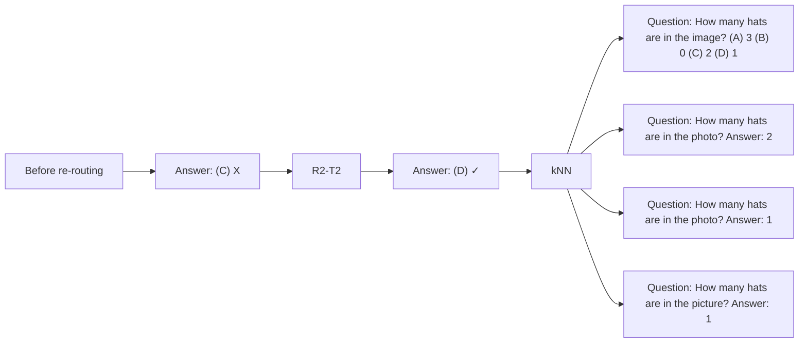
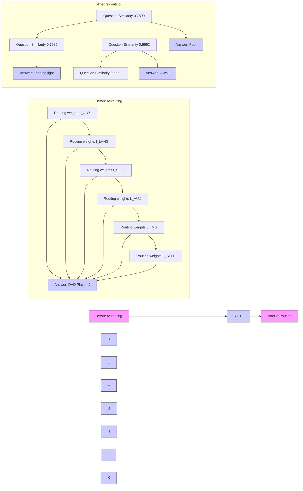
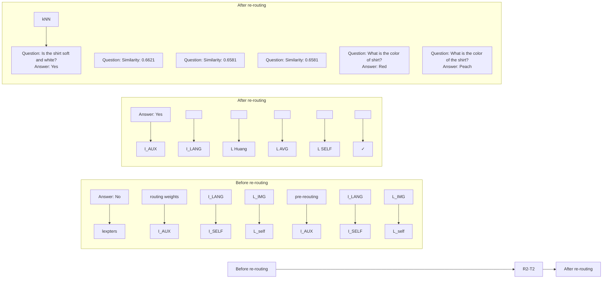
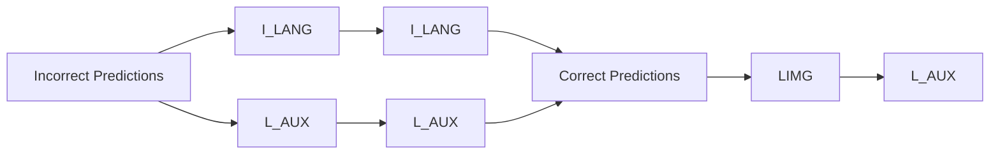
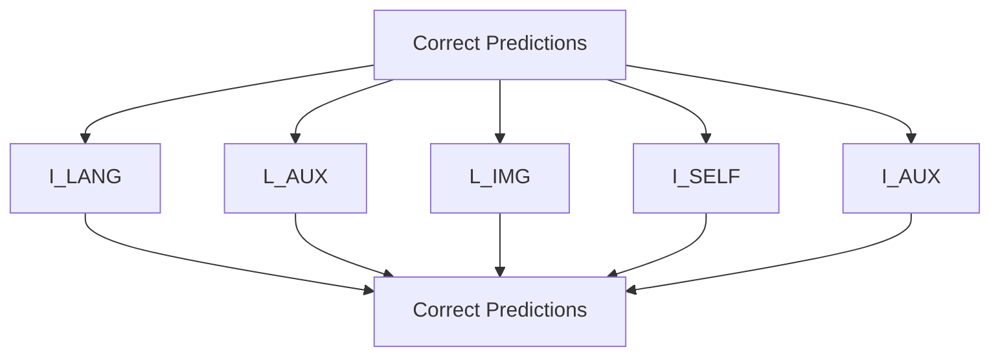
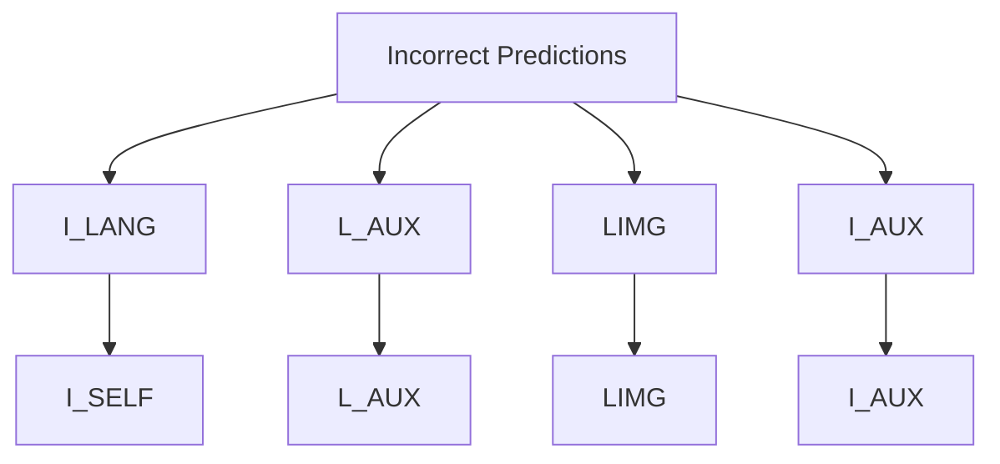

# R2-T2: Re-Routing in Test-Time for Multimodal Mixture-of-Experts

# Zhongyang Li $^{1}$ Ziyue Li $^{2}$ Tianyi Zhou $^{2}$

$^{1}$ Johns Hopkins University; $^{2}$ University of Maryland, College Park zli300@jh.edu, {litzy619,tianyi}@umd.edu Project: https://github.com/tianyi-lab/R2-T2

# Abstract

In large multimodal models (LMMs), the perception of non-language modalities (e.g., visual representations) is usually not on par with the large language models (LLMs)' powerful reasoning capabilities, deterring LMMs' performance on challenging downstream tasks. This weakness has been recently mitigated by replacing the vision encoder with a mixture-of-experts (MoE), which provides rich, multi-granularity, and diverse representations required by diverse downstream tasks. The performance of multimodal MoE largely depends on its router, which reweights and mixes the representations of different experts for each input. However, we find that the end-to-end trained router does not always produce the optimal routing weights for every test sample. To bridge the gap, we propose a novel and efficient method "Re-Routing in Test-Time (R2-T2)" that locally optimizes the vector of routing weights in test-time by moving it toward those vectors of the correctly predicted samples in a neighborhood of the test sample. We propose three R2-T2 strategies with different optimization objectives and neighbor-search spaces. R2-T2 consistently and greatly improves state-of-the-art LMMs' performance on challenging benchmarks of diverse tasks, without training any base-model parameters.

# 1 Introduction

Mixture-of-Experts (MoE) have achieved remarkable success in scaling up the size and capacity of large language and multimodal models (LLMs and LMMs) (Shazeer et al., 2017) without (significantly) increasing the inference cost. Specifically, it allows us to increase the total number of experts, which provides finer-grained expertise and skills, yet selecting a constant number of experts for each input (Lepikhin et al., 2020). In MoE, the sparse selection of experts is achieved through a router, which determines

radar

| Category       | Value  |
| -------------- | ------ |
| R2-T2 (MoAI-7B) | 88.3   |
| MoAI-7B        | 83.5   |
| LLaVA-NeXT-13B  | 1714.0 |
| Mini-Gemini-HD-8B | 65.8   |
| Improvement by R2-T2 | 1567.4 |

Figure 1. R2-T2 applied to MoAI-7B compared against 7/8/13B VLMs on 9 benchmarks. R2-T2 significantly enhances performance of the 7B base MoE model, surpassing a recent 13B VLM.

the weight of each candidate expert based on the input so only experts with nonzero weights are selected (Fedus et al., 2022). MoE then aggregates the outputs of the selected experts according to their weights. Hence, the router and its produced routing weights play important roles in MoE's inference cost and output quality.

As the most widely studied LMM, many vision language models (VLM) adopt an architecture composed of a vision encoder and an LLM (Zhu et al., 2023), which are both pre-trained and then aligned by further finetuning so the LLM can include the vision encoder's output in its input as additional tokens. The alignment is usually obtained through a lightweight projection layer or Q-former (a Transformer model) converting the vision encoder's output to LLM tokens. Despite the broad usage of this architecture, the capability of a vision encoder is usually much more limited than the LLMs (i.e., the “modality imbalance”) (Schrodi et al., 2024). So the visual features cannot cover all the information required by different reasoning tasks performed by LLMs. Moreover, the alignment module may lead to

natural_image

Tennis player mid-swing on a grass field with spectators watching in the background (no visible text or symbols)

Question:   
Considering the relative positions of the chair (annotated by the red box) and the tennis racket in the image provided, where is the chair (annotated by the red box) located with respect to the tennis racket? Select from the following choices. (A) above (B) below

bar

| Question | Similarity |
| -------- | ---------- |
| brown    | 0.4469     |
| red      | 0.4220     |
| light gray | 0.4150   |

Figure 2. An example of how R2-T2 optimizes the routing weights. Given the test sample, it finds kNN in the reference set of correctly predicted samples with similar questions. In the example, the test sample requires reasoning about positional relationships. R2-T2 identifies relevant kNN samples, adjusting the top-1 expert from $I_{LANG}$ (aligning visual features with language) to $I_{AUX}$ (aligning visual features with auxiliary computer vision features). This expert shift is crucial in correcting the initial wrong answer.

an information bottleneck from the visual perception to the reasoning (Yao et al., 2024).

Recent advances in LMMs replace a single vision encoder with a mixture of encoders (Lin et al., 2024; Lee et al., 2025; Zong et al., 2024; Shi et al., 2024), which turns out to be an effective and low-cost approach to mitigate modality imbalance and alignment bottleneck. In multimodal MoE, each expert is an encoder or a mixer of sensory inputs that focuses on a specific type of features, e.g., object classes, text in images, spatial relations, dense captions, segmentation, etc., so the LLM can select the information acquired by any given downstream task from the concatenated or fused features from the MoE, through a router that is trained in an end-to-end manner to produce the weights of all the experts adaptive to the input task.

Although multimodal MoE achieves remarkable success in enhancing the performance of existing LMMs, the choice of experts or the routing weights for individual instances are not always optimal due to the limitations of the router's design and the diversity of potential downstream tasks compared to the tasks used to train the router. The suboptimality of routing substantially limits the performance and generalization of multimodal MoE on unseen tasks. As illustrated in Figure 2, the base model initially selects a sub-optimal expert (e.g., $\mathbf{I}_{\mathrm{LANG}}$ ) for a spatial reasoning task, leading to incorrect predictions. This has been verified on recent multimodal MoE models. As shown in Table 2, compared to the original routing weights of base models, the optimal (oracle) routing weights improve the accuracy by $\geq 10\%$ on most evaluated LMM benchmarks. To avoid the expensive cost of re-training a router on a much larger dataset, in this paper, we investigate how to improve the routing weights in test-time without training any model parameters.

Since routing weights encode the choices of experts with essential knowledge and key skills acquired by the input task, and motivated by the assumption that knowledge and skills are usually transferable across different tasks, we posit that the routing weights of successful tasks can provide critical clues for optimizing the routing weights of a new task. Specifically, we leverage the similarity in a task embedding space, which may reflect the knowledge or skill sharing between tasks, and modify the routing weight vector of a test task by imitating its nearby successful tasks. While the task embedding space, optimization objective, and the number of update steps can vary and their design choices may result in different performances, this innovative mechanism of optimizing routing weights or “re-routing” in test-time (R2-T2) focuses on correcting the mistakes made by the routers in existing multimodal MoE, e.g., extracting object detection features for a task mainly depending on the text information in an input image, and thus turns various failed cases into success. Rather than finetuning the whole model, R2-T2 is training-free and aims to maximize the potential of MoE in the reasoning tasks by LMMs.

Following the above idea, we explored several novel strategies for test-time routing weight optimization. They all modify the routing weights of a test task/sample based on a representative set of tasks/samples on which the multimodal MoE achieves correct or high-quality outputs. While the oracle routing weights are achieved by minimizing the test sample's loss, for a practical approach, we propose to replace the oracle loss with a surrogate, i.e., a weighted

average of losses of nearby reference samples, and apply multiple steps of “neighborhood gradient descent (NGD)” to minimize the surrogate. In addition, we investigate kernel regression and mode finding, which do not require gradient descent. The former moves the routing weights to a kernel-weighted sum of nearby reference tasks’ routing weights in a task embedding space, while the latter moves the routing weights to the nearest mode on the distribution of reference tasks’ routing weights. Evaluating these strategies on two recent multimodal MoE models across eight challenging benchmarks, we find that R2-T2 significantly outperforms models twice its size, as shown in Figure 1. Our analysis reveals that NGD progressively refines routing, increasing correct predictions while mitigating the original router’s over-reliance on a single expert. Case studies confirm that test-time re-routing enhances domain-specific reasoning, demonstrating R2-T2’s ability to adapt multimodal MoE models without additional training, unlocking greater generalization and robustness.

Our main contributions can be summarized below:

- We proposed a novel problem of R2-T2 that bridges a significant performance gap on multimodal MoE.   
- We developed three practical R2-T2 strategies that shed several critical insights into expert re-routing.   
- Our R2-T2 considerably advances the performance of multimodal MoE on several recent benchmarks of challenging tasks for LMMs.

# 2 Related Work

Large Multimodel Models has emerged as a powerful paradigm for integrating language and non-language modalities, such as images (Radford et al., 2021), audio (Ao et al., 2021), and video (Zellers et al., 2021), to perform complex reasoning tasks. Recent advancements have been driven by the fusion of pretrained LLMs with multimodal encoders (Peng et al., 2023; Tsimpoukelli et al., 2021; Alayrac et al., 2022), enabling the models to process and generate cross-modal content effectively. Works such as Flamingo (Alayrac et al., 2022) and BLIP-2 (Li et al., 2023a) demonstrated the potential of aligning vision and language modalities through carefully designed bridging modules. However, these models often fall short in richness or alignment with the reasoning capabilities of LLMs (Bubeck et al., 2023; Bommasani et al., 2021). To address this, techniques have been proposed, such as contrastive pretraining (Radford et al., 2021; Yuan et al., 2021) and feature fusion mechanisms (Lu et al., 2019). Yet, efficiently capturing diverse modal interactions across different tasks remains a bottleneck (Baltrušaitis et al., 2018), highlighting the need for more adaptive mechanisms in multimodal reasoning.

Mixture-of-Experts has become a prominent architectural choice to enhance the scalability and efficiency of large-scale neural networks (Shazeer et al., 2017). By dynamically selecting a subset of specialized expert modules for each input (Li et al., 2023b), MoE reduces computational overhead while maintaining high expressive power (Shazeer et al., 2017; Zoph et al., 2022). In the context of LLMs, MoE has been shown to improve both training efficiency and generalization across tasks (Artetxe & Schwenk, 2019). Works such as Switch Transformers (Fedus et al., 2022) and GShard (Lepikhin et al., 2020) have demonstrated the effectiveness of MoE in scaling up model capacity without prohibitive increases in training costs. In multimodal settings, MoE has been explored to address the modality alignment problem (Goyal et al., 2021), where different experts handle distinct modalities or specific tasks. However, the optimal utilization of experts heavily relies on the effectiveness of routing mechanisms, which remains an active area of research.

Routers and Routing Strategies are the cornerstone of any MoE-based architecture, responsible for determining which experts are activated for each input (Li & Zhou, 2024). Traditional routers, such as softmax gating functions (Shazeer et al., 2017), compute a weighted combination of experts based on input embeddings. Despite their simplicity, these routing strategies often face challenges in achieving optimal expert assignment (Lepikhin et al., 2020; Zoph et al., 2022), particularly in unseen or highly diverse test scenarios. Recent works have proposed advanced routing strategies, including routing via reinforcement learning (Rosenbaum et al., 2017), early-exit (Li et al., 2023c), and task-specific allocation (Shi et al., 2024). However, these approaches typically focus on training-time optimization, leaving test-time adaptability largely unexplored. R2-T2 introduces an efficient method to refine routing weights dynamically during inference, ensuring better alignment with task-specific requirements and improving overall model robustness across diverse multimodal benchmarks.

Test-Time Optimization has been explored by adapting models dynamically during inference to improve generalization. For example, (Wang et al., 2022) propose test-time adaptation, which fine-tunes model parameters on test data distributions using entropy minimization or self-supervised learning. Similarly, (Sun et al., 2020) introduce test-time training, where models are updated via auxiliary tasks (e.g., rotation prediction) during inference. However, these methods require modifying the base model's parameters, leading to significant computational overhead and potential instability when deployed on resource-constrained systems. Unlike prior test-time optimization methods that update model weights, R2-T2 solely optimizes the routing weights of a frozen MoE model without retraining any model parameters.

  
- Routing weights of neighbors   
- Routing weights of the test sample in re-routing   
★ Routing weights after re-routing   
→ Neighbors' gradient descent direction   
→ Re-routing direction   
- Weighted average of neighbors' routing weights

Figure 3. Illustration of R2-T2' test-time re-routing mechanism with three strategies. (a) Neighborhood Gradient Descent: Optimizes $r$ using gradients derived from neighbors' loss functions ( $\nabla_r l_1$ , $\nabla_r l_2$ , and $\nabla_r l_3$ for the 3 nearest neighbors), weighted by their similarity to the test sample. (b) Kernel Regression: Estimates $r$ as a weighted average of neighbors' routing weights ( $\hat{r}$ ), and further optimizes it through binary search between $\hat{r}$ and initial weights $r$ to find the optimal coefficient $\alpha$ . (c) Mode Finding: Iteratively updates $r$ through weighted interpolation between current weights and the local average $\bar{r}$ in routing weight space, shifting towards the densest region.

# 3 Test-Time Re-Routing

MoE trains a router to reweight experts for each input. However, such an end-to-end trained router may not always produce optimal weights for challenging or out-of-distribution samples at test-time, whereas sub-optimal weights can drastically degrade the performance of MoE on diverse downstream tasks. The importance of routing weights has been broadly demonstrated on eight benchmarks in our experiments: The large performance gap between the base model (using the router's routing weights) and the oracle (using the optimal routing weights) in Table 2 implies the potential merits of optimizing the routing weights in the test-time.

To address this problem, Test-Time Re-Routing (R2-T2) introduces a dynamic test-time re-routing mechanism that adapts the routing weights for each test sample based on similar samples in a reference set—a set of samples on which the MoE's outputs are correct or preferred. Specifically, given a reference set of n samples $\{(x_{i}, y_{i})\}_{i=1}^{n}$ and their corresponding routing weights $\{r_{i}\}_{i=1}^{n}$ , on which the model makes correct prediction (i.e., $f(x_{i}, r_{i}) = y_{i}$ ), for a new test sample x, the goal of R2-T2 is to find a better routing weight vector r for x that leads to a more accurate and higher-quality output $f(x, r)$ .

In the following, we will introduce three core strategies, illustrated in Figure 3, to optimize r based on the neighbors of x in the reference set, i.e., $\mathcal{N}(x)$ , according to a similarity metric. These strategies are developed with different optimization objectives (e.g., loss surrogate, regression, mode finetuning, etc.) and neighbor-search spaces (e.g., routing weights, task embedding, etc.). While the first is gradient-based, the other two are gradient-free, offering more flexible options for different setups and computational budgets.

# 3.1 Gradient Descent

The gradient descent method uses the gradient of an objective function $L(r)$ to update r for multiple steps until convergence or when certain stopping criteria have been fulfilled. In every step, we apply

$$
r \leftarrow r - \lambda \nabla_ {r} L (r), \tag {1}
$$

where $\lambda$ is a learning rate determined by a scheduler. We discuss the two choices of $L(r)$ in the following.

Oracle (upper bound) assumes that we know the ground truth label y for x, which is a cheating setting that can provide an upper bound of the gradient descent method. In this setting,

$$
L (r) = \ell [ f (x, r), y ], \tag {2}
$$

where $\ell[\cdot,\cdot]$ is the loss function (e.g., cross-entropy or L2 loss) measuring the discrepancy between the model output $f(x,r)$ and the ground truth y. Although this is not applicable in real scenarios, it serves as a performance ceiling to reveal the degradation caused by sub-optimal routing weights and evaluate the effectiveness of other methods.

Neighborhood Gradient Descent (NGD) is a practical approach that uses the loss functions of the nearest neighbors of x in the reference set to estimate the gradient of r, i.e.,

$$
L (r) = \frac {\sum_ {i \in \mathcal {N} (x)} K (x _ {i} , x) \times \ell [ f (x _ {i} , r) , y _ {i} ]}{\sum_ {i \in \mathcal {N} (x)} K (x _ {i} , x)} \tag {3}
$$

By incorporating loss information from the neighborhood of x, NGD enables a label-free, test-time adaptation mechanism. This effectively aligns r with the successful routing patterns in the reference set. This ensures that r exploits the routing for relevant reference examples without requiring access to the oracle loss.

# 3.2 Kernel Regression

Kernel regression predicts r by the weighted average of the neighbors' routing weights $\{r_{i}\}_{i\in\mathcal{N}(x)}$ , i.e.,

$$
\hat {r} \triangleq \frac {\sum_ {i \in \mathcal {N} (x)} K (x _ {i} , x) \cdot r _ {i}}{\sum_ {i \in \mathcal {N} (x)} K (x _ {i} , x)}, \tag {4}
$$

where $K(\cdot,\cdot)$ is a kernel function, e.g., Gaussian kernel, Matern kernel, etc. In the experiments, we found that directly setting $r \leftarrow \hat{r}$ already brings non-trivial improvement.

However, $\hat{r}$ does not take the router-produced initial r into account and may not fully capture the nuanced dependencies required for optimal performance. To further optimize r, we conduct a binary search on the straight line between r and $\hat{r}$ :

$$
r \leftarrow \alpha r + (1 - \alpha) \hat {r}. \tag {5}
$$

The search goal is to find the optimal $\alpha$ minimizing the objective $L(r)$ , i.e.,

$$
\alpha^ {*} \in \arg \min _ {\alpha} L (\alpha r + (1 - \alpha) \hat {r}). \tag {6}
$$

This refinement step balances the kernel regression estimate with the router's original routing weights. It includes $\hat{r}$ as a special case (when $\alpha = 0$ ) and can further enhance the accuracy and robustness of the model's predictions.

# 3.3 Mode Finding (Meanshift)

Mode finding aims to move $r$ towards the highest density region of the distribution $p(r)$ for the reference routing weights $\{r_i\}_{i=1}^n$ . It applies the following update for multiple steps until convergence.

$$
r \leftarrow \alpha r + (1 - \alpha) \bar {r}, \tag {7}
$$

where $\alpha$ controls the step size and $\bar{r}$ the weighted average routing weights defined below (different from $\hat{r}$ ).

$$
\bar {r} \triangleq \frac {\sum_ {i \in \mathcal {N} (r)} K (r _ {i} , r) \cdot r _ {i}}{\sum_ {i \in \mathcal {N} (r)} K (r _ {i} , r)}. \tag {8}
$$

Unlike kernel regression, mode finding identifies the densest region in the routing weight space (so the kernel $K(\cdot,\cdot)$ and neighborhood $\mathcal{N}(\cdot)$ are applied to r instead of x), representing the most consistent configurations among nearby reference samples. This makes it effective for capturing the dominating patterns in the local distribution of routing weights.

# 3.4 Neighborhood and Embedding Space

Neighborhood The choices of neighborhood definition and the embedding space in which to apply the kernels are important to the final performance. For the former, we can use either kNN or $\epsilon$ -ball, i.e.,

$$
\mathcal {N} (x) \triangleq \arg \min _ {A \subseteq 2 ^ {n}, | A | \leq k} \sum_ {i \in A} d (x _ {i}, x), \tag {9}
$$

$$
\mathcal {N} (x) \triangleq \{i \in [ n ]: d (x _ {i}, x) \leq \epsilon \}, \tag {10}
$$

Embedding Instead of directly applying an existing kernel function $K(\cdot,\cdot)$ and a distance metric $d(\cdot,\cdot)$ to the raw inputs $x_{i}$ and x, we can replace x and $x_{i}$ with their embedding $E(x)$ and $E(x_{i})$ , where $E(\cdot)$ is a pre-trained embedding model applied to the task description of each sample.

Table 1. Summary of reference and evaluation benchmarks. If the reference dataset contains more than 5,000 samples, we randomly select 5,000 to ensure balanced evaluation. 

<table><tr><td>Task Type</td><td>Reference</td><td>Size</td><td>Evaluation</td><td>Size</td></tr><tr><td rowspan="4">General Visual Understanding</td><td>VQA-V2</td><td>5,000</td><td>MMBench</td><td>2,374</td></tr><tr><td>Visual7W</td><td>5,000</td><td>MME-P</td><td>2,114</td></tr><tr><td>COCO-QA</td><td>5,000</td><td>CVBench $^{2D/3D}$ </td><td>2,638</td></tr><tr><td>CLEVR</td><td>5,000</td><td>GQA</td><td>1,590</td></tr><tr><td rowspan="3">Knowledge-Based Reasoning</td><td>A-OKVQA</td><td>5,000</td><td>SQA-IMG</td><td>2,017</td></tr><tr><td>TQA</td><td>5,000</td><td>AI2D</td><td>3,087</td></tr><tr><td>MathVista</td><td>5,000</td><td>PhysBench</td><td>2,093</td></tr><tr><td rowspan="2">Optical Character Recognition</td><td>ST-VQA</td><td>5,000</td><td>TextVQA</td><td>5,734</td></tr><tr><td>DocVQA</td><td>5,000</td><td></td><td></td></tr></table>

# 4 Experiments

# 4.1 Experimental Setting

Models We evaluate two multimodal MoE models: MoAI (Lee et al., 2025) and MoVA (Zong et al., 2024), each leveraging specialized experts for vision-language tasks. MoAI has six experts: (1) Visual Experts process auxiliary CV features ( $I_{AUX}$ ), align visuals with language ( $I_{LANG}$ ), and capture spatial relationships ( $I_{SELF}$ ); (2) Language Experts integrate external knowledge ( $L_{AUX}$ ), link language to visuals ( $L_{IMG}$ ), and maintain coherence ( $L_{SELF}$ ). Further details about MoAI experts are provided in Appendix A. MoVA includes seven experts, incorporating SAM (Zou et al., 2024) to enhance the vision encoder with specialized knowledge.

Reference datasets and evaluation benchmarks Our evaluation covers three task categories: general visual understanding, knowledge-based reasoning, and optical character recognition. Table 1 summarizes the reference datasets and evaluation benchmarks, including their dataset sizes. See Appendix B for details.

Evaluations We adopt standard evaluation protocols for each benchmark. For MME-P, performance is assessed using two metrics:(1) Accuracy, measuring the correctness of a single question per image, and (2) Accuracy+, requiring both questions per image to be answered correctly. The final score is the sum of these two metrics, with a maximum of 2,000 (Fu et al., 2024). For other benchmarks, accuracy is the primary metric (Yin et al.,

Table 2. Comparison of three R2-T2 methods (kNN with k = 5) applied to MoVA and MoAI (base models), with Accuracy (%) reported $^{1}$ . Oracle has access to the ground truths and provides an upper bound. NGD significantly improves base models and performs the best. 

<table><tr><td>Method</td><td>MMBench</td><td>MME-P</td><td>SQA-IMG</td><td>AI2D</td><td>TextVQA</td><td>GQA</td><td> $CVBench^{2D}$ </td><td> $CVBench^{3D}$ </td><td>PhysBench</td></tr><tr><td>MoVA (base model)</td><td>74.3</td><td>1579.2</td><td>74.4</td><td>74.9</td><td>76.4</td><td>64.8</td><td>61.6</td><td>62.3</td><td>32.6</td></tr><tr><td>Mode Finding</td><td>75.2</td><td>1587.1</td><td>74.9</td><td>75.8</td><td>77.3</td><td>65.7</td><td>62.5</td><td>63.2</td><td>33.5</td></tr><tr><td>Kernel Regression</td><td>77.9</td><td>1610.6</td><td>76.4</td><td>78.5</td><td>79.9</td><td>68.3</td><td>65.2</td><td>65.9</td><td>35.7</td></tr><tr><td>NGD</td><td>81.2</td><td>1645.3</td><td>79.1</td><td>81.8</td><td>83.2</td><td>71.5</td><td>68.3</td><td>68.9</td><td>37.8</td></tr><tr><td>Oracle (upper bound)</td><td>87.6</td><td>1735.4</td><td>87.3</td><td>88.4</td><td>89.5</td><td>76.2</td><td>72.5</td><td>73.2</td><td>47.5</td></tr><tr><td>MoAI (base model)</td><td>79.3</td><td>1714.0</td><td>83.5</td><td>78.6</td><td>67.8</td><td>70.2</td><td>71.2</td><td>59.3</td><td>39.1</td></tr><tr><td>Mode Finding</td><td>80.8</td><td>1725.2</td><td>84.1</td><td>79.8</td><td>66.5</td><td>71.4</td><td>70.0</td><td>60.1</td><td>40.2</td></tr><tr><td>Kernel Regression</td><td>83.7</td><td>1756.7</td><td>86.2</td><td>82.6</td><td>71.2</td><td>74.5</td><td>74.6</td><td>64.5</td><td>42.8</td></tr><tr><td>NGD</td><td>85.2</td><td>1785.5</td><td>88.3</td><td>85.0</td><td>73.5</td><td>77.0</td><td>77.9</td><td>69.2</td><td>44.7</td></tr><tr><td>Oracle (upper bound)</td><td>92.1</td><td>1860.2</td><td>93.8</td><td>91.2</td><td>79.6</td><td>83.2</td><td>84.0</td><td>76.8</td><td>54.5</td></tr></table>

2023). We compute the mean score across benchmarks as $\frac{1}{\#benchmark}\left(S_{\text{total}} + S_{\text{mmp-e}}\right)$ , where $S_{total}$ is the sum of all benchmark scores except MME-P, and $S_{mmp-e}$ is the normalized MME-P score.

Baselines R2-T2 introduces test-time re-routing, a problem not addressed in prior work. To assess its effectiveness, we compare it against multiple R2-T2 variants and base models. Additionally, we benchmark R2-T2 against state-of-the-art VLMs across scales, as shown in Table 3.

We use fixed hyperparameters across all benchmarks without per-task tuning, determined via experiments on small-scale benchmarks independent of our evaluation datasets. See Appendix C for details.

# 4.2 Main Results

Comparison of different R2-T2 methods Tables 2 summarizes the performance of R2-T2 methods on the MoVA and MoAI models across eight benchmarks. Among all evaluated methods, kNN Neighborhood Gradient Descent (NGD) emerges as the most effective, delivering significant improvements over the pretrained base models. For MoAI-7B, R2-T2 enhances performance significantly, achieving +6.9% on MMBench, a +66.1-point increase on MME-P, and a +6.8% gain on TextVQA. Similarly, on MoVA-7B, it yields notable improvements of +5.9% on MMBench, +71.5 points on MME-P, and +5.7% on TextVQA. These consistent gains across diverse benchmarks highlight the ability of R2-T2 to optimize routing weights effectively, enabling better utilization of expert modules for improved model performance. Notably, kNN NGD achieves results close to the Oracle upper bound, which relies on ground truth labels during test-time and is thus infeasible in practice. Our method, without accessing labels, captures 70–80% of the potential improvement, demonstrating its effectiveness.

Comparison with state-of-the-art VLMs In Table 3, we compare our approach with state-of-the-art VLMs of various sizes (7B, 8B, 13B, 34B) across benchmarks. When applied to the pretrained MoVA-7B—which initially lags behind larger models—R2-T2 achieves substantial performance gains and outperforms 7/8/13/34 competitors across most benchmarks through effective test-time re-routing. In addition, applying R2-T2 to MoAI-7B results in a significant performance boost, establishing it as highly competitive against larger models. Notably, for PhysBench, which contains both video and image tests, our results reflect only the image-only evaluation. R2-T2(MoAI-7B) ranks second in the image-only leaderboard of PhysBench. These results highlight the effectiveness of R2-T2 in unlocking the potential of smaller models, enabling them to match or even surpass the performance of significantly larger VLMs.

Inference efficiency trade-off While R2-T2 introduces additional operations beyond the base model's inference pipeline, it achieves near-oracle performance with moderate computational overhead (Table 4). To ensure hardware-independent comparison, we measure computational costs in FLOPs. The base model requires 9.9T FLOPs per case. Mode finding adds only 1.8T FLOPs, leading to a 1.5% accuracy gain. Kernel regression and R2-T2 require 6–7× more FLOPs due to loss computations over five neighbors, yet R2-T2 (kNN, NGD) achieves the highest accuracy improvement (+5.9%) while maintaining competitive efficiency.

# 4.3 Ablation Study

We analyze how each component contributes to the performance and robustness of kNN NGD, with all studies conducted on MoAI. Results are averaged across 8 test benchmarks detailed in Section 4.1, with individual results and further analysis provided in Appendix D.1.

Neighborhood selection compare two strategies: $\epsilon$ -ball (radius $\epsilon = 0.2$ to 0.8) and kNN (k = 3 to 20), as shown in Table 5. The results demonstrate that kNN with k = 5 consistently achieves better performance across most tasks, outperforming both smaller neighborhoods that may lack sufficient context and larger ones that could introduce noise. While $\epsilon$ -ball shows stable performance across different radius, it suffers from inherent limitations: a fixed radius

Table 3. Comparison of R2-T2 (kNN, NGD) with state-of-the-art vision-language models on nine benchmarks (higher the better). 

<table><tr><td>VLM</td><td>MMBench</td><td>MME-P</td><td>SQA-IMG</td><td>AI2D</td><td>TextVQA</td><td>GQA</td><td> $CVBench^{2D}$ </td><td> $CVBench^{3D}$ </td><td>PhysBench</td></tr><tr><td colspan="10">7B Models</td></tr><tr><td>InstructBLIP-7B (Dai et al., 2023)</td><td>36.0</td><td>-</td><td>60.5</td><td>-</td><td>50.1</td><td>56.7</td><td>-</td><td>-</td><td>23.8</td></tr><tr><td>Qwen-VL-7B (Bai et al., 2023)</td><td>38.2</td><td>-</td><td>67.1</td><td>62.3</td><td>63.8</td><td>59.4</td><td>-</td><td>-</td><td>-</td></tr><tr><td>Qwen-VL-Chat-7B (Bai et al., 2023)</td><td>60.6</td><td>1488.0</td><td>68.2</td><td>57.7</td><td>61.5</td><td>-</td><td>-</td><td>-</td><td>35.6</td></tr><tr><td>mPLUG-Owl-7B (Ye et al., 2023)</td><td>46.6</td><td>967.0</td><td>-</td><td>-</td><td>-</td><td>58.9</td><td>-</td><td>-</td><td>-</td></tr><tr><td>mPLUG-Owl2-7B (Ye et al., 2024)</td><td>64.5</td><td>1450.0</td><td>68.7</td><td>-</td><td>58.2</td><td>62.9</td><td>-</td><td>-</td><td>-</td></tr><tr><td>ShareGPT4V-7B (Chen et al., 2025)</td><td>68.8</td><td>1567.4</td><td>68.4</td><td>67.3</td><td>65.8</td><td>63.4</td><td>60.2</td><td>57.5</td><td>31.3</td></tr><tr><td colspan="10">8B Models</td></tr><tr><td>Mini-Gemini-HD-8B (Li et al., 2024)</td><td>72.7</td><td>1606.0</td><td>75.1</td><td>73.5</td><td>70.2</td><td>64.5</td><td>62.2</td><td>63.0</td><td>34.7</td></tr><tr><td>LLaVA-NeXT-8B (Liu et al., 2024)</td><td>72.1</td><td>1603.7</td><td>72.8</td><td>71.6</td><td>64.6</td><td>65.2</td><td>62.2</td><td>65.3</td><td>-</td></tr><tr><td>Cambrian1-8B (Tong et al., 2024)</td><td>75.9</td><td>1647.1</td><td>74.4</td><td>73.0</td><td>68.7</td><td>64.6</td><td>72.3</td><td>65.0</td><td>24.6</td></tr><tr><td colspan="10">13B Models</td></tr><tr><td>BLIP2-13B (Li et al., 2023a)</td><td>28.8</td><td>1294.0</td><td>61.0</td><td>-</td><td>42.5</td><td>-</td><td>-</td><td>-</td><td>38.6</td></tr><tr><td>InstructBLIP-13B (Dai et al., 2023)</td><td>39.1</td><td>1213.0</td><td>63.1</td><td>-</td><td>50.7</td><td>-</td><td>-</td><td>-</td><td>29.9</td></tr><tr><td>Mini-Gemini-HD-13B (Li et al., 2024)</td><td>68.6</td><td>1597.0</td><td>71.9</td><td>70.1</td><td>70.2</td><td>63.7</td><td>53.6</td><td>67.3</td><td>-</td></tr><tr><td>LLaVA-NeXT-13B (Liu et al., 2024)</td><td>70.0</td><td>1575.0</td><td>73.5</td><td>70.0</td><td>67.1</td><td>65.4</td><td>62.7</td><td>65.7</td><td>40.5</td></tr><tr><td>Cambrian1-13B (Tong et al., 2024)</td><td>75.7</td><td>1610.4</td><td>79.3</td><td>73.6</td><td>72.8</td><td>64.3</td><td>72.5</td><td>71.8</td><td>-</td></tr><tr><td colspan="10">34B Models</td></tr><tr><td>Mini-Gemini-HD-34B (Li et al., 2024)</td><td>80.6</td><td>1659.0</td><td>77.7</td><td>80.5</td><td>74.1</td><td>65.8</td><td>71.5</td><td>79.2</td><td>-</td></tr><tr><td>LLaVA-NeXT-34B (Liu et al., 2024)</td><td>79.3</td><td>1633.2</td><td>81.8</td><td>74.9</td><td>69.5</td><td>67.1</td><td>73.0</td><td>74.8</td><td>-</td></tr><tr><td>Cambrian1-34B (Tong et al., 2024)</td><td>81.4</td><td>1689.3</td><td>85.6</td><td>79.7</td><td>76.7</td><td>65.8</td><td>74.0</td><td>79.7</td><td>30.2</td></tr><tr><td colspan="10">Ours</td></tr><tr><td>MoVA-7B</td><td>74.3</td><td>1579.2</td><td>74.4</td><td>74.9</td><td>76.4</td><td>64.8</td><td>61.6</td><td>62.3</td><td>32.6</td></tr><tr><td>R2-T2 (MoVA-7B)</td><td>81.2</td><td>1645.3</td><td>79.1</td><td>81.8</td><td>83.2</td><td>71.5</td><td>68.3</td><td>68.9</td><td>37.8</td></tr><tr><td>MoAI-7B</td><td>79.3</td><td>1714</td><td>83.5</td><td>78.6</td><td>67.8</td><td>70.2</td><td>71.2</td><td>59.3</td><td>39.1</td></tr><tr><td>R2-T2 (MoAI-7B)</td><td>85.2</td><td>1785.5</td><td>88.3</td><td>85.0</td><td>73.5</td><td>77.0</td><td>77.9</td><td>69.2</td><td>44.7</td></tr></table>

Table 4. FLOPs of different methods (kNN with k = 5) on MM-Bench using MoAI-7B as the base model. 

<table><tr><td>Method</td><td>Inference steps</td><td>FLOPs (T) per case</td><td>Accuracy (%)</td></tr><tr><td>Base Model (MoAI-7B)</td><td>1</td><td>9.9</td><td>79.3</td></tr><tr><td>Mode Finding</td><td>10</td><td>10.7</td><td>80.8</td></tr><tr><td>Kernel Regression</td><td>10</td><td>61.9</td><td>83.7</td></tr><tr><td>R2-T2 (kNN, NGD)</td><td>10</td><td>67.5</td><td>85.2</td></tr><tr><td>Oracle (upper bound)</td><td>10</td><td>11.8</td><td>89.8</td></tr></table>

Table 5. Ablation study of R2-T2 (kNN, NGD) with different choices of neighborhood on MoAI. 

<table><tr><td colspan="2">ε-ball</td><td colspan="2">kNN</td></tr><tr><td>Parameter</td><td>Avg.</td><td>Parameter</td><td>Avg.</td></tr><tr><td> $\epsilon = 0.2$ </td><td>76.5</td><td> $k = 3$ </td><td>78.6</td></tr><tr><td> $\epsilon = 0.4$ </td><td>77.9</td><td> $k = 5$ </td><td>80.7</td></tr><tr><td> $\epsilon = 0.6$ </td><td>78.9</td><td> $k = 10$ </td><td>79.4</td></tr><tr><td> $\epsilon = 0.8$ </td><td>77.7</td><td> $k = 20$ </td><td>76.6</td></tr></table>

threshold may yield too few neighbors in sparse regions or excessive neighbors in dense regions, leading to inconsistent performance. The kNN approach provides more reliable and generally superior results. This suggests that maintaining a fixed number of neighbors not only ensures consistent computational cost but also provides sufficient information for effective test-time re-routing.

Kernel choice is critical for determining how similarity is modeled in high-dimensional spaces, which directly affects gradient updates in NGD. In Table 6, we compare four different kernel functions. The results consistently show that the Gaussian kernel outperforms other kernel functions across all tasks, with up to a 4.4% accuracy improvement over the linear kernel. Its superior performance may due to its ability to effectively capture similarity relationships in high-dimensional embedding spaces while being less affected by the curse of dimensionality (Cristianini, 2000).

Embedding model directly impacts the neighborhood quality, which in turn influences the gradient updates. In Table 7, we compare four embedding models. The results show that NV-Embed-V2 achieves consistent improvements of 3.2% over Sentence-Bert, indicating its ability to provide more discriminative feature representations that better capture semantic relationships between samples.

Gradient descent steps significantly affect both convergence and performance. Experiments with 5, 10, 20, and 50 steps assess the trade-off between cost and accuracy. As seen in Table 8, increasing the step count from 5 to 10 significantly improves performance (76.6 → 80.7), indicating that more iterations enhance optimization. Beyond 10 steps, performance saturates (80.5 at 20 steps, 80.7 at 50), suggesting diminishing returns. Thus, 10 steps offer the best balance between performance and efficiency.

# 4.4 Case Studies

Accuracy Transition Analysis Figure 5 illustrates the transition of predictions as NGD progresses over ten steps. During Step 0 to Step 4, 17.22% of incorrect predictions are corrected, and by Step 10, a total of 28.12% of incorrect predictions have been converted to correct ones. Meanwhile, only 2.31% correct predictions become incorrect through-

R2-T2: Re-Routing in Test-Time for Multimodal Mixture-of-Experts 

<table><tr><td>Kernel</td><td>Avg.</td><td>Embedding Model</td><td>Avg.</td><td>#Step</td><td>Avg.</td></tr><tr><td>Linear (Cortes, 1995)</td><td>76.3</td><td>Sentence-Bert (Reimers, 2019)</td><td>77.5</td><td>5</td><td>76.6</td></tr><tr><td>Polynomial (Cortes, 1995)</td><td>77.7</td><td>Stella-En-1.5B-V5 (Kusupati et al., 2022)</td><td>78.5</td><td>10</td><td>80.7</td></tr><tr><td>Matern (Williams &amp; Rasmussen, 2006)</td><td>78.7</td><td>Gte-Qwen2-7B (Li et al., 2023c)</td><td>78.7</td><td>20</td><td>80.5</td></tr><tr><td>Gaussian (Williams &amp; Rasmussen, 2006)</td><td>80.7</td><td>NV-Embed-V2 (Lee et al., 2024)</td><td>80.7</td><td>50</td><td>80.7</td></tr></table>

Figure 4. Top-1 expert transitions to correct/incorrect predictions on CVBench $^{2D/3D}$ after re-routing. The primary transitions to correct predictions in (a) include $I_{LANG}$ to $L_{IMG}$ , $L_{AUX}$ and $L_{AUX}$ . The primary transitions to incorrect predictions in (b) include $I_{LANG}$ to $I_{AUX}$ , $L_{IMG}$ and $L_{AUX}$ . R2-T2 considerably mitigates the modality imbalance of the base model.   

bar_stacked

| Step | Correct (%) | Incorrect (%) |
|---|---|---|
| 0 | 65.8 | 34.2 |
| 2 | 69.1 | 30.9 |
| 4 | 71.1 | 28.9 |
| 6 | 72.4 | 27.6 |
| 8 | 72.9 | 27.1 |
| 10 | 73.9 | 26.1 |
X - ✓ 10.83% ✓ - X 0.52%
X - ✓ 6.43% ✓ - X 0.34%
X - ✓ 4.78% ✓ - X 0.29%
X - ✓ 2.76% ✓ - X 0.81%
X - ✓ 3.39% ✓ - X 0.29%

Figure 5. Transition between correct and incorrect predictions on CVBench $^{2D/3D}$ during NGD steps of R2-T2 from Step 0 to 10. NGD keeps turning more incorrect predictions to correct.

out the optimization process. As the optimization converges in later steps, the routing weight changes become smaller, reducing the number of prediction shifts.

Expert Shift Patterns Figure 4 illustrates top-1 expert transitions before and after re-routing, where (a) shows transitions leading to correct predictions and (b) those leading to incorrect predictions. The original router over-relies on $I_{LANG}$ , limiting model adaptability. After re-routing, many samples shift from $I_{LANG}$ to $L_{IMG}$ , $I_{AUX}$ , and $L_{AUX}$ , leading to improved accuracy. This indicates that the pretrained router excessively favors $I_{LANG}$ , preventing optimal expert utilization. Notably, samples that were initially correct before re-routing exhibited a more balanced expert distribution, whereas those initially incorrect depended heavily on $I_{LANG}$ . After re-routing, expert distributions in both cases become more balanced, showing that R2-T2 effectively di-

versifies expert selection. Furthermore, transition patterns differ between correctly and incorrectly predicted samples. In correct cases (Figure 4 (a)), re-routing typically shifts $I_{LANG}$ to $L_{IMG}$ . In incorrect cases (Figure 4 (b)), transitions often involve $I_{LANG}$ to $L_{AUX}$ . This may indicate occasional mismatches in the re-weighted routing. Crucially, the number of cases shifting from correct to incorrect is significantly lower than those transitioning from incorrect to correct. The overall improvements outweigh potential misclassifications, validating R2-T2 as an effective optimization strategy.

Example Case: Spatial Reasoning Improvement Figure 2 demonstrates how R2-T2 rectifies a spatial reasoning failure. The test question asks, “where is the chair located with respect to the tennis racket?”. Initially, the model selects $I_{LANG}$ (language-aligned visual expert), which prioritizes textual alignment but fails to capture positional relationships. R2-T2 addresses this by retrieving nearest neighbors from the reference set with similar spatial queries. By dynamically adjusting routing weights, R2-T2 elevates $I_{AUX}$ to the top-1 position. $I_{AUX}$ integrates features from open-world object detection (Lee et al., 2025; Minderer et al., 2023), enabling a more precise interpretation of spatial layouts.

Additional transition pattern cases and details are provided in Appendix D.2 and E for further insights.

# 5 Conclusions

We introduce R2-T2, a novel test-time re-routing method that enhances multimodal Mixture-of-Experts (MoE) mod-

els without additional training. By dynamically adjusting routing weights based on reference samples, R2-T2 corrects suboptimal expert selection, improving model generalization. We propose and evaluate three strategies—Neighborhood Gradient Descent, Kernel Regression, and Mode Finding—demonstrating their effectiveness across multiple multimodal benchmarks. R2-T2 consistently outperforms the base MoE model and rivals oracle-based optimization methods, highlighting the potential of test-time adaptation for more efficient and adaptive expert utilization.

# References

Alayrac, J.-B., Donahue, J., Luc, P., Miech, A., Barr, I., Hasson, Y., Lenc, K., Mensch, A., Millican, K., Reynolds, M., et al. Flamingo: a visual language model for few-shot learning. Advances in neural information processing systems, 35:23716–23736, 2022.   
Ao, J., Wang, R., Zhou, L., Wang, C., Ren, S., Wu, Y., Liu, S., Ko, T., Li, Q., Zhang, Y., et al. Speecht5: Unified-modal encoder-decoder pre-training for spoken language processing. arXiv preprint arXiv:2110.07205, 2021.   
Artetxe, M. and Schwenk, H. Massively multilingual sentence embeddings for zero-shot cross-lingual transfer and beyond. Transactions of the association for computational linguistics, 7:597–610, 2019.   
Bai, J., Bai, S., Yang, S., Wang, S., Tan, S., Wang, P., Lin, J., Zhou, C., and Zhou, J. Qwen-vl: A versatile vision-language model for understanding, localization, text reading, and beyond. arXiv preprint arXiv:2308.12966, 1(2):3, 2023.   
Baltrušaitis, T., Ahuja, C., and Morency, L.-P. Multimodal machine learning: A survey and taxonomy. IEEE transactions on pattern analysis and machine intelligence, 41(2):423–443, 2018.   
Biten, A. F., Tito, R., Mafla, A., Gomez, L., Rusinol, M., Valveny, E., Jawahar, C., and Karatzas, D. Scene text visual question answering. In Proceedings of the IEEE/CVF international conference on computer vision, pp. 4291–4301, 2019.   
Bommasani, R., Hudson, D. A., Adeli, E., Altman, R., Arora, S., von Arx, S., Bernstein, M. S., Bohg, J., Bosselut, A., Brunskill, E., et al. On the opportunities and risks of foundation models. arXiv preprint arXiv:2108.07258, 2021.   
Bubeck, S., Chandrasekaran, V., Eldan, R., Gehrke, J., Horvitz, E., Kamar, E., Lee, P., Lee, Y. T., Li, Y., Lundberg, S., et al. Sparks of artificial general intelligence: Early experiments with gpt-4. arXiv preprint arXiv:2303.12712, 2023.

Chen, L., Li, J., Dong, X., Zhang, P., He, C., Wang, J., Zhao, F., and Lin, D. Sharegpt4v: Improving large multi-modal models with better captions. In European Conference on Computer Vision, pp. 370–387. Springer, 2025.

Cheng, B., Misra, I., Schwing, A. G., Kirillov, A., and Girdhar, R. Masked-attention mask transformer for universal image segmentation. In Proceedings of the IEEE/CVF conference on computer vision and pattern recognition, pp. 1290–1299, 2022.

Chow, W., Mao, J., Li, B., Seita, D., Guizilini, V., and Wang, Y. Physbench: Benchmarking and enhancing vision-language models for physical world understanding. arXiv preprint arXiv:2501.16411, 2025.

Cortes, C. Support-vector networks. Machine Learning, 1995.

Cristianini, N. An introduction to support vector machines and other kernel-based learning methods. Cambridge University Press, 2000.

Dai, W., Li, J., Li, D., Tiong, A., Zhao, J., Wang, W., Li, B., Fung, P., and Hoi, S. Instructblip: Towards general-purpose vision-language models with instruction tuning. arxiv 2023. arXiv preprint arXiv:2305.06500, 2, 2023.

Du, Y., Li, C., Guo, R., Cui, C., Liu, W., Zhou, J., Lu, B., Yang, Y., Liu, Q., Hu, X., et al. Pp-ocrv2: Bag of tricks for ultra lightweight ocr system. arXiv preprint arXiv:2109.03144, 2021.

Fedus, W., Zoph, B., and Shazeer, N. Switch transformers: Scaling to trillion parameter models with simple and efficient sparsity. Journal of Machine Learning Research, 23(120):1–39, 2022.

Fu, C., Chen, P., Shen, Y., Qin, Y., Zhang, M., Lin, X., Yang, J., Zheng, X., Li, K., Sun, X., Wu, Y., and Ji, R. Mme: A comprehensive evaluation benchmark for multimodal large language models, 2024. URL https://arxiv.org/abs/2306.13394.

Goyal, A., Didolkar, A., Lamb, A., Badola, K., Ke, N. R., Rahaman, N., Binas, J., Blundell, C., Mozer, M., and Bengio, Y. Coordination among neural modules through a shared global workspace. arXiv preprint arXiv:2103.01197, 2021.

Goyal, Y., Khot, T., Summers-Stay, D., Batra, D., and Parikh, D. Making the v in vqa matter: Elevating the role of image understanding in visual question answering. In Proceedings of the IEEE conference on computer vision and pattern recognition, pp. 6904–6913, 2017.

Hudson, D. A. and Manning, C. D. Gqa: A new dataset for real-world visual reasoning and compositional question

answering. In Proceedings of the IEEE/CVF conference on computer vision and pattern recognition, pp. 6700–6709, 2019.   
Johnson, J., Hariharan, B., Van Der Maaten, L., Fei-Fei, L., Lawrence Zitnick, C., and Girshick, R. Clevr: A diagnostic dataset for compositional language and elementary visual reasoning. In Proceedings of the IEEE conference on computer vision and pattern recognition, pp. 2901–2910, 2017.   
Kembhavi, A., Salvato, M., Kolve, E., Seo, M., Hajishirzi, H., and Farhadi, A. A diagram is worth a dozen images. In Computer Vision–ECCV 2016: 14th European Conference, Amsterdam, The Netherlands, October 11–14, 2016, Proceedings, Part IV 14, pp. 235–251. Springer, 2016.   
Kembhavi, A., Seo, M., Schwenk, D., Choi, J., Farhadi, A., and Hajishirzi, H. Are you smarter than a sixth grader? textbook question answering for multimodal machine comprehension. In Proceedings of the IEEE Conference on Computer Vision and Pattern recognition, pp. 4999–5007, 2017.   
Kusupati, A., Bhatt, G., Rege, A., Wallingford, M., Sinha, A., Ramanujan, V., Howard-Snyder, W., Chen, K., Kakade, S., Jain, P., et al. Matryoshka representation learning. Advances in Neural Information Processing Systems, 35:30233–30249, 2022.   
Lee, B.-K., Park, B., Won Kim, C., and Man Ro, Y. Moai: Mixture of all intelligence for large language and vision models. In European Conference on Computer Vision, pp. 273–302. Springer, 2025.   
Lee, C., Roy, R., Xu, M., Raiman, J., Shoeybi, M., Catanzaro, B., and Ping, W. Nv-embed: Improved techniques for training llms as generalist embedding models. arXiv preprint arXiv:2405.17428, 2024.   
Lepikhin, D., Lee, H., Xu, Y., Chen, D., Firat, O., Huang, Y., Krikun, M., Shazeer, N., and Chen, Z. Gshard: Scaling giant models with conditional computation and automatic sharding. arXiv preprint arXiv:2006.16668, 2020.   
Li, J., Li, D., Savarese, S., and Hoi, S. Blip-2: Bootstrapping language-image pre-training with frozen image encoders and large language models. In International conference on machine learning, pp. 19730–19742. PMLR, 2023a.   
Li, Y., Zhang, Y., Wang, C., Zhong, Z., Chen, Y., Chu, R., Liu, S., and Jia, J. Mini-gemini: Mining the potential of multi-modality vision language models. arXiv preprint arXiv:2403.18814, 2024.   
Li, Z. and Zhou, T. Your mixture-of-experts llm is secretly an embedding model for free. arXiv preprint arXiv:2410.10814, 2024.

Li, Z., Ren, K., Jiang, X., Shen, Y., Zhang, H., and Li, D. Simple: Specialized model-sample matching for domain generalization. In The Eleventh International Conference on Learning Representations, 2023b.   
Li, Z., Ren, K., Yang, Y., Jiang, X., Yang, Y., and Li, D. Towards inference efficient deep ensemble learning. In Proceedings of the AAAI Conference on Artificial Intelligence, volume 37, pp. 8711–8719, 2023c.   
Lin, X. V., Shrivastava, A., Luo, L., Iyer, S., Lewis, M., Ghosh, G., Zettlemoyer, L., and Aghajanyan, A. Moma: Efficient early-fusion pre-training with mixture of modality-aware experts. arXiv preprint arXiv:2407.21770, 2024.   
Liu, H., Li, C., Li, Y., Li, B., Zhang, Y., Shen, S., and Lee, Y. J. Llava-next: Improved reasoning, ocr, and world knowledge, 2024.   
Liu, Y., Duan, H., Zhang, Y., Li, B., Zhang, S., Zhao, W., Yuan, Y., Wang, J., He, C., Liu, Z., et al. Mmbench: Is your multi-modal model an all-around player? In European conference on computer vision, pp. 216–233. Springer, 2025.   
Lu, J., Yang, J., Batra, D., and Parikh, D. Hierarchical question-image co-attention for visual question answering. Advances in neural information processing systems, 29, 2016.   
Lu, J., Batra, D., Parikh, D., and Lee, S. Vilbert: Pre-training task-agnostic visiolinguistic representations for vision-and-language tasks. Advances in neural information processing systems, 32, 2019.   
Lu, P., Mishra, S., Xia, T., Qiu, L., Chang, K.-W., Zhu, S.-C., Tafjord, O., Clark, P., and Kalyan, A. Learn to explain: Multimodal reasoning via thought chains for science question answering. Advances in Neural Information Processing Systems, 35:2507–2521, 2022.   
Lu, P., Bansal, H., Xia, T., Liu, J., Li, C., Hajishirzi, H., Cheng, H., Chang, K.-W., Galley, M., and Gao, J. Mathvista: Evaluating mathematical reasoning of foundation models in visual contexts. arXiv preprint arXiv:2310.02255, 2023.   
Mathew, M., Karatzas, D., and Jawahar, C. Docvqa: A dataset for vqa on document images. In Proceedings of the IEEE/CVF winter conference on applications of computer vision, pp. 2200–2209, 2021.   
Minderer, M., Gritsenko, A., and Houlsby, N. Scaling open-vocabulary object detection. In Oh, A., Naumann, T., Globerson, A., Saenko, K., Hardt, M., and Levine, S. (eds.), Advances in Neural Information Processing Systems, volume 36, pp. 72983–73007. Curran Associates, Inc., 2023.

Minderer, M., Gritsenko, A., and Houlsby, N. Scaling open-vocabulary object detection. Advances in Neural Information Processing Systems, 36, 2024.   
Peng, Z., Wang, W., Dong, L., Hao, Y., Huang, S., Ma, S., and Wei, F. Kosmos-2: Grounding multimodal large language models to the world. arXiv preprint arXiv:2306.14824, 2023.   
Radford, A., Kim, J. W., Hallacy, C., Ramesh, A., Goh, G., Agarwal, S., Sastry, G., Askell, A., Mishkin, P., Clark, J., et al. Learning transferable visual models from natural language supervision. In International conference on machine learning, pp. 8748–8763. PMLR, 2021.   
Reimers, N. Sentence-bert: Sentence embeddings using siamese bert-networks. arXiv preprint arXiv:1908.10084, 2019.   
Rosenbaum, C., Klinger, T., and Riemer, M. Routing networks: Adaptive selection of non-linear functions for multi-task learning. arXiv preprint arXiv:1711.01239, 2017.   
Schrodi, S., Hoffmann, D. T., Argus, M., Fischer, V., and Brox, T. Two effects, one trigger: On the modality gap, object bias, and information imbalance in contrastive vision-language representation learning. arXiv preprint arXiv:2404.07983, 2024.   
Schwenk, D., Khandelwal, A., Clark, C., Marino, K., and Mottaghi, R. A-okvqa: A benchmark for visual question answering using world knowledge. In European conference on computer vision, pp. 146–162. Springer, 2022.   
Shazeer, N., Mirhoseini, A., Maziarz, K., Davis, A., Le, Q., Hinton, G., and Dean, J. Outrageously large neural networks: The sparsely-gated mixture-of-experts layer. arXiv preprint arXiv:1701.06538, 2017.   
Shi, M., Liu, F., Wang, S., Liao, S., Radhakrishnan, S., Huang, D.-A., Yin, H., Sapra, K., Yacoob, Y., Shi, H., et al. Eagle: Exploring the design space for multimodal llms with mixture of encoders. arXiv preprint arXiv:2408.15998, 2024.   
Singh, A., Natarajan, V., Shah, M., Jiang, Y., Chen, X., Batra, D., Parikh, D., and Rohrbach, M. Towards vqa models that can read. In Proceedings of the IEEE/CVF conference on computer vision and pattern recognition, pp. 8317–8326, 2019.   
Sun, Y., Wang, X., Liu, Z., Miller, J., Efros, A. A., and Hardt, M. Test-time training with self-supervision for generalization under distribution shifts, 2020. URL https://arxiv.org/abs/1909.13231.

Tong, S., Brown, E., Wu, P., Woo, S., Middepogu, M., Akula, S. C., Yang, J., Yang, S., Iyer, A., Pan, X., et al. Cambrian-1: A fully open, vision-centric exploration of multimodal llms. arXiv preprint arXiv:2406.16860, 2024.   
Tsimpoukelli, M., Menick, J. L., Cabi, S., Eslami, S., Vinyals, O., and Hill, F. Multimodal few-shot learning with frozen language models. Advances in Neural Information Processing Systems, 34:200–212, 2021.   
Wang, Q., Fink, O., Van Gool, L., and Dai, D. Continual test-time domain adaptation. In Proceedings of the IEEE/CVF Conference on Computer Vision and Pattern Recognition, pp. 7201–7211, 2022.   
Williams, C. K. and Rasmussen, C. E. Gaussian processes for machine learning, volume 2. MIT press Cambridge, MA, 2006.   
Wu, H., Zhang, Z., Zhang, E., Chen, C., Liao, L., Wang, A., Li, C., Sun, W., Yan, Q., Zhai, G., et al. Q-bench: A benchmark for general-purpose foundation models on low-level vision. arXiv preprint arXiv:2309.14181, 2023.   
Yang, J., Ang, Y. Z., Guo, Z., Zhou, K., Zhang, W., and Liu, Z. Panoptic scene graph generation. In European Conference on Computer Vision, pp. 178–196. Springer, 2022.   
Yao, L., Li, L., Ren, S., Wang, L., Liu, Y., Sun, X., and Hou, L. Deco: Decoupling token compression from semantic abstraction in multimodal large language models. arXiv preprint arXiv:2405.20985, 2024.   
Ye, Q., Xu, H., Xu, G., Ye, J., Yan, M., Zhou, Y., Wang, J., Hu, A., Shi, P., Shi, Y., et al. mplug-owl: Modularization empowers large language models with multimodality. arXiv preprint arXiv:2304.14178, 2023.   
Ye, Q., Xu, H., Ye, J., Yan, M., Hu, A., Liu, H., Qian, Q., Zhang, J., and Huang, F. mplug-owl2: Revolutionizing multi-modal large language model with modality collaboration. In Proceedings of the IEEE/CVF Conference on Computer Vision and Pattern Recognition, pp. 13040–13051, 2024.   
Yin, S., Fu, C., Zhao, S., Li, K., Sun, X., Xu, T., and Chen, E. A survey on multimodal large language models. arXiv preprint arXiv:2306.13549, 2023.   
Yuan, X., Lin, Z., Kuen, J., Zhang, J., Wang, Y., Maire, M., Kale, A., and Faieta, B. Multimodal contrastive training for visual representation learning. In Proceedings of the IEEE/CVF Conference on Computer Vision and Pattern Recognition, pp. 6995–7004, 2021.   
Zellers, R., Lu, X., Hessel, J., Yu, Y., Park, J. S., Cao, J., Farhadi, A., and Choi, Y. Merlot: Multimodal neural

script knowledge models. Advances in neural information processing systems, 34:23634–23651, 2021.   
Zhu, D., Chen, J., Shen, X., Li, X., and Elhoseiny, M. Minigpt-4: Enhancing vision-language understanding with advanced large language models. arXiv preprint arXiv:2304.10592, 2023.   
Zhu, Y., Groth, O., Bernstein, M., and Fei-Fei, L. Visual7w: Grounded question answering in images. In Proceedings of the IEEE conference on computer vision and pattern recognition, pp. 4995–5004, 2016.   
Zong, Z., Ma, B., Shen, D., Song, G., Shao, H., Jiang, D., Li, H., and Liu, Y. Mova: Adapting mixture of vision experts to multimodal context. arXiv preprint arXiv:2404.13046, 2024.   
Zoph, B., Bello, I., Kumar, S., Du, N., Huang, Y., Dean, J., Shazeer, N., and Fedus, W. Designing effective sparse expert models. arXiv preprint arXiv:2202.08906, 2(3):17, 2022.   
Zou, X., Yang, J., Zhang, H., Li, F., Li, L., Wang, J., Wang, L., Gao, J., and Lee, Y. J. Segment everything everywhere all at once. Advances in Neural Information Processing Systems, 36, 2024.

# A MoAI Experts

MoAI integrates specialized computer vision models and expert modules to achieve comprehensive scene understanding:

External CV Models: Four computer vision models provide complementary capabilities: (1) panoptic segmentation (Cheng et al., 2022) for object identification and localization, (2) open-world object detection (Minderer et al., 2024) for recognizing diverse objects beyond predefined categories, (3) scene graph generation (Yang et al., 2022) for understanding object relationships, and (4) optical character recognition (OCR) (Du et al., 2021) for text understanding. These models provide auxiliary information that enhances MoAI's visual perception.

Cross-Modal Capabilities: The expert modules are designed to facilitate effective cross-modal interactions:

- Visual Experts: $\mathbf{I}_{\mathrm{AUX}}$ connects visual features with structured CV outputs through cross-attention, $\mathbf{I}_{\mathrm{LANG}}$ aligns visual representations with language semantics, while $\mathbf{I}_{\mathrm{SELF}}$ maintains spatial awareness through self-attention.   
- Language Experts: $\mathbf{L}_{\mathrm{AUX}}$ integrates verbalized CV outputs with language understanding, $\mathbf{L}_{\mathrm{IMG}}$ grounds language in visual context, and $\mathbf{L}_{\mathrm{SELF}}$ ensures coherent text generation.

The combination of specialized CV models and cross-modal experts enables MoAI to bridge the gap between detailed visual perception and high-level language understanding. This architecture is particularly effective for tasks requiring both fine-grained visual analysis and natural language reasoning.

# B Evaluation Benchmarks and Reference Datasets

We conduct evaluations using a diverse set of reference datasets and task-specific benchmarks. For general visual understanding, we use four reference datasets: VQA-V2 (Goyal et al., 2017), Visual7W (Zhu et al., 2016), CLEVR (Johnson et al., 2017), and COCO-QA (Lu et al., 2016). For knowledge-based reasoning, which requires leveraging external knowledge, we include A-OKVQA (Schwenk et al., 2022), TQA (Kembhavi et al., 2017) and MathVista (Lu et al., 2023). For optical character recognition (OCR), we employ ST-VQA (Biten et al., 2019), DocVQA (Mathew et al., 2021). To ensure a balanced evaluation, we randomly sample 5,000 instances from datasets exceeding this size.

Correspondingly, we evaluate on task-specific benchmarks. For general visual understanding, these include MMBench (Liu et al., 2025), MME-P (Fu et al., 2024), CVBench $^{2D/3D}$ (Tong et al., 2024), and GQA (Hudson & Manning, 2019). For knowledge-based reasoning, we evaluate on SQA-IMG (Lu et al., 2022) AI2D (Kembhavi et al., 2016) and Phys-Bench (Chow et al., 2025). TextVQA (Singh et al., 2019) is evaluated for OCR.

# Reference Datasets

- VQA-V2 (Goyal et al., 2017): Focuses on open-ended visual question answering, requiring models to answer questions about images. Tasks include object recognition, attribute identification, and scene understanding. Contains 1.1M questions across 200K+ COCO images, with balanced annotations to reduce language bias.   
- Visual7W (Zhu et al., 2016) Specializes in 7-type visual QA (“what,” “where,” “when,” “who,” “why,” “how,” and “which”), emphasizing grounding answers in image regions (e.g., “Where is the cat?” with bounding box annotations). It includes 327K QA pairs, challenging models on spatial reasoning and causal explanations.   
- CLEVR (Johnson et al., 2017): A synthetic benchmark for compositional visual reasoning. Tasks involve counting objects, comparing attributes, and logical operations (e.g., “Are there more red cubes than blue spheres?”). Contains 100K rendered 3D images and 853K questions, designed to test systematic generalization.   
- COCO-QA (Lu et al., 2016): Automatically generates QA pairs from COCO image captions for basic visual understanding. Questions fall into four categories: object, number, color, and location (e.g., “What color is the car?”). Includes 117K QA pairs, serving as a lightweight evaluation for object-centric reasoning.   
- A-OKVQA (Schwenk et al., 2022): Requires commonsense and external knowledge for visual QA (e.g., “Why is the person wearing a helmet?”). Distinguishes between direct perception (“What is this?”) and knowledge-augmented reasoning. Contains 25K questions with crowdsourced explanations.

- TQA (Kembhavi et al., 2017): A multimodal machine comprehension dataset designed to test reasoning over middle school science curricula. It contains 1,076 lessons with 26,260 questions, combining text, diagrams, and images. Questions require parsing complex scientific concepts and reasoning across multiple modalities, making it more challenging than traditional QA datasets. The dataset is split into training, validation, and test sets, with no content overlap, ensuring robust evaluation of models' ability to integrate and reason over multimodal information.   
- MathVista (Lu et al., 2023): A multimodal math reasoning benchmark combining visual understanding (diagrams/plots) and textual problem-solving. Contains 6,141 problems testing abilities like geometric reasoning, equation parsing, and chart interpretation. Highlights the stark gap between human performance (91.6% on text-only tasks) and state-of-the-art AI models (58.9%), particularly in visual-textual integration and multi-step reasoning.   
- ST-VQA (Biten et al., 2019): Evaluates scene text understanding in visual QA. Questions require reading text in images (e.g., “What is the store name?”). Includes 23K questions across diverse scenarios (signboards, documents, etc.), with strict answer normalization.   
- DocVQA (Mathew et al., 2021): Focuses on document image understanding. Tasks include extracting information from tables, forms, and invoices (e.g., “What is the invoice number?”). Contains 50K questions on 12K document images, testing OCR and layout understanding.

# Evaluation Benchmarks

- MMBench (Liu et al., 2025): A comprehensive benchmark for multimodal understanding and generation. Tasks span image captioning, visual entailment, and fine-grained attribute QA. Includes 2,374 pairs with hierarchical evaluation dimensions (perception, reasoning, knowledge).   
- MME-P (Fu et al., 2024): Evaluates multimodal event understanding through paired questions (e.g., before/after event prediction). Contains 2,114 pairs covering temporal, causal, and counterfactual reasoning in video/text contexts.   
- CVBench 2D/3D (Tong et al., 2024): A unified benchmark for 2D and 3D vision tasks. 2D tasks include depth estimation and object detection (1,438 pairs), while 3D tasks focus on point cloud registration and mesh reconstruction (1,200 pairs).   
- GQA (Hudson & Manning, 2019): Tests compositional reasoning over real-world images. Questions use functional programs (e.g., “Select then compare”) to ensure compositional validity. Includes 1,590 pairs with explicit scene graph grounding for error analysis.   
- SQA-IMG (Lu et al., 2022): A science QA benchmark with diagrammatic reasoning. Questions combine textbook diagrams and textual context (e.g., “Which process is shown in the diagram?”). Contains 2,017 pairs spanning biology, physics, and chemistry.   
- AI2D (Kembhavi et al., 2016): Focuses on diagram interpretation for K-12 science. Tasks include diagram labeling, relation extraction, and multi-step inference (e.g., “What happens after step 3?”). Contains 3,087 pairs with annotated diagram primitives (arrows, labels).   
- TextVQA (Singh et al., 2019): Requires text-aware visual QA (e.g., answering “What brand?” from text in images). Contains 5,734 pairs with a focus on OCR-VQA integration, using real-world images with scene text.   
- PhysBench (Chow et al., 2025): Requires physical world understanding (e.g., reasoning about object properties and dynamics). Contains 10,002 video-image-text entries(2093 image-only entries) evaluating VLMs on physical properties, relationships, scenes, and dynamics understanding.

# C Hyperparameter Choices

To ensure a robust and fair evaluation, we use a fixed set of hyperparameters across all benchmarks. This approach maintains consistency, prevents task-specific optimizations, and allows for an unbiased comparison of performance.

The selected hyperparameters are as follows: cosine annealing schedule with a learning rate ranging from $1 \times 10^{-2}$ to $1 \times 10^{-5}$ , neighborhood selection is performed using kNN with k = 5, the number of NGD steps is fixed at 10, the Gaussian kernel is used for kernel-based methods, and NV-Embed-V2 is adopted as the embedding model. These values are applied uniformly across all evaluated tasks.

Hyperparameter Selection Strategy Rather than tuning hyperparameters separately for each benchmark, we determined these values through controlled experiments on Qbench (Wu et al., 2023) that do not overlap with our evaluation benchmarks. This ensures that hyperparameter selection is independent of the test sets, minimizing the risk of overfitting while maintaining general applicability.

Additionally, our ablation studies (Section 4.3) confirm the effectiveness of these choices. Variations in key hyperparameters, such as NGD steps and neighborhood size, show that our selected values strike a balance between performance and efficiency, supporting their suitability across diverse benchmarks.

# D Additional Analysis

# D.1 Ablation Study

We perform an ablation study to assess the impact of key hyperparameters on R2-T2's performance. Table 9 evaluates different learning rate schedules for Gradient Descent, comparing cosine annealing, step decay, and fixed schedules. Full results for the ablation studies discussed in Section 4.3 are presented in Tables 10-13.

Comparison of different learning rate In Table 9, we investigate how different learning rate schedules affect the performance of Gradient Descent. We compare cosine annealing schedule against two fixed (1e-3 and 1e-4) and a step decay schedule. The cosine annealing schedule consistently outperforms all baseline approaches across all benchmarks, achieving improvements of up to 12.7 percentage points over the fixed learning rate (1e-3) baseline. These findings suggest that carefully designed learning rate schedules are essential for maximizing the potential of R2-T2.

Table 9. Ablation study of R2-T2 (kNN, NGD) with different learning rate schedules. 

<table><tr><td>Schedule</td><td>MMBench</td><td>MME-P</td><td>SQA-IMG</td><td>AI2D</td><td>TextVQA</td><td>GQA</td><td>CVBench $^{2D}$ </td><td>CVBench $^{3D}$ </td></tr><tr><td>Fixed (1e-3)</td><td>71.8</td><td>1671.2</td><td>74.3</td><td>70.9</td><td>60.4</td><td>63.1</td><td>66.8</td><td>57.2</td></tr><tr><td>Fixed (1e-4)</td><td>75.2</td><td>1692.5</td><td>77.8</td><td>74.5</td><td>63.9</td><td>66.5</td><td>69.9</td><td>63.3</td></tr><tr><td>Step Decay</td><td>82.9</td><td>1745.4</td><td>84.2</td><td>81.8</td><td>70.5</td><td>73.8</td><td>73.5</td><td>67.2</td></tr><tr><td>Cosine</td><td>85.2</td><td>1785.5</td><td>88.3</td><td>85.0</td><td>73.5</td><td>77.0</td><td>77.9</td><td>69.2</td></tr></table>

Table 10. Ablation study of R2-T2 (kNN, NGD) with different choices of neighborhood on MoAI. 

<table><tr><td>Neighbors</td><td>Parameter</td><td>MMBench</td><td>MME-P</td><td>SQA-IMG</td><td>AI2D</td><td>TextVQA</td><td>GQA</td><td> $CVBench^{2D}$ </td><td> $CVBench^{3D}$ </td></tr><tr><td rowspan="4"> $\epsilon$ -ball</td><td> $\epsilon = 0.2$ </td><td>82.4</td><td>1733.9</td><td>84.8</td><td>81.3</td><td>69.9</td><td>73.1</td><td>67.1</td><td>66.5</td></tr><tr><td> $\epsilon = 0.4$ </td><td>83.9</td><td>1758.4</td><td>86.0</td><td>83.0</td><td>71.5</td><td>74.8</td><td>68.5</td><td>67.3</td></tr><tr><td> $\epsilon = 0.6$ </td><td>85.4</td><td>1778.8</td><td>87.2</td><td>83.8</td><td>72.4</td><td>75.9</td><td>69.6</td><td>68.0</td></tr><tr><td> $\epsilon = 0.8$ </td><td>83.7</td><td>1756.5</td><td>85.9</td><td>82.5</td><td>71.2</td><td>74.5</td><td>68.3</td><td>67.4</td></tr><tr><td rowspan="4">kNN</td><td> $k = 3$ </td><td>83.2</td><td>1740.9</td><td>86.1</td><td>83.1</td><td>71.3</td><td>75.1</td><td>75.8</td><td>67.4</td></tr><tr><td> $k = 5$ </td><td>85.2</td><td>1785.5</td><td>88.3</td><td>85.0</td><td>73.5</td><td>77.0</td><td>77.9</td><td>69.2</td></tr><tr><td> $k = 10$ </td><td>84.0</td><td>1761.3</td><td>86.8</td><td>83.5</td><td>72.8</td><td>75.3</td><td>76.6</td><td>68.1</td></tr><tr><td> $k = 20$ </td><td>80.7</td><td>1693.6</td><td>83.6</td><td>80.7</td><td>70.5</td><td>73.2</td><td>73.9</td><td>65.7</td></tr></table>

Table 11. Ablation study of R2-T2 (kNN, NGD) with different choices of kernels on MoAI. 

<table><tr><td>Kernel</td><td>MMBench</td><td>MME-P</td><td>SQA-IMG</td><td>AI2D</td><td>TextVQA</td><td>GQA</td><td>CVBench $^{2D}$ </td><td>CVBench $^{3D}$ </td></tr><tr><td>Linear</td><td>82.1</td><td>1722.3</td><td>84.2</td><td>80.8</td><td>69.5</td><td>72.8</td><td>72.7</td><td>62.1</td></tr><tr><td>Polynomial</td><td>83.2</td><td>1745.5</td><td>85.1</td><td>81.9</td><td>70.4</td><td>73.9</td><td>74.5</td><td>65.2</td></tr><tr><td>Matern</td><td>83.9</td><td>1752.8</td><td>85.8</td><td>82.5</td><td>71.2</td><td>74.6</td><td>76.3</td><td>67.8</td></tr><tr><td>Gaussian</td><td>85.2</td><td>1785.5</td><td>88.3</td><td>85.0</td><td>73.5</td><td>77.0</td><td>77.9</td><td>69.2</td></tr></table>

Table 12. Ablation study of R2-T2 (kNN, NGD) with different embedding models on MoAI. 

<table><tr><td>Embedding Model</td><td>MMBench</td><td>MME-P</td><td>SQA-IMG</td><td>AI2D</td><td>TextVQA</td><td>GQA</td><td>CVBench $^{2D}$ </td><td>CVBench $^{3D}$ </td></tr><tr><td>Sentence-Bert</td><td>82.8</td><td>1748.2</td><td>84.2</td><td>80.3</td><td>70.2</td><td>73.8</td><td>75.6</td><td>66.0</td></tr><tr><td>Stella-En-1.5B-V5</td><td>83.6</td><td>1752.5</td><td>85.4</td><td>82.1</td><td>70.8</td><td>74.3</td><td>76.3</td><td>67.5</td></tr><tr><td>Gte-Qwen2-7B-instruct</td><td>84.0</td><td>1757.0</td><td>86.0</td><td>82.7</td><td>71.3</td><td>74.8</td><td>76.1</td><td>67.0</td></tr><tr><td>NV-Embed-V2</td><td>85.2</td><td>1785.5</td><td>88.3</td><td>85.0</td><td>73.5</td><td>77.0</td><td>77.9</td><td>69.2</td></tr></table>

Table 13. Ablation study of R2-T2 (kNN, NGD) with different number of NGD steps. 

<table><tr><td>#Step</td><td>MMBench</td><td>MME-P</td><td>SQA-IMG</td><td>AI2D</td><td>TextVQA</td><td>GQA</td><td> $CVBench^{2D}$ </td><td> $CVBench^{3D}$ </td></tr><tr><td>5</td><td>81.3</td><td>1705.8</td><td>84.2</td><td>80.9</td><td>69.2</td><td>73.5</td><td>72.2</td><td>66.1</td></tr><tr><td>7</td><td>83.8</td><td>1745.2</td><td>86.5</td><td>83.2</td><td>71.8</td><td>75.2</td><td>76.0</td><td>67.6</td></tr><tr><td>10 (ours)</td><td>85.2</td><td>1785.5</td><td>88.3</td><td>85.0</td><td>73.5</td><td>77.0</td><td>77.9</td><td>69.2</td></tr><tr><td>20</td><td>85.0</td><td>1777.8</td><td>88.5</td><td>84.6</td><td>73.7</td><td>76.8</td><td>77.7</td><td>69.0</td></tr><tr><td>50</td><td>85.3</td><td>1792.0</td><td>88.2</td><td>84.8</td><td>73.4</td><td>77.1</td><td>77.6</td><td>69.3</td></tr></table>

# D.2 Case study

Case Study: Transition from $I_{LANG}$ to $L_{AUX}$ . Figures 7 and 8 illustrate cases where the initial routing incorrectly prioritizes $I_{LANG}$ , which aligns visual features with language but lacks object-specific recognition capabilities. This results in misidentifications: in the first case, the model misinterprets the plane number, yielding “728FW” instead of the correct “728TFW”; in the second case, it incorrectly predicts “FRENCH” as the license plate’s state instead of the correct “California.”

To correct these errors, R2-T2 retrieves three highly relevant reference samples using kNN based on question similarity. Each reference set contains samples with similar question structures, providing a more suitable routing adjustment. After incorporating insights from these references, the routing shifts towards $L_{AUX}$ , which enhances object-specific recognition and scene understanding. This re-routing process enables the model to produce the correct answers “728TFW” and “California,” demonstrating the effectiveness of R2-T2 in dynamically refining expert selection.

Case Study: Transition from $I_{LANG}$ to $I_{AUX}$ We show one case for this transition in Figure 2 and analyze in Section 4.4. Figure 6 illustrates another case where the initial routing incorrectly prioritizes $I_{LANG}$ , which aligns visual features with language but lacks object-specific recognition capabilities. As a result, the model miscounts the number of hats in the image, selecting answer “(C) 2” instead of the correct “(D) 1.”

To correct this, R2-T2 retrieves three highly relevant reference samples using kNN based on question similarity. These samples contain similar counting-related queries, allowing for a more effective routing adjustment. After integrating insights from these references, the routing shifts towards $I_{AUX}$ , which specializes in fine-grained object recognition. This re-routing enables the model to correctly identify and count the hats, selecting the correct answer “(D) 1.” This case demonstrates the ability of R2-T2 to refine expert selection dynamically, improving numerical reasoning in visual question-answering tasks.

Case Study: Transition from $I_{LANG}$ to $L_{IMG}$ Figures 9 and 10 illustrate cases where the initial routing incorrectly prioritizes $I_{LANG}$ , which aligns visual features with language but lacks fine-grained perceptual understanding. This misalignment leads to incorrect predictions: in the first case, the model incorrectly identifies “DVD Player” instead of the correct answer “Speaker” when asked which device is not illuminated; in the second case, it incorrectly answers “No” instead of “Yes” when asked if the shirt is soft and white.

To correct these errors, R2-T2 retrieves three relevant reference samples using kNN based on question similarity. These samples involve similar queries related to illumination and color perception, guiding a more suitable routing adjustment. After incorporating insights from these references, the routing shifts towards $L_{IMG}$ , which specializes in fine-grained visual details. This adjustment enables the model to correctly identify the non-illuminated device and recognize the shirt's color and texture, leading to the correct answers “Speaker” and “Yes.”

These cases demonstrate R2-T2' ability to dynamically refine expert selection, improving visual perception in multimodal reasoning tasks by leveraging contextual cues from reference samples.

flowchart

Figure 6. Example for transition from $I_{LANG}$ to $I_{AUX}$ using R2-T2. The model initially gives incorrect answer “(C)2” by relying on $I_{LANG}$ . After kNN retrieval with similar questions about counting hats, it re-routes to $I_{AUX}$ and correctly answers “(D)1” for the number of hats in the image.

  
Figure 7. Example of routing transition from $I_{LANG}$ to $L_{AUX}$ using R2-T2. Initially, the model selects $I_{LANG}$ , misidentifying the plane number. By retrieving kNN with similar queries, R2-T2 shifts the routing weights towards $L_{AUX}$ , leading to the correct answer.

  
Figure 8. Example for transition from $I_{LANG}$ to $L_{AUX}$ using R2-T2. The model initially gives incorrect answer “FRENCH” by relying on $I_{LANG}$ . After kNN retrieval with similar questions, it re-routes to LAUX and correctly identifies “California” as the plate’s state.

flowchart

Figure 9. Example of routing transition from $I_{LANG}$ to $L_{IMG}$ using R2-T2. Initially, the model selects $I_{LANG}$ , leading to the incorrect prediction “DVD Player” when asked which device is not illuminated. By retrieving kNN samples with similar illumination-related queries, R2-T2 shifts the routing weights towards $L_{IMG}$ , enabling the correct answer “Speaker.”

flowchart

Figure 10. Example of routing transition from $I_{LANG}$ to $L_{IMG}$ using R2-T2. Initially, the model selects $I_{LANG}$ , leading to the incorrect prediction “No” when asked if the shirt is soft and white. By retrieving kNN samples with similar color-based queries, R2-T2 shifts the routing weights towards $L_{IMG}$ , allowing the model to correctly answer “Yes.”

# E Expert Transition Analysis

To better understand the impact of test-time re-routing, we analyze expert transitions across different prediction scenarios. Figures 11-14 illustrate how top-1 expert selections shift before and after re-routing on CVBench $^{2D/3D}$ .

flowchart

Figure 11. Top-1 expert transitions from incorrect to correct predictions on CVBench $^{2D/3D}$ after re-routing. For transitions to incorrect predictions, the main patterns include transitions from $I_{LANG}$ to $I_{IMG}$ , $L_{AUX}$ and $I_{AUX}$

text_image

Correct Predictions
I_LANG
I_LANG
Incorrect Predictions
L_AUX
L_IMG
L_AUX
L_IMG

Figure 12. Top-1 expert transitions from correct to incorrect predictions on CVBench $^{2D/3D}$ after re-routing. The visualization shows primary transitions from $I_{LANG}$ to $I_{AUX}$ and $L_{IMG}$ , demonstrating how correct predictions can shift to incorrect outcomes through these pathways.

flowchart

Figure 13. Top-1 expert transitions from correct to correct predictions on CVBench $^{2D/3D}$ after re-routing. The main transition patterns demonstrate consistent routing from $I_{LANG}$ through $I_{AUX}$ to $L_{IMG}$ and $I_{AUX}$ , showing stable pathways for maintaining correct predictions.

flowchart

Figure 14. Top-1 expert transitions from incorrect to incorrect predictions on CVBench $^{2D/3D}$ after re-routing. The visualization reveals persistent incorrect prediction patterns, with transitions primarily flowing from $I_{LANG}$ through $I_{AUX}$ to $L_{IMG}$ and $I_{AUX}$ , with additional $I_{SELF}$ routing observed.